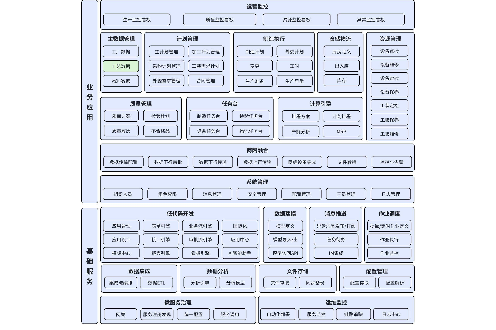
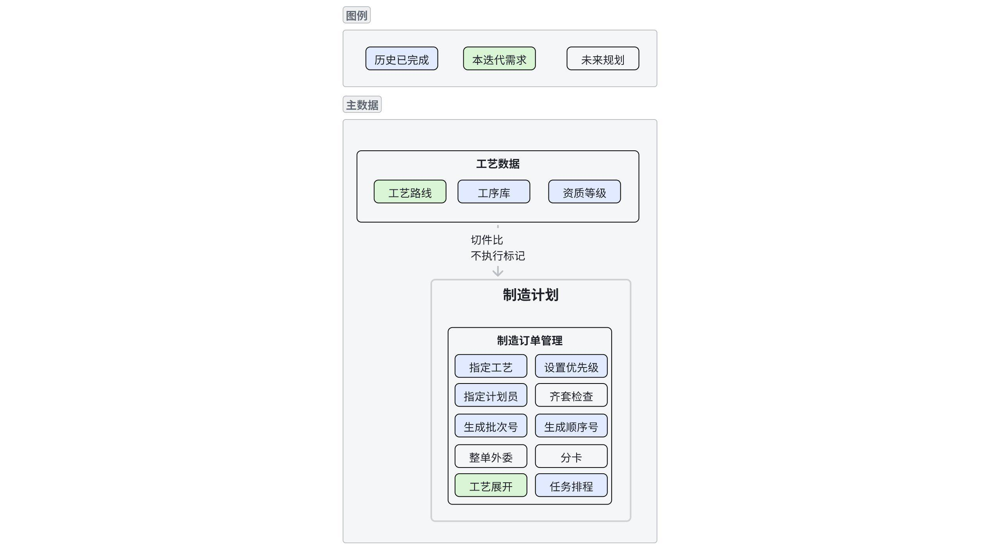

# DNW30115-工艺数据

# 1. **概述**

## 1.1 **原始需求**

**需求**

主数据是生产执行系统的核心数据，用于定义产品、工艺路线、工序等信息。

主数据的准确性直接影响生产计划的制定和执行。

主数据的管理包括创建、修改、删除等操作，确保数据的及时性和准确性。

**重点诉求**

数据准确、速度快、稳定性高、操作简单

**需求问题清单**

| 序号 | 问题描述 | 优先级 | $APPEALS |
|------|---------|--------|----------|
| P2-11 | 工艺路线详情中需增加工序列表，显示所有的工序信息 | P2 | E-易用性 |
| P2-12 | 工序序列和工序关系图要做合并 | P2 | E-易用性 |
| P2-13 | 是否需要新增工步？工步级责任追溯 | P2 | A-可获得性 |
| P1-9 | 工艺路线添加技术文档或者其他关联对象时，密级要小于等于主业务对象的密级 | P1 | S-社会接受 |

> 来源：《KMMOM产品标准化问题需求说明_宋珮处理_V1.0》

**痛点分析**

工艺路线是生产制造的核心依据，工艺工程师需要维护工艺路线，生产计划员需要频繁查看工序信息。当前存在以下问题：

1. **工艺路线不可编辑（P2-11、P2-12）**
   - 场景：工艺工程师需要在MOM中对工艺路线进行微调（如调整工序顺序、修改工时、添加工序等）
   - 问题：当前工艺路线只能从上游系统（PLM/CAPP）集成，不支持在MOM中编辑
   - 业务影响：工艺路线调整需要回到上游系统修改并重新集成，流程繁琐，响应速度慢

2. **工序关系展示不直观（P2-11、P2-12）**
   - 场景：工艺工程师和生产计划员需要查看工序之间的上下道关系
   - 问题：当前工序关系图和工序序列分开维护，且工序关系图操作复杂
   - 业务影响：查看工序关系需要在两个界面切换，效率低

3. **数据采集粒度不足（P2-13）**
   - 场景：车间操作工和质量人员在工序执行过程中
   - 问题：部分复杂工序（如装配工序）包含多个工步，需要记录每个工步的执行数据用于过程追溯

4. **关联对象密级控制缺失（P1-9）**
   - 场景：业务用户为工艺路线添加关联技术文档
   - 问题：主业务对象添加关联对象时，未校验关联对象的密级
   - 业务影响：低密级对象关联高密级对象，导致越权访问，存在信息泄露风险

## 1.2 **需求来源**

产品自主规划。

## 1.3 **术语及缩写解释**

|术语 | 缩写 | 说明|
|--- | --- | ---|
|工艺路线 | routing | 产品及零部件的加工方法及加工次序的信息。描述从原材料到成品的整个生产流程，工艺路线中包括有产品定义、工序号、工序名、工序资源、工作中心、工序内容、工序物料、工艺参数、加工时间、质量控制点、工艺文档等内容。工艺路线是MES系统中关键内容。 注：包括要进行的加工及其顺序、涉及的工作中心以及准备和加工所需的工时定额。某些情况下，工艺路线还包括工具、操作工技术水平、检验及测试的需求等。|
|工步 | step | 工序的细分单元，描述工序内部的具体作业步骤。一个工序可包含多个工步，常见于装配工艺。工步用于记录详细的执行过程，支持责任追溯。|

## 1.4 **参考文献**

- ISA-95 Part3 制造运营管理

- GB/T 20720.3-2020 企业控制系统集成

---

# 2. **需求描述**

## 2.1 **业务描述**

无

## 2.2 **功能描述**

### 2.2.1 **应用架构**

#### 2.2.1.1 **整体应用架构**

本次主要涉及工艺数据。

#### 2.2.1.2 **工艺数据应用架构**

工艺数据进一步细化展开到页面、业务功能一级

#### 2.2.1.3 **功能清单**

|应用 | 页面 | 功能 | 功能状态|
|--- | --- | --- | ---|
|主数据 | 工艺路线 | 工艺路线-导入 | 优化|
|主数据 | 工艺路线 | 工艺路线-编辑 | 新增|
|主数据 | 工艺路线 | 工序列表优化 | 优化|
|主数据 | 工艺路线 | 工步定义表 | 新增|
|主数据 | 工艺路线 | 工步报工 | 新增|
|主数据 | 通用 | 关联对象密级控制 | 新增|

# 3. **页面 & 功能设计**

## 3.4 **工艺路线**

### 3.4.1 **导入**

#### 1. 用户故事

作为工艺工程师，我希望可以通过导入功能批量导入工艺路线数据，这样可以快速完成工艺路线的初始化，提高数据录入效率。

#### 2. 界面原型描述

**设计思路与布局**

在工艺路线列表页面，点击"导入"按钮弹出导入窗口，选择需要导入的Excel文件。

**核心元素说明**

1. **文件选择**：选择Excel格式的工艺路线数据文件
2. **数据预览**：显示导入文件的数据预览
3. **导入按钮**：确认导入数据

#### 3. 业务规则

- BR-IMPORT-01: The 系统 shall 支持导入Excel格式的工艺路线数据
- BR-IMPORT-02: The 工作中心 shall 为必填项
- BR-IMPORT-03: The 产出比 shall 为正整数，默认为1
- BR-IMPORT-04: The 是否执行 shall 默认为"执行"
- BR-IMPORT-05: The 工序序列 shall 支持接续方式（ES、SSEE）
- BR-IMPORT-06: The 系统 shall 检查上传文件格式是否正确
- BR-IMPORT-07: The 系统 shall 校验数据完整性和格式
- BR-IMPORT-08: The 系统 shall 校验数据的唯一性，避免导入重复数据

#### 4. 验收场景

**场景1: 导入工艺路线数据**
- **Given** 用户准备好符合格式的Excel文件
- **When** 用户点击"导入"按钮，选择文件并确认导入
- **Then** 系统校验数据格式和完整性，校验通过后保存到数据库，工艺路线列表实时更新

**场景2: 导入数据格式错误**
- **Given** 用户选择的Excel文件格式不正确
- **When** 用户确认导入
- **Then** 系统提示"文件格式错误，请重新上传"

**场景3: 导入数据校验失败**
- **Given** 用户选择的Excel文件中工作中心为空
- **When** 用户确认导入
- **Then** 系统提示"工作中心不能为空"，并标识错误行

### 3.4.2 **编辑**

#### 1. 用户故事

作为工艺工程师，我希望在MOM中可以对工艺路线进行编辑（调整工序顺序、修改工时、添加/删除工序等），这样可以快速响应生产过程中的工艺调整需求，无需回到上游系统修改并重新集成。

#### 2. 界面原型描述

**设计思路与布局**

在工艺路线详情页增加编辑功能，支持工序的增删改和排序。

**核心元素说明**

1. **工序添加**：从工序库引入工序添加到工艺路线
2. **工序删除**：删除选中的工序
3. **工序排序**：通过拖拽或上移/下移按钮调整工序顺序
4. **工序编辑**：修改工序属性（工时、工作中心、物料等）
5. **上下道关系**：维护工序的上下道关系

#### 3. 业务规则

- BR-ROUTE-01: The 系统 shall 支持从工序库引入工序添加到工艺路线
- BR-ROUTE-02: The 系统 shall 支持删除工序
- BR-ROUTE-03: The 系统 shall 支持调整工序顺序（通过拖拽或上移/下移按钮）
- BR-ROUTE-04: The 系统 shall 支持修改工序属性（工时、工作中心、物料等）
- BR-ROUTE-05: The 系统 shall 支持维护工序的上下道关系
- BR-ROUTE-06: The 已发布的工艺路线 shall 不允许编辑
- BR-ROUTE-07: The 编辑操作 shall 需要权限控制，只有工艺工程师角色可以编辑
- BR-ROUTE-08: When 从工序库引入工序到工艺路线时, the 系统 shall 复制以下内容：加工报工方案（深拷贝）、质量方案（深拷贝，包含检验报工项）、人员资质（深拷贝）
- BR-ROUTE-09: The 复制后的报工方案和质量方案 shall 允许工艺路线级别独立修改，不影响工序库模板
- BR-ROUTE-10: The 工艺路线工序 shall 记录来源工序库，便于追溯

**引入逻辑说明**：

从工序库引入工序时，系统执行深拷贝操作，确保工艺路线数据独立：

| 配置项 | 操作 | 说明 |
|--------|------|------|
| 加工报工方案 | 深拷贝 | 复制方案及报工项明细 |
| 质量方案 | 深拷贝 | 复制方案及检验分类、检验报工项、检查项、质量报告模板 |
| 人员资质 | 深拷贝 | 复制资质关联关系 |

**为什么要深拷贝？**
- 工艺路线是实例化的工艺数据，需要支持差异化配置
- 工序库是模板，修改工序库不应影响已有工艺路线
- 复制后的配置可以独立修改，满足"同一工序在不同工艺路线中配置不同"的场景

详见《报工和质量方案设计》> 5. 工艺路线引入逻辑。

#### 4. 验收场景

**场景1: 添加工序**
- **Given** 用户打开工艺路线编辑界面
- **When** 用户点击"添加工序"，从工序库选择工序
- **Then** 系统将选中的工序添加到工艺路线末尾

**场景2: 调整工序顺序**
- **Given** 工艺路线包含多个工序
- **When** 用户拖拽工序到新位置
- **Then** 系统更新工序顺序

**场景3: 已发布工艺路线不可编辑**
- **Given** 工艺路线状态为"已发布"
- **When** 用户尝试编辑工艺路线
- **Then** 系统提示"已发布的工艺路线不允许编辑"

### 3.4.3 **工序列表优化**

#### 1. 用户故事

作为工艺工程师和生产计划员，我希望在工序列表中可以直观查看工序的上下道关系，并支持对工序进行排序，这样可以快速了解工艺流程，无需在工序关系图和工序序列之间切换。

#### 2. 界面原型描述

**设计思路与布局**

统一使用工序列表展示工序信息和上下道关系，去掉工序关系图和工序序列。

**核心元素说明**

1. **工序列表**：显示工序号、工序名称、工作中心、工时、上道工序、下道工序等
2. **排序方式**：支持按工序号排序（默认）和按工艺流程排序
3. **搜索过滤**：支持搜索和过滤

#### 3. 业务规则

- BR-ROUTE-08: The 工序列表 shall 显示工序号、工序名称、工作中心、工时、上道工序、下道工序等
- BR-ROUTE-09: The 系统 shall 支持按工序号排序（默认排序方式）
- BR-ROUTE-10: The 系统 shall 支持按工艺流程排序（按上下道关系自动排序）
- BR-ROUTE-11: The 系统 shall 去掉工序关系图和工序序列，统一使用工序列表

#### 4. 验收场景

**场景1: 查看工序上下道关系**
- **Given** 用户打开工艺路线详情
- **When** 用户查看工序列表
- **Then** 每个工序行显示上道工序和下道工序信息

**场景2: 按工艺流程排序**
- **Given** 工序列表默认按工序号排序
- **When** 用户切换为"按工艺流程排序"
- **Then** 系统按上下道关系自动排序，展示工艺执行顺序

### 3.4.4 **工步定义表**

#### 1. 用户故事

作为生产计划员，我希望在工艺路线中查看工步定义表，这样可以了解工序的详细作业步骤和要求。

#### 2. 界面原型描述

**设计思路与布局**

在工序详情中增加工步定义表，显示工步序号、工步名称、工步内容。

**核心元素说明**

1. **工步定义表**：挂在工序下，一个工序可以有多个工步
2. **字段定义**：工序号、工序名称、工步序号、工步名称、工步内容
3. **数据来源**：随工艺路线从上游系统集成，非必填，常见于装配工艺

#### 3. 业务规则

- BR-STEP-01: The 工步定义表 shall 挂在工序下，一个工序可以有多个工步
- BR-STEP-02: The 工步定义表 shall 随工艺路线从上游系统集成
- BR-STEP-03: The 工步定义表 shall 非必填，常见于装配工艺
- BR-STEP-04: The 工步 shall 不作为独立管理层级进行排产和报工

#### 4. 验收场景

**场景1: 查看工步定义表**
- **Given** 工序配置了工步定义表
- **When** 用户打开工序详情
- **Then** 系统显示工步定义表，包含工步序号、工步名称、工步内容

### 3.4.5 **工步报工**

#### 1. 用户故事

作为车间操作工或质量人员，我希望在任务报工时可以记录每个工步的执行人和执行时间，这样可以明确多人协同场景下的责任归属，便于后续追溯。

#### 2. 界面原型描述

**设计思路与布局**

在制造任务报工和检验任务报工界面增加工步报工区域。

**核心元素说明**

1. **工步列表**：显示工步定义（工步序号、工步名称、工步内容，来自定义表，只读）
2. **执行人**：必填，支持扫码选择或下拉选择
3. **执行时间**：系统自动记录（执行人选择后自动填充当前时间）
4. **备注**：选填，最多200字

#### 3. 业务规则

- BR-STEP-05: The 制造任务报工和检验任务报工 shall 都支持工步报工
- BR-STEP-06: The 工步行数 shall 由定义表决定，不允许增删
- BR-STEP-07: The 工步报工数据 shall 不参与工时统计（工时仍按工序级统计）
- BR-STEP-08: The 系统 shall 支持在制造任务详情和检验任务详情中查询工步报工记录

#### 4. 验收场景

**场景1: 制造任务工步报工**
- **Given** 制造任务对应的工序配置了工步定义表
- **When** 用户在制造任务报工界面填写工步报工
- **Then** 系统显示工步列表，用户可以为每个工步选择执行人，系统自动记录执行时间

**场景2: 查询工步报工记录**
- **Given** 制造任务已完成工步报工
- **When** 用户打开制造任务详情
- **Then** 系统显示工步报工记录，包含工步序号、工步名称、执行人、执行时间、备注

## 3.5 **关联对象密级控制**

#### 1. 用户故事

作为业务用户，我希望在添加关联对象时系统自动过滤高密级对象，这样可以确保不会因误操作导致信息泄露。

#### 2. 界面原型描述

**设计思路与布局**

在关联对象选择界面自动过滤高密级对象，并在尝试添加时给出提示。

**核心元素说明**

1. **自动过滤**：关联对象选择列表自动过滤高密级对象
2. **提示信息**：尝试添加高密级对象时给出明确提示
3. **后端校验**：保存时后端再次校验密级

#### 3. 业务规则

- BR-SECRET-01: The 关联对象选择列表 shall 自动过滤密级高于主业务对象的关联对象
- BR-SECRET-02: The 系统 shall 在尝试添加高密级对象时给出明确提示
- BR-SECRET-03: The 系统 shall 在保存时后端再次校验密级

#### 4. 验收场景

**场景1: 自动过滤高密级对象**
- **Given** 工艺路线密级为"秘密"
- **When** 用户添加关联技术文档
- **Then** 系统只显示密级为"秘密"或更低的技术文档，不显示"机密"级文档

**场景2: 尝试添加高密级对象**
- **Given** 工艺路线密级为"秘密"
- **When** 用户通过其他方式尝试添加"机密"级技术文档
- **Then** 系统提示"关联对象密级不能高于主业务对象密级"

# 4. **外部依赖**

本次功能对外部依赖的状态说明

| 产品 | 应用 | 功能 | 外部依赖说明 | 状态 |
|------|------|------|-------------|------|
| 报工和质量方案设计 | - | - | 全局设计文档，了解工序引入时的复制逻辑和设计原因 | 待开发 |
| DNW30120-工序库 | 工序库 | 工序库管理 | 工序库定义，包括加工报工方案、质量方案、人员资质 | 待开发 |
| DNW30300-计划管理 | 制造任务 | 报工 | 报工方案使用规则 | 待开发 |
| KMView | - | - | 文件浏览时调用KMView打开图纸文件 | KMView已发布 |

---

# 5. **变更记录**

| 日期 | 版本 | 变更内容 | 变更人 |
|------|------|---------|--------|
| 2025-01-07 | v1.1 | 新增工艺路线编辑（3.4.2）、工序列表优化（3.4.3）、工步定义表（3.4.4）、工步报工（3.4.5）、关联对象密级控制（3.5） | - |
