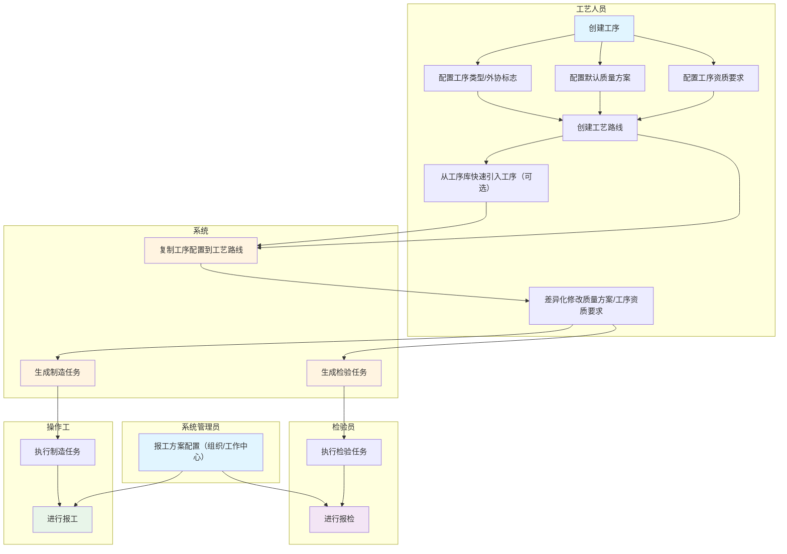
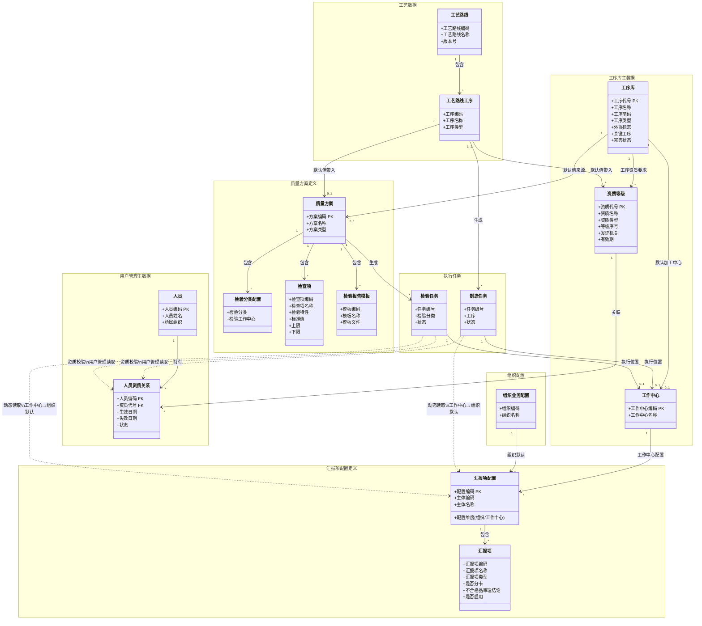
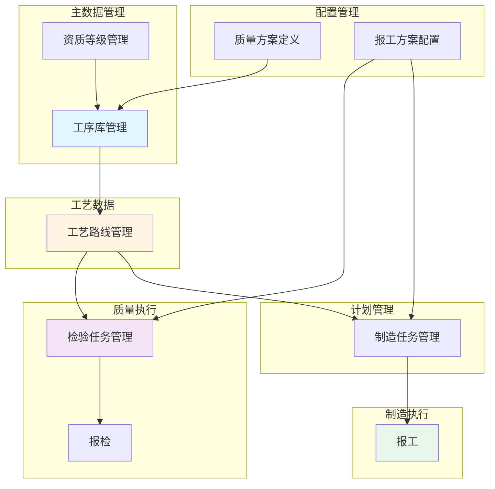

# DNW30120-工序库

## 1. 概述

### 1.1 业务背景与挑战

#### 问题来源

| 提出人 | 原始问题 | 结论 |
|-------|---------|------|
| 杨亚菲/杨军 | 工厂组织的专业类型字段有问题，不应该放到组织上标识。一个工厂或车间实际存在多专业，专业的区分标识只能在工序上 | 专业类型应在工序上标识，而非组织 |
| 陈少平 | 汇报项以前是和工序关联，现在移到工作中心关联，有什么好处？真正驱动汇报项不同的原因是什么？ | 保持组织+工作中心模型，通过"报工方案配置"统一管理并实现复用 |
| 程博 | 工艺路线下的所有工序都要配置工作中心，检验工作中心在哪里配置比较合适？ | 检验工作中心放在质量方案中的检验分类配置 |

#### 核心挑战

**挑战1：专业类型标识位置不当**
- 问题：专业类型放在组织上，无法准确描述"同一车间内不同专业工序"的场景
- 影响：组织结构调整时，专业类型配置需要同步变更，维护成本高

**挑战2：报工方案配置入口分散**
- 问题：组织默认与工作中心方案缺少统一配置入口，维护时易出现漏配和口径不一致
- 影响：执行端匹配不稳定，方案治理成本高

**挑战3：缺乏统一的工序基础数据管理**
- 问题：工序定义分散，工艺路线编制时需要重复配置
- 影响：配置重复性高，维护成本高

**挑战4：汇报项配置不灵活**
- 问题：不同执行场景的汇报项差异大，缺乏统一配置入口，导致执行时数据采集不一致
- 影响：报工数据质量低，无法支持差异化报工需求

**挑战5：制造报工与检验报检混淆**
- 问题：加工和检验是两个独立的业务活动，执行主体不同（操作工 vs 检验员），汇报内容不同，缺乏分离管理机制
- 影响：界面复杂，操作工和检验员职责不清晰

### 1.2 价值主张

建立统一的**工序库**，作为工艺数据的核心基础对象，重点承载工序定义与工艺复用；报工配置采用组织+工作中心模型，直接维护汇报项：

- **统一管理**：工序库由工艺部门统一定义，支持跨组织共享，作为工艺路线编制的可选快速引入源；报工配置在“组织+工作中心”统一入口维护
- **高效复用**：工艺路线可从工序库快速引入工序并带入默认配置（质量方案、工序资质要求）；报工/报检执行按工作中心优先匹配汇报项，减少重复维护
- **灵活配置**：工艺路线工序可差异化修改质量方案和工序资质要求，不影响工序库和其他工艺路线；组织级默认汇报项提供兜底
- **职责清晰**：汇报项统一定义“结果怎么报”，质量方案定义“质量数据怎么采集和检验”，两者边界清晰
- **配置效率提升**：报工方案配置页面统一承载组织与工作中心两层配置，直接维护汇报项，提升维护效率与一致性

### 1.3 术语及缩写解释

| 术语 | 缩写 | 解释说明 |
|------|------|----------|
| 工序库 | - | 工序的模板库，定义工序默认配置（工序基础信息、默认加工中心、质量方案、工序资质要求等），用于工艺路线快速引入 |
| 工艺路线 | - | 工序的实例化，从工序库引入工序后可进行差异化配置 |
| 工艺路线工序 | - | 工艺路线中的工序实例，从工序库复制而来，允许差异化修改 |
| 报工方案配置 | - | 在组织与工作中心维度维护汇报项的配置入口，配置层级为工作中心>组织默认 |
| 汇报项 | - | 报工/报检时可选的汇报类型，如合格、报废、待定、返修等 |
| 汇报项类型 | - | 汇报项的分类，决定数量统计归类（合格/报废/待定） |
| 是否分卡 | - | 是否支持分卡报工（一个任务拆分为多个批次报工） |
| 不合格品审理结论 | - | 当汇报项类型=待定时，创建不合格品审理单时自动带上的审理结论 |
| 质量方案 | - | 定义工序质量要求的配置对象，包含检查项、质量报告模板（工序固有，自检/互检/专检共用）和检验分类配置（用于生成检验任务），详见《DNW30300-质量方案》文档 |
| 工序类型 | - | 工序的专业分类，如机加、装配、焊接、热处理、表面处理、检验等，与上游PLM/CAPP系统对齐 |
| 外协标志 | - | 标识工序是否由外协商执行，任意工序类型都可标记为外协 |
| 深拷贝 | - | 复制对象及其所有子对象，复制后的对象与原对象完全独立 |
| 资质类型 | - | 资质的分类枚举，如焊工、电工、数控操作、无损检测、理化检验等，同一资质类型下的等级可比较大小 |
| 资质等级 | - | 具体的资质定义，包含资质类型和等级序号，如初级焊工、中级焊工、高级焊工、初级无损检测、高级无损检测等 |
| 工序资质要求 | - | 执行该工序所需的资质等级列表，直接配置在工序库上，制造派工和检验派工共用同一套资质要求 |
| 人员 | - | 执行制造任务或检验任务的人员主数据，维护入口在用户管理界面 |
| 人员资质关系 | - | 人员与资质等级的关联关系（含有效期与状态），维护入口在用户管理界面，供派工/报工/报检资质校验读取 |
| 制造任务 | - | 由工序生成的生产任务，按工作中心>组织默认匹配汇报项后执行报工 |
| 检验任务 | - | 由质量方案生成的检验任务，按工作中心>组织默认匹配汇报项后执行报检 |

### 1.4 参考文献

| 文献名称 | 作者 | 出版单位 | 日期 |
|---------|------|----------|------|
| DNW30300-质量方案 | - | 内部文档 | 2026-01-08 |
| DNW30120-工艺数据 | - | 内部文档 | 2025-12-20 |
| DNW30300-计划管理 | - | 内部文档 | 2025-12-25 |
| DNW30050-配置管理_V2 | - | 内部文档 | 2025-12-28 |

---

## 2. 需求描述

### 2.1 业务流程

#### 2.1.1 流程图



#### 2.1.2 工序库概述

工序库由**工艺部门统一定义**，支持**跨组织共享**，在本方案中定位为工艺路线编制时的**可选快速引入源**。汇报项配置不在工序库维护，保持组织+工作中心模型。

##### 核心要素

```
工序库
│
├─ 工序基本信息
│  ├─ 工序代号 ─────── 唯一标识
│  ├─ 工序名称 ─────── 工序名称
│  ├─ 工序简码 ─────── 用于拼接工艺路线字串
│  ├─ 工序类型 ─────── 机加/装配/焊接/热处理/表面处理/检验...（专业分类，可扩展）
│  ├─ 外协标志 ─────── 是否外协（任意工序类型都可外协）
│  ├─ 关键工序 ─────── 是否关键工序
│  └─ 默认加工中心（1:1）── 工艺路线引入时带入默认值
│
├─ 默认质量方案（1:1）───── 工艺路线引入时带入默认值，允许差异化修改
│  ├─ 检查项、质量报告模板 ── 工序固有，自检/互检/专检共用
│  └─ 检验分类配置 ─────── 用于生成检验任务（专检等）
│
└─ 工序资质要求（1:N）───── 执行该工序所需的资质等级，制造派工和检验派工共用
```

**补充说明**：报工方案配置页面直接维护“汇报项”，按组织与工作中心两层配置，运行时优先级为**工作中心 > 组织默认**。

#### 2.1.3 工序库定位与方案配置模型

##### 方案类型与配置模型

不同方案类型采用差异化配置模型：

| 配置项 | 配置模型 | 运行时匹配 | 与工序库关系 |
|---------|-----------|-----------|------|
| 汇报项配置 | 在组织/工作中心直接维护汇报项 | 工作中心 > 组织默认 | 工序库不承载该配置 |
| 质量方案 | 工序库默认值 + 工艺路线差异化修改 | 工艺路线工序 > 物料 > 组织默认 | 从工序库引入时深拷贝 |

##### 报工方案配置说明

报工方案配置采用**工作中心优先模式**，运行时按优先级查找：

```
制造任务报工/检验任务报检时：
1. 查找任务关联工作中心上的汇报项配置
2. 如果没有，使用组织默认汇报项配置
```

**说明**：
- 汇报项定义"结果怎么报"：操作工/检验员完成任务后，选择汇报项（合格/报废/待定等）并填写数量
- 所有配置的汇报项均为"或"关系，执行人员选择其中一项提交
- 外协工序同样按执行工作中心匹配汇报项配置
- 汇报项配置不支持工艺路线工序级配置

##### 资质校验逻辑

工序资质要求直接配置在工序库上，制造派工和检验派工共用同一套资质要求；人员资质关系在用户管理界面维护，本模块运行时只读取并校验：

```
派工/报工/报检时：
1. 读取工序库上的工序资质要求列表
2. 读取用户管理中人员资质关系（仅有效状态且在有效期内）
3. 校验人员是否同时具备所有要求的资质（且关系）
4. 不符合要求的人员灰显禁选
5. 预留二开干预入口，允许特定角色解除限制
```

**说明**：人员资质关系的新增、编辑、失效在用户管理界面完成，工序库与执行界面不提供维护入口。

##### 质量方案的双重使用场景

质量方案同时服务于检验任务和制造任务：

| 使用场景 | 任务类型 | 使用的质量方案要素 |
|---------|---------|------------------|
| 制造任务自检/互检 | 制造任务 | 检查项、质量报告模板（工序固有） |
| 检验任务（专检/首检等） | 检验任务 | 检验分类配置、检查项、质量报告模板 |

**说明**：
- 检查项和质量报告模板是工序固有的质量要求，自检/互检/专检共用同一套配置
- 工序资质要求统一配置在工序库上，不再区分加工资质和检验资质
- 质量方案的完整设计详见《DNW30300-质量方案》文档

##### 工艺路线引入工序时的复制逻辑

```
从工序库引入工序到工艺路线：
1. 复制工序基本信息（工序编码、工序名称、工序类型等）
2. 复制默认质量方案引用（深拷贝，允许差异化修改）
3. 复制默认加工中心引用
4. 复制工序资质要求（深拷贝，允许差异化修改）
注意：汇报项配置不在工序库维护，引入工序时不涉及汇报项配置复制
```

**说明**：复制后的工艺路线工序配置与工序库完全独立，修改工艺路线工序不影响工序库，修改工序库也不影响已引入的工艺路线工序。

##### 导入工艺路线时的工序库可选关联规则

工艺路线工序可选择关联工序库记录（非强制）。从PLM/CAPP导入工艺路线时：

```
导入处理逻辑：
1. 按工序编码在工序库中查找对应记录
2. 若找到，可选择关联并深拷贝默认配置（质量方案、默认加工中心、工序资质要求）
3. 若未找到，允许继续导入，不自动创建工序库记录
4. 导入完成后可按需补建工序库标准记录，供后续快速引入复用
```

**说明**：工序库为可选标准源，不作为导入成功的前置条件。已导入工艺路线可独立运行，后续是否补建工序库由工艺治理策略决定。

### 2.2 业务数据模型

#### 2.2.1 业务对象关系图



**图例说明**：
- 实线箭头（`-->`）：静态配置关系，在配置阶段建立
- 虚线箭头（`..>`）：运行时动态读取关系，按优先级匹配（工作中心 > 组织默认）

**说明**：
- 汇报项配置按“工作中心配置 + 组织默认”两层管理，运行时匹配优先级为工作中心 > 组织默认
- 组织业务配置提供组织级默认汇报项配置，作为工作中心未配置时的兜底
- 质量方案的完整定义详见《DNW30300-质量方案》文档，工艺路线引入工序时自动带入，允许差异化修改
- 质量方案同时服务于检验任务（专检/首检等）和制造任务（自检/互检），检查项和质量报告模板是工序固有的，自检/互检/专检共用
- 工序资质要求直接配置在工序库上，制造派工和检验派工共用同一套资质要求
- 人员资质关系由用户管理维护，制造/质量执行按“用户管理人员资质关系 + 工序资质要求”进行实时校验

#### 2.2.2 业务属性

**汇报项配置业务属性**

| 字段名 | 业务类型 | 业务约束 | 业务说明 |
|--------|----------|----------|----------|
| 配置编码 | 文本标识 | 唯一，必填 | 汇报项配置记录的唯一业务标识 |
| 配置维度 | 枚举值 | 必填，组织/工作中心 | 表示配置属于组织或工作中心 |
| 主体编码 | 引用对象 | 必填，引用组织或工作中心 | 配置生效主体 |
| 主体名称 | 文本 | 必填 | 配置生效主体名称 |
| 生效状态 | 枚举值 | 必填，启用/停用 | 停用后不参与匹配 |
| 匹配优先级 | 固定规则 | 工作中心 > 组织默认 | 运行时按该顺序读取 |

**汇报项业务属性**

| 字段名 | 业务类型 | 业务约束 | 业务说明 |
|--------|----------|----------|----------|
| 汇报项编码 | 文本标识 | 必填，同一配置内唯一 | 汇报项业务编码 |
| 汇报项名称 | 文本 | 必填，最大长度50字符 | 汇报项名称，如：合格数量、报废数量、待定数量 |
| 汇报项类型 | 枚举值 | 必填，合格/报废/待定 | 决定数量统计归类 |
| 是否分卡 | 布尔值 | 必填，默认否 | 是否支持分卡报工/报检 |
| 不合格品审理结论 | 文本 | 条件必填，最大长度200字符 | 当汇报项类型=待定时必填 |
| 是否启用 | 枚举值 | 必填，启用/停用 | 控制执行端可选性 |

**工序库业务属性**

| 字段名 | 业务类型 | 业务约束 | 业务说明 |
|--------|----------|----------|----------|
| 工序代号 | 文本标识 | 唯一，必填 | 工序的唯一业务标识 |
| 工序名称 | 文本 | 必填，最大长度100字符 | 工序的名称 |
| 所属组织 | 引用对象 | 可选，引用组织主数据 | 为空=全局共享，有值=本组织专用 |
| 工序简码 | 文本 | 可选，最大长度20字符 | 用于拼接工艺路线字串 |
| 工序类型 | 枚举值 | 必填，机加/装配/焊接/热处理/表面处理/检验/钳工/电装...（可扩展） | 工序的专业分类，与上游PLM/CAPP对齐 |
| 外协标志 | 布尔值 | 必填，默认否 | 是否外协执行，任意工序类型都可标记为外协 |
| 关键工序 | 布尔值 | 必填，默认否 | 是否关键工序 |
| 默认加工中心 | 引用对象 | 可选，引用工作中心 | 工序的默认加工中心，工艺路线引入时带入 |
| 默认质量方案 | 引用对象 | 可选，引用质量方案 | 默认质量方案，工艺路线引入时带入 |
| 工序资质要求 | 引用对象列表 | 可选，引用资质等级（1:N） | 执行该工序所需的资质等级，制造派工和检验派工共用，所有资质为"且"关系 |
| 完善状态 | 枚举值 | 系统自动维护，正常/待完善（可选） | 用于标识工序库标准信息的完善程度 |

**报工方案配置页业务属性**

| 字段名 | 业务类型 | 业务约束 | 业务说明 |
|--------|----------|----------|----------|
| 配置主体 | 引用对象 | 必填，组织或工作中心 | 方案生效的业务主体 |
| 汇报项列表 | 子表 | 必填，至少1条合格项 | 配置主体下可用的汇报项 |
| 生效状态 | 枚举值 | 必填，启用/停用 | 停用后不参与匹配 |
| 匹配优先级 | 固定规则 | 工作中心 > 组织默认 | 运行时按该顺序读取 |

**说明**：
- 工序类型采用专业分类（机加、焊接、检验等），与上游PLM/CAPP系统数据模型对齐，便于集成
- 外协标志独立于工序类型，任意专业的工序都可标记为外协（如外协热处理、外协电镀）
- 工艺路线引入工序时，自动带入默认配置（加工中心、质量方案、工序资质要求），允许差异化修改
- 深拷贝后的工艺路线工序与工序库完全独立，工序库更新不影响已引入的工艺路线工序
- 工序资质要求统一管理加工和检验资质，不再区分加工资质和检验资质
- 汇报项不再作为独立对象管理，由报工方案配置页面在组织与工作中心维度直接维护

**资质等级业务属性**

| 字段名 | 业务类型 | 业务约束 | 业务说明 |
|--------|----------|----------|----------|
| 资质代号 | 文本标识 | 唯一，必填 | 资质的唯一业务标识 |
| 资质名称 | 文本 | 必填，最大长度100字符 | 资质的名称，如：初级焊工、中级焊工、高级焊工、初级无损检测、高级无损检测 |
| 资质类型 | 枚举值 | 必填，焊工/电工/数控操作/无损检测/理化检验/... | 资质的分类，同一资质类型下的等级可比较大小 |
| 等级序号 | 整数 | 必填，≥1 | 同一资质类型内的等级大小，数值越大等级越高（如：初级=1，中级=2，高级=3） |
| 发证机关 | 文本 | 可选，最大长度100字符 | 颁发资质证书的机关 |
| 有效期 | 日期 | 可选 | 资质证书的有效期限 |

**资质等级设计说明**：
- 资质类型是枚举属性，用于对资质进行分类（如：焊工、电工、数控操作、无损检测、理化检验等）
- 等级序号用于表示同一资质类型内的等级高低，支持派工/报工/报检时的资质校验逻辑（如：要求中级焊工，则高级焊工也满足条件）
- 资质等级统一配置在工序库的"工序资质要求"中，制造派工和检验派工共用同一套资质要求

**人员资质关系业务属性（用户管理维护）**

| 字段名 | 业务类型 | 业务约束 | 业务说明 |
|--------|----------|----------|----------|
| 人员编码 | 引用对象 | 必填，引用人员主数据 | 资质所属人员 |
| 资质代号 | 引用对象 | 必填，引用资质等级 | 人员持有的资质等级 |
| 生效日期 | 日期 | 必填 | 资质关系生效日期 |
| 失效日期 | 日期 | 可选，空表示长期有效 | 资质关系失效日期 |
| 状态 | 枚举值 | 必填，有效/失效 | 仅“有效”状态参与校验 |

**说明**：
- 人员资质关系在用户管理界面维护，本模块不提供维护入口
- 派工/报工/报检仅读取“状态=有效且当前日期在有效期内”的关系记录

**工艺路线工序业务属性**

工艺路线工序从工序库深拷贝而来，仅复制质量方案和工序资质要求，允许差异化修改。

| 字段名 | 业务类型 | 业务约束 | 业务说明 |
|--------|----------|----------|----------|
| 工序代号 | 文本标识 | 必填 | 从工序库复制，不可修改 |
| 工序名称 | 文本 | 必填 | 从工序库复制，允许修改 |
| 工序简码 | 文本 | 可选 | 从工序库复制，允许修改 |
| 工序类型 | 枚举值 | 必填 | 从工序库复制，允许修改 |
| 外协标志 | 布尔值 | 必填 | 从工序库复制，允许修改 |
| 关键工序 | 布尔值 | 必填 | 从工序库复制，允许修改 |
| 加工中心 | 引用对象 | 可选 | 从工序库复制默认加工中心，允许修改 |
| 质量方案 | 引用对象 | 可选 | 从工序库深拷贝，允许差异化修改 |
| 工序资质要求 | 引用对象列表 | 可选 | 从工序库深拷贝，允许差异化修改，制造派工和检验派工共用 |

**说明**：
- 汇报项配置不在工艺路线工序维护，执行时按“工作中心 > 组织默认”动态匹配
- 工艺路线工序与工序库完全独立，修改工艺路线工序不影响工序库
- 工序库更新后，已引入的工艺路线工序不会自动同步，只影响后续新引入的工序
- 质量方案深拷贝后，其内部的检查项、检验分类等配置都可独立修改

### 2.3 应用架构



### 2.4 功能清单

| 序号 | 业务域 | 功能页面 | 需求名称 | 需求描述 | 备注 |
|------|--------|---------|---------|---------|------|
| 1 | 主数据管理 | 工序库 | 工序库管理 | **用户故事**：作为工艺人员，我希望统一管理工序基础数据（工序类型、外协标志、默认加工中心、默认质量方案、工序资质要求），并在编制工艺路线时可选从工序库快速引入，以便降低重复维护成本。<br/><br/>**验收标准**：<br/>- When 工艺人员需要定义工序基础数据时, the 工序库管理模块 shall 提供工序的新增、编辑、删除、查询、导入、导出功能<br/>- The 工序库管理模块 shall 支持按工序代号、工序名称、工序类型、所属组织、完善状态等条件查询和筛选<br/>- The 工序库 shall 由工艺部门统一定义，支持跨组织共享，作为工艺路线编制的可选快速引入源<br/>- When 工艺人员编辑工序时, the 工序库管理模块 shall 支持配置默认加工中心、默认质量方案（1:1）和工序资质要求（1:N）<br/>- The 汇报项配置 shall 不在工序库维护<br/>- When 从PLM/CAPP导入工艺路线时, the 工艺数据模块 shall 允许在工序库未命中时继续导入，不以工序库存在为前置条件 | 核心 |
| 2 | 主数据管理 | 资质等级 | 资质等级管理 | **用户故事**：作为管理人员，我希望统一管理资质等级定义，以便资质等级可被工序库的工序资质要求引用，并支持同一资质类型内的等级比较。<br/><br/>**验收标准**：<br/>- When 管理人员需要定义资质等级时, the 资质等级管理模块 shall 提供资质等级的新增、编辑、删除、查询、导入、导出功能<br/>- The 资质等级管理模块 shall 支持按资质代号、资质名称、资质类型等条件查询和筛选<br/>- The 资质等级管理模块 shall 提供Excel模板下载和批量导入功能<br/>- When 管理人员删除资质等级时, the 资质等级管理模块 shall 校验是否被工序库引用，已被引用则阻止删除<br/>- The 资质等级 shall 包含：资质代号、资质名称、资质类型（枚举）、等级序号、发证机关、有效期<br/>- The 资质类型 shall 为下拉枚举，用于对资质进行分类（如：焊工、电工、数控操作、无损检测、理化检验等）<br/>- The 等级序号 shall 用于表示同一资质类型内的等级高低，数值越大等级越高<br/>- The 查询结果 shall 支持按资质类型分组展示，同一资质类型内按等级序号升序排列 | 核心 |
| 3 | 配置管理 | 报工方案配置 | 报工方案配置 | **用户故事**：作为系统管理员，我希望在统一入口直接维护组织与工作中心的汇报项配置，以便取消独立方案对象后仍能高效治理报工/报检口径。<br/><br/>**验收标准**：<br/>- The 报工方案配置页面 shall 提供“组织”“工作中心”两个标签页<br/>- The 组织标签页 shall 支持选择组织并直接维护汇报项列表（新增、批量编辑、批量删除）<br/>- The 工作中心标签页 shall 支持选择工作中心并直接维护汇报项列表（新增、批量编辑、批量删除）<br/>- The 汇报项列表 shall 包含：汇报项名称、汇报项编码、汇报项类型、是否分卡、不合格品审理结论、是否启用<br/>- The 配置管理模块 shall 确保每个配置主体至少存在1条“合格”类型且启用的汇报项<br/>- When 汇报项类型=待定时, the 配置管理模块 shall 要求填写不合格品审理结论<br/>- When 执行端匹配汇报项时, the 执行模块 shall 按优先级查找：工作中心 > 组织默认 | 核心 |
| 4 | 工艺数据 | 工艺路线管理 | 引入工序 | **用户故事**：作为工艺人员，我希望能够从工序库引入工序到工艺路线（可选），以便复用工序配置，降低配置成本。<br/><br/>**验收标准**：<br/>- When 工艺人员从工序库引入工序时, the 工艺数据模块 shall 深拷贝工序的默认质量方案和工序资质要求到工艺路线工序<br/>- The 工艺数据模块 shall 确保深拷贝后的工艺路线工序配置与工序库完全独立<br/>- If 工序库未命中对应工序, then the 工艺数据模块 shall 允许继续导入或编制，不强制自动创建工序库记录 | 核心 |
| 5 | 制造执行 | 制造任务管理 | 报工 | **用户故事**：作为操作工，我希望能够选择汇报项并填写数量提交报工，以便记录加工结果，快速完成报工操作。<br/><br/>**验收标准**：<br/>- When 操作工打开报工界面时（管理平台或车间工作台）, the 制造执行模块 shall 根据制造任务关联工作中心动态读取汇报项配置：优先读取工作中心配置，若未配置则使用组织默认配置<br/>- When 操作工提交报工时, the 制造执行模块 shall 根据汇报项类型累计到对应的数量字段（合格数量/报废数量/待定数量）<br/>- When 汇报项类型=待定时, the 制造执行模块 shall 自动创建不合格品审理单 | 核心 |
| 6 | 制造执行 | 制造任务管理 | 派工 | **用户故事**：作为计划员，我希望在派工时能够看到人员的资质匹配状态，以便选择具备资质的人员，提升加工质量。<br/><br/>**验收标准**：<br/>- When 计划员打开派工界面时（管理平台或车间工作台）, the 制造执行模块 shall 读取工序库上的工序资质要求<br/>- The 制造执行模块 shall 校验可派工人员是否同时具备所有要求的资质（且关系）<br/>- The 派工界面 shall 对不符合资质要求的人员灰显且禁止选择<br/>- The 派工界面 shall 在顶部显示当前工序的资质要求列表<br/>- The 派工界面 shall 预留二开干预入口，允许特定角色（如班组长）解除灰显限制并选择任意人员，选择后记录操作人和原因 | 核心 |
| 7 | 质量执行 | 检验任务管理 | 报检 | **用户故事**：作为检验员，我希望选择汇报项并填写数量提交报检，以便记录检验结果，快速完成报检操作。<br/><br/>**验收标准**：<br/>- When 检验员打开报检界面时, the 质量执行模块 shall 动态获取汇报项配置：按优先级查找工作中心配置，若未配置则使用组织默认配置<br/>- The 质量执行模块 shall 实时校验报检数量的有效性（大于0，不超过待检数量）<br/>- When 检验员提交报检时, the 质量执行模块 shall 根据汇报项类型累计到对应的数量字段（合格数量/报废数量/待定数量）<br/>- When 汇报项类型=待定时, the 质量执行模块 shall 自动创建不合格品审理单 | 核心 |
| 8 | 质量执行 | 检验任务管理 | 检验派工 | **用户故事**：作为派工员，我希望在派工界面看到检验员的资质匹配情况，以便选择具备资质的检验员。<br/><br/>**验收标准**：<br/>- When 派工员打开派工界面选择检验员时, the 质量执行模块 shall 读取工序库上的工序资质要求<br/>- The 质量执行模块 shall 校验检验员是否具备所有要求的资质（且关系）<br/>- The 派工界面 shall 对不符合资质要求的检验员灰显且禁止选择<br/>- The 派工界面 shall 在顶部显示当前工序的资质要求列表<br/>- The 派工界面 shall 预留二开干预入口，允许特定角色解除灰显限制并选择任意检验员，选择后记录操作人和原因 | 核心 |
| 9 | 用户管理 | 人员资质关系 | 人员资质关系管理 | **用户故事**：作为系统管理员，我希望在用户管理界面维护人员资质关系，以便制造派工、检验派工、报工、报检能够基于有效资质进行校验。<br/><br/>**验收标准**：<br/>- The 用户管理模块 shall 提供人员资质关系的新增、编辑、失效、查询和导入能力<br/>- The 人员资质关系 shall 包含：人员、资质等级、生效日期、失效日期、状态<br/>- When 制造执行或质量执行进行资质校验时, the 执行模块 shall 仅读取状态=有效且在有效期内的人员资质关系<br/>- If 人员不存在满足条件的资质关系, then the 执行模块 shall 判定资质不满足并执行灰显禁选/禁用提交逻辑 | 核心 |

---

## 3. 界面方案设计

### 3.1 工序库管理界面

**界面类型**：标准CRUD界面

**功能说明**：
- 工序库列表：支持按工序代号、工序名称、工序类型、所属组织等条件查询和筛选
- 工序新增/编辑：表单录入工序基本信息、工序类型、外协标志、默认加工中心、默认质量方案、工序资质要求等
- 工序删除：校验是否被工艺路线引用，已被引用则阻止删除

**界面要点**：
- 工序类型下拉选择，支持扩展新的专业类型
- 外协标志独立于工序类型，任意工序类型都可标记为外协
- 质量方案通过下拉选择引用已定义方案对象
- 工序资质要求支持多选资质等级，制造派工和检验派工共用
- 所属组织为空表示全局共享，有值表示本组织专用
- 工序库作为可选标准源，工艺路线编制时可选择快速引入

### 3.2 资质等级管理界面

**界面类型**：标准CRUD界面

**功能说明**：
- 资质等级列表：支持按资质代号、资质名称、资质类型等条件查询和筛选
- 资质等级新增/编辑：表单录入资质代号、资质名称、资质类型、等级序号、发证机关、有效期等
- 资质等级删除：校验是否被工序资质要求或质量方案引用，已被引用则阻止删除

**界面要点**：
- 资质类型下拉选择，支持扩展新的资质类型（焊工、电工、数控操作、无损检测、理化检验等）
- 等级序号用于表示同一资质类型内的等级高低，数值越大等级越高
- 同一资质类型下的资质等级按等级序号升序排列展示

### 3.3 报工方案配置界面

**界面类型**：标准CRUD界面

**功能说明**：
- 页面提供两个标签页：`组织`、`工作中心`
- 组织标签页：选择组织后，直接维护该组织的汇报项列表
- 工作中心标签页：选择工作中心后，直接维护该工作中心的汇报项列表
- 支持`新增`、`批量编辑`、`批量删除`、行内`编辑/删除`

**界面要点**：
- 左侧显示组织树或工作中心列表，支持搜索与引入
- 右侧维护汇报项明细（序号、汇报项名称、汇报项编码、汇报项类型、是否分卡、不合格审理结论、是否启用、操作）
- 汇报项类型=待定时，不合格品审理结论为必填
- 每个配置主体至少保留1条“合格”类型且启用的汇报项
- 执行匹配优先级固定为：工作中心 > 组织默认

### 3.4 制造派工界面设计

**设计原则**：不符合工序资质要求的人员灰显禁选，预留二开干预入口。

**界面要点**：
- 界面顶部显示当前工序的资质要求列表
- 资质匹配结果基于用户管理维护的人员资质关系实时计算
- 人员列表中，不符合工序资质要求的人员灰显且不可选
- 预留二开干预入口：通过配置项允许特定角色（如班组长）解除灰显限制，选择任意人员，选择后记录操作人和原因

### 3.5 报工界面设计

**设计原则**：报工时校验当前操作工是否符合工序资质要求，不符合则禁止报工并给出提示，预留二开干预入口。

**界面要点**：
- 报工时读取工序库上的工序资质要求
- 报工时同步读取用户管理中的人员资质关系，仅有效关系参与校验
- 不符合要求时，报工按钮禁用并显示提示："您不具备该工序所需资质，请联系班组长处理"
- 预留二开干预入口：允许特定角色授权后解除限制，授权操作记录留存

### 3.6 检验派工界面设计

**设计原则**：不符合工序资质要求的检验员灰显禁选，预留二开干预入口。

**界面要点**：
- 界面顶部显示当前工序的资质要求列表
- 资质匹配结果基于用户管理维护的人员资质关系实时计算
- 检验员列表中，不符合工序资质要求的检验员灰显且不可选
- 预留二开干预入口：通过配置项允许特定角色解除灰显限制，选择任意检验员，选择后记录操作人和原因

### 3.7 报检界面设计

**设计原则**：报检时校验当前检验员是否符合工序资质要求，不符合则禁止报检并给出提示，预留二开干预入口。

**界面要点**：
- 报检时读取工序库上的工序资质要求
- 报检时同步读取用户管理中的人员资质关系，仅有效关系参与校验
- 不符合要求时，报检按钮禁用并显示提示："您不具备该工序所需资质，请联系主管处理"
- 预留二开干预入口：允许特定角色授权后解除限制，授权操作记录留存

---

## 4. 附录

### 4.1 核心设计决策

| 决策点 | 方案 | 理由 | 问题来源 |
|--------|------|------|----------|
| 工序类型定义 | 采用专业分类（机加/焊接/检验等），外协标志独立 | 与上游PLM/CAPP对齐，任意专业都可外协 | 行业标准分析，详见4.3 |
| 汇报项关联对象 | 保持工作中心关联 | 执行入口与配置入口一致，便于按现场执行单元统一治理 | 陈少平：关注汇报项差异驱动因素 |
| 汇报项配置对象形态 | 不设独立方案对象 | 直接在组织和工作中心维护汇报项，减少对象数量和维护链路 | 统一配置入口诉求 |
| 报工 vs 报检 | 共用汇报项配置模型 | 两类执行共用同一汇报项结构，减少重复配置，同时保留执行角色与流程分离 | 加工和检验是两个独立的业务活动 |
| 资质配置位置 | 统一配置在工序库的工序资质要求中 | 制造派工和检验派工共用同一套资质要求，配置简单，职责清晰 | 资质是工序固有属性，与执行方式无关 |
| 工序库定位 | 可选快速引入源 | 工序库仅承载工艺标准信息；汇报项配置不在工序库配置 | 与现网模型保持一致 |
| 方案匹配优先级 | 工作中心 > 组织默认 | 保持现有组织+工作中心模型，执行逻辑稳定且可解释 | 方案治理一致性要求 |
| 引入时引用 vs 复制 | 深拷贝（质量方案和工序资质要求） | 支持差异化修改，工序库更新不影响已引入的工艺路线工序 | 工艺路线A和B对同一工序有不同的配置要求 |
| 组织属性设计 | 可选（为空=全局共享，有值=本组织专用） | 支持集团统一管控+工厂特有工序的混合模式 | 详见4.2.8 |
| 资质校验方式 | 灰显禁选+预留二开入口 | 产品层面禁止不合规操作，同时预留二开干预入口满足紧急场景 | 业务安全与灵活性平衡 |
| 人员资质关系维护入口 | 在用户管理界面维护，工序库与执行环节只读取 | 职责清晰，避免重复维护主数据，保证校验口径统一 | 用户管理职责边界 |
| 组织级默认配置 | 提供组织级默认汇报项配置 | 作为工作中心未配置时的稳定兜底，降低漏配风险 | 减少重复配置工作 |

### 4.2 需求分析过程

#### 4.2.1 工序类型为什么采用专业分类？

**设计决策**：工序类型采用专业分类（机加、焊接、检验等），外协标志独立。

**决策理由**：
- 与上游PLM/CAPP系统数据模型对齐，集成无缝
- 外协是执行方式，不是工序本身的类型，任意专业都可外协
- 符合行业惯例，用户学习成本低

**详细分析**：见附录4.3《行业标准与友商分析》。

#### 4.2.2 工序类型的业务应用

| 业务场景 | 应用说明 |
|---------|---------|
| 人员派工 | 按工序类型筛选可派工人员（如机加工序派给机加工人），并叠加人员资质关系过滤 |
| 资质校验 | 基于工序资质要求与用户管理中的人员资质关系进行自动匹配 |
| 工作中心匹配 | 工作中心标注工序类型，工序只能派到对应类型的工作中心 |
| 报表统计 | 按工序类型统计产能、效率、质量指标 |
| 界面展示 | 按工序类型分组展示工序列表 |

**说明**：无论什么工序类型，都生成制造任务。检验任务的生成由质量方案中的检验分类配置触发，与工序类型无关。

#### 4.2.3 外协标志的业务应用

| 业务场景 | 应用说明 |
|---------|---------|
| 外协流程触发 | 外协标志=是时，触发外协计划流程 |
| 报工方式 | 外协工序由外协计划员收发货后自动报工 |
| 质量检验 | 外协工序回厂后触发外协收货检验 |

#### 4.2.4 汇报项为什么保持工作中心关联？

**业务背景**：

当前执行链路（派工、报工、报检）均围绕组织与工作中心展开，现场管理职责与权限也按该模型划分。

**设计理由**：

| 维度 | 说明 |
|------|------|
| 组织治理一致性 | 汇报项配置、执行权限和统计口径都基于组织+工作中心，便于统一治理 |
| 现场执行一致性 | 任务执行位置天然落在工作中心，运行时按工作中心匹配方案更直观 |
| 运维成本 | 复用现有模型，无需新增工序级方案维护链路，降低迁移和培训成本 |

**结论**：
- 汇报项继续在组织+工作中心模型下配置
- 执行匹配优先级固定为：工作中心 > 组织默认

#### 4.2.5 为什么不设置独立的报工方案/检验报工方案对象？

**现实场景**：
- 工作中心A（普通件产线）：只需报工合格、报废
- 工作中心B（关键件产线）：需要报工合格、报废、待定
- 同一组织下不同工作中心执行要求不同，但维护入口希望保持单一

**设计决策**：
- 不设置独立“报工方案/检验报工方案”对象
- 在报工方案配置页面按组织与工作中心直接维护汇报项
- 组织级默认汇报项配置作为兜底

**收益**：
- 对象模型更轻，降低维护与理解成本
- 界面入口单一，减少跨页面跳转
- 与现场配置习惯一致（先选组织/工作中心，再配汇报项）

#### 4.2.6 为什么报工与报检共用同一套汇报项配置？

**业务现实**：
- 加工和检验是两个独立的业务活动，汇报要求不同
- 制造报工：操作工汇报加工结果（如：合格、报废）
- 检验报检：检验员汇报检验结果（如：合格、报废、待定）

**设计决策**：
- **统一点**：报工与报检均使用“汇报项”结构（类型、是否分卡、不合格品审理结论、是否启用）
- **差异点**：执行主体不同（操作工 vs 检验员），触发时机不同（工序完工 vs 检验任务触发）
- **匹配规则**：执行时均按工作中心>组织默认获取汇报项配置

#### 4.2.7 检验工作中心为什么放在质量方案？

**业务场景**：工艺路线中的检验工序需要指定检验工作中心，且不同检验分类（首检、自检、专检等）可能对应不同的检验工作中心。

**方案对比**：
- 方案一：放在加工中心上配置检验中心 → 检验中心与加工中心强绑定，灵活性差
- 方案二：放在质量方案的检验分类中 → 检验分类与检验工作中心一一对应，灵活性高

**结论**：检验工作中心放在质量方案的检验分类中配置，详见《DNW30300-质量方案》。

#### 4.2.8 工序库为什么需要可选的组织属性？

**业务本质分析**：

| 层次 | 是否因组织而异 | 说明 |
|------|:-------------:|------|
| 工序名称、类型 | 否 | "车削"就是"车削"，是工序的本质属性 |
| 默认配置 | 可能 | 不同工厂可能有不同的设备和方案配置 |

**"工厂特有工序"存在的根本原因**：

| 原因 | 说明 | 举例 |
|------|------|------|
| 设备能力差异 | 不同工厂有不同的设备 | 只有工厂A有五轴加工中心 |
| 工艺能力差异 | 不同工厂有不同的工艺积累 | 只有工厂B掌握钛合金焊接工艺 |
| 产品线差异 | 不同工厂生产不同产品 | 工厂A做发动机，工厂B做机身 |
| 历史原因 | 并购整合导致工序定义不统一 | 收购的工厂有自己的工序体系 |

**三种典型客户场景**：

| 场景 | 特点 | 工序库需求 | 组织属性使用 |
|------|------|-----------|-------------|
| 集团统一管控型 | 工序定义由集团统一管控，各工厂不允许自定义 | 全局共享 | 所有工序组织属性为空 |
| 多业务板块独立型 | 不同业务板块的工序定义完全不同 | 按组织隔离 | 所有工序指定组织 |
| 标准+特殊混合型 | 通用工序全集团共享，特殊工序只在特定工厂存在 | 共享+隔离 | 标准工序为空，特有工序指定组织 |

**设计决策**：组织属性设计为**可选**
- 为空 = 全局共享（集团标准工序）
- 有值 = 本组织专用（工厂特有工序）

**数据可见性规则**：工艺路线编制时，可选择的工序 = 全局共享工序 + 本组织专用工序

#### 4.2.9 导入工艺路线时工序库可选关联策略

**问题背景**：从PLM/CAPP导入工艺路线时，工序库可能不存在对应工序记录。如果把工序库作为强制依赖，会阻塞导入和投产节奏。

**设计决策：工序库不作为导入前置条件，未命中时不自动创建工序库记录。**

| 维度 | 说明 |
|------|------|
| 业务连续性 | 工艺路线导入应优先保证可落地执行，不能被工序库维护状态阻断 |
| 职责边界 | 工艺路线是实例数据，工序库是标准数据，是否补建标准由后续治理决定 |
| 实施成本 | 取消自动创建可减少脏数据和无效标准项堆积 |

**处理逻辑**：

```
导入处理逻辑：
1. 按工序编码在工序库中查找对应记录
2. 若找到，可选择关联并带入默认配置（质量方案、默认加工中心、工序资质要求）
3. 若未找到，允许继续导入，不自动创建工序库记录
4. 导入后的工艺路线工序保持独立可执行
5. 后续如需标准化复用，再由工艺人员补建工序库记录
```

**结论**：工序库用于标准沉淀与后续复用，不作为当前导入成功与否的硬约束。

### 4.3 行业标准与友商分析

#### 4.3.1 上游PLM/CAPP系统的做法

| 系统 | 字段名称 | 枚举值示例 | 外协处理 |
|------|---------|-----------|---------|
| Teamcenter | 工序类型(Operation Type) | 机加、装配、焊接、热处理、表面处理、检验 | 单独的"外协标记"字段 |
| Windchill | 工序分类(Process Category) | 车削、铣削、钻孔、焊接、装配、检验 | 外协属性独立标记 |
| CAXA CAPP | 工序类型 | 机加、钳工、焊接、热处理、表面处理、装配、检验 | 外协工序单独标记 |
| 开目CAPP | 工序类型 | 按专业分类（机加、焊接、热处理等） | 外协标志独立 |

**上游系统的共识**：
- "工序类型"实际上就是"专业类型"的含义
- "外协"不是工序类型，而是工序的一个独立属性
- "检验"作为工序类型之一

#### 4.3.2 MES/MOM系统的做法

| 系统 | 工序分类方式 | 外协处理 | 检验处理 |
|------|-------------|---------|---------|
| SAP ME | 工序类型：生产、检验、物流 | 外协标记独立 | 检验作为工序类型 |
| Apriso | 工序类别：加工、装配、测试、包装 | 外协属性独立 | 测试/检验作为类别 |
| 国内MES | 多数沿用上游CAPP的工序类型定义 | 外协标记独立 | 检验作为工序类型或独立模块 |

#### 4.3.3 行业标准

**GB/T 4863Mo-2008《机械制造工艺基本术语》**：
- 工序按**加工方法**分类：切削加工、磨削加工、特种加工、装配、焊接、热处理、表面处理等
- 这本质上就是"专业类型"

#### 4.3.4 设计选型结论

| 设计要素 | 上游PLM/CAPP | 行业MES | 我们的选择 | 选择理由 |
|---------|-------------|---------|-----------|---------|
| 工序类型含义 | 专业分类 | 专业分类或业务分类 | 专业分类 | 与上游对齐，集成无缝 |
| 外协处理 | 独立标志 | 独立标志 | 独立标志 | 任意专业都可外协 |
| 检验处理 | 作为工序类型 | 作为工序类型 | 作为工序类型 | 统一模型 |

### 4.4 外部依赖

本次功能对外部依赖的状态说明

| 产品 | 应用 | 功能 | 外部依赖说明 | 状态 |
|------|------|------|-------------|------|
| DNW30300-质量方案 | - | - | 质量方案的完整设计，包括检验分类、检查项、配置维度与匹配规则 | 待开发 |
| DNW30120-工艺数据 | 工艺路线 | 编辑 | 工艺路线引入工序时的复制逻辑，导入时工序库可选关联策略 | 待开发 |
| DNW30300-计划管理 | 制造任务 | 报工 | 汇报项配置使用规则、工序资质校验 | 待开发 |
| DNW30050-配置管理_V2 | 业务配置 | 报工方案配置 | 组织+工作中心两层直接维护汇报项配置 | 待开发 |

---

## 5. 变更记录

| 日期 | 版本 | 变更内容 | 变更人 |
|------|------|---------|--------|
| 2025-01-08 | v1.0 | 初始版本 | 宋珮 |
| 2025-01-08 | v1.1 | 术语统一为"制造执行方案"和"报工项"，增加检验报工项，增加外部依赖章节 | 宋珮 |
| 2026-01-12 | v2.0 | 统一设计思想：<br/>1.新增工序库与方案配置章节，明确工序库仅作为默认值来源<br/>2.恢复质量方案引用字段（默认质量方案）<br/>3.对象关系图增加质量方案引用关系<br/>4.更新需求描述，增加质量方案引用说明<br/>5.说明工艺路线引入工序时的复制逻辑 | 宋珮 |
| 2026-01-12 | v3.0 | 按需求文档规范重构文档结构：<br/>1.第1章改为概述（业务背景与挑战、价值主张、术语、参考文献）<br/>2.第2章改为需求描述（业务流程、业务数据模型、应用架构、功能清单）<br/>3.第3章改为附录（核心设计决策、需求分析过程、外部依赖）<br/>4.原需求背景及必要性章节移到附录3.2需求分析过程<br/>5.新增所属组织属性（可选，为空=全局共享，有值=本组织专用）<br/>6.深化报工项与工序关联的本质分析（设计要求、工艺方法、管理规范、产品重要性）<br/>7.补充工厂特有工序存在的根本原因分析（设备能力、工艺能力、产品线、历史原因） | 宋珮 |
| 2026-01-12 | v4.0 | 术语优化：<br/>1."加工报工方案"简化为"制造执行方案"<br/>2."检验报工方案"改为"报检方案"<br/>3.全文同步更新相关术语 | 宋珮 |
| 2026-01-12 | v5.0 | 术语优化：<br/>1."检验项"改为"检查项"<br/>2.同步质量方案术语变更 | 宋珮 |
| 2026-01-13 | v6.0 | 同步质量方案双重定位修订：<br/>1.术语表中质量方案定义修订，明确包含工序固有部分（检查项、质量报告模板）和检验执行配置部分<br/>2.核心要素图补充质量方案的双重用途说明<br/>3.新增"质量方案的双重使用场景"章节，说明质量方案同时服务于检验任务和制造任务<br/>4.业务对象关系图说明补充质量方案双重使用场景 | 宋珮 |
| 2026-01-14 | v7.0 | 资质模型优化：<br/>1.资质等级增加"资质类型"（枚举）和"等级序号"字段<br/>2.资质类型作为下拉枚举属性，用于对资质进行分类<br/>3.等级序号用于表示同一资质类型内的等级大小关系<br/>4.更新术语表和业务属性定义 | 宋珮 |
| 2026-01-15 | v8.0 | 工序类型与外协标志重构：<br/>1.删除"专业类型"字段，将其含义合并到"工序类型"<br/>2.工序类型改为专业分类（机加/装配/焊接/热处理/表面处理/检验等），与上游PLM/CAPP对齐<br/>3.外协标志保持独立，任意工序类型都可标记为外协<br/>4.新增3.4章节《行业标准与友商分析》，说明设计决策依据<br/>5.补充工序类型和外协标志的业务应用场景<br/>6.明确深拷贝边界：工序库更新不影响已引入的工艺路线工序<br/>7.补充默认加工中心的使用说明：工艺路线引入时带入，可差异化修改 | 宋珮 |
| 2026-01-15 | v8.1 | 修正与补充：<br/>1.修正工序类型业务应用：删除"工序类型=检验时生成检验任务"的错误描述，明确无论什么工序类型都生成制造任务<br/>2.新增"工艺路线工序业务属性"章节，明确工艺路线工序的字段定义和深拷贝规则 | 宋珮 |
| 2026-01-15 | v9.0 | 资质校验方案优化：<br/>1.新增第3章"界面方案设计"，详细设计资质校验的派工/报工界面<br/>2.采用"标识+提示"方案，不强制阻止操作，符合现场实际需求<br/>3.原附录调整为第4章，章节号全部更新<br/>4.核心设计决策表增加"资质校验方式"决策 | 宋珮 |
| 2026-01-15 | v9.1 | 删除数据记录设计章节：<br/>1.删除3.1.5数据记录设计章节及其全部内容<br/>2.原3.1.6报表分析设计改为3.1.5报表分析设计 | 宋珮 |
| 2026-01-19 | v10.0 | 资质配置重构（制造执行方案扩展）：<br/>1.术语调整："报工方案"改为"制造执行方案"，"加工报工"改为"制造报工"<br/>2.资质配置拆分：删除工序库的"人员资质"字段，拆分为制造执行方案的"加工资质"和质量方案的"检验资质"<br/>3.制造执行方案扩展：包含报工项（定义报什么）和加工资质要求（定义谁能报）<br/>4.质量方案扩展：检验分类配置中增加"检验资质要求"<br/>5.资质类型扩展：增加检验类资质（无损检测、理化检验等）<br/>6.更新ER图、业务属性、功能清单、核心设计决策、外部依赖等所有相关章节 | 宋珮 |
| 2026-01-19 | v10.1 | 界面方案设计章节调整：<br/>1.第3章"界面方案设计"简化为工序库管理和资质等级管理的标准CRUD界面描述<br/>2.删除派工/报工界面设计（移至制造执行方案文档）<br/>3.删除资质详情界面和报表分析设计（暂不体现）<br/>4.删除资质校验设计原则（移至制造执行方案和质量方案文档） | 宋珮 |
| 2026-01-19 | v10.2 | 术语统一修订：<br/>1.功能清单说明：将"报工方案管理"改为"制造执行方案管理"<br/>2.附录4.2.2：将"为什么需要抽象'报工方案'"改为"为什么需要抽象'制造执行方案'"<br/>3.附录4.2.2：将所有"报工方案"改为"制造执行方案"<br/>4.附录4.2.4：将"为什么拆分为'报工方案'和'报检方案'"改为"为什么拆分为'制造执行方案'和'报检方案'"<br/>5.附录4.2.4：将"报工方案"改为"制造执行方案"，将参考文献《报工方案设计》改为《制造执行方案设计》<br/>6.变更记录v1.1/v4.0/v10.0：将"报工方案"改为"制造执行方案" | 宋珮 |
| 2026-02-27 | v12.0 | 文档合并重构：<br/>1.将《报工方案设计》全部内容合并到本文档，包括报工方案定义、报工项、配置层级、执行规则、派工/报工界面方案、设计决策、典型场景<br/>2.将《质量方案设计》中报检方案相关内容全部迁入本文档，包括报检方案定义、报检项、配置层级、执行规则、检验派工/报检界面方案<br/>3.新增挑战4（报工项配置不灵活）和挑战5（制造报工与检验报检混淆）<br/>4.价值主张补充报工/报检方案统一管理的价值<br/>5.术语表新增：报工项、报工项类型、是否分卡、不合格品审理结论、报检项、深拷贝、制造任务、检验任务<br/>6.参考文献删除《报工方案设计》（已合并），保留《DNW30300-质量方案》<br/>7.流程图合并，新增操作工报工和检验员报检流程<br/>8.核心要素图补充报工项和报检项的详细字段<br/>9.ER图合并，新增组织业务配置、制造任务、检验任务实体及关系<br/>10.业务属性新增报工方案、报工项、报检方案、报检项四张属性表<br/>11.功能清单从2项扩展为11项，新增报工方案管理、报工方案配置、报检方案管理、报检方案配置、引入工序、报工、派工、报检、检验派工<br/>12.界面方案新增3.3~3.8共6个界面设计章节<br/>13.核心设计决策表新增报工方案独立、组织级默认配置两条决策，更新资质校验方式为"灰显禁选+预留二开入口"<br/>14.需求分析过程新增4.2.4~4.2.6三个章节，4.2.7改为4.2.8，4.2.7新增检验工作中心说明，旧4.2.7改为4.2.9<br/>15.外部依赖删除《报工方案设计》引用，更新为本文档内部管理 | 宋珮 |<br/>1.功能清单序号1：修复验收标准两行跑出表格的格式问题，合并为完整表格行<br/>2.核心设计决策：更新"工序库定位"决策，区分报工/报检方案（直接参与运行时匹配）和质量方案/工序资质要求（默认值来源）的不同定位<br/>3.新增附录4.2.7：导入工艺路线时工序库自动创建的数据处理策略，明确不反向同步工艺路线-工序数据到工序库的设计决策及理由 | 宋珮 | 报工方案和报检方案配置层级调整：<br/>1.核心要素图：报工方案和报检方案标注改为"工序级配置，运行时直接读取，不复制到工艺路线"<br/>2.方案配置表：重构为"工序库对不同方案类型的作用不同"，报工方案和报检方案改为"工序级配置，直接参与运行时匹配，运行时匹配：工序库>组织默认"<br/>3.复制逻辑：删除"复制报工方案引用"和"复制默认报检方案引用"步骤<br/>4.工序库业务属性：报工方案和报检方案字段说明改为"工序级配置，运行时直接读取，不复制到工艺路线"<br/>5.工艺路线工序业务属性：删除报工方案和报检方案字段，更新说明<br/>6.ER图：关系标注从"引用"改为"工序级配置"和"默认值来源"<br/>7.流程图：A8步骤改为"差异化修改质量方案/工序资质要求"<br/>8.功能清单：验收标准拆分为报工方案/报检方案和默认质量方案的不同说明<br/>9.界面方案设计：工序编辑表单补充报检方案字段 | 宋珮 |<br/>1.术语表：质量方案定义中删除"报检方案"，新增独立的"报检方案"词条<br/>2.核心要素图：报检方案从默认质量方案下剥离，独立为工序库的配置项（默认报检方案1:1）<br/>3.默认值来源表：新增报检方案行，配置层级为"工艺路线工序 > 组织默认"<br/>4.ER图：新增工序库与报检方案的引用关系，新增报检方案和报检项实体定义<br/>5.工序库业务属性：新增"默认报检方案"字段<br/>6.工艺路线工序业务属性：新增"报检方案"字段<br/>7.复制逻辑：新增第4步"复制默认报检方案引用"<br/>8.流程图：新增"配置默认报检方案"步骤<br/>9.功能清单：验收标准补充默认报检方案引用<br/>10.核心设计决策：更新"报工 vs 报检"决策描述 | 宋珮 |

---

| 2026-02-28 | v12.1 | 流程图修订：<br/>1.修正2.1.1流程图中工序库配置步骤的连线：外协标志、报工方案、报检方案、质量方案、资质要求五项为并行关系，改为A1分叉连接五个节点，五项汇聚后连接A7（创建工艺路线），消除原串行画法的误导<br/>2.P1和P2合并为并行连接A1 | 宋珮 |
| 2026-03-09 | v12.2 | 补充人员资质关系需求：<br/>1.新增“人员/人员资质关系”术语定义，明确维护入口在用户管理界面<br/>2.资质校验逻辑增加用户管理人员资质关系读取规则（有效状态+有效期）<br/>3.业务对象关系图新增人员与人员资质关系实体及运行时校验关系<br/>4.业务属性新增“人员资质关系业务属性（用户管理维护）”<br/>5.功能清单新增“人员资质关系管理（外部）”并补充执行校验验收标准<br/>6.制造派工/检验派工/报工/报检界面补充资质关系数据来源说明<br/>7.外部依赖新增《用户管理》人员资质关系维护依赖 | 宋珮 |
| 2026-03-11 | v12.3 | 需求修订（工序库与报工方案模型回调）：<br/>1.明确工序库不作为必须，仅作为工艺路线编制时的可选快速引入源<br/>2.报工方案与检验报工方案从工序库剥离，保持组织+工作中心模型，运行时优先级统一为“工作中心>组织默认”<br/>3.工作中心配置文案统一更名为“报工方案配置”，并在界面方案中补充组织/工作中心双标签交互说明<br/>4.导入策略调整为“工序库可选关联，不自动创建工序库记录”<br/>5.同步更新流程图、业务对象关系图、业务属性、功能清单、附录设计决策与分析过程 | 宋珮 |
| 2026-03-11 | v12.4 | 配置模型简化修订：<br/>1.删除“报工方案管理”和“检验报工方案管理”界面需求，仅保留“报工方案配置”界面<br/>2.取消报工方案/检验报工方案独立对象，改为在组织与工作中心维度直接维护汇报项<br/>3.业务对象关系图重构为“汇报项配置+汇报项”模型，执行读取统一为“工作中心>组织默认”<br/>4.业务属性合并为“汇报项配置/汇报项”两张属性表，删除独立方案属性表<br/>5.功能清单与界面章节重排，统一体现单入口配置形态（组织/工作中心双标签+汇报项表格） | 宋珮 |

---

**文档结束**
