# **DNW30130****-生产异常**

# 1. **概述**

## 1.1 **原始需求**

在离散制造行业，尤其是多品种小批量的生产模式下，生产异常的及时发现与处理至关重要。一线操作人员、班组长、计划员等角色迫切需要一个高效的系统，能够实时记录异常情况，快速通知相关人员，并跟踪异常处理的全过程，以减少异常对生产的影响。例：

作为一线操作员，我在机加工车间操作设备时，最怕遇到突发故障导致一批零部件加工停滞，严重影响生产计划。我希望有一个系统能让我实时记录异常情况，快速通知相关人员，减少异常对生产的影响。

作为班组长，我需要及时收到异常通知，初步判断异常的紧急程度与影响范围，协调资源进行处理，避免信息传递不及时导致问题扩大。

作为计划员，我需要根据异常情况调整生产计划，安排替代任务或资源，减少异常对生产进度的影响，确保订单按时交付。

作为维修人员，我需要快速响应设备故障，获取详细故障信息，携带必要工具前往现场维修，尽快恢复生产。

作为物流人员，当遇到物料短缺异常时，我需要紧急调配物料，确保生产线不停工，减少因物料问题导致的生产延误。

作为质量管理人员，我需要对异常处理后的生产质量进行检查，确保产品符合质量标准，避免因异常处理不当导致质量问题。

**常见的异常分类描述**

|异常分类 | 定义 | 业务描述|
|--- | --- | ---|
|设备异常 | 指生产设备在运行过程中出现故障、损坏、性能下降或其他异常状况，导致生产过程中断、产品质量受影响或生产效率降低。 | 在生产过程中，设备操作人员需要实时监控设备的运行状态。一旦发现设备异常，如设备故障报警、设备运行不稳定、设备精度下降等，应立即停机并报告维修人员。 维修人员需及时响应，对设备进行检查、维修或更换部件，以尽快恢复设备的正常运行。 同时，设备异常情况需要记录在案，以便后续分析设备故障原因，制定预防性维护计划，减少设备异常对生产的影响。|
|物料异常 | 指生产所需的原材料、零部件、辅料等物料在采购、运输、存储或使用过程中出现质量问题、供应中断、数量短缺或其他异常情况，影响生产的正常进行。 | 物料异常可能发生在多个环节。在采购环节，供应商提供的物料可能不符合质量标准或交货期延迟；在运输过程中，物料可能受损或丢失；在存储环节，物料可能因保管不善而变质或损坏；在使用过程中，物料可能出现与生产工艺不匹配等问题。 当物料异常发生时，生产部门需及时与采购、仓库等部门沟通协调，采取紧急采购、物料替代、调整生产计划等措施，以确保生产的连续性。同时，对物料质量问题需要进行调查和处理，与供应商协商解决方案，避免类似问题再次发生。|
|人员异常 | 指生产现场的人员出现缺勤、操作不熟练、工作效率低下、工作态度不良或其他人员相关问题，导致生产任务无法按计划完成或产品质量受到影响。 | 人员异常可能包括员工临时请假、迟到早退、旷工等缺勤情况，以及员工操作技能不熟练、对操作流程不熟悉、工作积极性不高、团队协作不畅等问题。 在生产过程中，班组长和人力资源部门需要密切关注人员出勤情况和工作状态，对于缺勤人员及时安排替岗或调整生产计划；对于操作不熟练的员工，提供培训和指导，提高其操作技能和工作效率；对于工作态度不良的员工，进行思想教育和绩效管理，激励员工积极工作。 此外，合理安排人力资源，确保生产现场的人员配备满足生产需求，也是预防和处理人员异常的重要措施。|
|工艺异常 | 指生产过程中所采用的工艺方法、工艺参数、工艺流程等与既定的工艺标准或规范不符，导致产品质量不稳定、生产效率降低或生产成本增加。 | 工艺异常可能源于工艺设计不合理、工艺文件更新不及时、操作人员未按工艺要求执行、工艺设备精度不足等原因。 在生产过程中，工艺工程师和现场管理人员需要对工艺执行情况进行监督检查，确保操作人员严格按照工艺文件进行操作。 当发现工艺异常时，应及时组织相关人员进行分析和评估，找出异常原因，并采取相应的纠正措施，如调整工艺参数、优化工艺流程、更新工艺文件、对操作人员进行再培训等。 同时，对工艺异常的影响范围进行评估，必要时对相关产品进行追溯和处理，以保证产品质量的稳定性和一致性。|
|质量异常 | 指在生产过程中，产品或服务质量未能满足既定的质量标准、规格要求或客户期望，出现缺陷、瑕疵、功能故障等问题。 | 质量异常可能发生在原材料采购、生产加工、产品组装、成品检验、客户使用等各个环节。 质量检验人员需要按照质量检验计划和标准对产品进行检验，及时发现质量异常问题。 一旦发现质量异常，应立即进行标识、隔离和记录，并通知相关部门和人员进行处理。 根据质量异常的严重程度和影响范围，采取相应的处理措施，如返工、返修、报废、让步接收等。 同时，对质量异常进行深入分析，查找问题的根本原因，制定并实施纠正预防措施，防止类似问题再次发生。|

## 1.2 **需求分析**

### 1.2.1 **需求的原因、本质**

在离散制造行业，多品种小批量的生产模式导致生产过程复杂多变，异常情况频发。设备故障、物料短缺、工艺问题等异常严重影响生产计划执行，增加成本，降低客户满意度。现有管理方式存在信息传递不及时、处理流程不规范、数据缺乏有效分析等痛点，难以满足快速响应和决策的需求。

### 1.2.2 **信息化系统（MOM系统）解决该需求的价值**

MOM系统通过标准化异常管理流程，实时捕捉、传递和处理异常信息，保障生产连续性。它提供统一平台，规范各角色应对方式，消除信息孤岛，提升沟通效率。系统积累异常数据，支持后续生产优化和预防性维护。符合ISA-95 L3标准的架构确保系统高效稳定，与多工厂分布式部署模式契合，满足企业扩展需求。

### 1.2.3 **行业内友商的解决方案**

西门子Opcenter Manufacturing提供完善生产异常管理模块，支持异常类型配置、处理流程自定义、实时监控与分析等功能。其系统架构灵活，适应多品种小批量生产模式，界面友好，操作便捷，降低使用门槛。通过与ERP等系统集成，获取全面数据支持异常处理。更多详情可参考其官方技术文档。

## 1.3 **术语及缩写解释**

|术语 | 缩写 | 解释说明|
|--- | --- | ---|
|生产异常 |  | 生产过程中偏离正常工艺路线的突发情况|

## 1.4 **参考文献**

无

# 2. **需求描述**

## 2.1 **业务描述**

### 2.1.1 **主业务流程**

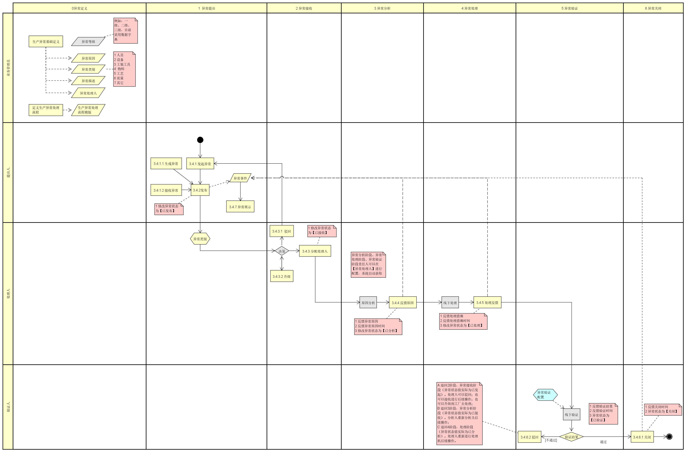

### 2.1.2 **业务流程描述**

企业生产异常管理业务流程如下：

异常定义阶段：（园区网）

计划员：定义异常类型和异常原因

异常发生阶段：（工控网）

操作员：在生产过程中，当发现设备故障、物料异常等问题时，通过系统上报异常，记录异常发生时间、类型、描述等信息。

班组长：收到异常通知后，初步判断异常的紧急程度与影响范围。

异常处理阶段：（园区网）

计划员：根据异常情况，调整生产计划，安排替代任务或资源。

相关技术人员：针对设备故障进行维修，或解决工艺问题。

物流人员：在物料短缺时，紧急调配物料。

操作员：在异常处理完成后，重新启动生产任务，并记录实作工时。

业务配置点：

常规审批流配置

异常可以预置执行人，流程提交时，支持从预置执行人中选择下一步执行人

异常打回给发起人，发起人可以再次编辑提交

异常可以转办，转给其他人

异常需支持流程分支

异常处理工作流样例：

| | |
|--- | ---|

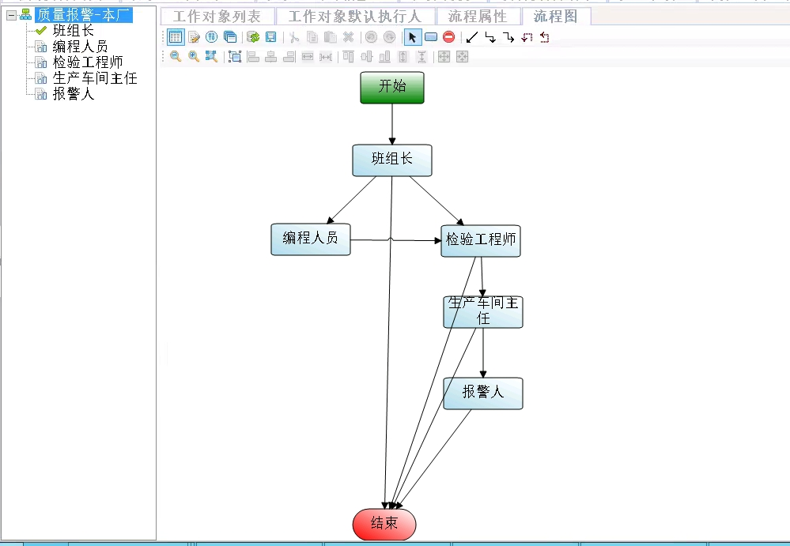

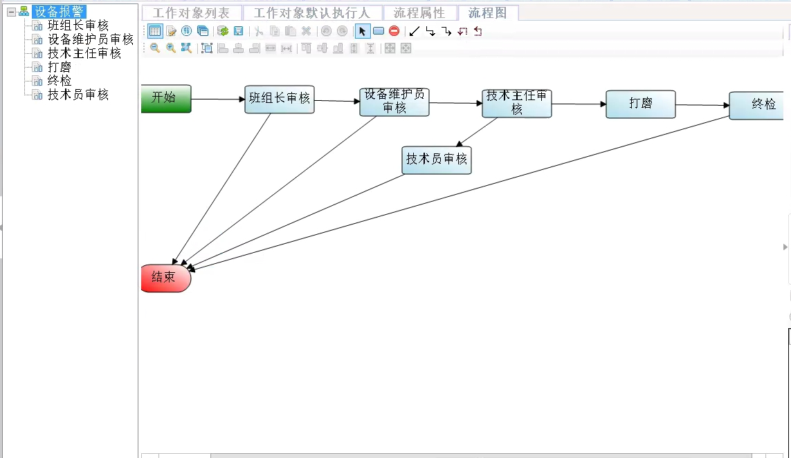

| | |
|--- | ---|

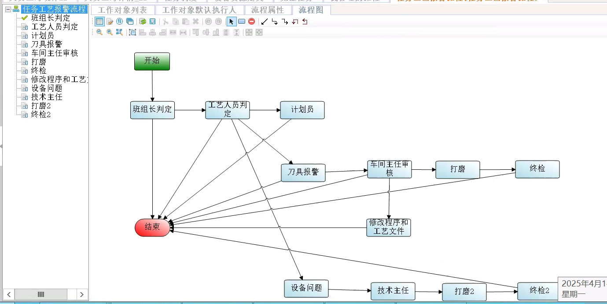

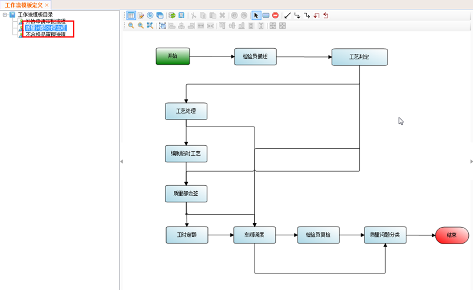

异常关闭阶段：（工控网）

处理人：将异常处理结果反馈至系统，包括处理措施、耗时等信息。

质量管理人员：对异常处理后的生产质量进行检查，确保符合标准。

### 2.1.3 **业务对象关系图**

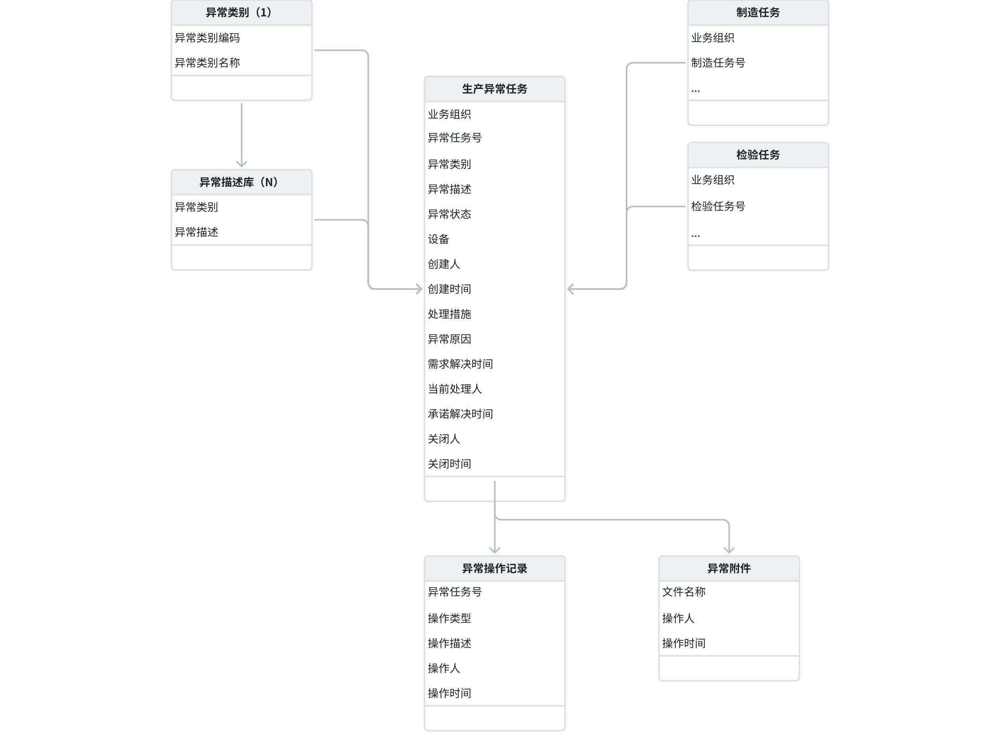

## 2.2 **功能描述**

### 2.2.1 **整体应用架构**

本次主要涉及生产异常、制造任务台、检验任务台。

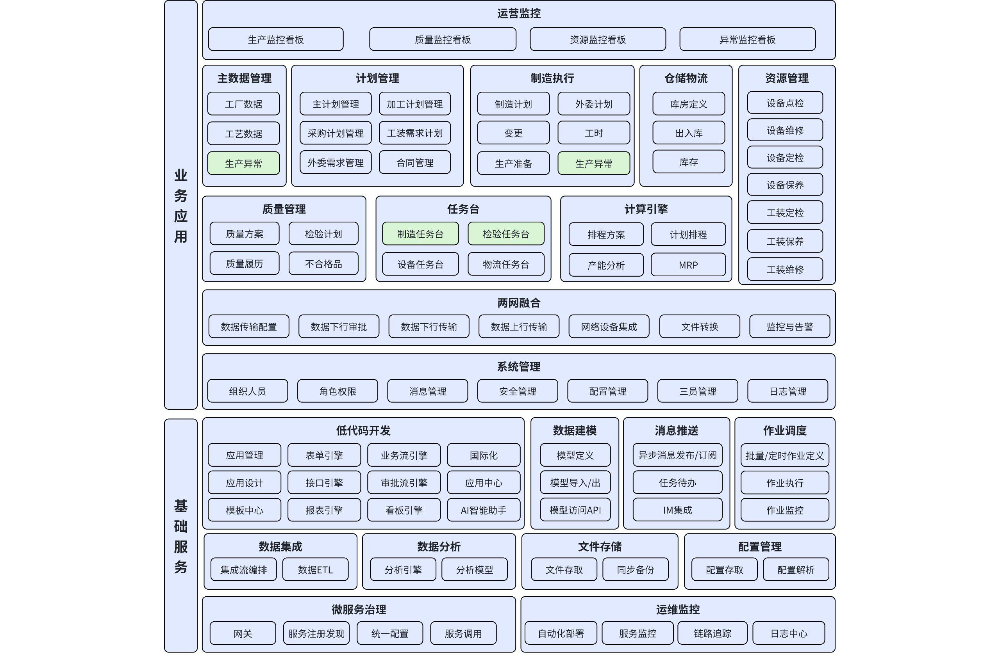

### 2.2.2 **生产异常应用架构**

生产异常、制造任务台、检验任务台进一步细化展开到页面、业务功能一级

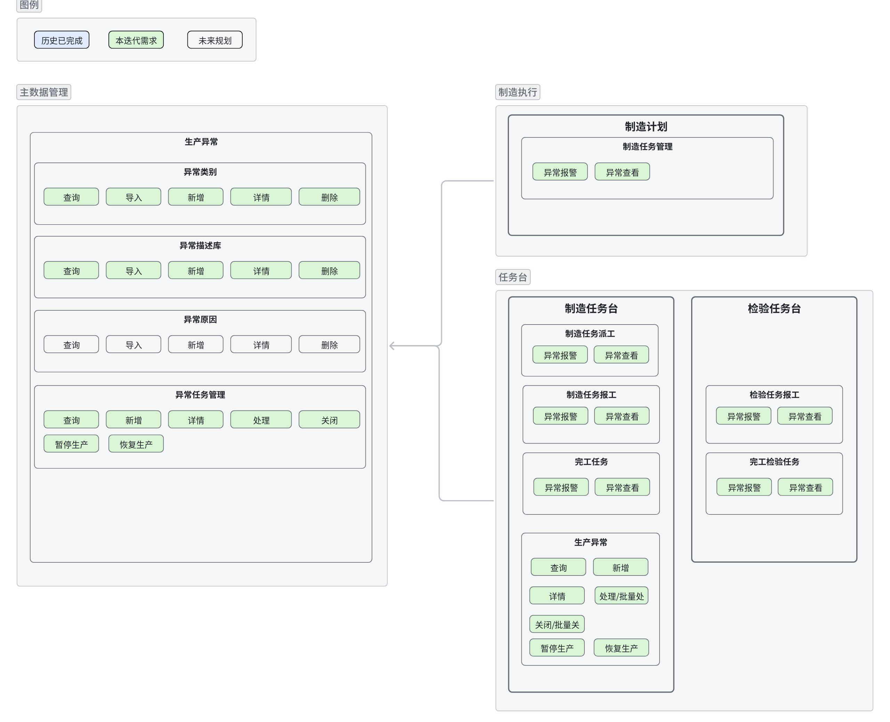

### 2.2.3 **功能清单**

|模块 | 功能 | 页面 | 功能点 | 功能点状态 | 功能点描述|
|--- | --- | --- | --- | --- | ---|
|主数据管理 | 生产异常 | 异常类别 | 异常类别-查询 | V3.1-a5新增 | 用户可通过输入关键词，如异常类别名称、编码等，快速查询异常类别信息，系统以列表形式展示查询结果，包括异常类别名称、编码、创建时间等。|
|主数据管理 | 生产异常 | 异常类别 | 异常类别-导入 | V3.1-a5新增 | 支持Excel等格式的异常类别数据导入，用户上传文件后，系统自动校验数据完整性与准确性，导入成功后更新异常类别数据库，并提供导入结果反馈。|
|主数据管理 | 生产异常 | 异常类别 | 异常类别-新增 | V3.1-a5新增 | 点击新增按钮，弹出表单填写界面，用户输入异常类别名称、编码、描述等信息，点击保存，系统校验数据后，将新异常类别信息存入数据库。|
|主数据管理 | 生产异常 | 异常类别 | 异常类别-编辑 | V3.1-a5新增 | 点击异常类别名称或详情按钮，进入详情页面，展示该异常类别的详细信息，包括名称、编码、描述、创建时间、修改时间等，仅供查看，不可编辑。|
|主数据管理 | 生产异常 | 异常类别 | 异常类别-删除 | V3.1-a5新增 | 选中一条或多条异常类别记录，点击删除按钮，系统弹出确认对话框，用户确认后，将所选异常类别从数据库中删除，同时处理相关关联数据。|
|主数据管理 | 生产异常 | 异常描述库 | 异常描述库-查询 | V3.1-a5新增 | 用户输入异常描述关键词、异常类别等条件，系统查询符合条件的异常描述信息，以列表展示，包含描述内容、关联类别、创建时间等。|
|主数据管理 | 生产异常 | 异常描述库 | 异常描述库-导入 | V3.1-a5新增 | 允许导入Excel等格式的异常描述数据，导入时校验数据格式与内容的正确性，导入成功后更新异常描述库，并反馈导入结果。|
|主数据管理 | 生产异常 | 异常描述库 | 异常描述库-新增 | V3.1-a5新增 | 点击新增，填写异常描述内容、选择关联的异常类别等信息，保存后系统将新异常描述添加至数据库。|
|主数据管理 | 生产异常 | 异常描述库 | 异常描述库-编辑 | V3.1-a5新增 | 查看异常描述的详细内容，包括描述文本、关联类别、创建与修改时间等详细信息，页面只读展示。|
|主数据管理 | 生产异常 | 异常描述库 | 异常描述库-删除 | V3.1-a5新增 | 选中异常描述记录，点击删除，系统提示确认，确认后删除所选异常描述，同时处理与之相关的关联数据。|
|主数据管理 | 生产异常 | 异常任务管理 | 异常任务管理-查询 | V3.1-a5新增 | 用户可按任务编号、异常类别、状态等条件查询异常任务，系统以列表形式展示查询结果，包含任务编号、异常类别、状态、创建时间等信息。|
|主数据管理 | 生产异常 | 异常任务管理 | 异常任务管理-新增 | V3.1-a5新增 | 点击新增异常任务按钮，填写任务相关信息，如任务描述、关联异常类别、指定处理人等，保存后系统生成新的异常任务并添加至任务列表。|
|主数据管理 | 生产异常 | 异常任务管理 | 异常任务管理-详情 | V3.1-a5新增 | 点击异常任务编号或详情按钮，进入任务详情页面，展示任务的详细信息，包括任务描述、关联异常类别、处理人、创建与更新时间、处理进度等。|
|主数据管理 | 生产异常 | 异常任务管理 | 异常任务管理-处理完成 | V3.1-a5新增 | 对于已创建且未加入审批流的异常任务，提出人可点击发起审批按钮，系统提示确认，确认后将异常状态标记为审批中。|
|主数据管理 | 生产异常 | 异常任务管理 | 异常任务管理-关闭 | V3.1-a5新增 | 对于已完成的异常任务，处理人可点击关闭按钮，系统提示确认，确认后将任务状态标记为已关闭，同时记录关闭时间等信息。|
|主数据管理 | 生产异常 | 异常任务管理 | 异常任务管理-暂停制造订单 | V3.1-a5新增 | 对于影响生产的异常任务，可手动暂定关联的生产任务。|
|主数据管理 | 生产异常 | 异常任务管理 | 异常任务管理-恢复制造订单 | V3.1-a5新增 | 对于已关闭的异常或判断不影响生产的异常任务，可手动恢复关联的生产任务。|
|制造执行 | 制造计划 | 制造任务管理 | 制造任务管理-异常报警 | V3.1-a5新增 | 当生产过程中出现异常情况时，系统自动触发报警机制，以声音、弹窗或消息提示等方式通知相关人员，报警信息包含异常类型、发生时间、所在工序等。|
|制造执行 | 制造计划 | 制造任务管理 | 制造任务管理-异常查看 | V3.1-a5新增 | 用户可点击查看异常详情按钮，进入异常查看页面，页面展示异常的详细信息，如异常描述、发生时间、处理状态、相关图片或视频等。|
|质量管理 | 检验任务 | 检验任务管理 | 检验任务管理-异常报警 | V3.1-a5新增 | 当生产过程中出现异常情况时，系统自动触发报警机制，以声音、弹窗或消息提示等方式通知相关人员，报警信息包含异常类型、发生时间、所在工序等。|
|质量管理 | 检验任务 | 检验任务管理 | 检验任务管理-异常查看 | V3.1-a5新增 | 用户可点击查看异常详情按钮，进入异常查看页面，页面展示异常的详细信息，如异常描述、发生时间、处理状态、相关图片或视频等。|
|任务台 | 制造任务台 | 生产异常 | 生产异常-查询 | V3.1-a5新增 | 用户可按任务编号、异常类别、状态等条件查询异常任务，系统以列表形式展示查询结果，包含任务编号、异常类别、状态、创建时间等信息。|
|任务台 | 制造任务台 | 生产异常 | 生产异常-详情 | V3.1-a5新增 | 点击新增异常任务按钮，填写任务相关信息，如任务描述、关联异常类别、指定处理人等，保存后系统生成新的异常任务并添加至任务列表。|
|任务台 | 制造任务台 | 生产异常 | 生产异常-异常报警 | V3.1-a5新增 | 点击异常任务编号或详情按钮，进入任务详情页面，展示任务的详细信息，包括任务描述、关联异常类别、处理人、创建与更新时间、处理进度等。|
|任务台 | 制造任务台 | 生产异常 | 生产异常-处理/批量处理 | V3.1-a5新增 | 对于已创建且未加入审批流的异常任务，提出人可点击发起审批按钮，系统提示确认，确认后将异常状态标记为审批中。|
|任务台 | 制造任务台 | 生产异常 | 生产异常-关闭/批量关闭 | V3.1-a5新增 | 对于已完成的异常任务，处理人可点击关闭按钮，系统提示确认，确认后将任务状态标记为已关闭，同时记录关闭时间等信息。|
|任务台 | 制造任务台 | 生产异常 | 生产异常-暂停制造订单 | V3.1-a5新增 | 对于影响生产的异常任务，可手动暂定关联的生产任务。|
|任务台 | 制造任务台 | 生产异常 | 生产异常-恢复制造订单 | V3.1-a5新增 | 对于已关闭的异常或判断不影响生产的异常任务，可手动恢复关联的生产任务。|
|任务台 | 制造任务台 | 制造任务派工 | 制造任务派工-异常报警 | V3.1-a5新增 | 在派工过程中，若出现异常情况，如设备故障、物料短缺等，系统立即发出报警提示，提醒派工人及时处理，报警信息明确显示异常原因与发生位置。|
|任务台 | 制造任务台 | 制造任务派工 | 制造任务派工-异常查看 | V3.1-a5新增 | 点击异常查看功能，可查看当前派工任务相关的异常记录，包括异常发生时间、类型、描述、处理进度等详细信息。|
|任务台 | 制造任务台 | 制造任务报工 | 制造任务报工-异常报警 | V3.1-a5新增 | 报工时，若检测到异常情况，如报工数量与实际不符、质量异常等，系统自动触发报警，提醒操作员进行确认与处理。|
|任务台 | 制造任务台 | 制造任务报工 | 制造任务报工-异常查看 | V3.1-a5新增 | 用户可通过异常查看功能，查看报工过程中产生的异常记录，了解异常发生的具体环节与详情，以便采取相应措施。|
|任务台 | 制造任务台 | 完工任务 | 完工任务-异常报警 | V3.1-a5新增 | 对于已完成的任务，在后续检查或其他环节发现存在异常时，系统会发出报警提示，相关人员可及时进行复查与处理。|
|任务台 | 制造任务台 | 完工任务 | 完工任务-异常查看 | V3.1-a5新增 | 点击异常查看，可查看完工任务的异常记录，包括异常类型、发生时间、处理情况等，为任务的最终确认与归档提供依据。|
|任务台 | 检验任务台 | 检验任务报工 | 检验任务报工-异常报警 | V3.1-a5新增 | 检验任务报工时，若出现检验结果不符合标准等异常情况，系统立即发出报警，提示检验人员进行复检或确认。|
|任务台 | 检验任务台 | 检验任务报工 | 检验任务报工-异常查看 | V3.1-a5新增 | 异常查看功能可展示检验任务报工过程中产生的异常记录，包括异常检验项、实际检验结果、标准要求等详细信息。|
|任务台 | 检验任务台 | 完工检验任务 | 完工检验任务-异常报警 | V3.1-a5新增 | 完工检验任务在后续审核或其他环节发现异常时，系统会触发报警，提醒相关人员进行复查，确保检验结果的准确性。|
|任务台 | 检验任务台 | 完工检验任务 | 完工检验任务-异常查看 | V3.1-a5新增 | 查看完工检验任务的异常记录，了解异常发生的检验项目、原因等信息，为质量控制提供数据支持。|

# 3. **页面&功能设计**

## 3.1 **异常类别**

### 3.1.1 **异常类别-查询**

**概述** ：用户可通过输入关键词，如异常类别名称、编码等，快速查询异常类别信息，系统以列表形式展示查询结果。

**界面**

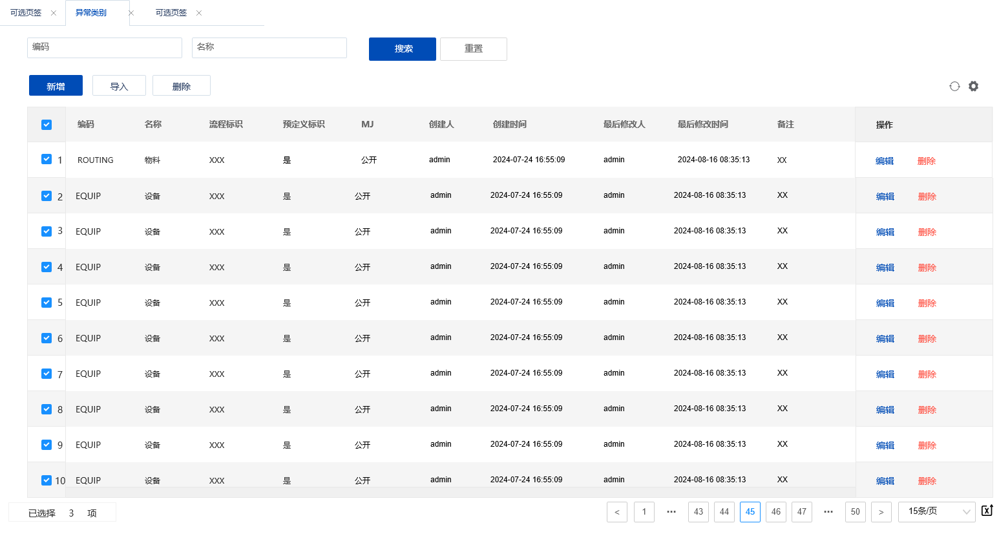

界面结构：

上方为搜索条件：编码、名称

下方为查询结果列表，以表格形式展示，包括：名称、编码、流程标识、预定义标识、密级、创建人、创建时间、最后修改人、最后修改时间、备注等信息。

表格支持分页和排序功能。

交互内容：用户输入查询条件进行搜索。

**输入** ：用户输入的关键词，可以是异常类别名称、编码等。

**输出** ：查询结果列表，包含异常类别名称、编码、创建时间等信息，以表格形式展示。

**处理逻辑** ：

用户在搜索框输入关键词，点击搜索按钮，系统根据关键词在数据库中查询匹配的异常类别信息，将查询结果以列表形式返回并在界面展示。

预定义数据如下：

|编码 | 名称 | 预定义标识 | 备注|
|--- | --- | --- | ---|
|EQUIP | 设备 | 是 | |
|QUALITY | 质量 | 是 | |
|ROUTING | 工艺 | 是 | |
|MATERIAL | 物料 | 是 | |

**验收标准** ：

查询结果准确无误，展示信息完整，包括异常类别名称、编码、创建时间等。

界面响应迅速，操作便捷。

### 3.1.2 **异常类别-导入**

**概述** ：支持Excel等格式的异常类别数据导入，用户上传文件后，系统自动校验数据完整性与准确性，导入成功后更新异常类别数据库，并提供导入结果反馈。

**界面**

同通用导入功能一致

界面结构：导入界面包含一个文件上传按钮和上传进度显示区域。

交互内容：用户点击上传按钮选择文件，系统显示导入进度和结果反馈信息。

**输入** ：用户上传的Excel等格式的异常类别数据文件。

**输出** ：导入结果反馈，包括成功导入的记录数、失败的记录数及原因等。

**处理逻辑** ：用户点击上传按钮，选择文件后上传。系统接收文件，校验数据的完整性与准确性。校验通过后，将数据导入数据库，更新异常类别信息。最后，向用户反馈导入结果。

**验收标准** ：文件上传成功，数据校验准确，导入结果反馈清晰，异常类别数据库更新正确。

### 3.1.3 **异常类别-新增**

**概述** ：点击新增按钮，弹出表单填写界面，用户输入异常类别名称、编码、描述等信息，点击保存，系统校验数据后，将新异常类别信息存入数据库。

**界面**

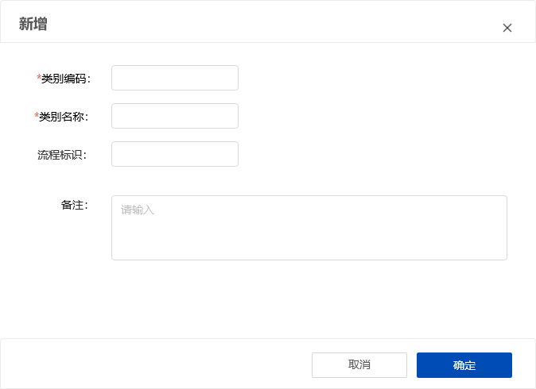

界面结构：新增界面包含一个表单，包含异常类别名称、编码、备注等字段，用户可填写相关信息。下方有确定和取消按钮。

交互内容：用户填写表单并点击确定或取消按钮。

**输入** ：用户填写的异常类别名称、编码、备注等信息。

**输出** ：新异常类别的详细信息

**处理逻辑** ：用户点击新增按钮，填写异常类别信息，点击确定。系统校验数据的完整性与准确性，校验通过后，将新异常类别信息存入数据库，并返回成功提示。

**验收标准** ：表单填写界面友好，数据校验准确，新增的异常类别信息能正确存入数据库并可查询到。

### 3.1.4 **异常类别-编辑**

**概述** ：点击编辑按钮，进入编辑页面，展示该异常类别的详细信息。

**界面**

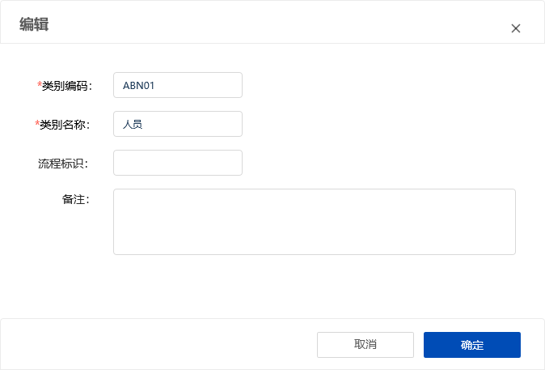

界面结构：编辑界面以弹窗形式展现，包含异常类别编码、名称、备注等字段。

交互内容：用户点击编辑按钮，弹出编辑界面弹窗，用户可填写相关信息。下方有确定和取消按钮。

**输入** ：用户点击编辑按钮

**输出** ：异常类别

**处理逻辑** ：用户点击编辑按钮，系统获取对应的异常类别ID，根据ID查询数据库，获取详细信息并在编辑页面展示。

**验收标准** ：编辑页面展示信息完整准确，界面简洁明了，用户操作方便。

### 3.1.5 **异常类别-删除**

**概述** ：选中一条或多条异常类别记录，点击删除按钮，系统弹出确认对话框，用户确认后，将所选异常类别从数据库中删除。

**界面**

**界面结构**：列表页面中，每条异常类别记录前有复选框，用户可选中要删除的记录。下方有删除按钮，点击后弹出确认对话框。

**交互内容**：用户选中记录并点击删除按钮，系统弹出确认对话框，用户确认或取消删除操作。

**校验规则**：预定义的不允许删除

**输入** ：用户选中的异常类别记录。

**输出** ：删除操作结果提示。

**处理逻辑** ：

用户选中异常类别记录，点击删除按钮，系统弹出确认对话框。用户确认后，系统根据选中的记录ID，从数据库中删除对应的异常类别信息。最后，返回删除结果提示。

**验收标准** ：删除操作准确无误，关联数据处理得当，操作提示清晰明确。

## 3.2 **异常描述库**

### 3.2.1 **异常描述库-查询**

**概述** ：用户输入异常类别、异常名称等条件，系统查询符合条件的异常描述信息，以列表展示。

**界面**

界面结构：

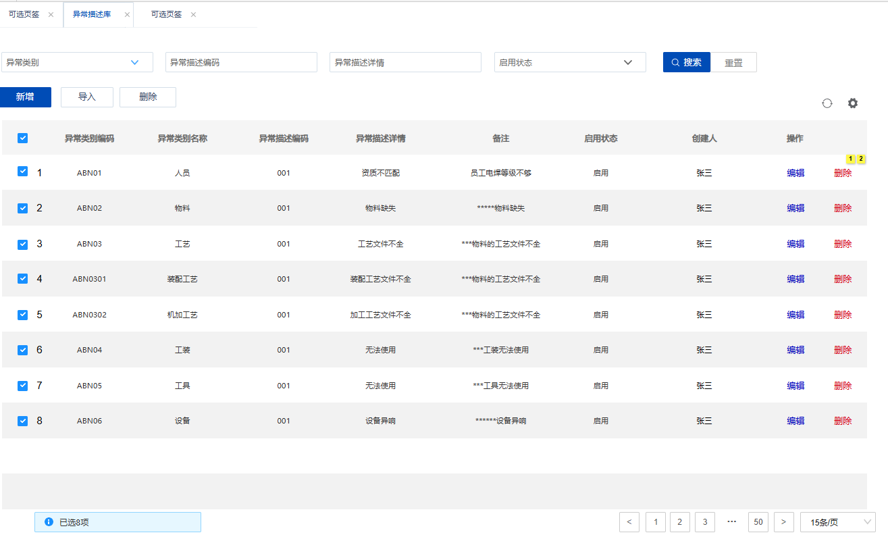

上方为搜索条件：异常类别、异常描述编码

下方为查询结果列表，以表格形式展示，包括：异常类别编码、异常描述、密级、创建人、创建时间、最后修改人、最后修改时间、备注等信息。

表格支持分页和排序功能。

交互内容：用户输入查询条件进行搜索。

**输入** ：用户输入的异常描述关键词和选择的异常类别。

**输出** ：异常描述库查询结果列表。

**处理逻辑** ：用户输入查询条件，点击查询按钮，系统根据条件在数据库中查询匹配的异常描述信息，将结果以列表形式返回并在界面展示。

**验收标准** ：查询结果准确，展示信息完整，界面操作便捷。

### 3.2.2 **异常描述库-导入**

**概述** ：允许导入Excel等格式的异常描述数据，导入时校验数据格式与内容的正确性，导入成功后更新异常描述库，并反馈导入结果。

**界面**

同通用导入功能一致

界面结构：导入界面包含一个文件上传按钮和上传进度显示区域。

交互内容：用户点击上传按钮选择文件，系统显示导入进度和结果反馈信息。

**输入** ：用户上传的Excel等格式的异常描述数据文件。

**输出** ：导入结果反馈，包括成功和失败的记录数及原因。

**处理逻辑** ：用户点击上传按钮，选择文件后上传。系统接收文件，校验数据格式与内容的正确性。校验通过后，将数据导入数据库，更新异常描述库，并反馈导入结果。

**验收标准** ：文件上传成功，数据校验准确，导入结果反馈清晰，异常描述库更新正确。

### 3.2.3 **异常描述库-新增**

**概述** ：点击新增，填写异常描述内容、选择关联的异常类别等信息，保存后系统将新异常描述添加至数据库。

**界面**

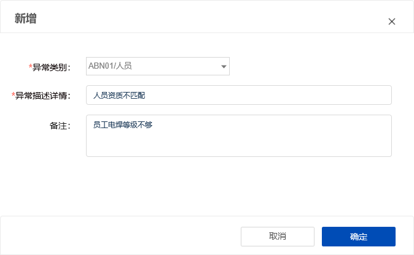

界面结构：新增界面包含一个表单，用户可填写异常类型、异常详细描述、备注等。下方有确定和取消按钮。

交互内容：用户点击新增按钮，弹出新增界面，填写表单并点击确定或取消按钮。

**输入** ：用户填写的异常描述内容和选择的关联异常类别。

**输出** ：新异常描述的详细信息。

**处理逻辑** ：

用户点击新增按钮，填写异常描述信息，点击确定。

系统自动生成异常描述库的编码，编码规则：AbnDes-年月日时分秒-流水号（从1开始递增，不限位数）

系统校验数据的完整性与准确性，校验通过后，将新异常描述添加至数据库，并返回成功提示。

**验收标准** ：表单填写界面友好，数据校验准确，新增的异常描述信息能正确添加至数据库并可查询到。

### 3.2.4 **异常描述库-编辑**

**概述** ：编辑异常描述的详细内容。

**界面**

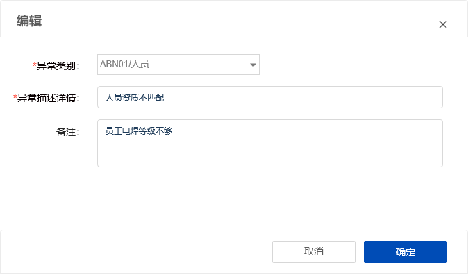

界面结构：编辑页面展示异常描述的详细信息。包含异常类别、异常描述名称、异常详细描述等字段。

交互内容：用户点击编辑按钮，弹出编辑界面弹窗，用户可填写相关信息。下方有确定和取消按钮。

**输入** ：异常类型、异常描述名称、异常详细描述、备注。

**输出** ：异常描述。

**处理逻辑** ：用户点击编辑按钮，系统获取对应的异常描述ID，根据ID查询数据库，获取详细信息并在编辑页面展示。

**验收标准** ：编辑页面展示信息完整准确，界面简洁明了，用户操作方便。

### 3.2.5 **异常描述库-删除**

**概述** ：选中异常描述记录，点击删除，系统提示确认，确认后删除所选异常描述，同时处理与之相关的关联数据。

**界面**

界面结构：列表页面中，每条异常描述记录前有复选框，用户可选中要删除的记录。下方有删除按钮，点击后弹出确认对话框。

交互内容：用户选中记录并点击删除按钮，系统弹出确认对话框，用户确认或取消删除操作。

**输入** ：用户选中的异常描述记录。

**输出** ：删除操作结果提示。

**处理逻辑** ：用户选中异常描述记录，点击删除按钮，系统弹出确认对话框。用户确认后，系统根据选中的记录ID，从数据库中删除对应的异常描述信息。最后，返回删除结果提示。

**验收标准** ：删除操作准确无误，关联数据处理得当，操作提示清晰明确。

## 3.3 **异常原因****（暂不考虑）**

### 3.3.1 **异常原因查询**

**概述** ：通过输入异常类别、异常原因详情等条件，查询出对应的异常原因列表。

**界面**

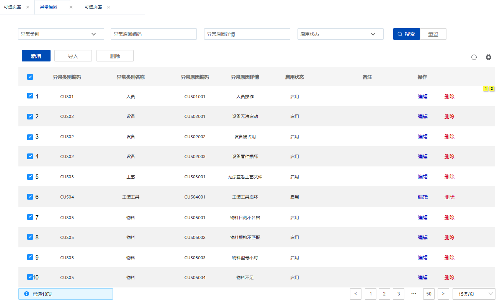

界面结构：

上方为搜索条件：异常类别、异常原因编码、异常原因详情

下方为查询结果列表，以表格形式展示，包括：异常类别编码、异常类别名称、异常原因编码、异常原因详情、密级、创建人、创建时间、最后修改人、最后修改时间、备注等信息。

表格支持分页和排序功能。

交互内容：用户输入查询条件进行搜索。

**输入** ：用户输入的异常原因关键词和选择的异常类别。

**输出** ：异常原因信息。

**处理逻辑** ：用户输入查询条件，点击查询按钮，系统根据条件在数据库中查询匹配的异常原因信息，将结果以列表形式返回并在界面展示。

**验收标准** ：查询结果准确，展示信息完整，界面操作便捷。

### 3.3.2 **异常原因导入**

**概述** ：支持从Excel等文件导入异常原因数据，导入时系统自动检查数据的合法性，导入完成后更新异常原因数据库。

**界面**

同通用导入功能一致

界面结构：导入界面包含一个文件上传按钮和上传进度显示区域。

交互内容：用户点击上传按钮选择文件，系统显示导入进度和结果反馈信息。

**输入** ：用户上传的Excel等格式的异常原因数据文件。

**输出** ：导入结果反馈，包括成功和失败的记录数及原因。

**处理逻辑** ：用户点击上传按钮，选择文件后上传。系统接收文件，校验数据的合法性。校验通过后，将数据导入数据库，更新异常原因库，并反馈导入结果。

**验收标准** ：文件上传成功，数据校验准确，导入结果反馈清晰，异常原因库更新正确。

### 3.3.3 **异常原因新增**

**概述** ：点击新增按钮，填写异常原因的相关信息，如异常类别、异常原因详情等，保存后系统将新异常原因存入数据库。

**界面**

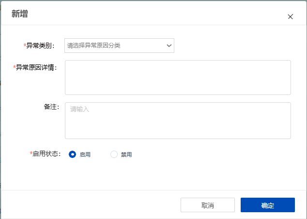

界面结构：新增界面包含一个表单，用户可填写异常类别、异常原因详情等。下方有确定和取消按钮。

交互内容：用户填写表单并点击确定或取消按钮。

**输入** ：用户填写的异常类别、异常原因详情、备注。

**输出** ：异常原因的详细信息

**处理逻辑** ：用户点击新增按钮，填写异常原因信息，点击确定。系统校验数据的完整性与准确性，校验通过后，将新异常原因存入数据库，并返回成功提示。

**验收标准** ：表单填写界面友好，数据校验准确，新增的异常原因信息能正确存入数据库并可查询到。

### 3.3.4 **异常原因编辑**

**概述** ：编辑异常原因的详细信息

**界面**

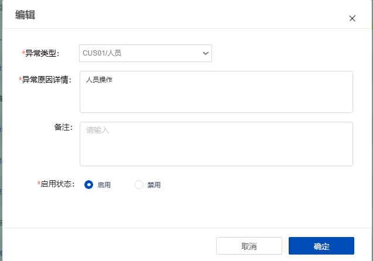

界面结构：编辑页面展示异常原因的详细信息，包含异常类别、异常原因详情、备注等字段。

交互内容：用户点击编辑按钮，弹出编辑界面弹窗，用户可填写相关信息。下方有确定和取消按钮。

**输入** ：用户点击编辑按钮。

**输出** ：异常原因的详细信息页面。

**处理逻辑** ：用户点击编辑按钮，系统获取对应的异常原因ID，根据ID查询数据库，获取详细信息并在详情页面展示。

**验收标准** ：详情页面展示信息完整准确，界面简洁明了，用户操作方便。

### 3.3.5 **异常原因删除**

**概述** ：选中异常原因记录，点击删除按钮，系统弹出确认提示，用户确认后删除所选异常原因，同时处理相关关联数据。

**界面**

界面结构：列表页面中，每条异常原因记录前有复选框，用户可选中要删除的记录。下方有删除按钮，点击后弹出确认对话框。

交互内容：用户选中记录并点击删除按钮，系统弹出确认对话框，用户确认或取消删除操作。

**输入** ：用户选中的异常原因记录。

**输出** ：删除操作结果提示。

**处理逻辑** ：用户选中异常原因记录，点击删除按钮，系统弹出确认对话框。用户确认后，系统根据选中的记录ID，从数据库中删除对应的异常原因信息，并处理相关关联数据。最后，返回删除结果提示。

**验收标准** ：删除操作准确无误，关联数据处理得当，操作提示清晰明确。

## 3.4 **异常任务管理**

### 3.4.1 **异常任务管理-查询**

**概述** ：用户可按异常任务编号、异常类别、状态等条件查询异常任务，系统以列表形式展示查询结果，包含任务编号、异常类别、状态、创建时间等信息。

**界面**

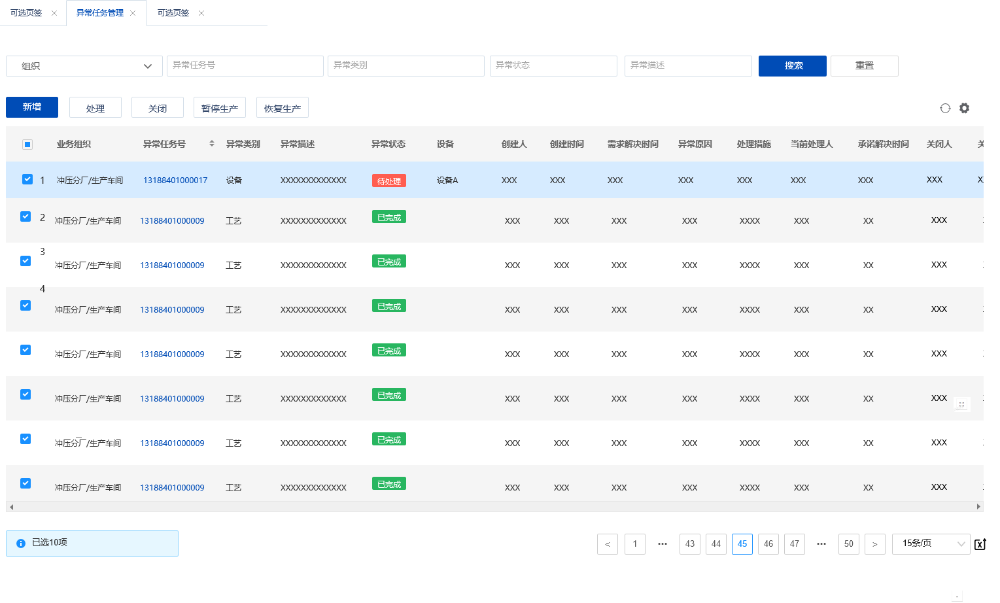

界面结构：

上方为搜索条件：异常任务号、异常类别、异常描述、异常状态（待处理、处理中、已处理、已关闭）

下方为查询结果列表，以表格形式展示，包括：业务组织、异常任务号、异常类别、异常描述、异常状态、设备、创建人、创建时间、需求解决时间、异常原因、处理措施、当前处理人、承诺解决时间、关闭人、关闭时间等信息。

表格支持分页和排序功能。

交互内容：用户输入查询条件进行搜索。

**输入** ：用户输入筛选条件。

**输出** ：异常任务查询结果列表。

**处理逻辑** ：用户输入查询条件，点击查询按钮，系统根据条件在数据库中查询匹配的异常任务信息，将结果以列表形式返回并在界面展示。

**验收标准** ：查询结果准确，展示信息完整，界面操作便捷。

### 3.4.2 **异常任务管理-新增**

**概述** ：点击新增异常任务按钮，填写异常任务相关信息，如业务组织、异常类别、异常等级、异常描述、需求解决时间、提出人、提出时间、处理人等，保存后系统生成新的异常任务并添加至任务列表。

**界面**

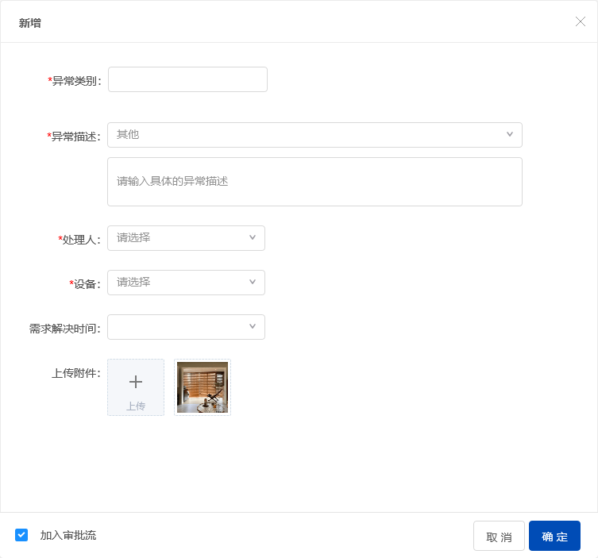

界面结构：

新增界面包含一个表单，用户可填写异常类别、异常描述、处理人、需求解决时间、异常附件。

异常类别：必填，下拉选择异常类别

异常描述：必填，下拉单选框，可下拉选择异常描述，若下列没有，可下拉选择其他，此时出现一个文本编辑框，允许用户手动编辑异常描述

处理人：必填，单选人员

需求解决时间：非必填，日期编辑框，日期格式到年月日时分

上传附件：非必填，支持上传多个附件，附件类型不做任何限制（当前版本先支持图片和pdf）

下方左侧有加入审批流复选框，默认勾选，右侧有确定和取消按钮。

交互内容：

用户选择异常类型=设备时，界面上需显示设备，必填

用户点击新增按钮，弹出新增弹窗，填写表单并点击确定或取消按钮。

**输入** ：用户填写相关信息。

**输出** ：异常任务。

**处理逻辑** ：

用户点击新增按钮，填写任务信息

点击确定，系统校验数据的完整性与准确性，校验通过后

生成新的异常任务并添加至任务列表

创建属性默认值处理：

业务组织：默认为当前用户所属组织

异常状态为：待处理

系统属性默认处理

勾选加入审批流程：

校验是否存在关联的审批工作流，不存在则给出提示。

校验通过后，需将生产异常任务加入到审批流程中，更新异常状态：处理中

**验收标准** ：表单填写界面友好，数据校验准确，新增的异常任务信息能正确添加至任务列表并通知相关处理人。

### 3.4.3 **异常任务管理-详情**

**概述** ：点击异常任务号超链接，进入任务详情页面，展示任务的详细信息，包括业务组织、异常任务号、异常类别、异常等级、异常描述、异常状态、提出人、提出时间、需求解决时间、异常原因、承诺解决时间、处理人、实际处理完成时间、关闭人、关闭时间等信息。

**界面**

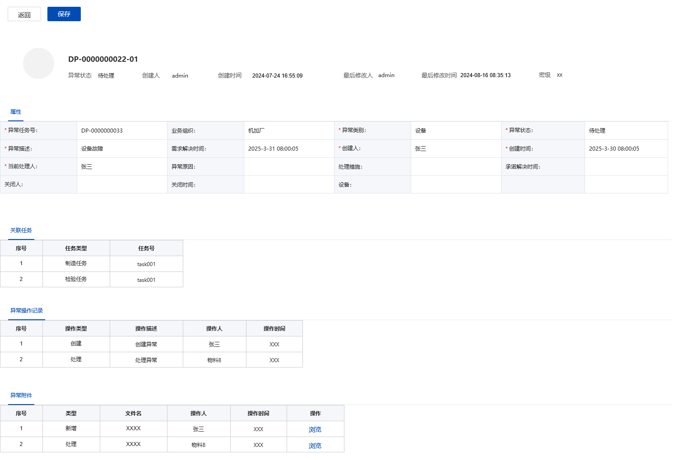

界面结构：详情页面展示异常任务的详细信息，包含业务组织、异常任务号、异常类别、异常状态、异常描述、需求解决时间、创建人、创建时间、当前处理人、异常原因、处理措施、承诺解决时间、关闭人、关闭时间等信息。

关联任务：异常关联的任务信息

异常操作记录，操作类型（创建、处理、关闭）

异常附件信息，支持浏览，类型（创建、处理、关闭）

交互内容：用户点击异常任务号超链接，打开异常任务的详情界面，仅支持查看不允许编辑。

**输入** ：用户点击异常任务号。

**输出** ：异常任务的详细信息页面。

**处理逻辑** ：用户点击异常任务编号或详情按钮，系统获取对应的异常任务ID，根据ID查询数据库，获取详细信息并在详情页面展示。

**验收标准** ：详情页面展示信息完整准确，界面简洁明了，用户操作方便。

### 3.4.4 **异常任务管理-处理完成**

**概述** ：对于已线下处理完成的异常任务，线上需记录处理信息

**界面**

单个处理

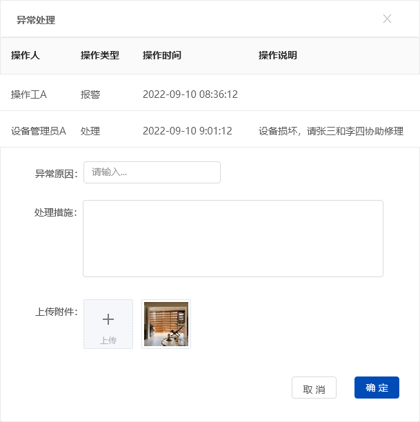

批量处理

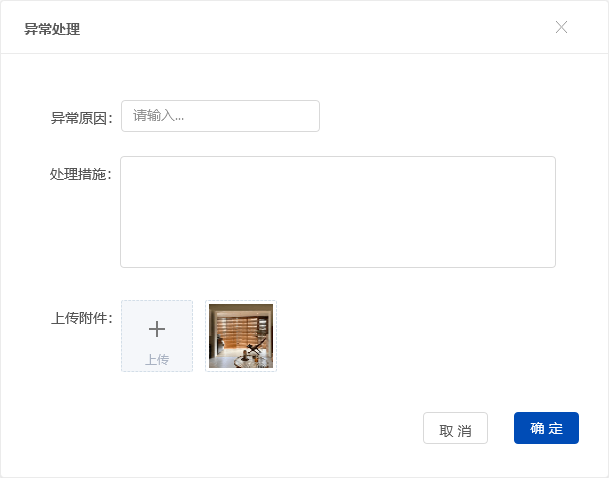

界面结构：

上方网格为异常操作记录

可填写异常原因和处理措施，都是非必填

支持上传多个附件，附件类型不做任何限制（当前版本先支持图片和pdf）

交互内容：用户点击处理完成按钮，支持多选，点击后弹出二级界面。

校验规则：异常任务为待处理或处理中时才能进行处理完成操作

**输入** ：用户点击处理按钮并确认。

**输出** ：异常任务状态更新为已处理，并记录处理人、处理时间等信息。

**处理逻辑** ：

用户点击处理按钮，系统弹出确认对话框。

用户确认后，首先需按校验规则进行校验，校验不通过时给出提示

校验通过后将异常任务状态标记为已处理，记录关闭时间等信息，并返回成功提示。

**验收标准** ：任务处理操作准确无误，状态更新及时，操作提示清晰明确。

### 3.4.5 **异常任务管理-关闭**

**概述** ：对于已创建未加入工作流或工作流已审批完成的异常任务，处理人可点击关闭按钮，系统提示确认，确认后将任务状态标记为已关闭，同时记录关闭时间等信息。

**界面**

单个关闭

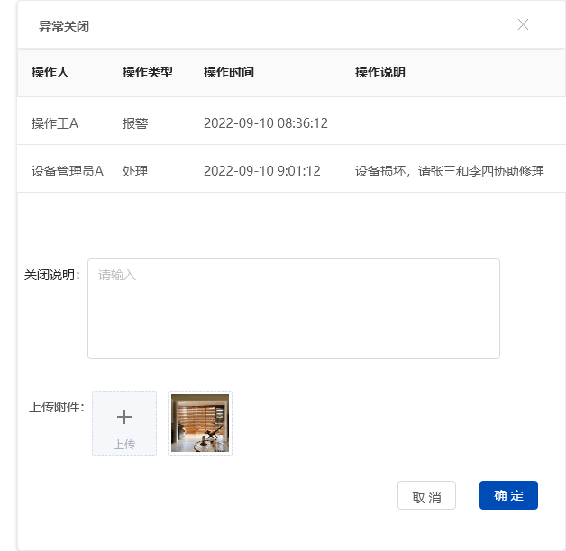

批量关闭

界面结构：

上方网格为异常操作记录

可填写关闭说明信息，非必填

附件：支持上传多个附件，附件类型不做任何限制（当前版本先支持图片和pdf）

交互内容：用户点击关闭按钮，支持多选，点击后弹出二级界面。

校验规则：

已关闭的不允许再次关闭，状态为未关闭时，均可执行关闭操作

**输入** ：用户点击关闭任务按钮并确认。

**输出** ：任务状态更新为已关闭，并记录关闭时间等信息。

**处理逻辑** ：

用户点击关闭任务按钮，系统弹出确认对话框。

用户确认后，首先需按校验规则进行校验，校验不通过时给出提示

校验通过后将异常任务状态标记为已关闭，记录关闭时间等信息，并返回成功提示。

2025-5-15新增：

异常关闭后，需恢复异常任务关联的制造订单，功能同手动恢复制造订单

**验收标准** ：任务关闭操作准确无误，状态更新及时，操作提示清晰明确。

### 3.4.6 **异常任务管理-暂停制造订单**

**概述** ：对于影响生产的异常任务，可手动暂停关联的生产任务。

**界面**

界面结构：支持多选，点击按钮，点击后弹出确认对话框，“是否确认暂停？”。

交互内容：用户点击关闭任务按钮并确认。

校验规则：

异常任务没有关联的制造任务或者检验任务

**输入** ：异常任务

**输出** ：制造任务、检验任务、制造订单、生产订单

**处理逻辑** ：

用户点击暂停制造订单按钮，系统弹出确认对话框。

用户确认后，首先需按校验规则进行校验，校验不通过时给出提示

校验通过后：

暂停关联的制造订单及下面所有制造任务和检验任务

**验收标准** ：暂停制造订单操作准确无误，关联的数据可以被正常暂停，操作提示清晰明确。

### 3.4.7 **异常任务管理-恢复制造订单**

**概述** ：对于已关闭的异常或判断不影响生产的异常任务，可手动恢复关联的生产任务。

**界面**

界面结构：支持多选，点击按钮，点击后弹出确认对话框，“是否确认恢复？”。

交互内容：用户点击关闭任务按钮并确认。

校验规则：

异常任务没有关联的制造任务或者检验任务

异常任务管理的制造任务或者检验任务已经被恢复

**输入** ：异常任务

**输出** ：制造任务、检验任务、制造订单、生产订单

**处理逻辑** ：

用户点击暂停制造订单按钮，系统弹出确认对话框。

用户确认后，首先需按校验规则进行校验，校验不通过时给出提示

校验通过后：

将异常任务关联的制造任务或检验任务进行恢复处理

恢复制造订单及下面所有任务

**验收标准** ：暂停制造订单操作准确无误，关联的数据可以被正常暂停，操作提示清晰明确。

## 3.5 **制造任务管理**

### 3.5.1 **制造任务管理-异常报警**

**概述** ：当生产过程中出现异常情况时，发起异常报警，报警信息包含异常类型、异常描述、提出人、提出时间等。

**界面**

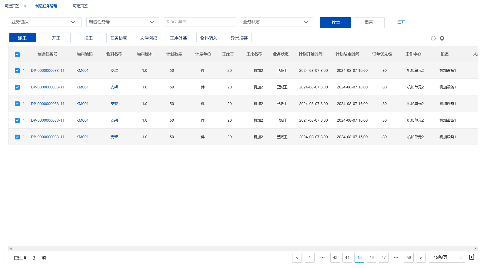

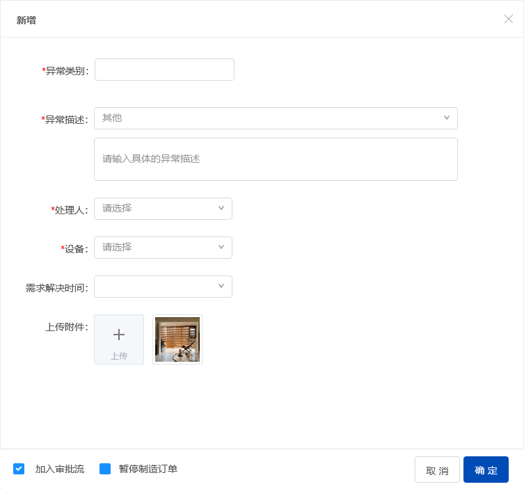

界面结构：

异常报警界面包含一个表单，用户可填写业务组织、异常类别、异常描述、需求解决时间、提出人、提出时间、处理人等。

异常类别：必填，下拉选择异常类别

异常描述：必填，下拉单选框，可下拉选择异常描述，若下列没有，可下拉选择其他，此时出现一个文本编辑框，允许用户手动编辑异常描述

处理人：必填，单选人员

需求解决时间：非必填，日期编辑框，日期格式到年月日时分

上传附件：非必填，支持上传多个附件，附件类型不做任何限制（当前版本先支持图片和pdf）

下方左侧有加入审批流复选框，默认勾选，右侧有确定和取消按钮。

下方左侧有是否暂停制造订单，默认不勾选

交互内容：

在制造任务管理界面新增异常报警按钮，支持多选，点击弹出异常报警界面。

用户选择异常类型=设备时，界面上需显示设备，必填，其他类型设备不可见

**输入** ：生产过程中出现的异常情况。

**输出** ：异常任务。

**处理逻辑** ：

用户点击异常报警按钮，填写异常报警信息

点击确定，系统校验数据的完整性与准确性，校验通过后

不论职责任务选择几个，点击一次只生成一个新的异常任务

创建后异常状态为：待处理

记录异常任务和制造任务的关系

更新制造任务的报警状态为【报警中】

勾选加入审批流程：

校验是否存在关联的审批工作流，不存在则给出提示。

校验通过后，需将生产异常任务加入到审批流程中，更新异常状态：处理中

勾选暂停制造订单

暂停关联的制造订单及下面所有制造任务和检验任务

**验收标准** ：报警机制响应及时，通知方式多样，报警信息准确完整。

### 3.5.2 **制造任务管理-异常查看**

**概述** ：查询制造任务关联的异常报警信息。

**界面**

制造任务管理

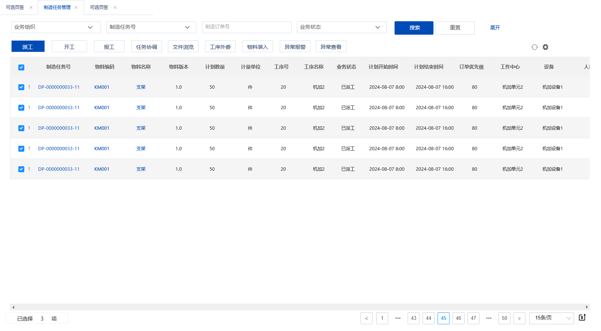

点击制造任务编码，查看详情界面，增加异常任务标签页查看

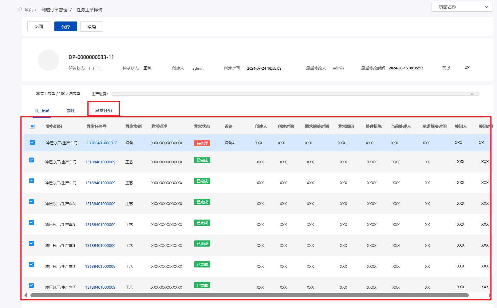

界面结构：

异常任务标签页，网格列表同异常任务管理

交互内容：用户可点击制造任务编码，进入详情界面，点击异常查看，页面展示制造任务关联的所有异常任务

**输入** ：制造任务。

**输出** ：异常任务。

**处理逻辑** ：用户点击异常详情按钮，系统获取制造任务关联的所有异常任务。用户可在页面更新处理进度或关闭异常。

**验收标准** ：异常详情页面展示信息完整准确，界面简洁明了，用户操作方便，处理进度更新和异常关闭功能正常。

## 3.6 **检验任务管理**

### 3.6.1 **检验任务管理-异常报警**

检验任务管理

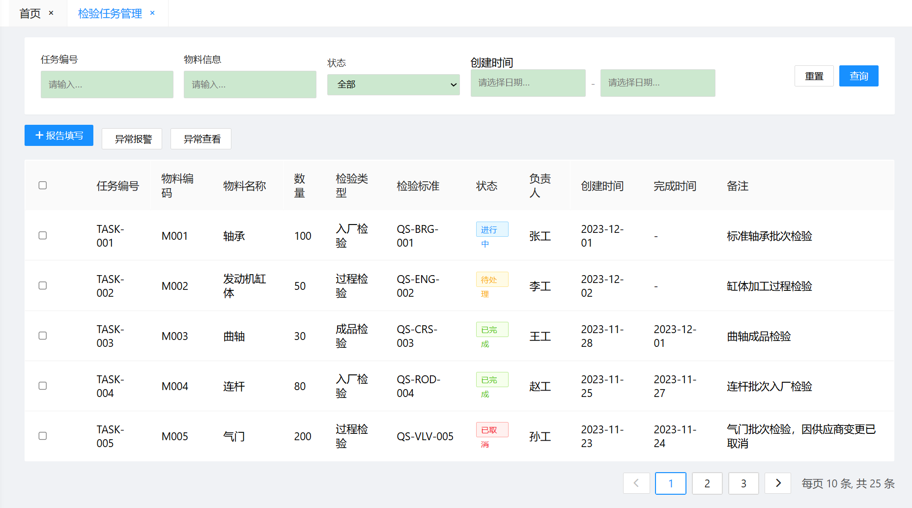

功能同3.5.1制造任务管理-异常报警

### 3.6.2 **检验任务管理-异常查看**

检验任务管理

异常查看：点击检验任务编码，查看详情界面，增加异常任务标签页查看

功能同3.5.2制造任务管理-异常查看

## 3.7 **生产异常**

### 3.7.1 **生产异常-查询**

**概述** ：查看我的或班组下的异常任务。

**界面**

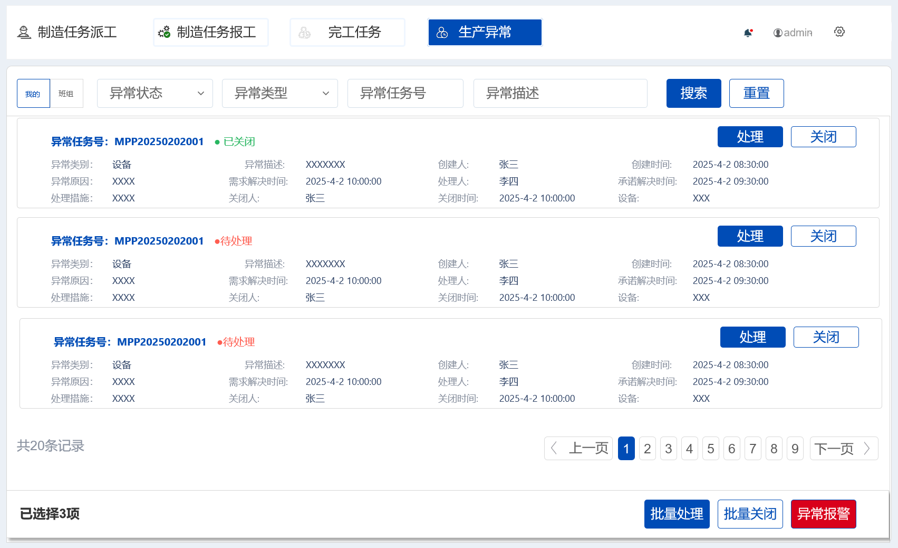

界面结构：

筛选条件

我的：查询创建人是当前用户的异常

班组：查询创建人是当前用户所属组织下人的异常任务

异常状态：默认为待处理、处理中、已处理，下拉值为待处理、处理中，已处理、已关闭

异常类型

异常任务号

异常描述

异常任务信息：

异常任务号：支持超链接查看详情

操作：处理、批量处理，关闭，批量关闭，异常报警

交互内容：用户根据查询条件，查询生产异常任务。

**输入** ：查询条件

**输出** ：异常任务

**处理逻辑** ：用户根据查询条件，查询生产异常任务。

**验收标准** ：异常记录页面展示信息完整准确。

### 3.7.2 **生产异常-详情**

**概述** ：查看异常任务详情。

**界面**

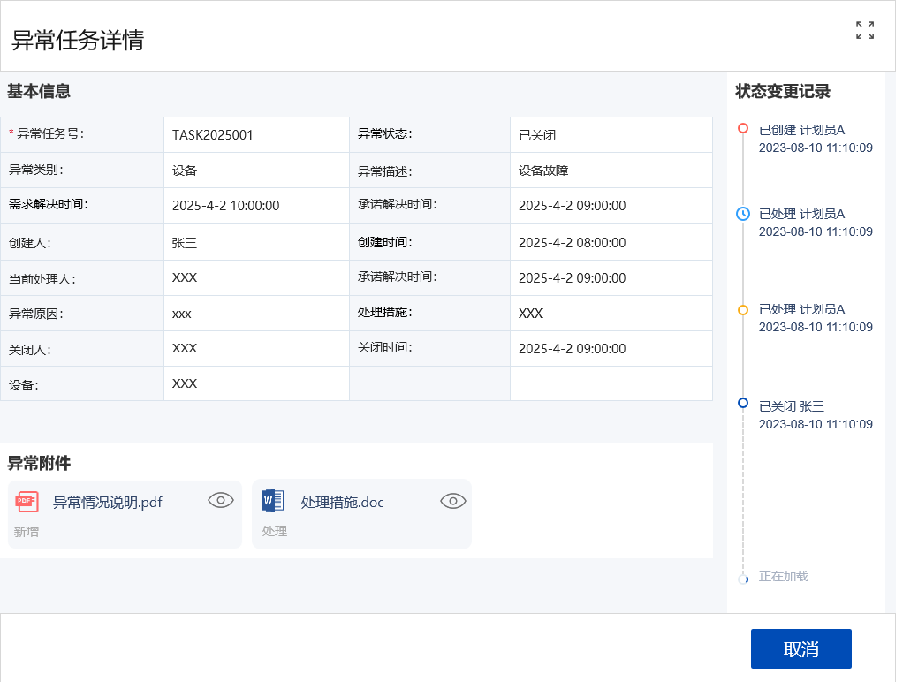

界面结构：

左侧为异常详情

右侧为异常状态变更记录

交互内容：用户点击异常任务号，查询生产异常任务详情。

**输入** ：异常任务

**输出** ：异常任务详情

**处理逻辑** ：用户根据查询条件，查询生产异常任务。

**验收标准** ：异常记录页面展示信息完整准确。

### 3.7.3 **生产异常-异常报警**

同3.4.2异常任务管理-新增

### 3.7.4 **生产异常-处理/批量处理**

同3.4.4异常任务管理-处理完成

### 3.7.5 **生产异常-关闭/批量关闭**

同3.4.5异常任务管理-关闭

### 3.7.6 **生产异常-暂停制造订单**

同3.4.6异常任务管理-暂停制造订单

### 3.7.7 **生产异常-恢复制造订单**

同3.4.7异常任务管理-恢复制造订单

## 3.8 **制造任务派工**

### 3.8.1 **制造任务派工-异常报警**

**概述** ：在派工过程中，若出现异常情况，如设备故障、物料短缺等，系统立即发出报警提示，提醒派工人及时处理，报警信息明确显示异常原因与发生位置。

**界面**

异常报警功能同3.5.1制造任务管理-异常报警

### 3.8.2 **制造任务派工-异常查看**

**概述** ：点击异常查看功能，可查看当前派工任务所有关联的异常任务。

**界面**

制造任务派工

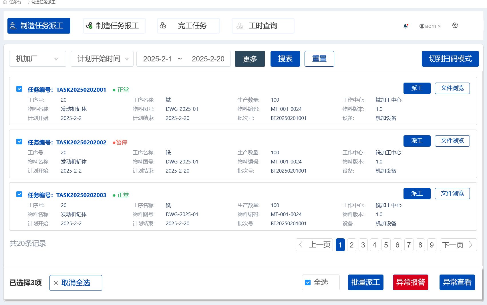

异常查看

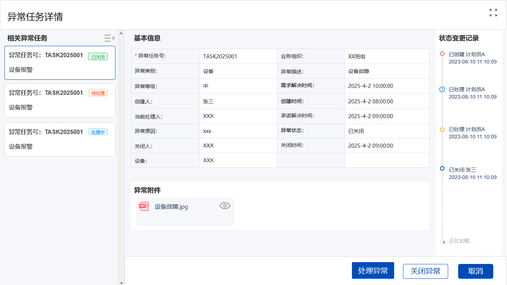

界面结构：

左侧为所有关联的异常任务列表

中间为异常详情

右侧为异常状态变更记录

操作：处理异常、关闭异常

交互内容：用户点击异常查看按钮，弹出异常任务详情界面，可在当前界面进行处理或关闭异常。

校验规则：仅制造任务的报警状态为报警中，才显示异常查看按钮，否则不显示

**输入** ：制造任务

**输出** ：异常任务

**处理逻辑** ：

制造任务的报警状态为报警中时，异常查看按钮才可见

用户点击异常查看功能，系统查询当前任务所有关联的异常任务信息

用户可在页面处理异常或关闭异常，功能同3.4.4异常任务管理-处理和3.4.5异常任务管理-关闭

**验收标准** ：异常记录页面展示信息完整准确，界面简洁明了，用户操作方便，处理进度更新和异常关闭功能正常。

## 3.9 **制造任务报工**

### 3.9.1 **制造任务报工-异常报警**

**概述** ：发起异常报警

**界面**

在制造任务报工任务最下方新增异常报警按钮

异常报警功能同3.7.1制造任务派工-异常报警

### 3.9.2 **制造任务报工-异常查看**

功能同3.7.2制造任务派工-异常查看

## 3.10 **完工任务**

### 3.10.1 **完工任务-异常报警**

**概述** ：发起异常报警

**界面**

在完工任务最下方新增异常报警按钮

异常报警功能同3.7.1制造任务派工-异常报警

### 3.10.2 **完工任务-异常查看**

功能同3.7.2制造任务派工-异常查看

## 3.11 **检验任务报工**

### 3.11.1 **检验任务报工-异常报警**

**概述** ：发起异常报警

**界面**

在检验任务报工任务最下方新增异常报警按钮

异常报警功能同3.7.1制造任务派工-异常报警

### 3.11.2 **检验任务报工-异常查看**

功能同3.7.2制造任务派工-异常查看

## 3.12 **完工检验任务**

### 3.12.1 **完工检验任务-异常报警**

**概述** ：发起异常报警

**界面**

在完工检验任务最下方新增异常报警按钮

异常报警功能同3.7.1制造任务派工-异常报警

### 3.12.2 **完工检验任务-异常查看**

功能同3.7.2制造任务派工-异常查看

# 4. **外部依赖**

本次功能对外部依赖的状态说明

|产品 | 应用 | 功能 | 外部依赖说明 | 状态|
|--- | --- | --- | --- | ---|
|KMMOM | 基础服务 | 审批工作流 | 支持自定义生产异常审批工作流，定义流程步骤和流程走向，一个步骤可以指向多个步骤，多个步骤可以指向同一个步骤 支持提前预定义流程步骤执行人 支持在流程提交时，手动指定下一步执行人 支持流程提交到下一步或提交到指定步骤 支持流程转办给其他人 支持流程驳回到上一步或驳回到指定步骤 支持流程撤销，当流程提交到下一步且下一步未提交时，支持撤销回本步骤 支持将生产异常任务加入到生产异常相关的审批工作流【业务侧实现】 支持在工作流审批中，不同的步骤可以编辑不同的生产异常任务属性 工作流的步骤变化可以驱动生成异常任务的状态变化 | 工作流开发中|

