# **DNW30300****-制造计划**

# 1. **概述**

## 1.1 **原始需求**

**需求**

解决生产单位任务信息传递与生产进度收集问题。

**背景**

**行业现状**：离散制造业多品种、小批量、工艺复杂的特点导致生产执行效率低、数据孤岛严重

**痛点分析**：

生产进度不透明（如工单延误无法实时预警）

质量追溯困难（如零件批次与工艺参数无法关联）

设备利用率低（如停机时间缺乏统计）

**系统价值**：

实现生产全流程数字化（从工单下发到成品入库）

支持精益生产（通过实时数据分析减少浪费）

**重点诉求**

数据准确、速度快、稳定性高、操作简单

**需求问题清单**

| 序号 | 问题描述 | 优先级 | $APPEALS |
|------|---------|--------|----------|
| P2-16 | 取消、暂停、恢复，三个按钮合并为一个下拉按钮 | P2 | E-易用性 |
| P2-19 | 订单释放：去掉确定按钮，点击确定并打开制造订单后，界面要过滤并显示刚刚释放的制造订单 | P2 | E-易用性 |
| P2-20 | 工艺展开和排程计算要不要合并？ | P2 | E-易用性 |
| P2-21 | 释放后自动进行工艺展开，去掉业务配置【订单释放后是否自动展开制造订单】 | P2 | E-易用性 |
| P2-26 | 分卡制造订单详情中可以看到分卡之前的制造任务信息 | P2 | E-易用性 |

> 来源：《KMMOM产品标准化问题需求说明_宋珮处理_V1.0》

## 1.2 **需求来源**

       产品自主规划。

## 1.3 **术语及缩写解释**

|术语 | 缩写 | 解释说明|
|--- | --- | ---|
|生产订单 | Production Orde | 确定满足交付给客户产品的目标信息，包括有具体产品、工艺路线、时间、数量、优先度等相关信息。生产计划通常会下达给相应工厂，由其工厂组织相应资源生产并按要求完成相应计划。|
|制造订单 | Manufacturing Order | 工厂接收相应生产计划，结合资源状态、生产准备状态、物料齐套等多方面的因素，从而分批满足生产计划的目标。|
|制造任务 | Manufacturing Task | 指的是在生产过程中分配给特定资源或工作中心的具体工作或活动，它包括加工、组装、检验或其他与制造产品相关的操作。|
|物料批次号 | Material Lot | 指在生产和物料供应中用于标识特定生产批次的物料或产品的一组唯一标识符，批次号用于追踪和管理物料从原材料到成品的整个流动过程，确保物料的可追溯性和质量控制。|
|物料序列号 | Material SN | 用于唯一标识单个物料项目或产品的唯一性代码，序列号通常用于追踪和管理物料的整个生命周期，包括生产、库存、装配、领用、销售和售后服务。|

## 1.4 **参考文献**

- ISA-95 Part3 制造运营管理

- GB/T 20720.3-2020 企业控制系统集成

---

# 2. **需求描述**

## 2.1 **业务描述**

### 2.1.1 **制造执行主流程&业务模型**

制造订单管理流程

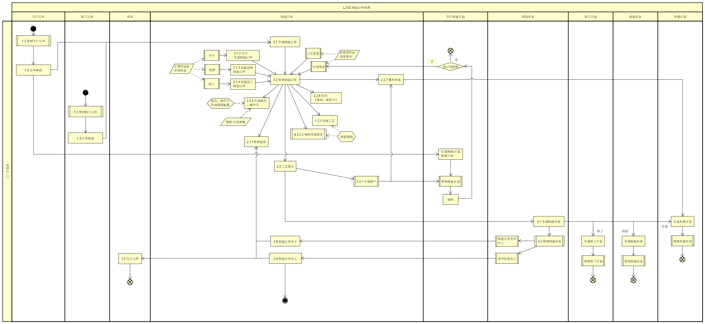

制造任务管理流程

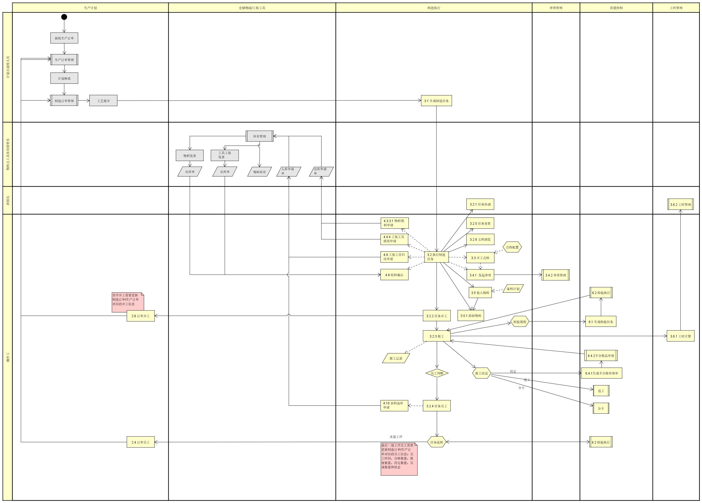

### 2.1.2 **特殊业务场景专题**

#### 2.1.2.1 **批次/序列号追溯**

不同组织下相同物料的批次号 / 序列号处理

**场景描述** ：

在离散型制造业多组织背景下，相同物料在不同组织流转加工时，批次号 / 序列号处理方式不同。

例如，零件涉及多组织加工流转，机加厂一般沿用上游单位的批次号 / 序列号；热表厂会重新生成新的批次号，但会记录与上游单位批次号的对应关系。

**涉及组织及操作** ：

**机加厂** ：

操作：沿用上游单位的批次号 / 序列号。

目的：保持物料在加工流转过程中的批次号 / 序列号一致性，便于追溯和管理。

**热表厂** ：

操作：重新生成新的批次号，记录与上游单位批次号的对应关系。

目的：根据自身加工需求和管理要求，生成新的批次号，同时通过记录对应关系，实现对物料加工流转过程的追溯和管理。

相同组织下不同制造订单的批次号 / 序列号处理

**场景描述** ：

在相同组织内，相同物料的不同制造订单，批次号 / 序列号可能相同可能不同。

例如，对于机加厂，允许不同制造订单的批次号相同，但序列号不同。

当机加厂连续转工工序，有相同的两道工序需要转到热表厂时，热表厂会生成两个制造订单，不同工序的加工工段或者班组不同，此时两个制造订单的批次号和序列号都相同。

**涉及组织及操作** ：

**机加厂** ：

操作：允许不同制造订单的批次号相同，但序列号不同。

目的：根据生产计划和管理要求，对不同制造订单进行批次号和序列号的区分和管理，便于生产过程中的物料追踪和产品质量控制。

**热表厂** ：

操作：生成两个制造订单，不同工序的加工工段或者班组不同，两个制造订单的批次号和序列号都相同。

目的：根据加工需求和管理要求，生成新的制造订单，同时保持批次号和序列号的一致性，便于对相同物料在不同工序加工过程中的管理和追溯。

|graph TD
    A[开始] --> B[判断是否为不同组织下的相同物料]
    B -->|是| C[机加厂沿用上游单位的批次号/序列号]
    B -->|是| D[热表厂重新生成新的批次号，记录与上游单位批次号的对应关系]
    B -->|否| E[判断是否为相同组织下的不同制造订单]
    E -->|是| F[机加厂允许不同制造订单的批次号相同，但序列号不同]
    E -->|是| G[热表厂生成两个制造订单，不同工序的加工工段或者班组不同，两个制造订单的批次号和序列号都相同]
    F --> H[结束]
    G --> H|
|---|

参考

#### 2.1.2.2 **派工**

**场景示意**

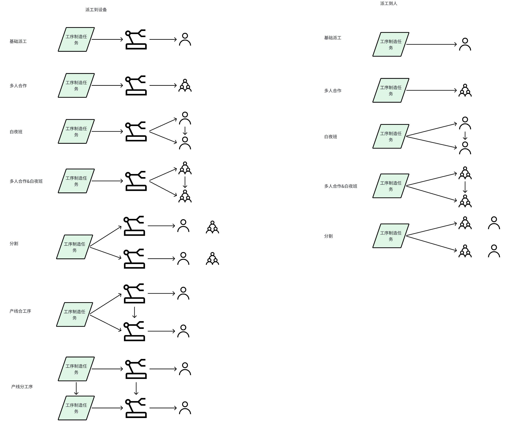

**场景汇总**

| | 派工到设备 | 派工到人|
|--- | --- | ---|
|基础派工 | 单个工序任务派工给一台设备、一个人 | 单个工序任务派工不派给设备，派给一个人|
|多人合作 | 单个工序任务派工给一台设备、多个人，多个人合作完成 | 单个工序任务派工不派给设备，派给多个人，多人组合完成|
|白夜班 | 单个工序任务派工给一台设备、多个人，多个人轮流完成 | 单个工序任务派工不派给设备，派给多个人，多人轮流完成|
|多人合作&白夜班 | 单个工序任务派工给一台设备、多组人，每组多个人，每组合作，多组轮流完成 | 单个工序任务派工不派给设备，派给多组人，每组多个人，每组合作，多组轮流完成|
|分割 | 单个工序任务分割派工给多台设备、多台设备独立加工，每台设备一个或多个人 | 单个工序任务分割派工给多组人，每组一个或多个人，每组独立完成|
|产线合工序 | 单个工序任务对应一个产线，派给多个设备，多个设备组合加工，每台设备一个或多个人 | ————|
|产线分工序 | 多个工序任务对应一个产线，每个任务一个设备，每台设备一个或多个人 | ————|
| |  | |

#### 2.1.2.3 **报工**

**场景示意**

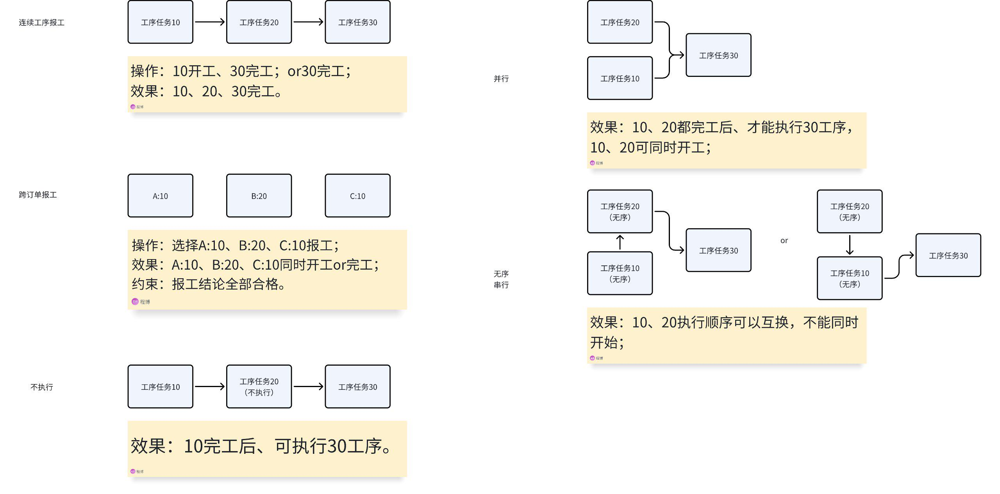

#### 2.1.2.4 **特殊场景互斥表**

| | 连续工序报工
跨订单批量报工 | 部分报工
顺序号报工
分割 | 不执行 | 切件 | 报废
分卡 | 并行 | 无序串行 | SSEE|
|--- | --- | --- | --- | --- | --- | --- | --- | ---|
|连续工序报工 跨订单批量报工 | —— | X | X | X | X | √ | √ | X|
|部分报工
顺序号报工 分割 | —— | —— | X | √ | √ | √ | √ | √|
|不执行 | —— | —— | —— | X | X | √ | √ | √|
|切件 | —— | —— | —— | —— | √ | X | X | √|
|报废
分卡 | —— | —— | —— | —— | —— | √ | √ | √|
|并行 | —— | —— | —— | —— | —— | —— | X | X|
|无序串行 | —— | —— | —— | —— | —— | —— | —— | √|
|SSEE | —— | —— | —— | —— | —— | —— | —— | ——|

### 2.1.3 **系统处理流程图**

本节用于说明生产订单、制造订单、制造任务之间的业务连接，以及备料清单、工艺路线、批次号/序列号、物料准备计划、工装准备计划等关联对象的生成时机。

**主流程图**

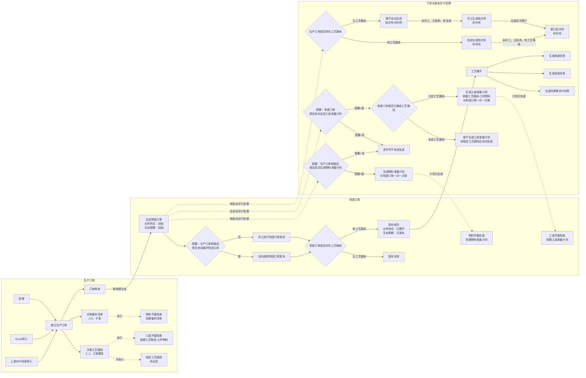
```mermaid
flowchart LR
    subgraph P["生产订单"]
        P01[上游ERP系统导入]
        P02[Excel导入]
        P03[新增]
        P1[建立生产订单]
        P2[关联备料清单<br/>1:N，子表]
        P3[关联工艺路线<br/>0..1，订单属性]
        P4[物料齐套检查<br/>依据备料清单]
        P5[工装齐套检查<br/>依据工艺路线-工序物料]
        P6[指定工艺路线<br/>非必须]
        P7[订单释放]
    end

    subgraph M["制造订单"]
        M1[生成制造订单<br/>业务状态：初始<br/>生命周期：初始]
        M2{配置：生产订单释放后<br/>是否自动展开制造订单}
        M3[自动调用制造订单发布]
        M4[手工执行制造订单发布]
        M5{制造订单是否存在工艺路线}
        M6[发布成功<br/>业务状态：已展开<br/>生命周期：已发布]
        M7[发布失败]
        M8[物料齐套检查<br/>依据物料准备计划]
        M9[工装齐套检查<br/>依据工装准备计划]
    end

    subgraph D["下游对象及并行处理"]
        D1{生产订单是否存在工艺路线}
        D2[自动生成批次号<br/>序列号]
        D3[暂不自动生成<br/>批次号/序列号]
        D3A[手工生成批次号<br/>序列号]
        D3B[修订批次号<br/>序列号]
        D4{配置：生产订单释放后<br/>是否自动生成物料准备计划}
        D5[生成物料准备计划<br/>与制造订单一对一关联]
        D6[工艺展开]
        D7[生成制造任务]
        D8[生成检验任务]
        D9[生成外委需求计划等]
        D10{配置：制造订单<br/>是否自动生成工装准备计划}
        D11{制造订单是否已确定工艺路线}
        D12[生成工装准备计划<br/>依据工艺路线-工序物料<br/>与制造订单一对一关联]
        D13[暂不生成工装准备计划<br/>待指定工艺路线后自动生成]
        D14[本环节不自动生成]
    end

    P01 --> P1
    P02 --> P1
    P03 --> P1
    P1 --> P2
    P1 --> P3
    P1 --> P7
    P2 -.用于.-> P4
    P3 -.用于.-> P5
    P3 -.可执行.-> P6

    P7 -->|释放即生成| M1
    M1 --> M2
    M2 -->|是| M3 --> M5
    M2 -->|否| M4 --> M5
    M5 -->|有工艺路线| M6 --> D6
    M5 -->|无工艺路线| M7

    M1 -.释放后并行处理.-> D1
    D1 -->|有工艺路线| D2
    D1 -->|无工艺路线| D3
    D3 -->|未开工、已启用、未生成| D3A
    D2 -->|未开工、已启用、有工艺路线| D3B
    D3A -->|生成后可修订| D3B
    M1 -.释放后并行处理.-> D4
    D4 -->|配置=是| D5
    D4 -->|配置=否| D14

    D6 --> D7
    D6 --> D8
    D6 --> D9
    M1 -.生成后并行处理.-> D10
    D10 -->|配置=是| D11
    D10 -->|配置=否| D14
    D11 -->|已定工艺路线| D12
    D11 -->|未定工艺路线| D13
    D5 -.计划已生成.-> M8
    D12 -.计划已生成.-> M9
```

**对象关系摘要**

| 对象 | 关联对象 | 关系 | 说明 |
|--- | --- | --- | ---|
| 生产订单 | 备料清单 | 一对多 | 备料清单为生产订单关联子表，用于物料齐套检查及物料准备计划生成 |
| 生产订单 | 工艺路线 | 一对一，可为空 | 工艺路线是生产订单属性，可存在也可不存在；工装齐套检查、制造订单发布、批次号/序列号生成均依赖工艺路线 |
| 生产订单 | 制造订单 | 释放生成 | 生产订单释放后生成制造订单，生成时业务状态=初始，生命周期状态=初始 |
| 制造订单 | 物料准备计划 | 一对一，按配置生成 | 当【生产订单释放后是否自动生成物料准备计划】配置为是时，系统根据生产订单备料清单自动生成，并与制造订单一对一关联 |
| 制造订单 | 工装准备计划 | 一对一，按配置生成 | 当【制造订单是否自动生成工装准备计划】配置为是时，制造订单首次满足“已生成且已确定工艺路线”条件后，系统根据工艺路线-工序物料自动生成，并与制造订单一对一关联；若生成时无工艺路线，则待后续指定工艺路线后生成 |
| 制造订单 | 物料齐套检查 | 功能操作 | 制造订单支持执行物料齐套检查，检查来源为物料准备计划 |
| 制造订单 | 工装齐套检查 | 功能操作 | 制造订单支持执行工装齐套检查，检查来源为工装准备计划 |
| 制造订单 | 制造任务、检验任务、外委需求计划等 | 一对多 | 制造订单发布成功后执行工艺展开，同步创建下游对象 |

**关联处理说明**

1. 生产订单建立与前置处理

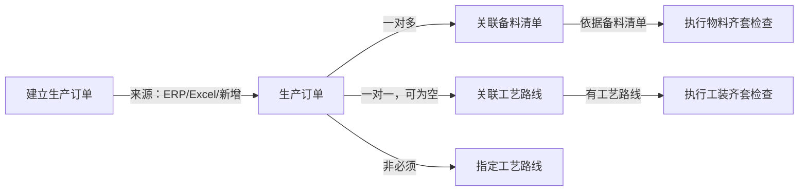
```mermaid
flowchart LR
    A[建立生产订单] -->|来源：ERP/Excel/新增| B[生产订单]
    B -->|一对多| C[关联备料清单]
    B -->|一对一，可为空| D[关联工艺路线]
    C -->|依据备料清单| E[执行物料齐套检查]
    D -->|有工艺路线| F[执行工装齐套检查]
    B -->|非必须| G[指定工艺路线]
```

   - 生产订单来源包括上游ERP系统导入、Excel导入、新增。
   - 生产订单有关联备料清单，关系为一对多，备料清单作为关联子表维护。
   - 生产订单有关联工艺路线，关系为一对一或为空，工艺路线作为生产订单属性维护。
   - 生产订单可执行物料齐套检查，检查依据为关联的备料清单。
   - 生产订单可执行工装齐套检查，检查依据为工艺路线的工序物料表；未指定工艺路线时，该检查不具备执行基础。
   - 生产订单支持指定工艺路线，但该操作为非必须操作。

2. 订单释放与制造订单发布

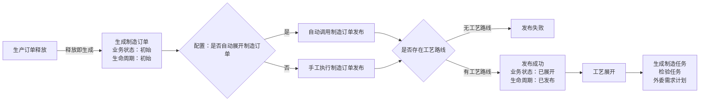
```mermaid
flowchart LR
    A[生产订单释放] -->|释放即生成| B[生成制造订单<br/>业务状态：初始<br/>生命周期：初始]
    B --> C{配置：是否自动展开制造订单}
    C -->|是| D[自动调用制造订单发布]
    C -->|否| E[手工执行制造订单发布]
    D --> F{是否存在工艺路线}
    E --> F
    F -->|无工艺路线| G[发布失败]
    F -->|有工艺路线| H[发布成功<br/>业务状态：已展开<br/>生命周期：已发布]
    H --> I[工艺展开]
    I --> J[生成制造任务<br/>检验任务<br/>外委需求计划]
```

   - 生产订单释放时即生成制造订单，且不受后续自动展开、批次号/序列号生成、物料准备计划生成等后处理结果影响。
   - 制造订单生成后，业务状态为“初始”，生命周期状态为“初始”。
   - 若【生产订单释放后是否自动展开制造订单】配置开启，则制造订单生成后自动调用“制造订单发布”。
   - 若配置未开启，则可在制造订单上手工点击“订单发布”。
   - 制造订单发布存在约束：必须存在工艺路线；若不存在工艺路线，则发布失败。
   - 制造订单发布成功后，业务状态变为“已展开”，生命周期状态变为“已发布”，并同步进行工艺展开，创建制造任务、检验任务、外委需求计划等下游对象。

3. 批次号/序列号生成

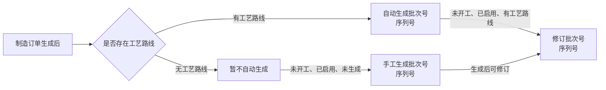
```mermaid
flowchart LR
    A[制造订单生成后] --> B{是否存在工艺路线}
    B -->|有工艺路线| C[自动生成批次号<br/>序列号]
    B -->|无工艺路线| D[暂不自动生成]
    D -->|未开工、已启用、未生成| E[手工生成批次号<br/>序列号]
    C -->|未开工、已启用、有工艺路线| F[修订批次号<br/>序列号]
    E -->|生成后可修订| F
```

   - 若生产订单存在工艺路线，系统根据物料是否启用批次号、是否启用序列号，自动为制造订单生成批次号/序列号。
   - 若生产订单不存在工艺路线，则系统不自动生成批次号/序列号；用户可在制造订单上手工点击“生成批次号/序列号”。
   - 手工生成批次号/序列号的约束为：订单未开工、物料已启用对应属性、存在工艺路线、且未生成过。
   - 无论批次号/序列号是自动生成还是手工生成，生成后均支持“修改批次号/序列号”；修改约束为：订单未开工、物料已启用对应属性、存在工艺路线。

4. 物料准备计划生成

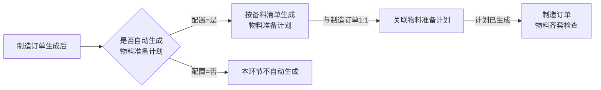
```mermaid
flowchart LR
    A[制造订单生成后] --> B{是否自动生成<br/>物料准备计划}
    B -->|配置=是| C[按备料清单生成<br/>物料准备计划]
    B -->|配置=否| D[本环节不自动生成]
    C -->|与制造订单1:1| E[关联物料准备计划]
    E -->|计划已生成| F[制造订单<br/>物料齐套检查]
```

   - 若【生产订单释放后是否自动生成物料准备计划】配置为是，则系统根据生产订单的备料清单生成物料准备计划，并与制造订单一对一关联。
   - 制造订单支持执行物料齐套检查，检查来源为关联的物料准备计划。

5. 工装准备计划生成

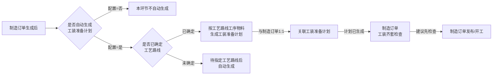
```mermaid
flowchart LR
    A[制造订单生成后] --> B{是否自动生成<br/>工装准备计划}
    B -->|配置=否| C[本环节不自动生成]
    B -->|配置=是| D{是否已确定<br/>工艺路线}
    D -->|已确定| E[按工艺路线工序物料<br/>生成工装准备计划]
    D -->|未确定| F[待指定工艺路线后<br/>自动生成]
    E -->|与制造订单1:1| G[关联工装准备计划]
    G -->|计划已生成| H[制造订单<br/>工装齐套检查]
    H -->|建议先检查| I[制造订单发布/开工]
```

   - 若【制造订单是否自动生成工装准备计划】配置为是，则制造订单首次满足“已生成且已确定工艺路线”条件时，系统根据工艺路线-工序物料生成工装准备计划，并与制造订单一对一关联。
   - 若制造订单生成时无工艺路线，则本环节暂不生成工装准备计划；待后续在制造订单上指定工艺路线后自动生成。
   - 制造订单发布是执行控制节点，不作为工装准备计划的唯一生成时点。
   - 制造订单支持执行工装齐套检查，检查来源为关联的工装准备计划；工装齐套检查的前提是工装准备计划已生成，建议在发布/开工前完成检查。

**工艺路线指定/变更处理图**

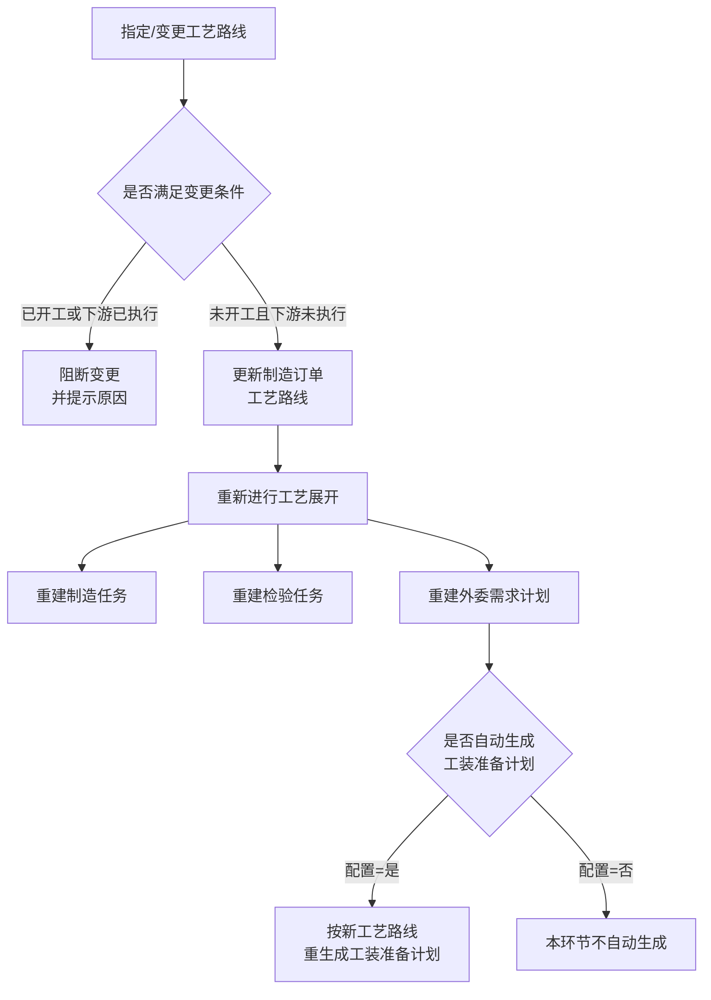
```mermaid
flowchart TB
    A[指定/变更工艺路线] --> B{是否满足变更条件}
    B -->|已开工或下游已执行| C[阻断变更<br/>并提示原因]
    B -->|未开工且下游未执行| D[更新制造订单<br/>工艺路线]
    D --> E[重新进行工艺展开]
    E --> F[重建制造任务]
    E --> G[重建检验任务]
    E --> H[重建外委需求计划]
    H --> I{是否自动生成<br/>工装准备计划}
    I -->|配置=是| J[按新工艺路线<br/>重生成工装准备计划]
    I -->|配置=否| K[本环节不自动生成]
```

**工艺路线指定/变更说明**

- 制造订单支持指定工艺路线。指定工艺路线后，系统需重新进行工艺展开，重新创建制造任务、检验任务、外委需求计划等下游对象。
- 若制造订单生成时原本无工艺路线，后续在制造订单上指定工艺路线，且【制造订单是否自动生成工装准备计划】配置为是，则系统应在指定成功后自动生成工装准备计划，无需等待制造订单发布。
- 若【制造订单是否自动生成工装准备计划】配置为是，则制造订单指定工艺路线或工艺路线变更后，系统需根据新的工艺路线重新生成工装准备计划。

**工艺路线变更约束（建议补充，待评审确认）**

| 约束项 | 建议规则 | 目的 |
|--- | --- | ---|
| 变更时点 | 建议仅允许在制造订单未开工，且下游制造任务、检验任务、外委需求计划、工装准备计划均未执行时变更工艺路线 | 避免执行中的业务数据与新工艺路线不一致 |
| 已有下游对象 | 若下游对象已生成但均未执行，变更前应先作废或关闭原下游对象，再按新工艺路线重建 | 防止新旧工艺路线对应数据并存 |
| 已有执行反馈 | 若已存在报工、检验结果、委外下达、工装准备执行或领用等实际业务，建议禁止直接变更工艺路线 | 保证业务追溯链完整 |
| 计划联动 | 工艺路线变更后需同步重算工装准备计划；若变更同时引起工序物料变化，应提示用户确认是否重新生成相关准备数据 | 保证计划结果与工艺路线一致 |
| 审计追溯 | 变更时需记录原工艺路线、新工艺路线、变更原因、变更人、变更时间 | 满足审计与责任追溯要求 |

## 2.2 **功能描述**

### 2.2.1 **整体应用架构**

本次主要涉及制造计划、制造任务台。

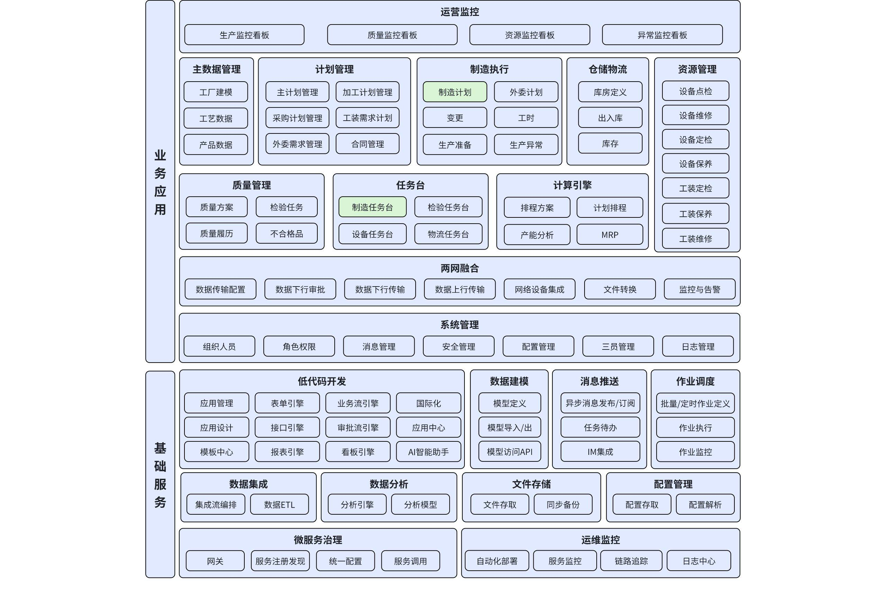

### 2.2.2 **制造计划&制造任务台应用架构**

 制造计划、制造任务台进一步细化展开到页面、业务功能一级

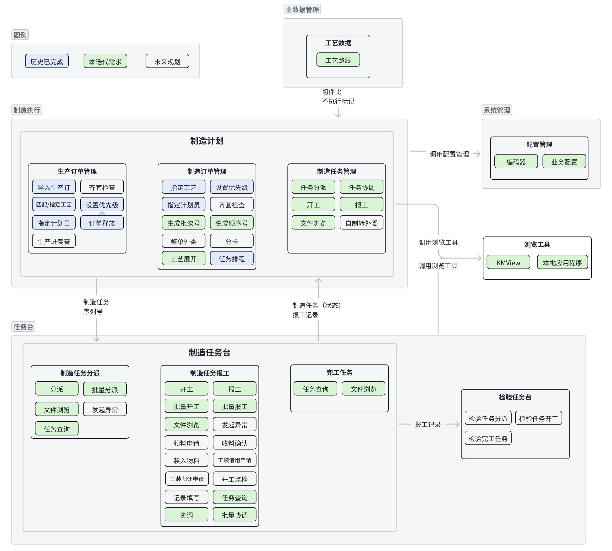

### 2.2.3 **功能清单**

|应用 | 页面 | 功能 | 功能状态|
|--- | --- | --- | ---|
|全局 | 所有界面 | 顶部工具栏 | V3.0-a4新增|
|制造执行 | 生产订单管理 | 生产订单管理-订单释放 | V3.0-a4优化|
|制造执行 | 生产订单管理 | 生产订单管理-新增 | V3.0-a4优化|
|制造执行 | 生产订单管理 | 生产订单管理-导入 | V3.0-a4优化|
|制造执行 | 生产订单管理 | 生产订单管理-发布 | V3.0-a4优化|
|制造执行 | 生产订单管理 | 生产订单管理-删除 | V3.0-a4优化|
|制造执行 | 生产订单管理 | 生产订单管理-指定订单优先级 | V3.1-a1新增|
|制造执行 | 生产订单管理 | 生产订单管理-指定工艺路线 | V3.0-a4优化|
|制造执行 | 生产订单管理 | 生产订单管理-指定计划员 | V3.1-a1新增|
|制造执行 | 制造订单管理 | 制造订单管理-生成批次号/序列号 | V3.1-a1新增|
|制造执行 | 制造订单管理 | 制造订单管理-查询批次号/序列号 | V3.1-a1优化|
|制造执行 | 制造订单管理 | 制造订单管理-订单发布 | V3.1-a4优化|
|制造执行 | 制造订单管理 | 制造订单管理-指定工艺路线 | V3.0-a4优化|
|制造执行 | 制造订单管理 | 制造订单管理-指定订单优先级 | V3.1-a1新增|
|制造执行 | 制造订单管理 | 制造订单管理-指定计划员 | V3.1-a1新增|
|制造执行 | 制造任务管理 | 制造任务管理-派工 | V3.1-a1优化|
|制造执行 | 制造任务管理 | 制造任务管理-任务协调 | V3.1-a1优化|
|制造执行 | 制造任务管理 | 制造任务管理-开工 | V3.1-a1优化|
|制造执行 | 制造任务管理 | 制造任务管理-报工 | V3.1-a1优化|
|制造执行 | 制造任务管理 | 制造任务管理-文件浏览 | V3.1-a1优化|
|制造任务台 | 制造任务派工 | 制造任务派工-任务查询 | V3.1-a1新增|
|制造任务台 | 制造任务派工 | 制造任务派工-任务详情 | V3.1-a1新增|
|制造任务台 | 制造任务派工 | 制造任务派工-派工 | V3.1-a1新增|
|制造任务台 | 制造任务派工 | 制造任务派工-批量派工 | V3.1-a1新增|
|制造任务台 | 制造任务派工 | 制造任务派工-文件浏览 | V3.1-a1新增|
|制造任务台 | 制造任务报工 | 制造任务报工-任务查询 | V3.1-a1新增|
|制造任务台 | 制造任务报工 | 制造任务报工-任务详情 | V3.1-a1新增|
|制造任务台 | 制造任务报工 | 制造任务报工-开工 | V3.1-a1新增|
|制造任务台 | 制造任务报工 | 制造任务报工-批量开工 | V3.1-a1新增|
|制造任务台 | 制造任务报工 | 制造任务报工-报工 | V3.1-a1新增|
|制造任务台 | 制造任务报工 | 制造任务报工-批量报工 | V3.1-a1新增|
|制造任务台 | 制造任务报工 | 制造任务报工-协调 | V3.1-a1新增|
|制造任务台 | 制造任务报工 | 制造任务报工-批量协调 | V3.1-a1新增|
|制造任务台 | 制造任务报工 | 制造任务报工-文件浏览 | V3.1-a1新增|
|制造任务台 | 完工任务 | 完工任务-任务查询 | V3.1-a1新增|
|制造任务台 | 完工任务 | 完工任务-任务详情 | V3.1-a1新增|
|制造任务台 | 完工任务 | 完工任务-文件浏览 | V3.1-a1新增|
|制造任务台 | 班组工作台首页 | 班组工作台首页-查询 | V3.1-a4新增|

# 3. ** 页面 & 功能设计**

## 3.1 ** ****生产订单管理**

### 3.1.1 **生产订单管理-订单释放**

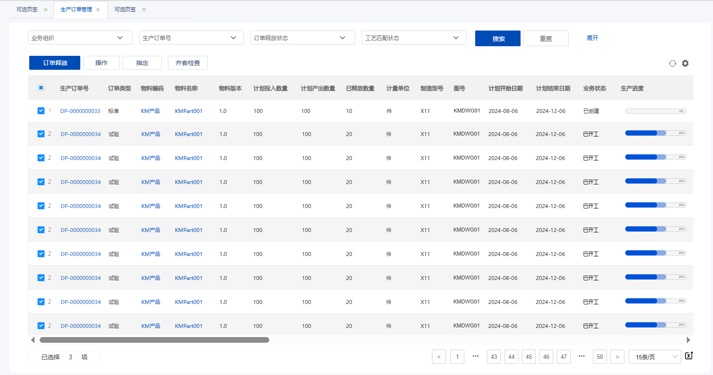

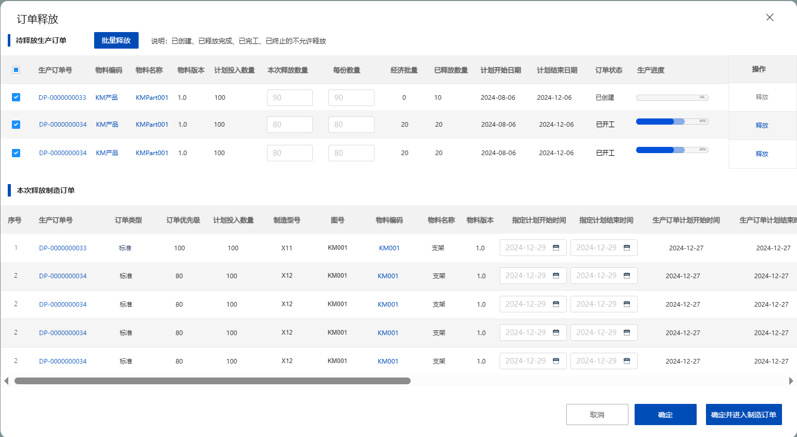

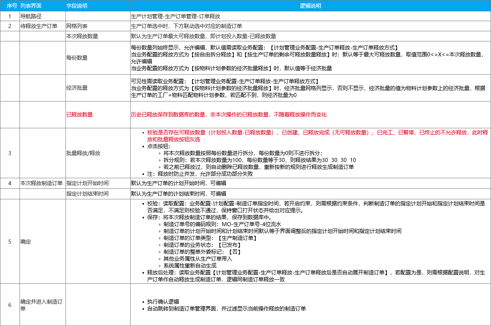

**释放跳转优化**

订单释放对话框去掉"确定"按钮，只保留"确定并打开制造订单"按钮。点击后系统跳转到制造订单列表，自动设置过滤条件，显示刚刚释放的制造订单。

**业务规则**

- BR-ORDER-13: The 订单释放对话框 shall 去掉"确定"按钮，只保留"确定并打开制造订单"
- BR-ORDER-14: The 系统 shall 跳转后自动设置过滤条件，显示刚刚释放的制造订单

**验收场景**

**场景: 释放后跳转**
- **Given** 用户在生产订单释放对话框
- **When** 用户点击"确定并打开制造订单"
- **Then** 系统跳转到制造订单列表，自动过滤显示刚刚释放的制造订单

### 3.1.2 **生产订单管理-新增**

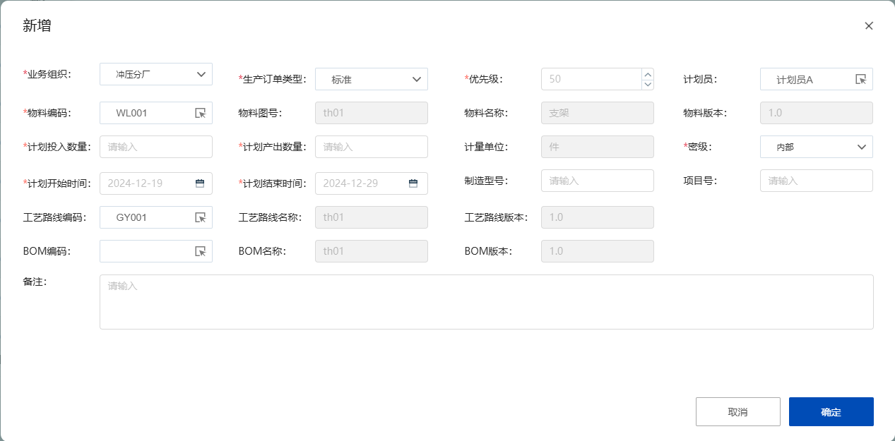

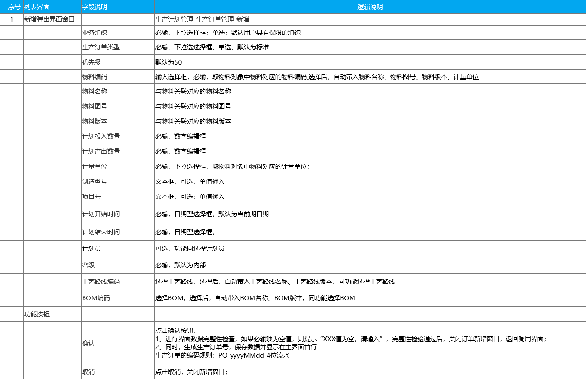

### 3.1.3 **生产订单管理-导入**

### 3.1.4 **生产订单管理-发布**

### 3.1.5 **生产订单管理-删除**

### 3.1.6 **生产订单管理-指定优先级**

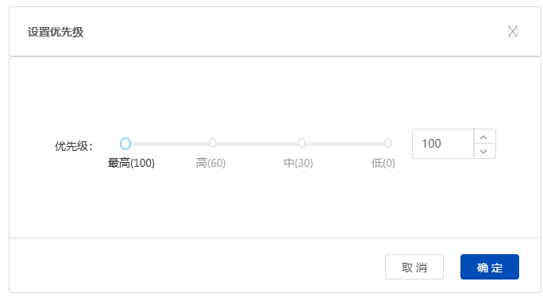

### 3.1.7 **生产订单管理-指定工艺路线**

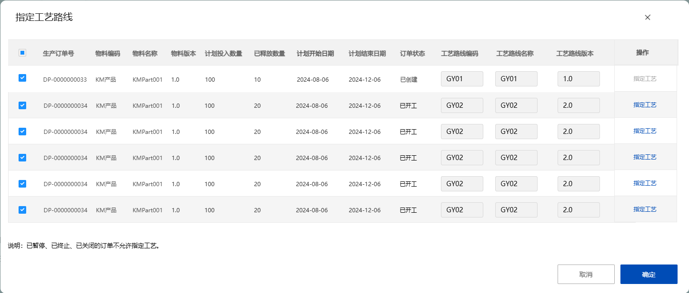

注：目前相同组织的订单才会做工艺自动匹配，业务上一般不会同时操作不同组织的数据

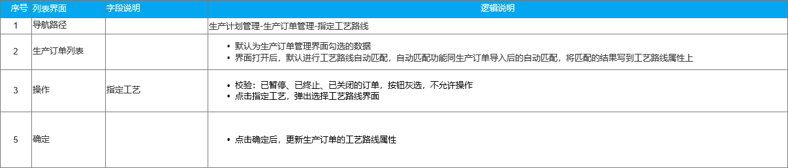

### 3.1.8 **生产订单管理-指定计划员**

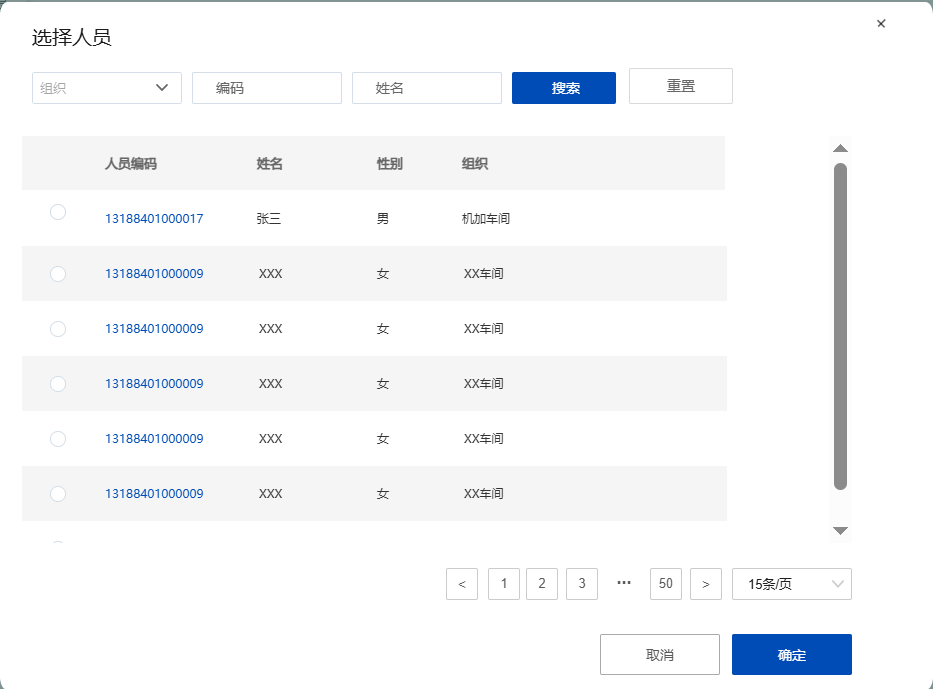

|功能 | 描述|
|--- | ---|
|指定计划员 | 支持批量操作，点击打开指定计划员界面【当前手动指定，后续扩展根据规则匹配计划员】|
|筛选条件 | 组织：具有权限控制的组织
人员编码
姓名|
|人员列表 | 单选
数据的显示与生产订单的组织无关，和当前用户具有权限的组织有关|
|确定 | 点击确定后，更新生产订单的计划员属性
校验：已取消的静默处理，直接跳过|

## 3.2 **制造订单管理**

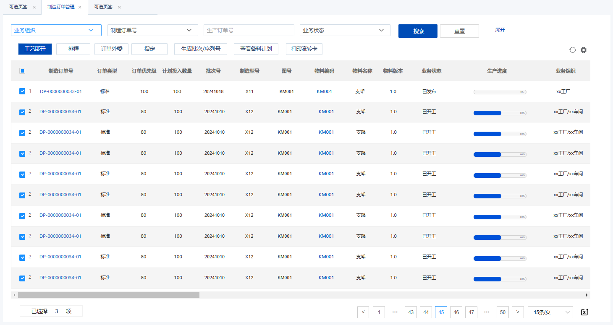

**界面**

**页面布局** ：采用典型的表单布局，上方信息查询区域；中间是按钮区；下方为订单基本信息展示区域，包括订单编号、产品名称、计划开始时间、计划结束时间、订单优先级等字段。

**处理逻辑**

**数据加载逻辑** ：页面加载时，从数据库中获取当前用户有权限查看的制造订单列表。

**过滤逻辑** ：提供多种过滤条件，如订单状态（未开始、进行中、已完成）、产品类别、客户名称等，用户可以根据需要筛选出特定的订单列表。

**验收标准**

**边界条件** ：能够正确处理订单数量为 0、订单信息为空等异常情况，页面正常显示且不报错。

**验收标准** ：页面显示的订单信息准确无误，与数据库中的数据保持一致。

### 3.2.1 **制造订单管理-****生成批次号/序列号**

**界面**

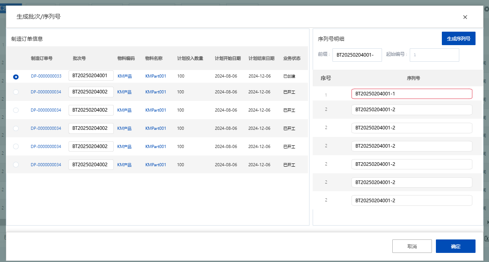

在制造订单管理界面，点击生成批次号/顺序号弹出弹框。

校验不通过则给出提示：

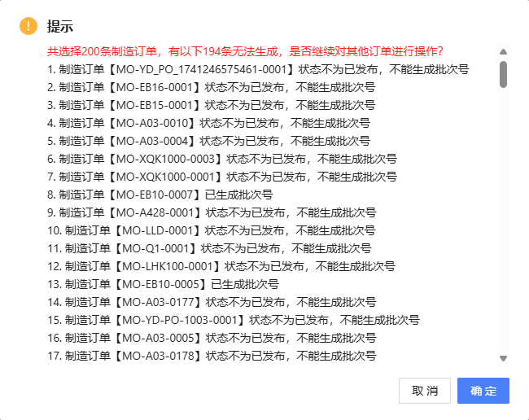

**输入**

制造订单、批次号编码规则、序列号编码规则、物料参数设置

**输出**

制造订单的批次号、序列号

**处理逻辑**

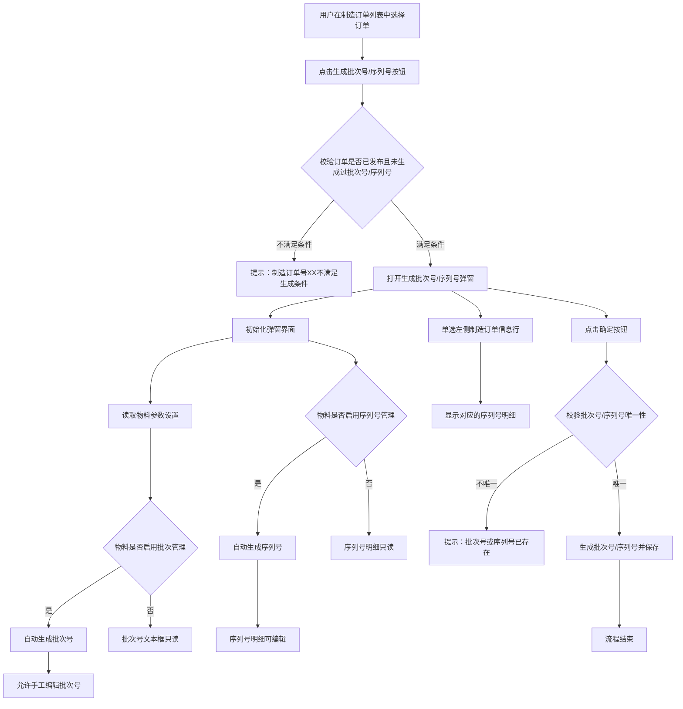
```mermaid
graph TD
    A[用户在制造订单列表中选择订单] --> B[点击生成批次号/序列号按钮]
    B --> C{校验订单是否已发布且未生成过批次号/序列号}
    C -->|不满足条件| D[提示：制造订单号XX不满足生成条件]
    C -->|满足条件| E[打开生成批次号/序列号弹窗]
    E --> F[初始化弹窗界面]
    F --> G[读取物料参数设置]
    G --> H{物料是否启用批次管理}
    H -->|是| I[自动生成批次号]
    H -->|否| J[批次号文本框只读]
    I --> K[允许手工编辑批次号]
    F --> L{物料是否启用序列号管理}
    L -->|是| M[自动生成序列号]
    L -->|否| N[序列号明细只读]
    M --> O[序列号明细可编辑]
    E --> P[单选左侧制造订单信息行]
    P --> Q[显示对应的序列号明细]
    E --> S[点击确定按钮]
    S --> T{校验批次号/序列号唯一性}
    T -->|不唯一| U[提示：批次号或序列号已存在]
    T -->|唯一| V[生成批次号/序列号并保存]
    V --> W[流程结束]
```

|一、用户操作
用户在 "制造订单管理界面" 的制造订单列表中选择制造订单，支持批量选择。
点击 "生成批次号/序列号" 按钮触发操作。
二、校验
校验规则：
制造订单必须已发布且未生成过批次号 / 序列号。
若存在不满足条件的订单（如未发布或已生成批次号 / 序列号），系统给出提示： "以下制造订单已生成批次号 / 序列号：XX、XX，是否继续对未生成的订单进行操作？"，若用户选择 "是"，则仅对未生成的订单打开二级界面；若用户选择 "否"，则取消操作。
三、打开二级弹窗界面
校验通过后：
打开 "生成批次号/序列号" 的二级弹窗界面。
界面布局：
左侧：显示制造订单信息。
右侧：显示序列号明细。
四、初始化处理
界面初始打开时：
需要进行初始化处理，预生成批次号和序列号。
制造订单信息
默认选中一行，且右侧根据规则联动显示对应的序列号明细
批次号：文本编辑框，长度约束同对象建模保持一致，默认值：根据物料参数设置：
若物料启用了批次管理，则根据批次号的编码规则自动生成批次号，并允许手工编辑。
编码规则为 BT年月日+4位流水号（如 BT202502050001）。
若物料未启用批次管理，则不生成批次号，且文本框只读，不允许编辑。
序列号明细：
前缀：文本编辑框，长度约束同序列号约束一致，可编辑，默认值为：SN年月日（例如：SN20250205）
起始编号：
数值编辑框，可编辑，输入的值必须为正整数
默认值为历史序列号的最大值。如果找不到历史序列号，则默认为 1。
序列号：文本编辑框，长度约束同对象建模保持一致，默认值：根据物料参数设置：
若物料启用了序列号管理，则默认生成对应的序列号，序列号明细界面才可编辑。
编码规则为 SN年月日+4位流水号（如 SN202502050001）。
若物料未启用序列号管理，则不生成序列号，且右侧的序列号明细只读。
序列号与物料实物一一对应，此时序列号按投料数（原料）生成，即序列号的个数等于订单的计划数量/所有工序的产出比乘积
五、单选制造订单信息行
单击左侧的制造订单信息行时，右侧同初始化的规则联动显示对应的序列号明细。
六、点击确定按钮
点击 "确定" 按钮后，需要校验批次号 / 序列号的唯一性。 
校验规则：
批次号唯一性：
全局唯一性 ：若物料启用了批次管理，则相同的物料在不同的组织、不同的制造订单中，批次号必须全局唯一。
扩展规则支持 ：系统需支持扩展唯一性校验规则，以满足不同业务场景的需求。
适用范围 ：该规则仅适用于生产制造订单，未来转工制造订单的规则可能会有所不同。
序列号唯一性：
全局唯一性 ：若物料启用了序列号管理，则相同的物料在不同的组织、不同的制造订单中，序列号必须唯一，但批次号允许重复。
扩展规则支持 ：系统需支持扩展唯一性校验规则，以满足不同业务场景的需求。
适用范围 ：该规则仅适用于生产制造订单，未来转工制造订单的规则可能会有所不同。
校验不通过
重复场景一 ：界面初始化批次号和序列号以后，人工手动修订可能会出现重复。
处理逻辑 ：系统提示具体哪些批次号或序列号重复，提示内容示例："以下批次号 / 序列号重复：XX、XX，请手动修订。" 
此时界面需对重复的序列号的输入框标红处理，用户需根据提示手动修订重复的批次号或序列号，修订后恢复正常状态
重复场景二 ：并发场景，两个人同时对一个订单生成批次号和序列号，此时会进行大批量的重复。
处理逻辑 ：系统提示用户："检测到并发操作导致批次号 / 序列号重复，请关闭界面重新生成。" ，保持当前界面状态，用户可手动修订重复的批次号或序列号或关闭界面重新生成。
校验通过后
生成批次号、序列号，并保存与制造订单的关系。
保存序列号的最大流水号 ：
批次号和序列号保存时，因存在人工手动调整的场景，需按规则保存序列号的对应的最大流水号，以便于下次可以按最大流水号继续生成
具体规则为：根据系统默认生成流水号的前缀（界面初始化时的初始前缀）对界面数据进行截取，截取后的值取最大数值保存。
若截取后不存在数值，则不保存；若截取后的最大数值超出序列号4位流水范围，需继续保存。
总结
用户在制造订单列表中选择订单，点击生成批次号/序列号按钮。
系统校验订单是否符合条件，给出提示。
校验通过后打开弹窗，初始化批次号和序列号。
用户编辑后点击确定，系统校验唯一性。
校验通过后保存生成的信息并与订单关联。|
|---|

**验收标准**

**边界条件** ：当用户输入的数量为 0 或负数时，系统提示输入错误，不允许生成批次号；当生成规则选择错误或不完整时，系统提示用户重新选择。能生成的批次号、顺序号格式以编码器能支持的编码规则为准。

**验收标准** ：生成的批次号符合用户选择的规则，且在系统中满足唯一性校验；生成的批次号能够正确关联到对应的制造订单。

### 3.2.2 **制造订单管理-****查询批次号/序列号**

**界面**

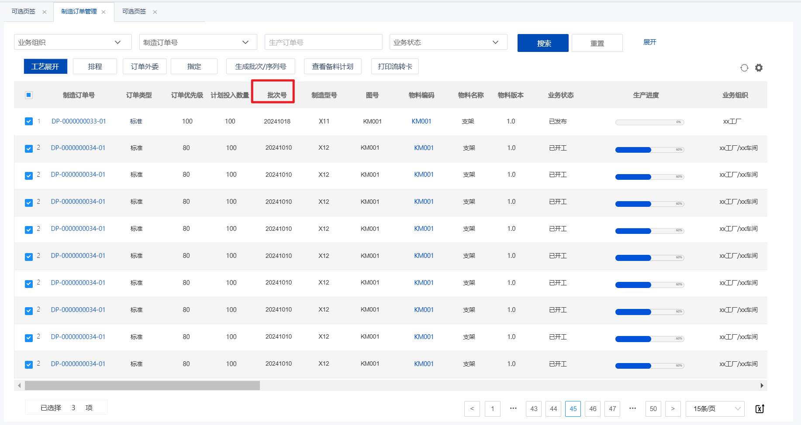

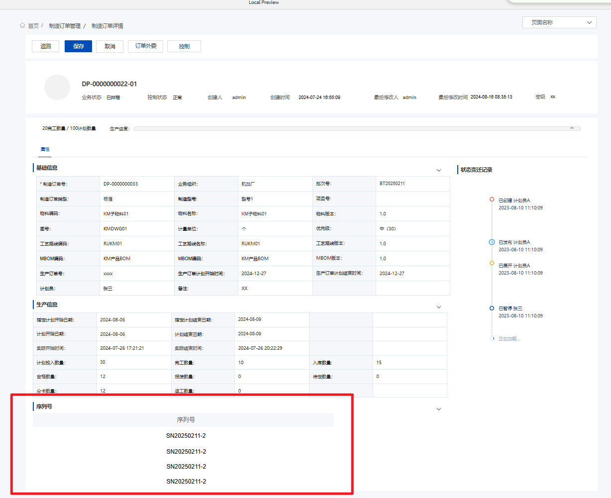

在制造订单管理界面，可以查看制造订单的批次号。

在制造订单管理界面，点击制造订单号超链接，打开制造订单详情界面，在详情界面可以查看制造订单的序列号

**输入**

制造订单

**输出**

制造订单批次号、制造订单序列号列表

**处理逻辑**

-

**验收标准**

**边界条件** ：-

**验收标准** ：-

### 3.2.3 **制造订单管理-****订单发布**

**界面**

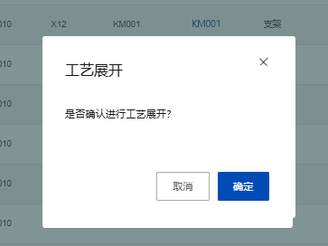

在制造订单管理界面，点击订单发布按钮（支持批量）弹出确认框。

**输入**

无直接输入，基于制造订单中已有的工艺路线信息进行展开。

**输出**

制造任务

**处理逻辑**

|%%{init: {'theme': 'forest'}}%%
graph TB
    A[用户在制造订单列表中选择订单] --> B[点击"订单发布"按钮]
    B --> C[弹出确认框：
是否确认进行订单发布？]
    C -->|确定| D[校验订单是否满足条件]
    D -->|订单不满足条件| E[静默处理并跳过]
    D -->|订单满足条件| F[根据工艺路线生成制造任务]
    F --> G[一键自动展开]
    G --> H{校验是否所有任务都生成成功}
    H -->|部分成功| I[给出批量提示：
显示成功和失败的数量及信息]
    H -->|全部成功| J[给出操作成功提示]

    %% 校验规则
    D -->|已展开的制造订单| E
    D -->|不存在工艺路线| E
    D -->|并行工序维护了产出比| E
    D -->|有产出比的工序未执行| E
    

    %% 设置样式
    classDef primary fill:#f5da55,stroke:#333,stroke-width:2px
    classDef success fill:#92c781,stroke:#333,stroke-width:2px
    class A,B,C,D,E,F,G,H,I,J,K,K1,K2,K3,K4,K5,K6,K7,K8,K9,K10 primary
    class J,K success|
|---|

|流程结构化整理
一、用户操作
用户在制造订单列表中选择制造订单，支持批量选择。
点击"订单发布" 按钮，触发操作。
二、确认弹窗
点击"订单发布"后，弹出确认框：
提示内容："是否确认进行订单发布？"
选项：确定、取消。
点击"取消" 直接退出流程。
三、校验规则（如校验不通过，进行静默处理并跳过）
校验规则如下，任意一个不满足则校验不通过：
已展开的制造订单不允许再次展开。
不存在工艺路线的订单不允许展开。
并行工序中的订单不允许维护产出比。
有产出比的工序必须执行，即执行标记为是
制造订单的计划投入数量，必须是工艺路线产出比乘积的整倍数
四、批量处理（允许部分成功部分失败）
对选中的制造订单进行逐个校验：
若订单通过校验，进入订单发布流程。
若订单不通过校验，系统静默跳过，不进行展开处理。
最后给出批量提示，显示成功和失败的订单数量及具体信息。
五、生成制造任务
对通过校验的订单，根据工艺路线自动生成制造任务，并一键自动展开。
生成的制造任务数据要点如下：
制造任务号规则：制造订单号:工序号（如：MO20250205:01，使用英文冒号分隔）
计划数量 （计划产出数量）
基数=订单的计划数量/所有工序的产出比乘积
首道序的计划数量 = 基数*首道序的产出比
非首道序的计划数量 = 上道工序的计划数量 *本道工序的产出比
执行标记：从工序上带入执行标记（如：是否需要执行该工序）
产出比 ：从工序上带入产出比（用于计算下道工序的计划数量）
特殊处理：对于不执行的工序，无需进行派工和执行，但需记录上下道关系
所属组织：取工作中心的所属组织
业务状态 ：默认为【已创建】
工作中心 ： 取工艺路线-工序上的工作中心
其他业务属性 ：从制造订单带入（如：订单类型、客户信息等）
系统属性： 重新自动生成（如：创建时间、更新时间等）
工艺展开时，需生成首道工序的序列号，序列号和实物一一对应
若首道工序没有产出比，则首工序的序列号等于制造订单的序列号
若首道工序存在产出比，则首工序的序列号等于制造订单的序列号*首工序的产出比
新序列号的规则=原序列号-流水号|
|---|

**自动展开优化**

- BR-MO-02: The 制造订单释放后 shall 自动进行工艺展开生成制造任务
- BR-MO-03: The 系统 shall 删除业务配置项【订单释放后是否自动展开制造订单】
- BR-MO-04: The "指定工艺路线"操作后 shall 自动进行工艺展开生成制造任务
- BR-MO-05: The 指定工艺路线的前提条件 shall 为制造任务未开工（已开工的订单不允许重新指定工艺路线，需走工艺变更）

**验收场景**

**场景1: 释放后自动展开**
- **Given** 制造订单已指定工艺路线
- **When** 用户释放制造订单
- **Then** 系统自动进行工艺展开，生成制造任务

**场景2: 指定工艺路线后自动展开**
- **Given** 制造订单未指定工艺路线
- **When** 用户指定工艺路线
- **Then** 系统自动进行工艺展开，生成制造任务

**验收标准**

**边界条件** ：产出比为空默认按1处理。

**验收标准** ：产出比、不执行标记能影响工序任务数量的流转。

|制造订单 | 计划数量（计划产出数量）：36 |  | |
|--- | --- | --- | ---|
|基数 | 36/2/3/3=2 | 订单的计划数量/所有工序的产出比乘积 | |
|制造任务 | 产出比 | 计划数量（计划产出数量） | 备注|
|10 | 2 | 4 | 基数*本道产出比
2*2=4|
|20 |  | 4 | 上道工序的计划数量 *本道工序的产出比|
|30 |  | 4 | 上道工序的计划数量 *本道工序的产出比|
|40 | 3 | 12 | 上道工序的计划数量 *本道工序的产出比4*3=12|
|50 |  | 12 | 上道工序的计划数量 *本道工序的产出比|
|60 | 3 | 36 | 上道工序的计划数量 *本道工序的产出比12*3=36|

### 3.2.4 ** ****制造订单管理-指定优先级**

### 3.2.5 **制造订单管理-指定工艺路线**

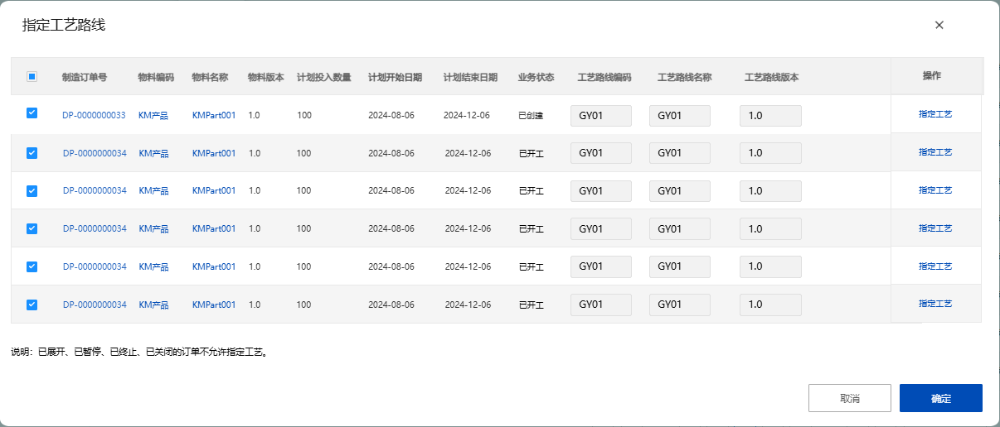

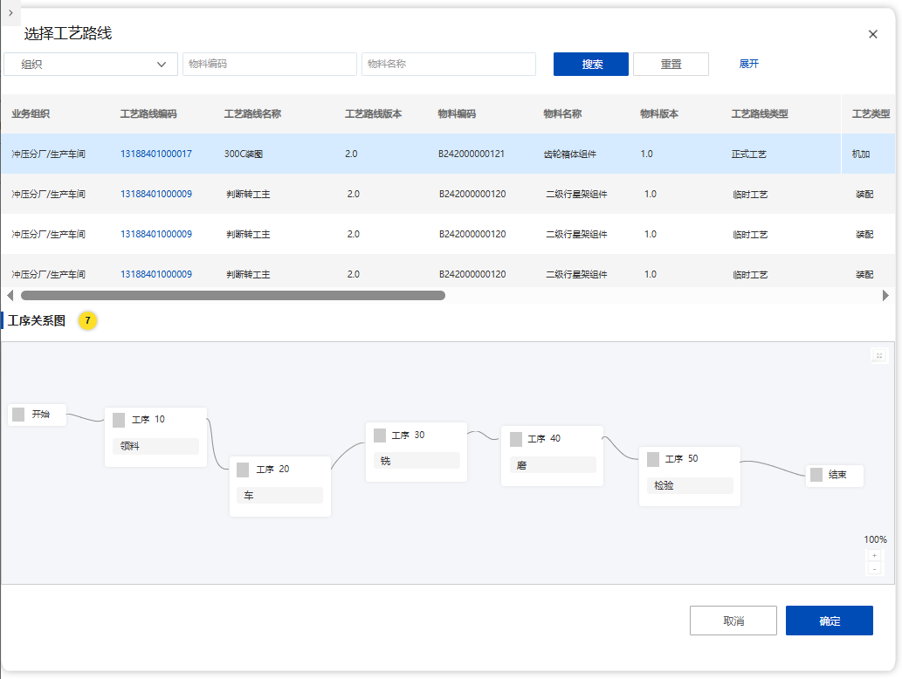

注：目前相同组织的订单才会做工艺自动匹配，业务上一般不会同时操作不同组织的数据

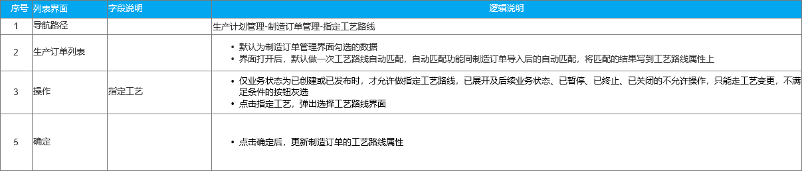

### 3.2.6 **制造订单管理-指定计划员**

功能同3.1.8生产订单管理-指定计划员

## 3.3 **制造任务管理**

**界面**

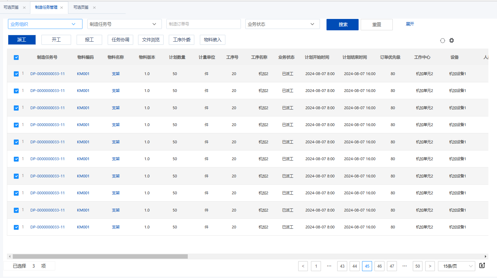

**处理逻辑**

**数据加载逻辑** ：页面加载时，根据用户的角色和权限，从数据库中获取相应的制造任务列表。

**过滤逻辑** ：用户可以通过选择不同的筛选条件，快速定位到需要查看或操作的制造任务列表。

**验收标准**

**边界条件** ：能够正确处理任务列表为空、任务信息不完整等异常情况，页面正常显示且不报错。

**验收标准** ：页面显示的任务信息准确无误，与数据库中的数据保持一致；各操作按钮功能正常，能够正确触发对应的操作流程。

### 3.3.1 **制造任务管理-****派工**

**界面**

单个任务派工

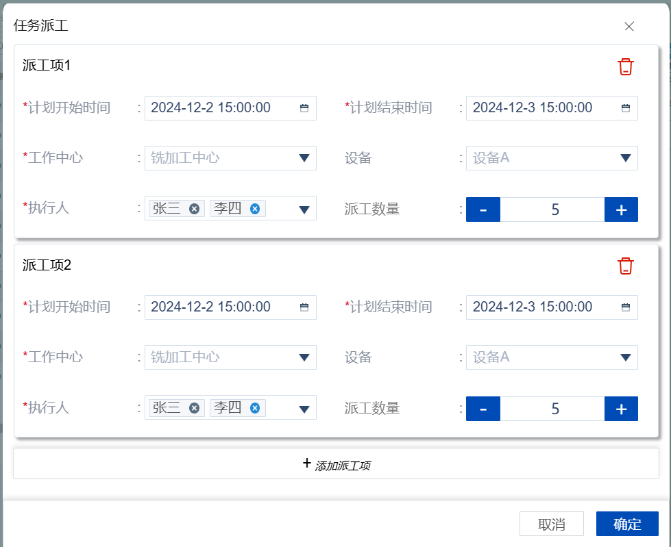

批量任务派工

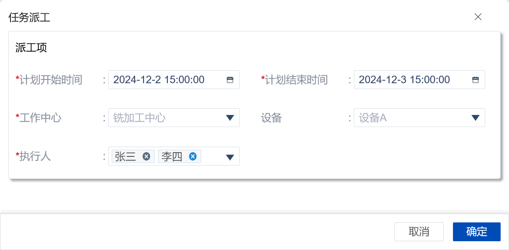

在制造任务管理界面点击 "派工" 按钮后，弹出派工页面，包含派工对象选择（设备或人员）、派工数量输入框、派工时间选择框等。

**输入**

派工对象：用户选择的设备或人员，可以单选或多选。

派工数量：用户输入需要派工的任务数量，为正整数。

派工时间：用户选择的派工开始时间和结束时间，必须符合逻辑。

**输出**

派工结果：将派工信息更新到制造任务表中，包括派工对象、派工数量、派工时间等，并在制造任务列表中实时更新任务状态。

**处理逻辑**

|graph LR

A[用户在制造任务管理界面
选择任务] --> B[点击派工按钮]

B --> C{校验任务状态}

C -->|已暂停、已终止、已派工| D[跳过，不进行派工操作]

C -->|可派工| E[弹出任务派工界面]

E --> M[点击确认]

M --> N{校验}

N -->|必填校验或派工数量之和
不等于任务计划数量| O[提示："校验失败，请检查"]

N -->|校验通过| P[更新制造任务业务状态
为"已派工"]

P --> Q[保存派工结果
并更新到制造任务属性]

Q --> R[流程完成]

style C fill:#f5da55;
style E fill:#92c781;
style M fill:#92c781;
style N fill:#f5da55;
style P fill:#92c781;
style Q fill:#92c781;|
|---|

**验收标准**

**边界条件** ：当派工数量为 0 或负数时，系统限制输入；当派工时间选择错误或不完整时，系统提示用户重新选择。

**验收标准** ：派工信息能够正确更新到制造任务表中，任务状态能够实时更新；派工结果能够准确反映在制造任务列表中，方便用户查看和跟踪。

### 3.3.2 **制造任务管理-****任务协调**

**界面**

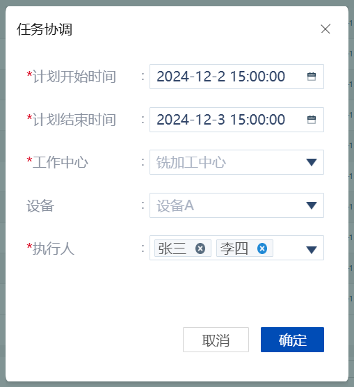

在制造任务管理界面点击 "任务协调" 按钮后，弹出任务协调页面，包含协调对象选择（设备或人员）、派工时间选择框等。

**输入**

计划开始/结束时间

工作中心

设备

执行人

**输出**

协调结果：根据用户的协调操作，更新制造任务表中的相关信息

**验收标准**

**边界条件** ：当协调参数输入错误或不完整时，系统提示用户重新输入。

**验收标准** ：协调操作能够正确更新制造任务表中的相关信息，任务状态能够实时更新；协调结果能够准确反映在制造任务列表中，方便用户查看和跟踪。

### 3.3.3 **制造任务管理-****开工**

**界面**

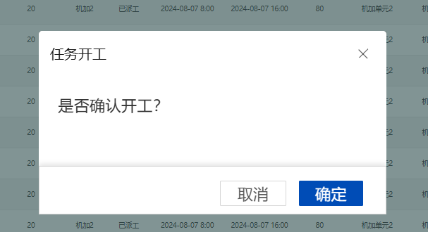

在制造任务管理界面，点击开工（支持批量）弹出确认框，提示是否确认开工？

**输入**

无直接输入，基于用户点击 "开工" 按钮的操作。

**输出**

任务状态更新：将制造任务表中的任务状态更新为 "已开工"，并记录实际开工时间。

**验收标准**

**边界条件** ：当任务已经开始或已完成时，系统提示用户任务状态不正确，无法再次开工。

**验收标准** ：任务状态能够正确更新为 "已开工"，开工时间能够准确记录；用户能够通过制造任务列表实时查看任务状态的变化。

### 3.3.4 **制造任务管理-****报工**

**界面**

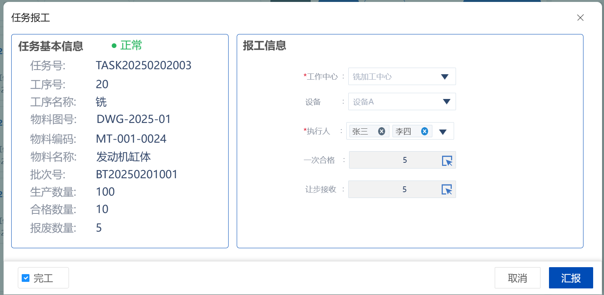

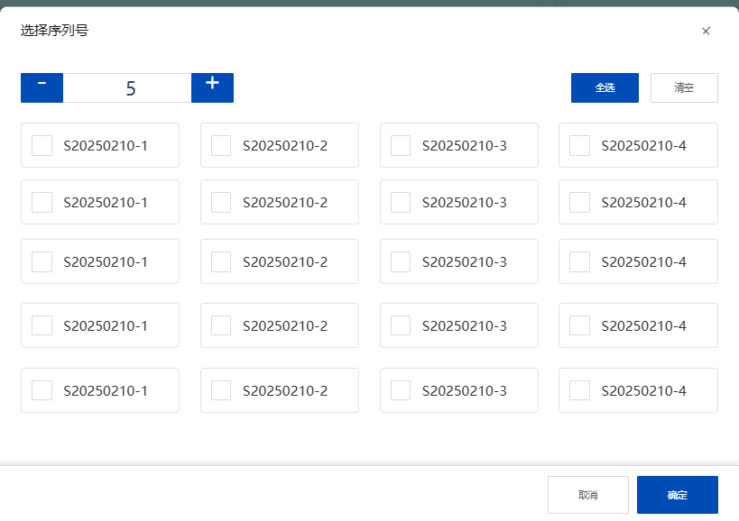

在制造任务管理界面点击 "报工" 按钮后，弹出任务报工页面，支持选择任务执行人，按数量报工、序列号报工。

选择序列号：输入数量时，需按顺序自动勾选下列顺序号，顺序号勾选后也需联动更新数量

**输入**

执行人

数量

序列号

**输出**

报工结果：将报工信息更新到制造任务表中，并根据报工结果更新任务状态。

**验收标准**

**边界条件** ：当报工数量为 0 或负数时，系统限制输入。

**验收标准** ：报工信息能够正确更新到制造任务表中，任务状态能够根据报工结果实时更新；报工结果能够准确反映在制造任务列表中，方便用户查看和跟踪。

#### 3.3.4.1 **报工方案使用规则**

##### 1. 任务生成规则

| 工序配置 | 生成的任务 | 说明 |
|---------|-----------|------|
| 工序（任意类型） | 制造任务（1个） | 工序任务，由工序生成 |
| 质量方案.检验分类 | 检验任务（N个） | 检验分类任务，由检验分类生成（首检、自检、专检等） |

**示例**：
- 工序类型=加工，未开启检验 → 生成1个制造任务
- 工序类型=加工，开启首检+自检 → 生成1个制造任务 + 2个检验任务
- 工序类型=检验，未配置检验分类 → 生成1个制造任务
- 工序类型=检验，配置了专检 → 生成1个制造任务 + 1个检验任务

##### 2. 报工方案选择规则

| 任务类型 | 使用的报工方案 | 来源 | 说明 |
|---------|---------------|------|------|
| **制造任务** | **加工报工方案** | 工序.加工报工方案 | 工序任务，无论工序类型是加工、检验还是外协 |
| **检验任务** | **检验报工项** | 工序.质量方案.检验报工项 | 检验分类任务（首检、自检、专检等） |

**核心规则**：
- 制造任务统一使用加工报工方案（与工序类型无关）
- 检验任务统一使用检验报工项（来自质量方案）

##### 3. 业务规则

- BR-REPORT-01: When 制造任务报工时, the 系统 shall 使用工序的加工报工方案
- BR-REPORT-02: When 检验任务报工时, the 系统 shall 使用工序质量方案中的检验报工项
- BR-REPORT-03: When 工序的加工报工方案为空时, the 系统 shall 使用组织级默认加工报工方案
- BR-REPORT-04: When 工序质量方案的检验报工项为空时, the 系统 shall 使用组织级默认检验报工方案

##### 4. 报工界面逻辑

**制造任务报工界面**：
1. 系统读取工序的加工报工方案
2. 若工序未配置加工报工方案，读取组织级默认加工报工方案
3. 过滤出启用的报工项（是否启用=是）
4. 展示报工项列表，用户选择报工项并填写数量
5. 根据报工项类型，累计到对应的数量字段
6. 若报工项类型=待定，自动创建不合格品审理单

**检验任务报工界面**：
1. 系统读取工序质量方案中的检验报工项
2. 若质量方案未配置检验报工项，读取组织级默认检验报工方案
3. 过滤出启用的报工项（是否启用=是）
4. 展示报工项列表，用户选择报工项并填写数量
5. 根据报工项类型，累计到对应的数量字段
6. 若报工项类型=待定，自动创建不合格品审理单

详见《报工和质量方案设计》> 7. 报工使用规则。

### 3.3.5 **制造任务管理-****文件浏览**

**界面**

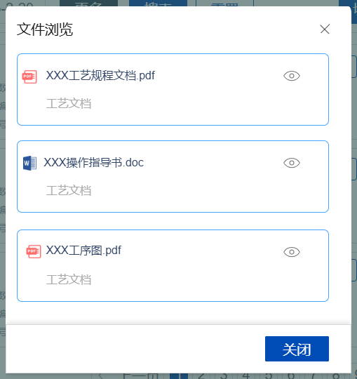

在制造任务管理界面，点击文件浏览（不支持批量）弹出文件浏览二级界面

**输入**

无直接输入，基于用户点击 "文件浏览" 按钮的操作。

**输出**

工艺文档和工序文档

**验收标准**

**验收标准** ：文件浏览支持的格式说明如下

| | 制造任务管理 | 制造任务台 | 备注|
|--- | --- | --- | ---|
|上游系统链接 | ⭐本批次 | ⭐本批次 | |
|常规浏览器可打开文件（如PDF） | ⭐本批次 | ⭐本批次 | |
|需KMview打开文件 | ⭐本批次 | ⭐本批次 | |
|需调用本地程序 | ❌不考虑 | ❌不考虑 | 由项目解决，提供入口及技术支持|
|3维装配多文件浏览 | ⭕未来扩展 | ⭕未来扩展 | 视KMview的覆盖范围及效果&未来项目情况而定|

## 3.4 **制造任务派工**

**界面**

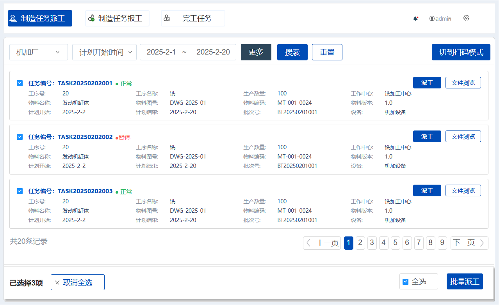

页面布局与制造任务管理页面类似，但整体风格是触摸屏风格，上方为派工任务筛选和搜索区域，中间为派工任务列表展示区域，下方为派工操作区域，包括 "派工""批量派工""文件浏览""任务查询" 等操作按钮。

**处理逻辑**

**数据加载逻辑** ：页面加载时，从数据库中获取当前用户有权限进行派工的制造任务列表。

**过滤逻辑** ：提供多种过滤条件，用户可以根据需要筛选出特定的派工任务列表。

**验收标准**

**边界条件** ：能够正确处理派工任务列表为空、派工任务信息不完整等异常情况，页面正常显示且不报错。

**验收标准** ：页面显示的派工任务信息准确无误，与数据库中的数据保持一致；各操作按钮功能正常，能够正确触发对应的操作流程。

### 3.4.1 **制造任务派工-****任务查询**

**界面**

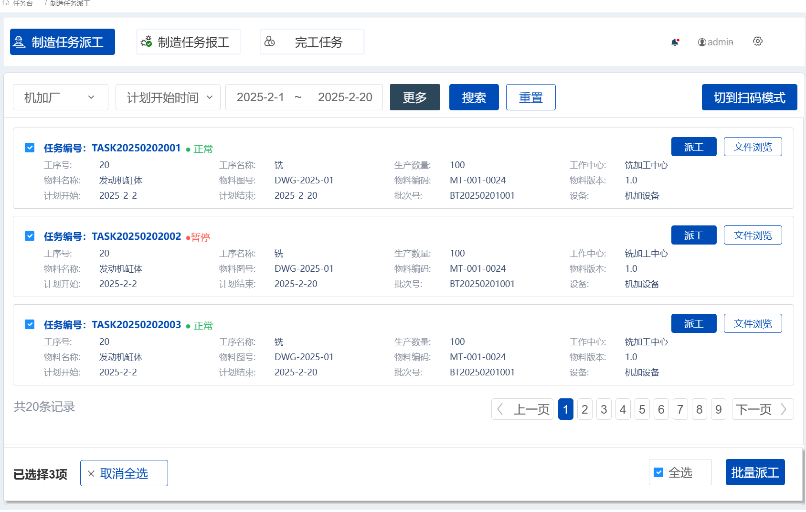

**输入**

查询条件：用户输入或选择或扫码的任务编号、任务名称、任务状态、派工对象、开始时间、结束时间等信息。

**输出**

查询结果：根据用户输入的查询条件，从数据库中筛选出符合条件的制造任务列表，并展示在页面中，包括任务的基本信息和详细信息。

**验收标准**

**边界条件** ：当查询条件为空时，系统提示用户未输入查询条件；当查询结果为空时，系统提示用户暂无符合条件的任务。

**验收标准** ：查询结果准确无误，能够根据用户输入的查询条件快速筛选出符合条件的制造任务列表；页面展示清晰，方便用户查看和分析查询结果。

### 3.4.2 **制造任务派工-****任务详情**

**界面**

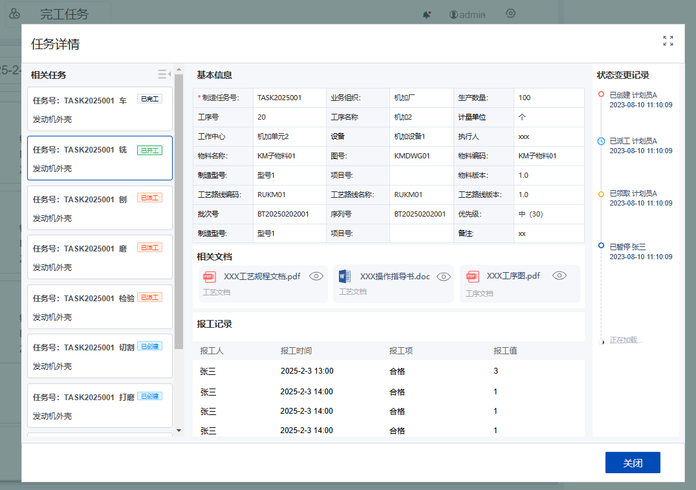

在制造任务派工界面，点击任务号超链接，弹出任务详情页面

**输入**

制造任务

**输出**

制造任务详情

**处理逻辑**

|一、用户操作
用户在 "制造任务派工界面" 中点击任务号超链接。
二、任务详情页面
任务列表信息：
支持自定义配置显示内容。
任务编号：
支持超链接查看任务详情。
相关任务：
显示制造任务关联的所有上下道任务，默认选中当前任务。
基本信息：
显示制造任务的详情信息，支持自定义配置显示内容。
相关文档：
显示制造任务管理的工艺文档和工序文档。
报工记录：
显示制造任务的报工记录信息。
状态变更记录：
显示制造任务的业务状态和控制状态的变更记录。
分卡任务源信息（新增）：
若当前任务为分卡任务，显示源任务号、工序、数量、执行人等关键信息。
支持跳转到源任务详情页面。
分卡前的原任务和分卡后的任务有明确标识区分。|
|---|

### 3.4.3 **制造任务派工-****派工**

**整体功能同3.****3****.1制造任务管理-派工**

### 3.4.4 **制造任务派工-****批量派工**

**整体功能同3.****3****.1制造任务管理-派工**

### 3.4.5 **制造任务派工-****文件浏览**

**整体功能同3****.3****.5制造任务管理-文件浏览**

### 3.4.6 **制造任务派工-上传附件**

**概述**  
制造任务派工界面支持为每个制造任务单独上传和管理相关附件，便于生产现场人员及时补充、归档实物照片、现场拍照、扫描件等资料，提升任务执行的合规性和可追溯性。

**验收标准**  
- 支持多文件批量上传，主流文件类型均可正常管理。
- 附件与制造任务强关联，切换任务时附件列表准确切换。
- 历史附件区支持大批量文件的滚动浏览，界面不卡顿。
- 上传内容完全相同的文件不会重复保存，系统能准确提示并跳过。
- 关闭附件工作台后，所有操作结果即时生效。

## 3.5 ** 制造任务报工**

**界面**

常规模式

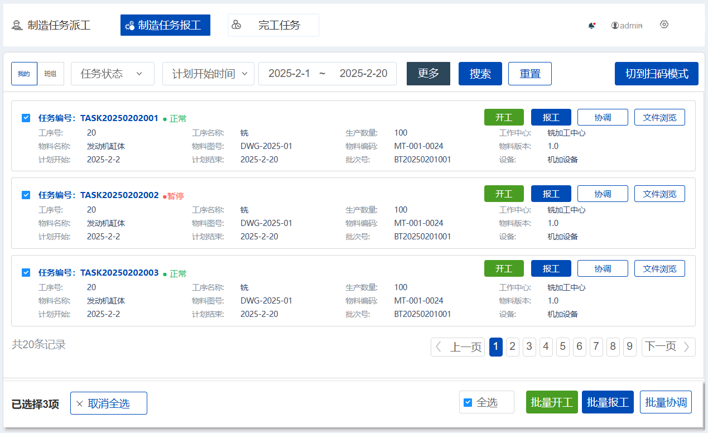

扫码模式

页面布局与制造任务管理页面类似，上方为报工任务筛选和搜索区域，中间为报工任务列表展示区域，下方为报工操作区域，包括 "开工""批量开工""报工""批量报工""协调""批量协调""文件浏览""任务查询" 等操作按钮。

**处理逻辑**

**数据加载逻辑** ：页面加载时，从数据库中获取当前用户有权限进行报工的制造任务列表。

**过滤逻辑** ：提供多种过滤条件，用户可以根据需要筛选出特定的报工任务列表。

**验收标准**

**边界条件** ：能够正确处理报工任务列表为空、报工任务信息不完整等异常情况，页面正常显示且不报错。

**验收标准** ：页面显示的报工任务信息准确无误，与数据库中的数据保持一致；各操作按钮功能正常，能够正确触发对应的操作流程。

### 3.5.1 **制造任务报工-****任务查询**

**界面**

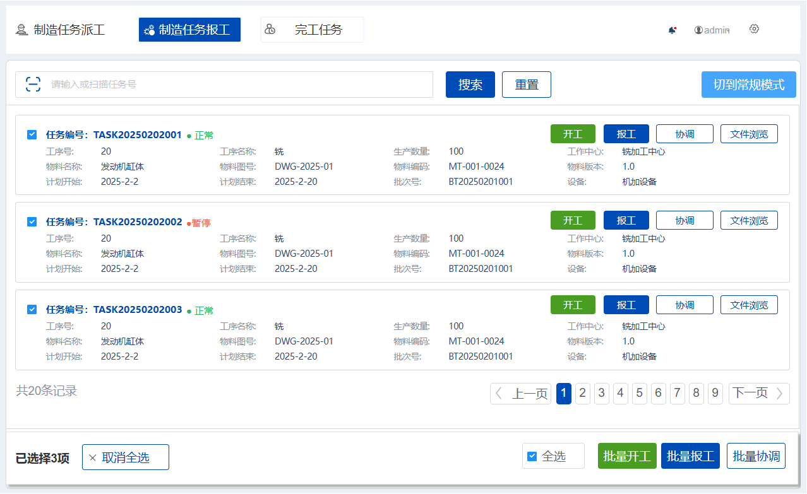

**输入**

查询条件：用户输入或选择或扫码的任务编号、任务名称、任务状态、派工对象、开始时间、结束时间等信息。

**输出**

查询结果：根据用户输入的查询条件，从数据库中筛选出符合条件的制造任务列表，并展示在页面中，包括任务的基本信息和详细信息。

**验收标准**

**边界条件** ：当查询条件为空时，系统提示用户未输入查询条件；当查询结果为空时，系统提示用户暂无符合条件的任务。

**验收标准** ：查询结果准确无误，能够根据用户输入的查询条件快速筛选出符合条件的制造任务列表；页面展示清晰，方便用户查看和分析查询结果。

### 3.5.2 **制造任务报工-****任务详情**

**整体功能同3.****4****.2制造任务派工-任务详情**

### 3.5.3 **制造任务报工-****开工**

**整体功能同3.****3****.3制造任务管理-开工**

### 3.5.4 **制造任务报工-****批量开工**

**整体功能同3.****3****.3制造任务管理-开工**

### 3.5.5 **制造任务报工-****报工**

**整体功能同3.****3****.4制造任务管理-报工**

### 3.5.6 **制造任务报工-****批量报工**

**整体功能同3.****3****.4制造任务管理-报工**

### 3.5.7 **制造任务报工-****协调**

**整体功能同3.****3****.2制造任务管理-任务协调**

### 3.5.8 **制造任务报工-****批量协调**

**整体功能同3.****3****.2制造任务管理-任务协调**

### 3.5.9 **制造任务报工-****文件浏览**

**整体功能同3.****3****.5制造任务管理-文件浏览**

## 3.6 ** 完工任务**

**界面**

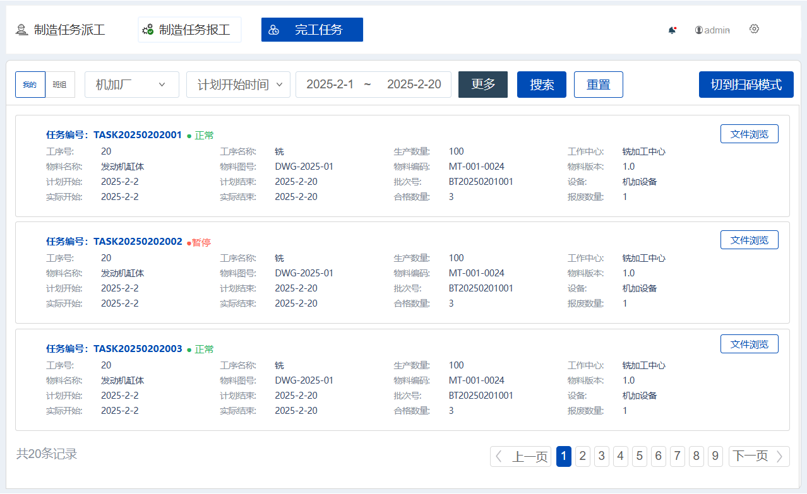

页面布局简洁明了，上方为完工任务筛选和搜索区域，提供任务编号、任务名称、产品名称、完工时间等筛选条件；下方为完工任务列表展示区域，以表格形式展示完工任务的基本信息，包括任务编号、任务名称、产品名称、完工时间、质量检验结果等；提供 "文件浏览" 和 "任务查询" 操作按钮。

**处理逻辑**

**数据加载逻辑** ：页面加载时，从数据库中获取所有已完成的制造任务列表，并按照完工时间进行倒序排序展示。

**过滤逻辑** ：用户可以通过选择不同的筛选条件，快速定位到需要查看的完工任务列表。

**验收标准**

**边界条件** ：能够正确处理完工任务列表为空、完工任务信息不完整等异常情况，页面正常显示且不报错。

**验收标准** ：页面显示的完工任务信息准确无误，与数据库中的数据保持一致；各操作按钮功能正常，能够正确触发对应的操作流程。

### 3.6.1 **完工任务-****任务查询**

**界面**

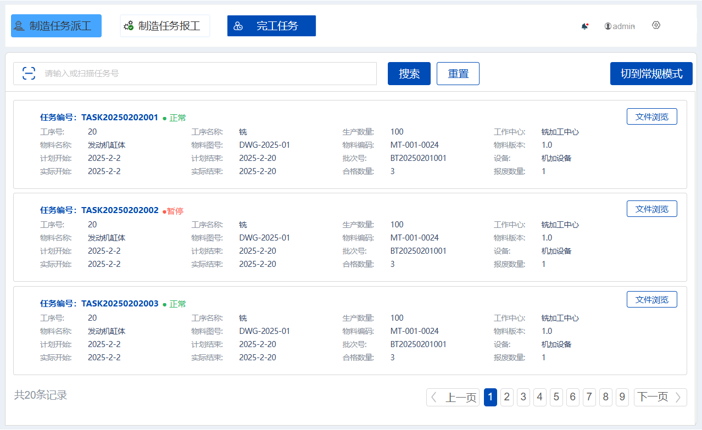

**输入**

查询条件：用户输入或选择或扫码的任务编号、任务名称、任务状态、派工对象、开始时间、结束时间等信息。

**输出**

查询结果：根据用户输入的查询条件，从数据库中筛选出符合条件的制造任务列表，并展示在页面中，包括任务的基本信息和详细信息。

**验收标准**

**边界条件** ：当查询条件为空时，系统提示用户未输入查询条件；当查询结果为空时，系统提示用户暂无符合条件的任务。

**验收标准** ：查询结果准确无误，能够根据用户输入的查询条件快速筛选出符合条件的制造任务列表；页面展示清晰，方便用户查看和分析查询结果。

### 3.6.2 **完工任务-****任务详情**

**整体功能同3.****4****.2制造任务派工-任务详情**

### 3.6.3 **完工任务-****文件浏览**

**整体功能同3.****3****.5制造任务管理-文件浏览**

## 3.7 **班组工作台首页**

### 3.7.1 **班组工作台首页-查询**

**概述** ：用于班组长工作台首页展示。

**界面**

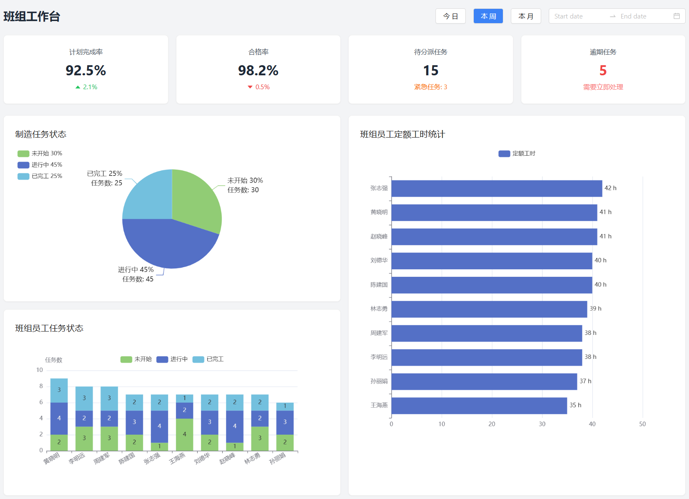

界面结构：

右上角为日期查询：

默认为本周

支持切换到今日、周、月、指定区间

查询制造任务的计划完成时间在日期范围内

最上面是指标统计信息，包括：

计划完成率

合格率

待分派任务数

逾期任务数

下面是图表统计信息，包括：

制造任务状态：状态包括未开始、进行中、已完工

班组员工任务及状态

班组员工工时统计：定额工时统计

交互内容：仅查询展示

**输入** ：时间区间

**输出** ：各种指标

**验收标准** ：数据显示准确。

# 4. **外部依赖**

本次功能对外部依赖的状态说明

| 产品 | 应用 | 功能 | 外部依赖说明 | 状态 |
|------|------|------|-------------|------|
| 报工和质量方案设计 | - | - | 全局设计文档，了解报工方案的整体架构和选择规则 | 待开发 |
| DNW30120-工序库 | 工序库 | 工序库管理 | 工序库定义，包括加工报工方案、质量方案、人员资质 | 待开发 |
| DNW30120-工序库 | 加工报工方案 | 加工报工方案管理 | 加工报工方案定义 | 待开发 |
| DNW30120-工序库 | 质量方案 | 质量方案管理 | 质量方案定义，包含检验报工项 | 待开发 |
| DNW30050-配置管理_V2 | 业务配置 | 加工报工方案配置 | 组织级默认加工报工方案配置 | 待开发 |
| DNW30050-配置管理_V2 | 业务配置 | 质量方案配置 | 组织级默认质量方案配置（包含检验报工项） | 待开发 |
| KMView | - | - | 文件浏览时调用KMView打开图纸文件 | KMView已发布 |
| KMMOM | 系统管理 | 编码器 | 生成顺序号、生成批次号时调用编码器 | 编码器已开发，无编码与对象-属性关联，需增补 |
| KMMOM | 系统管理 | 业务配置 | 任务开工、报工是调用业务配置 | 业务配置本次需开发修订 |
| KMMOM | 基础数据 | 工艺路线 | 增加切件比、不执行、工序序列 | 本次需求同步修改 |
