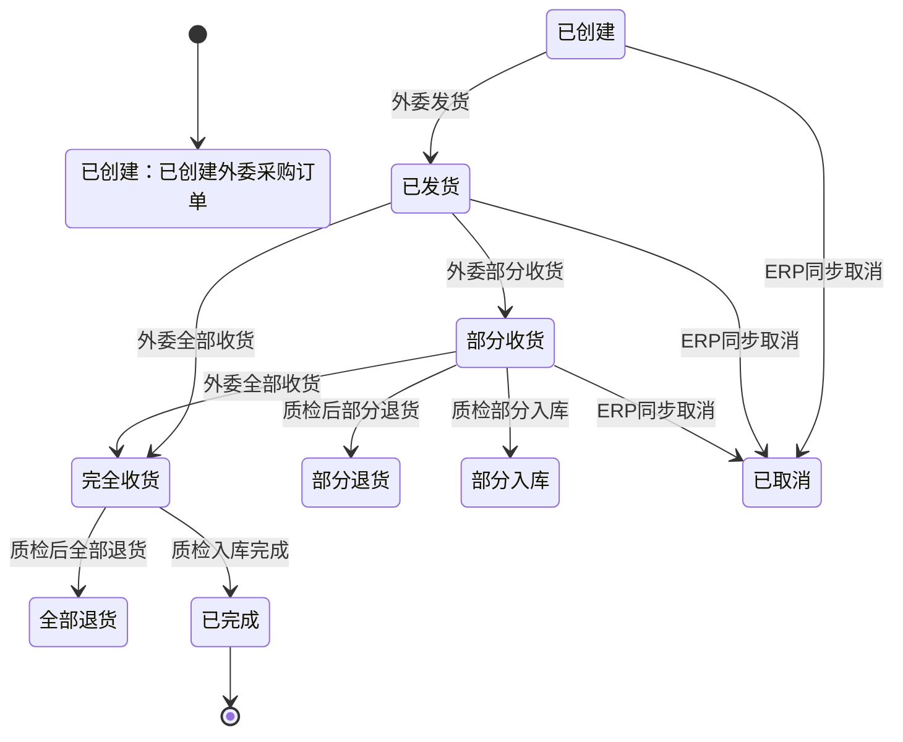
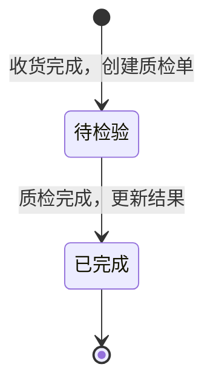
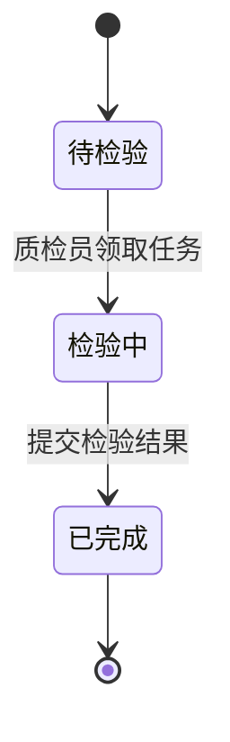
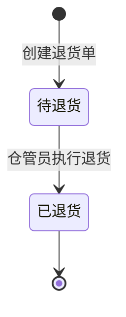
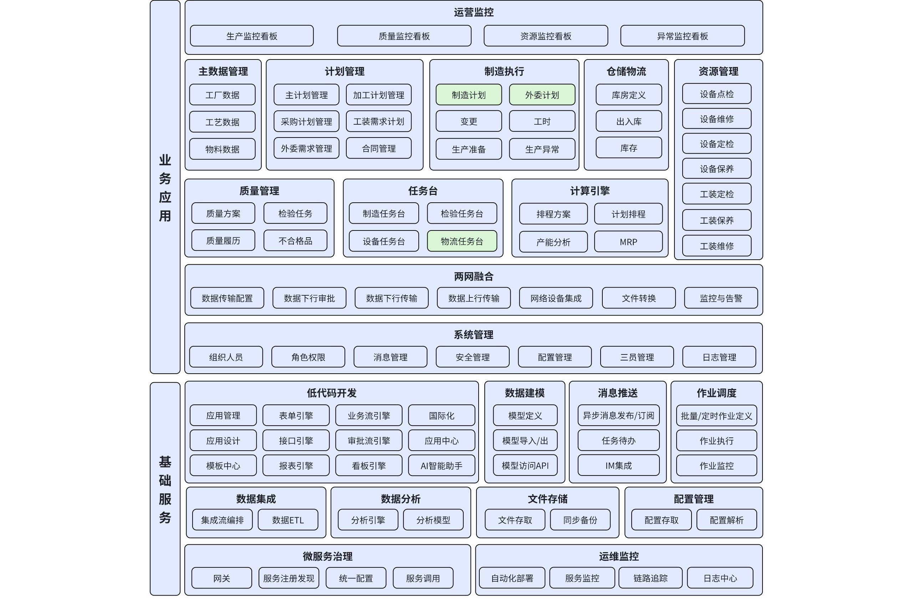
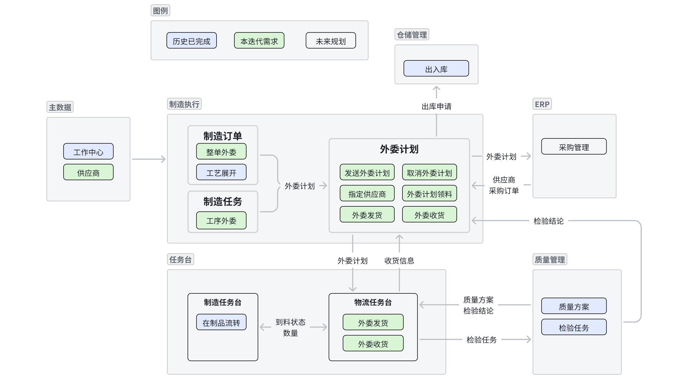

# **DNW30310****-外委计划**

# 1. **概述**

## 1.1 **原始需求**

在离散制造的机加/装配专业生产中，多品种小批量的生产模式下，外委业务管理存在诸多问题。工厂计划员难以及时准确地判断哪些制造订单或任务需要外委，外委计划的制定、跟踪和调整过程混乱。采购部门与外委供应商之间的沟通协作效率低，导致外委合同签订不及时、物料供应不顺畅。质检环节缺乏有效的质量把控，外委产品不合格时处理流程不清晰。这些问题导致生产周期延长、成本增加，影响企业的交付能力和竞争力。


用户故事1：作为工厂计划员，我希望能方便地标记出需要外委的制造订单和任务，并快速生成准确的外委计划，以便及时安排外委生产，避免延误。

用户故事2：作为采购人员，我期望能及时获取外委计划，高效地与供应商签订合同，确保外委生产所需物料和服务的供应。

用户故事3：作为质检员，我想要清晰的检验流程和标准，以便在发现外委产品不合格时能迅速处理，保证产品质量。


## 1.2 **需求分析**

**原因本质**：离散制造的复杂性和多品种小批量的特点，使得企业内部生产资源难以完全满足所有生产需求，外委业务成为必要补充。但目前缺乏系统化的管理手段，导致各环节信息不流通、协作不畅，无法有效把控外委业务的质量和进度。

**系统价值**：MOM系统中的外委计划管理功能可以整合各部门信息，实现外委业务从计划制定、供应商管理、合同签订到质量检验的全流程信息化管理。提高计划准确性和执行效率，加强部门间协作，降低沟通成本，保障外委产品质量，从而提升企业整体生产运营效率和竞争力。

**友商解决方案**：部分友商采用集成化的供应链管理系统来处理外委业务，如，通过建立统一的信息平台，实现外委业务的全流程跟踪和协同。但此类系统可能在与离散制造特定业务流程的适配性上存在不足。


## 1.3 **术语及缩写解释**

**外委**：企业将部分制造订单或任务委托给外部供应商进行生产加工的业务活动。

**制造订单**：企业内部制定的生产任务指令，包含产品规格、数量、交期等信息。

**制造任务**：制造订单细化后的具体生产工作单元。


## 1.4 **参考文献**

[ISA - 95标准](https://www.isa.org/standards/isa - 95)

[离散制造行业外委管理研究报告](https://www.example.com/report - outsourcing)


# 2. **需求描述**

## 2.1 **业务流程**

### 2.1.1 端到端业务流程 (L1)

本流程旨在阐明外委计划在MOM系统内部，以及与外部ERP系统交互的全过程，确保从计划生成到最终入库的业务闭环和数据一致性。

```mermaid
graph TD
    subgraph MOM系统
        A[外委需求识别] --> B{生成外委计划};
        B --> C[外委计划审批];
        C --> D[发送外委请求至ERP];
    end

    subgraph ERP系统
<<<<<<< HEAD
        E[接收外委请求] --> F[创建外委采购订单(PO)];
=======
        E[接收外委请求] --> F[创建采购订单PO];
>>>>>>> 7a4309e9ca7f7afcda4272ba8007b2c70f9a48c3
        F --> G[PO信息回传至MOM];
    end

    subgraph MOM系统
        H[接收PO信息] --> I[外委计划领料];
        I --> J[外委发货];
        J --> K[外委进度跟踪];
        K --> L[外委收货];
        L --> M[质量检验];
        M -- 合格 --> N[外委入库];
        M -- 不合格 --> O[供应商退货];
        N --> P[更新库存信息];
        P --> Q[通知ERP入库完成];
    end
    
    subgraph ERP系统
        R[接收MOM入库通知] --> S[处理供应商结算];
    end

    %% 交互连线
    D -- API: 创建外委采购申请 --> E;
    G -- API: 同步PO号、价格、供应商信息 --> H;
    Q -- API: 同步入库数量、检验结果 --> R;
```

### 2.1.2 用户画像 (User Persona)

#### 1. **计划员 (Planner) - 小王**

*   **角色与职责**: 生产计划部门的核心成员，负责将制造订单中的外委工序转化为具体的外委计划，并跟进其从创建到最终交付的全过程。
*   **核心痛点**:
    *   **信息黑盒**: 一旦计划下发，很难实时了解供应商处的生产进度，只能通过电话、邮件反复催问，效率低下且信息滞后。
    *   **风险被动响应**: 经常在临近交付日期时才发现延期风险，没有足够的时间进行协调和补救。
    *   **数据孤岛**: 供应商的交付表现、质量数据分散在各处，难以形成对供应商的综合评估，为未来的采购决策提供依据。
*   **期望与目标**:
    *   希望有一个统一的平台，能像“看自家车间”一样，透明地看到所有外委任务的状态。
    *   系统能主动预警潜在的延期和质量风险，让他能提前介入处理。
    *   希望能轻松获取供应商的历史表现数据，做出更明智的决策。

#### 2. **供应商协调员 (Supplier Coordinator) - 李经理**

*   **角色与职责**: 供应商企业中负责接收、管理和反馈客户订单的接口人。他需要确保客户的外委订单在内部得到准确执行，并及时向客户同步进度。
*   **核心痛点**:
    *   **沟通成本高**: 每天需要应对来自不同客户的进度查询，信息同步方式原始（邮件、电话），占用了大量工作时间。
    *   **需求变更混乱**: 客户的需求变更或取消指令，容易在多层传递中出错或遗漏，导致生产浪费。
    *   **交付对账繁琐**: 每次交付后，都需要人工核对发货数量、批次等信息，过程繁琐且易出错。
*   **期望与目标**:
    *   希望有一个统一的协作门户，能清晰地看到所有待处理的订单，并在线确认、反馈进度。
    *   希望所有变更指令都能通过平台正式下发，有据可查，避免误解。
    *   希望交付和收货过程能在线协同，简化对账流程，提高效率。

### 2.1.3 关键业务步骤说明

| 步骤 | 活动描述 | 所属系统/角色 | 输入 | 输出 | 关键说明 |
| :--- | :--- | :--- | :--- | :--- | :--- |
| 1 | 外委需求识别 | MOM / 计划员 | 生产订单、工艺路线 | 外委需求（整单/工序） | 基于生产计划和工艺定义，识别需要外委的制造任务；基于产能生产计划、产能识别需要外委的制造订单、制造任务；基于异常情况，识别出需要外委的制造订单、制造任务。 |
| 2 | 生成/审批外委需求 | MOM / 计划员、主管 | 外委需求 | 已审批的外委需求 | 在MOM中创建详细的外委需求，并完成内部审批流程；存在根据连续工序制造任务、供应商等条件或组合条件合并创建采购申请；存在审批不通过，外委转自制。|
| 3 | 发送外委需求 | MOM (系统) | 已审批的外委需求 | ERP采购申请 | MOM系统自动调用ERP接口，传递外委需求，请求创建外委采购订单。 |
| 4 | 创建外委采购订单(PO) | ERP / 采购员 | MOM采购申请 | 外委采购订单（PO） | 采购员在ERP中完成供应商选择、价格确认，并生成正式PO；存在按供应商、交期等条件或组合条件将多个采购申请合并成外委采购订单；存在供应商产能不足、无法满足交期等，外委转自制。|
| 5 | 同步PO信息 | ERP (系统) | 外委采购订单（PO） | 更新了PO信息的外委计划 | ERP系统通过接口将PO号、供应商、价格等关键信息回传至MOM。 |
| 6 | 外委领料/发货 | MOM / 仓管员 | 外委计划 | 发货单、物料凭证 | MOM指导仓管员根据计划进行备料和发货操作，记录物料移动。 |
| 7 | 外委进度跟踪 | MOM / 计划员 | 供应商反馈 | 更新的外委计划状态 | 外委计划员在MOM中手动更新外委进度；供应商在MOM中手动更新外委进度或通过门户网站集成更新外委进度；存在供应商延迟、取消等，外委转自制。|
| 8 | 外委收货/检验 | MOM / 仓管员、质检员 | 到货通知、PO信息 | 质检报告、收货单 | 对到厂的外委品进行实物接收和质量检验；存在因供应商生产质量问题，收货不足。 |
| 9 | 外委入库 | MOM / 仓管员 | 合格质检报告 | 库存凭证 | 检验合格的成品/半成品在MOM系统中办理入库，更新库存。 |
| 10 | 外委退货 | MOM / 仓管员 | 不合格质检报告 | 退货单、库存凭证 | 对质量不合格的外委品进行退货操作，更新库存。 |
| 11 | 通知ERP退货 | MOM (系统) | 退货凭证 | ERP退货凭证 | MOM将退货信息同步给ERP，更新库存。 |
| 12 | 供应商结算 | ERP / 财务 | MOM退货信息、PO | 付款单 | 财务部门在ERP中根据PO和退货凭证，与供应商进行结算。 |


## 2.2 **数据对象**

### 2.2.1 业务对象ER关系图

```mermaid
classDiagram
    class 制造订单 {
      +制造订单号
      +物料
      +计划数量
<<<<<<< HEAD
    }
    class 工序制造任务 {
      +任务号
      +工序
=======
      +计划开始结束时间
    }
    class 工序制造任务 {
      +任务号
      +工序序号
>>>>>>> 7a4309e9ca7f7afcda4272ba8007b2c70f9a48c3
      +计划数量
    }
    class 外委需求 {
      +申请号
      +供应商
<<<<<<< HEAD
      +状态
    }
    class 外委需求行 {
        +行号
        +关联工序任务
        +数量
    }
    class 外委采购订单(镜像) {
      +PO号(ERP)
      +状态
    }
    class 外委采购订单行 {
      +PO行号
      +订购/已发/已收
    }
    class 外委发货单 {
        +发货单号
        +发货数量
        +发货时间
    }
    class 外委收货单 {
        +收货单号
        +到货数量
        +到货时间
    }
    class 质检单 {
        +质检单号
        +检验数量
        +检验结果
    }
    class 外委退货单 {
        +退货单号
        +退货数量
        +退货原因
    }

    制造订单 "1" --> "*" 工序制造任务 : 展开
    制造订单 "1" -- "*" 外委需求 : 触发
    工序制造任务 "1" -- "*" 外委需求 : 触发
    外委需求 "1" --> "*" 外委需求行 : 包含
    工序制造任务 "*" -- "*" 外委需求行 : 引用
    外委需求 "*" --> "1" 外委采购订单(镜像) : 归集
    外委采购订单(镜像) "1" --> "*" 外委采购订单行 : 包含
    外委需求行 "1" --> "1" 外委采购订单行 : 生成
    
    外委采购订单行 "1" --> "*" 外委发货单 : 执行
    外委采购订单行 "1" --> "*" 外委收货单 : 执行
    外委收货单 "1" --> "1" 质检单 : 触发
    质检单 "1" --> "*" 外委退货单 : 触发(不合格)

=======
      +工序包连续区间
      +状态
    }
    class 外委采购订单镜像 {
      +PO号ERP
      +供应商
      +状态与ERP同步
      +来源ERP或MOM影子
    }
    class 外委采购订单行 {
      +PO行号
      +订购已发已收数量
      +仓库库位
      +关联MO工序任务
    }

    制造订单 "1" --> "*" 工序制造任务 : 展开
    制造订单 "1" --> "*" 外委申请 : 触发
    外委申请 "1" --> "1" 外委采购订单镜像 : 强一对一
    外委采购订单镜像 "1" --> "*" 外委采购订单行 : 执行载体
    工序制造任务 "*" --> "*" 外委采购订单行 : 引用/回写
>>>>>>> 7a4309e9ca7f7afcda4272ba8007b2c70f9a48c3
```

业务要点：
- 多个外委需求可归集于一个外委采购订单(N:1)；外委需求行与外委采购订单行为强1:1关系。
- 执行事件（发/收/检）以“外委采购订单行”为唯一执行载体。
- MOM中的“外委采购订单”为ERP PO的镜像对象，承接同步与执行引用，不承载价格/税等商务要素的主数据权威。

### 2.2.2 数据字典（业务层）

本章节定义了外委管理流程中涉及的核心业务对象的数据结构。

#### 1. 外委需求 (Subcontract Application)

外委计划审批后生成的业务凭证，用于向采购部门正式提出外委需求。

| 字段名 | 业务类型 | 业务约束 | 业务说明 |
| :--- | :--- | :--- | :--- |
| 申请号 | 文本标识 | 唯一, 必填 | 外委计划审批后的业务凭证 |
| 外委类型 | 枚举 | 必填 | 标识外委类型：整单外委、工序外委 |
| 来源类型 | 枚举 | 必填 | 标识决策来源：预定义（工艺路线指定）、临时决策 |
| 制造订单号 | 业务引用 | 必填 | 对应最小投产批次 |
| 供应商 | 主数据引用 | 申请头唯一 | 与PO抬头一致 |
| 状态 | 业务状态 | 必填 | 申请状态：草稿、已提交、已审批 |

**外委需求行 (Subcontract Application Line)**

| 字段名 | 业务类型 | 业务约束 | 业务说明 |
| :--- | :--- | :--- | :--- |
| 行号 | 行标识 | 申请内唯一 | |
| 关联工序任务 | 业务引用 | 必填 | 明确外委的具体工序 |
| 数量 | 数量 | >0, 必填 | 本次外委需求的数量 |

#### 2. 外委采购订单 (Subcontract Purchase Order)

由ERP系统下发或同步的，用于指导供应商生产和交付的法律凭证。MOM系统作为镜像进行跟踪。

| 字段名 | 业务类型 | 业务约束 | 业务说明 |
| :--- | :--- | :--- | :--- |
| PO号 | 文本标识 | ERP唯一, 必填 | ERP为权威来源 |
| 状态 | 业务状态 | 与ERP同步 | 创建/变更/关闭 |

**外委采购订单行 (Subcontract Purchase Order Line)**

| 字段名 | 业务类型 | 业务约束 | 业务说明 |
| :--- | :--- | :--- | :--- |
| PO行号 | 行标识 | PO内唯一 | 执行粒度 |
| 计划/已发/已收数量 | 数量 | >=0 | 执行过程中的累计值 |

#### 3. 外委发货单 (Subcontract Dispatch Order)

供应商发货时创建的单据，用于记录每次发货的物料、数量及物流信息。

| 字段名 | 业务类型 | 业务约束 | 业务说明 |
| :--- | :--- | :--- | :--- |
| 发货单号 | 文本标识 | 唯一, 必填 | 每次发货操作的唯一凭证 |
| 发货数量 | 数量 | >0, 必填 | 本次发货的物料数量 |
| 发货时间 | 日期时间 | 必填 | 记录实际发货的时间点 |
| 物流信息 | 文本 | 可选 | 如物流公司、运单号等 |

#### 4. 外委收货单 (Subcontract Receipt Order)

仓库在接收到供应商送来的外委品时创建的单据，是后续质检和入库的依据。

| 字段名 | 业务类型 | 业务约束 | 业务说明 |
| :--- | :--- | :--- | :--- |
| 收货单号 | 文本标识 | 唯一, 必填 | 每次收货操作的唯一凭证 |
| 到货数量 | 数量 | >0, 必填 | 本次实际到货的数量 |
| 到货时间 | 日期时间 | 必填 | 记录实际到货的时间点 |

#### 5. 质检单 (Quality Inspection Order)

外委品到货后，系统自动或手动创建的检验任务单，用于驱动质检员执行检验工作。

| 字段名 | 业务类型 | 业务约束 | 业务说明 |
| :--- | :--- | :--- | :--- |
| 质检单号 | 文本标识 | 唯一, 必填 | 驱动检验工作的唯一凭证 |
| 检验类型 | 主数据引用 | 必填 | 如外委入库检验、退货检验 |
| 检验结果 | 枚举 | 必填 | 合格、不合格、让步接收 |
| 合格数量 | 数量 | >=0 | |
| 不合格数量 | 数量 | >=0 | |

#### 6. 外委退货单 (Subcontract Return Order)

当质检结果为不合格时，创建的用于指导退货操作的单据。

| 字段名 | 业务类型 | 业务约束 | 业务说明 |
| :--- | :--- | :--- | :--- |
| 退货单号 | 文本标识 | 唯一, 必填 | 每次退货操作的唯一凭证 |
| 退货数量 | 数量 | >0, 必填 | 本次退货的物料数量 |
| 退货原因 | 文本 | 必填 | 记录不合格的具体原因 |

### 2.2.3 业务对象状态流转图

#### 1. 外委需求状态图

```mermaid
<<<<<<< HEAD
stateDiagram-v2
    [*] --> 已创建：已创建外委需求
    已创建 --> 已发布: 已发布到ERP
    已创建 --> 已取消: 取消(例如:转自制)
    已发布 --> [*]
    已取消 --> [*]
=======
graph TD
    subgraph 外委计划执行看板
        A[核心KPI统计区]
        B[任务状态泳道Kanban]
        C[风险预警区]
        D[快速筛选与搜索]
    end

    A --> B
    A --> C
    D -- 筛选 --> B
    D -- 筛选 --> C
>>>>>>> 7a4309e9ca7f7afcda4272ba8007b2c70f9a48c3
```

#### 2. 外委采购订单(镜像)状态图



#### 3. 外委收货单状态图



#### 4. 质检单状态图



#### 5. 外委退货单状态图




## 2.3 功能描述

### 2.3.1 **整体应用架构**

本次主要涉及制造计划、物流任务台。




### 2.3.2 **外委计划&物流任务台应用架构**

 外委计划、物流任务台进一步细化展开到页面、业务功能一级




### 2.3.3 **功能清单**

| 功能模块 | 功能点 | 承载页面/组件 | 核心功能描述 |
| :--- | :--- | :--- | :--- |
| 1. 外委需求管理 | 整单外委 | 制造订单管理 | - 支持基于生产订单、工艺路线、产能、生产异常等多种方式，识别需要外委的制造订单。 |
|  | 工序外委 | 制造任务管理 | - 支持基于生产订单、工艺路线、产能、生产异常等多种方式，识别需要外委的工序任务。 |
| | 外委需求审批 | 外委需求管理 | - 发起审批流程。 |
| | 外委需求发布 | 外委需求管理 | - 推送ERP创建外委采购订单。<br/>- 审批通过后自动推送ERP创建外委采购订单。 |
| | 指定供应商 | 外委需求管理 | - 为外委需求指定执行供应商。 |
| | 外委转自制 | 外委需求管理 | - 外委需求作废，将制造订单/工序制造任务外委标记转成自制标记。 |
| 2. 外委采购订单管理 | 接收/同步外委采购订单 | 外委采购订单管理 / 系统接口 | - 从ERP接收外委采购订单（PO）信息，在MOM中生成并维护镜像PO。<br>- 支持接收ERP的PO取消指令。 |
|  | 外委订单备料 | 外委采购订单管理 | - 基于外委采购订单，指导并记录外委订单的备料。 |
| | 外委发货 | 外委采购订单管理 | - 基于外委采购订单，指导并记录外委发货操作。 |
| | 外委收货 | 外委采购订单管理 | - 基于外委采购订单，对到厂的外委品进行实物接收和记录。 |
| | 收货检验 | 外委采购订单管理 | - 基于已收货的订单，生成外委检验任务。<br/>- 外委收货后，自动触发质检任务。 |
| | 外委退货 | 外委采购订单管理 | - 基于检验不合格的外委采购订单，执行外委退货。结果自动同步至ERP。 |
| | 外委入库 | 仓储任务台 | - 将检验合格的外委品办理入库，更新库存。结果自动同步至ERP。 |
| 3. 外委物流执行 | 外委发货 | 物流任务台 | - 仓管员在物流任务台执行具体的外委发货操作。 |
| | 外委收货 | 物流任务台 | - 仓管员在物流任务台执行具体的外委收货操作。 |
| 4. 外委进度跟踪 | 外委计划执行看板 | 外委计划执行看板 | - 核心功能：提供全局、只读的可视化监控中心。<br>- KPI展示：计划准时完成率、供应商OTD、一次性检验合格率等。<br>- 任务泳道：按状态（如待发货、在途、待检、已完成）展示任务。<br>- 风险预警：高亮提示延期、质量异常等风险。 |
| | 外委进度更新 | 供应商门户 / 外委采购订单管理 | - 支持计划员或供应商（通过门户）更新外委任务的生产进度，进度信息在看板和外委采购订单中体现。 |
| 5. 质量检验 | 外委质量检验 | 检验任务管理/质量检验任务台 | - 接收检验任务，执行质检任务。<br>- 记录检验结果，区分合格与不合格品。 |
| | 外委不合格品处理 | 质量不合格品处理 | - 对检验不合格的外委品启动退货或让步接收流程。 |


# 3. 页面&功能设计

## 3.1 **模块：外委需求与计划**

### 3.1.1 页面：制造订单管理

#### 3.1.1.1 功能点：整单外委

概述
当一个制造订单的所有工序都需要外包时，计划员可在“制造订单管理”页面快速将整个订单标记为外委，以启动后续的采购流程。这是外委流程的重要起点之一。

用户场景与核心路径
   用户目标: 快速将整个制造订单标记为外委。
   核心路径:
    1.  在“制造订单管理”页面，筛选并选中一个或多个状态为“已下达”的制造订单。
    2.  点击【订单外委】按钮。
    3.  在弹出的对话框中，确认或调整“预计发货时间”和“要求返回时间”。
    4.  点击【确定】，系统完成标记，并创建外委需求的草稿。

界面原型描述
   页面: `制造订单管理`
       界面变更: 在工具栏增加【订单外委】按钮。
       交互组件: 点击【订单外委】后，弹出一个模式对话框，包含以下字段：
           预计发货时间（日期选择器，默认为制造订单计划开始时间）
           要求返回时间（日期选择器，默认为制造订单计划结束时间）
           备注（文本域，可选）

业务规则
   前置条件:
       选中的制造订单业务状态必须为 已下达 或 已创建 (未开工)。
       选中的制造订单未进行过“工艺展开”。
       选中的制造订单未被标记为“已外委”。
   业务处理规则:
       执行“整单外委”后，系统应更新制造订单的“外委”标识为是。
       系统自动创建一个状态为草稿的“外委需求”，并将本次标记的订单作为外委需求行。
     需求数量=订单的计划数量（预计产出）

验收标准
1.  功能正确性: 成功对符合条件的订单执行“整单外委”操作后，订单外委标记被正确更新，并能在“外委需求管理”页面找到对应的`草稿`单据。
2.  边界与异常: 对不符合前置条件的订单执行操作时，系统应弹出明确的错误提示，且数据状态不发生任何改变。

### 3.1.2 页面：制造任务管理

#### 3.1.2.1 功能点：工序外委

概述
当制造订单中只有部分特定工序（如热处理、电镀）需要外包时，计划员可在“制造任务管理”页面精确地只将这些工序标记为外委。

用户场景与核心路径
   场景1：手动标记
       用户目标: 精确地将一个或多个工序任务标记为外委。
       核心路径:
        1.  在“制造任务管理”页面，筛选并选中一个或多个未开工的工序制造任务。
        2.  点击【工序外委】按钮。
        3.  在弹出的对话框中，确认信息。
        4.  点击【确定】，系统完成标记，并创建外委需求的草稿。
   场景2：自动识别（基于工艺路线）
       用户目标: 对于工艺路线中已预设为“外委”的工序，希望在订单“工艺展开”时，系统能自动识别并创建外委需求。
       核心路径:
        1.  在“制造订单管理”页面，对一个订单执行【工艺展开】。
        2.  系统自动检查展开后的工序任务，若工序在工艺主数据中被标记为外委，则自动为该任务执行“工序外委”逻辑。

界面原型描述
   页面: `制造任务管理`
       界面变更: 在工具栏增加【工序外委】按钮。
       交互组件: 点击【工序外委】后，弹出一个确认对话框。

业务规则
   前置条件:
       选中的工序制造任务业务状态必须为 已下达 或 已创建 (未开工)。
       选中的工序制造任务未被标记为“已外委”。
 业务处理规则:
       执行“工序外委”后，系统应更新工序制造任务的“外委”标识为是。
      需求数量=需求明细中最后一道工序的计划数量（预计产出）
        场景1：手动标记
          将同制造订单、连续工序、同一次选中的创建为同一个状态为草稿的“外委需求”，并将连续工序作为需求行。
        场景2：自动识别
          将同制造订单、连续工序、同工作中心的创建为同一个状态为草稿的“外委需求”，并将连续工序作为需求行。
验收标准
1. 功能正确性: 能够成功对符合条件的工序任务执行“工序外委”操作，任务外委标记被正确更新，并生成草稿单据。
2. 边界与异常: 对不符合条件的任务操作时，系统应给出明确提示。

### 3.1.3 页面：外委需求管理

#### 3.1.3.1 功能点：外委需求审批

概述

为计划员和主管提供一个集中处理外委需求的平台，包括提交、审批和驳回等核心操作。

用户场景与核心路径

   场景1：提交需求
       用户目标: 计划员将草稿状态的需求打包成一个正式需求，提交给主管审批。
       核心路径:
        1.  进入“外委需求管理”页面，打开一个草稿状态的单据。
        2.  检查并补充供应商、备注等信息。
        3.  点击【提交审批】。单据状态变为待审批。
   场景2：审批需求
       用户目标: 主管审核外委需求，并决定是批准还是驳回。
       核心路径:
        1.  主管进入“外委需求管理”页面，打开待审批的单据。
        2.  审查内容后，点击【批准】或【驳回】。
        3.  若【批准】，状态变为已审批。若【驳回】，状态变为已驳回。

界面原型描述

   页面: `外委需求管理`
       主视图: 表格展示所有外委需求列表（`需求号`、`状态`、`供应商`等）。
       工具栏: 【提交审批】、【删除】等按钮。
       详情视图: 点击列表项可查看详情，并为审批人提供【批准】和【驳回】按钮及审批意见输入框。

业务规则

   权限控制: 仅审批人可见【批准】/【驳回】按钮。

验收标准

1.  可根据项目需要加入流程审批；
2. 可根据分类部分加入流程审批，如仅对临时外委进行审批。

#### 3.1.3.2 功能点：外委需求发布

概述

在主管审批通过外委需求后，系统自动将此需求推送至ERP系统，以创建外委采购订单，实现MOM与ERP的无缝集成。

用户场景与核心路径

   用户目标: 外委需求经批准后，自动在ERP中生成采购订单，无需人工干预。
   核心路径:
    1.  主管在“外委需求管理”页面对一待审批的单据执行【批准】操作。
    2.  单据状态变为已审批。
    3.  系统后台自动触发接口调用，将需求信息推送至ERP系统。
    4.  （可选）接口调用成功后，可在单据详情中记录关联的ERP采购订单号。

界面原型描述

- 此功能主要为后台逻辑，无专门的用户界面。其结果体现在“外委需求管理”页面的状态变化和“外委采购订单管理”页面的新订单生成。
业务规则

   触发条件: “外委需求单”的状态从`待审批`变为`已审批`。
   接口协议: 需要与ERP侧明确接口的数据格式、传输协议和异常处理机制。

验收标准

1.  可独立手工发布，可在流程中配置审批完成自动发布；
2.  在无ERP的背景下，可直接调用“3.2.1.1接收采购订单接口”。

#### 3.1.3.3 功能点：外委转自制

概述

当外委需求被驳回或因故需要取消时，计划员可将已标记为外委的任务重新转为内部自制。

用户场景与核心路径

   用户目标: 将不再需要外委的任务恢复为自制任务。
   核心路径:
    1.  在“外委需求管理”页面，找到一个已驳回或已创建状态的需求。
    2.  点击【外委转自制】按钮。
    3.  系统确认后，清除对应制造订单/任务的“外委”标记，并删除此外委需求。

界面原型描述

   页面: `外委需求管理`
       界面变更: 在工具栏为`已创建`和`已驳回`状态的单据增加【外委转自制】按钮。

业务规则

   前置条件: 单据状态必须为`已创建`或`已驳回`。
   业务处理规则: 操作成功后，关联的制造订单/任务的“外委”标记被清除，单据被删除或置为`已取消`状态。

验收标准
      转自制后外委模块不可再操作。
      转自制后制造模块可正常流转。

#### 3.1.3.4 功能点：指定供应商

概述
为外委需求，精确指定执行供应商。

用户场景与核心路径
   用户目标: 为一个或多个外委需求，快速、准确地指派供应商。
   核心路径:
    1.  在“外委需求管理”页面，筛选并选中一个或多个外委需求。
    2.  点击【指定供应商】按钮。
    3.  系统弹出“指定供应商”窗口。
    4.  在窗口中，为每个外委需求选择一个供应商。系统可根据物料或工作中心推荐默认供应商。
    5.  点击【确定】，系统保存外委需求与供应商的关联关系。

界面原型描述
   页面: `外委需求管理`
       界面变更: 在工具栏增加【指定供应商】按钮。
   交互组件: 点击【指定供应商】后，弹出一个模式对话框：
       对话框标题: 指定供应商
       内容: 显示供应商、外委需求时间属性，点击供应商控件打开供应商对象，点击外委需求时间打开日期控件。
       供应商下拉框:
           数据源: 来源于供应商主数据。
           默认值: 可根据预设的寻源规则（如：物料的首选供应商）或关联工作中心的默认供应商进行填充。
           交互: 用户可手动更改。

业务规则
   前置条件:
       选中的外委需求尚未指定过供应商。
   业务处理规则:
       执行“指定供应商”后，系统需记录外委需求与所选供应商的对应关系。
   校验规则:
       必须为所有选中的需求行都选择供应商。
       在保存时，需校验供应商的有效性（如：供应商是否处于激活状态）。

验收标准
1.  功能正确性: 能够成功为外委需求指定供应商。
2.  数据保存: 系统能准确、可靠地保存外委需求与供应商的关联关系。
3.  边界与异常:
       对不符合前置条件的需求执行操作时，【指定供应商】按钮应为禁用状态或点击后给出明确提示。
       在指定供应商的对话框中，若未给所有行选择供应商就点击确定，系统应提示用户完成选择。

## 3.2 **模块：外委采购订单管理**

### 3.2.1 页面：外委采购订单管理

#### 3.2.1.1 功能点：接收/同步外委采购订单

概述
该功能点确保MOM系统能够实时、准确地从ERP系统获取外委采购订单（PO）信息。
用户场景与核心路径
   场景1：新建外委采购订单
       触发: ERP系统创建并下达一个新的外委采购订单。
       核心路径:
        1.  ERP通过系统接口，将新的PO信息推送至MOM系统。
        2.  MOM系统接收到数据后，自动在“外委采购订单管理”模块创建一个对应的采购订单，状态为“已创建”。
        3.  系统记录PO的关键信息，如供应商、物料、数量、价格、要求到货日期等。
   场景2：取消外委采购订单
       触发: ERP系统取消一个已下达但未开始执行的外委采购订单。
       核心路径:
        1.  ERP通过系统接口，发送PO取消指令至MOM系统。
        2.  MOM系统找到对应的PO，将其状态更新为“已取消”。
        3.  与该PO关联的所有未开始的MOM内部任务（如备料、收货等）应被同步取消或标记为无效。

界面原型描述
   页面: `外委采购订单管理`
       核心功能: 此页面为后台功能，主要通过系统接口与ERP交互，无专门的前端操作界面用于“接收/同步”。
       数据展示: 在“外委采购订单管理”列表页面，应能清晰地查看到从ERP同步过来的所有PO，并展示其状态（如：已下达、执行中、已完成、已取消）。

业务规则
   接口规则:
       必须定义清晰的API接口，用于接收ERP的PO创建和取消消息。
       接口需包含数据校验逻辑，确保接收到的数据完整、格式正确。
       需要有可靠的错误处理和重试机制，保证数据同步的稳定性。
   数据映射规则:
       需明确ERP的PO字段与MOMPO字段的对应关系。
       对于关键状态（如“取消”），需确保双方系统有一致的理解和处理逻辑。
   处理逻辑:
       接收到PO创建信息后，自动生成MOM的PO。
       接收到PO取消指令后，必须校验MOM中该PO的当前状态。只有当PO未开始任何实质性执行（如已发货、已收货）时，才可标记为“已取消”。若已开始执行，应将取消请求标记为异常，并通知相关人员手动处理。

验收标准
1.  数据同步成功: 在ERP中创建新的外委PO后，MOM的“外委采购订单管理”界面能在规定时间内（如1分钟内）查看到对应的、信息完全一致的PO。
2.  取消指令处理: 在ERP中取消一个未执行的PO后，MOM中对应的PO状态能自动更新为“已取消”。
3.  异常处理: 当试图取消一个已开始执行的PO时，MOM系统能正确识别并阻止状态变更，同时记录异常日志或发出通知。
4.  数据一致性: MOM PO的关键信息（供应商、物料、数量、日期等）与ERP源PO始终保持一致。

#### 3.2.1.2 功能点：外委订单备料

概述
此功能点核心是基于已下达的外委采购订单，指导并记录为该订单准备物料（备料）的过程。备料是确保外委任务能够按时启动的前提，需要精确控制物料的预留、拣选和状态跟踪。

用户场景与核心路径
   场景: 仓库管理员根据即将执行的外委采购订单，准备需要提供给供应商的原材料或半成品。
   核心路径:
    1.  仓库管理员在“外委采购订单管理”界面筛选出状态为“已下达”且需要备料的订单。
    2.  选择一个或多个订单，点击“备料”操作。
    3.  系统生成备料任务，并可能关联到仓储管理系统（WMS）生成拣货单。
    4.  仓库人员根据备料任务或拣货单，从仓库中拣选指定物料。
    5.  完成备料后，在系统中将订单的备料状态更新为“备料完成”。
    6.  系统记录备料所用的物料批次、数量等信息，并预留库存。

界面原型描述
   页面: `外委采购订单管理`
       入口: 在订单列表的操作列，为符合条件的订单提供“备料”按钮。
       状态展示: 列表中增加“备料状态”列，显示“待备料”、“备料中”、“备料完成”等状态。
       备料详情弹窗/页面:
           点击“备料”后，可能弹出一个窗口，显示该订单需要准备的物料清单（品名、规格、需求数量、库存可用量等）。
           允许用户输入或确认本次备料的数量，并选择物料批次。
           提供“确认备料”和“取消”按钮。

业务规则
   备料资格: 只有状态为“已创建”且“备料状态”为“待备料”的外委采购订单才能执行备料操作。
   库存检查: 执行备料时，系统应检查所需物料的库存是否充足。若库存不足，应给出提示，并可选择部分备料或等待库存补充。
   库存预留: 备料完成后，对应数量的库存应被系统“预留”或“冻结”，防止被其他任务占用。
   状态流转: 订单的“备料状态”随着操作自动更新：`待备料` -> `备料中` (如果流程复杂) -> `备料完成`。

验收标准
1.  发起备料: 用户可以成功为“已下达”的订单发起备料，并看到备料任务生成。
2.  状态更新: 备料操作完成后，订单的“备料状态”能自动、正确地更新为“备料完成”。
3.  库存联动: 备料完成后，在库存管理模块查询相应物料，可以看到库存数量减少或可用库存减少（被预留）。
4.  防止重复备料: 对于已完成备料的订单，“备料”按钮应被禁用或隐藏。
5.  库存不足提示: 当所需物料库存不足时，系统能弹出明确的提示信息。

#### 3.2.1.3 功能点：外委发货

概述
此功能点用于管理和记录将备好料的物料或半成品，从工厂发出给外委供应商的操作。它连接了内部的备料环节和外部的物流环节，是确保供应商能按时收到加工物料的关键步骤。

用户场景与核心路径
   场景: 仓库或物流人员需要将已经为外委订单备好的物料，打包发货给指定的供应商。
   核心路径:
    1.  操作员在“外委采购订单管理”或专门的“发货任务”界面，筛选出“备料完成”的订单。
    2.  选择一个或多个准备发货的订单，点击“发货”操作。
    3.  系统打开“外委发货”处理界面，列出待发货的物料清单。
    4.  操作员核对物料、数量，并录入物流信息（如物流公司、发货日期等）。
    5.  确认信息无误后，点击【确认发货】。
    6.  系统创建一张新的【外委发货单】，状态为“已发货”，并关联到对应的外委采购订单行。
    7.  系统扣减在制品数量。
    8.  外委采购订单行的“已发货数量”随之更新。

界面原型描述
   页面: `外委采购订单管理` / `外委发货任务台`
       入口: 在订单列表的操作列，为“备料完成”的订单提供“发货”按钮。
       状态展示: 订单主列表中的状态应更新为“已发货”。
       发货处理弹窗/页面:
           显示订单号、供应商信息。
           列表展示待发货的物料明细（品名、规格、本次发货数量）。
           提供物流信息录入区域：
               物流公司: (可选)文本输入或下拉选择。
               发货日期: (必填)日期选择器，默认为当天。
               备注: (可选)多行文本输入。
           提供“确认发货”和“取消”按钮。

业务规则
   单据生成: “确认发货”后，系统必须生成一张独立的【外委发货单】，包含唯一的发货单号。
   库存扣减: 【外委发货单】创建成功后，系统必须正式扣减相应的在制品数量。
   状态流转: 外委采购订单行的状态根据“已发货数量”和“订单数量”的关系，可能更新为“部分发货”或“全数发货”。
   批次跟踪: 【外委发货单】上需记录随货物一起发出的物料批次号，以便实现端到端的质量追溯。
   可发数量=对应工序的在制品数量
验收标准
1.  单据创建: 用户可以成功为“备料完成”的订单创建【外委发货单】。
2.  状态与数量更新: 发货后，采购订单行的“已发货数量”和状态能自动、正确地更新。
3.  库存扣减: 发货后，在库存管理模块查询，相应物料的库存数量被正确扣减。
4.  信息记录: 【外委发货单】中成功保存了所有录入的物流信息和物料信息。
5.  发货控制: 支持分批发货，即一个采购订单行可以关联多个【外委发货单】。

#### 3.2.1.4 功能点：外委收货

概述
此功能点用于处理和记录从外委供应商处返回的已加工完成的成品或半成品。收货是外委流程闭环的关键一步，它触发后续的质检和入库流程，并为供应商的绩效评估提供数据基础。

用户场景与核心路径
   场景: 仓库收货人员接收供应商送回的加工成品，并在系统中进行登记。
   核心路径:
    1.  供应商将加工完成的货物送达工厂。
    2.  收货员通过扫描送货单上的条码或在“外委收货”界面通过采购订单号查询到对应的外委采购订单行。
    3.  系统显示订单详情，包括应收货物料、数量、已收数量等信息。
    4.  收货员清点收到的实物，并在系统中录入本次实际收货数量、批次等信息。
    5.  确认收货信息后，点击【确认收货】。
    6.  系统创建一张新的【外委收货单】，并更新外委采购订单行的“已收货数量”。
    7.  系统基于【外委收货单】自动创建一张【质检任务】，并将其状态置为“待检验”，同时通知质检部门。

界面原型描述
   页面: `外委收货` / `收货任务台`
   入口: 提供快速查询功能，允许用户通过PO号、供应商名称或物料编码快速定位到对应的采购订单。
    收货操作界面:
             显示原始订单信息（应收数量、物料信息、供应商）。
             提供“本次收货数量”输入框，允许录入实际收到的数量。
             可记录收货批次、生产日期等信息。
             提供“生成质检任务”的选项（可默认为勾选）。
             提供“确认收货”按钮。
  状态展示: 在“外委采购订单管理”界面，订单状态应能反映收货进度，如“已发货”、“部分收货”、“全部收货”。
  UI：分组与排序同发货；提供“仅看可收货/仅看当前工序包可操作”的快捷筛选；临期/超期高亮（黄/红）。
  扫码直达：扫描PO条码，自动定位。

业务规则
   业务约束: 
    必须基于一个已存在的、状态为“已发货”或“部分收货”的外委采购订单进行收货。
    同一采购订单的连续工序；仅首工序发货、尾工序收货，不可在“中间环节”收货。
   处理逻辑: 
       数量处理:
           “待收货”= 累计已发货×切件比 − 累计已收 。
       状态处理:
           当累计收货数量 < 订单数量时，订单状态为“部分收货”。
           当累计收货数量 >= 订单数量时，订单状态自动更新为“全部收货”。
       事件处理:
           确认收货后，系统应自动创建一条与该批次收货相关联的“待检验”任务，并将其推送至质量管理模块。 
     分批收货: 
    同一PO行可多次收货，累计收货≤订购数量；每次生成检验任务（可配置首检/抽检策略）。

验收标准
1.  成功收货: 用户可以成功为“已发货”的订单录入收货信息。
2.  数量准确: 录入的收货数量被正确记录，并与订单关联。
3.  状态更新: 收货后，订单状态能根据收货数量自动更新为“部分收货”或“全部收货”。
4.  支持分批: 多次收货后，系统能正确累计总收货量。
5.  触发质检: 确认收货后，在质量管理模块中能看到一条新的、对应的待检验任务。
6.  超收校验: 当尝试超量收货时，系统能按预设规则进行拦截或提示。

#### 3.2.1.5 功能点：收货检验

概述
此功能点是质量控制的核心环节，用于对从供应商处收回的加工品进行质量检验。检验结果将直接决定该批次物料是合格入库、让步接收还是直接退货。此功能与“3.5 模块：质量检验”紧密联动。

用户场景与核心路径
   场景: 质检员（IQC）对“外委收货”后生成的待检任务进行处理，判断物料是否符合质量标准。
   核心路径:
    1.  质检员在“质量检验”工作台或“检验任务管理”任务列表中，看到由收货环节推送过来的待检任务。
    2.  选择一个任务，点击“开始检验”。系统展示检验标准、检验项目等信息。
    3.  质检员根据检验标准，对实物进行检验，并在系统中录入检验结果（如合格数量、不合格数量、缺陷描述等）。
    4.  录入完成后，提交检验单。
    5.  系统根据检验结果，自动更新该批次物料的质量状态（如“合格”、“不合格”）。
    6.  对于不合格品，系统可触发“外委退货”流程。
    7.  对于合格品，系统则生成“待入库”指令，通知仓库进行入库操作。

界面原型描述
   页面: `质量检验工作台` (详见 `3.5 模块：质量检验`)
       入口: 待检任务列表，任务来源为“外委收货”。
       检验执行界面:
           显示物料信息、供应商、关联的采购订单号。
           展示该物料的检验标准（SIP）。
           提供检验结果录入区，包括：
               检验数量: 本次检验的总数。
               合格数量: (必填) 数字输入。
               不合格数量: (必填) 数字输入。
               缺陷代码/描述: (如果不合格数量>0，则必填) 可选择预设的缺陷代码，并填写详细描述。
           提供“提交检验单”、“保存”等按钮。

业务规则
   检验任务来源: 检验任务必须由“外委收货”动作自动触发生成，保证检验与实物收货一一对应。
   检验依据: 检验时必须关联到该物料预设的检验标准（SIP），指导质检员操作。
   结果处理: 检验结果（合格/不合格）必须明确。系统需根据此结果驱动下一步流程：
       合格: 物料状态变为“检验合格”，允许入库。
       不合格: 物料状态变为“检验不合格”，触发不合格品处理流程（如退货、返工、报废）。
       让步接收: 一种特殊情况，即物料有瑕疵但不影响使用，经审批后可作为合格品处理。
   状态隔离: 在检验完成前，该批物料应处于“待检”或“检验中”状态，逻辑上被隔离，不允许入库或使用。

验收标准
1.  任务自动生成: 外委收货后，系统在“质量检验”模块自动生成对应的待检任务。
2.  结果录入: 质检员可以成功录入并提交检验结果，包括合格与不合格数量。
3.  流程驱动: 提交“合格”的检验单后，物料状态更新，并能触发入库流程。
4.  不合格品处理: 提交包含不合格品的检验单后，系统能触发不合格品处理流程（如下一步的“外委退货”）。
5.  数据追溯: 能够从检验单追溯到对应的收货记录、外委采购订单。

#### 3.2.1.6 功能点：外委退货

概述
此功能点用于处理在收货检验环节中发现的不合格品，执行向供应商退货的操作。它是质量闭环和供应商索赔的重要组成部分，确保不合格物料得到妥善处理，并为成本结算提供依据。

用户场景与核心路径
   场景: 质检判定某批次外委品不合格后，需要将其退回给供应商。
   核心路径:
    1.  在“不合格品处理”或“质量检验”界面，质检员或相关负责人针对检验结果为“不合格”的批次，发起“退货”申请。
    2.  系统创建一个外委退货单，关联对应的外委采购订单、收货记录和检验单。
    3.  退货单需要经过审批流程（如果配置需要）。
    4.  审批通过后，仓库人员根据退货单，准备待退货物，并打印退货单据。
    5.  联系物流或由供应商上门取货，执行发货操作，并在系统中录入物流信息。
    6.  系统更新库存，将此部分不合格品的库存正式移出。
    7.  退货信息可同步至ERP，用于后续与供应商的财务结算。

界面原型描述
   页面: `外委退货管理`
       入口: 从检验不合格的检验单详情页，或在“不合格品处理”模块中，提供“创建退货单”的按钮。
       退货单创建/编辑界面:
           自动带出物料信息、供应商、关联的PO号、不合格数量等。
           允许用户编辑本次退货的数量（不能超过不合格品总数）。
           可填写退货原因和备注。
           提供“提交审批”或“直接退货”按钮。
       退货单列表: 展示所有退货单的状态（待审批、待退货、已退货等）。

业务规则
   退货依据: 退货必须基于一个有效的、结果为“不合格”的检验单。
   数量控制: 退货数量不能超过该批次检验出的不合格品数量。
   审批流程: 可根据企业管理要求，配置是否需要退货审批流程。例如，价值较高的物料退货需要主管审批。
   库存处理: 退货操作最终确认后，系统必须扣减“不合格品”或“待退货”库位中的库存。
   信息同步: 退货完成后，应有机制将退货结果同步给ERP系统，以便进行应付账款的调整。

验收标准
1.  创建退货单: 用户可以成功为不合格品创建退货单。
2.  审批流程: 如果配置了审批，退货单能正确进入并完成审批流程。
3.  库存更新: 退货操作完成后，不合格品库存被正确扣减。
4.  状态跟踪: 退货单的状态（待审批、待退货、已退货）能被准确跟踪和查询。
5.  ERP同步: 退货信息能成功同步至ERP系统（或生成可供ERP集成的中间数据）。

#### 3.2.1.7 功能点：外委入库

概述
此功能点用于处理检验合格的外委品的入库操作。它是外委流程的最后一个环节，将合格的外委品正式纳入企业的可用库存，并为后续的生产、发货等环节提供物料保障。

用户场景与核心路径
   场景: 仓库管理员将检验合格的外委品办理入库。
   核心路径:
    1.  仓库管理员在"外委入库"或"仓储任务台"界面，看到由质检环节推送过来的"待入库"任务。
    2.  选择一个待入库任务，系统显示入库信息（如物料、数量、目标库位等）。
    3.  仓库管理员核对实物与系统信息，确认无误。
    4.  选择或确认入库库位，录入实际入库数量。
    5.  点击"确认入库"，系统生成入库单并更新库存。
    6.  入库信息同步至ERP系统，用于库存同步和财务结算。

界面原型描述
   页面: `外委入库` / `仓储任务台`
       入口: 待入库任务列表，任务来源为"外委检验合格"。
       入库操作界面:
           显示物料信息、供应商、关联的PO号、待入库数量等。
           提供库位选择或确认功能。
           允许录入实际入库数量（默认等于检验合格数量）。
           可选择是否打印入库标签。
           提供"确认入库"按钮。
       入库单列表: 展示所有入库单的状态和详情。

业务规则
   入库前提: 只有检验结果为"合格"的外委品才能入库。
   数量控制: 入库数量不能超过检验合格的数量。
   库位管理: 系统应根据物料特性，推荐合适的入库库位。
   批次管理: 入库时需要记录和维护批次信息，确保可追溯性。
   状态流转: 入库完成后，相关外委采购订单的状态应更新为"已完成"（如果全部数量已入库）。
   信息同步: 入库信息需要同步至ERP系统，用于库存和财务管理。

验收标准
1.  任务生成: 外委品检验合格后，系统自动生成入库任务。
2.  入库操作: 用户可以成功执行入库操作，系统正确记录入库信息。
3.  库存更新: 入库后，系统库存数量正确增加，且显示在正确的库位。
4.  批次记录: 入库时能正确记录和维护批次信息。
5.  状态更新: 入库完成后，相关的外委采购订单状态能正确更新。
6.  ERP同步: 入库信息能成功同步至ERP系统。


##### 3.2.1.8 功能点：关闭外委采购订单

*   功能描述: 提供关闭外委采购订单行的功能，以完成订单生命周期的闭环管理。支持自动关闭和手动关闭两种方式。
*   用户故事/场景:
    *   场景一 (自动关闭): 仓库收货完成后，系统校验发现某采购订单行的已收货数量满足订单数量，自动关闭该订单行。
    *   场景二 (手动关闭): 采购员发现某个订单行因供应商原因无法继续交付剩余部分，决定提前关闭该订单行。
*   核心流程:
    1.  自动关闭:
        *   在“创建外委收货单”后，系统检查关联的采购订单行。
        *   若 `订单行.已收货数量` >= `订单行.订单数量`，则系统自动更新 `订单行.状态` 为 “已关闭”。
    2.  手动关闭:
   不启用收发货场景：
          *   用户在“外委采购订单管理”界面，选择一个或多个状态为“已下发”或“部分收货”的订单行，点击【关闭】按钮。
          *   系统弹出订单行尾工序汇报框，录入“合格”、“报废”数量，确认后流转数量、关闭采购订单。
   启用收发货场景:
          *   用户在“外委采购订单管理”界面，选择一个或多个状态为“已下发”或“部分收货”的订单行，点击【关闭】按钮。
          *   系统检查所选订单行的已收货数量。
          *   如果 `已收货数量` < `订单数量`，系统弹出确认框，提示“订单尚未完全收货，关闭后将无法再创建收货单，请确认是否继续？”。
          *   用户确认后，对于差异关闭的订单，系统可要求用户输入“合格”、“报废”数量，“关闭原因”（如：供应商产能不足、设计变更等）。
          *   系统更新订单行状态为“已关闭”。
*   业务规则与约束:
    *   只有状态为“已下发”、“部分收货”的订单行才能被手动关闭。
    *   存在未完成的检验任务的不允许关闭。
    *   订单行一旦关闭，则不允许再对其进行发货和收货操作。
    *   手动关闭时，必须记录操作人、操作时间及关闭原因。
*   验收标准:
    *   当订单行足额收货后，其状态自动变为“已关闭”。
    *   用户可以成功手动关闭一个未完成的订单行。
    *   当手动关闭未足额收货的订单行时，系统能给出正确的提示。
    *   关闭操作及原因被正确记录在系统的审计日志中。  

## 3.3 **模块：外委物流执行**

### 3.3.1 **页面：物流任务台**

#### 3.3.1.1 **功能点：执行发货**

概述
当外委采购订单被确认后，需要将生产所需的原材料或半成品发运给供应商。本功能点为仓库操作员提供一个集中的工作台，用于查看所有待发货任务，并执行发货操作，确保物料准确、及时地送达供应商处。

用户场景与核心路径
   用户目标: 仓库操作员需要根据已确认的外委采购订单，准备并发出相应的物料。
   核心路径:
    1.  在“物流任务台”页面，默认进入“发货任务”页签。
    2.  系统会列出所有状态为待发货的任务（源自已确认的外委采购订单）。
    3.  操作员选中一个或多个属于同一供应商的任务，点击【发货】。
    4.  在发货单页面，操作员核对物料信息和数量，可进行批次/序列号的分配。
    5.  确认无误后，点击【执行发货】。系统记录发货信息，并更新对应采购订单行的状态为部分发货或全部发货。

界面原型描述
   页面: `物流任务台`
       界面结构:
           页签 (Tabs): 页面顶部包含两个主要页签：【发货任务】和【收货任务】。
           发货任务页签: 显示一个待发货任务列表。关键列：`采购订单号`、`供应商`、`物料编码`、`待发数量`、`要求发货日期`。
           工具栏: 显示操作按钮，如【创建发货单】。
       发货单页面（弹窗或新页面）:
           用于执行具体的物料核对和数量确认。支持扫码操作以提升效率。
           包含物料列表、应发数量、实发数量、批次/序列号（如需要）等字段。

业务规则
   任务生成: `待发货`任务由状态为`已确认`的外委采购订单自动生成。
   库存事务: 执行发货时，系统需创建出库类型的库存事务，扣减原材料或半成品的库存。
   状态联动: 发货操作的完成，必须反向更新“外委采购订单管理”中对应订单行和订单头的状态。

验收标准
1.  功能正确性: 用户可以成功创建发货单并执行发货操作，发货数量被准确记录。
2.  库存准确性: 发货操作后，能在库存记录中查到相应的出库记录，且库存数量正确减少。
3.  流程集成: 物流任务台的操作结果能正确、实时地反映到“外委采购订单管理”页面的状态中。

#### 3.3.1.2 **功能点：执行收货与入库**

概述
当供应商将加工完成的成品送回时，仓库操作员需要通过此功能核对实物与采购订单，并办理收货和入库手续。这是确保外委成品数量准确、状态清晰的关键环节。

用户场景与核心路径
   用户目标: 仓库操作员需要核对送回的成品，办理收货，并根据质检要求决定物料是直接入库还是进入待检区。
   核心路径:
    1.  在“物流任务台”页面，切换到“收货任务”页签。
    2.  操作员根据送货单据，找到对应的待收货任务。
    3.  点击【收货】。
    4.  在收货单页面，操作员清点收到的物料，记录实收数量。
    5.  点击【执行收货】。系统生成收货记录，并根据物料主数据的设置，决定物料是直接入库还是进入待检库。
    6.  收货完成后，对应采购订单行的状态更新为部分收货或全部收货。

界面原型描述
   页面: `物流任务台`
       界面结构:
           收货任务页签: 显示一个待收货任务列表。关键列：`采购订单号`、`供应商`、`物料编码`、`待收数量`、`要求交付日期`。
           工具栏: 显示操作按钮，如【创建收货单】。
       收货单页面（弹窗或新页面）:
           用于确认收到的物料和数量。
           包含物料列表、应收数量、实收数量等字段。

业务规则
   任务生成: `待收货`任务在采购订单被确认后即可生成，或在发货后生成，具体取决于业务配置。
   库存事务: 执行收货时，系统需创建入库类型的库存事务。若需要质检，则物料进入待检库；若免检，则直接进入成品库。
   状态联动: 收货操作完成后，必须反向更新“外委采购订单管理”中对应订单行和订单头的状态。

验收标准
1.  功能正确性: 用户可以成功创建收货单并执行收货操作。
2.  库存准确性: 收货操作后，能在库存记录中查到相应的入库记录，且库存数量和状态（待检/合格）正确。
3.  流程集成: 收货结果能正确、实时地反映到“外委采购订单管理”页面的状态中。

## 3.4 模块：外委进度跟踪

### 3.4.1 页面：外委计划执行看板

#### 3.4.1.1 功能点：外委任务可视化跟踪

##### 概述
外委计划执行看板是一个为计划员、采购员和管理层设计的**只读**可视化管理工具。它以看板（Kanban）的形式，直观地展示所有外委任务从“待发货”到“已完成”的端到端全过程。用户可以通过这个看板，一目了然地掌握外委业务的整体进度、快速识别瓶颈，并进行高效的跨部门沟通，但不能在此看板上直接进行操作。

##### 用户场景与核心路径
*   **场景1：全局进度监控**
    *   **用户目标**: 生产主管或计划主管希望快速了解当前所有外委任务的分布情况，例如有多少任务正在等待发货，有多少已经发给供应商，有多少已经延迟。
    *   **核心路径**:
        1.  进入“外委计划执行看板”页面。
        2.  看板默认按状态（如`待发货`、`待接收`、`质检中`、`已完成`）分列，每列展示对应的外委任务卡片。
        3.  通过观察各列中卡片的数量和状态，快速评估整体进度。
    
*   **场景2：识别风险与瓶颈**
    *   **用户目标**: 计划员需要主动识别可能出现交付风险的外委任务，例如即将超期的任务或已经超期的任务。
    *   **核心路径**:
        1.  在看板上，系统通过颜色对任务卡片进行高亮标记：
            *   **红色**: 表示任务已超期（例如，当前日期已晚于要求交付日期但任务未完成）。
            *   **黄色**: 表示任务即将超期（例如，距离要求交付日期不足3天）。
        2.  计划员可以利用顶部的筛选器，只看“已超期”或“即将超期”的任务，从而聚焦于高风险项。
    
*   **场景3：查询特定任务详情**
    *   **用户目标**: 当需要了解某个具体外委任务的详细信息时（例如，它属于哪个采购订单，供应商是谁），用户希望快速获取这些信息。
    *   **核心路径**:
        1.  在看板上找到感兴趣的任务卡片。
        2.  点击卡片，系统会弹出一个**只读**的详情侧边栏或模态框，展示该任务的完整信息，包括关联的采购订单号、物料信息、供应商、关键日期、当前状态、历史操作记录等。
        3.  用户不能在详情页进行任何修改，但可以复制信息或点击链接跳转到“外委采购订单管理”等相关页面进行操作。
    
    看板需要清晰展示以下核心KPI，并支持按时间范围（如本周、本月）进行筛选：
    
    | KPI 指标                   | 计算公式                                           | 数据来源                                      | 价值解读                         |
    | :------------------------- | :------------------------------------------------- | :-------------------------------------------- | :------------------------------- |
    | **计划准时完成率**         | (按期完成的外委计划数 / 总完成的外委计划数) * 100% | 外委计划（要求返回时间 vs. 实际入库时间）     | 衡量整体外委业务的履约能力。     |
    | **供应商准时交付率 (OTD)** | (供应商按期交付的批次数 / 总交付批次数) * 100%     | 外委收货记录（要求返回时间 vs. 实际收货时间） | 评估供应商交付可靠性的核心指标。 |
    | **一次性检验合格率 (FPY)** | (首次检验即合格的批次数 / 总检验批次数) * 100%     | 质检任务记录                                  | 反映供应商的质量控制水平。       |
    | **平均外委周期**           | Σ (从发货到合格入库的总时长) / 总完成的外委计划数  | 发货记录、入库记录                            | 评估端到端外委流程的效率。       |
    
    

##### 界面原型描述
*   **页面**: `外委计划执行看板`
    *   **界面结构**:
        *   **看板布局**: 页面主体为多列看板，每列代表一个外委任务的状态。列的顺序应反映业务流程，例如：
            1.  `待发货` (等待将物料发给供应商)
            2.  `运输中(发)` (物料已发出，在途)
            3.  `供应商处理中` (供应商已接收，正在加工)
            4.  `运输中(收)` (成品已发回，在途)
            5.  `待收货` (成品已到达，等待仓库接收)
            6.  `待质检` (已收货，等待质量检验)
            7.  `已完成` (质检合格并入库)
        *   **任务卡片**: 每个外委任务在看板上表现为一个卡片。卡片上应简洁地显示核心信息：`物料名称/编码`、`采购订单号`、`供应商`、`要求交付日期`。
        *   **筛选与搜索**: 页面顶部提供强大的筛选功能，允许用户按`供应商`、`采购订单号`、`物料`、`任务状态`、`是否超期`等条件过滤看板上的卡片。
        *   **详情展示**: 点击卡片弹出的详情视图为只读模式。
    
    看板采用多区域布局，满足不同角色的信息诉求。
    
    ```mermaid
    graph TD
        subgraph 外委计划执行看板
            A[核心KPI统计区]
            B[任务状态泳道 (Kanban)]
            C[风险预警区]
            D[快速筛选与搜索]
        end
    
        A --> B
        A --> C
        D -- 筛选 --> B
        D -- 筛选 --> C
    ```
    
    1.  **核心KPI统计区**:
        *   以数字卡片或仪表盘形式，醒目展示上述4个核心KPI。
        *   点击指标可下钻查看详情列表。
    
    2.  **任务状态泳道 (Kanban View)**:
        *   此区域是看板的核心，将所有外委计划作为卡片，按“**实物状态**”在不同泳道中展示。
        *   **泳道定义**: `待发货` -> `已发货 (在途)` -> `已到货 (待收货)` -> `检验中` -> `待入库` -> `已完成`。
        *   **卡片信息**: 每张卡片上应简洁展示：`物料名称/编码`、`供应商名称`、`计划数量`、`要求返回日期`。
        *   **状态高亮**:
            *   **红色高亮**：已超期的任务（当前日期 > 要求返回日期，但仍未“已完成”）。
            *   **黄色高亮**：临近超期的任务（如距离要求返回日期不足3天）。
        *   **交互**: 支持拖拽卡片（在特定场景下，如手动确认状态），点击卡片可弹出侧边栏，展示该外委计划的完整详情和操作历史。
    
    3.  **风险预警区**:
        *   以列表形式，主动推送需要关注的异常任务。
        *   **预警类型**:
            *   `延期风险`: 已超期和临近超期的任务列表。
            *   `质量异常`: 检验不合格，待处理的任务列表。
            *   `物料缺失`: 已创建计划但物料未齐套，影响发货的任务列表。
        *   点击列表项可直接定位到看板中的对应卡片。
    
    4.  **快速筛选与搜索**:
        *   提供强大的筛选功能，支持按`供应商`、`物料`、`制造订单号`、`计划员`、`时间范围`等维度进行全局筛选。
        *   支持通过外委计划编号进行精确搜索。

##### 业务规则
*   **只读性质**: 此看板上的所有信息均为展示性质，用户不能通过拖拽卡片或在看板上进行任何操作来改变任务状态。所有状态变更都必须在源业务模块（如`物流任务台`、`质量管理`）中完成。
*   **数据来源**: 看板的数据完全来源于“外委采购订单”及其关联的物流和质检等环节。看板本身不存储业务数据，而是实时或准实时地反映其他模块的数据状态。
*   **状态更新**: 当下游业务发生时（如发货、收货、质检完成），看板上的对应任务卡片应自动地、异步地移动到新的状态列中，无需用户手动刷新。
*   **预警规则**: “即将超期”和“已超期”的判断逻辑需要明确定义。例如，“即将超期”可以定义为“当前日期距离要求交付日期 <= 3天”。

##### 验收标准
1.  **数据一致性**:
    *   看板上展示的任务状态、数量和信息必须与“外委采购订单管理”、“物流任务台”等源头模块的数据保持严格一致。
    *   在源头模块操作后，看板应在合理的时间内（如数秒内）自动更新。
    
2.  **可视化正确性**:
    *   任务卡片应根据其状态正确地显示在对应的列中。
    *   超期和即将超期的预警颜色标记应准确无误。
    
3.  **只读约束**:
    *   用户无法在看板上进行任何形式的写操作，包括但不限于拖拽卡片、编辑卡片内容等。
    *   点击卡片弹出的详情页也必须是只读的。
    
    “外委计划执行看板”是外委业务的集中监控与指挥中心，旨在将原先散落在各个模块、需要人工跟进的进度信息，转化为一个直观、实时、可交互的可视化界面。其核心目标是：
    
    *   **变被动为主动**：从依赖计划员逐一查询，转变为系统主动推送状态、预警风险。
    *   **提供全局视野**：让管理者和计划员能够一目了然地掌握所有外委任务的宏观状态与分布。
    *   **聚焦关键节点**：快速识别处于“延期风险”、“质量异常”、“待处理”等关键状态的任务。
    *   **数据驱动决策**：通过量化的KPI指标，为流程优化和供应商绩效评估提供数据支持。
    

### 3.4.2 功能点：外委进度更新

##### 概述
此功能为计划员和供应商提供了一个更新外委任务生产进度的渠道，旨在打破信息壁垒，将原先不可见的供应商内部生产过程，转化为MOM系统中可跟踪的状态。供应商可通过专属的“供应商协同门户”主动提报进度，计划员也可根据线下沟通的结果在“外委采购订单管理”页面手动更新。所有进度更新都会实时反映在“外委计划执行看板”上，实现信息的同步与透明。

##### 用户场景与核心路径
*   **场景1：供应商通过门户主动提报进度 (黑马方案)**
    *   **用户目标**: 供应商协调员希望在生产的关键节点（如开始生产、生产完成）及时、便捷地告知客户，以减少客户的催问，并主动管理客户预期。
    *   **核心路径** (参考 `d:\AI工作区\kmmom3-doc-prd\kmmom3-doc-prd\docs\20_产品设计\01_标准功能\供应商协同.md`):
        1.  供应商协调员登录“供应商协同门户”，进入“订单执行”或“生产管理”模块。
        2.  系统显示该供应商所有“执行中”的外委采购订单列表。
        3.  协调员找到需要更新进度的订单，点击【更新进度】按钮。
        4.  在弹出的界面中，选择当前生产状态（如 `生产中`、`已完工待检`），并可填写预计完成日期或备注信息。
        5.  点击【提交】，系统记录进度，并通过接口实时更新KMMOM系统中的“外委采购订单”状态。

*   **场景2：计划员根据线下沟通结果手动更新进度**
    *   **用户目标**: 计划员通过电话了解到某个外委任务的最新进展，需要在MOM系统中手动记录，以便信息留痕，并触发看板的更新。
    *   **核心路径**:
        1.  计划员在“外委采购订单管理”页面，找到需要更新的订单行。
        2.  点击该行的【更新进度】操作按钮。
        3.  在弹出的对话框中，选择最新的进度状态，并录入相关信息（如供应商反馈的预计完成时间）。
        4.  点击【确定】，系统保存更新。

##### 界面原型描述
*   **页面1**: `供应商协同门户 - 订单执行页` (新)
    *   **界面结构**:
        *   **列表区**: 展示“执行中”的外委采购订单。关键列：`PO号`、`物料名称`、`数量`、`要求交付日期`、`当前进度`、`操作`。
        *   **操作**: 每行提供【更新进度】按钮。
    *   **交互组件**: 点击【更新进度】后，弹出一个模式对话框，包含：
        *   **进度状态** (下拉选择框): `已接收`、`准备中`、`生产中`、`已完工待检`、`已检验`。
        *   **预计完成日期** (日期选择器，可选)。
        *   **备注** (文本域，可选)。

*   **页面2**: `外委采购订单管理` (变更)
    *   **界面变更**:
        *   在订单行列表中增加一列“供应商进度”，用于显示由供应商或计划员更新的最新状态。
        *   在每行的操作列中，增加一个【更新进度】按钮。
    *   **交互组件**: 点击【更新进度】的交互组件与供应商门户中的类似。

##### 业务规则
*   **进度状态定义**:
    *   `已接收`: 供应商已确认订单，但尚未开始生产准备。
    *   `准备中`: 供应商正在进行物料、工装等生产准备工作。
    *   `生产中`: 供应商已开始实质性的生产加工。
    *   `已完工待检`: 供应商内部生产已完成，等待其自检。
    *   `已检验`: 供应商自检完成，准备发货。
*   **状态联动**:
    *   供应商或计划员更新的“供应商进度”是“外委采购订单(镜像)”主状态的一个补充信息，用于在看板上进行更精细的可视化。
    *   当“供应商进度”更新时，应在“外委计划执行看板”对应的任务卡片上，通过一个特定的标签或图标清晰地展示出来。例如，在“供应商处理中”的泳道里，卡片上可以显示“生产中”的小标签。
*   **数据来源**: 进度更新的来源（门户/手动）需要被记录，便于追溯。

##### 验收标准
1.  **功能正确性**:
    *   供应商在门户提交的进度更新，能被准确、实时地反映到MOM系统的“外委采购订单管理”页面和“外委计划执行看板”上。
    *   计划员可以成功手动更新进度，且更新结果正确显示。
2.  **数据一致性**: “供应商进度”字段在订单管理页和看板上的显示必须保持一致。
3.  **操作可追溯**: 系统的操作日志中应记录每一次进度更新的时间、操作人（或系统接口）以及更新前后的状态。

### 3.5 模块：质量检验

本模块负责处理外协件到货后的质量检验流程。

#### 3.5.1 页面：质量检验工作台

##### 3.5.1.1 功能：执行检验

*   **概述**
    *   本功能支持检验员对到货的外协物料执行质量检验，并记录检验结果。它是确保外购物料符合质量要求的关键环节，直接影响后续的生产活动。

*   **用户场景与核心路径**
    *   **场景1：执行物料到货检验**
        *   **用户目标**: 确保到货物料的质量符合标准，为后续生产提供合格物料。
        *   **核心路径**:
            1.  检验员在“质量检验工作台”上看到由收货环节触发的待检验任务。
            2.  点击任务，进入检验详情页面。
            3.  检验员根据物料的检验标准（SOP）进行物理或化学检验。
            4.  在系统中录入检验结果，包括合格数量、不合格数量、缺陷描述等。
            5.  完成检验后，提交检验结果。
    *   **场景2：不合格品处理**
        *   **用户目标**: 对于检验不合格的物料，需要有明确的处理流程，如退货、返工或报废。
        *   **核心路径**:
            1.  检验员在记录检验结果时，将不合格品的数量和原因录入系统。
            2.  提交后，系统根据预设的规则或人工决策，触发不合格品处理流程。
            3.  例如，系统可以自动创建一个退货通知单，通知仓库和采购人员准备向供应商退货。

*   **界面原型描述**
    *   **页面**: `质量检验工作台`
    *   **界面结构**:
        *   **主视图**: 一个待检验任务列表。关键列：`检验单号`、`来源单据`（采购订单号）、`物料编码`、`供应商`、`送检数量`、`检验状态`。
        *   **检验详情页**:
            *   **检验结果录入区**: 用于输入`合格数量`、`不合格数量`。对于不合格品，提供缺陷代码选择和详细描述文本框。
            *   **检验标准附件**: 可链接或展示该物料的检验标准文件（SOP）。
            *   **操作按钮**: 【提交结果】、【合格】、【不合格】等。

*   **业务规则**
    *   **任务触发**: `待检验`任务由“收货管理”页面的收货操作自动触发，前提是该物料在物料主数据中被标记为需要到货检验。
    *   **库存状态变更**:
        *   收货后，物料进入`待检`状态的库存，此部分库存不可用。
        *   检验合格的物料，其库存状态由`待检`变为`待入库`，等待仓库执行入库操作。
        *   检验不合格的物料，根据处理方式（如退货），从`待检`库存中扣除。
    *   **状态联动**:
        *   检验完成后，必须更新“外委采购订单管理”中对应订单行的状态。
        *   检验结果也应更新“外委进度跟踪”看板上的任务状态。

*   **验收标准**
    1.  **功能正确性**:
        *   检验员可以成功录入并提交检验结果。
        *   合格和不合格数量被准确记录。
    2.  **流程集成**:
        *   检验结果能正确触发后续流程，如不合格品处理流程。
        *   检验完成后，采购订单的状态和看板的状态能被正确、实时地更新。
    3.  **库存准确性**:
        *   检验操作能正确地改变库存物料的状态（待检 -> 待入库/不合格）。

# 

# 4. **约束条件**

## 4.1 业务约束
- 制造订单=零件级最小投产批次，不以分批交付/分地点为由拆单。
- 机加、热处理等为不同工序，不能合并为同一工序。
- 代采（物料采购）与加工（外委服务）分域处理，不可在同一外委单据混装。

## 4.2 关系与拆单规则
- 外委需求 ↔ 外委采购订单：强 1:1（1申请=1供应商=1工序包=1 PO）。
- 如需多供应商/多工序包/不同结算口径：应在上游拆分为多个“申请”，分别生成各自PO。
- 禁止一申请挂多PO，亦禁止多申请合并为单PO行。

## 4.3 MOM与ERP边界
- 生成边界：常规由MOM发起申请→ERP创建PO；MOM同步PO并基于PO行执行。
- 过渡期：MOM可生成影子PO→ERP落正式PO号→回填继续执行（以ERP号为准）。
- 主从关系：商业要素（价格/税/条款/币种）以ERP为主；执行事件（发/收/检/报工）以MOM为主并回写ERP。

## 4.4 执行载体与岗位
- 执行载体：统一基于“外委采购订单行”。
- 岗位分工：仓库发/收货与过账，质检判定，计划员发起与监控。


# 5.**风险分析与复杂场景**

## 5.1 **潜在风险与应对策略**

| 风险类别 | 风险描述 | 可能性 | 影响程度 | 应对/缓解策略 |
| :--- | :--- | :--- | :--- | :--- |
| **数据集成风险** | 与ERP的接口不稳定或数据格式不一致，导致PO信息同步失败或延迟，入库信息无法回传。 | 中 | 高 | 1. **接口设计**：定义清晰、健壮的API，包含完善的错误处理和重试机制。<br>2. **数据校验**：在MOM侧对接收到的ERP数据进行严格校验。<br>3. **手动预案**：提供手动处理入口，在接口中断时，可手动在MOM中标注PO号，或导出数据给ERP。 |
| **供应商协同风险** | 供应商不配合使用协同门户，或信息更新不及时，导致进度跟踪失效。 | 高 | 中 | 1. **价值驱动**：确保门户对供应商有明显价值（如减少沟通、加速对账）。<br>2. **渐进推广**：先与核心供应商合作试点，树立标杆。<br>3. **线下兼容**：系统保留对传统线下模式（如计划员手动更新状态）的兼容。 |
| **业务流程变更风险** | 客户现场的外委流程与PRD定义的标准流程存在较大差异（如：多层外委、供应商甲供料管理）。 | 高 | 高 | 1. **高可配置性**：将关键业务节点（如是否需要审批、是否需要领料）设计为可配置项。<br>2. **场景化设计**：在设计时充分考虑下述“复杂场景”，预留扩展点。<br>3. **二次开发能力**：提供清晰的扩展接口，允许项目实施团队进行定制开发。 |
| **质量追溯风险** | 外委件出现质量问题时，难以快速追溯到具体的批次、供应商和原始物料。 | 中 | 高 | 1. **批次管理**：强制要求外委发货和收货时记录物料批次号。<br>2. **数据关联**：确保外委计划、PO、发货单、收货单、质检单之间的数据链条完整且可追溯。 |

## 5.2 **复杂业务场景分析**

| 场景 | 场景描述 | 解决方案/处理逻辑 |
| :--- | :--- | :--- |
| **连续工序外委** | 一个零件的连续多道工序都需要外委给同一个供应商。例如，工序20（热处理）和工序30（精加工）都外委。 | 1. **计划合并**：在生成外委计划时，允许多个连续工序合并到一张外委计划单中。<br>2. **收货逻辑**：收货时，系统需支持按工序收货。收到工序20的货，意味着工序30的“原材料”已到位；收到工序30的货，才算最终完成。<br>3. **状态跟踪**：需要能清晰展示每一道外委工序的独立状态（待发货、已发货、已完工）。 |
| **整单/工序混合外委** | 一张制造订单中，部分工序自制，部分工序外委；或者一个BOM中，部分组件采购，部分组件自制，自制件的某些工序又需要外委。 | 1. **灵活的计划源**：外委计划的创建入口需要支持来自“制造订单”和“制造任务（工序）”两种来源。<br>2. **清晰的物料需求**：系统必须能根据工艺路线精确计算出每个外委工序所需的输入物料（可能是原材料，也可能是前序自制工序的半成品）。 |
| **外委计划变更** | 外委计划已发送给供应商，甚至物料已发出，但因客户订单变更等原因，需要修改外委数量或取消外委。 | 1. **变更流程**：设计外委计划的“变更”和“取消”流程，并记录版本历史。<br>2. **状态控制**：根据外委计划的当前状态（如已发货、已收货）限制可变更的范围。<br>3. **协同通知**：变更发生时，需有机制（如门户消息、邮件）通知到供应商和内部相关人员（采购、仓库）。 |
| **供应商退货/补料** | 供应商发现收到的物料有缺陷，需要退回；或者加工过程中损坏了部分物料，需要工厂补料。 | 1. **退货流程**：设计“供应商退货”流程，允许仓库接收退回的物料，并恢复此外委计划的“待发货”数量。<br>2. **补料流程**：支持创建“补料”性质的发货单，与原外委计划关联，但不增加计划的总数量。 |

执行在制品流转逻辑；

**验收标准** ：

复验结论能够正常流转。


