# **DNW30320-变更管理**

# 1. **概述**

## 1.1 **业务背景与挑战**

变更管理的业务本质，是在生产对象已经进入执行链路后，仍能对状态、数量、时间、工艺与物料配置进行受控调整，并保证现场连续性、执行一致性与结果可追溯。当前现场并不缺少变更触发事件，真正缺少的是一套统一的变更分析与执行规则，使计划员、生产经理、质量角色和执行角色能够基于同一套判断口径完成变更闭环。

| 根本问题 | 问题描述 |
|---------|---------|
| 跨域影响难一次识别 | 当计划变更单、工艺变更单或BOM变更单进入执行阶段时，计划员和生产经理需要同时判断生产订单、制造订单、制造任务、检验任务、物料准备、外委等对象是否受影响；如果仍依赖人工逐域确认，变更决策会慢，且容易遗漏下游对象。 |
| 中间状态难统一处置 | 当对象已开工、检验中、备料中、审批中或已发货时，现场最关心的是哪些动作可以继续、哪些对象必须转入新状态；若没有统一规则，容易出现强制中断、重复处理或已投入工作无法保护的问题。 |
| 执行控制缺乏统一规则 | 不同类型变更对准入条件、人工干预点和级联方式要求不同；若系统不能基于控制状态、完工状态和特殊约束做统一校验，变更执行就难以做到可控和一致。 |
| 结果闭环与追溯不足 | 变更完成后，如果缺少统一的结果记录、通知反馈和级联明细沉淀，质量管理、责任追踪和后续复盘都会依赖人工补录，难以形成可靠闭环。 |

## 1.2 **价值主张**

| 维度 | 说明 |
|------|------|
| 核心定位 | 面向离散制造场景，建立覆盖变更单接收、影响分析、执行处理、结果关闭的统一变更执行管理能力。 |
| 差异化重点 | 本需求聚焦在制对象的变更执行，不扩展上游发起审批，而是重点解决中间状态保护、九大业务域级联、人工干预控制和全过程追溯。 |

## 1.3 **用户画像**

| 角色 | 核心关注点 | 典型使用场景 |
|------|-----------|-------------|
| 生产经理 | 关注变更范围、交期风险和资源影响，支持重大变更决策 | 重大计划调整、异常应急、跨域协调决策 |
| 质量经理 | 关注变更追溯、质量影响与审计闭环 | 质量问题分析、质量体系检查、责任追踪 |
| 计划员 | 关注变更单接收、影响分析、执行协调和关闭跟踪 | 日常变更处理、紧急变更协调、执行进度跟踪 |
| 质检员 | 关注检验任务、不合格品与质量状态在变更中的衔接 | 变更后质量确认、检验中对象处理、质量异常协同 |
| 现场操作员 | 关注执行指令是否明确、当前任务如何衔接 | 接收变更通知、暂停/恢复执行、工艺调整落地 |
| 仓库管理员 | 关注物料申请、补料、退料与库存同步 | 备料清单调整、物料状态处理、库存回退 |

## 1.4 **术语及缩写解释**

| 术语/缩写 | 全称 | 说明 |
|-----------|------|------|
| **在制品** | Work In Process (WIP) | 正在生产过程中的半成品或成品，尚未完成所有制造工序，是变更管理的主要对象 |
| **中间状态** | Intermediate State | 业务对象处于执行过程中但尚未完成的状态，如已开工未完工、已发货未收货、检验中等，是变更处理的关键难点 |
| **变更单** | Change Request (CR) | 记录在制品变更请求的文档，包含变更原因、影响范围、执行计划等完整信息 |
| **物料清单** | Bill of Material (BOM) | 产品制造所需的物料清单，包括原材料、零部件及其数量，是备料变更的重要依据 |
| **ERP** | Enterprise Resource Planning | 上游计划与经营管理系统，本需求中的计划变更单可由ERP系统集成进入。 |
| **PLM** | Product Lifecycle Management | 上游产品与工艺数据管理系统，本需求中的工艺变更单和BOM变更单可由PLM系统集成进入。 |
| **变更分割线** | Change Split Line | 保留工序与变更工序的分界点，已开工及后续状态的工序为保留工序，是变更处理的关键控制点 |
| **保留工序** | Retained Process | 已开工、已送检、已完工状态的工序，在工艺变更中必须保持不变，代表已投入的生产成本 |
| **级联处理** | Cascade Processing | 变更在业务对象间的传递和影响处理机制，确保上下游数据一致性 |
| **九大业务域** | Nine Business Domains | 生产订单、制造订单、制造任务、检验任务、异常任务、不合格品审理、物料准备计划、外委需求、外委采购订单 |

## 1.5 **参考文档**

主文档仅保留变更管理的核心结论与范围约束，不再重复展开正向主流程和五类变更的详细分析过程。以下文档作为统一参考入口：

| 文档 | 用途说明 |
|------|---------|
| [DNW30320-变更管理_业务正向主流程](./DNW30320-变更管理_业务正向主流程.md) | 作为变更主流程的背景参考，说明正向业务链路及九大业务域关系。 |
| [DNW30320-变更管理_变更执行方案](./DNW30320-变更管理_变更执行方案.md) | 作为五类变更执行规则的详细参考，承接状态、数量、时间、工艺路线、备料清单的完整处理规则。 |

# 2. **需求描述**

## 2.1 **业务流程**

变更管理在 MOM 中的核心任务，不是简单管理变更单，而是承接上游已确认的业务变化，并将新的业务意图重新落实到正在执行的生产体系中。MOM 不承接计划内变更或紧急变更的前置审批，本需求承接已确认的变更结果或接口输入，在 MOM 内完成影响分析、执行处理和结果闭环。本节按“先业务、后系统、再规则”的方式展开：先说明三类变更分别在处理什么业务问题，再说明 MOM 如何承接和收口，最后为 `2.3` 功能描述提供结构化输入。

### 2.1.1 **变更业务总览**

#### 2.1.1.1 **三类变更业务定位**

| 变更类型 | 业务本质 | 变化的业务基线 | 关键处理对象 | 需要解决的核心问题 |
|-----------|---------|---------------|-------------|------------------|
| 计划变更单 | 订单承诺调整 | 数量、交期、执行状态 | 生产订单及其下游对象 | 原订单如何调整、何时需要新增订单承接、已执行对象如何收口 |
| 工艺变更单 | 执行路径重构 | 工艺版本、工序路径、子订单结构 | 生产订单、子订单、制造订单、任务 | 哪些对象可直接升版、哪些对象需临时工艺过渡、在制如何承接 |
| BOM 变更单 | 物料需求重算与实物处置 | 备料清单、物料规格、需求数量 | 备料清单、物料准备计划、在制物料、外委带料 | 旧料如何退、新料如何补、已装入物料如何处置、外委如何同步 |

#### 2.1.1.2 **变更业务闭环图**

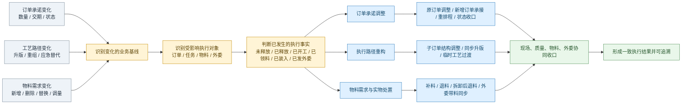

图示说明：灰蓝色节点表示 MOM 范围外的已确认业务变化输入；浅黄色节点表示 MOM 内识别、分析与决策环节；浅蓝色节点表示 MOM 内执行处置环节；浅绿色节点表示 MOM 内闭环追溯环节。后续系统流程图沿用同样的颜色定义。

#### 2.1.1.3 **变更系统承接总图**

```mermaid
flowchart LR
    classDef external fill:#eef3f8,stroke:#7a8a99,color:#23313f;
    classDef manage fill:#fff4d6,stroke:#c48a00,color:#5a4100;
    classDef execute fill:#dff0ff,stroke:#2f7dbd,color:#12486b;
    classDef closeout fill:#e9f7ea,stroke:#4f8f57,color:#24552a;

    A1["ERP / PLM 已确认变更"] --> B1["接收/生成变更单"]
    A2["检验结论 / 审理结论"] --> B1
    A3["MOM 手工紧急调整"] --> B1

    B1 --> B2{变更单类型}
    B2 --> C1["计划变更单"]
    B2 --> C2["工艺变更单"]
    B2 --> C3["BOM 变更单"]

    C1 --> D1["发布变更单"]
    C2 --> D1
    C3 --> D1

    D1 --> D2["影响范围分析<br/>生成生产订单 / 制造订单两个影响清单"]
    D2 --> D3["准入校验<br/>控制状态 / 完工状态 / 特殊约束"]
    D3 --> D4["在影响范围分析界面执行处理<br/>按变更单与订单类型约束可操作项"]
    D4 --> E1["复用订单页标准动作<br/>交付计划 / 生产订单管理 / 制造订单管理"]
    E1 --> E2["中间状态收口<br/>已开工 / 检验中 / 备料中 / 已发货对象完成当前动作后再切换"]
    E2 --> E3["九大业务域级联处理"]
    E3 --> F1["通知相关角色<br/>记录执行日志"]
    F1 --> F2["关闭变更单"]

    class A1,A2,A3 external;
    class B1,B2,C1,C2,C3,D1,D2,D3,D4 manage;
    class E1,E2,E3 execute;
    class F1,F2 closeout;
```

#### 2.1.1.4 **业务到系统的衔接说明**

| 层级 | 主语 | 回答的问题 | 对下文的承接 |
|------|------|-----------|-------------|
| 业务处理过程 | 订单、工艺、物料等业务对象 | 业务对象在不同执行状态下该如何处置 | 说明为什么需要这些系统能力 |
| 系统处理流程 | 变更单、分析、校验、执行、闭环 | MOM 如何识别、判断、分流、联动和收口 | 为 `2.3` 功能模块和流程功能提供来源 |
| 功能描述 | 模块、页面、操作、规则 | 用户在哪个模块完成什么动作，系统如何反馈 | 落到产品能力、页面和交互设计 |

### 2.1.2 **计划变更单业务处理与系统承接**

计划变更单的本质是订单承诺调整。业务层关注的是原订单如何承接数量、时间和状态变化；系统层关注的是 MOM 如何识别影响、校验准入、分流执行并收口。

#### 2.1.2.1 **业务场景摘要**

| 场景 | 典型触发 | 关键角色 | 关键判断 |
|------|---------|---------|---------|
| 状态变更 | 客户取消、质量问题、设备故障、物料短缺 | 计划员、车间主管、质量工程师 | 控制状态准入、中间状态对象收口、控制状态级联 |
| 数量增加 | 客户追加需求 | 计划员、销售经理 | 未展开未释放直接加量，已展开/已释放/已开工对象通过新生产订单承接增量 |
| 数量减少 | 客户减量、前序报废、物料短缺、质量问题 | 计划员、车间主管、物料管理员 | 交付计划需校验子订单状态，加工计划按未释放、已释放未开工、已开工分段处理 |
| 时间变更 | 客户提前、设备故障、物料延期、紧急插单 | 计划员、销售经理、设备管理员、物料管理员 | 资源与供应链影响评估、计划员重新排程、结果同步到下游对象 |

#### 2.1.2.2 **业务处理过程图**

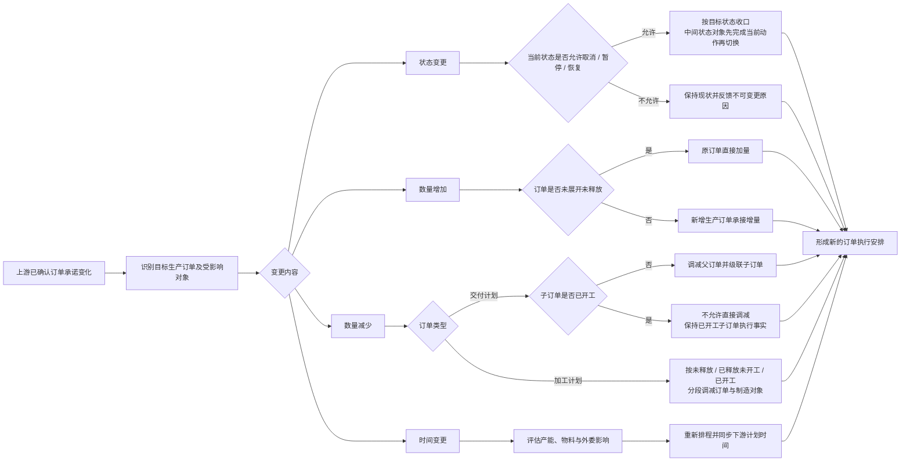

#### 2.1.2.3 **系统承接流程图**

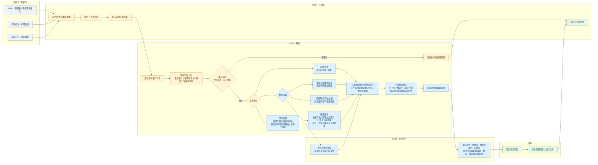

#### 2.1.2.4 **关键业务规则**

- 计划变更单的影响范围集中在订单及其下游对象，业务判断始终围绕指定生产订单展开。
- 计划变更单发布后，系统固定输出生产订单影响清单和制造订单影响清单，用户统一在影响范围分析界面内完成处理。
- 数量增加时，未展开未释放对象直接加量；已展开、已释放、已开工或已完工对象通过新增生产订单承接增量，保持原订单执行历史完整可追溯。
- 数量减少时，交付计划与加工计划的处理策略不同。交付计划重点校验子订单是否已开工；加工计划按未释放、已释放未开工、已开工三个阶段分段处理。
- 时间变更必须先完成影响分析和资源评估，再由计划员重新排程；制造订单不提供计划时间变更动作，其计划时间由计划排产结果统一调整。
- 数量变更与时间变更可在同一张计划变更单中组合触发，业务处理上先完成数量调整，再基于调整后的对象和数量结果进行时间重排。

### 2.1.3 **工艺变更单业务处理与系统承接**

工艺变更单的本质是执行路径重构。业务层关注的是哪些对象可以直接同步升版、哪些对象必须以临时工艺承接；系统层关注的是如何识别差异、校验约束并将新路径落到在制对象上。

#### 2.1.3.1 **业务场景摘要**

| 场景 | 典型触发 | 关键角色 | 关键判断 |
|------|---------|---------|---------|
| 一级工艺升版 | PLM 一级工艺升版、产品结构重组 | 计划员、工艺工程师 | 新旧一级工艺差异、待删除子订单是否未开工、新增/删除/保留子订单如何落地 |
| 加工工艺升版 | PLM 加工工艺升版、现场工艺优化 | 工艺工程师、计划员、车间主管 | 已释放制造订单能否同步升版，不能同步的订单是否转临时工艺处理 |
| 临时工艺变更 | 设备故障、现场应急、在制品替代路径 | 车间主管、工艺工程师 | 变更分割线、保留工序一致性、外委约束、串并行关系是否满足 |

#### 2.1.3.2 **业务处理过程图**

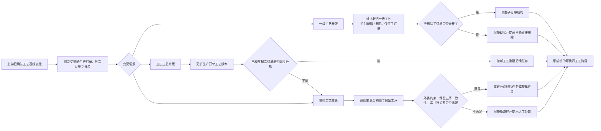

#### 2.1.3.3 **系统承接流程图**

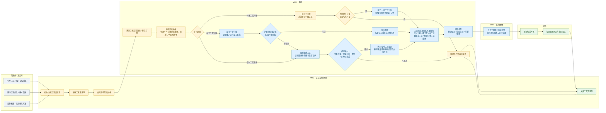

#### 2.1.3.4 **关键业务规则**

- 一级工艺升版主要影响生产订单域的子订单结构，待删除子订单必须未开工；已开工或已完工的子订单不允许直接删除。
- 工艺变更单发布后，系统固定输出生产订单影响清单和制造订单影响清单；交付计划执行一级工艺变更，加工计划执行加工工艺变更，制造订单执行工艺变更。
- 加工工艺升版必须先判断已释放制造订单能否同步升版；不能同步的订单不能笼统跳过，而是要转入临时工艺处理路径。
- 临时工艺变更以制造订单为主处理对象，未开工对象可整体重生成任务；已开工对象必须先识别变更分割线，只重建分割线后的任务。
- 存在已发送外委需求、保留工序在新工艺中不存在或关键属性不一致等情况时，应阻止工艺变更。
- 工艺变更通常不改变备料清单，因此物料准备计划原则上不因工艺变更直接改料；其主要影响集中在订单结构、任务路径和外委路径。

### 2.1.4 **BOM变更单业务处理与系统承接**

BOM 变更单的本质是物料需求重算与实物处置。业务层关注的是旧料怎么退、新料怎么补、已装入物料怎么处理；系统层关注的是如何按差异类型和物料状态分段处理，并同步外委带料。

#### 2.1.4.1 **业务场景摘要**

| 场景 | 典型触发 | 关键角色 | 关键判断 |
|------|---------|---------|---------|
| 新增物料 | PLM BOM 升版、设计补料 | 产品工程师、物料管理员、计划员 | 新物料需求如何生成，补料/领料时点和交期是否可行 |
| 删除物料 | 设计取消、成本优化 | 产品工程师、物料管理员、仓库管理员 | 旧料当前状态如何处置，是否需要退料或拆卸 |
| 数量调整 | 用量修正、损耗修正、工艺优化 | 工艺工程师、物料管理员、计划员 | 增量走补料，减量按物料状态分段退料 |
| 规格替换 | 供应商切换、替代料导入 | 采购工程师、产品工程师、物料管理员 | 按“删除旧料 + 新增新料”组合执行，并校验技术兼容和供应衔接 |

#### 2.1.4.2 **业务处理过程图**

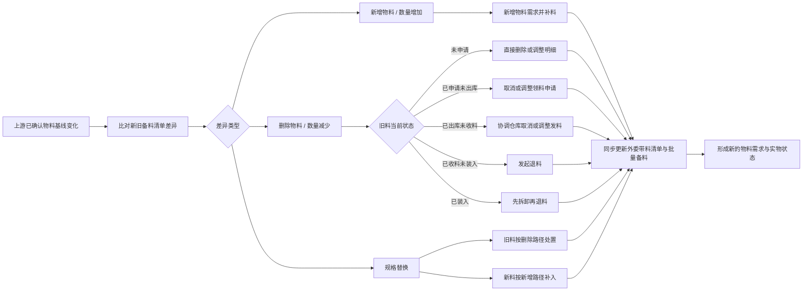

#### 2.1.4.3 **系统承接流程图**

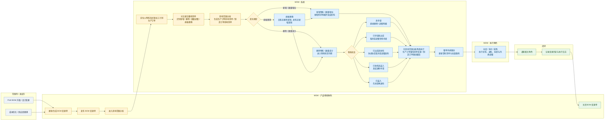

#### 2.1.4.4 **物料状态处置矩阵**

| 差异类型 | 物料状态 | 处置动作 | 处理结果 |
|---------|---------|---------|---------|
| 删除 | 未申请 | 直接删除物料需求明细 | 备料清单与物料需求同步收口 |
| 删除 | 已申请未出库 | 取消领料申请后删除明细 | 避免无效发料 |
| 删除 | 已出库未收料 | 协调仓库取消或调整发料后删除明细 | 保证库存和需求一致 |
| 删除 | 已收料未装入 | 发起退料申请后删除明细 | 收回已收但未投入的物料 |
| 删除 | 已装入 | 先拆卸，再发起退料申请 | 保留在制事实，避免直接抹除装入记录 |
| 数量增加 | 任一允许状态 | 新增或调整需求明细并补料 | 满足变更后的物料需求 |
| 数量减少 | 未申请 / 已申请未出库 / 已出库未收料 / 已收料未装入 / 已装入 | 按物料状态分段减量，必要时退料或拆卸后退料 | 需求数量与实物状态保持一致 |
| 规格替换 | 旧料与新料同时存在 | 旧料按删除路径处置，新料按新增路径补入 | 完成替代切换并保持供应连续 |

#### 2.1.4.5 **关键业务规则**

- 系统需自动对比新旧备料清单，识别新增、删除、数量调整和规格替换；其中规格替换按“删除旧料 + 新增新料”组合执行，不能脱离原有新增/删除规则单独处理。
- BOM 变更单发布后，系统固定输出生产订单影响清单和制造订单影响清单；其中生产订单执行入口仅落在生产订单管理页面，不落在零部件交付计划页面。
- 删除或减量时必须结合物料状态分段处理：未申请直接删/调明细，已申请未出库取消或调整领料申请，已出库未收料协调仓库取消或调整发料，已收料未装入发起退料，已装入先拆卸再退料。
- 新增或增量通过补料承接；整单外委场景下，还要同步更新外委带料清单和外委采购批量备料。
- 支持制造订单级“变更方案=不变更”；被排除出本次变更的制造订单继续沿用原备料方案，不参与补退料级联。

### 2.1.5 **变更执行通用规则**

本节保留三类变更单共用的执行规则，用于保证业务处理与系统承接的表达一致；各变更类型的详细推演仍以 [DNW30320-变更管理_变更执行方案](./DNW30320-变更管理_变更执行方案.md) 为准。

#### 2.1.5.1 **变更单状态与执行规则**

| 规则项 | 规则说明 |
|--------|---------|
| 变更单状态流转 | 统一按“已创建 → 已发布 → 处理中 → 已完成 → 已关闭”流转，已关闭仅用于流程收口和追溯，不再允许继续执行。 |
| 变更入口 | 变更执行由计划变更单、工艺变更单、BOM 变更单驱动，发布后直接进入影响范围分析。 |
| 影响范围分析 | 正式执行前必须识别受影响的生产订单、制造订单及下游对象，并分别生成生产订单影响清单和制造订单影响清单。 |
| 清单处理状态 | 两个影响清单统一使用“无影响 / 有影响待处理 / 有影响已处理”三种处理状态，不再拆分更多状态字段。 |
| 执行方式 | 用户在影响范围分析界面直接查看两个清单并发起处理，不再单独设置“变更处理”页面。 |
| 准入校验 | 以控制状态、完工状态和特殊约束为主进行准入判断；已取消、已完工或不满足特殊约束的对象拒绝执行。 |
| 中间状态处理 | 已开工、检验中、备料中、审批中、已发货等对象原则上允许完成当前处理后再收口到目标状态，不强制中断已执行动作。 |
| 时间调整口径 | 制造订单不提供计划时间变更动作；时间类影响由生产订单发起变更后，统一通过计划排产承接制造订单时间调整。 |
| 级联处理 | 确认执行后按业务域联动处理，需变更对象执行级联，不变更对象保持原计划，整体要求结果一致。 |
| 结果闭环 | 执行完成后同步通知相关角色，记录变更原因、影响对象、执行结果与级联明细，支撑关闭、追溯和复盘。 |

#### 2.1.5.2 **五类变更处理结论一览**

| 变更类型 | 适用对象 | 准入条件 | 核心处理结论 | 主要级联影响 |
|---------|---------|---------|-------------|-------------|
| 状态变更 | 生产订单、制造订单 | 控制状态满足准入且对象未完工 | 取消、暂停、恢复均按控制状态驱动执行；已处于中间状态的对象原则上允许完成当前处理后，再转入目标控制状态。 | 制造任务、检验任务、物料准备计划、外委需求、外委采购订单等对象的控制状态联动。 |
| 数量变更 | 生产订单 | 订单未完工；数量减少时要求订单处于正常或暂停状态 | 数量增加时，未展开未释放对象直接加量，已展开、已释放、已开工或已完工对象通过新增生产订单承接增量；数量减少时需区分未释放、已释放未开工、已开工等状态分别处理。 | 制造订单数量调整、物料补退料、外委数量协调及前序报废联动减量。 |
| 时间变更 | 生产订单 | 正常或暂停且未完工 | 先完成影响分析和时间调整，再由计划员重新排程；制造订单计划时间由排程结果同步调整。 | 制造任务、检验任务、物料需求时间、外委需求与采购交期同步调整。 |
| 工艺路线变更 | 生产订单、制造订单 | 正常或暂停且满足对象状态约束 | 未开工对象可直接切换新工艺或重生成任务；已开工对象需基于变更分割线识别保留工序与变更工序，校验通过后再处理。 | 制造任务、检验任务、外委需求等对象按新工艺重建或调整，不能同步升版的订单转临时工艺处理。 |
| 备料清单变更 | 生产订单 | 正常或暂停且未完工 | 系统自动对比新旧清单，识别新增、删除和数量调整差异；规格替换按“删除旧料 + 新增新料”组合处理；结合物料状态执行补料、退料或拆卸后退料。 | 物料准备计划明细、整单外委带料清单、外委采购批量备料同步调整。 |

#### 2.1.5.3 **详细规则指引**

状态变更、数量变更、时间变更、工艺路线变更、备料清单变更的详细业务规则、各业务域处理逻辑和特殊场景说明，统一见 [DNW30320-变更管理_变更执行方案](./DNW30320-变更管理_变更执行方案.md)。

## 2.2 **数据描述**

### 2.2.1 **业务对象ER关系图**

变更管理涉及九大业务域的核心业务对象及其关系如下：

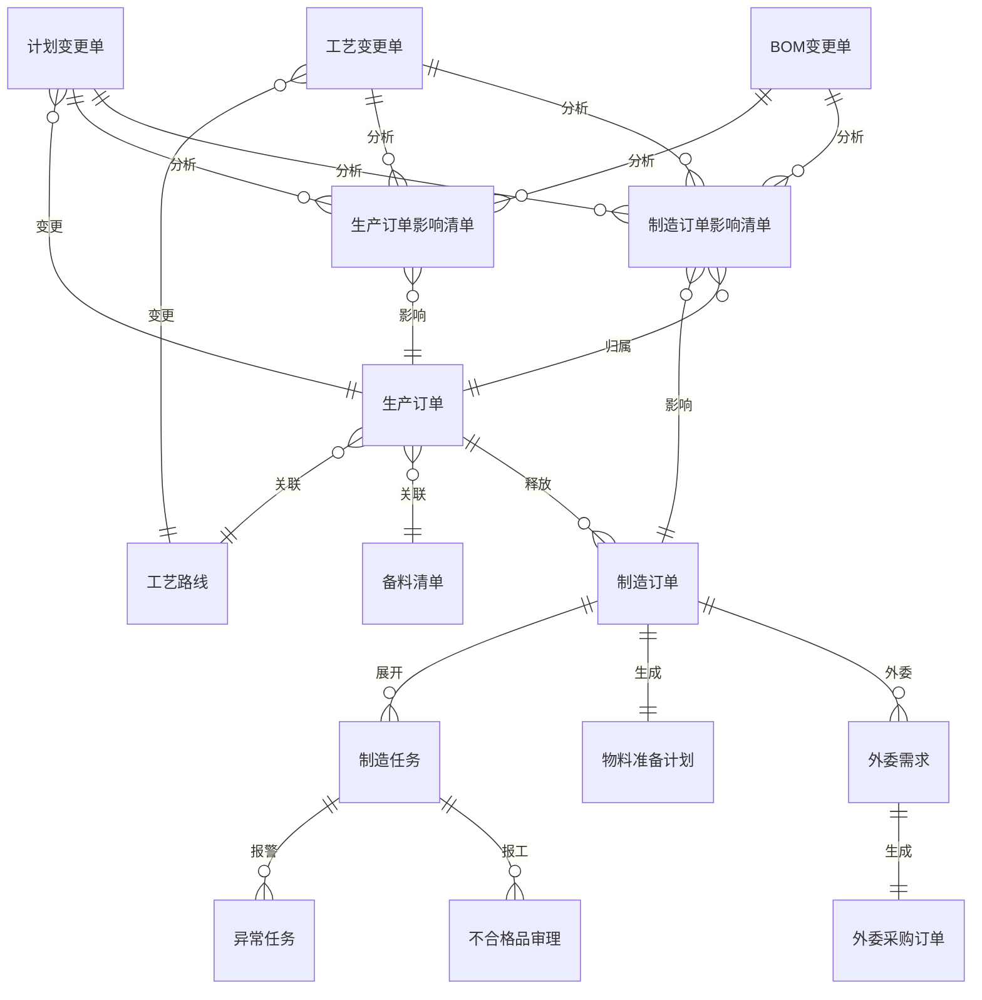

### 2.2.2 **核心数据字典**

#### 2.2.2.1 **变更单数据结构**

变更单根据变更对象和场景的不同，分为三种类型，每种类型的数据结构如下：

**（1）计划变更单**

计划变更单用于管理生产订单的计划变更，包括状态变更、数量变更、时间变更等场景。

| 字段名 | 数据类型 | 必填 | 说明 |
|--------|----------|------|------|
| 变更单号 | 文本 | 是 | 变更单唯一标识，系统自动生成 |
| 变更单类型 | 文本 | 是 | 固定值：计划变更单 |
| 关联订单号 | 文本 | 是 | 变更目标生产订单号 |
| 变更场景 | 文本 | 是 | 枚举值：状态变更/数量变更/时间变更/数量+时间变更 |
| 变更内容 | 文本 | 是 | 根据变更场景不同，包含不同字段：<br>- 状态变更：目标状态（取消/暂停/恢复）、变更原因<br>- 数量变更：原计划数量、新计划数量、变更原因<br>- 时间变更：原计划开始时间、新计划开始时间、原计划结束时间、新计划结束时间、变更原因<br>- 数量+时间变更：包含数量和时间的所有字段 |
| 变更原因 | 文本 | 是 | 变更原因说明 |
| 变更来源 | 文本 | 是 | 枚举值：上游集成/手工创建/检验结论/审理结论 |
| 来源系统 | 文本 | 否 | 上游集成时必填，如ERP、PLM等 |
| 来源单号 | 文本 | 否 | 上游集成时的源单号 |
| 变更单状态 | 文本 | 是 | 枚举值：已创建/已发布/处理中/已完成/已关闭 |
| 处理开始时间 | 日期时间 | 否 | 开始执行变更的时间 |
| 处理完成时间 | 日期时间 | 否 | 变更执行完成的时间 |

**（2）工艺变更单**

工艺变更单用于管理工艺路线的版本变更，影响所有使用该工艺的在制订单。

| 字段名 | 数据类型 | 必填 | 说明 |
|--------|----------|------|------|
| 变更单号 | 文本 | 是 | 变更单唯一标识，系统自动生成 |
| 变更单类型 | 文本 | 是 | 固定值：工艺变更单 |
| 原工艺路线 | 文本 | 是 | 变更前的工艺路线编号 |
| 原工艺版本 | 文本 | 是 | 变更前的工艺版本号 |
| 目标工艺路线 | 文本 | 是 | 变更目标工艺路线编号 |
| 目标工艺版本 | 文本 | 是 | 变更后的工艺版本号 |
| 变更类型 | 文本 | 是 | 枚举值：工艺升版/临时工艺 |
| 变更内容说明 | 文本 | 是 | 新旧工艺对比结果：<br>- 新增工序列表<br>- 删除工序列表<br>- 保留工序列表<br>- 工序参数变更列表 |
| 变更原因 | 文本 | 是 | 变更原因说明 |
| 变更来源 | 文本 | 是 | 枚举值：上游集成/手工创建 |
| 来源系统 | 文本 | 否 | 上游集成时必填，如PLM等 |
| 来源单号 | 文本 | 否 | 上游集成时的源单号 |
| 变更单状态 | 文本 | 是 | 枚举值：已创建/已发布/处理中/已完成/已关闭 |
| 处理开始时间 | 日期时间 | 否 | 开始执行变更的时间 |
| 处理完成时间 | 日期时间 | 否 | 变更执行完成的时间 |

**（3）BOM变更单**

BOM变更单用于管理父物料备料清单的变更，影响所有使用该父物料的在制订单。

| 字段名 | 数据类型 | 必填 | 说明 |
|--------|----------|------|------|
| 变更单号 | 文本 | 是 | 变更单唯一标识，系统自动生成 |
| 变更单类型 | 文本 | 是 | 固定值：BOM变更单 |
| 变更父物料 | 文本 | 是 | 变更目标父物料编号 |
| 新备料明细表 | 文本数组 | 是 | 新版本的完整备料明细清单，每条明细包含：<br>- 物料编码<br>- 物料名称<br>- 需求数量<br>- 计量单位<br>- 其他物料属性 |
| 变更说明 | 文本 | 是 | 新旧备料清单对比结果：<br>- 新增物料列表<br>-除物料列表<br>- 保留物料列表<br>- 数量变更物料列表 |
| 变更原因 | 文本 | 是 | 变更原因说明 |
| 变更来源 | 文本 | 是 | 枚举值：上游集成/手工创建 |
| 来源系统 | 文本 | 否 | 上游集成时必填，如ERP、PLM等 |
| 来源单号 | 文本 | 否 | 上游集成时的源单号 |
| 变更单状态 | 文本 | 是 | 枚举值：已创建/已发布/处理中/已完成/已关闭 |
| 处理开始时间 | 日期时间 | 否 | 开始执行变更的时间 |
| 处理完成时间 | 日期时间 | 否 | 变更执行完成的时间 |

**（4）生产订单影响清单**

生产订单影响清单记录变更单影响到的生产订单及其处理状态，是变更单的从表。

| 字段名 | 数据类型 | 必填 | 说明 |
|--------|----------|------|------|
| 清单明细号 | 文本 | 是 | 明细唯一标识，系统自动生成 |
| 变更单号 | 文本 | 是 | 关联的变更单号（外键） |
| 生产订单号 | 文本 | 是 | 受影响的生产订单号 |
| 处理状态 | 文本 | 是 | 枚举值：无影响/有影响待处理/有影响已处理 |
| 处理动作 | 文本 | 否 | 本次对生产订单执行或记录的动作，如暂停、恢复、取消、数量变更、计划时间变更、一级工艺变更、加工工艺变更、备料清单变更 |
| 备注 | 文本 | 否 | 处理说明、失败原因或无需处理原因 |

**（5）制造订单影响清单**

制造订单影响清单记录变更单影响到的制造订单及其处理状态，是变更单的从表。

| 字段名 | 数据类型 | 必填 | 说明 |
|--------|----------|------|------|
| 清单明细号 | 文本 | 是 | 明细唯一标识，系统自动生成 |
| 变更单号 | 文本 | 是 | 关联的变更单号（外键） |
| 制造订单号 | 文本 | 是 | 受影响的制造订单号 |
| 对应生产订单号 | 文本 | 是 | 制造订单归属的生产订单号 |
| 处理状态 | 文本 | 是 | 枚举值：无影响/有影响待处理/有影响已处理 |
| 处理动作 | 文本 | 否 | 本次对制造订单执行或记录的动作，如暂停、恢复、取消、工艺变更、排产调整、不变更 |
| 备注 | 文本 | 否 | 处理说明、失败原因或无需处理原因 |

说明：订单当前生命周期状态、控制状态、计划类型、工艺路线等展示信息从对应订单实时带出，不作为影响清单的独立字段。

#### 2.2.2.2 **变更相关核心字段**

| 字段名 | 业务类型 | 业务约束 | 变更相关说明 |
|--------|----------|----------|--------------|
| **状态变更相关** |
| 生命周期状态 | 文本 | 各业务域枚举值不同 | 业务对象的生命周期状态，如已创建/已开工/已完工等，反映业务流程进度 |
| 控制状态 | 文本 | 枚举值：正常/已暂停/已取消 | 九大业务域通用的控制状态字段，用于状态变更管理，独立于生命周期状态 |
| 暂停原因 | 文本 | 可选填写 | 暂停原因，暂停操作时必须填写 |
| 取消原因 | 文本 | 可选填写 | 取消原因，取消操作时必须填写 |
| **数量变更相关** |
| 计划数量 | 数值 | 大于0 | 计划数量，数量变更的目标字段 |
| 已释放数量 | 数值 | 大于等于0，小于等于计划数量 | 已释放数量，影响数量调减的处理策略 |
| 实际完工数量 | 数值 | 大于等于0 | 实际完工数量，完工后不可再进行数量变更 |
| **时间变更相关** |
| 计划开始时间 | 日期时间 | 必填 | 计划开始时间，时间变更的目标字段 |
| 计划结束时间 | 日期时间 | 必须晚于计划开始时间 | 计划结束时间，时间变更的目标字段 |
| 实际开始时间 | 日期时间 | 可选填写 | 实际开始时间，已开工后影响时间变更约束 |
| **工艺变更相关** |
| 工艺路线编号 | 文本 | 关联字段，必填 | 工艺路线编号，工艺变更的核心字段 |
| 工艺版本号 | 文本 | 必填 | 工艺版本号，工艺升版变更时自动更新 |
| 是否临时工艺 | 布尔值 | 默认否 | 是否临时工艺，标识临时工艺变更 |
| 工序号 | 文本 | 必填 | 工序号，工艺变更中保留工序的匹配标识 |
| 产出比例 | 小数 | 大于0，小于等于1 | 产出比例，工艺变更时需保持一致性 |
| **备料清单变更相关** |
| 备料清单编号 | 文本 | 关联字段，必填 | 备料清单编号，备料清单变更的目标字段 |
| 备料清单版本号 | 文本 | 必填 | 备料清单版本号，备料清单变更时更新 |
| 物料编码 | 文本 | 关联字段，必填 | 物料编码，物料变更的核心标识 |
| 需求数量 | 小数 | 大于等于0 | 需求数量，物料数量变更字段 |
| **物料状态相关** |
| 物料状态 | 文本 | 枚举值：未收料/已收料未装入/已装入 | 物料准备计划中物料的状态，决定备料清单变更的处理策略 |
| 是否已装入 | 布尔值 | 默认否 | 物料是否已装入制造订单，已装入需先拆卸再退料 |
| **中间状态标识** |
| 关联订单控制状态标识 | 文本 | 可选填写 | 异常任务和不合格品审理使用，标识关联订单的控制状态（已取消/已暂停） |
| **级联影响字段** |
| 父订单号 | 文本 | 关联字段，可选 | 父订单号，级联变更的关联字段 |
| 是否级联变更 | 布尔值 | 默认否 | 是否级联变更，标识变更来源 |
| 变更来源 | 文本 | 可选填写 | 变更来源，记录变更触发源 |


#### 2.2.2.3 **变更类型枚举定义**

| 变更类型 | 业务编码 | 适用对象 | 核心影响字段 | 约束条件 |
|----------|----------|----------|--------------|----------|
| **状态变更** |
| 取消 | 取消 | 生产订单、制造订单 | 订单状态、取消原因 | 未完工状态可取消 |
| 暂停 | 暂停 | 生产订单、制造订单 | 订单状态、暂停原因 | 未完工状态可暂停 |
| 恢复 | 恢复 | 生产订单、制造订单 | 订单状态 | 暂停状态可恢复 |
| **数量变更** |
| 数量变更 | 数量变更 | 生产订单 | 计划数量、已释放数量 | 包含数量增加和数量减少；数量增加可通过新订单承接，数量减少需结合未释放、已释放未开工、已开工等状态分别处理 |
| **时间变更** |
| 时间变更 | 时间变更 | 生产订单 | 计划开始时间、计划结束时间 | 未完工状态可变更；制造订单计划时间由计划排产承接 |
| **工艺变更** |
| 一级工艺变更 | 一级工艺变更 | 生产订单(零部件交付计划) | 工艺路线编号 | 未开工状态可变更 |
| 加工工艺变更 | 加工工艺变更 | 生产订单(零部件加工计划) | 工艺路线编号 | 任何未完工状态可变更 |
| 制造订单工艺变更 | 制造订单工艺变更 | 制造订单 | 工艺路线编号、是否临时工艺 | 根据在制品情况判断 |
| **物料变更** |
| 备料清单变更 | 备料清单变更 | 生产订单(零部件加工计划) | 备料清单编号、备料清单版本号、物料状态、是否已装入 | • 未完工状态可变更<br>• 不落在零部件交付计划页面<br>• 物料删除：需校验物料状态（未收料/已收料未装入/已装入）<br>• 数量减少：已收料需退料，已装入需先拆卸再退料<br>• 规格替换：通过删除旧物料+新增新物料组合实现 |

#### 2.2.2.4 **变更状态流转规则**

| 当前状态 | 允许的变更类型 | 状态流转规则 | 特殊约束 |
|----------|----------------|--------------|----------|
| 已创建 | 取消、暂停、数量变更、时间变更、工艺变更、备料清单变更 | 已创建 → 已取消/已暂停 | 影响最小，无级联约束 |
| 已发布 | 取消、暂停、数量变更、时间变更、工艺变更、备料清单变更 | 已发布 → 已取消/已暂停 | 可能有子订单关联 |
| 已展开 | 取消、暂停、数量变更、时间变更、工艺变更、备料清单变更 | 已展开 → 已取消/已暂停 | 需处理子订单或制造任务 |
| 已释放 | 取消、暂停、数量变更、时间变更、备料清单变更 | 已释放 → 已取消/已暂停 | 已释放制造订单需单独处理工艺变更 |
| 已开工 | 取消、暂停、数量变更(仅调减)、时间变更 | 已开工 → 已取消/已暂停 | 需处理在制品，工艺变更受限 |
| 已暂停 | 恢复、取消 | 已暂停 → 原状态/已取消 | 恢复到暂停前状态 |
| 已完工 | 无 | 终态 | 不允许任何变更 |
| 已取消 | 无 | 终态 | 不允许任何变更 |

### 2.2.3 **九大业务域状态规则**

#### 2.2.3.1 **核心状态定义**

| 业务域 | 生命周期状态枚举 | 控制状态枚举 | 完工判定条件 | 变更约束 |
|--------|----------------|-------------|-------------|----------|
| **生产订单域** | 已创建/已发布/已展开/已释放/已开工/已完工 | 正常/已暂停/已取消 | 所有制造订单完工 | 已完工/已取消不可变更 |
| **制造订单域** | 已创建/已发布/已展开/已开工/已完工 | 正常/已暂停/已取消 | 所有制造任务和检验任务完工 | 已完工/已取消不可变更 |
| **制造任务域** | 已创建/已派工/已开工/已送检/已完工 | 正常/已暂停/已取消 | 报工完成 | 已完工/已取消不可变更 |
| **检验任务域** | 已创建/检验中/已完工 | 正常/已暂停/已取消 | 检验完成 | 已完工/已取消不可变更 |
| **物料准备计划域（主表）** | 已创建/备料中/备料完成 | 正常/已暂停/已取消 | 所有明细已收料 | 已取消不可变更 |
| **物料需求明细域（从表）** | 已创建/已申请/已收料 | 无控制状态 | 收料确认 | 跟随主表控制状态 |
| **异常任务域** | 待处理/处理中/已处理/已关闭 | 无控制状态 | 处理完成或关闭 | 使用关联订单控制状态标识 |
| **不合格品审理域** | 待审理/审理中/审理完成 | 无控制状态 | 审理流程完成 | 使用关联订单控制状态标识 |
| **外委需求域** | 已创建/审批中/已审批/已发送/已取消 | 正常/已暂停/已取消 | 外委采购订单完成 | 已取消不可变更 |
| **外委采购订单域** | 已创建/已发货/部分收货/全部收货/已退货/已完成/已取消 | 正常/已暂停/已取消 | 入库检验完成 | 已完成/已取消不可变更 |

**说明：**
- **控制状态 vs 生命周期状态**：控制状态用于变更管理（正常/已暂停/已取消），生命周期状态反映业务流程进度
- **异常任务和不合格品审理特殊处理**：这两个域本身无控制状态，通过"关联订单控制状态标识"字段记录关联订单的控制状态


#### 2.2.3.2 **状态流转规则**

| 业务域 | 当前状态 | 允许的变更类型 | 状态流转规则 | 特殊约束 |
|--------|----------|----------------|--------------|----------|
| **生产订单域** | 已创建 | 取消、暂停、数量变更、时间变更、工艺变更、备料清单变更 | 已创建 → 已取消/已暂停 | 影响最小，无级联约束 |
| | 已发布 | 取消、暂停、数量变更、时间变更、工艺变更、备料清单变更 | 已发布 → 已取消/已暂停 | 可能有子订单关联 |
| | 已展开 | 取消、暂停、数量变更、时间变更、工艺变更、备料清单变更 | 已展开 → 已取消/已暂停 | 需处理子订单或制造任务 |
| | 已释放 | 取消、暂停、数量变更、时间变更、备料清单变更 | 已释放 → 已取消/已暂停 | 已释放制造订单需单独处理工艺变更 |
| | 已开工 | 取消、暂停、数量变更(仅调减)、时间变更 | 已开工 → 已取消/已暂停 | 需处理在制品，工艺变更受限 |
| | 已暂停 | 恢复、取消 | 已暂停 → 原状态/已取消 | 恢复到暂停前状态 |
| | 已完工 | 无 | 终态 | 不允许任何变更 |
| | 已取消 | 无 | 终态 | 不允许任何变更 |
| **制造订单域** | 已创建 | 取消、暂停、工艺变更 | 已创建 → 已取消/已暂停 | 同步影响物料准备计划 |
| | 已发布 | 取消、暂停、工艺变更 | 已发布 → 已取消/已暂停 | 同步影响物料准备计划 |
| | 已展开 | 取消、暂停、工艺变更 | 已展开 → 已取消/已暂停 | 需处理制造任务和检验任务 |
| | 已开工 | 取消、暂停 | 已开工 → 已取消/已暂停 | 需处理在制品，工艺变更受限 |
| | 已暂停 | 恢复、取消 | 已暂停 → 原状态/已取消 | 恢复到暂停前状态 |
| | 已完工 | 无 | 终态 | 不允许任何变更 |
| **制造任务域** | 已创建 | 取消、暂停 | 控制状态变更 | 关闭相关异常任务 |
| | 已派工 | 取消、暂停 | 控制状态变更 | 关闭相关质量计划 |
| | 已开工 | 取消、暂停 | 控制状态变更 | 中间状态，允许继续报工至完工 |
| | 已送检 | 取消、暂停 | 控制状态变更 | 协调检验任务处理 |
| | 已完工 | 无 | 终态 | 不允许任何变更 |
| **检验任务域** | 已创建 | 取消、暂停 | 控制状态变更 | 未产生检验数据 |
| | 检验中 | 取消、暂停 | 控制状态变更 | 中间状态，允许继续检验至完工 |
| | 已完工 | 无 | 终态 | 不允许任何变更 |
| **物料准备计划域** | 已创建 | 取消、暂停、备料清单变更 | 控制状态变更 | 级联影响所有明细 |
| | 备料中 | 取消、暂停、备料清单变更 | 控制状态变更 | 中间状态，需处理已申请/已收料明细 |
| | 备料完成 | 取消、暂停 | 控制状态变更 | 需处理已收料物料退料 |
| **异常任务域** | 待处理 | 无直接变更 | 标记关联订单控制状态 | 中间状态，允许继续处理至已处理/已关闭 |
| | 处理中 | 无直接变更 | 标记关联订单控制状态 | 中间状态，允许完成处理至已处理/已关闭 |
| | 已处理 | 无 | 终态 | 保持状态，结果保留用于改进 |
| | 已关闭 | 无 | 终态 | 保持状态 |
| **不合格品审理域** | 待审理 | 无直接变更 | 标记关联订单控制状态 | 中间状态，允许继续审理至审理完成 |
| | 审理中 | 无直接变更 | 标记关联订单控制状态 | 中间状态，允许完成审理至审理完成 |
| | 审理完成 | 无 | 终态 | 取消/暂停关联返工返修订单（如已生成） |
| **外委需求域** | 已创建 | 取消、暂停 | 控制状态变更 | 无合同影响 |
| | 审批中 | 取消、暂停 | 控制状态变更 | 中间状态，允许完成审批 |
| | 已审批 | 取消、暂停 | 控制状态变更 | 需协调供应商 |
| | 已发送 | 取消、暂停 | 控制状态变更 | 中间状态，需紧急协调 |
| | 已取消 | 无 | 终态 | 不允许任何变更 |
| **外委采购订单域** | 已创建 | 取消、暂停 | 控制状态变更 | 无成本影响 |
| | 已发货 | 取消、暂停 | 控制状态变更 | 中间状态，需处理在途物料 |
| | 部分收货 | 取消、暂停 | 控制状态变更 | 中间状态，需处理已收货和未收货 |
| | 全部收货 | 取消、暂停 | 控制状态变更 | 中间状态，需处理入库检验 |
| | 已完成 | 无 | 终态 | 不允许任何变更 |


## 2.3 **功能描述**

### 2.3.1 **应用架构图**

变更管理功能在制造执行系统中的整体架构关系：

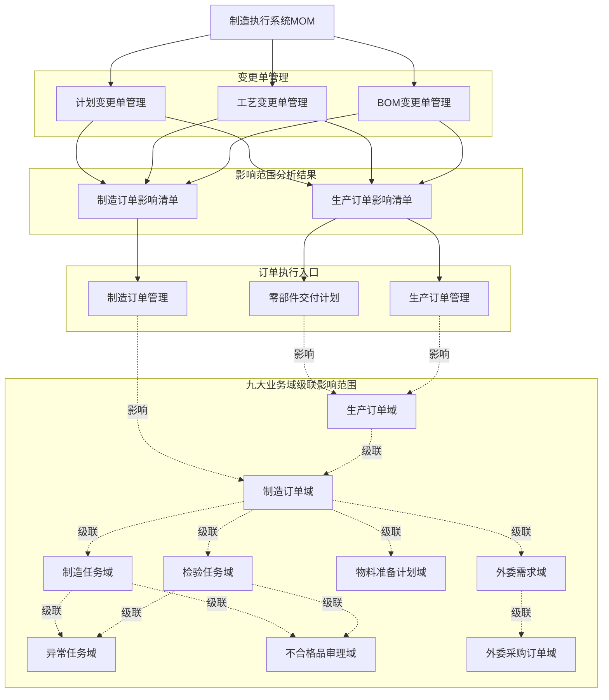

### 2.3.2 **功能模块树**

```mermaid
graph TB
    A[变更管理] --> B1[计划变更单管理]
    A --> B2[工艺变更单管理]
    A --> B3[BOM变更单管理]
    A --> C1[零部件交付计划]
    A --> C2[生产订单管理]
    A --> C3[制造订单管理]
    
    B1 --> B11[增删查改&导入]
    B1 --> B12[发布]
    B1 --> B13[影响范围分析]
    B1 --> B14[关闭]
    
    B2 --> B21[增删查改&导入]
    B2 --> B22[发布]
    B2 --> B23[影响范围分析]
    B2 --> B24[关闭]
    
    B3 --> B31[增删查改&导入]
    B3 --> B32[发布]
    B3 --> B33[影响范围分析]
    B3 --> B34[关闭]
    
    C1 --> C11[取消]
    C1 --> C12[暂停]
    C1 --> C13[恢复]
    C1 --> C14[数量变更]
    C1 --> C15[计划时间变更]
    C1 --> C16[一级工艺变更]
    
    C2 --> C21[取消]
    C2 --> C22[暂停]
    C2 --> C23[恢复]
    C2 --> C24[数量变更]
    C2 --> C25[计划时间变更]
    C2 --> C26[加工工艺变更]
    C2 --> C27[备料清单变更]
    
    C3 --> C31[取消]
    C3 --> C32[暂停]
    C3 --> C33[恢复]
    C3 --> C34[工艺变更]
```

### 2.3.3 **功能清单**

|模块 | 页面 | 功能点 | 功能点状态 | 功能点描述|
|--- | --- | --- | --- | ---|
|计划管理 | 计划变更单管理 | 计划变更单管理-增删查改&导入 | 新增 | 手工创建计划变更单（一个生产订单号对应一个变更单）。填写关联订单号、变更场景（状态变更/数量变更/时间变更/数量+时间变更）、变更内容、变更原因等基本信息。或接收上游系统（ERP）推送的计划变更单，系统自动解析变更单数据，创建计划变更单记录，初始状态为已创建。|
|计划管理 | 计划变更单管理 | 计划变更单管理-发布 | 新增 | 发布变更单。变更单创建后需要发布，发布后状态变为已发布，不再允许修改和删除。|
|计划管理 | 计划变更单管理 | 计划变更单管理-影响范围分析 | 修订 | 自动识别受影响的生产订单和制造订单，分别生成生产订单影响清单和制造订单影响清单。用户在分析界面直接对生产订单执行暂停、恢复、取消、数量变更、计划时间变更等动作；制造订单展示受影响结果和状态类处理情况，时间类影响通过计划排产承接。|
|计划管理 | 计划变更单管理 | 计划变更单管理-关闭 | 新增 | 关闭变更单。两个影响清单中所有“有影响待处理”记录处理完成后关闭变更单，状态变为已关闭，不再允许任何操作。|
|计划管理 | 工艺变更单管理 | 工艺变更单管理-增删查改&导入 | 新增 | 手工创建工艺变更单（一个工艺路线编号对应一个变更单）。填写原工艺路线、原工艺版本、目标工艺路线、目标工艺版本、变更类型（工艺升版/临时工艺）、变更内容说明（新增/删除/保留工序列表、工序参数变更列表）、变更原因等基本信息。或接收上游系统（PLM）推送的工艺变更单，系统自动解析变更单数据，创建工艺变更单记录，初始状态为已创建。|
|计划管理 | 工艺变更单管理 | 工艺变更单管理-发布 | 新增 | 发布变更单。变更单创建后需要发布，发布后状态变为已发布，不再允许修改和删除。|
|计划管理 | 工艺变更单管理 | 工艺变更单管理-影响范围分析 | 修订 | 自动识别受影响的生产订单和制造订单，分别生成生产订单影响清单和制造订单影响清单。用户在分析界面直接对交付计划执行一级工艺变更、对加工计划执行加工工艺变更、对制造订单执行工艺变更，并回写对应清单的处理状态和处理动作。|
|计划管理 | 工艺变更单管理 | 工艺变更单管理-关闭 | 新增 | 关闭变更单。两个影响清单中所有“有影响待处理”记录处理完成后关闭变更单，状态变为已关闭，不再允许任何操作。|
|计划管理 | BOM变更单管理 | BOM变更单管理-增删查改&导入 | 新增 | 手工创建BOM变更单（一个父物料编号对应一个变更单）。填写变更父物料、新备料明细表（完整的备料清单）、变更说明（新增/删除/保留物料列表、数量变更物料列表）、变更原因等基本信息。或接收上游系统（ERP/PLM）推送的BOM变更单，系统自动解析变更单数据，创建BOM变更单记录，初始状态为已创建。|
|计划管理 | BOM变更单管理 | BOM变更单管理-发布 | 新增 | 发布变更单。变更单创建后需要发布，发布后状态变为已发布，不再允许修改和删除。|
|计划管理 | BOM变更单管理 | BOM变更单管理-影响范围分析 | 修订 | 自动识别受影响的加工计划生产订单和关联制造订单，分别生成生产订单影响清单和制造订单影响清单。用户在分析界面直接对生产订单执行备料清单变更，制造订单清单用于跟踪补料、退料、拆卸后退料等联动结果；备料清单变更不落在零部件交付计划页面。|
|计划管理 | BOM变更单管理 | BOM变更单管理-关闭 | 新增 | 关闭变更单。两个影响清单中所有“有影响待处理”记录处理完成后关闭变更单，状态变为已关闭，不再允许任何操作。|
|计划管理 | 零部件交付计划 | 零部件交付计划-取消 | 修订 | 当交付计划需要取消时，可手动取消生产订单及关联的生产数据。取消操作是不可逆操作，需要严格的控制状态校验（正常/暂停且未完工）和完整的九大业务域级联处理机制。|
|计划管理 | 零部件交付计划 | 零部件交付计划-暂停 | 修订 | 当交付计划需要暂停时，可手动暂停生产订单及关联的生产数据。暂停操作需要控制状态校验（正常且未完工），暂停状态保持所有业务数据和上下文信息完整，支持后续恢复操作。|
|计划管理 | 零部件交付计划 | 零部件交付计划-恢复 | 修订 | 当交付计划需要恢复时，可手动恢复生产订单及关联的生产数据。恢复操作需要控制状态校验（暂停且未完工），恢复后订单回到暂停前的生命周期状态，继续正常业务流程。|
|计划管理 | 零部件交付计划 | 零部件交付计划-数量变更 | 修订 | 当交付计划数量需要调整时，在父生产订单层执行数量变更，统一承接数量增加和数量减少场景。数量增加根据订单展开情况决定直接调量或新增生产订单承接；数量减少重点校验子生产订单状态，存在已开工子订单时按当前在制情况处理。|
|计划管理 | 零部件交付计划 | 零部件交付计划-计划时间变更 | 修订 | 当交付计划需要调整时间时，可手动变更生产订单计划开始时间和结束时间。时间变更需要先完成影响分析和资源提示，再由计划员进行计划排产，其余执行对象按排程结果同步计划时间。|
|计划管理 | 零部件交付计划 | 零部件交付计划-一级工艺变更 | 新增 | 当零部件交付计划的一级工艺路线需要更新时，可进行一级工艺变更操作。一级工艺变更需要控制状态校验（正常/暂停且未开工），变更后重新展开生成子生产订单，一级工艺路线直接决定后续子生产订单的拆分与编排。|
|计划管理 | 生产订单管理 | 生产订单管理-取消 | 修订 | 当加工计划需要取消时，可手动取消生产订单及关联的生产数据。取消操作是不可逆操作，需要严格的控制状态校验（正常/暂停且未完工）和完整的九大业务域级联处理机制。|
|计划管理 | 生产订单管理 | 生产订单管理-暂停 | 修订 | 当加工计划需要暂停时，可手动暂停生产订单及关联的生产数据。暂停操作需要控制状态校验（正常且未完工），暂停状态保持所有业务数据和上下文信息完整，支持后续恢复操作。|
|计划管理 | 生产订单管理 | 生产订单管理-恢复 | 修订 | 当加工计划需要恢复时，可手动恢复生产订单及关联的生产数据。恢复操作需要控制状态校验（暂停且未完工），恢复后订单回到暂停前的生命周期状态，继续正常业务流程。|
|计划管理 | 生产订单管理 | 生产订单管理-数量变更 | 修订 | 当加工计划数量需要调整时，在生产订单层统一承接数量增加和数量减少场景。数量增加可根据当前状态直接调量或新增生产订单承接；数量减少需按未释放、已释放未开工、已开工三个阶段分段处理，并同步收口制造对象。|
|计划管理 | 生产订单管理 | 生产订单管理-计划时间变更 | 修订 | 当加工计划需要调整时间时，可手动变更生产订单计划开始时间和结束时间。时间变更需要先完成影响分析和资源提示，再由计划员进行计划排产，其余执行对象按排程结果同步计划时间。|
|计划管理 | 生产订单管理 | 生产订单管理-加工工艺变更 | 新增 | 当零部件加工计划的加工工艺路线需要更新时，可进行加工工艺变更操作。加工工艺变更需要控制状态校验（正常/暂停且未完工），系统根据在制品情况判断处理策略：未开工直接变更，已开工识别保留工序和变更工序，仅对变更工序进行调整。|
|计划管理 | 生产订单管理 | 生产订单管理-备料清单变更 | 修订 | 当加工计划的备料清单需要更新时，可进行备料清单变更操作。备料清单变更需要控制状态校验（正常/暂停且未完工），系统自动对比新旧备料清单识别差异类型（新增/删除/数量调整），根据物料状态（未收料/已收料未装入/已装入）采取不同处理策略，协调处理物料需求调整、领料申请、退料申请、物料拆卸等操作。规格替换通过“删除旧物料+新增新物料”组合实现。|
|计划管理 | 制造订单管理 | 制造订单管理-取消 | 修订 | 当制造计划需要取消时，可手动取消制造订单及关联的制造数据。取消操作需要控制状态校验（正常/暂停且未完工），处理逻辑同生产订单取消，仅从制造订单发起九大业务域级联处理。取消后需要将取消的数量回退到对应的生产订单。|
|计划管理 | 制造订单管理 | 制造订单管理-暂停 | 修订 | 当制造计划需要暂停时，可手动暂停制造订单及关联的制造数据。暂停操作需要控制状态校验（正常且未完工），处理逻辑同生产订单暂停，仅从制造订单发起九大业务域级联处理。|
|计划管理 | 制造订单管理 | 制造订单管理-恢复 | 修订 | 当制造计划需要恢复时，可手动恢复制造订单及关联的制造数据。恢复操作需要控制状态校验（暂停且未完工），处理逻辑同生产订单恢复，仅从制造订单发起九大业务域级联处理。|
|计划管理 | 制造订单管理 | 制造订单管理-工艺变更 | 修订 | 制造订单进行工艺路线版本和临时变更。工艺变更需要控制状态校验（正常/暂停且未完工），支持工艺升版变更和临时工艺变更两种模式。系统根据在制品情况判断处理策略：未开工直接变更，已开工识别保留工序和变更工序，仅对变更工序进行调整。|


# 3. 界面方案设计

## 3.1 计划管理

### 3.1.1 计划变更单管理

计划变更单管理页面用于承接计划变更单的全生命周期处理，包括手工创建、上游接收、发布、影响范围分析和关闭。变更单发布后，系统直接生成生产订单影响清单和制造订单影响清单，用户在影响范围分析界面内完成处理，不再单独进入“变更处理”页面。

**（1）页面线框简图**

图1：列表主态

```text
+--------------------------------------------------------------------------------------------------+
| 查询区：变更单号 | 关联订单号 | 变更场景 | 变更来源 | 变更单状态 | 创建时间 | [查询] [重置] |
+--------------------------------------------------------------------------------------------------+
| 操作区：[新增] [发布] [影响范围分析] [关闭] [查看详情]                                           |
+--------------------------------------------------------------------------------------------------+
| 列表区：变更单号 | 关联订单号 | 变更场景 | 变更来源 | 当前状态 | 生产订单待处理数 | 制造订单待处理数 |
+--------------------------------------------------------------------------------------------------+
```

图2：新增/编辑弹窗

```text
+----------------------------------------------------------------------------------------------+
| 基本信息：变更单号(自动生成) | 关联订单号 | 变更来源 | 来源系统 | 来源单号                  |
+----------------------------------------------------------------------------------------------+
| 变更场景：状态变更 / 数量变更 / 时间变更 / 数量+时间变更                                    |
+----------------------------------------------------------------------------------------------+
| 变更内容：根据场景动态显示目标状态、新数量、新开始/结束时间、变更原因                        |
+----------------------------------------------------------------------------------------------+
| 底部操作：[取消] [保存]                                                                      |
+----------------------------------------------------------------------------------------------+
```

图3：影响范围分析抽屉

```text
+--------------------------------------------------------------------------------------------------+
| 变更单信息：变更单号 | 变更场景 | 关联订单号 | 当前状态                                              |
+--------------------------------------------------------------------------------------------------+
| 生产订单影响清单：无影响数 | 有影响待处理数 | 有影响已处理数                                         |
+--------------------------------------------------------------------------------------------------+
| 列表区：生产订单号 | 计划类型 | 当前状态 | 处理状态 | 处理动作 | 备注 | 操作                 |
+--------------------------------------------------------------------------------------------------+
| 制造订单影响清单：无影响数 | 有影响待处理数 | 有影响已处理数                                         |
+--------------------------------------------------------------------------------------------------+
| 列表区：制造订单号 | 对应生产订单号 | 当前状态 | 处理状态 | 处理动作 | 备注 | 操作           |
+--------------------------------------------------------------------------------------------------+
| 底部操作：[关闭抽屉]                                                                             |
+--------------------------------------------------------------------------------------------------+
```

**（2）功能点描述**

| 功能点 | 用户操作说明 | 系统处理逻辑 | 关键业务规则 |
|---|---|---|---|
| 计划变更单管理-增删查改&导入 | <strong>进入方式：</strong>用户在列表页点击“新增”“编辑”“删除”“查看详情”。<br/><strong>用户动作：</strong>选择关联订单、变更场景，录入状态、数量、时间等变更内容后保存；上游推送场景无需人工录入。 | <strong>创建方式：</strong>支持手工创建和ERP推送接收。<br/><strong>字段联动：</strong>根据变更场景动态展示目标状态、新数量、新时间等输入项，并自动带出当前订单数据。<br/><strong>保存结果：</strong>保存后生成变更单，状态为“已创建”；集成场景自动记录来源系统和来源单号。 | <strong>唯一性：</strong>同一生产订单同一时点仅允许存在一个未关闭的计划变更单。<br/><strong>可编辑范围：</strong>仅“已创建”状态允许编辑和删除。 |
| 计划变更单管理-发布 | <strong>进入方式：</strong>用户在“已创建”状态变更单上点击“发布”。<br/><strong>用户动作：</strong>确认发布提示后提交。 | <strong>发布处理：</strong>系统校验当前状态后更新为“已发布”，记录发布人和发布时间。<br/><strong>界面反馈：</strong>发布后隐藏编辑、删除操作，开放影响范围分析入口。 | <strong>状态约束：</strong>仅“已创建”状态允许发布。<br/><strong>锁定原则：</strong>发布后变更内容不再允许修改和删除。 |
| 计划变更单管理-影响范围分析 | <strong>进入方式：</strong>用户在“已发布”变更单上点击“影响范围分析”。<br/><strong>用户动作：</strong>查看两个影响清单，并在生产订单清单中直接执行暂停、恢复、取消、数量变更、计划时间变更等动作。 | <strong>分析对象：</strong>围绕关联生产订单分析其下游生产订单和制造订单。<br/><strong>输出结果：</strong>分别生成生产订单影响清单和制造订单影响清单，两个清单统一使用“无影响 / 有影响待处理 / 有影响已处理”三种处理状态。<br/><strong>时间承接：</strong>制造订单不提供计划时间变更入口，时间类影响通过计划排产承接。 | <strong>前置条件：</strong>变更单已发布。<br/><strong>清单要求：</strong>两个清单都必须保留处理状态、处理动作和备注。 |
| 计划变更单管理-关闭 | <strong>进入方式：</strong>用户在影响范围分析完成后点击“关闭”。<br/><strong>用户动作：</strong>确认关闭并查看统计结果。 | <strong>关闭处理：</strong>系统校验两个影响清单中所有“有影响待处理”记录是否已处理完成，满足条件后将变更单置为“已关闭”。 | <strong>关闭条件：</strong>两个影响清单均不存在“有影响待处理”记录。<br/><strong>终态约束：</strong>关闭后不再允许继续处理。 |

### 3.1.2 工艺变更单管理

工艺变更单管理页面用于承接工艺路线升版和临时工艺变更场景，包括工艺变更单创建、发布、影响范围分析和关闭。变更单发布后，系统直接生成生产订单影响清单和制造订单影响清单，用户在影响范围分析界面内完成处理。

**（1）页面线框简图**

图1：列表主态

```text
+--------------------------------------------------------------------------------------------------+
| 查询区：变更单号 | 工艺路线编号 | 变更类型 | 来源系统 | 变更单状态 | 创建时间 | [查询] [重置] |
+--------------------------------------------------------------------------------------------------+
| 操作区：[新增] [发布] [影响范围分析] [关闭] [查看详情]                                           |
+--------------------------------------------------------------------------------------------------+
| 列表区：变更单号 | 原工艺/目标工艺 | 变更类型 | 当前状态 | 生产订单待处理数 | 制造订单待处理数 |
+--------------------------------------------------------------------------------------------------+
```

图2：新增/编辑弹窗

```text
+--------------------------------------------------------------------------------------------------+
| 基本信息：变更单号 | 原工艺路线/版本 | 目标工艺路线/版本 | 变更类型 | 来源 | 原因          |
+--------------------------------------------------------------------------------------------------+
| 变更内容：新增工序 | 删除工序 | 保留工序 | 参数变更说明                                        |
+--------------------------------------------------------------------------------------------------+
| 底部操作：[取消] [保存]                                                                          |
+--------------------------------------------------------------------------------------------------+
```

图3：影响范围分析抽屉

```text
+--------------------------------------------------------------------------------------------------+
| 变更单信息：变更单号 | 变更类型 | 原工艺/目标工艺 | 当前状态                                          |
+--------------------------------------------------------------------------------------------------+
| 生产订单影响清单：无影响数 | 有影响待处理数 | 有影响已处理数                                         |
+--------------------------------------------------------------------------------------------------+
| 列表区：生产订单号 | 计划类型 | 当前状态 | 处理状态 | 处理动作 | 备注 | 操作                 |
+--------------------------------------------------------------------------------------------------+
| 制造订单影响清单：无影响数 | 有影响待处理数 | 有影响已处理数                                         |
+--------------------------------------------------------------------------------------------------+
| 列表区：制造订单号 | 对应生产订单号 | 当前状态 | 处理状态 | 处理动作 | 备注 | 操作           |
+--------------------------------------------------------------------------------------------------+
| 底部操作：[关闭抽屉]                                                                             |
+--------------------------------------------------------------------------------------------------+
```

**（2）功能点描述**

| 功能点 | 用户操作说明 | 系统处理逻辑 | 关键业务规则 |
|---|---|---|---|
| 工艺变更单管理-增删查改&导入 | <strong>进入方式：</strong>用户在列表页点击“新增”“编辑”“删除”“查看详情”，也可接收上游推送。<br/><strong>用户动作：</strong>填写原工艺、目标工艺、变更类型、工序差异和原因后保存。 | <strong>创建方式：</strong>支持手工创建和PLM推送接收。<br/><strong>字段承载：</strong>记录原工艺路线/版本、目标工艺路线/版本、工艺升版/临时工艺类型以及新增、删除、保留工序说明。<br/><strong>保存结果：</strong>保存后状态为“已创建”。 | <strong>唯一性：</strong>同一工艺路线同一时点仅允许存在一个未关闭工艺变更单。<br/><strong>可编辑范围：</strong>仅“已创建”状态允许编辑和删除。 |
| 工艺变更单管理-发布 | <strong>进入方式：</strong>用户在“已创建”状态变更单上点击“发布”。<br/><strong>用户动作：</strong>确认发布。 | <strong>发布处理：</strong>系统更新状态为“已发布”，记录发布信息。<br/><strong>界面反馈：</strong>发布后禁止修改删除，开放影响范围分析入口。 | <strong>状态约束：</strong>仅“已创建”状态允许发布。<br/><strong>锁定原则：</strong>发布后工艺变更内容不再允许直接改写。 |
| 工艺变更单管理-影响范围分析 | <strong>进入方式：</strong>用户在已发布工艺变更单上点击“影响范围分析”。<br/><strong>用户动作：</strong>查看两个影响清单，并在生产订单清单中执行一级工艺变更或加工工艺变更，在制造订单清单中执行工艺变更。 | <strong>分析对象：</strong>系统查询所有使用该工艺路线的生产订单和制造订单。<br/><strong>输出结果：</strong>分别生成生产订单影响清单和制造订单影响清单，并回写处理状态、处理动作和备注。 | <strong>差异化处理：</strong>交付计划仅执行一级工艺变更，加工计划仅执行加工工艺变更，制造订单执行工艺变更。 |
| 工艺变更单管理-关闭 | <strong>进入方式：</strong>用户在影响范围分析完成后点击“关闭”。<br/><strong>用户动作：</strong>确认关闭并查看处理统计。 | <strong>关闭处理：</strong>系统校验两个影响清单中所有“有影响待处理”记录是否已处理完成，满足条件后转为“已关闭”。 | <strong>关闭条件：</strong>两个影响清单均不存在“有影响待处理”记录。<br/><strong>终态约束：</strong>关闭后仅保留查询和追溯能力。 |

### 3.1.3 BOM变更单管理

BOM变更单管理页面用于承接备料清单变更，包括BOM变更单创建、发布、影响范围分析和关闭。变更单发布后，系统直接生成生产订单影响清单和制造订单影响清单，其中生产订单执行入口只落在生产订单管理页面。

**（1）页面线框简图**

图1：列表主态

```text
+--------------------------------------------------------------------------------------------------+
| 查询区：变更单号 | 父物料编号 | 变更来源 | 变更单状态 | 创建时间 | [查询] [重置]                |
+--------------------------------------------------------------------------------------------------+
| 操作区：[新增] [发布] [影响范围分析] [关闭] [查看详情]                                           |
+--------------------------------------------------------------------------------------------------+
| 列表区：变更单号 | 父物料 | 差异摘要 | 当前状态 | 加工计划待处理数 | 制造订单待处理数            |
+--------------------------------------------------------------------------------------------------+
```

图2：新增/编辑弹窗

```text
+--------------------------------------------------------------------------------------------------+
| 基本信息：变更单号 | 父物料编号 | 变更来源 | 来源系统 | 来源单号 | 变更原因                              |
+--------------------------------------------------------------------------------------------------+
| 清单区：新备料清单明细（完整清单导入/维护）                                                     |
+--------------------------------------------------------------------------------------------------+
| 差异区：新增物料 | 删除物料 | 数量调整 | 规格替换提示                                                 |
+--------------------------------------------------------------------------------------------------+
| 底部操作：[取消] [保存]                                                                          |
+--------------------------------------------------------------------------------------------------+
```

图3：影响范围分析抽屉

```text
+--------------------------------------------------------------------------------------------------+
| 变更单信息：变更单号 | 父物料编号 | 差异摘要 | 当前状态                                                  |
+--------------------------------------------------------------------------------------------------+
| 生产订单影响清单：无影响数 | 有影响待处理数 | 有影响已处理数                                         |
+--------------------------------------------------------------------------------------------------+
| 列表区：生产订单号 | 计划类型(仅加工计划) | 当前状态 | 处理状态 | 处理动作 | 备注 | 操作         |
+--------------------------------------------------------------------------------------------------+
| 制造订单影响清单：无影响数 | 有影响待处理数 | 有影响已处理数                                         |
+--------------------------------------------------------------------------------------------------+
| 列表区：制造订单号 | 对应生产订单号 | 当前状态 | 处理状态 | 处理动作 | 备注 | 查看           |
+--------------------------------------------------------------------------------------------------+
| 底部操作：[关闭抽屉]                                                                             |
+--------------------------------------------------------------------------------------------------+
```

**（2）功能点描述**

| 功能点 | 用户操作说明 | 系统处理逻辑 | 关键业务规则 |
|---|---|---|---|
| BOM变更单管理-增删查改&导入 | <strong>进入方式：</strong>用户在列表页点击“新增”“编辑”“删除”“查看详情”，也可接收上游推送。<br/><strong>用户动作：</strong>录入父物料、完整新备料清单和变更原因后保存。 | <strong>创建方式：</strong>支持手工创建和ERP/PLM推送接收。<br/><strong>字段承载：</strong>保存父物料、完整新备料清单、变更说明及来源信息。<br/><strong>保存结果：</strong>保存后生成BOM变更单，状态为“已创建”。 | <strong>唯一性：</strong>同一父物料同一时点仅允许存在一个未关闭BOM变更单。<br/><strong>可编辑范围：</strong>仅“已创建”状态允许编辑和删除。 |
| BOM变更单管理-发布 | <strong>进入方式：</strong>用户在“已创建”状态变更单上点击“发布”。<br/><strong>用户动作：</strong>确认发布。 | <strong>发布处理：</strong>系统校验并更新状态为“已发布”，同时锁定清单内容。 | <strong>状态约束：</strong>仅“已创建”状态允许发布。<br/><strong>锁定原则：</strong>发布后不再允许直接修改和删除。 |
| BOM变更单管理-影响范围分析 | <strong>进入方式：</strong>用户在已发布BOM变更单上点击“影响范围分析”。<br/><strong>用户动作：</strong>查看两个影响清单，并在生产订单清单中直接执行备料清单变更。 | <strong>分析对象：</strong>系统查询所有使用该父物料的加工计划生产订单及其关联制造订单。<br/><strong>输出结果：</strong>分别生成生产订单影响清单和制造订单影响清单，并回写处理状态、处理动作和备注。<br/><strong>联动展示：</strong>制造订单清单用于跟踪补料、退料、拆卸后退料等联动结果。 | <strong>页面边界：</strong>备料清单变更只落在生产订单管理页面，不落在零部件交付计划页面。 |
| BOM变更单管理-关闭 | <strong>进入方式：</strong>用户在影响范围分析完成后点击“关闭”。<br/><strong>用户动作：</strong>确认关闭。 | <strong>关闭处理：</strong>系统校验两个影响清单中所有“有影响待处理”记录是否已处理完成，满足条件后关闭变更单。 | <strong>关闭条件：</strong>两个影响清单均不存在“有影响待处理”记录。<br/><strong>终态约束：</strong>关闭后不再允许继续处理。 |

### 3.1.4 零部件交付计划

零部件交付计划页面用于承接交付计划类生产订单的状态、数量、时间和一级工艺变更。

**（1）页面线框简图**

图1：列表主态

```text
+--------------------------------------------------------------------------------------------------+
| 查询区：订单号 | 订单类型 | 生命周期状态 | 控制状态 | 工艺路线 | 时间范围 | [查询] [重置]              |
+--------------------------------------------------------------------------------------------------+
| 操作区：[取消] [暂停] [恢复] [数量变更] [计划时间变更] [一级工艺变更]                          |
+--------------------------------------------------------------------------------------------------+
| 列表区：订单号 | 订单类型 | 生命周期状态 | 控制状态 | 计划数量 | 计划时间 | 工艺路线 | 操作               |
+--------------------------------------------------------------------------------------------------+
```

图2：统一操作弹窗

```text
+--------------------------------------------------------------------------------------------------+
| 订单信息：订单号 | 生命周期状态 | 控制状态 | 当前数量 | 当前计划时间 | 当前一级工艺路线               |
+--------------------------------------------------------------------------------------------------+
| 变更区：当前动作 | 调整内容(状态/数量/时间/一级工艺) | 变更原因说明                              |
+--------------------------------------------------------------------------------------------------+
| 影响区：子生产订单摘要 | 制造订单摘要 | 风险提示 | 处理建议                                         |
+--------------------------------------------------------------------------------------------------+
| 底部操作：[取消] [确认执行]                                                                      |
+--------------------------------------------------------------------------------------------------+
```

**（2）功能点描述**

| 功能点 | 用户操作说明 | 系统处理逻辑 | 关键业务规则 |
|---|---|---|---|
| 零部件交付计划-取消 | <strong>进入方式：</strong>用户在交付计划列表中选中订单后点击“取消”。<br/><strong>用户动作：</strong>查看影响范围、填写原因并确认执行。 | <strong>校验处理：</strong>系统校验控制状态为正常或暂停且订单未完工。<br/><strong>执行结果：</strong>更新交付计划控制状态，并级联处理子生产订单、制造订单、制造任务、检验任务、物料准备和外委等对象。 | <strong>不可逆：</strong>取消为不可逆操作。<br/><strong>中间状态：</strong>已开工、检验中、备料中等对象原则上允许完成当前处理后再按取消状态收口。 |
| 零部件交付计划-暂停 | <strong>进入方式：</strong>用户在交付计划列表中选中订单后点击“暂停”。<br/><strong>用户动作：</strong>查看影响对象和暂停原因后确认执行。 | <strong>校验处理：</strong>系统校验订单控制状态为正常且未完工。<br/><strong>执行结果：</strong>暂停交付计划及其下游执行对象，保留业务上下文和当前处理进度。 | <strong>可恢复：</strong>暂停后允许后续恢复。<br/><strong>中间状态：</strong>已执行中的对象可先完成当前动作，再保留状态信息等待恢复。 |
| 零部件交付计划-恢复 | <strong>进入方式：</strong>用户在已暂停订单上点击“恢复”。<br/><strong>用户动作：</strong>查看恢复条件并确认执行。 | <strong>校验处理：</strong>系统校验订单控制状态为暂停且未完工。<br/><strong>执行结果：</strong>将订单及下游对象恢复到暂停前的业务承接状态。 | <strong>恢复前提：</strong>仅暂停订单可恢复。<br/><strong>状态回退：</strong>恢复后继续原业务流程，不重新创建订单。 |
| 零部件交付计划-数量变更 | <strong>进入方式：</strong>用户在交付计划列表中点击“数量变更”。<br/><strong>用户动作：</strong>录入目标数量或增减数量后确认执行。 | <strong>处理逻辑：</strong>数量变更统一承接增加和减少场景。增加时根据订单展开情况决定直接调量或新增生产订单承接；减少时以父生产订单为调减对象，并重点校验子生产订单是否已开工。 | <strong>状态约束：</strong>仅正常或暂停且未完工订单允许变更。<br/><strong>子订单约束：</strong>已开工子订单需结合当前在制情况处理。 |
| 零部件交付计划-计划时间变更 | <strong>进入方式：</strong>用户在交付计划列表中点击“计划时间变更”。<br/><strong>用户动作：</strong>调整计划开始/结束时间并确认执行。 | <strong>校验处理：</strong>系统先完成影响范围分析和资源提示。<br/><strong>执行逻辑：</strong>更新交付计划时间，并由计划员通过计划排产承接下游制造对象时间调整。 | <strong>状态约束：</strong>仅正常或暂停且未完工订单允许变更。<br/><strong>风险控制：</strong>时间提前场景需重点提示资源、供应链和现场执行风险。 |
| 零部件交付计划-一级工艺变更 | <strong>进入方式：</strong>用户在交付计划订单上点击“一级工艺变更”。<br/><strong>用户动作：</strong>选择目标一级工艺路线并确认执行。 | <strong>未展开对象：</strong>系统直接更新一级工艺路线，后续按新工艺展开。<br/><strong>已展开对象：</strong>系统对比新旧一级工艺，识别新增、删除、保留工序，并据此新增或取消对应子生产订单。 | <strong>状态约束：</strong>仅正常或暂停且未开工订单允许变更。<br/><strong>子订单约束：</strong>待删除子订单必须处于未开工状态。 |

### 3.1.5 生产订单管理

生产订单管理页面用于承接零部件加工计划的状态、数量、时间、加工工艺和备料清单等变更。

**（1）页面线框简图**

图1：列表主态

```text
+--------------------------------------------------------------------------------------------------+
| 查询区：订单号 | 订单类型 | 生命周期状态 | 控制状态 | 工艺路线 | 时间范围 | [查询] [重置]      |
+--------------------------------------------------------------------------------------------------+
| 操作区：[取消] [暂停] [恢复] [数量变更] [计划时间变更] [加工工艺变更] [备料清单变更]          |
+--------------------------------------------------------------------------------------------------+
| 列表区：订单号 | 订单类型 | 生命周期状态 | 控制状态 | 计划数量 | 计划时间 | 工艺路线 | 操作               |
+--------------------------------------------------------------------------------------------------+
```

图2：统一操作弹窗

```text
+--------------------------------------------------------------------------------------------------+
| 订单信息：订单号 | 生命周期状态 | 控制状态 | 当前数量 | 当前计划时间 | 当前工艺 / 当前备料清单            |
+--------------------------------------------------------------------------------------------------+
| 变更区：当前动作 | 调整内容(状态/数量/时间/工艺/备料清单) | 变更原因说明                          |
+--------------------------------------------------------------------------------------------------+
| 影响区：制造订单摘要 | 物料与外委影响摘要 | 风险提示 | 处理建议                                      |
+--------------------------------------------------------------------------------------------------+
| 底部操作：[取消] [确认执行]                                                                      |
+--------------------------------------------------------------------------------------------------+
```

**（2）功能点描述**

| 功能点 | 用户操作说明 | 系统处理逻辑 | 关键业务规则 |
|---|---|---|---|
| 生产订单管理-取消 | <strong>进入方式：</strong>用户在加工计划列表中选中订单后点击“取消”。<br/><strong>用户动作：</strong>查看影响范围、填写原因并确认执行。 | <strong>校验处理：</strong>系统校验控制状态为正常或暂停且订单未完工。<br/><strong>执行结果：</strong>更新生产订单控制状态，并级联处理制造订单、制造任务、检验任务、物料准备、外委等对象。 | <strong>不可逆：</strong>取消为不可逆操作。<br/><strong>中间状态：</strong>已开工、检验中、备料中等对象原则上允许完成当前处理后再按取消状态收口。 |
| 生产订单管理-暂停 | <strong>进入方式：</strong>用户在加工计划列表中选中订单后点击“暂停”。<br/><strong>用户动作：</strong>查看影响对象和暂停原因后确认执行。 | <strong>校验处理：</strong>系统校验订单控制状态为正常且未完工。<br/><strong>执行结果：</strong>暂停生产订单及其下游执行对象，保留业务上下文和当前处理进度。 | <strong>可恢复：</strong>暂停后允许后续恢复。<br/><strong>中间状态：</strong>已执行中的对象可先完成当前动作，再保留状态信息等待恢复。 |
| 生产订单管理-恢复 | <strong>进入方式：</strong>用户在已暂停订单上点击“恢复”。<br/><strong>用户动作：</strong>查看恢复条件并确认执行。 | <strong>校验处理：</strong>系统校验订单控制状态为暂停且未完工。<br/><strong>执行结果：</strong>将订单及下游对象恢复到暂停前的业务承接状态。 | <strong>恢复前提：</strong>仅暂停订单可恢复。<br/><strong>状态回退：</strong>恢复后继续原业务流程，不重新创建订单。 |
| 生产订单管理-数量变更 | <strong>进入方式：</strong>用户在加工计划列表中点击“数量变更”。<br/><strong>用户动作：</strong>录入目标数量或增减数量后确认执行。 | <strong>处理逻辑：</strong>数量变更统一承接增加和减少场景。增加时可根据当前状态直接调量或新增生产订单承接；减少时按未释放、已释放未开工、已开工三个阶段分段处理，并同步收口制造对象。 | <strong>状态约束：</strong>仅正常或暂停且未完工订单允许变更。<br/><strong>中间状态：</strong>已开工对象变更时需同步处理在制品、退料和回退数量。 |
| 生产订单管理-计划时间变更 | <strong>进入方式：</strong>用户在加工计划列表中点击“计划时间变更”。<br/><strong>用户动作：</strong>调整计划开始/结束时间并确认执行。 | <strong>校验处理：</strong>系统先完成影响范围分析和资源提示。<br/><strong>执行逻辑：</strong>更新生产订单计划时间，并由计划员通过计划排产承接下游制造对象时间调整。 | <strong>状态约束：</strong>仅正常或暂停且未完工订单允许变更。<br/><strong>风险控制：</strong>时间提前场景需重点提示资源、供应链和现场执行风险。 |
| 生产订单管理-加工工艺变更 | <strong>进入方式：</strong>用户在加工计划订单上点击“加工工艺变更”。<br/><strong>用户动作：</strong>选择目标加工工艺路线并确认执行。 | <strong>未开工对象：</strong>系统可直接切换工艺。<br/><strong>已开工对象：</strong>系统识别保留工序和变更工序，仅对分割线后的任务与工序进行调整。 | <strong>状态约束：</strong>仅正常或暂停且未完工订单允许变更。<br/><strong>保留原则：</strong>保留工序必须在新工艺中存在且保持一致。 |
| 生产订单管理-备料清单变更 | <strong>进入方式：</strong>用户在加工计划列表中点击“备料清单变更”。<br/><strong>用户动作：</strong>导入或选择新备料清单，查看差异和处理建议后确认执行。 | <strong>差异识别：</strong>系统自动识别新增、删除、数量调整和规格替换。<br/><strong>执行处理：</strong>根据物料状态执行补料、退料、拆卸后退料，并同步调整物料准备、整单外委带料和外委采购批量备料。 | <strong>状态约束：</strong>仅正常或暂停且未完工订单允许变更。<br/><strong>页面边界：</strong>备料清单变更只落在生产订单管理页面，不落在零部件交付计划页面。 |

### 3.1.6 制造订单管理

制造订单管理页面用于在制造执行层直接发起和执行取消、暂停、恢复以及工艺变更操作，是变更管理在车间执行层的直接入口。制造订单计划时间调整由计划排产承接，本页不提供单独的计划时间变更入口。

**（1）页面线框简图**

图1：列表主态

```text
+--------------------------------------------------------------------------------------------------+
| 查询区：制造订单号 | 生命周期状态 | 控制状态 | 当前工艺 | 外委状态 | 时间范围 | [查询] [重置]     |
+--------------------------------------------------------------------------------------------------+
| 操作区：[取消] [暂停] [恢复] [工艺变更]                                                         |
+--------------------------------------------------------------------------------------------------+
| 列表区：制造订单号 | 生命周期状态 | 控制状态 | 当前工艺 | 任务进度 | 外委状态 | 操作               |
+--------------------------------------------------------------------------------------------------+
```

图2：统一操作弹窗

```text
+--------------------------------------------------------------------------------------------------+
| 订单信息：制造订单号 | 生命周期状态 | 控制状态 | 对应生产订单 | 当前工艺 | 外委状态                |
+--------------------------------------------------------------------------------------------------+
| 变更区：当前动作 | 调整内容(状态/工艺) | 变更原因说明                                              |
+--------------------------------------------------------------------------------------------------+
| 影响区：九大业务域影响摘要 | 中间状态对象 | 风险提示 | 处理建议                                   |
+--------------------------------------------------------------------------------------------------+
| 底部操作：[取消] [确认执行]                                                                      |
+--------------------------------------------------------------------------------------------------+
```

**（2）功能点描述**

| 功能点 | 用户操作说明 | 系统处理逻辑 | 关键业务规则 |
|---|---|---|---|
| 制造订单管理-取消 | <strong>进入方式：</strong>用户在制造订单列表中单选或多选订单后点击“取消”。<br/><strong>用户动作：</strong>查看影响范围、填写原因并完成二次确认后执行。 | <strong>校验处理：</strong>系统逐单校验控制状态为正常或暂停且订单未完工。<br/><strong>执行结果：</strong>从制造订单开始级联取消制造任务、检验任务、物料准备及相关对象，并将取消数量回退到对应生产订单。 | <strong>不可逆：</strong>取消属于不可逆操作。<br/><strong>中间状态：</strong>已开工任务、备料中对象等中间状态对象按既定策略收口，不强制粗暴中断。 |
| 制造订单管理-暂停 | <strong>进入方式：</strong>用户在制造订单列表中单选或多选订单后点击“暂停”。<br/><strong>用户动作：</strong>查看影响对象、填写暂停原因并确认执行。 | <strong>校验处理：</strong>系统逐单校验控制状态为正常且订单未完工。<br/><strong>执行结果：</strong>从制造订单开始级联暂停相关执行对象，保留当前业务上下文和处理中信息。 | <strong>可恢复：</strong>暂停后允许恢复。<br/><strong>中间状态：</strong>已执行中的对象可先完成当前动作，再保留状态等待恢复。 |
| 制造订单管理-恢复 | <strong>进入方式：</strong>用户在已暂停制造订单上单选或多选后点击“恢复”。<br/><strong>用户动作：</strong>查看恢复条件、填写恢复原因并确认执行。 | <strong>校验处理：</strong>系统逐单校验控制状态为暂停且订单未完工。<br/><strong>恢复逻辑：</strong>根据暂停原因执行恢复条件检查，通过后从制造订单开始恢复下游对象。 | <strong>恢复前提：</strong>仅暂停订单可恢复。<br/><strong>承接原则：</strong>恢复后继续原业务流程，不重新生成订单。 |
| 制造订单管理-工艺变更 | <strong>进入方式：</strong>用户在制造订单列表中单选订单后点击“工艺变更”。<br/><strong>用户动作：</strong>选择目标工艺路线或临时工艺，查看校验结果后确认执行。 | <strong>处理模式：</strong>支持工艺升版与临时工艺变更。<br/><strong>未展开对象：</strong>可直接更新工艺路线。<br/><strong>已展开未开工对象：</strong>删除现有任务后按新工艺重生成。<br/><strong>已开工未完工对象：</strong>识别保留工序和变更分割线，仅重建后续任务，并处理外委与串并行关系校验。 | <strong>状态约束：</strong>仅正常或暂停且未完工订单允许变更。<br/><strong>执行边界：</strong>本页不提供计划时间变更入口，制造订单时间调整由计划排产承接。 |
