# **DNW30320****-变更管理**

# 1. **概述**

## 1.1 **原始需求**

### 1.1.1 **业务背景**

制造企业（尤其是离散制造行业，如机加工和装配企业）在生产过程中经常面临复杂多变的在制品变更需求。这些变更可能由多种因素引发：设计修改、客户需求变更、工艺改进、现场异常等。

**传统变更管理的局限**：
- 变更执行缺乏系统性协调
- 跨业务域信息传递不畅
- 变更影响评估不准确
- 执行结果反馈滞后

**核心问题**：变更过程中经常出现生产中断、资源浪费、质量风险等问题。

**解决方向**：企业迫切需要一套高效、准确的变更管理体系，能够在确保生产连续性的前提下，实现变更的全流程可控和可追溯管理。

### 1.1.2 **核心痛点**

| 痛点类别 | 具体问题 | 关键角色 | 核心诉求 | 业务影响 |
|---------|---------|---------|---------|---------|
| **🔴 痛点1：变更协调效率低下** | **跨域协调困难** | 计划员 | 一次性协调9个业务域的变更处理 | 多次沟通造成效率损失和信息遗漏 |
| | **影响评估不准** | 生产经理 | 变更前准确评估对下游业务的影响范围 | 无法做出科学的变更决策 |
| | **执行状态不透明** | 变更发起人 | 实时了解变更执行进度和结果 | 无法及时调整后续计划 |
| **🟠 痛点2：变更执行风险高** | **业务连续性受威胁** | 车间主任 | 变更执行过程不影响正常生产节奏 | 生产计划稳定性受影响 |
| | **资源释放不及时** | 设备管理员 | 取消的订单立即释放占用资源 | 无法优先分配给紧急订单 |
| | **质量风险难控制** | 质量工程师 | 变更后的在制品质量状态清晰可见 | 质量标准可能降低 |
| **🟡 痛点3：变更历史难追溯** | **变更记录不完整** | 质量审计员 | 完整追溯每次变更的操作历史 | 无法满足质量管理体系要求 |
| | **责任归属不明确** | 项目经理 | 变更过程中每个决策都有明确责任人 | 问题发生时无法快速定责 |
| **🟢 痛点4：在制品/中间状态处理困境** ⭐ | **中间状态识别困难** | 计划员 | 变更前清晰识别所有中间状态的在制品（已开工未完工、已发货未收货、检验中等） | 无法准确评估变更影响范围 |
| | **处理策略不明确** | 车间主管 | 系统提供明确的中间状态处理策略（继续完成/强制中断/部分保留） | 决策困扰和资源浪费 |
| | **资源浪费风险** | 车间主管 | 变更时最大限度保护已执行的工作（已消耗物料、已投入工时、已占用设备） | 不必要的资源浪费 |
| | **状态一致性难保证** | 系统管理员 | 变更后各业务域的中间状态数据保持一致（制造任务、检验任务、物料状态、外委状态等） | 数据混乱和业务断点 |

**关键洞察**：中间状态处理（痛点4）是变更管理的核心难点，需要在保护已执行工作和执行变更需求之间找到平衡点，直接影响资源利用效率和业务连续性。

## 1.2 **需求分析**

### 1.2.1 **需求驱动力**

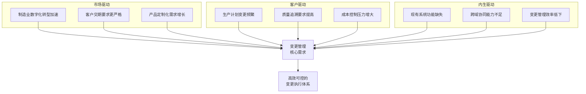

**驱动力解读**：
- **市场驱动**：数字化转型+交期压力+定制化趋势 → 要求系统更灵活响应
- **客户驱动**：计划频繁变更+质量追溯要求+成本控制压力 → 推动变更管理精益化
- **内生驱动**：功能缺失+协同不足+效率低下 → 亟需系统化变更管理能力

### 1.2.2 **核心挑战**

**1. 九域高效协同** ⭐⭐⭐⭐⭐
- 打通9个业务域，建立统一变更处理机制，确保数据一致性和业务连续性
- 应对：级联处理框架 + 原子性事务

**2. 业务安全保障** ⭐⭐⭐⭐
- 保护在制品状态，避免业务中断，建立异常处理和恢复机制
- 应对：中间状态保护 + 异常回滚

**3. 完整追溯体系** ⭐⭐⭐
- 记录变更完整生命周期，满足质量管理体系合规要求，支持根因分析
- 应对：全流程日志 + 版本管理

**4. 灵活性与控制力平衡** ⭐⭐⭐⭐
- 提供灵活变更能力的同时，确保变更过程可控、可预测、可回退
- 应对：多层级确认 + 人工干预

**5. 中间状态妥善处理** ⭐⭐⭐⭐⭐ ⭐核心挑战
- 合理处理各种中间状态（已开工未完工、已发货未收货、检验中、已申请未收料等），在保护已执行工作和执行变更需求之间找到平衡点
- 应对：智能识别 + 策略引擎 + 一致性保障

**挑战关联**：挑战5是核心，直接影响挑战1、2的实现效果。

### 1.2.3 **价值主张与量化指标**

| 价值层级 | 价值点 | 具体指标 | 基线值 | 目标值 | 提升幅度 |
|---------|-------|---------|--------|--------|----------|
| 🟣 **业务价值层** | 变更管理能力提升 | 变更处理效率 | 人工协调，2-4小时 | 系统协同，30分钟内 | >75% |
| 🟣 **业务价值层** | 生产连续性保障 | 因变更导致的停工时间 | 平均2小时/次 | <30分钟/次 | >75% |
| 🔵 **客户价值层** | 交期响应能力 | 紧急变更响应时间 | 4-8小时 | <2小时 | >75% |
| 🔵 **客户价值层** | 资源利用效率 | 变更释放资源的重新分配时间 | 手工处理，4-6小时 | 自动释放，实时 | >90% |
| 🟢 **用户价值层** | 操作便利性提升 | 变更操作步骤数 | 15-20步 | <8步 | >60% |
| 🟢 **用户价值层** | 信息透明度提升 | 变更状态查询时间 | 电话/邮件确认，30分钟 | 系统实时查看，<1分钟 | >95% |

### 1.2.4 **方案定位**

**核心定位**：面向离散制造企业的智能化、全域协同变更执行管理系统

**差异化优势**：
- **全域协同**：覆盖9个业务域的统一变更处理，确保跨域数据一致性
- **智能分发**：基于变更类型和业务状态自动分发处理任务，提升协调效率
- **安全可控**：多层级确认机制和异常处理策略，保障变更执行安全性
- **完整追溯**：全生命周期记录和版本管理，满足质量管理体系要求
- **智能中间状态处理**：自动识别在制品和中间状态，提供明确的处理策略（继续完成/保护性中断），最大限度保护已执行工作，确保变更过程的业务连续性

**行业对标**：

| 能力维度 | 传统MES | 传统PLM | 传统ERP | KMMOM v3.0 |
|---------|---------|---------|---------|------------|
| 变更管理专业度 | ⭐ 简单状态修改 | ⭐⭐ 设计变更 | ⭐⭐ 计划层变更 | ⭐⭐⭐⭐⭐ 专业变更模块 |
| 跨域协同能力 | ⭐⭐ 单域处理 | ⭐⭐ 设计域 | ⭐⭐⭐ 计划域 | ⭐⭐⭐⭐⭐ 九域协同 |
| 中间状态处理 | ❌ 不支持 | ❌ 不支持 | ❌ 不支持 | ✅ 智能保护 |
| 变更追溯能力 | ⭐⭐ 基础记录 | ⭐⭐⭐⭐ 版本管理 | ⭐⭐⭐ 审批流程 | ⭐⭐⭐⭐⭐ 全生命周期 |

## 1.3 **用户画像**

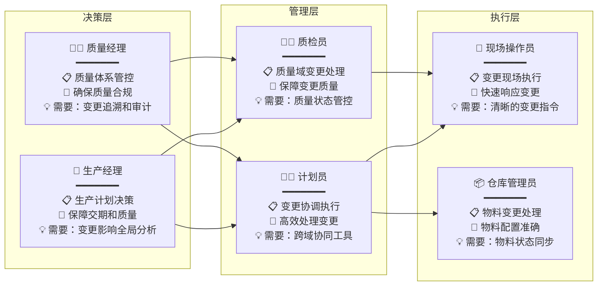

**核心用户速览**：

<table>
<tr>
<td width="33%">

**👔 决策层**

**生产经理**
- 诉求：变更影响全局分析
- 场景：重大变更决策、异常应急

**质量经理**
- 诉求：变更追溯和审计
- 场景：质量问题分析、体系检查

</td>
<td width="33%">

**👨‍🔧 管理层**

**计划员**
- 诉求：高效跨域协同工具
- 场景：日常变更、紧急协调

**质检员**
- 诉求：质量状态管控
- 场景：变更后质量确认

</td>
<td width="33%">

**👷 执行层**

**现场操作员**
- 诉求：清晰的变更指令
- 场景：接收通知、执行调整

**仓库管理员**
- 诉求：物料状态同步
- 场景：物料变更、库存调整

</td>
</tr>
</table>

## 1.4 **术语及缩写解释**

| 术语/缩写 | 全称 | 说明 |
|-----------|------|------|
| **在制品** | Work In Process (WIP) | 正在生产过程中的半成品或成品，尚未完成所有制造工序，是变更管理的主要对象 |
| **中间状态** | Intermediate State | 业务对象处于执行过程中但尚未完成的状态，如已开工未完工、已发货未收货、检验中等，是变更处理的关键难点 |
| **变更单** | Change Request (CR) | 记录在制品变更请求的文档，包含变更原因、影响范围、执行计划等完整信息 |
| **物料清单** | Bill of Material (BOM) | 产品制造所需的物料清单，包括原材料、零部件及其数量，是备料变更的重要依据 |
| **变更分割线** | Change Split Line | 保留工序与变更工序的分界点，已开工及后续状态的工序为保留工序，是变更处理的关键控制点 |
| **保留工序** | Retained Process | 已开工、已送检、已完工状态的工序，在工艺变更中必须保持不变，代表已投入的生产成本 |
| **级联处理** | Cascade Processing | 变更在业务对象间的传递和影响处理机制，确保上下游数据一致性 |
| **九大业务域** | Nine Business Domains | 生产订单、制造订单、制造任务、检验任务、异常任务、不合格品审理、物料准备计划、外委需求、外委采购订单 |

# 2. **需求描述**

## 2.1 **业务描述**

### 2.1.1 **业务正向主流程**

本章节已拆分至独立文档 [DNW30320-变更管理_业务正向主流程](./DNW30320-变更管理_业务正向主流程.md)。

保留说明：本节内容主要用于辅助理解变更主流程，不再在本文件内重复展开；如需查看完整正向业务链路及九大业务域概述，请直接查阅独立文档。

### 2.1.2 **变更主流程**

#### 2.1.2.1 **变更主流程概览图**

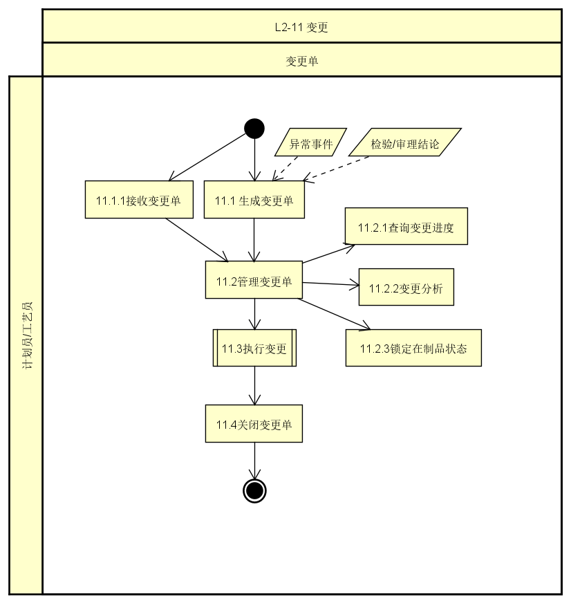

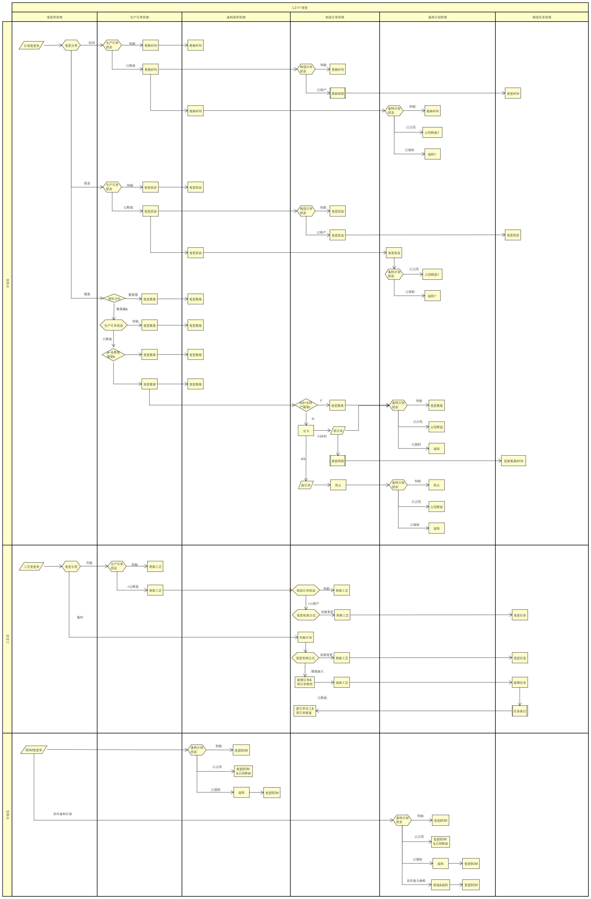

#### 2.1.2.2 **变更管理总流程**

**流程概述**

变更管理全生命周期包括变更单管理和变更执行两个阶段，从变更单接收到关闭形成完整闭环。系统支持三种变更单类型：计划变更单、工艺变更单、BOM变更单（详见阶段1说明）。

##### 2.1.2.2.1 **总流程图**

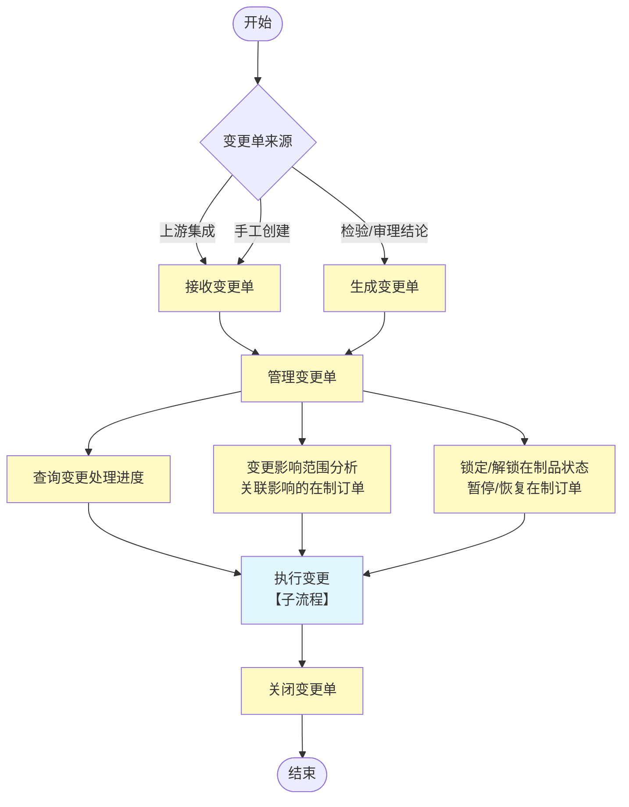
##### 2.1.2.2.2 **总流程说明**

**流程概述**：变更管理全生命周期包括变更单管理和变更执行两个阶段，从变更单接收到关闭形成完整闭环。系统支持三种变更单类型：计划变更单、工艺变更单、BOM变更单（详见阶段1说明）。

**阶段速览**：

| 阶段 | 核心动作 | 关键输出 | 预计耗时 |
|------|---------|---------|---------|
| 1️⃣ 变更单接收 | 接收/生成变更单 | 变更单（3种类型） | 即时 |
| 2️⃣ 管理变更单 | 分析影响+锁定状态 | 影响范围清单 | 30分钟 |
| 3️⃣ 执行变更 | 五类变更处理 | 变更执行日志 | 视复杂度 |
| 4️⃣ 关闭变更单 | 结果汇总+关闭 | 变更完成报告 | 即时 |

---

**阶段1：变更单接收与生成**

**（1）变更单来源**

| 来源类型 | 来源说明 | 处理方式 | 初始状态 | 典型场景 |
|---------|---------|---------|---------|---------|
| **上游集成** | ERP系统：计划变更单 PLM系统：工艺变更单、BOM变更单 | 接收变更单 | 已创建 | 计划调整、设计变更、BOM升版 |
| **手工创建** | MOM系统内手工创建变更单 | 接收变更单 | 已创建 | 紧急变更、临时调整 |
| **检验/审理结论** | 检验任务发现问题 不合格品审理结论 | 生成变更单 | 已创建 | 质量问题批量处理、返工返修 |

**（2）变更单业务场景**

| 变更单类型 | 关联对象 | 变更场景 | 场景组合规则 | 典型场景示例 |
|-----------|---------|---------|-------------|-------------|
| **计划变更单** | 一个生产订单号 | 状态变更 数量变更 时间变更 | • 状态变更：单独变更（取消/暂停/恢复） • 数量变更：可单独或与时间组合 • 时间变更：可单独或与数量组合 | • 单独状态变更：客户取消订单 → 订单状态变为已取消 • 单独数量变更：客户减量 → 订单数量从100调整为80 • 单独时间变更：客户要求提前 → 计划结束时间从12月31日提前到12月20日 • 组合变更：客户追加订单 → 数量从100增加到120，同时时间延后7天 |
| **工艺变更单** | 一个工艺路线编号 | 工艺路线版本升级 临时工艺变更 | • 一级工艺变更：零部件交付计划的一级工艺路线变更 • 加工工艺变更：零部件加工计划的加工工艺路线变更 | • 工艺标准升版：PLM发布新版本工艺路线，批量升级使用该工艺的所有订单 • 工艺优化：为提升生产效率，优化工艺参数或工序结构 • 设备升级：设备升级后调整工艺路线以适配新设备 |
| **BOM变更单** | 一个父物料编号 | BOM清单变更 | 新版本的完整BOM清单，系统自动对比识别差异（新增/删除/数量调整） | • 设计变更：产品设计更新导致物料规格或数量变化 • 成本优化：更换供应商或物料以降低成本 • 物料替代：原物料停产，使用替代物料 |

**说明**：变更单的详细数据结构定义参见2.2数据描述章节。

**阶段2：管理变更单**
- **发布变更单**：变更单创建后需要发布，发布后状态变为已发布，不再允许修改和删除
- **查询变更进度**：查询变更单状态和处理进度
- **变更分析**：
  - 计划变更单：直接关联指定生产订单
  - 工艺变更单：查询使用该工艺的所有生产订单
  - BOM变更单：查询使用该父物料的所有生产订单
  - 输出：影响范围清单（生产订单号、订单状态、可行性）
- **锁定在制品状态**：锁定受影响生产订单的在制品状态，防止变更过程中状态变化
- **变更单状态流转规则**

| 当前状态 | 允许操作 | 流转规则 |
|---------|---------|---------|
| 已创建 | 修改变更单、发布变更单 | 已创建→已发布 |
| 已发布 | 分析影响范围、开始处理 | 已发布→处理中 |
| 处理中 | 继续处理/完成 | 处理中→已完成 |
| 已完成 | 关闭变更单 | 已完成→已关闭 |
| 已关闭 | 无 | 终态 |

**阶段3：执行变更**

执行变更是变更管理的核心环节，涉及多角色协同和九大业务域级联处理。系统支持五类变更的执行处理：

| 变更类型 | 处理内容 | 详细方案 |
|---------|---------|---------|
| 状态变更 | 取消、暂停、恢复 | 《DNW30320-变更管理_变更执行方案》2.1.4.1 |
| 数量变更 | 数量增加、数量减少 | 《DNW30320-变更管理_变更执行方案》2.1.4.2 |
| 时间变更 | 时间提前、时间推迟 | 《DNW30320-变更管理_变更执行方案》2.1.4.3 |
| BOM变更 | 备料清单变更 | 《DNW30320-变更管理_变更执行方案》2.1.4.5 |
| 工艺变更 | 工艺路线变更 | 《DNW30320-变更管理_变更执行方案》2.1.4.4 |

**执行流程**：
1. **校验变更可行性**：计划员接收变更指令，校验变更内容完整性和可行性
2. **变更执行与分发**：将变更指令分发到相关执行角色（质检员、仓库管理员、采购员、现场操作员等），各角色在各自业务域内并行处理变更
3. **九大业务域级联处理**：更新生产订单域→级联更新制造订单域→级联更新制造任务域→级联更新其他业务域
4. **结果汇总与反馈**：收集各域处理结果，记录变更历史，生成变更执行日志
5. **异常处理**：变更执行过程中出现异常时，质检员协调质量域进行处理

**变更执行特点**：
- 用户逐单确认并执行
- 记录处理结果（成功/失败/原因）
- 状态：处理中→已完成

**阶段4：关闭变更单**
- 所有影响范围清单处理完成后关闭变更单
- 变更单状态：已完成→已关闭
- 影响范围清单状态：待处理→已完成→处理失败
- 统计：总数、已完成、失败数

### 2.1.3 **功能边界定义**

|业务场景|场景兼容结论|系统功能边界|实现优先级|
|---|---|---|---|
|计划内变更（发起与审批）|**不考虑**|变更发起和审批一般不在MOM中，系统仅定义接口标准|不实现|
|紧急变更（发起与审批）|**不考虑**|变更发起和审批一般不在MOM中，系统仅定义接口标准|不实现|
|接收变更指令|**⭐本批次**|变更单管理：接收、分析、处理、跟踪|当前版本|
|变更执行处理|**⭐本批次**|MOM系统核心功能，完整实现五类变更处理|当前版本|

**实现范围说明**

当前版本实现变更单管理和变更执行处理的核心功能，确保制造现场的变更需求得到有效支撑。

**变更单类型**

系统支持三种变更单类型，每种类型对应不同的变更管理场景：

| 变更单类型 | 对应关系 | 变更内容 | 影响范围 | 处理特点 | 实现优先级 |
|-----------|---------|---------|---------|---------|-----------|
| **计划变更单** | 一个订单一个变更单 | 状态、数量、时间 | 单个生产订单或制造订单 | 影响范围明确，处理流程相对简单 | ⭐本批次 |
| **工艺变更单** | 一个工艺一个变更单 | 工艺路线版本 | 使用该工艺的所有订单 | 需查询所有使用该工艺的订单，批量分析影响范围 | ⭐本批次 |
| **BOM变更单** | 一个父物料一个变更单 | 备料清单（BOM） | 使用该父物料的所有订单 | 需查询所有使用该父物料的订单，批量分析物料影响 | ⭐本批次 |

**变更类型**

变更执行处理涵盖五大类型的变更，每种变更类型都有特定的业务场景和处理逻辑：
|变更类型|场景|场景兼容结论|备注|
|---|---|---|---|
|状态变更|**取消**：由于市场变化、客户需求取消或企业战略调整等原因，某些生产订单不再需要执行。例如，客户在产品生产过程中突然取消订单，或者企业发现该订单产品不符合新的市场需求。|⭐本批次|
||**暂停**：当遇到设备故障、原材料短缺、工艺问题或紧急订单插入等情况时，需要暂时中断生产订单的执行。比如，生产设备突发故障需要维修，或者原材料供应中断导致生产无法继续。|⭐本批次|
||**恢复**：暂停的生产订单在导致暂停的问题得到解决后，需要重新启动生产。例如，设备维修完成或原材料供应恢复后，具备了继续生产的条件。|⭐本批次|
|数量变更|**增加**：由于客户需求增加、市场预测调整或生产计划变更等原因，需要增加在制品的生产数量。比如，客户追加了订单数量，或者企业根据市场调研预测到产品需求将上升。|⭐本批次|
||**减少**：因客户需求减少、原材料供应不足、生产效率问题或企业库存积压等原因，需要减少在制品的生产数量。例如，客户减少了订单数量，或者企业发现原材料库存不足无法满足原生产计划。|⭐本批次|
|时间变更|**提前**：为了满足客户的紧急需求、抢占市场先机或优化生产计划等原因，需要将生产订单的完成时间提前。例如，客户要求提前交货，或者企业发现提前完成生产可以更好地利用市场机会。|⭐本批次|
||**推迟**：由于设备故障、原材料供应延迟、工艺问题或不可抗力等因素，导致生产订单无法按原计划时间完成，需要推迟完成时间。比如，原材料供应商未能按时交货，或者生产设备出现故障需要较长时间维修。|⭐本批次|
|备料清单变更|**种类增加、种类减少、数量增加、数量减少**：由于设计修改、原材料规格变化、供应商变更或库存管理优化等原因，需要对在制品的备料清单进行变更。比如，产品设计更新导致原材料规格改变，或者为了降低成本更换了原材料供应商。|⭐本批次|
|工艺变更|**工艺变更**：当产品设计优化、提高生产效率、降低成本或解决工艺问题等原因需要改变在制品的工艺路线时。例如，企业研发出新的生产工艺可以提高产品质量和生产效率，或者为了解决现有工艺中的质量问题而进行工艺调整。|⭐本批次|

### 2.1.4 **变更执行业务及系统解决方案**

**人工干预机制说明**（适用于所有变更类型）：

变更执行时，系统支持在制造订单级别进行人工干预：

| 干预层级 | 业务对象 | 变更方案字段 | 说明 |
|---------|---------|-------------|------|
| 一级干预（支持） | 制造订单 | 可编辑 | 系统默认"确定变更"，用户可修改为"不变更" |
| 二级联动（不支持） | 制造任务、检验任务 | 不可编辑 | 自动跟随制造订单 |
| 三级联动（不支持） | 物料准备计划、外委需求、外委采购订单 | 不可编辑 | 自动跟随制造订单 |
| 特殊对象（不支持） | 异常任务、不合格品审理 | 无此字段 | 不参与人工干预 |

#### 2.1.4.1 **状态变更**

##### 2.1.4.1.1 **状态变更业务描述**

**业务背景**

状态变更是制造执行中的关键管控手段，包括取消、暂停、恢复三种操作类型。这些操作具有不可逆性和级联性特点，广泛应用于生产计划调整、异常处理、资源协调等业务场景，是保障制造执行灵活性和响应能力的核心功能。

**核心用户诉求**：
- 作为生产计划员，我希望能够一键取消生产订单并看到所有关联影响，以便快速响应计划调整需求
- 作为质量工程师，我希望发现质量问题时能快速识别和取消所有受影响订单，以便控制质量风险
- 作为车间主管，我希望设备故障时能快速暂停相关任务，以便保护在制品和人员安全
- 作为车间主管，我希望恢复生产前能看到完整的条件检查清单，以便确保恢复操作的安全性

 **业务场景清单**

| 变更类型 | 关键角色 | 场景与价值 | 业务场景描述 |
|----------|----------|-----------|-------------|
| **订单取消** | 生产计划员 生产经理 | **场景1：生产计划调整** 月度计划调整时取消部分订单，快速响应市场变化并释放资源 | **输入**：市场需求变化、取消订单范围、影响评估 **约束**：订单未完工、操作不可逆 **输出**：取消执行结果、资源重新分配 |
| **订单取消** | 质量工程师 生产经理 | **场景2：质量问题批量取消** 发现批次质量问题后紧急取消相关订单，控制质量风险 | **输入**：质量问题确认、影响范围分析、取消订单范围 **约束**：质量问题已定级、影响范围已识别 **输出**：批量取消结果、质量整改措施 |
| **订单暂停** | 车间主管 设备管理员 | **场景1：设备故障暂停** 关键设备故障时立即暂停相关任务，保护在制品安全 | **输入**：设备故障报警、影响评估、受影响任务清单 **约束**：设备故障已确认、在制品安全 **输出**：暂停决策、在制品保护措施、恢复条件准备 |
| **订单暂停** | 物料管理员 车间主管 | **场景2：物料短缺暂停** 关键物料供应中断时暂停相关任务，避免资源浪费 | **输入**：物料库存预警、影响分析、暂停任务范围 **约束**：物料短缺已确认、替代方案已评估 **输出**：暂停申请、供应商协调、恢复准备 |
| **订单恢复** | 车间主管 设备管理员 | **场景：设备修复后恢复** 设备修复完成后评估条件并恢复暂停任务，减少停工损失 | **输入**：设备修复通知、状态验证、条件评估 **约束**：设备已修复验证、资源可用 **输出**：资源协调、恢复决策、生产衔接 |

##### 2.1.4.1.2 **状态变更解决方案**

**逻辑处理流程图**

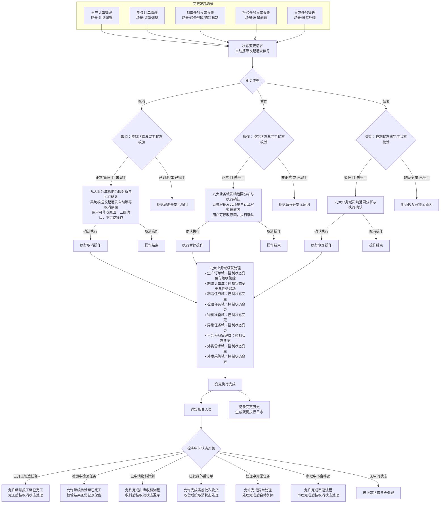

**解决方案设计要点**

**核心设计原则**（适用于所有要点）：
- **控制状态驱动**：基于控制状态进行变更，禁止基于生命周期状态
- **完工状态保护**：已完工对象不允许变更
- **级联一致性**：九大业务域原子性变更，全部成功或全部回滚
- **中间状态保护**：允许完成当前操作，不强制中断

---

**1. 变更发起与原因自动填写**

| 发起界面 | 操作 | 自动填写规则 | 用户操作 |
|----------|------|-------------|----------|
| 生产订单管理 | 取消 | 计划调整→"生产计划调整" | 可修改，二级确认 |
| 制造订单管理 | 取消 | 订单调整→"制造订单调整" | 可修改，二级确认 |
| 制造订单管理 | 恢复 | 手动恢复→"手动恢复生产" | 可修改，执行确认 |
| 制造任务异常报警 | 暂停 | 设备故障→"设备故障：{编号}" 物料短缺→"物料短缺：{编号}" | 可修改，执行确认 |
| 检验任务异常报警 | 暂停 | 质量问题→"质量问题：{描述}" | 可修改，执行确认 |
| 异常任务管理 | 暂停 | 异常处理→"异常处理：{编号}" | 可修改，执行确认 |
| 异常任务管理 | 恢复 | 设备修复→"设备修复完成：{编号}" 物料到货→"物料到货：{编号}" 异常解决→"异常已解决：{编号}" | 可修改，执行确认 |

**2. 状态校验与准入控制**

| 变更类型 | 控制状态要求 | 完工状态要求 |
|----------|-------------|-------------|
| 取消 | 正常或暂停 | 未完工 |
| 暂停 | 正常 | 未完工 |
| 恢复 | 暂停 | 未完工 |

**不通过处理**：拒绝操作并提示原因

**3. 九大业务域影响范围分析**

基于功能设计文档中的详细处理逻辑，按状态分析各业务域的影响范围。下表整合了九大业务域在不同状态下的取消、暂停、恢复操作影响：

| 业务域 | 状态 | 取消操作影响 | 暂停操作影响 | 恢复操作影响 |
|--------|------|-------------|-------------|-------------|
| **生产订单域** | **已创建** | 标记为"已取消"，无下游影响 | 标记为暂停状态，无下游影响 | 恢复后无下游影响 |
| | **已发布** | 标记为"已取消"，子订单级联取消 | 标记为暂停状态，子订单同步暂停 | 恢复展开能力，子订单同步恢复 |
| | **已展开** | 标记为"已取消"，子订单级联取消 | 暂停排产操作，子订单同步暂停 | 恢复排产计划，子订单同步恢复 |
| | **已释放** | 标记为"已取消"，制造订单、物料准备计划、工装工具准备计划同步取消 | 暂停制造执行，所有制造订单同步暂停 | 恢复制造执行，所有制造订单同步恢复 |
| | **已开工** | 标记为"已取消"，所有制造订单及下游任务停止并取消，处理在制品退料 | 暂停现场作业，所有制造订单及下游任务暂停 | 恢复现场作业，所有制造订单及下游任务恢复 |
| | **已完工** | 拒绝操作 | 不可暂停 | 无需恢复 |
| **制造订单域** | **已创建** | 标记为"已取消"，同步取消物料准备计划 | 标记为暂停状态，同步暂停物料准备计划 | 恢复工艺展开能力，同步恢复物料准备计划 |
| | **已发布** | 标记为"已取消"，同步取消物料准备计划 | 标记为暂停状态，同步暂停物料准备计划 | 恢复任务生成能力，同步恢复物料准备计划 |
| | **已展开** | 标记为"已取消"，所有制造任务和检验任务同步取消，处理已收料退料 | 暂停任务派工，所有制造任务和检验任务暂停 | 恢复任务派工，所有制造任务和检验任务恢复 |
| | **已开工** | 标记为"已取消"，停止所有未完工任务执行，中断检验任务，处理装入物料退料 | 暂停未完工任务执行，维持已完工任务状态 | 恢复任务执行，维持已完工任务状态 |
| | **已完工** | 拒绝操作 | 拒绝操作 | 无需恢复 |
| **制造任务域** | **已创建** | 标记为"已取消"，自动关闭相关异常任务 | 暂停派工操作 | 恢复派工能力 |
| | **已派工** | 标记为"已取消"，关闭相关质量计划 | 暂停开工操作，关联质量计划暂停 | 恢复开工能力，关联质量计划恢复 |
| | **已开工** （中间状态） | 标记为"已取消"，通知任务取消 **中间状态特殊处理**：允许继续报工至已完工→完工后退库或报废 | 暂停作业操作，记录暂停时间，保留质量数据 **中间状态特殊处理**：允许继续报工至已完工→记录暂停时间点和工作量→恢复后继续后续工序 | 恢复作业操作，记录恢复时间 |
| | **已送检** | 标记为"已取消"，通知检验任务取消，保留检验结果，等待检验完成后按取消状态处理 | 标记为暂停状态，协调检验任务暂停，等待检验完成后按暂停状态处理 | 恢复状态，协调检验任务恢复 |
| | **已完工** | 拒绝操作 | 拒绝操作 | 无需恢复 |
| **检验任务域** | **已创建** | 标记为"已取消"（未产生检验数据） | 暂停检验任务 | 恢复检验任务 |
| | **检验中** （中间状态） | 标记为"已取消"，通知检验任务取消 **中间状态特殊处理**：允许继续检验至已完工→检验结果保留用于追溯 | 暂停检验任务，暂停不合格品处理 **中间状态特殊处理**：允许继续检验至已完工→保留检验数据和样品状态→恢复后继续检验 | 恢复检验任务，恢复不合格品处理 |
| | **已完工** | 拒绝操作 | 拒绝操作 | 无需恢复 |
| **物料准备计划域** （主表） | **已创建** | 标记为"已取消"，级联取消所有物料需求明细（未申请物料） | 标记为暂停状态，级联暂停所有物料需求明细，暂停相关采购申请 | 恢复物料计划，级联恢复所有物料需求明细，恢复相关采购申请 |
| | **备料中** （中间状态） | 标记为"已取消"，级联取消所有物料需求明细 **明细处理**：已申请明细：未发料则释放库存预留，已发料则退料；已收料明细执行退料流程 **中间状态特殊处理**：允许已申请明细完成出库收料→收料后按取消状态退库 | 标记为暂停状态，级联暂停所有物料需求明细 **明细处理**：已申请明细暂停领料并保留库存预留；已收料明细暂停物料装入 **中间状态特殊处理**：允许已申请明细完成出库收料→暂停领料操作，保留库存预留→恢复后继续领料 | 恢复物料计划，级联恢复所有物料需求明细，恢复领料操作和物料装入 |
| | **备料完成** | 标记为"已取消"，所有明细执行退料流程，处理成本冲销 | 标记为暂停状态，暂停物料装入，不影响供应链 | 恢复物料装入，不影响供应链 |
| **异常任务域** | **域级说明** | **关键说明**：异常任务本身无控制状态，不进行状态标记，仅增加关联订单控制状态标识 | 同左 | 同左 |
| | **待处理** （中间状态） | 标记关联订单控制状态标识为"已取消" **中间状态特殊处理**：允许继续处理至已处理或已关闭→异常原因需查明以避免影响其他订单→处理完成后不触发订单恢复等后续操作 | 标记关联订单控制状态标识为"已暂停" **关键逻辑**：暂停往往由异常引起，应加速处理异常而非暂停异常处理 | 检查异常是否已处理完成，已处理则恢复关联任务 |
| | **处理中** （中间状态） | 标记关联订单控制状态标识为"已取消" **中间状态特殊处理**：允许完成异常处理至已处理或已关闭→处理结果记录保留用于统计分析和持续改进→处理完成后不触发订单恢复等后续操作 | 标记关联订单控制状态标识为"已暂停" **关键逻辑**：暂停是由异常引起的，必须处理完异常才能恢复生产，因此异常处理应保持活跃状态 | 检查异常是否已处理完成，已处理则恢复关联任务 |
| | **已处理** | 保持状态，结果保留用于改进 | 保持状态，异常已解决 | 无需恢复 |
| | **已关闭** | 保持状态 | 保持状态 | 无需恢复 |
| **不合格品审理域** | **域级说明** | **关键说明**：不合格品审理本身无控制状态，不进行状态标记，仅增加关联订单控制状态标识 | 同左 | 同左 |
| | **待审理** （中间状态） | 标记关联订单控制状态标识为"已取消" **中间状态特殊处理**：允许继续审理至审理完成→质量责任需明确以避免后续纠纷→审理结果（责任方、不合格原因、数量）保留用于质量追溯和成本核算→审理完成后不生成返工返修订单 | 标记关联订单控制状态标识为"已暂停" **关键逻辑**：审批流程无暂停功能只能终止，但质量责任必须明确，因此让流程走完→审理完成后如需返工返修则创建订单并标记为暂停状态 | 恢复关联的返工返修订单（如已生成） |
| | **审理中** （中间状态） | 标记关联订单控制状态标识为"已取消" **中间状态特殊处理**：允许完成审理流程至审理完成→审理结果保留用于供应商考核、成本核算、质量改进→审理完成后不生成返工返修订单 | 标记关联订单控制状态标识为"已暂停" **关键逻辑**：审批流程无暂停功能只能终止，但质量责任必须明确，因此让流程走完→审理完成后如需返工返修则创建订单并标记为暂停状态 | 恢复关联的返工返修订单（如已生成） |
| | **审理完成** | 取消关联返工返修订单（如已生成），结果用于责任认定和追溯 | 暂停关联返工返修订单（如已生成） | 恢复关联返工返修订单（如已生成） |
| **外委需求域** | **已创建** | 标记为"已取消"，无合同影响 | 暂停需求审批，无合同影响 | 恢复需求审批，无合同影响 |
| | **审批中** （中间状态） | 标记为"已取消"，协调ERP审批撤回，评估前期费用影响 **中间状态特殊处理**：允许完成审批流程至已审批→审批完成后按取消状态处理 | 暂停审批流程，合同谈判暂停 **中间状态特殊处理**：允许完成审批流程至已审批→保留审批进度→恢复后继续发送 | 恢复审批流程，合同谈判恢复 |
| | **已审批** | 标记为"已取消"，协调供应商沟通，启动合同变更流程 | 暂停需求发送，合同变更通知 | 恢复需求发送，合同变更通知 |
| | **已发送** （中间状态） | 标记为"已取消"，紧急协调ERP和供应商，按合同条款评估损失 **中间状态特殊处理**：允许完成订单创建至订单已创建→订单创建后按取消状态处理 | 暂停供应商生产，启动合同暂停条款 **中间状态特殊处理**：允许完成订单创建至订单已创建→保留订单创建进度→恢复后继续生产 | 恢复供应商生产，启动合同恢复条款 |
| | **已取消** | 保持取消状态 | 拒绝操作（已取消状态不可暂停） | 无需恢复 |
| **外委采购订单域** | **已创建** | 标记为"已取消"，无成本影响 | 直接暂停订单，无直接影响 | 直接恢复订单，无直接影响 |
| | **已发货** （中间状态） | 标记为"已取消"，启动退货流程，协调供应商退货，处理在途物料 **中间状态特殊处理**：允许完成当前批次收货→收货后按取消状态处理 | 暂停订单执行，协调在途物料处理 **中间状态特殊处理**：允许完成当前批次收货→协调在途物料处理→恢复后继续收货和入库 | 恢复订单执行 |
| | **部分收货** （中间状态） | 标记为"已取消"，已收货物料启动退货流程，未收货物料取消后续发货 **中间状态特殊处理**：允许完成剩余批次收货→收货后按取消状态统一处理 | 暂停未收货部分，处理已收货物料 **中间状态特殊处理**：允许完成剩余批次收货→保留收货进度→恢复后继续入库检验 | 恢复未收货部分 |
| | **全部收货** （中间状态） | 标记为"已取消"，评估退货可行性 **中间状态特殊处理**：允许完成入库检验至已完成→检验完成后按取消状态处理 | 暂停入库检验 **中间状态特殊处理**：允许完成入库检验至已完成→保留检验数据→恢复后继续入库 | 恢复入库检验 |
| | **已完成** | 拒绝操作 | 拒绝操作 | 无需恢复 |

**4. 执行确认、权限控制与九大业务域级联处理**

| 操作类型 | 确认机制 | 可逆性 | 人工干预 |
|----------|----------|--------|---------|
| 取消 | 填写原因+二级确认 | 不可逆 | 支持制造订单级别干预，用户可修改制造订单的"变更方案"为"不变更" |
| 暂停 | 填写原因+执行确认 | 可逆（恢复） | 支持制造订单级别干预，用户可修改制造订单的"变更方案"为"不变更" |
| 恢复 | 执行确认 | 可逆（暂停） | 支持制造订单级别干预，用户可修改制造订单的"变更方案"为"不变更" |

**级联处理规则**：
- **"变更方案"为"确定变更"的制造订单**：更新控制状态，触发九大业务域级联联动（制造任务、检验任务、物料准备计划、外委需求、外委采购订单等自动级联）
- **"变更方案"为"不变更"的制造订单**：维持原状态，其下游对象不执行变更，继续按原计划执行  

**5. 变更执行完成后的并行处理**

| 并行分支 | 处理内容 | 关键对象 |
|----------|----------|----------|
| **通知相关人员** | 自动通知变更结果和影响 | 发起人、车间主管、物料管理员、质检员、采购员 |
| **记录变更历史** | 生成变更执行日志 | 变更类型、原因、时间、操作人、影响对象、执行结果、状态对比、级联明细 |

**6. 中间状态特殊处理**

| 中间状态对象 | 业务域 | 取消处理 | 暂停处理 |
|-------------|--------|----------|----------|
| 已开工制造任务 | 制造任务域 | 允许报工至完工→退库/报废 | 允许报工至完工→记录暂停点→恢复后继续 |
| 检验中检验任务 | 检验任务域 | 允许检验至完工→结果保留 | 允许检验至完工→保留数据→恢复后继续 |
| 备料中物料计划 | 物料准备域 | 允许完成收料→退库 | 允许完成收料→保留预留→恢复后继续 |
| 已发货外委订单 | 外委采购域 | 允许完成收货→按取消处理 | 允许完成收货→协调在途→恢复后继续 |
| 部分收货外委订单 | 外委采购域 | 允许完成剩余批次收货→收货后按取消状态统一处理 | 允许完成剩余批次收货→保留收货进度→恢复后继续入库检验 |
| 全部收货外委订单 | 外委采购域 | 允许完成入库检验至已完成→检验完成后按取消状态处理 | 允许完成入库检验至已完成→保留检验数据→恢复后继续入库 |
| 审批中外委需求 | 外委需求域 | 允许完成审批流程至已审批→审批完成后按取消状态处理 | 允许完成审批流程至已审批→保留审批进度→恢复后继续发送 |
| 已发送外委需求 | 外委需求域 | 允许完成订单创建至订单已创建→订单创建后按取消状态处理 | 允许完成订单创建至订单已创建→保留订单创建进度→恢复后继续生产 |
| 待处理异常任务 | 异常任务域 | 允许继续处理至已处理/已关闭→查明原因用于改进→不触发订单恢复 | 通知异常任务→加速处理异常而非暂停异常处理 |
| 处理中异常任务 | 异常任务域 | 允许完成处理至已处理/已关闭→查明原因用于改进→不触发订单恢复 | 继续处理不暂停→暂停由异常引起需先处理异常 |
| 待审理不合格品 | 不合格品审理域 | 允许继续审理至审理完成→明确责任用于索赔→不生成返修订单 | 继续启动审理流程→让流程走完明确质量责任 |
| 审理中不合格品 | 不合格品审理域 | 允许完成审理至审理完成→明确责任用于索赔→不生成返修订单 | 不建议暂停→如需暂停保留进度→恢复后继续 |

**核心差异**：
- 取消不可逆（最终按取消处理），暂停可恢复（保留状态信息）
- **异常任务特殊逻辑**：异常任务本身无控制状态，不进行状态标记，仅增加"关联订单已取消/已暂停"标识用于控制后续关键逻辑处理；暂停往往由异常引起，异常处理应保持活跃状态，处理完异常才能恢复生产；取消时处理界面提示"订单已取消，请完成异常分析以便改进"，处理完成后不触发订单恢复等后续操作，处理结果保留用于统计分析和持续改进
- **不合格品审理特殊逻辑**：不合格品审理本身无控制状态，不进行状态标记，仅增加"关联订单已取消/已暂停"标识用于控制后续关键逻辑处理；不建议暂停，应继续完成审理以明确质量责任和处理方案；取消时审理界面提示"订单已取消，请完成审理以明确责任"，审理完成后不生成返工返修订单，审理结果（责任方、不合格原因、数量）保留用于供应商考核、成本核算、质量改进，符合质量管理体系要求（ISO 9001、IATF 16949）

#### 2.1.4.2 **数量变更**

##### 2.1.4.2.1 **数量变更业务描述**

**业务背景**

数量变更是制造执行中的核心调控手段，包括数量增加和数量减少两种操作类型。广泛应用于市场需求调整、生产计划优化、资源配置调整等业务场景，是保障生产柔性和资源效率的重要功能。

**核心用户诉求**：
- 作为生产计划员，我希望客户追加数量时能快速评估可行性并下发新订单，以便及时响应市场需求
- 作为销售经理，我希望追加数量时能看到准确的交期预测，以便向客户做出合理承诺
- 作为生产计划员，我希望减少数量时能看到不同策略的成本影响，以便选择最优方案
- 作为车间主管，我希望前序报废时系统能自动调整后续工序数量，以便避免物料浪费
- 作为物料管理员，我希望物料短缺时能快速计算可生产数量，以便最大化物料利用率

 **业务场景清单**

| 变更类型 | 关键角色 | 场景与价值 | 业务场景描述 |
|----------|----------|-----------|-------------|
| **数量增加** | 生产计划员 销售经理 | **场景：客户需求追加** 客户追加订单数量时创建新订单，快速响应市场需求 | **输入**：客户追加需求、产能评估、物料供应能力 **约束**：订单未完工、资源充足、增量隔离 **输出**：新订单创建、物料需求计划、交期确认 |
| **数量减少** | 生产计划员 生产经理 | **场景1：计划调整减量** 市场需求变化时减少生产数量，优化成本控制 | **输入**：减量需求、生产状态、成本影响评估 **约束**：订单未完工、成本最小化、级联协调 **输出**：数量减少结果、物料退料、资源重新分配 |
| **数量减少** | 车间主管 质量工程师 | **场景2：报废联动减量** 零部件加工计划中，前序工序报废时自动减少生产订单数量，保持工艺一致性 | **输入**：报废数量、实际完工数量 **约束**：加工计划类型订单 **输出**：生产订单数量调整、制造订单数量调整、物料退料、外委调整 |
| **数量减少** | 物料管理员 生产计划员 | **场景3：物料短缺减量** 物料供应中断时根据库存调整数量，最大化物料利用 | **输入**：物料库存、可生产数量、客户影响评估 **约束**：物料短缺已确认、无替代方案 **输出**：数量调整、物料利用最大化、客户通知 |
| **数量减少** | 质量工程师 生产经理 | **场景4：质量问题减量** 发现批次质量问题时紧急减量，控制质量风险 | **输入**：质量问题确认、影响范围、减量订单范围 **约束**：质量问题已定级、影响范围已识别 **输出**：紧急减量结果、在制品隔离、质量整改 |

##### 2.1.4.2.2 **数量变更解决方案**

**逻辑处理流程图**

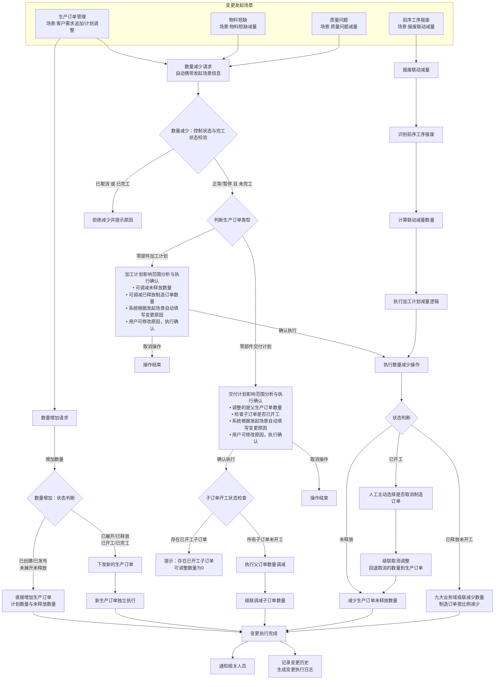

**解决方案设计要点**

**核心设计原则**（适用于所有要点）：
- **智能增量策略**：数量增加时根据订单状态选择最优处理方式：未展开未释放时直接增加数量，已展开或已释放时下发新订单保持原订单完整性和可追溯性，已完工订单也可追加
- **控制状态驱动**：数量减少基于控制状态进行变更，已取消订单不允许减少
- **完工状态保护**：已完工订单不允许数量减少
- **智能减量策略**：数量减少时根据订单状态选择最小影响的处理方式
- **级联一致性**：确保九大业务域数量变更的一致性和物料供应平衡
- **报废自动联动**：工艺路线链式生产中，前序报废自动联动减少后续工序数量
- **资源保护**：数量减少需要评估资源占用情况，优先保护已执行工作

**处理流程概述**：

1. **数量增加处理**：
   - 状态判断：
     - **未展开未释放**（已创建/已发布）：直接增加生产订单的计划数量与未释放数量 → 通知相关人员 → 记录变更历史
     - **已展开或已释放**（已展开/已释放/已开工/已完工）：下发新生产订单（增量部分） → 新生产订单独立执行（独立工艺展开、物料准备、生产管理） → 通知相关人员 → 记录变更历史

2. **数量减少处理**：
   
   **2.1 零部件交付计划数量减少**：
   - 订单状态校验 → 判断订单类型为交付计划 → 影响范围分析与执行确认
   - **核心逻辑**：调整的永远是父生产订单的数量
   - **子订单开工状态检查**：
     - **存在已开工子订单**：提示"存在已开工子订单，可调整数量为0" → 用户确认后操作终止
     - **所有子订单未开工**：执行父订单数量调减 → 级联调减子订单数量
   - 通知相关人员 → 记录变更历史
   
   **2.2 零部件加工计划数量减少**：
   - 订单状态校验 → 判断订单类型为加工计划 → 影响范围分析与执行确认
   - **核心逻辑**：可同时调减未释放数量和已释放制造订单数量
   - **智能减量策略选择**：
     - **未释放**：直接减少生产订单未释放数量
     - **已释放未开工**：九大业务域级联减少数量（制造订单按比例减少，物料退料，外委调整）
     - **已开工**：人工选择是否取消制造订单 → 取消后回退数量到生产订单未释放数量 → 再调减未释放数量
   - 通知相关人员 → 记录变更历史

3. **报废联动减量**（仅适用于零部件加工计划）：
   - 识别前序工序报废 → 计算联动减量数量 → 执行加工计划数量减少逻辑（进入状态判断流程） → 通知相关人员 → 记录变更历史

---

**1. 变更发起与原因自动填写**

| 发起界面 | 操作 | 订单类型 | 自动填写规则 | 用户操作 |
|----------|------|----------|-------------|----------|
| 生产订单管理 | 增加数量 | 交付计划/加工计划 | 客户追加→"客户需求追加" | 可修改，执行确认 |
| 生产订单管理 | 减少数量 | 交付计划 | 计划调整→"生产计划调整（交付计划）" | 可修改，执行确认 |
| 生产订单管理 | 减少数量 | 加工计划 | 计划调整→"生产计划调整（加工计划）" | 可修改，执行确认 |
| 前序工序报废 | 减少数量 | 加工计划 | 报废联动→"前序工序报废联动：{工序编号}" | 自动执行，无需确认 |
| 物料短缺 | 减少数量 | 加工计划 | 物料短缺→"物料短缺：{物料编号}" | 可修改，执行确认 |
| 质量问题 | 减少数量 | 加工计划 | 质量问题→"质量问题：{问题描述}" | 可修改，执行确认 |

**2. 状态校验与准入控制**

| 变更类型 | 完工状态要求 | 控制状态要求 | 生命周期状态要求 |
|----------|-------------|-------------|-----------------|
| 数量增加 | 无限制（已完工也可追加） | 无限制 | 所有状态均可 |
| 数量减少 | 未完工 | 正常或暂停 | 已创建/已发布/已展开/已释放/已开工 |

**不通过处理**：拒绝操作并提示原因

**3. 九大业务域影响范围分析**

基于功能设计文档中的详细处理逻辑，按状态分析各业务域的影响范围。

**数量增加通用规则**：
- **未展开未释放**（已创建/已发布）：直接增加生产订单的计划数量与未释放数量
- **已展开或已释放**（已展开/已释放/已开工/已完工）：下发新生产订单实现，新订单独立执行，原订单保持不变

**数量减少核心差异**：

**（1）零部件交付计划数量减少**：
- **调整对象**：永远是父生产订单的数量
- **关键约束**：子订单存在已开工的情况，则可调整数量为0（操作终止）
- **级联影响**：父订单数量调减后，级联调减所有子订单数量

**（2）零部件加工计划数量减少**：
- **调整对象**：可同时调减未释放数量和已释放制造订单数量
- **关键逻辑**：
  - 调减未释放数量：直接减少生产订单的未释放数量
  - 调减已释放数量：针对制造订单进行处理
    - 未开工制造订单：最大可调整数量为计划数量
    - 已开工制造订单：不允许直接调整，需先取消制造订单，将数量回退到生产订单未释放数量，再调减未释放数量

**数量减少详细影响（按业务域）**：

**表1：生产订单域数量减少影响**

| 订单类型 | 状态 | 数量减少操作影响 |
|----------|------|-----------------|
| **交付计划** | **已创建/已发布** | 直接减少父订单数量，无子订单影响 |
| | **已展开** | 检查子订单开工状态： • 存在已开工子订单→可调整数量为0，操作终止 • 所有子订单未开工→减少父订单数量，级联调减子订单数量 |
| | **已释放/已开工** | 检查子订单开工状态： • 存在已开工子订单→可调整数量为0，操作终止 • 所有子订单未开工→减少父订单数量，级联调减子订单数量 |
| | **已完工** | 拒绝操作 |
| **加工计划** | **已创建/已发布** | 直接减少订单数量（未释放数量） |
| | **已释放** | 减少订单数量，制造订单按比例减少或取消，物料退料 |
| | **已开工** | 取消部分制造订单，停止未完工任务，处理装入物料退料，回退数量到未释放 |
| | **已完工** | 拒绝操作 |

**表2：其他业务域数量减少影响**

| 业务域 | 状态 | 数量减少操作影响 |
|--------|------|-----------------|
| **制造订单域** | **已创建/已发布** | 直接减少订单数量，同步减少物料准备计划 |
| | **已展开** | 按比例减少制造任务和检验任务数量，处理已收料退料 |
| | **已开工** | 取消部分制造订单，停止未完工任务，处理装入物料退料 |
| | **已完工** | 拒绝操作 |
| **制造任务域** | **已创建/已派工** | 按比例减少任务数量或取消任务，自动关闭相关异常任务和质量计划 |
| | **已开工/已送检** | 取消部分任务，保留已完工任务，通知检验任务取消 |
| | **已完工** | 拒绝操作 |
| **检验任务域** | **已创建** | 按比例减少检验任务数量或取消任务 |
| | **检验中** | 取消部分检验任务 |
| | **已完工** | 拒绝操作 |
| **物料准备计划域** | **已创建** | 直接减少物料需求数量，级联减少所有物料需求明细 |
| | **备料中** | 取消物料准备计划，已申请明细：未发料则释放库存预留，已发料则退料 |
| | **备料完成** | 取消物料准备计划，执行退料流程 |
| **异常任务域** | **所有状态** | 无影响（异常任务无数量概念） |
| **不合格品审理域** | **待审理/审理中** | 取消不合格品审理单（已开始执行，走取消逻辑） |
| | **审理完成** | 保持审理结果 |
| **外委需求域** | **已创建/审批中/已审批** | 减少外委需求数量或取消需求，协调ERP审批和供应商调整 |
| | **已发送** | 取消外委需求，紧急协调供应商调整 |
| | **已取消** | 保持状态 |
| **外委采购订单域** | **已创建** | 减少订单数量或取消订单 |
| | **已发货** | 取消订单，协调供应商退货，处理在途物料 |
| | **部分收货** | 取消订单，取消未收货部分，已收货部分启动退货流程 |
| | **全部收货** | 取消订单，启动退货流程 |
| | **已完成** | 拒绝操作 |

**4. 执行确认、权限控制与九大业务域级联处理**

| 操作类型 | 确认机制 | 可逆性 | 人工干预 |
|----------|----------|--------|---------|
| 数量增加 | 填写原因+执行确认 | 可逆（可取消新订单） | 不涉及干预（下发新订单，不影响现有订单） |
| 数量减少 | 填写原因+执行确认 | 部分可逆（未开工可恢复） | 支持制造订单级别干预，用户可修改制造订单"变更方案"中的实际减少数量 |

**级联处理**：更新九大业务域数量，触发级联联动

**5. 变更执行完成后的并行处理**

| 并行分支 | 处理内容 | 关键对象 |
|----------|----------|----------|
| **通知相关人员** | 自动通知变更结果和影响 | 发起人、车间主管、物料管理员、质检员、采购员 |
| **记录变更历史** | 生成变更执行日志 | 变更类型、原因、时间、操作人、影响对象、执行结果、数量对比、级联明细 |

#### 2.1.4.3 **时间变更**

##### 2.1.4.3.1 **时间变更业务描述**

**业务背景**

时间变更是制造执行中的关键协调手段，包括计划时间的提前和推迟两种操作类型。广泛应用于客户需求变化、生产异常处理、资源优化配置等业务场景，是保障交期灵活性和生产协调性的核心功能。

**核心用户诉求**：
- 作为销售经理，我希望客户要求提前时能快速获得可行性评估，以便及时回复客户
- 作为生产计划员，我希望提前安排时能看到详细的资源冲突分析，以便制定最优方案
- 作为设备管理员，我希望设备故障时能快速评估对生产计划的影响，以便制定维修策略
- 作为物料管理员，我希望物料延期时能快速分析对生产计划的影响，以便及时调整安排
- 作为生产计划员，我希望紧急插单时能自动优化产能利用，以便最大化整体效益

 **业务场景清单**

| 变更类型 | 关键角色 | 场景与价值 | 业务场景描述 |
|----------|----------|-----------|-------------|
| **时间提前** | 销售经理 生产计划员 | **场景：客户紧急需求** 重要客户因市场机会要求紧急提前交期，快速响应客户需求，抢占市场先机 | **输入**：客户提前需求、商业价值评估、资源可行性分析 **约束**：订单未完工、资源提前就绪、供应链协调 **输出**：提前方案确认、资源重新分配、新交期通知 |
| **时间推迟** | 设备管理员 生产计划员 | **场景1：设备故障推迟** 关键设备故障需要维修，调整受影响订单时间，最小化整体影响 | **输入**：设备故障确认、维修时间预估、影响订单识别 **约束**：设备故障已确认、客户沟通完成 **输出**：推迟方案执行、资源重新分配、客户交期通知 |
| **时间推迟** | 物料管理员 生产计划员 | **场景2：物料延期推迟** 关键物料供应商延期交货，调整生产时间匹配物料到货，协调供应链 | **输入**：物料延期通知、新到料时间、影响订单分析 **约束**：物料延期已确认、替代方案已评估 **输出**：时间匹配调整、客户延期通知、供应商协调 |
| **时间重排** | 销售经理 生产计划员 | **场景：紧急插单重排** VIP客户紧急插单，重新安排现有订单时间，平衡客户关系和产能利用 | **输入**：紧急插单需求、优先级评估、现有订单状态 **约束**：插单优先级已确认、客户沟通完成 **输出**：时间重排方案、优先级调整、客户关系维护 |
| **时间调整** | 设备管理员 生产计划员 | **场景：计划维护调整** 关键设备计划性维护，重新安排维护期间生产时间，保持生产连续性 | **输入**：维护计划方案、维护时间窗口、生产影响评估 **约束**：维护计划已制定、替代方案已准备 **输出**：生产时间调整、维护时间保障、连续性保持 |

##### 2.1.4.3.2 **时间变更解决方案**

**逻辑处理流程图**

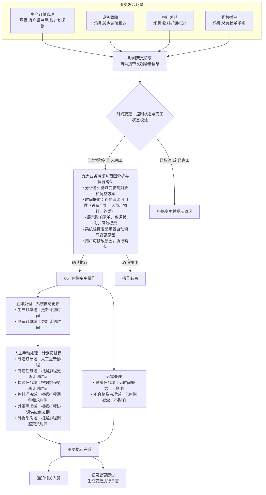

**解决方案设计要点**

**核心设计原则**（适用于所有要点）：
- **控制状态驱动**：基于控制状态进行变更，已取消订单不允许时间变更
- **完工状态保护**：已完工对象不允许时间变更
- **影响范围透明**：变更前进行完整的影响范围分析，时间提前时包含资源可用性评估（设备产能、人员、物料、外委），展示给用户作为决策依据
- **供应链协调**：时间变更必须协调物料供应时间和外委服务商交期
- **级联一致性**：确保九大业务域时间变更的一致性，避免数据冲突
- **重新排产**：时间变更后需要重新进行生产计划排程和资源分配

---

**1. 变更发起与原因自动填写**

| 发起界面 | 操作 | 自动填写规则 | 用户操作 |
|----------|------|-------------|----------|
| 生产订单管理 | 时间提前 | 客户需求→"客户紧急需求提前" | 可修改，执行确认 |
| 生产订单管理 | 时间推迟 | 计划调整→"生产计划调整推迟" | 可修改，执行确认 |
| 设备故障 | 时间推迟 | 设备故障→"设备故障：{编号}" | 可修改，执行确认 |
| 物料延期 | 时间推迟 | 物料延期→"物料延期：{物料编号}" | 可修改，执行确认 |
| 紧急插单 | 时间重排 | 紧急插单→"紧急插单重排：{订单编号}" | 可修改，执行确认 |

**2. 状态校验与准入控制**

| 变更类型 | 控制状态要求 | 完工状态要求 |
|----------|-------------|-------------|
| 时间变更（提前/推迟） | 正常或暂停 | 未完工 |

**不通过处理**：拒绝操作并提示原因

**说明**：资源可用性评估（设备产能、人员安排、物料到货、外委交期）作为影响范围分析的一部分展示给用户，由用户基于完整信息决策是否执行变更

**3. 九大业务域影响范围分析**

基于功能设计文档中的详细处理逻辑，按状态分析各业务域的影响范围。表格使用颜色标识：🟢 可变更、🟡 有风险、🔴 不可变更

| 业务域 | 状态 | 时间提前操作影响 | 时间推迟操作影响 |
|--------|------|-----------------|-----------------|
| **生产订单域** | **已创建/已发布/已展开** | 🟢 **可变更** **影响**：子订单同步调整计划时间 **建议**：直接更新计划时间，无需排程 | 🟢 **可变更** **影响**：子订单同步调整计划时间 **建议**：直接更新计划时间，无需排程 |
| | **已释放** | 🟡 **可变更，需评估资源** **影响**：制造订单、物料准备计划需重新排程 **建议**：评估设备产能、物料到货能力，确认可行后更新 | 🟢 **可变更** **影响**：制造订单、物料准备计划需重新排程 **建议**：释放占用资源，重新排产 |
| | **已开工** | 🟡 **可变更，风险较高** **影响**：在制品需协调处理，物料、外委需重新安排 **建议**：评估在制品状态和资源可用性，协调现场作业 | 🟢 **可变更** **影响**：在制品继续执行，后续任务延期 **建议**：释放后续资源，通知相关方 |
| | **已完工** | 🔴 **不可变更** **原因**：订单已完工，不允许时间变更 | 🔴 **不可变更** **原因**：订单已完工，不允许时间变更 |
| **制造订单域** | **已创建/已发布** | 🟢 **可变更** **影响**：物料准备计划同步调整 **建议**：直接更新计划时间 | 🟢 **可变更** **影响**：物料准备计划同步调整 **建议**：直接更新计划时间 |
| | **已展开** | 🟡 **可变更，需重新排程** **影响**：制造任务、检验任务、物料需求时间需调整 **建议**：人工重新排程，评估资源可用性 | 🟢 **可变更** **影响**：制造任务、检验任务、物料需求时间需调整 **建议**：人工重新排程 |
| | **已开工** | 🟡 **可变更，风险较高** **影响**：未完工任务需重新排程，在制品需协调 **建议**：评估在制品状态，协调现场作业和资源 | 🟢 **可变更** **影响**：未完工任务需重新排程 **建议**：释放后续资源，重新排程 |
| | **已完工** | 🔴 **不可变更** **原因**：订单已完工，不允许时间变更 | 🔴 **不可变更** **原因**：订单已完工，不允许时间变更 |
| **制造任务域** | **已创建/已派工** | 🟢 **可变更** **影响**：计划开工和完工时间调整 **建议**：根据排程结果自动更新 | 🟢 **可变更** **影响**：计划开工和完工时间调整 **建议**：根据排程结果自动更新 |
| | **已开工** | 🟡 **可变更，需协调现场** **影响**：计划完工时间调整，现场作业需加快 **建议**：协调现场资源，评估加快可行性 | 🟢 **可变更** **影响**：计划完工时间调整 **建议**：释放后续资源 |
| | **已送检** | 🟡 **可变更，需协调检验** **影响**：检验任务时间需调整 **建议**：协调检验资源 | 🟢 **可变更** **影响**：检验任务时间需调整 **建议**：协调检验资源 |
| | **已完工** | 🔴 **不可变更** **原因**：任务已完工，不允许时间变更 | 🔴 **不可变更** **原因**：任务已完工，不允许时间变更 |
| **检验任务域** | **已创建** | 🟢 **可变更** **影响**：计划检验时间调整 **建议**：根据排程结果自动更新 | 🟢 **可变更** **影响**：计划检验时间调整 **建议**：根据排程结果自动更新 |
| | **检验中** | 🟡 **可变更，需协调检验** **影响**：检验进度需加快，完成时间调整 **建议**：协调检验资源，评估加快可行性 | 🟢 **可变更** **影响**：检验完成时间调整 **建议**：调整检验计划 |
| | **已完工** | 🔴 **不可变更** **原因**：检验已完工，不允许时间变更 | 🔴 **不可变更** **原因**：检验已完工，不允许时间变更 |
| **物料准备计划域** | **已创建** | 🟡 **可变更，需协调供应商** **影响**：物料需求时间提前，供应商需提前供货 **建议**：评估供应商供货能力，协调提前交付 | 🟢 **可变更** **影响**：物料需求时间延后 **建议**：通知供应商延期，释放库存预留 |
| | **备料中** | 🟡 **可变更，风险较高** **影响**：备料进度需加快，可能需紧急采购 **建议**：评估库存和供应商能力，协调加快备料 | 🟢 **可变更** **影响**：领料时间延后 **建议**：调整领料计划，释放库存预留 |
| | **备料完成** | 🟡 **可变更，物料已到位** **影响**：物料已备齐，需确保可用性 **建议**：确认物料状态，协调装入时间 | 🟢 **可变更** **影响**：物料装入时间延后 **建议**：调整装入计划 |
| **异常任务域** | **所有状态** | 🟢 **无影响** **说明**：异常任务无时间概念，不受时间变更影响 | 🟢 **无影响** **说明**：异常任务无时间概念，不受时间变更影响 |
| **不合格品审理域** | **所有状态** | 🟢 **无影响** **说明**：不合格品审理无时间概念，不受时间变更影响 | 🟢 **无影响** **说明**：不合格品审理无时间概念，不受时间变更影响 |
| **外委需求域** | **已创建/审批中/已审批** | 🟡 **可变更，需协调供应商** **影响**：外委交期需提前 **建议**：评估供应商产能，协调提前交付，可能增加成本 | 🟢 **可变更** **影响**：外委交期延后 **建议**：通知供应商延期 |
| | **已发送** | 🟡 **可变更，风险高** **影响**：供应商已开始生产，需紧急协调 **建议**：紧急协调供应商，评估加快可行性和成本 | 🟢 **可变更** **影响**：供应商生产计划调整 **建议**：通知供应商延期生产 |
| | **已取消** | 🔴 **不可变更** **原因**：需求已取消，不允许时间变更 | 🔴 **不可变更** **原因**：需求已取消，不允许时间变更 |
| **外委采购订单域** | **已创建** | 🟡 **可变更，需协调供应商** **影响**：发货时间需提前 **建议**：协调供应商提前发货 | 🟢 **可变更** **影响**：发货时间延后 **建议**：通知供应商延期发货 |
| | **已发货** | 🟡 **可变更，风险高** **影响**：物流需加快，可能增加成本 **建议**：协调物流加快运输，评估成本 | 🟢 **可变更** **影响**：到货时间延后 **建议**：协调物流延期到货 |
| | **部分收货/全部收货** | 🟡 **可变更，需协调检验** **影响**：入库检验需加快 **建议**：协调检验资源，加快检验进度 | 🟢 **可变更** **影响**：入库检验时间延后 **建议**：调整检验计划 |
| | **已完成** | 🔴 **不可变更** **原因**：订单已完成，不允许时间变更 | 🔴 **不可变更** **原因**：订单已完成，不允许时间变更 |

**说明**：异常任务域和不合格品审理域无时间概念，时间变更不影响这两个域

**4. 执行确认、权限控制与九大业务域级联处理**

| 操作类型 | 确认机制 | 可逆性 | 人工干预 |
|----------|----------|--------|---------|
| 时间变更（提前/推迟） | 填写原因+影响范围分析（含资源评估）+执行确认 | 可逆（可再次调整） | 支持制造订单级别干预，用户可修改制造订单的"变更方案"为"不变更" |

**级联处理规则**：
- **"变更方案"为"确定变更"的制造订单**：调整计划时间，分三个阶段处理九大业务域（更新订单时间→手动排程→其他域自动更新）
- **"变更方案"为"不变更"的制造订单**：维持原计划时间，其下游对象不参与时间调整

| 处理阶段 | 处理方式 | 业务域 | 处理内容 | 触发时机 |
|---------|---------|--------|---------|---------|
| **阶段1：立即处理** | 系统自动更新 | 生产订单域 | 更新计划时间 | 用户确认执行后立即处理 |
| | | 制造订单域 | 更新计划时间 | 用户确认执行后立即处理 |
| **阶段2：人工排程** | 计划员手动操作 | 制造订单域 | 计划员根据新的计划时间进行人工重新排程 | 阶段1完成后，计划员手动触发 |
| **阶段3：自动级联** | 系统自动更新 | 制造任务域 | 根据排程结果更新计划开工和完工时间 | 阶段2排程完成后自动触发 |
| | | 检验任务域 | 根据排程结果更新计划检验时间 | 阶段2排程完成后自动触发 |
| | | 物料准备域 | 根据排程结果调整物料需求时间 | 阶段2排程完成后自动触发 |
| | | 外委需求域 | 根据排程结果协调供应商交期 | 阶段2排程完成后自动触发 |
| | | 外委采购域 | 根据排程结果调整交货时间 | 阶段2排程完成后自动触发 |
| **无需处理** | - | 异常任务域 | 无时间概念，不影响 | - |
| | | 不合格品审理域 | 无时间概念，不影响 | - |

**说明**：
- 影响范围分析包含资源可用性评估（时间提前时），系统展示完整的影响信息和资源状态，由用户综合判断后决策
- 系统自动更新生产订单和制造订单的计划时间后，需要计划员手动进行制造订单排程，排程完成后其他业务域的时间自动更新
- 具体的排程逻辑参考功能设计文档中的"生产订单管理-计划时间变更"处理逻辑

**5. 变更执行完成后的并行处理**

| 并行分支 | 处理内容 | 关键对象 |
|----------|----------|----------|
| **通知相关人员** | 自动通知变更结果和影响 | 发起人、车间主管、物料管理员、质检员、采购员、客户 |
| **记录变更历史** | 生成变更执行日志 | 变更类型、原因、时间、操作人、影响对象、执行结果、时间对比、级联明细 |

#### 2.1.4.4 **工艺路线变更**

##### 2.1.4.4.1 **工艺路线变更业务描述**

**业务背景**

工艺路线变更是制造执行中最复杂的变更类型，包括一级工艺升版变更、加工工艺升版变更和临时工艺变更三种操作类型。这些变更具有结构性和级联性特点，广泛应用于产品设计更新、工艺技术改进、设备升级改造、生产异常应急等业务场景，是保障制造工艺持续优化和生产适应性的核心功能。

**核心用户诉求**：
- 作为生产计划员，我希望一级工艺重组时能清晰看到子订单影响预览，以便做出准确的结构调整决策
- 作为工艺工程师，我希望工艺重组时能保持已开工子订单的完整性，以便确保生产连续性
- 作为工艺工程师，我希望发布新工艺标准时能看到完整的影响分析，以便选择最佳升版时机
- 作为生产计划员，我希望工艺升版时能灵活选择在制品处理策略，以便最小化生产干扰
- 作为车间主管，我希望设备故障时能快速获得临时工艺方案，以便保持生产连续性
- 作为工艺工程师，我希望编制临时工艺时能清晰看到保留工序约束，以便确保变更安全性
- 作为质量工程师，我希望发现质量问题时能便捷发起参数优化申请，以便持续改进产品质量
- 作为技术总监，我希望推进工序创新时能看到详细的结构调整预览，以便做出科学的技术决策

 **业务场景清单**

| 变更类型 | 关键角色 | 场景与价值 | 业务场景描述 |
|----------|----------|-----------|-------------|
| **一级工艺升版变更** | 生产计划员 工艺工程师 | **场景：一级工艺路线结构重组** 零部件产品结构调整时重新规划生产工序序列，优化生产结构和跨域协同效率 | **输入**：一级工艺重组方案、子生产订单状态分析、工序增删清单 **约束**：订单未完工、待删除子订单未开工、结构完整性 **输出**：子订单结构调整、新增子订单创建、删除子订单取消 |
| **加工工艺升版变更** | 工艺工程师 生产计划员 | **场景1：加工工艺标准升版替换** 产品设计发布新版本图纸时正式升级工艺标准，应用最新工艺技术提升产品质量和生产效率 | **输入**：新版本工艺路线、影响范围评估、升版策略 **约束**：订单未完工、保留工序一致性、标准统一性 **输出**：工艺标准升级、任务重生成、在制品升版策略执行 |
| **加工工艺升版变更** | 质量工程师 工艺工程师 | **场景2：工艺参数精细化优化** 质量数据分析发现参数影响合格率时进行精细化调整，提升产品质量稳定性 | **输入**：质量问题根因分析、参数优化方案、影响评估 **约束**：参数已验证、在制品影响可控、质量标准同步 **输出**：工艺参数优化、检验标准更新、质量改进跟踪 |
| **加工工艺升版变更** | 工艺工程师 技术总监 | **场景3：工序结构动态增删调整** 新技术验证成功后在现有工艺中新增创新工序并删除传统工序，实现工艺结构动态优化升级 | **输入**：新工序技术方案、工序结构调整方案、资源配置 **约束**：技术方案已验证、资源配置就绪、分批生效 **输出**：工序结构调整、任务和资源重建、创新效果跟踪 |
| **临时工艺变更** | 车间主管 工艺工程师 | **场景：在制品临时工艺应急调整** 关键设备故障且短期无法修复时针对特定在制品编制替代工艺方案，快速响应生产异常保证生产连续性 | **输入**：设备故障确认、临时替代工艺方案、保留工序分析 **约束**：保留工序不可变更、临时工艺仅对当前订单有效 **输出**：临时工艺调整、保留工序保障、后续工序重生成 |

##### 2.1.4.4.2 **工艺路线变更解决方案**

**逻辑处理流程图**

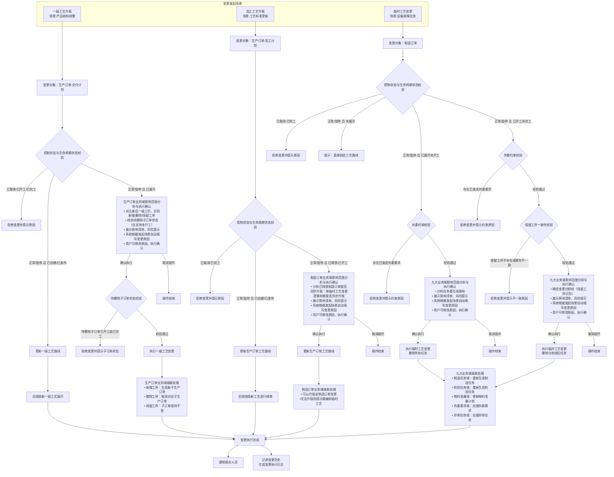

**解决方案设计要点**

**核心设计原则**（适用于所有要点）：
- **控制状态驱动**：基于控制状态进行变更，已取消订单不允许工艺变更
- **完工状态保护**：已完工订单不允许工艺变更
- **保留工序完全一致**：已开工、已送检、已完工状态的工序为保留工序，在新工艺中必须存在且属性完全一致（工序号、名称、顺序、执行标记、产出比等）
- **工艺任务对应关系**：变更完成后订单关联的工艺与订单关联的任务必须保持一一对应关系
- **串并行关系保持**：原工序串行/并行关系在新工艺中必须保持不变
- **分类处理策略**：根据订单类型和状态采用不同处理策略（一级工艺/加工工艺/临时工艺）
- **变更分割线识别**：临时工艺变更需要准确识别变更分割线，保留已完成生产的部分工序
- **级联一致性**：确保业务域工艺变更的一致性，要么全部成功要么全部回滚

---

**1. 变更发起与原因自动填写**

| 发起界面 | 操作 | 自动填写规则 | 用户操作 |
|----------|------|-------------|----------|
| 生产订单管理 | 一级工艺升版 | 产品结构调整→"产品结构调整" | 可修改，执行确认 |
| 生产订单管理 | 加工工艺升版 | 工艺标准更新→"工艺标准升版" | 可修改，执行确认 |
| 制造订单管理 | 临时工艺变更 | 设备故障→"设备故障应急：{编号}" | 可修改，执行确认 |

**2. 状态校验与准入控制**

| 变更类型 | 订单类型 | 控制状态要求 | 生命周期状态要求 | 拒绝状态 | 特殊约束 |
|----------|----------|-------------|----------------|---------|---------|
| 一级工艺升版 | 生产订单-交付计划 | 正常或暂停 | 已创建/已发布/已展开 | 已取消/已开工/已完工 | • 待删除子订单必须未开工 |
| 加工工艺升版 | 生产订单-加工计划 | 正常或暂停 | 已创建/已发布/已释放/已开工 | 已取消/已完工 | • 已释放制造订单能否同步升版的判断依据与临时工艺变更完全一致 |
| 临时工艺变更 | 制造订单 | 正常或暂停 | 未展开/已展开/已开工 | 已取消/已完工 | • 保留工序必须在新工艺中存在且属性一致 • 存在已发送外委需求时不允许工艺变更 |

**说明**：
- **不通过处理**：拒绝操作并提示原因

**3. 九大业务域影响范围分析**

基于功能设计文档中的详细处理逻辑，按变更类型和状态分析各业务域的影响范围。表格使用颜色标识：🟢 可变更、🟡 有风险、🔴 不可变更

**（1）一级工艺升版变更影响**

| 业务域 | 状态 | 操作影响 |
|--------|------|---------|
| **生产订单域** | **已创建/已发布** | 🟢 **可变更** **影响**：更新一级工艺路线 **建议**：直接更新，后续按新工艺展开 |
| | **已展开** | 🟡 **可变更，需校验子订单** **影响**：子订单新增/删除/保留，待删除子订单必须未开工 **建议**：对比新旧工艺，校验待删除子订单状态，新增子订单，取消未开工子订单 |
| | **已开工/已完工** | 🔴 **不可变更** **原因**：订单已开工或已完工，不允许一级工艺变更 |
| **其他业务域** | **所有状态** | 🟢 **无直接影响** **说明**：一级工艺变更仅影响生产订单域的子订单结构 |

**（2）加工工艺升版变更影响**

| 业务域 | 状态 | 操作影响 |
|--------|------|---------|
| **生产订单域** | **已创建/已发布** | 🟢 **可变更** **处理**：更新加工工艺路线，后续使用新工艺释放 |
| | **已释放/已开工** | 🟡 **可变更，需同步升版制造订单** **处理**：更新生产订单工艺路线，遍历已释放制造订单按临时工艺变更逻辑判断能否同步升版（详见下方制造订单域） |
| | **已完工** | 🔴 **不可变更** **原因**：订单已完工，不允许工艺变更 |
| **制造订单域** | **未展开** | 🟢 **可同步升版** **校验**：无需校验 **处理**：直接更新工艺路线 |
| | **已展开未开工** | 🟢 **可同步升版（需校验）** **校验**：参考临时工艺变更核心校验规则（新工艺路线基础校验+外委约束校验） **处理**：校验通过则删除所有任务按新工艺重新生成；校验不通过则标记为需编制临时工艺 |
| | **已开工未完工** | 🟡 **可同步升版（需完整校验）** **校验**：参考临时工艺变更核心校验规则（新工艺路线基础校验+外委约束校验+保留工序一致性校验+串并行关系保持校验） **处理**：校验通过则删除分割线后任务按新工艺重新生成；校验不通过则标记为需编制临时工艺 |
| | **已完工** | 🔴 **不可变更** **原因**：订单已完工，不允许工艺变更 |
| **处理结果汇总** | **所有制造订单** | 🟡 **汇总提示** • 若所有制造订单校验通过：提示"所有制造订单同步升版成功" • 若存在校验不通过的制造订单：提示"部分制造订单无法同步升版，需要手动编制临时工艺" |
| **其他业务域** | **所有状态** | 🟢 **级联影响** **说明**：制造订单同步升版时，制造任务、检验任务、外委需求等域级联调整；物料准备计划域无影响（工艺变更不改变备料清单） |

**（3）临时工艺变更影响**

| 业务域 | 状态 | 操作影响 |
|--------|------|---------|
| **制造订单域** | **未展开** | 🟢 **可变更** **校验**：无任务，无需校验 **处理**：替换工艺路线为新工艺路线 |
| | **已展开未开工** | 🟢 **可变更** **校验**：• 新工艺路线基础校验（并行工序无产出比、有产出比工序必须执行、计划投入数量是产出比乘积整倍数） • 外委约束校验（无已发送外委需求） **处理**：删除所有制造任务和检验任务，按新工艺重新展开 |
| | **已开工未完工** | 🟡 **可变更，需校验保留工序** **校验**：• 新工艺路线基础校验 • 外委约束校验（无已发送外委需求） • 保留工序一致性校验（工序号、名称、执行标记、产出比、工序类型、上下道关系、检验分类配置一致） • 串并行关系保持（原串行仍串行，原并行仍并行） **处理**：保留已开工/已送检/已完工任务，删除分割线后任务，按新工艺重新展开；若保留工序全部完工且新工艺仅含保留工序，则执行订单完工逻辑 |
| | **已完工/已取消** | 🔴 **不可变更** **原因**：订单已完工或已取消，不允许工艺变更 |
| **制造任务域** | **已创建/已派工** | 🟢 **可删除重建** **处理**：已派工任务先取消派工，删除任务及关联检验任务、外委需求、异常任务（流程中需终止流程），按新工艺重新创建 |
| | **已开工/已送检/已完工** | 🟡 **保留不变** **处理**：作为保留工序，更新工序ID为新工艺工序ID，未完工任务更新定额工时，保持到料数量和上下道关系 |
| **检验任务域** | **已创建** | 🟢 **可删除重建** **处理**：删除检验任务，按新工艺重新创建（根据检验分类） |
| | **检验中/已完工** | 🟡 **保留不变** **处理**：关联保留工序，保持不变 |
| **物料准备计划域** | **所有状态** | 🟢 **无影响** **说明**：工艺变更不改变备料清单，无需处理 |
| **异常任务域** | **待处理/处理中** | 🟢 **可删除** **处理**：删除关联已删除工序的异常任务，流程中需终止流程 |
| | **已处理/已关闭** | 🟢 **保持状态** **说明**：无影响 |
| **不合格品审理域** | **待审理/审理中** |  🟡 **保留不变** **处理**：关联保留工序，保持不变 |
| | **审理完成** | 🟢 **保持状态** **说明**：无影响 |
| **外委需求域** | **已创建/审批中** | 🟢 **可删除重建** **处理**：删除关联已删除工序的外委需求，按新工艺重新创建（根据外委标记） |
| | **已审批/已发送** | 🔴 **阻止变更** **原因**：存在已发送外委需求时不允许工艺变更 |
| | **已取消** | 🟢 **保持状态** **说明**：无影响 |
| **外委采购订单域** | **所有状态** | 🟢 **级联影响** **说明**：根据外委需求域变化进行相应调整 |

**4. 执行确认、权限控制与九大业务域级联处理**

| 操作类型 | 确认机制 | 可逆性 | 人工干预 |
|----------|----------|--------|---------|
| 一级工艺升版 | 填写原因+影响范围分析+执行确认 | 部分可逆（未开工子订单可恢复） | 不涉及干预（仅影响生产订单域子订单结构） |
| 加工工艺升版 | 填写原因+影响范围分析+执行确认 | 部分可逆（未释放订单可恢复） | 支持制造订单级别干预，用户可修改制造订单的"变更方案"为"不变更" |
| 临时工艺变更 | 填写原因+保留工序校验+影响范围分析+执行确认 | 不可逆（任务已删除重生成） | 不涉及干预（针对单个制造订单） |

**临时工艺变更核心校验规则**：

| 校验类型 | 校验内容 | 适用状态 | 校验失败提示 |
|----------|----------|----------|-------------|
| **新工艺路线基础校验** | • 并行工序中不允许存在产出比 • 有产出比的工序必须执行（执行标记为是） • 制造订单的计划投入数量必须是工艺路线产出比乘积的整倍数 | 已展开未开工 已开工未完工 | "新工艺路线不符合基础规则：[具体原因]" |
| **保留工序一致性校验** | • 保留工序定义：已开工、已送检、已完工状态的工序 • 保留工序必须在新工艺路线中存在 • 关键属性一致：工序号、工序名称、执行标记、产出比、工序类型 • 上下道关系一致：保留工序之间的上下道关系保持不变 • 检验分类配置一致：工序的检验分类配置保持不变 | 已开工未完工 | "当前选择的工艺路线不允许进行变更，已生产工序XX、XX、XX在新工艺路线必须完全一致。" |
| **串并行关系保持校验** | • 原工序是串行，变更后必须是串行 • 原工序是并行，变更后必须是并行 | 已开工未完工 | "工序XX的串并行关系发生改变，不允许变更。" |
| **外委约束校验** | • 若制造任务存在关联的外委需求，且已发送外委计划，则不允许变更 | 已展开未开工 已开工未完工 | "存在已发送外委需求，不允许进行工艺变更。" |

**临时工艺变更核心处理逻辑**：

| 处理阶段 | 处理内容 | 适用状态 | 关键操作 |
|----------|----------|----------|----------|
| **1. 替换工艺路线** | 制造订单的工艺路线替换为新工艺路线 | 所有状态 | 更新制造订单工艺路线字段 |
| **2. 保留工序处理** | • 保留已开工/已送检/已完工的制造任务 • 更新工序ID为新工艺路线的工序ID • 未完工任务更新定额加工工时和定额辅制工时 • 保持到料数量和上下道关系 | 已开工未完工 | 更新保留任务的工序ID和定额工时 |
| **3. 删除分割线后任务** | • 已派工任务先取消派工 • 删除制造任务 • 同步删除关联的检验任务 • 同步删除关联的外委需求 • 同步删除关联的异常任务（流程中需终止流程） | 已展开未开工 已开工未完工 | 级联删除所有关联对象 |
| **4. 按新工艺重新展开** | • 针对变更分割线以下，按新工艺路线重新创建制造任务 • 根据检验分类创建关联的检验任务 • 根据外委标记创建外委需求 • 保持产出比计算逻辑 • 保持制造任务的上下道关系 | 已展开未开工 已开工未完工 | 按计划展开逻辑重新创建任务 |
| **5. 特殊场景处理** | • 若保留工序任务均已完工，且新工艺路线只有保留工序，则删除保留工序任务后执行订单完工逻辑 • 订单完工时，实际结束时间取工艺变更的操作时间 | 已开工未完工 | 执行订单完工逻辑 |

**级联处理**：根据变更类型执行不同的级联处理逻辑

**5. 变更执行完成后的并行处理**

| 并行分支 | 处理内容 | 关键对象 |
|----------|----------|----------|
| **通知相关人员** | 自动通知变更结果和影响 | 发起人、车间主管、物料管理员、质检员、采购员、工艺工程师 |
| **记录变更历史** | 生成变更执行日志 | 变更类型、原因、时间、操作人、影响对象、执行结果、工艺对比、级联明细 |

---

**变更分割线算法实现细节**：

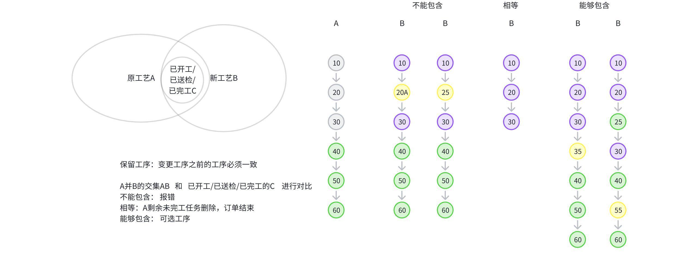

从最后一个已开工/已送检/已完工工序以后开始变更

|工艺类型|分割线确定方式|实现范围|
|---|---|---|
|串行|单个确定的值|⭐本批次|
|并行|只能确定1个，剩余的按完工处理|⭐本批次|
|并行|并行指定多值|项目定制|

##### 2.1.4.4.3 **临时工艺变更场景样例**

**原始工艺路线场景说明**

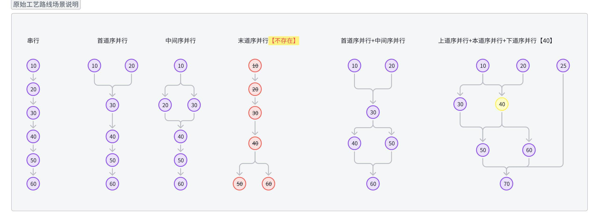

**串行工艺变更场景样例**

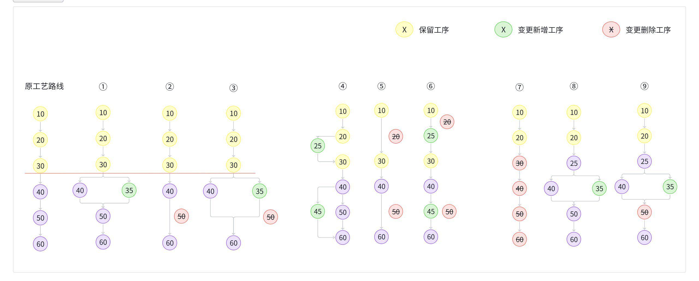

|序号|变更说明|处理逻辑|
|---|---|---|
|①②③|保留工序：已开工及后续状态的工序均为保留工序 保留工序在新工艺路线可以全部找到，且工序完全一致 在保留工序之后新增+删除工序|从原工艺路线中删除保留工序以后的任务 从新工艺路线中创建保留工序以后的任务|
|④⑤⑥|保留工序：已开工及后续状态的工序均为保留工序 保留工序在新工艺路线可以全部找到，但工序不完全一致 在保留工序后新增+删除工序|**不允许变更**|
|⑦|保留工序：已开工及后续状态的工序均为保留工序 保留工序在新工艺路线可以全部找到，且新工艺路线中只有保留工序，无其他工序|从原工艺路线中删除起始工序及以后的任务 若保留工序的任务均已完工，则删除保留工序任务后，还需执行最后一道工序完工后的处理逻辑（如订单完工等）|
|⑧⑨|保留工序：已开工及后续状态的工序均为保留工序 保留工序在新工艺路线中不能完全找到 在保留工序后新增+删除工序|**不允许变更**|

**并行工艺变更场景样例**

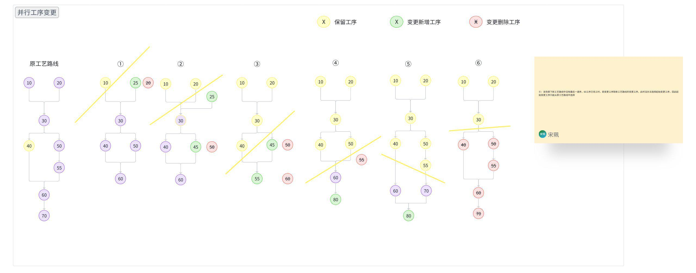

|序号|变更说明|处理逻辑|
|---|---|---|
|①②③④⑤|保留工序：已开工及后续状态的工序均为保留工序 保留工序在新工艺路线可以全部找到，且工序完全一致 在保留工序后面新增+删除工序|从原工艺路线中删除保留工序以后的任务（详见图中黄色分割线以下的部分） 从新工艺路线重新创建分割线后的工序任务|
|⑥|保留工序：已开工及后续状态的工序均为保留工序 保留工序在新工艺路线可以全部找到，且新工艺路线中只有保留工序，无其他工序|从原工艺路线中删除起始工序及以后的任务 若保留工序的任务均已完工，则删除保留工序任务后，还需执行最后一道工序完工后的处理逻辑（如订单完工等）|

#### 2.1.4.5 **备料清单变更**

##### 2.1.4.5.1 **备料清单变更业务描述**

**业务背景**

备料清单变更是制造执行中的重要调控手段，包括物料新增、删除、数量调整、规格替换等操作类型。这些变更具有成本敏感性和供应链联动性特点，广泛应用于产品设计变更、工艺改进、供应商调整、成本控制等业务场景，是保障物料供应准确性和成本控制的核心功能。

**核心用户诉求**：
- 作为产品工程师，我希望BOM变更时能快速评估对物料供应的影响，以便做出合理的设计决策
- 作为物料管理员，我希望新增物料时能自动生成采购需求，以便及时安排供应商对接
- 作为成本工程师，我希望删除物料时能看到详细的成本影响分析，以便确保节约效果
- 作为物料管理员，我希望物料删除时能自动处理退料流程，以便减少库存积压
- 作为工艺工程师，我希望调整物料用量时能看到对供应的影响分析，以便确保工艺改进顺利实施
- 作为物料管理员，我希望数量调整时能自动处理供应商订单变更，以便保证供应连续性
- 作为采购工程师，我希望物料替换时能看到完整的切换预案，以便确保供应连续性
- 作为物料管理员，我希望规格替换时能自动处理库存调整，以便减少切换风险

 **业务场景清单**

| 变更类型 | 关键角色 | 场景与价值 | 业务场景描述 |
|----------|----------|-----------|-------------|
| **物料新增** | 产品工程师 物料管理员 | **场景：产品设计变更导致的物料新增** 产品设计优化后增加新的零部件或原材料需求时评估供应可行性并安排采购，满足新的生产需求保证产品质量 | **输入**：BOM变更确认、新物料技术规格、供应方案和交期 **约束**：订单未完工、库存供应可行性、成本影响可控 **输出**：备料清单更新、采购需求生成、物料准备计划调整 |
| **物料删除** | 成本工程师 物料管理员 | **场景：成本控制导致的物料删除** 通过价值工程分析确定可删除的非必要物料时处理已采购物料的退料和成本回收，降低生产成本简化物料管理 | **输入**：成本分析结果、删除物料可行性、退料处理方案 **约束**：订单未完工、已收料需妥善退料、资源合理处置 **输出**：物料删除、退料申请、成本节约报告 |
| **数量调整** | 工艺工程师 物料管理员 | **场景：工艺改进导致的物料数量调整** 工艺改进后物料损耗率发生变化时调整物料用量并重新安排供应，精确控制物料消耗减少浪费 | **输入**：工艺改进方案、新损耗率、数量调整需求 **约束**：订单未完工、数量差异需处理、供应商能满足调整 **输出**：用量标准调整、供应数量更新、库存预留重算 |
| **规格替换** | 采购工程师 物料管理员 | **场景：供应商优化导致的物料规格替换** 为优化供应商结构或提升物料品质时用新规格物料替换原有物料，应用更好的物料规格提升产品质量或降低成本 **实现方式**：通过"删除旧物料+新增新物料"组合实现 | **输入**：新物料规格验证、供应商切换方案、兼容性确认 **约束**：订单未完工、技术可行性确认、供应衔接协调 **输出**：规格替换、库存切换、供应商信息更新 |

##### 2.1.4.5.2 **备料清单变更解决方案**

**逻辑处理流程图**

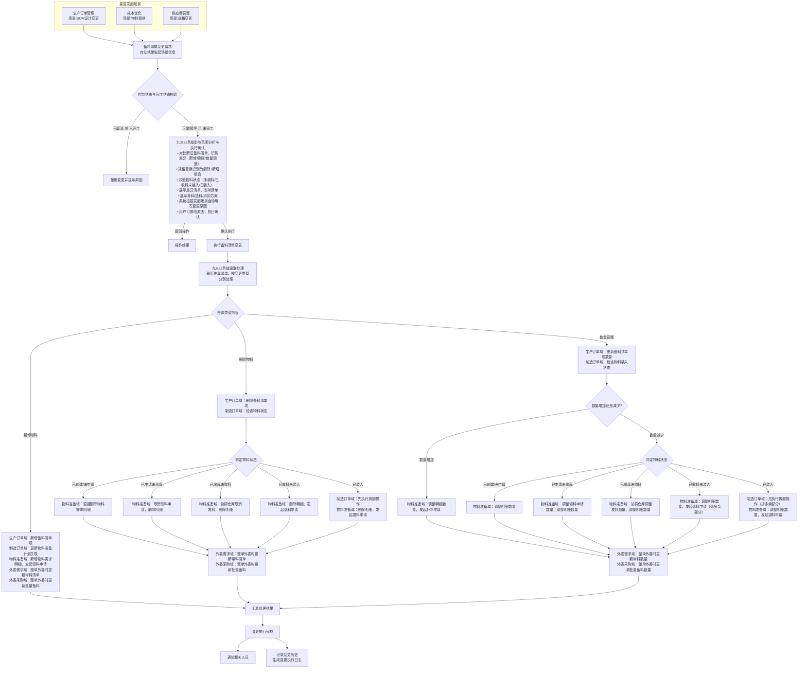

**解决方案设计要点**

**核心设计原则**（适用于所有要点）：
- **控制状态驱动**：基于控制状态进行变更，已取消订单不允许备料清单变更
- **完工状态保护**：已完工订单不允许变更
- **差异识别自动化**：系统自动对比新旧备料清单，精确识别所有变更项目（新增/删除/数量调整）
- **物料状态精细化管理**：根据物料状态（未收料/已收料未装入/已装入）采取不同处理策略
- **库存联动处理**：与库存管理系统深度集成，自动处理物料申请、退料和库存调整
- **供应链协调**：确保物料变更与采购计划、外委计划的协调一致性
- **级联一致性**：确保九大业务域备料清单变更的一致性，要么全部成功要么全部回滚

---

**1. 变更发起与原因自动填写**

| 发起界面 | 操作 | 自动填写规则 | 用户操作 |
|----------|------|-------------|----------|
| 生产订单管理 | 备料清单变更 | BOM设计变更→"BOM设计变更" 成本优化→"成本优化" 供应商调整→"供应商调整" | 可修改，执行确认 |

**2. 状态校验与准入控制**

| 变更类型 | 控制状态要求 | 完工状态要求 | 特殊约束 |
|----------|-------------|-------------|---------|
| 备料清单变更 | 正常或暂停 | 未完工 | • 物料删除：仅支持未收料或可退料状态的物料删除，已装入需先拆卸再退料 • 数量减少：已收料需退料，已装入需先拆卸再退料 • 规格替换：通过删除旧物料+新增新物料组合实现，需校验技术可行性 |

**不通过处理**：拒绝操作并提示原因

**3. 九大业务域影响范围分析**

基于功能设计文档中的详细处理逻辑，按变更类型和状态分析各业务域的影响范围。表格使用颜色标识：🟢 可变更、🟡 有风险、🔴 不可变更

| 业务域 | 物料新增影响 | 物料删除影响 | 数量调整影响 |
|--------|-------------|-------------|-------------|
| **生产订单域** | 🟢 **可变更** **影响**：更新备料清单，增加物料项 **建议**：直接更新备料清单 | 🟢 **可变更** **影响**：更新备料清单，删除物料项 **建议**：直接更新备料清单 | 🟢 **可变更** **影响**：更新备料清单，调整物料数量 **建议**：直接更新备料清单 |
| **制造订单域** | 🟢 **间接影响** **影响**：通过物料准备计划关联备料清单 **说明**：制造订单生成时基于生产订单备料清单创建物料准备计划，备料清单变更需同步更新物料准备计划关联 | 🟡 **需处理装入物料** **影响**：通过物料准备计划关联备料清单，已装入物料需先拆卸 **说明**：制造订单生成时基于生产订单备料清单创建物料准备计划，备料清单变更需同步更新物料准备计划关联 **关键逻辑**：已装入物料需先执行拆卸操作，再发起退料申请 | 🟡 **需处理装入物料** **影响**：通过物料准备计划关联备料清单，数量减少时已装入物料需先拆卸 **说明**：制造订单生成时基于生产订单备料清单创建物料准备计划，备料清单变更需同步更新物料准备计划关联 **关键逻辑**：数量减少时，已装入物料需先执行拆卸操作，再发起退料申请 |
| **制造任务域** | 🟢 **无影响** **说明**：备料清单变更不影响制造任务 | 🟢 **无影响** **说明**：备料清单变更不影响制造任务 | 🟢 **无影响** **说明**：备料清单变更不影响制造任务 |
| **检验任务域** | 🟢 **无影响** **说明**：备料清单变更不影响检验任务 | 🟢 **无影响** **说明**：备料清单变更不影响检验任务 | 🟢 **无影响** **说明**：备料清单变更不影响检验任务 |
| **物料准备计划域** | 🟢 **需新增明细** **影响**：新增物料需求明细，发起领料申请 **建议**：生成领料申请，更新物料准备计划状态 | 🟡 **需删除明细** **影响**：删除物料需求明细，已收料需退料，已装入需先拆卸 **建议**：未收料直接删除，已收料未装入发起退料申请，已装入先拆卸再退料 | 🟡 **需调整数量** **影响**：调整物料需求明细数量，补料或退料，减少时已装入需先拆卸 **建议**：数量增加发起补料，数量减少时已收料未装入发起退料，已装入先拆卸再退料 |
| **异常任务域** | 🟢 **无影响** **说明**：备料清单变更不影响异常任务 | 🟢 **无影响** **说明**：备料清单变更不影响异常任务 | 🟢 **无影响** **说明**：备料清单变更不影响异常任务 |
| **不合格品审理域** | 🟢 **无影响** **说明**：备料清单变更不影响不合格品审理 | 🟢 **无影响** **说明**：备料清单变更不影响不合格品审理 | 🟢 **无影响** **说明**：备料清单变更不影响不合格品审理 |
| **外委需求域** | 🟡 **整单外委影响** **影响**：整单外委时需更新带料清单 **说明**：整单外委需求创建时会关联生产订单备料清单，备料清单变更需同步更新外委带料清单 **建议**：同步更新外委物料需求 | 🟡 **整单外委影响** **影响**：整单外委时需更新带料清单 **说明**：整单外委需求创建时会关联生产订单备料清单，备料清单变更需同步更新外委带料清单 **建议**：同步更新外委物料需求 | 🟡 **整单外委影响** **影响**：整单外委时需更新带料数量 **说明**：整单外委需求创建时会关联生产订单备料清单，备料清单变更需同步更新外委带料数量 **建议**：同步更新外委物料需求 |
| **外委采购订单域** | 🟡 **整单外委影响** **影响**：整单外委时需更新批量备料 **说明**：整单外委采购订单的批量备料环节基于外委需求的带料清单，备料清单变更需同步更新批量备料 **建议**：根据外委需求域变化调整批量备料 | 🟡 **整单外委影响** **影响**：整单外委时需更新批量备料 **说明**：整单外委采购订单的批量备料环节基于外委需求的带料清单，备料清单变更需同步更新批量备料 **建议**：根据外委需求域变化调整批量备料 | 🟡 **整单外委影响** **影响**：整单外委时需更新批量备料数量 **说明**：整单外委采购订单的批量备料环节基于外委需求的带料清单，备料清单变更需同步更新批量备料数量 **建议**：根据外委需求域变化调整批量备料 |

**规格替换说明**：规格替换通过"删除旧物料+新增新物料"组合实现，因此其影响等同于先执行删除操作，再执行新增操作。

**4. 执行确认、权限控制与九大业务域级联处理**

| 操作类型 | 确认机制 | 可逆性 | 人工干预 |
|----------|----------|--------|---------|
| 备料清单变更 | 填写原因+差异识别+物料状态分析+影响范围分析+补退料/拆卸方案+执行确认 | 可逆（可再次变更备料清单） | 支持制造订单级别干预，用户可修改制造订单的"变更方案"为"不变更" |

**备料清单变更级联处理逻辑**：

| 差异类型 | 级联处理内容 | 关键操作 |
|----------|-------------|----------|
| **新增物料** | • 生产订单域：新增备料清单项 • 制造订单域：更新物料准备计划关联 • 物料准备域：新增物料需求明细，发起领料申请 • 外委需求域：整单外委时更新带料清单 • 外委采购域：整单外委时更新批量备料 | 生成领料申请，更新物料准备计划状态 |
| **删除物料** | • 生产订单域：删除备料清单项 • 制造订单域：更新物料准备计划关联，已装入物料需先拆卸 • 物料准备域：删除物料需求明细，发起退料申请（如已收料） • 外委需求域：整单外委时更新带料清单 • 外委采购域：整单外委时更新批量备料 | 未收料直接删除，已收料未装入发起退料申请，已装入先拆卸再退料 |
| **数量调整** | • 生产订单域：更新备料清单项数量 • 制造订单域：更新物料准备计划关联，数量减少时已装入物料需先拆卸 • 物料准备域：调整物料需求明细数量，发起补料或退料 • 外委需求域：整单外委时更新带料数量 • 外委采购域：整单外委时更新批量备料数量 | 数量增加发起补料，数量减少时已收料未装入发起退料，已装入先拆卸再退料 |

**级联处理原则**：
- 一次备料清单变更可能包含多种差异类型，系统遍历差异清单，按差异类型分别执行级联处理
- **规格替换处理**：规格替换通过"删除旧物料+新增新物料"组合实现，先执行删除操作（旧物料发起退料），再执行新增操作（新物料发起领料），确保原子性
- **物料状态处理**：物料删除或数量减少时，需根据物料当前状态采取不同处理策略：
  - **已创建/未申请**：直接删除或调整物料需求明细
  - **已申请未出库**：取消或调整领料申请，删除或调整明细
  - **已出库未收料**：协调仓库取消或调整发料，删除或调整明细
  - **已收料未装入**：发起退料申请（退全部或多余部分），删除或调整明细
  - **已装入**：先执行拆卸操作（拆全部或多余部分），再发起退料申请，删除或调整明细

**5. 变更执行完成后的并行处理**

| 并行分支 | 处理内容 | 关键对象 |
|----------|----------|----------|
| **通知相关人员** | 自动通知变更结果和影响 | 发起人、物料管理员、采购员、仓库管理员 |
| **记录变更历史** | 生成变更执行日志 | 变更类型、原因、时间、操作人、影响对象、执行结果、备料清单对比、物料状态处理、级联明细 |

## 2.2 **数据描述**

### 2.2.1 **业务对象ER关系图**

变更管理涉及九大业务域的核心业务对象及其关系如下：

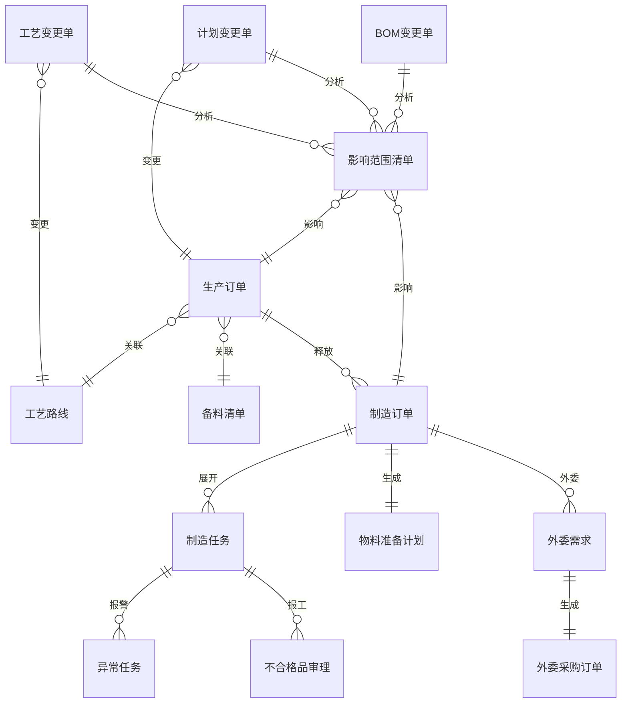

### 2.2.2 **核心数据字典**

#### 2.2.2.1 **变更单数据结构**

变更单根据变更对象和场景的不同，分为三种类型，每种类型的数据结构如下：

**（1）计划变更单**

计划变更单用于管理生产订单的计划变更，包括状态变更、数量变更、时间变更等场景。

| 字段名 | 数据类型 | 必填 | 说明 |
|--------|----------|------|------|
| 变更单号 | 文本 | 是 | 变更单唯一标识，系统自动生成 |
| 变更单类型 | 文本 | 是 | 固定值：计划变更单 |
| 关联订单号 | 文本 | 是 | 变更目标生产订单号 |
| 变更场景 | 文本 | 是 | 枚举值：状态变更/数量变更/时间变更/数量+时间变更 |
| 变更内容 | JSON | 是 | 根据变更场景不同，包含不同字段： - 状态变更：目标状态（取消/暂停/恢复）、变更原因 - 数量变更：原计划数量、新计划数量、变更原因 - 时间变更：原计划开始时间、新计划开始时间、原计划结束时间、新计划结束时间、变更原因 - 数量+时间变更：包含数量和时间的所有字段 |
| 变更原因 | 文本 | 是 | 变更原因说明 |
| 变更来源 | 文本 | 是 | 枚举值：上游集成/手工创建/检验结论/审理结论 |
| 来源系统 | 文本 | 否 | 上游集成时必填，如ERP、PLM等 |
| 来源单号 | 文本 | 否 | 上游集成时的源单号 |
| 变更单状态 | 文本 | 是 | 枚举值：已创建/已发布/处理中/已完成/已关闭 |
| 处理开始时间 | 日期时间 | 否 | 开始执行变更的时间 |
| 处理完成时间 | 日期时间 | 否 | 变更执行完成的时间 |

**（2）工艺变更单**

工艺变更单用于管理工艺路线的版本变更，影响所有使用该工艺的在制订单。

| 字段名 | 数据类型 | 必填 | 说明 |
|--------|----------|------|------|
| 变更单号 | 文本 | 是 | 变更单唯一标识，系统自动生成 |
| 变更单类型 | 文本 | 是 | 固定值：工艺变更单 |
| 原工艺路线 | 文本 | 是 | 变更前的工艺路线编号 |
| 原工艺版本 | 文本 | 是 | 变更前的工艺版本号 |
| 目标工艺路线 | 文本 | 是 | 变更目标工艺路线编号 |
| 目标工艺版本 | 文本 | 是 | 变更后的工艺版本号 |
| 变更类型 | 文本 | 是 | 枚举值：工艺升版/临时工艺 |
| 变更内容说明 | JSON | 是 | 新旧工艺对比结果： - 新增工序列表 - 删除工序列表 - 保留工序列表 - 工序参数变更列表 |
| 变更原因 | 文本 | 是 | 变更原因说明 |
| 变更来源 | 文本 | 是 | 枚举值：上游集成/手工创建 |
| 来源系统 | 文本 | 否 | 上游集成时必填，如PLM等 |
| 来源单号 | 文本 | 否 | 上游集成时的源单号 |
| 变更单状态 | 文本 | 是 | 枚举值：已创建/已发布/处理中/已完成/已关闭 |
| 处理开始时间 | 日期时间 | 否 | 开始执行变更的时间 |
| 处理完成时间 | 日期时间 | 否 | 变更执行完成的时间 |

**（3）BOM变更单**

BOM变更单用于管理父物料备料清单的变更，影响所有使用该父物料的在制订单。

| 字段名 | 数据类型 | 必填 | 说明 |
|--------|----------|------|------|
| 变更单号 | 文本 | 是 | 变更单唯一标识，系统自动生成 |
| 变更单类型 | 文本 | 是 | 固定值：BOM变更单 |
| 变更父物料 | 文本 | 是 | 变更目标父物料编号 |
| 新备料明细表 | JSON数组 | 是 | 新版本的完整备料明细清单，每条明细包含： - 物料编码 - 物料名称 - 需求数量 - 计量单位 - 其他物料属性 |
| 变更说明 | JSON | 是 | 新旧备料清单对比结果： - 新增物料列表 -除物料列表 - 保留物料列表 - 数量变更物料列表 |
| 变更原因 | 文本 | 是 | 变更原因说明 |
| 变更来源 | 文本 | 是 | 枚举值：上游集成/手工创建 |
| 来源系统 | 文本 | 否 | 上游集成时必填，如ERP、PLM等 |
| 来源单号 | 文本 | 否 | 上游集成时的源单号 |
| 变更单状态 | 文本 | 是 | 枚举值：已创建/已发布/处理中/已完成/已关闭 |
| 处理开始时间 | 日期时间 | 否 | 开始执行变更的时间 |
| 处理完成时间 | 日期时间 | 否 | 变更执行完成的时间 |

**（4）影响范围清单**

影响范围清单记录变更单影响的所有订单及其处理状态，是变更单的从表。

| 字段名 | 数据类型 | 必填 | 说明 |
|--------|----------|------|------|
| 清单明细号 | 文本 | 是 | 明细唯一标识，系统自动生成 |
| 变更单号 | 文本 | 是 | 关联的变更单号（外键） |
| 订单类型 | 文本 | 是 | 枚举值：生产订单/制造订单 |
| 订单号 | 文本 | 是 | 受影响的订单号 |
| 订单当前状态 | 文本 | 是 | 订单的当前生命周期状态 |
| 订单控制状态 | 文本 | 是 | 订单的当前控制状态 |
| 处理状态 | 文本 | 是 | 枚举值：待处理/已完成/处理失败 |
| 处理结果 | 文本 | 否 | 处理成功时的结果描述 |
| 失败原因 | 文本 | 否 | 处理失败时的原因说明 |
| 处理时间 | 日期时间 | 否 | 实际处理完成的时间 |
| 处理人 | 文本 | 否 | 执行处理的操作人 |

#### 2.2.2.2 **变更相关核心字段**

| 字段名 | 业务类型 | 业务约束 | 变更相关说明 |
|--------|----------|----------|--------------|
| **状态变更相关** |
| 生命周期状态 | 文本 | 各业务域枚举值不同 | 业务对象的生命周期状态，如已创建/已开工/已完工等，反映业务流程进度 |
| 控制状态 | 文本 | 枚举值：正常/已暂停/已取消 | 九大业务域通用的控制状态字段，用于状态变更管理，独立于生命周期状态 |
| 暂停原因 | 文本 | 可选填写 | 暂停原因，暂停操作时必须填写 |
| 取消原因 | 文本 | 可选填写 | 取消原因，取消操作时必须填写 |
| **数量变更相关** |
| 计划数量 | 数值 | 大于0 | 计划数量，数量变更的目标字段 |
| 已释放数量 | 数值 | 大于等于0，小于等于计划数量 | 已释放数量，影响数量调减的处理策略 |
| 实际完工数量 | 数值 | 大于等于0 | 实际完工数量，完工后不可再进行数量变更 |
| **时间变更相关** |
| 计划开始时间 | 日期时间 | 必填 | 计划开始时间，时间变更的目标字段 |
| 计划结束时间 | 日期时间 | 必须晚于计划开始时间 | 计划结束时间，时间变更的目标字段 |
| 实际开始时间 | 日期时间 | 可选填写 | 实际开始时间，已开工后影响时间变更约束 |
| **工艺变更相关** |
| 工艺路线编号 | 文本 | 关联字段，必填 | 工艺路线编号，工艺变更的核心字段 |
| 工艺版本号 | 文本 | 必填 | 工艺版本号，工艺升版变更时自动更新 |
| 是否临时工艺 | 布尔值 | 默认否 | 是否临时工艺，标识临时工艺变更 |
| 工序号 | 文本 | 必填 | 工序号，工艺变更中保留工序的匹配标识 |
| 产出比例 | 小数 | 大于0，小于等于1 | 产出比例，工艺变更时需保持一致性 |
| **备料清单变更相关** |
| 备料清单编号 | 文本 | 关联字段，必填 | 备料清单编号，备料清单变更的目标字段 |
| 备料清单版本号 | 文本 | 必填 | 备料清单版本号，备料清单变更时更新 |
| 物料编码 | 文本 | 关联字段，必填 | 物料编码，物料变更的核心标识 |
| 需求数量 | 小数 | 大于等于0 | 需求数量，物料数量变更字段 |
| **物料状态相关** |
| 物料状态 | 文本 | 枚举值：未收料/已收料未装入/已装入 | 物料准备计划中物料的状态，决定备料清单变更的处理策略 |
| 是否已装入 | 布尔值 | 默认否 | 物料是否已装入制造订单，已装入需先拆卸再退料 |
| **中间状态标识** |
| 关联订单控制状态标识 | 文本 | 可选填写 | 异常任务和不合格品审理使用，标识关联订单的控制状态（已取消/已暂停） |
| **级联影响字段** |
| 父订单号 | 文本 | 关联字段，可选 | 父订单号，级联变更的关联字段 |
| 是否级联变更 | 布尔值 | 默认否 | 是否级联变更，标识变更来源 |
| 变更来源 | 文本 | 可选填写 | 变更来源，记录变更触发源 |

#### 2.2.2.3 **变更类型枚举定义**

| 变更类型 | 业务编码 | 适用对象 | 核心影响字段 | 约束条件 |
|----------|----------|----------|--------------|----------|
| **状态变更** |
| 取消 | 取消 | 生产订单、制造订单 | 订单状态、取消原因 | 未完工状态可取消 |
| 暂停 | 暂停 | 生产订单、制造订单 | 订单状态、暂停原因 | 未完工状态可暂停 |
| 恢复 | 恢复 | 生产订单、制造订单 | 订单状态 | 暂停状态可恢复 |
| **数量变更** |
| 数量调减 | 数量调减 | 生产订单 | 计划数量、已释放数量 | 调减后数量大于0 |
| 数量增加 | 数量增加 | 生产订单 | 计划数量 | 通过新订单实现 |
| **时间变更** |
| 时间变更 | 时间变更 | 生产订单、制造订单 | 计划开始时间、计划结束时间 | 未完工状态可变更 |
| **工艺变更** |
| 一级工艺变更 | 一级工艺变更 | 生产订单(零部件交付计划) | 工艺路线编号 | 未开工状态可变更 |
| 加工工艺变更 | 加工工艺变更 | 生产订单(零部件加工计划) | 工艺路线编号 | 任何未完工状态可变更 |
| 制造订单工艺变更 | 制造订单工艺变更 | 制造订单 | 工艺路线编号、是否临时工艺 | 根据在制品情况判断 |
| **物料变更** |
| 备料清单变更 | 备料清单变更 | 生产订单 | 备料清单编号、备料清单版本号、物料状态、是否已装入 | • 未完工状态可变更 • 物料删除：需校验物料状态（未收料/已收料未装入/已装入） • 数量减少：已收料需退料，已装入需先拆卸再退料 • 规格替换：通过删除旧物料+新增新物料组合实现 |

#### 2.2.2.4 **变更状态流转规则**

| 当前状态 | 允许的变更类型 | 状态流转规则 | 特殊约束 |
|----------|----------------|--------------|----------|
| 已创建 | 取消、暂停、数量变更、时间变更、工艺变更、备料清单变更 | 已创建 → 已取消/已暂停 | 影响最小，无级联约束 |
| 已发布 | 取消、暂停、数量变更、时间变更、工艺变更、备料清单变更 | 已发布 → 已取消/已暂停 | 可能有子订单关联 |
| 已展开 | 取消、暂停、数量变更、时间变更、工艺变更、备料清单变更 | 已展开 → 已取消/已暂停 | 需处理子订单或制造任务 |
| 已释放 | 取消、暂停、数量变更、时间变更、备料清单变更 | 已释放 → 已取消/已暂停 | 已释放制造订单需单独处理工艺变更 |
| 已开工 | 取消、暂停、数量变更(仅调减)、时间变更 | 已开工 → 已取消/已暂停 | 需处理在制品，工艺变更受限 |
| 已暂停 | 恢复、取消 | 已暂停 → 原状态/已取消 | 恢复到暂停前状态 |
| 已完工 | 无 | 终态 | 不允许任何变更 |
| 已取消 | 无 | 终态 | 不允许任何变更 |

#### 2.2.2.5 **状态规则索引**

九大业务域的核心状态定义与状态流转规则已合并到下方 `2.2.3 九大业务域状态规则` 统一维护，本节仅保留索引说明，避免重复维护。

### 2.2.3 **九大业务域状态规则**

#### 2.2.3.1 **核心状态定义**

| 业务域 | 生命周期状态枚举 | 控制状态枚举 | 完工判定条件 | 变更约束 |
|--------|----------------|-------------|-------------|----------|
| **生产订单域** | 已创建/已发布/已展开/已释放/已开工/已完工 | 正常/已暂停/已取消 | 所有制造订单完工 | 已完工/已取消不可变更 |
| **制造订单域** | 已创建/已发布/已展开/已开工/已完工 | 正常/已暂停/已取消 | 所有制造任务和检验任务完工 | 已完工/已取消不可变更 |
| **制造任务域** | 已创建/已派工/已开工/已送检/已完工 | 正常/已暂停/已取消 | 报工完成 | 已完工/已取消不可变更 |
| **检验任务域** | 已创建/检验中/已完工 | 正常/已暂停/已取消 | 检验完成 | 已完工/已取消不可变更 |
| **物料准备计划域（主表）** | 已创建/备料中/备料完成 | 正常/已暂停/已取消 | 所有明细已收料 | 已取消不可变更 |
| **物料需求明细域（从表）** | 已创建/已申请/已收料 | 无控制状态 | 收料确认 | 跟随主表控制状态 |
| **异常任务域** | 待处理/处理中/已处理/已关闭 | 无控制状态 | 处理完成或关闭 | 使用关联订单控制状态标识 |
| **不合格品审理域** | 待审理/审理中/审理完成 | 无控制状态 | 审理流程完成 | 使用关联订单控制状态标识 |
| **外委需求域** | 已创建/审批中/已审批/已发送/已取消 | 正常/已暂停/已取消 | 外委采购订单完成 | 已取消不可变更 |
| **外委采购订单域** | 已创建/已发货/部分收货/全部收货/已退货/已完成/已取消 | 正常/已暂停/已取消 | 入库检验完成 | 已完成/已取消不可变更 |

**说明：**
- **控制状态 vs 生命周期状态**：控制状态用于变更管理（正常/已暂停/已取消），生命周期状态反映业务流程进度
- **异常任务和不合格品审理特殊处理**：这两个域本身无控制状态，通过"关联订单控制状态标识"字段记录关联订单的控制状态

#### 2.2.3.2 **状态流转规则**

| 业务域 | 当前状态 | 允许的变更类型 | 状态流转规则 | 特殊约束 |
|--------|----------|----------------|--------------|----------|
| **生产订单域** | 已创建 | 取消、暂停、数量变更、时间变更、工艺变更、备料清单变更 | 已创建 → 已取消/已暂停 | 影响最小，无级联约束 |
| | 已发布 | 取消、暂停、数量变更、时间变更、工艺变更、备料清单变更 | 已发布 → 已取消/已暂停 | 可能有子订单关联 |
| | 已展开 | 取消、暂停、数量变更、时间变更、工艺变更、备料清单变更 | 已展开 → 已取消/已暂停 | 需处理子订单或制造任务 |
| | 已释放 | 取消、暂停、数量变更、时间变更、备料清单变更 | 已释放 → 已取消/已暂停 | 已释放制造订单需单独处理工艺变更 |
| | 已开工 | 取消、暂停、数量变更(仅调减)、时间变更 | 已开工 → 已取消/已暂停 | 需处理在制品，工艺变更受限 |
| | 已暂停 | 恢复、取消 | 已暂停 → 原状态/已取消 | 恢复到暂停前状态 |
| | 已完工 | 无 | 终态 | 不允许任何变更 |
| | 已取消 | 无 | 终态 | 不允许任何变更 |
| **制造订单域** | 已创建 | 取消、暂停、工艺变更 | 已创建 → 已取消/已暂停 | 同步影响物料准备计划 |
| | 已发布 | 取消、暂停、工艺变更 | 已发布 → 已取消/已暂停 | 同步影响物料准备计划 |
| | 已展开 | 取消、暂停、工艺变更 | 已展开 → 已取消/已暂停 | 需处理制造任务和检验任务 |
| | 已开工 | 取消、暂停 | 已开工 → 已取消/已暂停 | 需处理在制品，工艺变更受限 |
| | 已暂停 | 恢复、取消 | 已暂停 → 原状态/已取消 | 恢复到暂停前状态 |
| | 已完工 | 无 | 终态 | 不允许任何变更 |
| **制造任务域** | 已创建 | 取消、暂停 | 控制状态变更 | 关闭相关异常任务 |
| | 已派工 | 取消、暂停 | 控制状态变更 | 关闭相关质量计划 |
| | 已开工 | 取消、暂停 | 控制状态变更 | 中间状态，允许继续报工至完工 |
| | 已送检 | 取消、暂停 | 控制状态变更 | 协调检验任务处理 |
| | 已完工 | 无 | 终态 | 不允许任何变更 |
| **检验任务域** | 已创建 | 取消、暂停 | 控制状态变更 | 未产生检验数据 |
| | 检验中 | 取消、暂停 | 控制状态变更 | 中间状态，允许继续检验至完工 |
| | 已完工 | 无 | 终态 | 不允许任何变更 |
| **物料准备计划域** | 已创建 | 取消、暂停、备料清单变更 | 控制状态变更 | 级联影响所有明细 |
| | 备料中 | 取消、暂停、备料清单变更 | 控制状态变更 | 中间状态，需处理已申请/已收料明细 |
| | 备料完成 | 取消、暂停 | 控制状态变更 | 需处理已收料物料退料 |
| **异常任务域** | 待处理 | 无直接变更 | 标记关联订单控制状态 | 中间状态，允许继续处理至已处理/已关闭 |
| | 处理中 | 无直接变更 | 标记关联订单控制状态 | 中间状态，允许完成处理至已处理/已关闭 |
| | 已处理 | 无 | 终态 | 保持状态，结果保留用于改进 |
| | 已关闭 | 无 | 终态 | 保持状态 |
| **不合格品审理域** | 待审理 | 无直接变更 | 标记关联订单控制状态 | 中间状态，允许继续审理至审理完成 |
| | 审理中 | 无直接变更 | 标记关联订单控制状态 | 中间状态，允许完成审理至审理完成 |
| | 审理完成 | 无 | 终态 | 取消/暂停关联返工返修订单（如已生成） |
| **外委需求域** | 已创建 | 取消、暂停 | 控制状态变更 | 无合同影响 |
| | 审批中 | 取消、暂停 | 控制状态变更 | 中间状态，允许完成审批 |
| | 已审批 | 取消、暂停 | 控制状态变更 | 需协调供应商 |
| | 已发送 | 取消、暂停 | 控制状态变更 | 中间状态，需紧急协调 |
| | 已取消 | 无 | 终态 | 不允许任何变更 |
| **外委采购订单域** | 已创建 | 取消、暂停 | 控制状态变更 | 无成本影响 |
| | 已发货 | 取消、暂停 | 控制状态变更 | 中间状态，需处理在途物料 |
| | 部分收货 | 取消、暂停 | 控制状态变更 | 中间状态，需处理已收货和未收货 |
| | 全部收货 | 取消、暂停 | 控制状态变更 | 中间状态，需处理入库检验 |
| | 已完成 | 无 | 终态 | 不允许任何变更 |

## 2.3 **功能描述**

### 2.3.1 **应用架构图**

变更管理功能在制造执行系统中的整体架构关系：

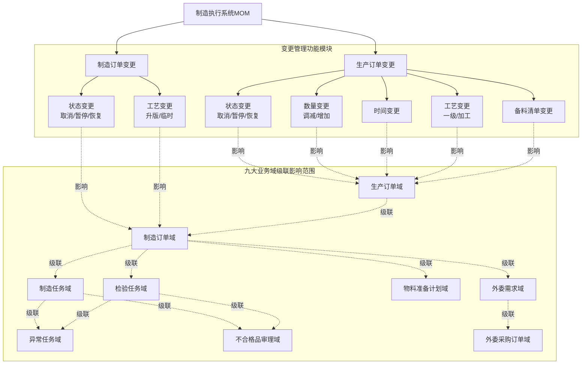

### 2.3.2 **功能模块树**

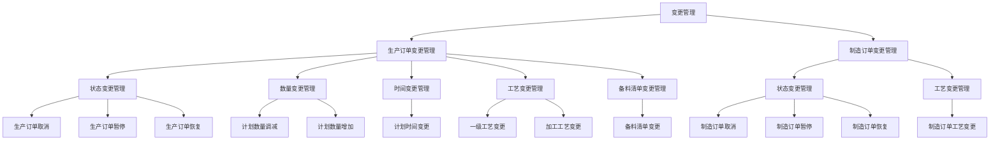

### 2.3.3 **功能清单**

|模块 | 页面 | 功能点 | 功能点状态 | 功能点描述|
|--- | --- | --- | --- | ---|
|计划管理 | 计划变更单管理 | 计划变更单管理-增删查改&导入 | 新增 | 手工创建计划变更单（一个生产订单号对应一个变更单）。填写关联订单号、变更场景（状态变更/数量变更/时间变更/数量+时间变更）、变更内容、变更原因等基本信息。或接收上游系统（ERP）推送的计划变更单，系统自动解析变更单数据，创建计划变更单记录，初始状态为已创建。|
|计划管理 | 计划变更单管理 | 计划变更单管理-发布 | 新增 | 发布变更单。变更单创建后需要发布，发布后状态变为已发布，不再允许修改和删除。|
|计划管理 | 计划变更单管理 | 计划变更单管理-影响范围分析 | 新增 | 自动识别受影响订单，构建影响范围清单。计划变更单直接关联指定的生产订单，分析该订单及其下游制造订单、制造任务等受影响对象。分析完成后生成影响范围清单明细。|
|计划管理 | 计划变更单管理 | 计划变更单管理-变更处理 | 新增 | 执行变更处理。根据变更场景复用对应的变更处理方案（状态变更、数量变更、时间变更），用户逐单确认执行，记录处理结果（成功/失败/原因）。处理过程中变更单状态为处理中，全部处理完成后状态变为已完成。|
|计划管理 | 计划变更单管理 | 计划变更单管理-关闭 | 新增 | 关闭变更单。所有影响范围清单处理完成后关闭变更单，状态变为已关闭，不再允许任何操作。统计总数、已完成数、失败数。|
|计划管理 | 工艺变更单管理 | 工艺变更单管理-增删查改&导入 | 新增 | 手工创建工艺变更单（一个工艺路线编号对应一个变更单）。填写原工艺路线、原工艺版本、目标工艺路线、目标工艺版本、变更类型（工艺升版/临时工艺）、变更内容说明（新增/删除/保留工序列表、工序参数变更列表）、变更原因等基本信息。或接收上游系统（PLM）推送的工艺变更单，系统自动解析变更单数据，创建工艺变更单记录，初始状态为已创建。|
|计划管理 | 工艺变更单管理 | 工艺变更单管理-发布 | 新增 | 发布变更单。变更单创建后需要发布，发布后状态变为已发布，不再允许修改和删除。|
|计划管理 | 工艺变更单管理 | 工艺变更单管理-影响范围分析 | 新增 | 自动识别受影响订单，构建影响范围清单。工艺变更单查询所有使用该工艺路线的生产订单，分析每个订单的状态和可行性。分析完成后生成影响范围清单明细。|
|计划管理 | 工艺变更单管理 | 工艺变更单管理-变更处理 | 新增 | 执行变更处理。根据订单类型复用对应的工艺变更处理方案（一级工艺变更、加工工艺变更、制造订单工艺变更），用户逐单确认执行，记录处理结果（成功/失败/原因）。处理过程中变更单状态为处理中，全部处理完成后状态变为已完成。|
|计划管理 | 工艺变更单管理 | 工艺变更单管理-关闭 | 新增 | 关闭变更单。所有影响范围清单处理完成后关闭变更单，状态变为已关闭，不再允许任何操作。统计总数、已完成数、失败数。|
|计划管理 | BOM变更单管理 | BOM变更单管理-增删查改&导入 | 新增 | 手工创建BOM变更单（一个父物料编号对应一个变更单）。填写变更父物料、新备料明细表（完整的备料清单）、变更说明（新增/删除/保留物料列表、数量变更物料列表）、变更原因等基本信息。或接收上游系统（ERP/PLM）推送的BOM变更单，系统自动解析变更单数据，创建BOM变更单记录，初始状态为已创建。|
|计划管理 | BOM变更单管理 | BOM变更单管理-发布 | 新增 | 发布变更单。变更单创建后需要发布，发布后状态变为已发布，不再允许修改和删除。|
|计划管理 | BOM变更单管理 | BOM变更单管理-影响范围分析 | 新增 | 自动识别受影响订单，构建影响范围清单。BOM变更单查询所有使用该父物料的生产订单，分析每个订单的状态和可行性。分析完成后生成影响范围清单明细。|
|计划管理 | BOM变更单管理 | BOM变更单管理-变更处理 | 新增 | 执行变更处理。复用备料清单变更处理方案，系统自动对比新旧备料清单识别差异类型（新增/删除/数量调整），用户逐单确认执行，记录处理结果（成功/失败/原因）。处理过程中变更单状态为处理中，全部处理完成后状态变为已完成。|
|计划管理 | BOM变更单管理 | BOM变更单管理-关闭 | 新增 | 关闭变更单。所有影响范围清单处理完成后关闭变更单，状态变为已关闭，不再允许任何操作。统计总数、已完成数、失败数。|
|计划管理 | 生产订单管理 | 生产订单管理-取消 | 修订 | 当生产计划需要取消时，可手动取消生产订单及关联的生产数据。取消操作是不可逆操作，需要严格的控制状态校验（正常/暂停且未完工）和完整的九大业务域级联处理机制。中间状态对象（已开工制造任务、检验中检验任务等）允许完成当前操作后按取消状态处理。|
|计划管理 | 生产订单管理 | 生产订单管理-暂停 | 修订 | 当生产计划需要暂停时，可手动暂停生产订单及关联的生产数据。暂停操作需要控制状态校验（正常且未完工），暂停状态保持所有业务数据和上下文信息完整，支持后续恢复操作。中间状态对象允许完成当前操作后保留状态信息。|
|计划管理 | 生产订单管理 | 生产订单管理-恢复 | 修订 | 当生产计划需要恢复时，可手动恢复生产订单及关联的生产数据。恢复操作需要控制状态校验（暂停且未完工），恢复后订单回到暂停前的生命周期状态，继续正常业务流程。|
|计划管理 | 生产订单管理 | 生产订单管理-计划数量调减 | 新增 | 当生产计划需要调减数量时，可手动调减生产订单计划数量及关联的生产数据。数量调减需要控制状态校验（正常/暂停且未完工），系统根据制造订单开工状态采用不同处理策略：未开工直接调减，已开工需处理在制品退料。|
|计划管理 | 生产订单管理 | 生产订单管理-计划数量增加 | 新增 | 当生产计划需要增加数量时，采用下发新生产订单的方式实现。新订单与原订单独立管理，保持原订单数据完整性，便于历史追溯和数据分析。|
|计划管理 | 生产订单管理 | 生产订单管理-计划时间变更 | 新增 | 当生产计划需要调整时间时，可手动变更生产订单计划开始时间和结束时间。时间变更需要控制状态校验（正常/暂停且未完工），系统统筹考虑九大业务域的协调处理和级联影响，包括制造任务排程调整、物料需求时间调整、外委交期调整等。|
|计划管理 | 生产订单管理 | 生产订单管理-一级工艺变更 | 新增 | 当零部件交付计划的一级工艺路线需要更新时，可进行一级工艺变更操作。一级工艺变更需要控制状态校验（正常/暂停且未开工），变更后重新展开生成子生产订单，一级工艺路线直接决定后续子生产订单的拆分与编排。|
|计划管理 | 生产订单管理 | 生产订单管理-加工工艺变更 | 新增 | 当零部件加工计划的加工工艺路线需要更新时，可进行加工工艺变更操作。加工工艺变更需要控制状态校验（正常/暂停且未完工），系统根据在制品情况判断处理策略：未开工直接变更，已开工识别保留工序（已开工及后续状态）和变更工序，仅对变更工序进行调整。|
|计划管理 | 生产订单管理 | 生产订单管理-备料清单变更 | 修订 | 当生产计划的备料清单需要更新时，可进行备料清单变更操作。备料清单变更需要控制状态校验（正常/暂停且未完工），系统自动对比新旧备料清单识别差异类型（新增/删除/数量调整），根据物料状态（未收料/已收料未装入/已装入）采取不同处理策略，协调处理物料需求调整、领料申请、退料申请、物料拆卸等操作。规格替换通过"删除旧物料+新增新物料"组合实现。|
|计划管理 | 制造订单管理 | 制造订单管理-取消 | 修订 | 当制造计划需要取消时，可手动取消制造订单及关联的制造数据。取消操作需要控制状态校验（正常/暂停且未完工），处理逻辑同生产订单取消，仅从制造订单开始处理九大业务域级联。取消后需要将取消的数量回退到对应的生产订单。|
|计划管理 | 制造订单管理 | 制造订单管理-暂停 | 修订 | 当制造计划需要暂停时，可手动暂停制造订单及关联的制造数据。暂停操作需要控制状态校验（正常且未完工），处理逻辑同生产订单暂停，仅从制造订单开始处理九大业务域级联。|
|计划管理 | 制造订单管理 | 制造订单管理-恢复 | 修订 | 当制造计划需要恢复时，可手动恢复制造订单及关联的制造数据。恢复操作需要控制状态校验（暂停且未完工），处理逻辑同生产订单恢复，仅从制造订单开始处理九大业务域级联。|
|计划管理 | 制造订单管理 | 制造订单管理-工艺变更 | 修订 | 制造订单进行工艺路线版本和临时变更。工艺变更需要控制状态校验（正常/暂停且未完工），支持工艺升版变更和临时工艺变更两种模式。系统根据在制品情况判断处理策略：未开工直接变更，已开工识别保留工序（已开工及后续状态）和变更工序，仅对变更工序进行调整。|
