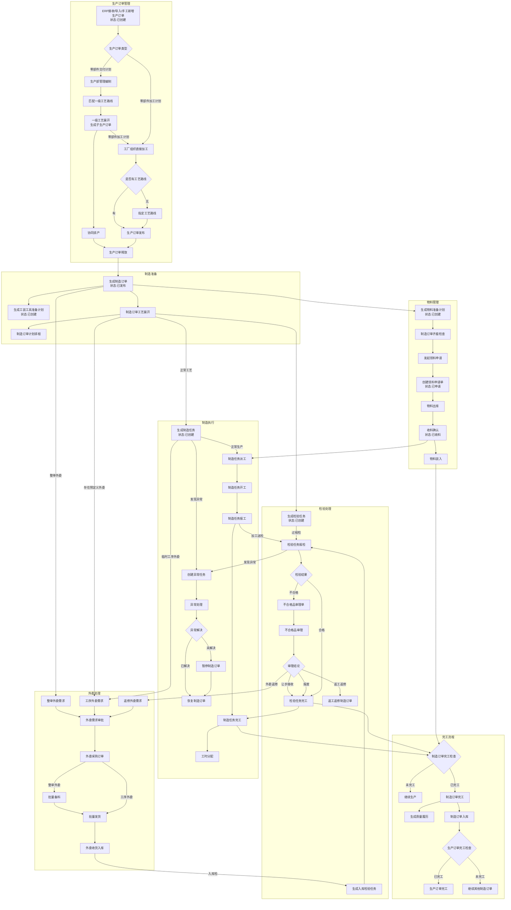
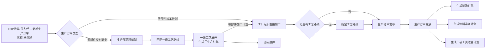
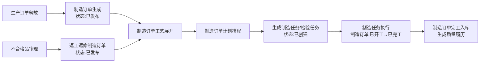
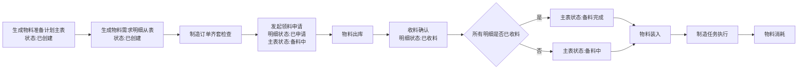
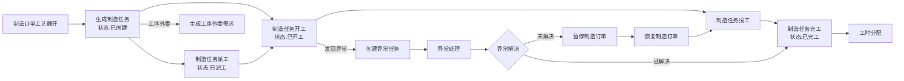
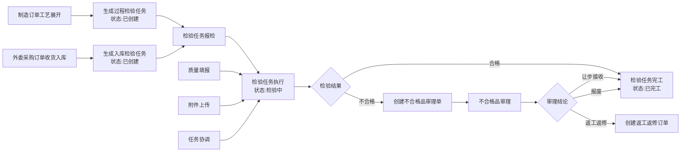
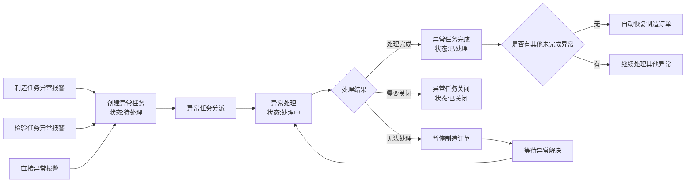
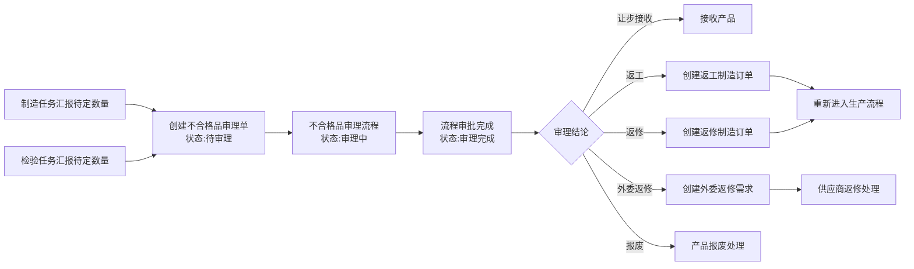
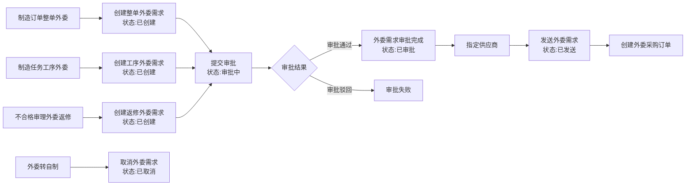
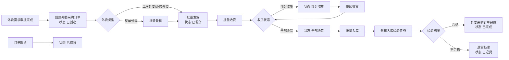

# **DNW30320-变更管理_业务正向主流程**

> 本文件由《DNW30320-变更管理_业务分析》中的 `2.1.1 业务正向主流程` 独立拆分而来。为减少交叉引用调整成本，暂保留原章节编号。

### 2.1.1 **业务正向主流程**

#### 2.1.1.1 **业务正向主流程图**

#### 2.1.1.2 **业务正向主流程概述**

##### **2.1.1.2.1 生产订单管理域**

**生产订单接收与分类**
- **数据源头**：ERP接收/导入/手工新增，默认已创建状态
- **状态流转**：已创建→已发布→已展开→已释放→已开工→已完工
- **业务分类**：零部件交付计划（需生产部编制）、零部件加工计划（工厂直接加工）

**零部件交付计划流程**
- **核心环节**：匹配一级工艺路线→展开生成子生产订单→协同排产→发布操作
- **子订单管理**：子生产订单默认已创建状态，类型转为零部件加工计划
- **编制权限**：发布后锁定编辑，仅可进行后续业务处理
- **齐套检查**：任何状态均支持齐套检查，根据备料清单查询物料库存

**零部件加工计划流程**
- **直接处理**：工厂组织可直接加工，无需上级编制展开
- **工艺完善**：缺失工艺路线时支持指定操作
- **数据完整**：确保备料清单等数据完整性后发布
- **齐套检查**：任何状态均支持齐套检查，确保物料准备就绪

**生产订单释放与联动**
- **释放条件**：订单数据完整且已发布状态
- **系统联动**：一个生产订单可释放多个制造订单
- **同步创建**：制造订单与物料准备计划、工装工具准备计划一对一同步生成
- **状态关联**：任意制造订单开工触发生产订单开工；全部制造订单完工后生产订单完工

##### **2.1.1.2.2 制造订单管理域**

**制造订单生成与状态**
- **正常路径**：生产订单释放生成，状态为已发布
- **返修路径**：不合格品审理生成返工返修订单，可指定工艺路线
- **状态流转**：已创建→已发布→已展开→已开工→已完工

**制造订单工艺展开**
- **准入条件**：仅已发布状态可工艺展开
- **系统行为**：根据工艺路线一对一生成制造任务，同步生成检验任务（如需要）
- **外委识别**：存在预定义外委标记时同时生成工序外委需求
- **状态变更**：展开后变为已展开，后续工艺修改需通过变更流程
- **齐套管控**：任何状态均可齐套检查，基于结果发起领料申请

**制造订单计划排程**
- **排程范围**：对展开的制造任务进行资源配置和时间安排

**制造订单外委**
- **整单外委判断**：已创建或已发布状态可进行整单外委

**制造订单状态联动**
- **开工触发**：首道制造任务开工时制造订单开工
- **完工条件**：全部制造任务完成后制造订单完工
- **质量履历**：完工时自动生成质量履历
- **入库分类**：支持合格入库和废品入库

##### **2.1.1.2.3 物料准备计划管理域**

**物料准备计划生成**
- **生成时机**：制造订单生成时同步创建，一对一关系
- **主从结构**：
  - **主表（物料准备计划）**：一个制造订单对应一个物料准备计划
  - **从表（物料需求明细）**：一个物料准备计划包含多条物料需求明细
- **主表状态流转**：已创建→备料中→备料完成
- **明细状态流转**：已创建→已申请→已收料
- **数据依据**：基于生产订单备料清单生成

**齐套检查与领料申请**
- **检查范围**：物料和工装准备计划的库存状态
- **支持状态**：主表任何状态均可进行齐套检查
- **申请触发**：基于齐套结果发起领料申请，明细状态变为已申请，主表状态变为备料中

**物料流转管控**
- **出库管理**：根据领料申请单执行物料出库
- **收料确认**：明细任何状态均可收料确认，确认后明细状态变为已收料
- **主表状态联动**：当所有明细都已收料时，主表状态变为备料完成
- **装入管控**：任何状态均可物料装入（后续需改为制造订单未完工才能装入）
- **消耗跟踪**：制造任务报工时记录物料消耗

##### **2.1.1.2.4 制造任务管理域**

**制造任务生成与状态管理**
- **生成方式**：制造订单工艺展开后生成，初始状态为已创建
- **状态流转**：已创建→已派工→已开工→已送检→已完工
- **关联检验**：工艺展开时同步生成过程检验任务（首检、自检、互检、专检）

**制造任务核心操作**
- **派工管理**：仅已创建状态可派工→状态变为已派工
- **任务协调**：已派工、已开工状态可调整工作中心、设备、人员、时间
- **开工操作**：已创建、已派工状态均可开工→状态变为已开工
- **报工操作**：已创建、已派工、已开工状态均可报工→状态变为已完工

**制造任务质量管控**
- **不合格品处理**：报工时发现不合格品→创建不合格品审理单→进入审理流程
- **工时分配**：仅已完工的制造任务才能进行工时分配
- **质量填报**：存在自检类型的制造任务可发起质量填报

**制造任务外委与异常**
- **工序外委**：仅已创建状态可工序外委→生成工序外委需求
- **异常报警**：任何状态均可异常报警→创建异常任务→进入异常处理流程
- **物料管理**：收料确认（任何状态）、物料装入操作（任何状态，后续需改为制造订单未完工才能进行）

**制造任务辅助功能**
- **工艺支持**：工艺文件浏览、附件上传
- **暂停恢复**：基于异常任务可选择暂停制造订单

##### **2.1.1.2.5 检验任务管理域**

**检验任务生成机制**
- **过程检验生成**：制造任务需要首检、自互专检验时，工艺展开同步生成
- **入库检验生成**：外委采购订单批量入库时，系统自动创建入库检验任务
- **检验类型**：首检、自检、互检、专检、入库检验
- **状态流转**：已创建→检验中→已完工

**检验任务核心操作**
- **质量填报**：任何状态均可进行质量填报
- **报检操作**：已创建、检验中状态可报检
- **不合格品处理**：检验发现不合格品→创建不合格品审理单
- **任务协调**：已创建、检验中状态可调整工作中心、时间

**检验任务辅助功能**
- **附件管理**：任何状态均可上传附件

##### **2.1.1.2.6 异常任务管理域**

**异常任务生成途径**
- **制造任务异常**：基于制造任务发起异常报警
- **检验任务异常**：基于检验任务发起异常报警
- **直接异常**：非任务直接发起异常报警
- **状态管理**：待处理→处理中→已关闭/已处理

**异常任务处理流程**
- **任务分派**：待处理、处理中状态可进行异常分派
- **异常处理**：待处理、处理中状态可进行处理操作
- **处理完成**：状态变为已处理→自动恢复关联制造订单（如无其他未完成异常）
- **任务关闭**：任何状态均可关闭→状态变为已关闭

**异常任务制造订单联动**
- **暂停机制**：任何状态均可暂停制造订单
- **恢复机制**：任何状态均可恢复制造订单

##### **2.1.1.2.7 不合格品审理管理域**

**不合格品审理单生成**
- **制造任务触发**：制造任务汇报待定数量时创建
- **检验任务触发**：检验任务汇报待定数量时创建
- **状态管理**：待审理→审理中→审理完成

**审理流程管控**
- **审理完成**：流程审批完成后状态变为审理完成

##### **2.1.1.2.8 外委需求管理域**

**外委需求生成途径**
- **整单外委**：制造订单整单外委时创建整单外委需求
- **工序外委**：制造任务工序外委时创建工序外委需求
- **返修外委**：不合格审理记录为外委返修时创建返修外委需求
- **状态管理**：已创建→审批中→已审批→已发送→已取消

**外委需求处理流程**
- **提交审批**：仅已创建状态可提交审批→状态变为审批中
- **需求发送**：仅已审批状态可发送→状态变为已发送
- **供应商管理**：已创建、审批中、已审批状态可指定供应商
- **外委转自制**：仅工序临时外委的已创建状态需求可转自制→状态变为已取消

##### **2.1.1.2.9 外委采购订单管理域**

**外委采购订单生成**
- **生成条件**：外委需求审批完成后创建（通常在ERP创建后传给MOM）
- **状态管理**：已创建→已发货→部分收货→全部收货→已退货→已完成→已取消

**外委采购订单操作流程**
- **批量备料**：仅整单外委的已创建状态订单可备料
- **批量发货**：仅已创建状态可发货→状态变为已发货
- **批量收货**：仅已发货状态可收货→部分收货/全部收货
- **批量入库**：仅已收货状态可入库→创建入库检验任务→合格完成/不合格退货

**外委采购订单质量管控**
- **入库检验**：入库时创建入库检验任务
- **检验结果处理**：合格→已完成；不合格→退货（已退货状态）
