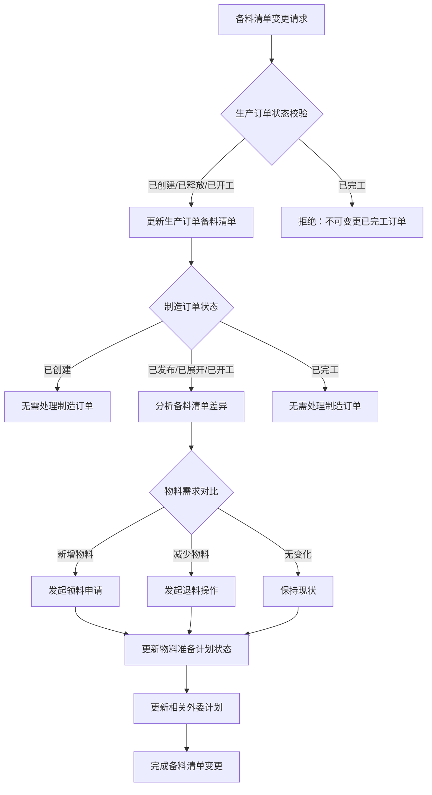
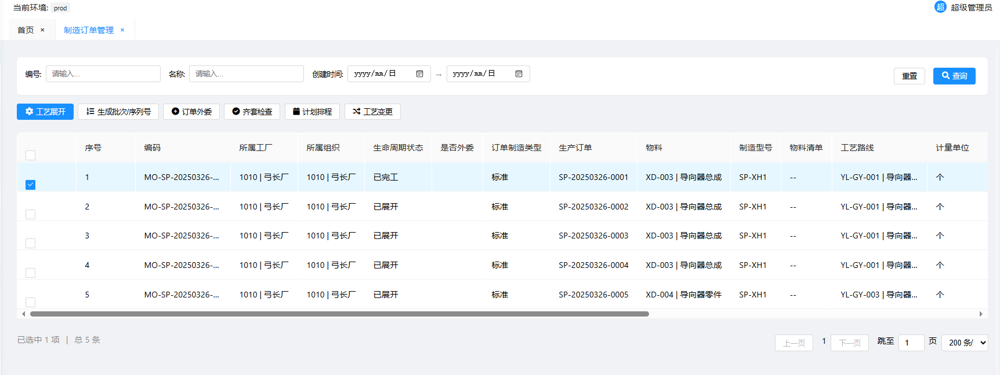
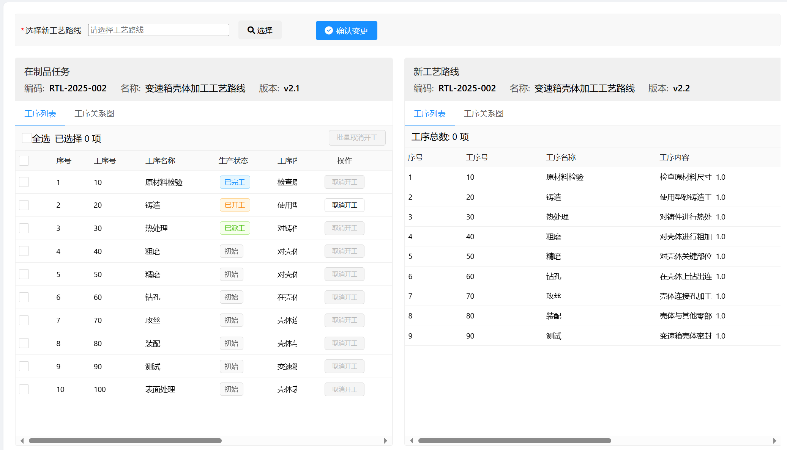
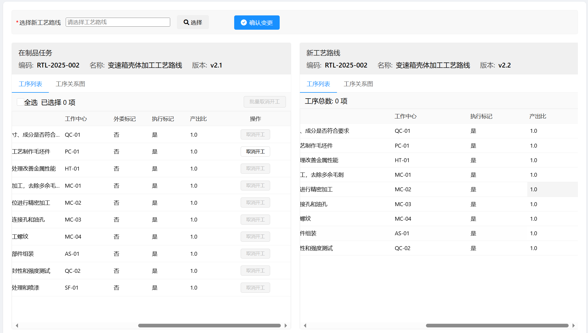
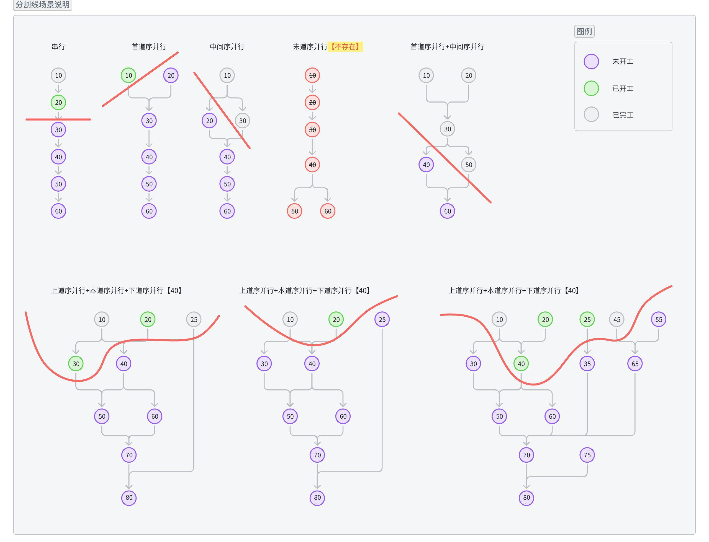

# 3. ** 页面 & 功能设计**

## 3.1 **生产订单管理**

### 3.1.1 **生产订单管理-取消**

- **概述**：当生产计划需要取消时，可手动取消生产订单及关联的生产数据。状态变更中的取消操作是不可逆操作，需要严格的状态校验和完整的级联处理机制。

- **界面**
  - 界面结构：二级确认对话框，"该操作不可逆，且会联动取消制造订单、生产准备计划、外委计划、制造任务及检验任务，是否确认进行取消操作？"
  - 交互内容：用户点击取消按钮，支持批量，弹出二级确认提示框，点击确认后进行取消操作
  - 校验规则：
    - 生产订单未取消、未完工

- **输入**：生产订单

- **输出**：生产订单、制造订单、制造任务、检验任务

- **统一处理原则**：
  - **数据完整性**：所有取消操作采用状态标记方式，保持历史数据完整可追溯
  - **业务操作限制**：已取消的业务对象禁止执行任何业务操作（文件浏览、数据查询等非业务操作除外）
  - **级联一致性**：确保九大业务域数据变更的原子性和一致性
  - **二级确认机制**：所有取消操作需要用户二次确认

- **处理逻辑**：
  - 用户点击取消按钮，支持批量，系统弹出确认对话框
  - 用户确认后，首先需按校验规则进行校验，校验不通过时给出提示，支持部分成功部分失败，部分失败则提示：成功XX，失败XX。点击详情查看具体的失败信息，样例如下：
    - 生产订单XXX已取消，无法进行取消操作
    - 生产订单XXX已完工，无法进行取消操作
  - 校验通过后：

**1. 生产订单管理域取消处理**

|状态|处理逻辑|级联影响|
|---|---|---|
|已创建|• 标记状态为"已取消"|无下游影响（未进入发布阶段）|
|已发布|• 标记状态为"已取消"|子生产订单同步取消|
|已展开|• 标记状态为"已取消"|子生产订单同步取消|
|已释放|• 标记状态为"已取消"|制造订单、物料准备计划、工装工具准备计划同步取消|
|已开工|• 标记状态为"已取消"|所有制造订单及其下游任务停止执行并取消，处理在制品退料|
|已完工|• **拒绝操作**|无影响|

**级联处理说明**：

**2. 制造订单管理域取消处理**

|状态|处理逻辑|级联影响|
|---|---|---|
|已创建|• 标记状态为"已取消"|同步取消对应物料准备计划|
|已发布|• 标记状态为"已取消"|同步取消物料准备计划|
|已展开|• 标记状态为"已取消"|所有制造任务和检验任务同步取消，处理已收料退料|
|已开工|• 标记状态为"已取消"|停止所有未完工任务执行，中断在检验任务，处理装入物料退料|
|已完工|• 保持完工状态|无影响|

**3. 制造任务管理域取消处理**

|状态|处理逻辑|级联影响|
|---|---|---|
|已创建|• 标记任务为"已取消"|自动关闭相关异常任务|
|已派工|• 标记任务为"已取消"|关闭相关质量计划|
|已开工|• 标记任务为"已取消"|通知制造任务取消，允许对已取消且已开工的任务进行继续报工|
|已送检|• 标记任务为"已取消"|通知检验任务取消，保留检验结果|
|已完工|• 保持完工状态|无影响|

**4. 检验任务管理域取消处理**

|状态|处理逻辑|级联影响|
|---|---|---|
|已创建|• 标记检验任务为"已取消"|无直接影响（未产生检验数据）|
|检验中|• 标记检验任务为"已取消"|通知检验任务取消，允许对已取消且检验中的任务进行继续报检|
|已完工|• 保持完工状态|无影响|

**5. 物料准备计划管理域取消处理**

|状态|处理逻辑|级联影响|
|---|---|---|
|已创建|• 标记物料计划为"已取消"|无直接影响（未申请物料）|
|已申请|• 标记物料计划为"已取消" • 校验发料状态：   - 未发料：取消领料申请，释放库存预留   - 已发料：按已收料逻辑处理退料|根据发料状态决定采购申请处理方式|
|已收料|• 标记物料计划为"已取消" • 执行退料流程 • 处理成本冲销|物料退库，协调供应商退货|

**6. 异常任务管理域取消处理**

|状态|处理逻辑|级联影响|
|---|---|---|
|待处理|• 标记异常任务为"已关闭" • 记录关闭原因：订单取消|无直接影响（未开始处理）|
|处理中|• 标记异常任务为"已关闭" • 记录中断原因|通知相关处理人员，取消已分派的处理任务|
|已处理|• 保持处理状态|无影响|
|已关闭|• 保持关闭状态|无影响|

**7. 不合格品审理管理域取消处理**

|状态|处理逻辑|级联影响|
|---|---|---|
|待审理|• 评估审理价值：   - 质量责任明确：可直接关闭   - 质量责任待定：建议完成审理|根据评估结果决定是否关闭|
|审理中|• 评估审理进度和返工返修状态：   - 无返工返修：可中断审理   - 已启动返工返修：建议完成审理|保护已投入的返工返修成本|
|审理完成|• 保持审理结果 • 继续执行返工返修订单|确保质量责任落实和成本保护|

**8. 外委需求管理域取消处理**

|状态|处理逻辑|级联影响|
|---|---|---|
|已创建|• 标记外委需求为"已取消" • 通知相关人员|简单通知供应商，无合同影响|
|审批中|• 标记外委需求为"已取消" • 发送取消请求至ERP系统 • 通知ERP审批人员|ERP系统协调审批撤回，评估前期费用影响|
|已审批|• 标记外委需求为"已取消" • 向ERP系统发起取消申请|ERP系统协调供应商沟通，启动合同变更流程|
|已发送|• 标记外委需求为"已取消" • 紧急协调ERP和供应商|ERP系统紧急处理，按合同条款评估损失|
|已取消|• 保持取消状态|无影响|

**9. 外委采购订单管理域取消处理**

|状态|处理逻辑|级联影响|
|---|---|---|
|已创建|• 标记订单为"已取消"|通知供应商，无成本影响|
|已发货|• 标记订单为"已取消" • 启动退货流程 • 记录退货成本|协调供应商退货，处理在途物料，产生退货费用|
|部分收货|• 标记订单为"已取消" • 处理混合状态：   - 已收货物料：启动退货流程   - 未收货物料：取消后续发货 • 分别记录两部分处理成本|已收物料退货，未收物料取消，可能影响供应商关系|
|全部收货|• 标记订单为"已取消" • 评估退货可行性|需高层协调，产生较高退货成本|
|已完成|• **不可取消**|无影响|

- **验收标准**：
  - 取消生产订单操作准确无误，关联的数据可以被正确取消
  - 取消后的数据在界面默认不显示
 
### 3.1.2 **生产订单管理-暂停**

- **概述**：当生产计划需要暂停时，可手动暂停生产订单及关联的生产数据。

- **界面**
  - 界面结构：二级确认对话框，"该操作将会联动暂停制造订单、生产准备计划、外委计划、制造任务及检验任务，是否确认进行暂停操作？"
  - 交互内容：用户点击暂停按钮，支持批量，弹出二级确认提示框，点击确认后进行暂停操作
  - 校验规则：
    - 生产订单正常、未完工才允许进行暂停

- **输入**：生产订单

- **输出**：生产订单、制造订单、制造任务、检验任务

- **统一处理原则**：
  - **数据完整性**：暂停状态保持所有业务数据和上下文信息完整
  - **业务操作限制**：已暂停的业务对象禁止执行推进性业务操作，允许查询和分析类操作
  - **恢复前置校验**：恢复操作前校验暂停原因解决、资源可用性、前置任务状态等条件
  - **级联协调**：确保相关业务域的暂停/恢复状态协调一致

- **处理逻辑**：
  - 用户点击暂停按钮，支持批量，系统弹出确认对话框
  - 用户确认后，首先需按校验规则进行校验，校验不通过时给出提示，支持部分成功部分失败，部分失败则提示：成功XX，失败XX。点击详情查看具体的失败信息，样例如下：
    - 生产订单XXX已暂停，无法进行暂停操作
    - 生产订单XXX已完工，无法进行暂停操作
    - ...
  - 校验通过后：

**1.生产订单管理域暂停处理**

|状态|暂停处理|级联影响|
|---|---|---|
|已创建|• 标记为暂停状态|无下游影响|
|已发布|• 标记为暂停状态|子生产订单同步暂停|
|已展开|• 暂停排产操作|子生产订单同步暂停|
|已释放|• 暂停制造执行|所有制造订单同步暂停|
|已开工|• 暂停现场作业|所有制造订单及下游任务暂停|
|已完工|• **不可暂停**|无影响|

**级联处理说明**：

**2. 制造订单管理域暂停处理**

|状态|暂停处理|级联影响|
|---|---|---|
|已创建|• 标记为暂停状态|同步暂停对应物料准备计划|
|已发布|• 标记为暂停状态|同步暂停物料准备计划|
|已展开|• 暂停任务派工|所有制造任务和检验任务暂停|
|已开工|• 暂停未完工任务执行|维持已完工任务状态|
|已完工|• **不可暂停**|无影响|

**3. 制造任务管理域暂停处理**

|状态|暂停处理|级联影响|
|---|---|---|
|已创建|• 暂停派工操作|无直接影响|
|已派工|• 暂停开工操作|关联质量计划暂停|
|已开工|• 暂停作业操作 • 记录暂停时间|创建暂停异常，保留质量数据|
|已送检|• 暂停检验等待|协调检验任务暂停|
|已完工|• **不可暂停**|无影响|

**4. 检验任务管理域暂停处理**

|状态|暂停处理|级联影响|
|---|---|---|
|已创建|• 暂停检验任务|无直接影响（未产生检验数据）|
|检验中|• 暂停检验任务|暂停不合格品处理|
|已完工|• **不可暂停**|无影响|

**5. 物料准备计划管理域暂停处理**

|状态|暂停处理|级联影响|
|---|---|---|
|已创建|• 暂停物料计划|暂停相关采购申请|
|已申请|• 暂停领料操作 • 保留库存预留|暂停相关采购执行|
|已收料|• 暂停物料装入|不影响供应链|

**6. 异常任务管理域暂停处理**

|状态|暂停处理|级联影响|
|---|---|---|
|待处理|• 创建暂停异常任务 • 记录暂停原因|暂停关联任务|
|处理中|• 暂停异常处理|协调关联任务|
|已处理|• 保持处理状态|无影响|
|已关闭|• 保持关闭状态|无影响|

**7. 不合格品审理管理域暂停处理**

|状态|暂停处理|级联影响|
|---|---|---|
|待审理|• 暂停审理流程|暂停相关返工返修|
|审理中|• 暂停审理进程|暂停已启动返工返修|
|审理完成|• 保持审理结果|继续执行返工返修|

**8. 外委需求管理域暂停处理**

|状态|暂停处理|级联影响|
|---|---|---|
|已创建|• 暂停需求审批|简单通知供应商，无合同影响|
|审批中|• 暂停审批流程|通知供应商审批状态，合同谈判暂停|
|已审批|• 暂停需求发送|正式通知供应商，合同变更通知|
|已发送|• 暂停供应商生产|紧急协调供应商，启动合同暂停条款|
|已取消|• **不可暂停**|无影响|

**9. 外委采购订单管理域暂停处理**

|状态|暂停处理|级联影响|
|---|---|---|
|已创建|• 直接暂停订单|通知供应商，无直接影响|
|已发货|• 暂停订单执行 • 协调在途物料处理|需要供应商紧密协作|
|部分收货|• 暂停未收货部分 • 处理已收货物料|可能影响交付计划|
|全部收货|• 暂停入库检验|影响较小|
|已完成|• **不可暂停**|无影响|

- **验收标准**：
  - 暂停生产订单操作准确无误，关联的数据可以被正常暂停，操作提示清晰明确

### 3.1.3 **生产订单管理-恢复**

- **概述**：当生产计划需要恢复时，可手动恢复生产订单及关联的生产数据。

- **界面**
  - 界面结构：二级确认对话框，"该操作将会联动恢复制造订单、生产准备计划、外委计划、制造任务及检验任务，是否确认进行恢复操作？"
  - 交互内容：用户点击恢复按钮，支持批量，弹出二级确认提示框，点击确认后进行恢复操作
  - 校验规则：
    - 生产订单暂停、未完根据发起场工才允许进行恢复

- **输入**：生产订单

- **输出**：生产订单、制造订单、制造任务、检验任务

- **统一处理原则**：
  - **数据完整性**：暂停状态保持所有业务数据和上下文信息完整
  - **业务操作限制**：已暂停的业务对象禁止执行推进性业务操作，允许查询和分析类操作
  - **恢复前置校验**：恢复操作前校验暂停原因解决、资源可用性、前置任务状态等条件
  - **级联协调**：确保相关业务域的暂停/恢复状态协调一致

- **恢复前置条件校验**：
  - 在执行恢复操作前，系统需要校验以下条件：
    - **暂停原因解决**：确认导致暂停的问题已得到解决
    - **资源可用性**：验证相关人员、设备、工具等资源是否可用
    - **物料供应状态**：检查物料供应是否恢复正常
    - **前置任务状态**：确认依赖的前置任务是否具备恢复条件
    - **外委供应商状态**：验证外委供应商是否具备恢复生产能力
    - **质量管理就绪**：确认质量检验资源和标准是否恢复正常

- **处理逻辑**：
  - 用户点击恢复按钮，支持批量，系统弹出确认对话框
  - 用户确认后，首先需按校验规则进行校验，校验不通过时给出提示，支持部分成功部分失败，部分失败则提示：成功XX，失败XX。点击详情查看具体的失败信息，样例如下：
    - 生产订单XXX是正常状态，无法进行恢复操作
    - 生产订单XXX已完工，无法进行恢复操作
    - ...景自动填写默认原因，用户可修改
3. **影响范围分析区**：展示九大业务域的影响范围分析结果，包括：
   - 受影响对象清单及数量统计
   - 数量调减策略（未释放直接调减、已释放未开工按比例调减、已开工取消制造订单）
   - 物料退料清单
   - 资源重新分配方案
4. **确认区**：提供"确认调减"和"取消操作"按钮

#### 业务规则

**BR-PO-QTY-REDUCE-01**: When 用户修改计划数量为更小的值, the 生产订单管理模块 shall 校验订单的控制状态和完工状态.

**BR-PO-QTY-REDUCE-02**: The 生产订单管理模块 shall 仅允许控制状态为"正常"或"暂停"且完工状态为"未完工"的订单执行数量调减操作.

**BR-PO-QTY-REDUCE-03**: If 订单控制状态为"已取消"或完工状态为"已完工", then the 生产订单管理模块 shall 拒绝数量调减操作并提示相应原因.

**BR-PO-QTY-REDUCE-04**: The 生产订单管理模块 shall 校验调减后的数量必须大于0且小于当前计划数量.

**BR-PO-QTY-REDUCE-05**: When 校验通过后, the 生产订单管理模块 shall 根据发起场景自动填写变更原因.

**BR-PO-QTY-REDUCE-06**: When 用户提交变更原因后, the 生产订单管理模块 shall 执行九大业务域影响范围分析.

**BR-PO-QTY-REDUCE-07**: The 影响范围分析 shall 根据订单状态确定数量调减策略：
- 未释放：直接减少生产订单未释放数量
- 已释放未开工：九大业务域级联减少数量（制造订单/任务按比例减少，物料退料，外委调整）
- 已开工：取消制造订单，级联取消调整，回退取消的数量到生产订单，减少生产订单未释放数量

**BR-PO-QTY-REDUCE-08**: When 用户确认后, the 生产订单管理模块 shall 执行数量调减操作，更新订单计划数量.

**BR-PO-QTY-REDUCE-09**: The 生产订单管理模块 shall 触发九大业务域级联处理，确保所有关联对象数量同步调减.

**BR-PO-QTY-REDUCE-10**: The 级联处理 shall 遵循原子性原则，要么全部成功要么全部回滚.

**BR-PO-QTY-REDUCE-11**: When 数量调减操作完成后, the 生产订单管理模块 shall 记录变更历史.

**BR-PO-QTY-REDUCE-12**: The 生产订单管理模块 shall 自动通知相关人员.

#### 验收场景

**场景1：成功调减未释放订单数量**
*   **Given** 用户具有"生产计划员"权限，且存在一个订单号为"PO-20250101-010"、控制状态为"正常"、完工状态为"未完工"、计划数量为100、已释放数量为0的生产订单
*   **When** 用户修改计划数量为80，系统自动填写变更原因为"生产计划调整"，用户确认后提交，查看影响范围分析结果（显示直接减少未释放数量），确认执行数量调减
*   **Then** 系统显示"数量调减成功"提示，订单计划数量更新为80，未释放数量更新为0，系统记录变更历史并通知相关人员

**场景2：成功调减已释放未开工订单数量**
*   **Given** 用户具有"生产计划员"权限，且存在一个订单号为"PO-20250101-011"、控制状态为"正常"、完工状态为"未完工"、计划数量为100、已释放数量为100、所有制造订单未开工的生产订单
*   **When** 用户修改计划数量为80，系统自动填写变更原因为"生产计划调整"，用户确认后提交，查看影响范围分析结果（显示制造订单按比例减少，物料退料清单），确认执行数量调减
*   **Then** 系统显示"数量调减成功"提示，订单计划数量更新为80，所有制造订单数量按比例调减，物料准备计划同步调减，系统记录变更历史并通知相关人员

**场景3：成功调减已开工订单数量**
*   **Given** 用户具有"生产计划员"权限，且存在一个订单号为"PO-20250101-012"、控制状态为"正常"、完工状态为"未完工"、计划数量为100、已释放数量为100、部分制造订单已开工的生产订单
*   **When** 用户修改计划数量为80，系统自动填写变更原因为"生产计划调整"，用户确认后提交，查看影响范围分析结果（显示取消部分制造订单，处理在制品退料），确认执行数量调减
*   **Then** 系统显示"数量调减成功"提示，订单计划数量更新为80，部分制造订单被取消，取消的数量回退到生产订单未释放数量，在制品物料执行退料流程，系统记录变更历史并通知相关人员

**场景4：调减数量为0被拒绝**
*   **Given** 用户具有"生产计划员"权限，且存在一个订单号为"PO-20250101-013"、计划数量为100的生产订单
*   **When** 用户修改计划数量为0，点击"保存"按钮
*   **Then** 系统显示"调减后数量必须大于0"提示，拒绝数量调减操作

**场景5：调减已完工订单数量被拒绝**
*   **Given** 用户具有"生产计划员"权限，且存在一个订单号为"PO-20250101-014"、完工状态为"已完工"的生产订单
*   **When** 用户修改计划数量为更小的值，点击"保存"按钮
*   **Then** 系统显示"订单已完工，不允许数量调减"提示，拒绝数量调减操作

---

### 3.1.5 生产订单管理-计划数量增加

#### 概述

生产订单计划数量增加功能用于处理因客户需求增加、市场预测调整或生产计划变更等原因导致的数量增加需求。数量增加采用下发新生产订单的方式实现，新订单与原订单独立管理，保持原订单数据完整性。

#### 用户场景与核心路径

**场景：客户需求追加**
- **Given** 用户具有"生产计划员"权限，客户追加订单数量，需要增加生产订单数量
- **When** 用户在生产订单详情页面，点击"追加数量"按钮，输入追加数量20，系统自动填写变更原因为"客户需求追加"，用户确认后提交
- **Then** 系统显示新订单创建预览，包括新订单编号、数量、工艺路线、备料清单、预计交期等信息，用户确认后创建新订单，新订单独立执行

#### 界面原型描述

**设计思路与布局**
采用"详情操作-新订单预览-操作确认"布局，确保用户能够清晰看到新订单的信息并进行确认。

**核心元素说明**
1. **订单详情操作区**：展示生产订单详情，提供"追加数量"操作按钮
2. **追加数量输入区**：弹出对话框，包含"追加数量"数值输入框和"变更原因"文本输入框，系统自动填写默认原因，用户可修改
3. **新订单预览区**：展示新订单的详细信息，包括：
   - 新订单编号（系统自动生成）
   - 追加数量
   - 工艺路线（继承原订单）
   - 备料清单（继承原订单）
   - 预计交期（基于产能评估）
   - 物料需求计划
4. **确认区**：提供"确认创建"和"取消操作"按钮

#### 业务规则

**BR-PO-QTY-INCREASE-01**: When 用户点击"追加数量"按钮, the 生产订单管理模块 shall 允许任何状态的订单执行数量增加操作（包括已完工订单）.

**BR-PO-QTY-INCREASE-02**: The 生产订单管理模块 shall 校验追加数量必须大于0.

**BR-PO-QTY-INCREASE-03**: When 校验通过后, the 生产订单管理模块 shall 根据发起场景自动填写变更原因（客户追加→"客户需求追加"）.

**BR-PO-QTY-INCREASE-04**: The 生产订单管理模块 shall 允许用户修改自动填写的变更原因.

**BR-PO-QTY-INCREASE-05**: When 用户提交追加数量和变更原因后, the 生产订单管理模块 shall 生成新订单预览信息.

**BR-PO-QTY-INCREASE-06**: The 新订单 shall 继承原订单的工艺路线、备料清单、产品信息等关键属性.

**BR-PO-QTY-INCREASE-07**: The 新订单 shall 使用系统自动生成的新订单编号.

**BR-PO-QTY-INCREASE-08**: The 新订单 shall 基于当前产能和物料供应能力评估预计交期.

**BR-PO-QTY-INCREASE-09**: When 用户确认后, the 生产订单管理模块 shall 创建新生产订单.

**BR-PO-QTY-INCREASE-10**: The 新订单 shall 独立于原订单进行管理和执行.

**BR-PO-QTY-INCREASE-11**: The 生产订单管理模块 shall 在原订单和新订单之间建立关联关系，记录追加来源.

**BR-PO-QTY-INCREASE-12**: When 新订单创建完成后, the 生产订单管理模块 shall 记录变更历史.

**BR-PO-QTY-INCREASE-13**: The 生产订单管理模块 shall 自动通知相关人员.

#### 验收场景

**场景1：成功追加数量创建新订单**
*   **Given** 用户具有"生产计划员"权限，且存在一个订单号为"PO-20250101-015"、计划数量为100的生产订单
*   **When** 用户点击"追加数量"按钮，输入追加数量20，系统自动填写变更原因为"客户需求追加"，用户确认后提交，查看新订单预览信息（新订单编号"PO-20250101-016"，数量20，继承原订单工艺路线和备料清单），确认创建新订单
*   **Then** 系统显示"新订单创建成功"提示，新订单"PO-20250101-016"创建完成，数量为20，与原订单建立关联关系，系统记录变更历史并通知相关人员

**场景2：追加数量为0被拒绝**
*   **Given** 用户具有"生产计划员"权限，且存在一个订单号为"PO-20250101-017"的生产订单
*   **When** 用户点击"追加数量"按钮，输入追加数量0，点击"确认"按钮
*   **Then** 系统显示"追加数量必须大于0"提示，拒绝数量增加操作

**场景3：已完工订单追加数量成功**
*   **Given** 用户具有"生产计划员"权限，且存在一个订单号为"PO-20250101-018"、完工状态为"已完工"的生产订单
*   **When** 用户点击"追加数量"按钮，输入追加数量30，系统自动填写变更原因为"客户需求追加"，用户确认后提交，查看新订单预览信息，确认创建新订单
*   **Then** 系统显示"新订单创建成功"提示，新订单创建完成，与原订单建立关联关系，系统记录变更历史并通知相关人员

---

**Batch-06-01完成总结**

我已经完成了Batch-06-01（生产订单管理-状态变更和数量变更）的功能设计，包括：
- 3.1.1 生产订单管理-取消
- 3.1.2 生产订单管理-暂停
- 3.1.3 生产订单管理-恢复
- 3.1.4 生产订单管理-计划数量调减
- 3.1.5 生产订单管理-计划数量增加

每个功能点都按照Adaptive Lean Paradigm (V5.3)范式编写，包含：
1. 概述
2. 用户场景与核心路径
3. 界面原型描述（设计思路与布局、核心元素说明）
4. 业务规则（采用EARS语法）
5. 验收场景（Given-When-Then格式）

接下来需要继续Batch-06-02（时间变更和工艺变更）吗？

  - 校验通过后：

**1.生产订单管理域恢复处理**

|状态|恢复处理|级联影响|
|---|---|---|
|已创建|• 校验暂停原因解决后恢复|无下游影响|
|已发布|• 恢复展开能力|子生产订单同步暂停|
|已展开|• 恢复排产计划|子生产订单同步暂停|
|已释放|• 恢复制造执行|所有制造订单同步暂停|
|已开工|• 恢复现场作业|所有制造订单及下游任务暂停|
|已完工|• **无需恢复**|无影响|

**级联处理说明**：

**2. 制造订单管理域恢复处理**

|状态|恢复处理|级联影响|
|---|---|---|
|已创建|• 恢复工艺展开能力|同步暂停对应物料准备计划|
|已发布|• 恢复任务生成能力|同步暂停物料准备计划|
|已展开|• 恢复任务派工|所有制造任务和检验任务暂停|
|已开工|• 恢复任务执行|维持已完工任务状态|
|已完工|• **无需恢复**|无影响|

**3. 制造任务管理域恢复处理**

|状态|恢复处理|级联影响|
|---|---|---|
|已创建|• 恢复派工能力|无直接影响|
|已派工|• 恢复开工能力|关联质量计划暂停|
|已开工|• 恢复作业操作 • 记录恢复时间|创建暂停异常，保留质量数据|
|已送检|• 恢复检验流程|协调检验任务暂停|
|已完工|• **无需恢复**|无影响|

**4. 检验任务管理域恢复处理**

|状态|恢复处理|级联影响|
|---|---|---|
|已创建|• 恢复检验任务|无直接影响（未产生检验数据）|
|检验中|• 恢复检验任务|暂停不合格品处理|
|已完工|• **无需恢复**|无影响|

**5. 物料准备计划管理域恢复处理**

|状态|恢复处理|级联影响|
|---|---|---|
|已创建|• 恢复物料计划|暂停相关采购申请|
|已申请|• 恢复领料操作|暂停相关采购执行|
|已收料|• 恢复物料装入|不影响供应链|

**6. 异常任务管理域恢复处理**

|状态|恢复处理|级联影响|
|---|---|---|
|待处理|• 处理暂停异常|暂停关联任务|
|处理中|• 恢复异常处理|协调关联任务|
|已处理|• 无需恢复|无影响|
|已关闭|• 无需恢复|无影响|

**7. 不合格品审理管理域恢复处理**

|状态|恢复处理|级联影响|
|---|---|---|
|待审理|• 恢复审理流程|暂停相关返工返修|
|审理中|• 恢复审理进程|暂停已启动返工返修|
|审理完成|• 无需恢复|继续执行返工返修|

**8. 外委需求管理域恢复处理**

|状态|恢复处理|级联影响|
|---|---|---|
|已创建|• 恢复需求审批|简单通知供应商，无合同影响|
|审批中|• 恢复审批流程|通知供应商审批状态，合同谈判暂停|
|已审批|• 恢复需求发送|正式通知供应商，合同变更通知|
|已发送|• 恢复供应商生产|紧急协调供应商，启动合同暂停条款|
|已取消|• **无需恢复**|无影响|

**9. 外委采购订单管理域恢复处理**

|状态|恢复处理|级联影响|
|---|---|---|
|已创建|• 直接恢复订单|通知供应商，无直接影响|
|已发货|• 恢复订单执行|需要供应商紧密协作|
|部分收货|• 恢复未收货部分|可能影响交付计划|
|全部收货|• 恢复入库检验|影响较小|
|已完成|• **无需恢复**|无影响|

- **验收标准**：
  - 恢复生产订单操作准确无误，关联的数据可以被正常恢复，操作提示清晰明确

### 3.1.4 **生产订单管理-计划数量调减**

- **概述**：当生产计划需要调减数量时，可手动调减生产订单计划数量及关联的生产数据。数量减少变更采用统一的处理逻辑，根据制造订单是否开工判断处理方式，优先选择影响最小的策略。

- **界面**
  - 界面结构：数量变更对话框，支持手动输入调减数量，显示调减前后数量对比，二级确认提示框："该操作将会联动调减制造订单、物料准备计划、制造任务及检验任务的数量，是否确认进行调减操作？"
  - 交互内容：用户选择生产订单，点击数量调减按钮，输入调减数量，系统进行校验后执行调减操作
  - 校验规则：
    - 生产订单状态为未完工
    - 调减数量 > 0 且 ≤ 当前计划数量
    - 调减后数量不能为0

- **输入**：生产订单、调减数量

- **输出**：生产订单、制造订单、制造任务、检验任务、物料准备计划

- **统一处理原则**：
  - **状态校验**：已完工状态的业务对象不允许数量变更
  - **智能减量**：数量减少时优先选择影响最小的处理策略
  - **级联协调**：确保九大业务域数量变更的一致性
  - **报废联动**：工艺路线链式生产中，一级工艺前序工序报废自动联动减少后续工序对应子生产订单计划数量

- **处理逻辑**：
  - **数量减少约束原则**：
    - **执行状态约束**：已开工状态的制造订单需走取消流程处理
    - **资源占用保护**：避免已占用的人员、设备、物料资源的浪费
    - **外部协调复杂性**：减少与外部供应商的协调成本和风险

**统一的数量减少处理逻辑**

|生产订单状态|处理方式|级联影响|说明|
|---|---|---|---|
|**未释放**|直接减少未释放数量|无影响|优先级最高，对生产无任何影响|
|**已释放（未开工）**|**直接减少数量** 级联调整所有数据|• 制造订单：按比例减少数量 • 制造任务：按比例减少数量、重算工时 • 检验任务：减少检验数量 • 物料准备计划：调整需求数量 • **已领料物料**：办理退料 • 外委需求：调整计划数量|因未开工无在制品 **适用于所有场景**|
|**已开工**|取消制造订单 （走取消流程）|参见"2.1.2.3 状态变更流程-取消操作"|需处理在制品 **仅常规减量场景** （报废联动不会出现）|
|**已完工**|不可变更|无影响|所有场景统一|

**核心原则**：
- **优先减少未释放数量**：这是影响最小的方式，对生产无任何影响
- **未开工状态直接减量**：已释放未开工状态无在制品，可直接减少数量并级联调整数据
- **已开工状态走取消流程**：需要处理在制品，必须走完整的取消流程
- **物料特别处理**：已释放未开工状态虽无在制品，但可能已领料，需办理退料

- **验收标准**：
  - 数量调减操作准确无误，关联数据按比例调减或合理处理，操作提示清晰明确

### 3.1.5 **生产订单管理-计划数量增加**

- **概述**：当生产计划需要增加数量时，采用下发新生产订单的方式，保持原订单数据完整性，便于历史追溯和成本核算。

- **界面**
  - 界面结构：数量变更对话框，支持手动输入增加数量，显示增加前后数量对比，二级确认提示框："该操作将会下发新的生产订单（增量部分），是否确认进行增加操作？"
  - 交互内容：用户选择生产订单，点击数量增加按钮，输入增加数量，系统进行校验后下发新生产订单
  - 校验规则：
    - 生产订单状态为未完工
    - 增加数量 > 0

- **输入**：生产订单、增加数量

- **输出**：新生产订单（增量部分）

- **处理原则**：
  - 不修改原生产订单数量，保持原订单的完整性
  - 下发新的生产订单，数量为增加的部分
  - 新订单可引用原订单的产品、工艺、BOM等主数据
  - 新订单独立管理，独立释放和生产

- **处理逻辑**：
  - **生产订单管理域增加处理**：

|状态|增加处理|级联影响|
|---|---|---|
|已创建|• 下发新的生产订单（增量部分）|新订单按正常流程释放和生产|
|已发布|• 下发新的生产订单（增量部分）|新订单按正常流程释放和生产|
|已展开|• 下发新的生产订单（增量部分）|新订单按正常流程释放和生产|
|已释放|• 下发新的生产订单（增量部分）|新订单按正常流程释放和生产|
|已开工|• 下发新的生产订单（增量部分）|新订单按正常流程释放和生产|
|已完工|• **不可变更**|无影响|

  - **处理说明**：
    - 新生产订单可复用原订单的工艺路线、BOM、质检方案等主数据
    - 新订单与原订单相互独立，便于成本核算和进度跟踪
    - 新订单可根据当前产能和物料情况灵活安排生产计划

- **验收标准**：
  - 数量增加操作准确无误，新生产订单下发成功，主数据复用正确，操作提示清晰明确

### 3.1.6 **生产订单管理-计划时间变更**

- **概述**：当生产计划需要调整时间时，可手动变更生产订单计划开始时间和结束时间，系统将统筹考虑九大业务域的协调处理和级联影响。

- **界面**
  - 界面结构：时间变更对话框，支持选择新的计划开始时间和结束时间，显示变更前后时间对比，二级确认提示框："该操作将会联动调整制造订单、制造任务、检验任务等相关时间，是否确认进行变更？"
  - 交互内容：用户选择生产订单，点击时间变更按钮，调整计划时间，系统进行校验和资源评估后执行时间变更
  - 校验规则：
    - 生产订单状态为未完工
    - 新时间与当前时间不同
    - 时间提前需要确保资源可用性

- **输入**：生产订单、新计划开始时间、新计划结束时间

- **输出**：生产订单、制造订单、制造任务、检验任务、物料准备计划

- **统一处理原则**：
  - **状态校验**：已完工状态的业务对象不允许时间变更
  - **资源评估**：时间提前需要确保资源可用性和可行性
  - **优化机会**：时间推迟应充分利用延长时间进行优化
  - **级联协调**：确保九大业务域时间变更的一致性

- **处理逻辑**：

**1. 生产订单管理域时间处理**

|状态|时间处理|级联影响|
|---|---|---|
|已创建|• 直接更新计划时间|无直接影响|
|已发布|• 直接更新计划时间|若存在子生产订单，人工可直接调整或者进行协同排产自动调整子生产订单时间|
|已展开|• 直接更新计划时间|若存在子生产订单，人工可直接调整或者进行协同排产自动调整子生产订单时间|
|已释放|• 更新计划时间|同步更新制造订单的指定计划开始/结束时间，然后人工进行计划排程|
|已开工|• 更新计划时间|同步更新制造订单的指定计划开始/结束时间，然后人工进行计划排程|
|已完工|• **不可变更**|无影响|

**2. 制造订单管理域时间处理**

|状态|时间处理|级联影响|
|---|---|---|
|已创建|• 更新制造订单的指定计划开始/结束时间 • 人工手动重新排程更新计划开始/结束时间|物料准备计划时间同步调整|
|已发布|• 更新制造订单的指定计划开始/结束时间 • 人工手动重新排程更新计划开始/结束时间|物料准备计划时间同步调整|
|已展开|• 更新制造订单的指定计划开始/结束时间 • 人工手动重新排程更新计划开始/结束时间|制造任务和检验任务时间同步调整|
|已开工|• 更新制造订单的指定计划开始/结束时间 • 人工手动重新排程更新计划开始/结束时间|未完工制造任务和检验任务时间调整|
|已完工|• **不可变更**|无影响|

**3. 制造任务管理域时间处理**

|状态|时间处理|级联影响|
|---|---|---|
|已创建|• 人工手动重新排程更新计划开始/结束时间|检验任务时间同步调整|
|已派工|• 人工手动重新排程更新计划开始/结束时间|检验任务时间同步调整|
|已开工|• 人工手动重新排程更新计划结束时间|无影响|
|已送检|• **不可变更**|无影响|
|已完工|• **不可变更**|无影响|

**4. 检验任务管理域时间处理**

|状态|时间处理|级联影响|
|---|---|---|
|已创建|• 人工手动重新排程更新计划开始/结束时间|无影响|
|检验中|• 人工手动重新排程更新计划结束时间|无影响|
|已完工|• **不可变更**|无影响|

**5. 物料准备计划管理域时间处理**

|状态|时间处理|级联影响|
|---|---|---|
|已创建|• 根据排程结果更新需求到料时间|可能触发物料短缺异常|
|已申请|• **待出库**：根据排程结果更新领料时间 • **已出库**：**不可变更**|待出库：可能调整物料出库时间 已出库：无影响|
|已收料|• **不可变更**|物料已到位|

**6. 异常任务管理域时间处理**

|状态|时间处理|级联影响|
|---|---|---|
|待处理|• **不可变更**|无影响|
|处理中|• **不可变更**|无影响|
|已处理|• **不可变更**|无影响|
|已关闭|• **不可变更**|无影响|

**7. 不合格品审理管理域时间处理**

|状态|时间处理|级联影响|
|---|---|---|
|待审理|• **不可变更**|无影响|
|审理中|• **不可变更**|无影响|
|审理完成|• **不可变更**|无影响|

**8. 外委需求管理域时间处理**

|状态|时间处理|级联影响|
|---|---|---|
|已创建|• 根据排程结果更新外委交期需求|优化供应商交期安排|
|审批中|• **不可变更**|可能缩短或延长审批周期|
|已审批|• **不可变更**|需要重新协商合同，ERP系统更新采购订单|
|已发送|• **不可变更**|供应商需重新安排生产，ERP系统通知供应商|
|已取消|• **不可变更**|无影响|

**9. 外委采购订单管理域时间处理**

|状态|时间处理|级联影响|
|---|---|---|
|已创建|• **不可变更**|供应商需重新安排|
|已发货|• **不可变更**|需重新协调运输和交付|
|部分收货|• **不可变更**|需重新安排交付计划|
|全部收货|• **不可变更**|货物已收齐|
|已完成|• **不可变更**|无影响|

- **验收标准**：
  - 时间变更操作准确无误，相关业务域时间协调一致，排程合理可行，操作提示清晰明确

### 3.1.7 **生产订单管理-一级工艺变更**

- **概述**：当零部件交付计划的一级工艺路线需要更新时，可进行一级工艺变更操作。一级工艺路线直接决定后续子生产订单的拆分与编排，影响子生产订单的生成和管理。

- **界面**
  - 界面结构：工艺变更对话框，左侧显示当前工艺路线信息，右侧显示新工艺路线选择，下方显示变更影响预览，二级确认提示框："工艺变更操作不可逆，将影响相关子订单和制造任务，是否确认变更？"
  - 交互内容：用户选择生产订单，点击工艺变更按钮，选择新工艺路线版本，系统进行前置校验和影响分析后执行工艺变更
  - 校验规则：
    - 生产订单类型必须为"零部件交付计划"
    - 生产订单状态为已创建、已发布或已展开
    - 新一级工艺路线不为空
    - 待删除子订单必须未开工且未完工

- **输入**：生产订单（零部件交付计划）、新一级工艺路线

- **输出**：生产订单、子生产订单

- **核心处理原则**：
  - **保留工序原则**：已生产工序不可变更，在新工艺路线中必须存在且完全一致
  - **一致性原则**：工艺与任务对应关系保持一致
  - **状态约束原则**：终态不可变更，在制品可调整后变更
  - **操作不可逆性**：变更操作不可撤销，执行前需二级确认

- **处理逻辑**：

**一级工艺路线变更处理（零部件交付计划）**

|状态|变更处理|子生产订单处理|级联影响|
|---|---|---|---|
|已创建|• 直接更新一级工艺路线|尚未生成子生产订单|后续展开时按新一级工艺生成子订单|
|已发布|• 直接更新一级工艺路线|尚未生成子生产订单|后续展开时按新一级工艺生成子订单|
|已展开|• 对比新旧一级工艺差异 • **校验待删除子订单状态** • 识别新增、删除、保留的子订单 • 更新一级工艺路线 • 处理子订单变化|• **删除校验**：待删除子订单必须未开工且未完工 • **新增子订单**：生成新的子生产订单 • **删除子订单**：取消对应子生产订单 • **保留子订单**：保持不变|• 若待删除子订单已开工或已完工，拒绝整个变更 • 被取消子订单的级联影响|
|已开工|• **不可变更**|已有子订单开工，不允许一级工艺变更|无影响|
|已完工|• **不可变更**|所有子订单已完工|无影响|

**一级工艺变更详细说明**：

**变更条件**：
- 生产订单类型必须为"零部件交付计划"
- 生产订单状态为已创建、已发布、已展开
- 已开工或已完工状态不允许一级工艺变更

**状态说明**：
- 零部件交付计划不存在"已释放"状态（不允许进行订单释放操作）
- 生产订单开工规则：任意一个子生产订单开工时，父生产订单自动变为已开工
- 生产订单完工规则：所有子生产订单完工时，父生产订单自动变为已完工
- 已开工状态不允许变更原因：至少有一个子生产订单已开工，无法保证一级工艺变更的安全性

**一级工艺变更统一处理逻辑**：

1. **新旧一级工艺对比**
   - 对比新旧一级工艺路线的工序列表
   - 识别新增工序、删除工序、保留工序（以工序号为匹配标识）

2. **待删除子订单状态校验（关键前置校验）**
   - 对于识别出的删除工序，查找对应的子生产订单（零部件加工计划）
   - 逐一校验每个待删除子订单的状态
   - **校验规则**：
     - 已创建/已发布/已展开状态：✅ 允许删除
     - 已开工状态：❌ **不允许删除，拒绝整个一级工艺变更**
     - 已完工状态：❌ **不允许删除，拒绝整个一级工艺变更**
   - **重要说明**：只要存在任何一个待删除子订单处于已开工或已完工状态，整个一级工艺路线变更都不能执行
   - **注意**：子生产订单（零部件加工计划）可能存在已释放状态，若子订单已释放但未开工，允许删除

3. **子生产订单分类处理**（校验通过后执行）
   - **新增工序**：生成对应的新子生产订单，状态为已创建，类型为"零部件加工计划"
   - **删除工序**：取消对应的子生产订单（详见"3.1.1 生产订单管理-取消"）
   - **保留工序**：子生产订单保持不变，不做任何处理

4. **级联影响处理**
   - 被取消的子生产订单按状态变更取消逻辑处理（包括制造订单、制造任务、物料准备计划等的级联取消）
   - 新增的子生产订单需要后续进行发布、释放等操作

**前置校验汇总**：
- 生产订单类型必须为"零部件交付计划"
- 生产订单状态必须为已创建、已发布或已展开（不允许已开工或已完工）
- 一级工艺路线不能为空
- **待删除子订单状态校验**：所有待删除的子生产订单必须处于未开工且未完工状态（已创建/已发布/已展开/已释放），不允许删除已开工或已完工的子订单
- 若校验不通过，整个一级工艺路线变更操作终止，向用户提示：
  - 生产订单已开工："一级工艺变更失败：生产订单已开工，不允许进行一级工艺变更"
  - 子订单已开工："一级工艺变更失败：存在已开工或已完工的子生产订单无法删除"

**重要说明**：
- 父生产订单（零部件交付计划）不存在"已释放"状态
- 子生产订单（零部件加工计划）可以存在"已释放"状态，若子订单已释放但未开工，仍可被删除

**变更约束条件**：
- 生产订单类型必须为"零部件交付计划"
- 不存在已开工或已完工状态的子生产订单
- 一级工艺路线设计合理，符合业务规则

- **验收标准**：
  - 一级工艺变更操作准确无误，子生产订单正确生成和取消，工艺路线版本一致，操作提示清晰明确。

### 3.1.8 **生产订单管理-加工工艺变更**

- **概述**：当零部件加工计划的加工工艺路线需要更新时，可进行加工工艺变更操作。加工工艺路线影响制造订单的工艺展开和制造任务的生成。

- **界面**
  - 界面结构：工艺变更对话框，显示当前加工工艺路线信息，支持选择新的加工工艺路线版本，二级确认提示框："工艺变更操作不可逆，将影响后续制造订单的工艺展开，是否确认变更？"
  - 交互内容：用户选择生产订单（零部件加工计划），点击工艺变更按钮，选择新加工工艺路线版本，系统执行工艺路线更新
  - 校验规则：
    - 生产订单类型必须为"零部件加工计划"
    - 生产订单状态为未完工
    - 新加工工艺路线不为空
    - 工艺路线符合业务规则

- **输入**：生产订单（零部件加工计划）、新加工工艺路线

- **输出**：生产订单、制造订单、制造任务、检验任务

- **核心处理原则**：
  - **版本管理**：工艺路线变更后不会影响已释放的制造订单
  - **前向兼容**：后续新释放的制造订单使用新工艺路线
  - **独立变更**：已释放的制造订单需要单独进行工艺变更
  - **状态约束**：已完工状态不可变更

- **处理逻辑**：

**加工工艺路线变更处理（零部件加工计划）**

|状态|工艺变更处理|级联影响|
|---|---|---|
|已创建|• 直接更新生产订单工艺路线|后续新释放的制造订单使用新工艺路线|
|已发布|• 直接更新生产订单工艺路线|后续新释放的制造订单使用新工艺路线|
|已释放|• 更新生产订单工艺路线|• 后续新释放的制造订单使用新工艺路线 • 已释放的制造订单按需单独进行工艺变更|
|已开工|• 更新生产订单工艺路线|• 后续新释放的制造订单使用新工艺路线 • 已释放的制造订单按需单独进行工艺变更|
|已完工|• **不可变更**|无影响|

**处理说明**：
- 生产订单工艺路线变更后，不会自动变更已释放的制造订单
- 已释放的制造订单需要进行同步工艺升版处理（详见下方制造订单工艺升版处理）
- 后续新释放的制造订单将自动使用更新后的工艺路线
- 零部件加工计划不进行展开，直接进入释放阶段

**制造订单工艺升版处理**

当加工工艺路线升版后，需要对相关制造订单进行同步处理：

|状态|工艺变更处理|级联影响|
|---|---|---|
|已创建|• 提示：直接指定新工艺路线|无影响|
|已发布|• 提示：直接指定新工艺路线|无影响|
|已展开|• **人工判定是否需要同步升版** • 若需要升版：   - 更新制造订单工艺路线   - 取消已派工任务   - 删除所有制造任务和检验任务   - 按新工艺重新展开 • 若不需要升版：保持当前工艺不变|• 需要升版：重新生成制造任务和检验任务 • 不需要升版：无影响|
|已开工|• **校验未开工工序一致性** • 校验未开工的所有工序在新版本工艺路线中是否存在且一致 • 校验通过：按临时工艺变更逻辑处理 • 校验失败：拒绝变更，提示编制临时工艺|• 校验通过：见临时工艺变更处理 • 校验失败：无影响|
|已完工|• **不可变更**|无影响|
|已取消|• **不可变更**|无影响|

**已展开状态工艺升版人工判定说明**：
- **判定时机**：生产订单工艺路线升版后，系统识别到存在已展开状态的制造订单时
- **判定问题**："是否需要对已展开状态的制造订单同步进行工艺升版？"
- **判定依据**：
  - 制造任务是否已派工（已派工则影响较大）
  - 物料准备计划是否已执行（已备料则影响较大）
  - 新旧工艺差异程度（差异大则建议升版）
  - 生产进度要求（紧急订单可暂不升版）
- **操作选项**：
  - **选择"需要升版"**：删除所有制造任务和检验任务，按新工艺重新展开
  - **选择"不需要升版"**：保持当前工艺路线不变，该制造订单继续按原工艺执行
- **设计原因**：避免强制升版导致已派工任务被取消，给予用户灵活选择权，减少对生产的干扰

**已开工状态工艺升版校验说明**：

**校验阶段（与临时工艺变更的区别）**：
- **工艺升版校验对象**：未开工的所有工序（已创建、已派工状态的制造任务对应的工序）
- **临时工艺变更校验对象**：已开工的保留工序（已开工、已送检、已完工状态的制造任务对应的工序）
- **校验规则**：检查未开工工序在新版本工艺路线中是否存在且工序定义保持一致（工序号、工序名称、工序类型等关键属性相同）

**校验结果处理**：
- **校验通过**：
  - 允许进行工艺升版
  - 执行与临时工艺变更相同的处理逻辑：
    1. 识别保留工序（已开工、已送检、已完工）
    2. 确定变更分割线
    3. 校验保留工序在新工艺中完全一致
    4. 更新制造订单工艺路线
    5. 删除分割线后的制造任务和检验任务
    6. 按新工艺重新生成分割线后的任务
- **校验失败**：
  - 拒绝工艺升版
  - 提示用户："**变更失败，新版本工艺路线无法进行当前在制品变更，请编制临时工艺路线进行变更**"

**设计原因**：
- 工艺升版要求新版本工艺与未开工工序保持一致，确保不会影响已规划的生产计划
- 临时工艺变更可以灵活调整，只需保证已开工的保留工序一致即可
- 通过这种区分，既保证了工艺升版的规范性，又为特殊情况预留了临时工艺变更的灵活性

**变更约束条件**：
- 生产订单类型必须为"零部件加工计划"
- 加工工艺路线设计合理，符合制造要求
- 新工艺路线与产品特性匹配

- **验收标准**：
  - 加工工艺变更操作准确无误，生产订单工艺路线正确更新，制造订单同步升版处理准确，后续制造订单使用新工艺，人工判定机制灵活有效，操作提示清晰明确

### 3.1.9 **生产订单管理-备料清单变更**

- **概述**：当生产计划的备料清单需要更新时，可进行备料清单变更操作。系统自动识别物料变更类型，协调处理物料需求调整、库存操作和成本核算。

- **界面**
  - 界面结构：备料清单变更对话框，左侧显示当前备料清单信息，右侧显示新备料清单，中间显示差异对比，下方显示变更影响预览和成本影响分析
  - 交互内容：用户选择生产订单，点击备料清单变更按钮，上传或选择新备料清单，系统自动对比差异并执行相应的物料操作
  - 校验规则：
    - 生产订单状态为已创建、已释放或已开工
    - 新备料清单格式正确
    - 物料编码有效
    - 库存和采购状态允许操作

- **输入**：生产订单、新备料清单

- **输出**：生产订单、制造订单、物料准备计划、领料申请、退料申请

- **核心处理原则**：
  - **差异识别**：系统自动对比新旧备料清单，识别所有变更项目
  - **库存联动**：与库存系统联动，实现物料的自动申请和退料
  - **成本核算**：变更过程中实时核算成本影响，为决策提供依据
  - **供应链协调**：自动更新相关的外委物料需求，保证供应链协调

- **处理逻辑**：

**备料清单变更流程**

**物料变更类型识别**

|变更类型|识别规则|处理优先级|影响评估|
|---|---|---|---|
|新增物料|新备料清单中存在，原清单中不存在|高|需采购或调配|
|删除物料|原备料清单中存在，新清单中不存在|高|需退料处理|
|数量调整|同种物料数量变化|中|追加或退料|
|规格替换|物料编码变化但功能相同|高|需重新采购|
|代用料变更|使用代用料或取消代用|中|调整物料来源|
|批次要求变更|特殊批次需求变化|中|调整批次控制策略|

**新增物料处理策略**

1. **识别新增物料**：对比新旧备料清单，识别新增项目
2. **库存可用性查询**：
   - 有现货 → 发起领料申请
   - 库存不足 → 部分领料+补充采购
   - 无库存 → 发起采购申请
3. **更新物料准备计划**：调整物料需求和时间计划

**物料退料管理机制**

|物料准备状态|处理策略|退料方式|库存调整|
|---|---|---|---|
|已创建|直接取消物料需求|系统自动处理|释放物料预留|
|已申请|撤销领料申请|取消申请单|恢复可用库存|
|已收料|发起退料申请|人工退料操作|物理退料入库|

**成本影响控制**

|成本类型|核算方式|调整时机|影响评估|
|---|---|---|---|
|标准成本|按新备料清单重算|变更确认后|成本差异分析|
|实际成本|按实际发生调整|物料操作后|实际成本追踪|
|预算成本|重新预算评估|变更审批前|预算影响评估|

**关键控制要点**：
1. **差异自动识别**：系统自动对比新旧备料清单，识别所有变更项目
2. **库存联动处理**：与库存系统联动，实现物料的自动申请和退料
3. **成本实时核算**：变更过程中实时核算成本影响，为决策提供依据
4. **外委计划协调**：自动更新相关的外委物料需求，保证供应链协调

**变更约束条件**：
- 生产订单状态必须为已创建、已释放或已开工
- 已完工订单不允许备料清单变更
- 新备料清单必须符合产品BOM规范
- 物料变更需要考虑采购周期和库存约束

- **验收标准**：
  - 备料清单变更操作准确无误，物料差异识别完整，库存操作协调一致，成本核算准确及时，供应链协调处理到位，操作提示清晰明确。

## 3.2 **制造订单管理**

### 3.2.1 **制造订单管理-取消**

- **概述**：当制造计划需要取消时，可手动取消制造订单及关联的制造数据。

- **界面**
  - 界面结构：二级确认对话框，"该操作不可逆，且会联动取消制造任务、检验任务、物料准备计划，是否确认进行取消操作？"
  - 交互内容：用户点击取消按钮，支持批量，弹出二级确认提示框，点击确认后进行取消操作
  - 校验规则：
    - 制造订单状态为未完工

- **输入**：制造订单

- **输出**：制造订单、制造任务、检验任务、物料准备计划

- **统一处理原则**：
  - **数据完整性**：所有取消操作采用状态标记方式，保持历史数据完整可追溯
  - **业务操作限制**：已取消的业务对象禁止执行任何业务操作
  - **级联一致性**：确保相关业务域数据变更的原子性和一致性
  - **二级确认机制**：所有取消操作需要用户二次确认

- **处理逻辑**：

**制造订单管理域取消处理**

|状态|处理逻辑|级联影响|
|---|---|---|
|已创建|• 标记状态为"已取消"|同步取消对应物料准备计划|
|已发布|• 标记状态为"已取消"|同步取消物料准备计划|
|已展开|• 标记状态为"已取消"|所有制造任务和检验任务同步取消，处理已收料退料|
|已开工|• 标记状态为"已取消"|停止所有未完工任务执行，中断在检验任务，处理装入物料退料|
|已完工|• 保持完工状态|无影响|

**制造订单取消的数量与状态回退说明**：

制造订单取消后，需要将取消的数量回退到对应的生产订单：

- **数量回退逻辑**：
  - 制造订单标记为"已取消"后，其计划数量需要回退到生产订单的**未释放数量**
  - 生产订单的**累计释放数量**相应减少
  - 确保数量数据一致性：生产订单计划数量 = 累计释放数量 + 未释放数量

- **状态回退逻辑**：
  - **部分取消**：若生产订单还有其他未取消的制造订单，生产订单状态保持不变
  - **全部取消**：若生产订单的所有制造订单均已取消，生产订单状态需要回退：
    - 若还有未释放数量 > 0：回退到"已展开"状态（零部件交付计划）或"已发布"状态（零部件加工计划）
    - 若未释放数量 = 0 且无其他子订单：回退到"已发布"状态

- **回退示例**：

  - **场景1**：部分取消
    - **生产订单**：计划数量100件，已释放60件（生成2个制造订单各30件），未释放40件
    - **取消其中1个制造订单**（30件）
    - **回退结果**：已释放数量变为30件，未释放数量变为70件，状态保持"已释放"

  - **场景2**：全部取消
    - **生产订单**：计划数量60件，已全部释放（生成2个制造订单各30件），未释放0件
    - **取消所有制造订单**（60件）
    - **回退结果**：已释放数量变为0件，未释放数量变为60件，状态调整到"已展开"或"已发布"

### 3.2.2 **制造订单管理-暂停**

- **概述**：当制造计划需要暂停时，可手动暂停制造订单及关联的制造数据。

- **处理原则**：
  - 逻辑同3.1.2生产订单管理-暂停，仅从制造订单开始处理即可

### 3.2.3 **制造订单管理-恢复**

- **概述**：当制造计划需要恢复时，可手动恢复制造订单及关联的制造数据。

- **处理原则**：
  - 逻辑同3.1.3生产订单管理-恢复，仅从制造订单开始处理即可

### 3.2.4 **制造订单管理-工艺变更**

- **概述**：制造订单进行工艺路线版本和临时变更。

- **界面**：
  - 制造订单管理：新增工艺变更按钮

工艺变更弹窗

界面结构：

|区域 | 描述|
|--- | ---|
|最上面区域 | 选择新的工艺路线： 必填，工艺路线默认为空，弹出选择框，功能同制造订单指定工艺路线功能中指定工艺的查询逻辑 选择或者下拉切换后，新工艺路线区域的数据需联动刷新 确认变更：先进行变更校验，校验不通过则弹出校验失败信息，校验通过后，则弹出二级弹窗提示：“变更操作不可逆，是否确认变更？”|
|下方左侧 | 下方左侧显示在制品任务信息包括工艺路线的编码、名称、版本，工艺路线对应的工序列表，工序的上下道关系图 工序列表和工序的上下道关系图用标签页展现 工序列表显示：序号、工序号、工序名称、生产状态（初始、已派工、已开工、已送检、已完工）、工序内容、工作中心、外委标记、执行标记、产出比等信息 操作：批量取消开工/取消开工，鼠标移动到按钮上时，悬浮提示：“仅已开工且未报工的任务才允许取消开工”|
|下方右侧 | 下方右侧显示要变更的新的工艺路线信息，包括工艺路线的编码、名称、版本，工艺路线对应的工序列表，工序的上下道关系图 工序列表和工序关系图用标签页展现 工序列表显示：序号、工序号、工序名称、工序内容、工作中心、执行标记、产出比等信息 工序关系图：用图形的方式展现工序的上下道关系，同工艺路线-工序关系图展示方式一致|

交互内容：选择制造订单，单选，点击“工艺变更”按钮，打开工艺变更界面，选择要变更的工艺路线，点击确认变更，系统进行变更校验，校验不通过则给出提示，此时保持界面不动，支持人工调整新工艺路线和在制品任务，调整完成后点击确认变更，校验通过后执行变更逻辑。

**输入**：制造订单、工艺路线

**输出**：制造订单、制造任务、检验任务

**核心处理原则**：
- **保留工序原则**：已生产工序不可变更，在新工艺路线中必须存在且完全一致
- **一致性原则**：工艺与任务对应关系保持一致
- **状态约束原则**：终态不可变更，在制品可调整后变更
- **操作不可逆性**：变更操作不可撤销，执行前需二级确认

**处理逻辑**：

**制造订单工艺升版处理**

|状态|工艺变更处理|级联影响|
|---|---|---|
|已创建|• 提示：直接指定新工艺路线|无影响|
|已发布|• 提示：直接指定新工艺路线|无影响|
|已展开|• **人工判定是否需要同步升版** • 若需要升版：   - 更新制造订单工艺路线   - 取消已派工任务   - 删除所有制造任务和检验任务   - 按新工艺重新展开 • 若不需要升版：保持当前工艺不变|• 需要升版：重新生成制造任务和检验任务 • 不需要升版：无影响|
|已开工|• **校验未开工工序一致性** • 校验未开工的所有工序在新版本工艺路线中是否存在且一致 • 校验通过：按临时工艺变更逻辑处理 • 校验失败：拒绝变更，提示编制临时工艺|• 校验通过：见临时工艺变更处理 • 校验失败：无影响|
|已完工|• **不可变更**|无影响|
|已取消|• **不可变更**|无影响|

**已展开状态工艺升版人工判定说明**：
- **判定时机**：生产订单工艺路线升版后，系统识别到存在已展开状态的制造订单时
- **判定问题**："是否需要对已展开状态的制造订单同步进行工艺升版？"
- **判定依据**：
  - 制造任务是否已派工（已派工则影响较大）
  - 物料准备计划是否已执行（已备料则影响较大）
  - 新旧工艺差异程度（差异大则建议升版）
  - 生产进度要求（紧急订单可暂不升版）
- **设计原因**：避免强制升版导致已派工任务被取消，给予用户灵活选择权，减少对生产的干扰

**临时工艺变更处理**

|状态|工艺变更处理|级联影响|
|---|---|---|
|已创建|• 提示：直接指定新工艺路线|无影响|
|已发布|• 提示：直接指定新工艺路线|无影响|
|已展开|• 更新制造订单工艺路线 • 取消已派工任务 • 删除所有制造任务和检验任务 • 按新工艺路线重新展开|重新生成制造任务、检验任务、物料准备计划、外委需求|
|已开工|• 识别保留工序（已开工、已送检、已完工） • 确定变更分割线 • 校验保留工序在新工艺中完全一致 • 更新制造订单工艺路线 • 删除分割线后的制造任务和检验任务 • 按新工艺重新生成分割线后的任务|重新生成分割线后的制造任务、检验任务、物料准备计划、外委需求|
|已完工|• **不可变更**|无影响|
|已取消|• **不可变更**|无影响|

**九大业务域级联处理**：

**1. 制造任务管理域工艺变更级联处理**

|状态|级联处理|说明|
|---|---|---|
|已创建|• 分割线后任务：删除|未开工任务允许删除|
|已派工|• 分割线后任务：取消派工后删除|已派工任务先取消派工|
|已开工|• **作为保留工序保留**|已开工任务不可删除|
|已送检|• **作为保留工序保留**|已送检任务不可删除|
|已完工|• **作为保留工序保留**|已完工任务不可删除|

**变更后处理**：
- 修改保留工序的工序ID为新工艺路线的工序ID
- 未完工的制造任务更新定额加工工时和定额辅制工时
- 按新工艺重新生成分割线后的制造任务

**2. 检验任务管理域工艺变更级联处理**

|状态|级联处理|说明|
|---|---|---|
|已创建|• 关联制造任务被删除时同步删除|过程检验任务级联删除|
|检验中|• 关联制造任务被删除时同步删除|检验任务级联删除|
|已完工|• **不可删除**|已完工检验任务保留|

**变更后处理**：
- 根据新工艺的检验分类配置重新生成检验任务
- 保留已完工的检验任务记录

**3. 物料准备计划管理域工艺变更级联处理**

|状态|级联处理|级联影响|
|---|---|---|
|已创建|• 根据新工艺路线更新物料需求|可能触发新的物料准备需求|
|已申请|• 保持现有申请状态|物料准备计划不受工艺变更直接影响|
|已收料|• 保持已收料状态|物料已到位，不影响|

**4. 异常任务管理域工艺变更级联处理**

|状态|级联处理|级联影响|
|---|---|---|
|待处理|• 更新异常任务关联的制造任务ID|关联关系可能需要重新建立|
|处理中|• 更新异常任务关联的制造任务ID|继续按原有异常处理流程|
|已处理|• 保持原有记录|历史异常记录不受影响|
|已关闭|• 保持原有记录|历史异常记录不受影响|

**5. 不合格品审理管理域工艺变更级联处理**

|状态|级联处理|级联影响|
|---|---|---|
|待审理|• **不可变更**|存在待审理不合格品时不允许工艺变更|
|审理中|• **不可变更**|存在审理中不合格品时不允许工艺变更|
|审理完成|• 保持审理结果|历史审理记录不受影响|

**6. 外委需求管理域工艺变更级联处理**

|状态|级联处理|级联影响|
|---|---|---|
|已创建|• 关联制造任务被删除时同步删除|工序外委需求级联删除|
|审批中|• **不可变更**|存在审批中外委需求时不允许工艺变更|
|已审批|• **不可变更**|存在已审批外委需求时不允许工艺变更|
|已发送|• **不可变更**|存在已发送外委需求时不允许工艺变更|
|已取消|• 保持取消状态|历史外委记录不受影响|

**变更后处理**：
- 根据新工艺路线中的外委标记重新生成工序外委需求
- 整单外委不受工艺变更影响

**7. 外委采购订单管理域工艺变更级联处理**

|状态|级联处理|级联影响|
|---|---|---|
|已创建|• 关联外委需求被删除时同步处理|级联影响外委采购订单|
|已发货|• **不可变更**|存在已发货外委订单时不允许工艺变更|
|部分收货|• **不可变更**|存在部分收货外委订单时不允许工艺变更|
|全部收货|• 保持收货记录|历史外委记录不受影响|
|已完成|• 保持完成状态|历史外委记录不受影响|

**变更约束条件**：
- **外委业务约束**：存在已发送外委计划时不允许工艺变更
- **质量管理约束**：存在待审理或审理中的不合格品时不允许工艺变更
- **在制品状态约束**：已开工且未报工的任务可取消开工后再变更
- **工艺路线校验约束**：工艺路线不为空，有产出比的工序执行标记必须为"是"

**保留工序说明：在制品任务中，所有已开工及后续状态的工序均为保留工序**

**变更分割线说明：保留工序后即为变更分割线**

|核心原则 | 变更分割线定义：
分割线是工艺路线中区分已执行工序与新工艺路线的分界点。
分割线前的工序保持原工艺路线状态
分割线后的工序按新工艺路线重新生成。|
|--- | ---|
|核心原则 | 分割线必须满足​： 分割线前的所有工序（保留工序）必须在新旧工艺路线中完全一致（工序号、工序名称、顺序） 分割线后的工序允许差异|
|核心原则 | 串行场景规则：保留工序即为变更分割线，分割线前的工序需与原工艺完全一致，分割线后的工序按新工艺路线执行。|
|核心原则 | 并行场景规则：若工艺路线存在并行分支，需确定所有并行分支的保留工序，作为各分支的分割点，确保所有分支的分割线对齐。|

|概要
待变更的在制品任务设为 有向无环图 Va, 目标工艺路线设为 有向无环图 Vb。
Va从起点出发，到终点结束，所有可能的路线为   La。
遍历所有路线La中,  找到所有 已开工/已送检/已完工的工序将其标记为 保留工序。
将所有的保留工序按工序号+工序名称覆盖到 目标工艺路线 Vb，若在Vb中，存在任一保留工序的前置工序是非保留工序，则不允许变更，提示：“当前选择的工艺路线不允许进行变更，已生产工序XX、XX、XX在新工艺路线必须完全一致。”|
|---|

**变更分割线图形样例说明**

**工艺变更逻辑说明**

|步骤 | 描述|
|--- | ---|
|校验 | 工艺变更只允许单个订单变更，若选择多个制造订单，则提示：“请选择一个制造订单进行变更。” 若制造订单工艺路线为空，则提示：“当前制造订单的工艺路线为空，请直接指定工艺路线。” 若制造订单的状态为已创建或已发布，则提示：“当前制造订单未排产，请直接指定新的工艺路线。” 若制造订单的状态为已完工，则提示：“当前制造订单已完工，不允许进行工艺变更。” 若制造订单的状态为已取消，则提示：“当前制造订单已取消，不允许进行工艺变更。”|
|变更准备 | 校验通过后，打开工艺变更界面：|
|变更准备 | 选择新的工艺路线： 必填，工艺路线默认为满足条件的最新版本工艺路线，下拉候选值同制造订单指定工艺路线功能中指定工艺的查询逻辑 选择或者下拉切换后，新工艺路线区域的数据需联动刷新|
|变更准备 | 可人工调整保留工序，即进行取消开工操作 取消开工 校验：制造任务已开工且未报工才能取消开工 若不存在任务分割，则回退制造任务的状态到已派工 若存在任务分割，仅回退当前子任务的状态到已派工，当所有子任务均变为已派工，才回退父制造任务的状态到已派工|
|确认变更 | 点击确认变更，给出默认变更结果，显示在在制品任务中，变更预览逻辑如下：|
|确认变更 | 变更校验： 在制品任务中，只有初始和已派工状态的才允许变更，保留工序（已开工、已送检、已完工）不允许变更，且保留工序在新工艺路线中必须存在并且保持一致，否则提示：“当前选择的工艺路线不允许进行变更，已生产工序XX、XX、XX在新工艺路线必须完全一致。”，保持一致的原则如下： 工序号、工序名称、执行标记、产出比、工序类型等关键属性必须一致 工序之间的上下道关系一致 工序的检验分类配置一致 若变更的制造任务存在关联的外委任务，且已发送外委计划，则不允许变更，此处可修订外委计划相关功能进行处理，修订如下： 发送外委计划，任务更新为已开工 取消外委计划是，任务需进行取消开工操作 变更时，原来工序是串行，变更后一定是串行；原来工序是并行，变更后也一定是并行，否则给出提示：“工序XX的串并行关系发生改变，不允许变更。” 新工艺路线中，并行工序中不允许存在产出比。（同原计划展开校验） 新工艺路线中，有产出比的工序必须执行，即执行标记为是（同原计划展开校验） 制造订单的计划投入数量，必须是工艺路线产出比乘积的整倍数（同原计划展开校验） 变更处理： 替换制造订单的工艺路线为新工艺路线 若新旧工艺路线的交集完全包含原工艺路线中的保留工序（已开工/已送检/已完工），则 保留制造任务处理 修改工序ID为新工艺路线的工序ID 未完工的制造任务，更新定额加工工时和定额辅制工时 直接删除在制品任务重变更分割线以下的所有制造任务 若删除工序已派工，需先对制造任务进行取消派工再进行删除 若删除工序存在关联的检验任务，则需同步删除关联的检验任务 若删除工序存在外委标记，则需同步删除外委计划 若删除工序存在异常任务，则需同步删除异常任务，若异常任务在流程中，则还需终止流程 按新工艺路线中，针对工序变更分割线以下，重新执行计划展开创建制造任务（同计划展开逻辑） 处理制造任务的到料数量 若新的工序存在检验分类（自互专客户检），则需同步创建关联的检验任务 若新的工序存在外委标记，则需同步创建外委计划 保持原有的产出比计算逻辑 保持制造任务的上下道关系表处理逻辑 在制品表的处理 若保留工序的任务均已完工，且新工艺路线只有保留工序，则删除保留工序任务后，还需执行最后一道工序完工后的处理逻辑，例：订单完工等，此时做订单完工，订单的实际结束时间取工艺变更的操作时间 本次变更不处理生产准备计划和外委计划|
|其他说明 | 以上操作中涉及到的删除操作都是软删除|

- **验收标准**：
  - 制造订单工艺变更操作准确无误，工艺升版和临时工艺变更逻辑完整，九大业务域级联处理协调一致，变更分割线算法正确，保留工序校验严格，操作提示清晰明确
