# **DNW30330****-生产准备**

# 1. **概述**

## 1.1 **原始需求**

在离散制造行业中，生产物料准备是一个关键环节，直接影响生产效率和产品质量。用户希望通过一个符合 ISA-95 L3 标准的 MOM 系统，实现生产物料准备的全流程管理，包括物料准备计划生成、物料齐套检查、领料申请、物料出库、收料确认等功能，解决当前物料准备过程中信息不透明、流程不规范、效率低下的问题。

## 1.2 **需求分析**

**需求原因**：当前物料准备过程依赖人工操作，容易出现信息滞后、物料短缺等问题，影响生产进度。

**信息化系统价值**：通过 MOM 系统，可以实现物料准备过程的自动化和智能化，提高生产效率，减少人为错误。

**行业内友商解决方案**：行业内普遍采用基于微服务架构的 MOM 系统，通过模块化设计实现计划管理、仓储管理、制造执行等功能的协同运作。

## 1.3 **术语及缩写解释**

|术语 | 缩写 | 解释说明|
|--- | --- | ---|
|备料清单 |  | 与生产订单相关的物料清单，包含生产订单所需的所有物料信息|
|XBOM |  | X表示未知，可能是PBOM、可能是MBOM，取决于上游有什么数据|
|物料准备计划 |  | 根据制造订单需求生成的物料准备计划，用于指导物料的准备和管理|
|齐套检查 |  | 检查物料在库存中是否齐全的过程，确保生产任务的顺利执行|

## 1.4 **参考文献**

ISA-95 标准相关文档

# 2. **需求描述**

## 2.1 **业务描述**

### 2.1.1 **业务主流程**

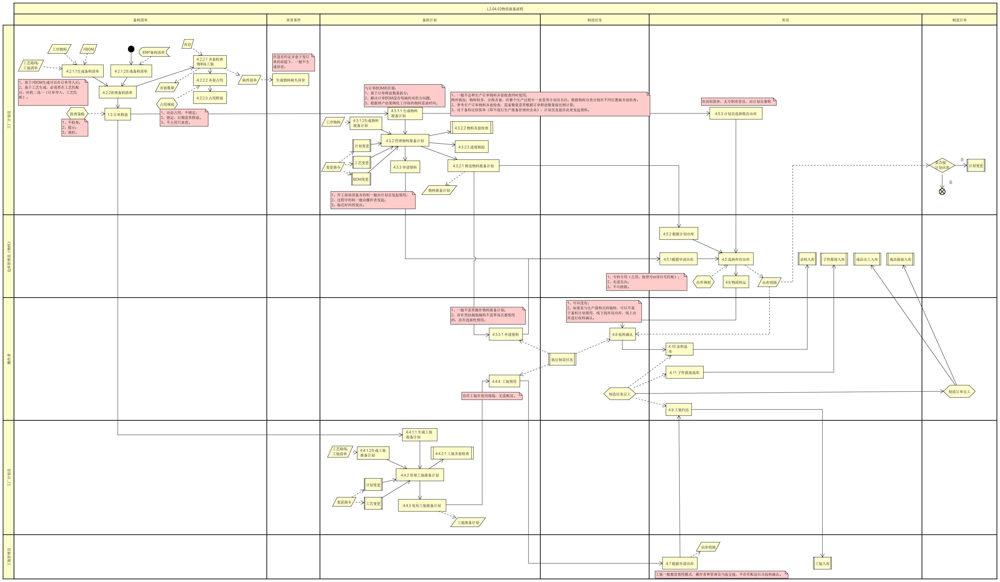

特殊说明：

本需求只有物料准备，没有工装准备，工装准备在后续工装需求中体现。

关于切件，本需求均无需考虑

备料清单中的子件比例已经考虑过切件，所以对数量的计算无影响

切件是机加场景，装入是装配场景，所以装入物料时，无需考虑序列号问题

生产准备场景路线

|序号 | 路线 | 场景兼容结论|
|--- | --- | ---|
|1 | 按订单备料——按订单装入 | ⭐本批次|
|2 | 按订单备料——按工序装入 | ⭐本批次|
|3 | 按工序备料——按订单装入 | 无此场景，不考虑|
|4 | 按工序备料——按工序装入 | ⭐本批次|
|5 | 无备料——按订单装入 | ⭕未来扩展|
|6 | 无备料——按工序装入 | ⭕未来扩展|

待考虑的业务场景：

两网场景？

物料准备计划生成以后，整体和制造订单一起下工控网（仓储也在工控网，库存数据需定期做同步）

报废场景？报废后可能会超出需求数量进行补料申请

报废不纳入生产准备场景，生产准备严格按需求数量进行执行，从业务场景和业务解决方案上，报废单独从仓储走，在仓储管理扩展业务场景：退废品领新品

什么时机校验工艺路线和备料清单工序号的不匹配性？

暂不校验，默认上游给的数据是对的

### 2.1.2 **业务流程概述**

#### 2.1.2.1 **备料清单生成**

**角色**：系统

**活动描述**：根据上游的数据生成备料清单。

**输入业务对象**：生产订单及备料清单、或工艺路线、或XBOM

**输出业务对象**：备料清单

**关键业务规则**：

备料清单到工序级：项目上没有，就外部转换数据，给第一道工序，或为空就默认首工序

备料清单生成方式：

跟随生产订单一起导入：作为生产订单的附属子表格，通过接口或者excel直接导入

基于 XBOM 生成：基于设计XBOM生成，可以在订单导入后；

基于工艺路线-工序物料生成：基于工艺生成，必须要在工艺匹配后，时机二选一（订单导入、工艺匹配）

**业务规则配置点**：备料清单生成规则

**业务场景范围**：

|场景 | 场景兼容结论 | 备注|
|--- | --- | ---|
|跟随生产订单一起通过Excel导入 | ⭐本批次 | |
|替换件 | ⭐本批次 | |
|是否必须装入的标记来源，根据不同的规则进行打标，不同项目规则不同，项目上自己处理 | ⭕项目层扩展 | |
|基于工艺路线-工序物料生成 | ⭕未来扩展 | |
|基于XBOM生成 | ⭕未来扩展 | |
|双供应商业务场景 | ⭕未来扩展 | |

#### 2.1.2.2 **生产订单物料齐套**

**角色**：工厂计划员

**活动描述**：根据备料清单检查物料是否齐套。

**输入业务对象**：生产订单、备料清单、库存信息

**输出业务对象**：齐套检查结果、缺件清单

**关键业务规则**：

齐套检查内容：备料清单中物料的齐套情况。

齐套检查时机：备料清单生成后，订单释放前。

齐套占用规则：

动态占用、不锁定；

锁定，后期需要释放；

不占用只查看。

**业务规则配置点**：齐套占用规则配置

**业务场景范围**：

|场景 | 场景兼容结论 | 备注|
|--- | --- | ---|
|根据备料清单查询库存，动态占用计算物料齐套状态，不锁定 | ⭕未来扩展 | |
|根据备料清单查询库存，只查看齐套状态，不占用 | ⭐本批次 | |
|根据备料清单查询库存，可锁定库存，后期可按需释放 | ⭕未来扩展 | |
|齐套检查后生成缺料清单 | ⭕未来扩展 | |

#### 2.1.2.3 **物料准备计划生成**

**角色**：工厂计划员

**活动描述**：生产订单释放制造订单时，根据备料清单生成物料准备计划

**输入业务对象**：生产订单、备料清单

**输出业务对象**：制造订单、物料准备计划

**关键业务规则**：

生产订单释放时，是否检查物料必须齐套：不检查、提示、强控

物料准备计划生成方式：不生成、订单释放后生成。

物料准备计划明细中，物料到料需求时间的计算：

默认等于工序任务的计划开始时间

重新排产后还需要根据物料准备计划中的物料明细的状态，判断是否重新计算到料时间并通知给库房（更新备料明细，前台界面配置决定是否更新备料计划）

若物料未申请，则允许更新到料时间并通知库房，但到料时间不允许小于等于今天

若物料申请，则不允许更新物料到料时间

任务派工或协调后无需更新物料明细的需求到料时间（班组临时调整不会影响备料计划，这样调整，库房调不起）

**业务规则配置点**：生产订单释放时物料齐套约束、生产订单释放后是否生成物料准备计划

**业务场景范围**：

|场景 | 场景兼容结论 | 备注|
|--- | --- | ---|
|生产订单释放时，不检查物料必须齐套 | ⭐本批次 | |
|生产订单释放时，物料未齐套时给出提示 | ⭕未来扩展 | |
|生产订单释放时，物料未齐套时不允许释放 | ⭕未来扩展 | |
|生产订单释放后，可按组织级来控制是否需要生成物料准备计划 | ⭐本批次 | |

#### 2.1.2.4 **物料准备计划推送**

工厂计划员

**活动描述**：推送物料准备计划给库房，让库房按计划备料。

**输入业务对象**：物料准备计划

**输出业务对象**：领料申请单

**关键业务规则**：

按计划备料，对排产时间的准确性要求较高

推送后，重新排产后还需要根据物料准备计划中的物料明细的状态，判断是否重新计算到料时间并通知给库房

若物料未申请，则允许更新到料时间并通知库房，但到料时间不允许小于等于今天

若物料已申请，则不允许更新物料到料时间

**业务场景范围**：

|场景 | 场景兼容结论 | 备注|
|--- | --- | ---|
|物料准备计划推送给库房 | ⭐本批次 | |

#### 2.1.2.5 **制造订单物料齐套**

**角色**：工厂计划员

**活动描述**：根据物料准备计划检查物料是否齐套，只做动态库存实时查询，不涉及物料占用。

**输入业务对象**：制造订单、物料准备计划、库存信息

**输出业务对象**：齐套检查结果、缺件清单

**关键业务规则**：

齐套检查内容：物料准备计划中物料的齐套情况。

齐套检查时机：工艺展开前。

**齐套占用规则**：**不占用只查看**，仅查看库存状态，不进行任何占用操作

**业务规则配置点**：无

**业务场景范围**：

|场景 | 场景兼容结论 | 备注|
|--- | --- | ---|
|根据物料准备计划中的需求物料明细查询库存，只查看齐套状态，不进行占用 | ⭐本批次 | |
|齐套检查后生成缺料清单 | ⭕未来扩展 | |

#### 2.1.2.6 **库存动态占用与优先级管理**

**角色**：系统自动执行/物料管理员（手动操作）

**活动描述**：根据业务优先级和物料可用性，实现库存的动态占用、分配与释放，并支持优先级调整。关于动态占用的说明：
- 硬占用/锁定：它是一种逻辑上的“库存分配”或“可用性控制”。当对某个物料执行“硬占用/锁定”时，物理库存数量本身不会减少。但是，与该物料相关的“可用库存量”会立即减少。
  - 目的：是为了确保这部分物料被预留给特定高优先级需求，防止其他低优先级需求“抢占”或“误用”这部分物料。
  - 效果：系统在进行物料分配、齐套检查、领料出库等操作时，会将这部分被硬占用的物料视为“不可用”于其他一般需求。这是一种“虚拟锁仓”的概念，它锁住的是物料的“使用权”，而不是物理位置。
  - 举例：仓库里有100个螺丝，其中50个被“硬占用”给了VIP订单A。这时，物理库存仍然是100个，但对于其他订单而言，“可用”的只有50个。当订单A实际领料出库50个后，物理库存才会变为50个。

**输入业务对象**：生产订单、物料需求、库存状态、优先级配置、APS排产结果

**输出业务对象**：物料占用记录、库存状态更新、物料分配报告

**关键业务规则**：

**库存占用规则**：

  1. 不约束（No Constraint）
    - 业务含义：出库时完全忽略已占用数量，只考虑库存数量。
    - 校验逻辑：出库数量 ≤ 库存数量
    - 适用场景：物料非常充裕，或价值极低，无需精细管理占用的场景。
    - 风险：可能导致计划性较差，物料被“无计划”领走。
  2. 软占用（Soft Occupation）
    - 业务含义：出库时需考虑已占用数量。若出库量超过可用库存量（即动用了已占用的物料），系统给出弱提示（警告）。用户可选择强行出库。
    - 校验逻辑：
    - 默认校验：出库数量 ≤ 可用库存量
    - 若出库数量 > 可用库存量，系统提示：“您正在领用已被XX订单（或其他需求）动态占用的物料X件，是否确认强行出库？”
    - 用户选择“是”：允许出库；用户选择“否”：中止出库。
    - 适用场景：对计划有指导性要求，但需要一定灵活性的场景；物料价值较高，但偶尔允许紧急插单打破占用。
  3. 硬占用/锁定（Hard Occupation/Locking）
    - 业务含义：出库时必须严格遵守已占用数量。若出库量超过可用库存量，系统给出强提示（错误），不允许强行出库。
    - 校验逻辑：出库数量 ≤ 可用库存量，否则严格阻止出库，并提示：“物料X已被XX订单（或其他需求）硬性占用，无法出库，请联系相关人员。”
    - 适用场景：高价值物料、关键瓶颈物料、军工等对计划执行严格要求的场景；需要为特定订单进行严格物料预留的场景。

**优先级管理规则**：

- **策略选择**：支持多种优先级策略选择（客户等级/时间紧迫性/排产顺序/产品价值等），当前阶段采用单优先级策略。
  - **策略1：按订单优先级属性动态占用**
  - **业务合理性**：⭐⭐⭐⭐⭐
  - **核心逻辑**：直接反映业务决策和客户重要性
  - **配置方式**：设置客户等级、产品价值、订单紧急程度等属性对应的优先级分数
  - **适用场景**：客户差异化明显的行业，如装配、军工等

  **策略2：按订单开工时间动态占用**
  - **业务合理性**：⭐⭐⭐
  - **核心逻辑**：按时间顺序分配，先到先得
  - **配置方式**：设置不同时间窗口对应的优先级分数
  - **适用场景**：物料充足且同质化程度高的场景，如标准件生产

  **策略3：按排产结果顺序动态占用**
  - **业务合理性**：⭐⭐⭐⭐
  - **核心逻辑**：与生产计划保持一致，确保资源利用效率
  - **配置方式**：设置排产优先级对应的分数区间
  - **适用场景**：排产计划相对稳定的场景，如大批量生产

- **优先级计算**：根据选定的策略计算订单或需求的优先级得分，支持配置化参数设置。
- **物料分配**：按优先级顺序分配物料，高优先级订单/需求优先获得物料预留。
- **冲突处理**：当多个订单/需求竞争同一物料时，按优先级进行智能分配和调整。

**动态占用处理机制(未来扩展)**：

- **事件相关订单触发**：当关键业务事件发生时（如生产订单下达、订单优先级变更、物料入库、物料出库、销售订单变更），立即触发对相关订单的物料占用重新分配。
- **高优先级订单队列主动分配**：当物料库存发生变化（如新物料入库、物料释放）时，系统主动扫描并通知处于"等待"状态的高优先级订单队列，触发其物料的自动分配。
- **定期批处理**：作为兜底机制，定期（例如每小时或每天）对所有物料需求和库存进行全局性的再计算和优化。

**业务规则配置点**：优先级策略配置、优先级参数配置、动态占用触发机制配置、领料申请校验规则配置、齐套占用规则配置。

**业务场景范围**：

|场景 | 场景兼容结论 | 备注|
|--- | --- | ---|
|根据物料准备计划中的需求物料明细查询库存，进行动态占用（软占用），出库时弱提示校验 | ⭐本批次 | |
|根据物料准备计划中的需求物料明细查询库存，进行动态占用（硬占用/锁定），出库时强阻止校验 | ⭐本批次 | |
|基于优先级的物料智能分配，解决多订单竞争 |⭐本批次 | |
|紧急插单时物料的重新分配与调整 |⭐本批次 | |
|物料入库时自动触发对高优先级订单的动态占用 | ⭕未来扩展 | |
|物料出库或退料后自动释放相应占用量，并触发其他等待订单的占用分配 | ⭕未来扩展 | |

#### 2.1.2.7 **生产领料申请**

**角色**：工厂计划员、操作者

**活动描述**：根据物料准备计划，申请领料。

**输入业务对象**：物料准备计划

**输出业务对象**：领料申请单

**关键业务规则**：

有计划员或操作者进行领料申请，可以基于物料准备计划或直接发起。

开工前亟须备齐的料一般由计划员发起领用；

过程中的料一般由操作者发起；

对于备料比较简单（即不进行生产准备管理的企业），计划员可直接在此处发起领料并直接出库。

**业务规则配置点**：领料申请规则配置

**业务场景范围**：

|场景 | 场景兼容结论 | 备注|
|--- | --- | ---|
|计划员基于物料准备计划或直接发起领料申请 | ⭐本批次 | |
|操作者基于物料准备计划或直接发起领料申请 | ⭐本批次 | |
|计划员基于物料准备计划查询物料库存，可直接在此处发起领料并直接出库 | ⭕未来扩展 | |

#### 2.1.2.8 **生产领料确认出库**

**角色**：仓库管理员

**活动描述**：根据物料准备计划或领料申请，选择库存并出库。

**输入业务对象**：物料准备计划、领料申请单

**输出业务对象**：出库单

**关键业务规则**：

出库规则：专料专用、先进先出、不可跨批、（手工指定保底）。

物流转运：根据出库单进行物流转运。

1、人转运；

2、AGV转运；（按工作中心）

3、AGV转运；（按设备、工位）

**业务规则配置点**：出库规则配置

**业务场景范围**：

|场景 | 场景兼容结论 | 备注|
|--- | --- | ---|
|仓库管理员根据领料申请单进行出库 | ⭐本批次 | |
|仓库管理员根据物料准备计划进行出库 | ⭕未来扩展 | |
|按照先进先出的规则进行出库，支持手工指定 | ⭐本批次 | |
|按照专料专用的规则进行出库 | ⭕未来扩展 | |
|出库时不允许跨批次 | ⭕未来扩展 | |
|物流转运：人工转运 | ⭐本批次 | |
|物流转运：AGV转运（按工作中心） | ⭕未来扩展 | |
|物流转运：GV转运（按设备、工位） | 项目扩展 | |

#### 2.1.2.9 **物料收料确认**

**角色**：操作工

**活动描述**：根据物料准备计划、出库申请、仓储管理员的出库单进行收料确认。

**输入业务对象**：出库单

**输出业务对象**：收料确认单

**关键业务规则**：

收料确认方式：根据出库单进行确认。

收料确认时机：物料到达后。

**业务规则配置点**：收料确认规则

**业务场景范围**：

|场景 | 场景兼容结论 | 备注|
|--- | --- | ---|
|操作工根据出库单进行收料确认 | ⭐本批次 | |

#### 2.1.2.10 **物料装入**

**角色**：操作工

**活动描述**：建立子物料实物和父物料实物的关系。

**输入业务对象**：物料装入清单

**输出业务对象**：物料装入清单、物料拆装记录

**关键业务规则**：

哪些物料是否必须装入

**业务规则配置点**：无

**业务场景范围**：

|场景 | 场景兼容结论 | 备注|
|--- | --- | ---|
|装入场景是装配场景，切件是机加场景，两个不能合并测试 | 不考虑 | |
|装入物料和报工之间的约束，需进行配置化 | ⭕未来扩展 | |
|工序物料装入时，同一个物料已经装入，再次装入时需做提示校验，需增加配置化控制强校验还是弱校验 | ⭕未来扩展 | |
|不同订单需要装入相同的标准件物料时，要批量装入 | 项目自行扩展 | |

#### 2.1.2.11 **物料拆卸**

**角色**：操作工

**活动描述**：装入有问题，需进行拆卸。

**输入业务对象**：物料装入清单

**输出业务对象**：物料装入清单、物料拆装记录

**关键业务规则**：

1、拆一级子节点；

2、拆多级子节点（需要BBOM）；

**业务规则配置点**：无

**业务场景范围**：

|场景 | 场景兼容结论 | 备注|
|--- | --- | ---|
|拆一级子节点 | ⭐本批次 | |
|拆多级子节点（需要BBOM） | ⭕未来扩展 | |

#### 2.1.2.12 **生产退料申请**

**角色**：操作工、车间主管、计划员、收料员

**活动描述**：将在生产现场的物料退还给仓库。这是一个综合性的业务流程，覆盖多种退料场景，具体包括：

**工单余料退库**：制造订单或工序完工后，清点出的剩余物料。

**工序过程退料**：生产过程中，因工艺调整等原因，导致已领用的物料不再需要。

**质量退料**：在线边仓或收料环节发现的、未经使用的质量问题物料。

**错发料退料**：在收料环节发现的、由仓库错发的物料。

**订单取消/变更退料**：因订单宏观调整，导致已备或已领的物料需要退库。

**核心概念定义**：

**已领未用物料**：指已通过"收料确认"流程，计入线边仓或工位库存，但尚未在"物料装入"环节被消耗的物料。其可退数量 = 已收料确认数量 - 已装入数量。

**输入业务对象**：制造任务信息、出库单信息、制造订单信息

**输出业务对象**：退料申请单

**关键业务规则**：

退料时机与发起方式根据具体场景而定，系统需在不同功能界面提供针对性的入口。

**业务场景范围**：

|场景 | 场景兼容结论 | 备注|
|--- | --- | ---|
|任务完工后，操作工对剩余的物料进行余料退库 | ⭐本批次 | |
|在收料、生产等环节，对异常物料或计划变更物料进行退库 | ⭐本批次 | |

#### 2.1.2.13 **生产退料确认入库**

**角色**：仓库管理员

**活动描述**：将从生产现场退回的物料确认入库。

**输入业务对象**：退料申请单

**输出业务对象**：入库单、物料库存

**关键业务规则**：

入库规则：根据入库单更新库存。

**业务场景范围**：

|场景 | 场景兼容结论 | 备注|
|--- | --- | ---|
|基于退料申请单对物料进行退料入库 | ⭐本批次 | |
|无申请，仓库管理员直接对余料进行退料入库 | ⭐本批次 | |

#### 2.1.2.14 **成品完工入库申请**

**角色**：计划员

**活动描述**：对完工的成品进行完工入库

**输入业务对象**：完工的制造订单

**输出业务对象**：完工入库申请单

**业务场景范围**：

|场景 | 场景兼容结论 | 备注|
|--- | --- | ---|
|制造订单完工后，对完工的制造订单手动发起入库申请 | ⭐本批次 | |
|制造订单完工后，对完工的制造订单发起入库申请，并直接入库 | ⭕未来扩展 | |
|制造订单完工后，自动发起完工入库申请（需考虑库房的默认值设置，物料和库房的关系定义） | ⭕未来扩展 | |
|完工入库状态和入库数量值的返回未来扩展：通用插件？产品功能？ | ⭕未来扩展 | |

#### 2.1.2.15 **成品完工确认入库**

**角色**：仓库管理员

**活动描述**：根据完工入库申请进行完工确认入库。

**输入业务对象**：完工入库申请

**输出业务对象**：入库单

**关键业务规则**：

入库规则：根据入库单更新库存。

**业务场景范围**：

|场景 | 场景兼容结论 | 备注|
|--- | --- | ---|
|成品完工后，仓储管理员对成品进行完工入库 | ⭐本批次 | |

#### 2.1.2.16 **子件报废入库申请**

**角色**：计划员

**活动描述**：计划员在系统中发起子件的报废入库申请。

**输入业务对象**：制造订单、子件报废信息

**输出业务对象**：子件报废申请单

**关键业务规则**：

报废申请需关联具体的制造订单。

报废数量不能超过制造订单中的子件可用数量。

**业务场景范围**：

|场景 | 场景兼容结论 | 备注|
|--- | --- | ---|
|子件在生产过程中损坏或无法使用，需要报废处理，系统需支持子件报废申请功能，确保生产过程中的废品管理规范 | ⭕未来扩展 | |

#### 2.1.2.17 **子件报废确认入库**

**角色**：仓库管理员

**活动描述**：仓库管理员在系统中确认子件报废入库。

**输入业务对象**：子件报废申请单

**输出业务对象**：入库单

**关键业务规则**：

入库数量需与报废申请单一致。

报废的子件需进行特殊标识和存放。

**业务规则配置点**：子件报废入库规则配置

**业务场景范围**：

|场景 | 场景兼容结论 | 备注|
|--- | --- | ---|
|仓库管理员收到子件报废申请单，确认报废子件的入库操作，系统支持子件报废确认入库功能，确保废品管理的闭环操作 | ⭕未来扩展 | |

#### 2.1.2.18 **成品报废入库申请**

**角色**：计划员

**活动描述**：计划员在系统中发起成品的报废入库申请。

**输入业务对象**：制造订单、成品报废信息

**输出业务对象**：成品报废申请单

**关键业务规则**：

报废申请需关联具体的制造订单。

报废数量不能超过制造订单中的成品可用数量。

**业务规则配置点**：成品报废申请规则配置

**业务场景范围**：

|场景 | 场景兼容结论 | 备注|
|--- | --- | ---|
|成品在生产过程中损坏或无法使用，需要报废处理，系统需支持成品报废申请功能，确保生产过程中的废品管理规范 | ⭕未来扩展 | |

#### 2.1.2.19 **成品报废确认入库**

**角色**：仓库管理员

**活动描述**：仓库管理员在系统中确认成品报废入库。

**输入业务对象**：成品报废申请单

**输出业务对象**：入库单

**关键业务规则**：

入库数量需与报废申请单一致。

报废的成品需进行特殊标识和存放。

**业务规则配置点**：成品报废入库规则配置

**业务场景范围**：

|场景 | 场景兼容结论 | 备注|
|--- | --- | ---|
|仓库管理员收到成品报废申请单，确认报废成品的入库操作，系统支持成品报废确认入库功能，确保废品管理的闭环操作 | ⭕未来扩展 | |

### 2.1.3 **业务对象关系图**

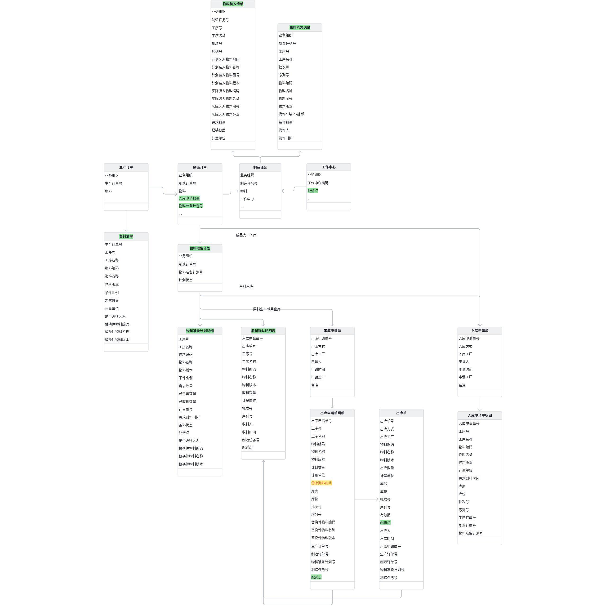

## 2.2 **功能描述**

### 2.2.1 **整体应用架构**

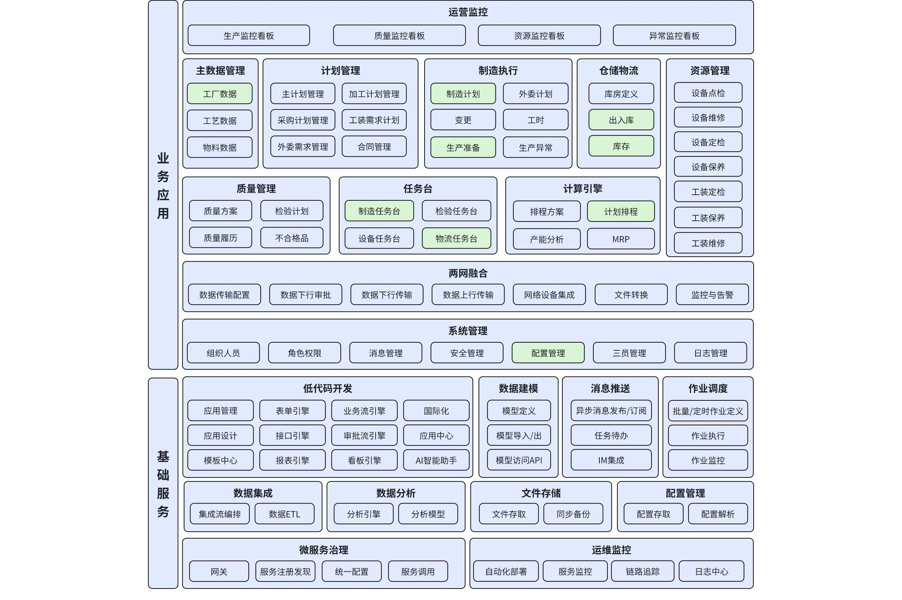

### 2.2.2 **生产准备&物流工作台应用架构**

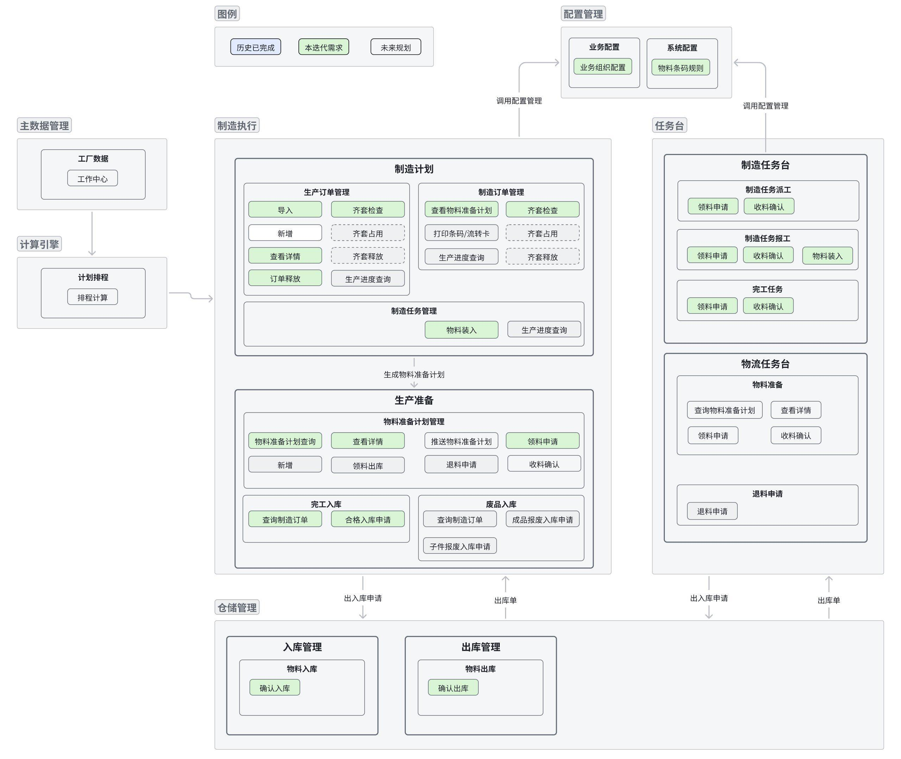

### 2.2.3 **功能清单**

|模块 | 页面 | 功能点 | 功能点状态 | 功能点描述|
|--- | --- | --- | --- | ---|
|制造执行 | 生产订单管理 | 生产订单管理-导入 | V3.1-a4修订 | 生产订单导入时，增加备料清单导入|
|制造执行 | 生产订单管理 | 生产订单管理-查看详情 | V3.1-a4修订 | 增加查看备料清单|
|制造执行 | 生产订单管理 | 生产订单管理-物料齐套检查 | V3.1-a4优化 | 根据备料清单查询物料库存，看物料是否齐套，新增齐套进度显示|
|制造执行 | 生产订单管理 | 生产订单管理-订单释放 | V3.1-a4修订 | 订单释放后可根据配置创建物料准备计划|
|制造执行 | 制造订单管理 | 制造订单管理-查看物料准备计划 | V3.1-a4新增 | 查询制造订单关联的备料计划情况|
|制造执行 | 制造订单管理 | 制造订单管理-物料齐套检查 | V3.1-a4优化 | 根据物料准备计划查询物料库存，看物料是否齐套，根据齐套情况进行领料申请，新增齐套进度显示|
|制造执行 | 制造订单管理 | 制造订单管理-退料 | V3.3-a1新增 | 在制造订单管理界面，为计划员或主管提供手工退料入口，用于处理订单取消/变更等场景下的物料退库。|
|制造执行 | 制造任务管理 | 制造任务管理-物料装入 | V3.1-a4新增 | 对加工的原料进行装入操作记录|
|制造执行 | 制造任务管理 | 制造任务管理-退料申请 | V3.3-a1新增 | 在制造任务管理界面，为一线操作员提供统一的退料申请入口，处理工单余料、工序过程退料等场景。|
|生产准备 | 物料准备计划管理 | 物料准备计划管理-查询 | V3.1-a4新增 | 查询物料准备计划|
|生产准备 | 物料准备计划管理 | 物料准备计划管理-查看详情 | V3.1-a4新增 | 查看物料准备计划详情|
|生产准备 | 物料准备计划管理 | 物料准备计划管理-领料申请 | V3.1-a4新增 | 根据生产所需的物料向库房发起领料申请|
|仓储管理 | 物料出库 | 物料出库-拣配 | V3.1-a4新增 | 拣配时支持拣配替换件物料|
|制造任务台 | 制造任务派工 | 制造任务派工-领料申请 | V3.1-a4新增 | 根据生产所需的物料向库房发起领料申请|
|制造任务台 | 制造任务派工 | 制造任务派工-收料确认 | V3.1-a4新增 | 针对物料准备计划上的领料申请单和对库房发过来的料及出库单进行收料确认|
|制造任务台 | 制造任务报工 | 制造任务报工-领料申请 | V3.1-a4新增 | 根据生产所需的物料向库房发起领料申请|
|制造任务台 | 制造任务报工 | 制造任务报工-收料确认 | V3.1-a4新增 | 针对物料准备计划上的领料申请单和对库房发过来的料及出库单进行收料确认 在收料确认环节，增加"退料"功能，用于处理错发料、来料不良等收货异常场景。|
|制造任务台 | 制造任务报工 | 制造任务报工-物料装入 | V3.1-a4新增 | 对加工的原料进行装入操作记录|
|制造任务台 | 制造任务报工 | 制造任务报工-退料申请 | V3.3-a1新增 | 在制造任务报工界面，为一线操作员提供统一的退料申请入口，处理工单余料、工序过程退料等场景。|
|制造任务台 | 完工任务 | 完工任务-领料申请 | V3.1-a4新增 | 根据物料准备计划中所需的物料向库房发起领料申请|
|制造任务台 | 完工任务 | 完工任务-收料确认 | V3.1-a4新增 | 针对物料准备计划上的领料申请单和对库房发过来的料及出库单进行收料确认|
|制造任务台 | 完工任务 | 完工任务-物料装入 | V3.1-a4新增 | 对加工的原料进行装入操作记录|
|生产准备 | 完工入库 | 完工入库-查询制造订单 | V3.1-a4新增 | 查询已完工的制造订单|
|生产准备 | 完工入库 | 完工入库-入库申请 | V3.1-a4新增 | 对于已完工的制造订单，支持发起完工入库申请|

### 2.2.4 **功能主线操作流程图**

|graph TD
    subgraph 计划员
        A["接收生产订单和备料清单"] --> B["释放生成订单"]
        B --> C["生成制造订单和物料准备计划"]
        C --> D["领料申请 创建生产领用出库申请单"]
        I["成品完工入库申请"]
        L["子件/成品报废入库申请"]
    end

    subgraph 系统
        C1["生成制造订单和物料准备计划"]
        D1["推送生产领用出库申请单"]
        I1["生成瑞松成品完工入库申请单"]
        L1["生成子件/成品报废申请单"]
        O1["生成退料申请单"]
    end

    subgraph 仓储管理员
        F["拣配出库操作 生成出库单"]
        J["成品完工入库操作"]
        M["子件/成品报废入库操作"]
        P["退料确认入库"]
    end

    subgraph 操作工
        H["收料确认"]
        O["退料申请"]
        K["成品加工完成"]
        N["子件/成品加工报废"]
    end

    A --> B
    B --> C
    C --> C1
    C1 --> D
    D --> D1
    D1 --> F
    F --> H
    H -- "异常(错发/不良)" --> O
    H -- "正常" --> K
    K -- "余料" --> O
    O --> O1
    O1 --> P
    H --> N
    N --> L
    L --> L1
    L1 --> M
    K --> I
    I --> I1
    I1 --> J|
|---|

**流程说明**

计划员接收生产订单和备料清单后，释放生成订单，系统自动生成制造订单和物料准备计划。

计划员根据物料准备计划发起领料申请，创建生产领用出库申请单。

系统将生产领用出库申请单推送给仓储管理员。

仓储管理员根据申请单进行拣配出库操作，生成出库单。

操作工对仓库发货的物料进行收料确认。

如果子件或成品在加工过程中报废，操作工标记子件或成品加工报废。

计划员发起子件或成品的报废入库申请。

系统根据报废申请生成子件或成品的报废申请单。

仓储管理员根据报废申请单进行子件或成品的报废入库操作。

如果成品加工完成，操作工标记成品加工完成。

计划员通过制造订单进行成品完工入库申请。

系统根据成品完工入库申请，生成瑞松成品完工入库申请单。

仓储管理员根据瑞松成品完工入库申请单，对成品进行完工入库操作。

**退料流程：**

操作工在收料确认环节，发现错发料、来料不良等情况，点击"退料申请"按钮，弹出退料申请界面。

用户填写退料数量和原因，点击"确定申请"，系统生成退料申请单。

仓库管理员根据退料申请单，确认退料数量和原因，生成退料确认入库单。

**退料申请**

操作工在制造任务报工界面，发现工单余料、工序过程退料等情况，点击"退料申请"按钮，弹出退料申请界面。

用户填写退料数量和原因，点击"确定申请"，系统生成退料申请单。

**退料确认：**仓库管理员在退料申请单上点击"确定"，生成退料确认入库单。

**退料入库：**仓库管理员根据退料确认入库单，更新线边库库存，并通知操作工。

# 3. **页面&功能设计**

## 3.1 **工作中心****（暂不考虑）**

### 3.1.1 **工作中心-增删查改、导入**

支持定义配送点

增删查改以及导入均需处理配送点属性，配送点下拉选择库位。

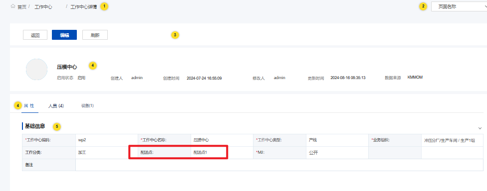

## 3.2 **生产订单管理**

### 3.2.1 **生产订单管理-导入**

**概述**：支持生产订单导入时增加备料清单导入功能，便于在订单导入阶段同步完成物料准备相关信息的录入。

**界面**：原有导入界面不变

**输入**：生产订单及备料清单文件（Excel或规定格式）。

**输出**：导入成功提示，包含成功导入的订单数量和备料清单数量；导入失败提示，包含错误信息。

**处理逻辑**：

用户点击"文件选择"按钮，选择本地文件。

点击"导入"按钮，系统读取文件内容。

系统对文件内容进行校验，校验通过则将数据导入数据库；校验失败则提示用户错误信息。

导入成功后，页面显示成功提示，并更新生产订单列表。

**验收标准**：

文件格式不正确时，提示"文件格式错误，请重新选择"。

文件内容缺失必填项时，提示"文件内容不完整，请检查后重新导入"。

备料清单能跟随生产订单正常导入。

### 3.2.2 **生产订单管理-新增****（暂不考虑）**

**概述**：生产订单新增时支持同时添加备料清单，方便在创建订单的同时完善物料准备信息。

**界面**：

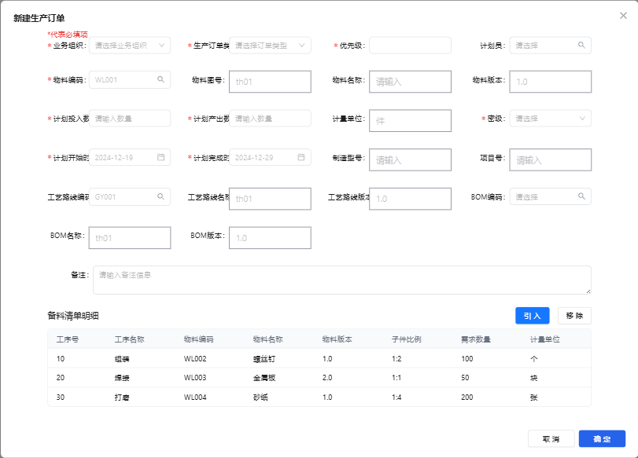

界面结构：

在原始新增功能（详见3.1.2新增）基础上

新增备料清单明细网格：工序号、工序名称、物料编码、物料名称、物料版本、子件比例、需求数量、计量单位。网格支持引入和移除。

交互内容：填写生产订单信息后，可在备料清单区添加物料信息，点击"保存"完成操作。

校验规则：生产订单信息必填项校验、备料清单物料信息完整性校验。

**输入**：生产订单信息、备料清单物料信息。

**输出**：保存成功提示，包含订单编号；保存失败提示，包含错误信息。

**处理逻辑**：

用户填写生产订单信息和备料清单物料信息。

点击"保存"，系统对输入信息进行校验。

校验通过，将生产订单和备料清单信息保存到数据库；校验失败，提示用户错误信息。

保存成功后，页面跳转至生产订单列表页面，显示新增的订单。

**验收标准**：

生产订单信息缺失必填项时，提示"请填写完整的生产订单信息"。

备料清单物料信息不完整时，提示"请填写完整的备料清单物料信息"。

保存成功时，提示"保存成功，订单编号为：XXXX"。

### 3.2.3 **生产订单管理-查看详情**

**概述**：增加查看备料清单功能，方便用户在生产订单详情页面查看与该订单相关的备料清单信息。

**界面**：

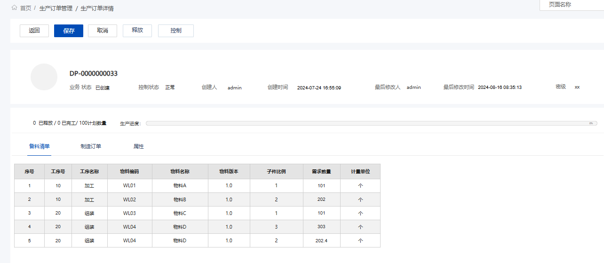

界面结构：新增备料清单展示，且放在第二个标签页。

交互内容：点击生产订单查看详情按钮，进入详情页面，展示订单及备料清单信息。

校验规则：无。

**输入**：生产订单编号。

**输出**：生产订单详细信息、备料清单详细信息。

**处理逻辑**：

用户在生产订单列表页面点击"生产订单号"超链接。

系统根据订单编号查询数据库，获取生产订单及备料清单信息。

页面展示查询到的信息。

**验收标准**：

页面能够正确显示生产订单的详细信息。

页面能够正确显示与生产订单相关的备料清单信息。

### 3.2.4 **生产订单管理-物料齐套检查**

**概述**：根据备料清单查询物料库存，查看物料是否齐套，确保生产任务顺利执行。

**界面**：

生产订单管理

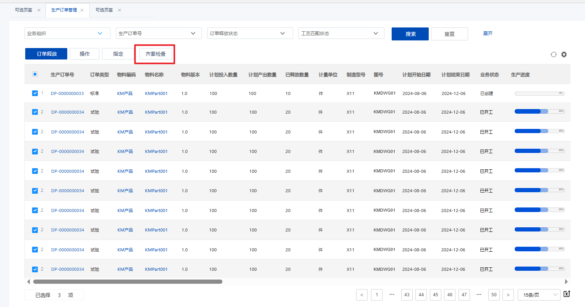

物料齐套检查

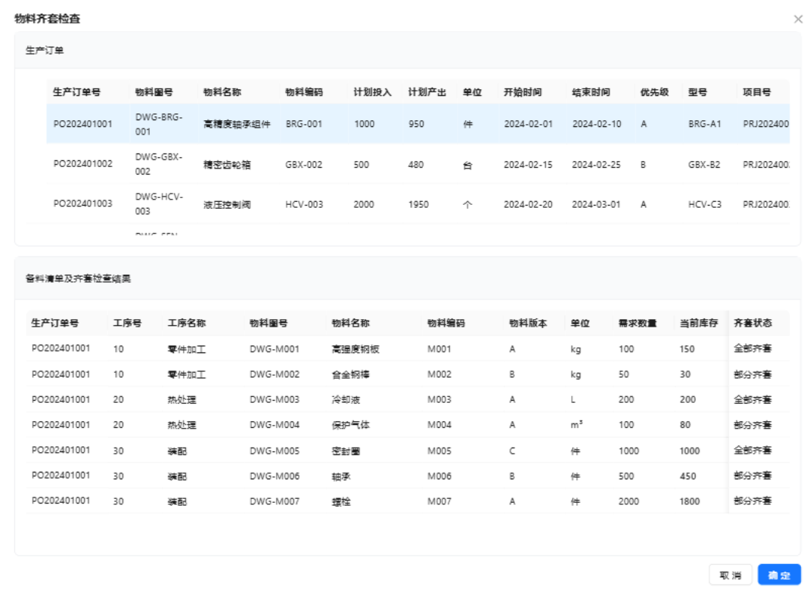

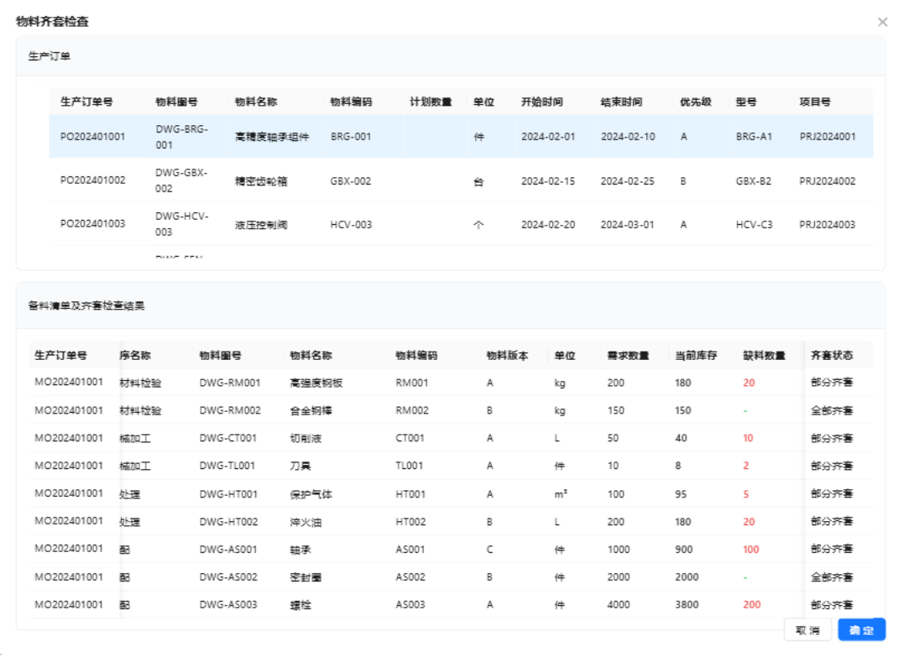

界面结构：

上方显示待齐套的生产订单：生产订单号、物料图号、物料名称、物料编码、计划投入数量、计划产出数量、计量单位、计划开始时间、计划结束时间、优先级、型号、项目号

下方显示备料清单及齐套结果展示区：

操作：开始检查

**齐套进度**：显示整体齐套进度（已齐套物料行/总物料行），格式如"8/10（80%）"

网格列：生产订单号、工序号、工序名称、物料图号、物料名称、物料编码、物料版本、计量单位、需求数量、当前库存、缺料数量、齐套状态（全部齐套、部分齐套、未齐套）。

最下方显示确定、取消按钮

交互内容：选择生产订单，支持多选，点击"物料齐套检查"按钮，系统进行齐套检查，结果在展示区显示。

**输入**：生产订单及备料清单。

**输出**：齐套检查结果、齐套进度

**处理逻辑**：

用户选择生产订单，支持多选。

点击"物料齐套检查"按钮，打开物料齐套检查界面

系统根据选中生产订单的备料清单查询物料库存信息，根据工厂+物料+物料版本查询物料库存信息，不同批次、序列号、库房、库位等需汇总库存数量

界面打开后，默认进行全部订单的齐套检查

**齐套进度计算**：齐套进度 = 已齐套物料行 / 总物料行（百分比），实时计算并显示

若多个生产订单的备料清单中有相同的物料，此时也不做库存动态扣减，仅做库存查询

缺料数量计算

若库存数量>需求数量，则缺料数量=0；

若库存数量<需求数量，则缺料数量=需求数量-库存数量

点击开始检查，系统对选中的生产订单进行检查，对比备料清单和库存信息，判断物料是否齐套，齐套状态有：全部齐套、部分齐套、未齐套

全部齐套：缺料数量=0，显示绿色标签

部分齐套：0<缺料数量<需求数量，显示黄色标签

未齐套：缺料数量=需求数量，显示红色标签

在结果展示区显示齐套检查结果。

**验收标准**：

未选择生产订单时，提示"请选择生产订单。"

可以正确计算缺料数量和齐套状态

**齐套进度验收场景**

**场景: 查看齐套进度**
- **Given** 生产订单有10行物料需求，其中8行已齐套
- **When** 用户打开物料齐套检查界面
- **Then** 系统显示齐套进度：8/10（80%）

### 3.2.5 **生产订单管理-订单释放**

**概述**：订单释放后可根据配置创建物料准备计划，实现生产订单与物料准备的衔接。

**界面**：

保持原有功能不变

**输入**：生产订单、订单释放配置。

**输出**：释放成功提示，包含是否创建物料准备计划的结果；释放失败提示，包含错误信息。

**校验规则：**

生产订单释放时需校验工艺路线必须存在，否则不允许释放。提示："生产订单XX的工艺路线为空，不允许释放，请先指定工艺路线。"

**处理逻辑**：

用户释放生产订单后，点击"确定"按钮，创建制造订单后：

系统读取业务配置【生产订单释放后是否自动生成物料准备计划】

若配置为是，则系统在释放订单的同时，根据生产订单的备料清单生成制造订单的物料准备计划，若没有备料清单，则不生成物料准备计划。

一个制造订单创建一个物料准备计划

物料准备计划号编码规则：MPP-制造订单号；【**MPP（Material Planning and Preparation）】**

业务组织=制造订单的业务组织

需求数量=制造订单的计划数量*子件比例

备料状态：初始

需求到料时间默认为制造订单的计划开始时间

配送点：默认为空

其他属性从备料清单带入

操作完成后，页面显示操作结果。

**验收标准**：

未选择订单时，提示"请选择生产订单"。

当配置开启后：

释放成功且创建物料准备计划时，提示"订单释放成功，已创建物料准备计划"。

释放成功但未创建物料准备计划时，提示"订单释放成功，因无备料清单，未创建物料准备计划"。

### 3.2.6 **生产订单管理-一级工艺路线展开**

生产订单进行一级工艺路线展开，生成子生产订单时会自动进行工艺路线匹配，若工艺路线匹配成功，则需根据工艺路线-工序物料自动生成备料清单

### 3.2.7 **生产订单管理-指定工艺路线**

手动指定工艺路线后，需根据工艺路线-工序物料重新生成备料清单，已存在是否重新生成？是否会涉及变更？

## 3.3 **物料准备计划管理**

### 3.3.1 **物料准备计划管理-查询**

**概述**：查询物料准备计划，方便用户了解物料准备情况，进行生产调度和管理。

**界面**：

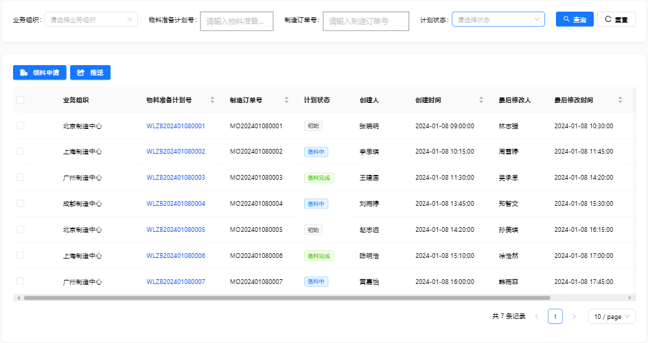

界面结构：

上方是查询条件：业务组织、物料准备计划号、制造订单号、计划状态（初始、备料中、备料完成）

下方是查询网格列表：

支持多选

网格列有：业务组织、物料准备计划号、制造订单号、计划状态（初始、备料中、备料完成）、创建人、创建时间、最后修改人、最后修改时间、备注、安全密级

交互内容：输入查询条件，点击"查询"按钮，系统展示符合条件的物料准备计划信息。

校验规则：无。

**输入**：查询条件。

**输出**：物料准备计划信息。

**处理逻辑**：

用户输入查询条件。

点击"查询"按钮，系统根据条件查询数据库。

在结果展示区显示查询到的物料准备计划信息。

**验收标准**：

页面能够正确显示查询结果，包括物料准备计划的详细信息。

### 3.3.2 **物料准备计划管理-查看详情**

**概述**：查询物料准备计划详情，方便用户了解物料准备进度。

**界面**：

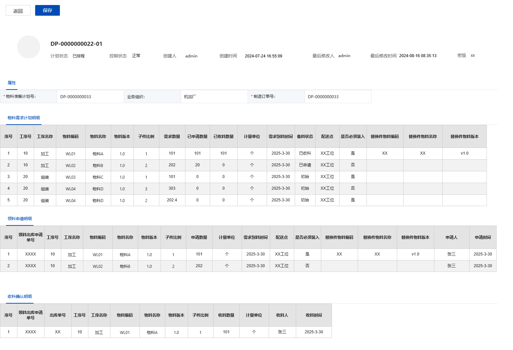

界面结构：

对象详情界面

物料需求计划明细中的备料状态：初始、已申请、已收料

交互内容：点击"物料准备计划号"超链接，系统展示物料准备计划详情，只能浏览，不能编辑。

校验规则：无

**输入**：物料准备计划号。

**输出**：物料准备计划详细信息。

**处理逻辑**：--

**验收标准**：

页面能够正确显示物料准备计划信息。

### 3.3.3 **物料准备计划管理-推送****（暂不考虑）**

**概述**：将物料准备计划推送给库房，让库房按计划备料，实现物料准备的协同管理。

**界面**：

界面结构：二级弹窗确认

交互内容：选择物料准备计划，点击"推送"按钮，支持批量，系统将计划推送给库房，并在展示区显示推送结果。

校验规则：

仅计划状态等于初始，才可进行推送，否则提示："仅计划状态等于初始，才可进行推送。"

若选中多个物料准备计划，部分不满足条件，则提示："物料准备计划XX、XX、XX等不满足推送条件，是否继续推送剩余物料准备计划？"

**输入**：物料准备计划。

**输出**：出库申请单

**处理逻辑**：

用户选择物料准备计划，支持多选

点击"推送"按钮：

系统将根据物料准备计划创建出库申请单，一个物料准备计划创建一个出库申请单。

出库申请单号：规则同库房创建出库申请单

出库方式：原料生产领用出库

出库工厂：生产准备计划的所属工厂

计划数量：需求数量

库房：？？

其他属性从物料准备计划带入

更新物料计划明细

更新已申请数量=原已申请数量+本次已申请数量

更新备料状态，若物料的已申请数量>=需求数量，则更新备料状态为【已申请】

更新物准备计划的计划状态=【备料中】，当且仅当计划状态=【初始】时才做属性更新，否则保持计划状态不变

操作完成后，页面显示推送成功。

**验收标准**：

未选择物料准备计划时，提示"请选择物料准备计划"。

推送成功时，提示"推送成功，库房已收到物料准备计划"。

推送失败时，提示相应的错误信息。

### 3.3.4 **物料准备计划管理-领料申请**

**概述**：根据生产所需的物料向库房发起领料申请，确保生产过程中的物料供应。

**界面**

界面结构：

领料申请界面网格列显示：工序号、工序名称、物料编码、物料名称、物料版本、需求数量、已申请数量、本次申请数量（数字编辑框）、已收料数量、计量单位、需求到料时间（日期编辑框）、备料状态（初始、已申请、已收料）、配送点

本次申请数量：必填，数字编辑框，默认值=需求数量-已申请数量

需求到料时间：必填，日期编辑框，可以到年月日时分秒，可编辑

库房：

必填，默认值读取配置，根据物料类别读取默认合格库房，详见3.1.4.1默认库房配置，未配置或配置错误，则显示空

下拉值为制造订单所属工厂下所有的库房

交互内容：选择物料需求计划，单选，点击领料申请，弹出新增领料申请界面。

校验规则：

计划状态=初始或备料中才可进行领料申请

0=<本次申请数量<=需求数量-已申请数量

**输入**：物料准备计划、出库申请信息

**输出**：出库申请单

**处理逻辑**：

用户选择物料需求计划，点击领料申请，单选，弹出新增领料申请界面

根据物料准备计划明细信息，初始化新增领料申请单界面

点击"确认"，系统对输入信息进行校验：

必须存在本次申请数量大于0的数据，否则给出提示："界面上没有申请的物料，请填写本次领用数量。"

若本次申请数量>需求数量-已申请数量，则给出提示："物料XX的申请数量之和X超出需求数量X，是否继续申请？"，点击是则继续保存。

若需求到料时间小于等于今天，则给出提示："物料XX的需求到料时间小于等于今天，是否继续申请？"，点击是则继续保存。

校验通过：

获取本次领料数量大于0 的数据，根据该数据创建出库申请单信息保存到数据库；

出库申请单号：规则同库房创建出库申请单

出库方式：原料生产领用出库

出库工厂：生产准备计划的所属工厂

明细信息：本次领料数量大于0 的数据

计划数量：本次申请数量

其他属性从物料准备计划带入

更新物料计划明细：

更新已申请数量=原已申请数量+本次申请数量

更新备料状态，若物料的已申请数量>=0，则更新备料状态为【已申请】

更新物准备计划的计划状态=【备料中】，当且仅当计划状态=【初始】时才做属性更新，否则保持计划状态不变

校验失败，提示用户错误信息。

**验收标准**：

未选择物料需求时，提示"请选择物料需求"。

申请信息不完整时，提示"请填写完整的申请信息"。

申请成功时，提示"申请成功，申请单编号为：XXXX"。

### 3.3.5 **物料准备计划管理-收料确认（暂不考虑）**

同3.8.2制造任务派工-收料确认

### **3.2.6 生产订单管理-生成备料清单**

**概述**：支持用户在生产订单管理界面，针对选中的生产订单，手动批量生成备料清单。该功能适用于生产订单导入时未自带备料清单的场景，便于后续物料准备、齐套检查等业务操作。

**界面**：

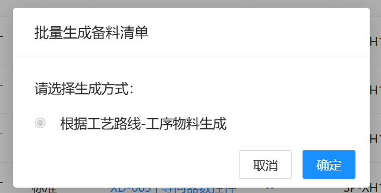

在生产订单管理列表页面，为每条生产订单增加"生成备料清单"操作按钮。

支持单选或多选生产订单，点击后弹出生成备料清单界面。

**输入**：

选中的生产订单编号。

生成方式：默认"根据工艺路线-工序物料生成"。

可选参数：如需后续扩展，可支持手工补录或导入。

**输出**：

生成的备料清单明细，关联到对应生产订单。

操作结果批量提示（成功/失败及原因，允许部分成功部分失败）。

**处理逻辑**：

用户在生产订单管理界面选择一条或多条生产订单，点击"生成备料清单"按钮。

系统对所选生产订单逐条校验是否已存在备料清单：

已存在：记录为失败，提示"该生产订单已存在备料清单，无需重复生成"。

不存在：进入生成流程。

对于可生成的订单，系统根据生产订单关联的工艺路线，自动提取工序物料，生成备料清单明细。

生成后，备料清单可在生产订单详情页查看。

操作完成后，页面弹窗批量提示"成功XX，失败XX"，点击详情可查看具体失败原因。

失败详情举例：
生产订单号XX的备料清单生成失败，已存在备料清单；
生产订单号XX的备料清单生成失败，生产订单没有关联的工艺路线；
生产订单号XX的备料清单生成失败，生产订单的工艺路线下工序物料为空；

**验收标准**：

未选择生产订单时，提示"请选择生产订单"。

已存在备料清单的订单，不能重复生成，批量提示。

生成成功的订单，提示"备料清单生成成功"，并可在详情页查看。

生成失败的订单，提示具体原因（如无工艺路线、工序物料未配置等），批量提示。

## 3.4 **制造订单管理**

### 3.4.1 **制造订单管理-查看物料准备计划**

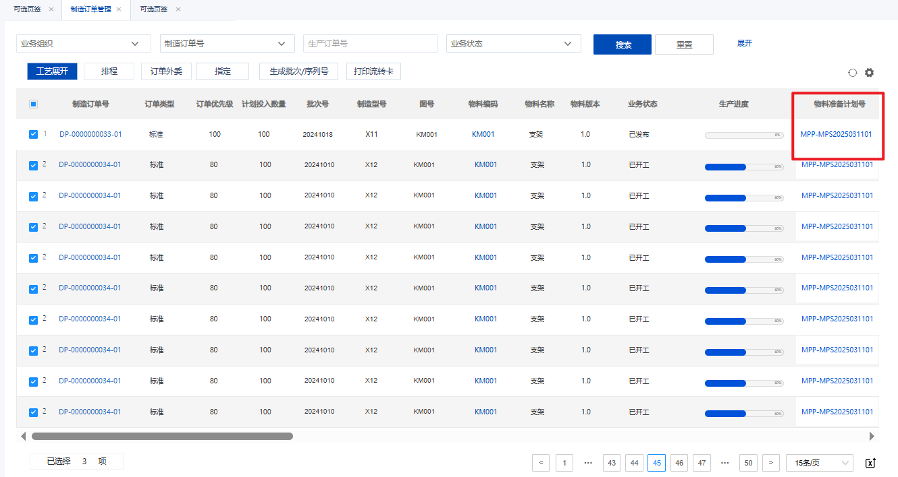

功能同3.3.2物料准备计划管理-查看详情

### 3.4.2 **制造订单管理-物料齐套检查**

**概述**：根据物料准备计划查询物料库存，查看物料是否齐套，确保生产任务顺利执行。

**界面**：

制造订单管理

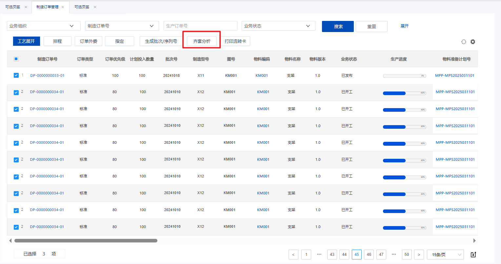

物料齐套检查

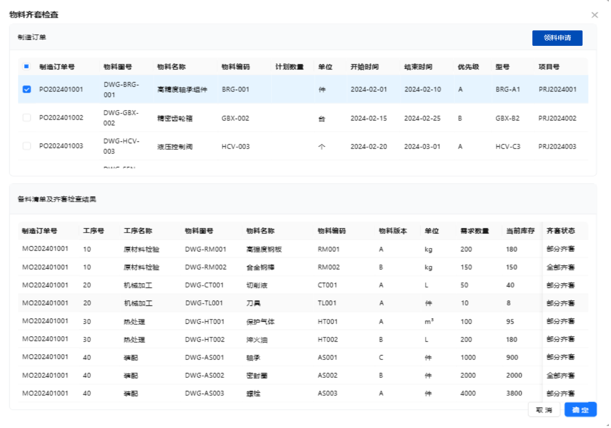

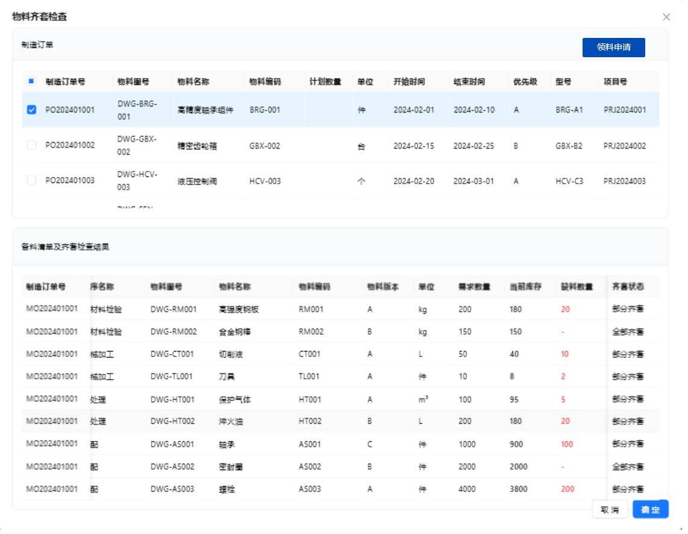

界面结构：

上方显示待齐套的制造订单：制造订单号、物料图号、物料名称、物料编码、计划数量、计量单位、计划开始时间、计划结束时间、优先级、型号、项目号

下方显示备料清单及齐套结果展示区：

操作：开始检查

**齐套进度**：显示整体齐套进度（已齐套物料行/总物料行），格式如"8/10（80%）"

网格列：制造订单号、工序号、工序名称、物料图号、物料名称、物料编码、物料版本、计量单位、需求数量、当前库存、缺料数量、齐套状态（全部齐套、部分齐套、未齐套）。

最下方显示确定、取消按钮

操作：领料申请

交互内容：选择制造订单，支持多选，点击"物料齐套检查"按钮，系统进行齐套检查，结果在展示区显示。

**输入**：制造订单及物料准备计划。

**输出**：齐套检查结果、齐套进度

**处理逻辑**：

用户选择制造订单，支持多选。

点击"物料齐套检查"按钮，打开物料齐套检查界面

系统根据选中制造订单的物料准备计划查询物料库存信息，根据工厂+物料+版本查询物料库存信息，不同批次、序列号、库房、库位等需汇总库存数量

界面打开后，默认进行全部生成订单的齐套检查，对比物料准备计划和库存信息，判断物料是否齐套

**齐套进度计算**：齐套进度 = 已齐套物料行 / 总物料行（百分比），实时计算并显示

齐套状态有：全部齐套、部分齐套、未齐套

全部齐套：缺料数量=0，显示绿色标签

部分齐套：0<缺料数量<需求数量，显示黄色标签

未齐套：缺料数量=需求数量，显示红色标签

若多个生产订单的备料清单中有相同的物料，此时也不做库存动态扣减，仅做库存查询

若库存数量>需求数量，则缺料数量=0；若库存数量<需求数量，则缺料数量=需求数量-库存数量

点击领料申请，支持对勾选的制造订单进行领料申请，根据制造订单关联的物料准备计划进行领料申请操作

功能同3.3.4物料准备计划管理-领料申请

本次领料数量默认值逻辑：若库存数量>需求数量，则本次领料数量=需求数量；若库存数量<需求数量，则本次领料数量=库存数量

在结果展示区显示齐套检查结果。

**验收标准**：

未选择制造订单时，提示"请选择制造订单。"

### 3.4.3 **制造订单管理-生成物料准备计划**

**概述**：支持用户在制造订单管理界面，针对选中的制造订单，手动生成物料准备计划。该功能适用于制造订单未自动生成物料准备计划的场景，便于后续物料准备、领料、收料等业务操作。

**界面**：

在制造订单管理列表页面，为每条制造订单增加"生成物料准备计划"操作按钮。

支持单选或多选制造订单，点击后弹出生成物料准备计划界面。

**输入**：

选中的制造订单编号。

生成方式：默认"根据工艺路线-工序物料生成"。

可选参数：如需后续扩展，可支持手工补录或导入。

**输出**：

生成的物料准备计划，关联到对应制造订单。

操作结果批量提示（成功/失败及原因，允许部分成功部分失败）。

**处理逻辑**：

用户在制造订单管理界面选择一条或多条制造订单，点击"生成物料准备计划"按钮。

系统校验所选制造订单是否已存在物料准备计划：

已存在：记录为失败，提示"该制造订单已存在物料准备计划，无需重复生成"。

不存在：进入生成流程。

系统根据制造订单关联的备料清单，自动生成物料准备计划明细。

生成后，物料准备计划可在制造订单详情页及物料准备计划管理模块查看。

操作完成后，页面弹窗批量提示"成功XX，失败XX"，点击详情可查看具体失败原因。

失败详情举例：

制造订单号XX的物料准备计划生成失败，已存在物料准备计划；

制造订单号XX的物料准备计划生成失败，未找到关联的工艺路线；

制造订单号XX的物料准备计划生成失败，工艺路线下工序物料为空；

**验收标准**：

未选择制造订单时，提示"请选择制造订单"。

已存在物料准备计划的订单，不能重复生成，批量提示。

生成成功的订单，提示"物料准备计划生成成功"，并可在详情页查看。

生成失败的订单，提示具体原因（如未找到工艺路线、工序物料未配置等），批量提示。

### 3.4.4 **制造订单管理-退料申请**

**概述**：在制造订单管理界面，为计划员或主管提供手工退料入口。该功能主要用于处理因订单取消、计划变更等宏观管理需求而产生的物料退库场景。

**界面**：在制造订单管理列表的操作栏，增加"退料申请"按钮。

**界面结构**：

用户在制造订单管理列表页，选择一个或多个订单，点击"退料申请"按钮。

弹出一个新界面，汇总显示所有选中订单关联的、全部"已领未用物料"。

**网格列**：**制造订单号**、物料编码、物料名称、已领未用数量、本次退料数量（数字编辑框）、退料原因（下拉选择编辑框）、计量单位、**已申请数量**、**已收料数量**、**已装入数量**（后三列信息只读）。

**退料原因**：下拉框，数据来源于数据字典，建议包含"订单取消"、"计划变更"、"盘点退库"等，**并支持双击后直接编辑输入自定义内容。**
**已领未用数量**：数字编辑框，指当前物料对应已收料确认但未装入的数量，需动态计算

**交互内容**：

用户勾选需要退库的物料行，填写"本次退料数量"，并选择"退料原因"。

"本次退料数量"可编辑，默认值为该物料的"已领未用数量"，且不得超过该值。

**校验规则**：

必须至少勾选一行物料。

勾选物料行的"本次退料数量"必须为大于0的数字。

退料原因必选。

**输入**：

选中的制造订单

需退料的物料列表

每种物料的退料数量和原因

**输出**：

一张或多张"生产退料入库"类型的出库申请单。

**处理逻辑**：

用户点击"确定退料"后，系统进行校验。

校验通过后，根据用户勾选的物料和数量，生成"生产退料"类型的出库申请单。

以制造订单为单位，创建"生产退料入库"类型的出库申请单，一个制造订单创建一个出库申请单，并跟物料准备计划关联。

操作成功后，关闭弹窗并提示用户。

**验收标准**：

退料数量超出"已领未用数量"时，系统能正确拦截并提示。

未选择退料原因或退料数量为0时，无法提交。

申请成功后，能正确生成"生产退料"类型的出库申请单。

## 3.5 **计算引擎****（暂不考虑）**

### 3.5.1 **计算引擎-计划排程**

**概述**：排程后需根据排产结果更新处理物料准备计划。

**界面**：保持原功能不变

**输入**：排产结果：制造任务。

**输出**：物料准备计划明细更新。

**处理逻辑**：

制造订单排程结束后，无论是首次还是重复排程，结果确定发布后，若制造订单存在关联的物料准备计划，则需根据排程结果更新制造订单关联的物料准备计划。

工序物料的需求到料时间=工序计划开始时间

配送点=制造任务关联工作中心上的配送点

更新约束如下：

备料计划明细中的备料状态：初始、已申请、已收料

备料状态=初始时，则允许更新需求到料时间和配送点

备料状态=已申请时，则不允许更新需求到料时间和配送点

需记录业务日志

**验收标准**：

物料准备计划明细的需求到料时间的配送点更新正确

## 3.6 **物料准备****（暂不考虑）**

### 3.6.1 **物料准备-查询物料准备计划**

**概述**：查询物料准备计划，方便用户了解物料准备情况，进行领料申请。

**界面**：

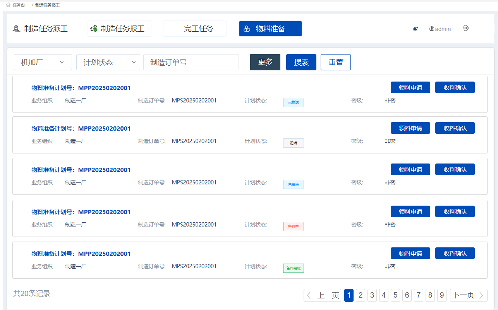

界面结构：

上方是查询条件：

业务组织：下拉列表框，默认值为当前用户具有权限的组织

计划状态：下拉多选框，默认选中初始、备料中；下拉值为：初始、备料中、备料完成

制造订单号：文本输入框

下方是查询网格列表：

支持多选

网格列有：物料准备计划号、制造订单号、计划状态（初始、备料中、备料完成）、创建人、业务组织、创建时间、最后修改人、最后修改时间、备注、安全密级

操作：领料申请

交互内容：输入查询条件，点击"查询"按钮，系统展示符合条件的物料准备计划信息。

校验规则：无。

**输入**：查询条件。

**输出**：物料准备计划信息。

**处理逻辑**：

用户输入查询条件。

点击"查询"按钮，系统根据条件查询数据库。

在结果展示区显示查询到的物料准备计划信息。

**验收标准**：

页面能够正确显示查询结果，包括物料准备计划的详细信息。

### 3.6.2 **物料准备-查看详情**

同3.3.2物料准备计划管理-查看详情

### 3.6.3 **物料准备-领料申请**

同3.3.4物料准备计划管理-领料申请

### 3.6.4 **物料准备-收料确认**

同3.3.5物料准备计划管理-收料确认

## 3.7 **物料出库**

### 3.7.1 **物料出库-拣配**

**概述**：物料拣配时，查询物料库存，需查询物料和替换件物料的库存信息。

**界面**：原有功能界面不变

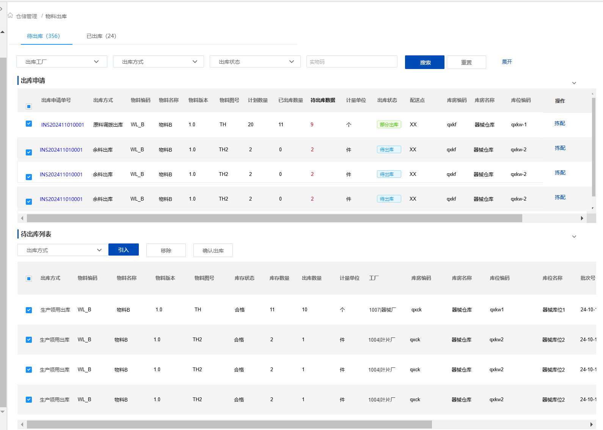

**输入**：出库申请单明细

**输出**：物料库存。

**处理逻辑**：

用户点击"拣配"按钮，原逻辑根据出库申请单的物料查询物料库存，需修改为根据物料+替换件物料查询物料库存，替换件物料的出库数量，需纳入到原物料的数量进行计算

物料和替换件物料，共一个库房查询

目前批次号、序列号、库位为空，未来当批次号、序列号、库位不为空时，物料和替换件物料则会显示两个明细行

出库单上的物料为实际出库的物料，可能是原需求物料，也可能是替换件物料

**验收标准**：

允许选择替换件物料出库。

替换件物料出库的数量需算到原需求物料上，且数量计算正确

## 3.8 **制造任务派工**

### 3.8.1 **制造任务派工-领料申请**

**概述**：根据生产所需的物料向库房发起领料申请，确保生产过程中的物料供应。

**界面**

制造任务派工

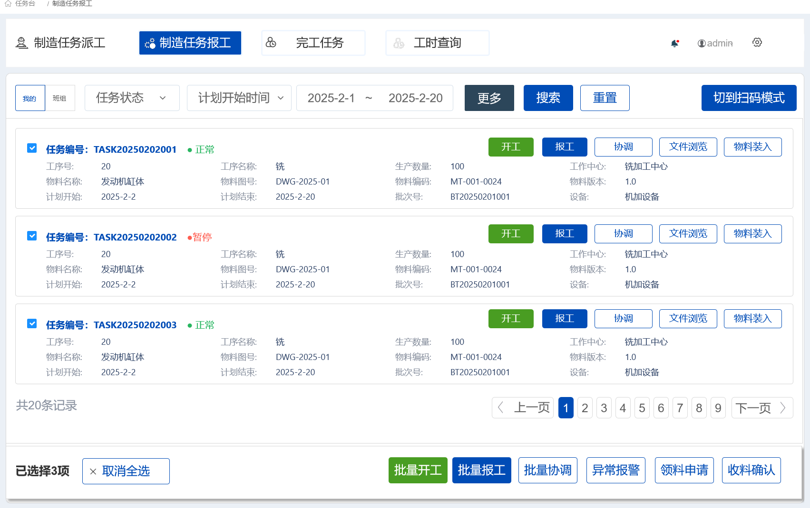

领料申请

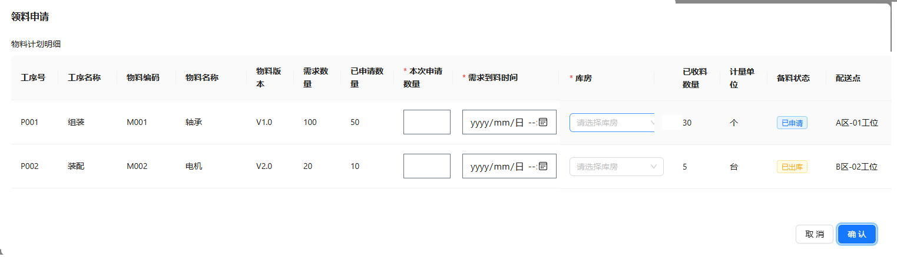

界面结构：

领料申请界面网格列显示：工序号、工序名称、物料编码、物料名称、物料版本、需求数量、已申请数量、本次申请数量（数字编辑框）、已收料数量、计量单位、需求到料时间（日期编辑框）、备料状态（初始、已申请、已收料）、配送点

本次申请数量：必填，数字编辑框，默认值=需求数量-已申请数量

需求到料时间：必填，日期编辑框，可以到年月日时分秒，可编辑

库房：必填，默认为空，下拉值为制造订单所属工厂下所有的库房

交互内容：选择任务，单选，点击领料申请，弹出新增领料申请界面。

校验规则：

计划状态=初始或备料中才可进行领料申请

0=<本次申请数量<=需求数量-已申请数量

**输入**：物料准备计划、出库申请信息

**输出**：出库申请单

**处理逻辑**：

用户选择任务，根据任务查询制造订单关联物料需求计划，点击领料申请，单选，弹出新增领料申请界面

根据物料准备计划明细信息，初始化新增领料申请单界面

点击"确认"，系统对输入信息进行校验：

必须存在本次申请数量大于0的数据，否则给出提示："界面上没有申请的物料，请填写本次领用数量。"

若本次申请数量>需求数量-已申请数量，则给出提示："物料XX的申请数量之和X超出需求数量X，是否继续申请？"，点击是则继续保存。

若需求到料时间小于等于今天，则给出提示："物料XX的需求到料时间小于等于今天，是否继续申请？"，点击是则继续保存。

校验通过：

获取本次领料数量大于0 的数据，根据该数据创建出库申请单信息保存到数据库；

出库申请单号：规则同库房创建出库申请单

出库方式：原料生产领用出库

出库工厂：生产准备计划的所属工厂

明细信息：本次领料数量大于0 的数据

计划数量：本次申请数量

其他属性从物料准备计划带入

更新物料计划明细：

更新已申请数量=原已申请数量+本次申请数量

更新备料状态，若物料的已申请数量>=0，则更新备料状态为【已申请】

更新物准备计划的计划状态=【备料中】，当且仅当计划状态=【初始】时才做属性更新，否则保持计划状态不变

校验失败，提示用户错误信息。

**验收标准**：

未选择物料需求时，提示"请选择物料需求"。

申请信息不完整时，提示"请填写完整的申请信息"。

申请成功时，提示"申请成功，申请单编号为：XXXX"。

### 3.8.2 **制造任务派工-收料确认**

**概述**：针对物料准备计划上的领料申请单和对库房发过来的料（出库单）进行收料确认

**界面**：

制造任务派工

收料确认

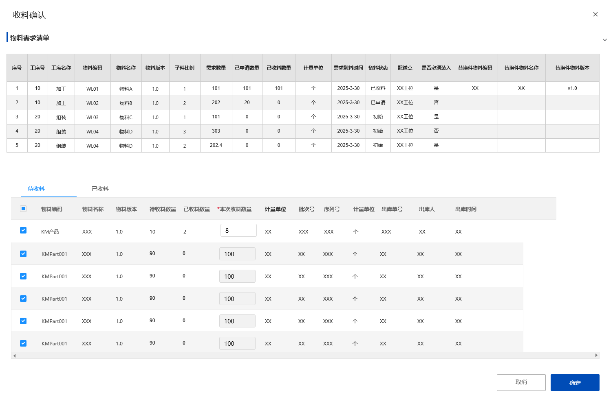

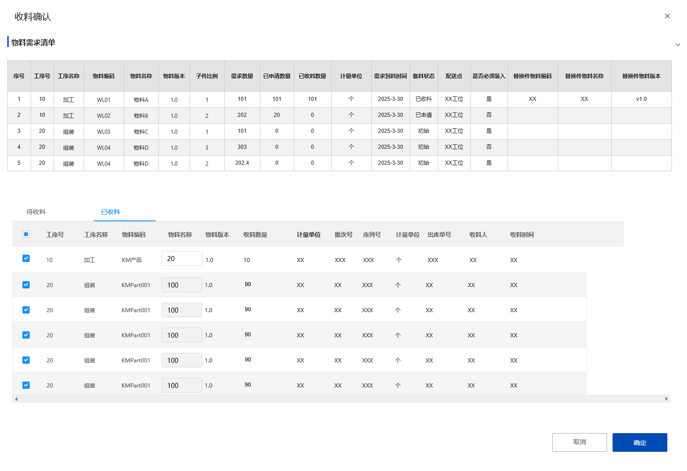

界面结构：

上方为物料需求清单

下方为待收料和已收料明细

待收料：工序号、工序名称、物料编码、物料名称、物料版本、待收料数量（对应出库数量）、已收料数量、本次收料数量（数字编辑框）、批次号、序列号、计量单位、出库单号、出库人、出库时间

交互内容：单选，点击"收料确认"按钮，弹出二级弹窗，点击确定后，完成收料确认操作。

校验规则：

本次收料数量默认值等于关联出库单的出库数量，取值范围0<=本次收料数量<=待收料数量-已收料数量

**输入**：物料准备计划。

**输出**：收料确认明细表

**处理逻辑**：

用户选择任务，根据任务查询制造订单关联物料需求计划，点击收料确认，支持多选

点击"收料确认"按钮，弹出二级界面

物料需求清单数据来源：

待收料数据来源：显示物料需求计划明细中已申请但未收料确认的物料

根据物料准备计划明细查询出库申请单和出库单

过滤已收料确认的物料

已收料数据来源：实际收料明细

点击"确定"按钮：

根据校验规则进行校验，校验通过后

记录收料确认明细表

更新物料计划明细中的已收料数量=原数量+本次收料数量

更新物料计划明细中的备料状态，若物料的已收料数量>=需求数量，则更新备料状态为【已收料】

更新物准备计划的计划状态=【备料完成】，当且仅当物料计划明细汇总的备料状态全部=【已收料】时才做属性更新，否则保持计划状态不变

注：若是替换件，则需根据替换件找原物料的明细表进行属性和状态更新

操作完成后，页面显示推送成功。

**验收标准**：

已出库的物料可以被正常收料确认

## 3.9 **制造任务报工**

### 3.9.1 **制造任务报工-领料申请**

功能同3.8.1制造任务派工-领料申请

### 3.9.2 **制造任务报工-收料确认**

功能同3.8.2制造任务派工-收料确认

### 3.9.3 **制造任务报工-物料装入**

**概述**：对加工的原料进行装入操作记录，实现物料使用过程的追溯管理。

**界面**：

制造任务报工

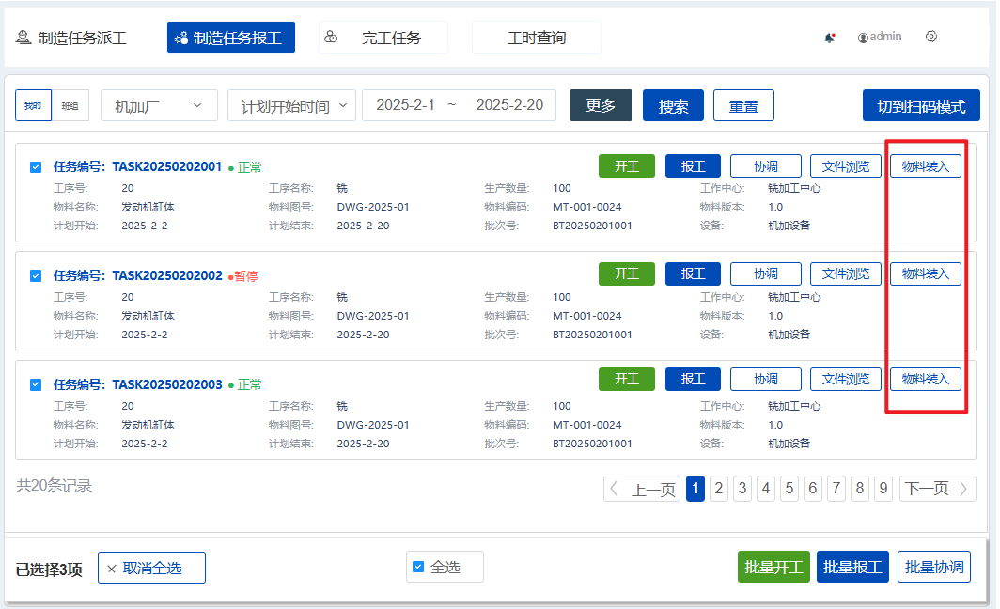

制造任务存在序列号时

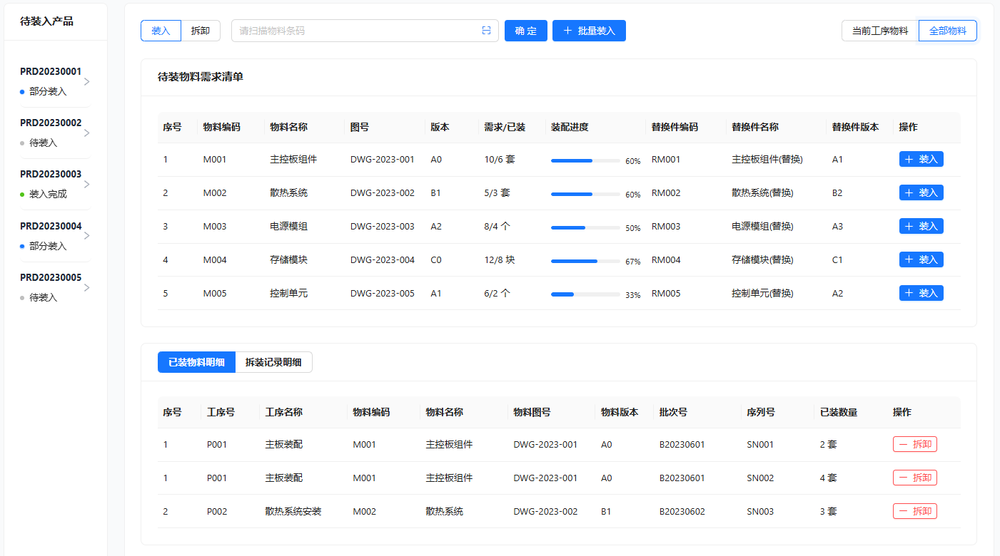

制造任务不存在序列号时：

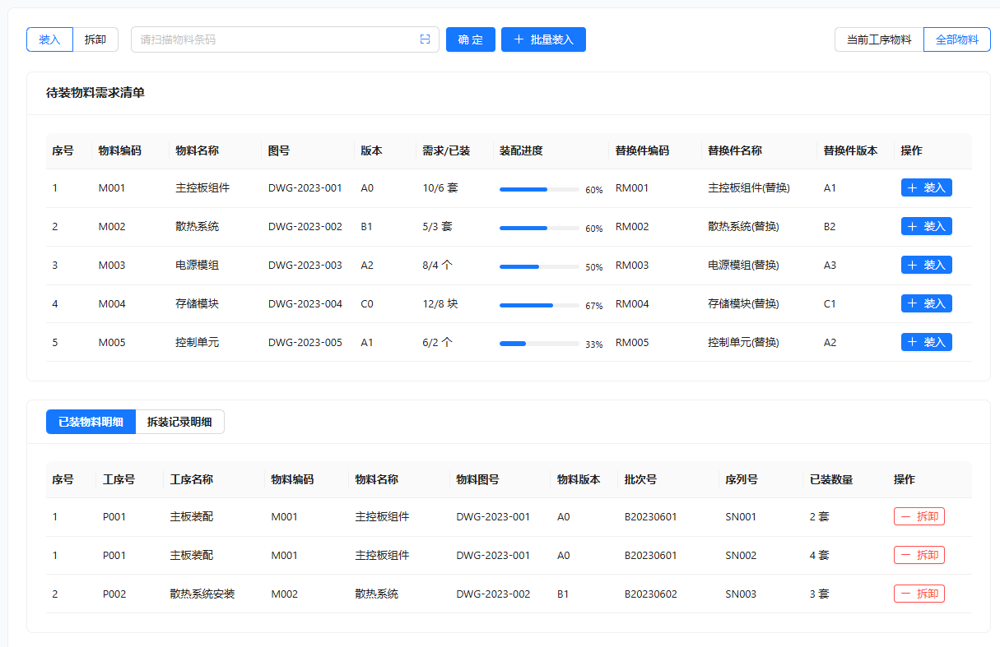

拆卸记录明细

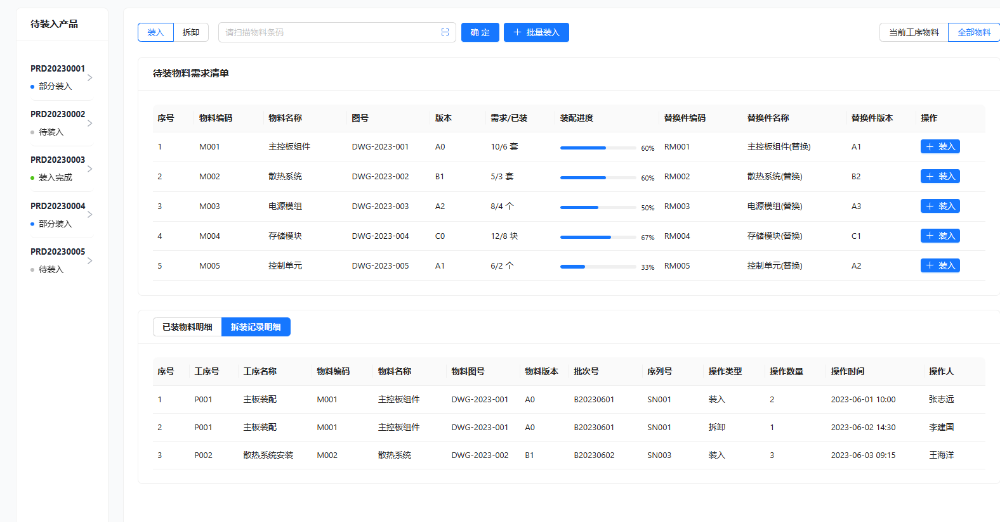

点击批量装入按钮：

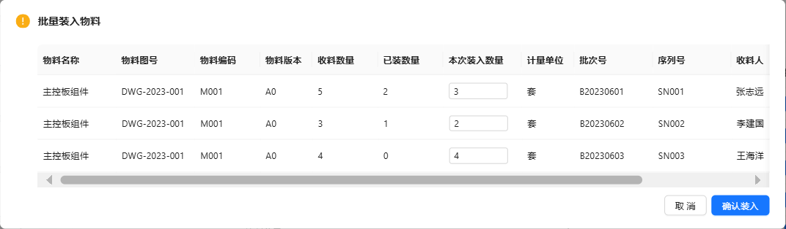

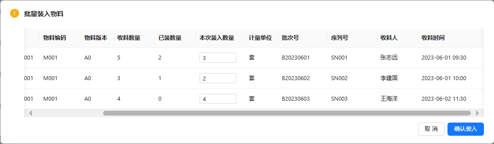

点击装入按钮：

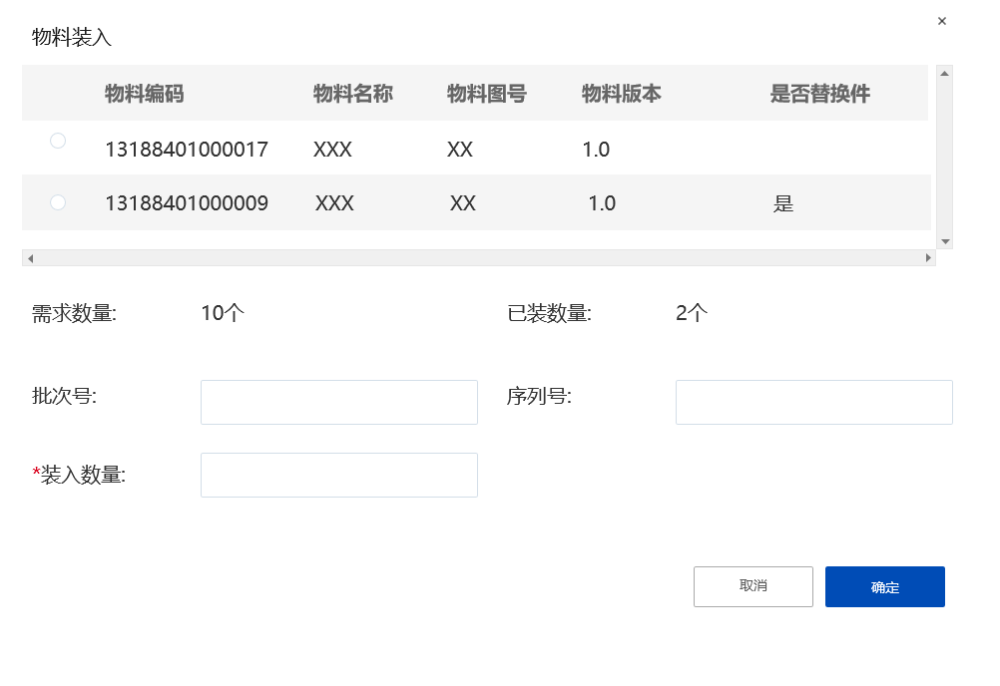

拆卸

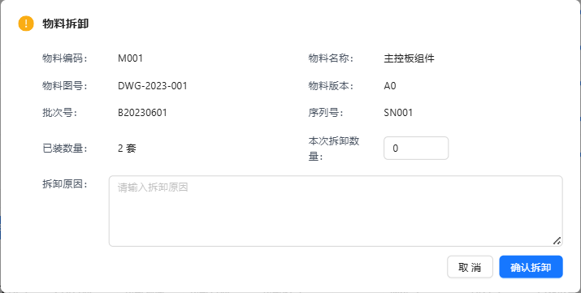

界面结构：

|左侧区域
产品序列号信息和装配状态：显示产品序列号及对应状态，状态分为"待装入"、"装入完成"、"部分装入"，当且仅当制造任务存在序列号时才显示。
待装入：序列号下关联的物料准备计划明细中存在必须装入的物料，且还没有进行任何实物装入时
装入完成：序列号下关联的物料准备计划明细中所有必须装入的物料（替换件物料算到原需求物料上）全部已装入完成。
部分装入：不属于上述两种，则为部分装入。
右侧区域
扫码装入和批量装入区
支持扫码直接装入或拆卸，可快速批量装入。
当前工序物料和全部物料：
默认选中全部物料，可按需切换。
选中当前工序物料时：根据工序号匹配物料准备计划中的工序号进行过滤
操作选择：默认选中装入，也可选择拆卸。
搜索：支持扫码或输入物料信息，点击确定后按规则解析条码信息，读取条码业务配置，根据配置解析，若找不到配置，则给出提示。
点击确定后：根据操作类型（装入/拆卸）进行相应校验和操作。
点击批量装入：弹出批量装入界面，显示待装物料明细网格，可编辑本次装入数量，点击确定装入后进行校验和操作。
网格列：物料名称、物料图号、物料编码、物料版本、收料数量、已装数量、本次装入数量、计量单位、批次号、序列号、收料人、收料时间。
其中本次装入数量为数值编辑框，可编辑，默认值=收料数量-已装数量，0<本次装入数量<收料数量-已装数量
网格列数据源：查询物料准备计划中的已收料的物料明细信息，再根据实际已装的物料信息计算动态计算已装数量，根据工序号+物料编码+物码名称+物料版本+批次号+序列号查询统计已装数量
点击确定后：
校验物料：0<装入数量<=需求数量-已装数量。

待装物料需求清单列表
显示序号、物料编码、物料名称、图号、版本、需求/已装数量、装配进度、替换件物料编码、替换件物料名称、替换件物料版本等信息。
其中需求数量计算规则如下：
当制造任务不存在序列号时：需求数量=物料备料计划明细中的需求数量
当制造任务存在序列号时：需求数量=物料备料计划明细中的子件比例
装配进度：已装数量/需求数量
操作列为"装入"，点击后弹出物料装入界面，可直接输入信息装入，支持装入替换件物料
上方显示物料信息，单选，默认选中原件物料，包括原物料和替换件物料
下方显示需求数量、已装数量、批次号、序列号、装入数量。
其中批次号、序列号、装入数量可编辑
装入数量必填，默认值等于1
确定装入：
校验：0<装入数量<=需求数量-已装数量，当序列号不为空时，装入数量只能等于1。
若选择替换件装入，已装清单中需显示实际装入的替换件物料
已装物料明细和拆装记录明细
已装物料明细：显示序号、工序号、工序名称、物料编码、物料名称、物料图号、物料版本、批次号、序列号、已装数量、操作人、装入时间等信息，操作列为"拆卸"，点击后弹出二级弹窗进行拆卸操作。
显示物料编码、物料名称、物料图号、物料版本、批次号、序列号、已装数量、本次拆卸数量、拆卸原因
其中本次拆卸数量为数字编辑框，可编辑，0<本次拆卸数量<已装数量
拆卸原因：多行编辑框
拆卸记录明细：显示序号、工序号、工序名称、物料编码、物料名称、物料图号、物料版本、批次号、序列号、操作类型、操作数量、操作时间、操作人等信息。|
|---|

交互内容：

|制造任务报工界面，用户点击物料装入，弹出物料装入界面，按需进行装入或拆卸操作
可根据扫码或输入物料信息进行装入/拆卸
可根据收料清单进行快速批量装入
可按单个物料钮进行装入/拆卸
支持替换件的装入/拆卸
点击"确定"、"批量装入"、"装入"或"拆卸"操作时，系统需根据校验规则对输入信息进行校验，校验失败，提示用户错误信息。
校验通过，界面上显示最新操作记录
记录实际物料装入清单
记录物料拆装记录表
点击关闭，则关闭弹窗|
|---|

**输入**：

制造任务

物料准备计划明细

出库单

实际物料装入清单

**输出**：

实际物料装入清单

物料拆装记录

**处理逻辑**：

**扫码物料装入/拆卸流程**

**扫码或输入物料信息**：用户通过扫码设备扫描物料条码，或手动输入物料信息。

**解析物料信息**：系统按照条码业务配置，根据配置解析输入的信息。

**确定操作类型**：选择装入或拆卸，默认为装入。

**校验物料数据**：

若为装入，检查解析后的物料数据是否存在于待装物料需求清单中，且装入数量是否大于剩余可装数量（需求数量 - 已装数量）。

若为拆卸，检查解析后的物料数据是否存在于已装物料明细中，且拆卸数量是否大于可拆卸数量（已装数量）。

待装清单中的替换件也支持解析和装入

**执行操作**：校验通过后，执行装入或拆卸操作，更新实际物料装入清单和物料拆装记录表。

**刷新界面数据**：操作完成后，刷新界面显示最新的物料装入状态。

|graph TD
    A[开始] --> B[扫码或输入物料信息]
    B --> C[解析物料信息]
    C --> D{选择操作类型}
    D -->|装入| E[校验装入条件]
    D -->|拆卸| J[校验拆卸条件]
    E --> F{条件是否满足}
    F -->|不满足| G[提示错误]
    F -->|满足| H[执行装入操作]
    H --> I[更新装入清单和记录表]
    I --> M[刷新界面数据]
    M --> N[结束]
    J --> K{条件是否满足}
    K -->|不满足| L[提示错误]
    K -->|满足| O[执行拆卸操作]
    O --> P[更新装入清单和记录表]
    P --> M[刷新界面数据]|
|---|

**批量装入流程**

**点击批量装入按钮**：用户在扫码装入和批量装入区点击"批量装入"按钮。

**弹出批量装入界面**：显示待装物料明细网格，包含物料名称、物料图号、物料编码、物料版本、收料数量、已装数量、本次装入数量、计量单位、批次号、序列号、收料人、收料时间等信息。

**编辑装入数量**：用户可编辑本次装入数量，系统默认值为收料数量减已装数量。

**点击确定装入**：用户完成编辑后，点击"确认装入"按钮。

**校验装入数量**：系统校验每行的装入数量是否大于剩余可装数量（收料数量 - 已装数量）。

**执行批量装入操作**：校验通过后，执行批量装入操作，更新实际物料装入清单和物料拆装记录表。

**刷新界面数据**：操作完成后，刷新界面显示最新的物料装入状态。

|graph TD
    A[开始] --> B[点击批量装入按钮]
    B --> C[弹出批量装入界面]
    C --> D[编辑本次装入数量]
    D --> E[点击确定装入]
    E --> F[校验装入数量]
    F --> G{数量是否合规}
    G -->|不合规| H[提示错误]
    G -->|合规| I[执行批量装入操作]
    I --> J[更新装入清单和记录表]
    J --> K[刷新界面数据]
    K --> L[结束]|
|---|

**单个物料装入流程**

**点击装入按钮**：在待装物料需求清单中点击某行的"装入"按钮。

**弹出物料装入界面**：显示装入物料信息，包括物料名称、编码、图号、版本、需求数量、已装数量等。

**输入物料信息**：用户可直接输入批次号、序列号、装入数量等信息，或从收料清单选择物料。

**校验装入数量**：系统校验装入数量是否大于剩余可装数量（需求数量 - 已装数量）。

**执行装入操作**：校验通过后，执行装入操作，更新实际物料装入清单和物料拆装记录表。

**刷新界面数据**：操作完成后，刷新界面显示最新的物料装入状态。

|graph TD
    A[开始] --> B[点击装入按钮]
    B --> C[弹出物料装入界面]
    C --> D[输入物料信息]
    D --> G{点击确定装入}
    G --> H[校验装入数量]
    H --> I{数量是否合规}
    I -->|不合规| J[提示错误]
    I -->|合规| K[执行装入操作]
    K --> L[更新装入清单和记录表]
    L --> M[刷新界面数据]
    M --> N[结束]|
|---|

**拆卸流程**

**点击拆卸按钮**：在已装物料明细中点击某行的"拆卸"按钮。

**弹出二级弹窗**：显示物料编码、物料名称、物料图号、物料版本、批次号、序列号、已装数量、本次拆卸数量、拆卸原因等信息。

**输入拆卸信息**：用户填写本次拆卸数量和拆卸原因。

**点击确定拆卸**：用户完成输入后，点击"确认拆卸"按钮。

**校验拆卸数量**：系统校验拆卸数量是否大于可拆卸数量（已装数量）。

**执行拆卸操作**：校验通过后，执行拆卸操作，更新实际物料装入清单和物料拆装记录表。

**刷新界面数据**：操作完成后，刷新界面显示最新的物料装入状态。

|graph TD
    A[开始] --> B[点击拆卸按钮]
    B --> C[弹出二级弹窗]
    C --> D[输入拆卸信息]
    D --> E[点击确定拆卸]
    E --> F[校验拆卸数量]
    F --> G{数量是否合规}
    G -->|不合规| H[提示错误]
    G -->|合规| I[执行拆卸操作]
    I --> J[更新装入清单和记录表]
    J --> K[刷新界面数据]
    K --> L[结束]|
|---|

**验收标准**：

物料可按多种方式进行装入或拆卸，包括扫码或输入物料信息、根据收料清单快速批量装入、按单个物料按钮进行装入/拆卸。

支持替换件的装入和拆卸

### 3.9.4 **制造任务报工-退料申请**

**概述**：在制造任务报工界面，为一线操作员提供统一的退料申请入口。该功能主要用于处理"工单余料"和"工序过程退料"（如工艺调整导致物料不再需要）等产线端的即时退料场景。

功能同3.4.4制造订单管理-退料申请

## 3.10 **完工任务**

### 3.10.1 **完工任务-领料申请**

功能同3.8.1制造任务派工-领料申请

### 3.10.2 **完工任务-收料确认**

功能同3.8.2制造任务派工-收料确认

### 3.10.3 **完工任务-物料装入**

功能同3.9.1制造任务报工-物料装入

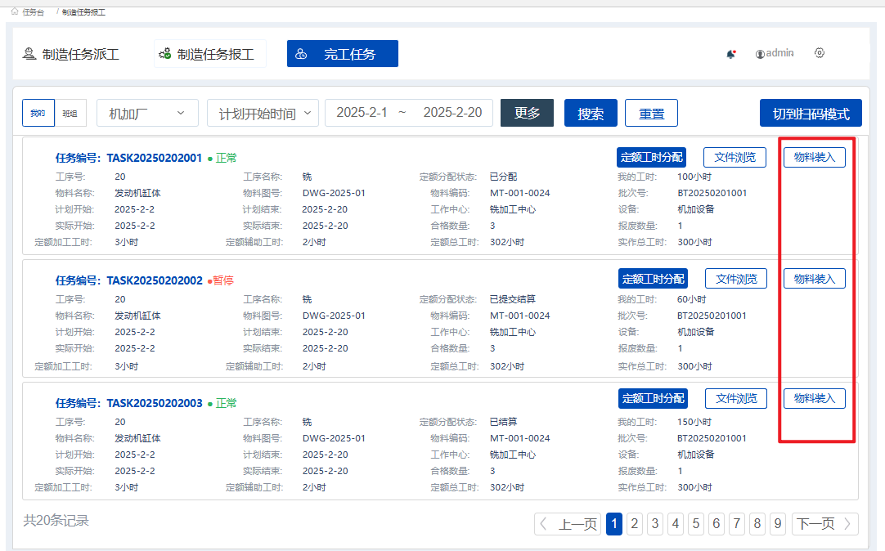

### 3.10.4 **完工任务-退料申请**

功能同3.9.4制造任务报工-退料申请

## 3.11 **制造任务管理**

### 3.11.1 **制造任务管理-物料装入**

功能同3.9.1制造任务报工-物料装入

### 3.11.2 **制造任务管理-退料申请**

功能同3.9.4制造任务报工-退料申请

## 3.12 **完工入库**

### 3.12.1 **完工入库-查询制造订单**

**概述**：提供一个统一的界面，用于查询制造订单并手动发起合格品或报废品的入库申请。该功能主要为计划员、车间主管等角色提供一个辅助的、手动的操作入口。合格入库和报废入库作为两个独立的导航菜单入口。

**界面**：

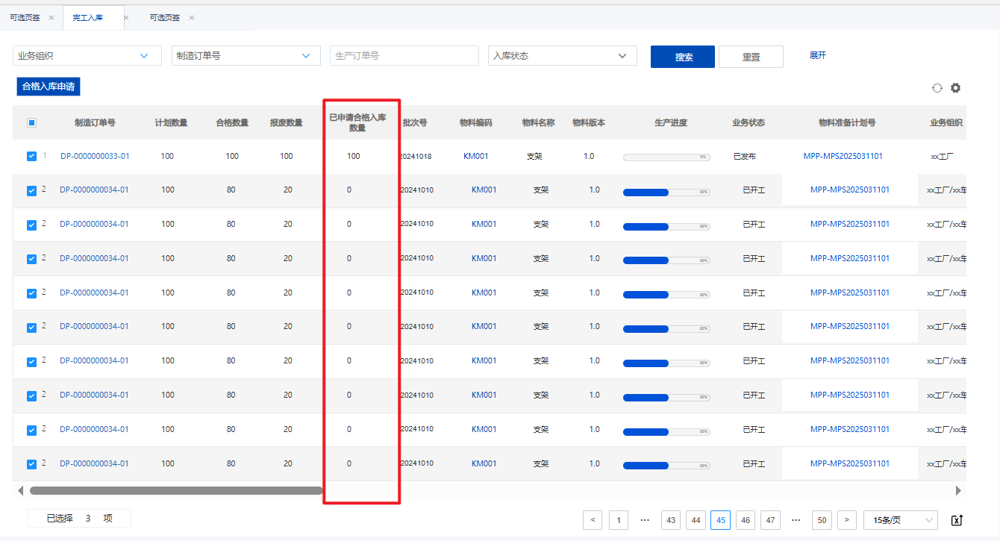

界面结构：

整体同制造订单管理，新增部分属性

网格列新增：已申请合格入库数量、已申请报废入库数量

操作：合格入库申请、报废入库申请

交互内容：

用户填写筛选条件，点击查询，显示符合条件的制造订单。

用户在列表中选择一个或多个制造订单后，点击操作按钮。

**点击"合格入库申请"按钮时**：系统会校验所有选中的订单。如果存在非"已完工"状态的订单，则会弹出提示："您选择的订单中包含未完工项，无法发起合格入库申请，请重新选择。"，流程中止。校验通过则进入申请界面。

**点击"报废入库申请"按钮时**：只要选中了订单，即可进入申请界面。

若未选择任何订单点击按钮，则提示："请至少选择一个制造订单进行操作。"

校验规则：无

**输入**：筛选条件

**输出**：制造订单

**处理逻辑**：

填写筛选条件，点击查询，显示查询的制造订单

**验收标准**：

可以根据订单状态筛选制造订单。

点击"合格入库申请"时，能正确校验订单状态并给出提示。

未选择订单点击按钮时，能给出正确的提示。

**验收场景**

**场景1: 合格入库**
- **Given** 制造订单MO001计划生产10件，最后一道工序已完成8件合格品
- **When** 用户进入合格入库界面
- **Then** 系统显示MO001可入库，用户可以对8件合格品进行入库

**场景2: 报废入库**
- **Given** 制造订单MO001在第2道工序报废2件
- **When** 用户进入报废入库界面
- **Then** 系统显示MO001可入库，用户可以对2件报废品进行入库

### 3.12.2 **完工入库-合格入库申请**

**概述**：对完工的制造订单，支持发起完工合格入库申请，实现成品管理的规范化。

**界面**：

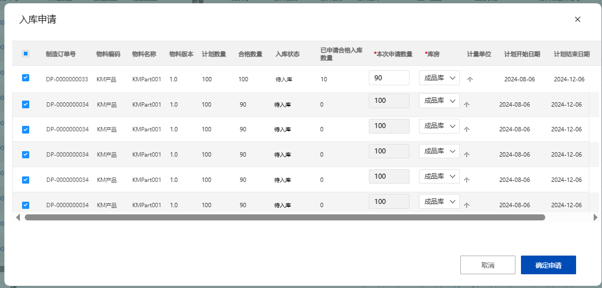

界面结构：

网格显示列：制造订单号、物料编码、物料名称、物料版本、计划数量、合格数量、入库状态、已申请合格入库数量、本次申请数量、计量单位、计划开始时间、计划结束时间

本次申请数量：必填，只读，数值编辑框，默认值=合格数量

库房：

必填，默认值读取配置，根据物料类别读取默认合格库房，详见3.1.4.1默认库房配置，未配置或配置错误，则显示空

下拉值为制造订单所属工厂下所有的库房

交互内容：选择制造订单，支持多选，点击入库申请按钮，弹出入库申请界面，系统自动填写本次申请数量，点击"确色申请"完成操作。

校验规则：

已入库申请完的制造订单不允许进行入库申请

0=<本次申请数量<=合格数量-已申请数量

**输入**：制造订单

**输出**：入库申请单

**处理逻辑**：

用户选择制造订单，支持多选，点击入库申请按钮，弹出入库申请界面

校验：

已入库的制造订单不允许进行入库申请

提示效果参考如下：

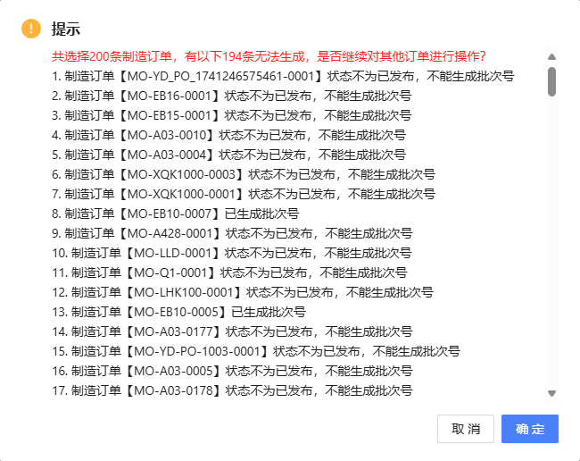

点击确定，打开入库申请界面，按需填写本次申请数量

点击确定申请:

需进行校验：本次申请数量<=合格数量-已申请数量，校验不通过，给出提示:"以下制造订单的本次申请数量超出剩余可申请数量，请修订后重新提交。
制造订单XX、XX、XX"

校验通过后，创建入库申请单，一个制造订单创建一个入库申请单：

入库申请单号：规则同库房创建入库申请单

入库方式：成品完工入库

入库工厂：制造订单的所属工厂

明细信息：

当制造订单存在序列号时，每一个序列号一行明细信息：

物料取制造订单的物料

批次号取制造订单的批次号

序列号：制造订单的序列号

计划数量=1

计量单位=制造订单的计量单位

库房=界面上的库房

其他属性从制造订单带入

当制造订单不存在序列号时：

物料取制造订单的物料

批次号取制造订单的批次号

计划数量=界面上本次申请数量

库房=界面上的库房

其他属性从制造订单带入

更新制造订单中的已申请合格入库数量=原数量+本次申请数量

申请成功后，关闭界面，刷新操作的制造订单

**验收标准**：

未选择制造订单时，提示"请选择制造订单"。

入库信息不完整时，提示"请填写完整的入库信息"。

申请成功时，提示"申请成功，申请单编号为：XXXX"。

### **3.12.3 ****完工入库-报废入库申请**

**概述**：对任意状态（如执行中、已完工）的制造订单，支持发起报废入库申请，用于处理生产过程中产生的报废品。

**界面**：界面布局参考"合格入库申请"，但关键字段和逻辑不同。

**界面结构**：

**网格显示列**：制造订单号、物料编码、物料名称、计划数量、已报废数量、本次报废数量、报废原因、计量单位等。

**本次报废数量**：必填，数字编辑框，用户需手动输入。

**报废原因**：非必填，文本输入框

**库房**：必填，默认值读取配置，根据物料类别读取默认废品库房，详见3.1.4.1默认库房配置，未配置或配置错误，则显示空

**交互内容**：用户在查询界面选择一个或多个制造订单，点击"报废入库申请"按钮，弹出报废入库申请界面。

**校验规则**：

本次报废数量 必须为大于0的数字。

本次报废数量 <= (计划数量 - 已申请合格入库数量 - 已申请报废入库数量)。

报废原因 必须选择。

**输入**：

选中的制造订单

本次报废数量

报废原因

**输出**：

类型为"成品报废入库"的入库申请单

**处理逻辑**：

用户在查询界面选择一个或多个制造订单，点击"报废入库申请"按钮，弹出申请界面。

用户填写"本次报废数量"和选择"报废原因"。

点击"确定申请"，系统进行校验。

校验通过后，为每个选中的制造订单创建一条类型为 **"成品报废入库"** 的入库申请单。

更新对应制造订单的"已申请报废入库数量"字段。

申请成功后，关闭弹窗并刷新列表。

**验收标准**：

报废数量超出可报废余量时，系统能正确拦截并提示。

未选择报废原因时，无法提交。

申请成功后，能正确生成"成品报废入库"类型的入库申请单，并更新制造订单的已报废数量。

# 4. **外部依赖**

本次功能对外部依赖的状态说明

|产品 | 应用 | 功能 | 外部依赖说明 | 状态|
|--- | --- | --- | --- | ---|
|KMMOM | 系统管理 | 业务配置 | 订单释放后读取配置
详见DNW30050-系统配置3.1.2.5生产订单释放 | 业务配置本次需开发修订|
|KMMOM | 系统管理 | 仓储配置 | 合格入库申请读取配置
详见DNW30050-系统配置3.1.4.1默认库房配置 | 仓储配置本次需开发修订|
|KMMOM | 系统管理 | 物料条码规则 | 物料装入时需读取物料条码规则
详见DNW30050-系统配置中的3.5条码业务配置 | |
