# DNW30331-物料动态占用与优先级管理

---

## 1. 概述

### 1.1 原始需求

**业务背景**：当前生产准备模块在处理物料齐套检查时，仅实现了物料的实时库存查询功能，缺乏库存的动态占用机制。

**用户故事**：
- 作为生产计划员，我希望系统能够自动识别高优先级订单并为其预留物料，以便确保重要订单的物料供应，提高计划执行率。
- 作为物料管理员，我希望能够基于订单优先级动态分配物料，以便在库存有限的情况下实现物料的合理分配，避免低价值订单占用高价值订单所需物料。
- 作为生产主管，我希望系统能够支持紧急插单时的物料重新分配，以便快速响应市场变化，提升生产计划的灵活性。

**问题痛点**：
1. **库存竞争无法管理**：多个订单同时竞争同一物料时，无法按优先级进行合理分配
2. **缺乏库存预留机制**：高优先级订单无法提前预留物料，可能导致执行时库存不足
3. **优先级策略单一**：现有系统缺乏灵活的优先级管理策略，无法满足复杂业务场景需求
4. **计划执行率低**：低优先级订单可能占用高优先级订单所需物料，影响整体计划执行

### 1.2 需求分析

**核心动因**：物料动态占用本质上是一个**资源竞争与优先级管理**的问题，需要在有限库存资源下，根据业务优先级、时间紧迫性、客户重要性等因素，实现库存的智能分配和预留。

**核心挑战**：
- 如何在有限库存下平衡多个订单的物料需求
- 如何定义和计算订单的优先级
- 如何实现物料的动态占用和释放
- 如何处理占用冲突和优先级调整

**价值主张与量化指标**：
- **计划执行率提升**：从当前的75%提升至90%以上，确保高优先级订单按时交付
- **库存周转率优化**：通过智能分配减少低价值订单占用，库存周转率提升15-20%
- **紧急插单响应时间**：从平均4小时缩短至1小时内，提升生产计划灵活性
- **客户满意度提升**：VIP客户和战略产品交付及时率提升至95%以上
- **实施复杂度降低**：采用单优先级策略，降低系统复杂度，提升实施成功率

### 1.3 用户画像

**核心用户角色**：

1. **生产计划员**
   - **工作职责**：负责制定和调整生产计划，协调物料供应与生产需求
   - **业务熟练度**：熟悉生产流程和物料管理，具备计划优化能力
   - **核心痛点**：无法确保高优先级订单的物料供应，计划执行率低

2. **物料管理员**
   - **工作职责**：管理物料库存，执行物料的分配和出库操作
   - **业务熟练度**：熟悉库存管理流程，了解物料特性
   - **核心痛点**：缺乏智能分配机制，物料分配决策困难

3. **生产主管**
   - **工作职责**：监督生产执行，处理紧急情况和计划变更
   - **业务熟练度**：具备丰富的生产管理经验，熟悉业务优先级
   - **核心痛点**：紧急插单时无法快速调整物料分配，响应速度慢

4. **库管员**
   - **工作职责**：执行具体的物料出库、入库操作，维护库存准确性
   - **业务熟练度**：熟悉仓库操作流程，了解物料存储要求
   - **核心痛点**：缺乏优先级指导，出库顺序不合理

## 2. 需求描述

### 2.1 业务描述

#### 2.1.1 业务主流程

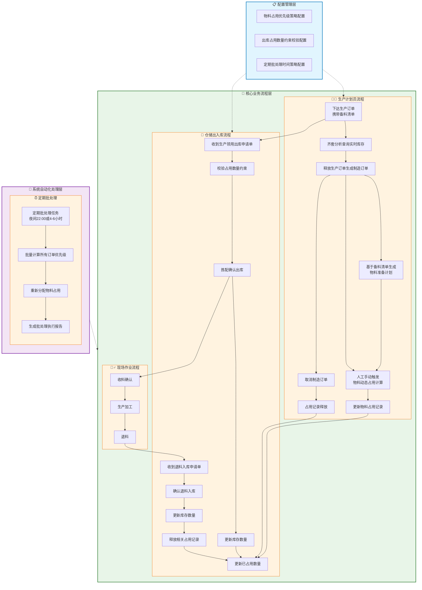

**流程说明**：

**核心业务流程**：
1. **下达生产订单携带备料清单**：生产计划员创建生产订单，同时携带备料清单信息（本批次支持跟随生产订单一起导入）
2. **齐套分析查询实时库存**：生产计划员可以对生产订单进行齐套分析，查询实时库存状态（本批次仅查看，不占用）
3. **释放生产订单生成制造订单**：生产计划员释放生产订单，系统自动生成制造订单
4. **基于备料清单生成物料准备计划**：系统根据备料清单自动生成物料准备计划，与制造订单一一对应
5. **人工手动触发物料动态占用计算**：生产计划员或物料管理员根据业务需要手动触发物料动态占用计算
6. **更新物料占用记录**：系统基于优先级策略进行物料分配，生成或更新物料占用记录
7. **发起领料申请**：生产计划员或操作工根据物料准备计划发起领料申请
8. **收到生产领用出库申请单**：库房收到生产领用出库申请单
9. **校验占用数量约束**：系统根据配置的约束模式（软占用/硬占用）进行出库校验
10. **拣配确认出库**：库房进行物料拣配并确认出库，同时更新库存数量和已占用数量
11. **收料确认**：现场操作工对出库物料进行收料确认
12. **生产加工**：操作工进行生产加工
13. **退料**：加工完成后，操作工可以进行退料操作
14. **确认退料入库**：库房确认退料入库，更新库存数量
15. **释放相关占用记录**：系统释放退料相关的占用记录
16. **取消制造订单**：生产计划员可以取消已下达的制造订单，系统自动释放相关物料的占用记录

**系统自动化处理**：
- **定期批处理任务**：系统在预设时间（夜间22:00或每4-6小时）自动执行批处理
- **批量计算所有订单优先级**：对所有符合条件的制造订单进行优先级重新计算
- **重新分配物料占用**：基于最新优先级和库存状态进行全局物料分配优化
- **生成批处理执行报告**：记录处理结果、异常情况和数据统计

**配置管理支撑**：
- **物料占用优先级策略配置**：为手动触发和定期批处理提供优先级计算依据
- **出库占用数量约束校验配置**：为仓储出库环节提供校验策略
- **定期批处理时间策略配置**：设定自动批处理的执行时间和频率

#### 2.1.2 业务流程描述

**活动1：生产订单下达**
- **输入**：生产订单信息（订单编号、产品信息、计划数量、交付时间、优先级）、备料清单
- **处理过程**：系统接收生产订单，解析备料清单中的物料需求信息
- **输出**：备料清单、物料需求计划
- **核心规则**：订单优先级必须明确标识，支持手动调整；备料清单可跟随生产订单一起导入
- **涉及角色**：生产计划员
- **具体业务场景**：生产计划员在系统中创建新的生产订单，系统自动生成对应的备料清单和物料需求计划

**活动2：物料需求汇总与物料准备计划生成**
- **输入**：生产订单、备料清单、库存信息
- **处理过程**：基于备料清单展开计算所需物料种类、数量、时间要求；生产订单释放时自动生成物料准备计划
- **输出**：物料准备计划、物料需求汇总表
- **核心规则**：考虑物料替代关系、安全库存要求；物料准备计划与制造订单一一对应
- **涉及角色**：生产计划员、系统自动执行
- **具体业务场景**：系统根据生产订单的备料清单结构，自动计算并汇总所有工序的物料需求，生成物料准备计划明细

**活动3：库存齐套分析**
- **输入**：物料准备计划、当前库存状态
- **处理过程**：检查库存总量、已占用数量，计算可用库存量，分析齐套情况
- **输出**：库存齐套分析报告、缺料清单
- **核心规则**：可用库存 = 总库存 - 已占用量；本批次仅查看齐套状态，不进行占用操作
- **涉及角色**：工厂计划员
- **具体业务场景**：系统对比物料准备计划中的需求与当前库存状态，生成齐套分析报告，标识哪些物料需要补充

**活动4：库存动态占用**
- **输入**：制造订单、物料准备计划、库存可用量、优先级配置
- **处理过程**：通过"定期批处理+人工手动触发"的双重机制进行处理
  - **人工手动触发**：生产计划员或物料管理员根据业务需要主动触发物料动态占用计算
  - **定期批处理**：系统按预设时间自动执行批量优先级计算和物料重新分配
  - **计算逻辑**：基于选定的优先级策略计算优先级得分，按优先级顺序分配物料，根据配置执行软占用或硬占用，生成或更新占用记录
- **输出**：物料占用分配结果、占用记录、操作日志（手动触发时）、批处理报告（自动执行时）
- **核心规则**：高优先级订单优先获得物料，支持部分分配；区分软硬占用并更新已占用量；记录所有操作日志
- **涉及角色**：物料管理员、生产计划员（手动触发）、系统自动执行（定期批处理）
- **具体业务场景**：
  - **紧急场景**：VIP客户紧急订单插入时，物料管理员手动触发占用计算，确保高优先级订单立即获得物料预留
  - **日常场景**：系统每天夜间自动执行批处理，对所有制造订单进行优先级重新计算和物料重新分配

**活动5：物料出库控制**
- **输入**：占用分配结果、物料出库请求
- **处理过程**：根据占用模式（软占用/硬占用），进行出库校验和控制
- **输出**：出库校验结果、库存状态更新
- **核心规则**：
    - **软占用**：弱提示，允许强行出库
    - **硬占用/锁定**：强阻止，不允许强行出库
    - 物料实际出库时，`库存数量`减少，同时相应`已占用数量`减少
- **涉及角色**：物料管理员、库管员
- **具体业务场景**：库管员在出库时，系统根据物料的占用状态进行校验，软占用给出弱提示，硬占用严格阻止

**活动6：物料生产领用**
- **输入**：生产任务、已占用物料、物料准备计划
- **处理过程**：执行生产任务，实际消耗物料
- **输出**：物料消耗记录
- **核心规则**：实际消耗量不得超过已占用量（硬占用模式下）；物料消耗后，及时更新占用记录
- **涉及角色**：生产人员、库管员
- **具体业务场景**：操作工在制造任务报工界面发起领料申请，库管员执行拣配出库，系统记录物料实际消耗

**活动7：占用记录释放**
- **输入**：物料消耗记录或订单取消/变更
- **处理过程**：释放已消耗或不再需要的物料占用记录，更新库存状态
- **输出**：库存状态更新
- **核心规则**：及时释放，支持手动调整；释放后增加`可用库存量`
- **涉及角色**：系统自动执行、物料管理员
- **具体业务场景**：包含多种场景：制造订单完工后自动释放、订单取消时手动释放、退料入库后释放、物料准备计划变更时释放

**活动8：制造订单取消**
- **输入**：制造订单、物料准备计划、已占用物料信息
- **处理过程**：系统接收制造订单取消请求，自动释放相关物料的占用记录，更新库存状态
- **输出**：占用记录释放结果、库存状态更新
- **核心规则**：取消订单后立即释放所有相关物料的占用记录；支持部分取消（仅取消特定工序的物料占用）
- **涉及角色**：生产计划员、系统自动执行
- **具体业务场景**：生产计划员因计划变更需要取消某个制造订单时，系统自动释放该订单占用的所有物料，使这些物料可以重新分配给其他高优先级订单

#### 2.1.3 使用场景设计

| 场景ID | 用户目标 | 触发条件 | 执行步骤 | 成功标准 |
|--------|----------|----------|----------|----------|
| UC-01 | 高优先级订单物料预留 | 高优先级订单下达且库存不足 | 1.系统识别高优先级订单 2.计算优先级得分 3.预留可用物料 4.生成占用记录 | 高优先级订单获得物料预留，低优先级订单无法占用 |
| UC-02 | 紧急插单物料重新分配 | 紧急订单插入且物料已被占用 | 1.系统识别紧急订单 2.重新计算优先级 3.调整物料占用 4.通知受影响订单 | 紧急订单获得物料，原占用订单收到调整通知 |
| UC-03 | 多订单物料竞争处理 | 多个订单同时需要同一物料 | 1.系统收集所有需求 2.计算各订单优先级 3.按优先级分配物料 4.生成分配报告 | 物料按优先级合理分配，避免低价值订单占用 |
| UC-04 | 物料占用状态查询 | 用户需要了解物料占用情况 | 1.用户查询物料状态 2.系统展示占用详情 3.显示优先级信息 4.提供调整建议 | 用户清楚了解物料占用状态和优先级分布 |
| UC-05 | 制造订单取消物料释放 | 制造订单需要取消或变更 | 1.系统接收取消请求 2.识别相关占用记录 3.释放物料占用 4.更新库存状态 | 取消订单后物料占用记录及时释放，库存状态正确更新 |

#### 2.1.4 动态占用处理与校验机制

##### 2.1.4.1 动态占用处理范围与机制

**动态占用处理的数据范围**：

**需要处理的数据范围**：
1. **所有待领料的物料准备计划**：状态为"初始"、"备料中"的物料准备计划明细
2. **已占用但未出库的物料**：状态为"已占用"但尚未实际出库的物料
3. **高优先级等待队列**：因库存不足而等待分配的高优先级订单
4. **物料入库/释放事件**：新物料入库或现有占用释放时触发的重新分配

**数据状态过滤条件**：
- **物料准备计划状态**：初始、备料中
- **制造订单状态**：未完工
- **物料占用状态**：已占用、待释放
- **库存状态**：可用、已占用、锁定

**我们的分析与建议**：
基于当前业务场景和系统复杂度考虑，推荐采用**"定期批处理 + 人工手动触发"**的双重策略组合，以实现系统稳定性、可控性和业务灵活性的平衡。

**推荐策略：定期批处理 + 人工手动触发**

1.  **定期批处理 (Scheduled Batch Processing)**：
    *   **职责**：作为系统的主要处理机制，定期运行（例如，每天夜间或每4-6小时）对系统中的所有动态占用记录进行**整体性的优化、清理和重新平衡**。
    *   **处理范围**：
        *   对所有符合条件的制造订单进行优先级重新计算
        *   基于最新库存状态和优先级策略进行物料重新分配
        *   清理过期占用记录，释放不再需要的库存
        *   处理数据不一致和异常状态修复
    *   **优势**：
        *   **系统稳定性高**：批处理避免了频繁的实时计算对系统性能的影响
        *   **数据一致性保障**：统一处理确保所有物料占用记录的一致性
        *   **全局优化效果**：能够从整体角度优化物料分配，避免局部最优
        *   **实施风险低**：技术复杂度适中，易于实施和维护
    *   **适用场景**：日常生产计划相对稳定的常规物料分配需求
    *   **配置建议**：
        *   初期设置为每天夜间22:00执行，避免影响正常工作时间
        *   根据业务需求可调整为每4-6小时执行一次
        *   提供批处理执行日志和结果报告

2.  **人工手动触发 (Manual Trigger)**：
    *   **职责**：为应对紧急情况和特殊业务场景，提供人工手动触发动态占用计算的能力。
    *   **触发条件**：
        *   紧急插单需要立即物料分配
        *   重要客户订单优先级调整
        *   物料紧急入库需要重新分配
        *   生产计划重大调整
        *   系统异常导致的占用记录修复
    *   **操作权限**：限制为"物料管理员"和"工厂计划员"角色
    *   **功能特性**：
        *   支持单个订单或批量订单的手动触发
        *   提供触发前的影响范围预览
        *   记录手动触发的操作日志和原因
        *   显示触发结果和影响评估
    *   **优势**：
        *   **应急响应能力**：能够快速应对突发的紧急业务需求
        *   **业务灵活性**：给予生产管理人员主动调控的能力
        *   **可控性强**：人工干预确保关键决策的准确性
        *   **学习价值**：通过手动触发了解系统计算逻辑和结果
    *   **适用场景**：紧急插单、VIP客户需求、生产异常处理等特殊情况

---

##### 2.1.4.2 物料出库阶段的校验逻辑

| 校验模式 | 业务含义 | 校验逻辑 | 适用场景 | 风险说明 |
|----------|----------|----------|----------|----------|
| **不约束（No Constraint）** | 出库时完全忽略已占用数量，只考虑库存数量 | 出库数量 ≤ 库存数量 | 物料非常充裕，或价值极低，无需精细管理占用的场景 | 可能导致计划性较差，物料被"无计划"领走 |
| **软占用（Soft Occupation）** | 出库时需考虑已占用数量。若出库量超过可用库存量（即动用了已占用的物料），系统给出弱提示（警告）。用户可选择强行出库 | 默认校验：出库数量 ≤ 可用库存量 若出库数量 > 可用库存量，系统提示："您正在领用已被XX订单（或其他需求）动态占用的物料X件，是否确认强行出库？" 用户选择"是"：允许出库；用户选择"否"：中止出库 | 对计划有指导性要求，但需要一定灵活性的场景；物料价值较高，但偶尔允许紧急插单打破占用 | 可能影响高优先级订单的物料供应 |
| **硬占用/锁定（Hard Occupation/Locking）** | 出库时必须严格遵守已占用数量。若出库量超过可用库存量，系统给出强提示（错误），不允许强行出库 | 出库数量 ≤ 可用库存量，否则严格阻止出库，并提示："物料X已被XX订单（或其他需求）硬性占用，无法出库，请联系相关人员。" | 高价值物料、关键瓶颈物料、军工等对计划执行严格要求的场景；需要为特定订单进行严格物料预留的场景 | 确保计划执行，但灵活性差，可能影响紧急插单 未来扩展： 1、强制出库增加审批事件入口； 2、强制出库后需要通知原占用订单。 |

#### 2.1.5 优先级策略分析

##### 2.1.5.1 单优先级策略设计

**策略选择机制**：

**核心原则**：系统支持三种优先级策略，但**同时只能选择一种**作为当前执行的策略

**策略选择方式**：
- **界面配置**：管理员可在系统配置界面选择当前使用的优先级策略
- **策略切换**：支持动态切换策略，切换后新策略立即生效
- **策略锁定**：生产执行期间可锁定策略，避免频繁切换影响生产

**三种优先级策略分析**：

**策略1：按订单优先级属性动态占用**
- **业务合理性**：⭐⭐⭐⭐⭐
- **核心逻辑**：直接反映业务决策和客户重要性
- **配置方式**：设置客户等级、产品价值、订单紧急程度等属性对应的优先级分数
- **适用场景**：客户差异化明显的行业，如装配、军工等

**策略2：按订单开工时间动态占用**
- **业务合理性**：⭐⭐⭐
- **核心逻辑**：按时间顺序分配，先到先得
- **配置方式**：设置不同时间窗口对应的优先级分数
- **适用场景**：物料充足且同质化程度高的场景，如标准件生产

**策略3：按排产结果顺序动态占用**
- **业务合理性**：⭐⭐⭐⭐
- **核心逻辑**：与生产计划保持一致，确保资源利用效率
- **配置方式**：设置排产优先级对应的分数区间
- **适用场景**：排产计划相对稳定的场景，如大批量生产

##### 2.1.5.2 推荐的优先级策略

**当前阶段：单优先级策略**

基于业务分析和实施复杂度考虑，**当前阶段推荐采用单优先级策略**

**未来扩展：分层优先级策略**

**演进方向**：在单优先级策略稳定运行后，可考虑升级为分层优先级策略

**优势**：
- 平衡了业务重要性、时间紧迫性和资源效率
- 避免了单一策略的局限性
- 支持业务场景的灵活配置

**实施时机**：
- 单优先级策略运行稳定后
- 业务规则更加成熟时
- 用户对系统功能更加熟悉后

##### 2.1.5.3 分层优先级策略的通俗化解释（样例）

**什么是分层优先级策略？**

想象一下，我们在给订单排队时，不是简单地按照一个标准（比如谁先来谁先做），而是综合考虑多个因素，就像给每个订单打分一样：

**第一层：基础优先级（40分）**
- 这就像VIP客户和普通客户的区别
- VIP客户来了，即使不是最早的，也要优先安排
- 紧急订单比普通订单重要，要优先处理
- 战略产品比常规产品重要，要优先保障

**第二层：时间优先级（30分）**
- 在基础优先级相同的情况下，谁更着急谁先做
- 比如两个都是VIP客户，但一个明天要交货，一个下周交货，那明天交货的优先
- 这就像排队时，虽然都是VIP，但更紧急的可以插队

**第三层：排产优先级（30分）**
- 在基础和时间都差不多的情况下，谁更符合生产计划谁先做
- 比如两个订单都很重要，都很急，但一个更符合车间的生产节奏，那就优先安排
- 这就像餐厅安排座位，不仅要看客人重要程度，还要看餐桌的利用效率

**举个具体例子：**

假设有三个订单竞争同一批钢材：

1. **订单A**：普通客户，明天要交货，符合生产计划
   - 基础优先级：60分 × 40% = 24分
   - 时间优先级：90分 × 30% = 27分  
   - 排产优先级：80分 × 30% = 24分
   - **总分：75分**

2. **订单B**：VIP客户，下周交货，不太符合生产计划
   - 基础优先级：100分 × 40% = 40分
   - 时间优先级：30分 × 30% = 9分
   - 排产优先级：40分 × 30% = 12分
   - **总分：61分**

3. **订单C**：普通客户，今天要交货，完全符合生产计划
   - 基础优先级：60分 × 40% = 24分
   - 时间优先级：100分 × 30% = 30分
   - 排产优先级：100分 × 30% = 30分
   - **总分：84分**

**最终排序：订单C > 订单A > 订单B**

**为什么这样排序？**
- 订单C虽然客户级别不高，但时间最紧急，且最符合生产计划，综合得分最高
- 订单A虽然时间也紧急，但客户级别和计划符合度都不如C
- 订单B虽然客户级别最高，但时间不紧急，且不太符合生产计划，综合得分最低

**这种策略的好处：**
1. **不会因为单一因素而做出错误决策**
2. **平衡了多个业务目标**
3. **可以根据实际情况调整权重**
4. **既考虑了业务价值，又考虑了执行效率**

##### 2.1.5.4 基于制造专业特点的深度业务场景分析

**机加工行业特点与物料占用策略**：

| 行业特征 | 描述 | 适合策略 | 适用场景 | 优势/局限性 |
|----------|------|----------|----------|-------------|
| **物料特性** | **主要对象是毛坯件**，经过初步加工的中间品，价值相对较高 | **按排产结果顺序动态占用 ⭐⭐⭐⭐⭐** | 所有机加工生产场景 | **与生产计划高度协同，确保毛坯按计划投入生产** |
| **工艺特点** | 工序相对固定，毛坯消耗可预测，但毛坯是生产的前提条件 | 按排产结果顺序动态占用 ⭐⭐⭐⭐⭐ | 机加工生产的所有场景 | **毛坯占用必须与排产计划严格一致，否则无法生产** |
| **生产节奏** | 批量生产，计划相对稳定，时间窗口严格 | 按排产结果顺序动态占用 ⭐⭐⭐⭐⭐ | 计划性较强的机加工生产 | **排产优先级决定毛坯分配，时间窗口约束严格** |
| **库存特点** | **毛坯库存相对紧张，周转要求高，专用性强** | 按排产结果顺序动态占用 ⭐⭐⭐⭐⭐ | 毛坯库存管理 | **毛坯是生产瓶颈，必须按排产优先级严格分配** |

**机加工行业的核心业务逻辑**：

1. **毛坯是生产的前提**：
   - 没有毛坯无法投入生产，这是机加工行业的基本约束
   - 毛坯的可用性直接决定了生产计划的可行性
   - 毛坯占用必须与排产优先级严格一致

2. **排产优先级决定一切**：
   - 排产计划是生产组织的核心，决定了所有资源的分配顺序
   - 毛坯、设备、人员等资源都必须按照排产优先级进行分配
   - 任何偏离排产优先级的资源分配都会影响整体生产效率

3. **时间窗口约束严格**：
   - 每个工序都有严格的时间窗口要求
   - 毛坯必须在正确的时间到达正确的位置
   - 时间偏差会导致整个生产计划的连锁反应

**机加工行业的策略选择结论**：

**强烈推荐：按排产结果顺序动态占用**

**选择原因**：
1. **业务逻辑一致性**：毛坯占用与排产优先级完全一致，避免资源分配冲突
2. **生产效率最大化**：确保高优先级排产计划能够获得必要的毛坯资源
3. **计划执行保障**：排产计划是生产组织的核心，毛坯占用必须为其服务
4. **风险控制**：避免因毛坯分配不当导致的生产计划执行失败

**其他策略的局限性**：
- **按订单优先级属性占用**：可能与排产优先级产生冲突，影响整体生产效率
- **按订单开工时间占用**：无法反映排产计划的真实优先级，容易造成资源浪费

---

**装配行业特点与物料占用策略**：

| 行业特征 | 描述 | 适合策略 | 适用场景 | 优势/局限性 |
|----------|------|----------|----------|-------------|
| **物料特性** | 零部件种类繁多，专用性强，替代性较低 | **按订单优先级属性动态占用 ⭐⭐⭐⭐⭐** | VIP客户订单、高价值产品、紧急交付 | **直接反映业务价值，客户满意度高，符合装配行业特点** |
| **工艺特点** | 装配工序灵活，物料组合复杂，计划变更频繁 | 按订单优先级属性动态占用 ⭐⭐⭐⭐⭐ | 装配生产的所有场景 | **装配行业客户差异化明显，优先级策略更能体现业务价值** |
| **生产节奏** | 多品种小批量，计划变更频繁，客户需求多样化 | 按订单优先级属性动态占用 ⭐⭐⭐⭐⭐ | 客户导向的装配生产 | **装配行业以客户需求为导向，优先级策略更符合业务逻辑** |
| **库存特点** | 零部件库存相对紧张，周转要求高，专用性强 | 按订单优先级属性动态占用 ⭐⭐⭐⭐⭐ | 零部件库存管理 | **零部件是装配的瓶颈，必须按客户优先级进行分配** |

**装配行业的核心业务逻辑**：

1. **客户导向的生产模式**：
   - 装配行业以客户需求为导向，客户优先级直接影响生产安排
   - VIP客户和战略产品需要优先保障物料供应
   - 客户满意度是装配行业的核心竞争力

2. **零部件专用性强**：
   - 装配零部件往往具有专用性，替代性较低
   - 零部件短缺会直接影响产品交付
   - 必须按照客户优先级进行零部件分配

3. **计划变更频繁**：
   - 装配行业客户需求变化较快，计划调整频繁
   - 需要灵活的物料分配策略来应对变化
   - 优先级策略能够快速响应业务变化

**装配行业的策略选择结论**：

**强烈推荐：按订单优先级属性动态占用**

**选择原因**：
1. **业务价值最大化**：直接反映客户重要性和订单价值
2. **客户满意度提升**：VIP客户和战略产品获得优先保障
3. **业务灵活性高**：能够快速响应客户需求变化
4. **资源利用合理**：避免低价值订单占用高价值订单所需资源

---

**热加工行业特点与物料占用策略**：

| 行业特征 | 描述 | 适合策略 | 适用场景 | 优势/局限性 |
|----------|------|----------|----------|-------------|
| **物料特性** | 原材料成本高，专用性强，替代性较低 | **按排产结果顺序动态占用 ⭐⭐⭐⭐⭐** | 大批量生产、成本敏感产品、计划性生产 | **全局优化，避免高成本物料的浪费，确保资源利用效率** |
| **工艺特点** | 工序复杂，物料消耗不可逆，计划性强 | 按排产结果顺序动态占用 ⭐⭐⭐⭐⭐ | 热加工生产的所有场景 | **热加工行业计划性强，排产优先级决定资源分配效率** |
| **生产节奏** | 批量较大，计划相对稳定，时间窗口严格 | 按排产结果顺序动态占用 ⭐⭐⭐⭐⭐ | 计划性较强的热加工生产 | **热加工行业时间窗口严格，必须按排产计划执行** |
| **库存特点** | 原材料库存紧张，成本控制严格，周转要求高 | 按排产结果顺序动态占用 ⭐⭐⭐⭐⭐ | 原材料库存管理 | **原材料是热加工的瓶颈，必须按排产优先级严格分配** |

**热加工行业的核心业务逻辑**：

1. **成本控制导向**：
   - 热加工行业原材料成本占比较高，成本控制是核心
   - 必须避免高成本物料的浪费和低效使用
   - 排产计划是成本控制的重要手段

2. **计划执行严格**：
   - 热加工工序复杂，时间窗口严格
   - 必须严格按照排产计划执行，避免连锁反应
   - 物料分配必须与排产优先级保持一致

3. **资源利用效率**：
   - 热加工设备投资大，必须最大化设备利用率
   - 排产计划是设备利用率优化的核心
   - 物料分配必须支持排产计划的执行

**热加工行业的策略选择结论**：

**强烈推荐：按排产结果顺序动态占用**

**选择原因**：
1. **成本控制最优**：避免高成本物料的浪费和低效使用
2. **计划执行保障**：确保排产计划能够严格执行
3. **资源利用最大化**：最大化设备利用率和整体资源效率
4. **风险控制有效**：避免因物料分配不当导致的生产计划失败

##### 2.1.5.5 从订单类型角度的业务场景分析

**订单类型与占用策略关联表**：

| 分类维度 | 订单类型 | 特点描述 | 推荐策略 | 选择原因 |
|----------|----------|----------|----------|----------|
| **按订单来源** | 客户订单 | 直接面向客户，交付压力大 | 按订单优先级属性动态占用 | 客户分级、订单价值差异明显 |
| | 预测订单 | 基于市场预测，计划性较强 | 按排产结果顺序动态占用 | 计划相对稳定，资源优化要求高 |
| | 补货订单 | 基于库存水平，相对标准化 | 按订单开工时间动态占用 | 标准化程度高，时间顺序分配合理 |
| **按紧急程度** | 紧急订单 | 时间要求严格，业务价值高 | 按订单优先级属性动态占用 | 紧急程度直接反映业务重要性 |
| | 常规订单 | 按计划执行，相对稳定 | 按排产结果顺序动态占用 | 与生产计划协同，资源利用效率高 |
| | 计划订单 | 提前规划，执行时间充裕 | 按订单开工时间动态占用 | 时间充裕，顺序分配相对公平 |

**真实业务场景对比表**：

| 场景 | 业务描述 | 物料特点 | 占用策略选择 | 选择原因 |
|------|----------|----------|--------------|----------|
| **机加工车间** 大批量标准件生产 | 生产1000件标准轴承座，使用同规格钢材 | 钢材库存充足，规格标准化 | 按排产结果顺序动态占用 | 计划稳定、物料充足、资源优化要求高 |
| **装配车间** VIP客户紧急订单 | 某VIP客户需要紧急交付10台定制设备 | 专用零部件，库存相对紧张 | 按订单优先级属性动态占用 | 客户价值高、紧急程度高、业务重要性突出 |
| **热加工车间** 成本控制严格的产品 | 生产高附加值合金产品，原材料成本占60% | 专用合金，库存紧张，成本控制严格 | 按排产结果顺序动态占用 | 成本控制要求高、计划稳定性重要、全局优化必要 |
| **通用物料补货** | 补充通用标准件库存，如螺丝、垫片等 | 完全标准化，库存相对充足 | 按订单开工时间动态占用 | 物料通用性强、标准化程度高、时间顺序分配合理 |

##### 2.1.5.6 业务决策的关键因素

**策略选择决策矩阵**：

| 影响因素 | 高 | 中 | 低 | 推荐策略 |
|----------|----|----|----|----------|
| **物料稀缺性** | 高稀缺性 | 中等稀缺性 | 低稀缺性 | 按优先级属性占用 → 按排产结果占用 → 按开工时间占用 |
| **计划稳定性** | 高稳定性 | 中等稳定性 | 低稳定性 | 按排产结果占用 → 按优先级属性占用 → 按开工时间占用 |
| **客户差异化** | 高差异化 | 中等差异化 | 低差异化 | 按优先级属性占用 → 按排产结果占用 → 按开工时间占用 |
| **成本敏感性** | 高敏感性 | 中等敏感性 | 低敏感性 | 按排产结果占用 → 按优先级属性占用 → 按开工时间占用 |

**决策优先级权重表**：

| 决策因素 | 权重 | 说明 | 影响程度 |
|----------|------|------|----------|
| **物料稀缺性** | 35% | 直接影响物料分配策略的核心因素 | 高 |
| **客户差异化** | 30% | 反映业务价值和客户重要性的关键指标 | 高 |
| **计划稳定性** | 25% | 影响资源利用效率和计划执行效果 | 中 |
| **成本敏感性** | 10% | 在特定行业中的重要考虑因素 | 中 |

**快速决策指南**：

| 业务场景特征 | 快速判断 | 推荐策略 | 实施要点 |
|--------------|----------|----------|----------|
| **高价值客户 + 紧缺物料** | 优先级最高 | 按订单优先级属性占用 | 重点保障VIP客户，严格控制物料分配 |
| **标准化生产 + 充足库存** | 效率优先 | 按排产结果占用 | 优化生产计划，提升资源利用率 |
| **同质化产品 + 通用物料** | 公平优先 | 按开工时间占用 | 先到先得，简化管理流程 |
| **混合场景** | 综合评估 | 分层优先级策略 | 根据权重配置，平衡多个目标 |

### 2.2 数据描述

#### 2.2.1 业务对象ER关系图

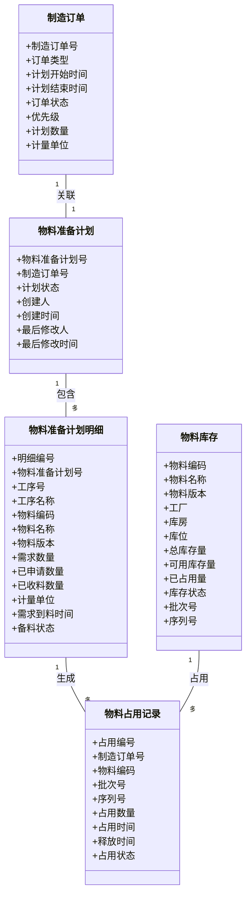

#### 2.2.2 数据字典

**制造订单数据字典**：

| 字段名 | 业务类型 | 业务约束 | 业务说明 |
|--------|----------|----------|----------|
| 制造订单号 | 文本标识 | 唯一, 格式：MO-YYYYMMDD-NNNN | 制造订单的唯一业务标识 |
| 订单类型 | 分类枚举 | 客户订单、预测订单、补货订单、紧急订单 | 订单的业务来源分类 |
| 计划开始时间 | 时间点 | 不能早于当前时间 | 制造订单的计划开始时间 |
| 计划结束时间 | 时间点 | 不能早于计划开始时间 | 制造订单的计划结束时间 |
| 订单状态 | 状态枚举 | 已下达、执行中、已完工、已取消 | 制造订单的当前执行状态 |
| 优先级 | 数值等级 | 1-100, 数值越大优先级越高 | 订单的业务重要性等级 |
| 计划数量 | 数量值 | 大于0, 支持小数 | 制造订单的计划生产数量 |
| 计量单位 | 文本标识 | 符合企业计量单位规范 | 生产数量的计量单位 |

**物料准备计划数据字典**：

| 字段名 | 业务类型 | 业务约束 | 业务说明 |
|--------|----------|----------|----------|
| 物料准备计划号 | 文本标识 | 唯一, 格式：MPP-制造订单号 | 物料准备计划的唯一业务标识 |
| 制造订单号 | 文本标识 | 关联制造订单 | 关联的制造订单编号 |
| 计划状态 | 状态枚举 | 初始、备料中、备料完成 | 物料准备计划的当前状态 |
| 创建人 | 文本标识 | 关联用户信息 | 创建物料准备计划的用户 |
| 创建时间 | 时间点 | 系统自动生成 | 物料准备计划的创建时间 |
| 最后修改人 | 文本标识 | 关联用户信息 | 最后修改物料准备计划的用户 |
| 最后修改时间 | 时间点 | 系统自动更新 | 物料准备计划的最后修改时间 |

**物料准备计划明细数据字典**：

| 字段名 | 业务类型 | 业务约束 | 业务说明 |
|--------|----------|----------|----------|
| 明细编号 | 文本标识 | 唯一 | 物料准备计划明细的唯一标识 |
| 物料准备计划号 | 文本标识 | 关联物料准备计划 | 关联的物料准备计划编号 |
| 工序号 | 文本标识 | 符合工艺路线规范 | 物料需求的工序编号 |
| 工序名称 | 文本标识 | 非空 | 物料需求的工序名称 |
| 物料编码 | 文本标识 | 唯一, 符合企业物料编码规范 | 物料的唯一业务标识 |
| 物料名称 | 文本标识 | 非空 | 物料的名称 |
| 物料版本 | 文本标识 | 符合版本管理规范 | 物料的版本标识 |
| 需求数量 | 数量值 | 大于0, 支持小数 | 该工序对特定物料的需求数量 |
| 已申请数量 | 数量值 | 大于等于0, 小于等于需求数量 | 已申请领料的物料数量 |
| 已收料数量 | 数量值 | 大于等于0, 小于等于需求数量 | 已收料确认的物料数量 |
| 计量单位 | 文本标识 | 符合企业计量单位规范 | 需求数量的计量单位 |
| 需求到料时间 | 时间点 | 不能早于当前时间 | 物料需求的具体时间点 |
| 备料状态 | 状态枚举 | 初始、已申请、已收料 | 物料的备料状态 |

**物料库存数据字典**：

| 字段名 | 业务类型 | 业务约束 | 业务说明 |
|--------|----------|----------|----------|
| 物料编码 | 文本标识 | 唯一, 符合企业物料编码规范 | 物料的唯一业务标识 |
| 物料名称 | 文本标识 | 非空 | 物料的名称 |
| 物料版本 | 文本标识 | 符合版本管理规范 | 物料的版本标识 |
| 工厂 | 文本标识 | 关联工厂信息 | 物料库存所属的工厂 |
| 库房 | 文本标识 | 关联库房信息 | 物料库存所在的库房 |
| 库位 | 文本标识 | 关联库位信息 | 物料库存所在的库位 |
| 总库存量 | 数量值 | 大于等于0, 支持小数 | 物料的实际库存总量 |
| 可用库存量 | 数量值 | 大于等于0, 小于等于总库存量 | 可用于分配给新需求的库存数量（总库存量 - 已占用量） |
| 已占用量 | 数量值 | 大于等于0, 小于等于总库存量 | 已根据优先级策略分配给特定订单或需求的物料数量，包含软占用和硬占用两种模式 |
| 库存状态 | 状态枚举 | 合格、不合格、报废 | 物料的库存质量状态 |
| 批次号 | 文本标识 | 符合批次管理规范 | 物料的批次标识 |
| 序列号 | 文本标识 | 符合序列号管理规范 | 物料的序列号标识 |

**物料占用记录数据字典**：

| 字段名 | 业务类型 | 业务约束 | 业务说明 |
|--------|----------|----------|----------|
| 占用编号 | 文本标识 | 唯一 | 物料占用记录的唯一标识 |
| 制造订单号 | 文本标识 | 关联制造订单 | 关联的制造订单编号 |
| 物料编码 | 文本标识 | 关联物料信息 | 被占用物料的编码 |
| 批次号 | 文本标识 | 关联物料库存 | 被占用物料的批次标识 |
| 序列号 | 文本标识 | 关联物料库存 | 被占用物料的序列号标识 |
| 占用数量 | 数量值 | 大于0, 支持小数 | 占用的物料数量 |
| 占用时间 | 时间点 | 系统自动生成 | 物料占用的开始时间 |
| 释放数量 | 数量值 | 大于0, 支持小数 | 释放的物料数量 |
| 释放时间 | 时间点 | 可为空 | 物料占用记录的释放时间 |
| 占用状态 | 状态枚举 | 已占用、已释放、已过期 | 物料占用记录的当前状态 |

#### 2.2.3 数据流图

**完整数据流图**：

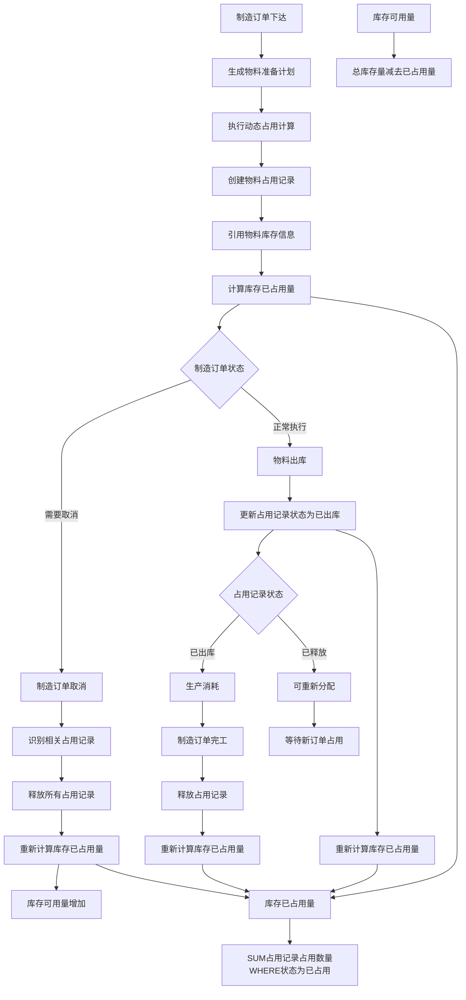

**数据流详细说明**：

**1. 制造订单正常流程**：
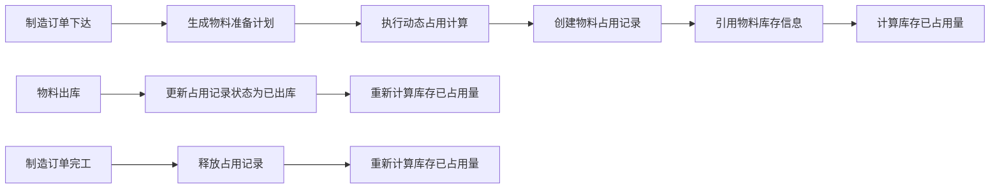

**2. 制造订单取消流程**：

**3. 库存数量计算逻辑**：
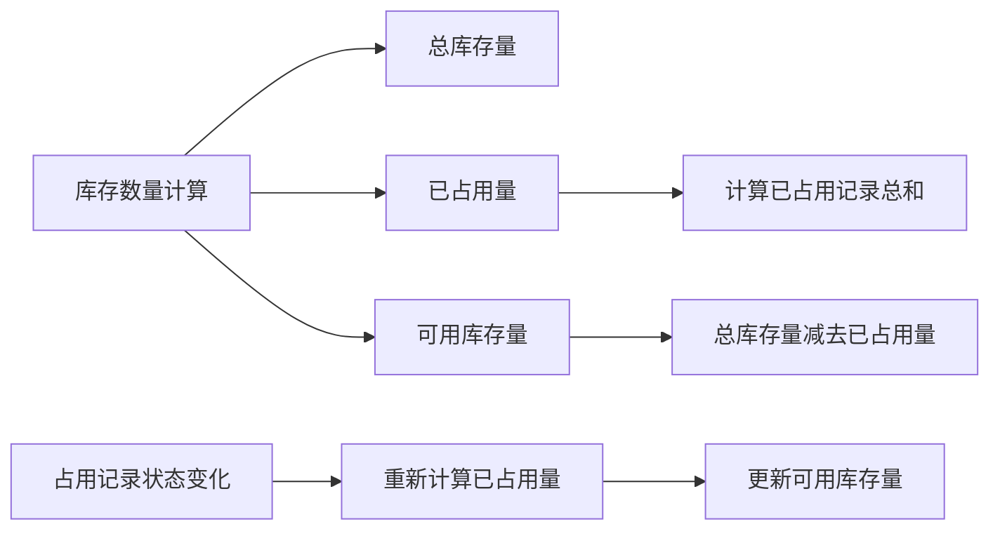

**关键数据流节点说明**：

| 步骤 | 操作 | 数据变化 | 业务影响 |
|------|------|----------|----------|
| **M** | 制造订单取消 | 订单状态变为"已取消" | 触发占用记录释放流程 |
| **N** | 识别相关占用记录 | 查询所有关联的占用记录 | 确定需要释放的物料范围 |
| **O** | 释放所有占用记录 | 占用记录状态变为"已释放" | 物料占用状态更新 |
| **P** | 重新计算库存已占用量 | 已占用量 = SUM(已占用状态的记录) | 库存数量重新计算 |
| **Q** | 库存可用量增加 | 可用库存量 = 总库存量 - 已占用量 | 物料可重新分配 |

**数据一致性保障**：

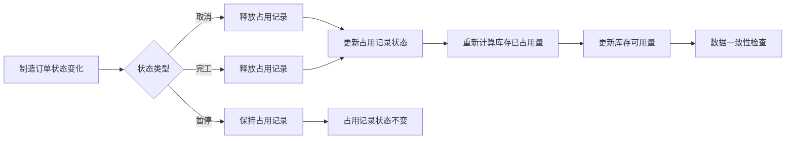

**实现要点**：

1. **事务控制**：制造订单取消与占用记录释放必须在同一事务中完成，确保库存数量计算的原子性

2. **状态同步**：占用记录状态变化时，库存数量必须同步更新，通过实时计算保证数据一致性

3. **异常处理**：取消操作失败时，占用记录状态不能改变；库存数量计算异常时，需要回滚操作

4. **性能优化**：批量处理多个占用记录的释放，缓存库存数量计算结果，减少重复计算

### 2.3 功能描述

#### 2.3.1 整体应用架构

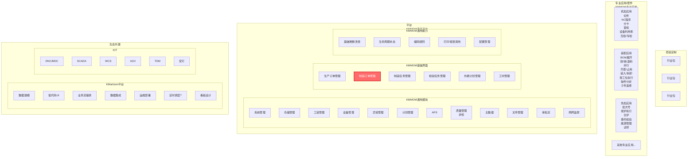

#### 2.3.2 模块/核心功能应用架构

#### 2.3.3 功能清单

| 模块 | 页面 | 功能点 | 功能点状态 | 功能点描述 |
|------|------|--------|------------|------------|
| 制造执行 | 制造订单管理 | `物料动态占用` | 已实现 | 作为工厂计划员或物料管理员，我希望能够手动触发对特定制造订单的物料进行动态占用分配，以应对紧急或特定场景下的物料调度需求。支持查询模式和计算模式双重功能，提供智能悬浮面板和多次计算支持。 |
| 制造执行 | 制造订单管理 | `取消` | 待修订 | 作为生产计划员，我希望能确认取消制造订单的操作，以便系统自动释放相关物料的占用记录。 |
| 仓储物流 | 物料库存 | `查询` | 待修订 | 作为仓储管理员，我希望能查询库存的已占用数量，支持按物料编码、名称、库房等条件筛选，查看物料的实时库存状态、已占用数量等关键信息。 |
| 仓储物流 | 物料出库 | `确认出库` | 待修订 | 作为仓储管理员，我希望能在出库的时间，根据配置校验已占用数量是否允许出库，支持软占用和硬占用两种模式的校验控制。 |

### 2.4 用户体验要求

#### 2.4.1 可用性目标
- **操作效率**：物料占用分配操作应在3步内完成
- **信息展示**：优先级信息应清晰可见，支持多维度排序
- **响应时间**：优先级计算和占用分配应在5秒内完成
- **错误处理**：提供清晰的错误提示和解决建议

#### 2.4.2 交互要求
- **操作反馈**：所有操作都应提供即时反馈
- **状态可见性**：物料占用状态应实时更新
- **操作确认**：重要操作（如占用调整）需要确认
- **批量操作**：支持批量优先级调整和占用管理

#### 2.4.3 可访问性要求
- **遵循平台统一设计规范**：使用KMMOM平台统一的设计语言和交互模式
- **响应式设计**：支持不同屏幕尺寸的设备访问
- **键盘导航**：支持键盘快捷键操作
- **多语言支持**：支持中文界面显示

## 3. 页面&功能设计

### 3.1 制造执行

#### 3.1.1 制造订单管理

- **概述**

本页面用于管理制造订单的物料动态占用分配，支持基于优先级策略的智能物料分配和手动调整，确保高优先级订单的物料供应。

- **功能清单**

| 功能点 | 描述 |
|--------|------|
| `[按钮] 物料动态占用` | 手动触发对特定制造订单的物料进行动态占用分配，以应对紧急或特定场景下的物料调度需求。支持查询模式和计算模式双重功能，提供智能悬浮面板和多次计算支持。 |
| `[按钮] 取消` | 确认取消制造订单的操作，系统自动释放相关物料的占用记录。 |

#### 3.1.1.1 物料动态占用

##### 概述

基于优先级策略对制造订单进行物料动态占用计算，支持批量订单的智能物料分配和占用结果分析，确保高优先级订单的物料供应。本功能采用"定期批处理+人工手动触发"的策略组合，既保证了系统稳定性，又提供了应急响应能力。用户既可以查看当前占用状态，也可以手动触发动态占用计算。

##### 用户场景与核心路径

**核心场景 (UC-Dynamic-01)**: 工厂计划员小王需要为多个制造订单进行物料占用计算，系统基于配置的优先级策略自动计算所有符合条件的订单优先级，并按优先级顺序分配可用物料，生成详细的占用结果分析报告。

**核心场景 (UC-Dynamic-02)**: 生产主管需要了解当前物料占用情况，通过动态占用功能查看所有参与计算的制造订单及其总体占用结果，点击任一订单查看其详细的物料需求明细和占用状态。

**核心场景 (UC-Dynamic-03)**: 物料管理员需要快速了解当前物料占用状态，通过查询模式直接查看符合条件的制造订单及其占用结果，无需等待计算过程，提高工作效率。

##### 界面原型描述

- 本功能主要涉及在"制造订单管理"页面触发的`物料动态占用`操作。
- **触发方式**: 在`制造订单管理`页面，点击`物料动态占用`按钮，系统弹出动态占用弹窗。
- **`动态占用弹窗`核心组件**:
  - **主界面核心信息区**:
    - 符合条件的制造订单数量统计：显示"符合条件的制造订单：X个"
    - 信息图标（?）：点击可查看计算范围和优先级策略的智能悬浮面板
    - 物料占用优先级策略：下拉单选，默认选中“按订单优先级属性动态占用”，下拉候选值如下：
      - 按订单优先级属性动态占用：直接反映业务决策和客户重要性，适合客户差异化明显的行业，如装配、军工等。
      - 按订单开工时间动态占用：按时间顺序分配，先到先得，适合物料充足且同质化程度高的场景，如标准件生产。
      - 按排产结果顺序动态占用：与生产计划保持一致，确保资源利用效率，适合排产计划相对稳定的场景，如大批量生产。
    - 开始计算按钮：始终可见，支持多次计算操作
  - **智能悬浮信息面板**（点击?图标触发）:
    - 面板头部：标题"计算配置信息"，包含固定面板和关闭面板按钮
    - 面板内容：左右布局显示计算范围说明和当前优先级策略
    - 支持拖拽移动和固定显示
  - **查询条件区域**:
    - 占用结果筛选：占用成功、部分占用、占用失败复选框
    - 制造订单号搜索：支持模糊查询
    - 重置和查询按钮
  - **结果展示区**:
    - 表格标题：根据模式显示"当前占用状态"或"物料占用结果"
    - 制造订单占用结果表格：显示订单基本信息、总体占用结果、优先级等
    - 支持行点击选中，高亮显示选中行
  - **物料需求明细区**:
    - 点击订单行显示对应的物料需求明细
    - 支持占用库存详情和占用订单详情查看
    - 表格支持横向滚动，最后两列固定显示
  - **底部操作区域**:
    - 关闭按钮：固定在界面最底层，始终可见
  - **计算进度区**（计算过程中显示）:
    - 计算进度条和进度文本
    - 已处理订单数量统计

##### 业务规则

1. **权限控制**: 只有具备"物料管理员"或"工厂计划员"角色的用户才能执行手动触发动态占用操作
2. **策略配置**: 系统支持三种优先级策略，但当前只能使用后台配置的单一策略
3. **触发机制**: 采用"定期批处理+人工手动触发"的双重策略：
   - **定期批处理**: 每天夜间或定期（4-6小时）自动执行物料动态占用计算
   - **人工手动触发**: 支持紧急情况下的即时手动触发计算
4. **计算范围**: 计算所有符合条件的制造订单（未完工状态、存在物料准备计划、有未收料物料明细）
5. **优先级计算**: 基于配置的优先级策略自动计算每个订单的优先级得分
6. **物料分配**: 按优先级顺序分配可用物料，高优先级订单优先获得
7. **占用结果分类**: 支持按占用结果（占用成功、部分占用、占用失败）进行筛选
8. **交互式分析**: 点击制造订单行可查看其详细的物料需求明细和占用情况
9. **多次计算支持**: 手动触发按钮始终可见，支持连续多次手动计算操作
10. **智能悬浮面板**: 点击信息图标（?）可查看计算范围和优先级策略，支持拖拽移动和固定显示
11. **查询模式优先**: 弹窗默认显示查询模式效果，展示当前占用状态和物料需求明细
12. **操作日志**: 记录所有手动触发的操作日志，包括触发原因、操作人员、触发时间和结果
13. **批处理监控**: 提供定期批处理的执行状态监控和结果报告功能
14. **表格优化**: 物料需求明细表格支持横向滚动，最后两列（占用库存详情、占用订单详情）固定显示
15. **界面响应式**: 弹窗宽度自适应，支持不同屏幕尺寸，底部关闭按钮固定显示

##### 处理逻辑

**第一层：用户流程图 (User Flow Diagram)**

**第二层：叙事化逻辑流 (Narrative Logic Flow)**

1. **前置条件**: 用户必须拥有"物料管理员"或"工厂计划员"权限，系统中存在符合条件的制造订单（未完工状态、存在物料准备计划、有未收料物料明细）。

2. **流程触发**: 用户在`制造订单管理`页面点击`物料动态占用`按钮，系统弹出`动态占用弹窗`，默认显示查询模式效果。

3. **系统初始化与展示**:
   - 系统自动获取符合条件的制造订单数量，显示在界面顶部
   - 默认展示当前占用状态表格和物料需求明细
   - 开始计算按钮始终可见，支持多次计算操作
   - 信息图标（?）可点击查看计算范围和优先级策略的智能悬浮面板

4. **查询模式体验**:
   - 系统自动查询并显示当前占用状态
   - 支持按占用结果（占用成功、部分占用、占用失败）进行筛选
   - 支持按制造订单号进行模糊搜索
   - 点击订单行可查看其详细的物料需求明细和占用情况
   - 物料需求明细表格支持横向滚动，最后两列固定显示

5. **计算模式处理**: 用户点击`开始计算`后，系统执行以下操作：
   - **权限验证**: 确认用户具备"物料管理员"或"工厂计划员"权限
   - **按钮状态变化**: 按钮显示"计算中..."并暂时禁用，防止重复点击
   - **进度展示**: 显示计算进度条和已处理订单数量统计
   - **优先级计算**: 基于选择的策略自动计算所有相关订单的优先级得分
   - **物料分配**: 按优先级顺序分配可用物料，高优先级订单优先获得
   - **结果分类**: 根据占用结果将订单分为"占用成功"、"部分占用"、"占用失败"三类
   - **操作记录**: 记录手动触发的操作日志，包括触发原因、操作人员、触发时间和计算结果
   - **状态同步**: 更新所有相关的占用记录和库存状态

6. **结果展示与分析**:
   - 显示所有参与计算的制造订单及其总体占用结果
   - 支持按占用结果和订单号进行筛选
   - 点击订单行可查看其详细的物料需求明细和占用情况
   - 支持查看占用库存详情和占用订单详情
   - 开始计算按钮恢复"开始计算"状态，支持继续计算

7. **智能悬浮面板功能**:
   - 点击信息图标（?）显示计算配置信息面板
   - 面板包含计算范围说明和当前优先级策略的左右布局
   - 支持拖拽移动，可固定显示
   - 响应式设计，适配不同屏幕尺寸

8. **界面优化特性**:
   - 弹窗宽度自适应，支持不同屏幕尺寸
   - 底部关闭按钮固定显示，始终可见
   - 表格支持横向滚动，关键列固定显示
   - 无底部横向滚动条，界面更加清爽

**第三层：状态机图 (State Machine Diagram)**

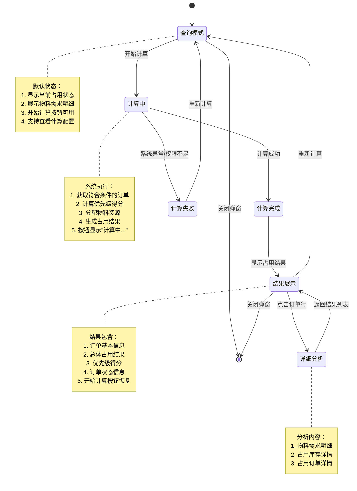

##### 验收标准

| 场景ID | 场景描述 | 前置条件 | 操作步骤 | 预期结果 |
|---------|----------|----------|----------|----------|
| AC-Dynamic-01 | 正常动态占用计算成功 | 1. 用户"小王"拥有"物料管理员"权限。 2. 系统中存在符合条件的制造订单（未完工状态、有物料准备计划）。 3. 后台已配置优先级策略。 | 1. 用户"小王"进入`制造订单管理`页面。 2. 点击`物料动态占用`按钮。 3. 系统默认显示查询模式，展示当前占用状态。 4. 点击`开始计算`按钮。 | 1. **界面**：显示计算进度，按钮显示"计算中..."，最终显示"计算完成"。 2. **数据**：显示所有参与计算的制造订单及其总体占用结果。 3. **功能**：支持按占用结果筛选，支持订单号搜索。 4. **交互**：点击订单行可查看物料需求明细。 5. **按钮状态**：计算完成后按钮恢复"开始计算"，支持多次计算。 |
| AC-Dynamic-02 | 查询模式默认展示功能 | 1. 用户拥有相应权限。 2. 系统中存在符合条件的制造订单。 | 1. 用户进入`制造订单管理`页面。 2. 点击`物料动态占用`按钮。 3. 弹窗打开后观察界面状态。 | 1. **界面**：弹窗默认显示查询模式效果。 2. **数据**：显示符合条件的制造订单数量统计。 3. **表格**：显示当前占用状态表格和物料需求明细。 4. **按钮**：开始计算按钮始终可见。 5. **信息图标**：显示"?"图标，可点击查看计算配置。 |
| AC-Dynamic-03 | 智能悬浮面板功能 | 1. 动态占用弹窗已打开。 2. 界面显示信息图标（?）。 | 1. 点击信息图标（?）。 2. 观察悬浮面板显示。 3. 尝试拖拽面板。 4. 点击固定面板按钮。 | 1. **面板显示**：正确显示计算配置信息面板。 2. **内容布局**：计算范围说明和优先级策略左右布局显示。 3. **拖拽功能**：面板支持拖拽移动。 4. **固定功能**：点击固定按钮可固定面板位置。 5. **关闭功能**：点击关闭按钮可隐藏面板。 |
| AC-Dynamic-04 | 动态占用结果筛选功能 | 1. 动态占用计算已完成。 2. 结果中包含不同占用状态的订单。 | 1. 在筛选区域选择"占用成功"选项。 2. 在订单号搜索框输入特定订单号。 3. 点击"查询"按钮。 | 1. **界面**：表格只显示符合条件的订单。 2. **筛选**：占用结果筛选正确生效。 3. **搜索**：订单号搜索功能正常。 4. **重置**：点击"重置"按钮可恢复全部显示。 |
| AC-Dynamic-05 | 物料需求明细查看功能 | 1. 动态占用计算已完成。 2. 结果表格中显示制造订单信息。 | 1. 点击任一制造订单行。 2. 查看下方"物料需求明细"表格。 | 1. **界面**：下方显示该订单的物料需求明细。 2. **数据**：显示原料编码、名称、需求数量、占用数量等信息。 3. **功能**：支持查看占用库存详情和占用订单详情。 4. **交互**：表格行有悬停效果，点击行高亮显示。 5. **表格优化**：支持横向滚动，最后两列固定显示。 |
| AC-Dynamic-06 | 占用详情弹窗功能 | 1. 物料需求明细表格已显示。 2. 表格中包含"占用库存详情"和"占用订单详情"按钮。 | 1. 点击"占用库存详情"按钮。 2. 点击"占用订单详情"按钮。 | 1. **弹窗**：正确显示对应的详情弹窗。 2. **内容**：弹窗内容与按钮功能匹配。 3. **操作**：弹窗支持关闭操作。 4. **数据**：弹窗数据准确显示。 |
| AC-Dynamic-07 | 多次计算支持功能 | 1. 动态占用计算已完成。 2. 界面显示计算结果。 | 1. 观察开始计算按钮状态。 2. 再次点击"开始计算"按钮。 3. 执行第二次计算。 | 1. **按钮状态**：开始计算按钮始终可见，状态正常。 2. **多次计算**：支持连续多次计算操作。 3. **状态管理**：每次计算过程中按钮显示"计算中..."，完成后恢复"开始计算"。 4. **结果更新**：每次计算都能正确更新结果数据。 |
| AC-Dynamic-08 | 界面响应式优化功能 | 1. 动态占用弹窗已打开。 2. 界面显示完整内容。 | 1. 观察弹窗宽度和布局。 2. 检查底部关闭按钮位置。 3. 观察表格横向滚动条。 | 1. **弹窗宽度**：弹窗宽度自适应，支持不同屏幕尺寸。 2. **底部按钮**：关闭按钮固定在界面最底层，始终可见。 3. **表格滚动**：表格支持横向滚动，无底部横向滚动条。 4. **固定列**：物料需求明细表格最后两列固定显示，便于查看关键信息。 |

#### 3.1.1.2 取消

##### 概述

确认取消制造订单的操作，系统自动释放相关物料的占用记录，确保库存状态的准确性。

##### 用户场景与核心路径

**核心场景 (UC-Cancel-01)**: 生产计划员小李发现某个制造订单因客户需求变更需要取消。他通过制造订单管理页面执行取消操作，系统自动释放该订单占用的所有物料，使这些物料可以重新分配给其他高优先级订单。

##### 界面原型描述
和原有功能一致

##### 处理逻辑

 **核心处理**: 用户点击`确认取消`后，系统执行以下操作：
   - **状态校验**: 验证订单当前状态是否允许取消
   - **物料释放**: 自动释放该订单占用的所有物料，更新占用记录状态为"已释放"
   - **订单取消**: 将订单状态更新为"已取消"
   - **库存更新**: 更新相关物料的`已占用量`，增加`可用库存量`
   - **影响评估**: 评估取消操作对相关生产计划的影响

##### 验收标准

| 场景ID | 场景描述 | 前置条件 | 操作步骤 | 预期结果 |
|---------|----------|----------|----------|----------|
| AC-Cancel-01 | 正常取消制造订单成功 | 1. 用户"小李"拥有"生产计划员"权限。 2. 制造订单"MO-004"状态为"已下达"。 3. 该订单占用了物料A和物料B。 | 1. 用户"小李"进入`制造订单管理`页面。 2. 选择制造订单"MO-004"，点击`取消`。 3. 在弹窗中填写取消原因为"客户需求变更"。 4. 点击`确认取消`。 | 1. **界面**：提示"订单取消成功"。 2. **数据**：订单"MO-004"状态更新为"已取消"。 3. **状态**：物料A和物料B的占用记录状态更新为"已释放"，`已占用量`相应减少。 4. **通知**：系统通知相关责任人订单取消和物料释放。 |
| AC-Cancel-02 | 已完工订单无法取消 | 1. 用户"小李"拥有"生产计划员"权限。 2. 制造订单"MO-005"状态为"已完工"。 | 1. 用户"小李"进入`制造订单管理`页面。 2. 选择制造订单"MO-005"，点击`取消`。 | 1. **界面**：提示"订单状态不允许取消，只有已下达或执行中的订单可以取消"。 2. **数据**：订单状态无变化。 3. **状态**：无物料占用记录变化。 |

## 3.2 仓储物流

### 3.2.1 物料库存

- **概述**

本页面用于管理物料库存信息，支持查询库存的已占用数量，为物料动态占用管理提供库存状态基础数据支撑。

- **功能清单**

| 功能点 | 描述 |
|--------|------|
| `[查询] 查询` | 按物料编码、名称、库房等条件筛选物料库存信息，支持查看已占用数量等关键库存状态。 |

#### 3.2.1.1 查询

##### 概述

基于多种查询条件筛选物料库存信息，支持查看物料的实时库存状态、已占用数量等关键信息，为物料管理员提供库存决策支持。

##### 用户场景与核心路径

**核心场景 (UC-Inventory-01)**: 物料管理员小王需要了解当前库存中钢材A的占用情况，通过物料库存查询功能快速获取该物料的库存总量、可用数量和已占用数量，为后续的物料分配决策提供数据支撑。

**核心场景 (UC-Inventory-02)**: 生产计划员需要了解多个关键物料的库存状态，通过批量查询功能快速获取库存概况，评估当前物料供应能力。

##### 界面原型描述

- 本功能主要涉及在"物料库存"页面触发的`查询`操作。
- **触发方式**: 在`物料库存`页面，用户输入查询条件后点击`查询`按钮，系统执行查询并展示结果。
- **`物料库存`页面核心组件**:
  - **查询条件区域**:
    - 物料编码：支持模糊查询的文本输入框
    - 物料名称：支持模糊查询的文本输入框
    - 库房：下拉选择框，支持多选
    - 库存状态：复选框组（合格、不合格、报废）
    - 查询按钮：执行查询操作
    - 重置按钮：清空查询条件
  - **结果展示区**:
    - 库存信息表格：显示物料编码、名称、版本、库房、库位、总库存量、可用库存量、已占用量、库存状态等字段
    - 支持按各列排序
    - 支持分页显示
  - **操作区域**:
    - 导出按钮：支持导出查询结果为Excel文件
    - 刷新按钮：手动刷新当前查询结果

##### 业务规则

1. **权限控制**: 所有用户都可以查询物料库存信息，但敏感信息（如批次号、序列号）需要相应权限
2. **查询范围**: 默认查询当前用户有权限访问的库房物料信息
3. **数据实时性**: 库存数量信息实时更新，已占用数量与物料占用记录保持同步
4. **查询性能**: 支持大数据量查询，单次查询结果不超过10000条记录
5. **导出限制**: 导出功能限制单次最多导出5000条记录，避免系统性能影响

##### 处理逻辑

**第一层：用户流程图 (User Flow Diagram)**

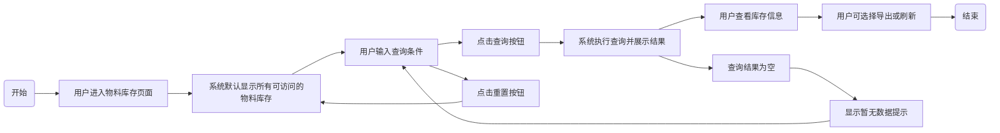

**第二层：叙事化逻辑流 (Narrative Logic Flow)**

1. **前置条件**: 用户必须拥有访问物料库存的权限，系统中存在物料库存数据。

2. **流程触发**: 用户进入`物料库存`页面，系统自动加载当前用户有权限访问的物料库存信息。

3. **系统初始化与展示**:
   - 系统自动获取用户权限范围内的库房信息，填充库房下拉选择框
   - 默认显示所有可访问物料的库存信息，包含库存总量、可用数量、已占用数量等关键字段
   - 支持按物料编码、名称、库房等字段进行排序

4. **查询条件处理**: 用户可以通过以下方式筛选数据：
   - **物料编码查询**: 支持精确匹配和模糊查询，输入部分编码可查询相关物料
   - **物料名称查询**: 支持中文名称的模糊查询，提升查询便利性
   - **库房筛选**: 支持多选，用户可选择多个库房进行查询
   - **库存状态筛选**: 通过复选框选择特定状态的物料

5. **查询执行与结果展示**:
   - 用户点击`查询`按钮后，系统根据查询条件筛选数据
   - 查询结果以表格形式展示，包含物料的完整库存信息
   - 支持分页显示，每页默认显示50条记录
   - 查询结果为空时，显示友好的"暂无数据"提示

6. **结果操作与导出**:
   - 用户可对查询结果进行排序和分页浏览
   - 支持导出功能，将当前查询结果导出为Excel文件
   - 提供刷新功能，手动更新查询结果以获取最新数据

**第三层：状态机图 (State Machine Diagram)**

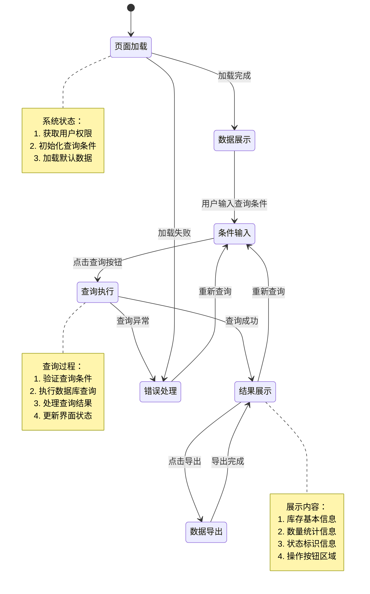

##### 验收标准

| 场景ID | 场景描述 | 前置条件 | 操作步骤 | 预期结果 |
|---------|----------|----------|----------|----------|
| AC-Inventory-01 | 正常查询物料库存成功 | 1. 用户"小王"拥有"物料管理员"权限。 2. 系统中存在物料库存数据。 3. 用户可访问多个库房。 | 1. 用户"小王"进入`物料库存`页面。 2. 在物料编码输入框中输入"钢材A"。 3. 点击`查询`按钮。 | 1. **界面**：系统显示查询结果，包含钢材A的库存信息。 2. **数据**：显示该物料的库存总量、可用数量、已占用数量等字段。 3. **功能**：支持按各列排序，支持分页浏览。 4. **性能**：查询响应时间在2秒内完成。 |
| AC-Inventory-02 | 多条件组合查询成功 | 1. 用户拥有相应权限。 2. 系统中存在满足条件的物料库存数据。 | 1. 用户选择库房"主库房"。 2. 选择库存状态"合格"。 3. 在物料名称中输入"轴承"。 4. 点击`查询`按钮。 | 1. **界面**：系统显示符合条件的查询结果。 2. **数据**：只显示主库房中状态为合格且名称包含"轴承"的物料。 3. **筛选**：查询条件组合正确生效。 4. **结果**：结果数量与预期一致。 |
| AC-Inventory-03 | 查询结果导出功能 | 1. 查询已执行并显示结果。 2. 结果数量在导出限制范围内。 | 1. 用户查看查询结果。 2. 点击`导出`按钮。 3. 选择保存位置并确认。 | 1. **导出**：系统生成Excel文件。 2. **内容**：导出的数据与查询结果一致。 3. **格式**：Excel文件包含所有显示的字段信息。 4. **性能**：导出操作在合理时间内完成。 |
| AC-Inventory-04 | 查询条件重置功能 | 1. 用户已输入多个查询条件。 2. 查询已执行并显示结果。 | 1. 用户查看当前查询结果。 2. 点击`重置`按钮。 | 1. **界面**：所有查询条件被清空。 2. **数据**：系统显示默认的完整库存数据。 3. **状态**：查询条件区域恢复到初始状态。 |
| AC-Inventory-05 | 空查询结果处理 | 1. 用户输入了不存在的查询条件。 2. 系统中没有满足条件的数据。 | 1. 用户在物料编码中输入"不存在的编码"。 2. 点击`查询`按钮。 | 1. **界面**：显示"暂无数据"的友好提示。 2. **数据**：查询结果表格显示为空。 3. **提示**：提示信息清晰明确，指导用户调整查询条件。 |

### 3.2.2 物料出库

- **概述**

本页面用于管理物料的出库操作，支持根据配置校验已占用数量是否允许出库，确保物料出库的合规性和库存数据的准确性。

- **功能清单**

| 功能点 | 描述 |
|--------|------|
| `[按钮] 确认出库` | 确认物料出库操作，根据配置校验已占用数量是否允许出库，支持软占用和硬占用两种模式的校验控制。 |

#### 3.2.2.1 确认出库

##### 概述

执行物料出库确认操作，系统根据配置的占用模式（软占用/硬占用）进行校验控制，确保出库操作的合规性和库存数据的实时更新。

##### 用户场景与核心路径

**核心场景 (UC-Outbound-01)**: 库管员小李收到生产领料申请，需要为制造订单MO-001出库钢材A。系统根据该物料的占用模式进行校验，软占用模式下给出提示但允许出库，硬占用模式下严格阻止超出可用库存的出库操作。

**核心场景 (UC-Outbound-02)**: 生产主管因紧急情况需要临时领用已被占用的物料，系统在软占用模式下提供强行出库选项，确保生产应急需求得到满足。

##### 界面原型描述

- 本功能主要涉及在"物料出库"页面触发的`确认出库`操作。
- **触发方式**: 在`物料出库`页面，用户选择出库物料并填写出库数量后，点击`确认出库`按钮执行出库操作。

##### 业务规则

1. **权限控制**: 只有具备"库管员"或"仓储管理员"角色的用户才能执行出库操作
2. **占用模式校验**: 
   - **弱约束**: 出库数量超过可用库存时给出弱提示，允许用户选择强行出库。出库时需考虑已占用数量。若出库数量 > 可用库存量，系统提示："您正在领用已被XX订单（或其他需求）动态占用的物料X件，是否确认强行出库？"用户选择"是"：允许出库；用户选择"否"：中止出库
3. **数量校验**: 出库数量不能超过物料的可用库存量（总库存量 - 已占用量）
4. **状态更新**: 出库成功后，物料的库存数量减少，已占用数量相应减少
5. **操作记录**: 所有出库操作必须记录完整的操作日志，包括操作人、操作时间、出库数量等

##### 处理逻辑

**第一层：用户流程图 (User Flow Diagram)**

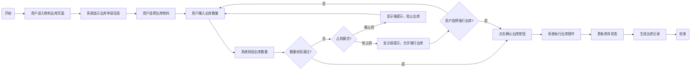

**第二层：叙事化逻辑流 (Narrative Logic Flow)**

1. **前置条件**: 用户必须拥有"库管员"或"仓储管理员"权限，系统中存在有效的出库申请和相应的物料库存。

2. **流程触发**: 用户进入`物料出库`页面，系统自动加载相关的出库申请信息和物料库存状态。

3. **系统初始化与展示**:
   - 系统自动获取出库申请的基本信息，包括申请单号、申请部门、申请时间等
   - 显示申请出库的物料明细，包含物料的编码、名称、需求数量、可用库存、已占用数量等关键信息
   - 实时显示物料的占用状态和占用订单信息，帮助用户了解物料的分配情况

4. **物料选择与数量输入**: 用户可以通过以下方式操作：
   - **物料选择**: 支持单选或多选物料进行批量出库操作
   - **数量输入**: 在出库数量输入框中输入实际出库数量，系统实时校验数量是否超出可用库存
   - **占用提示**: 系统显示物料的占用模式和占用详情，帮助用户做出合理的出库决策

5. **数量校验与占用模式处理**: 系统根据配置的占用模式执行不同的校验逻辑：
   - **不约束**: 出库时完全忽略已占用数量，只考虑库存数量
   - **若约束**: 出库时需考虑已占用数量。若出库数量 > 可用库存量，系统提示："您正在领用已被XX订单（或其他需求）动态占用的物料X件，是否确认强行出库？"用户选择"是"：允许出库；用户选择"否"：中止出库
   - **强约束**: 出库时必须严格遵守已占用数量。若出库量超过可用库存量，系统给出强提示："物料X已被XX订单（或其他需求）硬性占用，无法出库，请联系相关人员。"

6. **出库执行与状态更新**: 用户确认出库后，系统执行以下操作：
   - **库存更新**: 减少物料的库存数量，若出库的是已占用的订单，则更新相关物料的`已占用量`，增加`可用库存量`
   - **记录生成**: 生成完整的出库记录，包含操作人、操作时间、出库数量、物料信息等
   - **状态同步**: 更新相关物料的占用记录状态，确保数据一致性

**第三层：状态机图 (State Machine Diagram)**

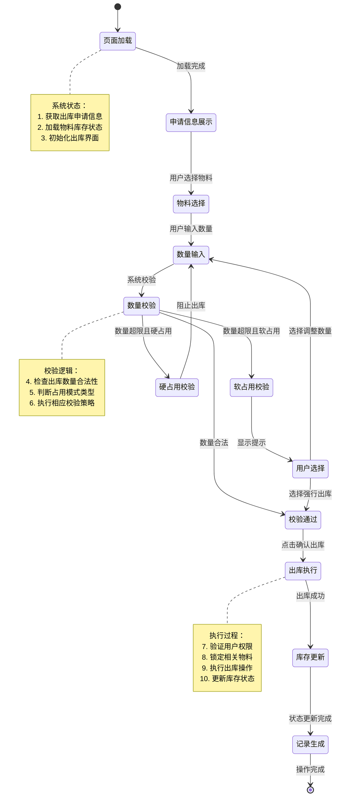

##### 验收标准

| 场景ID | 场景描述 | 前置条件 | 操作步骤 | 预期结果 |
|---------|----------|----------|----------|----------|
| AC-Outbound-01 | 软占用模式下正常出库成功 | 1. 用户"小李"拥有"库管员"权限。 2. 物料"钢材A"配置为软占用模式。 3. 该物料总库存100件，已占用30件，可用库存70件。 4. 出库申请数量为80件。 | 1. 用户"小李"进入`物料出库`页面。 2. 选择物料"钢材A"，输入出库数量80件。 3. 系统显示弱提示："您正在领用已被占用的物料10件，是否确认强行出库？"。 4. 用户选择"是"，点击`确认出库`。 | 1. **界面**：提示"出库成功"。 2. **数据**：物料"钢材A"的库存数量更新为20件，已占用数量更新为20件。 3. **校验**：软占用模式下的弱提示正确显示，允许强行出库。 4. **记录**：生成完整的出库记录和操作日志。 |
| AC-Outbound-02 | 硬占用模式下阻止超量出库 | 1. 用户"小李"拥有"库管员"权限。 2. 物料"轴承B"配置为硬占用模式。 3. 该物料总库存50件，已占用40件，可用库存10件。 4. 出库申请数量为20件。 | 1. 用户"小李"进入`物料出库`页面。 2. 选择物料"轴承B"，输入出库数量20件。 3. 系统显示强提示："物料轴承B已被占用，无法出库，请联系相关人员。"。 | 1. **界面**：显示强提示信息，阻止出库操作。 2. **数据**：物料库存状态无变化。 3. **校验**：硬占用模式下的强提示正确显示，严格阻止超量出库。 4. **操作**：出库按钮保持禁用状态，无法执行出库。 |
| AC-Outbound-03 | 正常数量范围内出库成功 | 1. 用户"小李"拥有"库管员"权限。 2. 物料"螺丝C"总库存200件，已占用50件，可用库存150件。 3. 出库申请数量为100件。 | 1. 用户"小李"进入`物料出库`页面。 2. 选择物料"螺丝C"，输入出库数量100件。 3. 系统显示数量校验通过。 4. 点击`确认出库`按钮。 | 1. **界面**：提示"出库成功"。 2. **数据**：物料"螺丝C"的库存数量更新为100件，已占用数量仍为50件。 3. **校验**：数量校验正确，无占用冲突提示。 4. **记录**：生成出库记录，更新库存状态。 |
| AC-Outbound-04 | 批量物料出库操作成功 | 1. 用户"小李"拥有"库管员"权限。 2. 出库申请包含多个物料，数量都在可用库存范围内。 | 1. 用户"小李"进入`物料出库`页面。 2. 选择多个物料进行批量出库。 3. 为每个物料输入相应的出库数量。 4. 点击`确认出库`按钮。 | 1. **界面**：提示"批量出库成功"。 2. **数据**：所有选中物料的库存数量正确更新。 3. **功能**：批量出库操作支持，所有物料状态同步更新。 4. **记录**：为每个物料生成独立的出库记录。 |
| AC-Outbound-05 | 出库权限控制验证 | 1. 用户"小王"只拥有"生产人员"权限，不具备出库权限。 2. 系统中存在出库申请。 | 1. 用户"小王"尝试访问`物料出库`页面。 2. 系统检查用户权限。 | 1. **界面**：显示"权限不足"提示。 2. **访问**：无法访问出库页面或执行出库操作。 3. **安全**：权限控制正确生效，防止未授权操作。 |

## 4. 约束条件

### 4.1 业务约束

1. **优先级策略约束**: 系统同时只能执行一种优先级策略，不支持多策略并行执行
2. **占用模式约束**: 同一物料的同一批次在同一时间只能被一个订单占用
3. **权限约束**: 动态占用操作需要特定角色权限，普通用户无法执行
4. **物料约束**: 已出库的物料无法进行动态占用调整

### 4.2 技术约束

1. **数据库约束**: 物料占用记录必须与制造订单和物料库存保持数据一致性
2. **性能约束**: 动态占用计算必须在5秒内完成，避免影响用户操作体验
3. **并发控制**: 支持多用户同时操作，避免数据冲突和死锁
4. **事务完整性**: 占用操作必须保证事务的原子性、一致性、隔离性和持久性

### 4.3 性能约束

1. **响应时间**: 动态占用操作响应时间不超过5秒
2. **并发用户**: 支持50个并发用户同时进行物料占用管理操作
3. **数据处理**: 单次占用操作涉及的最大物料数量不超过1000种
4. **系统资源**: 占用计算过程CPU使用率不超过30%，内存使用率不超过50%
5. **数据库性能**: 占用查询操作必须在2秒内返回结果

### 4.4 安全约束

1. **权限控制**: 只有具备相应角色的用户才能执行动态占用操作
2. **操作审计**: 所有占用操作必须记录操作日志，包括操作人、操作时间、操作内容
3. **数据保护**: 敏感物料信息不得泄露，支持数据脱敏显示
4. **访问控制**: 支持基于IP地址的访问控制，限制特定网络环境下的操作
5. **会话管理**: 用户会话超时后自动退出，防止未授权操作

## 5. 质量保证

### 5.1 验收标准

本章节提供验收标准总览表，链接到`3. 页面&功能设计`中各个功能点的具体验收标准部分，便于评审者和测试人员快速导航和理解整体测试范围。

| 模块 | 页面/功能点 | 关联的验收标准章节 |
|------|-------------|-------------------|
| 制造执行 | 制造订单管理 - `物料动态占用` | [参见 3.1.1.1 验收标准](#验收标准) |
| 制造执行 | 制造订单管理 - `取消` | [参见 3.1.2.1 验收标准](#验收标准) |
| 仓储物流 | 物料库存 - `查询` | [参见 3.2.1.1 验收标准](#验收标准) |
| 仓储物流 | 物料出库 - `确认出库` | [参见 3.2.2.1 验收标准](#验收标准) |

### 5.2 测试要求

#### 5.2.1 功能测试要求

1. **核心功能测试**: 验证动态占用和订单取消功能的基本业务流程
2. **边界条件测试**: 测试物料不足、权限不足、状态不允许等异常场景
3. **并发测试**: 验证多用户同时操作时的系统稳定性和数据一致性
4. **权限测试**: 验证不同角色用户的权限控制是否有效
5. **数据完整性测试**: 验证占用记录与库存状态的数据一致性

#### 5.2.2 性能测试要求

1. **响应时间测试**: 验证动态占用操作在5秒内完成
2. **并发性能测试**: 验证50个并发用户同时操作的性能表现
3. **大数据量测试**: 验证处理1000种物料时的系统性能
4. **资源使用测试**: 验证CPU和内存使用率不超过设定阈值
5. **数据库性能测试**: 验证占用查询操作在2秒内返回结果

#### 5.2.3 安全测试要求

1. **权限控制测试**: 验证未授权用户无法执行受限操作
2. **数据保护测试**: 验证敏感信息不会泄露
3. **操作审计测试**: 验证所有操作都有完整的日志记录
4. **会话管理测试**: 验证会话超时和访问控制的有效性
5. **输入验证测试**: 验证恶意输入不会导致系统异常

#### 5.2.4 兼容性测试要求

1. **浏览器兼容性**: 支持主流浏览器的最新版本
2. **设备兼容性**: 支持不同屏幕尺寸的设备访问
3. **操作系统兼容性**: 支持Windows、Linux等主流操作系统
4. **数据库兼容性**: 支持Oracle、SQL Server等主流数据库
5. **网络环境兼容性**: 支持不同网络环境下的稳定运行

#### 5.2.5 回归测试要求

1. **功能回归测试**: 确保新功能不影响现有功能的正常运行
2. **性能回归测试**: 确保新功能不会显著降低系统整体性能
3. **接口回归测试**: 确保新功能与现有系统接口的兼容性
4. **数据回归测试**: 确保新功能不会破坏现有数据的完整性
5. **用户体验回归测试**: 确保新功能不会降低用户的操作体验
