# **DNW30340****-****工时管理**

# 1. **概述**

## 1.1 **原始需求**

在离散制造行业（尤其是机加/装配领域），企业面临着多品种小批量的生产模式，这对工时管理提出了更高的要求。以下是用户的故事化需求描述：

|李明的工时难题
在星辉机械厂，车间主任李明被生产效率问题困扰。工厂订单多样，有大批量订单，也有小批量定制订单。
一天，李明接到一个紧急加急订单，客户三天后就要货。他查看订单，是一批特殊机械臂零部件，生产工序多。他马上召集班组长开会安排任务，可问题来了。下料班组长说材料硬度大，老下料机速度得调慢，工时得重新估。车削班组长也说，熟练工紧张，新工人速度慢，零部件精度要求高，交期肯定拖。
李明清楚，车间工人技能水平不一，设备状况也不同，这些都影响生产进度和成本。之前有个订单，因没有准确工时定额，生产调度混乱，导致订单延误，客户投诉，还赔了违约金。
现在面对紧急订单，李明迫切需要一套科学合理的定额工时管理体系，精准测算每个零部件、每道工序在不同设备、不同工人技能水平下的标准工时，合理安排生产计划，确保订单按时交付，控制人力成本，减少浪费。|
|---|

## 1.2 **需求分析**

### 1.2.1 **需求原因**

**工时定额不准确**：传统手工制定工时定额的方式效率低、误差大，难以满足多品种小批量生产的需求。

**工时数据孤岛**：工时数据分散在多个系统中（如 ERP、MES），缺乏统一管理，导致数据不一致。

**缺乏实时性**：现场工时数据无法实时采集和分析，影响生产决策。

### 1.2.2 **信息化系统解决价值**

**提高工时定额准确性【CAPP】**：通过系统化的工时定额计算引擎，结合工艺数据和历史工时数据，快速生成科学合理的工时定额。

**实现工时数据集成**：将工时数据与生产计划、制造执行、成本核算等系统集成，消除数据孤岛。

**实时监控与分析**：通过实时采集现场工时数据，支持生产过程的动态优化和决策支持。

## 1.3 **术语及缩写解释**

|术语 | 缩写 | 解释说明|
|--- | --- | ---|
|定额工时 | - | 根据制造任务的性质和难度预先设定的完成特定工作量所需的时间，这个时间是理论上或经过计算得出的，用于在生产和运营中作为计划和控制的基础。当制造任务合格完成后，会依据工时管理的要求进行工时的分派。|
|实作工时 | - | 实作工时是指实际生产过程中，操作员完成任务所消耗的劳动时间，包括实际加工时间和实际辅助时间。|

## 1.4 **参考文献**

[1] 比杰工时定额制定与管理系统解决方案：

[2] 敬信企业工时定额信息化体系建设：

# 2. **需求描述**

## 2.1 **业务描述**

### 2.1.1 **主业务流程**

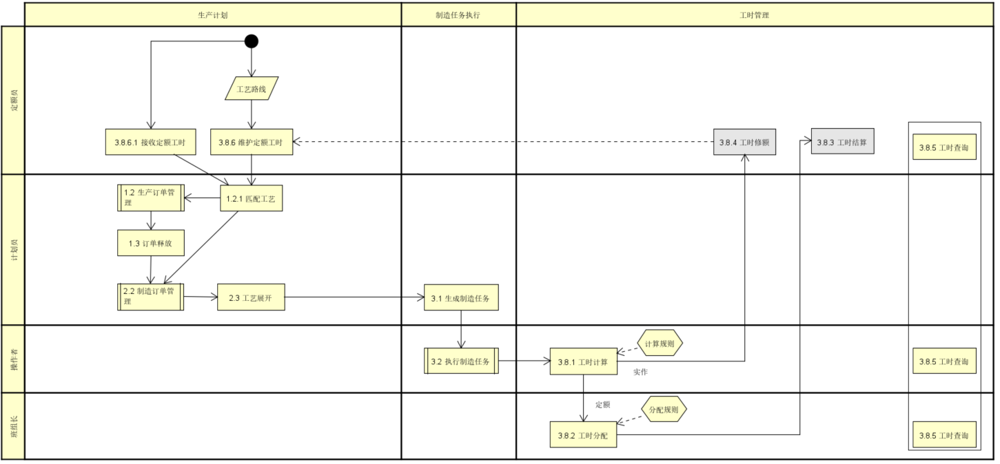

### 2.1.2 **业务流程概述**

工时管理业务流程涉及生产计划、制造任务执行和工时管理三个主要阶段，具体如下：

**生产计划阶段**：

**定额员**：接收并维护工时定额，确保工时数据与生产计划一致。

**计划员**：根据订单需求，制定生产计划，并匹配工艺路线。订单管理包括创建、修改和删除订单。订单释放后，生产计划正式启动。

**制造任务执行阶段**：

**计划员**：生成制造任务，并将任务分配给操作员。

**操作员**：执行制造任务，并实时采集实作工时数据。任务执行过程中，操作员可以开始、暂停和完成任务。

**班组长**：监控生产进度，并根据实作工时数据分配定额工时。

**工时管理阶段**：

**系统**：自动计算定额工时和实作工时，并与定额工时对比分析。

实作工时的计算时机是任务完工后

定额工时的计算时机一般是任务完工后，但是对于工序加工周期较长，到月底会提前结算，因此定额工时的计算时机会有多种情况，本次产品只覆盖任务完工后的场景，其他结算时机项目根据需要自行处理。

**定额员**：根据分析结果，修订工时定额；根据分配结果完成工时结算。（本次均不考虑）

**班组长**：查询工时数据，包括定额工时和实际工时，支持按订单、任务等条件查询。

### 2.1.3 **业务配置点**

**定额****工时计算****时机**：

**任务完工后：**任务完工后计算定额总工时【本次实现】

**月底结算**：对于工序加工周期较长，到月底会提前结算【不考虑，项目自行处理】

**计算规则配置点**：

定额工时：

计划数量*定额加工+定额辅助；【本次实现】

（计划数量/工序批量）定额加工+定额辅助；【未来扩展】

实作工时：

实际完工-实际开工；【本次实现】

实际完工-实际开工-出勤-异常+加班；【未来扩展】

考虑出勤，需去掉休息时间，例午休吃饭

考虑异常，如设备故障，需去掉异常时间

考虑加班，需累计加班时长

**工时分配配置点**：

**分配方式**：不分配**/**手工分配/自动分配。

**分配规则**：

多人均分。

按人员权重分配。

按报工数量比例分配。

**分配规则配置点**：

**多人均分**：工时均分给多个操作员。【本次实现】

**按人员权重分配**：根据操作员的权重分配工时。【未来扩展】

**按报工数量比例分配**：根据报工数量的比例分配工时。【本次实现】

**工时调整配置点**：

**调整后工时**：必须大于0，数值类型，保留两位小数。

**调整记录**：记录调整原因、调整人、调整时间，便于后续追溯。

### 2.1.4 **业务对象关系图**

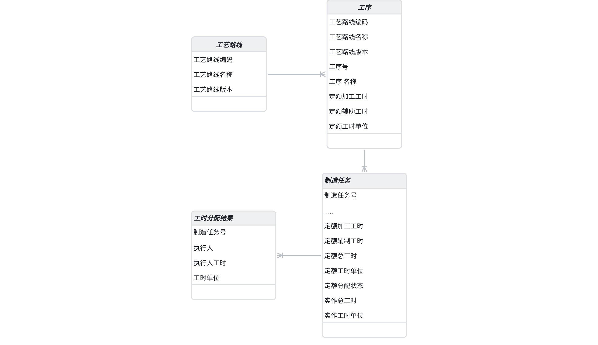

**数据说明**：

定额工时变更不多， 一般从上游接收，若需要在MES中维护，一般通过生产准备流程驱动定额员编制定额工时信息，且只能改定额加工工时、定额辅助工时、定额工时单位，其他属性不允许编辑

定额工时和工艺路线的工序是一对一的关系，没有独立抽取对象的必要性，工艺系统抽取独立的定额工时任务对象，主要为了进行定额工时编制任务分派，在MES可通过生产准备流程驱动定额员编制定额工时信息

定额工时修订后，记录相关的日志，能追溯即可，无需进行版本变更管理

## 2.2 **功能描述**

### 2.2.1 **整体应用架构**

本次主要涉及工时、制造任务台。

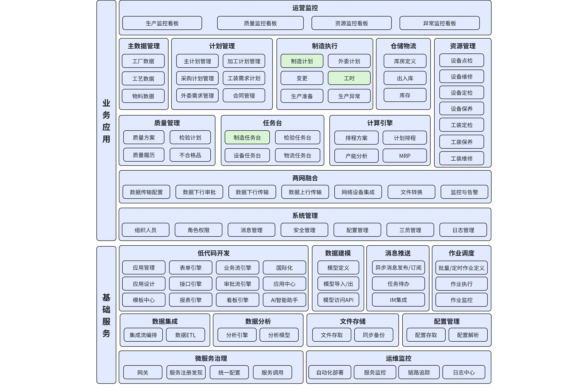

### 2.2.2 **工时&制造任务台应用架构**

 工时、制造任务台进一步细化展开到页面、业务功能一级

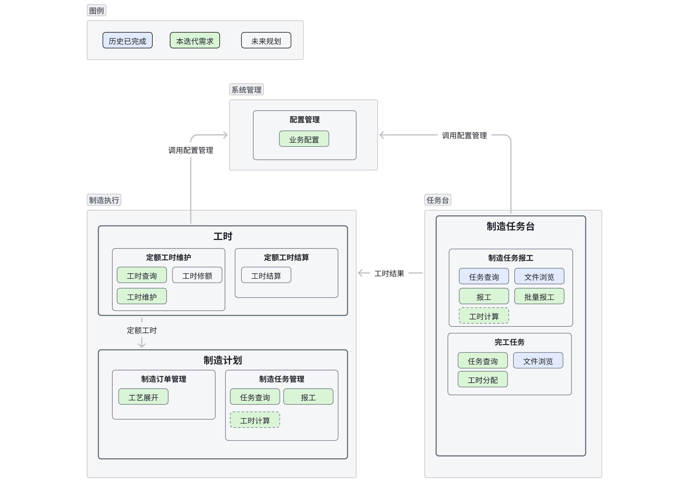

### 2.2.3 **功能清单**

|模块 | 页面 | 功能点 | 功能状态 | 功能点描述 | 规则|
|--- | --- | --- | --- | --- | ---|
|工时管理 | 定额工时维护 | 定额工时维护-工时查询 | V3.1-a2新增 | 工时定额员可以查询定额工时 | |
|工时管理 | 定额工时维护 | 定额工时维护-查看详情 | V3.1-a2新增 | 工时定额员可以查询定额工时详情信息 | |
|工时管理 | 定额工时维护 | 定额工时维护-维护/批量维护 | V3.1-a2新增 | 工时定额员在工时定额计算页面根据工艺路线和标准工时计算维护工时定额。 | |
|制造执行 | 制造订单管理 | 制造订单管理-工艺展开 | V3.1-a2修订 | 工艺展开后，定额工时信息需带入到制造任务上 | |
|制造执行 | 制造任务管理 | 制造任务管理-任务查询 | V3.1-a2修订 | 工时定额员可以查询定额和实作工时信息 | |
|制造执行 | 制造任务管理 | 制造任务管理-报工 | V3.1-a2修订 | 根据配置计算实作和定额工时 | 计算规则： 定额工时： 1、计划数量*定额加工+定额辅助； 2、（计划数量/工序批量）定额加工+定额辅助； 实作工时： 1、实际完工-实际开工； 2、实际完工-实际开工-出勤-异常；|
|制造执行 | 制造任务管理 | 制造任务管理-工时分配 | V3.1-a2新增 | 班组长对定额工时进行分配，分配方式有：不分配、手工分配、自动分配 | 分配规则如下： 1、多人均分； 2、按人员权重分配； 3、按报工数量比例分配。|
|制造任务台 | 制造任务报工 | 制造任务报工-报工/批量报工 | V3.1-a2修订 | 根据配置计算实作和定额工时 | 同上|
|制造任务台 | 完工任务 | 完工任务-任务查询 | V3.1-a2修订 | 查询定额工时分配状态、分配给我的工时、任务的定额总工时和实作总工时信息 | |
|制造任务台 | 完工任务 | 完工任务-工时分配 | V3.1-a2新增 | 班组长对定额工时进行分配，分配方式有：不分配、手工分配、自动分配 | 同上|
|工时管理 | 定额工时统计 | 定额工时统计-工时查询 | V3.1新增 | 按多维度查询和统计工时数据 | |
|工时管理 | 定额工时统计 | 定额工时统计-导出 | V3.1新增 | 导出工时统计结果为Excel | |
|工时管理 | 定额工时统计 | 定额工时统计-工时调整 | V3.1新增 | 对个人定额工时进行批量调整 | |

### 2.2.4 **功能主线操作流程图**

|graph TD
    subgraph 定额员
        A[在工艺路线上维护定额加工工时、定额辅助工时] --> B[保存定额工时信息]
    end

    subgraph 计划员
        C[对制造订单进行工艺展开] --> D[将定额工时信息带入制造任务]
    end

    subgraph 系统
        E[制造任务加工完成] --> F[根据规则计算定额总工时和实作总工时]
    end

    subgraph 班组长
        G[对已完工任务进行工时分配] --> H[保存工时分配结果]
    end

    subgraph 操作工
        I[查看分配后的个人工时信息]
    end

    B --> C
    D --> E
    F --> G
    H --> I|
|---|

**流程说明**

定额员维护定额加工工时和定额辅助工时，并保存到系统中。

计划员对制造订单进行工艺展开，系统将定额工时信息带入制造任务。

制造任务加工完成后，系统根据规则计算定额总工时和实作总工时。

班组长对已完工任务进行工时分配，并保

# 3. **页面&功能设计**

## 3.1 **定额工时维护**

### 3.1.1 **定额工时维护 - 工时查询**

**概述**：用于查询和查看定额工时信息。

**界面**：

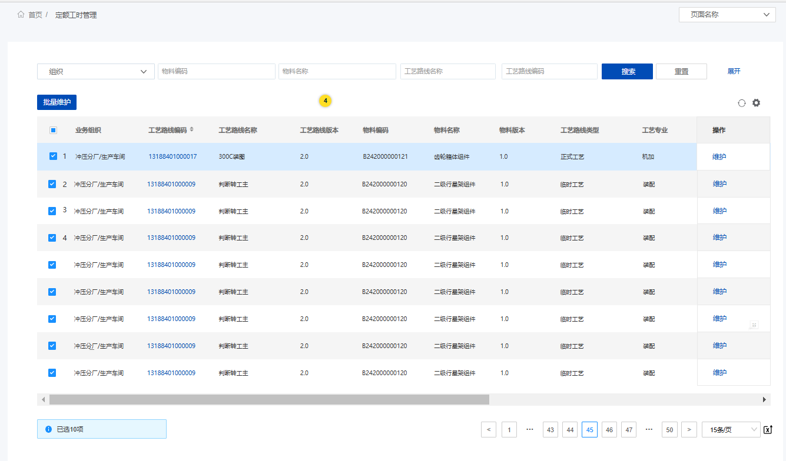

**界面结构**：页面上方为查询条件输入框，包括工艺路线编码、物料名称等；下方为查询结果展示表格，显示定额工时相关信息。整体界面同工艺路线界面一致，仅操作按钮不同。

**交互内容**：用户输入查询条件，点击“查询”按钮，系统展示符合条件的定额工时信息；用户可点击表格中的工艺路线编码，进入查看详情页面。

**校验规则**：查询条件不能为空，工艺路线编码必须存在。

**输入**：

**输入业务对象**：工艺路线编码、物料名称等查询条件。

**输出**：

**输出业务对象**：定额工时信息，包括定额加工工时、定额辅助工时、定额工时单位等。

**业务属性变化**：无。

**展现形式**：查询结果以表格形式展示，每行代表一条定额工时记录。

**处理逻辑**：

用户输入查询条件，点击“查询”按钮。

系统根据查询条件从数据库中检索定额工时信息。

系统将查询结果以表格形式展示在页面上。

**验收标准**：

**边界条件**：查询条件为空或不存在时，系统应给出提示信息。

**验收标准**：查询结果准确率达到100%，数据展示完整、清晰，用户操作便捷。

### 3.1.2 **定额工时维护 - ****查看详情**

**概述**：用于查看定额工时的详细信息。

**界面**：

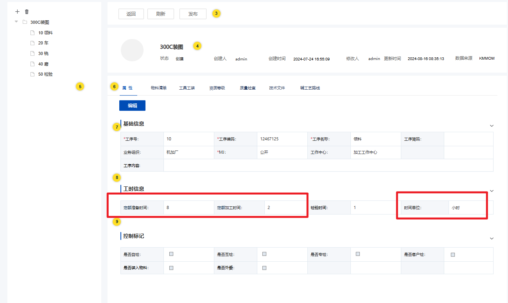

**界面结构**：页面左侧为工艺路线工序树，右侧有工艺路线详情，包括工艺路线编码、工艺路线名称等；工序详情，包括定额加工工时、定额辅助工时、定额工时单位等信息，用户可编辑这些字段。整体界面同工艺路线详情，仅定额加工工时、定额辅助工时、定额工时单位可编辑。

**交互内容**：用户点击表格中的工艺路线编码，进入查看详情页面；用户可编辑定额工时信息后，点击“保存”按钮，系统保存修改后的定额工时信息。

**校验规则**：仅定额加工工时、定额辅助工时、定额工时单位可编辑，且定额加工工时、定额辅助工时必须为正数。

**输入**：

**输入业务对象**：工艺路线编码。

**输出**：

**输出业务对象**：定额工时信息。

**业务属性变化**：定额加工工时、定额辅助工时、定额工时单位数据更新，仅影响后续生产计划，不影响历史已执行的生产计划。

**展现形式**：随工序详情展现。

**处理逻辑**：

用户点击工艺路线编码，系统从数据库中获取对应的定额工时信息，并展示在页面上。

用户编辑定额工时信息后，点击“保存”按钮。

系统校验输入数据的合法性，保存修改后的定额工时信息到数据库中。

**验收标准**：

**边界条件**：用户未选择工艺路线时，点击查看详情按钮，系统应给出提示信息；输入数据不合法时，系统应给出错误提示。

**验收标准**：数据保存成功率达到100%，数据更新及时，用户操作便捷，界面友好，提示信息准确、清晰。

### 3.1.3 **定额工时维护 - ****批量维护/****维护**

**概述**：用于批量维护和更新定额工时信息。

**界面**：

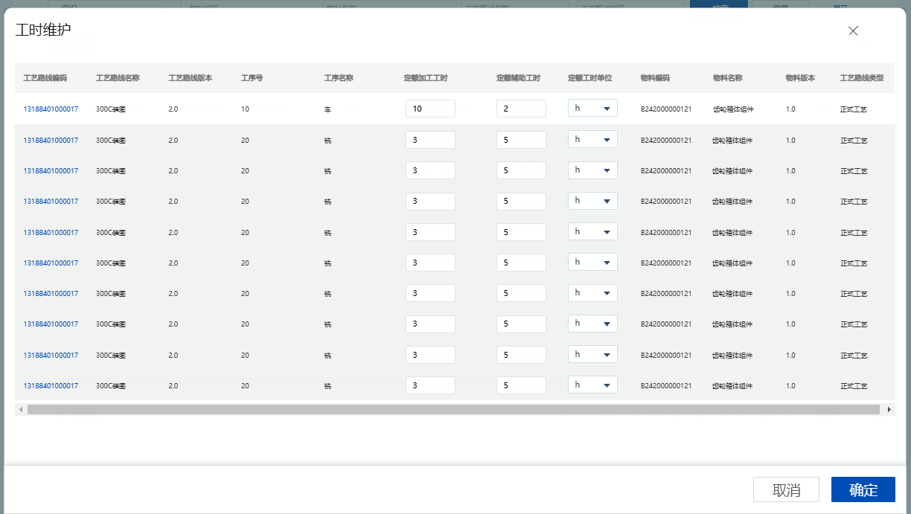

**界面结构**：页面以网格形式展现，包括工艺路线编码、工艺路线名称、工艺路线版本、工序号、工序名称、定额加工工时、定额辅助工时、定额工时单位、物料编码、物料名称、物料版本、工艺路线类型信息，用户可编辑定额加工工时、定额辅助工时、定额工时单位字段。

**交互内容**：用户在工时定额维护页面中点击“维护”或“批量维护”按钮，进入工时维护页面；用户编辑定额工时信息后，点击“保存”按钮，系统保存修改后的定额工时信息。

**校验规则**：

定额加工工时：数值编辑框，大于等于0

定额辅助工时：数值编辑框，大于等于0

定额工时单位：必填

**输入**：

**输入业务对象**：勾选的工艺路线。

**输出**：

**输出业务对象**：工艺路线。

**业务属性变化**：定额加工工时、定额辅助工时、定额工时单位数据更新，仅影响后续生产计划，不影响历史已执行的生产计划。

**展现形式**：保存成功后，系统在页面上显示成功提示信息，并记录相关业务操作日志。

**处理逻辑**：

用户点击“维护”或“批量维护”按钮。支持批量。

系统根据用户选择的工艺路线，从数据库中获取对应的定额工时信息，并展示在页面上。

用户编辑定额工时信息后，点击“保存”按钮。

系统校验输入数据的合法性，保存修改后的定额工时信息到数据库中。

**验收标准**：

**边界条件**：用户未选择工艺路线时，点击“维护”或“批量维护”按钮，系统应给出提示信息；输入数据不合法时，系统应给出错误提示。

**验收标准**：数据保存成功率达到100%，数据更新及时，用户操作便捷，界面友好，提示信息准确、清晰。

## 3.2 **制造订单管理**

### 3.2.1 **制造订单管理-****工艺展开**

**概述**：用于将工艺路线信息展开到制造任务中。

**界面**：

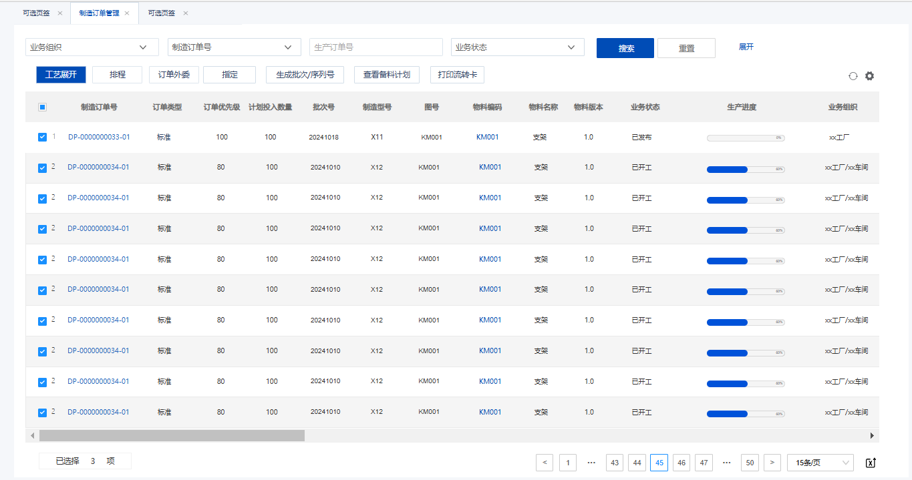

**界面结构**：页面为制造订单信息，包括订单编号、订单类型等；

**交互内容**：用户点击“工艺展开”按钮，系统提示“是否确认进行工艺展开？”，点击是进行后续处理。

**校验规则**：同已有功能一致。

**输入**：

**输入业务对象**：制造订单。

**输出**：

**输出业务对象**：制造任务。

**业务属性变化**：制造任务的定额加工工时、定额辅助工时、定额工时单位属性更新。

**展现形式**：工艺路线详情展示在页面上，制造任务的定额工时信息更新。

**处理逻辑**：

用户点击“工艺展开”按钮。

系统根据制造订单信息，从数据库中获取对应的工艺路线信息。

参考中的3.1.3，在制造任务生成逻辑中，补充以下处理逻辑：

制造任务的定额加工工时=工序的定额加工工时

制造任务的定额辅助工时=工序的定额辅助工时

制造任务的定额工时单位=工序的定额工时单位

注：工艺展开时，暂时不校验工时信息，放生产准备流程中统一校验处理，对于工时准备不足时，不一定会影响生产，但会影响最终工人算工资。

**验收标准**：

**边界条件**：无。

**验收标准**：数据更新准确率达到100%，用户操作便捷，界面友好。

## 3.3 **制造任务管理**

### 3.3.1 **制造任务管理 - 任务查询**

**概述**：用于查询和查看制造任务信息。

**界面**：

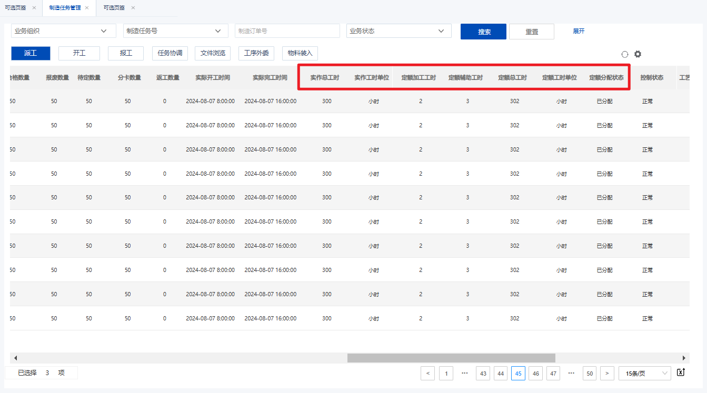

**界面结构**：页面上方为查询条件输入框，包括制造任务号、制造订单号等等；下方为查询结果展示表格，显示制造任务信息，包括实作总工时、实作工时单位、定额加工工时、定额辅助工时、定额总工时、定额工时单位、定额分配状态等。

**交互内容**：用户输入查询条件，点击“查询”按钮，系统展示符合条件的制造任务信息；用户可点击表格中的任务编号，进入任务详情页面。

**校验规则**：查询条件不能为空，任务编号必须存在。

**输入**：

**输入业务对象**：任务编号、任务名称等查询条件。

**输出**：

**输出业务对象**：制造任务信息。

**业务属性变化**：无。

**展现形式**：查询结果以表格形式展示，每行代表一条制造任务记录。

**处理逻辑**：

用户输入查询条件，点击“查询”按钮。

系统根据查询条件从数据库中检索制造任务信息。

系统将查询结果以表格形式展示在页面上。

**验收标准**：

**边界条件**：查询条件为空或不存在时，系统应给出提示信息。

**验收标准**：查询结果准确率达到100%，数据展示完整、清晰，用户操作便捷。

### 3.3.2 **制造任务管理 - 报工**

**概述**：制造任务完工后计算制造任务的实作工时和定额工时。

**界面**：同已有功能一致

**输入**：

**输入业务对象**：制造任务。

**输出**：

**输出业务对象**：报工信息。

**业务属性变化**：制造任务的实作总工时、定额总工时属性更新。

**展现形式**：报工结果以制造任务属性形式展示。

**处理逻辑**：

|sequenceDiagram
System->>System: 根据报工信息计算实作工时
System->>System: 根据定额工时计算方式计算定额总工时
System->>System: 更新制造任务的实作总工时和定额总工时
System->>User: 返回报工结果|
|---|

用户输入报工信息，点击“报工”按钮。

系统根据报工信息，计算实作工时和定额工时。参考任务报工，在原有完工逻辑基础上，新增制造任务完工后处理【处理可同步可异步】

读取业务配置【制造执行-定额工时计算】配置，根据定额工时计算方式计算制造任务的定额总工时

读取业务配置【制造执行-实作工时计算】配置，根据实作工时计算方式计算制造任务的实作总工时，工时单位默认为小时

业务配置详见

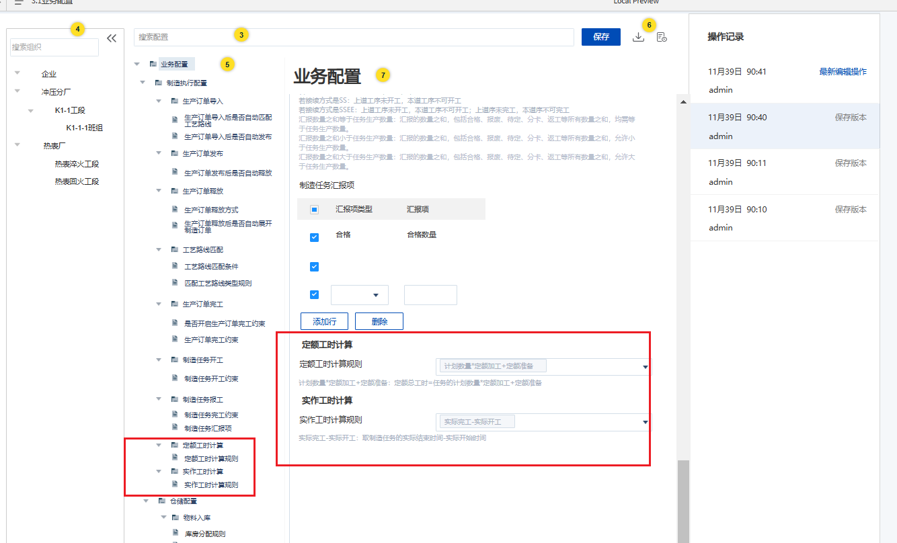

**验收标准**：

**边界条件**：输入的报工信息不合法时，系统应给出错误提示。

**验收标准**：数据计算准确率达到100%，数据更新及时，用户操作便捷，界面友好，提示信息准确、清晰。

### 3.3.3 **制造任务管理 - 工时分配**

**概述**：用于分配制造任务的定额工时。

**界面**：

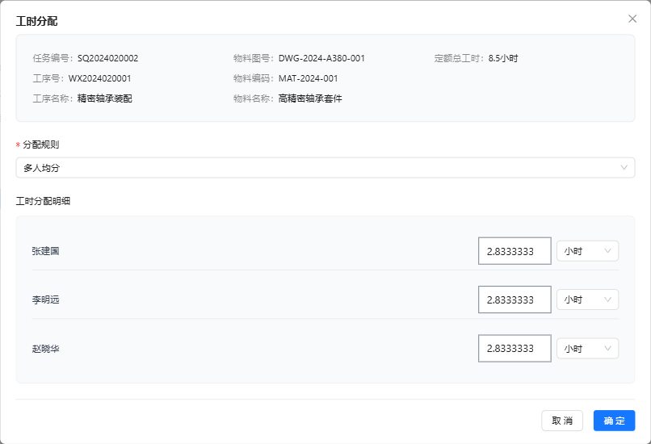

**界面结构**：

最上方显示任务信息：任务编号、物料图号、总定额工时、工序号、工序名称、物料编码、物料名称

中间显示分配规则

默认为多人均分，下拉值为多人均分、按人员权重分配（本次不实现）、按报工数量比例分配

当分配规则选择多人均分时，只显示执行人和预分配工时列

当分配规则选择按人员权重分配时，预分配结果中需在执行人后面新增权重列，默认均为1，数值编辑框，必须为正数，支持编辑

当分配规则选择按报工数量比例分配时，预分配结果中需在执行人后面新增报工数量，只读；若多个执行人同时报工3个，则每个执行人的报工数量相同，均为3个

最下方显示预分配结果：执行人、预分配工时（保留两位小数），预分配工时单位

操作按钮：确定、取消

**交互内容**：用户选择分配规则，系统根据选择的规则自动计算分配结果，并展示在预分配结果表格中；用户可点击“确定”按钮，保存分配结果；用户可点击“取消”按钮，放弃当前的分配操作。

**校验规则**：分配工时之和必须等于定额总工时，权重值必须为正数等；操作员列表中的操作员必须是参与该任务的实际操作员。

**输入**：

**输入业务对象**：任务基本信息、定额总工时数据、分配规则。

**输出**：

**输出业务对象**：工时分配结果。

**业务属性变化**：制造任务的工时分配状态属性变化。

**展现形式**：预分配结果以表格形式展示，每行代表一条分配记录。

**处理逻辑**：

|graph TD
    A[开始] --> B[班组长在完工任务界面点击定额工时分配按钮]
    B --> C{校验任务状态}
    C -->|已暂停/已终止/已分配| D[提示无法分配]
    C -->|可分配| E[弹出定额工时分配界面]
    E --> F[选择分配规则]
    F --> G[系统自动计算分配结果并显示在预分配结果表格中]
    G --> H{点击“确定”按钮}
    H --> I{校验分配工时之和是否等于定额总工时}
    I -->|不相等| J[提示“还剩余定额工时XX未分配，请重新分配。”]
    I -->|相等| K[将分配结果保存到数据库中，任务的定额分配状态标记为已分配]
    G --> L{点击“取消”按钮}
    L --> M[放弃当前的分配操作]|
|---|

|1. 班组长操作流程

1.1 进入定额工时分配界面
操作：班组长在完工任务界面，点击定额工时分配按钮，单选，不支持批量。
校验：未完工、已暂停、已终止的任务不能再进行分配，给出提示
结果：
弹出定额工时分配界面
若任务已分配定额工时，则弹窗界面只读，只能查看历史分配结果，不能编辑
若任务未分配定额工时，则弹窗界面才可进行工时分配操作

1.2 选择分配规则
操作：在定额工时分配界面，选择分配规则（多人均分、按人员权重分配、按报工数量比例分配）。
结果：
系统根据选择的分配规则，按任务实际执行人自动计算分配结果，并显示在预分配结果表格中。
切换分配规则时，自动按规则刷新下列工时分配明细：
多人均分：
只显示执行人和预分配工时列。
按人平均分配，保留两位小数
若出现小数除不尽的情况，即无法平均分配时，最后一个人的工时等于定额总工时-前面所有执行人的工时之和
按人员权重分配：
预分配结果中需在执行人后面新增权重列，数值编辑框，默认均为1，必须为正数，支持编辑。
计算公式为：
计算权重总和
权重总和 = 2 + 3 + 5 = 10
计算每个执行人的分配工时
A的分配工时 = (2 / 10) × 100 = 20小时
B的分配工时 = (3 / 10) × 100 = 30小时
C的分配工时 = (5 / 10) × 100 = 50小时
校验分配结果
分配工时之和 = 20 + 30 + 50 = 100小时
分配工时之和等于定额总工时，校验通过。
若出现小数除不尽的情况，处理同1
按报工数量比例分配：
预分配结果中需在执行人后面新增报工数量，只读；
若多个执行人同时报工3个，则每个执行人的报工数量相同，均为3个。
计算公式同2，将权重改为报工数量计算即可
分配后的结果为数值编辑框，支持手动编辑修订，只能输入正数

1.3 保存分配结果
操作：点击“确定”按钮。
校验：分配工时之和必须等于定额总工时，否则给出提示：“还剩余定额工时XX未分配，请重新分配。”
结果：将分配结果保存到数据库中，将任务的定额分配状态标记为已分配。

1.4 取消分配操作
操作：点击“取消”按钮。
结果：放弃当前的分配操作。|
|---|

**验收标准**：

**边界条件**：当操作员列表为空时，系统应给出提示信息；当分配比例之和不为100%或权重值为负数时，系统应给出错误提示。

**验收标准**：分配结果准确率达到100%，数据保存成功率达到100%，数据更新及时，用户操作便捷，界面友好，提示信息准确、清晰。

## 3.4 **制造任务报工**

### 3.4.1 **制造任务报工 - 报工/批量报工**

**概述**：制造任务完工后计算制造任务的实作工时和定额工时。逻辑同3.3.2制造任务管理-报工

## 3.5 **完工任务**

### 3.5.1 **完工任务 - 任务查询**

**概述**：用于查询和查看完工任务信息。

**界面**：

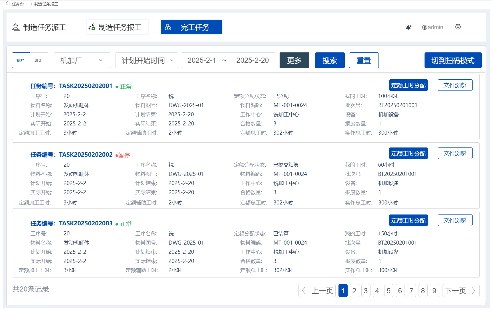

**界面结构**：整体内容同原有功能一致，参考中的3.5完工任务，在原有功能上对任务列表展示修订如下：

新增：

定额分配状态

我的工时

定额加工工时：时间+单位一起显示

定额准备工时：时间+单位一起显示

定额总工时：时间+单位一起显示

实作总工时：时间+单位一起显示

移除：生产数量、物料版本

任务操作新增：定额工时分配

**交互内容**：用户输入查询条件，点击“查询”按钮，系统展示符合条件的完工任务信息；用户可点击表格中的任务编号，进入任务详情页面。

**校验规则**：查询条件不能为空，任务编号必须存在。

**输入**：

**输入业务对象**：查询条件。

**输出**：

**输出业务对象**：完工任务信息。

**业务属性变化**：无。

**展现形式**：查询结果以表格形式展示，每行代表一条完工任务记录。

**处理逻辑**：

用户输入查询条件，点击“查询”按钮。

系统根据查询条件从数据库中检索完工任务信息。

系统将查询结果以表格形式展示在页面上。

**验收标准**：

**边界条件**：查询条件为空或不存在时，系统应给出提示信息。

**验收标准**：查询结果准确率达到100%，数据展示完整、清晰，用户操作便捷。

### 3.5.2 **完工任务 - 工时分配**

**概述**：用于分配制造任务的定额工时。同3.3.3制造任务管理-工时分配

## 3.6 **定额工时统计**

### 3.6.1 **定额工时统计 - 工时查询**

**概述**：用于按多维度查询和统计工时数据，支持绩效考核、成本核算和效率分析。

**界面结构**：
- 页面上方为查询条件区域，包括：组织（车间/班组）、时间范围、人员、零部件等
- 页面下方为统计结果表格，显示工时统计数据

**表格字段**：

| 字段名称 | 说明 |
|---------|------|
| 车间 | 所属车间 |
| 班组 | 所属班组 |
| 人员 | 执行人员 |
| 批次号 | 制造订单批次号 |
| 物料编码 | 物料编码 |
| 物料名称 | 物料名称 |
| 任务号 | 制造任务号 |
| 工序 | 工序名称 |
| 定额工时 | 任务的定额总工时 |
| 实作工时 | 任务的实作总工时 |
| 个人定额工时 | 分配给该人员的定额工时 |
| 执行人数 | 任务的执行人数 |
| 工时分配状态 | 已分配/未分配 |

**交互内容**：用户输入查询条件，点击"查询"按钮，系统展示符合条件的工时统计数据。

**校验规则**：查询条件中时间范围为必填项。

**输入**：

**输入业务对象**：组织（车间/班组）、时间范围、人员、零部件等查询条件。

**输出**：

**输出业务对象**：工时统计数据列表。

**业务属性变化**：无。

**展现形式**：查询结果以表格形式展示，每行代表一条工时统计记录。

**处理逻辑**：

用户输入查询条件，点击"查询"按钮。

系统根据查询条件从数据库中检索工时统计数据。

系统将查询结果以表格形式展示在页面上。

**验收标准**：

**边界条件**：查询条件为空或不存在时，系统应给出提示信息。

**验收标准**：查询结果准确率达到100%，数据展示完整、清晰，用户操作便捷。

### 3.6.2 **定额工时统计 - 导出**

**概述**：用于导出工时统计结果为Excel文件。

**交互内容**：用户在工时统计界面点击"导出"按钮，系统将当前查询结果导出为Excel文件。

**校验规则**：导出前需先执行查询，查询结果不能为空。

**输入**：

**输入业务对象**：当前查询结果数据。

**输出**：

**输出业务对象**：Excel文件。

**业务属性变化**：无。

**展现形式**：下载Excel文件。

**处理逻辑**：

用户点击"导出"按钮。

系统将当前查询结果数据生成Excel文件。

系统触发文件下载。

**验收标准**：

**边界条件**：查询结果为空时，系统应给出提示信息。

**验收标准**：导出数据与查询结果一致，Excel文件格式正确。

### 3.6.3 **定额工时统计 - 工时调整**

**概述**：用于对个人定额工时进行批量调整，确保绩效考核公平性。

**界面结构**：
- 弹窗形式展示
- 显示选中记录列表，每行包含：人员、任务号、工序、原定额工时、调整后工时（可编辑）
- 底部显示调整原因输入框（非必填）

**交互内容**：

用户在统计界面勾选需要调整的记录。

点击"工时调整"按钮，弹出调整界面。

用户编辑调整后工时，填写调整原因。

点击"确定"保存调整结果。

**校验规则**：

调整后工时必须大于0。

调整后工时为数值类型，保留两位小数。

**输入**：

**输入业务对象**：选中的工时记录、调整后工时、调整原因。

**输出**：

**输出业务对象**：更新后的个人定额工时数据。

**业务属性变化**：个人定额工时数据更新，记录调整日志。

**展现形式**：保存成功后，系统在页面上显示成功提示信息，并刷新统计结果。

**处理逻辑**：

用户勾选需要调整的记录，点击"工时调整"按钮。

系统弹出调整界面，显示选中记录列表。

用户编辑调整后工时，填写调整原因（非必填）。

用户点击"确定"按钮。

系统校验输入数据的合法性。

系统保存调整前后的工时值、调整原因、调整人、调整时间。

系统更新个人定额工时数据。

**验收标准**：

**边界条件**：未选择记录时，点击"工时调整"按钮，系统应给出提示信息；输入数据不合法时，系统应给出错误提示。

**验收标准**：数据保存成功率达到100%，调整记录完整可追溯，用户操作便捷，界面友好。

# 4. **外部依赖**

本次功能对外部依赖的状态说明

|产品 | 应用 | 功能 | 外部依赖说明 | 状态|
|--- | --- | --- | --- | ---|
|KMMOM | 系统管理 | 业务配置 | 定额工时计算和实作工时计算时需调用业务配置DNW30050-系统配置 | 业务配置本次需开发修订|
