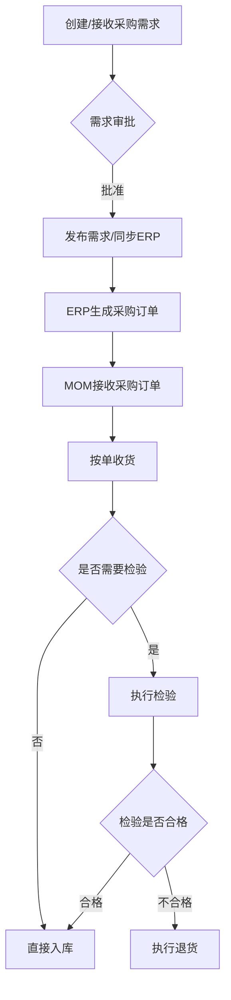
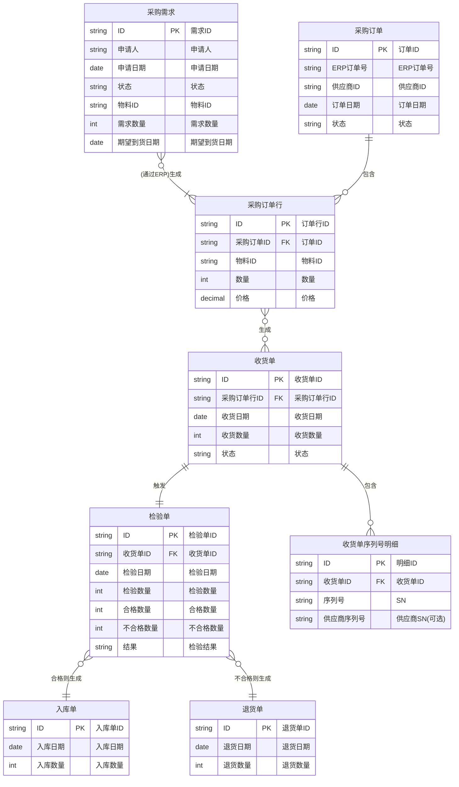
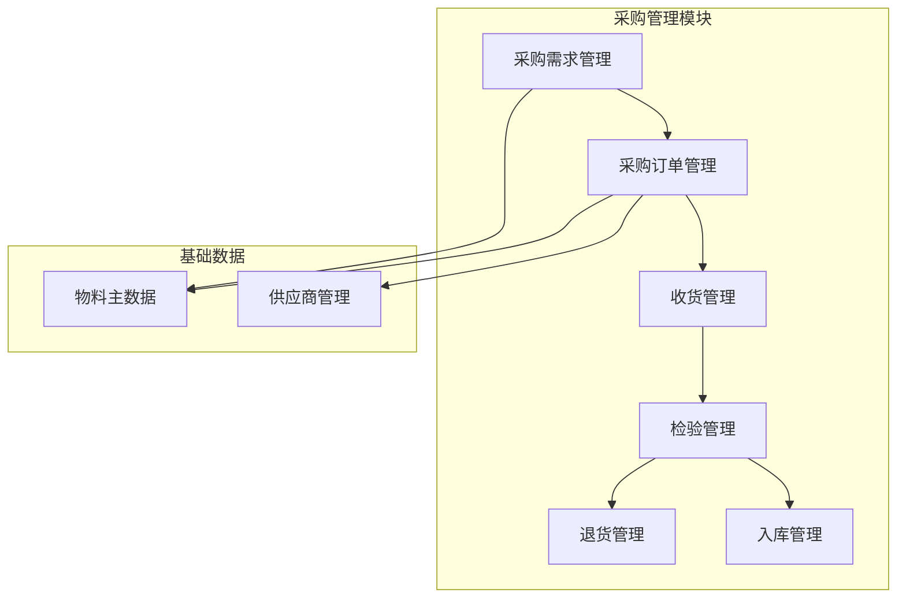

# DNW30370-采购管理-v2.1

## 1. 概

### 1.1. 背景

在制造运营管理（MOM）体系中，采购管理是确保生产物料供应、维持供应链连续性的核心环节。当前，许多企业的采购流程存在信息孤岛、流程不透明、协同效率低下等问题，尤其是在采购订单处理、收货、检验、入库等关键节点，容易出现信息断层和延迟，影响生产计划的执行。

为了解决这些痛点，我们需要一个集成化、智能化的采购管理模块，实现从采购需求到物料入库的全流程数字化管理，提升供应链的响应速度和透明度。

### 1.2. 价值主张

本功能旨在为企业提供一个高效、协同的采购管理平台，核心价值在于：

| 核心价值 | 描述 |
| :--- | :--- |
| 流程自动化 | 通过系统自动处理采购订单、收货、检验和入库流程，减少人工干预，提高效率。 |
| 供应链协同 | 打通与供应商的信息壁垒，实现采购订单、物流信息、检验结果的实时共享。 |
| 质量可追溯 | 建立从收货、检验到入库的完整物料信息链，实现物料质量的全程追溯。 |
| 库存精确化 | 确保采购入库数据与库存管理的实时同步，提高库存数据的准确性。 |

### 1.3. 目标用户

| 用户角色 | 核心需求 |
| :--- | :--- |
| 采购员 | - 快速创建和下达采购订单 - 实时跟踪订单状态 |
| 仓库管理员 | - 基于采购订单高效收货 - 准确记录入库信息 |
| 质检员 | - 及时获取待检任务 - 方便地记录检验结果 |
| 生产计划员 | - 了解采购物料的到货情况，以便调整生产计划 |

## 2. 业务流程与场景

### 2.1. 核心业务流程

采购管理的核心流程始于采购需求的提出，经过审批后同步至ERP形成采购订单，最终完成收货、检验和入库，形成完整的闭环。

## 3. 数据模型

### 3.1. 核心数据对象

| 数据对象 | 描述 |
| :--- | :--- |
| 采购需求 (PurchaseRequisition) | 记录工厂内部产生的物料采购需求，是采购流程的起点。可由用户手动创建或由MRP等上游模块自动生成。 |
| 采购订单 (PurchaseOrder) | 主要接收ERP系统下发的采购订单数据，作为MOM系统中执行收货的依据。原则上在MOM端不允许直接创建和编辑。 |
| 收货单 (GoodsReceipt) | 记录基于采购订单行的单次收货情况，是后续检验和入库的依据。 |
| 检验单 (InspectionOrder) | 记录对单次收货的物料进行质量检验的过程和结果。 |
| 入库单 (PutawayOrder) | 记录检验合格物料入库的最终信息，直接影响库存。 |
| 退货单 (ReturnOrder) | 记录因质量等问题需要退回给供应商的物料信息。 |

### 3.2. 对象关系图 (ERD)

## 4. 功能架构

### 4.1. 功能架构图

### 4.2. 功能清单

| 模块 | 子模块 | 页面 | 主要功能 | 功能点 |
| :--- | :--- | :--- | :--- | :--- |
| 采购管理 | 采购需求管理 | 采购需求列表页 | 查看采购需求列表 | - 按 `需求单号` 查询 - 按 `申请人` 查询 - 按 `状态` 筛选 - 按 `创建日期` 范围查询 - `重置` 查询条件 - `新建` 采购需求 (按钮) - `合并需求` (按钮) - `拆分需求` (按钮) - `指定供应商` (按钮) - `查看` 需求详情 (链接) - `发布` 需求 (按钮) - `取消` 需求 (按钮) - `分页` 查看列表 |
| | | 采购需求创建/编辑页 | 创建/编辑采购需求 | - 自动填充 `申请人` / `申请部门` - 选择 `需求日期` - `新增` 物料明细行 (按钮) - `删除` 物料明细行 (按钮) - 在行内选择 `物料` (带搜索) - 在行内输入 `需求数量` - 在行内选择 `期望到货日期` - `保存` (草稿) (按钮) - `提交` (送审) (按钮) |
| | 采购订单管理 | 采购订单列表页 | 查看采购订单列表 | - 按 `订单号` 查询 - 按 `ERP订单号` 查询 - 按 `供应商` 查询 - 按 `状态` 筛选 - 按 `创建日期` 范围查询 - `重置` 查询条件 - `查看` 订单详情 (链接/按钮) - `分页` 查看列表 |
| | 收货管理 | 待收货列表页 (PC) | 查看待收货订单 | - 查询待收货订单 - `去收货` (按钮) |
| | | 收货操作页 (PC) | 按单收货 | - `全部收货` (按钮) - 输入 `本次收货数量` - 选择 `收货仓库` - `确认收货` (按钮) |
| | | 扫码收货 (PDA) | PDA扫码收货 | - `扫码收货` (按钮) - 扫描 `采购订单` 条码 - 扫描 `物料` 条码 - 调整 `收货数量` (+/- 按钮) - `确认收货` (按钮) |
| | 采购检验标准管理 | 物料检验标准列表页 | 查看检验标准配置 | - 查询已配置标准的物料 - `新建配置` (按钮) - `编辑` 配置 (按钮) - `复制` 配置 (按钮) |
| | | 检验标准配置页 | 配置物料检验标准 | - 选择 `物料` - 选择 `供应商` (可选) - `新增检验项` (按钮) - `删除检验项` (按钮) - 录入检验项详情 - `保存` (按钮) - `发布` (按钮) |
| | 检验管理 | 待检验列表页 | 查看待检任务 | - 查询待检验的收货批次 - `去检验` (按钮) |
| | | 执行检验页 | 执行检验并录入结果 | - 自动加载检验项 - 录入 `定性`/`定量` 检验结果 - 录入 `合格`/`不合格` 数量 - 选择/输入 `不良原因` - `提交` 检验结果 (按钮) |

## 5. 用户体验要求

### 5.1. 界面设计

- 一致性：界面风格、控件、布局需与MOM系统现有模块保持一致。
- 清晰性：信息展示清晰、主次分明，关键信息（如订单状态、物料数量）应高亮显示。
- 简洁性：界面操作应简洁直观，避免不必要的弹窗和跳转。

### 5.2. 交互设计

- 引导性：对于关键操作（如收货、检验），系统应提供清晰的指引和下一步操作建议。
- 反馈性：用户的每一个操作都应有明确的系统反馈（如成功提示、失败警告）。
- 容错性：提供撤销、修改等功能，允许用户在一定条件下修正错误操作。

### 5.3. 终端交互设计 (Terminal Interaction)

- **操作适配**: 针对手持终端（PDA）的特点，界面元素（按钮、输入框）应足够大，易于点按。
- **流程简化**: 优化操作流程，减少页面跳转和不必要的输入，支持单手操作。
- **扫码优先**: 核心操作应支持通过扫描条形码/二维码完成，如扫描采购订单号、物料编码等，以提高效率和准确性。

## 6. 功能详细设计

### 6.1. 采购需求管理

#### 6.1.1. 采购需求列表页功能

###### 1. 用户故事 (User Story)
*   **目标**: 作为 `采购员` 或 `生产计划员`, 我希望 `在一个页面集中查看、筛选和管理所有的采购需求`, 以便 `快速了解整体物料需求情况并高效地执行新建、合并、拆分等后续操作`。

---

###### 2. 界面原型描述 (UI Prototype Description)
*   **设计思路与布局**:
    *   采用 Ant Design 标准的“查询表单-工具栏-数据表格-分页”经典布局，确保用户体验的一致性和易用性。
*   **核心元素说明**:
    1.  **查询区域 (Query Form)**:
        *   一个行内表单，包含筛选条件：`需求单号` (文本输入框), `申请人` (文本输入框), `状态` (下拉单选框), `创建日期` (日期范围选择器)。
        *   右侧放置 `查询` 和 `重置` 按钮。
    2.  **工具栏 (Toolbar)**:
        *   表格左上方放置一组按钮：`新建` (主要按钮), `合并需求` (次要按钮, 默认禁用), `拆分需求` (次要按钮, 默认禁用)。
    3.  **数据表格 (Data Table)**:
        *   第一列为 `复选框`。
        *   默认展示列: `需求单号`, `申请人`, `申请部门`, `创建日期`, `状态`。
        *   `需求单号` 为链接，点击可进入详情页。
        *   `状态` 列使用 `Tag` 组件高亮显示。
    4.  **行操作区 (Action Column)**:
        *   每行末尾提供文本链接按钮：`查看`, `发布`, `取消`。按钮可见性根据状态动态控制。
    5.  **分页 (Pagination)**:
        *   表格右下方放置标准分页组件。

---

###### 3. 业务规则 (Business Rules)
*   **When**: `When 用户进入页面时, the 系统 shall 加载并显示所有采购需求，默认按创建日期降序排列。`
*   **When**: `When 用户勾选了 >=2 个状态为“草稿”或“待批准”的需求时, the “合并需求”按钮 shall 变为可用。`
*   **When**: `When 用户勾选了 1 个状态为“草稿”或“待批准”的需求时, the “拆分需求”按钮 shall 变为可用。`
*   **While**: `While 需求状态为“已批准”, the 系统 shall 在该行显示“发布”操作。`
*   **While**: `While 需求状态为“草稿”, the 系统 shall 在该行显示“取消”操作。`
*   **If**: `If 查询结果为空, then the 系统 shall 显示标准的空状态提示。`

---

###### 4. 验收场景 (Acceptance Scenarios)
*   **场景1: 启用合并按钮**
    *   **Given** 用户在列表中。
    *   **When** 用户勾选了2条状态为“草稿”的需求。
    *   **Then** 工具栏中的“合并需求”按钮从禁用状态变为可用状态。
*   **场景2: 发布按钮可见性**
    *   **Given** 一条采购需求的状态为“已批准”。
    *   **When** 用户查看该条需求的行操作区。
    *   **Then** 用户应能看到并可以点击“发布”按钮。

#### 6.1.2. 采购需求创建/编辑页功能

###### 1. 用户故事 (User Story)
*   **目标**: 作为 `采购员` 或 `车间主管`, 我希望 `能在一个清晰的表单中方便地填写和修改物料采购需求明细`, 以便 `准确地创建采购任务并提交审批`。

---

###### 2. 界面原型描述 (UI Prototype Description)
*   **设计思路与布局**:
    *   使用抽屉（Drawer）从列表页滑出。表单内部分为“基础信息”和“物料明细”两部分。
*   **核心元素说明**:
    1.  **基础信息**: `申请人`、`申请部门` (自动填充且只读), `需求日期` (默认为当天)。
    2.  **物料明细**: 一个可编辑表格，提供“新增一行”按钮。列包含：`物料` (搜索选择), `规格` (只读), `单位` (只读), `需求数量`, `期望到货日期`, `备注`。每行末尾有“删除”操作。
    3.  **操作区域**: 抽屉页脚固定显示“保存（草稿）”和“提交（送审）”按钮。

---

###### 3. 业务规则 (Business Rules)
*   **When**: `When 用户选择一个物料后, the 系统 shall 自动填充该物料的“规格”和“单位”。`
*   **When**: `When 用户点击“提交（送审）”时, the 系统 shall 完整校验所有必填项，通过后将需求状态更新为“待批准”。`
*   **The**: `The “需求数量”必须是大于0的数字。`
*   **If**: `If 提交时有必填项未填写, then the 系统 shall 高亮显示错误字段并阻止提交。`

---

###### 4. 验收场景 (Acceptance Scenarios)
*   **场景1: 提交送审失败**
    *   **Given** 用户填写了物料，但未填写“需求数量”。
    *   **When** 用户点击“提交（送审）”。
    *   **Then** 系统在“需求数量”输入框下方显示错误提示，表单停留在当前页面。
*   **场景2: 物料信息自动带出**
    *   **Given** 用户在物料明细表格中新增一行。
    *   **When** 用户从下拉列表中搜索并选择“物料A”。
    *   **Then** 该行的“规格”和“单位”字段应自动填充为“物料A”的预设信息。

#### 6.1.3. 合并采购需求功能

###### 1. 用户故事 (User Story)
*   **目标**: 作为 `采购员`, 我希望 `能将多个零散的、针对相同或相似物料的采购需求合并成一个`, 以便 `形成规模效应，便于集中采购和议价`。

---

###### 2. 界面原型描述 (UI Prototype Description)
*   **设计思路与布局**:
    *   在采购需求列表页，当用户勾选多个符合条件的采购需求后，点击“合并需求”按钮，弹出一个确认对话框。
*   **核心元素说明**:
    1.  **确认对话框 (Modal)**:
        *   标题：“确认合并需求”。
        *   内容：列出所有被选中的需求单号，并提示“合并后将生成一张新的采购需求单，原需求单将被作废，是否继续？”
        *   操作：提供“确认合并”和“取消”按钮。

---

###### 3. 业务规则 (Business Rules)
*   **When**: `When 用户点击“确认合并”时, the 系统 shall 创建一张新的采购需求单，并将所有被选中需求单的物料明细汇总到新单中。`
*   **The**: `The 新生成的需求单的状态为“草稿”。`
*   **The**: `The 原有的、被合并的采购需求单的状态 shall 更新为“已作废”。`
*   **If**: `If 被合并的物料明细中存在完全相同的物料, then the 系统 shall 自动合并数量。`

---

###### 4. 验收场景 (Acceptance Scenarios)
*   **场景1: 成功合并**
    *   **Given** 用户在列表页勾选了需求单A（10个物料X）和需求单B（5个物料X）。
    *   **When** 用户点击“合并需求”并在弹窗中确认。
    *   **Then** 系统创建一张新的需求单C，其中包含15个物料X，同时需求单A和B的状态变为“已作废”。

#### 6.1.4. 拆分采购需求功能

###### 1. 用户故事 (User Story)
*   **目标**: 作为 `采购员`, 我希望 `能将一个包含多种物料的采购需求单，按物料类别、供应商或其他维度拆分成多个独立的采购需求`, 以便 `分配给不同的采购员或针对不同的供应商进行采购`。

---

###### 2. 界面原型描述 (UI Prototype Description)
*   **设计思路与布局**:
    *   在采购需求列表页，当用户勾选一个采购需求后，点击“拆分需求”按钮，进入一个专门的拆分操作页面（或抽屉）。
*   **核心元素说明**:
    1.  **拆分操作页 (Drawer)**:
        *   左侧显示原始需求单的所有物料明细，每行前有复选框。
        *   右侧是一个或多个“目标需求单”区域。
        *   提供“新建目标单”按钮。
        *   用户可以将左侧的物料勾选后，通过拖拽或“移动到”按钮，分配给右侧的目标需求单。
        *   底部提供“确认拆分”按钮。

---

###### 3. 业务规则 (Business Rules)
*   **When**: `When 用户点击“确认拆分”时, the 系统 shall 根据用户的分配结果，生成多张新的采购需求单。`
*   **The**: `The 原有的、被拆分的采购需求单的状态 shall 更新为“已作废”。`
*   **If**: `If 原始需求单中的部分物料未被分配到任何目标单, then the 系统 shall 提示用户“存在未分配的物料”，并阻止拆分。`

---

###### 4. 验收场景 (Acceptance Scenarios)
*   **场景1: 成功拆分**
    *   **Given** 一个包含物料A、B、C的需求单。
    *   **When** 用户进入拆分页面，将物料A、B移动到“目标单1”，将物料C移动到“目标单2”，并确认拆分。
    *   **Then** 系统生成两张新的需求单，一张含物料A和B，另一张含物料C，同时原需求单作废。

#### 6.1.5. 指定供应商功能

###### 1. 用户故事 (User Story)
*   **目标**: 作为 `采购员`, 我希望 `能为已批准的采购需求行项目手动指定一个或多个推荐供应商`, 以便 `在后续生成采购订单时，系统能提供明确的建议`。

---

###### 2. 界面原型描述 (UI Prototype Description)
*   **设计思路与布局**:
    *   在采购需求列表页，勾选一个或多个状态为“已批准”的需求，点击“指定供应商”按钮，弹出一个模态框。
*   **核心元素说明**:
    1.  **指定供应商模态框 (Modal)**:
        *   以Tabs形式展示每个被选中的需求单。
        *   每个Tab内是一个物料明细列表。
        *   每行物料明细旁有一个“选择供应商”的按钮或下拉框，点击后可以从供应商列表中选择一个或多个供应商。
        *   底部提供“保存”和“取消”按钮。

---

###### 3. 业务规则 (Business Rules)
*   **When**: `When 用户为某个物料行项目选择了供应商并保存后, the 系统 shall 记录该物料与供应商的关联关系。`
*   **The**: `The 一个物料行项目 shall 可以关联多个推荐供应商。`
*   **If**: `If 某个物料在系统中存在“首选供应商”的配置, then the 系统 shall 在选择列表中默认推荐该供应商。`

---

###### 4. 验收场景 (Acceptance Scenarios)
*   **场景1: 成功指定供应商**
    *   **Given** 一个已批准的需求单，包含物料A。
    *   **When** 用户点击“指定供应商”，在弹窗中为物料A选择了“供应商甲”，并保存。
    *   **Then** 系统记录物料A的推荐供应商为“供应商甲”，在需求详情中应能查看到此信息。

### 6.2. 采购订单与收货管理

#### 6.2.1. 采购订单列表与PC收货功能

###### 1. 用户故事 (User Story)
*   **故事1 (查询)**: 作为 `仓库管理员` 或 `采购员`, 我希望 `能方便地查询和查看从ERP同步来的采购订单`, 以便 `全面了解订单状态，为收货做好准备`。
*   **故事2 (收货)**: 作为 `仓库管理员`, 我希望 `能在采购订单列表上直接对待收货的订单执行收货操作`, 以便 `在办公室集中、高效地处理到货物料的系统入账`。

---

###### 2. 界面原型描述 (UI Prototype Description)
*   **设计思路与布局**:
    *   在标准的“查询-列表-分页”布局基础上进行功能增强，将收货操作融入列表。
*   **核心元素说明**:
    1.  **查询区域**:
        *   除 `订单号`, `ERP订单号`, `供应商`, `创建日期` 外，`状态` 筛选框中增加 `待收货`、`部分收货`、`收货完成` 等选项。提供一个 `仅看待我处理` 的开关。
    2.  **数据表格**:
        *   增加 `订单状态`、`收货状态` 列，并用不同颜色的 `Tag` 区分。
        *   `订单号` 为链接，点击可展开详情或进入详情页。
    3.  **行操作区 (Action Column)**:
        *   **`While`** `订单的收货状态` 为 `待收货` 或 `部分收货`, **`the`** 系统 **`shall`** 显示 `收货` 按钮。
        *   始终显示 `查看` 按钮。
    4.  **收货操作界面 (Modal/Drawer)**:
        *   点击 `收货` 按钮后，弹出一个用于收货的抽屉或模态框。
        *   顶部显示订单号和供应商信息。
        *   主体是一个物料明细表格，列包含：`物料`, `规格`, `待收货数量`, `本次收货数量` (输入框), `收货仓库` (下拉选择框), `备注`。
        *   页面底部提供 `确认收货` 和 `取消` 按钮。

---

###### 3. 业务规则 (Business Rules)
*   **Data Sync**: `The 采购订单数据 shall 从ERP系统同步，在MOM系统中为只读，不允许用户创建、编辑或删除。`
*   **Filtering**: `When 用户筛选“待收货”状态时, the 系统 shall 仅显示包含未完全收货行项目的订单。`
*   **Receiving Action**: `When 用户在收货界面点击“确认收货”时, the 系统 shall 为所有“本次收货数量”>0的行生成收货记录。`
*   **Quantity Check**: `The “本次收货数量” shall not be greater than the “待收货数量”。`
*   **Inspection Trigger**: `After a successful receipt is recorded, for each material line, the 系统 shall check the material's quality configuration.`
    *   **`If`** `the material is marked as "需要检验" (inspection required), then the 系统 shall automatically create an inspection task with a "待检验" status.`
    *   **`Else`** `(if no inspection is required), the 系统 shall directly create a putaway task for the received quantity.`
*   **Status Update**: `After receiving, the 系统 shall update the order line's "已收货数量" and recalculate the order's overall "收货状态"。`

---

###### 4. 验收场景 (Acceptance Scenarios)
*   **场景1: 收货并自动触发检验**
    *   **Given** 一个采购订单，其物料A需要检验，待收货数量为10。
    *   **When** 用户在该订单行点击 `收货`，在弹窗中为物料A输入“本次收货数量”为8，并确认收货。
    *   **Then** 系统提示“收货成功”，订单的收货状态更新为“部分收货”，并自动为这8件物料A创建一张“待检验”的检验单。
*   **场景2: 收货免检并直接入库**
    *   **Given** 一个采购订单，其物料B无需检验，待收货数量为5。
    *   **When** 用户对该订单执行收货操作，为物料B输入“本次收货数量”为5，并确认。
    *   **Then** 系统提示“收货成功”，订单的收货状态更新为“收货完成”，并自动为这5件物料B创建一张入库单。

#### 6.2.2. PDA端扫码收货功能

###### 1. 用户故事 (User Story)
*   **目标**: 作为 `仓库管理员`, 我希望 `能使用PDA扫描采购订单和物料条码来快速完成收货`, 以便 `在库房现场高效、准确地处理到货物料`。

---

###### 2. 界面原型描述 (UI Prototype Description)
*   **设计思路与布局**:
    *   为PDA优化，大按钮、大字体，以扫码为核心交互。
*   **核心元素说明**:
    1.  **主界面**: 一个大的“扫码收货”按钮，或直接激活扫码功能。
    2.  **流程**: 提示“请扫描采购订单条码” -> 扫描成功后显示订单信息，提示“请扫描物料条码” -> 扫描成功后弹出数量确认框。
    3.  **数量确认**: 数量输入框默认为1，提供 `+` 和 `-` 按钮，下方是“确认收货”按钮。

---

###### 3. 业务规则 (Business Rules)
*   **When**: `When 用户扫描一个有效的采购订单条码时, the 系统 shall 查询并显示该订单的待收货物料列表。`
*   **If**: `If 用户扫描了一个不属于当前订单的物料条码, then the 系统 shall 发出蜂鸣警告并提示“物料与订单不符”。`
*   **Inspection Trigger (PDA)**: `After a successful receipt via PDA, the backend logic for triggering inspection or putaway shall be identical to the PC-based receiving process.`

---

###### 4. 验收场景 (Acceptance Scenarios)
*   **场景1: 扫描错误物料**
    *   **Given** 用户已扫描采购订单PO-001。
    *   **When** 用户扫描一个不属于PO-001的物料M-02的条码。
    *   **Then** PDA发出提示音，并显示错误信息“物料与订单不符”。

#### 6.2.3. 单件追溯(序列号)收货功能

###### 1. 用户故事 (User Story)
*   **目标**: 作为 `仓库管理员`, 我希望 `在收货时能记录关键零部件的唯一序列号(SN)`, 以便 `实现从源头开始的单件级质量追溯`。
*   **目标**: 作为 `仓库管理员`, 我希望 `能使用PDA连续扫描序列号`, 以便 `在不降低收货效率的前提下完成赋码入账`。

---

###### 2. 界面原型描述 (UI Prototype Description)
*   **PC端收货页增强**:
    *   当收货行物料为 `单件追溯` 时，`本次收货数量` 变为只读（或联动），并显示 `[序列号明细]` 录入区。
    *   提供 `批量录入` (文本框)、`规则生成` (前缀+流水号)、`Excel导入` 三种方式。
*   **PDA端扫码页**:
    *   增加 `序列号扫描模式`。
    *   显示计数器 `已扫: X / 总数: Y`。
    *   提供 `连续扫描` 输入框，扫描成功自动+1并清空输入框。
    *   提供 `左滑删除` 功能以修正误扫。

---

###### 3. 业务规则 (Business Rules)
*   **Mandatory SN**: `If 物料配置为“单件追溯”, then the 系统 shall 强制要求录入与收货数量相等的序列号。`
*   **Uniqueness**: `The 系统 shall 校验录入的SN在全系统中是唯一的 (根据物料+SN组合)。`
*   **Auto-Generate**: `When 用户使用“规则生成”时, the 系统 shall 根据预设规则生成连续的SN列表。`
*   **PDA Feedback**: `When PDA扫描到重复SN或格式错误SN时, the 设备 shall 发出长蜂鸣音并弹出错误提示。`

---

###### 4. 验收场景 (Acceptance Scenarios)
*   **场景1: PDA连续扫码收货**
    *   **Given** 采购订单包含10个单件追溯的电机。
    *   **When** 用户在PDA上进入SN扫描模式，连续扫描了10个不重复的条码。
    *   **Then** 计数器显示10/10，确认收货按钮变亮，点击后收货成功。
*   **场景2: 重复SN拦截**
    *   **Given** 系统中已存在SN为"M-001"的电机库存。
    *   **When** 用户再次尝试收货SN为"M-001"的同型号电机。
    *   **Then** 系统报错“该序列号已存在”，阻止提交。

### 6.3. 采购检验标准管理

#### 6.3.1. 物料检验标准配置功能

###### 1. 用户故事 (User Story)
*   **目标**: 作为 `质量工程师`, 我希望 `能为指定的物料（或物料+供应商组合）配置详细的检验项目和标准`, 以便 `质检员在执行检验时有明确、统一的依据`。

---

###### 2. 界面原型描述 (UI Prototype Description)
*   **设计思路与布局**:
    *   主视图为已配置标准的物料列表。点击“新建”或“编辑”进入配置页。
*   **核心元素说明**:
    1.  **配置页面**:
        *   顶部选择 `物料` (必选) 和 `供应商` (可选)。
        *   下方是一个可编辑的检验项表格，提供“新增检验项”按钮。
        *   表格字段：`检验内容`, `检验项分类`, `统计类型` (定性/定量), `检验工具`, `标准值/上限/下限`, `单位`。
        *   页面底部提供“保存”和“发布”按钮。

---

###### 3. 业务规则 (Business Rules)
*   **When**: `When 用户点击“发布”按钮时, the 系统 shall 将该检验标准的版本+1，状态更新为“已发布”，旧版本自动变为“历史”。`
*   **While**: `While 检验标准的状态为“已发布”时, the 系统 shall 不允许用户编辑和删除，只能通过创建新版本来修改。`
*   **The**: `The 系统在执行检验时 shall 只引用状态为“已发布”的最新版本的检验标准。`

---

###### 4. 验收场景 (Acceptance Scenarios)
*   **场景1: 更新检验标准**
    *   **Given** 物料M-01已有一个版本为1.0的“已发布”检验标准。
    *   **When** 用户修改了其中一个检验项并再次点击“发布”。
    *   **Then** 系统创建一个新版本的标准（版本2.0），状态为“已发布”，旧版本（1.0）状态自动变为“历史”。

### 6.4. 检验管理

#### 6.4.1. 执行检验功能

###### 1. 用户故事 (User Story)
*   **目标**: 作为 `质检员`, 我希望 `系统能自动带出预设的检验标准，并让我方便地录入检验结果`, 以便 `高效准确地完成质量检验工作`。

---

###### 2. 界面原型描述 (UI Prototype Description)
*   **设计思路与布局**:
    *   “待检验列表”作为入口。检验页面顶部显示收货信息，主体为检验项清单和结果录入区。
*   **核心元素说明**:
    1.  **待检验列表**: 展示所有“待检验”的收货批次，行操作提供“去检验”。
    2.  **执行检验页面**:
        *   顶部展示物料、收货数量等信息。
        *   下方自动加载匹配的检验项列表。
        *   每一检验项后跟结果录入区（定性为单选框，定量为输入框）。
        *   页面底部为最终结果判定区，包含 `合格数量`、`不合格数量` 输入框和 `不良原因` 选择/输入框。
        *   底部提供“提交检验结果”按钮。

---

###### 3. 业务规则 (Business Rules)
*   **Auto-load Standard**: `When 质检员进入“执行检验”页面时, the 系统 shall 自动查找并加载对应的“已发布”的物料检验标准。`
*   **SN Inheritance**: `When 生成检验单时, the 系统 shall 自动继承收货单中的所有序列号明细。`
*   **SN Disposition**: `When 质检员判定不合格数量 > 0 时, the 系统 shall 强制要求标记具体的不合格序列号 (勾选或扫描)。`
*   **Quantity Validation**: `When 质检员提交检验结果时, the 系统 shall 校验“合格数量”与“不合格数量”之和是否等于总检验数量，且不合格SN数量等于不合格数量。`
*   **Post-inspection Process**: `After submitting the inspection results:`
    *   **`Where`** `the "合格数量" (qualified quantity) > 0, the 系统 shall 自动创建一张待入库的入库单。`
    *   **`Where`** `the "不合格数量" (unqualified quantity) > 0, the 系统 shall 自动创建一张待处理的退货单或不合格品处理单。`

---

###### 4. 验收场景 (Acceptance Scenarios)
*   **场景1: 部分不合格**
    *   **Given** 一批10件的物料待检验。
    *   **When** 质检员录入合格数量为8，不合格数量为2，并填写不良原因后提交。
    *   **Then** 检验单完成，系统自动生成一张数量为8的入库单和一张数量为2的退货单。
*   **场景2: 数量校验失败**
    *   **Given** 一批10件的物料待检验。
    *   **When** 质检员录入合格数量为5，不合格数量为4，并提交。
    *   **Then** 系统提示“合格与不合格数量之和（9）必须等于总检验数量（10）”，并阻止提交。
