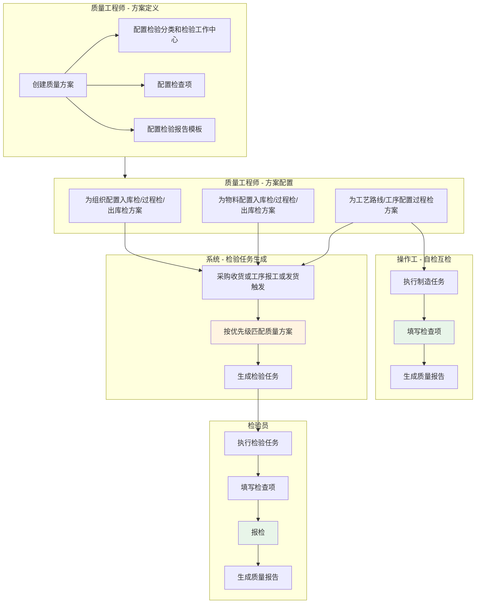
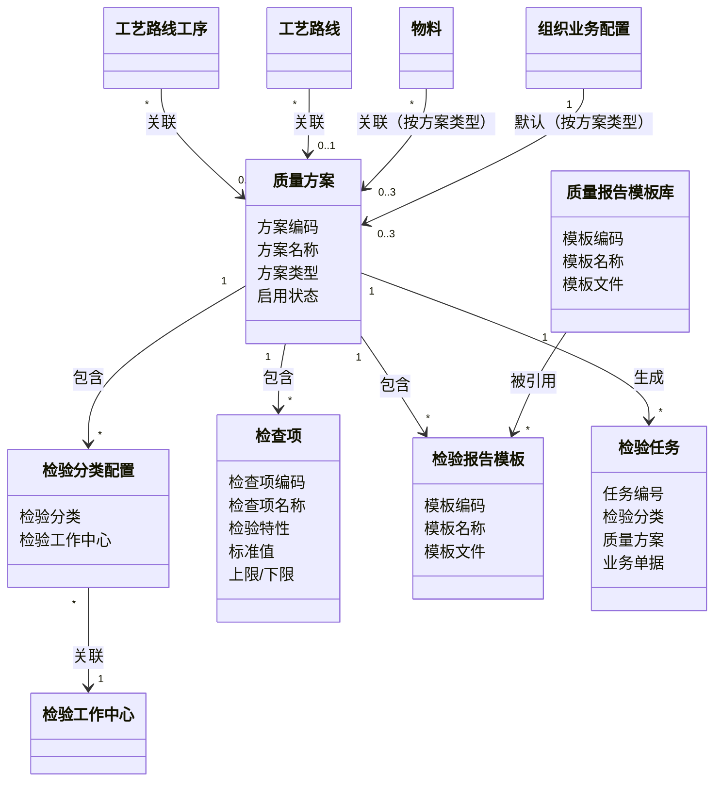
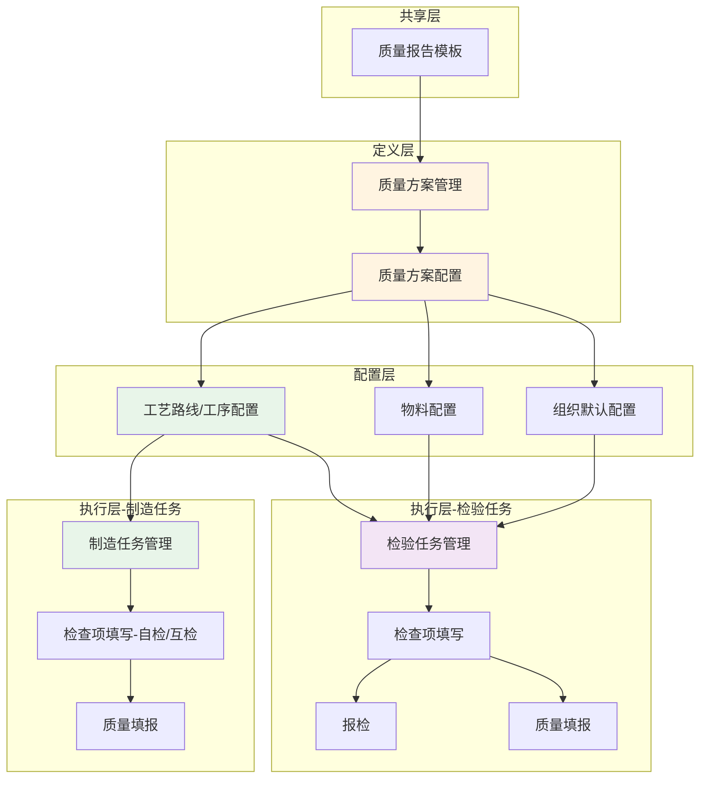
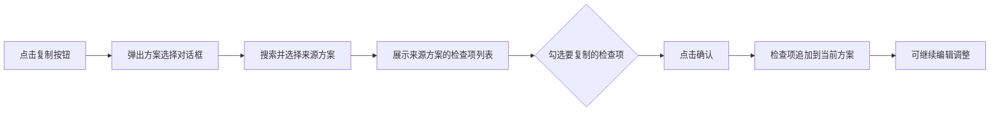
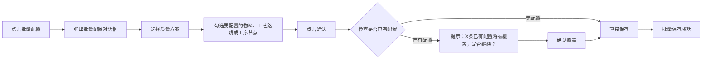

# 质量方案设计

## 1. 概述

### 1.1 业务背景与挑战

#### 问题来源

| 提出人 | 原始问题 | 结论 |
|-------|---------|------|
| 程博 | 工艺路线下的所有工序都要配置工作中心，检验工作中心在哪里配置比较合适？ | 检验工作中心放在质量方案中的检验分类配置 |
| 质量团队 | 不同检验场景（IQC/IPQC/OQC）的配置分散，如何统一管理？ | 统一的质量方案对象，通过检验分类区分 |

#### 核心挑战

**挑战1：检验分类多样化**
- IQC/IPQC/OQC等分类各有不同的触发时机、执行主体和配置维度，缺乏统一管理入口。

**挑战2：配置维度差异大**
- 不同检验分类需要在不同维度上配置（物料、工序、工艺路线等），需要支持灵活的多维度配置。

**挑战3：方案匹配复杂**
- 同一业务对象可能匹配多个质量方案（如物料级、组织级），需要明确的优先级匹配策略。

### 1.2 价值主张

本方案通过"统一质量方案对象 + 定义与分配分离 + 优先级匹配策略"的架构设计，实现质量配置的统一管理和灵活分配：

- **统一管理**：一个质量方案对象覆盖IQC/IPQC/OQC全场景，统一入口，降低学习成本
- **灵活配置**：支持物料、供应商、客户、工序、工艺路线等多维度配置，满足差异化需求
- **高效复用**：质量方案独立定义，可被多个业务对象引用，一次定义多处复用
- **精确匹配**：基于优先级策略自动匹配最合适的质量方案，减少配置工作量

#### 质量方案的双重定位

质量方案不仅服务于检验任务，也服务于制造任务的质量数据采集：

| 使用场景 | 任务类型 | 执行主体 | 使用的质量方案要素 |
|---------|---------|---------|------------------|
| 工序自检 | 制造任务 | 操作工 | 检查项、质量报告模板 |
| 工序互检 | 制造任务 | 操作工 | 检查项、质量报告模板 |
| 工序首检 | 检验任务 | 检验员 | 检验分类、检查项、质量报告模板 |
| 工序专检 | 检验任务 | 检验员 | 检验分类、检查项、质量报告模板 |
| 采购入库检 | 检验任务 | 检验员 | 检验分类、检查项、质量报告模板 |

**设计原则**：
- **检查项是工序固有的质量要求**，与"谁来检"无关，同一工序的自检/互检/专检共用同一套检查项
- **质量报告模板是质量数据的输出格式**，自检和专检可共用同一套模板，报告中分列记录不同检验分类的数据
- **检验分类配置**仅用于生成独立检验任务的场景；**检验报工方案**已独立为单独对象，配置在工序库上，详见《DNW30120-工序库》

### 1.3 术语及缩写解释

| 术语 | 缩写 | 解释说明 |
|------|------|----------|
| 质量方案 | - | 定义检验内容的配置对象，包含检验分类、检查项、检验报告模板 |
| IQC | Incoming Quality Control | 入厂检验，包括采购入库检、整单外委检 |
| IPQC | In-Process Quality Control | 过程检验，包括工序首检、工序自检、工序互检、工序专检、工序客户检、工序外委检 |
| OQC | Outgoing Quality Control | 出厂检验，包括出库检 |
| 检验分类 | - | 定义检验的触发时机、检验对象和执行主体，包括：采购入库检、整单外委检、工序首检、工序自检、工序互检、工序专检、工序客户检、工序外委检、出库检 |
| 检验工作中心 | - | 定义检验任务的执行主体，挂在检验分类下，决定"谁来检" |
| 检查项 | - | 定义检验过程中要录入的数据，包含检查项名称、标准值、上下限等，在质量方案内直接定义，支持方案间复制复用 |
| 检验报告模板 | - | 定义检验完成后要输出的报告格式 |
| 工序资质要求 | - | 执行该工序所需的资质等级，配置在工序库上，制造派工和检验派工共用，详见《DNW30120-工序库》 |
| 配置维度 | - | 质量方案关联的业务维度，如工艺路线工序、工艺路线、物料、组织等 |
| 优先级序列 | - | 质量方案匹配时的查找顺序，优先级高的维度先匹配 |

### 1.4 参考文献

| 文献名称 | 作者 | 出版单位 | 日期 |
|---------|------|----------|------|
| DNW30120-工序库 | - | 内部文档 | 2025-01-08 |
| DNW30500-质量执行 | - | 内部文档 | 2025-12-20 |
| DNW30510-质量记录 | - | 内部文档 | - |
| 质量方案管理 | - | 内部文档（需求分析） | 2025-12-25 |
| DNW30050-配置管理_V2 | - | 内部文档 | 2025-12-28 |

---

## 2. 需求描述

### 2.1 业务流程

#### 2.1.1 流程图



**说明**：检验报工方案的定义和配置已移至《DNW30120-工序库》文档统一管理，检验员执行报检时动态读取工序库上的检验报工方案（工序库 > 组织默认）。

#### 2.1.2 质量方案概述

质量方案是定义"工序质量要求"的配置对象，通过**方案类型**区分不同检验场景。质量方案包含两部分：**质量要求**（工序固有）和**检验执行配置**（与检验分类相关）。检验报工方案已独立为单独对象，不再是质量方案的子要素。

**边界说明**：本需求仅定义检查项的结构、来源与匹配规则；检查项填写、保存和判定等业务功能详见《DNW30510-质量记录》。

##### 方案类型

| 方案类型 | 适用场景 | 检验分类候选值 |
|---------|---------|--------------|
| IPQC | 工序过程检验 | 工序首检/工序自检/工序互检/工序专检/工序客户检/工序外委检 |
| IQC | 入厂检验 | 采购入库检/整单外委检 |
| OQC | 出厂检验 | 出库检 |

##### 核心要素

```
质量方案
│
├─ 方案类型（1:1）─────── 什么场景的检验？如：IPQC（工序过程检验）
│
├─【质量要求部分】─────── 工序固有，与检验分类无关，自检/互检/专检共用
│  ├─ 检查项（1:N）────── 检什么内容？如：外径尺寸（10mm±0.1mm），在方案内直接定义，支持方案间复制复用
│  └─ 质量报告模板（1:N）─ 输出什么报告？如：工序检验记录卡.docx
│
└─【检验执行配置部分】─── 与检验分类相关，用于生成独立检验任务
   └─ 检验分类配置（1:N）─ 什么时候检？检什么对象？如：工序完工后检在制品
      └─ 检验工作中心 ──── 谁来检？如：质检工作中心
```

| 要素 | 关系 | 所属部分 | 定位 | 说明 |
|------|:----:|:-------:|------|------|
| 方案类型 | 1:1 | - | 区分检验场景 | IPQC/IQC/OQC，决定检验分类候选值 |
| 检查项 | 1:N | 质量要求 | 定义检验过程中要录入的具体内容 | 工序固有，自检/互检/专检共用，在方案内直接定义，支持方案间复制复用 |
| 质量报告模板 | 1:N | 质量要求 | 定义质量数据的输出格式 | 工序固有，自检/专检共用，报告中分列记录不同检验分类的数据 |
| 检验分类配置 | 1:N | 检验执行配置 | 定义检验的触发时机和检验对象 | 用于生成独立检验任务，每个检验分类需指定检验工作中心 |

##### 检验分类

检验分类 = 触发时机 + 检验对象 + 执行主体（检验工作中心）

| 所属类别 | 检验分类 | 触发时机 | 检验对象 |
|---------|---------|---------|---------|
| IQC | 采购入库检 | 采购收货后 | 采购物料 |
| IQC | 整单外委检 | 外委整单回厂后 | 外委物料 |
| IPQC | 工序首检 | 工序首件完工后 | 首件产品 |
| IPQC | 工序自检 | 工序完工后 | 在制品 |
| IPQC | 工序互检 | 工序完工后 | 在制品 |
| IPQC | 工序专检 | 工序完工后 | 在制品 |
| IPQC | 工序客户检 | 工序完工后 | 在制品 |
| IPQC | 工序外委检 | 外委工序回厂后 | 外委工序产品 |
| OQC | 出库检 | 发货前 | 成品 |

##### 检验任务生成触发条件

检验任务的生成由业务事件触发，不同检验分类对应不同的触发条件：

| 检验分类 | 触发业务事件 | 触发条件说明 | 生成检验任务的前提 |
|---------|------------|-------------|------------------|
| 采购入库检 | 采购收货单提交 | 采购订单收货后，系统自动触发 | 物料或组织配置了IQC类型的质量方案 |
| 整单外委检 | 外委整单收货单提交 | 外委整单回厂收货后，系统自动触发 | 物料或组织配置了IQC类型的质量方案 |
| 工序首检 | 制造任务首次报工 | 工序首件完工报工时，系统自动触发 | 工艺路线工序、工艺路线、物料或组织配置了IPQC类型的质量方案，且检验分类包含"工序首检" |
| 工序自检 | 制造任务报工 | 工序完工报工时，操作工在制造任务中填写检查项 | 工艺路线工序、工艺路线、物料或组织配置了IPQC类型的质量方案（不生成独立检验任务） |
| 工序互检 | 制造任务报工 | 工序完工报工后，系统自动触发 | 工艺路线工序、工艺路线、物料或组织配置了IPQC类型的质量方案，且检验分类包含"工序互检" |
| 工序专检 | 制造任务报工 | 工序完工报工后，系统自动触发 | 工艺路线工序、工艺路线、物料或组织配置了IPQC类型的质量方案，且检验分类包含"工序专检" |
| 工序客户检 | 制造任务报工 | 工序完工报工后，系统自动触发 | 工艺路线工序、工艺路线、物料或组织配置了IPQC类型的质量方案，且检验分类包含"工序客户检" |
| 工序外委检 | 外委工序收货单提交 | 外委工序回厂收货后，系统自动触发 | 工艺路线工序、工艺路线、物料或组织配置了IPQC类型的质量方案，且检验分类包含"工序外委检" |
| 出库检 | 销售发货单提交 | 销售发货前，系统自动触发 | 物料或组织配置了OQC类型的质量方案 |

**说明**：
- **自检不生成独立检验任务**：操作工在制造任务中直接填写检查项，质量数据记录在制造任务上
- **互检/首检/专检/客户检/外委检生成独立检验任务**：由检验员在独立的检验任务中执行，质量数据记录在检验任务上
- **触发条件判断**：系统根据业务事件和质量方案配置自动判断是否生成检验任务
- **质量方案匹配**：按检验分类对应的方案类型逐级查找（IPQC：工艺路线工序→工艺路线→物料(IPQC)→组织(IPQC)；IQC/OQC：物料(对应类型)→组织(对应类型)）

#### 2.1.3 质量方案配置

##### 配置模式

质量方案采用**按方案类型直接关联模式**，在业务对象上分别维护 IQC/IPQC/OQC 三类方案槽位。组织级和物料级支持同时配置三类方案（入库检、过程检、出库检）；工艺路线级和工艺路线工序级仅支持配置过程检（IPQC）方案。运行时按检验分类对应的方案类型逐级匹配，找到第一个匹配的质量方案即停止。

##### 配置维度与优先级

| 配置维度 | 可配置方案类型 | 关系约束 | 说明 |
|---------|----------------|---------|------|
| 组织 | IQC/IPQC/OQC | 1:3（按类型各0..1） | 可分别配置入库检、过程检、出库检默认方案 |
| 物料 | IQC/IPQC/OQC | 1:3（按类型各0..1） | 可分别配置入库检、过程检、出库检方案 |
| 工艺路线 | IPQC | 1:1 | 仅配置过程检方案 |
| 工艺路线工序 | IPQC | 1:1 | 仅配置过程检方案，优先于工艺路线级 |

| 方案类型（对应检验分类） | 本次实现匹配优先级 | 后续扩展配置 |
|----------------------|------------------|-------------|
| IQC（采购入库检/整单外委检） | 物料(IQC) > 组织(IQC) | 供应商 > 物料类别 |
| IPQC（工序首检/自检/互检/专检/客户检/外委检） | 工艺路线工序 > 工艺路线 > 物料(IPQC) > 组织(IPQC) | 物料类别 |
| OQC（出库检） | 物料(OQC) > 组织(OQC) | 客户 > 物料类别 |

**说明**：为保证兼容，工艺路线工序仍保持 IPQC 场景的最高优先级；仅在工序未配置时，才回退到工艺路线维度，再回退至物料和组织的 IPQC 方案。

##### 工序库与默认值

工序库仅作为**默认值来源**，不参与运行时匹配：
- 工艺路线从工序库引入工序时，自动带入工序库上配置的默认质量方案
- 允许在工艺路线和工艺路线工序上差异化修改
- 运行时按检验分类对应类型逐级查找（IPQC：工艺路线工序→工艺路线→物料(IPQC)→组织(IPQC)；IQC/OQC：物料(对应类型)→组织(对应类型)），不查找工序库

##### 要素取值逻辑

匹配到多个质量方案时，各要素的取值逻辑：

| 要素 | 取值逻辑 | 原因 |
|------|---------|------|
| 检验分类配置 | 按优先级取第一个 | 触发时机唯一 |
| 检查项 | 取合集 | 通用+特殊检查项合并 |
| 检验报告模板 | 取合集 | 可能输出多份报告 |

##### 其他约定

| 约定项 | 说明 |
|-------|------|
| 检验数量计算 | 本次不考虑按抽检比例计算，后续扩展 |
| 工步/子物料 | 本次不支持，按项目需要扩展 |

### 2.2 业务数据模型

#### 2.2.1 业务对象关系图



**说明**：检验报工方案和报检项已独立为单独对象，配置在工序库上，详见《DNW30120-工序库》文档。


#### 2.2.2 业务属性

**检查项库业务属性**

| 字段名 | 业务类型 | 业务约束 | 业务说明 |
|--------|----------|----------|----------|
| 检查项编码 | 文本标识 | 唯一，必填 | 检查项的唯一业务标识 |
| 检查项名称 | 文本 | 必填，最大长度100字符 | 检查项的名称 |
| 检验特性 | 枚举值 | 必填，定量/定性 | 检查项的特性，定量需填写标准值和上下限，定性仅需判断合格/不合格 |
| 标准值 | 文本 | 可选 | 检验的目标值 |
| 上限 | 数值 | 可选 | 检验的上公差 |
| 下限 | 数值 | 可选 | 检验的下公差 |
| 检测工具 | 文本 | 可选，最大长度100字符 | 使用的检测设备 |
| 检验方法 | 文本 | 可选，最大长度200字符 | 检验方法说明 |

**质量方案业务属性**

| 字段名 | 业务类型 | 业务约束 | 业务说明 |
|--------|----------|----------|----------|
| 方案编码 | 文本标识 | 唯一，必填，支持编码规则 | 质量方案的唯一业务标识 |
| 方案名称 | 文本 | 必填，最大长度100字符 | 质量方案的名称 |
| 方案类型 | 枚举值 | 必填，IPQC/IQC/OQC | 区分检验场景，决定检验分类候选值 |
| 启用状态 | 布尔值 | 必填，默认启用 | 是否启用 |

**检验分类配置业务属性（质量方案子表）**

| 字段名 | 业务类型 | 业务约束 | 业务说明 |
|--------|----------|----------|----------|
| 检验分类 | 枚举值 | 必填，候选值由方案类型决定 | IPQC：工序首检/工序自检/工序互检/工序专检/工序客户检/工序外委检<br/>IQC：采购入库检/整单外委检<br/>OQC：出库检 |
| 检验工作中心 | 引用对象 | 必填，引用工作中心主数据 | 执行检验的工作中心，决定"谁来检" |

**说明**：
- 检验资质要求统一配置在工序库的"工序资质要求"中，制造派工和检验派工共用同一套资质要求

**检查项业务属性（质量方案子表）**

| 字段名 | 业务类型 | 业务约束 | 业务说明 |
|--------|----------|----------|----------|
| 检查项编码 | 文本标识 | 必填 | 从检查项库引用或自定义 |
| 检查项名称 | 文本 | 必填 | 检查项的名称 |
| 检验特性 | 枚举值 | 必填，定量/定性 | 检查项的特性 |
| 标准值 | 文本 | 可选 | 检验的目标值 |
| 上限 | 数值 | 可选 | 检验的上公差 |
| 下限 | 数值 | 可选 | 检验的下公差 |

**检验报告模板业务属性（质量方案子表）**

| 字段名 | 业务类型 | 业务约束 | 业务说明 |
|--------|----------|----------|----------|
| 模板编码 | 文本标识 | 唯一，必填 | 报告模板的唯一业务标识，可从质量报告模板库引用或自定义 |
| 模板名称 | 文本 | 必填，最大长度100字符 | 报告模板的名称 |
| 模板文件 | 文件 | 必填 | 报告模板文件 |

### 2.3 应用架构



**说明**：检验报工方案管理、配置及报检执行功能已全部移至《DNW30120-工序库》文档；检查项填写、保存和判定规则详见《DNW30510-质量记录》，本需求仅描述检查项定义与匹配来源。

### 2.4 功能清单

| 序号 | 业务域 | 功能页面 | 需求名称 | 需求描述 | 备注 |
|------|--------|---------|---------|---------|------|
| 1 | 质量管理 | 质量方案管理 | 质量方案管理 | **用户故事**：作为质量工程师，我希望统一管理质量方案，包括检验分类、检查项、检验报告模板，以便定义检验要求，支持多场景复用。<br/><br/>**验收标准**：<br/>- When 质量工程师需要管理质量方案时, the 质量管理模块 shall 提供质量方案的新增、编辑、删除、查询功能<br/>- The 质量方案 shall 包含：方案编码（唯一）、方案名称、方案类型（IPQC/IQC/OQC）、启用状态<br/>- The 质量管理模块 shall 支持配置检验分类（1:N），每个检验分类需指定检验工作中心<br/>- The 质量管理模块 shall 支持在方案内直接定义检查项，支持从已有质量方案复制检查项（实例复用）<br/>- The 质量管理模块 shall 支持从质量报告模板库选择检验报告模板或自定义添加<br/>- When 删除质量方案时, the 质量管理模块 shall 校验是否被业务对象引用，已被引用则阻止删除 | 核心 |
| 2 | 质量管理 | 质量方案配置 | 质量方案配置 | **用户故事**：作为质量工程师，我希望在统一入口配置组织级和物料级的入库检/过程检/出库检方案，并配置工艺路线级与工艺路线工序级的过程检方案，以便集中管理质量方案分配关系。<br/><br/>**验收标准**：<br/>- The 质量方案配置页面 shall 提供三个标签页：组织默认方案、物料方案、工艺路线方案（树网格）<br/>- The 组织默认方案标签页 shall 支持为每个组织分别配置入库检(IQC)、过程检(IPQC)、出库检(OQC)默认方案（按类型各0..1）<br/>- The 物料方案标签页 shall 支持为每个物料分别配置入库检(IQC)、过程检(IPQC)、出库检(OQC)方案（按类型各0..1）<br/>- The 工艺路线方案标签页 shall 以树网格展示工艺路线及其工序节点，支持在工艺路线级和工艺路线工序级配置过程检(IPQC)方案<br/>- The 质量管理模块 shall 确保配置的质量方案类型与配置维度匹配（组织/物料支持IQC/IPQC/OQC，工艺路线/工艺路线工序仅支持IPQC） | 核心 |
| 3 | 质量执行 | 检验任务管理 | 生成检验任务 |**用户故事**：作为系统，我希望根据业务事件自动匹配质量方案并生成检验任务，以便检验员执行检验。<br/><br/>**验收标准**：<br/>- When 业务事件触发时（采购收货/工序报工/销售发货等）, the 质量执行模块 shall 根据业务上下文匹配质量方案<br/>- The 质量执行模块 shall 按检验分类对应类型逐级查找（IPQC：工艺路线工序→工艺路线→物料(IPQC)→组织(IPQC)；IQC/OQC：物料(对应类型)→组织(对应类型)），找到第一个匹配的质量方案即停止<br/>- If 匹配到质量方案, then the 质量执行模块 shall 生成检验任务，复制检查项<br/>- If 未匹配到质量方案, then the 质量执行模块 shall 不生成检验任务 | 核心 |
| 4 | 质量执行 | 检验任务管理 | 检查项填写 | **用户故事**：作为检验员，我希望在检验任务中填写检查项数据，以便记录检验过程的实测值。<br/><br/>**验收标准**：<br/>- The 质量执行模块 shall 按检验分类对应类型匹配质量方案并获取检查项来源（IPQC：工艺路线工序→工艺路线→物料(IPQC)→组织(IPQC)；IQC/OQC：物料(对应类型)→组织(对应类型)）；组织为制造订单对应的所属组织；<br/>- 检查项填写界面、录入规则、保存规则和判定逻辑详见《DNW30510-质量记录》，本需求不重复展开 | 核心 |
| 5 | 质量执行 | 检验任务管理 | 质量填报 | **用户故事**：作为检验员，我希望基于检查项数据生成质量报告，以便输出标准化的检验记录。<br/><br/>**验收标准**：<br/>- When 检验员打开质量填报界面时, the 质量执行模块 shall 动态匹配质量方案并获取质量报告模板列表：按检验分类对应类型逐级查找（IPQC：工艺路线工序→工艺路线→物料(IPQC)→组织(IPQC)；IQC/OQC：物料(对应类型)→组织(对应类型)），质量报告模板取合集；组织为制造订单对应的所属组织；<br/>- The 质量执行模块 shall 支持选择质量报告模板，自动填充检查项数据生成质量报告<br/>- The 质量报告 shall 包含：检查项列表、标准值/公差、实测值、检验人、检验时间、判定结果<br/>- The 质量执行模块 shall 支持质量报告的预览、下载、打印功能 | 核心 |
| 6 | 制造执行 | 制造任务管理 | 检查项填写 | **用户故事**：作为操作工，我希望在制造任务中填写自检/互检的检查项数据，以便记录加工过程的质量数据。<br/><br/>**验收标准**：<br/>- The 制造执行模块 shall 按检验分类对应类型匹配质量方案并获取检查项来源（IPQC：工艺路线工序→工艺路线→物料(IPQC)→组织(IPQC)）；组织为制造订单对应的所属组织；<br/>- 检查项填写界面、录入规则、保存规则和判定逻辑详见《DNW30510-质量记录》，本需求不重复展开 | 核心 |
| 7 | 制造执行 | 制造任务管理 | 质量填报 | **用户故事**：作为操作工，我希望基于自检/互检的检查项数据生成质量报告，以便输出标准化的工序检验记录。<br/><br/>**验收标准**：<br/>- When 操作工打开质量填报界面时, the 制造执行模块 shall 动态匹配质量方案并获取质量报告模板列表：按检验分类对应类型逐级查找（IPQC：工艺路线工序→工艺路线→物料(IPQC)→组织(IPQC)），质量报告模板取合集；组织为制造订单对应的所属组织；<br/>- The 制造执行模块 shall 支持选择质量报告模板，自动填充检查项数据生成质量报告<br/>- The 质量报告 shall 包含：检查项列表、标准值/公差、自检值、自检人、自检时间、互检值、互检人、互检时间（如有）、专检值、专检人、专检时间（如有）<br/>- The 制造执行模块 shall 支持质量报告的预览、下载、打印功能<br/>- If 同一工序存在自检和专检数据, then the 质量报告 shall 在同一份报告中分列显示 | 核心 |
---

## 3. 界面方案设计

### 3.1 质量方案管理界面

#### 3.1.1 设计原则

质量方案是一个三层嵌套结构（方案→检验分类→检查项），配置内容较多，采用"主列表 + 右侧详情面板"布局，避免多层弹窗嵌套，减少用户在配置过程中的页面跳转。

- **主从布局**：左侧方案列表，右侧展示方案详情及子配置
- **分区展示**：详情面板分为基本信息、检验分类配置、检查项配置、报告模板四个区块
- **内联编辑**：检查项支持在列表内直接新增/编辑行，减少弹窗层级
- **复制复用**：支持从已有方案复制检查项，降低重复配置成本

#### 3.1.2 界面布局

```
┌─────────────────────────────────────────────────────────────────┐
│  质量方案管理                                    [+ 新增方案]    │
├──────────────────┬──────────────────────────────────────────────┤
│  方案列表         │  方案详情                                    │
│  ┌────────────┐  │  ─── 基本信息 ──────────────────────────── │
│  │ 搜索/筛选  │  │  方案编码  [QP-001]   方案名称 [过程检方案A] │
│  └────────────┘  │  方案类型  [IPQC ▼]   启用状态 [● 启用]     │
│                  │                                              │
│  QP-001          │  ─── 检验分类配置 ──────────────── [+ 新增] │
│  过程检方案A ●   │  ┌──────┬──────────┬──────────┬──────────┐  │
│                  │  │检验分类│检验工作中心│          │ 操作    │  │
│  QP-002          │  ├──────┼──────────┼──────────┼──────────┤  │
│  入库检方案B ●   │  │工序首检│检验工作中心│          │编辑 删除│  │
│                  │  │工序专检│检验工作中心│          │编辑 删除│  │
│  QP-003          │  └──────┴──────────┴──────────┴──────────┘  │
│  出库检方案C ○   │                                              │
│                  │  ─── 检查项配置 ──────────── [+ 新增] [复制]│
│                  │  ┌──────┬──────┬──────┬──────┬──────┬─────┐ │
│                  │  │检查项 │检验特性│标准值│上限  │下限  │操作 │ │
│                  │  ├──────┼──────┼──────┼──────┼──────┼─────┤ │
│                  │  │尺寸检测│定量  │50mm │52mm │48mm │编辑 │ │
│                  │  │外观检查│定性  │合格  │ -   │ -   │编辑 │ │
│                  │  └──────┴──────┴──────┴──────┴──────┴─────┘ │
│                  │                                              │
│                  │  ─── 检验报告模板 ──────────── [+ 选择模板] │
│                  │  · 过程检标准报告模板                        │
│                  │  · 首件检验报告模板                          │
└──────────────────┴──────────────────────────────────────────────┘
```

#### 3.1.3 交互说明

**检查项复制流程**：



**删除质量方案校验**：
- 删除前检查方案是否被工艺路线工序、工艺路线、物料或组织引用
- 已被引用：提示"该方案已被X处引用，无法删除，请先解除引用关系"
- 未被引用：二次确认后删除

---

### 3.2 质量方案配置界面

#### 3.2.1 设计原则

质量方案配置是"将方案分配给业务对象"的操作：组织和物料维度采用三方案槽位（入库检IQC/过程检IPQC/出库检OQC）配置，工艺路线和工艺路线工序仅配置过程检(IPQC)方案。工艺路线与工艺路线工序关联最紧密，采用同一标签页的树网格模式展示，降低配置切换成本。

- **标签页隔离**：组织、物料、工艺路线三个入口分离，避免混淆
- **树网格一体化**：工艺路线与工序在同一树网格中配置，支持展开/收起
- **继承覆盖清晰**：工序可继承工艺路线方案，也可单独覆盖
- **类型约束可视化**：在界面上直接标注方案类型限制（IPQC/IQC/OQC），防止配置错误
- **批量配置**：支持为多个物料或工序批量分配同一质量方案

#### 3.2.2 界面布局

```
┌─────────────────────────────────────────────────────────────────┐
│  质量方案配置                                                    │
├─────────────────────────────────────────────────────────────────┤
│  [组织默认方案]  [物料方案]  [工艺路线方案（树网格）]            │
├─────────────────────────────────────────────────────────────────┤
│  ── 组织默认方案标签页 ──────────────────────────── [+ 新增]    │
│                                                                  │
│  ┌──────────┬──────────────┬──────────────┬──────────────┬──────────┐ │
│  │ 组织      │ 入库检方案(IQC)│ 过程检方案(IPQC)│ 出库检方案(OQC) │ 操作     │ │
│  ├──────────┼──────────────┼──────────────┼──────────────┼──────────┤ │
│  │ 华东工厂  │ 入库检方案B   │ 过程检方案A   │ 出库检方案C   │ 编辑 删除 │ │
│  │ 华南工厂  │ 入库检方案D   │ 过程检方案E   │ 出库检方案F   │ 编辑 删除 │ │
│  └──────────┴──────────────┴──────────────┴──────────────┴──────────┘ │
│                                                                  │
│  提示：组织默认方案按类型兜底，当物料、工艺路线、工艺路线工序未配置对应类型方案时使用 │
└─────────────────────────────────────────────────────────────────┘
```

```
┌─────────────────────────────────────────────────────────────────┐
│  ── 物料方案标签页 ──────────────────────── [+ 新增] [批量配置] │
│                                                                  │
│  ┌──────────┬──────────┬──────────────┬──────────────┬──────────────┬──────────┐ │
│  │ 物料编码  │ 物料名称  │ 入库检方案(IQC)│ 过程检方案(IPQC)│ 出库检方案(OQC) │ 操作     │ │
│  ├──────────┼──────────┼──────────────┼──────────────┼──────────────┼──────────┤ │
│  │ M-001    │ 钢板      │ 入库检方案B   │ 过程检方案A   │ 出库检方案C   │ 编辑 删除 │ │
│  │ M-002    │ 铝合金    │ 入库检方案D   │ 过程检方案E   │ 出库检方案F   │ 编辑 删除 │ │
│  └──────────┴──────────┴──────────────┴──────────────┴──────────────┴──────────┘ │
└─────────────────────────────────────────────────────────────────┘
```

```
┌─────────────────────────────────────────────────────────────────┐
│  ── 工艺路线方案标签页（树网格） ─────────────── [+ 新增] [批量配置] │
│                                                                      │
│  ┌──────┬───────────────┬──────────────┬──────────────┬──────────┐   │
│  │ 层级  │ 对象编码/名称    │ 检验分类      │ 质量方案(IPQC) │ 操作    │   │
│  ├──────┼───────────────┼──────────────┼──────────────┼──────────┤   │
│  │ 路线  │ RT-001 机加路线  │ 工序首检      │ 过程检方案A   │编辑 删除│   │
│  │  ├工序│ OP-010 车削      │ 工序首检      │ 过程检方案B   │编辑 删除│   │
│  │  └工序│ OP-020 铣削      │ 工序首检      │ 继承(过程检A) │覆盖/清除│   │
│  └──────┴───────────────┴──────────────┴──────────────┴──────────┘   │
└─────────────────────────────────────────────────────────────────┘
```

#### 3.2.3 交互说明

**新增配置时的类型约束**：
- 在组织默认方案标签页新增或编辑时，按方案槽位过滤可选方案类型：入库检仅IQC、过程检仅IPQC、出库检仅OQC
- 在物料方案标签页新增或编辑时，按方案槽位过滤可选方案类型：入库检仅IQC、过程检仅IPQC、出库检仅OQC
- 在工艺路线方案标签页新增时，质量方案下拉列表仅显示 IPQC 类型的方案，支持路线节点和工序节点

**树网格配置规则**：
- 工艺路线工序未单独配置时，默认继承工艺路线级方案
- 工艺路线工序单独配置后，优先使用工序级方案（覆盖工艺路线级）
- 工序级清除覆盖后恢复继承；若工艺路线级也未配置，则按物料→组织继续回退

**批量配置流程**：



---

## 4. 附录

### 4.1 核心设计决策

| 决策点 | 方案 | 理由 | 问题来源 |
|--------|------|------|----------|
| 统一 vs 拆分对象 | 统一质量方案对象 | 统一入口，信息集中，学习成本低，符合用户心智模型 | 质量团队：不同检验场景配置分散 |
| 检验场景 vs 检验分类 | 合并为检验分类 | 简化概念，一个字段表达触发时机+检验对象+执行主体 | 第一性原理分析：检验场景和检验分类存在冗余 |
| 检验工作中心位置 | 挂在检验分类下 | 检验分类决定"什么时候检、检什么"，检验工作中心决定"谁来检"，职责清晰 | 程博：检验工作中心在哪里配置比较合适？ |
| 方案与对象关系 | 定义与分配分离 | 方案可复用，分配灵活，精确匹配 | SAP/Oracle最佳实践 |
| 检查项管理 | 内嵌定义，方案间复制复用 | 避免独立检查项库的管理开销，通过方案复制实现复用，简化配置流程 | 行业共识 |
| 组合维度 vs 单维度 | 单维度设计 | 配置简单，按优先级逐级查找即可满足精细控制需求 | 第一性原理分析：组合维度增加配置复杂度 |
| 工艺路线与工序配置入口 | 合并为同一标签页树网格 | 同层查看与配置，继承覆盖关系可视化，减少维护成本 | 过程检配置易混淆 |
| 分配规则 vs 直接关联 | 直接关联模式 | 更直观，符合用户认知，"在哪配就在哪用" | 用户体验优先 |
| 工序库定位 | 仅作为默认值来源 | 工序库不参与运行时匹配，只在工艺路线引入工序时带入默认值 | 职责清晰 |
| 资质配置位置 | 统一配置在工序库 | 工序资质要求统一配置在工序库上，制造派工和检验派工共用同一套资质要求，配置简单 | 资质是工序固有属性，与执行方式无关 |

### 4.2 设计优势

**对比旧设计**：

| 维度 | 旧设计 | 新设计 | 改进 |
|------|--------|--------|------|
| **概念复杂度** | 检验场景+检验分类两层 | 检验分类一层 | 概念简化，易于理解 |
| **分类覆盖** | 仅IPQC | 9种检验分类（IQC/IPQC/OQC全覆盖） | 全场景覆盖 |
| **配置模式** | 分配规则 | 直接关联 | 更直观，符合用户认知 |
| **配置维度** | 仅工序 | 工艺路线工序、工艺路线、物料、组织（本次实现） | 多维度灵活配置 |
| **方案复用** | 不支持 | 支持 | 降低配置成本 |
| **优先级匹配** | 不支持 | 支持 | 精确匹配，减少配置 |
| **扩展性** | 低 | 高 | 易于扩展新分类 |

### 4.3 典型场景说明

| 场景名称 | 用户目标 | 触发条件 | 执行步骤 | 成功标准 |
|---------|---------|---------|---------|----------|
| 工艺路线/工序配置质量方案 | 为特定工艺路线及其关键工序配置质量方案 | 工艺人员编制工艺路线 | 1.在树网格中配置工艺路线级方案<br/>2.对关键工序按需覆盖工序级方案 | 工艺路线与工序配置成功 |
| 物料配置质量方案 | 为物料配置入库检/过程检/出库检方案 | 质量工程师配置物料 | 1.分别创建IQC/IPQC/OQC质量方案<br/>2.在物料上按类型关联方案 | 物料三类方案配置成功 |
| 过程检关键工序加严检验 | 为关键工序配置加严检验 | 质量工程师配置过程检方案 | 1.创建加严检验方案<br/>2.在工艺路线工序上关联 | 关键工序执行加严检验 |

### 4.4 行业标准与竞品分析

#### 4.4.1 ISO 9001质量管理体系

ISO 9001是全球公认的质量管理标准，其核心要素：

| 标准要素 | MES系统对应功能 |
|---------|---------------|
| 7.1.5 监视和测量资源 | 检验设备管理、量具管理 |
| 8.5.1 生产和服务提供的控制 | 工序检验、过程控制 |
| 8.6 产品和服务的放行 | 最终检验、出库检验 |
| 8.7 不合格输出的控制 | 不合格品管理、MRB评审 |

#### 4.4.2 APQP控制计划

APQP（先期产品质量策划）是汽车行业的质量管理方法论，其核心是控制计划（Control Plan）：

| 控制计划要素 | 说明 | MES对应 |
|------------|------|---------|
| 控制特性 | 需要控制的质量特性 | 检验项/检查项 |
| 规范/公差 | 质量标准 | 标准值、上下限 |
| 测量技术 | 检验方法 | 检测工具 |
| 样本大小/频率 | 抽样方案 | 抽样比例、检验频次 |
| 控制方法 | 控制手段 | 检验分类（首检/巡检/终检） |
| 反应计划 | 不合格处理 | 不合格品审理流程 |

#### 4.4.3 SAP QM设计

SAP作为行业标杆，其质量管理体系设计：

| SAP对象 | 说明 | 对应场景 |
|---------|------|---------|
| Inspection Plan（检验计划） | 定义检验内容 | 类似质量方案 |
| Inspection Lot（检验批） | 检验任务 | 检验任务 |
| Inspection Characteristic（检验特性） | 检验项 | 检查项 |
| Sampling Procedure（抽样程序） | 抽样方案 | 抽样规则 |

**SAP检验计划的分类**：
- Material Inspection Plan（物料检验计划）：用于IQC、OQC，绑定维度为物料主数据
- Production Inspection Plan（生产检验计划）：用于IPQC，绑定维度为工艺路线
- Inspection Plan for Deliveries（交货检验计划）：用于供应商来料检验，绑定维度为供应商+物料

**关键设计借鉴**：
- 明确拆分物料检验计划 vs 生产检验计划
- 支持多维度绑定（物料、工艺路线、供应商等）
- 通过Usage字段区分检验类型

#### 4.4.4 国内竞品分析

**恒远MES**：
- 质量标准对象覆盖所有场景，通过检验类型字段区分IQC/IPQC/OQC
- 未明确拆分物料检验和生产检验，配置在一个界面完成

**佰思杰MES**：
- 检验方案通过方案类型区分（来料检验、首件检验、过程检验、成品检验）
- 独立的检验项库，支持复用
- 绑定维度主要在物料或工序上

#### 4.4.5 设计选型总结

| 设计要素 | SAP | Oracle | 恒远 | 佰思杰 | 我们的选择 |
|---------|-----|--------|------|--------|-----------|
| 场景区分 | 对象拆分 | 类型字段 | 类型字段 | 类型字段 | 类型字段 ✅ |
| 检查项库 | 独立 | 独立 | 独立 | 独立 | 内嵌定义，方案间复制复用 ✅ |
| 多维度绑定 | 支持 | 支持 | 部分支持 | 部分支持 | 支持 ✅ |
| 定义与分配 | 分离 | 分离 | 内嵌 | 内嵌 | 分离 ✅ |

**选型理由**：
1. 统一对象+类型字段：学习成本低，配置便捷，扩展性好
2. 定义与分配分离：方案可复用，分配灵活，精确匹配
3. 检查项内嵌定义+方案间复制复用：避免独立检查项库的管理开销，通过方案复制实现复用，简化配置流程

---

## 5. 变更记录

| 日期 | 版本 | 变更内容 | 变更人 |
|------|------|---------|--------|
| 2024-01-08 | v1.0 | 初始版本，完成质量方案设计 | - |
| 2026-01-09 | v2.0 | 按照需求文档规范重构，参考制造执行方案设计结构：<br/>1.精简概述章节<br/>2.重构需求描述章节<br/>3.将业务规则（检验场景分类、配置维度优先级、互斥规则）放入2.1业务流程章节<br/>4.附录保留设计决策、典型场景、竞品分析等补充内容<br/>5.将"检验类型"统一改为"检验场景"，与"检验分类"区分更清晰<br/>6.将检验项库的"检验类型"改为"检验特性"，枚举值从"计量/计数"改为"定量/定性" | 宋珮 |
| 2026-01-09 | v2.1 | 检验场景术语优化：<br/>1.术语表新增IQC/IPQC/OQC标准定义，明确其与具体检验场景的归属关系<br/>2.检验场景枚举值从"IQC/IPQC/OQC/工序外委检/整单外委检"改为"过程检/工序外委检/整单外委检/采购入库检/出库检"<br/>3.检验场景分类表新增"所属类别"列，标注IQC/IPQC/OQC归属<br/>4.检验分类体系按IQC/IPQC/OQC重新组织<br/>5.配置维度优先级标题增加所属类别标注 | 宋珮 |
| 2026-01-09 | v3.0 | 基于第一性原理重构，合并检验场景和检验分类：<br/>1.删除"检验场景"概念，统一使用"检验分类"（9种：采购入库检/整单外委检/工序首检/工序自检/工序互检/工序专检/工序客户检/工序外委检/出库检）<br/>2.检验分类定义为"触发时机+检验对象+执行主体"<br/>3.检验工作中心挂在检验分类下，决定"谁来检"<br/>4.质量方案删除检验场景字段，检验分类作为子表（1:N）<br/>5.新增"质量方案组成要素"章节，明确四个子要素的职责边界<br/>6.业务对象关系图重构，体现质量方案的四个子要素 | 宋珮 |
| 2026-01-09 | v3.1 | 同步DNW30500-质量执行范围约定：<br/>1.合并2.1.3配置维度优先级和2.1.4配置维度互斥规则为"2.1.3配置维度与匹配规则"<br/>2.新增范围约定表格，明确本次实现范围与后续扩展<br/>3.配置维度优先级区分"本次实现"和"后续扩展" | 宋珮 |
| 2026-01-09 | v3.2 | 优化配置维度与匹配规则章节：<br/>1.删除2.1.2检验分类表格中的"配置维度"列，避免与2.1.3重复<br/>2.将范围约定和配置维度优先级合并为表格形式，用✅/⬚标记区分本次实现和后续扩展<br/>3.按IQC/IPQC/OQC分组展示，结构更清晰<br/>4.合并检验分类定义表格和检验分类体系为一个表格，新增"业务说明"列<br/>5.新增2.1.2质量方案概述章节，整体描述质量方案的四个核心要素<br/>6.删除附录3.2质量方案组成要素（内容已合并到2.1.2）<br/>7.优化质量方案概述：报检方案关系从1:N改为1:1，检验分类问题表述从"检什么"改为"检什么对象"以区分检验项的"检什么内容"<br/>8.新增"方案类型"字段（IPQC/IQC/OQC），决定配置入口和检验分类候选值，实现统一模型+差异化呈现 | 宋珮 |
| 2026-01-12 | v4.0 | 术语优化：<br/>1."检验报工方案"改为"报检方案"<br/>2."检验报工"改为"报检"<br/>3."报工项"改为"报检项"（质量方案内）<br/>4.全文同步更新相关术语 | 宋珮 |
| 2026-01-12 | v5.0 | 术语优化与属性调整：<br/>1."检验项"全局改为"检查项"<br/>2."检验项库"改为"检查项库" | 宋珮 |
| 2026-01-12 | v5.1 | 删除组织属性：<br/>1.检查项库删除"所属组织"字段，检查项作为全局共享资源<br/>2.质量方案删除"组织"字段，质量方案作为全局共享定义<br/>3.组织级配置通过"质量方案配置"功能实现，而非质量方案本身 | 宋珮 |
| 2026-01-13 | v6.0 | 明确质量方案的双重定位：<br/>1.价值主张章节新增"质量方案的双重定位"说明，明确质量方案同时服务于检验任务和制造任务<br/>2.质量方案概述章节重构，明确区分"质量要求部分"（检查项、质量报告模板，工序固有）和"检验执行配置部分"（检验分类配置、报检方案，用于生成检验任务）<br/>3.功能清单拆分原"质量填报"为"检查项填写"和"质量填报"两个功能<br/>4.功能清单新增"制造任务-检查项填写"和"制造任务-质量填报"需求，支持操作工在制造任务中完成自检/互检的质量数据采集<br/>5.功能清单序号7~10的验收标准修订，明确按优先级动态匹配质量方案获取检查项和质量报告模板（检查项取合集、质量报告模板取合集） | 宋珮 |
| 2026-01-19 | v7.0 | 资质配置重构与术语统一：<br/>1.术语统一："报工方案"改为"制造执行方案"，与工序库、制造执行方案文档保持一致<br/>2.检验分类配置新增"检验资质要求"字段，支持配置多个资质等级（且关系），不同检验分类可配置不同的检验资质<br/>3.业务属性表更新：检验分类配置新增"检验资质要求"字段说明<br/>4.功能清单序号3更新：质量方案管理需求增加检验资质要求配置的验收标准<br/>5.功能清单新增序号11-12：检验资质校验需求（派工界面、报检界面），采用"标识+提示"方案，不强制阻止操作<br/>6.核心设计决策表新增"资质配置位置"决策：采用方案B（分离配置），加工资质配置在制造执行方案中，检验资质配置在质量方案的检验分类配置中<br/>7.术语表新增"检验资质"和"加工资质"定义，明确两者的区别 | 宋珮 |
| 2026-01-19 | v7.1 | 新增界面方案设计章节：<br/>1.新增第3章"界面方案设计"，详细设计检验资质校验的派工/报检界面<br/>2.设计原则：采用"标识+提示"方案，不强制阻止操作<br/>3.资质校验逻辑：支持等级比较，资质状态分为匹配/不足/缺少/过期4种<br/>4.派工界面：逐项对比展示资质匹配情况，支持筛选和排序<br/>5.报检界面：渐进式提示框设计，可折叠详情<br/>6.二次确认对话框：分级提示，强制勾选确认<br/>7.原第3章"附录"调整为第4章，原第4章"变更记录"调整为第5章 | 宋珮 |
| 2026-01-19 | v7.2 | 术语统一修订：<br/>1.参考文献：将"报工方案设计"改为"制造执行方案设计"<br/>2.附录4.4章节标题：将"与报工方案的关系"改为"与制造执行方案的关系"<br/>3.附录4.4章节内容：将所有"报工方案"改为"制造执行方案"<br/>4.变更记录v2.0：将"参考报工方案设计结构"改为"参考制造执行方案设计结构" | 宋珮 |
| 2026-01-19 | v7.3 | 补充检验任务生成触发条件说明：<br/>1.在2.1.2检验分类章节后新增"检验任务生成触发条件"表格<br/>2.详细说明9种检验分类的触发业务事件、触发条件和生成前提<br/>3.明确自检/互检不生成独立检验任务，首检/专检/客户检/外委检生成独立检验任务<br/>4.补充质量方案匹配规则说明 | 宋珮 |
| 2026-02-27 | v8.0 | 报检方案独立化与文档精简：<br/>1.精简1.1业务背景与挑战：删除挑扅3（配置工作量大）和挑扅4（方案匹配复杂），精简挑战描述为1~2句话<br/>2.删除检查项库：检查项改为在质量方案内直接定义，支持方案间复制复用（实例复用），删除功能清单中的“检查项库管理”<br/>3.报检方案独立化：报检方案从质量方案子要素中剥离为独立对象，配置层级为工序级>组织级默认；新增“报检方案管理”和“报检方案配置”功能<br/>4.检验分类配置删除“检验资质要求”字段：资质统一配置在工序库的“工序资质要求”中，制造派工和检验派工共用<br/>5.检查项取値逻辑变更：检查项按优先级找到第一个匹配方案即停止（不取合集），质量报告模板仍取合集<br/>6.界面方案设计简化：删除复杂的资质状态四分类、ASCII线框图、二次确认对话框，改为“灰显禁选+预留二开入口”方案<br/>7.术语统一：“制造执行方案”改为“报工方案”，删除“检验资质”和“加工资质”词条，新增“工序资质要求”<br/>8.竞品分析选型结论更新：检查项库从“独立”改为“内嵌定义，方案间复制复用”<br/>9.流程图更新：删除“配置检查项库”步骤，报检方案独立为单独流程 | 宋珮 |
| 2026-02-27 | v8.1 | 报检方案独立化后续调整：<br/>1.价値主张：设计原则中“检验分类配置和报检方案”拆分表述，明确报检方案已独立为单独对象<br/>2.要素取値逻辑表：删除“报检方案”行（报检方案已独立，不再是质量方案要素）<br/>3.ER图：删除质量方案与报检方案的包含关系，改为工艺路线工序和组织业务配置直接关联报检方案；删除检验分类配置的检验资质要求关系；删除检查项库实体；新增报检方案和报检项独立实体<br/>4.检验分类配置业务属性：删除“检验资质要求”字段，补充说明资质统一配置在工序库<br/>5.报检方案业务属性：标题从“质量方案子表”改为独立对象，补充方案编码/方案名称字段，新增独立化说明<br/>6.应用架构图：删除“共享层”中的“检查项库”节点<br/>7.核心设计决策：将“检查项管理”决策从“独立检查项库”更新为“内嵌定义，方案间复制复用” | 宋珮 |
| 2026-02-27 | v8.2 | 报检方案配置层级调整：<br/>1.ER图：删除工艺路线工序与报检方案的关联关系，改为工序库与报检方案的工序级配置关系<br/>2.功能清单序号3报检方案配置：工序方案标签页从“工艺路线工序列表”改为“工序库工序列表”，匹配优先级改为“工序库工序>组织级默认”<br/>3.功能清单序号6报检：匹配逻辑从“工序级报检方案”改为“工序库工序报检方案”<br/>4.功能清单序号11检验派工：资质读取来源从“工艺路线工序关联的工序资质要求”改为“工序库上的工序资质要求” | 宋珮 |
| 2026-02-27 | v9.0 | 文档精简（配合工序库合并）：<br/>1.术语表：删除“报检方案”词条，新增工序资质要求引用说明指向《DNW30120-工序库》<br/>2.参考文献：删除《报工方案设计》引用，保留《DNW30120-工序库》<br/>3.设计原则：更新报检方案说明，指向《DNW30120-工序库》<br/>4.ER图：删除报检方案和报检项实体及相关关系，新增说明指向工序库文档<br/>5.业务属性：删除报检方案业务属性表<br/>6.应用架构图：删除共享层中的报检方案节点，新增说明<br/>7.功能清单：删除序号2（报检方案管理）和序号3（报检方案配置），序号重排为1~8；删除序号11（检验派工，已移至工序库文档）<br/>8.第3章界面方案设计：删除整章（检验派工界面和报检界面已移至《DNW30120-工序库》），原第4章附录改为第3章<br/>9.附录：删除“4.4与报工方案的关系”章节，原4.5改为4.4<br/>10.变更记录：新增本条记录 | 宋珮 |
| 2026-02-27 | v10.0 | 彻底清理报检相关内容：<br/>1.流程图：删除S1B子图（创建报检方案/配置报检方案到组织或工序）及A5→A5B连接线，新增说明指向《DNW30120-工序库》<br/>2.功能清单：删除序号4（报检），序号5~8顺延为4~7<br/>3.应用架构图说明：更新为报检执行功能已全部移至《DNW30120-工序库》 | 宋珮 |
| 2026-02-28 | v10.1 | 流程图修订：<br/>1.修正2.1.1流程图中S1内部连线：检验分类、检查项、报告模板三项为并行关系，改为A2分叉连接三个节点，S1整体连接S2，消除原串行画法的误导 | 宋珮 |
| 2026-03-09 | v10.2 | 过程检配置维度增强：<br/>1.IPQC优先级由“工艺路线工序→物料→组织”升级为“工艺路线工序→工艺路线→物料→组织”<br/>2.检验任务触发前提与匹配规则同步增加工艺路线维度<br/>3.业务对象关系图新增工艺路线与质量方案关联关系<br/>4.质量方案配置界面将“工艺路线+工艺路线工序”合并为一个树网格标签页，支持继承与覆盖配置<br/>5.功能清单、设计决策、设计优势、典型场景同步更新 | 宋珮 |
| 2026-03-11 | v10.3 | 需求修订：<br/>1.组织级与物料级配置关系由单方案调整为三方案槽位（入库检/过程检/出库检），工艺路线与工艺路线工序维度仅配置过程检方案<br/>2.新增检查项功能边界说明：检查项填写、保存和判定详见《DNW30510-质量记录》，本需求不重复展开 | 宋珮 |
---

**文档结束**
