# DNW305005-质量执行

# 1. **概述**

## 1.1 **原始需求**

在离散制造行业中，尤其是多品种小批量生产模式下，企业需要对生产过程中的质量进行严格控制，以确保产品质量符合标准。需要覆盖采购入库检验、工序过程检验、外委收货检验、物料出库检验4个场景，并在检验过程中采集相关信息支持事后质量追溯。

## 1.2 **需求分析**

**需求分析**

上述4个场景的检验分定义、控制、执行、采集、追溯5大环节；

定义：需定义检验员、检验时间、检验项，部分甚至定义检验设备、量具

控制：

采购入库检：检验要求可能与物料类别、库房、组织或者项目相关。一般是采购入厂必须检验，存在部分供应商、物料免检。

工序过程检：检验要求可能与物料、工艺、工序、工步、子件物料相关；一般根据工艺要求确定是否需要检验。

外委收货检

整单外委：检验要求可能与物料、供应商相关；一般按物料终检要求执行，必须要检验。

工序外委：检验要求与外委工序相关；一般必检。

物料出库检：检验要求可能与物料类别、组织或者项目相关

执行：由检验员执行，不合格统一走不合格品审理；

采集：主要采集检验的实测值，

工序过程检验需要考虑工艺过程参数的采集。

存在手工填写、产线系统采集、附件（图片、数据表格、文档、视频）上传、智能量具采集等多种方式；

**范围约定**

定义、控制、执行、采集、追溯5大环节，其中追溯归属质量履历，不在本方案阐述。

采购入库检验要求只做组织、物料的关系，其余相关性按需要扩展。

工序过程检验只做物料、工艺、工序3级，工步、子物料（一般只存在与大件装配）按项目需要扩展。

检验执行数量不考虑按抽检比例计算实际检验数量。

工序检验分类：首/自/互/专/客户/工序外委

物料检验分类：整单外委检/采购入库检/出库检

检验场景：过程检/工序外委检/整单外委检/采购入库检/出库检

*包含能识别出的可能出现的全量的场景*

|配置范围\检验场景 | 过程检 | 外委收货检（工序） | 外委收货检（整单） | 采购入库检 | 物料出库检|
|--- | --- | --- | --- | --- | ---|
|工艺/工艺-工序
1.检验分类（工艺检验分类枚举） 2.检验项中的检验类别（检验场景枚举） | 1、检验分类
2、检验项
3、报告模板 | 1、检验分类
2、检验项
3、报告模板 | 无 | 无 | 无|
|工序质量模板 | 1、检验分类
2、检验项
3、报告模板 | 1、检验分类
2、检验项
3、报告模板 | 无 | 无 | 无|
|物料 1.检验分类（物料检验分类枚举）
2.检验项中的检验类别（检验场景枚举） | 1、检验项
2、报告模板 | 无 | 1、检验分类
2、检验项
3、报告模板 | 1、检验分类
2、检验项
3、报告模板 | 1、检验分类
2、检验项
3、报告模板|
|组织 | 1、检验项
2、报告模板 | 无 | 无 | 无 | 无|
|物料类别 | 1、检验项
2、报告模板 | 无 | 1、检验分类
2、检验项
3、报告模板 | 1、检验分类
2、检验项
3、报告模板 | 1、检验分类
2、检验项
3、报告模板|
|供应商 | 无 | 1、检验分类
2、检验项
3、报告模板 | 1、检验分类
2、检验项
3、报告模板 | 1、检验分类
2、检验项
3、报告模板 | 无|

*实框标识产品需提供的能力，虚框标识项目可能扩展的位置。*

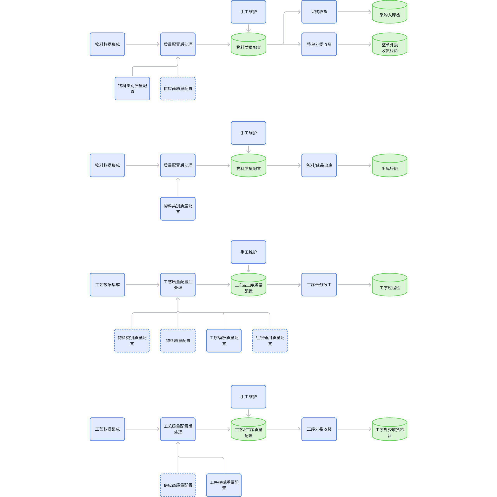

**关键需求**

4个场景、5个环节全覆盖；

检验要求、检验项方便用户自定义扩展，支持来源于上游PLM系统；

## 1.3 **术语及缩写解释**

|术语 | 缩写 | 解释说明|
|--- | --- | ---|
|质量管理 | QM | 通过制定和执行质量标准，监控和控制生产过程中的质量，确保产品符合要求。|
|检验标准 | IS | 对产品或过程的质量要求进行定义的标准，包括检验项目、检验方法和合格标准。|
|检验任务 | IT | 根据检验标准和生产计划生成的具体质量检验任务，分配给检验人员执行。|
|巡检 | PI | 定期对生产过程中的设备、工艺或产品进行的质量检查，确保生产过程的稳定性。|
|首检 | FI | 在首次量产、工艺调整、工装维修更换、设备维修等情况发生时，在生产开始时对产品进行的质量检验，确保生产过程的正确性和产品符合性。|
|过程检验 | PI | 在生产过程中对产品或半成品进行的质量检验，确保生产过程的稳定性和产品质量。|
|质量履历 | QH | 记录产品生产过程中的质量信息，包括生产过程、检验结果等。|
| |  | |
| |  | |

# 2. **需求描述**

## 2.1 **业务描述**

### 2.1.1 **业务流程**

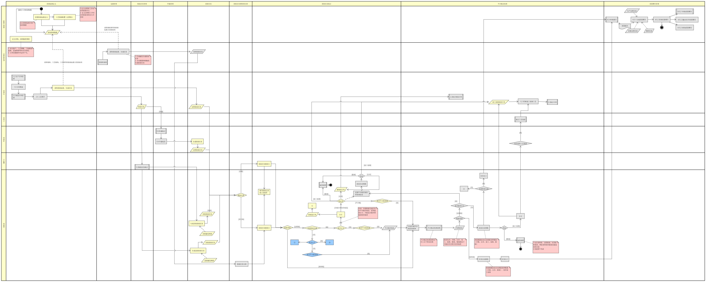

质量管理业务流程本期只关注质量标准定义、质量任务生成、质量任务执行三块内容。

### 2.1.2 **业务对象ER关系图**

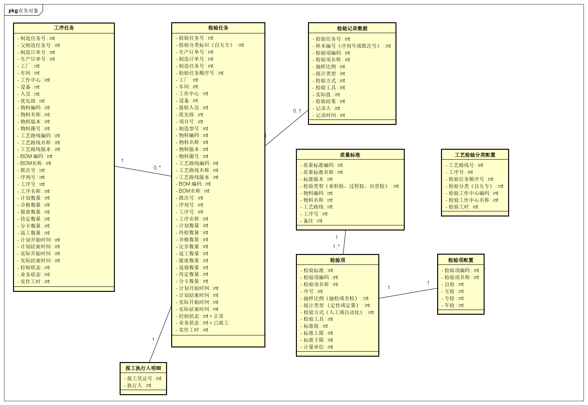

## 2.2 **功能描述**

### 2.2.1 **整体应用架构**

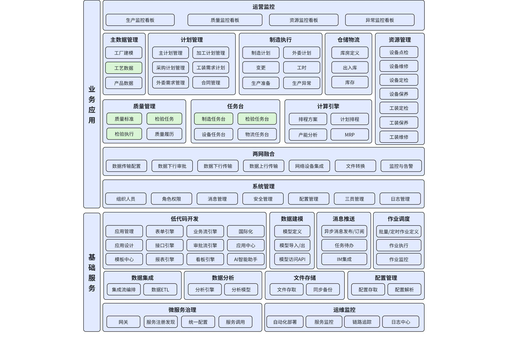

### 2.2.2 **质量管理应用架构**

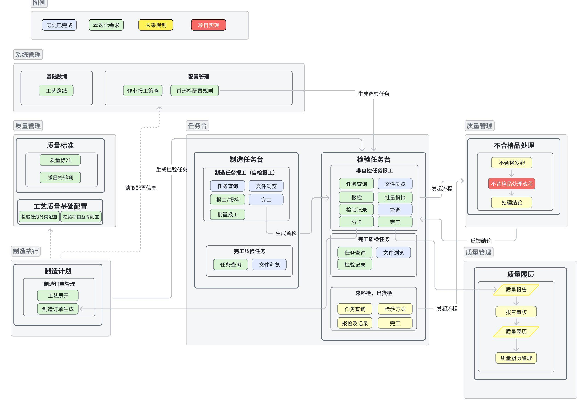

### 2.2.3 **功能清单**

|模块 | 页面 | 功能点 | 功能点描述|
|--- | --- | --- | ---|
|质量管理 | 质量检验项定义 | 增删改查 | 定义质量检验项。|
|质量管理 | 质量标准定义 | 查询质量标准信息 | 根据输入的标准名称、物料名称、检验类型等条件查询质量标准信息。|
|质量管理 | 质量标准定义 | 复制质量标准按钮 | 点击后可复制现有质量标准记录，生成新的记录。|
|质量管理 | 质量标准定义 | 发布质量标准按钮 | 点击后可发布现有质量标准记录。|
|质量管理 | 工艺质量配置列表 | 工艺质量配置列表 | 同基础数据中的工艺路线列表功能，包含重置、查询、展开查询条件功能|
|质量管理 | 工艺质量配置列表 | 工艺路线编码链接 | 打开【工艺质量基础配置】界面|
|质量管理 | 工艺质量基础配置 | 检验分类配置 | 左侧显示工艺路线树，默认选择第一个子节点，并查询显示左侧TAB。默认为第一个标签页检验分类配置，针对工序的检验分类（自互专客户检）进行配置|
|质量管理 | 工艺质量基础配置 | 检验项配置 | 点击后可以弹出编辑界面进行检验项的自互专客户检的配置|
|质量管理 | 首检巡检规则配置 | 首检巡检规则配置展示 | 配置首检和巡检的触发规则|
|质量管理 | 首检巡检规则配置 | 复制规则 | 在规则列表中，点击对应规则的“复制”按钮，复制该规则并生成新的规则。|
|质量管理 | 首检巡检规则配置 | 执行规则 | 在规则列表中，点击对应规则的“执行”按钮，立即执行该规则。|
|质量管理 | 首检巡检规则配置 | 后台触发生成巡检任务 | 根据首检巡检规则配置中的巡检规则，生成巡检检验任务。|
|制造执行 | 制造订单管理 | 工艺展开时，生成自互专客户检验任务 | 在制造订单管理界面中在工艺展开时，根据工艺基础配置，生成自互专客户检的检验任务。|
|制造执行 | 制造任务台-报工 | 完工时，生成首检任务 | 在制造任务台制造任务完成后，根据首检巡检规则配置，生成首检检验任务。|
|制造执行 | 制造任务台-报工 | 自检记录 | 操作员加工完成后，员工可以针对该检验项进行检验记录填写。|
|系统管理 | 任务报工策略 | 任务报工策略展示 | 查看和编辑任务报工策略|
|质量管理 | 检验任务台-检验任务报工列表 | 检验任务报工列表展示 | 在检验任务台单击【检验任务报工】按钮后，显示所有检验任务的列表，包括检验任务编号、物料名称、工艺路线、工序号等信息，及相关功能按钮。|
|质量管理 | 检验任务台-检验任务报工列表 | 报检 | 在检验任务台单击【检验任务报工】按钮后，再点击“报检”按钮，弹出【检验报工】界面。|
|质量管理 | 检验任务台-检验任务报工列表 | 检验记录 | 在检验任务台单击【检验任务报工】按钮后，再点击“检验记录”按钮，弹出【检验记录】界面。|
|质量管理 | 检验任务台-检验任务报工列表 | 任务协调 | 在检验任务台单击【检验任务报工】按钮后，再点击“协调”按钮，弹出【任务协调】界面。|
|质量管理 | 检验任务台-检验任务报工列表 | 文件浏览 | 在检验任务台单击【检验任务报工】按钮后，再点击“文件浏览”按钮，浏览选中的检验任务的相关文件，同制造执行功能相同。|
|质量管理 | 检验任务台-检验任务报工列表 | 批量报检 | 针对检验任务报工列表勾选的检验任务进行批量合格报检。|
|质量管理 | 检验任务台-检验报工 | 检验报工展示 | 检验任务编号、设备、检验工具、执行人数据从检验任务中带入。|
|质量管理 | 检验任务台-检验报工 | 数量输入 | 可以单击按钮弹出【选择序列号】界面，获取界面的返回数量，可以分别获取合格数量、让步数量、返工数量、返修数量、报废数量、待定数量|
|质量管理 | 检验任务台-检验报工 | 上传附件 | 点击“上传”按钮，上传检验明细报告文件，例如：检验明细报告.DOC|
|质量管理 | 检验任务台-检验报工 | 完工 | 勾选，代表对该检验任务进行完工操作。默认为【质量过程检不合格配置】配置的值。|
|质量管理 | 检验任务台-检验报工 | 分卡 | 勾选，代表对该检验任务的各种数量进行分卡操作。默认为【质量过程检不合格配置】配置的值。|
|质量管理 | 检验任务台-检验报工 | 不合格处理 | 勾选，代表不合格数据需要进入不合格处理流程默认为【质量过程检不合格配置】配置的值。|
|质量管理 | 检验任务台-检验报工 | 汇报 | 点击“汇报”按钮，提交检验报工信息|
|质量管理 | 制造任务台-检验记录 | 录入检验数据 | 录入检验项目的相关数据，如抽样比例、统计类型、检测工具等|
|质量管理 | 制造任务台-检验记录 | 保存检验数据 | 保存检验项目的相关数据|
|质量管理 | 检验任务台-完工检验任务 | 完工检验任务展示 | 单击界面【完工自检任务】按钮，显示所有已完工的检验任务的列表，包括检验任务编号、物料名称、工艺路线、工序号等信息|
|质量管理 | 检验任务台-完工检验任务 | 检验记录查看 | 单击界面【完工自检任务】按钮，弹出【检验记录】界面，不能编辑|
|质量管理 | 检验任务台-完工检验任务 | 文件浏览 | 浏览选中的检验任务的相关文件，同制造执行功能相同|
|制造执行 | 制造任务台-任务报工 | 任务报工页面 | 同检验任务台中的单击报检按钮，弹出的检验报工界面类似，在【制造任务台-制造任务报工】界面上需要增加【分卡、不合格处理流程】勾选框，功能同检验报工界面一致。|
|制造执行 | 制造任务台-任务报工 | 检验记录 | 录入检验项目的相关数据，如抽样比例、统计类型、检测工具等|

# 3. **页面&功能设计**

## 3.1 **物料质量配置（增）**

### 3.1.1 **物料质量配置列表展示**

**概述**：展示物料配置列表，以物料信息为基础。

**界面**：

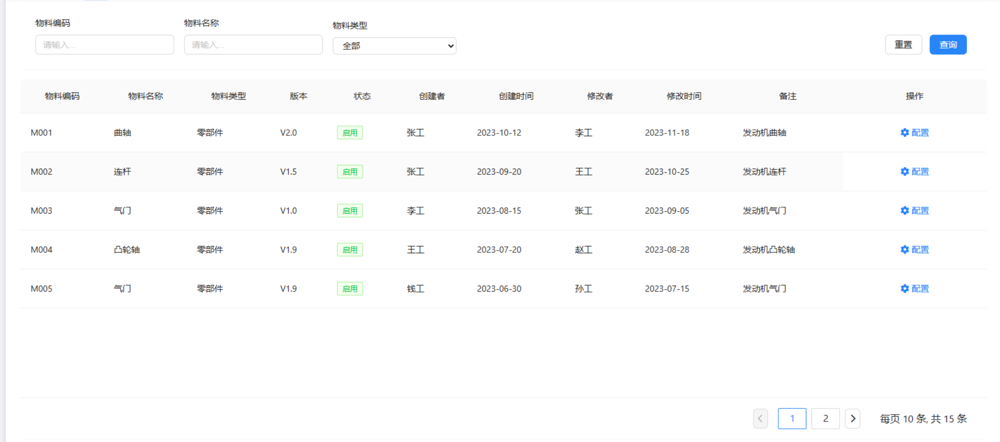

**界面结构**：和物料主数据界面保持一致。

**交互内容**：用户点击配置，打开物料质量基础配置页面，分为检验分类配置、检验项配置、质量报告模板配置3个标签页。

### 3.1.2 **检验分类配置**

**概述**：展示物料检验分类配置标签页详细信息。

**界面**：

**界面结构**：检验分类配置包含：检验顺序号、检验分类、检验工作中心编码、检验工作中心名称。

**交互内容**：可以增删改操作。

**校验规则**：物料检验分类包含：入库检验、出库检验、整单外委收货检验。

**验收标准**：

可以基于物料创建、编辑、删除检验分类配置。

### 3.1.3 **检验项配置**

**概述**：展示物料检验项配置标签页信息。

**界面**：

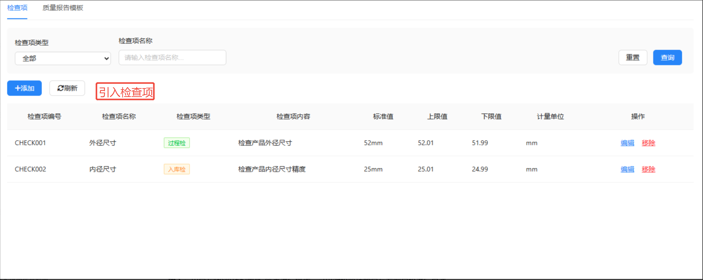

**界面结构**：检验项包含：检验项编码、检验项名称、检验分类（入库检验、出库检验、整单外委收货）、检验项内容、检测工具、标准值、标准上限、标准下限、计量单位、操作。

**交互内容**：用户单击“引入检验项”按钮，弹框显示物料质量配置列表，上下结构。选中物料，在下半部联动显示物料的检验项，确认后可以从其他物料对象上引入检验项。

**处理逻辑**：

引入非引用关系，是复制关系。

### 3.1.4 **检验报告模板配置**

**概述**：展示物料检验报告配置标签页信息。

**界面**：

**界面结构**：检验项包含：模板报告编码、模板报告名称、操作。

**交互内容**：用户单击“引入检验项”按钮，弹框显示物料质量配置列表，上下结构。选中物料，在下半部联动显示物料的质量报告模板，确认后可以从其他物料对象上引入质量报告模板。

**处理逻辑**：

引入非引用关系，是复制关系。

## 3.2 **工艺质量配置列表****（增）**

### 3.2.1 **工艺质量配置列表展示**

**概述**：展示工艺质量配置列表，包括工艺路线等信息。

**界面**：

**界面结构**：跟工艺路线界面保持一致。页面顶部为查询条件输入区域，包括工艺路线名称，编码，创建时间查询条件；下方为查询结果展示区域，以表格形式展示查询结果。

**交互内容**：用户在查询条件输入区域填写查询条件，点击“查询”按钮后，系统根据输入条件查询并展示结果。同原有工艺路线界面一致，没有增删改等相关功能，但该界面只显示发布状态的工艺路线，点击配置打开工艺质量基础配置页面。

**输入**：工艺路线等查询条件。

**输出**：查询结果表格，包括工艺路线名称、编码、创建时间等信息。

### 3.2.2 **检验分类配置**

**概述**：展示工艺路线及检验分类配置标签页详细信息。

**界面**：

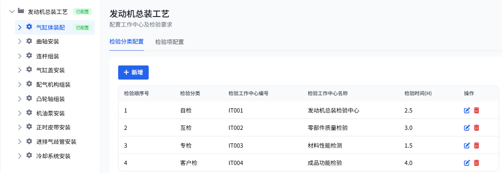

**界面结构**：页面左侧为工艺路线树，用户可以选择工艺路线或工序；右侧为详细信息展示TAB，检验分类配置和检验项配置标签页。检验分类配置包含：检验顺序号、检验分类、检验工作中心编码、检验工作中心名称。

**交互内容**：用户在左侧工艺路线树中选择工艺路线或工序，系统在右侧展示对应的检验分类配置的详细信息。可以增删改操作，操作完成后对应树节点后增加标识，标识文字为已配置，如图所示。

**校验规则**：用户必须选择工艺路线或工序，才能查看检验分类配置的详细信息。检验分类为数据字典值，包含：自检、互检、专检、客户检、首检、工序外委检验。

**输入**：增删改操作。

**输出**：检验分类配置数据。

**处理逻辑**：

用户在左侧工艺路线树中选择工艺路线或工序。

系统获取该工艺路线或工序的ID。

系统调用后端接口获取详细信息。

系统在右侧展示检验分类配置标签页的详细信息。

针对这些数据可以进行增删改操作，并保存操作数据，并设置左侧的树的工序节点为已配置。

**验收标准**：

用户必须选择工艺路线或工序，才能查看检验分类配置标签页的详细信息。

检验分类配置网格的检验顺序号可以调整，但不能相同，网格按该检验顺序号进行顺序显示，检验任务按照该检验顺序号顺序执行。自检比较特殊，如果存在自检，则自检检验顺序号为1且不能修改；自检的检验工作中心不需要手动填写，其他类型需要手动填写工作中心且必填；该界面由质量工程师进行配置。

### 3.2.3 **检验项配置**

**概述**：展示工艺质量基础配置页面及检验项配置标签页信息。

**界面**：

**界面结构**：在工艺质量基础配置页面的详细信息展示区域中，有一个“检验项配置”标签页。检验项配置包含一个多维表格，该表格以检验项分类为条件，并且还包含：检验项目编码、检验项目名称检测工具、标准值、标准上限、标准下限、计量单位操作。

**交互内容**：用户单击“引入检验项”按钮，弹框显示工艺质量配置列表，上下结构。选中工艺，在下半部联动显示工艺的检验项，确认后可以从其他工艺对象上引入检验项。

**处理逻辑**：

引入非引用关系，是复制关系。

引入时遵循工艺对象节点→工艺对象节点，工序对象节点→工序对象节点（按工序号相同处理）

### 3.2.4 **检验报告模板配置**

**概述**：展示工艺质量报告配置标签页信息。

**界面**：

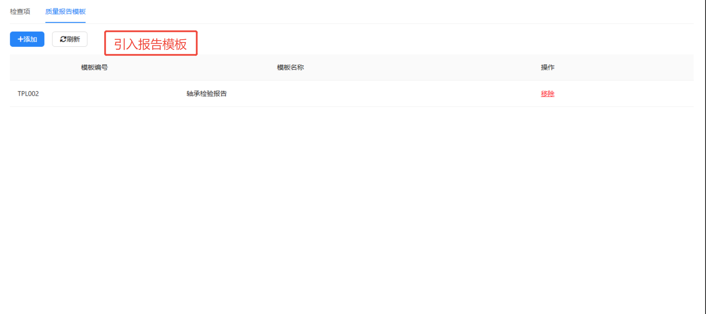

**界面结构**：检验项包含：模板报告编码、模板报告名称、操作。

**交互内容**：用户单击“引入检验项”按钮，弹框显示工艺质量配置列表，上下结构。选中工艺，在下半部联动显示工艺对象全部的质量报告模板，确认后可以从其他工艺对象上引入质量报告模板。

**处理逻辑**：

引入非引用关系，是复制关系。

引入时遵循工艺对象节点→工艺对象节点，工序对象节点→工序对象节点（按工序号相同处理）

## 3.3 **组织级通用质量配置（增）**

### 3.3.1 **组织级通用质量配置列表展示**

**概述**：展示组织级质量配置列表。

**界面**：

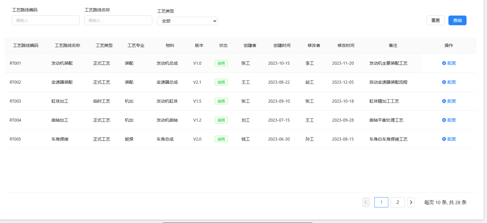

**界面结构**：跟工厂组织界面保持一致。

**交互内容**：用户点击配置，打开组织级通用质量基础配置页面，分为检验分类配置、检验项配置、质量报告模板配置3个标签页。

### 3.3.2 **检验分类配置**

**概述**：展示组织级检验分类配置标签页详细信息。

**界面**：

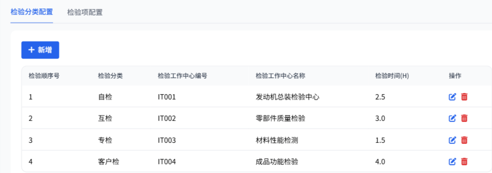

**界面结构**：检验分类配置包含：检验顺序号、检验分类、检验工作中心编码、检验工作中心名称。

**交互内容**：可以增删改操作。

**校验规则**：组织检验分类包含：入库检验、出库检验、整单外委收货检验。

**验收标准**：

可以基于组织创建、编辑、删除检验分类配置。

### 3.3.3 **检验项配置**

**概述**：展示组织级通用检验项配置标签页信息。

**界面**：

**界面结构**：检验项包含：检验项编码、检验项名称、检验分类（入库检验、出库检验、整单外委收货、自检、互检、专检）、检验项内容、检测工具、标准值、标准上限、标准下限、计量单位、操作。

**交互内容**：用户单击“引入检验项”按钮，弹框显示组织级质量配置列表，上下结构。选中物料，在下半部联动显示物料的检验项，确认后可以从其他物料对象上引入检验项。

**处理逻辑**：

引入非引用关系，是复制关系。

### 3.3.4 **检验报告模板配置**

**概述**：展示组织级质量报告配置标签页信息。

**界面**：

**界面结构**：检验项包含：模板报告编码、模板报告名称、操作。

**交互内容**：用户单击“引入检验项”按钮，弹框显示组织级质量配置列表，上下结构。选中工艺，在下半部联动显示组织的质量报告模板，确认后可以从其他组织对象上引入质量报告模板。

**处理逻辑**：

引入非引用关系，是复制关系。

## 3.4 **制造订单管理**

### 3.4.1 **生成自互专客户检验任务**

**概述**
制造订单工艺展开时，根据工艺基础配置，生成互检、专检检验任务。

**界面**

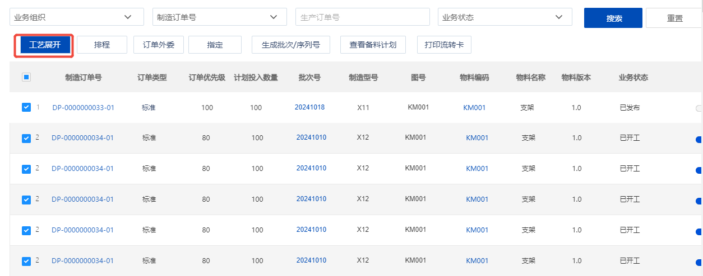

**界面结构**：该界面已经实现。

**交互内容**：用户单击“工艺展开”按钮，在工艺展开工作完成后，根据检验标准生成自检、互检、专检任务。

**校验规则**：无

**输入：**用户单击“工艺展开”按钮。

**输出：**

生成自互专客户检验任务，类似制造任务生成规则。

自检任务编码规则为：制造任务号+前缀+流水号。前缀为“SI”；流水号为3位。举例：MO20250205:01SI001，SI为Self-Inspection的简称。

互检任务编码规则为：制造任务号+前缀+流水号。前缀为“MI”；流水号为3位。举例：MO20250205:01MI001，MI为Mutual Inspection的简称

专检任务编码规则为：制造任务号+前缀+流水号。前缀为“SI”；流水号为3位。举例：MO20250205:01SPI001，SPI为Specialized Inspection的简称

**处理逻辑**：

工艺路展开是否完成。如果正常生成对应的制造任务，进行下一步；

判断每个工序是否有对应的工艺质量基础配置，如果有，进行下一步；

获取【工艺质量基础配置】中该工序的检验任务分类及信息，生成对应的检验分类的检验任务。检验任务的检验项取【工艺质量基础配置】界面中【检验项配置】中对应的勾选的检验项。并将这些任务状态初始化为“待检”。

## 3.5 ** 制造任务台**

### 3.5.1 ** 生成首检任务****（增）**

**概述**
制造任务台-完工汇报页面用于在制造任务完成后，根据规则生成首检检验任务。

**界面****：无**

**输入：**

     操作者报工数据。

**输出：**

生成首检检验任务，首检数量=1。

首检任务编码规则为：制造任务号+前缀+流水号。前缀为“SI”；流水号为3位。举例：MO20250205:01FI001，MO20250205:01为制造任务号，FI为First Inspection的简称。

**处理逻辑**：

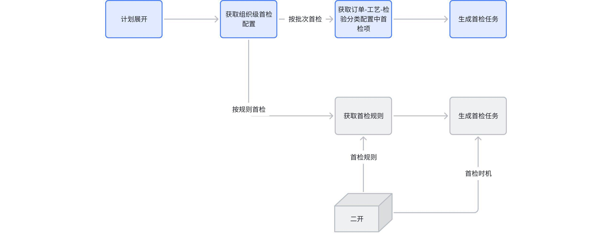

### 3.5.2 **自检记录**

**概述** ：用户可以单击该按钮，添加自检记录，以便对产品质量进行跟踪和管理。如果该自检任务在【工艺质量基础配置-检验项配置】中没有检验项配置为自检，则【自检记录】按钮无须显示。

**界面** ：界面为制造任务台的界面，保持不变，在报工后增加【自检记录】按钮。

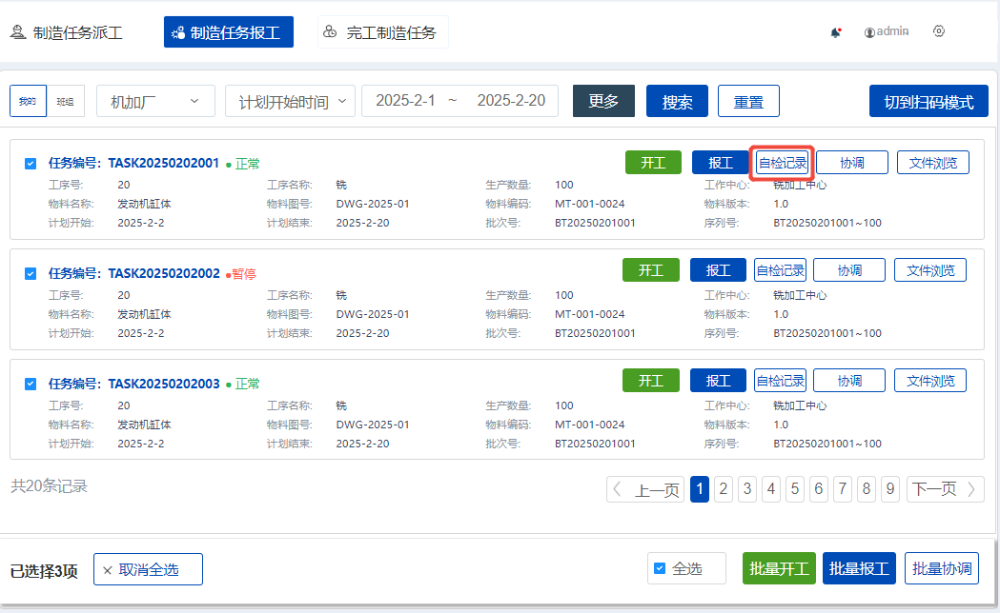

**输入** ：单击【自检记录】按钮

**输出** ：同【检验任务台】中单击【检验记录】按钮，弹出的【检验记录】界面相同的界面，该界面的检验分类为自检。弹出界面的操作及逻辑参考“3.10 检验任务台-检验记录”。

## 3.6 **任务报工策略**

### 3.6.1 **任务报工策略展示**

**概述**：展示任务报工策略页面，该界面的数据是制造任务台、检验任务台汇报数量相关的重要配置。该界面目前已经在制造任务需求中实现，分别在【业务配置】和【工作中心配置】对应的配置上扩展如下图界面的配置，两个界面的配置定义必须相同。

**界面**：

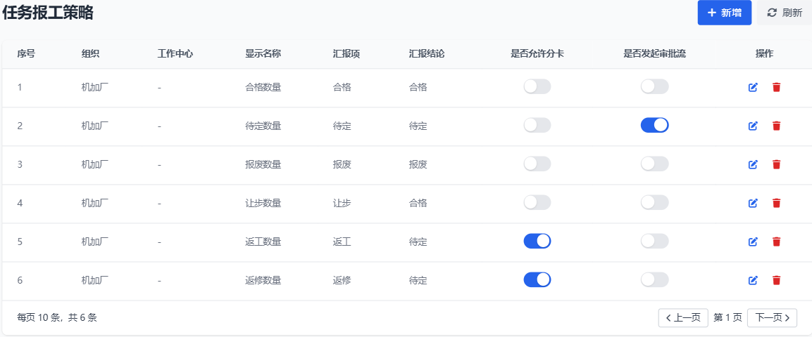

**界面结构**：网格包含：序号、组织、工作中心、显示名称、汇报项、是否允许分卡、是否发起审批流字段。

**交互内容**：增删改查。

**处理逻辑**：增删改查的逻辑

**备注说明：**参考上图，针对某个组织或工作中心的配置进行说明，存在配置的会在制造任务台和检验任务台上显示出对应的数量。如果企业管理非常细致，极端可能会出现以上6种数量，下面逐一进行说明：

显示名称是在制造任务台和检验任务台界面中的显示名称，该名称可以根据项目用户的要求而发生变化，例如合格数量可以为一次合格数量。汇报项是系统实际标识，汇报项目前只会包含：合格、报废、让步、返工、返修、待定，未来合格是否分为一次合格、二次合格由项目上实现。汇报项可以简单理解为后台的数据的保存项，例如检验任务对象上有对应的字段。结论可以简单理解为在制品数量的最终结论，例如序号1、序号4对应的结论都为合格，则合格数量可以向下流转。

序号1表达制造任务台和检验任务台可以录入合格数量，表达对应的数量为检验合格数量。不允许分卡，不允许发起不合格审理，该两个配置不允许打开。

序号2表达检验过程中存在不满足质量检验标准的在制品，这些在制品检验员无权或者难以做出判断和决定，则可以在待定数量中填写。结论必须在不合格品处理流程完成后才知道，所以汇报项为待定，处理流程完成后会进行反馈，反馈根据具体的汇报项（让步、报废、返工、翻修）填写到检验任务对应的检验数量上（让步、报废、返工、翻修数量中）；因为待定数量已经有结论，所以同时扣减待定数量上的值。这些不合格在制品需要根据不合格审理结论在任务中数量体现，所以不允许分卡。是否发起审批流为是，允许针对不合格品发起不合格处理流程。

序号3表达在检验过程中发现了严重超出质量标准的，检验员有权直接定义为报废，并且不发起不合格审理，不能决定的在不合格品数量中选择。报废的在制品一般没有后续制造动作，所以是否允许分卡一般情况下都为否。后续场景说明：如果是否发起审批流为是，则表达当前的报废数量需要走报废审理流程，最终是否报废需要由该流程给出结论，可能出现在制品不报废的场景，并且结论需要反写到对应的检验任务的其它数量上，例如在制品报废审批流完成后的结论为让步接收，则该检验任务的让步数量增加，报废数量减少。

序号4表达在检验过程中发现了轻微不符合质量标准的在制品，检验员有权定义为让步，该让步数量的最终结论为合格。是否允许分卡为否时，汇报结论为合格，则检验员汇报后，让步数量流转到下个检验任务，例如互检任务到专检任务。其它场景：是否允许分卡为是时，检验员汇报后，会针对当前的让步数量进行分卡，产生新的制造订单进行后续生产。

序号5、6表达检验过程中发现不符合质量标准的在制品，检验员有权定义为返工或返修。当前场景的是否允许分卡为是则表达返工返修数量会从原制造订单分出去，走独立的后续流程，不回到原制造订单的返工返修指定工序，无须将新制造订单的在制品的合格或报废的状态反馈给原制造订单的对应制造任务。假设场景说明：如果是否允许分卡为否，则表达需要将返工返修数量走返工返修处理，并且回到原制造订单的返工返修指定工序，同时会更新的返工返修的在制品的合格或报废的状态反馈给原制造订单的对应制造任务。

## 3.7 **检验任务台-检验任务报工列表**

### 3.7.1 **检验任务报工列表展示**

**概述**：展示任务报工页面，包括所有检验任务的列表。

**界面**：

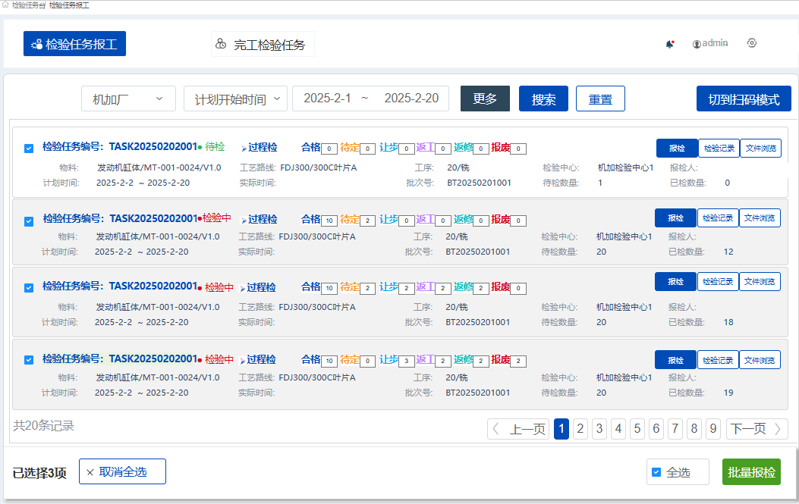

**界面结构**：页面顶部为查询条件输入区域，包括工作中心（常驻查询条件）、计划开始时间（常驻查询条件）、检验任务编号（扩展查询条件）、物料（扩展查询条件）、工艺路线（扩展查询条件）、工序号（扩展查询条件）；下方为查询结果展示区域，以表格形式展示查询结果。包含的字段有检验任务编号、任务状态、合格数量、待定数量、让步数量、返工数量、返修数量、报废数量、物料名称、物料编码、工艺路线、工序号、工序名称、批次号、序列号、计划时间、实际时间、待检数量、分卡数量。每个任务对应有报检、检验记录、文件浏览按钮。如果该检验任务没有在【工艺质量基础配置-检验项配置】中配置对应的当前检验分类或没有检验项，则【检验记录】按钮无须显示。

**交互内容**：用户在查询条件输入区域填写查询条件，点击“查询”按钮后，系统根据输入条件查询并展示结果。“切到扫码模式”按钮功能同检验任务台的“切到扫码模式”按钮功能一致。**任务列表显示当前登录人所在工作中心的所有检验任务，不存在制造任务台中的【我的、班组】的切换按钮。**检验员可以根据选择检验任务执行质量检验。

**输入**：检验任务编号、物料名称、工艺路线、工序号等查询条件。默认为当前登录人所属的工作中心。

**输出**：查询结果表格，包括检验任务编号、物料名称、工艺路线、工序号、任务状态等信息。

**处理逻辑**：

默认查询当前登录人所属的工作中心对应的检验人员。

如果查询条件为空，提示用户填写查询条件。

如果查询条件不为空，系统根据查询条件调用后端接口查询数据。

系统将查询结果以表格形式展示在页面上。

### 3.7.2 **报检操作**

**概述**：提供用户对选中的检验任务进行报检操作的功能。

**界面**：

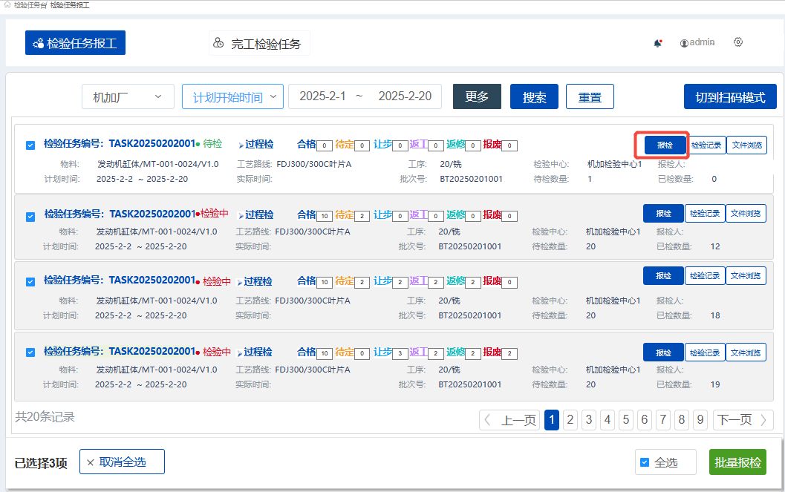

**界面结构**：在检验任务台-任务报工页面的查询结果表格中，每行记录的操作列中有一个“报检”按钮。

**交互内容**：用户点击“报检”按钮，系统弹出检验报工界面，用户填写检验结果后提交。

**校验规则**：报检操作只能在已开工的检验任务上进行。

**输入**：用户点击“报检”按钮的操作。

**输出**：检验报工界面，用户填写检验结果后提交。

**处理逻辑**：

用户点击“报检”按钮，系统获取该记录的ID。

系统弹出检验报工界面，用户填写检验结果。

用户点击“提交”按钮，系统验证检验结果是否符合要求。

如果检验结果不符合要求，提示用户修改检验结果。

如果检验结果符合要求，系统保存检验结果，并将该检验任务的状态更新为“**报检中**”。

系统提示用户报检操作成功，并刷新页面展示更新后的任务状态。

**验收标准**：

报检操作只能在已开工的检验任务上进行。

系统正确展示检验报工界面，用户可以填写检验结果并提交。

检验结果保存后，系统正确更新该检验任务的状态为“报检中”，并提示用户操作成功。

注意：如果用户一次报检完成，则需要更新该检验任务的状态为“完工”

### 3.7.3 **首检控制（增）**

**概述**：首检结论会影响流转。

**界面**：主体界面同报检操作页面；

交互：首检结论报废时，弹框提示“当前任务首检不合格，请确认继续首检或整批报废？”，选择不同结论参考“处理逻辑”执行

**输入**：首检结论。

**输出**：流转指令、首检任务。

**处理逻辑**：

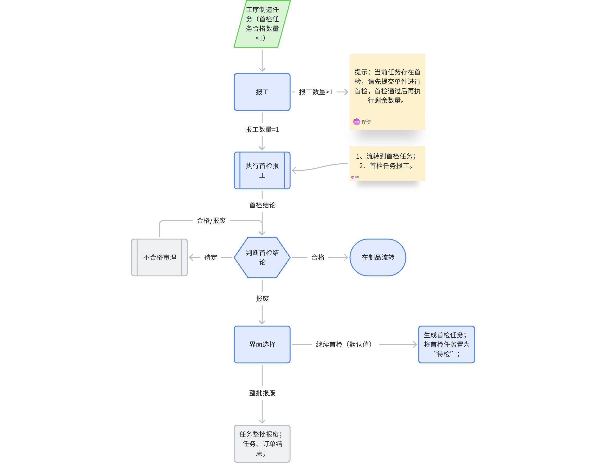

**验收标准**：

存在首检任务时只能提交单件，才能执行后续报工；

首检报废-继续首检时，后续检验任务（如专检）或下道工序不能进行报工操作。

### 3.7.4 **检验记录**

**概述**：提供用户查看或编辑选中的检验任务的检验记录的功能。如果该检验任务在【工艺质量基础配置-检验项配置】中没有检验项配置，则【检验记录】按钮无须显示，例如该检验任务为专检，但【工艺质量基础配置-检验项配置】中没有检验项被配置为专检，则【检验记录】按钮无须显示。

**界面**：

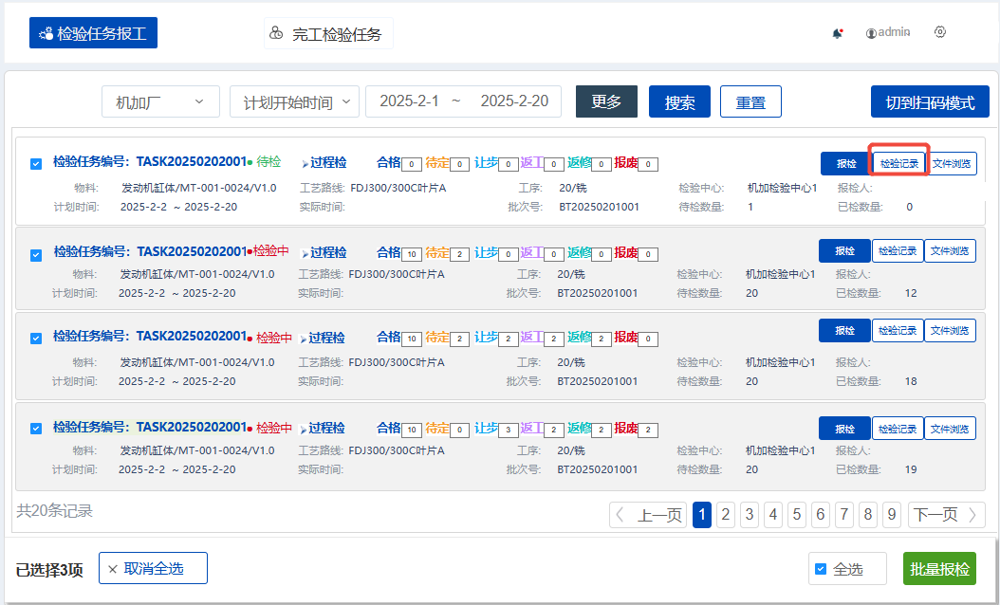

**界面结构**：在检验任务台-任务报工页面的查询结果表格中，每行记录的操作列中有一个“检验记录”按钮。

**交互内容**：用户点击“检验记录”按钮，系统弹出检验记录界面，可以查看及编辑该检验任务的检验记录。如果该检验任务已完成，则只能查看检验记录。

**校验规则**：检验记录编辑操作只能在“报检中”的检验任务上进行。

**输入**：用户点击“检验记录”按钮的操作。

**输出**：检验记录界面，展示该检验任务的检验记录。

**处理逻辑**：

用户点击“检验记录”按钮，系统获取该记录的ID。

系统调用后端接口获取该检验任务的检验记录。

系统弹出检验记录界面，展示该检验任务的检验记录。

用户可以查看及编辑检验记录。

用户点击“关闭”按钮，关闭检验记录界面。

**验收标准**：

检验记录编辑操作只能在“**报检中**”的检验任务上进行。

检验记录查看在检验任务的状态为“报检中”或"完工"时都可以进行。

### 3.7.5 **任务协调（该功能暂时取消，检验任务目前没有分派、领取、协调功能）**

**概述**：提供用户对选中的检验任务进行任务协调的功能。

**界面**：

**界面结构**：在检验任务台-任务报工页面的查询结果表格中，每行记录的操作列中有一个“协调”按钮。

**交互内容**：用户点击“协调”按钮，系统弹出任务协调界面，用户可以协调任务的执行。

**校验规则**：任务协调操作只能在已报检的检验任务上进行。

**输入**：用户点击“协调”按钮的操作。

**输出**：任务协调界面，用户可以协调任务的执行。

**处理逻辑**：

用户点击“协调”按钮，系统获取该记录的ID。

系统弹出任务协调界面，用户可以协调任务的执行。

用户填写协调信息，点击“提交”按钮，系统验证协调信息是否符合要求。

如果协调信息不符合要求，提示用户修改协调信息。

如果协调信息符合要求，系统保存协调信息，并更新任务状态。

系统提示用户任务协调成功，并刷新页面展示更新后的任务状态。

**验收标准**：

任务协调操作只能在已报检的检验任务上进行。

系统正确展示任务协调界面，用户可以填写协调信息并提交。

协调信息保存后，系统正确更新任务状态，并提示用户操作成功。

### 3.7.6 **文件浏览**

**概述**：提供用户浏览选中的检验任务的相关文件的功能。

**界面**：

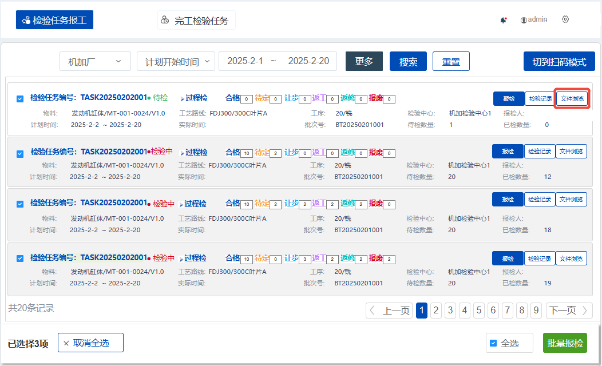

**界面结构**：在检验任务台-任务报工页面的查询结果表格中，每行记录的操作列中有一个“文件浏览”按钮。

**交互内容**：用户点击“文件浏览”按钮，系统弹出文件浏览界面，展示该检验任务的相关文件。功能同制造任务台上的文件浏览功能一致。

**校验规则**：无

**输入**：用户点击“文件浏览”按钮的操作。

**输出**：文件浏览界面，展示该检验任务的相关文件。

**处理逻辑**：同制造任务台的“文件浏览”功能。

用户点击“文件浏览”按钮，系统获取该记录的ID。

系统调用后端接口获取该检验任务对应的工艺路线的相关文件。

系统弹出文件浏览界面，展示该检验任务的相关文件。

用户可以查看文件，但不能修改。

用户点击“关闭”按钮，关闭文件浏览界面。

**验收标准**：

系统正确展示文件浏览界面，用户可以查看相关文件。

### 3.7.7 **批量报检**

**概述**：提供用户对选中的多个检验任务进行批量报检操作的功能。

**界面**：

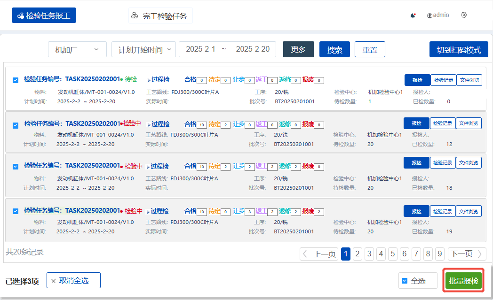

**界面结构**：在检验任务台-任务报工页面的查询结果表格上方有一个“批量报检”按钮。

**交互内容**：用户点击“批量开工”按钮，系统弹出确认框，确认是否对选中的检验任务进行批量报检操作。

**校验规则**：批量开工操作只能在检验任务状态为待检，加工任务完工、前序检验任务完工的任务上进行操作。

**输入**：用户点击“批量开工”按钮的操作。

**输出**：系统将选中的检验任务的状态更新为“完工”。

**处理逻辑**：

用户点击“批量报检”按钮，系统获取批量选中的记录ID。

判断勾选的任务的是否为待检，如果不是则不允许该任务进行后续操作。

判断勾选的检验任务对应的加工任务是否完工，没有完工则不允许该任务进行后续操作。

判断勾选的任务是否存在前序检验任务没有完工的，如果有则不允许该任务进行后续操作。如果批量勾选的任务包含前序检验任务，则可以进行后续操作。前序检验任务根据【检验分类配置】中的“检验顺序号”进行判定。

如果以上条件都满足，则系统弹出确认框，提示用户：检验任务编号【*****】不满足批量报检条件，报检条件包含【检验任务状态为待检、加工任务完工、前序检验任务完工】。确认是否对检验任务编号【*****】进行设置批量合格操作？

用户点击“确认”按钮，系统调用后端接口更新选中的检验任务的待检数量等于合格数量，检验任务状态为“完工”。

系统提示用户批量报检操作成功，并刷新页面展示更新后的任务状态。

### 3.7.8 **上传附件**

**整体功能同****中的3.4.6制造任务派工-上传附件**

## 3.8 **检验任务台-检验报工**

### 3.8.1 **检验报工展示**

**概述**：展示检验报工页面，包括检验任务编号、设备、检验工具、执行人等信息。

**界面**：

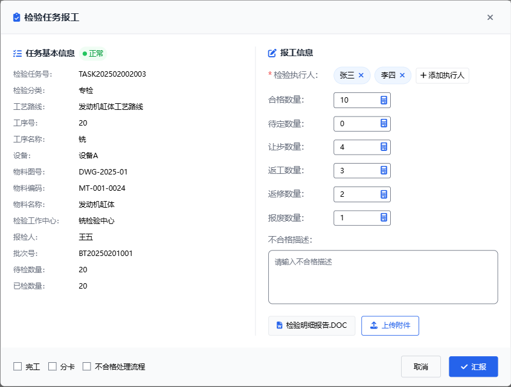

**界面结构**：页面左侧为任务基本信息，包含：任务状态、检验任务号、检验分类（互专军）、工序、设备、物料、检验工作中心、报检人（当前登录人）、批次号、待检数量、已检数量等信息展示区域；右侧为报工信息，包含：检验时间（默认为汇报的当前时间，不可见，同制造执行一致）、检验执行人（默认为当前登录人，可以修改）、合格数量、待定数量、让步数量、返工数量、返修数量、报废数量、不合格描述、附件上传（可以允许用户上传多个文件，文件类型包含DOC、XLS、PDF等）。对应的数量项是否显示，需要读取【任务报工策略】界面中的配置，如果没有配置则不需要显示，数量在当前界面显示的名称为配置中的显示名称；底部为功能区，包含：完工、分卡、不合格处理流程勾选框，及取消和汇报按钮。完工、分卡、不合格处理流程勾选框**默认不勾选**。

**交互内容**：用户在报工信息区域填写检验结果及不合格描述，点击“汇报”按钮后，系统验证检验结果是否符合要求。

**输入**：用户填写的检验结果。

**输出**：系统验证检验结果是否符合要求，并提示用户操作结果。

**处理逻辑**：

用户在报工信息区域填写检验结果。

用户点击“汇报”按钮，将该检验任务的状态更新为“报检中”。

系统提示用户检验报工成功，并关闭检验报工界面。

### 3.8.2 **数量输入**

**概述**：提供用户输入检验任务的数量信息的功能。

**界面**：

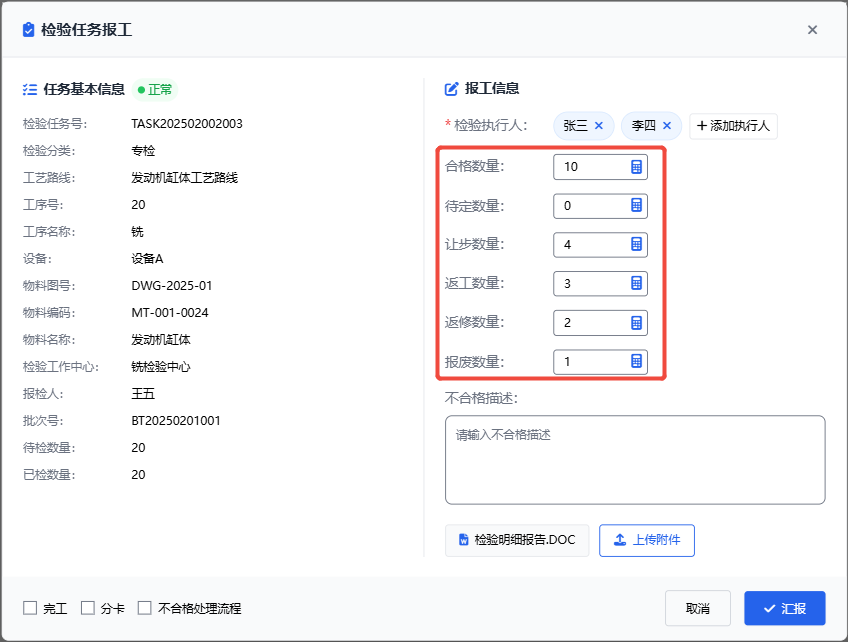

**界面结构**：在检验报工页面中，有一个“数量输入”区域。该区域的数量显示受【任务报工配置策略】页面的配置约束，根据当前任务对应的【组织+工作中心】读取对应的配置值，显示所有的配置，名称为显示名称字段+‘数量’，没有配置的不显示。极端情况下，如上图所示显示6个数量，上图的数量都在【任务报工配置策略】进行了配置，分别为：合格、不合格、让步、返工、返修、报废，所以界面共显示了6个数量。

**交互内容**：用户可以分别点击不同的数量输入框后面的箭头图标，系统弹出选择序列号界面，如下图所示，用户可以选择序列号，系统自动统计对应的序列号的数量，确定后返回给检验任务报工界面的数量。这里的功能制造任务台已经实现，相同功能处理即可。

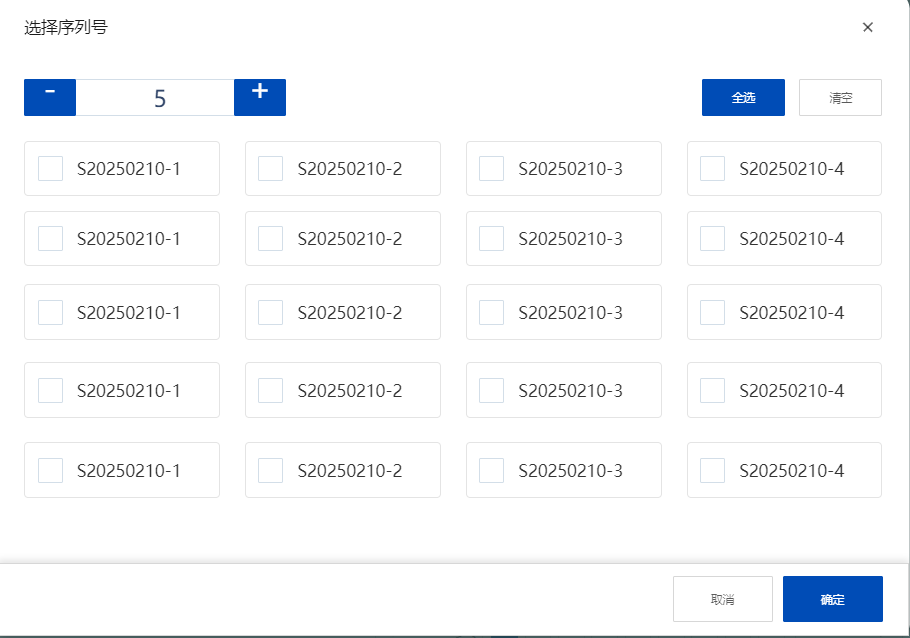

**校验规则**：数量输入必须为非负整数，且总和不能超过任务的待检数量。

**输入**：数量录入，会弹出和制造任务台一样的界面进行序列号的选择窗口，功能也一致。

**输出**：系统验证数量信息是否符合要求，并提示用户操作结果。

**处理逻辑**：

用户点击“数量输入”按钮，系统弹出序列号选择界面，同制造执行报工时弹出的序列号选择界面。

用户在数量中选择对应的序列号，产生合格数量、让步数量、返工数量、返修数量、报废数量、待定数量。合格数量、让步数量、返工数量、返修数量、报废数量、待定数量对应序列号不能重复。

如果数量信息总和超过任务的待检数量，提示用户数量总和不能超过任务的待检数量。

如果数量信息符合要求，系统保存数量信息，并关闭数量输入界面。

**验收标准**：

数量输入必须为非负整数，且总和不能超过任务的待检数量。

系统正确验证数量信息，并提示用户操作结果。

### 3.8.3 **上传附件**

**概述**：提供用户上传检验明细报告文件的功能。

**界面**：

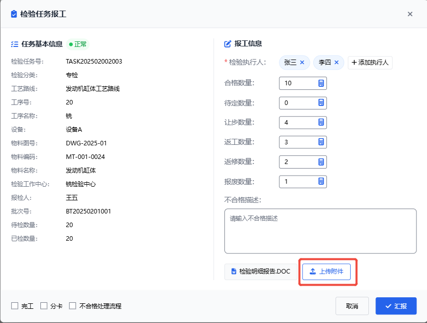

**界面结构**：在检验报工页面的检验结果录入区域中，有一个“上传”按钮。

**交互内容**：用户点击“上传”按钮，系统弹出文件选择对话框，用户选择文件后，系统上传文件并显示文件名。

**校验规则**：上传的文件必须是有效的文件格式（如.DOC、.PDF等）。

**输入**：用户选择的文件。

**输出**：系统显示上传的文件名，并提示用户上传成功。

**处理逻辑**：

用户点击“上传”按钮，系统弹出文件选择对话框。

用户选择文件后，系统验证文件格式是否有效。

如果文件格式无效，提示用户选择有效的文件格式。

如果文件格式有效，系统上传文件，并显示文件名。

系统提示用户上传成功。

**验收标准**：

上传的文件必须是有效的文件格式。

系统正确显示上传的文件名，并提示用户上传成功。

### 3.8.4 **分卡操作**

**概述**：提供用户对检验任务进行分卡操作的功能。

**界面**：

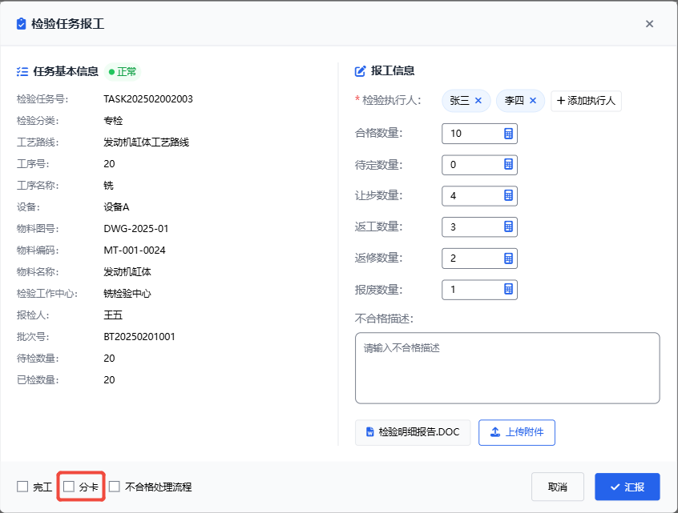

**界面结构**：在检验报工页面中，有一个“分卡”复选框。

**交互内容**：用户勾选“分卡”复选框，在汇报完工时，同时对该检验任务的在制品进行分卡操作。

**校验规则**：分卡操作只能在已报检的检验任务上进行。分卡只能在完工的时候进行操作。

**输入**：用户勾选“分卡”复选框的操作。

**输出**：系统将该检验任务的在制品进行分卡操作，并提示用户操作成功。

**处理逻辑**：

用户勾选“分卡”复选框，用户单击“汇报”按钮，系统获取该检验任务的ID。

系统验证检验报工数量是否达到完工条件。如果达到进入下一步，没有则不做后续逻辑处理。

如果该检验任务完工逻辑处理完成，读取【任务报工策略】界面的配置，系统调用后端接口将该检验任务中对应的在制品进行分卡操作。例如【任务报工策略】界面中的让步的是否分卡为是，则将该检验任务对应的物料的让步数量进行分卡并产生新的制造订单，同时分卡数量需要记录到检验任务的分卡数量上。返工返修配置对应的配置如果也需要分卡，则分卡后的数量也需要累加到检验任务的分卡数量上。

系统提示用户分卡操作成功。

**验收标准**：

分卡操作只能在已报检的检验任务上进行。

系统正确将该检验任务的在制品进行分卡操作，并提示用户操作成功。

### 3.8.5 **不合格处理**

**概述**：提供用户对检验任务的不合格品进行处理的功能。

**界面**：

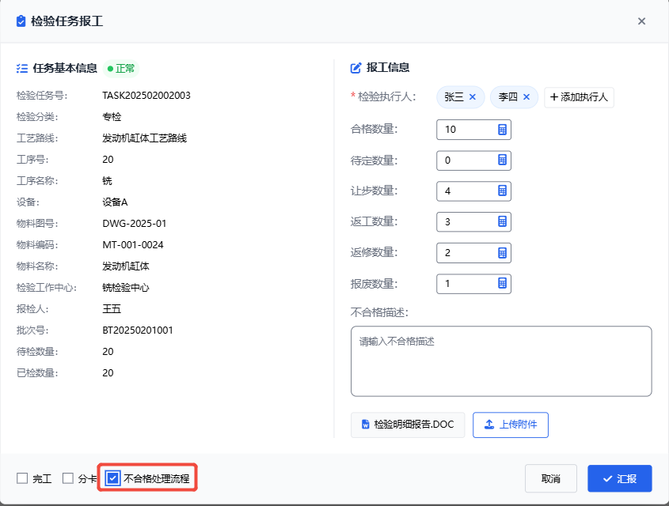

**界面结构**：在检验报工页面中，有一个“不合格处理”复选框。

**交互内容**：用户勾选“不合格处理”复选框，系统将该检验任务的不合格品进入不合格处理流程。

**校验规则**：不合格处理操作只能在已报检的检验任务上进行。

**输入**：用户勾选“不合格处理”复选框的操作。

**输出**：系统将该检验任务的不合格品进入不合格处理流程，并提示用户操作成功。

**处理逻辑**：

用户勾选“不合格处理”复选框，用户单击“汇报”按钮，系统获取该检验任务的ID。

系统验证检验报工数量是否达到完工条件。如果达到进入下一步，没有则不做后续逻辑处理。

如果该检验任务完工逻辑处理完成，读取【任务报工策略】界面的配置，系统调用后端接口该检验任务中对应的在制品进入不合格处理流程。例如【任务报工策略】界面中的不合格的是否发起审批流为是，则将该检验任务对应的物料的待定数量生成不合格品处理单，进入不合格处理流程，则不合格处理管理中出现一条不合格状态的不合格处理单。

系统提示用户不合格处理操作成功。

**验收标准**：

不合格处理操作只能在已报检的检验任务上进行。

系统正确将该检验任务的不合格品进入不合格处理流程，并提示用户操作成功。

### 3.8.6 **汇报操作**

**概述**：提供用户提交检验报工信息的功能。

**界面**：

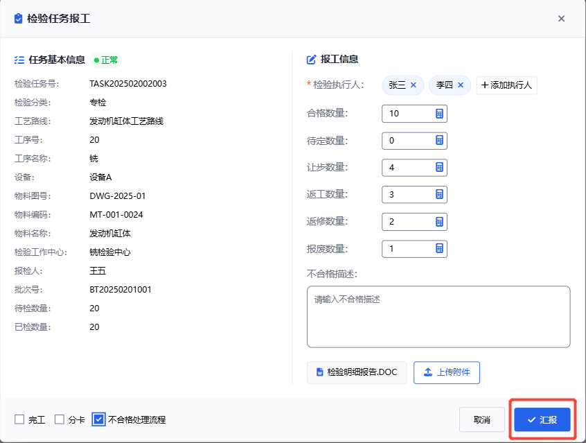

**界面结构**：在检验报工页面的检验记录区域中，有一个“汇报”按钮。

**交互内容**：用户填写完检验结果和相关数量信息后，点击“汇报”按钮，系统验证信息是否完整并提交报工信息。

**校验规则**：报工操作只能在已填写完整检验结果和数量信息的检验任务上进行。

**输入**：用户填写的检验结果和数量信息。

**输出**：系统验证信息是否完整，并提示用户操作结果。

**处理逻辑**：

用户填写完检验结果和数量信息后，点击“汇报”按钮，系统获取该检验任务的ID。

系统验证检验结果和数量信息是否完整。如果数量之和为0，则提示用户没有输入数量。

如果信息完整，系统调用后端接口提交报工信息。当检验任务数量大于1时，允许用户多次汇报，则检验任务的已检数量=历史汇报数量+本次汇报的数量，如果存在序列号单件管理，则一个序列号只能属于一个数量的集合，例如某个在制品属于合格，则不能属于其它数量的集合。

没有完工时，该检验任务的状态更新为“报检中”。

系统提示用户汇报操作成功。

**备注说明：**

在汇报过程中，如果单击如图所示的汇报按钮，则汇报的序列号不会在下次的汇报候选值中出现，也就是已汇报的数据在下次汇报时不允许修改。

在汇报过程中，一个工序可能同时存在“自互专客户检”检验任务，在流转过程中，按照工艺质量基础配置中的检验分类配置中的检验顺序号进行流转。目前和制造执行保持一致，也就是允许**分批流转**，举例：自检制造任务数量10个，可以汇报合格3个，因为制造汇报即为自检汇报，所以互检可以看到3个在制品数据，可以针对这3个在制品进行检验和汇报。任务间的流转以“任务报工策略”中的结论为**合格**对应的汇报项数量进行流转。

### 3.8.7 **完工操作**

**概述**：提供用户对检验任务进行完工操作的功能。

**界面**：

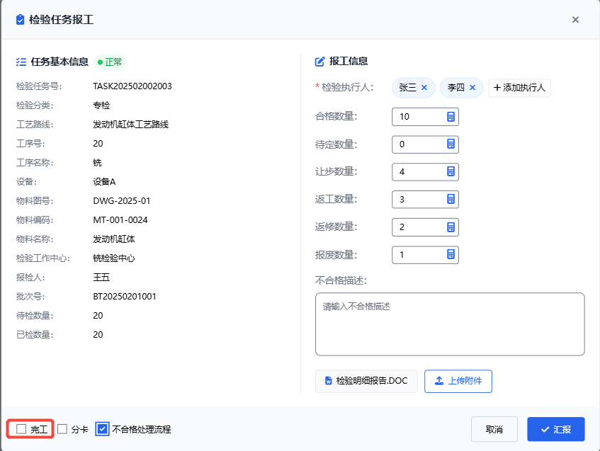

**界面结构**：在检验报工页面的检验记录区域中，有一个“完工”复选框。

**交互内容**：用户勾选“完工”复选框，勾选后，判断当前用户的组织和工作中心在【任务报工策略】中是否存在被配置为分卡或不合格品流程的数据，如果有则分卡或不合格处理流程复选框自动被系统勾选，这两个勾选框也可以被用户手动取消。用户取消勾选“完工”复选框后，系统自动取消勾选分卡和不合格处理流程复选框。

**校验规则**：完工操作只能在已报检的检验任务上进行。

**输入**：用户勾选“完工”复选框的操作。

**输出**：系统将该检验任务的状态更新为“完工”，并提示用户操作成功。

**处理逻辑**：

用户勾选“完工”复选框，系统获取该检验任务的ID。

系统验证该检验任务是否已报检。

如果该检验任务未报检，提示用户不能进行完工操作。

判断合格数量、让步数量、返工数量、返修数量、报废数量的合计是否等于待检数量（不包含待定数量），不等则提示用户不能进行完工操作，只能进行汇报操作（这个时候需要用户手工取消勾选完工勾选框才能继续汇报）。判断待定数量是否为0，不为0则代表不合格处理流程未处理完成或未反馈不合格处理结论及数量，则不允许完工。

如果该检验任务已报检，系统调用后端接口将该检验任务的状态更新为“完工”。

系统提示用户完工操作成功。

**验收标准**：

完工操作只能在已报检的检验任务上进行。

系统正确更新该检验任务的状态为“完工”，并提示用户操作成功。

**备注：**

**工序内的加工任务和检验任务不考虑接续关系的问题，该工序加工任务的在制品完工即可开始该工序的检验任务。**

**如果工序同下道序间有接续关系，则下道序的开工受该条件约束。例如工序A、B的接续关系为ES，则工序A的最后道检验工序全部完成后，工序B的加工任务才能开始，其它接续关系做类似处理。**

## 3.9 **检验任务台-检验记录**

### 3.9.1 **录入检验数据**

**概述**：提供用户录入检验项目的相关数据的功能。

**界面**：

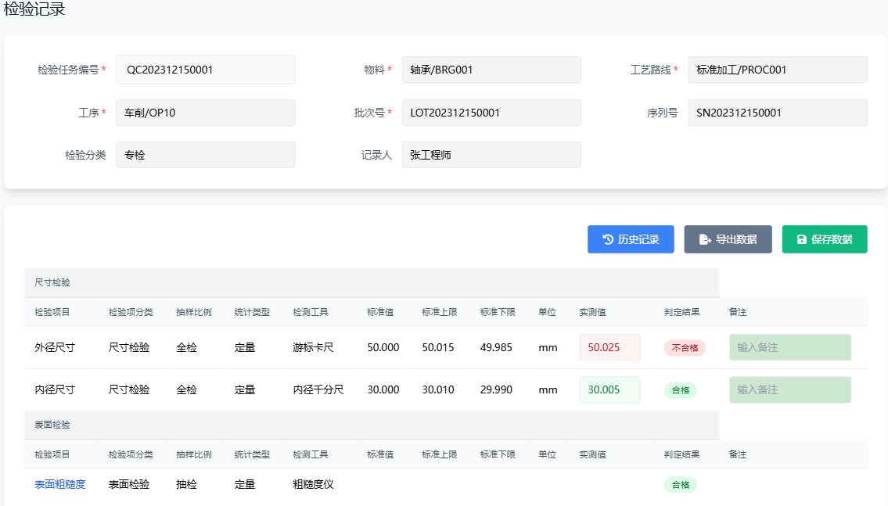

**界面结构（检验任务的数量为1，单个序列号场景）**：如上图，在检验记录页面中，上部包含检验任务编号、物料、工艺路线、工序、批次号、序列号（可以为空）、检验分类、记录人。下部包含一个表格，用于录入检验项目的相关数据，包含检验项目、抽样比例、统计类型（包含定性、定量）、检测工具、标准值、标准上限、标准下限、单位、实测值、判定结果（包含：合格、不合格）、备注。

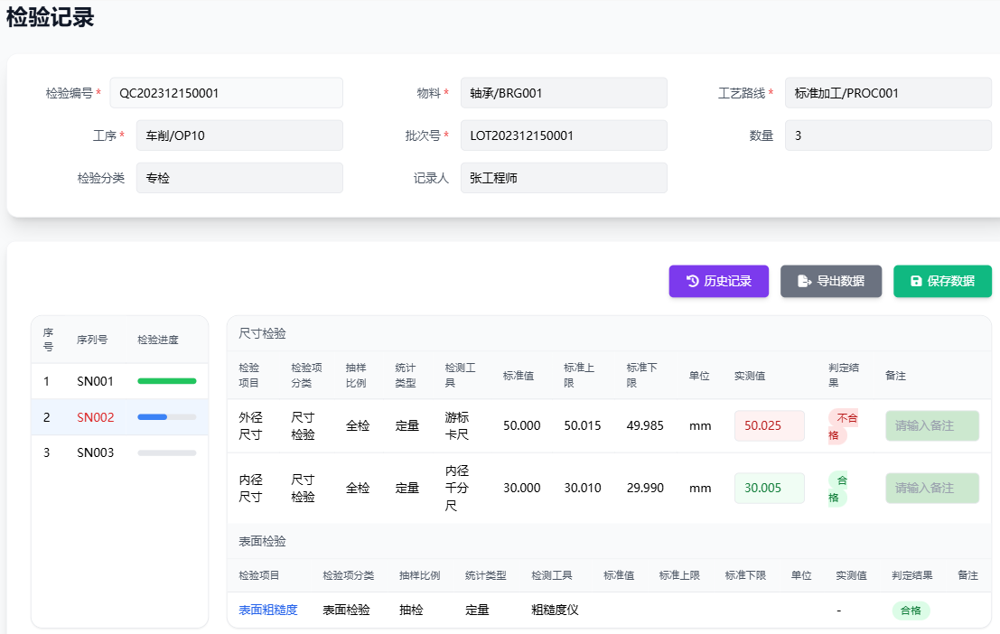

**界面结构（检验任务的数量大于1，批次中存在多个序列号或没有序列号场景）**：如上图，在检验记录页面中，上部包含检验任务编号、物料、工艺路线、工序、批次号、数量、检验分类、记录人。下部包含二个表格，左侧网格对应序列号，包含：序号、序列号、检验进度；右侧网格用于录入检验项目的相关数据，包含检验项目、抽样比例、统计类型（包含定性、定量）、检测工具、标准值、标准上限、标准下限、单位、实测值、判定结果（包含：合格、不合格）、备注。单击左侧网格，右侧网格展示对应的序列号的检验项数据。序列号中如果有不合格项，则左侧网格序列号红色字体显示。如果检验进度100%，则用绿色进度条表示。如果批次中没有序列号，并且抽样比例为全检的情况下（当前只考虑全检，抽检暂不考虑），可以用#1、#2、#3...作为序列号来表达该检验任务中的唯一性，后续如果用户有特殊的序列号规则，则增加配置进行规则约定。

**交互内容**：用户在表格中填写或编辑检验项目的相关数据。

**校验规则**：录入的数据必须符合检验标准的要求。

**输入**：用户填写的检验项目数据。

**输出**：检验项目数据

**处理逻辑**：

用户在表格中填写或编辑检验项目的相关数据。

如果统计类型等于定性时，判定结果只能输入合格和不合格。

如果统计类型是定量，则判断证数据是否为数字，不是则提示用户修改。判断是否符合上下限要求，不符合则该数据值的颜色为红色。判定结果字段如果是不合格，则字体的颜色为红色。

在检验过程中，也可以进行历史检验数据的查询，单击上图中的历史记录按钮，弹出下图所示的界面。可以查询当前任务前面的所有含自身工序的自检、互检、专检、客户检记录。该界面的左侧包含个工艺路线网格，该网格显示当前及之前工序，默认选择当前检验记录对应的工序，网格包含工序号、工序名称字段，切换不同的工序可以查看不同的历史记录，历史记录包含对应的工序对应的自互专客户检验记录。单击对应标签页可以看到对应的检验记录数据。如果为首道工序的自检，则没有历史检验记录。

**如果检验项的“填报方式”为综合检时，单击检验项目可以弹出质量报告界面进行历史数据查看。**

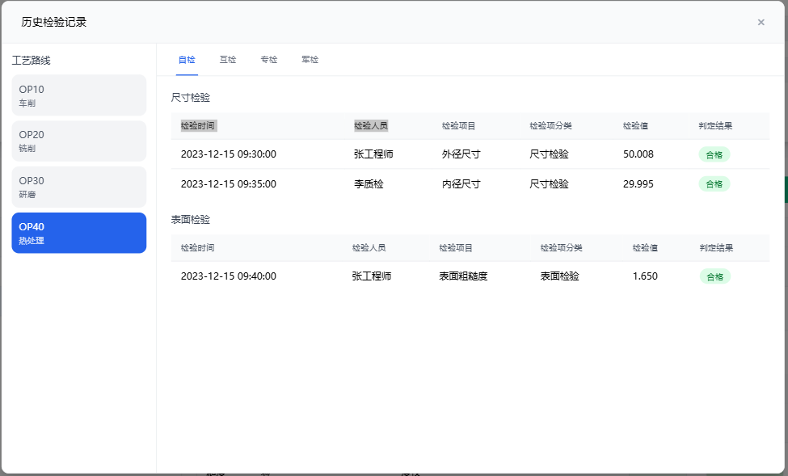

**验收标准**：

录入的数据必须符合检验标准的要求。系统正确验证数据是否符合要求，并提示用户操作结果。

**备注说明：**

     **如果检验项的“填报方式”为综合检时，单击检验项目可以弹出质量报告界面进行数据录入，在数据录入时可能存在两种场景****，优先第二种场景**：

第一种：类似KMMOM CLOUD 1.0中的任务的过程填报，如下图所示。导出或打印时再调用质量报告填写数据。

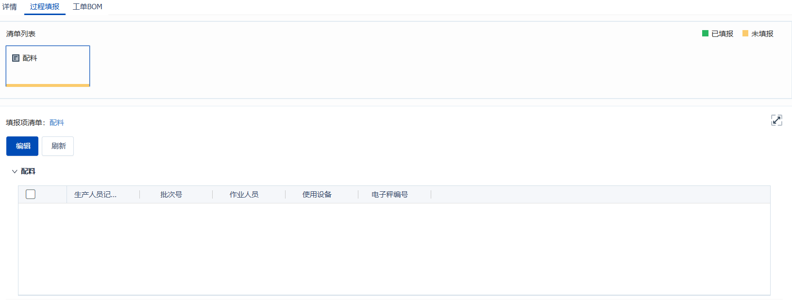

第二种：在HX项目上用户需要输入的时候也是质量报告，如下图所示。

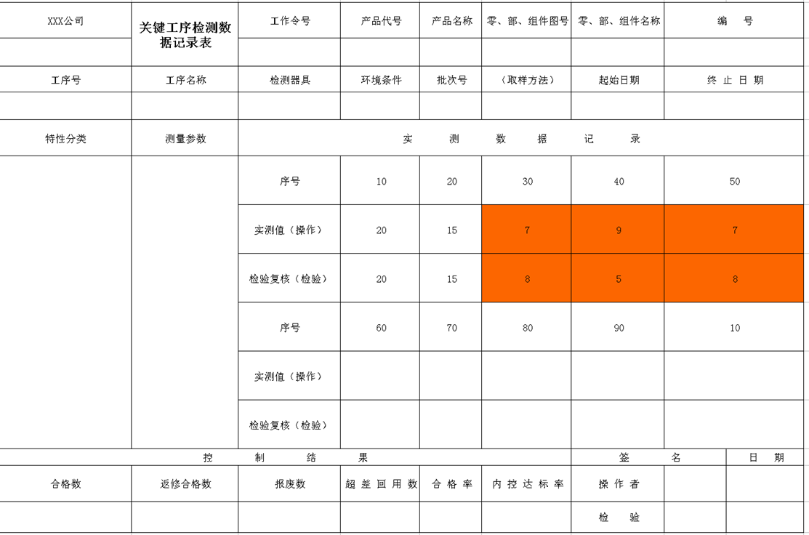

### 3.9.2 **保存检验数据**

**概述**：提供用户保存检验结果的功能。

**界面**：

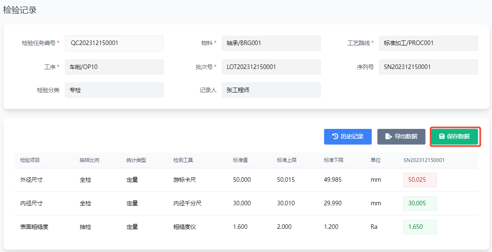

**界面结构**：在检验记录页面中，有一个“保存数据”按钮。

**交互内容**：用户填写完检验结果后，点击“保存数据”按钮，系统验证检验结果是否完整并保存。

**校验规则**：检验结果必须填写完整。

**输入**：用户填写的检验结果。

**输出**：保存检验结果。

**处理逻辑**：

用户填写完检验结果后，点击“保存数据”按钮，系统获取该检验任务的ID。

如果检验结果完整，系统调用后端接口保存检验记录。

系统提示用户保存操作成功。

**验收标准**：

检验结果必须填写完整。系统正确验证检验结果是否完整，并提示用户操作结果。

## 3.10 **检验任务台-完工检验任务**

### 3.10.1 **完工检验任务展示**

**概述**：展示所有已完工的检验任务的列表。

**界面**：

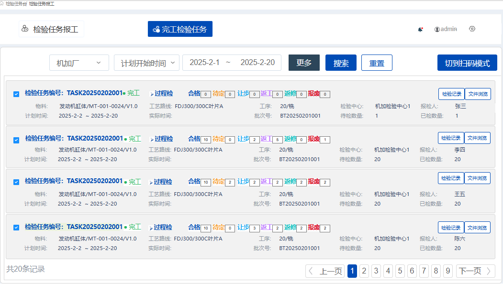

**界面结构**：页面顶部为查询条件输入区域，包括检验任务编号、物料名称、工艺路线、工序号等查询条件；下方为查询结果展示区域，以表格形式展示查询结果。包含的字段有检验任务编号、任务状态、合格数量、让步数量、返工数量、返修数量、报废数量、物料名称、物料编码、工艺路线、工序号、工序名称、批次号、序列号、计划时间、实际时间、待检数量、分卡数量。

**交互内容**：用户在查询条件输入区域填写查询条件，点击“查询”按钮后，系统根据输入条件查询并展示结果。

**校验规则**：查询条件不能为空，至少填写一个条件。

**输入**：检验任务编号、物料名称、工艺路线、工序号等查询条件。

**输出**：查询结果表格，包括检验任务编号、物料名称、工艺路线、工序号、任务状态等信息。

**处理逻辑**：

用户在查询条件输入区域填写查询条件。

点击“搜索”按钮，系统验证查询条件是否为空。

如果查询条件为空，提示用户填写查询条件。

如果查询条件不为空，系统根据查询条件调用后端接口查询数据。

系统将查询结果以表格形式展示在页面上。

**验收标准**：

查询条件不能为空，至少填写一个条件。

查询结果展示正确，包括检验任务编号、物料名称、工艺路线、工序号、任务状态等信息。

查询结果分页展示，每页显示10条记录。

### 3.10.2 **检验记录查看**

**概述**：提供用户查看已完工检验任务的检验记录的功能。

**界面**：

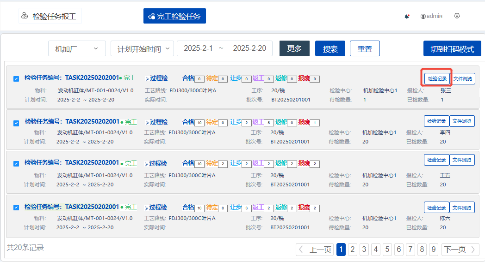

**界面结构**：在检验任务台-完工任务页面的查询结果表格中，每行记录的操作列中有一个“检验记录”按钮。

**交互内容**：用户点击“检验记录”按钮，系统弹出检验记录界面，展示该检验任务的检验记录。

**校验规则**：检验记录查看操作只能在已完工的检验任务上进行。

**输入**：用户点击“检验记录”按钮的操作。

**输出**：检验记录界面，展示该检验任务的检验记录。

**处理逻辑**：

用户点击“检验记录”按钮，系统获取该记录的ID。

系统调用后端接口获取该检验任务的检验记录。

系统弹出检验结果界面，展示该检验任务的检验记录。

用户可以查看检验记录，但不能修改。

**验收标准**：

检验记录查看操作只能在已完工的检验任务上进行。

系统正确展示检验记录界面，用户可以查看检验记录，不能编辑。

### 3.10.3 **文件浏览**

**概述**：提供用户浏览已完工检验任务的相关文件的功能。

**界面**：

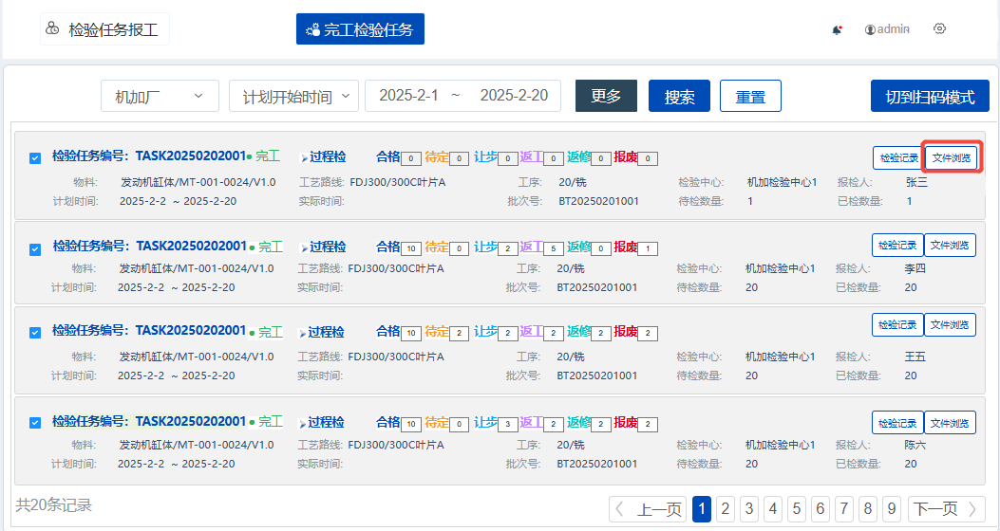

**界面结构**：在检验任务台-完工任务页面的查询结果表格中，每行记录的操作列中有一个“文件浏览”按钮。

**交互内容**：用户点击“文件浏览”按钮，系统弹出文件浏览界面，展示该检验任务的相关文件。

**校验规则**：文件浏览操作只能在已完工的检验任务上进行。

**输入**：用户点击“文件浏览”按钮的操作。

**输出**：文件浏览界面，展示该检验任务的相关文件。

**处理逻辑**：

用户点击“文件浏览”按钮，系统获取该记录的ID。

系统调用后端接口获取该检验任务的相关文件。

系统弹出文件浏览界面，展示该检验任务的相关文件。

用户可以查看文件，但不能修改。

用户点击“关闭”按钮，关闭文件浏览界面。

**验收标准**：

文件浏览操作只能在已完工的检验任务上进行。

系统正确展示文件浏览界面，用户可以查看相关文件。

### 3.10.4 **上传附件**

**整体功能同****中的3.4.6制造任务派工-上传附件**

## 3.11 **制造任务台-任务报工**

### 3.11.1 **任务报工展示**

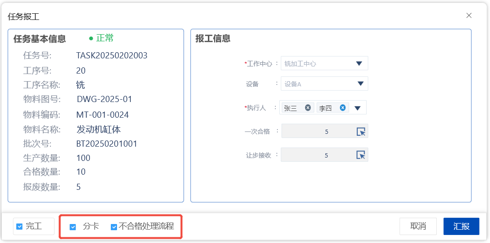

同检验任务台中的单击报检按钮，弹出的检验报工界面类似，在【制造任务台-制造任务报工】界面上需要增加【分卡、不合格处理流程】勾选框，功能同【检验任务台-检验报工】界面一致。

该界面虽然是制造任务台的报工界面，但同时也是自检检验报工界面，其中的合格数量、报废数量、待定数量都来自于【任务报工策略展示】界面的配置数据，同检验任务台一致。同时完工汇报时，勾选了分卡或不合格处理流程，需要读取【任务报工策略展示】的对应组织、工作中心、的“是否分卡、是否发起审批流”配置，进行分卡或进入不合格处理流程处理。完工同时不仅仅制造任务完工，其检验任务（自检）也同时完工。

### 3.11.2 **检验记录**

同检验任务台中的单击检验记录按钮，弹出的【检验记录】界面类似，录入检验项目的相关数据，如抽样比例、统计类型、检测工具等。同互检专检的【检验记录】界面不同的是：不需要对历史检验数据进行查询。

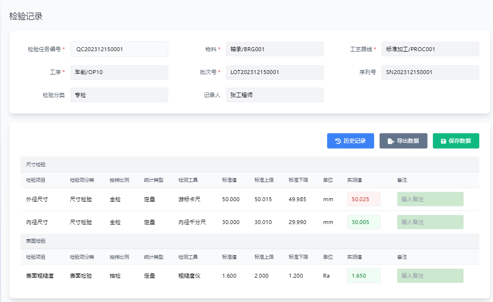

## 3.12 **首检规则配置****（增）**

### 3.12.1 **首检配置**

**配置项**：新增首检配置，只配在工厂级。

**待选值**：

**按批次首检**：逻辑详见“”。

**按规则首检**：选择该配置时，首检规则必填；（本批次不可选）

### 3.12.2 **首检规则**

**配置项**：新增首检规则。

**待选值**：

**产品暂不提供待选值，由二开在下面扩展**；

