# **DNW30510-质量记录**

# 1. **概述**

## 1.1 **原始需求**** **

在离散制造行业，特别是多品种小批量的机加 / 装配企业中，质量工程师需便捷地定义质量检查项和模板，包括检查项名称、编码、内容、标准值、上限值、下限值、计量单位等，并能在工艺路线、工序、物料等不同层级建立与检查项或质量模板的关系，以实现一对多的配置。

操作工要在制造任务上发起过程记录或自检填报

检验员则需在检验任务上发起检验填报，从而提高质量管控效率和准确性，减少质量问题的产生和流出。

## 1.2 **需求分析**** **

**需求原因**：传统质量数据管理方式存在数据分散、业务链长、缺少分析和线下存档等问题，导致质量追溯困难、问题定位耗时、良率提升受阻以及档案管理效率低下。

**需求本质**：实现质量数据的全流程追溯与高效管理，打破数据孤岛，提升数据准确性与实时性，为质量决策提供有力支撑。

**信息化系统价值**：MOM系统可整合质量相关业务数据，打造生产质量追溯数据中心，实现业务上下游数据打通，追溯预警线上化与高效化，为各层级人员提供数据支撑。

**友商解决方案**：

联友MOM聚焦8大核心应用系统，涵盖数字化质量控制（QMS），助力汽车制造数智化。

用友智能制造MOM通过八大服务实现生产现场可视可控、制造运营优化、ERP和MES一体化，其质量管理功能包括质量建模、检验管理、不良品管理、质量追溯及质量分析等。

## 1.3 **术语及缩写解释**

|术语 | 缩写 | 解释说明|
|--- | --- | ---|
|制造运营管理系统 | MOM | 一套集成的系统，用于管理制造过程中的生产计划、执行、质量、设备等各个环节，实现制造运营的一体化和优化|
|质量管理 | QM | 对产品质量的策划、控制、保证、改进等活动的总称，旨在确保产品符合质量标准和客户需求|

## 1.4 **参考文献**** **

业务需求参考文献

[1] 

[2] 

[3] 

[4] 

[5] 

[6] 

[7] 

[8] 

功能设计参考文献

WCAPP00001 所见即所得工艺编辑器 需求规格说明书.docx

WCAPP00004 WebCAPP定义器 需求规格说明书.docx

# 2. **需求描述**

## 2.1 **业务描述**

### 2.1.1 **业务主流程**

|graph TD
    subgraph 质量工程师
        A[定义质量检查项] --> B[定义质量模板]
        B --> C[建立物料、工艺、工序和
质量模板、检查项的关系]
    end
    subgraph 操作工
        D[在制造任务上发起
过程记录填报] --> E[在制造任务上发起自检填报]
    end
    subgraph 检验员
        F[在检验任务上发起
检验填报]
    end
    C --> D
    C --> F
    C --> E|
|---|

|角色 | 活动|
|--- | ---|
|质量工程师 | 定义质量检查项，包括检查项名称、编码、内容、标准值、上限值、下限值和计量单位等信息|
|质量工程师 | 定义质量模板|
|质量工程师 | 在工艺路线、工序、物料下建立与检查项或质量模板的关联关系，支持配置一对多的关系|
|操作工 | 在制造任务执行过程中，根据系统提示发起过程记录填报操作|
|操作工 | 实时录入质量数据，包括实际测量值、检验结果等信息|
|操作工 | 在制造任务上发起自检填报|
|检验员 | 根据检验任务安排，发起检验填报流程|
|检验员 | 录入检验结果，包括合格、不合格等判定信息，以及相关的检验备注|

### 2.1.2 **业务流程描述**

#### 2.1.2.1 **质量标准定义阶段**

**质量工程师**：

根据产品的设计要求、工艺标准和客户规范等，定义质量检查项和质量报告模板

质量检查项包括检查项名称、检查项编码、检查项内容、标准值、上限值、下限值、计量单位等详细信息

质量报告模板随客户需求不同，样式多种多样。质量报告模板样例：

**[质量报告模板样例.rar]**

同时，在工艺路线、工艺路线 - 工序、物料等不同层级建立和检查项、质量模板的关系，并支持配置一对多的关系，以适应不同生产场景下的质量管控需求。

例如，在某机加产品的工艺路线中，针对关键工序设置多个质量检查项，形成该工序的质量模板，确保在生产过程中对该工序的质量进行严格把控。

**输入业务对象** ：产品设计文档、工艺文件、客户质量标准等。

**输出业务对象** ：

质量检查项、质量报告模板

质量模板与工艺路线、工序、物料的关联关系

质量检查项与工艺路线、工序、物料的关联关系

**关键业务规则 **：

检查项的名称和编码应具有唯一性和规范性，以便于识别和管理；

标准值、上限值、下限值的设置应符合产品的实际质量要求和工艺能力；

质量模板与工艺路线、工序、物料的关联关系应准确无误，确保在生产过程中能够正确应用相应的检查项。

**系统**：

提供用户友好的界面，支持质量工程师便捷地定义和管理质量检查项与模板；自动建立检查项与工艺路线、工序、物料的关联关系，并确保关联关系的准确性和一致性。

质量报告模板定义需求说明

详见1.4中的功能设计参考文献中的《WCAPP00004 WebCAPP定义器 需求规格说明书》

元素类型：

支持单值

支持表格

数据类型：文本、数值、日期、图片、视频

编辑方式：输入框、下拉单选、下拉多选、日期选择

支持设置默认值、是否必填、是否只读

填写内容超过一页时需自动翻页，且翻页时需支持保留部分内容，例：如下图所示，翻页时，红色区域需保留：

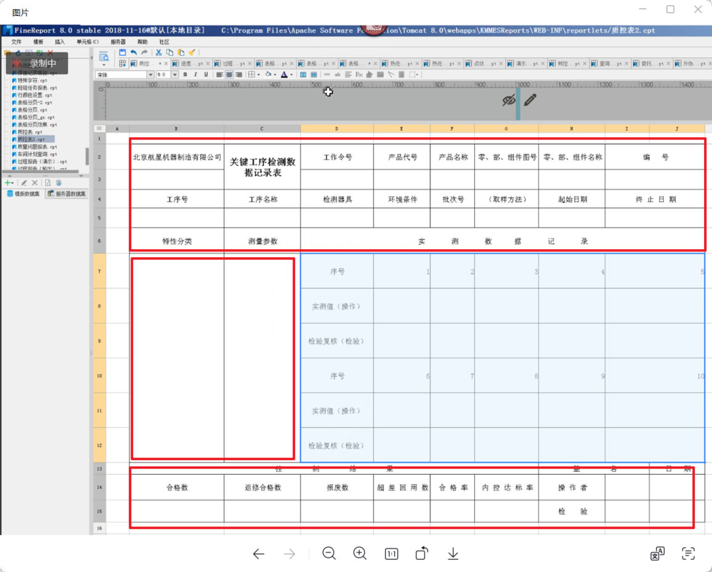

支持设置纸张大小（A4/A3/A2/A1/A0）、页边距、页眉页脚等打印参数

支持工程符号显示（直径符号Φ、粗糙度符号Ra/Rz、形位公差符号⊥∥⌒等），工程符号数据由上游工艺系统（PLM/CAPP）传入

支持打印预览功能

**业务场景范围：**

|场景 | 场景兼容结论 | 备注|
|--- | --- | ---|
|支持随工艺路线或物料一起，通过excel导入质量检查项 | ⭕未来扩展 | |
|在系统中维护质量检查项 | ⭕未来扩展 | |
|在系统中定义质量报告模板 | ⭐本批次 | |
|支持设置纸张大小和打印预览 | ⭐本批次 | |
|支持工程符号显示 | ⭐本批次 | |
|从上游集成质量检查项 | ⭕未来扩展 | 数据集成|
|在第三方工具（例：帆软、积木）中定义质量报告模板 | ⭕未来扩展 | |

#### 2.1.2.2 **制造任务执行阶段**

 **操作工** ：

在执行制造任务的过程中，根据系统提示或操作规范，发起过程记录或自检填报。

按照既定的质量检查项和模板，如实记录生产过程中的质量数据，如实际测量值等，并提交给系统。

例如，在装配某零部件时，操作工根据质量模板对关键尺寸进行自检，并将测量结果录入系统，以确保该零部件的质量符合要求。

**输入业务对象** ：制造任务、质量模板、质量检查项

**输出业务对象** ：过程记录数据、自检填报数据

**关键业务规则** ：

操作工只能填报与当前制造任务相关的质量数据，且填报的数据应真实、准确、完整；

系统应提供便捷所见即所得的填报界面和操作方式，提高操作工的填报效率和准确性；

对于填报过程中发现的异常数据，应能够及时预警并通知相关人员进行处理。

**系统**：

为操作工提供便捷的填报界面，支持数据的快速录入和实时校验；自动记录填报数据，并与相应的制造任务进行关联。

质量报告填报界面需求说明：

详见1.4中的功能设计参考文献中的《WCAPP00001 所见即所得工艺编辑器 需求规格说明书》

支持权限控制，需控制到单元格级别

填报对象实例数据必须进数据库，并且需要和业务对象建立关联关系

填报实例数据的具体存储位置，哪个表那个字段关系怎么构建，单元格和数据库的关系怎么构建？？

**业务场景范围：**

|场景 | 场景兼容结论 | 备注|
|--- | --- | ---|
|操作工根据配置的质量报告模板进行过程记录或自检填报操作 | ⭐本批次 | |
|制造任务不配置自检，也可以进行质量填报 | ⭐本批次 | 质量填报数据直接关联制造任务，不依赖检验任务 |
|对于填报过程中发现的异常数据，可以及时预警并通知相关人员进行处理。 | ⭕未来扩展 | |

#### 2.1.2.3 **检验任务执行阶段**

**检验员** ：

根据检验任务的要求，按照质量标准和检验规范，对产品进行检验，并在系统中发起检验填报。

例如，检验员对某批次的成品进行抽样检验，根据检验标准对各项质量指标进行检测，并将检验结果详细地填报到系统中，以便后续的质量统计和分析。

**输入业务对象** ：检验任务、质量标准（质量报告模板、质量检查项）

**输出业务对象** ：检验填报数据。

**关键业务规则** ：

检验员应严格按照检验标准和规范进行检验操作，确保检验结果的公正性和准确性；检验填报的数据应完整、详细，能够清晰地反映产品的质量状况；

系统应提供便捷所见即所得的填报界面和操作方式，提高操作工的填报效率和准确性；

对于检验不合格的产品，应能够及时触发不合格品审理流程，追溯其生产过程中的相关信息，以便分析原因并采取改进措施。

**业务规则配置点** ：检验结果判定规则配置、不合格品处理流程配置

**系统**：

为检验员提供清晰的检验任务列表和填报界面，支持检验结果的快速录入和自动判定；自动整合检验数据，生成检验报表和分析结果。

质量报告填报界面需求：同制造任务执行阶段的质量报告填写

**业务场景范围：**

|场景 | 场景兼容结论 | 备注|
|--- | --- | ---|
|检验员根据配置的质量报告模板填写质量报告 | ⭐本批次 | |
|检验填报时可查看历史工序的质量报告 | ⭐本批次 | 仅检验场景支持（检验类型的制造任务+检验任务） |
|对于检验不合格的产品，可以及时触发不合格品审理流程，追溯其生产过程中的相关信息，以便分析原因并采取改进措施。 | ⭕未来扩展 | |

#### 2.1.2.4 **质量数据整合与分析阶段**

**质量管理人员**：基于系统生成的质量报表和分析结果，进行质量监控、问题定位和决策分析；针对质量问题制定改进措施，并跟踪改进效果。

**系统**：自动收集、整理和分析质量数据，包括过程记录、自检填报、检验填报等信息；生成质量报表和分析结果，为质量管理人员提供决策支持。

**业务场景范围**

|场景 | 场景兼容结论 | 备注|
|--- | --- | ---|
|质量填报数据查询 | ⭕未来扩展 | |

### 2.1.3 **业务对象ER关系图**

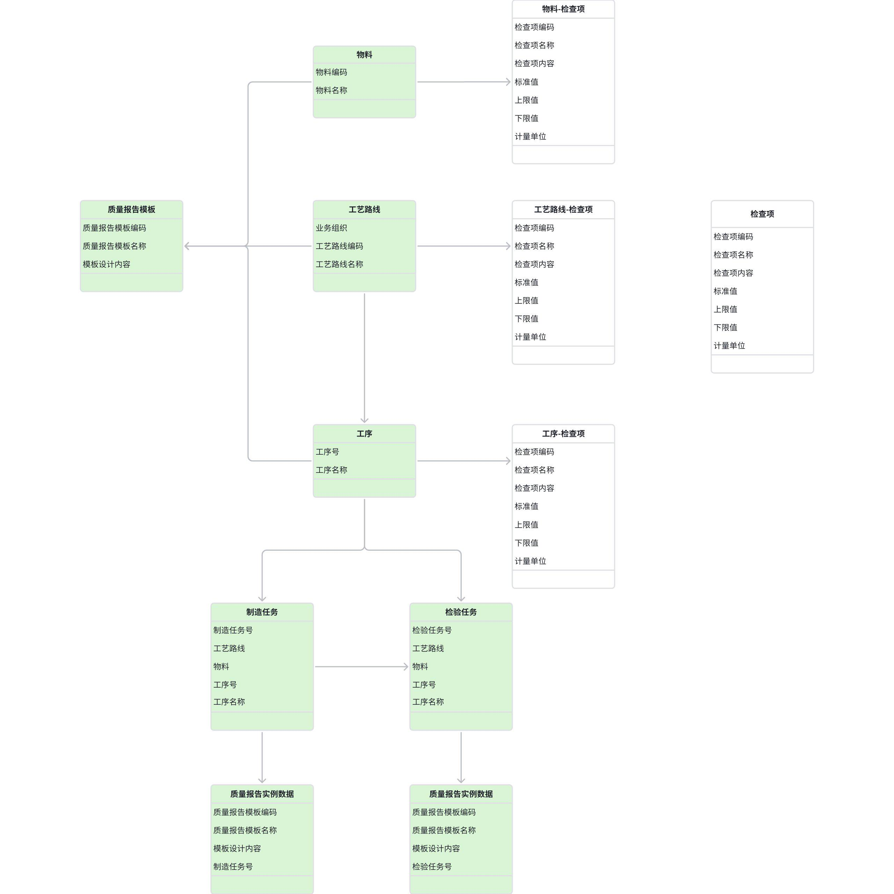

## 2.2 **功能描述**

### 2.2.1 **整体应用架构**

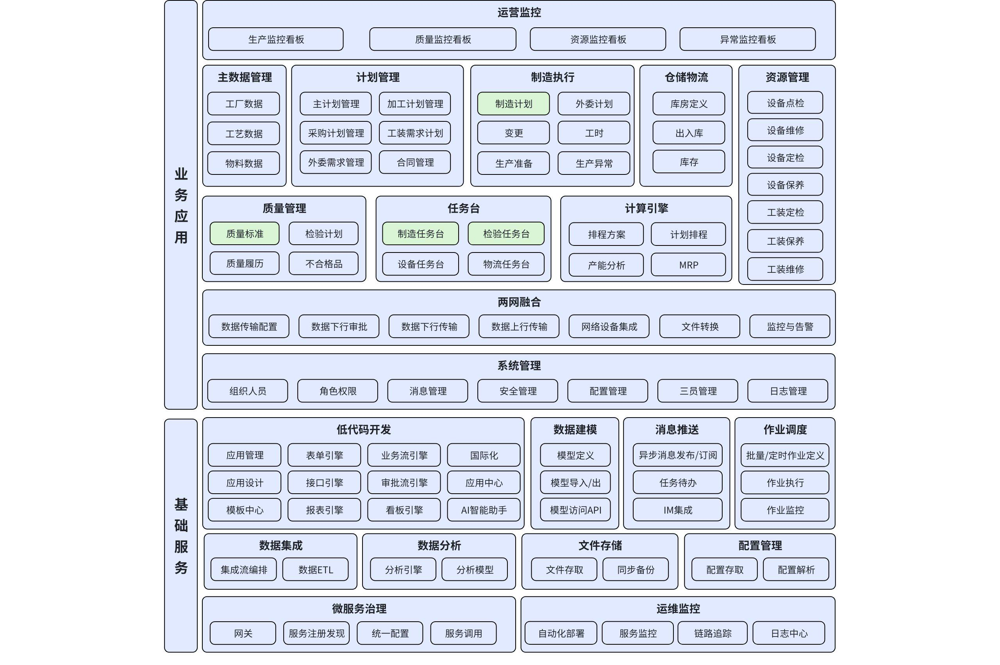

### 2.2.2 **质量填报应用架构**

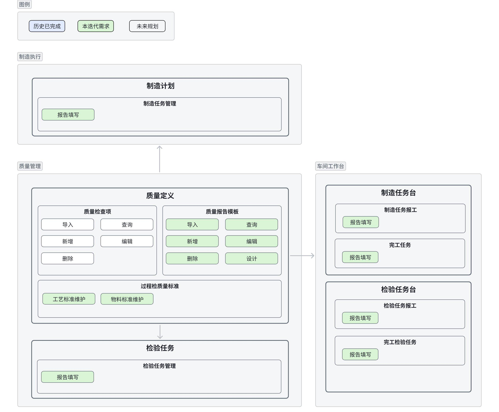

### 2.2.3 **功能清单**

|模块 | 页面 | 功能点 | 功能点状态 | 功能点描述|
|--- | --- | --- | --- | ---|
|质量管理 | 质量检查项 | 质量检查项-导入、增删查改 | V3.2-a1新增 | 支持定义检查项名称、编码、内容等信息|
|质量管理 | 质量报告模板 | 质量报告模板-增删查改、设计 | V3.2-a1新增 | 支持定义质量报告模板|
|质量管理 | 质量报告模板 | 质量报告模板-纸张设置 | V3.2-a1新增 | 支持设置质量报告模板的纸张大小|
|质量管理 | 质量报告模板 | 质量报告模板-工程符号 | V3.2-a1新增 | 支持正确显示工程符号|
|质量管理 | 质量报告模板 | 质量报告模板-打印预览 | V3.2-a1新增 | 支持打印预览功能|
|质量管理 | 过程检质量标准 | 过程检质量标准-工艺标准维护 | V3.2-a1新增 | 支持配置质量报告模板与工艺路线、工序的关联关系|
|质量管理 | 过程检质量标准 | 过程检质量标准-物料标准维护 | V3.2-a1新增 | 支持配置质量报告模板与物料的关联关系|
|质量管理 | 检验任务管理 | 检验任务管理-质量报告填写 | V3.2-a1新增 | 支持检验员在检验任务上发起检验填报|
|质量管理 | 检验任务管理 | 检验任务管理-历史记录查看 | V3.2-a1新增 | 支持在检验场景下查看历史工序的质量报告|
|制造执行 | 制造任务管理 | 制造任务管理-质量报告填写 | V3.2-a1新增 | 支持操作工在制造任务上发起过程记录填报和自检填报，不依赖检验任务配置|
|车间工作台 | 制造任务报工 | 制造任务报工-质量报告填写 | V3.2-a1新增 | 支持操作工在制造任务上发起过程记录填报和自检填报|
|车间工作台 | 完工任务 | 完工任务-质量报告填写 | V3.2-a1新增 | 支持操作工在制造任务上发起过程记录填报和自检填报|
|车间工作台 | 检验任务报工 | 检验任务报工-质量报告填写 | V3.2-a1新增 | 支持检验员在检验任务上发起检验填报|
|车间工作台 | 检验任务报工 | 检验任务报工-历史记录查看 | V3.2-a1新增 | 支持在检验场景下查看历史工序的质量报告|
|车间工作台 | 完工检验任务 | 完工检验任务-质量报告填写 | V3.2-a1新增 | 支持检验员在检验任务上发起检验填报|

# 3. **页面&功能设计**

## 3.1 **质量管理**

### 3.1.1 **质量检查项****（暂不考虑）**

#### 3.1.1.1 **质量检查项-导入、增删查改**

**概述**：支持维护质量检查项信息。

**界面**：

查询

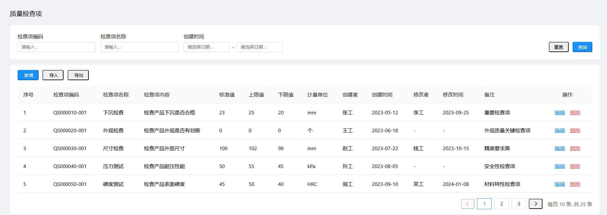

新增

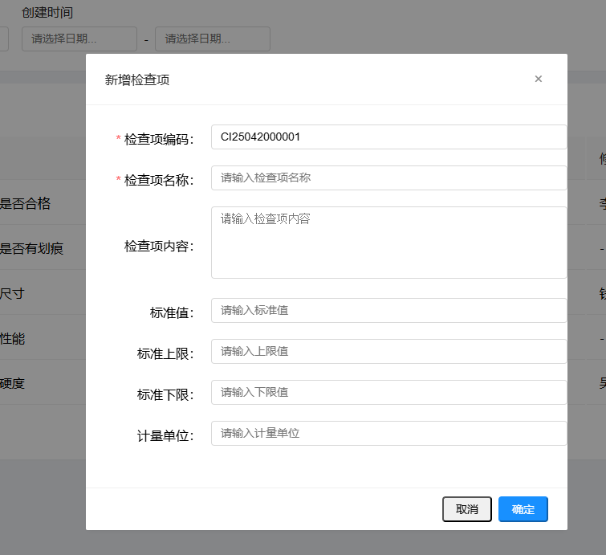

编辑

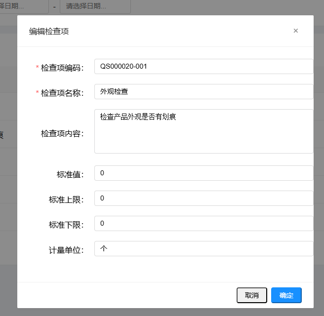

删除

**结构**：

上方为搜索栏：检查项编码、检查项名称、创建时间

下方为质量检查项列表表格

操作按钮：新增、导入、导出

**列表列**：

检查项编码、检查项名称、检查项内容、标准值、上限值、下限值、计量单位、创建者、创建时间、修改者、修改时间、备注

操作：冻结在最右侧，显示编辑、删除按钮

**校验**：

检查项名称和编码必填，且唯一；

检查项编码：需支持编码规则定义，默认配置为 “固定前缀 + 年月日 +  流水号” 。固定前缀为CI，Check Item的首字母；年月日为6位；流水号为5位，举例：CI25030100001。

上限值大于标准值，标准值大于下限值。

**输入**：检查项信息

**输出**：质量检查项

**处理逻辑**：

标准对象增删查改、导入导出

**验收标准**：检查项信息完整无误，能够正确保存和查询。

### 3.1.2 **质量报告模板**

#### 3.1.2.1 **质量报告模板-增删查改、复制、设计**

**概述**：支持定义质量报告模板。

**界面**：

查询

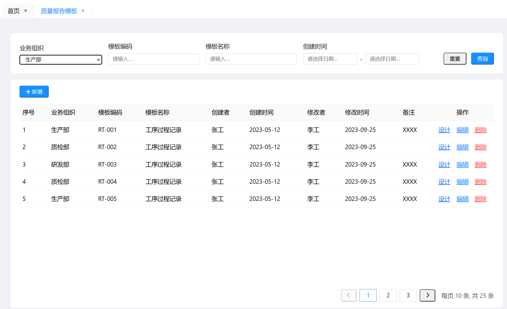

新增

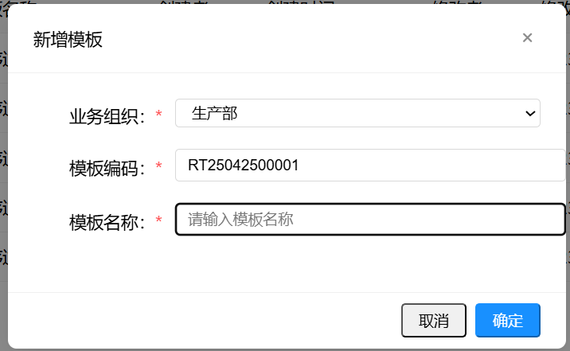

编辑

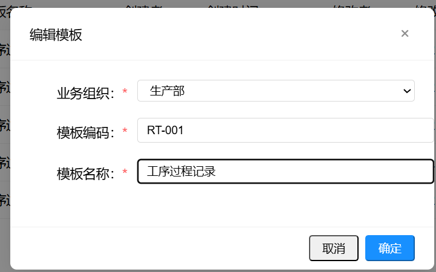

删除

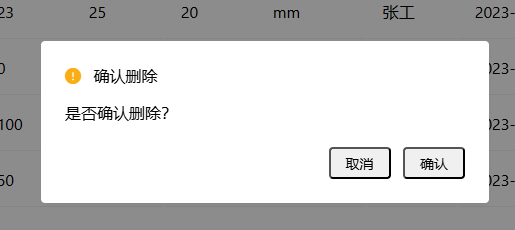

设计（示意）

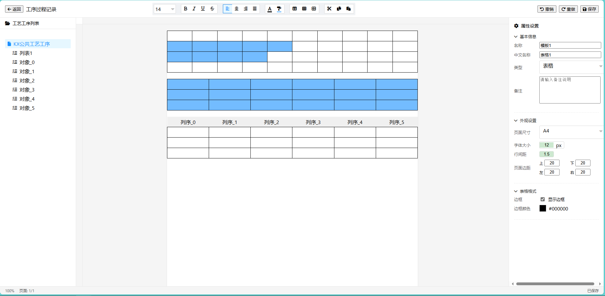

**结构**：

上方为搜索栏：业务组织、模板编码、模板名称、创建时间

下方为质量报告模板列表表格

操作按钮：新增、编辑、删除、设计

**交互**：

新增、编辑：弹出二级界面，编辑质量报告模板名称、编码

复制：点击复制按钮，单选，弹出新增界面，默认填充选中对象的值，手动修改后保存，需默认带入设计的信息。

设计：打开质量填报模板设计定义界面，此处需参考帆软、在线webCAPP进行实现，默认全屏

**校验**：

模板名称和模板编码必填，且唯一；

模板编码：需支持编码规则定义，默认配置为 “固定前缀 + 年月日 +  流水号” 。固定前缀为RT，Report Template的首字母；年月日为6位；流水号为5位，举例：RT25030100001。

**输入**：模板定义参数。

**输出**：质量报告模板。

**处理逻辑**：

标准对象增删查改逻辑

设计：功能同WebCAPP在线编辑，需满足的需求要点如下：

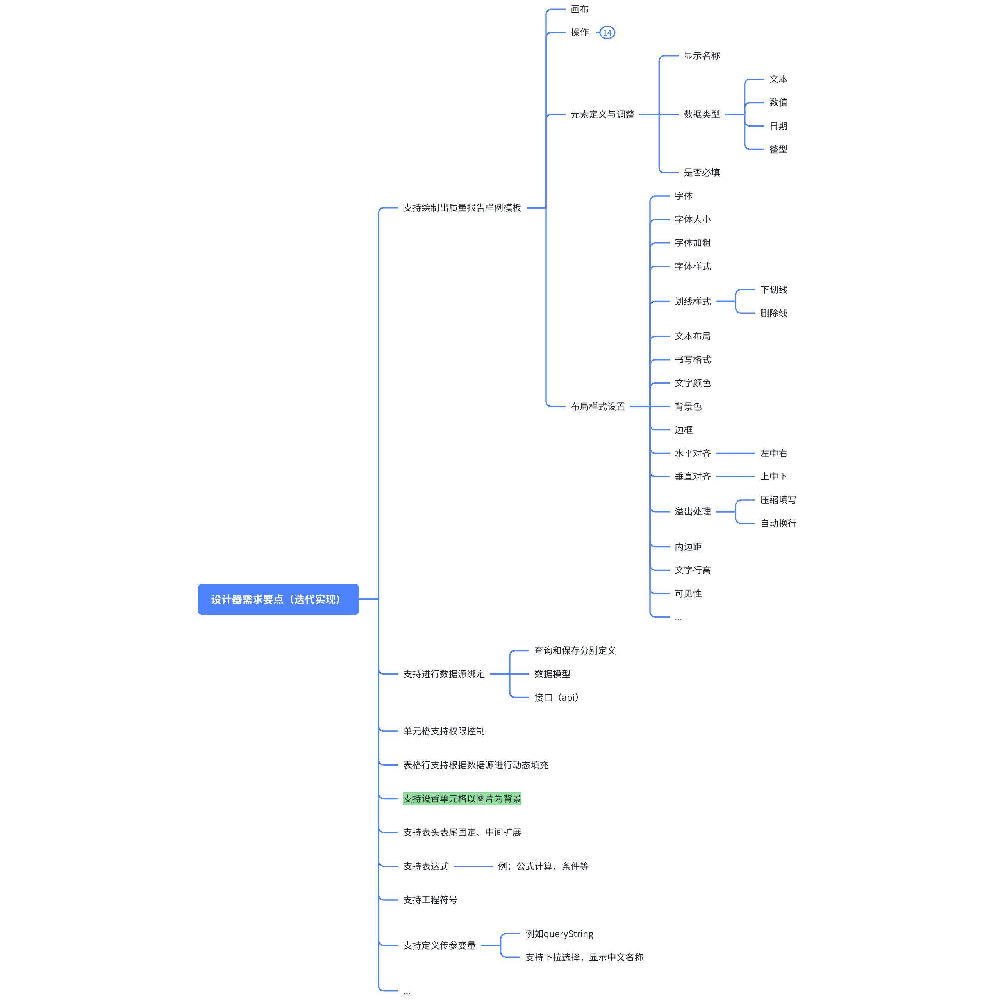

|迭代日期 | 迭代目标|
|--- | ---|
|2025-5-31 | 支持绘制出质量报告样例模板 支持进行数据源绑定 支持定义传参变量 表格行支持根据数据源进行动态填充|
|2025-6-30 | 单元格支持权限控制 支持表头表尾固定、中间扩展 支持表达式 支持工程符号（直径符号Φ、粗糙度符号Ra/Rz、形位公差符号⊥∥⌒等） 支持纸张大小设置（A4/A3/A2/A1/A0） 支持打印预览|

**页面设置配置项**：

| 配置项 | 说明 | 可选值 |
|--------|------|--------|
| 纸张大小 | 打印输出的纸张规格 | A4/A3/A2/A1/A0 |
| 页边距 | 上下左右页边距 | 数值（毫米） |
| 页眉 | 页眉内容 | 文本 |
| 页脚 | 页脚内容 | 文本 |

**验收标准**：模板定义正确，支持数据源绑定，能够绘制出下述质量报告模板。

**[质量报告模板目标样例.docx]**

### 3.1.3 **过程检质量标准**

#### 3.1.3.1 **过程检质量标准-工艺标准维护**

**概述**：支持配置质量报告模板与工艺路线、工序的关联关系。

**界面**：

工艺路线

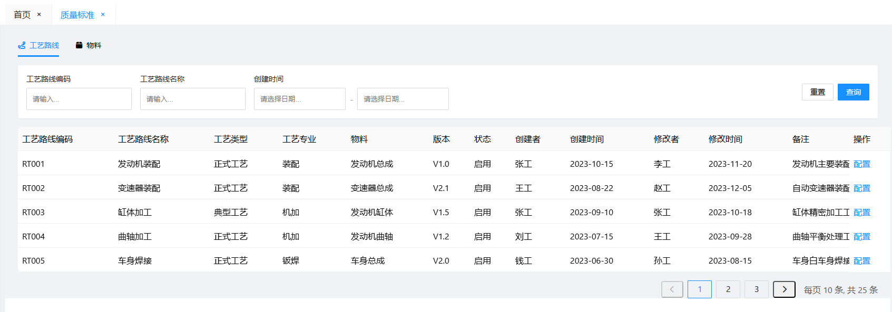

工艺路线和工艺路线-工序添加检查项

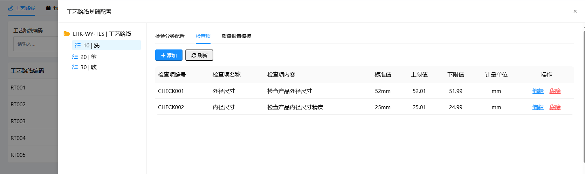

工艺路线和工艺路线-工序添加检验报告模板

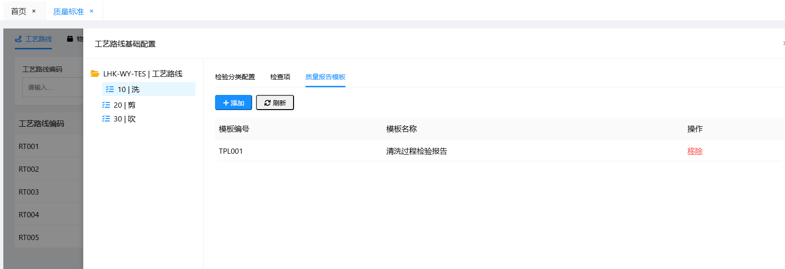

**结构**：

主界面同工艺路线界面，增加操作列

点击配置按钮，打开二级标签页进行工艺路线配置

支持配置工艺路线添加检验分类、添加检查项、添加质量报告模板

支持配置工艺路线-工序添加检验分类、添加检查项、添加质量报告模板

左侧为工艺路线树形结构，右侧为选中工艺路线或工序的关联检查项或检验报告模板列表。

**交互**：

点击工艺路线或工序节点，显示其关联检查项和质量报告模板

检查项支持添加、编辑和移除

质量报告模板支持添加和移除

**输入**：工艺路线、工序信息。

**输出**：检查项与工艺路线、工序的关联关系、质量报告模板与工艺路线、工序的关联关系

**处理逻辑**：引入的逻辑：同工厂

**验收标准**：关联关系准确无误，能够在生产过程中正确应用。

#### 3.1.3.2 **过程检质量标准-物料标准维护**

**概述**：支持配置质量报告模板与物料的关联关系。

**界面**：

物料

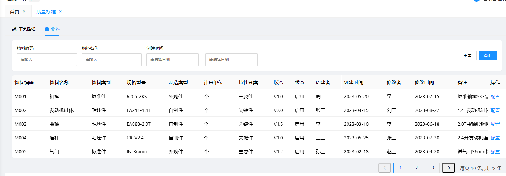

物料添加检查项

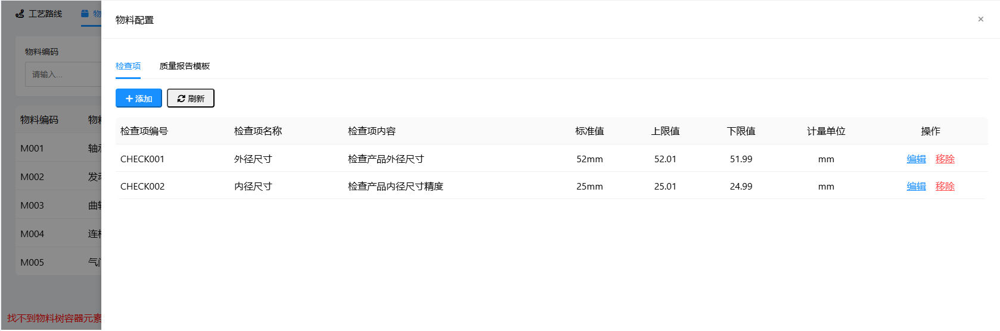

物料添加检验报告模板

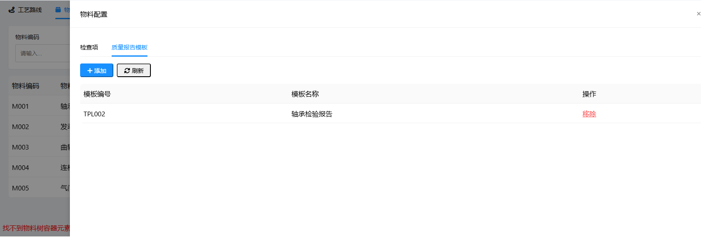

**结构**：

主界面同物料界面，增加操作列

点击配置按钮，打开二级标签页进行物料配置

支持配置物料添加检查项、添加质量报告模板

**交互**：

检查项支持添加、编辑和移除

质量报告模板支持添加和移除

**输入**：物料信息。

**输出**：质量报告模板与物料的关联关系。

**处理逻辑**：--

**验收标准**：关联关系准确无误，能够在生产过程中正确应用。

### 3.1.4 **检验任务管理**

#### 3.1.4.1 **检验任务管理-质量报告填写**

**概述**：支持检验员在检验任务上发起检验填报。

**界面**：

检验任务管理界面，新增质量报告填写按钮

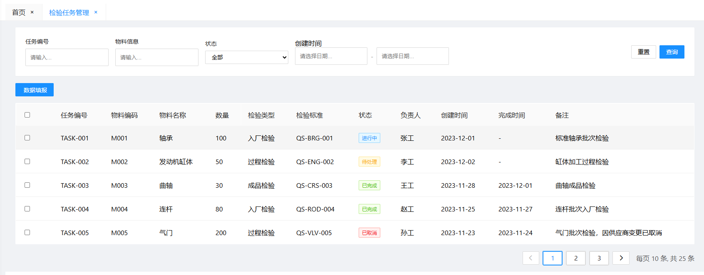

质量报告填写

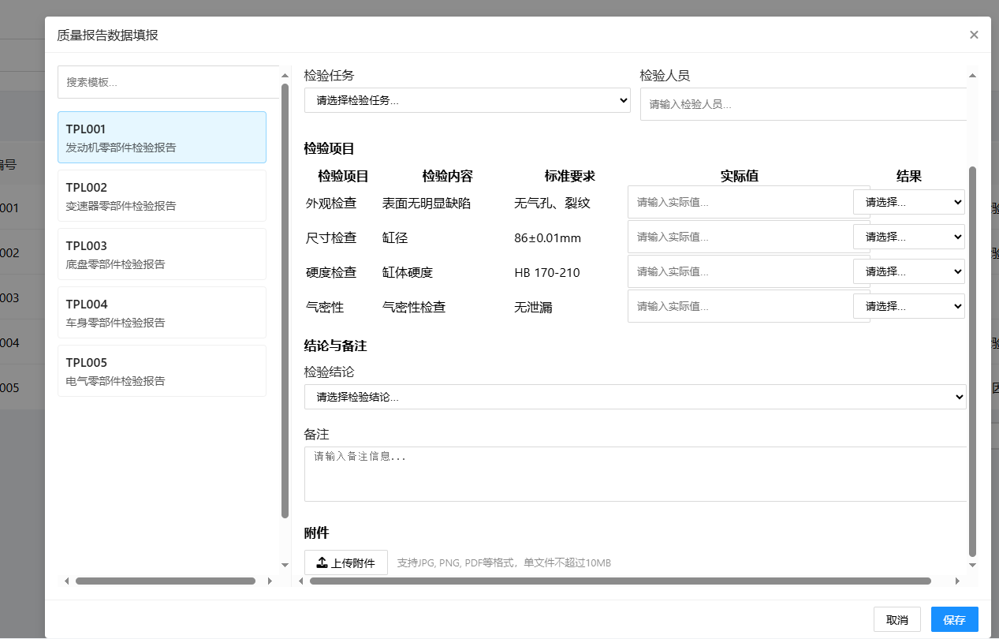

**结构**：

左侧为待填报的质量报告模板，支持收缩折叠

右侧为所见即所得的质量报告

界面默认全屏

**交互**：

检验场景下（检验类型的制造任务或检验任务），点击"质量报告"按钮时，弹出质量报告选择界面：
- 左侧显示当前工序和所有历史工序
- 选择工序后，右侧显示该工序的质量报告列表
- 当前工序的质量报告可编辑，历史工序的质量报告只能浏览
- 点击质量报告后，打开对应的浏览或编辑界面

**质量报告选择界面字段**：

| 字段名称 | 说明 |
|---------|------|
| 工序号 | 工序编号 |
| 工序名称 | 工序名称 |
| 是否当前工序 | 标识是否为当前正在填报的工序 |
| 质量报告名称 | 质量报告模板名称 |
| 填报状态 | 已填报/未填报 |
| 可执行操作 | 浏览/编辑 |

填写表单后，可进行保存

**校验**：必填项必须填写，检验结果必须符合数据类型要求。

**输入**：制造任务、质量模板、质量检查项。

**输出**：过程记录数据、自检填报数据。

**处理逻辑**：

获取检验任务关联的质量报告模板，包括工序关联、工艺路线关联、物料关联的质量报告模板

若没有关联的质量报告模板，则提示：“不存在关联的质量报告模板”，此时不打开二级弹窗界面。

点击保存：

需存储质量报告数据信息到数据库，具体如何存储，待讨论实现

质量报告数据需和检验任务建立业务关联管理

**验收标准**：质量数据完整准确，能够正确保存和查询。检验场景下可查看历史工序的质量报告。

## 3.2 **制造执行**

### 3.2.1 **制造任务管理**

#### 3.2.1.1 **制造任务管理-质量报告填写**

**概述**：支持操作工在制造任务上发起过程记录填报和自检填报，质量填报不依赖检验任务配置。

**界面**：功能同3.1.4.1检验任务管理-质量报告填写（不含历史记录查看功能）

**处理逻辑**：

获取制造任务关联的质量报告模板（通过工序或物料关联）

若没有关联的质量报告模板，则提示："不存在关联的质量报告模板"，此时不打开二级弹窗界面

**质量填报数据直接关联到制造任务，不依赖检验任务配置**

制造任务详情中可查看质量填报记录

点击保存：

需存储质量报告数据信息到数据库

质量报告数据需和制造任务建立业务关联管理

**验收标准**：质量数据完整准确，能够正确保存和查询。制造任务不配置自检也可进行质量填报。

## 3.3 **车间工作台**

### 3.3.1 **制造任务报工**

#### 3.3.1.1 **制造任务报工-质量报告填写**

功能同3.1.4.1检验任务管理-质量报告填写

### 3.3.2 **完工任务**

#### 3.3.2.1 **完工任务-质量报告填写**

功能同3.1.4.1检验任务管理-质量报告填写

### 3.3.3 **检验任务报工**

#### 3.3.3.1 **检验任务报工-质量报告填写**

功能同3.1.4.1检验任务管理-质量报告填写

### 3.3.4 **完工检验任务**

#### 3.3.4.1 **完工检验任务-质量报告填写**

功能同3.1.4.1检验任务管理-质量报告填写
