# **DNW30530-****质量****不合格****处理**

# 1. **概述**

## 1.1 **原始需求**

在离散制造行业（重点覆盖机加/装配专业），多品种小批量的生产模式下，用户需要对生产过程中的不合格品进行有效处理。检验员在检验过程中发现不合格品，需要及时记录并启动处理流程；生产人员需要根据处理结论对不合格品进行返工返修或报废处理；管理人员需要对不合格品的处理过程进行监控和管理。

**用户故事**：

作为质检员，当我在检验过程中发现不合格品，需要及时记录并启动处理流程

作为质量管理员，需实时监控不合格品审批状态，确保处理结论与系统执行一致，减少人为操作错误。

作为车间班组长，在加工发现不合格品时，需要快速决策处理方式（报废、返工、让步接收、发起不合格品审理等），并确保处理流程可追溯，避免因流程混乱导致生产延误或成本浪费。

**痛点**：

**待定状态不合格品影响生产计划** ：不合格品处于待定状态时，由于没有明确的处理结论，可能会导致生产计划的停滞不前，后续的生产安排无法顺利进行，增加了生产管理的难度和成本，也可能影响订单的按时交付。

**计划准确性受影响 **：不合格品的出现会导致生产计划的变更和延迟。由于缺乏实时的不合格品信息，计划人员难以准确评估不合格品对生产进度的影响，从而导致生产计划的频繁调整和不确定性增加。

**资源调度困难** ：不合格品的处理需要重新分配人力、设备和物料等资源。生产计划部门难以及时获取不合格品的处理进度和资源需求，导致资源调度不及时或不合理，影响生产效率。

**生产效率降低** ：不合格品的处理需要投入额外的时间和人力。频繁的返工、返修工作打乱了正常的生产节奏，导致设备利用率降低，生产周期延长，增加了生产成本。

**生产流程不畅** ：返工返修任务与其他生产任务交织在一起，使得生产流程变得复杂和混乱。车间管理人员难以有效协调和安排生产任务，容易出现生产停滞或拥堵的情况。

**跨工序 / 跨车间返工返修跟踪困难** ：当不合格品需要在不同工序或不同车间之间进行返工或返修时，缺乏有效的系统化跟踪手段，难以实时掌握返工返修的进度和状态，容易造成生产流程的混乱和中断，降低了整体生产效率。

**手工记录效率低且易出错** ：目前对于不合格品的处理流程，大多依赖手工进行记录，这种方式不仅效率低下，还容易出现记录错误或遗漏的情况，导致信息传递不准确，影响后续的处理和决策。

20240514MES需求—不合格品审理流程优化(肖玉双).docx

KFRW-24070529-20240717MES需求—补料核算审批和不合格品审批上传附件功能(程瑞林).docx

KFRW-25020124-20250219MES需求—不合格品返工单需求(罗世杰).docx

RWXQ-2020-04-0031生产过程中不合格品异常处理纳入工作流管理.docx

RWXQ-2020-05-0026不合格品报警审理流程.docx

RWXQ-2021-04-0034质量问题处理以及不合格品审理需求.docx

## 1.2 **需求分析**

**需求本质**：

通过系统化流程实现不合格品处理的全生命周期管理，覆盖决策、执行、跟踪环节。

**系统价值**：

提升处理效率：标准化流程减少决策时间，自动触发后续任务（如分卡、报废入库）。

增强可追溯性：系统记录处理路径，支持质量回溯分析。

|任务单号 | 需求点分析 | 场景兼容结论|
|--- | --- | ---|
|20240514MES需求—不合格品审理流程优化(肖玉双) | 对任务汇报时产生不合格数量的工序发起不合格品审理流程，根据不合格品结论步骤中操作员所给出的不合格品审理结论，包括合格、让步接收、降级使用、返工、返修、报废， | ⭐本批次|
|KFRW-24070529-20240717MES需求—补料核算审批和不合格品审批上传附件功能(程瑞林) | 在不合格品审批过程中，需支持上传附件 | ⭐本批次|
|KFRW-25020124-20250219MES需求—不合格品返工单需求(罗世杰) | 子件物料退回返工（跨厂跨车间返工返修） 在订单加工后送检，若检验发现存在不合格品或者品质待定的情况，会将订单全部返工，发回车间重新鉴定及加工；在发回车间之前，检验先初步判断是哪个车间出现问题（订单BOM中问题物料/半成品有问题）进行记录（方便后期数据统计时，统计各车间返工数据）；在检验将订单返工后，会在订单对应车间自动生成返工单。车间在收到返工单后，需判定下级订单是否存在问题（订单BOM中的半成品/自制件），若存在问题，通过BOM选择问题物料、车间、数量，生成对应车间二级返工单。主返工单进行报工时，会校验是否存在二级返工单，若存在二级返工单，需判断二级返工单是否完工，主订单才可进行报工，若不存在二级返工单，主返工单可直接报工送检，检验针对主计划进行再次检验汇报。 | ⭕未来扩展|
|RWXQ-2021-04-0034质量问题处理以及不合格品审理需求 | 无不合格品审理单，只有质量报警对象 配置质量报警默认加入不合格品审理流程 在汇报报警对象的流程处理中，在指定步骤直接填写不合格品审理结论，步骤提交时需校验不合格品审理结论不能为空，该步骤提交时，直接根据不合品审理结论做自动报工 | ⭐本批次|
|RWXQ-2020-05-0026不合格品报警审理流程 | 汇报报警和不合格品审理单是两个单独的对象 配置不合格品审理单默认加入指定流程，且不合格品审理单主文件可以为空 任务汇报时会产生汇报报警，此时汇报报警不加入审批流，在汇报报警对象的处理界面，可手动发起不合格品审理 不合格品审理过程中，如果审理结论确定，可以直接对汇报报警的任务进行报工 | ⭐本批次|
|RWXQ-2020-04-0031生产过程中不合格品异常处理纳入工作流管理 | 无不合格品审理单，只有汇报报警对象 配置汇报报警默认加入不合格品审理流程 在汇报报警对象的流程处理中，在指定步骤直接填写不合格品审理结论，步骤提交时需校验不合格品审理结论不能为空，该步骤提交时，直接弹出任务报工界面，可以直接对汇报报警的任务进行报工 | ⭐本批次|

**质量异常报警流程与不合格品审理流程对比表**

|对比维度 | 质量异常报警流程 | 不合格品审理流程|
|--- | --- | ---|
|定义 | 针对生产过程中出现的设备、物料、人员、工艺、环境等异常情况的处理流程，目的是及时发现并纠正潜在质量问题，防止不合格品产生。 | 对已判定为不合格的产品进行评审和处理的流程，确定不合格品的最终处置方式，如返工、返修、报废、让步接收等。|
|触发条件 | 设备异常（运行数据超阈值、故障）
物料异常（外观缺陷、规格不符、性能不达标）
人员异常（操作不规范、技能不足）
工艺异常（参数偏离、流程错误）
环境异常（温湿度、洁净度不达标） | 检验不合格（产品功能、性能、外观不符合标准）
客户反馈（功能故障、外观瑕疵）
内部审核（产品或服务质量不符合体系要求）|
|参与角色 | 操作工（发现异常并上报）
班组长（初步评估与应急处理）
质量巡检员（现场检查与确认）
质量工程师（调查原因并制定纠正措施）
工艺工程师（调整工艺参数） | 检验员（发现并标识不合格品）
质量工程师（组织评审并确定处理方式）
工艺工程师（提供工艺支持）
生产部门代表（评估返工返修可行性及成本）
销售部门代表（提建议）|
|流程步骤 | 异常发现与报告：操作工发现异常，报告班组长，记录异常信息。 初步评估与应急处理：班组长评估影响，组织应急处理，通知质量巡检员。 现场检查与确认：质量巡检员检查异常情况，反馈结果。 异常处理与纠正措施：班组长组织制定临时处理方案，隔离受影响产品。 根本原因分析与预防措施：质量工程师联合其他工程师分析原因，制定并验证纠正措施。 流程关闭与经验总结：质量工程师编写报告，组织经验总结，关闭流程。 | 不合格品发现与标识：检验员发现不合格品，进行标识并记录信息。 不合格品隔离与报告：隔离不合格品，填写报告提交给质量工程师。 不合格品评审：质量工程师组织评审会议，确定处理方式。 处理措施执行：根据评审结果执行相应措施，检验员跟踪验证。 效果验证与跟进：验证处理效果，收集数据评估处理结果。 流程关闭与记录存档：编写审理报告，存档记录，关闭流程。|
|输出结果 | 质量异常报告 纠正预防措施 经验总结文档 | 不合格品审理报告 处理后的不合格品 质量改进措施|
|主要区别 | 关注生产过程中的异常情况，目的是预防不合格品的产生。 | 关注已产生的不合格品，目的是确定其最终处置方式。|
|主要区别 | 关注对象不同 ：质量异常报警流程侧重生产过程中的异常情况，如设备、物料、人员、工艺、环境问题，目的是及时发现并纠正潜在质量风险，防止不合格品产生。不合格品审理流程关注已产生的不合格品，目的是确定其最终处置方式。 触发条件不同 ：质量异常报警流程由生产过程中的异常迹象（设备故障、物料异常等）触发；不合格品审理流程由明确的不合格品判定（检验不合格、客户反馈等）触发。 参与角色有差异 ：质量异常报警流程中设备工程师、环境管理员等角色在处理设备、环境异常时更为关键；不合格品审理流程中销售部门代表从客户需求和市场角度对不合格品处理提建议，这在质量异常报警流程中较少涉及。 | |
|两者联系 | 信息共享 ：质量异常报警流程记录的信息（如设备故障导致的物料损坏）可为不合格品审理提供背景支持，帮助准确确定处理方式。 相互衔接 ：未及时处理的质量异常可能导致不合格品，此时质量异常流程触发不合格品审理流程；在不合格品审理中发现不合格品由质量异常引起，需反馈到质量异常流程进行调查和纠正，防止类似问题再次发生。 协同工作 ：两者涉及的部门和人员需密切沟通协调，共同解决质量问题。质量工程师在两者中都发挥关键作用，检验员和操作工也分别在各自流程中及时反馈问题，为质量控制提供第一手信息。 | |

## 1.3 **术语及缩写解释**

|术语 | 缩写 | 解释说明|
|--- | --- | ---|
|不合格品 | NCR | 不合格品是指经检验和试验判定，产品质量特性与相关技术要求和图纸工程规范相偏离，不再符合接收准则的产品。包括废品、返修品和超差利用品三种产品。这里关键是质量标准，没有质量标准是无法判断产品合格与否的。不合格的产品，一律不准出厂。可疑产品也应视为不合格品，计量器具或检测设备失效时，所检验和试验过的产品也视为不合格品。|
|待定 | PND（Pending） | 在产品质量管理中，待定可指产品因存在质量缺陷或不确定因素，暂时无法明确其是否符合要求或如何处理的状态，待进一步评估、决策后再确定最终的处理方式|
|分卡（拆单） | - | 分卡拆批是指将一个生产批次或订单拆分为多个较小的批次或订单，以便于更好地管理生产流程、提高生产效率、满足不同的生产需求或应对生产过程中的问题等。例如，当某一批次的产品在生产过程中出现部分不合格品时，可将合格部分与不合格部分进行分卡拆批，分别进行后续处理。 分卡拆批的操作通常需要根据具体的生产计划、工艺路线、质量标准等因素来进行，以确保拆分后的批次能够满足生产管理和质量控制的要求，并且不会对后续的生产流程和产品质量造成不利影响。|
|让步接收 | Concession | 让步接收是企业在基本质量保证的状况下，对产品的部分缺陷有限度、有评审的接收，是一个ISO9001里面的词。 让步接收的英文是concession，在台资企业中又叫"特采"。其细分使用包括降级使用、挑选使用、返工使用等，通常是有代价的，如降级会导致产品档次下降需降价，挑选会产生检验人工费，返工会产生返工费用等，这些费用一般会在合同或质量协议中规定。 让步接收适用于采购、制造和交付使用过程中出现或发现的不合格品，是在产品实现过程中或交付检验后发现不合格品所采取的一种事后控制措施。 在实际应用中，让步接收需确认产品的问题是否影响使用功能，并通常需要额外的管理层审批确认。这种做法常见于生产紧急、退换货成本过高等情况，以避免造成停产或客户交货延误|
|返工
返修 | Rework
Repair | 行业定义 返工 ：返工是为使不合格产品或服务符合要求而对其采取的措施。目的是通过重新加工或调整，使产品完全符合原始设计规格或标准，处理后的产品可成为合格品。例如，手机外壳喷涂不均匀，重新打磨并补喷；电路板焊接不良，重新焊接等。 返修 ：返修是为使不合格产品或服务满足预期用途而对其采取的措施。即使产品无法完全符合原始标准，但通过修复使其能够满足基本的使用要求。例如，汽车发动机故障，更换损坏的零件后恢复运行；服装拉链损坏，更换新拉链（与原设计可能不同）等。 在 ISA-95 中的定义区分 ISA-95 标准中并无对返工和返修的明确区分，但通常认为其定义与 ISO 9000 标准一致。ISO 9000：2015 标准中对返工和返修的定义如下： 返工（Rework） ：为使不合格产品或服务符合要求而对其采取的措施。旨在使不合格产品符合生产工序要求，通常不会影响或改变不合格产品的某些部分，返工后的产品可直接放行，无需让步批准。 返修（Repair） ：为使不合格产品或服务满足预期用途而对其所采取的措施。可影响或改变不合格产品的某些部分，但返修后的产品可能仍不符合原始标准，通常需客户授权让步接收才能放行 相同点 返工和返修都属于对不合格品采取的纠正措施，都可能影响或改变不合格品的某些部分。 不同点 目的不同 ：返工是为了使产品符合原来的产品规范要求，包括功能、性能、外观、尺寸等所有不合格的情况；返修是为了使产品满足预期用途，主要针对影响产品功能的不合格情况采取措施。 适用范围不同 ：返工适用于产品在生产过程中出现的不合格品，通过重新加工或调整使其符合要求；返修适用于产品已经生产完成并处于使用阶段，由于客户反馈或自身发现存在问题，需要进行修复的情况。 结果不同 ：返工后的产品能够达到合格品的标准；返修后的产品可能仍不符合原始标准，但可以满足基本的使用要求。 让步接收不同 ：返工后的产品无需让步接收；返修后的产品可能需要客户授权让步接收|

# 2. **需求描述**

## 2.1 **业务描述**

### 2.1.1 **业务主流程**

质量总体业务流程图

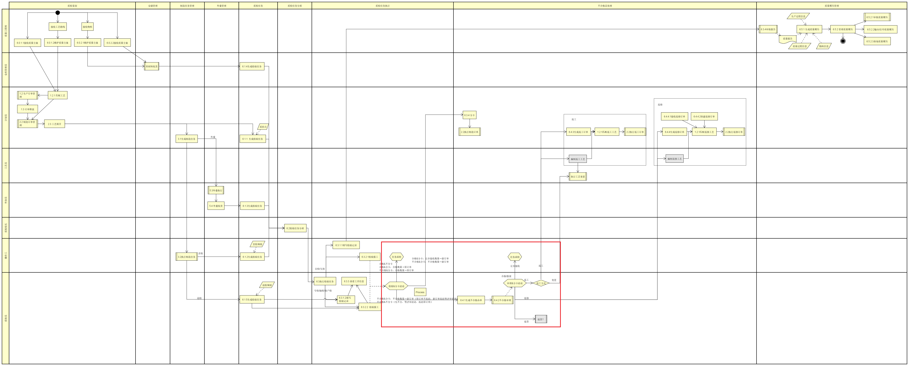

不合格品处理业务流程图

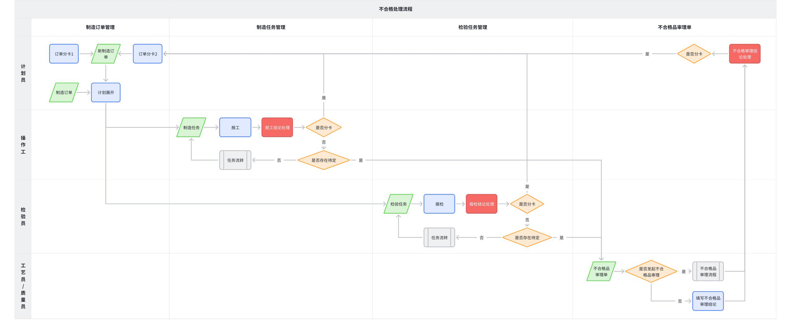

### 2.1.2 **不合格品业务流程描述**

#### 2.1.2.1 **生产计划阶段**

**计划员**

**活动描述**：根据生产计划进度，当发现订单数量太多、设备异常故障等原因无法按时完成生产要求时，需对制造订单进行分卡拆批操作，生成新的制造订单。

**输入业务对象**：制造订单、分卡数量。

**输出业务对象**：新的制造订单。

**关键业务规则**：

制造订单已取消、已完工不允许分卡

分卡时须选择未完工的分卡工序

分卡数量必须为正整数且小于等于可汇报数量，即只能对未报工的在制品进行分卡

分卡后新订单的工艺路线与原订单一致（这个不一定，没必要强调）。

**业务场景范围：**

|场景 | 场景兼容结论 | 备注|
|--- | --- | ---|
|制造订单手动分卡 | ⭐本批次 | |

#### 2.1.2.2 **制造任务执行阶段**

**操作工**

**活动描述**：执行制造任务，进行报工操作，并根据报工结果进行报工结论处理。报工结论包括：合格、让步接收、报废、返工、返修、待定。如果存在待定（返工返修也属于待定）情况，则发起不合格品审理流程。

**输入业务对象**：制造任务。

**输出业务对象**：报工结论、不合格品审理单（如果存在待定情况）、制造订单（如果需要分卡）

**关键业务规则**：

汇报项需根据报工策略配置动态生成

可根据当前在制品的生产和检验状态，人工选择是否分卡拆单，分卡拆单的汇报项由预置规则决定，每个汇报项独立分卡

当报工结论属于待定类型时，需生成不合格品审理单，有些汇报项生成不合格品审理单时默认自带不合格品审理结论，由预置规则配置汇报项对应的不合格品审理结论，每个汇报项独立创建不合格品审理单

**业务规则配置点**：报工策略配置

**业务场景范围：**

|场景 | 场景兼容结论 | 备注|
|--- | --- | ---|
|某道工序全部加工完成 在制品全部合格 在制品全部报废 在制品全部让步接收 在制品全部返工/返修 在制品全部待定 在制品部分合格、部分报废、部分让步接收、部分返工、部分返修、部分待定 | ⭐本批次 | |
|某道工序部分加工完成 在制品部分合格、部分报废、部分让步接收、部分返工、部分返修、部分待定 | ⭐本批次 | |

#### 2.1.2.3 **检验任务执行阶段**

**检验员**：

**活动描述**：执行检验任务，进行报检操作，并根据检验结果进行报检结论处理。报检结论包括：合格、让步接收、报废、返工、返修、待定。如果存在待定情况，则发起不合格品审理流程。

**输入业务对象**：检验任务。

**输出业务对象**：报检结论、不合格品审理单（如果存在待定情况）、制造订单（如果需要分卡）

**关键业务规则**：

汇报项需根据报工策略配置动态生成

可根据当前在制品的生产和检验状态，人工选择是否分卡拆单，分卡拆单的汇报项由预置规则决定，每个汇报项独立分卡

当报检结论属于待定类型时，需生成不合格品审理单，有些汇报项生成不合格品审理单时默认自带不合格品审理结论，由预置规则配置汇报项对应的不合格品审理结论，每个汇报项独立创建不合格品审理单

**业务规则配置点**：报工策略配置

**业务场景范围：**

|场景 | 场景兼容结论 | 备注|
|--- | --- | ---|
|某道工序全部检验完成 在制品全部合格 在制品全部报废 在制品全部让步接收 在制品全部返工/返修 在制品全部待定 在制品部分合格、部分报废、部分让步接收、部分返工、部分返修、部分待定 | ⭐本批次 | |
|某道工序部分检验完成 在制品部分合格、部分报废、部分让步接收、部分返工、部分返修、部分待定 | ⭐本批次 | |
|返工返修
当报工结论等于返工时，可直接选择已完工的历史任务进行返工返修 | ⭕未来扩展 | |

#### 2.1.2.4 **不合格品审理阶段**

**不合格品审理小组（计划员/工艺员/质量员）**：

**活动描述**：填写不合格品审理单，确定审理结论以及是否分卡，审理结论包括合格、让步接收、报废、返工、返修，

**输入业务对象**：不合格品审理单

**输出业务对象**：审理结论

**关键业务规则**：
- 一个不合格品审理单可能存在多个审理结论：如合格、让步接收、报废、返工、返修。
- **[修订] 针对批量或复杂场景的复合审理规则**：当不合格品审理涉及**批量混合处置**（如一批零件部分返工、部分报废）或**复杂协同处置**（如装配件需更换、送修多个子件）时，审理单必须能够**以`处置项清单`的形式，详细定义每一个处置任务**。该处置项清单是驱动所有下游流程（如创建返工订单、领料单、报废单等）的唯一指令源，详见《DNW30530-返工返修需求》文档。

**业务场景范围：**

|场景 | 场景兼容结论 | 备注|
|--- | --- | ---|
|不合格品审理，线下审理，不走工作流，直接录入不合格品审理结论 | ⭐本批次 | |
|不合格品审理，线上审理，走工作流，在工作流中给出不合格品审理结论 | ⭐本批次 | |

**计划员/工艺员**：

**活动描述**：根据不合格品审理结论，执行不合格品的处理操作，如合格、让步接收、报废、返工、返修等

**输入业务对象**：不合格品审理结论。

**输出业务对象**：制造任务、制造订单

**关键业务规则**：

对发起不合格品的任务进行处理，将任务

**业务场景范围：**

|场景 | 场景兼容结论 | 备注|
|--- | --- | ---|
|不合格品审理结论处理：合格、让步接收、报废、返工、返修 | ⭐本批次 | |

### 2.1.3 **重点业务场景分析**

#### 2.1.3.1 **报工/报检结论及不合格品审理结论说明**

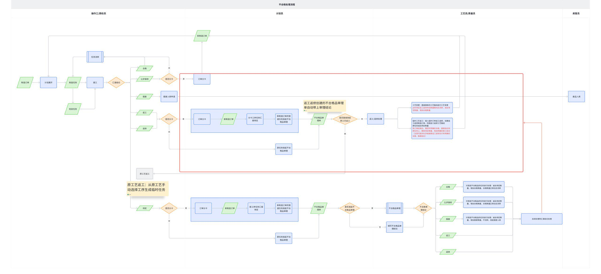

|数量统计 | 结论 | 报工/报检结论 | 不合格品审理结论（对发起不合格品的任务进行处理）|
|--- | --- | --- | ---|
|合格数量 | 合格 | 不分卡，在制品正常往后流转 | 将待定的在制品改为合格（仅修订当前审理数量对应的待定数量），后续处理同左侧保持一致|
|合格数量 | 让步接收 | 不分卡，在制品正常往后流转 分卡（拆单）： 从当前工序任务开始，把让步接收数量作为分卡数量创建新订单，将原订单一分为二，工艺路线一致，但两个订单各自独立生产加工 在制品在当前工序已加工完成，且有明确的生产结论（合格/报废），因此新订单直接从下道工序开始加工即可，当前工序及历史工序的生产信息可不带入到新订单中 | 将待定的在制品改为让步接收（仅修订当前审理数量对应的待定数量），后续处理同左侧保持一致|
|报废数量 | 报废 | 不分卡，不流转，发起报废入库申请，若全部报废，则订单直接完工 | 将待定的在制品改为报废（仅修订当前审理数量对应的待定数量），后续处理同左侧保持一致|
|待定数量 | 返工 | 不分卡： 从当前工序任务创建不合格品审理单，审理数量等于返工/返修数量，自动带上审理结论（返工/返修） 此时可选择直接进行原工艺返工，即从已完工的工序任务中选择需要返工/返修的工序进行返工【本批次不处理】 分卡（拆单）： 若同时存在多个报工结论且都需要分卡，则各自独立进行分卡处理 从当前工序任务开始，把返工/返修数量作为分卡数量创建新订单，将原订单一分为二，工艺路线一致，但两个订单各自独立生产加工 在制品在当前工序已加工完成，但没有明确的生产结论（合格/报废），因此新订单需从当前工序继续处理，当前工序的在制品状态需保持返工/返修，历史工序的生产信息可不带入到新订单中 从新订单的当前工序任务创建不合格品审理单，审理数量等于返工/返修数量，自动带上审理结论（返工/返修） | 将待定的在制品改为返工/返修（仅修订当前审理数量对应的待定数量），后续处理同左侧保持一致|
|待定数量 | 返修 | 不分卡： 从当前工序任务创建不合格品审理单，审理数量等于返工/返修数量，自动带上审理结论（返工/返修） 此时可选择直接进行原工艺返工，即从已完工的工序任务中选择需要返工/返修的工序进行返工【本批次不处理】 分卡（拆单）： 若同时存在多个报工结论且都需要分卡，则各自独立进行分卡处理 从当前工序任务开始，把返工/返修数量作为分卡数量创建新订单，将原订单一分为二，工艺路线一致，但两个订单各自独立生产加工 在制品在当前工序已加工完成，但没有明确的生产结论（合格/报废），因此新订单需从当前工序继续处理，当前工序的在制品状态需保持返工/返修，历史工序的生产信息可不带入到新订单中 从新订单的当前工序任务创建不合格品审理单，审理数量等于返工/返修数量，自动带上审理结论（返工/返修） | 将待定的在制品改为返工/返修（仅修订当前审理数量对应的待定数量），后续处理同左侧保持一致|
|待定数量 | 待定 | 不分卡： 若同步存在多个待定汇报项，则需创建多个不合格品审理单，一个待定汇报项创建一个不合格品审理单 从当前工序任务创建不合格品审理单，审理数量等于待定数量，无审理结论 分卡（拆单）： 若同时存在多个报工结论且都需要分卡，则各自独立进行分卡处理 从当前工序任务开始，把待定数量作为分卡数量创建新订单，将原订单一分为二，工艺路线一致，但两个订单各自独立生产加工 在制品在当前工序已加工完成，但没有明确的生产结论（合格/报废），因此新订单需从当前工序继续处理，当前工序的在制品状态需保持待定，历史工序的生产信息可不带入到新订单中 从新订单的当前工序任务创建不合格品审理单，审理数量等于待定数量，无审理结论 | 无此结论|

#### 2.1.3.2 **返工返修**

返工/返修定义：详见1.3的术语定义

**[修订]** **业务模式说明**：系统采用**统一的`处置清单驱动模型`**来管理所有返工返修业务，不再区分零件或装配等不同模式。该模型的核心是：
- **所有返工返修流程，均由`不合格品审理单`及其内部的`处置项清单`来统一驱动**。
- `处置项清单`负责详细定义每一个处置任务（如返工、更换、送修、委外等），并自动触发相应的下游单据（如`返工返修订单`、`领料单`等）。

**详细的解决方案和流程设计，请参见子需求文档《DNW30530-返工返修需求》。**

触发时机：

报工/报检时，直接判定为返工/返修

不合格品审理时，不合格品审理结论判定为返工/返修

返工返修业务处理，针对需要返工返修的任务，计划员/工艺员可进行的后续处理如下：

|业务处理 | 处理逻辑 | 场景兼容结论|
|--- | --- | ---|
|工艺变更 | 此时返工返修直接以合格数量进行汇报往后流转 然后换新的工艺路线进行工艺变更 | ⭐本批次|
|插入临时订单返工返修 | 创建返工返修制造订单，匹配返工返修工艺路线 此时待定返工返修待定数量需向后流转 新订单结束后，需回写明确的合格、报废结论到原任务上，删除待定数量，增加明确的报工结论（注意可能存在多级嵌套返工返修后才有明确的合格、报废结论） | ⭐本批次|
|插入临时任务返工返修 | 从原工艺手动选择工序生成临时任务返工返修 原任务减去待定数量 新订单结束后，需回写明确的合格、报废结论到原任务上，删除待定数量，增加明确的报工结论（注意可能存在多级嵌套返工返修后才有明确的合格、报废结论） | ⭕未来扩展|
|子件物料退回返工 | 跨厂跨车间返工返修；跨企业外委返工返修 | ⭕未来扩展|

#### 2.1.3.3 **分卡**

分卡定义：详见1.3的术语定义

业务流程图

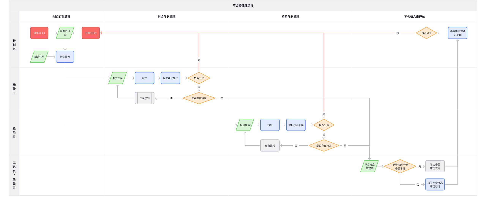

触发时机：

场景一：计划员当发现订单数量太多、设备异常故障等原因无法按时完成生产要求时，会主动对制造订单进行分卡拆批操作，生成新的制造订单。

仅对当前加工的工序进行分卡（本批次）

提前对未来待加工的工序进行分卡（未来扩展）：该场景需考虑在制品序列号的处理方案，以及若发生提前报废时，在制品如何处理

场景二：报工/报检时，加工的在制品出现问题，需按预定的规则进行分卡

场景三：不合格品审理时，不合格品审理结论判定需要分卡

场景说明

|分卡工序 | 场景一 | 场景二/三|
|--- | --- | ---|
|分卡工序 | 场景描述：单个订单太多，无法按时完成，需要分卡拆批生产，此时是针对未加工的在制品进行分卡拆批 | 场景描述：工序生产加工完以后，存在不合格品，因不合格品审理周期较长，需要将不合格进行分卡拆批，此时是对已加工的在制品进行分卡拆批|
|首道工序 | 分卡数量=未加工在制品数量 从原订单、分卡工序及以后所有的在制任务中，均需移除分卡数量 使用分卡数量创建新订单，工艺路线和原订单的工艺路线一致，新订单需按工艺路线继续对在制品进行加工生产，即新订单的在制品状态需保持和分卡前的状态一致 此时新订单从分卡工序开始生产执行 | 分卡数量=已加工在制品不合格数量 从原订单、分卡工序及以后所有的在制任务中，均需移除分卡数量，原订单中分卡在制品的生产（汇报）记录保留 使用分卡数量创建新订单，工艺路线和原订单的工艺路线一致，新订单需按工艺路线继续对在制品进行加工生产，即新订单的在制品状态需保持和分卡前的状态一致 此时新订单从分卡工序开始生产执行|
|中间工序 | 分卡的在制品历史生产信息，可不带入到新订单中 其他处理逻辑同首道工序分卡 | 分卡的在制品历史生产信息，可不带入到新订单中 其他处理逻辑同首道工序分卡|
|末道工序 | 分卡的在制品历史生产信息，可不带入到新订单中 若分卡后，原订单的末道工序全部已报工完成，且无待定数量，此时原订单可直接进行订单完工 其他处理逻辑同首道工序分卡 | 分卡的在制品历史生产信息，可不带入到新订单中 若分卡后，原订单的末道工序全部已报工完成，且无待定数量，此时原订单可直接进行订单完工 其他处理逻辑同首道工序分卡|

分卡原则：

串行工艺路线的工序均允许分卡

并行工艺路线的工序不允许分卡

并行工序大部分对应大件装配的场景，大件装配一般都是单件生产，因此不会进行分卡操作

暂不考虑并行分卡，有实际项目需求时可按照对所有工序从头分卡处理/或所有未开始的一起分卡，包括已完工的工序

分卡信息记录：

分卡时支持填写分卡备注（非必填，最多500字），用于记录分卡原因和相关信息

分卡备注保存到分卡记录中，便于后续追溯和质量问题分析

图例：

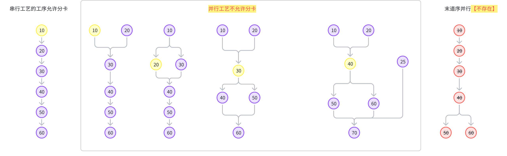

#### 2.1.3.4 **不合格品审理流程**

不合格品审理的流程需求点

|原始需求 | 工作流需求点描述|
|--- | ---|
|20240514MES需求—不合格品审理流程优化(肖玉双) | 流程步骤提交后处理： 在任务调度中新增字段【不合格品审理结论】、【返修内容】，如果该任务触发了不合格品流程，那么将不合格品结论步骤中操作员所给出的意见填写到任务调度【不合格品审理结论】字段中，【不合格品审理结论】字段默认值为正常 如果在不合格品流程中操作员给出的不合格品结论为"返工"、"返修"那么系统自动将对应任务的状态改为开始状态，将任务撤销汇报，由加工人员再次进行加工汇报——检验汇报 如果在不合格品流程中操作员给出的不合格品结论为"报废"、"让步接收"、"降级使用"，那么系统将自动把对应任务进行汇报|
|RWXQ-2020-04-0031生产过程中不合格品异常处理纳入工作流管理 | 流程步骤提交前校验： 当流程步骤进行到"不合格品异常处理"步骤（该步骤名称固定）时，点击【提交】任务时，如果报警对象上未填写不合格品审理意见，将弹出提示信息|
|RWXQ-2020-04-0031生产过程中不合格品异常处理纳入工作流管理 | 流程步骤提交时自动触发某个业务操作： 再次在该步骤进行任务提交，弹出的是报警关闭界面|
|RWXQ-2020-05-0026不合格品报警审理流程 | 流程步骤执行人设置： 流程步骤中，"线下走纸质不合格品审理单"步骤的执行人默认是前一步骤的执行人，因此不用额外指定人员。|
|RWXQ-2020-05-0026不合格品报警审理流程 | 流程步骤审批时支持增加业务处理功能按钮： 不合格品审理流程按步骤执行，执行到"依审理单结果在MES中处理报警"步骤时，执行人填写处理结果 点击填写处理结果按钮，弹出任务汇报，填写各汇报项的值（不汇报该汇报项时填0），点击【确定】按钮后，前面中断的新订单将恢复，且将填写的处理结果记录到分卡的工序的汇报记录中|
|RWXQ-2020-05-0026不合格品报警审理流程 | 流程结束后处理： 流程继续执行直到结束。如果分卡的工序只有加工汇报没有检验汇报，则点击【填写处理结果】按钮时会出现以下提示信息|
|KFRW-24070529-20240717MES需求—补料核算审批和不合格品审批上传附件功能(程瑞林) | 流程审理中支持上传附件 在对象分类管理中的"不合格品审理"分类和"补料核算审理"分类中增加"上传附件"功能，同物料分类上传附件功能相同。|
|RWXQ-2021-04-0034质量问题处理以及不合格品审理需求 | 流程执行人设置： 该报警对象加入了"质量问题处理工作流"流程中，其中"检验员描述"步骤中执行人默认是当前任务对应的检验人员，其它步骤执行人由用户自行配置|

不合格品流程样例

需支持流程分支

需支持流程回退到指定步骤

| | |
|--- | ---|

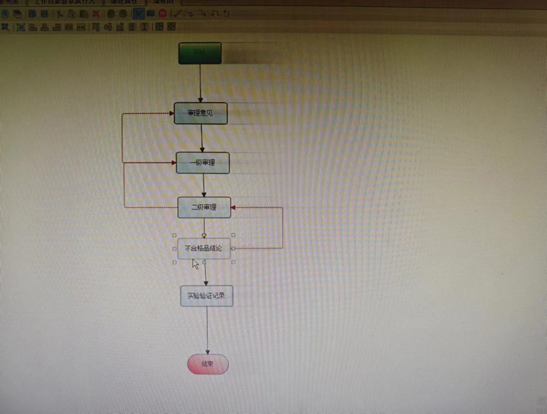

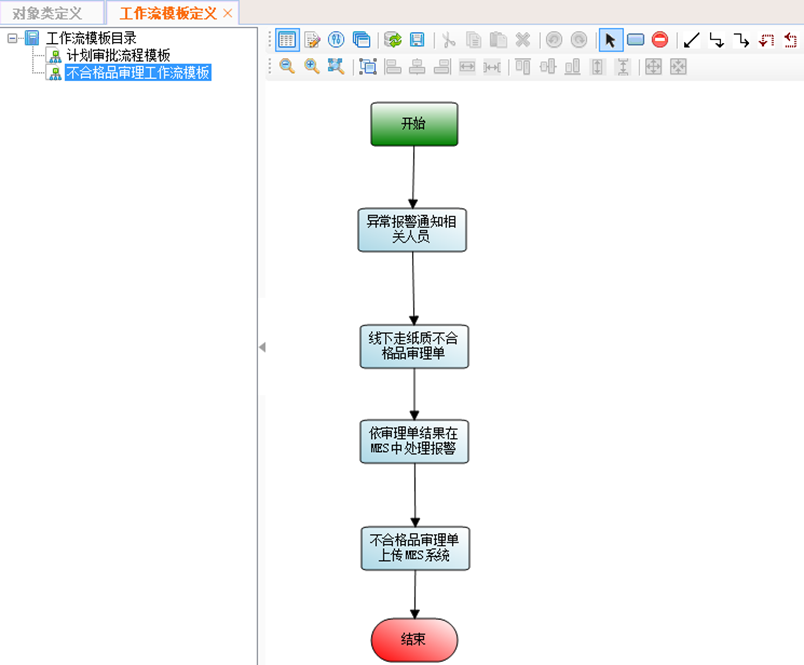

| | |
|--- | ---|

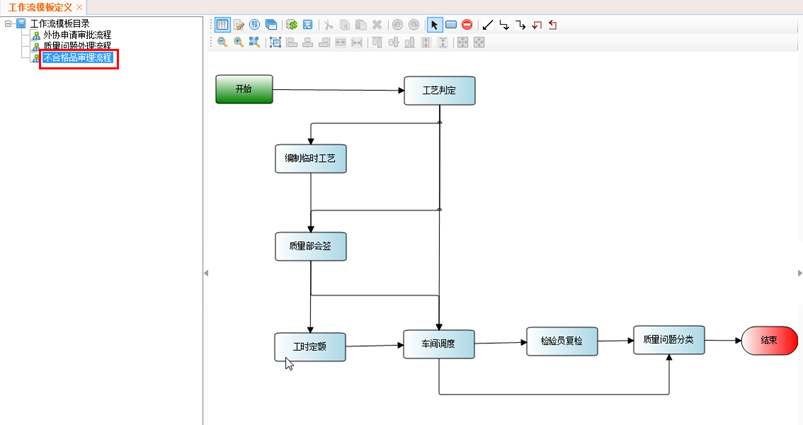

### 2.1.4 **业务对象ER关系图**

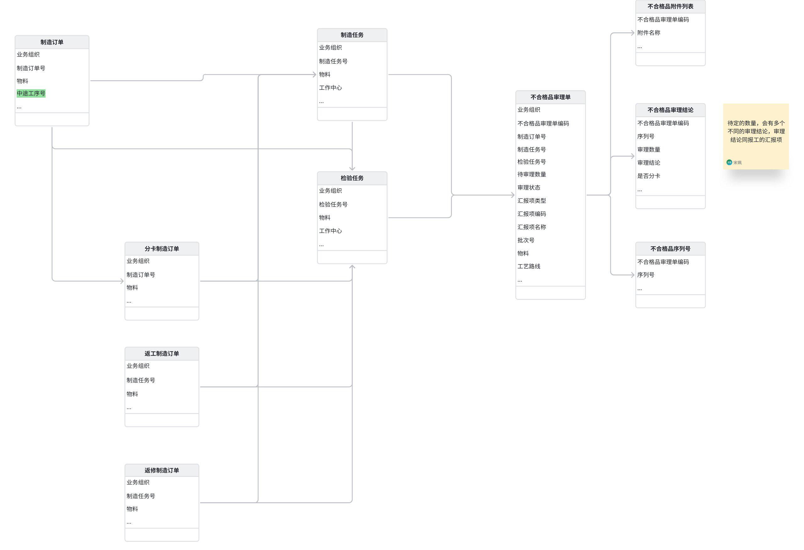

## 2.2 **功能描述**

### 2.2.1 **整体应用架构**

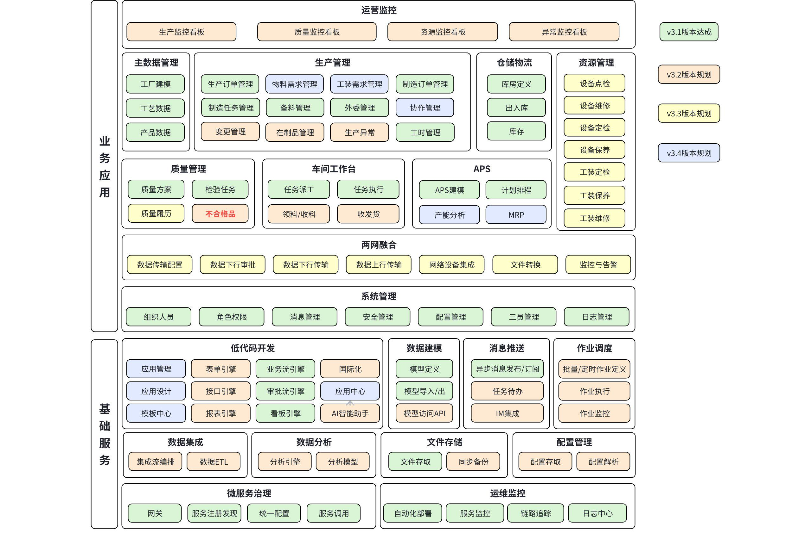

### 2.2.2 **不合格处理应用架构**

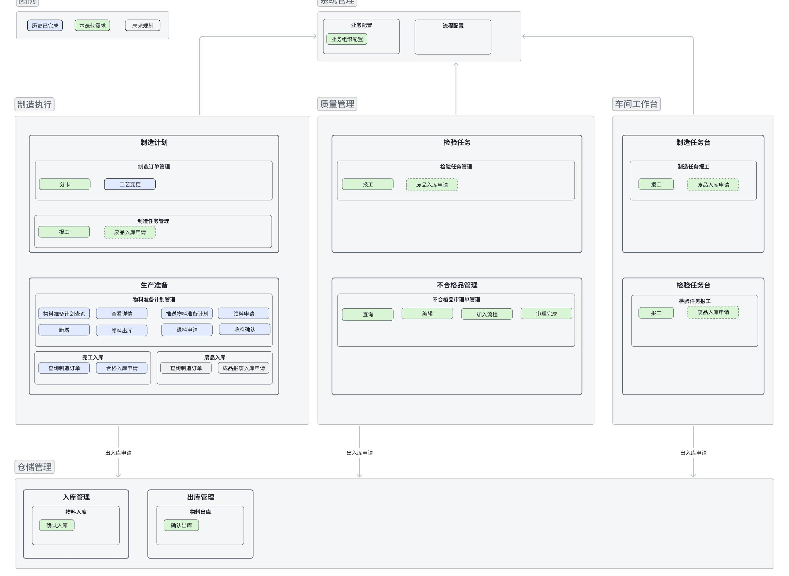

### 2.2.3 **功能清单**

|模块 | 页面 | 功能点 | 功能点描述|
|--- | --- | --- | ---|
|制造执行 | 制造订单管理 | 制造订单管理-工艺展开 | 对原始逻辑进行优化|
|制造执行 | 制造订单管理 | 制造订单管理-工艺变更 | 对原始逻辑进行优化|
|制造执行 | 制造订单管理 | 制造订单管理-分卡 | 对制造订单进行拆分，仅拆分待定数量|
|制造执行 | 制造订单管理 | 制造订单管理-返工返修订单完工 | 返工返修订单完工后处理|
|制造执行 | 制造任务管理 | 制造任务管理-报工（让步接收、报废、返工、返修、待定） | 制造任务管理-报工处理（让步接收、报废、返工、返修、待定、分卡）|
|质量管理 | 检验任务管理 | 检验任务管理-报检（让步接收、报废、返工、返修、待定） | 检验任务管理-报工处理（让步接收、报废、返工、返修、待定、分卡）|
|质量管理 | 不合格品审理单管理 | 不合格审理-查询 | 查询不合格审理单|
|质量管理 | 不合格品审理单管理 | 不合格品审理单管理-编辑 | 不合格审理填写审理结论、上传附件信息等|
|质量管理 | 不合格品审理单管理 | 不合格品审理单管理-加入流程 | 不合格审理加入审批工作流|
|质量管理 | 不合格品审理单管理 | 不合格品审理单管理-审理完成 | 不合格审理，审理完成后进行审理结论处理|
|车间工作台 | 制造任务报工 | 制造任务管理-报工（让步接收、报废、返工、返修、待定） | 制造任务管理-报工处理（让步接收、报废、返工、返修、待定、分卡）|
|车间工作台 | 检验任务报工 | 检验任务管理-报检（让步接收、报废、返工、返修、待定） | 检验任务管理-报工处理（让步接收、报废、返工、返修、待定、分卡）|

# 3. **页面&功能设计**

## 3.1 **制造执行**

### 3.1.1 **制造订单管理**

#### 3.1.1.1 **制造订单管理-工艺展开**

原始逻辑修订：若制造订单存在中途工序号，则需从中途工序号开始进行工艺展开生成制造任务，包括中途工序号

#### 3.1.1.2 **制造订单管理-工艺变更**

原始逻辑修订：若制造订单存在中途工序号，则中途工序之前的工序，均默认为保留工序

#### 3.1.1.3 **制造订单管理-订单完工**

返工返修订单完工后：需处理原始制造任务，根据关联关系找到返工返修原始关联的制造任务，并进行如下处理：

逻辑同制造任务正常汇报合格与报废数量的逻辑一致，差异如下：

待定数量=原待定数量-返工返修订单的计划数量

相同逻辑以下为举例说明，具体参考原始报工逻辑处理：

合格数量=原合格数量+返工返修订单的合格数量

报废数量=原报废数量+返工返修订单的报废数量

自动创建报废入库申请单

全部报废后处理

合格数量的在制品和对应的序列号（若存在），同正常报工一样往后续工序流转

待定数量更新后，若制造任务无待定数量，则需做任务自动完工

若制造任务为最后一道工序任务，还需触发订单完工等逻辑

...

#### 3.1.1.4 **制造订单管理-分卡**

**概述**：对制造订单进行拆分，仅拆分未报工的在制品数量

**界面**：

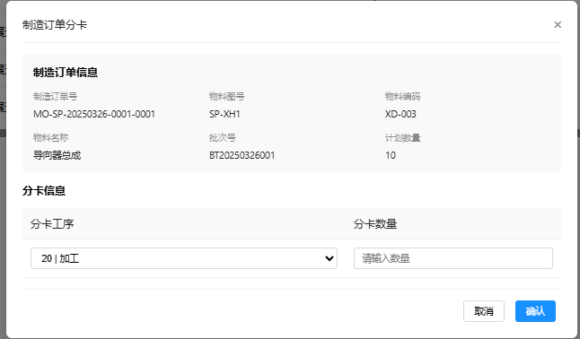

界面结构：需包含订单基本信息展示区域（如订单号、状态等）和分卡操作区域。

最上方是制造订单信息：制造订单号、物料图号、物料编码、物料名称、批次号、计划数量

下方是分卡信息：

分卡工序：只读，必填，默认值为最近一道未完工的任务

分卡数量：分卡工序任务的待报工数量，存在序列号时，需直接进行序列号选择，效果同任务报工数量填写（流转到分卡工序且未加工的在制品才允许分卡）

分卡备注：多行文本，非必填，最多500字，用于记录分卡原因和相关信息

交互内容：用户选择要分卡的制造订单，单选，选择分卡工序，输入分卡数量，填写分卡备注（非必填），点击确定后执行分卡操作。

校验规则：

并行工艺路线不允许分卡

分卡数量必须小于任务的计划数量

分卡数量为正整数且不超过当前任务的可报工数量

**输入**：制造订单号、分卡工序、分卡数量、分卡备注（非必填）。

**输出**：新的制造订单（分卡后的订单）

**处理逻辑**：

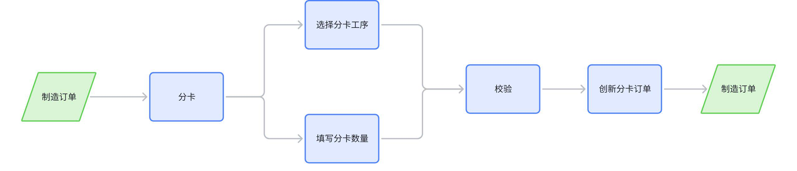

|步骤 | 描述|
|--- | ---|
|校验 | 并行工艺路线不允许分卡，否则提示："当前工艺路线是并行工艺路线，不允许分卡。" 若后续工序存在外委任务，且对应的外委计划已发送，则不允许进行分卡，保持界面开启状态，并给出提示："存在外委工序关联的计划已发送，不允许进行分卡，请先取消外委计划操作后再分卡。"|
|分卡描述 | 从当前工序开始，从原订单减去分卡的数量，使用分卡数量创建新的制造订单，和原制造订单分离，各自独立执行。 分卡逻辑需保持事务一致性|
|原制造订单处理 | 若分卡存在序列号，还需进行在制品的序列号扣减 从当前工序任务开始往后，从计划数量中扣减分卡数量 若已派工，则还需扣减派工数量，同报废扣减后续数量的逻辑一致 若存在关联的检验任务，则检验任务的计划数量也需进行扣减，若分卡存在序列号，还需进行序列号扣减 若存在外委工序任务，则对应的外委计划的计划数量也需进行扣减 若存在产出比，则还需要按产出比进行扣减 若分卡后，原订单的末道工序全部已报工完成，且无待定数量，此时原订单可直接进行订单完工|
|分卡后新的制造订单处理 | 分卡后的制造订单信息基本同原制造订单一致，差异如下： 计划数量=当前分卡的数量 中途工序号=分卡工序 若原制造订单存在批次号，则新制造订单的批次号=默认按编码规则生成，不存在则不处理 序列号=分卡数量选择的序列号（不存在则不处理） 分卡备注=用户填写的分卡备注（若有） 清空实际开始时间、实际结束时间、合格数量、报废数量 分卡在制品的历史执行信息，可不带入到新的制造订单中，分卡后从当前分卡任务继续往后执行，记录分卡后新的制造订单起始执行工序，即起始工序=当前工序任务 分卡后制造订单的工艺展开逻辑优化： 从分卡工序开始进行工艺展开 分卡后制造订单的工艺变更逻辑优化： 中途工序之前的工序，均默认为保留工序|
|关系处理 | 建立原制造订单与分卡后订单的关联关系 建立拆分后制造订单与生产订单的关联关系|

**验收标准**：系统能够正确拆分制造订单，分卡后的数量准确无误，新订单的工艺路线与原订单一致，状态正确。

### 3.1.2 **制造任务管理**

#### 3.1.2.1 **制造任务管理-报工（让步接收、报废、返工、返修、待定）**

**概述**：对制造任务进行报工处理，包括让步接收、报废、返工、返修、待定等操作

**界面**：

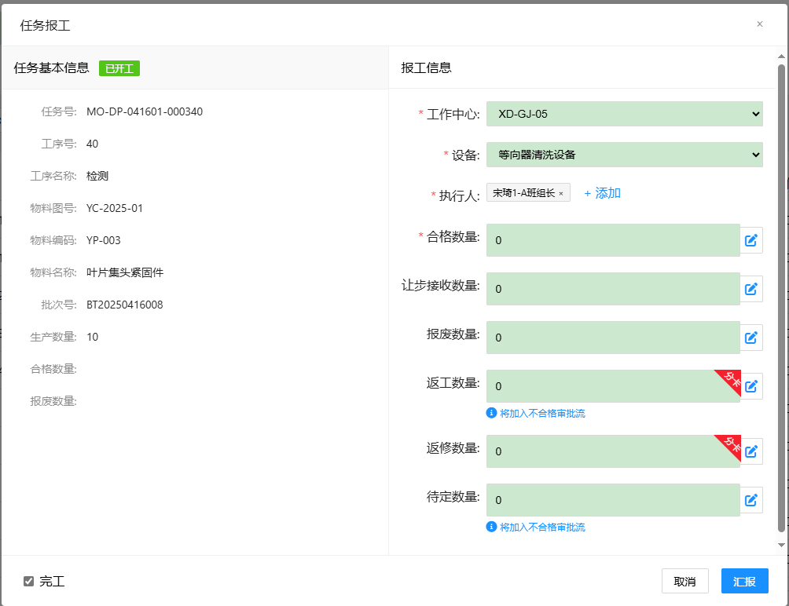

界面结构：

|界面 | 描述|
|--- | ---|
|主界面 | 整体结构保持和现有界面一致，需包含任务基本信息展示区域（如任务号、工序等）和报工操作区域。|
|汇报项 | 本次修订了报工策略配置，详见工作中心配置DNW30050-系统配置中的3.2.1报工策略配置 汇报项取值修订：此处需读取报工策略中，是否启用=是的汇报项 "分卡"标识设置：若汇报项配置了需要默认分卡，则在汇报项的输入框右上角增加角标提醒，未配置则不显示 "将加入不合格审批流"提示设置： 当前任务没有关联的检验任务、存在汇报类型=待定&不合格品审理结论=空的汇报项时，才显示该提示信息 若当前任务是检验任务，则最后一个检验任务（以工艺质量配置生成的100%检的检验任务为准，首检、抽检、巡检不在此列）才显示该提示信息|

交互内容：用户选择要报工的制造任务，输入各操作对应的数量（如让步数量、报废数量等），然后点击报工按钮，进行报工操作。

校验规则：

报工的汇报项中，至少存在一个不分卡的汇报项才能完工，即不能所有的汇报项都分卡

**输入**：制造任务号、报工项

**输出**：报工处理结果，报工记录、不合格品审理单、新制造订单

**处理逻辑**：

**报工界面初始化逻辑修订**

|本次修订了报工策略配置（详见DNW30050-系统配置中的3.2.1报工策略配置），新增了汇报项类型（报废和待定）、是否默认分卡、不合格品审理结论、是否启用：
报工界面汇报项读取逻辑修订：界面展示时需读取报工策略中，是否启用=是的汇报项
是否默认分卡：对应报工界面每个汇报项后是否分卡的默认值，有几个汇报项要分卡，则创建几个分卡订单
汇报项类型：当汇报项类型=待定时，均需创建不合格品审理单，有几个待定汇报项则创建几个不合格品审理单
不合格品审理结论：创建不合格品审理单时，默认写入配置的不合格品审理结论|
|---|

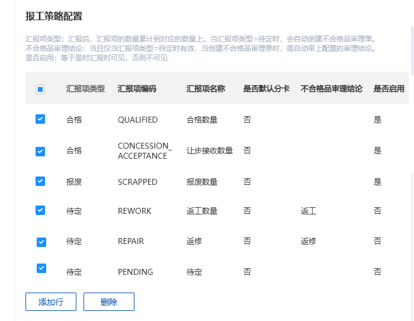

**报工逻辑修订**

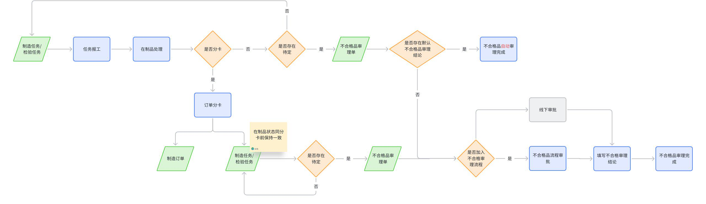

**在制品处理：**

|汇报项类型 | 汇报项 | 报工业务处理|
|--- | --- | ---|
|合格数量 | 合格 | 在制品正常往后流转 同原有报工逻辑，记录相关信息 若任务完工触发订单完工，则订单完工后需根据配置决定是否自动发起合格入库申请 详见DNW30050-系统配置3.1.2.12.1制造订单完工后是否自动发起合格入库申请 创建申请单的逻辑同DNW30330-生产准备中的3.12.2完工入库-合格入库申请 如果申请失败，此时不影响任务报工，可后续手动发起合格入库申请|
|合格数量 | 让步接收 | 在制品正常往后流转 同原有报工逻辑，记录相关信息 若任务完工触发订单完工，则订单完工后需根据配置决定是否自动发起合格入库申请 详见DNW30050-系统配置3.1.2.12.1制造订单完工后是否自动发起合格入库申请 创建申请单的逻辑同DNW30330-生产准备中的3.12.2完工入库-合格入库申请 如果申请失败，此时不影响任务报工，可后续手动发起合格入库申请|
|报废数量 | 报废 | 若存在关联的检验任务，则在制品数量同合格数量一样，正常往后面的检验任务流转，以最后一个检验任务（以工艺质量配置生成的100%检的检验任务为准，首检、抽检、巡检不在此列）的报工结论为准做报废处理； 若当前任务不存在检验任务，则在制品不往后不流转，按以下逻辑处理： 数量报废： 若后续任务未派工，则需扣减后续任务的计划数量 若后续任务已派工，则需扣减后续任务的计划数量和已派工数量 若后续任务已开工，则需扣减后续任务的计划数量、已派工数量和待报工数量（在制品数量），若扣减完以后，不存在可汇报数量，还需自动进行任务完工 若后续任务存在产出比，则还需要按产出比进行扣减 若后续任务已分割，则按子任务的顺序（内置序号）扣减分割子任务： 若分割子任务已完工，则跳过不扣减 若分割子任务未开工，则需扣减后续任务的计划数量和已派工数量，若扣减完以后，不存在可汇报数量，还需自动进行任务完工 若分割子任务已开工，则需扣减后续任务的计划数量、已派工数量和待报工数量（在制品数量），若扣减完以后，不存在可汇报数量，还需自动进行任务完工 若全部报废，则需进行订单完工操作，后续任务不做数量扣减，直接全部取消 报废入库申请：制造任务或检验任务报工时需读取业务配置，若存在报废，则需根据配置决定是否自动发起报废入库申请 详见DNW30050-系统配置3.1.2.8.2制造任务报工后是否自动发起报废入库申请和3.1.5.1.1检验任务报工后是否自动发起报废入库申请 开启后，当任务报工后且存在报废数量时，自动发起报废入库申请单，若未配置该物料的报废库房，则发起申请失败，但报工成功，此时可手动进行报废入库申请。 若任务存在序列号，则申请明细需按序列号进行拆分，创建申请单的逻辑同DNW30330-生产准备中的3.12.2完工入库-合格入库申请 入库方式：成品报废入库|
|待定数量 | 返工 | 同原有报工逻辑，记录相关信息，存在待定数量时，任务不允许变成完工状态 若存在关联的检验任务，则在制品数量同合格数量一样，正常往后面的检验任务流转，以最后一个检验任务（以工艺质量配置生成的100%检的检验任务为准，首检、抽检、巡检不在此列）的报工结论为准做后续不合格品处理 若当前任务不存在检验任务，则在制品不往后不流转，按以下逻辑处理： 若待定汇报项勾选了分卡，则先进行分卡处理作，再对分卡后的任务执行c.不合格品处理逻辑 若待定汇报项不分卡，则对当前任务直接执行c.不合格品处理逻辑 仅汇报项类型=待定且未配置不合格审理结论的汇报项（即界面上标识了将加入不合格品审理的汇报项），才需加入不合格品审理流程|
|待定数量 | 返修 | 同原有报工逻辑，记录相关信息，存在待定数量时，任务不允许变成完工状态 若存在关联的检验任务，则在制品数量同合格数量一样，正常往后面的检验任务流转，以最后一个检验任务（以工艺质量配置生成的100%检的检验任务为准，首检、抽检、巡检不在此列）的报工结论为准做后续不合格品处理 若当前任务不存在检验任务，则在制品不往后不流转，按以下逻辑处理： 若待定汇报项勾选了分卡，则先进行分卡处理作，再对分卡后的任务执行c.不合格品处理逻辑 若待定汇报项不分卡，则对当前任务直接执行c.不合格品处理逻辑 仅汇报项类型=待定且未配置不合格审理结论的汇报项（即界面上标识了将加入不合格品审理的汇报项），才需加入不合格品审理流程|
|待定数量 | 待定 | 同原有报工逻辑，记录相关信息，存在待定数量时，任务不允许变成完工状态 若存在关联的检验任务，则在制品数量同合格数量一样，正常往后面的检验任务流转，以最后一个检验任务（以工艺质量配置生成的100%检的检验任务为准，首检、抽检、巡检不在此列）的报工结论为准做后续不合格品处理 若当前任务不存在检验任务，则在制品不往后不流转，按以下逻辑处理： 若待定汇报项勾选了分卡，则先进行分卡处理作，再对分卡后的任务执行c.不合格品处理逻辑 若待定汇报项不分卡，则对当前任务直接执行c.不合格品处理逻辑 仅汇报项类型=待定且未配置不合格审理结论的汇报项（即界面上标识了将加入不合格品审理的汇报项），才需加入不合格品审理流程|

**分卡处理：**

|步骤 | 描述|
|--- | ---|
|校验 | 并行工艺路线的工序不允许分卡 若后续工序存在外委任务，且对应的外委计划已发送，则不允许进行分卡，保持界面开启状态，并给出提示："存在外委工序关联的计划已发送，不允许进行分卡，请先取消外委计划操作后再分卡。"|
|分卡描述 | 校验通过后，按顺序进行分卡操作，有几个汇报项开启分卡，则进行几次分卡操作，创建几个分卡制造订单 报工的汇报项中，至少存在一个不分卡的汇报项，即不能所有的汇报项都分卡，若存在此场景，则程序自动保留第一个汇报项 从当前工序开始，从原订单减去分卡（汇报）的数量，使用分卡数量创建新的制造订单，和原制造订单分离，各自独立执行。 分卡逻辑需保持事务一致性|
|原制造订单处理 | 从当前工序任务开始往后，从计划数量中扣减分卡数量，若分卡存在序列号，还需进行序列号扣减 若已派工，则还需扣减派工数量，同报废扣减后续数量的逻辑一致 若存在关联的检验任务，则检验任务的计划数量也需进行扣减，若分卡存在序列号，还需进行序列号扣减 若存在外委工序任务，则对应的外委计划的计划数量也需进行扣减 物料准备计划无需处理：物料准备计划是订单级别的，可按需进行退料，新的制造订单重新领料即可 若分卡后，原订单的末道工序全部已报工完成，且无待定数量，此时原订单可直接进行订单完工|
|分卡后新的制造订单处理 | 分卡后的制造订单信息基本同原制造订单一致，差异如下： 计划数量=当前汇报项的数量 若原制造订单存在批次号，则新制造订单的批次号=默认按编码规则生成，不存在则不处理 序列号=汇报的序列号（不存在则不处理） 分卡备注=报工界面填写的分卡备注（若有） 清空实际开始时间、实际结束时间、合格数量、报废数量 分卡在制品的历史执行信息，可不带入到新的制造订单中，分卡后从当前分卡任务继续往后执行，记录分卡后新的制造订单起始执行工序，即起始工序=当前工序任务 分卡后在制品状态需同分卡前保持一致，即原在制品状态是让步接收，则新的分卡订单的状态也是让步接收，原在制品状态是待定，新的在制品状态也是待定，且对应的不合格品审理单也许进行带入，以下处理逻辑供参考： 对新的制造订单进行展开，首工序任务汇报待定，从新订单的首工序任务创建不合格品审理单 分卡后制造订单的工艺变更逻辑优化： 中途工序之前的工序，均默认为保留工序|
|关系处理 | 建立原制造订单与分卡后订单的关联关系 建立拆分后制造订单与生产订单的关联关系|

**不合格品处理**

|步骤 | 描述|
|--- | ---|
|校验 | 仅汇报项类型=待定且未配置不合格审理结论的汇报项（即界面上标识了将加入不合格品审理的汇报项），才需加入不合格品审理流程 若需要加入不合格审批流，则读取业务配置DNW30050-系统配置中的3.1.5.1.2默认加入的不合格品审理流程标识，将不合格品审理单加入到该流程中，若未配置或者配置的流程标识无效，则加入流程失败，但报工成功，此时需给出提示："未配置不合格品审理流程或配置的流程无效，不合格品审理单XXX自动加入不合格审批流程失败，请修改配置后在不合格品审理单管理界面手动加入流程。"|
|创建不合格品审理单 | 校验通过后，创建不合格品审理单，有几个待定汇报项则创建几个不合格品审理单 不合格品审理单编码规则：NCR+年月日+4位流水号，例NCR202505190001（需支持编码规则） 待审理数量：当前汇报项的数量 审理状态为"待审理" 从任务上带入批次号、序列号、物料、工艺路线等信息 建立任务与不合格品审理的关联关系|
|加入不合格品审理流程 | 若当前待定汇报项未配置不合格品审理结论，则将创建的不合格品审理单加入到对应的审批流中，并更新审理状态为"审理中"；|
|不合格品审理单自动审理完成 | 若当前待定汇报项已配置不合格品审理结论，则需额外处理不合格品审理单： 自动写入不合格品审理结论： 序列号：存在序列号时，则需按序列号记录审理结论，且对应的审理数量为1 审理数量：当前汇报项的数量 审理结论：配置的不合格品审理结论 是否分卡：对应界面上该汇报项是否分卡 对不合格品审理单自动执行审理完成操作，功能逻辑同3.2.2.4不合格品审理单管理-审理完成|

**验收标准**：系统能够正确处理制造任务的报工操作，数据更新及时准确，触发后续流程的逻辑正确。

## 3.2 **质量管理**

### 3.2.1 **检验任务管理**

#### 3.2.1.1 **检验任务管理-报检（让步接收、报废、返工、返修、待定）**

功能同3.1.2.1制造任务管理-报工处理

首检不合格有两种后续步骤：1.继续重新生成首检（循环） 2.整单报废，详见需求中的3.8.3首检控制（增）

### 3.2.2 **不合格品审理单管理**

#### 3.2.2.1 **不合格品审理单管理-查询**

**概述**：查询不合格审理单

**界面**：

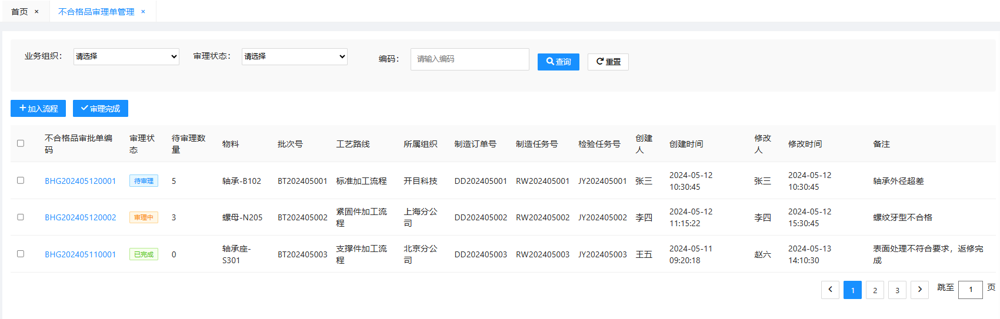

界面结构：需包含查询条件输入区域和审理单列表展示区域。

最上方的筛选条件有：业务组织、审理状态、编码。

网格列有：不合格品审批单编码（超链接）、审理状态（待审理、审理中、审理完成）、待审理数量、物料、批次号、工艺路线、所属组织、制造订单号、制造任务号、检验任务号、创建人、创建时间、修改人、修改时间、备注。

不合格品审理单编码：超链接支持点击打开详情界面，仅待审理和审理中的允许编辑，审理完成的只能浏览，不允许编辑

操作按钮有：加入流程、审理完成

交互内容：用户输入查询条件，点击查询按钮，系统查询并展示符合条件的审理单列表。

校验规则：查询条件符合格式要求。

**输入**：查询条件

**输出**：不合格品审理单对象

**处理逻辑**：--

**验收标准**：系统能够根据查询条件准确查询到不合格审理单，并正确展示在页面上。

#### 3.2.2.2 **不合格品审理单管理-编辑**

**概述**：支持对待审理和审理中的不合格品审理单进行编辑，支持对附件进行上传、删除和浏览等操作；审理完成只支持浏览

**界面**：

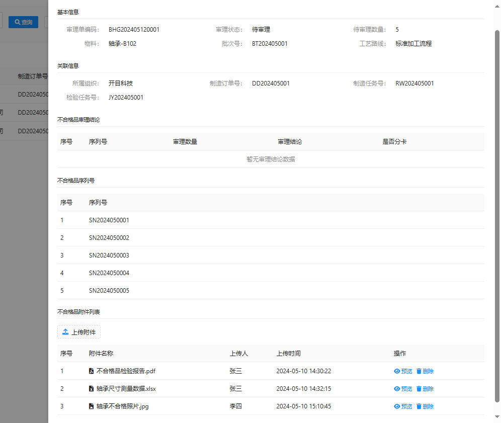

界面结构：需包含审理单基本信息展示区域（如处理单编号、物料等）和不合格品附件列表、不合格品审理结论、不合格品序列号等信息

不合格品基本信息：均只读

不合格品关联信息：均只读

不合格品序列号：表格列表只读，有多个序列号

不合格品审理结论：表格列表只读，表格列有序列号、审理数量、审理结论（合格、让步接收、返工、返修、报废）、是否分卡

不合格品附件列表：表格列表只读，支持对附件进行上传、删除和浏览等操作，不允许下载

交互内容：用户选择要编辑的审理单，输入审理结论、上传附件、填写原因分析、预防及处理措施等，然后点击提交按钮。

校验规则：审理结论必须选择，附件上传符合格式要求。

**输入**：审理结论（如让步、返工、返修、报废等）、附件、原因分析、预防及处理措施等。

**输出**：编辑后的审理单信息。

**处理逻辑**：

支持对待审理和审理中的不合格品审理单进行编辑；审理完成的只能浏览，不允许编辑

**验收标准**：系统能够正确保存审理单的编辑信息，数据更新及时准确，触发后续流程的逻辑正确。

#### 3.2.2.3 **不合格品审理单管理-加入流程**

**概述**：不合格审理加入审批工作流

**界面**：

界面结构：二级弹窗，提示："是否确认将选中的不合格品审理单加入流程？"

交互内容：用户选择要加入审批流程的审理单，支持多选，弹出确认提示框，点击确认后，将勾选的数据加入流程中。

校验规则：审批流必须存在

**输入**：不合格审理单、不合格品审理流程

**输出**：审批流程启动，审理单进入审批流程。

**处理逻辑**：

用户选择要加入审批流程的审理单，支持多选（支持部分成功部分失败），点击加入流程，弹出确认提示框："是否确认将选中的不合格品审理单加入流程？"

点击是则进行如下处理：

校验：

仅待审理状态的不合格品审理单才允许加入审理流程，审理中或审理完成的默认跳过，最后统一提示

读取业务配置中的3.1.5.1.2默认加入的不合格品审理流程标识，判断当前任务所属的工厂下是否配置流程标识，当已配置且流程标识有效是否有效，才允许加入流程

则将不合格品审理单加入到流程中

更新审理状态="审理中"

不合格品审理流程最后一个步骤提交时：

若此时审理状态为待审理或审理中，此时需自动调用3.2.2.4不合格品审理单管理-审理完成的业务操作，若校验不通过，给出提示且流程不允许提交结束。

若此时审理状态为审理完成，则不做任何处理。

**验收标准**：系统能够正确启动审批流程，并将审理单加入审批流程。

#### 3.2.2.4 **不合格品审理单管理-审理完成**

**概述**：不合格审理，审理完成后进行审理结论处理

**界面**：

界面结构：二级弹窗确认："是否确认审理完成并处理审理结论？"

交互内容：用户选择待审理完成的审理单，支持批量处理（允许部分成功部分失败），执行相应的处理操作（如分卡、返工返修等）。

校验规则：

仅待审理和审理中的状态才允许进行审理完成操作

不合格品审理结论中的审理数量之和=待审理数量，才允许进行审理完成

**输入**：审理结论。

**输出**：根据审理结论处理后的结果，如分卡后的制造订单、返工返修任务等。

**处理逻辑**：

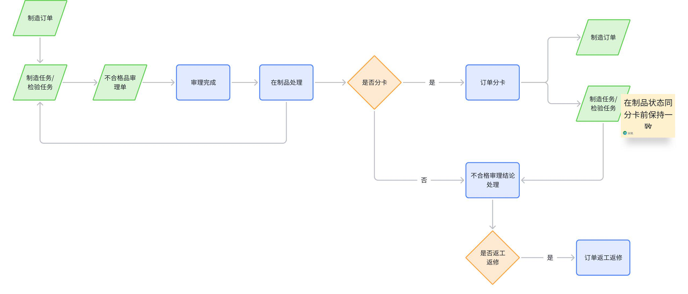

在制品处理（只需处理审理数量对应的待定数量）

|汇报项类型 | 汇报项 | 不合格品结论业务处理|
|--- | --- | ---|
| |  | 不分卡（不拆单）|
|合格数量 | 合格 | 对发起不合格品的任务进行处理： 减去待定数量，增加合格数量，合格数量正常往后流转 存在序列号时，序列号也需同步处理 处理完以后若无待定数量且无可报工数量，则自动进行任务完工 后续逻辑同3.1.2.1制造任务管理-报工的处理逻辑中的在制品处理的合格数量 若任务完工触发订单完工，则订单完工后需根据配置决定是否自动发起合格入库申请 详见DNW30050-系统配置3.1.2.12.1制造订单完工后是否自动发起合格入库申请 创建申请单的逻辑同DNW30330-生产准备中的3.12.2完工入库-合格入库申请|
|合格数量 | 让步接收 | 对发起不合格品的任务进行处理： 减去待定数量，增加合格数量，合格数量正常往后流转 存在序列号时，序列号也需同步处理 处理完以后若无待定数量且无可报工数量，则自动进行任务完工 后续逻辑同3.1.2.1制造任务管理-报工的处理逻辑中的在制品处理的合格数量 若任务完工触发订单完工，则订单完工后需根据配置决定是否自动发起合格入库申请 详见DNW30050-系统配置3.1.2.12.1制造订单完工后是否自动发起合格入库申请 创建申请单的逻辑同DNW30330-生产准备中的3.12.2完工入库-合格入库申请|
|报废数量 | 报废 | 对发起不合格品的任务进行处理： 减去待定数量，增加报废数量 存在序列号时，序列号也需同步处理 处理完以后若无待定数量且无可报工数量，则自动进行任务完工 后续逻辑同3.1.2.1制造任务管理-报工的处理逻辑中的在制品处理的报废数量|
|待定数量 | 返工 | 对发起不合格品的任务进行处理： 减去待定数量 存在序列号时，序列号也需同步处理 处理完以后若无待定数量且无可报工数量，则自动进行任务完工 若结论需要分卡，则先进行分卡，在对分卡后的任务执行返工/返修处理 若结论不需要分卡，则直接对不合格品关联的任务执行返工/返修处理|
|待定数量 | 返修 | 对发起不合格品的任务进行处理： 减去待定数量 存在序列号时，序列号也需同步处理 处理完以后若无待定数量且无可报工数量，则自动进行任务完工 若结论需要分卡，则先进行分卡，在对分卡后的任务执行返工/返修处理 若结论不需要分卡，则直接对不合格品关联的任务执行返工/返修处理|

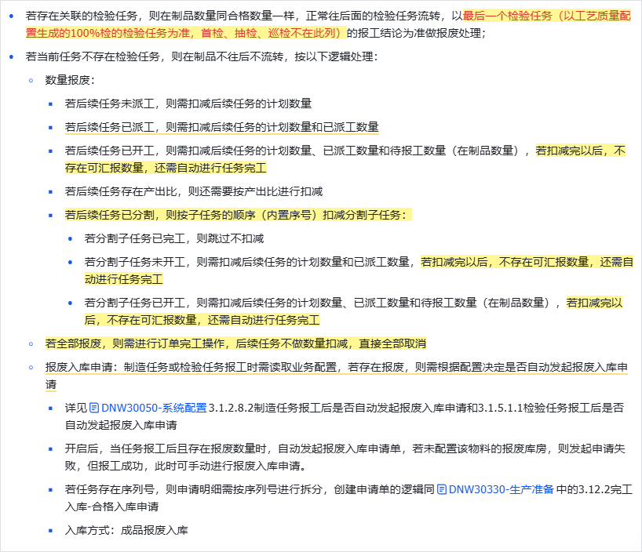

分卡

逻辑同3.1.2.1制造任务管理-报工的处理逻辑中的分卡处理

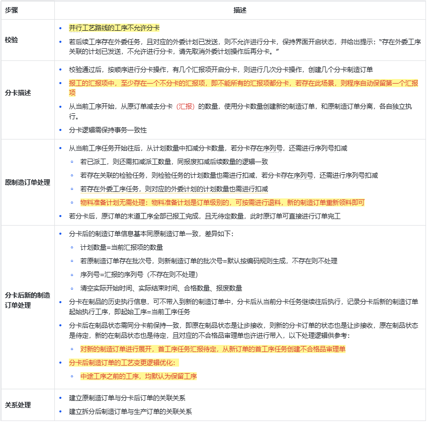

不合格品审理结论处理-订单返工返修

|创建返工返修订单 | 一个结论明细创建一个制造订单
新的制造订单信息基本同原制造订单一致
制造订单默认是发布状态
制造订单的的类型=返工/返修
若原制造订单存在批次号，则新制造订单的批次号=默认按编码规则生成，不存在则不处理
序列号=审理结论关联的序列号（不存在则不处理）
清空工艺路线、实际开始时间、实际结束时间、合格数量、报废数量
建立返工返修订单和原制造任务的关联|
|--- | ---|

**验收标准**：系统能够根据审理结论正确执行相应的处理操作。

## 3.3 **车间工作台**

### 3.3.1 **制造任务报工**

#### 3.3.1.1 **制造任务报工-报工处理（让步接收、报废、返工、返修、待定）**

功能同3.1.2.1制造任务管理-报工处理

### 3.3.2 **检验任务报工**

#### 3.3.2.1 **检验任务报工-报检处理（让步接收、报废、返工、返修、待定）**

功能同3.1.2.1制造任务管理-报工处理

# 4. **外部依赖**

本次功能对外部依赖的状态说明

|产品 | 应用 | 功能 | 外部依赖说明 | 状态|
|--- | --- | --- | --- | ---|
|KMMOM | 系统管理 | 业务配置 | 制造任务和检验任务报工时需读取工作中心配置中的报工策略进行汇报项动态显示 详见DNW30050-系统配置3.2.1报工策略配置 | 业务配置本次需开发修订|
|KMMOM | 系统管理 | 业务配置 | 制造任务或检验任务报工时需读取业务配置进行报废入库申请 若存在报废，则需根据配置决定是否自动发起报废入库申请 详见DNW30050-系统配置3.1.2.8.2制造任务报工后是否自动发起报废入库申请和3.1.5.1.1检验任务报工后是否自动发起报废入库申请 | 业务配置本次需开发修订|
|KMMOM | 系统管理 | 业务配置 | 制造订单完工时需读取业务配置进行完工入库申请 若存在合格数量，则需根据配置决定是否自动发起合格入库申请 详见DNW30050-系统配置3.1.2.12.1制造订单完工后是否自动发起合格入库申请 | 业务配置本次需开发修订|
|KMMOM | 系统管理 | 业务配置 | 制造任务和检验任务报工时若需要加入不合格品审批流 需读取不合格品配置，详见DNW30050-系统配置3.1.5.1.2默认加入的不合格品审理流程标识和3.1.5.1.3是否默认否选加入审批流 | 业务配置本次需开发修订|
|KMMOM | 系统管理 | 业务配置 | 不合格品审理单独加入审理流程时 需读取不合格品配置，详见DNW30050-系统配置3.1.5.1.2默认加入的不合格品审理流程标识 | 业务配置本次需开发修订|
