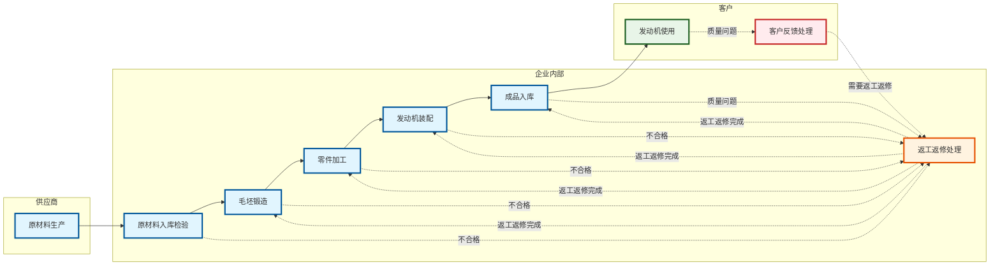
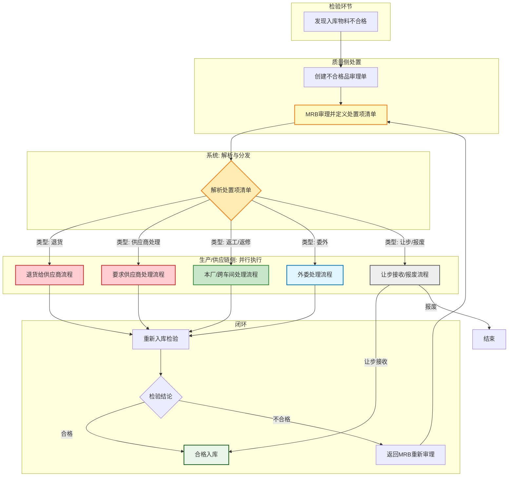
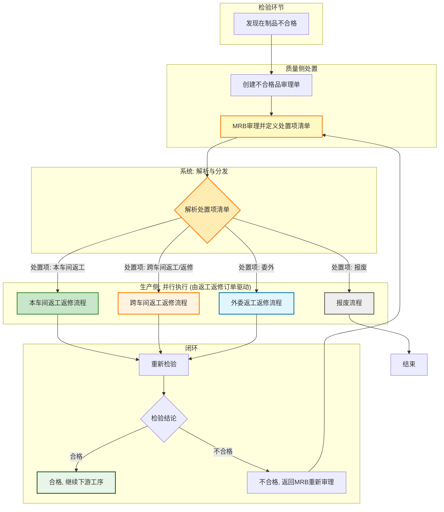
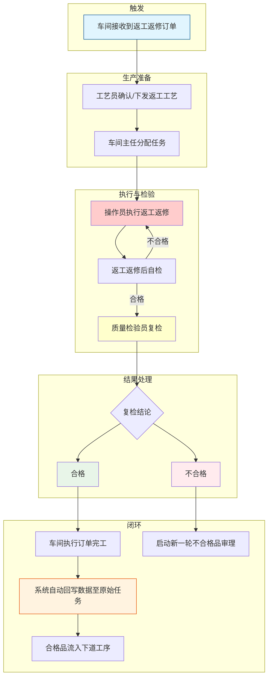
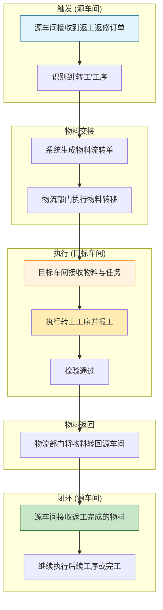
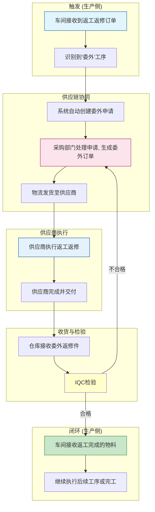
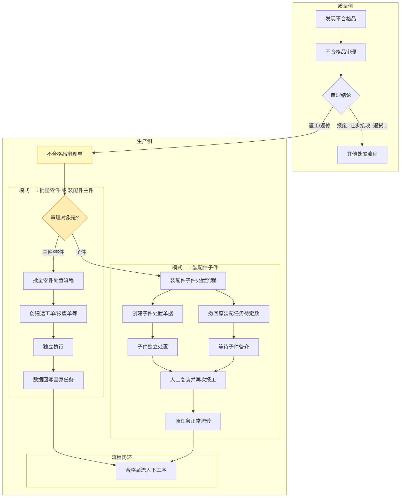
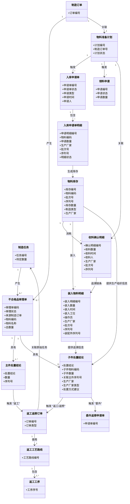
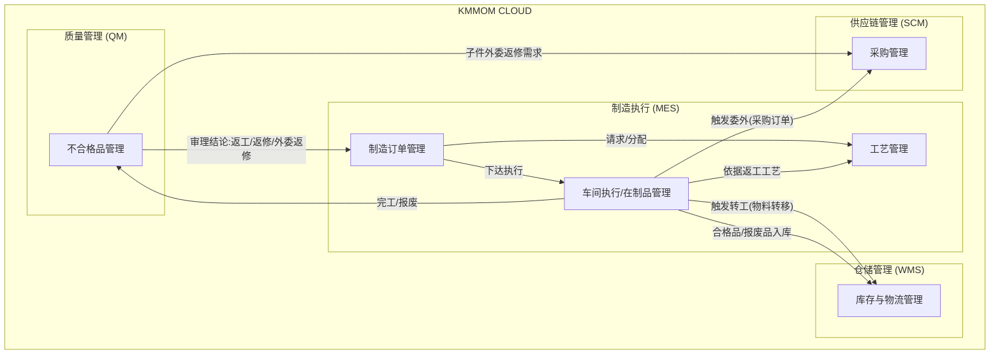

# DNW30530-返工返修需求

> **需求定位说明**：本需求是 [DNW30530-质量不合格处理](./DNW30530-质量不合格处理.md) 的子需求，专门针对返工返修业务场景进行详细设计。返工返修是质量不合格处理的重要组成部分，涉及不合格品的处理、质量成本控制、客户价值保护等多个方面。

## 1. 概述

### 1.1 原始需求

#### 1.1.1 业务背景
返工返修业务是制造业质量管理体系的重要组成部分，涉及不合格品的处理、质量成本控制、客户价值保护等多个方面。当前，随着制造业向高质量发展转型，返工返修业务的管理水平直接影响企业的竞争力和盈利能力。然而，在实际操作中，返工与返修的定义模糊、决策依据不清晰、流程协同复杂、责任分工不明确等问题普遍存在，导致质量成本高企、生产计划频繁中断、客户满意度下降。因此，建立一套标准化、系统化、数据驱动的返工返修管理方案，已成为制造企业提升核心竞争力的迫切需求。

#### 1.1.2 核心业务痛点

##### 1.1.2.1 痛点一：跨部门协同流程复杂，信息传递严重滞后

*   **痛点场景 (Pain-point Scenario):** 一个在A车间生产的复杂子件，在B车间装配时才发现存在尺寸偏差，需要返回A车间进行返工。B车间的生产主管需要先填写纸质的流转单，然后找人送到A车间，A车间的计划员收到后，再重新排入生产计划。整个过程耗时超过一天，信息在传递过程中可能失真或丢失，导致B车间的装配计划被迫停滞，严重影响整体生产进度。
*   **用户目标 (Job Story):** 当一个不合格品需要在多个车间或工厂之间流转处理时, 我希望通过系统驱动一个清晰、透明的线上流程, 以便让所有相关方（如原车间、接收车间、计划部门、质量部门）都能实时了解处理状态、交接要求和预期完成时间，消除信息壁垒，缩短等待时间。
*   **用户故事 (User Story):**
    1.  作为**生产主管**，我希望能在系统中为需要跨车间处理的不合格品创建一个电子流转单，自动通知相关车间和人员，并能实时追踪其处理进度，以便准确掌握物料状态，及时调整生产安排。
    2.  作为**物料接收方**（如返工车间），我希望能提前收到待返工件的详细信息（缺陷描述、返工工艺、期望交付时间），以便我能提前进行资源准备和生产计划的安排。

##### 1.1.2.2 痛点二：成本核算严重缺失，业务改进缺少数据支撑

*   **痛点场景 (Pain-point Scenario):** 财务部门在月底进行成本核算时，发现"质量成本"科目下的费用异常增高，但无法进一步分析具体是哪个产品的返工导致的，也无法区分返工与返修各自花费了多少人工、材料和设备成本。由于缺少精细化的数据，质量部门无法定位到导致成本浪费的关键瓶颈，提出的改进措施也往往因为缺乏数据支撑而难以获得批准和落地。
*   **用户目标 (Job Story):** 当返工返修业务发生时, 我希望系统能自动、精细地记录和归集每一次处理所消耗的各项成本（人工、材料、设备折旧等）, 以便为事后的成本分析、责任界定和持续改进提供真实、准确的数据决策依据。
*   **用户故事 (User Story):**
    1.  作为**成本会计**，我希望系统能提供多维度的返工返修成本分析报表，让我可以按产品、按车间、按缺陷类型等维度钻取成本构成，以便我能精确定位成本异常点。
    2.  作为**质量经理**，我希望能基于系统提供的返工返修数据（如发生率、成本、处理时长），识别出主要的质量问题和流程瓶颈，以便我能发起有针对性的、数据驱动的持续改进项目。

### 1.2 需求分析

#### 1.2.1 需求背景与驱动力
本项需求的核心驱动力源于三个层面：
- **市场驱动 (Market Pull)**: 制造业正经历深刻的数字化转型，客户对产品质量和交付速度的要求日益严苛，传统的粗放式返工返修管理模式已无法满足市场竞争需求。
- **客户驱动 (Customer Pull)**: 下游客户，特别是高端制造业客户，对产品质量的稳定性和过程追溯能力提出了更高要求，任何质量瑕疵都可能影响供应链合作关系。
- **内生驱动 (Internal Push)**: 企业内部面临持续的降本增效压力，返工返修作为典型的内部损失成本，是质量成本管理和运营优化的核心关注点。

**综上，本需求的本质，是建立一套覆盖返工返修业务全生命周期的标准化管理体系，实现决策有依据、流程可追溯、成本可核算、改进有方向的闭环管理目标。**

#### 1.2.2 核心挑战
- **挑战一：决策模型的建立**: 如何将复杂的、依赖经验的返工返修决策过程，转化为一套清晰、量化、可配置的系统规则，平衡质量、成本、时间、风险等多个维度。
- **挑战二：流程协同的标准化**: 如何打通质量、生产、工艺、仓储等多个部门之间的信息壁垒，设计一套能适应本次、跨车间、外委等多种复杂场景的标准化协同流程。
- **挑战三：成本数据的精细化归集**: 如何在不显著增加一线人员操作负担的前提下，准确、及时、精细地采集返工返修过程中发生的各项成本要素，并与具体的业务对象（如不合格品处理单）关联。

#### 1.2.3 价值主张与量化指标
- **价值主张**:
  - **用户价值**: 
    - 为一线人员提供清晰的作业指导，降低决策难度，提升处置效率。
    - 固化最佳实践，减少对个人经验的依赖，提升整体操作的一致性和准确性。
  - **客户价值**: 
    - 降低内部损失成本，特别是返工返修的人工、材料和时间成本。
    - 提高流程透明度和响应速度，缩短因质量问题导致的生产中断时间，提升计划达成率。
  - **业务价值**: 
    - 沉淀质量数据，为根本原因分析和持续改进提供数据驱动力。
    - 提升企业整体的质量管理成熟度和精细化运营水平，打造核心竞争力。
- **量化指标**:
  - **效率指标**: 返工返修决策平均耗时缩短50%，跨部门流转周期缩短30%。
  - **成本指标**: 内部故障成本（返工、返修、报废之和）占销售额的比例降低15%。
  - **质量指标**: 返工返修后的一次性合格率提升至98%以上。

#### 1.2.4 [深度解析] 返工与返修的业务定义

##### 国家标准定义

**GB/T 19000-2016《质量管理体系 基础和术语》标准定义**：

- **返工（Rework）**：为使不合格产品或服务符合要求而对其所采取的措施。
- **返修（Repair）**：为使不合格产品或服务满足预期用途而对其所采取的措施。

**GB/T 43021-2023《电子组装件焊接的返工、改装和返修工艺要求》标准定义**：

- **返工（Rework）**：通过使用原来工艺或变更等效工艺，使不合格产品符合适用图纸要求或技术规范的操作。
- **返修（Repair）**：恢复有缺陷产品使之符合适用图纸要求或技术规范的操作。

##### [深度分析] 返工与返修选择的制造原理

一个缺陷是只能返工、只能返修、还是两者皆可，其根本原因与机械制造的基本原理和工艺技术紧密相关。这背后涉及到一个核心概念：**材料的"增"与"减"，以及物理/化学性质的"可逆"与"不可逆"。**

###### 1. 核心制造原理

1.  **"减材制造" (Subtractive Manufacturing)**
    *   **典型工艺**：车、铣、刨、磨、钻等**机加工**。
    *   **核心特点**：从毛坯上**去除**材料。
    *   **缺陷处理逻辑**：如果缺陷是**"多了料"**（如尺寸偏大），可以通过继续"减材"来**返工**。如果缺陷是**"少了料"**（如尺寸偏小、凹坑），则无法通过"减材"来修复，必须引入"增材"工艺，因此只能**返修**。

2.  **"增材/等材制造" (Additive/Forming Manufacturing)**
    *   **典型工艺**：铸造、锻造、焊接。
    *   **核心特点**：将材料**聚合、成型或增加**到指定形状。
    *   **缺陷处理逻辑**：如果缺陷是**结构性**的（如内部裂纹、砂眼），破坏了材料的连续性，想恢复到"完美"状态几乎等于重新制造，因此通常只能**返修**（如焊接修补）或**报废**。

3.  **"改性制造" (Property-Changing Manufacturing)**
    *   **典型工艺**：热处理、表面处理。
    *   **核心特点**：改变材料的**物理或化学性质**。
    *   **缺陷处理逻辑**：缺陷（如硬度不够、镀层脱落）通常是**可逆**的，可以通过**完全重新执行原工艺**来进行**返工**。

###### 2. 不同专业的缺陷处理方式深度分析

| 专业 | 缺陷类型 | 缺陷描述 | 返工(Rework)是否可行？ | 返修(Repair)是否可行？ | 根本原因分析 (基于制造原理) |
|:---:|:---|:---|:---|:---|:---|
| **机加工** | **尺寸超差** | 外径**偏大** 0.1mm | **可行 (唯一选择)** | **不可行** | **减材原理**：缺陷是"料多了"，唯一方法是继续按原工艺去除材料。 |
| | | 外径**偏小** 0.1mm | **不可行** | **可行 (唯一选择)** | **减材原理**：缺陷是"料少了"，无法通过减材弥补。必须引入"增材"修复工艺（如激光熔覆、电刷镀）来增加材料。 |
| | **表面缺陷** | 表面**划痕** | **可行** (重新打磨/抛光) | **可行** (填补/喷涂) | **决策灵活**：划痕既可以通过"减材"（打磨）消除，也可以通过"增材"（填补）覆盖。选择取决于成本和质量要求。 |
| **铸造** | **结构缺陷** | 内部**裂纹 / 砂眼** | **不可行** | **可行 (唯一选择)** | **等材原理**：裂纹破坏了材料的整体性和连续性。"返工"（重新熔炼浇铸）等于报废重做。只能引入"增材"的焊接工艺进行局部修补。 |
| | **尺寸超差** | 铸件**飞边 / 多肉** | **可行 (唯一选择)** | **不可行** | **减材原理**：缺陷是"料多了"，可以通过机加工（如打磨、铣削）的方式去除。这本质上是铸造后处理的延伸。 |
| **锻造** | **结构缺陷** | 锻造**裂纹** | **不可行** | **可行** (打磨清除浅裂纹) | **等材原理**：深裂纹破坏了材料的纤维流线和整体强度，通常直接报废。浅裂纹可通过"减材"（打磨）消除，但这是一种降级的修复。 |
| **焊接** | **工艺缺陷** | **气孔 / 未焊透** | **可行 (唯一选择)** | **不可行** | **增材原理**：缺陷是焊接过程中的工艺问题，并未破坏母材。可以通过清除有缺陷的焊缝金属，然后按**原工艺**重新焊接来完美解决。 |
| **热处理**| **性能缺陷** | 零件**硬度不够** | **可行 (唯一选择)** | **不可行** | **改性原理**：硬度不够是材料金相组织不正确，这是**可逆**的。可以通过重新执行完整的退火+淬火+回火工艺来修正。局部加热的"返修"会破坏整体性能。 |
| **表面处理**| **涂层缺陷** | 镀层**脱落 / 起泡** | **可行 (唯一选择)** | **不可行** | **改性原理**：涂层与基体是化学/物理结合。局部修复（补漆）无法保证结合力和耐久性。唯一可靠的方法是完全**剥离**旧涂层，然后**重新按原工艺**进行表面处理。 |

##### [最终定义] 基于制造原理的总结

基于上述深度分析，我们可以从制造原理的视角，对返工和返修给出的最终定义：

###### 1. 返工 (Rework) 的最终定义

**返工 (Rework)**，从制造原理上看，是基于**"过程的可逆性或可重复性"**原则，对不合格品采取的措施。

其核心是：通过**重新执行原始的（或等效的）制造工艺**，使产品的某个或多个特性（无论是尺寸、性能还是外观）退回或重置到合格状态。它本质上是让产品在某个制造环节上"再来一次"，目标是**100%符合原始设计规范**。

-   **关键词**：**可逆、重复、重新执行、原工艺、100%符合**。
-   **适用原理**：
    -   **减材制造**：当缺陷是"料多了"。
    -   **改性制造**：当物理/化学性质是可逆的。
    -   **部分增材制造**：当工艺性缺陷可通过清除并按原规范重做来解决。

###### 2. 返修 (Repair) 的最终定义

**返修 (Repair)**，从制造原理上看，是基于**"缺陷的不可逆性"**原则，对不合格品采取的措施。

其核心是：当一个缺陷无法通过重复原始工艺来纠正时（通常是因为材料的缺失或结构性破坏），必须**引入一个新的、额外的、通常是增材的修复工艺**，来弥补这个缺陷。它本质上不是"再来一次"，而是对一个无法挽回的结果进行"打补丁"，目标是让产品**满足预期使用要求**，但其结果可能无法100%符合原始设计规范。

-   **关键词**：**不可逆、引入新工艺、打补丁、满足使用**。
-   **适用原理**：
    -   **减材制造**：当缺陷是"料少了"。
    -   **等材/增材制造**：当出现结构性破坏（如裂纹、砂眼）。

###### 3. 总结对比

| 维度 | 返工 (Rework) | 返修 (Repair) |
| :--- | :--- | :--- |
| **核心制造原理** | 过程的**可逆性**或**可重复性** | 缺陷的**不可逆性** |
| **根本措施** | **重新执行**制造过程 | **引入新**的修复过程 |
| **工艺性质** | 使用**原工艺**或等效工艺 | 使用**额外的**修复工艺 (如增材) |
| **最终目标** | **100%符合**原始规范 | **满足预期使用** |


##### 返工与返修的选择策略与预定义

对于成熟的制造企业，这些选择并非临时起意，而是基于一套预先定义好的规则和原则。

###### 1. 决策的灵活性：同一缺陷，多种选择

对于某些缺陷，企业可能同时有返工和返修两种技术上可行的处理方案。最终选择哪一种，取决于成本、时间、客户要求和风险的权衡。

| 缺陷场景 | 方案A：返工 (Rework) | 方案B：返修 (Repair) | 如何选择？ |
|:---:|:---|:---|:---|
| **金属表面轻微划痕** | **重新打磨/抛光**<br>（如果这是原工艺的一部分） | **填补并喷涂**<br>（引入了额外的修复工艺） | 如果是外观件，客户要求完美无瑕，**选返工**。<br>如果是非关键的内部件，追求低成本高效率，**选返修**。 |
| **电路板某个焊点虚焊** | **按原工艺重新焊接**<br>（清除焊锡，重新焊接） | **补焊/拖焊**<br>（在原基础上增加焊锡） | 对于高可靠性产品（如航天），必须**返工**以确保100%符合标准。<br>对于消费电子，成本敏感，高效的**返修**更常见。 |

###### 2. 决策的唯一性：特定场景，唯一选择

大多数情况下，缺陷的性质直接决定了处理方法的唯一性。

| 场景 | 缺陷描述 | 唯一选择 | 原因 |
|:---:|:---|:---|:---|
| **只能返工 (Rework)** | 零件外径**尺寸偏大** | **返工**：重新车削至标准尺寸 | 无法通过"修复"来移除多余的材料，唯一的办法就是按原工艺重新加工。 |
| **只能返修 (Repair)** | 铸件壳体上出现**裂纹** | **返修**：钻止裂孔、焊接、打磨 | 无法通过"返工"（重新铸造）来消除裂纹，那等于报废重做。只能引入焊接这种额外的工艺进行修复。 |
| **只能报废** | 材料用错，强度不达标 | **报废** | 任何返工或返修都无法改变材料的根本属性，存在严重安全隐患。 |


###### 3. 决策的预见性：预定义的处理预案

在一个完善的质量管理体系（QMS）中，对常见缺陷的处理方式都记录在**《不合格品控制程序》**、**《返工返修作业指导书》**或**"缺陷代码处理矩阵"**等文件中。

操作员或检验员在发现一个缺陷后，通常是**查阅文件或系统**，而不是自己决定该怎么做。这保证了处理方式的一致性、合规性和可追溯性。只有对于从未出现过的新缺陷，才会启动多部门联合评审（MRB - Material Review Board）的临时决策流程。

###### 4. 预定义的核心原则与依据

企业在预先制定这些规则时，会遵循以下几个核心原则：

| 原则 | 核心思想 | 判断依据 | 应用实例 |
|:---:|:---|:---|:---|
| **安全与合规原则** | 安全第一，必须合法合规 | 国家/行业法规、安全标准 | 任何可能影响产品安全的缺陷（如承重件的裂纹），其修复方案必须经过严格的验证和审批，甚至被直接禁止。 |
| **客户要求原则** | 客户是上帝，以合同为准 | 客户合同、技术协议、质量标准 | 合同中可能明确规定："不允许对A类关键件进行任何形式的返修"或"所有返修方案必须经客户书面批准"。 |
| **技术可行性原则** | 实事求是，技术上能做到 | 工艺能力分析、材料学特性、设备精度 | 工程师会预先评估某种缺陷是否具备技术上的可修复性，如果修复后无法保证性能，则不会将该选项列入预案。 |
| **经济效益原则** | 精打细算，追求成本最优 | 成本核算数据（材料、人工、设备折旧） | 预设"修复成本/新品成本"的阈值。例如，规定"当返修成本超过新品的70%时，直接报废"。 |
| **风险控制原则** | 防患未然，避免二次事故 | 潜在失效模式与后果分析 (FMEA) | 预先分析返工或返修后可能引入的新风险。如果修复一个缺陷可能导致更严重的潜在问题，则会倾向于更保守的方案（如返工或报废）。 |

### 1.3 用户画像

| 分类 | 角色名称 | 核心职责 | 核心诉求与痛点 |
| :--- | :--- | :--- | :--- |
| **执行层**<br/>(系统的直接操作者) | 质检员/操作员 | 发现、上报不合格品，执行具体的返工返修操作。 | **痛点**: 缺乏明确的处理标准，不知道该返工还是返修；跨部门沟通不畅，处理流程耗时过长。 |
| **管理与协同层**<br/>(流程的组织与监控者) | 生产主管 | 负责车间生产计划的执行，协调返工返修所需的资源（人员、设备）。 | **痛点**: 返工返修任务频繁插入，干扰正常生产计划；物料流转不透明，难以追踪进度。 |
| | 工艺工程师 | 负责制定返工返修的工艺方案和作业指导书。 | **痛点**: 缺乏历史数据支持，工艺方案制定依赖经验；不同批次的处理工艺不一致，难以标准化。 |
| **决策与支持层**<br/>(数据的消费者与决策者) | 质量工程师/经理 | 负责不合格品的最终处置决策（评审），分析质量数据，推动持续改进。 | **痛点**: 决策缺乏全面的数据支撑（如成本效益分析）；质量问题根本原因难以追溯，改进措施效果无法量化。 |
| | 成本会计 | 负责核算与分析质量成本。 | **痛点**: 返工返修成本是一笔"糊涂账"，无法精细化核算和分摊，难以进行有效的成本控制。 |

### 1.4 术语及缩写解释

| 分类 | 术语 | 英文/缩写 | 解释说明 |
| :--- | :--- | :--- | :--- |
| **核心概念** | **返工** | **Rework** | **行业定义**<br>为使不合格产品或服务符合要求而对其采取的措施。目的是通过重新加工或调整，使产品完全符合原始设计规格或标准，处理后的产品可成为合格品。例如，手机外壳喷涂不均匀，重新打磨并补喷；电路板焊接不良，重新焊接等。<br>**在 ISA-95 中的定义区分**<br>根据 ISO 9000:2015 标准，返工（Rework）旨在使不合格产品符合生产工序要求，通常不改变产品部件，返工后可直接放行，无需让步批准。 |
| | **返修** | **Repair** | **行业定义**<br>为使不合格产品或服务满足预期用途而对其采取的措施。即使产品无法完全符合原始标准，但通过修复使其能够满足基本的使用要求。例如，汽车发动机故障，更换损坏的零件后恢复运行。<br>**在 ISA-95 中的定义区分**<br>根据 ISO 9000:2015 标准，返修（Repair）可影响或改变不合格产品的某些部分，返修后产品可能仍不符合原始标准，通常需客户授权让步接收才能放行。<br>**返工与返修对比**<br>**相同点**: 都属于对不合格品采取的纠正措施，都可能影响或改变不合格品的某些部分。<br>**不同点**:<br>1.  **目的不同**：返工旨在使产品**符合原有规范**；返修旨在使产品**满足预期用途**。<br>2.  **结果不同**：返工后产品能达到**合格品标准**；返修后产品可能**仍不符合原始标准**。<br>3.  **让步接收**：返工后产品**无需**让步接收；返修后产品可能**需要**让步接收。 |
| | **外委返修** | **Outsource Repair** | **业务定义**<br>针对装配过程中发现的不合格子件，当该子件由外部供应商提供且需要返修处理时，创建外委返修需求，委托供应商进行返修的处置方式。区别于一般的委外返修申请，外委返修需求专门针对装配子件场景，强调供应商责任和快速处理。<br>**适用场景**<br>1. **装配子件专属**：仅适用于装配业务中的子件，不适用于主件或机加工零件<br>2. **供应商责任**：子件由供应商提供，质量问题需供应商承担返修责任<br>3. **快速响应**：装配线等待子件返修，需要供应商快速响应处理<br>**处理流程**<br>在编制审理结论时，质量工程师可为不合格的装配子件选择"外委返修"作为处置结论，系统将创建外委返修需求，通知供应商进行返修处理。 |
| **关联概念** | 不合格品审理委员会 | MRB (Material Review Board) | 一个跨职能团队，负责对未预定义处理方案的"疑难杂症"不合格品进行联合评审，做出最终处置决策（如返工、返修、外委返修、降级、报废等）。 |
| | 质量成本 | COQ (Cost of Quality) | 指企业为保证和提高产品质量而支出的所有费用，以及因未达到产品质量标准而发生的一切损失。主要包括预防成本、鉴定成本、内部损失成本和外部损失成本。 |

# 2. 需求描述

## 2.1 业务描述

### 2.1.1 返工返修业务流程全景分析

返工返修业务是一个跨组织、跨专业的复杂流程，涉及多个企业、多个车间、多个专业的协作。本流程设计采用统一的业务框架，涵盖所有可能的返工返修场景，包括不同层级的业务对象（产品、部件、组件）、不同处理方式（本厂本车间、跨厂跨车间、跨企业外委）以及不同专业的特点。

#### 2.1.1.1 L1级：返工返修业务总体架构



**返工返修业务场景清单**

**入库类检验返工返修场景**

| 业务场景分类 | 专业分类 | 业务场景清单 | 业务活动 | 处理方式 | 具体场景样例 |
|---------|---------|---------|---------|---------|-------------|
| **原料入库检验不合格** | **锻造专业** | • 钢材表面锈蚀严重<br>• 钢材尺寸偏差超差<br>• 钢材化学成分不合格<br>• 钢材包装破损 | 1. 检验员分析不合格原因<br>2. 质量工程师选择处理方式<br>3. 采购部门执行处理方案<br>4. 检验员重新检验 | • 退货给供应商（主要方式）<br>• 要求供应商返工返修后重新交付<br>• 简单本厂处理（重新包装、标识等）<br>• 跨车间处理<br>• 外委处理 | • 退货：钢材表面锈蚀严重，直接退货给供应商<br>• 供应商返工：钢材尺寸偏差0.5mm，要求供应商重新加工<br>• 本厂处理：钢材包装破损，仓库重新包装<br>• 跨车间：钢材表面有划痕，转移到机加工车间处理<br>• 外委：钢材内部有缺陷，委托外部供应商修复 |
| | **铸造专业** | • 生铁成分不合格<br>• 砂子质量不合格<br>• 合金材料成分偏差<br>• 铸造辅料变质 | 1. 检验员分析不合格原因<br>2. 质量工程师选择处理方式<br>3. 采购部门执行处理方案<br>4. 检验员重新检验 | • 退货给供应商（主要方式）<br>• 要求供应商返工返修后重新交付<br>• 简单本厂处理（重新包装、标识等）<br>• 跨车间处理<br>• 外委处理 | • 退货：生铁成分严重不合格，直接退货<br>• 供应商返工：砂子粒度不合格，要求供应商重新筛选<br>• 本厂处理：合金材料包装破损，本厂重新包装<br>• 跨车间：铸造辅料需要特殊处理，转移到铸造车间<br>• 外委：特殊合金材料需要专业处理，委托外部供应商 |
| | **机加工专业** | • 棒料弯曲变形<br>• 棒料表面划痕<br>• 板材厚度不均<br>• 管材内径超差 | 1. 检验员分析不合格原因<br>2. 质量工程师选择处理方式<br>3. 采购部门执行处理方案<br>4. 检验员重新检验 | • 退货给供应商（主要方式）<br>• 要求供应商返工返修后重新交付<br>• 简单本厂处理（重新包装、标识等）<br>• 跨车间处理<br>• 外委处理 | • 退货：棒料弯曲严重，直接退货<br>• 供应商返工：棒料表面划痕，要求供应商重新加工<br>• 本厂处理：板材包装破损，本厂重新包装<br>• 跨车间：管材需要特殊处理，转移到机加工车间<br>• 外委：特殊材料需要专业处理，委托外部供应商 |
| **半成品入库检验不合格** | **锻造专业** | • 毛坯尺寸超差<br>• 毛坯表面裂纹<br>• 毛坯内部缺陷<br>• 毛坯硬度不合格 | 1. 检验员分析质量问题<br>2. 质量工程师选择处理方式<br>3. 车间主任执行返工返修<br>4. 检验员重新检验 | • 本车间返工返修（主要方式）<br>• 跨车间返工返修<br>• 外委返工返修 | • 本车间：毛坯尺寸超差，锻造车间重新锻造<br>• 跨车间：毛坯硬度不够，转移到热处理车间重新淬火<br>• 外委：毛坯内部缺陷复杂，委托外部供应商返工 |
| | **铸造专业** | • 铸件砂眼<br>• 铸件尺寸偏差<br>• 铸件表面粗糙<br>• 铸件内部气孔 | 1. 检验员分析质量问题<br>2. 质量工程师选择处理方式<br>3. 车间主任执行返工返修<br>4. 检验员重新检验 | • 本车间返工返修（主要方式）<br>• 跨车间返工返修<br>• 外委返工返修 | • 本车间：铸件表面粗糙，铸造车间重新打磨<br>• 跨车间：铸件砂眼严重，转移到机加工车间处理<br>• 外委：铸件内部气孔复杂，委托外部供应商返工 |
| | **机加工专业** | • 加工精度超差<br>• 表面粗糙度不合格<br>• 尺寸超差<br>• 表面划痕 | 1. 检验员分析质量问题<br>2. 质量工程师选择处理方式<br>3. 车间主任执行返工返修<br>4. 检验员重新检验 | • 本车间返工返修（主要方式）<br>• 跨车间返工返修<br>• 外委返工返修 | • 本车间：半成品表面粗糙度不合格，机加工车间重新抛光<br>• 跨车间：半成品硬度不够，转移到热处理车间重新淬火<br>• 外委：半成品精度超差，委托外部供应商重新加工 |
| | **热处理专业** | • 硬度不合格<br>• 金相组织不合格<br>• 表面氧化<br>• 变形超差 | 1. 检验员分析质量问题<br>2. 质量工程师选择处理方式<br>3. 车间主任执行返工返修<br>4. 检验员重新检验 | • 本车间返工返修（主要方式）<br>• 跨车间返工返修<br>• 外委返工返修 | • 本车间：硬度不够，热处理车间重新淬火<br>• 跨车间：变形超差，转移到机加工车间校正<br>• 外委：金相组织复杂，委托外部供应商返工 |
| | **表面处理专业** | • 涂层厚度不合格<br>• 涂层附着力不合格<br>• 表面光洁度不合格<br>• 涂层脱落 | 1. 检验员分析质量问题<br>2. 质量工程师选择处理方式<br>3. 车间主任执行返工返修<br>4. 检验员重新检验 | • 本车间返工返修（主要方式）<br>• 跨车间返工返修<br>• 外委返工返修 | • 本车间：涂层厚度不够，表面处理车间重新喷涂<br>• 跨车间：涂层附着力不合格，转移到机加工车间重新处理<br>• 外委：涂层脱落严重，委托外部供应商返工 |
| **成品入库检验不合格** | **装配专业** | • 装配间隙过大<br>• 装配扭矩不合格<br>• 装配精度超差<br>• 装配密封性不合格<br>• 装配子件不合格 | 1. 检验员分析质量问题<br>2. 质量工程师选择处理方式<br>3. 车间主任执行返工返修<br>4. 检验员重新检验 | • 本车间返工返修（主要方式）<br>• 跨车间返工返修<br>• 外委返工返修 | • 本车间：成品表面质量不合格，装配车间重新处理<br>• 跨车间：成品检验发现零件问题，转移到机加工车间返工<br>• 外委：成品质量问题复杂，委托外部供应商返工<br>• 子件不合格：成品检验发现装配子件质量问题，需要更换或返工子件 |
| **委外收货检验不合格** | **各专业通用** | • 委外供应商生产不合格<br>• 委外产品运输过程损坏<br>• 委外产品存储过程损坏<br>• 委外产品包装破损 | 1. 检验员分析质量问题<br>2. 质量工程师选择处理方式<br>3. 采购部门执行处理方案<br>4. 检验员重新检验 | • 退货给供应商（主要方式）<br>• 要求供应商返工返修后重新交付<br>• 本厂处理<br>• 跨车间处理<br>• 外委处理 | • 退货：委外产品表面质量严重不合格，直接退货<br>• 供应商返工：委外产品尺寸偏差，要求供应商重新加工<br>• 本厂处理：委外产品包装破损，本厂重新包装<br>• 跨车间：委外产品表面有划痕，转移到机加工车间处理<br>• 外委：委外产品内部有缺陷，委托外部供应商修复 |
| **客户退货入库检验不合格** | **各专业通用** | • 客户使用过程发现质量问题<br>• 客户投诉产品质量问题<br>• 客户退货产品损坏<br>• 客户退货产品包装破损 | 1. 检验员分析退货原因<br>2. 质量工程师选择处理方式<br>3. 车间主任执行返工返修<br>4. 检验员重新检验 | • 本厂返工返修（主要方式）<br>• 外委返工返修<br>• 报废处理 | • 本厂：客户退货产品表面质量不合格，本厂返工返修<br>• 外委：客户退货产品质量问题复杂，委托外部供应商返工<br>• 报废：客户退货产品严重损坏，直接报废处理 |

**过程类检验返工返修场景**

| 业务场景 | 专业分类 | 业务场景清单 | 业务活动 | 处理方式 | 具体场景样例 |
|---------|---------|---------|---------|---------|-------------|
| **半成品过程检不合格** | **锻造专业** | • 锻造温度不合格<br>• 锻造压力不合格<br>• 锻造速度不合格<br>• 毛坯尺寸超差<br>• 毛坯表面裂纹 | 1. 检验员分析质量问题<br>2. 质量工程师选择处理方式<br>3. 车间主任执行返工返修<br>4. 检验员重新检验 | • 本车间返工返修（主要方式）<br>• 跨车间返工返修<br>• 外委返工返修 | • 本车间：锻造温度不够，锻造车间重新加热锻造<br>• 跨车间：毛坯硬度不够，转移到热处理车间重新淬火<br>• 外委：毛坯内部缺陷复杂，委托外部供应商返工 |
| | **铸造专业** | • 浇注温度不合格<br>• 浇注速度不合格<br>• 砂型质量不合格<br>• 铸件尺寸超差<br>• 铸件表面砂眼 | 1. 检验员分析质量问题<br>2. 质量工程师选择处理方式<br>3. 车间主任执行返工返修<br>4. 检验员重新检验 | • 本车间返工返修（主要方式）<br>• 跨车间返工返修<br>• 外委返工返修 | • 本车间：浇注温度不够，铸造车间重新浇注<br>• 跨车间：铸件砂眼严重，转移到机加工车间处理<br>• 外委：铸件内部气孔复杂，委托外部供应商返工 |
| | **机加工专业** | • 加工精度超差<br>• 表面粗糙度不合格<br>• 尺寸超差<br>• 表面划痕<br>• 加工工艺参数异常 | 1. 检验员分析质量问题<br>2. 质量工程师选择处理方式<br>3. 车间主任执行返工返修<br>4. 检验员重新检验 | • 本车间返工返修（主要方式）<br>• 跨车间返工返修<br>• 外委返工返修 | • 本车间：半成品表面粗糙度不合格，机加工车间重新抛光<br>• 跨车间：半成品硬度不够，转移到热处理车间重新淬火<br>• 外委：半成品精度超差，委托外部供应商重新加工 |
| | **热处理专业** | • 加热温度不合格<br>• 保温时间不合格<br>• 冷却速度不合格<br>• 硬度不合格<br>• 金相组织不合格 | 1. 检验员分析质量问题<br>2. 质量工程师选择处理方式<br>3. 车间主任执行返工返修<br>4. 检验员重新检验 | • 本车间返工返修（主要方式）<br>• 跨车间返工返修<br>• 外委返工返修 | • 本车间：硬度不够，热处理车间重新淬火<br>• 跨车间：变形超差，转移到机加工车间校正<br>• 外委：金相组织复杂，委托外部供应商返工 |
| | **表面处理专业** | • 涂层厚度不合格<br>• 涂层附着力不合格<br>• 表面光洁度不合格<br>• 涂层脱落<br>• 表面处理工艺参数异常 | 1. 检验员分析质量问题<br>2. 质量工程师选择处理方式<br>3. 车间主任执行返工返修<br>4. 检验员重新检验 | • 本车间返工返修（主要方式）<br>• 跨车间返工返修<br>• 外委返工返修 | • 本车间：涂层厚度不够，表面处理车间重新喷涂<br>• 跨车间：涂层附着力不合格，转移到机加工车间重新处理<br>• 外委：涂层脱落严重，委托外部供应商返工 |
| **成品过程检不合格** | **装配专业** | • 装配间隙过大<br>• 装配扭矩不合格<br>• 装配精度超差<br>• 装配密封性不合格<br>• 装配工艺参数异常<br>• 装配子件不合格 | 1. 检验员分析质量问题<br>2. 质量工程师选择处理方式<br>3. 车间主任执行返工返修<br>4. 检验员重新检验 | • 本车间返工返修（主要方式）<br>• 跨车间返工返修<br>• 外委返工返修 | • 本车间：成品装配间隙过大，装配车间重新调整<br>• 跨车间：装配过程中发现零件不合格，转移到机加工车间返工<br>• 外委：成品装配工艺复杂，委托外部供应商返工<br>• 子件不合格：装配过程中发现子件质量问题，需要更换或返工子件 |

#### 2.1.1.2 L2级：检验分类返工返修流程

**L2.1 入库类检验返工返修执行流程**

**触发场景**：
- 原料入库检验不合格
- 半成品入库检验不合格
- 成品入库检验不合格
- 委外收货检验不合格
- 客户退货入库检验不合格



**L2.2 过程类检验返工返修执行流程**

**触发场景**：
- 半成品过程检不合格
- 成品过程检不合格



#### 2.1.1.3 L3级：具体返工返修执行流程

**L3.1 本厂处理返工返修执行流程**

**触发场景**：
- 由不合格品审理单下发类型为"本厂返工"或"本厂返修"的处置项，系统自动创建了`返工返修订单`。本流程描述该订单的执行过程。



**L3.2 跨车间处理返工返修执行流程**

**触发场景**：
- 由不合格品审理单下发类型为"跨车间返工"或"跨车间返修"的处置项，系统自动创建了包含`转工`工序的`返工返修订单`。本流程描述该订单的执行过程。



**L3.3 外委处理返工返修执行流程**

**触发场景**：
- 由不合格品审理单下发类型为"委外"的处置项，系统自动创建了包含`委外`工序的`返工返修订单`并触发采购流程。本流程描述该订单的执行过程。



### 2.1.2 业务主流程

本业务流程覆盖从不合格品发现到返工返修处理完成的全过程。其核心是**不合格品审理单**根据审理对象的不同，分发到两种不同的处置模式：针对**批量零件**或**装配件主件**的直接处置，以及针对**装配件子件**的隔离处置与主任务回滚。



### 2.1.3 业务流程描述

本章节将对 `2.1.2 业务主流程` 中定义的关键活动进行详细描述。

#### 2.1.3.1 质量侧流程

1.  **发现不合格品**
    *   **输入**: 生产过程中的在制品、检验结果。
    *   **处理过程**: 一线操作员或检验员在报工/报检时，发现产品不符合质量标准，将不合格信息及数量上报至系统。
    *   **输出**: 生成不合格品记录，相关物料被隔离并标记为"待定"状态。
    *   **核心规则**: 任何偏离工艺或质量标准的产出都应被隔离并上报。
    *   **涉及角色**: 操作员, 质检员。

2.  **不合格品审理**
    *   **输入**: "待定"状态的不合格品记录，以及相关的生产和质量数据。
    *   **处理过程**: 由不合格品审理委员会(MRB)或指定的质量工程师/经理对不合格品进行分析，评估其严重性、原因以及处置方案的可行性，最终在**不合格品审理单**中，通过定义**处置项清单 (Disposition List)** 来下达详细的审理结论。
    *   **输出**: 包含一个或多个处置项的审理单，例如：5件返工、3件报废；或：活塞更换、曲轴送修。
    *   **核心规则**: 审理决策需遵循预定义的《不合格品控制程序》，`处置项清单`是驱动所有下游流程的唯一指令源。
    *   **涉及角色**: 质量工程师/经理, 工艺工程师, 生产主管。

#### 2.1.3.2 生产侧流程：统一处置结论驱动

1.  **根据处置结论分发任务 (分发/调度)**
    *   **输入**: 状态为"已确认"的`不合格品审理单`。
    *   **处理过程**: 系统自动解析审理单中的各项**处置结论**（主件与子件），根据每一项的**处置类型**，自动、并行地创建和分发对应的下游业务单据或指令。此过程根据业务场景分为两种主要模式。
    *   **输出**: 一系列被触发的下游流程，如直接更新原始任务状态、创建`返工返修订单`、`委外返修申请单`等。
    *   **核心规则**: 解析和分发过程是事务性的，确保所有下游单据都成功创建或都不创建。
    *   **涉及角色**: 系统自动处理。

2.  **执行下游处置流程**
    *   **输入**: 由上一环节创建的各类下游单据和指令。
    *   **处理过程**:
        *   **模式一：批量零件处置 (独立流程)**: 审理单中的每一条处置结论（如返工、报废）都触发一个独立的、互不依赖的流程。例如，"返工"结论触发的`返工返修订单`独立执行，而"报废"或"让步接收"结论则直接更新原始任务，不产生新的流程单据。
        *   **模式二：装配件协同处置 (协同流程)**: 审理单中定义的一组处置结论作为一个整体，调度多个相互依赖的协同任务。例如："返修"结论触发`返工返修订单`。系统会作为**流程调度中心**，监控所有这些前置任务的状态。
    *   **输出**: 各下游流程执行完毕，状态被更新。
    *   **核心规则**: 在协同模式下，系统必须能够实时监控并同步所有关联任务的状态。
    *   **涉及角色**: 生产主管, 车间主任, 操作员, 物流人员, 采购员, 供应商。

3.  **重新检验/复装测试**
    *   **输入**: 完成返工返修的物料，或已备齐的用于复装的各个子件。
    *   **处理过程**:
        *   **零件**: 质检员对返工后的零件进行严格复检。
        *   **装配件**: 在所有协同任务（更换、返工、返修、委外等）完成后，系统会自动解锁"复装"任务并通知责任人。责任人在原始任务上执行复装，并进行最终的性能测试。
    *   **输出**: 检验/测试结论（合格/不合格）。
    *   **核心规则**: 返工返修后的检验标准不得低于原始标准。协同模式下的"复装"任务必须等待所有前置任务完成后才能启动。
    *   **涉及角色**: 质检员, 操作员。

4.  **数据回写与闭环**
    *   **输入**: 各下游处置流程的最终完工数据（合格数量、报废数量）。
    *   **处理过程**: 当所有由`处置结论`触发的流程都完成后，系统自动将最终结果回写到原始制造任务，并关闭`不合格品审理单`。
    *   **输出**: 原始制造任务的"待定"数量被扣减，相应的"合格"和"报废"数量被增加。
    *   **核心规则**: 数据回写是原子操作，必须保证事务的完整性。`原待定数量 -= 处置总数量`, `原合格数量 += 处置后合格总数`, `原报废数量 += 处置后报废总数`。
    *   **涉及角色**: 系统自动处理。

5.  **合格品流入下工序**
    *   **输入**: 返工返修后判定为"合格"的产品。
    *   **处理过程**: 合格品解除隔离状态，按照原始工艺路线，正常流转至下一道生产或检验工序。
    *   **输出**: 在制品在生产流程中继续流转。
    *   **核心规则**: 只有经过检验并明确判定为合格的返工返修品才能进入后续工序。
    *   **涉及角色**: 操作员, 物流人员。

#### 2.1.3.3 返工返修处理方式详解

##### 核心设计原则：从差异中寻求统一

返工返修业务在不同制造模式下呈现出截然不同的业务形态。为了设计一个健壮的解决方案，我们必须首先充分理解并尊重这些差异。其根本差异源于**零件制造**与**装配制造**在不合格品处理上的本质区别，具体对比如下：

| 维度 | 零件制造 (机加工) | 装配制造 (Assembly) |
| :--- | :--- | :--- |
| **分析对象** | 单一零件 (Part) | 由多个子件构成的产品 (Product) |
| **价值创造** | 通过减材、增材或改性，改变单一物料的几何形状或物理属性。 | 通过组合、连接、调试，将多个独立的合格子件集成为一个具备特定功能的产品。 |
| **缺陷来源** | 1. 加工过程缺陷：尺寸超差、形位公差不符、表面粗糙度不达标等。缺陷是零件**内生的**。 | 1. 子件本身缺陷：来料不合格。<br>2. 装配过程缺陷：错装、漏装、划伤、连接不当（扭矩、间隙）等。<br>3. 子件匹配性缺陷：多个合格子件因公差累积导致装配后功能不达标。 |
| **审理对象** | 审理对象通常是**一批**同类零件，需要给出混合结论（如部分返工、部分报废）。 | 审理对象是**一个**复合产品，需要同时判定整机、不合格子件及受影响子件的结论。 |
| **处理复杂性** | 流程相对**线性**，但需要处理**"一对多"**的分发（一个审理事件 -> 多个下游处置）。 | 流程是**网络化、多层次的**，需要处理**"多对多"**的协同（一个审理事件 -> 多个子件 -> 多种协同处置）。 |

##### 设计升华：为何能够统一模型？

表面上看，两种模式的管理关注点截然不同：零件制造关注**隔离管理**与**快速分发**；装配制造关注**集中管控**与**流程协同**。

然而，深入分析后我们发现，这两种看似迥异的复杂性，在数据结构上可以被**抽象为同一种模式**。无论是零件的"批量混合处置"，还是装配件的"多方协同处置"，其核心都是**将一个不合格品审理事件，定义为一份包含一个或多个`处置结论`的审理单**。

*   **零件制造的场景**，其处置结论是"**同物料、多结论**"的列表（如：轴承返工5件，轴承报废3件）。
*   **装配制造的场景**，其处置结论是"**多物料、多处置类型**"的列表（如：活塞更换1件，曲轴返修1件，气缸盖返工1件）。

它们的本质都是`不合格品审理单`关联了**一组结论 (a List of Dispositions)**。

因此，我们能够设计一个统一的模型，其核心就是**围绕`不合格品审理单`及其关联的`主件/子件处置结论`来构建**。这个模型既能处理只有一个条目的简单情况，也能优雅地管理包含复杂依赖关系的、包含多个条目的复杂情况。这就是我们最终采纳"统一处置结论驱动模型"的根本原因——它用一种统一的架构，解决了两种场景下的核心问题。

---

##### 核心设计：统一的处置结论驱动模型 (Unified Disposition Conclusion Driven Model)

经过深入分析，我们决定废除原有的双模型划分，采用一个更强大、更灵活的**统一处置结论驱动模型**。此模型的设计理念是：

**所有不合格品的处置，无论其是单一零件还是复杂装配件，都由 `不合格品审理单` 及其关联的 `主件处置结论` 和 `子件处置结论` 来统一驱动。**

> **阶段性实施策略说明**：在当前阶段，我们将采用**系统引导、人工处理**的模式。系统将为每个处置结论提供清晰的操作指引和快捷的手动创建入口，并强制建立数据关联以保证追溯性。这为后续流程稳定后，平滑过渡到**系统自动处理**的最终模式奠定坚实基础。

`不合格品审理单` 在此模型中扮演着"**分诊台 (Triage)**"的关键角色。它负责对所有不合格品进行诊断，然后通过`主件/子件处置结论`的详细定义，将流程"分发"给下游的具体执行单元。

两种核心的业务场景，不再被视为两种独立的"模型"，而是此统一模型下的两种**应用模式 (Application Mode)**：

| 维度 | 批量零件处置模式 | 装配件协同处置模式 |
| :--- | :--- | :--- |
| **清单条目核心** | 同一物料，不同结论 | 不同物料，不同处置 |
| **处置对象** | **一批**相同的零件，需要下达多个不同的处理结论（如部分返工、部分报废）。 | **一个**复杂的装配件，其内部的**多个不同**子件需要各自不同的处理。 |
| **流程关系** | 各处置结论的下游流程**相互独立**。 | 各处置结论的下游流程**相互依赖、需要协同**（如所有子件处理完才能复装）。 |
| **管控核心** | 快速分发和执行。 | 复杂协同和状态同步。 |

---

##### **模式一：批量零件处置模式详解**

此模式专注于解决机加等行业中常见的场景：对同一批次的不合格品，需要下达混合的处置结论。同时，此模式也适用于**装配件审理中，处置对象被判定为主件**的场景。

*   **业务场景**:
    *   **机加 (无序列号)**: 检验完10个轴承，发现其中5个需要返工，3个可以直接报废，2个可以让步接收。
    *   **机加 (有序列号)**: 检验2个关键轴，序列号分别为SN001和SN002。判定SN001需要返工，SN002需要报废。
    *   **装配 (主件)**: 审理一台发动机（序列号SN001），判定是发动机缸体本身需要返工。
*   **核心思想**: 在此模式下，`不合格品审理单`会关联一条或多条`主件处置结论`。每一条结论，都代表对这批物料（或特定序列号的主件）中的一部分，下达一个最终处置指令。
*   **处置结论示例 (无序列号场景)**:

| 序号 | 审理结论 | 处置对象 | 数量 | 序列号 |
| :--- | :--- | :--- | :--- |:--- |
| 1 | **返工** | 轴承 (PN-A01) | 5 | |
| 2 | **报废** | 轴承 (PN-A01) | 3 | |
| 3 | **让步接收** | 轴承 (PN-A01) | 2 | |

*   **业务流程与功能映射**:

| # | 详细业务过程 (Business Process) | 系统功能映射 (Functional Design Mapping) |
| :-- | :--- | :--- |
| 1 | **触发与决策**: 在制品/库存品检验不合格，经MRB审理，在`不合格品审理单`中通过定义多条**`主件处置结论`**来明确批量的、混合的处置方式。 | `工序检验(IPQC)`/`库存检验` -> `不合格品审理` -> 在审理单中创建多条`主件处置结论`。 |
| 2 | **引导手动执行**: 审理单确认后，系统为每一条处置结论提供明确的操作指引和快捷入口，由相关人员执行处置：<br>- **对于"合格"、"让步接收"、"报废"结论**: 直接更新原始制造任务的数量。<br>- **对于"返工"、"返修"结论**: 引导创建独立的`返工返修订单`。 | - **对于"合格"、"让步接收"或"报废"结论**: 系统在该条结论旁提供【直接更新源任务】按钮。用户点击确认后，系统**直接更新**原始制造任务的数量：`待定数量`减少，相应的`合格数量`或`报废数量`增加。**不创建新单据**。<br>- **对于"返工/返修"结论**: 系统提供【创建返工单】按钮。用户点击后，系统打开`返工返修订单`创建界面，并**自动预填**所有已知信息（物料、数量、序列号、来源任务等），用户确认并补充工艺信息后即可保存。系统**强制建立**新订单与该处置结论的关联。 |
| 3 | **数据回写与闭环**: 各下游流程独立完成后，将结果回写至原始任务。 | - `返工订单`完工后，将其合格/报废数回写更新至原任务。<br>- 当原始任务的所有"待定"数量都被处置完毕后（无论是通过直接更新还是返工单回写），任务状态自动更新。 |

---

##### **模式二：装配件处置模式详解**

此模式专注于解决装配制造中不合格品的处置问题。其核心设计原则为**"内外分离，二选其一"**：审理时必须首先判定问题根源，处置对象**要么是主件本身（内），要么是其包含的一个或多个子件（外）**，二者在一张审理单中互斥。

###### 2.1.3.3.1 处置对象为主件

*   **业务场景**: 一台发动机（主件，序列号SN001）测试不合格，经判定是由于装配过程导致的密封性问题，需要对该发动机本身进行重新装配调试。
*   **核心思想**: 当审理结论判定问题出在主件本身（如装配工艺、主结构件缺陷等）时，其处理逻辑与 **"模式一：批量零件处置模式" 完全一致**。
*   **业务流程与功能映射**:
    *   **审理**: 在`不合格品审理单`中，创建一条针对主件序列号的`主件处置结论`（如：返工）。
    *   **执行**:
        *   若结论为"合格"、"让步接收"、"报废"，则直接更新原始装配任务的数量。
        *   若结论为"返工"、"返修"，则根据该结论创建`返工返修订单`，用于跟踪主件的返工过程。
    *   **闭环**: 返工返修订单完工后，将其合格/报废数量回写更新至原始的装配任务。

###### 2.1.3.3.2 处置对象为子件

*   **业务场景**: 一台发动机测试不合格，拆解后发现其内部的涡轮增压器 (子件A，供应商生产) 存在缺陷需要返修，同时活塞 (子件B，本厂生产) 有划伤需要返工。
*   **核心思想**: 当审理结论判定问题出在子件上时，系统关注点分离：**子件进入独立的处置流程，主件的生产任务则被"回滚"，以待子件问题解决后进行复装**。这极大地简化了流程，避免了复杂的协同等待。
*   **处置结论示例**:

| # | 处置类型 | 处置对象（子件） | 数量 | 生产厂家类型 | 处置方式建议 | 状态 |
| :--- | :--- | :--- | :--- | :--- | :--- | :--- |
| 1 | **返修** | 涡轮增压器 (PN-789) | 1 | 供应商 | 发起委外返修申请 | 待处理 |
| 2 | **返工** | 活塞 (PN-123) | 1 | 组织 | 创建子件返工单 | 待处理 |
| 3 | **外委返修** | 传感器 (PN-200) | 1 | 供应商 | 创建外委返修需求 | 待处理 |
| 4 | **报废** | 密封圈 (PN-456) | 2 | 组织 | 直接报废 | 待处理 |

*   **业务流程与功能映射**:

| # | 详细业务过程 (Business Process) | 系统功能映射 (Functional Design Mapping) |
| :-- | :--- | :--- |
| 1 | **触发与决策**: 装配件检验不合格，在`不合格品审理单`中创建`子件处置结论`，明确需要处理的子件及处理方式。 | `工序检验(IPQC)`/`完工检验(FQC)` -> `不合格品审理` -> 在审理单中创建`子件处置结论`。 |
| 2 | **处置分发 与 任务回滚 (核心)**: 审理单确认后，系统**并行执行**两个关键动作：<br>1. **分发子件任务**: 根据每一条`子件处置结论`，引导用户创建对应的下游单据。<br>2. **回滚主件任务**: **立即、自动地**将发起审理的原始制造任务的`待定数量`撤回，使其重新变为可报工状态。 | **1. 子件处置分发**: <br>- **对于`返工/返修`结论**: 系统将**根据子件的"生产厂家"类型主数据**进行判断：<br>  - **若生产厂家为"组织"**: 系统引导用户为该**子件**创建`返工返修订单`。<br>  - **若生产厂家为"供应商"**: 系统引导用户为该**子件**创建`委外返修申请`。<br>- **对于`外委返修`结论**: 专门针对装配子件的快速处置方式：<br>  - **适用场景**: 装配过程中发现的不合格子件，由供应商负责返修<br>  - **处理方式**: 系统引导用户创建`外委返修需求`，直接通知供应商进行返修处理<br>  - **核心差异**: 相比委外返修申请，外委返修需求更强调供应商责任和快速响应，适用于装配线等待场景<br>- **对于`报废`或`让步接收`结论**: 这些结论仅作为对不合格子件的最终处置记录，**不触发下游单据**。当需要新件进行复装时，操作员需通过**标准的领料流程**获取，该流程不由不合格品审理单直接触发。<br><br>**2. 主件任务回滚**: <br>无论子件结论是什么，系统都自动执行 `原始任务.待定数量 -= 本次审理数量`，使任务恢复到之前的状态，等待操作员在子件问题解决后，拿新件或修好的件进行**复装**并重新报工。 |
| 3 | **子件流程独立闭环**: 所有为子件创建的下游流程（返工单、委外等）都**独立执行，独立闭环**。这些流程的完工结果**不直接回写**到原始的装配任务中。 | 各下游模块（制造执行、供应链）按标准流程执行子件的返工、采购等业务。 |
| 4 | **主件复装与最终闭环**: **班组长**在获取到合格的子件后（无论是通过标准流程领来的新件，还是修好的旧件），在**原始的制造任务**上，执行复装和最终测试，并进行**正常的报工**。 | `车间执行`模块：班组长在原任务上进行报工，将原先被回滚的数量重新报为合格或报废。`不合格品管理`模块的审理单仅作为记录和追溯凭证。 |

#### 2.1.3.4 行业标准与友商解决方案对比分析

在深入阐述了"统一处置结论驱动模型"的核心设计理念后，为了更好地理解其创新价值和竞争优势，有必要对行业内现有的不合格品处理标准方案进行系统性的对比分析。

##### 行业标准解决方案概览

当前主流的不合格品处理方案可以归纳为以下三大类：

###### **1. MRB (Material Review Board) 传统模式**

**标准来源**: ISO 9000, AS9100, IATF 16949  
**核心特征**:
- 以**评审委员会**为中心的集体决策模式
- 标准化的处置类型：合格、返工、返修、降级、报废
- 基于纸质或简单电子化的审理流程

**业务流程**:
```
不合格品发现 → 隔离标识 → MRB会议召开 → 集体评审决策 → 单一处置方案 → 执行跟踪
```

**适用场景**: 航空航天、军工等高风险行业，质量要求严格，决策责任重大  
**核心优势**: 决策严谨、责任分散、符合质量体系要求  
**主要局限**: 决策周期长、处置方式单一、缺乏系统化执行跟踪

###### **2. CAPA (纠正和预防措施) 驱动模式**

**标准来源**: FDA 21 CFR Part 820, ISO 13485  
**核心特征**:
- 以**根本原因分析**和**系统性改进**为目标
- 强调问题的纠正措施和预防措施
- 注重闭环管理和效果验证

**业务流程**:
```
问题识别 → 根本原因分析 → 纠正措施制定 → 预防措施设计 → 实施验证 → 效果评估
```

**适用场景**: 医疗器械、制药等监管严格的行业  
**核心优势**: 系统性强、能根本解决问题、符合监管要求  
**主要局限**: 流程复杂、执行成本高、对快速处置支持不足

###### **3. 8D问题解决方法**

**标准来源**: 福特汽车公司，后成为汽车行业标准  
**核心特征**:
- 8个标准化步骤的问题解决流程
- 强调团队合作和系统化分析
- 注重临时措施和永久措施的结合

**业务流程**:
```
D1:组建团队 → D2:问题描述 → D3:临时措施 → D4:根本原因 → D5:永久措施 → D6:实施验证 → D7:预防再发 → D8:团队表彰
```

**适用场景**: 汽车制造业，适用于重大质量问题和系统性改进  
**核心优势**: 结构化程度高、易于标准化、在汽车行业应用成熟  
**主要局限**: 适用于重大质量问题，日常返工返修过于繁重

##### 友商典型解决方案分析

通过对国内主要MES/QMS厂商的产品调研，我们识别出以下四种典型的技术实现方案：

###### **恒远科技 - 基于工作流的审批模式**

**核心架构**:


**技术特点**:
- 基于BPM工作流引擎驱动审批流程
- 支持多级审批和条件分支
- 与ERP系统紧密集成，数据流转顺畅

**业务价值**: 流程标准化程度高，审批过程可追溯  
**核心局限**: 难以处理"一个事件，多种处置"的复杂场景；工作流配置复杂，业务变更适应性差

###### **佰思杰 - 单一返工订单模式**

**核心架构**:


**技术特点**:
- 将不合格品处理简化为标准的制造订单
- 复用现有的生产执行流程和工艺管理体系
- 成本核算通过制造订单进行，相对简单

**业务价值**: 与现有制造体系集成度高，实施成本低  
**核心局限**: 无法处理混合处置（部分返工、部分报废）；对装配件的多子件协同支持不足

###### **艾普工华 - 质量事件驱动模式**

**核心架构**:


**技术特点**:
- 以质量事件为中心的全生命周期管理
- 支持影响面分析和关联处理
- 强化质量数据的统计分析和趋势预警

**业务价值**: 质量数据挖掘能力强，支持预防性质量管理  
**核心局限**: 过度关注质量管理，与生产执行集成度不够；处置执行环节相对薄弱

###### **黑湖智造 - 轻量化快速处置模式**

**核心架构**:


**技术特点**:
- 强调快速响应和执行效率
- 移动端支持，适合车间环境使用
- 简化审批流程，提高处置速度

**业务价值**: 响应速度快，用户体验好，适合快节奏生产环境  
**核心局限**: 决策支持相对简单；对复杂返工返修的支持有限；质量追溯和成本核算功能较弱

##### 方案对比分析与竞争优势识别

通过系统性的对比分析，我们从六个关键维度评估各种解决方案的能力水平：

| 解决方案 | 决策效率 | 执行复杂度支持 | 成本核算精度 | 系统集成能力 | 行业标准符合度 | 创新程度 |
|---------|----------|----------------|------------|-------------|--------------|----------|
| 传统MRB模式 | ⭐⭐ | ⭐⭐ | ⭐⭐ | ⭐⭐ | ⭐⭐⭐⭐⭐ | ⭐ |
| CAPA驱动模式 | ⭐ | ⭐⭐⭐ | ⭐⭐ | ⭐⭐ | ⭐⭐⭐⭐ | ⭐⭐ |
| 8D问题解决法 | ⭐ | ⭐⭐⭐ | ⭐⭐ | ⭐⭐ | ⭐⭐⭐⭐ | ⭐⭐ |
| 恒远工作流模式 | ⭐⭐⭐ | ⭐⭐⭐ | ⭐⭐⭐ | ⭐⭐⭐⭐ | ⭐⭐⭐ | ⭐⭐ |
| 佰思杰订单模式 | ⭐⭐⭐ | ⭐⭐ | ⭐⭐⭐⭐ | ⭐⭐⭐⭐ | ⭐⭐⭐ | ⭐⭐ |
| 艾普工华事件模式 | ⭐⭐ | ⭐⭐⭐ | ⭐⭐ | ⭐⭐⭐ | ⭐⭐⭐⭐ | ⭐⭐⭐ |
| 黑湖快速模式 | ⭐⭐⭐⭐⭐ | ⭐ | ⭐ | ⭐⭐⭐ | ⭐⭐ | ⭐⭐ |
| **🚀统一处置结论驱动模式** | **⭐⭐⭐⭐** | **⭐⭐⭐⭐⭐** | **⭐⭐⭐⭐⭐** | **⭐⭐⭐⭐** | **⭐⭐⭐⭐** | **⭐⭐⭐⭐⭐** |

##### 核心创新价值与差异化优势

通过深入的竞争分析，我们明确了"统一处置结论驱动模型"的核心创新价值：

###### **1. 业务模式突破**
- **传统模式局限**: `一个问题 → 一个决策 → 一种处置`，无法适应复杂制造场景
- **我们的创新**: `一个问题 → 一组结论 → 多种并行处置`，实现了业务模式的根本性突破

###### **2. 复杂度处理能力**
- **友商方案痛点**: 多为单一模式设计，在面对"批量零件混合处置"或"装配件协同返工"等复杂场景时力不从心
- **我们的优势**: 统一模型既能处理简单的单一处置，也能优雅地管理包含复杂依赖关系的多方协同场景

###### **3. 系统协同深度**
- **行业现状**: 多数方案局限于质量管理或生产管理单一领域，跨域协同能力弱
- **我们的突破**: 实现了质量、生产、采购、仓储的真正协同，通过处置结论驱动多系统联动

###### **4. 数据驱动决策**
- **传统依赖**: 多数方案仍依赖经验决策和人工协调
- **我们的创新**: 通过标准化的处置清单模式实现了决策的数据化、自动化，为AI驱动的智能决策奠定基础

##### 市场定位与风险评估

**市场机会**:
- 经分析，目前行业内**没有与"统一处置结论驱动模型"完全等同的成熟方案**
- 为我们提供了**3-5年的差异化竞争窗口期**
- 有机会建立新的行业标准和最佳实践

**实施风险**:
- **学习成本风险**: 新模式需要客户投入较高的学习和适应成本
- **实施复杂度风险**: 初期实施可能比简单方案复杂，需要更强的项目管理能力
- **市场接受度风险**: 创新方案需要时间培育市场认知，可能面临保守客户的抵抗

**应对策略**:
- **渐进式推广**: 先从简单场景入手，逐步展示复杂场景优势，降低客户接受门槛
- **标准化建设**: 推动将此模式形成行业最佳实践，提升方案权威性
- **生态建设**: 与咨询公司、系统集成商建立合作，扩大市场推广影响力

### 2.1.4 使用场景设计

| 场景名称 | 用户目标 | 触发条件 | 执行步骤 | 成功标准 |
|---------|---------|---------|---------|----------|
| **(核心场景) 批量零件处置** | 对一批检验不合格的零件，下达混合的处置结论（部分返工、部分报废等），并自动触发相应的下游流程。 | 不合格品审理单的对象为**一批零件**，且需要下达多个不同的审理结论。 | 1. 质量经理在审理单中，为不同数量的零件分别创建`主件处置结论`（如"返工"、"报废"等）。<br>2. 审理单确认后，系统自动为"返工"结论创建`返工订单`；对于"报废"或"让步接收"结论，则直接更新原始任务的待定、合格、报废数量。<br>3. 返工订单独立执行并闭环。 | 系统成功地根据处置结论，触发了正确的下游动作（创建返工单或直接更新数量）；原始任务的数量在各流程结束后被正确更新。 |
| **(核心场景) 装配件处置 (主件)**| 当装配件的问题根源在主件本身时（如装配工艺错误），对主件进行返工或报废，并确保数据闭环。 | 不合格品审理单的对象为**装配件**，且审理结论判定为**处置主件**。| 1. MRB在审理单中创建`主件处置结论`，指明对特定序列号的主件执行"返工"或"报废"。<br>2. 审理单确认后，对于"返工"结论，系统引导创建`返工返修订单`；对于"报废"或"让步接收"结论，则直接更新原始任务数量。<br>3. 返工订单独立执行，完工后将合格/报废数量**回写**至原始的装配任务。 | 针对主件的下游动作被成功触发；下游流程完工或直接更新后，原始装配任务的数量被正确更新。 |
| **(核心场景) 装配件处置 (子件)**| 当装配件的问题根源在某个/某些子件时，将子件送去独立处置，同时快速恢复主任务的生产，待子件问题解决后进行复装。 | 不合格品审理单的对象为**装配件**，且审理结论判定为**处置子件**。| 1. MRB在审理单中创建`子件处置结论`来定义所有处理步骤（如更换、送修等）。<br>2. 审理单确认后，系统**并行处理**：a) 根据子件处置结论（特别是生产厂家类型）引导创建下游单据（如领料单、子件返工单、委外返修申请等）；b) **立即将原装配任务的待定数量撤回**，使任务恢复可报工状态。<br>3. 子件的返工/领用/委外流程独立进行。<br>4. 操作员获取到合格子件后，在**原始装配任务**上执行复装，并**正常报工**。| 系统成功为子件创建下游单据；原装配任务的待定数量被成功撤回；操作员最终能在原任务上顺利完成复装报工。 |
| **(核心场景) 返工返修订单的工艺变更** | 快速调整生产工艺以适应返工返修要求，简化流程，提高效率。 | 返工返修仅涉及后续工序的变更，无需创建独立的返工订单。 | 1. 任务按合格数量正常报工，流入下一道工序。<br>2. 计划员或工艺员在制造订单上执行"工艺变更"操作。<br>3. 系统将后续工序切换为新的工艺路线。<br>4. 生产按新工艺继续执行。 | 制造订单的工艺路线成功更新，后续生产按新路线执行，原始任务链条未中断。 |
| **(异常场景) 多级嵌套返工返修** | 处理返工后再返工的复杂情况，确保数据的准确追溯。 | 由"返工"处置结论生成的`返工返修订单`，在执行过程中再次产生不合格品。 | 1. 对`返工返修订单`产生的待定品，再次启动不合格品处理流程，创建**新的`不合格品审理单`**。<br>2. 经审理后，在新审理单中再次下达"返工"结论，从而创建**二级`返工返修订单`**。<br>3. 二级返工单与一级返工单建立关联。<br>4. 二级返工单完工后，数据回写至一级返工单；一级返工单完工后，数据最终回写至原始任务。 | 嵌套的返工返修订单能正确建立关联，完工数据能逐级正确地回写更新。 |
| 生产过程中的在制品返工 | 对生产过程中发现的不合格在制品进行返工处理，并确保数据准确回写。 | 生产任务在工序检验(IPQC)时发现不合格品。 | (根据不合格品是零件还是装配件，选择上述两种核心场景之一执行) | (根据对应核心场景的成功标准判断) |
| 多子件并发返工的复杂场景管理 | 高效、清晰地管理一个涉及多个故障子件、多种处理方式（跨车间、委外等）并存的复杂返工事件。 | 装配件最终测试不合格，拆解后发现多个子件存在不同问题，需要"兵分几路"协同处理。 | (此场景为 **"装配件处置 (子件)"** 核心场景的典型实例，按其步骤执行) | (按 **"装配件处置 (子件)"** 核心场景的成功标准判断) |
| 已入库成品的返工 | 对已在仓库中但被发现有质量问题的成品或半成品进行返工。 | 仓库抽检、客户退货检验等发现库存品不合格。 | (根据不合格品是零件还是装配件，选择上述两种核心场景之一执行) | (根据对应核心场景的成功标准判断) |
| 外购件/原料的返工 | 对不合格但经判定可通过简单处理后使用的外购件或原料进行返工。 | 来料检验(IQC)发现物料不合格，但审理结论为"让步接收"并进行返工处理。 | (此场景适用 **"批量零件处置"** 核心场景，通过创建独立的返工订单进行管理) | (按 **"批量零件处置"** 核心场景的成功标准判断) |

## 2.2 数据描述

本数据模型遵循您最终确定的"极致简化"原则，移除了中间实例层，将处置结论直接与不合格品审理单进行关联。此模型为当前业务规则高度定制，结构清晰、直观。

### 2.2.1 业务对象ER关系图



### 2.2.2 数据字典

#### 不合格品审理单 (NCR_Header)
| 字段名 | 业务类型 | 业务约束 | 业务说明 |
| :--- | :--- | :--- | :--- |
| 审理单编码 | 文本标识 | 唯一, 主键 | 不合格品审理事件的唯一业务标识。 |
| 审理状态 | 枚举值 | `草稿`/`审理中`/`已关闭` | 审理单的生命周期状态。 |
| 来源制造订单 | 文本标识 | 必填, 外键 | 指向发现不合格品的原始制造订单。 |
| 物料编码 | 文本标识 | 必填 | 待审理的顶层对象（零件或装配件）的物料编码。 |
| 物料名称 | 文本 | 可选 | 待审理的顶层对象的物料名称。 |
| 总数量 | 数值 | 大于0 | 该物料在此次审理中的不合格总数。 |

#### 主件处置结论 (MainItem_Disposition)
| 字段名 | 业务类型 | 业务约束 | 业务说明 |
| :--- | :--- | :--- | :--- |
| 主件结论ID | 文本标识 | 唯一, 主键 | 针对某个主件的处置指令的唯一标识。 |
| 外键-审理单编码 | 文本标识 | 必填, 外键 | 关联到`不合格品审理单`。 |
| 处置结论 | 枚举值 | `返工`/`报废`/`让步接收`等 | 对该主件的最终处置方式。 |
| 数量 | 数值 | 必须大于0 | 本条处置结论对应的数量。 |
| 序列号 | 文本标识 | 可选 | 本条处置结论针对的具体序列号。如果为空，则表示针对无序列号的批次。 |

#### 子件处置结论 (Component_Disposition)
| 字段名 | 业务类型 | 业务约束 | 业务说明 |
| :--- | :--- | :--- | :--- |
| 子件结论ID | 文本标识 | 唯一, 主键 | 针对某个子件的处置指令的唯一标识。 |
| 外键-审理单编码 | 文本标识 | 必填, 外键 | 关联到`不合格品审理单`。 |
| 关联主件序列号 | 文本标识 | 可选 | 指明此条子件结论，是附属于哪个主件序列号的。处理多序列号装配件场景时必填。 |
| 处置结论 | 枚举值 | `返工`/`返修`/`外委返修`/`报废`/`让步接收` | 对该子件的最终处置方式。`外委返修`专门用于装配子件场景。 |
| 子件物料编码 | 文本标识 | 必填 | |
| 子件物料名称 | 文本 | 可选 | |
| 子件物料图号 | 文本 | 可选 | |
| 子件数量 | 数值 | 必须大于0 | |
| 子件批次号 | 文本 | 可选 | |
| 子件序列号 | 文本 | 可选 | |
| 生产厂家 | 文本 | 可选, 引用主数据 | 记录子件的生产厂家，用于判断后续处置流程。 |
| 生产厂家类型 | 枚举值 | `组织`/`供应商` | 厂家的类型，核心业务规则判断依据。`组织`触发内部返工返修，`供应商`触发委外流程。 |
| 处置方式建议 | 文本 | 可选 | 系统或人工填写的建议处置方式，如"创建子件返工单"、"发起委外返修"。 |
| 处置说明 | 文本 | 可选 | 对处置方式的详细文字描述。 |


#### 返工返修订单 (Rework_Repair_Order)
| 字段名 | 业务类型 | 业务约束 | 业务说明 |
| :--- | :--- | :--- | :--- |
| 返工返修订单ID | 文本标识 | 唯一, 主键 | 返工返修订单的系统唯一标识。 |
| 订单类型 | 枚举值 | `返工`/`返修` | 明确订单的业务类型。 |
| 外键-处置结论ID | 文本标识 | 必填, 外键 | 指向触发此订单的`主件/子件处置结论`，建立追溯关系。 |
| 外键-原始制造任务ID | 文本标识 | 必填, 外键 | 指向不合格品来源的原始制造任务，用于数据回写。 |
| 外键-返工工艺路线ID | 文本标识 | 可选, 外键 | 指向`返工工艺路线`，为返工执行提供指导。 |
| 物料编码 | 文本标识 | 必填 | 返工返修对象的物料编码。 |
| 计划数量 | 数值 | 大于0 | 本次返工返修的目标数量。 |
| 合格数量 | 数值 | 可选 | 完工后，最终合格的数量。 |
| 报废数量 | 数值 | 可选 | 完工后，最终报废的数量。 |
| 订单状态 | 枚举值 | `草稿`/`发布`/`执行中`/`完工` | 订单的生命周期状态。 |

#### 外委返修申请单 (Subcontract_Repair_Request)
| 字段名 | 业务类型 | 业务约束 | 业务说明 |
| :--- | :--- | :--- | :--- |
| 申请单ID | 文本标识 | 唯一, 主键 | 委外返修申请的系统唯一标识。 |
| 外键-子件处置结论ID | 文本标识 | 必填, 外键 | 指向触发此申请的`子件处置结论`，建立追溯关系。 |
| 子件物料编码 | 文本标识 | 必填 | 需要委外返修的子件物料。 |
| 数量 | 数值 | 大于0 | 本次申请委外返修的数量。 |
| 供应商 | 文本标识 | 必填 | 执行委外返修的供应商。 |
| 申请状态 | 枚举值 | `草稿`/`待审批`/`已批准`/`已关闭` | 申请单的生命周期状态。 |

#### 返工工艺路线 (Rework_Routing)
| 字段名 | 业务类型 | 业务约束 | 业务说明 |
| :--- | :--- | :--- | :--- |
| 返工工艺路线ID | 文本标识 | 唯一, 主键 | 返工工艺路线的系统唯一标识。 |
| 工艺路线编码 | 文本标识 | 唯一, 业务主键 | 工艺路线的业务编码。 |
| 工艺路线名称 | 文本 | 可选 | 工艺路线的描述性名称。 |
| 工艺类型 | 枚举值 | 返工/返修 | 明确该工艺是用于返工还是返修场景。 |
| 物料编码 | 文本标识 | 必填 | 此工艺路线适用的物料。 |
| 版本号 | 文本标识 | 必填 | 工艺路线的版本号，用于变更管理。 |
| 状态 | 枚举值 | `草稿`/`已发布`/`已归档` | 工艺路线的生命周期状态。 |

#### 物料准备计划 (Material_Preparation_Plan)
| 字段名 | 业务类型 | 业务约束 | 业务说明 |
| :--- | :--- | :--- | :--- |
| 计划编号 | 文本标识 | 唯一, 主键 | 物料准备计划的系统唯一标识。 |
| 制造订单号 | 文本标识 | 必填, 外键 | 关联的制造订单，一对一关系。 |
| 物料编码 | 文本标识 | 必填 | 需要准备的物料编码。 |
| 需求数量 | 数值 | 大于0 | 该制造订单对此物料的总需求数量。 |
| 计划状态 | 枚举值 | `计划中`/`执行中`/`已完成` | 物料准备计划的执行状态。 |

#### 入库申请单 (Inbound_Request)
| 字段名 | 业务类型 | 业务约束 | 业务说明 |
| :--- | :--- | :--- | :--- |
| 申请单编号 | 文本标识 | 唯一, 主键 | 入库申请单的系统唯一标识。 |
| 申请单状态 | 枚举值 | `草稿`/`待审批`/`已批准`/`执行中`/`已完成` | 入库申请单的生命周期状态。 |
| 申请类型 | 枚举值 | `生产入库`/`采购入库`/`委外入库`/`退货入库` | 入库申请的业务类型。 |
| 申请时间 | 时间戳 | 必填 | 入库申请的创建时间。 |
| 申请人 | 文本标识 | 必填 | 创建入库申请的人员。 |

#### 入库申请单明细 (Inbound_Request_Detail)
| 字段名 | 业务类型 | 业务约束 | 业务说明 |
| :--- | :--- | :--- | :--- |
| 申请明细编号 | 文本标识 | 唯一, 主键 | 入库申请单明细的系统唯一标识。 |
| 物料编码 | 文本标识 | 必填 | 申请入库的物料编码。 |
| 申请数量 | 数值 | 大于0 | 申请入库的数量。 |
| 生产厂家 | 文本标识 | 必填 | 物料的生产厂家，用于返修责任追溯的关键字段。 |
| 批次号 | 文本标识 | 可选 | 申请入库物料的批次号。 |
| 序列号 | 文本标识 | 可选 | 申请入库物料的序列号。 |
| 明细状态 | 枚举值 | `待处理`/`处理中`/`已完成`/`已取消` | 入库申请明细的处理状态。 |

#### 物料库存 (Material_Inventory)
| 字段名 | 业务类型 | 业务约束 | 业务说明 |
| :--- | :--- | :--- | :--- |
| 库存编号 | 文本标识 | 唯一, 主键 | 物料库存记录的系统唯一标识。 |
| 物料编码 | 文本标识 | 必填 | 库存物料的编码。 |
| 批次号 | 文本标识 | 可选 | 物料的批次号，用于批次级追溯。 |
| 序列号 | 文本标识 | 可选 | 物料的序列号，用于单件级追溯。 |
| 库存数量 | 数值 | 大于等于0 | 当前库存数量。 |
| 制造类型 | 枚举值 | `自制`/`采购`/`委外` | 标识物料的制造来源类型，用于返修责任判断。 |
| 生产厂家 | 文本标识 | 可选 | 自制件的生产车间/工厂，返修责任追溯的关键字段。 |
| 实际供应商 | 文本标识 | 可选 | 采购件或委外件的实际供应商。 |
| 质量责任方 | 文本标识 | 必填 | 质量问题的责任承担方，可能是内部组织或外部供应商。 |

#### 收料确认明细 (Receipt_Confirmation_Detail)
| 字段名 | 业务类型 | 业务约束 | 业务说明 |
| :--- | :--- | :--- | :--- |
| 确认明细编号 | 文本标识 | 唯一, 主键 | 收料确认明细的系统唯一标识。 |
| 收料数量 | 数值 | 大于0 | 实际收料确认的数量。 |
| 收料时间 | 时间戳 | 必填 | 收料确认的具体时间。 |
| 收料人 | 文本标识 | 必填 | 执行收料确认的操作人员。 |
| 生产厂家 | 文本标识 | 必填 | 收料的生产组织，用于追溯责任归属。 |
| 供应商 | 文本标识 | 可选 | 采购件的供应商信息。 |
| 批次号 | 文本标识 | 可选 | 收料批次号，与库存批次保持一致。 |
| 序列号 | 文本标识 | 可选 | 收料序列号，与库存序列号保持一致。 |

#### 装入物料明细 (Material_Installation_Detail)
| 字段名 | 业务类型 | 业务约束 | 业务说明 |
| :--- | :--- | :--- | :--- |
| 装入明细编号 | 文本标识 | 唯一, 主键 | 装入物料明细的系统唯一标识。 |
| 装入数量 | 数值 | 大于0 | 实际装入的物料数量。 |
| 装入时间 | 时间戳 | 必填 | 物料装入的具体时间。 |
| 装入工位 | 文本标识 | 必填 | 执行装入操作的工位。 |
| 操作员 | 文本标识 | 必填 | 执行装入操作的操作员。 |
| 生产厂家 | 文本标识 | 必填 | 装入操作的生产组织，关键追溯信息。 |
| 批次号 | 文本标识 | 可选 | 装入物料的批次号，追溯到具体批次。 |
| 序列号 | 文本标识 | 可选 | 装入物料的序列号，追溯到具体件。 |
| 装配件序列号 | 文本标识 | 可选 | 被装入的装配件序列号，建立父子追溯关系。 |

### 2.2.3 数据模型场景释义

本节将详细阐述最终简化版的数据模型如何清晰、无歧义地解决四种核心制造场景。

#### 场景1：零件制造 (无序列号，多结论)
- **业务场景**：10个同批次的零件A不合格，经审理需要将其中3个报废，7个返工。
- **数据流转**：
    1.  创建1条 **`不合格品审理单`**：`物料编码`="零件A", `总数量`=10。
    2.  该审理单关联2条 **`主件处置结论`**：
        - 结论1: `处置结论`=报废, `数量`=3, `序列号`=NULL。
        - 结论2: `处置结论`=返工, `数量`=7, `序列号`=NULL。
- **模型优势**：模型非常直接，一张审理单可以包含多条针对无序列号批次的处置指令。`报废`结论将直接更新源任务数量，`返工`结论将触发创建返工订单。

#### 场景2：零件制造 (有序列号，多结论)
- **业务场景**：2个零件B不合格，序列号分别为SN001和SN002。SN001需要报废，SN002需要返工。
- **数据流转**：
    1.  创建1条 **`不合格品审理单`**：`物料编码`="零件B", `总数量`=2。
    2.  该审理单关联2条 **`主件处置结论`**：
        - 结论1: `处置结论`=报废, `数量`=1, `序列号`="SN001"。
        - 结论2: `处置结论`=返工, `数量`=1, `序列号`="SN002"。
- **模型优势**：通过`序列号`字段，将每条处置指令精确地绑定到具体的物理实例上。

#### 场景3：装配制造 (处置主件)
- **业务场景**：1台装配件C (序列号SN_C001)不合格，经审理判定是装配工艺问题，需要对主件本身进行返工。
- **数据流转**：
    1.  创建1条 **`不合格品审理单`**：`物料编码`="装配件C", `总数量`=1。
    2.  该审理单关联1条 **`主件处置结论`**：
        - 结论1: `处置结论`=返工, `数量`=1, `序列号`="SN_C001"。
    3.  **不允许**为该审理单再创建任何`子件处置结论`。
- **模型优势**：逻辑清晰，将装配件主件的处置完全复用零件的处置模型，无需额外逻辑。若结论为报废或让步接收，亦是直接更新源任务。

#### 场景4：装配制造 (处置子件)
- **业务场景**：1台装配件C (序列号SN_C001)不合格，原因是其内部的子件D（供应商提供）需外委返修，子件E（本厂生产）需返工，子件F需报废。
- **数据流转**：
    1.  创建1条 **`不合格品审理单`**：`物料编码`="装配件C", `总数量`=1。
    2.  该审理单关联3条 **`子件处置结论`**：
        - 结论1: `处置结论`=外委返修, `子件物料编码`="子件D", `生产厂家类型`=供应商, `关联主件序列号`="SN_C001"。
        - 结论2: `处置结论`=返工, `子件物料编码`="子件E", `生产厂家类型`=组织, `关联主件序列号`="SN_C001"。
        - 结论3: `处置结论`=报废, `子件物料编码`="子件F", `关联主件序列号`="SN_C001"。
    3.  **不允许**为该审理单再创建任何`主件处置结论`。
- **模型优势**：通过`关联主件序列号`字段，清晰地将所有子件问题归属到唯一的主件实例上。同时业务规则强制主/子件结论的互斥性，保证了流程的简化。`外委返修`结论触发创建外委返修需求，`返工`结论触发创建子件返工单，`报废`结论则通过标准领料流程获取新件以完成复装。

## 2.3 功能描述

### 2.3.1 应用架构图

返工返修功能作为质量管理和制造执行之间的关键桥梁，连接了不合格品的处置决策与生产侧的纠正执行，并可能联动仓储、采购等多个域。其应用架构关系如下：



### 2.3.2 模块架构

-   **不合格品管理模块**: 作为返工返修流程的核心入口，负责对不合格品进行审理和处置决策。当审理结论为"返工/返修"时，将触发下游的制造订单模块；当装配子件审理结论为"外委返修"时，将直接触发供应链管理模块创建外委返修需求。
-   **制造订单管理模块**: 负责返工返修订单的创建、生命周期管理。它接收来自不合格品管理模块的指令，创建特定类型的"返工/返修"订单，并为其关联专属的`返工工艺路线`。订单完工后，负责将结果（合格、报废数量等）回写更新到原始的制造任务中，形成数据闭环。
-   **工艺管理模块**: 支撑返工返修业务的核心模块，负责`返工工艺路线`的创建、版本管理和维护。工艺员在此模块中定义返工所需的具体`返工工序`，并指定其类型（内部、转工、委外），为返工执行提供标准作业指导。
-   **车间执行/在制品管理模块**: 作为流程的执行引擎，负责驱动`返工工序`的流转。它不仅处理`内部工序`的执行与汇报，当遇到`转工`或`委外`类型的工序时，还负责触发与`仓储`或`采购`模块的集成，启动相应的物料转移或委外采购流程。
-   **任务执行与汇报模块 (入口)**: 作为流程的触发点之一，允许一线人员在报工/报检时直接上报需要返工返修的在制品，启动不合格品处理流程。

### 2.3.3 功能清单

| 模块 | 页面 | 功能点 | 功能点状态 | 功能点描述 |
|---|---|---|---|---|
| 质量管理 | 不合格品审理单 | 编制审理结论 | 核心 | 作为质量经理，我希望能在审理单中通过定义**主件/子件处置结论**来为不合格品下达一个或多个处置指令（如返工、外委返修、报废），来指导后续不合格品处理。**对于装配子件，可选择"外委返修"作为专门的处置类型。** |
| 质量管理 | 不合格品审理单 | 处理不合格品 | 核心 | 作为质量经理或生产主管，我希望能在一个统一的界面（审理单详情页）中，集中处理所有审理结论。系统应为每条处置结论提供引导式操作，**能够根据场景（机加/装配件主件/装配件子件）执行正确的下游动作**：<br>- **机加/装配件主件**：直接更新源任务数量，或创建返工单。<br>- **装配件子件**：**立即回滚主任务待定数**，并根据子件的**处置类型和生产厂家类型**引导创建子件返工单、委外申请或外委返修需求。 |
| 质量管理 | 不合格品审理单 | 详情 | 重要 | 作为生产主管或质量经理，在处理复杂装配件返工时，我希望能在一个集中的页面（即审理单本身）查看由`处置结论`触发的所有下游任务（如送修、委外、物料流转）的执行状态，**并清晰地看到原始主任务"已回滚，待复装"的状态**，以便我能及时了解处置进度。 |
| 主数据管理 | 工艺路线 | 导入返工工艺 | 核心 | 作为工艺工程师，我希望能创建和维护专属的返工工艺路线，并能在其中定义不同类型（内部、转工、委外）的工序，以便为复杂的返工场景提供标准化的作业指导。 |
| 制造执行 | 制造订单管理 | 工艺匹配 | 核心 | 作为生产计划员，我希望在创建返工返修订单时，能为其从工艺库中选择或关联一个指定的返工工艺路线，以便明确本次返工的执行标准。 |
| 制造执行 | 制造订单管理 | 查询 | 核心 | 作为生产计划员，我希望能清晰地筛选和识别出"返工/返修"类型的订单，以便进行专门的计划、跟踪和管理。 |
| 制造执行 | 制造订单管理 | 返工返修订单完工 | 核心 | 作为生产主管，我希望在**机加零件或装配件主件**的返工返修订单完工后，系统能自动将处理结果回写到原始任务，实现数据闭环。**（此逻辑不适用子件返工）** |
| 制造执行 | 制造订单管理 | 工艺变更 | 核心 | 作为工艺员，对于简单的返工场景，我希望能直接对原订单执行"工艺变更"，以便在不中断任务流的情况下快速调整后续生产步骤。 |
| 制造执行 | 制造任务管理 | 报工 | 核心 | 作为一线操作员，我希望在报工时可以直接上报"返工/返修"的数量，以便及时将问题暴露并启动不合格品处理流程。 |
| 制造执行 | 制造任务管理 | 待定确认报工 | 核心 | 作为班组长，我希望在不合格品处理完成后（机加返工完成/装配子件备齐复装完成），能够对原任务的待定数进行确认报工，将待定数转为合格或报废，以便完成质量闭环。 |
| 车间工作台 | 制造任务报工 | 待定确认报工 | 核心 | 作为班组长，我希望在不合格品处理完成后（机加返工完成/装配子件备齐复装完成），能够对原任务的待定数进行确认报工，将待定数转为合格或报废，以便完成质量闭环。 |

## 2.4 用户体验要求

### 可用性要求
- **遵循平台统一设计规范**。
- **关键信息突出**: 在制造订单列表或任务列表中，"返工/返修"类型的订单/任务需要有明确的视觉标识（如特殊标签或颜色），以便用户能快速识别。
- **操作简化**: 从不合格品审理单创建返工返修订单的过程应尽可能自动化，减少用户需要手动输入的字段。

### 可访问性要求
- **遵循平台统一设计规范**。

### 界面设计原则
- **遵循平台统一设计规范**。
- **状态清晰**: 返工返修订单的不同状态（如`草稿`、`发布`、`执行中`、`完工`）应使用清晰的颜色和标签进行区分，方便用户理解当前进度。

### 交互规范
- **遵循平台统一设计规范**。
- **关联追溯**: 在返工返修订单界面，必须提供清晰的、可点击的链接，方便用户快速跳转到其关联的"原始制造任务"和"不合格品审理单"，反之亦然。这构成了关键业务流程的可追溯性。
- **危险操作确认**: 对于"订单完工"等会触发数据回写的关键操作，系统需要提供二次确认弹窗，明确告知用户该操作的后果（如：将会更新原始任务xxx的数量）。


# 3. 页面&功能设计

### 3.1 质量管理

#### 3.1.1 不合格品审理单
##### 概述
本页面是返工返修流程的核心枢纽，负责对不合格品进行审理、定义处置结论，并作为分发中心，触发所有下游处置任务的执行。

##### 功能清单
| 功能点 | 功能点状态 | 功能点描述 |
|---|---|---|
| 编制审理结论 | 核心 | 作为质量经理，我希望能在审理单中通过定义**主件/子件处置结论**来为不合格品下达一个或多个处置指令（如返工、报废），来指导后续不合格品处理。 |
| 处理不合格品 | 核心 | 作为质量经理或生产主管，我希望能在一个统一的界面（审理单详情页）中，集中处理所有审理结论。系统应为每条处置结论提供引导式操作，**能够根据场景（机加/装配件主件/装配件子件）执行正确的下游动作**：<br>- **机加/装配件主件**：直接更新源任务数量，或创建返工单。<br>- **装配件子件**：**立即回滚主任务待定数**，并根据子件的**生产厂家类型**引导创建子件返工单或委外申请。 |
| 详情(监控看板) | 核心 | 作为生产主管或质量经理，在处理复杂装配件返工时，我希望能在一个集中的看板（即审理单本身）上实时监控由`处置结论`触发的所有下游任务（如送修、委外、物料流转）的执行状态，以便我能及时发现瓶颈并进行协调。 |

##### 3.1.1.1 编制审理结论

###### 1. 业务目标 (Business Goal)
为不合格品审理事件，精确、灵活地定义一组处置指令，无论是针对批量零件的混合处置，还是复杂装配件的多子件协同处置，确保决策清晰并可驱动下游流程。

###### 2. 前置条件 (Pre-conditions)
1.  **用户权限**: 执行操作的用户必须拥有"不合格品审理"的权限。
2.  **业务对象状态**: 存在一个状态为"草稿"或"审理中"的 `不合格品审理单`。
3.  **数据要求**: 该审理单已关联了有效的来源制造任务和不合格物料信息。

###### 3. 业务规则 (Business Rules)
-   `BR-DISP-00`: **场景模式切换**: `When 用户打开审理结论编制界面时, the 系统 shall 检查来源业务对象的"业务组织"属性。If 该业务组织属于'机加'类型, then 系统 shall 呈现为"批量零件处置模式"优化的界面。If 该业务组织属于'装配'类型, then 系统 shall 呈现为"装配件协同处置模式"优化的界面。`
-   `BR-DISP-01`: **处置数量校验**: `If 所有主件/子件处置结论的数量总和不等于审理单的"总数量", then 系统 shall 阻止保存并提示"处置数量与不合格总数不符"。`
-   `BR-DISP-02`: **装配件子件关联**: `If 审理单处置的是一个有序列号的装配件, then 每一条"子件处置结论"都必须通过"关联主件序列号"字段明确其归属的主件。`
-   `BR-DISP-03`: **主子件互斥**: `在一个不合格品审理单中, 系统 shall 不允许同时存在"主件处置结论"和"子件处置结论"。在一个审理流程中，审理对象最终只能是主件或子件其中之一，不能混合存在。`
-   `BR--DISP-04`: **必填项校验**: `If 任何一条处置结论的关键信息（如处置类型、物料、数量）缺失, then 系统 shall 阻止保存并高亮提示未填写的字段。`

###### 4. 后置条件 (Post-conditions)
-   **成功场景**:
    *   **数据变更**: `不合格品审理单` 中成功保存一条或多条 `主件处置结论` 和/或 `子件处置结论` 记录。
    *   **状态转换**: 无状态转换，审理单仍为"草稿"或"审理中"状态，等待最终确认。
    *   **下游触发**: 无。
-   **失败场景**:
    *   `If 因业务规则冲突（如数量不匹配、关键信息缺失）导致保存失败, then 系统 shall 停留在当前编辑界面，并显示明确的、定位到具体字段的错误提示。`
-   **系统异常**:
    *   `If 任何数据库操作失败, then 系统 shall 回滚所有变更，并向用户显示通用的"系统异常，请联系管理员"提示。`

##### 3.1.1.2 处理不合格品

###### 1. 业务目标 (Business Goal)
在审理单详情页，为用户提供一个集中的、引导式的操作中心，将已定义的处置结论高效、准确地转化为具体的下游业务单据（如返工单、报废单、领料单等），并确保所有创建的单据都与源头处置结论建立牢固的追溯关系。

###### 2. 前置条件 (Pre-conditions)
1.  **用户权限**: 执行操作的用户必须拥有创建相应下游单据（如"返工订单创建"、"报废单创建"）的权限。
2.  **业务对象状态**: `不合格品审理单` 的状态为"审理中"或"已确认"。
3.  **数据要求**: 审理单中至少包含一条状态为"待处理"的 `主件/子件处置结论`。

###### 3. 业务规则 (Business Rules)
-   `BR-EXEC-01`: **引导式创建**: `For 每一条处置结论, 系统 shall 根据其"处置结论"类型，提供一个明确的、唯一的引导操作入口（如"创建返工单"、"创建外委返修需求"按钮）。`
-   `BR-EXEC-02`: **数据预填**: `When 用户点击引导操作入口时, the 系统 shall 自动打开对应的下游单据创建页面，并最大限度地预填写所有已知信息（如物料、数量、来源单据、关联处置结论ID等）。`
-   **`BR-EXEC-03`: 强制关联**: `When 下游单据成功创建时, the 系统 shall 强制建立该单据与源头"处置结论"的关联关系，并更新该处置结论的状态为"处理中"。`
-   `BR-EXEC-04`: **直接更新处理**: `If 处置结论为"合格"、"让步接收"或"报废", then 系统 shall 不创建新单据，而是直接更新原始制造任务的合格/报废数量和待定数量。`
-   `BR-EXEC-05`: **外委返修处理**: `If 子件处置结论为"外委返修", then 系统 shall 引导用户创建"外委返修需求"单据，该需求直接关联供应商，用于快速响应装配子件的返修场景。`
-   `BR-EXEC-06`: **状态同步**: `When 所有关联的下游单据都执行完毕时, the 系统 shall 自动更新对应"处置结论"的状态为"已完成"。`

###### 4. 后置条件 (Post-conditions)
-   **成功场景**:
    *   **数据变更**:
        *   成功创建一张下游业务单据（如 `返工返修订单`、`报废入库申请单` 等），或直接更新了原始任务的数量。
        *   对应的 `处置结论` 记录状态更新为"处理中"或"已完成"。
        *   （对于直接更新）原始制造任务的"待定数量"减少，"合格/报废数量"增加。
    *   **状态转换**: 无。审理单状态不因此改变。
    *   **下游触发**: 触发对应下游模块的业务流程（如生产的返工流程、仓储的领料流程）。
-   **失败场景**:
    *   `If 因用户权限不足而操作失败, then 系统 shall 禁用或隐藏对应的操作入口，并提供权限不足的提示。`
-   **系统异常**:
    *   `If 任何数据库操作失败, then 系统 shall 回滚所有变更，并向用户显示通用的"系统异常，请联系管理员"提示。`

##### 3.1.1.3 详情

###### 1. 业务目标 (Business Goal)
为不合格品处置提供一个集中的跟踪看板，让相关人员能够快速查看由一张审理单触发的所有下游任务的列表和状态，从而了解处置的整体进度。

###### 2. 前置条件 (Pre-conditions)
1.  **用户权限**: 执行操作的用户必须拥有"不合格品审理查询"的权限。
2.  **业务对象状态**: `不合格品审理单` 的状态为"审理中"或"已关闭"。
3.  **数据要求**: 该审理单至少关联一个`处置结论`，并且该处置结论已触发了下游业务单据的创建。

###### 3. 业务规则 (Business Rules)
-   `BR-VIEW-01`: **状态反馈**: `When 任何由处置结论触发的下游单据状态发生变更时, the 系统 shall 在审理单详情页中对应处置结论旁，更新并显示其最新的状态。`
-   `BR-VIEW-02`: **可追溯链接**: `For 每一条已生成下游单据的处置结论, the 系统 shall 提供一个清晰、可点击的超链接，允许用户直接跳转到对应的下游单据详情页面。`
-   `BR-VIEW-03`: **任务回滚提示**: `If 审理单的处置对象为"子件", then 系统 shall 在页面显著位置提示"原始装配任务的待定数已撤回，可重新报工"，以告知用户主任务的状态变化。`

###### 4. 后置条件 (Post-conditions)
-   **成功场景**:
    *   **数据变更**: 无直接数据变更。此功能为只读查询和状态展示。
    *   **状态转换**: 无。
    *   **下游触发**: 无。
-   **失败场景**:
    *   `If 因数据加载失败导致无法显示详情, then 系统 shall 显示一个加载失败的提示，并提供重试按钮。`
-   **系统异常**:
    *   `If 后端服务异常, then 系统 shall 显示通用的"系统异常，请联系管理员"提示。`

### 3.2 主数据管理

#### 3.2.1 工艺路线
##### 概述
本页面用于对各类工艺路线进行集中的创建、维护和管理。针对返工返修业务，本页面支持创建专属的返工工艺路线，并允许在其中定义包含`内部`、`转工`、`委外`等多种类型的复杂工序，为返工返修的执行提供标准化、可配置的作业指导。

##### 功能清单
| 功能点 | 功能点状态 | 功能点描述 |
|---|---|---|
| 导入返工工艺 | 核心 | 作为工艺工程师，我希望能创建和维护专属的返工工艺路线，并能在其中定义不同类型（内部、转工、委外）的工序，以便为复杂的返工场景提供标准化的作业指导。 |

##### 3.2.1.1 导入返工工艺

###### 1. 业务目标 (Business Goal)
为工艺工程师提供一个灵活的工具，用于创建和维护专门针对返工返修场景的工艺路线。该功能需支持定义包含多种工序类型（内部、转工、委外）的复杂流程，以适应不同的返工返修策略，并将这些最佳实践固化为标准化的作业模板。

###### 2. 前置条件 (Pre-conditions)
1.  **用户权限**: 执行操作的用户必须拥有"工艺路线管理"或"创建/编辑工艺路线"的权限。
2.  **业务对象状态**: 无特定的业务对象状态要求。用户可以创建新的工艺路线，或编辑一个已存在的、状态为"草稿"或"已发布"的工艺路线。
3.  **数据要求**: 系统中已存在定义好的工序、工作中心、供应商等基础主数据，以供在工艺路线中引用。

###### 3. 业务规则 (Business Rules)
-   `BR-PROC-01`: **工艺类型标识**: `When 创建或编辑工艺路线时, the 系统 shall 提供一个选项，允许用户将该工艺路线明确标识为"返工工艺"。`
-   `BR-PROC-02`: **工序类型定义**: `When 在返工工艺路线中添加工序时, the 系统 shall 允许用户为每一道工序指定其类型，至少包括"内部"、"转工"、"委外"。`
-   `BR--PROC-03`: **转工信息校验**: `If 工序类型被指定为"转工", then 系统 shall 要求用户必须填写"目标车间"或"目标工作中心"信息。`
-   `BR-PROC-04`: **委外信息校验**: `If 工序类型被指定为"委外", then 系统 shall 要求用户必须填写"供应商"信息。`
-   `BR-PROC-05`: **版本管理**: `If 一个已被生产订单引用的"已发布"状态的工艺路线被修改, then 系统 shall 创建一个新的版本，而不是直接修改旧版本，以确保生产数据的一致性和可追溯性。`

###### 4. 后置条件 (Post-conditions)
-   **成功场景**:
    *   **数据变更**: 成功在数据库中创建或更新一条`工艺路线`主数据记录，及其关联的`工序`列表。
    *   **状态转换**: 新创建的工艺路线状态为"草稿"，经发布后变为"已发布"。
    *   **下游触发**: 无直接的下游业务触发。该工艺路线将作为主数据，在创建`返工返修订单`时可被查询和引用。
-   **失败场景**:
    *   `If 因工序的关键信息（如转工的目标车间、委外的供应商）缺失而保存失败, then 系统 shall 停留在编辑界面，并高亮显示未填写的必填字段。`
-   **系统异常**:
    *   `If 任何数据库操作失败, then 系统 shall 回滚所有变更，并向用户显示通用的"系统异常，请联系管理员"提示。`

### 3.3 制造执行

#### 3.3.1 制造订单管理
##### 概述
本页面是返工返修订单管理的核心入口，负责返工返修订单的生命周期管理，包括为其匹配专属的返工工艺、跟踪其执行状态、处理订单完工并回写数据，同时也支持简单的工艺变更场景。

##### 功能清单
| 功能点 | 功能点状态 | 功能点描述 |
|---|---|---|
| 工艺匹配 | 核心 | 作为生产计划员，我希望在创建返工返修订单时，能为其从工艺库中选择或关联一个指定的返工工艺路线，以便明确本次返工的执行标准。 |
| 查询 | 核心 | 作为生产计划员，我希望能清晰地筛选和识别出"返工/返修"类型的订单，以便进行专门的计划、跟踪和管理。 |
| 返工返修订单完工 | 核心 | 作为生产主管，我希望在返工返修订单完工后，系统能自动将处理结果回写到原始任务，实现数据闭环。 |
| 工艺变更 | 核心 | 作为工艺员，对于简单的返工场景，我希望能直接对原订单执行"工艺变更"，以便在不中断任务流的情况下快速调整后续生产步骤。 |

##### 3.3.1.1 工艺匹配

###### 1. 业务目标 (Business Goal)
为新创建的`返工返修订单`精确匹配一个标准化的`返工工艺路线`，确保返工返修活动有据可依，执行过程规范、可控。

###### 2. 前置条件 (Pre-conditions)
1.  **用户权限**: 执行操作的用户必须拥有"编辑制造订单"或"工艺设计"的权限。
2.  **业务对象状态**: 存在一个类型为"返工返修订单"的制造订单，其状态为"草稿"或"已发布"但未开始执行。
3.  **数据要求**: 在`主数据管理`模块中，已存在至少一个为该物料或物料类型定义的、状态为"已发布"的`返工工艺路线`。

###### 3. 业务规则 (Business Rules)
-   `BR-MATCH-01`: **工艺筛选**: `When 用户为订单选择工艺路线时, the 系统 shall 默认筛选并仅显示已发布的、类型为"返工工艺"且适用于该物料的工艺路线列表。`
-   `BR-MATCH-02`: **关联锁定**: `After 工艺路线被成功关联到订单, and the 订单状态变为"执行中", then 系统 shall 锁定该关联，不允许再直接修改。`
-   `BR-MATCH-03`: **任务生成**: `After 工艺路线成功关联, the 系统 shall 根据工艺路线中的工序定义，自动为该订单生成一系列待执行的制造任务。`

###### 4. 后置条件 (Post-conditions)
-   **成功场景**:
    *   **数据变更**: `返工返修订单`成功关联上一个`返工工艺路线`的ID和版本号。在`制造任务管理`模块下生成了对应的任务列表。
    *   **状态转换**: 无。
    *   **下游触发**: 触发`制造任务管理`模块生成具体的工序任务，等待车间执行。
-   **失败场景**:
    *   `If 未找到任何可用的返工工艺路线, then 系统 shall 提示用户"未找到可用的返工工艺"，并可引导用户去创建新的工艺路线。`
-   **系统异常**:
    *   `If 任何数据库操作失败, then 系统 shall 回滚所有变更，并向用户显示通用的"系统异常，请联系管理员"提示。`

##### 3.3.1.2 查询

###### 1. 业务目标 (Business Goal)
为生产计划员或相关管理人员提供一个高效的查询和筛选功能，使其能够从海量订单中快速定位、识别和跟踪所有"返工/返修"类型的订单，以便进行专门的计划、监控和管理。

###### 2. 前置条件 (Pre-conditions)
1.  **用户权限**: 执行操作的用户必须拥有"查询制造订单"的权限。
2.  **业务对象状态**: 无。
3.  **数据要求**: 系统中存在制造订单数据。

###### 3. 业务规则 (Business Rules)
-   `BR-QUERY-01`: **筛选字段**: `In the 制造订单查询界面, the 系统 shall 提供"订单类型"作为专门的筛选字段。`-   `BR-QUERY-02`: **筛选逻辑**: `When 用户在"订单类型"字段中选择"返工/返修"并执行查询时, the 系统 shall 仅返回订单类型为"返工/返修"的制造订单列表。`
-   `BR-QUERY-03`: **列表标识**: `In the 查询结果列表中, the 系统 shall 对"返工/返修"订单使用醒目的视觉标识（如特殊标签、颜色或图标），以便用户快速区分。`
-   `BR-QUERY-04`: **关联追溯**: `In the 查询结果列表中, for "返工/返修"订单, the 系统 shall 提供到其"原始制造任务"和"不合格品审理单"的快捷跳转链接。`

###### 4. 后置条件 (Post-conditions)
-   **成功场景**:
    *   **数据变更**: 无。
    *   **状态转换**: 无。
    *   **下游触发**: 无。查询结果被成功展示在界面上。
-   **失败场景**:
    *   `If 查询超时或失败, then 系统 shall 显示一个查询失败的提示，并提供重试按钮。`
-   **系统异常**:
    *   `If 后端服务异常, then 系统 shall 显示通用的"系统异常，请联系管理员"提示。`

##### 3.3.1.3 返工返修订单完工

###### 1. 业务目标 (Business Goal)
当`返工返修订单`执行完毕后，系统自动将其最终的处置结果（合格品、报废品数量）精确、原子性地回写到其关联的`原始制造任务`上，形成完整的数据闭环，并确保原始任务的状态得到正确更新。**本功能用于处理机加工零件或装配件主件的返工返修订单完工场景。**

###### 2. 前置条件 (Pre-conditions)
1.  **用户权限**: 执行操作的用户（通常是生产主管）必须拥有"订单完工"的权限。
2.  **业务对象状态**: `返工返修订单`的所有工序任务都已执行完毕，状态为"执行中"或"已完成"。
3.  **数据要求**: `返工返修订单`中已记录了最终的`合格数量`和`报废数量`。

###### 3. 业务规则 (Business Rules)
-   `BR-CLOSE-01`: **数据回写原子性**: `When 用户执行"完工"操作时, the 系统 shall 启动一个事务，将数量更新和状态变更作为一个原子操作来执行，确保数据一致性。`
-   `BR-CLOSE-02`: **数量更新逻辑**: `During the 完工事务中, the 系统 shall 按照以下逻辑更新`原始制造任务`的数量字段：`
    *   `原始任务.待定数量 = 原始任务.待定数量 - 返工订单.计划数量`
    *   `原始任务.合格数量 = 原始任务.合格数量 + 返工订单.合格数量`
    *   `原始任务.报废数量 = 原始任务.报废数量 + 返工订单.报废数量`
-   `BR-CLOSE-03`: **原始任务状态更新**: `After 数量更新成功, the 系统 shall 检查原始任务的"待定数量"是否已清零，if true, then 自动将原始任务的状态更新为"完工"。`
-   `BR-CLOSE-04`: **订单状态变更**: `After 整个回写流程成功, the 系统 shall 将当前`返工返修订单`的状态更新为"已完工"。`
-   `BR-CLOSE-05`: **范围约束**: `此数据回写逻辑不适用于子件的返工返修订单。子件返工返修订单的完工是独立闭环的，其结果不直接回写至原始的装配任务。`

###### 4. 后置条件 (Post-conditions)
-   **成功场景**:
    *   **数据变更**:
        *   `返工返修订单`状态变为"已完工"。
        *   `原始制造任务`的待定、合格、报废数量被正确更新。
    *   **状态转换**: `原始制造任务`的状态可能根据规则`BR-CLOSE-03`变为"完工"。
    *   **下游触发**: 可能触发原始订单的完工逻辑（如果该任务是最后一环）。
-   **失败场景**:
    *   `If 原始制造任务已被锁定或处于不可变更的状态, then 系统 shall 阻止完工操作，并提示"原始任务状态异常，无法回写数据"。`
-   **系统异常**:
    *   `If 数据库事务执行失败, then 系统 shall 回滚所有变更，并向用户显示"数据回写失败，请重试或联系管理员"的明确错误信息。`

##### 3.3.1.4 工艺变更

###### 1. 业务目标 (Business Goal)
为工艺员或计划员提供一种轻量化的处理方式，允许在不创建独立返工订单的情况下，直接修改原制造订单的后续工艺路径，以应对一些简单的、仅影响后续工序的返工场景，从而简化流程、提高效率。

###### 2. 前置条件 (Pre-conditions)
1.  **用户权限**: 执行操作的用户必须拥有"工艺变更"或"编辑制造订单"的权限。
2.  **业务对象状态**: 原始的`制造订单`处于"执行中"状态，且当前不合格品是在制品，仅需要调整后续工序。
3.  **数据要求**: 存在一个可供替换的、状态为"已发布"的新工艺路线。

###### 3. 业务规则 (Business Rules)
-   `BR-CHG-01`: **变更范围**: `When 用户执行"工艺变更"时, the 系统 shall 仅允许替换当前工序之后的所有未开始的工序。`
-   `BR-CHG-02`: **历史记录**: `After 工艺变更成功, the 系统 shall 记录一条变更日志，包含变更时间、操作人、变更前后的工艺路线信息，以备追溯。`
-   `BR-CHG-03`: **任务更新**: `After 工艺变更成功, the 系统 shall 作废旧的未执行任务，并根据新的工艺路线生成新的后续制造任务。`

###### 4. 后置条件 (Post-conditions)
-   **成功场景**:
    *   **数据变更**: `制造订单`关联的工艺路线更新为新版本。旧的未执行任务被作废，新的任务被创建。
    *   **状态转换**: 无。
    *   **下游触发**: `制造任务管理`模块的任务列表发生变更。
-   **失败场景**:
    *   `If 订单中所有工序都已开始或完成, then 系统 shall 禁用"工艺变更"操作，并提示"已无未执行工序，不可变更工艺"。`
-   **系统异常**:
    *   `If 任何数据库操作失败, then 系统 shall 回滚所有变更，并向用户显示通用的"系统异常，请联系管理员"提示。`

#### 3.3.2 制造任务管理
##### 概述
本页面是生产一线操作人员的核心工作界面，用于接收、执行和汇报制造任务。针对返工返修业务，本页面是问题的最初发现点和上报入口，允许操作员在报工的同时，上报不合格品的数量，从而触发整个不合格品处理与返工返修流程。

##### 功能清单
| 功能点 | 功能点状态 | 功能点描述 |
|---|---|---|
| 报工 | 核心 | 作为一线操作员，我希望在报工时可以直接上报"返工/返修"的数量，以便及时将问题暴露并启动不合格品处理流程。 |
| 待定确认报工 | 核心 | 作为班组长，我希望在不合格品处理完成后（机加返工完成/装配子件备齐复装完成），能够对原任务的待定数进行确认报工，将待定数转为合格或报废，以便完成质量闭环。 |

##### 3.3.2.1 报工

###### 1. 业务目标 (Business Goal)
赋予一线操作员在汇报任务完成情况（报工）时，能够方便、准确地上报在生产过程中发现的、需要进入不合格品流程的在制品数量，作为整个质量闭环管理的起点，确保质量问题被及时发现和上报。

###### 2. 前置条件 (Pre-conditions)
1.  **用户权限**: 执行操作的用户必须拥有"任务报工"的权限。
2.  **业务对象状态**: 存在一个状态为"已发布"或"执行中"的`制造任务`。
3.  **数据要求**: 无。

###### 3. 业务规则 (Business Rules)
-   `BR-REPORT-01`: **数量上报**: `When 用户在报工界面操作时, the 系统 shall 提供专门的输入字段，用于分别录入"合格数量"和"待定数量"（即需要返工/返修/审理的数量）。`
-   `BR-REPORT-02`: **不合格品记录生成**: `If 用户上报的"待定数量"大于0, then the 系统 shall 自动为这批待定品创建一个`不合格品记录`，并将其与当前制造任务关联。`
-   `BR-REPORT-03`: **触发审理**: `After `不合格品记录`成功创建, the 系统 shall 自动启动不合格品处理流程，即创建一张关联的`不合格品审理单`。`
-   `BR-REPORT-04`: **任务状态约束**: `If 当前任务上报了"待定数量" (即存在未处置完成的不合格品), then 系统 shall 阻止用户将该任务的状态手动设置为"完工"。`

###### 4. 后置条件 (Post-conditions)
-   **成功场景**:
    *   **数据变更**:
        *   `制造任务`的已报工数量增加。
        *   若上报了待定数量，则在`不合格品管理`模块下创建了新的`不合格品记录`和`不合格品审理单`。
    *   **状态转换**: `制造任务`的状态可能变为"部分完成"或"执行中"。
    *   **下游触发**: 触发`质量管理(QM)`模块的不合格品审理流程。
-   **失败场景**:
    *   `If 上报的总数量（合格+待定）超过了任务的未完工数量, then 系统 shall 阻止报工并提示"上报数量超出任务可报工数量"。`
-   **系统异常**:
    *   `If 任何数据库操作失败, then 系统 shall 回滚所有变更，并向用户显示通用的"系统异常，请联系管理员"提示。`

##### 3.3.2.2 待定确认报工

###### 1. 业务目标 (Business Goal)
为班组长提供专门的操作入口，在不合格品处理完成后，对原任务中被回滚或上报的待定数进行最终的质量确认，将待定数量转换为合格或报废，实现从"问题发现→审理处置→质量复检→数据闭环"的完整质量管理闭环。

###### 2. 前置条件 (Pre-conditions)
1.  **用户权限**: 执行操作的用户必须拥有"任务报工"或"待定确认"的权限。
2.  **业务对象状态**: 存在一个`制造任务`，其待定数量大于0。
3.  **数据要求**: 
    - **机加场景**：关联的返工返修订单已完工。
    - **装配场景**：子件已处理完成并备齐，可进行复装和检验。

###### 3. 业务规则 (Business Rules)
-   `BR-PENDING-01`: **待定数量校验**: `When 用户执行待定确认报工时, the 系统 shall 校验当前任务的待定数量必须大于0，否则不允许执行该操作。`
-   `BR-PENDING-02`: **数量转换**: `When 用户提交待定确认报工时, the 系统 shall 要求用户明确输入"合格数量"和"报废数量"，且两者之和必须等于本次确认的待定数量。`
-   `BR-PENDING-03`: **待定数扣减**: `After 用户成功提交待定确认报工, the 系统 shall 将原任务的待定数量减少相应数值，并将合格数量和报废数量相应增加。`
-   `BR-PENDING-04`: **场景差异处理**: 
    - **机加场景**: 系统应提示"返工订单已完工，请对返工后的产品进行质量复检并确认报工"。
    - **装配场景**: 系统应提示"子件已备齐，请完成复装和检验后确认报工"。
-   `BR-PENDING-05`: **任务完工判断**: `If 待定确认报工后，任务的待定数量清零且无未完工数量, then 系统 shall 自动将该任务状态更新为"完工"。`
-   `BR-PENDING-06`: **关联追溯**: `When 执行待定确认报工时, the 系统 shall 在报工记录中保存与源不合格品审理单、处置结论的关联关系，确保可追溯性。`

###### 4. 后置条件 (Post-conditions)
-   **成功场景**:
    *   **数据变更**:
        *   `制造任务`的待定数量减少。
        *   `制造任务`的合格数量或报废数量相应增加。
        *   创建一条特殊的报工记录，标识为"待定确认报工"类型。
    *   **状态转换**: 若任务所有待定数量已确认完毕，任务状态可能更新为"完工"。
    *   **下游触发**: 
        *   若产生报废品，触发报废入库流程。
        *   若产生合格品且有后续工序，触发在制品流转至下工序。
-   **失败场景**:
    *   `If 用户输入的合格数+报废数不等于本次确认的待定数, then 系统 shall 阻止提交并提示"确认数量与待定数量不匹配"。`
    *   `If 任务当前待定数量为0, then 系统 shall 提示"当前任务无待定数量，无需确认报工"并禁用操作入口。`
-   **系统异常**:
    *   `If 任何数据库操作失败, then 系统 shall 回滚所有变更，并向用户显示通用的"系统异常，请联系管理员"提示。`


# 附录：原始功能描述参考

**注意：本章节内容来自需求设计的早期阶段，其核心思想已被 `2.1.3.3 返工返修处理方式详解` 中定义的 `统一处置结论驱动模型` 所取代。此处仅保留作为历史参考，不作为最终实现依据。**

### 创建返工返修订单

当不合格品审理结论为"返工"或"返修"时，系统需要支持创建新的返工返修订单。
- **订单创建**：系统会根据一个审理结论明细，自动创建一个新的制造订单。
- **订单信息**：新订单将继承原订单的大部分信息，但关键属性会被重置或更新：
    - **订单类型**：明确标识为"返工/返修"类型。
    - **批次号**：若原订单有批次号，新订单将按规则生成新的批次号。
    - **序列号**：继承审理结论中关联的序列号（如果存在）。
    - **工艺路线**：清空，等待工艺员指定新的返工返修工艺。
    - **状态与数量**：订单状态默认为"发布"，计划数量、实际时间、合格/报废数量等均被清空。
- **关系建立**：系统会自动建立新创建的返工返修订单与原始制造任务之间的关联关系，以便后续追踪和数据回写。

### 返工返修订单完工处理

当返工返修订单执行完毕并"完工"后，系统需自动处理其关联的原始制造任务：
- **数量更新**：
    - **待定数量**：`原待定数量` - `返工返修订单的计划数量`
    - **合格数量**：`原合格数量` + `返工返修订单的合格数量`
    - **报废数量**：`原报废数量` + `返工返修订单的报废数量`
- **关联操作**：
    - **报废入库**：系统会自动为返工返修产生的报废品创建报废入库申请单。
    - **在制品流转**：返工返修后产生的合格品及其序列号（若存在），将按照原工艺路线，自动流转至下一道工序。
- **任务状态变更**：
    - **任务完工**：当原始任务的"待定数量"被完全处理（清零）后，系统会自动将该任务的状态更新为"完工"。
    - **订单完工**：如果该任务是原订单的最后一道工序，其完工还会触发原订单的完工逻辑。

### 报工/报检时的返工返修处理

在制造任务或检验任务的报工/报检环节：
- **数据记录**：当汇报项中包含"返工"或"返修"数量时，系统会记录相关信息，并将任务的"待定数量"相应增加。在此情况下，任务不允许被设置为"完工"状态。
- **在制品流转**：
    - **有后续检验**：如果当前工序后有关联的检验任务，则"待定"的在制品会像合格品一样，先流转至检验环节。最终的不合格品处理（如创建审理单）将由最后一个检验任务的结论来决定。
    - **无后续检验**：如果当前任务是流程中最后一个需要决策的环节，系统将直接为"待定"数量启动不合格品处理流程（如创建不合格品审理单）。
- **不合格品审理**：对于需要进入审理流程的待定品，系统会自动创建不合格品审理单，并根据预设规则（如汇报项是否已配置审理结论）决定是自动完成审理，还是加入人工审批工作流。


