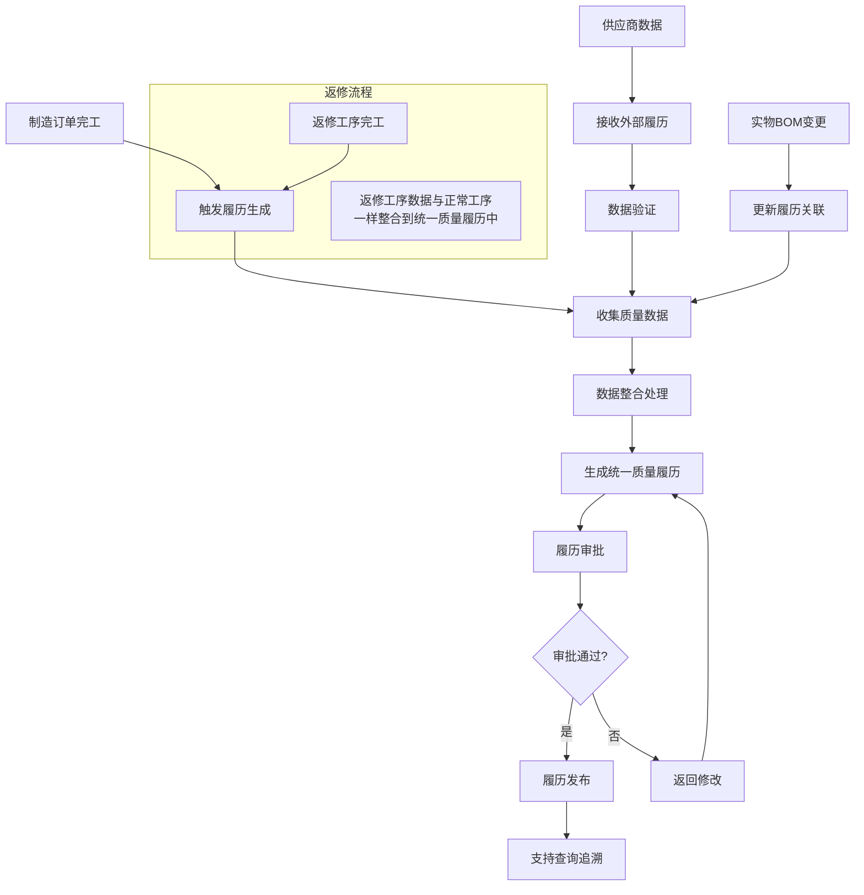
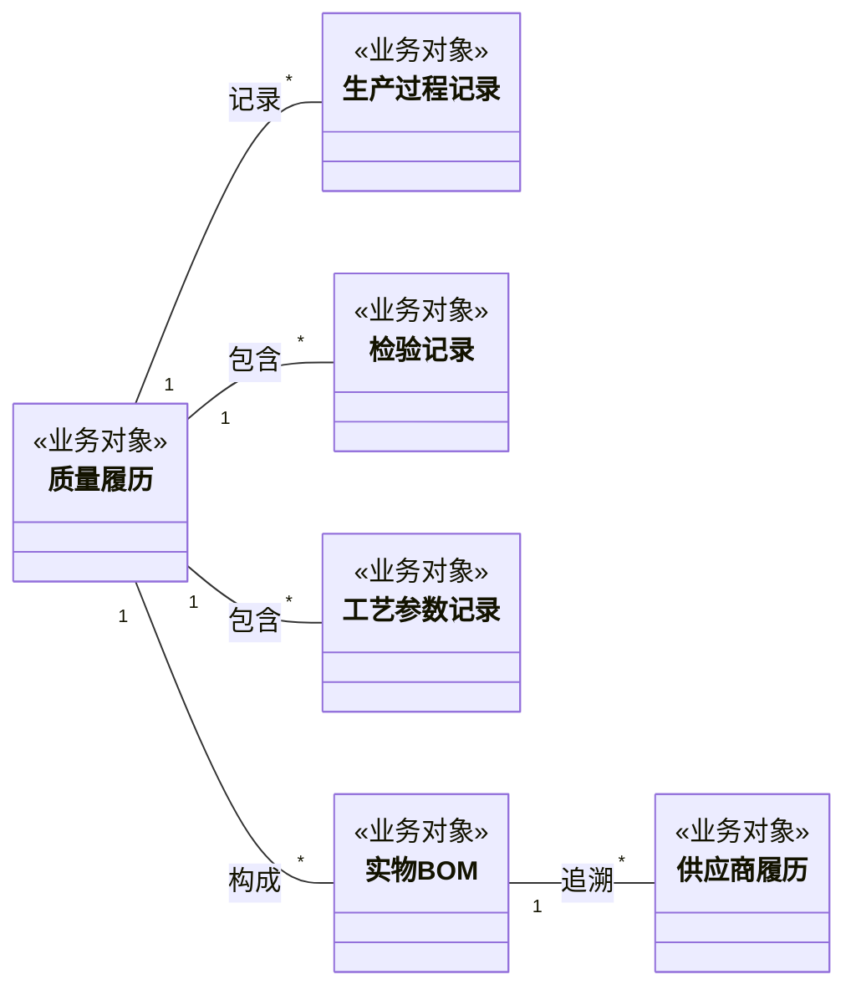
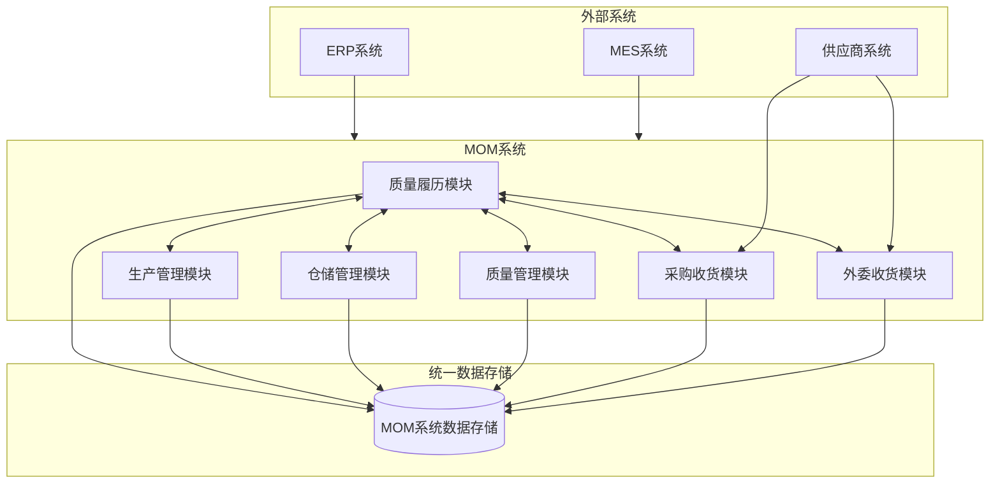

# DNW30520-质量履历 产品需求文档

## 文档信息

| 项目 | 内容 |
|------|------|
| 文档编号 | DNW30520 |
| 文档名称 | 质量履历产品需求文档 |
| 文档版本 | V1.0 |
| 创建日期 | 2024-12-19 |
| 最后更新 | 2024-12-19 |
| 文档状态 | 草稿 |
| 创建人 | 产品团队 |
| 审核人 | 待定 |
| 批准人 | 待定 |

---

## 1. 概述

### 1.1 原始需求

#### 1.1.1 需求来源
- **业务驱动**：制造企业对产品质量全生命周期管控的迫切需求
- **合规要求**：质量追溯法规和行业标准的强制性要求
- **客户需求**：客户对产品质量透明度和可追溯性的要求提升
- **内部管理**：企业内部质量管理体系优化和效率提升需求

#### 1.1.2 用户故事

**US001 - 质量工程师查看产品履历**
作为质量工程师，我希望能够快速查看任意产品的完整质量履历，以便进行质量分析和问题追溯。

**US002 - 生产管理者审批质量履历**
作为生产管理者，我希望能够审批和发布产品质量履历，以便确保质量数据的准确性和完整性。

**US003 - 客户服务人员提供质量证明**
作为客户服务人员，我希望能够向客户提供产品质量履历报告，以便增强客户信任和满意度。

**US004 - 供应链管理者追溯原料质量**
作为供应链管理者，我希望能够追溯到原料和零部件的质量信息，以便进行供应商质量管理。

**US005 - 质量主管分析质量趋势**
作为质量主管，我希望能够分析产品质量趋势和模式，以便制定质量改进策略。

#### 1.1.3 业务目标
- **提升质量管控能力**：建立端到端的产品质量追溯体系
- **降低质量风险**：及时发现和预防质量问题
- **提高客户满意度**：提供透明的质量信息服务
- **优化质量成本**：减少质量事故和召回成本
- **增强合规能力**：满足质量追溯法规要求

### 1.2 需求分析

#### 1.2.1 价值主张

**对企业的价值**：
- 建立完整的产品质量档案，提升质量管控水平
- 实现快速质量追溯，降低质量风险和成本
- 提供数据驱动的质量决策支持
- 增强质量合规能力和品牌信誉

**对用户的价值**：
- 质量工程师：提高质量分析效率，快速定位问题根因
- 生产管理者：实时掌握产品质量状态，及时决策
- 客户服务人员：提供专业的质量服务，提升客户满意度
- 供应链管理者：优化供应商质量管理，降低采购风险

#### 1.2.2 量化指标
- **质量追溯效率提升**：从2小时缩短到15分钟，提升87.5%
- **质量数据完整性**：达到95%以上的数据完整率
- **客户满意度提升**：质量服务满意度提升20%
- **质量成本降低**：质量事故处理成本降低30%
- **合规达成率**：质量追溯合规率达到100%

#### 1.2.3 成功标准
- 系统成功上线并稳定运行
- 用户培训完成率达到100%
- 核心功能验收通过率达到100%
- 用户满意度评分达到4.5分以上（5分制）
- 业务指标达成预期目标

### 1.3 用户画像

#### 1.3.1 主要用户角色

**质量工程师**
- **基本信息**：25-40岁，本科以上学历，质量管理相关专业
- **工作职责**：质量检验、质量分析、问题追溯、质量改进
- **使用场景**：日常质量检查、质量问题分析、客户投诉处理
- **痛点需求**：质量数据分散、追溯效率低、分析工具缺乏
- **使用频率**：每日多次使用，高频用户

**生产管理者**
- **基本信息**：30-50岁，本科以上学历，生产管理经验丰富
- **工作职责**：生产计划、质量监控、团队管理、决策制定
- **使用场景**：生产质量监控、质量决策、质量报告审批
- **痛点需求**：质量信息不及时、决策依据不足、管理效率低
- **使用频率**：每日使用，中高频用户

**客户服务人员**
- **基本信息**：22-35岁，大专以上学历，客户服务经验
- **工作职责**：客户咨询、投诉处理、质量证明提供
- **使用场景**：客户质量咨询、质量证明出具、投诉处理
- **痛点需求**：质量信息获取困难、响应速度慢、专业性不足
- **使用频率**：按需使用，中频用户

**供应链管理者**
- **基本信息**：28-45岁，本科以上学历，供应链管理背景
- **工作职责**：供应商管理、采购质量控制、供应链优化
- **使用场景**：供应商质量评估、原料质量追溯、供应商改进
- **痛点需求**：供应商质量信息不透明、追溯困难、管理成本高
- **使用频率**：定期使用，中频用户

#### 1.3.2 用户权限设计

| 用户角色 | 查看权限 | 操作权限 | 数据范围 |
|----------|----------|----------|----------|
| 质量工程师 | 质量履历查看、质量分析 | 质量数据录入、问题标记 | 负责产品线 |
| 生产管理者 | 全部质量履历、统计报表 | 履历审批、发布授权 | 管辖范围 |
| 客户服务人员 | 客户相关履历、质量证明 | 履历导出、报告生成 | 客户产品 |
| 供应链管理者 | 供应商履历、原料追溯 | 供应商数据维护 | 供应链范围 |
| 系统管理员 | 全部数据、系统配置 | 用户管理、系统配置 | 全系统 |

### 1.4 术语及缩写解释

#### 1.4.1 业务术语

| 术语 | 定义 | 说明 |
|------|------|------|
| 质量履历 | 产品从原料到成品全过程的质量记录档案 | 包含检验数据、工艺参数、人员信息等 |
| 质量追溯 | 通过质量记录追查产品质量问题根源的过程 | 支持正向和反向追溯 |
| 履历审批 | 对质量履历进行审核和批准的管理流程 | 确保数据准确性和完整性 |
| 实物BOM | 产品实际使用的物料清单 | 与设计BOM可能存在差异 |
| 供应商履历 | 供应商提供的原料或零部件质量证明 | 外部质量数据的重要来源 |

#### 1.4.2 技术术语

| 术语 | 定义 | 说明 |
|------|------|------|
| MOM系统 | 制造运营管理系统 | 质量履历的数据来源系统 |
| 数据整合 | 将分散的质量数据统一收集和处理 | 实现数据的标准化和一致性 |
| 端到端追溯 | 从原料到成品的完整追溯链条 | 覆盖全生命周期的质量管控 |

#### 1.4.3 缩写说明

| 缩写 | 全称 | 中文含义 |
|------|------|----------|
| QR | Quality Record | 质量记录 |
| QT | Quality Traceability | 质量追溯 |
| BOM | Bill of Materials | 物料清单 |
| MOM | Manufacturing Operations Management | 制造运营管理 |
| SPC | Statistical Process Control | 统计过程控制 |

### 1.5 参考文献

- 《质量管理体系要求 GB/T 19001-2016》
- 《产品质量追溯体系通用要求 GB/T 33993-2017》
- 《制造业质量管理数字化转型指南》
- 《MOM系统建设最佳实践》
- 《质量4.0：数字化时代的质量管理》

---

## 2. 需求描述

### 2.1 业务描述

#### 2.1.1 业务主流程

#### 2.1.2 业务流程描述

**主流程：质量履历生成与发布**
1. **触发条件**：制造订单（包括返修订单）完工或产品下线时自动触发
2. **数据收集**：从MOM系统收集生产过程（包括返修过程）中的质量数据
3. **数据整合**：将分散的质量数据（包括返修数据）按产品维度进行整合
4. **履历生成**：基于模板自动生成结构化的统一质量履历
5. **审批流程**：按权限级别进行履历审批和确认
6. **履历发布**：审批通过后正式发布并归档
7. **查询服务**：提供多维度的履历查询和追溯功能

**支流程：供应商履历接收**
1. **数据接收**：接收供应商提供的质量证明和履历数据
2. **数据验证**：验证外部数据的格式和完整性
3. **履历关联**：将供应商履历与相关产品履历建立关联

**支流程：构建实物BOM**
1. **BOM变更**：当实物BOM发生变更时触发
2. **关联更新**：更新质量履历与物料的关联关系
3. **履历重生**：必要时重新生成相关的质量履历

#### 2.1.3 使用场景设计

| 场景编号 | 场景名称 | 触发条件 | 参与角色 | 主要步骤 | 预期结果 |
|----------|----------|----------|----------|----------|----------|
| SC001 | 生成质量履历 | 制造订单完工 | 质量工程师 | 1.查找制造订单 2.生成质量履历 3.加入流程审批 | 质量履历生成 |
| SC002 | 履历审批发布 | 质量履历生成完成 | 生产管理者 | 1.审查履历内容 2.确认数据准确性 3.批准发布 | 履历正式发布 |
| SC003 | 日常质量查询 | 用户需要查看产品质量信息 | 质量工程师 | 1.输入产品标识 2.选择查询维度 3.查看履历详情 | 获得完整质量履历 |
| SC004 | 质量问题追溯 | 发现产品质量问题 | 质量工程师 | 1.定位问题产品 2.追溯生产过程（含返修） 3.分析根本原因 | 找到问题根源 |
| SC005 | 客户质量证明 | 客户要求质量证明 | 客户服务人员 | 1.查找客户产品 2.生成质量报告 3.提供给客户 | 客户获得质量报告 |
| SC006 | 供应商履历接收 | 收到供应商质量数据 | 供应链管理者 | 1.接收外部数据 2.验证数据有效性 3.关联产品履历 | 外部履历集成 |
| SC007 | BOM履历关联 | 实物BOM发生变更 | 生产管理者 | 1.识别BOM变更 2.更新履历关联 3.重新生成履历 | 履历关联更新 |
| SC008 | 质量趋势分析 | 定期质量分析需求 | 质量主管 | 1.选择分析维度 2.生成趋势报表 3.制定改进措施 | 质量改进方案 |

### 2.2 数据描述

#### 2.2.1 业务对象ER关系图

#### 2.2.2 数据字典

> **数据架构师注记：**
> 
> 为了确保质量履历的**不可变性**和**长期可追溯性**，本数据模型在与外部MOM系统模块（如物料、人员、订单等）交互时，采用了“数据快照”的设计原则。具体实现为：
> 
> 1.  **保留关联标识**: 存储关联对象的唯一业务标识（如 `产品标识`、`操作员标识`），用于保证数据的完整性和关系一致性，支持动态查询和系统集成。
> 2.  **冗余关键信息**: 同时存储关联对象在履历创建时刻的关键描述性信息（如 `产品名称`、`操作员名称`），并标记为 `(快照)`。
> 
> 这种设计旨在：
> - **规避风险**: 防止因外部主数据（如人员离职、物料换版）发生变更，导致历史履历信息丢失或不一致。
> - **提升性能**: 在查询履历详情时，无需实时关联多个外部系统，直接从履历本身获取完整信息，大幅提升查询效率。
> - **满足合规**: 确保质量履历作为一份独立的、自包含的、不可篡改的电子记录，满足质量管理和法规审计要求。

**质量履历**

| 字段名 | 业务类型 | 业务约束 | 业务说明 |
|---|---|---|---|
| 质量履历标识 | 业务标识 | 唯一，系统自动生成 | 质量履历的唯一业务标识 |
| 产品序列号 | 文本 | 必填，唯一 | 履历所对应产品的唯一序列号（SN） |
| 物料编码 | 业务标识 | 必填 | 关联的产品物料标识，来源：MOM-物料主数据 |
| 物料名称 | 文本 | 必填 | 产品的名称，来源：MOM-物料主数据 |
| 工艺编码 | 业务标识 | 必填 | 关联的工艺标识，来源：MOM-工艺路线 |
| 工艺名称 | 文本 | 必填 |  该物料的工艺名称，来源：MOM-工艺路线 |
| 履历状态 | 枚举 | 必填。可选值：创建、已发布| 质量履历的生命周期状态 |
| 创建时间 | 日期时间 | 必填，系统自动记录 | 履历记录的创建时间 |
| 生产单位标识 | 业务标识 | 可选 | 关联的生产单位标识，来源：MOM-组织主数据 |
| 生产单位名称 | 文本 | 可选 |  该物料的生产单位名称，来源：MOM-组织主数据 |
| 生产过程记录 | 关联对象 | 可选，一对多 | 关联的生产过程记录集合，详细记录生产过程 |
| 检验记录 | 关联对象 | 可选，一对多 | 关联的检验记录集合，详细记录质量检验过程 |
| 工艺参数记录 | 关联对象 | 可选，一对多 | 关联的工艺参数集合，记录关键工艺参数 |
| 实物BOM | 关联对象 | 可选，一对多 | 关联的实物BOM清单，记录产品的物料构成 |

**生产过程记录**

| 字段名 | 业务类型 | 业务约束 | 业务说明 |
|---|---|---|---|
| 过程记录标识 | 业务标识 | 唯一，系统自动生成 | 生产过程记录的唯一标识 |
| 制造订单号 | 文本 | 必填 |  生产该产品的制造订单号，来源：MOM-制造订单 |
| 工序任务标识 | 业务标识 | 必填 | 关联的工序任务标识，来源：MOM-工艺路线 |
| 工序任务名称 | 文本 | 必填 |  执行生产的具体工序任务名称，来源：MOM-工艺路线 |
| 检验任务标识 | 业务标识 | 必填 | 关联的检验任务标识，来源：MOM-工艺路线 |
| 检验任务名称 | 文本 | 必填 |  执行生产的具体检验任务名称，来源：MOM-工艺路线 |
| 设备标识 | 业务标识 | 可选 | 关联的设备标识，来源：MOM-设备台账 |
| 设备名称 | 文本 | 可选 |  执行工序任务所使用的设备名称，来源：MOM-设备台账 |
| 操作员标识 | 业务标识 | 必填 | 关联的操作员标识，来源：MOM-用户管理 |
| 操作员名称 | 文本 | 必填 |  执行工序任务的操作人员姓名，来源：MOM-用户管理 |
| 检验员标识 | 业务标识 | 必填 | 关联的检验员标识，来源：MOM-用户管理 |
| 检验员名称 | 文本 | 必填 |  执行工序任务的检验人员姓名，来源：MOM-用户管理 |
| 完工时间 | 日期时间 | 必填 | 工序任务的实际完成时间 |
| 是否返修工序 | 布尔 | 必填 | 标记此工序是否为返修工序 |
| 质量文件 | 文件 | 可选 |  生产过程中提供的质量附件，如图片 |

**检验记录**

| 字段名 | 业务类型 | 业务约束 | 业务说明 |
|---|---|---|---|
| 检验记录标识 | 业务标识 | 唯一，系统自动生成 | 检验记录的唯一业务标识 |
| 检验项目标识 | 业务标识 | 必填 | 关联的检验项目标识，来源：MOM-质量标准 |
| 检验项目 | 文本 | 必填 |  检验项目的名称，如：外观、尺寸、性能 |
| 检验项目描述 | 文本 | 必填 | 检验所依据的标准或规范 |
| 检验值 | 文本 | 必填 | 检验的量化或定性结果 |
| 判定结果 | 枚举 | 必填。可选值：合格、不合格、让步接收、待定、复检中 | 对检验结果的判定 |
| 检验时间 | 日期时间 | 必填 | 检验执行的时间 |
| 检验员标识 | 业务标识 | 必填 | 关联的检验员标识，来源：MOM-用户管理 |
| 检验员名称 | 文本 | 必填 |  执行检验的人员姓名，来源：MOM-用户管理 |
| 计量器具标识 | 业务标识 | 可选 | 关联的计量器具标识，来源：MOM-设备/工装台账 |
| 计量器具名称 | 文本 | 可选 |  使用的计量器具名称，来源：MOM-设备/工装台账 |
| 质量文件 | 文件 | 可选 | 检验过程中提供的质量附件，如图片 |

**工艺参数记录**

| 字段名 | 业务类型 | 业务约束 | 业务说明 |
|---|---|---|---|
| 工艺参数记录标识 | 业务标识 | 唯一，系统自动生成 | 工艺参数记录的唯一业务标识 |
| 工序任务标识 | 业务标识 | 必填 | 关联的工序任务标识，来源：MOM-工艺路线 |
| 参数标识 | 业务标识 | 必填 | 关联的工艺参数定义标识，来源：MOM-工艺标准 |
| 参数名称 | 文本 | 必填 |  工艺参数的名称，如：温度、压力 |
| 参数描述 | 文本 | 必填 |  工艺参数的详细描述，如：温度的单位为℃，压力的单位为MPa |
| 参数值 | 文本 | 必填 | 采集到的实际参数值 |
| 单位 | 文本 | 可选 | 参数值的单位，如：℃, MPa |
| 采集时间 | 日期时间 | 必填 | 参数被采集记录的时间 |
| 采集人标识 | 业务标识 | 可选 | 采集该参数的人员标识，来源：MOM-用户管理 |
| 采集人名称 | 文本 | 可选 | 采集该参数的人员姓名，来源：MOM-用户管理 |
| 采集设备标识 | 业务标识 | 可选 | 关联的采集设备标识，来源：MOM-设备/工装台账 |
| 采集设备名称 | 文本 | 可选 |  使用的采集设备名称，来源：MOM-设备/工装台账 |
| 质量文件 | 文件 | 可选 |  采集过程中提供的质量附件，如圆盘图 |

**实物BOM**

| 字段名 | 业务类型 | 业务约束 | 业务说明 |
|---|---|---|---|
| 实物BOM记录标识 | 业务标识 | 唯一，系统自动生成 | 实物BOM记录的唯一业务标识 |
| 物料标识 | 业务标识 | 必填 | 关联的父节点物料标识，来源：MOM-物料主数据 |
| 物料名称 | 文本 | 必填 |  构成产品的具体物料名称，来源：MOM-物料主数据 |
| 物料编码 | 文本 | 必填 |  构成产品的具体物料编码，来源：MOM-物料主数据 |
| 物料类型 | 文本 | 必填 |  物料类型，如：总成、部件、自制零件、外购件、原材料，来源：MOM-物料主数据 |
| 使用数量 | 数值 | 必填，大于0 | 该物料在单个产品中的使用数量 |
| 物料批次号 | 文本 | 可选 | 该物料的生产或采购批次号，用于追溯 |
| 物料序列号 | 文本 | 可选 | 该物料的生产或采购序列号，用于追溯 |

**供应商履历**

| 字段名 | 业务类型 | 业务约束 | 业务说明 |
|---|---|---|---|
| 供应商履历标识 | 业务标识 | 唯一，系统自动生成 | 供应商履历的唯一业务标识 |
| 收货记录标识 | 业务标识 | 必填 | 关联的收货记录标识，用于追溯到具体的物料收货记录 |
| 物料标识 | 业务标识 | 必填 | 关联的物料标识，来源：MOM-物料主数据 |
| 供应商标识 | 业务标识 | 必填 | 关联的供应商标识，来源：MOM-供应商主数据 |
| 供应商名称 | 文本 | 必填 |  提供该物料的供应商名称，来源：MOM-供应商主数据 |
| 质量证明文件 | 文件 | 可选 | 供应商提供的质量合格证明文件，如CoC |

### 2.3 功能描述

#### 2.3.1 整体应用架构

#### 2.3.2 模块/核心功能应用架构

graph TB
    subgraph "用户层"
        A[质量工程师]
        B[生产管理者]
        C[客户服务人员]
        D[供应链管理者]
    end
    
    subgraph "应用层"
        E[质量履历查询]
        F[履历审批发布]
        H[收料确认/装入物料]
        I[供应商履历接收]
        J[数据统计分析]
    end
    
    subgraph "服务层"
        L[履历生成服务]
        M[审批流程服务]
        N[追溯查询服务]
        O[报表生成服务]
    end
    
    subgraph "数据层"
        P[质量履历数据]
        Q[检验数据]
        R[工艺数据]
        S[BOM数据]
    end
    
    subgraph "集成层"
        T[MOM系统]
        U[ERP系统]
        V[供应商系统]
    end
    
    A --> E
    B --> F
    C --> E
    D --> I
    
    E --> N
    F --> M
    H --> L
    I --> L
    J --> O
    
    L --> P
    L --> Q
    L --> R
    L --> S

    M --> P
    N --> P
    O --> P
    
    L --> T
    L --> U
    I --> V

#### 2.3.3 功能清单

**核心功能模块**

| 功能编号 | 功能名称 | 功能描述 | 优先级 | 复杂度 |
|----------|----------|----------|--------|--------|
| F001 | 质量履历生成 | 根据生产过程（包括返修过程）数据，自动或手动生成产品的统一质量履历 | 高 | 高 |
| F002 | 质量履历查询 | 提供多维度质量履历查询和追溯功能 | 高 | 中 |
| F003 | 履历审批发布 | 支持质量履历的审批流程和正式发布 | 高 | 中 |
| F004 | 构建实物BOM | 构建实物BOM | 高 | 高 |
| F005 | 数据统计分析 | 质量数据的统计分析和报表生成 | 低 | 中 |

### 2.4 非功能性需求

#### 2.4.1 性能需求
- **查询响应时间**: 对于单个产品的质量履历，复杂查询（跨越多个生产阶段和BOM层级）的响应时间应在5秒以内；简单查询应在2秒以内。
- **数据处理能力**: 系统应能支持每日处理至少10,000份产品质量履历的生成和归档。
- **并发用户数**: 系统应支持至少100名用户同时在线进行查询、审批等操作，无明显性能下降。

#### 2.4.2 安全需求
- **数据访问控制**: 严格按照2.3.2节定义的用户权限进行数据隔离，确保用户只能访问其权限范围内的数据。
- **操作审计**: 所有对质量履历的关键操作（如创建、审批、发布、修改、删除）都必须被记录审计日志，日志需包含操作人、时间、IP地址和操作内容。
- **数据传输安全**: 用户端与服务器之间的数据传输必须使用HTTPS加密。

#### 2.4.3 易用性需求
- **界面直观性**: 质量履历的展示应清晰、结构化，关键信息（如不合格项、返修记录）应有醒目标识。
- **操作便捷性**: 查询操作应简单，支持扫码输入产品序列号。审批流程应提供一键式操作，并支持批量审批。
- **可配置性**: 履历模板、审批流程应支持管理员在界面上进行配置，以适应不同产品线的管理需求。

#### 2.4.4 兼容性需求
- **浏览器兼容性**: Web端应兼容主流浏览器（Chrome, Firefox, Edge）的最新两个版本。
- **操作系统兼容性**: 考虑到国产化要求，系统应能在麒麟OS等国产操作系统上正常运行和显示。

## 3. 页面&功能设计

### 3.1 质量履历生成模块

#### 3.1.1 履历生成页面

**页面功能**: 提供手动和自动生成质量履历的功能。

**主要功能点**:
-   根据制造订单完工信息自动触发履历生成。
-   支持手动选择制造订单生成履历。
-   显示履历生成过程的状态和日志。
-   提供履历生成失败的重试机制。

**界面布局**:
-   顶部：功能操作按钮（手动生成、刷新）。
-   中部：履历生成任务列表（显示订单号、状态、创建时间）。
-   底部：分页和任务统计。

- **业务规则**:
  - **触发方式**: 
    - **自动触发**: 当制造订单的最后一个工序完成并报工后，系统自动触发对应产品的质量履历生成流程。
    - **手动触发**: 允许质量工程师或生产管理者在特定情况下（如数据补录、异常处理）手动选择一个或多个产品序列号，为其生成质量履历。
  - **数据来源**: 
  - **生产过程记录**: 从MOM系统中获取与产品序列号关联的所有工序任务（包括返修工序）、操作员、设备、完工时间等信息。
  - **检验记录**: 从质量管理模块获取所有过程检验（IPQC）、完工检验（FQC）和返修后检验的检验项目、结果、检验员等数据。
  - **工艺参数**: 从设备数采或MES系统中获取所有工序（含返修工序）的工艺参数（如温度、压力、扭矩等）的实际采集值。
  - **实物BOM**: 获取该产品序列号实际装配的物料清单，包括物料批次号、供应商信息，以及返修过程中的物料更换记录。
  - **不合格信息**: 记录产品在生产和使用过程中出现的质量问题，包括问题描述、原因分析、处理方案和验证结果。
- **关键步骤**:
  1. **数据聚合**: 系统根据产品序列号，从不同数据源聚合所有相关的质量数据。
  2. **模板匹配**: 根据产品类型或客户要求，匹配预设的质量履历模板。
  3. **履历实例化**: 将聚合的数据填充到模板中，生成一份“草稿”状态的质量履历实例。
  4. **完整性校验**: 系统自动校验关键数据（如必要检验项目、BOM完整性）是否缺失，如有缺失则标记并通知相关人员。
  5. **进入审批**: 校验通过后，履历审核状态变更为“审核中”，并根据预设流程流转至第一级审批人。

**交互流程**:
1.  用户进入页面，默认显示最近的履历生成任务。
2.  用户可点击“手动生成”按钮，在弹窗中选择制造订单。
3.  系统后台执行数据收集、整合，并更新任务状态。
4.  用户可点击任务查看详细的生成日志。
5.  生成成功后，履历进入“待审批”状态。

### 3.2 质量履历查询模块

#### 3.2.1 履历查询页面

**页面功能**：提供质量履历的多维度查询和检索功能

**主要功能点**：
- 多维度查询（产品编号、订单号、批次号、时间范围等）
- 智能搜索和模糊匹配
- 履历详情完整展示
- 正向和反向质量追溯
- 多种格式数据导出

**界面布局**：
- 顶部：查询条件输入区域
- 中部：查询结果列表区域
- 右侧：快速筛选面板
- 底部：分页导航

**交互流程**：
1. 用户输入查询条件
2. 系统执行查询并返回结果
3. 用户可进一步筛选和排序
4. 点击履历记录查看详情

#### 3.2.2 履历详情页面

**页面功能**：展示质量履历的完整详细信息

**主要功能点**：
- 履历基本信息展示
- 检验记录详情
- 工艺参数详情
- 关联信息展示
- 追溯链条可视化
- 数据导出功能

**界面布局**：
- 左侧：履历信息导航树
- 中部：详细信息展示区域
- 右侧：操作按钮面板
- 底部：相关履历推荐

**交互流程**：
1. 从查询结果进入详情页面
2. 浏览履历的各项详细信息
3. 执行追溯分析或数据导出
4. 返回查询页面或查看相关履历

### 3.3 履历审批发布模块

#### 3.3.1 审批管理页面

**页面功能**：管理待审批的质量履历和审批流程

**主要功能点**：
- 待审批履历列表
- 审批状态管理
- 批量审批操作
- 审批历史查询
- 审批提醒功能

**界面布局**：
- 顶部：审批状态筛选
- 中部：待审批履历列表
- 右侧：批量操作面板
- 底部：审批统计信息

**交互流程**：
1. 查看待审批履历列表
2. 选择履历进行审批
3. 填写审批意见
4. 提交审批结果
5. 系统更新履历状态

#### 3.3.2 发布管理页面

**页面功能**：管理质量履历的发布和版本控制

**主要功能点**：
- 已审批履历列表
- 发布操作执行
- 版本历史管理
- 发布状态跟踪
- 发布通知功能

**界面布局**：
- 顶部：发布状态筛选
- 中部：履历发布列表
- 右侧：发布操作面板
- 底部：发布统计图表

### 3.4 构建实物BOM模块

#### 3.4.1 实物BOM构建与管理

**页面功能**: 提供实物BOM的构建、查看、和版本管理功能。

**主要功能点**:
-   根据已完工的制造订单，自动生成实物BOM。
-   支持手动为已完工订单生成或修正实物BOM。
-   提供实物BOM与设计BOM的差异比对功能。
-   提供BOM的查询与导出功能。

**界面布局**:
-   顶部：功能操作按钮（手动生成、差异比对、导出）。
-   中部：实物BOM列表（按订单、产品等维度）。
-   右侧：选中BOM的树状结构详情。

- **业务规则**:
  - **触发方式**: 
    - **自动触发**: 制造订单**完工**后，系统自动触发实物BOM的生成流程。
    - **手动触发**: 允许质量或工艺工程师在数据补录或异常处理时，手动为已完工订单生成或修正实物BOM。
  - **数据来源**: 
    - **最终投料清单**: 从MES或WMS获取该订单所有工位上料的最终记录，包含物料批次、数量、供应商等。
    - **设计/工艺BOM**: 作为校验基准，用于比对实际用料与标准用料的差异。
    - **返修/换料记录**: 汇总生产过程中所有的物料更换记录。
  - **关键步骤**:
    1. **数据采集**: 订单完工后，系统根据订单号，一次性从相关系统（MES, WMS）采集所有实际用料数据。
    2. **BOM生成**: 系统基于采集到的实际用料数据，直接构建出最终的实物BOM结构。
    3. **差异分析**: 系统将生成的实物BOM与标准的工艺BOM进行比对，自动标识出用料差异（如替代、增减）。
    4. **版本确认与锁定**: 生成的实物BOM经确认后被最终锁定，作为该产品（序列号）的永久制造记录。

**交互流程**:
1.  用户进入页面，可查询已生成的实物BOM。
2.  用户可选择一个已完工但未生成BOM的订单，点击“手动生成”。
3.  系统后台执行数据采集和BOM生成，并更新列表状态。
4.  用户选择任意一个实物BOM，可查看其详细结构和与设计BOM的差异。

### 3.5 数据统计分析模块

#### 3.5.1 统计报表页面

**页面功能**：提供质量数据的统计分析和报表生成

**主要功能点**：
- 质量趋势分析
- 问题统计分析
- 自定义报表生成
- 图表可视化展示
- 报表导出功能

**界面布局**：
- 左侧：分析维度选择
- 中部：图表展示区域
- 右侧：数据详情面板
- 底部：报表操作工具

### 3.6 系统管理模块

#### 3.6.1 用户管理页面

**页面功能**：管理系统用户账号和权限配置

**主要功能点**：
- 用户账号管理
- 角色权限配置
- 用户组织架构
- 权限分配管理
- 用户状态管理

**界面布局**：
- 左侧：组织架构树
- 中部：用户列表区域
- 右侧：权限配置面板
- 底部：操作按钮组

#### 3.6.2 系统配置页面

**页面功能**：配置系统运行参数和业务模板

**主要功能点**：
- 系统参数配置
- 履历模板管理
- 审批流程配置
- 数据字典维护
- 系统监控管理

**界面布局**：
- 左侧：配置分类导航
- 中部：配置项详情
- 右侧：配置说明面板
- 底部：保存操作按钮

---

*本文档版权归公司所有，未经授权不得复制或传播。*