# **DNW30610****-计算引擎/计划排程（AS）**

# 1. **概述**

## 1.1 **原始需求**

作为离散制造（机加/装配专业）企业的生产计划员，在多品种小批量的生产模式下，我需要一种高效的计划排程方式来安排生产任务。当前痛点在于，人工排程效率低下且容易出错，面对复杂的订单优先级、剩余时间、资源约束等因素时，难以快速制定合理的排程方案，导致生产计划无法按时达成，影响交付效率和企业效益。例如，在面对紧急插单时，很难快速调整排程，还可能出现资源冲突、任务等待时间过长等问题。

**[排产场景_20231024.xlsx]**

https://doc.weixin.qq.com/sheet/e3_AQwAPQa8AMYx0LQHua8RcSrVAWn9L?scode=AJ4ArgcRAE04floyVDAQwAPQa8AMY

## 1.2 **需求分析**

**需求原因及本质**：离散制造多品种小批量的特点使得生产计划排程复杂，需要综合考虑多种因素。需求的本质是通过信息化手段优化计划排程，提高生产效率和资源利用率，确保订单按时交付。

**信息化系统的价值**：MOM系统的计划排程功能可以根据订单优先级、剩余时间、资源状况等因素自动计算并生成合理的排程方案，大大提高排程效率和准确性。能够实时监控资源负荷，及时发现并解决资源冲突问题，有效缩短任务平均等待时长和资源平均空闲时长，提升计划按时达成率。

**友商解决方案**：部分友商通过引入高级计划与排程（APS）系统解决计划排程问题，利用先进的算法实现智能排程。但由于缺乏相关公开资料，暂无法提供参考文献链接。

## 1.3 **术语及缩写解释**

**MOM系统**：制造运营管理系统，符合ISA-95 L3标准，用于整合和管理制造企业的生产运营活动。

**APS**：高级计划与排程（Advanced Planning and Scheduling），通过优化算法对生产任务进行合理排程。

**BOM**：物料清单（Bill of Materials），描述产品所需的原材料、零部件及装配关系等信息。

## 1.4 **参考文献**

暂无相关参考文献。

# 2. **需求描述**

## 2.1 **业务描述**

**业务流程**：生产计划员根据订单信息（包括订单优先级、剩余制造时间等），在系统中选择排程订单、方案，系统启动排程计算。计算完成后，展示排程结果（包括订单甘特图、资源甘特图、资源负荷图等），生产计划员对排程结果进行审核，若有问题则调整排程方案、基础数据重新计算，若无问题则发布结果并将任务下达至生产环节。

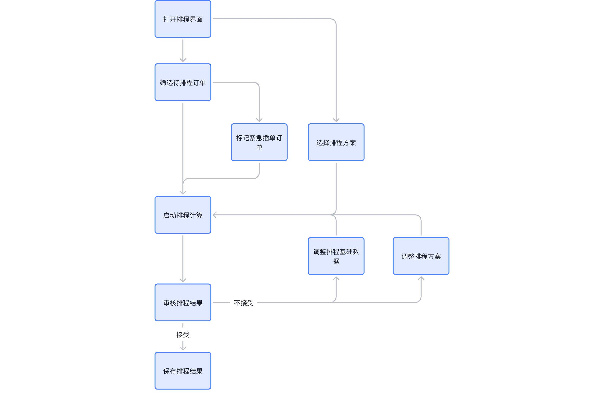

**业务流程步骤详情**

|流程步骤 | 涉及角色 | 输入业务对象 | 输出业务对象 | 关键业务规则 | 主要考虑点|
|--- | --- | --- | --- | --- | ---|
|筛选待排程订单 | 生产计划员 | 全部订单信息 | 待排程订单 |  | 数据量较大|
|标记紧急插单订单 | 生产计划员 | 待排程订单 | 紧急插单标记 |  | 方便筛选、打标|
|选择排程方案 | 生产计划员 | 全部的排程方案 | 选中的排程方案 |  | |
|启动排程计算 | 生产计划员 | 选择的排程订单、任务； 基础数据。 | 排程结果 | 遵循排程算法，考虑订单和资源约束 | 计算的准确性和效率|
|审核排程结果 | 生产计划员 | 排程结果 | 审核意见 | 检查排程结果是否满足生产需求 | 结果展示方便查看； 异常结果突出显示。|
|调整排程基础数据 | 生产计划员 | 修改指令 | 修改后的基础数据 |  | |
|调整排程方案 | 生产计划员 | 修改指令 | 修改后的排程方案 |  | |
|调整排程数据或保存结果 | 生产计划员 | 保存指令 | 保存的排程结果 | 更新任务的资源、时间 | 排程期间任务状态发生变化后的异步处理|

**已覆盖的场景**：

排程的基本框架（主要操作流程、基础展示页面）

排程静态数据（本次未作修订，尤其是涉及MBOM部分会发生变化，整体梳理中）；

排程动态数据（订单、任务）准备；

排程方案定义、使用；

排程计算基本逻辑（排序）

排程数据回写

**不成熟或未覆盖的场景**：

本文档仅描述基于规则排程的需求、不涉及多目标优化算法；

目前仅覆盖离散机加或类机加排程基本逻辑，不涉及热加工、装配；

各甘特图，找到标准组件，有即可；

暂不考虑排程结果调整、含甘特图拖拽。

## 2.2 **功能描述**

### 2.2.1 **整体应用架构**

本次主要涉及制造计划、制造任务台。

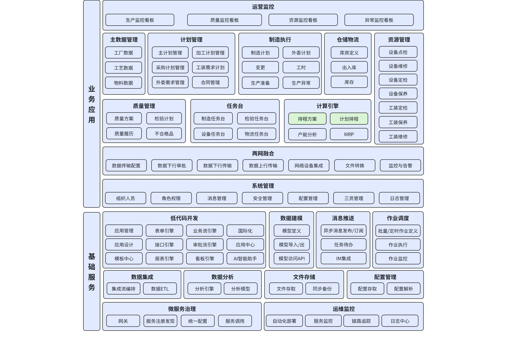

### 2.2.2 **制造计划&制造任务台应用架构**

 制造计划、制造任务台进一步细化展开到页面、业务功能一级

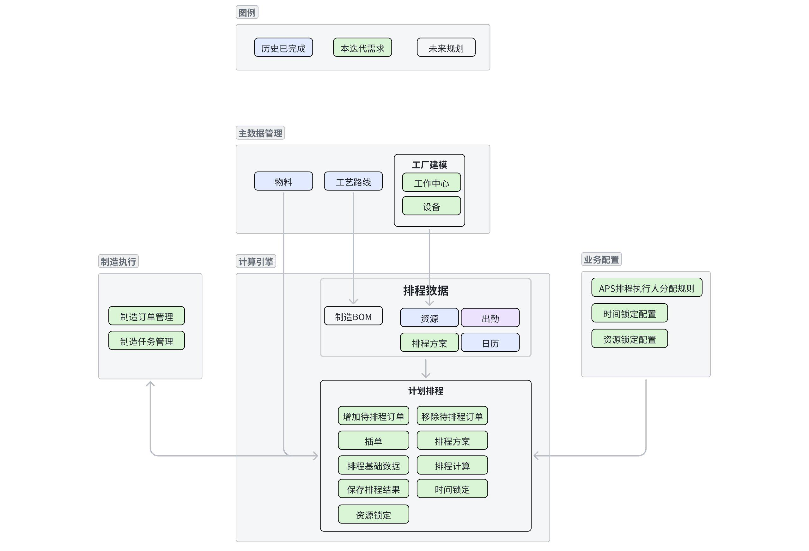

### 2.2.3 **功能清单**

|模块 | 页面 | 功能点 | 功能点描述|
|--- | --- | --- | ---|
|制造执行 | 制造订单管理 | 增加“计划排程”按钮 | 打开计划排程界面|
|计算引擎 | 计划排程-排程定义 | 增加待排程订单 | 打开制造订单管理界面，增加待排程订单|
|计算引擎 | 计划排程-排程定义 | 移除待排程订单 | 移除待排程订单|
|计算引擎 | 计划排程-排程定义 | 插单 | 用于确认人工选择的订单参与紧急插单逻辑排程|
|计算引擎 | 计划排程-排程定义 | 排程方案 | 点击打开排程方案选择列表，选择由排程方向、排序规则、资源分派策略、约束优先级组成的排程方案|
|计算引擎 | 计划排程-排程定义 | 排程基础数据 | 点击打开各排程基础数据|
|计算引擎 | 计划排程-排程定义 | 时间锁定 | 锁定任务的时间|
|计算引擎 | 计划排程-排程定义 | 资源锁定 | 锁定任务的资源|
|计算引擎 | 计划排程-排程定义 | 排程计算 | 根据选择的排程方案和输入的筛选条件，启动排程计算|
|计算引擎 | 计划排程-结果展示 | 订单甘特图展示 | 以甘特图形式展示订单的计划开始时间、计划结束时间等信息|
|计算引擎 | 计划排程-结果展示 | 资源甘特图展示 | 展示各资源的任务分配时间和空闲时间|
|计算引擎 | 计划排程-结果展示 | 资源负荷图展示 | 呈现各资源的负荷情况|
|计算引擎 | 计划排程-结果展示 | 已成功排程订单 | 展示所有已成功排程订单|
|计算引擎 | 计划排程-结果展示 | 已成功排程任务 | 展示所有已成功排程任务|
|计算引擎 | 计划排程-结果展示 | 有约束冲突订单 | 展示所有已成功排程但存在未完全遵循约束的订单|
|计算引擎 | 计划排程-结果展示 | 排程失败订单 | 展示所有排程失败的订单|
|计算引擎 | 计划排程-结果展示 | 发布结果 | 确认并发布结果|
|计算引擎 | 日历 | 查询、编辑 | 用于调整日历数据|
|计算引擎 | 出勤 | 查询、编辑 | 用于调整出勤数据|
|计算引擎 | 制造BOM | 查询、编辑 | 用于调整制造BOM数据|
|计算引擎 | 资源 | 查询、编辑 | 用于调整资源数据|
|计算引擎 | 排程方案 | 查询、编辑 | 用于调整排程方案|
|计算引擎 | 排程方案 | 排序规则定义 | |
|计算引擎 | 排程方案 | 资源分派策略定义 | |
|计算引擎 | 排程方案 | 约束优先级组合定义 | |
|主数据 | 物料 | 查询 | 用户查询物料数据|

# 3. **页面&功能设计**

## 3.1 **制造订单管理**

**界面**

**界面结构**：原“制造订单管理”页面；

中上部：功能按钮区，增加“计划排程”。

## 3.2 **计划排程**

### 3.2.1 ** 增加计划排程主页面**

概述：计划排程主页面设计。

**界面-计划排程**

**界面结构**：

顶部：新增“计划排程”页面，页面分“排程定义”（打开默认显示）、“结果展示”两个标签页；

中部：根据顶部标签页显示对应的内容；

底部：设置“取消”、“发布结果”按钮。

**交互内容**：用户在“制造订单管理”界面点击“排程”按钮，或在导航栏点击“计划排程”，弹出“计划排程”页面。

### 3.2.2 ** 增加计划排程-排程定义页面**

概述：计划排程-排程定义页面设计。

**界面-计划排程-排程定义**

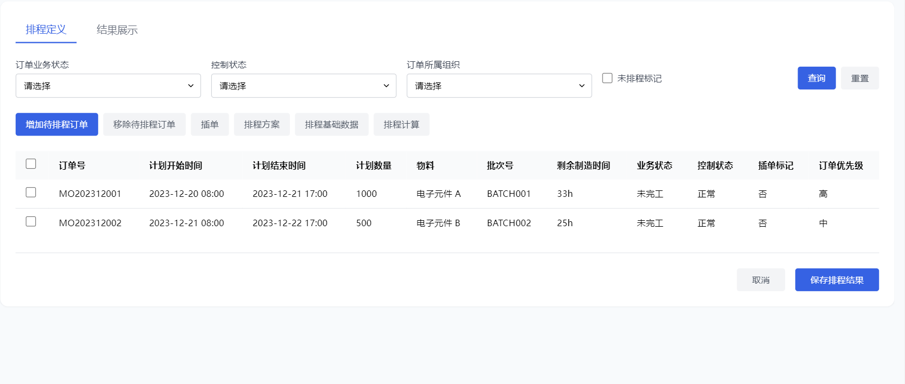

**界面结构**：

顶部：数据筛选区，包括所属工厂（下拉选择框，根据当前用户权限加载对应工厂列表）、订单业务状态（下拉选择框，选项有未完工、已完工等）、控制状态（下拉选择框，选项有正常、异常等）、排程标记；在筛选条件后增加“查询”、“重置”按钮。

中上部：功能按钮区，包含“增加待排程订单”、“移除待排程订单”、“插单”、“排程方案”、“排程基础数据”、“排程计算”；

中部：制造订单列表，最左侧时复选框，右侧是订单属性主要包含订单号、计划开始时间、计划结束时间、计划数量、物料、批次号、业务状态、控制状态、插单标记、排程标记、订单优先级。

**交互内容**：打开“计划排程”页面默认显示“排程定义”界面，或点击“排程定义”从“结果展示”切换到“排程定义”界面。在输入框中选择或输入筛选条件后，点击“查询”按钮更新订单列表。

### 3.2.3 ** 增加计划排程-结果展示页面**

概述：计划排程-结果展示页面设计。

**界面-计划排程-结果展示**

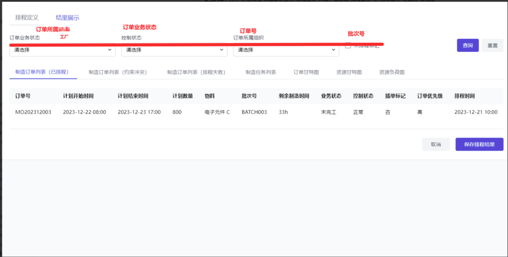

**界面结构**：新增“计划排程”页面，页面分“排程定义”、“结果展示”两个标签页；

顶部：功能按钮区，包含发布按钮，更新范围：未派工、自动派工、手工派工；

中上部：数据筛选区，包括所属工厂，业务状态（下拉选择框，选项有未完工、已完工等）、订单号，批次号；及针对筛选区的重置、查询按钮；

中下部：子标签页，包含“制造订单列表（已排程）”、“制造订单列表（约束冲突）”、“制造订单列表（排程失败）”、“制造任务列表”、“订单甘特图”、“资源甘特图”、“资源负荷图”；

**交互内容**：排程计算完毕后默认显示“结果展示”界面，或点击“结果展示”从“排程定义”切换到“结果展示”界面,包含如下标签页。

制造订单列表（已排程）；

制造订单列表（约束冲突）；

制造订单列表（排程失败）；

制造任务列表；

订单甘特图；

资源甘特图；

资源负荷图。

**校验规则**：订单所属组织必须选择一个有效选项；输入框输入内容长度符合数据库字段限制。

网格列中的【剩余制造时间】列，4月批次不考虑展示

### 3.2.4 ** 增加待排程订单**

概述：打开制造订单管理界面，增加待排程订单。

**界面-增加待排程订单**

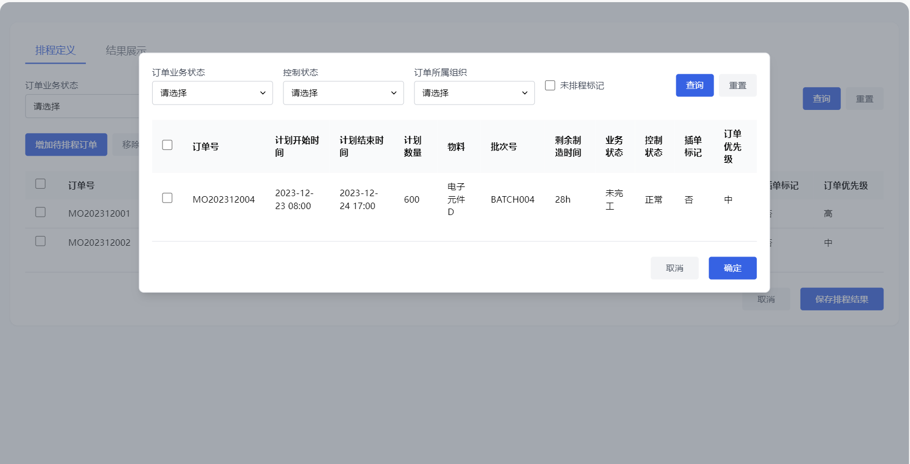

**界面结构**：

顶部：数据筛选区，包括所属工厂、订单业务状态（下拉选择框）、控制状态（下拉选择框，选项有正常、异常等）、排程标记；在筛选条件后增加“查询”、“重置”按钮。

中部：制造订单列表，最左侧是复选框，右侧是订单属性主要包含订单号、计划开始时间、计划结束时间、计划数量、物料、批次号、业务状态、控制状态、排程标记、订单优先级。

底部：设置“确定”和“取消”按钮。

**交互内容**：用户在“计划排程”页面点击增加待排程订单”按钮，打开弹框，根据筛选条件显示制造订单列表，勾选数据行（支持批量勾选），点击“确定”增加待排程订单，点击“取消”则取消勾选、关闭当前页。

**校验规则**：无。

**输入**：待排程订单的选中操作。

**输出**

**输出业务对象**：无。

**业务属性变化**：订单增加“待排程订单”标记。

**处理逻辑**：

**结构化文本描述**：点击“确定”时，校验是否存在于“待排程订单”列表中，不存在时将对应订单的编号标记为“待排程订单”；存在时忽略校验，完成标记后集中提示“XXX订单已存在”。

**mermaid图形展示**：

|flowchart TD
A[点击“确定”] --> B{校验是否存在于\n“待排程订单”列表中?}
B -->|不存在| C[将订单编号保存到\n“待排程订单”列表]
C --> D[完成保存]
B -->|存在| E[忽略校验]
E --> D
D --> F[集中提示“XXX订单已存在”]|
|---|

### 3.2.5 ** 移除待排程订单**

概述：移除待排程订单。

**界面-移除待排程订单**

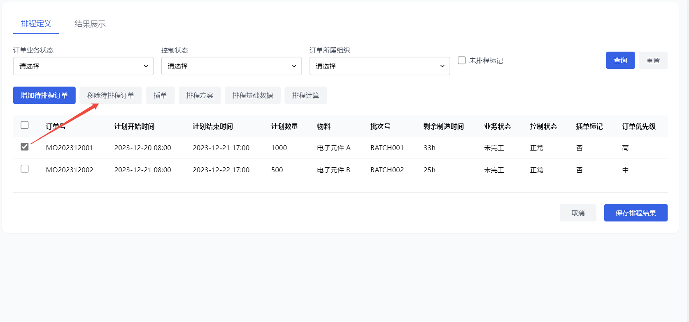

**界面结构**：无。

**交互内容**：用户“计划排程界面”制造订单列表，勾选数据行（支持批量勾选），点击“移除待排程订单”按钮，获取对应订单的编号，将订单从待排程订单中移除。

**校验规则**：无。

**输入**：待排程订单的选中操作。

**输出**

**输出业务对象**：无。

**业务属性变化**：订单移除“待排程订单”标记。

**处理逻辑**：

**结构化文本描述**：系统监听“移除待排程订单”按钮的点击事件；点击时，获取对应订单的编号，移除“待排程订单”标记。

**mermaid图形展示**：

### 3.2.6 ** 插单**

概述：用于确认人工选择的订单参与紧急插单逻辑排程。

**界面-插单**

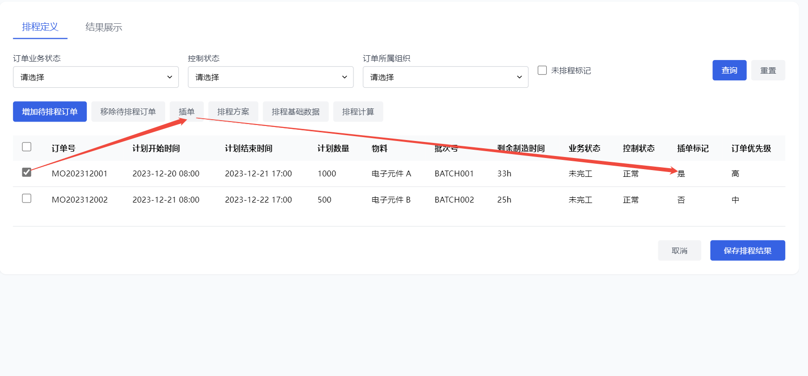

**界面结构**：无。

**交互内容**：生产计划员“计划排程”页面，选中订单行，点击“插单”按钮，标记为紧急插单的订单，再次点击则取消标记。

**校验规则**：无。

**输入**：待排程订单的选中操作。

**输出**

**输出业务对象**：无。

**业务属性变化**：订单的紧急插单标记属性更新为已标记。

**展现形式**：在订单信息展示区域，已标记紧急插单的订单增加黄色Tag标记，以便区分。

**处理逻辑**：

**结构化文本描述**：系统监听“标记紧急插单”按钮的点击事件；点击时，获取对应订单的编号，更新数据库中该订单的紧急插单标记字段为是；刷新订单信息展示区域，突出显示已标记的紧急插单订单。

**mermaid图形展示**：

|Plain Text
graph TD;
A[点击标记紧急插单按钮] --> B[获取订单编号];
B --> C[更新数据库标记字段];
C --> D[刷新订单展示区域突出显示];|
|---|

**验收标准**

**边界条件**：重复标记同一订单时，系统不进行重复操作，仅切换选中订单状态。

**验收标准**：标记功能正常，订单标记状态准确更新并在页面正确展示。

### 3.2.7 **排程方案**

概述：点击打开排程方案选择列表，选择由排程方法、排程方向、排序规则、资源分派策略、约束优先级组成的排程方案。

**界面-排程方案**

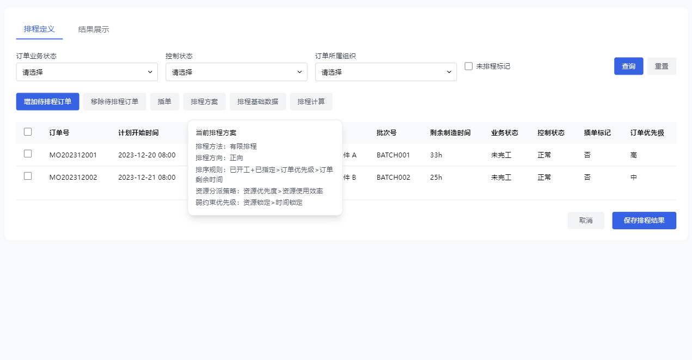

**界面结构**：

鼠标移动到“排程方案”，显示当前方案的内容；

点击“排程方案”按钮后，弹出排程方案选择窗口。窗口内以列表形式展示各种排程方案选项，每个选项详细列出排程方法（有限、无限）、排程方向（正向、逆向、逆向 - 允许转正向）、排序规则组合（内置排序规则如已开工+已指定、已开工等，扩展规则如订单优先级、订单剩余时间等，使用>连接）、资源分派策略组合（资源优先度、资源使用效率等，使用>连接）、弱约束优先级的排序顺序（资源锁定、时间锁定等，根据优先级，使用>连接）；

每个排程方案后设置编辑按钮。

窗口底部设置“确定”和“取消”按钮。

**交互内容**：用户点击“选择排程方案”按钮弹出窗口；在列表中选择一个排程方案后（列表中数据过滤：方案的组织=当前用户的组织），点击“确定”按钮提交选择，点击“取消”按钮关闭窗口且不提交选择；点击“编辑”打开排程方案编辑界面。

**校验规则**：必须选择一个有效的排程方案选项；排程方案中的各参数设置符合系统预设范围（如排序规则选择有效规则）。

**输入**：选中的排程方案（包括排程方向、排序规则、资源分派策略、弱约束优先级等参数）。

**输出**

**输出业务对象**：选中的排程方案。

**业务属性变化**：无。

**展现形式**：在制造订单管理页面记录当前选中的排程方案，并在后续排程计算中应用该方案。

**处理逻辑**：

**结构化文本描述**：系统接收用户选择的排程方案；将选中方案的参数保存到系统临时变量；关闭排程方案选择窗口。

**mermaid图形展示**：

|Plain Text
graph TD;
A[用户选择排程方案] --> B[保存方案参数到临时变量];
B --> C[关闭选择窗口];|
|---|

**验收标准**

**边界条件**：未选择任何排程方案直接点击“确定”按钮，系统提示“请选择一个排程方案”；选择无效排程方案（如自定义非法排序规则）时，系统提示“排程方案参数无效，请重新选择”。

**验收标准**：排程方案选择功能正常，能够准确保存用户选择的方案参数；校验规则生效，对无效选择进行正确提示。

### 3.2.8 **排程基础数据**

概述：点击打开各排程基础数据。

**界面-排程基础数据**

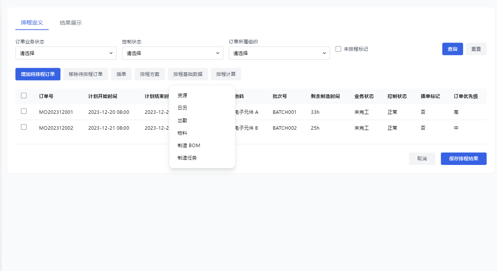

**界面结构**：无。

**交互内容**：

鼠标移动到“排程基础数据”，显示排程基础数据项，包含：“资源”“日历”“出勤”“物料”“制造BOM”、“制造任务”；

点击不同选项，打开对应的数据对象编辑页面。

**输入**：需要修改的排程基础数据。

**输出**

**输出业务对象**：更新后的排程基础数据。

**业务属性变化**：排程基础数据在数据库中的对应记录更新。

**展现形式**：在调整排程基础数据页面展示修改后的数据；后续排程计算时，使用更新后的数据。

**处理逻辑**：

**结构化文本描述**：系统接收用户在编辑区域的修改操作；获取修改后的数据；根据数据类型（资源、日历等）更新数据库中对应的排程基础数据记录；提示用户修改成功或失败信息。

**mermaid图形展示**：

|Plain Text
graph TD;
A[用户修改数据] --> B[获取修改后数据];
B --> C[更新数据库记录];
C --> D[提示修改结果];|
|---|

**验收标准**

**边界条件**：输入非法数据（如负的资源数量）时，系统提示“输入数据非法，请重新输入”；保存操作时网络中断，提示“保存失败，请检查网络连接后重试”。

**验收标准**：数据调整功能正常，能够准确更新数据库中的排程基础数据；校验规则生效，对非法数据进行正确提示。

### 3.2.9 **排程基础数据-制造任务**

概述：查询、锁定制造任务。

**界面-排程基础数据-制造任务**

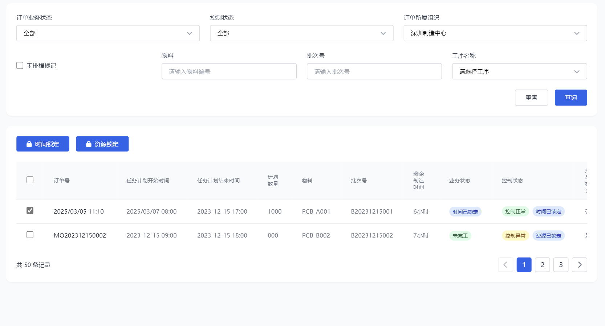

**界面结构**：

顶部：数据筛选区，包括订单业务状态（下拉选择框，选项有未完工、已完工等）、控制状态（下拉选择框，选项有正常、异常等）、订单所属组织（下拉选择框，根据当前用户权限加载对应组织列表）、***排程标记（可以不要）、***物料、批次号、工序名称（可参考制造任务管理筛选框）。在筛选条件后增加“查询”、“重置”按钮。

中部：功能按钮区，“时间锁定”、“资源锁定”；

下部：制造任务列表，属性主要包含订单号、任务计划开始时间、任务计划结束时间、计划数量、物料、批次号**、*****剩余制造时间（本次暂不考虑）****、*业务状态、控制状态、时间锁定标记、资源锁定标记、插单标记、订单优先级、任务号、排程资源。

**交互内容**：

鼠标移动到“排程基础数据”，点击“制造任务”，打开“排程基础数据-制造任务”；

默认根据待排程订单展示已生成任务（未开工）的列表；

点击查询基于根据待排程订单的范围，结合筛选框条件查询；

排程计算后，数据按最新排程结果更新。

### 3.2.10 **时间锁定**

概述：锁定任务的时间。

**界面-排程基础数据**

**界面结构**：排程基础数据-制造任务页面。

**交互内容**：

排程基础数据-制造任务页面选中单个任务，点击时间锁定，弹框显示任务的计划起止时间（只读），锁定开始时间（正向排程时显示）、锁定结束时间（逆向排程时显示），锁定时长（分钟）

输出：

确定后将修改后时间回写到任务的起止时间；***（实际存储的是开始时间、时长）***

标记任务为“时间已锁定”

校验：

强校验：锁定失败；

计划结束时间>计划开始时间；

计划结束时间>当前时间；

弱校验：给提示，经人确认后继续执行；

计划开始、结束时间在出勤时间外；

起止时间区间≠工序加工时长；

计划结束时间>订单计划结束时间。

排程基础数据-制造任务页面选中多个任务，点击时间锁定，默认值为已有时间；无默认值或参考上述强校验失败，不进行标记。

### 3.2.11 **资源锁定**

**界面-排程基础数据 **

**界面结构**：排程基础数据-制造任务页面。

**交互内容**：

排程基础数据-制造任务页面选中单个任务，点击资源锁定，弹框显示任务的执行资源，可修改，默认值为已有已有；

输出：

确定后将修改后资源回写到任务的执行资源；

标记任务为“资源已锁定”

校验：无

排程基础数据-制造任务页面选中多个任务，点击资源锁定，默认值为已有资源；无默认值或参考上述强校验失败，不进行标记。

### 3.2.12 **排程计算**

概述：根据选择的排程方案和输入的筛选条件，启动排程计算。

**界面-排程计算**

**界面结构**：点击“排程计算”按钮后，页面出现加载动画，提示“排程计算中，请稍候...”。计算完成后，自动跳转到计划排程-结果展示。

**交互内容**：生产计划员点击“排程计算”按钮触发计算操作；在计算过程中，用户可等待计算完成，无法进行其他操作；计算完成后，用户可在计划排程-结果展示查看结果。

**校验规则**：必须已选择排程方案且筛选出待排程订单后，“排程计算”按钮才可点击；计算过程中网络中断或出现异常，系统提示错误信息。

**输入**：待排程订单列表、选中的排程方案、排程基础数据（从主数据管理模块获取制造BOM等基础数据，从资源管理模块获取资源信息）。

**输出**

**输出业务对象**：排程结果（包括已成功排程订单、已成功排程任务、订单甘特图、资源甘特图、资源负荷图、有约束冲突订单、排程失败订单等）。

**业务属性变化**：订单和任务的计划开始时间、计划结束时间等属性更新；资源的占用时间和空闲时间属性更新。

**展现形式**：在计划排程-结果展示以多种形式展示，如订单甘特图以图表形式展示订单时间进度，资源甘特图展示资源任务分配和空闲情况，资源负荷图展示资源负荷状况，订单和任务以列表形式展示详细信息。

**处理逻辑**：

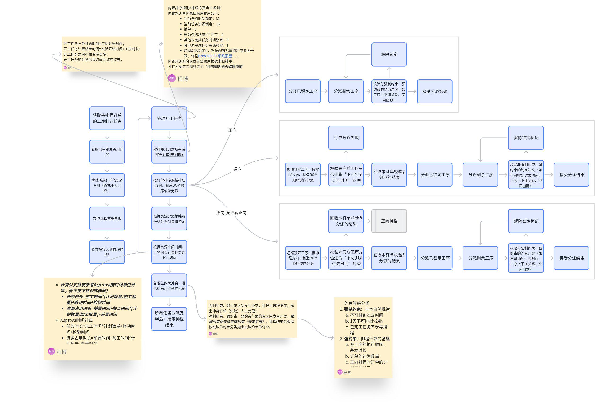

**结构化文本描述**：

获取待排程订单的工序制造任务。

获取已有资源占用情况。

清除所选订单的资源占用（避免重复计算）。

获取排程基础数据。

将数据导入到排程模型。

处理开工任务

开工任务计算开始时间=实际开始时间；

开工任务计算结束时间=实际开始时间+工序时长；

开工任务之间不做资源竞争；

开工任务的计划结束时间允许在过去。

按排序规则对所有待排程**订单进行排序**。

内置排序规则>排程方案定义规则；

内置规则单优先级顺序排序如下：

当前任务时间锁定：32

当前任务资源锁定：16

插单：8

当前任务状态=已开工：4

其他未完成任务时间锁定：2

其他未完成任务资源锁定：1

时间&资源锁定，根据配置批量锁定或界面干预，详见。

内置规则组合后优先级顺序根据求和排序。

排程方案定义规则详见“**排序规则组合编辑页面**”

按订单排序遵循排程方向、制造BOM顺序依次分派。

正向

分派已锁定工序；

分派剩余工序；

校验与强制约束、强约束的约束冲突（如工序上下道关系、空闲出勤）；

通过：接受分派结果；

不通过：忽略锁定标记，重新分派；

逆向

忽略锁定工序，按排程方向、制造BOM顺序逆向分派；

校验未完成工序是否违背“不可排到过去时间”约束；

通过：

回收本订单校验前分派的结果；

分派已锁定工序；

分派剩余工序；

校验与强制约束、强约束的约束冲突（如不可排到过去时间、工序上下道关系、空闲出勤）；

通过：接受分派结果；

不通过：忽略锁定标记，重新分派；

不通过：该订单分派失败；

逆向-允许转正向

忽略锁定工序，按排程方向、制造BOM顺序逆向分派；

校验未完成工序是否违背“不可排到过去时间”约束；

通过：

回收本订单校验前分派的结果；

分派已锁定工序；

分派剩余工序；

校验与强制约束、强约束的约束冲突（如不可排到过去时间、工序上下道关系、空闲出勤）；

通过：接受分派结果；

不通过：忽略锁定标记，重新分派；

不通过：

分派已锁定工序；

分派剩余工序；

校验与强制约束、强约束的约束冲突（如工序上下道关系、空闲出勤）；

通过：接受分派结果；

不通过：忽略锁定标记，重新分派；

根据资源分派策略将任务分派到具体资源。

根据资源空闲时间、任务时长计算任务的起止时间。

***（计算公式目前参考Asprova按时间单位计算，暂不按下述公式修改）***

***任务时长=加工时间*[计划数量/加工批量]+移动时间+检验时间***

***资源占用时长=前置时间+加工时间*[计划数量/加工批量]+后置时间***

Asprova时间计算

任务时长=加工时间*计划数量+移动时间+检验时间

资源占用时长=前置时间+加工时间*计划数量+后置时间

考虑出勤计算

读资源出勤，找不到找组织出勤；

无可用出勤，在出勤外按无限产能计算。

考虑资源制约方式（**考虑未来扩展到日历，解决多资源量中某资源局部时间异常问题**）

制约：资源在出勤时间内只能安排一个任务；

不制约：资源在出勤时间内可以安排无限个任务；

按资源量制约：资源在出勤时间内按照资源量安排任务；

***资源制约方式、资源量取值于资源模型属性。***

若发生约束冲突，进入约束冲突处理机制：

强制约束、强约束之间发生冲突，排程主进程不变，抛出冲突订单（失败）人工处理；

强制约束、强约束、弱约束与弱约束之间发生冲突，***根据约束优先级突破约束（未来扩展），***排程结束后根据被突破的约束分类抛出突破约束的订单。

约束等级分类

**强制约束**：基本自然规律

不可排到过去时间

1天不可排出>24h

已完工任务不参与排程

**强约束**：排程计算的基础

各工序的执行顺序、基本时长

订单的计划数量

正向排程时订单的计划开始时间

逆向排程时订单的计划结束时间

日历、出勤

各资源与工序关系、资源能力

炉资源不可中断

**弱约束**：人工干预指令、评价指标

资源锁定

时间锁定

正向排程时订单的计划结束时间

逆向排程时订单的计划开始时间

其他方便连续生产的约束（项目扩展定义）

所有任务分派完毕后，展示排程结果。

**验收标准**

**边界条件**：待排程订单列表为空时，系统提示“无待排程订单，请先筛选订单”；排程计算时间超过3分钟（可根据实际性能调整），系统提示“排程计算时间过长，请稍后查看结果或检查数据”；计算过程中数据库连接中断，系统提示“数据库连接异常，排程计算失败”。

**验收标准**：排程计算功能正常，计算结果准确；约束冲突处理机制有效，能正确处理各类冲突并抛出相应订单；各种异常情况提示准确。

### 3.2.13 **排程结果展示-****制造订单列表（已排程）**

概述：排程结果展示-制造订单列表（已排程）页面设计。

**界面-制造订单列表（已排程）**

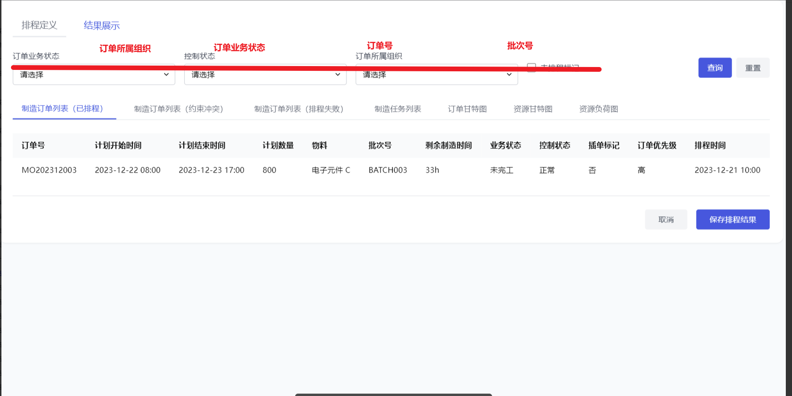

**界面结构**：制造订单列表，属性主要包含订单号、计划开始时间、计划结束时间、计划数量、物料、批次号、业务状态、控制状态、订单优先级、排程时间。

**交互内容**：默认展示最新一次的排程成功的订单列表，在输入框中选择或输入筛选条件后，点击“查询”按钮更新订单列表。

### 3.2.14 **排程结果展示-制造订单列表（****约束冲突****）**

概述：排程结果展示-制造订单列表（约束冲突）页面设计。

**界面-制造订单列表（约束冲突）**

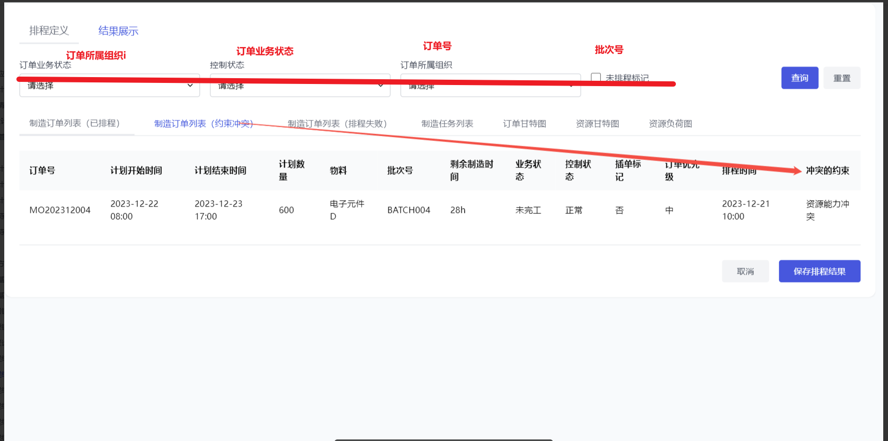

**界面结构**：制造订单列表，属性主要包含订单号、订单计划开始时间、订单计划结束时间、计划数量、物料、批次号、业务状态、控制状态、订单优先级、排程时间、冲突的约束。

**交互内容**：默认展示最新一次的排程成功但是存在约束冲突的的订单列表，在输入框中选择或输入筛选条件后，点击“查询”按钮更新订单列表，约束冲突的过滤逻辑不变。

### 3.2.15 **排程结果展示-制造订单列表（****排程失败****）**

概述：排程结果展示-制造订单列表（排程失败）页面设计。

**界面-制造订单列表（排程失败）**

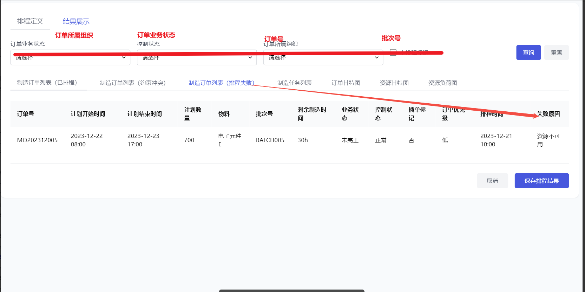

**界面结构**：制造订单列表，属性主要包含订单号、订单计划开始时间、订单计划结束时间、计划数量、物料、批次号、业务状态、控制状态、订单优先级、排程时间、失败的原因。

**交互内容**：默认展示最新一次的排程失败的订单列表，在输入框中选择或输入筛选条件后，点击“查询”按钮更新订单列表，排程失败的过滤逻辑不变。

### 3.2.16 **排程结果展示-****制造任务列表**

概述：排程结果展示-制造任务列表页面设计。

**界面-制造任务列表**

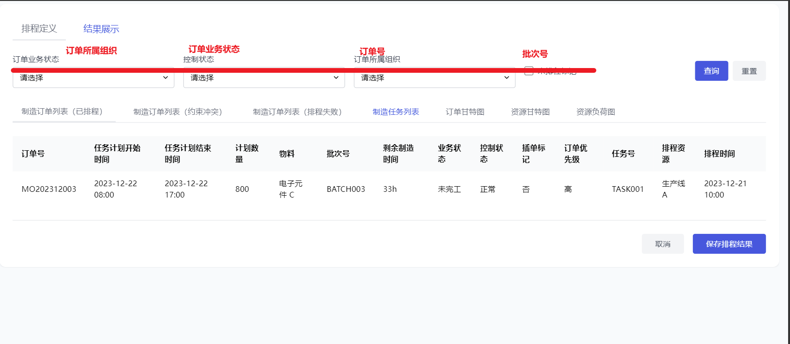

**界面结构**：制造任务列表，属性主要包含订单号、任务计划开始时间、任务计划结束时间、计划数量、物料、批次号、业务状态、控制状态、订单优先级、任务号、排程资源、排程时间。

**交互内容**：默认展示最新一次的排程的制造任务列表，在输入框中选择或输入筛选条件后，点击“查询”按钮更新任务列表。

### 3.2.17 **排程结果展示-****订单甘特图**

概述：排程结果展示-订单甘特图页面设计。

**界面-订单甘特图**

**界面结构**：

采用通用的甘特图组件，图样效果可参考Asprova；

顶部：时间刻度设置，含月、周、日、时；

中部：以横纵轴形成网格列表；

左侧：

订单列表，

每个订单左侧“+”号可展开对应的任务列表，

含订单号/工序号、物料、计划数量、计划开始时间、计划结束时间属性；

默认显示两列，底部滚动条控制；

右侧：

横轴：时间刻度（顶部显示）；

数据展示区：以色块显示甘特图；包含如下元素

订单块：计划区间与实际区间差异化显示

任务块：计划区间与实际区间差异化显示

底部滚动条控制；

左右侧数据联动显示；

**交互内容**：

默认展示最新一次的排程结果的订单甘特图，在输入框中选择或输入筛选条件后，点击“查询”按钮更新订单甘特图；

在甘特图上可鼠标悬停查看订单或任务的详细信息；

### 3.2.18 **排程结果展示-****资源甘特图**

概述：排程结果展示-资源甘特图页面设计。

**界面-资源甘特图**

**界面结构**：

采用通用的甘特图组件，图样效果可参考Asprova；

顶部：时间刻度设置，含月、周、日、时；

中部：

左侧：资源列表，含资源名称，资源类型、资源量属性；默认显示两列，底部滚动条控制；

右侧：

横轴：时间刻度；

纵轴：资源；

数据展示区：以色块显示甘特图；

任务块：计划区间与实际区间差异化显示

出勤：出勤时间与休息时间差异化显示

底部滚动条控制；

**交互内容**：

默认显示最新一次的排程结果的资源甘特图，在输入框中选择或输入筛选条件后，点击“查询”按钮更新资源甘特图；

在甘特图上可鼠标悬停查看订单或任务的详细时间信息；在列表中可点击订单或任务查看详细属性。

### 3.2.19 **排程结果展示-****资源负荷图**

概述：排程结果展示-资源负荷图页面设计。

**界面-资源负荷图**

**界面结构**：

采用通用的甘特图组件，图样效果可参考Asprova；

顶部：时间刻度设置，含月、周、日、时；

中部：

左侧：资源列表，含工作中心、设备、资源量属性；默认显示两列，底部滚动条控制；

右侧：

横轴：时间刻度；

纵轴：资源；

数据展示区：以柱状图显示资源负荷百分比；

资源负荷百分比：时间刻度内资源被占用时间/时间刻度内资源可用时间

出勤：出勤时间与休息时间差异化显示

默认显示10个时间刻度，底部滚动条控制；

**交互内容**：

默认展示最新一次的排程成功的资源负荷图，在输入框中选择或输入筛选条件后，点击“查询”按钮更新资源负荷图；

在甘特图上可鼠标悬停查看订单或任务的详细时间信息；在列表中可点击订单或任务查看详细属性。

### 3.2.20 **发布结果**

概述：确认并发布结果。

**界面**：

**界面结构**：

确认保存提示框

在计划排程页面，点击“发布结果”按钮，弹出确认保存提示框，提示“确定保存当前排程结果吗？保存后将无法撤回。”，提示框有“确定”和“取消”两个按钮。

保存失败任务列表

列表包含：排程时间、排程人、排程订单、保存失败的任务（超链接）、保存失败的原因；

**交互内容**：

用户点击“发布结果”按钮，弹出确认提示框；点击“确定”执行保存操作，点击“取消”则取消保存。

在“发布结果”成功执行完后，存在局部保存失败的，打开保存失败任务列表；点击保存失败的任务的超链接，打开任务调度管理，筛选出失败的任务。

**校验规则**：保存过程中，若数据完整性校验失败（如关键数据缺失），提示保存失败。

**输入**：已审核通过的排程结果数据。

**输出**：

**输出业务对象**：保存成功的标识信息；更新后的任务排产资源和时间状态（异步处理）。

**关键业务属性变化：**

订单排程状态：已排程订单

订单计划开始时间：排程计算后的时间

订单计划结束时间：排程计算后的时间

排程资源：排程计算分配的资源

任务排程开始时间：排程计算后的时间

任务排程结束时间：排程计算后的时间

执行人：调用“APS排程执行人分配规则”，详见

**展现形式**：保存成功后，系统提示“排程结果保存成功”；在后续生产任务查看页面，可看到更新后的任务资源和时间安排。

**处理逻辑**：

**结构化文本描述**：

系统监测“发布结果”按钮点击操作，弹出确认提示框；

若用户点击“确定”，系统检查排程结果是否数据完整；

若满足条件，将排程结果数据保存至数据库，并异步更新任务的排产资源和时间状态；更新逻辑如下：

读取中“自动派工配置”；

自动派工配置=“否”，将排程结果更新到任务的排产资源和排产时间属性上；

自动派工配置=“是”，在任务的排产资源和排产时间属性更新完毕后，读取“更新范围”的界面配置，调用派工逻辑将排产资源、时间根据更新的范围更新任务的分派资源、计划时间，任务执行人取资源（根据排产颗粒度决定）下的所有人；

更新逻辑：

分派资源：排程资源

工序计划开始时间：排程开始时间

工序计划结束时间：排程结束时间

执行人：排程资源下所有人

派工标记：将派工标记更新为1；

派工标记：任务新增属性；

自动派工后将标记更新为1；

手动派工、协调后将标记更新为2；

“更新范围”：

待选值：初始任务、自动派工任务、手工派工任务；支持多选，默认值：初始任务+自动派工任务；

初始任务：未派工任务；

自动派工任务：由排产自动派工的任务；

手动派工任务：经过手动派工、协调的任务；

更新任务的资源和时间状态时，先判断任务的实际业务状态与排程结果中的业务状态是否一致；

业务状态一致的执行更新操作；

业务状态不一致的，该订单整体跳过更新操作，标记为保存失败的任务；

保存完成后提示用户保存成功，并输出保存失败的任务列表及原因；

若不满足条件，提示保存失败原因。

## 3.3 **排程方案管理**

### 3.3.1 **排程方案管理主页面**

概述：排程方案管理设计。

**界面-排程方案管理**

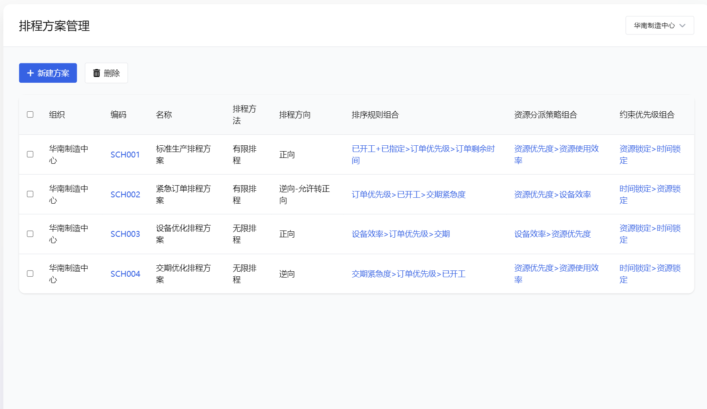

**界面结构**：

排程方案列表，包含组织、编码、名称、排程方法（有限排程、无限排程）、排程方向（正向、逆向、逆向-允许转正向）、排序规则组合（内置排序规则如已开工+已指定、已开工等，扩展规则如订单优先级、订单剩余时间等，使用>连接）、资源分派策略组合（资源优先度、资源使用效率等，使用>连接）、约束优先级组合（资源锁定、时间锁定等，根据优先级，使用>连接）；

编码、排序规则组合、资源分派策略组合、约束优先级组合使用超链接显示。

**交互内容**：

在导航栏点击“排程方案”或在“计划排程”页面点击“排程方案”打开“排程方案管理”主页面；

“排程方案管理”主页面列表按组织过滤；

用户点击“编码”按钮，打开对象编辑页面；

用户点击排序规则组合、资源分派策略组合、约束优先级组合使用超链接显示超链接，弹框打开独立的组合的编辑页面。

### 3.3.2 **排程方案对象编辑页面**

概述：排程方案管理-对象编辑页面设计。

**界面-排程方案对象编辑页面**

**界面结构**：

上部：属性编辑页面；

排程方向：下拉列表，待选值（正向、逆向、逆向-允许转正向）；

组织：取当前用户组织；

中部：排序规则组合、资源分派策略组合、约束优先级组合标签页；

底部：窗口底部设置“确定”和“取消”按钮。

**交互内容**：

用户点击“编码”按钮，打开对象编辑页面。

点击标签页切换到对应的编辑页面。

点击“确认”：关闭页面、提交数据；点击取消：关闭页面。

### 3.3.3 **排序规则组合编辑页面**

概述：排程方案管理-排序规则组合编辑页面设计。

**界面-排序规则组合编辑页面**

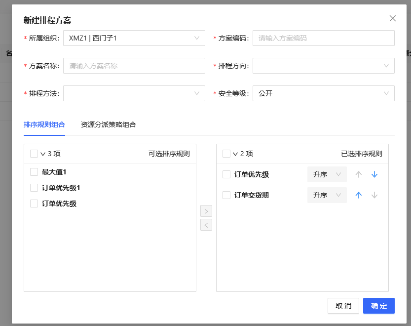

**界面结构**：

上侧：

左侧：排序规则库，待选值

订单优先级

订单剩余时间=计划结束时间-当前时间

订单剩余制造时间=剩余未完工工序时长求和

余裕度=订单剩余时间/订单剩余制造时间

订单计划开始时间

订单计划结束时间

***先到先得暂不考虑***

中部：功能按钮“➡”、“⬅”；

右侧：已选中规则（允许为空）、排序方向（升序、降序）、“⬆”、“⬇”；

底部：设置“确认”、“取消”按钮。

**交互内容**：

用户点击中部功能按钮效果：

“➡”：将左侧选中数据添加到右侧z；

“⬅”：将右侧选中数据从右侧移除；

“⬆”：将右侧选中数据排序上移一位；

“⬇”：将右侧选中数据排序下移一位；

点击“确认”：关闭页面、提交数据；点击取消：关闭页面。

### 3.3.4 **资源分派策略****组合编辑页面**

概述：排程方案管理-资源分派策略组合编辑页面设计。

**界面-资源分派策略组合编辑页面**

**界面结构**：

上侧：排序方向（升序、降序）

左侧：资源分派策略库，待选值

资源优先级（工作中心内优先级）

制造效率（固定属性）

资源最早空闲时间（计算值）

资源负荷

中部：功能按钮“➡”、“⬅”；

右侧：已选中策略（允许为空）、排序方向（升序、降序）、“⬆”、“⬇”；；

底部：设置“确认”、“取消”按钮。

**交互内容**：

用户点击中部功能按钮效果：

“➡”：将左侧选中数据添加到右侧；

“⬅”：将右侧选中数据从右侧移除；

“⬆”：将右侧选中数据排序上移一位；

“⬇”：将右侧选中数据排序下移一位；

点击“确认”：关闭页面、提交数据；点击取消：关闭页面。

### 3.3.5 **约束优先级组合编辑页面*****（根据约束优先级突破约束，未来扩展）***

概述：排程方案管理-约束优先级组合编辑页面设计。

**界面-约束优先级组合编辑页面**

**界面结构**：

上侧：排序方向（升序、降序）

左侧：约束库，待选值

资源锁定

时间锁定

订单计划开始时间（逆向排程有效）

订单计划结束时间（正向排程有效）

中部：功能按钮“➡”、“⬅”；

右侧：已选中约束（允许为空）、排序方向（升序、降序）、“⬆”、“⬇”；；

底部：设置“确认”、“取消”按钮。

**交互内容**：

用户点击中部功能按钮效果：

“➡”：将左侧选中数据添加到右侧；

“⬅”：将右侧选中数据从右侧移除；

“⬆”：将右侧选中数据排序上移一位；

“⬇”：将右侧选中数据排序下移一位；

点击“确认”：关闭页面、提交数据；点击取消：关闭页面。

## 3.4 **排程资源管理**

见历史需求。

## 3.5 **日历出勤**

见历史需求。

## 3.6 **物料  **

见主数据-物料管理V3.0。

## 3.7 **MBOM管理**

待编写。

