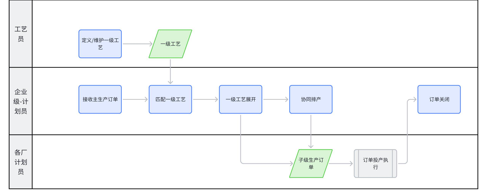
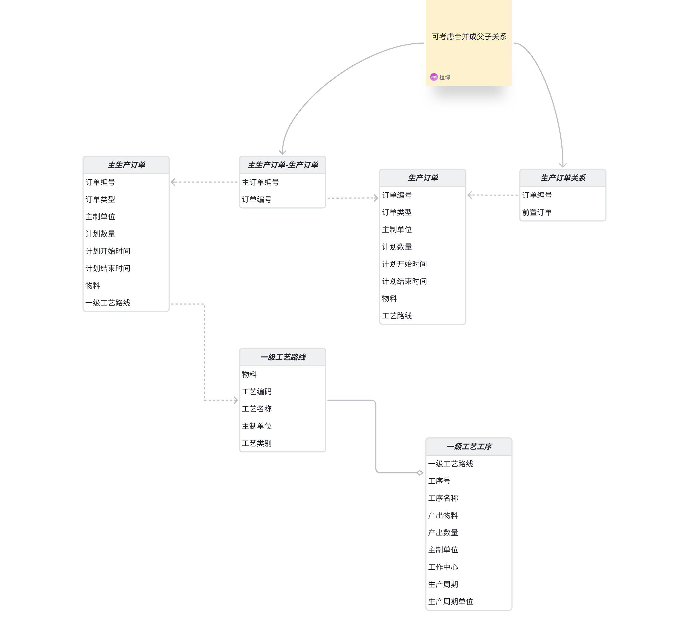
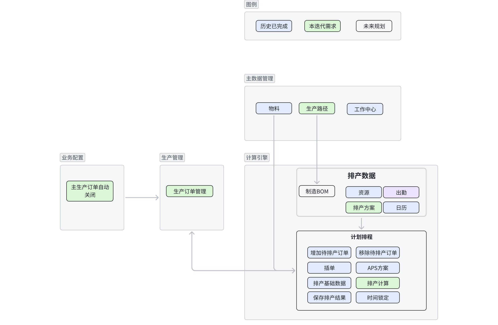
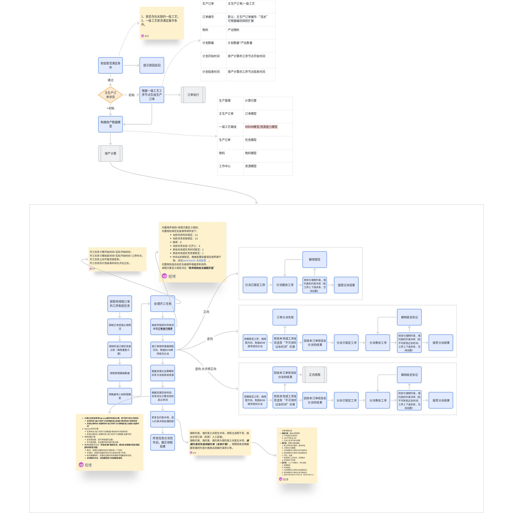

# **DNW30620-计算引擎/协同排产**

# 1. **概述**

## 1.1 **原始需求**

作为大型离散制造（机加/装配专业）企业的生产管理单位的计划员，单个零件在多个制造厂之间流转生产，我需要一种直接有效的方式管理各厂之间的协同计划。当前痛点在于，各厂计划由各厂内部计划员安排生产，没有有效的手段能够查询、统筹整体的计划进度，保证计划能够按时完成。

## 1.2 **需求分析**

**需求原因及本质**：工厂建设由于历史原因或专业分工等限制，造成生产的产品不能在一个制造厂完成，在信息化建设过程中，因涉及的厂较多，为降低MBOM的层级复杂度，没有将各厂的半成品作为节点建设在MBOM，造成企业级生产管理部门不能直接根据交付订单、MBOM明确拆解出能指导各生产厂投产的生产计划。

**信息化系统的价值**：MOM系统可提供独立的模块方便企业级计划员对此类计划进行集中管控；可基于一级工艺（定义各厂际间流水）展开成子级订单，形成各制造厂生产指令；可借用排产模型对此类计划进行排产，实现厂际计划协同排产，方便企业级计划员对此类计划进行管理。

**友商解决方案**：。

## 1.3 **术语及缩写解释**

**MOM系统**：制造运营管理系统，符合ISA-95 L3标准，用于整合和管理制造企业的生产运营活动。

**APS**：高级计划与排程（Advanced Planning and Scheduling），通过优化算法对生产任务进行合理排程。

**BOM**：物料清单（Bill of Materials），描述产品所需的原材料、零部件及装配关系等信息。

**一级工艺**：描述产品或半成品在制造过程中所经历的全部工序、工作中心及跨厂流转路线的系统性规划，侧重地理空间流转+多工厂协同逻辑。

## 1.4 **参考文献**

暂无相关参考文献。

# 2. **需求描述**

## 2.1 **业务描述**

**业务流程**：

**业务流程步骤详情**

|流程步骤 | 涉及角色 | 输入业务对象 | 输出业务对象 | 关键业务规则 | 主要考虑点|
|--- | --- | --- | --- | --- | ---|
|定义/维护一级工艺 | 工艺员 |  | 一级工艺 |  | 方便维护|
|接收主生产订单 | 企业级计划员 |  | 主生产订单 |  | 接收提醒|
|匹配一级工艺 | 企业级计划员 | 主生产订单、一级工艺 | 主生产订单与一级工艺关系 | 物料+组织相同 | |
|一级工艺展开 | 企业级计划员 | 主生产订单、一级工艺 | 子生产订单 | 基于一级工艺的属性创建子生产订单 | 子订单物料、周期、数量计算|
|协同排产 | 厂级计划员 | 主生产订单、一级工艺、子生产订单、日历出勤、资源 | 子生产订单-计划时间 | 遵循排产算法，考虑订单的前后制约关系 | 计算的准确性和效率|
|订单关闭 | 企业级计划员 | 所有子级订单关闭信号 | 主生产订单关闭 | 所有子级订单关闭 | |

**业务模型**

**需要覆盖的场景**：

将主生产订单、子级生产订单、一级工艺分别对应订单、任务、工艺模型进行排产；

使用资源量参与排产计算。

**不成熟或未覆盖的场景**：

基于一级工艺只考虑单层结构，不考虑多层，（多层使用BOM解决）

暂不考虑排产结果调整、含甘特图拖拽。

## 2.2 **功能描述**

### 2.2.1 **整体应用架构**

本次主要涉及生产管理、工厂建模、APS。

### 2.2.2 **制造计划&制造任务台应用架构**

 制造计划、制造任务台进一步细化展开到页面、业务功能一级

### 2.2.3 **功能清单**

|模块 | 页面 | 功能点 | 功能点描述|
|--- | --- | --- | ---|
|生产管理 | 生产订单管理 | 增加“匹配一级工艺”按钮 | 参考匹配工艺路线功能匹配“一级工艺”|
|生产管理 | 生产订单管理 | 增加“一级工艺展开”按钮 | 根据“一级工艺”生成子级生产订单|
|计算引擎 | 排产定义 | 增加待排产订单 | 打开生产订单管理界面，增加待排产订单|
|计算引擎 | 排产定义 | 移除待排产订单 | 移除待排产订单|
|计算引擎 | 排产定义 | 插单 | 用于确认人工选择的订单参与紧急插单逻辑排产|
|计算引擎 | 排产定义 | 排产方案 | 点击打开排产方案选择列表，选择由排产方向、排序规则、资源分派策略、约束优先级组成的排产方案|
|计算引擎 | 排产定义 | 排产基础数据 | 点击打开各排产基础数据|
|计算引擎 | 排产定义 | 时间锁定 | 锁定任务的时间|
|计算引擎 | 排产定义 | 排产计算 | 根据选择的排产方案和输入的筛选条件，启动排产计算|
|计算引擎 | 结果展示 | 订单甘特图展示 | 以甘特图形式展示订单的计划开始时间、计划结束时间等信息|
|计算引擎 | 结果展示 | 资源甘特图展示 | 展示各资源的任务分配时间和空闲时间|
|计算引擎 | 结果展示 | 资源负荷图展示 | 呈现各资源的负荷情况|
|计算引擎 | 结果展示 | 已成功排产订单 | 展示所有已成功排产订单|
|计算引擎 | 结果展示 | 已成功排产任务 | 展示所有已成功排产任务|
|计算引擎 | 结果展示 | 有约束冲突订单 | 展示所有已成功排产但存在未完全遵循约束的订单|
|计算引擎 | 结果展示 | 排产失败订单 | 展示所有排产失败的订单|
|计算引擎 | 结果展示 | 发布结果 | 确认并发布结果|
|计算引擎 | 日历 | 查询、编辑 | 用于调整日历数据|
|计算引擎 | 出勤 | 查询、编辑 | 用于调整出勤数据|
|计算引擎 | 制造BOM | 查询、编辑 | 用于调整制造BOM数据|
|计算引擎 | 资源 | 查询、编辑 | 用于调整资源数据|

# 3. **页面&功能设计**

## 3.1 **生产订单管理**

**界面**

**界面结构**：原“生产订单管理”页面；

中上部：功能按钮区，增加“匹配一级工艺”、“一级工艺展开”、“协同排产”；针对主生产订单，屏蔽“释放”按钮。

### 3.1.1 ** 匹配一级工艺**

概述：参考匹配工艺路线功能匹配“一级工艺”。

**界面**

**界面结构**：

同“匹配工艺路线”效果。

**交互内容**：用户在“生产订单管理”界面点击“匹配一级工艺”按钮。

**处理逻辑**：

匹配规则：同匹配工艺读取配置，默认同物料、同组织；

建立主生产订单与一级工艺的关系。

### 3.1.2 ** 一级工艺展开**

概述：根据“一级工艺”生成子级生产订单。

**界面**

**界面结构**：

同“工艺展开”效果。

**交互内容**：用户在“生产订单管理”界面点击“一级工艺展开”按钮。

**处理逻辑**：

校验：已展开订单不再展开；

创建子级生产订单，关键属性如下：

**点击图片可查看完整电子表格**

修订生产订单状态：已展开（***新增状态***）。

### 3.1.3 **主生产订单关闭**

概述：主生产订单关闭逻辑。

**界面**

使用现有“生产订单管理”界面

**处理逻辑**：

主生产订单关联的最后一个子订单完工后自动完工；

可考虑异步（时间间隔在半小时内）；

更新生产订单状态=“完工”。

## 3.2 **协同排产**

概述：对子级生产订单进行排产。

**界面**

**界面结构**：

同“计划排程”效果。

**交互内容**：用户在“生产订单管理”界面点击“协同排产”按钮，打开排产主页面。

### 3.2.1 ** 排产主页面**

概述：同计划排程页面。

### 3.2.2 ** 排产定义页面**

概述：同计划排程页面。

### 3.2.3 ** 结果展示页面**

概述：同计划排程页面。

### 3.2.4 ** 待排产订单**

概述：参考计划排程-增加待排程订单，将制造订单对象替换为（主）生产订单对象。

**界面-待排产订单**

**界面结构**：

顶部：数据筛选区，包括所属工厂、订单业务状态（下拉选择框）、控制状态（下拉选择框，选项有正常、异常等）、排产标记；在筛选条件后增加“查询”、“重置”按钮。

中部：主生产订单列表，最左侧是复选框，右侧是订单属性主要包含订单号、计划开始时间、计划结束时间、计划数量、物料、批次号、业务状态、控制状态、排产标记、订单优先级。

底部：设置“确定”和“取消”按钮。

**交互内容**：用户在“计划排产”页面点击增加待排产订单”按钮，打开弹框，根据筛选条件显示主生产订单列表，勾选数据行（支持批量勾选），点击“确定”增加待排产订单，点击“取消”则取消勾选、关闭当前页。

**校验规则**：无。

**输入**：待排产订单的选中操作。

**输出**

**输出业务对象**：无。

**业务属性变化**：订单增加“待排产订单”标记。

**处理逻辑**：

**结构化文本描述**：点击“确定”时，校验是否存在于“待排产订单”列表中，不存在时将对应订单的编号标记为“待排产订单”；存在时忽略校验，完成标记后集中提示“XXX订单已存在”。

### 3.2.5 ** 移除待排产订单**

概述：参考计划排程-移除待排程订单，将制造订单对象替换为生产订单对象。

**界面-移除待排产订单**

**界面结构**：无。

**交互内容**：用户“计划排产界面”生产订单列表，勾选数据行（支持批量勾选），点击“移除待排产订单”按钮，获取对应订单的编号，将订单从待排产订单中移除。

**校验规则**：无。

**输入**：待排产订单的选中操作。

**输出**

**输出业务对象**：无。

**业务属性变化**：订单移除“待排产订单”标记。

**处理逻辑**：

**结构化文本描述**：系统监听“移除待排产订单”按钮的点击事件；点击时，获取对应订单的编号，移除“待排产订单”标记。

### 3.2.6 ** 插单**

概述：参考计划排程-移除待排程订单，将制造订单对象替换为生产订单对象。

**界面-插单**

**界面结构**：无。

**交互内容**：生产计划员“计划排产”页面，选中订单行，点击“插单”按钮，标记为紧急插单的订单，再次点击则取消标记。

**校验规则**：无。

**输入**：待排产订单的选中操作。

**输出**

**输出业务对象**：无。

**业务属性变化**：订单的紧急插单标记属性更新为已标记。

**展现形式**：在订单信息展示区域，已标记紧急插单的订单增加黄色Tag标记，以便区分。

**处理逻辑**：

**结构化文本描述**：系统监听“标记紧急插单”按钮的点击事件；点击时，获取对应订单的编号，更新数据库中该订单的紧急插单标记字段为是；刷新订单信息展示区域，突出显示已标记的紧急插单订单。

**验收标准**

**边界条件**：重复标记同一订单时，系统不进行重复操作，仅切换选中订单状态。

**验收标准**：标记功能正常，订单标记状态准确更新并在页面正确展示。

### 3.2.7 **排产方案**

概述：同计划排程-排程方案。

### 3.2.8 **排产基础数据**

概述：点击打开各排产基础数据，同计划排程-基础数据。

### 3.2.9 **排产基础数据-制造任务**

概述：参考排程基础数据-制造任务，将制造任务对象替换为子级生产订单。

**界面-排产基础数据-制造任务**

**界面结构**：

顶部：数据筛选区，包括订单业务状态（下拉选择框，选项有未完工、已完工等）、控制状态（下拉选择框，选项有正常、异常等）、订单所属组织（下拉选择框，根据当前用户权限加载对应组织列表）、***排产标记（可以不要）、***物料、批次号、工序名称（可参考生产订单管理筛选框）。在筛选条件后增加“查询”、“重置”按钮。

中部：功能按钮区，“时间锁定”、“资源锁定”；

下部：生产订单列表，属性主要包含订单号、计划开始时间、计划结束时间、计划数量、物料、批次号**、*****剩余制造时间（本次暂不考虑）****、*业务状态、控制状态、时间锁定标记、资源锁定标记、插单标记、订单优先级、任务号、排产资源。

**交互内容**：

鼠标移动到“排产基础数据”，点击“制造任务”，打开“排产基础数据-制造任务”；

默认根据待排产订单展示已生成任务（未开工）的列表；

点击查询基于根据待排产订单的范围，结合筛选框条件查询；

排产计算后，数据按最新排产结果更新。

### 3.2.10 **时间锁定**

概述：锁定子生产订单的时间，参考制造任务-时间锁定。

**界面-排产基础数据**

**界面结构**：排产基础数据-制造任务页面。

**交互内容**：

排产基础数据-制造任务页面选中单个任务，点击时间锁定，弹框显示任务的计划起止时间（只读），锁定开始时间（正向排产时显示）、锁定结束时间（逆向排产时显示），锁定时长（分钟）

输出：

确定后将修改后时间回写到订单的起止时间；***（实际存储的是开始时间、时长）***

标记任务为“时间已锁定”

校验：

强校验：锁定失败；

计划结束时间>计划开始时间；

计划结束时间>当前时间；

弱校验：给提示，经人确认后继续执行；

计划开始、结束时间在出勤时间外；

起止时间区间≠工序加工时长；

计划结束时间>订单计划结束时间。

排产基础数据-制造任务页面选中多个任务，点击时间锁定，默认值为已有时间；无默认值或参考上述强校验失败，不进行标记。

### 3.2.11 **排产计算**

概述：根据选择的排产方案和输入的筛选条件，启动排产计算。

**界面-排产计算**

同计划排程。

**处理逻辑**：

主体参考计划排程：增加资源量参与计算。

### 3.2.12 **排产结果展示-****生产订单列表（已排产）**

概述：参考排程结果展示-制造订单列表（已排产），将制造订单替换为主生产订单。

### 3.2.13 **排产结果展示-生产订单列表（****约束冲突****）**

概述：参考排程结果展示-制造订单列表（约束冲突），将制造订单替换为主生产订单。

### 3.2.14 **排产结果展示-生产订单列表（****排产失败****）**

概述：参考排程结果展示-制造订单列表（排产失败），将制造订单替换为主生产订单。

### 3.2.15 **排产结果展示-****制造任务列表**

概述：参考排程结果展示-制造任务列表，将制造任务替换为子生产订单。

### 3.2.16 **排产结果展示-****订单甘特图**

概述：同排产结果展示-订单甘特图页面设计。

### 3.2.17 **排产结果展示-****资源甘特图**

概述：同排产结果展示-资源甘特图页面设计。

加入资源量逻辑后甘特图显示变化：

资源甘特图的高度=（时间区间上任务个数/资源量）*甘特图表格标准行高。

### 3.2.18 **排产结果展示-****资源负荷图**

概述：同排产结果展示-资源负荷图页面设计。

加入资源量逻辑后负荷图显示变化：

资源负荷计算值=时间刻度内资源占用时长/（时间刻度内资源在日历出勤周期内的标准工作时长*资源量）。

### 3.2.19 **发布结果**

概述：确认并发布结果。

**界面**：

同计划排程。

**输入**：已审核通过的排产结果数据。

**输出**：

**输出业务对象**：保存成功的标识信息；更新后的任务资源和时间状态（异步处理）。

**关键业务属性变化：**

主生产订单排产状态：已排产订单

主生产订单计划开始时间：排产计算后的时间

主生产订单计划结束时间：排产计算后的时间

子生产订单计划开始时间：排产计算后工序的计划开始时间

子生产订单计划结束时间：排产计算后工序的计划结束时间

**展现形式**：保存成功后，系统提示“排产结果保存成功”；在后续生产任务查看页面，可看到更新后的任务资源和时间安排。

**处理逻辑**：

同计划排程。

## 3.3 **排产方案管理**

同计划排程。

## 3.4 **排产资源管理**

     同计划排程。

## 3.5 **日历出勤**

     同计划排程。

## 3.6 **物料  **

     同计划排程。

## 3.7 **MBOM管理**

     待编写。

