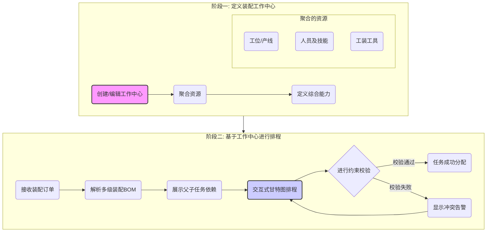
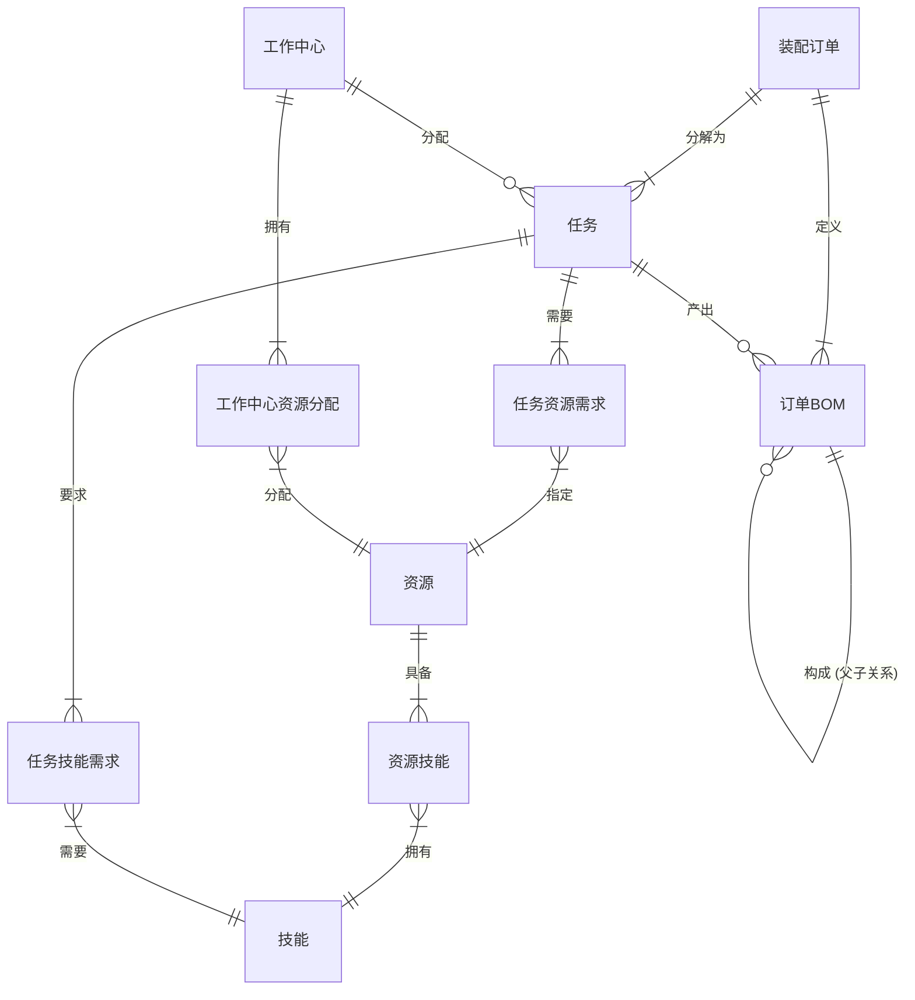

# **DNW30630 - 计算引擎/装配排程 (专业能力)**

---

## **1. 概述**

### **1.1. 原始需求**

-   **业务背景**: 在高端装备制造（如航空、航天）的装配车间，计划排程面临巨大挑战。通用APS系统无法有效处理装配业务特有的复杂约束，如严格的人员技能资质、专用工装的可用性、多层级且频繁变更的装配BOM等。这导致计划与实际严重脱节，计划可执行性差，频繁需要人工线下协调，效率低下。
-   **用户故事**:
    -   作为 **生产计划员**，我希望能够在一个统一的界面中，直观地看到所有装配任务的层级关系和时间依赖，并能将任务分配给具备综合能力的“工作中心”，而不仅仅是单个资源，以便我能快速制定出真正可执行的、考虑了所有核心约束的生产计划，将计划调整时间从数小时缩短到30分钟以内。
    -   作为 **车间主任**，我希望能实时掌握装配计划的瓶颈所在（是缺人、缺工具还是缺工位），以便我能快速进行资源调配，保障生产的顺利进行。
-   **问题痛点**:
    -   **计划与现实脱节**: 通用APS生成的计划不符合装配现场的实际约束，无法直接执行。
    -   **资源匹配效率低**: 计划员需要像“人肉CPU”一样，在大脑中匹配工序、人员、技能、工装、工位等多种资源，效率低下且极易出错。
    -   **瓶颈不透明**: 当计划冲突时，难以快速定位根本原因，导致问题解决周期长。
    -   **BOM结构复杂**: 复杂的装配层级关系在通用APS中难以清晰、直观地展现和管理。

### **1.2. 需求分析**

本产品旨在解决上述问题，其核心是**依赖于DNW30600核心APS平台**，为装配制造企业提供一个能精准描述其特有业务场景、将核心约束数字化、并产出高度可执行计划的专业排程应用。我们的目标是让计划“说现场的语言”，解决通用APS“水土不服”的根本问题，实现从“能用”到“好用”的跨越。

-   **价值主张与量化指标**:
    -   **提升计划可执行性**: 将计划首次执行成功率从低于50%提升至90%以上。
    -   **提升排程效率**: 将复杂装配计划的制定与调整时间缩短80%（从平均2小时缩短至30分钟内）。
    -   **提升资源利用率**: 通过透明化的瓶颈分析，辅助管理者进行资源优化，预计将关键工装/人员的等待时间减少20%。

-   **产品演进路线图**:
    | 迭代版本 | 迭代主题 | 核心目标与能力 | 为客户带来的核心价值 |
    | :--- | :--- | :--- | :--- |
    | **Iteration 1.0** | **装配业务数字化 (Digitalization)** | **目标**: 将装配核心约束（人员技能、工装、工位、复杂BOM）进行数字化建模，实现考虑有限能力的手动精细排程。 **能力**: 装配主数据建模、基于约束的交互式排程、装配路径可视化。 | **价值**: **计划可执行性**。从“拍脑袋”的粗放计划，到“有数据支撑”的精细计划，让计划第一次就能做对。 |
    | **Iteration 2.0** | **装配过程优化 (Optimization)** | **目标**: 引入面向装配的优化算法，并对现场异常进行快速响应。 **能力**: 装配特有的优化目标（如产线平衡、换线成本最小化）、异常事件驱动的动态重排、关键物料齐套预警。 | **价值**: **提升装配效率**。在计划可执行的基础上，通过智能优化和快速响应，缩短生产周期，提高资源利用率。 |
    | **Iteration 3.0** | **设计制造一体化 (Integration)** | **目标**: 打通设计与制造环节，实现工艺仿真与制造可行性验证。 **能力**: 与PLM集成获取BOM/BOA数据、基于排程结果的装配工艺仿真、DFM/DFA（面向制造/装配的设计）的量化反馈。 | **价值**: **加速产品上市**。通过在设计阶段引入制造约束，减少后期变更，实现研发与生产的高效协同。 |

-   **本期迭代范围 (Iteration 1.0)**:
    - **核心目标**:
        - 在核心APS平台能力之上，构建面向装配的专业能力扩展。
        - 实现对**核心装配约束的数字化建模**与**可视化**。
        - 交付一个能产出**可执行的、考虑有限能力**的装配排程计划的MVP。
    - **功能范围**:
        - **支持**:
          - **装配工作中心建模**: 支持将人员、技能、工装、工位等资源灵活组合成具备特定生产能力的工作中心。
          - **复杂BOM支持**: 支持解析和展示多层级的装配BOM（ABOM）结构。
          - **有限能力排程**: 在手动排程中，严格校验工作中心的综合能力（人员技能、工装、工位等）是否满足工序要求。
          - **可视化装配路径**: 在甘特图中清晰展示父子装配单的层级和依赖关系。
        - **不支持 (后续迭代规划)**:
          - **自动优化算法**: 如产线平衡、换线成本最小化等。
          - **动态响应**: 对现场缺料、设备故障等异常的自动重排。
          - **外部系统集成**: 与WMS/SRM等系统的实时物料拉动。
          - **工艺仿真**: 与三维模型的集成与仿真验证。

### **1.3. 用户画像**

-   **核心用户: 生产计划员 (王工)**
    -   **工作职责**: 负责根据主生产计划（MPS）和订单交付日期，制定详细的周/日装配生产计划。
    -   **业务熟练度**: 精通装配工艺流程，熟悉各类资源（人员、设备、工装）的能力和限制，但对计算机软件操作不深。
    -   **核心痛点**: 每天花费大量时间在Excel和电话中进行手工排程和资源协调，计划频繁变动，工作压力大，且效果不佳。他最需要的是一个能“理解”装配业务、帮他自动检查约束、操作直观的工具。
-   **次要用户: 车间主任 (李主任)**
    -   **工作职责**: 负责车间现场的生产执行与资源调度，确保计划的达成。
    -   **业务熟练度**: 资深现场管理者，对生产瓶颈和异常情况有敏锐的洞察力。
    -   **核心痛点**: 计划不准导致现场混乱，需要不断救火。他需要一个透明的计划和资源视图，以便他能提前预见瓶颈并做出决策。

### **1.4. 术语及缩写解释**

| 术语/缩写 | 英文全称/缩写 | 解释 |
| :--- | :--- | :--- |
| **工作中心** | Work Center | 一个逻辑性的生产单元，聚合了执行生产活动所需的一组资源（如工位、人员、工装），具备特定的生产能力。是本模块中进行排程和能力计算的基本单位。 |
| **装配BOM** | Assembly Bill of Materials (ABOM) | 描述产品如何通过一系列子装配和零件组装而成的物料清单，具有多层级结构。 |
| **APS** | Advanced Planning and Scheduling | 先进规划与排程系统。 |
| **MVP** | Minimum Viable Product | 最小化可行产品。 |

### **1.5. 参考文献**

-   DNW30600-计算引擎_计划排产通用能力.md

---

## **2. 需求描述**

### **2.1. 业务流程**

本模块的核心业务流程围绕“定义工作中心”和“基于工作中心进行排程”两个阶段展开，确保计划的可执行性。

**流程说明**:
1.  **定义装配工作中心**: 计划员首先在系统中定义“工作中心”。这不是一个物理实体，而是一个逻辑集合，它将执行特定装配任务所需的各种资源（如熟练的焊工、特定的焊接设备、专用的夹具、固定的工位）打包在一起。系统基于这些资源，自动计算出该工作中心的综合生产能力和日历。
2.  **基于工作中心进行排程**: 当新的装配订单下达后，系统会解析其复杂的BOM结构，并在甘特图上以父子任务的形式展示出来。计划员可以直接将一个装配任务（工序）拖拽到目标“工作中心”上。系统会立刻进行**一站式综合校验**：
    -   该工作中心是否具备工序所需的**技能**？
    -   在计划时段内，该工作中心的**产能**是否足够？
    -   该工作中心包含的**人员、工装、工位**等具体资源是否已被其他任务占用？
3.  **结果反馈**: 如果所有约束都满足，任务分配成功。如果有任何一项不满足，系统会立即给出明确的冲突告警（例如，“高级焊工技能缺失”或“T0123号夹具已被占用”），计划员可以据此快速做出调整，而无需在多个界面之间来回切换、人工核对。

### **2.2. 核心场景**

-   **场景一: 定义一个“航天发动机管路焊接”工作中心**
    -   **前置条件**: 系统中已录入人员（张三，技能：高级焊工）、工装（T0123号夹具）、工位（W05号焊接工位）。
    -   **操作步骤**:
        1.  计划员进入“工作中心管理”页面，点击“新建”。
        2.  命名为“航天发动机管路焊接中心”。
        3.  在资源配置区，从列表中选择并关联W05号工位、T0123号夹具、以及人员张三。
        4.  系统自动带出该工作中心具备的技能“高级焊工”，并根据资源的公共工作日历生成能力日历。
        5.  保存工作中心。
    -   **预期结果**: 系统中成功创建了一个新的工作中心，它作为一个整体，具备了“高级焊工”的技能，并拥有了明确的可用资源和能力日历，可以在排程时作为一个独立的资源对象被分配任务。

-   **场景二: 为“发动机管路焊接”任务分派工作中心并处理资源冲突**
    -   **前置条件**: 甘特图上已有一个待排程的“发动机管路焊接”任务，该任务的工序要求“高级焊工”技能和“T0123号夹具”。“航天发动机管路焊接中心”在10:00-12:00时段内已被占用。
    -   **操作步骤**:
        1.  计划员将“发动机管路焊接”任务拖拽到“航天发动机管路焊接中心”资源的10:00-12:00时间段。
        2.  系统立即弹出告警：“工作中心能力冲突：资源已被占用”。
        3.  计划员将任务拖拽到该工作中心的13:00-15:00时间段。
        4.  系统校验通过，任务成功分配。
    -   **预期结果**: 系统能够实时、准确地校验工作中心的综合能力和资源占用情况，并通过清晰的告警信息，引导计划员做出正确的排程决策，确保计划的无冲突性。

### 2.3. 数据描述

遵从数据架构设计原则，为支撑基于工作中心的装配排程，并明确体现“排程源于订单”的核心业务逻辑，特设计以下数据模型。

#### 2.3.3. 数据描述

遵从数据架构设计原则，为支撑基于工作中心的装配排程，并明确体现“排程源于订单”的核心业务逻辑，特设计以下数据模型。

##### 1. 核心实体与关系 (ER图)

##### 2. 核心实体中文说明

1.  **装配订单 (ASSEMBLY_ORDER)**
    *   **说明**: **业务流程的起点**。代表一个具体的、待完成的装配指令，通常来源于ERP系统。它是所有相关BOM和任务的顶层容器。
    *   **核心业务属性**: 
        *   `id`: 唯一标识
        *   `order_number`: 订单号 (业务主键)
        *   `product_code`: 产品编码
        *   `quantity`: 订单数量
        *   `due_date`: 期望交付日期
        *   `priority`: 优先级 (例如，高、中、低)
        *   `order_type`: 订单类型 (例如，正常、返工、紧急)
        *   `planned_start_time`: 计划开始时间
        *   `planned_end_time`: 计划完成时间
        *   `actual_start_time`: 实际开始时间
        *   `actual_end_time`: 实际完成时间
        *   `status`: 订单状态 (例如，已创建, 已下达, 进行中, 已完成, 已关闭)

2.  **订单BOM (ORDER_BOM)**
    *   **说明**: 为特定`装配订单`实例化的物料清单。通过`parent_id`自关联字段，构建出该订单所需物料的完整层级树。
    *   **核心业务属性**: 
        *   `id`: 唯一标识
        *   `order_id` (FK): 关联的装配订单ID
        *   `material_code`: 物料编码
        *   `item_name`: 物料名称
        *   `item_spec`: 物料规格
        *   `uom`: 单位
        *   `required_quantity`: 需求数量
        *   `issued_quantity`: 已发数量
        *   `parent_id` (自关联FK): 父阶BOM项ID，用于构建层级
        *   `level`: 在BOM中的层级

3.  **任务/工序 (TASK)**
    *   **说明**: 为制造某个`订单BOM`项而产生的、需要被调度和执行的最小工作单元。它是连接“需求（订单与BOM）”和“供给（工作中心能力）”的桥梁。
    *   **核心业务属性**: 
        *   `id`: 唯一标识
        *   `task_name`: 任务/工序名称
        *   `order_id` (FK): 关联的装配订单ID
        *   `bom_id_produced` (FK): 关联的产出BOM项ID
        *   `work_center_id` (FK): 分配的工作中心ID
        *   `task_type`: 任务类型 (例如，装配、检验、测试)
        *   `planned_duration`: 计划工时 (单位：小时)
        *   `actual_duration`: 实际工时 (单位：小时)
        *   `predecessor_task_id` (FK): 前置任务ID (用于定义工艺顺序)
        *   `status`: 任务状态 (例如，待派发, 已派发, 进行中, 已完成, 暂停)

4.  **工作中心 (WORK_CENTER)**
    *   **说明**: 制造能力的核心单元，是资源和技能的集合。
    *   **核心业务属性**: 
        *   `id`: 唯一标识
        *   `name`: 工作中心名称
        *   `description`: 描述
        *   `work_center_type`: 工作中心类型 (例如，总装线, 部件装配单元)
        *   `capacity`: 标准产能 (例如，标准工时/天)
        *   `status`: 状态 (例如，可用, 停机, 维护中)

5.  **资源 (RESOURCE)**
    *   **说明**: 工作中心拥有的具体生产要素，如设备、工具、人员。
    *   **核心业务属性**: 
        *   `id`: 唯一标识
        *   `name`: 资源名称
        *   `type`: 资源类型 (例如，设备, 工具, 人员, 工位)
        *   `resource_spec`: 资源规格/型号
        *   `work_center_id` (FK): 所属工作中心ID
        *   `status`: 状态 (例如，空闲, 使用中, 故障)

6.  **技能 (SKILL)**
    *   **说明**: 描述资源（尤其是人员）的特定工艺能力。
    *   **核心业务属性**: 
        *   `id`: 唯一标识
        *   `name`: 技能名称 (例如，高级焊接, 电气布线)
        *   `description`: 技能描述
        *   `skill_level`: 技能等级 (例如，初级, 中级, 高级)
        *   `certification_no`: 资质证书编号

##### 3. 核心关系说明

*   **订单 -> 任务/BOM**: 一个`装配订单`被分解为一个或多个`任务`，并定义了其专属的、完整的`订单BOM`。
*   **BOM -> 任务**: 一个`任务`的直接产出是`订单BOM`中的一个特定节点（装配件）。这清晰地反映了“做这个工序是为了完成哪个件”的逻辑。
*   **BOM层级关系**: `订单BOM`内部通过`parent_id`构建父子关系，形成装配树。
*   **任务 -> 工作中心**: `任务`被分配到具备相应能力（资源和技能）的`工作中心`执行，这是排程的核心操作。

---

## **3. 功能清单 (MVP)**

| 功能模块 | 功能点 | 用户故事 | 验收标准 | 依赖 (DNW30600) | 优先级 |
| :--- | :--- | :--- | :--- | :--- | :--- |
| **装配主数据** | **装配工作中心管理** | 作为计划员，我希望能定义一个“工作中心”，将人员、技能、工装、工位等资源打包管理，以便我能按一个整体的“能力单元”来排程。 | 1. 可以成功创建一个包含多种资源（人员、工装、工位）的工作中心。 2. 工作中心的能力（如技能）能被正确计算和展示。 3. 工作中心可以被编辑和删除。 | 资源对象 | P0 |
| **排程准备** | **装配BOM解析** | 作为计划员，我希望加载一个总装工单时，系统能自动将其下所有层级的子装配任务都展示出来，让我看清它们的父子关系。 | 1. 加载一个多层级ABOM的工单后，甘特图能以树状结构正确显示所有父子任务。 2. 任务间的依赖关系（如FS、SS）被正确建立。 | 工单/工艺管理 | P0 |
| **装配约束引擎** | **工作中心综合约束** | 作为计划员，当我把一个任务分配给一个工作中心时，我希望系统能立即告诉我这个安排是否可行，即该工作中心是否有空、有能力、有工具来完成它。 | 1. （硬约束）当任务所需技能在工作中心缺失时，禁止分配并告警。 2. （硬约束）当工作中心内任一所需资源（人员/工装/工位）在目标时间段已被占用时，禁止分配并告警。 3. （硬约束）当工作中心产能不足时，禁止分配并告警。 | 基础约束引擎 | P0 |
| **交互式甘特图** | **装配订单视图** | 作为计划员，我希望能有一个专门的视图，让我能聚焦于一个总装订单，清晰地看到它下面所有部件的装配进度和依赖关系。 | 1. 存在一个“装配订单”视图模式。 2. 在该视图下，甘特图以选定的总装订单为根节点，正确展示其装配层级。 | 视图模式 | P0 |
| | **(可选)物料齐套标识** | 作为计划员，我希望能在我排程时，直观地看到某个任务的关键物料是否已经到货，以便我优先安排那些物料齐备的任务。 | 1. 任务条上应有图标明确标识物料状态（如：齐套、缺料、预计xx到达）。 2. 该状态能根据WMS/ERP的更新而变化（本次迭代可为mock数据）。 | (无直接依赖) | P1 |

---

## **4. 页面与功能设计**

本章节详细描述为实现上述需求所需设计的页面及其功能点。

### **4.1. 功能模块：装配主数据**

#### **4.1.1. 页面：装配工作中心管理 (新增)**

*   **页面路径**: `主数据` -> `资源管理` -> `装配工作中心`
*   **页面目标**: 提供对“装配工作中心”这一核心业务对象的CRUD（创建、读取、更新、删除）功能，实现对多种资源的打包管理。
*   **页面布局**:
    *   左侧为工作中心列表，支持搜索和筛选。
    *   右侧为选中工作中心的详细信息展示区，包含多个页签（Tab）。

*   **功能点设计**:

| 功能点ID | 功能点名称 | 详细描述 | 输入/前置条件 | 输出/后置结果 | 备注/线框图 |
| :--- | :--- | :--- | :--- | :--- | :--- |
| F-MD-WC-01 | **创建工作中心** | 点击“新建”按钮，弹出对话框，要求用户输入工作中心的“名称”和“编码”。 | 用户具有创建权限。 | 在列表中新增一个工作中心条目。 | 名称和编码为必填项。 |
| F-MD-WC-02 | **配置基础信息** | 在详情区“基础信息”页签中，允许用户编辑工作中心的名称、编码和详细描述。 | 选中一个工作中心。 | 工作中心的基础信息被更新。 | |
| F-MD-WC-03 | **聚合资源** | 在详情区“资源配置”页签中，提供穿梭框或列表选择器，允许用户从现有资源池中，将**工位/产线**、**人员**、**工装**等资源添加到当前工作中心。 | 选中一个工作中心。资源池已初始化。 | 工作中心与多种资源建立关联。 | 需要清晰展示已选资源和待选资源。 |
| F-MD-WC-04 | **查看聚合能力** | 在详情区“能力视图”页签中，系统自动汇总和展示当前工作中心聚合的所有能力，如具备的技能列表（去重）、总产能等。 | 选中一个工作中心，且已聚合资源。 | 以只读方式展示工作中心的综合能力。 | 这是辅助决策信息，帮助计划员了解工作中心的能力边界。 |
| F-MD-WC-05 | **删除工作中心** | 在列表页，提供“删除”按钮，二次确认后可删除一个未被使用的工作中心。 | 选中的工作中心未被任何活动任务或计划引用。 | 工作中心被逻辑删除或物理删除。 | 如果已被引用，应提示“无法删除，该工作中心已被引用”。 |

### **4.2. 功能模块：交互式甘特图**

#### **4.2.1. 页面：排程甘特图 (增强)**

*   **页面路径**: `计划排程` -> `交互式排程`
*   **页面目标**: 在现有甘特图基础上，增强对装配业务的支持，以“工作中心”为核心进行调度。
*   **页面布局**:
    *   左侧资源视图区。
    *   右侧任务排布甘特图区。
    *   上方工具栏。

*   **功能点设计**:

| 功能点ID | 功能点名称 | 详细描述 | 输入/前置条件 | 输出/后置结果 | 备注/线框图 |
| :--- | :--- | :--- | :--- | :--- | :--- |
| F-GANTT-RV-01 | **工作中心资源行** | 在甘特图左侧的资源视图中，“装配工作中心”应作为一个可独立调度的资源行显示。支持展开/折叠，以下钻查看其内部包含的具体资源。 | 已定义装配工作中心。 | 资源视图以工作中心为单位组织。 |  |
| F-GANTT-TV-01 | **装配订单视图** | 在工具栏提供“装配订单视图”切换按钮。在该模式下，任务列表以总装订单为根，树状展开其所有层级的子任务，并用连线表示父子依赖。 | 加载了一个包含多层级装配BOM的工单。 | 甘特图清晰展示装配的层级和依赖关系。 | 这是装配场景的核心视图。 |
| F-GANTT-OP-01 | **拖拽指派到工作中心** | 允许用户将一个装配任务从“待派任务列表”或甘特图的其他位置，直接拖拽到“装配工作中心”资源行上进行排程。 | 任务和工作中心已加载。 | 任务被分配给工作中心，并触发约束校验。 | |
| F-GANTT-OP-02 | **工作中心综合约束校验** | 当任务被指派给工作中心时，系统自动执行“工作中心综合约束”检查（技能、资源占用、产能）。 | 任务被拖拽到工作中心行上。 | 1. **校验通过**: 任务成功放置。 2. **校验失败**: 任务返回原位，并给出明确的冲突告警。 | 告警信息必须具体，如“缺少‘高级焊工’技能”或“‘XYZ测试台’已被占用”。 |
| F-GANTT-VI-01 | **(可选)物料齐套标识** | 在任务条上增加一个图标，用不同颜色或符号表示该任务所需物料的齐套状态（如：绿色-齐套，黄色-部分齐套，红色-缺料）。 | 对接了物料/库存信息。 | 用户可直观判断任务的物料准备情况。 | 数据可来自ERP/WMS，本期可为Mock数据。 |

---

## **5. 约束条件**

| 类别 | 需求描述 |
| :--- | :--- |
| **性能** | 加载包含5层BOM、50个装配工单（约500个任务）的排程任务时，响应时间应在5秒内。 |
| **数据一致性** | 技能、工装等专业数据必须与核心APS平台的资源数据保持严格一致。 |
| **可配置性** | 装配约束（如是否严格要求技能等级匹配）应支持一定程度的配置（硬约束/软约束）。 |

---

## **6. 质量保证 (验收标准)**

- **场景1: 工作中心能力不足 (技能缺失)**
  - **Given**: “焊接工序”需要“高级焊工”技能。“焊接中心-01”内只配置了“初级焊工”。
  - **When**: 计划员试图将“焊接工序”分配给“焊接中心-01”。
  - **Then**: 系统应阻止分配，并提示“‘焊接中心-01’的能力不满足工序要求（缺失‘高级焊工’技能）”。
- **场景2: 工作中心资源冲突 (工装占用)**
  - **Given**: “装配工序”需要“T2型夹具”。“装配中心-A”内唯一的“T2型夹具-01”在上午已被任务X预定。
  - **When**: 计划员试图将“装配工序”分配到上午到“装配中心-A”。
  - **Then**: 系统应阻止分配，并提示“‘装配中心-A’在目标时间段内资源不足（无可用‘T2型夹具’）”。
- **场景3: 装配层级可视化**
  - **Given**: 加载一个“自行车总装”订单，其下有“车架组装”和“车轮组装”两个子订单。
  - **When**: 计划员切换到“装配订单视图”。
  - **Then**: 甘特图中应能清晰地看到“自行车总装”作为父任务，其下有“车架组装”和“车轮组装”两个子任务，并有连线表示其依赖关系。
- **场景4: 工作中心数据联动**
  - **Given**: “焊接中心-01”内配置了员工“张三”（高级焊工）。某“焊接任务”已成功分配给该中心。
  - **When**: 管理员从“焊接中心-01”的资源列表中移除了“张三”。
  - **Then**: 已分配的“焊接任务”应高亮显示冲突，并提示“‘焊接中心-01’的资源已变更，不再满足任务需求”。