# **DNW30700-仓储管理**

# 1. **概述**

### 1.1.1 **原始需求**

在离散制造行业中，尤其是机加/装配领域，企业面临着多品种小批量的生产模式挑战。以某离散制造企业为例，其在仓储管理环节存在以下原始需求和问题痛点：

**库存追溯困难**：在生产过程中，当产品出现质量问题时，无法快速追溯到所使用原材料的批次和供应商，导致问题排查时间长，影响客户交付和企业信誉。

**物料配送不及时**：生产线上经常因为物料未能及时配送到位而出现停工待料的情况，严重影响生产效率和设备利用率。

**库存积压严重**：由于缺乏精准的库存管理和预测，企业存在大量原材料和半成品的积压，占用了大量资金和仓库空间，增加了库存成本。

**仓储布局不合理**：仓库内物料存放混乱，不同种类和使用频率的物料未进行合理分区，导致物料查找和搬运时间长，降低了仓库作业效率。

通过信息化系统（MOM 系统中的仓储管理模块）的建设，企业希望能够解决上述问题，实现仓储管理的智能化、自动化和高效化，从而提升整体生产运营效率。

### 1.1.2 **需求分析**

**原因分析**：离散制造行业的多品种小批量生产模式导致物料种类繁多、生产计划频繁变动，传统的仓储管理方式难以满足企业对库存精准管理、物料及时配送和仓储空间高效利用的需求。

**本质需求**：企业需要一个能够实时监控库存状态、精准追踪物料流向、智能规划仓储布局并实现物料自动配送的仓储管理系统，以提高仓储管理效率，降低库存成本，保障生产顺利进行。

**信息化系统价值**：WMS 系统可以通过与生产管理系统（MES）、供应协同系统（SCM）等的集成，实现从原材料采购到成品出库的全流程信息化管理，提高生产协同效率，优化库存水平，为企业决策提供数据支持。

**行业内友商解决方案**：如佰思杰科技的 WMS 系统，通过 RFID、自动化设备等先进科技手段，提升供应链物流作业效率及可视化管控程度，实现管理规范化、精细化、数字化及智能化。

### 1.1.3 **AI场景应用**

#### 1.1.3.1 **智能化库存管理**

**需求预测与优化**：AI 可以通过机器学习算法对历史数据进行分析，精准预测未来的库存需求，优化库存策略，减少库存积压和缺货风险。例如，系统可以根据销售数据、季节变化等因素预测未来一段时间内某种商品的需求量，提前安排备货，确保供应链的稳定运行。

**实时库存监控与自动补货**：AI 系统能够实时监控库存状态，自动识别库存异动，及时发现和调整库存短缺或过剩情况，并根据库存数据进行自动补货建议，避免人工判断失误。

#### 1.1.3.2 **智能化物料追踪**

**实时位置与状态监控**：通过 AI 技术，可以实时监控物料在仓库内的位置、数量、状态等信息，实现物料的全程追溯。例如，利用计算机视觉和传感器技术，系统可以实时跟踪物料的移动和存储情况，提高追踪的准确性和及时性。

**质量问题快速定位与处理**：当物料出现质量问题时，AI 系统可以迅速定位问题物料的来源、批次以及去向，及时采取纠正措施，减少对生产和供应链的影响。

#### 1.1.3.3 **数据分析与预测**

**运营数据可视化**：AI 智能仓储系统能够收集和分析大量的仓储数据，例如库存数据、订单数据、物流数据等。通过数据可视化技术，将这些数据以图表等直观的形式呈现出来，帮助管理人员快速了解仓储运营状况，及时发现问题和瓶颈。

**智能决策支持**：基于数据分析，AI 系统可以提供智能决策支持，例如优化库存管理策略、调整生产计划、改进物流调度等。例如，DeepSeek 的 AI 技术可以通过对数据的深入挖掘，发现潜在的规律和趋势，为企业提供精准的预测和决策建议。

### 1.1.4 **术语及缩写解释**

|术语 | 缩写 | 解释说明|
|--- | --- | ---|
|仓储管理系统 | WMS | 用于支撑制造企业供应链运营，对原料、制品和成品进行入出库及在库管理的系统|
|制造执行系统 | MES | 负责生产过程管理的系统|
|供应协同系统 | SCM | 管理供应链协同的系统|
|物流执行系统 | LES | 负责物流执行的系统|

### 1.1.5 **参考文献**

「场景驱动，数智赋能」—— 离散型制造业生产线边物流. https://mp.weixin.qq.com/s?__biz=MzIxMDA0NDMwNA==&mid=2650882998&idx=1&sn=e10a20122e76a952c77f9240a43426d8&chksm=8d250d75262ee42c4b3e184a4f9484dcc74ecce12495f8cd34d3c3a2a71a9dc409abb7654f99#rd

仓储管理系统 WMS - 佰思杰科技. http://www.bill-sj.com/wms/

离散型制造业仓库管理的挑战与应对策略. https://mp.weixin.qq.com/s?__biz=MzkxOTQ3MjkyMw==&mid=2247485736&idx=1&sn=14bb5b4d62a67e3b170b92f029330942&chksm=c08b134a26abfcacc7f3b7801fb52560988cbc1b326ca0fee2cadc85b548ef07c85cdb815e71#rd

细数全球 WMS 仓储管理系统厂家：各大厂商实力详解. https://mp.weixin.qq.com/s?__biz=MzU3MjcyOTI3Mw==&mid=2247558213&idx=1&sn=8464d8c175c5f9b315267702f1ca6e25&chksm=fd4093208c7cb21db27cb84f497bd1b40e9aa84f5d364d8b8abffeaa628fbd9f3d2599ad4caa#rd

最新盘点！2024 年最好用的十大仓储管理系统（WMS）. https://mp.weixin.qq.com/s?__biz=Mzg3OTY0MzI4MA==&mid=2247503289&idx=3&sn=5e006d48837bcf3db00c10de1af4d966&chksm=ced6fd152a75ac632f8ed2b13595f9a37d7435ad1165f709bfc9dac333b16e67ba14b87d36bc#rd

# 2. **需求描述**

### 2.1.1 **业务描述**

#### 2.1.1.1 **主业务流程**

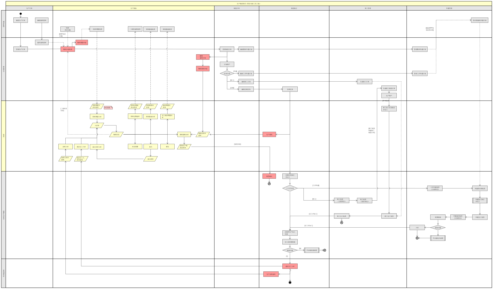

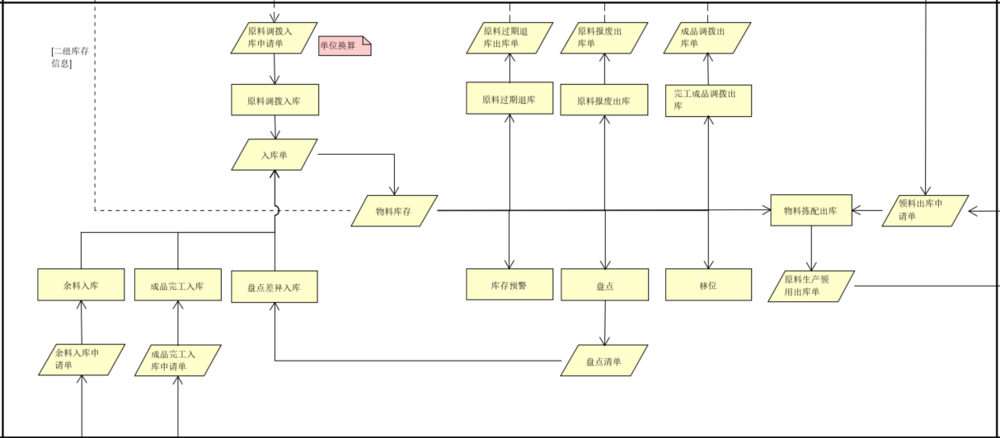

**库房库位定义**

**仓库管理员**

定义库房库位

定义库房和物料的关系（未来扩展）

库房权限配置（未来扩展）

**入库管理阶段**

**仓库管理员**：

**原料调拨入库**：根据原料调拨入库申请单，进行原料的调拨入库操作。

**余料入库**：根据余料入库申请单，进行余料的入库操作。

**成品完工入库**：根据成品完工入库申请单，进行成品的入库操作。

**盘点差异入库**：根据盘点差异入库申请单，进行盘点差异的入库操作。

**生成入库单**：完成原料调拨入库后，生成入库单，更新物料库存信息。

**系统**：

**物料库存**：更新物料库存信息，确保库存数据的实时性和准确性。在入库过程中，进行单位换算，确保库存数据的准确性。

注：本批次范围不涉及原材料采购入库，因此不涉及批次号、序列号的生成，后续扩展该场景时，再补充根据编码规则生成批次号、序列号的功能

**库存管理阶段**

**仓库管理员**：

**期初库存导入**：导入初始期初库存数据【未来扩展】。

**移位**：根据生产需求或库存管理需要，进行物料的移位操作。

**盘点**：定期进行库存盘点，生成盘点清单，确保库存数据的准确性。

**系统**：

**库存预警**：根据库存水平，生成库存预警信息，提醒仓库管理员进行补货或调整库存。

**物料库存**：实时更新物料库存信息，确保库存数据的准确性和完整性。

**出库管理阶段**

**生产部门**：

**领料出库申请**：根据生产需求，提交领料出库申请单。

**仓库管理员**：

**物料拣配出库**：根据领料出库申请单，进行物料的拣配出库操作。

**原料过期退库**：根据原料过期退库申请单，进行原料的过期退库操作。

**原料报废出库**：根据原料报废出库申请单，进行原料的报废出库操作。

**成品调拨出库**：根据成品调拨出库申请单，进行成品的调拨出库操作。

**生成领料出库单**：完成物料拣配出库后，生成领料出库单，更新物料库存信息。

**系统**：

**物料库存**：更新物料库存信息，确保库存数据的实时性和准确性。

#### 2.1.1.2 **业务流程活动详情**

**入库管理阶段**

**涉及角色**：仓库管理员

**输入业务对象**：原料调拨入库申请单、余料入库申请单、成品完工入库申请单、盘点差异入库申请单

**输出业务对象**：入库单、物料库存

**关键业务规则**：

原料调拨入库、余料入库、成品完工入库和盘点差异入库均需生成相应的入库单。

入库单生成后，系统自动更新物料库存信息。

**业务规则配置点**：

库房库位分配规则

**库存管理阶段**

**涉及角色**：仓库管理员

**输入业务对象**：盘点清单、移位申请单

**输出业务对象**：物料库存、库存预警

**关键业务规则**：

定期进行库存盘点，生成盘点清单，确保库存数据的准确性。

按整个工厂来锁库存，盘点时不允许做物料的出入库操作（本次实现）

按库存、库位或物料锁库存，盘点时不允许做物料的出入库操作（未来扩展）

根据盘点结果，进行库存调整，生成相应的入库或出库单。

根据库存水平，生成库存预警信息，提醒仓库管理员进行补货或调整库存。

**业务规则配置点**：

盘点周期和方法的设置

库存预警的阈值设置

**出库管理阶段**

**涉及角色**：生产部门、仓库管理员

**输入业务对象**：领料出库申请单

**输出业务对象**：领料出库单、物料库存

**关键业务规则**：

生产部门根据生产需求提交领料出库申请单。

仓库管理员根据领料出库申请单进行物料拣配出库操作，生成领料出库单。

领料出库单生成后，系统自动更新物料库存信息。

**业务规则配置点**：

出库优先级规则

库存调整阶段

**涉及角色**：仓库管理员

**输入业务对象**：原料过期退库申请单、原料报废出库申请单、成品调拨出库申请单

**输出业务对象**：物料库存

**关键业务规则**：

原料过期退库、原料报废出库和成品调拨出库均需生成相应的出库单。

出库单生成后，系统自动更新物料库存信息。

#### 2.1.1.3 **业务对象关系图**

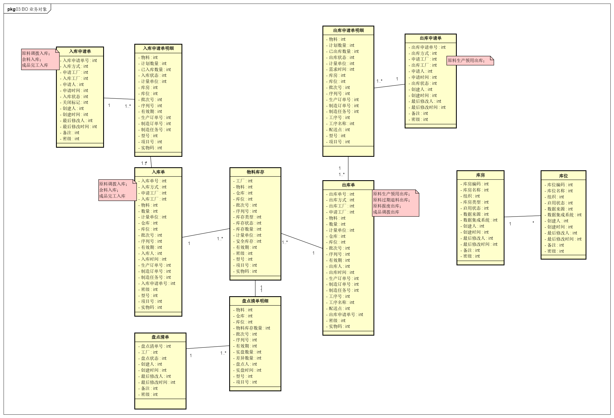

### 2.1.2 **功能描述**

#### 2.1.2.1 **应用架构**

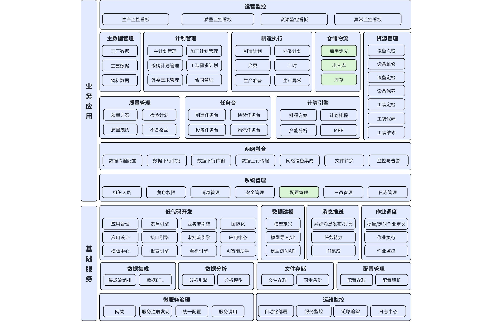

#### 2.1.2.2 **仓储物流应用架构**

 仓储物流进一步细化展开到页面、业务功能一级

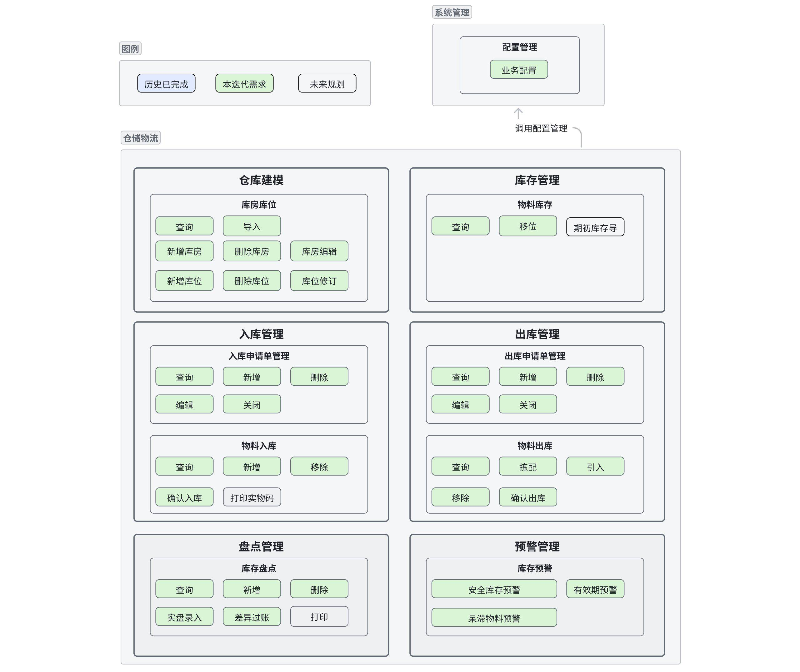

#### 2.1.2.3 **功能清单**

|仓储管理 | 库房库位 | 库房库位-查询 | V3.1-a3新增 | 查询库房和库位信息，方便用户快速定位所需库房和库位。|
|--- | --- | --- | --- | ---|
|仓储管理 | 库房库位 | 库房库位-导入库房 | V3.1-a3新增 | 导入库房信息，支持批量导入，确保库房数据的完整性和准确性。|
|仓储管理 | 库房库位 | 库房库位导入库位 | V3.1-a3新增 | 导入库位信息，支持批量导入，确保库位数据的完整性和准确性。|
|仓储管理 | 库房库位 | 库房库位-新增库房 | V3.1-a3新增 | 新增库房信息，支持用户根据实际需求扩展库房数量和类型。|
|仓储管理 | 库房库位 | 库房库位-删除库房 | V3.1-a3新增 | 删除库房信息，确保库房数据的准确性和及时性。|
|仓储管理 | 库房库位 | 库房库位-库房编辑 | V3.1-a3新增 | 编辑库房信息，支持用户修改库房名称、类型、容量等关键信息。|
|仓储管理 | 库房库位 | 库房库位-新增库位 | V3.1-a3新增 | 新增库位信息，支持用户根据实际需求扩展库位数量和类型。|
|仓储管理 | 库房库位 | 库房库位-删除库位 | V3.1-a3新增 | 删除库位信息，确保库位数据的准确性和及时性。|
|仓储管理 | 库房库位 | 库房库位-库位编辑 | V3.1-a3新增 | 编辑库位信息，支持用户修改库位名称、类型、容量等关键信息。|
|仓储管理 | 入库申请单管理 | 入库申请单管理-查询 | V3.1-a3新增 | 查询入库申请单信息，支持多条件查询，方便用户快速定位所需入库申请单。|
|仓储管理 | 入库申请单管理 | 入库申请单管理-新增 | V3.1-a3新增 | 新增入库申请单，支持用户根据实际需求创建新的入库申请单。|
|仓储管理 | 入库申请单管理 | 入库申请单管理-删除 | V3.1-a3新增 | 删除入库申请单，确保入库申请单数据的准确性和及时性。|
|仓储管理 | 入库申请单管理 | 入库申请单管理-编辑 | V3.1-a3新增 | 编辑入库申请单信息，支持用户修改申请单中的关键信息。|
|仓储管理 | 入库申请单管理 | 入库申请单管理-关闭 | V3.1-a3新增 | 关闭入库申请单，确保申请单状态的准确性和及时性。|
|仓储管理 | 物料入库 | 物料入库-查询 | V3.1-a3新增 | 查询物料入库信息，支持多条件查询，方便用户快速定位所需物料入库记录。|
|仓储管理 | 物料入库 | 物料入库-新增 | V3.1-a3新增 | 新增物料入库记录，支持用户根据实际需求创建新的物料入库记录。|
|仓储管理 | 物料入库 | 物料入库-确认入库 | V3.1-a3新增 | 确认物料入库，更新物料库存信息，确保库存数据的实时性和准确性。|
|仓储管理 | 出库申请单管理 | 出库申请单管理-查询 | V3.1-a3新增 | 查询出库申请单信息，支持多条件查询，方便用户快速定位所需出库申请单。|
|仓储管理 | 出库申请单管理 | 出库申请单管理-新增 | V3.1-a3新增 | 新增出库申请单，支持用户根据实际需求创建新的出库申请单。|
|仓储管理 | 出库申请单管理 | 出库申请单管理-删除 | V3.1-a3新增 | 删除出库申请单，确保出库申请单数据的准确性和及时性。|
|仓储管理 | 出库申请单管理 | 出库申请单管理-编辑 | V3.1-a3新增 | 编辑出库申请单信息，支持用户修改申请单中的关键信息。|
|仓储管理 | 出库申请单管理 | 出库申请单管理-关闭 | V3.1-a3新增 | 关闭出库申请单，确保申请单状态的准确性和及时性。|
|仓储管理 | 物料出库 | 物料出库-查询 | V3.1-a3新增 | 查询物料出库信息，支持多条件查询，方便用户快速定位所需物料出库记录。|
|仓储管理 | 物料出库 | 物料出库-拣配 | V3.1-a3新增 | 进行物料拣配操作，根据出库申请单生成拣配任务，确保物料出库的准确性和及时性。|
|仓储管理 | 物料出库 | 物料出库-引入 | V3.1-a3新增 | 引入物料出库信息，支持批量导入出库数据，提高工作效率。|
|仓储管理 | 物料出库 | 物料出库-移除 | V3.1-a3新增 | 移除物料出库记录，确保物料出库数据的准确性和及时性。|
|仓储管理 | 物料出库 | 物料出库-确认出库 | V3.1-a3新增 | 确认物料出库，更新物料库存信息，确保库存数据的实时性和准确性。|
|仓储管理 | 物料库存 | 物料库存-查询 | V3.1-a3新增 | 查询物料库存信息，支持多条件查询，方便用户快速定位所需物料库存记录。|
|仓储管理 | 物料库存 | 物料库存-移位 | V3.1-a3新增 | 进行物料移位操作，根据生产需求或库存管理需要，更新物料库存位置信息。|
|仓储管理 | 库存盘点 | 库存盘点-查询 | V3.1-a3新增 | 查询库存盘点信息，支持多条件查询，方便用户快速定位所需盘点记录。|
|仓储管理 | 库存盘点 | 库存盘点-新增 | V3.1-a3新增 | 新增库存盘点记录，支持用户根据实际需求创建新的盘点记录。|
|仓储管理 | 库存盘点 | 库存盘点-编辑 | V3.1-a3新增 | 编辑库存盘点记录，支持用户根据实际需求编辑调整盘点记录。|
|仓储管理 | 库存盘点 | 库存盘点-删除 | V3.1-a3新增 | 删除库存盘点记录，确保盘点数据的准确性和及时性。|
|仓储管理 | 库存盘点 | 库存盘点-实盘录入 | V3.1-a3新增 | 录入实际盘点数据，更新库存信息，确保库存数据的准确性和完整性。|
|仓储管理 | 库存盘点 | 库存盘点-差异过账 | V3.1-a3新增 | 处理盘点差异，生成相应的入库或出库单，确保库存数据的准确性和完整性。|
|仓储管理 | 库存预警 | 库存预警-安全库存预警 | V3.1-a3新增 | 根据库存水平，生成安全库存预警信息，提醒仓库管理员进行补货或调整库存。|
|仓储管理 | 库存预警 | 库存预警-有效期预警 | V3.1-a3新增 | 根据物料有效期，生成有效期预警信息，提醒仓库管理员处理即将过期的物料。|
|仓储管理 | 库存预警 | 库存预警-呆滞物料预警 | V3.1-a3新增 | 根据库存数据，生成呆滞物料预警信息，提醒仓库管理员处理长期未使用的物料。|

# 3. **页面 & 功能设计**

## 3.1 **库房库位管理**

### 3.1.1 **库房库位-查询**

**概述**：查询库房和库位信息，方便用户快速定位所需库房和库位。

**界面**

选中工厂

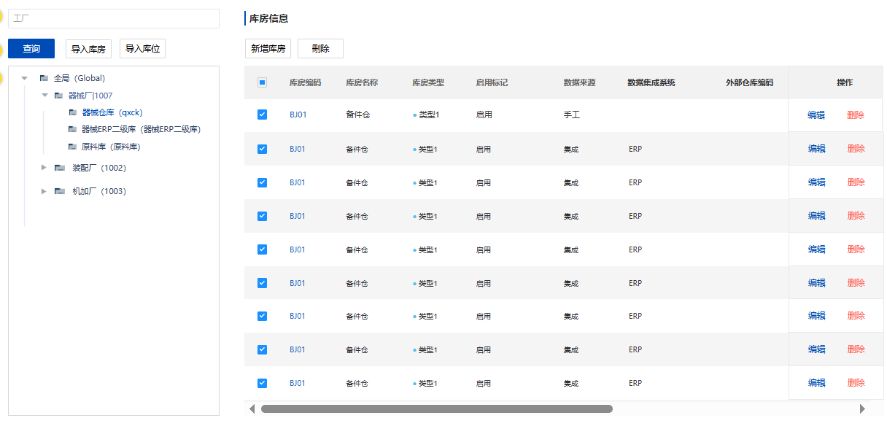

选中库房

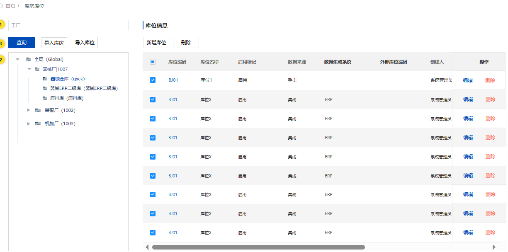

**界面结构**：

**左侧树结构**：

**组织**：单选，默认值为当前用户所属的组织（工厂），下拉值为当前用户具有权限的（工厂）。

**操作**：查询、导入库房、导入库位

**数据描述**：左侧树按层级显示公司（不存在则不显示）、工厂、库房

**功能**：

**选中工厂节点**：

左侧树显示按钮不变

**右侧显示**：工厂下的所有库房信息列表，支持新增、编辑、删除操作

**选中库房节点**：

左侧树显示按钮不变

**右侧显示**：库房下的所有库位信息列表，支持新增、编辑、删除操作

**交互内容**：用户输入查询条件，点击查询按钮，系统显示查询结果。

**校验规则**：查询条件不能为空。

**输入**：查询条件（组织），若不输入组织，则默认只能查询当前用户具有权限组织下的数据

**输出**：

**输出业务对象**：库房和库位信息。

**业务属性变化**：查询结果展示。

**展现形式**：查询结果以树+表格形式展示，包括库房名称、库位名称、库位状态等信息。

**处理逻辑**：

用户输入查询条件并点击查询按钮。

系统校验查询条件。

校验通过后，系统查询数据库。

查询完成后，系统显示查询结果。

**验收标准**：

查询条件校验通过。

查询结果正确展示。

### 3.1.2 **库房库位-导入库房**

**概述**：导入库房信息，支持批量导入，确保库房数据的完整性和准确性。

**界面**：

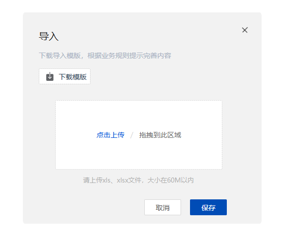

**界面结构**：导入按钮、文件选择区域、导入进度显示区域。

**交互内容**：用户选择文件后，点击导入按钮，系统开始导入数据并显示进度。

**校验规则**：文件格式校验（仅支持Excel文件），数据格式校验（库房信息必须符合预定义格式）。

**输入**：库房信息的Excel文件。

**输出**：

**输出业务对象**：库房信息。

**业务属性变化**：库房数据更新。

**展现形式**：导入成功后，系统显示导入结果，包括成功条数和失败条数，失败数据提供下载。

**处理逻辑**：

用户选择文件并点击导入按钮。

系统校验文件格式和数据格式。

校验通过后，系统开始导入数据。

导入完成后，系统显示导入结果。

**验收标准**：

文件格式校验通过。

数据格式校验通过。

导入数据成功，系统显示正确的导入结果。

### 3.1.3 **库房库位-导入库位**

**概述**：导入库位信息，支持批量导入，确保库位数据的完整性和准确性。

**界面**：

**界面结构**：导入按钮、文件选择区域、导入进度显示区域。

**交互内容**：用户选择文件后，点击导入按钮，系统开始导入数据并显示进度。

**校验规则**：文件格式校验（仅支持Excel文件），数据格式校验（库位信息必须符合预定义格式）。

**输入**：库位信息的Excel文件。

**输出**：

**输出业务对象**：库位信息。

**业务属性变化**：库位数据更新。

**展现形式**：导入成功后，系统显示导入结果，包括成功条数和失败条数，失败数据提供下载。

**处理逻辑**：

用户选择文件并点击导入按钮。

系统校验文件格式和数据格式。

校验通过后，系统开始导入数据。

导入完成后，系统显示导入结果。

**验收标准**：

文件格式校验通过。

数据格式校验通过。

导入数据成功，系统显示正确的导入结果。

### 3.1.4 **库房库位-新增库房**

**概述**：新增库房信息，支持用户根据实际需求扩展库房数量和类型。

**界面**：

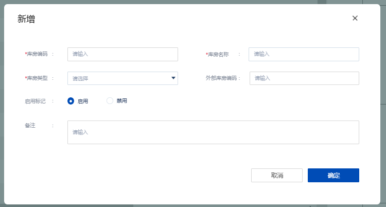

**界面结构**：弹框显示新建页面，包含以下输入框和选项：

**库房编码**：必填，输入框

**库房名称**：必填，输入框

**库房类型**：必填，下拉选择框，选项包括：ERP一级库、ERP二级库、车间二级库

**外部库房编码**：输入框

**启用标记**：

**备注**：输入框

**功能按钮**：

**确定**：点击确定按钮后，库房的组织属性默认为选中的工厂

**取消**：点击取消按钮后，关闭弹框，不保存任何信息

**输入**：

**输入业务对象**：

库房编码

库房名称

库房分类

外部库房编码

启用标记

备注

**输出**：

**输出业务对象**：库房信息

**业务属性变化**：库房信息保存成功

**展现形式**：保存成功后，系统显示成功提示

**处理逻辑**：

用户点击"新建库房"按钮，系统弹出新建页面。

用户填写库房信息，包括库房编码、库房名称、库房分类、外部库房编码、启用标记和备注。

用户点击"确定"按钮，系统保存库房信息，库房的组织属性默认为选中的工厂。

保存完成后，系统显示成功提示。

**验收标准**：

**输入校验**：所有必填字段不能为空，库房编码必须唯一。

**功能校验**：点击"确定"按钮时，系统正确保存库房信息，并将组织属性设置为选中的工厂。

**界面校验**：新建页面的输入框和选项显示正确，功能按钮正常工作。

### 3.1.5 **库房库位-删除库房**

**概述**：删除库房信息，确保库房数据的准确性和及时性。

**界面**：

**界面结构**：库房选择框、删除按钮、确认对话框。

**交互内容**：用户选择库房，点击删除按钮，系统弹出确认对话框，用户确认后删除库房信息。

**校验规则**：

当库房下存在子节点时，不允许删除

当库房下不存在子节点时，确认删除后，可删除成功

**输入**：库房编号。

**输出**：

**输出业务对象**：库房信息。

**业务属性变化**：库房信息删除。

**展现形式**：删除成功后，系统显示成功提示。

**处理逻辑**：

用户选择库房并点击删除按钮。

系统校验库房信息。

当库房下存在子节点时，不允许删除

当库房下不存在子节点时，确认删除后，可删除成功

校验通过后，系统弹出确认对话框。

用户确认后，系统删除库房信息。

删除完成后，系统显示成功提示。

**验收标准**：

库房信息校验通过。

库房信息删除成功。

### 3.1.6 **库房库位-库房编辑**

**概述**：编辑库房信息，支持用户修改库房名称、类型、容量等关键信息。

**界面**：

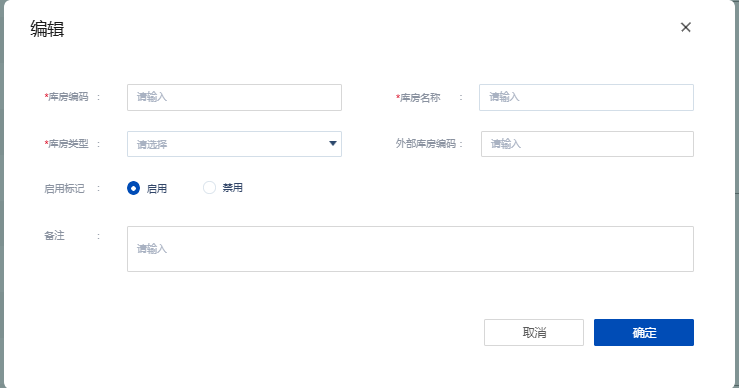

**界面结构**：库房信息编辑框、确定取消按钮。

**交互内容**：用户选择库房，编辑库房信息，点击确定按钮，系统保存修改后的库房信息。

**校验规则**：库房信息不能为空，库房编号必须唯一。

**输入**：库房信息（库房编号、库房名称、库房类型、备注等）。

**输出**：

**输出业务对象**：库房信息。

**业务属性变化**：库房信息更新。

**展现形式**：保存成功后，系统显示成功提示。

**处理逻辑**：

用户选择库房并编辑库房信息。

用户点击保存按钮。

系统校验库房信息。

校验通过后，系统保存修改后的库房信息。

保存完成后，系统显示成功提示。

**验收标准**：

库房信息校验通过。

库房信息更新成功。

### 3.1.7 **库房库位-新增库位**

**概述**：新增库位信息，支持用户根据实际需求扩展库位数量。

**界面**：

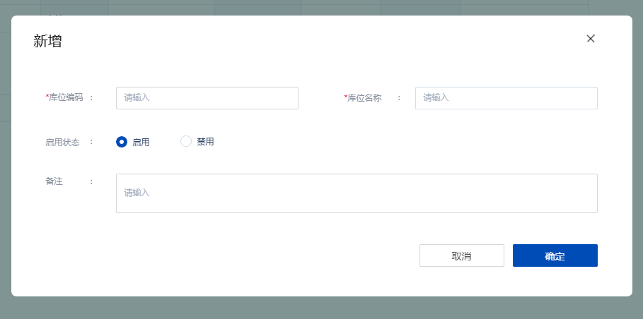

**界面结构**：弹框显示新建页面，包含以下输入框和选项：

**库位编码**：必填，输入框

**库位名称**：必填，输入框

**启用标记**：默认勾选，点击可取消勾选

**备注**：输入框

**功能按钮**：

**确定**：点击确定按钮后，库位的组织属性默认为选中的工厂

**取消**：点击取消按钮后，关闭弹框，不保存任何信息

**输入**：

**输入业务对象**：

库位编码

库位名称

启用标记

备注

**输出**：

**输出业务对象**：库位信息

**业务属性变化**：库位信息保存成功

**展现形式**：保存成功后，系统显示成功提示

**处理逻辑**：

用户点击"新建库位"按钮，系统弹出新建页面。

用户填写库位信息，包括库位编码、库位名称、启用标记和备注。

用户点击"确定"按钮，系统保存库位信息，库位的组织属性默认为选中的工厂。

保存完成后，系统显示成功提示。

**验收标准**：

**输入校验**：所有必填字段不能为空，库位编码必须唯一。

**功能校验**：点击"确定"按钮时，系统正确保存库位信息，并将组织属性设置为选中的工厂。

**界面校验**：新建页面的输入框和选项显示正确，功能按钮正常工作。

### 3.1.8 **库房库位-删除库位**

**概述**：删除库位信息，确保库位数据的准确性和及时性。

**界面**：

**界面结构**：库位选择框、删除按钮、确认对话框。

**交互内容**：用户选择库位，点击删除按钮，系统弹出确认对话框，用户确认后删除库位信息。

**校验规则**：暂不做校验。

**输入**：库位编号。

**输出**：

**输出业务对象**：库位信息。

**业务属性变化**：库位信息删除。

**展现形式**：删除成功后，系统显示成功提示。

**处理逻辑**：

用户选择库位并点击删除按钮。

系统校验库位信息。

校验通过后，系统弹出确认对话框。

用户确认后，系统删除库位信息。

删除完成后，系统显示成功提示。

**验收标准**：

库位信息校验通过。

库位信息删除成功。

### 3.1.9 **库房库位-库位编辑**

**概述**：编辑库位信息，支持用户修改库位名称、类型、容量等关键信息。

**界面**：

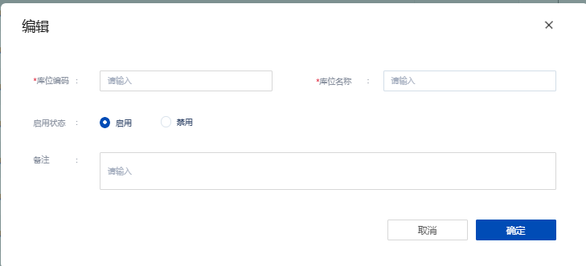

**界面结构**：库位信息编辑框、确定取消按钮。

**交互内容**：用户选择库位，编辑库位信息，点击确定按钮，系统保存修改后的库位信息。

**校验规则**：库位信息不能为空，库位编号必须唯一。

**输入**：库位信息（库位编号、库位名称等）。

**输出**：

**输出业务对象**：库位信息。

**业务属性变化**：库位信息更新。

**展现形式**：保存成功后，系统显示成功提示。

**处理逻辑**：

用户选择库位并编辑库位信息。

用户点击保存按钮。

系统校验库位信息。

校验通过后，系统保存修改后的库位信息。

保存完成后，系统显示成功提示。

**验收标准**：

库位信息校验通过。

库位信息更新成功。

## 3.2 **入库申请单管理**

### 3.2.1 **入库申请单管理-查询**

**概述**：查询入库申请单信息，支持多条件查询，方便用户快速定位所需入库申请单。

**界面**：

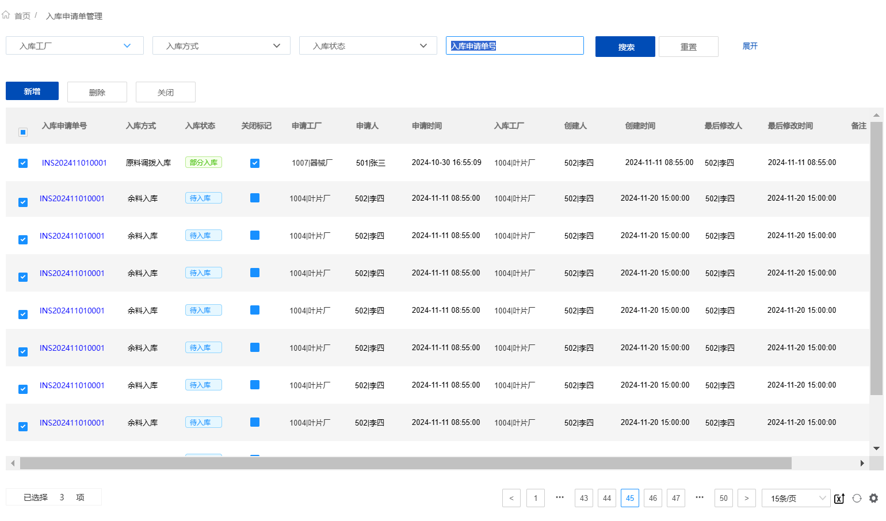

**查询条件**：

**入库工厂**：默认显示用户所属工厂，下拉显示当前用户具有权限的组织

**入库方式**：默认值为原料调拨入库，下拉候选值：原料调拨入库、余料入库、成品完工入库、子件报废入库、成品报废入库

**入库状态**：默认值为待入库和部分入库，下拉候选值：待入库、部分入库、全部入库

**申请时间**：日期控件，可选择日期范围，精确到年月日

**关闭标记**：默认为否

**功能按钮**：

**查询**：点击查询按钮，系统根据查询条件显示所选入库工厂的入库申请单

**新增**：点击新增按钮，系统弹出新建入库申请单页面

**删除**：点击删除按钮，系统删除选中的入库申请单

**关闭**：点击关闭按钮，系统关闭选中的入库申请单

**网格列表**：

**数据源**：列表显示所选入库工厂的入库申请单

**列表字段**：

**入库申请单号**：超链接属性，当入库状态为部分入库和全部入库时，点击入库申请单号，打开入库申请单详情页面，仅支持查看和刷新；当入库状态为未入库时，点击入库申请单号，打开入库申请单详情页面，支持编辑、查看、刷新；点击刷新，显示最新数据；点击编辑，切换到编辑状态，可编辑字段：入库方式、添加删除物料明细、编辑物料明细中的属性

**申请工厂**：格式为 工厂编码|工厂名称

**入库工厂**：格式为 工厂编码|工厂名称

**申请人**：格式为 用户编码|用户名称

**申请时间**：时间格式：yyyy-MM-dd HH:mm:ss

**计划入库时间**：时间格式：yyyy-MM-dd HH:mm:ss

**有效期**：截至有效日期，日期格式：yyyy-MM-dd HH:mm:ss

**输入**：

**输入业务对象**：

入库工厂

入库方式

入库状态

申请时间

关闭标记

**输出**：

**输出业务对象**：入库申请单信息

**业务属性变化**：查询结果展示

**展现形式**：查询结果以表格形式展示，包括入库申请单号、入库方式、入库状态、关闭标记、申请工厂、申请人、申请时间、入库工厂、创建人、创建时间、最后修改人、最后修改时间、备注等信息

**处理逻辑**：

用户输入查询条件，点击查询按钮

系统根据查询条件，从数据库中获取相应的入库申请单信息

系统将查询结果以表格形式展示在页面上

**验收标准**：

**输入校验**：查询条件输入正确，系统能够正确解析

**功能校验**：点击查询按钮后，系统能够正确显示查询结果；点击新增、删除、关闭按钮后，系统能够正确执行相应操作

**界面校验**：查询条件和功能按钮显示正确，查询结果表格展示完整，数据正确

### 3.2.2 **入库申请单管理-新增**

**概述**：新增入库申请单，支持用户根据实际需求创建新的入库申请单。

**界面**：

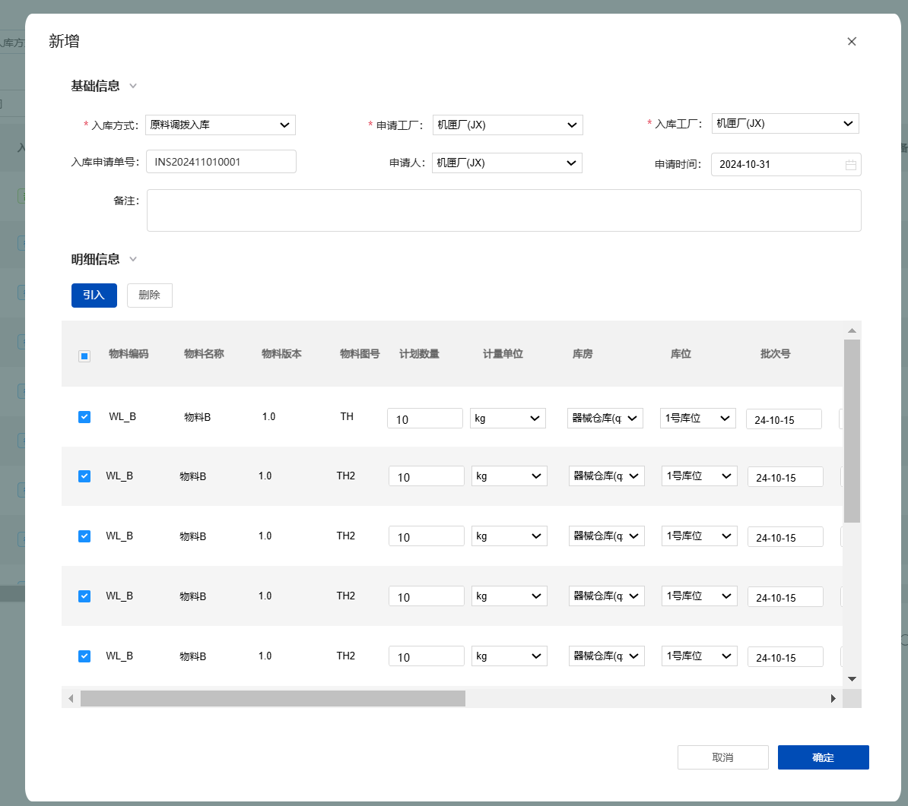

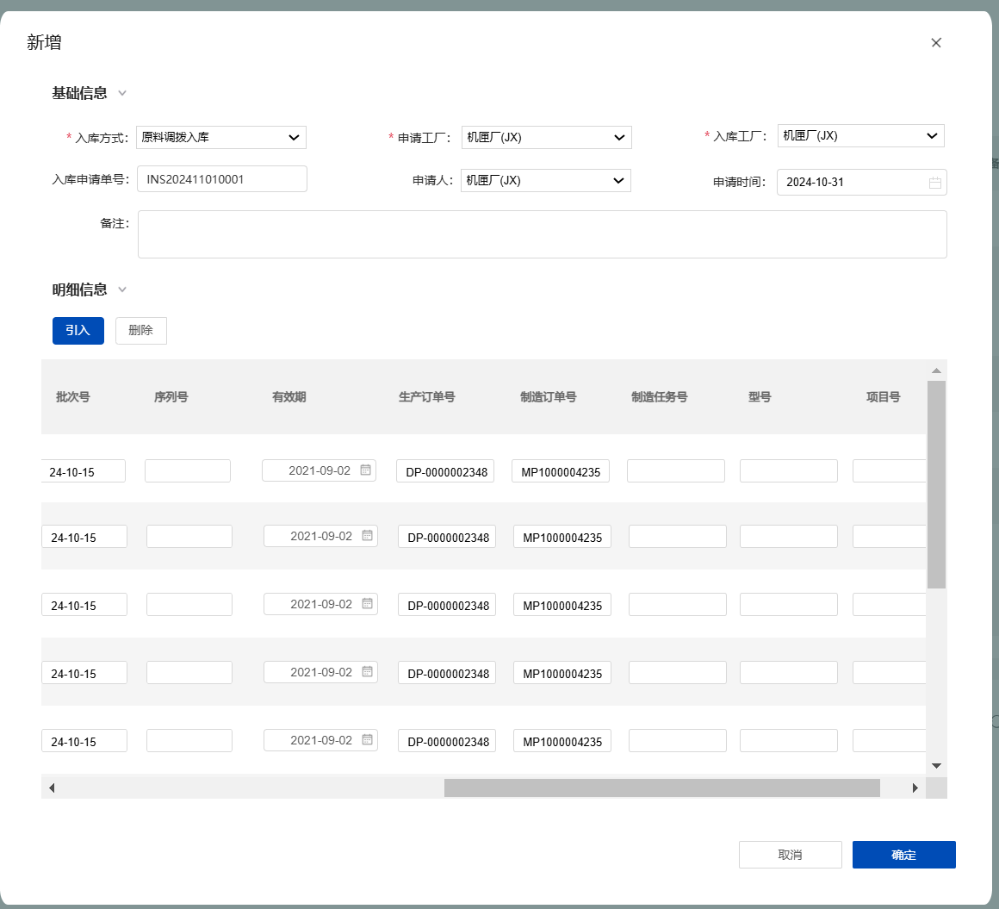

**界面结构**：弹框显示新建页面，包含以下输入框和选项：

**入库方式**：单选，默认值为"原料调拨入库"，下拉候选值：原料调拨入库、余料入库、成品完工入库、子件报废入库、成品报废入库

**申请工厂**：必填，单选，默认显示用户所属的工厂

**入库工厂**：必填，单选，默认显示用户所属的工厂

**入库申请单号**：根据编码规则配置自动生成，预置编码规则：INS+4位年+2位月份+2位日期+4位

**申请人**：显示当前登录用户，格式为 用户编码|用户名称

**申请时间**：显示新增入库申请单的时间，时间格式：yyyy-MM-dd HH:mm:ss

**备注**：非必填，可输入

**明细信息**：包括物料编码、物料名称、物料版本、物料图号、计划数量、计量单位、库房、库位、批次号、序列号、有效期、生产订单号、制造订单号、制造任务号、型号、项目号等

**功能按钮**：

**引入**：点击引入，弹出物料列表弹窗，选择要引入的物料，可根据物料名称/编码检索

**删除**：勾选明细信息，点击删除，直接删除明细

**确定**：点击确定，保存当前页面信息，校验字段输入是否符合要求

**取消**：点击取消，不做任何操作，关闭弹窗

**输入**：

**输入业务对象**：

入库方式

申请工厂

入库工厂

备注

明细信息中的物料、数量、库房、库位、批次号、序列号、有效期、生产订单号、制造订单号、制造任务号、型号、项目号等

**输出**：

**输出业务对象**：入库申请单信息

**业务属性变化**：入库申请单保存成功

**展现形式**：保存成功后，系统显示成功提示

**处理逻辑**：

用户点击"新增"按钮，系统弹出新建页面。

用户填写入库申请单的基本信息和明细信息。

用户点击"引入"按钮，选择要引入的物料。

用户点击"删除"按钮，删除选中的明细信息。

用户点击"确定"按钮，系统校验输入信息，保存入库申请单。

保存完成后，系统显示成功提示。

**验收标准**：

**输入校验**：所有必填字段不能为空，入库申请单号自动生成，需进行唯一性校验。

**功能校验**：点击"引入"按钮时，系统正确弹出物料列表弹窗；点击"删除"按钮时，系统正确删除明细信息；点击"确定"按钮时，系统正确保存入库申请单。

**界面校验**：新建页面的输入框和选项显示正确，功能按钮正常工作。

### 3.2.3 **入库申请单管理-删除**

**概述**：删除入库申请单，确保入库申请单数据的准确性和及时性。

**界面**：

**界面结构**：申请单选择框、删除按钮、确认对话框。

**交互内容**：用户选择申请单，点击删除按钮，系统弹出确认对话框，用户确认后删除申请单。

**校验规则**：当且仅当仅入库状态=【待入库】允许删除

**输入**：申请单编号。

**输出**：

**输出业务对象**：申请单信息。

**业务属性变化**：申请单信息删除。

**展现形式**：删除成功后，系统显示成功提示。

**处理逻辑**：

用户选择申请单并点击删除按钮。

系统校验申请单信息：当且仅当仅入库状态=【待入库】允许删除

校验通过后，系统弹出确认对话框。

用户确认后，系统删除申请单。

删除完成后，系统显示成功提示。

**验收标准**：

申请单信息校验通过。

申请单信息删除成功。

### 3.2.4 **入库申请单管理-编辑**

**概述**：编辑入库申请单信息，支持用户修改申请单中的关键信息。

**界面**：

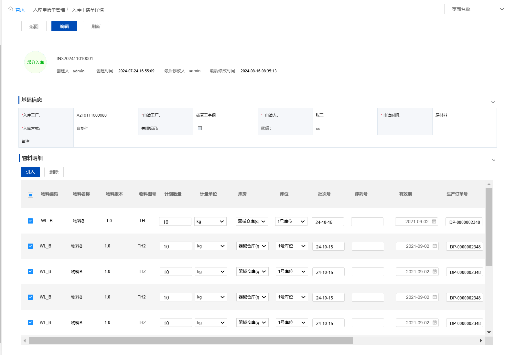

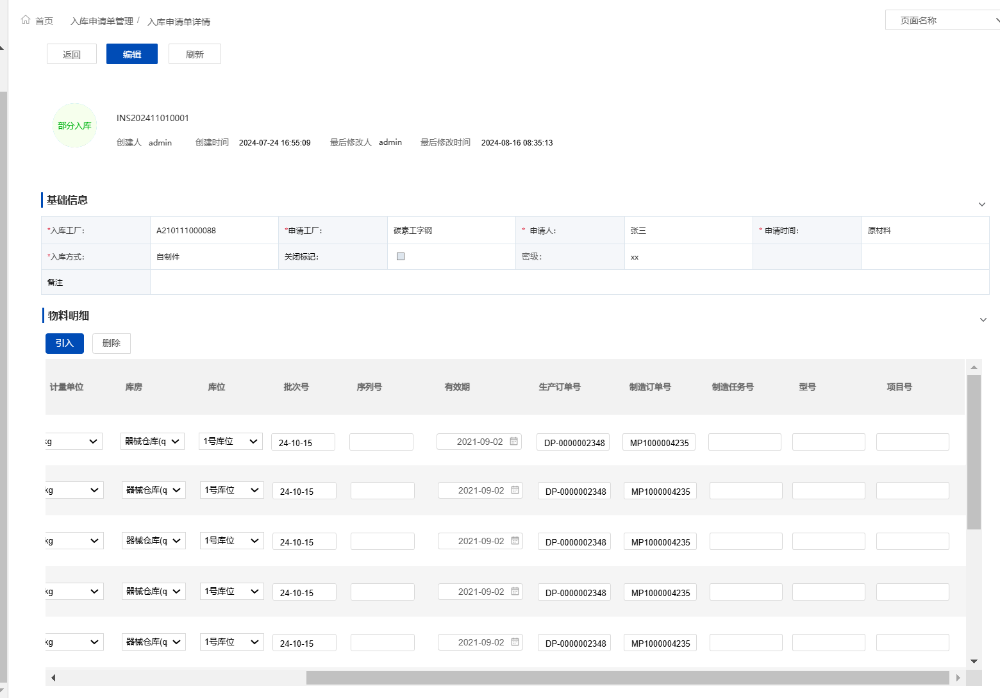

**界面说明**：

当关闭标记等于 是 或 入库状态为部分入库和全部入库时，只能浏览，不能编辑，物料不允许引入和删除

当关闭标记等于 否 且 入库状态为未入库时，允许编辑

点击刷新，显示最新数据；

点击编辑，切换到编辑状态，可编辑字段：入库方式、备注；物料允许引入和删除

**功能按钮**：

**返回**：点击返回上一页；

**编辑**：点击页面变为可编辑状态，按钮变成保存按钮；可编辑字段：入库方式、备注；物料允许引入和删除

**保存**：点击保存修改数据，页面变成查看状态，按钮变成编辑按钮；

**刷新**：点击刷新加载页面数据；

**明细功能**：

**引入**：点击编辑时，按钮可见；点击弹出物料列表弹窗，选择要引入的物料，可根据物料名称/编码检索；数据来源：物料信息表；

**删除**：点击编辑时，按钮可见；勾选明细信息，点击删除，直接删除明细

**输入**：

**输入业务对象**：

入库方式

备注

物料明细中的物料信息

**输出**：

**输出业务对象**：入库申请单信息

**业务属性变化**：入库申请单信息更新成功

**展现形式**：更新成功后，系统显示成功提示

**处理逻辑**：

用户点击"编辑"按钮，页面变为可编辑状态，按钮变成"保存"按钮。

用户修改入库申请单信息，包括入库方式、备注和物料明细。

用户点击"保存"按钮，系统校验输入信息，保存修改后的入库申请单。

保存完成后，页面变成查看状态，按钮变成"编辑"按钮，系统显示成功提示。

**验收标准**：

**输入校验**：所有必填字段不能为空，入库方式和备注符合业务规则。

**功能校验**：点击"编辑"按钮时，页面正确变为可编辑状态；点击"保存"按钮时，系统正确保存修改后的入库申请单。

**界面校验**：编辑页面的输入框和选项显示正确，功能按钮正常工作。

### 3.2.5 **入库申请单管理-关闭**

**概述**：关闭入库申请单，确保申请单状态的准确性和及时性。

**界面**：

**界面结构**：申请单选择框、关闭按钮、确认对话框。

**交互内容**：用户选择申请单，点击关闭按钮，系统弹出确认对话框，用户确认后关闭申请单。

**校验规则**：当且仅当入库状态等于【待入库】和【部分入库】且未关闭时才允许关闭

**输入**：申请单编号。

**输出**：

**输出业务对象**：申请单信息。

**业务属性变化**：申请单状态更新为已关闭。

**展现形式**：关闭成功后，系统显示成功提示。

**处理逻辑**：

用户选择申请单并点击关闭按钮。

系统校验申请单信息：当且仅当入库状态等于【待入库】和【部分入库】且未关闭时才允许关闭

校验通过后，系统弹出确认对话框。

用户确认后，系统关闭申请单，更新关闭标记。

关闭完成后，系统显示成功提示。

**验收标准**：

申请单信息校验通过。

申请单状态更新成功。

## 3.3 **物料入库**

### 3.3.1 **物料入库-查询**

**概述**：查询物料入库信息，支持多条件查询，方便用户快速定位所需物料入库记录。

**界面**：

待入库

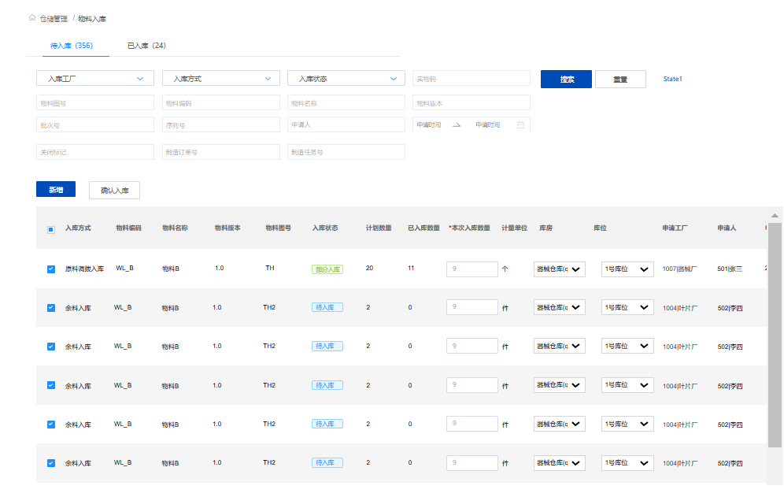

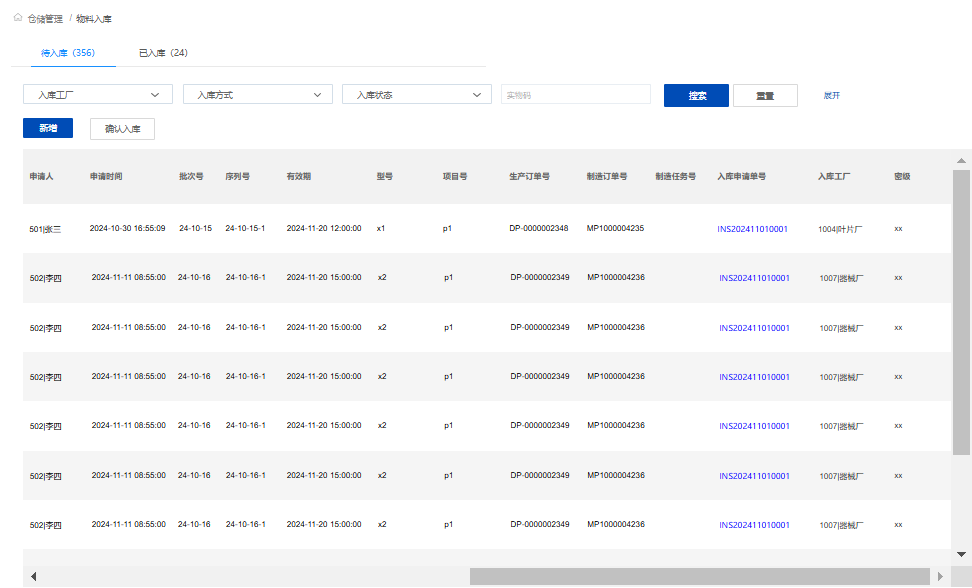

已入库

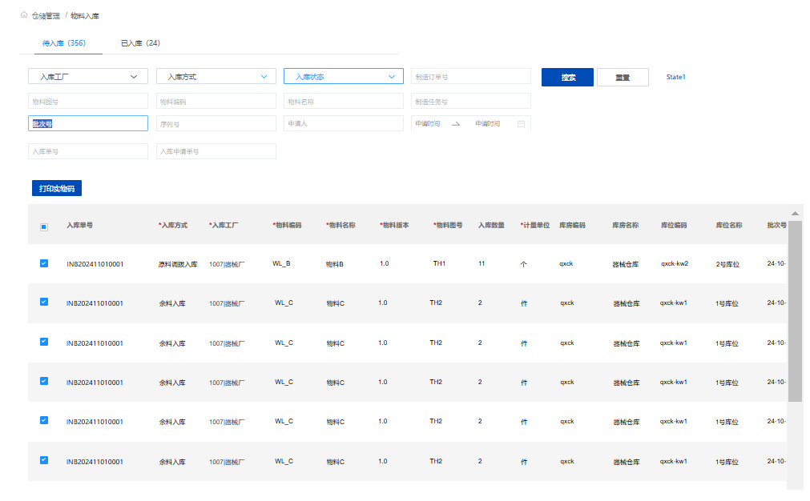

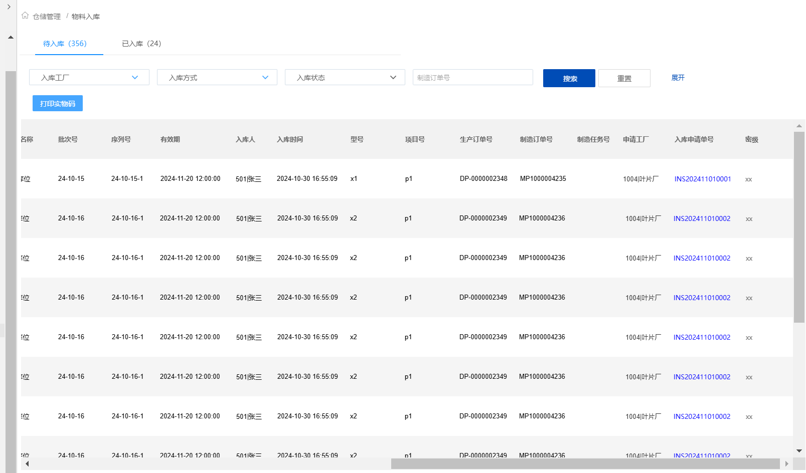

**界面结构**：显示待入库和已入库的物料信息，包含以下查询条件和列表信息：

**导航**：仓储管理-物料入库-待入库

**待入库**：需显示待入库的条数

**查询条件**：

**入库工厂**：默认显示用户所属工厂，下拉显示当前用户具有权限的组织

**入库方式**：默认值为"原料调拨入库"，下拉候选值：原料调拨入库、余料入库、成品完工入库、子件报废入库、成品报废入库

**入库状态**：默认值为"待入库"和"部分入库"，下拉候选值：待入库、部分入库

**申请时间**：日期控件，可选择日期范围，精确到年月日

**关闭标记**：只读，默认为"否"

**网格列表**：

**数据描述**：根据筛选条件查询入库申请单，根据入库申请单，构建待入库清单

**列表字段**：

**本次入库数量**：

可编辑，只能输入正数

默认值 = 计划数量 - 已入库数量

本次入库数量需 <= 计划数量 - 已入库数量

**库房**：

可编辑，非必填，单选

下拉框，关联申请工厂显示工厂下的所有仓库，格式为仓库编码|仓库名称；

默认值：当入库申请单的库房不为空时，取入库申请单上的库房信息；若为空，根据入库工厂读取【业务配置-仓储配置-物料入库-库房分配规则】

无：不做任何处理

取最近一次入库的库房：取该物料上一次入库的库房，根据工厂 + 物料查询入库单，取最新的入库单上的库房

**库位**：

可编辑，非必填，单选

下拉框，关联库房显示库房下的所有库位，格式为库位编码|库位名称；

默认值：当入库申请单的库位不为空时，取入库申请单上的库位信息；

若为空，根据入库工厂读取【业务配置-仓储配置-物料入库-库位分配规则】

无：不做任何处理

取最近一次入库的库位：取该物料上一次入库的库位，根据工厂 + 物料 + 库房查询入库单，取最新的入库单上的库位

**输入**：

**输入业务对象**：

入库工厂

入库方式

入库状态

申请时间

关闭标记

**输出**：

**输出业务对象**：物料入库申请单明细信息

**业务属性变化**：无

**展现形式**：展示待入库和已入库的物料信息，待入库包括入库单号、入库方式、入库工厂、物料编码、物料名称、物料版本、物料图号、入库数量、计量单位、库房、库位、批次号、序列号、有效期、生产订单号、制造订单号、制造任务号、申请工厂、申请人、申请时间、密级等

**处理逻辑**：

用户选择查询条件，点击查询按钮，系统根据查询条件查询入库申请单明细，显示相应的物料待入库信息。仅未关闭、未入库或部分入库的物料才能进行入库。

**验收标准**：

**功能校验**：点击查询按钮时，系统正确显示查询结果；

**界面校验**：查询条件和功能按钮显示正确，查询结果表格展示完整，数据正确。

### 3.3.2 **物料入库-新增**

**概述**：新增物料入库记录，支持用户根据实际需求创建新的物料入库记录。

**界面**：

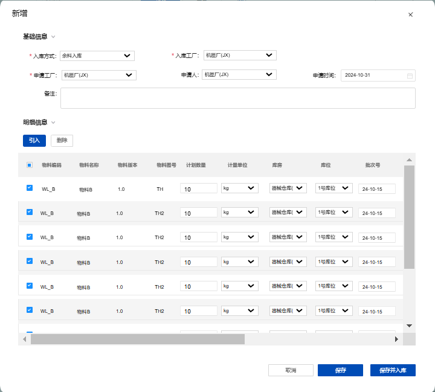

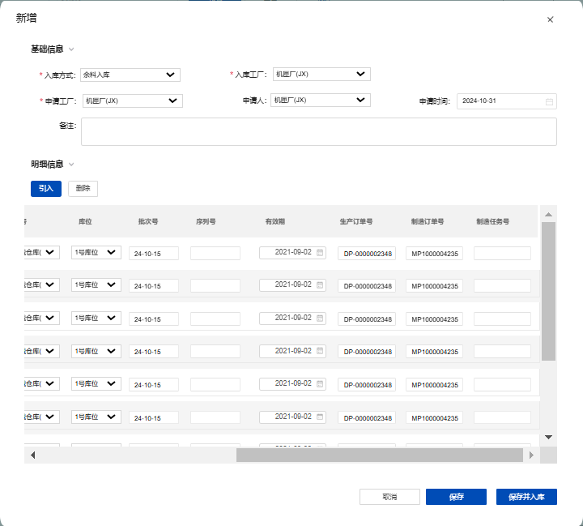

**界面结构**：弹框显示新建页面，包含以下输入框和选项：

**入库方式**：下拉选择框，选项包括：原料调拨入库、余料入库、成品完工入库

**入库工厂**：下拉选择框，显示当前用户具有权限的工厂

**申请工厂**：下拉选择框，显示当前用户具有权限的工厂

**申请人**：显示当前登录用户

**申请时间**：日期控件，可选择日期范围，精确到年月日

**备注**：输入框

**明细信息**：包括物料编码、物料名称、物料版本、物料图号、计划数量、计量单位、库房、库位、批次号、序列号、有效期、生产订单号、制造订单号、制造任务号等

**功能按钮**：

**引入**：点击引入按钮，弹出物料列表弹窗，选择要引入的物料，可根据物料名称/编码检索

**删除**：勾选明细信息，点击删除按钮，直接删除明细

**保存**：点击保存按钮后，系统保存物料入库信息，创建入库申请单

**保存并入库**：点击保存按钮后，系统保存物料入库信息，创建入库申请单，并进行确认入库操作，更新物料库存

**取消**：点击取消按钮后，关闭弹框，不保存任何信息

**输入**：

**输入业务对象**：

入库方式

入库工厂

申请工厂

申请人

申请时间

备注

明细信息中的物料编码、物料名称、物料版本、物料图号、计划数量、计量单位、库房、库位、批次号、序列号、有效期、生产订单号、制造订单号、制造任务号等

**输出**：

**输出业务对象**：物料入库申请单、物料库存

**业务属性变化**：物料入库申请单、物料库存信息保存成功

**展现形式**：保存成功后，系统显示成功提示

**处理逻辑**：

用户点击"新增"按钮，系统弹出新建页面。

用户填写物料入库的基本信息和明细信息。

用户点击"引入"按钮，选择要引入的物料。

用户点击"删除"按钮，删除选中的明细信息。

用户点击"保存"按钮，系统校验输入信息，保存物料入库申请单信息。

用户点击"保存并入库"按钮，系统校验输入信息，保存物料入库申请单和物料库存信息。

保存完成后，系统显示成功提示。

**验收标准**：

**输入校验**：所有必填字段不能为空，入库方式、入库工厂、申请工厂、申请人、申请时间等字段必须正确填写。

**功能校验**：点击"引入"按钮时，系统正确弹出物料列表弹窗；点击"删除"按钮时，系统正确删除明细信息；点击"保存"按钮时，系统正确保存物料入库信息。

**界面校验**：新建页面的输入框和选项显示正确，功能按钮正常工作。

### 3.3.3 **物料入库-确认入库**

**概述**：确认物料入库，更新物料库存信息，确保库存数据的实时性和准确性。

**界面**：

**界面结构**：显示待入库的物料信息，包含以下操作：

**勾选需要入库的记录**：用户勾选需要入库的物料记录。

**点击确定入库**：用户点击确定入库按钮，系统进行数据校验。

**二次确认页面**：数据校验通过后，弹出二次确认页面，用户再次确认入库操作。

**点击确定**：用户点击确定按钮，完成入库操作。

**功能按钮**：

**确定入库**：点击确定入库按钮，系统进行数据校验，弹出二次确认页面。

**二次确认**：点击二次确认页面的确定按钮，完成入库操作。

**输入**：

**输入业务对象**：

入库记录：用户勾选的待入库物料记录。

**输出**：

**输出业务对象**：物料入库信息

**业务属性变化**：

生成入库单记录，显示在已入库页面。入库单编码规则：RK+4位年+2位月份+2位日期+5位

物料的库存数量增加，具体计算方式为：物料的库存数量 = 物料的库存数量 + 本次入库数量。

物料库存唯一性：工厂 + 物料 + 库房状态 + 批次号+ 序列号 + 库房 + 库位。

入库申请单的已入库数量更新：已入库数量 = 原已入库数量 + 本次入库数量。

更新入库申请单的入库状态：

当计划数量 = 已入库数量，入库状态为全部入库。

当已入库数量 > 0，且已入库数量 < 计划数量，入库状态为部分入库。

当已入库数量 = 0，入库状态为未入库。

**展现形式**：入库成功后，系统显示成功提示。

**处理逻辑**：

用户勾选需要入库的记录。

用户点击确定入库按钮，系统进行数据校验。

数据校验通过后，系统弹出二次确认页面。

用户点击二次确认页面的确定按钮，系统执行入库操作。

系统生成入库单记录，更新物料库存信息和入库申请单状态。

入库成功后，系统显示成功提示。

**验收标准**：

**输入校验**：用户必须勾选需要入库的记录，且记录必须存在。

**功能校验**：点击确定入库按钮时，系统正确进行数据校验；数据校验通过后，系统正确弹出二次确认页面；点击二次确认页面的确定按钮时，系统正确执行入库操作，生成入库单记录，更新物料库存信息和入库申请单状态。

**界面校验**：界面显示正确，功能按钮正常工作。

**特殊校验**：当入库工厂下存在盘点状态为"待盘点"的盘点清单时，不允许入库，并提示用户："盘点状态为'待盘点'的盘点清单，请盘点完成后再做出入库操作！"

## 3.4 **出库申请单管理**

### 3.4.1 **出库申请单管理-查询**

**概述**：查询出库申请单信息，支持多条件查询，方便用户快速定位所需出库申请单。

**界面**：

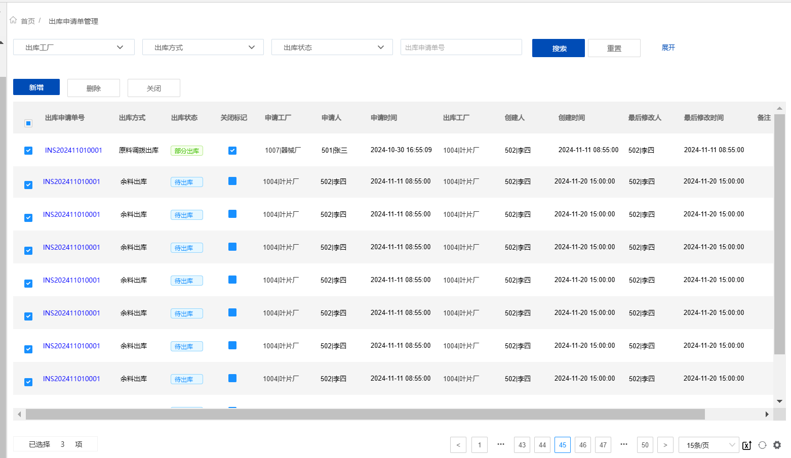

**查询条件**：

**出库工厂**：默认显示用户所属工厂，下拉显示当前用户具有权限的组织

**出库方式**：默认值为"原料生产领用出库"，下拉候选值：原料生产领用出库、原料过期退料出库、原料报废出库、成品调拨出库

**出库状态**：默认值为"待出库"和"部分出库"，下拉候选值：待出库、部分出库、全部出库

**申请时间**：日期控件，可选择日期范围，精确到年月日

**关闭标记**：默认为"否"

**功能按钮**：

**查询**：点击查询按钮，系统根据查询条件显示所选出库工厂的出库申请单

**新增**：点击新增按钮，系统弹出新建出库申请单页面

**删除**：点击删除按钮，系统删除选中的出库申请单

**关闭**：点击关闭按钮，系统关闭选中的出库申请单

**网格列表**：

**数据源**：列表显示所选出库工厂的出库申请单

**列表字段**：

**出库申请单号**：超链接属性，当出库状态为部分出库和全部出库时，点击出库申请单号，打开出库申请单详情页面，仅支持查看和刷新；当出库状态为未出库时，点击出库申请单号，打开出库申请单详情页面，支持编辑、查看、刷新；点击刷新，显示最新数据；点击编辑，切换到编辑状态，可编辑字段：出库方式、添加删除物料明细、编辑物料明细中的属性

**出库方式**：显示具体的出库方式

**出库状态**：显示具体的出库状态

**关闭标记**：显示关闭标记的状态

**申请工厂**：格式为 工厂编码|工厂名称

**申请人**：格式为 用户编码|用户名称

**申请时间**：时间格式：yyyy-MM-dd HH:mm:ss

**出库工厂**：格式为 工厂编码|工厂名称

**创建人**：显示创建人的信息

**创建时间**：显示创建时间

**最后修改人**：显示最后修改人的信息

**最后修改时间**：显示最后修改时间

**备注**：显示备注信息

**输入**：

**输入业务对象**：

出库工厂

出库方式

出库状态

申请时间

关闭标记

**输出**：

**输出业务对象**：出库申请单信息

**业务属性变化**：查询结果展示

**展现形式**：查询结果以表格形式展示，包括出库申请单号、出库方式、出库状态、关闭标记、申请工厂、申请人、申请时间、出库工厂、创建人、创建时间、最后修改人、最后修改时间、备注等信息

**处理逻辑**：

用户输入查询条件，点击查询按钮

系统根据查询条件，从数据库中获取相应的出库申请单信息

系统将查询结果以表格形式展示在页面上

**验收标准**：

**输入校验**：查询条件输入正确，系统能够正确解析

**功能校验**：点击查询按钮后，系统能够正确显示查询结果；点击新增、删除、关闭按钮后，系统能够正确执行相应操作

**界面校验**：查询条件和功能按钮显示正确，查询结果表格展示完整，数据正确

### 3.4.2 **出库申请单管理-新增**

**概述**：新增出库申请单，支持用户根据实际需求创建新的出库申请单。

**界面**：

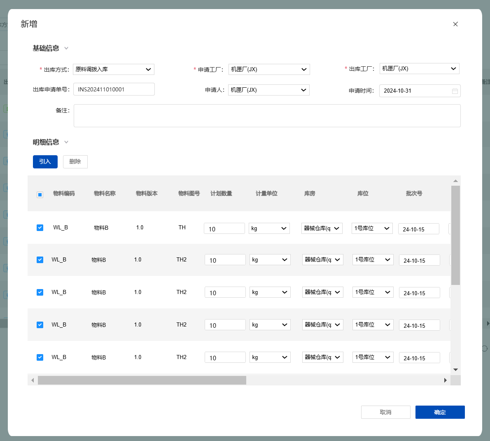

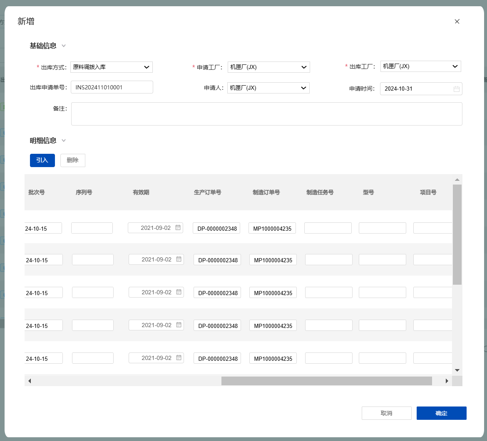

**界面结构**：弹框显示新建页面，包含以下输入框和选项：

**出库方式**：单选，默认值为"原料生产领用出库"，原料生产领用出库、原料过期退料出库、原料报废出库、成品调拨出库

**申请工厂**：必填，单选，默认显示用户所属的工厂

**出库工厂**：必填，单选，默认显示用户所属的工厂

**出库申请单号**：根据编码规则配置自动生成，预置编码规则：OUTS+4位年+2位月份+2位日期+4位

**申请人**：显示当前登录用户，格式为 用户编码|用户名称

**申请时间**：显示新增出库申请单的时间，时间格式：yyyy-MM-dd HH:mm:ss

**备注**：非必填，可输入

**明细信息**：包括物料编码、物料名称、物料版本、物料图号、计划数量、计量单位、库房、库位、批次号、序列号、有效期、生产订单号、制造订单号、制造任务号等

**功能按钮**：

**引入**：点击引入，弹出物料列表弹窗，选择要引入的物料，可根据物料名称/编码检索；数据来源：物料信息表；

**删除**：勾选明细信息，点击删除，直接删除明细

**确定**：点击确定按钮后，系统保存出库申请单信息

**取消**：点击取消按钮后，关闭弹框，不保存任何信息

**输入**：

**输入业务对象**：

出库方式

申请工厂

出库工厂

出库申请单号

申请人

申请时间

备注

明细信息中的物料编码、物料名称、物料版本、物料图号、计划数量、计量单位、库房、库位、批次号、序列号、有效期、生产订单号、制造订单号、制造任务号等

**输出**：

**输出业务对象**：出库申请单信息

**业务属性变化**：出库申请单保存成功

**展现形式**：保存成功后，系统显示成功提示

**处理逻辑**：

用户点击"新增"按钮，系统弹出新建页面。

用户填写出库申请单的基本信息和明细信息。

用户点击"引入"按钮，选择要引入的物料。

用户点击"删除"按钮，删除选中的明细信息。

用户点击"确定"按钮，系统校验输入信息，保存出库申请单。

保存完成后，系统显示成功提示。

**验收标准**：

**输入校验**：所有必填字段不能为空，出库申请单号自动生成，需进行唯一性校验。

**功能校验**：点击"引入"按钮时，系统正确弹出物料列表弹窗；点击"删除"按钮时，系统正确删除明细信息；点击"确定"按钮时，系统正确保存出库申请单。

**界面校验**：新建页面的输入框和选项显示正确，功能按钮正常工作。

### 3.4.3 **出库申请单管理-删除**

**概述**：删除出库申请单，确保出库申请单数据的准确性和及时性。

**界面**：

**界面结构**：申请单选择框、删除按钮、确认对话框。

**交互内容**：用户选择申请单，点击删除按钮，系统弹出确认对话框，用户确认后删除申请单。

**校验规则**：当且仅当仅出库状态=【待出库】允许删除

**输入**：申请单编号。

**输出**：

**输出业务对象**：申请单信息。

**业务属性变化**：申请单信息删除。

**展现形式**：删除成功后，系统显示成功提示。

**处理逻辑**：

用户选择申请单并点击删除按钮。

系统校验申请单信息：当且仅当仅出库状态=【待出库】允许删除

校验通过后，系统弹出确认对话框。

用户确认后，系统删除申请单。

删除完成后，系统显示成功提示。

**验收标准**：

申请单信息校验通过。

申请单信息删除成功。

### 3.4.4 **出库申请单管理-编辑**

**概述**：编辑出库申请单信息，支持用户修改申请单中的关键信息。

**界面**：

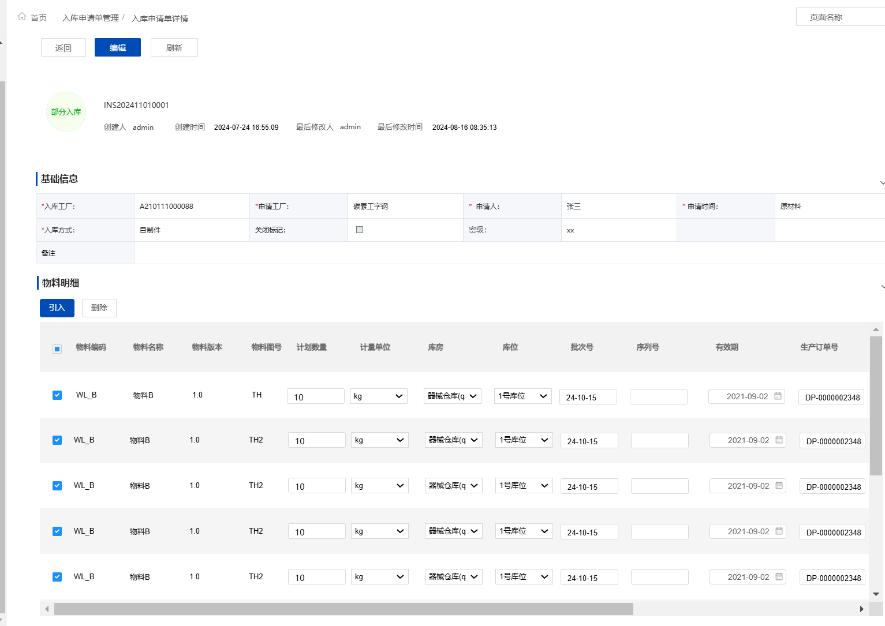

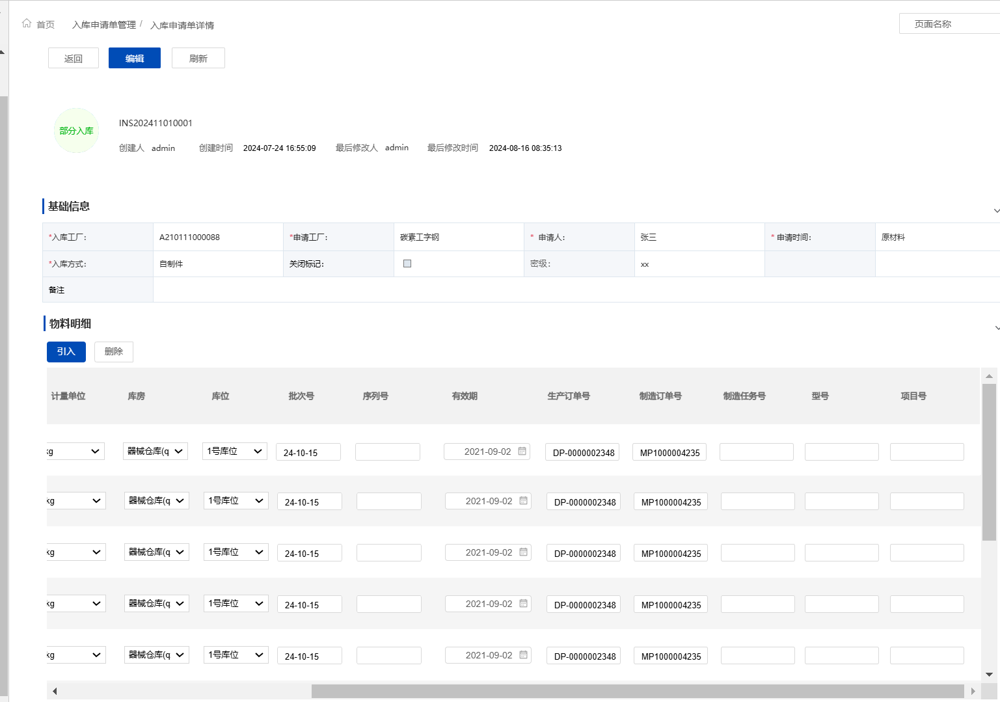

**界面说明**：

当关闭标记等于 是 或 出库状态为部分出库和全部出库时，只能浏览，不能编辑，物料不允许引入和删除

当关闭标记等于 否 且 出库状态为未出库时，允许编辑

点击刷新，显示最新数据；

点击编辑，切换到编辑状态，可编辑字段：出库方式、备注；物料允许引入和删除

**功能按钮**：

**返回**：点击返回上一页；

**编辑**：点击页面变为可编辑状态，按钮变成保存按钮；可编辑字段：出库方式、备注；物料允许引入和删除

**保存**：点击保存修改数据，页面变成查看状态，按钮变成编辑按钮；

**刷新**：点击刷新加载页面数据；

**明细功能**：

**引入**：点击编辑时，按钮可见；点击弹出物料列表弹窗，选择要引入的物料，可根据物料名称/编码检索；数据来源：物料信息表；

**删除**：点击编辑时，按钮可见；勾选明细信息，点击删除，直接删除明细

**输入**：

**输入业务对象**：

出库方式

备注

物料明细中的物料信息

**输出**：

**输出业务对象**：出库申请单信息

**业务属性变化**：出库申请单信息更新成功

**展现形式**：更新成功后，系统显示成功提示

**处理逻辑**：

用户点击"编辑"按钮，页面变为可编辑状态，按钮变成"保存"按钮。

用户修改出库申请单信息，包括出库方式、备注和物料明细。

用户点击"保存"按钮，系统校验输入信息，保存修改后的出库申请单。

保存完成后，页面变成查看状态，按钮变成"编辑"按钮，系统显示成功提示。

**验收标准**：

**输入校验**：所有必填字段不能为空，出库方式和备注符合业务规则。

**功能校验**：点击"编辑"按钮时，页面正确变为可编辑状态；点击"保存"按钮时，系统正确保存修改后的出库申请单。

**界面校验**：编辑页面的输入框和选项显示正确，功能按钮正常工作。

### 3.4.5 **出库申请单管理-关闭**

**概述**：关闭出库申请单，确保申请单状态的准确性和及时性。

**界面**：

**界面结构**：申请单选择框、关闭按钮、确认对话框。

**交互内容**：用户选择申请单，点击关闭按钮，系统弹出确认对话框，用户确认后关闭申请单。

**校验规则**：当且仅当出库状态等于【待出库】和【部分出库】且未被关闭时允许关闭。

**输入**：申请单编号。

**输出**：

**输出业务对象**：申请单信息。

**业务属性变化**：申请单状态更新为已关闭，关闭针对整个出库申请单进行关闭

**展现形式**：关闭成功后，系统显示成功提示。

**处理逻辑**：

用户选择申请单并点击关闭按钮。

系统校验申请单信息。

校验通过后，系统弹出确认对话框。

用户确认后，系统关闭申请单：申请单状态更新为已关闭，关闭针对整个出库申请单进行关闭

关闭完成后，系统显示成功提示。

**验收标准**：

申请单信息校验通过。

申请单状态更新成功。

## 3.5 **物料出库管理**

### 3.5.1 物料出库-查询
**概述**：提供一个集成化的物料出库工作台，用户可在此进行出库申请查询、物料拣配、库存查询及出库确认等一系列操作。界面经过优化，分为主工作区和底部拣货篮，提升了操作效率和用户体验。

**界面描述**：
主界面由顶部筛选区、中心的数据网格区以及底部的拣货篮面板组成。

**1. 筛选区 (Search Bar)**
- **布局**: 采用两行式布局，优化了信息密度和视觉清晰度。
- **第一行 (高频基础筛选)**:
  - **出库申请单号**: 文本输入框，用于精确查找。
  - **物料编码**: 文本输入框。
  - **物料名称**: 文本输入框。
  - **拣配状态**: 下拉选择框，选项包括：全部、未拣配、部分拣配、已拣配。
- **第二行 (关联及时间筛选)**:
  - **制造订单号**: 文本输入框。
  - **需求到料时间**: 日期范围选择器，包含"从"和"至"两个日期输入框。
  - **操作按钮**:
    - `[按钮] 查询`: 根据当前筛选条件刷新主网格数据。
    - `[按钮] 重置`: 清空所有筛选条件，并恢复主网格至默认状态。
- **UI参考**:
  

**2. 数据网格区 (Data Grid)**
- **功能**: 展示待出库的物料申请列表。
- **网格列**: 包括选择框、出库申请单号、制造订单号、物料编码、物料名称、需求数量、已拣配数量、拣配状态、拣配进度、需求到料时间等。
- **交互**:
  - 用户可勾选一行或多行申请单。
  - 点击行内`[按钮] 拣配`可针对单条申请进行拣配。
  - 勾选多行后，可点击列表上方的`[按钮] 批量拣配`。

**3. 拣货篮 (Picking Basket Panel)**
- **位置**: 固定在页面底部，支持展开、收起和最大化。
- **功能**: 作为拣配操作的暂存区，汇总所有待出库的物料项。
- **状态栏 (Status Bar)**: 即使在收起状态下也始终可见，显示关键信息：
  - `[图标] 拣货篮`: 带有呼吸动效，吸引用户注意。
  - `[文本] 拣货总数`: 实时显示篮内物料的总项数。
  - `[文本] 待出库总数`: 显示篮内所有物料的数量总和。
  - `[图标] 展开/收起/最大化`: 控制面板的显示状态。
- **内容区 (Content Area)**: 展开后显示。
  - **头部**: 显示标题"拣货篮"，并提供`[按钮] 清空`和`[按钮] 全部出库`操作。
  - **网格**: 显示已拣配的物料清单。
    - **网格列**: 出库方式、物料图号、物料编码、物料名称、物料版本、出库数量、计量单位、出库申请单号、批次号、序列号、库房、库位、库存状态。
    - **行内操作**: 每行提供`[图标] 移除`操作。
- **UI参考**:
  

**处理逻辑**:
1. **页面加载**:
   - **前置条件**: 用户进入物料出库页面。
   - **主流程**:
     1. 系统默认加载所有`关闭标记`为"否"且`出库状态`为"待出库"或"部分出库"的出库申请单。
     2. 拣货篮默认处于收起状态。
2. **查询操作**:
   - **触发事件**: 用户修改筛选条件后，点击`[按钮] 查询`。
   - **主流程**:
     1. 系统根据所有筛选条件（包括申请单号、物料信息、订单号、时间范围等）向后端请求数据。
     2. 数据网格区刷新，显示符合条件的申请单列表。
   - **异常处理**: 如果查询无结果，数据网格区显示空状态提示。
3. **重置操作**:
   - **触发事件**: 用户点击`[按钮] 重置`。
   - **主流程**:
     1. 清空所有筛选条件输入框。
     2. 数据网格区恢复到页面加载时的默认状态。

**验收标准**:
- 界面布局与UI参考图一致，筛选区、数据网格区、拣货篮各部分功能正常。
- 查询功能能够根据所有筛选条件正确过滤数据。
- 重置功能能够成功清空筛选条件并恢复列表。
- 拣货篮的展开、收起、最大化功能流畅，且能正确显示汇总信息。

### 3.5.2 物料出库-按申请批量拣配/行内拣配
**概述**：用户可以直接在出库申请单列表中，选择一条或多条申请进行物料拣配，系统将自动根据预设规则查找库存并加入拣货篮。

**界面描述**:
- **批量操作**: 在主数据网格的顶部，当用户至少勾选一行申请时，`[按钮] 批量拣配`变为可用状态。
- **行内操作**: 在主数据网格的每一行操作列，始终显示`[按钮] 行内拣配`。

**业务规则**:
- **库存查找**: 拣配时，系统需根据出库申请单指定的物料（编码、版本）查找可用库存。
- **自动拣配优先级**: 系统需遵循业务配置中的出库优先级规则。
  - 读取业务配置`【仓储配置-物料出库-物料出库优先级规则】`。优先按库房配置读取，若无，则按组织配置读取。
  - **先进先出 (FIFO)**: 优先拣配入库时间最早的库存。
  - **有效期临近先出**: 优先拣配有效期最早到期的库存。
- **拣配数量**: 自动拣配的数量不能超过申请的"待出库数量"。

**处理逻辑**:
1. **触发事件**:
   - 用户在主数据网格勾选一个或多个申请单，点击`[按钮] 批量拣配`。
   - 或，用户点击某一行申请单的`[按钮] 行内拣配`。
2. **主流程**:
   1. 系统收集所有选中的出库申请单及其待出库的物料清单。
   2. 对清单中的每一种物料，系统根据"业务规则"中定义的优先级，在库存中查找最匹配的库存批次/序列号。
   3. 系统自动计算本次可拣配数量（取"申请待出库数量"和"可用库存数量"的最小值）。
   4. 将成功匹配并计算好数量的物料项，逐条添加到**拣货篮**中。
   5. 更新拣货篮顶部的汇总数据（总项数、总数量）。
   6. 主数据网格中对应申请行的"已拣配数量"和"拣配状态/进度"需要实时更新。
3. **后置条件**:
   - 物料成功添加到拣货篮。
   - 主列表的拣配状态和数量已更新。
4. **异常处理**:
   - 如果某个物料找不到任何可用库存，系统应给出明确提示（如："物料XXX库存不足，无法完成拣配"），并中止该物料的拣配操作，但不影响其他物料的拣配。

**验收标准**:
- 点击批量拣配或行内拣配后，符合规则的物料被成功添加到拣货篮。
- 添加到拣货篮的物料，其出库数量、库房、库位、批次号等信息均正确无误。
- 拣配后，主列表的"已拣配数量"和"拣配状态"更新正确。
- 库存不足时，系统能给出清晰的提示信息。

### 3.5.3 物料出库-从库存直接拣配
**概述**：允许用户在没有出库申请单的情况下，直接从现有库存中选择物料进行拣配，并将其加入拣货篮。这适用于补料、急料等临时出库场景。

**界面描述**:
- 在主工作区的操作栏，提供一个`[按钮] 从库存拣配`。
- 点击后，弹出一个"选择物料库存"的模态框（Modal）。
- **模态框内部**:
  - **查询区**: 提供库房、库位、库存状态、物料编码/名称等查询条件。
  - **库存列表**: 展示查询到的库存信息，包含物料、批次、序列号、库存数量等。
  - **操作**: 用户可选择一行或多行库存，并手动输入本次要拣配的数量。

**业务规则**:
- **拣配数量约束**: 用户手动输入的拣配数量不能超过所选库存行的"可用库存数量"。
- **出库方式**: 通过此方式拣配的物料，在拣货篮中其"出库方式"应标记为"直接出库"或类似的业务术语，以区别于"按申请出库"。

**处理逻辑**:
1. **触发事件**: 用户点击`[按钮] 从库存拣配`。
2. **主流程**:
   1. 系统弹出"选择物料库存"模态框。
   2. 用户使用查询条件找到目标库存，勾选并填写拣配数量。
   3. 用户点击模态框内的`[按钮] 确定`。
   4. 系统校验用户输入的数量是否合法（不大于可用库存）。
   5. 校验通过后，将用户选择的物料项添加到**拣货篮**。
   6. 更新拣货篮顶部的汇总数据。
3. **后置条件**:
   - 物料成功添加到拣货篮，并标记为"直接出库"。
4. **异常处理**:
   - 如果用户输入的拣配数量超过可用库存，系统应在模态框内给出错误提示，并阻止其添加到拣货篮。

**验收标准**:
- 能够成功从库存列表选择物料并指定数量加入拣货篮。
- 加入拣货篮的物料，"出库方式"标记正确。
- 输入的出库数量超过可用库存时，系统能正确拦截并提示。

### 3.5.4 物料出库-移除/清空
**概述**：为用户提供灵活的拣货篮管理能力，可以单条移除物料，也可以一键清空整个拣货篮。

**界面描述**:
- **移除单项**: 在拣货篮的物料网格中，每一行末尾都有一个`[图标] 移除`按钮。
- **清空全部**: 在拣货篮的头部区域，提供一个`[按钮] 清空`。

**处理逻辑**:
1. **移除单项**:
   - **触发事件**: 用户点击某行物料的`[图标] 移除`。
   - **主流程**:
     1. 系统将该物料从拣货篮数据中移除。
     2. 实时更新拣货篮UI，移除该行。
     3. 重新计算并更新拣货篮头部的汇总数据。
     4. 如果该物料是"按申请拣配"的，则需要将主数据网格中对应申请行的"已拣配数量"扣减回去，并更新"拣配状态"。
2. **清空全部**:
   - **触发事件**: 用户点击`[按钮] 清空`。
   - **主流程**:
     1. 系统弹出二次确认对话框，提示"确定要清空拣货篮中的所有物料吗？"。
     2. 用户确认后，系统清空拣货篮中的所有数据。
     3. 更新拣货篮UI，显示空状态。
     4. 将所有涉及的"按申请拣配"物料的数量归还到主数据网格对应的申请行中。

**验收标准**:
- 点击移除图标能成功删除单个物料，并正确更新所有相关数据。
- 点击清空按钮在确认后能成功清空所有物料，并正确更新所有相关数据。

### 3.5.5 物料出库-全部出库
**概述**：用户在拣货篮中完成所有物料的拣配确认后，可执行"全部出库"操作，系统将一次性处理所有物料的库存扣减，并生成正式的出库单。

**界面描述**:
- 在拣货篮的头部区域，提供一个`[按钮] 全部出库`。该按钮通常是拣货流程的最终操作。

**业务规则**:
- **库存扣减**: 确认出库时，系统需对拣货篮中的每一项物料，在数据库中执行真实的库存扣减操作。
- **负库存校验**:
  - 读取业务配置`【仓储配置-物料库存-是否允许负库存】`。
  - 如果不允许负库存，在执行扣减前必须校验操作是否会导致库存变为负数。若会，则中止出库并给出明确提示。
- **出库单生成**:
  - 出库成功后，系统需为本次出库操作生成一张或多张正式的出库单。
  - 出库单号需遵循编码规则，如 `CK+YYYYMMDD+NNNNN`。
- **状态更新**:
  - 更新相关出库申请单的"已出库数量"和"出库状态"（如更新为"部分出库"或"全部出库"）。

**处理逻辑**:
1. **触发事件**: 用户点击拣货篮中的`[按钮] 全部出库`。
2. **主流程**:
   1. 系统弹出二次确认对话框："您确定要将拣货篮中X项，共Y件物料执行出库吗？"。
   2. 用户确认后，系统开始处理。
   3. **事务开始**:
   4. 对拣货篮中的每一项物料，执行负库存校验（如果配置要求）。
   5. 执行库存数量的扣减。
   6. 生成出库单及出库单明细。
   7. 更新源头出库申请单的状态。
   8. **事务提交**。
   9. 清空拣货篮。
3. **后置条件**:
   - 物料库存已正确扣减。
   - 生成了合法的出库单。
   - 拣货篮被清空，主界面刷新。
4. **异常处理**:
   - 如果在处理过程中（如负库存校验失败），事务应回滚，所有数据恢复到出库前状态。
   - 系统需向用户显示清晰的失败原因，例如："物料XXX库存不足，出库失败，所有操作已取消。"
   - **特殊校验**: 当出库工厂下存在盘点状态为"待盘点"的盘点清单时，不允许出库，并提示用户："当前工厂正在盘点中，请盘点完成后再进行出库操作！"

**验收标准**:
- 点击全部出库后，拣货篮中所有物料的库存被正确扣减。
- 系统能成功生成结构正确、数据无误的出库单。
- 相关的出库申请单状态已正确更新。
- 负库存校验和盘点校验能按预期工作，并在不满足条件时阻止出库。

## 3.6 **物料库存管理**

### 3.6.1 **物料库存-查询**

**概述**：查询物料库存信息，支持多条件查询，方便用户快速定位所需物料库存记录。

**界面**：

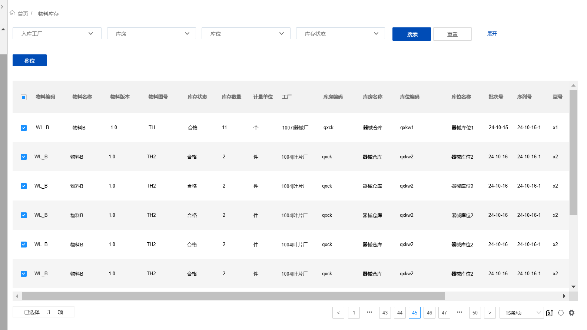

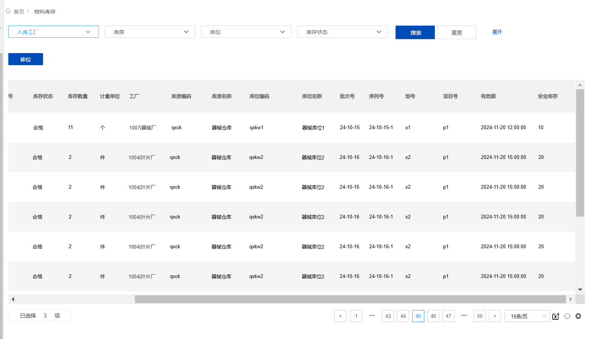

**界面结构**：查询条件输入框、查询按钮、查询结果表格。

**查询条件**：

**工厂**：必填，单选，输入选择框，下拉框，默认显示用户所属工厂。

**库房**：非必填，可多选，输入选择框，下拉框，关联工厂显示工厂下的所有仓库，格式为仓库编码|仓库名称。

**库位**：非必填，可多选，输入选择框，下拉框，关联库房显示库房下的所有库位，格式为库位编码|库位名称。

**库存类型**：非必填，可多选，输入选择框，下拉框，根据数据字典中库存类型显示，默认字典值为自有库存、外委库存、供应商寄售库存、客户寄售库存、共享库存。

**库存状态**：非必填，可多选，输入选择框，下拉框，根据数据字典中库存状态显示，默认字典值为合格、不合格、报废。

**功能按钮**：

**搜索**：点击搜索按钮后，根据查询条件显示查询结果。

**重置**：点击重置按钮后，清空所有查询条件。

**展开**：点击展开按钮后，显示更多查询条件。

**输入**：

**输入业务对象**：

工厂

库房

库位

库存类型

库存状态

**输出**：

**输出业务对象**：物料库存信息

**业务属性变化**：查询结果展示

**展现形式**：查询结果以表格形式展示，包括物料编码、物料名称、物料版本、物料图号、库存状态、库存数量、计量单位、工厂、库房编码、库房名称、库位编码、库位名称、批次号、序列号、型号、项目号、有效期、安全库存等信息

**处理逻辑**：

用户输入查询条件，点击搜索按钮。

系统根据查询条件，从数据库中获取相应的物料库存信息。

系统将查询结果以表格形式展示在页面上。

**验收标准**：

**输入校验**：查询条件输入正确，系统能够正确解析。

**功能校验**：点击搜索按钮后，系统能够正确显示查询结果；点击重置按钮后，系统能够清空所有查询条件；点击展开按钮后，系统能够显示更多查询条件。

**界面校验**：查询条件和功能按钮显示正确，查询结果表格展示完整，数据正确。

### 3.6.2 **物料库存-移位**

**概述**：进行物料移位操作，根据生产需求或库存管理需要，更新物料库存位置信息。

**界面**：

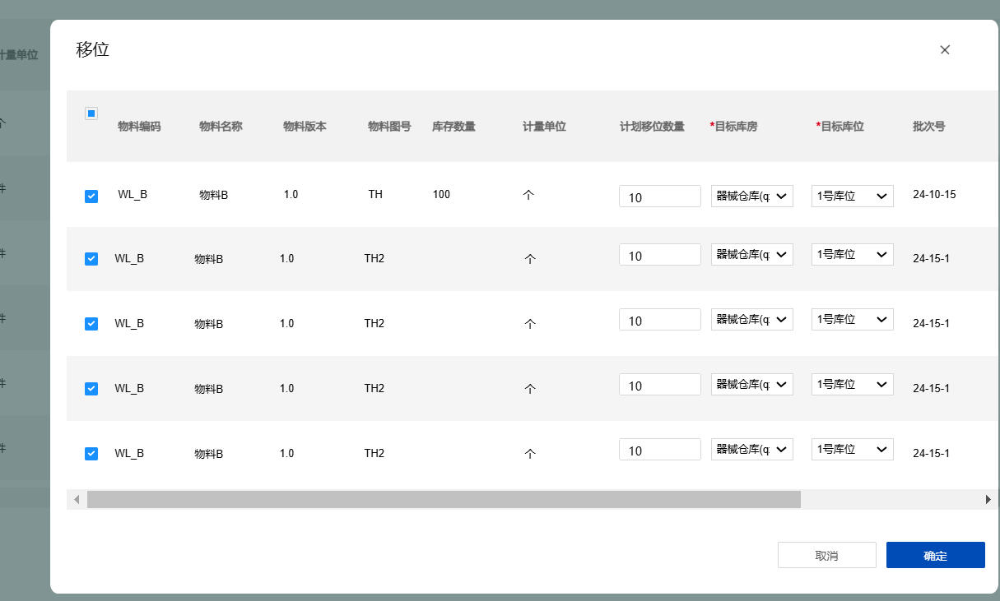

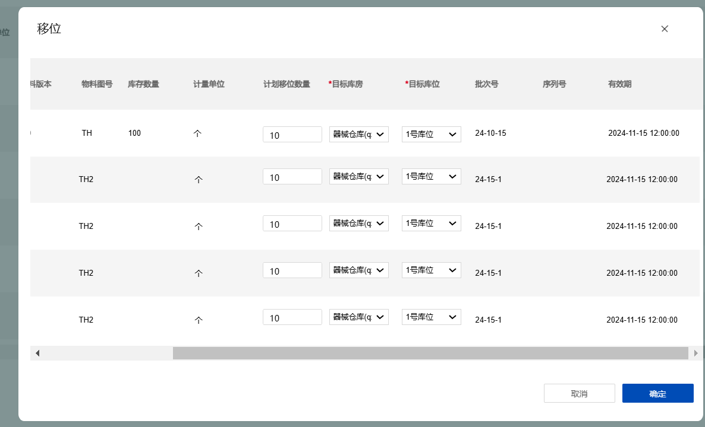

**界面结构**：弹框显示移位页面，包含以下输入框和选项：

**物料编码**：显示框，显示物料编码

**物料名称**：显示框，显示物料名称

**物料版本**：显示框，显示物料版本

**物料图号**：显示框，显示物料图号

**库存数量**：显示框，显示库存数量

**计量单位**：显示框，显示计量单位

**计划移位数量**：输入框，可编辑，默认为库存数量

**目标库房**：下拉选择框，可编辑，必填，默认为原库房，关联目标工厂显示工厂下的所有仓库，格式为仓库编码|仓库名称

**目标库位**：下拉选择框，可编辑，必填，默认为空，关联目标库房显示库房下的所有库位，格式为库位编码|库位名称

**批次号**：显示框，显示批次号

**序列号**：显示框，显示序列号

**有效期**：显示框，显示有效期

**功能按钮**：

**确定**：点击确定按钮后，更新库房、库位信息

**取消**：点击取消按钮后，关闭弹框，不保存任何信息

**输入**：

**输入业务对象**：

计划移位数量

目标库房

目标库位

**输出**：

**输出业务对象**：物料库存信息

**业务属性变化**：物料的库房和库位信息更新

**展现形式**：更新成功后，系统显示成功提示

**处理逻辑**：

用户点击"移位"按钮，系统弹出移位页面。

用户选择需要移位的物料，输入计划移位数量，选择目标库房和目标库位。

用户点击"确定"按钮，系统校验输入信息。

校验通过后，系统更新物料的库房和库位信息。

更新完成后，系统显示成功提示。

**验收标准**：

**输入校验**：计划移位数量必须为正整数，目标库房和目标库位不能为空。

**功能校验**：点击"确定"按钮时，系统正确更新物料的库房和库位信息。

**界面校验**：移位页面的输入框和选项显示正确，功能按钮正常工作。

## 3.7 **库存盘点管理**

### 3.7.1 **库存盘点-查询**

**概述**：查询库存盘点信息，支持多条件查询，方便用户快速定位所需盘点记录。

**界面**：

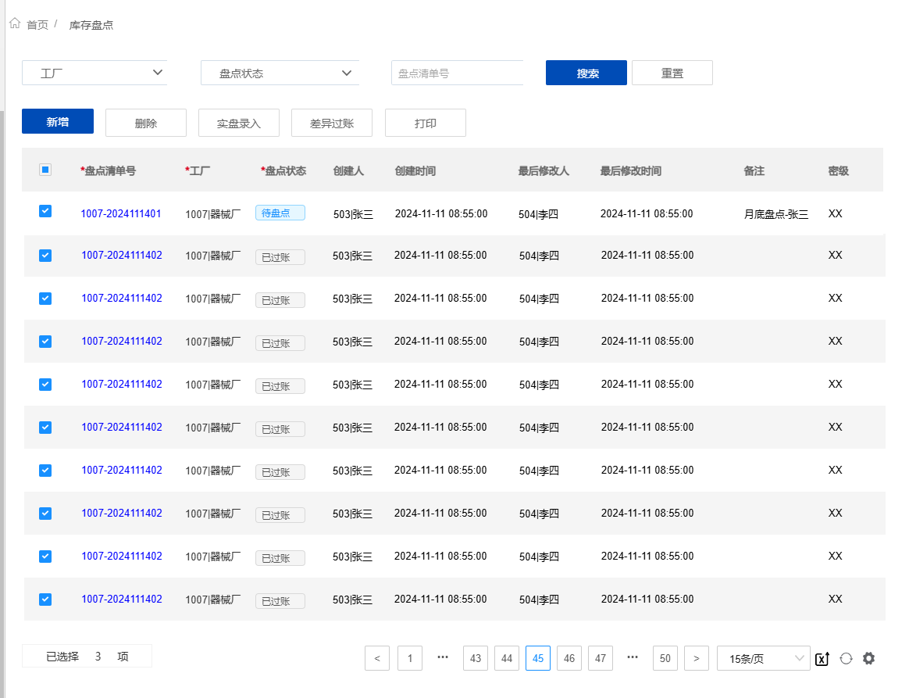

**界面结构**：查询条件输入框、查询按钮、查询结果表格。

**查询条件**：

**工厂**：单选，默认显示用户所属工厂，下拉值为当前用户具有权限的工厂。

**盘点状态**：非必填，可多选，默认为初始，下拉候选值：待盘点、已过账。

**盘点清单号**：非必填，输入框。

**功能按钮**：

**搜索**：点击搜索按钮后，根据查询条件显示盘点清单。

**重置**：点击重置按钮后，清空所有查询条件。

**展开**：点击展开按钮后，显示更多查询条件。

**输入**：

**输入业务对象**：

工厂

盘点状态

盘点清单号

**输出**：

**输出业务对象**：盘点清单信息

**业务属性变化**：查询结果展示

**展现形式**：查询结果以表格形式展示，包括盘点清单号、工厂、盘点状态、创建人、创建时间、最后修改人、最后修改时间、备注、密级等信息

**处理逻辑**：

用户输入查询条件，点击搜索按钮。

系统根据查询条件，从数据库中获取相应的盘点清单信息。

系统将查询结果以表格形式展示在页面上。

**验收标准**：

**输入校验**：查询条件输入正确，系统能够正确解析。

**功能校验**：点击搜索按钮后，系统能够正确显示查询结果；点击重置按钮后，系统能够清空所有查询条件；点击展开按钮后，系统能够显示更多查询条件。

**界面校验**：查询条件和功能按钮显示正确，查询结果表格展示完整，数据正确。

### 3.7.2 **库存盘点-新增**

**概述**：新增库存盘点记录，支持用户根据实际需求创建新的盘点记录。

**界面**：

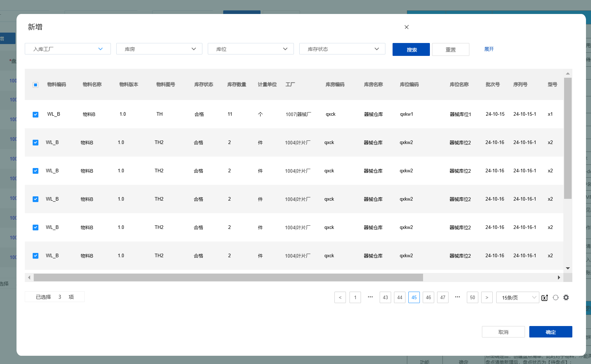

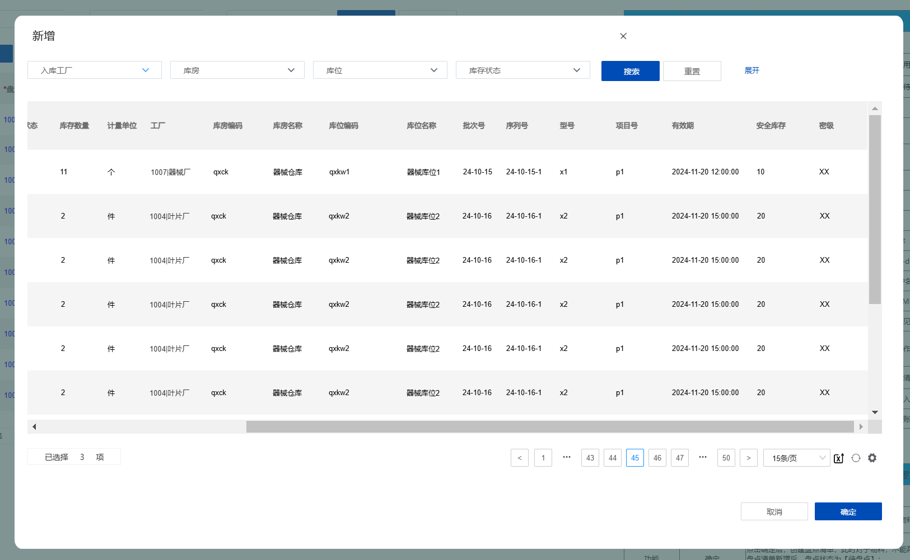

**界面结构**：弹框显示新增页面，包含以下输入框和选项：

**工厂**：下拉选择框，显示当前用户具有权限的工厂。

**库房**：下拉选择框，显示选中工厂下的所有库房。

**库位**：下拉选择框，显示选中库房下的所有库位。

**库存状态**：下拉选择框，显示库存状态选项。

**物料编码**：显示框，显示物料编码。

**物料名称**：显示框，显示物料名称。

**物料版本**：显示框，显示物料版本。

**物料图号**：显示框，显示物料图号。

**库存数量**：显示框，显示库存数量。

**计量单位**：显示框，显示计量单位。

**批次号**：显示框，显示批次号。

**序列号**：显示框，显示序列号。

**型号**：显示框，显示型号。

**项目号**：显示框，显示项目号。

**有效期**：显示框，显示有效期。

**安全库存**：显示框，显示安全库存。

**密级**：显示框，显示密级。

**功能按钮**：

**确定**：点击确定按钮后，创建盘点清单，此时对于物料，不能再做任何出入库操作。盘点清单新增后，盘点状态为【待盘点】；盘点清单号根据【编码规则】生成，可参考格式：工厂编号+4位年+2位月份+2位日期+2位流水号。

**取消**：点击取消按钮后，关闭弹框，不保存任何信息。

**输入**：

**输入业务对象**：

工厂

库房

库位

库存状态

**输出**：

**输出业务对象**：盘点清单信息

**业务属性变化**：盘点清单创建成功，盘点状态为【待盘点】，生成盘点清单号。

**展现形式**：保存成功后，系统显示成功提示。

**处理逻辑**：

用户点击"新增"按钮，系统弹出新增页面。

用户选择工厂、库房、库位和库存状态。

系统根据选择的条件，显示对应的物料库存信息。

用户点击"确定"按钮，系统创建盘点清单，生成盘点清单号，盘点状态为【待盘点】。

保存完成后，系统显示成功提示。

**验收标准**：

**输入校验**：所有必填字段不能为空，工厂、库房、库位和库存状态必须选择有效值。

**功能校验**：点击"确定"按钮时，系统正确创建盘点清单，生成盘点清单号，盘点状态为【待盘点】。

**界面校验**：新增页面的输入框和选项显示正确，功能按钮正常工作。

### 3.7.3 **库存盘点-编辑（与实盘录入合并）**

**概述**：编辑库存盘点信息，支持用户根据实际需求修改盘点记录。

**界面**：

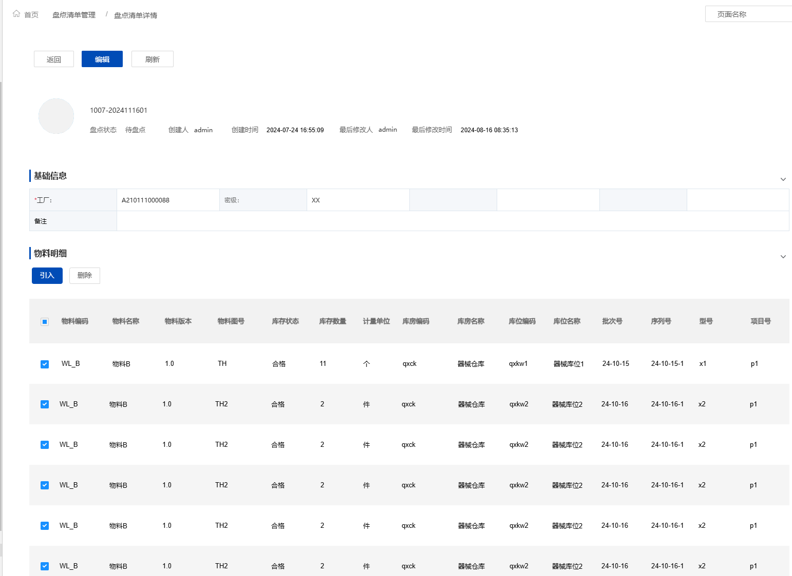

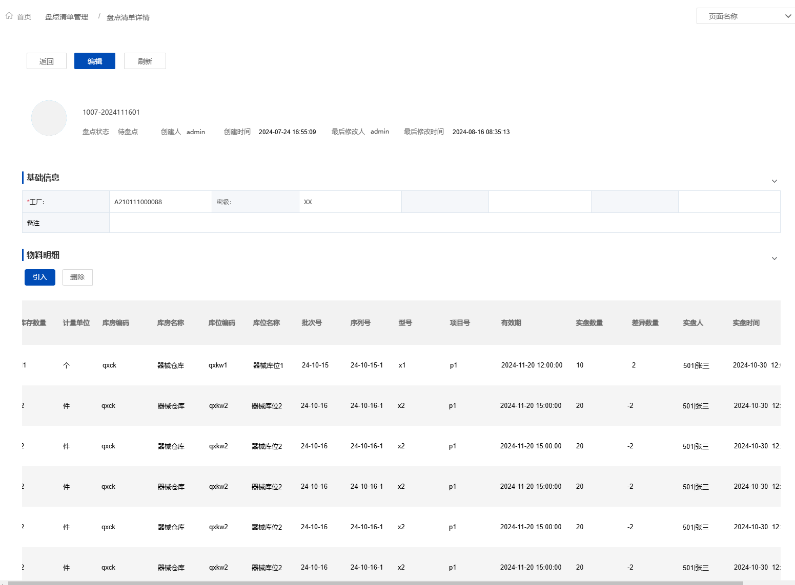

**界面结构**：页面显示盘点清单的详细信息，包括基本信息和物料明细。

**功能按钮**：

**返回**：点击返回按钮，返回上一页。

**编辑**：点击编辑按钮，页面变为可编辑状态，可编辑字段包括备注和物料明细的实盘数量。

**保存**：点击保存按钮，保存最新的盘点清单信息，包括备注、盘点清单明细、最后修改人和最后修改时间。

**刷新**：点击刷新按钮，加载最新的页面数据。

**界面说明**：

当盘点状态为【已过账】时，只能浏览，不能编辑，物料不允许引入和删除。

当盘点状态为【待盘点】时，允许编辑。

**输入**：

**输入业务对象**：

备注：可输入备注信息。

实盘数量：在物料明细中输入实际盘点的数量。

**输出**：

**输出业务对象**：盘点清单信息

**业务属性变化**：盘点清单信息更新，包括备注、盘点清单明细、最后修改人和最后修改时间。

**展现形式**：页面显示更新后的盘点清单信息。

**处理逻辑**：

用户点击"编辑"按钮，页面变为可编辑状态。

用户修改备注信息和物料明细的实盘数量。

用户点击"保存"按钮，系统保存最新的盘点清单信息，更新备注、盘点清单明细、最后修改人和最后修改时间。

保存完成后，页面显示更新后的盘点清单信息。

**验收标准**：

**输入校验**：实盘数量必须为非负数，备注信息可为空。

**功能校验**：点击"编辑"按钮时，页面正确变为可编辑状态；点击"保存"按钮时，系统正确保存最新的盘点清单信息；点击"返回"按钮时，正确返回上一页；点击"刷新"按钮时，正确加载最新的页面数据。

**界面校验**：页面显示正确，功能按钮正常工作，物料明细的实盘数量可编辑。

### 3.7.4 **库存盘点-删除**

**概述**：删除库存盘点记录，确保盘点数据的准确性和及时性。

**界面**：

**界面结构**：盘点记录选择框、删除按钮、确认对话框。

**交互内容**：用户选择盘点记录，点击删除按钮，系统弹出确认对话框，用户确认后删除盘点记录。

**校验规则**：只能删除【待盘点】状态的盘点清单

**输入**：盘点记录编号。

**输出**：

**输出业务对象**：库存盘点信息。

**业务属性变化**：盘点记录删除。

**展现形式**：删除成功后，系统显示成功提示。

**处理逻辑**：

用户选择盘点记录并点击删除按钮。

系统校验盘点记录信息：只能删除【待盘点】状态的盘点清单

校验通过后，系统弹出确认对话框。

用户确认后，系统删除盘点记录。

删除完成后，系统显示成功提示。

**验收标准**：

盘点记录信息校验通过。

盘点记录删除成功。

### 3.7.5 **库存盘点-实盘录入**

**概述**：录入实际盘点数据，更新库存信息，确保库存数据的准确性和完整性。

**界面**：

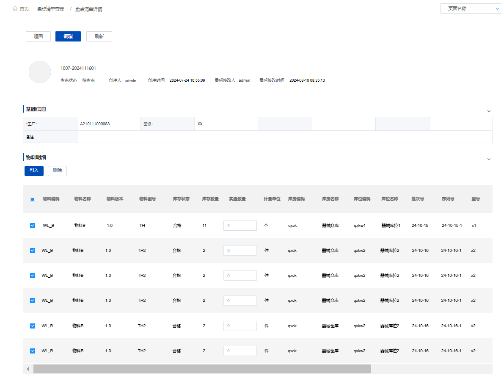

**界面结构**：页面显示盘点清单的详细信息，包括基本信息和物料明细。

**功能按钮**：

**返回**：点击返回按钮，返回上一页。

**编辑**：点击编辑按钮，页面变为可编辑状态，可编辑字段包括备注和物料明细的实盘数量。

**保存**：点击保存按钮，保存最新的盘点清单信息，包括备注、盘点清单明细、最后修改人和最后修改时间。

**刷新**：点击刷新按钮，加载最新的页面数据。

**界面说明**：

当盘点状态为【已过账】时，只能浏览，不能编辑，物料不允许引入和删除。

当盘点状态为【待盘点】时，允许编辑。

**输入**：

**输入业务对象**：

实盘数量：在物料明细中输入实际盘点的数量。

备注：可输入备注信息。

**输出**：

**输出业务对象**：盘点清单信息

**业务属性变化**：盘点清单信息更新，包括实盘数量、备注、最后修改人和最后修改时间。

**展现形式**：页面显示更新后的盘点清单信息。

**处理逻辑**：

用户选择【待盘点】状态的盘点清单，点击实盘录入按钮，进入实盘录入页面。

用户点击编辑按钮，页面变为可编辑状态。

用户在物料明细中输入实盘数量，可引入或删除物料。

用户点击保存按钮，系统保存最新的盘点清单信息，更新备注、盘点清单明细、最后修改人和最后修改时间。

保存完成后，页面显示更新后的盘点清单信息。

**验收标准**：

**输入校验**：实盘数量必须为非负数，备注信息可为空。

**功能校验**：点击编辑按钮时，页面正确变为可编辑状态；点击保存按钮时，系统正确保存最新的盘点清单信息；点击返回按钮时，正确返回上一页；点击刷新按钮时，正确加载最新的页面数据。

**界面校验**：页面显示正确，功能按钮正常工作，物料明细的实盘数量可编辑。

### 3.7.6 **库存盘点-差异过账**

**概述**：处理盘点差异，生成相应的入库或出库单，确保库存数据的准确性和完整性。

**界面**：

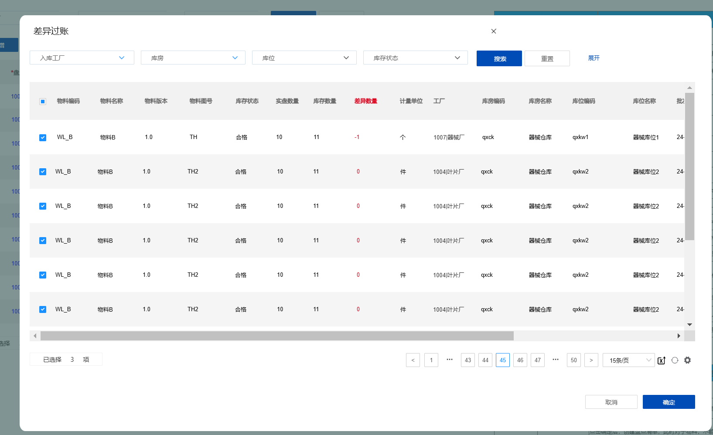

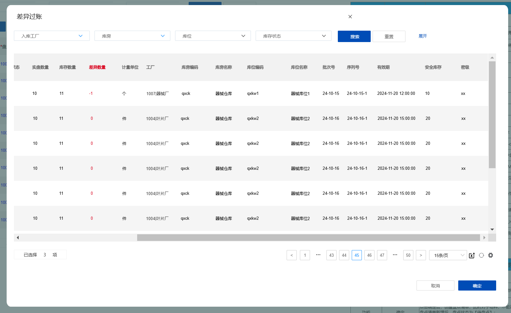

**界面结构**：弹框显示差异过账页面，包含以下查询条件和功能按钮：

**入库工厂**：下拉选择框，显示当前用户具有权限的工厂。

**库房**：下拉选择框，显示选中工厂下的所有库房。

**库位**：下拉选择框，显示选中库房下的所有库位。

**库存状态**：下拉选择框，显示库存状态选项。

**查询按钮**：点击查询按钮，根据查询条件显示盘点清单。

**重置按钮**：点击重置按钮，清空所有查询条件。

**展开按钮**：点击展开按钮，显示更多查询条件。

**功能按钮**：

**确定**：点击确定按钮后，系统处理差异过账，更新盘点状态和物料库存数量。

**取消**：点击取消按钮后，关闭弹框，不保存任何信息。

**输入**：

**输入业务对象**：

入库工厂

库房

库位

库存状态

**输出**：

**输出业务对象**：盘点清单信息

**业务属性变化**：

点击确定后，差异过账成功，盘点状态由【待过账】更新为【已过账】。

差异过账后，物料库存数量更新为"实盘数量"。

**展现形式**：系统显示成功提示，盘点清单状态更新为【已过账】。

**处理逻辑**：

用户选择查询条件，点击查询按钮，系统根据查询条件显示盘点清单。

用户差异过账按钮，单选，系统处理差异过账。

系统更新盘点状态为【已过账】。

系统更新物料库存数量为"实盘数量"。

处理完成后，系统显示成功提示。

**验收标准**：

**输入校验**：所有查询条件输入正确，系统能够正确解析。

**功能校验**：点击查询按钮后，系统正确显示盘点清单；点击确定按钮后，系统正确处理差异过账，更新盘点状态和物料库存数量。

**界面校验**：查询条件和功能按钮显示正确，查询结果表格展示完整，数据正确。

## 3.8 **库存预警管理**

### 3.8.1 **库存预警-安全库存预警**

**概述**：根据库存水平，生成安全库存预警信息，提醒仓库管理员进行补货或调整库存。

**界面**：

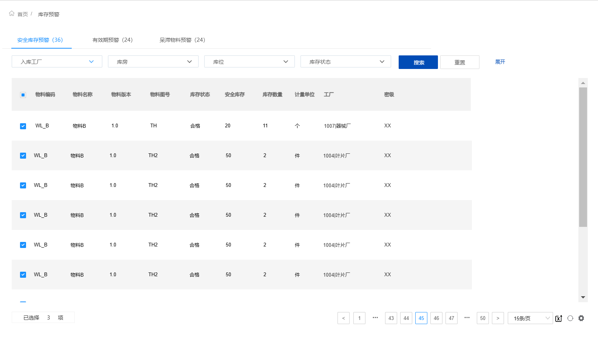

**界面结构**：查询条件输入框、查询按钮、查询结果表格。

**查询条件**：

**工厂**：非必填，单选，输入选择框，下拉框，默认显示用户所属工厂。

**库房**：非必填，可多选，输入选择框，下拉框，关联工厂显示工厂下的所有仓库，格式为仓库编码|仓库名称。

**库位**：非必填，可多选，输入选择框，下拉框，关联库房显示库房下的所有库位，格式为库位编码|库位名称。

**库存类型**：非必填，可多选，输入选择框，下拉框，根据数据字典中库存类型显示，默认字典值为自有库存、外委库存、供应商寄售库存、客户寄售库存、共享库存。

**库存状态**：非必填，可多选，输入选择框，下拉框，根据数据字典中库存状态显示，默认字典值为合格、不合格、报废。

**功能按钮**：

**搜索**：点击搜索按钮后，根据查询条件显示安全库存预警信息。

**重置**：点击重置按钮后，清空所有查询条件。

**展开**：点击展开按钮后，显示更多查询条件。

**输入**：

**输入业务对象**：

工厂

库房

库位

库存类型

库存状态

**输出**：

**输出业务对象**：安全库存预警信息

**业务属性变化**：查询结果展示

**展现形式**：查询结果以表格形式展示，包括物料编码、物料名称、物料版本、物料图号、库存状态、安全库存、库存数量、计量单位、工厂、密级等信息

**处理逻辑**：

用户输入查询条件，点击搜索按钮。

系统根据工厂和物料的安全库存参数，当物料的库存数量总和小于安全库存时，生成预警信息。

系统将查询结果以表格形式展示在页面上。

**验收标准**：

**输入校验**：工厂为必填项，其他查询条件可为空。

**功能校验**：点击搜索按钮后，系统正确显示安全库存预警信息；点击重置按钮后，系统清空所有查询条件；点击展开按钮后，系统显示更多查询条件。

**界面校验**：查询条件和功能按钮显示正确，查询结果表格展示完整，数据正确。

### 3.8.2 **库存预警-有效期预警**

**概述**：根据物料库存的有效期，生成有效期预警信息，提醒仓库管理员处理即将过期的物料。

**界面**：

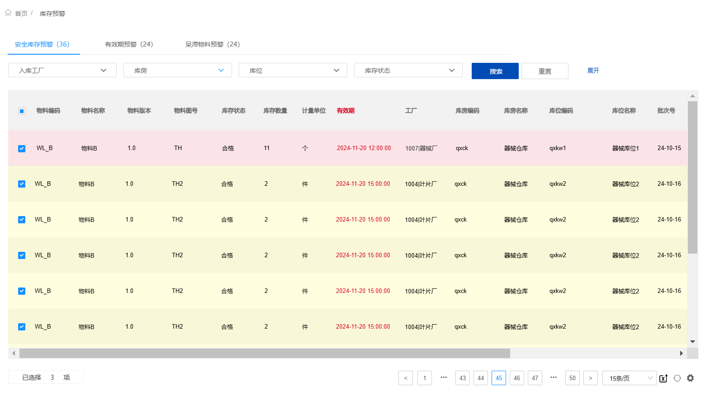

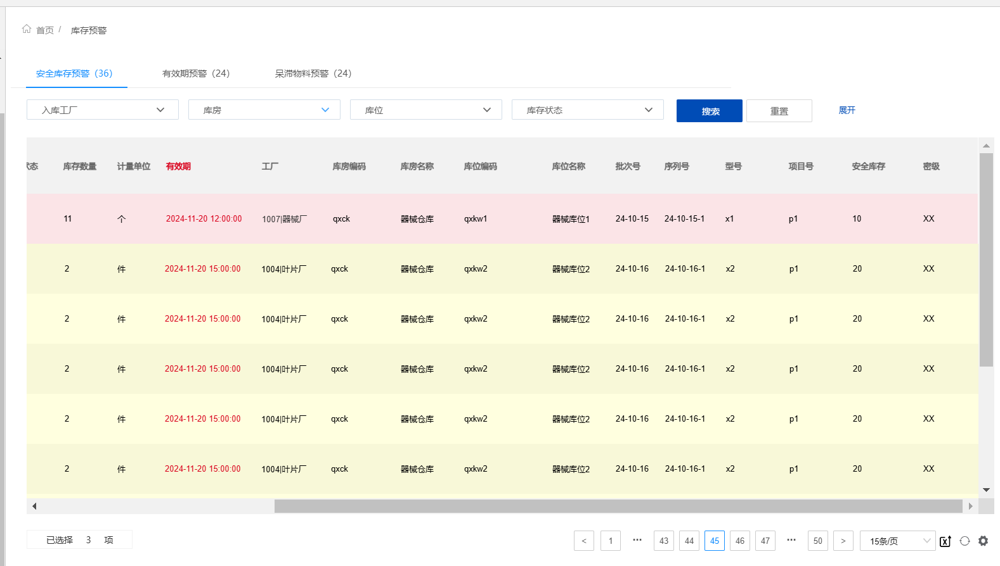

**界面结构**：查询条件输入框、查询按钮、查询结果表格。

**查询条件**：

**工厂**：必填，单选，输入选择框，下拉框，默认显示用户所属工厂。

**库房**：非必填，可多选，输入选择框，下拉框，关联工厂显示工厂下的所有仓库，格式为仓库编码|仓库名称。

**库位**：非必填，可多选，输入选择框，下拉框，关联库房显示库房下的所有库位，格式为库位编码|库位名称。

**库存类型**：非必填，可多选，输入选择框，下拉框，根据数据字典中库存类型显示，默认字典值为自有库存、外委库存、供应商寄售库存、客户寄售库存、共享库存。

**库存状态**：非必填，可多选，输入选择框，下拉框，根据数据字典中库存状态显示，默认字典值为合格、不合格、报废。

**功能按钮**：

**搜索**：点击搜索按钮后，根据查询条件显示有效期预警信息。

**重置**：点击重置按钮后，清空所有查询条件。

**展开**：点击展开按钮后，显示更多查询条件。

**输入**：

**输入业务对象**：

工厂

库房

库位

库存类型

库存状态

**输出**：

**输出业务对象**：有效期预警信息

**业务属性变化**：查询结果展示

**展现形式**：查询结果以表格形式展示，包括物料编码、物料名称、物料版本、物料图号、库存状态、库存数量、计量单位、有效期、工厂、库房编码、库房名称、库位编码、库位名称、批次号、序列号、型号、项目号、安全库存、密级等信息

**处理逻辑**：

读取业务配置【仓储配置-物料预警-物料有效期预警提前期】

优先读根据库房读取配置，若库房为空，则根据组织读取配置

读不到则默认提前7天预警

根据配置的提前期和物料库存的有效期查询需要预警的物料库存，

当有效期小于等于今天时，标红显示。

当有效期大于今天且小于未来7天时，标黄显示。

用户可以通过查询条件筛选出需要关注的物料库存。

**验收标准**：

**输入校验**：工厂为必填项，其他查询条件可为空。

**功能校验**：点击搜索按钮后，系统正确显示有效期预警信息；点击重置按钮后，系统清空所有查询条件；点击展开按钮后，系统显示更多查询条件。

**界面校验**：查询条件和功能按钮显示正确，查询结果表格展示完整，数据正确。

### 3.8.3 **库存预警-呆滞物料预警**

**概述**：根据库存数据，生成呆滞物料预警信息，提醒仓库管理员处理长期未使用的物料。

**界面**：

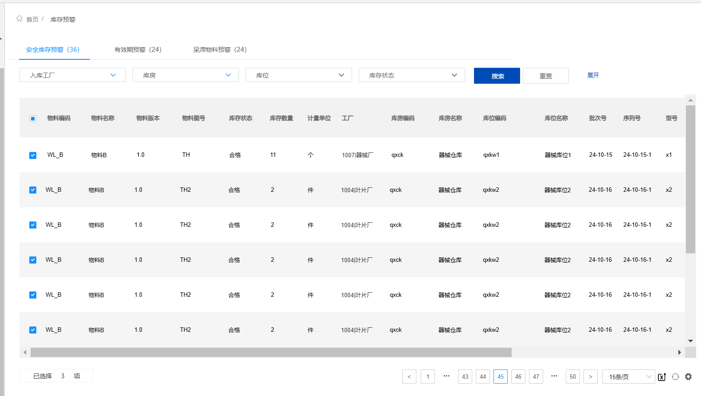

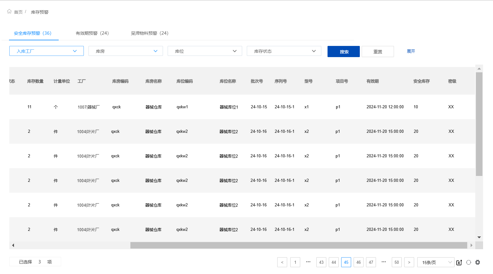

**界面结构**：查询条件输入框、查询按钮、查询结果表格。

**查询条件**：

**工厂**：必填，单选，输入选择框，下拉框，默认显示用户所属工厂。

**库房**：必填，可多选，输入选择框，下拉框，关联工厂显示工厂下的所有仓库，格式为仓库编码|仓库名称。

**库位**：非必填，可多选，输入选择框，下拉框，关联库房显示库房下的所有库位，格式为库位编码|库位名称。

**库存类型**：非必填，可多选，输入选择框，下拉框，根据数据字典中库存类型显示，默认字典值为自有库存、外委库存、供应商寄售库存、客户寄售库存、共享库存。

**库存状态**：非必填，可多选，输入选择框，下拉框，根据数据字典中库存状态显示，默认字典值为合格、不合格、报废。

**功能按钮**：

**搜索**：点击搜索按钮后，根据查询条件显示呆滞物料预警信息。

**重置**：点击重置按钮后，清空所有查询条件。

**展开**：点击展开按钮后，显示更多查询条件。

**输入**：

**输入业务对象**：

工厂

库房

库位

库存类型

库存状态

**输出**：

**输出业务对象**：呆滞物料预警信息

**业务属性变化**：查询结果展示

**展现形式**：查询结果以表格形式展示，包括物料编码、物料名称、物料版本、物料图号、库存状态、库存数量、计量单位、工厂、库房编码、库房名称、库位编码、库位名称、批次号、序列号、型号、项目号、有效期、安全库存、密级等信息

**处理逻辑**：

读取业务配置【仓储配置-物料预警-物料呆滞预警时长】

优先读根据库房读取配置，若库房为空，则根据组织读取配置

读不到则默认预警1年

根据配置的提前期，当物料入库后超过提前期未进行任何出入库（不包含库存盘点）时，则生成呆滞物料预警。

用户可以通过查询条件筛选出需要关注的呆滞物料。

系统将查询结果以表格形式展示在页面上。

**验收标准**：

**输入校验**：工厂为必填项，其他查询条件可为空。

**功能校验**：点击搜索按钮后，系统正确显示呆滞物料预警信息；点击重置按钮后，系统清空所有查询条件；点击展开按钮后，系统显示更多查询条件。

**界面校验**：查询条件和功能按钮显示正确，查询结果表格展示完整，数据正确。

# 4. **外部依赖**

本次功能对外部依赖的状态说明

|产品 | 应用 | 功能 | 外部依赖说明 | 状态|
|--- | --- | --- | --- | ---|
|KMMOM | 系统管理 | 业务配置 | 物料入库、物料拣配、物料出库、物料预警时均需调用业务配置，详见DNW30050-系统配置 | 业务配置本次需开发修订|
