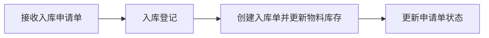
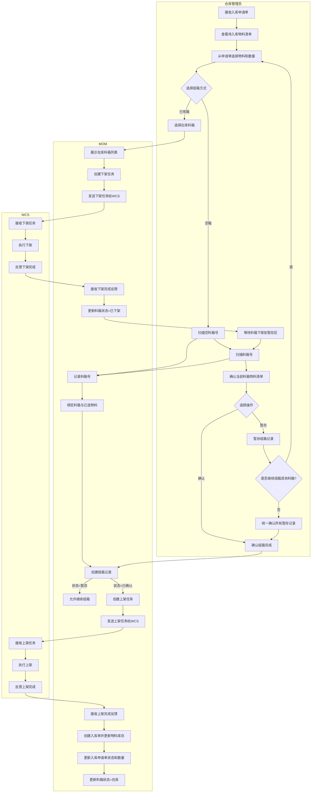
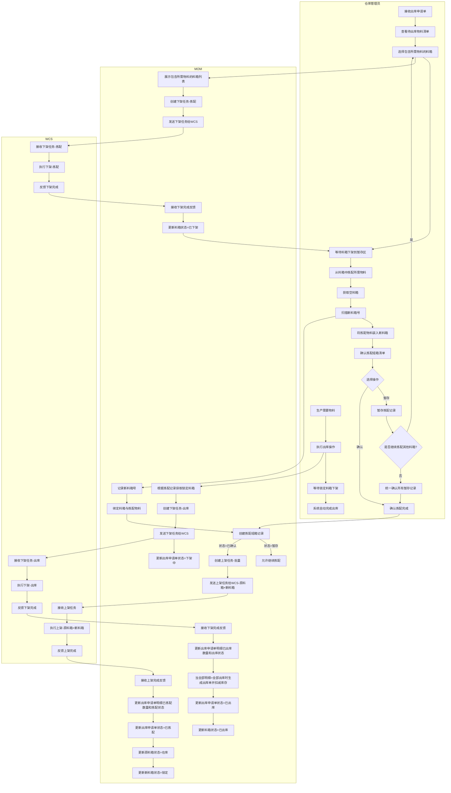
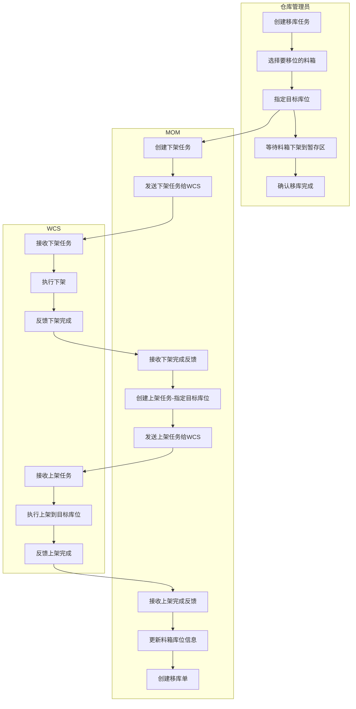
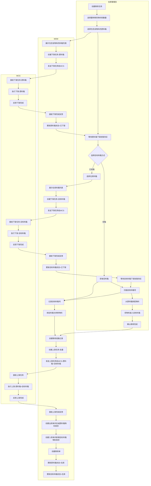
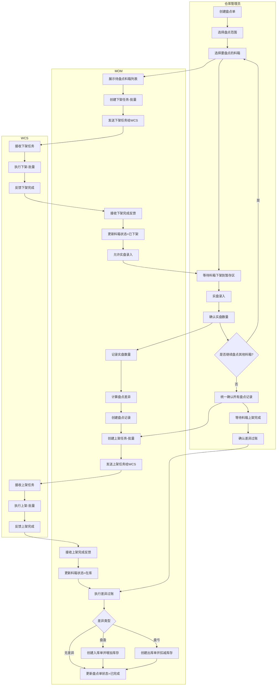
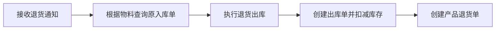
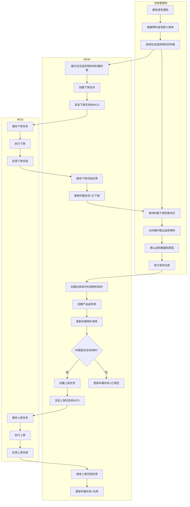
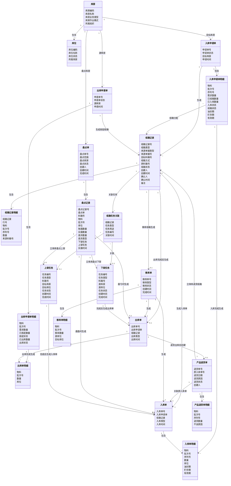

# DNW30701-仓储管理（立体库）

# 1. 概述

## 1.1 业务背景与挑战

KMMOM v3.0仓储管理模块已具备完整的普通库房管理能力。随着制造企业自动化升级，立体库（自动化仓库）逐步替代传统人工库房，成为提升仓储效率、降低人力成本的关键手段。然而，立体库的引入改变了仓储作业的底层逻辑，现有产品面临以下核心挑战：

**挑战1：作业模式从"人找货"转变为"货找人"**
- 业务本质：传统库房依赖人工寻找库位并搬运物料，立体库通过WCS系统自动调度设备完成存取，仓储人员只需在暂存区等待物料送达
- 系统挑战：现有产品基于人工作业设计，缺少与WCS系统的任务协同机制，无法支持"任务驱动"的自动化作业模式

**挑战2：物料管理粒度从"散料"细化为"料箱"**
- 业务本质：立体库以料箱为最小存储单元，物料必须装箱后才能上架，一个料箱可能包含多种物料，一种物料也可能分散在多个料箱
- 系统挑战：现有产品缺少物料与料箱的关联管理，无法追踪"哪些物料在哪个箱子里"，导致立体库场景下的物料追溯断链

**挑战3：库存占用从"出库扣减"前置为"拣配锁定"**
- 业务本质：立体库下架需要时间，多个出库单可能同时拣配同一库位的物料，若不提前锁定库存，会导致实际下架时物料不足
- 系统挑战：现有产品在出库登记时才扣减库存，缺少拣配阶段的库存占用机制，无法防止超拣

## 1.2 价值主张

本方案通过建立库房双重分类体系和任务驱动模型，实现普通库房与立体库的统一管理：

- **统一管理平台**：在同一产品中管理普通库房和立体库，避免多系统切换
- **流程差异化**：根据库房物理形态自动执行不同的出入库流程，普通库房保持现有逻辑，立体库采用任务驱动模式
- **物料精准追踪**：通过组箱管理实现物料与料箱的关联跟踪，支持立体库的精细化管理
- **统一库存锁定机制**：通过库存锁定记录统一管理出库占用、组箱冻结、移库冻结，确保库存准确性
- **用户体验优化**：按库房类型动态显示功能按钮，操作更直观

## 1.3 用户画像

| 分类 | 角色名称 | 核心职责 | 核心诉求与痛点 |
| :--- | :--- | :--- | :--- |
| **执行层** | 仓库管理员 | 执行物料的入库（含组箱）、出库、移库、盘点等日常操作 | 希望系统能自动区分库房类型并引导正确的操作流程，组箱操作支持扫码快速录入，减少操作失误 |
| **管理与协同层** | 仓储主管 | 监控仓储作业进度，处理异常情况 | 希望能实时查看任务执行状态，及时发现和处理异常 |
| **决策与支持层** | 物流经理 | 制定仓储策略，优化库存布局 | 希望系统提供完整的库存数据，支持决策分析 |

## 1.4 术语及缩写解释

| 术语 | 缩写 | 解释说明 |
| --- | --- | --- |
| 立体库 | - | 自动化仓库，通过WCS系统控制堆垛机、AGV等设备实现物料的自动化存取 |
| 普通库房 | - | 传统仓库，依靠人工进行物料的存取操作 |
| 仓库控制系统 | WCS | Warehouse Control System，控制自动化仓储设备（堆垛机、AGV、输送线等）的系统 |
| 组箱 | - | 将物料装入料箱并记录对应关系的操作，是立体库入库的前置步骤 |
| 上架任务 | - | WCS将料箱从暂存区上架到立体库库位的任务 |
| 下架任务 | - | WCS将料箱从立体库库位下架到暂存区的任务 |
| 库存锁定 | - | 临时锁定物料库存，防止被其他业务使用。包括出库占用、组箱冻结、移库冻结三种类型 |
| 物料三期 | - | 物料的油封期、贮存期、有效期，用于物料有效期管理 |
| 油封期 | - | 物料的油封保护有效期限 |
| 贮存期 | - | 物料的仓储存放有效期限 |
| 有效期 | - | 物料的使用有效期限 |
| 暂存区 | - | 立体库入口/出口的临时存放区域，用于物料的中转 |
| 库存直接出库 | - | 紧急出库或临时调拨场景，无需走完整的申请单流程 |
| 产品退货出库 | - | 基于入库单的退货出库，由生产异常处理触发 |
| 整箱移位 | - | 整个料箱连同物料一起移动到新库位，箱子和物料的关联关系不变 |
| 箱内物料转移 | - | 把料箱里的部分或全部物料取出来，放到另一个料箱里，涉及物料与箱子的重新绑定 |

# 2. 需求描述

## 2.1 业务流程

### 2.1.1 入库流程

#### 2.1.1.1 场景说明

入库流程根据库房作业模式分为两种：

| 作业模式 | 业务描述 | 操作流程 | 库存更新时机 | 业务价值 |
|---------|----------|----------|-------------|----------|
| **普通库房** | 仓库管理员直接进行入库登记，系统更新库存 | 接收入库申请单 → 入库登记 → 更新库存 | 入库登记时立即更新库存 | 操作简单，适用于传统人工库房 |
| **立体库** | 仓库管理员进行组箱操作，系统创建上架任务，上架完成后更新库存 | 接收入库申请单 → 组箱 → 上架 → 更新库存 | 上架任务完成后更新库存 | 支持自动化仓库，确保库存与实物一致 |

立体库入库组箱时，料箱的来源有两种：

| 场景 | 业务描述 | 触发条件 | 库存状态变化 | 业务价值 |
|------|----------|----------|-------------|----------|
| **空箱组箱** | 使用全新的空料箱装入物料，料箱内无任何物料 | 仓库管理员直接扫描或输入空料箱号 | 无库存变化，组箱后等待上架完成才更新库存 | 标准入库流程，适用于新物料入库 |
| **已有箱组箱** | 使用立体库中已有物料的料箱，下架后追加装入新物料 | 仓库管理员在组箱界面选择「使用已有箱子」，系统创建下架任务 | 下架时仅标记料箱状态为"已下架"，不锁定库存，原物料保持原样 | 充分利用箱子空间，减少箱子使用量，提高库位利用率 |

**说明**：
- MOM系统不维护料箱主数据，仅记录料箱号与物料的关联关系
- 仓库管理员扫描料箱号时，系统直接记录，不进行有效性验证
- 支持一个入库申请单分多个料箱装载，可分批组箱后统一上架

#### 2.1.1.2 入库业务流程

##### (1) 普通库房入库流程

**流程图：**

**流程说明：**
1. 仓库管理员接收入库申请单
2. 仓库管理员执行入库登记，录入实际入库数量和库位
3. MOM系统创建入库单并更新物料库存
4. MOM系统更新入库申请单状态为"已入库"

##### (2) 立体库入库流程

**流程图：**

**流程说明：**

**阶段1：组箱准备**
1. 仓库管理员接收入库申请单
2. 仓库管理员在MOM系统中打开入库申请单，查看待入库物料清单
3. 仓库管理员从入库申请单中选择要装入料箱的物料和数量
   - 支持选择部分物料装入当前料箱
   - 支持一个入库申请单分多个料箱装载
4. 仓库管理员选择组箱方式：空箱组箱 或 已有箱组箱

**阶段2：料箱准备（分支流程）**

**分支A - 空箱组箱：**
- 仓库管理员获取空料箱（支持两种方式）：
  - 方式1：通过硬件按钮呼叫空箱，WCS将空箱送到暂存区
  - 方式2：直接使用现场已准备好的空料箱
- 仓库管理员扫描或输入空料箱号
- MOM系统直接记录料箱号
- 进入组箱操作

**分支B - 已有箱组箱：**
- 仓库管理员在MOM系统中选择"使用已有箱子"
- MOM系统展示在库状态的料箱列表（过滤条件：库房状态=在库）
- 仓库管理员选择目标料箱
- MOM系统创建下架任务，发送给WCS
- WCS执行下架任务，将料箱从库位搬运到暂存区
- WCS反馈下架完成，MOM系统更新料箱状态为"已下架"（不锁定库存，原物料保持原样）
- 进入组箱操作

**阶段3：组箱操作**
1. 仓库管理员扫描料箱号，MOM系统记录料箱号并绑定已选择的物料
2. 仓库管理员确认当前料箱的物料清单
3. 仓库管理员选择操作：
   - **暂存**：MOM系统创建组箱记录（状态=暂存），不触发上架任务，允许继续组箱其他料箱
   - **确认**：MOM系统创建组箱记录（状态=已确认），触发上架流程

**暂存场景说明：**
- 当一个入库申请单需要分多个料箱装载时，仓库管理员可以先完成所有料箱的组箱操作并暂存
- 所有料箱组箱完成后，统一确认，批量触发上架任务
- 暂存状态的组箱记录可以修改或删除

**阶段4：上架与库存更新**
1. MOM系统创建上架任务（可能是单个或批量），发送给WCS
2. WCS执行上架任务，将料箱从暂存区搬运到立体库库位
3. WCS反馈上架完成，MOM系统接收反馈
4. MOM系统创建入库单并更新物料库存（新增或累加）
5. MOM系统更新入库申请单状态和已入库数量
6. MOM系统更新料箱状态为"在库"

**关键业务规则：**

| 规则项 | 说明 |
|--------|------|
| 料箱号记录 | MOM系统不维护料箱主数据，扫描料箱号时直接记录，不进行有效性验证 |
| 分批组箱 | 支持一个入库申请单分多个料箱装载，每个料箱可以暂存，最后统一确认上架 |
| 暂存状态管理 | 暂存状态的组箱记录可以修改或删除，已确认状态的组箱记录不可修改 |
| 批量上架 | 统一确认时，MOM系统可以批量创建上架任务，提高效率 |
| 入库单创建时机 | 上架任务完成后创建入库单并更新物料库存，确保库存与实物一致 |
| 已有箱下架 | 已有箱下架时仅标记料箱状态为"已下架"，不锁定库存，原物料保持原样 |

### 2.1.2 出库流程

#### 2.1.2.1 场景说明

出库流程根据库房作业模式分为两种：

| 作业模式 | 业务描述 | 操作流程 | 库存更新时机 | 业务价值 |
|---------|----------|----------|-------------|----------|
| **普通库房** | 仓库管理员直接进行出库登记，系统扣减库存 | 接收出库申请单 → 出库登记 → 扣减库存 | 出库登记时立即扣减库存 | 操作简单，适用于传统人工库房 |
| **立体库** | 仓库管理员先拣配组箱并锁定，生产需要时下架出库 | 接收出库申请单 → 拣配组箱 → 上架锁定 → 下架出库 → 扣减库存 | 下架完成后扣减库存 | 提前备料，确保生产及时供应 |

立体库出库分为两个阶段：

| 阶段 | 业务描述 | 触发条件 | 库存状态变化 | 业务价值 |
|------|----------|----------|-------------|----------|
| **拣配组箱** | 提前将所需物料从立体库拣配出来，重新组箱并上架锁定 | 仓库管理员接收出库申请单后，提前进行拣配准备 | 拣配组箱上架后，料箱状态为"锁定"，库存不扣减但不可被其他申请单选择 | 提前备料，缩短生产等待时间 |
| **下架出库** | 生产需要物料时，将锁定的料箱下架并出库 | 生产现场需要物料时，基于出库申请单执行出库 | 下架完成后创建出库单并扣减库存 | 按需出库，确保库存准确性 |

**说明：**
- 立体库出库分为拣配组箱（提前备料）和下架出库（实际出库）两个阶段
- 拣配组箱后的料箱状态为"锁定"，不允许被其他出库申请单选择
- 如果出库申请单取消，锁定的料箱自动解锁，物料无需放回原料箱
- 支持一个出库申请单从多个料箱拣配物料，可分批拣配后统一上架

#### 2.1.2.2 出库业务流程

##### (1) 普通库房出库流程

**流程图：**

**流程说明：**
1. 仓库管理员接收出库申请单
2. 仓库管理员执行出库登记，录入实际出库数量
3. MOM系统创建出库单并扣减物料库存
4. MOM系统更新出库申请单状态为"已出库"

##### (2) 立体库出库流程

**流程图：**

**流程说明：**

**阶段1：拣配准备**
1. 仓库管理员接收出库申请单
2. 仓库管理员在MOM系统中打开出库申请单，查看待出库物料清单
3. 仓库管理员选择包含所需物料的料箱（MOM系统展示包含所需物料的料箱列表）

**阶段2：拣配下架**
1. MOM系统创建下架任务（拣配），发送给WCS
2. WCS执行下架任务，将料箱从库位搬运到暂存区
3. WCS反馈下架完成，MOM系统更新料箱状态为"已下架"

**阶段3：拣配组箱**
1. 仓库管理员从料箱中拣配出所需物料
2. 仓库管理员获取空料箱（支持硬件按钮呼叫或直接使用现场空箱）
3. 仓库管理员扫描新料箱号，MOM系统记录料箱号
4. 仓库管理员将拣配出的物料装入新料箱
5. 仓库管理员确认拣配组箱清单
6. 仓库管理员选择操作：
   - **暂存**：MOM系统创建拣配组箱记录（状态=暂存），不触发上架任务，允许继续拣配其他料箱
   - **确认**：MOM系统创建拣配组箱记录（状态=已确认），触发上架流程

**暂存场景说明：**
- 当一个出库申请单需要从多个料箱拣配物料时，仓库管理员可以先完成所有料箱的拣配操作并暂存
- 所有料箱拣配完成后，统一确认，批量触发上架任务
- 暂存状态的拣配记录可以修改或删除

**阶段4：上架锁定**
1. MOM系统创建上架任务（批量：原料箱+新料箱），发送给WCS
2. WCS执行上架任务，将原料箱和新料箱从暂存区搬运到立体库库位
3. WCS反馈上架完成，MOM系统接收反馈
4. MOM系统更新出库申请单明细的已拣配数量和拣配状态（待拣配/部分拣配/全部拣配）
5. MOM系统更新出库申请单状态为"已拣配"
6. MOM系统更新原料箱状态为"在库"（剩余物料保持在原料箱中）
7. MOM系统更新新料箱状态为"锁定"（不允许被其他申请单选择）

**阶段5：下架出库**
1. 生产现场需要物料时，仓库管理员执行出库操作
2. MOM系统根据拣配组箱记录获取锁定的料箱号
3. MOM系统创建下架任务（出库），发送给WCS
4. MOM系统更新出库申请单状态为"下架中"
5. WCS执行下架任务，将锁定的料箱从库位搬运到暂存区
6. WCS反馈下架完成，MOM系统接收反馈
7. MOM系统更新出库申请单明细的已出库数量和出库状态（待出库/部分出库/全部出库）
8. 当出库申请单全部明细为"全部出库"时，MOM系统自动生成出库单并扣减库存
9. MOM系统更新出库申请单状态为"已出库"
10. MOM系统更新料箱状态为"已出库"

**关键业务规则：**

| 规则项 | 说明 |
|--------|------|
| 拣配组箱 | 支持一个出库申请单从多个料箱拣配物料，每个料箱可以暂存，最后统一确认上架 |
| 料箱锁定 | 拣配组箱上架后，新料箱状态为"锁定"，不允许被其他出库申请单选择 |
| 原料箱处理 | 拣配后的原料箱保留剩余物料，直接上架回立体库，状态为"在库" |
| 出库单创建时机 | 下架任务完成后，系统根据出库申请单明细的已出库数量和出库状态自动生成出库单并扣减库存 |
| 锁定解除 | 如果出库申请单取消，锁定的料箱自动解锁，物料无需放回原料箱 |
| 暂存状态管理 | 暂存状态的拣配记录可以修改或删除，已确认状态的拣配记录不可修改 |

### 2.1.3 移库流程

#### 2.1.3.1 场景说明

移库流程根据库房作业模式分为两种：

| 作业模式 | 业务描述 | 操作流程 | 库存更新时机 | 业务价值 |
|---------|----------|----------|-------------|----------|
| **普通库房** | 仓库管理员直接调整库位，系统更新库存库位信息 | 创建移库任务 → 调整库位 → 更新库存 | 移库登记时立即更新库位 | 操作简单，适用于传统人工库房 |
| **立体库** | 仓库管理员创建移库任务，系统自动执行下架和上架 | 创建移库任务 → 下架 → 拣配组箱（可选） → 上架 → 更新库存 | 上架完成后更新库存 | 支持自动化仓库，提高移库效率 |

立体库移库包含两种场景：

| 场景 | 业务描述 | 触发条件 | 库存状态变化 | 业务价值 |
|------|----------|----------|-------------|----------|
| **整箱移位** | 整个料箱连同物料一起移动到新库位，箱子和物料的关联关系不变 | 仓库管理员选择料箱，指定目标库位 | 仅更新料箱的库位信息，不涉及库存扣减和新增 | 优化库位布局，提高库位利用率 |
| **箱内物料转移** | 从原料箱中拣配部分或全部物料，装入目标料箱，涉及物料与箱子的重新绑定 | 仓库管理员选择物料和数量，指定目标料箱 | 原料箱扣减库存，目标料箱新增库存，同时创建移库单记录 | 物料重新分配，优化物料存储 |

**说明：**
- 立体库移库无需移库申请单，仓库管理员直接创建移库任务
- 整箱移位只更新库位，不涉及拣配组箱和库存变化
- 箱内物料转移需要拣配组箱，同时创建出库单、入库单和移库单
- 目标料箱支持空箱或已有箱，已有箱需要先下架

#### 2.1.3.2 移库业务流程

##### (1) 普通库房移库流程

**流程图：**

**流程说明：**
1. 仓库管理员创建移库任务，选择物料和目标库位
2. 仓库管理员执行库位调整
3. MOM系统更新库存库位信息
4. MOM系统创建移库单记录移库过程

##### (2) 立体库整箱移位流程

**流程图：**

**流程说明：**

**阶段1：移库准备**
1. 仓库管理员创建移库任务
2. 仓库管理员选择要移位的料箱
3. 仓库管理员指定目标库位

**阶段2：下架**
1. MOM系统创建下架任务，发送给WCS
2. WCS执行下架任务，将料箱从原库位搬运到暂存区
3. WCS反馈下架完成

**阶段3：上架与记录**
1. MOM系统创建上架任务（指定目标库位），发送给WCS
2. WCS执行上架任务，将料箱从暂存区搬运到目标库位
3. WCS反馈上架完成
4. MOM系统更新料箱库位信息
5. MOM系统创建移库单记录移库过程

##### (3) 立体库箱内物料转移流程

**流程图：**

**流程说明：**

**阶段1：移库准备**
1. 仓库管理员创建移库任务
2. 仓库管理员选择要转移的物料和数量
3. 仓库管理员选择包含该物料的原料箱（MOM系统展示包含该物料的料箱列表）

**阶段2：原料箱下架**
1. MOM系统创建下架任务（原料箱），发送给WCS
2. WCS执行下架任务，将原料箱从库位搬运到暂存区
3. WCS反馈下架完成，MOM系统更新原料箱状态为"已下架"

**阶段3：目标料箱准备（分支流程）**

**分支A - 空箱：**
- 仓库管理员获取空料箱（支持硬件按钮呼叫或直接使用现场空箱）
- 仓库管理员扫描目标料箱号
- MOM系统记录目标料箱号
- 进入移库组箱操作

**分支B - 已有箱：**
- 仓库管理员在MOM系统中选择"使用已有箱子"
- MOM系统展示在库状态的料箱列表（过滤条件：库房状态=在库）
- 仓库管理员选择目标料箱
- MOM系统创建下架任务（目标料箱），发送给WCS
- WCS执行下架任务，将目标料箱从库位搬运到暂存区
- WCS反馈下架完成，MOM系统更新目标料箱状态为"已下架"
- 进入移库组箱操作

**阶段4：移库组箱**
1. 仓库管理员从原料箱中拣配出要转移的物料
2. 仓库管理员将物料装入目标料箱
3. 仓库管理员确认移库完成
4. MOM系统创建移库组箱记录，绑定目标料箱与转移物料

**阶段5：上架与库存更新**
1. MOM系统创建上架任务（批量：原料箱+目标料箱），发送给WCS
2. WCS执行上架任务，将原料箱和目标料箱从暂存区搬运到立体库库位
3. WCS反馈上架完成，MOM系统接收反馈
4. MOM系统创建出库单并扣减原料箱中被转移物料的库存
5. MOM系统创建入库单并新增目标料箱中物料的库存
6. MOM系统创建移库单记录移库过程
7. MOM系统更新原料箱状态为"在库"（剩余物料保持在原料箱中）
8. MOM系统更新目标料箱状态为"在库"

**关键业务规则：**

| 规则项 | 说明 |
|--------|------|
| 整箱移位 | 仅更新料箱库位信息，不涉及库存扣减和新增，不涉及拣配组箱 |
| 箱内物料转移 | 需要拣配组箱，同时创建出库单、入库单和移库单 |
| 目标料箱选择 | 支持空箱或已有箱，已有箱需要先下架 |
| 原料箱处理 | 转移后的原料箱保留剩余物料，直接上架回立体库，状态为"在库" |
| 单据创建时机 | 上架完成后创建出库单、入库单和移库单，确保库存与实物一致 |

### 2.1.4 盘点流程

#### 2.1.4.1 场景说明

盘点流程根据库房作业模式分为两种：

| 作业模式 | 业务描述 | 操作流程 | 库存更新时机 | 业务价值 |
|---------|----------|----------|-------------|----------|
| **普通库房** | 仓库管理员直接盘点并调整库存 | 创建盘点单 → 实盘录入 → 差异过账 → 更新库存 | 差异过账时立即更新库存 | 操作简单，适用于传统人工库房 |
| **立体库** | 仓库管理员下架盘点后上架，再进行差异过账 | 创建盘点单 → 下架 → 实盘录入 → 上架 → 差异过账 → 更新库存 | 上架完成后差异过账才更新库存 | 确保实物与库存一致，支持自动化仓库 |

**说明**：
- 立体库盘点需要先将料箱下架到暂存区进行实盘
- 实盘完成后必须先上架，确保料箱回到库位
- 上架完成后再进行差异过账，更新库存
- 支持按库位、按物料、按料箱等多种盘点范围

#### 2.1.4.2 盘点业务流程

##### (1) 普通库房盘点流程

**流程图：**

**流程说明：**
1. 仓库管理员创建盘点单
2. 仓库管理员选择盘点范围（库位/物料/料箱）
3. 仓库管理员执行实盘录入，记录实际库存数量
4. MOM系统计算账面库存与实盘数量的差异
5. 仓库管理员确认差异后执行差异过账
6. MOM系统更新物料库存

##### (2) 立体库盘点流程

**流程图：**

**流程说明：**

**阶段1：盘点准备**
1. 仓库管理员创建盘点单
2. 仓库管理员选择盘点范围（库位/物料/料箱）
3. 仓库管理员选择要盘点的料箱（MOM系统展示待盘点料箱列表）

**阶段2：下架**
1. MOM系统创建下架任务（可能是批量），发送给WCS
2. WCS执行下架任务，将料箱从库位搬运到暂存区
3. WCS反馈下架完成，MOM系统更新料箱状态为"已下架"
4. MOM系统允许仓库管理员进行实盘录入

**阶段3：实盘录入**
1. 仓库管理员在暂存区对料箱进行实盘，录入实际库存数量
2. 仓库管理员确认实盘数量
3. MOM系统记录实盘数量，计算与账面库存的差异
4. MOM系统创建盘点记录
5. 仓库管理员可以选择继续盘点其他料箱，或统一确认所有盘点记录

**阶段4：上架**
1. 仓库管理员统一确认所有盘点记录后，MOM系统创建上架任务（批量）
2. MOM系统发送上架任务给WCS
3. WCS执行上架任务，将料箱从暂存区搬运回立体库库位
4. WCS反馈上架完成，MOM系统接收反馈
5. MOM系统更新料箱状态为"在库"

**阶段5：差异过账与库存更新**
1. 仓库管理员确认差异过账
2. MOM系统执行差异过账，根据差异类型处理：
   - **盘盈**：创建入库单并增加物料库存
   - **盘亏**：创建出库单并扣减物料库存
   - **无差异**：直接更新盘点单状态为"已完成"
3. MOM系统更新盘点单状态为"已完成"

**关键业务规则：**

| 规则项 | 说明 |
|--------|------|
| 盘点范围 | 支持按库位、按物料、按料箱等多种盘点范围 |
| 批量下架 | 支持一次选择多个料箱，批量创建下架任务 |
| 实盘时机 | 料箱下架到暂存区后才允许实盘录入 |
| 上架优先 | 实盘完成后必须先上架，确保料箱回到库位 |
| 差异过账时机 | 上架完成后才执行差异过账，更新库存 |
| 单据创建 | 盘盈创建入库单，盘亏创建出库单，无差异不创建单据 |
| 批量上架 | 统一确认时，MOM系统可以批量创建上架任务，提高效率 |

### 2.1.5 产品退货出库流程

#### 2.1.5.1 场景说明

产品退货出库流程根据库房作业模式分为两种：

| 作业模式 | 业务描述 | 操作流程 | 库存更新时机 | 业务价值 |
|---------|----------|----------|-------------|----------|
| **普通库房** | 仓库管理员根据物料查询原入库单,直接执行退货出库 | 接收退货通知 → 根据物料查询原入库单 → 退货出库 → 扣减库存 | 退货出库时立即扣减库存 | 操作简单,适用于传统人工库房 |
| **立体库** | 仓库管理员根据物料查询原入库单,下架后执行退货出库 | 接收退货通知 → 根据物料查询原入库单 → 下架 → 退货出库 → 扣减库存 | 下架完成后扣减库存 | 支持自动化仓库,确保库存准确性 |

**说明**：
- 产品退货出库是指生产现场发现原料质量问题,需要将物料退回供应商的业务场景
- 仓库管理员根据退货物料信息查询原入库单,确认退货来源
- 立体库退货需要先将料箱下架到暂存区,再执行退货出库
- 退货出库创建出库单并扣减库存,同时创建产品退货单记录退货信息

#### 2.1.5.2 产品退货出库业务流程

##### (1) 普通库房产品退货出库流程

**流程图：**

**流程说明：**
1. 仓库管理员接收生产现场的退货通知（来源于生产异常单）
2. 仓库管理员根据退货物料信息查询原入库单,确认退货来源
3. 仓库管理员执行退货出库,录入退货数量和退货原因
4. MOM系统创建出库单并扣减物料库存
5. MOM系统创建产品退货单,记录退货信息

##### (2) 立体库产品退货出库流程

**流程图：**

**流程说明：**

**阶段1：退货准备**
1. 仓库管理员接收生产现场的退货通知（来源于生产异常单）
2. 仓库管理员根据退货物料信息查询原入库单,确认退货来源
3. 仓库管理员选择包含退货物料的料箱（MOM系统展示包含退货物料的料箱列表）

**阶段2：下架**
1. MOM系统创建下架任务,发送给WCS
2. WCS执行下架任务,将料箱从库位搬运到暂存区
3. WCS反馈下架完成,MOM系统更新料箱状态为"已下架"

**阶段3：退货出库**
1. 仓库管理员从料箱中取出退货物料
2. 仓库管理员确认退货数量和退货原因
3. 仓库管理员执行退货出库
4. MOM系统创建出库单并扣减物料库存
5. MOM系统创建产品退货单,记录退货信息
6. MOM系统更新料箱物料清单

**阶段4：上架（条件性）**
1. MOM系统判断料箱是否还有剩余物料：
   - **有剩余物料**：创建上架任务,将料箱上架回立体库,更新料箱状态为"在库"
   - **无剩余物料**：更新料箱状态为"已清空",不执行上架
2. 如需上架,MOM系统发送上架任务给WCS
3. WCS执行上架任务,将料箱从暂存区搬运回立体库库位
4. WCS反馈上架完成,MOM系统更新料箱状态为"在库"

**关键业务规则：**

| 规则项 | 说明 |
|--------|------|
| 退货来源追溯 | 根据退货物料信息查询原入库单,确认退货来源和批次 |
| 料箱选择 | MOM系统展示包含退货物料的料箱列表,仓库管理员选择目标料箱 |
| 退货原因记录 | 产品退货单必须记录退货原因（如质量问题、规格不符等） |
| 料箱状态管理 | 退货后料箱可能为空,需判断是否上架回库 |
| 单据创建 | 同时创建出库单（扣减库存）和产品退货单（记录退货信息） |
| 库存扣减时机 | 立体库下架完成后扣减库存,确保库存与实物一致 |

## 2.2 业务数据模型

### 2.2.1 业务对象关系图

### 2.2.2 业务属性

**库房业务属性（扩展）**

| 字段名 | 业务类型 | 业务约束 | 业务说明 |
|--------|----------|----------|----------|
| 库房业务类型 | 枚举 | 必填 | ERP一级库、ERP二级库、车间中转库、成品库等。描述库房在业务流程中的角色 |
| 库房作业模式 | 枚举 | 必填，默认"普通库房" | 普通库房、立体库。决定入库/出库/移库/盘点的操作流程 |

**入库申请单业务属性**

| 字段名 | 业务类型 | 业务约束 | 业务说明 |
|--------|----------|----------|----------|
| 申请单号 | 文本标识 | 系统自动生成 | 格式：INB-YYYYMMDD-XXX |
| 申请单状态 | 枚举 | 系统计算 | 待入库、上架中、已完成（由明细状态汇总） |
| 目标库房 | 引用 | 必填 | 入库目标库房 |
| 申请时间 | 日期时间 | 系统自动记录 | 入库申请单创建时间 |

**入库申请单明细业务属性（修订）**

| 字段名 | 业务类型 | 业务约束 | 业务说明 |
|--------|----------|----------|----------|
| 物料 | 引用 | 必填 | 申请入库的物料 |
| 批次号 | 文本标识 | 条件必填 | 物料批次号，物料启用批次管理时必填 |
| 序列号 | 文本标识 | 条件必填 | 物料序列号，物料启用序列号管理时必填 |
| 需求数量 | 数量 | 必填，大于0 | 申请入库数量 |
| 已组箱数量 | 数量 | 系统累计，默认0 | 已确认组箱的数量 |
| 组箱状态 | 枚举 | 系统计算 | 待组箱、部分组箱、全部组箱 |
| 已入库数量 | 数量 | 系统累计，默认0 | 已完成上架并入库的数量 |
| 入库状态 | 枚举 | 系统计算 | 待入库、部分入库、全部入库（原"业务状态"改名） |
| 油封期 | 日期 | 可选 | 物料的油封保护有效期 |
| 贮存期 | 日期 | 可选 | 物料的仓储存放有效期 |
| 有效期 | 日期 | 可选 | 物料的使用有效期 |

**组箱记录业务属性**

| 字段名 | 业务类型 | 业务约束 | 业务说明 |
|--------|----------|----------|----------|
| 组箱记录号 | 文本标识 | 系统自动生成 | 格式：BOX-YYYYMMDD-XXX |
| 组箱类型 | 枚举 | 必填 | 入库组箱、拣配组箱、移库组箱、退货组箱 |
| 来源单据类型 | 枚举 | 必填 | 入库申请单、出库申请单、移库任务、产品退货单 |
| 来源单据号 | 文本标识 | 必填 | 对应来源单据编号 |
| 目标料箱号 | 文本标识 | 必填 | 组箱完成后的目标料箱号 |
| 组箱方式 | 枚举 | 条件必填 | 空箱组箱、已有箱组箱（入库组箱时必填） |
| 原料箱号 | 文本标识 | 条件必填 | 拣配组箱、移库组箱、已有箱组箱时必填 |
| 组箱状态 | 枚举 | 必填 | 暂存、已确认、已取消 |
| 创建人 | 引用 | 系统自动记录 | 组箱记录创建人 |
| 创建时间 | 日期时间 | 系统自动记录 | 组箱记录创建时间 |
| 确认人 | 引用 | 组箱状态为"已确认"时记录 | 组箱确认人 |
| 确认时间 | 日期时间 | 组箱状态为"已确认"时记录 | 组箱确认时间 |
| 备注 | 文本 | 可选 | 组箱补充说明 |

**组箱记录明细业务属性**

| 字段名 | 业务类型 | 业务约束 | 业务说明 |
|--------|----------|----------|----------|
| 组箱记录 | 引用 | 必填 | 关联的组箱记录 |
| 行号 | 整数 | 系统自动生成 | 组箱明细行号 |
| 物料 | 引用 | 必填 | 组箱物料 |
| 批次号 | 文本标识 | 条件必填 | 物料启用批次管理时必填 |
| 序列号 | 文本标识 | 条件必填 | 物料启用序列号管理时必填 |
| 数量 | 数量 | 必填，大于0 | 本行组箱数量 |
| 来源料箱号 | 文本标识 | 可选 | 拣配组箱/移库组箱时记录来源料箱 |

**组箱任务关联业务属性**

| 字段名 | 业务类型 | 业务约束 | 业务说明 |
|--------|----------|----------|----------|
| 组箱记录 | 引用 | 必填 | 关联的组箱记录 |
| 任务类型 | 枚举 | 必填 | 上架任务、下架任务 |
| 任务用途 | 枚举 | 必填 | 已有箱下架、原料箱下架、目标箱下架、上架入库、上架锁定、出库下架 |
| 任务编号 | 引用 | 必填 | 关联任务编号 |
| 关联时间 | 日期时间 | 系统自动记录 | 建立任务关联的时间 |

**入库单业务属性**

| 字段名 | 业务类型 | 业务约束 | 业务说明 |
|--------|----------|----------|----------|
| 入库单号 | 文本标识 | 系统自动生成 | 格式：IN-YYYYMMDD-XXX |
| 入库申请单 | 引用 | 必填 | 关联的入库申请单 |
| 组箱记录 | 引用 | 立体库模式必填 | 关联的组箱记录 |
| 入库类型 | 枚举 | 必填 | 采购入库、生产入库、退货入库、其他入库 |
| 入库时间 | 日期时间 | 系统自动记录 | 入库完成并生成入库单的时间 |

**入库单明细业务属性**

| 字段名 | 业务类型 | 业务约束 | 业务说明 |
|--------|----------|----------|----------|
| 物料 | 引用 | 必填 | 入库的物料 |
| 批次号 | 文本标识 | 条件必填 | 物料批次号，物料启用批次管理时必填 |
| 序列号 | 文本标识 | 条件必填 | 物料序列号，物料启用序列号管理时必填。编号规则：物料编码-日期(20260101)-4位流水号，日期为当前日期，4位流水号每日更新从0001开始 |
| 数量 | 数量 | 必填，大于0 | 入库数量 |
| 库位 | 引用 | 必填 | 入库库位 |
| 油封期 | 日期 | 可选 | 物料的油封保护有效期 |
| 贮存期 | 日期 | 可选 | 物料的仓储存放有效期 |
| 有效期 | 日期 | 可选 | 物料的使用有效期 |

**上架任务业务属性**

| 字段名 | 业务类型 | 业务约束 | 业务说明 |
|--------|----------|----------|----------|
| 任务编号 | 文本标识 | 系统自动生成 | 任务的唯一标识 |
| 任务类型 | 枚举 | 必填 | 入库上架、拣配上架、移库上架、盘点上架、退货上架 |
| 料箱号 | 文本标识 | 必填 | 需要上架的料箱 |
| 目标库房 | 引用 | 必填 | 上架目标库房 |
| 目标库位 | 引用 | 任务完成时填入 | 上架目标库位，由WCS分配 |
| 任务状态 | 枚举 | 必填 | 已创建、已完成 |
| 创建时间 | 日期时间 | 系统自动记录 | 任务创建时间 |
| 完成时间 | 日期时间 | 任务完成时记录 | 任务完成时间 |

**出库申请单业务属性**

| 字段名 | 业务类型 | 业务约束 | 业务说明 |
|--------|----------|----------|----------|
| 申请单号 | 文本标识 | 系统自动生成 | 格式：OUT-REQ-YYYYMMDD-XXX |
| 申请单状态 | 枚举 | 系统计算 | 待出库、拣配中、已拣配、下架中、已出库（由明细状态汇总） |
| 源库房 | 引用 | 必填 | 出库源库房 |
| 申请时间 | 日期时间 | 系统自动记录 | 出库申请单创建时间 |

**出库申请单明细业务属性（修订）**

| 字段名 | 业务类型 | 业务约束 | 业务说明 |
|--------|----------|----------|----------|
| 物料 | 引用 | 必填 | 申请出库的物料 |
| 批次号 | 文本标识 | 条件必填 | 物料批次号，物料启用批次管理时必填 |
| 需求数量 | 数量 | 必填，大于0 | 申请出库数量 |
| 已拣配数量 | 数量 | 系统累计，默认0 | 已完成拣配并上架锁定的数量 |
| 拣配状态 | 枚举 | 系统计算 | 待拣配、部分拣配、全部拣配 |
| 已出库数量 | 数量 | 系统累计，默认0 | 已完成下架并出库的数量 |
| 出库状态 | 枚举 | 系统计算 | 待出库、部分出库、全部出库 |

**出库单业务属性**

| 字段名 | 业务类型 | 业务约束 | 业务说明 |
|--------|----------|----------|----------|
| 出库单号 | 文本标识 | 系统自动生成 | 格式：OUT-YYYYMMDD-XXX |
| 出库申请单 | 引用 | 必填 | 关联的出库申请单 |
| 组箱记录 | 引用 | 立体库拣配出库时必填 | 关联的拣配组箱记录 |
| 出库类型 | 枚举 | 必填 | 生产领料、产品退货、库存直接出库、其他出库 |
| 出库时间 | 日期时间 | 系统自动记录 | 出库完成并生成出库单的时间 |

**出库单明细业务属性**

| 字段名 | 业务类型 | 业务约束 | 业务说明 |
|--------|----------|----------|----------|
| 物料 | 引用 | 必填 | 出库的物料 |
| 批次号 | 文本标识 | 条件必填 | 物料批次号 |
| 数量 | 数量 | 必填，大于0 | 出库数量 |
| 库位 | 引用 | 必填 | 出库库位 |

**下架任务业务属性**

| 字段名 | 业务类型 | 业务约束 | 业务说明 |
|--------|----------|----------|----------|
| 任务编号 | 文本标识 | 系统自动生成 | 任务的唯一标识 |
| 任务类型 | 枚举 | 必填 | 拣配下架、出库下架、移库下架、组箱下架、盘点下架、退货下架 |
| 料箱号 | 文本标识 | 必填 | 需要下架的料箱 |
| 源库房 | 引用 | 必填 | 下架源库房 |
| 源库位 | 引用 | 必填 | 下架源库位 |
| 任务状态 | 枚举 | 必填 | 已创建、已完成 |
| 创建时间 | 日期时间 | 系统自动记录 | 任务创建时间 |
| 完成时间 | 日期时间 | 任务完成时记录 | 任务完成时间 |

**移库单业务属性**

| 字段名 | 业务类型 | 业务约束 | 业务说明 |
|--------|----------|----------|----------|
| 移库单号 | 文本标识 | 系统自动生成 | 格式：MV-DOC-YYYYMMDD-XXX |
| 移库类型 | 枚举 | 必填 | 整箱移位、箱内物料转移 |
| 移库状态 | 枚举 | 必填 | 已创建、已完成 |
| 创建时间 | 日期时间 | 系统自动记录 | 移库单创建时间 |
| 完成时间 | 日期时间 | 完成时记录 | 移库完成时间 |

**移库单明细业务属性**

| 字段名 | 业务类型 | 业务约束 | 业务说明 |
|--------|----------|----------|----------|
| 物料 | 引用 | 必填 | 移库的物料 |
| 批次号 | 文本标识 | 条件必填 | 物料批次号 |
| 移库数量 | 数量 | 必填，大于0 | 移库数量 |
| 源库位 | 引用 | 必填 | 源库位 |
| 目标库位 | 引用 | 必填 | 目标库位 |

**盘点单业务属性**

| 字段名 | 业务类型 | 业务约束 | 业务说明 |
|--------|----------|----------|----------|
| 盘点单号 | 文本标识 | 系统自动生成 | 格式：INV-YYYYMMDD-XXX |
| 盘点范围 | 枚举 | 必填 | 按库位、按物料、按料箱 |
| 盘点库房 | 引用 | 必填 | 盘点的库房 |
| 盘点状态 | 枚举 | 必填 | 待盘点、盘点中、待过账、已完成 |
| 创建人 | 引用 | 系统自动记录 | 创建盘点单的用户 |
| 创建时间 | 日期时间 | 系统自动记录 | 盘点单创建时间 |
| 完成时间 | 日期时间 | 完成时记录 | 盘点完成时间 |

**盘点记录业务属性**

| 字段名 | 业务类型 | 业务约束 | 业务说明 |
|--------|----------|----------|----------|
| 盘点记录号 | 文本标识 | 系统自动生成 | 格式：INV-REC-YYYYMMDD-XXX |
| 盘点单 | 引用 | 必填 | 关联的盘点单 |
| 料箱号 | 文本标识 | 立体库模式必填 | 盘点的料箱号 |
| 物料 | 引用 | 必填 | 盘点的物料 |
| 批次号 | 文本标识 | 条件必填 | 物料批次号 |
| 库位 | 引用 | 必填 | 物料所在库位 |
| 账面数量 | 数量 | 必填 | 系统账面库存数量 |
| 实盘数量 | 数量 | 必填 | 实际盘点数量 |
| 差异数量 | 数量 | 系统计算 | 实盘数量 - 账面数量 |
| 差异类型 | 枚举 | 系统计算 | 盘盈、盘亏、无差异 |
| 下架任务 | 引用 | 立体库模式必填 | 关联的下架任务 |
| 上架任务 | 引用 | 立体库模式必填 | 关联的上架任务 |
| 实盘时间 | 日期时间 | 实盘时记录 | 实盘操作时间 |

**产品退货单业务属性**

| 字段名 | 业务类型 | 业务约束 | 业务说明 |
|--------|----------|----------|----------|
| 退货单号 | 文本标识 | 系统自动生成 | 格式：RTN-YYYYMMDD-XXX |
| 原入库单号 | 引用 | 必填 | 关联的原入库单 |
| 退货日期 | 日期 | 必填，默认当天 | 退货发起日期 |
| 退货原因 | 枚举 | 必填 | 质量问题、规格不符、数量错误、其他 |
| 退货状态 | 枚举 | 必填 | 待出库、已出库、已完成 |
| 创建人 | 引用 | 系统自动记录 | 创建退货单的用户 |
| 备注 | 文本 | 可选 | 补充说明 |

**产品退货单明细业务属性**

| 字段名 | 业务类型 | 业务约束 | 业务说明 |
|--------|----------|----------|----------|
| 物料 | 引用 | 必填 | 退货的物料 |
| 批次号 | 文本标识 | 条件必填 | 物料批次号 |
| 序列号 | 文本标识 | 条件必填 | 物料序列号，物料启用序列号管理时必填 |
| 退货数量 | 数量 | 必填，大于0 | 退货数量 |
| 不良原因 | 文本 | 可选 | 不良原因描述 |

## 2.3 应用架构

```mermaid
graph TB
    subgraph "仓储管理"
        A1[库房库位管理]
        A2[入库管理]
        A3[出库管理]
        A4[库存管理]
        A5[盘点管理]
    end

    subgraph "入库管理"
        B1[入库申请单管理]
        B2[物料入库-普通库房]
        B3[组箱入库-立体库]
        B4[上架任务管理]
        B5[使用已有箱子组箱]
        B6[组箱记录查询]
    end

    subgraph "出库管理"
        C1[出库申请单管理]
        C2[物料出库-普通库房]
        C3[拣配出库-立体库]
        C4[下架任务管理]
        C5[库存直接出库]
        C6[产品退货出库]
    end

    subgraph "库存管理"
        D1[物料库存管理]
        D2[库位调整-普通库房]
        D3[移库申请单管理]
        D4[整箱移位]
        D5[箱内物料转移]
        D6[库存锁定记录管理]
    end

    subgraph "盘点管理"
        E1[盘点单管理]
        E2[实盘录入-普通库房]
        E3[盘点任务-立体库]
        E4[差异过账]
    end

    A2 --> B1
    A2 --> B2
    A2 --> B3
    A2 --> B4
    A2 --> B5
    A2 --> B6
    A3 --> C1
    A3 --> C2
    A3 --> C3
    A3 --> C4
    A3 --> C5
    A3 --> C6
    A4 --> D1
    A4 --> D2
    A4 --> D3
    A4 --> D4
    A4 --> D5
    A4 --> D6
    A5 --> E1
    A5 --> E2
    A5 --> E3
    A5 --> E4
```

## 2.4 功能清单

| 序号 | 业务域 | 功能页面 | 需求名称 | 需求描述 | 备注 |
|------|--------|---------|---------|---------|------|
| 1 | 库房管理 | 库房库位管理 | 库房类型扩展 | **用户故事**：作为仓库管理员，我希望在创建库房时能够选择库房作业模式（普通库房/立体库），以便系统根据库房类型执行不同的出入库流程。  **验收标准**： - 库房新增/编辑界面应显示"库房业务类型"和"库房作业模式"字段 - 库房业务类型枚举值：ERP一级库、ERP二级库、车间中转库、成品库等 - 库房作业模式枚举值："普通库房"和"立体库"，默认值为"普通库房" - When 库房已有库存数据时，库房作业模式不允许修改 | P0 |
| 2 | 入库管理 | 物料入库 | 组箱 | **用户故事**：作为仓库管理员，我希望在立体库入库时能够将物料装入料箱并记录对应关系，以便系统按组箱进度自动推进入库申请单明细状态。  **验收标准**： - When 入库申请单的目标库房作业模式为"立体库"时，系统应显示"组箱"按钮 - 组箱操作应支持扫码输入料箱号和物料编码 - 一个料箱可以包含多个物料明细（一箱多物） - 一个物料可以分散到多个料箱（物可多箱） - 支持使用空箱子或已有物料的箱子进行组箱 - When 选择使用已有箱子时，应显示箱子选择列表，选择后自动创建下架任务 - 人工确认箱子到达后，创建库存锁定记录（组箱冻结），原物料库存冻结 - 支持「保持原样」和「重新整理」两种原物料处理方式 - 点击"暂存"按钮时，系统应创建组箱记录（状态=暂存）和组箱记录明细，可继续编辑 - 点击"确认"按钮时，系统应将组箱记录更新为"已确认"，更新入库申请单明细的已组箱数量和组箱状态（待组箱/部分组箱/全部组箱），并创建上架任务及组箱任务关联 - 组箱记录仅维护业务状态（暂存/已确认/已取消），不维护执行状态；上架/下架执行进度以任务状态为准 - 确认组箱后释放库存锁定记录并更新关联关系 | P0 |
| 3 | 入库管理 | 入库单 | 入库单查询 | **用户故事**：作为仓库管理员，我希望能够查询已生成的入库单，以便追溯入库结果和责任信息。  **验收标准**： - 入库单功能仅提供查询，不提供"确认入库"操作 - 入库单列表应显示入库单号、入库申请单号、料箱号、入库类型、入库时间 - 支持按入库单号、入库申请单号、料箱号、入库时间范围查询 - 点击详情可查看入库明细、来源上架任务、操作人和操作时间 | P0 |
| 4 | 入库管理 | 上架任务管理 | 上架任务查询与管理 | **用户故事**：作为仓储主管，我希望能够查看所有上架任务的执行状态，并在任务完成时自动推进入库数据，以便监控立体库入库进度并保持账实一致。  **验收标准**： - 上架任务列表应显示任务编号、料箱号、入库申请单号、目标库房、目标库位、任务状态、创建时间、完成时间 - 任务状态包括"已创建"和"已完成" - When 上架任务创建后，系统应自动触发WCS任务事件 - When WCS任务完成回调时，系统应自动更新任务状态为"已完成" - 上架任务完成后，系统应自动更新入库申请单明细的已入库数量和入库状态（待入库/部分入库/全部入库） - When 入库申请单全部明细入库状态为"全部入库"时，系统应自动生成入库单 - When 任务状态为"已创建"时，系统应显示"手动完成任务"按钮，手动完成与WCS回调执行同一套业务规则，并记录操作人和操作时间 | P0 |
| 5 | 组箱管理 | 组箱记录 | 组箱记录查询 | **用户故事**：作为仓储主管，我希望能够按业务单据和料箱维度查询组箱记录，以便快速追溯组箱过程、责任人和关联任务。  **验收标准**： - 组箱记录查询功能仅提供查询，不提供编辑 - 列表应显示组箱记录号、组箱类型、来源单据类型、来源单据号、目标料箱号、组箱方式、组箱状态、创建人、创建时间、确认时间 - 支持按组箱记录号、组箱类型、来源单据号、目标料箱号、物料、组箱状态、创建人、时间范围查询 - 点击详情可查看组箱记录明细（物料/批次/序列号/数量）和组箱任务关联（任务类型/任务用途/任务编号） - 支持从组箱记录详情跳转查看关联上架任务、下架任务、入库单、出库单 | P1 |
| 5 | 出库管理 | 物料出库 | 拣配 | **用户故事**：作为仓库管理员，我希望在立体库出库时能够先占用物料再创建任务，以便防止同一物料被多个出库申请单重复拣配。  **验收标准**： - When 出库申请单的源库房作业模式为"立体库"时，系统应显示"拣配"按钮 - 拣配时应显示可用库存（排除已被占用的库存） - 拣配确认时应立即占用物料并更新出库申请单明细的已拣配数量和拣配状态（待拣配/部分拣配/全部拣配） - 确认拣配后应创建上架锁定任务，出库申请单状态更新为"已拣配" | P0 |
| 6 | 出库管理 | 出库单 | 出库单查询 | **用户故事**：作为仓库管理员，我希望能够查询已生成的出库单，以便追溯出库结果和责任信息。  **验收标准**： - 出库单功能仅提供查询，不提供"确认出库"操作 - 出库单列表应显示出库单号、出库申请单号、料箱号、出库类型、出库时间 - 支持按出库单号、出库申请单号、料箱号、出库时间范围查询 - 点击详情可查看出库明细、来源下架任务、操作人和操作时间 | P0 |
| 7 | 出库管理 | 物料出库 | 取消拣配 | **用户故事**：作为仓库管理员，我希望能够取消已拣配但未完成下架的物料，以便释放占用让其他出库单使用。  **验收标准**： - When 拣配记录状态为"已占用"且下架任务未完成时，应显示"取消拣配"按钮 - 取消拣配时应释放物料占用 - When 已创建下架任务时，取消拣配应同时取消任务 - 取消拣配后，出库申请单状态应回退为"待出库" | P0 |
| 8 | 出库管理 | 下架任务管理 | 下架任务查询与管理 | **用户故事**：作为仓储主管，我希望能够查看所有下架任务的执行状态，以便监控立体库出库进度。  **验收标准**： - 下架任务列表应显示任务编号、料箱号、出库申请单号、源库房、源库位、任务状态、创建时间、完成时间 - 任务状态包括"已创建"和"已完成" - When 下架任务创建后，系统应自动触发WCS任务事件 - When WCS任务完成回调时，系统应自动更新任务状态为"已完成" - 下架任务完成后，系统应自动更新出库申请单明细的已出库数量和出库状态（待出库/部分出库/全部出库） - When 出库申请单全部明细出库状态为"全部出库"时，系统应自动生成出库单 - When 任务状态为"已创建"时，系统应显示"手动完成任务"按钮，手动完成与WCS回调执行同一套业务规则，并记录操作人和操作时间 | P0 |
| 9 | 出库管理 | 物料库存 | 库存直接出库 | **用户故事**：作为仓库管理员，我希望在紧急出库或临时调拨场景下能够直接从库存出库，以便快速响应紧急需求。  **验收标准**： - When 库房作业模式为"普通库房"时，显示"库存直接出库"功能 - When 库房作业模式为"立体库"时，隐藏"库存直接出库"功能 - 库存直接出库界面应支持选择库房、物料和库存 - 应必填出库原因（紧急出库/临时调拨/其他） - 提交出库后应直接扣减库存并生成出库单 | P1 |
| 10 | 出库管理 | 产品退货出库 | 产品退货出库 | **用户故事**：作为仓库管理员，我希望能够基于原入库单进行退货出库，以便将问题物料退回供应商。  **验收标准**： - 产品退货出库应关联原入库单信息 - 退货数量不能超过原入库数量 - 应必填退货原因 - 执行退货出库时应先创建出库单并扣减库存 - 出库完成后创建产品退货单，记录退货明细 - 退货单状态应包括：待出库、已出库、已完成 - 退货信息应支持同步至外部系统 | P1 |
| 11 | 库存管理 | 移库任务 | 立体库移库 | **用户故事**：作为仓库管理员，我希望能够在立体库内进行物料移库，以便优化库存布局或进行物料整理。  **验收标准**： - When 源库房或目标库房作业模式为"立体库"时，应显示"移库任务"按钮 - 移库界面支持选择源箱子，并根据目标类型自动判断移库模式 - When 选择目标库位时：系统自动判断为整箱移位模式，创建移库申请单，跳过装箱步骤，直接创建上架任务 - When 选择目标箱子时：系统自动判断为箱内物料转移模式，创建移库申请单，进入装箱步骤 - 支持部分转移，用户可指定转移数量 - 若目标箱子在立体库内，自动创建下架任务并创建库存锁定记录（移库冻结） - 转移完成后，有物料的箱子上架，空箱子留在暂存区 - 整箱移位完成后更新库存库位信息，物料与箱子关联不变 - 箱内物料转移完成后更新库存信息，记录物料与箱子的新关联关系 - 移库申请单明细记录转移数量和源箱剩余数量 | P0 |
| 12 | 库存管理 | 移库申请单管理 | 移库申请单查询 | **用户故事**：作为仓储主管，我希望能够查看所有移库申请单的执行状态，以便监控移库进度。  **验收标准**： - 移库申请单列表应显示申请单号、移库类型、源箱号、目标信息、移库状态、创建时间 - 移库状态包括"待下架"、"下架中"、"装箱中"、"上架中"、"已完成" - 支持按移库类型、移库状态筛选 - 点击申请单可查看详细信息，包括移库明细、关联任务等 | P1 |
| 13 | 盘点管理 | 库存盘点 | 立体库盘点 | **用户故事**：作为仓库管理员，我希望能够对立体库进行盘点，以便核实库存准确性。  **验收标准**： - When 盘点库房作业模式为"立体库"时，应显示"盘点任务"按钮 - 盘点流程为：创建盘点单→逐一创建下架任务→物料到达盘点区→人工实盘录入→差异过账→创建上架任务 - 盘点期间，被盘点的库位/物料不能进行出入库操作 - 差异过账后才能执行上架操作 | P1 |
| 14 | 入库管理 | 入库申请单 | 批次号/序列号自动生成 | **用户故事**：作为仓库管理员，我希望系统能够根据编码规则自动生成批次号和序列号，以便减少手工录入工作量。  **验收标准**： - When 物料启用批次管理且批次号为空时，系统应根据编码规则自动生成批次号 - When 物料启用序列号管理且序列号为空时，系统应根据编码规则自动生成序列号 - 上游系统带入的批次号应优先使用，不自动生成 - 批次号/序列号字段旁应显示"自动生成"按钮 | P1 |
| 15 | 界面配置 | 全局 | 按钮动态显示 | **用户故事**：作为仓库管理员，我希望系统能够根据库房类型自动显示对应的功能按钮，以便操作更直观。  **验收标准**： - When 库房作业模式为"普通库房"时，入库显示"入库"按钮，出库显示"出库"按钮 - When 库房作业模式为"立体库"时，入库显示"组箱"按钮，出库显示"拣配"按钮 - 按钮可见性应通过布局配置实现 | P0 |

# 3. 界面方案设计

本需求无需在PRD中描述界面方案，界面内容由业务侧手动维护。
高保真地址：https://lanhuapp.com/link/#/invite?sid=lx0fokbk

# 4. 附录

## 4.1 后续迭代需求

本次优化聚焦于立体库的基础管理能力，以下需求作为后续迭代目标：

**物料三期管理**
- 在入库时记录物料的油封期、贮存期、有效期
- 三期信息随物料入库保存到库存记录
- 系统根据有效期进行预警提醒
- 支持按有效期进行库存查询和报表分析

**物料需求预测**
- 基于立体库的历史出入库数据，结合生产计划，预测未来物料需求
- 为采购和库存管理提供决策支持

**智能库存盘点**
- 基于立体库的自动化能力，实现定期自动盘点
- 减少人工干预，提高盘点效率和准确性

**任务超时预警（上架/下架）**
- 针对上架任务、下架任务在阈值时间内未完成的场景进行预警
- 超时阈值默认24小时，支持按库房或任务类型配置
- 超时后在任务列表显示预警标识，并支持通知相关人员处理

## 4.2 与现有功能的关系

本需求是对现有仓储管理模块（`DNW30700-仓储管理`）的优化扩展：

- **库房管理**：扩展库房类型字段，新增物理形态分类
- **入库管理**：新增组箱入库、组箱记录查询和上架任务管理功能
- **出库管理**：新增拣配出库、下架任务管理、库存直接出库、产品退货出库功能
- **库存管理**：新增立体库移库功能
- **盘点管理**：新增立体库盘点功能

普通库房的现有功能保持不变，立体库采用新的任务驱动模式。
