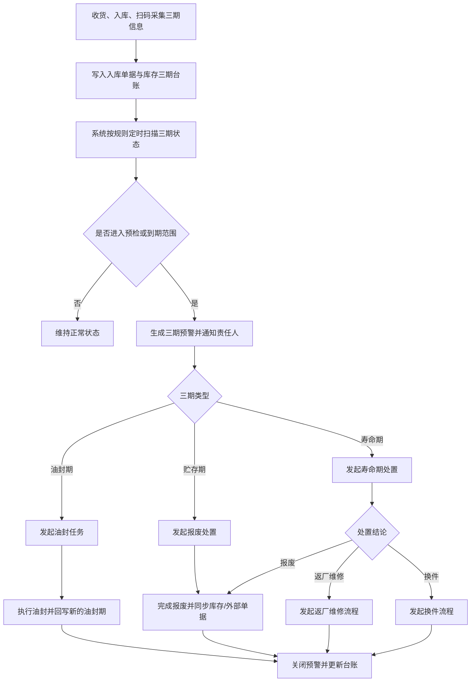
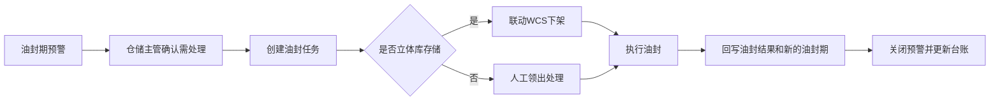
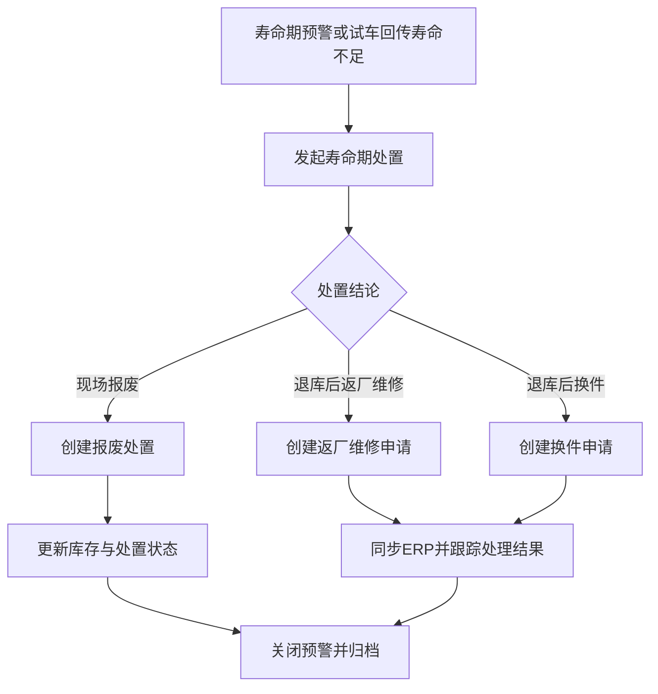
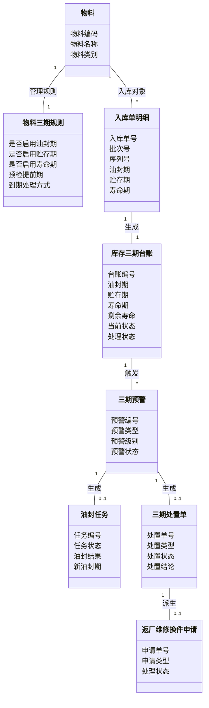
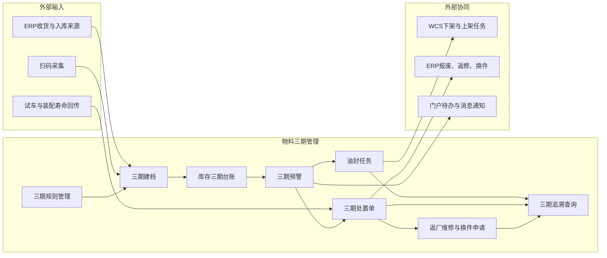

# DNW30702-物料三期管理

## 1. 概述

### 1.1 业务背景与挑战

CDQD 项目在车间仓储与配送管理场景下，明确提出对物料实行油封期、贮存期、寿命期“三期”管理，并要求在到期前完成预检、在到期后触发相应业务处理。现阶段相关管理主要依赖人工统计、纸面记录和经验判断，导致预警不及时、处置不闭环、库存可用性判断不准确。

本需求聚焦以下根本问题：

| 根本问题 | 问题描述 |
|------|------|
| 三期信息只存在于人工台账，未沉淀为库存业务属性 | 物料在收货、入库、上架后，油封期、贮存期、寿命期信息无法随库存记录持续管理，后续查询、预警、追溯均依赖人工整理。 |
| 预警与处置脱节 | 业务上要求三期都要做预检，但现状仅能靠人工发现临期或超期，不能在系统中形成预警、任务、处置、关闭的闭环。 |
| 到期处理动作不一致，系统边界不清晰 | 油封期到期需重新油封，贮存期到期需报废，寿命期不足时可能报废、退库、返厂维修或换件；这些动作跨仓储、试车、供应链、ERP/WCS，缺少统一入口和状态管理。 |
| 库存可用性判断不准确 | 当前库存查询更多基于数量、批次、库位管理，无法判断某批/某件库存是否因三期问题而不可用，容易出现超期物料继续领用或试车寿命不足后才发现的问题。 |

### 1.2 价值主张

本需求通过建立“入库建档 - 在库监控 - 到期预警 - 分类处置 - 全程追溯”的物料三期管理能力，解决仓储场景下的有效期治理问题：

- **三期信息结构化**：将油封期、贮存期、寿命期沉淀为库存级业务属性，不再依赖线下台账。
- **预检前置化**：围绕三期建立预警与待办机制，把“到期后处理”改为“临期先预检、到期再处置”。
- **处置闭环化**：把油封、报废、返厂维修、换件等动作统一纳入 MOM 管理，并与 WCS、ERP、待办平台协同。
- **库存可用性可视化**：让仓库、试车、供应链在使用库存前就能判断三期状态，减少超期领用和临时处置。
- **追溯一体化**：从入库采集、预警生成、处置执行到结果回写形成完整履历，支持后续审计与复盘。

### 1.3 用户画像

| 角色层级 | 角色名称 | 核心职责 | 核心诉求与痛点 |
|------|------|------|------|
| 执行层 | 仓库管理员 | 维护收货、入库、在库、出库及到期处置 | 希望系统自动提示哪些库存临期、哪些必须处理，避免靠人工翻台账。 |
| 管理层 | 仓储主管 | 监控库存风险、安排油封和报废处置 | 希望能统一查看三期风险清单、任务进度和处置结果。 |
| 协同层 | 试车与装配人员 | 领用并使用寿命期管理物料 | 希望在使用前明确剩余寿命是否满足要求，避免试车过程中临时更换。 |
| 协同层 | 供应链与采购人员 | 协同返厂维修、换件、报废业务 | 希望三期到期后的返修换件有单据、有状态、有外部系统联动。 |

### 1.4 术语及缩写解释

| 术语 | 缩写 | 解释说明 |
|------|------|------|
| 物料三期 | - | 对物料进行油封期、贮存期、寿命期三类时效属性管理的业务模式。 |
| 油封期 | - | 物料油封保护的有效期限，到期后需重新油封。 |
| 贮存期 | - | 物料在仓储状态下允许保存的有效期限，到期后需进行报废处置。 |
| 寿命期 | - | 物料可使用寿命的到期时间或剩余寿命边界，寿命不足时需报废、返厂维修或换件。 |
| 预检 | - | 在三期到期前，根据预检提前期触发的提醒和确认动作，用于判断是否需要提前安排处理。 |
| 三期台账 | - | 以库存记录为粒度沉淀的三期主视图，记录三期日期、状态、预警、处置结果等。 |
| 三期预警 | - | 系统依据三期日期与预警规则生成的临期或超期提醒记录。 |
| 油封任务 | - | 针对油封期到期物料发起的处理任务，可联动 WCS 完成下架和上架。 |
| 三期处置单 | - | 针对贮存期或寿命期异常生成的业务处置单，用于报废、返厂维修或换件。 |
| CDQD | CDQD | 天府轻动项目相关业务资料与方案的项目代号。 |
| MOM | MOM | Manufacturing Operations Management，制造运营管理系统。 |
| PRD | PRD | Product Requirement Document，产品需求文档。 |
| WCS | WCS | Warehouse Control System，自动化仓储控制系统。 |
| ERP | ERP | 企业资源计划系统，本需求中承接报废、返厂维修、换件等外部业务协同。 |

### 1.5 参考文献

| 文献名称 | 作者 | 出版单位 | 日期 |
|------|------|------|------|
| 天府轻动MOM项目详细设计方案V3 | - | 内部文档 | - |
| 需求调研分析报告20251030（完整稿MOM补充版） | - | 内部文档 | 2025-10-30 |
| DNW30700-仓储管理 | - | 内部文档 | 2025-xx-xx |
| DNW30700-仓储管理优化 | - | 内部文档 | 2026-xx-xx |

---

## 2. 需求描述

### 2.1 业务流程

#### 2.1.1 核心场景清单

| 序号 | 场景名称 | 场景描述 |
|------|------|------|
| 1 | 三期建档 | 在收货、入库或扫码采集时记录物料的油封期、贮存期、寿命期信息，并写入库存台账。 |
| 2 | 三期预警 | 系统根据三期日期和预检提前期生成临期、到期、超期预警，并通知责任人。 |
| 3 | 油封期处理 | 对油封期到期物料发起油封任务，完成处理后回写新的油封期。 |
| 4 | 贮存期处理 | 对贮存期到期物料发起报废处置，完成后同步库存和外部单据状态。 |
| 5 | 寿命期处理 | 对寿命期不足或到期物料，根据业务结论执行现场报废、退库、返厂维修或换件。 |
| 6 | 全程追溯 | 统一查看某批/某件物料的三期信息、预警记录、任务记录、处置结果和外部单据。 |

#### 2.1.2 总体业务流程

#### 2.1.3 三期建档与入库采集

**输入**：收货信息、入库申请单、入库单、扫码采集信息、上游带入的三期字段。  
**处理过程**：在物料入库过程中采集三期数据，并在入库成功后同步写入库存三期台账。  
**输出**：带三期属性的入库记录与库存三期台账。  

**关键业务规则**：

- 三期信息以库存记录为管理粒度，至少需能区分到批次号或序列号，不允许仅在物料主数据层做静态记录。
- 物料是否启用油封期、贮存期、寿命期，由三期规则决定；启用的管理项在入库时必须具备对应数据。
- 支持上游系统带入三期信息，也支持仓库现场扫码或人工录入补充。
- 入库成功后，三期信息必须同步写入库存三期台账，并与来源单据建立关联关系。
- 三期台账创建后，不允许通过直接修改库存记录的方式篡改三期数据；如需修正，应通过专门的业务动作留痕处理。

#### 2.1.4 三期预警与预检

**输入**：库存三期台账、三期规则、预检提前期。  
**处理过程**：系统按三期规则判断库存是否进入预检窗口、是否已到期或已超期，并生成对应预警。  
**输出**：三期预警记录、待办通知、责任人处理入口。  

**关键业务规则**：

- 三期预警按油封期、贮存期、寿命期分别生成，不合并为单一“有效期预警”。
- 三期都支持预检能力，系统需区分至少两类状态：临期待处理、超期待处理。
- 预警记录应指向具体库存对象，至少可追溯到物料、批次号/序列号、库房、库位和来源入库单据。
- 预警生成后，应支持责任人认领、处理、关闭，并保留全过程时间戳和处理意见。
- 当库存已经进入处置流程但尚未完成时，预警状态应显示为“处理中”，避免重复派发。

#### 2.1.5 油封期处理流程

**关键业务规则**：

- 油封期到期后，不是直接报废，而是进入油封处理流程。
- 油封任务需记录任务对象、执行地点、执行人、执行时间、处理结果和新的油封期。
- 对存放在立体库中的物料，油封任务应支持联动 WCS 完成下架、处理后再上架。
- 油封任务完成后，系统应回写新的油封期，并关闭原预警。
- 若油封任务取消或处理失败，库存状态应保持在“待处理”或“处理中”，不得自动恢复正常。

#### 2.1.6 贮存期处理流程

**关键业务规则**：

- 贮存期到期后的默认处理方式为报废，不再允许作为正常可用库存继续领用。
- 贮存期超期库存必须有处置单，不能仅通过库存数量调整完成处理。
- 贮存期报废结果需回写库存状态，并与现有报废业务保持一致。
- 如需同步 ERP 报废单据，系统应保留同步状态和外部单据号。
- 贮存期超期库存未完成处置前，应禁止继续执行正常出库、拣配、配台等使用动作。

#### 2.1.7 寿命期处理流程

**关键业务规则**：

- 寿命期管理对象除到期日外，还应支持记录剩余寿命或寿命结论，避免只做日期展示。
- 当试车或装配场景回传“剩余寿命不足”时，系统应能触发寿命期处置，而不是等到库存阶段再人工补录。
- 寿命期不足的物料，不得继续按正常库存直接使用；应先形成处置结论。
- 寿命期处置至少支持三类结果：现场报废、退库返厂维修、退库换件。
- 寿命期返厂维修或换件流程需由 MOM 发起，并支持与 ERP 集成。

#### 2.1.8 全程追溯与状态闭环

**输入**：库存三期台账、预警记录、油封任务、三期处置单、外部单据结果。  
**处理过程**：将三期相关的全部业务动作串联为一条完整履历。  
**输出**：可按物料、批次、序列号、库房、状态进行追溯查询的三期全景视图。  

**关键业务规则**：

- 从三期台账可下钻查看来源入库单、预警记录、任务记录、处置单、外部单据。
- 从预警或处置单也应可反向查看对应库存对象及当前状态。
- 每个预警必须有明确的关闭方式：已重新油封、已报废、已返厂维修、已换件、人工作废。
- 对于已经关闭的记录，系统保留关闭原因、关闭人、关闭时间。

### 2.2 业务数据模型

#### 2.2.1 业务对象关系图

#### 2.2.2 业务属性

**物料三期规则业务属性**

| 字段名 | 业务类型 | 业务约束 | 业务说明 |
|------|------|------|------|
| 物料 | 引用 | 必填 | 需要启用三期管理的物料。 |
| 是否启用油封期 | 布尔 | 必填 | 控制入库时是否采集油封期，并参与油封期预警。 |
| 是否启用贮存期 | 布尔 | 必填 | 控制入库时是否采集贮存期，并参与贮存期预警。 |
| 是否启用寿命期 | 布尔 | 必填 | 控制入库时是否采集寿命期，并参与寿命期预警。 |
| 预检提前期 | 数值/周期 | 条件必填 | 用于触发临期预警的提前时间。 |
| 到期处理方式 | 枚举 | 必填 | 油封期对应重新油封，贮存期对应报废，寿命期对应报废、返厂维修、换件。 |
| 是否启用使用校验 | 布尔 | 必填 | 控制物料在出库、拣配、试车等环节是否进行三期状态校验。 |

**库存三期台账业务属性**

| 字段名 | 业务类型 | 业务约束 | 业务说明 |
|------|------|------|------|
| 台账编号 | 文本标识 | 系统自动生成 | 三期台账的唯一标识。 |
| 物料 | 引用 | 必填 | 对应库存物料。 |
| 批次号 | 文本标识 | 条件必填 | 批次管理物料的追溯标识。 |
| 序列号 | 文本标识 | 条件必填 | 序列号管理物料的追溯标识。 |
| 库房 | 引用 | 必填 | 当前库存所在库房。 |
| 库位 | 引用 | 条件必填 | 当前库存所在库位。 |
| 油封期 | 日期 | 条件必填 | 该库存记录的油封到期时间。 |
| 贮存期 | 日期 | 条件必填 | 该库存记录的贮存到期时间。 |
| 寿命期 | 日期 | 条件必填 | 该库存记录的寿命到期时间。 |
| 剩余寿命 | 数值/文本 | 可选 | 用于寿命期管理物料的剩余可用寿命。 |
| 当前状态 | 枚举 | 系统计算 | 正常、临期待处理、超期待处理、处理中、已处置。 |
| 处理状态 | 枚举 | 系统计算 | 未处理、处理中、已完成。 |
| 来源单据 | 引用 | 必填 | 关联的入库单或收货来源。 |

**三期预警业务属性**

| 字段名 | 业务类型 | 业务约束 | 业务说明 |
|------|------|------|------|
| 预警编号 | 文本标识 | 系统自动生成 | 预警的唯一标识。 |
| 预警类型 | 枚举 | 必填 | 油封期预警、贮存期预警、寿命期预警。 |
| 预警级别 | 枚举 | 系统计算 | 临期、到期、超期。 |
| 关联台账 | 引用 | 必填 | 对应的库存三期台账。 |
| 责任人 | 引用 | 条件必填 | 需要处理该预警的责任人。 |
| 预警状态 | 枚举 | 系统计算 | 待处理、处理中、已关闭、已作废。 |
| 生成时间 | 日期时间 | 系统自动记录 | 预警生成时间。 |
| 关闭原因 | 文本 | 条件必填 | 关闭时记录，如重新油封、已报废、已返厂维修等。 |

**油封任务业务属性**

| 字段名 | 业务类型 | 业务约束 | 业务说明 |
|------|------|------|------|
| 任务编号 | 文本标识 | 系统自动生成 | 油封任务唯一编号。 |
| 来源预警 | 引用 | 必填 | 关联的油封期预警。 |
| 任务状态 | 枚举 | 必填 | 待执行、执行中、已完成、已取消。 |
| 执行地点 | 文本/引用 | 可选 | 油封处理地点。 |
| 执行人 | 引用 | 条件必填 | 实际执行油封的人。 |
| 油封结果 | 枚举 | 条件必填 | 成功、失败、取消。 |
| 新油封期 | 日期 | 条件必填 | 油封完成后回写的新油封期。 |
| WCS任务关联 | 引用 | 条件必填 | 立体库场景下关联下架/上架任务。 |

**三期处置单业务属性**

| 字段名 | 业务类型 | 业务约束 | 业务说明 |
|------|------|------|------|
| 处置单号 | 文本标识 | 系统自动生成 | 三期处置单唯一编号。 |
| 来源预警 | 引用 | 必填 | 关联的贮存期或寿命期预警。 |
| 处置类型 | 枚举 | 必填 | 贮存期报废、寿命期报废、寿命期返厂维修、寿命期换件。 |
| 处置状态 | 枚举 | 必填 | 待处理、处理中、已完成、已取消。 |
| 处置结论 | 文本/枚举 | 条件必填 | 最终业务结论。 |
| 外部单据号 | 文本标识 | 可选 | ERP 或其他外部系统返回的单据号。 |
| 关闭时间 | 日期时间 | 条件必填 | 处置完成时间。 |

### 2.3 应用架构

#### 2.3.1 模块清单

| 模块 | 页面 | 模块说明 |
|------|------|------|
| 基础配置 | 三期规则管理 | 负责维护物料三期启用规则、预检提前期和处理方式。 |
| 入库管理 | 入库申请单与入库单 | 负责三期信息的采集、带入和入库落账。 |
| 库存管理 | 物料三期台账 | 负责库存级三期主视图和状态管理。 |
| 预警管理 | 三期预警 | 负责三期预警生成、通知和关闭。 |
| 任务管理 | 油封任务 | 负责油封期到期物料的任务化处理。 |
| 处置管理 | 三期处置单、返厂维修与换件申请 | 负责贮存期报废、寿命期报废、返厂维修和换件业务。 |
| 使用校验 | 出库、领用、试车协同 | 负责三期异常库存的使用前校验和拦截。 |
| 查询追溯 | 三期处置记录 | 负责三期全过程履历和处理结果追溯。 |

### 2.4 功能清单

| 序号 | 业务域 | 功能页面 | 需求名称 | 需求描述 | 备注 |
|------|------|------|------|------|------|
| 1 | 基础配置 | 三期规则管理 | 三期规则配置 | **用户故事**：作为仓储主管，我希望能为物料配置是否启用油封期、贮存期、寿命期以及对应预检规则，以便系统按物料特性管理三期。  **验收标准**： - 系统应支持为物料维护是否启用油封期、贮存期、寿命期。 - When 启用某一管理项时，系统应在入库采集环节显示对应字段。 - 系统应支持维护预检提前期。 - 系统应展示各管理项的默认到期处理方式。 | P0 |
| 2 | 入库管理 | 入库申请单与入库单 | 三期信息采集 | **用户故事**：作为仓库管理员，我希望在入库时采集或带入三期信息，以便三期数据从入库开始就进入系统管理。  **验收标准**： - When 物料启用三期管理时，入库界面应显示对应三期字段。 - 系统应支持上游带入、扫码采集和人工录入三种方式。 - When 入库完成时，系统应将三期信息同步写入库存三期台账。 - 系统应保留三期数据的来源单据和采集时间。 | P0 |
| 3 | 库存管理 | 物料三期台账 | 三期台账查询 | **用户故事**：作为仓储主管，我希望能统一查看库存的三期状态，以便快速识别风险库存和处理对象。  **验收标准**： - 台账列表应显示物料、批次号/序列号、库房、库位、油封期、贮存期、寿命期、当前状态、处理状态。 - 支持按三期类型、状态、到期区间、库房、物料查询。 - 点击详情可查看来源单据、预警记录和处置记录。 | P0 |
| 4 | 预警管理 | 三期预警 | 三期预警生成 | **用户故事**：作为仓储主管，我希望系统能自动生成三期临期和超期预警，以便我在问题发生前安排处理。  **验收标准**： - 系统应分别生成油封期、贮存期、寿命期预警。 - When 库存进入预检提前期时，系统应生成临期预警。 - When 三期已到期或超期时，系统应生成到期/超期预警。 - 预警应关联具体库存对象和责任人。 | P0 |
| 5 | 预警管理 | 三期预警 | 待办与通知推送 | **用户故事**：作为仓储主管，我希望三期预警能推送到待办或消息中心，以便及时分派和处理。  **验收标准**： - 预警生成后应支持推送待办或消息通知。 - 通知内容至少包含物料、三期类型、到期时间、处理入口。 - When 预警关闭时，系统应同步更新待办状态。 | P1 |
| 6 | 任务管理 | 油封任务 | 油封任务创建与执行 | **用户故事**：作为仓库管理员，我希望对油封期到期物料创建油封任务，并在完成后回写新的油封期，以便保持库存继续可用。  **验收标准**： - When 油封期预警进入处理状态时，系统应支持创建油封任务。 - 油封任务应记录执行人、执行时间、执行结果和新的油封期。 - When 物料位于立体库时，系统应支持关联 WCS 下架/上架任务。 - When 油封任务完成时，系统应自动关闭原预警并更新台账。 | P0 |
| 7 | 处置管理 | 三期处置单 | 贮存期报废处置 | **用户故事**：作为仓储主管，我希望贮存期到期物料能发起报废处置，以便系统内外状态保持一致。  **验收标准**： - When 贮存期到期时，系统应支持创建贮存期报废处置单。 - 贮存期报废处置单应记录处置状态、处置结论和外部单据号。 - When 处置未完成时，系统应禁止该库存继续正常出库或领用。 - When 处置完成时，系统应更新库存状态并关闭预警。 | P0 |
| 8 | 使用校验 | 出库、领用、试车协同 | 三期状态校验 | **用户故事**：作为试车与装配人员，我希望在出库、拣配、领用和试车前自动校验三期状态，以便避免超期或寿命不足的物料被继续使用。  **验收标准**： - When 库存处于超期待处理状态时，系统应阻止正常出库、拣配和领用。 - When 寿命期管理物料的剩余寿命不足时，系统应提示必须先完成处置。 - 系统应在校验失败时展示具体原因和处理入口。 | P0 |
| 9 | 处置管理 | 三期处置单 | 寿命期处置 | **用户故事**：作为仓储主管，我希望对寿命期不足或到期物料形成明确处置结论，以便执行报废、返修或换件。  **验收标准**： - 系统应支持寿命期处置单记录报废、返厂维修、换件三类结论。 - When 试车或装配业务回传寿命不足时，系统应支持直接发起寿命期处置。 - 寿命期处置完成前，库存状态应保持为待处理或处理中。 | P0 |
| 10 | 处置管理 | 返厂维修与换件申请 | 返厂维修或换件流程发起 | **用户故事**：作为供应链与采购人员，我希望能够从寿命期处置中直接发起返厂维修或换件流程，以便减少线下沟通和重复录入。  **验收标准**： - 系统应支持从寿命期处置单发起返厂维修或换件申请。 - 申请单应记录物料、数量、原因、供应商和处理状态。 - When 申请提交成功时，系统应支持同步 ERP。 - 系统应保留 ERP 返回状态和外部单据号。 | P1 |
| 11 | 查询追溯 | 三期处置记录 | 三期全流程追溯 | **用户故事**：作为仓储主管，我希望能够追溯某批/某件物料的三期变化和处置过程，以便审计和复盘。  **验收标准**： - 系统应支持按物料、批次号、序列号查询三期履历。 - 履历中应包含入库采集、预警、任务、处置、外部单据等节点。 - 支持从台账、预警、任务、处置单之间双向跳转。 | P1 |

## 3. 界面方案设计

### 3.1 基础配置

#### 3.1.1 三期规则管理

**（1）页面线框简图**

顶部为查询区，中部为规则列表，右侧或弹窗为规则编辑区，底部为操作日志区。

**（2）功能点描述**

| 功能点 | 用户操作说明 | 系统处理逻辑 | 关键业务规则 |
|------|------|------|------|
| 三期规则配置 | 用户选择物料并维护是否启用油封期、贮存期、寿命期及预检提前期。 | 系统保存规则并控制后续入库采集、预警生成与使用校验。 | 启用的管理项必须参与后续业务校验。 |

### 3.2 入库管理

#### 3.2.1 入库申请单与入库单

**（1）页面线框简图**

在现有入库明细区域新增三期字段区，支持上游带入、扫码回填和人工补录。

**（2）功能点描述**

| 功能点 | 用户操作说明 | 系统处理逻辑 | 关键业务规则 |
|------|------|------|------|
| 三期信息采集 | 用户在入库明细中查看或补录三期信息。 | 系统在入库完成时将三期数据写入入库单明细和库存三期台账。 | 启用三期管理的物料，入库时必须具备对应数据。 |

### 3.3 库存管理

#### 3.3.1 物料三期台账

**（1）页面线框简图**

顶部为筛选区，中部为台账列表，底部为台账详情页签，展示来源单据、预警、任务、处置记录。

**（2）功能点描述**

| 功能点 | 用户操作说明 | 系统处理逻辑 | 关键业务规则 |
|------|------|------|------|
| 三期台账查询 | 用户按物料、状态、到期区间等条件查询台账。 | 系统返回库存级三期记录，并支持下钻关联业务。 | 台账必须可追溯到具体库存对象和来源单据。 |

### 3.4 预警管理

#### 3.4.1 三期预警

**（1）页面线框简图**

顶部为预警筛选区，中部为预警列表，侧边为处理面板，支持查看责任人、处理入口和关闭记录。

**（2）功能点描述**

| 功能点 | 用户操作说明 | 系统处理逻辑 | 关键业务规则 |
|------|------|------|------|
| 三期预警生成 | 用户查看系统自动生成的临期、到期、超期记录。 | 系统按三期规则自动判定并生成预警。 | 油封期、贮存期、寿命期分别生成预警。 |
| 待办与通知推送 | 用户在预警列表中分派或认领预警。 | 系统推送待办或消息，并在关闭后同步状态。 | 同一预警处理过程中不重复派发。 |

### 3.5 任务管理

#### 3.5.1 油封任务

**（1）页面线框简图**

顶部为任务筛选区，中部为任务列表，详情页展示关联库存、预警、WCS任务和处理结果。

**（2）功能点描述**

| 功能点 | 用户操作说明 | 系统处理逻辑 | 关键业务规则 |
|------|------|------|------|
| 油封任务创建与执行 | 用户基于预警创建任务并登记油封结果。 | 系统更新任务状态、回写新油封期并关闭预警。 | 立体库场景下需支持关联 WCS 下架和上架任务。 |

### 3.6 处置管理

#### 3.6.1 三期处置单

**（1）页面线框简图**

顶部为处置单筛选区，中部为处置单列表，详情页包含库存对象、处置结论、外部单据和处理记录。

**（2）功能点描述**

| 功能点 | 用户操作说明 | 系统处理逻辑 | 关键业务规则 |
|------|------|------|------|
| 贮存期报废处置 | 用户对贮存期超期库存发起报废处置。 | 系统生成处置单、更新库存状态并记录外部单据结果。 | 未完成处置前禁止库存继续正常使用。 |
| 寿命期处置 | 用户选择报废、返厂维修或换件结论。 | 系统根据结论分流到报废或外部协同流程。 | 寿命期不足库存必须先形成处置结论。 |

#### 3.6.2 返厂维修与换件申请

**（1）页面线框简图**

顶部为申请单筛选区，中部为申请单列表，详情页展示供应商信息、同步状态和处理进度。

**（2）功能点描述**

| 功能点 | 用户操作说明 | 系统处理逻辑 | 关键业务规则 |
|------|------|------|------|
| 返厂维修或换件流程发起 | 用户从寿命期处置单发起返厂维修或换件申请。 | 系统生成申请单并同步 ERP，回收外部处理状态。 | 申请单必须与寿命期处置单保持一一关联。 |

### 3.7 使用校验

#### 3.7.1 出库、领用、试车协同

**（1）页面线框简图**

本页面不新增独立入口，依附于出库、拣配、领用和试车操作界面，在提交动作前展示三期校验结果。

**（2）功能点描述**

| 功能点 | 用户操作说明 | 系统处理逻辑 | 关键业务规则 |
|------|------|------|------|
| 三期状态校验 | 用户在出库、领用或试车前提交业务动作。 | 系统校验库存三期状态，失败时提示原因与处理入口。 | 超期或寿命不足库存不得继续正常使用。 |

### 3.8 查询追溯

#### 3.8.1 三期处置记录

**（1）页面线框简图**

顶部为追溯筛选区，中部为履历时间线，底部为关联单据和处理结果。

**（2）功能点描述**

| 功能点 | 用户操作说明 | 系统处理逻辑 | 关键业务规则 |
|------|------|------|------|
| 三期全流程追溯 | 用户按物料、批次号、序列号查询完整履历。 | 系统串联入库、预警、任务、处置、外部单据结果形成时间线。 | 履历数据只允许查询，不允许手工改写。 |

## 4. 附录

### 4.1 核心设计决策

| 设计点 | 设计决策 | 设计原因 |
|------|------|------|
| 管理粒度 | 三期按库存记录管理，不按物料主数据静态管理 | 同一物料不同入库批次、序列号、到期日可能不同，只有库存粒度才能真正支持处置和追溯。 |
| 预警模式 | 三期分别预警，不继续沿用单一“有效期预警” | 原始需求明确区分油封期、贮存期、寿命期，且三类到期后的处理动作不同。 |
| 处理模型 | 油封期走任务闭环，贮存期/寿命期走处置闭环 | 油封属于可恢复处理，贮存期和寿命期更多是业务结论型处理，二者不宜混为一类。 |
| 系统边界 | MOM 负责建档、预警、任务、处置与状态管理；WCS 负责自动化搬运；ERP 负责外部单据协同 | 这样既满足闭环管理，也避免把外部系统职责错误吸收到 MOM 内部。 |
| 使用控制 | 三期异常库存必须参与出库、拣配、领用、试车前校验 | 三期管理的业务价值不只是“看见风险”，更是阻止不合规库存继续使用。 |

### 4.2 与现有功能的关系

本需求是对现有仓储管理能力的扩展与细化：

- **DNW30700-仓储管理**：沿用现有入库、出库、库存、预警的主业务骨架，在此基础上扩展“三期”概念和业务处理能力。
- **DNW30700-仓储管理优化**：将附录中“物料三期管理”的后续迭代项正式上升为独立 PRD，并从“记录字段”扩展为“任务+处置+追溯”闭环。
- **现有报废能力**：贮存期报废、寿命期报废应与现有报废处理能力衔接，不重复建设平行报废流程。

### 4.3 外部依赖

| 依赖系统/模块 | 依赖点 | 依赖说明 | 状态 |
|------|------|------|------|
| WCS | 油封任务、立体库库存处理 | 立体库场景下，油封处理前后的下架、上架任务需通过 WCS 执行。 | 待协同 |
| ERP | 报废、返厂维修、换件 | 贮存期报废、寿命期返厂维修/换件需同步 ERP 单据和状态。 | 待协同 |
| 试车/装配业务 | 寿命期回传 | 寿命期不足的判定需支持来自试车或装配业务的回传结果。 | 待协同 |
| 门户待办/消息平台 | 预警通知 | 三期预警、处置任务需推送待办或消息。 | 待协同 |

## 5. 变更记录

| 版本 | 日期 | 变更人 | 变更说明 |
|------|------|------|------|
| V1.0 | 2026-04-03 | Codex | 新建《DNW30700-物料三期管理》需求文档。 |
