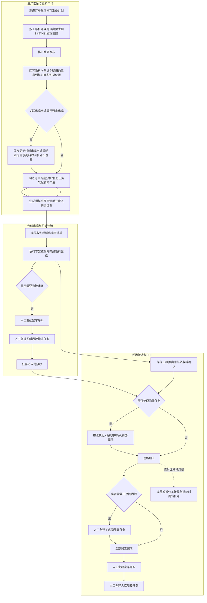
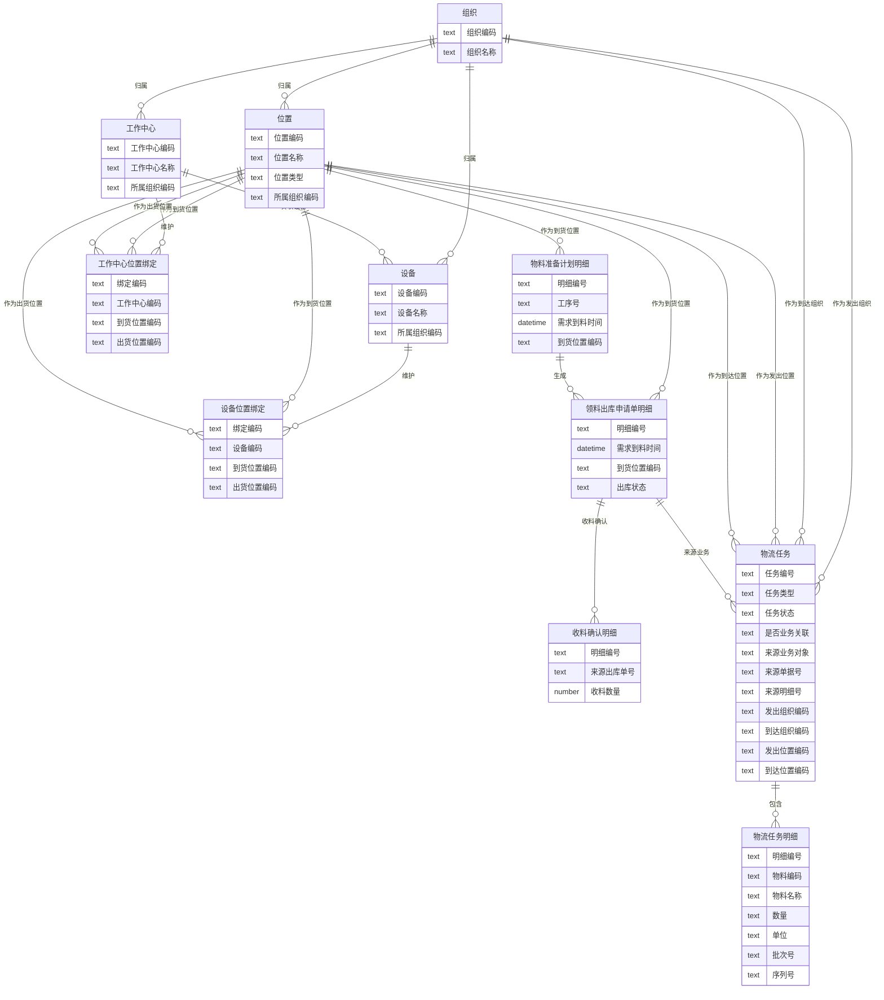
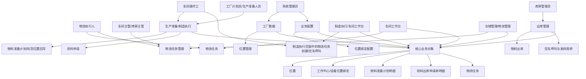
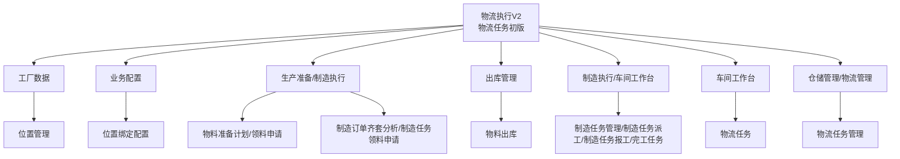

# DNW30710 物流管理 V2.0（物流任务初版）

## 1. 概述

### 1.1 业务背景与挑战

离散制造场景下，物流管理要解决的不是单次搬运，而是让生产所需的物料或载具按节奏到达指定位置，并让计划、库房、现场和物流执行各环节对这一结果形成一致认知和可追溯闭环。原始 [DNW30710-物流管理](D:/02_cloud-mom/00_kmmom3-doc-prd/docs/01_标准功能/DNW30710-物流管理.md) 已完整定义物流执行的长期目标，本文档聚焦首版必须落地的人工物流闭环能力。本次 V2 首版要解决的不是机加、装配、热处理等某一专业独有的问题，而是离散制造场景下普遍存在的物流协同问题。

| 根本问题 | 问题描述 |
| --- | --- |
| 物流需求没有被及时识别 | 工厂计划员/生产准备人员提出到料要求后，库房管理员和车间操作工在领料、出库和现场执行过程中，缺少明确规则判断哪些场景需要进入物流处理，导致物流需求经常在业务流转中被遗漏。 |
| 物流需求没有被统一承接 | 库房管理员、车间操作工和物流执行人在现场已经明确需要物流处理时，时间、位置、物料和执行责任缺少统一任务承接，导致前一环节的要求不能稳定传递到后一环节。 |
| 物流执行没有形成透明闭环 | 物流执行人、发起人和车间主管/库房主管难以持续看清谁发起、谁接收、执行到哪一步、卡在哪个环节，导致任务状态和责任边界不能被及时判断。 |

### 1.2 价值主张

本方案以“统一到货位置口径 + 位置绑定 + 业务单据带值与回写 + 人工创建物流任务 + 人工发起空车呼叫 + 人工接收任务（可选） + 人工确认完成”为核心，只解决首版必须落地的物流闭环，不提前引入智能调度能力。

- **统一业务与物流的衔接链路**：把物料准备计划、领料出库申请、仓储出库、收料确认与物流任务串成一条连续业务链。
- **统一位置口径**：将“配送点”“到货点”统一收口为“到货位置”，通过设备或工作中心的绑定关系带出默认值。
- **保留松耦合模式**：业务流程连续存在，但物流任务仍然按需人工创建，不作为业务流转的必经前置条件。
- **支持排产结果回写**：排产发布后，统一更新物料准备计划明细的需求到料时间和到货位置，并按出库状态决定是否同步更新申请单明细。
- **统一物流动作载体**：把发料周转、退料周转、工序间周转、入库周转、临时周转、空车呼叫统一承载到物流任务对象中。
- **为后续智能化留骨架**：后续无论扩展到自动创建、自动派发、资源调度，还是自动导引车协同，都继续复用“位置、绑定、物流任务”三类核心对象。

### 1.3 用户画像

| 分类 | 角色名称 | 核心职责 | 核心诉求与痛点 |
| :--- | :--- | :--- | :--- |
| 基础配置 | 系统管理员 | 维护位置主数据，维护设备或工作中心与位置的绑定关系 | 希望位置口径统一，绑定关系清晰，可支撑不同场景自动带出默认位置 |
| 计划与备料 | 工厂计划员/生产准备人员 | 生成物料准备计划、执行齐套分析、发起领料申请 | 希望需求到料时间和到货位置能随排产稳定更新，并带入后续申请单 |
| 仓储执行 | 库房管理员 | 在出库过程中完成下架拣配、空车呼叫和按需创建发料周转任务 | 希望出库后能继续追踪发料动作，避免“已出库但未送达” |
| 现场执行 | 车间操作工 | 在制造执行页面进行领料申请、收料确认，并按需发起物流任务或空车呼叫 | 希望少填字段，系统能自动带出默认位置，并支持临时场景快速处理 |
| 周转执行 | 物流执行人 | 查询待接收任务，按需接收任务或直接确认完成/到位 | 希望任务列表清晰，操作步骤简单，不依赖复杂终端能力 |
| 管理与协同 | 车间主管/库房主管 | 查看任务状态，确认业务是否闭环 | 希望能快速看到哪些任务待接收、已接收、已完成、已取消，并能区分业务已完成但未建物流、已建物流但未执行等状态 |

### 1.4 术语及缩写解释

| 术语 | 缩写 | 解释说明 |
| --- | --- | --- |
| 物流执行 | LES | 负责承接厂内物流动作的模块名称。本次 V2 只落地人工物流任务能力。 |
| 物流任务 | - | 承载一次物流动作的统一业务对象，用于表达发料周转、退料周转、工序间周转、入库周转、临时周转和空车呼叫，并支持跨组织流转。 |
| 物流任务明细 | - | 记录物流任务中涉及的物料、数量和单位的明细对象；空车呼叫类型无明细；批次号和序列号仅继承展示，不重复录入。 |
| 任务类型 | - | 用于区分不同物流动作的业务标签，如发料周转、退料周转、工序间周转、入库周转、临时周转、空车呼叫。 |
| 位置 | - | 业务上可被选择为发出点、到达点、呼叫点的地点定义。 |
| 所属组织 | - | 用于标识位置所属的组织边界，是位置数据按组织隔离的基础字段。 |
| 发出组织 | - | 物流任务发出位置对应的组织，由发出位置自动带出。 |
| 到达组织 | - | 物流任务到达位置对应的组织，由到达位置自动带出。 |
| 到货位置 | - | 与设备或工作中心绑定的默认收货位置，也是物料准备计划、领料申请、出库申请单明细中的实际目标位置；原“配送点”“到货点”统一收口为“到货位置”。 |
| 出货位置 | - | 与设备或工作中心绑定的默认发货位置，常用于带出退料周转、工序间周转和入库周转的默认发出位置。 |
| 发料周转 | - | 物料完成出库后，从库房向线边、工位、设备或工作中心到货位置移动的物流动作。 |
| 入库周转 | - | 物料全部加工完成后，向指定入库位置或库房回运的物流动作。 |
| 空车呼叫 | - | 只表达“运载资源到位”的物流动作，只有目标到位位置，没有物料明细和发出位置。 |
| 临时周转 | - | 现场人员不依赖来源业务，自由发起的物料转移动作。 |
| 工序间周转 | - | 物料在前后工序之间按需发起的物流动作。 |
| 收料确认 | - | 现场操作工基于出库单对已到现场的物料进行业务接收确认，属于业务动作，不等同于物流任务确认。 |
| 业务关联 | - | 物流任务可关联物料准备计划明细、领料出库申请明细、出库单明细等来源业务；若无来源业务对象，则视为非业务关联临时周转。 |
| 自动导引车 | AGV | 物流智能化阶段可能接入的自动搬运设备，本次 V2 不纳入正文范围。 |
| 工作中心 | WC | 生产过程中执行特定工序的业务单元，作为位置绑定对象之一。 |

### 1.5 软件版本与兼容性

#### 1.5.1 文档版本说明

- **需求编号**：`DNW30710`
- **文档版本**：`V2.0`
- **文档定位**：物流执行模块的“物流任务初版”需求文档

#### 1.5.2 与原始需求的关系

- 原始 [DNW30710-物流管理](D:/02_cloud-mom/00_kmmom3-doc-prd/docs/01_标准功能/DNW30710-物流管理.md) 作为物流执行（LES）长期目标保留。
- 本文档是面向首版落地的 V2 收敛方案，正文仅保留首版需要完成的能力。
- 原始文档中的自动任务生成、调度策略、资源调度、地图、自动导引车、扫码、对外接口等能力，统一转入本文档附录作为后续演进方向。

#### 1.5.3 与后续智能方案的兼容性结论

本次 V2 可以平滑演进到后续智能方案，不需要推倒重来，前提是首版稳定以下三类核心对象：

- **位置主数据**：位置定义继续沿用，后续只会增加位置类型和定位能力，不改变“发出位置/到达位置”的业务含义。
- **绑定关系**：设备或工作中心与到货位置、出货位置的绑定关系继续沿用，后续可在此基础上扩展默认路线、默认资源、优先级等信息。
- **物流任务**：首版先支持人工创建、人工接收、人工确认，后续可在同一任务对象上扩展系统生成、自动派发、扫码反馈、设备回传。

结论：

- **本次 V2 是后续智能方案的第一阶段，不是过渡性废稿。**
- **后续扩展以增量演进为主，不以推倒重写为前提。**

---

## 2. 需求描述

### 2.1 业务流程

#### 2.1.1 业务主流程



**主流程说明**
- 业务主线连续存在，物流任务是可选的人工动作，不是业务流转的强制前置。
- 发料周转物流任务只能在物料已出库后创建，不能在待出库或拣配中提前创建。
- 排产发布后，始终更新物料准备计划明细的需求到料时间和到货位置；若关联领料出库申请单明细仍为未出库，则同步更新，若已部分出库或全部出库则不更新。
- 收料确认与物流任务确认保持松耦合：前者确认业务接收，后者确认物流执行，两者互不阻断，但允许相互查看关联状态。

#### 2.1.2 核心场景清单

为降低阅读成本，先给出本次首版覆盖的核心场景总表，后文再展开每个场景的详细描述。

| 序号 | 场景名称 | 场景描述 |
| --- | --- | --- |
| 1 | 物料准备计划生成并回写到货位置 | 工厂计划员/生产准备人员在生成物料准备计划或发布排产结果后，需要把最新的需求到料时间和到货位置回写到物料准备计划明细，并同步更新未出库的领料申请明细，确保后续领料、出库和物流使用同一目标。 |
| 2 | 齐套分析或制造任务发起领料申请并带入到货位置 | 工厂计划员/生产准备人员或车间操作工在齐套分析、制造任务页面发起领料申请时，需要默认带出需求到料时间和到货位置，并写入领料出库申请单明细，作为后续仓储出库和物流处理的依据。 |
| 3 | 库房出库后按需发起空车呼叫并创建发料周转物流任务 | 库房管理员在物料完成出库后，如需继续跟踪送达过程，可先发起空车呼叫，再按需创建发料周转任务，把出库后的物料、数量、到货位置和来源信息继续纳入物流闭环。 |
| 4 | 收料确认与物流任务确认松耦合协同 | 车间操作工在物料到达现场后执行收料确认，物流执行人对关联物流任务执行接收和确认，两类动作分别完成业务接收和物流留痕，互不阻断但保持相互可追溯。 |
| 5 | 部分加工后按需创建工序间周转物流任务 | 车间操作工在当前工序完成、物料需要转到下一工序或下一工位时，可按需创建工序间周转任务，记录发出位置、到达位置和物料明细，支撑工序流转过程的物流跟踪。 |
| 6 | 全部加工完成后按需发起空车呼叫并创建入库周转任务 | 车间操作工在制造任务全部加工完成后，如需将物料或成品回运至指定入库位置，可先发起空车呼叫，再按需创建入库周转任务，形成完工后的回库闭环。 |
| 7 | 库房或操作工手动创建临时周转任务 | 库房管理员或车间操作工在急料、错位调整、临时转运等无固定来源单据的场景下，可直接创建临时周转任务，补充发出位置、到达位置和物料信息，处理现场临时物流需求。 |
| 8 | 跨组织物流任务的跟踪与执行 | 当物流任务的发出位置和到达位置分属不同组织时，发起人需要持续跟踪任务进展，物流执行人需要接收并处理发往本组织的任务，主管需要统一查看跨组织任务状态，以保证跨组织协同过程可执行、可追踪。 |

**场景1：物料准备计划生成并回写到货位置**
- **场景背景**：物流闭环的起点不在出库，而在物料准备计划明细形成时就要明确物料最终送达的位置。
- **用户目标**：在物料准备计划生成时即带出到货位置，并在排产发布后持续回写最新的需求到料时间和到货位置。
- **触发条件**：制造订单生成物料准备计划，或制造订单重新排产并发布结果。
- **前置条件**：工序任务、设备、工作中心及其位置绑定关系已维护。
- **基本流程**：
  1. 系统在生成物料准备计划明细时新增“到货位置”属性，字段非必填。
  2. 系统按以下规则带值：优先取物料对应工序任务关联设备的到货位置；设备未维护时再取该工序任务关联工作中心的到货位置；若当前物料无工序信息，则取首道工序任务关联设备或工作中心的到货位置，且设备优先于工作中心。
  3. 排产结果发布后，系统始终更新物料准备计划明细的需求到料时间和到货位置。
  4. 若明细已关联领料出库申请单且申请单明细状态为未出库，则同步更新申请单明细的需求到料时间和到货位置；若为部分出库或全部出库，则不再更新。
- **成功标准**：物料准备计划明细始终保留最新的需求到料时间和到货位置；未出库申请单明细与之保持一致。
- **失败处理**：若未维护绑定关系，则允许到货位置为空，由后续业务人工补充。

**场景2：齐套分析或制造任务发起领料申请并带入到货位置**
- **场景背景**：领料申请是业务动作，物流任务不是必选动作，但领料申请必须把目标到货位置先带入后续仓储业务。
- **用户目标**：在制造订单齐套分析和制造任务领料申请时，默认带出到货位置，并把该信息写入领料出库申请单明细。
- **触发条件**：计划员在制造订单齐套分析发起领料申请，或操作工在制造任务相关页面发起领料申请。
- **前置条件**：物料准备计划明细已生成，且已具备需求到料时间和到货位置。
- **基本流程**：
  1. 用户进入领料申请界面，系统默认带出物料准备计划明细上的需求到料时间和到货位置。
  2. 用户可人工修改到货位置，且可选择所有位置数据，不做组织权限控制。
  3. 用户提交后，系统生成领料出库申请单，并将到货位置、需求到料时间写入申请单明细。
- **成功标准**：领料出库申请单明细完整继承或更新到货位置和需求到料时间，为后续仓储出库与物流创建提供依据。
- **失败处理**：若申请信息不完整，则阻止提交并提示补齐。

**场景3：库房出库后按需发起空车呼叫并创建发料周转物流任务**
- **场景背景**：库房收到领料出库申请单后，先完成下架拣配出库，再决定是否跟踪后续发料周转。
- **用户目标**：在不阻断出库业务的前提下，按需发起空车呼叫，并在物料已出库后人工创建发料周转物流任务。
- **触发条件**：库房管理员完成物料出库，且现场需要对“出库后送达”继续做物流追踪。
- **前置条件**：领料出库申请单明细已存在到货位置；物料已完成出库。
- **基本流程**：
  1. 库房管理员在物料出库页面完成下架拣配并确认出库。
  2. 库房管理员按需发起空车呼叫，使运载资源先到位。
  3. 库房管理员按需创建任务类型为“发料周转”的物流任务。
  4. 系统将出库后的物料、数量带入物流任务明细，并将来源出库明细上的批次号、序列号继承到物流任务明细中只读展示，不要求再次录入。
  5. 系统将申请单明细上的到货位置写入物流任务到达位置，并自动写入到达组织。
- **成功标准**：发料周转任务只在已出库后可创建，且可完整承接物料、数量、到货位置和来源追溯信息。
- **失败处理**：若物料未出库、发出位置缺失或无有效到货位置，则不允许创建发料周转任务。

**场景4：收料确认与物流任务确认松耦合协同**
- **场景背景**：现场已经存在基于出库单的收料确认，而物流任务也需要“确认到位/确认完成”，两者职责不同但经常同时出现。
- **用户目标**：将收料确认与物流任务确认区分为两个动作，既避免重复建模，又保留各自独立的业务意义。
- **触发条件**：物料到达现场，操作工执行收料确认；或物流执行人处理已创建的物流任务。
- **前置条件**：已存在来源出库单，或已创建关联物流任务。
- **基本流程**：
  1. 操作工根据出库单执行收料确认，更新业务上的已收料数量和状态。
  2. 物流执行人根据物流任务执行接收、确认到位或确认完成，更新物流执行留痕。
  3. 若业务已收料但物流任务未确认，系统允许业务继续推进，但提示关联任务未完成。
  4. 若物流任务已完成但尚未收料确认，系统允许任务关闭，但提示业务尚未收料。
- **成功标准**：收料确认与物流任务确认互不阻断，但可通过来源单据和来源明细建立双向追溯。
- **失败处理**：若当前任务状态不满足处理条件，则阻止错误操作并提示原因。

**场景5：部分加工后按需创建工序间周转物流任务**
- **场景背景**：部分加工完成后，物料可能需要从当前工序移动到下一工序或下一工位。
- **用户目标**：在工序流转确有搬运需求时，人工创建工序间周转任务，不强制所有工序都纳入物流管理。
- **触发条件**：操作工确认当前工序加工完成，且需转至下一工序位置。
- **前置条件**：当前设备、工作中心、下一工序位置可识别，或支持人工补充。
- **基本流程**：
  1. 操作工选择任务类型为“工序间周转”。
  2. 系统优先根据当前设备和工作中心绑定带出默认发出位置和到达位置。
  3. 操作工补充物料、数量和备注后提交。
- **成功标准**：系统成功创建工序间周转任务，并记录前后位置、组织和物料明细。
- **失败处理**：发出位置、到达位置或物料明细不完整时，不允许提交。

**场景6：全部加工完成后按需发起空车呼叫并创建入库周转任务**
- **场景背景**：操作工全部加工完成后，需要将物料或成品转回指定入库位置或库房。
- **用户目标**：先发起空车呼叫，再按需人工创建入库周转任务，适配完工后的回库场景。
- **触发条件**：制造任务全部加工完成，需要回运至入库位置。
- **前置条件**：已识别当前发出位置和目标入库位置，或支持人工补充。
- **基本流程**：
  1. 操作工发起空车呼叫，将运载资源呼叫到当前工位。
  2. 操作工按需创建任务类型为“入库周转”的物流任务。
  3. 系统带出物料、数量、目标入库位置和组织信息。
- **成功标准**：空车呼叫与入库周转均可独立留痕，并形成完工后回库的物流闭环。
- **失败处理**：空车呼叫缺少到位位置，或入库周转缺少必要位置、物料信息时，不允许提交。

**场景7：库房或操作工手动创建临时周转任务**
- **场景背景**：现场经常出现不依赖固定来源业务的临时搬运动作，如急料、错位调整、临时转运等。
- **用户目标**：支持无业务对象前提下快速创建临时周转任务。
- **触发条件**：库房管理员或操作工确认存在临时转移动作。
- **前置条件**：发出位置和到达位置已维护为可选位置。
- **基本流程**：
  1. 用户选择任务类型为“临时周转”。
  2. 人工补充发出位置、到达位置、物料和数量。
  3. 系统创建物流任务，并自动写入发出组织和到达组织。
- **成功标准**：系统成功创建一条临时周转任务，并保留跨组织流转和后续查询所需字段。
- **失败处理**：发出位置与到达位置相同，或物料明细为空时，不允许提交。

**场景8：跨组织物流任务的跟踪与执行**
- **场景背景**：系统存在多组织多工厂场景，位置数据按组织隔离，但物流任务需要跨车间、跨组织流转。
- **用户目标**：发起人能够持续查看自己发起任务的处理进度；到达位置所属组织的执行人与主管能够看到发往本组织的任务并完成闭环。
- **触发条件**：用户创建物流任务，且发出位置与到达位置可能分属不同组织。
- **前置条件**：发出位置、到达位置均已维护所属组织；任务创建时已能识别位置归属。
- **基本流程**：
  1. 发起人在业务页面选择发出位置和到达位置。
  2. 系统根据位置所属组织自动写入发出组织和到达组织。
  3. 发起人在“我发起的物流任务”视角持续查看任务状态变化。
  4. 到达组织用户在“发往本组织的物流任务”视角查看并处理任务，其中既包含本车间任务，也包含其他车间或其他组织流转过来的任务。
  5. 主管或物流管理人员在物流任务管理页面按发出组织、到达组织统一查询和追踪。
- **成功标准**：跨组织物流任务在不打破位置数据按组织隔离的前提下，仍可完成“发起人跟踪进度 + 到达组织执行处理 + 管理端统一查询”的业务闭环。
- **失败处理**：若发出位置或到达位置缺少所属组织，系统不允许创建需要写入组织信息的物流任务，并提示补齐位置主数据。

### 2.2 业务数据模型

#### 2.2.1 业务对象关系图



#### 2.2.2 业务属性

**位置**

| 字段名 | 业务类型 | 业务约束 | 业务说明 |
| --- | --- | --- | --- |
| 位置编码 | 文本标识 | 必填，唯一 | 位置的唯一标识 |
| 位置名称 | 文本 | 必填 | 位置的业务名称 |
| 位置类型 | 枚举值 | 必填 | 如库房位置、工作台位置、工序位置、下货区域、其他位置 |
| 所属组织 | 引用对象 | 必填，引用工厂组织 | 位置数据按组织隔离的归属字段 |
| 说明 | 文本 | 选填 | 位置补充说明 |

**工作中心位置绑定**

| 字段名 | 业务类型 | 业务约束 | 业务说明 |
| --- | --- | --- | --- |
| 工作中心编码 | 引用对象 | 必填 | 引用工作中心主数据 |
| 到货位置编码 | 引用对象 | 选填 | 领料申请、发料周转和工序间周转默认到达位置 |
| 出货位置编码 | 引用对象 | 选填 | 退料周转、工序间周转和入库周转默认发出位置 |
| 说明 | 文本 | 选填 | 绑定补充说明 |

**设备位置绑定**

| 字段名 | 业务类型 | 业务约束 | 业务说明 |
| --- | --- | --- | --- |
| 设备编码 | 引用对象 | 必填 | 引用设备主数据 |
| 到货位置编码 | 引用对象 | 选填 | 领料申请、发料周转和工序间周转默认到达位置 |
| 出货位置编码 | 引用对象 | 选填 | 退料周转、工序间周转和入库周转默认发出位置 |
| 说明 | 文本 | 选填 | 绑定补充说明 |

位置绑定关系不单独新增“所属组织”字段，默认沿用工作中心或设备的所属组织；同一工作中心或设备仅维护一条当前关系，不通过启停管理多条版本。

**物料准备计划明细**

| 字段名 | 业务类型 | 业务约束 | 业务说明 |
| --- | --- | --- | --- |
| 明细编号 | 文本标识 | 必填，唯一 | 明细唯一标识 |
| 工序号 | 文本 | 选填 | 物料对应的工序标识；无工序信息时允许为空 |
| 需求到料时间 | 时间 | 必填 | 默认取对应工序任务计划开始时间；排产发布后始终按最新排产结果更新 |
| 到货位置编码 | 引用对象 | 选填 | 根据工序任务关联设备或工作中心的到货位置带出；设备优先，工作中心兜底 |
| 备料状态 | 枚举值 | 必填 | 已创建、已申请、已收料 |

**领料出库申请单明细**

| 字段名 | 业务类型 | 业务约束 | 业务说明 |
| --- | --- | --- | --- |
| 明细编号 | 文本标识 | 必填，唯一 | 明细唯一标识 |
| 需求到料时间 | 时间 | 必填 | 默认继承物料准备计划明细；当明细未出库时允许随排产同步更新 |
| 到货位置编码 | 引用对象 | 选填 | 默认继承物料准备计划明细；用户可人工调整，支持选择所有位置且不做组织权限控制 |
| 出库状态 | 枚举值 | 必填 | 未出库、部分出库、全部出库 |

领料出库申请单明细在“未出库”状态下，需与物料准备计划明细保持需求到料时间和到货位置同步；进入“部分出库”或“全部出库”后，不再自动回写。

**物流任务**

| 字段名 | 业务类型 | 业务约束 | 业务说明 |
| --- | --- | --- | --- |
| 任务编号 | 文本标识 | 必填，唯一 | 物流任务的唯一标识 |
| 任务类型 | 枚举值 | 必填 | 发料周转、退料周转、工序间周转、入库周转、临时周转、空车呼叫 |
| 任务状态 | 枚举值 | 必填 | 待接收、已接收、已完成、已取消 |
| 发起人 | 引用对象 | 必填 | 发起任务的人员 |
| 发起时间 | 时间 | 必填 | 任务创建时间 |
| 是否业务关联 | 布尔值 | 必填 | 标识当前任务是否来源于业务对象；临时周转可为否 |
| 来源业务对象 | 枚举值 | 选填 | 物料准备计划明细、领料出库申请单明细、出库单明细、收料确认明细等 |
| 来源单据号 | 文本 | 选填 | 来源业务单据编号 |
| 来源明细号 | 文本 | 选填 | 来源业务明细编号 |
| 发出组织 | 引用对象 | 条件必填 | 周转类任务由发出位置自动带出；空车呼叫不填 |
| 到达组织 | 引用对象 | 条件必填 | 由到达位置自动带出；周转类任务和空车呼叫均需识别 |
| 发出位置编码 | 引用对象 | 条件必填 | 周转类任务必填；空车呼叫不填 |
| 到达位置编码 | 引用对象 | 条件必填 | 空车呼叫必填；发料周转、退料周转、工序间周转、入库周转、临时周转必填 |
| 关联对象类型 | 枚举值 | 选填 | 设备、工作中心 |
| 关联对象编码 | 引用对象 | 选填 | 本次任务关联的设备或工作中心 |
| 接收人 | 引用对象 | 选填 | 接收任务的执行人；若未先接收而直接完成，则回写为当前完成人 |
| 接收时间 | 时间 | 选填 | 任务被接收的时间；若未先接收而直接完成，则回写为直接完成时刻 |
| 完成时间 | 时间 | 选填 | 任务确认完成或到位的时间 |
| 备注 | 文本 | 选填 | 任务补充说明 |

物流任务不单独设置“所属组织”字段，使用“发出组织 + 到达组织”表达跨组织流转边界；发起人通过“我发起的物流任务”跟踪进度，到达组织用户通过“发往本组织的物流任务”接收和执行任务。业务链条连续存在，但物流任务仍为人工独立创建，不作为业务流转的强制前置条件。

**物流任务明细**

| 字段名 | 业务类型 | 业务约束 | 业务说明 |
| --- | --- | --- | --- |
| 明细编号 | 文本标识 | 必填，唯一 | 明细唯一标识 |
| 任务编号 | 引用对象 | 必填 | 所属物流任务 |
| 物料编码 | 文本标识 | 条件必填 | 周转类任务必填；空车呼叫不填 |
| 物料名称 | 文本 | 条件必填 | 周转类任务必填；空车呼叫不填 |
| 数量 | 数值 | 条件必填，大于0 | 周转类任务必填；空车呼叫不填 |
| 单位 | 文本 | 条件必填 | 周转类任务必填；空车呼叫不填 |
| 批次号 | 文本标识 | 选填，只读展示 | 从来源出库明细或来源业务对象继承展示，不要求物流人员重复录入 |
| 序列号 | 文本标识 | 选填，只读展示 | 从来源出库明细或来源业务对象继承展示，不要求物流人员重复录入 |

物流任务明细首版以“物料 + 数量”为执行粒度，批次号和序列号仅作为来源追溯信息只读展示，不作为任务拆分、接收或完成的独立执行维度。

### 2.3 应用架构

#### 2.3.1 应用架构图



#### 2.3.2 功能模块树



### 2.4 功能清单

| 序号 | 模块 | 功能页面 | 需求名称 | 需求描述 | 备注 |
| --- | --- | --- | --- | --- | --- |
| 1 | 工厂数据 | 位置管理 | 位置管理 | **用户故事**：作为系统管理员，我希望在一个统一入口完成位置的查询、新增、编辑、删除、导入和导出，以便高效维护按组织隔离、可用于物流任务的位置主数据。<br/><br/>**验收标准**：<br/>- When 进入位置管理页面时，系统 shall 支持按位置编码、名称、类型和所属组织查询位置。<br/>- When 新增或编辑位置时，系统 shall 校验位置编码唯一、位置类型必填且所属组织必填。<br/>- When 位置已被位置绑定关系或物流任务引用时，系统 shall 阻止删除并提示原因。<br/>- When 导入位置数据时，系统 shall 反馈成功与失败结果。<br/>- When 导出位置数据时，系统 shall 导出当前查询条件下的数据。 | 标准对象管理能力 |
| 2 | 业务配置 | 位置绑定配置 | 位置绑定维护 | **用户故事**：作为系统管理员，我希望在同一页面分别维护工作中心和设备的到货位置、出货位置关系，并支持批量引入与批量编辑，以便高效完成默认位置配置。<br/><br/>**验收标准**：<br/>- When 进入位置绑定配置页面时，系统 shall 提供“工作中心绑定”和“设备绑定”两个顶部页签，分别维护对应对象的绑定关系。<br/>- When 用户切换到任一页签时，系统 shall 支持按对象编码、对象名称和所属组织查询当前页签下的绑定关系。<br/>- When 用户执行批量引入时，系统 shall 支持按当前页签批量引入工作中心或设备作为绑定维护对象。<br/>- When 用户选择一条或多条记录进行维护时，系统 shall 支持批量编辑到货位置和出货位置等位置信息。<br/>- When 同一设备或工作中心已存在当前绑定关系时，系统 shall 指引用户直接编辑当前关系，不通过启停维护多条关系。<br/>- When 到货位置或出货位置未维护时，系统 shall 允许后续业务或物流场景人工补充位置并给出提示。 | 首版核心配置能力 |
| 3 | 生产准备/制造执行 | 物料准备计划/领料申请 | 到货位置带值与回写 | **用户故事**：作为工厂计划员/生产准备人员，我希望在物料准备计划中统一带出并维护到货位置，并在排产变化后持续回写，以便后续申请单、出库和物流使用同一目标位置口径。<br/><br/>**验收标准**：<br/>- When 物料准备计划明细生成时，系统 shall 新增到货位置属性且允许为空。<br/>- When 系统可识别工序任务关联设备和工作中心时，系统 shall 按“设备优先、工作中心兜底”的规则带出到货位置。<br/>- When 排产结果发布时，系统 shall 始终更新物料准备计划明细的需求到料时间和到货位置。<br/>- When 关联领料出库申请单明细状态为未出库时，系统 shall 同步更新其需求到料时间和到货位置。<br/>- When 申请单明细状态为部分出库或全部出库时，系统 shall 不再自动更新其需求到料时间和到货位置。 | 关联业务规则，本文件定义衔接口径 |
| 4 | 生产准备/制造执行 | 制造订单齐套分析/制造任务领料申请 | 领料申请 | **用户故事**：作为工厂计划员/生产准备人员，我希望在领料申请时默认带出到货位置，并允许按现场实际调整，以便库房和后续物流按最新目标位置执行。<br/><br/>**验收标准**：<br/>- When 用户从制造订单齐套分析或制造任务页面发起领料申请时，系统 shall 默认带出物料准备计划明细上的需求到料时间和到货位置。<br/>- When 用户调整到货位置时，系统 shall 支持选择所有位置，不做组织权限控制。<br/>- When 创建领料出库申请单后，系统 shall 将需求到料时间和到货位置写入申请单明细。 | 业务连续，物流可选 |
| 5 | 出库管理 | 物料出库 | 下架拣配与确认出库 | **用户故事**：作为库房管理员，我希望在物料出库时看到并按需调整到货位置，以便出库后的发料动作仍能沿用同一目标位置。<br/><br/>**验收标准**：<br/>- When 库房管理员执行下架拣配时，系统 shall 展示来源申请单明细上的到货位置并允许人工调整。<br/>- When 到货位置为空时，系统 shall 仍允许完成出库，不以此阻断业务。<br/>- When 出库成功时，系统 shall 生成后续发料周转任务可引用的来源出库信息。 | 到货位置为业务字段，非出库阻断项 |
| 6 | 出库管理 | 物料出库 | 空车呼叫与创建发料周转任务 | **用户故事**：作为库房管理员，我希望在物料已出库后按需发起空车呼叫并创建发料周转任务，以便在需要时把出库后的送达过程纳入物流闭环。<br/><br/>**验收标准**：<br/>- When 库房管理员发起空车呼叫时，系统 shall 创建任务类型为空车呼叫的物流任务。<br/>- When 库房管理员创建物流任务时，系统 shall 将任务类型固定为发料周转。<br/>- When 创建发料周转任务时，系统 shall 校验物料已完成出库。<br/>- When 创建任务时，系统 shall 自动带出发出位置、到货位置、物料和数量，并继承展示批次号和序列号，不要求重复录入。<br/>- When 库房管理员仅完成出库而未点击创建物流任务时，系统 shall 不自动生成发料周转任务，且不影响后续收料确认和制造业务继续执行。 | 发料周转只能在已出库后创建 |
| 7 | 制造执行/车间工作台 | 制造任务管理/制造任务派工/制造任务报工/完工任务 | 创建物流任务 | **用户故事**：作为车间操作工，我希望在制造执行页面按需手动创建物流任务，以便在退料、工序流转、完工入库或临时转运时跟踪物流动作，而不是把业务动作和物流动作强绑定。<br/><br/>**验收标准**：<br/>- When 车间操作工创建物流任务时，系统 shall 支持选择退料周转、工序间周转、入库周转、临时周转四类任务类型。<br/>- When 页面同时存在设备和工作中心关联信息时，系统 shall 优先取设备绑定的默认位置；未找到设备绑定时，再取工作中心绑定的默认位置，并允许人工调整。<br/>- When 车间操作工确认发出位置和到达位置时，系统 shall 根据位置所属组织自动写入发出组织和到达组织，并支持创建跨组织物流任务。<br/>- When 发出位置与到达位置相同，或周转类任务缺少必要位置、物料或数量时，系统 shall 阻止提交。<br/>- When 任务创建成功时，系统 shall 将任务状态设置为待接收。<br/>- When 车间操作工未创建物流任务时，系统 shall 仍允许退料、报工、完工等制造业务继续流转，不以物流任务为前置条件。 | 发料周转在出库环节发起，不在此功能点重复表达 |
| 8 | 制造执行/车间工作台 | 制造任务管理/制造任务派工/制造任务报工/完工任务 | 空车呼叫 | **用户故事**：作为车间操作工，我希望在退料前、完工回库前或其他需要运载资源先到位的场景发起空车呼叫，以便让物流执行人先把空车或运载资源送到指定位置。<br/><br/>**验收标准**：<br/>- When 车间操作工发起空车呼叫时，系统 shall 创建任务类型为空车呼叫的物流任务。<br/>- When 创建空车呼叫时，系统 shall 只要求填写到达位置和备注，不要求填写发出位置和物料明细。<br/>- When 到达位置已确定时，系统 shall 根据到达位置所属组织自动写入到达组织。<br/>- When 空车呼叫创建成功时，系统 shall 将任务状态设置为待接收。<br/>- When 未填写到达位置时，系统 shall 阻止提交。 | 与周转类任务共用物流任务模型，通过任务类型区分 |
| 9 | 车间工作台 | 物流任务 | 查询/接收/完成 | **用户故事**：作为物流执行人，我希望在车间工作台直接查询与自己相关的物流任务，并按现场需要选择先接收再执行，或直接完成确认，以便在同一入口闭环处理现场任务。<br/><br/>**验收标准**：<br/>- When 物流执行人进入物流任务页面时，系统 shall 提供“我发起的物流任务”和“发往本组织的物流任务”两个视角。<br/>- When 当前任务关联业务对象时，系统 shall 展示来源业务、来源单据和来源明细号。<br/>- When 当前任务处于待接收或已接收状态且任务类型为空车呼叫时，系统 shall 支持当前用户执行确认到位。<br/>- When 当前任务处于待接收或已接收状态且任务类型为周转类任务时，系统 shall 支持当前用户执行确认完成。<br/>- When 当前用户直接完成待接收任务时，系统 shall 自动回写接收人和接收时间，并记录完成时间。 | 车间现场执行入口；接收为可选操作 |
| 10 | 仓储管理/物流管理 | 物流任务管理 | 查询/接收/完成 | **用户故事**：作为车间主管/库房主管，我希望按状态、任务类型、组织和来源业务维度查询物流任务，以便查看当前待处理和已完成情况。<br/><br/>**验收标准**：<br/>- When 进入物流任务管理页面时，系统 shall 支持按任务编号、任务类型、状态、发出组织、到达组织、来源业务对象和发起时间查询任务。<br/>- When 列表返回结果时，系统 shall 展示任务编号、任务类型、来源业务、发出组织、发出位置、到达组织、到达位置、状态和发起人等核心字段。<br/>- When 打开任务详情时，系统 shall 展示发起人、接收人、时间、物料明细、批次号、序列号、组织信息和操作留痕等完整信息。<br/>- When 当前用户对待接收或已接收任务执行确认到位或确认完成时，系统 shall 将任务状态更新为已完成，并记录完成时间。<br/>- When 同一任务已被其他人接收，或任务未处于允许完成的状态时，系统 shall 阻止错误操作并提示原因。 | 管理与执行合并展示；接收为可选操作 |

---

## 3. 界面方案设计

### 3.1 工厂数据

#### 3.1.1 位置管理

该页面承接工厂数据模块中的位置主数据维护能力。

**（1）页面线框简图**

图1：位置管理主页面

```text
┌──────────────────────────────────────────────────────────────┐
│ 位置管理                                                    │
├──────────────────────────────────────────────────────────────┤
│ 位置编码：[________]  位置名称：[________]                  │
│ 位置类型：[仓库/线边库/工位/退料区]  所属组织：[________]   │
│ [查询] [重置] [新增] [导入] [导出]                          │
├──────────────────────────────────────────────────────────────┤
│ 列表：                                                      │
│ LOC-001 原材料仓A 仓库 组织A [编辑] [删除]                  │
│ LOC-002 线边库1   线边库 组织B [编辑] [删除]                │
└──────────────────────────────────────────────────────────────┘
```

图2：位置新增/编辑表单

```text
┌──────────────────────────────────────────────────────────────┐
│ 新增/编辑位置                                               │
├──────────────────────────────────────────────────────────────┤
│ 位置编码：[________]  位置名称：[________]                  │
│ 位置类型：[________]  所属组织：[________]                  │
│ 备注：[____________________________]                        │
│ [保存] [取消]                                               │
└──────────────────────────────────────────────────────────────┘
```

**（2）功能点描述**

| 功能点 | 用户操作说明 | 系统处理逻辑 | 关键业务规则 |
| --- | --- | --- | --- |
| 位置管理 | <strong>进入方式：</strong>系统管理员进入位置管理页面。<br/><strong>操作动作：</strong>按位置编码、位置名称、位置类型和所属组织查询位置，并在同一页面执行新增、编辑、删除、导入和导出。 | <strong>查询处理：</strong>系统按查询条件返回位置清单。<br/><strong>校验处理：</strong>新增或编辑时校验必填字段和编码唯一性；删除前校验是否已被位置绑定关系或物流任务引用。<br/><strong>处理结果：</strong>导入后反馈成功和失败结果；导出时输出当前查询结果，并持续提供可引用的位置主数据。 | <strong>必填规则：</strong>所属组织必填。<br/><strong>唯一规则：</strong>位置编码唯一。<br/><strong>删除规则：</strong>已被引用的位置不允许删除。<br/><strong>边界规则：</strong>位置数据按组织隔离维护，不启用启停管理。 |

### 3.2 业务配置

#### 3.2.1 位置绑定配置

该页面承接业务配置模块中的位置默认关系维护能力。

**（1）页面线框简图**

图1：位置绑定配置列表页

```text
┌──────────────────────────────────────────────────────────────┐
│ 位置绑定配置                                                │
├──────────────────────────────────────────────────────────────┤
│ [工作中心绑定] [设备绑定]                                   │
├──────────────────────────────────────────────────────────────┤
│ 对象编码：[________]  对象名称：[________]                  │
│ 所属组织：[________]                                         │
│ [查询] [批量引入] [批量编辑位置]                            │
├──────────────────────────────────────────────────────────────┤
│ 列表：                                                      │
│ [ ] 工作中心Z01  到货位置=线边库1  出货位置=退料区1  [编辑]│
│ [ ] 工作中心Z02  到货位置=线边库2  出货位置=退料区2  [编辑]│
└──────────────────────────────────────────────────────────────┘
```

图2：批量引入抽屉

```text
┌──────────────────────────────────────────────────────────────┐
│ 批量引入                                                    │
├──────────────────────────────────────────────────────────────┤
│ 当前页签：[工作中心绑定]                                    │
│ 可引入对象：                                                │
│ [ ] 工作中心Z03                                             │
│ [ ] 工作中心Z04                                             │
│ [ ] 工作中心Z05                                             │
│ [确认引入] [取消]                                           │
└──────────────────────────────────────────────────────────────┘
```

图3：批量编辑位置抽屉

```text
┌──────────────────────────────────────────────────────────────┐
│ 批量编辑位置                                                │
├──────────────────────────────────────────────────────────────┤
│ 当前页签：[工作中心绑定]                                    │
│ 已选记录：2条                                               │
│ 到货位置：[选择位置]  出货位置：[选择位置]                  │
│ 说明：[____________________]                                │
│ [批量保存] [取消]                                           │
└──────────────────────────────────────────────────────────────┘
```

**（2）功能点描述**

| 功能点 | 用户操作说明 | 系统处理逻辑 | 关键业务规则 |
| --- | --- | --- | --- |
| 位置绑定维护 | <strong>进入方式：</strong>系统管理员进入位置绑定配置页面，并通过顶部“工作中心绑定”“设备绑定”两个页签切换维护对象。<br/><strong>操作动作：</strong>在当前页签下查询对象、批量引入工作中心或设备，并对单条或多条记录批量编辑到货位置和出货位置。 | <strong>加载处理：</strong>系统按当前页签加载对应对象类型的绑定清单。<br/><strong>维护处理：</strong>批量引入时将选中的工作中心或设备带入当前维护列表；批量编辑时统一写入所选记录的到货位置、出货位置和说明。<br/><strong>处理结果：</strong>保存后的绑定关系可被物料准备计划、领料申请、出库和制造执行场景调用，用于带出默认位置。 | <strong>维护规则：</strong>工作中心和设备分开维护，不在同一列表混排。<br/><strong>组织规则：</strong>绑定关系默认沿用工作中心或设备所属组织，不单独维护所属组织。<br/><strong>唯一规则：</strong>同一工作中心或设备仅维护一条当前关系，不通过启停管理多版本。<br/><strong>兜底规则：</strong>未维护绑定时允许后续人工补充位置。 |

### 3.3 生产准备/制造执行

#### 3.3.1 物料准备计划/领料申请

该页面承接生产准备场景中的到货位置带值与回写规则表达，聚焦物料准备计划明细与后续领料申请单明细之间的衔接关系。

**（1）页面线框简图**

图1：物料准备计划明细页面

```text
┌──────────────────────────────────────────────────────────────┐
│ 物料准备计划                                                │
├──────────────────────────────────────────────────────────────┤
│ 制造订单：MO-20260331-001                                   │
│ [排产发布后回写] [生成领料申请]                             │
├──────────────────────────────────────────────────────────────┤
│ 物料   工序   需求到料时间           到货位置               │
│ 物料A  10     2026-03-31 10:00:00   线边库1                │
│ 物料B  20     2026-03-31 14:00:00   热处理缓存区           │
└──────────────────────────────────────────────────────────────┘
```

图2：排产发布后回写结果

```text
┌──────────────────────────────────────────────────────────────┐
│ 回写结果                                                    │
├──────────────────────────────────────────────────────────────┤
│ 回写范围：物料准备计划明细                                  │
│ 同步范围：关联领料出库申请单明细（仅未出库）               │
├──────────────────────────────────────────────────────────────┤
│ 物料A：需求到料时间 10:00 -> 11:30                          │
│       到货位置 线边库1 -> 线边库2                           │
│ 物料B：申请单明细状态=部分出库，本次不回写                  │
└──────────────────────────────────────────────────────────────┘
```

**（2）功能点描述**

| 功能点 | 用户操作说明 | 系统处理逻辑 | 关键业务规则 |
| --- | --- | --- | --- |
| 到货位置带值与回写 | <strong>进入方式：</strong>工厂计划员/生产准备人员在物料准备计划页面查看或维护明细。<br/><strong>操作动作：</strong>生成物料准备计划、查看系统带出的到货位置，并在排产发布后确认回写结果。 | <strong>默认带出：</strong>系统在生成物料准备计划明细时新增到货位置属性，并按“设备优先、工作中心兜底”的规则带出默认值。<br/><strong>回写处理：</strong>排产结果发布后，系统始终更新物料准备计划明细的需求到料时间和到货位置；若关联领料出库申请单明细仍为未出库，则同步更新其对应字段。<br/><strong>处理结果：</strong>物料准备计划与未出库申请单持续保持同一目标位置和时间口径。 | <strong>空值规则：</strong>未维护绑定关系时允许到货位置为空。<br/><strong>状态规则：</strong>申请单明细进入部分出库或全部出库后，不再自动回写。<br/><strong>口径规则：</strong>到货位置作为后续领料、出库和物流环节的统一目标位置口径。 |

#### 3.3.2 制造订单齐套分析/制造任务领料申请

该页面承接制造订单齐套分析和制造任务页面发起领料申请时的到货位置带入与写入规则。

**（1）页面线框简图**

图1：制造订单齐套分析发起领料申请

```text
┌──────────────────────────────────────────────────────────────┐
│ 制造订单齐套分析                                            │
├──────────────────────────────────────────────────────────────┤
│ 制造订单：MO-20260331-001                                   │
│ 齐套结果：缺料2项                                            │
├──────────────────────────────────────────────────────────────┤
│ 物料A  需求到料时间：2026-03-31 11:30  到货位置：线边库2    │
│ 物料B  需求到料时间：2026-03-31 14:00  到货位置：热处理缓存区│
│ [发起领料申请]                                              │
└──────────────────────────────────────────────────────────────┘
```

图2：制造任务领料申请弹窗

```text
┌──────────────────────────────────────────────────────────────┐
│ 领料申请                                                    │
├──────────────────────────────────────────────────────────────┤
│ 当前对象：制造任务 / 工作中心Z01 / 设备EQ-1001              │
│ 需求到料时间：[自动带出/可调整]                             │
│ 到货位置：[自动带出/手工选择]                               │
│ 库房：[选择库房]                                            │
│ 物料明细：物料A / 20件，物料B / 10件                        │
├──────────────────────────────────────────────────────────────┤
│ [提交领料申请]                                              │
└──────────────────────────────────────────────────────────────┘
```

**（2）功能点描述**

| 功能点 | 用户操作说明 | 系统处理逻辑 | 关键业务规则 |
| --- | --- | --- | --- |
| 领料申请 | <strong>进入方式：</strong>工厂计划员/生产准备人员在制造订单齐套分析页面，或车间操作工在制造任务页面点击“领料申请”。<br/><strong>操作动作：</strong>确认本次申请的需求到料时间、到货位置和库房后提交。 | <strong>默认带出：</strong>系统默认带出物料准备计划明细上的需求到料时间和到货位置。<br/><strong>联动处理：</strong>用户可人工修改到货位置，且支持选择所有位置。<br/><strong>处理结果：</strong>提交后生成领料出库申请单明细，并将需求到料时间和到货位置写入后续仓储出库环节。 | <strong>权限规则：</strong>到货位置选择不做组织权限控制。<br/><strong>一致性规则：</strong>申请单明细默认沿用物料准备计划明细口径。<br/><strong>边界规则：</strong>本页只表达领料申请入口与写入规则，不展开后续出库与物流处理。 |

### 3.4 出库管理

#### 3.4.1 物料出库

该页面承接出库管理模块中的出库执行与任务衔接能力。

**（1）页面线框简图**

图1：物料出库主页面

```text
┌──────────────────────────────────────────────────────────────┐
│ 物料出库                                                    │
├──────────────────────────────────────────────────────────────┤
│ 查询条件：出库单号/状态/时间                                │
│ [查询] [重置]                                               │
├──────────────────────────────────────────────────────────────┤
│ 列表：                                                      │
│ OUT-20260324-001 原材料仓A 待处理 [下架拣配] [空车呼叫]     │
│                                      [创建物流任务]         │
└──────────────────────────────────────────────────────────────┘
```

图2：下架拣配操作态

```text
┌──────────────────────────────────────────────────────────────┐
│ 物料出库 - 下架拣配                                         │
├──────────────────────────────────────────────────────────────┤
│ 出库单号：OUT-20260324-001   库房：原材料仓A                │
│ 物料明细：物料A / 20件，物料B / 10件                        │
├──────────────────────────────────────────────────────────────┤
│ 需求到料时间：[2026-03-31 10:00:00]                         │
│ 到货位置：[自动带出/手工选择，选填]                         │
│ 备注：[____________________]                                │
├──────────────────────────────────────────────────────────────┤
│ [确认出库]                                                  │
└──────────────────────────────────────────────────────────────┘
```

图3：空车呼叫弹窗

```text
┌──────────────────────────────────────────────────────────────┐
│ 物料出库 - 空车呼叫                                         │
├──────────────────────────────────────────────────────────────┤
│ 出库单号：OUT-20260324-001                                  │
│ 到达位置：[默认取到货位置/手工选择]                         │
│ 到达组织：[自动显示]                                        │
│ 备注：[____________________]                                │
├──────────────────────────────────────────────────────────────┤
│ [发起空车呼叫]                                              │
└──────────────────────────────────────────────────────────────┘
```

图4：创建物流任务弹窗

```text
┌──────────────────────────────────────────────────────────────┐
│ 物料出库 - 创建物流任务                                     │
├──────────────────────────────────────────────────────────────┤
│ 出库单号：OUT-20260324-001   任务类型：发料周转             │
│ 发出位置：原材料仓A        发出组织：组织A                 │
│ 到达位置：[到货位置]      到达组织：[自动显示]              │
├──────────────────────────────────────────────────────────────┤
│ 物料明细：                                                  │
│ 序号 来源明细 物料   数量 单位 批次号/序列号(只读)          │
│ 1   OUTD-001  物料A  20   件   B01 / S001-S020             │
│ 2   OUTD-002  物料B  10   件   C01 / -                     │
│ 备注：[____________________]                                │
├──────────────────────────────────────────────────────────────┤
│ [创建物流任务]                                              │
└──────────────────────────────────────────────────────────────┘
```

**（2）功能点描述**

| 功能点 | 用户操作说明 | 系统处理逻辑 | 关键业务规则 |
| --- | --- | --- | --- |
| 下架拣配与确认出库 | <strong>进入方式：</strong>库房管理员在物料出库页面选择待处理单据。<br/><strong>操作动作：</strong>执行下架拣配，查看或调整需求到料时间、到货位置和备注，并确认出库。 | <strong>展示处理：</strong>系统展示当前出库单号、库房、物料明细以及来源申请单明细上的需求到料时间和到货位置。<br/><strong>联动处理：</strong>确认出库后，系统生成来源出库信息，供收料确认和物流任务引用。<br/><strong>处理结果：</strong>校验通过后完成出库动作并更新执行状态。 | <strong>空值规则：</strong>到货位置为选填项，未填写不阻断出库。<br/><strong>一致性规则：</strong>到货位置优先沿用来源申请单明细口径。 |
| 空车呼叫与创建发料周转任务 | <strong>进入方式：</strong>库房管理员在物料已出库后，按需点击“空车呼叫”或“创建物流任务”。<br/><strong>操作动作：</strong>空车呼叫场景下确认到达位置并提交；发料周转场景下确认到达信息和物料明细列表后提交。 | <strong>空车呼叫处理：</strong>系统优先带出当前出库明细的到货位置作为空车呼叫的到达位置，提交后生成空车呼叫物流任务并进入待接收状态。<br/><strong>发料周转处理：</strong>系统将任务类型固定为发料周转，自动带出发出位置、发出组织、到货位置、到达组织和本次已出库的多物料明细列表，并从来源出库明细继承批次号和序列号只读展示。<br/><strong>处理结果：</strong>提交后生成对应任务并进入待接收状态，发起人可在“我发起的物流任务”视角持续跟踪进度。 | <strong>前置规则：</strong>只有物料已出库时才允许创建发料周转任务。<br/><strong>字段规则：</strong>空车呼叫不要求填写发出位置和物料明细；发料周转支持一个物流任务对应多个物料明细。<br/><strong>位置规则：</strong>发出位置默认取本次出库库房位置，到达位置默认取申请单明细上的到货位置。<br/><strong>松耦合规则：</strong>出库完成后只提供人工创建入口，不自动生成发料周转任务；未创建任务不阻断后续收料确认和制造业务。 |

### 3.5 制造执行/车间工作台

#### 3.5.1 制造任务管理/制造任务派工/制造任务报工/完工任务

该页面承接制造执行页面中与本需求相关的入口编排、空车呼叫和按需创建物流任务能力。领料申请沿用 3.3.2“制造订单齐套分析/制造任务领料申请”的规则；收料确认为相邻业务入口，本节不展开功能设计。

**（1）页面线框简图**

图1：制造执行页面主态

```text
┌──────────────────────────────────────────────────────────────┐
│ 制造任务管理/制造任务派工/制造任务报工/完工任务             │
├──────────────────────────────────────────────────────────────┤
│ 当前对象：工作中心Z01 / 设备EQ-1001                         │
│ [领料申请] [收料确认] [创建物流任务] [空车呼叫]             │
└──────────────────────────────────────────────────────────────┘
```

图2：创建物流任务弹窗

```text
┌──────────────────────────────────────────────────────────────┐
│ 创建物流任务                                                │
├──────────────────────────────────────────────────────────────┤
│ 当前对象：工作中心Z01 / 设备EQ-1001                         │
│ 任务类型：[退料周转/工序间周转/入库周转/临时周转]           │
│ 发出位置：[自动带出/手工选择]   发出组织：[自动显示]        │
│ 到达位置：[自动带出/手工选择]   到达组织：[自动显示]        │
├──────────────────────────────────────────────────────────────┤
│ 物料明细：                                                  │
│ [新增物料]                                                  │
│ 序号 物料   数量 单位 来源对象/说明               [删除]    │
│ 1   物料A  5    件   当前任务退料明细             [删除]    │
│ 2   物料B  2    件   当前工序在制品               [删除]    │
│ 备注：[____________________]                                │
├──────────────────────────────────────────────────────────────┤
│ [创建任务]                                                  │
└──────────────────────────────────────────────────────────────┘
```

图3：空车呼叫弹窗

```text
┌──────────────────────────────────────────────────────────────┐
│ 空车呼叫                                                    │
├──────────────────────────────────────────────────────────────┤
│ 当前对象：工作中心Z01 / 设备EQ-1001                         │
│ 到达位置：[自动带出/手工选择]   到达组织：[自动显示]        │
│ 备注：[____________________]                                │
├──────────────────────────────────────────────────────────────┤
│ [发起空车呼叫]                                              │
└──────────────────────────────────────────────────────────────┘
```

**（2）功能点描述**

| 功能点 | 用户操作说明 | 系统处理逻辑 | 关键业务规则 |
| --- | --- | --- | --- |
| 创建物流任务 | <strong>进入方式：</strong>车间操作工在制造执行页面点击“创建物流任务”。<br/><strong>操作动作：</strong>选择任务类型，确认发出位置、到达位置，并在物料明细列表中维护一个或多个物料后提交创建。 | <strong>默认带出：</strong>系统根据当前设备和工作中心上下文带出默认位置，存在设备绑定时优先取设备绑定，未找到时再取工作中心绑定。<br/><strong>明细处理：</strong>系统支持在同一任务中维护多个物料明细；可按当前任务上下文默认带出，也可人工补充。<br/><strong>联动处理：</strong>组织随位置自动写入。<br/><strong>处理结果：</strong>提交后生成对应物流任务并进入待接收状态，后续在物流任务页面进入处理闭环。 | <strong>类型规则：</strong>支持退料周转、工序间周转、入库周转、临时周转四类任务。<br/><strong>组织规则：</strong>支持跨组织创建。<br/><strong>校验规则：</strong>发出位置与到达位置不得相同；周转类任务缺少必要位置、物料或数量时阻止提交。<br/><strong>松耦合规则：</strong>物流任务为按需人工创建；未创建物流任务时，不阻断退料、报工、完工等制造业务继续执行。<br/><strong>边界规则：</strong>发料周转在出库环节发起，不在此功能点重复表达。 |
| 空车呼叫 | <strong>进入方式：</strong>车间操作工在制造执行页面点击“空车呼叫”。<br/><strong>操作动作：</strong>确认到达位置并填写必要备注后提交呼叫。 | <strong>默认带出：</strong>系统按当前设备或工作中心上下文带出默认到达位置。<br/><strong>联动处理：</strong>到达组织由到达位置自动写入。<br/><strong>处理结果：</strong>提交后生成空车呼叫任务并进入待接收状态，物流执行人后续可执行接收并确认到位。 | <strong>字段规则：</strong>空车呼叫不要求填写发出位置和物料明细。<br/><strong>校验规则：</strong>到达位置必填。<br/><strong>组织规则：</strong>支持跨组织到达场景。 |

### 3.6 车间工作台

#### 3.6.1 物流任务

该页面承接车间现场的物流任务处理能力。

**（1）页面线框简图**

图1：物流任务主页面

```text
┌──────────────────────────────────────────────────────────────┐
│ 物流任务                                                    │
├──────────────────────────────────────────────────────────────┤
│ [我发起的物流任务]   [发往本组织的物流任务]                 │
│ [待接收] [已接收] [已完成]                                  │
├──────────────────────────────────────────────────────────────┤
│ T001 发料周转  发出组织A/原材料仓A → 到达组织B/线边库1      │
│      来源：领料出库申请单明细/OUTD-001  状态：待接收        │
│      [接收任务] [确认完成]                                  │
│                                                              │
│ T002 空车呼叫  到达组织B/Z01退料区                           │
│      发起人：李四   状态：待接收                            │
│      [接收任务] [确认到位]                                  │
└──────────────────────────────────────────────────────────────┘
```

图2：任务处理操作态

```text
┌──────────────────────────────────────────────────────────────┐
│ 任务处理                                                    │
├──────────────────────────────────────────────────────────────┤
│ 任务编号：T001  任务类型：发料周转                          │
│ 来源业务：领料出库申请单明细 / OUTD-001                     │
│ 发出组织/位置：组织A / 原材料仓A                            │
│ 到达组织/位置：组织B / 线边库1                              │
│ 收料状态：未收料                                             │
│ [接收任务] [确认到位/确认完成]                              │
└──────────────────────────────────────────────────────────────┘
```

**（2）功能点描述**

| 功能点 | 用户操作说明 | 系统处理逻辑 | 关键业务规则 |
| --- | --- | --- | --- |
| 查询/接收/完成 | <strong>进入方式：</strong>物流执行人进入物流任务页面。<br/><strong>操作动作：</strong>在“我发起的物流任务”和“发往本组织的物流任务”两个视角间切换，按状态筛选任务，并在列表中直接执行接收、确认到位或确认完成。 | <strong>视角处理：</strong>“我发起的物流任务”按发起人过滤；“发往本组织的物流任务”按到达组织等于当前用户所属组织过滤，并同时返回本车间任务和其他车间流转过来的任务。<br/><strong>来源展示：</strong>若任务关联业务对象，系统展示来源业务、来源单据、来源明细、批次号、序列号和收料状态。<br/><strong>留痕处理：</strong>执行接收或完成时自动记录处理人和时间。<br/><strong>处理结果：</strong>现场人员可在单一入口完成跨组织任务查询、接收和执行闭环，同时发起人可持续跟踪自己发起的任务进度。 | <strong>操作规则：</strong>接收为可选操作，同一任务只允许一人接收。<br/><strong>类型规则：</strong>空车呼叫执行“确认到位”，周转类任务执行“确认完成”。<br/><strong>松耦合规则：</strong>物流任务确认不直接替代收料确认，若业务尚未收料仅提示不阻断。<br/><strong>回写规则：</strong>直接完成待接收任务时自动回写接收信息。<br/><strong>边界规则：</strong>状态不满足条件时阻止误操作。 |

### 3.7 仓储管理/物流管理

#### 3.7.1 物流任务管理

该页面承接管理端统一查询和处理能力。

**（1）页面线框简图**

图1：物流任务管理列表页

```text
┌──────────────────────────────────────────────────────────────┐
│ 物流任务管理                                                │
├──────────────────────────────────────────────────────────────┤
│ 任务编号：[________]  任务类型：[________]                  │
│ 状态：[________]  发出组织：[________]  到达组织：[________] │
│ 来源业务：[________]                                         │
│ 发起时间：[____ - ____]  [查询] [重置]                      │
├──────────────────────────────────────────────────────────────┤
│ 列表：                                                      │
│ T001 发料周转 组织A/原材料仓A → 组织B/线边库1 [详情] [接收] │
│ T002 空车呼叫 - → 组织B/Z01退料区 [详情] [确认到位]         │
└──────────────────────────────────────────────────────────────┘
```

图2：物流任务详情抽屉

```text
┌──────────────────────────────────────────────────────────────┐
│ 物流任务详情                                                │
├──────────────────────────────────────────────────────────────┤
│ 任务编号：T001  状态：已接收                                │
│ 发起人：张三    接收人：李四                                │
│ 来源业务：领料出库申请单明细 / OUTD-001                     │
│ 发出组织/位置：组织A / 原材料仓A                            │
│ 到达组织/位置：组织B / 线边库1                              │
│ 物料明细：物料A / 20件 / 批次B01 / 序列号S001               │
│ 操作留痕：创建时间/接收时间/完成时间                        │
│ [接收任务] [确认到位/确认完成]                              │
└──────────────────────────────────────────────────────────────┘
```

**（2）功能点描述**

| 功能点 | 用户操作说明 | 系统处理逻辑 | 关键业务规则 |
| --- | --- | --- | --- |
| 查询/接收/完成 | <strong>进入方式：</strong>车间主管、库房主管或物流执行人进入物流任务管理页面。<br/><strong>操作动作：</strong>按任务编号、任务类型、状态、发出组织、到达组织、来源业务对象和发起时间查询任务，可查看任务详情，并按需执行接收、确认到位或确认完成。 | <strong>查询处理：</strong>系统按跨组织维度返回任务列表，并在列表与详情中展示任务编号、任务类型、来源业务、发出组织、发出位置、到达组织、到达位置、发起人、接收人、时间和物料明细等信息。<br/><strong>留痕处理：</strong>执行处理动作时同步写入留痕。<br/><strong>处理结果：</strong>管理端可统一查询、追踪并处理跨组织物流任务，形成与现场一致的处理闭环和统一留痕。 | <strong>展示规则：</strong>列表必须展示发出组织、到达组织和来源业务，便于识别跨组织流转和业务来源。<br/><strong>明细规则：</strong>空车呼叫详情不展示物料明细；周转类任务详情展示继承的批次号和序列号，但不允许在此补录。<br/><strong>一致性规则：</strong>接收、确认到位、确认完成的处理规则需与车间工作台保持一致。 |

---

## 4. 附录

### 4.1 本次不纳入正文的能力

以下能力不属于本次 V2 初版范围，不在正文中展开设计：

- 根据策略自动生成任务
- 自动指派、改派、优先级动态调整
- 物流资源管理（人员、叉车、自动导引车 AGV）
- 电子地图、定位、路径导航
- 扫码校验、设备状态回传
- 对接外部系统创单
- 调度中心大屏与统计分析

### 4.2 建议演进路径

| 阶段 | 演进重点 | 对 V2 的复用关系 | 是否需要推倒重来 |
| --- | --- | --- | --- |
| 阶段1 | 物流任务初版：业务连续、物流人工创建、人工接收、人工确认 | 建立位置、绑定、业务单据带值与回写、物流任务四类核心对象 | 否 |
| 阶段2 | 半自动化：更多默认值、更多校验、按规则推荐处理对象 | 继续复用位置与绑定关系，在任务对象上增加规则字段 | 否 |
| 阶段3 | 智能生成与智能分配：根据业务触发自动建任务、自动派发任务 | 继续复用任务对象与状态流转，只新增触发与分配能力 | 否 |
| 阶段4 | 资源调度与设备协同：引入人员、叉车、自动导引车与执行反馈 | 继续复用任务主对象，在其上增加资源对象和反馈链路 | 否 |

### 4.3 演进原则

1. 首版不把“人工创建”写死成唯一模式，只把它定义为当前支持的触发方式。
2. 首版不把“人工接收”写死成唯一模式，只把它定义为当前支持的任务分配方式。
3. 首版不把“人工确认完成”写死成唯一模式，只把它定义为当前支持的执行反馈方式。
4. 首版不把业务动作与物流动作强绑定，后续任何智能化能力都优先作为“位置、绑定、业务单据带值与回写、物流任务”四类核心对象上的增量扩展实现。

### 4.4 用户体验与补充要求

#### 4.4.1 核心设计原则

1. **首版优先闭环，不优先智能化**：能人工完成并追踪的流程，优先于复杂调度能力。
2. **默认值优先**：凡是已通过绑定关系可确定的位置，优先自动带出；制造执行场景下默认位置取值遵循“设备绑定优先，工作中心绑定兜底”。
3. **业务连续、物流可选**：领料申请、出库、收料确认是连续业务动作；物流任务仅在需要物流闭环时人工独立创建，不作为业务阻断条件。
4. **排产结果优先回写**：物料准备计划明细始终按最新排产结果更新需求到料时间和到货位置；关联申请单明细仅在未出库时同步更新，进入部分出库或全部出库后不再自动回写。
5. **物流执行只管物料和数量**：首版物流任务按“物料 + 数量”执行；批次号和序列号仅继承展示，不要求物流人员重复录入，也不作为独立执行维度。
6. **同一场景只填必要字段**：出库场景优先沿用申请单明细上的到货位置；制造执行场景只要求填写创建当前物流任务所需的必要字段；空车呼叫只要求到达位置。
7. **状态简单可见**：首版只保留待接收、已接收、已完成、已取消四种状态，且待接收任务允许直接完成，避免状态过多影响使用。
8. **沿用现有入口，不额外增加复杂工作台**：出库场景挂在出库流程中，制造执行场景挂在制造任务页面中。

#### 4.4.2 性能要求

| 项目 | 要求 |
| --- | --- |
| 任务查询 | 遵循平台统一性能要求，本迭代不单独设定专项性能指标 |
| 任务创建 | 遵循平台统一交互响应要求，本迭代不单独设定专项性能指标 |
| 任务接收与完成确认 | 遵循平台统一交互响应要求，本迭代不单独设定专项性能指标 |

#### 4.4.3 可访问性要求

- 管理平台页面遵循平台统一设计规范。
- 车间工作台页面需适配触控操作，按钮与输入控件不采用过小点击区域。
- 所有创建、接收、确认动作都必须有明确的成功或失败提示。
- 本迭代无额外无障碍专项要求，遵循平台统一规范。
