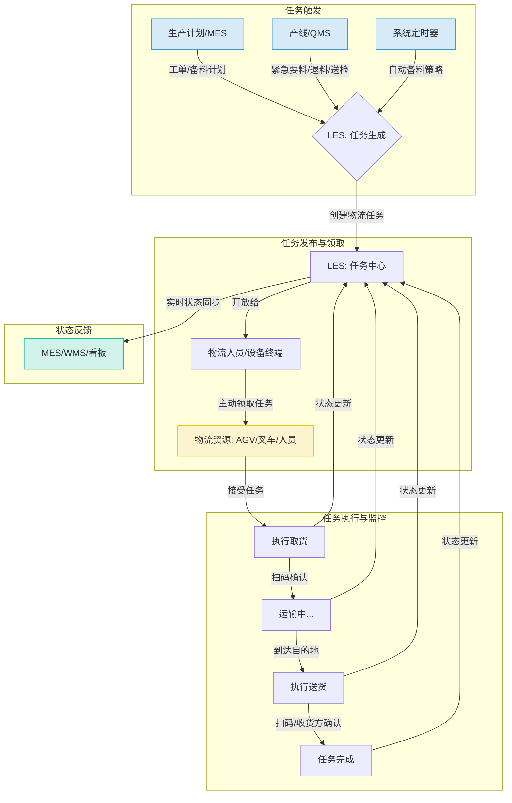
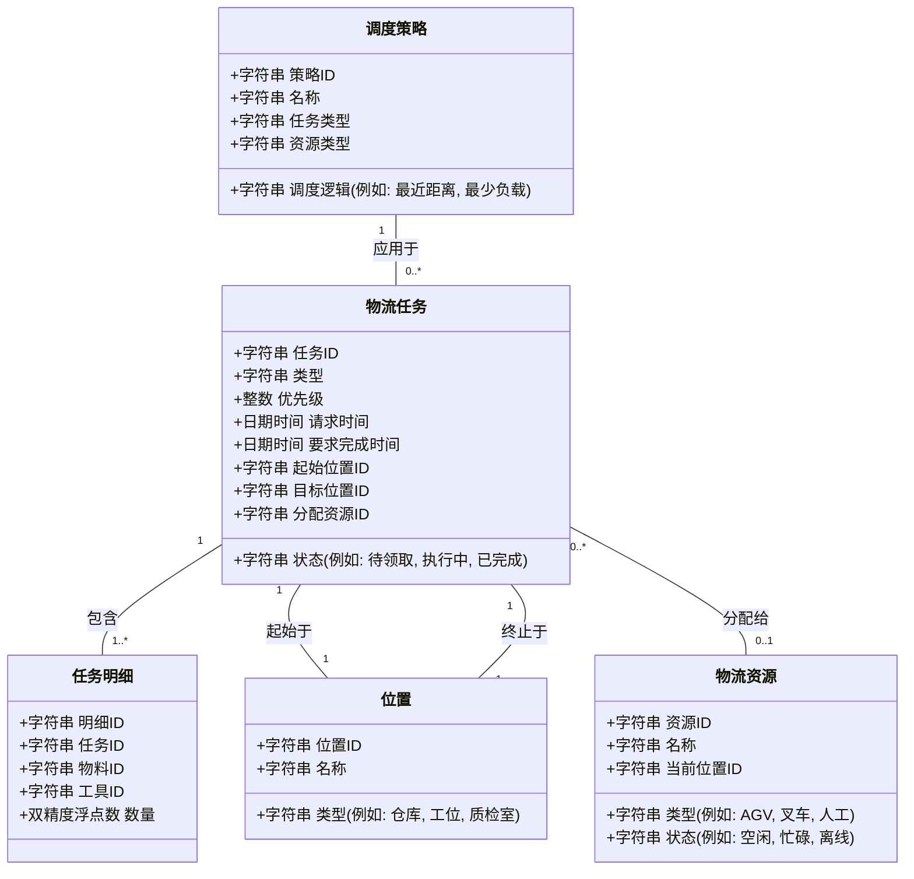
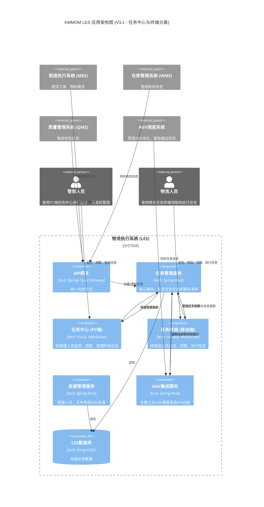

# KMMOM v3.0 LES (Logistics Execution System) - PRD

## 1. 概述与价值定义

### 1.1 原始需求

**业务背景**:
在离散制造业的日常生产运营中，物料的厂内流转（领料、拣配、运输、收料）是保障产线连续性的关键环节。当前，除了运输环节，大部分流程已在现有系统中实现管理。然而，运输调度与执行的缺失，以及部分环节依赖人工操作，导致了效率瓶颈和潜在的生产中断风险。

**核心痛点**:
1.  **被动的物料申请**: 领料申请依赖于计划员或产线操作员手动发起，无法做到基于生产计划的自动、准时化物料供给，增加了人为干预的延迟和错误风险。
2.  **无序的物流调度**: 缺乏对工厂内物流资源（如AGV、叉车、人力推车）的统一、智能调度系统。运输任务的下达与执行状态不透明，无法保证物料能够及时、准确地送达指定工位。
3.  **场景响应能力不足**: 面对生产过程中的多种物流场景（如常规齐套、紧急补料、ECN换料、样品送检、不合格品隔离、工装调拨等），缺乏标准化的流程和系统支持，响应效率低下，严重影响生产节奏。

**关键用户故事**:
*   作为 **生产计划员**，我希望系统能根据备料计划，在预设的时间点自动生成出库申请，确保物料准时供给产线，无需我手动干预。
*   作为 **产线班组长**，当发生物料损耗或发现不良品需要紧急补充时，我希望能通过终端一键呼叫物料，并实时看到配送状态，以最快速度恢复生产。
*   作为 **物流调度员**，我希望能在一个统一的看板上看到所有待执行、执行中和已完成的物流任务，并由系统智能推荐最优的运输工具（AGV/叉车）和路径，以提升整体运输效率。

### 1.2 需求分析

**市场与客户驱动因素**:
*   **智能制造趋势**: 行业正在向工业4.0转型，客户期望通过引入自动化和智能化技术（如AGV、物联网）来提升工厂内部物流的自动化水平，降低人力成本，提高响应速度。
*   **精益生产要求**: 客户对JIT/JIS（准时制/准时顺序）供应模式的需求日益增长，要求物流系统必须具备高度的精准性和时效性，以最小化线边库存和生产等待时间。
*   **质量与追溯压力**: 行业法规和客户对产品质量追溯的要求越来越高，厂内物流作为物料流转的关键一环，其过程的透明化、数据化管理变得至关重要。

**内部驱动因素**:
*   **提升现有系统价值**: KMMOM平台已经覆盖了生产执行的核心环节，打通厂内物流是完善端到端生产闭环、提升产品核心竞争力的必然选择。
*   **数据驱动决策**: 将物流执行过程纳入系统管理，可以沉淀宝贵的物流数据（如任务耗时、资源利用率、异常频率），为后续的流程优化和资源配置提供数据支持。

**核心挑战**:
*   **场景多样性与复杂性**: 厂内物流涉及的场景繁多（从库房到产线、产线到检验、产线之间、产线回库房），且触发条件各异，需要设计一个足够灵活、可配置的通用模型来适配。
*   **异构资源整合**: 物流执行单元包括AGV、叉车、人力等多种类型，其调度接口、能力模型各不相同，需要建立统一的资源抽象层和调度引擎。
*   **实时性与可靠性**: 物流任务的执行状态需要实时反馈，系统必须保证在高并发、高可靠性的环境下稳定运行，确保任务不丢失、不延迟。

**价值主张**:
| 价值维度 | 目标用户 | 价值描述 | 衡量指标 (KPI) |
| :--- | :--- | :--- | :--- |
| 效率提升 | 生产计划员, 物流调度员, 产线工人 | 通过自动备料、智能调度和标准化流程，显著缩短物料平均流转周期，减少生产等待时间。 | - 物料请求响应时间减少30%   - 产线因缺料导致的停工时间减少50% |
| 成本降低 | 工厂运营经理 | 优化物流路径，提高运输工具利用率，减少不必要的人力投入和运输成本。 | - 物流人力成本降低20%   - AGV/叉车综合利用率提升15% |
| 质量与合规 | 质量经理, 产线工人 | 实现物料从出库到上线的全程闭环追溯，确保不合格品得到及时隔离，降低质量风险。 | - 物料错发、漏发率降低至0.1%以下   - 不合格品隔离平均时间缩短至5分钟以内 |
| 决策优化 | 工厂运营经理, IT/系统管理员 | 提供全面的物流数据看板和分析报告，支持持续的流程改进和资源配置优化。 | - 提供至少5种关键物流运营分析报表   - 系统可配置性满足90%以上的新增场景需求 |

### 1.3 用户画像

| 层级 | 角色 | 核心诉求 | 系统使用场景 |
| :--- | :--- | :--- | :--- |
| 执行层 | 产线工人/班组长 | - 快速发起紧急要料/退料   - 呼叫空载具/回收满载具   - 确认收到物料 | - 通过工位终端（PDA/平板）进行一键式任务呼叫与确认。 |
| | 物流执行人 (叉车/AGV操作员) | - 清晰接收、执行运输任务   - 实时上报任务状态（取货、送达） | - 通过车载终端或手持设备接收指令，进行扫码确认操作。 |
| | 仓库管理员 | - 接收自动生成的拣配/出库任务   - 确认物料已交付给物流人员 | - 在WMS或LES终端上处理出库单，并与物流环节交接。 |
| 管理层 | 物流调度员/主管 | - 监控所有物流任务的实时状态   - 手动干预异常任务（如改派、取消）   - 统一调度和管理所有物流资源 | - 在PC端调度中心大屏/工作台进行任务监控、资源分配和异常处理。 |
| | 生产计划员/主管 | - 配置和监控自动备料计划   - 分析产线物料供应情况 | - 在PC端配置备料策略，查看物料满足率等报告。 |
| 决策层 | 工厂运营经理 | - 掌握整体物流运作效率和成本   - 识别流程瓶颈，进行持续改进 | - 在PC端BI看板查看物流KPI指标、成本分析和资源利用率报告。 |

### 1.4 术语及缩写解释

| 术语/缩写 | 英文全称 | 中文解释 |
| :--- | :--- | :--- |
| LES | Logistics Execution System | 物流执行系统。负责厂内物流任务的生成、调度、执行和监控。 |
| AGV | Automated Guided Vehicle | 自动导引运输车。一种可编程的无人驾驶运输工具。 |
| WMS | Warehouse Management System | 仓库管理系统。负责库内物料的存储、拣配和管理。 |
| MES | Manufacturing Execution System | 制造执行系统。负责生产过程的调度、控制和管理。 |
| QMS | Quality Management System | 质量管理系统。负责产品检验、不合格品处理等质量活动。 |
| ECN | Engineering Change Notice | 工程变更通知。用于指导对产品设计或工艺进行的修改。 |
| JIT | Just-In-Time | 准时制生产。一种旨在消除浪费、最小化库存的生产策略。 |
| JIS | Just-In-Sequence | 准时顺序供应。JIT的延伸，要求物料不仅准时，还按消耗顺序送达。 |
| WIP | Work In Progress | 在制品。正在生产线上加工但尚未完成的物料或产品。 |
| PQC | Process Quality Control | 过程质量控制。在生产过程中进行的质量检验活动。 |

## 2. 业务流程与场景设计

### 2.1. 核心业务流程

#### 2.1.1. 业务主流程

#### 2.1.2. 业务流程描述

| 步骤 | 环节 | 输入 | 处理过程 | 输出 | 关键规则/说明 |
| :--- | :--- | :--- | :--- | :--- | :--- |
| 1 | 任务生成 | - 上游业务系统指令   - 用户手工创建请求 | 1. 接收触发信号: 系统通过API接口接收上游业务系统（如MES工单、QMS检验单）的指令，或响应用户在终端上手工创建的请求。   2. 解析需求:       - 业务驱动: 自动解析指令，识别任务类型、物料、起止点、优先级等。      - 手工创建: 提供表单供用户填写任务详情，如“从A点搬运XX物料到B点”。  3. 创建任务: 在LES中生成唯一的物流任务，状态置为“待领取”，并发布至任务中心。 | - 一条结构化的物流任务数据 | - 业务驱动为主要模式，解决计划性、流程性的物流需求。   - 手工创建为辅助模式，解决临时的、计划外的物流需求。 |
| 2 | 任务领取 | - 任务中心待领取的任务列表   - 物流人员的身份凭证 | 1. 浏览任务: 物流人员在移动终端或固定看板上查看当前可用的任务列表。   2. 选择与领取: 根据自身位置、能力（如叉车驾驶资格）和设备状态，选择并领取合适的任务。   3. 确认领取: 系统锁定任务，将任务状态更新为“执行中”，并与领取的物流人员/设备绑定。 | - 任务与执行者绑定 | - 任务中心应提供筛选和排序功能（如按距离、优先级）。   - 系统可根据预设规则向特定人员/设备组推荐任务，但最终决定权在执行者。   - 对于AGV等自动设备，其调度系统可作为“虚拟”执行者，通过API自动领取任务。 |
| 3 | 执行与反馈 | - 领取的任务指令 | 1. 执行作业: 按照指令前往取货点，扫码核对物料后取货；再前往送货点，扫码交付物料。   2. 状态上报: 在取货、送达等关键节点，通过终端实时将状态和位置信息上报给LES。 | - 任务状态的实时更新 | - 所有关键交接点必须通过扫码进行数据绑定和校验，确保准确性。 |
| 4 | 任务完成 | - 收货方确认信息 | 1. 收货确认: 目的地（如工位、检验室）人员在终端上确认收到物料。   2. 关闭任务: LES接收到完成信号，将任务状态更新为“已完成”。   3. 通知相关方: 将任务完成状态同步给任务触发方（如MES）。 | - 关闭的物流任务   - 给上游系统的状态回传 | - 任务完成后，释放执行者（人员/设备），使其可领取新任务。 |

#### 2.1.3. 使用场景设计

基于原始需求分析，LES系统需重点支持以下核心及新增场景。每个场景都遵循上述主业务流程，但在触发条件、任务类型和处理策略上有所不同。

| 场景分类 | 场景ID | 场景描述 | 触发方式 | 关键设计考量 |
| :--- | :--- | :--- | :--- | :--- |
| 核心场景 | SC-LES-001 | 工单按需齐套与配送 | MES下发工单或备料计划 | - 支持按JIT/JIS/批量等不同策略生成任务。   - 需与WMS联动，获取物料在库信息。 |
| | SC-LES-002 | ECN驱动的物料换/补 | PLM/MES触发ECN变更 | - 需能识别已备但未上线的套料，生成逆向退料和新料补料两种任务。   - 任务优先级高。 |
| 检验物流 | SC-LES-003 | 工序首检/巡检送检 | 产线工人通过终端呼叫 | - 任务起止点明确（工位 -> PQC检验室）。   - 任务创建界面应简洁，方便工人快速操作。 |
| | SC-LES-004 | 不合格品隔离 | QMS判定不合格或产线自检发现 | - 任务优先级最高，需立即响应。   - 目的地为固定的“隔离区”或“不合格品仓”。 |
| | SC-LES-005 | 检验合格品返还 | QMS检验合格后触发 | - 适用于需返还的样品，送回原工位或指定暂存区。 |
| 异常物流 | SC-LES-006 | 产线紧急补料 | 产线工人通过终端呼叫 | - 任务优先级高。   - 需能快速选择所需物料和数量。 |
| | SC-LES-007 | 产线退料 | 工单完成后，工人终端发起 | - 将线边仓或工位剩余物料退回仓库。 |
| 资源物流 | SC-LES-008 | 工装借用与归还 | 工人通过终端申请 | - 物流对象为“工装”，而非“物料”。   - 需管理工装的在用状态和位置。 |
| | SC-LES-009 | 载具呼叫与空返 | 工人通过终端呼叫 | - 呼叫空料车或请求回收满载的废料车/成品车。   - 优化载具循环利用率。 |
| 新增场景 | SC-LES-010 | 返工/维修物流 | MES下发返工指令 | - 将WIP从当前工位送至指定维修站或返工线。 |
| | SC-LES-011 | 工装维护保养物流 | 设备管理系统(MMS)触发 | - 根据维保计划，自动生成工装送往维保中心的任务。 |
| | SC-LES-012 | 看板（Kanban）补料 | 工人扫描看板卡或按灯 | - 适用于低值易耗品的快速、自动补货。   - 触发方式轻量化，补货数量和目的地固定。 |

### 2.2. 数据模型与对象关系

#### 2.2.1. 业务对象ER关系图

#### 2.2.2. 数据字典

**1. 物流任务 (LogisticsTask)**

| 字段名 | 数据类型 | 长度/精度 | 是否可空 | 主/外键 | 描述 |
| :--- | :--- | :--- | :--- | :--- | :--- |
| 任务ID | 字符串 | 50 | 否 | 主键 | 任务唯一标识 |
| 类型 | 字符串 | 30 | 否 | | 任务类型，关联任务类型定义，如 `物料转运`, `工装借用`, `质检送样` |
| 状态 | 字符串 | 20 | 否 | | 任务状态，如 `待领取`, `执行中`, `已完成`, `已取消` |
| 优先级 | 整数 | | 否 | | 任务优先级，数值越高优先级越高 |
| 请求时间 | 日期时间 | | 否 | | 任务请求发起时间 |
| 要求完成时间 | 日期时间 | | 是 | | 要求送达时间，用于JIT/JIS场景 |
| 实际完成时间 | 日期时间 | | 是 | | 任务实际完成时间 |
| 起始位置ID | 字符串 | 50 | 否 | 外键 (位置) | 起始点位置ID |
| 目标位置ID | 字符串 | 50 | 否 | 外键 (位置) | 目的地位置ID |
| 分配资源ID | 字符串 | 50 | 是 | 外键 (物流资源) | 分配的物流资源ID |
| 触发源 | 字符串 | 100 | 是 | | 触发源信息，如 `MES工单_123`, `QMS检验单_456` |

**2. 任务明细 (TaskItem)**

| 字段名 | 数据类型 | 长度/精度 | 是否可空 | 主/外键 | 描述 |
| :--- | :--- | :--- | :--- | :--- | :--- |
| 明细ID | 字符串 | 50 | 否 | 主键 | 任务明细唯一标识 |
| 任务ID | 字符串 | 50 | 否 | 外键 (物流任务) | 所属物流任务ID |
| 对象类型 | 字符串 | 20 | 否 | | 运送对象类型，`物料` 或 `工装` |
| 对象ID | 字符串 | 50 | 否 | | 运送对象ID（物料ID或工装ID） |
| 数量 | 小数 | 18, 4 | 否 | | 数量 |
| 单位 | 字符串 | 10 | 否 | | 单位 |

**3. 物流资源 (LogisticsResource)**

| 字段名 | 数据类型 | 长度/精度 | 是否可空 | 主/外键 | 描述 |
| :--- | :--- | :--- | :--- | :--- | :--- |
| 资源ID | 字符串 | 50 | 否 | 主键 | 资源唯一标识 |
| 名称 | 字符串 | 100 | 否 | | 资源名称/编号，如 `AGV-001`, `叉车-A03` |
| 类型 | 字符串 | 20 | 否 | | 资源类型，如 `AGV`, `叉车`, `人工` |
| 状态 | 字符串 | 20 | 否 | | 资源状态，如 `空闲`, `忙碌`, `充电中`, `维护中`, `离线` |
| 当前位置ID | 字符串 | 50 | 是 | 外键 (位置) | 资源当前所在位置ID |
| 最大载重 | 小数 | 18, 4 | 是 | | 最大载重（公斤） |
| 电池电量 | 小数 | 5, 2 | 是 | | 电池电量（%），适用于AGV等电动工具 |

**4. 位置 (Location)**

| 字段名 | 数据类型 | 长度/精度 | 是否可空 | 主/外键 | 描述 |
| :--- | :--- | :--- | :--- | :--- | :--- |
| 位置ID | 字符串 | 50 | 否 | 主键 | 位置唯一标识 |
| 名称 | 字符串 | 100 | 否 | | 位置名称，如 `原材料仓-A区`, `Z01产线-03工位` |
| 类型 | 字符串 | 30 | 否 | | 位置类型，如 `仓库区`, `工位`, `缓存区`, `检验室`, `停靠点` |
| 坐标 | 字符串 | 50 | 是 | | 物理坐标 (x, y, z)，用于AGV路径规划 |

**5. 调度策略 (DispatchPolicy)**

| 字段名 | 数据类型 | 长度/精度 | 是否可空 | 主/外键 | 描述 |
| :--- | :--- | :--- | :--- | :--- | :--- |
| 策略ID | 字符串 | 50 | 否 | 主键 | 策略唯一标识 |
| 名称 | 字符串 | 100 | 否 | | 策略名称，如 “紧急补料-AGV优先” |
| 任务类型 | 字符串 | 30 | 否 | | 适用的任务类型 |
| 资源类型 | 字符串 | 20 | 是 | | 适用的资源类型（为空则适用所有类型） |
| 调度逻辑 | 字符串 | 500 | 否 | | 调度逻辑脚本或规则定义，如 `find_nearest_idle_resource()` |
| 优先级 | 整数 | | 否 | | 策略的优先级，用于解决策略冲突 |

### 2.3. 功能架构与清单

#### 2.3.1. 应用架构图

#### 2.3.2. 模块架构

| 一级模块 | 二级模块 | 核心职责 |
| :--- | :--- | :--- |
| 门户与终端 | 任务中心 (PC Web) | - 管理者视角: 提供全局任务的监控仪表盘，包括各类任务的数量、状态分布、超时告警。   - 手动干预: 支持管理员对特定任务进行手动指派、修改优先级、重新发布或取消。   - 统计分析: 提供任务完成率、资源利用率等KPI的统计报表。 |
| | 任务终端 (Mobile App) | - 执行者视角: 以列表形式向物流人员实时展示与其相关的任务（待领取、已领取）。   - 任务筛选与领取: 支持按载具类型（如叉车、推车）、具体载具或人员过滤任务，并执行“领取”操作。   - 任务执行: 提供任务详情查看、扫码确认（取货/送达）、状态上报（开始、完成）等功能。 |
| | 资源地图 (共享组件) | - 在PC端和移动端提供2D工厂地图，可视化所有物流资源（人员、叉车、AGV）的位置和状态。 |
| 核心服务 | 任务管理 (Task Management) | - 任务生命周期: 负责任务的创建、状态流转（从待发布到已完成）和历史归档。   - 任务发布与撮合: 向任务中心和终端发布任务，接收领取/指派事件，并绑定执行者。   - 任务触发器: 提供API接收外部系统（MES/QMS）和手工创建的请求。 |
| | 资源管理 (Resource Management) | - 维护非AGV物流资源（如人员、叉车）的基础信息、资质和状态。   - AGV资源本身由其专业调度系统管理，LES仅同步其状态。 |
| 集成服务 | AGV集成 (AGV Interface) | - 标准API对接: 提供标准API接口，用于与第三方AGV调度系统集成。   - 任务下发: 将需要AGV执行的任务推送给AGV调度系统。   - 状态同步: 接收AGV调度系统返回的任务状态更新。 |
| | 上游系统集成 (Upstream Interface) | - 负责与MES、WMS、QMS等系统的接口适配与数据交换。 |
| 基础配置 | 主数据管理 (Master Data) | - 维护位置、任务类型、资源等基础数据。 |

#### 2.3.3. 功能清单 (Feature Checklist) - 演进说明

**当前版本范围 (V3.1)**: 核心是构建一个职责分离的物流执行平台。**任务中心**负责管理和监控，**任务终端**负责高效执行。同时，为自动化设备集成打下坚实基础。

**未来演进方向**: 
- **智能调度引擎**: 在“任务管理”服务中构建或集成高级调度引擎，根据策略（如就近、负载均衡）自动向终端推荐或分配任务。
- **资源负载预测**: 基于历史数据分析，预测各区域的物流压力，在“任务中心”进行可视化预警。
- **与WCS深度集成**: 实现更精细化的库内自动化设备（如堆垛机、传送带）协同。

| 模块 | 功能点 | V3.1 Scope | 未来演进 |
| :--- | :--- | :--- | :--- |
| 任务中心 (PC) | 任务监控仪表盘 | ✔️ | 增强可视化、自定义报表 |
| | 手动任务创建 | ✔️ | 批量创建 |
| | 手动任务指派/改派 | ✔️ | 基于规则的自动推荐 |
| | 任务优先级调整 | ✔️ | 动态优先级算法 |
| | 任务报表与分析 | ✔️ | 预测性分析 |
| 任务终端 (Mobile) | 任务列表 (待领取/已领取) | ✔️ | 离线模式 |
| | 按载具/人员筛选任务 | ✔️ | 增加更多筛选维度 |
| | 扫码领取/确认任务 | ✔️ | NFC、蓝牙信标 |
| | 任务状态上报 | ✔️ | 异常上报流程 |
| | 查看个人历史任务 | ❌ | ✔️ |
| 资源地图 | 2D地图展示 | ✔️ | 3D地图、路径规划 |
| | 实时位置与状态 | ✔️ | 历史轨迹回放 |
| 任务管理 | 任务生命周期管理 | ✔️ | 复杂状态机支持 |
| | 对接外部系统创单 | ✔️ | 更多开箱即用的适配器 |
| 资源管理 | 物流资源（人/车）管理 | ✔️ | 资质、排班管理 |
| AGV集成 | 标准API | ✔️ | 适配更多AGV厂商 |

## 3. 详细功能设计 (V3.1)

### 3.1 调度中心 (Dispatch Center)

#### 3.1.1 任务监控仪表盘

##### 1. 用户故事 (User Story)
*   **目标**: `作为 [物流调度员/主管], 我希望 [能在一个集中的仪表盘上，实时监控所有物流任务的宏观状态、关键绩效指标（KPIs）以及资源（如AGV、叉车、人员）的实时动态], 以便 [快速发现瓶颈、预见风险，并做出及时的调度决策]。`

---

##### 2. 界面原型描述 (UI Prototype Description)
*   **设计思路与布局**:
    *   采用BI驾驶舱布局，将关键信息以卡片（Card）和图表（Chart）的形式直观呈现。
    *   布局应支持用户自定义，允许拖拽调整卡片位置和大小。
    *   数据应自动刷新（例如，每30秒），并提供手动刷新按钮。
*   **核心元素说明**:
    1.  **KPI指标卡片区**:
        *   **任务总览**: `进行中任务数`, `待领取任务数`, `今日已完成`, `超时任务数`。每个卡片都应有明显的数字和标题，超时任务数应用醒目的颜色（如红色）突出显示。点击数字可以快速钻取到对应的任务列表。
        *   **效率指标**: `平均任务完成时长`, `准时送达率`。
        *   **资源状态**: `空闲资源数`, `忙碌资源数`, `离线/故障资源数`。
    2.  **任务状态分布图 (环形图/饼图)**:
        *   直观展示“待领取”、“执行中”、“已完成”、“已取消”、“超时”等不同状态任务的数量占比。
        *   图例可点击，用于筛选或高亮显示特定状态的任务。
    3.  **任务趋势图 (折线图)**:
        *   以时间为X轴（例如，过去24小时），展示 `新建任务数` 和 `完成任务数` 的变化趋势，帮助识别任务高峰期和低谷期。
    4.  **超时任务列表 (滚动表格)**:
        *   专门列出当前所有状态为“超时”的任务。
        *   关键信息包括：`任务ID`, `任务类型`, `当前状态`, `执行人`, `已超时长`。
        *   列表应按“已超时长”降序排列，最紧急的排在最前面。提供快速操作按钮，如“改派”、“催办”。
    5.  **资源实时地图 (2D/3D)**:
        *   (复用 `3.3.1` 和 `3.3.2` 的设计) 在一个简化的工厂平面图上，实时显示所有物流资源（AGV、叉车、人员）的图标、当前位置和状态（空闲-绿色, 忙碌-蓝色, 故障-红色）。
        *   鼠标悬浮在资源图标上时，显示详细信息（如资源ID、电量、当前任务）。

---

##### 3. 业务规则 (Business Rules)
*   **When (事件驱动)**: `When [一个任务的状态发生变更 (如: 创建、被领取、完成、取消)], the [仪表盘上所有相关的KPI卡片和图表] shall [在下一个刷新周期内自动更新其数值和状态]。`
*   **The (计算规则)**: `The [准时送达率] shall be calculated as: [(在“要求完成时间”之前完成的任务数) / (总已完成任务数)] * 100%。`
*   **The (计算规则)**: `The [平均任务完成时长] shall be calculated as: [Σ(任务“实际完成时间” - “创建时间”)] / (总已完成任务数)。`
*   **If (条件规则)**: `If [一个任务的 (当前时间 - “创建时间”) > 预设的“开始响应阈值” 且 任务状态仍为“待领取”], then [该任务应被标记为“响应超时”]。`
*   **If (条件规则)**: `If [一个任务的 (当前时间 - “要求完成时间”) > 0 且 任务状态不为“已完成”], then [该任务应被标记为“执行超时”]。`

---

##### 4. 验收场景 (Acceptance Scenarios)
*   **场景1: 正常监控**
    *   **Given** 物流运作正常。
    *   **When** 调度员打开任务监控仪表盘。
    *   **Then** 他能看到“超时任务数”为0，任务状态分布图中“待领取”和“执行中”的任务占比较小，资源地图上大部分资源在有序移动。

*   **场景2: 发现潜在瓶颈**
    *   **Given** MES系统下发了大量备料任务。
    *   **When** 调度员观察仪表盘。
    *   **Then** 他发现“待领取任务数”KPI指标快速上升，任务状态分布图中“待领取”部分的扇区显著增大。他可以判断当前物流资源可能不足，需要协调更多人手或设备。

*   **场景3: 处理超时告警**
    *   **Given** 一个紧急补料任务长时间无人领取。
    *   **When** 任务达到“响应超时”阈值。
    *   **Then** 仪表盘上的“超时任务数”KPI卡片数字变为1并闪烁红色告警，同时该任务出现在“超时任务列表”的顶部。调度员可以立即点击“指派”按钮进行人工干预。

#### 3.1.2 手动任务创建

##### 1. 用户故事 (User Story)
*   **目标**: `作为 [物流调度员/产线班组长], 我希望 [能通过一个简单明了的界面，快速创建计划外的临时物流任务，例如紧急补料、样品运送或工具转运], 以便 [应对生产现场的突发状况，确保物流需求的快速响应]。`

---

##### 2. 界面原型描述 (UI Prototype Description)
*   **设计思路与布局**:
    *   在“任务中心”界面提供一个醒目的“创建任务”按钮。
    *   点击后，弹出一个模态框（Modal）或抽屉（Drawer），其中包含一个结构化的表单。
    *   表单设计应遵循“引导式”原则，从上到下逻辑清晰，并大量使用选择器以减少手动输入。
*   **核心元素说明**:
    1.  **任务类型选择 (Select)**:
        *   作为表单的第一项，用于选择本次任务的性质，如 `物料运送`, `工装转运`, `废料回收` 等。
        *   **联动效应**: 选择不同的任务类型，可能会动态显示或隐藏后续的某些表单项。例如，选择“物料运送”时，显示“物料清单”；选择“工装转运”时，显示“工装选择”。
    2.  **起止点选择 (Cascader/Select with Search)**:
        *   **起点**: 提供可搜索的下拉列表，数据源为“3.7.1 基础数据管理”中定义的所有“位置点”。支持按位置编码、名称、类型进行模糊搜索。
        *   **终点**: 同上。
    3.  **运送物料/工装清单 (Editable Table/Dynamic Form)**:
        *   如果任务类型是“物料运送”，则显示一个可动态增删行的表格。
        *   每一行包含：`物料编码/名称` (可搜索选择), `需求数量`, `单位`。
        *   提供“从BOM选择”或“从历史记录选择”的快捷功能。
    4.  **优先级设置 (Radio Group/Segmented Control)**:
        *   提供 `普通`, `较高`, `紧急` 三个级别的选项。
        *   默认为“普通”。选择“紧急”时，可附带一个文本框要求填写“加急原因”。
    5.  **时间要求 (Time Picker)**:
        *   **要求送达时间**: 可选字段。如果填写，则系统会据此计算任务的紧急程度和超时状态。
    6.  **备注 (Textarea)**:
        *   用于填写额外的注意事项。
    7.  **操作按钮**:
        *   `立即创建`: 校验表单后，创建任务并发布到任务中心。
        *   `存为模板`: (未来演进) 允许将常用的任务配置保存为模板，方便下次一键创建。

---

##### 3. 业务规则 (Business Rules)
*   **The (校验规则)**: `The [系统] shall [在创建任务前，对所有必填字段进行校验]，例如，任务类型、起止点、运送对象都不能为空。`
*   **If (条件规则)**: `If [起点和终点被设置为相同的位置], then [系统应阻止任务创建]，并提示“起点和终点不能相同”。`
*   **When (事件驱动)**: `When [一个手动任务被成功创建], the [系统] shall [立即将其发布到任务中心，状态置为“待领取”]，并触发“3.1.1 任务监控仪表盘”的数据刷新。`
*   **The (默认值规则)**: `The [任务的“请求时间”] shall [被自动记录为当前服务器时间]。`
*   **If (条件规则)**: `If [用户选择了“紧急”优先级], then [系统应在任务详情中高亮显示该优先级]，并在通知相关人员时附加特殊标记。`

---

##### 4. 验收场景 (Acceptance Scenarios)
*   **场景1: 创建一个紧急补料任务**
    *   **Given** Z01产线的03工位缺少了3个`BOLT-007`螺栓。
    *   **When** 班组长在终端上点击“创建任务”，选择任务类型为“物料运送”，起点选择“原材料仓-A区”，终点搜索并选择“Z01-03”，在物料清单中添加“BOLT-007”，数量填3，并将优先级设为“紧急”。
    *   **Then** 任务被成功创建，并立即出现在“任务中心”的待领取列表中，且带有“紧急”标识。

*   **场景2: 尝试创建一个无效任务**
    *   **Given** 调度员正在创建任务。
    *   **When** 他填写了起点和终点，但忘记添加任何需要运送的物料，然后点击“立即创建”。
    *   **Then** 系统弹窗提示“请至少添加一个运送对象（物料或工装）”，任务创建失败。

*   **场景3: 创建一个工装转运任务**
    *   **Given** 需要将一个名为 `MOLD-A01` 的模具从“模具库”送到“注塑车间-05机台”。
    *   **When** 调度员创建任务，任务类型选择“工装转运”，表单中的“物料清单”部分自动切换为“工装选择”输入框。他填写好起止点和工装编号。
    *   **Then** 任务成功创建，任务详情中明确记录了运送对象为工装 `MOLD-A01`。

#### 3.1.3 手动任务指派/改派

##### 1. 用户故事 (User Story)
*   **目标**: `作为 [物流调度员], 我希望 [能够将一个“待领取”的任务直接指派给某个特定的空闲资源（人员或车辆），或者将一个“执行中”但遇到问题的任务改派给另一个资源], 以便 [进行灵活的人工干预，确保高优先级任务的及时响应或解决现场的突发异常]。`

---

##### 2. 界面原型描述 (UI Prototype Description)
*   **设计思路与布局**:
    *   该功能入口位于任务列表（如“任务中心”的主列表或“超时任务列表”）的每一行操作区。
    *   操作名为“指派”或“改派”，根据任务当前状态动态显示。
*   **核心元素说明**:
    1.  **任务列表中的操作按钮**:
        *   对于状态为 `待领取` 的任务，显示 `指派` 按钮。
        *   对于状态为 `执行中` 的任务，显示 `改派` 按钮。
    2.  **指派/改派弹窗 (Modal)**:
        *   点击按钮后，弹出一个窗口用于选择目标资源。
        *   **窗口标题**: 动态显示为“任务指派 (任务ID: XXX)”或“任务改派 (任务ID: XXX)”。
        *   **资源推荐列表**:
            *   **智能推荐**: 弹窗顶部优先展示系统推荐的资源列表。推荐逻辑可基于：`距离起点最近的空闲资源`、`具备所需资质的空闲资源`（如叉车驾照）。
            *   **全部资源列表 (Tabs)**: 提供按资源类型（如 `人员`, `叉车`, `AGV`）分类的Tab页，每个Tab下是一个可搜索的资源列表。
        *   **资源列表项**:
            *   每一项显示资源的关键信息：`资源ID/名称`, `当前状态` (空闲, 忙碌, 离线), `与任务起点的距离`。
            *   **状态高亮**: `离线` 或 `忙碌` 的资源应置灰或有明确标识，原则上不可被选择。
        *   **改派原因 (Textarea)**:
            *   仅在“改派”时显示，且为必填项。用于记录为何要从原执行者那里移交任务。
    3.  **确认操作**:
        *   选择一个可用资源后，点击“确认指派/改派”按钮。

---

##### 3. 业务规则 (Business Rules)
*   **If (条件规则)**: `If [一个任务的状态不为“待领取”], then [“指派”操作应被禁用]。`
*   **If (条件规则)**: `If [一个任务的状态不为“执行中”], then [“改派”操作应被禁用]。`
*   **The (校验规则)**: `The [系统] shall [禁止将任务指派给状态为“忙碌”、“离线”或“维护中”的资源]。`
*   **When (事件驱动)**: `When [一个任务被成功“指派”给资源A], the [系统] shall:`
    1.  `将任务状态更新为“执行中”。`
    2.  `将任务与资源A进行绑定。`
    3.  `向资源A的执行终端推送该任务指令。`
*   **When (事件驱动)**: `When [一个正在由资源A执行的任务被“改派”给资源B], the [系统] shall:`
    1.  `向资源A的终端发送任务“被取消/中止”的通知。`
    2.  `将任务与资源B进行绑定（原绑定关系解除）。`
    3.  `向资源B的终端推送该任务指令。`
    4.  `在任务的操作历史中，记录本次改派事件，包括操作人、时间、原执行人、新执行人及改派原因。`

---

##### 4. 验收场景 (Acceptance Scenarios)
*   **场景1: 指派一个紧急任务**
    *   **Given** 一个“紧急”的补料任务已创建，但5分钟仍无人领取。
    *   **When** 调度员在任务列表中找到该任务，点击“指派”。在弹出的窗口中，系统推荐了距离起点最近的空闲叉车司机“李师傅”。调度员选择了“李师傅”并确认。
    *   **Then** 该任务状态变为“执行中”，并立即出现在李师傅的移动终端任务列表的最顶端。

*   **场景2: 对执行中的任务进行改派**
    *   **Given** 张师傅在执行一个送货任务途中，其驾驶的叉车突然报故障。
    *   **When** 调度员收到异常报告后，在任务列表中找到张师傅正在执行的任务，点击“改派”。他填写改派原因为“执行车辆故障”，并从列表中选择了另一位空闲的王师傅。
    *   **Then** 张师傅终端上的该任务消失或标记为已取消。王师傅的终端上收到了这个新的任务指令。任务的执行人更新为王师傅。

*   **场景3: 尝试指派给一个忙碌的资源**
    *   **Given** 调度员想将一个任务指派出去。
    *   **When** 在指派窗口的资源列表中，他看到正在执行其他任务的陈师傅状态为“忙碌”且被置灰。他尝试点击选择陈师傅。
    *   **Then** 系统没有响应，或提示“该资源正忙，无法指派新任务”。

#### 3.1.4 任务优先级调整

##### 1. 用户故事 (User Story)
*   **目标**: `作为 [物流调度员], 我希望 [能够随时调整一个“待领取”或“执行中”任务的优先级], 以便 [应对生产计划变更或突发的紧急情况，确保最重要的任务能被优先处理]。`

---

##### 2. 界面原型描述 (UI Prototype Description)
*   **设计思路与布局**:
    *   该功能应非常轻量和快捷。建议直接在任务列表的“优先级”字段上提供“在席编辑 (In-place Editing)”功能。
*   **核心元素说明**:
    1.  **可编辑的优先级字段**:
        *   在任务中心的表格视图中，`优先级` 列不再是纯文本展示。
        *   鼠标悬浮或单击该单元格时，它会从文本状态变为一个可交互的控件，例如一个“分段控制器 (Segmented Control)”或“选择器 (Select)”。
    2.  **分段控制器 (Segmented Control)**:
        *   提供 `普通`, `较高`, `紧急` 三个选项。
        *   当前任务的优先级在控件上高亮显示。
        *   用户可以直接点击切换到新的优先级。
    3.  **视觉高亮**:
        *   当一个任务的优先级被提升为“紧急”时，其在列表中的整行背景色可以变为淡红色或在行首显示一个火焰图标，以示醒目。
    4.  **自动置顶**:
        *   当任何任务的优先级被调整时，任务列表应能自动根据新的优先级重新排序（如果当前排序规则是按优先级的话），确保高优先级的任务浮到顶端。

---

##### 3. 业务规则 (Business Rules)
*   **When (事件驱动)**: `When [一个任务的优先级被修改], the [系统] shall:`
    1.  `立即保存新的优先级设置。`
    2.  `如果任务列表当前是按优先级排序的，则自动刷新并重排列表。`
    3.  `在任务的操作历史中记录此次变更（操作人、时间、原优先级、新优先级）。`
*   **If (条件规则)**: `If [一个任务的优先级被提升为“紧急”], then [系统应向任务的当前执行者（如果已指派）发送一条高亮通知，提示“任务已加急”]。`
*   **If (条件规则)**: `If [一个任务的状态为“已完成”、“已取消”或“已归档”], then [其优先级应被锁定，不允许再进行调整]。`
*   **The (普遍规则)**: `The [系统] shall [记录每次优先级调整的操作日志]，以备审计和追溯。`

---

##### 4. 验收场景 (Acceptance Scenarios)
*   **场景1: 提升一个待领取任务的优先级**
    *   **Given** 一个“普通”优先级的备料任务正在等待领取。
    *   **When** 调度员接到产线电话，要求加快该物料的配送。他在任务列表中找到该任务，并将其优先级从“普通”点击修改为“紧急”。
    *   **Then** 该任务行的背景色变为淡红色，并自动移动到列表的最上方。所有在线的执行终端上，该任务的显示顺序也被提前。

*   **场景2: 降低一个任务的优先级**
    *   **Given** 一个“较高”优先级的工装转运任务正在执行中。
    *   **When** 调度员得知该工装的需求部门临时更改了计划，不再急用。他将该任务的优先级从“较高”降为“普通”。
    *   **Then** 任务行的特殊高亮消失，执行该任务的员工可能会收到一条“任务优先级已变更”的普通通知。

*   **场景3: 尝试修改一个已完成任务的优先级**
    *   **Given** 一个任务的状态是“已完成”。
    *   **When** 调度员试图点击该任务的优先级字段。
    *   **Then** 该字段为只读状态，不可点击，或点击后无任何反应，无法进行修改。

#### 3.1.5 任务报表与分析

##### 1. 用户故事 (User Story)
*   **目标**: `作为 [物流主管/工厂运营经理], 我希望 [能通过多维度的报表和图表，对历史物流数据进行深入分析，例如任务完成率、资源利用率、各类异常的发生频率等], 以便 [评估整体物流效率，识别长期存在的瓶颈，并为流程优化和资源配置提供数据驱动的决策支持]。`

---

##### 2. 界面原型描述 (UI Prototype Description)
*   **设计思路与布局**:
    *   这是一个典型的BI分析页面，与“3.1.1 任务监控仪表盘”的实时性不同，这里更侧重于对历史数据的聚合、钻取和探索性分析。
*   **核心元素说明**:
    1.  **全局筛选器 (Global Filters)**:
        *   位于页面顶部，提供 `时间范围` (预设“本周”、“本月”、“上季度”，并支持自定义起止日期)、`任务类型`, `执行部门/班组`, `资源类型/具体资源` 等筛选条件。
        *   所有图表和数据都会根据筛选条件进行联动刷新。
    2.  **核心KPI概览 (KPI Cards)**:
        *   展示在选定时间范围内的核心指标：`总任务数`, `准时完成率`, `平均任务耗时`, `Top 3 繁忙资源`, `Top 3 异常类型`。
    3.  **任务耗时分析 (组合图表: 柱状图+折线图)**:
        *   X轴为时间（天/周），Y1轴（柱状图）为 `每日完成任务数`，Y2轴（折线图）为 `每日平均任务耗时`。
        *   用于分析任务量与处理效率之间的关系。
    4.  **任务类型分布 (甜甜圈图)**:
        *   展示不同任务类型（如 `备料`, `补料`, `送检`）的数量占比。
        *   点击某个扇区可以下钻，查看该类型任务的详细列表。
    5.  **资源利用率分析 (箱形图/盒须图)**:
        *   每个“箱子”代表一个物流资源（或一类资源）。
        *   箱体展示了该资源在统计周期内，每日“忙碌时长”的分布情况（中位数、上下四分位数、异常值）。
        *   可以快速识别出哪些资源长期处于高负荷或低负荷状态。
    6.  **异常原因分析 (条形图)**:
        *   展示各类异常（如 `车辆故障`, `找不到物料`, `地址错误`）发生的次数排行。
    7.  **详细数据表格 (Data Table)**:
        *   位于页面底部，以表格形式展示经过筛选和聚合后的明细数据。
        *   支持 `自定义列`、`排序`、`导出为Excel` 等功能。

---

##### 3. 业务规则 (Business Rules)
*   **The (数据聚合规则)**: `The [报表系统] shall [在后台通过定时任务（如每日凌晨）对前一天的数据进行预聚合和计算]，以提升前端报表的加载速度。对于实时性要求不高的报表，优先使用聚合后的结果。`
*   **The (计算规则)**: `The [准时完成率] is calculated as: [Number of tasks completed on or before their 'Required Completion Time'] / [Total number of completed tasks with a 'Required Completion Time' set] * 100%.`
*   **The (计算规则)**: `The [平均任务耗时] is calculated per task type and overall, as: [Sum of ('Actual Completion Time' - 'Creation Time')] / [Total number of completed tasks].`
*   **The (钻取规则)**: `The [系统] shall [支持从大部分图表中进行下钻分析]。例如，点击任务类型分布图中的“紧急补料”扇区，下方的详细数据表格应自动筛选并仅显示所有“紧急补料”任务的明细。`
*   **The (默认显示规则)**: `The [报表页面] shall [在首次加载时，默认显示“本周”的数据]。`

---

##### 4. 验收场景 (Acceptance Scenarios)
*   **场景1: 查看月度物流效率**
    *   **Given** 月底需要进行月度总结。
    *   **When** 物流主管打开报表分析页面，在时间范围筛选器中选择“本月”。
    *   **Then** 页面上的所有KPI和图表都更新为本月的数据。他可以从KPI卡片中直接看到本月的“准时完成率”为95%，“平均任务耗时”为15.3分钟。

*   **场景2: 分析特定员工的工作表现**
    *   **Given** 主管想要了解员工“王师傅”近期的工作量。
    *   **When** 他在全局筛选器中，资源类型选择“人员”，具体资源选择“王师傅”。
    *   **Then** 页面刷新，显示王师傅在本周内完成的总任务数、平均耗时等。通过“资源利用率分析”图，主管可以看到王师傅的工作饱和度。

*   **场景3: 追查送料任务耗时过长的原因**
    *   **Given** 主管发现“送料”任务的平均耗时有上升趋势。
    *   **When** 他在任务类型分布图中点击“送料”扇区进行下钻。
    *   **Then** 详细数据表格中列出了所有送料任务。他通过对表格按“耗时”降序排序，发现耗时最长的几个任务都与某个特定的偏远工位有关。他可以据此判断可能是路径规划或该工位交接流程存在问题。

### 3.2 执行终端 (Execution Terminal)

#### 3.2.1 移动端任务中心

##### 1. 用户故事 (User Story)
*   **目标**: `作为 [一线物流员工（如叉车司机、配送员）], 我希望 [能在我的移动设备（如PDA、手机）上，清晰地看到分配给我的、以及我可以领取的物流任务列表], 以便 [高效地管理我的工作队列，并及时响应新的任务需求]。`

---

##### 2. 界面原型描述 (UI Prototype Description)
*   **设计思路与布局**:
    *   采用适合移动端操作的列表视图，信息密度适中，触摸目标大。
    *   使用标签页（Tabs）来区分不同状态的任务，简化认知负担。
*   **核心元素说明**:
    1.  **顶部标签页 (Tabs)**:
        *   `待处理 (My Tasks)`: 显示已指派给当前用户，需要按顺序执行的任务。通常会有一个数字角标，显示待处理任务的数量。
        *   `可领取 (Task Pool)`: 显示所有公开的、可供领取的任务。
        *   `已完成 (Completed)`: 显示当前班次或当天已完成的任务列表，供回顾和查询。
    2.  **任务卡片 (Task Card)**:
        *   列表中的每一项都是一个“任务卡片”，以清晰、结构化的方式展示核心信息。
        *   **优先级标记**: 在卡片左侧边缘使用不同颜色的竖线或图标（如火焰🔥）来标记优先级（紧急-红色, 较高-橙色, 普通-蓝色）。
        *   **任务标题**: 简明扼要地说明任务性质，如 `备料 | 从 原材料仓-A区 到 Z01-03`。
        *   **关键信息**: `任务ID`, `创建时间` 或 `要求送达时间`。
        *   **状态提示**: 对于“待处理”列表中的第一个任务，应有明确的“进行中”或“下一个”标识。
        *   **操作按钮**: 
            *   在“可领取”列表中，每个卡片都有一个醒目的 `领取` 按钮。
            *   在“待处理”列表中，第一个任务卡片有 `开始执行` 按钮。
    3.  **排序与筛选**:
        *   提供一个简单的下拉菜单，允许对“可领取”列表进行排序，选项包括 `优先级最高`, `距离最近`, `最新发布`。

---

##### 3. 业务规则 (Business Rules)
*   **The (排序规则)**: `The [“待处理”列表] shall [默认按照系统预设的执行顺序进行排序]，该顺序由调度策略（如优先级、依赖关系）决定。用户原则上应按此顺序执行。`
*   **The (排序规则)**: `The [“可领取”列表] shall [默认按照“优先级”降序，“创建时间”升序进行排序]。`
*   **When (事件驱动)**: `When [用户点击“领取”按钮], the [系统] shall [立即尝试将该任务分配给当前用户]。`
    *   `If [分配成功], then [该任务将从“可领取”列表消失，并出现在该用户的“待处理”列表末尾]，同时任务状态变更为“执行中”。`
    *   `If [分配失败，因为任务已被他人领取], then [系统应给出明确提示“任务已被领取”，并刷新“可领取”列表]。`
*   **The (显示规则)**: `The [移动端任务中心] shall [仅显示与当前用户角色和技能相匹配的任务]。例如，没有叉车资质的员工看不到必须使用叉车才能完成的任务。`
*   **The (刷新机制)**: `The [任务列表] shall [支持下拉刷新和基于WebSocket的自动推送刷新]，确保任务状态的实时性。`

---

##### 4. 验收场景 (Acceptance Scenarios)
*   **场景1: 领取一个新任务**
    *   **Given** “可领取”列表中有一个“紧急”的补料任务。
    *   **When** 叉车司机小张在列表中看到了这个任务，并点击了“领取”按钮。
    *   **Then** 该任务从小张的“可领取”列表中消失，并出现在他的“待处理”列表的顶端（因为是紧急任务），同时其他所有人的“可领取”列表中该任务也消失了。

*   **场景2: 按顺序处理任务**
    *   **Given** 小李的“待处理”列表中有3个任务，按系统推荐的顺序排列。
    *   **When** 他完成了第一个任务。
    *   **Then** 第一个任务自动从“待处理”列表移至“已完成”列表，原先排在第二位的任务现在成为了列表的第一个，并显示“开始执行”按钮。

*   **场景3: 任务被他人抢先领取**
    *   **Given** 小王和小刘同时在“可领取”列表中看到了一个新发布的任务。
    *   **When** 小王手速更快，先点击了“领取”按钮。紧接着小刘也点击了“领取”。
    *   **Then** 小王的界面显示领取成功。小刘的界面则弹窗提示“手慢了，任务已被领取”，并且该任务从他的列表中消失。

#### 3.2.2 任务导航与路径指引

##### 1. 用户故事 (User Story)
*   **目标**: `作为 [一线物流员工], 我希望 [在接受任务后，系统能在我移动设备的地图上清晰地标示出任务的起点和终点，并为我规划出一条最优路径], 以便 [我能快速、准确地到达作业地点，减少寻找路线的时间]。`

---

##### 2. 界面原型描述 (UI Prototype Description)
*   **设计思路与布局**:
    *   在用户点击“开始执行”后，界面从任务详情切换到一个以2D地图为中心的导航视图。
*   **核心元素说明**:
    1.  **2D地图视图**:
        *   (复用 `3.3.1` 的地图组件) 加载工厂的2D平面图作为背景。
        *   **当前位置标记**: 一个动态的、有方向指示的图标（如一个箭头）实时表示用户当前在地图上的位置和朝向。
        *   **起点/终点标记**: 使用醒目的图标（如旗帜、圆点）在地图上标记出本次任务的起点和终点位置，并附带文字标签（如“A-01上料口”，“Z03-05工位”）。
    2.  **路径规划线**:
        *   在地图上绘制一条清晰的、高亮显示的线条，连接起点和终点，表示系统推荐的行进路线。
        *   **分段指引**: 路径可以根据任务步骤分段显示。例如，第一步“从当前位置到起点”，路径线为蓝色；第二步“从起点到终点”，路径线为绿色。
    3.  **导航信息面板**:
        *   悬浮在地图上方或下方的一个半透明面板，显示关键导航信息。
        *   `下一步指示`: “前方50米后右转，前往A-01上料口”。
        *   `距离信息`: “距离目的地：120米”。
        *   `预计时间`: “预计还需：2分钟”。
    4.  **辅助功能按钮**:
        *   `重新定位`: 点击后将地图中心移回到用户当前位置。
        *   `路径总览`: 缩放地图以完整显示从起点到终点的全部路径。
        *   `语音播报开关`: 开启或关闭语音导航提示。

---

##### 3. 业务规则 (Business Rules)
*   **The (路径规划算法)**: `The [系统] shall [基于预设的工厂内部路网数据，结合实时交通状况（如拥堵、管制区域），为用户计算出最优路径]。` “最优”可配置，默认为“最短时间路径”。
*   **The (路径规划约束)**: `The [路径规划] must [考虑不同资源类型的物理限制]。例如，为叉车规划的路径必须避开有人行通道限制的区域；为AGV规划的路径必须严格遵守其磁条或激光导航线路。`
*   **When (事件驱动)**: `When [用户偏离了推荐路径超过一定距离（如10米）], the [系统] shall [自动重新规划从当前位置到目的地的路径]，并更新地图上的路径线。`
*   **The (位置更新)**: `The [用户当前位置] shall be [通过设备的定位能力（如UWB、Wi-Fi指纹、蓝牙信标）实时获取]，并平滑地更新在地图上。`
*   **If (条件规则)**: `If [任务包含多个途经点], then [路径规划应按顺序依次进行]。完成一个点的作业后，自动开始导航到下一个点。`

---

##### 4. 验收场景 (Acceptance Scenarios)
*   **场景1: 正常执行导航**
    *   **Given** 员工小李接受了一个从“A仓库”到“B车间”的送料任务。
    *   **When** 他点击“开始执行”，界面切换到地图导航模式。
    *   **Then** 地图上清晰地标出了他的当前位置、A仓库（起点）和B车间（终点），并绘制了一条推荐路线。他跟随路线指引，顺利到达了A仓库。

*   **场景2: 员工走错路**
    *   **Given** 小李在前往B车间的途中，因为避让行人，拐进了一个错误的通道。
    *   **When** 系统检测到他偏离了预定路线。
    *   **Then** 系统在几秒钟内自动重新计算了一条从他当前新位置到B车间的新路线，并在地图上更新了路径线和文字指示，同时语音提示“已为您重新规划路线”。

*   **场景3: 路径包含临时管制区**
    *   **Given** 一个区域因为设备检修被临时设置为“禁止通行”。
    *   **When** 系统为小王规划一个需要经过此区域的任务路径。
    *   **Then** 规划出的路径会自动绕开这个临时管制区，即使这意味着路程会更长。如果无法绕行，系统应提示“无法规划路径，请联系调度中心”。

#### 3.2.3 任务操作与扫码确认

##### 1. 用户故事 (User Story)
*   **目标**: `作为 [一线物流员工], 我希望 [在到达任务点（如库位、工位）后，能通过扫描二维码/条形码的方式，快速确认我已到达正确位置、并取/放了正确的物料], 以便 [防止人为错误，并确保系统记录的操作是准确无误的]。`

---

##### 2. 界面原型描述 (UI Prototype Description)
*   **设计思路与布局**:
    *   当导航显示用户已到达目的地时，界面会自动或手动切换到操作确认视图。
    *   该视图的核心是调用设备的摄像头进行扫码。
*   **核心元素说明**:
    1.  **操作指令清晰化**:
        *   在扫码界面顶部，用大号字体明确指示当前操作，如 `请扫描 [A-01上料口] 的位置码` 或 `请扫描物料 [BOLT-007] 的批次码`。
    2.  **扫码区域**:
        *   屏幕中央是一个取景框，引导用户将二维码/条形码放入框内。
        *   提供辅助功能，如 `打开闪光灯`、`手动输入编码` (作为备用方案)。
    3.  **物料核对列表**:
        *   对于取货或放货的步骤，界面上应显示一个清晰的物料清单。
        *   清单项包括：`物料名称/编码`, `应取/应放数量`。
        *   每成功扫描并核对一项物料，该项前面会打上一个绿色的勾✔️。
    4.  **数量输入/确认**:
        *   扫描物料码成功后，如果任务需要指定数量，会弹出一个数字输入键盘，让用户输入本次实际操作的数量。
        *   对于周转箱等整箱物料，可直接确认数量为“1箱”。
    5.  **完成步骤按钮**:
        *   当所有必需的扫描和数量确认都完成后，`完成此步骤` 或 `确认取货` 按钮变为可用状态，用户点击后进入任务的下一个环节。

---

##### 3. 业务规则 (Business Rules)
*   **The (校验规则)**: `The [系统] shall [在用户扫描后，立即将扫描结果与任务要求进行比对]。`
    *   `If [扫描的位置码/物料码与任务要求一致], then [进入下一步操作（如输入数量）]。`
    *   `If [不一致], then [设备发出声音或振动提示，并在屏幕上显示错误信息，如“位置错误，请扫描正确的位置码”或“物料不匹配”]。`
*   **The (防呆规则)**: `The [系统] shall [严格控制操作顺序]。用户必须先成功扫描并确认位置码，然后才能进入扫描物料码的环节。`
*   **If (条件规则)**: `If [任务涉及多种物料], then [用户必须逐一扫描并确认每种物料]，直到清单上的所有项目都完成。
*   **The (数量校验)**: `The [系统] shall [校验用户输入的实际操作数量]。`
    *   `If [实际数量 > 需求数量], then [系统可提示“超出需求数量，请确认”]。`
    *   `If [实际数量 < 需求数量], then [系统可允许部分取/放货，但需要用户确认，并可能触发异常上报流程]。`
*   **The (手动输入权限)**: `The [“手动输入编码”功能] shall be [基于权限控制的]。只有在特定情况下（如标签损坏无法扫描）或特定用户组才允许使用，并需要记录原因。`

---

##### 4. 验收场景 (Acceptance Scenarios)
*   **场景1: 成功取货**
    *   **Given** 小张到达了任务指定的“原材料仓-A区-01架”库位。
    *   **When** 他点击“确认到达”，系统提示“请扫描库位码”。他扫描库位上的二维码，成功后，系统提示“请扫描物料`BOLT-007`的条码并取货100个”。他找到物料，扫描包装箱上的条码，成功后输入数量100并确认。
    *   **Then** 系统记录他已成功从正确位置取出正确物料和数量，并开始导航到任务的终点。

*   **场景2: 扫描了错误的物料**
    *   **Given** 小张需要取的是`BOLT-007`，但他不小心拿了旁边的`NUT-003`。
    *   **When** 他扫描`NUT-003`的条码。
    *   **Then** 他的PDA发出“滴滴”的错误提示音，屏幕上显示红色文字：“物料错误！需要 [BOLT-007]，扫描为 [NUT-003]”。操作无法继续。

*   **场景3: 标签损坏，使用手动输入**
    *   **Given** 终点工位的二维码被油污覆盖，无法扫描。
    *   **When** 小张尝试多次扫描失败后，点击了“手动输入”按钮。他输入了二维码下方清晰可见的编码`Z01-03`。
    *   **Then** 系统验证编码正确，允许他继续下一步的放货操作。同时，系统后台记录了本次手动输入事件，以备追溯。

#### 3.2.4 任务状态上报

##### 1. 用户故事 (User Story)
*   **目标**: `作为 [一线物流员工], 我希望 [在执行任务的每个关键节点（如开始、到达、完成），系统能自动或通过我简单点击来更新任务状态；并且在遇到任何意外情况时，我能方便地进行异常上报], 以便 [让调度中心和相关人员实时了解任务进展和问题，及时获得支持]。`

---

##### 2. 界面原型描述 (UI Prototype Description)
*   **设计思路与布局**:
    *   状态更新应与任务流程紧密结合，大部分是完成一个动作后的“结果”，而不是一个独立的“功能”。
    *   异常上报功能则需要一个随时可以访问的入口。
*   **核心元素说明**:
    1.  **动态状态按钮**:
        *   在任务执行界面的固定位置（如底部），始终存在一个“主操作按钮”。
        *   这个按钮的文字和功能是动态变化的，引导用户执行当前最应该做的操作。
        *   **状态流转示例**: `开始执行` -> `确认到达(起点)` -> `确认取货` -> `确认到达(终点)` -> `确认完成`。
        *   用户每点击一次并完成相应操作（如扫码），按钮就自动变为下一个状态。
    2.  **异常上报入口**:
        *   在界面的右上角或“更多”菜单中，提供一个永久可见的 `上报异常` 按钮。
    3.  **异常上报弹窗 (Modal)**:
        *   点击`上报异常`后，弹出一个窗口。
        *   **异常类型选择 (Select)**: 提供一个预设的异常类型列表，如 `车辆故障`, `找不到物料`, `库位被占用`, `网络中断`, `其他`。这是必填项。
        *   **异常描述 (Textarea)**: 用户可以在此输入更详细的文字说明。
        *   **图片上传 (Uploader)**: 允许用户拍摄现场照片作为证据或补充说明。
        *   **提交按钮**: `提交报告`。

---

##### 3. 业务规则 (Business Rules)
*   **When (事件驱动)**: `When [用户点击动态状态按钮并成功完成该步骤（如扫码确认）], the [系统] shall [立即将任务的后台状态更新为对应的新状态]，并通知所有相关的监听者（如调度台仪表盘）。`
*   **The (状态机规则)**: `The [任务状态的流转] must [严格遵循预定义的生命周期模型（见3.4.1）]。不允许跨状态跳转，例如从“开始执行”直接到“已完成”。`
*   **When (事件驱动)**: `When [用户提交一个异常报告], the [系统] shall:`
    1.  `将任务的当前状态标记为“异常”或“暂停”。`
    2.  `将异常信息（类型、描述、图片、时间、地点、上报人）记录到任务日志中。`
    3.  `根据异常的严重性和类型，触发相应的告警机制。例如，向调度中心发送高亮警报，或通过短信/钉钉通知主管。`
*   **The (日志记录)**: `The [系统] shall [详细记录每一次状态变更和异常上报的时间戳、操作人和相关数据]，形成完整的任务生命周期追溯链。`

---

##### 4. 验收场景 (Acceptance Scenarios)
*   **场景1: 正常完成一个任务**
    *   **Given** 员工小王正在执行一个送料任务。
    *   **When** 他依次点击了“开始执行”，在起点扫码后按钮变为“确认取货”，取货后按钮变为“确认到达”，在终点扫码后按钮变为“确认完成”，最后点击“确认完成”。
    *   **Then** 任务状态平滑地从“执行中”流转到“已完成”。在调度中心的监控大屏上，该任务从未显示异常，并最终归入已完成列表。

*   **场景2: 上报一个物料找不到的异常**
    *   **Given** 小王在起点库位，但发现任务要求的物料不在指定位置。
    *   **When** 他点击了“上报异常”按钮，在弹窗中选择了异常类型“找不到物料”，并文字描述“库位A-01-01为空”，然后提交。
    *   **Then** 他的当前任务被暂停。调度员在调度台立即收到一条告警，内容是“任务XXX异常：找不到物料”，并能看到小王的文字描述。调度员可以立即通过电话联系小王或进行其他处理。

*   **场景3: 任务状态与按钮的对应关系**
    *   **Given** 一个任务有三个步骤：A点取货，B点放货，C点充电。
    *   **When** 员工完成了A点取货。
    *   **Then** 任务的主操作按钮应自动变为指向B点相关的操作，如“前往B点”或“确认到达(B点)”，而不是直接跳到C点的操作。

### 3.3 车间现场监控 (Shopfloor Monitoring)

#### 3.3.1 电子地图

##### 1. 用户故事 (User Story)
*   **目标**: `作为 [调度员或车间主管], 我希望 [能在一个交互式的2D电子地图上，直观地看到整个工厂的布局，包括所有关键位置（如库位、工位、充电桩）和区域划分], 以便 [我能快速掌握现场全局态势，为任务分配和资源调度提供地理位置依据]。`

---

##### 2. 界面原型描述 (UI Prototype Description)
*   **设计思路与布局**:
    *   构建一个可交互的、多图层的2D地图视图，作为监控和调度的画布。
    *   地图应支持缩放、平移等基本交互。
*   **核心元素说明**:
    1.  **地图基础层**:
        *   使用SVG或Canvas技术渲染，可以从CAD图纸转换而来。
        *   显示工厂的静态建筑结构、墙体、道路、区域轮廓。
    2.  **位置标记层 (POIs - Points of Interest)**:
        *   在地图上以特定的、可配置的图标标记出所有关键业务位置。
        *   **图标分类**: 不同类型的位置使用不同的图标，如 `库位 (Shelf)`, `工位 (Workstation)`, `充电桩 (Charging Pile)`, `电梯 (Elevator)`, `门 (Door)`。
        *   **交互性**: 鼠标悬停在位置标记上时，显示一个信息提示框（Tooltip），包含该位置的详细信息（如 `名称: 原材料仓-A01-F1-R02`, `类型: 库位`, `状态: 空闲`）。
        *   点击标记可以触发更复杂的操作或打开详细信息面板。
    3.  **区域层 (Zones)**:
        *   用不同颜色的半透明覆盖层来表示不同的功能区域，如 `生产区`, `仓储区`, `质检区`, `临时管制区`。
        *   区域的边界应清晰可见，并可带有文字标签。
    4.  **地图控件**:
        *   `缩放按钮 (+/-)`: 用于放大和缩小地图。
        *   `图层控制 (Layers)`: 一个复选框列表，允许用户按需显示或隐藏不同的图层（如“显示/隐藏库位”、“显示/隐藏AGV路径”）。
        *   `全屏切换`: 将地图视图扩展至整个屏幕。

---

##### 3. 业务规则 (Business Rules)
*   **The (数据驱动)**: `The [电子地图上的所有位置标记和区域] shall be [由后台基础数据（见3.7.1）动态生成和渲染的]，而不是硬编码在前端。`
*   **The (坐标系)**: `The [地图] shall [使用统一的、精确的坐标系]。所有需要定位的元素（资源、位置）都必须拥有在该坐标系下的坐标值。`
*   **When (事件驱动)**: `When [后台更新了某个位置的状态（如库位从“空闲”变为“占用”）], the [地图上对应标记的视觉表现（如颜色）] shall [实时或准实时地发生变化]。`
*   **The (性能要求)**: `The [地图] must [在承载大量位置标记（如超过5000个）时，依然保持流畅的缩放和平移操作]。` 可以采用虚拟渲染、分层加载等技术进行优化。
*   **The (可配置性)**: `The [图标、颜色和标签的显示规则] shall be [可配置的]，以适应不同客户的视觉识别标准。`

---

##### 4. 验收场景 (Acceptance Scenarios)
*   **场景1: 查看仓库布局**
    *   **Given** 调度员小李刚接手工作，对仓库环境不熟。
    *   **When** 他打开监控大屏，选择“仓储区”视图，并放大地图。
    *   **Then** 他能清晰地看到仓库内每一排货架、每一个库位的编号和布局。他将鼠标悬停在一个库位图标上，看到了该库位的详细编码和当前占用状态。

*   **场景2: 临时交通管制**
    *   **Given** B车间南侧通道因地面维修需要临时关闭。
    *   **When** 车间主管在后台系统中设置了该通道对应的路段为“管制状态”。
    *   **Then** 在所有人的电子地图上，该通道区域被红色半透明层覆盖，并显示“维修中，请绕行”的提示。路径规划（见3.2.2）将自动避开此区域。

*   **场景3: 筛选显示元素**
    *   **Given** 地图上同时显示了AGV、人员、库位、设备等多种信息，显得非常杂乱。
    *   **When** 调度员只想关注所有空闲的充电桩位置，他在图层控制器中取消勾选了其他所有选项，只保留“充电桩”。
    *   **Then** 地图上只剩下充电桩的图标，一目了然。

#### 3.3.2 实时位置与状态

##### 1. 用户故事 (User Story)
*   **目标**: `作为 [调度员或车间主管], 我希望 [能在电子地图上，实时看到所有物流资源（如AGV、叉车、员工）的当前位置、移动方向和工作状态], 以便 [我能即时掌握资源动态，做出最合理的调度决策，并快速响应异常情况]。`

---

##### 2. 界面原型描述 (UI Prototype Description)
*   **设计思路与布局**:
    *   在 `3.3.1` 的电子地图基础上，增加一个动态的资源图层。
*   **核心元素说明**:
    1.  **动态资源图标**:
        *   使用不同形状的图标来代表不同类型的资源，如 `AGV (小车形状)`, `人员 (人形)`。
        *   **方向指示**: 图标应能指示资源的移动方向，例如，AGV图标的车头朝向其前进方向。
        *   **状态颜色编码**: 图标的颜色会根据资源当前的状态动态变化，建立直观的视觉关联。
            *   `绿色`: 空闲/可用
            *   `蓝色`: 执行任务中
            *   `黄色`: 充电中/休息中
            *   `红色`: 故障/异常
            *   `灰色`: 离线
    2.  **移动轨迹**:
        *   可以为选定的资源开启“显示轨迹”功能，在地图上留下一条淡淡的、随时间逐渐消失的尾迹，显示其最近一段时间的移动路径。
    3.  **详细信息面板 (Info Panel)**:
        *   点击任何一个资源图标，会在地图侧边或以弹窗形式，显示该资源的详细信息面板。
        *   **内容**: `资源编号`, `资源类型`, `当前状态`, `电量/体力`, `正在执行的任务ID`, `速度` 等。
        *   **快捷操作**: 面板中可包含一些快捷操作按钮，如 `指派任务`, `强制充电`, `查看任务详情`。

---

##### 3. 业务规则 (Business Rules)
*   **The (事件驱动)**: `The [资源的位置和状态] shall be [通过物联网定位技术（UWB, GPS/北斗, Wi-Fi/蓝牙）和设备状态上报，经由WebSocket或MQTT等实时通信协议，驱动前端更新]。`
*   **The (动画效果)**: `The [资源在地图上的移动] shall be [平滑的动画过渡]，而不是瞬间跳跃，以提供更好的视觉连续性。`
*   **When (事件驱动)**: `When [一个资源的状态变为“异常”或“故障”], the [系统] shall [立即在地图上通过高亮、闪烁或告警图标等方式，突出显示该资源]，并触发告警通知。`
*   **If (条件规则)**: `If [资源的电量低于预设阈值（如20%）], then [其图标上应出现一个“低电量”的角标提示]。`
*   **The (历史轨迹)**: `The [系统] shall [在后台存储资源的历史轨迹数据]，以支持后续的回放和分析功能。`

---

##### 4. 验收场景 (Acceptance Scenarios)
*   **场景1: 实时跟踪一个AGV**
    *   **Given** 调度员正在关注一个正在执行送货任务的AGV-007。
    *   **When** AGV在厂区内移动。
    *   **Then** 在监控大屏的地图上，代表AGV-007的图标（蓝色，表示任务中）平滑地沿着预定路线移动，图标的头部始终指向前进方向。

*   **场景2: AGV发生异常报警**
    *   **Given** AGV-003在行驶途中，因障碍物而触发了急停，并上报了“运行异常”状态。
    *   **When** 系统收到该状态。
    *   **Then** 在地图上，AGV-003的图标立即从蓝色变为闪烁的红色，并发出“滴滴”的告警声，吸引调度员的注意。调度员点击该图标，看到了详细信息“状态：运行异常 - 障碍物阻挡”。

*   **场景3: 查找空闲人员**
    *   **Given** 出现一个紧急的临时任务，需要一名员工去处理。
    *   **When** 调度员查看地图。
    *   **Then** 他可以快速地在地图上找到所有显示为绿色（空闲）的人员图标，并根据他们距离任务发生地的远近，选择最合适的一位进行指派。

### 3.4 调度策略与任务集成 (Dispatching & Integration)

#### 3.4.1 任务生命周期管理

##### 1. 用户故事 (User Story)
*   **目标**: `作为 [系统管理员或调度主管], 我希望 [能通过后台配置，灵活地设计和管理不同类型任务的生命周期状态机], 以便 [使系统能适应各种复杂的物流业务流程，并确保任务状态的流转是严谨和可控的]。`

---

##### 2. 界面原型描述 (UI Prototype Description)
*   **设计思路与布局**:
    *   提供一个可视化的、基于流程图的后台配置界面，让非技术人员也能理解和设计状态机。
*   **核心元素说明**:
    1.  **生命周期模型列表**:
        *   界面左侧是一个列表，显示所有已创建的生命周期模型，如 `标准物料配送模型`, `AGV自动充电模型`, `紧急补料模型`。
        *   提供 `新增`, `编辑`, `复制`, `删除` 模型的按钮。
    2.  **图形化设计画布 (Canvas)**:
        *   选中一个模型后，右侧的主区域是一个画布，用于展示和编辑该模型的流程图。
        *   **节点工具箱**: 画布旁边提供一个工具箱，可以拖拽不同类型的节点到画布上，包括 `开始节点`, `状态节点`, `结束节点`, `判断节点`。
        *   **状态节点 (State Node)**: 画布上的每个方块代表一个任务状态，如 `已创建`, `已派发`, `执行中`, `已完成`, `已取消`, `异常`。节点上显示状态名称。
        *   **连接线 (Transition)**: 用户可以通过从一个节点的连接点拖拽到另一个节点的方式，创建状态之间的“流转路径”。
    3.  **属性配置面板**:
        *   点击画布上的一个“状态节点”或“连接线”，右侧会滑出属性配置面板。
        *   **节点属性**: 可配置状态的名称、编码、是否允许手动干预等。
        *   **连接线属性 (Transition Rule)**: 这是设计的核心。可配置流转的触发条件，如 `当 [操作员] 点击 [“完成”] 按钮时`, `当 [AGV] 到达 [目的地] 时`, `当 [任务] 超时 [30分钟] 未开始时`。
        *   **动作配置 (Action)**: 可配置进入或离开某个状态时，系统自动执行的动作，如 `发送通知给MES`, `调用WCS接口`, `记录日志`。

---

##### 3. 业务规则 (Business Rules)
*   **The (模型关联)**: `The [每一种任务类型（见3.7.1）] must [关联一个且仅一个任务生命周期模型]。` 创建任务时，系统根据其类型加载对应的状态机。
*   **The (校验规则)**: `The [系统] shall [严格校验状态流转的合法性]。任何不符合当前状态和连接线触发条件的状态变更请求都将被拒绝。`
*   **The (自动化触发)**: `The [系统] shall [能够基于外部事件（如设备信号、API调用）或内部事件（如定时器）自动触发状态流转]。`
*   **The (版本管理)**: `The [生命周期模型] shall [支持版本控制]。当一个模型被修改并保存时，可以选择创建为新版本。正在运行中的任务将继续沿用其创建时所依据的旧版本模型，而新创建的任务将使用新版本。`
*   **The (审计日志)**: `The [系统] must [记录每一次状态流转的详细日志]，包括触发事件、操作人/系统、时间戳以及相关数据，用于审计和问题排查。`

---

##### 4. 验收场景 (Acceptance Scenarios)
*   **场景1: 创建一个简单的生命周期模型**
    *   **Given** 管理员需要创建一个“空托盘回收”任务的生命周期。
    *   **When** 他在后台新建一个模型，拖入“已创建”、“执行中”、“已完成”三个状态节点，并依次连接起来。
    *   **Then** 他成功保存了这个模型，并将其与“空托盘回收”任务类型关联。之后所有新建的该类型任务都将遵循这个简单的三状态流程。

*   **场景2: 配置一个带条件的自动流转**
    *   **Given** 对于“AGV充电”任务，要求在电量达到95%时自动完成。
    *   **When** 管理员编辑“AGV充电”模型，在“充电中”状态和“已完成”状态之间创建一条连接线，并为其配置触发条件为 `当 [AGV电量] >= [95%] 时`。
    *   **Then** 当一个正在充电的AGV上报其电量达到96%时，系统自动将该充电任务的状态从“充电中”更新为“已完成”，无需人工干预。

*   **场景3: 配置一个异常超时流转**
    *   **Given** 要求任何任务在“已派发”状态停留超过10分钟无人接受，应自动转为“异常”。
    *   **When** 管理员在所有模型的“已派发”状态节点上，添加一个指向“异常”状态的超时触发器，设置为10分钟。
    *   **Then** 一个任务被派发后，如果10分钟内没有任何人接受或系统指派，该任务的状态会自动变为“异常”，并触发告警通知调度员处理。

#### 3.4.2 对接外部系统创单

##### 1. 用户故事 (User Story)
*   **目标**: `作为 [外部系统（如MES、WMS）的开发/管理员], 我希望 [能通过调用一个标准、安全的API接口，向LES系统提交物流任务请求], 以便 [实现上下游系统之间的自动化集成，减少人工录入任务的工作量和错误率]。`

---

##### 2. 界面原型描述 (UI Prototype Description)
*   **设计思路与布局**:
    *   此功能主要为API接口，UI部分体现在API的后台管理和文档上。
*   **核心元素说明**:
    1.  **API访问管理 (后台界面)**:
        *   `接入系统列表`: 显示所有允许调用API的外部系统列表，如 `MES-生产执行系统`, `WMS-仓库管理系统`。
        *   `AppID / AppSecret 管理`: 为每个接入系统生成和管理用于身份认证的 `AppID` 和 `AppSecret`。提供生成、重置、禁用等操作。
        *   `IP白名单配置`: 为每个接入系统配置允许调用API的服务器IP地址列表。
        *   `权限分配`: 可以为不同的系统分配不同的API调用权限，例如，MES只能创建物料配送任务，而WMS可以创建入库和出库任务。
    2.  **API接口日志 (后台界面)**:
        *   提供一个可查询的日志界面，记录每一次外部API的调用请求和响应。
        *   **可查字段**: `调用时间`, `来源IP`, `接入系统 (AppID)`, `请求的API`, `请求参数`, `响应结果`, `是否成功`。
        *   用于排查集成问题。
    3.  **API文档 (面向开发者)**:
        *   (复用 `3.6.1` 的API文档) 提供清晰、详细的API文档，说明创单接口的URL、请求方法（POST）、请求头（Header）、请求体（Body）格式以及签名算法。
        *   提供清晰的请求示例和响应示例。

---

##### 3. 业务规则 (Business Rules)
*   **The (接口协议)**: `The [创单接口] shall [遵循RESTful设计风格，使用JSON作为数据交换格式]。`
*   **The (安全认证)**: `The [接口] must [采用“AppID + 签名”的方式进行安全认证]。`
    *   `调用方需在请求头中提供 AppID。`
    *   `调用方需将所有请求参数（包括时间戳、随机数）按字母顺序排序，拼接成字符串，然后使用 AppSecret 进行HMAC-SHA256等算法生成签名，并将签名放在请求头中。`
*   **The (安全校验)**: `The [LES系统] shall [在收到请求后，执行IP白名单校验和签名校验]。`
    *   `If [任一校验失败], then [立即拒绝请求，并返回401 Unauthorized或403 Forbidden错误]。`
*   **The (幂等性保证)**: `The [接口] must [支持幂等性]。` 调用方可以在请求中传入一个唯一的请求ID（如 `request_id`），`If [LES在一定时间内收到具有相同request_id的重复请求], then [应直接返回第一次成功处理的结果，而不会重复创建任务]。`
*   **The (数据校验)**: `The [系统] shall [对请求体中的业务数据进行严格的校验]。` 如检查起点/终点位置是否存在、物料编码是否有效等。`If [校验失败], then [返回400 Bad Request错误，并在响应体中提供详细的错误信息]。`

---

##### 4. 验收场景 (Acceptance Scenarios)
*   **场景1: MES成功创建一个送料任务**
    *   **Given** MES系统已在LES后台配置了AppID/Secret和IP白名单。
    *   **When** MES系统根据API文档，构造了一个从“线边仓”到“Z05工位”的送料请求，正确计算了签名，并通过POST请求发送给LES的创单API。
    *   **Then** LES系统验证IP和签名通过，校验业务数据无误，成功创建了一个新的物流任务，并向MES返回了201 Created响应，响应体中包含了新创建的任务ID。

*   **场景2: 未授权的系统尝试创建任务**
    *   **Given** 一个未经注册的外部系统获取了API地址。
    *   **When** 它尝试发送一个创单请求，但因为它没有合法的AppID或使用了错误的Secret生成签名。
    *   **Then** LES系统在验证签名时失败，立即拒绝了该请求，并返回了401 Unauthorized错误。API调用日志中记录了这次失败的尝试。

*   **场景3: WMS因网络超时重发请求**
    *   **Given** WMS发送了一个出库任务请求，但由于网络问题，没有及时收到LES的响应。
    *   **When** WMS的重试机制启动，使用完全相同的参数（包括相同的 `request_id`）重新发送了一次请求。
    *   **Then** LES系统收到了第二个请求，通过 `request_id` 识别出这是一个重复请求。系统没有创建第二个任务，而是直接将第一个请求成功创建后返回的结果再次返回给WMS。WMS收到成功响应，流程继续，避免了重复出库。

### 3.5 资源与集成管理

#### 3.5.1 物流资源（人/车）管理

##### 1. 用户故事 (User Story)
*   **目标**: `作为 [车间主管或系统管理员], 我希望 [能在一个统一的界面中，管理所有的物流资源，包括人员和车辆（如叉车、AGV）的基本信息、状态和分组], 以便 [为任务调度和现场监控提供准确的数据支持]。`

---

##### 2. 界面原型描述 (UI Prototype Description)
*   **设计思路与布局**:
    *   采用标准的CRUD（创建、读取、更新、删除）管理界面，通过标签页区分不同类型的资源。
*   **核心元素说明**:
    1.  **顶部标签页 (Tabs)**:
        *   `车辆管理`: 显示所有车辆资源的列表。
        *   `人员管理`: 显示所有物流员工的列表。
    2.  **通用功能区**:
        *   `搜索/筛选栏`: 提供按资源编号、名称、状态、所属分组等条件进行搜索和筛选的功能。
        *   `操作按钮`: `新增资源`, `批量导入`, `导出列表`。
    3.  **资源列表 (Data Table)**:
        *   **车辆列表字段**: `车辆编号`, `车辆类型(叉车/AGV)`, `型号`, `当前状态`, `当前电量`, `所属分组`, `激活状态`, `操作` (编辑/删除/查看详情)。
        *   **人员列表字段**: `工号`, `姓名`, `当前状态`, `所属分组`, `技能资质`, `激活状态`, `操作`。
    4.  **新增/编辑表单 (Modal/Drawer)**:
        *   点击“新增”或“编辑”后，以弹窗或抽屉形式展现表单。
        *   **车辆表单**: 包含编号、类型、型号、所属AGV厂商（如果是AGV）、通信参数、电量阈值等字段。
        *   **人员表单**: 包含工号、姓名、所属部门、联系方式、技能资质（如“叉车证”、“高级调度权限”）等字段。

---

##### 3. 业务规则 (Business Rules)
*   **The (唯一标识)**: `The [每一个资源（无论人或车）] must [拥有一个在系统中唯一的编号]。`
*   **The (状态联动)**: `The [资源列表中的“当前状态”] shall [与现场监控地图（3.3.2）中的资源状态保持实时同步]。`
*   **The (分组管理)**: `The [系统] shall [支持将资源进行分组]，例如“白班叉车组”、“A车间AGV群组”。调度策略可以基于分组进行配置。`
*   **The (删除约束)**: `The [系统] shall [禁止删除正在执行任务或在任务队列中的资源]。` 必须先将其从任务中释放。
*   **The (删除约束)**: `The [系统] shall [禁止删除已经产生过历史任务记录的资源]，但可以将其状态设置为“禁用”或“离职/报废”。` 禁用的资源将不再参与新的任务分配。
*   **The (日志记录)**: `The [系统] shall [记录所有对资源信息的关键操作日志]，如创建、修改、删除/禁用。`

---

##### 4. 验收场景 (Acceptance Scenarios)
*   **场景1: 新增一台AGV**
    *   **Given** 公司新采购了一台海康威视的AGV。
    *   **When** 管理员在“车辆管理”页面点击“新增资源”，类型选择“AGV”，厂商选择“海康威视”，并填写AGV的编号、IP地址等参数后保存。
    *   **Then** 新的AGV出现在车辆列表中，初始状态为“离线”。当该AGV启动并成功接入系统后，其状态自动更新为“空闲”。

*   **场景2: 为一名新员工添加资质**
    *   **Given** 新员工小李刚通过了叉车操作培训，拿到了证书。
    *   **When** 主管在“人员管理”页面找到小李，编辑他的信息，在“技能资质”中勾选了“叉车操作”。
    *   **Then** 从此刻起，当有需要叉车完成的任务时，系统在自动派单的候选人列表中会开始包含小李。

*   **场景3: 尝试删除一台正在忙碌的叉车**
    *   **Given** 叉车`CPD-01`正在执行一个送料任务。
    *   **When** 管理员因误操作，在后台尝试删除`CPD-01`这条记录。
    *   **Then** 系统弹出错误提示：“操作失败！资源[CPD-01]正在执行任务，无法删除。”

### 3.6 对外开放与集成 (Openness & Integration)

#### 3.6.1 标准API

##### 1. 用户故事 (User Story)
*   **目标**: `作为 [外部系统（如MES/WMS）的开发人员], 我希望 [KMMOM能提供一套标准、规范、文档清晰的API], 以便 [我能快速、低成本地实现与KMMOM的数据集成和功能调用]。`

---

##### 2. 界面原型描述 (UI Prototype Description)
*   **设计思路与布局**:
    *   API文档本身即是“UI”。不涉及专门的GUI设计，而是采用业界标准的API文档生成和展现工具，如 `Swagger UI` 或 `Redoc`。
*   **核心元素说明**:
    1.  **文档访问入口**: 提供一个公开的URL，例如 `https://kmmom.yourcompany.com/api/docs`。
    2.  **API分组 (Grouping)**: 在文档界面中，API按业务模块进行分组，如 `任务管理 (Tasks)`, `资源管理 (Resources)`, `位置服务 (Locations)` 等，方便开发者快速定位。
    3.  **端点详情 (Endpoint Details)**:
        *   清晰地展示每个API的 `HTTP方法` (GET/POST/PUT/DELETE)、`URL路径`、`功能描述`。
        *   详细定义 `请求参数` (路径参数、查询参数、请求体)，包括参数名、数据类型、是否必填、示例值和说明。
        *   详细定义 `响应数据`，包括成功和失败时的 `HTTP状态码`、`响应体结构 (JSON Schema)`、`字段含义` 和 `示例`。
    4.  **在线测试 (Try it out)**:
        *   提供“Try it out”功能，允许开发者在文档页面直接填写参数、发起API请求，并查看真实的请求和响应内容，极大地降低了调试门槛。

---

##### 3. 业务规则 (Business Rules)
*   **The (自动生成)**: `The [API文档] shall [通过代码注解（如Swagger Annotations）自动生成]，确保文档与代码实现始终保持一致。`
*   **The (设计规范)**: `All [API] must [遵循统一的设计规范]，例如RESTful风格、统一的URL命名、统一的认证授权方式（见3.4.2）、统一的数据格式（JSON）。`
*   **The (版本管理)**: `The [API] shall [支持版本管理]，例如通过URL路径（`/api/v1/...`）来区分不同版本，确保外部系统的集成不受KMMOM内部升级的影响。`
*   **The (公开访问)**: `The [API文档页面] shall [是公开可访问的]，但“Try it out”功能可能需要连接到一个沙箱（Sandbox）环境或需要特定的开发者凭证。`
*   **The (错误处理)**: `All [API] must [返回统一格式的错误信息]，例如 `{ "errorCode": "INVALID_PARAM", "errorMessage": "Parameter 'taskId' cannot be empty." }`，便于外部系统进行程序化处理。

---

##### 4. 验收场景 (Acceptance Scenarios)
*   **场景1: 开发者查阅文档**
    *   **Given** 一位MES系统的开发者需要实现“创建物流任务”的功能。
    *   **When** 他访问 `https://kmmom.yourcompany.com/api/docs`，在“任务管理”分组下找到了 `POST /api/v1/tasks` 这个端点。
    *   **Then** 他能清晰地看到创建任务所需的JSON请求体结构、每个字段的含义和示例值，以及成功和失败时可能的响应。

*   **场景2: 开发者在线测试**
    *   **Given** 开发者已经理解了API的用法。
    *   **When** 他在文档页面的“Try it out”区域，填入一个符合规范的JSON请求体，然后点击“Execute”。
    *   **Then** 他能看到系统返回了 `201 Created` 的状态码，以及一个包含新创建任务ID的JSON响应体，同时在KMMOM的调度中心能看到这个新任务。

*   **场景3: 开发者发送一个错误的请求**
    *   **Given** 开发者在测试时不小心漏掉了一个必填字段 `taskType`。
    *   **When** 他通过“Try it out”或自己的代码发送了这个不完整的请求。
    *   **Then** 系统返回了 `400 Bad Request` 的状态码，并且响应体中包含了明确的错误码和错误信息，指出 `taskType` 字段是必需的。

### 3.7 基础数据配置 (Basic Data Configuration)

#### 3.7.1 基础数据管理 (位置、任务类型等)

##### 1. 用户故事 (User Story)
*   **目标**: `作为 [系统管理员], 我希望 [能在一个统一的配置中心，管理系统运行所需的各类基础数据，如物理位置、任务类型、异常类型、资源分组等], 以便 [确保业务流程能够根据车间的实际情况和业务规则正确执行]。`

---

##### 2. 界面原型描述 (UI Prototype Description)
*   **设计思路与布局**:
    *   提供一个名为“基础数据管理”或“系统配置”的统一后台管理模块。内部通过左侧菜单导航至不同的数据管理页面。
*   **核心元素说明**:
    1.  **侧边菜单导航 (Side Menu)**:
        *   `位置管理`: 管理所有物理和逻辑位置点。
        *   `任务类型管理`: 定义不同业务场景的任务类型。
        *   `异常类型管理`: 配置任务执行过程中可能出现的异常。
        *   `资源分组管理`: 对人和车辆进行分组。
        *   `...其他`: 其他需要配置的基础数据。
    2.  **统一的CRUD管理界面**: 每个管理页面都遵循相似的布局。
        *   `搜索/筛选区`: 根据编码、名称等关键字段进行搜索。
        *   `操作按钮区`: `新增`, `批量导入`, `导出`。
        *   `数据表格 (Data Table)`: 显示数据列表，包含关键字段和“编辑”、“删除/禁用”操作列。
    3.  **具体页面设计 (以“位置管理”为例)**:
        *   **数据表格字段**: `位置编码`, `位置名称`, `位置类型` (如产线、缓存区、充电位、维修点), `所属地图`, `地图坐标(X,Y)`, `状态(启用/禁用)`, `操作`。
        *   **新增/编辑表单 (Modal/Drawer)**:
            *   `位置编码/名称`: 必填。
            *   `位置类型`: 下拉选择。
            *   `地图坐标`: 除了手动输入X,Y值，提供一个 **`“从地图上拾取”`** 的按钮，点击后弹出车间电子地图（3.3.1），允许用户直接在地图上点击选择位置，自动回填坐标，极大提升易用性。
    4.  **任务类型管理界面**:
        *   **数据表格字段**: `类型编码`, `类型名称`, `关联的生命周期模型(3.4.1)`, `描述`, `操作`。

---

##### 3. 业务规则 (Business Rules)
*   **The (编码唯一)**: `The [所有基础数据的编码（如位置编码、任务类型编码）] must [在各自的分类中是唯一的]。`
*   **The (删除约束)**: `The [系统] shall [禁止删除已经被业务数据（如任务记录）引用的基础数据项]。`
*   **The (禁用代替删除)**: `The [系统] shall [提供“禁用”功能] as an alternative to deletion for referenced data. ` 禁用的数据项将不能在新的业务流程（如创建任务）中被选择，但历史记录的显示不受影响。
*   **The (批量操作)**: `The [系统] shall [支持通过Excel/CSV模板进行批量导入和导出] for data like locations, to facilitate initial setup and large-scale updates.`
*   **The (缓存更新)**: `When [基础数据被修改（如新增、禁用）], the [系统] shall [自动刷新或清除相关缓存]，确保所有模块获取到的都是最新数据。`

---

##### 4. 验收场景 (Acceptance Scenarios)
*   **场景1: 新增一个工作台位置**
    *   **Given** 管理员需要将新的总装工作台 `Z-ASSY-05` 添加到系统中。
    *   **When** 他在“位置管理”页面点击“新增”，填写编码和名称，然后点击“从地图上拾取”，在弹出的总装车间地图上准确点击了 `Z-ASSY-05` 的位置后保存。
    *   **Then** 新位置被成功创建，其坐标已自动填充。在电子地图上，该位置点已经可见。

*   **场景2: 尝试删除一个正在被使用的任务类型**
    *   **Given** “紧急送料”这个任务类型已经被上千个历史任务使用。
    *   **When** 管理员尝试在“任务类型管理”中删除“紧急送料”。
    *   **Then** 系统阻止该操作，并提示：“操作失败！该任务类型已被 xxx 条任务记录引用，无法删除。您可以将其禁用。”

*   **场景3: 批量导入一批充电桩位置**
    *   **Given** 管理员准备了一个包含10个新充电桩位置信息的Excel文件，格式符合系统下载的模板。
    *   **When** 他在“位置管理”页面点击“批量导入”，上传了这个Excel文件。
    *   **Then** 系统处理文件后，提示“成功导入10条记录”，并且这10个新的充电桩位置出现在列表中。