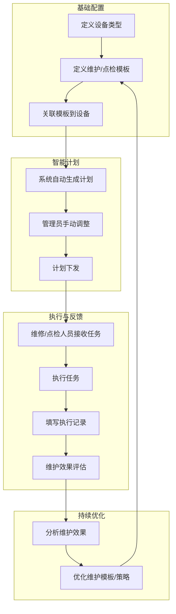
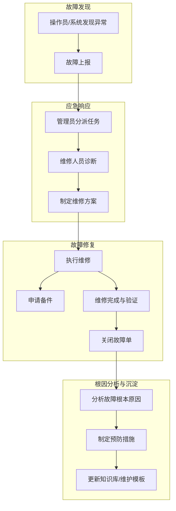
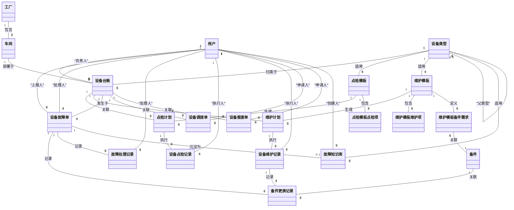
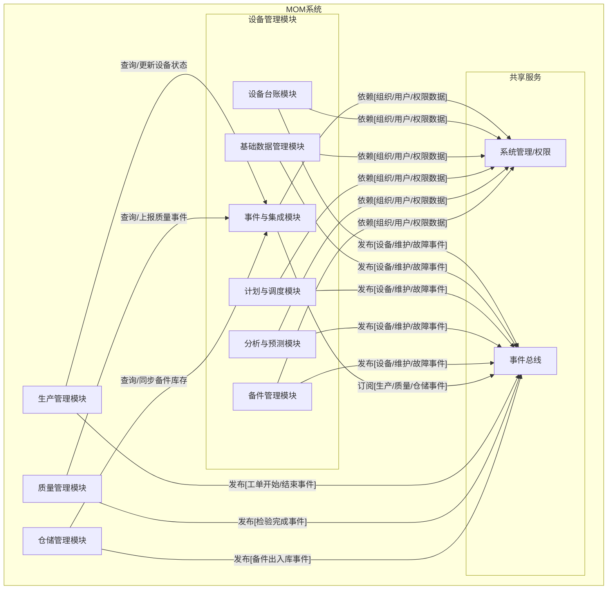
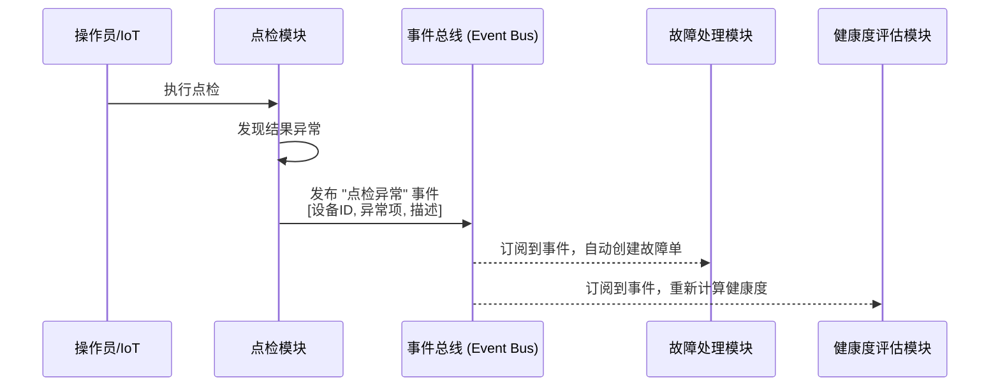
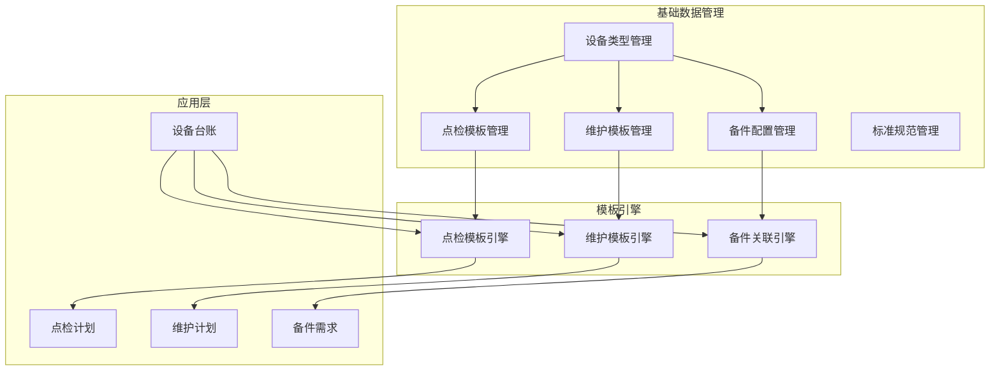
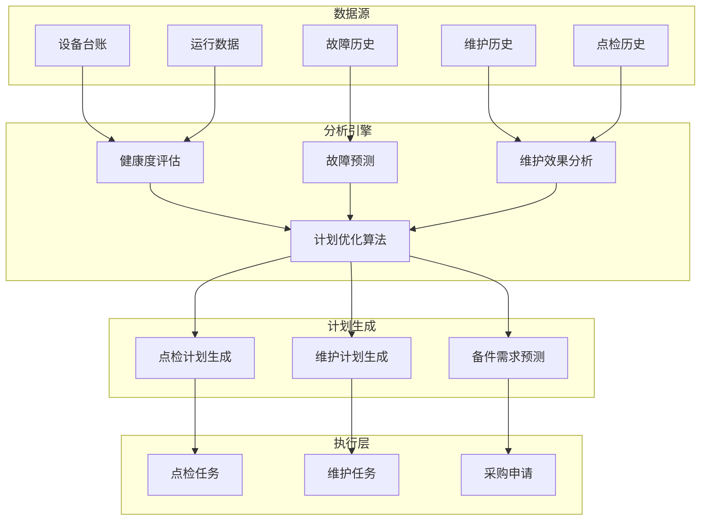
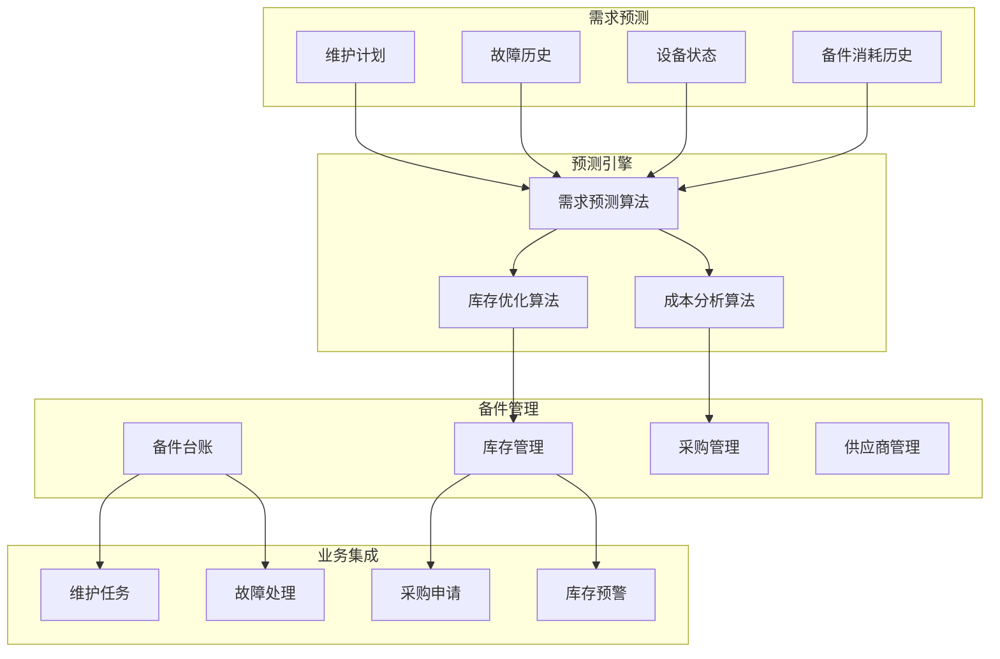

# DNW30800-智能设备价值最大化平台

> **产品愿景**：从设备管理转向设备价值创造，通过AI驱动的智能决策，让每台设备成为利润中心

## 1. 业务价值与目标

### 1.1 核心价值主张

**从成本中心到价值创造中心的转型**

传统设备管理关注"如何管理设备"，而我们的智能设备价值最大化平台关注"如何让设备创造最大价值"。通过AI、数字孪生和预测分析技术，将设备从被动的维护对象转变为主动的价值创造引擎。

### 1.2 核心价值创造

**主要价值**：解决用户核心痛点，提升工作效率和决策质量

| 用户痛点 | 解决价值 | 衡量指标 |
|---------|---------|---------|
| 设备状态不透明，故障预警不及时 | 实时掌握设备健康状况 | 故障提前发现率≥80% |
| 维护计划不合理，资源配置混乱 | 科学制定维护策略 | 维护计划执行率≥90% |
| 备件库存管理困难，成本浪费 | 精准备件需求管理 | 备件周转率提升50% |
| 数据分散，决策缺乏依据 | 统一数据视图支撑决策 | 决策响应时间缩短60% |
| 故障处理效率低，影响生产连续性 | 快速故障响应和处理 | 平均修复时间MTTR<4小时 |

**整体目标**：通过数字化手段，让设备管理从"救火式"转向"预防式"，从"经验驱动"转向"数据驱动"

### 1.3 用户故事与痛点分析

#### 设备维护工程师 - 老王的困扰
> **角色**：设备维护工程师，10年工作经验  
> **日常场景**："作为一名设备维护工程师，我需要每天巡检50台设备，但经常是设备已经故障了我才知道。昨天晚上生产线突然停机，我连夜赶过去发现是轴承磨损严重，但库房没有对应的备件，只能紧急采购，生产线停了8个小时。"  
> **核心痛点**：故障发现滞后、备件准备不足、维护计划被动  
> **期望价值**："我希望能提前知道哪些设备可能出问题，系统提醒我需要准备什么备件，这样我就能提前维护，避免突然停机。"

#### 设备管理主管 - 李经理的挑战  
> **角色**：设备管理部门主管，负责20台关键设备管理  
> **日常场景**："作为设备管理主管，我最头疼的是维护成本越来越高，但效果不明显。每个月的维护费用报告都让老板皱眉，但我说不清这些钱花得值不值。老张说这台设备需要大修，小李说那台设备还能再用两年，到底听谁的？"  
> **核心痛点**：维护成本控制困难、缺乏科学决策依据、设备价值评估模糊  
> **期望价值**："我需要数据支撑来证明维护投入的合理性，知道每台设备的真实健康状况和价值贡献。"

#### 备件管理员 - 小张的痛苦
> **角色**：备件管理员，管理500多种备件  
> **日常场景**："作为备件管理员，我每天都在纠结备件库存。上个月采购的液压油还堆在仓库里，占用了30万资金，但昨天又有设备缺密封圈停工等料。财务天天催我降库存，生产天天骂我备件不够，我夹在中间真的很难受。"  
> **核心痛点**：备件需求预测困难、库存结构不合理、采购时机难把握  
> **期望价值**："我希望系统能告诉我什么时候需要什么备件，需要多少数量，这样既不会缺料也不会积压。"

#### 生产主管 - 刘总的焦虑
> **角色**：生产部门主管，关注生产连续性  
> **日常场景**："每次设备故障都是我的噩梦。客户订单催得紧，设备一停工就要延期交货，罚款、客户投诉、工人等待...损失太大了。设备部门总说在维护，但效果我看不到，问题还是不断出现。"  
> **核心痛点**：生产计划受设备故障影响大、设备可靠性难以预期  
> **期望价值**："我希望能提前知道设备的健康状况，合理安排生产计划，避免突发故障影响交期。"

### 1.4 核心优势与差异化

**我们的解决方案优势**：
- **数据驱动的科学决策** - 基于历史数据和实时状态的智能分析，告别经验主义
- **全流程闭环管理** - 从设备台账到故障处理的完整业务闭环，数据互通
- **渐进式智能化** - 先建立数据基础，再逐步引入AI分析，降低实施风险
- **用户体验优先** - 从一线操作人员的实际工作场景出发，提升工作效率

## 1.5 分期实施路线图

### 第一期：数据基础建设（6个月）
**目标**：建立完整的设备管理数据基础，满足基本业务需求

| 模块 | 解决的用户痛点 | 数据价值 | 成功指标 |
|------|-------------|---------|---------|
| **设备台账管理** | 设备信息分散、查找困难 | 设备基础数据建立 | 设备信息完整率≥95% |
| **点检计划管理** | 点检随意性大、无记录 | 设备状态数据积累 | 点检计划执行率≥90% |
| **维护计划管理** | 维护计划混乱、资源冲突 | 维护历史数据积累 | 维护及时率≥85% |
| **故障管理** | 故障处理无流程、责任不清 | 故障模式数据积累 | 故障处理及时率≥90% |
| **备件管理** | 备件库存盲目、缺料频发 | 备件消耗数据积累 | 缺料停机次数减少50% |

**第一期核心价值**：建立规范化的设备管理流程，积累高质量的基础数据，为后续智能化分析奠定基础。

### 第二期：智能分析功能（3个月）
**目标**：基于第一期数据积累，提供智能分析和决策支持

| 模块 | 数据基础依赖 | 解决的用户痛点 | 用户价值 |
|------|-------------|-------------|---------|
| **设备健康度分析** | 点检、维护、故障数据 | 设备状态不透明 | 直观了解设备健康状况 |
| **维护成本分析** | 维护、备件消耗数据 | 维护成本控制困难 | 维护投入合理性分析 |
| **故障预警分析** | 历史故障、运行数据 | 故障发现滞后 | 提前1-3天故障预警 |
| **备件需求预测** | 备件消耗模式数据 | 备件需求难预测 | 精准备件采购建议 |

**第二期核心价值**：让数据"开口说话"，为用户提供科学的决策依据，从"经验驱动"转向"数据驱动"。

### 第三期：价值优化功能（3个月）
**目标**：基于数据积累，提供高价值的优化建议和智能决策支持

| 模块 | 数据基础依赖 | 智能化价值 | 预期效果 |
|------|-------------|-----------|---------|
| **维护计划优化** | 全量历史数据 | AI辅助维护决策 | 维护效率提升30% |
| **设备价值评估** | 综合运营数据 | 设备投资决策支持 | 设备投资回报透明化 |
| **成本效益分析** | 成本与效益关联数据 | 投入产出分析 | 维护成本优化20% |
| **预测性维护** | 设备劣化模式数据 | 智能维护提醒 | 计划外停机减少60% |

**第三期核心价值**：实现设备管理的智能化升级，让系统成为用户的"智能助手"，主动提供优化建议。

### 1.6 需求分析背景
- 设备管理是制造业MOM系统的核心模块，直接影响生产效率和设备资产安全。
- 传统的设备管理多依赖人工经验和纸质记录，缺乏数据支撑和科学决策。
- 通过数字化手段建立设备管理体系，可以实现从"救火式"向"预防式"管理的转变。
- 分期实施策略确保系统建设的稳健性，先建立数据基础，再逐步实现智能化。

## 1.7 术语及缩写解释
| 术语         | 缩写 | 解释说明                         |
| ------------ | ---- | -------------------------------- |
| 设备台账     | -    | 记录设备基础信息的主数据         |
| 维护管理     | -    | 设备维护计划、执行、反馈全过程   |
| 点检管理     | -    | 设备定期巡检、点检               |
| 故障管理     | -    | 故障上报、处理、分析与闭环       |
| 状态监控     | -    | 设备运行状态、健康指标监控       |
| 能耗管理     | -    | 设备能耗数据采集与分析           |
| 备件管理     | -    | 设备相关备品备件的库存与消耗管理 |
| 点检模板     | -    | 设备类型标准点检项和周期定义     |
| 维护模板     | -    | 设备类型标准维护项和周期定义     |
| 备件需求预测 | -    | 基于维护计划和故障历史的备件需求计算 |
| 业务流程事件 | -    | 驱动各流程间自动衔接的事件机制   |
| EAM          | EAM  | 企业资产管理系统                 |
| MES          | MES  | 制造执行系统                     |
| IoT          | IoT  | 物联网                           |

## 1.8 参考文献
- 恒远、佰思杰、艾普工华等设备管理系统公开资料
- 行业EAM/MES主流方案
- 项目内部相关文档

# 2. 需求描述

## 2.1 业务描述

### 2.1.1 业务主流程（分层）

为了更清晰地展示设备管理的核心业务，我们将整体流程拆分为三个层次化的核心流程。

#### 1. 设备资产管理流程 (Asset Lifecycle Management)
该流程关注设备的物理生命周期，从引进、建账、变更直至报废处置。
```mermaid
flowchart TD
    subgraph 外部系统
        A1[采购/合同]
    end
    subgraph 设备管理员
        B1[设备引进申请]
        B2[设备开箱与验收]
        B3[设备建账]
        B4[设备安装与调试]
        B5[状态转为"在用"]
        B6[设备信息变更]
        B7[设备位置调拨]
        B8[设备报废申请]
        B9[资产处置]
    end
    subgraph 系统
        S1[生成设备唯一编码]
        S2[更新设备台账]
        S3[记录变更历史]
        S4[状态转为"报废"]
    end

    A1 --> B1
    B1 --> B2
    B2 --> S1
    S1 --> B3
    B3 --> B4
    B4 -->|验收通过| B5
    
    B3 --> S2
    B4 --> S2
    
    B6 --> S2
    B6 --> S3
    
    B7 --> S2
    B7 --> S3
    
    B8 --> B9
    B8 --> S4
```

#### 2. 预防性维护流程 (Proactive Maintenance)
该流程聚焦于通过计划性的点检和维护活动，预防设备故障，保障其稳定运行。


#### 3. 故障响应与处理流程 (Reactive Maintenance)
该流程关注当设备发生故障时，如何快速响应、高效修复，并进行根因分析以避免复发。


### 2.1.2 业务流程描述

#### 1. 设备资产管理流程
**1. 设备引进与建账**
- **涉及角色**：设备管理员
- **输入业务对象**：采购申请单、设备资料
- **输出业务对象**：设备台账 (状态为"在用")
- **关键业务规则**：
  - 设备编号需经审批且全局唯一
  - 安装验收合格后方可投入使用
- **处理逻辑**：
  1. 设备管理员根据采购信息发起设备引进申请。
  2. 设备到货后，进行开箱验收，核对型号、数量及附件。
  3. 验收通过后，在系统中为设备建账，系统根据规则生成唯一设备编号，录入基础信息，此时设备状态为"待安装"。
  4. 完成安装调试后，组织相关人员进行最终验收，填写验收记录。
  5. 验收通过后，设备管理员在系统中将设备状态更新为"在用"，设备正式纳入资产管理。
- **验收标准**：
  - 设备台账信息完整准确，设备编号唯一，安装及验收记录可追溯，设备状态正确。

**2. 设备信息变更与调拨**
- **涉及角色**：设备管理员
- **输入业务对象**：变更申请、设备台账
- **输出业务对象**：更新后的设备台账、变更历史记录
- **关键业务规则**：
  - 关键信息（如技术参数、位置）变更需要记录原因
  - 跨车间调拨需双方负责人确认
- **处理逻辑**：
  1. 当设备信息发生变化（如位置移动、责任人变更、技术改造）时，设备管理员发起变更申请。
  2. 系统记录变更前后的信息，形成变更历史。
  3. 对于跨部门或跨车间的调拨，需要调出和调入方在线确认交接。
  4. 变更完成后，系统更新设备台账信息。
- **验收标准**：
  - 设备信息更新及时，变更历史记录完整可追溯，调拨流程有完整交接记录。

**3. 设备报废与处置**
- **涉及角色**：设备管理员、财务部门
- **输入业务对象**：设备台账、报废申请单
- **输出业务对象**：设备台账（状态更新）、报废记录
- **关键业务规则**：
  - 报废需经过技术评估和资产评估，并按权限审批
  - 设备状态变更需记录，资产需同步核销
- **处理逻辑**：
  1. 当设备因老化、损坏或技术淘汰等原因失去使用价值时，设备管理员发起报废申请。
  2. 组织技术和资产评估，形成评估报告。
  3. 报废申请及评估报告按审批流程进行审批。
  4. 审批通过后，设备状态变为"报废"，并进行资产处置（如变卖、拆解）。
  5. 系统自动清理与该设备相关的维护/点检计划，更新备件关联。
- **验收标准**：
  - 报废审批流程完整，设备状态正确更新，相关数据清理完整，资产处置记录可追溯。

#### 2. 预防性维护流程
**1. 主数据与模板管理**
- **涉及角色**：设备管理员
- **输入业务对象**：设备类型、点检模板、维护模板、备件配置
- **输出业务对象**：标准化的点检/维护模板、备件关联配置
- **关键业务规则**：
  - 模板配置需标准化，支持继承和覆盖，并进行版本管理
- **处理逻辑**：
  1. 设备管理员定义设备类型的标准点检模板，包含点检项、周期、标准等。
  2. 定义设备类型的标准维护模板，包含维护项、周期、备件需求等。
  3. 配置设备与备件的关联关系，建立备件需求预测基础。
  4. 模板的创建和变更需要进行版本控制。
- **验收标准**：
  - 模板配置完整，支持多层级继承和版本管理，为自动计划生成提供准确依据。

**2. 智能计划生成与下发**
- **涉及角色**：系统自动、设备管理员
- **输入业务对象**：设备台账、点检/维护模板、设备运行数据、故障历史
- **输出业务对象**：点检计划、维护计划
- **关键业务规则**：
  - 基于设备状态和历史数据智能调整计划
- **处理逻辑**：
  1. 系统根据设备类型和关联的模板，自动生成周期性的点检和维护计划。
  2. 系统可根据设备运行时间、故障历史、健康度评估等数据，动态调整计划周期和内容（预测性维护）。
  3. 设备管理员可对自动生成的计划进行审核和手动调整。
  4. 计划确认后，系统自动生成任务并下发给指定的执行人。
- **验收标准**：
  - 计划生成及时准确，支持动态调整，覆盖所有维护类型，任务下发可追溯。

**3. 维护与点检执行**
- **涉及角色**：操作员、维修人员
- **输入业务对象**：点检/维护任务、点检/维护模板
- **输出业务对象**：点检/维护记录、能耗数据、异常上报（若有）
- **关键业务规则**：
  - 必须按计划执行，结果需反馈，异常需上报
  - 维护过程需记录备件消耗
- **处理逻辑**：
  1. 执行人员在移动端或PC端接收任务，并查看作业指导。
  2. 按照任务要求和模板标准执行点检或维护作业。
  3. 填写执行记录，包括工作内容、时长、备件消耗、现场照片等。
  4. 如发现异常，点检员可直接触发故障上报流程。
- **验收标准**：
  - 点检/维护记录完整，备件领用自动关联，异常能及时上报并触发后续流程。

**4. 维护效果评估与优化**
- **涉及角色**：设备管理员、系统自动
- **输入业务对象**：维护记录、设备健康度数据、故障数据
- **输出业务对象**：维护效果评估报告、模板优化建议
- **关键业务规则**：
  - 维护效果需量化评估，并反馈于后续计划
- **处理逻辑**：
  1. 维护任务完成后，设备管理员或相关负责人对维护效果进行验收。
  2. 系统收集维护前后的设备状态数据，评估维护效果对设备健康度的影响。
  3. 定期（如每季度）生成维护效果评估报告，分析维护成本、频率及效果。
  4. 根据评估结果，系统提出对维护模板、周期和策略的优化建议。
- **验收标准**：
  - 评估报告客观准确，能够有效指导维护策略的持续优化。

#### 3. 故障响应与处理流程
**1. 故障上报与诊断**
- **涉及角色**：操作员、设备管理员
- **输入业务对象**：异常现象
- **输出业务对象**：故障上报单、诊断任务
- **关键业务规则**：
  - 故障需及时上报，并按严重等级分类
  - 故障需指派专人进行诊断
- **处理逻辑**：
  1. 操作员发现设备异常或系统自动检测到报警，立即创建故障上报单，描述故障现象并评定初始严重等级。
  2. 设备管理员接收到故障通知，对故障进行确认，并分派给合适的维修人员进行诊断。
  3. 系统可根据故障描述，从知识库中推荐可能的故障原因和解决方案。
- **验收标准**：
  - 故障上报及时，信息描述清晰，分派流程高效。

**2. 故障维修与验证**
- **涉及角色**：维修人员
- **输入业务对象**：诊断任务、故障单
- **输出业务对象**：故障处理记录、备件领用记录
- **关键业务规则**：
  - 维修过程需全程记录，重要故障可升级
  - 修复后需进行效果验证
- **处理逻辑**：
  1. 维修人员接收任务，进行现场诊断，明确故障原因并制定维修方案。
  2. 在维修过程中，记录详细的处理步骤、备件消耗、工时等信息。
  3. 如无法修复，可将故障处理任务升级或请求外部支援。
  4. 故障修复后，进行试运行和效果验证。
  5. 验证通过后，关闭故障单。
- **验收标准**：
  - 故障处理记录完整，处理流程闭环，备件领用自动关联，升级流程可追溯。

**3. 故障根因分析与知识沉淀**
- **涉及角色**：维修人员、设备管理员
- **输入业务对象**：已关闭的故障单
- **输出业务对象**：故障分析报告、知识库案例
- **关键业务规则**：
  - 重大或重复性故障必须进行根因分析
  - 分析结果需转化为预防措施或知识案例
- **处理逻辑**：
  1. 对于已解决的重大或重复性故障，组织相关人员进行根因分析（如5-Why分析）。
  2. 形成故障分析报告，明确根本原因和改进措施。
  3. 将典型的故障处理过程和解决方案整理成标准案例，存入知识库。
  4. 分析结果可用于优化设备操作规程或维护模板。
- **验收标准**：
  - 根因分析透彻，预防措施有效，知识库案例具有指导意义。

#### 4. 支撑流程
**1. 备件管理集成**
- **涉及角色**：维修人员、设备管理员、系统自动
- **输入业务对象**：维护计划、故障记录、备件库存
- **输出业务对象**：备件需求预测、备件领用记录、库存变动记录
- **关键业务规则**：
  - 备件需求需预测，领用需关联业务，库存需预警
- **处理逻辑**：
  1. 系统基于维护计划和故障历史自动预测备件需求。
  2. 维护任务和故障处理时，维修人员可直接关联申请和领用备件。
  3. 备件库存不足时自动预警，触发采购申请。
  4. 系统统计备件消耗情况，为成本分析提供数据。
- **验收标准**：
  - 备件需求预测准确，领用流程自动关联，库存管理及时，成本分析完整。

**2. 业务流程衔接机制**
- **涉及角色**：系统自动
- **输入业务对象**：各业务流程事件、设备状态数据
- **输出业务对象**：业务流程事件、计划调整指令
- **关键业务规则**：
  - 通过事件驱动机制，自动触发后续流程
- **处理逻辑**：
  1. 系统监听各业务流程事件（如点检异常、故障发生、维护完成等）。
  2. 根据预设的规则自动触发后续流程（如点检异常自动创建故障单，故障处理完成自动提醒优化维护计划）。
  3. 实现各业务环节的自动化、智能化衔接，减少人工干预。
- **验收标准**：
  - 事件触发及时准确，流程衔接顺畅，自动化程度高。

### 2.1.3 业务对象ER关系图


### 2.1.4 业务对象详细定义

#### 工厂
- **业务定义**：制造企业的物理生产单位，是设备管理的最高组织层级
- **业务价值**：提供设备管理的组织边界和权限控制，支持多工厂统一管理
- **关键属性**：工厂标识、工厂名称、运营状态、时区设置
- **业务规则**：
  - 工厂标识必须全局唯一
  - 运营状态变更需要管理员权限
  - 删除工厂需要确保下属车间和设备已处理

#### 车间
- **业务定义**：工厂内的生产作业单元，是设备的直接管理层级
- **业务价值**：实现设备的分区域管理，支持车间级的设备统计和分析
- **关键属性**：车间标识、车间名称、车间类型、负责人
- **业务规则**：
  - 车间必须归属于某个工厂
  - 车间负责人必须是有效用户
  - 车间类型决定可配置的设备类型

#### 设备类型
- **业务定义**：设备的分类标准，定义同类设备的共同特征和管理要求
- **业务价值**：实现设备的标准化管理，支持模板化的点检和维护配置
- **关键属性**：类型标识、类型名称、分类级别、技术规格
- **业务规则**：
  - 支持多级分类体系（最多3级）
  - 子类型必须继承父类型的基础属性
  - 删除类型需要确保无设备使用

#### 设备台账
- **业务定义**：设备的基础档案信息，记录设备的静态属性和动态状态
- **业务价值**：提供设备全生命周期的信息管理，是所有设备业务的数据基础
- **关键属性**：设备标识、设备名称、设备类型、运行状态、健康度评分
- **业务规则**：
  - 设备标识必须在工厂内唯一
  - 设备必须归属于有效的设备类型
  - 运行状态变更需要记录变更历史（通过`设备台账变更历史`表）

#### 设备健康度
- **业务定义**：设备当前运行状态的综合评估结果
- **业务价值**：提供设备状态的量化评估，支持预防性维护决策
- **关键属性**：当前评分、健康等级、评估依据、改善建议
- **业务规则**：
  - 健康度评分范围0-100，分数越高状态越好
  - 评估需要基于多维度数据（点检、维护、故障历史）
  - 健康度变化超过阈值需要自动预警

#### 点检计划
- **业务定义**：设备定期检查的计划安排，确保设备状态可控
- **业务价值**：实现设备状态的主动监控，及早发现潜在问题
- **关键属性**：计划标识、关联设备、执行周期、计划状态
- **业务规则**：
  - 计划必须基于有效的点检模板
  - 执行周期不能小于模板定义的最小周期
  - 逾期未执行的计划需要自动预警

#### 维护计划
- **业务定义**：设备预防性维护的计划安排，保障设备正常运行
- **业务价值**：实现从故障维修向预防维护转变，降低设备故障率
- **关键属性**：计划标识、关联设备、维护类型、执行周期
- **业务规则**：
  - 计划必须基于有效的维护模板
  - 预防性维护优先级高于预测性维护
  - 计划调整需要考虑生产安排

#### 设备维护
- **业务定义**：设备维护作业的执行记录，包含维护过程和结果
- **业务价值**：记录维护历史，支持维护效果分析和策略优化
- **关键属性**：维护标识、关联设备、维护类型、执行人员、维护结果
- **业务规则**：
  - 维护必须由具备相应技能的人员执行
  - 维护过程必须通过`设备维护备件消耗`表记录实际消耗的备件
  - 维护完成后必须进行效果评估

#### 设备点检
- **业务定义**：设备定期检查的执行记录，包含检查过程和发现
- **业务价值**：记录设备状态变化，为设备健康度评估提供数据
- **关键属性**：点检标识、关联设备、点检结果、异常描述
- **业务规则**：
  - 点检必须按照模板规定的项目执行，具体结果记录在`设备点检项记录`子表中
  - 发现异常必须详细记录异常描述
  - 严重异常可以自动触发故障单

#### 设备故障
- **业务定义**：设备异常状态的处理记录，包含故障发现到解决的全过程
- **业务价值**：记录故障历史，支持故障分析和预防策略制定
- **关键属性**：故障标识、关联设备、故障类型、严重程度、处理状态
- **业务规则**：
  - 故障必须及时上报和响应
  - 处理过程必须记录详细的分析报告
  - 备件消耗通过`设备故障备件消耗`表记录
  - 重大故障需要制定预防改进措施

#### 设备备件
- **业务定义**：设备维护和故障处理所需的零部件和耗材（原`设备备件`）
- **业务价值**：保障设备维护的物料供应，降低因备件短缺导致的停机风险
- **关键属性**：备件标识、备件名称、库存数量、最小库存、备件类型
- **业务规则**：
  - 库存数量低于最小库存需要自动预警
  - 备件消耗必须记录使用设备和用途
  - 过期备件需要及时处理和更新

#### 点检模板
- **业务定义**：设备类型的标准点检项目和执行要求
- **业务价值**：实现点检工作的标准化，提高点检质量和效率
- **关键属性**：模板标识、适用设备类型、点检周期
- **业务规则**：
  - 具体的点检项目在`点检模板项`子表中定义
  - 模板必须与设备类型匹配
  - 检查标准必须明确可操作
  - 模板变更需要版本控制和影响评估

#### 维护模板
- **业务定义**：设备类型的标准维护项目和执行要求
- **业务价值**：实现维护工作的标准化，确保维护质量和效果
- **关键属性**：模板标识、适用设备类型、维护周期
- **业务规则**：
  - 具体的维护项目在`维护模板项`子表中定义
  - 备件需求在`维护模板备件需求`关联表中定义
  - 模板必须与设备类型匹配
  - 技能要求必须与人员能力匹配

#### 业务流程事件
- **业务定义**：设备管理流程中的关键事件和自动化触发机制
- **业务价值**：实现业务流程的自动化衔接，提高管理效率
- **关键属性**：事件标识、事件类型、触发规则、执行动作
- **业务规则**：
  - 事件触发必须基于明确的业务规则
  - 自动动作必须有失败处理机制
  - 事件处理结果必须可追溯

#### 备件需求预测
- **业务定义**：基于历史数据和设备状态预测未来的备件需求
- **业务价值**：优化备件库存管理，降低库存成本和缺货风险
- **关键属性**：预测标识、关联备件、预测数量、置信度
- **业务规则**：
  - 预测算法必须定期校验和优化
  - 预测结果必须考虑置信度
  - 预测偏差超过阈值需要调整模型

#### 用户
- **业务定义**：系统的操作人员，承担设备管理的各种角色职责
- **业务价值**：确保设备管理活动的责任明确和权限管控
- **关键属性**：用户标识、技能等级、权限级别
- **业务规则**：
  - 用户权限必须与角色匹配，通过`用户角色关联`表进行管理
  - 技能等级必须通过认证获得
  - 重要操作必须记录操作人员

#### 点检模板项 (新增)
- **业务定义**：点检模板中包含的具体的、标准化的检查项目
- **业务价值**：将点检工作内容原子化，便于管理、复用和结果记录
- **关键属性**：模板项标识、项目名称、检查标准、显示顺序
- **业务规则**：
  - 必须从属于一个点检模板
  - 项目名称在同一个模板下应唯一

#### 维护模板项 (新增)
- **业务定义**：维护模板中包含的具体的、标准化的作业项目
- **业务价值**：将维护工作内容原子化，便于分配、管理和效果评估
- **关键属性**：模板项标识、项目名称、技能要求、预计时长
- **业务规则**：
  - 必须从属于一个维护模板
  - 项目名称在同一个模板下应唯一

#### 角色 (新增)
- **业务定义**：系统中的权限集合，定义了一类用户可以执行的操作
- **业务价值**：实现灵活的、基于角色的访问控制（RBAC）
- **关键属性**：角色标识、角色名称
- **业务规则**：
  - 角色名称应全系统唯一
  - 角色权限由系统管理员配置

#### 设备台账变更历史 (新增)
- **业务定义**：专门用于记录设备台账关键信息变更的审计日志
- **业务价值**：提供设备信息变更的完整追溯链，满足合规和审计要求
- **关键属性**：设备标识、变更字段、变更前/后值、变更时间、操作人
- **业务规则**：
  - 对台账关键字段的任何修改都必须在此表中生成一条记录
  - 历史记录不可篡改

#### 用户角色关联 (新增)
- **业务定义**：用户与角色之间的多对多关联关系。
- **业务价值**：实现灵活的RBAC，允许一个用户拥有多个角色。
- **关键属性**：用户标识、角色标识
- **业务规则**：
  - 用户标识和角色标识的组合必须唯一。

#### 设备适用备件 (新增)
- **业务定义**：设备与其适用的备件之间的多对多关系，即设备的BOM（物料清单）。
- **业务价值**：明确特定设备可使用的官方备件范围。
- **关键属性**：设备标识、备件标识
- **业务规则**：
  - 关联的设备和备件都必须是系统中有效的记录。

#### 维护模板备件需求 (新增)
- **业务定义**：维护模板与其所需的标准备件之间的多对多关系。
- **业务价值**：实现维护任务备件需求的标准化和自动化预测。
- **关键属性**：模板标识、备件标识、需求数量
- **业务规则**：
  - 关联的模板和备件都必须是系统中有效的记录。

#### 设备维护备件消耗 (新增)
- **业务定义**：记录单次设备维护任务中实际消耗的备件详情。
- **业务价值**：精确跟踪维护成本中的物料消耗。
- **关键属性**：维护标识、备件标识、消耗数量
- **业务规则**：
  - 消耗记录必须关联一次有效的维护任务。

#### 设备故障备件消耗 (新增)
- **业务定义**：记录单次设备故障维修中实际消耗的备件详情。
- **业务价值**：精确跟踪故障维修成本中的物料消耗。
- **关键属性**：故障标识、备件标识、消耗数量
- **业务规则**：
  - 消耗记录必须关联一次有效的故障处理任务。

### 2.1.5 数据字典

#### 基础数据字典

**运营状态**
- 运营中：正常运营状态
- 停产：暂停生产状态
- 维护：维护保养状态

**车间类型**
- 生产：主要生产作业车间
- 检测：质量检测车间
- 装配：产品装配车间
- 包装：产品包装车间

**设备运行状态**
- 运行中：设备正常运行
- 停机：设备计划停机
- 维护：设备维护保养
- 故障：设备故障停机

**健康等级**
- 优秀：健康度评分90-100
- 良好：健康度评分80-89
- 一般：健康度评分70-79
- 较差：健康度评分60-69
- 故障：健康度评分60以下

**计划状态**
- 未开始：计划已制定但未开始执行
- 进行中：计划正在执行
- 已完成：计划执行完成
- 已取消：计划被取消

**维护类型**
- 预防性：基于周期的预防性维护
- 预测性：基于状态的预测性维护
- 应急维护：故障后的应急维护

**生成方式**
- 手动生成：人工制定计划
- 系统自动生成：系统智能生成计划

**维护结果**
- 成功：维护按计划完成
- 失败：维护未能达到预期
- 部分完成：维护部分达到要求

**点检结果**
- 正常：点检无异常发现
- 异常：点检发现异常需要关注
- 需要维护：点检发现需要立即维护

**故障类型**
- 机械：机械结构故障
- 电气：电气系统故障
- 液压：液压系统故障
- 其他：其他类型故障

**处理状态**
- 待处理：问题已发现待处理
- 处理中：问题正在处理
- 已完成：问题处理完成

**严重程度**
- 轻微：影响较小的故障
- 一般：一般程度的故障
- 严重：严重影响的故障
- 紧急：需要紧急处理的故障

**触发来源**
- 点检发现：通过点检发现的故障
- 主动上报：人员主动上报的故障
- 自动检测：系统自动检测的故障

**备件类型**
- 易损件：容易磨损的零部件
- 备品：备用的完整部件
- 工具：维护使用的工具

**需求类型**
- 维护需求：维护计划产生的需求
- 故障需求：故障处理产生的需求
- 计划需求：计划性采购需求

**用户角色**
- **说明**：用户角色不再使用枚举，而是通过`角色`表进行动态管理。用户与角色的关系存储在`用户角色关联`表中，支持一个用户拥有多个角色。
- **示例角色**:
  - 设备管理员：负责设备管理的管理人员
  - 维护工程师：负责设备维护的技术人员
  - 操作员：负责设备操作的作业人员

**技能等级**
- 初级：基础技能水平
- 中级：中等技能水平
- 高级：高级技能水平
- 专家：专家级技能水平

**分类级别**
- 一级分类：设备类型的一级分类
- 二级分类：设备类型的二级分类
- 三级分类：设备类型的三级分类

**事件类型**
- 点检：点检相关事件
- 维护：维护相关事件
- 故障：故障相关事件
- 状态变更：设备状态变更事件

**优先级**
- 低：低优先级事件
- 中：中等优先级事件
- 高：高优先级事件
- 紧急：紧急优先级事件

**预测状态**
- 待确认：预测结果待确认
- 已确认：预测结果已确认
- 已采购：已根据预测进行采购

**状态（通用）**
- 启用：功能或数据处于启用状态
- 停用：功能或数据处于停用状态
- 正常：正常状态
- 淘汰：已淘汰状态
- 在职：人员在职状态
- 离职：人员离职状态
- 调岗：人员调岗状态

#### 扩展数据字典

**生产类型**
- 连续生产：连续性生产模式
- 批次生产：批次性生产模式
- 混合生产：混合生产模式

**存储条件**
- 常温存储：常温环境存储
- 低温存储：低温环境存储
- 防潮存储：防潮环境存储
- 特殊存储：特殊环境存储

**权限级别**
- 基础权限：基础操作权限
- 管理权限：管理操作权限
- 高级权限：高级管理权限
- 超级权限：系统超级权限

**组织层级**
- 操作层：一线操作人员
- 管理层：中层管理人员
- 决策层：高层决策人员

## 2.2 功能描述

### 2.2.1 整体应用架构 (C4模型视角)

为了确保架构的清晰度和不同角色的理解一致性，我们采用C4模型的思想来分层描述应用架构。

#### 1. 系统上下文图 (System Context Diagram)
该图定义了系统的边界，清晰展示了"设备管理模块"作为MOM系统的一部分，与哪些外部用户（角色）和外部系统进行交互。

```mermaid
graph TD
    subgraph " "
    actor "设备管理员" as Admin
    actor "维修/点检人员" as Operator
    end

    subgraph " "
    system "ERP系统" as ERP
    system "IoT平台" as IoT
    end

    subgraph MOM系统
        A["
        **设备管理模块**
        <br/>
        负责设备全生命周期的数字化管理，
        <br/>
        并通过智能化服务提升设备价值
        "]
    end

    Admin -- "管理设备/计划/模板" --> A
    Operator -- "执行任务/上报故障" --> A
    A -- "同步[设备资产变动, 维护成本]" --> ERP
    ERP -- "下发[采购订单, 资产主数据]" --> A
    A -- "下发[采集指令, 控制参数]" --> IoT
    IoT -- "上传[设备状态, 运行参数, 报警]" --> A
```

#### 2. 容器/组件图 (Container/Component Diagram)
该图深入到MOM系统内部，展示了"设备管理模块"的核心组成部分，以及它如何与MOM系统中的其他模块进行协作。


**架构说明**:
- **统一集成**: `事件与集成模块`作为统一入口，通过API网关对外提供服务，并处理与MOM系统其他部分的事件交互，实现高度解耦。
- **职责分离**: 模块内部被清晰地划分为`基础数据管理`、`设备台账`、`计划与调度`、`分析与预测`和`备件管理`五大核心业务模块，每个模块聚焦于特定领域，便于独立开发、测试和扩展。
- **事件驱动**: 整个系统以`事件总线`为核心进行异步通信。例如，`设备台账模块`发布"设备报废"事件后，`计划与调度模块`可以订阅此事件以自动清理相关计划，而无需彼此直接调用，极大地提升了系统的灵活性和可扩展性。

### 2.2.2 事件驱动架构 (Event-Driven Architecture)

#### 架构说明
为实现模块间的深度解耦和系统的动态扩展，我们以事件驱动架构（EDA）作为核心。各功能模块之间不直接调用，而是通过发布事件到中央的"事件总线"来进行异步通信。

这带来的好处是：
- **高内聚，低耦合**：每个模块只关心自己的业务和发布的事件，不关心谁会消费它。
- **高扩展性**：当需要新增业务流程时，只需开发一个新的模块来订阅相关事件即可，无需修改现有模块。
- **高弹性**：事件总线可以作为缓冲区，即使某个服务暂时不可用，事件也不会丢失，增强了系统的容错能力。

#### 事件流转示意图
下图展示了一个典型的事件驱动流程：点检发现异常后，后续的故障处理、健康度评估等流程被自动触发，无需直接调用。


### 2.2.3 核心功能模块与智能化引擎
我们将原有的"引擎"概念，具象化为一组核心功能模块，它们是实现设备管理智能化的基石。

#### 1. 设备台账模块

##### 设备台账模块架构说明

作为设备管理的基石，本模块负责设备资产从"出生"到"消亡"的全生命周期事件管理。它不仅是设备静态信息的档案库，更是处理**设备调拨、报废**等关键流程以及**故障处理全过程**的核心业务引擎。

##### 设备台账模块功能说明

1.  **设备信息管理**
    -   管理设备资产的基础档案信息（CRUD）。
    -   处理设备位置、责任人等信息的变更，并记录完整历史。

2.  **设备生命周期管理**
    -   管理设备（在用、停机、维护等）全生命周期状态。
    -   提供标准的**设备调拨**流程，包含申请、审批和交接。
    -   提供标准的**设备报废**流程，覆盖从申请、评估到最终处置的全过程。

3.  **故障全周期管理**
    -   支持从**故障上报**开始，到**任务分派、诊断、维修、验证**，直至**故障单关闭**的闭环管理。
    -   确保每一次故障都得到有效跟踪和彻底解决。

#### 2. 基础数据管理模块

##### 基础数据管理架构说明

基础数据管理体系是设备管理模块的基础支撑，负责管理设备类型、点检模板、维护模板、备件配置等基础数据，为智能化功能提供数据支撑。

##### 基础数据管理架构图



##### 基础数据管理功能说明

1.  **设备类型管理**
    -   定义设备分类体系，支持多级分类
    -   配置设备类型的标准属性和参数
    -   管理设备类型的生命周期状态

2.  **点检模板管理**
    -   定义设备类型的标准点检项和周期
    -   配置点检项的分类、标准和异常处理规则
    -   支持模板的继承、覆盖和版本管理

3.  **维护模板管理**
    -   定义设备类型的标准维护项和周期
    -   配置维护类型、技能要求、质量标准
    -   关联维护所需的备件和工具

4.  **备件配置管理**
    -   定义备件与设备的关联关系
    -   配置备件的库存参数和采购策略
    -   管理备件的供应商和质量标准

#### 3. 智能化计划生成模块

##### 智能计划生成架构说明

智能化计划生成机制基于设备状态、运行数据、故障历史等信息，自动生成和优化点检计划、维护计划，实现从被动维护向主动维护的转变。

##### 智能计划生成架构图



##### 智能计划生成功能说明

1.  **健康度评估**
    -   基于设备运行参数、故障频率、维护效果等评估设备健康度
    -   动态调整设备维护优先级和计划周期
    -   提供设备健康度趋势分析和预警

2.  **故障预测**
    -   基于历史故障数据和设备状态预测故障发生概率
    -   提前安排预防性维护，降低故障率
    -   优化备件库存，减少紧急采购

3.  **维护效果分析**
    -   分析维护对设备性能的影响
    -   评估不同维护策略的效果
    -   优化维护计划和资源配置

4.  **计划优化算法**
    -   综合考虑设备重要性、维护成本、生产影响等因素
    -   自动调整维护周期和内容
    -   平衡维护效果和成本效益

#### 4. 分析与预测模块

##### 分析与预测模块架构说明

本模块是系统的"智能大脑"，负责将海量设备数据转化为有价值的洞察和预测。它通过健康度评估、成本效益分析及预测性服务，驱动设备管理从被动响应向主动预防、从数据监控向智能决策的转变。

##### 分析与预测模块功能说明

1.  **分析与决策支持**
    -   提供设备健康度的实时评估与趋势分析。
    -   提供故障模式识别、根因分析和维护成本的多维度分析。
    -   将分析结果沉淀为知识库，为未来决策提供支持。

2.  **预测性服务**
    -   基于维护计划和历史消耗，提供精准的**备件需求预测**。
    -   通过分析设备运行数据和劣化模型，实现**预测性维护**，在故障发生前生成优化维护建议。

#### 5. 备件管理集成模块

##### 备件管理集成架构说明

备件管理集成机制将备件管理与维护维修流程深度集成，实现备件需求的智能预测、自动关联和库存优化，提高备件管理效率和降低库存成本。

##### 备件管理集成架构图



##### 备件管理集成功能说明

1.  **需求预测算法**
    -   基于维护计划和故障历史预测备件需求
    -   考虑设备状态和运行环境的影响因素。
    -   提供不同时间周期的需求预测

2.  **库存优化算法**
    -   根据需求预测优化库存水平
    -   平衡库存成本和缺货风险
    -   支持多仓库的库存协同管理

3.  **成本分析算法**
    -   分析备件成本对维护成本的影响
    -   评估不同采购策略的成本效益
    -   提供成本优化建议

4.  **业务集成功能**
    -   维护任务自动关联备件需求
    -   故障处理自动触发备件领用
    -   库存不足自动生成采购申请

### 2.2.6 功能清单
| 功能模块 | 所属端 | 页面/场景 | 功能点 | 功能点状态 | 功能点描述 |
| :--- | :--- |:--- | :--- | :--- | :--- |
| **设备台账模块** | 管理平台 | 设备台账管理 (`device_register_management.html`) | 新增/编辑设备 | **必须** | 管理设备资产的基础档案信息（CRUD）。 |
| | 管理平台 | | 设备信息变更 | **必须** | 记录设备位置、责任人等信息的变更历史。 |
| | 管理平台 | | 设备状态管理 | **必须** | 管理设备（在用、停机、维护等）全生命周期状态。 |
| | 管理平台 | | 发起设备调拨/报废 | **必须** | 在设备台账中提供发起调拨和报废申请的入口。 |
| | 管理平台 | 设备调拨管理 (`device_transfer_management.html`)| 调拨流程跟踪 | **必须** | 集中管理和跟踪所有设备调拨申请的审批流程与状态。 |
| | 管理平台 | 设备报废管理 (`device_scrapping_management.html`)| 报废流程跟踪 | **必须** | 集中管理和跟踪所有设备报废申请的评估、审批流程与状态。 |
| **基础数据管理模块** | 管理平台 | 设备类型管理 (`device_type_management.html`)| 设备类型定义 | **必须** | 定义设备分类体系与标准属性，支持多级分类。 |
| | 管理平台 | 点检模板管理 (`inspection_template_management.html`)| 点检模板定义 | **必须** | 定义标准点检项、周期、异常规则，支持版本控制。 |
| | 管理平台 | 维护模板管理 (`maintenance_template_management.html`)| 维护模板定义 | **必须** | 定义标准维护项、周期、备件需求，支持版本控制。 |
| | 管理平台 | 备件配置管理 (`sparepart_config_management.html`)| 备件关联配置 | **必须** | 维护备件与设备、维护模板的关联关系（BOM）。 |
| **计划与调度模块**| 管理平台 | 点检计划管理 (`inspection_plan_management.html`)| 点检计划管理 | **必须** | 统一管理点检计划的生成、手动调整、审核与发布。 |
| | 管理平台 | 维保计划管理 (`maintenance_plan_management.html`)| 维保计划管理 | **必须** | 统一管理维保计划的生成、手动调整、审核与发布。 |
| | 管理平台 | 设备健康度趋势分析 (`device_health_trend_analysis.html`)| 健康度分析与预测 | **必须** | 综合评估设备健康度，分析历史趋势，并提供预测性维护建议。 |
| | 工作台 | 维保任务执行 (`workshop_workbench/device_maintenance.html`) | 任务执行与反馈 | **必须** | 维修人员接收并执行维保任务，记录工时、备件消耗、结果等信息。 |
| | 工作台 | 点检任务执行 (`workshop_workbench/device_inspection.html`) | 任务执行与反馈 | **必须** | 点检人员接收并执行点检任务，记录结果，发现异常可直接上报。 |
| **故障管理模块** | 工作台 | 故障上报 (`workshop_workbench/device_fault.html`) | 故障快速上报 | **必须** | 一线人员或系统通过此页面快速上报设备故障。 |
| | 工作台 | 故障处理 (`workshop_workbench/fault_handling.html`) | 故障诊断与维修 | **必须** | 维修人员在工作台处理故障单，制定方案、记录过程、申请备件。 |
| | 管理平台 | 故障跟踪管理 (`fault_tracking_management.html`)| 故障全周期跟踪 | **必须** | 管理人员对所有故障进行分派、跟踪、分析和关闭。 |
| | 管理平台 | | 故障处理（管理） | **必须** | 在管理端对故障进行处理，如重新分派、强制关闭、补充分析报告等。 |
| | 管理平台 | 故障知识库管理 (`fault_knowledge_base.html`)| 故障知识库 | **必须** | 将典型故障案例和解决方案沉淀为知识库，供查询和智能推荐。 |
| **备件管理模块** | 管理平台 | 备件信息管理 (`sparepart_config_management.html`)| 备件信息维护 | **必须** | 管理备件的基础信息、供应商和技术规格。 |
| | 管理平台 | 备件出入库管理 (`sparepart_transaction_management.html`)| 备件出入库管理 | **必须** | 管理备件的出库、入库、盘点等流水记录。 |
| | 管理平台 | 备件库存看板 (`sparepart_inventory_dashboard.html`)| 库存可视化与预警 | **必须** | 实时监控备件库存水平，提供可视化看板，并在低于安全库存时预警。 |
| | 管理平台 | 备件需求预测 (`sparepart_demand_forecasting.html`)| 备件需求预测 | **必须** | 基于维保计划和历史消耗，预测未来备件需求量。 |
| **事件与集成模块**| 后端服务 | API网关 | 模块间接口提供 | **必须** | 通过REST/JSON API向MOM其他模块提供同步调用接口。 |
| | 后端服务 | 事件总线 | 事件发布/订阅 | **必须** | 为各模块提供发布领域事件和订阅事件的能力，实现模块解耦。 |

# 3. 页面&功能设计

## 3.1 设备台账管理

### 3.1.1 设备台账列表

**页面概述与布局**

该页面是设备台账管理的核心入口，以列表形式集中展示所有设备的关键信息，并提供搜索、筛选、新增及各种操作的入口。页面布局遵循标准的上-中-下结构：顶部为搜索和操作区，中部为设备信息列表区，底部为分页控件。

**功能点清单**

| 功能点ID | 功能点名称 | 功能点类型 | 优先级 | 功能点描述 |
|---|---|---|---|---|
| F-EM-01 | 设备查询 | 查询功能 | 高 | 用户可以通过设备编码、设备名称、设备类型、使用部门、设备状态等一个或多个条件组合，快速筛选和定位目标设备。 |
| F-EM-02 | 新增设备 | 按钮 | 高 | 点击后，打开“新增设备”弹窗或页面，用于录入全新的设备信息。 |
| F-EM-03 | 设备台账列表 | 数据列表 | 高 | 以表格形式展示设备的关键信息，包括设备编码、设备名称、规格型号、设备类型、使用部门、设备状态、启用日期等。列表应支持按关键字段排序。 |
| F-EM-04 | 查看详情 | 链接/按钮 | 高 | 点击指定设备记录的“详情”操作，跳转到“设备详情”页面，查看该设备的完整信息。 |
| F-EM-05 | 编辑 | 链接/按钮 | 高 | 对于有权限的用户，点击“编辑”可以修改该设备的基础信息和技术参数。 |
| F-EM-06 | 删除 | 链接/按钮 | 中 | 对于未被业务流程（如维护、故障单）引用的、且状态为“闲置”的设备，可以进行删除操作。删除前需有二次确认。 |
| F-EM-07 | 调拨 | 链接/按钮 | 中 | 对“在用”状态的设备发起调拨流程，将其从一个部门或位置转移到另一个。 |
| F-EM-08 | 报废 | 链接/按钮 | 中 | 对符合报废条件的设备发起报废流程。 |
| F-EM-09 | 生成二维码 | 链接/按钮 | 中 | 为选定的设备生成一个包含其唯一标识（如设备编码）的二维码，方便移动端扫码识别。 |
| F-EM-10 | 导出 | 按钮 | 中 | 将当前查询结果的设备列表导出为Excel文件，方便离线分析和归档。 |


#### 3.1.1.1 [查询] 设备查询

*   **概述**: 提供多条件组合查询功能，帮助用户快速定位设备。
*   **界面描述**: 位于设备台账列表上方，包含设备编码、设备名称、设备类型（下拉选择）、使用部门（下拉选择/树形选择）、设备状态（下拉选择）等输入框或选择器，以及“查询”和“重置”两个按钮。
*   **业务规则**:
    *   所有查询条件均为可选，用户可输入一个或多个条件进行查询。
    *   设备类型、使用部门、设备状态为系统预设或管理的数据，以选择器形式提供。
    *   查询条件支持模糊匹配（如设备名称）。
*   **处理逻辑**:
    1.  用户输入查询条件，点击“查询”按钮。
    2.  系统根据输入的条件，向后端发送查询请求。
    3.  后端根据查询条件过滤数据，返回匹配的设备列表。
    4.  前端刷新设备台账列表，显示查询结果。
    5.  点击“重置”按钮，清空所有查询条件，并刷新列表显示所有设备。
*   **验收标准**:
    *   能够根据任意一个或多个条件正确筛选出设备。
    *   查询响应时间在可接受范围内（例如，少于2秒）。
    *   重置功能能够正常工作。

#### 3.1.1.2 [按钮] 新增设备

*   **概述**: 提供新增设备的入口。
*   **界面描述**: 位于查询区域的右侧，一个名为“新增设备”的按钮。
*   **业务规则**: 只有具备“设备管理员”或同等权限的角色才能看到并操作此按钮。
*   **处理逻辑**:
    1.  用户点击“新增设备”按钮。
    2.  系统打开“设备详情”页面，但所有字段为空，页面标题为“新增设备”。
*   **验收标准**: 点击按钮后能正确跳转到新增设备页面。

#### 3.1.1.3 [列表] 设备台账列表

*   **概述**: 集中展示所有设备的核心信息。
*   **界面描述**: 一个标准的数据表格，列头包括：设备编码、设备名称、规格型号、设备类型、使用部门、设备状态、启用日期、操作。操作列包含“详情”、“编辑”、“删除”、“调拨”、“报废”、“生成二维码”等链接或按钮。
*   **业务规则**:
    *   默认按启用日期降序排列。
    *   设备状态应使用不同颜色或标签进行区分，以提高可读性（如：在用-绿色，闲置-灰色，维修中-橙色，报废-红色）。
    *   操作列的按钮根据设备状态和用户权限动态显示/隐藏。例如，“报废”按钮只对“在用”或“闲置”的设备显示；“删除”按钮只对“闲置”且未被引用的设备显示。
*   **处理逻辑**: 页面加载时，默认请求第一页数据并展示。用户进行翻页、排序、查询操作时，列表会相应地刷新数据。
*   **验收标准**:
    *   列表数据能正确、完整地显示。
    *   分页功能正常。
    *   排序功能正常。
    *   操作列的按钮根据规则正确显示/隐藏。

### 3.1.2 设备详情

**页面概述与布局**

该页面用于全面展示单个设备的详细信息，并提供编辑入口。页面通常采用页签（Tabs）布局，将不同维度的信息进行分组，如基本信息、技术参数、关联备件、维护历史等，使得信息结构清晰，易于查找。

**功能点清单**

| 功能点ID | 功能点名称 | 功能点类型 | 优先级 | 功能点描述 |
|---|---|---|---|---|
| F-EM-11 | 设备基础信息 | 表单/详情展示 | 高 | 展示和编辑设备的核心档案信息，如设备编码、名称、型号、类别、使用部门、位置、责任人、启用日期等。 |
| F-EM-12 | 技术参数 | 表单/详情展示 | 高 | 展示和编辑设备的技术规格参数，这是一个可自定义的键值对列表。 |
| F-EM-13 | 供应商与维保信息 | 表单/详情展示 | 中 | 记录设备的供应商、制造商、出厂日期、保修截止日期、维保合同等信息。 |
| F-EM-14 | 关联备件 | 页签/列表 | 高 | 展示与该设备相关联的备品备件列表，方便快速查找和领用。 |
| F-EM-15 | 维护历史 | 页签/列表 | 高 | 按时间倒序展示该设备的所有维护记录（包括计划性维护和故障维修）。 |
| F-EM-16 | 故障记录 | 页签/列表 | 高 | 按时间倒序展示该设备的所有故障上报和处理记录。 |
| F-EM-17 | 变更记录 | 页签/列表 | 中 | 记录设备台账信息的历次变更历史，包括变更人、变更时间、变更内容。 |
| F-EM-18 | 保存 | 按钮 | 高 | 在编辑模式下，保存对设备信息的所有修改。 |
| F-EM-19 | 取消/返回 | 按钮 | 高 | 放弃当前编辑，或从查看模式返回到设备台账列表页面。 |

#### 3.1.2.1 [表单] 设备基础信息

*   **概述**: 查看和编辑设备的核心档案。
*   **界面描述**: 一组表单项。在查看模式下，为纯文本展示；在编辑模式下，为可输入的表单控件（输入框、下拉选择框、日期选择器等）。关键字段如“设备编码”在编辑模式下通常是只读的。
*   **业务规则**:
    *   设备编码由系统根据规则生成或手动录入，必须全局唯一。
    *   设备名称、设备类型、使用部门为必填项。
    *   启用日期不能晚于当前日期。
*   **处理逻辑**:
    1.  进入新增模式时，所有字段为空或有默认值。
    2.  进入编辑模式时，加载并显示当前设备的已有信息。
    3.  用户修改信息后，点击“保存”按钮进行提交。
    4.  系统对提交的数据进行校验（如必填项、唯一性）。
    5.  校验通过后，保存数据到数据库。
    6.  校验失败，提示用户错误信息。
*   **验收标准**:
    *   数据能正确加载和显示。
    *   编辑后能成功保存，且数据更新正确。
    *   数据校验规则能正常工作。

### 3.1.3 设备调拨

**页面概述与布局**

此功能通常以弹窗（Modal）形式出现，用于处理设备的位置或使用部门转移。界面简洁，只包含调拨所需的核心信息字段。

**功能点清单**

| 功能点ID | 功能点名称 | 功能点类型 | 优先级 | 功能点描述 |
|---|---|---|---|---|
| F-EM-20 | 调拨信息 | 表单 | 高 | 用户填写设备调拨的目标部门、目标位置、调拨日期、责任人等信息。 |
| F-EM-21 | 提交 | 按钮 | 高 | 确认调拨信息并提交，触发后续的调拨流程（可能需要审批）。 |

#### 3.1.3.1 [表单] 调拨信息

*   **概述**: 录入设备调拨的目标信息。
*   **界面描述**: 一个简洁的表单，包含“原使用部门”（只读）、“目标使用部门”（下拉选择）、“目标存放位置”（文本输入）、“调拨日期”（日期选择）、“备注”（文本域）等字段，以及“提交”和“取消”按钮。
*   **业务规则**:
    *   目标使用部门为必填项。
    *   调拨日期默认为当前日期，可修改，但不能早于设备启用日期。
*   **处理逻辑**:
    1.  用户在设备台账列表选择一个设备，点击“调拨”。
    2.  系统弹出调拨信息录入窗口，并显示原使用部门。
    3.  用户填写目标部门等信息，点击“提交”。
    4.  系统校验数据（如必填项）。
    5.  校验通过后，更新设备台账中的使用部门和位置信息，并记录一条变更历史。
    6.  （如果需要审批）系统创建一个调拨审批单，流转至相关人员审批。
*   **验收标准**:
    *   调拨成功后，设备台账中的信息更新正确。
    *   变更历史中能查到此次调拨记录。

### 3.1.4 设备报废

**页面概述与布局**

与设备调拨类似，设备报废功能也常以弹窗形式实现，用于发起设备的报废流程。

**功能点清单**

| 功能点ID | 功能点名称 | 功能点类型 | 优先级 | 功能点描述 |
|---|---|---|---|---|
| F-EM-22 | 报废信息 | 表单 | 高 | 用户填写设备的报废原因、报废日期、残值评估等信息。 |
| F-EM-23 | 提交 | 按钮 | 高 | 确认报废信息并提交，启动报废审批流程。 |

#### 3.1.4.1 [表单] 报废信息

*   **概述**: 录入设备报废的相关信息。
*   **界面描述**: 一个表单，包含“报废原因”（下拉选择，如：技术淘汰、损坏严重、精度不达标）、“报废日期”（日期选择）、“残值评估”（金额输入）、“备注”（文本域）等字段，以及“提交”和“取消”按钮。
*   **业务规则**:
    *   报废原因为必填项。
    *   报废日期默认为当前日期。
*   **处理逻辑**:
    1.  用户在设备台账列表选择一个设备，点击“报废”。
    2.  系统弹出报废信息录入窗口。
    3.  用户填写报废原因等信息，点击“提交”。
    4.  系统校验数据。
    5.  校验通过后，创建一个报废审批单，流转至相关人员审批。
    6.  审批通过后，系统将设备状态更新为“报废”，并清理与该设备相关的未来维护/点检计划。
*   **验收标准**:
    *   提交后能成功创建报废审批单。
    *   审批通过后，设备状态更新为“报废”。
    *   相关的周期性计划被正确停用。

## 3.2 设备调拨管理

### 3.2.1 调拨申请列表

**页面概述与布局**

该页面用于集中管理所有的设备调拨申请，提供列表展示、查询、新建申请以及处理待办申请的功能。布局同样采用标准的上-中-下结构：顶部为搜索和操作区，中部为调拨申请单列表，底部为分页。

**功能点清单**

| 功能点ID | 功能点名称 | 功能点类型 | 优先级 | 功能点描述 |
|---|---|---|---|---|
| F-ET-01 | 调拨申请查询 | 查询功能 | 高 | 用户可根据申请单号、申请部门、申请人、申请状态、申请日期范围等条件筛选调拨申请单。 |
| F-ET-02 | 新建调拨申请 | 按钮 | 高 | 点击后，跳转到“新建调拨申请”页面，用于发起新的设备调拨流程。 |
| F-ET-03 | 调拨申请列表 | 数据列表 | 高 | 以表格形式展示调拨申请的关键信息，如申请单号、申请主题、申请部门、申请人、申请日期、状态等。 |
| F-ET-04 | 查看详情 | 链接/按钮 | 高 | 点击申请单的“详情”操作，跳转到“调拨申请详情”页面，查看完整的申请信息和审批流程。 |
| F-ET-05 | 编辑 | 链接/按钮 | 中 | 对于状态为“草稿”或“已驳回”的申请单，申请人可以进行编辑和重新提交。 |
| F-ET-06 | 删除 | 链接/按钮 | 中 | 对于状态为“草稿”的申请单，申请人可以将其删除。 |
| F-ET-07 | 审批 | 链接/按钮 | 高 | 对于有审批权限的用户，在待办列表中点击“审批”，可对状态为“审批中”的申请单进行处理（同意/驳回）。 |

#### 3.2.1.1 [查询] 调拨申请查询

*   **概述**: 提供多条件查询功能，帮助用户快速定位调拨申请单。
*   **界面描述**: 位于列表上方，包含申请单号、申请部门、申请人、申请状态（下拉选择）、申请日期（范围选择）等输入控件，以及“查询”和“重置”按钮。
*   **业务规则**: 所有查询条件均为可选。
*   **处理逻辑**: 用户输入条件后点击“查询”，前端向后端发送请求，后端过滤数据并返回结果，前端刷新列表。
*   **验收标准**: 查询结果准确，响应快速。

### 3.2.2 新建/编辑调拨申请

**页面概述与布局**

该页面用于创建或修改一个设备调拨申请。页面分为两大部分：上部为申请单的基本信息，下部为待调拨的设备清单。

**功能点清单**

| 功能点ID | 功能点名称 | 功能点类型 | 优先级 | 功能点描述 |
|---|---|---|---|---|
| F-ET-08 | 调拨申请基础信息 | 表单 | 高 | 填写申请主题、调出部门、调入部门、期望调拨日期、申请理由等。 |
| F-ET-09 | 添加设备 | 按钮 | 高 | 点击后，弹出设备选择窗口，用户可以从设备台账中选择一个或多个需要调拨的设备。 |
| F-ET-10 | 待调拨设备列表 | 数据列表 | 高 | 显示已选择的待调拨设备清单，可在此列表中移除已选设备。 |
| F-ET-11 | 提交 | 按钮 | 高 | 保存并提交调拨申请，启动审批流程。 |
| F-ET-12 | 保存草稿 | 按钮 | 中 | 暂存当前填写的申请信息，后续可从申请列表中找到并继续编辑。 |

#### 3.2.2.1 [按钮] 添加设备

*   **概述**: 从设备台账中选择要调拨的设备。
*   **界面描述**: 点击后弹出一个包含设备台账列表的窗口。该窗口具备查询功能，方便用户查找设备。用户可通过复选框选择设备。
*   **业务规则**:
    *   只能选择状态为“在用”或“闲置”的设备。
    *   不能选择已在其他未完成的调拨单或报废单中的设备。
*   **处理逻辑**: 用户选择设备并确认后，关闭弹窗，并将所选设备信息添加到“待调拨设备列表”中。
*   **验收标准**: 设备选择功能正常，业务规则校验有效。

### 3.2.3 调拨申请详情

**页面概述与布局**

用于展示一个调拨申请的全部详细信息，包括基础信息、设备清单和审批历史。通常为只读页面，底部提供审批操作按钮（如果当前用户是审批人）。

**功能点清单**

| 功能点ID | 功能点名称 | 功能点类型 | 优先级 | 功能点描述 |
|---|---|---|---|---|
| F-ET-13 | 申请信息详情 | 详情展示 | 高 | 以只读形式展示申请单的基础信息和设备清单。 |
| F-ET-14 | 审批历史 | 流程图/列表 | 高 | 以时间轴或流程图的形式，清晰地展示该申请单的流转过程、各节点的审批人、审批意见和审批时间。 |
| F-ET-15 | 审批操作 | 表单/按钮 | 高 | (仅对当前审批人可见)提供“同意”和“驳回”选项，并可填写审批意见。 |

#### 3.2.3.1 [流程图] 审批历史

*   **概述**: 可视化展示审批流程。
*   **界面描述**: 一个垂直或水平的时间轴，或一个标准的BPMN流程图。清晰标示出已完成节点、当前节点和未开始节点。每个节点显示处理人、处理结果和处理时间。
*   **处理逻辑**: 页面加载时，向后端请求该申请单的完整流程实例信息，并渲染成图表。
*   **验收标准**: 流程图能准确反映真实的审批过程。

## 3.4 设备点检管理

### 3.4.1 点检计划列表

**页面概述与布局**

该页面用于管理所有周期性的设备点检计划，是预防性维护的基础。用户可以在此创建、查看、编辑和启用/停用点检计划。布局为标准的上-中-下结构。

**功能点清单**

| 功能点ID | 功能点名称 | 功能点类型 | 优先级 | 功能点描述 |
|---|---|---|---|---|
| F-EI-01 | 点检计划查询 | 查询功能 | 高 | 用户可根据计划名称、关联设备、负责人、计划状态等条件筛选点检计划。 |
| F-EI-02 | 新建点检计划 | 按钮 | 高 | 点击后，跳转到“新建点检计划”页面，用于定义新的周期性点检任务。 |
| F-EI-03 | 点检计划列表 | 数据列表 | 高 | 以表格形式展示点检计划的关键信息，如计划名称、执行周期、关联设备、下次执行时间、状态等。 |
| F-EI-04 | 查看详情 | 链接/按钮 | 高 | 点击后，跳转到“点检计划详情”页面，查看完整的计划信息。 |
| F-EI-05 | 编辑 | 链接/按钮 | 高 | 对于已创建的计划，可以修改其周期、负责人、点检内容等。 |
| F-EI-06 | 启用/停用 | 开关/按钮 | 高 | 控制该点检计划是否自动生成点检任务。停用后，将不再生成新的任务。 |
| F-EI-07 | 删除 | 链接/按钮 | 中 | 对于未生成过任何任务的计划，可以进行删除。 |
| F-EI-08 | 立即执行 | 链接/按钮 | 中 | 手动触发一次该计划，立即生成一笔点检任务，而不影响其原有的周期。 |

### 3.4.2 新建/编辑点检计划

**页面概述与布局**

用于定义一个完整的点检计划，包括基本信息、周期规则、关联设备和具体的点检项目。

**功能点清单**

| 功能点ID | 功能点名称 | 功能点类型 | 优先级 | 功能点描述 |
|---|---|---|---|---|
| F-EI-09 | 计划基础信息 | 表单 | 高 | 填写计划名称、负责人、计划生效日期等。 |
| F-EI-10 | 周期规则设置 | 表单 | 高 | 定义计划的执行频率，如每日、每周（可指定周几）、每月（可指定几号）、固定周期（如每30天）。 |
| F-EI-11 | 关联设备 | 按钮/列表 | 高 | 从设备台账中选择一个或多个适用于此点检计划的设备。 |
| F-EI-12 | 点检内容定义 | 列表/表单 | 高 | 定义该计划需要检查的具体项目。每个项目包含点检部位、点检标准、检查方法、数据类型（正常/异常、数值型）等。 |
| F-EI-13 | 保存 | 按钮 | 高 | 保存点检计划。 |

### 3.4.3 点检任务列表

**页面概述与布局**

该页面主要面向一线操作工或点检员，用于展示分配给他们的、待执行或已完成的点检任务。通常会有一个“我的待办”和“我的已办”的页签切换。

**功能点清单**

| 功能点ID | 功能点名称 | 功能点类型 | 优先级 | 功能点描述 |
|---|---|---|---|---|
| F-EI-14 | 点检任务查询 | 查询功能 | 高 | 可根据任务状态、关联设备、计划完成日期等进行筛选。 |
| F-EI-15 | 点检任务列表 | 数据列表 | 高 | 展示任务的关键信息，如任务单号、关联设备、计划完成时间、任务状态（待执行、执行中、已完成、已逾期）。 |
| F-EI-16 | 执行任务 | 链接/按钮 | 高 | 点击“执行”按钮，跳转到“执行点检任务”页面，开始对设备进行点检。 |

### 3.4.4 执行点检任务

**页面概述与布局**

该页面是点检工作的核心操作界面，通常为移动端优化设计。清晰地列出所有待检项目，并提供便捷的数据录入方式。

**功能点清单**

| 功能点ID | 功能点名称 | 功能点类型 | 优先级 | 功能点描述 |
|---|---|---|---|---|
| F-EI-17 | 任务与设备信息 | 详情展示 | 高 | 页面顶部显示当前任务的基本信息和待点检设备的关键信息。 |
| F-EI-18 | 点检项目清单 | 列表/表单 | 高 | 逐项列出点检内容，包括点检部位、标准和方法。每项后面都有结果录入控件。 |
| F-EI-19 | 结果录入 | 表单控件 | 高 | 根据点检项目定义的数据类型，提供对应的录入方式（如“正常/异常”的切换按钮、数值输入框）。 |
| F-EI-20 | 异常上报 | 按钮 | 高 | 如果点检结果为“异常”，用户可点击此按钮，快速创建一个异常/故障记录，并关联到当前点检任务。 |
| F-EI-21 | 拍照上传 | 按钮 | 中 | 对于需要拍照记录的项，提供拍照并上传图片的功能。 |
| F-EI-22 | 提交任务 | 按钮 | 高 | 完成所有点检项后，提交整个点检任务。 |

## 3.5 设备保养管理

### 3.5.1 保养计划列表

**页面概述与布局**

该页面用于管理所有周期性的设备保养计划，是设备预防性维护的核心。其功能和布局与“点检计划列表”高度相似。

**功能点清单**

| 功能点ID | 功能点名称 | 功能点类型 | 优先级 | 功能点描述 |
|---|---|---|---|---|
| F-EM-01 | 保养计划查询 | 查询功能 | 高 | 用户可根据计划名称、关联设备、负责人、计划状态等条件筛选保养计划。 |
| F-EM-02 | 新建保养计划 | 按钮 | 高 | 点击后，跳转到“新建保养计划”页面，用于定义新的周期性保养任务。 |
| F-EM-03 | 保养计划列表 | 数据列表 | 高 | 以表格形式展示保养计划的关键信息，如计划名称、执行周期、关联设备、下次执行时间、状态等。 |
| F-EM-04 | 查看详情 | 链接/按钮 | 高 | 点击后，跳转到“保养计划详情”页面，查看完整的计划信息。 |
| F-EM-05 | 编辑 | 链接/按钮 | 高 | 对于已创建的计划，可以修改其周期、负责人、保养内容等。 |
| F-EM-06 | 启用/停用 | 开关/按钮 | 高 | 控制该保养计划是否自动生成保养任务。 |
| F-EM-07 | 删除 | 链接/按钮 | 中 | 对于未生成过任何任务的计划，可以进行删除。 |
| F-EM-08 | 立即执行 | 链接/按钮 | 中 | 手动触发一次该计划，立即生成一笔保养任务。 |

### 3.5.2 新建/编辑保养计划

**页面概述与布局**

用于定义一个完整的保养计划，比点检计划更复杂，通常包含保养规程、所需备件和工时估算。

**功能点清单**

| 功能点ID | 功能点名称 | 功能点类型 | 优先级 | 功能点描述 |
|---|---|---|---|---|
| F-EM-09 | 计划基础信息 | 表单 | 高 | 填写计划名称、负责人、计划生效日期等。 |
| F-EM-10 | 周期规则设置 | 表单 | 高 | 定义计划的执行频率，如按日、周、月或累计运行时长。 |
| F-EM-11 | 关联设备 | 按钮/列表 | 高 | 从设备台账中选择一个或多个适用于此保养计划的设备。 |
| F-EM-12 | 保养内容定义 | 列表/表单 | 高 | 定义该计划需要执行的具体保养项目/步骤（保养规程）。 |
| F-EM-13 | 所需备件/物料 | 列表/表单 | 高 | 关联执行此保养任务所需的备品备件清单和数量，用于生成领料单。 |
| F-EM-14 | 工时估算 | 表单 | 中 | 估算执行此保养任务所需的标准工时。 |
| F-EM-15 | 保存 | 按钮 | 高 | 保存保养计划。 |

### 3.5.3 保养任务列表

**页面概述与布局**

该页面主要面向设备维修工，用于展示分配给他们的、待执行或已完成的保养任务。

**功能点清单**

| 功能点ID | 功能点名称 | 功能点类型 | 优先级 | 功能点描述 |
|---|---|---|---|---|
| F-EM-16 | 保养任务查询 | 查询功能 | 高 | 可根据任务状态、关联设备、计划完成日期等进行筛选。 |
| F-EM-17 | 保养任务列表 | 数据列表 | 高 | 展示任务的关键信息，如任务单号、关联设备、计划完成时间、任务状态（待领取、执行中、已完成等）。 |
| F-EM-18 | 执行任务 | 链接/按钮 | 高 | 点击“执行”按钮，跳转到“执行保养任务”页面。 |

### 3.5.4 执行保养任务

**页面概述与布局**

该页面是保养工作的核心操作界面，用于指导维修工完成保养、记录消耗和反馈结果。

**功能点清单**

| 功能点ID | 功能点名称 | 功能点类型 | 优先级 | 功能点描述 |
|---|---|---|---|---|
| F-EM-19 | 任务与设备信息 | 详情展示 | 高 | 页面顶部显示当前任务和设备的关键信息。 |
| F-EM-20 | 保养规程/步骤 | 列表/表单 | 高 | 逐项列出保养步骤，并可勾选确认完成。 |
| F-EM-21 | 备件领用与核销 | 按钮/列表 | 高 | 根据计划关联的备件清单，生成领料申请或直接进行库存核销。可记录实际消耗数量。 |
| F-EM-22 | 工时记录 | 表单 | 高 | 记录实际开始和结束时间，或直接填报花费的工时。 |
| F-EM-23 | 异常/故障上报 | 按钮 | 高 | 在保养过程中发现新的设备问题，可直接创建故障维修工单。 |
| F-EM-24 | 提交任务 | 按钮 | 高 | 完成所有保养项后，提交整个保养任务，系统更新设备状态和维护历史。 |

## 3.6 设备维修管理

### 3.6.1 维修工单列表

**页面概述与布局**

该页面是设备维修流程的管理中心，用于跟踪所有维修工单的状态。车间主管、维修工程师和维修工都会使用此页面，但根据角色的不同，其关注点和操作权限也不同。

**功能点清单**

| 功能点ID | 功能点名称 | 功能点类型 | 优先级 | 功能点描述 |
|---|---|---|---|---|
| F-ER-01 | 维修工单查询 | 查询功能 | 高 | 可根据工单号、报修设备、报修人、处理人、工单状态、故障等级、报修时间等进行筛选。 |
| F-ER-02 | 新建维修工单 | 按钮 | 高 | 点击后，跳转到“新建维修工单”页面，用于上报新的设备故障。 |
| F-ER-03 | 维修工单列表 | 数据列表 | 高 | 展示工单关键信息，如工单号、报修设备、故障描述、工单状态、当前处理人、报修时间等。 |
| F-ER-04 | 查看详情 | 链接/按钮 | 高 | 点击后，跳转到“维修工单详情”页面，查看完整的工单信息。 |
| F-ER-05 | 派工 | 链接/按钮 | 高 | (主管/工程师权限)对“待派工”状态的工单，指派具体的维修人员或班组。 |
| F-ER-06 | 接单 | 链接/按钮 | 高 | (维修工权限)对已派工给自己的工单，点击“接单”表示开始处理。 |
| F-ER-07 | 完工 | 链接/按钮 | 高 | (维修工权限)维修完成后，点击“完工”，填写维修报告。 |
| F-ER-08 | 确认 | 链接/按钮 | 高 | (报修人/主管权限)对“已完工”的工单进行确认，关闭工单或驳回。 |

### 3.6.2 新建/编辑维修工单

**页面概述与布局**

用于上报设备故障，创建维修工单。界面应尽可能简洁，方便一线人员快速上报。

**功能点清单**

| 功能点ID | 功能点名称 | 功能点类型 | 优先级 | 功能点描述 |
|---|---|---|---|---|
| F-ER-09 | 故障设备选择 | 表单 | 高 | 通过扫码或选择的方式，快速定位故障设备。 |
| F-ER-10 | 故障现象描述 | 表单 | 高 | 填写故障的详细描述，可上传图片或短视频作为补充说明。 |
| F-ER-11 | 故障等级与类型 | 表单 | 高 | 选择故障的紧急程度（如：一般、紧急、停机）和故障类型（如：机械、电气、液压）。 |
| F-ER-12 | 提交 | 按钮 | 高 | 提交报修信息，生成维修工单。 |

### 3.6.3 维修工单详情

**页面概述与布局**

全面展示一个维修工单从创建到关闭的全过程信息，是多方协作的核心视图。

**功能点清单**

| 功能点ID | 功能点名称 | 功能点类型 | 优先级 | 功能点描述 |
|---|---|---|---|---|
| F-ER-13 | 工单基础信息 | 详情展示 | 高 | 展示工单的报修信息、故障描述、设备信息等。 |
| F-ER-14 | 处理与流转记录 | 列表/时间轴 | 高 | 记录工单的派工、接单、转单、挂起、恢复等所有状态变更和处理记录。 |
| F-ER-15 | 维修报告 | 表单/详情展示 | 高 | (维修工填写，其他人查看)记录故障原因分析、维修过程、更换的备件、花费的工时等。 |
| F-ER-16 | 备件消耗 | 列表 | 高 | 展示本次维修所领用和消耗的备品备件清单。 |
| F-ER-17 | 协作与沟通 | 评论/日志 | 中 | 提供一个评论或日志区域，方便相关人员就此工单进行沟通和信息同步。 |
| F-ER-18 | 关联知识库 | 链接/推荐 | 中 | 系统可根据故障描述，自动推荐相关的历史维修案例或知识库文章。 |

## 3.7 备品备件管理

### 3.7.1 备件台账

**页面概述与布局**

该页面是备品备件管理的基础，用于维护所有备件的基础信息和库存信息。布局为标准的上-中-下结构。

**功能点清单**

| 功能点ID | 功能点名称 | 功能点类型 | 优先级 | 功能点描述 |
|---|---|---|---|---|
| F-SP-01 | 备件查询 | 查询功能 | 高 | 用户可根据备件编码、备件名称、规格型号、备件类别、所属仓库等条件筛选备件。 |
| F-SP-02 | 新增备件 | 按钮 | 高 | 点击后，打开“新增备件”弹窗或页面，用于录入全新的备件信息。 |
| F-SP-03 | 备件列表 | 数据列表 | 高 | 以表格形式展示备件的关键信息，包括备件编码、名称、规格型号、类别、单位、当前库存、安全库存、存放位置等。 |
| F-SP-04 | 查看详情 | 链接/按钮 | 高 | 点击指定备件记录的“详情”操作，跳转到“备件详情”页面。 |
| F-SP-05 | 编辑 | 链接/按钮 | 高 | 对于有权限的用户，点击“编辑”可以修改该备件的基础信息。 |
| F-SP-06 | 删除 | 链接/按钮 | 中 | 对于库存为零且未被任何业务流程引用的备件，可以进行删除。 |
| F-SP-07 | 入库 | 按钮 | 高 | 快速为选定备件创建一张入库单。 |
| F-SP-08 | 出库 | 按钮 | 高 | 快速为选定备件创建一张出库单。 |

### 3.7.2 备件出入库管理

**页面概述与布局**

该模块用于管理备件的所有出入库业务，包括采购入库、领料出库、盘点等。通常包含“入库单列表”和“出库单列表”两个页签。

**功能点清单**

| 功能点ID | 功能点名称 | 功能点类型 | 优先级 | 功能点描述 |
|---|---|---|---|---|
| F-SP-09 | 出入库单查询 | 查询功能 | 高 | 可根据单号、业务类型（采购入库、领料出库）、操作人、操作日期等筛选单据。 |
| F-SP-10 | 新建入库单 | 按钮 | 高 | 创建一张新的入库单，可选择业务类型，并添加需要入库的备件及数量。 |
| F-SP-11 | 新建出库单 | 按钮 | 高 | 创建一张新的出库单，可关联维修工单，并添加需要出库的备件及数量。 |
| F-SP-12 | 出入库单列表 | 数据列表 | 高 | 展示出入库单据的关键信息，如单号、业务类型、总金额、操作人、操作时间、状态等。 |
| F-SP-13 | 单据详情 | 链接/按钮 | 高 | 查看出入库单据的详细信息，包括包含的备件清单、数量、单价等。 |
| F-SP-14 | 审核/确认 | 按钮 | 高 | 对出入库单据进行审核或确认，审核通过后，系统会自动更新对应备件的库存数量。 |

### 3.7.3 库存预警

**页面概述与布局**

该页面用于展示库存水平过低或过高的备件，帮助管理者及时进行采购或处理积压库存。通常是一个看板或列表页面。

**功能点清单**

| 功能点ID | 功能点名称 | 功能点类型 | 优先级 | 功能点描述 |
|---|---|---|---|---|
| F-SP-15 | 预警列表 | 数据列表 | 高 | 列表展示所有触发预警的备件，包括备件名称、当前库存、安全库存（或最高库存）、预警类型（库存过低/过高）。 |
| F-SP-16 | 生成采购申请 | 按钮 | 高 | 对于库存过低的备件，可以一键生成采购申请，并流转到采购部门。 |

## 3.8 知识库管理

### 3.8.1 知识库列表

**页面概述与布局**

该页面是企业设备维护知识的沉淀和共享中心。用户可以在此搜索、浏览和创建知识条目。布局类似于一个文档库或博客系统，左侧为知识分类树，右侧为知识列表。

**功能点清单**

| 功能点ID | 功能点名称 | 功能点类型 | 优先级 | 功能点描述 |
|---|---|---|---|---|
| F-KM-01 | 知识检索 | 查询功能 | 高 | 提供强大的全文搜索引擎，用户可通过关键词、标签、设备型号、故障现象等快速查找相关知识。 |
| F-KM-02 | 知识分类 | 树形控件 | 高 | 以树状结构展示知识的分类体系，如按设备类型、故障类型、业务流程（保养/维修）等进行组织。 |
| F-KM-03 | 新建知识 | 按钮 | 高 | 点击后，跳转到“新建知识”页面，用于创建新的知识条目。 |
| F-KM-04 | 知识列表 | 数据列表 | 高 | 展示知识条目的关键信息，如标题、作者、创建时间、所属分类、标签、浏览次数等。 |
| F-EM-05 | 查看知识 | 链接/按钮 | 高 | 点击知识标题，跳转到“知识详情”页面。 |
| F-EM-06 | 编辑/删除 | 链接/按钮 | 中 | 对有权限的用户，提供编辑和删除知识条目的功能。 |

### 3.8.2 新建/编辑知识

**页面概述与布局**

该页面提供一个富文本编辑器，用于创建和编辑包含文字、图片、视频、附件等多种形式的知识内容。

**功能点清单**

| 功能点ID | 功能点名称 | 功能点类型 | 优先级 | 功能点描述 |
|---|---|---|---|---|
| F-KM-07 | 知识标题 | 输入框 | 高 | 输入知识条目的标题。 |
| F-KM-08 | 知识内容 | 富文本编辑器 | 高 | 编写知识的正文内容，支持图文混排、视频插入、附件上传等。 |
| F-KM-09 | 关联信息 | 表单 | 高 | 将知识条目与特定的设备型号、故障代码、备件等进行关联，方便后续的智能推荐。 |
| F-KM-10 | 分类与标签 | 选择器 | 高 | 为知识选择所属的分类，并打上若干个标签，便于检索和归类。 |
| F-KM-11 | 权限设置 | 表单 | 中 | 设置该知识条目的可见范围（如：对所有人公开、仅对维修团队可见）。 |
| F-KM-12 | 提交/发布 | 按钮 | 高 | 保存并发布知识条目。 |

### 3.8.3 知识详情

**页面概述与布局**

该页面用于展示一篇完整的知识文章，并提供互动和反馈功能。

**功能点清单**

| 功能点ID | 功能点名称 | 功能点类型 | 优先级 | 功能点描述 |
|---|---|---|---|---|
| F-KM-13 | 知识内容展示 | 详情展示 | 高 | 清晰地展示知识的标题、作者、发布时间、正文内容、附件等。 |
| F-KM-14 | 关联信息展示 | 链接/列表 | 高 | 展示该知识关联的设备、备件等信息，并提供跳转链接。 |
| F-KM-15 | 评价与评论 | 互动功能 | 中 | 用户可以对知识的有效性进行评分（如：有用/没用），并发表评论进行交流。 |
| F-KM-16 | 引用历史 | 列表 | 中 | 显示该知识条目曾被哪些维修工单或保养任务引用过，体现知识的价值。 |


## 3.3 设备报废管理

### 3.3.1 报废申请列表

**页面概述与布局**

该页面用于集中管理所有的设备报废申请，其结构和功能与“调拨申请列表”高度相似，提供列表展示、查询、新建申请及处理待办申请的功能。

**功能点清单**

| 功能点ID | 功能点名称 | 功能点类型 | 优先级 | 功能点描述 |
|---|---|---|---|---|
| F-ED-01 | 报废申请查询 | 查询功能 | 高 | 用户可根据申请单号、申请部门、申请人、申请状态、申请日期范围等条件筛选报废申请单。 |
| F-ED-02 | 新建报废申请 | 按钮 | 高 | 点击后，跳转到“新建报废申请”页面，用于发起新的设备报废流程。 |
| F-ED-03 | 报废申请列表 | 数据列表 | 高 | 以表格形式展示报废申请的关键信息，如申请单号、申请主题、申请部门、申请人、申请日期、状态等。 |
| F-ED-04 | 查看详情 | 链接/按钮 | 高 | 点击申请单的“详情”操作，跳转到“报废申请详情”页面，查看完整的申请信息和审批流程。 |
| F-ED-05 | 编辑 | 链接/按钮 | 中 | 对于状态为“草稿”或“已驳回”的申请单，申请人可以进行编辑和重新提交。 |
| F-ED-06 | 删除 | 链接/按钮 | 中 | 对于状态为“草稿”的申请单，申请人可以将其删除。 |
| F-ED-07 | 审批 | 链接/按钮 | 高 | 对于有审批权限的用户，在待办列表中点击“审批”，可对状态为“审批中”的申请单进行处理。 |

### 3.3.2 新建/编辑报废申请

**页面概述与布局**

该页面用于创建或修改一个设备报废申请。页面结构与“新建调拨申请”类似，上部为申请单基本信息，下部为待报废的设备清单。

**功能点清单**

| 功能点ID | 功能点名称 | 功能点类型 | 优先级 | 功能点描述 |
|---|---|---|---|---|
| F-ED-08 | 报废申请基础信息 | 表单 | 高 | 填写申请主题、申请部门、申请人、期望报废日期、报废原因等。 |
| F-ED-09 | 添加设备 | 按钮 | 高 | 点击后，弹出设备选择窗口，用户可以从设备台账中选择一个或多个需要报废的设备。 |
| F-ED-10 | 待报废设备列表 | 数据列表 | 高 | 显示已选择的待报废设备清单，可在此列表中移除已选设备，并可填写每台设备的残值评估。 |
| F-ED-11 | 提交 | 按钮 | 高 | 保存并提交报废申请，启动审批流程。 |
| F-ED-12 | 保存草稿 | 按钮 | 中 | 暂存当前填写的申请信息。 |

#### 3.3.2.1 [按钮] 添加设备

*   **概述**: 从设备台账中选择要报废的设备。
*   **界面描述**: 弹出一个设备选择窗口，具备查询功能，用户通过复选框选择设备。
*   **业务规则**:
    *   只能选择状态为“在用”、“闲置”、“维修中”的设备。
    *   不能选择已在其他未完成的调拨单或报废单中的设备。
*   **处理逻辑**: 用户选择设备并确认后，将设备信息添加到“待报废设备列表”中。
*   **验收标准**: 设备选择功能正常，业务规则校验有效。

### 3.3.3 报废申请详情

**页面概述与布局**

用于展示一个报废申请的全部详细信息，包括基础信息、设备清单和审批历史。页面为只读，底部提供审批操作按钮。

**功能点清单**

| 功能点ID | 功能点名称 | 功能点类型 | 优先级 | 功能点描述 |
|---|---|---|---|---|
| F-ET-13 | 申请信息详情 | 详情展示 | 高 | 以只读形式展示申请单的基础信息和设备清单。 |
| F-ET-14 | 审批历史 | 流程图/列表 | 高 | 可视化展示该申请单的流转过程、各节点的审批信息。 |
| F-ET-15 | 审批操作 | 表单/按钮 | 高 | (仅对当前审批人可见)提供“同意”和“驳回”选项，并可填写审批意见。 |
