# 产品需求文档：DNW30900-工装工具管理 - V5.0

## 1. 概述

### 1.1 原始需求

**说明：** 为确保需求分析既能深入洞察用户不变的本质诉求，又能为敏捷开发提供清晰、可执行的方案，本章节采用"**用户目标 (Job Story) + 用户故事 (User Story)**"的分层模式来阐述原始需求。
*   **用户目标 (Job Story)** 采用 `当<情景>, 我希望<动机>, 以便<结果>` 的范式，它源于"Jobs-to-be-Done (JTBD)"理论。该理论强调，我们应聚焦用户需要"雇佣"产品来完成的"工作"，从而剥离具体的实现方式，抓住问题的核心。
*   **用户故事 (User Story)** 则采用经典的 `作为<角色>, 我希望<完成某件事>, 以便<实现某个价值>` 范式。它将用户目标转化为具体的、可落地的功能点，作为研发和测试团队的工作输入。

通过这种模式，我们确保每一个功能开发（用户故事）都在服务于一个真实且稳定的用户目标（用户目标），在保证方向正确性的前提下，最大化团队的创新和实现空间。

**业务背景**: 在现代制造业中，传统依赖人工台账的工装工具管理模式已成为制约生产效能提升的瓶颈，信息滞后、权责不清、状态不明、追溯困难等问题日益凸显。

#### 1.1.1 痛点：工装状态不透明，查找耗时
*   **用户目标 (Job Story):**
    当作为一名生产班组长或工装管理员，在进行生产准备或响应现场需求时，我希望能立即知道目标工装的实时状态（是否可用、是否在正常精度范围）和物理位置，从而消除因"打电话到处问"和"满车间找工具"而导致的时间浪费和生产延误。
*   **用户故事 (User Story):**
    1.  **[台账快速查询]** 作为一名**工装管理员**，我希望能在PC端通过编码或名称进行模糊搜索，立刻查到任一工装的**电子台账**（包含状态、位置、责任人、技术参数、**当前库存数量及状态**），以便快速响应一线员工的问询。
    2.  **[车间看板总览]** 作为一名**生产班组长**，我希望能在车间看板上，一目了然地看到自己班组所需工装的当前状态列表（尤其需要高亮显示"维修中"或"检定中"的预警状态），这些信息应直接反映**工装台账的实时动态**，以便提前规划生产，避免停线风险。
    3.  **[移动端扫码查询]** 作为一名**生产操作工**，我希望能在移动端/PDA上，通过扫描工装上的二维码，直接查看其详细的**台账履历**和维修保养记录，以便在现场快速判断工装是否适用。
    4.  **[高效盘点（单件）]** 作为一名**工装管理员**，对于**单件管理的工装**，我希望能通过扫码等方式快速进行盘点，系统能自动比对**台账信息**并生成盘点报告和差异清单（如位置不符、状态异常），以便将我从繁琐的手工对账中解放出来，确保台账数据的准确性。

#### 1.1.2 痛点：借还流程不规范，权责不清
*   **用户目标 (Job Story):**
    当作为生产班组长、研发工程师或仓库/工装管理员，在工装于不同人员、班组、部门之间流转时，我希望能有一个正式、可追溯的电子化流程来记录每一次流转的责任人、时间和交接时的状态，从而杜绝因流程缺失导致的工装丢失、逾期不还、损坏后无法追责等管理乱象。
*   **用户故事 (User Story):**
    1.  **[借用申请与台账更新]** 作为一名**生产班组长**，我希望能按生产工单在线发起工装**借用**申请，审批通过后，系统能自动更新**工装台账**中的责任主体（从仓库变为我的班组），以便规范化生产备料流程。
    2.  **[归还申请与库存确认]** 作为一名**仓库管理员**，我希望在执行归还入库操作时，必须对工装状态（完好/需维修/需报废）进行确认，并将确认完好的工装**更新库存数量**，以便将现场发现的问题立刻纳入处理流程，形成管理闭环。
    3.  **[自动预警]** 作为一名**工装管理员**，我希望能自动收到"工装借用逾期未还"的预警通知，系统应基于**台账的责任人信息**进行判断，以便及时介入，主动催还，提高工装周转率。
    4.  **[跨工厂调拨]** 作为**A工厂的工装管理员**，在确认B工厂有可用的**库存**后，我希望能在线发起一个规范的"跨工厂调拨申请"，该申请能自动通知到B工厂的负责人进行审批，并同步更新两边工厂的**台账与库存**，以便启动一个透明、可追溯的资产转移流程。

#### 1.1.3 痛点：保养靠经验，计划跟不上变化
*   **用户目标 (Job Story):**
    当作为一名工装管理员，在需要决定一个工装是否应该进行保养时，我希望能摆脱依赖个人经验和记忆的模式，由系统基于预设的规则（如时间、使用次数）来自动提醒和规划，从而确保保养工作从"被动响应"转向"主动预防"，最大化提升工装的可靠性和使用寿命。
*   **用户故事 (User Story):**
    1.  **[保养计划自动化]** 作为一名**工装管理员**，我希望能预先在**工装台账**中为各类工装配置保养策略（如：A类模具每使用1万次或每隔1年保养一次），系统能根据**台账记录的使用数据**自动计算并生成待保养计划、发出预警，以便我能将精力从"记住该做什么"转移到"如何做得更好"。

#### 1.1.4 痛点：维修靠救火，历史难追溯
*   **用户目标 (Job Story):**
    当作为一名维修工程师，在一个工装发生故障需要进行紧急维修时，我希望能立刻调取它过往所有的故障和维修记录以辅助判断，从而提高一次修复率，降低因信息不全导致的诊断错误和重复维修。
*   **用户故事 (User Story):**
    1.  **[维修历史可追溯]** 作为一名**维修工程师**，我希望在维修一个工装前，能方便地查阅其**电子台账**中过往所有的故障和维修记录，以便我能更快地诊断问题，做出更合理的维修方案。

#### 1.1.5 痛点：质量追溯与合规风险
*   **用户目标 (Job Story):**
    当作为一名质量工程师，在出现产品质量批次问题或面临质量体系审核时，我希望能快速反查出生产过程所用的工装，并确保所有在用的量具、检具都绝对处于检定有效期内，从而快速定位质量问题的根源，并从根本上规避因使用超期计量器具而带来的体系合规风险。
*   **用户故事 (User Story):**
    1.  **[检定合规强制性]** 作为一名**质量工程师**，我希望能为所有量具/检具在**台账**中设定强制的检定周期（如：游标卡尺每12个月），系统能在到期前自动生成检定计划并锁定该器具的**台账状态**，使其无法流转或出库，以便从根本上杜绝使用超期计量器具的风险。
    2.  **[质量问题速查]** 作为一名**质量工程师**，当出现产品质量批次问题时，我希望能快速反查出该批次产品在生产过程中关联使用的所有工装，并直接调用其**电子台账**，查看当时的维修保养、检定记录，以便快速定位问题根源。

#### 1.1.6 痛点：成本数据采集黑盒，业财集成困难
*   **用户目标 (Job Story):**
    当作为一名维修工程师或成本会计，在需要核算一个项目的工装成本时，我希望能为他们提供在生产过程中发生的、精准的、颗粒化的工装原始消耗数据（包括非一次性工装的维修保养成本和一次性工装的领用成本），从而打通业财一体化的数据链路，为精准的成本核算提供事实依据。
*   **用户故事 (User Story):**
    1.  **[非一次性工装成本归集]** 作为一名**维修工程师**，我希望在完成维修或保养任务后，能方便地在**工装台账**中记录本次任务所消耗的**备件清单和数量**，以及**维修工时**，以便为ERP系统的成本核算模块提供与该特定工装相关的维护成本数据。
    2.  **[一次性工装成本归集]** 作为一名**成本会计**，我希望能根据**库存流水账**自动归集在特定时期内、由特定工单或成本中心领用的一次性工装的总价值，以便实现精准的消耗品成本核算。

#### 1.1.7 痛点：集团资源不共享，重复采购浪费大
*   **用户目标 (Job Story):**
    当作为一名工装管理员，在本工厂急需某个工装但库存为零时，我希望能有一种机制，让我能看到集团内其他兄弟工厂是否有同型号的闲置工装可供调用，从而通过内部调拨来快速解决燃眉之急，避免因信息不透明导致的重复采购和资源浪费。
*   **用户故事 (User Story):**
    1.  **[集团共享库存查询]** 作为**A工厂的工装管理员**，当发现本地**库存**不足时，我希望能一键切换到"集团共享库存"视图，实时查询B工厂、C工厂是否有我需要的同型号闲置工装的**库存信息**（包含由对方工厂主动发布的共享资源），以便快速找到可用的内部资源。

#### 1.1.8 痛点：闲置与报废管理黑盒，资产价值流失
*   **用户目标 (Job Story):**
    当作为一名工装管理员或工装部经理，在部分工装因对应产品停产而需要长期闲置或最终需要报废时，我希望能有一套规范的流程来管理这些"沉睡"或"终结"的资产，使其得到妥善保养、与可用库存隔离，或在报废时经过严格审批，从而避免在未来需要时"找不到、找到了不能用"的窘境，防止资产流失，并盘活潜在的闲置资产价值。
*   **用户故事 (User Story):**
    1.  **[封存管理]** 作为一名**工装管理员**，我希望能对长期不用的工装执行**封存**操作，使其在**台账**中的状态变为"已封存"并从**可用库存**列表中移除，以便进行隔离管理。
    2.  **[启封流程]** 作为一名**工装管理员**，当需要重新启用已封存的工装时，我希望能执行**启封**流程，在**台账**中记录启封操作，并对其进行必要的检查或测试，确认完好后再恢复其**库存**可用状态，以便安全地再投入生产。
    3.  **[主动共享盘活]** 作为一名**工装管理员**，在对闲置工装执行封存时，我希望能选择将其**库存信息**同步发布到集团共享池，并标记为"可调拨"，以便主动盘活资产，为其他兄弟工厂提供支持。
    4.  **[规范报废]** 作为一名**资产/工装部经理**，我希望能建立一个规范的工装报废审批流程，确保每一个报废的工装都经过了技术鉴定和价值评估，并在其**电子台账**中留下完整的终结记录，以便防止资产流失和进行审计追溯。

#### 1.1.9 痛点：一次性工装管理混乱，成本失控
*   **用户目标 (Job Story):**
    当作为一名仓库管理员或成本会计，在管理那些价值不高但消耗量巨大的钻头、刀片等一次性工装时，我希望能像管理标准物料一样，通过简单的出入库操作来管理其库存数量和成本，而不是为每个工具都建立复杂的台账，从而在保证供应的同时，实现对消耗成本的精准控制。
*   **用户故事 (User Story):**
    1.  **[批量入库]** 作为一名**仓库管理员**，我希望能像接收普通物料一样，通过扫描采购订单或物料条码，快速将一次性工装**批量入库**到指定库位，并更新库存数量，以便简化接收流程。
    2.  **[按需领用]** 作为一名**生产班组长**，我希望能根据工单的BOM或实际需求，在线开具**领用单**，仓库据此发料并扣减库存，领用成本能自动归集到工单或成本中心，以便实现精准的成本核算。
    3.  **[库存查询与预警]** 作为一名**仓库管理员**，我希望能实时查询任意一种一次性工装的当前库存数量，并设置**安全库存**阈值，当库存低于阈值时系统能自动向我或采购部门发出补货提醒，以便避免因缺料导致的生产中断。
    4.  **[库存盘点]** 作为一名**仓库管理员**，我希望能定期或不定期地对一次性工装进行**库存盘点**，通过扫描条码和输入实际数量，快速生成盘点差异报告，并支持一键生成报溢或报损单来调整库存，以便确保账实相符。
    5.  **[成本追溯]** 作为一名**成本会计**，我希望能查询到在任意时间段内，某个工单、产线或部门领用各类一次性工装的数量和金额，以便进行详细的成本分析和过程管控。

### 1.2 需求分析
本章节将基于 `1.1` 章节中收集的用户原始需求，从商业战略、核心挑战、价值主张和行业对标等维度进行深度分析与综合研判，旨在将用户的"问题"转化为清晰、可行的产品"策略"。

#### 1.2.1 需求背景与驱动力
本项需求的核心驱动力源于三个层面：
- **市场驱动 (Market Pull)**: 制造业正经历深刻的数字化转型。在这一宏观背景下，传统的、依赖人工和纸质台账的工装管理模式，已无法匹配现代生产对敏捷响应和精细化控制的要求，其数字化升级已成为必然趋势。
- **客户驱动 (Customer Pull)**: 下游客户，特别是高端装备、汽车、航空航天等领域的客户，对产品质量和过程追溯的要求日益严苛。这要求我们必须有能力精确追溯到每一个零件是由哪一个批次的工装在何种状态下加工完成的，从而将工装管理纳入整个质量体系的核心环节。
- **内生驱动 (Internal Push)**: 企业自身面临着持续的降本增效压力。信息滞后导致的工装重复采购、工装丢失、因找不到或状态不佳导致的产线停摆，都直接构成了企业的运营成本和效率瓶颈。

**综上，本需求的本质，是顺应趋势、响应客户、立足内部，建立一套从数据采集、流程协同到决策支持的工装全生命周期数字化管理体系。**

#### 1.2.2 核心挑战
- **挑战一：工装管理模式的内在复杂性：如何平衡“管得住”与“管得起”？**
- **目标**: 建立一个灵活、分层的管理模型，能够根据工装的价值、复用性、追溯要求等属性，匹配最合适的管理策略，实现精细化与成本效益的最佳平衡，而非“一刀切”的通用管理。
- **分析**: 工装管理的真正挑战，在于其对象的多样性。一个扳手和一个高精度模具的管理诉求截然不同。我们将所有工装根据“**是否一次性（可复用/消耗品）**”和“**管理模式（单件/批次）**”两个维度，划分到四个象限中，定义不同的管理逻辑：

| | **单件管理 (Individual Management)** | **批次管理 (Batch Management)** |
| :--- | :--- | :--- |
| **非一次性工装<br/>(可复用)** | **[主模式] 高价值、需校准、有寿命的工装**<br/>*例如：精密量具、关键模具、数控刀柄、昂贵的专用夹具。*<br/>**管理逻辑：** 必须追踪每个独立ID的全生命周期（状态、位置、使用历史、维修/校准记录）。这是“户籍式台账”的核心应用场景，管理的是**个体**。 | **[次模式] 低价值、通用、免维护的辅助工具**<br/>*例如：普通扳手、螺丝刀、通用夹头、标板压板。*<br/>**管理逻辑：** 只关心某个库存地点的“物料编码”和“数量”。借出一把，还回一把即可，不关心是哪一把。管理的是**群体**。 |
| **一次性工装<br/>(消耗品)** | **[次模式] 高价值、关键、需严格追溯的消耗品**<br/>*例如：用于航空发动机关键孔加工的、带唯一序列号的单次使用钻头；有特殊认证的、用于特定批次产品的单次使用焊条。*<br/>**管理逻辑：** 必须追踪每个独立ID从入库到消耗的全过程，并将其与具体的产品/工单绑定，用于质量追溯。消耗后，生命周期即终结。 | **[主模式] 标准、低价值、大批量的消耗品**<br/>*例如：普通钻头、砂纸、劳保手套、工业擦拭纸、冷却液。*<br/>**管理逻辑：** 管理特定“物料编码”在不同库存地点的“批次”和“数量”。领用即消耗，核心是控制库存水平和成本，这是“库存流水账”的典型场景。 |

- **核心设计原则**:
    1.  **户籍式台账 (针对非一次性工装)**: 为每一个需要独立管理的工装实体（无论单件还是批次模式下的虚拟“群”）建立唯一的“身份档案”。核心是记录其从“出生”（创建/入库）到“死亡”（报废）的全过程状态变迁。
        *   **有台账，无库存**: 对应“开户但未存钱”。工装信息已在系统中注册，但尚未办理入库，或库存已消耗完毕。此刻，台账是“静态”的。
        *   **有台账，有库存**: 对应“账户有余额”。工装已入库，台账与库存实体关联，开始参与业务流转。
    2.  **库存流水账 (针对一次性工装)**: 不关心单个实体，只以“物料编码 + 库存地点”为维度，记录其数量的“流入”与“流出”。
        *   **无台账，有库存**: 这是“库存流水账”的典型特征。系统不为每个一次性工装建立独立档案，只管理其作为一种“物料”的库存数量。

- **挑战二：数据采集与流程集成的现实挑战**
    - **数据采集的挑战**: 如何低成本、高效率、准确地获取工装在生产现场的实时数据（如使用次数、状态变更）是系统成功的基石。这需要考虑从依赖人工录入，到推广扫码、RFID，乃至与IoT设备直连等不同阶段的采集策略，以平衡成本与效益。数据的不准确是数字化系统的万恶之源。
    - **流程集成的挑战**: 工装管理并非孤岛。它需要与制造执行系统（MES）的生产工单、仓储管理系统（WMS）的出入库指令、质量管理系统（QMS）的检验标准、设备资产管理（EAM）的设备台账进行深度数据交互。如何设计标准、开放的接口，实现与异构系统间的无缝集成，是决定本模块能否真正融入企业IT生态的关键。

#### 1.2.3 价值主张与量化指标
- **价值主张**:
    - **用户价值**: 工装管理员操作效率提升60%，从人工台账管理转变为数字化管理，工装工具状态查询时间从30分钟缩短到2分钟。
    - **客户价值**: 工装工具遗失率降低80%，维修成本降低30%，工装工具利用率提升25%。
    - **业务价值**: 建立数字化工装管理体系，支持企业数字化转型战略，提升生产计划执行效率15%。
- **量化指标**:
    - **时间指标**: 工装状态查询时间从30分钟缩短到2分钟，提升93%。
    - **比例指标**: 工装工具遗失率从5%降低到1%，降低80%。工装工具维修成本降低30%。

#### 1.2.4 行业对标与本方案定位
- **行业方案对标**: 
    - **大型MES集成模块 (如 Siemens Opcenter, SAP DMC)**:
        - **特点**: 作为整体制造运营管理平台的一部分，与生产计划、执行、质量、设备等模块无缝集成，数据一致性高，流程闭环能力强。
        - **优势**: 能够实现工装与生产工单、设备状态的深度绑定，为全面的制造过程追溯提供坚实基础。
        - **劣势**: 功能可能不如专业系统深入，定制化和扩展的灵活性相对较低，实施成本和周期较长。
    - **专业工装管理软件 (如 TDM Systems)**:
        - **特点**: 深耕工装管理领域，功能极为深入和专业。通常覆盖从刀具数据、图形化管理、刀具组装、成本核算到与CNC程序集成的全过程。
        - **优势**: 功能深度和专业性是其核心壁垒，能满足复杂和精密的工装管理需求。
        - **劣势**: 通常作为独立系统存在，需要与企业现有的MES、ERP、PLM系统进行二次集成，数据交互和流程协同是一个挑战。
    - **轻量化/SaaS解决方案**:
        - **特点**: 聚焦于解决核心痛点，如台账电子化、扫码借还、库存盘点等。通常以云服务形式提供，部署快，易于上手。
        - **优势**: 实施周期短，成本低，能快速解决企业在工装管理方面"从无到有"的问题。
        - **劣劣势**: 功能相对基础，缺乏深度分析和流程整合能力，难以支持复杂的生产体系和精细化管理要求。
- **本方案定位**:
    - **核心定位**: 设计一个**深度集成于KMMOM平台的专业工装管理模块**。
    - **能力目标**:
        - **高集成性**: 吸取"大型MES集成模块"的优势，确保与生产、质量、设备等核心业务的流程闭环。
        - **功能专业性**: 借鉴"专业工装管理软件"的思路，提供功能完整、逻辑严谨的全生命周期管理能力。
        - **多组织协同**: 将多工厂协同管理作为核心能力，支持集团型企业跨组织的工装调拨、共享与统一管理。
    - **核心平衡点**: 在**集成性**、**功能专业性**与**多组织协同**之间取得最佳平衡。
    - **技术前瞻性**: 融入智能分析与物联网(IoT)能力，打造具备前瞻性的解决方案。

### 1.3 用户画像
| 分类 | 角色名称 | 核心职责 | 核心诉求与痛点 |
| :--- | :--- | :--- | :--- |
| **执行层**<br/>(系统的直接操作者) | **生产操作工** | 按工单使用工装，执行日常点检，现场问题反馈。 | 希望快速扫码识别工装信息，方便地上报现场问题。 |
| | **仓库管理员** | 执行工装出入库、归还检查，管理库位，实盘录入。 | 希望出入库操作能扫码完成，流程简单，库存准确，盘点轻松。 |
| | **维修工程师** | 执行计划性保养和故障维修，记录维修过程与成本。 | 希望能快速查看工装的故障和历史维修记录，方便地记录维修内容。 |
| **管理与协同层**<br/>(流程的组织与监控者) | **生产班组长** | 按生产任务计划申请工装，对班组的工装使用负责。 | 希望能方便地按工单借用工装，并实时掌握班组工装的齐套性。 |
| | **工装管理员** | **(核心用户)** 负责全生命周期管理，建台账，定策略。 | 希望摆脱Excel，实现台账数字化，让保养、检定等工作自动预警和规划。 |
| | **质量工程师** | 负责量具/检具的周期性检定，参与质量追溯。 | 希望系统能强制确保计量器具100%合规，出现质量问题时能快速追溯。 |
| | **研发/工艺工程师** | 因实验、试制等非生产任务，临时借用工装。 | 希望有一个规范、快速的流程来借用生产工装，满足研发测试的敏捷性。 |
| **决策与支持层**<br/>(数据的消费者与决策者) | **工装/设备部经理** | 负责资产规划、预算、报废审批，考核团队绩效。 | 希望能一目了然地看到资产全局视图（成本、完好率），用数据做决策。 |
| | **采购经理** | 负责工装及备件的采购，评估供应商。 | 希望有数据支撑来评估供应商的工装质量和全生命周期成本。 |
| | **企业高管** | 关注投资回报率(ROI)、运营效率(OEE)等核心经营指标。 | 希望在管理驾驶舱中直观看到工装管理带来的可量化的价值。 |

### 1.4 术语及缩写解释
| 新分类 | 术语 | 英文/缩写 | 解释说明 |
| :--- | :--- | :--- | :--- |
| **第一部分：核心管理模式** | | | |
| | **非一次性工装** | Reusable Tooling | 指那些可以被重复使用的工装，其核心管理模式是“户籍式台账”。根据管理精度的不同，又可细分为单件管理和批次管理。 |
| | **一次性工装** | Consumable Tooling | 指那些一次性使用后即被消耗的工装或物料，其核心管理模式是“库存流水账”。 |
| | **台账** | Ledger/Register | 为工装建立的“身份档案”，记录其静态属性和全生命周期的状态变迁。是“户籍式管理”的核心。 |
| | **库存** | Inventory/Stock | 表示工装实物在某个物理位置（如仓库、线边库）的数量。是“流水账式管理”的核心。 |
| | **单件管理** | Individual Management | 管理到每一个独立的工装实体（序列号），追踪其完整的生命周期。适用于高价值、需要精确追溯的工装。 |
| | **批次管理** | Batch Management | 将多个物理上无法或无需区分的装作为一个整体进行管理，只关心其数量和批次信息。适用于低价值、通用的工装或辅料。 |
| **第二部分：基础物理概念** | | | |
| | **工装** | Tooling | 工艺装备的统称，是模具、夹具、刀具、量具、检具等可重复使用的工艺装备的简称。 |
| | 模具 | Mold/Die | 在工业生产中，用以压制、压铸、锻造、冲压、挤压等方法获得所需产品的各种模子和工具。 |
| | 夹具 | Fixture | 在机械加工过程中，用以固定加工对象，使其占据正确位置，以接受施工或检测的装置。 |
| | 刀具 | Cutting Tool | 在机械制造中用于切削加工的工具，是进行切削加工的必要生产要素。 |
| | 量具 | Measuring Instrument | 用于测量工件尺寸、形状、位置等几何参数的器具。其读数是具体的长度或角度值。 |
| | 检具 | Gauge | 用于检验工装是否合格的定性测量工具，通常不提供具体数值，只判断是否在公差范围内（如通止规）。 |
| **第二部分：核心管理概念与分类法** | | | |
| | 检定类型 | Calibration Type | **企业内部管理实践**，非国标/行标。为了精细化管理，企业可能将检定按触发原因分为：**新制**（首次投用前）、**修后**（维修后）、**循检**（周期性）、**封存**（长期封存前）、**启封**（启用前）、**班检**（高频次使用前）等。本系统需支持用户自定义检定类型。 |
| | 共享库存 | Shared Inventory | **核心管理模式**，指将多个工厂的工装库存进行逻辑上的统一管理，允许一个工厂查询并申请使用另一个工厂的闲置工装，以提高整体库存周转率和资产利用率。 |
| **第三部分：核心业务对象 (Business Objects / "名词")** | | | |
| | **工装类别** | Tooling Category | **第一层：分类法**。对工装进行宏观分组（如刀具、量具、夹具），或按价值、重要性进行A/B/C类划分。它是实施差异化管理策略（如不同的保养、检定规则）的基础。 |
| | **工装主数据** | Tooling Master | **第二层：标准化蓝图**。为每一"种"工装建立唯一的、标准的"型号定义"，**工装的"模板"或"型号"**，包含其通用的技术参数、理论寿命、图纸等静态属性。它是确保全企业数据一致性的基石，是台账的实例化模板。 |
| | **工装台账** | Tooling Ledger | **第三层：实体追踪档案**。为每一"件"物理存在的工装或每一"批"次工装建立唯一的"身份证"和"全生命周期履历"。它记录了工装从入库到报废的所有动态信息（如状态、位置、使用历史），是资产追踪的核心，其基础信息继承自`工装主数据`。 |
| | **工装库存** | Tooling Inventory | **第四层：作业视图**。基于台账数据动态聚合而成的、面向"当下"的库存快照。**工装的"时间轴"**，它回答"在某个库房，有多少可用的某个型号的工装"这类问题，是日常出入库、盘点和生产计划的直接依据。 |
| | **保养/检定策略** | Strategy | **规则对象**。定义保养或检定应"如何"触发的规则。例如，"A类模具每使用1万次保养一次"或"B类量具每12个月检定一次"。策略是相对静态的配置数据。 |
| | **业务单据** | Business Document | **流程凭证**。记录业务操作过程、结果和责任人的凭证，是系统中最核心的流转对象。包括：<br/>- **保养任务/检定任务**: 执行具体作业（维修、保养、检定）的最小工作单元。<br/>- **入库申请单**: 记录工装进入库存的凭证，如采购入库、制造入库、归还入库等。<br/>- **出库申请单**: 记录工装因借用、调拨等原因离开仓库的业务凭证。<br/>- **借用单**: 记录工装被借出（含长期和临时），并约定归还日期的业务凭证，通常与一个"借用出库"类型的出库申请单关联。<br/>- **调拨申请单**: 记录工装在不同组织（如工厂）之间进行资产转移的凭证。<br/>- **盘点单**: 记录库存盘点过程与差异结果的凭证。<br/>- **封存申请单**: 记录对长期闲置工装执行封存或启封操作的凭证。<br/>- **报废申请单**: 启动并记录工装结束生命周期的处置流程的凭证。 |
| **第四部分：核心业务操作 (Business Operations / "动词")** | | | |
| | **维保** | M&R (Maintenance & Repair) | 保养与维修的统称，涵盖了为维持和恢复工装功能所进行的所有技术活动。 |
| | 保养 | Maintenance | **预防性**活动，旨在维持工装的性能和精度，延长其使用寿命。通常是**计划性**的，基于时间或使用量。 |
| | 维修 | Repair | **纠正性**活动，当工装发生故障或损坏时进行，旨在恢复其功能。通常是**非计划性**的。 |
| | 检定 | Calibration | 特指对计量器具（量具、检具）的精度进行强制性周期校验，以确保其符合法定或质量体系要求。 |
| | 借用出库 | Borrow | **影响库存可用数量，不影响总账**。工装离开仓库被使用，责任主体根据借用类型（长期/临时）确定。是"借用归还"的对称操作。 |
| | 借用归还 | Return from Borrow | **影响库存可用数量，不影响总账**。将已借用的工装交还，改变其可用状态和位置信息。是"借用出库"的对称操作。 |
| | 封存 | Seal/Storage | 当工装预计将长期闲置时（例如，对应产品停产），可执行封存操作以防止其自然损坏，并将其从可用库存中隔离。 |
| | 启封 | Unseal/Activate | 对已封存的工装进行检查、测试或重新检定，确认其完好后恢复其可用状态。 |
| | 报废 | Scrap | 对达到使用寿命、无法修复或技术淘汰的工装，执行规范的处置流程，结束其生命周期。 |
| | 跨工厂调拨 | Inter-Factory Transfer | 指工装在企业内不同法人实体或地理位置的工厂之间进行所有权或使用权的转移。 |
| **第五部分：核心分析指标 (Analysis Metrics)** | | | |
| | **平均无故障工作时间 (MTBF)** | Mean Time Between Failures | 衡量工装可靠性的关键指标。 |
| | **工装完好率** | Tooling Availability Rate | 衡量工装可用性的核心指标。计算公式为：(在库可用工装数量 / 工装总数) * 100%。 |
| | **工装利用率** | Tooling Utilization Rate | 衡量已出库工装在多大程度上被有效利用。计算公式为：(工装累计使用时长 / (工装借用总时长 - 计划停机时长)) * 100%。 |
| | **工装周转率** | Tooling Turnover Rate | 衡量工装在一定时期内流转效率的指标，反映资产的利用程度。计算公式为：(某时期内出库总次数 / 平均库存数量)。 |
| | **平均修复时间 (MTTR)** | Mean Time To Repair | 衡量维修效率的指标。指从工装发生故障到修复完成所需的平均时间。 |
| | **逾期归还率** | Overdue Return Rate | 衡量借还流程规范性的指标。计算公式为：(逾期未归还的借用单数量 / 总借用单数量) * 100%。 |

### 1.5 参考文献
- 《离散制造业工装管理解决方案研究报告》
- 《基于工业物联网(IIoT)的智能工具管理》
- 《预测性维护(PdM)技术白皮书》

---

## 2. 需求描述

### 2.1 业务描述

#### 2.1.1 业务主流程
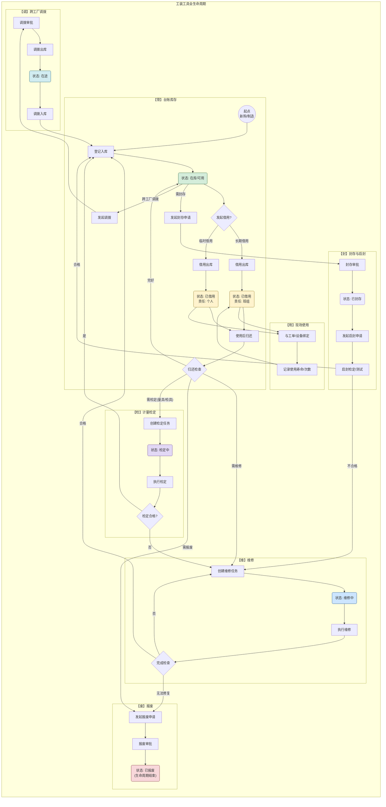
#### 2.1.2 业务流程描述

工装工具的全生命周期管理是一个闭环过程，可以概括为由**"一个核心"**贯穿的**"六大阶段"**。这确保了工装从"出生"到"消亡"的每一个环节都被有效监控和管理。

-   **核心：工装台账 (Tooling Ledger)**
    -   **描述**: 全生命周期的基石。它不仅是工装的"身份证"，记录其静态属性（如型号、供应商、理论寿命），更是其动态的"履历本"，实时反映其当前状态（在库、使用中、维修中等）、位置、责任人以及所有历史事件。

-   **阶段一：入库与初始化 (Procurement & Initialization)**
    -   **关键活动**: `新购登记`、`制造入库`、`信息建档`、`库位分配`。
    -   **目标**: 为每一个工装建立唯一的、准确的数字化身份，并将其纳入规范的库存管理体系。

-   **阶段二：使用与流转 (Dispatch & Operation)**
    -   **关键活动**: `长期借用`、`临时借用`、`现场绑定`（与工单/设备关联）、`使用记录`、`归还交接`。
    -   **目标**: 规范工装的流转过程，明确责任主体，并精确采集其在生产过程中的使用数据，为后续的寿命分析和成本核算提供依据。

-   **阶段三：维护与支持 (Maintenance & Support)**
    -   **关键活动**: `计划性保养`、`故障性维修`、`周期性检定/验证`（特指量具/检具）。
    -   **目标**: 确保工装始终处于最佳技术状态和合规状态。通过预防性保养延长寿命，通过快速维修响应生产，通过强制检定保障质量。

-   **阶段四：封存与启封 (Sealing & Activation)**
    -   **关键活动**: `封存申请与审批`、`启封申请`、`启封检定/测试`。
    -   **目标**: 对因生产计划变更、季节性需求等原因长期闲置的工装进行规范化管理，防止资产锈蚀、损坏，并在需要时能快速、可靠地重新投入使用。

-   **阶段五：处置与报废 (Disposal & Retirement)**
    -   **关键活动**: `报废申请`、`技术鉴定`、`审批流程`、`资产核销`。
    -   **目标**: 对达到使用寿命、无法修复或技术淘汰的工装，执行规范的处置流程，完成其生命周期的闭环，并更新资产记录。

-   **阶段六：跨工厂协同 (Multi-Factory Collaboration)**
    -   **关键活动**: `共享库存查询`、`跨工厂调拨申请与审批`、`调拨出库`、`在途跟踪`、`调拨入库`。
    -   **目标**: 打破工厂间的信息壁垒，实现集团内工装资源的透明化共享与高效流转。通过共享库存减少不必要的重复采购，通过规范的调拨流程确保资产在转移过程中的安全与可追溯性，最大化集团整体的资产利用率。

**详细流程分解如下：**

1.  **阶段一：初始建档与入库**
    -   **相关角色**: 工装管理员、仓库管理员
    -   **关键活动**:
        -   工装管理员在系统中创建全新的工装档案，录入其型号、理论寿命、供应商等静态数据，支持从Excel批量导入。
        -   仓库管理员对新购、外协制造完成或维修返还的工装进行实物核对，扫码执行入库操作，并为其分配具体的存储库位（货架、货位）。
    -   **输入/输出**:
        -   **输入**: 工装基础信息清单、采购订单、保养任务。
        -   **输出**: 创建/更新的工装台账（状态：在库）、入库记录。
    -   **核心规则**: 工装编码必须系统唯一。入库时必须指定存放库位。

2.  **阶段二：使用与流转**
    -   **相关角色**: 生产班组长、研发/工艺工程师、仓库管理员、生产操作工
    -   **关键活动**:
        -   生产班组长根据生产工单创建工装**长期借用**申请。
        -   研发/工艺工程师/其他用户因非生产任务创建工装**临时借用**申请。
        -   仓库管理员审核申请单，并执行扫码出库。
        -   生产操作工在现场将工装与设备、工单进行扫码绑定。
        -   使用完毕后，借用人将工装交还仓库。
        -   仓库管理员扫码接收归还的工装，并对其进行初步检查，在系统中录入归还结论（如："完好"、"需保养"、"需维修"、"需报废"）。
    -   **输入/输出**:
        -   **输入**: 生产工单、待归还的工装实物。
        -   **输出**: 借用单、工装台账状态变更（在库 -> 已借用 -> 在库/待维修...）、归还记录、工装与工单绑定记录。
    -   **核心规则**: 长期借用必须关联生产工单。临时借用必须明确预计归还日期。归还时必须有明确的检查结论，该结论将驱动后续流程（如触发维修）。

3.  **阶段三：维护与支持**
    -   **相关角色**: 系统、工装管理员、维修人员、质量工程师
    -   **关键活动**:
        -   **计划生成 (系统)**: 系统基于预设的**保养/检定策略**，自动生成**保养/检定任务**（例如，本周待保养工装清单）。
        -   **任务派发 (管理员)**: 工装/质量管理员审核计划，并基于计划手动或批量创建具体的**保养任务**或**检定任务**，并指派给执行人。
        -   **故障维修 (管理员)**: 对于计划外的故障，工装管理员直接创建紧急**保养任务**。
        -   **任务执行 (执行人)**: 维修人员或质量工程师执行任务，并在系统中记录过程、结果和成本。
    -   **输入/输出**:
        -   **输入**: 保养/检定策略、现场维修请求。
        -   **输出**: 保养/检定任务、维修任务。工装台账状态变更（-> 维修中/保养中/检定中 -> 在库/待报废...）。
    -   **核心规则**: 保养完成后需记录成本。检定不合格的量具/检具必须转入维修或报废流程。

4.  **阶段四：封存与启封**
    -   **相关角色**: 工装管理员、审批人
    -   **关键活动**:
        -   工装管理员对长期闲置的工装发起封存申请。
        -   经审批后，工装状态变更为"已封存"，并从可用库存中隔离。
        -   需要重新使用时，发起启封申请，经检查、测试或重新检定合格后，恢复其可用状态。
    -   **输入/输出**:
        -   **输入**: 封存/启封申请单。
        -   **输出**: 工装台账状态变更（在库 <-> 已封存）。
    -   **核心规则**: 已封存的工装不可被借用。启封不合格的工装需转入维修流程。

5.  **阶段五：处置与报废**
    -   **相关角色**: 工装管理员、技术鉴定人员、审批人
    -   **关键活动**:
        -   工装管理员对达到使用寿命、无法修复或技术淘汰的工装发起报废申请。
        -   经过技术鉴定和审批流程后，执行资产核销。
    -   **输入/输出**:
        -   **输入**: 报废申请单。
        -   **输出**: 工装台账状态变更为"已报废"，生命周期结束。
    -   **核心规则**: 已报废的工装不可再进行任何业务操作。

6.  **阶段六：跨工厂协同**
    -   **相关角色**: 工装管理员（调出与调入方）、审批人
    -   **关键活动**:
        -   A工厂管理员查询到B工厂有闲置工装，发起跨工厂调拨申请。
        -   经审批后，B工厂执行调拨出库，工装状态变为"在途"。
        -   A工厂执行调拨入库，完成资产转移。
    -   **输入/输出**:
        -   **输入**: 跨工厂调拨申请单。
        -   **输出**: 工装台账状态变更（在途）、工装所属组织/工厂变更。
    -   **核心规则**: 调拨流程需完整记录审批、出库、入库等关键节点信息，确保资产在途可追溯。

#### 2.1.3 使用场景设计
-   **场景1: (高频) 生产班组长按工单长期借用工装**
    -   **场景背景**: 生产班组长张工收到了第二天的生产任务，需要为一条新的汽车门板冲压产线准备所需的3套模具。
    -   **用户目标**: 在下班前，完成模具的长期借用申请，确保明天一早生产开始前，模具能准时到位。
    -   **触发条件**: 收到新的生产工单。
    -   **执行步骤**:
        1.  张工登录系统，进入"工装借用"模块。
        2.  他新增一张借用单，并关联明天的生产工单号。
        3.  系统根据工单的工艺BOM，自动推荐了需要使用的3套模具型号。
        4.  系统显示这3套模具当前均"在库"，库存充足。张工确认申请。
        5.  申请单自动流转给仓库管理员李工。李工在系统收到提醒，审核通过。
    -   **成功标准**: 张工成功提交借用申请，且申请单状态变为"待借用"。李工能准确收到申请并进行处理。
    -   **失败处理**: 如果系统显示某套模具库存不足或处于"维修中"，张工需要联系工装管理员协调。

-   **场景2: (关键) 工装寿命预警与计划性保养**
    -   **场景背景**: A01号精密冲压模具的理论寿命是100万次，保养周期为每10万次。系统记录到它的已使用次数达到了99,500次。
    -   **用户目标**: 工装管理员王工需要及时收到预警，并在该模具完成本次生产任务后，立即安排**保养**，避免其"带病"工作。
    -   **触发条件**: 工装已用寿命达到**保养**预警阈值（如99%）。
    -   **执行步骤**:
        1.  系统基于保养策略，自动生成一份"本周待保养计划"，其中包含了A01号模具，并向王工发出"有新的保养计划生成"的通知。
        2.  王工打开该保养计划，查看到A01模具的详情及其当前状态。
        3.  王工勾选A01模具，点击"派发任务"，为A01创建了一张关联此计划的保养类保养任务，并指派给维修工程师赵师傅。
        4.  当A01模具使用完毕归还入库后，其状态自动从"在库"流转为"待保养"，赵师傅收到通知，开始执行此保养任务。
    -   **成功标准**: 王工能及时收到计划通知，并能顺利地基于计划创建保养任务。
    -   **失败处理**: 如果计划被忽略，未及时派发任务，系统应在看板或预警中心持续提醒。

-   **场景3: (关键) 检具周期验证**
    -   **场景背景**: 用于检查产品A关键孔径的通止规(Go/No-Go Gauge) G-001，其验证周期为3个月。系统检测到距离上次验证已过去85天。
    -   **用户目标**: 质量工程师张工需要及时收到预警，安排对G-001的有效性进行验证，确保其判断的准确性，并在系统中更新其状态和验证记录。
    -   **触发条件**: 检具的已用时间达到验证周期的预警阈值（如95%）。
    -   **执行步骤**:
        1.  李师傅通过车间终端的"工装报修"功能，扫描夹具二维码，选择故障现象"定位不准"，提交紧急维修申请。
        2.  系统检测到"紧急"标识，立即通过高优先级消息（如短信、App推送）通知工装管理员王工和维修班组。
        3.  工装管理员王工确认故障，立即创建一张"紧急保养任务"，并指派给维修工程师赵工。
        4.  赵工接收到任务，携带工具到现场进行诊断和维修。
        5.  修复完成后，赵工在终端上将任务状态更新为"已修复"，并填写维修详情和所用备件。
        6.  王工确认维修结果，关闭保养任务。夹具状态恢复为"可用"。
    -   **成功标准**: 夹具功能恢复正常，从报修到修复完成的响应时间被记录，完整的维修记录被记入该夹具的履历中。
    -   **失败处理**: 如果现场无法修复，赵工需在任务中注明，并申请返厂维修或申请新的备用夹具。

-   **场景4: (关键) 生产中工装紧急故障报修**
    -   **场景背景**: 生产过程中，一台关键的数控机床**夹具**突然发生定位不准的故障，导致产品加工尺寸超差。
    -   **用户目标**: 生产操作工李师傅需要立即上报**夹具故障**，并由维修团队快速响应，修复**夹具**，最大限度减少生产停顿时间。
    -   **触发条件**: 生产现场发现工装故障。
    -   **执行步骤**:
        1.  李师傅通过车间终端的"工装报修"功能，扫描夹具二维码，选择故障现象"定位不准"，提交紧急维修申请。
        2.  系统检测到"紧急"标识，立即通过高优先级消息（如短信、App推送）通知工装管理员王工和维修班组。
        3.  工装管理员王工确认故障，立即创建一张"紧急保养任务"，并指派给维修工程师赵工。
        4.  赵工接收到任务，携带工具到现场进行诊断和维修。
        5.  修复完成后，赵工在终端上将任务状态更新为"已修复"，并填写维修详情和所用备件。
        6.  王工确认维修结果，关闭保养任务。夹具状态恢复为"可用"。
    -   **成功标准**: 夹具功能恢复正常，从报修到修复完成的响应时间被记录，完整的维修记录被记入该夹具的履历中。
    -   **失败处理**: 如果现场无法修复，赵工需在任务中注明，并申请返厂维修或申请新的备用夹具。

-   **场景5: (关键) 跨工厂共享与调拨**
    -   **场景背景**: A工厂计划下周生产一款不常用产品，但发现对应的模具T-101库存为零。
    -   **用户目标**: A工厂的工装管理员王工希望能快速查询到集团内其他工厂是否有闲置的T-101模具，并向有库存的B工厂发起调拨申请。
    -   **触发条件**: 本厂工装库存无法满足生产需求。
    -   **执行步骤**:
        1.  王工在系统的"共享库存查询"功能中，输入模具型号T-101，并勾选"查询所有工厂"。
        2.  系统显示，B工厂有2套T-101处于"在库"状态。
        3.  王工点击"申请调拨"，系统自动创建一个关联T-101的跨工厂调拨申请单，填写需求数量和期望到货日期。
        4.  调拨申请单流转至B工厂的工装管理员李工进行审批。
        5.  李工审批通过后，B工厂仓库执行调拨出库。系统将该模具状态更新为"在途"，并记录目的地为A工厂。
        6.  模具运抵A工厂后，A工厂仓库扫码执行调拨入库，模具状态恢复为"在库"，所属工厂变更为A工厂。
    -   **成功标准**: A工厂成功获得所需模具，调拨过程中的审批、出库、在途、入库状态被完整追踪。
    -   **失败处理**: 若B工厂审批驳回（如：该模具自身有生产任务），系统会通知A工厂的王工，申请流程结束。

-   **场景6: (关键) 长期闲置工装的封存与启封**
    -   **场景背景**: 与产品P-001配套的专用夹具F-007，由于P-001产品已停产超过半年，预计未来一年内不会再使用。
    -   **用户目标**: 工装管理员王工需要将F-007进行封存管理，以防止其自然锈蚀损坏，并将其从日常可用库存中隔离，避免被误用或计入闲置统计。
    -   **触发条件**: 系统闲置报表提示或管理员定期巡检发现长期闲置工装。
    -   **执行步骤**:
        1.  王工在系统中找到F-007，发起"封存申请"，填写封存原因。
        2.  申请经部门经理审批通过。
        3.  王工安排对F-007进行清洁、涂油等保养后，转移到长期存储区。并在系统中确认执行封存。
        4.  系统将F-007的状态更新为"已封存"。
        5.  (启封) 一年后，P-001产品接到返修订单，需要重新启用F-007。王工发起"启封申请"。
        6.  申请通过后，王工安排对F-007进行检查和精度测试。
        7.  确认完好后，在系统中执行启封，F-007状态恢复为"在库"。
    -   **成功标准**: 工装成功进入"已封存"状态，并在所有可用库存查询中被过滤掉。启封后能恢复可用状态。
    -   **失败处理**: 若启封时发现工装已损坏或精度不达标，系统应引导用户将其状态转为"待维修"。

-   **场景7: (异常) 归还检查时发现工装损坏**
    -   **场景背景**: 生产班组长将一套夹具归还给仓库。仓库管理员李工在接收时，发现夹具的一个定位销有明显磨损，精度可能受影响。
    -   **用户目标**: 李工需要在系统中准确记录这一异常，并立即启动维修流程，防止有问题的夹具再次被借用。
    -   **触发条件**: 员工归还工装，经检查发现异常。
    -   **执行步骤**:
        1.  李工在系统中扫描该夹具的二维码，进入"归还"界面。
        2.  在"归还结论"选项中，他选择了"需维修"。
        3.  系统弹出一个文本框，李工填写损坏描述："定位销严重磨损，需更换"。
        4.  李工确认归还。
        5.  系统自动将该夹具的状态更新为"待维修"，并向工装管理员王工发送一条"有工装需要进行维修"的通知。
    -   **成功标准**: 损坏情况被准确记录，夹具状态变为"待维修"并被锁定，同时维修流程被成功触发。
    -   **失败处理**: 无。这是一个流程触发操作。

-   **场景8: (异常) 量具检定不合格**
    -   **场景背景**: 质量工程师赵工在对一把游标卡尺（Caliper-007）进行年度检定时，发现其精度超出允许误差范围。
    -   **用户目标**: 赵工需要在系统中记录检定失败的结果，并自动触发维修流程，确保这把不合格的卡尺不会被错误地流转到生产线上。
    -   **触发条件**: 执行检定任务时，发现结果不合格。
    -   **执行步骤**:
        1.  赵工在系统中打开Caliper-007的检定任务单。
        2.  在"检定结果"字段，他选择"不合格"，并上传了第三方的校准失败报告扫描件。
        3.  他填写了备注："测量误差+0.05mm，超出标准范围"。
        4.  赵工点击"完成检定"。
        5.  系统自动将Caliper-007的状态从"检定中"更新为"待维修"。
        6.  系统自动向工装管理员王工发送通知："[Caliper-007]检定不合格，已转入维修流程，请创建维修任务"。
    -   **成功标准**: 检定结果和报告被成功记录，量具状态自动流转为"待维修"，相关负责人收到明确的待办任务通知。
    -   **失败处理**: 如果工装管理员忽略通知，该量具将一直处于"待维修"的锁定状态，无法被借用。

-   **场景9: (异常) 工装借用逾期未还**
    -   **场景背景**: 研发部的李工在一个月前借用了一套精密的夹具用于实验，预计归还日期是上周五，但至今仍未归还。
    -   **用户目标**: 工装管理员王工需要系统能主动告知他这一逾期事件，以便他能及时催促李工归还，避免影响后续的生产计划。
    -   **触发条件**: 系统每日定时任务检测到当前日期已超过借用单的"预计归还日期"。
    -   **执行步骤**:
        1.  系统在凌晨的定时扫描中，发现该夹具的借用单已逾期3天。
        2.  系统在王工的"预警列表"看板中，增加一条"工装超期未还"的记录，并高亮显示。
        3.  王工上班后，在看板上第一时间注意到了这条预警。
        4.  他点击预警信息，查看到了借用单详情，包括借用人李工的姓名和联系方式。
        5.  王工通过电话联系李工，确认其已使用完毕，并要求其尽快归还。
    -   **成功标准**: 系统能自动、及时地暴露逾期事件，并为管理员提供处理此事件所需的所有上下文信息。
    -   **失败处理**: 如果王工持续忽略预警，预警信息会一直存在，并可根据配置升级提醒（如邮件通知其上级主管）。


#### 2.1.4 业务对象ER关系图
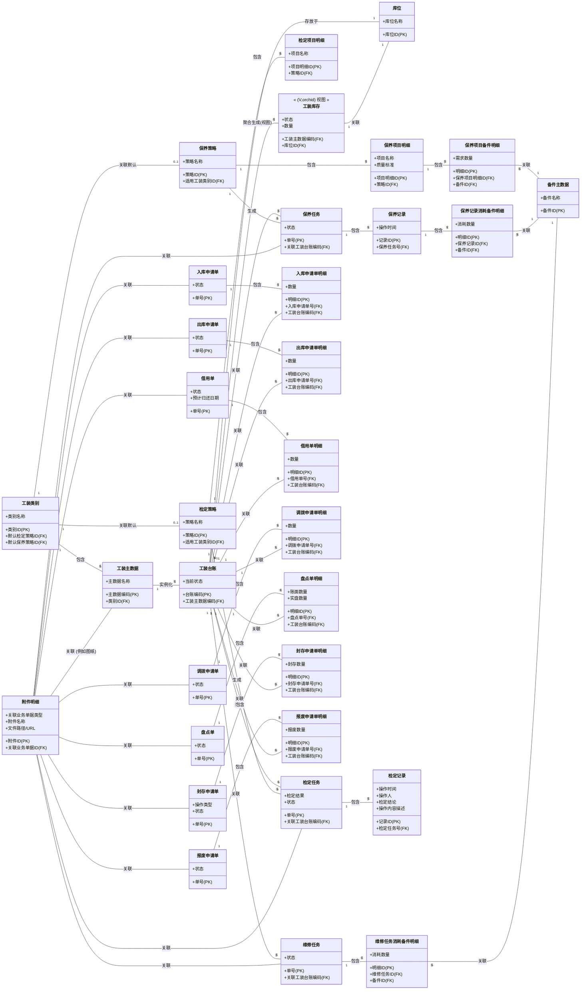
##### 2.1.4.1 核心资产与基础数据ER图
此图聚焦于工装管理中最基础、最核心的资产定义。
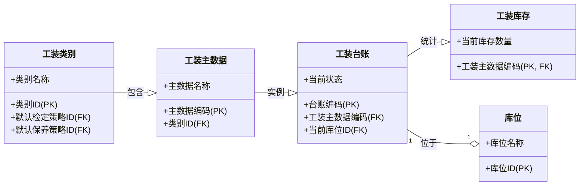
##### 2.1.4.2 策略配置与备件管理ER图
此图展示了工装的保养和检定策略如何被定义，以及保养所需备件的需求管理。
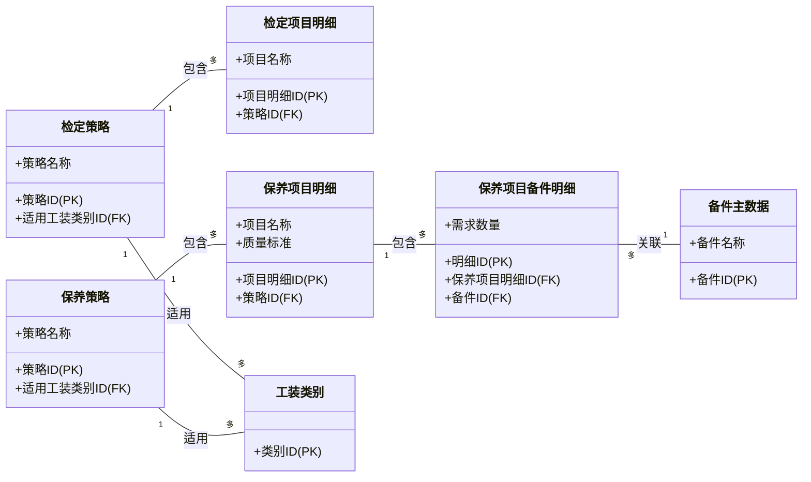

##### 2.1.4.3 维保与检定执行ER图
此图描述了工装维修、保养和检定任务的生成、执行和记录过程，以及备件的实际消耗。
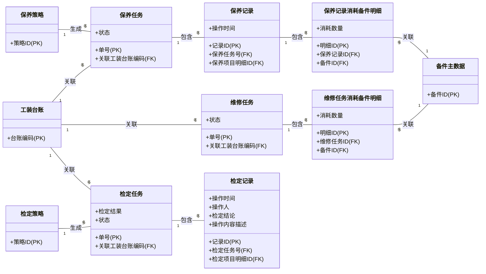

##### 2.1.4.4 业务单据与流转ER图
此图涵盖了工装在库存、借用、调拨、盘点、封存和报废等业务流程中的核心单据及其明细。
```mermaid
classDiagram
    direction LR

    subgraph 业务单据与流转
        direction TB
        class 入库申请单 {
            +单号 (PK)
            +状态
        }

        class 入库申请单明细 {
            +明细ID (PK)
            +入库申请单号 (FK)
            +工装台账编码 (FK)
            +数量
        }

        class 出库申请单 {
            +单号 (PK)
            +状态
        }

        class 出库申请单明细 {
            +明细ID (PK)
            +出库申请单号 (FK)
            +工装台账编码 (FK)
            +数量
        }

        class 借用单 {
            +单号 (PK)
            +状态
            +预计归还日期
        }

        class 借用单明细 {
            +明细ID (PK)
            +借用单号 (FK)
            +工装台账编码 (FK)
            +数量
        }

        class 调拨申请单 {
            +单号 (PK)
            +状态
        }

        class 调拨申请单明细 {
            +明细ID (PK)
            +调拨申请单号 (FK)
            +工装台账编码 (FK)
            +数量
        }

        class 盘点单 {
            +单号 (PK)
            +状态
        }

        class 盘点单明细 {
            +明细ID (PK)
            +盘点单号 (FK)
            +工装台账编码 (FK)
            +账面数量
            +实盘数量
        }

        class 封存申请单 {
            +单号 (PK)
            +操作类型
            +状态
        }
        
        class 封存申请单明细 {
            +明细ID (PK)
            +封存申请单号 (FK)
            +工装台账编码 (FK)
            +封存数量
        }

        class 报废申请单 {
            +单号 (PK)
            +状态
        }

        class 报废申请单明细 {
            +明细ID (PK)
            +报废申请单号 (FK)
            +工装台账编码 (FK)
            +报废数量
        }
        
        %% 引用外部实体 (仅作关联标识，不在本子图内详细展开)
        class 工装台账 {
            +台账编码 (PK)
        }

        入库申请单 "1" -- "多" 入库申请单明细 : 包含
        出库申请单 "1" -- "多" 出库申请单明细 : 包含
        借用单 "1" -- "多" 借用单明细 : 包含
        调拨申请单 "1" -- "多" 调拨申请单明细 : 包含
        盘点单 "1" -- "多" 盘点单明细 : 包含
        封存申请单 "1" -- "多" 封存申请单明细 : 包含
        报废申请单 "1" -- "多" 报废申请单明细 : 包含

        工装台账 "1" -- "多" 入库申请单明细 : 关联
        工装台账 "1" -- "多" 出库申请单明细 : 关联
        工装台账 "1" -- "多" 借用单明细 : 关联
        工装台账 "1" -- "多" 调拨申请单明细 : 关联
        工装台账 "1" -- "多" 盘点单明细 : 关联
        工装台账 "1" -- "多" 封存申请单明细 : 关联
        工装台账 "1" -- "多" 报废申请单明细 : 关联
    end
```
##### 2.1.4.5 通用附件ER图
此图独立展示了附件明细的结构，以及它如何通过通用关联方式支撑所有业务单据的附件功能。
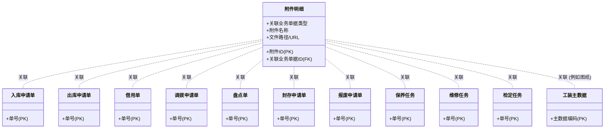

#### 2.1.5 数据流/生命周期图

本章节旨在通过状态图(State Diagram)的形式，更精确、更形式化地定义核心业务对象在其生命周期内的状态变迁规则。这不仅是对业务流程的可视化补充，更是后续开发和测试确保逻辑严谨性的重要依据。

**特别说明**：
- **本图描述的是\"工装台账\"（物理实例）的状态变迁。**
- **台账的创建**：工装台账在\"创建\"时，其基础信息（如名称、类别、理论寿命等）继承自其关联的**\"工装主数据\"（模板）**。

**图例说明:**

- **起点 (实心圆)**: 表示流程的开始节点。
- **终点 (同心圆)**: 表示流程的结束节点。
- `状态名称`: 表示业务对象的一个稳定状态。
- `箭头 (-->)`: 表示状态之间的流转方向。
- `箭头上的文字`: 表示触发状态变迁的业务操作或系统事件。
- **带边框的区块 (e.g., 在库)**: 表示一个**复合状态 (State Group)**，它代表一个大的业务阶段，内部可以包含多个具体的子状态。

##### **业务单据标准状态模型**

为确保全模块业务流程的严谨性、逻辑的统一性与业务语义的精确性，所有业务单据的设计必须遵循以下标准化状态模型。

###### **1. 状态命名范式**

所有状态名都必须遵循以下三种前缀之一，以清晰表达其时态和性质：
*   **`待... (Pending)`**: 表示一个**稳定状态**，正在**等待**一个外部动作或触发。它清晰地告诉用户\"接下来该做什么\"。
*   **`...中 (In Progress)`**: 表示一个**过程状态**，代表一个**持续性**的动作正在发生。
*   **`已... (Completed/Done)`**: 表示一个**终结状态**，代表一个动作或流程**已经结束**。

###### **2. 标准状态词典**

| 状态范式 | 状态名 | 英文推荐 | 统一业务含义 |
| :--- | :--- | :--- | :--- |
| **起始** | `已创建` | Draft | 单据已创建但未提交或未进入审批流程。仅创建者可见，可任意修改或物理删除。 |
| **等待** | `待审批` | Pending Approval | 已提交，等待审批。单据锁定，不可修改。 |
| **过程** | `审批中` | In Approval | 审批流程正在进行中（多级审批时可能出现）。 |
| **终结** | `审批驳回` | Rejected | 审批流程结束，申请被拒绝。**终结状态**。可被复制为新单据。 |
| **终结** | `审批通过` | Approved | 审批流程结束，申请被批准。 |
| **等待** | `待执行` / `待出库` / `待入库` 等 | Pending Execution | 审批通过，等待执行后续的物理操作。具体名称根据业务单据而定。 |
| **过程** | `执行中` / `部分...` | In Progress / Partial | 物理操作已开始但未全部完成（如部分出库、部分归还）。具体名称根据业务单据而定。 |
| **终结** | `已完成` / `已...` | Completed / Done | **执行方**已宣告其主要工作结束。这是一个**阶段性终点**，可能需要后续的验证或等待其他义务（如归还）的履行。具体名称根据业务单据而定。 |
| **终结** | `已关闭` | Closed | 所有相关流程（包括后续义务及结果验证）已彻底终结。是业务事件的**最终归档状态**。 |
| **终结** | `已取消` | Canceled | 在**业务执行前**，由用户主动撤回申请。**终结状态**。 |

###### **3. 通用取消/删除规则**

| 数据类型 | **物理删除** | **逻辑作废** |
| :--- | :--- | :--- |
| **基础数据** | **允许** (但前提是**未被引用**，为修正配置错误) | 不适用 (一般用\"禁用\"状态代替) |
| **业务单据** | **严禁** (破坏审计追溯和数据完整性) | **标准操作** (通过**\"取消\"**或**\"逆向单据\"**来作废，保留历史记录) |

**取消操作统一时机**: 所有单据的\"取消\"功能，仅可在其进入**不可逆状态**（即状态变为`执行中`、`已完成`或`已关闭`）之前使用。

###### **4. 通用单据取消逻辑原则**
为确保全模块业务流程的严谨性与用户体验的一致性，所有业务单据的\"取消\"操作遵循统一的核心原则：**业务流程的可逆性**。

**核心原则**：只要业务流程尚未进入\"不可逆\"的阶段（如物理出库、库存记账、下游业务已触发等），就应该允许用户取消。反之，若流程已不可逆，则必须通过严谨的\"逆向业务流程\"（如退货、还库）进行修正。\
基于此原则，各主要单据的取消逻辑统一如下：

| 单据  | 是否应有取消功能 | **可取消**的状态| **不可取消**的状态 | 不可取消后的\"逆向操作\" |
| :--- | :--- | :--- | :--- | :--- |
| **入库申请单**  | **是** | `已创建`, `待入库` | `已部分入库`, `已入库` | 已创建 **退货出库申请单** 或 **红字入库申请单** |
| **出库申请单**| **是** | `已创建`, `待出库` | `已部分出库`, `已出库` | 执行 **归还流程** |
| **调拨申请单**  | **是** | `待审批`, `审批通过` (但未执行出库) | `在途`, `已调拨` | 创建一张反向的**新调拨申请单** |
| **维修/保养/检定任务** | **是** | `已创建`, `待执行` (但维修员未开工) | `执行中`, `已完成` | **终止任务** (需记录已用工时和备件) |
| **报废申请单** | **是** | `待审批`, `审批通过` (但未执行物理报废) | `已报废` | - (物理报废，原则上无法逆转) |
| **封存/启封申请单** | **是** | `待审批`, `审批通过` (但未更新台账状态) | `已封存`, `已启封` | 创建反向的**新申请** (如封存后需启封) |

---

##### **业务单据标准状态**

**1. 工装台账 (Tooling Ledger) 核心状态机**

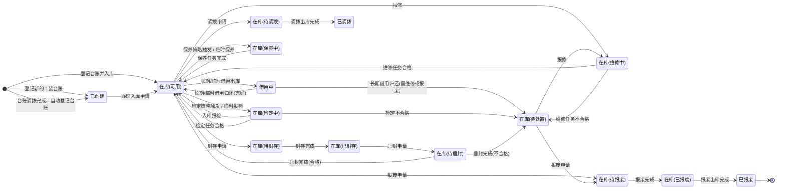

**工装台账核心状态说明**

| 状态名称 | 业务含义 |
| :--- | :--- |
| **已创建** | 工装实例已在系统中登记，但尚未有实物入库或尚未进入在库(可用)状态。 |
| **在库(可用)** | 工装在库且状态完好，可随时被借用或调拨。 |
| **借用中** | 工装已被长期借用出库（如生产工单），正在车间使用或者临时借用出库，通常用于短期、非生产任务。 |
| **在库(检定中)** | 量具/检具正在进行检定作业。 |
| **在库(保养中)** | 工装正在进行保养作业。 |
| **在库(维修中)** | 工装正在进行维修作业。 |
| **在库(待封存)** | 工装处于等待封存的状态。 |
| **在库(已封存)** | 工装已完成封存操作，从在库(可用)库存中隔离。 |
| **在库(待启封)** | 已封存工装处于等待启封的状态。 |
| **在库(待处置)** | 工装需要进一步处置（维修或报废），等待决策。 |
| **在库(待报废)** | 工装处于等待报废的状态。 |
| **在库(已报废)** | 工装已完成报废确认，等待最终出库处置。 |
| **在库(待调拨)** | 工装正在不同工厂或库位之间进行调拨转移。 |
| **已调拨** | 工装调拨出库完成，已转移至目标位置。 |
| **已报废** | 工装已完成最终报废出库，资产核销，生命周期结束。 |


**2. 入库申请单 (Inbound Order) 状态机**

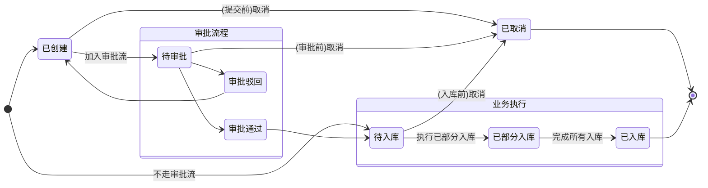

**入库申请单状态说明【暂无审批状态，未来可扩展】**

| 状态类型 | 状态 | 英文/缩写 | 解释说明 |
| :--- | :--- | :--- | :--- |
| **业务状态** | **已创建** | Draft | 单据已创建但尚未提交审批或加入流程失败。 |
| | **待入库** | Pending Stock-in | 申请已获批准，等待仓库管理员执行实际的入库操作;对于不需要审批的入库申请，直接进入待入库状态。 |
| | **已部分入库** | Partial Inbound | 单据中的部分工装已完成入库。 |
| | **已入库** | Completed | 单据中的全部工装均已完成入库，流程结束。 |
| **审批状态** | **待审批** | Pending Approval | 单据已提交，等待审批。 |
| | **审批通过** | Approved | 审批流程结束，申请被批准。 |
| | **审批驳回** | Rejected | 审批流程结束，申请被明确拒绝。 |
| **终结状态** | **已取消** | Canceled | 在工装实际入库前，由用户主动撤回。 |
| | **已关闭** | Closed | 因审批被驳回，或流程最终完成而关闭。 |

**3. 出库申请单 (Outbound Order) 状态机**

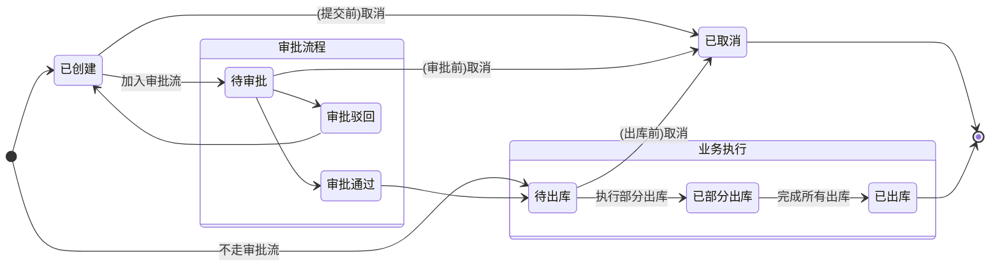

**出库申请单状态说明【暂无审批状态，未来可扩展】**

| 状态类型 | 状态 | 英文/缩写 | 解释说明 |
| :--- | :--- | :--- | :--- |
| **业务状态** | **已创建** | Draft | 单据已创建但尚未提交审批或加入流程失败。 |
| | **待出库** | Pending Issue | 提交流程审批，等待仓库管理员执行出库;对于不需要审批的出库申请，直接进入待出库状态。 |
| | **已部分出库** | Partial Outbound | 正在执行出库，部分工装已被借用。 |
| | **已出库** | Issued | 全部工装均已被借用出库。对于消耗性借用，这是阶段性终点。 |
| **审批状态** | **待审批** | Pending Approval | 单据已提交，等待审批。 |
| | **审批通过** | Approved | 申请被批准。 |
| | **审批驳回** | Rejected | 申请被拒绝。 |
| **终结状态** | **已取消** | Canceled | 在工装实际出库前，由用户主动撤回。 |
| | **已关闭** | Closed | 因审批驳回、或无需归还的借用完成，流程关闭。 |


**4. 借用单 (Borrow Order) 状态机【暂无审批状态，未来可扩展】**
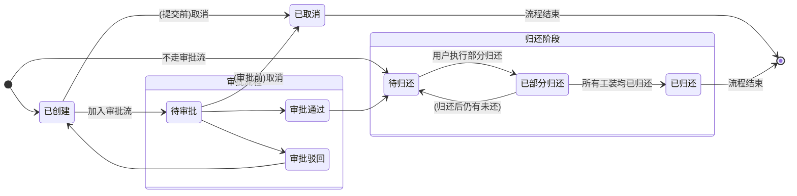

**借用单状态说明**:

| 状态类型 | 状态 | 英文/缩写 | 解释说明 |
| :--- | :--- | :--- | :--- |
| **业务状态** | **已创建** | Draft | 单据已创建但尚未提交审批或加入流程失败。 |
| | **待归还** | Pending Return | 工装在用户手中，等待用户发起并执行归还; 对于不需要审批的借用单，直接进入待归还状态。 |
| | **已部分归还** | Partial Return | 正在执行归还入库操作，部分已归还。 |
| | **已归还** | Returned | 所有借用物均已归还。 |
| **审批状态** | **待审批** | Pending Approval | 单据已提交，等待审批。 |
| | **审批通过** | Approved | 申请被批准。 |
| | **审批驳回** | Rejected | 申请被拒绝，单据退回至“已创建”状态。 |
| **终结状态** | **已取消** | Canceled | 在工装实际出库前，由用户主动撤回。 |


**5. 保养任务 (Maintenance Task) 状态机**

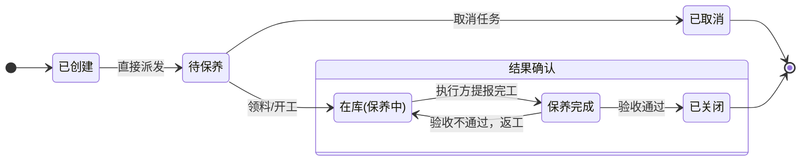
**保养任务状态说明**

| 状态类型 | 状态 | 英文/缩写 | 解释说明 |
| :--- | :--- | :--- | :--- |
| **业务状态** | **已创建** | Draft | 任务已生成，等待派发。 |
| | **待保养** | Pending Execution | 任务已派发，等待工程师执行。 |
| | **在库(保养中)** | In Progress | 工程师已开始实际作业。 |
| | **保养完成** | Completed | **执行方**已完成所有作业内容，等待管理者进行结果**验收**。 |
| **终结状态** | **已取消** | Canceled | 任务在开始执行前被取消。 |
| | **已关闭** | Closed | 任务最终验收通过，流程关闭。 |

**6. 检定任务 (Calibration Task) 状态机**

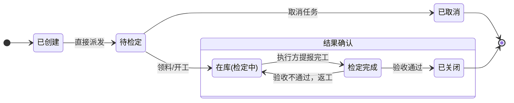
**检定任务状态说明**

| 状态类型 | 状态 | 英文/缩写 | 解释说明 |
| :--- | :--- | :--- | :--- |
| **业务状态** | **已创建** | Draft | 任务已生成，等待派发。 |
| | **待检定** | Pending Execution | 任务已派发，等待工程师执行。 |
| | **在库(检定中)** | In Progress | 工程师已开始实际作业。 |
| | **检定完成** | Completed | **执行方**已完成所有作业内容，等待质量部门进行结果**验收**。 |
| **终结状态** | **已取消** | Canceled | 任务在开始执行前被取消。 |
| | **已关闭** | Closed | 任务最终验收通过，流程关闭。 |

**7. 维修任务 (Repair Task) 状态机**

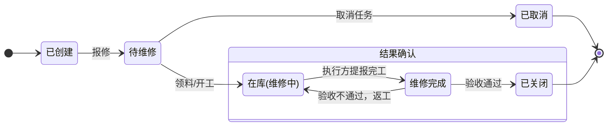
**维修任务状态说明**

| 状态类型 | 状态 | 英文/缩写 | 解释说明 |
| :--- | :--- | :--- | :--- |
| **业务状态** | **已创建** | Draft | 任务已生成，等待提交维修方案与预算以供审批。 |
| | **待维修** | Pending Execution | 维修方案与预算已获批准，等待工程师执行。 |
| | **在库(维修中)** | In Progress | 工程师已开始实际作业。 |
| | **维修完成** | Completed | **执行方**已完成所有作业内容，等待管理者或质量部门进行结果**验收**。 |
| **终结状态** | **已取消** | Canceled | 任务在开始执行前被取消。 |
| | **已关闭** | Closed | 因审批驳回、或任务最终验收通过，流程关闭。 |


**8. 报废申请单 (Scrap Order) 状态机**

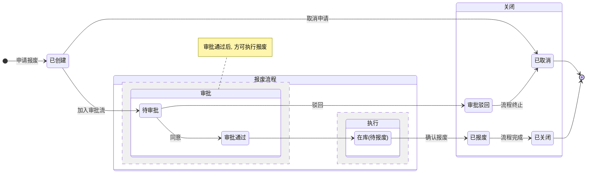
**报废申请单状态说明**

| 状态类型 | 状态 | 英文/缩写 | 解释说明 |
| :--- | :--- | :--- | :--- |
| **业务状态** | **已创建** | Draft | 报废申请已创建但尚未提交审批或加入流程失败。 |
| | **在库(待报废)** | Pending Scrap | 提交审批流程，等待仓库或资产部门执行最终的资产核销/处置。 |
| | **已报废** | Scrapped | 资产已完成实物处置与账务核销。流程结束。 |
| **审批状态** | **待审批** | Pending Approval | 报废申请已提交，等待决策。 |
| | **审批通过** | Approved | 审批完成，申请被批准。 |
| | **审批驳回** | Rejected | 审批完成，申请被拒绝。流程终止。 |
| **终结状态** | **已取消** | Canceled | 在物理报废执行前，由用户主动撤回。 |
| | **已关闭** | Closed | 报废流程已全部完成。 |


**9. 调拨申请单 (Transfer Order) 状态机**

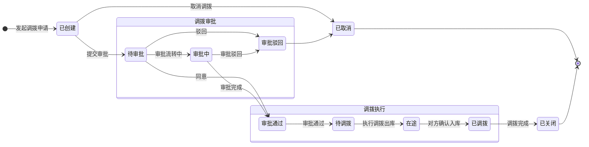
**调拨申请单状态说明**

| 状态类型 | 状态 | 英文/缩写 | 解释说明 |
| :--- | :--- | :--- | :--- |
| **业务状态** | **已创建** | Draft | 调拨申请已创建但尚未提交审批或加入流程失败。 |
| | **待调拨** | Pending Outbound | 提交审批流程，等待调出方仓库执行出库操作。 |
| | **在途** | In Transit | 工装已从调出方仓库确认发出，正在运往调入方途中。 |
| | **已调拨** | Inbounded | 调入方已确认收到工装并完成入库操作。 |
| **审批状态** | **待审批** | Pending Approval | 调拨申请已提交，等待相关部门审批。 |
| | **审批中** | In Approval | 调拨申请正在多级审批中。 |
| | **审批通过** | Approved | 审批完成，申请被批准，可以开始执行调拨。 |
| | **审批驳回** | Rejected | 审批完成，申请被拒绝。流程终止。 |
| **终结状态** | **已取消** | Canceled | 在调拨出库前，由用户主动撤回。 |
| | **已关闭** | Closed | 调拨流程已全部完成。 |


**10. 盘点单 (Stocktake Order) 状态机【暂无审批状态，未来可扩展】**

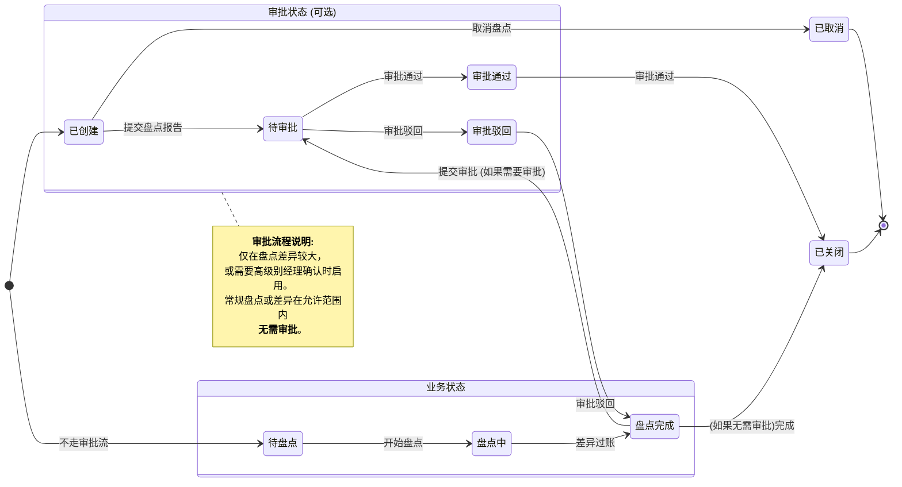

**盘点单状态说明**

| 状态类型 | 状态 | 英文/缩写 | 解释说明 |
| :--- | :--- | :--- | :--- |
| **业务状态** | **已创建** | Draft | 盘点单已创建，定义了盘点范围和时间，但尚未开始执行或加入流程失败。 |
| | **待盘点** | Pending | 申请已获批准，等待仓库管理员实盘录入;对于不需要审批的盘点申请，直接进入待盘点状态。 |
| | **盘点中** | In Progress | 盘点工作正在进行，操作人员正在现场清点、扫描和记录实物数量。 |
| | **盘点完成** | Completed | 实物盘点已完成，系统已生成初步的盘点差异报告（盘盈、盘亏），等待管理者审核确认或提交审批。 |
| **审批状态** | **未提交** | Not Submitted | 对于需要审批的盘点报告，尚未提交审批。 |
| | **待审批** | Pending Approval | 盘点差异报告已提交，等待相关负责人审批。 |
| | **审批通过** | Approved | 审批流程结束，盘点结果被批准，可以进行后续的账务处理。 |
| | **审批驳回** | Rejected | 审批流程结束，盘点结果被驳回，可能需要重新盘点或对差异进行调查。 |
| **终结状态** | **已取消** | Canceled | 盘点单在开始执行前被取消。 |
| | **已关闭** | Closed | 盘点差异已处理（如账务调整、报废等），盘点流程完全结束。 |


**11. 封存申请单 (Sealing Order) 状态机**

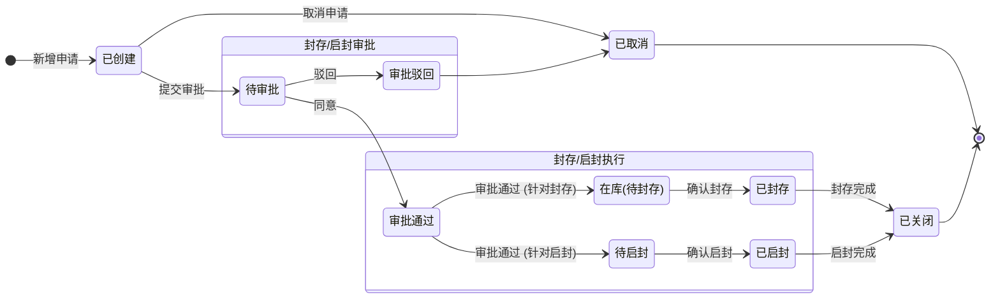
**封存单状态说明**

| 状态类型 | 状态 | 英文/缩写 | 解释说明 |
| :--- | :--- | :--- | :--- |
| **业务状态** | **已创建** | Draft | 封存或启封申请已创建但尚未提交审批或加入流程失败。 |
| | **在库(待封存)** | Pending Sealing | 提交流程审批，等待仓库执行封存操作。 |
| | **已封存** | Sealed | 流程审批通过，仓库已完成封存作业。 |
| | **待启封** | Pending Unsealing | 提交流程审批，等待仓库执行启封操作。 |
| | **已启封** | Unsealed | 流程审批通过，仓库已完成启封作业。 |
| **审批状态** | **待审批** | Pending Approval | 封存或启封申请已提交，等待相关部门审批。 |
| | **审批通过** | Approved | 审批完成，申请被批准，可以开始执行。 |
| | **审批驳回** | Rejected | 审批完成，申请被拒绝。流程终止。 |
| **终结状态** | **已取消** | Canceled | 在物理执行前，由用户主动撤回。 |
| | **已关闭** | Closed | 封存/启封流程已全部完成。 |


**12. 共享申请单 (Share Order) 状态机**

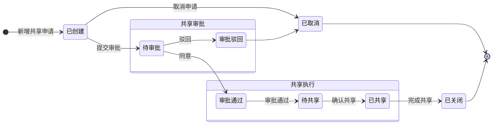
**共享申请单状态说明**

| 状态类型 | 状态 | 英文/缩写 | 解释说明 |
| :--- | :--- | :--- | :--- |
| **业务状态** | **已创建** | Draft | 共享申请已创建但尚未提交审批或加入流程失败。 |
| | **待共享** | Pending Share | 提交流程审批，等待执行共享操作。 |
| | **已共享** | Shared | 流程审批通过，共享操作已完成。 |
| **审批状态** | **待审批** | Pending Approval | 共享申请已提交，等待相关部门审批。 |
| | **审批通过** | Approved | 审批完成，申请被批准。 |
| | **审批驳回** | Rejected | 审批完成，申请被拒绝。 |
| **终结状态** | **已取消** | Canceled | 在共享操作执行前，由用户主动撤回。 |
| | **已关闭** | Closed | 共享流程已全部完成。 |

---

#### 2.1.6 数据字典

##### **工装类别 (Tooling Type)**
| 字段名           | 业务类型   | 业务约束      | 业务说明                             |
| :--------------- | :--------- | :------------ | :----------------------------------- |
| 工装类别编码         | 文本标识   | 唯一, 必填    | 工装类别的业务编码                   |
| 工装类别名称         | 描述文本   | 必填          | 工装类别的名称，如“刀具”、“模具”    |
| 上级类别       | 关联对象   | 可选, 形成树状结构 | 定义类别的层级关系                   |

##### **工装主数据 (Tooling Master)**
| 字段名           | 业务类型   | 业务约束            | 业务说明                             |
| :--------------- | :--------- | :------------------ | :----------------------------------- |
| 主数据编码       | 文本标识   | 唯一, 必填, 建议按规则生成 | 作为物料编码，是工装模板的唯一标识   |
| 主数据名称       | 描述文本   | 必填                | 工装模板的通用名称                   |
| 工装类别           | 关联对象   | 必填, 关联`工装类别` | 定义该主数据属于哪个工装类别         |
| **管理方式**     | 业务枚举   | 必填                | **逻辑核心**。`SINGLE`: 单件管理, `BATCH`: 批次管理。决定后续所有业务的操作模式。 |
| 规格型号         | 描述文本   | 可选                | 详细的规格型号描述                   |
| 理论寿命(次)     | 数值       | 可选, 正整数        | 用于实例化台账时带入的默认寿命参考（按使用次数） |
| 理论寿命(天)     | 数值       | 可选, 正整数        | 用于实例化台账时带入的默认寿命参考（按时间） |
| 安全库存 | 数值 | 可选, 非负整数 | 该型号工装的最低库存预警线 |
| 是否一次性工装 | 数值 | 必填 | 标记工装是否一次性工装 |

##### **工装台账 (Tooling Ledger)**

| 字段名           | 业务类型   | 业务约束              | 业务说明                             |
| :--------------- | :--------- | :-------------------- | :----------------------------------- |
| 所属组织         | 关联对象 | 必填, 关联`工厂组织`                               | 明确所属组织                                                 |
| 台账编码         | 文本标识   | 唯一, 必填, 格式建议由类别码+序列号生成 | 工装**物理实例**或**批次**在系统中的唯一身份证。支持配置，默认规则为：`工装类别编码+工装编码+批次号/序列号` |
| 父台账编码         | 文本标识   | 唯一, 必填, 格式建议由类别码+序列号生成 | 工装**物理实例**或**批次**在系统中的唯一身份证。 |
| 工装主数据   | 关联对象   | 必填, 关联`工装主数据`  | 明确本台账是哪个标准工装的实例。     |
| 工装名称         | 描述文本   | 必填, 继承自主数据，允许修改 | 工装实例的名称，允许个性化修改。     |
| **管理方式**     | 业务枚举   | 必填, 继承自主数据    | **逻辑核心**。`SINGLE`: 单件管理, `BATCH`: 批次管理。 |
| 序列号           | 文本       | 单件管理时必填, 唯一 | 工装物理实例的序列号，根据系统定义的规则生成，默认规则为`GZSN+YYYYMMDD+序号` |
| 批次号           | 文本       | 批次管理时必填      | 工装物理批次的批次号，根据系统定义的规则生成，默认规则为`GZBATCH+YYYYMMDD+序号` |
| 当前库房 | 关联对象 | 可选, 关联`库房` | 工装当前所处的库房 |
| 当前库位       | 关联对象   | 可选, 关联`库位` | 工装当前所处的库位                   |
| 当前状态         | 状态枚举   | 由流程驱动自动变更    | 描述工装当前所处的物理业务环节。枚举以2.1.5 数据流/生命周期图为准，例: `已创建`, `在库(可用)`, `已报废`等。 |
| 共享状态       | 状态枚举 | 由流程驱动自动变更                                 | 枚举值: `未共享`,`待共享`, `已共享`, `；默认为`未共享`       |
| 总数量             | 数值       | 当`管理方式`为`BATCH`时必填, 正整数 | 对于批次管理的工装，表示当前批次的库存数量。单件管理时恒为1。 |
| 剩余可用数量             | 数值       | 状态为`可用`的数量之和 | 表示当前剩余可用状态下的数量之和 |
| 已共享数量 | 数值 | 由共享流程驱动 | 状态为已共享的数量之和 |
| 计量单位 | 枚举 | 必填 | 计量单位 |
| 当前已用寿命(次) | 数值       | 由系统自动累加        | 实时记录已用寿命/次数，用于寿命预警和计算。 |
| 当前已用寿命(天) | 数值       | 由系统自动累加        | 实时记录已用天数，用于寿命预警和计算。 |
| 上次检定日期     | 日期       | 可选                  | 上次检定的完成日期                   |
| 下次检定日期     | 日期       | 由系统根据`检定策略`自动计算 | 根据上次检定日期和策略计算得出，用于预警。 |
| 上次保养日期 | 日期 | 可选 | 上次保养的完成日期 |
| 下次保养日期 | 日期 | 由系统根据`保养策略`自动计算 | 根据上次保养日期和策略计算得出，用于预警。 |
| 入库日期 | 日期 | 可选 | 工装首次入库的日期 |
| 默认保养策略 | 关联对象 | 可选，默认值根据工装类别带入，可能会有多个，可修改 | 关联的保养策略名称（显示用） |
| 默认检定策略 | 关联对象 | 可选，默认值根据工装类别带入，可能会有多个，可修改 | 关联的检定策略名称（显示用） |

##### **工装台账-保养策略 (Tooling Ledger Maintenance Strategy)**

| 字段名           | 业务类型   | 业务约束          | 业务说明                             |
| :--------------- | :--------- | :---------------- | :----------------------------------- |
| 工装台账 | 关联对象 | 必填, 关联`工装台账` | 关联的工装台账 |
| 保养策略 | 关联对象 | 可选, 关联`保养策略` | 关联的保养策略 |

##### **工装台账-检定策略 (Tooling Ledger Calibration Strategy)**

| 字段名           | 业务类型   | 业务约束          | 业务说明                             |
| :--------------- | :--------- | :---------------- | :----------------------------------- |
| 工装台账 | 关联对象 | 必填, 关联`工装台账` | 关联的工装台账 |
| 检定策略 | 关联对象 | 可选, 关联`检定策略` | 关联的检定策略 |


##### **工装库存 (Tooling Inventory)**

| 字段名           | 业务类型   | 业务约束        | 业务说明                           |
| :--------------- | :--------- | :-------------- | :--------------------------------- |
| 所属组织 | 关联对象 | 必填, 关联`工厂组织` | 明确所属组织 |
| 工装主数据   | 关联对象   | 必填            | 明确库存记录对应的工装主数据       |
| 工装台账 | 关联对象 | 必填 | 明确库存记录对应的工装台账 |
| **管理方式** | 业务枚举 | 必填, 继承自主数据 | **逻辑核心**。`SINGLE`: 单件管理, `BATCH`: 批次管理。 |
| 批次号 | 文本 | 批次管理时必填 | 工装物理批次的批次号 |
| 序列号 | 文本 | 单件管理时必填, 唯一 | 工装物理实例的序列号 |
| 库存状态         | 状态枚举   | 必填            | 描述工装在库房中的具体状态，同工装台账的当前状态 |
| 库存数量         | 数值       | 必填, 非负整数  | 当前库位中该型号工装的实际数量     |
| 计量单位 | 枚举 | 必填 | 计量单位 |
| 当前库房     | 关联对象 | 可选, 关联`库房`     | 工装当前所处的库房                                    |
| 当前库位 | 关联对象 | 可选, 关联`库位` | 工装当前所处的库位 |
| 入库日期     | 日期时间   | 系统自动更新    | 最近一次入库操作的日期             |


##### **备件主数据 (Spare Part Master)**
| 字段名         | 业务类型   | 业务约束   | 业务说明                           |
| :------------- | :--------- | :--------- | :--------------------------------- |
| 备件编码       | 文本标识   | 唯一, 必填 | 备件的物料编码                     |
| 备件名称       | 描述文本   | 必填       | 备件的名称，如“密封圈”、“螺丝”     |
| 规格型号       | 描述文本   | 可选       | 备件的详细规格型号                 |
| 计量单位       | 分类枚举   | 必填       | 备件的计量单位（例如：个、米、公斤） |
| 备件类别       | 描述文本   | 可选       | 备件所属的物料分类名称             |

##### **检定策略 (Calibration Strategy)**

| 字段名           | 业务类型   | 业务约束          | 业务说明                             |
| :--------------- | :--------- | :---------------- | :----------------------------------- |
| 所属组织 | 关联对象 | 必填, 关联`工厂组织` | 明确所属组织 |
| 策略编号         | 文本标识   | 唯一, 必填, 系统自动生成 | 检定策略的业务编号                   |
| 策略名称         | 描述文本   | 必填              | 策略的描述性名称，如“一级量具检定策略” |
| 工装类别   | 关联对象   | 可选, 关联`工装类别` | 将策略快速应用到某一类工装上         |
| 检定周期单位     | 分类枚举   | 必填              | 检定周期的单位（例如：天、月、年）   |
| 检定周期值       | 数值       | 必填, 正整数      | 定义强制检定的时间间隔值             |
| 提前期(天)     | 数值       | 可选, 非负整数    | 距离下次检定，提前多少天生成任务，该值必须小于等于检定周期 |

##### **检定策略-检定项目明细 (Calibration Item Detail)**

| 字段名         | 业务类型   | 业务约束   | 业务说明                             |
| :------------- | :--------- | :--------- | :----------------------------------- |
| 策略         | 关联对象   | 必填       | 关联到所属的检定策略               |
| 项目编码       | 文本标识   | 唯一, 必填 | 检定项目的编码                       |
| 项目名称       | 描述文本   | 必填       | 检定项目的名称，如“外观检查”、“精度测试” |
| 检定标准       | 描述文本   | 必填       | 该检定项目的具体检查标准或要求     |

##### **保养策略 (Maintenance Strategy)**

| 字段名           | 业务类型   | 业务约束          | 业务说明                             |
| :--------------- | :--------- | :---------------- | :----------------------------------- |
| 所属组织 | 关联对象 | 必填, 关联`工厂组织` | 明确所属组织 |
| 策略编号         | 文本标识   | 唯一, 必填, 系统自动生成 | 保养策略的业务编号                   |
| 策略名称         | 描述文本   | 必填              | 策略的描述性名称，如“精密模具保养策略” |
| 工装类别   | 关联对象   | 可选, 关联`工装类别` | 将策略快速应用到某一类工装上         |
| 策略类型         | 分类枚举   | 必填              | 保养触发机制（例如：按时间周期, 按使用次数） |
| 周期单位         | 分类枚举   | 当策略类型为“按时间周期”时必填 | 保养的时间周期单位（天、月、年）     |
| 周期值           | 数值       | 当策略类型为“按时间周期”时必填 | 定义保养的时间间隔值                 |
| 保养时长 | 数值 | 可选, 正整数 | 预计完成所有项目所需的时间 |
| 保养时长单位 | 分类枚举 |  | 保养时长的时间周期单位（天、月、年） |
| 使用次数阈值    | 数值       | 当策略类型为“按使用量”时必填 | 定义触发保养的使用次数阈值      |
| 提前期(天/次) | 数值       | 可选, 非负整数    | 按时间周期保养：距离下次保养，提前多少天生成任务，该值必须小于等于检定周期<br />按使用次数保养：距离下次保养，距离使用次数阈值，提前多久生成任务 |

##### **保养策略-保养项目明细 (Maintenance Item Detail)**

| 字段名         | 业务类型   | 业务约束   | 业务说明                             |
| :------------- | :--------- | :--------- | :----------------------------------- |
| 策略         | 关联对象   | 必填       | 关联到所属的保养策略               |
| 项目编码       | 文本标识   | 唯一,必填 | 保养项目的编码                       |
| 项目名称       | 描述文本   | 必填       | 保养项目的名称，如“清洁”、“润滑”、“更换密封圈” |
| 保养标准       | 描述文本   | 可选       | 执行该项目所需的技能要求             |
| 预计时长       | 数值       | 可选, 正整数 | 预计完成该项目所需的时间（单位：分钟） |
| 质量标准       | 描述文本   | 必填       | 完成该保养项目后的验收质量标准       |

##### **保养策略-保养项目备件明细 (Maintenance Item Spare Part Detail)**

| 字段名         | 业务类型   | 业务约束   | 业务说明                             |
| :------------- | :--------- | :--------- | :----------------------------------- |
| 保养项目明细 | 关联对象   | 必填       | 关联到所属的保养项目明细           |
| 备件         | 关联对象   | 必填       | 关联到所需的备件                   |
| 需求数量       | 数值       | 必填, 正整数 | 该备件在该保养项目中的需求数量       |
| 计量单位       | 分类枚举   | 必填       | 备件的计量单位（例如：个、米、公斤） |

##### **保养任务 (Maintenance Task)**

| 字段名           | 业务类型   | 业务约束              | 业务说明                             |
| :--------------- | :--------- | :-------------------- | :----------------------------------- |
| 所属组织 | 关联对象 | 必填, 关联`工厂组织` | 明确所属组织 |
| 保养任务号             | 文本标识   | 唯一, 必填, 系统自动生成 | 保养任务的唯一凭证，支持配置，默认规则为：`BYRW-工装编码+YYYYMMDDhhmmss` |
| 工装主数据   | 关联对象   | 必填            | 明确库存记录对应的工装主数据       |
| 工装台账        | 关联对象   | 必填, 关联唯一的工装台账 | 本次保养的目标工装                   |
| 保养数量 | 数值 | 必填, 正整数 | 本次维修的保养数量 |
| 计量单位 | 枚举 | 必填 | 计量单位 |
| 保养策略     | 关联对象   | 必填, 关联保养策略   | 标识该任务是否由保养策略生成，方便追溯 |
| 保养类型         | 分类枚举   | 必填                  | 区分是预防性周期保养、日常保养等      |
| 当前已用寿命(次) | 数值 | 由系统自动累加 | 实时记录已用寿命/次数，用于寿命预警和计算。 |
| 预计保养时间(天) | 数值 | 可选, 正整数 | 预计完成保养所需的时间（天） |
| 计划开始时间     | 日期时间   | 可选                  | 计划的保养开始时间                   |
| 计划完成时间     | 日期时间   | 可选                  | 计划的保养完成时间                   |
| 实际开始时间     | 日期时间   | 可选                  | 实际保养开始时间                   |
| 实际完成时间     | 日期时间   | 可选                  | 实际保养完成时间                   |
| 业务状态         | 状态枚举   | 必填, 由流程驱动自动变更 | 描述保养任务的物理执行状态。枚举以2.1.5 数据流/生命周期图为准，例: `待保养`, `保养中`, `保养完成`, `已取消`。 |

##### **保养任务-保养记录 (Maintenance Record)**

| 字段名         | 业务类型   | 业务约束   | 业务说明                           |
| :------------- | :--------- | :--------- | :--------------------------------- |
| 保养任务号   | 关联对象   | 必填       | 关联到所属的保养任务号           |
| 项目编码       | 文本标识   | 唯一,必填 | 保养项目的编码                       |
| 项目名称       | 描述文本   | 必填       | 保养项目的名称，如“清洁”、“润滑”、“更换密封圈” |
| 技能要求       | 描述文本   | 可选       | 执行该项目所需的技能要求             |
| 预计时长       | 数值       | 可选, 正整数 | 预计完成该项目所需的时间（单位：分钟） |
| 质量标准       | 描述文本   | 必填       | 完成该保养项目后的验收质量标准       |
| 保养结论       | 分类枚举   | 必填       | 保养项目的结论，如“未保养”、“已保养” |
| 操作时间       | 日期时间   | 必填       | 保养操作的执行时间                 |
| 操作人     | 关联对象   | 必填       | 执行保养操作的用户            |
| 操作内容描述   | 长文本     | 可选       | 详细描述本次保养的操作内容         |

##### **保养任务-保养记录消耗备件明细 (Maintenance Record Consumption Spare Part Detail)**

| 字段名         | 业务类型   | 业务约束   | 业务说明                             |
| :------------- | :--------- | :--------- | :----------------------------------- |
| 保养记录     | 关联对象   | 必填       | 关联到所属的保养记录               |
| 备件         | 关联对象   | 必填       | 关联到实际消耗的备件               |
| 消耗数量       | 数值       | 必填, 正整数 | 实际消耗的备件数量                   |
| 计量单位       | 分类枚举   | 必填       | 备件的计量单位（例如：个、米、公斤） |

##### **检定任务 (Calibration Task)**

| 字段名           | 业务类型   | 业务约束              | 业务说明                             |
| :--------------- | :--------- | :-------------------- | :----------------------------------- |
| 所属组织 | 关联对象 | 必填, 关联`工厂组织` | 明确所属组织 |
| 检定任务号        | 文本标识   | 唯一,必填, 系统自动生成 | 检定任务的唯一凭证，支持配置，默认规则为：`JDRW-工装编码+YYYYMMDDhhmmss` |
| 工装主数据   | 关联对象   | 必填            | 明确库存记录对应的工装主数据       |
| 工装台账        | 关联对象   | 必填, 关联唯一的工装台账 | 本次检定的目标工装                   |
| 检定数量 | 数值 | 必填, 正整数 | 本次检定的工装数量 |
| 计量单位 | 枚举 | 必填 | 计量单位 |
| 检定策略     | 关联对象   | 必填, 关联检定策略   | 标识该任务是否由检定策略生成，方便追溯 |
| 计划检定日期     | 日期       | 必填, 系统根据策略计算 | 预期的检定执行日期，用于预警         |
| 实际检定日期     | 日期       | 可选                  | 实际检定的日期                       |
| 业务状态         | 状态枚举   | 必填, 由流程驱动自动变更 | 描述检定任务的物理执行状态。枚举以2.1.5 数据流/生命周期图为准，例: `待检定`, `检定中`, `检定完成`, `已取消`。 |

##### **检定任务-检定记录 (Calibration Record)**

| 字段名         | 业务类型   | 业务约束          | 业务说明                           |
| :------------- | :--------- | :---------------- | :--------------------------------- |
| 记录           | 文本标识   | 唯一, 必填, 系统自动生成 | 检定记录的唯一标识                   |
| 检定任务号     | 关联对象   | 必填, 关联`检定任务`    | 关联到所属的检定任务号           |
| 检定项目编码   | 文本标识   | 必填              | 检定项目的编码                       |
| 检定项目名称   | 描述文本   | 必填              | 检定项目的名称，如“外观检查”、“精度测试” |
| 检定标准       | 描述文本   | 必填              | 该检定项目的具体检查标准或要求     |
| 检定结论         | 分类枚举   | 必填                  | 检定任务的结论（合格, 不合格） |
| 操作时间       | 日期时间   | 必填                  | 检定操作的执行时间                 |
| 操作人     | 关联对象   | 必填                  | 执行检定操作的用户            |
| 操作内容描述   | 长文本     | 可选                  | 详细描述本次检定的操作内容         |

##### **维修任务 (Repair Task)**

| 字段名           | 业务类型   | 业务约束              | 业务说明                             |
| :--------------- | :--------- | :-------------------- | :----------------------------------- |
| 所属组织 | 关联对象 | 必填, 关联`工厂组织` | 明确所属组织 |
| 维修任务号             | 文本标识   | 唯一,必填, 系统自动生成 | 维修任务的唯一凭证，支持配置，默认规则为：`WXRW-工装编码+YYYYMMDDhhmmss` |
| 工装主数据   | 关联对象   | 必填            | 明确库存记录对应的工装主数据       |
| 工装台账        | 关联对象   | 必填, 关联唯一的工装台账 | 本次维修的目标工装                   |
| 维修数量 | 数值 | 必填, 正整数 | 本次维修的工装数量 |
| 合格数量 | 数值 | 必填, 正整数 | 本次维修的工装合格数量 |
| 不合格数量 | 数值 | 必填, 正整数 | 本次维修的工装不合格数量 |
| 计量单位 | 枚举 | 必填 | 计量单位 |
| 故障描述         | 长文本     | 必填                  | 对工装损坏情况的详细描述             |
| 计划开始时间     | 日期时间   | 可选                  | 计划的维修开始时间                   |
| 计划完成时间     | 日期时间   | 可选                  | 计划的维修完成时间                   |
| 实际开始时间     | 日期时间   | 可选                  | 实际维修开始时间                   |
| 实际完成时间     | 日期时间   | 可选                  | 实际维修完成时间                   |
| 实际维修内容   | 长文本     | 必填       | 详细描述本次维修的操作内容         |
| 维修执行人         | 关联对象   | 可选                  | 执行维修的人员                   |
| 业务状态         | 状态枚举   | 必填, 由流程驱动自动变更 | 描述维修任务的物理执行状态。枚举以2.1.5 数据流/生命周期图为准，例: `待维修`, `维修中`, `维修完成`, `已取消`。 |

##### **维修任务-维修任务消耗备件明细 (Repair Task Consumption Spare Part Detail)**

| 字段名         | 业务类型   | 业务约束   | 业务说明                             |
| :------------- | :--------- | :--------- | :----------------------------------- |
| 维修任务     | 关联对象   |必填       | 关联到所属的维修任务               |
| 备件         | 关联对象   | 必填       | 关联到实际消耗的备件               |
| 消耗数量       | 数值       | 必填, 正整数 | 实际消耗的备件数量                   |
| 计量单位       | 分类枚举   | 必填       | 备件的计量单位（例如：个、米、公斤） |

##### **入库申请单 (Inbound Order)**
| 字段名         | 业务类型   | 业务约束   | 业务说明                           |
| :------------- | :--------- | :--------- | :--------------------------------- |
| 所属组织 | 关联对象 | 必填, 关联`工厂组织` | 明确所属组织 |
| 入库申请单号           | 文本标识   | 唯一, 必填, 系统自动生成 | 入库业务的唯一凭证，支持配置，默认规则为：`GZRK-工装编码+YYYYMMDDhhmmss` |
| 入库类型       | 分类枚举   | 必填       | 明确入库业务的具体场景（采购入库, 借用归还入库 调拨入库, 制造入库） |
| 关联业务单号   | 文本标识   | 可选       | 追溯入库的源头业务单号（如采购订单号、归还单号、调拨申请单号） |
| 申请人     | 关联对象 | 必填       | 申请入库的用户                 |
| 申请时间       | 日期时间   | 必填, 系统自动获取 | 发起入库申请的时间                 |
| 操作人     | 关联对象 | 必填       | 执行确认入库操作的用户        |
| 操作时间       | 日期时间   | 必填, 系统自动获取 | 执行确认入库操作的时间               |
| 业务状态       | 状态枚举   | 必填, 由流程驱动自动变更 | 描述入库申请单的物理执行状态。枚举以2.1.5 数据流/生命周期图为准，例: `待入库`, `已部分入库`, `已入库`, `已取消`。 |

##### **入库申请单明细 (Inbound Order Detail)**

| 字段名           | 业务类型   | 业务约束   | 业务说明                           |
| :--------------- | :--------- | :--------- | :--------------------------------- |
| 入库申请单号         | 关联对象   | 必填       | 关联到所属的入库申请单号               |
| 工装台账         | 关联对象   | 必填       | 关联到具体的工装台账           |
| 数量             | 数值       | 必填, 正整数 | 本次待入库的工装数量                |
| 已入库数量 | 数值 | 必填, 正整数 | 本次已入库的工装数量 |
| 计量单位 | 枚举 | 必填 | 计量单位 |
| 目标库房         | 关联对象   | 可选       | 本次入库工装存放的库房           |
| 目标库位         | 关联对象   | 可选       | 本次入库工装存放的库位           |

##### **出库申请单 (Outbound Order)**

| 字段名         | 业务类型   | 业务约束   | 业务说明                           |
| :------------- | :--------- | :--------- | :--------------------------------- |
| 所属组织 | 关联对象 | 必填, 关联`工厂组织` | 明确所属组织 |
| 出库申请单号           | 文本标识   | 唯一, 必填, 系统自动生成 | 出库业务的唯一凭证，支持配置，默认规则为：`GZCK-工装编码+YYYYMMDDhhmmss` |
| 出库类型       | 分类枚举   | 必填       | 明确出库业务的具体场景（例如：借用出库, 调拨出库, 报废出库） |
| 关联业务单号  | 文本标识   | `借用出库`时建议关联 | 本次出库是为哪个生产任务服务       |
| 申请人     | 关联对象 | 必填       | 申请出库的用户                 |
| 申请时间       | 日期时间   | 必填, 系统自动获取 | 发起出库申请的时间                 |
| 操作人     | 关联对象 | 可选       | 执行确认出库操作的用户           |
| 操作时间       | 日期时间   | 可选, 系统自动获取 | 执行确认出库操作的时间               |
| 业务状态       | 状态枚举   | 必填, 由流程驱动自动变更 | 描述出库申请单在批准后的物理执行状态。枚举以2.1.5 数据流/生命周期图为准，例: `待出库`, `已部分出库`, `已出库`, `已取消`。 |

##### **出库申请单明细 (Outbound Order Detail)**

| 字段名           | 业务类型   | 业务约束   | 业务说明                           |
| :--------------- | :--------- | :--------- | :--------------------------------- |
| 出库申请单号         | 关联对象   | 必填       | 关联到所属的出库申请单号               |
| 工装台账         | 关联对象   | 必填       | 关联到具体的工装台账           |
| 数量             | 数值       | 必填, 正整数 | 本次出库的工装数量                 |
| 计量单位 | 枚举 | 必填 | 计量单位 |
| 出库库房 | 关联对象 | 可选 | 本次出库工装存放的库房 |
| 出库库位 | 关联对象 | 可选 | 本次出库工装存放的库位 |

##### **借用单 (Borrow Order)**

| 字段名         | 业务类型   | 业务约束   | 业务说明                           |
| :------------- | :--------- | :--------- | :--------------------------------- |
| 所属组织 | 关联对象 | 必填, 关联`工厂组织` | 明确所属组织 |
| 借用单号           | 文本标识   | 唯一, 必填, 系统自动生成 | 借用业务的唯一凭证，支持配置，默认规则为：`JYD-工装编码+YYYYMMDDhhmmss` |
| 预计归还日期   | 日期       | 必填       | 用于超期预警                       |
| 借用人     | 关联对象 | 必填       | 借用工装的责任人            |
| 借用部门 | 关联对象 | 必填 | 借用工装的责任人部门 |
| 借用时间 | 日期 | 必填, 系统自动生成 | 借用工装的时间 |
| 借用事由       | 长文本     | 可选     | 说明本次临时借用的目的             |
| 业务状态       | 状态枚举   | 必填, 由流程驱动自动变更 | 描述借用单从申请、出库到最终全部归还的完整生命周期状态。枚举以2.1.5 数据流/生命周期图为准，例: `待归还`, `已部分归还`, `已归还`, `已取消`。 |

##### **借用单明细 (Borrow Order Detail)**

| 字段名           | 业务类型   | 业务约束   | 业务说明                           |
| :--------------- | :--------- | :--------- | :--------------------------------- |
| 借用单号         | 关联对象   | 必填       | 关联到所属的借用单号               |
| 工装台账编码     | 关联对象   | 必填       | 关联到具体的工装台账编码           |
| 借用数量             | 数值       | 必填, 正整数 | 本次借用的工装数量                 |
| 已归还数量             | 数值       | 必填, 正整数 | 已归还的工装数量                 |
| 计量单位 | 枚举 | 必填 | 计量单位 |


##### **借用单归还明细 (Borrow Order Detail)**

| 字段名           | 业务类型   | 业务约束   | 业务说明                           |
| :--------------- | :--------- | :--------- | :--------------------------------- |
| 借用单         | 关联对象   | 必填       | 关联到所属的借用单               |
| 借用单明细         | 关联对象   | 必填       | 关联到所属的借用单明细               |
| 工装台账编码     | 关联对象   | 必填       | 关联到具体的工装台账编码           |
| 归还人     | 关联对象 | 必填       | 借用工装的责任人            |
| 归还数量             | 数值       | 必填, 正整数 | 已归还的工装数量                 |
| 归还检查结论   | 分类枚举   | 必填     | 归还时的检查结论（例：可用、归还送检、归还送修、归还报废） |
| 归还描述 | 文本 | 可选 | 用于详细记录该工装的归还检查情况，例如“完好”、“需保养”、“损坏，螺丝松动”等 |
| 实际归还日期   | 日期       | 可选       | 实际归还日期                       |
| 计量单位 | 枚举 | 必填 | 计量单位 |

##### **调拨申请单 (Transfer Order)**

| 字段名         | 业务类型   | 业务约束   | 业务说明                           |
| :------------- | :--------- | :--------- | :--------------------------------- |
| 调拨申请单号           | 文本标识   | 唯一, 必填, 系统自动生成 | 跨工厂调拨业务的唯一凭证，支持配置，默认规则为：`DBSQD-工装编码+YYYYMMDDhhmmss` |
| 调出组织 | 关联对象 | 必填       | 资产调出的组织                 |
| 调入组织 | 描述文本   | 必填       | 资产接收的组织                 |
| 期望到货日期   | 日期       | 可选       | 期望工装到达调入工厂的日期         |
| 实际到货日期   | 日期       | 可选       | 实际工装到达调入工厂的日期         |
| 申请人     | 关联对象 | 必填       | 申请调拨的用户                 |
| 申请时间       | 日期时间   | 必填, 系统自动获取 | 发起调拨申请的时间                 |
| 业务状态       | 状态枚举   | 必填, 由流程驱动自动变更 | 反映单据在跨工厂物流环节的生命周期。枚举以2.1.5 数据流/生命周期图为准，例: `待调拨`, `在途`, `已调拨`, `已取消`。 |
| 审批状态       | 状态枚举   | 必填, 由流程驱动自动变更 | 反映单据在管理决策环节的生命周期。枚举以2.1.5 数据流/生命周期图为准，例: `待审批`, `审批中`, `审批通过`, `审批驳回`。 |

##### **调拨申请单明细 (Transfer Order Detail)**

| 字段名           | 业务类型   | 业务约束   | 业务说明                           |
| :--------------- | :--------- | :--------- | :--------------------------------- |
| 调拨申请单号         | 关联对象   | 必填       | 关联到所属的调拨申请单号               |
| 工装台账         | 关联对象   | 必填       | 关联到具体的工装台账           |
| 数量             | 数值       | 必填, 正整数 | 本次调拨的工装数量                 |
| 计量单位 | 枚举 | 必填 | 计量单位 |

##### **盘点单 (Stocktake Order)**
| 字段名         | 业务类型   | 业务约束   | 业务说明                           |
| :------------- | :--------- | :--------- | :--------------------------------- |
| 所属组织 | 关联对象 | 必填, 关联`工厂组织` | 明确所属组织 |
| 盘点单号           | 文本标识   | 唯一, 必填 | 库存盘点业务的唯一凭证, 系统自动生成支持配置，默认规则为：`PDD-工装编码+YYYYMMDDhhmmss`             |
| 盘点类型         | 枚举 | 必填 | 全盘/抽盘/专项盘点 |
| 盘点负责人     | 关联对象   | 必填       | 盘点单的负责人               |
| 计划开始日期   | 日期       | 必填       | 计划的盘点开始日期                 |
| 计划结束日期   | 日期       | 可选       | 计划的盘点结束日期                 |
| 实际开始日期   | 日期       | 可选       | 实际的盘点开始日期                 |
| 实际结束日期   | 日期       | 可选       | 实际的盘点结束日期                 |
| 业务状态      | 状态枚举    | 为必填，由流程驱动自动变更。|枚举以2.1.5 数据流/生命周期图为准，例: `待盘点`, `盘点中`, `盘点完成`, `已取消`。|

##### **盘点单明细 (Stocktake Order Detail)**
| 字段名           | 业务类型   | 业务约束   | 业务说明                           |
| :--------------- | :--------- | :--------- | :--------------------------------- |
| 盘点单号         | 关联对象   | 必填       | 关联到所属的盘点单号               |
| 工装台账         | 关联对象   | 必填       | 关联到具体的工装台账           |
| 仓库 | 描述文本 | 必填 | 本次盘点的仓库 |
| 库位 | 描述文本 | 必填 | 工装台账的库位 |
| 批次号 | 文本 | 批次管理时必填 | 工装物理批次的批次号 |
| 序列号 | 文本 | 单件管理时必填, 唯一 | 工装物理实例的序列号 |
| 库存数量       | 数值       | 必填, 非负整数 | 系统中记录的账面库存数量           |
| 计量单位 | 枚举     | 必填                 | 计量单位                                                     |
| 实盘数量         | 数值       | 必填, 非负整数 | 实际清点得到的库存数量             |
| 差异数量         | 数值       | 系统自动计算 | 实盘数量 - 账面数量                |
| 差异原因         | 长文本     | 可选       | 盘点差异的原因说明                 |

##### **封存申请单 (Sealing Order)**

| 字段名         | 业务类型   | 业务约束   | 业务说明                           |
| :------------- | :--------- | :--------- | :--------------------------------- |
| 所属组织 | 关联对象 | 必填, 关联`工厂组织` | 明确所属组织 |
| 封存申请单号           | 文本标识   | 唯一, 必填, 系统自动生成 | 封存业务的唯一凭证,支持配置，默认规则为：`FCSQD-工装编码+YYYYMMDDhhmmss` |
| 封存申请原因     | 长文本     | 必填       | 说明本次操作的业务背景和原因       |
| 封存申请人       | 关联对象   | 必填       | 申请封存/启封的用户               |
| 封存申请时间     | 日期时间   | 必填, 系统自动获取 | 发起申请的时间                     |
| 启封申请原因 | 长文本 | 必填 | 说明本次操作的业务背景和原因 |
| 实际封存执行人     | 关联对象   | 可选       | 执行封存操作的用户            |
| 实际封存时间   | 日期时间   | 可选       | 执行封存操作的时间            |
| 业务状态       | 状态枚举   | 必填, 由流程驱动自动变更 | 反映单据在物理操作环节的生命周期。枚举以2.1.5 数据流/生命周期图为准，例: `待封存`, `已封存`, `已取消`。 |
| 审批状态       | 状态枚举   | 必填, 由流程驱动自动变更 | 反映单据在管理决策环节的生命周期。枚举以2.1.5 数据流/生命周期图为准，例: `待审批`, `审批通过`, `审批驳回`。 |

##### **封存申请单明细 (Sealing Order Detail)**

| 字段名         | 业务类型   | 业务约束   | 业务说明                             |
| :------------- | :--------- | :--------- | :----------------------------------- |
| 封存申请单       | 关联对象   | 必填       | 关联到所属的封存申请单号                |
| 工装台账       | 关联对象   | 必填       | 关联到具体的工装台账             |
| 封存数量       | 数值       | 必填, 正整数 | 本次封存的工装数量 |
| 计量单位 | 枚举 | 必填 | 计量单位 |

##### **启封申请单 (UnSealing Order)**

| 字段名         | 业务类型   | 业务约束   | 业务说明                           |
| :------------- | :--------- | :--------- | :--------------------------------- |
| 所属组织 | 关联对象 | 必填, 关联`工厂组织` | 明确所属组织 |
| 启封申请单号           | 文本标识   | 唯一, 必填, 系统自动生成 |启封业务的唯一凭证,支持配置，默认规则为：`QFSQD-工装编码+YYYYMMDDhhmmss` |
| 启封申请人 | 关联对象 | 必填 | 申请封存/启封的用户 |
| 启封申请时间 | 日期时间 | 必填, 系统自动获取 | 发起申请的时间 |
| 实际启封执行人 | 关联对象 | 可选 | 执行启封操作的用户 |
| 实际启封时间 | 日期时间 | 可选 | 执行启封操作的时间 |
| 启封申请原因     | 长文本     | 必填       | 说明本次操作的业务背景和原因       |
| 实际启封执行人     | 关联对象   | 可选       | 执行启封操作的用户            |
| 实际启封时间   | 日期时间   | 可选       | 执行启封操作的时间            |
| 业务状态       | 状态枚举   | 必填, 由流程驱动自动变更 | 反映单据在物理操作环节的生命周期。枚举以2.1.5 数据流/生命周期图为准，例: `待启封`,  `已启封`, `已取消`。 |
| 审批状态       | 状态枚举   | 必填, 由流程驱动自动变更 | 反映单据在管理决策环节的生命周期。枚举以2.1.5 数据流/生命周期图为准，例: `待审批`, `审批通过`, `审批驳回`。 |

##### **启封申请单明细 (UnSealing Order Detail)**

| 字段名         | 业务类型   | 业务约束   | 业务说明                             |
| :------------- | :--------- | :--------- | :----------------------------------- |
| 封存申请单       | 关联对象   | 必填       | 关联到所属的封存申请单                |
| 封存申请单明细       | 关联对象   | 必填       | 关联到所属的封存申请单明细                |
| 启封申请单       | 关联对象   | 必填       | 关联到所属的启封申请单                 |
| 工装台账       | 关联对象   | 必填       | 关联到具体的工装台账             |
| 启封数量 | 数值 | 必填, 正整数 | 本次启封的工装数量 |
| 计量单位 | 枚举 | 必填 | 计量单位 |

##### **报废申请单 (Scrap Order)**

| 字段名         | 业务类型   | 业务约束   | 业务说明                           |
| :------------- | :--------- | :--------- | :--------------------------------- |
| 所属组织 | 关联对象 | 必填, 关联`工厂组织` | 明确所属组织 |
| 报废申请单号           | 文本标识   | 唯一, 必填, 系统自动生成 | 报废业务的唯一凭证, 支持配置，默认规则为：`BFSQD-工装编码+YYYYMMDDhhmmss` |
| 报废原因       | 长文本     | 必填       | 详细说明申请报废的理由             |
| 申请人         | 关联对象   | 必填       | 申请报废的用户                     |
| 申请时间       | 日期时间   |必填, 系统自动获取 | 发起报废申请的时间             |
| 执行人         | 关联对象   | 可选       | 执行物理报废操作的用户             |
| 执行时间       | 日期时间   | 可选       | 执行物理报废操作的时间             |
| 业务状态       | 状态枚举   | 必填, 由流程驱动自动变更 | 反映单据在资产处置环节的生命周期。枚举以2.1.5 数据流/生命周期图为准，例: `待报废`, `已报废`, `已取消`。 |
| 审批状态       | 状态枚举   | 必填, 由流程驱动自动变更 | 反映单据在管理决策环节的生命周期。枚举以2.1.5 数据流/生命周期图为准，例: `待审批`, `审批通过`, `审批驳回`。 |

##### **报废申请单明细 (Scrap Order Detail)**

| 字段名         | 业务类型   | 业务约束   | 业务说明                             |
| :------------- | :--------- | :--------- | :----------------------------------- |
| 报废申请单号       | 关联对象   | 必填       | 关联到所属的报废申请单号                 |
| 工装台账       | 关联对象   | 必填       | 关联到具体的工装台账             |
| 报废数量       | 数值       | 必填, 正整数 | 本次报废的工装数量（针对批次管理工装） |
| 计量单位 | 枚举 | 必填 | 计量单位 |
| 单项报废原因   | 长文本     | 可选       | 该行工装的特定报废原因，覆盖主单据的原因 |

##### **共享申请单 (Share Order)**

| 字段名 | 业务类型 | 业务约束 | 业务说明 |
|--------|----------|----------|----------|
| 所属组织 | 关联对象 | 必填, 关联`工厂组织` | 明确所属组织 |
| 共享申请单号 | 文本标识 | 唯一, 必填, 系统自动生成 | 共享申请的唯一凭证, 支持配置，默认规则为：`GXSQD-工装编码+YYYYMMDDhhmmss` |
| 申请人 | 关联对象 | 必填 | 申请共享的用户 |
| 申请时间 | 日期时间 | 必填, 系统自动获取 | 发起共享申请的时间 |
| 共享说明 | 长文本 | 可选 | 共享相关说明 |
| 业务状态 | 状态枚举 | 必填, 由流程驱动自动变更 | 描述共享申请的状态。枚举以2.1.5 数据流/生命周期图为准，例: `待共享`, `已共享`, `已取消` |
| 审批状态 | 状态枚举 | 必填, 由流程驱动自动变更 | 反映单据在管理决策环节的生命周期。枚举以2.1.5 数据流/生命周期图为准，例: `待审批`, `审批通过`, `审批驳回` |

##### **共享申请单明细 (Share Order Detail)**

| 字段名 | 业务类型 | 业务约束 | 业务说明 |
|--------|----------|----------|----------|
| 共享申请单号 | 关联对象 | 必填 | 关联到所属的共享申请单号 |
| 工装台账 | 关联对象 | 必填 | 关联到具体的工装台账编码 |
| 共享数量 | 数值 | 必填, 正整数 | 本次共享的工装数量 |
| 计量单位 | 枚举 | 必填 | 计量单位 |

##### **附件明细 (Attachment Detail)【仅供参考】**
| 字段名           | 业务类型   | 业务约束   | 业务说明                           |
| :--------------- | :--------- | :--------- | :--------------------------------- |
| 关联业务单据   | 文本标识   | 必填       | 关联的业务单据或实体             |
| 关联业务单据类型 | 分类枚举   | 必填       | 关联的业务单据或实体类型（例如：入库申请单, 出库申请单, 借用单, 检定任务, 工装主数据等） |
| 附件名称         | 描述文本   | 必填       | 附件的文件名                       |
| 附件类型         | 分类枚举   | 可选       | 附件的类型（例如：图片, 文档, 视频, CAD图纸） |
| 文件路径/URL     | 文本标识   | 必填       | 附件存储的文件路径或URL            |
| 文件大小         | 数值       | 可选       | 附件文件的大小（单位：KB, MB等）   |
| 上传人           | 关联对象   | 必填       | 上传附件的用户                     |

#### 2.1.7 业务场景与功能模块映射

为了确保每一个功能设计都源于真实的业务需求，并清晰地展现从"场景"到"功能"的逻辑映射关系，特制定本矩阵。该矩阵旨在提升需求的可追溯性，便于所有项目干系人（产品、研发、测试）快速理解功能背后的业务价值。

| 业务场景 (来自 2.1.3) | 关联的核心功能模块 (来自 2.2.2) | 备注 |
| :--- | :--- | :--- |
| 场景1: (高频) 生产班组长按工单借用工装 | `出库管理`、`台账与履历管理` | 核心出库流程，关联工单。 |
| 场景2: (关键) 工装寿命预警与计划性保养 | `保养管理`、`台账与履历管理`、`基础数据配置` | 体现了系统的"策略-任务"驱动的预测性维护能力。 |
| 场景3: (关键) 检具周期验证 | `检定管理`、`台账与履历管理` | 质量合规性核心场景。 |
| 场景4: (关键) 生产中工装紧急故障报修 | `维修管理` | 核心的计划外异常响应流程。 |
| 场景5: (关键) 跨工厂共享与调拨 | `跨组织协同管理`、`出库管理`、`入库管理` | 体现多组织协同的核心功能。 |
| 场景6: (关键) 长期闲置工装的封存与启封 | `封存与启封管理`、`台账与履历管理` | 映射到独立的封存与启封模块。 |
| 场景7: (异常) 归还检查时发现工装损坏 | `借用与归还管理`、`维修管理` | 归还环节驱动了异常维修流程。 |
| 场景8: (异常) 量具检定不合格 | `检定管理`、`维修管理` | 质量与维修流程联动。 |
| 场景9: (异常) 工装借用逾期未还 | `借用与归还管理`、`报表与看板` | 风险管控，依赖预警看板。 |

---


#### 2.1.8 核心业务模型

为了有效支撑上述四象限工装的管理诉求，系统设计了两种核心业务模型：**户籍式台账**和**库存流水账**。

##### 2.1.8.1 模型一：户籍式台账 (Ledger-based Management)

此模型主要服务于**非一次性工装**（管理象限一和二），其核心思想是为每一个需要追溯全生命周期的工装（无论是单件还是批次）建立一个唯一的“身份档案”，即**工装台账**。

-   **管理对象**: 单件管理的工装、批次管理的非一次性工装。
-   **核心思想**:
    -   **一生一档**: 每个（或每批）工装自登记入系统开始，就拥有一个唯一的、伴随其整个生命周期的台账记录。
    -   **状态驱动**: 台账记录的核心是其**业务状态**，该状态随着工装的物理流转和业务操作而实时变更，精确反映工装当前所处的环节。
    -   **履历追溯**: 所有对该工装的操作（如领用、归还、维修、保养、检定、报废等）都会被记录在该台账的生命周期履历中，形成完整、可追溯的“一生轨迹”。
-   **生命周期闭环 (非一次性工装)**:
    -   **生 (Creation)**: 通过`台账登记`功能，为工装创建唯一的身份标识（序列号或批次号），明确其“户籍”。
    -   **用 (Usage)**: 通过`借用/领用`、`归还`、`调拨`等业务，记录工装的使用、转移过程，台账状态实时更新（如：在库 -> 在用 -> 在途）。
    -   **耗 (Consumption)**: 对于批次管理的工装，在使用过程中其可用数量会减少。
    -   **还 (Return)**: 使用完毕后，通过`归还`操作，将工装交还仓库，台账状态由“在用”变更为“在库”。
    -   **修/保/检 (Maintenance/Calibration)**: 通过`维修`、`保养`、`检定`等流程，管理工装的健康状态，台账状态临时变为“维修中”、“保养中”、“检定中”，完成后恢复为“在库”。
    -   **闲 (Idle/Seal)**: 对于长期不用的工装，可通过`封存`操作进行管理，台账状态变为“已封存”。需要时再`启封`。
    -   **死 (Disposal)**: 当工装无法继续使用时，通过`报废`流程终结其生命周期，台账状态变为“已报废”，档案进入历史记录。

##### 2.1.8.2 模型二：库存流水账 (Inventory-based Management)

此模型主要服务于**一次性工装**（管理象限三），其核心思想是“重耗用、轻追溯”，不关心单个工装的生命周期，只关注特定库位上一类工装的库存数量变化。

-   **管理对象**: 一次性工装、辅料等。
-   **核心思想**:
    -   **无台账**: 此类物料无需单独建立台账档案。其管理基于`物料主数据` + `库存`。
    -   **流水驱动**: 核心是记录其`入库`、`出库`、`盘点`等流水操作，实时更新库存数量。管理重心在于保障库存的准确性和可用性。
    -   **批次可选**: 可以按批次进行库存管理，以便进行先进先出或质量追溯，但这不是强制性的。
-   **生命周期闭环 (一次性工装)**:
    -   **入 (Inbound)**: 通过`采购入库`、`盘盈入库`等方式增加库存数量。
    -   **出 (Outbound)**: 通过`领用出库`、`盘亏出库`等方式扣减库存数量。
    -   **盘 (Stocktaking)**: 通过`库存盘点`功能，定期核对实际库存与账面库存的差异，并进行调整。
    -   **补 (Replenishment)**: 系统可根据安全库存或消耗趋势，触发补货请求。

通过这两种模型的组合与联动，KMMOM v3.0能够灵活、高效地应对不同类型工装的管理挑战，实现对企业工装资产的全面数字化管控。


### 2.2 功能描述

#### 2.2.1 整体应用架构
本"工装工具管理"模块是KMMOM整体解决方案中的一个核心业务域，它与平台内的其他模块以及外部系统紧密协作，形成完整的数据和业务流程闭环。
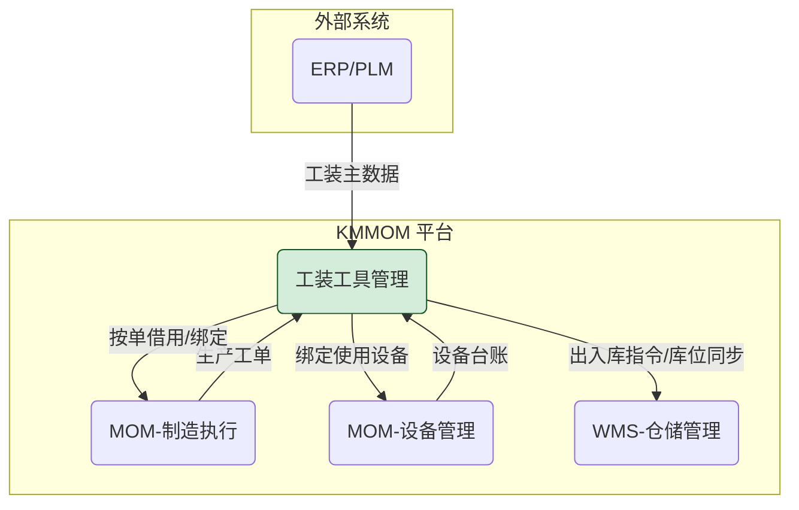


- **上游系统**:
    - **ERP/PLM**: 接收工装基础信息（如图号、物料编码），作为工装台账创建的源头数据。
- **下游系统**:
    - **WMS (仓库管理系统)**: 若企业有独立的WMS，本系统将与WMS集成，处理工装的出入库指令和库位同步。若无，本系统将承担轻量级的库位管理功能。
- **关联系统**:
    - **MOM-制造执行**: 与生产工单紧密关联，实现工装的按单借用和现场绑定。
    - **MOM-设备管理**: 与设备台账关联，记录工装在特定设备上的使用历史。


#### 2.2.2 模块/核心功能应用架构
```mermaid
graph LR
    A(工装工具管理) --> A1("基础数据配置")
    A --> A2("台账与履历管理")
    A --> A7("库存管理")
    A --> A5("检定与维保管理")
    A --> A6("工装审批管理")
    A --> A11("报表与看板")

    subgraph A1 [基础数据配置]
        A1_1("工装类别管理")
        A1_2("工装主数据管理")
        A1_3("保养策略配置")
        A1_4("检定策略配置")
    end

    subgraph A2 [台账与履历管理]
        A2_1("工装台账管理")
        A2_2("工装借还管理")
        A2_3("工装封存管理")
        A2_4("工装报废管理")
    end

    subgraph A7 [库存管理]
        A7_1("工装入库管理")
        A7_2("工装出库管理")
        A7_3("工装库存看板")
        A7_4("工装库存盘点")
        A7_5("共享库存查询")
        A7_6("工装调拨出库管理")
        A7_7("工装调拨入库管理")
    end

    subgraph A5 [检定与维保管理]
        A5_1("工装检定任务管理")
        A5_2("工装保养任务管理")
        A5_3("工装维修任务管理")
    end

    subgraph A6 [工装审批管理]
        A6_1("工装封存审批")
        A6_2("工装调拨出库审批")
        A6_3("工装调拨入库审批")
        A6_4("工装报废审批")
    end

    subgraph A11 [报表与看板]
        A11_1("工装综合看板")
        A11_2("统计报表中心")
    end
```

#### 2.2.3 功能清单

##### 2.2.3.1 基础数据配置

| 页面 (Page) | 功能点 (Function Point) | 功能点描述 |
| :--- | :--- | :--- |
| **`[页面]` 工装类别管理** | `[功能]` 查询 | 按类别名称/编码查询，提供多维度查询入口。 |
| | `[功能]` 新增子类别 | 创建新的工装类别。 |
| | `[功能]` 导入 | 通过Excel模板批量创建。 |
| | `[功能]` 导出 | 将当前查询结果导出为Excel文件。 |
| | `[功能]` 查看详情/编辑 | 查看已有类别的详细信息，并在有权限时修改其名称、描述。 |
| | `[功能]` 删除 | 删除未被引用的工装类别。 |
| **`[页面]` 工装主数据管理** | `[功能]` 查询 | 按工装类别、主数据编码/名称查询工装。 |
| | `[功能]` 新增| 定义一个标准的、可被多次实例化的工装主数据模板。 |
| | `[功能]` 导入 | 通过Excel模板批量创建。 |
| | `[功能]` 导出 | 将当前查询结果导出为Excel文件。 |
| | `[功能]` 查看详情/编辑 | 查看工装主数据模板的详细信息，并在有权限时修改其属性信息。 |
| | `[功能]` 删除 | 删除未被台账引用的工装主数据模板。 |
| **`[页面]` 保养策略配置** | `[功能]` 查询 | 按策略名称/编码查询。 |
| | `[功能]` 新增 | 创建新的保养策略，定义策略的触发条件（如时间周期、使用次数）、**保养项目**和**备件需求**。 |
| | `[功能]` 导入 | 通过Excel模板批量创建保养策略。 |
| | `[功能]` 导出 | 将当前查询结果导出为Excel文件。 |
| | `[功能]` 查看详情/编辑 | 查看和修改保养策略内容，包括**保养项目列表**和**备件需求列表**。 |
| | `[功能]` 删除 | 删除未被引用的保养策略。 |
| | `[功能]` 复制 | 基于已有策略快速创建新策略。 |
| **`[页面]` 检定策略配置** | `[功能]` 查询 | 按策略名称/编码查询。 |
| | `[功能]` 新增 | 创建新的检定策略，定义策略的触发条件（如时间周期）和**检定项目**。 |
| | `[功能]` 导入 | 通过Excel模板批量创建检定策略。 |
| | `[功能]` 导出 | 将当前查询结果导出为Excel文件。 |
| | `[功能]` 查看详情/编辑 | 查看和修改检定策略内容，包括**检定项目列表**。 |
| | `[功能]` 删除 | 删除未被引用的检定策略。 |
| | `[功能]` 复制 | 基于已有策略快速创建新策略。 |

##### 2.2.3.2 台账与履历管理

| 页面 (Page) | 功能点 (Function Point) | 功能点描述 |
| :--- | :--- | :--- |
| **`[页面]` 工装台账管理** | `[功能]` 查询 | 按编码、名称、类别、状态、库位等多维度查询工装实例。 |
| | `[功能]` 新增台账 | 创建工装台账。 |
| | `[功能]` 办理入库申请 | 为新工装办理入库申请。 |
| | `[功能]` 借用 | 为选中的工装执行借用登记。 |
| | `[功能]` 归还 | 为选中的工装执行归还登记。 |
| | `[功能]` 报修 | 为选中的工装创建维修任务。 |
| | `[功能]` 报检 | 为选中的量具/检具创建检定任务。|
| | `[功能]` 保养 | 为选中的工装创建保养任务。 |
| | `[功能]` 封存 | 为选中的工装发起封存申请。 |
| | `[功能]` 启封 | 为选中的工装发起启封申请。 |
| | `[功能]` 调拨出库 | 为选中的工装发起跨组织调拨申请。 |
| | `[功能]` 共享 | 为选中的工装发起共享申请。 |
| | `[功能]` 报废 | 为选中的工装发起报废申请。 |
| | `[功能]` 查看详情 | 查看工装实例的详细信息以及工装实例的全生命周期事件。|
| | `[功能]` 删除 | 逻辑删除无业务记录的工装实例。 |
| | `[功能]` 导入 | 通过Excel模板批量创建工装台账。 |
| | `[功能]` 导出 | 将当前查询结果导出为Excel文件。 |
| **`[页面]` 工装借还管理** | `[功能]` 查询 | 按单号、借用人、状态等多维度查询。 |
| | `[功能]` 新增借用单 | 为临时需求发起借用申请。 |
| | `[功能]` 归还 | 扫码执行归还，并记录检查结论（如：完好/需维修）。若选择"需维修"，系统将自动更新工装状态为"待维修"并通知管理员。 |
| | `[功能]` 导出 | 将当前查询结果导出为Excel文件。 |
| | `[功能]` 查看详情 | 查看借用单的详细信息。 |
| **`[页面]` 工装封存管理** | `[功能]` 查询 | 查询所有封存申请单。 |
| | `[功能]` 新增封存申请 | 对长期闲置工装发起封存。 |
| | `[功能]` 确认封存 | 对已封存工装发起确认封存。 |
| | `[功能]` 导出 | 将当前查询结果导出为Excel文件。 |
| | `[功能]` 查看详情 | 查看封存申请单的详细信息和审批进度。若该单据关联了审批流，详情页需包含审批状态和审批历史的可视化展示。 |
| | `[功能]` 编辑 | 修改封存申请单的详细信息。 |
| | `[功能]` 审批 | 在列表页对单个或多个待审单据执行快捷审批（同意/驳回）。 |
| | `[功能]` 取消 | 在特定状态下取消封存。 |
| **`[页面]` 工装启封管理** | `[功能]` 查询 | 查询所有启封申请单。 |
| | `[功能]` 新增启封申请 | 对长期闲置工装发起启封。 |
| | `[功能]` 确认启封 | 对已封存工装发起确认启封。 |
| | `[功能]` 导出 | 将当前查询结果导出为Excel文件。 |
| | `[功能]` 查看详情 | 查看启封申请单的详细信息和审批进度。若该单据关联了审批流，详情页需包含审批状态和审批历史的可视化展示。 |
| | `[功能]` 编辑 | 修改启封申请单的详细信息。 |
| | `[功能]` 审批 | 在列表页对单个或多个待审单据执行快捷审批（同意/驳回）。 |
| | `[功能]` 取消 | 在特定状态下取消启封。 |
| **`[页面]` 工装报废管理** | `[功能]` 查询 | 查询所有报废申请单。 |
| | `[功能]` 新增报废申请 | 为无价值工装提交报废申请。 |
| | `[功能]` 确认报废 | 对已报废工装发起确认报废。 |
| | `[功能]` 导出 | 将当前查询结果导出为Excel文件。 |
| | `[功能]` 查看详情 | 查看报废申请单的详细信息和审批进度。若该单据关联了审批流，详情页需包含审批状态和审批历史的可视化展示。 |
| | `[功能]` 编辑 | 修改报废申请单的详细信息。 |
| | `[功能]` 审批 | 在列表页对单个或多个待审单据执行快捷审批（同意/驳回）。 |
| | `[功能]` 取消 | 在特定状态下取消报废。 

##### 2.2.3.3 库存管理

| 页面 (Page) | 功能点 (Function Point) | 功能点描述 |
| :--- | :--- | :--- |
| **`[页面]` 工装入库管理** | `[功能]` 查询 | 按入库申请单号、入库类型、创建人等查询。 |
| | `[功能]` 新增入库申请单 | 创建一张新的入库申请单（如采购入库/制造入库），在表单中完成工装基础信息的登记，可以确认或者直接确认入库。 |
| | `[功能]` 确认入库 | 确认入库申请单，将工装实例移动到库存中，并更新相关台账信息。 |
| | `[功能]` 导出 | 将当前查询结果导出为Excel文件。 |
| | `[功能]` 查看详情 | 查看入库申请单的详细信息。 |
| | `[功能]` 编辑 | 修改入库申请单的详细信息。 |
| | `[功能]` 取消 | 在特定状态下取消入库申请单。 |
| **`[页面]` 工装出库管理** | `[功能]` 查询 | 按出库申请单号、申请人、工装编码/名称、申请时间、出库类型（借用、调拨等）等维度查询。 |
| | `[功能]` 新增出库申请单 | 员工为生产或日常工作需要，发起工装出库申请（如借用）。 |
| | `[功能]` 导出 | 将当前查询结果导出为Excel文件。 |
| | `[功能]` 查看详情 | 查看出库申请单的详细信息。 |
| | `[功能]` 编辑 | 修改出库申请单的详细信息。 |
| | `[功能]` 取消 | 在特定状态下取消出库申请单。 |
| **`[页面]` 工装库存管理** | `[功能]` 查询 | 查询工装库存。 |
| | `[功能]` 移位 | 为选中的工装发起进行移位。 |
| | `[功能]` 导出 | 将当前查询结果导出为Excel文件。 |
| **`[页面]` 工装库存盘点** | `[功能]` 查询 | 查询所有库存盘点单。 |
| | `[功能]` 新增盘点单 | 创建新的盘点单，选择盘点范围。 |
| | `[功能]` 导出 | 将当前查询结果导出为Excel文件。 |
| | `[功能]` 查看详情 | 查看盘点单的范围和进度。 |
| | `[功能]` 编辑 | 修改盘点单的范围和进度。 |
| | `[功能]` 实盘录入 | 录入实盘数量，系统生成差异报告。 |
| | `[功能]` 差异过账 | 差异过账后提交盘点，系统自动更新工装状态和履历。 |
| | `[功能]` 取消 | 在特定状态下取消盘点。 |
| **`[页面]` 共享库存查询** | `[功能]` 查询 | 查询集团内其他工厂的闲置工装资源。 |
| | `[功能]` 导出 | 将当前查询结果导出为Excel文件。 |
| | `[功能]` 调拨申请 | 一键发起跨工厂调拨申请。 |
| | `[功能]` 查看详情 | 查看共享库存的详细信息。 |
| **`[页面]` 工装调拨管理** | `[功能]` 查询 | 查询我方发起的调拨申请单据。 |
| | `[功能]` 新增调拨申请单 | 主动向目标工厂发起调拨申请。 |
| | `[功能]` 查看详情 | 查看调拨申请单的详细信息和审批、物流状态。 |
| | `[功能]` 编辑 | 修改调拨申请单的详细信息。 |
| | `[功能]` 审批 | 对待我方审批的调拨申请单进行处理（如：调出审批）。 |
| | `[功能]` 确认调拨 | 确认工装调拨出库，更新台账。 |
| | `[功能]` 取消 | 在特定状态下取消调拨。 |
| | `[功能]` 导出 | 将当前查询结果导出为Excel文件。 |

##### 2.2.3.4 检定与维保管理

| 页面 (Page) | 功能点 (Function Point) | 功能点描述 |
| :--- | :--- | :--- |
| **`[页面]` 工装检定任务管理** | `[功能]` 查询 | 按任务单号、工装、状态等查询。 |
| | `[功能]` 新增检定任务 | 创建计划外的检定任务。**创建时，系统自动从关联的检定策略带入标准的作业内容（检定项）**。 |
| | `[功能]` 导出 | 将当前查询结果导出为Excel文件。 |
| | `[功能]` 查看详情/编辑 | 查看和修改检定任务的详细信息。|
| | `[功能]` 执行检定 | 记录**检定项的结果**（合格/不合格）并上传证书。若结果为"不合格"，系统将自动更新工装状态为"待维修"并通知管理员。 |
| | `[功能]` 完成检定 | 完成检定后提交任务，系统自动更新工装状态和履历。 |
| | `[功能]` 取消 | 在特定状态下取消检定任务。 |
| | `[功能]` 上传附件 | 支持上传检定证书、测试报告等。 |
| |`[功能]` 自动生成检定任务 | 系统根据检定策略自动生成检定任务。 |
| **`[页面]` 工装保养任务管理** | `[功能]` 查询 | 按任务单号、工装、类别、状态等查询。 |
| | `[功能]` 新增保养任务 | 创建计划外的保养任务。**创建时，系统自动从关联的保养策略带入标准的作业内容（保养项）**。 |
| | `[功能]` 导出 | 将当前查询结果导出为Excel文件。 |
| | `[功能]` 查看详情/编辑 | 查看和修改保养任务的详细信息。 |
| | `[功能]` 执行保养 | 打开保养执行弹窗，用于记录保养内容、**保养记录（备件消耗、工时）**等，并支持上传附件（如现场照片）。 |
| | `[功能]` 完成保养 | 完成保养后提交任务，系统自动更新工装状态和履历。 |
| | `[功能]` 取消 | 在特定状态下取消保养任务。 |
| | `[功能]` 上传附件 | 支持上传保养记录、测试报告等。 |
| |`[功能]` 自动生成保养任务 | 系统根据保养策略自动生成保养任务。 |
| **`[页面]` 工装维修任务管理** | `[功能]` 查询 | 按维修单号、工装、报修人、状态等查询。 |
| | `[功能]` 新增维修任务 | 针对故障工装，创建维修任务。 |
| | `[功能]` 导出 | 将当前查询结果导出为Excel文件。 |
| | `[功能]` 查看详情/编辑 | 查看和修改维修任务的详细信息。 |
| | `[功能]` 执行维修 | 记录维修内容、**保养记录（工时和备件消耗）**，并更新工装状态。 |
| | `[功能]` 完成维修 | 完成维修后提交任务，系统自动更新工装状态和履历。 |
| | `[功能]` 取消 | 在特定状态下取消维修任务。 |
| | `[功能]` 上传附件 | 支持上传维修记录、测试报告等。 |

##### 2.2.3.5 工装审批管理

| 页面 (Page) | 功能点 (Function Point) | 功能点描述 |
| :--- | :--- | :--- |
| **`[页面]` 工装封存审批** | `[功能]` 查询 | 在独立的审批页面，查询待我审批的所有申请单。 |
| | `[功能]` 查看详情 | 查询申请单的详情信息 |
| | `[功能]` 审批 | 根据审批流配置的审批按钮，提供"同意"、"驳回"（附带意见填写框）等核心操作。 |
| | `[功能]` 导出 | 将当前查询结果导出为Excel文件。 |
| **`[页面]` 工装启封审批** | `[功能]` 查询 | 在独立的审批页面，查询待我审批的所有申请单。 |
| | `[功能]` 查看详情 | 查询申请单的详情信息 |
| | `[功能]` 审批 | 根据审批流配置的审批按钮，提供"同意"、"驳回"（附带意见填写框）等核心操作。 |
| | `[功能]` 导出 | 将当前查询结果导出为Excel文件。 |
| **`[页面]` 工装调拨审批** | `[功能]` 查询 | 在独立的审批页面，查询待我审批的所有申请单。 |
| | `[功能]` 查看详情 | 查询申请单的详情信息 |
| | `[功能]` 审批 | 根据审批流配置的审批按钮，提供"同意"、"驳回"（附带意见填写框）等核心操作。 |
| | `[功能]` 导出 | 将当前查询结果导出为Excel文件。 |
| **`[页面]` 工装报废审批** | `[功能]` 查询 | 在独立的审批页面，查询待我审批的所有申请单。 |
| | `[功能]` 查看详情 | 查询申请单的详情信息 |
| | `[功能]` 审批 | 根据审批流配置的审批按钮，提供"同意"、"驳回"（附带意见填写框）等核心操作。 |
| | `[功能]` 导出 | 将当前查询结果导出为Excel文件。 |

##### 2.2.3.6 报表与看板【暂不开发】

| 页面 (Page) | 功能点 (Function Point) | 功能点描述 |
| :--- | :--- | :--- |
| **`[页面]` 工装综合看板** | `[组件]` 工装状态与分布 | 可视化展示所有工装的当前状态、位置分布等。 |
| | `[组件]` 预警中心 | 集中展示待保养、待检定、借用逾期等风险项，并为逾期项提供"催还"等快捷操作。 |
| | `[组件]` 我的待办 | 在看板中聚合所有待我审批的任务，点击可跳转至对应业务页面。 |
| | `[系统功能]` 借用逾期自动检测 | 系统每日自动扫描并识别逾期借用单，在"预警中心"生成高亮提醒。 |
| **`[页面]` 统计报表中心** | `[报表]` 工装利用率分析 | 按类别、部门、时间等多维度分析利用率。 |
| | `[报表]` 维修成本统计 | 按工装、维修类型等多维度分析成本构成。 |
| | `[报表]` 闲置工装分析 | 按闲置天数、价值等维度识别沉睡资产。 |
| **`[页面]` 工装库存看板** | `[功能]` 查询 | 在一个页面通过看板或列表，多维度查看工装库存。 |
| | `[功能]` 导出 | 将当前查询结果导出为Excel文件。 |

##### 2.2.3.7 系统配置

| 页面 (Page) | 功能点 (Function Point) | 功能点描述 |
| :--- | :--- | :--- |
| **`[页面]` 业务组织配置** | `[功能点]` 工装工具管理 | 为工装工具管理模块中的核心业务单据（入库、出库、封存、启封、报废、调拨）独立配置是否启用审批以及绑定的审批流。 |

##### 2.2.3.8 制造执行

| 页面 (Page) | 功能点 (Function Point) | 功能点描述 |
| :--- | :--- | :--- |
| **`[页面]` 制造订单管理【暂不开发】** | `[功能]` 工装申请 | (集成功能点) 在制造订单页面，允许用户为选中的制造订单一键发起工装准备流程。 |
| | `[功能]` 工装齐套检查 | (集成功能点) 在工装准备界面，系统自动列出所需工装清单，并实时分析其齐套状态，支持用户直接创建生产借用单。 |
| **`[页面]` 制造任务管理【暂不开发】** | `[功能]` 报工 | (集成功能点) 在制造任务管理页面，允许用户为选中的任务记录或补录实际使用的工装。 |

##### 2.2.3.9 车间工作台

| 页面 (Page) | 功能点 (Function Point) | 功能点描述 |
| :--- | :--- | :--- |
| **`[页面]` 制造任务派工【暂不开发】** | `[功能]` 报工 | (集成功能点) 在执行报工时，允许操作工记录本次任务实际使用的工装，可从该任务已借用的工装列表中选择。 |
| **`[页面]` 工装检定任务** | `[功能]` 查询 | 按任务单号、工装、状态等查询。 |
| | `[功能]` 查看详情 | 查看检定任务的详细信息。若该单据关联了审批流，详情页需包含审批状态和审批历史的可视化展示。 |
| | `[功能]` 执行检定 | 记录**检定项的结果**（合格/不合格）并上传证书。若结果为"不合格"，系统将自动更新工装状态为"待维修"并通知管理员。 |
| | `[功能]` 完成检定 | 完成检定后提交任务，系统自动更新工装状态和履历。 |
| | `[功能]` 上传附件 | 支持上传检定证书、测试报告等。 |
| **`[页面]` 工装保养任务** | `[功能]` 查询 | 按任务单号、工装、类别、状态等查询。 |
| | `[功能]` 查看详情 | 查看保养任务的详细信息。 |
| | `[功能]` 执行保养 | 打开保养执行弹窗，用于记录保养内容、**保养记录（备件消耗、工时）**等，并支持上传附件（如现场照片）。 |
| | `[功能]` 完成保养 | 完成保养后提交任务，系统自动更新工装状态和履历。 |
| | `[功能]` 上传附件 | 支持上传保养记录、测试报告等。 |
| **`[页面]` 工装维修任务** | `[功能]` 查询 | 按维修单号、工装、报修人、状态等查询。 |
| | `[功能]` 查看详情 | 查看维修任务的详细信息和审批进度。 |
| | `[功能]` 执行维修 | 记录维修内容、**保养记录（工时和备件消耗）**，并更新工装状态。 |
| | `[功能]` 完成维修 | 完成维修后提交任务，系统自动更新工装状态和履历。 |
| | `[功能]` 上传附件 | 支持上传维修记录、测试报告等。 |


#### 2.2.4 核心审批交互
为了更直观地展示用户体验，我们绘制了如下交互流程图：

```mermaid
sequenceDiagram
    participant User as 用户
    participant HomePage as 首页/待办中心
    participant ScrapApprovalPage as 报废申请单审批页
    participant LoanApprovalPage as 借用单审批页
    participant System as 后端系统

    User->>HomePage: 登录系统，查看"我的待办"
    activate HomePage
    HomePage->>System: 请求待办列表
    System-->>HomePage: 返回聚合的待办任务<br/>(1. 报废申请单SP001<br/>2. 借用单LY005)
    HomePage-->>User: 显示待办列表
    deactivate HomePage

    User->>HomePage: 点击"报废申请单SP001"
    activate HomePage
    HomePage-->>User: 跳转至报废申请单审批页
    deactivate HomePage
    
    User->>ScrapApprovalPage: 查看报废工装详情
    activate ScrapApprovalPage
    User->>ScrapApprovalPage: 点击"同意"
    ScrapApprovalPage->>System: 提交审批意见(SP001, 同意)
    System-->>ScrapApprovalPage: 处理成功，任务关闭
    ScrapApprovalPage-->>User: 提示"审批成功"，关闭页面
    deactivate ScrapApprovalPage

    User->>HomePage: 返回待办中心，列表刷新
    Note right of User: 此时待办列表只剩借用单LY005

```

### 2.3 用户体验要求

#### 2.3.1. 可用性目标
- **易学性**: 新用户（如仓库管理员）经过不超过30分钟的培训，应能独立完成核心操作（如扫码出入库）。
- **效率**: 高频操作（如按工单领用、归还登记）的步骤应在5步以内完成。PC端核心查询响应时间不应超过2秒。移动端核心操作（扫码、提交）响应时间不应超过1.5秒。
- **容错性**: 对于关键或不可逆操作（如删除、报废），系统必须提供二次确认机制。对于可预知的用户输入错误（如格式错误），应提供即时、清晰的提示。

#### 2.3.2. 交互要求
- **一致性**: 所有页面的布局、图标、按钮样式应遵循KMMOM设计规范，保持高度一致。
- **反馈**: 任何用户操作，系统都应提供及时反馈。对于耗时超过2秒的操作，应提供明确的加载状态提示。
- **端侧适配要求**: 整体以PC端为主，移动端为重要补充。PC端设计应充分利用大屏幕优势，保证信息密度与操作效率；移动端（PDA/手机）则聚焦现场核心操作（如出入库、盘点、报修），设计上遵循极简、高效、易于单手操作的原则。

#### 2.3.3. 可访问性要求
- 产品设计应遵循KMMOM平台统一的可访问性设计规范，以确保所有用户都能无障碍地使用。关键要求包括但不限于：
  - **色彩对比度**: 文本与背景的色彩对比度应符合WCAG AA级标准。
  - **键盘可访问**: 所有交互元素都必须能通过键盘进行访问和操作。
  - **标签与提示**: 所有输入框、图标按钮都应有关联的、清晰的文本标签或提示。

---

## 4. 约束条件

### 4.1 业务约束
- 工装的`当前状态`只能由业务流程驱动变更，不允许用户在任何界面上手动修改。
- 只有`在库`状态的工装才能被借用、盘点或修改库位。
- 检定不合格的量具，必须转入维修或报废流程，在修复合格前禁止流转到生产环节。

### 4.2 技术约束
- **浏览器兼容**: PC端应至少兼容Chrome、Firefox、Edge等主流浏览器的最新两个大版本。
- **移动端兼容**: 移动端功能需在主流Android和iOS系统上进行测试。优先适配工业级PDA设备。
- **离线支持**: 移动端核心功能模块需支持离线数据缓存与同步机制。

### 4.3 性能约束
- **响应时间**: 核心查询操作(如工装台账查询、履历查询)在并发用户数为50的情况下，95%的请求应在2秒内返回结果。
- **数据处理能力**: 系统应支持10万级别以上的工装档案管理，并能处理每日千次以上的出入库业务流程，无明显性能下降。
- **并发用户**: 系统应能支持至少100个用户同时在线进行常规操作。

### 4.4 安全约束
- **权限控制**: 系统必须具备严格的角色与权限控制体系。用户只能访问和操作其被授权的功能和数据范围。
- **操作日志**: 所有关键操作都必须有详细的操作日志，记录操作人、时间、IP地址及操作内容。

### 4.5 前瞻性设计与扩展性
为了应对不同企业在业务流程细节上的多样化需求，并为系统未来的发展预留充足的扩展空间，本模块在架构设计层面遵循**"事件-动作挂钩"**的原则。

- **设计哲学**：我们将系统的核心流程看作是一系列关键**业务事件（Events）**的集合（如"归还检查不合格"、"借用逾期"等）。系统本身提供一个标准化的**原子动作库（Actions）**（如"创建保养任务"、"发送通知"等）。我们致力于将"事件的触发"与"动作的执行"进行解耦。

- **当前实现**：在当前版本中，系统将以"硬编码"的方式，为每个核心事件配置一组默认的、符合行业最佳实践的响应动作。例如，当"归还检查不合格"事件发生时，系统默认执行"创建保养任务"这一动作。

- **未来扩展**：该设计原则为未来的高阶定制化能力奠定了坚实的基础。在后续的版本迭代中，当面临更复杂的客户需求时，我们可以平滑地演进为一个可视化的流程配置中心。届时，企业管理员将能以"乐高积木"的方式，为每个业务事件自由编排和组合所需的响应动作（例如，当"归还检查不合格"时，同时执行"变更工装状态为待鉴定"和"发送通知给技术员"两个动作），而无需进行代码级的二次开发。这确保了系统在保持当前版本稳定易用的同时，具备了应对未来挑战的强大生命力。

---

## 5 质量保证

### 5.1 验收标准
各功能的详细验收标准已在第3章中随功能点逐一描述。本章节定义通用的、全局性的验收标准。
- **数据一致性**: 任何业务操作导致的数据变更，必须在所有相关视图（列表、详情、报表）中保持一致。
- **流程正确性**: 工装的状态必须严格按照`2.1.1 业务主流程`中定义的状态机进行流转，不允许出现非法状态跳转。
- **履历完整性**: 所有对工装台账产生影响的关键操作（创建、出入库、维修、保养、检定、报废、信息变更），都必须在工装履历中留下可追溯的记录。

### 5.2 测试要求
- **端到端场景测试**: 需设计至少覆盖80%核心业务流程的端到端（E2E）自动化测试用例，**必须包含移动端与PC端的交互场景**。
- **异常/边界测试**: 需重点测试`2.1.3 使用场景设计`中定义的异常场景，并补充对批量处理、高并发、**网络中断与恢复**等边界条件的测试。
- **回归测试**: 在每次版本迭代后，必须执行完整的回归Test测试套件，确保新功能没有破坏现有逻辑。

---

