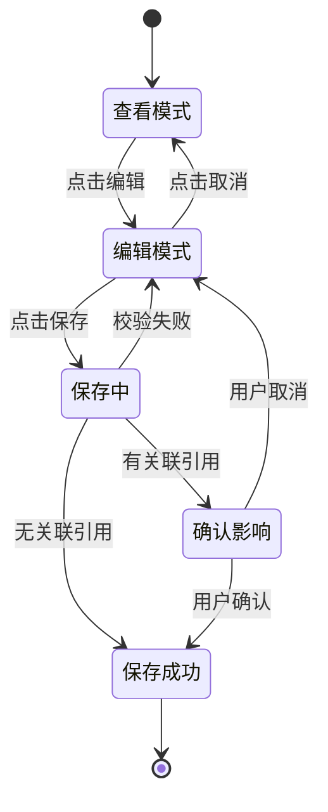
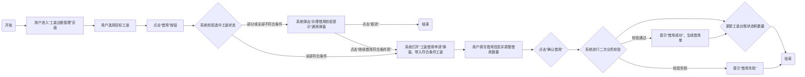
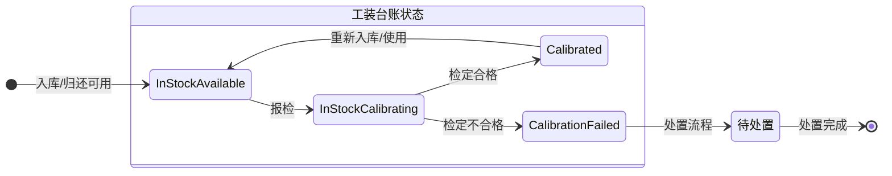
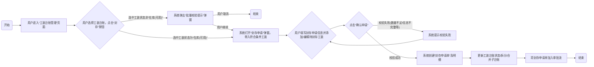
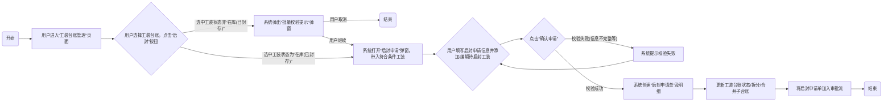

# 产品需求文档：DNW30900-工装工具管理 - V5.0

## 3. 页面&功能设计

### 3.1 基础数据配置

#### 3.1.1 `[页面]` 工装类别管理

- **概述**

本页面是工装工具管理系统的基础数据核心，通过树状结构对工装进行科学分类，为后续的主数据管理、保养检定策略配置提供标准化的分类依据。

- **功能清单**

| 功能点 (Function Point) | 功能点描述 |
| :--- | :--- |
| `[功能]` 查询 | 按类别名称/编码查询，提供多维度查询入口。 |
| `[功能]` 新增子类别 | 创建新的工装类别。 |
| `[功能]` 导入 | 通过Excel模板批量创建。 |
| `[功能]` 导出 | 将当前查询结果导出为Excel文件。 |
| `[功能]` 查看详情/编辑 | 查看已有类别的详细信息，并在有权限时修改其名称、描述。 |
| `[功能]` 删除 | 删除未被引用的工装类别。 |

##### 3.1.1.1 `[功能]` 查询

**概述**

提供按工装类别的名称或编码进行模糊搜索的能力，以快速定位目标类别。

**用户场景与核心路径**

- **核心场景 (UC-Category-Query-01)**: 设备管理员小李需要查找所有与“扳手”相关的工装类别，以便进行后续的维护策略调整。他进入工装类别管理页面，在搜索框中输入“扳手”，系统立即在左侧的树状结构中筛选并高亮显示所有名称或编码包含“扳手”的类别及其父类别。

**界面原型描述**

- 本功能主要体现在`工装类别管理`页面的左上角区域。
- **核心组件**:
    - **`搜索框`**: [输入框] 用户在此输入类别名称或编码的关键信息进行查询。
    - **`查询按钮`**: [图标按钮] 点击后触发查询逻辑。

**处理逻辑**

- **用户流程图 (User Flow Diagram)**

  ```mermaid
  flowchart LR
      A(开始) --> B[用户进入“工装类别管理”页面];
      B --> C[在搜索框输入查询条件];
      C --> D{点击“查询”按钮或按回车};
      D --> E[系统根据输入内容，在类别树中进行模糊匹配];
      E -- 匹配到结果 --> F[在树中高亮显示匹配的类别，并展开其所有父节点];
      E -- 未匹配到结果 --> G[树结构清空，并显示“未找到相关类别”的提示];
      F --> H(结束);
      G --> H(结束);
  ```

- **叙事化逻辑流 (Narrative Logic Flow)**

  1.  **前置条件**: 无。
  2.  **流程触发**: 用户在`工装类别管理`页面的搜索框中输入文本。
  3.  **核心处理**:
      -   用户点击查询按钮或按下回车键后，系统获取搜索框中的关键词。
      -   系统以后端服务对工装类别数据的`类别名称`和`类别编码`两个字段进行模糊查询（`LIKE %关键词%`）。
      -   查询逻辑会返回所有匹配到的类别节点以及它们的所有父节点路径，以确保树形结构的完整性。
  4.  **后置影响**: 
      -   查询成功时，左侧的类别树将只展示查询结果，匹配的节点高亮，非匹配的节点被隐藏。
      -   如果无结果，则树形区域显示空状态提示。

**验收标准**

| 场景ID | 场景描述 | 前置条件 | 操作步骤 | 预期结果 |
| :--- | :--- | :--- | :--- | :--- |
| AC-Category-Query-01 | 按名称模糊查询成功 | 1. 系统中存在类别：“手动工具 > 扳手 > 扭力扳手”。<br>2. 存在类别：“电动工具 > 电动扳手”。 | 1. 用户进入`工装类别管理`页面。<br>2. 在搜索框输入“扳手”。<br>3. 点击查询。 | 1. **界面**：左侧类别树显示“手动工具”和“电动工具”两个根节点，并均展开。<br>2. **数据**：“手动工具”下显示“扳手”，“扳手”下显示“扭力扳手”。“电动工具”下显示“电动扳手”。所有包含“扳手”的节点应高亮显示。<br>3. **状态**：右侧详情区域清空或显示默认提示。 |
| AC-Category-Query-02 | 按编码精确查询成功 | 1. 系统中存在类别：“手动工具 > 扳手”，其编码为`C01-01`。 | 1. 用户进入`工装类别管理`页面。<br>2. 在搜索框输入“C01-01”。<br>3. 点击查询。 | 1. **界面**：左侧类别树仅显示“手动工具”及其子节点“扳手”，并展开。<br>2. **数据**：“扳手”节点高亮显示。 |
| AC-Category-Query-03 | 查询无结果 | 1. 系统中不存在任何名称或编码包含“螺丝刀”的类别。 | 1. 用户进入`工装类别管理`页面。<br>2. 在搜索框输入“螺丝刀”。<br>3. 点击查询。 | 1. **界面**：左侧类别树区域显示空状态，并有文字提示，如“未找到相关类别”。 |

---

##### 3.1.1.2 `[功能]` 新增
**概述**

在已有的工装类别下创建新的子类别，以构建层级化的类别体系。

**用户场景与核心路径**

- **核心场景 (UC-Category-Add-01)**: 管理员小张发现需要为“测量工具”新增一个“激光测距仪”的子类别。他在类别树中选中“测量工具”，点击“新增子类别”按钮，在弹出的窗口中填写编码和名称后，成功创建了新类别。

**界面原型描述**

- **触发方式**: 在左侧类别树中选中一个父类别后，点击页面右上方的`新增子类别`按钮。
- **`新增子类别`弹窗核心组件**:
    - **信息展示区**:
        - `父级类别`: [自动带入所选类别名称，只读]
    - **信息输入区**:
        - `类别编码`: [文本输入框，必填，有校验规则]
        - `类别名称`: [文本输入框，必填]
        - `描述`: [多行文本框，可选]
    - **操作按钮**:
        - `确认`: [按钮]
        - `取消`: [按钮]

**处理逻辑**

- **用户流程图 (User Flow Diagram)**

  ```mermaid
  flowchart LR
      A(开始) --> B[用户在类别树选中一个父类别];
      B --> C[点击“新增子类别”按钮];
      C --> D[系统弹出“新增子类别”对话框];
      D --> E[用户填写类别编码、名称等信息];
      E --> F{点击“确认”};
      F --> G{系统校验编码是否唯一、名称是否重复等};
      G -- 校验通过 --> H[在数据库中创建新类别记录，并关联父类别];
      H --> I[关闭弹窗，刷新类别树，并自动选中新创建的类别];
      G -- 校验失败 --> J[在弹窗内提示错误信息，如“编码已存在”];
      J --> E;
      I --> K(结束);
  ```

- **叙事化逻辑流 (Narrative Logic Flow)**

  1.  **前置条件**: 用户必须拥有“工装类别管理”的编辑权限。
  2.  **流程触发**: 用户在类别树中选中任意一个类别节点，然后点击`新增子类别`按钮。
  3.  **数据填写与校验**:
      -   用户必须输入`类别编码`，编码在整个系统中必须唯一。
      -   用户必须输入`类别名称`，在同一父类别下，名称不能重复。
  4.  **核心处理**: 用户点击`确认`后，系统执行以下操作：
      -   **唯一性校验**: 检查`类别编码`是否已存在于数据库中。检查在同一父类别下，`类别名称`是否已存在。
      -   **数据持久化**: 校验通过后，将新类别的信息（编码、名称、描述、父类别ID）存入数据库。
  5.  **后置影响**: 
      -   新增成功后，左侧的类别树会自动刷新，新创建的子类别会出现在其父类别下。
      -   新创建的类别会被默认选中，右侧详情区展示其信息。

**验收标准**

| 场景ID | 场景描述 | 前置条件 | 操作步骤 | 预期结果 |
| :--- | :--- | :--- | :--- | :--- |
| AC-Category-Add-01 | 成功新增子类别 | 1. 用户拥有编辑权限。<br>2. 类别树中存在“测量工具”类别。 | 1. 用户选中“测量工具”。<br>2. 点击`新增子类别`。<br>3. 在弹窗中输入编码“C02-01”，名称“激光测距仪”。<br>4. 点击`确认`。 | 1. **界面**：弹窗关闭，左侧类别树刷新，“测量工具”下出现新的子节点“激光测距仪”。<br>2. **数据**：数据库中新增一条类别记录，其父类别为“测量工具”。<br>3. **状态**：新节点“激光测距仪”被自动选中。 |
| AC-Category-Add-02 | 因编码重复新增失败 | 1. 用户拥有编辑权限。<br>2. 系统中已存在编码为“C01-01”的类别。 | 1. 用户选中任意类别，点击`新增子类别`。<br>2. 在弹窗中输入编码“C01-01”，名称“任意名称”。<br>3. 点击`确认`。 | 1. **界面**：弹窗不关闭，在`类别编码`输入框下方显示错误提示：“类别编码已存在”。<br>2. **数据**：数据库没有新增任何记录。 |
| AC-Category-Add-03 | 因同级下名称重复新增失败 | 1. 用户拥有编辑权限。<br>2. “测量工具”下已存在名为“卡尺”的子类别。 | 1. 用户选中“测量工具”。<br>2. 点击`新增子类别`。<br>3. 在弹窗中输入编码“C02-02”，名称“卡尺”。<br>4. 点击`确认`。 | 1. **界面**：弹窗不关闭，在`类别名称`输入框下方显示错误提示：“该类别下已存在同名子类别”。<br>2. **数据**：数据库没有新增任何记录。 |

---

##### 3.1.1.3 `[功能]` 导入
**概述**

通过上传预定义格式的Excel文件，批量创建工装类别及其层级关系。

**用户场景与核心路径**

- **核心场景 (UC-Category-Import-01)**: 项目初期，管理员小王需要一次性录入上百个工装类别。他下载了系统提供的Excel模板，按照要求填写了所有类别的编码、名称、父类别编码等信息，然后通过导入功能一次性将所有类别数据录入系统，大大提高了效率。

**界面原型描述**

- **触发方式**: 点击页面右上方的`导入`按钮。
- **`导入`功能交互流程**:
    1.  点击`导入`按钮，弹出`导入数据`对话框。
    2.  对话框中提供`下载模板`链接，用户可下载标准格式的Excel模板。
    3.  用户点击`上传文件`按钮，选择本地编辑好的Excel文件。
    4.  上传后，系统进行数据预校验，并在对话框中显示校验结果（成功多少条，失败多少条，并提供失败原因下载）。
    5.  用户确认无误后，点击`确认导入`，完成数据写入。

**处理逻辑**

- **用户流程图 (User Flow Diagram)**

  ```mermaid
  flowchart LR
      A(开始) --> B[用户点击“导入”按钮];
      B --> C[系统弹出导入对话框];
      C --> D[用户下载模板并填写数据];
      D --> E[用户上传填写好的Excel文件];
      E --> F{系统后端解析并校验文件内容};
      F -- 校验成功 --> G[提示“校验通过，可直接导入”];
      F -- 校验失败 --> H[提示“部分数据错误”，并提供错误报告下载链接];
      G --> I{用户点击“确认导入”};
      H --> E; 
      I --> J[系统将数据写入数据库，创建类别];
      J --> K[提示“导入成功”，关闭弹窗并刷新类别树];
      K --> L(结束);
  ```

- **叙事化逻辑流 (Narrative Logic Flow)**

  1.  **前置条件**: 用户拥有编辑权限。
  2.  **流程触发**: 用户点击`导入`按钮。
  3.  **核心处理**:
      -   **模板定义**: Excel模板至少包含`类别编码` (唯一), `类别名称`, `父类别编码` (用于建立层级关系), `描述`等列。
      -   **文件校验**: 上传后，后端服务会逐行校验Excel数据。校验规则包括：
          -   必填项（编码、名称）是否为空。
          -   `类别编码`是否在本次上传的文件中或数据库中已存在。
          -   `父类别编码`是否存在于数据库或本次上传的文件中。如果父类别编码为空，则该类别为根类别。
          -   同一父类别下，子类别名称是否重复。
      -   **数据导入**: 用户确认导入后，系统按照父子关系顺序，逐条将校验通过的数据插入数据库。先插入无父节点的根类别，再依次插入子类别。
  4.  **后置影响**: 导入成功后，类别树刷新，展示所有新导入的类别及其正确的层级结构。

**验收标准**

| 场景ID | 场景描述 | 前置条件 | 操作步骤 | 预期结果 |
| :--- | :--- | :--- | :--- | :--- |
| AC-Category-Import-01 | 成功导入多层级类别 | 1. 用户拥有编辑权限。<br>2. Excel文件中包含根类别、二级类别、三级类别，且父子关系正确，编码均唯一。 | 1. 用户点击`导入`。<br>2. 上传准备好的Excel文件。<br>3. 系统校验通过。<br>4. 用户点击`确认导入`。 | 1. **界面**：提示“导入成功”，类别树刷新，完整展示Excel中定义的层级结构。<br>2. **数据**：所有Excel中的类别数据均已正确写入数据库。 |
| AC-Category-Import-02 | 因部分数据错误导入失败 | 1. 用户拥有编辑权限。<br>2. Excel文件中某行的类别编码与数据库中已有编码重复。 | 1. 用户点击`导入`。<br>2. 上传该Excel文件。<br>3. 系统进行校验。 | 1. **界面**：提示“数据校验失败”，并显示失败的条数和原因（如：第5行类别编码重复）。提供下载错误详情的链接。<br>2. **数据**：数据库无任何变更。 |
| AC-Category-Import-03 | 因父类别不存在导入失败 | 1. 用户拥有编辑权限。<br>2. Excel文件中某行的`父类别编码`填写了一个不存在的编码。 | 1. 用户点击`导入`。<br>2. 上传该Excel文件。<br>3. 系统进行校验。 | 1. **界面**：提示“数据校验失败”，并显示失败的条数和原因（如：第8行父类别编码不存在）。<br>2. **数据**：数据库无任何变更。 |

##### 3.1.1.4 `[功能]` 导出
**概述**

将当前工装类别树中的所有数据（或查询结果）导出为Excel文件，便于离线查看或数据备份。用户可通过导出选项弹窗确认具体的导出数据范围。

**用户场景与核心路径**

- **核心场景 (UC-Category-Export-01)**: 审计人员需要一份完整的工装类别清单进行年度盘点。管理员小李在工装类别管理页面，点击"导出"按钮，系统弹出导出选项弹窗，小李确认导出当前查询条件下的所有数据，系统生成一个包含所有类别及其层级信息的Excel文件，小李将其提供给审计人员。

**界面原型描述**

- **触发方式**: 点击页面右上方的`导出`按钮。
- **交互流程**: 
  1. 点击`导出`按钮后，系统弹出"导出选项"弹窗
  2. 弹窗中提供两个选项：
     - **导出当前查询条件下所有数据**（默认选中）
     - **导出当前勾选的数据**
  3. 用户确认选择后，点击`确定`按钮开始导出
  4. 系统触发浏览器下载Excel文件

**业务规则**

| 规则ID | 规则描述 | 影响范围 |
| :--- | :--- | :--- |
| **BR-Category-Export-01** | 导出弹窗默认选中"导出当前查询条件下所有数据"选项 | 导出 |
| **BR-Category-Export-02** | 当用户未勾选任何数据时，"导出当前勾选的数据"选项应置灰不可选 | 导出 |
| **BR-Category-Export-03** | 导出文件格式应与导入模板保持一致，便于数据的重新导入 | 导出 |

**处理逻辑**

- **叙事化逻辑流 (Narrative Logic Flow)**

  1.  **前置条件**: 无。
  2.  **流程触发**: 用户点击`导出`按钮。
  3.  **核心处理**:
      -   **导出选项弹窗**: 系统弹出导出选项确认弹窗，提供两种导出范围选择
      -   **数据范围确认**: 根据用户在弹窗中的选择确定导出数据范围：
          - 选择"导出当前查询条件下所有数据"：导出当前查询条件筛选后的所有数据
          - 选择"导出当前勾选的数据"：仅导出用户在列表中勾选的数据项
      -   **文件生成**: 后端服务根据确认的数据范围，生成一个Excel文件。文件格式应与导入模板一致，包含`类别编码`, `类别名称`, `父类别编码`, `描述`等列，以方便用户基于导出的文件进行修改后再导入。
      -   **文件下载**: 生成文件后，通过HTTP响应头触发浏览器进行下载。
  4.  **后置影响**: 无系统状态变更。

**验收标准**

| 场景ID | 场景描述 | 前置条件 | 操作步骤 | 预期结果 |
| :--- | :--- | :--- | :--- | :--- |
| AC-Category-Export-01 | 导出全部类别 | 1. 系统中存在多个层级的工装类别。<br>2. 用户未执行任何查询操作。 | 1. 用户进入`工装类别管理`页面。<br>2. 点击`导出`按钮。 | 1. **界面**：浏览器开始下载一个名为“工装类别.xlsx”的文件。<br>2. **数据**：打开下载的Excel文件，其中包含了系统中所有的工装类别数据，并且`父类别编码`字段正确表示了其层级关系。 |
| AC-Category-Export-02 | 导出查询结果 | 1. 用户在搜索框中输入“扳手”并执行了查询。<br>2. 类别树中只显示了与“扳手”相关的类别。 | 1. 用户点击`导出`按钮。 | 1. **界面**：浏览器开始下载一个Excel文件。<br>2. **数据**：打开下载的Excel文件，其中只包含与“扳手”相关的类别数据。 |

---

##### 3.1.1.5 `[功能]` 查看详情/编辑
**概述**

查看选定类别的详细信息，并在有权限时进行修改。

**用户场景与核心路径**

- **核心场景 (UC-Category-Edit-01)**: 管理员发现“扭力扳手”类别名称需要修改为“扭矩扳手”，并希望能够立即生效。

**界面原型描述**

- **触发方式**: 在左侧类别树中点击任意一个类别节点。
- **`详情/编辑`区域 (页面右侧)**:
    - **信息展示/输入区**:
        - `父级类别`: [只读]
        - `类别编码`: [只读]
        - `类别名称`: [文本输入框，可编辑]
        - `描述`: [多行文本框，可编辑]
    - **关联策略区**:
        - `默认保养策略`: [下拉选择框，可搜索，数据源为保养策略配置]
        - `默认检定策略`: [下拉选择框，可搜索，数据源为检定策略配置]
    - **操作按钮**:
        - `保存`: [按钮，仅在有修改时可用]
        - `取消`: [按钮，仅在有修改时可用]

**处理逻辑**

- **用户流程图 (User Flow Diagram)**

  ```mermaid
  flowchart LR
      A(开始) --> B[用户在类别树中选中一个类别];
      B --> C[系统在右侧区域加载并显示该类别的详细信息];
      C --> D{用户是否修改了信息？};
      D -- 是 --> E[用户修改名称、描述或关联的策略];
      E --> F[“保存”和“取消”按钮变为可用];
      F --> G{用户点击“保存”};
      G --> H{系统校验数据};
      H -- 校验通过 --> I[更新数据库中的类别信息];
      I --> J[提示“保存成功”，按钮变回不可用状态];
      H -- 校验失败 --> K[提示错误信息];
      K --> E;
      G -- 用户点击“取消” --> L[撤销所有修改，恢复到保存前的状态];
      L --> C;
      D -- 否 --> M(结束);
      J --> M;
  ```

- **叙事化逻辑流 (Narrative Logic Flow)**

  1.  **前置条件**: 用户拥有“工装类别管理”的查看权限。若要编辑，则需编辑权限。
  2.  **流程触发**: 用户在左侧类别树中单击一个类别节点。
  3.  **核心处理**:
      -   **数据加载**: 系统根据选中的类别ID，从后端获取其详细信息（包括已关联的策略ID和名称），并填充到右侧的表单中。
      -   **编辑与保存**: 当用户修改了任何可编辑字段后，`保存`按钮被激活。点击保存时，系统将更新后的数据提交到后端。后端需要校验同级类别名称是否重复。
      -   **策略关联**: 用户可以从下拉列表中选择已配置好的保养和检定策略。保存时，将策略的ID与类别进行关联。
  4.  **后置影响**: 保存成功后，该类别下的所有工装主数据若未单独指定策略，将默认继承此处设置的策略。

**验收标准**

| 场景ID | 场景描述 | 前置条件 | 操作步骤 | 预期结果 |
| :--- | :--- | :--- | :--- | :--- |
| AC-Category-Edit-01 | 成功修改类别名称 | 1. 用户拥有编辑权限。<br>2. 存在类别“扳手”。 | 1. 用户选中“扳手”。<br>2. 将其名称修改为“特种扳手”。<br>3. 点击`保存`。 | 1. **界面**：提示“保存成功”，右侧表单中的名称更新，左侧树节点上的名称也同步更新为“特种扳手”。<br>2. **数据**：数据库中对应记录的名称字段已更新。 |
| AC-Category-Edit-02 | 成功关联检定策略 | 1. 用户拥有编辑权限。<br>2. 系统中已配置了名为“量具半年检”的检定策略。<br>3. 类别“卡尺”当前未关联任何检定策略。 | 1. 用户选中“卡尺”。<br>2. 在`默认检定策略`下拉框中选择“量具半年检”。<br>3. 点击`保存`。 | 1. **界面**：提示“保存成功”，`默认检定策略`字段显示“量具半年检”。<br>2. **数据**：数据库中“卡尺”类别记录已成功关联“量具半年检”策略的ID。 |
| AC-Category-Edit-03 | 因名称重复修改失败 | 1. 用户拥有编辑权限。<br>2. “手动工具”下已存在类别“锤子”。<br>3. “手动工具”下存在另一个类别“榔头”。 | 1. 用户选中“榔头”。<br>2. 将其名称修改为“锤子”。<br>3. 点击`保存`。 | 1. **界面**：提示错误信息：“该类别下已存在同名子类别”。<br>2. **数据**：“榔头”的名称未被修改。 |

---

##### 3.1.1.6 `[功能]` 删除
**概述**

删除未被任何工装主数据或台账引用的、且没有子类别的工装类别。

**用户场景与核心路径**

- **核心场景 (UC-Category-Delete-01)**: 管理员小张在整理类别时，发现一个错误创建且未被使用的“临时类别”。他在类别树中选中该类别，点击“删除”按钮，在确认提示后，该类别被成功移除。

**界面原型描述**

- **触发方式**: 在左侧类别树中选中一个叶子节点类别后，点击页面右上方的`删除`按钮。
- **交互**: 
    1.  点击`删除`按钮，系统弹出二次确认对话框，如：“您确定要删除类别 [类别名称] 吗？此操作不可恢复。”
    2.  用户点击`确认`，执行删除。点击`取消`，关闭对话框。

**处理逻辑**

- **用户流程图 (User Flow Diagram)**

  ```mermaid
  flowchart LR
      A(开始) --> B[用户在类别树中选中一个类别];
      B --> C[点击“删除”按钮];
      C --> D{系统校验该类别是否可被删除}; 
      D -- 不可删除 (有子类别或被引用) --> E[提示用户无法删除的原因];
      D -- 可删除 --> F[弹出二次确认对话框];
      F --> G{用户点击“确认”};
      G --> H[从数据库中删除该类别记录];
      H --> I[刷新类别树，被删除的节点消失];
      G -- 用户点击“取消” --> J[关闭对话框];
      E --> K(结束);
      I --> K;
      J --> K;
  ```

- **叙事化逻辑流 (Narrative Logic Flow)**

  1.  **前置条件**: 用户拥有“工装类别管理”的删除权限。
  2.  **流程触发**: 用户选中一个类别，并点击`删除`按钮。
  3.  **核心处理（删除前校验）**:
      -   **校验子类别**: 系统必须检查该类别是否包含任何子类别。如果包含，则不允许删除，并提示用户“请先删除所有子类别”。
      -   **校验引用**: 系统必须检查是否有任何`工装主数据`或`工装台账`记录关联了该类别。如果有关联，则不允许删除，并提示用户“该类别已被引用，无法删除”。【引用暂不校验】
  4.  **数据持久化**: 所有校验通过后，用户确认删除，系统从数据库中物理删除该条类别记录。
  5.  **后置影响**: 类别树刷新，被删除的类别不再显示。

**验收标准**

| 场景ID | 场景描述 | 前置条件 | 操作步骤 | 预期结果 |
| :--- | :--- | :--- | :--- | :--- |
| AC-Category-Delete-01 | 成功删除未被引用的叶子类别 | 1. 用户拥有删除权限。<br>2. 类别“临时类别”无子类别，也未被任何工装引用。 | 1. 用户选中“临时类别”。<br>2. 点击`删除`。<br>3. 在确认框中点击`确认`。 | 1. **界面**：提示“删除成功”，类别树刷新后“临时类别”消失。<br>2. **数据**：数据库中该类别记录被删除。 |
| AC-Category-Delete-02 | 因存在子类别删除失败 | 1. 用户拥有删除权限。<br>2. 类别“手动工具”下存在子类别“扳手”。 | 1. 用户选中“手动工具”。<br>2. 点击`删除`。 | 1. **界面**：提示错误信息：“无法删除，请先删除其所有子类别”。<br>2. **数据**：数据库无任何变更。 |
| AC-Category-Delete-03 | 因被引用删除失败 | 1. 用户拥有删除权限。<br>2. 类别“扭力扳手”已被一个工装主数据引用。<br>3. “扭力扳手”无子类别。 | 1. 用户选中“扭力扳手”。<br>2. 点击`删除`。 | 1. **界面**：提示错误信息：“无法删除，该类别已被工装主数据引用”。<br>2. **数据**：数据库无任何变更。 |

#### 3.1.2 `[页面]` 工装主数据管理

- **概述**

本页面用于管理标准化的工装模板，即“工装主数据”。它定义了工装的核心属性、技术参数、关联图纸等，是后续创建具体工装实例（台账）的基础。通过主数据与实例的分离，实现“一次定义，多次使用”，确保了数据的一致性与维护的高效性。

- **功能清单**

| 功能点 (Function Point) | 功能点描述 |
| :--- | :--- |
| `[功能]` 查询 | 按主数据编码/名称查询、按"物料编码"维度查询工装。 |
| `[功能]` 新增| 定义一个标准的、可被多次实例化的工装主数据模板。 |
| `[功能]` 导入 | 通过Excel模板批量创建。 |
| `[功能]` 导出 | 将当前查询结果导出为Excel文件。 |
| `[功能]` 查看详情/编辑 | 查看工装主数据模板的详细信息，并在有权限时修改其属性等信息。 |
| `[功能]` 删除 | 删除未被台账引用的工装主数据模板。 |

##### 3.1.2.1 `[功能]` 查询
- **概述**
  提供强大的查询功能，允许用户根据工装编码、名称或所属类别快速定位到目标工装主数据。

- **界面原型描述**
  - 本功能主要涉及页面核心的查询与展示区域。
  - **`查询表单`**: 
    - `工装编码/名称`: [文本输入框]，支持模糊搜索。
    - `工装类别`: [树形选择器]，用于按类别筛选。
    - `查询`: [按钮]，执行查询操作。
    - `重置`: [按钮]，清空所有查询条件。
  - **`工装主数据列表`**: 
    - **核心用途**: 以表格形式分页展示符合条件的工装主数据。
    - **关键列**: `工装编码`, `工装名称`, `工装类别`, `规格型号`, `管理方式`。
    - **关键操作项**: 
      - `查看详情/编辑`: [链接/按钮]，触发模态框进行详情查看或编辑。
      - `删除`: [按钮]，触发删除确认。

- **业务规则**
  - `工装编码/名称`输入框支持模糊搜索。
  - `工装类别`选择器可以多选，查询结果为所有选中类别下的工装主数据。
  - 查询结果需分页展示。

- **处理逻辑**
  - **用户流程图 (User Flow Diagram)**:
    ```mermaid
    flowchart LR
        A(开始) --> B[用户进入“工装主数据管理”页面];
        B --> C{用户输入查询条件};
        C --> D[点击“查询”按钮];
        D --> E[前端将查询参数发送至后端];
        E --> F[后端根据条件查询数据库];
        F --> G[后端返回分页后的数据列表];
        G --> H[前端渲染并展示列表];
        H --> I(结束);
    
    ```
  - **叙事化逻辑流 (Narrative Logic Flow)**:
    1. **前置条件**: 用户拥有访问“工装主数据管理”页面的权限。
    2. **流程触发**: 用户在`查询表单`中输入一个或多个查询条件（如`工装名称`、`工装类别`）。
    3. **核心处理**: 
        - 用户点击`查询`按钮。
        - 前端收集所有查询条件，连同分页参数（页码、每页数量），向后端API发起请求。
        - 后端服务接收请求，构造SQL查询，从工装主数据表中筛选出符合所有条件的记录。
        - 后端将查询结果进行分页处理，返回指定页的数据以及总记录数。
    4. **后置影响**: 前端`工装主数据列表`刷新，显示查询结果，分页组件也随之更新。

- **验收标准 (场景-规则表)**

| 场景ID | 场景描述 | 前置条件 / 测试数据 | 操作步骤 | 预期结果 (断言) |
| :--- | :--- | :--- | :--- | :--- |
| **AC-MDM-QUERY-01** | **正常路径**：通过名称模糊搜索 | 1. 存在名称包含“夹具”的工装主数据至少2条。 | 1. 在`工装编码/名称`输入框输入“夹具”。<br>2. 点击`查询`。 | 1. **[UI-Check]** `工装主数据列表`中展示出所有名称包含“夹具”的记录。<br>2. **[Data-Check]** 返回的数据条数与数据库中符合条件的记录数一致。 |
| **AC-MDM-QUERY-02** | **正常路径**：通过类别精确筛选 | 1. “检测量具”类别下存在3条主数据。<br>2. “切削刀具”类别下存在5条主数据。 | 1. 在`工装类别`选择器中选择“检测量具”。<br>2. 点击`查询`。 | 1. **[UI-Check]** `工装主数据列表`中仅展示3条记录。<br>2. **[Data-Check]** 所有返回记录的`工装类别`字段均为“检测量具”。 |

---

##### 3.1.2.2 `[功能]` 新增
**概述**

创建一个新的、标准的工装主数据模板，该模板定义了一类工装的通用属性，可被后续的工装台账实例化。

**用户场景与核心路径**

- **核心场景 (UC-MasterData-Add-01)**: 工程师小王需要引入一种新型号的“数控铣刀”，他点击`新增`按钮，在弹出的窗口中填写了该铣刀的名称、类别、规格型号、理论寿命等核心参数，成功创建了一个新的工装主数据模板。

**界面原型描述**

- **触发方式**: 点击`操作按钮区`的`新增`按钮。
- **`新增工装主数据`模态框 (`masterDataModal`)**:
    - **核心组件**:
        - `工装编码`: [文本输入框，只读] 系统自动生成，用于唯一标识。
        - `工装名称`: [文本输入框，必填]
        - `工装类别`: [下拉选择框，必填] 数据来源于`工装类别管理`。
        - `规格型号`: [文本输入框]
        - `理论寿命(次)`: [数字输入框] 定义基于使用次数的寿命。
        - `理论寿命(天)`: [数字输入框] 定义基于时间的寿命。
        - `管理方式`: [下拉选择框，必填] 如“单件”、“批次”。
    - **操作按钮**:
        - `确定`: [按钮] 提交表单。
        - `取消`: [按钮] 关闭模态框。

**处理逻辑**

- **用户流程图 (User Flow Diagram)**

  ```mermaid
  flowchart LR
      A(开始) --> B[用户点击“新增”按钮];
      B --> C[系统弹出“新增工装主数据”模态框];
      C --> D[用户填写表单中的必填项和选填项];
      D --> E{点击“确定”按钮};
      E --> F{系统对表单数据进行校验};
      F -- 校验通过 --> G[向后端发送保存请求];
      G --> H[后端保存数据到数据库];
      H --> I[关闭模态框，并刷新主列表];
      F -- 校验失败 --> J[在模态框内相应字段下方提示错误信息];
      J --> D;
      I --> K(结束);
  ```

- **叙事化逻辑流 (Narrative Logic Flow)**

  1.  **前置条件**: 用户需拥有“工装主数据管理”的创建权限。
  2.  **流程触发**: 用户点击`新增`按钮。
  3.  **数据填写与校验**:
      -   用户必须填写`工装名称`、`工装类别`和`管理方式`。
      -   `工装编码`由系统在后端生成，确保唯一性，前端不可编辑。
      -   `理论寿命`字段为数字类型。
  4.  **核心处理**: 用户点击`确定`后，系统执行以下操作：
      -   **前端校验**: 检查所有必填项是否已填写。
      -   **后端处理**: 后端服务接收到数据后，再次进行校验，然后生成唯一的`工装编码`，并将完整的主数据记录存入数据库。
  5.  **后置影响**: 新增成功后，表格数据刷新，新增的工装主数据会出现在列表的第一条（按创建时间倒序排列）。

**验收标准**

| 场景ID | 场景描述 | 前置条件 | 操作步骤 | 预期结果 |
| :--- | :--- | :--- | :--- | :--- |
| AC-MasterData-Add-01 | 成功新增一条主数据 | 1. 用户拥有创建权限。 | 1. 点击`新增`按钮。<br>2. 在弹窗中填写所有必填项。<br>3. 点击`确定`。 | 1. **界面**：模态框关闭，表格刷新，新记录显示在列表顶部。<br>2. **数据**：数据库中成功创建一条新的工装主数据记录，且包含一个系统生成的唯一编码。<br>3. **状态**：无特定状态机。 |
| AC-MasterData-Add-02 | 因未填写必填项新增失败 | 1. 用户拥有创建权限。 | 1. 点击`新增`按钮。<br>2. 不填写`工装名称`。<br>3. 点击`确定`。 | 1. **界面**：模态框不关闭，在`工装名称`输入框下方出现红色错误提示，如“请输入工装名称”。<br>2. **数据**：数据库中没有新增记录。 |

---

##### 3.1.2.3 `[功能]` 导入
**概述**

通过上传标准格式的Excel文件，批量创建工装主数据，提高初始化效率。

**用户场景与核心路径**

- **核心场景 (UC-MasterData-Import-01)**: 在系统上线初期，管理员需要将数百条旧系统中的工装基础数据迁移过来。他下载了导入模板，将数据整理到Excel中，然后使用导入功能一次性完成了所有主数据的创建。

**界面原型描述**

- **触发方式**: 点击`操作按钮区`的`导入`按钮。
- **交互流程**: (通常会有一个独立的导入向导弹窗)
    1.  点击`导入`按钮，弹出`导入数据`对话框。
    2.  对话框中提供`下载模板`链接。
    3.  用户点击`上传文件`按钮，选择本地的Excel文件。
    4.  上传后，系统进行数据预校验，并在对话框中反馈校验结果（成功/失败条数，可下载失败详情）。
    5.  用户确认后，点击`确认导入`完成数据持久化。

**处理逻辑**

- **用户流程图 (User Flow Diagram)**

  ```mermaid
  flowchart LR
      A(开始) --> B[用户点击“导入”按钮];
      B --> C[系统弹出导入对话框];
      C --> D[用户下载模板并填写数据];
      D --> E[用户上传Excel文件];
      E --> F{系统后端解析并校验文件内容};
      F -- 校验成功 --> G[提示“校验通过，可导入”];
      F -- 校验失败 --> H[提示“部分数据错误”，并提供错误报告下载];
      G --> I{用户点击“确认导入”};
      H --> E; 
      I --> J[系统将数据批量写入数据库];
      J --> K[提示“导入成功”，关闭弹窗并刷新主列表];
      K --> L(结束);
  ```

- **叙事化逻辑流 (Narrative Logic Flow)**

  1.  **前置条件**: 用户拥有创建权限。
  2.  **流程触发**: 用户点击`导入`按钮。
  3.  **核心处理**:
      -   **模板定义**: Excel模板包含`工装名称`, `工装类别编码`, `规格型号`, `理论寿命(次)`, `理论寿命(天)`, `管理方式`等所有主数据字段。注意，导入时使用`工装类别编码`来关联类别，而不是名称。
      -   **文件校验**: 后端服务逐行校验Excel数据。校验规则包括：必填项是否为空、`工装类别编码`是否存在、`管理方式`是否为预设值等。
      -   **数据导入**: 用户确认导入后，系统为每一条校验通过的数据生成唯一的`工装编码`，然后批量插入数据库。
  4.  **后置影响**: 导入成功后，主列表刷新，展示所有新导入的数据。

**验收标准**

| 场景ID | 场景描述 | 前置条件 | 操作步骤 | 预期结果 |
| :--- | :--- | :--- | :--- | :--- |
| AC-MasterData-Import-01 | 成功导入 | 1. 用户拥有创建权限。<br>2. Excel文件中所有数据均符合规范。 | 1. 点击`导入`。<br>2. 上传准备好的Excel文件。<br>3. 系统校验通过。<br>4. 点击`确认导入`。 | 1. **界面**：提示“导入成功”，主列表刷新，显示新导入的数据。<br>2. **数据**：Excel中的所有记录都已正确写入数据库，并生成了唯一的工装编码。 |
| AC-MasterData-Import-02 | 因类别编码不存在导入失败 | 1. 用户拥有创建权限。<br>2. Excel文件中某行的`工装类别编码`填写了一个不存在的编码。 | 1. 点击`导入`。<br>2. 上传该Excel文件。 | 1. **界面**：提示“数据校验失败”，并可下载错误报告，报告中指出具体行和失败原因（如：工装类别编码不存在）。<br>2. **数据**：数据库无任何变更。 |

---


##### 3.1.2.4 `[功能]` 导出
**概述**

将当前查询结果或全部工装主数据导出为Excel文件，用于数据备份、离线分析或报表制作。

**用户场景与核心路径**

- **核心场景 (UC-MasterData-Export-01)**: 财务部门需要一份完整的工装主数据清单用于资产评估。管理员进入`工装主数据管理`页面，直接点击`导出`按钮，系统生成一个包含所有主数据的Excel文件，方便地交付给财务。

**界面原型描述**

- **触发方式**: 点击`操作按钮区`的`导出`按钮。
- **交互**: 点击后，系统直接触发浏览器下载一个Excel文件，通常没有额外弹窗。

**处理逻辑**

- **用户流程图 (User Flow Diagram)**

  ```mermaid
  flowchart LR
      A(开始) --> B[用户点击“导出”按钮];
      B --> C{判断当前是否存在查询条件};
      C -- 是 --> D[后端根据查询条件筛选数据];
      C -- 否 --> E[后端获取所有主数据];
      D --> F[生成包含数据的Excel文件];
      E --> F;
      F --> G[系统触发浏览器下载该文件];
      G --> H(结束);
  ```

- **叙事化逻辑流 (Narrative Logic Flow)**

  1.  **前置条件**: 无。
  2.  **流程触发**: 用户点击`导出`按钮。
  3.  **核心处理**:
      -   **数据范围**: 如果当前用户执行了查询操作，则导出的是查询结果；否则，导出全部工装主数据。
      -   **文件生成**: 后端服务根据数据范围，生成一个Excel文件。文件格式应与导入模板类似，包含所有主数据字段。
  4.  **后置影响**: 无系统状态变更。

**验收标准**

| 场景ID | 场景描述 | 前置条件 | 操作步骤 | 预期结果 |
| :--- | :--- | :--- | :--- | :--- |
| AC-MasterData-Export-01 | 导出全部数据 | 1. 系统中存在多条工装主数据。<br>2. 用户未执行任何查询操作。 | 1. 点击`导出`按钮。 | 1. **界面**：浏览器开始下载一个名为“工装主数据.xlsx”的文件。<br>2. **数据**：打开下载的Excel文件，其中包含了系统中所有的工装主数据。 |
| AC-MasterData-Export-02 | 导出查询结果 | 1. 用户查询了类别为“量具类”的主数据。<br>2. 表格中只显示了“量具类”的数据。 | 1. 点击`导出`按钮。 | 1. **界面**：浏览器开始下载一个Excel文件。<br>2. **数据**：打开下载的Excel文件，其中只包含类别为“量具类”的主数据。 |

---

##### 3.1.2.5 `[功能]` 查看详情/编辑
**概述**

查看或修改一个已存在的工装主数据模板的详细信息。在PRD中，此功能点特别指出，在主数据层面可以**覆写**从工装类别继承的默认保养/检定策略。

**用户场景与核心路径**

- **核心场景 (UC-MasterData-Edit-01)**: 某型号的“精密车刀模具”虽然属于“刀具类”，但其材质特殊，需要更频繁的保养。工程师小李找到该主数据，点击编辑，为其单独指定了一个“高频保养策略”，从而覆盖了“刀具类”的通用策略。

**界面原型描述**

- **触发方式**: 
    1.  **查看**: 在主数据列表中，点击`工装编码`链接，会通过`showToolingDetailDrawer()`函数打开一个抽屉（Drawer）或侧边栏，展示详情。
    2.  **编辑**: 通常在详情抽屉内会有一个`编辑`按钮，点击后将内容切换为可编辑表单；或者在列表行操作中有`编辑`按钮，点击后弹出与`新增`类似的`masterDataModal`模态框，并填充好当前数据。
- **`编辑`模态框/表单**:
    - 与`新增`功能共享相同的表单结构，但所有字段都预先填充了当前记录的值。
    - **新增关联策略区 (核心)**:
        - `保养策略`: [下拉选择框，可搜索] 数据源为保养策略配置。默认显示“继承自类别：[策略名]”，用户可选择具体策略进行覆写。
        - `检定策略`: [下拉选择框，可搜索] 逻辑同上。

**处理逻辑**

- **用户流程图 (User Flow Diagram)**

  ```mermaid
  flowchart LR
      A(开始) --> B[用户在列表中找到目标数据];
      B --> C{点击“编辑”按钮或编码链接};
      C --> D[系统弹出模态框或抽屉，并填充数据];
      D --> E[用户修改表单信息或指定的策略];
      E --> F{点击“保存”};
      F --> G{系统校验数据};
      G -- 校验通过 --> H[更新数据库中的记录];
      H --> I[关闭弹窗/抽屉，刷新列表];
      G -- 校验失败 --> J[提示错误信息];
      J --> E;
      I --> K(结束);
  ```

- **叙事化逻辑流 (Narrative Logic Flow)**

  1.  **前置条件**: 用户拥有编辑权限。
  2.  **流程触发**: 用户点击`编辑`操作。
  3.  **核心处理**:
      -   **数据加载**: 系统根据所选记录的ID，从后端获取其完整信息（包括覆写的策略ID），并填充到表单中。
      -   **编辑与保存**: 用户修改后点击`保存`，系统将更新后的数据提交到后端。后端校验通过后，更新数据库中对应的记录。
      -   **策略覆写**: 如果用户为该主数据选择了具体的保养或检定策略，则保存该策略与主数据的关联关系。如果用户清空了选择（或选择了“继承”选项），则清除该关联关系，使其重新继承自所属类别。
  4.  **后置影响**: 保存成功后，列表中的对应行数据更新。未来基于此主数据创建的工装台账，将采用这里设定的（或继承的）策略。

**验收标准**

| 场景ID | 场景描述 | 前置条件 | 操作步骤 | 预期结果 |
| :--- | :--- | :--- | :--- | :--- |
| AC-MasterData-Edit-01 | 成功修改基本信息 | 1. 用户拥有编辑权限。<br>2. 存在一条主数据，名称为“旧名称”。 | 1. 点击该条记录的`编辑`。<br>2. 将名称修改为“新名称”。<br>3. 点击`保存`。 | 1. **界面**：弹窗关闭，列表中该条记录的名称更新为“新名称”。<br>2. **数据**：数据库中对应记录的名称字段已更新。 |
| AC-MasterData-Edit-02 | 成功覆写检定策略 | 1. 用户拥有编辑权限。<br>2. 主数据A属于“量具类”，该类别关联了“通用检定策略”。<br>3. 系统中存在“高精度检定策略”。 | 1. 编辑主数据A。<br>2. 在`检定策略`下拉框中选择“高精度检定策略”。<br>3. 点击`保存`。 | 1. **界面**：保存成功。<br>2. **数据**：数据库中主数据A的记录直接关联了“高精度检定策略”的ID。 |

---

##### 3.1.2.6 `[功能]` 删除
**概述**

删除一个或多个未被任何工装台账引用的工装主数据模板。

**用户场景与核心路径**

- **核心场景 (UC-MasterData-Delete-01)**: 管理员在整理数据时，发现一个已过时且从未被使用过的工装模板。他勾选该模板，点击`删除`按钮，在确认后，该模板被安全地从系统中移除。

**界面原型描述**

- **触发方式**: 在主数据列表中，通过`复选框`勾选一个或多个条目，然后点击`操作按钮区`的`删除`按钮。
- **交互**: 
    1.  点击`删除`按钮，系统弹出二次确认对话框，如：“您确定要删除选中的 [N] 条记录吗？此操作不可恢复。”
    2.  用户点击`确认`，执行删除。

**处理逻辑**

- **用户流程图 (User Flow Diagram)**

  ```mermaid
  flowchart LR
      A(开始) --> B[用户在列表中勾选一个或多个主数据];
      B --> C[点击“删除”按钮];
      C --> D{系统校验选中的主数据是否可被删除};
      D -- 不可删除 (已被引用) --> E[提示用户“部分所选项已被台账引用，无法删除”];
      D -- 可删除 --> F[弹出二次确认对话框];
      F --> G{用户点击“确认”};
      G --> H[从数据库中删除所有校验通过的记录];
      H --> I[刷新列表];
      G -- 用户点击“取消” --> J[关闭对话框];
      E --> K(结束);
      I --> K;
      J --> K;
  ```

- **叙事化逻辑流 (Narrative Logic Flow)**

  1.  **前置条件**: 用户拥有删除权限。
  2.  **流程触发**: 用户勾选记录后，点击`删除`按钮。
  3.  **核心处理（删除前校验）**:
      -   **校验引用**: 对用户勾选的每一条主数据，系统必须在后端检查是否有任何`工装台账`记录引用了它。只要有一条被引用，该条主数据就不能被删除。【引用暂不校验】
  4.  **数据持久化**: 后端服务只删除所有未被引用的主数据。如果所有选中项都可删除，则全部删除；如果部分可删，则只删除那部分，并给出明确提示。
  5.  **后置影响**: 列表刷新，被成功删除的记录消失。

**验收标准**

| 场景ID | 场景描述 | 前置条件 | 操作步骤 | 预期结果 |
| :--- | :--- | :--- | :--- | :--- |
| AC-MasterData-Delete-01 | 成功删除未被引用的记录 | 1. 用户拥有删除权限。<br>2. 主数据A和B均未被任何工装台账引用。 | 1. 勾选主数据A和B。<br>2. 点击`删除`。<br>3. 在确认框中点击`确认`。 | 1. **界面**：提示“删除成功”，列表刷新后A和B消失。<br>2. **数据**：数据库中对应的两条记录被删除。 |
| AC-MasterData-Delete-02 | 因被引用删除失败 | 1. 用户拥有删除权限。<br>2. 主数据C已被一个工装台账引用。 | 1. 勾选主数据C。<br>2. 点击`删除`。<br>3. 在确认框中点击`确认`。 | 1. **界面**：提示错误信息：“操作失败，所选项[工装编码C]已被台账引用，无法删除”。<br>2. **数据**：数据库无任何变更。 |
| AC-MasterData-Delete-03 | 批量删除，部分成功部分失败 | 1. 用户拥有删除权限。<br>2. 主数据D未被引用，主数据E已被引用。 | 1. 勾选主数据D和E。<br>2. 点击`删除`。<br>3. 在确认框中点击`确认`。 | 1. **界面**：提示“部分删除成功。记录[工装编码E]因被引用无法删除。”，列表刷新后D消失，E仍在。<br>2. **数据**：数据库中记录D被删除，记录E保留。 |


#### 3.1.3 `[页面]` 保养策略配置

- **概述**
  保养策略用于定义工装保养任务的触发规则，例如基于时间周期（每3个月）或使用次数（每使用500次）。策略可以关联到具体的工装类别或单个工装台账，实现保养任务的自动生成和提醒。

- **功能清单**

| 功能点 (Function Point) | 功能点描述 |
| :--- | :--- |
| `[功能]` 查询 | 按策略名称/编码查询。 |
| `[功能]` 新增 | 创建新的保养策略，定义策略的触发条件（如时间周期、使用次数）、**保养项目**和**备件需求**。 |
| `[功能]` 导入 | 通过Excel模板批量创建保养策略。 |
| `[功能]` 导出 | 将当前查询结果导出为Excel文件。 |
| `[功能]` 查看详情/编辑 | 查看和修改保养策略内容，包括**保养项目列表**和**备件需求列表**。 |
| `[功能]` 删除 | 删除未被引用的保养策略。 |
| `[功能]` 复制 | 基于已有策略快速创建新策略。 |

##### 3.1.3.1 `[功能]` 查询

- **概述**

  提供一个集中的界面，允许工装管理员根据策略名称或类型快速检索、查看已定义的工装保养策略。

- **界面原型描述**

  本功能主要在“保养策略配置”主页面实现。

  - **查询条件区 (`search-bar`)**:
    - `策略名称`: [文本输入框] 支持模糊搜索。
    - `策略类型`: [下拉选择框] 选项包括：全部、按时间周期、按使用量。
    - `重置`按钮: [按钮] 清空所有查询条件。
    - `查询`按钮: [按钮] 执行查询操作。

  - **策略列表区 (`ant-table`)**:
    - **用途**: 以表格形式展示满足查询条件的保养策略。
    - **关键列**:
      - `选择框`: 用于批量操作。
      - `序号`: 自动递增。
      - `策略编号`: 策略的唯一标识。
      - `策略名称`: 策略的业务名称。
      - `策略类型`: 以标签形式展示（如“按时间周期”、“按使用量”）。
      - `周期(天)`: 策略类型为“按时间周期”时显示。
      - `周期单位`: 策略类型为“按时间周期”时显示。
      - `用量阈值`: 策略类型为“按使用量”时显示。
      - `工装类别`: 应用此策略的工装类别。
      - `预警提前天数`: 生成保养任务的提前通知天数。
      - `操作`: [链接按钮] 包括`编辑`和`删除`。

- **处理逻辑**

  ```mermaid
  flowchart LR
      A(开始) --> B[用户进入“保养策略配置”页面];
      B --> C[系统默认加载所有保养策略列表];
      C --> D{用户输入查询条件}; 
      D -- 输入策略名称/选择类型 --> E[点击“查询”按钮];
      E --> F[系统根据条件过滤并刷新列表];
      F --> G(结束);
      D -- 点击“重置”按钮 --> H[系统清空查询条件并重新加载所有策略];
      H --> G;
  end
  ```

  > 1. **页面加载**: 用户进入“保养策略配置”页面时，系统默认查询并显示所有状态为“激活”的保养策略，按创建时间降序排列。
  > 2. **执行查询**: 用户输入`策略名称`（支持模糊匹配）或选择`策略类型`后，点击`查询`按钮。系统向后端发送请求，后端根据传入的条件从数据库中筛选出匹配的策略数据，并返回给前端。
  > 3. **结果展示**: 前端接收到数据后，刷新`策略列表区`，展示查询结果。若无匹配数据，则列表显示为空，并提示“暂无数据”。
  > 4. **重置查询**: 用户点击`重置`按钮，前端清空所有查询条件输入框的内容，并重新触发一次默认查询，加载所有策略。

- **验收标准**

| 场景ID | 场景描述 | 前置条件 | 操作步骤 | 预期结果 |
| :--- | :--- | :--- | :--- | :--- |
| AC-Query-01 | 默认加载 | - | 1. 进入“保养策略配置”页面。 | 1. **界面**: 列表展示所有保养策略。<br>2. **数据**: 查询条件区为空。 |
| AC-Query-02 | 按策略名称模糊查询 | 存在名称包含“精密”的策略。 | 1. 在`策略名称`输入框中输入“精密”。<br>2. 点击`查询`。 | 1. **界面**: 列表仅展示策略名称中包含“精密”的策略。 |
| AC-Query-03 | 按策略类型查询 | 存在类型为“按使用量”的策略。 | 1. 在`策略类型`下拉框中选择“按使用量”。<br>2. 点击`查询`。 | 1. **界面**: 列表仅展示类型为“按使用量”的策略。 |
| AC-Query-04 | 查询无结果 | 不存在名称包含“XXX”的策略。 | 1. 在`策略名称`输入框中输入“XXX”。<br>2. 点击`查询`。 | 1. **界面**: 列表显示为空，并有“暂无数据”的提示。 |
| AC-Query-05 | 重置查询 | 查询条件区已输入内容。 | 1. 点击`重置`按钮。 | 1. **界面**: 查询条件区被清空，列表重新展示所有策略。 |


##### 3.1.3.2 `[功能]` 新增

- **概述**

  允许工装管理员创建新的保养策略，定义其触发规则（基于时间或使用量）、适用范围和预警方式。

- **界面原型描述**

  - **触发方式**: 在“保养策略配置”主页面，点击`新增策略`按钮。
  - **`新增保养策略`弹窗核心组件**:
    - **信息输入区**:
      - `策略编号`: [文本输入框] 系统建议，可修改，需校验唯一性。
      - `策略名称`: [文本输入框] 必填。
      - `策略类型`: [下拉选择框] 必填，选项包括“按时间周期”、“按使用量”。选择后会动态显示对应的配置项。
      - **时间周期配置 (`periodicGroup`)**: (当策略类型为“按时间周期”时显示)
        - `周期值`: [数字输入框] 必填。
        - `周期单位`: [下拉选择框] 必填，选项：天、月、年。
      - **使用量配置 (`usageGroup`)**: (当策略类型为“按使用量”时显示)
        - `用量阈值`: [数字输入框] 必填。
      - `适用工装类别`: [复选框组] 必填，至少选择一个工装类别。
      - `预警提前天数`: [数字输入框] 必填，用于提前生成保养任务。
    - **操作按钮**:
      - `保存`: [按钮]
      - `取消`: [按钮]

- **处理逻辑**

  ```mermaid
  flowchart LR
      A(开始) --> B[用户点击“新增策略”按钮];
      B --> C[系统打开“新增保养策略”弹窗];
      C --> D[用户填写策略信息];
      D --> E{选择策略类型};
      E -- 按时间周期 --> F[填写周期值和单位];
      E -- 按使用量 --> G[填写用量阈值];
      F --> H[选择适用的工装类别];
      G --> H;
      H --> I[填写预警提前天数];
      I --> J{点击“保存”};
      J --> K{系统校验数据完整性与正确性};
      K -- 校验通过 --> L[保存策略数据到数据库];
      L --> M[关闭弹窗并刷新列表];
      M --> N(结束);
      K -- 校验失败 --> O[在弹窗内提示错误信息];
      O --> D;
  end
  ```

  > 1. **前置条件**: 用户必须拥有“保养策略管理”权限。
  > 2. **触发**: 用户点击`新增策略`按钮，系统弹出`新增保养策略`模态框。
  > 3. **动态交互**: 用户在`策略类型`下拉框中选择不同选项时，下方的配置区域会动态切换。选择“按时间周期”，则显示周期值和单位输入框；选择“按使用量”，则显示用量阈值输入框。
  > 4. **数据校验**: 用户点击`保存`时，系统执行前端校验：
  >    - 所有必填项（策略名称、类型、适用类别、预警天数）不能为空。
  >    - 若为时间周期策略，周期值必须为正整数。
  >    - 若为使用量策略，用量阈值必须为正整数。
  > 5. **核心处理**: 前端校验通过后，向后端发送保存请求。后端执行业务逻辑：
  >    - **唯一性校验**: 校验`策略编号`是否已存在。
  >    - **数据持久化**: 将新的策略信息存入数据库。
  > 6. **后置影响**: 保存成功后，关闭弹窗，主列表自动刷新，新创建的策略显示在列表顶部。

- **验收标准**

| 场景ID | 场景描述 | 前置条件 | 操作步骤 | 预期结果 |
| :--- | :--- | :--- | :--- | :--- |
| AC-Add-01 | 成功新增一条时间周期策略 | 用户拥有“保养策略管理”权限。 | 1. 点击`新增策略`。<br>2. 填写所有必填信息，类型选“按时间周期”。<br>3. 点击`保存`。 | 1. **界面**: 提示“保存成功”，弹窗关闭，列表刷新显示新策略。<br>2. **数据**: 数据库中新增一条对应的策略记录。 |
| AC-Add-02 | 成功新增一条使用量策略 | 用户拥有“保养策略管理”权限。 | 1. 点击`新增策略`。<br>2. 填写所有必填信息，类型选“按使用量”。<br>3. 点击`保存`。 | 1. **界面**: 提示“保存成功”，弹窗关闭，列表刷新显示新策略。<br>2. **数据**: 数据库中新增一条对应的策略记录。 |
| AC-Add-03 | 因缺少必填项保存失败 | - | 1. 点击`新增策略`。<br>2. 不填写`策略名称`。<br>3. 点击`保存`。 | 1. **界面**: 弹窗不关闭，在`策略名称`下方提示“此项为必填项”。<br>2. **数据**: 数据库无新增记录。 |
| AC-Add-04 | 因策略编号重复保存失败 | 数据库已存在编号为“MS-TEST”的策略。 | 1. 点击`新增策略`。<br>2. `策略编号`填写为“MS-TEST”。<br>3. 填写其他所有必填项。<br>4. 点击`保存`。 | 1. **界面**: 提示“策略编号已存在，请重新输入”。<br>2. **数据**: 数据库无新增记录。 |

##### 3.1.3.3 `[功能]` 导入

- **概述**
  允许用户通过上传Excel文件的方式，批量创建保养策略，提高初始化效率。

- **界面原型描述**
  - **触发方式**: 点击列表上方的 `[导入]` 按钮。
  - **核心行为**: 
    1. 弹出一个文件上传对话框。
    2. 对话框中提供`下载模板`链接，用户可下载标准格式的Excel模板。
    3. 用户选择文件并上传后，系统在后台进行异步处理。
    4. 导入完成后，系统通过`消息中心`通知用户导入结果（成功N条，失败M条，并提供失败原因报告下载链接）。

- **业务规则**
  - **(BR-Import-01)** 导入文件必须是`.xlsx`格式。
  - **(BR-Import-02)** 文件中的`策略编码`列必须符合唯一性约束，且在本次导入的文件内也应唯一。
  - **(BR-Import-03)** `策略编码`、`策略名称`、`触发类型`、`周期/次数`为必填列。
  - **(BR-Import-04)** 导入过程应支持事务，即如果文件中任何一条数据校验失败，则整个文件导入失败，数据库不应有任何更改。

- **处理逻辑**
  - **用户流程图 (User Flow)**
    ```mermaid
    flowchart LR
        A(开始) --> B[用户点击“导入”];
        B --> C[下载/准备Excel文件];
        C --> D[上传文件];
        D --> E[系统进行异步处理];
        E --> F{数据校验};
        F -- 校验通过 --> G[批量写入数据库];
        G --> H[通知用户导入成功];
        F -- 校验失败 --> I[生成失败报告];
        I --> J[通知用户导入失败并提供报告下载];
        H --> K(结束);
        J --> K;
    
    ```
  - **叙事化逻辑流 (Narrative Flow)**
    1. **触发**: 用户点击`导入`按钮并上传准备好的Excel文件。
    2. **核心处理**: 后端服务接收文件，启动一个异步任务进行处理。任务会逐行读取数据，并进行严格校验（编码唯一性、必填项、数据格式等）。如果所有数据均合法，则一次性批量插入数据库。若有任何错误，则中断处理，记录所有错误信息并生成报告。
    3. **后置影响**: 用户在`消息中心`收到任务完成的通知。如果成功，列表刷新后可以看到新数据。如果失败，用户可以下载错误报告以修正数据后重新导入。

- **验收标准**
  | 场景ID | 场景描述 | 前置条件 / 测试数据 | 操作步骤 | 预期结果 (断言) |
  | :--- | :--- | :--- | :--- | :--- |
  | AC-Import-01 | **正常路径**：成功导入多条策略 | 准备一个包含3条合法策略数据的Excel文件。 | 1. 点击`导入`。<br>2. 上传该文件。 | 1. **界面**：稍后收到“导入成功”的通知。<br>2. **数据**：数据库中新增了3条对应的策略记录。<br>3. **状态**：刷新列表后可以看到这3条新策略。 |
  | AC-Import-02 | **异常路径**：部分数据编码重复 | 准备一个Excel文件，其中一条策略的编码与数据库中已有的记录重复。 | 1. 点击`导入`。<br>2. 上传该文件。 | 1. **界面**：收到“导入失败”的通知，并可下载失败报告。<br>2. **数据**：数据库中没有新增任何记录。<br>3. **报告**：失败报告中明确指出哪一行因编码重复而失败。 |

##### 3.1.3.4 `[功能]` 导出

- **概述**
  将当前列表中的保养策略数据导出为Excel文件，方便用户进行离线分析或存档。

- **界面原型描述**
  - **触发方式**: 点击列表上方的 `[导出]` 按钮。
  - **核心行为**: 系统根据当前的查询条件，异步生成包含所有匹配结果的Excel文件，并触发浏览器下载。

- **业务规则**
  - **(BR-Export-01)** 导出操作基于当前的查询筛选结果。如果无筛选条件，则导出所有策略。
  - **(BR-Export-02)** 导出应为异步操作，以避免在数据量大时造成界面长时间冻结。

- **处理逻辑**
  - **叙事化逻辑流 (Narrative Flow)**
    1. **触发**: 用户点击`导出`按钮。
    2. **核心处理**: 前端向后端发起导出请求，并附带当前查询条件。后端启动异步任务，查询数据并生成Excel文件。任务完成后，通过`消息中心`或直接返回文件流的方式通知用户下载。
    3. **后置影响**: 用户的浏览器开始下载生成的Excel文件。

- **验收标准**
  | 场景ID | 场景描述 | 前置条件 / 测试数据 | 操作步骤 | 预期结果 (断言) |
  | :--- | :--- | :--- | :--- | :--- |
  | AC-Export-01 | **正常路径**：导出查询结果 | 列表中通过查询筛选出5条策略。 | 1. 点击`导出`。 | 1. **文件**：成功下载一个Excel文件。<br>2. **内容**：打开文件，其中包含且仅包含列表中的那5条策略数据，列头和数据格式正确。 |

##### 3.1.3.5 `[功能]` 查看详情/编辑

- **概述**
  修改已存在的保养策略。

- **界面原型描述**
  - **触发方式**: 点击列表中指定行的 `[查看详情/编辑]` 操作，打开“编辑保养策略”弹窗。
  - **界面与`新增`功能基本一致**，但为只读或可编辑模式。
    - `策略编码`通常设为只读，不可修改。

- **业务规则**
  - **(BR-Edit-01)** `策略编码`为只读字段，不允许修改。
  - **(BR-Edit-02)** 其他字段的校验规则与`新增`功能保持一致。
  - **(BR-Edit-03)** 如果一个保养策略已被工装台账关联，其`触发类型`和相关参数可能需要被限制修改，或在修改时给出明确的风险提示（此为高级规则，V3.0可简化为允许修改）。

- **处理逻辑**
  - **用户流程图 (User Flow)**
    ```mermaid
    flowchart LR
        A(开始) --> B[用户点击某条策略的“查看详情/编辑”];
        B --> C[系统打开“编辑保养策略”弹窗并填充数据];
        C --> D[用户修改策略信息];
        D --> E{点击“保存”按钮};
        E --> F{系统校验数据 (除编码唯一性外)};
        F -- 校验通过 --> G[更新数据库中的策略记录];
        G --> H[提示“更新成功”，关闭弹窗];
        H --> I[刷新列表];
        F -- 校验失败 --> J[提示错误信息];
        J --> C;
        I --> K(结束);
    
    ```
  - **叙事化逻辑流 (Narrative Flow)**
    1. **触发**: 用户点击列表中某条记录的`查看详情/编辑`按钮。
    2. **核心处理**:
       - 系统根据策略ID查询其完整信息，并填充到`编辑保养策略`弹窗的表单中。
       - `策略编码`字段被设置为只读。
       - 用户修改了`策略名称`或其他可编辑字段后，点击`保存`。
       - 系统执行与`新增`类似的校验（但不检查编码唯一性）。
       - 校验通过后，系统根据策略ID更新数据库中对应的记录。
    3. **后置影响**: 弹窗关闭，列表刷新，显示更新后的策略信息。

- **验收标准**
  | 场景ID | 场景描述 | 前置条件 / 测试数据 | 操作步骤 | 预期结果 (断言) |
  | :--- | :--- | :--- | :--- | :--- |
  | AC-Edit-01 | **正常路径**：成功编辑策略名称 | 存在策略`BYCL-001`，名称为“旧名称”。 | 1. 点击`BYCL-001`的`编辑`按钮。<br>2. 将名称修改为“新名称”。<br>3. 点击`保存`。 | 1. **界面**：提示“更新成功”，弹窗关闭。<br>2. **数据**：数据库中`BYCL-001`的名称字段已更新为“新名称”。<br>3. **状态**：列表中该条记录的名称已刷新。 |
  | AC-Edit-02 | **只读路径**：策略编码不可编辑 | 存在策略`BYCL-001`。 | 1. 点击`BYCL-001`的`编辑`按钮。 | 1. **界面**：`策略编码`输入框为灰色禁用状态，用户无法输入或修改。 |

##### 3.1.3.6 `[功能]` 删除

- **概述**
  从系统中移除不再需要的保养策略。

- **业务规则**
  - **(BR-Del-01)** 只有**未被任何`工装台账`或`工装类别`关联**的保养策略才允许被删除。
  - **(BR-Del-02)** 删除前，系统必须提供二次确认弹窗。

- **处理逻辑**
  - **用户流程图 (User Flow)**
    ```mermaid
    flowchart LR
        A(开始) --> B[用户点击某条策略的“删除”];
        B --> C[系统弹出二次确认对话框];
        C --> D{用户点击“确认”};
        D --> E{系统检查该策略是否被引用};
        E -- 未被引用 --> F[从数据库中删除该策略];
        F --> G[提示“删除成功”];
        G --> H[刷新列表];
        E -- 已被引用 --> I[提示“策略已被引用，无法删除”];
        I --> H;
        H --> J(结束);
    
    ```
  - **叙事化逻辑流 (Narrative Flow)**
    1. **触发**: 用户点击列表中某条记录的`删除`按钮。
    2. **核心处理**:
       - 系统弹出二次确认对话框：“您确定要删除策略 [策略名称] 吗？”
       - 用户点击`确认`。
       - 后端服务检查该策略ID是否存在于任何`工装台账`或`工装类别`的关联字段中。【引用暂不校验】
       - **分支1：未被引用**：系统从数据库中删除该策略记录，并给出成功提示。
       - **分支2：已被引用**：系统中断操作，并给出明确的失败提示，如：“操作失败：策略 [策略名称] 已被工装 [工装编码1, ...] 关联，无法删除。”
    3. **后置影响**: 列表刷新。

- **验收标准**
  | 场景ID | 场景描述 | 前置条件 / 测试数据 | 操作步骤 | 预期结果 (断言) |
  | :--- | :--- | :--- | :--- | :--- |
  | AC-Del-01 | **正常路径**：成功删除未被引用的策略 | 存在策略`BYCL-DEL-01`，未被任何工装关联。 | 1. 点击`BYCL-DEL-01`的`删除`按钮。<br>2. 在确认弹窗中点击`确认`。 | 1. **界面**：提示“删除成功”。<br>2. **数据**：数据库中不再存在`BYCL-DEL-01`的记录。<br>3. **状态**：列表中该记录消失。 |
  | AC-Del-02 | **异常路径**：删除已被引用的策略 | 策略`BYCL-DEL-02`已被工装`GZ-001`关联。 | 1. 点击`BYCL-DEL-02`的`删除`按钮。<br>2. 在确认弹窗中点击`确认`。 | 1. **界面**：提示“操作失败：策略已被引用，无法删除。”<br>2. **数据**：数据库中`BYCL-DEL-02`的记录依然存在。<br>3. **状态**：列表中该记录依然存在。 |

- **概述**
  删除不再使用的保养策略。

- **界面原型描述**
  - **触发方式**: 点击列表中指定行的 `[删除]` 操作。
  - **交互**: 系统弹出确认对话框，提示“确认删除该策略吗？已关联使用的策略无法删除。”

- **业务规则**

| 规则ID | 规则描述 | 影响范围 |
| :--- | :--- | :--- |
| BR-MS-DELETE-01 | 如果一个保养策略已经被任何工装台账或工装类别关联使用，则不允许删除。 | 删除 |

##### 3.1.3.7 `[功能]` 复制
**概述**
基于已有策略快速创建新策略，通过复制现有策略的配置信息来提高策略创建效率。

**用户场景与核心路径**
**核心场景 (UC-CalibrationStrategy-Copy-01)**: 质量工程师需要为新引入的同类型设备创建检定策略。由于配置要求与现有的"精密量具检定策略"基本相同，他通过复制功能快速创建新策略，只需修改策略名称和个别参数，大大提升了配置效率。

**界面原型描述**
- **触发方式**: 点击列表上方的`复制`按钮（需先选中一个策略），或点击策略行的复制操作按钮
- **复制处理**: 系统打开"新增检定策略"模态框，预填充被复制策略的所有信息
- **字段处理**:
  - `策略编号`: 系统重新生成新编号
  - `策略名称`: 在原名称后添加"_副本"后缀
  - 其他字段: 保持原策略的配置值
  - `检定项目`: 复制所有检定项目明细

**业务规则**

| 规则ID | 规则描述 | 影响范围 |
| :--- | :--- | :--- |
| BR-CS-COPY-01 | 复制时系统自动生成新的策略编号 | 复制 |
| BR-CS-COPY-02 | 复制的策略名称自动添加"_副本"后缀 | 复制 |
| BR-CS-COPY-03 | 检定项目明细完整复制，包括所有配置信息 | 复制 |
| BR-CS-COPY-04 | 复制后的策略状态默认为"草稿" | 复制 |

**处理逻辑**

**第一层：用户流程图 (User Flow Diagram)**

```mermaid
flowchart LR
    A(开始) --> B[用户选择要复制的策略]
    B --> C[用户点击"复制"按钮]
    C --> D[系统读取原策略详细信息]
    D --> E[系统打开"新增检定策略"模态框]
    E --> F[系统预填充原策略信息]
    F --> G[系统生成新策略编号]
    G --> H[系统修改策略名称添加"_副本"]
    H --> I[系统复制检定项目明细]
    I --> J[用户修改需要调整的信息]
    J --> K[用户点击"保存"]
    K --> L{系统校验数据}
    L -- 校验失败 --> M[显示错误提示]
    L -- 校验成功 --> N[创建新策略记录]
    M --> J
    N --> O[创建检定项目明细记录]
    O --> P[关闭模态框并刷新列表]
    P --> Q(结束)
```

**第二层：叙事化逻辑流 (Narrative Logic Flow)**

1. **前置条件**: 用户必须拥有"检定策略复制"权限。
2. **复制触发**: 用户选择目标策略并点击`复制`按钮，系统读取原策略的完整信息。
3. **数据预填充**: 系统打开新增模态框并执行：
   - **编号生成**: 自动生成新的策略编号
   - **名称处理**: 在原策略名称后添加"_副本"后缀
   - **配置复制**: 复制检定类型、周期配置、工装类别等所有设置
   - **项目复制**: 复制所有检定项目明细，包括项目名称、检查标准等
4. **用户调整**: 用户可根据需要修改预填充的信息：
   - **策略名称**: 修改为更合适的名称
   - **配置参数**: 调整检定周期、预警天数等
   - **检定项目**: 增删改检定项目明细
5. **策略创建**: 用户保存后，系统创建新的策略记录和关联的项目明细。

**验收标准**

| 场景ID | 场景描述 | 前置条件 | 操作步骤 | 预期结果 |
| :--- | :--- | :--- | :--- | :--- |
| AC-CS-COPY-01 | 成功复制策略并创建新策略 | 存在策略"精密量具检定策略"包含3个检定项目 | 1. 选择"精密量具检定策略"<br>2. 点击"复制"按钮<br>3. 修改策略名称为"高精度量具检定策略"<br>4. 点击"保存" | 1. **界面**：列表新增一条策略记录<br>2. **数据**：新策略具有独立的编号和名称<br>3. **项目**：新策略包含3个检定项目，内容与原策略相同<br>4. **状态**：新策略状态为"草稿" |
| AC-CS-COPY-02 | 复制策略时自动处理名称和编号 | 存在策略"测试策略" | 1. 选择"测试策略"<br>2. 点击"复制"按钮<br>3. 不修改任何信息直接保存 | 1. **界面**：新策略名称显示为"测试策略_副本"<br>2. **数据**：新策略编号与原策略不同<br>3. **配置**：新策略的所有配置与原策略相同 |


#### 3.1.4 `[页面]` 检定策略配置

- **概述**
  检定策略用于定义计量类工装检定任务的触发规则，通常基于固定的时间周期（如每年一次）。策略可以关联到具体的工装类别或单个工装台账，实现检定任务的自动生成和提醒。

- **功能清单**

| 功能点 (Function Point) | 功能点描述 |
| :--- | :--- |
| `[功能]` 查询 | 按策略名称/编码查询。 |
| `[功能]` 新增 | 创建新的检定策略，定义策略的触发条件（如时间周期）和**检定项目**。 |
| `[功能]` 导入 | 通过Excel模板批量创建检定策略。 |
| `[功能]` 导出 | 将当前查询结果导出为Excel文件。 |
| `[功能]` 查看详情/编辑 | 查看和修改检定策略内容，包括**检定项目列表**。 |
| `[功能]` 删除 | 删除未被引用的检定策略。 |
| `[功能]` 复制 | 基于已有策略快速创建新策略。 |

##### 3.1.4.1 `[功能]` 查询

**概述**
提供多种条件快速检索检定策略，支持按策略名称、检定类型、工装类别等维度进行精确或模糊查询。

**用户场景与核心路径**
**核心场景 (UC-CalibrationStrategy-Query-01)**: 质量工程师小李需要查找所有"按时间周期"类型的检定策略来制定年度检定计划。他在检定策略配置页面输入查询条件，系统快速返回匹配的策略列表，帮助他高效完成计划制定工作。

**界面原型描述**
- **查询条件区域**:
  - `策略名称`: [文本输入框] 支持模糊搜索
  - `检定类型`: [下拉选择框] 选项包括：全部、按时间周期、按使用量、故障触发
  - `类别`: [下拉选择框] 工装类别筛选
- **操作按钮**:
  - `查询`: [按钮] 执行查询操作
  - `重置`: [按钮] 清空所有查询条件
- **查询结果列表**:
  - **列**: `策略编号`、`策略名称`、`检定类型`、`检定周期单位`、`检定周期值`、`预警提前天数`、`工装类别`、`操作`
  - **行操作**: `编辑`、`删除`

**业务规则**

| 规则ID | 规则描述 | 影响范围 |
| :--- | :--- | :--- |
| BR-CS-QUERY-01 | 策略名称支持模糊匹配，不区分大小写 | 查询 |
| BR-CS-QUERY-02 | 检定类型为空时默认查询所有类型 | 查询 |
| BR-CS-QUERY-03 | 查询结果按策略编号升序排列 | 查询 |

**处理逻辑**

**第一层：用户流程图 (User Flow Diagram)**

```mermaid
flowchart LR
    A(开始) --> B[用户进入"检定策略配置"页面]
    B --> C[系统默认加载所有检定策略列表]
    C --> D{用户输入查询条件}
    D -- 输入策略名称/选择类型 --> E[点击"查询"按钮]
    D -- 清空条件 --> F[点击"重置"按钮]
    E --> G[系统根据条件过滤并刷新列表]
    F --> H[系统清空查询条件并显示全部策略]
    G --> I[用户查看查询结果]
    H --> I
    I --> J(结束)
```

**第二层：叙事化逻辑流 (Narrative Logic Flow)**

1. **前置条件**: 用户必须拥有"检定策略查询"权限。
2. **流程触发**: 用户进入`检定策略配置`页面，系统自动加载所有策略列表。
3. **查询条件输入**: 
   - 用户可在**策略名称**框输入关键词，支持模糊匹配
   - 用户可选择**检定类型**进行筛选
   - 用户可选择**工装类别**进行筛选
4. **查询执行**: 用户点击`查询`按钮后，系统执行以下操作：
   - **条件组合**: 将多个查询条件进行AND逻辑组合
   - **数据筛选**: 从检定策略主表中筛选匹配记录
   - **结果展示**: 在表格中显示筛选结果，包含策略的关键信息
5. **重置功能**: 用户点击`重置`按钮，系统清空所有查询条件并重新加载全部策略。

**验收标准**

| 场景ID | 场景描述 | 前置条件 | 操作步骤 | 预期结果 |
| :--- | :--- | :--- | :--- | :--- |
| AC-CS-QUERY-01 | 按策略名称模糊查询成功 | 系统中存在策略"精密量具检定策略" | 1. 在策略名称框输入"精密"<br>2. 点击"查询"按钮 | 1. **界面**：列表显示包含"精密"关键词的所有策略<br>2. **数据**：查询结果准确匹配模糊条件 |
| AC-CS-QUERY-02 | 按检定类型筛选成功 | 系统中存在多种检定类型的策略 | 1. 选择检定类型为"按时间周期"<br>2. 点击"查询"按钮 | 1. **界面**：仅显示检定类型为"按时间周期"的策略<br>2. **数据**：筛选结果类型准确 |
| AC-CS-QUERY-03 | 重置查询条件成功 | 已输入查询条件并执行查询 | 1. 点击"重置"按钮 | 1. **界面**：所有查询条件清空<br>2. **数据**：显示全部检定策略列表 |

##### 3.1.4.2 `[功能]` 新增

- **概述**
  创建一条新的检定策略规则。

- **界面原型描述**
  - **触发方式**: 点击列表上方的 `[新增]` 按钮，打开“新增检定策略”弹窗。
  - **`新增检定策略` 弹窗核心组件**:
    - **基础信息区**:
      - `策略编码`: [文本输入框, 必填, 编码唯一]
      - `策略名称`: [文本输入框, 必填]
    - **触发规则配置区**:
      - `触发类型`: [单选按钮: `固定周期`/`浮动周期`]
      - `固定周期`选项:
        - `周期单位`: [下拉选择: 日/周/月/年]
        - `周期值`: [数字输入框]
      - `浮动周期`选项:
        - `周期单位`: [下拉选择: 日/周/月/年]
        - `周期值`: [数字输入框]
    - **操作按钮**:
      - `保存`: [按钮]
      - `取消`: [按钮]

- **处理逻辑**
  1. 用户填写策略信息并保存。
  2. 系统校验编码的唯一性和必填项。
  3. 保存成功后，在策略列表中显示新记录。

- **验收标准**

| 场景ID | 场景描述 | 前置条件 / 测试数据 | 操作步骤 | 预期结果 (断言) |
| :--- | :--- | :--- | :--- | :--- |
| AC-VS-CREATE-01 | **正常路径**：成功创建一条基于固定周期的检定策略 | - | 1. 点击`新增`。<br>2. 填写编码、名称。<br>3. 选择`固定周期`，设置为每1年。<br>4. 点击`保存`。 | 1. **[UI-Check]** 列表新增一条记录。<br>2. **[Data-Check]** 数据库中策略信息与输入一致。 |

##### 3.1.4.3 `[功能]` 导入
**概述**
通过Excel模板批量创建检定策略，提高策略配置效率，支持大批量数据的快速导入。

**用户场景与核心路径**
**核心场景 (UC-CalibrationStrategy-Import-01)**: 质量部门需要为新工厂批量配置50个检定策略。质量工程师小张下载Excel模板，按规范填写策略信息后批量导入，系统自动创建所有策略并反馈导入结果，大大提升了配置效率。

**界面原型描述**
- **触发方式**: 点击列表上方的`导入`按钮，打开"导入检定策略"模态框
- **`导入检定策略`模态框核心组件**:
  - **模板下载区**:
    - `下载模板`: [链接按钮] 下载标准Excel模板
    - 模板说明文字
  - **文件上传区**:
    - `选择文件`: [文件选择器] 支持.xlsx格式
    - 文件名显示
  - **导入选项**:
    - `覆盖已存在策略`: [复选框] 是否覆盖同编号策略
  - **操作按钮**:
    - `开始导入`: [按钮]
    - `取消`: [按钮]

**业务规则**

| 规则ID | 规则描述 | 影响范围 |
| :--- | :--- | :--- |
| BR-CS-IMPORT-01 | 仅支持.xlsx格式的Excel文件 | 导入 |
| BR-CS-IMPORT-02 | 策略编号重复时，根据覆盖选项决定处理方式 | 导入 |
| BR-CS-IMPORT-03 | 单次导入文件大小不超过10MB | 导入 |
| BR-CS-IMPORT-04 | 导入数据必须符合策略字段规范 | 导入 |

**处理逻辑**

**第一层：用户流程图 (User Flow Diagram)**

```mermaid
flowchart LR
    A(开始) --> B[用户点击"导入"按钮]
    B --> C[系统打开"导入检定策略"模态框]
    C --> D[用户下载Excel模板]
    D --> E[用户填写模板数据]
    E --> F[用户选择填写好的Excel文件]
    F --> G[用户设置导入选项]
    G --> H[用户点击"开始导入"]
    H --> I{系统校验文件格式}
    I -- 格式错误 --> J[显示格式错误提示]
    I -- 格式正确 --> K[系统解析Excel数据]
    K --> L{数据校验}
    L -- 校验失败 --> M[显示数据错误详情]
    L -- 校验成功 --> N[系统批量创建策略]
    N --> O[显示导入结果统计]
    O --> P[关闭模态框并刷新列表]
    J --> F
    M --> F
    P --> Q(结束)
```

**第二层：叙事化逻辑流 (Narrative Logic Flow)**

1. **前置条件**: 用户必须拥有"检定策略导入"权限。
2. **模板准备**: 用户点击`下载模板`获取标准Excel模板，模板包含所有必填字段和数据格式说明。
3. **数据准备**: 用户按模板格式填写策略数据，包括策略名称、检定类型、周期配置等。
4. **文件上传**: 用户选择填写完成的Excel文件，系统显示文件名和大小。
5. **导入执行**: 用户点击`开始导入`后，系统执行：
   - **文件校验**: 检查文件格式、大小、结构
   - **数据解析**: 逐行读取Excel数据并转换为系统格式
   - **业务校验**: 验证策略编号唯一性、必填项完整性
   - **批量创建**: 创建检定策略主记录和关联的项目明细
6. **结果反馈**: 系统显示导入统计信息，包括成功数量、失败数量和错误详情。

**验收标准**

| 场景ID | 场景描述 | 前置条件 | 操作步骤 | 预期结果 |
| :--- | :--- | :--- | :--- | :--- |
| AC-CS-IMPORT-01 | 成功导入有效Excel文件 | 准备包含5条有效策略数据的Excel文件 | 1. 点击"导入"按钮<br>2. 选择Excel文件<br>3. 点击"开始导入" | 1. **界面**：显示"成功导入5条记录"<br>2. **数据**：检定策略表新增5条记录<br>3. **列表**：策略列表显示新导入的策略 |
| AC-CS-IMPORT-02 | 文件格式错误处理 | 准备.doc格式文件 | 1. 点击"导入"按钮<br>2. 选择.doc文件<br>3. 点击"开始导入" | 1. **界面**：显示"文件格式不支持，请选择.xlsx文件"<br>2. **数据**：不创建任何记录 |
| AC-CS-IMPORT-03 | 数据校验失败处理 | 准备包含重复策略编号的Excel文件 | 1. 点击"导入"按钮<br>2. 选择Excel文件<br>3. 不勾选"覆盖已存在策略"<br>4. 点击"开始导入" | 1. **界面**：显示"第3行策略编号重复"错误信息<br>2. **数据**：仅创建无冲突的记录 |

##### 3.1.4.4 `[功能]` 导出
**概述**
将当前查询结果导出为Excel文件，便于数据分析、备份和外部系统集成。

**用户场景与核心路径**
**核心场景 (UC-CalibrationStrategy-Export-01)**: 质量主管需要向上级汇报当前所有检定策略的配置情况。他通过导出功能将策略列表导出为Excel文件，包含完整的策略信息和检定项目明细，用于制作汇报材料。

**界面原型描述**
- **触发方式**: 点击列表上方的`导出`按钮，直接触发导出或打开导出选项弹窗
- **导出处理**:
  - 系统根据当前查询条件筛选数据
  - 生成包含策略信息和检定项目的Excel文件
  - 自动下载到用户本地

**业务规则**

| 规则ID | 规则描述 | 影响范围 |
| :--- | :--- | :--- |
| BR-CS-EXPORT-01 | 导出数据范围为当前查询结果 | 导出 |
| BR-CS-EXPORT-02 | 导出文件包含策略主信息和检定项目明细 | 导出 |
| BR-CS-EXPORT-03 | 文件名格式为"检定策略_YYYYMMDD_HHMMSS.xlsx" | 导出 |
| BR-CS-EXPORT-04 | 单次导出记录数不超过10000条 | 导出 |

**处理逻辑**

**第一层：用户流程图 (User Flow Diagram)**

```mermaid
flowchart LR
    A(开始) --> B[用户设置查询条件]
    B --> C[用户点击"导出"按钮]
    C --> D{检查导出数据量}
    D -- 超过限制 --> E[提示数据量过大，建议筛选]
    D -- 数据量合理 --> F[系统生成Excel文件]
    F --> G[系统自动下载文件]
    G --> H[用户保存文件到本地]
    E --> B
    H --> I(结束)
```

**第二层：叙事化逻辑流 (Narrative Logic Flow)**

1. **前置条件**: 用户必须拥有"检定策略导出"权限。
2. **数据筛选**: 系统根据用户当前设置的查询条件确定导出数据范围。
3. **导出执行**: 用户点击`导出`按钮后，系统执行：
   - **数据量检查**: 验证导出记录数是否超过限制
   - **数据查询**: 从数据库查询符合条件的策略和关联项目
   - **Excel生成**: 创建包含多个工作表的Excel文件
   - **文件下载**: 触发浏览器下载，文件名包含时间戳
4. **文件结构**: 
   - **策略信息表**: 包含所有策略的基础信息
   - **检定项目表**: 包含所有策略关联的检定项目明细

**验收标准**

| 场景ID | 场景描述 | 前置条件 | 操作步骤 | 预期结果 |
| :--- | :--- | :--- | :--- | :--- |
| AC-CS-EXPORT-01 | 成功导出当前查询结果 | 系统中存在10条检定策略 | 1. 设置查询条件筛选出5条策略<br>2. 点击"导出"按钮 | 1. **界面**：浏览器自动下载Excel文件<br>2. **文件**：Excel包含5条策略记录<br>3. **内容**：文件包含策略信息和检定项目两个工作表 |
| AC-CS-EXPORT-02 | 导出数据量超限处理 | 系统中存在15000条检定策略 | 1. 不设置任何查询条件<br>2. 点击"导出"按钮 | 1. **界面**：提示"数据量过大，请设置查询条件筛选后导出"<br>2. **文件**：不生成下载文件 |

##### 3.1.4.5 `[功能]` 查看详情/编辑

**概述**
查看和修改已存在的检定策略内容，包括基础信息、触发条件和检定项目列表的完整编辑。

**用户场景与核心路径**
**核心场景 (UC-CalibrationStrategy-Edit-01)**: 由于工艺要求变更，质量工程师需要将"精密量具检定策略"的检定周期从6个月调整为3个月，并新增一个"外观检查"项目。他通过编辑功能修改策略配置，确保检定要求与最新工艺标准保持一致。

**界面原型描述**
- **触发方式**: 点击列表中指定行的`编辑`操作按钮，打开"编辑检定策略"模态框
- **`编辑检定策略`模态框**:
  - 界面布局与`新增`功能基本一致
  - `策略编号`字段设为只读，不可修改
  - 其他字段预填充现有数据，可编辑
  - 检定项目明细表显示已配置的项目，支持增删改

**业务规则**

| 规则ID | 规则描述 | 影响范围 |
| :--- | :--- | :--- |
| BR-CS-EDIT-01 | 策略编号不允许修改 | 编辑 |
| BR-CS-EDIT-02 | 已被工装台账引用的策略，修改时需确认影响范围 | 编辑 |
| BR-CS-EDIT-03 | 检定项目至少保留一个 | 编辑 |
| BR-CS-EDIT-04 | 修改检定周期时，需重新计算相关工装的下次检定时间 | 编辑 |

**处理逻辑**

**第一层：用户流程图 (User Flow Diagram)**

```mermaid
flowchart LR
    A(开始) --> B[用户点击策略行的"编辑"按钮]
    B --> C[系统打开"编辑检定策略"模态框]
    C --> D[系统加载策略详细信息]
    D --> E[用户修改策略信息]
    E --> F{用户操作类型}
    F -- 修改基础信息 --> G[更新策略字段]
    F -- 修改检定项目 --> H[编辑项目明细]
    F -- 删除检定项目 --> I[删除项目记录]
    F -- 新增检定项目 --> J[添加新项目]
    G --> K[用户点击"保存"]
    H --> K
    I --> K
    J --> K
    K --> L{系统校验修改}
    L -- 校验失败 --> M[显示错误提示]
    L -- 校验成功 --> N{检查策略引用}
    M --> E
    N -- 有引用 --> O[提示影响范围确认]
    N -- 无引用 --> P[直接保存修改]
    O --> Q{用户确认}
    Q -- 取消 --> E
    Q -- 确认 --> R[保存并更新关联数据]
    P --> S[关闭模态框并刷新列表]
    R --> S
    S --> T(结束)
```

**第二层：叙事化逻辑流 (Narrative Logic Flow)**

1. **前置条件**: 用户必须拥有"检定策略编辑"权限。
2. **编辑触发**: 用户点击策略列表中的`编辑`按钮，系统打开编辑模态框并加载策略详情。
3. **数据修改**: 
   - **基础信息**: 用户可修改策略名称、检定类型、周期配置等
   - **检定项目**: 用户可增删改检定项目，包括项目名称、检查标准等
   - **工装类别**: 用户可调整策略适用的工装类别范围
4. **影响分析**: 系统检查策略是否被工装台账引用：
   - **无引用**: 直接保存修改
   - **有引用**: 提示影响的工装数量，用户确认后保存
5. **数据更新**: 保存时系统执行：
   - **策略更新**: 更新检定策略主表记录
   - **项目同步**: 同步检定项目明细表的变更
   - **关联更新**: 重新计算引用此策略的工装的下次检定时间

**第三层：状态机图 (State Machine Diagram)**



**验收标准**

| 场景ID | 场景描述 | 前置条件 | 操作步骤 | 预期结果 |
| :--- | :--- | :--- | :--- | :--- |
| AC-CS-EDIT-01 | 成功修改策略基础信息 | 存在策略"精密量具检定策略" | 1. 点击策略的"编辑"按钮<br>2. 修改策略名称为"高精度量具检定策略"<br>3. 修改检定周期从6个月改为3个月<br>4. 点击"保存" | 1. **界面**：模态框关闭，列表显示更新后的策略名称<br>2. **数据**：策略记录的名称和周期字段已更新<br>3. **影响**：关联工装的下次检定时间重新计算 |
| AC-CS-EDIT-02 | 成功新增检定项目 | 存在策略且当前有2个检定项目 | 1. 点击策略的"编辑"按钮<br>2. 点击"添加检定项目"<br>3. 填写项目名称"外观检查"<br>4. 设置检查标准和数据类型<br>5. 点击"保存" | 1. **界面**：检定项目表格显示3个项目<br>2. **数据**：检定项目明细表新增一条记录<br>3. **关联**：新项目与策略正确关联 |
| AC-CS-EDIT-03 | 删除最后一个检定项目失败 | 存在策略且仅有1个检定项目 | 1. 点击策略的"编辑"按钮<br>2. 点击唯一检定项目的"删除"按钮<br>3. 点击"保存" | 1. **界面**：显示"至少需要保留一个检定项目"错误提示<br>2. **数据**：检定项目记录未被删除 |

##### 3.1.4.6 `[功能]` 删除

**概述**
删除不再需要的检定策略，确保只有未被引用的策略才能被删除，维护数据完整性。

**用户场景与核心路径**
**核心场景 (UC-CalibrationStrategy-Delete-01)**: 由于设备淘汰，"老式测量设备检定策略"不再使用。质量工程师确认该策略未被任何工装台账引用后，通过删除功能将其移除，保持策略列表的整洁性。

**界面原型描述**
- **触发方式**: 点击列表中指定行的`删除`操作按钮，系统弹出`删除确认`弹窗
- **`删除确认`弹窗核心组件**:
  - **信息展示**: "您确定要删除策略 [策略名称] 吗？此操作不可恢复。"
  - **影响提示**: 显示关联的工装台账数量（如有）【引用暂不校验】
  - **操作按钮**: `确定删除`、`取消`

**业务规则**

| 规则ID | 规则描述 | 影响范围 |
| :--- | :--- | :--- |
| BR-CS-DELETE-01 | 只有未被任何工装台账引用的策略才允许删除 | 删除 |
| BR-CS-DELETE-02 | 删除策略时同时删除关联的检定项目明细 | 删除 |
| BR-CS-DELETE-03 | 删除操作需要用户二次确认 | 删除 |

**处理逻辑**

**第一层：用户流程图 (User Flow Diagram)**

```mermaid
flowchart LR
    A(开始) --> B[用户点击策略行的"删除"按钮]
    B --> C[系统检查策略引用情况]
    C --> D{策略是否被引用}
    D -- 有引用 --> E[显示"策略已被引用，无法删除"提示]
    D -- 无引用 --> F[显示删除确认弹窗]
    F --> G{用户选择}
    G -- 点击取消 --> H[关闭确认弹窗]
    G -- 点击确定 --> I[系统执行删除操作]
    I --> J[删除策略主记录]
    J --> K[删除关联的检定项目]
    K --> L[刷新策略列表]
    L --> M[显示删除成功提示]
    E --> N(结束)
    H --> N
    M --> N
```

**第二层：叙事化逻辑流 (Narrative Logic Flow)**

1. **前置条件**: 用户必须拥有"检定策略删除"权限。
2. **删除触发**: 用户点击策略列表中的`删除`按钮，系统首先检查引用关系。
3. **引用检查**: 系统查询是否有工装台账引用此策略：
   - **有引用**: 显示错误提示，阻止删除操作
   - **无引用**: 显示删除确认弹窗
4. **用户确认**: 在确认弹窗中，用户可以：
   - **取消**: 关闭弹窗，不执行删除
   - **确定**: 执行删除操作
5. **删除执行**: 用户确认后，系统执行：
   - **主记录删除**: 从检定策略表中删除策略记录
   - **关联清理**: 删除所有关联的检定项目明细记录
   - **界面更新**: 从列表中移除已删除的策略行

**验收标准**

| 场景ID | 场景描述 | 前置条件 | 操作步骤 | 预期结果 |
| :--- | :--- | :--- | :--- | :--- |
| AC-CS-DELETE-01 | 成功删除未被引用的策略 | 存在策略"测试策略"且未被任何工装引用 | 1. 点击"测试策略"的"删除"按钮<br>2. 在确认弹窗中点击"确定删除" | 1. **界面**：策略从列表中消失，显示删除成功提示<br>2. **数据**：检定策略表中对应记录被删除<br>3. **关联**：相关检定项目明细记录同时删除 |
| AC-CS-DELETE-02 | 删除被引用策略失败 | 存在策略"精密量具检定策略"且被3个工装台账引用 | 1. 点击"精密量具检定策略"的"删除"按钮 | 1. **界面**：显示"该策略已被3个工装台账引用，无法删除"提示<br>2. **数据**：策略记录未被删除 |
| AC-CS-DELETE-03 | 用户取消删除操作 | 存在可删除的策略 | 1. 点击策略的"删除"按钮<br>2. 在确认弹窗中点击"取消" | 1. **界面**：确认弹窗关闭，策略仍在列表中<br>2. **数据**：策略记录未被删除 |


##### 3.1.4.7 `[功能]` 复制
**概述**
基于已有策略快速创建新策略，通过复制现有策略的配置信息来提高策略创建效率。

**用户场景与核心路径**
**核心场景 (UC-CalibrationStrategy-Copy-01)**: 质量工程师需要为新引入的同类型设备创建检定策略。由于配置要求与现有的"精密量具检定策略"基本相同，他通过复制功能快速创建新策略，只需修改策略名称和个别参数，大大提升了配置效率。

**界面原型描述**
- **触发方式**: 点击列表上方的`复制`按钮（需先选中一个策略），或点击策略行的复制操作按钮
- **复制处理**: 系统打开"新增检定策略"模态框，预填充被复制策略的所有信息
- **字段处理**:
  - `策略编号`: 系统重新生成新编号
  - `策略名称`: 在原名称后添加"_副本"后缀
  - 其他字段: 保持原策略的配置值
  - `检定项目`: 复制所有检定项目明细

**业务规则**

| 规则ID | 规则描述 | 影响范围 |
| :--- | :--- | :--- |
| BR-CS-COPY-01 | 复制时系统自动生成新的策略编号 | 复制 |
| BR-CS-COPY-02 | 复制的策略名称自动添加"_副本"后缀 | 复制 |
| BR-CS-COPY-03 | 检定项目明细完整复制，包括所有配置信息 | 复制 |
| BR-CS-COPY-04 | 复制后的策略状态默认为"草稿" | 复制 |

**处理逻辑**

**第一层：用户流程图 (User Flow Diagram)**

```mermaid
flowchart LR
    A(开始) --> B[用户选择要复制的策略]
    B --> C[用户点击"复制"按钮]
    C --> D[系统读取原策略详细信息]
    D --> E[系统打开"新增检定策略"模态框]
    E --> F[系统预填充原策略信息]
    F --> G[系统生成新策略编号]
    G --> H[系统修改策略名称添加"_副本"]
    H --> I[系统复制检定项目明细]
    I --> J[用户修改需要调整的信息]
    J --> K[用户点击"保存"]
    K --> L{系统校验数据}
    L -- 校验失败 --> M[显示错误提示]
    L -- 校验成功 --> N[创建新策略记录]
    M --> J
    N --> O[创建检定项目明细记录]
    O --> P[关闭模态框并刷新列表]
    P --> Q(结束)
```

**第二层：叙事化逻辑流 (Narrative Logic Flow)**

1. **前置条件**: 用户必须拥有"检定策略复制"权限。
2. **复制触发**: 用户选择目标策略并点击`复制`按钮，系统读取原策略的完整信息。
3. **数据预填充**: 系统打开新增模态框并执行：
   - **编号生成**: 自动生成新的策略编号
   - **名称处理**: 在原策略名称后添加"_副本"后缀
   - **配置复制**: 复制检定类型、周期配置、工装类别等所有设置
   - **项目复制**: 复制所有检定项目明细，包括项目名称、检查标准等
4. **用户调整**: 用户可根据需要修改预填充的信息：
   - **策略名称**: 修改为更合适的名称
   - **配置参数**: 调整检定周期、预警天数等
   - **检定项目**: 增删改检定项目明细
5. **策略创建**: 用户保存后，系统创建新的策略记录和关联的项目明细。

**验收标准**

| 场景ID | 场景描述 | 前置条件 | 操作步骤 | 预期结果 |
| :--- | :--- | :--- | :--- | :--- |
| AC-CS-COPY-01 | 成功复制策略并创建新策略 | 存在策略"精密量具检定策略"包含3个检定项目 | 1. 选择"精密量具检定策略"<br>2. 点击"复制"按钮<br>3. 修改策略名称为"高精度量具检定策略"<br>4. 点击"保存" | 1. **界面**：列表新增一条策略记录<br>2. **数据**：新策略具有独立的编号和名称<br>3. **项目**：新策略包含3个检定项目，内容与原策略相同<br>4. **状态**：新策略状态为"草稿" |
| AC-CS-COPY-02 | 复制策略时自动处理名称和编号 | 存在策略"测试策略" | 1. 选择"测试策略"<br>2. 点击"复制"按钮<br>3. 不修改任何信息直接保存 | 1. **界面**：新策略名称显示为"测试策略_副本"<br>2. **数据**：新策略编号与原策略不同<br>3. **配置**：新策略的所有配置与原策略相同 |


### 3.2 台账与履历管理

#### 3.2.1 `[页面]` 工装台账管理

- **概述**

本页面是工装实物全生命周期管理的入口，集中展示了每一个工装实例（序列化管理的实体）的详细档案信息。用户可在此进行多维度查询，并执行报修、报废、借用等日常操作。

- **功能清单**

| 功能点 (Function Point) | 功能点描述 |
| :--- | :--- |
| `[功能]` 查询 | 按编码、名称、类别、状态、库位等多维度查询工装实例。 |
| `[功能]` 新增台账 | 创建工装台账。 |
| `[功能]` 办理入库申请 | 为新工装办理入库申请。 |
| `[功能]` 借用 | 为选中的工装执行借用登记。 |
| `[功能]` 归还 | 为选中的工装执行归还登记。 |
| `[功能]` 报修 | 为选中的工装创建维修任务。 |
| `[功能]` 报检 | 为选中的量具/检具创建检定任务。|
| `[功能]` 保养 | 为选中的工装创建保养任务。 |
| `[功能]` 封存 | 为选中的工装发起封存申请。 |
| `[功能]` 启封 | 为选中的工装发起启封申请。 |
| `[功能]` 调拨出库 | 为选中的工装发起跨组织调拨申请。 |
| `[功能]` 共享 | 为选中的工装发起共享申请。 |
| `[功能]` 报废 | 为选中的工装发起报废申请。 |
| `[功能]` 查看详情 | 查看工装实例的详细信息以及工装实例的全生命周期事件。|
| `[功能]` 删除 | 逻辑删除无业务记录的工装实例。 |
| `[功能]` 导入 | 通过Excel模板批量创建工装台账。 |
| `[功能]` 导出 | 将当前查询结果导出为Excel文件。 |

##### 3.2.1.1 `[功能]` 查询

*   **概述**: 该功能提供工装工具台账的层级查询与展示能力，将“单件”管理的工装直接展示为独立行，而将“批次”管理的工装以树网格形式呈现为父子结构，批次信息作为父台账，其下挂载不同业务状态的子台账，帮助用户直观高效地总览和管理不同管理方式下的工装工具。
*   **用户场景与核心路径**:
    *   **核心场景 (UC-LedgerQuery-01)**: 生产线主管小李需要查看特定批次（例如批次号：`BT-T20240103-001`）的液压夹具使用情况。他通过工装工具台账查询功能，在搜索栏输入批次号，系统返回并显示了该批次的父台账，点击展开箭头后，他能清晰看到该批次下所有不同状态的子台账列表（如“在库可用”、“领用中”、“在库(维修中)”），并能直接在任意子台账上选择进行如“借用”或“报修”等操作，从而快速掌握并处理批次工装的精细化状态。
    *   **核心场景 (UC-LedgerQuery-02)**: 工装管理员小王需要查找一把特定序列号（例如序列号：`SN-T20240101-001`）的高精度数控刀具，了解其当前状态和存放库位。他通过工装工具台账查询功能，输入序列号，系统直接定位并展示了该单件工装的台账信息，包括其当前状态为“在库(可用)”，且存放于“A01-刀具库”，小王可以直接在此行数据上进行如“报修”操作。

**界面原型描述**

本功能主要涉及“工装工具台账管理”页面的核心展示区域，将传统平铺网格升级为可交互的**树网格**，并适配两种管理方式（单件/批次）的显示。

*   **页面整体结构**: 页面顶部为查询条件区域，下方为工装工具台账树网格展示区域，支持动态加载和层级展开。
*   **查询条件区**:
    *   `工装编码`: [文本输入框，支持模糊查询]
    *   `工装名称`: [文本输入框，支持模糊查询]
    *   `工装类别`: [下拉选择器]
    *   `台账状态`: [下拉选择器]
    *   `存放库位`: [下拉选择器]
    *   `管理方式`: [下拉选择器，新增，选项包括“全部”、“单件”、“批次”]
    *   `批次号`: [文本输入框，支持模糊查询]
    *   `序列号`: [文本输入框，支持模糊查询]
    *   `重置`按钮: 清空所有查询条件。
    *   `查询`按钮: 根据当前条件筛选并刷新表格。
*   **顶部操作按钮区**:
    *   包含“新增台账”、“办理入库申请”、“借用”、“归还”、“报修”、“报检”、“保养”、“封存”、“启封”、“调拨出库”、“共享工装”、“移位”、“报废”、“删除”、“导入”、“导出”等操作按钮。
    *   所有按钮默认始终可用。
*   **树网格展示区**:
    *   **整体布局**: 采用 `<table>` 结构渲染，通过JavaScript动态生成行数据，并支持行级选择复选框。
    *   **列定义**: 保持现有列头不变，但列内容会根据行数据的`管理方式`动态显示。关键列包括：
        *   `序号`: [自动生成]
        *   `台账编码`: [核心标识，可点击查看详情]
        *   `工装名称`
        *   `工装类别`
        *   `规格型号`
        *   `管理方式`: [“单件”或“批次”]
        *   **`序列号`**:
            *   **单件管理**的行：显示具体的序列号（例如`SN-T20240101-001`）。
            *   **批次管理**的行（包括父台账和子台账）：显示`-`。
        *   **`批次号`**:
            *   **单件管理**的行：显示`-`。
            *   **批次管理**的行（包括父台账和子台账）：显示具体的批次号（例如`BT-T20240103-001`）。
        *   `总数量`
        *   `剩余可用数量`
        *   `当前状态`: [通过标签样式区分不同状态，如“在库(可用)”、“领用中”等]
        *   `存放库位`: [通过标签样式显示]
        *   `共享库存标识`
        *   `当前已用寿命(次)`
        *   `当前已用寿命(天)`
        *   `上次检定日期`
        *   `下次检定日期`
        *   `上次保养日期`
        *   `下次保养日期`
        *   `入库时间`
        *   `默认保养策略`
        *   `默认检定策略`
    *   **层级交互**:
        *   **父台账（批次）行**: 左侧显示展开/折叠图标（`>`或`v`），点击可展开或折叠其下的子台账。父台账行背景色稍有区别以示区分。
        *   **子台账行**: 左侧有缩进，不显示展开/折叠图标。
        *   **行选择**: 用户可以通过每行左侧的复选框选择单件工装或批次工装（包括父台账或其子台账）。
    *   **无行内操作菜单**: 所有业务操作均通过页面顶部的统一操作按钮进行，表格行内不提供操作按钮，点击“台账编码”可查看详情。

**业务规则**

*   **数据层级定义 (BR-Ledger-01)**:
    *   `管理方式`为“单件”的工装，为独立的台账记录，没有子台账。
    *   `管理方式`为“批次”的工装，具有父子台账结构：
        *   **父台账**: 代表一个工装批次，具有唯一的`批次号`，`序列号`字段为空或显示`-`。其`总数量`和`剩余可用数量`为该批次下所有子台账的总和或概览。
        *   **子台账**: 代表该批次下因业务操作（如状态变化）而动态生成的具体工装实例，也属于`管理方式`为“批次”的范畴，具有其父台账的`批次号`，`序列号`字段为空或显示`-`。子台账的状态（如“在库可用”、“领用中”、“维修中”等）随业务操作动态变化。
*   **字段显示规则 (BR-Ledger-02)**:
    *   当`管理方式`为“单件”时，`序列号`列显示具体序列号，`批次号`列显示`-`。
    *   当`管理方式`为“批次”时（包括父台账和子台账），`批次号`列显示具体批次号，`序列号`列显示`-`。
*   **业务操作范围 (BR-Ledger-03)**:
    *   页面顶部的“新增台账”、“导入”、“导出”、“删除”等功能，可以在不选中任何台账的情况下直接操作。
    *   “办理入库申请”、“借用”、“归还”、“报修”、“报检”、“保养”、“封存”、“启封”、“调拨出库”、“共享工装”、“移位”、“报废”等操作，需要用户在网格中选中至少一项工装台账才能触发后续弹窗并进行操作。
    *   所有业务操作均针对具体的工装实例（即子台账或单件管理的台账）。即使通过父台账选中，最终操作也应落到其下的具体实例上。

**处理逻辑**

*   **叙事化逻辑流 (Narrative Logic Flow)**:
    *   **前置条件**: 用户已登录系统并拥有“工装台账管理”页面的访问权限。
    *   **数据加载与渲染**:
        *   当用户首次进入`工装台账管理`页面时，系统会加载默认的工装台账数据（或根据上次查询条件）。
        *   系统根据每条台账记录的`管理方式`（“单件”或“批次”）以及是否存在子台账，动态渲染表格行。
        *   对于`管理方式`为“单件”的工装，`序列号`列显示实际序列号，`批次号`列显示`-`；其行无展开箭头，且无子台账。
        *   对于`管理方式`为“批次”的工装：
            *   **父台账行**: `批次号`列显示实际批次号，`序列号`列显示`-`。行左侧显示展开箭头（初始为收起状态），其`总数量`和`剩余可用数量`代表该批次的总览。
            *   **子台账行**: 展开父台账后显示，`批次号`列显示其父台账的批次号，`序列号`列显示`-`。子台账行左侧有缩进，无展开箭头。
    *   **查询操作**:
        *   用户可以通过`工装编码`、`工装名称`、`工装类别`、`台账状态`、`存放库位`、`管理方式`、`批次号`、`序列号`等条件进行组合查询。
        *   点击`查询`按钮后，系统根据所有输入条件对`mockLedgerData`（或真实数据源）进行过滤，并使用过滤后的数据重新渲染表格。
        *   如果查询结果中批次父台账包含匹配的子台账，该父台账将默认展开。
    *   **行交互与选择**:
        *   点击批次父台账行左侧的展开箭头，可切换子台账的显示/隐藏状态。
        *   点击任意行的复选框，更新该行的选中状态，并实时更新页面底部的“已选择 X 项”提示。
        *   选择批次父台账时，其所有子台账的复选框也会同步选中或取消选中。
        *   当所有子台账都被选中时，父台账的复选框自动选中；当任一子台账被取消选中时，父台账的复选框自动取消选中。
    *   **操作按钮触发**:
        *   当用户点击页面顶部的操作按钮时（如“借用”、“报修”）：
            *   如果该功能需要选中数据（非“新增台账”、“导入”、“导出”、“删除”），系统会首先检查是否有选中的工装台账。如果没有，则提示“请至少选择一项工装！”。
            *   如果有选中的工装台账，系统将弹出相应的二级操作模态框，并调用对应的 `populateXxxModal` 函数，将选中的工装台账**完整数据对象数组**传递给该函数。
            *   `populateXxxModal` 函数负责根据传入的工装数据填充模态框内的表单字段、列表或统计信息。
        *   对于“新增台账”、“导入”、“导出”、“删除”按钮，点击后无需检查选中状态，直接弹出模态框（“新增台账”会调用 `populateNewLedgerModal` 进行初始化）。
    *   **模态框关闭**: 点击模态框右上角的`X`按钮或底部`取消`按钮，模态框将隐藏。

*   **状态机图 (State Machine Diagram)**:
    考虑到“工装工具台账查询”功能本身主要关注数据的**展示和筛选**，而非核心业务对象生命周期的流转。工装台账的生命周期状态已在先前讨论的`工装台账状态机`中详细定义。因此，在此处不再重复绘制单独的状态机图，本查询功能通过展示不同状态的台账，来反映其在整个生命周期中的当前位置。

**验收标准**

| 场景ID | 场景描述 | 前置条件 | 操作步骤 | 预期结果 |
| :--- | :--- | :--- | :--- | :--- |
| AC-Query-01 | 查询并显示单件管理工装 | 1. 存在`管理方式`为“单件”的工装A（例如：工装编码`T20240101-001`，序列号`SN-T20240101-001`）。 | 1. 用户进入`工装台账管理`页面。<br>2. 在`工装编码`中输入`T20240101-001`，点击`查询`。 | 1. **界面**：表格中显示工装A的单件行数据。<br>2. **显示**：工装A行数据的`管理方式`列显示“单件”，`序列号`列显示`SN-T240101-001`，`批次号`列显示`-`。<br>3. **交互**：工装A行无展开/折叠箭头。<br>4. **数据**：无子台账数据关联显示。 |
| AC-Query-02 | 查询并展开批次管理工装 | 1. 存在`管理方式`为“批次”的父台账B（例如：批次号`BT-T20240103-001`，有多个子台账）。 | 1. 用户进入`工装台账管理`页面。<br>2. 在`批次号`中输入`BT-T20240103-001`，点击`查询`。<br>3. 点击父台账B行左侧的展开箭头。 | 1. **界面**：表格中显示父台账B，其左侧显示展开箭头。<br>2. **显示**：父台账B行数据的`管理方式`列显示“批次”，`批次号`列显示`BT-T240103-001`，`序列号`列显示`-`。<br>3. **交互**：点击展开箭头后，子台账行显示。<br>4. **数据**：子台账行显示其父台账的`批次号`，`序列号`列显示`-`。 |
| AC-Query-03 | 批次子台账状态动态显示 | 1. 存在`管理方式`为“批次”的父台账C，其下有子台账C-S01（状态为“在库(可用)”）和C-S02（状态为“领用中”） | 1. 用户进入`工装台账管理`页面。<br>2. 查询并展开父台账C。 | 1. **界面**：子台账C-S01和C-S02均显示。<br>2. **显示**：C-S01的`当前状态`显示为“在库(可用)”，C-S02的`当前状态`显示为“领用中”。<br>3. **数据**：子台账C-S01和C-S02的`管理方式`列显示“批次”，`批次号`列显示父台账C的批次号，`序列号`列显示`-`。 |
| AC-Query-04 | 选中批次子台账进行操作 | 1. 存在批次父台账D，其下有子台账D-S01（状态为“在库(可用)”）。 | 1. 用户进入`工装台账管理`页面。<br>2. 查询并展开父台账D。<br>3. 勾选子台账D-S01的复选框。<br>4. 点击页面顶部的`借用`按钮。 | 1. **界面**：`借用申请`模态框正常弹出。<br>2. **数据**：模态框内显示子台账D-S01的相关信息，如`工装编码`、`工装名称`等。<br>3. **交互**：用户可以在模态框中输入借用数量等信息并提交。 |
| AC-Query-05 | 选中单件工装进行操作 | 1. 存在单件工装E（状态为“在库(可用)”）。 | 1. 用户进入`工装台账管理`页面。<br>2. 查询并找到工装E。<br>3. 勾选工装E的复选框。<br>4. 点击页面顶部的`报修`按钮。 | 1. **界面**：`工装报修`模态框正常弹出。<br>2. **数据**：模态框内显示工装E的相关信息。<br>3. **交互**：用户可以在模态框中填写故障描述等信息并提交。 |
| AC-Query-06 | 未选中数据触发需选中操作 | 1. 无任何工装台账被选中。 | 1. 用户点击页面顶部的`借用`按钮。 | 1. **界面**：系统弹出提示框，显示“请至少选择一项工装！”。2. **交互**：`借用申请`模态框未弹出。 |
| AC-Query-07 | 不需选中数据的功能按钮 | 1. 无任何工装台账被选中。 | 1. 用户点击页面顶部的`新增台账`按钮。 | 1. **界面**：`新增工装台账`模态框正常弹出。<br>2. **数据**：模态框内的表单字段为空或默认值，不带入任何选中数据。 |


##### 3.2.1.2 `[功能]` 新增台账

-   **概述**:
    提供工装台账的新增注册功能，支持通过扫码或批量选择主数据的方式快速创建工装台账记录(父台账)，并可选择性地同步办理入库申请操作。

-   **用户场景与核心路径**:
    -   **核心场景 (UC-NewLedger-01)**: 库管员小张收到一批新到的工装，其中包含序列号管理的工具和批次管理的耗材。他进入“工装台账”页面，点击“新增台账”按钮。对于序列号工具，他利用扫码功能快速录入信息；对于批次耗材，他选择批量选择工装主数据，然后批量填写批次号和数量。在提交前，他勾选“是否同时办理入库申请”并填写相关入库信息，最终完成工装台账的登记和入库。
    -   **核心场景 (UC-NewLedger-02)**: 生产技术员小李需要登记一个特殊研发用途的工装，该工装目前无需立即入库。他通过“新增台账”功能，选择批量选择工装主数据，添加该工装主数据到清单，然后输入台账的关键信息（如数量、批次号或序列号等）。由于不立即入库，他不会勾选“是否同时办理入库申请”复选框，直接点击确认，系统仅完成台账登记，该工装状态为“待入库”。

-   **界面原型描述**:
    -   本功能主要涉及在“工装台账管理”页面触发的`新增台账`弹窗 。
    -   **触发方式**: 在`工装台账`页面，点击页面上方的`新增台账`按钮。
    -   **`新增台账`弹窗核心组件**:
        -   **入库信息选择区 (顶部)**:
            -   `是否同时办理入库申请`: [复选框，选中后显示下方入库信息区，否则隐藏]
        -   **入库信息区 (动态显示，当`是否同时办理入库申请`选中时)**:
            -   `入库类型`: [下拉选择框，必填，选项包括：“采购入库”、“生产入库”、“归还入库”等]
            -   `入库日期`: [日期选择器，必填，默认当前日期]
            -   `备注`: [多行文本输入框，可选]
        -   **台账添加方式选择区**:
            -   `扫码录入`区域:
                -   `扫码输入框`: [文本输入框，监听回车键，用于解析扫码内容，如“工装编码,序列号”或“工装编码,批次号,数量”]
                -   `添加`按钮: [点击后解析扫码内容并添加到下方`待登记工装清单`中]
            -   `批量选择工装主数据`按钮: [点击后弹出独立的`选择工装主数据`弹窗，允许用户批量选择主数据，并将其带入下方`待登记工装清单`中]
        -   **待登记工装清单 (表格主体，需支持批量编辑，需支持布局配置)**:
            -   **用途**: 汇总显示待新增的工装台账明细，支持用户对数量、序列号、批次信息、库房库位等进行编辑。
            -   **列**:
                -   `序号`
                -   `工装编码`: [自动带入，只读]
                -   `工装名称`: [自动带入，只读]
                -   `规格型号`: [自动带入，只读]
                -   `管理方式`: [自动带入，只读，显示`序列号管理`或`批次管理`]
                -   `数量`: [数字输入框，可编辑，必填，校验规则：必须为正整数；序列号管理时固定为1]
                -   `批次号`: [文本输入框，可编辑，必填，根据系统定义的规则生成]
                -   `序列号`: [文本输入框，可编辑，必填，根据系统定义的规则生成]
                -   `库房`: [下拉选择框，可编辑，必填，与`库位`联动,默认值为系统配置的分类对应的默认库房]
                -   `库位`: [下拉选择框，可编辑，非必填，动态加载，根据选择的`库房`过滤可选值]
            -   **操作列**: `移除` (按钮，允许用户从本次新增清单中移除特定工装明细)。
        -   **操作按钮**:
            -   `确认`: [按钮，点击后根据“是否同时办理入库申请”的勾选状态执行相应的登记或登记并入库逻辑]
            -   `取消`: [按钮]

-   **业务规则**:
    -   **BR-NewLedger-01**: `待登记工装清单`至少需要包含一条有效记录才能提交。
    -   **BR-NewLedger-02**: 每条清单记录的`数量`必须为大于0的整数。
    -   **BR-NewLedger-03**: 对于管理方式为“序列号管理”的工装，其`数量`必须且只能是1。
    -   **BR-NewLedger-04**: `序列号/批次号`为必填项，且在相同工装主数据编码下，`序列号`或`批次号`必须全局唯一。
    -   **BR-NewLedger-05**: 每条台账明细的`库房`和`库位`为必填项，且`库位`的选项必须与所选的`库房`关联，并动态过滤。
    -   **BR-NewLedger-06**: 若`是否同时办理入库申请`复选框被选中，则`入库信息区`内的所有必填项 (`入库日期`、`入库类型`、`默认入库库房`、`默认入库库位`、`经办人`) 均变为必填。
    -   **BR-NewLedger-07**: 扫码输入内容需符合约定格式(支持通过定义的脚步解析规则)：
        -   序列号管理工装：`工装编码,序列号` (例如: `A001,SN001`)
        -   批次管理工装：`工装编码,批次号,数量` (例如: `B001,BATCH001,5`)
    -   **BR-NewLedger-08**: 通过`批量选择工装主数据`添加的工装，`数量`默认填充为1（序列号管理）或0（批次管理），并根据主数据信息自动填充`管理方式`。用户需手动填写或修改`数量`、`序列号/批次号`、`库房`、`库位`等详细信息。

-   **处理逻辑**:

    **第一层：用户流程图 (User Flow Diagram)**

    ```mermaid
    flowchart LR
        A(开始) --> B[用户进入“工装台账查询”页面];
        B --> C[用户点击“新增台账”按钮];
        C --> D[系统弹出“新增台账”弹窗];
        D --> E{用户选择并录入工装主数据：扫码或批量选择};\n    E -- 扫码录入 --> F[系统解析扫码内容，添加工装至清单];
        E -- 批量选择主数据 --> G[系统弹出主数据选择弹窗，用户选择后添加至清单];
        F --> H[用户在“待登记工装清单”中编辑工装详情，如数量、序列号/批次号、库房库位等];
        G --> H;
        H --> I{用户选择是否同时办理入库申请};\n    I -- 是 --> J[系统显示入库信息区，用户填写默认入库信息];
        I -- 否 --> K[系统隐藏入库信息区];
        J --> L{用户点击“确认”按钮};\n    K --> L;
        L --> M{系统校验所有表单数据和清单数据};\n    M -- 校验通过 --> N[创建工装台账记录];
        N -- 同时办理入库申请 --> O[系统生成入库单并更新工装状态为“在库”];
        N -- 仅登记 --> P[系统更新工装状态为“待入库”];
        M -- 校验失败 --> Q[提示“新增失败，请检查数据”];
        O --> R(结束);\n    P --> R(结束);\n    Q --> R(结束);
    ```

    **第二层：叙事化逻辑流 (Narrative Logic Flow)**

    1.  **前置条件 (NL-NewLedger-01)**: 用户必须拥有“新增工装台账”权限。
    2.  **流程触发 (NL-NewLedger-02)**: 用户在`工装台账管理`页面点击`新增台账`按钮，系统响应并弹出`新增台账`对话框。
    3.  **工装添加至清单 (NL-NewLedger-03)**:
        *   **扫码录入**: 用户在`扫码输入框`中输入或扫描条码。系统根据**BR-NewLedger-07**的格式规则解析出工装编码、序列号/批次号和数量等信息。解析成功后，系统将该工装信息作为一条新记录添加到“待登记工装清单”中。若解析失败或遇到重复（引用**BR-NewLedger-04**），则给予用户提示。
        *   **批量选择工装主数据**: 用户点击`批量选择工装主数据`按钮，系统弹出独立的“选择工装主数据”弹窗。用户在该弹窗中选择一个或多个工装主数据，点击确认后，系统将这些主数据作为新记录带入“待登记工装清单”中，并自动填充`工装编码`、`名称`、`规格型号`、`管理方式`和默认`数量`（引用**BR-NewLedger-08**）。
    4.  **入库信息配置 (NL-NewLedger-04)**:
        *   `是否同时办理入库申请`复选框控制`入库信息区`的显示与隐藏。
        *   若勾选此复选框，则`入库信息区`可见，用户需填写`入库日期`、`入库类型`、`默认入库库房`、`默认入库库位`、`经办人`等必填信息（引用**BR-NewLedger-06**）。`默认入库库位`的选项将根据所选的`默认入库库房`进行动态过滤。这些默认值将用于在提交时自动填充`待登记工装清单`中未手动指定库房库位的行。
        *   若不勾选，`入库信息区`保持隐藏，用户仅进行台账登记。
    5.  **待登记工装清单编辑与校验 (NL-NewLedger-05)**:
        *   用户可以对“待登记工装清单”中的每条工装明细进行精细化编辑，包括修改`数量`（引用**BR-NewLedger-02**，**BR-NewLedger-03**），填写唯一的`序列号/批次号`（引用**BR-NewLedger-04**），添加`工装描述`，以及指定其`库房`和`库位`（引用**BR-NewLedger-05**）。
        *   用户可以通过`移除`按钮从清单中删除不需要新增的工装明细项。
    6.  **核心处理 (NL-NewLedger-06)**: 用户点击`确认`按钮后，系统执行以下操作：
        *   **数据预校验**: 系统首先对整个表单（包括`入库信息区`，如果显示）和“待登记工装清单”中的所有数据进行前端和后端业务规则校验（引用**BR-NewLedger-01**至**BR-NewLedger-06**）。若校验失败，则提示用户并阻止提交。
        *   **创建工装台账记录**:
            *   系统根据清单中的每一条有效记录，在数据库中创建或更新相应的`工装台账`记录，台账编码根据定义的工装编码规则生成。
            *   对于序列号管理的工装，系统为每件工装生成一个独立的父台账实例。
            *   对于批次管理的工装，系统则为这一批次的所有工装生成一个父台账实例。
            *   根据工装主数据的管理方式，录入对应的`序列号`或`批次号`。
        *   **关联保养策略 (NL-NewLedger-08)**:
            *   用户可以在新增台账时，选择关联的保养策略。若未选择，系统将根据默认配置或提示用户填写。
            *   若选择了保养策略，系统将在新增台账记录中记录关联的保养策略ID。
        *   ***关联检定策略*
            *   用户可以在新增台账时，选择关联的检定策略。若未选择，系统将根据默认配置或提示用户填写。
            *   若选择了检定策略，系统将在新增台账记录中记录关联的检定策略ID。
        *   **入库处理 (NL-NewLedger-07)**:
            *   若`是否同时办理入库申请`被选中：系统自动生成一条`入库申请单`，并为本次新增的每条工装创建一条`入库申请单明细`。工装台账的初始**状态**直接设置为`在库`，且`当前库房`和`当前库位`更新为入库信息。
            *   若`是否同时办理入库申请`未选中：工装台账的初始**状态**设置为`待入库`，表示工装已登记但尚未实际入库。
        *   **触发通知 (NL-NewLedger-08)**: （可选）系统可根据业务配置，向相关人员（如库管员、登记人）发送新增台账成功或入库成功的通知。
    7.  **后置影响 (NL-NewLedger-09)**: 新增台账成功后，工装台账列表会更新显示新增或更新的台账记录，库存数量相应增加。若同时办理入库申请，则工装状态变为`在库`，并生成入库单；若仅登记，则工装状态为`待入库`。

    **第三层：状态机图 (State Machine Diagram)**

    ```mermaid
    stateDiagram-v2
        [*] --> 已创建: 登记新的工装台账
        已创建 --> 在库(可用): 办理入库申请
        已创建 --> 待入库: 仅登记台账
        在库(可用) --> [*] : 其他业务操作 (例如：领用、借用、维修等)
        待入库 --> 在库(可用): 办理入库申请
        待入库 --> [*] : 其他业务操作 (例如：取消登记)
    ```
    *说明：此状态机主要聚焦于工装台账通过新增功能后的初始状态流转。*

-   **验收标准**:

    | 场景ID        | 场景描述                     | 前置条件                                                 | 操作步骤                                                     | 预期结果                                                     |
    | :------------ | :--------------------------- | :------------------------------------------------------- | :----------------------------------------------------------- | :----------------------------------------------------------- |
    | AC-NewLedger-01 | 扫码新增序列号工装并入库     | 1. 用户拥有“新增工装台账”权限。<br>2. `工装主数据X`为序列号管理类型。<br>3. 库房“主仓库”包含库位“A-01”。 | 1. 用户进入`工装台账`页面，点击`新增台账`。<br>2. 勾选`是否同时办理入库申请`。<br>3. 填写`入库日期`、`入库类型`、`经办人`，选择`默认入库库房`“主仓库”和`默认入库库位`“A-01”。<br>4. 在`扫码输入框`输入“TOOL-X,SERIAL-001”（引用**BR-NewLedger-07**）。<br>5. 点击`确认`。 | 1. **界面**：提示“新增台账成功并已入库”。<br>2. **数据**：<br>   - 创建新的`工装台账`记录，编码为`TOOL-X`，序列号为“SERIAL-001”，`总数量`为1，`剩余可用数量`为1。<br>   - `工装台账状态`为`在库`。<br>   - 创建一条`入库单`及关联的`入库单明细`，记录入库信息。<br>   - `工装台账`的`当前库房`为“主仓库”，`当前库位`为“A-01”。 |
    | AC-NewLedger-02 | 批量选择主数据新增批次工装（仅登记） | 1. 用户拥有“新增工装台账”权限。<br>2. `工装主数据Y`为批次管理类型。<br>3. 库房“暂存区”包含库位“TEMP-01”。 | 1. 用户进入`工装台账`页面，点击`新增台账`。<br>2. 不勾选`是否同时办理入库申请`。<br>3. 点击`批量选择工装主数据`，选中`工装主数据Y`，确认。<br>4. 在“待登记工装清单”中，将`工装Y`的`数量`编辑为10，`批次号`填写为“BATCH-001”。<br>5. 填写`库房`为“暂存区”，`库位`为“TEMP-01”（引用**BR-NewLedger-05**）。<br>6. 点击`确认`。 | 1. **界面**：提示“新增台账成功”。<br>2. **数据**：<br>   - 创建新的`工装台账`记录（父台账），编码为`TOOL-Y`，批次号为“BATCH-001”，`总数量`为10，`剩余可用数量`为10。<br>   - `工装台账状态`为`待入库`。<br>   - 无入库单生成。<br>   - `工装台账`的`当前库房`为“暂存区”，`当前库位`为“TEMP-01”。 |
    | AC-NewLedger-03 | 数量校验失败（序列号工装） | 1. 用户拥有“新增工装台账”权限。<br>2. `工装主数据Z`为序列号管理类型。 | 1. 用户进入`工装台账`页面，点击`新增台账`。<br>2. 通过扫码或批量选择方式添加`工装主数据Z`到清单。<br>3. 在“待登记工装清单”中，将`工装Z`的`数量`编辑为2（引用**BR-NewLedger-03**）。<br>4. 填写其他必填信息。<br>5. 点击`确认`。 | 1. **界面**：提示“新增失败：序列号管理的工装数量必须为1”。<br>2. **数据**：无新的`工装台账`记录生成。 |
    | AC-NewLedger-04 | 批次号重复校验失败     | 1. 用户拥有“新增工装台账”权限。<br>2. 系统中已存在`工装主数据A`（批次管理）的台账记录，批次号为“EXISTING-BATCH”。 | 1. 用户进入`工装台账`页面，点击`新增台账`。<br>2. 通过批量选择方式添加`工装主数据A`到清单。<br>3. 在“待登记工装清单”中，将`工装A`的`批次号`填写为“EXISTING-BATCH”（引用**BR-NewLedger-04**）。<br>4. 填写其他必填信息。<br>5. 点击`确认`。 | 1. **界面**：提示“新增失败：批次号‘EXISTING-BATCH’已存在，请检查”。<br>2. **数据**：无新的`工装台账`记录生成。 |
    | AC-NewLedger-05 | 未勾选“同时入库”时，入库信息区字段不校验 | 1. 用户拥有“新增工装台账”权限。<br>2. `工装主数据B`为批次管理类型。 | 1. 用户进入`工装台账`页面，点击`新增台账`。<br>2. **不**勾选`是否同时办理入库申请`。<br>3. 通过批量选择方式添加`工装主数据B`到清单，并填写`数量`、`批次号`、`库房`、`库位`等必填台账信息。<br>4. 故意不填写`入库信息区`的任何字段。<br>5. 点击`确认`。 | 1. **界面**：提示“新增台账成功”。<br>2. **数据**：成功创建工装台账记录，`工装台账状态`为`待入库`，且不强制校验`入库信息区`的字段。 |

---

##### 3.2.1.3 `[功能]` 办理入库申请

**概述**
“办理入库申请”功能旨在为新购、制造完成或需恢复入库的工装提供规范化的入库流程。本功能支持批量操作，通过创建入库申请单，并根据用户选择（“确认申请”或“确认申请并入库”），智能更新工装台账的业务状态和数量，确保工装资产从“已创建”状态或“待入库”状态正式进入或回归库存，并实现台账数据的实时准确性。

**用户场景与核心路径**
*   **核心场景 (UC-Inbound-01)**: 仓库管理员小王收到一批新采购的工装。他需要将这些工装登记入库。小王在工装台账管理界面选择这些“已创建”状态的工装，点击“办理入库申请”，在弹窗中填写数量和库位，然后点击“确认申请并入库”，系统创建入库申请单并直接完成入库，将工装状态更新为“在库(可用)”。
*   **核心场景 (UC-Inbound-02)**: 工装管理员李工为一批制造完成的工装预先创建了台账记录，并需要发起入库流程，但实际入库操作可能由他人后续执行。李工在工装台账管理界面选择这些“已创建”状态的工装，点击“办理入库申请”，填写信息后选择“确认申请”，系统创建入库申请单并将其业务状态设置为“待入库”，工装台账状态更新为“在库(待入库)”，等待仓库人员后续处理。
*   **异常场景 (UC-Inbound-03)**: 某员工尝试为一条已经处于“在库(可用)”状态的工装办理入库申请。系统会弹出批量校验提示，告知该工装不符合入库条件，并阻止操作。

**界面原型描述**
- 本功能主要涉及在“工装台账管理”页面触发的`办理入库申请`弹窗。
- **触发方式**: 在`工装台账`列表页，勾选一个或多个**当前状态**为“已创建”的工装台账，点击页面顶部的`办理入库申请`操作按钮。
    *   如果选中的工装存在不符合入库条件（如状态非“已创建”）的项，系统将弹出通用的“批量校验提示”弹窗，展示不符合条件的工装列表及原因，并提供“仅处理符合条件的项并继续办理入库”和“取消本次操作”的选项。
- **`办理入库申请`弹窗核心组件**: 弹窗整体分为三部分结构，顶部为入库申请信息，中间为添加待入库工装，下方为待入库工装列表，底部包含操作按钮。
    - **顶部标题栏**: 显示“办理入库申请”标题，并动态更新“已添加 [数量] 个工装”的提示。
    - **上方区域：入库申请信息**:
        - `入库类型`: [下拉选择，必填，例如：采购入库、制造入库、归还入库等]
        - `关联业务单号`: [文本输入框，可选，根据入库类型变化（如采购订单号、归还单号）]
        - `目标库房`: [下拉选择，必填]
        - `目标库位`: [下拉选择，必填]
        - `申请人`: [自动带入当前用户，只读]
        - `申请时间`: [自动带入当前时间，只读]
    - **中间区域：添加待入库工装**:
        - `工装编码/序列号/批次号`: [输入框，支持扫码和手动输入，用于添加单件或批次工装]
        - `添加`: [按钮，点击后将输入的工装添加至下方列表]
        - `批量添加`: [按钮，点击后弹出批量导入弹窗，支持通过Excel导入待入库工装列表]
    - **下方区域：待入库工装列表**: (表格展示)
        - **列表字段**:
            - `工装编码`: [自动带入]
            - `工装名称`: [自动带入]
            - `管理方式`: [自动带入，只读]
            - `当前状态`: [自动带入，只读]
            - `总数量`: [自动带入，只读] (仅对批次管理工装显示)
            - `已入库数量`: [自动带入，只读] (仅对批次管理工装显示)
            - `本次入库数量`: [数字输入框，必填，必须大于0且小于等于`待入库数量`（总数量 - 已入库数量）] (单件管理时默认1，不可编辑)
            - `计量单位`: [自动带入，只读]
        - **操作项**:
            - `删除`: [图标按钮，用于从列表中移除单个工装]
    - **底部操作按钮**:
        - `取消`: [按钮，关闭弹窗]
        - `确认申请`: [按钮，点击后创建入库申请单，业务状态为“待入库”]
        - `确认申请并入库`: [按钮，点击后创建入库申请单，并直接完成入库，业务状态为“已入库”]

**业务规则**
1.  **权限校验**: 只有具备“办理入库申请”权限的用户才能执行此操作。
2.  **状态校验**: 只有**当前状态**为“已创建”的工装台账才能发起“办理入库申请”。如果选择的工装不符合条件，系统将提示用户并阻止操作。
3.  **数量校验**:
    *   单件管理工装：本次入库数量固定为1，不可编辑。
    *   批次管理工装：本次入库数量必须大于0，且不能超过该台账的`待入库数量`（即`总数量` - `已入库数量`）。
4.  **业务单据生成**: 无论选择“确认申请”还是“确认申请并入库”，系统都会创建`入库申请单`及对应的`入库申请单明细`。
5.  **业务流程驱动**: 根据用户选择的操作按钮，`入库申请单`的业务状态和关联工装台账的状态将有不同的流转。

**处理逻辑**

**第一层：用户流程图 (User Flow Diagram)**
```mermaid
flowchart LR
    A(开始) --> B[用户进入“工装台账管理”页面];
    B --> C{勾选待办理入库工装<br/>(状态="已创建")};
    C -- 存在不符合条件工装 --> D[弹出“批量校验提示”弹窗];
    D -- 选择“取消” --> E(结束);
    D -- 选择“继续办理” --> F[仅处理符合条件的工装];
    C -- 所有工装符合条件 --> F;
    F --> G[弹出“办理入库申请”弹窗];
    G --> H[用户填写入库信息<br/>(入库类型、目标库房、本次入库数量等)];
    H --> I{选择操作按钮};
    I -- “取消” --> E;
    I -- “确认申请” --> J[系统执行“确认申请”逻辑];
    J --> K[提示“入库申请成功”];
    K --> E;
    I -- “确认申请并入库” --> L[系统执行“确认申请并入库”逻辑];
    L --> M[提示“入库成功”];
    M --> E;
```

**第二层：叙事化逻辑流 (Narrative Logic Flow)**
> 1.  **前置条件**: 用户已登录系统，并拥有“办理入库申请”权限。被操作的工装的**当前状态**必须是“已创建”。
> 2.  **流程触发**: 用户在`工装台账管理`页面，勾选一条或多条**当前状态**为“已创建”的工装台账记录，然后点击页面顶部的`办理入库申请`操作按钮。
> 3.  **批量校验**:
>     *   系统对所有勾选的工装进行**当前状态**校验，如果存在不符合“已创建”条件的工装，系统将弹出“批量校验提示”弹窗，显示不符合条件的工装列表及其原因。
>     *   用户可以选择“取消本次操作”或“仅处理符合条件的项并继续办理入库”。
> 4.  **弹窗信息填写**: 校验通过后，系统弹出`办理入库申请`弹窗。
>     *   用户需选择`入库类型`（必填），可选填写`关联业务单号`，并选择`目标库房`和`目标库位`（必填）。`申请人`和`申请时间`自动带入（只读）。
>     *   用户可以通过扫码或手动输入`工装编码/序列号/批次号`来添加新的工装到列表中，或者通过`批量添加`按钮导入。
>     *   **待入库工装列表**：列表中展示已添加的工装信息。
>         *   对于单件管理工装，`本次入库数量`默认为1且不可编辑。
>         *   对于批次管理工装，用户需填写`本次入库数量`，该数量必须大于0且小于等于该台账的`待入库数量`（`总数量` - `已入库数量`）。
> 5.  **核心处理 - 操作按钮选择**:
>     *   **点击“取消”**: 关闭弹窗，不执行任何操作。
>     *   **点击“确认申请”**:
>         *   **创建单据**: 系统执行数据校验，确保数据的完整性和合法性。校验成功后，创建一条`入库申请单`，记录入库类型、申请人、申请时间等信息，并生成对应的`入库申请单明细`。
>         *   **更新申请单状态**: `入库申请单`的**业务状态**设置为“待入库”。
>         *   **工装台账处理**: 对关联的工装台账进行处理：
>             *   **单件管理工装**（此时操作的是父台账）：直接更新父台账的**业务状态**为“在库(待入库)”。
>             *   **批次管理工装**（此时操作的是父台账）：
>                 *   系统判断当前父台账下是否存在**当前状态**为“在库(待入库)”的子台账。
>                 *   若**存在**，则将本次“入库”数量合并到已存在的该子台账的`总数量`中。
>                 *   若**不存在**，则根据本次“入库”数量创建一个新的子台账，其**状态**为“在库(待入库)”，`总数量`等于本次“入库”数量，`剩余可用数量`为0。
>         *   **结果反馈**: 提示“入库申请成功”。
>     *   **点击“确认申请并入库”**:
>         *   **执行“确认申请”逻辑**: 首先执行上述“确认申请”的所有步骤。
>         *   **更新入库申请单状态**: 紧接着，将`入库申请单`的**业务状态**更新为“已入库”。
>         *   **工装台账处理**: 对关联的工装台账进行处理：
>             *   **单件管理工装**（此时操作的是父台账）：直接更新父台账的**业务状态**为“在库(可用)”。
>             *   **批次管理工装**（此时操作的是子台账）：
>                 *   **数量判断**: 判断入库申请单明细中的“确认入库”数量与子台账的“总数量”关系：
>                     *   当**全部确认入库**（“确认入库”数量 = `总数量`）时：
>                         *   系统**删除**当前子台账记录。
>                         *   将本次“确认入库”数量**合并到父台账的`剩余可用数量`中**（即父台账的`剩余可用数量`增加该数量）。
>                     *   当**部分确认入库**（“确认入库”数量 < `总数量`）时：
>                         *   从当前子台账的`总数量`中减去本次“确认入库”数量。
>                         *   将本次“确认入库”数量**合并到父台账的`剩余可用数量`中**（即父台账的`剩余可用数量`增加该数量）。
>         *   **结果反馈**: 提示“入库成功”。

**第三层：状态机图 (State Machine Diagram) - 核心状态流转**
本部分涉及**入库申请单**和**工装台账**的状态流转。
请参考 `DNW30900-工装工具管理-v5.md` 中的 `2.1.5 数据流/生命周期图` 下的：
*   **1. 工装台账 (Tooling Ledger) 核心状态机** (从`已创建`到`在库(待入库)`或`在库(可用)`的流转)
*   **2. 入库申请单 (Inbound Order) 状态机** (从`已创建`到`待入库`或`已入库`的流转)

**验收标准**

| 场景ID | 场景描述 | 前置条件 | 操作步骤 | 预期结果 |
| :--- | :--- | :--- | :--- | :--- |
| AC-Inbound-01 | 成功办理入库申请（单件，确认申请） | 1. 用户“张三”拥有“办理入库申请”权限。<br>2. 存在`工装A`（单件管理），**当前状态**为`已创建`。 | 1. 用户“张三”进入`工装台账管理`页面。<br>2. 勾选`工装A`，点击`办理入库申请`。<br>3. 在弹窗中选择`入库类型`，填写`目标库房/库位`，确认`本次入库数量`为1。<br>4. 点击`确认申请`。 | 1. **界面**：提示“入库申请成功”。<br>2. **数据**：创建一条`入库申请单`，关联`工装A`，`数量`为1，**业务状态**为`待入库`。<br>3. **状态**：`工装A`的**当前状态**更新为`在库(待入库)`。 |
| AC-Inbound-02 | 成功办理入库申请（批次，确认申请） | 1. 用户“李四”拥有“办理入库申请”权限。<br>2. 存在`工装批次B`（批次管理），**当前状态**为`已创建`，`总数量`为10，`已入库数量`为0。<br>3. 父台账下**不存在**状态为“在库(待入库)”的`工装批次B`子台账。 | 1. 用户“李四”进入`工装台账管理`页面。<br>2. 勾选`工装批次B`，点击`办理入库申请`。<br>3. 在弹窗中选择`入库类型`，填写`目标库房/库位`，填写`本次入库数量`为5。<br>4. 点击`确认申请`。 | 1. **界面**：提示“入库申请成功”。<br>2. **数据**：创建一条`入库申请单`，关联`工装批次B`，`数量`为5，**业务状态**为`待入库`。<br>3. **数据**：为`工装批次B`创建新的子台账，**当前状态**为`在库(待入库)`，`总数量`为5，`剩余可用数量`为0。<br>4. **状态**：`工装批次B`的`已入库数量`保持不变。 |
| AC-Inbound-03 | 成功办理入库申请并入库（单件） | 1. 用户“王五”拥有“办理入库申请”权限。<br>2. 存在`工装C`（单件管理），**当前状态**为`已创建`。 | 1. 用户“王五”进入`工装台账管理`页面。<br>2. 勾选`工装C`，点击`办理入库申请`。<br>3. 在弹窗中选择`入库类型`，填写`目标库房/库位`，确认`本次入库数量`为1。<br>4. 点击`确认申请并入库`。 | 1. **界面**：提示“入库成功”。<br>2. **数据**：创建一条`入库申请单`，关联`工装C`，`数量`为1，**业务状态**为`已入库`。<br>3. **状态**：`工装C`的**当前状态**更新为`在库(可用)`。 |
| AC-Inbound-04 | 成功办理入库申请并入库（批次，全部入库，删除子台账） | 1. 用户“赵六”拥有“办理入库申请”权限。<br>2. 存在`工装批次D`（批次管理），**当前状态**为`已创建`，`总数量`为5，`已入库数量`为0。<br>3. 父台账`剩余可用数量`为10。 | 1. 用户“赵六”进入`工装台账管理`页面。<br>2. 勾选`工装批次D`，点击`办理入库申请`。<br>3. 在弹窗中选择`入库类型`，填写`目标库房/库位`，填写`本次入库数量`为5。<br>4. 点击`确认申请并入库`。 | 1. **界面**：提示“入库成功”。<br>2. **数据**：创建一条`入库申请单`，关联`工装批次D`，`数量`为5，**业务状态**为`已入库`。<br>3. **数据**：`工装批次D`的子台账被删除。<br>4. **状态**：`工装批次D`的父台账`剩余可用数量`更新为15（10+5）。 |
| AC-Inbound-05 | 成功办理入库申请并入库（批次，部分入库） | 1. 用户“钱七”拥有“办理入库申请”权限。<br>2. 存在`工装批次E`（批次管理），**当前状态**为`已创建`，`总数量`为5，`已入库数量`为0。<br>3. 父台账`剩余可用数量`为10。<br>4. `入库申请单明细`中“本次入库数量”为2。 | 1. 用户“钱七”进入`工装台账管理`页面。<br>2. 勾选`工装批次E`，点击`办理入库申请`。<br>3. 在弹窗中选择`入库类型`，填写`目标库房/库位`，填写`本次入库数量`为2。<br>4. 点击`确认申请并入库`。 | 1. **界面**：提示“入库成功”。<br>2. **数据**：创建一条`入库申请单`，关联`工装批次E`，`数量`为2，**业务状态**为`已入库`。<br>3. **数据**：`工装批次E`的子台账`总数量`更新为3（5-2）。<br>4. **状态**：`工装批次E`的父台账`剩余可用数量`更新为12（10+2）。 |
| AC-Inbound-06 | 因状态不符办理入库失败 | 1. 用户“孙八”拥有“办理入库申请”权限。<br>2. 存在`工装F`，**当前状态**为`在库(可用)`。 | 1. 用户“孙八”进入`工装台账管理`页面。<br>2. 勾选`工装F`，点击`办理入库申请`。<br>3. 系统弹出“批量校验提示”弹窗。 | 1. **界面**：弹出“批量校验提示”弹窗，显示`工装F`不符合办理入库条件，并阻止进入办理入库申请界面。<br>2. **数据**：无新的`入库申请单`生成。<br>3. **状态**：`工装F`的**当前状态**仍为`在库(可用)`。 |
| AC-Inbound-07 | 因数量不足办理入库失败（批次） | 1. 用户“周九”拥有“办理入库申请”权限。<br>2. 存在`工装批次G`（批次管理），**当前状态**为`已创建`，`总数量`为5，`已入库数量`为0。 | 1. 用户“周九”进入`工装台账管理`页面。<br>2. 勾选`工装批次G`，点击`办理入库申请`。<br>3. 在弹窗中选择`入库类型`，填写`目标库房/库位`，填写`本次入库数量`为6。<br>4. 点击`确认申请`或`确认申请并入库`。 | 1. **界面**：提示“本次入库数量不能大于待入库数量”，并阻止提交。<br>2. **数据**：无新的`入库申请单`生成。<br>3. **状态**：`工装批次G`的`总数量`仍为5。 |


##### 3.2.1.4 `[功能]` 借用

**概述**
工装借用功能旨在提供用户便捷地从库存中申请借用工装的流程，确保借用过程的规范化管理和台账状态的实时更新，尤其支持对单件和批次管理下的工装进行精确操作。

**用户场景与核心路径**
- **核心场景 (UC-Borrow-01)**: 生产人员小王需要领用一把特定的扭力扳手用于今天的装配任务。他通过工装台账查询到该扳手可用，并成功提交了借用申请，等待库管员确认出库。
- **核心场景 (UC-Borrow-02)**: 研发工程师小李需要临时借用一批某型号的通用夹具用于实验。他通过工装台账找到该批次夹具的父台账，选中并点击借用。在弹窗中，他输入所需数量并填写借用事由，系统校验后自动从批次台账中拆分出新的借用子台账，并成功提交了借用申请。
- **异常场景 (UC-Borrow-03)**: 某员工误选中了处于“维修中”的工装并尝试借用。系统会弹出校验提示，告知该工装不符合借用条件，并阻止操作。

**界面原型描述**
- 本功能主要涉及在“工装台账管理”页面触发的`工装借用申请`弹窗。
- **触发方式**: 在`工装台账`列表中，勾选一个或多个需要借用的工装（支持单件和批次），然后点击页面顶部的`借用`操作按钮。
- **`工装借用申请`弹窗核心组件**:
    - **标题区**: 显示“工装借用申请”，并动态显示“已选择 X 个工装”的计数。
    - **借用单信息区**: (背景色区分，如浅灰色背景)
        - `借用单号`: 自动生成，文本标识，只读。
        - `所属组织`: 下拉选择器，必填，用于选择借用方所属的组织。
        - `借用时间`: 日期选择器，自动带入当前日期，只读。
        - `预计归还日期`: 日期选择器，必填，用户需选择期望的归还日期，必须晚于借用时间。
        - `借用人`: 文本输入框，必填，输入借用工装的人员姓名。
        - `借用部门`: 文本输入框，必填，输入借用工装的部门名称。
        - `借用事由`: 多行文本输入框，选填，详细说明借用目的和用途。
    - **添加借用工装区** (背景色区分，如浅绿色背景):
        - `工装编码或扫码`: 文本输入框，支持手动输入工装编码或通过扫码枪输入。
        - `扫码`按钮: 点击切换扫码模式。启用扫码模式时，下方会出现提示信息。
        - `数量`: 数字输入框，必填，默认值为1，用于指定手动添加工装的借用数量。
        - `借用库房`: 下拉选择器，必填，选择工装从哪个库房借出。
        - `借用库位`: 下拉选择器，必填，根据所选库房动态更新，选择工装从哪个库位借出。
        - `添加`按钮: 点击将手动输入的工装添加到“待借用工装清单”。
        - `从工装台账列表选择`按钮: 点击后，弹出独立的`选择工装`模态框，供用户从完整的工装台账列表中批量选择工装。
        - `清空列表`按钮: 点击清空“待借用工装清单”中所有已添加的工装。
        - `扫码模式提示`: 文本提示，当扫码模式启用时显示。
    - **待借用工装清单表格**:
        - 表格列包括: `序号`、`工装编码`、`工装名称`、`规格型号`、`总数量`、`剩余可用数量`、`借用数量`（可编辑，限制不超过`剩余可用数量`）、`已归还数量`（只读，借用时为0）、`当前状态`、`操作`（包含“移除”按钮）。
        - 如果列表为空，显示“暂无待借用工装，请添加工装”的提示。
    - **底部操作按钮区**:
        - `取消`按钮: 关闭模态框，不提交借用申请。
        - `确认借用`按钮: 提交借用申请，如果校验通过则执行后续逻辑。
- **通用批量校验提示弹窗**: (仅在批量选择的台账中存在不符合“在库(可用)”状态的项时弹出)
    - **标题**: `办理借用校验提示`
    - **提示信息区**: `本次共选择 [N] 项。其中，符合操作条件的有 [M] 项。不符合操作条件的有 [K] 项。`
    - **不符合项列表**: 展示所有不符合条件的工装台账，关键列包括：`工装编码`、`工装名称`、`当前状态`、`不符合原因`。
    - **操作按钮**: `继续借用符合条件项`（点击后关闭此弹窗，打开`工装借用申请`弹窗，并只带入符合条件的工装）、`取消本次操作`（点击后关闭此弹窗，取消所有操作）。

**业务规则**

- **BR-Borrow-01 (状态校验)**: 仅当工装台账的`当前状态`为“在库(可用)”时，方可进行“借用”操作。
- **BR-Borrow-02 (批量校验提示)**: 当用户批量选择工装台账进行借用操作时，系统应首先校验所有选中台账的`当前状态`。若存在`当前状态`不为“在库(可用)”的台账，则系统必须弹出`办理借用校验提示`通用弹窗，并明确展示符合条件和不符合条件的工装台账清单。
- **BR-Borrow-03 (单据生成)**: 借用成功后，系统应根据所选台账信息，生成一条`借用单`及其对应的多条`借用单明细`，并建立与父台账的关联关系。
- **BR-Borrow-04 (数据关联)**: 生成的`借用单明细`应与对应的工装台账建立关联关系。
- **BR-Borrow-05 (状态更新 - 工装台账)**: 借用成功后，所有成功借用的工装台账的`剩余可用数量`将根据借用数量进行减少。
    - 若工装的**管理方式是单件管理**（即当前台账的总数量=1）：则直接更新台账的**业务状态**为“在库(借用中)”。
    - 若工装的**管理方式是批次管理**：需根据借用数量从父台账中**拆分出新的子台账**，并将其**业务状态**设置为“在库(借用中)”。若已存在当前状态为“在库(借用中)”的同类型子台账，则将本次借用数量**合并**到已存在的子台账中，而不是创建新的子台账。
- **BR-Borrow-06 (数量校验)**: `借用数量`必须是大于0的整数，且不得大于该工装的`剩余可用数量`。
- **BR-Borrow-07 (预计归还日期)**: 预计归还日期必须晚于借用时间。

**处理逻辑**

**第一层：用户流程图 (User Flow Diagram)**


**第二层：叙事化逻辑流 (Narrative Logic Flow)**

1.  **前置条件**: 用户必须拥有“工装借用”权限。待借用的工装（无论是单件还是批次下的子台账）的`当前状态`必须为“在库(可用)”。

2.  **流程触发**: 用户在`工装台账管理`列表，选中一个或多个工装，点击顶部的`借用`按钮。

3.  **前端状态校验与提示**:
    - 系统首先对所有选中的工装进行前端校验，**仅状态为“在库(可用)”**的工装才允许进入借用流程。
    - 如果所有选中工装均不符合借用条件，系统将通过通用提示框告知用户，并结束操作。
    - 如果部分选中工装符合条件，部分不符合，系统将弹出**“办理借用校验提示”通用弹窗**。该弹窗会清晰显示本次选择的总项数、符合操作条件的项数，以及不符合操作条件的项数，并列出不符合条件的工装编码及原因（例如：“状态不符合借用要求”）。
    - 用户在通用弹窗中可以选择“取消本次操作”，或点击“继续借用符合条件项”按钮，此时系统将仅对符合条件的工装打开`工装借用申请`弹窗。

4.  **数据填写与交互**:
    - 系统弹出`工装借用申请`弹窗，并自动将通过校验的工装带入“待借用工装清单”表格。
    - `借用单号`由系统自动生成并显示为只读。`借用时间`自动填充为当前日期。
    - 用户需选择**所属组织**，并填写**预计归还日期**（该日期必须晚于借用时间），以及**借用人**和**借用部门**（均为必填项）。
    - 用户可通过“添加借用工装”区域，手动输入**工装编码**和**数量**，并选择**借用库房**和**借用库位**，点击“添加”按钮加入清单。该区域支持扫码枪输入。
    - 用户也可点击**“从工装台账列表选择”**按钮，从全部工装台账列表中选择工装批量添加。
    - 在“待借用工装清单”中，用户可以对每项工装的**借用数量**进行调整，但不能超过其**剩余可用数量**。用户也可以点击“移除”按钮从清单中删除工装。
    - 用户可以点击**“清空列表”**按钮来移除所有已添加的待借用工装。

5.  **核心处理**: 用户点击`确认借用`按钮后，系统执行以下操作：
    - **业务校验**: 系统在后端进行二次业务逻辑校验，例如再次确认库存是否充足、工装状态是否仍然符合借用条件等。
    - **创建借用单**: 如果校验通过，系统将创建一条新的**借用单**（数据字典详见`DNW30900-工装工具管理-v5.md` 2.1.6 数据字典），其业务状态被设置为**“待归还”**。借用单中将记录借用人、借用部门、预计归还日期、借用事由等信息，并建立和父台账的关联关系。
    - **创建借用单明细**: 同时，为借用单创建关联的**借用单明细**（数据字典详见`DNW30900-工装工具管理-v5.md` 2.1.6 数据字典），每条明细记录一个具体被借用的工装及其借用数量。
    - **更新工装台账**:
        - **若工装的管理方式是单件管理（此时操作的是父台账）**：则直接更新台账的业务状态**“在库(借用中)”**，同时从台账的`剩余可用数量`减去“借用”数量。
        - **若工装的管理方式是批次管理（此时操作的是父台账）**：
            - 从父台账的`剩余可用数量`减去“借用”数量。
            - 判断该父台账下是否存在当前状态为**“在库(借用中)”**的子台账：
              - 若已存在，则将借用数量**合并**到已存在的子台账中（将借用数量合并到`总数量`中，`剩余可用数量`=0）。
              - 若不存在，则根据借用数量从父台账拆分**创建出新的子台账**：新子台账的**总数量**=借用数量，**剩余可用数量**=0，**当前状态**为**“在库(借用中)”**。
    - **触发通知**: （可选）系统可向库管员角色发送一条关于新的借用申请的待办任务或通知。
6.  **后置影响**: 借用成功后，`工装台账管理`界面中，相关工装的`当前状态`将更新为**“在库(借用中)”**（单件管理）或在`剩余可用数量`减少并可能出现新的**“在库(借用中)”**子台账（批次管理）。同时，在系统中生成新的`借用单`和`借用单明细`数据记录。

**验收标准**

| 场景ID | 场景描述 | 前置条件 | 操作步骤 | 预期结果 |
| :--- | :--- | :--- | :--- | :--- |
| AC-Borrow-01 | 正常借用成功（单件管理工装） | 1. 用户“张三”拥有“工装借用”权限。<br>2. `工装A`的**当前状态**为`在库(可用)`，**总数量**为1，**剩余可用数量**为1。 | 1. 用户“张三”进入`工装台账管理`页面。<br>2. 选中`工装A`，点击`借用`按钮。<br>3. 在弹出的`工装借用申请`弹窗中：<br>   a. 填写必填项（所属组织、预计归还日期、借用人、借用部门）。<br>   b. `工装A`的**借用数量**输入1。<br>4. 点击`确认借用`按钮。 | 1. **界面**：提示“借用成功”。<br>2. **数据**：<br>   a. 创建一条新的`借用单`，**业务状态**为`待归还`，并与`工装A`建立关联。<br>   b. 创建一条`借用单明细`，关联`工装A`（数量1）。<br>3. **状态**：<br>   a. `工装A`的**当前状态**更新为`在库(借用中)`。<br>   b. `工装A`的**剩余可用数量**更新为0。 |
| AC-Borrow-02 | 正常借用成功（批次管理工装 - 拆分子台账） | 1. 用户“张三”拥有“工装借用”权限。<br>2. `批次工装P1`的**当前状态**为`在库(可用)`，**总数量**为10，**剩余可用数量**为10。<br>3. 不存在状态为`在库(借用中)`的`批次工装P1`的子台账。 | 1. 用户“张三”进入`工装台账管理`页面。<br>2. 选中`批次工装P1`，点击`借用`按钮。<br>3. 在弹出的`工装借用申请`弹窗中：<br>   a. 填写必填项。<br>   b. `批次工装P1`的**借用数量**输入3。<br>4. 点击`确认借用`按钮。 | 1. **界面**：提示“借用成功”。<br>2. **数据**：<br>   a. 创建新的`借用单`和`借用单明细`，关联`批次工装P1`（数量3）。<br>   b. **拆分**: 创建一个新的`批次工装P1-子台账01`（或类似命名），**总数量**为3，**当前状态**为`在库(借用中)`，**剩余可用数量**为3，并与`借用单`建立关联。<br>3. **状态**：<br>   a. 原`批次工装P1`的**总数量**更新为7，**剩余可用数量**更新为7，**当前状态**保持`在库(可用)`。<br>   b. 新创建的`批次工装P1-子台账01`的**当前状态**为`在库(借用中)`。 |
| AC-Borrow-03 | 正常借用成功（批次管理工装 - 合并到现有子台账） | 1. 用户“张三”拥有“工装借用”权限。<br>2. `批次工装P2`的**当前状态**为`在库(可用)`，**总数量**为10，**剩余可用数量**为10。<br>3. 已存在`批次工装P2-子台账A`，其**当前状态**为`在库(借用中)`，**总数量**为2，**剩余可用数量**为2。 | 1. 用户“张三”进入`工装台账管理`页面。<br>2. 选中`批次工装P2`，点击`借用`按钮。<br>3. 在弹出的`工装借用申请`弹窗中：<br>   a. 填写必填项。<br>   b. `批次工装P2`的**借用数量**输入3。<br>4. 点击`确认借用`按钮。 | 1. **界面**：提示“借用成功”。<br>2. **数据**：<br>   a. 创建新的`借用单`和`借用单明细`，关联`批次工装P2`（数量3）。<br>   b. **合并**: `批次工装P2-子台账A`的**总数量**和**剩余可用数量**更新为5（2+3），并与`借用单`建立关联。`批次工装P2-子台账A`的**当前状态**保持`在库(借用中)`。<br>3. **状态**：原`批次工装P2`的**总数量**更新为7，**剩余可用数量**更新为7，**当前状态**保持`在库(可用)`。 |
| AC-Borrow-04 | 因状态不符借用失败（全部不符合） | 1. 用户“张三”拥有“工装借用”权限。<br>2. `工装C`的**当前状态**为`使用中`（非`在库(可用)`）。 | 1. 用户“张三”进入`工装台账管理`页面。<br>2. 选中`工装C`，点击`借用`按钮。 | 1. **界面**：弹出提示“所有选中的工装均不符合借用条件（需为\"在库(可用)\"状态），请重新选择。”<br>2. **数据**：无新的`借用单`或`借用单明细`生成。<br>3. **状态**：`工装C`的**当前状态**保持不变。 |
| AC-Borrow-05 | 批量借用时部分工装不符合条件并继续 | 1. 用户“张三”拥有“工装借用”权限。<br>2. `工装D`的**当前状态**为`在库(可用)`，**剩余可用数量**为5。<br>3. `工装E`的**当前状态**为`维修中`（非`在库(可用)`）。 | 1. 用户“张三”进入`工装台账管理`页面。<br>2. 选中`工装D`和`工装E`，点击`借用`按钮。<br>3. **界面**：弹出**“办理借用校验提示”通用弹窗**，显示`工装E`不符合条件（“状态不符合借用要求”）。<br>4. 用户点击`继续借用符合条件项`按钮。<br>5. 在弹出的`工装借用申请`弹窗中：<br>   a. 填写必填项。<br>   b. `工装D`的**借用数量**输入1。<br>6. 点击`确认借用`按钮。 | 1. **界面**：提示“借用成功”。<br>2. **数据**：<br>   a. 创建一条新的`借用单`和关联的`借用单明细`，仅针对`工装D`（数量1）。<br>3. **状态**：`工装D`的**当前状态**更新为`在库(借用中)`，**剩余可用数量**更新为4。<br>   `工装E`的**当前状态**保持`维修中`，不受影响。 |
| AC-Borrow-06 | 借用数量超限失败 | 1. 用户“张三”拥有“工装借用”权限。<br>2. `工装F`的**当前状态**为`在库(可用)`，**剩余可用数量**为2。 | 1. 用户“张三”进入`工装台账管理`页面。<br>2. 选中`工装F`，点击`借用`按钮。<br>3. 在弹出的`工装借用申请`弹窗中：<br>   a. 填写必填项。<br>   b. `工装F`的**借用数量**输入3。<br>4. 点击`确认借用`按钮。 | 1. **界面**：提示“借用数量不能超过剩余可用数量”。<br>2. **数据**：无新的`借用单`或`借用单明细`生成。<br>3. **状态**：`工装F`的**当前状态**和**剩余可用数量**保持不变。 |

---


##### 3.2.1.5 `[功能]` 归还

**概述**
工装归还功能旨在提供用户对已借用工装进行高效、灵活的归还处理能力。系统支持批量归还、扫码或手动添加待归还工装，并根据归还数量、工装管理方式和归还检查结论，智能地更新工装台账状态、数量，并生成详细的归还明细记录，确保工装全生命周期的完整性追溯和库存的精准管理。

**用户场景与核心路径**
- **核心场景 (UC-Return-01)**: 生产人员小李完成装配任务后，需要归还之前借用的两把扭力扳手。他通过工装台账管理界面找到这两把处于“在库(借用中)”状态的扳手，选择归还。在归还界面，他确认本次归还数量，并注明工装完好。系统成功处理归还，将扳手状态更新为“在库(可用)”，并增加父台账的可用数量，生成归还记录。
- **核心场景 (UC-Return-02)**: 库管员对一批借用中的批次工装（例如一批测量尺）进行盘点，发现部分测量尺已损坏需归还。他在归还界面选择该批次工装的子台账，并根据实际情况将部分数量的检查结论标记为“不可用”。系统将损坏数量拆分或合并到“在库(待处置)”子台账中，并更新原批次子台账的数量，同时生成归还明细。
- **异常场景 (UC-Return-03)**: 某员工误选中了处于“在库(可用)”的工装并尝试归还。系统会弹出批量校验提示，告知该工装不符合归还条件，并阻止操作。

**界面原型描述**
- 本功能主要涉及在“工装台账管理”页面触发的`工装归还处理`弹窗。整体界面和逻辑处理参考办理入库申请界面。
- **触发方式**: 在`工装台账`列表中，勾选一个或多个**当前状态**为“在库(借用中)”的工装，点击页面顶部的`归还`操作按钮。
- **`工装归还处理`弹窗核心组件**:
    - **标题区**: 显示“工装归还处理”，并动态显示“已选择 X 个工装待归还”的计数。
    - **归还信息区**: 集中展示归还单的整体信息。
        - `实际归还人`: 文本输入框，必填。
        - `实际归还日期`: 日期选择器，必填，默认显示当前日期。
        - `归还备注`: 多行文本输入框，选填，用于填写总体归还情况说明。
    - **添加待归还工装区域**: 提供多种方式将工装添加到待归还清单，支持批量添加或扫码。
        - `工装编码/扫码`: 文本输入框，支持手动输入或扫码。
        - `扫码`按钮: 切换扫码模式。启用扫码模式时，下方会出现提示信息。
        - `本次归还数量`: 数字输入框，必填，用于指定手动添加工装的归还数量。该数量必须大于0且小于工装台账的`总数量`。
        - `添加到列表`按钮: 将当前输入的工装添加到下方“本次归还清单”。
        - `从借用记录选择`按钮: 触发独立的`选择待归还工装`弹窗，用于从业务状态为待归还或已部分归还的借用单及借用单明细中批量选择工装。
        - `清空列表`按钮: 清空“本次归还清单”中所有已添加的工装。
        - `扫码模式提示`: 文字提示。
    - **待归还借用单列表**: （初始为空，后续与“从借用记录选择”功能联动展示）
        - 主要列: `借用单号`、`借用日期`、`预计归还日期`、`借用人`、`借用部门`、`借用事由`、`状态`。
    - **本次归还清单表格**: 以表格形式展示待归还工装的详细信息。
        - 表头包含: `序号`、`工装编码`、`工装名称`、`规格型号`、`已借数量`、`已归还数量`、`待归还数量`、`本次归还数量`（可编辑，校验规则见业务规则）、`归还检查结论`（下拉选择，仅`可用`/`不可用`）、`归还库房`（下拉选择）、`归还库位`（下拉选择）、`归还说明`（文本输入框，用于记录“完好”、“需保养”、“损坏”等详细情况）、`操作`（包含`移除`按钮）。
    - **底部操作按钮区**:
        - `取消`按钮: 关闭弹窗。
        - `确认归还`按钮: 提交归还操作。
- **通用批量校验提示弹窗 (GenericValidation-Modal)**: (仅在批量选择的台账中存在不符合“在库(借用中)”状态的项时弹出)
    - 内容: 显示总选择项、符合条件项、不符合条件项及其原因。
    - 操作按钮: `确认`和`取消`按钮。

**业务规则**

- **BR-Return-01 (状态限制)**: 仅**工装台账**的**当前状态**为“在库(借用中)”的工装（包括父台账或子台账）才能进行归还操作。
- **BR-Return-02 (批量校验)**:
    - 若选中的工装全部不符合归还条件，系统应提示用户“所有选中的工装均不符合归还条件，请重新选择。”
    - 若部分选中工装不符合归还条件，系统应弹出`通用批量校验提示`弹窗，列出不符合条件的工装及其原因，并允许用户选择“继续归还符合条件项”或“取消”。
- **BR-Return-03 (本次归还数量)**: 用户填写的`本次归还数量`必须为大于0的整数，且不得大于该工装的`总数量`。
- **BR-Return-04 (归还检查结论)**: `归还检查结论`必须选择“可用”或“不可用”。
- **BR-Return-05 (借用单状态更新)**:
    - 若`借用单明细`中的`已归还数量`等于`借用数量`，则更新对应`借用单`的**业务状态**为“已归还”。
    - 否则更新为“已部分归还”。
- **BR-Return-06 (工装台账处理 - 单件管理)**:
    - 若`归还检查结论`为“可用”，则直接更新台账的**业务状态**为“在库(可用)”，同时从当前台账的`剩余可用数量`增加“归还”数量。
    - 若`归还检查结论`为“不可用”，则直接更新当前台账的**业务状态**为“在库(待处置)”，`剩余可用数量`不变。
- **BR-Return-07 (工装台账处理 - 批次管理)**: (此时操作的是子台账，父台账的状态一直都是“在库(可用)”)
    - 若`归还检查结论`为“可用”：
        - **当全部归还（归还数量=总数量）时**：删除当前子台账，将归还数量合并到父台账中`剩余可用数量`中。
        - **当部分归还（归还数量<总数量）时**：从当前子台账的`总数量`中减去归还数量；将归还数量合并到父台账中`剩余可用数量`中。
    - 若`归还检查结论`为“不可用”：
        - **当全部归还（归还数量=总数量）时**：直接更新当前子台账的**状态**为“在库(待处置)”。
        - **当部分归还（归还数量<总数量）时**：从当前子台账的`总数量`中减去归还数量；判断父台账下是否存在`当前状态`为“在库(待处置)”的子台账：
            - 若存在，则将归还数量合并到已存在的子台账的`总数量`中。
            - 若不存在，则根据归还数量创建出新的子台账，`总数量`为归还数量，**状态**为“在库(待处置)”。
- **BR-Return-08 (数据追溯)**: 所有归还操作都应记录详细的归还信息，包括`实际归还人`、`实际归还日期`、`归还库房`、`归还库位`、`归还检查结论`和`归还说明`。

**处理逻辑**

**第一层：用户流程图 (User Flow Diagram)**
```mermaid
flowchart LR
    A(开始：工装台账管理界面) --> B{用户选择工装并点击“归还”};
    B -- 未选择 --> C[提示：请选择工装] --> K(结束);
    B -- 已选择 --> D{校验工装状态是否为“在库(借用中)”};
    D -- 部分/全部不符合 --> E[显示“通用批量校验提示”];
    E -- 用户取消 --> F[结束归还操作] --> K;
    E -- 用户继续 --> G[打开“工装归还处理”弹窗，带入符合条件工装];
    D -- 全部符合 --> G;
    G --> H{用户操作：扫码/手动添加/从借用记录选择工装，填写归还信息};
    H -- 添加工装 --> I[工装加入“本次归还清单”];
    I --> H;
    H --> J{用户点击“确认归还”};
    J -- 清单为空 --> J1[提示：请添加待归还工装明细！] --> G;
    J -- 数量不合法 --> J2[提示：归还数量不符合要求！] --> G;
    J -- 数量合法且清单非空 --> L{系统处理归还逻辑};
    L -- 成功 --> M[提示：工装归还成功！] --> N[刷新工装台账列表] --> K;
    L -- 失败 --> O[提示：归还失败及原因] --> G;
```

**第二层：叙事化逻辑流 (Narrative Logic Flow)**

1.  **前置条件**: 用户必须拥有“工装归还”权限，且系统中存在业务状态为“在库(借用中)”的工装台账或相关的借用单明细。

2.  **流程触发**: 用户在`工装台账管理`列表，选中一个或多个业务状态为**“在库(借用中)”**的工装，点击顶部的`归还`按钮。

3.  **前端状态校验与提示**:
    - 系统首先对所有选中的工装进行前端校验，**仅状态为“在库(借用中)”**的工装才允许进入归还流程。
    - 如果所有选中工装均不符合归还条件，系统将通过通用提示框告知用户，并结束操作。
    - 如果部分选中工装符合条件，部分不符合，系统将弹出**“办理归还校验提示”通用弹窗**。该弹窗会清晰显示本次选择的总项数、符合操作条件的项数，以及不符合操作条件的项数，并列出不符合条件的工装编码及原因。
    - 用户在通用弹窗中可以选择“取消本次操作”，或点击“继续归还符合条件项”按钮，此时系统将仅对符合条件的工装打开`工装归还处理`弹窗。

4.  **数据填写与工装添加**（参考办理入库申请界面）：
    - 系统弹出`工装归还处理`弹窗，并自动将通过校验的工装带入“本次归还清单”表格。
    - `实际归还人`和`实际归还日期`（默认为当前日期）为必填项。`归还备注`为选填，用于记录本次归还操作的整体性备注。
    - 用户可通过**“添加待归还工装区域”**的`工装编码或扫码`输入框直接输入或扫描工装编码，配合`本次归还数量`，点击`添加到列表`按钮。系统将自动匹配其对应的待归还借用单明细，并将其加入“本次归还清单”。如果工装在多笔借用单中存在待归还记录，系统应提供选择或默认最新记录。
    - 用户也可点击**“从借用记录选择”**按钮，系统将弹出独立的`选择待归还工装`辅助弹窗。用户可在此弹窗中利用搜索功能（如工装编码、借用单号、借用人等）查找待归还工装，并批量选择后点击“确认选择”将其添加到主弹窗的“本次归还清单”中。
    - 在“本次归还清单”中，用户可以对每项工装的**本次归还数量**进行调整，但不能超过其`总数量`，且必须大于0。
    - 对于“本次归还清单”中的每一行工装，用户必须**逐项选择**其**`归还检查结论`**（下拉选择，选项仅为“可用”和“不可用”），并**逐项选择**或输入其**`归还库房`**和**`归还库位`**（下拉选择，库位根据库房动态更新）。同时，用户可以在**`归还说明`**字段中，逐项详细描述该工装的具体归还检查情况。
    - 用户也可以点击单行的“移除”按钮从清单中删除工装，或点击**“清空列表”**按钮来移除所有已添加的待归还工装。

5.  **核心处理**: 用户点击`确认归还`按钮后，系统执行以下操作：
    - **业务校验**: 系统在后端进行二次业务逻辑校验，例如再次确认归还数量的有效性、工装状态的最新情况、借用单状态等。特别地，会校验每项工装的`本次归还数量`、`归还检查结论`、`归还库房`、`归还库位`和`归还说明`是否符合业务规则。
    - **创建借用单归还明细**: 如果校验通过，系统将为“本次归还清单”中的每个成功归还的工装及其数量，创建一条或多条**借用单归还明细**。每条明细将记录对应的`本次归还数量`、`归还库房`、`归还库位`、**`归还检查结论`**以及**`归还说明`**。
    - **更新借用单及借用单明细状态**:
        - 系统根据每个`借用单明细`的`已归还数量`（当前归还数量加上历史已归还数量）和`借用数量`进行比对。
        - 如果某`借用单明细`的`已归还数量`等于`借用数量`，则该明细被标记为**已完全归还**。
        - 如果某`借用单`下的所有`借用单明细`都已完全归还，则更新该`借用单`的**业务状态**为**“已归还”**。
        - 如果某`借用单`下仍有部分`借用单明细`未完全归还，则更新该`借用单`的**业务状态**为**“已部分归还”**。
    - **工装台账处理（根据管理方式和检查结论）**:
        - **若工装的管理方式是单件管理（此时操作的是父台账）**：
            - 若`归还检查结论`为“可用”，则直接更新当前台账的**业务状态**为“在库(可用)”，同时从当前台账的`剩余可用数量`增加“归还”数量。
            - 若`归还检查结论`为“不可用”，则直接更新当前台账的**业务状态**为“在库(待处置)”，`剩余可用数量`不变。
        - **若工装的管理方式是批次管理（此时操作的是子台账，父台账的状态一直都是“在库(可用)”）**：
            - 若`归还检查结论`为“可用”：
                - **当全部归还（归还数量=总数量）时**：则删除当前子台账，将归还数量合并到父台账中`剩余可用数量`中。
                - **当部分归还（归还数量<总数量）时**：从当前子台账的`总数量`中减去归还数量；将归还数量合并到父台账中`剩余可用数量`中。
            - 若`归还检查结论`为“不可用”：
                - **当全部归还（归还数量=总数量）时**：则直接更新当前子台账的**状态**为“在库(待处置)”。
                - **当部分归还（归还数量<总数量）时**：从当前子台账的`总数量`中减去归还数量；判断父台账下是否存在`当前状态`为“在库(待处置)”的子台账：
                    - 若存在，则将归还数量合并到已存在的子台账的`总数量`中。
                    - 若不存在，则根据归还数量创建出新的子台账，`总数量`为归还数量，**状态**为“在库(待处置)”。
    - **触发通知**: （可选）系统可向相关角色（如库管员、维修人员、检定人员）发送处理通知。

6.  **后置影响**: 归还成功后，`工装台账管理`界面中，相关工装（子台账或父台账）的`当前状态`和`剩余可用数量`将发生相应变化。`借用单`的业务状态也将根据归还情况更新。

**第三层：状态机图 (State Machine Diagram)**

此处主要关联工装台账的状态流转：


*说明：此状态机主要聚焦于工装台账在“归还”操作中的关键状态流转。*

**验收标准**

| 场景ID | 场景描述 | 前置条件 | 操作步骤 | 预期结果 |
| :--- | :--- | :--- | :--- | :--- |
| AC-Return-01 | 单件工装正常归还成功（检查可用） | 1. 用户“张三”拥有“工装归还”权限。<br>2. 存在`工装A`（单件管理），**当前状态**为`在库(借用中)`，`总数量`为1，`剩余可用数量`为0。 | 1. 用户“张三”进入`工装台账管理`页面。<br>2. 选中`工装A`，点击`归还`。<br>3. 在`工装归还处理`弹窗中，`本次归还清单`已包含`工装A`。<br>4. 为`工装A`输入`本次归还数量`为1，`归还检查结论`选择“可用”。<br>5. 点击`确认归还`。 | 1. **界面**：提示“工装归还成功！”。<br>2. **数据**：创建`借用单归还明细`记录。<br>3. **状态**：`工装A`的**当前状态**更新为`在库(可用)`，`剩余可用数量`更新为1。同时，若对应借用单已全部归还，则业务状态更新为“已归还”。 |
| AC-Return-02 | 单件工装归还成功（检查不可用） | 1. 用户“张三”拥有“工装归还”权限。<br>2. 存在`工装B`（单件管理），**当前状态**为`在库(借用中)`，`总数量`为1，`剩余可用数量`为0。 | 1. 用户“张三”进入`工装台账管理`页面。<br>2. 选中`工装B`，点击`归还`。<br>3. 在`工装归还处理`弹窗中，`本次归还清单`已包含`工装B`。<br>4. 为`工装B`输入`本次归还数量`为1，`归还检查结论`选择“不可用”。<br>5. 点击`确认归还`。 | 1. **界面**：提示“工装归还成功！”。<br>2. **数据**：创建`借用单归还明细`记录。<br>3. **状态**：`工装B`的**当前状态**更新为`在库(待处置)`，`总数量`和`剩余可用数量`保持不变（仍为1和0）。若对应借用单已全部归还，则业务状态更新为“已归还”。 |
| AC-Return-03 | 批次工装全部归还（检查可用） | 1. 用户“张三”拥有“工装归还”权限。<br>2. 存在`批次父台账P`（`总数量`10，`剩余可用数量`10），其下有`子台账S1`（`当前状态`为`在库(借用中)`，`总数量`为3，`剩余可用数量`为0）。 | 1. 用户“张三”进入`工装台账管理`页面。<br>2. 选中`子台账S1`，点击`归还`。<br>3. 在`工装归还处理`弹窗中，为`子台账S1`输入`本次归还数量`为3，`归还检查结论`选择“可用”。<br>4. 点击`确认归还`。 | 1. **界面**：提示“工装归还成功！”。<br>2. **数据**：创建`借用单归还明细`记录。<br>3. **状态**：`子台账S1`被删除；`批次父台账P`的`剩余可用数量`更新为13（10+3）。若对应借用单已全部归还，则业务状态更新为“已归还”。 |
| AC-Return-04 | 批次工装部分归还（检查可用） | 1. 用户“张三”拥有“工装归还”权限。<br>2. 存在`批次父台账Q`（`总数量`10，`剩余可用数量`10），其下有`子台账S2`（`当前状态`为`在库(借用中)`，`总数量`为5，`剩余可用数量`为0）。 | 1. 用户“张三”进入`工装台账管理`页面。<br>2. 选中`子台账S2`，点击`归还`。<br>3. 在`工装归还处理`弹窗中，为`子台账S2`输入`本次归还数量`为2，`归还检查结论`选择“可用”。<br>4. 点击`确认归还`。 | 1. **界面**：提示“工装归还成功！”。<br>2. **数据**：创建`借用单归还明细`记录。<br>3. **状态**：`子台账S2`的`总数量`更新为3（5-2）；`批次父台账Q`的`剩余可用数量`更新为12（10+2）。若对应借用单已部分归还，则业务状态更新为“部分归还”。 |
| AC-Return-05 | 批次工装全部归还（检查不可用） | 1. 用户“张三”拥有“工装归还”权限。<br>2. 存在`批次父台账R`（`总数量`10，`剩余可用数量`10），其下有`子台账S3`（`当前状态`为`在库(借用中)`，`总数量`为4，`剩余可用数量`为0）。 | 1. 用户“张三”进入`工装台账管理`页面。<br>2. 选中`子台账S3`，点击`归还`。<br>3. 在`工装归还处理`弹窗中，为`子台账S3`输入`本次归还数量`为4，`归还检查结论`选择“不可用”。<br>4. 点击`确认归还`。 | 1. **界面**：提示“工装归还成功！”。<br>2. **数据**：创建`借用单归还明细`记录。<br>3. **状态**：`子台账S3`的**当前状态**更新为`在库(待处置)`，`总数量`仍为4，`剩余可用数量`仍为0。若对应借用单已全部归还，则业务状态更新为“已归还”。 |
| AC-Return-06 | 批次工装部分归还（检查不可用，无待处置子台账） | 1. 用户“张三”拥有“工装归还”权限。<br>2. 存在`批次父台账T`（`总数量`10，`剩余可用数量`10），其下有`子台账S4`（`当前状态`为`在库(借用中)`，`总数量`为5，`剩余可用数量`为0）。<br>3. `批次父台账T`下不存在`当前状态`为`在库(待处置)`的子台账。 | 1. 用户“张三”进入`工装台账管理`页面。<br>2. 选中`子台账S4`，点击`归还`。<br>3. 在`工装归还处理`弹窗中，为`子台账S4`输入`本次归还数量`为2，`归还检查结论`选择“不可用”。<br>4. 点击`确认归还`。 | 1. **界面**：提示“工装归还成功！”。<br>2. **数据**：创建`借用单归还明细`记录。<br>3. **状态**：`子台账S4`的`总数量`更新为3（5-2）；创建新的`子台账S4-TD`（或类似命名），`总数量`为2，**当前状态**为`在库(待处置)`，`剩余可用数量`为0。若对应借用单已部分归还，则业务状态更新为“部分归还”。 |
| AC-Return-07 | 批次工装部分归还（检查不可用，合并到现有待处置子台账） | 1. 用户“张三”拥有“工装归还”权限。<br>2. 存在`批次父台账U`（`总数量`10，`剩余可用数量`10），其下有`子台账S5`（`当前状态`为`在库(借用中)`，`总数量`为5，`剩余可用数量`为0）。<br>3. `批次父台账U`下已存在`子台账TD1`（`当前状态`为`在库(待处置)`，`总数量`为1，`剩余可用数量`为0）。 | 1. 用户“张三”进入`工装台账管理`页面。<br>2. 选中`子台账S5`，点击`归还`。<br>3. 在`工装归还处理`弹窗中，为`子台账S5`输入`本次归还数量`为2，`归还检查结论`选择“不可用”。<br>4. 点击`确认归还`。 | 1. **界面**：提示“工装归还成功！”。<br>2. **数据**：创建`借用单归还明细`记录。<br>3. **状态**：`子台账S5`的`总数量`更新为3（5-2）；`子台账TD1`的`总数量`更新为3（1+2）。若对应借用单已部分归还，则业务状态更新为“部分归还”。 |
| AC-Return-08 | 归还失败（状态不符） | 1. 用户“张三”拥有“工装归还”权限。<br>2. 存在`工装C`，**当前状态**为`在库(可用)`（非`在库(借用中)`）。 | 1. 用户“张三”进入`工装台账管理`页面。<br>2. 选中`工装C`，点击`归还`。 | 1. **界面**：弹出`通用批量校验提示`弹窗，提示`工装C`“状态不符合归还要求”。<br>2. **数据**：无归还操作记录生成。<br>3. **状态**：`工装C`的**当前状态**仍为`在库(可用)`。 |
| AC-Return-09 | 归还失败（本次归还数量超限） | 1. 用户拥有“工装归还”权限。<br>2. 存在`子台账S6`（`当前状态`为`在库(借用中)`，`总数量`为2，`剩余可用数量`为0）。 | 1. 用户进入`工装归还处理`弹窗。<br>2. 在`本次归还清单`中，为`子台账S6`输入`本次归还数量`为3。 | 1. **界面**：提示“本次归还数量不能大于工装总数量，且必须大于0！”。<br>2. **数据**：`子台账S6`的`本次归还数量`保持不变或恢复为合法值。<br>3. **状态**：`子台账S6`的**当前状态**不变。 |
| AC-Return-10 | 空列表确认归还 | 1. 用户拥有“工装归还”权限。 | 1. 用户打开`工装归还处理`弹窗，未添加任何工装到`本次归还清单`。<br>2. 点击`确认归还`。 | 1. **界面**：提示“请添加待归还的工装明细！”。<br>2. **数据**：无归还操作记录生成。<br>3. **状态**：系统状态不变。 |


##### 3.2.1.6 `[功能]` 报修

**概述**
工装报修功能旨在为工装管理员及生产现场人员提供一个便捷、高效的工装故障上报和维修任务创建入口，支持对单件或批次工装的报修申请，并能追溯维修任务的计划与备件消耗。

**用户场景与核心路径**
- **核心场景 (UC-Repair-01)**: 生产操作工李师傅发现生产线上使用的某台夹具出现定位不准的故障。他通过系统扫码快速发起报修申请，详细描述了故障现象，并提交通报。系统立即创建了维修任务，并将夹具状态更新为“在库(维修中)”，同时通知工装管理员安排维修。
- **核心场景 (UC-Repair-02)**: 工装管理员王工在定期巡检时发现一批闲置模具存在磨损情况，需要进行维修。他通过工装台账管理界面批量选择这些模具，发起批量报修，并在报修界面为每项模具填写了初步的故障描述。系统为每项模具创建了独立的维修任务，并更新了它们的状态。
- **异常场景 (UC-Repair-03)**: 某员工误选中了处于“已报废”的工装并尝试报修。系统会弹出校验提示，告知该工装不符合报修条件，并阻止操作。

**界面原型描述**
- 本功能主要涉及在“工装台账管理”页面触发的`工装报修`弹窗。
- **触发方式**: 在`工装台账`列表中，勾选一个或多个状态为“在库(可用)”或“在库(待处置)”的工装行，点击顶部的`报修`操作按钮。
- **`工装报修`弹窗核心组件**: 弹窗整体分为上下两部分结构，顶部显示已选择工装数量，底部包含操作按钮。
    - **上方区域：待创建维修任务清单**
        - **标题**: “添加待报修工装”。
        - **添加工装操作区（单行布局）**:
            - `工装编码/扫码`: [文本输入框，用于输入工装编码或通过扫码枪扫描，占位符：“扫码或输入工装编码”]
            - `扫码`: [按钮，图标：二维码，用于切换扫码模式]
            - `报修数量`: [数字输入框，默认值1，最小值为1]
            - `添加到列表`: [按钮，图标：加号，将当前输入的工装添加到下方列表]
            - `从工装台账列表选择`: [按钮，图标：列表，点击弹出`选择工装`弹窗，用于从所有符合条件的工装中选择]
            - `清空列表`: [按钮，图标：橡皮擦，清空下方“待创建维修任务清单”中的所有工装]
        - **`待创建维修任务清单`表格**:
            - **用途**: 展示待创建的维修任务列表。
            - **核心列**: `序号`、`工装编码`、`工装名称`、`规格型号`、`报修数量`、`故障描述`（文本输入框）、`计划开始时间`（日期选择器）、`计划结束时间`（日期选择器）、`备注`（文本输入框）、`操作`（包含“移除”按钮）。
            - **空状态提示**: 当列表为空时，显示“暂无待报修工装，请添加工装”提示。
    - **弹窗底部操作按钮**: `取消`、`提交报修`。
- **通用批量校验提示弹窗 (GenericValidation-Modal)**: (仅在批量选择的台账中存在不符合“在库(可用)”或“在库(待处置)”状态的项时弹出)
    - 内容: 显示总选择项、符合条件项、不符合条件项及其原因。
    - 操作按钮: `确认`和`取消`按钮。

**业务规则**

- **REPAIR-BR-01 (状态限制)**: 仅对当前状态为“在库(可用)”或“在库(待处置)”的工装才能发起维修申请。
- **REPAIR-BR-02 (批量操作校验)**: 批量报修时，系统应自动过滤不符合报修条件的工装，并弹出通用的“批量操作校验提示”弹窗，告知用户不符合条件的项。用户可选择“继续报修符合条件项”或“取消本次操作”。
- **REPAIR-BR-03 (报修数量)**: “报修数量”必须是大于0的整数，且不得大于所选工装的`总数量`。
- **REPAIR-BR-04 (必填项)**: “故障描述”、“计划开始时间”、“计划结束时间”是必填项。
- **REPAIR-BR-05 (备件消耗)**: 备件消耗明细是可选填项。

**处理逻辑**

**第一层：用户流程图 (User Flow Diagram)**
```mermaid
flowchart LR
    A(开始) --> B[用户在“工装台账管理”页面选中工装];
    B --> C{点击“报修”按钮};
    C -- 选中工装不符合报修条件 --> D[系统弹出“批量操作校验提示”];
    D -- 仅处理符合条件 --> E[打开“工装报修”弹窗];
    D -- 取消 --> F(结束);
    C -- 选中工装符合报修条件 --> E;
    E --> G{用户添加待报修工装或从列表选择};
    G --> H[待创建维修任务清单列表更新];
    H --> I{用户填写故障描述和计划时间};
    I --> J[用户添加维修消耗备件(可选)];
    J --> K{点击“提交报修”};
    K --> L{系统校验报修数量与工装状态};
    L -- 校验通过 --> M[系统创建维修任务和消耗明细];
    M --> N[更新工装台账状态/拆分/合并子台账];
    N --> O[提示“报修成功”];
    L -- 校验失败 --> P[提示校验错误];
    O --> F;
    P --> E;
```

**第二层：叙事化逻辑流 (Narrative Logic Flow)**

1.  **前置条件**:
    - 用户拥有“工装报修”操作权限。
    - 被选中的工装台账**当前状态**为“在库(可用)”或“在库(待处置)”。

2.  **流程触发**:
    - 用户在`工装台账管理`页面，勾选需要报修的工装（单件或多个），点击顶部的`报修`按钮。
    - 如果选中的工装包含不符合报修条件的项（例如：状态不是“在库(可用)”或“在库(待处置)”），系统将弹出`批量操作校验提示`弹窗，展示不符合条件的工装编码及原因。用户可选择“继续报修符合条件项”（继续打开报修弹窗，只处理有效项）或“取消”（关闭弹窗）。
    - 如果所有选中的工装都符合条件，或用户选择了“继续报修符合条件项”，系统将打开`工装报修`弹窗。

3.  **数据填写与校验**:
    - **添加待报修工装**:
        - 用户可以通过`工装编码/扫码`输入框手动输入工装编码，配合`扫码`按钮切换扫码模式，然后点击`添加到列表`按钮将工装添加到`待创建维修任务清单`。
        - 用户也可以点击`从工装台账列表选择`按钮，在弹出的`选择工装`弹窗中勾选更多工装添加到列表。
        - `报修数量`默认值为1，用户可根据实际情况编辑，但必须为大于0的正整数，且不得超过该工装的`总数量`。
        - `故障描述`：文本输入框，必填。
        - `计划开始时间`：日期选择器，必填，默认为当前日期。
        - `计划结束时间`：日期选择器，必填，默认为计划开始时间后3天。
        - `备注`：文本输入框，可选填。
    - **维修任务消耗备件明细**:
        - 用户可以通过`备件编码/名称`、`消耗数量`、`计量单位`手动输入备件信息，点击`添加备件`按钮将其添加到`维修任务消耗备件明细清单`。
        - 用户也可点击`从备件列表选择`按钮，在弹出的备件选择弹窗中选择备件添加到列表。
        - `消耗数量`必须是大于0的正整数。

4.  **核心处理**: 用户点击`提交报修`按钮后，系统执行以下操作：
    - **数据校验**: 对`待创建维修任务清单`中的每一项进行最终校验，包括：
        - 工装状态是否仍符合报修条件。
        - `报修数量`是否合法（大于0且不超过当前总数量）。
        - 必填字段是否已填写。
    - **创建维修任务**:
        - 为`待创建维修任务清单`中的每一项工装创建一个独立的`维修任务`记录。维修任务的业务状态为**“待维修”**。
        - `维修任务号`由系统自动生成。
        - `维修数量`取自报修数量。
        - `故障描述`、`计划开始时间`、`计划完成时间`、`备注`等信息取自界面的输入。
    - **工装台账处理**:
        - **若工装的管理方式是单件管理（此时操作的是父台账）**：
            - 若是从当前状态=“在库(可用)”发起“报修”: 更新当前台账的业务状态**“在库(维修中)”**，同时从当前台账的`剩余可用数量`减去“报修”数量。
            - 若是从当前状态=“在库(待处置)”发起“报修”: 更新当前台账的业务状态**“在库(维修中)”**，`剩余可用数量`不变。
        - **若工装的管理方式是批次管理**：
            - **若是从当前状态=“在库(可用)”发起“报修”(此时操作的是父台账)**:
                - 从当前台账中的`剩余可用数量`减去“报修”数量。
                - 判断当前父台账下是否存在当前状态为**“在库(维修中)”**的子台账：
                    - 若存在，则将“报修”数量合并到已存在的子台账的`总数量`中。
                    - 若不存在，则根据“报修”数量创建出新的子台账，`总数量`为报修数量，**状态**为**“在库(维修中)”**。
            - **若是从当前状态=“在库(待处置)”发起“报修”(此时操作的是子台账)**:
                - **当全部“报修”（“报修”数量=总数量）时**：则直接更新当前子台账的**状态**为**“在库(维修中)”**。
                - **当部分“报修”（“报修”数量<总数量）时**：
                    - 从当前子台账的`总数量`中减去“报修”数量。
                    - 判断父台账下是否存在当前状态为**“在库(维修中)”**的子台账：
                        - 若存在，则将“报修”数量合并到已存在的子台账的`总数量`中。
                        - 若不存在，则根据“报修”数量创建出新的子台账，`总数量`为报修数量，**状态**为**“在库(维修中)”**。
    - **创建维修任务消耗备件明细**: 如果用户填写了备件消耗信息，系统将为每个维修任务创建对应的`维修任务消耗备件明细`记录。

5.  **后置影响**:
    - 提示“报修成功”。
    - `工装报修`弹窗关闭。
    - `工装台账管理`列表刷新，显示工装状态的更新。
    - （可选）向维修工程师或相关负责人发送维修任务待办通知。

**验收标准**

| 场景ID | 场景描述 | 前置条件 | 操作步骤 | 预期结果 |
| :--- | :--- | :--- | :--- | :--- |
| AC-Repair-01 | 单件工装从“在库(可用)”正常报修 | 1. 用户拥有“工装报修”权限。<br>2. `工装A`（单件管理），**当前状态**为`在库(可用)`，**总数量**为1，**剩余可用数量**为1。 | 1. 用户进入`工装台账`页面。<br>2. 勾选`工装A`，点击`报修`。<br>3. 在弹窗中填写`故障描述`、`计划开始时间`、`计划结束时间`。<br>4. 点击`提交报修`。 | 1. **界面**：提示“报修成功”。<br>2. **数据**：创建一条`维修任务`，关联`工装A`，**业务状态**为`待维修`。<br>3. **状态**：`工装A`的**当前状态**更新为`在库(维修中)`，`剩余可用数量`更新为0。 |
| AC-Repair-02 | 单件工装从“在库(待处置)”正常报修 | 1. 用户拥有“工装报修”权限。<br>2. `工装B`（单件管理），**当前状态**为`在库(待处置)`，**总数量**为1，**剩余可用数量**为0。 | 1. 用户进入`工装台账`页面。<br>2. 勾选`工装B`，点击`报修`。<br>3. 在弹窗中填写`故障描述`、`计划开始时间`、`计划结束时间`。<br>4. 点击`提交报修`。 | 1. **界面**：提示“报修成功”。<br>2. **数据**：创建一条`维修任务`，关联`工装B`，**业务状态**为`待维修`。<br>3. **状态**：`工装B`的**当前状态**更新为`在库(维修中)`，`总数量`和`剩余可用数量`不变。 |
| AC-Repair-03 | 批量报修（部分不符合条件） | 1. 用户拥有“工装报修”权限。<br>2. `工装C`（单件，状态`在库(可用)`）、`工装D`（单件，状态`领用中`）。 | 1. 用户进入`工装台账`页面。<br>2. 勾选`工装C`和`工装D`，点击`报修`。<br>3. **界面**：弹出`批量操作校验提示`，显示`工装D`不符合条件（状态不符合）。<br>4. 用户点击`继续报修符合条件项`。<br>5. 在弹窗中填写`工装C`的故障信息。<br>6. 点击`提交报修`。 | 1. **界面**：提示“报修成功”。<br>2. **数据**：为`工装C`创建一条`维修任务`，**业务状态**为`待维修`。**不为`工装D`创建维修任务**。<br>3. **状态**：`工装C`状态更新为`在库(维修中)`，`剩余可用数量`为0。`工装D`状态不变。 |
| AC-Repair-04 | 报修数量超限 | 1. 用户拥有“工装报修”权限。<br>2. `工装E`（单件管理），**当前状态**为`在库(可用)`，**总数量**为1。 | 1. 用户进入`工装台账`页面。<br>2. 勾选`工装E`，点击`报修`。<br>3. 在弹窗中将`报修数量`修改为2。<br>4. 点击`提交报修`。 | 1. **界面**：提示“报修数量不能超过工装总数量”。<br>2. **数据**：无新的`维修任务`生成。<br>3. **状态**：`工装E`状态不变。 |
| AC-Repair-05 | 批次工装从“在库(可用)”部分报修（拆分子台账） | 1. 用户拥有“工装报修”权限。<br>2. `批次工装P1`（管理方式：批次），**当前状态**为`在库(可用)`，**总数量**为10，**剩余可用数量**为10。<br>3. 不存在状态为`在库(维修中)`的`批次工装P1`的子台账。 | 1. 用户进入`工装台账`页面。<br>2. 选中`批次工装P1`，点击`报修`。<br>3. 在弹窗中将`报修数量`修改为3。<br>4. 填写故障信息。<br>5. 点击`提交报修`。 | 1. **界面**：提示“报修成功”。<br>2. **数据**：<br>    a. 创建一条`维修任务`，关联`批次工装P1`（数量3），**业务状态**为`待维修`。<br>    b. `批次工装P1`的`剩余可用数量`更新为7。<br>    c. **拆分**: 创建一个新的`批次工装P1-子台账R`，其**总数量**为3，**当前状态**为`在库(维修中)`，并与`维修任务`建立关联。<br>3. **状态**：原`批次工装P1`的状态保持`在库(可用)`不变。新创建的`批次工装P1-子台账R`状态为`在库(维修中)`。 |
| AC-Repair-06 | 批次工装从“在库(可用)”部分报修（合并到现有维修中子台账） | 1. 用户拥有“工装报修”权限。<br>2. `批次工装P2`（管理方式：批次），**当前状态**为`在库(可用)`，**总数量**为10，**剩余可用数量**为10。<br>3. 已存在`批次工装P2-子台账R1`，其**当前状态**为`在库(维修中)`，**总数量**为2。 | 1. 用户进入`工装台账`页面。<br>2. 选中`批次工装P2`，点击`报修`。<br>3. 在弹窗中将`报修数量`修改为3。<br>4. 填写故障信息。<br>5. 点击`提交报修`。 | 1. **界面**：提示“报修成功”。<br>2. **数据**：<br>    a. 创建一条`维修任务`，关联`批次工装P2`（数量3），**业务状态**为`待维修`。<br>    b. `批次工装P2`的`剩余可用数量`更新为7。<br>    c. **合并**: `批次工装P2-子台账R1`的**总数量**更新为5（2+3）。<br>3. **状态**：原`批次工装P2`的状态保持`在库(可用)`不变。`批次工装P2-子台账R1`的状态保持`在库(维修中)`不变。 |
| AC-Repair-07 | 批次工装从“在库(待处置)”全部报修 | 1. 用户拥有“工装报修”权限。<br>2. `批次工装P3`（管理方式：批次），其下有一个`子台账D1`，**当前状态**为`在库(待处置)`，**总数量**为5。 | 1. 用户进入`工装台账`页面。<br>2. 选中`子台账D1`，点击`报修`。<br>3. 在弹窗中确认`报修数量`为5。<br>4. 填写故障信息。<br>5. 点击`提交报修`。 | 1. **界面**：提示“报修成功”。<br>2. **数据**：创建一条`维修任务`，关联`子台账D1`，**业务状态**为`待维修`。<br>3. **状态**：`子台账D1`的**当前状态**更新为`在库(维修中)`，`总数量`和`剩余可用数量`不变。 |
| AC-Repair-08 | 批次工装从“在库(待处置)”部分报修（拆分子台账） | 1. 用户拥有“工装报修”权限。<br>2. `批次工装P4`（管理方式：批次），其下有一个`子台账D2`，**当前状态**为`在库(待处置)`，**总数量**为5。<br>3. `批次工装P4`下不存在`在库(维修中)`的子台账。 | 1. 用户进入`工装台账`页面。<br>2. 选中`子台账D2`，点击`报修`。<br>3. 在弹窗中将`报修数量`修改为2。<br>4. 填写故障信息。<br>5. 点击`提交报修`。 | 1. **界面**：提示“报修成功”。<br>2. **数据**：<br>    a. 创建一条`维修任务`，关联`子台账D2`（数量2），**业务状态**为`待维修`。<br>    b. `子台账D2`的`总数量`更新为3（5-2）。<br>    c. **拆分**: 创建新的`批次工装P4-子台账R2`，其**总数量**为2，**当前状态**为`在库(维修中)`。<br>3. **状态**：原`子台账D2`的状态保持`在库(待处置)`不变。新创建的`批次工装P4-子台账R2`状态为`在库(维修中)`。 |
| AC-Repair-09 | 批次工装从“在库(待处置)”部分报修（合并到现有维修中子台账） | 1. 用户拥有“工装报修”权限。<br>2. `批次工装P5`（管理方式：批次），其下有一个`子台账D3`，**当前状态**为`在库(待处置)`，**总数量**为5。<br>3. `批次工装P5`下已存在`在库(维修中)`的子台账`子台账R3`，**总数量**为1。 | 1. 用户进入`工装台账`页面。<br>2. 选中`子台账D3`，点击`报修`。<br>3. 在弹窗中将`报修数量`修改为2。<br>4. 填写故障信息。<br>5. 点击`提交报修`。 | 1. **界面**：提示“报修成功”。<br>2. **数据**：<br>    a. 创建一条`维修任务`，关联`子台账D3`（数量2），**业务状态**为`待维修`。<br>    b. `子台账D3`的`总数量`更新为3（5-2）。<br>    c. **合并**: `子台账R3`的`总数量`更新为3（1+2）。<br>3. **状态**：原`子台账D3`的状态保持`在库(待处置)`不变。`子台账R3`的状态保持`在库(维修中)`不变。 |
| AC-Repair-10 | 报修失败（无故障描述） | 1. 用户拥有“工装报修”权限。<br>2. `工装F`的**当前状态**为`在库(可用)`。 | 1. 用户进入`工装台账`页面。<br>2. 勾选`工装F`，点击`报修`。<br>3. 在弹窗中**不填写**`故障描述`。<br>4. 点击`提交报修`。 | 1. **界面**：`故障描述`字段下方显示必填提示，弹窗不关闭。<br>2. **数据**：无新的`维修任务`生成。<br>3. **状态**：`工装F`状态不变。 |

##### 3.2.1.7 `[功能]` 报检

**概述**
工装报检功能旨在为处于“在库(可用)”状态的工装发起检定任务，支持批量操作，并能根据报检数量自动创建检定任务并更新工装台账状态，确保工装的检定合规性。

**用户场景与核心路径**
- **核心场景 (UC-Calibration-01)**: 质量工程师小赵在日常巡检中发现一批在库的游标卡尺即将到达检定周期。为了确保生产质量，他需要在系统中批量发起这些卡尺的检定任务。通过“工装台账管理”界面，他选中了这些工装，点击“报检”按钮，系统弹窗显示待报检列表，他在此界面可以扫码或手动添加更多工装、调整报检数量、设置计划检定日期和检定策略。确认提交后，系统成功创建了对应的检定任务，并将这些工装的状态更新为“在库(检定中)”。
- **异常场景 (UC-Calibration-02)**: 某操作员误选中了处于“维修中”的工装并尝试报检。系统会弹出批量校验提示，告知该工装不符合报检条件，并阻止操作。

**界面原型描述**
- 本功能主要涉及在“工装台账管理”页面触发的`工装检定申请`弹窗。
- **触发方式**: 在`工装台账`列表中，勾选一个或多个**当前状态**为“在库(可用)”的工装，点击页面顶部的`报检`操作按钮。
- **`工装检定申请`弹窗核心组件**: 弹窗整体分为上下结构。
    - **顶部标题栏**: 显示“工装检定申请”标题，并动态更新“已添加 [数量] 个工装”的提示。
    - **上方区域：添加待报检工装**:
        - `工装编码或扫码`输入框: 用于输入工装编码或通过扫码枪扫描工装二维码，支持回车触发添加。
        - `扫码添加`按钮: 点击后根据输入框内容添加工装到下方“待报检列表”。
        - `批量添加`按钮: （或“从台账列表选择”按钮）预留功能，用于打开一个新的弹窗从主工装台账列表中选择工装添加到待报检列表。
    - **下方区域：待报检工装列表**: 网格（表格）形式展示待创建检定任务的工装清单。
        - **列**:
            - `序号`
            - `工装编码`: [只读] 工装的唯一编码。
            - `工装名称`: [只读] 工装的名称。
            - `规格型号`: [只读] 工装的规格型号。
            - `本次报检数量`: [数字输入框，可编辑] 计划报检的工装数量，默认值为1。该数量必须大于0且小于工装台账的“剩余可用数量”。
            - `计划检定日期`: [日期选择器，可编辑] 计划进行检定的日期。
            - `检定策略`: [下拉选择框，可编辑] 选择本次检定的策略。
            - `操作`: 提供`移除`按钮，用于从列表中移除单个工装。
        - **底部操作按钮**:
            - `清空列表`按钮: 清空当前待报检列表中的所有工装。
            - `取消`按钮: 关闭模态框，不提交任何操作。
            - `确定报检`按钮: 提交报检申请，创建检定任务。
- **通用批量校验提示弹窗 (GenericValidation-Modal)**: (仅在批量选择的台账中存在不符合“在库(可用)”状态的项时弹出)
    - 内容: 显示总选择项、符合条件项、不符合条件项及其原因。
    - 操作按钮: `继续报检符合条件项`和`取消本次操作`。

**业务规则**

- **BR-Calibration-01 (状态限制)**: 仅**工装台账**的**当前状态**为“在库(可用)”的工装才能发起“报检”操作。
- **BR-Calibration-02 (批量校验)**:
    - 若选中的工装全部不符合报检条件，系统应提示用户“所有选中的工装均不符合报检条件，请重新选择。”
    - 若部分选中工装不符合报检条件，系统应弹出`通用批量校验提示`弹窗，列出不符合条件的工装及其原因，并允许用户选择“继续报检符合条件项”或“取消”。
- **BR-Calibration-03 (本次报检数量)**: 用户填写的`本次报检数量`必须为大于0的整数，且不得大于该工装的`剩余可用数量`。
- **BR-Calibration-04 (检定任务创建)**: “报检”成功后，系统需为**每一个工装台账实例**创建一个独立的**检定任务**。创建的检定任务的`业务状态`初始为“待检定”，并建立与父台账的关联关系。
- **BR-Calibration-05 (工装台账处理 - 单件管理)**: 若工装的管理方式是单件管理（此时操作的是父台账）：则直接更新台账的**业务状态**“在库(检定中)”，同时从台账的`剩余可用数量`减去“报检”数量。
- **BR-Calibration-06 (工装台账处理 - 批次管理)**: 若工装的管理方式是批次管理（此时操作的是父台账）：
    - 从父台账的`剩余可用数量`减去“报检”数量。
    - 判断当前父台账下是否存在当前状态为“在库(检定中)”的子台账：
        - 若存在，则将“报检”数量合并到已存在的子台账的`总数量`中。
        - 若不存在，则根据“报检”数量创建出新的子台账，`总数量`为报检数量，**状态**为“在库(检定中)”。
- **BR-Calibration-07 (数据继承与默认值)**: `工装检定申请`弹窗中，工装的`计划检定日期`默认继承自工装台账的`下次检定日期`；若无，则默认为当前系统日期。`检定策略`默认继承自工装台账的`默认检定策略`；若无，则默认为“按计划检定”。

**处理逻辑**

**第一层：用户流程图 (User Flow Diagram)**

```mermaid
flowchart LR
    A(开始：工装台账管理界面) --> B{用户选择工装并点击“报检”};
    B -- 未选择 --> C[提示：请选择工装] --> K(结束);
    B -- 已选择 --> D{校验工装状态是否为“在库(可用)”};
    D -- 部分/全部不符合 --> E[显示“通用批量校验提示”];
    E -- 用户取消 --> F[结束报检操作] --> K;
    E -- 用户继续 --> G[打开“工装检定申请”弹窗，带入符合条件工装];
    D -- 全部符合 --> G;
    G --> H{用户操作：扫码/批量添加/编辑清单信息};
    H -- 添加工装 --> I[工装加入“待报检工装列表”];
    I --> H;
    H --> J{用户点击“确定报检”};
    J -- 清单为空 --> J1[提示：请添加待报检工装！] --> G;
    J -- 数量不合法 --> J2[提示：报检数量不符合要求！] --> G;
    J -- 数量合法且清单非空 --> L{系统处理报检逻辑};
    L -- 成功 --> M[提示：检定任务已创建！] --> N[刷新工装台账列表] --> K;
    L -- 失败 --> O[提示：报检失败及原因] --> G;
```

**第二层：叙事化逻辑流 (Narrative Logic Flow)**

1.  **前置条件**: 用户必须拥有“工装报检”权限，且系统中存在业务状态为“在库(可用)”的工装台账。

2.  **流程触发**: 用户在`工装台账管理`列表，选中一个或多个业务状态为**“在库(可用)”**的工装，点击顶部的`报检`按钮。

3.  **前端状态校验与提示**:
    - 系统首先对所有选中的工装进行前端校验，**仅状态为“在库(可用)”**的工装才允许进入报检流程。
    - 如果所有选中工装均不符合报检条件，系统将通过通用提示框告知用户，并结束操作。
    - 如果部分选中工装符合条件，部分不符合，系统将弹出**“通用批量校验提示”弹窗**。该弹窗会清晰显示本次选择的总项数、符合操作条件的项数，以及不符合操作条件的项数，并列出不符合条件的工装编码及原因。
    - 用户在通用弹窗中可以选择“取消本次操作”，或点击“继续报检符合条件项”按钮，此时系统将仅对符合条件的工装打开`工装检定申请`弹窗。

4.  **数据填写与工装添加**:
    - 系统弹出`工装检定申请`弹窗，并自动将通过校验的工装带入“待报检工装列表”表格。
    - 用户可通过**“添加待报检工装区域”**的`工装编码或扫码`输入框直接输入或扫描工装编码，配合`扫码添加`按钮将其加入清单。
    - 用户也可点击**`批量添加`**按钮（或“从台账列表选择”），系统将弹出独立的辅助弹窗，用户可从中批量选择工装，并将其添加到主弹窗的“待报检工装列表”中。
    - 在“待报检工装列表”中，用户可以对每项工装的**`本次报检数量`**进行调整，但不能超过其`剩余可用数量`，且必须大于0。
    - 用户可以编辑每项工装的`计划检定日期`和`检定策略`（默认值遵循**BR-Calibration-07**）。
    - 用户也可以点击单行的“移除”按钮从清单中删除工装，或点击`清空列表`按钮来移除所有已添加的待报检工装。

5.  **核心处理**: 用户点击`确定报检`按钮后，系统执行以下操作：
    - **业务校验**: 系统在后端进行二次业务逻辑校验，例如再次确认报检数量的有效性、工装状态的最新情况等。特别地，会校验每项工装的`本次报检数量`是否符合业务规则。
    - **创建检定任务**: 如果校验通过，系统将为“待报检工装列表”中的每个成功报检的工装，创建一个独立的**检定任务**。检定任务的`业务状态`设置为“待检定”，并建立与父台账的关联关系。
    - **工装台账处理（根据管理方式）**:
        - **若工装的管理方式是单件管理（此时操作的是父台账）**：则直接更新台账的**业务状态**“在库(检定中)”，同时从台账的`剩余可用数量`减去“报检”数量。
        - **若工装的管理方式是批次管理（此时操作的是父台账）**：
            - 从父台账的`剩余可用数量`减去“报检”数量。
            - 判断当前父台账下是否存在当前状态为**“在库(检定中)”**的子台账：
                - 若存在，则将“报检”数量合并到已存在的子台账的`总数量`中。
                - 若不存在，则根据“报检”数量创建出新的子台账，`总数量`为报检数量，**状态**为“在库(检定中)”。
    - **触发通知**: （可选）系统可向检定人员发送检定任务通知。

6.  **后置影响**: 报检成功后，`工装台账管理`界面中，相关工装（子台账或父台账）的`当前状态`和`剩余可用数量`将发生相应变化。

**第三层：状态机图 (State Machine Diagram)**

此处主要关联工装台账的状态流转：


*说明：此状态机主要聚焦于工装台账在“报检”操作中的关键状态流转，并简化了后续状态。*

**验收标准**

| 场景ID | 场景描述 | 前置条件 | 操作步骤 | 预期结果 |
| :--- | :--- | :--- | :--- | :--- |
| AC-Calibration-01 | 单件工装正常报检成功 | 1. 用户拥有“报检”权限。<br>2. `工装A`（单件管理），**当前状态**为`在库(可用)`，`剩余可用数量`为1。 | 1. 用户进入`工装台账管理`页面。<br>2. 选中`工装A`，点击`报检`按钮。<br>3. 在弹窗中确认`本次报检数量`为1。<br>4. 点击`确定报检`。 | 1. **界面**：提示“检定任务已创建！工装状态已更新。”，弹窗关闭，主页面列表刷新。<br>2. **数据**：为`工装A`创建一条`检定任务`，其`业务状态`为`待检定`，并与`工装A`建立关联。<br>3. **状态**：`工装A`的**当前状态**更新为`在库(检定中)`，`剩余可用数量`更新为0。 |
| AC-Calibration-02 | 批次工装正常报检成功（拆分子台账） | 1. 用户拥有“报检”权限。<br>2. `批次工装P1`（批次管理），**当前状态**为`在库(可用)`，`总数量`为10，`剩余可用数量`为10。<br>3. 不存在状态为`在库(检定中)`的`批次工装P1`的子台账。 | 1. 用户进入`工装台账管理`页面。<br>2. 选中`批次工装P1`，点击`报检`按钮。<br>3. 在弹窗中，`本次报检数量`输入3。<br>4. 点击`确定报检`。 | 1. **界面**：提示“检定任务已创建！工装状态已更新。”，弹窗关闭，主页面列表刷新。<br>2. **数据**：<br>   a. 创建3条`检定任务`，每条任务对应一个新拆分的子台账。<br>   b. `批次工装P1`的`剩余可用数量`更新为7。<br>   c. 创建一个新的`批次工装P1-子台账C1`（或类似命名），`总数量`为3，**当前状态**为`在库(检定中)`，`剩余可用数量`为0，并与`批次工装P1`建立关联。<br>3. **状态**：原`批次工装P1`的**当前状态**保持`在库(可用)`。新创建的`批次工装P1-子台账C1`的**当前状态**为`在库(检定中)`。 |
| AC-Calibration-03 | 批次工装正常报检成功（合并到现有检定中子台账） | 1. 用户拥有“报检”权限。<br>2. `批次工装P2`（批次管理），**当前状态**为`在库(可用)`，`总数量`为10，`剩余可用数量`为10。<br>3. 已存在`批次工装P2-子台账C2`，其**当前状态**为`在库(检定中)`，`总数量`为2。 | 1. 用户进入`工装台账管理`页面。<br>2. 选中`批次工装P2`，点击`报检`按钮。<br>3. 在弹窗中，`本次报检数量`输入3。<br>4. 点击`确定报检`。 | 1. **界面**：提示“检定任务已创建！工装状态已更新。”，弹窗关闭，主页面列表刷新。<br>2. **数据**：<br>   a. 创建3条`检定任务`。<br>   b. `批次工装P2`的`剩余可用数量`更新为7。<br>   c. `批次工装P2-子台账C2`的`总数量`更新为5（2+3）。<br>3. **状态**：原`批次工装P2`的**当前状态**保持`在库(可用)`。`批次工装P2-子台账C2`的**当前状态**保持`在库(检定中)`。 |
| AC-Calibration-04 | 批量报检，含不符合条件项，选择继续 | 1. 用户拥有“报检”权限。<br>2. `工装A`（单件），**当前状态**为`在库(可用)`，`剩余可用数量`为1。<br>3. `工装B`（单件），**当前状态**为`维修中`（不符合条件）。 | 1. 用户进入`工装台账管理`页面。<br>2. 选中`工装A`和`工装B`，点击`报检`按钮。<br>3. **界面**：弹出`通用批量校验提示`弹窗，显示`工装B`不符合条件。<br>4. 用户点击`继续报检符合条件项`。<br>5. 在`工装检定申请`弹窗中，确认`工装A`的`本次报检数量`为1。<br>6. 点击`确定报检`。 | 1. **界面**：提示“检定任务已创建！工装状态已更新。”，弹窗关闭，主页面列表刷新。<br>2. **数据**：为`工装A`创建一条`检定任务`，**业务状态**为`待检定`。**不为`工装B`创建检定任务**。<br>3. **状态**：`工装A`的**当前状态**更新为`在库(检定中)`。`工装B`状态保持不变。 |
| AC-Calibration-05 | 报检数量超限 | 1. 用户拥有“报检”权限。<br>2. `工装F`（单件管理），**当前状态**为`在库(可用)`，`剩余可用数量`为2。 | 1. 用户进入`工装台账管理`页面。<br>2. 选中`工装F`，点击`报检`按钮。<br>3. 在弹窗中，将`本次报检数量`修改为3。 | 1. **界面**：提示“本次报检数量不能大于工装剩余可用数量”。<br>2. **数据**：无检定任务创建。<br>3. **状态**：`工装F`状态不变。 |
| AC-Calibration-06 | 报检失败（无符合条件项） | 1. 用户拥有“报检”权限。<br>2. `工装X`（单件），**当前状态**为`已报废`。<br>3. `工装Y`（单件），**当前状态**为`领用中`。 | 1. 用户进入`工装台账管理`页面。<br>2. 选中`工装X`和`工装Y`，点击`报检`按钮。 | 1. **界面**：弹出提示“所有选中的工装均不符合报检条件，请重新选择。”。<br>2. **数据**：无检定任务创建。<br>3. **状态**：`工装X`和`工装Y`状态保持不变。 |
| AC-Calibration-07 | 空列表确认报检 | 1. 用户拥有“报检”权限。 | 1. 用户打开`工装检定申请`弹窗，未添加任何工装到“待报检工装列表”。<br>2. 点击`确定报检`。 | 1. **界面**：提示“请添加待报检工装！”。<br>2. **数据**：无检定任务创建。<br>3. **状态**：系统状态不变。 |

##### 3.2.1.8 `[功能]` 保养

**概述**
工装保养功能允许工装管理员为处于“在库(可用)”状态的工装发起保养任务。此功能支持单件或批量操作，并能根据保养数量，自动创建新的保养任务并更新相关工装台账状态，同时可记录保养过程中消耗的备件明细，确保工装的定期维护与数据追溯。

**用户场景与核心路径 (UC-Maintenance-01)**:
工装管理员王工在日常巡检中，发现一批模具即将到达保养周期。为了延长模具寿命，他需要在系统中批量发起这些模具的保养任务。通过“工装台账管理”界面，他选中了这些工装，点击“保养”按钮，系统弹窗显示待保养列表，他在此界面可以扫码或手动添加更多工装、调整保养数量，并记录预计消耗的备件。确认提交后，系统成功创建了对应的保养任务，并将这些工装的状态更新为“在库(保养中)”。

**界面原型描述**

本功能主要涉及在“工装台账管理”页面触发的`工装保养申请`弹窗。

*   **触发方式**: 在`工装台账`列表中，勾选一个或多个**状态为“在库(可用)”**的工装台账（支持父台账或子台账，系统会自动处理为可保养的工装实例），点击顶部的`保养`操作按钮。
    *   如果选中的工装存在不符合保养条件（如状态非“在库(可用)”）的项，系统将弹出通用的“批量校验提示”弹窗，展示不符合条件的工装列表及原因，并提供“仅处理符合条件的项并继续保养”和“取消本次操作”的选项。
*   **`工装保养申请`弹窗核心组件**: 整体界面分为上下结构。
    *   **顶部标题栏**: 显示“工装保养申请”标题，并动态更新“已添加 [数量] 个工装”的提示。
    *   **上方区域：待创建保养任务清单**:
        *   **工装添加区域**:
            *   `工装编码或扫码`输入框: 用于输入工装编码或通过扫码枪扫描工装二维码，支持回车触发添加。
            *   `扫码添加`按钮: 点击后根据输入框内容添加工装到待保养列表。
            *   `手动添加`按钮: 预留功能，用于支持手动批量输入工装编码（当前版本仅提示功能待实现）。
            *   `从台账列表选择`按钮: 预留功能，用于打开一个新的弹窗从主工装台账列表中选择工装添加到待保养列表（当前版本仅提示功能待实现）。
            *   `清空列表`按钮: 清空当前待保养列表中的所有工装。
        *   **待保养列表**: 网格（表格）形式展示待创建保养任务的工装清单。
            *   **列**:
                *   ``: 序号。
                *   `工装编码`: [只读] 工装的唯一编码。
                *   `工装名称`: [只读] 工装的名称。
                *   `规格型号`: [只读] 工装的规格型号。
                *   `保养数量`: [数字输入框，可编辑] 计划保养的工装数量，默认值为1，且必须大于0且不能超过该工装的“剩余可用数量”。
                *   `保养类型`: [下拉选择框，可编辑] 计划保养的类型，选项包括“定期保养”、“预防性保养”、“纠正性保养”、“紧急保养”（默认值为“定期保养”）。
                *   `保养内容`: [文本输入框，可编辑] 详细描述本次保养的内容和要求。
                *   `预计保养时间(天)`: [数字输入框，可编辑] 预计完成保养所需的天数，默认值为1。
                *   `操作`: 提供`移除`按钮，用于从列表中移除单个工装。
    *   **底部操作按钮**:
        *   `取消`按钮: 关闭模态框，不提交任何操作。
        *   `提交保养`按钮: 提交保养申请，创建保养任务及消耗备件明细。

**业务规则**

*   **RA-MTN-001 (状态限制)**: 仅当工装台账的`当前状态`为“在库(可用)”时，才能发起“保养”操作。
*   **RA-MTN-002 (批量操作校验)**: 如果批量选择的工装中包含不符合`RA-MTN-001`条件的项，系统应弹出通用的“批量校验提示”弹窗，告知用户哪些工装不符合条件，并提供“仅处理符合条件的项并继续保养”的选项。
*   **RA-MTN-003 (保养数量)**: 在`工装保养申请`弹窗中，每一项工装的“保养数量”必须满足：
    *   大于0。
    *   不能超过该工装的`剩余可用数量`。
*   **RA-MTN-004 (保养任务创建)**:
    *   “保养”成功后，系统需为**每一个工装台账实例**创建一个独立的**保养任务**（参考`DNW30900-工装工具管理-v5.md`中的“2.1.6 数据字典”下的`保养任务 (Maintenance Task)`）。
    *   创建的保养任务的`业务状态`初始为“待保养”。
*   **RA-MTN-005 (保养任务消耗备件明细创建)**:
    *   在创建保养任务的同时，系统应根据`工装保养申请`弹窗中`保养任务消耗备件明细`列表的数据，创建对应的**保养任务-保养记录消耗备件明细**（参考`DNW30900-工装工具管理-v5.md`中的“2.1.6 数据字典”下的`保养任务-保养记录消耗备件明细 (Maintenance Record Consumption Spare Part Detail)`）。
*   **RA-MTN-006 (工装台账状态更新)**:
    *   “保养”成功后，被保养的工装台账的`当前状态`应更新为“在库(保养中)”。
    *   若工装的管理方式是单件管理（此时操作的是父台账）：则直接更新台账的业务状态“在库(保养中)”，同时从当前台账的`剩余可用数量`减去“保养”数量。
    *   若工装的管理方式是批次管理（此时操作的是父台账）：
        - 从父台账的`剩余可用数量`减去“保养”数量。
        - 判断当前父台账下是否若存在当前状态为“在库(保养中)”的子台账：
            - 若存在，则将“保养”数量合并到已存在的子台账的总数量中。
            - 若不存在，则根据“保养”数量创建出新的子台账：状态为“在库(保养中)”，总数量=本次“保养”数量，剩余可用数量=0。
*   **RA-MTN-007 (数据继承与默认值)**:
    *   `工装保养申请`弹窗中，工装的`保养类型`默认值为“定期保养”。
    *   `预计保养时间(天)`默认值为1。
    *   `保养内容`和`保养部门`等字段可由用户自行填写。

**处理逻辑**

**第一层：用户流程图 (User Flow Diagram)**

```mermaid
flowchart LR
    A[用户进入“工装台账管理”页面] --> B{选择工装台账};
    B -- 有选中项 --> C{点击“保养”按钮};
    B -- 无选中项 --> D[提示“请至少选择一项工装！”] --> E(结束);

    C --> F{校验选中工装状态};
    F -- 存在不符合条件项 --> G[显示“批量校验提示”弹窗] --> G1{用户选择};
    G1 -- 取消本次操作 --> E;
    G1 -- 继续保养符合条件项 --> H[打开“工装保养申请”弹窗，预填充符合条件工装];

    F -- 全部符合条件 --> H;

    H --> I{用户在弹窗中操作/编辑保养清单和备件明细};
    I -- 扫码/手动添加/从列表选择工装 --> I1[添加到保养清单] --> I;
    I -- 编辑保养数量/类型/内容/预计时间 --> I2[更新工装清单数据] --> I;
    I -- 移除工装 --> I3[从工装清单移除] --> I;
    I -- 添加备件/从列表选择备件 --> I4[添加到备件清单] --> I;
    I -- 移除备件 --> I5[从备件清单移除] --> I;
    I -- 清空备件列表 --> I6[清空备件清单] --> I;

    I --> J{点击“提交保养”};
    J -- 保养清单为空 --> J1[提示“保养列表为空！”] --> I;
    J -- 保养数量不合法 --> J2[提示“保养数量不符合要求！”] --> I;

    J -- 数量合法且清单非空 --> K{系统处理保养逻辑};
    K --> L[创建保养任务（1工装:1任务）];
    L --> M[创建保养任务消耗备件明细];
    M --> N[更新工装台账状态为“在库(保养中)”];
    N -- 部分保养 --> O[拆分/合并子台账];
    O --> P[提示“保养成功！”] --> Q[刷新主页面表格数据] --> E;
    N -- 全部保养 --> P;
```

**第二层：叙事化逻辑流 (Narrative Logic Flow)**

1.  **流程触发**:
    *   用户在`工装台账管理`页面，通过勾选列表中的复选框，选中一个或多个工装台账。
    *   点击页面顶部的`保养`按钮。

2.  **前置校验与反馈**:
    *   **系统检查**：对所有选中的工装，系统会逐一校验其`当前状态`是否为“在库(可用)” (参考业务规则`RA-MTN-001`)。
    *   **无选中项处理**: 如果用户未选择任何工装，点击“保养”按钮后，系统会弹出提示信息：“请至少选择一项工装！”。
    *   **部分不符合条件处理**: 如果选中的工装中，有部分不符合保养条件（如状态非“在库(可用)”），系统将立即弹出`通用批量校验提示`弹窗，标题为“工装保养校验提示”。弹窗会清晰展示“总选择项数量”、“符合操作条件项数量”、“不符合操作条件项数量”，并列出不符合条件工装的`工装编码`及`不符合原因`（如“当前状态不是“在库(可用)””）。用户可以选择“继续保养符合条件项”（将过滤掉不符合项，只处理符合条件的）或“取消本次操作”。 (参考业务规则`RA-MTN-002`)
    *   **全部不符合条件处理**: 如果所有选中的工装都不符合保养条件，系统会直接提示“所有选中的工装均不符合保养条件，请重新选择。”

3.  **`工装保养申请`弹窗初始化与操作**:
    *   如果校验通过或用户选择“继续保养符合条件项”，系统将打开`工装保养申请`弹窗。
    *   弹窗会预填充所有符合保养条件的工装列表，每个工装显示`工装编码`、`工装名称`、`规格型号`、`保养数量`（默认1）、`保养类型`（默认“定期保养”）、`保养内容`和`预计保养时间(天)`（默认1天）。 (参考业务规则`RA-MTN-007`)
    *   **用户交互 - 待创建保养任务清单**:
        *   **编辑保养数量**: 用户可以修改每一项工装的`保养数量`。系统会实时校验该数量，必须`大于0`且`不能超过该工装的剩余可用数量`。若输入不合法，系统会进行提示并恢复到上次合法值。 (参考业务规则`RA-MTN-003`)
        *   **编辑保养类型/内容/预计时间**: 用户可以修改每一项工装的`保养类型`、`保养内容`和`预计保养时间(天)`。
        *   **扫码/手动添加**: 用户可以通过输入框扫码或手动输入工装编码来添加更多工装到列表中。系统会模拟查找并添加（当前版本为模拟数据）。若添加的工装已存在，则会增加保养数量。
        *   **清空列表**: 用户可以点击`清空列表`按钮清空所有待保养项。
        *   **移除单项**: 用户可以点击每行末尾的`移除`按钮删除该工装。
    *   **用户交互 - 保养任务消耗备件明细**:
        *   **添加备件**: 用户可以输入`备件编码/名称`、`消耗数量`和`计量单位`，然后点击`添加备件`按钮将其添加到消耗备件清单。
        *   **从备件列表选择**: 预留功能，用户可通过此按钮从备件主数据列表中选择备件。
        *   **清空列表**: 用户可以点击`清空列表`按钮清空所有消耗备件。
        *   **移除单项**: 用户可以点击每行末尾的`移除`按钮删除该备件。

4.  **“提交保养”提交与系统处理**:
    *   用户点击`提交保养`按钮。
    *   **最终校验**: 系统再次校验保养列表是否为空，以及所有工装的保养数量是否符合`RA-MTN-003`规则。若有不合法项，会进行提示。
    *   **模拟提交**: 如果校验通过，系统会模拟向后端提交保养数据，包含每个工装的`ID`、`编码`、`保养数量`、`保养类型`、`保养内容`、`预计保养时间(天)`以及关联的`备件消耗明细`。
    *   **后端模拟处理**:
        *   **创建保养任务**: 为列表中的**每一个工装实例**创建一个新的`保养任务`（参照`DNW30900-工装工具管理-v5.md`中的`保养任务 (Maintenance Task)`），并将该任务的`业务状态`设置为“待保养”。 (参考业务规则`RA-MTN-004`)
        *   **创建保养任务消耗备件明细**: 同时，根据用户填写的消耗备件明细，创建对应的`保养任务-保养记录消耗备件明细`。 (参考业务规则`RA-MTN-005`)
        *   **更新台账状态**: 被保养的工装台账的`当前状态`更新为“在库(保养中)”。 (参考业务规则`RA-MTN-006`)
        *   **部分保养处理**:
            *   若工装的管理方式是单件管理（此时操作的是父台账）：则直接更新台账的业务状态“在库(保养中)”，同时从当前台账的`剩余可用数量`减去“保养”数量。
            *   若工装的管理方式是批次管理（此时操作的是父台账）：
                - 从父台账的`剩余可用数量`减去“保养”数量。
                - 判断当前父台账下是否存在当前状态为“在库(保养中)”的子台账：
                    - 若存在，则将“保养”数量合并到已存在的子台账的总数量中。
                    - 若不存在，则根据“保养”数量创建出新的子台账：状态为“在库(保养中)”，总数量=本次“保养”数量，剩余可用数量=0。
    *   **前端反馈**: 提示“保养成功！保养任务已创建，工装状态已更新。”并关闭`工装保养申请`弹窗。
    *   **刷新主界面**: 主页面的`工装台账`列表将自动刷新，以反映最新的工装状态和数量变化。

**验收标准**

| 场景ID | 场景描述 | 前置条件 | 操作步骤 | 预期结果 |
| :--- | :--- | :--- | :--- | :--- |
| AC-MTN-001 | 正常单件保养成功 | 1. 用户拥有“保养”权限。<br>2. `工装A` (单件) 的**状态**为`在库(可用)`，**剩余可用数量**为1。 | 1. 用户进入`工装台账管理`页面。<br>2. 选中`工装A`，点击`保养`按钮。<br>3. 在弹窗中确认`保养数量`为1，填写`保养内容`为“日常清洁”。<br>4. 在“消耗备件明细”添加一项模拟备件“清洁剂”，数量1，单位“瓶”。<br>5. 点击`提交保养`。 | 1. **界面**：提示“保养成功！保养任务已创建，工装状态已更新。”，弹窗关闭，主页面列表刷新。<br>2. **数据**：为`工装A`创建一条`保养任务`，`业务状态`为`待保养`，`保养内容`为“日常清洁”。同时创建一条`保养任务消耗备件明细`，记录“清洁剂”1瓶。<br>3. **状态**：`工装A`的**当前状态**更新为`在库(保养中)`。 |
| AC-MTN-002 | 正常批量保养成功 (全量) | 1. 用户拥有“保养”权限。<br>2. `工装A` (单件) 的**状态**为`在库(可用)`，**剩余可用数量**为1。<br>3. `工装B` (单件) 的**状态**为`在库(可用)`，**剩余可用数量**为1。 | 1. 用户进入`工装台账管理`页面。<br>2. 选中`工装A`和`工装B`，点击`保养`按钮。<br>3. 在弹窗中确认两项的`保养数量`均为1，并填写统一的`保养内容`。<br>4. 在“消耗备件明细”添加一项模拟备件“润滑油”，数量1，单位“桶”。<br>5. 点击`提交保养`。 | 1. **界面**：提示“保养成功！保养任务已创建，工装状态已更新。”，弹窗关闭，主页面列表刷新。<br>2. **数据**：分别为`工装A`和`工装B`各创建一条`保养任务`，`业务状态`均为`待保养`，并分别关联“润滑油”1桶的消耗记录。<br>3. **状态**：`工装A`和`工装B`的**当前状态**均更新为`在库(保养中)`。 |
| AC-MTN-003 | 批量保养，含不符合条件项，继续操作 | 1. 用户拥有“保养”权限。<br>2. `工装A` (单件) 的**状态**为`在库(可用)`，**剩余可用数量**为1。<br>3. `工装B` (单件) 的**状态**为`领用中`。<br>4. `工装C` (单件) 的**状态**为`在库(可用)`，**剩余可用数量**为1。 | 1. 用户进入`工装台账管理`页面。<br>2. 选中`工装A`、`工装B`和`工装C`，点击`保养`按钮。<br>3. **界面**：弹出`批量校验提示`弹窗，显示“总选择项3项，符合操作条件2项，不符合操作条件1项”，列出`工装B`为不符合项（原因：状态非“在库(可用)”）。<br>4. 用户点击`继续保养符合条件项`。<br>5. **界面**：弹出`工装保养申请`弹窗，仅显示`工装A`和`工装C`。<br>6. 用户确认保养数量和内容，点击`提交保养`。 | 1. **界面**：提示“保养成功！保养任务已创建，工装状态已更新。”，弹窗关闭，主页面列表刷新。<br>2. **数据**：分别为`工装A`和`工装C`各创建一条`保养任务`，`业务状态`均为`待保养`。**不为`工装B`创建保养任务**。<br>3. **状态**：`工装A`和`工装C`的**当前状态**更新为`在库(保养中)`。`工装B`状态不变。<br>4. **通知**：无。 |
| AC-MTN-004 | 保养数量校验 (小于等于可用数量) | 1. 用户拥有“保养”权限。<br>2. `工装A` (单件) 的**状态**为`在库(可用)`，**剩余可用数量**为5。 | 1. 用户进入`工装台账管理`页面。<br>2. 选中`工装A`，点击`保养`按钮。<br>3. 在弹窗中将`保养数量`修改为6。<br>4. **界面**：系统立即提示“保养数量不能超过当前可用数量5！”，并将数量恢复为5。<br>5. 用户将`保养数量`修改为0。<br>6. **界面**：系统提示“保养数量必须大于0！”，并将数量恢复为5。 | 1. **界面**：系统在每次非法输入后，立即进行提示并纠正数量。<br>2. **数据/状态**：`工装A`的`保养数量`始终保持在合法范围内，未提交保养。 |
| AC-MTN-005 | 批次工装部分保养触发子台账拆分 | 1. 用户拥有“保养”权限。<br>2. `工装X` (批次管理) 的**状态**为`在库(可用)`，**剩余可用数量**为10，**批次号**为`BATCH-X`。<br>3. `工装X`下不存在状态为`在库(保养中)`的子台账。 | 1. 用户进入`工装台账管理`页面。<br>2. 选中`工装X`，点击`保养`按钮。<br>3. 在弹窗中设置`保养数量`为3。<br>4. 点击`提交保养`。 | 1. **界面**：提示“保养成功！保养任务已创建，工装状态已更新。”，弹窗关闭，主页面列表刷新。<br>2. **数据**：<br>    a. 创建一条`保养任务`，关联`工装X`（数量3），**业务状态**为`待保养`。<br>    b. `工装X`的`剩余可用数量`更新为7。<br>    c. **拆分**: 创建一个新的`批次工装X-子台账B`，其**总数量**为3，**当前状态**为`在库(保养中)`，`剩余可用数量`为0，并与`工装X`建立关联。<br>3. **状态**：`工装X`的`状态机`状态仍为`在库(可用)`（因为仍有可用数量），新拆分出的子台账状态为`在库(保养中)`。 |
| AC-MTN-006 | 批次工装部分保养，合并至现有保养中子台账 | 1. 用户拥有“保养”权限。<br>2. `工装Y` (批次管理) 的**状态**为`在库(可用)`，**剩余可用数量**为5。<br>3. `工装Y`已存在一个子台账`工装Y-保养中`，其**状态**为`在库(保养中)`，**总数量**为2，**剩余可用数量**为0。 | 1. 用户进入`工装台账管理`页面。<br>2. 选中`工装Y`，点击`保养`按钮。<br>3. 在弹窗中设置`保养数量`为1。<br>4. 点击`提交保养`。 | 1. **界面**：提示“保养成功！保养任务已创建，工装状态已更新。”，弹窗关闭，主页面列表刷新。<br>2. **数据**：<br>    a. 创建一条`保养任务`，对应本次保养的工装。<br>    b. `工装Y`的`剩余可用数量`更新为4。<br>    c. 现有子台账`工装Y-保养中`的`总数量`更新为3。<br>3. **状态**：`工装Y`的`状态机`状态仍为`在库(可用)`，`工装Y-保养中`状态不变，数量合并。 |
| AC-MTN-007 | 保养失败 (无符合条件项) | 1. 用户拥有“保养”权限。<br>2. `工装D` (单件) 的**状态**为`领用中`。<br>3. `工装E` (单件) 的**状态**为`在库(维修中)`。 | 1. 用户进入`工装台账管理`页面。<br>2. 选中`工装D`和`工装E`，点击`保养`按钮。<br>3. **界面**：系统直接提示“所有选中的工装均不符合保养条件（需为“在库(可用)”状态），请重新选择。” | 1. **界面**：弹出错误提示，无`工装保养申请`弹窗弹出。<br>2. **数据/状态**：无`保养任务`创建，`工装D`和`工装E`的状态不变。 |
| AC-MTN-008 | 保养弹窗默认值 | 1. 用户拥有“保养”权限。<br>2. `工装F` (单件) 的**状态**为`在库(可用)`，无`上次保养日期`和`默认保养策略`。 | 1. 用户选中`工装F`，点击`保养`按钮。<br>2. **界面**：`工装保养申请`弹窗弹出。 | 1. **界面**：`工装F`的`保养类型`默认为“定期保养”，`预计保养时间(天)`默认为1。<br>2. **数据/状态**：未提交，不影响任何数据。 |

##### 3.2.1.9 `[功能]` 封存


**概述**
本功能旨在提供工装台账的封存管理能力，允许用户对长期闲置的工装进行规范化封存，使其从可用库存中隔离，避免资产流失并支持未来的再利用。系统支持批量封存，并根据工装管理方式和封存数量，智能更新台账状态和数量，创建封存申请单及明细，并将其纳入审批流程。

**用户场景与核心路径**
*   **核心场景 (UC-Seal-01)**: 工装管理员王工发现一批因产品停产而长期闲置的夹具，为了防止其自然损坏并将其从日常可用库存中移除，他需要发起封存申请。王工在工装台账列表中选择待封存的工装，点击“封存”按钮，填写封存原因和数量，系统成功创建封存申请单，等待后续审批。
*   **核心场景 (UC-Seal-02)**: 库管员小张在整理库房时，发现一批批次管理的工装（例如：一批旧型号的钻头）有部分长期闲置，需要批量封存。他通过工装台账管理界面，选中该批次工装的父台账，点击“封存”，在弹窗中填写具体封存数量。系统根据数量从父台账中拆分出新的子台账，或合并到已有的“待封存”子台账中，并生成封存申请，等待审批。
*   **异常场景 (UC-Seal-03)**: 某员工误选中了处于“维修中”的工装并尝试封存。系统会弹出批量校验提示，告知该工装不符合封存条件，并阻止操作。

**界面原型描述**
- 本功能主要涉及在“工装台账管理”页面触发的`封存申请`弹窗，并支持批量操作。
- **触发方式**: 在`工装台账`列表中，选中**当前状态为“在库(可用)”**的单个或多个工装行，点击列表上方的`封存`操作按钮。
- **`封存申请`弹窗核心组件**: 弹窗整体分为上下结构，上面是封存申请信息，中间是添加待封存工装，下方是待封存工装列表。
    - **上方区域：封存申请信息**
        - `封存申请单号`: [系统自动生成，只读]
        - `所属组织`: [自动带入当前用户所属组织，只读]
        - `封存申请人`: [自动带入当前用户，只读]
        - `封存申请时间`: [自动带入当前系统时间，只读]
        - `封存申请原因`: [长文本输入框，必填]
    - **中间区域：添加待封存工装** (支持扫码或批量添加)
        - `工装编码或扫码`: [文本输入框，用于输入工装编码或通过扫码枪扫描，占位符：“扫码或输入工装编码”]
        - `扫码`按钮: [按钮，图标：二维码，用于切换扫码模式]
        - `本次封存数量`: [数字输入框，默认值1]
        - `添加到列表`: [按钮，将当前输入的工装添加到下方列表]
        - `从工装台账列表选择`: [按钮，点击弹出`选择工装`弹窗，用于从所有符合条件的工装中选择]
        - `清空列表`: [按钮，清空下方“待封存工装列表”中的所有工装]
    - **下方区域：待封存工装列表** (表格形式)
        - **用途**: 展示待封存的工装明细。
        - **列**: `序号`、`工装编码`、`工装名称`、`规格型号`、`管理方式`、`当前状态`、`当前库位`、`封存数量`（可编辑，校验规则见业务规则）、`计量单位`、`操作`（包含“移除”按钮）。
        - **空状态提示**: 当列表为空时，显示“暂无待封存工装，请添加工装”提示。
    - **弹窗底部操作按钮**: `取消`、`确认申请`。
- **通用批量校验提示弹窗 (GenericValidation-Modal)**: (仅在批量选择的台账中存在不符合“在库(可用)”状态的项时弹出)
    - 内容: 显示总选择项、符合条件项、不符合条件项及其原因。
    - 操作按钮: `继续封存符合条件项`和`取消本次操作`。

**业务规则**
1.  **权限控制**: 用户必须拥有“工装封存”权限才能发起封存申请。
2.  **状态校验**: 仅**工装台账**的`当前状态`为“在库(可用)”的工装才能被选择进行封存操作。
3.  **批量校验提示**: 当用户批量选择工装台账进行封存操作时，系统应首先校验所有选中台账的`当前状态`。若存在`当前状态`不为“在库(可用)”的台账，则系统必须弹出`通用批量校验提示`弹窗，并明确展示符合条件和不符合条件的工装台账清单。
4.  **封存数量校验**:
    *   对于“单件管理”的工装，`封存数量`固定为1，不允许修改。
    *   对于“批次管理”的工装，`封存数量`必须为大于0的整数，且不能超过该工装的`剩余可用数量`。
5.  **单据生成**: 封存操作成功后，系统自动生成一条“封存申请单”及对应的“封存申请单明细”。
6.  **状态流转**: 生成的“封存申请单”的`业务状态`初始化为“待封存”，并根据系统配置的审批流，其`审批状态`进入相应的审批流程（例如“待审批”）。
7.  **台账状态更新**: 对应被封存的工装台账的`当前状态`将自动变更为“在库(待封存)”。
8.  **库存数量更新及子台账处理**:
    *   对于单件管理（此时操作的是父台账）：直接更新台账的`业务状态`为“在库(待封存)”，同时从台账的`剩余可用数量`减去“封存”数量。
    *   对于批次管理（此时操作的是父台账）：
        - 从父台账的`剩余可用数量`减去“封存”数量。
        - 判断当前父台账下是否存在当前状态为“在库(待封存)”的子台账：
            - 若存在，则将“封存”数量合并到已存在的子台账的`总数量`中。
            - 若不存在，则根据“封存”数量创建出新的子台账：状态为“在库(待封存)”，`总数量`=本次“封存”数量，`剩余可用数量`=0。

**处理逻辑**
本功能将遵循以下用户流程、叙事化逻辑流和状态机定义，以确保工装封存的业务逻辑严谨、可追溯。

**第一层：用户流程图 (User Flow Diagram)**


**第二层：叙事化逻辑流 (Narrative Logic Flow)**
1.  **前置条件**:
    *   用户必须拥有“工装封存”功能的访问权限。
    *   被选择的工装台账的`当前状态`必须为“在库(可用)”。
2.  **流程触发**:
    *   用户登录系统，进入`工装台账管理`页面。
    *   在工装台账列表中，用户可以选中一个或多个工装。
    *   用户点击列表上方的`封存`按钮，系统将根据所选工装的状态进行初步校验。
3.  **初步校验与提示**:
    *   如果选中的任何工装的`当前状态`不为“在库(可用)”，系统会立即弹出一个“通用批量校验提示”弹窗，明确告知哪些工装不符合封存条件以及原因，并阻止后续操作（用户可选择“继续”或“取消”）。
    *   如果所有选中工装均符合状态要求，或用户选择“继续封存符合条件项”，系统将弹出`封存申请`弹窗。
4.  **数据填写与工装添加**:
    *   在`封存申请`弹窗中，系统自动带入`封存申请单号`、`所属组织`、`封存申请人`和`封存申请时间`。
    *   用户必须在`封存申请原因`字段中输入详细的封存理由。
    *   在“添加待封存工装”区域，用户可以点击`从工装台账列表选择`按钮，通过搜索（支持工装编码/名称模糊搜索）或扫码的方式，继续向列表中添加其他符合封存条件的工装。
    *   对于列表中每条待封存的工装：
        *   如果`管理方式`为“单件”，则`本次封存数量`自动显示为1且不可编辑。
        *   如果`管理方式`为“批次”，用户需要输入`本次封存数量`。系统会实时校验输入的数量是否为大于0的整数，且不超过该工装的`剩余可用数量`。任何校验失败将给出即时提示。
    *   用户可以通过点击单行的“移除”按钮从列表中删除工装，或点击`清空列表`按钮清空所有待封存工装。
5.  **核心处理**:
    *   用户完成信息填写和工装列表确认后，点击`确认申请`。
    *   系统首先再次对所有待封存工装的`当前状态`和`本次封存数量`进行终极校验。
    *   **生成单据**: 校验通过后，系统会生成一条新的`封存申请单`，其`业务状态`被设置为**“待封存”**。同时，为每个待封存的工装生成一条对应的`封存申请单明细`，并与父台账建立关联关系。
    *   **工装台账处理（根据管理方式）**:
        *   **若工装的管理方式是单件管理（此时操作的是父台账）**：则直接更新当前台账的**业务状态**“在库(待封存)”，同时从当前台账的`剩余可用数量`减去“封存”数量。
        *   **若工装的管理方式是批次管理（此时操作的是父台账）**：
            - 从父台账的`剩余可用数量`减去“封存”数量。
            - 判断当前父台账下是否存在当前状态为**“在库(待封存)”**的子台账：
                - 若存在，则将“封存”数量合并到已存在的子台账的`总数量`中。
                - 若不存在，则根据“封存”数量创建出新的子台账，`总数量`为本次“封存”数量，**状态**为“在库(待封存)”，`剩余可用数量`为0。
    *   **触发审批流**: 系统根据后台配置，自动将新生成的`封存申请单`加入到预设的审批流程中，其`审批状态`将流转至“待审批”。
    *   **通知**: (可选) 系统向相关审批人发送待办任务通知。
6.  **后置影响**:
    *   成功提交封存申请后，`封存申请`弹窗关闭。
    *   工装台账列表中，被封存的工装的`当前状态`会实时更新为“在库(待封存)”，且其`剩余可用数量`（针对批次管理）会相应减少。
    *   用户可在`工装封存管理`页面查看到新生成的封存申请单及其审批进度。

**验收标准**

| 场景ID | 场景描述 | 前置条件 | 操作步骤 | 预期结果 |
| :--- | :--- | :--- | :--- | :--- |
| AC-Seal-01 | 单件工装正常封存成功 | 1. 用户“王工”拥有“工装封存”权限。<br>2. `工装A` (管理方式: 单件) 的`当前状态`为`在库(可用)`，`剩余可用数量`为1。 | 1. 用户“王工”进入`工装台账管理`页面。<br>2. 选中`工装A`，点击`封存`。<br>3. 在弹窗中，`本次封存数量`自动显示为1。<br>4. 填写`封存申请原因`。<br>5. 点击`确认申请`。 | 1. **界面**：提示“封存申请成功”。弹窗关闭。<br>2. **数据**：<br>    a. 创建一条新的`封存申请单`，`业务状态`为`待封存`，`审批状态`为`待审批`。<br>    b. 创建一条对应的`封存申请单明细`，关联`工装A`，`封存数量`为1。<br>3. **状态**：`工装A`的`当前状态`从`在库(可用)`流转为`在库(待封存)`，`剩余可用数量`更新为0。<br>4. **通知**：相关审批人收到一条“工装封存审批”待办任务。 |
| AC-Seal-02 | 批次工装正常封存成功 (拆分新子台账) | 1. 用户“王工”拥有“工装封存”权限。<br>2. `父工装B` (管理方式: 批次) 的`当前状态`为`在库(可用)`，`总数量`为10，`剩余可用数量`为10。<br>3. 不存在状态为`在库(待封存)`的`父工装B`的子台账。 | 1. 用户“王工”进入`工装台账管理`页面。<br>2. 选中`父工装B`，点击`封存`。<br>3. 在弹窗中，输入`本次封存数量`为3。<br>4. 填写`封存申请原因`。<br>5. 点击`确认申请`。 | 1. **界面**：提示“封存申请成功”。弹窗关闭。<br>2. **数据**：<br>    a. 创建一条新的`封存申请单`，`业务状态`为`待封存`，`审批状态`为`待审批`。<br>    b. 创建一条对应的`封存申请单明细`，关联`父工装B`，`封存数量`为3。<br>    c. 新增一个`父工装B`的子台账，其`总数量`为3，`当前状态`为`在库(待封存)`，`剩余可用数量`为0，并关联`父工装B`。<br>3. **状态**：`父工装B`的`当前状态`仍为`在库(可用)`，但`剩余可用数量`更新为7。<br>4. **通知**：相关审批人收到一条“工装封存审批”待办任务。 |
| AC-Seal-03 | 批次工装正常封存成功 (合并到现有子台账) | 1. 用户“王工”拥有“工装封存”权限。<br>2. `父工装C` (管理方式: 批次) 的`当前状态`为`在库(可用)`，`剩余可用数量`为10。<br>3. 存在一个状态为`在库(待封存)`的子台账`子工装C-01`，其`总数量`为2，`剩余可用数量`为0。 | 1. 用户“王工”进入`工装台账管理`页面。<br>2. 选中`父工装C`，点击`封存`。<br>3. 在弹窗中，输入`本次封存数量`为3。<br>4. 填写`封存申请原因`。<br>5. 点击`确认申请`。 | 1. **界面**：提示“封存申请成功”。弹窗关闭。<br>2. **数据**：<br>    a. 创建一条新的`封存申请单`，`业务状态`为`待封存`，`审批状态`为`待审批`。<br>    b. 创建一条对应的`封存申请单明细`，关联`父工装C`，`封存数量`为3。<br>    c. `子工装C-01`的`总数量`更新为5（2+3），`当前状态`仍为`在库(待封存)`，`剩余可用数量`仍为0。<br>3. **状态**：`父工装C`的`当前状态`仍为`在库(可用)`，但`剩余可用数量`更新为7。<br>4. **通知**：相关审批人收到一条“工装封存审批”待办任务。 |
| AC-Seal-04 | 封存失败 (状态不符) | 1. 用户“王工”拥有“工装封存”权限。<br>2. `工装D`的`当前状态`为`维修中`。 | 1. 用户“王工”进入`工装台账管理`页面。<br>2. 选中`工装D`，点击`封存`。 | 1. **界面**：弹窗提示“工装D：状态非在库(可用)，无法封存”。<br>2. **数据**：无新的`封存申请单`生成。<br>3. **状态**：`工装D`的`当前状态`保持`维修中`不变。 |
| AC-Seal-05 | 批次工装封存失败 (数量不足) | 1. 用户“王工”拥有“工装封存”权限。<br>2. `父工装E` (管理方式: 批次) 的`当前状态`为`在库(可用)`，`剩余可用数量`为5。 | 1. 用户“王工”进入`工装台账管理`页面。<br>2. 选中`父工装E`，点击`封存`。<br>3. 在弹窗中，输入`本次封存数量`为6。<br>4. 点击`确认申请`。 | 1. **界面**：弹窗提示“本次封存数量不能超过当前可用数量5”。<br>2. **数据**：无新的`封存申请单`生成。<br>3. **状态**：`父工装E`的`当前状态`保持`在库(可用)`不变，`剩余可用数量`保持5不变。 |
| AC-Seal-06 | 批量封存时部分校验失败 | 1. 用户“王工”拥有“工装封存”权限。<br>2. `工装F` (单件) `当前状态`为`在库(可用)`。<br>3. `工装G` (单件) `当前状态`为`维修中`。 | 1. 用户“王工”进入`工装台账管理`页面。<br>2. 同时选中`工装F`和`工装G`，点击`封存`。 | 1. **界面**：弹出`通用批量校验提示`弹窗，显示“总选择项2项，符合操作条件1项，不符合操作条件1项”，列出`工装G`为不符合项（原因：状态非在库(可用)）。<br>2. 用户点击`继续封存符合条件项`。<br>3. **界面**：弹出`封存申请`弹窗，仅显示`工装F`。<br>4. 用户填写`封存申请原因`，点击`确认申请`。 | 1. **界面**：提示“封存申请成功”。弹窗关闭。<br>2. **数据**：仅为`工装F`创建`封存申请单`及明细，`工装G`不受影响。<br>3. **状态**：`工装F`状态更新为`在库(待封存)`。`工装G`状态不变。 |
| AC-Seal-07 | 空列表确认封存 | 1. 用户拥有“工装封存”权限。 | 1. 用户打开`工装封存申请`弹窗，未添加任何工装到“待封存工装列表”。<br>2. 点击`确认申请`。 | 1. **界面**：提示“请添加待封存工装！”。<br>2. **数据**：无封存操作记录生成。<br>3. **状态**：系统状态不变。 |

##### 3.2.1.10 `[功能]` 启封

**概述**
本功能旨在提供工装台账的启封管理能力，允许用户对已封存的工装进行规范化启封操作，使其恢复可用状态，从而盘活资产并支持生产再利用。系统支持批量启封，并根据工装管理方式和启封数量，智能更新台账状态和数量，创建启封申请单及明细，并将其纳入审批流程。

**用户场景与核心路径**
*   **核心场景 (UC-Unseal-01)**: 生产经理李华发现因工艺调整，之前封存的一批特定工装需要重新投入使用。他通过工装台账管理界面，筛选出“在库(已封存)”状态的工装，选择待启封的工装，点击“启封”按钮，系统弹出启封申请界面，他确认启封数量并提交申请。系统成功创建启封申请单，等待后续审批。
*   **核心场景 (UC-Unseal-02)**: 库管员小张在整理库房时，发现一批批次管理的旧型号钻头，之前因闲置而部分封存。现在这批钻头部分需要重新启用。他通过工装台账管理界面，选中该批次工装的已封存子台账，点击“启封”，系统自动带入已封存数量。提交后，系统根据数量从已封存子台账中拆分出新的“待启封”子台账，或合并到已有的“待启封”子台账中，并生成启封申请，等待审批。
*   **异常场景 (UC-Unseal-03)**: 某员工误选中了处于“在库(可用)”的工装并尝试启封。系统会弹出批量校验提示，告知该工装不符合启封条件，并阻止操作。

**界面原型描述**
- 本功能主要涉及在“工装台账管理”页面触发的`启封申请`弹窗，并支持批量操作。
- **触发方式**: 在`工装台账`列表中，选中**当前状态为“在库(已封存)”**的单个或多个工装行，点击列表上方的`启封`操作按钮。
- **`启封申请`弹窗核心组件**: 弹窗整体分为上下结构，上面是启封申请信息，中间是添加待启封工装，下方是待启封工装列表。
    - **上方区域：启封申请信息**
        - `启封申请单号`: [系统自动生成，只读]
        - `所属组织`: [自动带入当前用户所属组织，只读]
        - `启封申请人`: [自动带入当前用户，只读]
        - `启封申请时间`: [自动带入当前系统时间，只读]
        - `启封申请原因`: [长文本输入框，必填]
    - **中间区域：添加待启封工装** (支持扫码或批量添加)
        - `工装编码或扫码`: [文本输入框，用于输入工装编码或通过扫码枪扫描，占位符：“扫码或输入工装编码”]
        - `扫码`按钮: [按钮，图标：二维码，用于切换扫码模式]
        - `本次启封数量`: [数字输入框，默认值为已封存数量（当前台账的总数量），不可编辑]
        - `添加到列表`: [按钮，将当前输入的工装添加到下方列表]
        - `从工装台账列表选择`: [按钮，点击弹出`选择工装`弹窗，用于从所有符合条件的工装中选择]
        - `清空列表`: [按钮，清空下方“待启封工装列表”中的所有工装]
    - **下方区域：待启封工装列表** (表格形式)
        - **用途**: 展示待启封的工装明细。
        - **列**: `序号`、`工装编码`、`工装名称`、`规格型号`、`管理方式`、`当前状态`、`当前库位`、`启封数量`（不可编辑，默认带入已封存数量）、`计量单位`、`操作`（包含“移除”按钮）。
        - **空状态提示**: 当列表为空时，显示“暂无待启封工装，请添加工装”提示。
    - **弹窗底部操作按钮**: `取消`、`确认申请`。
- **通用批量校验提示弹窗 (GenericValidation-Modal)**: (仅在批量选择的台账中存在不符合“在库(已封存)”状态的项时弹出)
    - 内容: 显示总选择项、符合条件项、不符合条件项及其原因。
    - 操作按钮: `继续启封符合条件项`和`取消本次操作`。

**业务规则**
1.  **权限控制**: 用户必须拥有“工装启封”权限才能发起启封申请。
2.  **状态校验**: 仅**工装台账**的`当前状态`为“在库(已封存)”的工装才能被选择进行启封操作。
3.  **批量校验提示**: 当用户批量选择工装台账进行启封操作时，系统应首先校验所有选中台账的`当前状态`。若存在`当前状态`不为“在库(已封存)”的台账，则系统必须弹出`通用批量校验提示`弹窗，并明确展示符合条件和不符合条件的工装台账清单。
4.  **启封数量**:
    *   `本次启封数量`默认带入已封存数量（即当前台账的`总数量`），且不可编辑。
5.  **单据生成**: 启封操作成功后，系统自动生成一条“启封申请单”及对应的“启封申请单明细”。
6.  **状态流转**: 生成的“启封申请单”的`业务状态`初始化为“待启封”，并根据系统配置的审批流，其`审批状态`进入相应的审批流程（例如“待审批”）。
7.  **台账状态更新**: 对应被启封的工装台账的`当前状态`将自动变更为“在库(待启封)”。
8.  **库存数量更新及子台账处理**:
    *   对于单件管理（此时操作的是父台账）：直接更新台账的`业务状态`为“在库(待启封)”。
    *   对于批次管理（此时操作的是子台账）：
        - 判断当前父台账下是否存在当前状态为“在库(待启封)”的子台账：
            - 若存在，则将“启封”数量合并到已存在的子台账的`总数量`中。
            - 若不存在，则根据“启封”数量创建出新的子台账：状态为“在库(待启封)”，`总数量`=本次“启封”数量，`剩余可用数量`=0。

**处理逻辑**

**第一层：用户流程图 (User Flow Diagram)**


**第二层：叙事化逻辑流 (Narrative Logic Flow)**
1.  **前置条件**:
    *   用户必须拥有“工装启封”功能的访问权限。
    *   被选择的工装台账的`当前状态`必须为“在库(已封存)”。
2.  **流程触发**:
    *   用户登录系统，进入`工装台账管理`页面。
    *   在工装台账列表中，用户可以选中一个或多个工装。
    *   用户点击列表上方的`启封`按钮，系统将根据所选工装的状态进行初步校验。
3.  **初步校验与提示**:
    *   如果选中的任何工装的`当前状态`不为“在库(已封存)”，系统会立即弹出一个“通用批量校验提示”弹窗，明确告知哪些工装不符合启封条件以及原因，并阻止后续操作（用户可选择“继续”或“取消”）。
    *   如果所有选中工装均符合状态要求，或用户选择“继续启封符合条件项”，系统将弹出`启封申请`弹窗。
4.  **数据填写与工装添加**:
    *   在`启封申请`弹窗中，系统自动带入`启封申请单号`、`所属组织`、`启封申请人`和`启封申请时间`。
    *   用户必须在`启封申请原因`字段中输入详细的启封理由。
    *   在“添加待启封工装”区域，用户可以点击`从工装台账列表选择`按钮，通过搜索（支持工装编码/名称模糊搜索）或扫码的方式，继续向列表中添加其他符合启封条件的工装。
    *   对于列表中每条待启封的工装：
        *   `本次启封数量`默认带入该工装的已封存数量（即当前台账的`总数量`），且不可编辑。
    *   用户可以通过点击单行的“移除”按钮从列表中删除工装，或点击`清空列表`按钮清空所有待启封工装。
5.  **核心处理**:
    *   用户完成信息填写和工装列表确认后，点击`确认申请`。
    *   系统首先再次对所有待启封工装的`当前状态`进行终极校验。
    *   **生成单据**: 校验通过后，系统会生成一条新的`启封申请单`，其`业务状态`被设置为**“待启封”**。同时，为每个待启封的工装生成一条对应的`启封申请单明细`，并与父台账建立关联关系。
    *   **工装台账处理（根据管理方式）**:
        *   **若工装的管理方式是单件管理（此时操作的是父台账）**：则直接更新当前台账的**业务状态**“在库(待启封)”。
        *   **若工装的管理方式是批次管理（此时操作的是子台账）**：
            - 判断当前父台账下是否存在当前状态为**“在库(待启封)”**的子台账：
                - 若存在，则将“启封”数量合并到已存在的子台账的`总数量`中。
                - 若不存在，则根据“启封”数量创建出新的子台账，`总数量`为本次“启封”数量，**状态**为“在库(待启封)”，`剩余可用数量`为0。
    *   **触发审批流**: 系统根据后台配置，自动将新生成的`启封申请单`加入到预设的审批流程中，其`审批状态`将流转至“待审批”。
    *   **通知**: (可选) 系统向相关审批人发送待办任务通知。
6.  **后置影响**:
    *   成功提交启封申请后，`启封申请`弹窗关闭。
    *   工装台账列表中，被启封的工装的`当前状态`会实时更新为“在库(待启封)”。
    *   用户可在`工装启封管理`页面查看到新生成的启封申请单及其审批进度。

**验收标准**

| 场景ID | 场景描述 | 前置条件 | 操作步骤 | 预期结果 |
| :--- | :--- | :--- | :--- | :--- |
| AC-Unseal-01 | 单件工装正常启封成功 | 1. 用户“王工”拥有“工装启封”权限。<br>2. `工装A` (管理方式: 单件) 的`当前状态`为`在库(已封存)`，`总数量`为1，`剩余可用数量`为0。 | 1. 用户“王工”进入`工装台账管理`页面。<br>2. 选中`工装A`，点击`启封`。<br>3. 在弹窗中，`本次启封数量`自动显示为1且不可编辑。<br>4. 填写`启封申请原因`。<br>5. 点击`确认申请`。 | 1. **界面**：提示“启封申请成功”。弹窗关闭。<br>2. **数据**：<br>    a. 创建一条新的`启封申请单`，`业务状态`为`待启封`，`审批状态`为`待审批`。<br>    b. 创建一条对应的`启封申请单明细`，关联`工装A`，`启封数量`为1。<br>3. **状态**：`工装A`的`当前状态`从`在库(已封存)`流转为`在库(待启封)`，`剩余可用数量`保持0不变。<br>4. **通知**：相关审批人收到一条“工装启封审批”待办任务。 |
| AC-Unseal-02 | 批次工装正常启封成功 (拆分新子台账) | 1. 用户“王工”拥有“工装启封”权限。<br>2. `父工装B` (管理方式: 批次) 的`当前状态`为`在库(可用)`，其下有`子台账B-01`（`当前状态`为`在库(已封存)`，`总数量`为5，`剩余可用数量`为0）。<br>3. 不存在状态为`在库(待启封)`的`父工装B`的子台账。 | 1. 用户“王工”进入`工装台账管理`页面。<br>2. 选中`子台账B-01`，点击`启封`。<br>3. 在弹窗中，`本次启封数量`自动显示为5且不可编辑。<br>4. 填写`启封申请原因`。<br>5. 点击`确认申请`。 | 1. **界面**：提示“启封申请成功”。弹窗关闭。<br>2. **数据**：<br>    a. 创建一条新的`启封申请单`，`业务状态`为`待启封`，`审批状态`为`待审批`。<br>    b. 创建一条对应的`启封申请单明细`，关联`子台账B-01`，`启封数量`为5。<br>    c. 新增一个`父工装B`的子台账，其`总数量`为5，`当前状态`为`在库(待启封)`，`剩余可用数量`为0，并关联`父工装B`。<br>3. **状态**：`子台账B-01`的状态保持`在库(已封存)`不变。新拆分出的子台账状态为`在库(待启封)`。<br>4. **通知**：相关审批人收到一条“工装启封审批”待办任务。 |
| AC-Unseal-03 | 批次工装正常启封成功 (合并到现有子台账) | 1. 用户“王工”拥有“工装启封”权限。<br>2. `父工装C` (管理方式: 批次) 的`当前状态`为`在库(可用)`，其下有`子台账C-01`（`当前状态`为`在库(已封存)`，`总数量`为5，`剩余可用数量`为0）。<br>3. 存在一个状态为`在库(待启封)`的子台账`子工装C-02`，其`总数量`为2，`剩余可用数量`为0。 | 1. 用户“王工”进入`工装台账管理`页面。<br>2. 选中`子台账C-01`，点击`启封`。<br>3. 在弹窗中，`本次启封数量`自动显示为5且不可编辑。<br>4. 填写`启封申请原因`。<br>5. 点击`确认申请`。 | 1. **界面**：提示“启封申请成功”。弹窗关闭。<br>2. **数据**：<br>    a. 创建一条新的`启封申请单`，`业务状态`为`待启封`，`审批状态`为`待审批`。<br>    b. 创建一条对应的`启封申请单明细`，关联`子台账C-01`，`启封数量`为5。<br>    c. `子工装C-02`的`总数量`更新为7（2+5），`当前状态`仍为`在库(待启封)`，`剩余可用数量`仍为0。<br>3. **状态**：`子台账C-01`的状态保持`在库(已封存)`不变。`子工装C-02`的状态仍为`在库(待启封)`，数量合并。<br>4. **通知**：相关审批人收到一条“工装启封审批”待办任务。 |
| AC-Unseal-04 | 启封失败 (状态不符) | 1. 用户“王工”拥有“工装启封”权限。<br>2. `工装D`的`当前状态`为`在库(可用)`。 | 1. 用户“王工”进入`工装台账管理`页面。<br>2. 选中`工装D`，点击`启封`。 | 1. **界面**：弹窗提示“工装D：状态非在库(已封存)，无法启封”。<br>2. **数据**：无新的`启封申请单`生成。<br>3. **状态**：`工装D`的`当前状态`保持`在库(可用)`不变。 |
| AC-Unseal-05 | 批量启封时部分校验失败 | 1. 用户“王工”拥有“工装启封”权限。<br>2. `工装F` (单件) `当前状态`为`在库(已封存)`。<br>3. `工装G` (单件) `当前状态`为`维修中`。 | 1. 用户“王工”进入`工装台账管理`页面。<br>2. 同时选中`工装F`和`工装G`，点击`启封`。 | 1. **界面**：弹出`通用批量校验提示`弹窗，显示“总选择项2项，符合操作条件1项，不符合操作条件1项”，列出`工装G`为不符合项（原因：状态非在库(已封存)）。<br>2. 用户点击`继续启封符合条件项`。<br>3. **界面**：弹出`启封申请`弹窗，仅显示`工装F`。<br>4. 用户填写`启封申请原因`，点击`确认申请`。 | 1. **界面**：提示“启封申请成功”。弹窗关闭。<br>2. **数据**：仅为`工装F`创建`启封申请单`及明细，`工装G`不受影响。<br>3. **状态**：`工装F`状态更新为`在库(待启封)`。`工装G`状态不变。 |
| AC-Unseal-06 | 空列表确认启封 | 1. 用户拥有“工装启封”权限。 | 1. 用户打开`工装启封申请`弹窗，未添加任何工装到“待启封工装列表”。<br>2. 点击`确认申请`。 | 1. **界面**：提示“请添加待启封工装！”。<br>2. **数据**：无启封操作记录生成。<br>3. **状态**：系统状态不变。 |

##### 3.2.1.11 `[功能]` 调拨出库

**概述**
工装调拨出库功能旨在支持企业内部不同工厂或库位间工装资源的有效流通与转移。本功能允许用户发起批量调拨申请，系统将根据工装管理方式和调拨数量，智能更新台账状态，并创建调拨申请单及明细，将其纳入审批流程，确保工装在途的可追溯性。

**用户场景与核心路径**
*   **核心场景 (UC-Transfer-01)**: A工厂急需一款特定型号的钻头用于紧急生产任务，但本厂库存不足。通过系统，A工厂的工装管理员小李查询到B工厂有闲置的同型号钻头。他发起调拨申请，指定数量并注明期望到货日期。系统创建调拨申请单，将钻头状态更新为“在库(待调拨)”，并通知B工厂的管理员审批。
*   **核心场景 (UC-Transfer-02)**: B工厂的工装管理员王工收到A工厂的调拨申请并审批通过后，安排仓库人员对一批批次管理的夹具执行调拨出库。系统根据调拨数量从该批次父台账中拆分或合并到“在库(待调拨)”子台账中，更新相应数量，并生成调拨出库记录，同时将工装状态更新为“在途”，等待A工厂接收。
*   **异常场景 (UC-Transfer-03)**: 某员工误选中了处于“维修中”的工装并尝试调拨。系统会弹出批量校验提示，告知该工装不符合调拨条件，并阻止操作。

**界面原型描述**
- 本功能主要涉及在“工装台账管理”页面触发的`工装调拨申请`弹窗，并支持批量操作。
- **触发方式**: 在`工装台账`列表中，勾选一个或多个**当前状态**为“在库(可用)”的工装（支持父台账或子台账，系统会自动处理为可调拨的工装实例），点击页面顶部的`调拨出库`操作按钮。
    *   如果选中的工装存在不符合调拨条件（如状态非“在库(可用)”）的项，系统将弹出通用的“批量校验提示”弹窗，展示不符合条件的工装列表及原因，并提供“仅处理符合条件的项并继续调拨”和“取消本次操作”的选项。
- **`工装调拨申请`弹窗核心组件**: 弹窗整体分为三部分结构，顶部为调拨申请信息，中间为添加待调拨工装，下方为待调拨工装列表，底部包含操作按钮。
    - **顶部标题栏**: 显示“工装调拨申请”标题，并动态更新“已添加 [数量] 个工装”的提示。
    - **上方区域：调拨申请信息**: 
        - `调出组织`: [自动带入当前用户所属组织，只读]
        - `调入组织`: [下拉选择，必填]
        - `期望到货日期`: [日期选择器，可选]
        - `调拨原因`: [文本输入框，可选]
    - **中间区域：添加待调拨工装**:
        - `工装编码/序列号/批次号`: [输入框，支持扫码和手动输入，用于添加单件或批次工装]
        - `添加`: [按钮，点击后将输入的工装添加至下方列表]
        - `批量添加`: [按钮，点击后弹出批量导入弹窗，支持通过Excel导入待调拨工装列表]
    - **下方区域：待调拨工装列表**: (表格展示)
        - **列表字段**:
            - `工装编码`: [自动带入]
            - `工装名称`: [自动带入]
            - `管理方式`: [自动带入，只读]
            - `当前状态`: [自动带入，只读]
            - `剩余可用数量`: [自动带入，只读] (仅对批次管理工装显示)
            - `本次调拨数量`: [数字输入框，必填，必须大于0且小于等于`剩余可用数量`] (单件管理时默认1，不可编辑)
            - `计量单位`: [自动带入，只读]
        - **操作项**:
            - `删除`: [图标按钮，用于从列表中移除单个工装]
    - **底部操作按钮**:
        - `提交申请`: [按钮，点击后提交调拨申请]
        - `取消`: [按钮，关闭弹窗]

**业务规则**
1.  **权限校验**: 只有具备“调拨出库”权限的用户才能发起调拨申请。
2.  **状态校验**: 只有**当前状态**为“在库(可用)”的工装才能发起调拨。如果选择的工装不符合条件，系统将提示用户并阻止操作。
3.  **数量校验**:
    *   单件管理工装：本次调拨数量固定为1，不可编辑。
    *   批次管理工装：本次调拨数量必须大于0，且不能超过该台账的`剩余可用数量`。
4.  **业务单据生成**: 调拨成功后，系统自动创建`调拨申请单`及对应的`调拨申请单明细`。
5.  **审批流程集成**: 调拨申请单将自动进入配置的审批流程，业务状态流转为“待审批”。

**处理逻辑**

**第一层：用户流程图 (User Flow Diagram)**
```mermaid
flowchart LR
    A(开始) --> B[用户进入“工装台账管理”页面];
    B --> C{勾选待调拨工装<br/>(状态="在库(可用)")};
    C -- 存在不符合条件工装 --> D[弹出“批量校验提示”弹窗];
    D -- 选择“取消” --> E(结束);
    D -- 选择“继续调拨” --> F[仅处理符合条件的工装];
    C -- 所有工装符合条件 --> F;
    F --> G[弹出“工装调拨申请”弹窗];
    G --> H[用户填写调拨信息<br/>(调入组织、期望到货日期、调拨数量等)];
    H --> I{点击“提交申请”};
    I --> J[系统执行数据校验];
    J -- 校验失败 --> K[提示“校验失败”，返回填写界面];
    J -- 校验成功 --> L[创建调拨申请单和明细];
    L --> M[将调拨申请单加入审批流];
    M --> N[更新工装台账状态和数量];
    N --> O[提示“调拨申请成功”];
    O --> P(结束);
```

**第二层：叙事化逻辑流 (Narrative Logic Flow)**
> 1.  **前置条件**: 用户必须拥有“调拨出库”权限。被操作的工装的**当前状态**必须是“在库(可用)”。
> 2.  **流程触发**: 用户在`工装台账管理`页面，勾选一个或多个**状态为“在库(可用)”**的工装，点击`调拨出库`按钮。
> 3.  **批量校验**:
>     *   系统对所有勾选的工装进行**当前状态**校验，如果存在不符合“在库(可用)”条件的工装，系统将弹出“批量校验提示”弹窗，显示不符合条件的工装列表及其原因。
>     *   用户可以选择“取消本次操作”或“仅处理符合条件的项并继续调拨”。
> 4.  **弹窗信息填写**: 校验通过后，系统弹出`工装调拨申请`弹窗。
>     *   **调拨申请信息区**: `调出组织`自动带入当前用户所属组织（只读）。用户需选择`调入组织`（必填），可选填写`期望到货日期`和`调拨原因`。
>     *   **添加待调拨工装区**: 用户可以通过扫码或手动输入`工装编码/序列号/批次号`来添加新的工装到列表中，或者通过`批量添加`按钮导入。
>     *   **待调拨工装列表**: 列表展示已添加的工装信息，包括`工装编码`、`工装名称`、`管理方式`、`当前状态`、`剩余可用数量`。
>         *   对于单件管理工装，`本次调拨数量`默认为1且不可编辑。
>         *   对于批次管理工装，用户需填写`本次调拨数量`，该数量必须大于0且小于等于该台账的`剩余可用数量`。
> 5.  **核心处理**: 用户点击`提交申请`后，系统执行以下操作：
>     *   **数据校验**: 对`调入组织`、`本次调拨数量`等字段进行最终校验，确保数据的完整性和合法性。
>     *   **创建单据**: 创建一条`调拨申请单`，记录调出组织、调入组织、申请人、申请时间等信息，并生成对应的`调拨申请单明细`，记录每项工装的`工装台账编码`和`调拨数量`。
>     *   **加入审批流程**: 将新创建的`调拨申请单`加入到系统中配置的调拨审批流程，其**业务状态**流转为“待审批”。
>     *   **工装台账处理**:
>         *   **单件管理工装**:
>             *   直接更新父台账的**业务状态**为“在库(待调拨)”。
>             *   从父台账的`剩余可用数量`中减去本次“调拨”数量（因单件管理，此处通常为1）。
>         *   **批次管理工装**:
>             *   从父台账的`剩余可用数量`中减去本次“调拨”数量。
>             *   **子台账拆分/合并逻辑**:
>                 *   系统判断当前父台账下是否存在**当前状态**为“在库(待调拨)”的子台账。
>                 *   若**存在**，则将本次“调拨”数量合并到已存在的该子台账的`总数量`中。
>                 *   若**不存在**，则根据本次“调拨”数量创建一个新的子台账，其**状态**为“在库(待调拨)”，`总数量`等于本次“调拨”数量，`剩余可用数量`为0。
> 6.  **结果反馈**: 调拨申请提交成功后，系统提示“调拨申请成功”。

**第三层：状态机图 (State Machine Diagram) - 核心状态流转**
本部分涉及**工装台账**和**调拨申请单**的状态流转。
请参考 `DNW30900-工装工具管理-v5.md` 中的 `2.1.5 数据流/生命周期图` 下的：
*   **1. 工装台账 (Tooling Ledger) 核心状态机**
*   **9. 调拨申请单 (Transfer Order) 状态机**

**验收标准**

| 场景ID | 场景描述 | 前置条件 | 操作步骤 | 预期结果 |
| :--- | :--- | :--- | :--- | :--- |
| AC-Transfer-01 | 正常单件工装调拨成功 | 1. 用户“张三”拥有“调拨出库”权限。<br>2. `工装A`的**当前状态**为`在库(可用)`，管理方式为`SINGLE`。 | 1. 用户“张三”进入`工装台账管理`页面。<br>2. 勾选`工装A`，点击`调拨出库`。<br>3. 在弹窗中选择`调入组织`为“B工厂”，确认`本次调拨数量`为1。<br>4. 点击`提交申请`。 | 1. **界面**：提示“调拨申请成功”。<br>2. **数据**：创建一条`调拨申请单`，关联`工装A`，`调拨数量`为1，**业务状态**为`待审批`。<br>3. **状态**：`工装A`的**当前状态**更新为`在库(待调拨)`。<br>4. **通知**：B工厂工装管理员收到调拨审批待办任务。 |
| AC-Transfer-02 | 正常批次工装调拨成功（创建新子台账） | 1. 用户“李四”拥有“调拨出库”权限。<br>2. `工装批次B`的**当前状态**为`在库(可用)`，管理方式为`BATCH`，`剩余可用数量`为10。<br>3. B工厂下**不存在**状态为“在库(待调拨)”的`工装批次B`子台账。 | 1. 用户“李四”进入`工装台账管理`页面。<br>2. 勾选`工装批次B`，点击`调拨出库`。<br>3. 在弹窗中选择`调入组织`为“C工厂”，填写`本次调拨数量`为3。<br>4. 点击`提交申请`。 | 1. **界面**：提示“调拨申请成功”。<br>2. **数据**：创建一条`调拨申请单`，关联`工装批次B`，`调拨数量`为3，**业务状态**为`待审批`。<br>3. **状态**：`工装批次B`的**剩余可用数量**更新为7。<br>4. **数据**：为`工装批次B`创建新的子台账，**当前状态**为`在库(待调拨)`，`总数量`为3，`剩余可用数量`为0。<br>5. **通知**：C工厂工装管理员收到调拨审批待办任务。 |
| AC-Transfer-03 | 批次工装调拨成功（合并到现有子台账） | 1. 用户“李四”拥有“调拨出库”权限。<br>2. `工装批次C`的**当前状态**为`在库(可用)`，管理方式为`BATCH`，`剩余可用数量`为10。<br>3. B工厂下**存在**状态为“在库(待调拨)”的`工装批次C`子台账，`总数量`为2。 | 1. 用户“李四”进入`工装台账管理`页面。<br>2. 勾选`工装批次C`，点击`调拨出库`。<br>3. 在弹窗中选择`调入组织`为“D工厂”，填写`本次调拨数量`为3。<br>4. 点击`提交申请`。 | 1. **界面**：提示“调拨申请成功”。<br>2. **数据**：创建一条`调拨申请单`，关联`工装批次C`，`调拨数量`为3，**业务状态**为`待审批`。<br>3. **状态**：`工装批次C`的**剩余可用数量**更新为7。<br>4. **数据**：现有的“在库(待调拨)”子台账的`总数量`更新为5（2+3）。<br>5. **通知**：D工厂工装管理员收到调拨审批待办任务。 |
| AC-Transfer-04 | 因状态不符调拨失败 | 1. 用户“王五”拥有“调拨出库”权限。<br>2. `工装D`的**当前状态**为`在库(维修中)`。 | 1. 用户“王五”进入`工装台账管理`页面。<br>2. 勾选`工装D`，点击`调拨出库`。<br>3. 系统弹出“批量校验提示”弹窗。 | 1. **界面**：弹出“批量校验提示”弹窗，显示`工装D`不符合调拨条件，并阻止进入调拨申请界面。<br>2. **数据**：无新的`调拨申请单`生成。<br>3. **状态**：`工装D`的**当前状态**仍为`在库(维修中)`。 |
| AC-Transfer-05 | 因数量不足调拨失败（批次） | 1. 用户“赵六”拥有“调拨出库”权限。<br>2. `工装批次E`的**当前状态**为`在库(可用)`，管理方式为`BATCH`，`剩余可用数量`为5。 | 1. 用户“赵六”进入`工装台账管理`页面。<br>2. 勾选`工装批次E`，点击`调拨出库`。<br>3. 在弹窗中填写`本次调拨数量`为6。<br>4. 点击`提交申请`。 | 1. **界面**：提示“本次调拨数量不能大于剩余可用数量”，并阻止提交。<br>2. **数据**：无新的`调拨申请单`生成。<br>3. **状态**：`工装批次E`的**剩余可用数量**仍为5。 |

##### 3.2.1.12 `[功能]` 共享

**概述**
工装共享功能旨在实现企业内部工装资源的充分利用与高效流通，允许用户将本工厂闲置的、处于“在库(可用)”状态的工装发布到集团共享池，供其他工厂查询和调拨，从而减少重复采购，提升资产利用率。

**用户场景与核心路径**
*   **核心场景 (UC-Share-01)**: A工厂的工装管理员王工在盘点时发现一批旧型号的压机模具长期闲置且状况良好。为了盘活资产，他决定将这批模具发布到集团共享库存。他通过系统选择这些模具，发起共享申请，填写共享说明。系统创建共享申请单，将模具的共享状态更新为“待共享”，并提交审批。
*   **核心场景 (UC-Share-02)**: B工厂的工装管理员李工在“共享库存查询”中看到了A工厂发布的共享模具，如果符合需求，他可以发起调拨申请。
*   **异常场景 (UC-Share-03)**: 某员工误选中了处于“维修中”的工装并尝试共享。系统会弹出批量校验提示，告知该工装不符合共享条件，并阻止操作。

**界面原型描述**
- 本功能主要涉及在“工装台账管理”页面触发的`工装共享申请`弹窗，并支持批量操作。
- **触发方式**: 在`工装台账`列表中，勾选一个或多个**当前状态**为“在库(可用)”的工装（支持父台账或子台账，系统会自动处理为可共享的工装实例），点击页面顶部的`共享`操作按钮。
    *   如果选中的工装存在不符合共享条件（如状态非“在库(可用)”）的项，系统将弹出通用的“批量校验提示”弹窗，展示不符合条件的工装列表及原因，并提供“仅处理符合条件的项并继续共享”和“取消本次操作”的选项。
- **`工装共享申请`弹窗核心组件**: 弹窗整体分为三部分结构，顶部为共享申请信息，中间为添加待共享工装，下方为待共享工装列表，底部包含操作按钮。
    - **顶部标题栏**: 显示“工装共享申请”标题，并动态更新“已添加 [数量] 个工装”的提示。
    - **上方区域：共享申请信息**:
        - `申请人`: [自动带入当前用户，只读]
        - `申请时间`: [自动带入当前时间，只读]
        - `共享说明`: [文本输入框，可选，用于说明共享目的、条件等]
    - **中间区域：添加待共享工装**:
        - `工装编码/序列号/批次号`: [输入框，支持扫码和手动输入，用于添加单件或批次工装]
        - `添加`: [按钮，点击后将输入的工装添加至下方列表]
        - `批量添加`: [按钮，点击后弹出批量导入弹窗，支持通过Excel导入待共享工装列表]
    - **下方区域：待共享工装列表**: (表格展示)
        - **列表字段**:
            - `工装编码`: [自动带入]
            - `工装名称`: [自动带入]
            - `管理方式`: [自动带入，只读]
            - `当前状态`: [自动带入，只读]
            - `剩余可用数量`: [自动带入，只读] (仅对批次管理工装显示)
            - `已共享数量`: [自动带入，只读] (仅对批次管理工装显示)
            - `本次共享数量`: [数字输入框，必填，必须大于0且小于等于`可共享数量`（剩余可用数量 - 已共享数量）] (单件管理时默认1，不可编辑)
            - `计量单位`: [自动带入，只读]
        - **操作项**:
            - `删除`: [图标按钮，用于从列表中移除单个工装]
    - **底部操作按钮**:
        - `提交申请`: [按钮，点击后提交共享申请]
        - `取消`: [按钮，关闭弹窗]

**业务规则**
1.  **权限校验**: 只有具备“共享”权限的用户才能发起共享申请。
2.  **状态校验**: 只有**当前状态**为“在库(可用)”的工装才能发起共享。如果选择的工装不符合条件，系统将提示用户并阻止操作。
3.  **数量校验**:
    *   单件管理工装：本次共享数量固定为1，不可编辑。
    *   批次管理工装：本次共享数量必须大于0，且不能超过该台账的`可共享数量`（即`剩余可用数量` - `已共享数量`）。
4.  **业务单据生成**: 共享成功后，系统自动创建`共享申请单`及对应的`共享申请单明细`。
5.  **审批流程集成**: 共享申请单将自动进入配置的审批流程，业务状态流转为“待审批”。

**处理逻辑**

**第一层：用户流程图 (User Flow Diagram)**
```mermaid
flowchart LR
    A(开始) --> B[用户进入“工装台账管理”页面];
    B --> C{勾选待共享工装<br/>(状态="在库(可用)")};
    C -- 存在不符合条件工装 --> D[弹出“批量校验提示”弹窗];
    D -- 选择“取消” --> E(结束);
    D -- 选择“继续共享” --> F[仅处理符合条件的工装];
    C -- 所有工装符合条件 --> F;
    F --> G[弹出“工装共享申请”弹窗];
    G --> H[用户填写共享信息<br/>(共享说明、本次共享数量等)];
    H --> I{点击“提交申请”};
    I --> J[系统执行数据校验];
    J -- 校验失败 --> K[提示“校验失败”，返回填写界面];
    J -- 校验成功 --> L[创建共享申请单和明细];
    L --> M[将共享申请单加入审批流];
    M --> N[更新工装台账共享状态];
    N --> O[提示“共享申请成功”];
    O --> P(结束);
```

**第二层：叙事化逻辑流 (Narrative Logic Flow)**
> 1.  **前置条件**: 用户必须拥有“共享”权限。被操作的工装的**当前状态**必须是“在库(可用)”。
> 2.  **流程触发**: 用户在`工装台账管理`页面，勾选一个或多个**状态为“在库(可用)”**的工装，点击`共享`按钮。
> 3.  **批量校验**:
>     *   系统对所有勾选的工装进行**当前状态**校验，如果存在不符合“在库(可用)”条件的工装，系统将弹出“批量校验提示”弹窗，显示不符合条件的工装列表及其原因。
>     *   用户可以选择“取消本次操作”或“仅处理符合条件的项并继续共享”。
> 4.  **弹窗信息填写**: 校验通过后，系统弹出`工装共享申请`弹窗。
>     *   **共享申请信息区**: `申请人`和`申请时间`自动带入（只读）。用户可选填写`共享说明`。
>     *   **添加待共享工装区**: 用户可以通过扫码或手动输入`工装编码/序列号/批次号`来添加新的工装到列表中，或者通过`批量添加`按钮导入。
>     *   **待共享工装列表**: 列表展示已添加的工装信息，包括`工装编码`、`工装名称`、`管理方式`、`当前状态`、`剩余可用数量`、`已共享数量`。
>         *   对于单件管理工装，`本次共享数量`默认为1且不可编辑。
>         *   对于批次管理工装，用户需填写`本次共享数量`，该数量必须大于0且小于等于`可共享数量`（即`剩余可用数量` - `已共享数量`）。
> 5.  **核心处理**: 用户点击`提交申请`后，系统执行以下操作：
>     *   **数据校验**: 对`本次共享数量`等字段进行最终校验，确保数据的完整性和合法性。
>     *   **创建单据**: 创建一条`共享申请单`，记录申请人、申请时间、共享说明等信息，并生成对应的`共享申请单明细`，记录每项工装的`工装台账编码`和`共享数量`。
>     *   **加入审批流程**: 将新创建的`共享申请单`加入到系统中配置的共享审批流程，其**业务状态**流转为“待审批”。
>     *   **工装台账处理**:
>         *   直接更新工装台账的**共享状态**为“待共享”。
> 6.  **结果反馈**: 共享申请提交成功后，系统提示“共享申请成功”。

**第三层：状态机图 (State Machine Diagram) - 核心状态流转**
本部分涉及**工装台账**和**共享申请单**的状态流转。
请参考 `DNW30900-工装工具管理-v5.md` 中的 `2.1.5 数据流/生命周期图` 下的：
*   **1. 工装台账 (Tooling Ledger) 核心状态机**
*   **12. 共享申请单 (Share Order) 状态机**

**验收标准**

| 场景ID | 场景描述 | 前置条件 | 操作步骤 | 预期结果 |
| :--- | :--- | :--- | :--- | :--- |
| AC-Share-01 | 正常单件工装共享成功 | 1. 用户“张三”拥有“共享”权限。<br>2. `工装A`的**当前状态**为`在库(可用)`，管理方式为`SINGLE`，`共享状态`为`未共享`。 | 1. 用户“张三”进入`工装台账管理`页面。<br>2. 勾选`工装A`，点击`共享`。<br>3. 在弹窗中确认`本次共享数量`为1。<br>4. 点击`提交申请`。 | 1. **界面**：提示“共享申请成功”。<br>2. **数据**：创建一条`共享申请单`，关联`工装A`，`共享数量`为1，**业务状态**为`待审批`。<br>3. **状态**：`工装A`的**共享状态**更新为`待共享`。<br>4. **通知**：相关审批人收到共享审批待办任务。 |
| AC-Share-02 | 正常批次工装共享成功 | 1. 用户“李四”拥有“共享”权限。<br>2. `工装批次B`的**当前状态**为`在库(可用)`，管理方式为`BATCH`，`剩余可用数量`为10，`已共享数量`为0。 | 1. 用户“李四”进入`工装台账管理`页面。<br>2. 勾选`工装批次B`，点击`共享`。<br>3. 在弹窗中填写`本次共享数量`为3。<br>4. 点击`提交申请`。 | 1. **界面**：提示“共享申请成功”。<br>2. **数据**：创建一条`共享申请单`，关联`工装批次B`，`共享数量`为3，**业务状态**为`待审批`。<br>3. **状态**：`工装批次B`的**共享状态**更新为`待共享`。 `工装批次B`的`已共享数量`更新为3。<br>4. **通知**：相关审批人收到共享审批待办任务。 |
| AC-Share-03 | 因状态不符共享失败 | 1. 用户“王五”拥有“共享”权限。<br>2. `工装C`的**当前状态**为`在库(维修中)`。 | 1. 用户“王五”进入`工装台账管理`页面。<br>2. 勾选`工装C`，点击`共享`。<br>3. 系统弹出“批量校验提示”弹窗。 | 1. **界面**：弹出“批量校验提示”弹窗，显示`工装C`不符合共享条件，并阻止进入共享申请界面。<br>2. **数据**：无新的`共享申请单`生成。<br>3. **状态**：`工装C`的**当前状态**仍为`在库(维修中)`。 |
| AC-Share-04 | 因数量不足共享失败（批次） | 1. 用户“赵六”拥有“共享”权限。<br>2. `工装批次D`的**当前状态**为`在库(可用)`，管理方式为`BATCH`，`剩余可用数量`为5，`已共享数量`为3。 | 1. 用户“赵六”进入`工装台账管理`页面。<br>2. 勾选`工装批次D`，点击`共享`。<br>3. 在弹窗中填写`本次共享数量`为3。 `可共享数量`为2。<br>4. 点击`提交申请`。 | 1. **界面**：提示“本次共享数量不能大于可共享数量”，并阻止提交。<br>2. **数据**：无新的`共享申请单`生成。<br>3. **状态**：`工装批次D`的`剩余可用数量`仍为5，`已共享数量`仍为3。 |

##### 3.2.1.13 `[功能]` 报废

**概述**
工装报废功能旨在为达到使用寿命、无法修复或技术淘汰的工装提供规范化的处置流程。本功能支持批量报废，系统将根据工装管理方式和报废数量，智能更新台账状态，并创建报废申请单及明细，将其纳入审批流程，确保资产处置的合规性与可追溯性。

**用户场景与核心路径**
*   **核心场景 (UC-Scrap-01)**: 工装管理员张工发现一批模具已达到设计寿命且无法再修复，他需要将其从系统中报废。张工在工装台账列表中选择这些模具，点击“报废”按钮，填写报废原因。系统创建报废申请单，将模具的业务状态更新为“在库(待报废)”，并提交审批。
*   **核心场景 (UC-Scrap-02)**: 库管员李工在对一批批次管理的旧量具进行盘点时，发现部分量具已损坏且无维修价值。他通过工装台账管理界面，选中该批次量具的已损坏子台账，点击“报废”，在弹窗中填写具体报废数量。系统根据数量从已损坏子台账中拆分或合并到“在库(待报废)”子台账中，更新相应数量，并生成报废申请，等待审批。
*   **异常场景 (UC-Scrap-03)**: 某员工误选中了处于“领用中”的工装并尝试报废。系统会弹出批量校验提示，告知该工装不符合报废条件，并阻止操作。

**界面原型描述**
- 本功能主要涉及在“工装台账管理”页面触发的`工装报废申请`弹窗，并支持批量操作。
- **触发方式**: 在`工装台账`列表中，勾选一个或多个**当前状态**为“在库(可用)”、“在库(待处置)”或“在库(已封存)”的工装（支持父台账或子台账，系统会自动处理为可报废的工装实例），点击页面顶部的`报废`操作按钮。
    *   如果选中的工装存在不符合报废条件（如状态非上述指定状态）的项，系统将弹出通用的“批量校验提示”弹窗，展示不符合条件的工装列表及原因，并提供“仅处理符合条件的项并继续报废”和“取消本次操作”的选项。
- **`工装报废申请`弹窗核心组件**: 弹窗整体分为三部分结构，顶部为报废申请信息，中间为添加待报废工装，下方为待报废工装列表，底部包含操作按钮。
    - **顶部标题栏**: 显示“工装报废申请”标题，并动态更新“已添加 [数量] 个工装”的提示。
    - **上方区域：报废申请信息**:
        - `申请人`: [自动带入当前用户，只读]
        - `申请时间`: [自动带入当前时间，只读]
        - `报废原因`: [长文本输入框，必填，用于详细说明报废理由]
    - **中间区域：添加待报废工装**:
        - `工装编码/序列号/批次号`: [输入框，支持扫码和手动输入，用于添加单件或批次工装]
        - `添加`: [按钮，点击后将输入的工装添加至下方列表]
        - `批量添加`: [按钮，点击后弹出批量导入弹窗，支持通过Excel导入待报废工装列表]
    - **下方区域：待报废工装列表**: (表格展示)
        - **列表字段**:
            - `工装编码`: [自动带入]
            - `工装名称`: [自动带入]
            - `管理方式`: [自动带入，只读]
            - `当前状态`: [自动带入，只读]
            - `剩余可用数量`: [自动带入，只读] (仅对批次管理工装显示，当从`在库(可用)`发起报废时，此数量会减少)
            - `本次报废数量`: [数字输入框，必填，必须大于0且小于等于台账的“剩余可用数量” (针对`在库(可用)`状态的工装) 或 `总数量` (针对`在库(待处置)`或`在库(已封存)`状态的工装)] (单件管理时默认1，不可编辑)
            - `计量单位`: [自动带入，只读]
            - `单项报废原因`: [文本输入框，可选，用于针对该行工装的特定报废原因]
        - **操作项**:
            - `删除`: [图标按钮，用于从列表中移除单个工装]
    - **底部操作按钮**:
        - `提交申请`: [按钮，点击后提交报废申请]
        - `取消`: [按钮，关闭弹窗]

**业务规则**
1.  **权限校验**: 只有具备“报废”权限的用户才能发起报废申请。
2.  **状态校验**: 只有**当前状态**为“在库(可用)”、“在库(待处置)”或“在库(已封存)”的工装才能发起报废。如果选择的工装不符合条件，系统将提示用户并阻止操作。
3.  **数量校验**:
    *   单件管理工装：本次报废数量固定为1，不可编辑。
    *   批次管理工装：本次报废数量必须大于0，且：
        *   当从**当前状态**为“在库(可用)”发起报废时，不能超过该台账的`剩余可用数量`。
        *   当从**当前状态**为“在库(待处置)”或“在库(已封存)”发起报废时，不能超过该台账的`总数量`。
4.  **业务单据生成**: 报废成功后，系统自动创建`报废申请单`及对应的`报废申请单明细`。
5.  **审批流程集成**: 报废申请单将自动进入配置的审批流程，业务状态流转为“待审批”。

**处理逻辑**

**第一层：用户流程图 (User Flow Diagram)**
```mermaid
flowchart LR
    A(开始) --> B[用户进入“工装台账管理”页面];
    B --> C{勾选待报废工装<br/>(状态="在库(可用)"/"在库(待处置)"/"在库(已封存)")};
    C -- 存在不符合条件工装 --> D[弹出“批量校验提示”弹窗];
    D -- 选择“取消” --> E(结束);
    D -- 选择“继续报废” --> F[仅处理符合条件的工装];
    C -- 所有工装符合条件 --> F;
    F --> G[弹出“工装报废申请”弹窗];
    G --> H[用户填写报废信息<br/>(报废原因、本次报废数量等)];
    H --> I{点击“提交申请”};
    I --> J[系统执行数据校验];
    J -- 校验失败 --> K[提示“校验失败”，返回填写界面];
    J -- 校验成功 --> L[创建报废申请单和明细];
    L --> M[将报废申请单加入审批流];
    M --> N[更新工装台账状态和数量];
    N --> O[提示“报废申请成功”];
    O --> P(结束);
```

**第二层：叙事化逻辑流 (Narrative Logic Flow)**
> 1.  **前置条件**: 用户必须拥有“报废”权限。被操作的工装的**当前状态**必须是“在库(可用)”、“在库(待处置)”或“在库(已封存)”。
> 2.  **流程触发**: 用户在`工装台账管理`页面，勾选一个或多个**当前状态**为“在库(可用)”、“在库(待处置)”或“在库(已封存)”的工装，点击`报废`按钮。
> 3.  **批量校验**:
>     *   系统对所有勾选的工装进行**当前状态**校验，如果存在不符合条件的工装，系统将弹出“批量校验提示”弹窗，显示不符合条件的工装列表及其原因。
>     *   用户可以选择“取消本次操作”或“仅处理符合条件的项并继续报废”。
> 4.  **弹窗信息填写**: 校验通过后，系统弹出`工装报废申请`弹窗。
>     *   **报废申请信息区**: `申请人`和`申请时间`自动带入（只读）。用户需填写`报废原因`（必填）。
>     *   **添加待报废工装区**: 用户可以通过扫码或手动输入`工装编码/序列号/批次号`来添加新的工装到列表中，或者通过`批量添加`按钮导入。
>     *   **待报废工装列表**: 列表展示已添加的工装信息，包括`工装编码`、`工装名称`、`管理方式`、`当前状态`、`剩余可用数量`。
>         *   对于单件管理工装，`本次报废数量`默认为1且不可编辑。
>         *   对于批次管理工装，用户需填写`本次报废数量`，该数量必须大于0且小于等于：
>             *   当从**当前状态**为“在库(可用)”发起报废时，`剩余可用数量`。
>             *   当从**当前状态**为“在库(待处置)”或“在库(已封存)”发起报废时，`总数量`。
>         *   用户可选填写`单项报废原因`，用于覆盖主单据的报废原因。
> 5.  **核心处理**: 用户点击`提交申请`后，系统执行以下操作：
>     *   **数据校验**: 对`本次报废数量`等字段进行最终校验，确保数据的完整性和合法性。
>     *   **创建单据**: 创建一条`报废申请单`，记录申请人、申请时间、报废原因等信息，并生成对应的`报废申请单明细`，记录每项工装的`工装台账编码`和`报废数量`。
>     *   **加入审批流程**: 将新创建的`报废申请单`加入到系统中配置的报废审批流程，其**业务状态**流转为“待审批”。
>     *   **工装台账处理**:
>         *   **单件管理工装**（此时操作的是父台账）：
>             *   若从**当前状态**为“在库(可用)”发起“报废”：
>                 *   更新当前台账的**业务状态**为“在库(待报废)”。
>                 *   同时从当前台账的`剩余可用数量`中减去“报废”数量（因单件管理，此处通常为1）。
>             *   若从**当前状态**为“在库(待处置)”或“在库(已封存)”发起“报废”：
>                 *   更新当前台账的**业务状态**为“在库(待报废)”。
>                 *   `剩余可用数量`保持不变。
>         *   **批次管理工装**：
>             *   若从**当前状态**为“在库(可用)”发起“报废”（此时操作的是父台账）：
>                 *   从当前台账的`剩余可用数量`中减去“报废”数量。
>                 *   **子台账拆分/合并逻辑**:
>                     *   系统判断当前父台账下是否存在**当前状态**为“在库(待报废)”的子台账。
>                     *   若**存在**，则将本次“报废”数量合并到已存在的该子台账的`总数量`中。
>                     *   若**不存在**，则根据本次“报废”数量创建一个新的子台账，其**状态**为“在库(待报废)”，`总数量`等于本次“报废”数量，`剩余可用数量`为0。
>             *   若从**当前状态**为“在库(待处置)”或“在库(已封存)”发起“报废”（此时操作的是子台账）：
>                 *   当**全部报废**（“报废”数量 = `总数量`）时：
>                     *   直接更新当前子台账的**状态**为“在库(待报废)”。
>                 *   当**部分报废**（“报废”数量 < `总数量`）时：
>                     *   从当前子台账的`总数量`中减去“报废”数量。
>                     *   **子台账合并/创建逻辑**:
>                         *   系统判断父台账下是否若存在**当前状态**为“在库(待报废)”的子台账。
>                         *   若**存在**，则将本次“报废”数量合并到已存在的该子台账的`总数量`中。
>                         *   若**不存在**，则根据本次“报废”数量创建一个新的子台账，其**状态**为“在库(待报废)”，`总数量`等于本次“报废”数量，`剩余可用数量`为0。
> 6.  **结果反馈**: 报废申请提交成功后，系统提示“报废申请成功”。

**第三层：状态机图 (State Machine Diagram) - 核心状态流转**
本部分涉及**工装台账**和**报废申请单**的状态流转。
请参考 `DNW30900-工装工具管理-v5.md` 中的 `2.1.5 数据流/生命周期图` 下的：
*   **1. 工装台账 (Tooling Ledger) 核心状态机**
*   **8. 报废申请单 (Scrap Order) 状态机**

**验收标准**

| 场景ID | 场景描述 | 前置条件 | 操作步骤 | 预期结果 |
| :--- | :--- | :--- | :--- | :--- |
| AC-Scrap-01 | 正常单件工装报废成功（在库可用状态） | 1. 用户“张三”拥有“报废”权限。<br>2. `工装A`的**当前状态**为`在库(可用)`，管理方式为`SINGLE`，`剩余可用数量`为1。 | 1. 用户“张三”进入`工装台账管理`页面。<br>2. 勾选`工装A`，点击`报废`。<br>3. 在弹窗中填写`报废原因`，确认`本次报废数量`为1。<br>4. 点击`提交申请`。 | 1. **界面**：提示“报废申请成功”。<br>2. **数据**：创建一条`报废申请单`，关联`工装A`，`报废数量`为1，**业务状态**为`待审批`。<br>3. **状态**：`工装A`的**当前状态**更新为`在库(待报废)`，`剩余可用数量`更新为0。 |
| AC-Scrap-02 | 正常单件工装报废成功（在库待处置状态） | 1. 用户“李四”拥有“报废”权限。<br>2. `工装B`的**当前状态**为`在库(待处置)`，管理方式为`SINGLE`，`剩余可用数量`为0。 | 1. 用户“李四”进入`工装台账管理`页面。<br>2. 勾选`工装B`，点击`报废`。<br>3. 在弹窗中填写`报废原因`，确认`本次报废数量`为1。<br>4. 点击`提交申请`。 | 1. **界面**：提示“报废申请成功”。<br>2. **数据**：创建一条`报废申请单`，关联`工装B`，`报废数量`为1，**业务状态**为`待审批`。<br>3. **状态**：`工装B`的**当前状态**更新为`在库(待报废)`，`剩余可用数量`保持不变（仍为0）。 |
| AC-Scrap-03 | 正常批次工装报废成功（在库可用状态，创建新子台账） | 1. 用户“王五”拥有“报废”权限。<br>2. `工装批次C`的**当前状态**为`在库(可用)`，管理方式为`BATCH`，`剩余可用数量`为10。<br>3. 父台账下**不存在**状态为“在库(待报废)”的`工装批次C`子台账。 | 1. 用户“王五”进入`工装台账管理`页面。<br>2. 勾选`工装批次C`，点击`报废`。<br>3. 在弹窗中填写`报废原因`，填写`本次报废数量`为2。<br>4. 点击`提交申请`。 | 1. **界面**：提示“报废申请成功”。<br>2. **数据**：创建一条`报废申请单`，关联`工装批次C`，`报废数量`为2，**业务状态**为`待审批`。<br>3. **状态**：`工装批次C`的**剩余可用数量**更新为8。<br>4. **数据**：为`工装批次C`创建新的子台账，**当前状态**为`在库(待报废)`，`总数量`为2，`剩余可用数量`为0。 |
| AC-Scrap-04 | 正常批次工装报废成功（在库待处置状态，全部报废） | 1. 用户“赵六”拥有“报废”权限。<br>2. `工装批次D`的子台账**当前状态**为`在库(待处置)`，管理方式为`BATCH`，`总数量`为5。 | 1. 用户“赵六”进入`工装台账管理`页面。<br>2. 勾选`工装批次D`的子台账，点击`报废`。<br>3. 在弹窗中填写`报废原因`，填写`本次报废数量`为5。<br>4. 点击`提交申请`。 | 1. **界面**：提示“报废申请成功”。<br>2. **数据**：创建一条`报废申请单`，关联`工装批次D`的子台账，`报废数量`为5，**业务状态**为`待审批`。<br>3. **状态**：`工装批次D`的子台账**当前状态**更新为`在库(待报废)`，`总数量`和`剩余可用数量`保持不变。 |
| AC-Scrap-05 | 因状态不符报废失败 | 1. 用户“钱七”拥有“报废”权限。<br>2. `工装E`的**当前状态**为`领用中`。 | 1. 用户“钱七”进入`工装台账管理`页面。<br>2. 勾选`工装E`，点击`报废`。<br>3. 系统弹出“批量校验提示”弹窗。 | 1. **界面**：弹出“批量校验提示”弹窗，显示`工装E`不符合报废条件，并阻止进入报废申请界面。<br>2. **数据**：无新的`报废申请单`生成。<br>3. **状态**：`工装E`的**当前状态**仍为`领用中`。 |
| AC-Scrap-06 | 因数量不足报废失败（批次，可用状态） | 1. 用户“孙八”拥有“报废”权限。<br>2. `工装批次F`的**当前状态**为`在库(可用)`，管理方式为`BATCH`，`剩余可用数量`为5。 | 1. 用户“孙八”进入`工装台账管理`页面。<br>2. 勾选`工装批次F`，点击`报废`。<br>3. 在弹窗中填写`报废原因`，填写`本次报废数量`为6。<br>4. 点击`提交申请`。 | 1. **界面**：提示“本次报废数量不能大于剩余可用数量”，并阻止提交。<br>2. **数据**：无新的`报废申请单`生成。<br>3. **状态**：`工装批次F`的`剩余可用数量`仍为5。 |

##### 3.2.1.14 `[功能]` 查看详情

**概述**
工装台账的“查看详情”功能旨在为用户提供工装实例的全面、多维度信息视图，包括其基本属性、当前状态、物理位置，以及贯穿其整个生命周期的所有关键业务事件（如借用、归还、维修、保养、检定、封存、启封、调拨和报废等）。通过此功能，用户可以一站式追溯工装的完整履历，支持资产管理、故障诊断和合规性审计。

**用户场景与核心路径**
*   **核心场景 (UC-Detail-01)**: 生产操作工小王在生产过程中发现一台夹具工作异常，他需要快速了解该夹具的最近维修记录和检定情况。他通过扫码或在工装台账列表中查询到该夹具，点击“查看详情”，在详情页中快速定位到“维修记录”和“检定记录” Tab，并查阅相关信息，辅助判断下一步操作。
*   **核心场景 (UC-Detail-02)**: 工装管理员李工在月末对一批工装进行资产核查。他需要逐一检查每件工装的当前状态、使用寿命及所有历史流转记录。他通过工装台账查询到目标工装，点击“查看详情”，系统展示其所有基本信息，并分Tab页清晰呈现了入库、出库、借用、归还、保养、维修、检定、封存、启封、调拨和报废等各项历史事件，确保数据可追溯。
*   **核心场景 (UC-Detail-03)**: 质量工程师赵工在处理一起产品质量问题时，需要追溯生产过程中使用工装的完整履历，特别是其检定历史和状态。他通过工装台账查询到相关工装，进入详情页，通过“检定记录”Tab查看所有检定报告和结论，并结合“状态流转”图验证其在用时的合规性。

**界面原型描述**
- 本功能主要涉及在“工装台账管理”页面触发的`工装详情页`。
- **触发方式**: 在`工装台账`列表页，点击任意工装行末尾的`查看详情`操作按钮，或点击工装编码/名称。
- **`工装详情页`核心组件**: 页面整体采用顶部概览信息区 + 底部Tab页（或多卡片区）的布局，提供工装多维度信息展示。
    - **顶部概览信息区**:
        - `工装编码`: [只读]
        - `工装名称`: [只读]
        - `规格型号`: [只读]
        - `管理方式`: [只读，显示“单件管理”或“批次管理”]
        - `当前状态`: [只读，以醒目方式（如标签、颜色）显示当前工装的业务状态，如“在库(可用)”、“在库(借用中)”等，参考ER图2.1.5工装台账状态]
        - `当前库房/库位`: [只读]
        - `总数量/剩余可用数量`: [只读，仅批次管理工装显示总数量和剩余可用数量，单件管理显示为1]
        - `当前已用寿命(次/天)`: [只读]
        - `下次检定日期`: [只读]
    - **底部信息 Tab / 卡片区**:
        - **`基本信息` Tab**: 
            - 展示工装主数据关联信息：`工装类别`、`理论寿命`。
            - 展示台账特有信息：`序列号/批次号`、`计量单位`、`入库日期`、`默认保养策略`、`默认检定策略`、`共享状态`。
        - **`状态流转` Tab**: 
            - 使用Mermaid `stateDiagram` 动态展示该工装实例从创建至今的**状态流转路径**。清晰标明每一次状态变更的时间和触发操作。
            - 可视化展示工装台账在生命周期中各状态之间的流转，参考`DNW30900-工装工具管理-v5.md`中的`2.1.5 工装台账核心状态机`。
        - **`入库/出库记录` Tab**: 
            - 以列表形式展示与该工装相关的所有入库和出库记录，包括：`单号`、`类型`、`数量`、`操作人`、`操作时间`。
        - **`借用/归还记录` Tab**: 
            - 以列表形式展示所有借用单和归还明细，包括：`借用单号`、`借用人`、`借用数量`、`预计归还日期`、`实际归还日期`、`归还检查结论`。
        - **`维修记录` Tab**: 
            - 以列表形式展示所有维修任务及维修记录，包括：`维修任务号`、`故障描述`、`实际完成时间`、`维修结论`、`消耗备件`等。
        - **`保养记录` Tab**: 
            - 以列表形式展示所有保养任务及保养记录，包括：`保养任务号`、`保养类型`、`实际完成时间`、`保养结论`、`消耗备件`等。
        - **`检定记录` Tab**: 
            - 以列表形式展示所有检定任务及检定记录，包括：`检定任务号`、`计划检定日期`、`实际检定日期`、`检定结论`、`操作人`等。
        - **`封存/启封记录` Tab**:
            - 以列表形式展示所有封存申请单和启封申请单，包括：`申请单号`、`操作类型（封存/启封）`、`申请数量`、`申请原因`、`审批状态`。
        - **`调拨记录` Tab**:
            - 以列表形式展示所有调拨申请单，包括：`调拨单号`、`调出组织`、`调入组织`、`调拨数量`、`业务状态`、`审批状态`。
        - **`报废记录` Tab**:
            - 以列表形式展示所有报废申请单，包括：`报废单号`、`报废原因`、`报废数量`、`业务状态`、`审批状态`。
        - **`附件` Tab**:
            - 以列表形式展示所有与该工装相关的附件，如图纸、检定证书、维修报告照片等，包括：`附件名称`、`附件类型`、`上传人`、`上传时间`，并支持在线预览或下载。

**业务规则**
1.  **权限控制**: 用户需具备“查看工装台账详情”的权限才能访问此页面。不同的用户角色可能根据权限看到不同的信息Tab或字段（例如，普通生产操作工可能只能看到基本信息、使用记录和维修记录，而工装管理员则能看到所有信息）。
2.  **数据实时性**: 详情页展示的数据应为工装的最新状态和实时聚合数据。
3.  **历史记录完整性**: 所有与工装台账状态、数量、位置、责任人等相关的业务操作，都必须在对应的历史记录Tab中留下可追溯的明细。
4.  **数据关联性**: 所有历史记录应能通过关联ID（如单号）回溯到原始业务单据。

**处理逻辑**

**第一层：用户流程图 (User Flow Diagram)**
```mermaid
flowchart LR
    A(开始) --> B[用户进入“工装台账管理”页面];
    B --> C[查询并定位目标工装];
    C --> D[点击“查看详情”];
    D --> E[系统加载工装详情页];
    E --> F[展示顶部概览信息];
    F --> G{用户选择信息Tab};
    G -- 切换Tab --> H[系统加载并展示对应Tab的详细信息和历史记录];
    H --> G;
    E --> I(结束);
```

**第二层：叙事化逻辑流 (Narrative Logic Flow)**
> 1.  **前置条件**: 用户已登录系统，并拥有查看工装台账详情的权限。
> 2.  **流程触发**: 用户在`工装台账管理`列表页，通过点击目标工装行上的`查看详情`按钮，或点击工装编码/名称，触发进入工装详情页。
> 3.  **信息加载与展示**:
>     *   系统根据选定的`工装台账编码`，从数据库中查询并加载该工装的所有相关信息，包括`工装主数据`、`工装台账`自身属性以及所有关联的业务单据和历史记录（如借用单、归还明细、维修任务、保养任务、检定任务、封存/启封申请单、调拨申请单、报废申请单等）。
>     *   系统首先在页面顶部渲染**概览信息区**，展示工装的核心、高频查询信息，如`工装编码`、`工装名称`、`当前状态`、`当前库位`、`总数量/剩余可用数量`、`下次检定日期`等。
>     *   同时，系统加载并默认显示**`基本信息` Tab**或第一个历史记录Tab（如`状态流转`），并根据当前工装的`管理方式`和`当前状态`动态调整字段显示和布局。
> 4.  **Tab切换与按需加载**:
>     *   当用户点击不同的信息Tab时，系统根据Tab页的类型，从已加载或按需从后端接口获取对应的详细数据或历史记录列表。
>     *   例如，点击`状态流转`Tab时，系统通过Mermaid渲染工装台账的状态机图，可视化展示其生命周期流转。
>     *   点击`维修记录`Tab时，系统加载该工装所有相关的`维修任务`及其`维修任务消耗备件明细`，并以列表形式展示。
>     *   点击`附件`Tab时，系统加载所有与该工装直接关联的`附件明细`，并支持在线预览（对于常见图片、文档格式）或下载。
> 5.  **数据钻取与关联**:
>     *   在各个历史记录Tab中，对于业务单据的`单号`等关键字段，应提供超链接功能，用户点击后可跳转到对应业务单据的详情页，进行更深层次的查询。
> 6.  **结果反馈**: 页面加载成功后，用户能够清晰地看到工装的各项详细信息和完整的历史履历。

**验收标准**

| 场景ID | 场景描述 | 前置条件 | 操作步骤 | 预期结果 |
| :--- | :--- | :--- | :--- | :--- |
| AC-Detail-01 | 查看单件工装基本详情 | 1. 用户“张三”拥有查看工装台账详情的权限。<br>2. 存在`工装A`（单件管理），`当前状态`为`在库(可用)`，有完整主数据信息。 | 1. 用户“张三”进入`工装台账管理`页面。<br>2. 查询到`工装A`，点击其`查看详情`按钮。 | 1. **界面**：成功跳转至`工装A`的详情页。<br>2. **界面**：顶部概览信息区正确显示`工装A`的`工装编码`、`工装名称`、`当前状态`（在库(可用)）等关键信息。<br>3. **界面**：`基本信息`Tab（或默认Tab）被选中，并正确显示`工装类别`、`序列号`、`入库日期`等。 |
| AC-Detail-02 | 查看批次工装生命周期事件（维修记录） | 1. 用户“李四”拥有查看工装台账详情的权限。<br>2. 存在`工装批次B`（批次管理），且其下有至少一条已完成的`维修任务`记录。 | 1. 用户“李四”进入`工装台账管理`页面。<br>2. 查询到`工装批次B`，点击其`查看详情`按钮。<br>3. 点击`维修记录`Tab。 | 1. **界面**：成功跳转至`工装批次B`的详情页。<br>2. **界面**：`维修记录`Tab被选中并加载完成。<br>3. **数据**：列表中准确展示`工装批次B`的所有`维修任务`记录，包括`维修任务号`、`故障描述`、`实际完成时间`、`维修结论`等。<br>4. **数据**：点击任意`维修任务号`，应能跳转到对应的`维修任务详情页`。 |
| AC-Detail-03 | 查看工装状态流转图 | 1. 用户“王五”拥有查看工装台账详情的权限。<br>2. 存在`工装C`，且该工装经历过至少3次状态变更（例如：`在库(可用)` -> `在库(借用中)` -> `在库(维修中)` -> `在库(可用)`）。 | 1. 用户“王五”进入`工装台账管理`页面。<br>2. 查询到`工装C`，点击其`查看详情`按钮。<br>3. 点击`状态流转`Tab。 | 1. **界面**：成功跳转至`工装C`的详情页。<br>2. **界面**：`状态流转`Tab被选中并加载完成。<br>3. **界面**：Mermaid状态机图正确渲染，清晰展示`工装C`从起始到当前的所有状态节点和流转路径，与实际业务流程吻合。 |
| AC-Detail-04 | 查看工装附件 | 1. 用户“赵六”拥有查看工装台账详情的权限。<br>2. 存在`工装D`，且其关联了至少一个`附件明细`（例如：CAD图纸）。 | 1. 用户“赵六”进入`工装台账管理`页面。<br>2. 查询到`工装D`，点击其`查看详情`按钮。<br>3. 点击`附件`Tab。 | 1. **界面**：成功跳转至`工装D`的详情页。<br>2. **界面**：`附件`Tab被选中并加载完成。<br>3. **数据**：列表中准确展示`工装D`关联的所有附件，包括`附件名称`、`附件类型`、`上传人`、`上传时间`。<br>4. **功能**：点击附件，应能触发在线预览或下载，且文件内容正确。 |

##### 3.2.1.15 `[功能]` 删除

**概述**
工装台账的“删除”功能旨在允许用户清理和移除系统中处于“已创建”状态的、不再需要或错误创建的工装台账记录，支持批量操作，并提供操作结果的明确反馈。

**用户场景与核心路径**
*   **核心场景 (UC-Delete-01)**: 工装管理员小张在录入一批新工装时，因操作失误多创建了两条工装台账记录。由于这些记录尚未投入使用（状态为“已创建”），他需要将这些错误的记录从系统中删除。小张在工装台账列表中选择这些记录，点击“删除”按钮，确认操作后，系统成功删除了这些记录。
*   **核心场景 (UC-Delete-02)**: 工装管理员王工批量导入了一批工装台账数据，但导入后发现其中有部分数据在源头就是无效的。他需要批量删除这些状态为“已创建”的无效记录。王工在列表中选中多条无效记录，点击“删除”，系统提示操作结果，并提供了详细的失败原因（如包含非“已创建”状态的记录）。
*   **异常场景 (UC-Delete-03)**: 某员工尝试删除一条已经处于“在库(可用)”状态的工装台账记录。系统会在最终操作结果中提示该记录无法删除，并说明原因。

**界面原型描述**
- 本功能主要涉及在“工装台账管理”页面触发的`删除确认提示框`。
- **触发方式**: 在`工装台账`列表页，勾选一个或多个待删除的工装台账，点击页面顶部的`删除`操作按钮。
- **`删除确认提示框`核心组件**:
    - **标题**: `确认删除`
    - **内容**: “该操作不可逆，是否确认删除？”
    - **操作按钮**:
        - `确认`: [按钮]
        - `取消`: [按钮]
- **`批量操作结果提示框`核心组件**:
    - **标题**: `操作结果`
    - **内容**: “成功 XX 条，失败 YY 条。”
    - **详情链接**: `点击详情查看` [超链接，点击后弹出`删除失败详情`弹窗]
    - **操作按钮**: `确定` [按钮，关闭提示框]
- **`删除失败详情`弹窗核心组件**: (表格展示)
    - **标题**: `删除失败详情`
    - **列表字段**:
        - `工装编码`
        - `工装名称`
        - `当前状态`
        - `失败原因` (例如：“当前状态非‘已创建’，无法删除”)
    - **操作按钮**: `关闭` [按钮，关闭弹窗]

**业务规则**
1.  **权限校验**: 只有具备“删除工装台账”权限的用户才能执行删除操作。
2.  **状态校验**: 只有**当前状态**为“已创建”的工装台账才能被删除。对于处于其他状态的工装，系统会跳过其删除操作，并将其计入失败数量。
3.  **操作不可逆**: 删除操作是不可逆的，一旦确认删除，数据将从系统中移除。
4.  **批量处理**: 支持同时选择多条工装台账进行批量删除。
5.  **结果反馈**: 操作完成后，系统会汇总成功和失败的数量，并通过提示框告知用户。失败的详情可以通过点击链接查看。

**处理逻辑**

**第一层：用户流程图 (User Flow Diagram)**
```mermaid
flowchart LR
    A(开始) --> B[用户进入“工装台账管理”页面];
    B --> C[勾选一个或多个待删除工装台账];
    C --> D[点击“删除”按钮];
    D --> E[弹出“该操作不可逆，是否确认删除？”提示框];
    E -- 用户选择“取消” --> F(结束);
    E -- 用户选择“确认” --> G[系统处理删除请求];
    G --> H{遍历每个选中的工装台账};
    H -- 工装状态="已创建" --> I[删除工装台账记录];
    H -- 工装状态!="已创建" --> J[跳过删除，记录失败原因];
    I --> K[记录成功数量];
    J --> K;
    K --> L[汇总成功和失败数量];
    L --> M[弹出“操作结果”提示框<br/>(成功XX，失败YY)];
    M -- 用户点击“详情查看” --> N[弹出“删除失败详情”弹窗];
    N --> O(结束);
    M --> O;
```

**第二层：叙事化逻辑流 (Narrative Logic Flow)**
> 1.  **前置条件**: 用户已登录系统，并拥有“删除工装台账”的权限。
> 2.  **流程触发**: 用户在`工装台账管理`列表页，勾选一条或多条待删除的工装台账记录，然后点击页面顶部的`删除`操作按钮。
> 3.  **二次确认**: 系统立即弹出一个`删除确认提示框`，内容为“该操作不可逆，是否确认删除？”。
>     *   如果用户点击`取消`，则删除操作终止。
>     *   如果用户点击`确认`，系统将继续执行删除逻辑。
> 4.  **核心处理 - 批量删除与状态校验**:
>     *   系统接收到确认删除指令后，将遍历所有被勾选的工装台账记录。
>     *   对于每一条工装台账：
>         *   **状态校验**: 系统会检查该工装台账的**当前状态**。
>         *   如果**当前状态**为“已创建”：系统将执行物理删除操作，从数据库中彻底移除该工装台账记录及其所有关联的、可级联删除的辅助信息。该操作计入“成功”数量。
>         *   如果**当前状态**不是“已创建”（例如“在库(可用)”、“在库(借用中)”等）：系统将跳过对该条记录的删除，不进行任何修改，并记录下该工装编码以及“当前状态非‘已创建’，无法删除”的失败原因。该操作计入“失败”数量。
> 5.  **结果反馈**:
>     *   所有勾选的工装台账处理完毕后，系统会汇总成功删除的记录数量和失败的记录数量。
>     *   系统弹出一个`批量操作结果提示框`，显示“成功 XX 条，失败 YY 条。”
>     *   该提示框提供一个`点击详情查看`的超链接。如果用户点击此链接，系统将弹出一个`删除失败详情`弹窗，其中以列表形式展示所有删除失败的工装台账，包括其`工装编码`、`工装名称`、`当前状态`和具体的`失败原因`。
> 6.  **页面更新**: 成功删除的工装台账将从列表页面中消失。

**第三层：状态机图 (State Machine Diagram) - 核心状态流转**
本功能主要涉及**工装台账**的状态从“已创建”到“已删除”的流转（逻辑删除或物理删除）。
请参考 `DNW30900-工装工具管理-v5.md` 中的 `2.1.5 数据流/生命周期图` 下的：
*   **1. 工装台账 (Tooling Ledger) 核心状态机** (从`已创建`到`已删除`的流转)

**验收标准**

| 场景ID | 场景描述 | 前置条件 | 操作步骤 | 预期结果 |
| :--- | :--- | :--- | :--- | :--- |
| AC-Delete-01 | 成功删除单件“已创建”状态工装 | 1. 用户“张三”拥有“删除工装台账”权限。<br>2. 存在`工装A`（单件管理），**当前状态**为`已创建`。 | 1. 用户“张三”进入`工装台账管理`页面。<br>2. 勾选`工装A`，点击`删除`。<br>3. 在确认提示框中点击`确认`。 | 1. **界面**：提示“成功1条，失败0条”。<br>2. **数据**：`工装A`记录从系统中被删除（物理删除或逻辑更新为“已删除”状态）。<br>3. **列表**：`工装台账`列表中不再显示`工装A`。 |
| AC-Delete-02 | 批量删除，部分成功部分失败 | 1. 用户“李四”拥有“删除工装台账”权限。<br>2. 存在`工装B`（状态`已创建`）和`工装C`（状态`在库(可用)`）。 | 1. 用户“李四”进入`工装台账管理`页面。<br>2. 勾选`工装B`和`工装C`，点击`删除`。<br>3. 在确认提示框中点击`确认`。 | 1. **界面**：提示“成功1条，失败1条”。<br>2. **数据**：`工装B`被删除，`工装C`保持不变。<br>3. **界面**：点击“详情查看”，弹出`删除失败详情`弹窗，显示`工装C`，`当前状态`为`在库(可用)`，`失败原因`为“当前状态非‘已创建’，无法删除”。 |
| AC-Delete-03 | 尝试删除非“已创建”状态工装 | 1. 用户“王五”拥有“删除工装台账”权限。<br>2. 存在`工装D`，**当前状态**为`在库(维修中)`。 | 1. 用户“王五”进入`工装台账管理`页面。<br>2. 勾选`工装D`，点击`删除`。<br>3. 在确认提示框中点击`确认`。 | 1. **界面**：提示“成功0条，失败1条”。<br>2. **数据**：`工装D`未被删除。<br>3. **界面**：点击“详情查看”，弹出`删除失败详情`弹窗，显示`工装D`，`当前状态`为`在库(维修中)`，`失败原因`为“当前状态非‘已创建’，无法删除”。 |

##### 3.2.1.16 `[功能]` 导入
功能描述：通用对象导入功能


##### 3.2.1.17 `[功能]` 导出
功能描述：通用对象导出功能


#### 3.2.2 `[页面]` 工装借还管理
- **概述**

本页面用于管理工装的借用申请流程。员工可在此为临时需求发起借用申请，管理人员可对申请进行审批和跟踪，确保借用过程规范、可控。

- **功能清单**

| 功能点 (Function Point) | 功能点描述 |
| :--- | :--- |
| `[功能]` 查询 | 按单号、借用人、状态等多维度查询。 |
| `[功能]` 新增借用单 | 为临时需求发起借用申请。 |
| `[功能]` 归还 | 扫码执行归还，并记录归还结论（如：可用/不可用）。 |
| `[功能]` 导出 | 将当前查询结果导出为Excel文件。 |
| `[功能]` 查看详情 | 查看借用单的详细信息。 |

##### 3.2.2.1 `[功能]` 查询
功能描述：通用对象查询，支持布局

##### 3.2.2.2 `[功能]` 新增借用单
功能描述：同3.2.1.4 `[功能]` 借用

##### 3.2.2.3 `[功能]` 归还
功能描述：同3.2.1.5 `[功能]` 归还

##### 3.2.2.4 `[功能]` 导出
功能描述：通用对象导出

##### 3.2.2.5 `[功能]` 查看详情
功能描述：通用对象详情，仅支持查看，不支持编辑；支持布局


#### 3.2.3 `[页面]` 工装封存管理

- **概述**

本页面用于管理长期闲置工装的封存流程。通过规范的申请和审批，将闲置工装进行隔离管理，或在需要时重新启用，从而盘活资产、优化库存结构，并确保启封工装的状态完好。

- **功能清单**

| 功能点 (Function Point) | 功能点描述 |
| :--- | :--- |
| `[功能]` 查询 | 查询所有封存申请单。 |
| `[功能]` 新增封存申请 | 对长期闲置工装发起封存。 |
| `[功能]` 确认封存 | 对待封存工装发起确认封存。 |
| `[功能]` 导出 | 将当前查询结果导出为Excel文件。 |
| `[功能]` 查看详情 | 查看封存申请单的详细信息和审批进度。若该单据关联了审批流，详情页需包含审批状态和审批历史的可视化展示。 |
| `[功能]` 编辑 | 修改封存申请单的详细信息。 |
| `[功能]` 审批 | 在列表页对单个或多个待审单据执行快捷审批（同意/驳回）。 |
| `[功能]` 取消 | 在特定状态下取消封存。 |


##### 3.2.3.1 `[功能]` 查询
功能描述：通用对象查询，支持布局

##### 3.2.3.2 `[功能]` 新增封存申请
功能描述：功能同3.2.1 `[页面]` 工装台账管理中的3.2.1.9 `[功能]` 封存

##### 3.2.3.3 `[功能]` 确认封存

**概述**
“确认封存”功能旨在对已提交且业务状态为“待封存”的工装封存申请进行最终的物理操作确认。该功能支持批量处理，通过更新封存申请单状态、记录实际执行信息，并根据工装的管理方式（单件或批次）精确更新工装台账的业务状态和数量，确保工装资产状态与实际物理封存行为的一致性，从而将工装从可用库存中正式隔离。

**用户场景与核心路径**
*   **核心场景 (UC-ConfirmSeal-01)**: 库管员小张收到一份已审批通过的工装封存申请单。他根据申请单上的工装信息，找到相应的工装并进行物理封存。随后，他在系统中选择该封存申请单，点击“确认封存”按钮，系统更新申请单状态为“已封存”，并同步更新相关工装台账的状态，完成封存流程。
*   **核心场景 (UC-ConfirmSeal-02)**: 库管员王工需要对多份处于“待封存”状态的批次工装封存申请单进行批量确认封存。他通过系统筛选出这些申请单，批量选中后点击“确认封存”。系统对符合条件的申请单进行处理，更新状态并相应调整工装台账数量，对不符合条件的则跳过并提示失败详情。
*   **异常场景 (UC-ConfirmSeal-03)**: 某操作员误选择了一份业务状态为“已取消”的封存申请单并尝试“确认封存”。系统在最终操作结果中提示该申请单无法被确认封存，并说明原因。

**界面原型描述**
- 本功能主要涉及在“封存申请单”列表页面进行操作，并会触发`确认提示框`和`批量操作结果提示框`。
- **触发方式**: 在`封存申请单`列表页，勾选一个或多个业务状态为“待封存”的封存申请单，点击页面顶部的`确认封存`操作按钮。
- **`确认封存提示框`核心组件**:
    - **标题**: `确认封存`
    - **内容**: “是否确认封存？”
    - **操作按钮**:
        - `确认`: [按钮]
        - `取消`: [按钮]
- **`批量操作结果提示框`核心组件**:
    - **标题**: `操作结果`
    - **内容**: “成功 XX 条，失败 YY 条。”
    - **详情链接**: `点击详情查看` [超链接，点击后弹出`确认封存失败详情`弹窗]
    - **操作按钮**: `确定` [按钮，关闭提示框]
- **`确认封存失败详情`弹窗核心组件**: (表格展示)
    - **标题**: `确认封存失败详情`
    - **列表字段**:
        - `封存申请单号`
        - `业务状态`
        - `失败原因` (例如：“当前业务状态非‘待封存’，无法确认封存”)
    - **操作按钮**: `关闭` [按钮，关闭弹窗]

**业务规则**
1.  **权限校验**: 只有具备“确认封存”权限的用户才能执行此操作。
2.  **状态校验**: 只有**业务状态**为“待封存”的封存申请单才允许被“确认封存”。对于其他状态的申请单，系统将跳过其处理，并计入失败数量。
3.  **批量处理**: 支持同时选择多份封存申请单进行批量“确认封存”。
4.  **结果反馈**: 操作完成后，系统会汇总成功和失败的数量，并通过提示框告知用户。失败的详情可以通过点击链接查看。

**处理逻辑**

**第一层：用户流程图 (User Flow Diagram)**
```mermaid
flowchart LR
    A(开始) --> B[用户进入“封存申请单”列表页面];
    B --> C[勾选一个或多个待确认封存的申请单<br/>(业务状态="待封存")];
    C --> D[点击“确认封存”按钮];
    D --> E[弹出“是否确认封存？”提示框];
    E -- 用户选择“取消” --> F(结束);
    E -- 用户选择“确认” --> G[系统处理确认封存请求];
    G --> H{遍历每个选中的封存申请单};
    H -- 申请单状态="待封存" --> I[更新封存申请单状态为“已封存”];
    I --> J[记录实际执行人、执行时间];
    J --> K[处理关联工装台账状态和数量];
    K --> L[记录成功数量];
    H -- 申请单状态!="待封存" --> M[跳过处理，记录失败原因];
    M --> L;
    L --> N[汇总成功和失败数量];
    N --> O[弹出“操作结果”提示框<br/>(成功XX，失败YY)];
    O -- 用户点击“详情查看” --> P[弹出“确认封存失败详情”弹窗];
    P --> Q(结束);
    O --> Q;
```

**第二层：叙事化逻辑流 (Narrative Logic Flow)**
> 1.  **前置条件**: 用户已登录系统，并拥有“确认封存”权限。被操作的封存申请单的**业务状态**必须是“待封存”。
> 2.  **流程触发**: 用户在`封存申请单`列表页，勾选一条或多条**业务状态**为“待封存”的封存申请单记录，然后点击页面顶部的`确认封存`操作按钮。
> 3.  **二次确认**: 系统立即弹出一个`确认封存提示框`，内容为“是否确认封存？”。
>     *   如果用户点击`取消`，则操作终止。
>     *   如果用户点击`确认`，系统将继续执行确认封存逻辑。
> 4.  **核心处理 - 批量确认封存与状态校验**:
>     *   系统接收到确认指令后，将遍历所有被勾选的封存申请单记录。
>     *   对于每一条封存申请单：
>         *   **状态校验**: 系统会检查该封存申请单的**业务状态**。
>         *   如果**业务状态**为“待封存”：
>             *   **更新申请单**: 系统更新该`封存申请单`的**业务状态**为“已封存”。
>             *   记录`实际封存执行人`为当前操作用户，`实际封存时间`为当前系统时间。
>             *   **工装台账处理**: 根据该申请单明细，对关联的工装台账进行处理：
>                 *   **单件管理工装**（此时操作的是父台账）：
>                     *   直接更新父台账的**业务状态**为“在库(已封存)”。
>                 *   **批次管理工装**（此时操作的是子台账）：
>                     *   系统判断当前父台账下是否若存在**当前状态**为“在库(已封存)”的子台账。
>                     *   若**存在**，则将本次“确认封存”数量合并到已存在的该子台账的`总数量`中。
>                     *   若**不存在**，则根据本次“确认封存”数量创建一个新的子台账，其**状态**为“在库(已封存)”，`总数量`等于本次“封存”数量（即封存申请单明细中的数量），`剩余可用数量`为0。
>             *   该操作计入“成功”数量。
>         *   如果**业务状态**不是“待封存”（例如“已取消”、“已封存”等）：系统将跳过对该条记录的处理，不进行任何修改，并记录下该申请单号、当前业务状态和“当前业务状态非‘待封存’，无法确认封存”的失败原因。该操作计入“失败”数量。
> 5.  **结果反馈**:
>     *   所有勾选的封存申请单处理完毕后，系统会汇总成功处理的记录数量和失败的记录数量。
>     *   系统弹出一个`批量操作结果提示框`，显示“成功 XX 条，失败 YY 条。”
>     *   该提示框提供一个`点击详情查看`的超链接。如果用户点击此链接，系统将弹出一个`确认封存失败详情`弹窗，其中以列表形式展示所有失败的封存申请单，包括其`封存申请单号`、`业务状态`和具体的`失败原因`。

**第三层：状态机图 (State Machine Diagram) - 核心状态流转**
本部分涉及**封存申请单**和**工装台账**的状态流转。
请参考 `DNW30900-工装工具管理-v5.md` 中的 `2.1.5 数据流/生命周期图` 下的：
*   **1. 工装台账 (Tooling Ledger) 核心状态机** (从`在库(待封存)`到`在库(已封存)`的流转)
*   **11. 封存申请单 (Sealing Order) 状态机** (从`待封存`到`已封存`的流转)

**验收标准**

| 场景ID | 场景描述 | 前置条件 | 操作步骤 | 预期结果 |
| :--- | :--- | :--- | :--- | :--- |
| AC-ConfirmSeal-01 | 成功确认单件封存申请单 | 1. 用户“张三”拥有“确认封存”权限。<br>2. 存在`封存申请单A`，**业务状态**为`待封存`，关联工装`工装A`（单件管理），`当前状态`为`在库(待封存)`。 | 1. 用户“张三”进入`封存申请单`列表页面。<br>2. 勾选`封存申请单A`，点击`确认封存`。<br>3. 在确认提示框中点击`确认`。 | 1. **界面**：提示“成功1条，失败0条”。<br>2. **数据**：`封存申请单A`的**业务状态**更新为`已封存`，记录`实际封存执行人`和`实际封存时间`。<br>3. **状态**：`工装A`的**业务状态**更新为`在库(已封存)`。 |
| AC-ConfirmSeal-02 | 成功确认批次封存申请单（创建新子台账） | 1. 用户“李四”拥有“确认封存”权限。<br>2. 存在`封存申请单B`，**业务状态**为`待封存`，关联工装`工装批次B`（批次管理），`当前状态`为`在库(待封存)`，`总数量`为5。<br>3. 父台账下**不存在**状态为“在库(已封存)”的`工装批次B`子台账。 | 1. 用户“李四”进入`封存申请单`列表页面。<br>2. 勾选`封存申请单B`，点击`确认封存`。<br>3. 在确认提示框中点击`确认`。 | 1. **界面**：提示“成功1条，失败0条”。<br>2. **数据**：`封存申请单B`的**业务状态**更新为`已封存`，记录`实际封存执行人`和`实际封存时间`。<br>3. **数据**：为`工装批次B`创建新的子台账，**当前状态**为`在库(已封存)`，`总数量`为5（封存数量），`剩余可用数量`为0。 |
| AC-ConfirmSeal-03 | 成功确认批次封存申请单（合并到现有子台账） | 1. 用户“王五”拥有“确认封存”权限。<br>2. 存在`封存申请单C`，**业务状态**为`待封存`，关联工装`工装批次C`（批次管理），`当前状态`为`在库(待封存)`，`总数量`为3。<br>3. 父台账下**存在**状态为“在库(已封存)”的`工装批次C`子台账，`总数量`为2。 | 1. 用户“王五”进入`封存申请单`列表页面。<br>2. 勾选`封存申请单C`，点击`确认封存`。<br>3. 在确认提示框中点击`确认`。 | 1. **界面**：提示“成功1条，失败0条”。<br>2. **数据**：`封存申请单C`的**业务状态**更新为`已封存`，记录`实际封存执行人`和`实际封存时间`。<br>3. **数据**：现有的“在库(已封存)”子台账的`总数量`更新为5（2+3）。 |
| AC-ConfirmSeal-04 | 批量确认，部分成功部分失败 | 1. 用户“赵六”拥有“确认封存”权限。<br>2. 存在`封存申请单D`（状态`待封存`）和`封存申请单E`（状态`已取消`）。 | 1. 用户“赵六”进入`封存申请单`列表页面。<br>2. 勾选`封存申请单D`和`封存申请单E`，点击`确认封存`。<br>3. 在确认提示框中点击`确认`。 | 1. **界面**：提示“成功1条，失败1条”。<br>2. **数据**：`封存申请单D`业务状态更新为`已封存`，`封存申请单E`保持不变。<br>3. **界面**：点击“详情查看”，弹出`确认封存失败详情`弹窗，显示`封存申请单E`，`业务状态`为`已取消`，`失败原因`为“当前业务状态非‘待封存’，无法确认封存”。 |

##### 3.2.3.4 `[功能]` 导出
功能描述：通用对象导出功能

##### 3.2.3.5 `[功能]` 查看详情
功能描述：通用对象详情，只允许查看，不允许编辑

##### 3.2.3.6 `[功能]` 编辑
功能描述：功能界面同3.2.3.2 `[功能]` 新增封存申请，状态等于待封存时才允许编辑

##### 3.2.3.7 `[功能]` 审批
功能描述：功能同业务对象通用审批功能一致

##### 3.2.3.8 `[功能]` 取消

**概述**
“取消封存”功能旨在撤销处于“待封存”状态的工装封存申请。该功能支持批量操作，通过更新封存申请单状态、并根据工装管理方式（单件或批次）精确更新工装台账的业务状态和数量，将原本计划封存的工装重新释放回可用库存，避免不必要的资产闲置。

**用户场景与核心路径**
*   **核心场景 (UC-CancelSeal-01)**: 工装管理员小张提交了一份封存申请单，但由于生产计划调整，该批工装又需要紧急投入使用。他在系统中找到该封存申请单，点击“取消封存”按钮，确认操作后，系统将该申请单的业务状态更新为“已取消”，并将相关工装台账的状态恢复为“在库(可用)”。
*   **核心场景 (UC-CancelSeal-02)**: 库管员王工需要对多份因计划变更而不再需要封存的批次工装封存申请单进行批量取消操作。他通过系统筛选出这些申请单，批量选中后点击“取消封存”。系统对符合条件的申请单进行处理，更新状态并相应调整工装台账数量，对不符合条件的则跳过并提示失败详情。
*   **异常场景 (UC-CancelSeal-03)**: 某操作员误选择了一份业务状态为“已封存”的封存申请单并尝试“取消封存”。系统在最终操作结果中提示该申请单无法被取消封存，并说明原因。

**界面原型描述**
- 本功能主要涉及在“封存申请单”列表页面进行操作，并会触发`确认提示框`和`批量操作结果提示框`。
- **触发方式**: 在`封存申请单`列表页，勾选一个或多个业务状态为“待封存”的封存申请单，点击页面顶部的`取消封存`操作按钮。
- **`取消封存提示框`核心组件**:
    - **标题**: `确认取消封存`
    - **内容**: “是否确认取消封存？”
    - **操作按钮**:
        - `确认`: [按钮]
        - `取消`: [按钮]
- **`批量操作结果提示框`核心组件**:
    - **标题**: `操作结果`
    - **内容**: “成功 XX 条，失败 YY 条。”
    - **详情链接**: `点击详情查看` [超链接，点击后弹出`取消封存失败详情`弹窗]
    - **操作按钮**: `确定` [按钮，关闭提示框]
- **`取消封存失败详情`弹窗核心组件**: (表格展示)
    - **标题**: `取消封存失败详情`
    - **列表字段**:
        - `封存申请单号`
        - `业务状态`
        - `失败原因` (例如：“当前业务状态非‘待封存’，无法取消封存”)
    - **操作按钮**: `关闭` [按钮，关闭弹窗]

**业务规则**
1.  **权限校验**: 只有具备“取消封存”权限的用户才能执行此操作。
2.  **状态校验**: 只有**业务状态**为“待封存”的封存申请单才允许被“取消封存”。对于其他状态的申请单，系统将跳过其处理，并计入失败数量。
3.  **批量处理**: 支持同时选择多份封存申请单进行批量“取消封存”。
4.  **结果反馈**: 操作完成后，系统会汇总成功和失败的数量，并通过提示框告知用户。失败的详情可以通过点击链接查看。

**处理逻辑**

**第一层：用户流程图 (User Flow Diagram)**
```mermaid
flowchart LR
    A(开始) --> B[用户进入“封存申请单”列表页面];
    B --> C[勾选一个或多个待取消封存的申请单<br/>(业务状态="待封存")];
    C --> D[点击“取消封存”按钮];
    D --> E[弹出“是否确认取消封存？”提示框];
    E -- 用户选择“取消” --> F(结束);
    E -- 用户选择“确认” --> G[系统处理取消封存请求];
    G --> H{遍历每个选中的封存申请单};
    H -- 申请单状态="待封存" --> I[更新封存申请单状态为“已取消”];
    I --> J[处理关联工装台账状态和数量];
    J --> K[记录成功数量];
    H -- 申请单状态!="待封存" --> L[跳过处理，记录失败原因];
    L --> K;
    K --> M[汇总成功和失败数量];
    M --> N[弹出“操作结果”提示框<br/>(成功XX，失败YY)];
    N -- 用户点击“详情查看” --> O[弹出“取消封存失败详情”弹窗];
    O --> P(结束);
    N --> P;
```

**第二层：叙事化逻辑流 (Narrative Logic Flow)**
> 1.  **前置条件**: 用户已登录系统，并拥有“取消封存”权限。被操作的封存申请单的**业务状态**必须是“待封存”。
> 2.  **流程触发**: 用户在`封存申请单`列表页，勾选一条或多条**业务状态**为“待封存”的封存申请单记录，然后点击页面顶部的`取消封存`操作按钮。
> 3.  **二次确认**: 系统立即弹出一个`取消封存提示框`，内容为“是否确认取消封存？”。
>     *   如果用户点击`取消`，则操作终止。
>     *   如果用户点击`确认`，系统将继续执行取消封存逻辑。
> 4.  **核心处理 - 批量取消封存与状态校验**:
>     *   系统接收到确认指令后，将遍历所有被勾选的封存申请单记录。
>     *   对于每一条封存申请单：
>         *   **状态校验**: 系统会检查该封存申请单的**业务状态**。
>         *   如果**业务状态**为“待封存”：
>             *   **更新申请单**: 系统更新该`封存申请单`的**业务状态**为“已取消”。
>             *   **工装台账处理**: 根据该申请单明细，对关联的工装台账进行处理：
>                 *   **单件管理工装**（此时操作的是父台账）：
>                     *   直接更新父台账的**业务状态**为“在库(可用)”。
>                 *   **批次管理工装**（此时操作的是子台账）：
>                     *   **数量判断**: 判断封存申请单明细中的“取消封存”数量与子台账的“总数量”关系：
>                         *   当**全部取消封存**（“取消封存”数量 = `总数量`）时：
>                             *   系统**删除**当前子台账记录。
>                             *   将本次“取消封存”数量**合并到父台账的`剩余可用数量`中**（即父台账的`剩余可用数量`增加该数量）。
>                         *   当**部分取消封存**（“取消封存”数量 < `总数量`）时：
>                             *   从当前子台账的`总数量`中减去本次“取消封存”数量。
>                             *   将本次“取消封存”数量**合并到父台账的`剩余可用数量`中**（即父台账的`剩余可用数量`增加该数量）。
>             *   该操作计入“成功”数量。
>         *   如果**业务状态**不是“待封存”（例如“已封存”、“已取消”等）：系统将跳过对该条记录的处理，不进行任何修改，并记录下该申请单号、当前业务状态和“当前业务状态非‘待封存’，无法取消封存”的失败原因。该操作计入“失败”数量。
> 5.  **结果反馈**:
>     *   所有勾选的封存申请单处理完毕后，系统会汇总成功处理的记录数量和失败的记录数量。
>     *   系统弹出一个`批量操作结果提示框`，显示“成功 XX 条，失败 YY 条。”
>     *   该提示框提供一个`点击详情查看`的超链接。如果用户点击此链接，系统将弹出一个`取消封存失败详情`弹窗，其中以列表形式展示所有失败的封存申请单，包括其`封存申请单号`、`业务状态`和具体的`失败原因`。

**第三层：状态机图 (State Machine Diagram) - 核心状态流转**
本部分涉及**封存申请单**和**工装台账**的状态流转。
请参考 `DNW30900-工装工具管理-v5.md` 中的 `2.1.5 数据流/生命周期图` 下的：
*   **1. 工装台账 (Tooling Ledger) 核心状态机** (从`在库(待封存)`到`在库(可用)`的流转)
*   **11. 封存申请单 (Sealing Order) 状态机** (从`待封存`到`已取消`的流转)

**验收标准**

| 场景ID | 场景描述 | 前置条件 | 操作步骤 | 预期结果 |
| :--- | :--- | :--- | :--- | :--- |
| AC-CancelSeal-01 | 成功取消单件封存申请单 | 1. 用户“张三”拥有“取消封存”权限。<br>2. 存在`封存申请单A`，**业务状态**为`待封存`，关联工装`工装A`（单件管理），`当前状态`为`在库(待封存)`。 | 1. 用户“张三”进入`封存申请单`列表页面。<br>2. 勾选`封存申请单A`，点击`取消封存`。<br>3. 在确认提示框中点击`确认`。 | 1. **界面**：提示“成功1条，失败0条”。<br>2. **数据**：`封存申请单A`的**业务状态**更新为`已取消`。<br>3. **状态**：`工装A`的**业务状态**更新为`在库(可用)`。 |
| AC-CancelSeal-02 | 成功取消批次封存申请单（全部取消，删除子台账） | 1. 用户“李四”拥有“取消封存”权限。<br>2. 存在`封存申请单B`，**业务状态**为`待封存`，关联工装`工装批次B`（批次管理），`当前状态`为`在库(待封存)`，`总数量`为5。<br>3. `工装批次B`的父台账`剩余可用数量`为10。 | 1. 用户“李四”进入`封存申请单`列表页面。<br>2. 勾选`封存申请单B`，点击`取消封存`。<br>3. 在确认提示框中点击`确认`。 | 1. **界面**：提示“成功1条，失败0条”。<br>2. **数据**：`封存申请单B`的**业务状态**更新为`已取消`。<br>3. **数据**：`工装批次B`的子台账被删除。<br>4. **状态**：`工装批次B`的父台账`剩余可用数量`更新为15（10+5）。 |
| AC-CancelSeal-03 | 成功取消批次封存申请单（部分取消） | 1. 用户“王五”拥有“取消封存”权限。<br>2. 存在`封存申请单C`，**业务状态**为`待封存`，关联工装`工装批次C`（批次管理），`当前状态`为`在库(待封存)`，`总数量`为5。<br>3. 封存申请单明细中“取消封存”数量为2。<br>4. `工装批次C`的父台账`剩余可用数量`为10。 | 1. 用户“王五”进入`封存申请单`列表页面。<br>2. 勾选`封存申请单C`，点击`取消封存`。<br>3. 在确认提示框中点击`确认`。 | 1. **界面**：提示“成功1条，失败0条”。<br>2. **数据**：`封存申请单C`的**业务状态**更新为`已取消`。<br>3. **数据**：`工装批次C`的子台账`总数量`更新为3（5-2）。<br>4. **状态**：`工装批次C`的父台账`剩余可用数量`更新为12（10+2）。 |
| AC-CancelSeal-04 | 批量取消，部分成功部分失败 | 1. 用户“赵六”拥有“取消封存”权限。<br>2. 存在`封存申请单D`（状态`待封存`）和`封存申请单E`（状态`已封存`）。 | 1. 用户“赵六”进入`封存申请单`列表页面。<br>2. 勾选`封存申请单D`和`封存申请单E`，点击`取消封存`。<br>3. 在确认提示框中点击`确认`。 | 1. **界面**：提示“成功1条，失败1条”。<br>2. **数据**：`封存申请单D`业务状态更新为`已取消`，`封存申请单E`保持不变。<br>3. **界面**：点击“详情查看”，弹出`取消封存失败详情`弹窗，显示`封存申请单E`，`业务状态`为`已封存`，`失败原因`为“当前业务状态非‘待封存’，无法取消封存”。 |


#### 3.2.4 `[页面]` 工装启封管理

- **概述**

本页面用于管理长期闲置工装的启封流程。通过规范的申请和审批，将闲置工装进行隔离管理，或在需要时重新启用，从而盘活资产、优化库存结构，并确保启封工装的状态完好。

- **功能清单**

| 功能点 (Function Point) | 功能点描述 |
| :--- | :--- |
| `[功能]` 查询 | 查询所有启封申请单。 |
| `[功能]` 新增启封申请 | 对长期闲置已封存的工装发起启封。 |
| `[功能]` 确认启封 | 对待启封的工装发起确认启封。 |
| `[功能]` 导出 | 将当前查询结果导出为Excel文件。 |
| `[功能]` 查看详情 | 查看启封申请单的详细信息和审批进度。若该单据关联了审批流，详情页需包含审批状态和审批历史的可视化展示。 |
| `[功能]` 编辑 | 修改启封申请单的详细信息。 |
| `[功能]` 审批 | 在列表页对单个或多个待审单据执行快捷审批（同意/驳回）。 |
| `[功能]` 取消 | 在特定状态下取消启封。 |


##### 3.2.4.1 `[功能]` 查询
功能描述：通用对象查询，支持布局

##### 3.2.4.2 `[功能]` 新增启封申请
功能描述：功能同3.2.1 `[页面]` 工装台账管理中的3.2.1.10 `[功能]` 启封

##### 3.2.4.3 `[功能]` 确认启封

**概述**
“确认启封”功能旨在对已提交且业务状态为“待启封”的工装启封申请进行最终的物理操作确认。该功能支持批量处理，通过更新启封申请单状态、记录实际执行信息，并根据工装的管理方式（单件或批次）精确更新工装台账的业务状态和数量，从而将工装从封存状态正式释放回可用库存。

**用户场景与核心路径**
*   **核心场景 (UC-ConfirmUnseal-01)**: 库管员小李收到一份已审批通过的工装启封申请单。他根据申请单上的工装信息，找到相应的已封存工装并解除封存。随后，他在系统中选择该启封申请单，点击“确认启封”按钮，系统更新申请单状态为“已启封”，并同步更新相关工装台账的状态，完成启封流程。
*   **核心场景 (UC-ConfirmUnseal-02)**: 库管员王工需要对多份处于“待启封”状态的批次工装启封申请单进行批量确认启封。他通过系统筛选出这些申请单，批量选中后点击“确认启封”。系统对符合条件的申请单进行处理，更新状态并相应调整工装台账数量，对不符合条件的则跳过并提示失败详情。
*   **异常场景 (UC-ConfirmUnseal-03)**: 某操作员误选择了一份业务状态为“已取消”的启封申请单并尝试“确认启封”。系统在最终操作结果中提示该申请单无法被确认启封，并说明原因。

**界面原型描述**
- 本功能主要涉及在“启封申请单”列表页面进行操作，并会触发`确认提示框`和`批量操作结果提示框`。
- **触发方式**: 在`启封申请单`列表页，勾选一个或多个业务状态为“待启封”的启封申请单，点击页面顶部的`确认启封`操作按钮。
- **`确认启封提示框`核心组件**:
    - **标题**: `确认启封`
    - **内容**: “是否确认启封？”
    - **操作按钮**:
        - `确认`: [按钮]
        - `取消`: [按钮]
- **`批量操作结果提示框`核心组件**:
    - **标题**: `操作结果`
    - **内容**: “成功 XX 条，失败 YY 条。”
    - **详情链接**: `点击详情查看` [超链接，点击后弹出`确认启封失败详情`弹窗]
    - **操作按钮**: `确定` [按钮，关闭提示框]
- **`确认启封失败详情`弹窗核心组件**: (表格展示)
    - **标题**: `确认启封失败详情`
    - **列表字段**:
        - `启封申请单号`
        - `业务状态`
        - `失败原因` (例如：“当前业务状态非‘待启封’，无法确认启封”)
    - **操作按钮**: `关闭` [按钮，关闭弹窗]

**业务规则**
1.  **权限校验**: 只有具备“确认启封”权限的用户才能执行此操作。
2.  **状态校验**: 只有**业务状态**为“待启封”的启封申请单才允许被“确认启封”。对于其他状态的申请单，系统将跳过其处理，并计入失败数量。
3.  **批量处理**: 支持同时选择多份启封申请单进行批量“确认启封”。
4.  **结果反馈**: 操作完成后，系统会汇总成功和失败的数量，并通过提示框告知用户。失败的详情可以通过点击链接查看。

**处理逻辑**

**第一层：用户流程图 (User Flow Diagram)**
```mermaid
flowchart LR
    A(开始) --> B[用户进入“启封申请单”列表页面];
    B --> C[勾选一个或多个待确认启封的申请单<br/>(业务状态="待启封")];
    C --> D[点击“确认启封”按钮];
    D --> E[弹出“是否确认启封？”提示框];
    E -- 用户选择“取消” --> F(结束);
    E -- 用户选择“确认” --> G[系统处理确认启封请求];
    G --> H{遍历每个选中的启封申请单};
    H -- 申请单状态="待启封" --> I[更新启封申请单状态为“已启封”];
    I --> J[记录实际启封执行人、执行时间];
    J --> K[处理关联工装台账状态和数量];
    K --> L[记录成功数量];
    H -- 申请单状态!="待启封" --> M[跳过处理，记录失败原因];
    M --> L;
    L --> N[汇总成功和失败数量];
    N --> O[弹出“操作结果”提示框<br/>(成功XX，失败YY)];
    O -- 用户点击“详情查看” --> P[弹出“确认启封失败详情”弹窗];
    P --> Q(结束);
    O --> Q;
```

**第二层：叙事化逻辑流 (Narrative Logic Flow)**
> 1.  **前置条件**: 用户已登录系统，并拥有“确认启封”权限。被操作的启封申请单的**业务状态**必须是“待启封”。
> 2.  **流程触发**: 用户在`启封申请单`列表页，勾选一条或多条**业务状态**为“待启封”的启封申请单记录，然后点击页面顶部的`确认启封`操作按钮。
> 3.  **二次确认**: 系统立即弹出一个`确认启封提示框`，内容为“是否确认启封？”。
>     *   如果用户点击`取消`，则操作终止。
>     *   如果用户点击`确认`，系统将继续执行确认启封逻辑。
> 4.  **核心处理 - 批量确认启封与状态校验**:
>     *   系统接收到确认指令后，将遍历所有被勾选的启封申请单记录。
>     *   对于每一条启封申请单：
>         *   **状态校验**: 系统会检查该启封申请单的**业务状态**。
>         *   如果**业务状态**为“待启封”：
>             *   **更新申请单**: 系统更新该`启封申请单`的**业务状态**为“已启封”。
>             *   记录`实际启封执行人`为当前操作用户，`实际启封时间`为当前系统时间。
>             *   **工装台账处理**: 根据该申请单明细，对关联的工装台账进行处理：
>                 *   **单件管理工装**（此时操作的是父台账）：
>                     *   直接更新父台账的**业务状态**为“在库(可用)”。
>                 *   **批次管理工装**（此时操作的是子台账）：
>                     *   **数量判断**: 判断启封申请单明细中的“确认启封”数量与子台账的“总数量”关系：
>                         *   当**全部确认启封**（“确认启封”数量 = `总数量`）时：
>                             *   系统**删除**当前子台账记录。
>                             *   将本次“确认启封”数量**合并到父台账的`剩余可用数量`中**（即父台账的`剩余可用数量`增加该数量）。
>                         *   当**部分确认启封**（“确认启封”数量 < `总数量`）时：
>                             *   从当前子台账的`总数量`中减去本次“确认启封”数量。
>                             *   将本次“确认启封”数量**合并到父台账的`剩余可用数量`中**（即父台账的`剩余可用数量`增加该数量）。
>             *   该操作计入“成功”数量。
>         *   如果**业务状态**不是“待启封”（例如“已启封”、“已取消”等）：系统将跳过对该条记录的处理，不进行任何修改，并记录下该申请单号、当前业务状态和“当前业务状态非‘待启封’，无法确认启封”的失败原因。该操作计入“失败”数量。
> 5.  **结果反馈**:
>     *   所有勾选的启封申请单处理完毕后，系统会汇总成功处理的记录数量和失败的记录数量。
>     *   系统弹出一个`批量操作结果提示框`，显示“成功 XX 条，失败 YY 条。”
>     *   该提示框提供一个`点击详情查看`的超链接。如果用户点击此链接，系统将弹出一个`确认启封失败详情`弹窗，其中以列表形式展示所有失败的启封申请单，包括其`启封申请单号`、`业务状态`和具体的`失败原因`。

**第三层：状态机图 (State Machine Diagram) - 核心状态流转**
本部分涉及**启封申请单**和**工装台账**的状态流转。
请参考 `DNW30900-工装工具管理-v5.md` 中的 `2.1.5 数据流/生命周期图` 下的：
*   **1. 工装台账 (Tooling Ledger) 核心状态机** (从`在库(待启封)`到`在库(可用)`的流转)
*   **12. 启封申请单 (UnSealing Order) 状态机** (从`待启封`到`已启封`的流转)

**验收标准**

| 场景ID | 场景描述 | 前置条件 | 操作步骤 | 预期结果 |
| :--- | :--- | :--- | :--- | :--- |
| AC-ConfirmUnseal-01 | 成功确认单件启封申请单 | 1. 用户“张三”拥有“确认启封”权限。<br>2. 存在`启封申请单A`，**业务状态**为`待启封`，关联工装`工装A`（单件管理），`当前状态`为`在库(待启封)`。 | 1. 用户“张三”进入`启封申请单`列表页面。<br>2. 勾选`启封申请单A`，点击`确认启封`。<br>3. 在确认提示框中点击`确认`。 | 1. **界面**：提示“成功1条，失败0条”。<br>2. **数据**：`启封申请单A`的**业务状态**更新为`已启封`，记录`实际启封执行人`和`实际启封时间`。<br>3. **状态**：`工装A`的**业务状态**更新为`在库(可用)`。 |
| AC-ConfirmUnseal-02 | 成功确认批次启封申请单（全部启封，删除子台账） | 1. 用户“李四”拥有“确认启封”权限。<br>2. 存在`启封申请单B`，**业务状态**为`待启封`，关联工装`工装批次B`（批次管理），其子台账`当前状态`为`在库(待启封)`，`总数量`为5。<br>3. `工装批次B`的父台账`剩余可用数量`为10。 | 1. 用户“李四”进入`启封申请单`列表页面。<br>2. 勾选`启封申请单B`，点击`确认启封`。<br>3. 在确认提示框中点击`确认`。 | 1. **界面**：提示“成功1条，失败0条”。<br>2. **数据**：`启封申请单B`的**业务状态**更新为`已启封`，记录`实际启封执行人`和`实际启封时间`。<br>3. **数据**：`工装批次B`的子台账被删除。<br>4. **状态**：`工装批次B`的父台账`剩余可用数量`更新为15（10+5）。 |
| AC-ConfirmUnseal-03 | 成功确认批次启封申请单（部分启封） | 1. 用户“王五”拥有“确认启封”权限。<br>2. 存在`启封申请单C`，**业务状态**为`待启封`，关联工装`工装批次C`（批次管理），其子台账`当前状态`为`在库(待启封)`，`总数量`为5。<br>3. 启封申请单明细中“确认启封”数量为2。<br>4. `工装批次C`的父台账`剩余可用数量`为10。 | 1. 用户“王五”进入`启封申请单`列表页面。<br>2. 勾选`启封申请单C`，点击`确认启封`。<br>3. 在确认提示框中点击`确认`。 | 1. **界面**：提示“成功1条，失败0条”。<br>2. **数据**：`启封申请单C`的**业务状态**更新为`已启封`，记录`实际启封执行人`和`实际启封时间`。<br>3. **数据**：`工装批次C`的子台账`总数量`更新为3（5-2）。<br>4. **状态**：`工装批次C`的父台账`剩余可用数量`更新为12（10+2）。 |
| AC-ConfirmUnseal-04 | 批量确认，部分成功部分失败 | 1. 用户“赵六”拥有“确认启封”权限。<br>2. 存在`启封申请单D`（状态`待启封`）和`启封申请单E`（状态`已取消`）。 | 1. 用户“赵六”进入`启封申请单`列表页面。<br>2. 勾选`启封申请单D`和`启封申请单E`，点击`确认启封`。<br>3. 在确认提示框中点击`确认`。 | 1. **界面**：提示“成功1条，失败1条”。<br>2. **数据**：`启封申请单D`业务状态更新为`已启封`，`启封申请单E`保持不变。<br>3. **界面**：点击“详情查看”，弹出`确认启封失败详情`弹窗，显示`启封申请单E`，`业务状态`为`已取消`，`失败原因`为“当前业务状态非‘待启封’，无法确认启封”。 |


##### 3.2.4.4 `[功能]` 导出
功能描述：通用对象导出功能

##### 3.2.4.5 `[功能]` 查看详情
功能描述：通用对象详情，只允许查看，不允许编辑

##### 3.2.4.6 `[功能]` 编辑
功能描述：功能界面同新增启封申请，状态等于待启封时才允许编辑

##### 3.2.4.7 `[功能]` 审批
功能描述：功能同业务对象通用审批功能一致

##### 3.2.4.8 `[功能]` 取消

**概述**
“取消启封”功能旨在撤销处于“待启封”状态的工装启封申请。该功能支持批量操作，通过更新启封申请单状态，并根据工装管理方式（单件或批次）精确更新工装台账的业务状态和数量，将原本计划启封的工装重新恢复为已封存状态，确保资产状态的准确性和业务流程的灵活性。

**用户场景与核心路径**
*   **核心场景 (UC-CancelUnseal-01)**: 库管员小张提交了一份工装启封申请单，但在审批流程中，管理层决定暂时不启封该批工装。小张在系统中找到该启封申请单，点击“取消启封”按钮，确认操作后，系统将该申请单的业务状态更新为“已取消”，并将相关工装台账的状态恢复为“在库(已封存)”。
*   **核心场景 (UC-CancelUnseal-02)**: 工装管理员王工需要对多份因计划变更而不再需要启封的批次工装启封申请单进行批量取消操作。他通过系统筛选出这些申请单，批量选中后点击“取消启封”。系统对符合条件的申请单进行处理，更新状态并相应调整工装台账数量，对不符合条件的则跳过并提示失败详情。
*   **异常场景 (UC-CancelUnseal-03)**: 某操作员误选择了一份业务状态为“已启封”的启封申请单并尝试“取消启封”。系统在最终操作结果中提示该申请单无法被取消启封，并说明原因。

**界面原型描述**
- 本功能主要涉及在“启封申请单”列表页面进行操作，并会触发`确认提示框`和`批量操作结果提示框`。
- **触发方式**: 在`启封申请单`列表页，勾选一个或多个业务状态为“待启封”的启封申请单，点击页面顶部的`取消启封`操作按钮。
- **`取消启封提示框`核心组件**:
    - **标题**: `确认取消启封`
    - **内容**: “是否确认取消启封？”
    - **操作按钮**:
        - `确认`: [按钮]
        - `取消`: [按钮]
- **`批量操作结果提示框`核心组件**:
    - **标题**: `操作结果`
    - **内容**: “成功 XX 条，失败 YY 条。”
    - **详情链接**: `点击详情查看` [超链接，点击后弹出`取消启封失败详情`弹窗]
    - **操作按钮**: `确定` [按钮，关闭提示框]
- **`取消启封失败详情`弹窗核心组件**: (表格展示)
    - **标题**: `取消启封失败详情`
    - **列表字段**:
        - `启封申请单号`
        - `业务状态`
        - `失败原因` (例如：“当前业务状态非‘待启封’，无法取消启封”)
    - **操作按钮**: `关闭` [按钮，关闭弹窗]

**业务规则**
1.  **权限校验**: 只有具备“取消启封”权限的用户才能执行此操作。
2.  **状态校验**: 只有**业务状态**为“待启封”的启封申请单才允许被“取消启封”。对于其他状态的申请单，系统将跳过其处理，并计入失败数量。
3.  **批量处理**: 支持同时选择多份启封申请单进行批量“取消启封”。
4.  **结果反馈**: 操作完成后，系统会汇总成功和失败的数量，并通过提示框告知用户。失败的详情可以通过点击链接查看。

**处理逻辑**

**第一层：用户流程图 (User Flow Diagram)**
```mermaid
flowchart LR
    A(开始) --> B[用户进入“启封申请单”列表页面];
    B --> C[勾选一个或多个待取消启封的申请单<br/>(业务状态="待启封")];
    C --> D[点击“取消启封”按钮];
    D --> E[弹出“是否确认取消启封？”提示框];
    E -- 用户选择“取消” --> F(结束);
    E -- 用户选择“确认” --> G[系统处理取消启封请求];
    G --> H{遍历每个选中的启封申请单};
    H -- 申请单状态="待启封" --> I[更新启封申请单状态为“已取消”];
    I --> J[处理关联工装台账状态和数量];
    J --> K[记录成功数量];
    H -- 申请单状态!="待启封" --> L[跳过处理，记录失败原因];
    L --> K;
    K --> M[汇总成功和失败数量];
    M --> N[弹出“操作结果”提示框<br/>(成功XX，失败YY)];
    N -- 用户点击“详情查看” --> O[弹出“取消启封失败详情”弹窗];
    O --> P(结束);
    N --> P;
```

**第二层：叙事化逻辑流 (Narrative Logic Flow)**
> 1.  **前置条件**: 用户已登录系统，并拥有“取消启封”权限。被操作的启封申请单的**业务状态**必须是“待启封”。
> 2.  **流程触发**: 用户在`启封申请单`列表页，勾选一条或多条**业务状态**为“待启封”的启封申请单记录，然后点击页面顶部的`取消启封`操作按钮。
> 3.  **二次确认**: 系统立即弹出一个`取消启封提示框`，内容为“是否确认取消启封？”。
>     *   如果用户点击`取消`，则操作终止。
>     *   如果用户点击`确认`，系统将继续执行取消启封逻辑。
> 4.  **核心处理 - 批量取消启封与状态校验**:
>     *   系统接收到确认指令后，将遍历所有被勾选的启封申请单记录。
>     *   对于每一条启封申请单：
>         *   **状态校验**: 系统会检查该启封申请单的**业务状态**。
>         *   如果**业务状态**为“待启封”：
>             *   **更新申请单**: 系统更新该`启封申请单`的**业务状态**为“已取消”。
>             *   **工装台账处理**: 根据该申请单明细，对关联的工装台账进行处理：
>                 *   **单件管理工装**（此时操作的是父台账）：
>                     *   直接更新父台账的**业务状态**为“在库(已封存)”。
>                 *   **批次管理工装**（此时操作的是子台账）：
>                     *   **数量判断**: 判断启封申请单明细中的“取消启封”数量与子台账的“总数量”关系：
>                         *   当**全部取消启封**（“取消启封”数量 = `总数量`）时：
>                             *   直接更新当前子台账的**业务状态**为“在库(已封存)”。
>                         *   当**部分取消启封**（“取消启封”数量 < `总数量`）时：
>                             *   从当前子台账的`总数量`中减去本次“取消启封”数量。
>                             *   **子台账合并/创建逻辑**:
>                                 *   系统判断当前父台账下是否若存在**当前状态**为“在库(已封存)”的子台账。
>                                 *   若**存在**，则将本次“取消启封”数量合并到已存在的该子台账的`总数量`中。
>                                 *   若**不存在**，则根据本次“取消启封”数量创建一个新的子台账，其**状态**为“在库(已封存)”，`总数量`等于本次“取消启封”数量，`剩余可用数量`为0。
>             *   该操作计入“成功”数量。
>         *   如果**业务状态**不是“待启封”（例如“已启封”、“已取消”等）：系统将跳过对该条记录的处理，不进行任何修改，并记录下该申请单号、当前业务状态和“当前业务状态非‘待启封’，无法取消启封”的失败原因。该操作计入“失败”数量。
> 5.  **结果反馈**:
>     *   所有勾选的启封申请单处理完毕后，系统会汇总成功处理的记录数量和失败的记录数量。
>     *   系统弹出一个`批量操作结果提示框`，显示“成功 XX 条，失败 YY 条。”
>     *   该提示框提供一个`点击详情查看`的超链接。如果用户点击此链接，系统将弹出一个`取消启封失败详情`弹窗，其中以列表形式展示所有失败的启封申请单，包括其`启封申请单号`、`业务状态`和具体的`失败原因`。

**第三层：状态机图 (State Machine Diagram) - 核心状态流转**
本部分涉及**启封申请单**和**工装台账**的状态流转。
请参考 `DNW30900-工装工具管理-v5.md` 中的 `2.1.5 数据流/生命周期图` 下的：
*   **1. 工装台账 (Tooling Ledger) 核心状态机** (从`在库(待启封)`到`在库(已封存)`的流转)
*   **12. 启封申请单 (UnSealing Order) 状态机** (从`待启封`到`已取消`的流转)

**验收标准**

| 场景ID | 场景描述 | 前置条件 | 操作步骤 | 预期结果 |
| :--- | :--- | :--- | :--- | :--- |
| AC-CancelUnseal-01 | 成功取消单件启封申请单 | 1. 用户“张三”拥有“取消启封”权限。<br>2. 存在`启封申请单A`，**业务状态**为`待启封`，关联工装`工装A`（单件管理），`当前状态`为`在库(待启封)`。 | 1. 用户“张三”进入`启封申请单`列表页面。<br>2. 勾选`启封申请单A`，点击`取消启封`。<br>3. 在确认提示框中点击`确认`。 | 1. **界面**：提示“成功1条，失败0条”。<br>2. **数据**：`启封申请单A`的**业务状态**更新为`已取消`。<br>3. **状态**：`工装A`的**业务状态**更新为`在库(已封存)`。 |
| AC-CancelUnseal-02 | 成功取消批次启封申请单（全部取消，状态更新） | 1. 用户“李四”拥有“取消启封”权限。<br>2. 存在`启封申请单B`，**业务状态**为`待启封`，关联工装`工装批次B`（批次管理），其子台账`当前状态`为`在库(待启封)`，`总数量`为5。 | 1. 用户“李四”进入`启封申请单`列表页面。<br>2. 勾选`启封申请单B`，点击`取消启封`。<br>3. 在确认提示框中点击`确认`。 | 1. **界面**：提示“成功1条，失败0条”。<br>2. **数据**：`启封申请单B`的**业务状态**更新为`已取消`。<br>3. **状态**：`工装批次B`的子台账**业务状态**更新为`在库(已封存)`。 |
| AC-CancelUnseal-03 | 成功取消批次启封申请单（部分取消，创建新子台账） | 1. 用户“王五”拥有“取消启封”权限。<br>2. 存在`启封申请单C`，**业务状态**为`待启封`，关联工装`工装批次C`（批次管理），其子台账`当前状态`为`在库(待启封)`，`总数量`为5。<br>3. 启封申请单明细中“取消启封”数量为2。<br>4. 父台账下**不存在**状态为“在库(已封存)”的`工装批次C`子台账。 | 1. 用户“王五”进入`启封申请单`列表页面。<br>2. 勾选`启封申请单C`，点击`取消启封`。<br>3. 在确认提示框中点击`确认`。 | 1. **界面**：提示“成功1条，失败0条”。<br>2. **数据**：`启封申请单C`的**业务状态**更新为`已取消`。<br>3. **数据**：`工装批次C`的子台账`总数量`更新为3（5-2）。<br>4. **数据**：为`工装批次C`创建新的子台账，**状态**为`在库(已封存)`，`总数量`为2，`剩余可用数量`为0。 |
| AC-CancelUnseal-04 | 成功取消批次启封申请单（部分取消，合并到现有子台账） | 1. 用户“钱七”拥有“取消启封”权限。<br>2. 存在`启封申请单D`，**业务状态**为`待启封`，关联工装`工装批次D`（批次管理），其子台账`当前状态`为`在库(待启封)`，`总数量`为5。<br>3. 启封申请单明细中“取消启封”数量为2。<br>4. 父台账下**存在**状态为“在库(已封存)”的`工装批次D`子台账，`总数量`为3。 | 1. 用户“钱七”进入`启封申请单`列表页面。<br>2. 勾选`启封申请单D`，点击`取消启封`。<br>3. 在确认提示框中点击`确认`。 | 1. **界面**：提示“成功1条，失败0条”。<br>2. **数据**：`启封申请单D`的**业务状态**更新为`已取消`。<br>3. **数据**：`工装批次D`的子台账`总数量`更新为3（5-2）。<br>4. **数据**：现有的“在库(已封存)”子台账的`总数量`更新为5（3+2）。 |
| AC-CancelUnseal-05 | 批量取消，部分成功部分失败 | 1. 用户“孙八”拥有“取消启封”权限。<br>2. 存在`启封申请单E`（状态`待启封`）和`启封申请单F`（状态`已启封`）。 | 1. 用户“孙八”进入`启封申请单`列表页面。<br>2. 勾选`启封申请单E`和`启封申请单F`，点击`取消启封`。<br>3. 在确认提示框中点击`确认`。 | 1. **界面**：提示“成功1条，失败1条”。<br>2. **数据**：`启封申请单E`业务状态更新为`已取消`，`启封申请单F`保持不变。<br>3. **界面**：点击“详情查看”，弹出`取消启封失败详情`弹窗，显示`启封申请单F`，`业务状态`为`已启封`，`失败原因`为“当前业务状态非‘待启封’，无法取消启封”。 |


#### 3.2.5 `[页面]` 工装报废管理

- **概述**
  - 对无法修复、精度超差、或已无使用价值的工装进行报废处理。这是一个严格的、需要多级审批的资产处置流程，旨在防止资产流失并确保财务记录的准确性。

- **功能清单**

| 功能点 | 描述 |
| :--- | :--- |
| `[功能]` 查询 | 查询所有报废申请单。 |
| `[功能]` 新增报废申请 | 为无价值工装提交报废申请。 |
| `[功能]` 确认报废 | 对待报废的工装进行确认报废。 |
| `[功能]` 导出 | 将当前查询结果导出为Excel文件。 |
| `[功能]` 查看详情 | 查看报废申请单的详细信息和审批进度。若该单据关联了审批流，详情页需包含审批状态和审批历史的可视化展示。 |
| `[功能]` 编辑 | 修改报废申请单的详细信息和审批进度。若该单据关联了审批流，详情页需包含审批状态和审批历史的可视化展示。 |
| `[功能]` 审批 | 在列表页对单个或多个待审单据执行快捷审批（同意/驳回）。 |
| `[功能]` 取消 | 在特定状态下取消报废。 

##### 3.2.5.1 `[功能]` 查询
功能描述：通用对象查询，支持布局

##### 3.2.5.2 `[功能]` 新增报废申请单
功能描述：3.2.1.13 `[功能]` 报废

##### 3.2.5.3 `[功能]` 确认报废


##### 3.2.5.4 `[功能]` 导出
功能描述：通用对象导出功能

##### 3.2.5.5 `[功能]` 查看详情
功能描述：通用对象详情，只允许查看，不允许编辑

##### 3.2.5.6 `[功能]` 编辑
功能描述：功能界面同3.2.5.2 `[功能]` 新增报废申请单，状态等于待报废时才允许编辑

##### 3.2.5.7 `[功能]` 审批
功能描述：功能同业务对象通用审批功能一致

##### 3.2.5.8 `[功能]` 取消

**概述**
“取消报废”功能旨在允许用户撤销处于特定状态的报废申请单，从而更正错误的报废提交或响应业务上的调整。此功能支持批量操作，并根据工装的管理方式（单件或批次）和取消数量，智能地调整工装台账的状态或数量，以确保库存数据的准确性与业务逻辑的严谨性。

**用户场景与核心路径**
- **核心场景 (UC-ScrapCancel-01)**: 仓库管理员小王在提报工装报废申请后，发现该工装仍有利用价值或上级指示暂缓报废，需要撤销该报废申请。他找到该份报废申请单，点击“取消报废”按钮，在确认弹窗中选择“是”，系统成功取消申请单并更新工装台账状态为“在库(待处置)”。
- **异常场景 (UC-ScrapCancel-02)**: 仓库管理员小王尝试批量取消多份报废申请单，但其中部分申请单已经进入“已报废”或其他非“待报废”状态。系统处理后提示成功取消的单据数量和失败的单据数量，并允许其查看失败原因，以便进一步处理。
- **核心场景 (UC-ScrapCancel-03)**: 对于批次管理的工装，部分报废申请被取消。例如，一份申请报废10件的批次工装，其中5件取消报废。系统将这5件工装从原报废申请中扣除，并根据是否存在现有“在库(待处置)”状态的子台账，选择合并数量或创建新的子台账，以精确管理库存。

**界面原型描述**
本功能主要涉及在“工装报废管理”页面对报废申请单进行操作，并通过弹窗进行确认。

- **触发方式**:
    - 在`工装报废管理`列表页，选中一个或多个报废申请单。
    - 点击列表顶部的`取消报废`操作按钮。
- **确认提示弹窗**:
    - **标题**: `确认取消`
    - **内容**: `是否确认取消报废？`
    - **操作按钮**:
        - `是`: 执行取消操作。
        - `否`: 关闭弹窗，不执行任何操作。
- **操作结果提示**:
    - 在取消操作完成后，系统将以消息提示框的形式给出操作结果，例如：“成功取消X条，失败Y条，点击详情查看。”
    - **操作结果详情弹窗**:
        - **标题**: `取消报废操作详情`
        - **内容**: 列表展示每条报废申请单的取消结果，包括：
            - `报废单号`
            - `取消结果` (`成功` / `失败`)
            - `失败原因` (如果失败)
        - **操作按钮**: `关闭`

**业务规则**
- **BR-ScrapCancel-01**: 仅当报废申请单的**业务状态**为`待报废`时，才允许执行“取消报废”操作。其他状态（例如`已报废`、`已处置`）的申请单将默认跳过处理。
- **BR-ScrapCancel-02**: 批量取消报废时，系统将逐一校验每条选中的报废申请单状态，对符合条件的进行处理，并对不符合条件的跳过，最终统一给出成功与失败的数量提示。
- **BR-ScrapCancel-03**: 当部分取消报废批次管理的子台账时，取消数量必须小于或等于当前报废申请单明细中对应的待报废数量。

**处理逻辑**

**第一层：用户流程图 (User Flow Diagram)**

```mermaid
flowchart LR
    A(开始) --> B[用户进入“工装报废管理”页面];
    B --> C[用户选中一个或多个报废申请单];
    C --> D{点击“取消报废”按钮};
    D --> E[系统弹出“是否确认取消报废？”提示框];
    E -- 用户选择“否” --> F(结束);
    E -- 用户选择“是” --> G{系统校验报废申请单状态};
    G -- 状态非“待报废” --> H[跳过处理，记录失败];
    G -- 状态为“待报废” --> I[更新报废申请单状态为“已取消”];
    I --> J{判断工装管理方式};
    J -- 单件管理 --> K[更新父台账状态为“在库(待处置)”];
    J -- 批次管理 --> L{判断是否全部取消报废};
    L -- 全部取消报废 --> M[更新子台账状态为“在库(待处置)”];
    L -- 部分取消报废 --> N{从当前台账总数量中减去取消数量};
    N --> O{判断父台账下是否存在“在库(待处置)”的子台账};
    O -- 存在 --> P[将取消数量合并到已存在子台账的总数量中];
    O -- 不存在 --> Q[根据取消数量创建新子台账，状态为“在库(待处置)”，总数量=取消数量];
    H & K & M & P & Q --> R[系统给出操作结果提示（成功/失败数量）];
    R --> S[用户可点击详情查看失败原因];
    S --> F(结束);
```

**第二层：叙事化逻辑流 (Narrative Logic Flow)**

1.  **前置条件**:
    *   用户拥有“取消报废”权限。
    *   目标报废申请单已存在于系统中。

2.  **流程触发**:
    *   用户在`工装报废管理`页面选中一个或多个报废申请单，然后点击`取消报废`按钮。
    *   系统弹出`确认取消`提示弹窗，询问用户“是否确认取消报废？”。

3.  **用户确认**:
    *   若用户点击`否`，操作取消，弹窗关闭。
    *   若用户点击`是`，系统开始执行取消报废逻辑。

4.  **报废申请单处理**:
    *   系统对每条选中的报废申请单进行遍历处理。
    *   **状态校验**: 仅当报废申请单的**业务状态**为`待报废`时，才允许执行取消操作。如果状态不符合，该申请单将被跳过，并记录为失败。
    *   **状态更新**: 对于状态为`待报废`的申请单，系统将其**业务状态**更新为`已取消`。
    *   **结果统计**: 系统统计成功取消和失败的申请单数量。

5.  **工装台账处理**:
    *   根据被取消报废的工装类型和管理方式，系统对相关工装台账进行更新：

    *   **若工装的管理方式是单件管理（此时操作的是父台账）**:
        *   系统直接更新该父台账的**业务状态**为`在库(待处置)`。

    *   **若工装的管理方式是批次管理（此时操作的是子台账）**:
        *   **判断是否全部取消报废**:
            *   **当全部“取消报废”（“取消报废”数量 = 子台账总数量）时**: 系统将直接更新该子台账的**业务状态**为`在库(待处置)`。
            *   **当部分“取消报废”（“取消报废”数量 < 子台账总数量）时**:
                *   系统从当前子台账的**总数量**中减去本次“取消报废”的数量。
                *   系统进一步判断该父台账下是否存在当前**业务状态**为`在库(待处置)`的子台账：
                    *   **若已存在**: 将本次“取消报废”的数量合并到已存在的`在库(待处置)`子台账的**总数量**中。
                    *   **若不存在**: 根据本次“取消报废”的数量，从父台账拆分创建出新的子台账。新创建子台账的**总数量**等于本次“取消报废”数量，**剩余可用数量**为0，**业务状态**为`在库(待处置)`。

6.  **结果反馈**:
    *   操作完成后，系统弹出消息提示框，告知用户“成功取消XX条，失败YY条”。
    *   用户可以点击“详情”按钮，系统弹出`取消报废操作详情`弹窗，展示每条报废申请单的取消结果（成功/失败）及失败原因（如果存在）。

**验收标准**

| 场景ID | 场景描述 | 前置条件 | 操作步骤 | 预期结果 |
| :--- | :--- | :--- | :--- | :--- |
| AC-ScrapCancel-01 | 单条报废申请单正常取消 (单件管理) | 1. 存在一张**业务状态**为`待报废`的报废申请单A，关联单件管理工装Tool_A。<br>2. `Tool_A`的**业务状态**为`待报废`。 | 1. 用户进入`工装报废管理`页面。<br>2. 选中报废申请单A，点击`取消报废`。<br>3. 在确认弹窗中点击`是`。 | 1. **界面**：提示“成功取消1条，失败0条”。<br>2. **数据**：报废申请单A的**业务状态**更新为`已取消`。<br>3. **数据**：`Tool_A`的**业务状态**更新为`在库(待处置)`。 |
| AC-ScrapCancel-02 | 批量取消报废，部分成功 (单件管理和批次管理混合) | 1. 报废申请单A：**业务状态**`待报废`，关联单件管理工装Tool_A。<br>2. 报废申请单B：**业务状态**`已报废`，关联单件管理工装Tool_B。<br>3. 报废申请单C：**业务状态**`待报废`，关联批次管理工装Batch_Tool_C (总数量10)，申请取消数量5。<br>4. 报废申请单D：**业务状态**`待报废`，关联批次管理工装Batch_Tool_D (总数量10)，申请取消数量10。<br>5. 父台账Parent_C下**不存在**状态为`在库(待处置)`的子台账。 | 1. 用户进入`工装报废管理`页面。<br>2. 选中报废申请单A, B, C, D，点击`取消报废`。<br>3. 在确认弹窗中点击`是`。 | 1. **界面**：提示“成功取消3条，失败1条”，并可点击详情查看。<br>2. **数据**：<br>    - 报废申请单A的**业务状态**更新为`已取消`。<br>    - 报废申请单B的**业务状态**不变，被记录为失败，失败原因“状态不符合取消条件”。<br>    - 报废申请单C的**业务状态**更新为`已取消`，`Batch_Tool_C`的总数量从10变为5，并新创建子台账`Batch_Tool_C_Sub_New`，**总数量**为5，**业务状态**为`在库(待处置)`。<br>    - 报废申请单D的**业务状态**更新为`已取消`，`Batch_Tool_D`的**业务状态**更新为`在库(待处置)`。<br>3. **数据**：`Tool_A`的**业务状态**更新为`在库(待处置)`。<br>4. **数据**：`Tool_B`的**业务状态**不变。 |
| AC-ScrapCancel-03 | 批量取消报废，批次管理工装部分取消且父台账下存在“在库(待处置)”子台账 | 1. 报废申请单E：**业务状态**`待报废`，关联批次管理工装Batch_Tool_E (总数量10)，申请取消数量3。<br>2. 父台账Parent_E下**已存在**一个子台账Child_E_Disposed，其**业务状态**为`在库(待处置)`，**总数量**为2。 | 1. 用户进入`工装报废管理`页面。<br>2. 选中报废申请单E，点击`取消报废`。<br>3. 在确认弹窗中点击`是`。 | 1. **界面**：提示“成功取消1条，失败0条”。<br>2. **数据**：报废申请单E的**业务状态**更新为`已取消`。<br>3. **数据**：`Batch_Tool_E`的总数量从10变为7。<br>4. **数据**：已存在的子台账`Child_E_Disposed`的**总数量**从2变为5（2+3），**剩余可用数量**保持为0。 |
| AC-ScrapCancel-04 | 尝试取消非“待报废”状态的报废申请单 | 1. 存在一张**业务状态**为`已报废`的报废申请单F，关联工装Tool_F。 | 1. 用户进入`工装报废管理`页面。<br>2. 选中报废申请单F，点击`取消报废`。<br>3. 在确认弹窗中点击`是`。 | 1. **界面**：提示“成功取消0条，失败1条”，并可点击详情查看失败原因。<br>2. **数据**：报废申请单F的**业务状态**和`Tool_F`的**业务状态**均保持不变。<br>3. **详情**: 显示报废申请单F失败原因为“状态不符合取消条件”。 |

### 3.3 库存管理

#### 3.3.1 `[页面]` 工装入库管理

- **概述**

本页面用于管理所有工装的入库事件，无论是新购、自制还是返还的工装，都通过创建入库申请单进行登记。它确保了每一件工装的来源都有据可查，并与审批流程集成，保证了入库操作的合规性。

- **功能清单**

| 功能点 (Function Point) | 功能点描述 |
| :--- | :--- |
| `[功能]` 查询 | 按入库申请单号、入库类型、创建人等查询。 |
| `[功能]` 新增入库申请单 | 创建一张新的入库申请单（如采购入库/制造入库），在表单中完成工装基础信息的登记，并确认入库。 |
| `[功能]` 确认入库 | 确认入库申请单，将工装实例移动到库存中，并更新相关台账信息。 |
| `[功能]` 导出 | 将当前查询结果导出为Excel文件。 |
| `[功能]` 查看详情 | 查看入库申请单的详细信息。 |
| `[功能]` 编辑 | 修改入库申请单的详细信息。 |
| `[功能]` 取消 | 在特定状态下取消入库申请单。 |

##### 3.3.1.1 `[功能]` 查询

 **概述**
本功能旨在提供用户对工装工具台账的全面查询能力，通过多维度筛选快速定位目标工装的实时信息，包括其当前状态、位置及基本属性，从而提升工装管理的透明度和效率。

*   **用户场景与核心路径**:
    *   **核心场景 (UC-ToolingQuery-01)**: 生产班组长小王需要查找车间内所有“在库(可用)”状态的“数控铣刀”，以便安排生产任务。他通过工装工具查询界面，输入类别和状态条件进行搜索，系统立即返回了符合条件的工装列表，使他能够快速掌握工装资源情况。

 **界面原型描述**
本功能主要涉及“工装入库管理”主页面的查询区域和表格展示区域，这些区域构成了工装工具查询的核心交互界面。

*   **页面整体结构**:
    *   页面顶部为**搜索查询区**，用于输入查询条件。
    *   搜索区下方是**操作按钮区**，提供查询、重置等操作。
    *   页面中部为**工装台账列表展示区**，以表格形式呈现查询结果。
    *   列表下方包含**分页控制区**。
*   **搜索查询区核心组件**:
    *   `工装编码`: [单行文本输入框，用于输入工装台账的编码进行模糊查询]
    *   `工装名称`: [单行文本输入框，用于输入工装台账的名称进行模糊查询]
    *   `工装类别`: [下拉选择器，用于筛选特定类别的工装，如刀具类、量具类]
    *   `当前状态`: [下拉选择器，用于筛选工装的业务状态，如在库(可用)、维修中、已封存等]
    *   `当前库房`: [下拉选择器，用于筛选工装所在的库房]
    *   `当前库位`: [下拉选择器，用于筛选工装所在的具体库位]
    *   `查询`: [按钮，触发查询操作]
    *   `重置`: [按钮，清空所有查询条件]
*   **操作按钮区**:
    *   `导出`: [按钮，将当前查询结果导出为电子表格文件]
*   **工装台账列表展示区核心组件**:
    *   `表格`: 包含列：
        *   `序号`: [自动编号]
        *   `工装编码`: [显示工装台账的唯一编码，可点击查看详情]
        *   `工装名称`: [显示工装的名称]
        *   `类别`: [显示工装所属的类别]
        *   `规格型号`: [显示工装的规格型号]
        *   `总数量`: [显示批次管理工装的总数量，单件管理时为1]
        *   `剩余可用数量`: [显示工装的当前可用数量]
        *   `当前状态`: [显示工装的实时业务状态，如在库(可用)、领用中等]
        *   `当前库房`: [显示工装当前所在的库房]
        *   `当前库位`: [显示工装当前所在的库位]
        *   `入库日期`: [显示工装的首次入库日期]
        *   `操作`: [包含“查看详情”等操作按钮]
*   **分页控制区**:
    *   `上一页`、`下一页`、`页码选择`、`每页显示条数`。

 **业务规则**

*   **查询条件组合**: 支持任意查询条件的组合使用，系统应返回同时满足所有条件的工装台账。
*   **模糊查询**: `工装编码`和`工装名称`支持模糊匹配查询。
*   **状态筛选**: `当前状态`下拉选择器应包含2.1.5 数据流/生命周期图中`工装台账核心状态说明`中定义的所有有效状态。
*   **默认排序**: 查询结果默认按`入库日期`降序排列，或按`工装编码`升序排列。
*   **导出规则**: `导出`功能将根据当前的查询条件导出所有符合条件的工装台账数据。

 **处理逻辑**

*   **第一层：用户流程图 (User Flow Diagram)**
    ```mermaid
    flowchart LR
        A(开始) --> B[用户进入“工装工具查询”页面];
        B --> C{用户输入查询条件};
        C --> D[用户点击“查询”按钮];
        D --> E{系统构建查询请求};
        E --> F[后端系统执行数据查询];
        F --> G{后端系统返回查询结果};
        G -- 有结果 --> H[系统在列表中展示工装台账数据];
        H --> I{用户进行列表操作};
        I -- 查看详情 --> J[系统弹出工装详情界面];
        G -- 无结果 --> K[系统显示“暂无数据”提示];
        K --> L(结束);
        J --> L(结束);
        H --> L(结束);
        C --> M[用户点击“重置”按钮];
        M --> N[系统清空所有查询条件];
        N --> O[系统重新查询并展示全部工装台账];
        O --> L(结束);
    ```

*   **第二层：叙事化逻辑流 (Narrative Logic Flow)**
    > 1.  **前置条件**: 用户必须拥有`工装工具查询`权限。
    > 2.  **流程触发**: 用户通过导航菜单进入`工装工具查询`页面。系统默认加载所有工装台账数据，并展示在列表中。
    > 3.  **查询条件输入**: 用户可在`搜索查询区`的`工装编码`、`工装名称`、`工装类别`、`当前状态`、`当前库房`、`当前库位`等字段中输入或选择查询条件。
    > 4.  **执行查询**:
    >     *   用户点击`查询`按钮，系统将收集所有已输入的查询条件。
    >     *   系统向后端发送查询请求，请求中包含工装编码（模糊匹配）、工装名称（模糊匹配）、工装类别（精确匹配）、当前状态（精确匹配）、当前库房（精确匹配）、当前库位（精确匹配）等参数。
    >     *   后端系统根据接收到的查询条件，从工装台账数据库中检索符合条件的工装台账数据。
    > 5.  **结果展示**:
    >     *   如果后端系统返回了符合条件的数据，系统将清空当前列表，并分页展示新的工装台账列表，同时更新分页信息和总条数。
    >     *   如果后端系统未返回任何数据，系统将在列表区域显示“暂无数据”的提示信息。
    > 6.  **重置查询**: 用户点击`重置`按钮，系统将清空所有`搜索查询区`的输入框和选择器，并将页面列表恢复到初始的无条件查询状态（即显示所有工装台账）。
    > 7.  **列表操作**: 用户可在列表的`操作`列中点击`查看详情`，系统将弹窗展示该工装台账的完整履历信息。
    > 8.  **导出数据**: 用户点击`导出`按钮，系统将根据当前已应用的查询条件，将所有符合条件的工装台账数据导出为Excel文件，不限于当前页面显示的数据。

 **验收标准**

| 场景ID | 场景描述 | 前置条件 | 操作步骤 | 预期结果 |
| :--- | :--- | :--- | :--- | :--- |
| AC-ToolingQuery-01 | 正常查询工装台账 | 1. 系统中存在多条工装台账数据，包括不同`工装类别`、`当前状态`等。 | 1. 用户进入`工装工具查询`页面。<br>2. 在`工装类别`选择“刀具类”。<br>3. 在`当前状态`选择“在库(可用)”。<br>4. 点击`查询`按钮。 | 1. **界面**：列表仅显示类别为“刀具类”且状态为“在库(可用)”的工装台账。<br>2. **数据**：列表数据与查询条件完全匹配，无遗漏和错误数据。 |
| AC-ToolingQuery-02 | 查询无结果 | 1. 系统中不存在名为“不存在的工装”的工装台账。 | 1. 用户进入`工装工具查询`页面。<br>2. 在`工装名称`输入“不存在的工装”。<br>3. 点击`查询`按钮。 | 1. **界面**：列表区域显示“暂无数据”提示，无任何工装台账显示。 |
| AC-ToolingQuery-03 | 重置查询条件 | 1. 用户已设置多个查询条件（如：工装编码、工装类别）。 | 1. 用户进入`工装工具查询`页面。<br>2. 设置`工装编码`和`工装类别`等条件。<br>3. 点击`重置`按钮。 | 1. **界面**：`搜索查询区`所有输入框和选择器被清空。<br>2. **数据**：列表重新展示所有工装台账数据，不带任何过滤条件。 |
| AC-ToolingQuery-04 | 导出查询结果 | 1. 存在符合查询条件的工装台账数据。 | 1. 用户进入`工装工具查询`页面。<br>2. 设置`工装类别`为“量具类”。<br>3. 点击`查询`按钮。<br>4. 点击`导出`按钮。 | 1. **界面**：系统提示“导出成功”，或触发文件下载。<br>2. **数据**：导出的文件中包含所有“量具类”的工装台账数据。 |
| AC-ToolingQuery-05 | 查看工装详情 | 1. 存在工装编码为“T20240201-001”的工装台账。 | 1. 用户进入`工装工具查询`页面。<br>2. 查询并找到工装编码为“T20240201-001”的工装台账行。<br>3. 点击该行对应的`操作`列中的`查看详情`按钮。 | 1. **界面**：系统弹窗展示“T20240201-001”工装台账的详细信息和完整的历史履历。 |

---

##### 3.3.1.2 `[功能]` 新增入库申请单

**概述**
“新增入库申请单”功能旨在为新购、制造完成或需恢复入库的工装提供规范化的入库流程。本功能支持批量操作，通过创建入库申请单，并根据用户选择（“确认申请”或“确认申请并入库”），智能更新工装台账的业务状态和数量，确保工装资产从“已创建”状态或“待入库”状态正式进入或回归库存，并实现台账数据的实时准确性。

**用户场景与核心路径**
*   **核心场景 (UC-Inbound-01)**: 仓库管理员小王收到一批新采购的工装。他需要将这些工装登记入库。小王在工装台账管理界面选择这些“已创建”状态的工装，点击“新增入库申请单”，在弹窗中填写数量和库位，然后点击“确认申请并入库”，系统创建入库申请单并直接完成入库，将工装状态更新为“在库(可用)”。
*   **核心场景 (UC-Inbound-02)**: 工装管理员李工为一批制造完成的工装预先创建了台账记录，并需要发起入库流程，但实际入库操作可能由他人后续执行。李工在工装台账管理界面选择这些“已创建”状态的工装，点击“新增入库申请单”，填写信息后选择“确认申请”，系统创建入库申请单并将其业务状态设置为“待入库”，工装台账状态更新为“在库(待入库)”，等待仓库人员后续处理。
*   **异常场景 (UC-Inbound-03)**: 某员工尝试为一条已经处于“在库(可用)”状态的工装新增入库申请单。系统会弹出批量校验提示，告知该工装不符合入库条件，并阻止操作。

**界面原型描述**
- 本功能主要涉及在“工装台账管理”页面触发的`新增入库申请单`弹窗。
- **触发方式**: 在`工装台账`列表页，勾选一个或多个**当前状态**为“已创建”的工装台账，点击页面顶部的`新增入库申请单`操作按钮。
    *   如果选中的工装存在不符合入库条件（如状态非“已创建”）的项，系统将弹出通用的“批量校验提示”弹窗，展示不符合条件的工装列表及原因，并提供“仅处理符合条件的项并继续办理入库”和“取消本次操作”的选项。
- **`新增入库申请单`弹窗核心组件**: 弹窗整体分为三部分结构，顶部为入库申请信息，中间为添加待入库工装，下方为待入库工装列表，底部包含操作按钮。
    - **顶部标题栏**: 显示“新增入库申请单”标题，并动态更新“已添加 [数量] 个工装”的提示。
    - **上方区域：入库申请信息**:
        - `入库类型`: [下拉选择，必填，例如：采购入库、制造入库、归还入库等]
        - `关联业务单号`: [文本输入框，可选，根据入库类型变化（如采购订单号、归还单号）]
        - `目标库房`: [下拉选择，必填]
        - `目标库位`: [下拉选择，必填]
        - `申请人`: [自动带入当前用户，只读]
        - `申请时间`: [自动带入当前时间，只读]
    - **中间区域：添加待入库工装**:
        - `工装编码/序列号/批次号`: [输入框，支持扫码和手动输入，用于添加单件或批次工装]
        - `添加`: [按钮，点击后将输入的工装添加至下方列表]
        - `批量添加`: [按钮，点击后弹出批量导入弹窗，支持通过Excel导入待入库工装列表]
    - **下方区域：待入库工装列表**: (表格展示)
        - **列表字段**:
            - `工装编码`: [自动带入]
            - `工装名称`: [自动带入]
            - `管理方式`: [自动带入，只读]
            - `当前状态`: [自动带入，只读]
            - `总数量`: [自动带入，只读] (仅对批次管理工装显示)
            - `已入库数量`: [自动带入，只读] (仅对批次管理工装显示)
            - `本次入库数量`: [数字输入框，必填，必须大于0且小于等于`待入库数量`（总数量 - 已入库数量）] (单件管理时默认1，不可编辑)
            - `计量单位`: [自动带入，只读]
        - **操作项**:
            - `删除`: [图标按钮，用于从列表中移除单个工装]
    - **底部操作按钮**:
        - `取消`: [按钮，关闭弹窗]
        - `确认申请`: [按钮，点击后创建入库申请单，业务状态为“待入库”]
        - `确认申请并入库`: [按钮，点击后创建入库申请单，并直接完成入库，业务状态为“已入库”]

**业务规则**
1.  **权限校验**: 只有具备“新增入库申请单”权限的用户才能执行此操作。
2.  **状态校验**: 只有**当前状态**为“已创建”的工装台账才能发起“新增入库申请单”。如果选择的工装不符合条件，系统将提示用户并阻止操作。
3.  **数量校验**:
    *   单件管理工装：本次入库数量固定为1，不可编辑。
    *   批次管理工装：本次入库数量必须大于0，且不能超过该台账的`待入库数量`（即`总数量` - `已入库数量`）。
4.  **业务单据生成**: 无论选择“确认申请”还是“确认申请并入库”，系统都会创建`入库申请单`及对应的`入库申请单明细`。
5.  **业务流程驱动**: 根据用户选择的操作按钮，`入库申请单`的业务状态和关联工装台账的状态将有不同的流转。

**处理逻辑**

**第一层：用户流程图 (User Flow Diagram)**
```mermaid
flowchart LR
    A(开始) --> B[用户进入“工装台账管理”页面];
    B --> C{勾选待办理入库工装<br/>(状态="已创建")};
    C -- 存在不符合条件工装 --> D[弹出“批量校验提示”弹窗];
    D -- 选择“取消” --> E(结束);
    D -- 选择“继续办理” --> F[仅处理符合条件的工装];
    C -- 所有工装符合条件 --> F;
    F --> G[弹出“新增入库申请单”弹窗];
    G --> H[用户填写入库信息<br/>(入库类型、目标库房、本次入库数量等)];
    H --> I{选择操作按钮};
    I -- “取消” --> E;
    I -- “确认申请” --> J[系统执行“确认申请”逻辑];
    J --> K[提示“入库申请成功”];
    K --> E;
    I -- “确认申请并入库” --> L[系统执行“确认申请并入库”逻辑];
    L --> M[提示“入库成功”];
    M --> E;
```

**第二层：叙事化逻辑流 (Narrative Logic Flow)**
> 1.  **前置条件**: 用户已登录系统，并拥有“新增入库申请单”权限。被操作的工装的**当前状态**必须是“已创建”。
> 2.  **流程触发**: 用户在`工装台账管理`页面，勾选一条或多条**当前状态**为“已创建”的工装台账记录，然后点击页面顶部的`新增入库申请单`操作按钮。
> 3.  **批量校验**:
>     *   系统对所有勾选的工装进行**当前状态**校验，如果存在不符合“已创建”条件的工装，系统将弹出“批量校验提示”弹窗，显示不符合条件的工装列表及其原因。
>     *   用户可以选择“取消本次操作”或“仅处理符合条件的项并继续办理入库”。
> 4.  **弹窗信息填写**: 校验通过后，系统弹出`新增入库申请单`弹窗。
>     *   用户需选择`入库类型`（必填），可选填写`关联业务单号`，并选择`目标库房`和`目标库位`（必填）。`申请人`和`申请时间`自动带入（只读）。
>     *   用户可以通过扫码或手动输入`工装编码/序列号/批次号`来添加新的工装到列表中，或者通过`批量添加`按钮导入。
>     *   **待入库工装列表**：列表中展示已添加的工装信息。
>         *   对于单件管理工装，`本次入库数量`默认为1且不可编辑。
>         *   对于批次管理工装，用户需填写`本次入库数量`，该数量必须大于0且小于等于该台账的`待入库数量`（`总数量` - `已入库数量`）。
> 5.  **核心处理 - 操作按钮选择**:
>     *   **点击“取消”**: 关闭弹窗，不执行任何操作。
>     *   **点击“确认申请”**:
>         *   **创建单据**: 系统执行数据校验，确保数据的完整性和合法性。校验成功后，创建一条`入库申请单`，记录入库类型、申请人、申请时间等信息，并生成对应的`入库申请单明细`。
>         *   **更新申请单状态**: `入库申请单`的**业务状态**设置为“待入库”。
>         *   **工装台账处理**: 对关联的工装台账进行处理：
>             *   **单件管理工装**（此时操作的是父台账）：直接更新父台账的**业务状态**为“在库(待入库)”。
>             *   **批次管理工装**（此时操作的是父台账）：
>                 *   系统判断当前父台账下是否存在**当前状态**为“在库(待入库)”的子台账。
>                 *   若**存在**，则将本次“入库”数量合并到已存在的该子台账的`总数量`中。
>                 *   若**不存在**，则根据本次“入库”数量创建一个新的子台账，其**状态**为“在库(待入库)”，`总数量`等于本次“入库”数量，`剩余可用数量`为0。
>         *   **结果反馈**: 提示“入库申请成功”。
>     *   **点击“确认申请并入库”**:
>         *   **执行“确认申请”逻辑**: 首先执行上述“确认申请”的所有步骤。
>         *   **更新入库申请单状态**: 紧接着，将`入库申请单`的**业务状态**更新为“已入库”。
>         *   **工装台账处理**: 对关联的工装台账进行处理：
>             *   **单件管理工装**（此时操作的是父台账）：直接更新父台账的**业务状态**为“在库(可用)”。
>             *   **批次管理工装**（此时操作的是子台账）：
>                 *   **数量判断**: 判断入库申请单明细中的“确认入库”数量与子台账的“总数量”关系：
>                     *   当**全部确认入库**（“确认入库”数量 = `总数量`）时：
>                         *   系统**删除**当前子台账记录。
>                         *   将本次“确认入库”数量**合并到父台账的`剩余可用数量`中**（即父台账的`剩余可用数量`增加该数量）。
>                     *   当**部分确认入库**（“确认入库”数量 < `总数量`）时：
>                         *   从当前子台账的`总数量`中减去本次“确认入库”数量。
>                         *   将本次“确认入库”数量**合并到父台账的`剩余可用数量`中**（即父台账的`剩余可用数量`增加该数量）。
>         *   **结果反馈**: 提示“入库成功”。

**第三层：状态机图 (State Machine Diagram) - 核心状态流转**
本部分涉及**入库申请单**和**工装台账**的状态流转。
请参考 `DNW30900-工装工具管理-v5.md` 中的 `2.1.5 数据流/生命周期图` 下的：
*   **1. 工装台账 (Tooling Ledger) 核心状态机** (从`已创建`到`在库(待入库)`或`在库(可用)`的流转)
*   **2. 入库申请单 (Inbound Order) 状态机** (从`已创建`到`待入库`或`已入库`的流转)

**验收标准**

| 场景ID | 场景描述 | 前置条件 | 操作步骤 | 预期结果 |
| :--- | :--- | :--- | :--- | :--- |
| AC-Inbound-01 | 成功新增入库申请单（单件，确认申请） | 1. 用户“张三”拥有“新增入库申请单”权限。<br>2. 存在`工装A`（单件管理），**当前状态**为`已创建`。 | 1. 用户“张三”进入`工装台账管理`页面。<br>2. 勾选`工装A`，点击`新增入库申请单`。<br>3. 在弹窗中选择`入库类型`，填写`目标库房/库位`，确认`本次入库数量`为1。<br>4. 点击`确认申请`。 | 1. **界面**：提示“入库申请成功”。<br>2. **数据**：创建一条`入库申请单`，关联`工装A`，`数量`为1，**业务状态**为`待入库`。<br>3. **状态**：`工装A`的**当前状态**更新为`在库(待入库)`。 |
| AC-Inbound-02 | 成功新增入库申请单（批次，确认申请） | 1. 用户“李四”拥有“新增入库申请单”权限。<br>2. 存在`工装批次B`（批次管理），**当前状态**为`已创建`，`总数量`为10，`已入库数量`为0。<br>3. 父台账下**不存在**状态为“在库(待入库)”的`工装批次B`子台账。 | 1. 用户“李四”进入`工装台账管理`页面。<br>2. 勾选`工装批次B`，点击`新增入库申请单`。<br>3. 在弹窗中选择`入库类型`，填写`目标库房/库位`，填写`本次入库数量`为5。<br>4. 点击`确认申请`。 | 1. **界面**：提示“入库申请成功”。<br>2. **数据**：创建一条`入库申请单`，关联`工装批次B`，`数量`为5，**业务状态**为`待入库`。<br>3. **数据**：为`工装批次B`创建新的子台账，**当前状态**为`在库(待入库)`，`总数量`为5，`剩余可用数量`为0。<br>4. **状态**：`工装批次B`的`已入库数量`保持不变。 |
| AC-Inbound-03 | 成功新增入库申请单并入库（单件） | 1. 用户“王五”拥有“新增入库申请单”权限。<br>2. 存在`工装C`（单件管理），**当前状态**为`已创建`。 | 1. 用户“王五”进入`工装台账管理`页面。<br>2. 勾选`工装C`，点击`新增入库申请单`。<br>3. 在弹窗中选择`入库类型`，填写`目标库房/库位`，确认`本次入库数量`为1。<br>4. 点击`确认申请并入库`。 | 1. **界面**：提示“入库成功”。<br>2. **数据**：创建一条`入库申请单`，关联`工装C`，`数量`为1，**业务状态**为`已入库`。<br>3. **状态**：`工装C`的**当前状态**更新为`在库(可用)`。 |
| AC-Inbound-04 | 成功新增入库申请单并入库（批次，全部入库，删除子台账） | 1. 用户“赵六”拥有“新增入库申请单”权限。<br>2. 存在`工装批次D`（批次管理），**当前状态**为`已创建`，`总数量`为5，`已入库数量`为0。<br>3. 父台账`剩余可用数量`为10。 | 1. 用户“赵六”进入`工装台账管理`页面。<br>2. 勾选`工装批次D`，点击`新增入库申请单`。<br>3. 在弹窗中选择`入库类型`，填写`目标库房/库位`，填写`本次入库数量`为5。<br>4. 点击`确认申请并入库`。 | 1. **界面**：提示“入库成功”。<br>2. **数据**：创建一条`入库申请单`，关联`工装批次D`，`数量`为5，**业务状态**为`已入库`。<br>3. **数据**：`工装批次D`的子台账被删除。<br>4. **状态**：`工装批次D`的父台账`剩余可用数量`更新为15（10+5）。 |
| AC-Inbound-05 | 成功新增入库申请单并入库（批次，部分入库） | 1. 用户“钱七”拥有“新增入库申请单”权限。<br>2. 存在`工装批次E`（批次管理），**当前状态**为`已创建`，`总数量`为5，`已入库数量`为0。<br>3. 父台账`剩余可用数量`为10。<br>4. `入库申请单明细`中“本次入库数量”为2。 | 1. 用户“钱七”进入`工装台账管理`页面。<br>2. 勾选`工装批次E`，点击`新增入库申请单`。<br>3. 在弹窗中选择`入库类型`，填写`目标库房/库位`，填写`本次入库数量`为2。<br>4. 点击`确认申请并入库`。 | 1. **界面**：提示“入库成功”。<br>2. **数据**：创建一条`入库申请单`，关联`工装批次E`，`数量`为2，**业务状态**为`已入库`。<br>3. **数据**：`工装批次E`的子台账`总数量`更新为3（5-2）。<br>4. **状态**：`工装批次E`的父台账`剩余可用数量`更新为12（10+2）。 |
| AC-Inbound-06 | 因状态不符办理入库失败 | 1. 用户“孙八”拥有“新增入库申请单”权限。<br>2. 存在`工装F`，**当前状态**为`在库(可用)`。 | 1. 用户“孙八”进入`工装台账管理`页面。<br>2. 勾选`工装F`，点击`新增入库申请单`。<br>3. 系统弹出“批量校验提示”弹窗。 | 1. **界面**：弹出“批量校验提示”弹窗，显示`工装F`不符合办理入库条件，并阻止进入新增入库申请单界面。<br>2. **数据**：无新的`入库申请单`生成。<br>3. **状态**：`工装F`的**当前状态**仍为`在库(可用)`。 |
| AC-Inbound-07 | 因数量不足办理入库失败（批次） | 1. 用户“周九”拥有“新增入库申请单”权限。<br>2. 存在`工装批次G`（批次管理），**当前状态**为`已创建`，`总数量`为5，`已入库数量`为0。 | 1. 用户“周九”进入`工装台账管理`页面。<br>2. 勾选`工装批次G`，点击`新增入库申请单`。<br>3. 在弹窗中选择`入库类型`，填写`目标库房/库位`，填写`本次入库数量`为6。<br>4. 点击`确认申请`或`确认申请并入库`。 | 1. **界面**：提示“本次入库数量不能大于待入库数量”，并阻止提交。<br>2. **数据**：无新的`入库申请单`生成。<br>3. **状态**：`工装批次G`的`总数量`仍为5。 |


##### 3.3.1.3 `[功能]` 确认入库

**概述**
“确认入库”功能旨在对已提交且业务状态为“待入库”的工装入库申请进行最终的物理操作确认。该功能支持批量处理，通过在入库申请单中累计已入库数量，并根据入库完成情况（部分或全部），智能更新入库申请单和工装台账的业务状态与数量，从而将工装从“待入库”状态正式释放回“在库(可用)”状态，确保库存数据的实时准确性和完整性。

**用户场景与核心路径**
*   **核心场景 (UC-ConfirmInbound-01)**: 仓库管理员小王收到一份已审批通过的入库申请单。他根据申请单上的工装信息，找到相应的工装并完成物理入库操作。随后，他在系统中选择该入库申请单，点击“确认入库”按钮，系统更新申请单状态为“已入库”，并同步更新相关工装台账的状态，完成入库流程。
*   **核心场景 (UC-ConfirmInbound-02)**: 库管员李工需要对多份处于“待入库”状态的批次工装入库申请单进行批量确认入库。他通过系统筛选出这些申请单，批量选中后点击“确认入库”。系统对符合条件的申请单进行处理，更新状态并相应调整工装台账数量，对不符合条件的则跳过并提示失败详情。
*   **异常场景 (UC-ConfirmInbound-03)**: 某操作员误选择了一份业务状态为“已取消”的入库申请单并尝试“确认入库”。系统在最终操作结果中提示该申请单无法被确认入库，并说明原因。

**界面原型描述**
- 本功能主要涉及在“入库申请单”列表页面进行操作，并会触发`确认提示框`和`批量操作结果提示框`。
- **触发方式**: 在`入库申请单`列表页，勾选一个或多个业务状态为“待入库”的入库申请单，点击页面顶部的`确认入库`操作按钮。
- **`确认入库提示框`核心组件**:
    - **标题**: `确认入库`
    - **内容**: “是否确认入库？”
    - **操作按钮**:
        - `确认`: [按钮]
        - `取消`: [按钮]
- **`批量操作结果提示框`核心组件**:
    - **标题**: `操作结果`
    - **内容**: “成功 XX 条，失败 YY 条。”
    - **详情链接**: `点击详情查看` [超链接，点击后弹出`确认入库失败详情`弹窗]
    - **操作按钮**: `确定` [按钮，关闭提示框]
- **`确认入库失败详情`弹窗核心组件**: (表格展示)
    - **标题**: `确认入库失败详情`
    - **列表字段**:
        - `入库申请单号`
        - `业务状态`
        - `失败原因` (例如：“当前业务状态非‘待入库’，无法确认入库”)
    - **操作按钮**: `关闭` [按钮，关闭弹窗]

**业务规则**
1.  **权限校验**: 只有具备“确认入库”权限的用户才能执行此操作。
2.  **状态校验**: 只有**业务状态**为“待入库”的入库申请单才允许被“确认入库”。对于其他状态的申请单，系统将跳过其处理，并计入失败数量。
3.  **批量处理**: 支持同时选择多份入库申请单进行批量“确认入库”。
4.  **结果反馈**: 操作完成后，系统会汇总成功和失败的数量，并通过提示框告知用户。失败的详情可以通过点击链接查看。

**处理逻辑**

**第一层：用户流程图 (User Flow Diagram)**
```mermaid
flowchart LR
    A(开始) --> B[用户进入“入库申请单”列表页面];
    B --> C[勾选一个或多个待确认入库的申请单<br/>(业务状态="待入库")];
    C --> D[点击“确认入库”按钮];
    D --> E[弹出“是否确认入库？”提示框];
    E -- 用户选择“取消” --> F(结束);
    E -- 用户选择“确认” --> G[系统处理确认入库请求];
    G --> H{遍历每个选中的入库申请单};
    H -- 申请单状态="待入库" --> I[更新入库申请单累计已入库数量];
    I --> J{判断是否全部入库};
    J -- 是(本次入库数量=剩余待入库数量) --> K[更新入库申请单状态为“已入库”];
    J -- 否(本次入库数量<剩余待入库数量) --> L[更新入库申请单状态为“已部分入库”];
    K --> M[处理关联工装台账状态和数量];
    L --> M;
    M --> N[记录成功数量];
    H -- 申请单状态!="待入库" --> O[跳过处理，记录失败原因];
    O --> N;
    N --> P[汇总成功和失败数量];
    P --> Q[弹出“操作结果”提示框<br/>(成功XX，失败YY)];
    Q -- 用户点击“详情查看” --> R[弹出“确认入库失败详情”弹窗];
    R --> S(结束);
    Q --> S;
```

**第二层：叙事化逻辑流 (Narrative Logic Flow)**
> 1.  **前置条件**: 用户已登录系统，并拥有“确认入库”权限。被操作的入库申请单的**业务状态**必须是“待入库”。
> 2.  **流程触发**: 用户在`入库申请单`列表页，勾选一条或多条**业务状态**为“待入库”的入库申请单记录，然后点击页面顶部的`确认入库`操作按钮。
> 3.  **二次确认**: 系统立即弹出一个`确认入库提示框`，内容为“是否确认入库？”。
>     *   如果用户点击`取消`，则操作终止。
>     *   如果用户点击`确认`，系统将继续执行确认入库逻辑。
> 4.  **核心处理 - 批量确认入库与状态校验**:
>     *   系统接收到确认指令后，将遍历所有被勾选的入库申请单记录。
>     *   对于每一条入库申请单：
>         *   **状态校验**: 系统会检查该入库申请单的**业务状态**。
>         *   如果**业务状态**为“待入库”：
>             *   **入库申请单处理**:
>                 *   在`入库申请单`中**累计`已入库数量`**：将本次“确认入库”的数量累加到`入库申请单`的`已入库数量`字段。
>                 *   **更新业务状态**:
>                     *   若**本次入库数量**等于`入库申请单明细`中剩余的`待入库数量`（即`总数量` - `已入库数量`），则更新`入库申请单`的**业务状态**为“已入库”。
>                     *   若**本次入库数量**小于`入库申请单明细`中剩余的`待入库数量`，则更新`入库申请单`的**业务状态**为“已部分入库”。
>             *   **工装台账处理**: 根据该申请单明细，对关联的工装台账进行处理：
>                 *   **单件管理工装**（此时操作的是父台账）：
>                     *   直接更新父台账的**业务状态**为“在库(可用)”。
>                 *   **批次管理工装**（此时操作的是子台账）：
>                     *   **数量判断**: 判断“确认入库”数量与子台账“总数量”关系：
>                         *   当**全部确认入库**（“确认入库”数量 = `总数量`）时：
>                             *   系统**删除**当前子台账记录。
>                             *   将本次“确认入库”数量**合并到父台账的`剩余可用数量`中**（即父台账的`剩余可用数量`增加该数量）。
>                         *   当**部分确认入库**（“确认入库”数量 < `总数量`）时：
>                             *   从当前子台账的`总数量`中减去本次“确认入库”数量。
>                             *   将本次“确认入库”数量**合并到父台账的`剩余可用数量`中**（即父台账的`剩余可用数量`增加该数量）。
>             *   该操作计入“成功”数量。
>         *   如果**业务状态**不是“待入库”（例如“已入库”、“已取消”等）：系统将跳过对该条记录的处理，不进行任何修改，并记录下该申请单号、当前业务状态和“当前业务状态非‘待入库’，无法确认入库”的失败原因。该操作计入“失败”数量。
> 5.  **结果反馈**:
>     *   所有勾选的入库申请单处理完毕后，系统会汇总成功处理的记录数量和失败的记录数量。
>     *   系统弹出一个`批量操作结果提示框`，显示“成功 XX 条，失败 YY 条。”
>     *   该提示框提供一个`点击详情查看`的超链接。如果用户点击此链接，系统将弹出一个`确认入库失败详情`弹窗，其中以列表形式展示所有失败的入库申请单，包括其`入库申请单号`、`业务状态`和具体的`失败原因`。

**第三层：状态机图 (State Machine Diagram) - 核心状态流转**
本部分涉及**入库申请单**和**工装台账**的状态流转。
请参考 `DNW30900-工装工具管理-v5.md` 中的 `2.1.5 数据流/生命周期图` 下的：
*   **1. 工装台账 (Tooling Ledger) 核心状态机** (从`在库(待入库)`到`在库(可用)`的流转)
*   **2. 入库申请单 (Inbound Order) 状态机** (从`待入库`到`已部分入库`或`已入库`的流转)

**验收标准**

| 场景ID | 场景描述 | 前置条件 | 操作步骤 | 预期结果 |
| :--- | :--- | :--- | :--- | :--- |
| AC-ConfirmInbound-01 | 成功确认单件入库申请单 | 1. 用户“张三”拥有“确认入库”权限。<br>2. 存在`入库申请单A`，**业务状态**为`待入库`，关联工装`工装A`（单件管理），`当前状态`为`在库(待入库)`，`已入库数量`为0，`本次入库数量`为1。 | 1. 用户“张三”进入`入库申请单`列表页面。<br>2. 勾选`入库申请单A`，点击`确认入库`。<br>3. 在确认提示框中点击`确认`。 | 1. **界面**：提示“成功1条，失败0条”。<br>2. **数据**：`入库申请单A`的`已入库数量`更新为1，**业务状态**更新为`已入库`。<br>3. **状态**：`工装A`的**业务状态**更新为`在库(可用)`。 |
| AC-ConfirmInbound-02 | 成功确认批次入库申请单（全部入库，删除子台账） | 1. 用户“李四”拥有“确认入库”权限。<br>2. 存在`入库申请单B`，**业务状态**为`待入库`，关联工装`工装批次B`（批次管理），其子台账`当前状态`为`在库(待入库)`，`总数量`为5。<br>3. `工装批次B`的父台账`剩余可用数量`为10。 | 1. 用户“李四”进入`入库申请单`列表页面。<br>2. 勾选`入库申请单B`，点击`确认入库`。<br>3. 在确认提示框中点击`确认`。 | 1. **界面**：提示“成功1条，失败0条”。<br>2. **数据**：`入库申请单B`的`已入库数量`更新为5，**业务状态**更新为`已入库`。<br>3. **数据**：`工装批次B`的子台账被删除。<br>4. **状态**：`工装批次B`的父台账`剩余可用数量`更新为15（10+5）。 |
| AC-ConfirmInbound-03 | 成功确认批次入库申请单（部分入库） | 1. 用户“王五”拥有“确认入库”权限。<br>2. 存在`入库申请单C`，**业务状态**为`待入库`，关联工装`工装批次C`（批次管理），其子台账`当前状态`为`在库(待入库)`，`总数量`为5。<br>3. `入库申请单明细`中“本次入库数量”为2。<br>4. `工装批次C`的父台账`剩余可用数量`为10。 | 1. 用户“王五”进入`入库申请单`列表页面。<br>2. 勾选`入库申请单C`，点击`确认入库`。<br>3. 在确认提示框中点击`确认`。 | 1. **界面**：提示“成功1条，失败0条”。<br>2. **数据**：`入库申请单C`的`已入库数量`更新为2，**业务状态**更新为`已部分入库`。<br>3. **数据**：`工装批次C`的子台账`总数量`更新为3（5-2）。<br>4. **状态**：`工装批次C`的父台账`剩余可用数量`更新为12（10+2）。 |
| AC-ConfirmInbound-04 | 批量确认，部分成功部分失败 | 1. 用户“赵六”拥有“确认入库”权限。<br>2. 存在`入库申请单D`（状态`待入库`）和`入库申请单E`（状态`已取消`）。 | 1. 用户“赵六”进入`入库申请单`列表页面。<br>2. 勾选`入库申请单D`和`入库申请单E`，点击`确认入库`。<br>3. 在确认提示框中点击`确认`。 | 1. **界面**：提示“成功1条，失败1条”。<br>2. **数据**：`入库申请单D`业务状态更新为`已入库`或`已部分入库`，`入库申请单E`保持不变。<br>3. **界面**：点击“详情查看”，弹出`确认入库失败详情`弹窗，显示`入库申请单E`，`业务状态`为`已取消`，`失败原因`为“当前业务状态非‘待入库’，无法确认入库”。 |

##### 3.3.1.4 `[功能]` 导出
功能描述：通用对象导出功能

##### 3.3.1.5 `[功能]` 查看详情
功能描述：通用对象详情，只允许查看，不允许编辑


##### 3.3.1.6 `[功能]` 编辑
功能描述：功能界面同3.3.1.2 `[功能]` 新增入库申请单，状态等于待入库时才允许编辑

##### 3.3.1.7 `[功能]` 取消

**概述**
“取消入库”功能允许用户对处于特定业务状态的入库申请单进行撤销操作，以纠正错误或响应业务变更。该功能支持批量处理，并能根据工装的管理方式（单件或批次）自动调整相关工装台账的状态或数量。

**用户场景与核心路径**
- **核心场景 (UC-InboundCancel-01)**: 仓库管理员小李不小心创建了一份错误的入库申请单，或外部供应商的货物取消，他需要撤销这份尚未执行入库的申请。他找到该份入库申请单，点击“取消入库”按钮，在确认弹窗中选择“是”，系统成功取消申请单并更新工装台账状态。
- **异常场景 (UC-InboundCancel-02)**: 仓库管理员小李尝试批量取消多份入库申请单，但其中部分申请单已经进入“已部分入库”或“已入库”状态。系统处理后提示成功取消的单据数量和失败的单据数量，并允许其查看失败原因。

**界面原型描述**
本功能主要涉及在“工装入库管理”页面对入库申请单进行操作，并通过弹窗进行确认。

- **触发方式**:
    - 在`工装入库管理`列表页，选中一个或多个入库申请单。
    - 点击列表顶部的`取消入库`操作按钮。
- **确认提示弹窗**:
    - **标题**: `确认取消`
    - **内容**: `是否确认取消入库？`
    - **操作按钮**:
        - `是`: 执行取消操作。
        - `否`: 关闭弹窗，不执行任何操作。
- **操作结果提示**:
    - 在取消操作完成后，系统将以消息提示框的形式给出操作结果。
    - **内容**: `成功取消 XX 份，失败 YY 份。`
    - **操作**: 提供`查看详情`链接，点击后可跳转至一个详细列表，展示每份单据的取消结果和失败原因。

**业务规则**
1.  **状态限制**: 仅当入库申请单的`业务状态`为`待入库`时，才允许执行“取消入库”操作。
2.  **批量处理逻辑**:
    -   对于批量选中的入库申请单，系统将遍历每一份单据。
    -   若单据的`业务状态`为`待入库`，则执行取消逻辑。
    -   若单据的`业务状态`不为`待入库`（例如`已部分入库`、`已入库`等），则该单据被跳过，不执行取消，并计入失败数量。
3.  **负向操作**: “取消入库”是物理入库操作的逆向或阻断，而非对已发生入库的退货处理。若工装已完成入库，则应通过“退货出库”等正向业务流程进行处理。

**处理逻辑**

**第一层：用户流程图 (User Flow Diagram)**
```mermaid
flowchart LR
    A(开始) --> B[用户进入“工装入库管理”页面];
    B --> C[用户筛选或选择一个或多个入库申请单];
    C --> D{点击“取消入库”按钮};
    D --> E[弹出“是否确认取消入库？”提示框];
    E -- 否 --> F(结束);
    E -- 是 --> G[系统处理取消入库逻辑];
    G --> H[系统提示操作结果：“成功X份，失败Y份”];
    H --> I[用户可选择“查看详情”];
    I --> J(结束);
```

**第二层：叙事化逻辑流 (Narrative Logic Flow)**
1.  **前置条件**: 用户必须拥有“取消入库”权限。入库申请单的`业务状态`需为`待入库`。
2.  **流程触发**: 用户在`工装入库管理`列表页选中一个或多个入库申请单，点击`取消入库`按钮。
3.  **确认操作**: 系统弹出确认提示框“是否确认取消入库？”，用户点击“是”继续，点击“否”则取消本次操作。
4.  **核心处理**: 用户确认后，系统遍历所有选中的入库申请单，并针对每一份单据执行以下操作：
    -   **入库申请单状态校验**:
        -   系统首先判断当前入库申请单的`业务状态`。
        -   **如果`业务状态`等于`待入库`**: 执行取消逻辑。
        -   **如果`业务状态`不等于`待入库`**: 跳过此单据，不执行取消操作，并记录为失败项。
    -   **更新入库申请单**:
        -   将入库申请单的`业务状态`更新为`已取消`。[[DNW30900-工装工具管理-v5.md#L1335]]
    -   **工装台账处理**: 针对该入库申请单明细关联的每一件工装，根据其`管理方式`执行不同的处理逻辑：
        -   **若工装的管理方式是单件管理 (此时操作的是父台账)**:
            -   直接更新该工装台账的`当前状态`为`已创建`。[[DNW30900-工装工具管理-v5.md#L1226]]
        -   **若工装的管理方式是批次管理 (此时操作的是子台账)**:
            -   **当全部“取消入库” (`取消入库数量` = `总数量`)**: 物理删除当前子台账记录。
            -   **当部分“取消入库” (`取消入库数量` < `总数量`)**: 从当前子台账的`总数量`中减去`取消入库`的数量。
5.  **结果反馈**:
    -   系统统计成功取消和失败的单据数量，并以消息提示框的形式统一反馈给用户（例如：“成功取消 2 份，失败 1 份”）。
    -   提示框中包含`查看详情`链接，用户点击后可查看每份单据的取消结果及失败原因。
    -   刷新`工装入库管理`列表页，显示最新的入库申请单状态。
    -   生成对应的操作日志。

**验收标准**

| 场景ID | 场景描述 | 前置条件 | 操作步骤 | 预期结果 |
| :--- | :--- | :--- | :--- | :--- |
| AC-InboundCancel-01 | 成功取消单份入库申请单（单件管理） | 1. 用户拥有“取消入库”权限。<br>2. `入库申请单A`的**业务状态**为`待入库`。<br>3. `入库申请单A`包含单件管理工装`工装A`，`工装A`的**当前状态**为`已创建`。 | 1. 用户进入`工装入库管理`页面。<br>2. 选中`入库申请单A`，点击`取消入库`按钮。<br>3. 在确认弹窗中点击`是`。 | 1. **界面**：提示“成功取消 1 份，失败 0 份”，关闭弹窗。<br>2. **数据**：`入库申请单A`的`业务状态`更新为`已取消`。[[DNW30900-工装工具管理-v5.md#L1335]]<br>3. **状态**：`工装A`的**当前状态**保持`已创建`。[[DNW30900-工装工具管理-v5.md#L1226]]<br>4. **日志**：生成`入库申请单A`和`工装A`的取消操作日志。 |
| AC-InboundCancel-02 | 成功取消单份入库申请单（批次管理，全部取消） | 1. 用户拥有“取消入库”权限。<br>2. `入库申请单B`的**业务状态**为`待入库`。<br>3. `入库申请单B`包含批次管理工装`工装B`，`工装B`的`总数量`为5，**当前状态**为`已创建`。 | 1. 用户进入`工装入库管理`页面。<br>2. 选中`入库申请单B`，点击`取消入库`按钮。<br>3. 在确认弹窗中点击`是`。 | 1. **界面**：提示“成功取消 1 份，失败 0 份”，关闭弹窗。<br>2. **数据**：`入库申请单B`的`业务状态`更新为`已取消`。<br>3. **状态**：`工装B`（子台账）被物理删除。[[DNW30900-工装工具管理-v5.md#L1784]]<br>4. **日志**：生成`入库申请单B`和`工装B`的取消操作日志。 |
| AC-InboundCancel-03 | 成功取消单份入库申请单（批次管理，部分取消） | 1. 用户拥有“取消入库”权限。<br>2. `入库申请单C`的**业务状态**为`待入库`。<br>3. `入库申请单C`包含批次管理工装`工装C`，`工装C`的`总数量`为10，`本次待入库数量`为7，**当前状态**为`已创建`。 | 1. 用户进入`工装入库管理`页面。<br>2. 选中`入库申请单C`，点击`取消入库`按钮。<br>3. 在确认弹窗中点击`是`，并选择取消数量为3。 | 1. **界面**：提示“成功取消 1 份，失败 0 份”，关闭弹窗。<br>2. **数据**：`入库申请单C`的`业务状态`更新为`已取消`。<br>3. **状态**：`工装C`（子台账）的`总数量`更新为7（10-3），`本次待入库数量`更新为4。`当前状态`保持`已创建`。[[DNW30900-工装工具管理-v5.md#L1800]]<br>4. **日志**：生成`入库申请单C`和`工装C`的取消操作日志。 |
| AC-InboundCancel-04 | 批量取消入库申请单，部分成功部分失败 | 1. 用户拥有“取消入库”权限。<br>2. `入库申请单D1`的**业务状态**为`待入库`。<br>3. `入库申请单D2`的**业务状态**为`已部分入库`。<br>4. `入库申请单D1`包含单件管理工装`工装D1`，`工装D1`的**当前状态**为`已创建`。<br>5. `入库申请单D2`包含工装`工装D2`。 | 1. 用户进入`工装入库管理`页面。<br>2. 同时选中`入库申请单D1`和`入库申请单D2`，点击`取消入库`按钮。<br>3. 在确认弹窗中点击`是`。 | 1. **界面**：提示“成功取消 1 份，失败 1 份”。提供`查看详情`链接。<br>2. **数据**：`入库申请单D1`的`业务状态`更新为`已取消`。`入库申请单D2`的`业务状态`保持`已部分入库`。<br>3. **状态**：`工装D1`的**当前状态**保持`已创建`。`工装D2`的**当前状态**保持不变。<br>4. **日志**：生成`入库申请单D1`和`工装D1`的取消操作日志；记录`入库申请单D2`取消失败日志及原因。 |
| AC-InboundCancel-05 | 尝试取消已入库的申请单 | 1. 用户拥有“取消入库”权限。<br>2. `入库申请单E`的**业务状态**为`已入库`。 | 1. 用户进入`工装入库管理`页面。<br>2. 选中`入库申请单E`，点击`取消入库`按钮。<br>3. 在确认弹窗中点击`是`。 | 1. **界面**：提示“成功取消 0 份，失败 1 份”。提供`查看详情`链接。<br>2. **数据**：`入库申请单E`的`业务状态`保持`已入库`。<br>3. **状态**：`工装E`的**当前状态**保持不变。<br>4. **日志**：记录`入库申请单E`取消失败日志及原因（例如：“该单据已完成入库，无法取消”）。 |


#### 3.3.2 `[页面]` 工装出库管理
- **概述**

本页面用于管理所有工装的出库事件，如生产领用、调拨等。它记录了工装的去向和用途，并通过与审批流程的集成，确保出库操作的规范性和可追溯性。

- **功能清单**

| 功能点 (Function Point) | 功能点描述 |
| :--- | :--- |
| `[功能]` 查询 | 按出库申请单号、申请人、工装编码/名称、申请时间、出库类型（领用、调拨等）等维度查询。 |
| `[功能]` 新增出库申请单 | 员工为生产或日常工作需要，发起工装出库申请（如领用）。 |
| `[功能]` 确认出库 | 确认出库申请单，将工装实例从库存中移除，并更新相关台账信息。 |
| `[功能]` 导出 | 将当前查询结果导出为Excel文件。 |
| `[功能]` 查看详情 | 查看出库申请单的详细信息。 |
| `[功能]` 编辑 | 修改出库申请单的详细信息。 |
| `[功能]` 取消 | 在特定状态下取消出库申请单。 |


##### 3.3.2.1 `[功能]` 查询

 **概述**

本功能旨在提供一个集中的界面，供用户便捷地查询和浏览工装出库申请单的详细信息，支持多维度筛选，帮助用户快速定位所需单据并了解其业务状态。

 **用户场景与核心路径**

-   **核心场景 (UC-OutboundQuery-01)**: 库管员小张需要查看所有待处理的出库申请单，以便及时进行出库操作。他通过本页面筛选出“待出库”状态的单据，并逐一进行处理。
-   **核心场景 (UC-OutboundQuery-02)**: 生产经理李华想查看某个特定工单关联的出库记录，以核对物料出库情况。他通过输入关联业务单号，快速找到了对应出库申请单。

 **界面原型描述**

本功能主要涉及“工装出库管理”页面，该页面由搜索区域、操作按钮区、表格展示区及分页组件构成。

-   **页面整体结构**: 采用分栏布局，顶部为查询筛选区域，中部为操作按钮区，下方是核心的列表数据展示区。
-   **搜索区域核心组件**:
    -   `出库申请单号`： [文本输入框，用于模糊匹配出库申请单号]
    -   `出库类型`： [下拉选择器，包含“全部”、“采购出库”、“制造出库”、“退货出库”、“调拨出库”、“其他出库”等选项]
    -   `业务状态`： [下拉选择器，包含“全部”、“待出库”、“已出库”等选项]
    -   `所属组织`： [文本输入框，用于模糊匹配所属组织]
    -   `关联业务单号`： [文本输入框，用于模糊匹配关联的业务单号]
    -   `重置`按钮： [用于清空所有查询条件]
    -   `查询`按钮： [用于根据当前条件发起查询]
-   **操作按钮区**:
    -   `新建出库申请单`按钮： [用于打开“新建出库申请单”模态框]
    -   `确认出库`按钮： [用于对选中的“待出库”状态单据执行确认出库操作]
    -   `取消`按钮： [用于对选中的“待出库”状态单据执行取消操作]
    -   `导出`按钮： [用于导出当前查询结果的数据]
    -   `打印标签`按钮： [用于对选中的单据打印工装标签]
-   **表格展示区**: 用于展示出库申请单列表，支持多选。
    -   **列构成**:
        -   `复选框`： [用于批量选择单据]
        -   `序号`： [自动编号，显示列表序号]
        -   `出库申请单号`： [文本，可点击超链接查看详情]
        -   `出库类型`： [文本，显示出库业务类型]
        -   `业务状态`： [文本，显示单据当前业务状态，如“待出库”、“已出库”、“已取消”等]
        -   `所属组织`： [文本，显示单据所属的组织信息]
        -   `关联业务单号`： [文本，显示关联的外部业务单号]
        -   `申请人`： [文本，显示申请该出库单的用户姓名]
        -   `申请时间`： [文本，显示申请单创建的时间]
        -   `操作人`： [文本，显示最后一次操作该单据的用户姓名]
        -   `操作时间`： [文本，显示最后一次操作该单据的时间]
    -   **表格底部**:
        -   `已选择 X 项`： [文本，动态显示当前已选择的单据数量]
        -   `分页组件`： [包含“上一页”、“下一页”及页码跳转、每页显示条数选择等]

 **业务规则**

-   **查询权限**: 用户必须拥有“工装出库管理”或相关“出库查询”权限方可访问此功能。
-   **数据范围**: 默认显示所有出库申请单数据，用户可通过筛选条件缩小范围。
-   **业务状态筛选**: “业务状态”筛选器仅显示“待出库”和“已出库”选项。
-   **数据展示**: 表格中“业务状态”列仅展示“待出库”和“已出库”状态。
-   **单号唯一性**: `出库申请单号`在系统中具备唯一性。
-   **日期格式**: 申请时间、操作时间应以“YYYY-MM-DD HH:MM”格式显示。

 **处理逻辑**

“工装工具出库申请单查询”的处理逻辑通过以下“三位一体”范式进行描述。

 **第一层：用户流程图 (User Flow Diagram) - 核心交互骨架**

```mermaid
flowchart LR
    A(开始) --> B[用户进入“工装出库管理”页面];
    B --> C{输入查询条件 (可选)};
    C -- 有查询条件 --> D[点击“查询”按钮];
    D --> E[系统根据条件筛选并展示出库申请单列表];
    C -- 无查询条件 --> F[系统默认展示所有出库申请单列表];
    E --> G(结束);
    F --> G(结束);
```

 **第二层：叙事化逻辑流 (Narrative Logic Flow) - 丰富业务血肉**

1.  **功能入口**: 用户通过系统导航进入“工装出库管理”页面，系统默认加载并显示所有工装出库申请单列表。
2.  **查询条件输入**:
    *   用户可在`出库申请单号`、`出库类型`、`业务状态`、`所属组织`或`关联业务单号`等任一或多个输入框中输入或选择查询条件。
    *   `出库类型`和`业务状态`通过下拉列表提供预设值，用户只能从列表中选择。
3.  **查询触发**:
    *   用户点击`查询`按钮后，系统根据当前筛选条件执行查询操作。
    *   若用户未输入任何查询条件，直接点击`查询`，则视为查询所有出库申请单。
    *   用户点击`重置`按钮，系统清空所有查询条件，并将列表恢复为显示所有出库申请单的初始状态。
4.  **结果展示**:
    *   系统接收查询请求后，根据匹配规则从数据源中检索符合条件的出库申请单数据。
    *   查询结果将以列表形式呈现在表格展示区。
    *   如果查询结果为空，表格中将显示“暂无数据”的提示。
    *   `业务状态`列将根据实际业务状态显示“待出库”或“已出库”等标签，并带有对应的样式。
    *   `出库申请单号`显示为可点击的超链接，点击后可查看该单据的详细信息（通过出库申请单详情抽屉展示）。
5.  **分页操作**: 用户可通过分页组件进行翻页浏览，或调整每页显示的条数。

 **第三层：状态机图 (State Machine Diagram) - 核心对象状态流转**

本查询功能本身不直接改变出库申请单的状态，但其展示的数据反映了出库申请单在系统中的生命周期状态。以下是`出库申请单`主要业务状态的简化流转示意图：

```mermaid
stateDiagram-v2
    direction LR
    state "草稿" as Draft
    state "待出库" as PendingOutbound
    state "已审批" as Approved
    state "已出库" as OutboundCompleted
    state "已取消" as Cancelled
    state "已驳回" as Rejected

    [*] --> Draft: 新建申请
    Draft --> PendingOutbound: 提交申请
    PendingOutbound --> Approved: 审批通过
    PendingOutbound --> Rejected: 审批驳回
    Approved --> OutboundCompleted: 确认出库
    PendingOutbound --> Cancelled: 用户取消
    Approved --> Cancelled: 用户取消
    OutboundCompleted --> [*]: 流程结束
    Cancelled --> [*]: 流程结束
    Rejected --> [*]: 流程结束
```

 **验收标准**

| 场景ID            | 场景描述                  | 前置条件                            | 操作步骤                                                 | 预期结果                                                                                                                                                                                                                                                                                                                                                                                                                                                                                                                                                                                               |
| :---------------- | :------------------------ | :---------------------------------- | :------------------------------------------------------- | :--------------------------------------------------------------------------------------------------------------------------------------------------------------------------------------------------------------------------------------------------------------------------------------------------------------------------------------------------------------------------------------------------------------------------------------------------------------------------------------------------------------------------------------------------------------------------------------------- |
| AC-OutboundQuery-01 | 正常查询（无筛选条件）    | 1. 用户拥有“工装出库管理”权限。     | 1. 用户进入“工装出库管理”页面。         | 1. **界面**：页面加载成功，表格默认显示所有出库申请单数据。<br>2. **数据**：所有`出库申请单`数据（包括“待出库”、“已出库”、“已取消”、“已驳回”等状态）均在表格中显示。<br>3. **格式**：表格各列数据（如单号、类型、业务状态、时间等）显示正确，`业务状态`显示为“待出库”或“已出库”标签。 |
| AC-OutboundQuery-02 | 按“出库申请单号”精确查询 | 1. 用户拥有“工装出库管理”权限。<br>2. 存在出库申请单号为“OB-2024001”的单据。 | 1. 用户进入“工装出库管理”页面。<br>2. 在`出库申请单号`输入框中输入“OB-2024001”。<br>3. 点击`查询`按钮。 | 1. **界面**：表格仅显示出库申请单号为“OB-2024001”的单据。<br>2. **数据**：若存在该单号，表格中仅有一行数据；若不存在，表格显示“暂无数据”。<br>3. **格式**：显示数据与原型中的列定义一致。                                                                                                                                                                                                                               |
| AC-OutboundQuery-03 | 按“业务状态”筛选查询      | 1. 用户拥有“工装出库管理”权限。<br>2. 存在多条不同业务状态的出库申请单。 | 1. 用户进入“工装出库管理”页面。<br>2. 在`业务状态`下拉框中选择“待出库”。<br>3. 点击`查询`按钮。 | 1. **界面**：表格仅显示`业务状态`为“待出库”的出库申请单。<br>2. **数据**：所有`业务状态`为“待出库”的单据均显示在表格中，其他状态的单据不显示。<br>3. **格式**：`业务状态`列显示为“待出库”标签。                                                                                                                                                                                                                   |
| AC-OutboundQuery-04 | 点击“清空列表”按钮        | 1. 用户已在搜索区域输入查询条件。<br>2. 表格已显示筛选后的数据。 | 1. 用户点击`清空列表`按钮。                        | 1. **界面**：搜索区域的所有输入框和下拉框恢复默认（空或“全部”）状态。<br>2. **数据**：表格重新加载并显示所有出库申请单数据。|


##### 3.3.2.2 `[功能]` 新增出库申请单

**概述**
本功能旨在提供用户创建工装工具出库申请的能力，以规范工装领用、调拨、报废等业务场景的出库流程。

**用户场景与核心路径**
- **核心场景 (UC-Outbound-01)**: 库管员小李需要为生产线领用一批特定刀具。他通过工装出库管理页面，新建出库申请单，扫描或从列表中选择所需工装，填写出库数量和库位信息，最后提交出库申请。
- **核心场景 (UC-Outbound-02)**: 库管员小李在提交出库申请时，发现部分工装编码有误或数量填写错误，他能及时编辑或移除清单中的工装，确保出库数据的准确性。
- **核心场景 (UC-Outbound-03)**: 库管员小李提交了出库申请，希望系统能自动完成出库操作，减少人工干预。

**界面原型描述**
本功能主要涉及“工装出库管理”页面中触发的`新建出库申请单`模态框。

- **触发方式**: 在`工装出库管理`页面的操作按钮区，点击`新建出库申请单`按钮。
- **`新建出库申请单`模态框核心组件**:
    - **模态框标题区**:
        - `新建出库申请单`: 标题，右侧显示`（已添加 X 个工装）`实时数量提示。
    - **出库信息区**:
        - `出库类型`: [下拉选择框，必填] 提供采购出库、制造出库、归还出库、调拨出库、维修归还、检定归还等选项。
        - `出库日期`: [日期选择器，非必填] 默认显示当前日期。
        - `关联业务单号`: [文本输入框，非必填] 用于输入如采购订单号、制造订单号等。
        - `出库备注`: [文本输入框，非必填] 用于填写额外的出库说明。
    - **工装添加区域**:
        - `工装编码`: [文本输入框] 支持手动输入或扫码枪扫描，用于快速定位工装。
        - `扫码`: [按钮] 用于切换扫码模式，启用后下方会显示扫码提示。
        - `数量`: [数字输入框，必填] 默认值为1，可修改，用于指定待出库工装的数量。
        - `库房`: [下拉选择框，非必填] 用于选择工装出库的库房。
        - `库位`: [下拉选择框，非必填] 用于选择工装出库的库位，会根据选择的库房进行联动。
        - `添加`: [按钮] 将上方填写的工装信息添加到“待出库工装清单”中。
        - `从工装台账列表选择`: [按钮] 点击后会弹出`选择工装台账`模态框，允许用户从现有工装台账列表中选择工装。
        - `清空列表`: [按钮] 清空“待出库工装清单”中所有已添加的工装。
    - **待出库工装清单**:
        - 列表标题: `待出库工装清单（X 个工装）`，实时显示已添加工装数量。
        - 列表内容: 以表格形式展示已添加的工装明细。
        - 列表列:
            - `序号`
            - `工装编码`
            - `工装名称`
            - `类别`
            - `规格型号`
            - `数量`: 可编辑的数字输入框，允许修改已添加工装的数量。
            - `出库库房`: 下拉选择框，允许修改。
            - `出库库位`: 下拉选择框，允许修改。
            - `状态`
            - `操作`: 包含`删除`按钮，允许用户移除列表中的工装。
        - 空列表提示: 当清单为空时，显示“暂无待出库工装，请添加工装台账”提示。
    - **操作按钮区**:
        - `取消`: [按钮] 关闭模态框。
        - `确认`: [按钮] 提交出库申请，单据状态为“待出库”。
        - `确认并出库`: [按钮] 提交出库申请并直接执行出库操作，单据状态变为“已出库”。

**业务规则**
1.  **权限校验**: 用户必须拥有“工装出库管理”权限才能访问此功能。
2.  **必填项校验**:
    -   `出库类型`为必填项。
    -   当通过手动输入或扫码添加工装时，`工装编码`为必填项。
    -   `数量`为必填项，且必须为大于0的正整数。
3.  **工装编码校验**:
    -   输入的`工装编码`必须是系统中存在的有效工装。
    -   系统应显示该工装的名称、类别、规格型号等信息。
4.  **重复添加校验**:
    -   如果已添加相同`工装编码`的工装，系统应提示用户，并询问是否增加数量。若选择增加，则合并数量；若不增加，则不进行重复添加。
5.  **数量合法性校验**:
    -   添加工装时输入的`数量`不得超过该工装当前的**可用库存**。
6.  **库房库位联动**:
    -   选择`库房`后，`库位`下拉列表应根据所选库房动态加载对应的库位选项。
7.  **清单清空**:
    -   `清空列表`操作需二次确认，避免误操作。
8.  **出库申请提交**:
    -   提交时，`待出库工装清单`不能为空。
    -   `确认`操作将生成**状态为“待出库”**的工装出库申请单。
    -   `确认并出库`操作将生成**状态为“已出库”**的工装出库申请单，并触发库存扣减。
9.  **出库类型与业务关联**: 不同的出库类型可能需要关联不同的业务单号进行后续追溯。

**处理逻辑**

**第一层：用户流程图 (User Flow Diagram) - 核心交互骨架 (UF-Outbound-001)**

```mermaid
flowchart LR
    A(开始) --> B[用户进入“工装出库管理”页面];
    B --> C[点击“新建出库申请单”按钮];
    C --> D[系统弹出“新建出库申请单”模态框];
    D --> E{用户填写出库基本信息};
    E --> F{用户添加工装台账};
    F -- 手动/扫码输入 --> G[输入工装编码、数量、库房库位];
    G --> H{点击“添加”按钮};
    H --> I{系统校验工装信息及库存};
    I -- 校验通过 --> J[工装加入“待出库工装清单”];
    I -- 校验失败 --> K[提示错误信息];
    F -- 从列表选择 --> L[点击“从工装台账列表选择”];
    L --> M[系统弹出“选择工装台账”模态框];
    M --> N[用户搜索/选择工装];
    N --> O{点击“确认选择”};
    O --> P[选定工装加入“待出库工装清单”];
    J --> Q{清单是否已为空?};
    P --> Q;
    Q -- 否 --> R{用户调整清单/继续添加};
    Q -- 是 --> S[清单为空提示];
    R --> T{用户点击“确认”或“确认并出库”};
    T -- 确认 --> U{系统生成待出库申请单};
    T -- 确认并出库 --> V{系统生成已出库申请单并扣减库存};
    U --> W[提示“申请已提交”];
    V --> X[提示“申请已提交并出库”];
    W --> Z(结束);
    X --> Z(结束);
    K --> E;
    S --> E;
```

**第二层：叙事化逻辑流 (Narrative Logic Flow) - 丰富业务血肉 (NF-Outbound-001)**

> 1.  **前置条件**: 用户已登录系统并具备“工装出库管理”模块的访问权限。
> 2.  **流程触发**: 用户在`工装出库管理`页面点击`新建出库申请单`按钮，系统将弹出`新建出库申请单`模态框。
> 3.  **出库信息填写**: 用户需在模态框中填写出库申请的基本信息：
>     -   **出库类型**: 必填项，用户需从预设的下拉选项中选择，该类型将决定后续业务流程。
>     -   **出库日期**: 系统默认显示当前日期，用户可根据实际情况调整。
>     -   **关联业务单号**: 选填项，用于记录与本次出库业务相关的外部单据号。
>     -   **出库备注**: 选填项，用于对本次出库进行补充说明。
> 4.  **工装添加**: 用户可通过两种方式向“待出库工装清单”添加工装：
>     -   **扫码/手动输入**: 在`工装编码`输入框中输入工装编码，或点击`扫码`按钮启用扫码模式，通过扫码枪扫描工装条码/二维码。输入`数量`（默认为1，可修改）、`库房`和`库位`。点击`添加`后，系统根据编码检索工装信息，若工装有效且库存满足数量要求，则将其添加到列表中；若工装已存在于列表中，则提示用户是否增加数量。
>     -   **从工装台账列表选择**: 点击`从工装台账列表选择`按钮，系统弹出`选择工装台账`模态框。用户可在该模态框中通过搜索（工装编码、名称、类别）筛选工装，并选择一个或多个**状态为“已创建”**的可用工装。选中后点击`确认选择`，系统将所选工装添加到`新建出库申请单`模态框的“待出库工装清单”中。
> 5.  **清单管理**: 用户可以：
>     -   在清单中修改已添加工装的`数量`，但修改后的数量不能超过其当前可用库存。
>     -   修改已添加工装的`出库库房`和`出库库位`，`出库库位`会根据`出库库房`联动更新。
>     -   点击行末的`删除`按钮移除清单中的某个工装。
>     -   点击`清空列表`按钮清空所有已添加的工装（需二次确认）。
> 6.  **提交申请**:
>     -   **点击“确认”**: 系统将当前模态框中的出库信息和工装清单保存，生成一条新的**工装出库申请单**，其**单据状态**为`待出库`。此时，库存不会被实际扣减，仅做预占（如果业务规则需要）。
>     -   **点击“确认并出库”**: 系统将当前模态框中的出库信息和工装清单保存，生成一条新的**工装出库申请单**，其**单据状态**为`已出库`。同时，系统立即扣减相关工装台账的**可用库存**，并更新工装的**当前状态**（例如，从“已创建”变为“在用”或“已出库”）。
> 7.  **后置影响**: 成功提交申请后，模态框关闭，主页面工装出库申请单列表刷新，显示新生成的单据及其最新状态。

**验收标准**

| 场景ID | 场景描述 | 前置条件 | 操作步骤 | 预期结果 |
| :--- | :--- | :--- | :--- | :--- |
| AC-Outbound-01 | 正常新建出库申请单 (确认) | 1. 用户“库管员A”拥有“工装出库管理”权限。<br>2. `工装T001`状态为`在库`，可用库存为10。<br>3. `工装T002`状态为`在库`，可用库存为5。 | 1. 用户“库管员A”进入`工装出库管理`页面。<br>2. 点击`新建出库申请单`。<br>3. 在模态框中选择`出库类型`为“制造出库”，`出库日期`为今天。<br>4. 在工装添加区，输入`工装编码`“T001”，`数量`2，点击`添加`。<br>5. 在工装添加区，输入`工装编码`“T002”，`数量`1，点击`添加`。<br>6. 点击`确认`按钮。 | 1. **界面**: 提示“出库申请已提交”，模态框关闭。<br>2. **数据**: 系统生成一条新的`工装出库申请单`，包含T001（数量2）、T002（数量1），**单据状态**为`待出库`。<br>3. **状态**: `工装T001`的**可用库存**仍为10（预占），`工装T002`的**可用库存**仍为5（预占），其`状态机`状态仍为`在库`。<br>4. **主页面**: `工装出库管理`列表刷新，显示新增的`待出库`状态的申请单。 |
| AC-Outbound-02 | 新建出库申请单并立即出库 | 1. 用户“库管员A”拥有“工装出库管理”权限。<br>2. `工装T003`状态为`在库`，可用库存为8。 | 1. 用户“库管员A”进入`工装出库管理`页面。<br>2. 点击`新建出库申请单`。<br>3. 在模态框中选择`出库类型`为“采购出库”，`出库日期`为今天。<br>4. 在工装添加区，输入`工装编码`“T003”，`数量`3，点击`添加`。<br>5. 点击`确认并出库`按钮。 | 1. **界面**: 提示“出库申请已提交并出库”，模态框关闭。<br>2. **数据**: 系统生成一条新的`工装出库申请单`，包含T003（数量3），**单据状态**为`已出库`。<br>3. **状态**: `工装T003`的**可用库存**更新为5，其`状态机`状态变为`在用`或`已出库`（根据业务实际流转）。<br>4. **主页面**: `工装出库管理`列表刷新，显示新增的`已出库`状态的申请单。 |
| AC-Outbound-03 | 添加工装时库存不足 | 1. 用户“库管员A”拥有“工装出库管理”权限。<br>2. `工装T004`状态为`在库`，可用库存为2。 | 1. 用户“库管员A”进入`新建出库申请单`模态框。<br>2. 在工装添加区，输入`工装编码`“T004”，`数量`3，点击`添加`。 | 1. **界面**: 提示“工装T004库存不足，当前可用库存为2”。<br>2. **数据**: `工装T004`未添加到“待出库工装清单”中。<br>3. **状态**: `工装T004`的**可用库存**仍为2。 |
| AC-Outbound-04 | 提交时清单为空 | 1. 用户“库管员A”拥有“工装出库管理”权限。<br>2. `新建出库申请单`模态框中的“待出库工装清单”为空。 | 1. 用户“库管员A”在`新建出库申请单`模态框中点击`确认`或`确认并出库`按钮。 | 1. **界面**: 提示“请添加至少一个工装”。<br>2. **数据**: 无新的`工装出库申请单`生成。 |
| AC-Outbound-05 | 清空待出库工装清单 | 1. 用户“库管员A”拥有“工装出库管理”权限。<br>2. `新建出库申请单`模态框中的“待出库工装清单”包含至少一个工装。 | 1. 用户“库管员A”在`新建出库申请单`模态框中点击`清空列表`按钮。<br>2. 确认清空操作。 | 1. **界面**: “待出库工装清单”清空，显示“暂无待出库工装，请添加工装台账”提示。<br>2. **数据**: `window.createOutboundItems`数组清空。 |

---


##### 3.3.2.3 `[功能]` 确认出库

**概述**
“确认出库”功能旨在为仓库管理员提供一个高效的操作界面，以处理来自生产或其他部门的工装出库申请。该功能支持批量处理，并确保出库数量与库存状态的精确同步，同时根据出库类型（调拨或领用）和工装管理方式（单件或批次）自动更新工装台账状态。

**用户场景与核心路径**
- **核心场景 (UC-Outbound-01)**: 仓库管理员小李收到一份待出库的工装清单，他需要核对实物并批量确认出库。他选中多条待出库的工装，系统校验通过后弹出确认出库弹窗，他在弹窗中确认每项工装的出库数量，并提交完成出库操作。
- **异常场景 (UC-Outbound-02)**: 仓库管理员小李选中多条工装进行批量出库，但其中部分工装的状态不为“待出库”。系统弹出提示，告知他哪些工装不符合出库条件，并阻止其进行批量操作。
- **异常场景 (UC-Outbound-03)**: 仓库管理员小李在“确认出库”弹窗中，尝试输入一个大于“待出库数量”的数值。系统立即提示错误，并要求其修改数量。

**界面原型描述**
本功能主要涉及在“工装台账管理”页面触发的“确认出库”操作，并弹出一个二级确认出库界面。

- **触发方式**: 在`工装台账`列表中，选中一个或多个**当前状态**为`待出库`的工装台账记录，点击列表顶部的`确认出库`操作按钮。
    - **批量校验提示弹窗**:
        - 当选中的数据中存在**当前状态**不为`待出库`的工装时，系统弹出此提示弹窗。
        - **内容**: 明确提示“存在不满足出库条件的工装，请检查并重新选择。”
        - **操作按钮**: `确定`（点击后关闭弹窗）。

- **“确认出库”弹窗界面核心组件**:
    - **顶部“出库”申请信息展示区**:
        - `所属组织`: [自动带入，只读] [[DNW30900-工装工具管理-v5.md#L2031]]
        - `出库申请单号`: [自动带入，只读] [[DNW30900-工装工具管理-v5.md#L2032]]
        - `出库类型`: [自动带入，只读] [[DNW30900-工装工具管理-v5.md#L2033]]
        - `关联业务单号`: [自动带入，只读，可选] [[DNW30900-工装工具管理-v5.md#L2034]]
        - `申请人`: [自动带入，只读] [[DNW30900-工装工具管理-v5.md#L2035]]
        - `申请时间`: [自动带入，只读] [[DNW30900-工装工具管理-v5.md#L2036]]
        - `操作人`: [自动带入当前登录用户，只读] [[DNW30900-工装工具管理-v5.md#L2037]]
        - `操作时间`: [自动带入当前系统时间，只读] [[DNW30900-工装工具管理-v5.md#L2038]]
        - `业务状态`: [自动带入，只读] [[DNW30900-工装工具管理-v5.md#L2039]]
    - **下方待“出库”的工装列表区**:
        - 表格列包括：
            - `工装台账编码`: [自动带入，只读] [[DNW30900-工装工具管理-v5.md#L2046]]
            - `工装名称`: [自动带入，只读]
            - `管理方式`: [自动带入，只读] [[DNW30900-工装工具管理-v5.md#L1778]]
            - `总数量`: [自动带入，只读] [[DNW30900-工装工具管理-v5.md#L1800]]
            - `已出库数量`: [自动带入，只读] [[DNW30900-工装工具管理-v5.md#L2022]]
            - `待出库数量`: [系统根据`总数量` - `已出库数量`自动计算，只读]
            - `本次出库数量`: [数字输入框，必填，可编辑] [[DNW30900-工装工具管理-v5.md#L2047]]
                - **校验规则**:
                    - 必须大于0。
                    - 必须小于等于`待出库数量`。
            - `计量单位`: [自动带入，只读] [[DNW30900-工装工具管理-v5.md#L2048]]
            - `出库库房`: [下拉选择器，可选，默认带入工装当前库房] [[DNW30900-工装工具管理-v5.md#L2049]]
            - `出库库位`: [下拉选择器，可选，默认带入工装当前库位] [[DNW30900-工装工具管理-v5.md#L2050]]
    - **操作按钮**:
        - `确认出库`: [按钮]
        - `取消`: [按钮]

**业务规则**
1.  **状态校验**: 只有**当前状态**为`待出库`的工装台账记录才允许执行“确认出库”操作。
2.  **批量校验提示**: 若批量选中的工装中存在状态不为`待出库`的记录，系统应弹出“批量校验提示”弹窗，阻止进一步操作。
3.  **出库数量校验**: 在“确认出库”弹窗中，输入的**本次出库数量**必须满足以下条件：
    - 必须大于0。
    - 必须小于或等于该工装的`待出库数量`（即`总数量` - `已出库数量`）。
4.  **业务流程驱动**: 工装台账的`当前状态`和出库申请单的`业务状态`只能由系统根据业务流程自动变更，不允许用户手动修改。[[DNW30900-工装工具管理-v5.md#L2633]]

**处理逻辑**

**第一层：用户流程图 (User Flow Diagram)**
```mermaid
flowchart LR
    A(开始) --> B[用户进入“工装台账管理”页面];
    B --> C[用户筛选或选择多条工装记录];
    C --> D{点击“确认出库”按钮};
    D -- 部分或全部状态不符 --> E[弹出“批量校验提示”弹窗];
    E --> F(结束);
    D -- 全部状态符合 --> G[弹出“确认出库”弹窗];
    G --> H[用户填写“本次出库数量”];
    H -- 数量校验失败 --> I[提示错误信息，用户修改数量];
    H -- 数量校验通过 --> J{点击“确认出库”};
    J --> K[系统处理出库逻辑];
    K -- 成功 --> L[提示“出库成功”];
    L --> M(结束);
    J -- 失败 --> N[提示“出库失败”及原因];
    N --> M(结束);
    I --> H;
```

**第二层：叙事化逻辑流 (Narrative Logic Flow)**
1.  **前置条件**: 用户必须拥有“工装出库”权限。被操作的工装必须处于`待出库`状态。
2.  **流程触发**: 用户在`工装台账管理`页面，选中一个或多个工装台账记录，点击`确认出库`按钮。
3.  **批量校验**:
    -   系统首先对所有选中的工装台账记录进行校验，判断其`当前状态`是否均为`待出库`。
    -   若存在任何一条记录的`当前状态`不为`待出库`，则系统立即弹出“批量校验提示”弹窗（如“存在不满足出库条件的工装，请检查并重新选择”），并终止后续操作。
    -   若所有选中的工装状态均符合`待出库`条件，则系统弹出“确认出库”弹窗。
4.  **弹窗信息与数据填写**:
    -   “确认出库”弹窗顶部自动带入该次出库申请的主信息，包括所属组织、出库申请单号、出库类型、申请人、申请时间等。
    -   弹窗下方展示待出库工装的详细列表，每行工装自动带入其台账编码、名称、管理方式、总数量、已出库数量和待出库数量。
    -   用户需在每条明细的`本次出库数量`字段中输入实际的出库数量。
        -   系统对输入的`本次出库数量`进行实时校验：必须为正整数，且不能超过当前工装的`待出库数量`。若不符合，系统应即时给予错误提示（如“本次出库数量不能大于待出库数量”）。
5.  **核心处理**: 用户点击`确认出库`按钮后，系统执行以下操作：
    -   **出库申请单处理**:
        -   `出库申请单`中对应明细的`已出库数量`累加本次实际出库的数量。
        -   根据所有明细的`已出库数量`与`数量`（申请总数量）的对比，更新`出库申请单`的`业务状态`:
            -   若所有明细的`已出库数量`之和等于申请总数量，则更新`出库申请单`的`业务状态`为`已出库`。
            -   若部分明细的`已出库数量`之和小于申请总数量但大于0，则更新`出库申请单`的`业务状态`为`已部分出库`。
    -   **工装台账处理**: 针对**本次实际出库的每一件工装**，根据其`出库类型`和`管理方式`执行不同的状态更新逻辑：
        -   **若出库方式为“调拨出库”**:
            -   **单件管理工装 (此时操作的是父台账)**: 直接更新工装台账的`业务状态`为`已调拨` [[DNW30900-工装工具管理-v5.md#L1260]]。
            -   **批次管理工装 (此时操作的是子台账)**:
                -   **全部“确认出库” (`本次出库数量` = `总数量`)**: 直接更新工装台账的`业务状态`为`已调拨`。
                -   **部分“确认出库” (`本次出库数量` < `总数量`)**:
                    -   判断该父台账下是否存在当前`业务状态`为`已调拨`的子台账。
                    -   若已存在：将本次出库数量合并到已存在的`已调拨`状态子台账的`总数量`中，并将该子台账的`剩余可用数量`设置为0。
                    -   若不存在：根据本次出库数量从父台账拆分创建出新的子台账，新子台账的`总数量`等于本次出库数量，`剩余可用数量`为0，`当前状态`为`已调拨`。
        -   **若出库方式为“生产领用出库”**:
            -   **单件管理工装 (此时操作的是父台账)**: 直接更新工装台账的`业务状态`为`领用中` [[DNW30900-工装工具管理-v5.md#L1233]]。
            -   **批次管理工装 (此时操作的是子台账)**:
                -   **全部“确认出库” (`本次出库数量` = `总数量`)**: 直接更新工装台账的`业务状态`为`领用中`。
                -   **部分“确认出库” (`本次出库数量` < `总数量`)**:
                    -   判断该父台账下是否存在当前`业务状态`为`领用中`的子台账。
                    -   若已存在：将本次出库数量合并到已存在的`领用中`状态子台账的`总数量`中，并将该子台账的`剩余可用数量`设置为0。
                    -   若不存在：根据本次出库数量从父台账拆分创建出新的子台账，新子台账的`总数量`等于本次出库数量，`剩余可用数量`为0，`当前状态`为`领用中`。
6.  **后置影响**:
    -   提示“出库成功”。
    -   关闭“确认出库”弹窗。
    -   刷新`工装台账管理`列表，显示最新的工装状态。
    -   生成对应的出库操作日志。

**验收标准**

| 场景ID | 场景描述 | 前置条件 | 操作步骤 | 预期结果 |
| :--- | :--- | :--- | :--- | :--- |
| AC-Outbound-01 | 批量“确认出库”成功（单件管理，调拨出库） | 1. 用户拥有“确认出库”权限。<br>2. `出库申请单A`包含单件管理工装`工装A`（当前状态为`待出库`）。<br>3. `工装A`的**当前状态**为`在库(待调拨)`。 | 1. 用户进入`工装台账管理`页面。<br>2. 选中`工装A`，点击`确认出库`按钮。<br>3. 在弹窗中，`本次出库数量`输入1。<br>4. 点击`确认出库`。 | 1. **界面**：提示“出库成功”，关闭弹窗。<br>2. **数据**：`出库申请单A`的`已出库数量`更新为1，`业务状态`更新为`已出库`。[[DNW30900-工装工具管理-v5.md#L2039]]<br>3. **状态**：`工装A`的**当前状态**更新为`已调拨`。[[DNW30900-工装工具管理-v5.md#L1260]]<br>4. **日志**：生成工装A的出库操作日志。 |
| AC-Outbound-02 | 批量“确认出库”成功（批次管理，领用出库，全部出库） | 1. 用户拥有“确认出库”权限。<br>2. `出库申请单B`包含批次管理工装`工装B`（当前状态为`待出库`），`总数量`为5。<br>3. `工装B`的**当前状态**为`在库(可用)`。 | 1. 用户进入`工装台账管理`页面。<br>2. 选中`工装B`，点击`确认出库`按钮。<br>3. 在弹窗中，`本次出库数量`输入5。<br>4. 点击`确认出库`。 | 1. **界面**：提示“出库成功”，关闭弹窗。<br>2. **数据**：`出库申请单B`的`已出库数量`更新为5，`业务状态`更新为`已出库`。<br>3. **状态**：`工装B`的**当前状态**更新为`领用中`。[[DNW30900-工装工具管理-v5.md#L1233]]<br>4. **日志**：生成工装B的出库操作日志。 |
| AC-Outbound-03 | 批量“确认出库”成功（批次管理，领用出库，部分出库，无`领用中`子台账） | 1. 用户拥有“确认出库”权限。<br>2. `出库申请单C`包含批次管理工装`工装C`（当前状态为`待出库`），`总数量`为10。<br>3. `工装C`的**当前状态**为`在库(可用)`，且无状态为`领用中`的子台账。 | 1. 用户进入`工装台账管理`页面。<br>2. 选中`工装C`，点击`确认出库`按钮。<br>3. 在弹窗中，`本次出库数量`输入3。<br>4. 点击`确认出库`。 | 1. **界面**：提示“出库成功”，关闭弹窗。<br>2. **数据**：`出库申请单C`的`已出库数量`更新为3，`业务状态`更新为`已部分出库`。[[DNW30900-工装工具管理-v5.md#L2039]]<br>3. **状态**：`工装C`（父台账）的`总数量`仍为10。系统从`工装C`拆分创建出新的子台账，`新子台账`的`总数量`为3，`剩余可用数量`为0，**当前状态**为`领用中`。[[DNW30900-工装工具管理-v5.md#L1233]]<br>4. **日志**：生成工装C及其新子台账的出库操作日志。 |
| AC-Outbound-04 | 批量“确认出库”成功（批次管理，调拨出库，部分出库，已存在`已调拨`子台账） | 1. 用户拥有“确认出库”权限。<br>2. `出库申请单D`包含批次管理工装`工装D`（当前状态为`待出库`），`总数量`为10。<br>3. `工装D`的**当前状态**为`在库(可用)`，且存在一个状态为`已调拨`的子台账`子台账D1`，`子台账D1`的`总数量`为2。 | 1. 用户进入`工装台账管理`页面。<br>2. 选中`工装D`，点击`确认出库`按钮。<br>3. 在弹窗中，`本次出库数量`输入4。<br>4. 点击`确认出库`。 | 1. **界面**：提示“出库成功”，关闭弹窗。<br>2. **数据**：`出库申请单D`的`已出库数量`更新为4，`业务状态`更新为`已部分出库`。<br>3. **状态**：`工装D`（父台账）的`总数量`仍为10。`子台账D1`的`总数量`更新为6（2+4），`剩余可用数量`仍为0，**当前状态**仍为`已调拨`。[[DNW30900-工装工具管理-v5.md#L1260]]<br>4. **日志**：生成工装D及其子台账D1的出库操作日志。 |
| AC-Outbound-05 | 批量“确认出库”失败（工装状态不符） | 1. 用户拥有“确认出库”权限。<br>2. `工装E`的**当前状态**为`维修中`。 | 1. 用户进入`工装台账管理`页面。<br>2. 选中`工装E`，点击`确认出库`按钮。 | 1. **界面**：弹出“批量校验提示”弹窗，提示“存在不满足出库条件的工装，请检查并重新选择。”<br>2. **数据**：无任何出库操作。`工装E`的**当前状态**仍为`维修中`。 |
| AC-Outbound-06 | “确认出库”弹窗数量校验失败（数量为0） | 1. 用户拥有“确认出库”权限。<br>2. `出库申请单F`包含工装`工装F`，`工装F`的`待出库数量`为5。 | 1. 用户进入`工装台账管理`页面，选中`工装F`，点击`确认出库`。<br>2. 在弹窗中，`本次出库数量`输入0。<br>3. 点击`确认出库`。 | 1. **界面**：提示“本次出库数量必须大于0。”<br>2. **数据**：无任何出库操作。 |
| AC-Outbound-07 | “确认出库”弹窗数量校验失败（数量大于待出库数量） | 1. 用户拥有“确认出库”权限。<br>2. `出库申请单G`包含工装`工装G`，`工装G`的`待出库数量`为5。 | 1. 用户进入`工装台账管理`页面，选中`工装G`，点击`确认出库`。<br>2. 在弹窗中，`本次出库数量`输入6。<br>3. 点击`确认出库`。 | 1. **界面**：提示“本次出库数量不能大于待出库数量。”<br>2. **数据**：无任何出库操作。 |


##### 3.3.2.4 `[功能]` 导出
功能描述：通用对象导出功能

##### 3.3.2.5 `[功能]` 查看详情
功能描述：通用对象详情，只允许查看，不允许编辑

##### 3.3.2.6 `[功能]` 编辑
功能描述：功能界面同3.3.2.2 `[功能]` 新增出库申请单，状态等于待出库时才允许编辑

##### 3.3.2.7 `[功能]` 取消

**概述**
“取消出库”功能允许用户对处于特定业务状态的出库申请单进行撤销操作。此功能支持批量处理，可根据工装的管理方式（单件或批次）和取消数量，自动调整相关工装台账的状态，确保库存数据的准确性。

**用户场景与核心路径**
- **核心场景 (UC-OutboundCancel-01)**: 仓库管理员小李误操作创建了一份出库申请单，或生产计划有变动，需要撤销这份尚未实际出库的申请。他找到该份出库申请单，点击“取消出库”按钮，在确认弹窗中选择“是”，系统成功取消申请单并更新工装台账状态。
- **异常场景 (UC-OutboundCancel-02)**: 仓库管理员小李尝试批量取消多份出库申请单，但其中部分申请单已经进入“已部分出库”或“已出库”状态。系统处理后提示成功取消的单据数量和失败的单据数量，并允许其查看失败原因。

**界面原型描述**
本功能主要涉及在“工装出库管理”页面对出库申请单进行操作，并通过弹窗进行确认。

- **触发方式**:
    - 在`工装出库管理`列表页，选中一个或多个出库申请单。
    - 点击列表顶部的`取消出库`操作按钮。
- **确认提示弹窗**:
    - **标题**: `确认取消`
    - **内容**: `是否确认取消出库？`
    - **操作按钮**:
        - `是`: 执行取消操作。
        - `否`: 关闭弹窗，不执行任何操作。
- **操作结果提示**:
    - 在取消操作完成后，系统将以消息提示框的形式给出操作结果。
    - **内容**: `成功取消 XX 份，失败 YY 份。`
    - **操作**: 提供`查看详情`链接，点击后可跳转至一个详细列表，展示每份单据的取消结果和失败原因。

**业务规则**
1.  **状态限制**: 仅当出库申请单的`业务状态`为`待出库`时，才允许执行“取消出库”操作。
2.  **批量处理逻辑**:
    -   对于批量选中的出库申请单，系统将遍历每一份单据。
    -   若单据的`业务状态`为`待出库`，则执行取消逻辑。
    -   若单据的`业务状态`不为`待出库`（例如`已部分出库`、`已出库`等），则该单据被跳过，不执行取消，并计入失败数量。
3.  **负向操作**: “取消出库”是物理出库操作的逆向或阻断，而非对已发生出库的归还处理。若工装已完成出库，则应通过“归还”等正向业务流程进行处理。

**处理逻辑**

**第一层：用户流程图 (User Flow Diagram)**
```mermaid
flowchart LR
    A(开始) --> B[用户进入“工装出库管理”页面];
    B --> C[用户筛选或选择一个或多个出库申请单];
    C --> D{点击“取消出库”按钮};
    D --> E[弹出“是否确认取消出库？”提示框];
    E -- 否 --> F(结束);
    E -- 是 --> G[系统处理取消出库逻辑];
    G --> H[系统提示操作结果：“成功X份，失败Y份”];
    H --> I[用户可选择“查看详情”];
    I --> J(结束);
```

**第二层：叙事化逻辑流 (Narrative Logic Flow)**
1.  **前置条件**: 用户必须拥有“取消出库”权限。出库申请单的`业务状态`需为`待出库`。
2.  **流程触发**: 用户在`工装出库管理`列表页选中一个或多个出库申请单，点击`取消出库`按钮。
3.  **确认操作**: 系统弹出确认提示框“是否确认取消出库？”，用户点击“是”继续，点击“否”则取消本次操作。
4.  **核心处理**: 用户确认后，系统遍历所有选中的出库申请单，并针对每一份单据执行以下操作：
    -   **出库申请单状态校验**:
        -   系统首先判断当前出库申请单的`业务状态`。
        -   **如果`业务状态`等于`待出库`**: 执行取消逻辑。
        -   **如果`业务状态`不等于`待出库`**: 跳过此单据，不执行取消操作，并记录为失败项。
    -   **更新出库申请单**:
        -   将出库申请单的`业务状态`更新为`已取消`。[[DNW30900-工装工具管理-v5.md#L1382]]
    -   **工装台账处理**: 针对该出库申请单明细关联的每一件工装，根据其`管理方式`执行不同的处理逻辑：
        -   **若工装的管理方式是单件管理 (此时操作的是父台账)**:
            -   直接更新该工装台账的`当前状态`为`在库(可用)`。[[DNW30900-工装工具管理-v5.md#L1233]]
        -   **若工装的管理方式是批次管理 (此时操作的是子台账)**:
            -   **当全部“取消出库” (`取消出库数量` = `总数量`)**: 物理删除当前子台账记录。同时，将该“取消出库”数量合并到其父台账的`剩余可用数量`中。
            -   **当部分“取消出库” (`取消出库数量` < `总数量`)**: 从当前子台账的`总数量`中减去`取消出库`数量。同时，将该“取消出库”数量合并到其父台账的`剩余可用数量`中。
5.  **结果反馈**:
    -   系统统计成功取消和失败的单据数量，并以消息提示框的形式统一反馈给用户（例如：“成功取消 2 份，失败 1 份”）。
    -   提示框中包含`查看详情`链接，用户点击后可查看每份单据的取消结果及失败原因。
    -   刷新`工装出库管理`列表页，显示最新的出库申请单状态。
    -   生成对应的操作日志。

**验收标准**

| 场景ID | 场景描述 | 前置条件 | 操作步骤 | 预期结果 |
| :--- | :--- | :--- | :--- | :--- |
| AC-OutboundCancel-01 | 成功取消单份出库申请单（单件管理） | 1. 用户拥有“取消出库”权限。<br>2. `出库申请单A`的**业务状态**为`待出库`。<br>3. `出库申请单A`包含单件管理工装`工装A`，`工装A`的**当前状态**为`在库(可用)`。 | 1. 用户进入`工装出库管理`页面。<br>2. 选中`出库申请单A`，点击`取消出库`按钮。<br>3. 在确认弹窗中点击`是`。 | 1. **界面**：提示“成功取消 1 份，失败 0 份”，关闭弹窗。<br>2. **数据**：`出库申请单A`的`业务状态`更新为`已取消`。[[DNW30900-工装工具管理-v5.md#L1382]]<br>3. **状态**：`工装A`的**当前状态**更新为`在库(可用)`。[[DNW30900-工装工具管理-v5.md#L1233]]<br>4. **日志**：生成`出库申请单A`和`工装A`的取消操作日志。 |
| AC-OutboundCancel-02 | 成功取消单份出库申请单（批次管理，全部取消） | 1. 用户拥有“取消出库”权限。<br>2. `出库申请单B`的**业务状态**为`待出库`。<br>3. `出库申请单B`包含批次管理工装`工装B`（子台账），`工装B`的`总数量`为5，`工装B`的**当前状态**为`在库(可用)`。其父台账`父工装B`的`剩余可用数量`为5。 | 1. 用户进入`工装出库管理`页面。<br>2. 选中`出库申请单B`，点击`取消出库`按钮。<br>3. 在确认弹窗中点击`是`。 | 1. **界面**：提示“成功取消 1 份，失败 0 份”，关闭弹窗。<br>2. **数据**：`出库申请单B`的`业务状态`更新为`已取消`。<br>3. **状态**：`工装B`（子台账）被物理删除。`父工装B`的`剩余可用数量`更新为10（5+5）。[[DNW30900-工装工具管理-v5.md#L1801]]<br>4. **日志**：生成`出库申请单B`和`工装B`的取消操作日志。 |
| AC-OutboundCancel-03 | 成功取消单份出库申请单（批次管理，部分取消） | 1. 用户拥有“取消出库”权限。<br>2. `出库申请单C`的**业务状态**为`待出库`。<br>3. `出库申请单C`包含批次管理工装`工装C`（子台账），`工装C`的`总数量`为10，**当前状态**为`在库(可用)`。其父台账`父工装C`的`剩余可用数量`为5。 | 1. 用户进入`工装出库管理`页面。<br>2. 选中`出库申请单C`，点击`取消出库`按钮。<br>3. 在确认弹窗中点击`是`，并选择取消数量为3。 | 1. **界面**：提示“成功取消 1 份，失败 0 份”，关闭弹窗。<br>2. **数据**：`出库申请单C`的`业务状态`更新为`已取消`。<br>3. **状态**：`工装C`（子台账）的`总数量`更新为7（10-3）。`父工装C`的`剩余可用数量`更新为8（5+3）。`当前状态`保持`在库(可用)`。[[DNW30900-工装工具管理-v5.md#L1800]]<br>4. **日志**：生成`出库申请单C`和`工装C`的取消操作日志。 |
| AC-OutboundCancel-04 | 批量取消出库申请单，部分成功部分失败 | 1. 用户拥有“取消出库”权限。<br>2. `出库申请单D1`的**业务状态**为`待出库`。<br>3. `出库申请单D2`的**业务状态**为`已部分出库`。<br>4. `出库申请单D1`包含单件管理工装`工装D1`，`工装D1`的**当前状态**为`在库(可用)`。<br>5. `出库申请单D2`包含工装`工装D2`。 | 1. 用户进入`工装出库管理`页面。<br>2. 同时选中`出库申请单D1`和`出库申请单D2`，点击`取消出库`按钮。<br>3. 在确认弹窗中点击`是`。 | 1. **界面**：提示“成功取消 1 份，失败 1 份”。提供`查看详情`链接。<br>2. **数据**：`出库申请单D1`的`业务状态`更新为`已取消`。`出库申请单D2`的`业务状态`保持`已部分出库`。<br>3. **状态**：`工装D1`的**当前状态**更新为`在库(可用)`。`工装D2`的**当前状态**保持不变。<br>4. **日志**：生成`出库申请单D1`和`工装D1`的取消操作日志；记录`出库申请单D2`取消失败日志及原因。 |
| AC-OutboundCancel-05 | 尝试取消已出库的申请单 | 1. 用户拥有“取消出库”权限。<br>2. `出库申请单E`的**业务状态**为`已出库`。 | 1. 用户进入`工装出库管理`页面。<br>2. 选中`出库申请单E`，点击`取消出库`按钮。<br>3. 在确认弹窗中点击`是`。 | 1. **界面**：提示“成功取消 0 份，失败 1 份”。提供`查看详情`链接。<br>2. **数据**：`出库申请单E`的`业务状态`保持`已出库`。<br>3. **状态**：`工装E`的**当前状态**保持不变。<br>4. **日志**：记录`出库申请单E`取消失败日志及原因（例如：“该单据已完成出库，无法取消”）。 |


#### 3.3.3 `[页面]` 工装库存管理

- **概述**

本页面是工装库存的中央枢纽，旨在为库存管理员、计划员和车间主管提供一个全面、实时、多维度的库存视图。它不仅展示了“有什么、有多少、在哪里”，还通过关键指标看板揭示了库存的健康状况，如库存周转率、超期预警等。用户可以在此页面高效查询库存详情，并直接发起盘点、调整等库存作业，是实现精确实时库存控制（Real-time Inventory Control）的核心界面。

- **功能清单**

| 功能点 (Function Point) | 功能点描述 |
| :--- | :--- |
| `[功能]` 查询 | 查询工装库存。 |
| `[功能]` 移位 | 为选中的工装发起进行移位。 |
| `[功能]` 查看详情| 查看工装库存详情。 |
| `[功能]` 导出 | 将当前查询结果导出为Excel文件。 |


##### 3.3.3.1 `[功能]` 查询
功能描述：通用对象查询，支持布局

##### 3.3.3.2 `[功能]` 移位
功能描述：同现有物料库存功能一致


##### 3.3.3.2 `[功能]` 查看详情
功能描述：同现有物料库存功能一致

##### 3.3.3.2 `[功能]` 导出
功能描述：通用对象导出功能


#### 3.3.4 `[页面]` 工装库存盘点

- **概述**

本页面用于管理和执行库存盘点任务，以确保账实相符。用户可以创建盘点任务、指定盘点范围、录入实盘数据，并由系统自动生成盘点差异报告，是保障库存数据准确性的关键环节。

- **功能清单**

| 功能点 (Function Point) | 功能点描述 |
| :--- | :--- |
| `[功能]` 查询 | 查询所有库存盘点单。 |
| `[功能]` 新增盘点单 | 创建新的盘点单，选择盘点范围。 |
| `[功能]` 导出 | 将当前查询结果导出为Excel文件。 |
| `[功能]` 查看详情 | 查看盘点单的范围和进度。 |
| `[功能]` 编辑 | 修改盘点单的范围和进度。 |
| `[功能]` 实盘录入 | 录入实盘数量，系统生成差异报告。 |
| `[功能]` 差异过账 | 差异过账后提交盘点，系统自动更新工装状态和履历。 |
| `[功能]` 取消 | 在特定状态下取消盘点。 |

##### 3.3.4.1 `[功能]` 查询
功能描述：通用对象查询，支持布局

##### 3.3.4.2 `[功能]` 新增盘点单
功能描述：同现有物料库存盘点

##### 3.3.4.3 `[功能]` 导出
功能描述：通用对象导出功能

##### 3.3.4.4 `[功能]` 查看详情
功能描述：通用对象详情，只允许查看，不允许编辑

##### 3.3.4.4 `[功能]` 编辑
功能描述：同现有物料库存盘点

##### 3.3.4.5 `[功能]` 实盘录入
功能描述：同现有物料库存盘点

##### 3.3.4.6 `[功能]` 差异过账
功能描述：同现有物料库存盘点

##### 3.3.4.7 `[功能]` 取消
功能描述：支持批量取消，弹出二级确认提示框，仅未过账的才允许取消。


#### 3.3.5 `[页面]` 共享库存查询
- **概述**

本页面用于管理查询其他组织（工厂、车间）的共享库存。它涵盖了从查询共享库存、查看共享库存详情、调拨申请的全过程，是实现跨组织工装资源共享和高效流转的关键功能。

- **功能清单**

| 功能点 | 描述 |
| :--- | :--- |
| `[功能]` 查询 | 查询我方发起的调拨申请单据。 |
| `[功能]` 调拨申请 | 主动向目标工厂发起调拨申请。 |
| `[功能]` 导出 | 将当前查询结果导出为Excel文件。 |
| `[功能]` 查看详情 | 查看工装的详细信息 |

##### 3.3.5.1 `[功能]` 查询
功能描述：通用对象查询，支持布局

##### 3.3.5.2 `[功能]` 调拨申请
功能描述：同3.2.1.11 `[功能]` 调拨出库

##### 3.3.5.3 `[功能]` 导出
功能描述：通用对象导出功能


##### 3.3.5.4 `[功能]` 查看详情
功能描述：通用对象详情，只允许查看，不允许编辑


#### 3.3.6 `[页面]` 工装调拨管理

- **概述**

本页面用于管理向其他组织（工厂、车间）调拨工装的出库流程。它涵盖了从创建调拨申请单、审批、到最终执行出库的全过程，是实现跨组织工装资源共享和高效流转的关键功能。

- **功能清单**

| 功能点 | 描述 |
| :--- | :--- |
| `[功能]` 查询 | 查询我方发起的调拨申请单据。 |
| `[功能]` 新增调拨申请单 | 主动向目标工厂发起调拨申请。 |
| `[功能]` 确认调拨 | 确认工装调拨出库，更新台账。 |
| `[功能]` 导出 | 将当前查询结果导出为Excel文件。 |
| `[功能]` 查看详情 | 查看调拨申请单的详细信息和审批、物流状态。 |
| `[功能]` 审批 | 对待我方审批的调拨申请单进行处理（如：调出审批）。 |
| `[功能]` 取消 | 在特定状态下取消调拨。 |

##### 3.2.6.1 `[功能]` 查询
功能描述：通用对象查询，支持布局

##### 3.2.6.2 `[功能]` 新增调拨申请单
功能描述：同3.2.1.11 `[功能]` 调拨出库

##### 3.2.6.3 `[功能]` 确认调拨

**概述**
“确认调拨出库”功能旨在为仓库管理员提供一个高效的操作界面，以处理来自生产或其他部门的工装出库申请。该功能支持批量处理，并确保出库数量与库存状态的精确同步，同时根据出库类型（调拨或领用）和工装管理方式（单件或批次）自动更新工装台账状态。

**用户场景与核心路径**
- **核心场景 (UC-Outbound-01)**: 仓库管理员小李收到一份待出库的工装清单，他需要核对实物并批量确认调拨出库。他选中多条待出库的工装，系统校验通过后弹出确认调拨出库弹窗，他在弹窗中确认每项工装的出库数量，并提交完成出库操作。
- **异常场景 (UC-Outbound-02)**: 仓库管理员小李选中多条工装进行批量出库，但其中部分工装的状态不为“待出库”。系统弹出提示，告知他哪些工装不符合出库条件，并阻止其进行批量操作。
- **异常场景 (UC-Outbound-03)**: 仓库管理员小李在“确认调拨出库”弹窗中，尝试输入一个大于“待出库数量”的数值。系统立即提示错误，并要求其修改数量。

**界面原型描述**
本功能主要涉及在“工装台账管理”页面触发的“确认调拨出库”操作，并弹出一个二级确认调拨出库界面。

- **触发方式**: 在`工装台账`列表中，选中一个或多个**当前状态**为`待出库`的工装台账记录，点击列表顶部的`确认调拨出库`操作按钮。
    - **批量校验提示弹窗**:
        - 当选中的数据中存在**当前状态**不为`待出库`的工装时，系统弹出此提示弹窗。
        - **内容**: 明确提示“存在不满足出库条件的工装，请检查并重新选择。”
        - **操作按钮**: `确定`（点击后关闭弹窗）。

- **“确认调拨出库”弹窗界面核心组件**:
    - **顶部“出库”申请信息展示区**:
        - `所属组织`: [自动带入，只读] [[DNW30900-工装工具管理-v5.md#L2031]]
        - `出库申请单号`: [自动带入，只读] [[DNW30900-工装工具管理-v5.md#L2032]]
        - `出库类型`: [自动带入，只读] [[DNW30900-工装工具管理-v5.md#L2033]]
        - `关联业务单号`: [自动带入，只读，可选] [[DNW30900-工装工具管理-v5.md#L2034]]
        - `申请人`: [自动带入，只读] [[DNW30900-工装工具管理-v5.md#L2035]]
        - `申请时间`: [自动带入，只读] [[DNW30900-工装工具管理-v5.md#L2036]]
        - `操作人`: [自动带入当前登录用户，只读] [[DNW30900-工装工具管理-v5.md#L2037]]
        - `操作时间`: [自动带入当前系统时间，只读] [[DNW30900-工装工具管理-v5.md#L2038]]
        - `业务状态`: [自动带入，只读] [[DNW30900-工装工具管理-v5.md#L2039]]
    - **下方待“出库”的工装列表区**:
        - 表格列包括：
            - `工装台账编码`: [自动带入，只读] [[DNW30900-工装工具管理-v5.md#L2046]]
            - `工装名称`: [自动带入，只读]
            - `管理方式`: [自动带入，只读] [[DNW30900-工装工具管理-v5.md#L1778]]
            - `总数量`: [自动带入，只读] [[DNW30900-工装工具管理-v5.md#L1800]]
            - `已出库数量`: [自动带入，只读] [[DNW30900-工装工具管理-v5.md#L2022]]
            - `待出库数量`: [系统根据`总数量` - `已出库数量`自动计算，只读]
            - `本次出库数量`: [数字输入框，必填，可编辑] [[DNW30900-工装工具管理-v5.md#L2047]]
                - **校验规则**:
                    - 必须大于0。
                    - 必须小于等于`待出库数量`。
            - `计量单位`: [自动带入，只读] [[DNW30900-工装工具管理-v5.md#L2048]]
            - `出库库房`: [下拉选择器，可选，默认带入工装当前库房] [[DNW30900-工装工具管理-v5.md#L2049]]
            - `出库库位`: [下拉选择器，可选，默认带入工装当前库位] [[DNW30900-工装工具管理-v5.md#L2050]]
    - **操作按钮**:
        - `确认调拨出库`: [按钮]
        - `取消`: [按钮]

**业务规则**
1.  **状态校验**: 只有**当前状态**为`待出库`的工装台账记录才允许执行“确认调拨出库”操作。
2.  **批量校验提示**: 若批量选中的工装中存在状态不为`待出库`的记录，系统应弹出“批量校验提示”弹窗，阻止进一步操作。
3.  **出库数量校验**: 在“确认调拨出库”弹窗中，输入的**本次出库数量**必须满足以下条件：
    - 必须大于0。
    - 必须小于或等于该工装的`待出库数量`（即`总数量` - `已出库数量`）。
4.  **业务流程驱动**: 工装台账的`当前状态`和出库申请单的`业务状态`只能由系统根据业务流程自动变更，不允许用户手动修改。[[DNW30900-工装工具管理-v5.md#L2633]]

**处理逻辑**

**第一层：用户流程图 (User Flow Diagram)**
```mermaid
flowchart LR
    A(开始) --> B[用户进入“工装台账管理”页面];
    B --> C[用户筛选或选择多条工装记录];
    C --> D{点击“确认调拨出库”按钮};
    D -- 部分或全部状态不符 --> E[弹出“批量校验提示”弹窗];
    E --> F(结束);
    D -- 全部状态符合 --> G[弹出“确认调拨出库”弹窗];
    G --> H[用户填写“本次出库数量”];
    H -- 数量校验失败 --> I[提示错误信息，用户修改数量];
    H -- 数量校验通过 --> J{点击“确认调拨出库”};
    J --> K[系统处理出库逻辑];
    K -- 成功 --> L[提示“出库成功”];
    L --> M(结束);
    J -- 失败 --> N[提示“出库失败”及原因];
    N --> M(结束);
    I --> H;
```

**第二层：叙事化逻辑流 (Narrative Logic Flow)**
1.  **前置条件**: 用户必须拥有“工装出库”权限。被操作的工装必须处于`待出库`状态。
2.  **流程触发**: 用户在`工装台账管理`页面，选中一个或多个工装台账记录，点击`确认调拨出库`按钮。
3.  **批量校验**:
    -   系统首先对所有选中的工装台账记录进行校验，判断其`当前状态`是否均为`待出库`。
    -   若存在任何一条记录的`当前状态`不为`待出库`，则系统立即弹出“批量校验提示”弹窗（如“存在不满足出库条件的工装，请检查并重新选择”），并终止后续操作。
    -   若所有选中的工装状态均符合`待出库`条件，则系统弹出“确认调拨出库”弹窗。
4.  **弹窗信息与数据填写**:
    -   “确认调拨出库”弹窗顶部自动带入该次出库申请的主信息，包括所属组织、出库申请单号、出库类型、申请人、申请时间等。
    -   弹窗下方展示待出库工装的详细列表，每行工装自动带入其台账编码、名称、管理方式、总数量、已出库数量和待出库数量。
    -   用户需在每条明细的`本次出库数量`字段中输入实际的出库数量。
        -   系统对输入的`本次出库数量`进行实时校验：必须为正整数，且不能超过当前工装的`待出库数量`。若不符合，系统应即时给予错误提示（如“本次出库数量不能大于待出库数量”）。
5.  **核心处理**: 用户点击`确认调拨出库`按钮后，系统执行以下操作：
    -   **出库申请单处理**:
        -   `出库申请单`中对应明细的`已出库数量`累加本次实际出库的数量。
        -   根据所有明细的`已出库数量`与`数量`（申请总数量）的对比，更新`出库申请单`的`业务状态`:
            -   若所有明细的`已出库数量`之和等于申请总数量，则更新`出库申请单`的`业务状态`为`已出库`。
            -   若部分明细的`已出库数量`之和小于申请总数量但大于0，则更新`出库申请单`的`业务状态`为`已部分出库`。
    -   **调出组织工装台账处理**: 针对**本次实际出库的每一件工装**，根据其`出库类型`和`管理方式`执行不同的状态更新逻辑：
        -   **若出库方式为“调拨出库”**:
            -   **单件管理工装 (此时操作的是父台账)**: 直接更新工装台账的`业务状态`为`已调拨` [[DNW30900-工装工具管理-v5.md#L1260]]。
            -   **批次管理工装 (此时操作的是子台账)**:
                -   **全部“确认调拨出库” (`本次出库数量` = `总数量`)**: 直接更新工装台账的`业务状态`为`已调拨`。
                -   **部分“确认调拨出库” (`本次出库数量` < `总数量`)**:
                    -   判断该父台账下是否存在当前`业务状态`为`已调拨`的子台账。
                    -   若已存在：将本次出库数量合并到已存在的`已调拨`状态子台账的`总数量`中，并将该子台账的`剩余可用数量`设置为0。
                    -   若不存在：根据本次出库数量从父台账拆分创建出新的子台账，新子台账的`总数量`等于本次出库数量，`剩余可用数量`为0，`当前状态`为`已调拨`。
        -   **若出库方式为“生产领用出库”**:
            -   **单件管理工装 (此时操作的是父台账)**: 直接更新工装台账的`业务状态`为`领用中` [[DNW30900-工装工具管理-v5.md#L1233]]。
            -   **批次管理工装 (此时操作的是子台账)**:
                -   **全部“确认调拨出库” (`本次出库数量` = `总数量`)**: 直接更新工装台账的`业务状态`为`领用中`。
                -   **部分“确认调拨出库” (`本次出库数量` < `总数量`)**:
                    -   判断该父台账下是否存在当前`业务状态`为`领用中`的子台账。
                    -   若已存在：将本次出库数量合并到已存在的`领用中`状态子台账的`总数量`中，并将该子台账的`剩余可用数量`设置为0。
                    -   若不存在：根据本次出库数量从父台账拆分创建出新的子台账，新子台账的`总数量`等于本次出库数量，`剩余可用数量`为0，`当前状态`为`领用中`。
        -   调入组织台账处理
            -   生成调入方工装台账: 系统将根据本次调拨的工装信息，在调入组织下自动创建一份全新的工装台账记录。该新台账的所属组织字段值将设置为调入组织，其业务状态默认为“已创建”。
            -   新台账的编码、名称、规格型号、计量单位、理论寿命、上次检定日期、上次保养日期、当前已用寿命等所有相关属性信息将完全复制被调拨出库的工装台账。
            -   触发通知(可选): 系统向调入组织的工装管理员角色发送一条“待入库”的待办任务通知，提示有工装已调拨在途，等待接收确认。
6.  **后置影响**:
    -   提示“出库成功”。
    -   关闭“确认调拨出库”弹窗。
    -   刷新`工装台账管理`列表，显示最新的工装状态。
    -   生成对应的出库操作日志。

**验收标准**

| 场景ID | 场景描述 | 前置条件 | 操作步骤 | 预期结果 |
| :--- | :--- | :--- | :--- | :--- |
| AC-Outbound-01 | 批量“确认调拨出库”成功（单件管理，调拨出库） | 1. 用户拥有“确认调拨出库”权限。<br>2. `出库申请单A`包含单件管理工装`工装A`（当前状态为`待出库`）。<br>3. `工装A`的**当前状态**为`在库(待调拨)`。 | 1. 用户进入`工装台账管理`页面。<br>2. 选中`工装A`，点击`确认调拨出库`按钮。<br>3. 在弹窗中，`本次出库数量`输入1。<br>4. 点击`确认调拨出库`。 | 1. **界面**：提示“出库成功”，关闭弹窗。<br>2. **数据**：`出库申请单A`的`已出库数量`更新为1，`业务状态`更新为`已出库`。[[DNW30900-工装工具管理-v5.md#L2039]]<br>3. **状态**：`工装A`的**当前状态**更新为`已调拨`。[[DNW30900-工装工具管理-v5.md#L1260]]<br>4. **日志**：生成工装A的出库操作日志。 |
| AC-Outbound-02 | 批量“确认调拨出库”成功（批次管理，领用出库，全部出库） | 1. 用户拥有“确认调拨出库”权限。<br>2. `出库申请单B`包含批次管理工装`工装B`（当前状态为`待出库`），`总数量`为5。<br>3. `工装B`的**当前状态**为`在库(可用)`。 | 1. 用户进入`工装台账管理`页面。<br>2. 选中`工装B`，点击`确认调拨出库`按钮。<br>3. 在弹窗中，`本次出库数量`输入5。<br>4. 点击`确认调拨出库`。 | 1. **界面**：提示“出库成功”，关闭弹窗。<br>2. **数据**：`出库申请单B`的`已出库数量`更新为5，`业务状态`更新为`已出库`。<br>3. **状态**：`工装B`的**当前状态**更新为`领用中`。[[DNW30900-工装工具管理-v5.md#L1233]]<br>4. **日志**：生成工装B的出库操作日志。 |
| AC-Outbound-03 | 批量“确认调拨出库”成功（批次管理，领用出库，部分出库，无`领用中`子台账） | 1. 用户拥有“确认调拨出库”权限。<br>2. `出库申请单C`包含批次管理工装`工装C`（当前状态为`待出库`），`总数量`为10。<br>3. `工装C`的**当前状态**为`在库(可用)`，且无状态为`领用中`的子台账。 | 1. 用户进入`工装台账管理`页面。<br>2. 选中`工装C`，点击`确认调拨出库`按钮。<br>3. 在弹窗中，`本次出库数量`输入3。<br>4. 点击`确认调拨出库`。 | 1. **界面**：提示“出库成功”，关闭弹窗。<br>2. **数据**：`出库申请单C`的`已出库数量`更新为3，`业务状态`更新为`已部分出库`。[[DNW30900-工装工具管理-v5.md#L2039]]<br>3. **状态**：`工装C`（父台账）的`总数量`仍为10。系统从`工装C`拆分创建出新的子台账，`新子台账`的`总数量`为3，`剩余可用数量`为0，**当前状态**为`领用中`。[[DNW30900-工装工具管理-v5.md#L1233]]<br>4. **日志**：生成工装C及其新子台账的出库操作日志。 |
| AC-Outbound-04 | 批量“确认调拨出库”成功（批次管理，调拨出库，部分出库，已存在`已调拨`子台账） | 1. 用户拥有“确认调拨出库”权限。<br>2. `出库申请单D`包含批次管理工装`工装D`（当前状态为`待出库`），`总数量`为10。<br>3. `工装D`的**当前状态**为`在库(可用)`，且存在一个状态为`已调拨`的子台账`子台账D1`，`子台账D1`的`总数量`为2。 | 1. 用户进入`工装台账管理`页面。<br>2. 选中`工装D`，点击`确认调拨出库`按钮。<br>3. 在弹窗中，`本次出库数量`输入4。<br>4. 点击`确认调拨出库`。 | 1. **界面**：提示“出库成功”，关闭弹窗。<br>2. **数据**：`出库申请单D`的`已出库数量`更新为4，`业务状态`更新为`已部分出库`。<br>3. **状态**：`工装D`（父台账）的`总数量`仍为10。`子台账D1`的`总数量`更新为6（2+4），`剩余可用数量`仍为0，**当前状态**仍为`已调拨`。[[DNW30900-工装工具管理-v5.md#L1260]]<br>4. **日志**：生成工装D及其子台账D1的出库操作日志。 |
| AC-Outbound-05 | 批量“确认调拨出库”失败（工装状态不符） | 1. 用户拥有“确认调拨出库”权限。<br>2. `工装E`的**当前状态**为`维修中`。 | 1. 用户进入`工装台账管理`页面。<br>2. 选中`工装E`，点击`确认调拨出库`按钮。 | 1. **界面**：弹出“批量校验提示”弹窗，提示“存在不满足出库条件的工装，请检查并重新选择。”<br>2. **数据**：无任何出库操作。`工装E`的**当前状态**仍为`维修中`。 |
| AC-Outbound-06 | “确认调拨出库”弹窗数量校验失败（数量为0） | 1. 用户拥有“确认调拨出库”权限。<br>2. `出库申请单F`包含工装`工装F`，`工装F`的`待出库数量`为5。 | 1. 用户进入`工装台账管理`页面，选中`工装F`，点击`确认调拨出库`。<br>2. 在弹窗中，`本次出库数量`输入0。<br>3. 点击`确认调拨出库`。 | 1. **界面**：提示“本次出库数量必须大于0。”<br>2. **数据**：无任何出库操作。 |
| AC-Outbound-07 | “确认调拨出库”弹窗数量校验失败（数量大于待出库数量） | 1. 用户拥有“确认调拨出库”权限。<br>2. `出库申请单G`包含工装`工装G`，`工装G`的`待出库数量`为5。 | 1. 用户进入`工装台账管理`页面，选中`工装G`，点击`确认调拨出库`。<br>2. 在弹窗中，`本次出库数量`输入6。<br>3. 点击`确认调拨出库`。 | 1. **界面**：提示“本次出库数量不能大于待出库数量。”<br>2. **数据**：无任何出库操作。 |

##### 3.2.6.4 `[功能]` 导出
功能描述：通用对象导出功能

##### 3.2.6.5 `[功能]` 查看详情
功能描述：通用对象详情，只允许查看，不允许编辑


##### 3.2.6.6 `[功能]` 审批
功能描述：功能同业务对象通用审批功能一致

##### 3.2.6.7 `[功能]` 取消
功能描述：功能同3.3.2.7 `[功能]` 取消


### 3.4 检定与维保管理

#### 3.4.1 `[页面]` 工装检定任务管理

- **概述**

本页面是检定任务的执行与反馈中心。检定人员在此查看分配给自己的任务，执行检定操作，并记录详细的检定数据和结论。任务的完成情况将直接更新工装的状态和履历，并生成可追溯的检定报告。

- **功能清单**

| 功能点 (Function Point) | 功能点描述 |
| :--- | :--- |
| `[功能]` 查询 | 按任务单号、工装、状态等查询。 |
| `[功能]` 新增检定任务 | 创建计划外的检定任务。**创建时，系统自动从关联的检定策略带入标准的作业内容（检定项）**。 |
| `[功能]` 执行检定 | 记录**检定项的结果**（合格/不合格）并上传证书。若结果为"不合格"，系统将自动更新工装状态为"待维修"并通知管理员。 |
| `[功能]` 完成检定 | 完成检定后提交任务，系统自动更新工装状态和履历。 |
| `[功能]` 导出 | 将当前查询结果导出为Excel文件。 |
| `[功能]` 查看详情/编辑 | 查看和修改检定任务的详细信息。|
| `[功能]` 取消 | 在特定状态下取消检定任务。 |
| `[功能]` 上传附件 | 支持上传检定证书、测试报告等。 |
| `[功能]` 自动生成检定任务 | 系统根据检定策略自动生成检定任务。 |

##### 3.4.1.1 `[功能]` 查询
功能描述：通用对象查询，支持布局

##### 3.4.1.2 `[功能]` 新增检定任务
功能描述：同3.2.1.7 `[功能]` 报检

##### 3.4.1.3 `[功能]` 执行检定
功能描述：功能同3.9.1.3 `[功能]` 执行检定

##### 3.4.1.4 `[功能]` 完成检定
功能描述：功能同3.9.1.4 `[功能]` 完成检定

##### 3.4.1.5 `[功能]` 导出
功能描述：通用对象导出功能

##### 3.4.1.6 `[功能]` 查看详情/编辑
功能描述：通用对象详情，状态等于待检定时才允许编辑

##### 3.4.1.7 `[功能]` 取消

**概述**
“取消检定任务”功能旨在允许用户撤销处于特定状态的工装检定任务，以应对业务变动或纠正误操作。该功能支持批量处理，并能根据工装的管理方式（单件或批次）和取消数量，智能地调整工装台账的状态或数量，以确保库存数据的准确性与业务逻辑的严谨性。

**用户场景与核心路径**
- **核心场景 (UC-CalibrationCancel-01)**: 质量工程师小赵不小心创建了重复的检定任务，或者检定计划有变，他需要撤销这份尚未执行的检定任务。他找到该份检定任务，点击“取消检定”按钮，在确认弹窗中选择“是”，系统成功取消任务并更新工装台账状态为“在库(待处置)”。
- **异常场景 (UC-CalibrationCancel-02)**: 质量工程师小赵尝试批量取消多份检定任务，但其中部分任务已经进入“已执行”或其他非“待检定”状态。系统处理后提示成功取消的任务数量和失败的任务数量，并允许其查看失败原因，以便进一步处理。
- **核心场景 (UC-CalibrationCancel-03)**: 对于批次管理的工装，部分检定任务被取消。例如，一份检定10件的批次工装，其中5件取消检定。系统将这5件工装从原检定任务中扣除，并根据是否存在现有“在库(待处置)”状态的子台账，选择合并数量或创建新的子台账，以精确管理库存。

**界面原型描述**
本功能主要涉及在“工装检定任务”页面对检定任务进行操作，并通过弹窗进行确认。

- **触发方式**:
    - 在`工装检定任务`列表页，选中一个或多个检定任务。
    - 点击列表顶部的`取消检定`操作按钮。
- **确认提示弹窗**:
    - **标题**: `确认取消`
    - **内容**: `该操作不可逆，是否确认取消检定？`
    - **操作按钮**:
        - `是`: 执行取消操作。
        - `否`: 关闭弹窗，不执行任何操作。
- **操作结果提示**:
    - 在取消操作完成后，系统将以消息提示框的形式给出操作结果，例如：“成功取消X条，失败Y条，点击详情查看。”
    - **操作结果详情弹窗**:
        - **标题**: `取消检定操作详情`
        - **内容**: 列表展示每条检定任务的取消结果，包括：
            - `任务单号`
            - `取消结果` (`成功` / `失败`)
            - `失败原因` (如果失败)
        - **操作按钮**: `关闭`

**业务规则**
- **BR-CalibrationCancel-01**: 仅当检定任务的**业务状态**为`待检定`时，才允许执行“取消检定”操作。其他状态（例如`已执行`、`已关闭`）的任务将默认跳过处理。
- **BR-CalibrationCancel-02**: 批量取消检定任务时，系统将逐一校验每条选中的检定任务状态，对符合条件的进行处理，并对不符合条件的跳过，最终统一给出成功与失败的数量提示。
- **BR-CalibrationCancel-03**: 当部分取消检定批次管理的子台账时，取消数量必须小于或等于当前检定任务中对应的检定数量。

**处理逻辑**

**第一层：用户流程图 (User Flow Diagram)**

```mermaid
flowchart LR
    A(开始) --> B[用户进入“工装检定任务”页面];
    B --> C[用户选中一个或多个检定任务];
    C --> D{点击“取消检定”按钮};
    D --> E[系统弹出“是否确认取消检定？”提示框];
    E -- 用户选择“否” --> F(结束);
    E -- 用户选择“是” --> G{系统校验检定任务状态};
    G -- 状态非“待检定” --> H[跳过处理，记录失败];
    G -- 状态为“待检定” --> I[更新检定任务状态为“已取消”];
    I --> J{判断工装管理方式};
    J -- 单件管理 --> K[更新父台账状态为“在库(待处置)”];
    J -- 批次管理 --> L{判断是否全部取消检定};
    L -- 全部取消检定 --> M[更新子台账状态为“在库(待处置)”];
    L -- 部分取消检定 --> N{从当前台账总数量中减去取消数量};
    N --> O{判断父台账下是否存在“在库(待处置)”的子台账};
    O -- 存在 --> P[将取消数量合并到已存在子台账的总数量中];
    O -- 不存在 --> Q[根据取消数量创建新子台账，状态为“在库(待处置)”，总数量=取消数量];
    H & K & M & P & Q --> R[系统给出操作结果提示（成功/失败数量）];
    R --> S[用户可点击详情查看失败原因];
    S --> F(结束);
```

**第二层：叙事化逻辑流 (Narrative Logic Flow)**

1.  **前置条件**:
    *   用户拥有“取消检定”权限。
    *   目标检定任务已存在于系统中。

2.  **流程触发**:
    *   用户在`工装检定任务`页面选中一个或多个检定任务，然后点击`取消检定`按钮。
    *   系统弹出`确认取消`提示弹窗，询问用户“是否确认取消检定？”。

3.  **用户确认**:
    *   若用户点击`否`，操作取消，弹窗关闭。
    *   若用户点击`是`，系统开始执行取消检定逻辑。

4.  **检定任务处理**:
    *   系统对每条选中的检定任务进行遍历处理。
    *   **状态校验**: 仅当检定任务的**业务状态**为`待检定`时，才允许执行取消操作。如果状态不符合，该任务将被跳过，并记录为失败。
    *   **状态更新**: 对于状态为`待检定`的任务，系统将其**业务状态**更新为`已取消`。
    *   **结果统计**: 系统统计成功取消和失败的任务数量。

5.  **工装台账处理**:
    *   根据被取消检定任务的工装类型和管理方式，系统对相关工装台账进行更新：

    *   **若工装的管理方式是单件管理（此时操作的是父台账）**:
        *   系统直接更新该父台账的**业务状态**为`在库(待处置)`。

    *   **若工装的管理方式是批次管理（此时操作的是子台账）**:
        *   **判断是否全部取消检定（“取消检定”数量 = 子台账总数量）时**: 系统将直接更新该子台账的**业务状态**为`在库(待处置)`。
        *   **当部分“取消检定”（“取消检定”数量 < 子台账总数量）时**:
            *   系统从当前子台账的**总数量**中减去本次“取消检定”的数量。
            *   系统进一步判断该父台账下是否存在当前**业务状态**为`在库(待处置)`的子台账：
                *   **若已存在**: 将本次“取消检定”的数量合并到已存在的`在库(待处置)`子台账的**总数量**中。
                *   **若不存在**: 根据本次“取消检定”的数量，从父台账拆分创建出新的子台账。新创建子台账的**总数量**等于本次“取消检定”数量，**剩余可用数量**为0，**业务状态**为`在库(待处置)`。

6.  **结果反馈**:
    *   操作完成后，系统弹出消息提示框，告知用户“成功取消XX条，失败YY条”。
    *   用户可以点击“详情”按钮，系统弹出`取消检定操作详情`弹窗，展示每条检定任务的取消结果（成功/失败）及失败原因（如果存在）。

**验收标准**

| 场景ID | 场景描述 | 前置条件 | 操作步骤 | 预期结果 |
| :--- | :--- | :--- | :--- | :--- |
| AC-CalibrationCancel-01 | 单条检定任务正常取消 (单件管理) | 1. 存在一张**业务状态**为`待检定`的检定任务A，关联单件管理工装Tool_A。<br>2. `Tool_A`的**业务状态**为`在库(可用)`。 | 1. 用户进入`工装检定任务`页面。<br>2. 选中检定任务A，点击`取消检定`。<br>3. 在确认弹窗中点击`是`。 | 1. **界面**：提示“成功取消1条，失败0条”。<br>2. **数据**：检定任务A的**业务状态**更新为`已取消`。<br>3. **数据**：`Tool_A`的**业务状态**更新为`在库(待处置)`。 |
| AC-CalibrationCancel-02 | 批量取消检定任务，部分成功 (单件管理和批次管理混合) | 1. 检定任务A：**业务状态**`待检定`，关联单件管理工装Tool_A。<br>2. 检定任务B：**业务状态**`已执行`，关联单件管理工装Tool_B。<br>3. 检定任务C：**业务状态**`待检定`，关联批次管理工装Batch_Tool_C (总数量10)，申请取消数量5。<br>4. 检定任务D：**业务状态**`待检定`，关联批次管理工装Batch_Tool_D (总数量10)，申请取消数量10。<br>5. 父台账Parent_C下**不存在**状态为`在库(待处置)`的子台账。 | 1. 用户进入`工装检定任务`页面。<br>2. 选中检定任务A, B, C, D，点击`取消检定`。<br>3. 在确认弹窗中点击`是`。 | 1. **界面**：提示“成功取消3条，失败1条”，并可点击详情查看。<br>2. **数据**：<br>    - 检定任务A的**业务状态**更新为`已取消`。<br>    - 检定任务B的**业务状态**不变，被记录为失败，失败原因“状态不符合取消条件”。<br>    - 检定任务C的**业务状态**更新为`已取消`，`Batch_Tool_C`的总数量从10变为5，并新创建子台账`Batch_Tool_C_Sub_New`，**总数量**为5，**业务状态**为`在库(待处置)`。<br>    - 检定任务D的**业务状态**更新为`已取消`，`Batch_Tool_D`的**业务状态**更新为`在库(待处置)`。<br>3. **数据**：`Tool_A`的**业务状态**更新为`在库(待处置)`。<br>4. **数据**：`Tool_B`的**业务状态**不变。 |
| AC-CalibrationCancel-03 | 批量取消检定任务，批次管理工装部分取消且父台账下存在“在库(待处置)”子台账 | 1. 检定任务E：**业务状态**`待检定`，关联批次管理工装Batch_Tool_E (总数量10)，申请取消数量3。<br>2. 父台账Parent_E下**已存在**一个子台账Child_E_Disposed，其**业务状态**为`在库(待处置)`，**总数量**为2。 | 1. 用户进入`工装检定任务`页面。<br>2. 选中检定任务E，点击`取消检定`。<br>3. 在确认弹窗中点击`是`。 | 1. **界面**：提示“成功取消1条，失败0条”。<br>2. **数据**：检定任务E的**业务状态**更新为`已取消`。<br>3. **数据**：`Batch_Tool_E`的总数量从10变为7。<br>4. **数据**：已存在的子台账`Child_E_Disposed`的**总数量**从2变为5（2+3），**剩余可用数量**保持为0。 |
| AC-CalibrationCancel-04 | 尝试取消非“待检定”状态的检定任务 | 1. 存在一张**业务状态**为`已执行`的检定任务F，关联工装Tool_F。 | 1. 用户进入`工装检定任务`页面。<br>2. 选中检定任务F，点击`取消检定`。<br>3. 在确认弹窗中点击`是`。 | 1. **界面**：提示“成功取消0条，失败1条”，并可点击详情查看失败原因。<br>2. **数据**：检定任务F的**业务状态**和`Tool_F`的**业务状态**均保持不变。<br>3. **详情**: 显示检定任务F失败原因为“状态不符合取消条件”。 |

##### 3.4.1.8 `[功能]` 上传附件
功能描述：功能同3.9.1.5 `[功能]` 上传附件

##### 3.4.1.9 `[功能]` 自动生成检定任务

**概述**
系统根据工装台账关联的检定策略，自动生成检定任务，确保工装按计划进行检定，满足质量管理体系要求。

**用户场景与核心路径**
**核心场景 (UC-Calibration-Auto-01)**: 系统定时任务每日凌晨自动扫描所有工装台账，检查每个关联检定策略的检定周期，当工装台账的下次检定日期到达或超过当前日期时，系统自动为该工装台账创建检定任务，并将工装状态更新为"检定中"，确保检定工作按计划执行。

**界面原型描述**
- 本功能为后台自动执行功能，不涉及用户界面交互。
- **触发方式**: 系统定时任务每日凌晨2点自动执行。
- **执行结果展示**: 在"检定任务管理"页面可查看自动生成的检定任务列表。
- **`检定任务管理`页面核心组件**:
  - **查询筛选区**: 
    - `任务状态`: [下拉选择器，可选"待检定"、"检定中"、"检定完成"、"已取消"]
    - `工装编码`: [文本输入框，支持模糊查询]
    - `检定策略`: [下拉选择器，显示所有检定策略]
  - **任务列表区**:
    - `检定任务号`: [自动生成，格式：JDRW-工装编码-YYYYMMDDHHMMSS]
    - `工装台账`: [显示工装台账编码和名称]
    - `检定策略`: [显示关联的检定策略名称]
    - `计划检定日期`: [系统根据策略自动计算]
    - `业务状态`: [显示当前任务状态]
    - `创建时间`: [显示任务创建时间]
  - **操作按钮**:
    - `执行检定`: [按钮，仅对待检定状态的任务可用]
    - `完成检定`: [按钮，仅对检定中状态的任务可用]
    - `取消任务`: [按钮，仅对待检定状态的任务可用]

**业务规则**
1. **检定策略关联规则**: 工装台账必须关联检定策略才能自动生成检定任务。
2. **检定日期规则**: 工装台账必须有上次检定日期或入库日期，用于计算下次检定时间。
3. **工装状态规则**: 只有状态为"在库(可用)"、"领用中"、"在库(借用中)"的工装才能生成检定任务。
4. **任务唯一性规则**: 同一工装台账的同一检定策略在同一时间只能有一个未完成的检定任务。
5. **检定周期规则**: 检定策略的检定周期值必须大于0，提前期必须小于等于检定周期。
6. **检定任务完成规则**: 只有当该策略关联的所有检定任务均已完成时，才能生成新的检定任务。
7. **时间计算规则**: 
   - 无关联检定任务时：计划完成时间 = 上次检定时间 + 检定周期
   - 有关联检定任务时：计划完成时间 = 最后一个检定任务的实际检定完成时间 + 检定周期
   - 计划开始时间 = 计划完成时间 - 提前期

**处理逻辑**

**第一层：用户流程图 (User Flow Diagram)**
```mermaid
flowchart LR
    A(定时任务启动) --> B[扫描工装台账列表];
    B --> C{检查工装台账状态};
    C -- 可用状态 --> D[获取关联检定策略];
    C -- 不可用状态 --> E[跳过处理];
    D --> F{检查检定策略有效性};
    F -- 有效 --> G[遍历每个检定策略];
    F -- 无效 --> E;
    G --> H{查询该策略关联的检定任务};
    H -- 无关联任务 --> I[基于上次检定时间计算];
    H -- 有关联任务 --> J{检查检定任务状态};
    J -- 全部完成 --> K[基于最后完成时间计算];
    J -- 有未完成任务 --> E;
    I --> L[计算计划时间];
    K --> L;
    L --> M{计划完成时间 <= 当前日期};
    M -- 是 --> N[创建检定任务];
    M -- 否 --> E;
    N --> O[更新工装状态为检定中];
    O --> P[记录操作日志];
    P --> Q(结束);
    E --> Q;
```

**第二层：叙事化逻辑流 (Narrative Logic Flow)**
1. **前置条件**: 系统定时任务已配置，检定策略参数有效，工装台账数据完整。
2. **流程触发**: 系统定时任务每日凌晨2点自动执行，扫描所有工装台账记录。
3. **工装状态筛选**: 系统筛选出状态为"在库(可用)"、"领用中"、"在库(借用中)"的工装台账。
4. **检定策略关联检查**: 对每个工装台账，通过`工装台账_检定策略`关联表获取所有关联的检定策略。
5. **检定策略遍历**: 对每个检定策略，分别进行检定任务生成判断。
6. **检定任务查询**: 查询该工装台账是否有该检定策略关联的检定任务。
7. **检定任务状态判断**:
   - **无关联检定任务**: 基于工装台账的上次检定时间计算下次检定时间
   - **有关联检定任务**: 检查所有关联检定任务的状态
     - 如果所有检定任务均已完成，则基于最后一个检定任务的实际检定完成时间计算
     - 如果存在未完成的检定任务，则跳过该策略的处理
8. **下次检定时间计算**: 
   - 无关联任务时：下次检定时间 = 台账上次检定时间 + 检定周期
   - 有已完成任务时：下次检定时间 = 最后一个检定任务的实际检定完成时间 + 检定周期
9. **检定时间判断**: 比较下次检定时间与当前日期，如果下次检定时间小于等于当前日期，则需要生成检定任务。
10. **计划时间计算**: 根据检定策略的提前期设置，计算计划开始时间和计划完成时间。
11. **检定任务创建**: 创建新的检定任务记录，设置任务状态为"待检定"，关联工装台账和检定策略。
12. **工装状态更新**: 将工装台账状态更新为"在库(检定中)"，确保状态一致性。
13. **操作日志记录**: 记录自动生成检定任务的操作日志，便于问题追溯。

**验收标准**

| 场景ID | 场景描述 | 前置条件 | 操作步骤 | 预期结果 |
| :--- | :--- | :--- | :--- | :--- |
| AC-Calibration-Auto-01 | 正常自动生成检定任务 | 1. 工装台账A状态为"在库(可用)"。<br>2. 工装台账A关联检定策略S1（检定周期1个月）。<br>3. 工装台账A上次检定日期为2024-01-01。<br>4. 当前日期为2024-02-01。<br>5. 工装台账A无该策略的未完成检定任务。 | 1. 系统定时任务自动执行。<br>2. 扫描到工装台账A。<br>3. 计算下次检定日期为2024-02-01。<br>4. 判断需要生成检定任务。 | 1. **数据**：为工装台账A创建检定任务，任务号格式为"JDRW-A-20240201020000"，状态为"待检定"。<br>2. **状态**：工装台账A状态更新为"在库(检定中)"。<br>3. **时间**：检定任务计划检定日期为2024-02-01。<br>4. **日志**：系统记录自动生成检定任务的操作日志。 |
| AC-Calibration-Auto-02 | 首次检定自动生成任务 | 1. 工装台账B状态为"在库(可用)"。<br>2. 工装台账B关联检定策略S2（检定周期6个月）。<br>3. 工装台账B无上次检定日期，入库日期为2024-01-01。<br>4. 当前日期为2024-07-01。<br>5. 工装台账B无该策略的未完成检定任务。 | 1. 系统定时任务自动执行。<br>2. 扫描到工装台账B。<br>3. 基于入库日期计算下次检定日期为2024-07-01。<br>4. 判断需要生成检定任务。 | 1. **数据**：为工装台账B创建检定任务，状态为"待检定"。<br>2. **状态**：工装台账B状态更新为"在库(检定中)"。<br>3. **时间**：检定任务计划检定日期为2024-07-01。 |
| AC-Calibration-Auto-03 | 存在未完成任务时跳过生成 | 1. 工装台账C状态为"在库(可用)"。<br>2. 工装台账C关联检定策略S3。<br>3. 工装台账C已有该策略的"待检定"状态检定任务。<br>4. 当前日期已超过下次检定日期。 | 1. 系统定时任务自动执行。<br>2. 扫描到工装台账C。<br>3. 检查发现已有未完成检定任务。 | 1. **数据**：不创建新的检定任务。<br>2. **状态**：工装台账C状态保持不变。<br>3. **日志**：系统记录跳过处理的日志。 |
| AC-Calibration-Auto-04 | 工装状态不可用时跳过生成 | 1. 工装台账D状态为"在库(检定中)"。<br>2. 工装台账D关联检定策略S4。<br>3. 当前日期已超过下次检定日期。 | 1. 系统定时任务自动执行。<br>2. 扫描到工装台账D。<br>3. 检查工装状态不在可用状态范围内。 | 1. **数据**：不创建新的检定任务。<br>2. **状态**：工装台账D状态保持不变。<br>3. **日志**：系统记录跳过处理的日志。 |
| AC-Calibration-Auto-05 | 多检定策略分别生成任务 | 1. 工装台账E状态为"在库(可用)"。<br>2. 工装台账E关联检定策略S5和S6。<br>3. 两个策略的下次检定日期都已到达。<br>4. 工装台账E无任何未完成检定任务。 | 1. 系统定时任务自动执行。<br>2. 扫描到工装台账E。<br>3. 分别检查两个检定策略。<br>4. 为每个策略生成独立检定任务。 | 1. **数据**：为工装台账E创建两个检定任务，分别关联策略S5和S6。<br>2. **状态**：工装台账E状态更新为"在库(检定中)"。<br>3. **任务**：两个检定任务状态均为"待检定"。 |
| AC-Calibration-Auto-06 | 检定日期未到时跳过生成 | 1. 工装台账F状态为"在库(可用)"。<br>2. 工装台账F关联检定策略S7（检定周期1年）。<br>3. 工装台账F上次检定日期为2024-01-01。<br>4. 当前日期为2024-06-01。<br>5. 下次检定日期为2025-01-01。 | 1. 系统定时任务自动执行。<br>2. 扫描到工装台账F。<br>3. 计算下次检定日期为2025-01-01。<br>4. 判断下次检定日期未到达。 | 1. **数据**：不创建新的检定任务。<br>2. **状态**：工装台账F状态保持不变。<br>3. **日志**：系统记录跳过处理的日志。 |


#### 3.4.2 `[页面]` 工装保养任务管理

- **概述**

本页面是保养任务的执行与反馈中心。保养人员在此查看分配给自己的任务，执行保养操作，并记录详细的保养结果和备件消耗。任务的完成情况将直接更新工装的状态和履历。

- **功能清单**

| 功能点 (Function Point) | 功能点描述 |
| :--- | :--- |
| `[功能]` 查询 | 按任务单号、工装、类别、状态等查询。 |
| `[功能]` 新增保养任务 | 创建计划外的保养任务。**创建时，系统自动从关联的保养策略带入标准的作业内容（保养项）**。 |
| `[功能]` 执行保养 | 打开保养执行弹窗，用于记录保养内容、**保养记录（备件消耗、工时）**等，并支持上传附件（如现场照片）。 |
| `[功能]` 完成保养 | 完成保养后提交任务，系统自动更新工装状态和履历。 |
| `[功能]` 导出 | 将当前查询结果导出为Excel文件。 |
| `[功能]` 查看详情/编辑 | 查看和修改保养任务的详细信息。 |
| `[功能]` 取消 | 在特定状态下取消保养任务。 |
| `[功能]` 上传附件 | 支持上传保养记录、测试报告等。 |
| `[功能]` 自动生成保养任务 | 系统根据保养策略自动生成保养任务。 |

##### 3.4.2.1 `[功能]` 查询
功能描述：通用对象查询，支持布局

##### 3.4.2.2 `[功能]` 新增保养任务
功能描述:同3.2.1.8 `[功能]` 保养

##### 3.4.2.3 `[功能]` 执行保养
功能描述：3.9.2.3 `[功能]` 执行保养

##### 3.4.2.4 `[功能]` 完成保养
功能描述：3.9.2.4 `[功能]` 完成保养

##### 3.4.2.5 `[功能]` 导出
功能描述：通用对象导出功能

##### 3.4.2.6 `[功能]` 查看详情/编辑
功能描述：通用对象详情，状态等于待保养时才允许编辑

##### 3.4.2.7 `[功能]` 取消

**概述**
“取消保养任务”功能旨在允许用户撤销处于特定状态的工装保养任务，以应对计划变更或纠正误操作。该功能支持批量处理，并能在任务取消后，根据工装的管理方式（单件或批次）和取消数量，智能地调整工装台账的状态或数量，以确保库存数据的准确性与业务逻辑的严谨性。

**用户场景与核心路径**
-   **核心场景 (UC-MaintenanceCancel-01)**: 维修工程师小赵不小心创建了重复的保养任务，或者保养计划有变，他需要撤销这份尚未开始执行的保养任务。他找到该份保养任务，点击“取消保养”按钮，在确认弹窗中选择“是”，系统成功取消任务并更新工装台账状态为“在库(可用)”。
-   **异常场景 (UC-MaintenanceCancel-02)**: 维修工程师小赵尝试批量取消多份保养任务，但其中部分任务已经进入“在库(保养中)”或“保养完成”状态。系统处理后提示成功取消的任务数量和失败的任务数量，并允许其查看失败原因，以便进一步处理。
-   **核心场景 (UC-MaintenanceCancel-03)**: 对于批次管理的工装，部分保养任务被取消。例如，一份保养10件的批次工装，其中5件取消保养。系统将这5件工装从原保养任务中扣除，并将其数量合并回父台账的“剩余可用数量”中，以精确管理库存。

**界面原型描述**
本功能主要涉及在“工装保养任务”页面对保养任务进行操作，并通过弹窗进行确认。

-   **触发方式**:
    -   在`工装保养任务`列表页，选中一个或多个保养任务。
    -   点击列表顶部的`取消保养`操作按钮。
-   **确认提示弹窗**:
    -   **标题**: `确认取消`
    -   **内容**: `该操作不可逆，是否确认取消保养？`
    -   **操作按钮**:
        -   `是`: 执行取消操作。
        -   `否`: 关闭弹窗，不执行任何操作。
-   **操作结果提示**:
    -   在取消操作完成后，系统将以消息提示框的形式给出操作结果，例如：“成功取消X条，失败Y条，点击详情查看。”
    -   **操作结果详情弹窗**:
        -   **标题**: `取消保养操作详情`
        -   **内容**: 列表展示每条保养任务的取消结果，包括：
            -   `任务单号`
            -   `取消结果` (`成功` / `失败`)
            -   `失败原因` (如果失败)
        -   **操作按钮**: `关闭`

**业务规则**
-   **BR-MaintenanceCancel-01**: 仅当保养任务的**业务状态**为`待保养`时，才允许执行“取消保养”操作。其他状态（例如`在库(保养中)`、`保养完成`、`已关闭`）的任务将默认跳过处理。
-   **BR-MaintenanceCancel-02**: 批量取消保养任务时，系统将逐一校验每条选中的保养任务状态，对符合条件的进行处理，并对不符合条件的跳过，最终统一给出成功与失败的数量提示。
-   **BR-MaintenanceCancel-03**: 当部分取消保养批次管理的子台账时，取消数量必须小于或等于当前保养任务中对应的保养数量。
-   **BR-MaintenanceCancel-04**: 对于批次管理工装的取消保养，如果全部取消，则删除当前子台账，并将数量合并到父台账的`剩余可用数量`中。如果部分取消，则从当前子台账中减去取消数量，并将取消数量合并到父台账的`剩余可用数量`中。

**处理逻辑**

**第一层：用户流程图 (User Flow Diagram)**

```mermaid
flowchart LR
    A(开始) --> B[用户进入“工装保养任务”页面];
    B --> C[用户选中一个或多个保养任务];
    C --> D{点击“取消保养”按钮};
    D --> E[系统弹出“该操作不可逆，是否确认取消保养？”提示框];
    E -- 用户选择“否” --> F(结束);
    E -- 用户选择“是” --> G{系统校验保养任务状态};
    G -- 状态非“待保养” --> H[跳过处理，记录失败];
    G -- 状态为“待保养” --> I[更新保养任务状态为“已取消”];
    I --> J{判断工装管理方式};
    J -- 单件管理 --> K[更新父台账业务状态为“在库(可用)”];
    J -- 批次管理 --> L{判断是否全部取消保养};
    L -- 全部取消保养 --> M[删除当前子台账];
    L -- 全部取消保养 --> N[将取消数量合并到父台账的“剩余可用数量”中];
    L -- 部分取消保养 --> O[从当前台账总数量中减去取消数量];
    O --> P[将取消数量合并到父台账的“剩余可用数量”中];
    H & K & N & P --> Q[系统给出操作结果提示（成功/失败数量）];
    Q --> R[用户可点击详情查看失败原因];
    R --> F(结束);
```

**第二层：叙事化逻辑流 (Narrative Logic Flow)**

1.  **前置条件**:
    *   用户拥有“取消保养”权限。
    *   目标保养任务已存在于系统中。

2.  **流程触发**:
    *   用户在`工装保养任务`页面选中一个或多个保养任务，然后点击`取消保养`按钮。
    *   系统弹出`确认取消`提示弹窗，询问用户“该操作不可逆，是否确认取消保养？”。

3.  **用户确认**:
    *   若用户点击`否`，操作取消，弹窗关闭。
    *   若用户点击`是`，系统开始执行取消保养逻辑。

4.  **保养任务处理**:
    *   系统对每条选中的保养任务进行遍历处理。
    *   **状态校验**: 仅当保养任务的**业务状态**为`待保养`时，才允许执行取消操作。如果状态不符合，该任务将被跳过，并记录为失败。
    *   **状态更新**: 对于状态为`待保养`的任务，系统将其**业务状态**更新为`已取消`。
    *   **结果统计**: 系统统计成功取消和失败的任务数量。

5.  **工装台账处理**:
    *   根据被取消保养任务的工装类型和管理方式，系统对相关工装台账进行更新：

    *   **若工装的管理方式是单件管理（此时操作的是父台账）**:
        *   系统直接更新该父台账的**业务状态**为`在库(可用)`。

    *   **若工装的管理方式是批次管理（此时操作的是子台账）**:
        *   **当全部“取消保养”（“取消保养”数量 = 子台账总数量）时**:
            *   系统删除当前子台账。
            *   将本次“取消保养”的数量合并到父台账的`剩余可用数量`中。
        *   **当部分“取消保养”（“取消保养”数量 < 子台账总数量）时**:
            *   系统从当前子台账的**总数量**中减去本次“取消保养”的数量。
            *   将本次“取消保养”的数量合并到父台账的`剩余可用数量`中。

6.  **结果反馈**:
    *   操作完成后，系统弹出消息提示框，告知用户“成功取消XX条，失败YY条”。
    *   用户可以点击“详情”按钮，系统弹出`取消保养操作详情`弹窗，展示每条保养任务的取消结果（成功/失败）及失败原因（如果存在）。

**验收标准**

| 场景ID | 场景描述 | 前置条件 | 操作步骤 | 预期结果 |
| :--- | :--- | :--- | :--- | :--- |
| AC-MaintenanceCancel-01 | 单条保养任务正常取消 (单件管理) | 1. 存在一张**业务状态**为`待保养`的保养任务A，关联单件管理工装Tool_A。<br>2. `Tool_A`的**业务状态**为`在库(保养中)`。 | 1. 用户进入`工装保养任务`页面。<br>2. 选中保养任务A，点击`取消保养`。<br>3. 在确认弹窗中点击`是`。 | 1. **界面**：提示“成功取消1条，失败0条”。<br>2. **数据**：保养任务A的**业务状态**更新为`已取消`。<br>3. **数据**：`Tool_A`的**业务状态**更新为`在库(可用)`。 |
| AC-MaintenanceCancel-02 | 批量取消保养任务，部分成功 (单件管理和批次管理混合) | 1. 保养任务A：**业务状态**`待保养`，关联单件管理工装Tool_A。<br>2. 保养任务B：**业务状态**`在库(保养中)`，关联单件管理工装Tool_B。<br>3. 保养任务C：**业务状态**`待保养`，关联批次管理工装Batch_Tool_C (总数量10)，申请取消数量5。<br>4. 保养任务D：**业务状态**`待保养`，关联批次管理工装Batch_Tool_D (总数量10)，申请取消数量10。<br>5. 父台账Parent_C的`剩余可用数量`为20。 | 1. 用户进入`工装保养任务`页面。<br>2. 选中保养任务A, B, C, D，点击`取消保养`。<br>3. 在确认弹窗中点击`是`。 | 1. **界面**：提示“成功取消3条，失败1条”，并可点击详情查看。<br>2. **数据**：<br>    - 保养任务A的**业务状态**更新为`已取消`。<br>    - 保养任务B的**业务状态**不变，被记录为失败，失败原因“状态不符合取消条件”。<br>    - 保养任务C的**业务状态**更新为`已取消`，`Batch_Tool_C`的总数量从10变为5，父台账Parent_C的`剩余可用数量`从20变为25（20+5）。<br>    - 保养任务D的**业务状态**更新为`已取消`，删除`Batch_Tool_D`子台账，父台账Parent_D的`剩余可用数量`增加10。<br>3. **数据**：`Tool_A`的**业务状态**更新为`在库(可用)`。<br>4. **数据**：`Tool_B`的**业务状态**不变。 |
| AC-MaintenanceCancel-03 | 尝试取消非“待保养”状态的保养任务 | 1. 存在一张**业务状态**为`保养完成`的保养任务F，关联工装Tool_F。 | 1. 用户进入`工装保养任务`页面。<br>2. 选中保养任务F，点击`取消保养`。<br>3. 在确认弹窗中点击`是`。 | 1. **界面**：提示“成功取消0条，失败1条”，并可点击详情查看失败原因。<br>2. **数据**：保养任务F的**业务状态**和`Tool_F`的**业务状态**均保持不变。<br>3. **详情**: 显示保养任务F失败原因为“状态不符合取消条件”。 |


##### 3.4.2.8 `[功能]` 上传附件
功能描述：3.9.2.5 `[功能]` 上传附件

##### 3.4.2.9 `[功能]` 自动生成保养任务

 **概述**

系统根据工装台账关联的保养策略，自动生成预防性保养任务，实现工装保养的智能化管理。

 **用户场景与核心路径**

- **核心场景 (UC-Maintenance-Auto-Generate-01)**: 工装管理员小李希望系统能够自动根据预设的保养策略，为需要保养的工装生成保养任务，避免因人工疏忽导致的保养遗漏。系统每天定时扫描所有关联了保养策略的工装台账，根据策略类型（按时间周期或按使用量）自动判断是否需要生成保养任务，并创建相应的保养任务记录。

 **界面原型描述**

- 本功能为后台自动化处理功能，无需用户界面交互。
- **触发方式**: 系统定时任务自动执行，默认每日凌晨2点执行一次。
- **执行结果展示**: 在"保养任务管理"页面的任务列表中可查看自动生成的保养任务。

 **业务规则**

- **RB-MAINTAIN-AUTO-001**: 只有关联了保养策略的工装台账才会参与自动生成保养任务。
- **RB-MAINTAIN-AUTO-002**: 同一工装台账在同一时间只能存在一个未完成的保养任务。
- **RB-MAINTAIN-AUTO-003**: 按时间周期策略的工装，必须填写"上次保养日期"才能生成保养任务。
- **RB-MAINTAIN-AUTO-004**: 按使用量策略的工装，必须填写"当前已用寿命(次)"才能生成保养任务。
- **RB-MAINTAIN-AUTO-005**: 工装台账状态为"在库(可用)"、"使用中"、"维修中"的工装才参与自动生成。
- **RB-MAINTAIN-AUTO-006**: 保养策略必须处于"启用"状态才能参与自动生成。

 **处理逻辑**

 **第一层：用户流程图 (User Flow Diagram)**

```mermaid
flowchart LR
    A(开始) --> B[系统定时任务启动];
    B --> C[扫描所有工装台账];
    C --> D{工装台账是否关联保养策略};
    D -- 否 --> E[跳过该工装];
    D -- 是 --> F{保养策略类型};
    F -- 按时间周期 --> G[执行时间周期策略逻辑];
    F -- 按使用量 --> H[执行使用量策略逻辑];
    G --> I{是否存在未完成保养任务};
    H --> I;
    I -- 是 --> J[跳过生成];
    I -- 否 --> K{是否满足生成条件};
    K -- 是 --> L[生成保养任务];
    K -- 否 --> M[跳过生成];
    L --> N[更新工装台账下次保养日期];
    E --> O[处理下一个工装];
    J --> O;
    M --> O;
    N --> O;
    O --> P{是否还有未处理工装};
    P -- 是 --> C;
    P -- 否 --> Q(结束);
```

 **第二层：叙事化逻辑流 (Narrative Logic Flow)**

1. **前置条件**: 
   - 系统中存在已配置的保养策略
   - 工装台账已关联相应的保养策略
   - 工装台账状态为可参与保养的状态

2. **流程触发**: 系统定时任务每日凌晨2点自动执行，扫描所有工装台账记录。

3. **核心处理**:
   - **策略关联检查**: 系统检查每个工装台账是否关联了保养策略，未关联的工装跳过处理。
   - **策略类型判断**: 根据关联的保养策略类型，分别执行不同的生成逻辑。
   
   **按时间周期策略处理**:
   - 系统获取工装台账的"上次保养日期"和保养策略的"保养周期"
   - 计算下次保养日期 = 上次保养日期 + 保养周期
   - 判断生成时机：
     - 首次维保（无历史保养任务）：生成任务，计划开始时间 = 当前时间 + 保养周期
     - 有历史维保任务：
       - 当前时间 < 下次保养日期 < 当前日期 + 提前期：生成任务
       - 下次保养日期 > 当前日期 + 提前期：不生成
       - 下次保养日期 < 当前时间：生成任务，计划开始时间 = 当前时间 + 保养周期
   
   **按使用量策略处理**:
   - 系统检查是否存在未执行的保养任务，存在则不生成
   - 获取最近一次已完成保养任务的"当前已用寿命(次)"
   - 计算：求模值 = 当前已用寿命(次) % 使用次数阈值
   - 判断：求模值 + 提前期(次) > 使用次数阈值时生成任务
   - 生成任务时，计划开始时间 = 当前时间，计划结束时间 = 当前时间 + 保养时长

4. **任务生成**: 满足条件的工装台账，系统自动创建保养任务记录，包含：
   - 保养任务号（系统自动生成）
   - 关联工装台账和保养策略
   - 计划开始时间和完成时间
   - 业务状态设为"待保养"

5. **后置影响**: 
   - 更新工装台账的"下次保养日期"字段
   - 生成保养任务通知，提醒相关人员处理

 **验收标准**

| 场景ID | 场景描述 | 前置条件 | 操作步骤 | 预期结果 |
| :--- | :--- | :--- | :--- | :--- |
| AC-Maintain-Auto-01 | 按时间周期策略首次生成保养任务 | 1. 工装台账A关联了"按时间周期"保养策略。<br>2. 保养策略：周期30天，提前期7天。<br>3. 工装台账A无历史保养任务。 | 1. 系统定时任务执行。<br>2. 扫描到工装台账A。 | 1. **数据**：为工装台账A创建保养任务。<br>2. **时间**：计划开始时间 = 当前时间 + 30天。<br>3. **状态**：保养任务业务状态为"待保养"。<br>4. **台账**：工装台账A的"下次保养日期"更新为当前时间 + 30天。 |
| AC-Maintain-Auto-02 | 按时间周期策略提前期生成保养任务 | 1. 工装台账B关联了"按时间周期"保养策略。<br>2. 保养策略：周期30天，提前期7天。<br>3. 工装台账B上次保养日期为25天前。 | 1. 系统定时任务执行。<br>2. 扫描到工装台账B。 | 1. **数据**：为工装台账B创建保养任务。<br>2. **时间**：计划开始时间 = 上次保养日期 + 30天。<br>3. **状态**：保养任务业务状态为"待保养"。 |
| AC-Maintain-Auto-03 | 按时间周期策略未到生成时机 | 1. 工装台账C关联了"按时间周期"保养策略。<br>2. 保养策略：周期30天，提前期7天。<br>3. 工装台账C上次保养日期为20天前。 | 1. 系统定时任务执行。<br>2. 扫描到工装台账C。 | 1. **数据**：不生成保养任务。<br>2. **台账**：工装台账C的"下次保养日期"保持不变。 |
| AC-Maintain-Auto-04 | 按使用量策略生成保养任务 | 1. 工装台账D关联了"按使用量"保养策略。<br>2. 保养策略：使用次数阈值1000次，提前期50次。<br>3. 工装台账D当前已用寿命为980次，无未完成保养任务。 | 1. 系统定时任务执行。<br>2. 扫描到工装台账D。 | 1. **数据**：为工装台账D创建保养任务。<br>2. **时间**：计划开始时间 = 当前时间。<br>3. **状态**：保养任务业务状态为"待保养"。 |
| AC-Maintain-Auto-05 | 存在未完成保养任务时不重复生成 | 1. 工装台账E已存在一个"待保养"状态的保养任务。<br>2. 工装台账E满足生成保养任务的条件。 | 1. 系统定时任务执行。<br>2. 扫描到工装台账E。 | 1. **数据**：不生成新的保养任务。<br>2. **状态**：原有保养任务状态保持不变。 |
| AC-Maintain-Auto-06 | 未关联保养策略的工装不生成任务 | 1. 工装台账F未关联任何保养策略。<br>2. 工装台账F状态为"在库(可用)"。 | 1. 系统定时任务执行。<br>2. 扫描到工装台账F。 | 1. **数据**：不生成保养任务。<br>2. **状态**：工装台账F无任何变化。 |

---


#### 3.4.3 `[页面]` 工装维修任务管理

- **概述**

本页面用于管理所有的工装维修活动，包括计划内和计划外的维修任务。它是连接故障上报、维修执行、成本记录和状态更新的核心枢纽，确保每一个维修过程都得到有效跟踪和闭环管理。

- **功能清单**

| 功能点 (Function Point) | 功能点描述 |
| :--- | :--- |
| `[功能]` 查询 | 按维修单号、工装、报修人、状态等查询。 |
| `[功能]` 新增维修任务 | 针对故障工装，创建维修任务。 |
| `[功能]` 执行维修 | 记录维修内容、**保养记录（工时和备件消耗）**，并更新工装状态。 |
| `[功能]` 完成维修 | 完成维修后提交任务，系统自动更新工装状态和履历。 |
| `[功能]` 导出 | 将当前查询结果导出为Excel文件。 |
| `[功能]` 查看详情/编辑 | 查看和修改维修任务的详细信息。 |
| `[功能]` 取消 | 在特定状态下取消维修任务。 |
| `[功能]` 上传附件 | 支持上传维修记录、测试报告等。 |

##### 3.4.3.1 `[功能]` 查询
功能描述：通用对象查询，支持布局

##### 3.4.3.2 `[功能]` 新增维修任务
功能描述:同3.2.1.6 `[功能]` 报修

##### 3.4.3.3 `[功能]` 执行维修
功能描述：3.9.3.3 `[功能]` 执行维修

##### 3.4.3.4 `[功能]` 完成维修
功能描述：3.9.3.4 `[功能]` 完成维修

##### 3.4.3.5 `[功能]` 导出
功能描述：通用对象导出功能

##### 3.4.3.6 `[功能]` 查看详情/编辑
功能描述：通用对象详情，状态等于待维修时才允许编辑

##### 3.4.3.7 `[功能]` 取消

**概述**
“取消维修任务”功能旨在允许用户撤销处于特定状态的工装维修任务，以应对计划变更或纠正误操作。该功能支持批量处理，并能在任务取消后，根据工装的管理方式（单件或批次）和取消数量，智能地调整工装台账的状态或数量，以确保库存数据的准确性与业务逻辑的严谨性。

**用户场景与核心路径**
-   **核心场景 (UC-RepairCancel-01)**: 维修工程师小赵不小心创建了重复的维修任务，或者工装故障已自愈，他需要撤销这份尚未开始执行的维修任务。他找到该份维修任务，点击“取消维修”按钮，在确认弹窗中选择“是”，系统成功取消任务并更新工装台账状态为“在库(待处置)”。
-   **异常场景 (UC-RepairCancel-02)**: 维修工程师小赵尝试批量取消多份维修任务，但其中部分任务已经进入“维修中”或“维修完成”状态。系统处理后提示成功取消的任务数量和失败的任务数量，并允许其查看失败原因，以便进一步处理。
-   **核心场景 (UC-RepairCancel-03)**: 对于批次管理的工装，部分维修任务被取消。例如，一份维修10件的批次工装，其中5件取消维修。系统将这5件工装从原维修任务中扣除，并根据是否存在现有“在库(待处置)”状态的子台账，选择合并数量或创建新的子台账，以精确管理库存。

**界面原型描述**
本功能主要涉及在“工装维修任务”页面对维修任务进行操作，并通过弹窗进行确认。

-   **触发方式**:
    -   在`工装维修任务`列表页，选中一个或多个维修任务。
    -   点击列表顶部的`取消维修`操作按钮。
-   **确认提示弹窗**:
    -   **标题**: `确认取消`
    -   **内容**: `该操作不可逆，是否确认取消维修？`
    -   **操作按钮**:
        -   `是`: 执行取消操作。
        -   `否`: 关闭弹窗，不执行任何操作。
-   **操作结果提示**:
    -   在取消操作完成后，系统将以消息提示框的形式给出操作结果，例如：“成功取消X条，失败Y条，点击详情查看。”
    -   **操作结果详情弹窗**:
        -   **标题**: `取消维修操作详情`
        -   **内容**: 列表展示每条维修任务的取消结果，包括：
            -   `任务单号`
            -   `取消结果` (`成功` / `失败`)
            -   `失败原因` (如果失败)
        -   **操作按钮**: `关闭`

**业务规则**
-   **BR-RepairCancel-01**: 仅当维修任务的**业务状态**为`待维修`时，才允许执行“取消维修”操作。其他状态（例如`在库(维修中)`、`维修完成`、`已关闭`）的任务将默认跳过处理。
-   **BR-RepairCancel-02**: 批量取消维修任务时，系统将逐一校验每条选中的维修任务状态，对符合条件的进行处理，并对不符合条件的跳过，最终统一给出成功与失败的数量提示。
-   **BR-RepairCancel-03**: 当部分取消维修批次管理的子台账时，取消数量必须小于或等于当前维修任务中对应的维修数量。

**处理逻辑**

**第一层：用户流程图 (User Flow Diagram)**

```mermaid
flowchart LR
    A(开始) --> B[用户进入“工装维修任务”页面];
    B --> C[用户选中一个或多个维修任务];
    C --> D{点击“取消维修”按钮};
    D --> E[系统弹出“该操作不可逆，是否确认取消维修？”提示框];
    E -- 用户选择“否” --> F(结束);
    E -- 用户选择“是” --> G{系统校验维修任务状态};
    G -- 状态非“待维修” --> H[跳过处理，记录失败];
    G -- 状态为“待维修” --> I[更新维修任务状态为“已取消”];
    I --> J{判断工装管理方式};
    J -- 单件管理 --> K[更新父台账状态为“在库(待处置)”];
    J -- 批次管理 --> L{判断是否全部取消维修};
    L -- 全部取消维修 --> M[更新子台账状态为“在库(待处置)”];
    L -- 部分取消维修 --> N{从当前台账总数量中减去取消数量};
    N --> O{判断父台账下是否存在“在库(待处置)”的子台账};
    O -- 存在 --> P[将取消数量合并到已存在子台账的总数量中];
    O -- 不存在 --> Q[根据取消数量创建新子台账，状态为“在库(待处置)”，总数量=取消数量];
    H & K & M & P & Q --> R[系统给出操作结果提示（成功/失败数量）];
    R --> S[用户可点击详情查看失败原因];
    S --> F(结束);
```

**第二层：叙事化逻辑流 (Narrative Logic Flow)**

1.  **前置条件**:
    *   用户拥有“取消维修”权限。
    *   目标维修任务已存在于系统中。

2.  **流程触发**:
    *   用户在`工装维修任务`页面选中一个或多个维修任务，然后点击`取消维修`按钮。
    *   系统弹出`确认取消`提示弹窗，询问用户“该操作不可逆，是否确认取消维修？”。

3.  **用户确认**:
    *   若用户点击`否`，操作取消，弹窗关闭。
    *   若用户点击`是`，系统开始执行取消维修逻辑。

4.  **维修任务处理**:
    *   系统对每条选中的维修任务进行遍历处理。
    *   **状态校验**: 仅当维修任务的**业务状态**为`待维修`时，才允许执行取消操作。如果状态不符合，该任务将被跳过，并记录为失败。
    *   **状态更新**: 对于状态为`待维修`的任务，系统将其**业务状态**更新为`已取消`。
    *   **结果统计**: 系统统计成功取消和失败的任务数量。

5.  **工装台账处理**:
    *   根据被取消维修任务的工装类型和管理方式，系统对相关工装台账进行更新：

    *   **若工装的管理方式是单件管理（此时操作的是父台账）**:
        *   系统直接更新该父台账的**业务状态**为`在库(待处置)`。

    *   **若工装的管理方式是批次管理（此时操作的是子台账）**:
        *   **判断是否全部取消维修（“取消维修”数量 = 子台账总数量）时**: 系统将直接更新该子台账的**业务状态**为`在库(待处置)`。
        *   **当部分“取消维修”（“取消维修”数量 < 子台账总数量）时**:
            *   系统从当前子台账的**总数量**中减去本次“取消维修”的数量。
            *   系统进一步判断该父台账下是否存在当前**业务状态**为`在库(待处置)`的子台账：
                *   **若已存在**: 将本次“取消维修”的数量合并到已存在的`在库(待处置)`子台账的**总数量**中。
                *   **若不存在**: 根据本次“取消维修”的数量，从父台账拆分创建出新的子台账。新创建子台账的**总数量**等于本次“取消维修”数量，**剩余可用数量**为0，**业务状态**为`在库(待处置)`。

6.  **结果反馈**:
    *   操作完成后，系统弹出消息提示框，告知用户“成功取消XX条，失败YY条”。
    *   用户可以点击“详情”按钮，系统弹出`取消维修操作详情`弹窗，展示每条维修任务的取消结果（成功/失败）及失败原因（如果存在）。

**验收标准**

| 场景ID | 场景描述 | 前置条件 | 操作步骤 | 预期结果 |
| :--- | :--- | :--- | :--- | :--- |
| AC-RepairCancel-01 | 单条维修任务正常取消 (单件管理) | 1. 存在一张**业务状态**为`待维修`的维修任务A，关联单件管理工装Tool_A。<br>2. `Tool_A`的**业务状态**为`在库(可用)`。 | 1. 用户进入`工装维修任务`页面。<br>2. 选中维修任务A，点击`取消维修`。<br>3. 在确认弹窗中点击`是`。 | 1. **界面**：提示“成功取消1条，失败0条”。<br>2. **数据**：维修任务A的**业务状态**更新为`已取消`。<br>3. **数据**：`Tool_A`的**业务状态**更新为`在库(待处置)`。 |
| AC-RepairCancel-02 | 批量取消维修任务，部分成功 (单件管理和批次管理混合) | 1. 维修任务A：**业务状态**`待维修`，关联单件管理工装Tool_A。<br>2. 维修任务B：**业务状态**`在库(维修中)`，关联单件管理工装Tool_B。<br>3. 维修任务C：**业务状态**`待维修`，关联批次管理工装Batch_Tool_C (总数量10)，申请取消数量5。<br>4. 维修任务D：**业务状态**`待维修`，关联批次管理工装Batch_Tool_D (总数量10)，申请取消数量10。<br>5. 父台账Parent_C下**不存在**状态为`在库(待处置)`的子台账。 | 1. 用户进入`工装维修任务`页面。<br>2. 选中维修任务A, B, C, D，点击`取消维修`。<br>3. 在确认弹窗中点击`是`。 | 1. **界面**：提示“成功取消3条，失败1条”，并可点击详情查看。<br>2. **数据**：<br>    - 维修任务A的**业务状态**更新为`已取消`。<br>    - 维修任务B的**业务状态**不变，被记录为失败，失败原因“状态不符合取消条件”。<br>    - 维修任务C的**业务状态**更新为`已取消`，`Batch_Tool_C`的总数量从10变为5，并新创建子台账`Batch_Tool_C_Sub_New`，**总数量**为5，**业务状态**为`在库(待处置)`。<br>    - 维修任务D的**业务状态**更新为`已取消`，`Batch_Tool_D`的**业务状态**更新为`在库(待处置)`。<br>3. **数据**：`Tool_A`的**业务状态**更新为`在库(待处置)`。<br>4. **数据**：`Tool_B`的**业务状态**不变。 |
| AC-RepairCancel-03 | 批量取消维修任务，批次管理工装部分取消且父台账下存在“在库(待处置)”子台账 | 1. 维修任务E：**业务状态**`待维修`，关联批次管理工装Batch_Tool_E (总数量10)，申请取消数量3。<br>2. 父台账Parent_E下**已存在**一个子台账Child_E_Disposed，其**业务状态**为`在库(待处置)`，**总数量**为2。 | 1. 用户进入`工装维修任务`页面。<br>2. 选中维修任务E，点击`取消维修`。<br>3. 在确认弹窗中点击`是`。 | 1. **界面**：提示“成功取消1条，失败0条”。<br>2. **数据**：维修任务E的**业务状态**更新为`已取消`。<br>3. **数据**：`Batch_Tool_E`的总数量从10变为7。<br>4. **数据**：已存在的子台账`Child_E_Disposed`的**总数量**从2变为5（2+3），**剩余可用数量**保持为0。 |
| AC-RepairCancel-04 | 尝试取消非“待维修”状态的维修任务 | 1. 存在一张**业务状态**为`维修完成`的维修任务F，关联工装Tool_F。 | 1. 用户进入`工装维修任务`页面。<br>2. 选中维修任务F，点击`取消维修`。<br>3. 在确认弹窗中点击`是`。 | 1. **界面**：提示“成功取消0条，失败1条”，并可点击详情查看失败原因。<br>2. **数据**：维修任务F的**业务状态**和`Tool_F`的**业务状态**均保持不变。<br>3. **详情**: 显示维修任务F失败原因为“状态不符合取消条件”。 |

##### 3.4.3.8 `[功能]` 上传附件
功能描述：3.9.3.5 `[功能]` 上传附件

### 3.5 工装审批管理

#### 3.5.1 `[页面]` 工装封存审批

- **概述**

本页面是为审批人设计的专用工作界面，聚焦于封存申请的审批任务。它清晰地展示了待审批单据的核心信息，并提供快捷的审批操作，以加速业务流程。

- **功能清单**

| 功能点 (Function Point) | 功能点描述 |
| :--- | :--- |
| `[功能]` 查询 | 查询待我审批的封存申请单。 |
| `[功能]` 详情查看 | 在独立的审批页面，完整展示该申请单的所有信息。 |
| `[功能]` 审批 | 提供"同意"、"驳回"（附带意见填写框）等核心操作。 |
| `[功能]` 导出 | 将当前查询结果导出为Excel文件。 |

- **概述**
  本页面用于管理已封存工装的启封流程。当因生产需求变化，需要重新启用已封存的工装时，用户通过此页面创建启封单，经过必要的检查和确认后，恢复工装的可用状态。

##### 3.5.1.1 `[功能]` 查询
功能描述：通用对象查询，支持布局

##### 3.5.1.2 `[功能]` 详情查看
功能描述：通用对象详情（包括审批详情），支持布局

##### 3.5.1.3 `[功能]` 审批
功能描述：功能同业务对象通用审批功能一致

##### 3.5.1.4 `[功能]` 导出
功能描述：通用对象导出功能


#### 3.5.2 `[页面]` 工装启封审批

- **概述**
  本页面用于管理已封存工装的启封流程。当因生产需求变化，需要重新启用已封存的工装时，用户通过此页面创建启封单，经过必要的检查和确认后，恢复工装的可用状态。

- **功能清单**

| 功能点 (Function Point) | 功能点描述 |
| :--- | :--- |
| `[功能]` 查询 | 查询待我审批的启封申请单。 |
| `[功能]` 详情查看 | 在独立的审批页面，完整展示该申请单的所有信息。 |
| `[功能]` 审批 | 提供"同意"、"驳回"（附带意见填写框）等核心操作。 |
| `[功能]` 导出 | 将当前查询结果导出为Excel文件。 |


##### 3.5.2.1 `[功能]` 查询
功能描述：通用对象查询，支持布局

##### 3.5.2.2 `[功能]` 详情查看
功能描述：通用对象详情（包括审批详情），支持布局

##### 3.5.2.3 `[功能]` 审批
功能描述：功能同业务对象通用审批功能一致

##### 3.5.2.4 `[功能]` 导出
功能描述：通用对象导出功能


#### 3.5.3 `[页面]` 工装调拨审批

- **概述**

本页面是为审批人设计的专用工作界面，聚焦于调拨出库申请的审批任务。它清晰地展示了待审批单据的核心信息，并提供快捷的审批操作，以加速业务流程。

- **功能清单**

| 功能点 (Function Point) | 功能点描述 |
| :--- | :--- |
| `[功能]` 查询 | 查询待我审批的调拨申请单。 |
| `[功能]` 详情查看 | 在独立的审批页面，完整展示该调拨申请单的所有信息。 |
| `[功能]` 审批 | 提供"同意"、"驳回"（附带意见填写框）等核心操作。 |
| `[功能]` 导出 | 将当前查询结果导出为Excel文件。 |


##### 3.5.2.1 `[功能]` 查询
功能描述：通用对象查询，支持布局

##### 3.5.2.2 `[功能]` 详情查看
功能描述：通用对象详情（包括审批详情），支持布局

##### 3.5.2.3 `[功能]` 审批
功能描述：功能同业务对象通用审批功能一致

##### 3.5.2.4 `[功能]` 导出
功能描述：通用对象导出功能


#### 3.5.4 `[页面]` 工装报废审批

- **概述**

本页面是为审批人设计的专用工作界面，聚焦于报废申请的审批任务。它清晰地展示了待审批单据的核心信息，并提供快捷的审批操作，以加速业务流程。

- **功能清单**

| 功能点 (Function Point) | 功能点描述 |
| :--- | :--- |
| `[功能]` 查询 | 查询待我审批的报废申请单。 |
| `[功能]` 详情查看 | 在独立的审批页面，完整展示该申请单的所有信息。 |
| `[功能]` 审批 | 提供"同意"、"驳回"（附带意见填写框）等核心操作。 |
| `[功能]` 导出 | 将当前查询结果导出为Excel文件。 |


##### 3.5.2.1 `[功能]` 查询
功能描述：通用对象查询，支持布局

##### 3.5.2.2 `[功能]` 详情查看
功能描述：通用对象详情（包括审批详情），支持布局

##### 3.5.2.3 `[功能]` 审批
功能描述：功能同业务对象通用审批功能一致

##### 3.5.2.4 `[功能]` 导出
功能描述：通用对象导出功能


### 3.6 报表与看板【暂不开发】

#### 3.6.1 `[页面]` 工装综合看板

- **概述**

工装综合看板是工装管理模块的“驾驶舱”，它通过可视化的方式，将最核心的工装状态、预警信息、以及个人待办任务聚合呈现在一个页面。旨在为管理人员和一线用户提供一站式、高效率的信息概览和风险监控入口。

- **功能清单**

| 功能点 (Function Point) | 功能点描述 |
| :--- | :--- |
| `[组件]` 工装状态与分布 | 可视化展示所有工装的当前状态、位置分布等。 |
| `[组件]` 预警中心 | 集中展示待保养、待检定、借用逾期等风险项，并为逾期项提供"催还"等快捷操作。 |
| `[组件]` 我的待办 | 在看板中聚合所有待我审批的任务，点击可跳转至对应业务页面。 |
| `[系统功能]` 借用逾期自动检测 | 系统每日自动扫描并识别逾期借用单，在"预警中心"生成高亮提醒。 |


- **用户场景与核心路径**
  - **场景**: 生产总监希望快速了解当前公司所有工装的总体情况，包括各类工装的数量、状态分布、本月即将到期的检定和保养任务等。
  - **核心用户路径**:
    1.  用户进入“工装综合看板”页面。
    2.  系统默认加载全公司范围的数据，并以卡片、仪表盘、柱状图、饼图等形式展示。
    3.  用户可以通过顶部的筛选器（如下拉选择`所属事业部`、`工装类别`）对看板数据进行动态钻取和过滤。

- **界面原型描述**
  - **布局**: 采用Dashboard布局，由多个可独立刷新和配置的图表组件（Widget）构成。
  - **核心指标卡片 (KPIs)**:
    - `工装总数`: 实时显示工装台账总数。
    - `在库率`: (在库工装数 / 工装总数) * 100%。
    - `完好率`: (状态为“在库”或“在用”的工装数 / 工装总数) * 100%。
    - `本月待保养数`: 距离保养截止日期小于30天的工装数量。
    - `本月待检定数`: 距离检定截止日期小于30天的工装数量。
  - **图表展示**:
    - **工装状态分布**: 饼图，展示“在库”、“在用”、“维修中”、“已封存”、“已报废”等状态的工装数量占比。
    - **工装类别分布**: 柱状图，按工装大类（模具、夹具、刀具等）展示其数量。
    - **工装借用趋势**: 折线图，展示最近6个月每月的工装借用单数量。
    - **超期未还预警**: 列表，高亮显示已超过预计归还日期但仍未归还的工装信息。

- **业务规则**
  - 看板数据应为准实时或根据配置的刷新周期自动更新。
  - 所有图表应支持下钻功能。例如，点击饼图中的“维修中”部分，可以跳转到工装台账列表，并自动筛选出所有维修中的工装。
  - 用户可以根据权限，保存自己的看板视图配置。

- **验收标准**
  - 看板上所有KPI数据与通过报表查询得到的数据一致。
  - 图表下钻功能可正常使用，跳转和筛选逻辑正确。
  - 数据权限隔离有效，不同用户只能看到其权限范围内的看板数据。

#### 3.6.2 `[页面]` 统计报表中心

- **概述**

提供一个灵活、强大的报表生成与查询中心。用户可以根据自身的数据分析需求，自定义查询条件，生成各类工装管理的明细报表和汇总报表，为管理改进和成本核算提供精确的数据支持。

- **功能清单**

| 功能点 (Function Point) | 功能点描述 |
| :--- | :--- |
| `[报表]` 工装利用率分析 | 按类别、部门、时间等多维度分析利用率。 |
| `[报表]` 维修成本统计 | 按工装、维修类型等多维度分析成本构成。 |
| `[报表]` 闲置工装分析 | 按闲置天数、价值等维度识别沉睡资产。 |

#### 3.6.3. 工装库存看板

- **概述**

查询并统计当前组织所有工装的库存数量，按类别、部门、状态等维度进行分类。

- **功能清单**

| 功能点 (Function Point) | 功能点描述 |
| :--- | :--- |
| `[功能]` 查询 | 在一个页面通过看板或列表，多维度查看工装库存。 |
| `[功能]` 导出 | 将当前查询结果导出为Excel文件。 |


### 3.7 系统配置

#### 3.7.1 `[页面]` 业务组织配置

- **概述**
  - 为满足不同企业在管理流程上的差异性，工装工具管理模块中的核心业务单据均支持可配置的审批流程。系统管理员可根据管理精度要求，为各业务单据独立配置是否启用审批以及绑定的审批流。

- **界面原型描述**
  - **配置界面设计**：在"系统配置" -> "业务配置" -> "工装工具"下，增加如下配置项：

| 业务单据 | 是否默认加入审批 | 关联审批流标识 | 备注 |
| :--- | :--- | :--- | :--- |
| **封存申请单** | `[是/否]` 开关 | `[文本输入框]` | 默认为"是"，建议强制审批。 |
| **启封申请单** | `[是/否]` 开关 | `[文本输入框]` | 默认为"是"，建议强制审批。 |
| **报废申请单** | `[是/否]` 开关 | `[文本输入框]` | 默认为"是"，建议强制审批。 |
| **调拨申请单** | `[是/否]` 开关 | `[文本输入框]` | 默认为"是"，建议强制审批。 |

### 3.9 车间工作台

#### 3.9.1 `[页面]` 工装检定任务

- **概述**

本页面是检定任务的执行与反馈中心。检定人员在此查看分配给自己的任务，执行检定操作，并记录详细的检定数据和结论。任务的完成情况将直接更新工装的状态和履历，并生成可追溯的检定报告。

- **功能清单**

| 功能点 | 描述 |
| :--- | :--- |
| `[功能]` 查询 | 按任务单号、工装编码、状态等查询检定任务。 |
| `[功能]` 查看详情 | 查看检定任务的详细信息，包括检定标准、历史记录等。若该单据关联了审批流，详情页需包含审批状态和审批历史的可视化展示。 |
| `[功能]` 执行检定 | 打开检定执行弹窗，用于记录检定数据、检定结论（如：合格/不合格/降级使用）、工时等，并支持上传附件。 |
| `[功能]` 完成检定 | 完成检定后提交任务，系统自动更新工装状态和履历。 |
| `[功能]` 上传附件 | 支持上传检定证书、测试报告等。 |

##### 3.9.1.1 `[功能]` 查询

**概述**
“工装检定任务查询”功能允许用户通过多维度条件，快速检索并查看系统中的工装检定任务列表，从而高效掌握检定任务的进度和状态。

**用户场景与核心路径**
- **核心场景 (UC-CalibrationQuery-01)**: 质量工程师小赵希望查看所有“待执行”的精密卡尺检定任务，以便安排当天的检定工作。他进入“工装检定任务”页面，选择“待执行”任务状态，并输入“卡尺”进行模糊搜索，系统立即展示符合条件的任务列表。
- **核心场景 (UC-CalibrationQuery-02)**: 质量工程师小赵需要查找某个特定检定任务的详细信息，例如任务单号为“JT20240701001”。他直接在任务单号输入框中精确输入，系统迅速定位并显示该任务。
- **核心场景 (UC-CalibrationQuery-03)**: 质量工程师小赵想了解近期所有检定结果为“不合格”的工装任务，以便跟进维修处理。他选择“不合格”的检定结果，并点击搜索，系统展示所有不合格任务。

**界面原型描述**
本功能主要体现在“工装检定任务”页面的顶部筛选区和任务卡片列表区。

- **顶部筛选区 (`.filter-section`)**:
    -   **任务单号**: [文本输入框] 用于输入检定任务的唯一编号进行模糊查询。
    -   **工装编码**: [文本输入框] 用于输入工装的编码进行模糊查询。
    -   **工装名称**: [文本输入框] 用于输入工装的名称进行模糊查询。
    -   **任务状态**: [下拉选择器] 用于选择检定任务的当前业务状态进行筛选。
        -   可选值包括：`全部`、`待执行`、`执行中`、`已完成`、`已取消`。
        -   关联`检定任务`的`业务状态`字段。[[DNW30900-工装工具管理-v5.md#L1948]]
    -   **检定结果**: [下拉选择器] 用于选择检定任务的最终结果进行筛选。
        -   可选值包括：`全部`、`合格`、`不合格`。
        -   关联`检定任务-检定记录`的`检定结论`字段。[[DNW30900-工装工具管理-v5.md#L1961]]
    -   **操作按钮**:
        -   `搜索`: [按钮] 点击后根据当前筛选条件执行查询。
        -   `重置`: [按钮] 点击后清空所有筛选条件，并重新加载任务列表。

-   **任务卡片列表区 (`.card-list` / `calibrationTaskList`)**:
    -   以卡片形式展示每条检定任务的概要信息。每张卡片包含以下主要信息：
        -   `任务单号`: 检定任务的唯一编号。
        -   `任务状态`: 检定任务的当前业务状态（例如`待执行`、`已完成`）。
        -   `工装编码`: 关联工装的唯一编码。
        -   `计划检定日期`: 检定任务的计划执行日期。
        -   `检定结果`: 检定任务的最终结果（例如`合格`、`不合格`、`未执行`）。
        -   `工装名称`: 关联工装的名称。
        -   `检定机构`: 执行检定操作的机构。
    -   每张卡片右侧提供操作按钮，如`执行检定`、`完成检定`、`查看详情`。

**业务规则**
1.  **查询条件可选性**: 所有筛选条件均为可选，用户可根据需要组合使用或留空。
2.  **模糊匹配**: `任务单号`、`工装编码`、`工装名称`支持模糊匹配查询。
3.  **状态过滤**: `任务状态`和`检定结果`通过精确匹配进行过滤。
4.  **数据权限**: 用户只能查询其拥有数据权限范围内的检定任务。

**处理逻辑**

**第一层：用户流程图 (User Flow Diagram)**
```mermaid
flowchart LR
    A(开始) --> B[用户进入“工装检定任务”页面];
    B --> C[系统加载并展示默认或上次查询的任务列表];
    C --> D{用户输入或选择筛选条件};
    D --> E[点击“搜索”按钮];
    E --> F[系统根据条件查询检定任务];
    F -- 找到匹配结果 --> G[系统更新并展示符合条件的任务卡片列表];
    F -- 无匹配结果 --> H[系统显示“无数据”提示];
    G --> I(结束);
    H --> I(结束);
    E --> J[点击“重置”按钮];
    J --> K[系统清空筛选条件，重新加载默认任务列表];
    K --> I;
```

**第二层：叙事化逻辑流 (Narrative Logic Flow)**
1.  **前置条件**: 用户已登录系统，并具有访问“工装检定任务”页面的权限。
2.  **页面加载**:
    -   用户首次进入“工装检定任务”页面时，系统默认加载并展示所有或最近的工装检定任务列表。
3.  **查询条件输入**:
    -   用户可以在顶部的筛选区，通过`任务单号`、`工装编码`、`工装名称`等文本输入框键入关键词进行模糊查询。
    -   用户可以通过`任务状态`和`检定结果`下拉选择器，选择特定的状态或结果进行精确筛选。
    -   所有查询条件均可单独使用或组合使用。
4.  **执行查询**:
    -   用户点击`搜索`按钮触发查询操作。
    -   系统根据用户输入的筛选条件，向后端服务发起查询请求。
5.  **系统响应与结果展示**:
    -   后端服务根据查询条件从`检定任务`和`检定任务-检定记录`等数据源中检索匹配的任务数据。
    -   系统接收到查询结果后：
        -   若存在符合条件的任务，则刷新页面下方的任务卡片列表区，展示所有匹配的检定任务卡片。每张卡片显示任务单号、工装编码、工装名称、计划检定日期、任务状态、检定结果、检定机构等关键信息。
        -   若无匹配结果，则在列表区显示“暂无数据”或类似提示。
6.  **重置功能**:
    -   用户点击`重置`按钮，系统将清空所有筛选条件输入框和选择器的内容，并将任务列表重置为默认加载状态（例如显示所有任务）。

**验收标准**

| 场景ID | 场景描述 | 前置条件 | 操作步骤 | 预期结果 |
| :--- | :--- | :--- | :--- | :--- |
| AC-CalibrationQuery-01 | 按任务单号模糊查询成功 | 1. 系统中存在任务单号为“JT20240701001”、“JT20240701002”的检定任务。<br>2. 用户具有查询权限。 | 1. 用户进入`工装检定任务`页面。<br>2. 在`任务单号`输入框中输入“JT2024”。<br>3. 点击`搜索`按钮。 | 1. **界面**：任务卡片列表显示所有任务单号包含“JT2024”的任务卡片（例如“JT20240701001”、“JT20240701002”）。<br>2. **数据**：后端返回的查询结果仅包含符合条件的任务数据。 |
| AC-CalibrationQuery-02 | 按任务状态精确查询成功 | 1. 系统中存在状态为`待执行`、`已完成`等多种任务状态的检定任务。<br>2. 用户具有查询权限。 | 1. 用户进入`工装检定任务`页面。<br>2. 在`任务状态`下拉选择器中选择“待执行”。<br>3. 点击`搜索`按钮。 | 1. **界面**：任务卡片列表仅显示所有状态为`待执行`的任务卡片。<br>2. **数据**：后端返回的查询结果仅包含状态为`待执行`的任务数据。 |
| AC-CalibrationQuery-03 | 按工装编码和检定结果组合查询成功 | 1. 系统中存在工装编码为“GZ-KCJ-001”，检定结果为“不合格”的检定任务。<br>2. 用户具有查询权限。 | 1. 用户进入`工装检定任务`页面。<br>2. 在`工装编码`输入框中输入“GZ-KCJ-001”。<br>3. 在`检定结果`下拉选择器中选择“不合格”。<br>4. 点击`搜索`按钮。 | 1. **界面**：任务卡片列表仅显示工装编码为“GZ-KCJ-001”且检定结果为“不合格”的任务卡片。<br>2. **数据**：后端返回的查询结果精确匹配所有条件。 |
| AC-CalibrationQuery-04 | 查询无结果 | 1. 系统中不存在符合特定组合条件（例如：任务单号“不存在的任务”，任务状态“已完成”）的检定任务。<br>2. 用户具有查询权限。 | 1. 用户进入`工装检定任务`页面。<br>2. 在`任务单号`输入框中输入“不存在的任务”。<br>3. 在`任务状态`下拉选择器中选择“已完成”。<br>4. 点击`搜索`按钮。 | 1. **界面**：任务卡片列表显示“暂无数据”或类似提示。<br>2. **数据**：后端返回空结果。 |
| AC-CalibrationQuery-05 | 重置功能验证 | 1. 用户已在筛选区输入了多项查询条件。<br>2. 用户具有查询权限。 | 1. 用户进入`工装检定任务`页面。<br>2. 输入任意查询条件（例如：任务单号“JT”，任务状态“待执行”）。<br>3. 点击`重置`按钮。 | 1. **界面**：所有筛选条件输入框和选择器被清空。<br>2. **数据**：任务卡片列表重新加载并显示所有或默认范围内的检定任务。 |

##### 3.9.1.2 `[功能]` 查看详情

**概述**
“工装检定任务查看详情”功能允许用户深入查看单个检定任务的所有相关信息，包括任务基本情况、关联工装信息、检定历史记录、相关附件以及任务的状态变更轨迹，从而提供全面、可追溯的任务视图。

**用户场景与核心路径**
- **核心场景 (UC-CalibrationDetail-01)**: 质量工程师小赵在任务列表中发现一个状态为“待执行”的检定任务，他需要查看该任务的详细信息，包括计划检定日期、检定标准以及该工装过往的检定历史，以便为执行检定做好准备。他点击任务卡片上的“查看详情”按钮，系统弹出任务详情抽屉，他可以在不同的标签页间切换查看所需信息。

**界面原型描述**
本功能主要通过点击任务卡片上的`查看详情`按钮，在页面右侧以抽屉弹窗 (`.drawer`) 的形式展示检定任务的详细信息。

-   **触发方式**:
    -   在`工装检定任务`列表页面，点击任意任务卡片右侧的`查看详情`按钮。
-   **“检定任务详情”抽屉弹窗 (`#taskDrawer`) 核心组件**:
    -   **抽屉头部 (`.drawer-header`)**:
        -   `标题`: `检定任务详情 - [任务单号]`。
        -   `关闭按钮`: `×` 图标，点击可关闭抽屉。
    -   **抽屉内容区 (`.drawer-content`)**: 采用三栏布局：
        -   **左栏 - 相关检定任务 (`.drawer-column-left`)**:
            -   `标题`: `相关检定任务`。
            -   `任务列表`: 以简洁列表形式展示与当前工装相关的其他检定任务，每项包含`任务单号`和`任务状态`。
        -   **中栏 - 详情标签页 (`.drawer-column-middle`)**: 包含可切换的标签页，用于展示不同类别的详细信息。
            -   **标签导航 (`.detail-tabs-nav`)**:
                -   `基本信息` (默认选中): 点击显示任务和工装的基本属性。
                -   `检定历史`: 点击显示该工装的过往所有检定记录。
                -   `附件`: 点击显示与该任务相关的文档、图片等附件。
            -   **标签内容区**:
                -   **`基本信息`标签页 (`#tab-basic`)**:
                    -   **任务基本信息 (`.info-group`)**: 以表格形式展示任务核心属性。
                        -   `任务单号`: 检定任务的唯一标识。[[DNW30900-工装工具管理-v5.md#L1940]]
                        -   `工装编码`: 关联工装的编码。
                        -   `工装名称`: 关联工装的名称。
                        -   `计划检定日期`: 任务计划执行的日期。[[DNW30900-工装工具管理-v5.md#L1946]]
                        -   `实际检定日期`: 任务实际执行的日期。[[DNW30900-工装工具管理-v5.md#L1947]]
                        -   `检定结果`: 检定任务的最终结果（例如合格、不合格、未执行）。[[DNW30900-工装工具管理-v5.md#L1961]]
                        -   `检定机构`: 执行检定操作的机构。
                        -   `任务状态`: 任务当前的业务状态（例如待执行、已完成）。[[DNW30900-工装工具管理-v5.md#L1948]]
                        -   `检定人员`: 执行检定的人员。
                    -   **工装信息 (`.info-group`)**: 以表格形式展示关联工装的概要信息。
                        -   `类别`: 工装所属类别。
                        -   `型号`: 工装的规格型号。
                        -   `理论寿命`: 工装的理论使用寿命。
                        -   `当前状态`: 工装的最新业务状态。[[DNW30900-工装工具管理-v5.md#L1798]]
                        -   `上次检定`: 该工装上次完成检定的日期。[[DNW30900-工装工具管理-v5.md#L1806]]
                        -   `下次检定`: 该工装下次计划检定的日期。[[DNW30900-工装工具管理-v5.md#L1807]]
                -   **`检定历史`标签页 (`#tab-history`)**:
                    -   **检定历史记录 (`.info-group`)**: 以表格形式展示该工装的所有历史检定记录。
                        -   列包括：`检定日期` [[DNW30900-工装工具管理-v5.md#L1962]]、`结果` [[DNW30900-工装工具管理-v5.md#L1961]]、`检定人员` [[DNW30900-工装工具管理-v5.md#L1963]]、`检定机构`、`备注` [[DNW30900-工装工具管理-v5.md#L1964]]。
                -   **`附件`标签页 (`#tab-attachments`)**:
                    -   **检定证书及附件 (`.info-group`)**: 展示与当前任务相关的附件列表（例如检定证书、测试报告）。
        -   **右栏 - 状态变更记录 (`.drawer-column-right`)**:
            -   `标题`: `状态变更记录`。
            -   `记录列表`: 展示当前检定任务从创建到当前状态的所有流转记录，包括`时间`和`变更内容`。

**业务规则**
1.  **数据只读**: 详情页面展示的所有信息均为只读，不可直接编辑。
2.  **数据权限**: 用户仅能查看其具有数据权限的检定任务的详情。
3.  **实时性**: 展示的任务状态和工装信息应为最新状态。
4.  **历史追溯**: 检定历史记录和状态变更记录应完整、准确地追溯该工装或任务的所有相关事件。

**处理逻辑**

**第一层：用户流程图 (User Flow Diagram)**
```mermaid
flowchart LR
    A(开始) --> B[用户在“工装检定任务”列表选中任务];
    B --> C{点击任务卡片上的“查看详情”按钮};
    C --> D[系统弹出“检定任务详情”抽屉];
    D --> E{用户默认查看“基本信息”标签页};
    E --> F{用户点击“检定历史”标签页};
    F --> G[系统加载并显示检定历史记录];
    G --> H{用户点击“附件”标签页};
    H --> I[系统加载并显示附件列表];
    I --> J{用户关闭抽屉};
    J --> K(结束);
```

**第二层：叙事化逻辑流 (Narrative Logic Flow)**
1.  **前置条件**: 用户已登录系统，并成功查询到需要查看详情的检定任务。
2.  **流程触发**: 用户在`工装检定任务`列表页面，点击某一任务卡片上的`查看详情`按钮。
3.  **抽屉弹出与数据加载**:
    -   系统在页面右侧滑出`检定任务详情`抽屉。
    -   系统异步加载当前任务的详细信息，包括任务基本信息、关联工装信息、检定历史记录、附件列表以及状态变更记录。
    -   **默认显示**: 抽屉打开后，默认选中并显示`基本信息`标签页的内容，填充任务基本信息和工装信息表格。
4.  **标签页切换**:
    -   用户可以通过点击`检定历史`标签，系统切换到对应的标签页，并加载或显示该工装的所有历史检定记录，数据来源于`检定任务-检定记录`。
    -   用户可以通过点击`附件`标签，系统切换到对应的标签页，并加载或显示与该任务相关的所有附件。
5.  **状态变更记录**: 右侧栏`状态变更记录`实时展示该检定任务在其生命周期中的所有状态流转，包括每次变更的时间和操作描述。
6.  **关闭抽屉**: 用户点击抽屉头部的`×`关闭按钮，抽屉关闭，返回到任务列表页面。

**验收标准**

| 场景ID | 场景描述 | 前置条件 | 操作步骤 | 预期结果 |
| :--- | :--- | :--- | :--- | :--- |
| AC-CalibrationDetail-01 | 成功查看任务基本信息 | 1. 系统中存在检定任务`JT001`。<br>2. 用户具有查看`JT001`详情的权限。 | 1. 用户进入`工装检定任务`页面。<br>2. 找到`JT001`任务卡片，点击`查看详情`。 | 1. **界面**：`检定任务详情`抽屉从右侧滑出，标题显示“检定任务详情 - JT001”。<br>2. **界面**：`基本信息`标签页默认选中并显示，包含`任务基本信息`和`工装信息`表格，且数据显示准确。[[DNW30900-工装工具管理-v5.md#L1939]]<br>3. **状态**：抽屉左侧`相关检定任务`列表及右侧`状态变更记录`正常加载显示。 |
| AC-CalibrationDetail-02 | 成功查看检定历史 | 1. `JT001`关联的工装`GZ001`存在多条历史检定记录。<br>2. 用户具有查看权限。 | 1. 承接`AC-CalibrationDetail-01`的步骤。<br>2. 在详情抽屉中，点击`检定历史`标签。 | 1. **界面**：`检定历史`标签页内容区域显示一个表格，其中包含`GZ001`的所有历史检定记录，包括日期、结果、人员等信息。[[DNW30900-工装工具管理-v5.md#L1950]]<br>2. **数据**：历史记录按时间倒序排列，信息准确完整。 |
| AC-CalibrationDetail-03 | 成功查看任务附件 | 1. `JT001`关联有检定证书、测试报告等附件。<br>2. 用户具有查看权限。 | 1. 承接`AC-CalibrationDetail-01`的步骤。<br>2. 在详情抽屉中，点击`附件`标签。 | 1. **界面**：`附件`标签页内容区域显示附件列表，附件名称可点击。[[DNW30900-工装工具管理-v5.md#L2238]]<br>2. **数据**：附件列表与实际关联的附件一致。 |
| AC-CalibrationDetail-04 | 关闭详情抽屉 | 1. 详情抽屉已打开并显示任务信息。 | 1. 在详情抽屉中，点击`×`关闭按钮。 | 1. **界面**：`检定任务详情`抽屉平滑关闭，返回到`工装检定任务`列表页面。 |

##### 3.9.1.3 `[功能]` 执行检定

**概述**
“执行检定”功能旨在为检定人员提供一个操作界面，用于录入工装检定任务的实际执行结果。该功能支持对单个检定任务中的多个检定项目进行多次结果录入，并能够上传相关检定证书和附件，最终根据检定结论更新工装台账状态。

**用户场景与核心路径**
-   **核心场景 (UC-ExecuteCalibration-01)**: 质量工程师小赵根据计划领到一批精密量具进行周期性检定。他打开对应的检定任务，逐一录入每个量具的检定项目结果（如外观检查、精度测试），并上传检定证书。当所有项目都合格后，他提交任务，系统更新工装台账状态。
-   **异常场景 (UC-ExecuteCalibration-02)**: 质量工程师小赵在执行某个检定项目时发现不合格项。他录入不合格结果，并填写详细的异常描述。提交任务后，系统自动将工装状态变更为“在库(待处置)”并触发维修流程。
-   **核心场景 (UC-ExecuteCalibration-03)**: 某项检定任务涉及多个检定项目，检定人员需要分多次完成所有项目的检定，并在每次完成部分项目后进行阶段性保存。他每次打开任务，录入已完成项目的检定结果，然后保存，待所有项目都完成后，再进行最终提交。

**界面原型描述**
本功能主要通过点击任务卡片上的`执行检定`按钮，在页面中央以模态弹窗 (`#executeCalibrationModal`) 的形式展示检定执行界面。

-   **触发方式**:
    -   在`工装检定任务`列表页面，点击任务卡片上的`执行检定`按钮。
-   **“执行检定任务”模态弹窗 (`#executeCalibrationModal`) 核心组件**:
    -   **弹窗头部 (`.dispatch-modal-header`)**:
        -   `标题`: `执行检定任务`。
        -   `关闭按钮`: `×` 图标 (`.dispatch-modal-close`)，点击可关闭弹窗。
    -   **弹窗内容区 (`.dispatch-modal-content`)**:
        -   **检定信息区 (`.info-group`)**:
            -   `标题`: `检定信息`。
            -   表格展示检定任务的基本信息，包括：`任务单号`、`工装编码`、`工装名称`、`计划检定日期`、`检定机构`、`任务状态`。
        -   **检定结果录入区 (`.info-group`)**:
            -   `标题`: `检定结果录入`。
            -   **检定项目列表**: 以列表形式展示检定任务关联的所有检定项目，每个项目包含：
                -   `检定项目名称`：[文本展示]
                -   `检定标准`：[文本展示]
                -   `实际检定日期`：[日期选择器] 针对每个项目可独立选择。
                -   `检定结论`：[下拉选择框] 包含`合格`、`不合格`、`降级使用`等选项。
                -   `检定人员`：[文本输入框] 自动带入当前操作人，可修改。
                -   `备注`：[多行文本框] 可填写具体检定情况、异常描述等。
            -   `上传检定证书`: [文件上传组件] 支持上传检定证书、测试报告等附件。
            -   `其他附件`: [文件上传组件] 支持上传其他相关附件。
    -   **弹窗底部 (`.dispatch-modal-footer`)**:
        -   `取消按钮`: `取消` (`.dispatch-modal-btn`)，点击关闭弹窗，不保存已录入数据。
        -   `提交检定结果按钮`: `提交检定结果` (`.dispatch-modal-btn-primary`)，点击保存并提交检定结果，关闭弹窗。

**业务规则**
-   **BR-ExecuteCalibration-01**: 仅当检定任务的**业务状态**为`待检定`或`在库(检定中)`时，才允许执行“执行检定”操作。
-   **BR-ExecuteCalibration-02**: “实际检定日期”为必填项，且不能晚于当前日期。
-   **BR-ExecuteCalibration-03**: 每个检定项目必须录入“检定结论”。
-   **BR-ExecuteCalibration-04**: 若任何一个检定项目的“检定结论”为`不合格`或`降级使用`，则在提交时，系统将自动将关联的工装台账的**业务状态**更新为`在库(待处置)`。
-   **BR-ExecuteCalibration-05**: 如果所有检定项目的“检定结论”均为`合格`，则在提交时，系统将自动将关联的工装台账的**业务状态**更新为`在库(可用)`。
-   **BR-ExecuteCalibration-06**: 系统支持多次录入检定项目结果，每次录入都会保存并覆盖之前的同项目结果。在所有检定项目均有结果且任务完成时，才更新工装台账状态。
-   **BR-ExecuteCalibration-07**: 附件上传支持多种文件格式，且单个文件大小和总大小应有上限。

**处理逻辑**

**第一层：用户流程图 (User Flow Diagram)**

```mermaid
flowchart LR
    A(开始) --> B[用户进入“工装检定任务”页面];
    B --> C[用户选中一个检定任务卡片];
    C --> D{点击“执行检定”按钮};
    D --> E[系统弹出“执行检定任务”模态弹窗];
    E --> F[用户录入各检定项目的“实际检定日期”、“检定结论”、“检定人员”和“备注”];
    F -- 上传附件 (可选) --> G[用户选择并上传检定证书/附件];
    G --> H{点击“提交检定结果”};
    H --> I{系统校验录入数据};
    I -- 校验失败 --> J[提示错误信息，返回弹窗];
    I -- 校验成功 --> K[系统保存检定记录，包括每个检定项目的详细结果];
    K --> L{判断所有检定项目是否已完成且任务状态可更新};
    L -- 否 (部分完成) --> M[系统更新检定任务状态为“在库(检定中)”];
    L -- 是 (全部完成) --> N{判断所有检定结果是否合格};
    N -- 有不合格/降级使用 --> O[更新工装台账业务状态为“在库(待处置)”];
    N -- 全部合格 --> P[更新工装台账业务状态为“在库(可用)”];
    M & O & P --> Q[系统提示操作成功，关闭弹窗];
    Q --> R(结束);
```

**第二层：叙事化逻辑流 (Narrative Logic Flow)**

1.  **前置条件**:
    *   用户拥有“执行检定”权限。
    *   目标检定任务的**业务状态**为`待检定`或`在库(检定中)`。

2.  **流程触发**:
    *   用户在`工装检定任务`列表页面，点击某个待执行或执行中的任务卡片上的`执行检定`按钮。
    *   系统弹出“执行检定任务”模态弹窗。

3.  **信息录入与附件上传**:
    *   弹窗内自动展示该检定任务的基本信息。
    *   用户需针对任务中的每一个检定项目，逐一录入以下信息：
        *   `实际检定日期`: 必填，且不能晚于当前日期。
        *   `检定结论`: 必填，从下拉框中选择`合格`、`不合格`或`降级使用`。
        *   `检定人员`: 默认为当前操作人，可修改。
        *   `备注`: 可选，用于详细记录检定过程或异常情况。
    *   用户可选择上传检定证书、测试报告等附件，支持多文件上传。

4.  **提交与校验**:
    *   用户点击`提交检定结果`按钮。
    *   系统对录入的数据进行校验：
        *   检查必填项是否完整。
        *   日期格式及逻辑是否正确。
    *   如果校验失败，系统会弹出错误提示信息，用户需修正后重新提交。

5.  **核心处理**:
    *   **数据保存**: 校验通过后，系统保存所有检定项目的录入结果，并生成或更新检定记录。
    *   **任务状态更新**:
        *   如果当前是第一次执行检定（任务状态从`待检定`到`在库(检定中)`），系统更新检定任务的**业务状态**为`在库(检定中)`。
        *   如果所有检定项目都已完成，并且任务达到可终结状态（例如所有项目均已录入结果），系统将进一步判断总的检定结论：
            *   **若存在任何一个检定项目结论为`不合格`或`降级使用`**: 系统将关联的工装台账的**业务状态**更新为`在库(待处置)`，表示该工装需要进一步维修或处理。
            *   **若所有检定项目结论均为`合格`**: 系统将关联的工装台账的**业务状态**更新为`在库(可用)`，表示该工装已通过检定，可正常使用。
            *   **系统更新检定任务的**业务状态**为`检定完成`。**

6.  **结果反馈**:
    *   操作成功后，系统弹出提示信息（例如：“检定结果提交成功”），并关闭弹窗。

**验收标准**

| 场景ID | 场景描述 | 前置条件 | 操作步骤 | 预期结果 |
| :--- | :--- | :--- | :--- | :--- |
| AC-ExecuteCalibration-01 | 单个检定任务，所有项目合格 | 1. 存在一个**业务状态**为`待检定`的检定任务`JT-001`，关联单件管理工装`Tool-A`，包含项目`P1`、`P2`。<br>2. `Tool-A`的**业务状态**为`在库(检定中)`。 | 1. 用户打开`JT-001`的“执行检定”弹窗。<br>2. 为`P1`、`P2`分别录入`实际检定日期`、选择`合格`结论、填写`检定人员`。<br>3. 点击`提交检定结果`。 | 1. **界面**：提示“检定结果提交成功”，弹窗关闭。<br>2. **数据**：`JT-001`的**业务状态**更新为`检定完成`。<br>3. **数据**：`Tool-A`的**业务状态**更新为`在库(可用)`。<br>4. **数据**：为`JT-001`生成检定记录，包含`P1`、`P2`的详细检定结果。 |
| AC-ExecuteCalibration-02 | 单个检定任务，存在不合格项目 | 1. 存在一个**业务状态**为`待检定`的检定任务`JT-002`，关联单件管理工装`Tool-B`，包含项目`P3`、`P4`。<br>2. `Tool-B`的**业务状态**为`在库(检定中)`。 | 1. 用户打开`JT-002`的“执行检定”弹窗。<br>2. 为`P3`录入`实际检定日期`、选择`合格`结论。<br>3. 为`P4`录入`实际检定日期`、选择`不合格`结论，并填写`备注`。<br>4. 点击`提交检定结果`。 | 1. **界面**：提示“检定结果提交成功”，弹窗关闭。<br>2. **数据**：`JT-002`的**业务状态**更新为`检定完成`。<br>3. **数据**：`Tool-B`的**业务状态**更新为`在库(待处置)`。<br>4. **数据**：为`JT-002`生成检定记录，包含`P3`、`P4`的详细检定结果及不合格原因。 |
| AC-ExecuteCalibration-03 | 批次管理工装，部分项目合格，部分不合格，但未全部完成 | 1. 存在一个**业务状态**为`待检定`的检定任务`JT-003`，关联批次管理工装`Batch-Tool-C` (总数量10)，包含项目`P5`、`P6`。<br>2. `Batch-Tool-C`的**业务状态**为`在库(检定中)`。 | 1. 用户打开`JT-003`的“执行检定”弹窗。<br>2. 为`P5`录入`实际检定日期`、选择`合格`结论。<br>3. 点击`提交检定结果`。 | 1. **界面**：提示“检定结果提交成功”，弹窗关闭。<br>2. **数据**：`JT-003`的**业务状态**保持`在库(检定中)`。<br>3. **数据**：`Batch-Tool-C`的**业务状态**保持`在库(检定中)`。<br>4. **数据**：为`JT-003`生成检定记录，包含`P5`的详细检定结果。 |
| AC-ExecuteCalibration-04 | 尝试执行非“待检定”或“检定中”状态的任务 | 1. 存在一个**业务状态**为`已取消`的检定任务`JT-004`。 | 1. 用户打开`JT-004`的“执行检定”弹窗。 | 1. **界面**：弹窗无法打开或系统提示“该任务状态不允许执行检定”。 |

##### 3.9.1.4 `[功能]` 完成检定

**概述**:
该功能点允许检定人员在完成工装检定任务后，录入实际检定结果，包括检定日期、检定结论、检定人员及相关备注，并系统自动更新工装台账状态和数量，确保检定数据实时、准确地反映工装的实际情况。

**用户场景与核心路径**:
- **核心场景 (UC-Calibration-02)**: 检定人员小张完成了对一批精密卡尺的年度检定，其中部分合格，部分不合格。他需要通过系统录入这批卡尺的检定结果，并根据结果更新卡尺的可用状态，使合格的卡尺能继续流转，不合格的则转入待处置流程。

**界面原型描述**:
本功能主要涉及在“工装检定任务”列表页面中，点击状态为“在库(检定中)”或“待检定”的检定任务行对应的`完成检定`操作按钮。点击后，将弹出`检定结果录入`弹窗，用于填写检定详细信息。

- **触发方式**:
    - 在“工装检定任务”列表页面，点击任务卡片（或列表项）右侧的`完成检定`按钮。

- **`检定结果录入`弹窗核心组件**:
    - **模态框标题**: 显示“完成检定任务”。
    - **关闭按钮**: 模态框右上角的`×`图标，点击可关闭模态框。
    - **检定信息展示区**: （当前原型中为表格形式，显示任务单号、工装编码、工装名称、计划检定日期、检定机构、任务状态等只读信息。）
        - `任务单号`: [自动带入，只读]
        - `工装编码`: [自动带入，只读]
        - `工装名称`: [自动带入，只读]
        - `计划检定日期`: [自动带入，只读]
        - `检定机构`: [自动带入，只读]
        - `任务状态`: [自动带入，只读]
    - **检定结果录入区**:
        - `实际检定日期`: [日期选择器，必填，默认当前日期]
        - `检定结果`: [下拉选择器，必填，选项包括“合格”、“不合格”、“降级使用”]
        - `检定人员`: [文本输入框，必填，默认当前登录用户]
        - `检定证书`: [文件上传组件，可选，支持上传检定报告、证书等]
        - `备注`: [多行文本输入框，可选]
    - **操作按钮**:
        - `提交检定结果`: [按钮]
        - `取消`: [按钮]

**处理逻辑**:

```mermaid
flowchart LR
    A(开始) --> B[用户在检定任务列表点击“完成检定”];
    B --> C[系统弹出“检定结果录入”弹窗];
    C --> D[用户录入实际检定日期、检定结果、检定人员、上传附件和备注];
    D --> E{点击“提交检定结果”};
    E --> F{系统校验数据};
    F -- 校验通过 --> G[系统更新检定任务状态为“检定完成”];
    G --> H[系统记录检定历史];
    H --> I{判断工装管理方式};
    I -- 单件管理 --> J{判断检定结论};
    J -- 合格 --> K[更新工装台账状态为“在库(可用)”];
    J -- 不合格 --> L[更新工装台账状态为“在库(待处置)”];
    K --> M(结束);
    L --> M(结束);
    I -- 批次管理 --> N{判断检定结论};
    N -- 合格 --> O{检定合格数量是否等于总数量};
    O -- 是 --> P[删除当前子台账，合格数量合并到父台账“剩余可用数量”];
    O -- 否 --> Q[当前子台账总数量减去合格数量，合格数量合并到父台账“剩余可用数量”];
    P --> M;
    Q --> M;
    N -- 不合格 --> R{检定不合格数量是否等于总数量};
    R -- 是 --> S[更新当前子台账状态为“在库(待处置)”];
    R -- 否 --> T[当前子台账总数量减去不合格数量];
    T --> U{父台账下是否存在“在库(待处置)”子台账};
    U -- 是 --> V[不合格数量合并到已存在子台账的总数量];
    U -- 否 --> W[创建新的子台账（状态“在库(待处置)”），总数量为本次不合格数量];
    S --> M;
    V --> M;
    W --> M;
    F -- 校验失败 --> X[提示校验失败信息];
    X --> C;
```

**叙事化逻辑流**:
1.  **前置条件**: 检定任务的`业务状态`必须是`待检定`或`在库(检定中)`。用户必须拥有“完成检定”权限。
2.  **流程触发**: 用户在`工装检定任务`列表，为对应的检定任务点击`完成检定`按钮，系统弹出`检定结果录入`弹窗。
3.  **数据填写与校验**:
    *   用户必须选择**实际检定日期**，并确保其格式正确。
    *   用户必须选择**检定结论**（合格、不合格、降级使用）。
    *   用户必须填写**检定人员**。
    *   用户可选择性上传**检定证书**等附件。
    *   用户可选择性填写**备注**。
4.  **核心处理**: 用户点击`提交检定结果`后，系统执行以下操作：
    *   **更新检定任务**: 将当前检定任务的`业务状态`更新为`检定完成`。
    *   **记录检定历史**: 创建一条`检定记录`，记录`检定任务号`、`实际检定日期`、`检定结论`、`检定人员`、`操作内容描述`（备注），以及关联的附件信息。
    *   **工装台账处理**: 根据工装的`管理方式`（单件管理或批次管理）和`检定结论`执行不同的逻辑：
        *   **若工装的`管理方式`是`单件管理`**:
            *   若`检定结论`为**合格**：将当前工装台账的`当前状态`更新为`在库(可用)`。
            *   若`检定结论`为**不合格**：将当前工装台账的`当前状态`更新为`在库(待处置)`。
        *   **若工装的`管理方式`是`批次管理`**:
            *   **操作的是子台账**，其父台账的`当前状态`始终保持`在库(可用)`。
            *   若`检定结论`为**合格**：
                *   **当`检定合格数量`等于`总数量`时**：`删除`当前子台账记录。将本次检定合格数量`合并`到**父台账**的`剩余可用数量`中。
                *   **当`检定合格数量`小于`总数量`时**：从当前子台账的`总数量`中`减去`本次检定合格数量。将本次检定合格数量`合并`到**父台账**的`剩余可用数量`中。
            *   若`检定结论`为**不合格**：
                *   **当`检定不合格数量`等于`总数量`时**：直接更新当前子台账的`当前状态`为`在库(待处置)`。
                *   **当`检定不合格数量`小于`总数量`时**：从当前子台账的`总数量`中`减去`本次检定不合格数量。
                    *   系统判断**父台账**下是否存在`当前状态`为`在库(待处置)`的子台账：
                        *   若**存在**：将本次检定不合格数量`合并`到已存在的该子台账的`总数量`中。
                        *   若**不存在**：根据本次检定不合格数量`创建`一个新的子台账，其`当前状态`为`在库(待处置)`，`总数量`等于本次不合格数量，`剩余可用数量`为0。
5.  **后置影响**:
    *   工装台账的`当前状态`和`剩余可用数量`（针对批次管理）根据检定结果相应更新。
    *   检定任务状态变更为`检定完成`。
    *   新的`检定记录`被生成，可供后续追溯和审计。
    *   如果检定不合格，可能会触发后续的维修任务或报废流程。

**验收标准**:

| 场景ID | 场景描述 | 前置条件 | 操作步骤 | 预期结果 |
| :--- | :--- | :--- | :--- | :--- |
| AC-Calib-01 | 单件管理工装检定合格 | 1. 检定任务`JT001`状态为`待检定`。<br>2. 关联工装`GZ-A`为`单件管理`方式，当前状态`在库(检定中)`。 | 1. 用户点击`JT001`的`完成检定`。<br>2. 弹窗中填写：实际检定日期`2024-07-01`，检定结论`合格`，检定人员`张三`。<br>3. 点击`提交检定结果`。 | 1. **界面**：提示“检定结果提交成功”，弹窗关闭。<br>2. **数据**：`JT001`的`业务状态`更新为`检定完成`。<br>3. **数据**：新增一条`检定记录`，关联`JT001`，`检定结论`为`合格`。<br>4. **状态**：工装`GZ-A`的`当前状态`更新为`在库(可用)`。 |
| AC-Calib-02 | 单件管理工装检定不合格 | 1. 检定任务`JT002`状态为`待检定`。<br>2. 关联工装`GZ-B`为`单件管理`方式，当前状态`在库(检定中)`。 | 1. 用户点击`JT002`的`完成检定`。<br>2. 弹窗中填写：实际检定日期`2024-07-01`，检定结论`不合格`，检定人员`李四`，备注`测量超差`。<br>3. 点击`提交检定结果`。 | 1. **界面**：提示“检定结果提交成功”，弹窗关闭。<br>2. **数据**：`JT002`的`业务状态`更新为`检定完成`。<br>3. **数据**：新增一条`检定记录`，关联`JT002`，`检定结论`为`不合格`，`操作内容描述`为`测量超差`。<br>4. **状态**：工装`GZ-B`的`当前状态`更新为`在库(待处置)`。 |
| AC-Calib-03 | 批次管理工装全部合格 | 1. 检定任务`JT003`状态为`待检定`。<br>2. 关联工装`GZ-C`（子台账），`管理方式`为`批次管理`，`总数量`为5，`当前状态`为`在库(检定中)`。<br>3. 父台账`GZ-C-Parent`的`剩余可用数量`为10。 | 1. 用户点击`JT003`的`完成检定`。<br>2. 弹窗中填写：检定结论`合格`，检定数量`5`。<br>3. 点击`提交检定结果`。 | 1. **界面**：提示“检定结果提交成功”。<br>2. **数据**：`JT003`的`业务状态`更新为`检定完成`。<br>3. **数据**：新增一条`检定记录`，关联`JT003`，`检定结论`为`合格`，`检定数量`为`5`。<br>4. **数据**：子台账`GZ-C`被`删除`。<br>5. **数据**：父台账`GZ-C-Parent`的`剩余可用数量`更新为`15`。 |
| AC-Calib-04 | 批次管理工装部分合格 | 1. 检定任务`JT004`状态为`待检定`。<br>2. 关联工装`GZ-D`（子台账），`管理方式`为`批次管理`，`总数量`为10，`当前状态`为`在库(检定中)`。<br>3. 父台账`GZ-D-Parent`的`剩余可用数量`为20。 | 1. 用户点击`JT004`的`完成检定`。<br>2. 弹窗中填写：检定结论`合格`，检定数量`7`。<br>3. 点击`提交检定结果`。 | 1. **界面**：提示“检定结果提交成功”。<br>2. **数据**：`JT004`的`业务状态`更新为`检定完成`。<br>3. **数据**：新增一条`检定记录`，关联`JT004`，`检定结论`为`合格`，`检定数量`为`7`。<br>4. **数据**：子台账`GZ-D`的`总数量`更新为`3`。<br>5. **数据**：父台账`GZ-D-Parent`的`剩余可用数量`更新为`27`。 |
| AC-Calib-05 | 批次管理工装全部不合格 | 1. 检定任务`JT005`状态为`待检定`。<br>2. 关联工装`GZ-E`（子台账），`管理方式`为`批次管理`，`总数量`为8，`当前状态`为`在库(检定中)`。 | 1. 用户点击`JT005`的`完成检定`。<br>2. 弹窗中填写：检定结论`不合格`，检定数量`8`。<br>3. 点击`提交检定结果`。 | 1. **界面**：提示“检定结果提交成功”。<br>2. **数据**：`JT005`的`业务状态`更新为`检定完成`。<br>3. **数据**：新增一条`检定记录`，关联`JT005`，`检定结论`为`不合格`，`检定数量`为`8`。<br>4. **状态**：子台账`GZ-E`的`当前状态`更新为`在库(待处置)`。 |
| AC-Calib-06 | 批次管理工装部分不合格（存在待处置子台账） | 1. 检定任务`JT006`状态为`待检定`。<br>2. 关联工装`GZ-F`（子台账1），`管理方式`为`批次管理`，`总数量`为10，`当前状态`为`在库(检定中)`。<br>3. 父台账`GZ-F-Parent`下存在一个状态为`在库(待处置)`的子台账`GZ-F-Disposal`，其`总数量`为5。 | 1. 用户点击`JT006`的`完成检定`。<br>2. 弹窗中填写：检定结论`不合格`，检定数量`4`。<br>3. 点击`提交检定结果`。 | 1. **界面**：提示“检定结果提交成功”。<br>2. **数据**：`JT006`的`业务状态`更新为`检定完成`。<br>3. **数据**：新增一条`检定记录`，关联`JT006`，`检定结论`为`不合格`，`检定数量`为`4`。<br>4. **数据**：子台账`GZ-F`的`总数量`更新为`6`。<br>5. **数据**：子台账`GZ-F-Disposal`的`总数量`更新为`9`。 |
| AC-Calib-07 | 批次管理工装部分不合格（不存在待处置子台账） | 1. 检定任务`JT007`状态为`待检定`。<br>2. 关联工装`GZ-G`（子台账），`管理方式`为`批次管理`，`总数量`为10，`当前状态`为`在库(检定中)`。<br>3. 父台账`GZ-G-Parent`下**不存在**状态为`在库(待处置)`的子台账。 | 1. 用户点击`JT007`的`完成检定`。<br>2. 弹窗中填写：检定结论`不合格`，检定数量`3`。<br>3. 点击`提交检定结果`。 | 1. **界面**：提示“检定结果提交成功”。<br>2. **数据**：`JT007`的`业务状态`更新为`检定完成`。<br>3. **数据**：新增一条`检定记录`，关联`JT007`，`检定结论`为`不合格`，`检定数量`为`3`。<br>4. **数据**：子台账`GZ-G`的`总数量`更新为`7`。<br>5. **数据**：为父台账`GZ-G-Parent``创建`一个新的子台账，`当前状态`为`在库(待处置)`，`总数量`为`3`，`剩余可用数量`为`0`。 |

请您审核。如有任何需要调整或补充的地方，请随时告诉我。

##### 3.9.1.5 `[功能]` 上传附件

**概述**:
该功能点旨在为工装检定任务提供统一、便捷的附件管理能力，支持用户上传、查看、管理检定过程中的各类文档和图片，确保检定记录的完整性和可追溯性。

**用户场景与核心路径**:
- **核心场景 (UC-Calibration-01)**: 检定人员小李在完成工装检定后，需要将检定报告扫描件、检定证书照片等附件上传到系统中，以便归档和后续查询。他通过检定任务的“执行检定”弹窗或“检定任务详情”抽屉进入附件管理界面，成功上传并保存了相关文件。

**界面原型描述**:
本功能主要涉及在“工装检定任务”页面的“执行检定”弹窗内点击`上传附件`按钮，或在“检定任务详情”抽屉的`附件`tab中，触发的`附件工作台`模态框。

- **触发方式**:
    - 在“执行检定任务”弹窗中，点击`上传附件`按钮。
    - 在“检定任务详情”抽屉中，切换到`附件`tab，并点击相应的操作按钮（待设计）。

- **`附件工作台`模态框核心组件**:
    - **模态框标题**: 显示“附件工作台”。
    - **关闭按钮**: 模态框右上角的`×`图标，点击可关闭模态框。
    - **主内容区**: 分为左右两栏：
        - **左栏：历史附件区**
            - **标题**: “历史附件”，并显示当前已上传附件的数量。
            - **工具栏**:
                - **文件类型筛选**: 包含`图片`、`文档`、`视频`、`其他`按钮，点击可筛选显示不同类型的文件。
                - **视图切换**: 包含`网格视图 (▦)`和`列表视图 (≡)`按钮，点击可切换附件的显示方式。
            - **附件列表/网格**: 根据选择的视图显示已上传的历史附件。每个附件项应包含文件名称、上传时间、文件大小等信息，并支持`预览`和`删除`操作。
        - **右栏：本次上传区**
            - **上传区域**: 一个虚线边框的区域，显示`点击或拖拽文件到此处上传`的提示文字，点击或拖拽文件到此区域可触发文件选择。
            - **文件输入框**: 隐藏的文件输入控件，用于实际选择文件。
            - **标题**: “本次上传”，并显示本次已选择但未保存的附件数量。
            - **全部保存按钮**: 点击可批量保存本次上传的所有文件。
            - **本次上传文件列表**: 显示本次已选择的文件列表，每个文件项应包含文件名、上传进度条（可选），并支持`删除`操作。
    - **底部操作区**:
        - `关闭`按钮: 点击可关闭附件工作台模态框。

**处理逻辑**:

1.  **前置条件**: 用户必须拥有“上传附件”权限。

2.  **流程触发**:
    - 用户在“执行检定任务”弹窗点击`上传附件`按钮，或在“检定任务详情”抽屉的`附件`tab中点击上传入口，系统弹出`附件工作台`模态框。

3.  **文件选择与预览**:
    - 用户可以通过`点击`上传区域或将文件`拖拽`到上传区域来选择文件。
    - 选择文件后，系统会在“本次上传”列表中显示文件信息，并显示上传进度（如果支持）。
    - 用户点击历史附件列表中的文件，系统将弹出`预览`模态框，展示附件内容（如图片、文档）。

4.  **附件上传与关联**:
    - 用户点击`全部保存`按钮，系统将选中的新文件上传至后端存储服务。
    - 上传成功后，系统在数据库中创建`附件明细`记录，并将其`关联业务单据ID`设置为当前检定任务的唯一标识，`关联业务单据类型`设置为“检定任务”。
    - 成功上传的附件将从“本次上传”列表移除，并添加到“历史附件”列表中。

5.  **附件管理（历史附件区）**:
    - 用户可以通过文件类型筛选器过滤附件，或切换网格/列表视图。
    - 用户点击历史附件的`删除`按钮，系统将执行删除操作，并同步更新附件列表。

6.  **关闭模态框**:
    - 用户点击模态框右上角的`×`或底部的`关闭`按钮，模态框关闭。
    - 若本次上传有未保存的文件，系统将提示用户是否放弃上传。

**验收标准**:

| 场景ID | 场景描述 | 前置条件 | 操作步骤 | 预期结果 |
| :--- | :--- | :--- | :--- | :--- |
| AC-Attachment-01 | 从“执行检定”弹窗上传单个附件成功 | 1. 用户拥有“上传附件”权限。<br>2. 检定任务处于`待检定`或`检定中`状态。<br>3. `附件工作台`未打开。 | 1. 用户打开`执行检定任务`弹窗。<br>2. 点击`上传附件`按钮。<br>3. 在`附件工作台`右侧上传区域，选择并上传一个图片文件`检定报告.jpg`。<br>4. 点击`全部保存`按钮。 | 1. **界面**：`附件工作台`弹出。<br>2. **界面**：`检定报告.jpg`显示在“本次上传”列表。<br>3. **界面**：提示“上传成功”。<br>4. **数据**：`检定报告.jpg`从“本次上传”列表移除，并显示在“历史附件”列表，`历史附件`数量徽章更新。<br>5. **数据**：数据库中新增一条`附件明细`记录，`关联业务单据ID`为当前检定任务ID，`关联业务单据类型`为“检定任务”，`附件名称`为`检定报告.jpg`。 |
| AC-Attachment-02 | 从“检定详情”抽屉上传多个附件成功 | 1. 用户拥有“上传附件”权限。<br>2. 检定任务处于`已完成`状态。<br>3. `附件工作台`未打开。 | 1. 用户打开`检定任务详情`抽屉。<br>2. 切换到`附件`tab页。<br>3. 点击上传附件入口（待设计）。<br>4. 在`附件工作台`右侧上传区域，选择并上传多个文件（如`检定证书.pdf`, `测试视频.mp4`）。<br>5. 点击`全部保存`按钮。 | 1. **界面**：`附件工作台`弹出，并默认显示历史附件。<br>2. **界面**：`检定证书.pdf`和`测试视频.mp4`显示在“本次上传”列表。<br>3. **界面**：提示“上传成功”。<br>4. **数据**：`检定证书.pdf`, `测试视频.mp4`从“本次上传”列表移除，并显示在“历史附件”列表，`历史附件`数量徽章更新。<br>5. **数据**：数据库中新增两条`附件明细`记录，分别关联当前检定任务ID。 |
| AC-Attachment-03 | 预览历史附件 | 1. 检定任务已存在历史附件（如`历史报告.pdf`）。<br>2. `附件工作台`已打开。 | 1. 在`附件工作台`左侧“历史附件”列表，点击`历史报告.pdf`对应的`预览`操作。 | 1. **界面**：弹出`预览`模态框，展示`历史报告.pdf`的内容。 |
| AC-Attachment-04 | 删除历史附件 | 1. 检定任务已存在历史附件（如`旧报告.doc`）。<br>2. `附件工作台`已打开。 | 1. 在`附件工作台`左侧“历史附件”列表，点击`旧报告.doc`对应的`删除`操作。<br>2. 确认删除提示。 | 1. **界面**：提示“删除成功”。<br>2. **数据**：`旧报告.doc`从“历史附件”列表移除，`历史附件`数量徽章更新。<br>3. **数据**：数据库中对应的`附件明细`记录被删除（逻辑删除）。 |
| AC-Attachment-05 | 取消本次上传 | 1. 用户已选择文件但未点击`全部保存`。<br>2. `附件工作台`已打开。 | 1. 点击`附件工作台`右上角的`×`或底部`关闭`按钮。<br>2. 在弹出的提示框中选择`放弃`。 | 1. **界面**：`附件工作台`关闭。<br>2. **数据**：本次已选择的文件未被上传，数据库中无新增`附件明细`记录。 |
| AC-Attachment-06 | 上传失败（文件过大） | 1. 用户拥有“上传附件”权限。<br>2. 选择的文件大小超过系统限制（例如50MB）。 | 1. 用户在`附件工作台`上传区域，选择并上传一个过大的文件。<br>2. 点击`全部保存`按钮。 | 1. **界面**：提示“文件大小超出限制，上传失败”。<br>2. **数据**：文件未被上传，数据库中无新增`附件明细`记录。 |

#### 3.9.2 `[页面]` 工装保养任务

- **概述**

本页面是保养任务的执行与反馈中心。保养人员在此查看分配给自己的任务，执行保养操作，并记录详细的保养结果和备件消耗。任务的完成情况将直接更新工装的状态和履历。

- **功能清单**

| 功能点 | 描述 |
| :--- | :--- |
| `[功能]` 查询 | 按任务单号、工装编码、状态等查询保养任务。 |
| `[功能]` 查看详情 | 查看保养任务的详细信息，包括保养指导书、历史记录等。 |
| `[功能]` 执行保养 | 打开保养执行弹窗，用于记录保养内容、备件消耗、工时等，并支持上传附件（如现场照片）。 |
| `[功能]` 完成保养 | 完成保养后提交任务，系统自动更新工装状态和履历。 |
| `[功能]` 上传附件 | 支持上传保养记录、测试报告等。 |

##### 3.9.2.1 `[功能]` 查询
**概述**
“工装保养任务查询”功能提供了一个直观的界面，使用户能够通过多种筛选条件快速检索和查看工装保养任务列表，从而高效追踪保养任务的执行进度和状态。

**用户场景与核心路径**
-   **核心场景 (UC-MaintenanceQuery-01)**: 维修工程师小李想要查看所有“待执行”的保养任务，以便合理规划当天的保养工作。他进入“工装保养任务”页面，在“任务状态”下拉框中选择“待执行”，并点击“搜索”，系统立即展示符合条件的任务列表。
-   **核心场景 (UC-MaintenanceQuery-02)**: 维修班组长需要查找特定工装（例如“精密模具”）的所有保养任务记录。他进入页面后，在“工装名称”输入框中输入“精密模具”，并点击“搜索”，系统展示该模具的所有保养任务。
-   **核心场景 (UC-MaintenanceQuery-03)**: 管理员需要回顾过去一段时间内的“故障性保养”任务，以分析常见的工装故障模式。他通过“保养类型”选择“故障性保养”，并结合日期范围进行查询，系统呈现相关任务列表。

**界面原型描述**
本功能主要体现在`src/workshop_workbench/tooling_maintenance_task.html`页面的顶部筛选区和任务卡片列表区。

-   **顶部筛选区 (`.filter-section`)**:
    -   **任务单号**: [文本输入框] `input type="text"` 用于输入保养任务的唯一编号（例如：BY20240701001）进行模糊查询。
    -   **工装编码**: [文本输入框] `input type="text"` 用于输入工装的唯一编码（例如：MZ-MMJ-001）进行模糊查询。
    -   **工装名称**: [文本输入框] `input type="text"` 用于输入工装的名称（例如：精密模具）进行模糊查询。
    -   **任务状态**: [下拉选择器] `select` 用于选择保养任务的当前业务状态进行筛选。
        -   可选值包括：`全部`、`待执行`、`执行中`、`已完成`、`已取消`。
        -   关联`保养任务`数据字典中的`业务状态`字段。[[DNW30900-工装工具管理-v5.md#L1908]]
    -   **保养类型**: [下拉选择器] `select` 用于选择保养任务的具体类型进行筛选。
        -   可选值包括：`全部`、`预防性保养`、`故障性保养`。
        -   关联`保养任务`数据字典中的`保养类型`字段。[[DNW30900-工装工具管理-v5.md#L1903]]
    -   **操作按钮**:
        -   `搜索`: [按钮] `button class="btn btn-primary"` 点击后根据当前筛选条件执行查询操作。
        -   `重置`: [按钮] `button class="btn btn-default"` 点击后清空所有筛选条件，并将任务列表重置为默认状态。

-   **任务卡片列表区 (`.card-list` / `#maintenanceTaskList`)**:
    -   以卡片形式展示每条保养任务的概要信息。每张卡片包含以下主要信息：
        -   `任务单号`: 保养任务的唯一标识。
        -   `任务状态`: 保养任务的当前业务状态（例如`待执行`、`已完成`）。
        -   `工装编码`: 关联工装的编码。
        -   `计划保养日期`: 任务计划执行的日期。
        -   `指派维修人`: 任务的指派执行人员。
        -   `工装名称`: 关联工装的名称。
        -   `保养类型`: 保养任务的类型（例如预防性保养）。
    -   每张卡片右侧提供操作按钮，如`执行保养`、`完成保养`、`查看详情`。

**业务规则**
1.  **查询条件可选性**: 所有筛选条件均可单独使用或组合使用，也可全部留空进行全量查询。
2.  **模糊匹配**: `任务单号`、`工装编码`、`工装名称`输入框支持关键词的模糊匹配查询。
3.  **精确过滤**: `任务状态`和`保养类型`通过下拉选择器进行精确匹配过滤。
4.  **数据权限**: 用户只能查询其拥有数据权限范围内的工装保养任务。

**处理逻辑**

**第一层：用户流程图 (User Flow Diagram)**
```mermaid
flowchart LR
    A(开始) --> B[用户进入“工装保养任务”页面];
    B --> C[系统加载并展示默认或上次查询的任务列表];
    C --> D{用户输入或选择筛选条件};
    D --> E[点击“搜索”按钮];
    E --> F[系统根据条件查询保养任务];
    F -- 找到匹配结果 --> G[系统更新并展示符合条件的任务卡片列表];
    F -- 无匹配结果 --> H[系统显示“无数据”提示];
    G --> I(结束);
    H --> I(结束);
    E --> J[点击“重置”按钮];
    J --> K[系统清空筛选条件，重新加载默认任务列表];
    K --> I;
```

**第二层：叙事化逻辑流 (Narrative Logic Flow)**
1.  **前置条件**: 用户已登录系统，并具有访问“工装保养任务”页面的权限。
2.  **页面加载**:
    -   用户首次进入“工装保养任务”页面时，系统默认加载并展示所有或最近的工装保养任务列表，按照默认排序规则（例如按计划保养时间倒序）显示。
3.  **查询条件输入**:
    -   用户可以在顶部的筛选区，通过`任务单号`、`工装编码`、`工装名称`等文本输入框键入关键词进行模糊查询。
    -   用户可以通过`任务状态`和`保养类型`下拉选择器，选择特定的状态或类型进行精确筛选。
    -   所有查询条件均可灵活组合使用。
4.  **执行查询**:
    -   用户点击`搜索`按钮触发查询操作。
    -   系统根据用户输入的筛选条件，向后端服务发起查询请求。查询时，会将筛选条件（如任务单号、工装编码、工装名称、任务状态、保养类型）作为参数传递。
5.  **系统响应与结果展示**:
    -   后端服务根据查询条件从`保养任务`数据源中检索匹配的任务数据。
    -   系统接收到查询结果后：
        -   若存在符合条件的任务，则刷新页面下方的任务卡片列表区，展示所有匹配的工装保养任务卡片。每张卡片展示任务单号、工装编码、工装名称、计划保养日期、任务状态、保养类型和指派维修人等关键信息。
        -   若无匹配结果，则在列表区显示“暂无数据”或类似提示。
6.  **重置功能**:
    -   用户点击`重置`按钮，系统将清空所有筛选条件输入框和选择器的内容，并将任务列表重置为默认加载状态（例如显示所有任务或最近一周的任务）。

**验收标准**

| 场景ID | 场景描述 | 前置条件 | 操作步骤 | 预期结果 |
| :--- | :--- | :--- | :--- | :--- |
| AC-MaintenanceQuery-01 | 按任务单号模糊查询成功 | 1. 系统中存在任务单号为“BY20240701001”、“BY20240701002”的保养任务。<br>2. 用户具有查询权限。 | 1. 用户进入`工装保养任务`页面。<br>2. 在`任务单号`输入框中输入“BY2024”。<br>3. 点击`搜索`按钮。 | 1. **界面**：任务卡片列表显示所有任务单号包含“BY2024”的保养任务卡片（例如“BY20240701001”、“BY20240701002”）。<br>2. **数据**：后端返回的查询结果仅包含符合条件的任务数据。 |
| AC-MaintenanceQuery-02 | 按任务状态精确查询成功 | 1. 系统中存在状态为`待执行`、`已完成`等多种任务状态的保养任务。<br>2. 用户具有查询权限。 | 1. 用户进入`工装保养任务`页面。<br>2. 在`任务状态`下拉选择器中选择“待执行”。<br>3. 点击`搜索`按钮。 | 1. **界面**：任务卡片列表仅显示所有状态为`待执行`的任务卡片。<br>2. **数据**：后端返回的查询结果仅包含状态为`待执行`的任务数据。 |
| AC-MaintenanceQuery-03 | 按工装名称和保养类型组合查询成功 | 1. 系统中存在工装名称为“精密模具”，保养类型为“预防性保养”的保养任务。<br>2. 用户具有查询权限。 | 1. 用户进入`工装保养任务`页面。<br>2. 在`工装名称`输入框中输入“精密模具”。<br>3. 在`保养类型`下拉选择器中选择“预防性保养”。<br>4. 点击`搜索`按钮。 | 1. **界面**：任务卡片列表仅显示工装名称为“精密模具”且保养类型为“预防性保养”的任务卡片。<br>2. **数据**：后端返回的查询结果精确匹配所有条件。 |
| AC-MaintenanceQuery-04 | 查询无结果 | 1. 系统中不存在符合特定组合条件（例如：任务单号“不存在的任务”，任务状态“已完成”）的保养任务。<br>2. 用户具有查询权限。 | 1. 用户进入`工装保养任务`页面。<br>2. 在`任务单号`输入框中输入“不存在的任务”。<br>3. 在`任务状态`下拉选择器中选择“已完成”。<br>4. 点击`搜索`按钮。 | 1. **界面**：任务卡片列表显示“暂无数据”或类似提示。<br>2. **数据**：后端返回空结果。 |
| AC-MaintenanceQuery-05 | 重置功能验证 | 1. 用户已在筛选区输入了多项查询条件。<br>2. 用户具有查询权限。 | 1. 用户进入`工装保养任务`页面。<br>2. 输入任意查询条件（例如：任务单号“BY”，任务状态“待执行”）。<br>3. 点击`重置`按钮。 | 1. **界面**：所有筛选条件输入框和选择器被清空。<br>2. **数据**：任务卡片列表重新加载并显示所有或默认范围内的保养任务。 |

##### 3.9.2.2 `[功能]` 查看详情

**概述**
“工装保养任务查看详情”功能提供了一个全面的视图，使用户能够深入了解单个工装保养任务的所有相关信息，包括任务基本信息、关联工装详情、历史保养记录、已上传附件以及任务全生命周期的状态变更轨迹。

**用户场景与核心路径**
-   **核心场景 (UC-MaintenanceDetail-01)**: 维修工程师小李接收到一个新的保养任务，他需要查看该任务的详细内容，包括工装的型号、计划保养日期、具体的保养项目以及历史保养情况，以便准备工具和备件，高效地执行保养工作。他点击任务卡片上的“查看详情”按钮，系统弹出保养任务详情抽屉，他可以在不同标签页中快速获取所需信息。
-   **核心场景 (UC-MaintenanceDetail-02)**: 维修班组长需要核对一个已完成保养任务的实际执行情况，包括实际保养人、消耗工时、备件使用情况以及现场照片。他通过任务列表进入详情页面，并切换到“保养历史”和“附件”标签页进行查阅。

**界面原型描述**
本功能通过点击保养任务卡片上的`查看详情`按钮触发，在页面右侧以抽屉弹窗 (`src/workshop_workbench/tooling_maintenance_task.html` 中的`.drawer`元素) 的形式展示详细信息。

-   **触发方式**:
    -   在`工装保养任务`列表页面，点击任意任务卡片右侧的`查看详情`按钮。
-   **“保养任务详情”抽屉弹窗 (`#taskDrawer`) 核心组件**:
    -   **抽屉头部 (`.drawer-header`)**:
        -   `标题`: `保养任务详情 - [任务单号]`。
        -   `关闭按钮`: `×`图标，点击可关闭抽屉。
    -   **抽屉内容区 (`.drawer-content`)**: 采用三栏布局：
        -   **左栏 - 相关保养任务 (`.drawer-column-left`)**:
            -   `标题`: `相关保养任务`。
            -   `任务列表`: 以简洁列表形式展示与当前工装相关的其他保养任务，每项包含`任务单号`和`任务状态`。
        -   **中栏 - 详情标签页 (`.drawer-column-middle`)**: 包含可切换的标签页，用于展示不同类别的详细信息。
            -   **标签导航 (`.detail-tabs-nav`)**:
                -   `基本信息` (默认选中): 点击显示任务和工装的基本属性。
                -   `保养历史`: 点击显示该工装的过往所有保养记录。
                -   `附件`: 点击显示与该任务相关的文档、图片等附件。
            -   **标签内容区**:
                -   **`基本信息`标签页 (`#tab-basic`)**:
                    -   **任务基本信息 (`.info-group`)**: 以表格形式展示任务核心属性。
                        -   `任务单号`: 保养任务的唯一标识。[[DNW30900-工装工具管理-v5.md#L1896]]
                        -   `工装编码`: 关联工装的编码。
                        -   `工装名称`: 关联工装的名称。
                        -   `计划保养日期`: 任务计划执行的日期。
                        -   `实际保养日期`: 任务实际执行的日期。[[DNW30900-工装工具管理-v5.md#L1907]]
                        -   `保养类型`: 任务的保养类别。[[DNW30900-工装工具管理-v5.md#L1903]]
                        -   `指派维修人`: 任务的指派执行人员。
                        -   `任务状态`: 任务当前的业务状态。[[DNW30900-工装工具管理-v5.md#L1908]]
                        -   `工时`: 实际消耗工时。
                    -   **工装信息 (`.info-group`)**: 以表格形式展示关联工装的概要信息。
                        -   `类别`: 工装所属类别。
                        -   `型号`: 工装的规格型号。
                        -   `理论寿命`: 工装的理论使用寿命。
                        -   `当前状态`: 工装的最新业务状态。[[DNW30900-工装工具管理-v5.md#L1798]]
                        -   `上次保养`: 该工装上次完成保养的日期（此字段在当前数据字典`工装台账`中未明确，但UI原型显示，应在实际数据模型中补充）。
                        -   `下次保养`: 该工装下次计划保养的日期（此字段在当前数据字典`工装台账`中未明确，但UI原型显示，应在实际数据模型中补充）。
                -   **`保养历史`标签页 (`#tab-history`)**:
                    -   **保养历史记录 (`.info-group`)**: 以表格形式展示该工装的所有历史保养记录。
                        -   列包括：`保养日期` [[DNW30900-工装工具管理-v5.md#L1922]]、`保养内容` [[DNW30900-工装工具管理-v5.md#L1924]]（或`操作内容描述`）、`保养人员` [[DNW30900-工装工具管理-v5.md#L1923]]、`工时`、`备件消耗` (来源于`保养任务-保养记录消耗备件明细`)。
                -   **`附件`标签页 (`#tab-attachments`)**:
                    -   **保养附件 (`.info-group`)**: 展示与当前任务相关的附件列表（例如保养记录、现场照片）。
        -   **右栏 - 状态变更记录 (`.drawer-column-right`)**:
            -   `标题`: `状态变更记录`。
            -   `记录列表`: 展示当前保养任务从创建到当前状态的所有流转记录，包括`时间`和`变更内容`。

**业务规则**
1.  **数据只读**: 详情页面展示的所有信息均为只读，不可直接编辑。
2.  **数据权限**: 用户仅能查看其具有数据权限范围内的保养任务详情。
3.  **实时性**: 展示的任务状态和工装信息应为最新状态。
4.  **历史追溯**: 保养历史记录和状态变更记录应完整、准确地追溯该工装或任务的所有相关事件。
5.  **附件访问**: 附件列表应提供链接或预览功能，允许用户查看附件内容。

**处理逻辑**

**第一层：用户流程图 (User Flow Diagram)**
```mermaid
flowchart LR
    A(开始) --> B[用户在“工装保养任务”列表选中任务];
    B --> C{点击任务卡片上的“查看详情”按钮};
    C --> D[系统弹出“保养任务详情”抽屉];
    D --> E{用户默认查看“基本信息”标签页};
    E --> F{用户点击“保养历史”标签页};
    F --> G[系统加载并显示保养历史记录];
    G --> H{用户点击“附件”标签页};
    H --> I[系统加载并显示附件列表];
    I --> J{用户关闭抽屉};
    J --> K(结束);
```

**第二层：叙事化逻辑流 (Narrative Logic Flow)**
1.  **前置条件**: 用户已登录系统，并成功查询到需要查看详情的保养任务。
2.  **流程触发**: 用户在`工装保养任务`列表页面，点击某一任务卡片上的`查看详情`按钮。
3.  **抽屉弹出与数据加载**:
    -   系统在页面右侧滑出`保养任务详情`抽屉。
    -   系统异步加载当前任务的详细信息，包括任务基本信息（来自`保养任务`数据字典）、关联工装信息（来自`工装台账`及`工装主数据`）、保养历史记录（来自`保养任务-保养记录`和`保养任务-保养记录消耗备件明细`）、附件列表以及状态变更记录。
    -   **默认显示**: 抽屉打开后，默认选中并显示`基本信息`标签页的内容，填充任务基本信息和工装信息表格。
4.  **标签页切换**:
    -   用户可以通过点击`保养历史`标签，系统切换到对应的标签页，并加载或显示该工装的所有历史保养记录，包括保养日期、内容、人员、工时及备件消耗。
    -   用户可以通过点击`附件`标签，系统切换到对应的标签页，并加载或显示与该任务相关的所有附件，如保养报告、现场照片等。
5.  **状态变更记录**: 右侧栏`状态变更记录`实时展示该保养任务在其生命周期中的所有状态流转，包括每次变更的时间、操作人（或系统自动）、以及状态变更的描述。
6.  **关闭抽屉**: 用户点击抽屉头部的`×`关闭按钮，抽屉平滑关闭，返回到任务列表页面。

**验收标准**

| 场景ID | 场景描述 | 前置条件 | 操作步骤 | 预期结果 |
| :--- | :--- | :--- | :--- | :--- |
| AC-MaintenanceDetail-01 | 成功查看任务基本信息 | 1. 系统中存在保养任务`BY001`。<br>2. 用户具有查看`BY001`详情的权限。 | 1. 用户进入`工装保养任务`页面。<br>2. 找到`BY001`任务卡片，点击`查看详情`。 | 1. **界面**：`保养任务详情`抽屉从右侧滑出，标题显示“保养任务详情 - BY001”。<br>2. **界面**：`基本信息`标签页默认选中并显示，包含`任务基本信息`和`工装信息`表格，且数据显示准确。[[DNW30900-工装工具管理-v5.md#L1891]]<br>3. **状态**：抽屉左侧`相关保养任务`列表及右侧`状态变更记录`正常加载显示。 |
| AC-MaintenanceDetail-02 | 成功查看保养历史 | 1. `BY001`关联的工装`GZ002`存在多条历史保养记录。<br>2. 用户具有查看权限。 | 1. 承接`AC-MaintenanceDetail-01`的步骤。<br>2. 在详情抽屉中，点击`保养历史`标签。 | 1. **界面**：`保养历史`标签页内容区域显示一个表格，其中包含`GZ002`的所有历史保养记录，包括保养日期、保养内容、保养人员、工时和备件消耗等信息。[[DNW30900-工装工具管理-v5.md#L1910]]<br>2. **数据**：历史记录按时间倒序排列，信息准确完整。 |
| AC-MaintenanceDetail-03 | 成功查看任务附件 | 1. `BY001`关联有保养记录、现场照片等附件。<br>2. 用户具有查看权限。 | 1. 承接`AC-MaintenanceDetail-01`的步骤。<br>2. 在详情抽屉中，点击`附件`标签。 | 1. **界面**：`附件`标签页内容区域显示附件列表，附件名称可点击。[[DNW30900-工装工具管理-v5.md#L2238]]<br>2. **数据**：附件列表与实际关联的附件一致。 |
| AC-MaintenanceDetail-04 | 关闭详情抽屉 | 1. 详情抽屉已打开并显示任务信息。 | 1. 在详情抽屉中，点击`×`关闭按钮。 | 1. **界面**：`保养任务详情`抽屉平滑关闭，返回到`工装保养任务`列表页面。 |

##### 3.9.2.3 `[功能]` 执行保养

**概述**
“执行保养”功能允许维修人员或指派的执行者，对已派发的工装保养任务进行实际的作业记录，包括填写实际保养日期、保养人员、工时、详细保养内容，并可以多次记录多个保养项目的执行结果及过程中消耗的备件信息，最终提交保养结果。

**用户场景与核心路径**
*   **核心场景 (UC-Maintenance-Execute-01)**: 维修工程师小赵收到一条针对“精密模具A01”的保养任务。他在车间工作台打开任务详情，点击“执行保养”，在弹窗中录入实际保养内容、消耗备件和工时，并最终提交，将任务状态更新为“保养完成”。

**界面原型描述**
本功能主要涉及在“工装保养任务”页面（`src/workshop_workbench/tooling_maintenance_task.html`）触发的**“执行保养任务”弹窗**。

*   **触发方式**: 在`工装保养任务`列表中，点击任务卡片右侧的`执行保养`操作按钮。

*   **`执行保养任务`弹窗核心组件**:
    *   **弹窗标题**: “执行保养任务”。
    *   **信息展示区**:
        *   **`保养信息`卡片**: 采用表格形式展示当前保养任务的基本信息。
            *   `任务单号`: [自动带入，只读]
            *   `工装编码`: [自动带入，只读]
            *   `工装名称`: [自动带入，只读]
            *   `计划保养日期`: [自动带入，只读]
            *   `保养类型`: [自动带入，只读]
            *   `指派维修人`: [自动带入，只读]
    *   **信息录入区**:
        *   **`保养记录录入`卡片**: 采用表格形式，允许用户记录本次保养的详细信息。
            *   **第一行（基本信息）**:
                *   `实际保养日期`: [日期选择器，必填，默认当前日期]
                *   `实际保养人`: [文本输入框，必填，默认指派人]
                *   `工时(分钟)`: [数字输入框，必填，正整数，默认60分钟]
            *   **第二行（保养内容）**:
                *   `保养内容描述`: [多行文本输入框，可选，用于描述本次保养的总体情况]
            *   **第三行（备件消耗）**:
                *   **备件列表表格**:
                    *   列: `备件名称` [文本输入框], `消耗数量` [数字输入框], `操作` [删除按钮]
                    *   底部操作: `添加备件` [按钮，点击后可在表格中增加一行，用于录入新的备件消耗]
            *   **第四行（现场照片）**:
                *   `现场照片`: [文件选择器，支持多选]
                *   `上传附件`: [按钮，点击后触发文件上传]
    *   **操作按钮**:
        *   `取消`: [按钮，关闭弹窗，不保存任何操作]
        *   `提交保养结果`: [按钮，提交保养记录并关闭弹窗]

**业务规则**
*   **RB-MTN-EXE-001**: 只有`业务状态`为“待保养”或“保养中”的保养任务才允许执行“执行保养”操作。
*   **RB-MTN-EXE-002**: 实际保养日期必须小于或等于当前日期。
*   **RB-MTN-EXE-003**: 实际保养人必须是系统中的有效用户。
*   **RB-MTN-EXE-004**: 工时(分钟)必须为正整数。
*   **RB-MTN-EXE-005**: 备件消耗列表中的备件名称和消耗数量（必须为正整数）为必填项。
*   **RB-MTN-EXE-006**: 每次提交“执行保养”结果，都会创建一条新的**保养任务-保养记录**（参考`DNW30900-工装工具管理-v5.md` 2.1.6 数据字典），记录本次操作的详细信息。
*   **RB-MTN-EXE-007**: **保养任务-保养记录**中记录的备件消耗，会同步更新对应的**保养任务-保养记录消耗备件明细**（参考`DNW30900-工装工具管理-v5.md` 2.1.6 数据字典）。

**处理逻辑**

**第一层：用户流程图 (User Flow Diagram)**
```mermaid
flowchart LR
    A(开始) --> B[用户进入“工装保养任务”页面];
    B --> C[选择“待保养”或“保养中”的任务];
    C --> D[点击“执行保养”按钮];
    D --> E[系统弹出“执行保养任务”弹窗];
    E --> F[用户填写“保养信息”];
    F --> G{录入保养项目及备件消耗};
    G -- 录入完成 --> H{点击“提交保养结果”};
    H --> I{系统校验录入数据};
    I -- 校验通过 --> J[创建保养记录并更新任务状态];
    I -- 校验失败 --> K[提示错误信息，返回弹窗];
    J --> L[提示“保养结果提交成功”];
    J --> M(结束);
    K --> E;
```

**第二层：叙事化逻辑流 (Narrative Logic Flow)**

1.  **前置条件**: 维修人员已登录系统，并拥有“执行保养任务”的权限。待执行的保养任务的`业务状态`必须为“待保养”或“保养中”。
2.  **流程触发**: 用户在`工装保养任务`页面，选择一条符合条件的保养任务，点击任务卡片右侧的`执行保养`按钮，系统将弹出`执行保养任务`对话框。弹窗中会自动带入该任务的相关信息，例如任务单号、工装编码、工装名称、计划保养日期等。
3.  **数据填写与校验**:
    *   用户需在`保养记录录入`区域填写**实际保养日期**，默认为当前日期，但允许修改为历史日期（但不能晚于当前日期）。
    *   用户需填写**实际保养人**，默认为当前登录用户或任务指派人。
    *   用户需填写**工时(分钟)**，必须为大于0的整数。
    *   用户可在“备件消耗”表格中录入多条备件消耗记录。每条记录需包含**备件名称**和**消耗数量**。`消耗数量`必须为正整数。用户可以点击`添加备件`按钮增加新的备件行，也可以点击每行后的`删除`按钮移除备件记录。
    *   用户可选择并上传**现场照片**等附件。
4.  **核心处理**: 用户点击`提交保养结果`后，系统执行以下操作：
    *   **数据校验**: 系统首先对弹窗中所有输入字段进行严格校验，确保符合业务规则（例如，必填项不为空，数值格式正确，日期范围合法，备件数量合法）。
    *   **创建保养记录**: 如果校验通过，系统将根据用户录入的信息，为该`保养任务`创建一条新的**保养任务-保养记录**（参考`DNW30900-工装工具管理-v5.md` 2.1.6 数据字典），记录本次实际保养的各项数据，包括实际保养日期、实际保养人、工时、保养内容描述。
    *   **记录备件消耗**: 对于在“备件消耗”表格中录入的每一条备件信息，系统将创建对应的**保养任务-保养记录消耗备件明细**（参考`DNW30900-工装工具管理-v5.md` 2.1.6 数据字典），与新创建的保养记录进行关联，并记录备件的名称和消耗数量。
    *   **更新工装台账**: 更新该工装台账的`当前已用寿命(天)`和`当前已用寿命(次)`，累加本次保养记录的工时（转换为天数）和使用次数（如果工时代表了使用次数）。
    *   **更新任务状态**: 将当前`保养任务`的`业务状态`更新为“保养完成”（如果这是首次执行且无需后续验收，否则更新为“执行中”）。
    *   **附件处理**: 上传的附件将关联到本次保养任务或保养记录。
5.  **后置影响**:
    *   弹窗关闭，用户返回`工装保养任务`列表页。
    *   如果保养任务状态更新为“保养完成”，该任务将从“待执行”或“执行中”列表中移除（或显示为“已完成”状态）。
    *   工装台账的保养历史中会新增本次保养记录。

**验收标准**

| 场景ID | 场景描述 | 前置条件 | 操作步骤 | 预期结果 |
| :--- | :--- | :--- | :--- | :--- |
| AC-MTN-EXE-001 | 成功执行单次保养并录入备件 | 1. 用户“小赵”拥有“执行保养”权限。<br>2. 存在一条`业务状态`为`待保养`的“精密模具A01”的保养任务，任务号为`BYRW-20240726001`。 | 1. 用户“小赵”在`工装保养任务`页面点击`BYRW-20240726001`任务卡片上的`执行保养`按钮。<br>2. 在弹窗中填写：`实际保养日期`为`2024-07-26`，`实际保养人`为`小赵`，`工时(分钟)`为`60`。<br>3. 在备件消耗中添加一行：`备件名称`为`密封圈`，`消耗数量`为`2`。<br>4. 点击`提交保养结果`。 | 1. **界面**: 提示“保养结果提交成功”，弹窗关闭。<br>2. **数据**: 为`BYRW-20240726001`任务创建一条**保养任务-保养记录**，记录`实际保养日期`、`实际保养人`、`工时`等信息。<br>3. **数据**: 创建一条**保养任务-保养记录消耗备件明细**，关联上述保养记录，记录`备件名称`为`密封圈`，`消耗数量`为`2`。<br>4. **状态**: `BYRW-20240726001`任务的`业务状态`更新为`保养完成`。<br>5. **状态**: “精密模具A01”工装台账的`当前已用寿命(天)`和`当前已用寿命(次)`相应更新。 |
| AC-MTN-EXE-002 | 尝试提交空必填项 | 1. 用户“小赵”拥有“执行保养”权限。<br>2. 存在一条`业务状态`为`待保养`的保养任务。 | 1. 用户“小赵”点击`执行保养`按钮。<br>2. 在弹窗中**不填写**`实际保养日期`和`工时(分钟)`。<br>3. 点击`提交保养结果`。 | 1. **界面**: 系统在对应输入框下方显示红字错误提示，例如“实际保养日期不能为空”，“工时(分钟)不能为空”，弹窗不关闭。<br>2. **数据**: 无新的保养记录或备件明细创建。<br>3. **状态**: 保养任务和工装台账状态保持不变。 |
| AC-MTN-EXE-003 | 尝试录入无效工时 | 1. 用户“小赵”拥有“执行保养”权限。<br>2. 存在一条`业务状态`为`待保养`的保养任务。 | 1. 用户“小赵”点击`执行保养`按钮。<br>2. 在弹窗中填写`工时(分钟)`为`-10`或`0`。<br>3. 点击`提交保养结果`。 | 1. **界面**: 系统在`工时(分钟)`输入框下方显示红字错误提示“工时必须为正整数”，弹窗不关闭。<br>2. **数据**: 无新的保养记录或备件明细创建。<br>3. **状态**: 保养任务和工装台账状态保持不变。 |
| AC-MTN-EXE-004 | 添加多项保养记录及多项备件消耗 | 1. 用户“小赵”拥有“执行保养”权限。<br>2. 存在一条`业务状态`为`待保养`的保养任务，任务号为`BYRW-20240726002`。 | 1. 用户“小赵”在`工装保养任务`页面点击`BYRW-20240726002`任务卡片上的`执行保养`按钮。<br>2. 填写基本保养信息。<br>3. 在备件消耗中添加两行：第一行`备件名称`为`润滑油`，`消耗数量`为`1`；第二行`备件名称`为`清洁剂`，`消耗数量`为`0.5`（假设系统支持小数）。<br>4. 点击`提交保养结果`。 | 1. **界面**: 提示“保养结果提交成功”，弹窗关闭。<br>2. **数据**: 为`BYRW-20240726002`任务创建一条**保养任务-保养记录**。<br>3. **数据**: 创建两条**保养任务-保养记录消耗备件明细**，分别记录`润滑油`和`清洁剂`的消耗情况。<br>4. **状态**: 任务状态更新，工装台账寿命更新。 |

---

##### 3.9.2.4 `[功能]` 完成保养

**概述**
“完成保养”功能允许维修人员或管理者对已执行保养操作的工装任务进行最终的确认和总结。该功能支持弹窗预览并修订此前录入的保养记录及消耗的备件信息，并根据保养任务的最终结论（合格或不合格），自动更新工装台账的业务状态和可用数量，确保工装资产状态的准确性和库存的实时性。

**用户场景与核心路径**
*   **核心场景 (UC-Maintenance-Complete-01)**: 维修班长张工完成了一批工装的保养工作，并已通过“执行保养”功能多次录入保养记录。现在他需要在“工装保养任务”页面找到对应的任务，点击“完成保养”，在弹窗中快速审阅所有保养记录，选择本次保养的整体“合格”结论，并最终确认完成任务。系统将根据其结论，自动调整该工装在台账中的状态和库存数据。

**界面原型描述**
本功能主要涉及在“工装保养任务”页面（`src/workshop_workbench/tooling_maintenance_task.html`）触发的**“完成保养确认”弹窗**。由于原型中`完成保养`按钮目前仅为`alert`，我们将概念化地描述此弹窗应包含的核心组件以满足预览和修订的需求。

*   **触发方式**: 在`工装保养任务`列表中，点击任务卡片右侧的`完成保养`操作按钮。

*   **`完成保养确认`弹窗核心组件**:
    *   **弹窗标题**: “完成保养任务”。
    *   **信息展示区**:
        *   **`保养任务概览`卡片**: 采用表格形式展示当前保养任务的关键信息。
            *   `任务单号`: [自动带入，只读]
            *   `工装编码`: [自动带入，只读]
            *   `工装名称`: [自动带入，只读]
            *   `计划保养日期`: [自动带入，只读]
            *   `保养类型`: [自动带入，只读]
            *   `指派维修人`: [自动带入，只读]
    *   **已录入保养记录预览与修订区**:
        *   **`保养记录列表`**: 以表格形式展示所有已为当前任务录入的**保养任务-保养记录**（参考`DNW30900-工装工具管理-v5.md` 2.1.6 数据字典）。
            *   **表格列**:
                *   `实际保养日期`: [显示已录入的日期]
                *   `实际保养人`: [显示已录入的保养人]
                *   `工时(分钟)`: [显示已录入的工时]
                *   `保养内容描述`: [显示已录入的描述]
                *   `备件消耗`: [可点击展开，显示本次保养记录对应的**保养任务-保养记录消耗备件明细**（参考`DNW30900-工装工具管理-v5.md` 2.1.6 数据字典），包括备件名称和消耗数量]
                *   `操作`:
                    *   `编辑`: [按钮，点击后重新打开`执行保养任务`弹窗，允许对该条保养记录进行修改和重新提交。修改后的内容将覆盖原记录。]
                    *   `删除`: [按钮，点击后删除该条保养记录。]
        *   `新增保养记录`: [按钮，点击后打开`执行保养任务`弹窗，允许添加新的保养记录。]
    *   **保养结论选择区**:
        *   `保养结论`: [单选按钮组]
            *   `合格`: [选项]
            *   `不合格`: [选项]
    *   **操作按钮**:
        *   `取消`: [按钮，关闭弹窗，不保存任何操作。]
        *   `确认完成`: [按钮，提交保养结论并完成任务。]

**业务规则**
*   **RB-MTN-COMP-001**: 只有`业务状态`为“执行中”或“已执行”的保养任务（假设“执行保养”后任务状态会变为“已执行”，等待“完成保养”）才允许执行“完成保养”操作。
*   **RB-MTN-COMP-002**: 提交“完成保养”前，该保养任务下必须至少存在一条**保养任务-保养记录**。
*   **RB-MTN-COMP-003**: 提交“完成保养”前，必须选择“保养结论”（合格或不合格）。
*   **RB-MTN-COMP-004**: （**工装台账处理逻辑**）
    *   **若工装的管理方式是单件管理（此时操作的是父台账）**:
        *   **若保养结论为`合格`**: 则直接更新当前台账（父台账）的`业务状态`为“在库(可用)”，同时将当前台账的`剩余可用数量`增加“保养合格”数量（通常为1）。
        *   **若保养结论为`不合格`**: 则直接更新当前台账（父台账）的`业务状态`为“在库(待处置)”，`剩余可用数量`保持不变。
    *   **若工装的管理方式是批次管理（此时操作的是子台账，父台账的状态一直都是“在库(可用)”）**:
        *   **若保养结论为`合格`**:
            *   **当全部保养合格（保养合格数量 = 子台账的`总数量`）时**: 则删除当前子台账，并将保养合格数量合并到父台账的`剩余可用数量`中。
            *   **当部分保养合格（保养合格数量 < 子台账的`总数量`）时**:
                *   从当前子台账的`总数量`中减去保养合格数量。
                *   将保养合格数量合并到父台账的`剩余可用数量`中。
        *   **若保养结论为`不合格`**:
            *   **当全部保养不合格（保养不合格数量 = 子台账的`总数量`）时**: 则直接更新当前子台账的`业务状态`为“在库(待处置)”。
            *   **当部分保养不合格（保养不合格数量 < 子台账的`总数量`）时**:
                *   从当前子台账的`总数量`中减去保养不合格数量。
                *   系统判断父台账下是否存在当前`业务状态`为“在库(待处置)”的子台账：
                    *   **若存在**: 则将本次保养不合格数量合并到已存在的子台账的`总数量`中。
                    *   **若不存在**: 则根据本次保养不合格数量创建出新的子台账，该新子台账的`业务状态`为“在库(待处置)”，`总数量`等于本次“不合格”数量，`剩余可用数量`等于0。
*   **RB-MTN-COMP-005**: 完成保养后，保养任务的`业务状态`更新为“已完成”。
*   **RB-MTN-COMP-006**: 删除或修改保养记录时，系统需进行确认提示。

**处理逻辑**

**第一层：用户流程图 (User Flow Diagram)**
```mermaid
flowchart LR
    A(开始) --> B[用户进入“工装保养任务”页面];
    B --> C[选择“执行中”或“已执行”的任务];
    C --> D[点击“完成保养”按钮];
    D --> E[系统弹出“完成保养确认”弹窗，展示已录入记录];
    E --> F{用户预览/修订保养记录或添加新记录};
    F -- 记录无误/修改完成 --> G{用户选择“保养结论”};
    G --> H{点击“确认完成”};
    H --> I{系统校验并执行工装台账更新逻辑};
    I -- 更新成功 --> J[更新保养任务状态为“已完成”];
    I -- 更新失败 --> K[提示错误信息];
    J --> L[提示“保养任务已完成”];
    L --> M(结束);
    K --> E;
```

**第二层：叙事化逻辑流 (Narrative Logic Flow)**

1.  **前置条件**: 维修人员已登录系统，并拥有“完成保养任务”的权限。待完成的保养任务的`业务状态`必须为“执行中”或“已执行”，且至少已有一条`保养任务-保养记录`。
2.  **流程触发**: 用户在`工装保养任务`页面，选择一条符合条件的保养任务，点击任务卡片右侧的`完成保养`按钮，系统将弹出`完成保养确认`对话框。弹窗中会自动带入该任务的概览信息，并展示所有已为该任务录入的`保养任务-保养记录`。
3.  **保养记录审阅与修订**:
    *   用户可以在`保养记录列表`中查看每条已录入的保养记录的详细信息。
    *   如果需要修改某条记录，用户可以点击该记录对应的`编辑`按钮，系统将重新打开`执行保养任务`弹窗，用户修改并提交后，原记录将被更新。
    *   如果需要删除某条记录，用户可以点击该记录对应的`删除`按钮，系统会提示确认，确认后该记录将被移除。
    *   如果需要补充新的保养记录，用户可以点击`新增保养记录`按钮，系统将打开`执行保养任务`弹窗，用户录入并提交后，新的保养记录将添加到列表中。
4.  **选择保养结论**: 用户必须在`保养结论`区域选择本次保养的最终结论是“合格”或“不合格”。
5.  **核心处理**: 用户点击`确认完成`后，系统执行以下操作：
    *   **数据校验**: 系统首先校验是否已选择保养结论，以及是否存在至少一条保养记录。
    *   **工装台账更新逻辑（核心）**:
        *   系统根据待完成保养任务所关联的工装的`管理方式`（单件管理或批次管理）及其`保养结论`，执行对应的工装台账更新操作：
            *   **若为单件管理**:
                *   **保养结论为`合格`**: 将该工装台账的`业务状态`更新为“在库(可用)”，`剩余可用数量`增加本次合格的数量（通常为1）。
                *   **保养结论为`不合格`**: 将该工装台账的`业务状态`更新为“在库(待处置)”，`剩余可用数量`保持不变。
            *   **若为批次管理**:
                *   **保养结论为`合格`**:
                    *   **如果本次保养导致当前子台账全部合格**: 删除当前子台账记录。将该子台账的`总数量`合并到其父台账的`剩余可用数量`中。
                    *   **如果本次保养导致当前子台账部分合格**: 从当前子台账的`总数量`中减去本次合格的数量。将本次合格的数量合并到其父台账的`剩余可用数量`中。
                *   **保养结论为`不合格`**:
                    *   **如果本次保养导致当前子台账全部不合格**: 将当前子台账的`业务状态`更新为“在库(待处置)”。
                    *   **如果本次保养导致当前子台账部分不合格**: 从当前子台账的`总数量`中减去本次不合格的数量。
                        *   系统将检查其父台账下是否已存在`业务状态`为“在库(待处置)”的子台账。
                        *   **若存在**: 将本次不合格的数量合并到已存在的该子台账的`总数量`中。
                        *   **若不存在**: 系统将根据本次不合格的数量创建一条新的子台账记录，其`业务状态`设置为“在库(待处置)”，`总数量`等于本次不合格数量，`剩余可用数量`为0。
    *   **更新保养任务状态**: 将当前`保养任务`的`业务状态`更新为“已完成”。
6.  **后置影响**:
    *   弹窗关闭，用户返回`工装保养任务`列表页。
    *   `工装保养任务`列表中该任务的状态显示为“已完成”，或从待处理任务列表中移除。
    *   `工装台账`中对应工装的`业务状态`或`剩余可用数量`发生变更。

**验收标准**

| 场景ID | 场景描述 | 前置条件 | 操作步骤 | 预期结果 |
| :--- | :--- | :--- | :--- | :--- |
| AC-MTN-COMP-001 | 单件管理工装，保养合格 | 1. 用户“张工”拥有“完成保养”权限。<br>2. `工装A`为单件管理方式，当前`业务状态`为`执行中`。<br>3. `工装A`的保养任务已录入一条保养记录。 | 1. 用户“张工”在`工装保养任务`页面选择`工装A`的保养任务，点击`完成保养`。<br>2. 在弹窗中选择`保养结论`为`合格`。<br>3. 点击`确认完成`。 | 1. **界面**: 提示“保养任务已完成”，弹窗关闭。<br>2. **数据**: `工装A`的保养任务`业务状态`更新为`已完成`。<br>3. **状态**: `工装A`台账的`业务状态`更新为`在库(可用)`，`剩余可用数量`增加1。 |
| AC-MTN-COMP-002 | 单件管理工装，保养不合格 | 1. 用户“张工”拥有“完成保养”权限。<br>2. `工装B`为单件管理方式，当前`业务状态`为`执行中`。<br>3. `工装B`的保养任务已录入一条保养记录。 | 1. 用户“张工”在`工装保养任务`页面选择`工装B`的保养任务，点击`完成保养`。<br>2. 在弹窗中选择`保养结论`为`不合格`。<br>3. 点击`确认完成`。 | 1. **界面**: 提示“保养任务已完成”，弹窗关闭。<br>2. **数据**: `工装B`的保养任务`业务状态`更新为`已完成`。<br>3. **状态**: `工装B`台账的`业务状态`更新为`在库(待处置)`，`剩余可用数量`不变。 |
| AC-MTN-COMP-003 | 批次管理工装，全部保养合格 | 1. 用户“张工”拥有“完成保养”权限。<br>2. `工装C`为批次管理方式，其子台账`子台账C-01` (`总数量`为5) `业务状态`为`执行中`。<br>3. `子台账C-01`的保养任务已录入保养记录，且确认保养合格数量为5。 | 1. 用户“张工”在`工装保养任务`页面选择`子台账C-01`的保养任务，点击`完成保养`。<br>2. 在弹窗中选择`保养结论`为`合格`。<br>3. 点击`确认完成`。 | 1. **界面**: 提示“保养任务已完成”，弹窗关闭。<br>2. **数据**: `子台账C-01`的保养任务`业务状态`更新为`已完成`。<br>3. **数据**: `子台账C-01`被删除。<br>4. **状态**: `工装C`（父台账）的`剩余可用数量`增加5。 |
| AC-MTN-COMP-004 | 批次管理工装，部分保养合格 | 1. 用户“张工”拥有“完成保养”权限。<br>2. `工装D`为批次管理方式，其子台账`子台账D-01` (`总数量`为10) `业务状态`为`执行中`。<br>3. `子台账D-01`的保养任务已录入保养记录，且确认保养合格数量为3。 | 1. 用户“张工”在`工装保养任务`页面选择`子台账D-01`的保养任务，点击`完成保养`。<br>2. 在弹窗中选择`保养结论`为`合格`。<br>3. 点击`确认完成`。 | 1. **界面**: 提示“保养任务已完成”，弹窗关闭。<br>2. **数据**: `子台账D-01`的保养任务`业务状态`更新为`已完成`。<br>3. **数据**: `子台账D-01`的`总数量`更新为7（10-3）。<br>4. **状态**: `工装D`（父台账）的`剩余可用数量`增加3。 |
| AC-MTN-COMP-005 | 批次管理工装，全部保养不合格 | 1. 用户“张工”拥有“完成保养”权限。<br>2. `工装E`为批次管理方式，其子台账`子台账E-01` (`总数量`为8) `业务状态`为`执行中`。<br>3. `子台账E-01`的保养任务已录入保养记录，且确认保养不合格数量为8。 | 1. 用户“张工”在`工装保养任务`页面选择`子台账E-01`的保养任务，点击`完成保养`。<br>2. 在弹窗中选择`保养结论`为`不合格`。<br>3. 点击`确认完成`。 | 1. **界面**: 提示“保养任务已完成”，弹窗关闭。<br>2. **数据**: `子台账E-01`的保养任务`业务状态`更新为`已完成`。<br>3. **状态**: `子台账E-01`的`业务状态`更新为`在库(待处置)`。 |
| AC-MTN-COMP-006 | 批次管理工装，部分保养不合格，且已存在待处置子台账 | 1. 用户“张工”拥有“完成保养”权限。<br>2. `工装F`为批次管理方式，其子台账`子台账F-01` (`总数量`为12) `业务状态`为`执行中`。<br>3. `工装F`下已存在一个`业务状态`为`在库(待处置)`的子台账`子台账F-处置`(当前`总数量`为5)。<br>4. `子台账F-01`的保养任务已录入保养记录，且确认保养不合格数量为4。 | 1. 用户“张工”在`工装保养任务`页面选择`子台账F-01`的保养任务，点击`完成保养`。<br>2. 在弹窗中选择`保养结论`为`不合格`。<br>3. 点击`确认完成`。 | 1. **界面**: 提示“保养任务已完成”，弹窗关闭。<br>2. **数据**: `子台账F-01`的保养任务`业务状态`更新为`已完成`。<br>3. **数据**: `子台账F-01`的`总数量`更新为8（12-4）。<br>4. **数据**: `子台账F-处置`的`总数量`更新为9（5+4）。<br>5. **状态**: `子台账F-处置`的`业务状态`仍为`在库(待处置)`。 |
| AC-MTN-COMP-007 | 批次管理工装，部分保养不合格，且不存在待处置子台账 | 1. 用户“张工”拥有“完成保养”权限。<br>2. `工装G`为批次管理方式，其子台账`子台账G-01` (`总数量`为15) `业务状态`为`执行中`。<br>3. `工装G`下不存在`业务状态`为`在库(待处置)`的子台账。<br>4. `子台账G-01`的保养任务已录入保养记录，且确认保养不合格数量为6。 | 1. 用户“张工”在`工装保养任务`页面选择`子台账G-01`的保养任务，点击`完成保养`。<br>2. 在弹窗中选择`保养结论`为`不合格`。<br>3. 点击`确认完成`。 | 1. **界面**: 提示“保养任务已完成”，弹窗关闭。<br>2. **数据**: `子台账G-01`的保养任务`业务状态`更新为`已完成`。<br>3. **数据**: `子台账G-01`的`总数量`更新为9（15-6）。<br>4. **数据**: 为`工装G`创建一个新的子台账，`总数量`为6，`剩余可用数量`为0，`业务状态`为`在库(待处置)`。 |
| AC-MTN-COMP-008 | 未选择保养结论尝试完成 | 1. 用户“张工”拥有“完成保养”权限。<br>2. 存在一条`业务状态`为`执行中`的保养任务，已录入至少一条保养记录。 | 1. 用户“张工”在`工装保养任务`页面选择任务，点击`完成保养`。<br>2. 在弹窗中**不选择**`保养结论`。<br>3. 点击`确认完成`。 | 1. **界面**: 提示“请选择保养结论”，弹窗不关闭。<br>2. **数据**: 无任何台账数据或任务状态变更。 |
| AC-MTN-COMP-009 | 无保养记录尝试完成 | 1. 用户“张工”拥有“完成保养”权限。<br>2. 存在一条`业务状态`为`执行中`的保养任务，但**无任何保养记录**。 | 1. 用户“张工”在`工装保养任务`页面选择任务，点击`完成保养`。<br>2. 在弹窗中选择`保养结论`为`合格`。<br>3. 点击`确认完成`。 | 1. **界面**: 提示“请至少录入一条保养记录”，弹窗不关闭。<br>2. **数据**: 无任何台账数据或任务状态变更。 |

---


##### 3.9.2.5 `[功能]` 上传附件
功能描述：功能同3.9.1.5 `[功能]` 上传附件

#### 3.9.3 `[页面]` 工装维修任务

- **概述**

本页面用于管理所有的工装维修活动，包括计划内和计划外的维修任务。它是连接故障上报、维修执行、成本记录和状态更新的核心枢纽，确保每一个维修过程都得到有效跟踪和闭环管理。

- **功能清单**

| 功能点 | 描述 |
| :--- | :--- |
| `[功能]` 查询 | 按维修单号、工装、报修人、状态等查询。 |
| `[功能]` 查看详情 | 查看维修任务的详细信息和审批进度。 |
| `[功能]` 执行维修 | 记录维修内容、工时和备件消耗，并更新工装状态。 |
| `[功能]` 完成维修 | 完成维修后提交任务，系统自动更新工装状态和履历。  |
| `[功能]` 上传附件 | 支持上传维修记录、测试报告等。 |


##### 3.9.3.1 `[功能]` 查询
**概述**
“工装维修任务查询”功能提供了一个高效的查询界面，使用户能够通过多种筛选条件快速检索和查看工装维修任务列表，从而实时掌握维修任务的执行情况和状态。

**用户场景与核心路径**
-   **核心场景 (UC-RepairQuery-01)**: 维修工程师小赵希望查看所有“待执行”的维修任务，以便安排当天的维修工作。他进入“工装维修任务”页面，在“任务状态”下拉框中选择“待执行”，并点击“搜索”，系统立即展示符合条件的任务列表。
-   **核心场景 (UC-RepairQuery-02)**: 维修班组长需要查找某个特定报修人（例如“张三”）提交的所有维修任务。他进入页面后，在“报修人”输入框中输入“张三”，并点击“搜索”，系统展示该报修人提交的所有维修任务。
-   **核心场景 (UC-RepairQuery-03)**: 管理员需要回顾过去一段时间内，针对“组合夹具”的维修任务，以便分析常见故障。他通过“工装名称”输入“组合夹具”，并结合日期范围（若有）进行查询，系统呈现相关任务列表。

**界面原型描述**
本功能主要体现在`src/workshop_workbench/tooling_repair_task.html`页面的顶部筛选区和任务卡片列表区。

-   **顶部筛选区 (`.filter-section`)**:
    -   **维修单号**: [文本输入框] `input type="text"` 用于输入维修任务的唯一编号（例如：WX20240701001）进行模糊查询。
    -   **工装编码**: [文本输入框] `input type="text"` 用于输入工装的唯一编码（例如：JJ-ZJS-001）进行模糊查询。
    -   **工装名称**: [文本输入框] `input type="text"` 用于输入工装的名称（例如：组合夹具）进行模糊查询。
    -   **任务状态**: [下拉选择器] `select` 用于选择维修任务的当前业务状态进行筛选。
        -   可选值包括：`全部`、`待执行`、`执行中`、`已完成`、`已取消`。
        -   关联`维修任务`数据字典中的`业务状态`字段。[[DNW30900-工装工具管理-v5.md#L1982]]
    -   **报修人**: [文本输入框] `input type="text"` 用于输入报修人员的姓名进行模糊查询。
    -   **操作按钮**:
        -   `搜索`: [按钮] `button class="btn btn-primary"` 点击后根据当前筛选条件执行查询操作。
        -   `重置`: [按钮] `button class="btn btn-default"` 点击后清空所有筛选条件，并将任务列表重置为默认状态。

-   **任务卡片列表区 (`.card-list` / `#repairTaskList`)**:
    -   以卡片形式展示每条维修任务的概要信息。每张卡片包含以下主要信息：
        -   `任务单号`: 维修任务的唯一标识。
        -   `任务状态`: 维修任务的当前业务状态（例如`待执行`、`已完成`）。
        -   `工装编码`: 关联工装的编码。
        -   `故障描述`: 工装的故障现象简述。
        -   `计划完成日期`: 任务计划完成的日期。
        -   `工装名称`: 关联工装的名称。
        -   `报修人`: 提交报修申请的人员。
    -   每张卡片右侧提供操作按钮，如`执行维修`、`完成维修`、`查看详情`。

**业务规则**
1.  **查询条件可选性**: 所有筛选条件均可单独使用或组合使用，也可全部留空进行全量查询。
2.  **模糊匹配**: `维修单号`、`工装编码`、`工装名称`、`报修人`输入框支持关键词的模糊匹配查询。
3.  **精确过滤**: `任务状态`通过下拉选择器进行精确匹配过滤。
4.  **数据权限**: 用户只能查询其拥有数据权限范围内的工装维修任务。

**处理逻辑**

**第一层：用户流程图 (User Flow Diagram)**
```mermaid
flowchart LR
    A(开始) --> B[用户进入“工装维修任务”页面];
    B --> C[系统加载并展示默认或上次查询的任务列表];
    C --> D{用户输入或选择筛选条件};
    D --> E[点击“搜索”按钮];
    E --> F[系统根据条件查询维修任务];
    F -- 找到匹配结果 --> G[系统更新并展示符合条件的任务卡片列表];
    F -- 无匹配结果 --> H[系统显示“无数据”提示];
    G --> I(结束);
    H --> I(结束);
    E --> J[点击“重置”按钮];
    J --> K[系统清空筛选条件，重新加载默认任务列表];
    K --> I;
```

**第二层：叙事化逻辑流 (Narrative Logic Flow)**
1.  **前置条件**: 用户已登录系统，并具有访问“工装维修任务”页面的权限。
2.  **页面加载**:
    -   用户首次进入“工装维修任务”页面时，系统默认加载并展示所有或最近的工装维修任务列表，按照默认排序规则（例如按计划完成时间倒序）显示。
3.  **查询条件输入**:
    -   用户可以在顶部的筛选区，通过`维修单号`、`工装编码`、`工装名称`、`报修人`等文本输入框键入关键词进行模糊查询。
    -   用户可以通过`任务状态`下拉选择器，选择特定的状态进行精确筛选。
    -   所有查询条件均可灵活组合使用。
4.  **执行查询**:
    -   用户点击`搜索`按钮触发查询操作。
    -   系统根据用户输入的筛选条件，向后端服务发起查询请求。查询时，会将筛选条件（如维修单号、工装编码、工装名称、任务状态、报修人）作为参数传递。
5.  **系统响应与结果展示**:
    -   后端服务根据查询条件从`维修任务`数据源中检索匹配的任务数据。
    -   系统接收到查询结果后：
        -   若存在符合条件的任务，则刷新页面下方的任务卡片列表区，展示所有匹配的工装维修任务卡片。每张卡片展示任务单号、工装编码、工装名称、故障描述、报修人、计划完成日期和任务状态等关键信息。
        -   若无匹配结果，则在列表区显示“暂无数据”或类似提示。
6.  **重置功能**:
    -   用户点击`重置`按钮，系统将清空所有筛选条件输入框和选择器的内容，并将任务列表重置为默认加载状态（例如显示所有任务或最近一周的任务）。

**验收标准**

| 场景ID | 场景描述 | 前置条件 | 操作步骤 | 预期结果 |
| :--- | :--- | :--- | :--- | :--- |
| AC-RepairQuery-01 | 按维修单号模糊查询成功 | 1. 系统中存在维修单号为“WX20240701001”、“WX20240701002”的维修任务。<br>2. 用户具有查询权限。 | 1. 用户进入`工装维修任务`页面。<br>2. 在`维修单号`输入框中输入“WX2024”。<br>3. 点击`搜索`按钮。 | 1. **界面**：任务卡片列表显示所有任务单号包含“WX2024”的维修任务卡片（例如“WX20240701001”、“WX20240701002”）。<br>2. **数据**：后端返回的查询结果仅包含符合条件的任务数据。 |
| AC-RepairQuery-02 | 按任务状态精确查询成功 | 1. 系统中存在状态为`待执行`、`已完成`等多种任务状态的维修任务。<br>2. 用户具有查询权限。 | 1. 用户进入`工装维修任务`页面。<br>2. 在`任务状态`下拉选择器中选择“待执行”。<br>3. 点击`搜索`按钮。 | 1. **界面**：任务卡片列表仅显示所有状态为`待执行`的任务卡片。<br>2. **数据**：后端返回的查询结果仅包含状态为`待执行`的任务数据。 |
| AC-RepairQuery-03 | 按工装名称和报修人组合查询成功 | 1. 系统中存在工装名称为“组合夹具”，报修人为“张三”的维修任务。<br>2. 用户具有查询权限。 | 1. 用户进入`工装维修任务`页面。<br>2. 在`工装名称`输入框中输入“组合夹具”。<br>3. 在`报修人`输入框中输入“张三”。<br>4. 点击`搜索`按钮。 | 1. **界面**：任务卡片列表仅显示工装名称为“组合夹具”且报修人为“张三”的任务卡片。<br>2. **数据**：后端返回的查询结果精确匹配所有条件。 |
| AC-RepairQuery-04 | 查询无结果 | 1. 系统中不存在符合特定组合条件（例如：维修单号“不存在的任务”，任务状态“已完成”）的维修任务。<br>2. 用户具有查询权限。 | 1. 用户进入`工装维修任务`页面。<br>2. 在`维修单号`输入框中输入“不存在的任务”。<br>3. 在`任务状态`下拉选择器中选择“已完成”。<br>4. 点击`搜索`按钮。 | 1. **界面**：任务卡片列表显示“暂无数据”或类似提示。<br>2. **数据**：后端返回空结果。 |
| AC-RepairQuery-05 | 重置功能验证 | 1. 用户已在筛选区输入了多项查询条件。<br>2. 用户具有查询权限。 | 1. 用户进入`工装维修任务`页面。<br>2. 输入任意查询条件（例如：维修单号“WX”，任务状态“待执行”）。<br>3. 点击`重置`按钮。 | 1. **界面**：所有筛选条件输入框和选择器被清空。<br>2. **数据**：任务卡片列表重新加载并显示所有或默认范围内的维修任务。 |

##### 3.9.3.2 `[功能]` 查看详情

**概述**
“工装维修任务查看详情”功能提供了一个全面而详细的视图，使用户能够深入了解单个工装维修任务的所有相关信息，包括任务基本情况、故障描述、关联工装详情、维修历史记录、已消耗备件、已上传附件以及任务全生命周期的状态变更轨迹。

**用户场景与核心路径**
-   **核心场景 (UC-RepairDetail-01)**: 维修工程师小赵接到一个新的维修任务，他需要查看该任务的详细信息，包括故障描述、报修人、工装型号、预计完成日期以及过往的维修历史，以便快速诊断问题并准备维修方案。他点击任务卡片上的“查看详情”按钮，系统弹出维修任务详情抽屉，他可以在不同标签页中快速获取所需信息。
-   **核心场景 (UC-RepairDetail-02)**: 维修班组长需要核对一个已完成维修任务的实际执行情况，包括实际维修人、消耗工时、备件使用情况以及维修结论。他通过任务列表进入详情页面，并切换到“维修历史”和“附件”标签页进行查阅。

**界面原型描述**
本功能通过点击维修任务卡片上的`查看详情`按钮触发，在页面右侧以抽屉弹窗 (`src/workshop_workbench/tooling_repair_task.html` 中的`.drawer`元素) 的形式展示详细信息。

-   **触发方式**:
    -   在`工装维修任务`列表页面，点击任意任务卡片右侧的`查看详情`按钮。
-   **“维修任务详情”抽屉弹窗 (`#taskDrawer`) 核心组件**:
    -   **抽屉头部 (`.drawer-header`)**:
        -   `标题`: `维修任务详情 - [维修单号]`。
        -   `关闭按钮`: `×`图标，点击可关闭抽屉。
    -   **抽屉内容区 (`.drawer-content`)**: 采用三栏布局：
        -   **左栏 - 相关维修任务 (`.drawer-column-left`)**:
            -   `标题`: `相关维修任务`。
            -   `任务列表`: 以简洁列表形式展示与当前工装相关的其他维修任务，每项包含`任务单号`和`任务状态`。
        -   **中栏 - 详情标签页 (`.drawer-column-middle`)**: 包含可切换的标签页，用于展示不同类别的详细信息。
            -   **标签导航 (`.detail-tabs-nav`)**:
                -   `基本信息` (默认选中): 点击显示任务和工装的基本属性。
                -   `维修历史`: 点击显示该工装的过往所有维修记录。
                -   `附件`: 点击显示与该任务相关的文档、图片等附件。
            -   **标签内容区**:
                -   **`基本信息`标签页 (`#tab-basic`)**:
                    -   **任务基本信息 (`.info-group`)**: 以表格形式展示任务核心属性。
                        -   `维修单号`: 维修任务的唯一标识。[[DNW30900-工装工具管理-v5.md#L1970]]
                        -   `工装编码`: 关联工装的编码。
                        -   `工装名称`: 关联工装的名称。
                        -   `故障描述`: 工装的故障现象详细描述。[[DNW30900-工装工具管理-v5.md#L1975]]
                        -   `报修人`: 提交报修申请的人员。
                        -   `计划完成日期`: 任务计划完成的日期。[[DNW30900-工装工具管理-v5.md#L1977]]
                        -   `实际维修人`: 实际执行维修的人员。[[DNW30900-工装工具管理-v5.md#L1981]]
                        -   `任务状态`: 任务当前的业务状态。[[DNW30900-工装工具管理-v5.md#L1982]]
                        -   `工时`: 实际消耗工时。
                    -   **工装信息 (`.info-group`)**: 以表格形式展示关联工装的概要信息。
                        -   `类别`: 工装所属类别。
                        -   `型号`: 工装的规格型号。
                        -   `理论寿命`: 工装的理论使用寿命。
                        -   `当前状态`: 工装的最新业务状态。[[DNW30900-工装工具管理-v5.md#L1798]]
                        -   `上次维修`: 该工装上次完成维修的日期（此字段在当前数据字典`工装台账`中未明确，但UI原型显示，应在实际数据模型中补充）。
                -   **`维修历史`标签页 (`#tab-history`)**:
                    -   **维修历史记录 (`.info-group`)**: 以表格形式展示该工装的所有历史维修记录。
                        -   列包括：`维修日期`、`维修内容` [[DNW30900-工装工具管理-v5.md#L1980]]（或`操作内容描述`）、`维修人员` [[DNW30900-工装工具管理-v5.md#L1981]]、`工时`、`备件消耗` (来源于`维修任务-维修任务消耗备件明细`)。
                -   **`附件`标签页 (`#tab-attachments`)**:
                    -   **维修附件 (`.info-group`)**: 展示与当前任务相关的附件列表（例如维修报告、故障照片）。
        -   **右栏 - 状态变更记录 (`.drawer-column-right`)**:
            -   `标题`: `状态变更记录`。
            -   `记录列表`: 展示当前维修任务从创建到当前状态的所有流转记录，包括`时间`和`变更内容`。

**业务规则**
1.  **数据只读**: 详情页面展示的所有信息均为只读，不可直接编辑。
2.  **数据权限**: 用户仅能查看其具有数据权限范围内的维修任务详情。
3.  **实时性**: 展示的任务状态和工装信息应为最新状态。
4.  **历史追溯**: 维修历史记录和状态变更记录应完整、准确地追溯该工装或任务的所有相关事件。
5.  **附件访问**: 附件列表应提供链接或预览功能，允许用户查看附件内容。

**处理逻辑**

**第一层：用户流程图 (User Flow Diagram)**
```mermaid
flowchart LR
    A(开始) --> B[用户在“工装维修任务”列表选中任务];
    B --> C{点击任务卡片上的“查看详情”按钮};
    C --> D[系统弹出“维修任务详情”抽屉];
    D --> E{用户默认查看“基本信息”标签页};
    E --> F{用户点击“维修历史”标签页};
    F --> G[系统加载并显示维修历史记录];
    G --> H{用户点击“附件”标签页};
    H --> I[系统加载并显示附件列表];
    I --> J{用户关闭抽屉};
    J --> K(结束);
```

**第二层：叙事化逻辑流 (Narrative Logic Flow)**
1.  **前置条件**: 用户已登录系统，并成功查询到需要查看详情的维修任务。
2.  **流程触发**: 用户在`工装维修任务`列表页面，点击某一任务卡片上的`查看详情`按钮。
3.  **抽屉弹出与数据加载**:
    -   系统在页面右侧滑出`维修任务详情`抽屉。
    -   系统异步加载当前任务的详细信息，包括任务基本信息（来自`维修任务`数据字典）、关联工装信息（来自`工装台账`及`工装主数据`）、维修历史记录（来自`维修任务`、`维修任务-维修结论`、`维修任务-维修任务消耗备件明细`）、附件列表以及状态变更记录。
    -   **默认显示**: 抽屉打开后，默认选中并显示`基本信息`标签页的内容，填充任务基本信息和工装信息表格。
4.  **标签页切换**:
    -   用户可以通过点击`维修历史`标签，系统切换到对应的标签页，并加载或显示该工装的所有历史维修记录，包括维修日期、维修内容、维修人员、工时及备件消耗。
    -   用户可以通过点击`附件`标签，系统切换到对应的标签页，并加载或显示与该任务相关的所有附件，如维修报告、故障照片等。
5.  **状态变更记录**: 右侧栏`状态变更记录`实时展示该维修任务在其生命周期中的所有状态流转，包括每次变更的时间、操作人（或系统自动）、以及状态变更的描述。
6.  **关闭抽屉**: 用户点击抽屉头部的`×`关闭按钮，抽屉平滑关闭，返回到任务列表页面。

**验收标准**

| 场景ID | 场景描述 | 前置条件 | 操作步骤 | 预期结果 |
| :--- | :--- | :--- | :--- | :--- |
| AC-RepairDetail-01 | 成功查看任务基本信息 | 1. 系统中存在维修任务`WX001`。<br>2. 用户具有查看`WX001`详情的权限。 | 1. 用户进入`工装维修任务`页面。<br>2. 找到`WX001`任务卡片，点击`查看详情`。 | 1. **界面**：`维修任务详情`抽屉从右侧滑出，标题显示“维修任务详情 - WX001”。<br>2. **界面**：`基本信息`标签页默认选中并显示，包含`任务基本信息`和`工装信息`表格，且数据显示准确。[[DNW30900-工装工具管理-v5.md#L1966]]<br>3. **状态**：抽屉左侧`相关维修任务`列表及右侧`状态变更记录`正常加载显示。 |
| AC-RepairDetail-02 | 成功查看维修历史 | 1. `WX001`关联的工装`GZ003`存在多条历史维修记录。<br>2. 用户具有查看权限。 | 1. 承接`AC-RepairDetail-01`的步骤。<br>2. 在详情抽屉中，点击`维修历史`标签。 | 1. **界面**：`维修历史`标签页内容区域显示一个表格，其中包含`GZ003`的所有历史维修记录，包括维修日期、维修内容、维修人员、工时和备件消耗等信息。[[DNW30900-工装工具管理-v5.md#L1980]]<br>2. **数据**：历史记录按时间倒序排列，信息准确完整。 |
| AC-RepairDetail-03 | 成功查看任务附件 | 1. `WX001`关联有维修报告、故障照片等附件。<br>2. 用户具有查看权限。 | 1. 承接`AC-RepairDetail-01`的步骤。<br>2. 在详情抽屉中，点击`附件`标签。 | 1. **界面**：`附件`标签页内容区域显示附件列表，附件名称可点击。[[DNW30900-工装工具管理-v5.md#L2238]]<br>2. **数据**：附件列表与实际关联的附件一致。 |
| AC-RepairDetail-04 | 关闭详情抽屉 | 1. 详情抽屉已打开并显示任务信息。 | 1. 在详情抽屉中，点击`×`关闭按钮。 | 1. **界面**：`维修任务详情`抽屉平滑关闭，返回到`工装维修任务`列表页面。 |

##### 3.9.3.3 `[功能]` 执行维修

**概述**
“执行维修”功能允许维修人员或指派的执行者，对已派发的工装维修任务进行实际的作业记录。该功能支持多次记录维修内容、工时，并可录入维修过程中消耗的备件信息，最终提交维修结果。

**用户场景与核心路径**
*   **核心场景 (UC-Repair-Execute-01)**: 维修工程师小赵收到一条针对“组合夹具JJ-ZJS-001”的维修任务，故障描述为“定位销磨损”。他在车间工作台打开任务详情，点击“执行维修”，在弹窗中录入实际维修日期、维修人、工时、详细维修内容，并记录消耗的备件“定位销”，最终提交维修结果。

**界面原型描述**
本功能主要涉及在“工装维修任务”页面（`src/workshop_workbench/tooling_repair_task.html`）触发的**“执行维修任务”弹窗**。

*   **触发方式**: 在`工装维修任务`列表中，点击任务卡片右侧的`执行维修`操作按钮。

*   **`执行维修任务`弹窗核心组件**:
    *   **弹窗标题**: “执行维修任务”。
    *   **信息展示区**:
        *   **`维修信息`卡片**: 采用表格形式展示当前维修任务的基本信息。
            *   `维修单号`: [自动带入，只读]
            *   `工装编码`: [自动带入，只读]
            *   `工装名称`: [自动带入，只读]
            *   `故障描述`: [自动带入，只读]
            *   `报修人`: [自动带入，只读]
            *   `计划完成日期`: [自动带入，只读]
    *   **信息录入区**:
        *   **`维修记录录入`卡片**: 采用表格形式，允许用户记录本次维修的详细信息。
            *   **第一行（基本信息）**:
                *   `实际维修日期`: [日期选择器，必填，默认当前日期]
                *   `实际维修人`: [文本输入框，必填，默认指派人]
                *   `工时(分钟)`: [数字输入框，必填，正整数，默认120分钟]
            *   **第二行（维修内容）**:
                *   `维修内容描述`: [多行文本输入框，必填，用于描述本次维修的详细操作]
            *   **第三行（备件消耗）**:
                *   **备件列表表格**:
                    *   列: `备件名称` [文本输入框], `消耗数量` [数字输入框], `操作` [删除按钮]
                    *   底部操作: `添加备件` [按钮，点击后可在表格中增加一行，用于录入新的备件消耗]
            *   **第四行（维修照片）**:
                *   `维修照片`: [文件选择器，支持多选]
                *   `上传附件`: [按钮，点击后触发文件上传]
    *   **操作按钮**:
        *   `取消`: [按钮，关闭弹窗，不保存任何操作]
        *   `提交维修结果`: [按钮，提交维修记录并关闭弹窗]

**业务规则**
*   **RB-REPAIR-EXE-001**: 只有`业务状态`为“待维修”或“维修中”的维修任务才允许执行“执行维修”操作。
*   **RB-REPAIR-EXE-002**: 实际维修日期必须小于或等于当前日期。
*   **RB-REPAIR-EXE-003**: 实际维修人必须是系统中的有效用户。
*   **RB-REPAIR-EXE-004**: 工时(分钟)必须为正整数。
*   **RB-REPAIR-EXE-005**: 维修内容描述为必填项。
*   **RB-REPAIR-EXE-006**: 备件消耗列表中的备件名称和消耗数量（必须为正整数）为必填项。
*   **RB-REPAIR-EXE-007**: 每次提交“执行维修”结果，都会更新该维修任务的**维修任务-维修结论**（参考`DNW30900-工装工具管理-v5.md` 2.1.6 数据字典），记录本次操作的详细信息。
*   **RB-REPAIR-EXE-008**: **维修任务-维修结论**中记录的备件消耗，会同步更新对应的**维修任务-维修任务消耗备件明细**（参考`DNW30900-工装工具管理-v5.md` 2.1.6 数据字典）。

**处理逻辑**

**第一层：用户流程图 (User Flow Diagram)**
```mermaid
flowchart LR
    A(开始) --> B[用户进入“工装维修任务”页面];
    B --> C[选择“待维修”或“维修中”的任务];
    C --> D[点击“执行维修”按钮];
    D --> E[系统弹出“执行维修任务”弹窗];
    E --> F[用户填写“维修信息”];
    F --> G{录入维修内容及备件消耗};
    G -- 录入完成 --> H{点击“提交维修结果”};
    H --> I{系统校验录入数据};
    I -- 校验通过 --> J[更新维修任务状态并记录维修结论];
    I -- 校验失败 --> K[提示错误信息，返回弹窗];
    J --> L[提示“维修结果提交成功”];
    J --> M(结束);
    K --> E;
```

**第二层：叙事化逻辑流 (Narrative Logic Flow)**

1.  **前置条件**: 维修人员已登录系统，并拥有“执行维修任务”的权限。待执行的维修任务的`业务状态`必须为“待维修”或“维修中”。
2.  **流程触发**: 用户在`工装维修任务`页面，选择一条符合条件的维修任务，点击任务卡片右侧的`执行维修`按钮，系统将弹出`执行维修任务`对话框。弹窗中会自动带入该任务的相关信息，例如维修单号、工装编码、工装名称、故障描述等。
3.  **数据填写与校验**:
    *   用户需在`维修记录录入`区域填写**实际维修日期**，默认为当前日期，但允许修改为历史日期（但不能晚于当前日期）。
    *   用户需填写**实际维修人**，默认为当前登录用户或任务指派人。
    *   用户需填写**工时(分钟)**，必须为大于0的整数。
    *   用户需填写**维修内容描述**，详细描述本次维修的具体操作。
    *   用户可在“备件消耗”表格中录入多条备件消耗记录。每条记录需包含**备件名称**和**消耗数量**。`消耗数量`必须为正整数。用户可以点击`添加备件`按钮增加新的备件行，也可以点击每行后的`删除`按钮移除备件记录。
    *   用户可选择并上传**维修照片**等附件。
4.  **核心处理**: 用户点击`提交维修结果`后，系统执行以下操作：
    *   **数据校验**: 系统首先对弹窗中所有输入字段进行严格校验，确保符合业务规则（例如，必填项不为空，数值格式正确，日期范围合法，备件数量合法）。
    *   **更新维修结论**: 如果校验通过，系统将根据用户录入的信息，更新该`维修任务`的**维修任务-维修结论**（参考`DNW30900-工装工具管理-v5.md` 2.1.6 数据字典），记录本次实际维修的各项数据，包括实际维修日期、实际维修人、工时、实际维修内容。
    *   **记录备件消耗**: 对于在“备件消耗”表格中录入的每一条备件信息，系统将更新对应的**维修任务-维修任务消耗备件明细**（参考`DNW30900-工装工具管理-v5.md` 2.1.6 数据字典），与维修结论进行关联，并记录备件的名称和消耗数量。
    *   **更新任务状态**: 将当前`维修任务`的`业务状态`更新为“维修中”（如果这是首次执行且仍需后续操作）或“维修完成”（如果本次操作是最终的维修提交）。
    *   **附件处理**: 上传的附件将关联到本次维修任务或维修结论。
5.  **后置影响**:
    *   弹窗关闭，用户返回`工装维修任务`列表页。
    *   `工装维修任务`列表中该任务的状态将更新。
    *   工装台账的维修历史中会更新本次维修记录。

**验收标准**

| 场景ID | 场景描述 | 前置条件 | 操作步骤 | 预期结果 |
| :--- | :--- | :--- | :--- | :--- |
| AC-REPAIR-EXE-001 | 成功执行单次维修并录入备件 | 1. 用户“小赵”拥有“执行维修”权限。<br>2. 存在一条`业务状态`为`待维修`的“组合夹具JJ-ZJS-001”的维修任务，任务号为`WX20240701001`。 | 1. 用户“小赵”在`工装维修任务`页面点击`WX20240701001`任务卡片上的`执行维修`按钮。<br>2. 在弹窗中填写：`实际维修日期`为`2024-07-26`，`实际维修人`为`小赵`，`工时(分钟)`为`120`，`维修内容描述`为`更换定位销`。<br>3. 在备件消耗中添加一行：`备件名称`为`定位销`，`消耗数量`为`1`。<br>4. 点击`提交维修结果`。 | 1. **界面**: 提示“维修结果提交成功”，弹窗关闭。<br>2. **数据**: 更新`WX20240701001`任务的**维修任务-维修结论**，记录`实际维修日期`、`实际维修人`、`工时`、`维修内容描述`等信息。<br>3. **数据**: 更新一条**维修任务-维修任务消耗备件明细**，关联上述维修结论，记录`备件名称`为`定位销`，`消耗数量`为`1`。<br>4. **状态**: `WX20240701001`任务的`业务状态`更新为`维修中`（或`维修完成`，取决于后续流程设计）。 |
| AC-REPAIR-EXE-002 | 尝试提交空必填项 | 1. 用户“小赵”拥有“执行维修”权限。<br>2. 存在一条`业务状态`为`待维修`的维修任务。 | 1. 用户“小赵”点击`执行维修`按钮。<br>2. 在弹窗中**不填写**`实际维修日期`和`维修内容描述`。<br>3. 点击`提交维修结果`。 | 1. **界面**: 系统在对应输入框下方显示红字错误提示，例如“实际维修日期不能为空”，“维修内容描述不能为空”，弹窗不关闭。<br>2. **数据**: 无任何维修结论或备件明细更新。<br>3. **状态**: 维修任务和工装台账状态保持不变。 |
| AC-REPAIR-EXE-003 | 尝试录入无效工时 | 1. 用户“小赵”拥有“执行维修”权限。<br>2. 存在一条`业务状态`为`待维修`的维修任务。 | 1. 用户“小赵”点击`执行维修`按钮。<br>2. 在弹窗中填写`工时(分钟)`为`-50`或`0`。<br>3. 点击`提交维修结果`。 | 1. **界面**: 系统在`工时(分钟)`输入框下方显示红字错误提示“工时必须为正整数”，弹窗不关闭。<br>2. **数据**: 无任何维修结论或备件明细更新。<br>3. **状态**: 维修任务和工装台账状态保持不变。 |
| AC-REPAIR-EXE-004 | 添加多项备件消耗 | 1. 用户“小赵”拥有“执行维修”权限。<br>2. 存在一条`业务状态`为`待维修`的维修任务，任务号为`WX20240701002`。 | 1. 用户“小赵”在`工装维修任务`页面点击`WX20240701002`任务卡片上的`执行维修`按钮。<br>2. 填写基本维修信息和维修内容描述。<br>3. 在备件消耗中添加两行：第一行`备件名称`为`螺丝`，`消耗数量`为`2`；第二行`备件名称`为`垫片`，`消耗数量`为`4`。<br>4. 点击`提交维修结果`。 | 1. **界面**: 提示“维修结果提交成功”，弹窗关闭。<br>2. **数据**: 更新`WX20240701002`任务的**维修任务-维修结论**。<br>3. **数据**: 更新两条**维修任务-维修任务消耗备件明细**，分别记录`螺丝`和`垫片`的消耗情况。<br>4. **状态**: 任务状态更新。 |

---

##### 3.9.3.4 `[功能]` 完成维修

**概述**
“完成维修”功能允许维修人员或管理者对已执行维修操作的工装任务进行最终的确认与总结。该功能支持在弹窗中预览并修订此前录入的维修记录及消耗的备件信息，并根据最终的维修结论（合格或不合格），智能地更新工装台账的业务状态和可用数量，确保工装资产状态的准确性和库存的实时性。

**用户场景与核心路径**
*   **核心场景 (UC-Repair-Complete-01)**: 维修工程师小赵已完成了“组合夹具JJ-ZJS-001”的维修工作，并已通过“执行维修”功能记录了维修过程。现在他需要在“工装维修任务”页面找到对应的任务，点击“完成维修”，在弹窗中快速审阅所有维修记录，选择本次维修的整体“合格”结论，并最终确认完成任务。系统将根据其结论，自动调整该工装在台账中的状态和库存数据。

**界面原型描述**
本功能主要涉及在“工装维修任务”页面（`src/workshop_workbench/tooling_repair_task.html`）触发的**“完成维修确认”弹窗**。鉴于当前原型中“完成维修”按钮仅为`alert`，我们将概念化地描述此弹窗应包含的核心组件以满足预览、修订和确认的需求。

*   **触发方式**: 在`工装维修任务`列表中，点击任务卡片右侧的`完成维修`操作按钮。

*   **`完成维修确认`弹窗核心组件**:
    *   **弹窗标题**: “完成维修任务”。
    *   **信息展示区**:
        *   **`维修任务概览`卡片**: 采用表格形式展示当前维修任务的关键信息。
            *   `维修单号`: [自动带入，只读]
            *   `工装编码`: [自动带入，只读]
            *   `工装名称`: [自动带入，只读]
            *   `故障描述`: [自动带入，只读]
            *   `报修人`: [自动带入，只读]
            *   `计划完成日期`: [自动带入，只读]
    *   **已录入维修记录预览与修订区**:
        *   **`维修记录列表`**: 以表格形式展示所有已为当前任务录入的**维修任务-维修结论**（参考`DNW30900-工装工具管理-v5.md` 2.1.6 数据字典）。
            *   **表格列**:
                *   `实际维修日期`: [显示已录入的日期]
                *   `实际维修人`: [显示已录入的维修人]
                *   `工时(分钟)`: [显示已录入的工时]
                *   `维修内容描述`: [显示已录入的描述]
                *   `备件消耗`: [可点击展开，显示本次维修记录对应的**维修任务-维修任务消耗备件明细**（参考`DNW30900-工装工具管理-v5.md` 2.1.6 数据字典），包括备件名称和消耗数量]
                *   `操作`:
                    *   `编辑`: [按钮，点击后重新打开`执行维修任务`弹窗，允许对该条维修记录进行修改和重新提交。修改后的内容将覆盖原记录。]
                    *   `删除`: [按钮，点击后删除该条维修记录。]
        *   `新增维修记录`: [按钮，点击后打开`执行维修任务`弹窗，允许添加新的维修记录。]
    *   **维修结论选择区**:
        *   `维修结论`: [单选按钮组]
            *   `合格`: [选项]
            *   `不合格`: [选项]
    *   **操作按钮**:
        *   `取消`: [按钮，关闭弹窗，不保存任何操作。]
        *   `确认完成`: [按钮，提交维修结论并完成任务。]

**业务规则**
*   **RB-REPAIR-COMP-001**: 只有`业务状态`为“维修中”的维修任务才允许执行“完成维修”操作（假定“执行维修”后任务状态会变为“维修中”）。
*   **RB-REPAIR-COMP-002**: 提交“完成维修”前，该维修任务下必须至少存在一条**维修任务-维修结论**。
*   **RB-REPAIR-COMP-003**: 提交“完成维修”前，必须选择“维修结论”（合格或不合格）。
*   **RB-REPAIR-COMP-004**: （**工装台账处理逻辑**）
    *   **若工装的管理方式是单件管理（此时操作的是父台账）**:
        *   **若维修结论为`合格`**: 则直接更新当前台账（父台账）的`业务状态`为“在库(可用)”，同时将当前台账的`剩余可用数量`增加“维修合格”数量（通常为1）。
        *   **若维修结论为`不合格`**: 则直接更新当前台账（父台账）的`业务状态`为“在库(待处置)”，`剩余可用数量`保持不变。
    *   **若工装的管理方式是批次管理（此时操作的是子台账，父台账的状态一直都是“在库(可用)”）**:
        *   **若维修结论为`合格`**:
            *   **当全部维修合格（维修合格数量 = 子台账的`总数量`）时**: 则删除当前子台账，并将维修合格数量合并到父台账的`剩余可用数量`中。
            *   **当部分维修合格（维修合格数量 < 子台账的`总数量`）时**:
                *   从当前子台账的`总数量`中减去维修合格数量。
                *   将维修合格数量合并到父台账的`剩余可用数量`中。
        *   **若维修结论为`不合格`**:
            *   **当全部维修不合格（维修不合格数量 = 子台账的`总数量`）时**: 则直接更新当前子台账的`业务状态`为“在库(待处置)”。
            *   **当部分维修不合格（维修不合格数量 < 子台账的`总数量`）时**:
                *   从当前子台账的`总数量`中减去维修不合格数量。
                *   系统判断父台账下是否存在当前`业务状态`为“在库(待处置)”的子台账：
                    *   **若存在**: 则将本次维修不合格数量合并到已存在的子台账的`总数量`中。
                    *   **若不存在**: 则根据本次维修不合格数量创建出新的子台账，该新子台账的`业务状态`为“在库(待处置)”，`总数量`等于本次“不合格”数量，`剩余可用数量`等于0。
*   **RB-REPAIR-COMP-005**: 完成维修后，维修任务的`业务状态`更新为“已完成”。
*   **RB-REPAIR-COMP-006**: 删除或修改维修记录时，系统需进行确认提示。

**处理逻辑**

**第一层：用户流程图 (User Flow Diagram)**
```mermaid
flowchart LR
    A(开始) --> B[用户进入“工装维修任务”页面];
    B --> C[选择“维修中”的任务];
    C --> D[点击“完成维修”按钮];
    D --> E[系统弹出“完成维修确认”弹窗，展示已录入记录];
    E --> F{用户预览/修订维修记录或添加新记录};
    F -- 记录无误/修改完成 --> G{用户选择“维修结论”};
    G --> H{点击“确认完成”};
    H --> I{系统校验并执行工装台账更新逻辑};
    I -- 更新成功 --> J[更新维修任务状态为“已完成”];
    I -- 更新失败 --> K[提示错误信息];
    J --> L[提示“维修任务已完成”];
    L --> M(结束);
    K --> E;
```

**第二层：叙事化逻辑流 (Narrative Logic Flow)**

1.  **前置条件**: 维修人员已登录系统，并拥有“完成维修任务”的权限。待完成的维修任务的`业务状态`必须为“维修中”，且至少已有一条`维修任务-维修结论`。
2.  **流程触发**: 用户在`工装维修任务`页面，选择一条符合条件的维修任务，点击任务卡片右侧的`完成维修`按钮，系统将弹出`完成维修确认`对话框。弹窗中会自动带入该任务的概览信息，并展示所有已为该任务录入的`维修任务-维修结论`。
3.  **维修记录审阅与修订**:
    *   用户可以在`维修记录列表`中查看每条已录入的维修记录的详细信息。
    *   如果需要修改某条记录，用户可以点击该记录对应的`编辑`按钮，系统将重新打开`执行维修任务`弹窗，用户修改并提交后，原记录将被更新。
    *   如果需要删除某条记录，用户可以点击该记录对应的`删除`按钮，系统会提示确认，确认后该记录将被移除。
    *   如果需要补充新的维修记录，用户可以点击`新增维修记录`按钮，系统将打开`执行维修任务`弹窗，用户录入并提交后，新的维修记录将添加到列表中。
4.  **选择维修结论**: 用户必须在`维修结论`区域选择本次维修的最终结论是“合格”或“不合格”。
5.  **核心处理**: 用户点击`确认完成`后，系统执行以下操作：
    *   **数据校验**: 系统首先校验是否已选择维修结论，以及是否存在至少一条维修记录。
    *   **工装台账更新逻辑（核心）**:
        *   系统根据待完成维修任务所关联的工装的`管理方式`（单件管理或批次管理）及其`维修结论`，执行对应的工装台账更新操作：
            *   **若为单件管理**:
                *   **维修结论为`合格`**: 将该工装台账的`业务状态`更新为“在库(可用)”，`剩余可用数量`增加本次合格的数量（通常为1）。
                *   **维修结论为`不合格`**: 将该工装台账的`业务状态`更新为“在库(待处置)”，`剩余可用数量`保持不变。
            *   **若为批次管理**:
                *   **维修结论为`合格`**:
                    *   **如果本次维修导致当前子台账全部合格**: 删除当前子台账记录。将该子台账的`总数量`合并到其父台账的`剩余可用数量`中。
                    *   **如果本次维修导致当前子台账部分合格**: 从当前子台账的`总数量`中减去本次合格的数量。将本次合格的数量合并到其父台账的`剩余可用数量`中。
                *   **维修结论为`不合格`**:
                    *   **如果本次维修导致当前子台账全部不合格**: 将当前子台账的`业务状态`更新为“在库(待处置)”。
                    *   **如果本次维修导致当前子台账部分不合格**: 从当前子台账的`总数量`中减去本次不合格的数量。
                        *   系统将检查其父台账下是否已存在`业务状态`为“在库(待处置)”的子台账。
                        *   **若存在**: 将本次不合格的数量合并到已存在的该子台账的`总数量`中。
                        *   **若不存在**: 系统将根据本次不合格的数量创建一条新的子台账记录，其`业务状态`设置为“在库(待处置)”，`总数量`等于本次不合格数量，`剩余可用数量`为0。
    *   **更新维修任务状态**: 将当前`维修任务`的`业务状态`更新为“已完成”。
6.  **后置影响**:
    *   弹窗关闭，用户返回`工装维修任务`列表页。
    *   `工装维修任务`列表中该任务的状态显示为“已完成”，或从待处理任务列表中移除。
    *   `工装台账`中对应工装的`业务状态`或`剩余可用数量`发生变更。

**验收标准**

| 场景ID | 场景描述 | 前置条件 | 操作步骤 | 预期结果 |
| :--- | :--- | :--- | :--- | :--- |
| AC-REPAIR-COMP-001 | 单件管理工装，维修合格 | 1. 用户“小赵”拥有“完成维修”权限。<br>2. `工装A`为单件管理方式，当前`业务状态`为`维修中`。<br>3. `工装A`的维修任务已录入一条维修记录。 | 1. 用户“小赵”在`工装维修任务`页面选择`工装A`的维修任务，点击`完成维修`。<br>2. 在弹窗中选择`维修结论`为`合格`。<br>3. 点击`确认完成`。 | 1. **界面**: 提示“维修任务已完成”，弹窗关闭。<br>2. **数据**: `工装A`的维修任务`业务状态`更新为`已完成`。<br>3. **状态**: `工装A`台账的`业务状态`更新为`在库(可用)`，`剩余可用数量`增加1。 |
| AC-REPAIR-COMP-002 | 单件管理工装，维修不合格 | 1. 用户“小赵”拥有“完成维修”权限。<br>2. `工装B`为单件管理方式，当前`业务状态`为`维修中`。<br>3. `工装B`的维修任务已录入一条维修记录。 | 1. 用户“小赵”在`工装维修任务`页面选择`工装B`的维修任务，点击`完成维修`。<br>2. 在弹窗中选择`维修结论`为`不合格`。<br>3. 点击`确认完成`。 | 1. **界面**: 提示“维修任务已完成”，弹窗关闭。<br>2. **数据**: `工装B`的维修任务`业务状态`更新为`已完成`。<br>3. **状态**: `工装B`台账的`业务状态`更新为`在库(待处置)`，`剩余可用数量`不变。 |
| AC-REPAIR-COMP-003 | 批次管理工装，全部维修合格 | 1. 用户“小赵”拥有“完成维修”权限。<br>2. `工装C`为批次管理方式，其子台账`子台账C-01` (`总数量`为5) `业务状态`为`维修中`。<br>3. `子台账C-01`的维修任务已录入维修记录，且确认维修合格数量为5。 | 1. 用户“小赵”在`工装维修任务`页面选择`子台账C-01`的维修任务，点击`完成维修`。<br>2. 在弹窗中选择`维修结论`为`合格`。<br>3. 点击`确认完成`。 | 1. **界面**: 提示“维修任务已完成”，弹窗关闭。<br>2. **数据**: `子台账C-01`的维修任务`业务状态`更新为`已完成`。<br>3. **数据**: `子台账C-01`被删除。<br>4. **状态**: `工装C`（父台账）的`剩余可用数量`增加5。 |
| AC-REPAIR-COMP-004 | 批次管理工装，部分维修合格 | 1. 用户“小赵”拥有“完成维修”权限。<br>2. `工装D`为批次管理方式，其子台账`子台账D-01` (`总数量`为10) `业务状态`为`维修中`。<br>3. `子台账D-01`的维修任务已录入维修记录，且确认维修合格数量为3。 | 1. 用户“小赵”在`工装维修任务`页面选择`子台账D-01`的维修任务，点击`完成维修`。<br>2. 在弹窗中选择`维修结论`为`合格`。<br>3. 点击`确认完成`。 | 1. **界面**: 提示“维修任务已完成”，弹窗关闭。<br>2. **数据**: `子台账D-01`的维修任务`业务状态`更新为`已完成`。<br>3. **数据**: `子台账D-01`的`总数量`更新为7（10-3）。<br>4. **状态**: `工装D`（父台账）的`剩余可用数量`增加3。 |
| AC-REPAIR-COMP-005 | 批次管理工装，全部维修不合格 | 1. 用户“小赵”拥有“完成维修”权限。<br>2. `工装E`为批次管理方式，其子台账`子台账E-01` (`总数量`为8) `业务状态`为`维修中`。<br>3. `子台账E-01`的维修任务已录入维修记录，且确认维修不合格数量为8。 | 1. 用户“小赵”在`工装维修任务`页面选择`子台账E-01`的维修任务，点击`完成维修`。<br>2. 在弹窗中选择`维修结论`为`不合格`。<br>3. 点击`确认完成`。 | 1. **界面**: 提示“维修任务已完成”，弹窗关闭。<br>2. **数据**: `子台账E-01`的维修任务`业务状态`更新为`已完成`。<br>3. **状态**: `子台账E-01`的`业务状态`更新为`在库(待处置)`。 |
| AC-REPAIR-COMP-006 | 批次管理工装，部分维修不合格，且已存在待处置子台账 | 1. 用户“小赵”拥有“完成维修”权限。<br>2. `工装F`为批次管理方式，其子台账`子台账F-01` (`总数量`为12) `业务状态`为`维修中`。<br>3. `工装F`下已存在一个`业务状态`为`在库(待处置)`的子台账`子台账F-处置`(当前`总数量`为5)。<br>4. `子台账F-01`的维修任务已录入维修记录，且确认维修不合格数量为4。 | 1. 用户“小赵”在`工装维修任务`页面选择`子台账F-01`的维修任务，点击`完成维修`。<br>2. 在弹窗中选择`维修结论`为`不合格`。<br>3. 点击`确认完成`。 | 1. **界面**: 提示“维修任务已完成”，弹窗关闭。<br>2. **数据**: `子台账F-01`的维修任务`业务状态`更新为`已完成`。<br>3. **数据**: `子台账F-01`的`总数量`更新为8（12-4）。<br>4. **数据**: `子台账F-处置`的`总数量`更新为9（5+4）。<br>5. **状态**: `子台账F-处置`的`业务状态`仍为`在库(待处置)`。 |
| AC-REPAIR-COMP-007 | 批次管理工装，部分维修不合格，且不存在待处置子台账 | 1. 用户“小赵”拥有“完成维修”权限。<br>2. `工装G`为批次管理方式，其子台账`子台账G-01` (`总数量`为15) `业务状态`为`维修中`。<br>3. `工装G`下不存在`业务状态`为`在库(待处置)`的子台账。<br>4. `子台账G-01`的维修任务已录入维修记录，且确认维修不合格数量为6。 | 1. 用户“小赵”在`工装维修任务`页面选择`子台账G-01`的维修任务，点击`完成维修`。<br>2. 在弹窗中选择`维修结论`为`不合格`。<br>3. 点击`确认完成`。 | 1. **界面**: 提示“维修任务已完成”，弹窗关闭。<br>2. **数据**: `子台账G-01`的维修任务`业务状态`更新为`已完成`。<br>3. **数据**: `子台账G-01`的`总数量`更新为9（15-6）。<br>4. **数据**: 为`工装G`创建一个新的子台账，`总数量`为6，`剩余可用数量`为0，`业务状态`为`在库(待处置)`。 |
| AC-REPAIR-COMP-008 | 未选择维修结论尝试完成 | 1. 用户“小赵”拥有“完成维修”权限。<br>2. 存在一条`业务状态`为`维修中`的维修任务，已录入至少一条维修记录。 | 1. 用户“小赵”在`工装维修任务`页面选择任务，点击`完成维修`。<br>2. 在弹窗中**不选择**`维修结论`。<br>3. 点击`确认完成`。 | 1. **界面**: 提示“请选择维修结论”，弹窗不关闭。<br>2. **数据**: 无任何台账数据或任务状态变更。 |
| AC-REPAIR-COMP-009 | 无维修记录尝试完成 | 1. 用户“小赵”拥有“完成维修”权限。<br>2. 存在一条`业务状态`为`维修中`的维修任务，但**无任何维修记录**。 | 1. 用户“小赵”在`工装维修任务`页面选择任务，点击`完成维修`。<br>2. 在弹窗中选择`维修结论`为`合格`。<br>3. 点击`确认完成`。 | 1. **界面**: 提示“请至少录入一条维修记录”，弹窗不关闭。<br>2. **数据**: 无任何台账数据或任务状态变更。 |

---


##### 3.9.3.5 `[功能]` 上传附件
功能描述：功能同3.9.1.5 `[功能]` 上传附件
