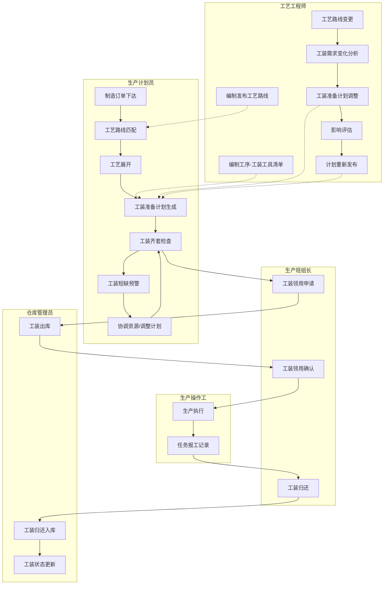
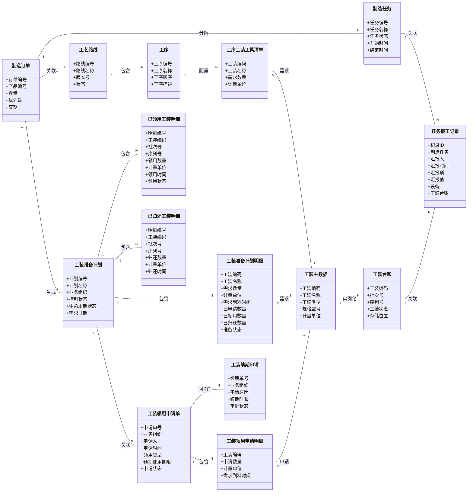
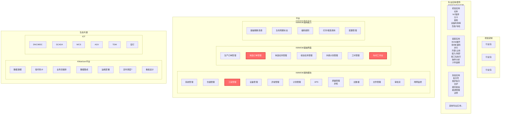
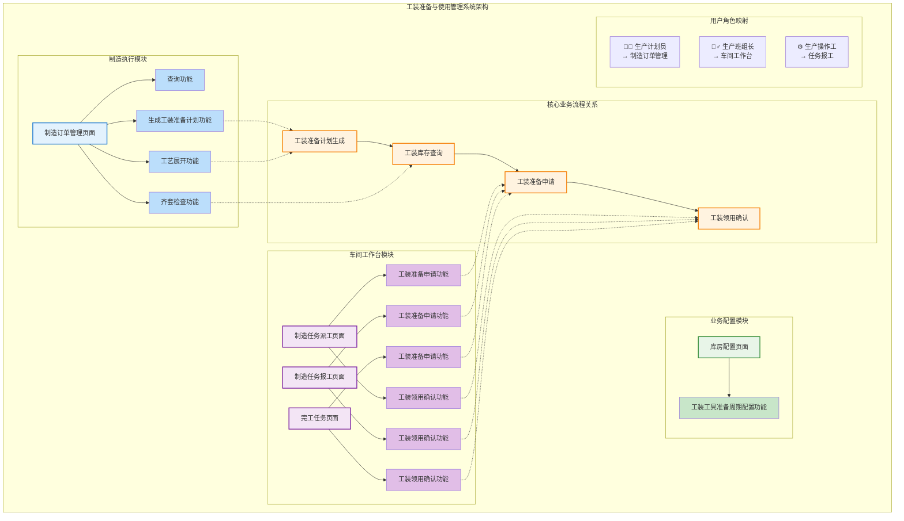

# DNW30901-工装备料计划管理

## 1. 概述

### 1.1 原始需求

**业务背景**：在离散制造行业中，工装准备是生产准备的关键环节，直接影响生产效率和产品质量。当前工装准备过程存在信息不透明、流程不规范、效率低下等问题，用户希望通过一个符合ISA-95 L3标准的MOM系统，实现工装准备与使用的全流程管理。

**核心业务痛点**：

#### 1.1.1 痛点一："计划到底靠谱吗？"—— 工装准备计划缺失，生产前心里没底
*   **痛点场景 (Pain-point Scenario):**
    生产计划下达后，计划员只能凭借经验，对照着图纸和工艺文件，在Excel中手动编制一份工装准备清单。这个过程不仅耗时（一个复杂订单可能需要数小时），而且极易因人为疏忽导致错漏，直接影响后续的齐套检查和生产启动。
*   **用户目标 (Job Story):**
    当生产计划下达后, 我希望能快速、准确地知道该任务需要的所有工装, 以便我能提前做好准备，确保生产能够准时开始。
*   **用户故事 (User Story):**
    1.  作为 **生产计划员**, 我希望系统能根据制造订单和最新的工艺路线，自动生成工装需求清单, 以便我能从繁琐的手工统计中解放出来，并避免错漏。
    2.  作为 **班组长**, 我希望能实时查看名下所有任务的工装准备计划, 以便我能提前安排组内领用工作，减少等待时间。

#### 1.1.2 痛点二："到底能不能开工？"—— 工装齐套检查困难，开工前反复确认
*   **痛点场景 (Pain-point Scenario):**
    开工前，班组长最头疼的就是确认工装是否都已备齐。他需要拿着纸质清单，跑到工具库房，逐一核对工装的实物、数量和状态。经常是临到开工才发现某个关键工装找不到、数量不够或者处于待修状态，导致整个班组停工等待，严重影响生产效率。
*   **用户目标 (Job Story):**
    当开工前, 我希望能一目了然地知道所需工装是否已全部备齐且状态可用, 以便我能做出准确的开工决策，避免因缺少工装导致全员停工。
*   **用户故事 (User Story):**
    1.  作为 **班组长**, 我希望系统能提供一个工装齐套检查看板，通过红绿灯等直观方式，实时展示每个任务的工装到位情况、缺件情况和状态是否正常, 以便我能快速识别问题并处理。
    2.  作为 **生产经理**, 我希望能查看未来一段时间内所有订单的工装齐套率, 以便我能提前预警潜在的瓶颈，协调资源。

#### 1.1.3 痛点三："这东西到底给谁用？"—— 领用与制造订单脱节，现场管理混乱
*   **痛点场景 (Pain-point Scenario):**
    工装的领用、归还、转借等操作，与具体的生产任务（制造订单）没有绑定关系。工人领用工装时，库房管理员只能做简单的手工登记。这导致工装被随意挪用，或者用完后未及时归还，形成车间"黑户"。当另一个紧急任务需要同一个工装时，根本无法追溯它现在在哪里、在被谁使用。
*   **用户目标 (Job Story):**
    当我需要领用或归还工装时, 我希望能将这次操作与具体的生产任务直接关联, 以便管理者能清楚地知道每个工装的去向和用途，实现精细化管理。
*   **用户故事 (User Story):**
    1.  作为 **操作工**, 我希望在扫码领用工装时，系统能让我选择对应的制造订单, 以便明确本次领用的目的。
    2.  作为 **库房管理员**, 我希望系统的台账能清晰记录每个工装当前被哪个订单、哪个工位、哪位员工借用, 以便在需要时能快速追溯。

#### 1.1.4 痛点四："这工具到底在哪？"—— 工装借用靠打听，状态位置不透明
*   **痛点场景 (Pain-point Scenario):**
    当生产过程中急需某个工装时，操作工往往不知道这个工装现在到底在哪、谁在用、什么时候能还回来。他们只能通过对讲机、电话或者跑去别的工位打听，这个过程充满了不确定性。最典型的情况是，问了一圈发现工装就在隔壁工位的柜子里，但因为信息不透明，谁都不知道，造成大量时间浪费。
*   **用户目标 (Job Story):**
    当我急需一个工装时, 我希望能立刻知道它现在的位置、状态以及预计何时可用, 以便我能做出最高效的决策（是去借用还是等待），而不是像无头苍蝇一样到处寻找。
*   **用户故事 (User Story):**
    1.  作为 **操作工**, 我希望能在系统里像查快递一样，输入工装编码就能看到它当前所在的工位、保管人以及"在用"、"空闲"、"维修中"等实时状态, 以便我能快速找到它。
    2.  作为 **班组长**, 我希望能看到工装的预计归还时间, 以便我能协调班组内的工装使用，避免冲突。

#### 1.1.5 痛点五："这工具到底能不能用？"—— 状态信息不透明，工具隐患难发现
*   **痛点场景 (Pain-point Scenario):**
    工装的寿命、精度、校准状态等信息，散落在不同的Excel或纸质记录中，与实物脱节。操作工拿到工具时，无法确定它是否处于最佳使用状态，甚至可能已经超期服役或精度超差。使用这样的"带病"工装，不仅可能导致产品质量问题，还存在安全隐患。
*   **用户目标 (Job Story):**
    当我拿到一个工装时, 我希望能立刻确信它是安全、合规、可用的, 以便我能放心地投入生产，避免因工具问题导致质量事故或生产中断。
*   **用户故事 (User Story):**
    1.  作为 **操作工**, 我希望在扫码获取工装信息时，系统能明确提示其是否在寿命周期内、是否需要校准、当前是否处于"停用"或"报废"状态, 以便我能避免使用有问题的工装。
    2.  作为 **质量工程师**, 我希望能设置工装的寿命、校准周期预警规则，系统能自动提醒相关人员, 以便提前进行维护，预防问题的发生。
    3.  作为 **设备管理员**, 我希望能方便地记录和查看工装的使用次数、维修记录和状态变更历史, 以便为工装的报废和采购提供数据决策依据。

#### 1.1.6 痛点六："工艺改了，工装怎么办？"—— 无法快速响应工艺路线变更
*   **痛点场景 (Pain-point Scenario):**
    当产品的工艺路线或设计发生变更时，所需的工装也会随之变化。但这个变更信息无法自动、快速地传递到工装准备环节。工装管理员仍然按照旧的工艺准备工装，直到生产现场的工人发现问题，才反向追溯，此时已经造成了生产延误和资源浪费。
*   **用户目标 (Job Story):**
    当工艺发生变更时, 我希望能让工装准备环节的人员立即知晓最新的工装需求, 以便他们能提供正确的工装，避免生产延误和浪费。
*   **用户故事 (User Story):**
    1.  作为 **工艺工程师**, 我希望在我发布新版工艺路线后，系统能自动将工装变更信息推送给生产计划和工装管理部门, 以便他们能及时调整准备计划。
    2.  作为 **工装管理员**, 我希望能收到清晰的工艺变更通知，并能方便地在新旧工装需求之间做切换, 以便为不同批次的生产提供正确的工装。

### 1.2 需求分析

#### 1.2.1 需求背景与驱动力
本项需求的核心驱动力源于三个层面：
- **市场驱动 (Market Pull)**: 制造业正经历深刻的数字化转型，传统依赖人工和经验判断的工装准备方式已无法匹配现代生产对敏捷响应和精细化控制的要求，工装管理的数字化升级已成为必然趋势。
- **客户驱动 (Customer Pull)**: 下游客户对产品质量和交付准时率的要求日益严苛，要求企业必须有能力确保生产过程中工装的及时到位和状态良好，避免因工装问题导致的质量缺陷和交付延误。
- **内生驱动 (Internal Push)**: 企业自身面临持续的降本增效压力，工装准备不及时、数量不准确、状态不明确等问题直接影响生产效率，构成企业运营的成本瓶颈。

**综上，本需求的本质，是顺应制造业数字化转型趋势，响应客户对质量交付的严苛要求，立足企业内部降本增效需求，建立一套从工装准备计划到使用记录的全流程数字化管理体系。**

#### 1.2.2 核心挑战
- **挑战一：工装准备与生产计划的协同复杂性**
  - **目标**: 确保工装准备计划与生产计划的高度协同，实现"工艺制造一体化"
  - **分析**: 工装准备涉及多个业务环节（计划生成、齐套检查、借用申请、使用记录），需要与生产计划、工艺路线、库存管理等系统深度集成，协同逻辑复杂。

- **挑战二：工装使用过程的实时性要求**
  - **目标**: 确保工装使用状态的实时更新和准确记录
  - **分析**: 工装在生产现场的使用状态变化频繁，需要建立高效的数据采集机制，确保信息的实时性和准确性，为管理决策提供可靠支撑。

#### 1.2.3 价值主张与量化指标
- **价值主张**:
  - **用户价值**: 工装准备计划生成时间从2小时缩短至10分钟，效率提升96%；工装齐套检查时间从30分钟缩短至2分钟，效率提升93%；工艺变更响应时间从4小时缩短至30分钟，效率提升87.5%
  - **客户价值**: 因工装短缺导致的生产中断减少80%，生产计划执行率提升15%，工装利用率提升20%；因工艺变更导致的工装准备延误减少90%
  - **业务价值**: 支撑公司"工艺制造一体化"战略，实现工装与生产的深度协同，建立工艺变更的快速响应机制，为后续智能化演进奠定基础
- **量化指标**:
  - **时间指标**: 工装准备计划生成时间从2小时缩短至10分钟，效率提升96%；工装齐套检查时间从30分钟缩短至2分钟，效率提升93%；工艺变更响应时间从4小时缩短至30分钟，效率提升87.5%
  - **比例指标**: 因工装短缺导致的生产中断减少80%，生产计划执行率提升15%，工装利用率提升20%；因工艺变更导致的工装准备延误减少90%

#### 1.2.4 行业对标与本方案定位
- **行业方案对标**: 
  - **大型MES集成模块 (如 Siemens Opcenter, SAP DMC)**:
    - **特点**: 作为整体制造运营管理平台的一部分，与生产计划、执行、质量、设备等模块无缝集成，数据一致性高，流程闭环能力强。
    - **优势**: 能够实现工装与制造订单、设备状态的深度绑定，为全面的制造过程追溯提供坚实基础。
    - **劣势**: 功能可能不如专业系统深入，定制化和扩展的灵活性相对较低，实施成本和周期较长。
  - **专业工装管理软件 (如 TDM Systems)**:
    - **特点**: 深耕工装管理领域，功能极为深入和专业。通常覆盖从工装数据、图形化管理、工装组装、成本核算到与CNC程序集成的全过程。
    - **优势**: 功能深度和专业性是其核心壁垒，能满足复杂和精密的工装管理需求。
    - **劣势**: 通常作为独立系统存在，需要与企业现有的MES、ERP、PLM系统进行二次集成，数据交互和流程协同是一个挑战。
  - **轻量化/SaaS解决方案**:
    - **特点**: 聚焦于解决核心痛点，如台账电子化、扫码借还、库存盘点等。通常以云服务形式提供，部署快，易于上手。
    - **优势**: 实施周期短，成本低，能快速解决企业在工装管理方面"从无到有"的问题。
    - **劣势**: 功能相对基础，缺乏深度分析和流程整合能力，难以支持复杂的生产体系和精细化管理要求。
- **本方案定位**:
  - **核心定位**: 设计一个**深度集成于KMMOM平台的工装准备与使用管理模块**。
  - **能力目标**:
    - **高集成性**: 吸取"大型MES集成模块"的优势，确保与生产、质量、设备等核心业务的流程闭环。
    - **功能专业性**: 借鉴"专业工装管理软件"的思路，提供功能完整、逻辑严谨的工装准备与使用管理能力。
    - **多组织协同**: 将工装准备与生产计划的协同管理作为核心能力，支持企业实现"工艺制造一体化"。
  - **核心平衡点**: 在**集成性**、**功能专业性**与**协同管理**之间取得最佳平衡。
  - **技术前瞻性**: 融入智能分析与物联网(IoT)能力，打造具备前瞻性的解决方案。

### 1.3 用户画像

| 分类 | 角色名称 | 核心职责 | 核心诉求与痛点 |
| :--- | :--- | :--- | :--- |
| **执行层** (系统的直接操作者) | **生产操作工** | 按制造订单使用工装，执行生产任务，反馈工装使用问题 | 希望快速了解工装状态，方便地使用和归还工装，系统能自动记录使用情况 |
| | **仓库管理员** | 执行工装出入库、管理库位，确保工装库存准确 | 希望工装出入库操作简单高效，库存信息实时准确，能快速响应借用申请 |
| **管理与协同层** (流程的组织与监控者) | **生产班组长** | 按生产任务计划申领工装，对班组的工装使用负责 | 希望方便地按制造订单借用工装，实时掌握班组工装的齐套性，能快速完成齐套检查 |
| | **现场工装协调员** | 协助管理现场存放的长期占用工装，配合工装管理员进行现场工装的日常维护 | 希望能便捷地管理现场工装状态，及时反馈工装问题，协助完成工装的检修和维护工作 |
| | **生产计划员** | 制定生产计划，协调生产资源，确保生产顺利进行 | 希望工装准备计划与生产计划协同，提前识别工装短缺风险，优化生产调度决策 |
| | **工艺工程师** | 负责工艺路线设计与变更，确保工艺与制造的一致性 | 希望工艺路线变更后系统能自动识别工装需求变化，及时调整工装准备计划，确保工艺变更的顺利实施 |
| **决策与支持层** (数据的消费者与决策者) | **车间主任** | 负责车间生产管理，优化生产调度，提升生产效率 | 希望有工装准备看板，实时掌握工装准备状态，优化生产决策，提高生产效率 |
| | **生产经理** | 负责生产运营管理，关注生产效率和交付准时率 | 希望系统能提供工装准备效率分析，识别生产瓶颈，为资源配置优化提供数据支撑 |

### 1.4 术语及缩写解释

| 分类 | 术语 | 英文/缩写 | 解释说明 |
| :--- | :--- | :--- | :--- |
| **第一部分：核心业务概念** | | | |
| | **工装准备计划** | Tooling Preparation Plan | 基于制造订单需求生成的工装准备计划，用于指导工装的准备和管理，确保生产任务按时开工 |
| | **工装齐套检查** | Tooling Kit Check | 检查生产任务所需工装是否齐全的过程，确保生产任务的顺利执行，避免因工装短缺导致生产中断 |
| | **工序-工装工具清单** | Process-Tooling List | 工艺路线中每个工序所需的工装工具清单，包含工装类型、需求数量等关键信息 |
| **第二部分：业务流程概念** | | | |
| | **工装准备申请** | Tooling Preparation Request | 生产班组为完成生产任务而申请使用工装的业务单据，与制造订单强关联 |
| | **使用类型** | Usage Type | 工装的使用模式，包括`消耗使用`、`长期借用`和`临时借用`三种类型 |
| | **存储位置** | Storage Location | 工装的存放位置，包括现场存放和工装室存放两种状态 |
| | **续期申请** | Renewal Application | 对非一次性工装延长使用期限的申请，确保工装使用的连续性和合规性 |
| **第三部分：物理存储概念** | | | |
| | **车间库** | Workshop Storage | 设置在车间内的工装临时存放点，用于存放班组已准备但尚未使用的工装 |
| | **库房** | Warehouse | 企业正式的工装存储场所，负责工装的长期保管和出入库管理 |

## 2. 需求描述

### 2.1 业务描述

#### 2.1.1 业务主流程

**特殊说明**：
- 本需求聚焦工装准备与使用管理，不涉及工装的设计、采购、制造等上游环节
- 工艺工程师负责编制发布工艺路线和编制工序-工装工具清单
- 生产计划员负责工艺路线匹配，制造订单进行工艺展开后自动根据工艺路线的工序-工装工具清单生成工装准备计划
- 工装准备申请与制造订单强关联，确保工装使用的可追溯性
- 支持工艺路线变更时的工装准备计划自动调整

#### 2.1.2 业务流程描述

##### 2.1.2.1 工序-工装工具清单编制

**角色**：工艺工程师

**活动描述**：工艺工程师在编制工艺路线时，为每个工序配置所需的工装工具清单。

**输入业务对象**：工艺路线、工装主数据

**输出业务对象**：工序-工装工具清单

**关键业务规则**：
- 工序-工装工具清单必须包含工装主数据、需求数量、计量单位等关键信息
- 工艺工程师负责确保工装工具清单的准确性和完整性

**业务规则配置点**：工序-工装工具配置规则

**业务场景范围**：
- 基于工艺路线的工装工具清单编制

##### 2.1.2.2 工装准备计划生成

**角色**：生产计划员、系统

**活动描述**：生产计划员进行工艺路线匹配和工艺展开后，系统自动根据工艺路线的工序-工装工具清单生成工装准备计划，指导工装的准备和管理。

**输入业务对象**：制造订单、工艺路线、工序-工装工具清单、工装库存信息

**输出业务对象**：工装准备计划

**关键业务规则**：
- 工装准备计划必须与制造订单的时间安排保持一致
- 支持工装准备计划的批量生成和调整
- 工装准备计划中工装的需求数量默认等于工序-工装工具清单的需求数量
- **一次性工装规则**：一次性工装的领用是消耗库存，无需归还，系统自动扣减库存数量
- **非一次性工装规则**：非一次性工装采用借用模式，需要归还，系统记录借用状态但不扣减库存数量

**业务规则配置点**：工装准备计划生成规则、优先级配置

**业务场景范围**：
- 基于制造订单的工装准备计划自动生成
- 支持工装准备计划的手动调整和优化
- 支持工装准备计划的版本管理和变更追踪

##### 2.1.2.3 工装齐套检查

**角色**：生产计划员、生产班组长

**活动描述**：在生产开工前，检查工装是否齐全，确保生产任务的顺利执行。

**输入业务对象**：工装准备计划、工装库存信息、工装状态信息

**输出业务对象**：齐套检查结果、缺件清单

**关键业务规则**：
- 齐套检查的范围为准备计划中所有工装项。
- 齐套分析时，需清晰展示每项工装的`需求数量`、`已领数量`、`库存可用数量`以及`缺料数量`。
- **核心齐套逻辑**：无论是一次性还是非一次性工装，齐套检查均以`工装库存`中`在库（可用）`的数量为准，判断其是否满足本次真实需要的领用需求 (`需求数量` - `已领数量`+ `已归还数量`)。
- 系统应支持对齐套检查发现的短缺项进行自动预警和通知。

**业务规则配置点**：齐套检查规则、预警配置

**业务场景范围**：
- 基于工装准备计划的齐套检查
- 支持工装短缺的自动预警和通知
- 支持工装短缺的协调处理和资源调配

##### 2.1.2.4 工装领用申请

**角色**：生产班组长

**活动描述**：为完成生产任务，申请领用所需的工装。

**输入业务对象**：工装准备计划、制造订单、班组信息

**输出业务对象**：工装领用申请单

**关键业务规则**：
- 工装领用申请必须与制造订单关联
- 申请时必须明确`领用类型`：`消耗使用`、`长期借用`或`临时借用`
- `长期借用`和`临时借用`类型的工装需设置预期归还日期，并支持后续续期
- `本次申请数量`默认等于`需求数量` - `已领用数量` + `已归还数量`，用户可手动修改。若修改后的数量超过默认值，系统需给出提示，但允许继续申请。
- 支持工装领用申请的批量提交和审批
- 支持工装领用申请的优先级排序和资源分配

**业务规则配置点**：工装领用申请规则、审批流程配置

**业务场景范围**：
- 基于制造订单的工装领用申请
- 支持工装领用申请的批量处理和审批
- 支持工装领用申请的优先级排序和资源分配

##### 2.1.2.5 工装出库

**角色**：仓库管理员

**活动描述**：执行工装的出库操作，将工装从库房转移到生产现场。

**输入业务对象**：工装准备申请单、工装库存信息

**输出业务对象**：工装出库单

**关键业务规则**：
- 工装出库必须基于审批通过的准备申请单。
- **一次性工装 (消耗使用)**: 出库操作将直接扣减`工装库存`的数量。
- **非一次性工装 (借用模式)**: 出库操作不改变`工装库存`数量，但必须同步更新`工装台账`中对应实例的状态为"已借用"。
- 支持通过扫码或批量操作执行出库。

**业务规则配置点**：工装出库规则、库存更新规则

**业务场景范围**：
- 基于准备申请单的工装出库
- 支持工装的扫码出库和批量出库
- 支持工装出库的实时库存更新和状态变更

##### 2.1.2.6 工装领用确认

**角色**：生产班组长

**活动描述**：确认工装的领用到位，完成工装从库房到生产现场的转移。

**输入业务对象**：工装出库单、工装实物

**输出业务对象**：工装领用确认单、已领用工装明细

**关键业务规则**：
- 工装领用确认必须基于已出库的工装出库单。
- 确认时需要检查工装的数量、规格和状态是否符合要求。
- 确认完成后，工装状态更新为"已领用"，可以开始生产使用。
- 领用确认后，需要在工装准备计划下新增一个已领用工装明细，记录具体的领用工装信息。
- 同步更新工装准备计划明细中的已领用数量。

**业务规则配置点**：工装领用确认规则、状态更新规则、明细记录规则

**业务场景范围**：
- 基于出库单的工装领用确认
- 支持工装的扫码确认和批量确认
- 支持工装领用状态的实时更新
- 支持已领用工装明细的自动生成和更新

##### 2.1.2.7 生产执行任务报工记录

**角色**：生产操作工、系统

**活动描述**：记录生产任务执行过程中的报工情况，包括工装使用、设备状态等关键信息，为生产管理和质量追溯提供数据支撑。

**输入业务对象**：工装领用确认单、生产执行数据、设备状态信息

**输出业务对象**：任务报工记录

**关键业务规则**：
- 任务报工记录必须与制造任务关联
- 支持工装使用情况的记录和手动录入
- 支持设备状态和工装台账的关联记录
- 支持报工数据的实时统计和分析

**业务规则配置点**：任务报工记录规则、数据采集配置

**业务场景范围**：
- 基于制造任务的任务报工记录
- 支持工装使用情况的记录和手动录入
- 支持设备状态和工装台账的关联记录
- 支持报工数据的实时统计和分析

##### 2.1.2.8 工装归还

**角色**：生产班组长

**活动描述**：将借用期满的工装归还给库房，完成工装从生产现场到库房的转移。

**输入业务对象**：任务报工记录、工装实物

**输出业务对象**：工装归还单

**关键业务规则**：
- 本流程仅适用于`长期借用`和`临时借用`的工装
- 工装归还时必须进行状态检查和确认
- 归还时需要检查工装的数量、规格和状态是否符合要求

**业务规则配置点**：工装归还规则、状态检查规则

**业务场景范围**：
- 基于报工记录的工装归还
- 支持工装的扫码归还和批量归还
- 支持工装归还状态的实时更新

##### 2.1.2.9 工装归还入库

**角色**：仓库管理员

**活动描述**：接收归还的工装，更新库存状态，完成工装归还入库操作。

**输入业务对象**：工装归还单、工装实物

**输出业务对象**：工装归还入库单、已归还工装明细

**关键业务规则**：
- 工装归还入库必须基于已归还的工装归还单
- **一次性工装**: 归还的工装通常为报废状态，需要更新库存状态
- **非一次性工装**: 入库操作需要更新`工装台账`中对应实例的状态为"在库"
- 归还入库后，需要在工装准备计划下新增一个已归还工装明细，记录具体的归还工装信息。
- 同步更新工装准备计划明细中的已归还数量。

**业务规则配置点**：工装归还入库规则、库存更新规则、明细记录规则

**业务场景范围**：
- 基于归还单的工装归还入库
- 支持工装的扫码入库和批量入库
- 支持工装归还入库的实时库存更新和状态变更
- 支持已归还工装明细的自动生成和更新

##### 2.1.2.10 工装续期管理

**角色**：生产班组长、工装管理员

**活动描述**：对长期占用工装申请延长使用期限，确保工装使用的连续性和合规性。

**输入业务对象**：长期占用工装记录、续期申请、工装状态信息

**输出业务对象**：续期审批结果、工装使用期限更新

**关键业务规则**：
- 续期申请必须在工装使用期限到期前提交
- 工装管理员需检查工装状态，确认是否适合继续使用
- 支持续期申请的批量处理和自动提醒
- 续期次数和总使用时长需要记录和监控

**业务规则配置点**：续期申请规则、审批流程配置、提醒时间配置

**业务场景范围**：
- 基于长期占用工装的续期申请
- 支持续期申请的自动提醒和批量处理
- 支持续期历史的追踪和分析

##### 2.1.2.11 工艺变更处理

**角色**：工艺工程师、系统

**活动描述**：当工艺路线发生变更时，自动识别工装需求变化并调整工装准备计划。

**输入业务对象**：工艺路线变更信息、原工装准备计划

**输出业务对象**：工装需求变化分析、调整后的工装准备计划

**关键业务规则**：
- 工艺变更后必须自动分析工装需求变化
- 支持工装准备计划的自动调整和手动优化
- 支持工艺变更影响的评估和通知

**业务规则配置点**：工艺变更处理规则、影响评估配置

**业务场景范围**：
- 基于工艺路线变更的工装需求分析
- 支持工装准备计划的自动调整和手动优化
- 支持工艺变更影响的评估和通知

#### 2.1.3 使用场景设计

| 场景名称 | 用户目标 | 触发条件 | 执行步骤 | 成功标准 |
|---------|---------|---------|---------|----------|
| **场景1: (高频) 生产班组长按制造订单领用工装** | 快速完成工装领用申请，确保生产按时开工 | 收到新的制造订单，需要领用工装 | 1.查看工装准备计划 2.进行齐套检查 3.选择`领用类型`(`消耗`/`长借`/`临借`) 4.设置归还日期(借用时) 5.提交领用申请 6.等待审批通过 7.确认工装出库 | 工装领用申请成功提交，工装按时到位，生产顺利开工 |
| **场景2: (关键) 工装齐套检查与短缺预警** | 及时发现工装短缺问题，避免生产中断 | 生产开工前进行工装准备检查 | 1.系统自动检查工装库存 2.对比工装需求清单 3.生成齐套检查报告 4.识别短缺工装 5.发送预警通知 | 工装短缺问题被及时发现，相关人员收到预警通知，能够及时协调资源 |
| **场景3: (重要) 工艺路线变更时的工装准备计划调整** | 快速响应工艺变更，确保工装准备计划与工艺保持一致 | 工艺路线发生变更 | 1.系统检测工艺路线变更 2.自动分析工装需求变化 3.调整工装准备计划 4.评估变更影响 5.通知相关人员 | 工装准备计划及时调整，与工艺变更保持一致，生产不受影响 |
| **场景4: (常规) 任务报工记录与归还管理** | 完整记录任务报工情况，实现工装的全生命周期管理 | 工装在生产过程中使用完毕 | 1.记录任务报工情况 2.检查工装状态 3.提交归还申请 4.执行归还操作 5.更新库存状态 | 任务报工情况被完整记录，工装安全归还，库存状态实时更新 |
| **场景5: (日常) 非一次性工装的续期管理** | 确保非一次性工装使用的连续性和合规性 | 非一次性工装使用期限即将到期 | 1.系统自动提醒续期 2.班组长评估续期需求 3.提交续期申请 4.工装管理员审批 5.更新使用期限 | 工装使用期限合理延长，使用连续性得到保障，管理合规性得到确保 |
| **场景6: (异常) 工装短缺时的应急处理** | 快速协调资源，确保生产计划顺利执行 | 工装齐套检查发现短缺 | 1.分析短缺原因 2.评估影响范围 3.协调可用资源 4.调整生产计划 5.通知相关人员 | 工装短缺问题得到及时解决，生产计划调整合理，影响最小化 |
| **场景7: (管理) 现场工装状态监控** | 实时掌握现场工装状态，确保工装管理的有效性 | 需要查看现场工装使用情况 | 1.查看现场工装分布 2.检查工装状态 3.识别异常情况 4.协调处理 5.更新工装信息 | 现场工装状态清晰可见，异常情况及时发现和处理，工装管理效率提升 |

### 2.2 数据描述

#### 2.2.1 业务对象ER关系图

#### 2.2.2 数据字典

**工装准备计划**
| 字段名 | 业务类型 | 业务约束 | 业务说明 |
|---|---|---|---|
| 计划编号 | 文本标识 | 唯一, 格式：TPP-制造订单号【TPP（Tooling Planning and Preparation）】 | 工装准备计划的唯一业务标识 |
| 关联制造订单 | 关联对象 | 必填, 关联至制造订单实体 | 与之关联的制造订单 |
| 业务组织 | 关联对象 | 必填, 关联至组织实体 | 计划所属的业务组织 |
| 控制状态 | 分类枚举 | `正常`/`暂停`/`取消` | 计划的控制状态 |
| 生命周期状态 | 分类枚举 | `初始`/`备料中`/`备料完成` | 计划的生命周期状态 |
| 需求日期 | 日期 | 必填 | 工装需求的期望到位日期 |
| 创建人 | 关联对象 | 必填, 关联至用户实体 | 计划的创建人员 |
| 创建时间 | 日期时间 | 系统自动生成 | 计划的创建时间 |

**工装准备计划明细**
| 字段名 | 业务类型 | 业务约束 | 业务说明 |
|---|---|---|---|
| 关联工装 | 关联对象 | 必填, 关联至工装主数据实体 | 需求计划关联的具体工装型号或规格 |
| 需求数量 | 数值 | 必填, 大于0的整数 | 该项工装的需求数量 |
| 计量单位 | 文本 | 必填 | 工装数量的计量单位 |
| 需求到料时间 | 日期时间 | 必填 | 该项工装的期望到料时间 |
| 已申请数量 | 数值 | 大于等于0的整数 | 已申请该项工装的数量 |
| 已领用数量 | 数值 | 大于等于0的整数 | 已领用该项工装的数量 |
| 已归还数量 | 数值 | 大于等于0的整数 | 已归还该项工装的数量 |
| 准备状态 | 分类枚举 | `待准备`/`准备中`/`已齐套`/`部分齐套` | 该项工装的准备状态 |
| 备注 | 长文本 | 可选 | 对该项准备任务的补充说明 |

**工装领用申请单**
| 字段名 | 业务类型 | 业务约束 | 业务说明 |
|---|---|---|---|
| 申请单号 | 文本标识 | 唯一 | 工装领用申请单的唯一业务标识 |
| 关联制造订单 | 关联对象 | 必填, 关联至制造订单实体 | 与之关联的制造订单 |
| 业务组织 | 关联对象 | 必填, 关联至组织实体 | 申请单所属的业务组织 |
| 出库方式 | 分类枚举 | 必填, | 工装领用出库 |
| 申请人 | 关联对象 | 必填, 关联至用户实体 | 提交领用申请的人员 |
| 申请班组 | 关联对象 | 必填, 关联至班组实体 | 申请工装的班组 |
| 申请时间 | 日期时间 | 系统自动生成 | 申请单的提交时间 |
| 申请状态 | 分类枚举 | 待出库、部分出库、全部出库 | 申请单当前的业务状态 |
| 领用类型 | 分类枚举 | 必填,`消耗使用`/`长期借用`/`临时借用` | 申请的工装领用模式 |

**工装领用申请明细**
| 字段名 | 业务类型 | 业务约束 | 业务说明 |
|---|---|---|---|
| 关联工装 | 关联对象 | 必填, 关联至工装主数据实体 | 申请领用的具体工装型号或规格 |
| 申请数量 | 数值 | 必填, 大于0的整数 | 申请领用的工装数量 |
| 计量单位 | 文本 | 必填 | 工装数量的计量单位 |
| 需求到料时间 | 日期时间 | 必填 | 该项工装的期望到料时间 |
| 备注 | 长文本 | 可选 | 对该项领用需求的补充说明 |

**任务报工记录**
| 字段名 | 业务类型 | 业务约束 | 业务说明 |
|---|---|---|---|
| 记录编号 | 文本标识 | 唯一 | 任务报工记录的唯一标识 |
| 关联制造任务 | 关联对象 | 必填, 关联至制造任务实体 | 记录关联的制造任务 |
| 汇报人 | 关联对象 | 必填, 关联至用户实体 | 进行报工的人员 |
| 汇报时间 | 日期时间 | 必填 | 报工的时间 |
| 汇报项 | 文本 | 必填 | 报工的具体项目内容 |
| 汇报值 | 文本 | 必填 | 报工的具体数值或结果 |
| 关联设备 | 关联对象 | 可选, 关联至设备实体 | 报工关联的设备 |
| 关联工装台账 | 关联对象 | 可选, 关联至工装台账实体 | 报工关联的工装台账 |

**制造任务**
| 字段名 | 业务类型 | 业务约束 | 业务说明 |
|---|---|---|---|
| 任务编号 | 文本标识 | 唯一 | 制造任务的唯一业务标识 |
| 关联制造订单 | 关联对象 | 必填, 关联至制造订单实体 | 任务关联的制造订单 |
| 任务名称 | 文本 | 必填 | 制造任务的名称 |
| 任务状态 | 分类枚举 | `待派工`/`已派工`/`执行中`/`已完成`/`已暂停` | 任务当前的业务状态 |
| 开始时间 | 日期时间 | 可选 | 任务的计划开始时间 |
| 结束时间 | 日期时间 | 可选 | 任务的计划结束时间 |

**工艺路线**
| 字段名 | 业务类型 | 业务约束 | 业务说明 |
|---|---|---|---|
| 工艺路线编号 | 文本标识 | 唯一 | 工艺路线的唯一业务标识 |
| 工艺路线名称 | 文本 | 必填 | 工艺路线的名称 |
| 版本号 | 文本 | 必填 | 工艺路线的版本号 |
| 状态 | 分类枚举 | `草稿`/`已发布`/`已停用` | 工艺路线的当前状态 |

**工序**
| 字段名 | 业务类型 | 业务约束 | 业务说明 |
|---|---|---|---|
| 工序编号 | 文本标识 | 唯一 | 工序的唯一业务标识 |
| 关联工艺路线 | 关联对象 | 必填, 关联至工艺路线实体 | 工序所属的工艺路线 |
| 工序名称 | 文本 | 必填 | 工序的名称 |
| 工序顺序 | 数值 | 必填, 大于0的整数 | 工序在工艺路线中的顺序 |
| 工序描述 | 长文本 | 可选 | 工序的详细描述 |

**工序工装工具清单**
| 字段名 | 业务类型 | 业务约束 | 业务说明 |
|---|---|---|---|
| 关联工序 | 关联对象 | 必填, 关联至工序实体 | 工装工具清单所属的工序 |
| 关联工装 | 关联对象 | 必填, 关联至工装主数据实体 | 工序所需的工装型号 |
| 需求数量 | 数值 | 必填, 大于0的整数 | 该工序对该工装的需求数量 |
| 计量单位 | 文本 | 必填 | 工装数量的计量单位 |

**工装主数据**
| 字段名 | 业务类型 | 业务约束 | 业务说明 |
|---|---|---|---|
| 工装编码 | 文本标识 | 唯一 | 工装主数据的唯一业务标识 |
| 工装名称 | 文本 | 必填 | 工装的名称 |
| 工装类型 | 分类枚举 | 必填 | 工装的分类类型 |
| 规格型号 | 文本 | 必填 | 工装的规格型号 |
| 计量单位 | 文本 | 必填 | 工装数量的计量单位 |

**已领用工装明细**
| 字段名 | 业务类型 | 业务约束 | 业务说明 |
|---|---|---|---|
| 明细编号 | 文本标识 | 唯一 | 已领用工装明细的唯一标识 |
| 关联工装准备计划 | 关联对象 | 必填, 关联至工装准备计划实体 | 明细所属的工装准备计划 |
| 关联工装 | 关联对象 | 必填, 关联至工装主数据实体 | 领用的具体工装型号 |
| 工装批次号 | 文本标识 | 可选 | 工装的批次标识 |
| 工装序列号 | 文本标识 | 可选 | 工装的序列标识 |
| 关联领用申请 | 关联对象 | 必填, 关联至工装领用申请单实体 | 明细关联的领用申请 |
| 领用数量 | 数值 | 必填, 大于0的整数 | 本次领用的工装数量 |
| 计量单位 | 文本 | 必填 | 工装数量的计量单位 |
| 领用时间 | 日期时间 | 必填 | 工装领用的时间 |
| 领用状态 | 分类枚举 | `已领用`/`使用中`/`已归还` | 工装领用的当前状态 |
| 领用人 | 关联对象 | 必填, 关联至用户实体 | 领用工装的人员 |

**已归还工装明细**
| 字段名 | 业务类型 | 业务约束 | 业务说明 |
|---|---|---|---|
| 明细编号 | 文本标识 | 唯一 | 已归还工装明细的唯一标识 |
| 关联工装准备计划 | 关联对象 | 必填, 关联至工装准备计划实体 | 明细所属的工装准备计划 |
| 关联工装 | 关联对象 | 必填, 关联至工装主数据实体 | 归还的具体工装型号 |
| 工装批次号 | 文本标识 | 可选 | 工装的批次标识 |
| 工装序列号 | 文本标识 | 可选 | 工装的序列标识 |
| 关联领用明细 | 关联对象 | 必填, 关联至已领用工装明细实体 | 明细关联的领用明细 |
| 归还数量 | 数值 | 必填, 大于0的整数 | 本次归还的工装数量 |
| 计量单位 | 文本 | 必填 | 工装数量的计量单位 |
| 归还时间 | 日期时间 | 必填 | 工装归还的时间 |
| 归还人 | 关联对象 | 必填, 关联至用户实体 | 归还工装的人员 |

**工装续期申请**
| 字段名 | 业务类型 | 业务约束 | 业务说明 |
|---|---|---|---|
| 续期单号 | 文本标识 | 唯一, 格式：TRR-YYYYMMDD-NNNN | 工装续期申请的唯一业务标识 |
| 业务组织 | 关联对象 | 必填, 关联至组织实体 | 续期申请所属的业务组织 |
| 关联领用申请 | 关联对象 | 必填, 关联至`长期占用`类型的领用申请单 | 续期申请关联的原始领用申请 |
| 申请原因 | 长文本 | 必填 | 申请延长使用期限的原因说明 |
| 续期至 | 日期 | 必填, 必须晚于原预期使用期限 | 新的预期归还日期 |
| 审批状态 | 分类枚举 | `待审批`/`已批准`/`已驳回` | 续期申请的审批状态 |
| 申请人 | 关联对象 | 必填, 关联至用户实体 | 提交续期申请的人员 |
| 申请时间 | 日期时间 | 系统自动生成 | 续期申请的提交时间 |

### 2.3 功能描述

#### 2.3.1 应用架构图

#### 2.3.2 模块架构

#### 2.3.3 功能清单

| 模块 | 页面 | 功能点 | 功能点状态 | 功能点描述 |
| :--- | :--- | :--- | :--- | :--- |
| **制造执行** | **制造订单管理** | 查询 | 待开发 | 作为生产计划员，我希望看到所有制造订单关联的工装准备计划，以便全面掌握准备任务。 |
| | | 生成工装准备计划 | 待开发 | 作为生产计划员，我希望系统能基于制造订单手动生成工装准备计划，以便快速启动准备工作。 |
| | | 工艺展开 | 待开发 | 作为生产计划员，我希望系统能基于制造订单，在工艺展开后自动生成工装准备计划，以便快速启动准备工作。 |
| | | 工艺变更 | 待开发 | 作为生产计划员，我希望系统能基于制造订单，在工艺变更后自动更新工装准备计划，以便及时调整准备任务。 |
| | | 齐套检查 | 待开发 | 作为生产计划员，我希望能在领用前进行工装库存实时查询，点击领料申请并确认后，创建一个工装领料出库申请单，并同步更新工装准备计划的状态为备料中，更新工装准备计划需求明细中的已申请数量，本次申请数量默认值=需求数量-已申请数量，可修订，若本次申请数量超过剩余可申请数量，则给出提示但仍然允许超出数量申请，以便快速发起工装领用申请。 |
| | **制造任务管理** | 报工 | 待开发 | 作为生产操作工，我希望对领用的工装进行任务报工记录，以便后续质量检查。 |
| **车间工作台** | **制造任务派工** | 工装领用申请 | 待开发 | 作为生产班组长，我希望能新增工装领用申请，以便为生产任务申领必要的工装。 |
| | | 工装领用确认 | 待开发 | 作为生产班组长，我希望对领用申请的工装进行接收确认。 |
| | | 工装归还 | 待开发 | 作为生产班组长，我希望对借用的工装进行归还。 |
| | **制造任务报工** | 工装领用申请 | 待开发 | 作为生产操作工，我希望能新增工装领用申请，以便为生产任务申领必要的工装。 |
| | | 工装领用确认 | 待开发 | 作为生产操作工，我希望对领用申请的工装进行接收确认。 |
| | | 工装归还 | 待开发 | 作为生产操作工，我希望对借用的工装进行归还。 |
| | | 报工 | 待开发 | 作为生产操作工，我希望对领用的工装进行任务报工记录，以便后续质量检查。 |
| | **完工任务** | 工装领用申请 | 待开发 | 作为生产操作工，我希望能新增工装领用申请，以便为生产任务申领必要的工装。 |
| | | 工装领用确认 | 待开发 | 作为生产操作工，我希望对领用申请的工装进行接收确认。 |
| | | 工装归还 | 待开发 | 作为生产操作工，我希望对借用的工装进行归还。 |
| **业务配置** | **业务组织配置** | 工装工具借用周期配置 | 待开发 | 作为生产计划员，我希望设置不同工装工具类别的借用周期。 |
| **业务配置** | **业务组织配置** | 工艺展开后是否自动生工装工具准备计划 | 待开发 | 作为生产计划员，我希望设置工艺展开后是否自动生工装工具准备计划，开启后，若制造订单的工艺路线不为空且工装工具准备计划不存在，则工艺展开后要自动生成工装工具准备计划，不开启则不处理。 |

### 2.4 用户体验要求

#### 2.4.1 可用性要求

- **遵循平台统一设计规范**: 整体可用性标准遵循KMMOM平台统一的设计规范。
- **关键操作响应**: 核心操作（如生成计划、齐套检查、提交申请）的服务器响应时间应在2秒以内。前端界面在等待期间应提供明确的加载状态提示。
- **易学性**: 针对核心用户（生产班组长、工装管理员），首次接触系统的用户应能在15分钟内独立完成一次完整的工装准备申请流程。
- **错误防范**: 对于关键或不可逆操作（如"下发计划"），系统应提供二次确认机制，防止用户误操作。

#### 2.4.2 可访问性要求

- **遵循平台统一设计规范**: 整体可访问性标准遵循KMMOM平台统一的设计规范。
- **浏览器兼容性**: 需兼容Chrome、Firefox、Edge的主流版本。本迭代无特殊要求支持IE。
- **多设备支持**: 关键信息查看功能（如工装准备看板）应在平板设备上提供良好的响应式布局支持。

#### 2.4.3 界面设计原则

- **信息密度与清晰度平衡**: 列表和看板页面需在保证信息密度的同时，确保关键状态（如`短缺`、`待审批`）有高亮、醒目的视觉化区分。
- **一致性**: 所有页面的布局、控件样式、图标使用需遵循平台统一规范，确保用户体验的一致性。
- **状态可视化**: 工装的各种状态（在库、占用、维修中、已预定等）应使用统一的颜色和图标体系进行标识，做到一目了然。

#### 2.4.4 交互规范

- **操作反馈**: 用户的任何操作（点击按钮、筛选、保存等）都应有即时的视觉反馈（如按钮禁用、加载动画、成功/失败提示）。
- **批量操作支持**: 对于列表页面（如准备计划、准备申请），应支持批量选择和批量操作（如批量下发、批量审批），以提升高频场景下的操作效率。
- **智能推荐与默认值**: 在新增表单（如准备申请）时，系统应根据上下文（如关联的制造订单）智能填充或推荐相关信息（如工装清单），减少用户手动输入。

## 3. 页面&功能设计

### 3.1 制造执行

#### 3.1.1 制造订单管理

##### 概述

制造订单管理页面是工装准备与使用管理的核心入口，为生产计划员提供制造订单的工装准备计划管理功能。页面支持查询制造订单关联的工装准备计划、手动生成工装准备计划、基于工艺展开自动生成计划、处理工艺变更以及进行工装库存实时查询、创建工装领料出库申请单并同步更新准备计划状态等核心功能。

##### 功能清单

| 功能点 | 功能点状态 | 功能点描述 |
|--------|------------|------------|
| 查询 | 待开发 | 作为生产计划员，我希望看到所有制造订单关联的工装准备计划，以便全面掌握准备任务。 |
| 生成工装准备计划 | 待开发 | 作为生产计划员，我希望系统能基于制造订单手动生成工装准备计划，以便快速启动准备工作。 |
| 工艺展开 | 待开发 | 作为生产计划员，我希望系统能基于制造订单，在工艺展开后自动生成工装准备计划，以便快速启动准备工作。 |
| 工艺变更 | 待开发 | 作为生产计划员，我希望系统能基于制造订单，在工艺变更后自动更新工装准备计划，以便及时调整准备任务。 |
| 齐套检查 | 待开发 | 作为生产计划员，我希望能在领用前进行工装库存实时查询，点击领料申请并确认后，创建一个工装领料出库申请单，并同步更新工装准备计划的状态为备料中，更新工装准备计划需求明细中的已申请数量，本次申请数量默认值=需求数量-已申请数量，可修订，若本次申请数量超过剩余可申请数量，则给出提示但仍然允许超出数量申请，以便快速发起工装领用申请。 |

##### 3.1.1.1 查询

###### 业务目标

为生产计划员提供制造订单及其关联工装准备计划的查询功能，支持多维度筛选和状态监控，并提供工装准备计划详情的快速查看入口。

###### 前置条件

1. 用户权限: 执行操作的用户必须拥有"制造订单管理"的权限。
2. 数据要求: 系统中必须存在制造订单和工装准备计划数据。
3. 页面状态: 制造订单管理页面必须处于可访问状态。

###### 业务规则

- `BR-QUERY-01`: **权限控制**: `If 用户不具备制造订单管理权限, then 系统 shall 隐藏查询功能入口。`
- `BR-QUERY-02`: **数据过滤**: `If 用户选择特定业务组织, then 系统 shall 仅显示该组织下的制造订单数据。`
- `BR-QUERY-03`: **状态筛选**: `If 用户选择特定订单状态, then 系统 shall 仅显示符合该状态的制造订单。`
- `BR-QUERY-04`: **工装准备计划列显示**: `If 制造订单已生成工装准备计划, then 系统 shall 在查询结果中显示工装准备计划列，包含计划编号、状态、齐套情况等信息。`
- `BR-QUERY-05`: **工装准备计划详情链接**: `If 制造订单存在工装准备计划, then 系统 shall 提供超链接，点击可查看工装准备计划详情页面。`
- `BR-QUERY-06`: **详情页面信息**: `If 用户点击工装准备计划详情链接, then 系统 shall 显示工装准备计划需求明细、工装申请明细、已领用工装明细、已归还工装明细等完整信息。`

###### 后置条件

- **成功场景**:
  * **数据展示**: 系统显示符合条件的制造订单列表，包含订单基本信息、工装准备计划列、齐套情况等关键信息。
  * **状态更新**: 查询结果实时反映最新的订单状态和准备计划进度。
  * **交互响应**: 用户可点击订单查看详细信息，或点击工装准备计划列的超链接查看准备计划详情。
  * **详情展示**: 工装准备计划详情页面展示需求明细、申请明细、领用明细、归还明细等完整信息。
- **失败场景**:
  * `If 因权限不足或数据访问异常而查询失败, then 系统 shall 显示对应的明确错误提示。`
- **系统异常**:
  * `If 任何数据库查询操作失败, then 系统 shall 向用户显示明确的错误信息并记录异常日志。`

##### 3.1.1.2 生成工装准备计划

###### 业务目标

基于制造订单批量生成工装准备计划，为生产准备提供明确的工装需求指导，支持批量操作和智能跳过逻辑。

###### 前置条件

1. 用户权限: 执行操作的用户必须拥有"工装准备计划管理"的权限。
2. 制造订单状态: 待生成工装准备计划的制造订单状态必须为"已下达"或"计划中"。
3. 工艺路线: 制造订单必须关联有效的工艺路线。
4. 数据完整性: 工艺路线必须包含完整的工序-工装工具清单。

###### 业务规则

- `BR-GENERATE-01`: **批量操作支持**: `If 用户选择多个制造订单进行批量生成, then 系统 shall 支持批量处理并显示处理进度。`
- `BR-GENERATE-02`: **确认提示**: `If 用户执行批量生成操作, then 系统 shall 弹出确认对话框，显示待处理的订单数量和生成规则。`
- `BR-GENERATE-03`: **生成条件校验**: `If 制造订单存在工艺路线且不存在关联工装准备计划, then 系统 shall 允许生成工装准备计划。`
- `BR-GENERATE-04`: **跳过逻辑**: `If 制造订单不满足生成条件（无工艺路线或已存在工装准备计划）, then 系统 shall 跳过该订单并记录跳过原因。`
- `BR-GENERATE-05`: **工装清单生成**: `If 工艺路线包含工序-工装工具清单, then 系统 shall 根据工艺路线-工序-工装工具清单自动汇总生成工装准备计划明细。`
- `BR-GENERATE-06`: **统一结果提示**: `If 批量生成完成, then 系统 shall 统一显示处理结果，包括成功生成数量、跳过数量和具体原因。`

###### 后置条件

- **成功场景**:
  * **数据变更**: 为符合条件的制造订单创建新的工装准备计划记录，包含计划基本信息和明细清单。
  * **状态转换**: 工装准备计划状态设置为"初始"，制造订单关联状态更新为"已生成准备计划"。
  * **下游触发**: 系统自动发送工装准备计划生成通知给相关生产班组长。
  * **结果反馈**: 显示批量处理结果，包括成功、跳过和失败的订单统计。
- **失败场景**:
  * `If 因订单状态不符或工艺路线缺失而生成失败, then 系统 shall 显示对应的明确错误提示。`
- **系统异常**:
  * `If 任何数据库操作失败, then 系统 shall 回滚所有变更，并向用户显示明确的错误信息。`

##### 3.1.1.3 工艺展开

###### 业务目标

基于制造订单的工艺路线自动展开，根据配置决定是否自动生成工装准备计划，实现工艺与工装准备的自动化协同。

###### 前置条件

1. 用户权限: 执行操作的用户必须拥有"工艺展开"的权限。
2. 制造订单状态: 待工艺展开的制造订单状态必须为"已下达"。
3. 工艺路线: 制造订单必须关联已发布的工艺路线。
4. 工序配置: 工艺路线必须包含完整的工序和工序-工装工具清单。
5. 系统配置: 系统中必须存在"工艺展开后是否自动生成工装准备计划"的配置项。

###### 业务规则

- `BR-EXPAND-01`: **工艺路线状态校验**: `If 关联的工艺路线状态 not in ["已发布"], then 系统 shall 阻止展开并提示"工艺路线未发布，无法展开"。`
- `BR-EXPAND-02`: **工序完整性校验**: `If 工艺路线包含的工序未配置工装工具清单, then 系统 shall 提示用户补充工装配置。`
- `BR-EXPAND-03`: **配置读取**: `If 工艺展开成功, then 系统 shall 读取"工艺展开后是否自动生成工装准备计划"配置项。`
- `BR-EXPAND-04`: **条件生成规则**: `If 配置为"是"且制造订单存在工艺路线且不存在关联工装准备计划, then 系统 shall 自动根据工序-工装工具清单生成工装准备计划。`
- `BR-EXPAND-05`: **生成逻辑复用**: `If 自动生成工装准备计划, then 系统 shall 使用与3.1.1.2相同的生成逻辑和业务规则。`
- `BR-EXPAND-06`: **数量计算规则**: `If 工序-工装工具清单包含需求数量, then 系统 shall 按制造订单数量计算总需求数量。`

###### 后置条件

- **成功场景**:
  * **数据变更**: 完成工艺展开，如配置允许则创建工装准备计划，包含基于工艺展开的完整工装需求明细。
  * **状态转换**: 制造订单状态更新为"工艺已展开"，如生成工装准备计划则状态设置为"初始"。
  * **下游触发**: 如生成工装准备计划，用户可手动进行工装库存实时查询。
- **失败场景**:
  * `If 因工艺路线状态不符或工序配置不完整而展开失败, then 系统 shall 显示对应的明确错误提示。`
- **系统异常**:
  * `If 任何数据库操作失败, then 系统 shall 回滚所有变更，并向用户显示明确的错误信息。`

##### 3.1.1.4 工艺变更

###### 业务目标

当制造订单关联的工艺路线发生变更时，根据工装准备计划的不同状态采用相应的处理策略，确保工装需求与最新工艺保持一致。

###### 前置条件

1. 用户权限: 执行操作的用户必须拥有"工艺变更处理"的权限。
2. 工艺路线状态: 工艺路线必须处于"已发布"状态且发生变更。
3. 工装准备计划: 制造订单必须已存在工装准备计划。
4. 变更通知: 系统必须接收到工艺路线变更的通知。

###### 业务规则

- `BR-CHANGE-01`: **变更检测**: `If 工艺路线发生变更, then 系统 shall 自动检测工装需求变化。`
- `BR-CHANGE-02`: **状态判断处理**: `If 工装准备计划状态为"初始", then 系统 shall 直接更新工装准备计划明细，反映最新的工装需求变化。`
- `BR-CHANGE-03`: **备料中状态处理**: `If 工装准备计划状态为"备料中", then 系统 shall 评估变更影响，提示用户确认是否继续更新，如确认则更新明细并重新计算准备状态。`
- `BR-CHANGE-04`: **备料完成状态处理**: `If 工装准备计划状态为"备料完成", then 系统 shall 仅允许减少工装需求，增加需求需人工审批，并记录变更历史。`
- `BR-CHANGE-05`: **影响评估**: `If 工装需求发生变化, then 系统 shall 评估对现有工装准备计划的影响，包括已申请、已领用、已归还的工装数量。`
- `BR-CHANGE-06`: **变更记录**: `If 工装准备计划发生变更, then 系统 shall 记录变更历史，包括变更时间、变更内容、变更原因等信息。`
- `BR-CHANGE-07`: **状态保护**: `If 工装准备计划已进入"备料中"或"备料完成"状态, then 系统 shall 根据状态采用相应的保护策略，避免影响已进行的准备工作。`

###### 后置条件

- **成功场景**:
  * **数据变更**: 根据工装准备计划状态采用相应策略更新明细，反映最新的工装需求变化。
  * **状态转换**: 工装准备计划状态根据变更情况保持或调整，准备状态重新计算。
  * **下游触发**: 发送工艺变更通知给相关生产班组长，提醒重新评估工装准备。
  * **变更记录**: 记录完整的变更历史，便于后续追溯和分析。
- **失败场景**:
  * `If 因工装准备计划状态不允许变更而更新失败, then 系统 shall 显示对应的明确错误提示。`
- **系统异常**:
  * `If 任何数据库操作失败, then 系统 shall 回滚所有变更，并向用户显示明确的错误信息。`

##### 3.1.1.5 齐套检查

###### 业务目标

对工装准备计划进行工装库存实时查询，点击领料申请并确认后，创建一个工装领料出库申请单，并同步更新工装准备计划的状态为备料中，更新工装准备计划需求明细中的已申请数量。本次申请数量默认值=需求数量-已申请数量，可修订，若本次申请数量超过剩余可申请数量（需求数量-已申请数量），则给出提示，但仍然允许超出数量申请。

###### 界面原型描述

**界面结构**：

齐套检查功能采用标签页设计，包含"物料齐套检查"和"工装齐套检查"两个标签页。工装齐套检查标签页包含以下区域：

**制造订单信息区域**：
- 表格列：复选框、序号、编码、所属工厂、所属组织、生命周期状态、是否外委、订单制造类型、生产订单、物料、制造型号
- 支持多选制造订单，提供全选功能
- 包含分页控件

**工装清单及齐套结果区域**：
- 区域标题：工装清单及齐套结果
- 操作按钮：工装申请
- 表格列：序号、制造订单号、工序号、工序名称、工装图号、工装名称、工装编码、工装版本、计量单位、需求数量、已领数量、库存可用数量、缺料数量、齐套状态
- 齐套状态显示：全部齐套（绿色标签）、部分齐套（黄色标签）、未齐套（红色标签）

**交互内容**：用户选择制造订单，支持多选，点击"齐套检查"按钮打开模态框，切换到"工装齐套检查"标签页，系统自动进行齐套检查并在工装清单区域显示结果。

###### 前置条件

1. 用户权限: 执行操作的用户必须拥有"齐套检查"的权限。
2. 工装准备计划: 必须存在有效的工装准备计划。
3. 工装库存数据: 系统中必须存在最新的工装库存信息。
4. 工装状态: 工装台账必须包含最新的工装状态信息。

###### 业务规则

- `BR-KIT-01`: **库存查询范围**: `If 执行齐套检查, then 系统 shall 实时查询工装准备计划中所有工装项的库存可用性。`
- `BR-KIT-02`: **信息展示要求**: `If 进行库存查询, then 系统 shall 清晰展示每项工装的"需求数量"、"已领数量"、"库存可用数量"。`
- `BR-KIT-03`: **库存查询逻辑**: `If 无论是一次性还是非一次性工装, then 系统 shall 以"工装库存"中"在库（可用）"的数量为准，显示当前库存可用数量。`
- `BR-KIT-04`: **工装申请功能**: `If 用户点击工装申请按钮并确认, then 系统 shall 创建一个工装领料出库申请单。`
- `BR-KIT-05`: **申请数量计算**: `If 创建工装领料出库申请单, then 系统 shall 设置本次申请数量默认值=需求数量-已申请数量。`
- `BR-KIT-06`: **申请数量校验**: `If 本次申请数量超过剩余可申请数量（需求数量-已申请数量）, then 系统 shall 给出提示但仍然允许超出数量申请。`
- `BR-KIT-07`: **状态更新**: `If 工装领料出库申请单创建成功, then 系统 shall 同步更新工装准备计划的状态为"备料中"。`
- `BR-KIT-08`: **明细更新**: `If 工装领料出库申请单创建成功, then 系统 shall 更新工装准备计划需求明细中的已申请数量。`
- `BR-KIT-09`: **多选支持**: `If 用户选择多个制造订单, then 系统 shall 支持批量齐套检查。`
- `BR-KIT-10`: **齐套状态计算**: `If 计算齐套状态, then 系统 shall 根据短缺数量确定全部齐套、部分齐套、未齐套状态。`
- `BR-KIT-11`: **库存汇总**: `If 多个制造订单使用相同工装, then 系统 shall 汇总库存数量进行查询，不进行动态扣减。`
- `BR-KIT-12`: **状态标签**: `If 显示齐套状态, then 系统 shall 使用绿色标签表示全部齐套、黄色标签表示部分齐套、红色标签表示未齐套。`
- `BR-KIT-13`: **标签页设计**: `If 打开齐套检查界面, then 系统 shall 提供物料齐套检查和工装齐套检查两个标签页。`
- `BR-KIT-14`: **缺料数量字段**: `If 显示工装清单, then 系统 shall 使用"缺料数量"字段而非"短缺数量"。`

###### 后置条件

- **成功场景**:
  * **数据变更**: 创建工装领料出库申请单，记录申请的工装信息和数量。功能细节详见3.2.1.1 工装领用申请
  * **状态转换**: 工装领料出库申请单状态设置为"待出库"，工装准备计划状态更新为"备料中"。
  * **明细更新**: 工装准备计划需求明细中的已申请数量同步更新。
  * **处理逻辑**: 
    - 用户选择制造订单，支持多选
    - 点击"齐套检查"按钮，打开齐套检查模态框
    - 模态框默认显示"物料齐套检查"标签页，用户需切换到"工装齐套检查"标签页
    - 系统根据选中制造订单的工装准备计划查询工装库存信息，根据工厂+工装+工装版本查询工装库存信息，不同批次、序列号、库房、库位等需汇总库存数量
    - 切换到工装齐套检查标签页后，自动进行全部制造订单的齐套检查
    - 若多个制造订单的工装准备计划中有相同的工装，此时也不做库存动态扣减，仅做库存查询
    - 缺料数量计算：若库存数量>需求数量，则缺料数量=0；若库存数量<需求数量，则缺料数量=需求数量-库存数量
    - 齐套状态判断：全部齐套（缺料数量=0，显示绿色标签）、部分齐套（0<缺料数量<需求数量，显示黄色标签）、未齐套（缺料数量=需求数量，显示红色标签）
    - 点击工装申请按钮，支持对勾选的制造订单进行工装申请，根据制造订单关联的工装准备计划进行工装申请操作
- **失败场景**:
  * `If 因工装库存数据异常而查询失败, then 系统 shall 显示对应的明确错误提示。`
- **系统异常**:
  * `If 任何数据库操作失败, then 系统 shall 向用户显示明确的错误信息并记录异常日志。`

#### 3.1.2 制造任务管理

##### 概述

制造任务管理页面为生产操作工提供任务报工记录功能，支持对领用工装进行任务报工记录，为后续质量检查提供数据支撑。

##### 功能清单

| 功能点 | 功能点状态 | 功能点描述 |
|--------|------------|------------|
| 报工 | 待开发 | 作为生产操作工，我希望对领用的工装进行任务报工记录，以便后续质量检查。 |

##### 3.1.2.1 报工

###### 业务目标

为生产操作工提供任务报工记录功能，记录生产任务执行过程中的报工情况，包括工装使用、设备状态等关键信息，为生产管理和质量追溯提供数据支撑。

在现有报工的基础上，新增工装台账的选择，下拉值为已领用的工装台账

### 3.2 车间工作台

#### 3.2.1 制造任务派工

##### 概述

制造任务派工页面为生产班组长提供工装领用申请、工装领用确认和工装归还功能，支持为生产任务申领必要的工装，并对领用申请的工装进行接收确认和归还管理。

##### 功能清单

| 功能点 | 功能点状态 | 功能点描述 |
|--------|------------|------------|
| 工装领用申请 | 待开发 | 作为生产班组长，我希望能新增工装领用申请，以便为生产任务申领必要的工装。 |
| 工装领用确认 | 待开发 | 作为生产班组长，我希望对领用申请的工装进行接收确认。 |
| 工装归还 | 待开发 | 作为生产班组长，我希望对借用的工装进行归还。 |

##### 3.2.1.1 工装领用申请

###### 业务目标

为生产班组长提供工装领用申请功能，支持为生产任务申领必要的工装，确保生产任务的顺利执行。

###### 前置条件

1. 用户权限: 执行操作的用户必须拥有"工装领用申请"的权限。
2. 制造订单: 必须存在有效的制造订单。
3. 工装准备计划: 制造订单必须已生成工装准备计划。
4. 班组信息: 申请人必须属于有效的生产班组。

###### 界面结构

工装领用申请界面网格列显示：工序号、工序名称、工装编码、工装名称、工装版本、需求数量、已申请数量、本次申请数量（数字编辑框）、已领用数量、计量单位、需求到料时间（日期编辑框）、准备状态（初始、已申请、已领用）、配送点

**关键字段说明**：
- **本次申请数量**: 必填，数字编辑框，默认值=需求数量-已申请数量
- **需求到料时间**: 必填，日期编辑框，可以到年月日时分秒，可编辑
- **库房**: 必填，默认值读取配置，根据工装类别读取默认合格库房，未配置或配置错误，则显示空；下拉值为制造订单所属工厂下所有的库房
- **领用类型**: 必填，下拉选择（消耗使用/长期借用/临时借用）
- **预期归还日期**: 当选择长期借用或临时借用时必填，日期编辑框

###### 业务规则

- `BR-APPLY-01`: **订单关联**: `If 创建工装领用申请, then 系统 shall 必须关联制造订单。`
- `BR-APPLY-02`: **领用类型设置**: `If 申请工装领用, then 系统 shall 要求用户选择领用类型（消耗使用/长期借用/临时借用）。`
- `BR-APPLY-03`: **归还日期设置**: `If 选择长期借用或临时借用, then 系统 shall 要求设置预期归还日期。`
- `BR-APPLY-04`: **数量校验**: `If 申请数量超过需求数量, then 系统 shall 给出提示但允许继续申请。`
- `BR-APPLY-05`: **申请状态**: `If 工装领用申请提交成功, then 系统 shall 设置申请状态为"待出库"。`
- `BR-APPLY-06`: **计划状态校验**: `If 工装准备计划状态 not in ["初始", "备料中"], then 系统 shall 阻止领用申请并提示"工装准备计划状态不允许领用申请"。`
- `BR-APPLY-07`: **申请数量校验**: `If 本次申请数量 < 0 或 本次申请数量 > 需求数量-已申请数量, then 系统 shall 给出提示但允许继续申请。`
- `BR-APPLY-08`: **到料时间校验**: `If 需求到料时间小于等于今天, then 系统 shall 给出提示"工装XX的需求到料时间小于等于今天，是否继续申请？"，点击是则继续保存。`

###### 处理逻辑

1. **界面初始化**: 用户选择工装准备计划，点击领料申请，弹出新增领料申请界面
2. **数据初始化**: 根据工装准备计划明细信息，初始化新增领料申请单界面
3. **用户操作**: 用户填写本次申请数量、需求到料时间、选择库房、设置领用类型等
4. **校验处理**: 点击"确认"，系统对输入信息进行校验：
   - 必须存在本次申请数量大于0的数据，否则给出提示："界面上没有申请的工装，请填写本次领用数量。"
   - 若本次申请数量>需求数量-已申请数量，则给出提示："工装XX的申请数量之和X超出需求数量X，是否继续申请？"，点击是则继续保存。
   - 若需求到料时间小于等于今天，则给出提示："工装XX的需求到料时间小于等于今天，是否继续申请？"，点击是则继续保存。
5. **数据保存**: 校验通过后，获取本次领料数量大于0的数据，根据该数据创建出库申请单信息保存到数据库
6. **状态更新**: 更新工装准备计划明细的已申请数量，更新工装准备计划的计划状态="备料中"

###### 后置条件

- **成功场景**:
  * **数据变更**: 创建工装领用申请单和申请明细，记录申请的工装信息和数量。
  * **状态转换**: 工装领用申请状态设置为"待出库"，工装准备计划明细的已申请数量更新。
  * **下游触发**: 自动发送申请通知给仓库管理员，提醒处理工装出库。
- **失败场景**:
  * `If 因制造订单无效或工装准备计划缺失而申请失败, then 系统 shall 显示对应的明确错误提示。`
- **系统异常**:
  * `If 任何数据库操作失败, then 系统 shall 回滚所有变更，并向用户显示明确的错误信息。`

##### 3.2.1.2 工装领用确认

###### 业务目标

为生产班组长提供工装领用确认功能，针对工装准备计划上的领用申请单和对库房发过来的工装（出库单）进行领用确认，完成工装从库房到生产现场的转移。

###### 前置条件

1. 用户权限: 执行操作的用户必须拥有"工装领用确认"的权限。
2. 工装出库单: 必须存在已出库的工装出库单。
3. 工装实物: 工装实物必须已到达生产现场。

###### 界面结构

上方为工装需求清单

下方为待领用和已领用明细

待领用：工序号、工序名称、工装编码、工装名称、工装版本、待领用数量（对应出库数量）、已领用数量、本次领用数量（数字编辑框）、批次号、序列号、计量单位、出库单号、出库人、出库时间

交互内容：单选，点击"工装领用确认"按钮，弹出二级弹窗，点击确定后，完成工装领用确认操作。

校验规则：

本次领用数量默认值等于关联出库单的出库数量，取值范围0<=本次领用数量<=待领用数量-已领用数量

###### 业务规则

- `BR-CONFIRM-01`: **出库单校验**: `If 进行工装领用确认, then 系统 shall 必须基于已出库的工装出库单。`
- `BR-CONFIRM-02`: **数量检查**: `If 确认工装领用, then 系统 shall 检查工装的数量、规格和状态是否符合要求。`
- `BR-CONFIRM-03`: **状态更新**: `If 工装领用确认成功, then 系统 shall 更新工装状态为"已领用"。`
- `BR-CONFIRM-04`: **明细记录**: `If 工装领用确认完成, then 系统 shall 在工装准备计划下新增已领用工装明细。`
- `BR-CONFIRM-05`: **数量校验**: `If 本次领用数量超出待领用数量-已领用数量, then 系统 shall 阻止操作并提示错误。`
- `BR-CONFIRM-06`: **状态计算**: `If 工装领用确认完成, then 系统 shall 更新工装准备计划明细中的已领用数量=原数量+本次领用数量。`
- `BR-CONFIRM-07`: **准备状态更新**: `If 工装的已领用数量>=需求数量, then 系统 shall 更新工装准备计划明细的准备状态为【已领用】。`
- `BR-CONFIRM-08`: **计划状态更新**: `If 工装准备计划明细汇总的准备状态全部=【已领用】, then 系统 shall 更新工装准备计划状态=【备料完成】。`

###### 后置条件

- **成功场景**:
  * **界面初始化**: 用户选择任务，根据任务查询制造订单关联工装准备计划，点击工装领用确认，支持多选
  * **弹窗显示**: 点击"工装领用确认"按钮，弹出二级界面
  * **数据来源**:
    - 工装需求清单数据来源：显示工装准备计划明细中的工装需求信息
    - 待领用数据来源：显示工装准备计划明细中已申请但未领用确认的工装
    - 根据工装准备计划明细查询工装领用申请单和工装出库单
    - 过滤已领用确认的工装
    - 已领用数据来源：实际领用明细
  * **用户操作**: 用户填写本次领用数量，点击"确定"按钮
  * **校验处理**: 根据校验规则进行校验，校验通过后：
    - 记录已领用工装明细
    - 更新工装准备计划明细中的已领用数量=原数量+本次领用数量
    - 更新工装准备计划明细中的准备状态，若工装的已领用数量>=需求数量，则更新准备状态为【已领用】
    - 更新工装准备计划的计划状态=【备料完成】，当且仅当工装准备计划明细汇总的准备状态全部=【已领用】时才做属性更新，否则保持计划状态不变
  * **数据变更**: 创建已领用工装明细记录，记录具体的领用工装信息。
  * **状态转换**: 工装状态更新为"已领用"，工装准备计划明细的已领用数量更新。
  * **下游触发**: 工装可用于生产执行，系统记录工装使用开始时间。
  * **操作完成**: 操作完成后，页面显示确认成功
- **失败场景**:
  * `If 因工装数量或状态不符而确认失败, then 系统 shall 显示对应的明确错误提示。`
- **系统异常**:
  * `If 任何数据库操作失败, then 系统 shall 回滚所有变更，并向用户显示明确的错误信息。`

##### 3.2.1.3 工装归还

###### 业务目标

为生产班组长提供工装归还功能，将借用期满的工装归还给库房，创建归还单和归还入库申请单，由库房管理员进行归还确认入库。这是一个综合性的业务流程，覆盖多种归还场景，具体包括：

**任务完工归还**：制造任务或工序完工后，清点出的已借用工装。

**工序过程归还**：生产过程中，因工艺调整等原因，导致已借用的工装不再需要。

**质量归还**：在生产过程中发现的、存在质量问题的工装。

**订单取消/变更归还**：因订单宏观调整，导致已借用的工装需要退库。

**核心概念定义**：

**已借未还工装**：指已通过"工装领用确认"流程，计入生产现场库存，但尚未在"工装归还"环节被归还的工装。其可还数量 = 已领用确认数量 - 已归还数量。

###### 界面结构

用户在制造任务派工列表页，选择一个或多个任务，点击"工装归还"按钮。

弹出一个新界面，汇总显示所有选中任务关联的、全部"已借未还工装"。

**网格列**：**制造任务号**、工装编码、工装名称、工装版本、已借未还数量、本次归还数量（数字编辑框）、归还原因（下拉选择编辑框）、计量单位、**已申请数量**、**已领用数量**、**已归还数量**（后三列信息只读）。

**归还原因**：下拉框，数据来源于数据字典，建议包含"任务完工"、"工艺调整"、"质量问题"、"订单取消"、"盘点归还"等，**并支持双击后直接编辑输入自定义内容。**

**已借未还数量**：数字编辑框，指当前工装对应已领用确认但未归还的数量，需动态计算

**交互内容**：

用户勾选需要归还的工装行，填写"本次归还数量"，并选择"归还原因"。

"本次归还数量"可编辑，默认值为该工装的"已借未还数量"，且不得超过该值。

###### 前置条件

1. 用户权限: 执行操作的用户必须拥有"工装归还"的权限。
2. 工装借用记录: 必须存在有效的工装借用记录。
3. 工装实物: 工装实物必须已从生产现场收回。
4. 借用类型: 工装必须为"长期借用"或"临时借用"类型。

###### 业务规则

- `BR-RETURN-01`: **借用类型校验**: `If 进行工装归还, then 系统 shall 仅允许归还长期借用和临时借用的工装。`
- `BR-RETURN-02`: **归还数量校验**: `If 本次归还数量 < 0 或 本次归还数量 > 已借未还数量, then 系统 shall 阻止操作并提示错误。`
- `BR-RETURN-03`: **归还原因校验**: `If 归还原因为空, then 系统 shall 要求用户选择归还原因。`
- `BR-RETURN-04`: **归还记录**: `If 工装归还成功, then 系统 shall 创建工装归还单记录归还信息。`
- `BR-RETURN-05`: **归还入库申请**: `If 工装归还成功, then 系统 shall 自动创建归还入库申请单，等待库房管理员确认入库。`
- `BR-RETURN-06`: **状态保持**: `If 工装归还完成, then 系统 shall 保持工装原有状态不变，等待库房确认入库后再更新状态。`
- `BR-RETURN-07`: **明细更新**: `If 工装归还完成, then 系统 shall 更新工装准备计划明细中的已归还数量=原数量+本次归还数量。`
- `BR-RETURN-08`: **领用状态更新**: `If 工装的已归还数量>=已领用数量, then 系统 shall 更新已领用工装明细的领用状态为【已归还】。`

###### 后置条件

- **成功场景**:
  * **界面初始化**: 用户选择制造任务，点击"工装归还"按钮，弹出工装归还界面
  * **数据初始化**: 根据制造任务关联的工装准备计划，查询已领用但未归还的工装明细
  * **用户操作**: 用户勾选需要归还的工装，填写本次归还数量，选择归还原因
  * **校验处理**: 点击"确定归还"，系统对输入信息进行校验：
     - 必须至少勾选一行工装，否则给出提示："请选择需要归还的工装。"
     - 勾选工装行的"本次归还数量"必须为大于0的数字
     - 归还原因必选
     - 本次归还数量不得超过已借未还数量
  * **数据保存**: 校验通过后，获取本次归还数量大于0的数据，根据该数据创建工装归还单和归还入库申请单
  * **状态更新**: 更新工装准备计划明细的已归还数量，更新已领用工装明细的领用状态
  * **数据变更**: 创建工装归还单和归还入库申请单，记录归还的工装信息和数量。
  * **状态转换**: 工装准备计划明细的已归还数量更新，已领用工装明细的领用状态更新。
  * **下游触发**: 自动发送归还入库申请通知给仓库管理员，提醒处理工装归还确认入库。
- **失败场景**:
  * `If 因工装状态不符或借用类型错误而归还失败, then 系统 shall 显示对应的明确错误提示。`
- **系统异常**:
  * `If 任何数据库操作失败, then 系统 shall 回滚所有变更，并向用户显示明确的错误信息。`

#### 3.2.2 制造任务报工

##### 概述

制造任务报工页面为生产操作工提供工装领用申请、工装领用确认、工装归还和报工功能，支持为生产任务申领工装、确认工装接收、归还借用工装以及记录任务报工情况。

##### 功能清单

| 功能点 | 功能点状态 | 功能点描述 |
|--------|------------|------------|
| 工装领用申请 | 待开发 | 作为生产操作工，我希望能新增工装领用申请，以便为生产任务申领必要的工装。 |
| 工装领用确认 | 待开发 | 作为生产操作工，我希望对领用申请的工装进行接收确认。 |
| 工装归还 | 待开发 | 作为生产操作工，我希望对借用的工装进行归还。 |
| 报工 | 待开发 | 作为生产操作工，我希望对领用的工装进行加工过程记录，以便后续质量检查。 |

##### 3.2.2.1 工装领用申请
功能同3.2.1.1 工装领用申请

##### 3.2.2.2 工装领用确认
功能同3.2.1.2 工装领用确认

##### 3.2.2.3 工装归还
功能同3.2.1.3 工装归还

##### 3.2.2.4 报工
功能同3.1.2.1 报工

#### 3.2.3 完工任务

##### 概述

完工任务页面为生产操作工提供工装领用申请、工装领用确认和工装归还功能，支持为已完成的生产任务进行工装管理，确保工装的及时归还和状态更新。

##### 功能清单

| 功能点 | 功能点状态 | 功能点描述 |
|--------|------------|------------|
| 工装领用申请 | 待开发 | 作为生产操作工，我希望能新增工装领用申请，以便为生产任务申领必要的工装。 |
| 工装领用确认 | 待开发 | 作为生产操作工，我希望对领用申请的工装进行接收确认。 |
| 工装归还 | 待开发 | 作为生产操作工，我希望对借用的工装进行归还。 |

##### 3.2.3.1 工装领用申请
功能同3.2.1.1 工装领用申请

##### 3.2.3.2 工装领用确认
功能同3.2.1.2 工装领用确认

##### 3.2.3.3 工装归还
功能同3.2.1.3 工装归还
