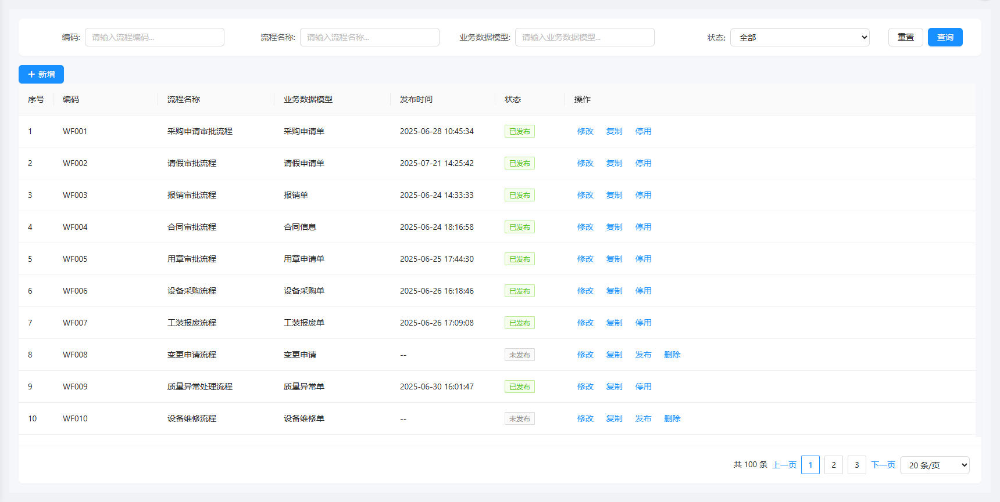
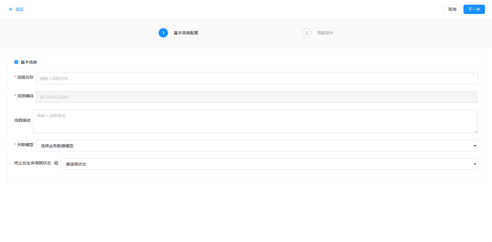
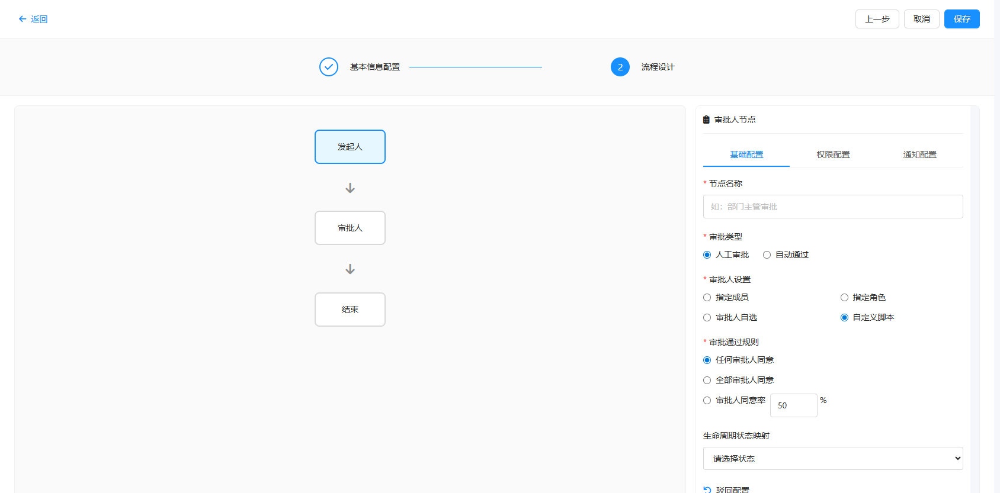
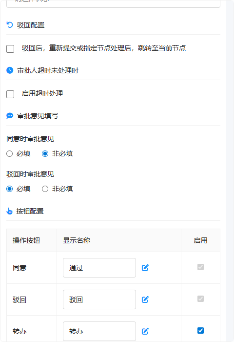
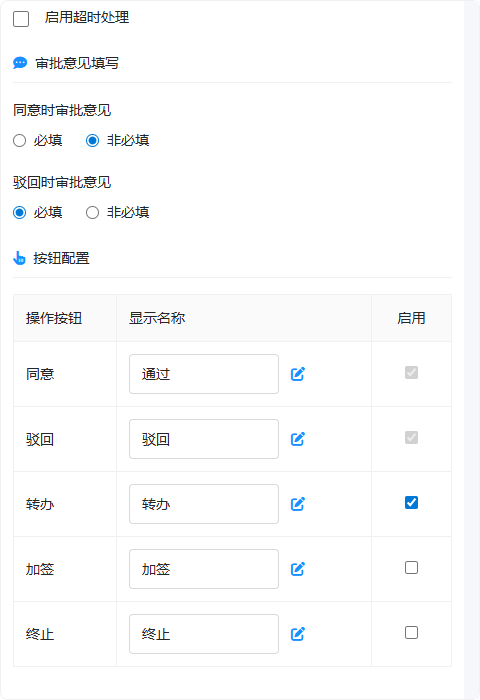
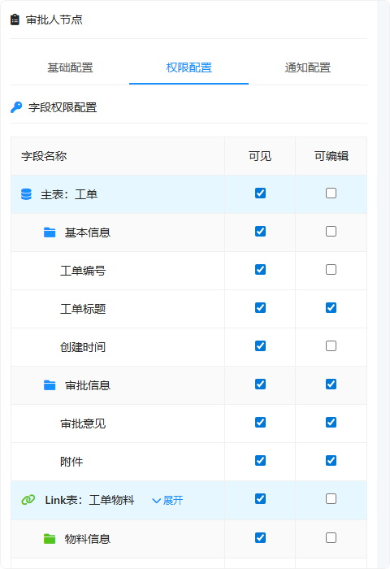
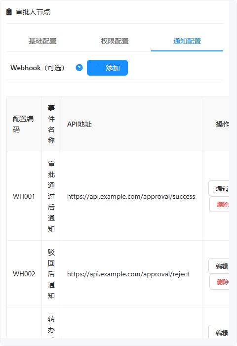
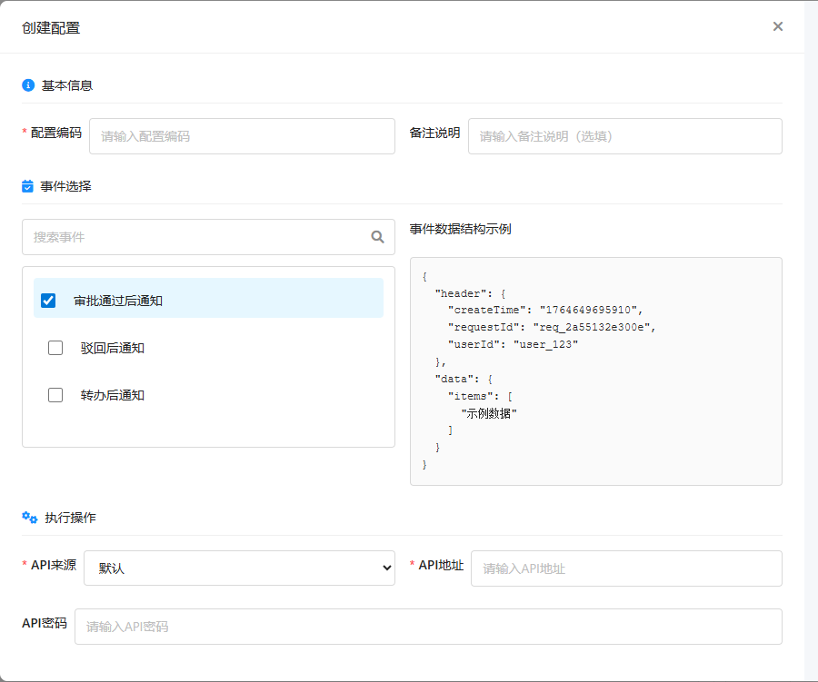
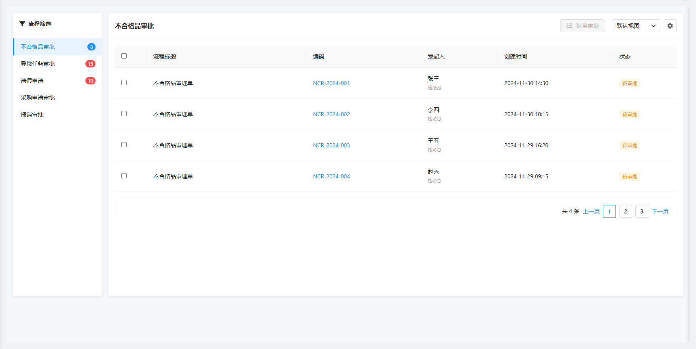

# **DNW31200-审批流管理**

**1.****概述**

## **1.1 背景与目的**

随着业务复杂度的提升，当前审批流模块在实际应用中逐渐暴露出一系列问题，主要体现在架构边界不清、配置流程繁琐、扩展能力不足等方面。为了更好地支撑企业级业务需求，提升系统可维护性和用户体验，本项目旨在对审批流模块进行全面的重构与优化。

**核心目标**：

**职责解耦**：构建高内聚、低耦合的审批流引擎架构，实现业务对象与审批流引擎的职责分离。

**体验升级**：通过精简配置模块、优化交互流程，将审批流配置步骤从4步简化为2步，显著提升配置效率。

**规范统一**：建立审批流程标准化体系，统一审批操作界面和流程信息展示，消除不同业务对象间的不一致性。

**灵活扩展**：通过标准化的Webhook机制和脚本管理，降低技术门槛，提升系统集成灵活性。

## **1.2 现状分析**

经过对现有系统的深入分析，识别出以下核心痛点与问题：

### **1.2.1 核心痛点**

**边界不清晰**：业务对象表单和审批流引擎职责混杂，引擎承担了过多业务侧功能，导致系统耦合度高，维护困难。

**配置冗余繁琐**：

配置流程长达4步（基本信息 → 表单设计 → 流程设计 → 更多设置），存在大量重复和无效配置。

涉及5个独立页面（流程模型、流程分类、流程表单、用户分组、流程监听器），信息架构分散。

**交互体验不佳**：

关键配置层级深（需2-3次点击），节点配置遮挡画布。

缺乏有效引导，默认值设计不合理。

**缺乏统一规范**：不同业务对象的审批界面和业务配置实现不统一，用户体验割裂。

**权限体系混乱**：权限配置分散在不同步骤，且涉及审批流和MOM系统两套人员分组，导致数据不同步和管理混乱。

### **1.2.2 现有架构局限**

**工程结构**：职责不清，模块耦合度高，测试和扩展困难。

**集成方式**：依赖Java流程监听器，技术门槛高，运维成本大。

**数据模型**：业务对象强耦合审批流接口，复用性低。

## **1.3 核心价值**

本次优化将带来多维度的价值提升：

<!-- 发现Worksheet对象: DNW31200-审批流管理 段落27 run0 - 成功提取表格数据 -->
| 维度 | 价值说明 |
| --- | --- |
| 配置效率 | 配置步骤减少50%（4步→2步），独立页面减少60%，大幅降低业务人员配置成本。 |
| 架构质量 | 实现业务与引擎的彻底解耦，提升系统的可维护性和可测试性。 |
| 用户体验 | 统一的交互规范和界面风格，提供清晰的节点命名和操作引导。 |
| 管理效能 | 统一权限管理，避免双系统维护；标准化Webhook和脚本管理，降低运维复杂度。 |

**点击图片可查看完整电子表格**

## **1.4 用户画像**

<!-- 发现Worksheet对象: DNW31200-审批流管理 段落30 run0 - 成功提取表格数据 -->
| 分类 | 角色名称 | 核心职责 | 核心诉求与痛点 |
| --- | --- | --- | --- |
| 流程配置与监控 | 管理员 | 负责流程模型的创建、配置、发布和版本管理；在"我的流程"中监控系统内所有流程实例，执行转办、终止等干预操作。 | 希望流程配置简化高效（从4步减少到2步），能全局监控所有流程实例状态，快速定位并处理异常流程。 |
| 流程发起与跟踪 | 发起人 | 在业务侧发起审批流程，跟踪审批进度，接收审批结果通知。 | 希望能实时查看审批进度，及时获取状态变更通知，被驳回后能快速修改重新提交。 |
| 流程审批与处理 | 审批人 | 在审批流系统中处理待办任务，查看业务数据，执行同意、驳回、加签等审批操作，或撤回已提交的审批。 | 希望待办任务集中展示，业务详情一目了然，审批操作便捷高效，支持批量处理。 |

**点击图片可查看完整电子表格**

## **1.5 术语及缩写解释**

**核心概念**

<!-- 发现Worksheet对象: DNW31200-审批流管理 段落34 run0 - 成功提取表格数据 -->
| 术语 | 说明 |
| --- | --- |
| 审批流 | 业务对象在不同审批人之间流转审批的过程，通过预定义的审批流程模型控制审批路径和规则 |
| 审批流程模型 | 描述一个审批流程的流转过程及可能遇到的分支。由流程基本信息、多个流程节点和节点配置组成，是可复用的审批流程定义。简称：流程模型 使用场景：管理员在"流程管理"页面创建不合格品审理流程、设备调拨审批流程等，配置审批节点和规则后发布供业务使用 |
| 流程实例 | 基于流程模型在具体业务对象上创建的一次实际审批流程，每个流程实例对应一个具体的业务对象 |
| 关联模型 | 由数据建模创建的业务对象模型，可与审批流关联。必须满足以下条件：业务对象模型、实例模型、非Link模型、非系统模型 |
| Webhook | 用户定义的HTTP回调接口，用于实现审批流与外部系统的事件驱动集成，支持节点审批前/后、流程结束等事件通知 使用场景：①审批通过后自动发送邮件/短信通知相关人员；②流程结束后触发外部系统更新业务状态；③审批超时后触发预警通知 |
| 服务端脚本 | 运行在服务端的自定义脚本逻辑，在“脚本管理”中统一维护，用于扩展复杂的审批人规则、数据校验和业务逻辑处理 |

**点击图片可查看完整电子表格**

**流程组成**

<!-- 发现Worksheet对象: DNW31200-审批流管理 段落37 run0 - 成功提取表格数据 -->
| 术语 | 说明 |
| --- | --- |
| 节点 | 流程模型中的组成单元，可以理解为流程图中的一个"步骤"或"环节" |
| 发起人节点 | 流程的"起点"，代表业务发起人提交审批的动作。每个流程有且仅有一个发起人节点，系统自动创建，无需配置 |
| 审批人节点 | 流程中需要人工处理的审批环节。审批人在此节点查看业务数据、填写意见并执行同意/驳回等操作。 使用场景：设置"编制人审核"、"部门经理审批"、"财务复核"等需要人工判断的审批步骤 |
| 条件分支 | 流程中的"二选一"或"多选一"岔路口，系统根据业务数据自动判断走哪条路。类似于程序中的 if-else 逻辑。 使用场景：①金额≤5000走简易审批，金额>5000走标准审批；②根据申请类型（请假/报销/采购）走不同的审批路线 |
| 并行分支 | 流程中的"同时进行"模式，多条审批路线同时启动、各自独立执行，全部完成后才能继续往下走。类似于"兵分多路，最后汇合"。 使用场景：①采购申请需要技术部和财务部同时审核，两边都通过后才能下单；②项目立项需要多个部门并行评审 |
| 路由节点 | 流程中的"智能导航"，根据业务数据自动判断流程应该走向哪个节点。简单理解就是一个"岔路口"，系统会根据预设的条件规则，自动选择正确的路径继续流转。 使用场景：①审批通过后需要根据金额大小决定是否需要额外审批（如金额>10万则跳转到财务总监节点）；②根据业务类型跳转到不同的后续处理节点；③实现"满足条件则跳过某些节点"的灵活流转逻辑 |
| 结束节点 | 流程的"终点"，代表整个审批流程已完成。每个流程有且仅有一个结束节点，系统自动创建，无需配置 |
| 配置面板 | 点击画布中的节点后，在右侧弹出的设置界面。在这里可以配置节点的审批人、权限、通知等详细规则，包含三个Tab页：基础配置、权限配置、通知配置 |
| 审批链路 | 一个流程实例从发起到结束的完整"足迹"，记录了流程经过的所有节点、每个节点的审批人、审批时间、审批意见等历史信息。类似于快递的物流轨迹 |

**点击图片可查看完整电子表格**

**流程状态**

<!-- 发现Worksheet对象: DNW31200-审批流管理 段落40 run0 - 成功提取表格数据 -->
| 术语 | 说明 |
| --- | --- |
| 流程模型状态 |  |
| 未发布 | 流程模型已创建但尚未发布，不可使用 |
| 已发布 | 流程模型已发布，可供业务使用 |
| 停用 | 流程模型被停用，不可发起新流程 |
| 流程实例状态 |  |
| 审批中 | 流程实例正在审批过程中 |
| 已通过 | 流程实例审批通过并结束 |
| 已驳回 | 流程实例被驳回 |
| 已终止 | 流程实例被管理员终止 |

**点击图片可查看完整电子表格**

**用户角色**

<!-- 发现Worksheet对象: DNW31200-审批流管理 段落43 run0 - 成功提取表格数据 -->
| 术语 | 说明 |
| --- | --- |
| 发起人 | 在业务对象上发起审批流程的用户 |
| 审批人 | 负责处理审批任务的用户，根据节点配置规则确定 |
| 流程管理员 | 拥有审批流系统管理权限的用户。 界定规则：凡是拥有系统“流程管理”或“我的流程”菜单访问权限的用户，即被视为流程管理员。 主要职责：流程模型的配置与发布、所有流程实例的监控与强制干预（如转办、终止）。 |

**点击图片可查看完整电子表格**

**审批操作**

<!-- 发现Worksheet对象: DNW31200-审批流管理 段落46 run0 - 成功提取表格数据 -->
| 术语 | 说明 |
| --- | --- |
| 同意 | 审批通过，流程自动流转到下一个审批节点 |
| 驳回 | 审批不通过，流程驳回到发起人或指定节点 |
| 转办 | 将当前节点的审批人从A变更为B，由B继续处理当前审批任务 |
| 加签 | 在当前节点增加临时审批任务。前加签：当前审批人需等待加签人通过；后加签：当前审批人通过后，需加签人校验通过才流转下一节点。 |
| 终止 | 强制结束流程，流程不再流转（仅管理员权限） |
| 撤回 | 审批人撤回自己已同意的审批结果，流程回滚至该节点待处理状态 |

**点击图片可查看完整电子表格**

**权限体系**

<!-- 发现Worksheet对象: DNW31200-审批流管理 段落49 run0 - 成功提取表格数据 -->
| 术语 | 说明 |
| --- | --- |
| 审批流动态权限 | 在流程节点上配置的对业务对象的访问权限，只在审批过程中生效。优先级最高 |
| 关联模型静态权限 | 在角色授权页面配置的对象访问权限，全局生效。优先级中等 |
| 对象基本权限 | 系统默认的权限规则。包括：创建者对未发布对象的编辑权；集成生命周期的对象发布后无编辑权。优先级最低 |

**点击图片可查看完整电子表格**

**2.****需求描述**

## **2.1 业务描述**

### **2.1.1 审批流工作流程**

<!-- 发现Worksheet对象: DNW31200-审批流管理 段落54 run0 - 成功提取表格数据 -->
| 模块 | 页面 | 功能点 | 说明 |
| --- | --- | --- | --- |
| 模型管理 | 模型列表 | 查询 | 按流程类别、编码、名称、模型、状态等提供多维度查询入口 |
|  |  | 新增 | 点击"新增"按钮，进入流程创建页面，开始创建新的审批流程模型 |
|  |  | 编辑 | 修改现有流程配置，支持基于现有流程快速复制 |
|  |  | 发布/停用/启用 | 控制流程模型的生命周期状态，发布后供业务使用 |
|  |  | 删除 | 删除未发布或停用、且无运行实例的流程 |
|  | 模型创建/编辑 | 配置基础信息 | - 填写流程名称：如"不合格品审理"、"设备调拨单"等 - 选择关联模型：不合格品审理单、设备调拨单、异常任务等 - 填写流程描述（可选） - 配置终止后生命周期状态 |
|  |  | 设计流程 | - 在画布上拖拽添加审批人节点 - 配置节点名称：如"编制人"、"校对人"、"审核人" - 设置节点类型：审批人节点、条件分支、并行分支、路由节点 - 连接节点，形成审批路径 |
|  |  | 配置节点规则（基础配置Tab） | - 审批类型：人工审批/自动通过 - 审批人设置：指定成员/指定角色/审批人自选/自定义脚本 - 审批通过规则：任何审批人同意/全部审批人同意/同意率 - 生命周期状态映射、驳回配置、超时处理 - 审批意见要求、操作按钮权限 |
|  |  | 配置节点规则（权限配置Tab） | 配置审批人对业务数据的查看和编辑权限，可覆盖数据建模中的默认权限 |
|  |  | 配置节点规则（通知配置Tab） | 订阅Webhook事件配置审批通知，通知内容由Webhook事件管控 |
|  |  | 发布 | 检查配置完整性后发布，流程模型变为"已发布"状态。版本控制：流程实例创建时绑定具体版本，修改未发布流程不影响已运行实例 |
| 业务审批 | 待办任务 | 查询 | 支持按流程类型筛选，左侧筛选区显示各流程类型及待办数量。右侧按编码、名称、状态等提供多维度查询入口 |
|  |  | 查看详情 | 点击业务对象编码或待办按钮，右侧打开详情抽屉，切换Tab页查看： - 属性Tab：业务主对象基本信息（顶部显示操作按钮） - 子对象Tab：动态显示关联子对象 - 审批流程Tab：流程基本信息和审批链路时间轴 |
|  |  | 数据操作 | 根据节点权限配置，编辑业务主对象或子对象数据 |
|  |  | 审批操作（同意） | 填写审批意见（视配置是否必填），流程自动流转到下一节点。如下一节点配置了"审批人自选"，需先选择审批人 |
|  |  | 审批操作（驳回） | 从流程历史节点列表中选择要驳回到的具体节点，适用于数据填写不正确等情况 |
|  |  | 审批操作（加签） | 发起前加签（需等待加签人通过）或后加签（流程后续流转至加签人校验），详见2.1.2.4章节 |
|  |  | 审批操作（终止） | 如当前节点配置了终止按钮权限，审批人可终止流程 |
|  |  | 批量审批 | 批量执行同意或驳回操作，限制：需同一流程模型 + 同一业务模型 |
|  |  | 流程自动流转 | 系统根据节点配置计算下一审批人，多人审批根据规则判断是否通过，自动流转到下一节点并通知审批人 |
|  |  | 流程结束 | 所有节点审批完成，流程实例状态变为"已通过"，业务对象状态根据生命周期映射自动更新 |
|  | 已办任务 | 查询 | 查看已处理的任务详情，按编码、名称、状态等提供多维度查询入口 |
|  |  | 查看详情 | 支持多Tab页切换查看：属性Tab、子对象Tab、审批流程Tab |
|  |  | 撤回审批 | 在下一节点尚未处理时可撤回（未来支持：下一节点未查看时可撤回），需填写撤回原因 |
| 流程管理 | 我的流程 | 查询 | 管理员查看所有流程实例，支持按流程类型、编码、名称等多维度查询 |
|  |  | 查看详情 | 查看完整业务数据、子对象信息及审批链路信息 |
|  |  | 转办流程 | 管理员将当前节点审批人更改为指定审批人，指定审批人处理完后流程继续流转到下一节点 |
|  |  | 终止流程 | 管理员或有权限的审批人强制结束流程，需填写终止原因。终止只影响流程实例，不影响关联的业务对象实例 |
|  |  | 重新发起流程 | 仅对[已终止]状态的流程显示。跳转至业务对象编辑页面，修改数据后重新提交生成新的流程实例 |

**点击图片可查看完整电子表格**

### **2.1.2 特殊业务场景**

#### **2.1.2.1 多人审批场景**

**场景描述**：某些审批节点需要多人共同审批，即一个审批人节点配置了多个审批人。

**业务需求**：

系统需要支持三种多人审批规则，由流程管理员根据实际业务需要选择：

**任意一人同意**：只要有一个审批人同意即可通过

**全部同意**：所有审批人都必须同意才能通过

**同意率**：达到指定比例的审批人同意即可通过

#### **2.1.2.2 驳回处理场景**

**场景描述**：

审批人审批不通过时，需要将流程驳回。驳回一般适用于数据填写不正确等情况。

**业务需求**：

审批人在执行驳回操作时，可以从流程历史节点列表中选择要驳回到的具体节点。系统提供完整的节点列表供审批人选择。

**驳回后重审规则**：

在流程设计的审批人节点配置面板中，可以设置"驳回后，重新提交或指定节点处理后，跳转至当前节点"配置项：

**勾选此项**：发起人或指定节点处理完成后，流程跳过中间节点，直接跳转至驳回的节点继续审批（例如 A->B->C->D，D驳回给B，B处理完后直接跳转回D，C无需再次审批）

**未勾选此项**：流程需要重新走完所有审批节点（例如 A->B->C->D，D驳回给B，B处理完后流转给C，C处理完后流转给D）

#### **2.1.2.3 终止处理场景**

**场景描述**：

某些情况下需要强制结束流程。系统中的实际场景包括：

场景1：异常任务处理单，问题已在线下解决，无需继续审批

场景2：设备调拨单，业务需求取消，流程需要终止

场景3：流程配置错误或出现异常，需要终止后重新发起

**业务需求**：

**终止权限**：

管理员在"我的流程"页面可以终止任何流程

如果在节点配置面板中为当前节点的审批人配置了"终止"按钮权限，该审批人在审批时也可以执行终止操作

**终止原因**：终止时需要填写终止原因，记录终止的背景和原因

**状态影响**：终止只影响流程实例状态，不影响审批流关联的业务对象实例

#### **2.1.2.4 撤回处理场景**

**场景描述**：

审批人在提交同意操作后，可能需要撤回自己的审批决定。这种情况在实际业务中较为常见，例如：

场景1：审批人提交同意后，发现之前遗漏了某些重要信息，需要重新审核

场景2：审批人提交同意后，业务情况发生变化，需要撤回重新评估

场景3：审批人误操作点击了同意，需要撤回并正确处理

**业务需求**：

**撤回权限**：

审批人只能撤回自己已同意的审批决定

仅在下一节点**尚未处理**时才能撤回（即下一节点审批人还未查看或处理待办）

一旦下一节点开始处理或完成审批，则无法撤回

**撤回条件**：

当前节点状态必须为[已通过]

下一节点状态为[待审批]且下一节点审批人**未查看**任务

撤回操作有时间窗口限制（如：提交同意后24小时内）

**撤回操作流程**：

审批人在"已办任务"页面找到已处理的任务

点击查看详情，在审批流程Tab中看到"撤回"按钮

点击"撤回"按钮，系统弹出确认对话框

填写撤回原因（必填），确认撤回

系统执行撤回操作，流程回滚至该节点

**撤回后的状态变化**：

**当前节点**：状态由[已通过]变更为[待审批]，撤回人重新获得处理权限

**下一节点**：系统自动撤销已生成的待办任务，该任务从下一节点审批人的待办列表中消失

**流程控制**：流程控制权回到撤回人手中，可以重新处理（重新填写意见并提交同意/驳回）

**通知机制**：系统自动发送"任务已撤回"通知给原本的下一节点处理人，避免其困惑

**操作限制**：

同一节点的同一审批人，对同一次审批操作只能撤回一次

撤回操作会记录在审批链路中，显示撤回时间、撤回原因

管理员无权撤回其他人的审批决定

发起人无权撤回他人的审批决定

**审计追踪**：

所有撤回操作都会被完整记录在审批链路中

记录内容包括：撤回时间、撤回人、撤回原因、原审批时间

支持撤回历史的查看和导出

#### **2.1.2.5 加签机制**

**核心含义** 加签是流程发起后，基于业务需要临时增加审批人员的操作。

**不改变流程结构**：加签**不会创建新的流程节点**，也不会修改原有的流程定义模型。

**任务派发**：加签本质上是在**当前节点实例**中，动态增加临时的审批任务。

**配置共享**：加签人直接复用当前节点的配置（如表单可见性、操作权限），无需进行节点配置的复制或克隆。

**向前加签 (Pre-Sign)**

**定义**：当前审批人（A）在处理任务前，认为需要他人（B）先进行审核。

**流转逻辑**：

**A发起**：A操作前加签给B。

**任务挂起**：A的任务进入"挂起/等待"状态（不可处理）。

**B处理**：系统为B在当前节点生成一个审批任务。

**B完成**：B审批通过后，A的任务恢复为"进行中"状态。

**A处理**：A继续进行审批操作。

**典型场景**：员工提交审批，经理觉得需要总监先看一眼（总监通过后，经理再签字）。

**向后加签 (Post-Sign)**

**定义**：当前审批人（A）处理完任务后，需要他人（B）进行补充校验。

**流转逻辑**：

**A发起**：A在审批同意时，选择后加签给B。

**A完成**：A的任务标记为"已处理"。

**节点未结束**：尽管A已同意，但当前节点状态仍为"进行中"，系统流转至下一节点被阻断。

**B处理**：系统为B在当前节点生成一个审批任务。

**B完成**：B审批通过后，当前节点才算真正完成，流程流转至下一节点。

**典型场景**：财务总监签字同意，但要求法务经理补充审核合同条款（法务签完，节点才算过）。

**加签规则说明**

**多人处理**：如果当前节点本身是多人会签，加签仅影响发起加签的那条任务线，不影响其他会签人的逻辑。

**连续加签**：(需确认采用哪种规则)

**方案A (深度限制)**：允许级联加签（B加签给C，C可再加签给D），但限制嵌套深度（如最多3层）。

**方案B (单次限制)**：发起加签后，该条任务链上的所有人（发起人和被加签人）均**不可再次发起加签**。即：A加签给B后，A和B都不能再加签给C。

**驳回处理**：加签人（B）驳回时，任务流转回发起加签的人（A），由A决定后续操作（修改重提或结束）。

## **2.2 数据描述**

### **2.2.1 业务对象ER关系图**

|TODO: 补充审批流核心业务对象的ER关系图，包括流程模型、流程实例、节点、任务等实体之间的关系。|
|---|

### **2.2.2 数据流/生命周期图**

|TODO: 补充审批流数据流转图和生命周期状态变迁图，展示流程从创建到结束的完整数据流向。|
|---|

### **2.2.3 数据字典**

|TODO: 补充核心数据实体的字段定义，包括字段名、类型、长度、是否必填、说明等信息。|
|---|

## **2.3 功能清单**

以下是审批流系统的完整功能清单，按模块分组展示：

# 1. **流程管理 (管理员)**

<!-- 发现Worksheet对象: DNW31200-审批流管理 段落162 run0 - 成功提取表格数据 -->
| 页面 | 功能点 | 功能点描述 |
| --- | --- | --- |
| 流程管理 | 查询 | 按流程类别、编码、名称、模型、状态等提供多维度查询入口 |
|  | 新增/编辑 | 创建新流程、调整现有流程配置、基于现有流程快速复制 |
|  | 删除 | 删除未发布或停用、且无运行实例的流程 |
|  | 发布/停用/启用 | 控制流程模型的生命周期状态，发布后供业务使用 |

**点击图片可查看完整电子表格**

# 2. **审批 (审批人)**

<!-- 发现Worksheet对象: DNW31200-审批流管理 段落165 run0 - 成功提取表格数据 -->
| 页面 | 功能点 | 功能点描述 |
| --- | --- | --- |
| 待办任务 | 查询 | 按流程类型、编码、名称等提供多维度查询入口，支持模糊搜索和精确筛选 |
|  | 查看详情/编辑 | 查看完整业务数据、子对象信息及审批链路信息，支持多Tab页切换展示 |
|  | 审批 | 同意、驳回（选择回退节点）、加签（前/后加签）等审批操作 |
|  | 批量审批 | 批量执行同意或驳回。限制：需同一流程模型 + 同一业务模型 |
| 已办任务 | 查询 | 按流程类型、编码、名称等提供多维度查询入口，支持历史记录检索 |
|  | 查看详情/编辑 | 查看已处理的任务详情，包括当时的业务数据和审批记录 |
|  | 撤回 | 在下一节点未审批时可撤回（未来支持：下一节点未查看时可撤回） |

**点击图片可查看完整电子表格**

# 3. **我的流程 (监控与管理)**

<!-- 发现Worksheet对象: DNW31200-审批流管理 段落168 run0 - 成功提取表格数据 -->
| 页面 | 功能点 | 功能点描述 |
| --- | --- | --- |
| 我的流程 | 查询 | 按流程类型、编码、名称等提供多维度查询入口，支持全流程状态筛选 |
|  | 查看详情 | 查看完整业务数据、子对象信息及审批链路信息，支持多Tab页切换展示 |
|  | 终止 | 终止流程（强制结束），需填写终止原因并记录审计日志 |
|  | 转办 | 转办流程（变更当前处理人），支持选择新的处理人员并填写转办原因 |

**点击图片可查看完整电子表格**

**3.****页面 & 功能设计**

## **3.1 流程管理页面**

**页面原型：**

**功能概览**：

<!-- 发现Worksheet对象: DNW31200-审批流管理 段落175 run0 - 成功提取表格数据 -->
| 页面 | 功能点 | 功能点描述 |
| --- | --- | --- |
| 流程管理 | 查询 | 按流程类别、编码、名称、模型、状态等提供多维度查询入口，支持模糊搜索和精确筛选 |
|  | 新增/编辑 | 创建新流程、调整现有流程配置、基于现有流程快速复制 |
|  | 复制 | 基于现有流程创建副本，自动生成新编码和名称 |
|  | 删除 | 删除未发布或停用、且无运行实例的流程 |
|  | 发布/停用/启用 | 控制流程模型的生命周期状态，发布后供业务使用 |
|  | 历史版本 | 查看流程所有历史版本记录，支持查看和恢复历史版本配置 |

**点击图片可查看完整电子表格**

**查询区域**：页面顶部提供组合筛选功能：

**编码**：文本输入，支持模糊搜索流程编码。

**流程名称**：文本输入，支持模糊搜索流程名称。

**业务数据模型**：文本输入，支持模糊搜索关联的业务模型名称。

**状态**：下拉筛选，选项包括：全部、未发布、已发布、已停用。

**功能按钮**：

**查询**：根据条件刷新列表。

**重置**：清空所有输入条件并重置列表。

**列表区域**：表格左上角提供"**新增**"按钮，点击跳转至流程创建页面。表格包含以下字段：

<!-- 发现Worksheet对象: DNW31200-审批流管理 段落188 run0 - 成功提取表格数据 -->
| 字段名称 | 说明 | 显示规则 | 示例 |
| --- | --- | --- | --- |
| 序号 | 列表行号 | 数字递增 | 1 |
| 编码 | 流程模型的唯一标识 | 文本显示 | WF001 |
| 流程名称 | 流程的业务名称 | 文本显示 | 采购申请审批流程 |
| 业务数据模型 | 关联的业务对象模型 | 文本显示 | 不合格品审理单 |
| 版本号 | 流程的版本标识 | 显示当前生效版本。 若存在未发布的新版本，在此处标记。 示例： - V1.0 - V1.0 (V1.1草稿) | V1.0 |
| 状态 | 当前流程版本的状态 | 使用标签(Tag)区分颜色： - 已发布（绿色）：可正常发起 - 已停用（红色）：暂停发起 | [已发布] |
| 操作 | 可执行的管理动作 | 根据状态动态显示按钮： - 已发布：修改、复制、停用、历史版本 - 未发布：修改、复制、发布、删除 - 已停用：修改、复制、启用、删除、历史版本 | 修改 复制 历史版本 |

**点击图片可查看完整电子表格**

**操作逻辑说明**：

**修改**：跳转至流程编辑页面。如果当前有“未发布”的草稿，直接编辑草稿；如果没有，则基于当前“已发布”版本创建一个新版本草稿。

**复制**：基于选中的流程模型创建一个副本。

**命名规则**：

编码自动生成：原始编码_copy_时间戳

名称自动生成：原始名称_副本_时间戳

**交互**：自动跳转至流程创建页面，数据自动填充。如果不点击保存，该副本将不会被创建。

**发布**：将"未发布"的流程转为"已发布"状态。版本号自动递增（如V1.0 -> V2.0，或根据策略V1.1）。发布后业务侧即可使用该流程。

**停用**：将"已发布"的流程转为"已停用"状态。业务侧不可再发起该流程的新实例。

**启用**：将"已停用"的流程重新转为"已发布"状态。

**删除**：仅"未发布"或"已停用"状态，且系统中无相关运行实例的流程才允许删除。

**历史版本**：点击打开侧滑抽屉或新页面，展示该流程模型的所有历史版本记录。

**操作**：

**查看**：只读模式查看历史版本的流程图和配置。

**恢复**：将该历史版本的配置内容覆盖当前流程的“未发布”草稿（若无草稿则新建），用于版本回滚。

## **3.2 流程创建/编辑页面**

**功能概览**：

<!-- 发现Worksheet对象: DNW31200-审批流管理 段落207 run0 - 成功提取表格数据 -->
| 页面 | 功能点 | 功能点描述 |
| --- | --- | --- |
| 流程创建/编辑 | 基础信息配置 | 配置流程编码、名称、描述、关联业务模型、终止后生命周期状态等基础信息 |
|  | 流程设计 | 可视化编排流程节点，通过拖拽方式添加审批人节点、条件分支、并行分支、路由节点等 |
|  | 节点配置 | 配置节点的基础配置、权限配置、通知配置，包括审批人设置、字段权限、Webhook等 |
|  | 保存/发布 | 保存当前配置为草稿状态或直接发布流程供业务使用 |
|  | 版本控制 | 支持流程多版本管理，修改已发布流程时自动创建新版本草稿 |

**点击图片可查看完整电子表格**

**页面原型：**

**页面交互**：页面采用分步向导（Step Wizard）模式，引导用户按顺序完成配置。

**步骤1：基础信息配置**

**顶部操作栏**：

**保存**：保存当前配置为"未发布"（草稿）状态，仅编辑时显示。

**发布**：保存并直接发布流程，状态变为"已发布"，仅编辑时显示。

**取消**：返回流程管理列表。

**配置项**：

<!-- 发现Worksheet对象: DNW31200-审批流管理 段落219 run0 - 成功提取表格数据 -->
| 配置项 | 配置说明与特殊规则 | 必填 |
| --- | --- | --- |
| 流程编码 | 系统自动生成，支持手动修改，全局唯一 | ✓ |
| 流程名称 | 流程的显示名称 | ✓ |
| 流程描述 | 备注说明 | ✗ |
| 关联业务模型 | 下拉选择系统已预置的业务对象模型（如不合格品审理单、设备调拨单等），流程创建保存后此字段不可修改 | ✓ |
| 终止后生命周期状态 | 配置当流程被终止时业务对象应变更到的生命周期状态，数据源为所选关联业务模型的生命周期状态枚举值 | ✗ |

**点击图片可查看完整电子表格**

**步骤2：流程设计**

**页面原型：**

| |  | |
|--- | --- | ---|

| |  | |
|--- | --- | ---|

**页面布局**：页面分为三个区域：

**组件工具栏**（左侧/顶部）：提各类流程节点组件（审批人节点、条件分支、并行分支、路由节点等）供拖拽使用。

**设计画布**（中间）：可视化编排区域，支持节点的拖拽、连线、删除、复制等操作。默认包含"发起人节点"和"结束节点"。

**属性配置面板**（右侧）：点击画布中的节点时滑出，配置该节点的详细属性。

**顶部操作栏**：

**上一步**：返回步骤1。

**保存**：保存当前配置为"未发布"（草稿）状态。

**发布**：保存并直接发布流程，状态变为"已发布"。

**取消**：返回流程管理列表。

**节点配置项**：

<!-- 发现Worksheet对象: DNW31200-审批流管理 段落234 run0 - 成功提取表格数据 -->
| 节点类型 | Tab | 配置项 | 说明 | 必填 |
| --- | --- | --- | --- | --- |
| 发起人节点 | - | - | 无需任何配置，仅作为流程起点的视觉标识。 流程发起均在业务侧触发，不存在手动从审批流系统发起的情况 | - |
| 审批人节点 | 基础配置 | 节点名称 | 审批节点的显示名称 | ✓ |
|  | 基础配置 | 审批类型 | 配置项：人工审批 / 自动通过 | ✓ |
|  | 基础配置 | 审批人设置 | 配置项：指定成员/指定角色/审批人自选/自定义脚本 四种方式选其一 | ✓ |
|  | 基础配置 | 审批通过规则 | 配置项：任何审批人同意/全部审批人同意/审批人同意率__% | ✓ |
|  | 基础配置 | 通过后生命周期状态 | 配置当前节点审批通过后，业务对象应变更到的生命周期状态 | ✗ |
|  | 基础配置 | 驳回后，重新提交或指定节点处理后，跳转至当前节点 | 场景说明：在当前节点执行驳回操作，重新提交或指定节点处理后。如果勾选了则直接跳转至该节点继续审批；如果未勾选则重新执行审批链路 | ✗ |
|  | 基础配置 | 启用超时处理 | 启用开关。启用后需要设置超时阈值，以及在通知配置Tab中订阅“超时通知”事件 | ✗ |
|  | 基础配置 | 超时阈值 | 配置项："当超过 [数值] [分钟/小时/天▼] 未处理" | ✗ |
|  | 基础配置 | 同意时审批意见 | 配置项：必填/非必填 | ✓ |
|  | 基础配置 | 驳回时审批意见 | 配置项：必填/非必填 | ✓ |
|  | 基础配置 | 按钮配置 | 以列表形式展示操作按钮（同意、驳回、转办、加签、终止），支持自定义修改按钮显示名称和勾选是否启用 | ✓ |
|  | 权限配置 | 主对象字段 | 字段使用复选框控制可见/可编辑权限 | - |
|  | 权限配置 | 子对象字段 | 子对象标题栏提供开关控制整体显示/隐藏，字段使用复选框控制可见/可编辑权限。 子对象的增删改权限完全继承自关联模型配置，本配置仅做字段级微调。 如果有多个子对象，则显示多个子对象控制列表 | - |
|  | 通知配置 | Webhook订阅列表 | 显示已订阅的Webhook列表（表头为编码、事件名称、API地址），支持添加/编辑配置 | - |
|  | 通知配置 | Webhook订阅新增/编辑 | 填写表单项：配置编码（新增时自动生成唯一值且不可修改）、备注说明、事件选择、API来源、API地址、API密码 | - |
| 条件分支 | 基础配置 | 节点名称 | 条件分支节点的显示名称 | ✓ |
|  | 基础配置 | 条件规则配置 | 可视化配置条件组关系（且/或）、条件组（支持添加多个）、规则关系（且/或）、规则项（选择业务字段→选择操作符→输入条件值），统一为文本输入，需用户自行保证格式正确 | ✓ |
| 并行分支 | 基础配置 | 节点名称 | 并行分支节点的显示名称 | ✓ |
| 路由节点 | 基础配置 | 节点名称 | 路由节点的显示名称 | ✓ |
|  | 基础配置 | 目标节点 | 符合条件时跳转到指定流程节点 | ✓ |
|  | 基础配置 | 条件规则配置 | 与条件分支相同的可视化配置逻辑 | ✓ |

**点击图片可查看完整电子表格**

## **3.3 待办任务页面**

**页面原型： **

**功能概览**：

<!-- 发现Worksheet对象: DNW31200-审批流管理 段落240 run0 - 成功提取表格数据 -->
| 页面 | 功能点 | 功能点描述 |
| --- | --- | --- |
| 待办任务 | 流程筛选 | 左侧导航展示所有待办流程类型，显示数量气泡，支持点击切换流程类别并高亮选中状态 |
|  | 查询 | 按流程类型、编码、名称等提供多维度查询入口，支持模糊搜索和精确筛选 |
|  | 视图配置 | 支持默认视图、紧急视图等多视图切换，提供列配置、筛选条件配置、视图编辑等布局设置功能 |
|  | 查看详情 | 点击编码打开详情抽屉，支持多Tab页切换查看：属性Tab（业务主对象）、动态子对象Tab、审批流程Tab（审批链路） |
|  | 数据操作 | 根据节点权限配置，在详情抽屉中编辑业务主对象和子对象数据 |
|  | 审批操作 | 同意、驳回（选择回退节点）、加签（前/后加签）、终止等审批操作 |
|  | 批量审批 | 批量执行同意或驳回操作。限制：需同一流程模型 + 同一业务模型 |

**点击图片可查看完整电子表格**

**页面结构**：左右分栏布局（左侧流程筛选导航，右侧任务列表）。

**批量审批功能****：**

**交互流程**：

**触发**：用户在待办列表勾选多条任务，点击顶部工具栏的"批量审批"按钮。

**弹窗配置**：

**标题**：批量审批

**审批动作**：单选框，选项为 [同意] / [驳回]。**必选**。

**审批意见**：文本域。**必填**，用于统一记录所有选中任务的审批意见。

**操作按钮**：[确定] / [取消]。

**执行反馈**：

点击确定后，前端将选中的任务ID集合、审批动作及意见提交给后端。

系统展示处理进度或最终结果汇总（如：成功 8 条，失败 2 条）。

**业务规则与校验**：

**部分成功策略**：

系统允许批量操作“部分成功”。

对于满足条件的任务执行审批动作，不满足条件的任务返回失败原因。

**校验逻辑**：

前端不进行复杂的前置校验（如是否需要自选下一节点审批人、是否满足节点特殊配置等）。

所有校验逻辑均由后端服务在处理时判断。

**待补充**：具体的后端校验规则及失败错误码定义，需由后端开发人员补充。（例如：若某任务下一节点必须自选审批人，该任务在批量处理时应直接失败并提示原因）。

**详情抽屉交互**：点击列表中的编码，右侧滑出详情抽屉。抽屉包含多个Tab页：

**属性Tab**（默认展示）：

**顶部操作栏**：固定显示操作按钮（编辑、刷新、通过、驳回、终止等）。按钮的显示名称和权限由流程配置决定。

**同意操作交互**：

若下一节点配置了"审批人自选"，点击同意后弹出"选择审批人"对话框（或下拉树），必选后方可提交

若下一节点为普通配置，直接弹出意见填写框（视配置是否必填）

**批量审批交互**：

仅处理状态流转

风险提示：批量操作最终能否执行成功交由后端校验（如校验是否遗漏必填项、是否需要自选审批人），前端仅展示最终的成功/失败结果

**基础信息区**：多列布局展示业务主对象字段（如编号、名称、发现日期等）

**详细信息区**：展示业务对象的具体内容描述

**处理信息区**：展示责任部门、预计时间等补充信息

**动态子对象Tab**：

根据流程关联的业务模型，动态显示子对象Tab（如"不合格品序列号"、"附件"等）

内容以列表形式展示子表数据

**审批流程Tab**：

**流程基本信息**：展示流程名称、发起人、发起时间、所属组织及当前状态

**审批链路时间轴**：

使用垂直时间轴展示完整的审批记录

**历史节点**：显示审批人、审批状态（审批中/已驳回/已通过）、审批时间及审批意见

**当前节点**：高亮显示，标记为[当前节点]，显示当前待处理人

**审批人自选交互**：在审批链路视图中，对于允许自选的下一节点，提供"选择/修改审批人"的交互入口（作为备选操作方式）

**状态标识**：使用不同颜色的圆点或图标区分状态（绿色-通过，蓝色-处理中，红色-驳回）

## **3.4 已办任务页面**

**功能概览**：

<!-- 发现Worksheet对象: DNW31200-审批流管理 段落290 run0 - 成功提取表格数据 -->
| 页面 | 功能点 | 功能点描述 |
| --- | --- | --- |
| 已办任务 | 流程筛选 | 左侧导航展示所有已办流程类型，显示数量气泡，支持点击切换流程类别并高亮选中状态 |
|  | 查询 | 按流程类型、编码、名称等提供多维度查询入口，支持模糊搜索和精确筛选 |
|  | 视图配置 | 支持默认视图、紧急视图等多视图切换，提供列配置、筛选条件配置、视图编辑等布局设置功能 |
|  | 查看详情 | 点击编码打开详情抽屉，支持多Tab页切换查看：属性Tab（业务主对象）、动态子对象Tab、审批流程Tab（审批链路） |
|  | 撤回 | 在下一节点尚未处理时可撤回。未来支持：下一节点未查看时可撤回 |

**点击图片可查看完整电子表格**

**页面结构**：整体布局与交互逻辑与3.3待办任务页面保持一致，采用左右分栏模式（左侧流程筛选导航，右侧任务列表）。

**数据范围**：展示审批流程历史记录中包含当前登录账号，且该账号已完成审批动作（同意/驳回）的所有流程实例。

**详情抽屉交互**：

**撤回按钮**：仅显示"撤回"按钮

**可见性**：仅当流程流转至下一节点，且下一节点审批人**尚未处理**时，该按钮才可见/可用

**操作交互**：点击后弹出确认对话框，填写撤回原因（必填），流程回滚至当前用户所在的节点，状态变为"待审批"

## **3.5 我的流程页面**

**功能概览**：

<!-- 发现Worksheet对象: DNW31200-审批流管理 段落301 run0 - 成功提取表格数据 -->
| 页面 | 功能点 | 功能点描述 |
| --- | --- | --- |
| 我的流程 | 流程筛选 | 左侧导航展示系统中所有已发起的流程类型，显示该类型"进行中"实例数量气泡，支持点击切换流程类别并高亮选中状态 |
|  | 查询 | 按流程类型、编码、名称等提供多维度查询入口，支持模糊搜索和精确筛选 |
|  | 视图配置 | 支持默认视图、紧急视图等多视图切换，提供列配置、筛选条件配置、视图编辑等布局设置功能 |
|  | 查看详情 | 点击编码打开详情抽屉，支持多Tab页切换查看：属性Tab（业务主对象）、动态子对象Tab、审批流程Tab（审批链路） |
|  | 终止 | 强制结束流程（仅对非[已终止]、[已通过]状态的流程显示），需填写终止原因并记录审计日志 |
|  | 转办 | 变更当前处理人，支持选择新的处理人员并填写转办原因 |
|  | 加签 | 为当前节点增加前置或后置的临时审批任务 |
|  | 重新发起 | 仅对[已终止]状态的流程显示。跳转至业务对象编辑页面，修改数据后重新提交生成新的流程实例 |

**点击图片可查看完整电子表格**

**页面结构**：整体布局与交互逻辑与3.3待办任务页面保持一致（左侧流程筛选导航，右侧任务列表）。

**权限与角色定义**：

本页面作为**流程管理员**的监控台

权限判定：凡是拥有"我的流程"菜单栏访问权限的用户，系统均视为具有"流程管理员"角色

**数据范围**：展示系统中**所有**已创建的流程实例，无论状态如何（进行中、已通过、已驳回、已终止）

**详情抽屉交互**：

**顶部操作按钮**：固定显示"终止"、"转办"、"加签"、"重新发起"

**终止**：

**场景**：流程异常或业务取消，需要强制结束

**可见性**：仅对非[已终止]、[已通过]状态的流程显示

**操作交互**：点击后弹出确认框，**必填**终止原因。操作后流程状态变为[已终止]

**重新发起**：

**场景**：流程被终止后，发起人希望修正数据并重新提交审批

**可见性**：仅当流程状态为[已终止]时显示

**操作交互**：

点击按钮，跳转至该业务对象的发起/编辑页面

系统自动加载原业务对象的最新数据

用户修改数据后重新点击提交

**数据处理**：系统生成一个新的流程实例（New Instance），关联该业务对象；原流程实例保持[已终止]状态作为历史记录

**转办**：管理员干预，将当前待办人变更为其他人员

**加签**：管理员干预，为当前节点增加前置或后置的临时审批任务

**4.****业务规则**

## **4.1 权限计算规则**

**核心原则**：**审批流配置优先覆盖**。权限判断是简单的叠加，而是根据是否存在审批流配置来决定生效规则。

**用户最终操作权限（主/子对象CRUD等）判定**：

**判定逻辑**：

**可见性检查**：若用户对主/子对象**不可见**（受审批流显隐配置控制），则直接**不具备**任何操作权限。

**可编辑检查**：若用户可见主/子对象所有字段，但该对象下的所有字段均为**只读**，则**不具备**操作权限。

**权限生效**：若用户可见主/子对象，且**任意一个字段**被配置为**可编辑**，则用户**具备**该对象的操作权限（具体的增删改等能力继承自数据建模的配置）。

**字段级权限判定**：

**判定逻辑**：

**优先**：检查**审批流节点权限配置**。如果有明确配置（可见/可编辑），则**完全遵循审批流配置**。

**兜底**：如果审批流节点未做配置（如设为默认），则回退使用**数据建模**中的默认权限配置。

**适用范围**：此规则同时适用于字段的“可见性”和“编辑权”。

## **4.2 流程状态流转规则**

**正常流转（同意）**：

当前节点所有必要审批人均同意 -> 节点状态变更为[已通过] -> 激活下一节点 -> 下一节点状态变更为[待审批]。

若当前为最后一个节点 -> 流程实例状态变更为[已通过] -> 触发“流程结束”事件。

**驳回流转**：

审批人从流程历史节点列表中选择驳回目标 -> 当前节点状态变更为[已驳回]。

**路径分支**（由2.1.2.2章节配置决定）：

**模式A（重新审批）**：流程回退至目标节点，中间所有节点状态重置，需重新逐级审批。

**模式B（直接跳回）**：目标节点处理后，直接跳转回当前驳回节点，中间节点自动跳过。

**撤回流转**：

**场景回顾**：

**审批人撤回**：审批人撤回自己已同意的审批决定，仅限在下一节点尚未处理时进行。

**触发条件**：

当前节点状态为[已通过]

下一节点状态为[待审批]且审批人未查看任务

在时间窗口限制内（如24小时内）

**处理逻辑**：

**用户操作**：审批人在"已办任务"页面发起撤回，填写撤回原因（必填）。

**状态回滚**：当前节点状态由[已通过]变更为[待审批]，撤回人重新获得处理权限。

**销毁下级**：系统自动撤销已生成的下一节点待办任务，从下一节点审批人的待办列表中移除。

**通知触达**：系统自动发送"任务已撤回"通知给原本的下一节点处理人。

**审计记录**：撤回操作记录在审批链路中，包含撤回时间、撤回人、撤回原因等信息。

**操作限制**：

同一审批人对同一次审批操作只能撤回一次

管理员和发起人无权撤回他人的审批决定

## **4.3 审批通过规则**

**多人审批决策**：

**任意一人**：一人同意 -> 节点通过；一人驳回 -> 节点驳回。

**全部同意**：所有人同意 -> 节点通过；任意一人驳回 -> 节点驳回。

**比例通过**：同意人数/总人数 >= 阈值 -> 节点通过；否则等待或驳回。

**审批人为空处理（异常保护）**：

**场景**：系统根据配置（如指定用户/角色或自定义脚本）计算审批人时，结果为空（即找不到任何接收人）。

**处理逻辑**：**阻断流程**。

流程实例自动挂起或停留在上一节点。

系统发送Webhook异常通知。

**禁止自动通过**（防止合规漏洞）。

## **4.4 全局约束与风险**

**审批并发冲突**：

**场景**：多人在同一节点同时打开审批详情。

**风险**：用户A点击同意后，任务结束；用户B稍后点击同意。

**处理**：后端需具备乐观锁或状态校验机制。用户B提交时，系统提示“该任务已被他人处理”，并自动刷新页面状态。

**版本切换影响**：

流程实例创建时绑定当时生效的流程版本。后续流程模型的修改发布，不影响已运行的实例（除非进行特定的版本迁移操作）。

