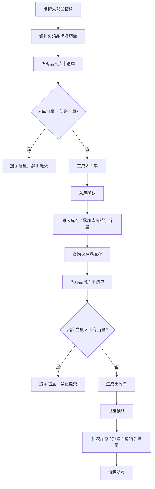
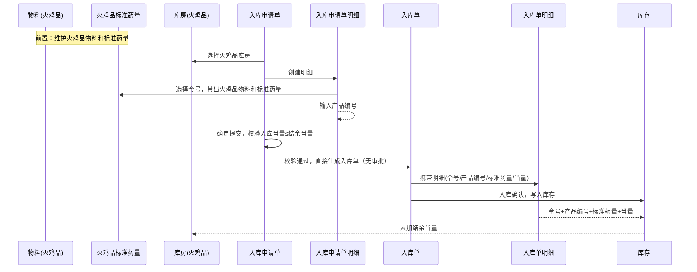
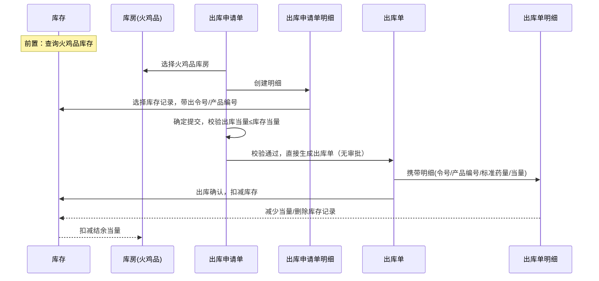

本文档用于描述火鸡品管理需求的骨架，这个是权威的说明，有歧义的地方，以本文档为主。

# 需求概述

火鸡品是一个特殊的物料产品。本需求就是要实现火鸡品的二级库管理，实现火鸡品的入库、出库、库存查询、超量预警等功能。

注意：出入库经办人默认是当前登陆人，无需手动选择。

# 术语

| 术语     | 说明                                                                                                                 |
| -------- | -------------------------------------------------------------------------------------------------------------------- |
| 火鸡品   | 一类特殊的物料产品，具有当量管控要求，需要通过二级库进行专门的入库、出库和库存管理                                   |
| 标准药量 | 火鸡品在特定令号下的标准用药量数值，是计算当量的基准。令号唯一确定一条标准药量记录，一个令号只对应一个火鸡品物料     |
| 当量     | 标准药量与数量的乘积，计算公式：当量 = 标准药量 × 数量。用于衡量库房存储风险，入库时计算写入，出库时扣减             |
| 最大当量 | 库房允许存储火鸡品的当量上限，手动设定，表示该库房的最大安全存储容量                                                 |
| 结余当量 | 库房当前还可存储的当量值，自动计算。计算公式：结余当量 = 最大当量 - 库存当量之和。入库时需校验入库当量不超过结余当量 |

# 业务流程

> **重点**：虽然标准流程是"申请→单据→确认"三步，但火鸡品无库位管理（若库房下存在库位，则取第一个库位作为默认库位，无需用户选择），因此申请单校验通过后即可自动完成入库/出库，无需用户二次操作。

# 业务模型

## 物料

标识火鸡品物料，是火鸡品标识的推导源头。

## 火鸡品标准药量

令号唯一确定一条标准药量记录，一个令号只对应一个火鸡品物料，是入库时计算当量的基准。

## 库房

标识火鸡品库房，设定最大当量，自动计算结余当量。是单据推导火鸡品标识的权威来源。

## 库存

记录火鸡品的令号、产品编号、标准药量、当量等状态数据，入库时写入，出库时扣减。

## 入库申请单

选择火鸡品库房，校验入库当量不超过结余当量。无火鸡品标识冗余，通过库房推导。

## 入库申请单-明细

先选择令号，自动带出火鸡品物料和标准药量，手动输入产品编号。

## 入库单

入库申请单校验通过后自动生成，自动完成入库确认。无火鸡品标识冗余，通过库房推导。

## 入库单-明细

从申请单携带令号、产品编号、标准药量、当量。

## 出库申请单

选择火鸡品库房，校验出库当量不超过库存当量。无火鸡品标识冗余，通过库房推导。

## 出库申请单-明细

从库存记录带出令号、产品编号、标准药量、当量。

## 出库单

出库申请单校验通过后自动生成，自动完成出库确认。无火鸡品标识冗余，通过库房推导。

## 出库单-明细

从申请单携带令号、产品编号、标准药量、当量。

# 业务模型关系

## 入库活动序列

## 出库活动序列

# 业务模型扩展属性汇总

## 物料

| 扩展属性   | 类型 | 输入方式 | 说明               |
| ---------- | ---- | -------- | ------------------ |
| 火鸡品标识 | 布尔 | 手动     | 标识此物料是火鸡品 |

## 火鸡品标准药量

| 扩展属性 | 类型     | 输入方式       | 说明                               |
| -------- | -------- | -------------- | ---------------------------------- |
| 令号     | 文本     | 手动输入       | 唯一，一个令号只对应一个火鸡品物料 |
| 火鸡品   | 物料引用 | 选择火鸡品物料 |                                    |
| 标准药量 | 数值     | 手动输入       |                                    |

## 库房

| 扩展属性   | 类型 | 输入方式 | 说明                                      |
| ---------- | ---- | -------- | ----------------------------------------- |
| 火鸡品标识 | 布尔 | 手动     | 标识此库房存储火鸡品                      |
| 最大当量   | 数值 | 手动输入 |                                           |
| 结余当量   | 数值 | 自动计算 | 最大当量-库存当量之和，表示还可存储的当量 |

## 库存

| 扩展属性   | 类型 | 输入方式   | 说明                   |
| ---------- | ---- | ---------- | ---------------------- |
| 火鸡品标识 | 布尔 | 入库时写入 | 标识此库存记录是火鸡品 |
| 令号       | 文本 | 入库时写入 |                        |
| 产品编号   | 文本 | 入库时写入 |                        |
| 标准药量   | 数值 | 入库时写入 |                        |
| 当量       | 数值 | 入库时写入 |                        |

## 入库申请单

无火鸡品标识冗余，通过库房推导。

| 扩展属性 | 类型 | 输入方式 | 说明                         |
| -------- | ---- | -------- | ---------------------------- |
| 经办人   | 文本 | 自动带出 | 默认当前登录人，无需手动选择 |
| 备注     | 文本 | 手动输入 |                              |

## 入库申请单明细

| 扩展属性   | 类型     | 输入方式                                             | 说明                                     |
| ---------- | -------- | ---------------------------------------------------- | ---------------------------------------- |
| 令号       | 文本     | 从标准药量表选择，数据源为火鸡品标准药量表中所有令号 | 先选令号，选中后带出火鸡品物料和标准药量 |
| 火鸡品物料 | 物料引用 | 选择令号后自动带出                                   | 根据令号自动带出对应的火鸡品物料         |
| 产品编号   | 文本     | 手动输入                                             |                                          |

## 入库单

无火鸡品标识冗余，通过库房推导。

| 扩展属性 | 类型 | 输入方式     | 说明 |
| -------- | ---- | ------------ | ---- |
| 经办人   | 文本 | 从申请单携带 |      |
| 备注     | 文本 | 从申请单携带 |      |

## 入库单明细

| 扩展属性 | 类型 | 输入方式     | 说明 |
| -------- | ---- | ------------ | ---- |
| 令号     | 文本 | 从申请单携带 |      |
| 产品编号 | 文本 | 从申请单携带 |      |
| 标准药量 | 数值 | 从申请单携带 |      |
| 当量     | 数值 | 从申请单携带 |      |

## 出库申请单

无火鸡品标识冗余，通过库房推导。

| 扩展属性 | 类型 | 输入方式 | 说明                         |
| -------- | ---- | -------- | ---------------------------- |
| 经办人   | 文本 | 自动带出 | 默认当前登录人，无需手动选择 |
| 备注     | 文本 | 手动输入 |                              |

## 出库申请单明细

| 扩展属性 | 类型 | 输入方式       | 说明 |
| -------- | ---- | -------------- | ---- |
| 令号     | 文本 | 从库存记录带出 |      |
| 产品编号 | 文本 | 从库存记录带出 |      |
| 标准药量 | 数值 | 从库存记录带出 |      |
| 当量     | 数值 | 从库存记录带出 |      |

## 出库单

无火鸡品标识冗余，通过库房推导。

| 扩展属性 | 类型 | 输入方式     | 说明 |
| -------- | ---- | ------------ | ---- |
| 经办人   | 文本 | 从申请单携带 |      |
| 备注     | 文本 | 从申请单携带 |      |

## 出库单明细

| 扩展属性 | 类型 | 输入方式     | 说明 |
| -------- | ---- | ------------ | ---- |
| 令号     | 文本 | 从申请单携带 |      |
| 产品编号 | 文本 | 从申请单携带 |      |
| 标准药量 | 数值 | 从申请单携带 |      |
| 当量     | 数值 | 从申请单携带 |      |

# 火鸡品标识冗余结论

| 业务模型       | 是否冗余火鸡品标识 | 结论依据                                               |
| -------------- | :----------------: | ------------------------------------------------------ |
| 物料           |       ✅ 保留       | 基础定义，标识物料本身是否为火鸡品，是推导源头         |
| 库房           |       ✅ 保留       | 基础定义，标识库房是否存储火鸡品，是单据推导的权威来源 |
| 库存           |       ✅ 保留       | 状态数据，入库时固化；高频查询需要，避免JOIN库房表     |
| 入库申请单     |      ❌ 不冗余      | 通过库房推导，流程性单据                               |
| 入库申请单明细 |      ❌ 不冗余      | 通过单据→库房推导                                      |
| 入库单         |      ❌ 不冗余      | 通过库房推导，流程性单据                               |
| 入库单明细     |      ❌ 不冗余      | 通过单据→库房推导                                      |
| 出库申请单     |      ❌ 不冗余      | 通过库房推导，流程性单据                               |
| 出库申请单明细 |      ❌ 不冗余      | 通过单据→库房推导                                      |
| 出库单         |      ❌ 不冗余      | 通过库房推导，流程性单据                               |
| 出库单明细     |      ❌ 不冗余      | 通过单据→库房推导                                      |

核心原则：**物料和库房是火鸡品标识的基础定义（源头），库存是状态固化（查询优化），单据类实体通过库房关系推导即可，不冗余存储。**
