# 天府轻动MOM项目详细设计方案V3

> 由 `scripts/Convert-DocxToMarkdown.py` 从 DOCX 直接解析生成。
> 图片已提取到同名 `*.assets/` 目录；页眉、页脚、脚注、尾注和批注位于文末附录。

基于航空发动机研制全业务流程的数智系统（二期）制造运营管理模块详细设计解决方案

武汉开目信息技术股份有限公司

总部	中国·武汉东湖新技术开发区·武汉软件新城D7栋

传真：	027-67869876

电话：	027-67869800

http：	www.kmsoft.com.cn

历史修改记录

| 版本 | 修改人/日期 | 摘要 | 审核人/日期 |
| --- | --- | --- | --- |
| V1 | 陈剑/2025-11-26 | 创建 |  |
| V2 | 陈剑/2025-12-24 | 经装试中心初评后完善 |  |
| V3 | 陈剑/2026-01-09 | 经天府轻动各业务负责人评审后完善 |  |
|  |  |  |  |
|  |  |  |  |
|  |  |  |  |
|  |  |  |  |
|  |  |  |  |

目录

1. 前言	7

1.1. 总则	7

1.2. 读者	7

1.3. 术语	7

2. 项目概述	8

2.1. 项目背景	8

2.2. 项目目标	9

3. 现状描述与需求分析	10

3.1. 生产管理	10

3.1.1. 加工计划管理	10

3.1.2. 工艺准备	11

3.1.3. 物料与工装工具准备	11

3.1.4. 计划排程与下发	12

3.1.5. 外委管理	13

3.1.6. 计划变更与调整	13

3.2. 装配试车管理	16

3.2.1. 装配任务	16

3.2.2. 试车任务	17

3.2.3. 串换件管理	18

3.2.4. 异常管理	19

3.2.5. 工时管理	20

3.3. 车间仓储与配送管理	21

3.3.1. 仓储管理	21

3.3.2. 配送管理	22

3.4. 质量管理	23

3.4.1. 检验质量控制	23

3.4.2. 产品质量控制	25

3.4.3. 计量器具管理	29

4. 系统详细设计	31

4.1. 系统功能总体架构	31

4.2. 生产制造管理	31

4.2.1. 生产制造计划	31

4.2.2. 生产准备计划	44

4.2.3. 外委管理	48

4.2.4. 计划时间变更	57

4.2.5. 计划状态变更	61

4.2.6. 工艺变更	64

4.3. 装配试车管理	69

4.3.1. 装配任务管理	69

4.3.2. 试车任务管理	78

4.3.3. 串换件管理	84

4.3.4. 异常管理	90

4.3.5. 工时管理	95

4.4. 车间仓储与配送管理	101

4.4.1. 入库管理	101

4.4.2. 出库与配送管理	110

4.4.3. 盘点管理	123

4.4.4. 库房基础管理	129

4.5. 质量管理	132

4.5.1. 入库检验	132

4.5.2. 过程检验	139

4.5.3. 故检管理	142

4.5.4. 不合格品控制	148

4.5.5. 返工返修	157

4.5.6. 废品处置	162

4.5.7. 计量器具管理	167

4.6. 工作流管理	175

4.6.1. 业务审批流程场景	175

4.6.2. 工作流设计	176

4.6.3. 集成设计	178

4.7. 基础数据管理	179

4.7.1. 物料信息管理	179

4.7.2. MBOM管理	181

4.7.3. 工艺路线管理	183

4.7.4. 组织人员管理	185

4.7.5. 工作中心管理	187

4.7.6. 供应商管理	188

4.7.7. 生产设备台账管理	189

4.7.8. 电子卷宗	190

4.7.9. 条码管理	191

4.7.10. 工艺单据管理	191

4.8. 生产决策	192

4.8.1. 看板中心	192

4.8.2. 报表中心	192

4.9. 系统集成	194

4.9.1. MOM与PLM集成	194

4.9.2. MOM与ERP集成	195

4.9.3. MOM与WCS集成	195

4.9.4. MOM与主数据集成	196

4.9.5. MOM与OA集成	197

4.9.6. MOM与应用集成平台集成	197

5. 运维计划	198

5.1. 本地化运维服务	198

5.2. 运维服务内容	198

5.3. 运维技术支持	199

5.4. 电话技术支持	199

6. 变更管理	199

6.1. 变更约定	199

6.2. 变更流程	200

7. 交付物	200

8. 验收标准	201

9. 文档确认与执行	201

10. 解决方案评审结论	201

## 前言

### 总则

本方案书中四川天府轻型动力科技有限公司简称天府轻动，武汉开目信息技术股份有限公司简称开目公司。

开目公司于2025年9月至11月进行了业务调研，结合企业在信息化建设方面的规划，对天府轻动MOM系统建设进行合理的规划，编制本解决方案。本方案书的重点是对企业业务解决方案，文中部分所引述的企业业务仅仅是为推导出业务解决方案而做的简单描述，本方案书中软件界面为功能示意，旨在说明软件功能，并不代表软件产品正式界面等。为了信息安全起见，本文档已经将产品类型、产品名称、企业规模等敏感信息去除。

本方案书未经双方同意，不得向第三方提供。

- 四川天府轻型动力科技有限公司简称天府轻动。

- 武汉开目信息技术股份有限公司简称开目公司或武汉开目。

- 武汉开目信息技术股份有限公司MOM系统简称MOM系统。

### 读者

本方案书的主要阅读对象为四川天府轻型动力科技有限公司的相关信息化部门负责人、装试中心人员、设计人员、工艺人员、质量部检验员等，以及开目公司的项目管理组、开发测试、实施人员等。

本方案签字确认生效后，对本方案涉及的相关功能的修改、增补，应经双方项目经理共同签字确认。对本项目范围、周期影响重大的修改，应提交双方领导层决策。

### 术语

对象：“对象”是系统的基本单元。它是数据的一种直观表现形式和常见载体，是现实世界中的业务实体和数据实体在系统中的体现。

例如，一个齿轮、一个螺栓是业务实体，系统中则存在齿轮对象、螺栓对象，它们同属于零部件对象。

属性：“属性”即事物本身所固有的性质。如齿轮有齿数，螺栓有螺距，这些特征在MOM系统中则体现为对象的属性。为了区分每个对象，必须有一个或几个属性可以作为对象的唯一标识，如零件可以用代号来标识，单据可以用单据编号来标识，这些属性是对象的关键属性。关键属性必须符合唯一性约束条件才能被系统管理。

多装多试：“多装多试”是指在航空发动机制造领域，发动机的制造过程需经历多次装配、分解及试车环节，只有在这些步骤全部完成且检验合格后，方能交付使用。

检查项：“检查项”指工艺规程中对半成品或成品的检验要求。操作员和检验员根据检查项及检验要求填写检查记录与质量参数。

报工：“报工”是生产相关人员向系统上报生产任务（含工序、工步）的实际完成数量、工时、质量及资源使用等数据，以支撑生产进度跟踪、成本核算等管理需求的操作。

## 项目概述

### 项目背景

四川天府轻型动力科技有限公司（以下简称“公司”）自2024年4月30日成立以来，即以打造“中国航发创新试点和市场化平台、中国航发通航动力科技成果转化平台和相关科技成果转化平台”为使命，聚焦军贸、通航市场，致力于构建小型涡喷、涡扇发动机的市场化发展平台。

2024年5月11日，国务院发布《制造业数字化转型行动方案》，为企业加速数字化转型提供了明确的政策指引与鼓励。与此同时，人工智能技术呈现爆发式增长，应用场景不断拓展，深刻影响着从智能办公到生产优化的各个环节。面对这一历史性机遇与市场竞争态势，天府轻动公司审时度势，确立了面向航空发动机的数智化建设目标，旨在抢抓人工智能赋能产业发展的机遇，充分释放数字技术潜能，全面提升航空发动机产品研发、制造与运营能力，并积极打造成为行业数智化工程创新示范单位。

开目公司须与天府轻动携手共建，完成本项目制造运营管理模块的设计与实施，确保满足最终客户七大核心业务场景（产品研发生命周期管理、线索到订单、订单到交付、采购到付款、销售到收款、质量管理、项目管理）中制造场景的核心业务需求。

### 项目目标

工艺数据管理：从研发管理模块集成MBOM、结构化工艺数据与图纸文件及相关变更信息等。为后续生产管理、装配管理、试车管理、质量管理等业务提供基础数据，并且给予生产现场作业指导。

生产管理：通过与企业资源管理模块集成，获取生产订单，并进行工艺匹配、订单拆分、计划排产、齐套性检查、作业任务派工等，计划调度人员通过生产管理进行生产统筹调度。

装配试车作业执行管理：主要针对装配和试车生产作业任务进行执行与反馈，针对系统下发的工序作业任务，有对应的作业人员进行生产，工人进行扫码、刷卡或使用账号密码登录系统开始任务执行，当生产任务完成后工人进行任务报工。 通过报工数据向上反馈及归集，实现计划执行进度实时反馈和透明，便于计划调度人员快速找到瓶颈工位/现场异常，及时协调工作，保障交期。

质量管理：接收研发管理模块的质量控制信息，在加工和检验过程中根据质量要求控制、执行对应的检验任务，同时在加工和检验过程中结构化采集过程要素和质量特性信息，便于进行质量分析。最终根据质量交付与追溯的要求形成电子卷宗。

仓储与配送管理：实现物料（包含成品、半成品、零组件、辅材、耗材、工装工具、量具等）进场出入库、库存盘点和储位可视化的功能。将原来领料制升级为配送制。基于工位排程、节拍化、实现配送过程计划拉动的作业组织模式，达到与生产节拍的高度契合。此外，系统结合立体库快速出入库、高效分拣、AGV，准时化配送，达到物料配送的智能化、自动化、无人化，实现仓储、物流、装配作业高效的协同。

决策分析：系统通过对生产任务执行过程中任务的开工与报工、质量检验、设备运行过程数据采集等相关数据进行统计分析，以统计分析报表及看板形式形象化、直观化、具体化的展示与导出，涵盖计划达成、生产执行、异常统计、质量统计、库存信息、设备运行等相关数据统计分析应用，为管理人员提供辅助决策依据。

## 现状描述与需求分析

### 生产管理

#### 加工计划管理

##### 现状描述

供应链中心结合库存情况、在制品进度、采购在途进度以及内部产能约束等因素，并依据发动机产品BOM生成主生产计划。主生产计划包括加工计划，采购计划，物流发货计划。供应链中心将加工计划（该计划为三个月内的整机月度交付计划，目前都为研制产品，暂无批产产品）下达至装试中心，形成装试中心的装配计划与试车计划。

装试中心同时会接收工程技术中心的临时试制计划，以及生产过程中产生的返工返修计划，出厂试车计划，临时分解计划。

一台发动机对应一个生产计划，计划数量为1；无整机外委计划。

##### 需求分析

MOM系统与ERP系统集成，接收发动机整机计划与大部件计划。

- 临时试制计划，临时分解计划，返工返修计划，出厂试车计划导入至MOM系统由装试中心统一管控。

- 需对发动机整机计划进行计划拆解，将发动机计划拆解为装配，试车，分解子订单，监控整个发动机在装配、分解与试车过程中的进度。

- 对生产订单的状态与进度进行查看。

#### 工艺准备

##### 现状描述

工程技术中心接收到科研项目任务，工艺人员在收到研发人员输出的产品EBOM和图纸等技术文件后，开始编制发动机产品及其自制部件的装配，分解，试车工艺规程。工艺规程审批发布后，工艺员出具施工单与生产流转卡转交至装试中心计划员。计划员分派工序任务时将工艺文件下达至班组长，班组长再将工艺文件下发到具体的操作者。

##### 需求分析

接收工艺员在PLM系统中编制并审批发布的工艺路线数据。

计划员需在计划下发前核对工艺路线准确性，检查工艺文件版本时效性。

#### 物料与工装工具准备

##### 现状描述

供应链中心基于采购计划，以及发动机产品BOM清单中的采购件规格与数量开展采购备料工作，并全程跟踪物料的到货进度。当采购物料到货后，装试中心第一时间通知质量部检验员，依据收货单信息对物料进行入库前检验；检验合格后，装试中心库房管理员同步办理入库单据，并完成实物的入库。

装试中心计划员在将计划下发至车间前，需对物料、工装工具、计量测具、辅料进行齐套性检查。其中物料包括采购件、原材料；总装产品计划还需检查其部件的在制进度或库存情况。

针对物料，计划员会逐一检查版次、供应商信息，以及“仅限地面使用”“仅限部件实验”“配作”等特殊要求。“仅限地面使用”的物料需在超差审理环节标注该要求。库存出库拣配环节，针对标注“仅限地面使用”的订单，库房管理员会优先分配带有该标识的库存。目前会将齐套分析后已占用的物料放置在车间现场配套库中，提前配套占用。

针对工装工具，工程技术中心向供应链中心提交请购申请，供应链中心负责制定工装工具采购计划。装试中心要求工装工具需在计划开始前五天送达库房。

##### 需求分析

- 装试中心计划员在计划排程下发前，需对发动机或大部件进行配套物资齐套性检查。需形成物料准备计划。通过物料准备计划驱动仓储库管员开展备料工作，物资包括部件，采购件，工装工具，生产辅料。

#### 计划排程与下发

##### 现状描述

装试中心计划员每日开展晨会跟踪计划进度，在EXCEL中对生产计划进行排程。各生产计划排程到发动机部件级（转子件、静子件、传总装、试车、分解故检），并在EXCEL中标识其周期，装配开始时间，计划完成时间以及风险。

计划员需对计划开展全量或增量排程，因当前均为科研产品计划，需随时重新排程；排程前需梳理分析设备、关键工装、人员出勤及资质、物料库存等资源状况。针对排程结果，计划员会根据实际情况适当调整任务优先级、调配资源或安排加班，确保产品按节点准时交付。

##### 需求分析

- 计划排程需求需通过项目第一阶段试运行，积累数据模型后，MOM项目组与装试中心召开专题会议，结合试运行反馈情况讨论计划排程详细解决方案，后续需求分析与功能详细设计参照《计划排程专题解决方案》。

#### 外委管理

##### 现状描述

外委场景主要出现在装配、试车过程和返修过程中：

- 工艺员在编制工艺时，设定的预定义外委工序。存在连续工序外委的场景。

- 在装配过程中，由于设备损坏等原因，将自制工序转变为外委工序，临时委托给其他厂商。

- 试车任务未来也会有外委，脉动需委托624。

- 发生返工返修情况时，需委托外部厂商进行返修加工。

外委计划由装试中心计划员发起，会将采购件和原材料一并发货给外委厂商。待外委厂商完成加工后，装试中心对半成品进行首次收货。所有的外委收货都需进行入库检验，与采购入库检验相同。入库之后，下道工序的操作者再从库房领取物料。

##### 需求分析

维持现状实现系统业务场景。MES系统记录外委工序的外委供应商，外委发送时间与返回时间，并将外委工序信息发送至ERP系统。

#### 计划变更与调整

##### 现状描述

计划变更分为暂停、恢复、终止。变更来源主要为以下5个内容：

- 客户需求变化

客户需求的变更可分为需求节点变动、产品要求改变以及取消订单。

当需求节点发生变化时，供应链中心计划员调整生产制造计划的时间节点，同步通知并下达给装试中心。装试中心计划员收到新的时间节点计划后，立即启动重新排程工作。

当产品要求发生变化（如客户对发动机性能或参数等提出变更），可能引发设计或工艺变更，供应链中心计划员会第一时间通知装试中心暂停当前计划。待变更完成且确认无误后，再恢复计划执行。

当客户取消计划时，供应链中心会首先取消对应的采购计划，随后通知装试中心。装试中心计划员在接到通知后，会终止加工计划，并要求操作者将已从仓库领出的物资退还入库。退回的物料无需检验即可办理入库手续。

在装配过程中收到计划取消通知时，装试中心计划员会根据其他计划的优先级来判定，是否继续完成当前已取消的计划。若继续装配，完成后将产品入库，作为库存产品留存。

在试车过程中收到计划取消通知时，会有2种处理情况；情况一，计划员下达临时分解计划，将发动机从试车台中卸下并进行分解。分解后的零部件或大组件回库，且无需进行入库检验。 情况二，计划员下达终止试车任务，将发动机从试车台中卸下整机入库，且无需进行入库检验；

当计划取消时，若生产过程正在处理质量相关问题，装试中心需向质量部告知计划已取消。质量部要对相关流程（如不合格品审理、现场异常分析）进行闭环处理。已完成计划的质量检测数据需予以保留，以便后续追溯。

- 根据内外部资源变化调整计划（采购周期，质量问题）

由于采购件或原材料的采购进度延迟，致使装试中心无法按时开工。供应链中心将采购延期的情况告知装试中心，并对计划节点进行调整。装试中心的计划员在收到相关信息后，重新进行排程。

在生产过程中，若出现现场异常或质量问题，触发了质量部的相关处理流程，装试中心需暂停生产计划，并对相关时间节点进行调整。待质量问题处理完成形成闭环后，恢复生产计划。

- 按照项目优先级的调整导致计划的变化

供应链中心依据项目优先级以及客户需求的变更，调整计划时间节点后下发至装试中心。

- 设计状态变更

当设计单位提供的图纸或BOM出现变更后，供应链中心将通知装试中心暂停计划。待设计变更完成，装试中心会根据变更内容启动退料或补料流程。

- 工艺变更

主要来源于设计更改，工艺优化改进，装配和试车过程中的工艺问题，质量问题。工艺员将变更后的工艺规程，新的施工单给到装试中心，再下发至班组长。下次该型号发动机生产时，继续以原工艺规程进行装配或试车。（装配与修理变更比重大）

若外场反馈质量问题，需对成品进行工艺变更，工程技术中心编制临时工艺，装试中心下达临时返修计划。

原工艺路线中有并行工序和串行工序，变更后存在将工艺内容更改，并行改串行，串行改并行。（更多针对于大工序中的小工步内容。后续可能存在大工序的串并更改）

已开工的工序，发生工艺变更，当前工序暂停，待工艺变更完成后，根据实际情况补料或退料，继续工序。（临规：在不改变原工艺路线的工序号的情况下插入临时工序）

贯彻流程：设计升版改图纸，质量问题供应商发函整改等处理流程。详细流程质量部正在设计当中，暂未形成程序文件。装试中心需依据贯彻流程中的贯彻内容，统计发动机的版本状态，追溯统计（记录何种版本已下达了哪些计划，哪些计划正在执行，已经交付）。工程技术中心依据贯彻单中的贯彻内容编制临时工艺，下达施工单。装试中心接收执行后形成闭环。

##### 需求分析

- 允许依据实际生产情况和生产进度，手动生产订单的时间节点、优先级调整。

MOM系统接收ERP系统下达的计划变更通知，主要为计划时间变更与计划状态变更。计划员在MOM系统中进行计划时间调整与状态变更。

MOM系统接收PLM系统下达的施工单以及设计变更通知，计划员基于变更通知内容开展后续领料和退料工作。

- MOM系统接收PLM系统下达的工艺变更通知，待变更完成后，计划员以变更后的工艺路线匹配计划并下发至现场。

### 装配试车管理

#### 装配任务

##### 现状描述

装试中心计划员向车间工作中心下达装配任务，同时将生产流转卡等工艺技术文件交付给班组长，这些文件将作为指导性资料，供操作者开展装配工作。当班开工前需进行设备点检。操作者在各工序开工前发起领料申请，库房管理员完成拣货后，将物料运送至现场配套站。操作者在配套站依据配套单所列物料进行领取，随后将物料运送至工作台。

工艺员在编制发动机装配工艺时，会在一本工艺规程中编写首次装配和二次装配的工序，并通过对工序和工步进行特殊标记，向操作者明确首装与复装的工序操作流程。

在装配过程中，操作者需查阅规范、施工单等技术文件，并在生产流转卡上反馈装配进度以及质量记录（如关键尺寸、关键参数等）。同时，操作者要依据工艺文件的要求，通知检验员到现场开展工序检验工作，并填报质量检验参数。

发动机装配完成后，装试中心装配组需与试车组进行交接，填写交接记录表。

##### 需求分析

- 任务派工与协调

- 计划排程后自动派工至工作中心。同时支持手动派工调整派工信息。

- 开工前点检

- 工序任务开工前，对物料、工装工具、辅料等物资进行收料点检确认。

- 任务开工

- 系统自动记录开工人员、开工时间，形成开工记录。

- 任务执行

- 任务执行过程中，记录操作员的装入物料信息与拆卸信息，形成完整的装配与拆卸记录。将操作者在纸质装配生产流转卡及试验报告上填写的质量参数记录转为线上填报。

- 浏览工艺文件

- 在任务执行过程中，操作者可预览工艺文件。

- 完工汇报

- 对装配试车工序任务进行报工操作，系统自动根据当前时间记录实际完工时间。

- 上传附件

- 通过扫描文件，拍照等形式将相关质量文件上传至MOM系统中。

#### 试车任务

##### 现状描述

试车工艺规程总则：发动机安装与拆卸，发动机工厂试车，发动机检验试车，发动机附加试车，发动机油封。

计划与文件准备：接收下发的试车任务书，联动编制生产制造与准备计划，明确发动机及附件、工装工具、燃料等资源周期；协调 624 编制试验大纲、风险分析报告、应急预案、试验卡片等文件，同步准备发动机安装单、试验前检查单、记录单等管理文件。试车任务无外委工序。

台架与发动机准备：推进台架准备，按发动机安装单完成发动机上台安装，同步准备试车软件、测试操作及人员；完成试验前检查单核验，质量部下发试车通知单后，启动发动机上台调试。

试车与收尾：执行试车，按试验大纲和试验卡片操作，实时填写记录单采集数据（试车管理系统暂未部署运行）；对于存在寿命期管理的附件，还需要记录零件的使用寿命，每个零件有个磨合期限，磨合期内不计算使用寿命。试车配台时附件的剩余使用寿命必须大于发动机的剩余使用寿命；试车结束后，按发动机拆卸单完成发动机拆卸（按分解工艺规程、流程卡分解），进行油封、下台处理，整理记录单数据，最后按台架恢复单完成台架恢复。

##### 需求分析

同装配任务-需求分析

#### 串换件管理

##### 现状描述

- (1)串换件业务场景：

- 当发动机A处于待装配、正在装配或已完成装配状态时，若发现优先级更高的发动机订单B，且发动机B的组成中包含发动机A的某些关键零部件，那么将对现有发动机A的零部件进行拆卸，转而装配至发动机B中。

当发动机A和发动机B均处于试车阶段时，若出现异常状况，同样会启动串换件流程，对其零部件进行串件或换件操作，操作完成后重新进行试车。

串换件业务需按照串换件管理指导书要求，经审批后执行。

- (2)串件详细场景：

- 当发动机A所需的零部件还在库中未领出时，发动机B正在装配，此时操作者先将发动机B需要串件的零部件进行退库，再领取发动机B的换上件。

- 当发动机A所需的零部件还在库中未领出时，发动机B处于待装状态，未领取B的配套零部件，此时操作[批注-0]者直接领取发动机A的零部件用于发动机B。

- 当两台发动机都处于待装状态，且已经领完各自配套表中的零部件，此地操作者将发动机A的零部件进行退料，再由发动机B的操作者领取该零部件。

- 当发动机A已经装配完成，发动机B处于待装中，此时对发动机A下达分解计划，分解完成后将零部件入库。操作者再去以发动机B的订单领取零部件。

- 当两台发动机都已装配完成，在产品检验时，发动机B因其中某个零部件判定为不合格，此时对两台发动机分别下达分解计划。发动机A的零部件分解完成入库后，操作者再将零部件领料取出，再次装配至发动机B中。

（3）换件详细场景：

- 侧重于 “更换”，因原零部件存在不可修复的故障、质量问题或寿命到期，永久性替换为新的或合格的零部件，原零部件通常进入报废、返修等处理流程。经串换件审批流程通过后，操作者在仓储中将换上件的零组件领料出库即可。

##### 需求分析

- 对装配与试车过程中的串换件业务申请、审批、串件执行、换件执行以及串换件台账统计环节进行全过程管控，将纸质申请单等线下业务迁移至系统中。具体需求如下：

1. 可发起串换件业务申请，填报串换件信息。

1. 管控串换件申请审批业务流程。

1. 形成串换件申请汇总表台账。

1. 记录串换件过程中产生的退料、领料等出入库过程。

#### 异常管理

##### 现状描述

- 在装配或试车过程中，全公司人员均可提报异常情况。这些异常可能与具体生产任务相关联，也可能独立于生产任务存在。异常类型涵盖设计、工艺、项目督办、管理、质量、工装、设备等多种类别。

- 提报异常时，需填写问题提出人、所在部门、需求节点、异常类型、异常描述、影响范围、负责人、承办部门等信息。

- 发起异常提报时，装试中心计划员可根据异常的具体情况，决定是否暂停与之关联的生产任务。

- 异常处理的基本流程为“发起 -> 处理 -> 关闭确认”。在处理环节，处理人员可根据实际情况选择将问题“提升层级”反馈给上级领导（仅提升一层）。关闭时，需填写“问题是否解决”“解决时间”“偏离时间”等相关信息。若选择“问题未解决”，则将问题退回给处理人员。

- SQCDP绩效管理板：统计安全、质量、成本、交付、人员各指标现场运行，通过线下收集手动更新。

##### 需求分析

- 当装试中心遇到设备故障、物料未到、人员请假、工艺文件问题等异常问题时，由操作者或检验员发起异常报警，发起异常报警时选择异常事件类型，选择或输入典型异常原因，进行异常报警。具体需求如下：

1. 在出现异常事件时选择异常原因并发起异常。

1. 根据不同的异常类别，触发相应类别的异常问题审批流程并填写相应的表单。

1. 对已发起的异常问题进行审批，通知到各个业务负责人。并可通过看板与报表的形式显示和通知异常问题。

1. 将异常问题处理过程中的文件、图片及视频以附件上传。

1. 对异常进行关闭操作，关闭时可以查询异常处理的记录。

1. 对异常问题进行统计分析，按照SQCDPM的形式进行展示。

#### 工时管理

##### 现状描述

- 工艺员在编制工艺规程时根据经验会对各工序进行工时定额维护，含定额加工工时和定额准备工时，单位为小时，均为单件工时。后续会根据实作工时进行优化调整。任务完成后，由班组长按比例将总定额工时分配给执行人，并按月统计班组及人员总工时。

##### 需求分析

1. MOM系统接收工艺员在PLM系统编制的结构化工艺路线及定额工时数据。

1. 计算工序任务的有效工时，班组长根据参与的人员进行约定规整的默认分配处理，计划员和班组长确认后，即可完成该加工计划的工时分配。

1. MOM系统记录工序任务实际开工时间，实际完工时间，暂停时间，出勤时间，作为实作工时计算的数据源。

1. 操作者可以查看当前执行完工的工序任务和获得的有效统计工时信息，对于有异议的可以与班组长和计划员沟通，确认后可有权限的人员再次重新分配调整处理。

1. 按时间维度，班组维度，人员维度形成工时统计报表。

### 车间仓储与配送管理

#### 仓储管理

##### 现状描述

- 仓库基础信息：装试中心库房规划了托盘库（560个库位，用于大零件）、料箱库（11200个库位，用于小零件），并设有多个出入库口和分拣工作台。库房内需要对合格库、废品库、不合格品库进行逻辑区分；对采购件、半成品进行区分；同时还需存储工装工具和辅材。

物料三期管理：对物料实行油封期、贮存期、寿命期"三期"管理，到期需进行相应处理（如油封、报废）。

入库管理：涵盖原料采购入库、生产退料入库以及半成品按需入库。外委件收货后直接运送至现场，不进入库房。成品存入虚拟成品库。

出库管理：可分为生产领料出库、计划外领料出库、报废出库、寿命到期返外场延寿出库等场景。计划外领料出库需审批通过后方可执行。拣配出库时，采用“提前一天拣配入库，次日按需配送”的模式，即第二天依据生产订单进行出库，并直接配送给工位。出库时按特殊规则出库（先进先出）。

库存管理：对物料进行安全库存预警，以及油封期、贮存期、寿命期等有效期预警。每年或每半年对库房物料进行一次全盘。

##### 需求分析

1. 管控物料入库过程与记录。

1. 管控物料出库过程与记录，出库时按“先入先出”规则出库。

1. 出入库时需记录组箱信息。

1. 出入库记录与ERP系统集成确保双系统库存数据准确性与一致性。

1. 按生产业务场景，对仓库进行分类管理。

1. 定义配套库与立体库的货架和库位信息，建立仓库与库位位、货架的关联关系。维护库位最大容量，计算库位空余容量。

1. 在系统中可维护各类物资的三期（油封期、贮存期、寿命期）数据，并进行临期预警。

1. 通过看板或报表形式显示在库物料实时库存，物料安全库存预警和三期临期预警。对于临近或已到“三期”的物料，可形成对应的通知流程，通知对应负责人开展后续业务。

1. 管控库房盘点过程，根据盘点结果更新库存数据。

#### 配送管理

##### 现状描述

物流配送的范围涵盖采购件、自制件、工装工具以及辅料。其覆盖的场景包括物料领用、成品/半成品/工装入库、工序间周转等，目前均为人工转运与组箱，物料与料箱之间未做关联记录。

##### 需求分析

通过将MOM系统，WCS系统与立体库，AGV小车深度集成，实现车间物流的智能化配送。具体需求如下：

1. 可呼叫AGV小车下达配送任务，搬运车间物资。

1. 计划外领料或临时领料申请，在组箱完成后直接呼叫AGV并下发配送任务，将料箱发往现场工位。

1. MOM系统设定定时任务，通过定时任务驱动，呼叫AGV小车将已完成组箱的物料配送至现场工位。

1. 物流任务的执行状态需实时反馈。

### 质量管理

#### 检验质量控制

##### 入库检验

###### 现状描述

- 采购物料抵达后，首先进入待检区。采购人员通过提交入库申请，通知库房人员和检验人员到现场进行检验。目前，来料包括采购件、原材料（金属、非金属）。原则上，所有用于装机的零件都需要进行检验；辅料方面，部分（如油料保质期相关）需要检验，部分则无需检验；通用物资（如扳手、首套等）无需检验。

检测要求如下：若设计未作相关提及，则采用常规验收方式。针对特殊检验情形，需依据工程技术中心提供的技术文件、图纸以及技术要求开展检验工作，并填报检验记录，检验记录按次进行；工程技术中心负责制定抽检标准，检验工作应按照抽检规则进行抽检。

###### 需求分析

- 维持现状实现系统业务场景的全面覆盖。对入库检验业务的检验执行及入库确认环节进行全过程管理，创建入库检验任务，并通知检验员执行该检验任务，同时填写检验记录。

##### 过程检验

###### 现状描述

- 装试中心在装配及试车的工序与工步任务中，需依照工艺要求开展自检、互检等检验活动，质量部则开展专检工作。操作者与检验员分别填写对应的质量记录，其中，装配记录涵盖检测报告、装配流水卡、装配过程记录；试车记录包含安装检查单、试验检查汇总单、试验卡片、试车记录单、实验问题记录单、油封记录、拆卸检查项单、台架恢复单等。

- 过程检需设置“过程检标识”，试车上台、下台、试车过程都需按照工艺规程规定的检查项进行检验，检查记录由操作者填写，检验确认；检验报告主要查看试车谱，其中呈现了各种指标的曲线。对于过程点指标，若正常则进行正常记录，若出现异常则记录异常情况。

工序外委检验：直接给到外委厂商，检验后反馈检验结果，操作员和检验员一同进行确认。

故检：在装配分解过程中一旦发现异常，均需开具故障检查单。（与分解计划关联）

###### 需求分析

1. 需对工序质量过程中的自检、互检、专检等配置定义。

1. 在装配、试车、分解过程中执行检验工序任务时，将所需使用的记录表格转化为电子表单，并以结构化形式进行保存，确保其与相关工序任务实现有效关联，从而便于后续流程的追溯，并构建完整的产品质量过程履历信息。

##### 交付检验

###### 现状描述

在客户检验或者军检之前，检验员需完成交付前检验。顾客来现场验收时间较长，产品可能会先入库，在客户检验或者军检之前，再出库进行交付前产品检验。若顾客来现场验收时间较短，产品可能会先进行检验，再入库。

进行交付检验的原因是：为提升开箱合格率，减少顾客检验与军检过程中出现的问题，特此在客户检验和军检之前增设交付检验环节。

计划完工后，产品进入虚拟成品库。待客户或军方前来检验时，装试中心办理出库，并通知质检人员开展交付检验。交付检验的要求与检验点源自工艺，检验员需填写过程记录，主要涉及外观与相关资料。若交付检验时出现质量问题，需开具不合格品审理单，根据审理结论产品进行返工返修、重新装配和试车等处理。

###### 需求分析

交付检验主要检验外观和配套资料，无需检测尺寸或发动机本身相关参数。维持业务现状线下执行。

##### 电子卷宗

###### 现状描述

建立完整的产品质量档案，可通过发动机零件号、型号查看到发动机完整的装配、分解与试车结果记录数据，包括装配记录、上下台记录、试验过程记录、试验结果表、发动机下每个外购件的外场资料与入库检验记录以及过程中的不合格品相关记录。

从入库环节起，应同步归集外场资料（包括结构化数据和附件扫描文件）。当检验员进行入库检验、过程检验，以及项目主管开展交付检验时均需填写检验过程记录并归档。

过程记录实施分类成套管理：每次装配与分解单独形成一套记录，试车相关记录单独成一套。其中，试车记录需涵盖上台记录、试验前检查记录、试验过程记录、试验后检查记录、下台记录，同时需同步归档现场资料（试验前签到表、应急预案、试验卡片）。

检验工序外委的相关资料（检验记录、检验报告）也需进行归纳，以确保全流程资料齐全且可追溯。

- 首件鉴定相关资料也需归纳，包括首件鉴定目录、原始记录、首件鉴定过程记录、首件鉴定检验报告、首件鉴定审核报告。

###### 需求分析

建立完整的产品质量电子卷宗，内容包括发动机完整的装配、分解与试车结果记录数据，包括装配记录、上下台记录、试验过程记录、试验结果表、发动机下每个外购件的外场资料与入库检验记录以及过程中的不合格品相关记录。

#### 产品质量控制

##### 不合格品控制

###### 现状描述

- 不合格品的控制是质量管理的核心环节，覆盖从不合格品审理的发起、审理、处理到最终关闭的全过程。

- 采购件采购回来后，在入库检验过程中产生的不合格问题，检验员会将问题直接记录在检验记录中，反馈给采购主管填写处理措施；若出现无法处理的问题，则将采购件退回至供应商。

- 在装配和试车过程中，操作者完成加工后，通知检验员进行专项检验工作。检验员发现不合格品后，发起不合格品审理流程。主要对发动机部件进行审理，子件问题在审理原因分析描述中体现。一个零部件对一个审理单，仅本次有效，关重特性不允许超差（如关键尺寸，重要尺寸），如特殊情况超差，主管工艺需按三类审理，组织开会确认；

- 针对过程检中的不合格品审理流程，由检验员发起不合格品审理工作。由工程中心、装试中心、供应商三方分析原因并制定相应措施；之后提交给设计人员进行审理，设计人员给出影响性分析结论与审理意见。（设计人员非本单位人员）接着提交给质量人员审理，根据实际需求提交至客户审理。最后由任务承担单位填写落实情况，检验员确认落实情况是否到位。

- 不合格审理级别可分为：

- 轻微不合格：I类审理

- 一般（航发标准定义为严重）不合格：Ⅱ类审理

- 严重不合格：Ⅲ类审理

- 处理结论可分为：

- 报废：生成报废单

- 返工返修：给工程中心的人办理返修施工单，编制返工返修临时工艺

- 让步接收：针对供应商的采购件让步使用

- 原样使用：对内部装配或试车过程中的物料原样使用流转

- 降级/限制使用：上天有风险，降级为地面使用，限制使用范围

- 返厂退换货：采购件使用过程质量问题

- 针对不合格品审理结论为返工返修的产品，设计人员编写影响分析，工艺员编制临时的返工返修工艺规程，装试中心将下发返工返修计划；返工返修情况包括本车间内的返工返修、跨车间的返工返修，以及外委返修和外部返工返修。

- 当不合格结论判定为报废时，需创建报废单（由供应链提供零件的单价、数量及含税情况，装试中心统计是否存在工时，财务部评估质量损失），检验员对实物进行处置，决定是否存放于废品库或进行破坏性试验。

###### 需求分析

维持现状实现系统业务场景。业务包含不合格品控制，返工返修业务，废品处置。

##### 产品质量评审

###### 现状描述

- 关于外部产品质量评审：主要针对供应商开展相关工作，采购人员组织相关人员参与其中。供应商需提供评审资料和评审报告，在评审过程中，供应链要跟踪评审专家的意见。评审资料提交后进行统一归档。

- 关于内部产品质量评审：质量管理部门负责编制质量评审目录。在每个阶段的首次交付前，质量部将组织召开评审会。被评审项目的负责人、项目设计人员、工艺人员、质量主管等均应参加评审会议，在会上汇报研制试制情况，并提供评审所需的文件、各类凭证，必要时还需提供实物。同时，参会人员要参与讨论并进行答疑。质量部会对评审过程中提出的问题或建议进行跟踪检查与确认，最后将评审材料进行归档。

###### 需求分析

- 产品质量评审不在本期项目技术协议范围内，维持现状线下执行。

##### 试验前状态检查

###### 现状描述

- 考核试验前、特种试验前，按试验类别（A类必做，B类按要求做，C类不做）开展状态检查工作；工程技术中心组织完成自查并满足条件后提交核查申请，质量部组织项目管理人员、设备管理人员、测试系统管理人员、安全管理人员、保障管理人员（水电油气）组成检查组，各专业人员按专业检查表进行检查；若发现问题反馈主试验员，主试验员组织现场问题整改，整改完成后反馈核查组组长确认无问题后下发“准试通知单”。

###### 需求分析

- 试验前状态检查不在本期项目技术协议范围内，维持现状线下执行。

##### 管理质量问题

###### 现状描述

- 场景：生产、装配、试验、外场

- 流程：内场或外厂负责人负责报送问题、核实问题，按需开展问题调查，确定问题等级，填报质量问题反馈单，并进行现场应急处理。质量问题负责人开展问题处理工作（针对技术问题，要确保定位准确、机理清晰、问题可复现、措施有效且能举一反三；针对管理问题，需做到过程清晰、责任明确、措施落实、严肃处理并完善规章）。项目质量主管按照问题等级进行归零评审，并对归零评审意见的落实情况进行确认。质量问题负责人收集、整理质量问题的过程资料并归档，最终实现内场和外厂问题的闭环处理。

###### 需求分析

- 基于现状，将质量问题的提报与关闭质量问题业务转移至MOM系统上进行处理。按MOM系统异常管理模块功能逻辑实现，可定义质量问题审批流，审批流与程序文件中的审批环节保持，其处理过程各步骤负责人线下执行，并将相关文件以附件形式扫描上传至MOM系统。

##### 质量专项检查

###### 现状描述

- 质量专项检查有以下场景:

出现质量问题的复查：评估对项目产生严重影响的质量问题时，由质量部组织开展复查工作，组建质量复查组，明确复查要求。复查完成后，需形成复查报告；质量部组织问题相关环节的责任部门进行自查，形成自查报告并归档。

重大节点前检查：图纸下场前开展设计复查，首批交付前开展制造符合性检查，初始飞行前开展质量检查，技术鉴定（转段C,S,D,P）前复查（科研过程中产品定型前）由质量部组织开展复查工作，组成质量复查组，并明确复查要求，完成复查后形成复查报告；质量部组织问题相关环节的责任部门自查，形成自查报告并归档。

###### 需求分析

- 质量专项检查不在本期项目技术协议范围内，维持现状线下执行。

#### 计量器具管理

##### 现状描述

计量器具的管理覆盖了从采购、入账、检定到报废的全生命周期。

管理范围：包括用于产品检验、设备和管道监控的各类计量器具。

台账管理：建有计量器具台账，但实物及台账分散在质量部、工具库、工程技术中心等多个部门，同时母公司已有计量管理系统。

未经过检测的量具禁止入库。对于简单的测量工具（如千分尺），需由计量管理员和质量部负责人进行确认；特殊指标设备、仪器仪表则由工程中心工艺负责人进行确认。确认完毕后，计量管理员要进行登账操作。只有完成建账之后，计量器具方可入库。

对于现场放的计量器具，要求严格管控，出入库记录。检验员与操作员共用计量器具时需要填写“共用记录表”，对计量器具进行标识。

采购与验收：工装、量测具由需求部门提出采购需求，采购部门负责进行采购。在完成检定工作后，采购主管组织开展验收工作；设备同样由需求部门提出采购需求，计划部门负责实施采购。完成检定后，计划部和设备主管共同组织完成验收及资产转固工作。

周期检定：目前检定周期大部分为12个月，不允许超期使用。后期根据使用频繁程度或会缩短至6个月、3个月等。检定任务外部执行，系统需支持提前2个月提醒，结合现场使用情况，制定送检计划，确保到期前送检。不合格量具按 “评估 - 返工返修 - 追溯” 流程处理，无法修复的予以报废。（需关联 ERP 核算成本）

检定后处理：检定合格的器具，更新标识后继续使用；不合格的器具，由工程技术中心判断是否有维修价值，或由质量部执行报废流程。

问题追溯：当发现检定不合格时，对历史测量数据的追溯目前主要依赖线下执行。

(1)现场测量时若发现数据不准，由工艺员评估该测量准度是否在可接收范围，若不可接收，需追溯该计量设备已测量的相关内容并重新测量。

(2)计量检定完成后若结果不合格，后续处理流程与(1)一致（即工艺员评估准度可接收性，不可接收则追溯已测内容并重新测量）。

1. 管理计量确认及标识：

依据外部检定结果，在内部确认是否符合使用要求。若合格，则粘贴标识并进行入账操作；若不合格，则启动不合格处理流程。

1. 管理监视测量资源：

工装、量测具、设备的日常使用与监视主要涉及维保、维修和报废三个环节。

维保：日常的维护保养方式与常规设备相同。

维修：当器具发生故障，由计量器具管理部门提出维修需求，工程技术中心负责发起外委维修流程。

报废：对于无法修复或无维修价值的器具，通过公司单独的报废审批流程进行处置，该流程依赖人为判断和线下审批。

##### 需求分析

1. 管理计量器具的台账信息，包括测量设备台账，专用测量具台账；对计量器具的实时状态（在库、使用中、维修中、报废等）进行监控。

1. 管理工检共用设备的共用记录。

1. 对计量器具的出入库进行精细化管控。

1. 以周期定检计划的形式，在即将到达有效日期前通知并推送到负责人，开展后续送检工作。

- 计量器具的不合格处理，维护保养，维修业务不在本期项目技术协议范围内，维持业务现状线下执行。

## 系统详细设计

### 系统功能总体架构

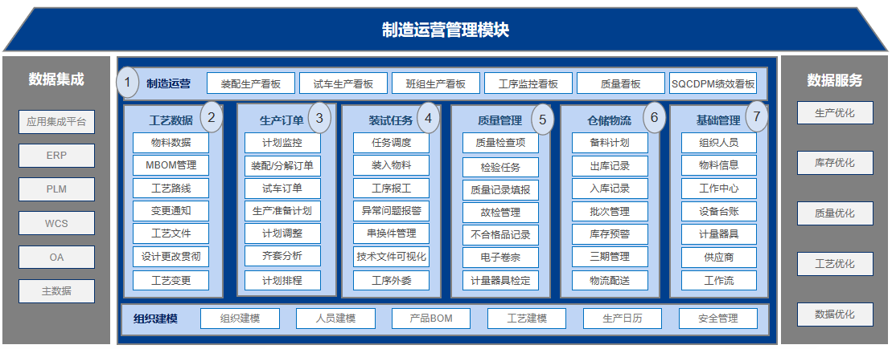[批注-1]

制造运营管理模块依托于统一平台架构、业务数据模型、标准化服务组件及规范化管理流程，构建起适用于多业务场景的数智化管理体系，平台须具备高度灵活的可集成、可配置、可扩展特性，全面覆盖工艺数据管理、生产管理、装配试车作业执行管理、质量管理、车间仓储与配送管理及生产决策分析等核心业务环节。通过与研发管理模块、企业资源管理模块的深度集成，制造运营管理模块能够高效获取结构化工艺数据、物料清单（BOM）及生产任务指令，实现从设计研发到生产执行全流程的数据贯通与透明化管理。有效打破企业内部信息壁垒，消除数据孤岛，为企业实现精益生产、准时交付及柔性化制造提供坚实支撑，更为后续智能化升级与业务拓展筑牢数字底座。

### 生产制造管理

#### 生产制造计划

##### 目标业务流程

- 流程范围

| 流程起点 | 工艺路线已接收 加工计划已接收 |
| --- | --- |
| 流程终点 | 加工计划排程结果已发布 加工计划已完成 |
| 输入 | 工艺路线、加工计划 |
| 输出 | 工序任务 |

- 流程设计

- 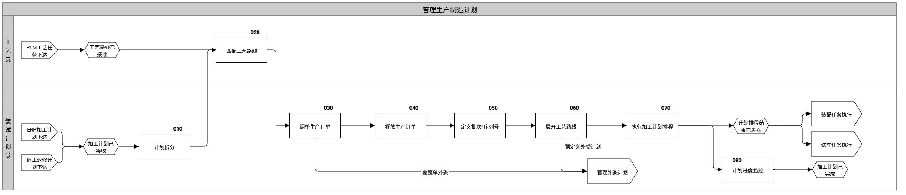

- 流程说明

| 活动编码 | 活动名称 | 活动内容 | 角色 | 输入 | 输出 | 模板/表单 |
| --- | --- | --- | --- | --- | --- | --- |
| 010 | 计划拆分 | 装试中心计划员将供应链中心下发的发动机和大部件多装多试计划拆分为装配子订单、试车子订单及分解子订单。大部件计划无需拆分。 | 计划员 | 加工计划 | 生产订单 |  |
| 020 | 指定工艺 | 计划员对发动机装配子订单，试车子订单或分解子订单指定对应的装配，试车与分解工艺路线。对大部件指定部件工艺路线。 | 计划员 | 工艺路线、加工计划 | 生产订单 |  |
| 030 | 调整生产订单 | 计划员综合考虑订单交付要求、生产资源占用状况以及现场执行进度，对需处理的加工计划和子生产订单进行优先级排序并及时调整时间节点。 | 计划员 | 加工计划 | 生产订单 |  |
| 040 | 定义批次编号 | 计划员对发动机生产订单发起批次编号申请。申请后生成与该生产订单对应的发动机批次编号，确保编号无重复、可追溯。 | 计划员 | 加工计划 | 生产订单，批次编号 |  |
| 050 | 执行计划排程 | 计划员负责梳理待排程的生产订单，综合考虑生产资源、交付要求等因素，制定合理的排程方案。依据该方案，明确各加工任务的先后顺序、资源分配及时间节点。在复核排程结果细节确保无误后，将方案下发给生产车间执行。 按工艺路线将生产订单转为工序任务，检验任务，外委计划等。 | 计划员 | 生产订单 | 生产订单、工序任务 |  |
| 060 | 计划进度监控 | 计划员负责查看和监控生产订单的进度、工序任务的执行情况以及班组的完成状况。 | 计划员 | 生产订单、工序任务 | 生产订单、工序任务 | 生产订单 |

##### 系统应用流程

- 流程操作步骤说明：

| NO. | 角色 | 业务活动 | IT活动 | 功能编号 |
| --- | --- | --- | --- | --- |
| 1 | 装试中心计划员 |  | 接收生产订单 | MOM--ERP-01 |
| 2 | 装试中心计划员 |  | 导入生产订单 | MOM-JH-01 |
| 3 | 装试中心计划员 | 010计划拆分 | 计划拆分 | MOM-JH-02 |
| 4 | 装试中心计划员 | 020指定工艺 | 指定工艺 | MOM-JH-03 |
| 5 | 装试中心计划员 | 030调整生产订单 | 计划调整 | MOM-JH-04 |
| 6 | 装试中心计划员 | 040定义批次编号 | 生成批次编号 | MOM-JH-05 |
| 7 | 装试中心计划员 | 050执行计划排程 | 计划排程 | MOM-JH-06 |
| 8 | 装试中心计划员 | 060计划进度监控 | 计划进度监控 | MOM-JH-07 |
| 9 | 装试中心计划员 |  | 订单完工反馈 | MOM--ERP-02 |

##### 功能设计

###### 接收与导入生产订单

| 功能编号 | MOM--ERP-01、MOM-JH-01 |
| --- | --- |
| 功能名称 | 接收生产订单、导入生产订单 |
| 操作角色 | 装试中心计划员 |
| 功能说明 | 通过与ERP系统集成接收发动机生产订单与部件生产订单； 通过EXCEL导入生产订单，包括返工返修计划，临时分解计划，临时试制计划和出厂试车计划。 |
| 业务规则 | 无 |

- 生产订单样例界面

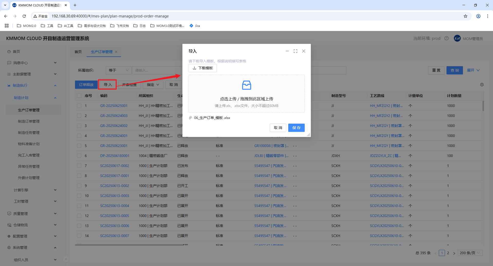

- 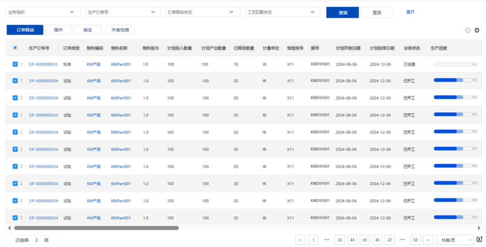

- 表单设计

- 生产订单表：

| 序号 | 字段中文名 | 字段说明 | 字段类型 | 字段值域 | 值域标准 | 是否主键 | 是否必填 |
| --- | --- | --- | --- | --- | --- | --- | --- |
| 1 | 生产订单号 | 生产订单号 | 字符型（50） | 引入ERP值域 | - | 是 | 是 |
| 2 | 装试次数 | 发动机装试次数 | 数值（2） | 引入ERP值域（下拉框选择：01、02、...） | - | - | 是 |
| 3 | 计划开始时间 | 开工时间 | 日期型 | 引入ERP值域 | - | - | 是 |
| 4 | 计划结束时间 | 完工时间 | 日期型 | 引入ERP值域 | - | - | 是 |
| 5 | 计划数量 | 计划数量 | 数值（2） | 引入ERP值域 | - | - | 是 |
| 6 | 物料编码 | 物料编码 | 字符型（50） | 引入ERP值域 | - | - | 是 |
| 7 | 物料名称 | 物料名称 | 字符型（50） | 引入ERP值域 | - | - | 是 |
| 8 | 发动机型号 | 发动机型号 | 字符型（50） |  | - | - | - |
| 9 | 发动机版本号 | 发动机BOM版次 | 字符型（50） | 引入ERP值域 |  | - | 是 |
| 10 | 零组件号 | 零组件号 | 字符型（50） | 由物料编码带出 | - | - | 是 |
| 11 | 备注 | 备注 | 字符型（256） |  | - | - | - |
| 12 | 生产部门 | 生产部门 | 字符型（50） | 引入ERP值域 |  | - | 是 |
| 13 | 项目号 | 项目号 | 字符型（50） | 引入ERP值域 |  | - | - |

- 功能验收标准

- MOM系统通过系统集成接收ERP系统下发的生产订单数据，且数据准确无误；计划员按照MOM系统的Excel订单模板维护生产订单数据，能够正常导入系统。

###### 计划拆分

| 功能编号 | MOM-JH-02 |
| --- | --- |
| 功能名称 | 计划拆分 |
| 操作角色 | 装试中心计划员 |
| 功能说明 | 根据发动机生产订单的装试次数，将发动机与部件订单拆分为装配子生产订单、试车子生产订单、分解子生产订单。 |
| 业务规则 | 拆分规则：第1次装试拆分为装配子订单与试车子订单；后续多次装试拆分为分解子订单、装配子订单与试车子订单。 装试次数：ERP系统下达生产订单至MOM系统时，在生产订单属性中提示。（第1次装试、第2次装试……） |

- 计划拆分样例界面

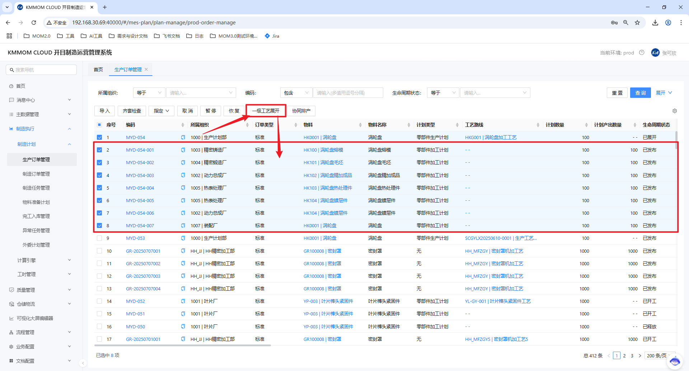

- 功能验收标准

- 计划员可根据发动机生产订单上的装试次数拆分出装配、分解与试车子生产订单。

###### 指定工艺

| 功能编号 | MOM-JH-03 |
| --- | --- |
| 功能名称 | 指定工艺 |
| 操作角色 | 装试中心计划员 |
| 功能说明 | 对生产订单指定合适的工艺路线 |
| 业务规则 | ERP系统若已接收PLM系统传递的工艺路线，ERP系统下达生产计划至MOM系统时，同步传递工艺路线信息。[批注-2] |

- 指定工艺路线样例界面

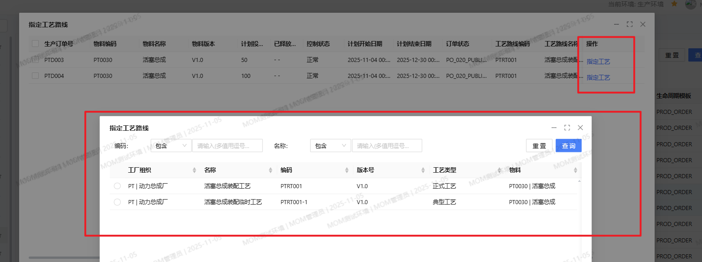

- 功能验收标准

- 计划员可以对生产订单指定相应的装配、分解或试车工艺路线，以确保后续计划排程生成准确的工序任务。

###### 计划调整

| 功能编号 | MOM-JH-04 |
| --- | --- |
| 功能名称 | 计划调整 |
| 操作角色 | 装试中心计划员 |
| 功能说明 | 调整生产订单的优先级 对生产订单进行暂停、恢复，取消操作； 对生产订单指定计划员。 计划调整时需填写调整原因，形成调整记录及报告。 |
| 业务规则 | 支持单个或批量选择订单的调整优先级，订单状态与计划员。 |

- 调整优先级样例界面

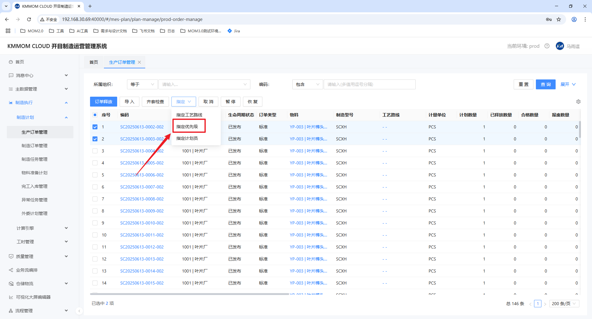

- 计划暂停、恢复与取消

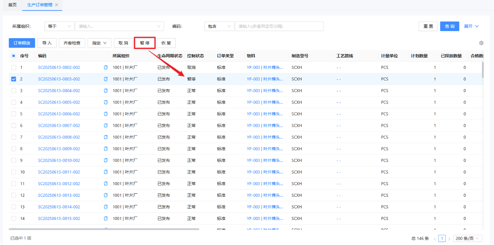

- 功能验收标准

计划员可调整生产订单的优先级

计划员可暂停生产订单及关联的生产数据。

计划员可恢复生产订单及关联的生产数据。

计划员可取消生产订单及关联的生产数据。

计划员可指定或调整生产订单对应的计划员。

###### 生成批次编号

| 功能编号 | MOM-JH-05 |
| --- | --- |
| 功能名称 | 生成批次编号 |
| 操作角色 | 装试中心计划员 |
| 功能说明 | 按发动机以及大部件批次编号规则[批注-3]生成批次编号 |
| 业务规则 | 支持单个或批量选择发动机和大部件生产订单生成批次编号。 |

- 生成批次编号样例界面

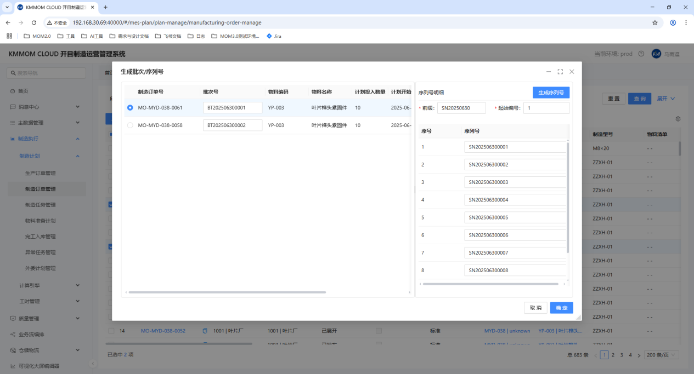

- 功能验收标准

生成的批次编号符合用户选择的规则，且在系统中满足唯一性校验；生成的批次编号能够正确关联到对应的生产订单。

###### 计划排程

| 功能编号 | MOM-JH-06 |
| --- | --- |
| 功能名称 | 计划排程 |
| 操作角色 | 装试中心计划员 |
| 功能说明 | 计划排程需求需通过项目第一阶段试运行，积累数据模型后，MOM项目组与装试中心开展专题会议，结合试运行反馈情况讨论计划排程详细解决方案，后续需求分析与功能详细设计参照《MOM计划排程专题解决方案》。 |
| 业务规则 | 通过计划排程甘特图进行拖动，联动调整计划开始时间和计划结束时间。 |

###### 计划进度监控

| 功能编号 | MOM-JH-07 |
| --- | --- |
| 功能名称 | 计划进度监控 |
| 操作角色 | 装试中心计划员 |
| 功能说明 | 查看生产订单当前状态，执行进度。 |
| 业务规则 | 查询规则：按发动机型号，订单号，零组件号可查询对应生产订单详细信息。 |

- 计划进度监控样例界面

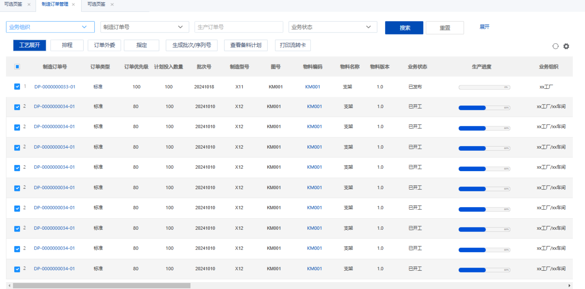

- 功能验收标准

计划员可通过筛选发动机型号、订单号、零组件号查询对应的生产订单详细信息。

##### 集成设计

###### 接收生产订单与备料清单

MOM系统与ERP系统集成接收发动机生产订单与部件生产订单，以及生产订单下的备料清单。

生产订单接口字段表

| 序号 | 字段名称 | 字段说明 |
| --- | --- | --- |
| 1 | 生产订单号 |  |
| 2 | 生产部门 | 默认装试中心 |
| 3 | 物料编码 | 发动机成品，部件 |
| 4 | 物料名称 |  |
| 5 | 计划数量 |  |
| 6 | 计划开始时间 |  |
| 7 | 计划结束时间 |  |
| 8 | 装试次数 |  |
| 9 | 项目号 |  |
| 10 | BOM版次 |  |

备料清单接口字段表

| 序号 | 字段名称 | 字段说明 |
| --- | --- | --- |
| 1 | 生产订单号 |  |
| 2 | 物料编码 | 外购件+辅料 |
| 3 | 物料名称 |  |
| 4 | 数量 |  |
| 5 | 单位 |  |
| 6 | 行号 |  |
| 7 | 版次 |  |
| 8 | 要求到货时间 |  |

###### 订单完工反馈

MOM系统与ERP系统集成反馈发动机生产订单与部件生产订单完工信息。

订单完工反馈接口字段表

| 序号 | 字段名称 | 字段说明 |
| --- | --- | --- |
| 1 | 生产订单号 |  |
| 2 | 物料编码 |  |
| 3 | 完成数量 |  |
| 4 | 合格数量 |  |
| 5 | 报废数量 |  |
| 5 | 返工返修数量 |  |
| 6 | 实际开始时间 |  |
| 7 | 实际结束时间 |  |

#### 生产准备计划

##### 目标业务流程

- 流程范围

| 流程起点 | 生产订单已接收 |
| --- | --- |
| 流程终点 | 生产准备已完成 |
| 输入 | 生产订单 |
| 输出 | 不齐套结果反馈对应系统 |

- 流程设计

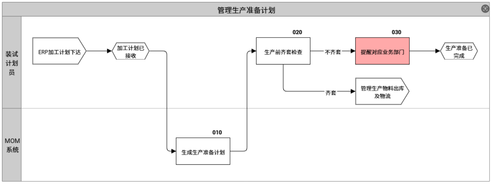[批注-4]

- 流程说明

| 活动编码 | 活动名称 | 活动内容 | 角色 | 输入 | 输出 | 模板/表单 |
| --- | --- | --- | --- | --- | --- | --- |
| 010 | 生成生产准备计划 | 计划员将生产订单进行计划排程后，生成生产准备计划。 | 计划员 | 生产订单、备料清单 | 生产准备计划 | 生产准备计划 |
| 020 | 生产前齐套检查 | 根据生产准备计划，查询采购件，原材料等物资库存数量，判断物资是否齐套。 针对已齐套的物料可进行领料申请并开展后续生产业务，未齐套需通知相关业务部门处理。 | 计划员 | 生产准备计划 | 齐套检查结果 |  |
| 030 | 提醒对应业务部门 | 物料（主材、辅材）不齐套，提醒供应链中心。 工艺路线或工艺文件缺失，提醒工程技术中心。 设备、工具、工装不齐套，提醒工具设备管理室。 | 计划员 |  |  |  |

##### 系统应用流程

- 流程操作步骤说明：

| NO. | 角色 | 业务活动 | IT活动 | 功能编号 |
| --- | --- | --- | --- | --- |
| 1 | 装试中心计划员 | 010生成生产准备计划 | 生成生产准备计划 | MOM-SCZB-01 |
| 2 | 装试中心计划员 | 020生产前齐套检查 | 齐套检查 | MOM-SCZB-02 |

##### 功能设计

###### 生产准备计划

| 功能编号 | MOM-SCZB-01 |
| --- | --- |
| 功能名称 | 生产准备计划 |
| 操作角色 | 装试中心计划员、库管员 |
| 功能说明 | 查看生产准备计划详情及备料清单 选择已齐套的生产准备计划发起领料申请 |
| 业务规则 | 支持单个或批量选择生产准备计划发起领料申请； 单个或批量选择生产准备计划发起领料申请后可形成对应的出库单； |

- 备料清单样例界面

- 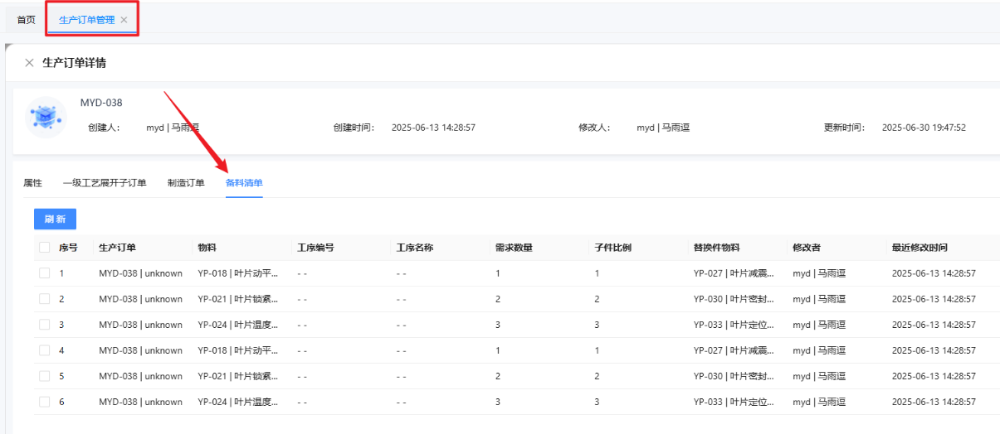

- 物料准备计划样例界面

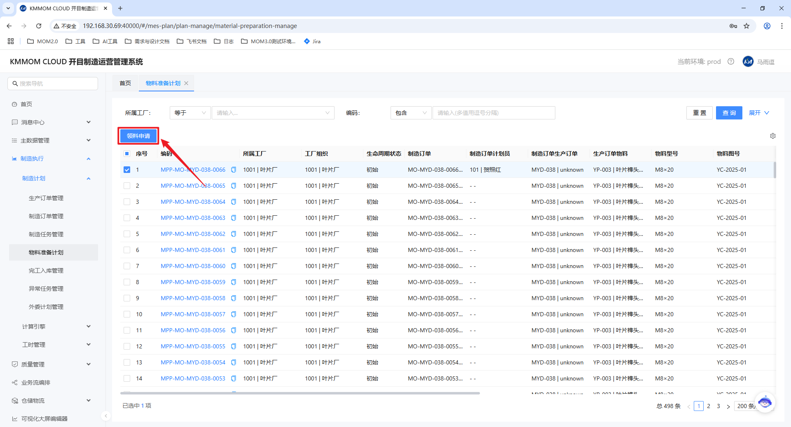

- 领料申请

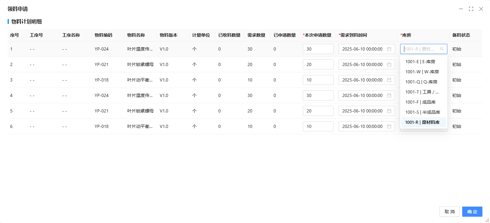

- 功能验收标准

生产准备计划中的物料清单明细与ERP系统下达的生产订单中的备料清单数据完全一致。

单个或批量选择生产准备计划发起领料申请后可形成对应的出库单其出库明细与各生产准备计划中的物料清单明细数据完全一致。

###### 齐套检查

| 功能编号 | MOM-SCZB-02 |
| --- | --- |
| 功能名称 | 齐套检查 |
| 操作角色 | 装试中心计划员 |
| 功能说明 | 根据备料清单检查物料的齐套情况 |
| 业务规则 | 齐套分析界面展示物料的库存总数信息，无需显示具体批次数据。 若齐套分析的物料清单中的物料，在MOM系统中接收到PLM系统下发的对应物料的设计更改单，技术通知单，技术决定单，则在界面中将该物料进行标识提示限制使用且不进行齐套状态校验。 已发起领料申请的物料批次将进行库存占用，生成占用记录，并支持释放操作。 齐套分析界面新增【工装工具】与【辅料】页面，数据来源于工艺路线中的工序物料。 |

- 齐套检查

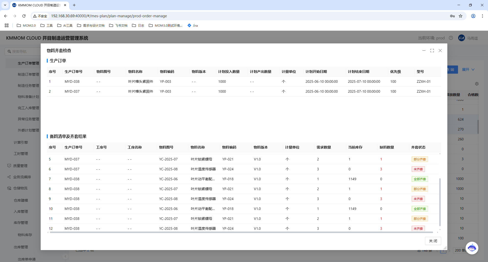

- 功能验收标准

根据备料清单所列示的物料批次，可按入库日期的先后顺序展示批次明细及库存数据，且数据准确。

库存被占用后，计划员能够查询到相应的占用记录，并有权对已占用的库存进行释放。

#### 外委管理

##### 目标业务流程

- 流程范围

| 流程起点 | 工序外委、预定义外委 |
| --- | --- |
| 流程终点 | 外委入库 |
| 输入 | 工艺路线、外委申请信息 |
| 输出 | 入库单 |

- 流程设计

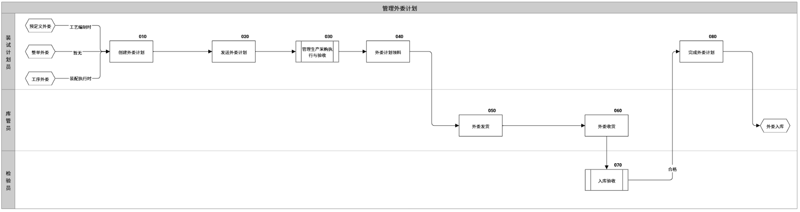

- 流程说明

| 活动编码 | 活动名称 | 活动内容 | 角色 | 输入 | 输出 | 模板/表单 |
| --- | --- | --- | --- | --- | --- | --- |
| 010 | 创建外委计划 | 计划员根据工艺路线中预定义的外委工序以及临时产生的外委工序创建外委计划。 | 外委调度员 | 工艺路线 | 外委计划 | 外委计划 |
| 020 | 发送外委计划 | 计划员确认外委计划信息并选择供应商后，将外委信息发送至供应链中心。 | 计划员 | 外委计划 | 外委计划 |  |
| 030 | 创建采购订单 | 供应链中心在ERP系统中收到装试中心在MOM系统中创建的外委计划后创建采购订单及开展后续业务。 | 供应链中心 | 外委计划 | 采购订单 |  |
| 040 | 外委计划领料 | 计划员通知库管员对外委计划所需的物料拣货。 | 库管员 | 外委计划 | 外委计划、物料实物、出库单 | 出库单 |
| 050 | 外委发货 | 将发动机或大部件半成品与物料打包发货至外委供应商。 | 库管员 | 外委计划 | 外委计划、出库单 |  |
| 060 | 外委收货 | 库管员根据外委计划，进行物料收货（一次收货）。 | 库管员 | 物料实物、外委计划 | 入库单 | 入库单 |
| 070 | 外委入厂检验 | 质量部检验员到仓库现场进行入库检验。 | 检验员 | 入库单、物料实物 | 入库检验任务 | 入库检验任务 |
| 080 | 完成外委计划 | 检验员确认合格后，计划员确认外委计划已完成。操作员在库房领取物料，继续执行后续工序任务。 | 计划员 | 外委计划入库检验合格 | 外委计划完成 |  |

##### 系统应用流程

- 流程操作步骤说明：

| NO. | 角色 | 业务活动 | IT活动 | 功能编号 |
| --- | --- | --- | --- | --- |
| 1 | 装试中心计划员 | 010创建外委计划 | 创建外委计划 | MOM-WWJH-01 |
| 2 | 装试中心计划员/供应链中心 |  | 临时外委申请审批 | MOM-GZL-15 |
| 3 | 装试中心计划员 | 020发送外委计划 | 发送外委计划 | MOM--ERP-03 |
| 4 | 装试中心计划员 | 020发送外委计划 | 接收外委采购订单 | MOM--ERP-04 |
| 5 | 装试中心计划员 | 020发送外委计划 | 外委发货通知流程 | MOM-GZL-16 |
| 6 | 装试中心计划员 |  | 取消外委计划 | MOM--ERP-05 |
| 7 | 装试中心计划员 | 030完成外委计划 | 完成外委计划 | MOM--ERP-06 |

##### 功能设计

###### 创建外委计划

| 功能编号 | MOM-WWJH-01 |
| --- | --- |
| 功能名称 | 创建外委计划 |
| 操作角色 | 装试中心计划员 |
| 功能说明 | 根据工艺路线中预定义的外委工序形成外委计划； 临时发起工序外委形成外委计划。 临时外委需发起临时外委审批流程，将临时外委计划加入到审批流程，经装试中心与供应链中心审核。 |
| 业务规则 | 一条生产订单中多个连续工序外委，创建一条外委计划，包含多个明细。 一条生产订单中多个非连续工序外委，创建多条外委计划。 |

- 外委计划管理

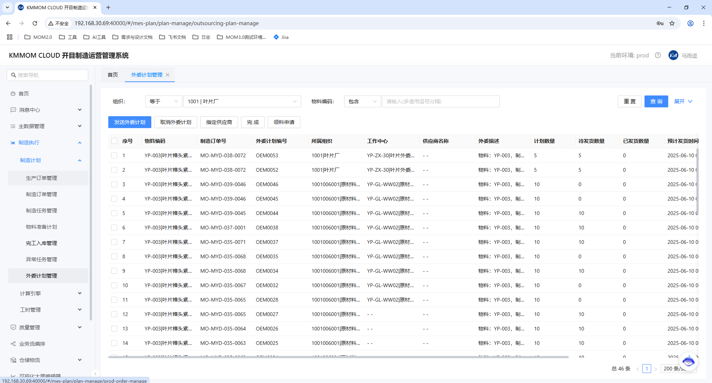

- 表单设计

- 外委计划表：

| 序号 | 字段中文名 | 字段说明 | 字段类型 | 字段值域 | 值域标准 | 是否主键 | 是否必填 |
| --- | --- | --- | --- | --- | --- | --- | --- |
| 1 | 外委计划编号 | 外委计划编号 | 字符型（50） |  | - | 是 | 是 |
| 2 | 生产订单号 | 生产订单号 | 字符型（50） | 引入ERP值域 | - | - | 是 |
| 3 | 工序名称 | 外委工序名称 | 字符型（50） |  | - | - | 是 |
| 4 | 工序号 | 外委工序号 | 数值（2） |  | - | - | 是 |
| 5 | 物料编码 | 物料编码 | 字符型（50） |  | - | - | 是 |
| 6 | 供应商名称 | 外委制造供应商 | 字符型（50） |  | - | - | 是 |
| 7 | 来源类型 | 外委来源方式 | 字符型（50） | 下拉框（预定义外委、临时外委） | - | - | 是 |
| 8 | 外委类型 | 外委类型 | 字符型（50） | 下拉框（整单外委、工序外委） |  | - | 是 |
| 9 | 预计发货数量 | 预计发货数量 | 数值（3） |  |  | - | 是 |
| 10 | 预计收货数量 | 预计收货数量 | 数值（3） |  |  | - | 是 |
| 11 | 状态 | 外委状态 | 字符型（50） | 下拉框（已发送、已完成、已取消） |  | - | - |
| 12 | 要求到货时间 | 要求外委完成回厂时间 | 日期型 |  |  | - | 是 |
| 13 | 外委发送时间 | 外委发送时间 | 日期型 |  |  | - | - |

- 功能验收标准

计划员能够在计划排程后，MOM系统根据工艺路线中预定义外委的工序创建外委计划。

计划员可通过发起临时工序外委创建外委计划。

连续工序的外委可以创建一条完整的外委计划；而非连续工序的外委则可以生成多个相应的独立外委计划。

###### 发送外委计划

| 功能编号 | MOM--ERP-03 |
| --- | --- |
| 功能名称 | 发送外委计划 |
| 操作角色 | 装试中心计划员 |
| 功能说明 | 将外委计划信息发送至ERP系统。 |
| 业务规则 | 支持单次或批量发送外委计划。 |

- 指定供应商

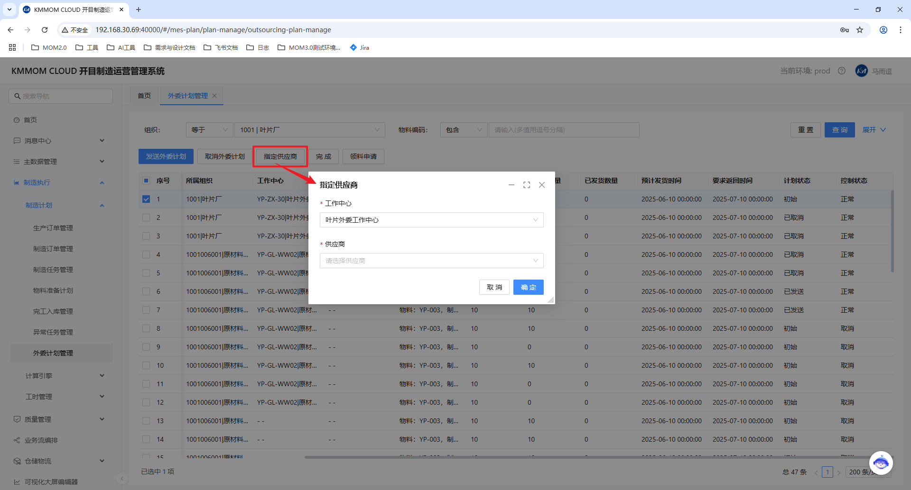

- 功能验收标准

计划员能够对选中的外委计划指定正确的供应商。

MOM系统发送至ERP系统的外委计划信息数据准确无误，ERP系统能够正常接收并顺利进行后续业务操作。

###### 接收外委采购订单

| 功能编号 | MOM--ERP-04 |
| --- | --- |
| 功能名称 | 接收外委订单 |
| 操作角色 | 装试中心计划员 |
| 功能说明 | 接收ERP系统的外委采购订单 |
| 业务规则 | 接收ERP系统回传的外委采购订单信息后，MOM系统自动将外委采购订单与原外委计划进行关联。 MOM系统接收到外委订单后，将外委订单自动加入到外委发货通知流程中，以待办任务形式通知到对应的责任人。 |

- 外委采购订单管理界面描述

提供页面展示从ERP系统同步采购订单的列表记录。

- 表单设计

- 外委采购订单表：

| 序号 | 字段中文名 | 字段说明 | 字段类型 | 字段值域 | 值域标准 | 是否主键 | 是否必填 |
| --- | --- | --- | --- | --- | --- | --- | --- |
| 1 | 外委采购订单号 | 外外委采购订单号 | 字符型（50） | 引入ERP值域 | - | 是 | 是 |
| 2 | 生产订单号 | 生产订单号 | 字符型（50） | 引入ERP值域 | - | - | 是 |
| 3 | 外委计划编号 | 外委计划编号 | 字符型（50） | 引入ERP值域 | - | - | 是 |
| 4 | 供应商名称 | 供应商名称 | 字符型（50） | 引入ERP值域 |  | - | 是 |
| 5 | 供应商代号 | 供应商代号 | 字符型（50） | 引入ERP值域 |  | - | 是 |

- 功能验收标准

- 用户能够查询外委采购订单，数据信息无误,与ERP系统数据保持一致；外委采购订单与外委计划关联正确。

###### 取消外委计划

| 功能编号 | MOM--ERP-05 |
| --- | --- |
| 功能名称 | 取消外委计划 |
| 操作角色 | 装试中心计划员 |
| 功能说明 | 取消外委计划 |
| 业务规则 | 无法取消已接收ERP外委订单的外委计划。 |

- 取消外委计划

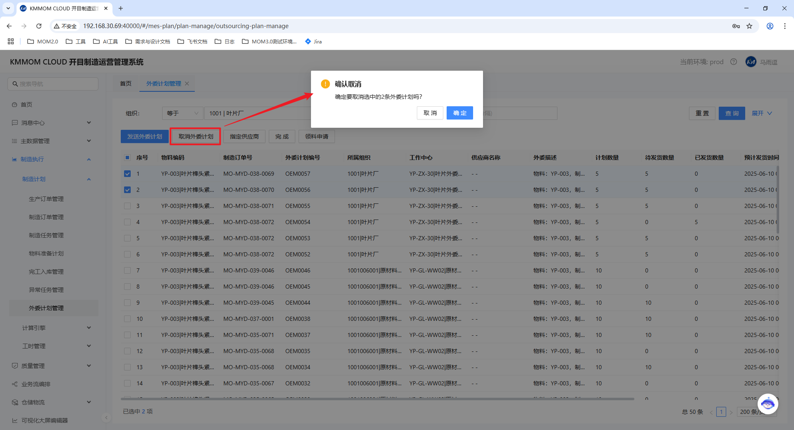

- 功能验收标准

计划员可取消尚未接收到ERP系统回传信息的外委订单的外委计划。

MOM系统发送至ERP系统的外委计划取消信息数据准确无误，ERP系统能够顺利接收并取消后续相关业务操作。

###### 完成外委计划

| 功能编号 | MOM-WWJH-02 |
| --- | --- |
| 功能名称 | 完成外委计划 |
| 操作角色 | 装试中心计划员 |
| 功能说明 | 外委半成品收货并检验合格入库后，关闭外委计划； 将已完成的外委计划信息发送至ERP系统。 |
| 业务规则 | 无 |

- 完成外委计划

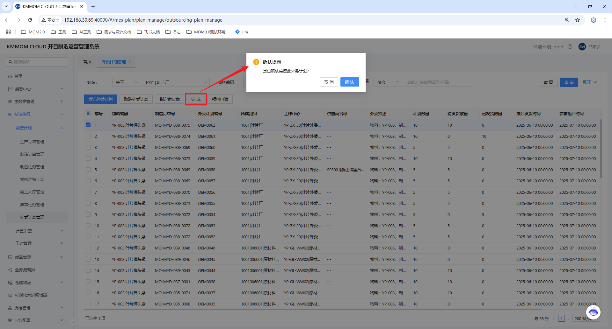

- 功能验收标准

计划员正常关闭外委计划。

MOM系统发送至ERP系统的外委计划完成信息数据准确无误，ERP系统能够正常接收并顺利进行后续业务操作。

##### 集成设计

###### 发送外委计划

MOM系统将发送工序外委计划发送至ERP系统

发送外委计划接口字段表

| 序号 | 字段名称 | 字段说明 |
| --- | --- | --- |
| 1 | 生产订单号 |  |
| 2 | 外委计划号 |  |
| 3 | 工序号 |  |
| 4 | 物料编码 |  |
| 5 | 物料名称 |  |
| 6 | 计划数量 |  |
| 7 | 要求到货时间 |  |

###### 接收外委采购订单

外委采购订单接口字段表

| 序号 | 字段名称 | 字段说明 |
| --- | --- | --- |
| 1 | 生产订单号 |  |
| 2 | 外委计划号 |  |
| 3 | 外委订单号 |  |
| 4 | 供应商名称 |  |
| 5 | 供应商代号 |  |

###### 完成外委计划

MOM系统将工序外委计划完工信息发送至ERP系统

外委计划完工接口字段表

| 序号 | 字段名称 | 字段说明 |
| --- | --- | --- |
| 1 | 生产订单号 |  |
| 2 | 外委计划号 |  |
| 3 | 工序号 |  |
| 4 | 物料编码 |  |
| 5 | 物料名称 |  |
| 6 | 完成数量 |  |
| 7 | 实际完成时间 |  |

#### 计划时间变更

##### 目标业务流程

- 流程范围

| 流程起点 | 计划时间变更已接收 |
| --- | --- |
| 流程终点 | 计划时间变更已完成 |
| 输入 | 变更通知单 |
| 输出 | 生产订单 |

- 流程设计

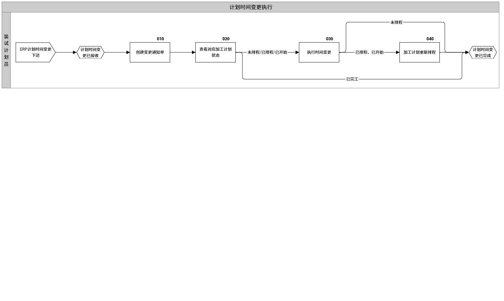

- 流程说明

| 活动编码 | 活动名称 | 活动内容 | 角色 | 输入 | 输出 | 模板/表单 |
| --- | --- | --- | --- | --- | --- | --- |
| 010 | 接收变更通知 | 供应链中心在ERP系统中发起计划时间变更，通过系统集成将变更信息通知到装试中心MOM系统。 装试中心计划员接收到供应链中心下达的计划时间变更通知。根据计划实际情况进行业务调整。 | 计划员 | 变更通知单 | 变更通知单 | 变更通知单 |
| 020 | 查看对应计划状态 | 计划员根据变更通知信息，查看对应加工计划状态。 | 计划员 |  |  |  |
| 030 | 执行时间变更 | 装试中心计划员生产订单的计划开始时间与计划结束时间进行调整。调整时需根据生产订单状态，进行后续处理。 若生产订单未排程，装试中心计划员对生产订单的时间节点直接调整； 若生产订单已排程，装试中心计划员对生产订单的时间进行调整，且需以新的时间节点进行排程并输出物料准备计划，外委计划，检验计划等； | 计划员 | 变更通知 | 生产订单 |  |
| 040 | 计划重新排程 | 装试中心计划员针对已变更计划时间生产订单重新进行排程。 | 计划员 | 生产订单、工艺路线、排程方案、资源能力 | 排程结果 |  |

##### 系统应用流程

- 流程操作步骤说明：

| NO. | 角色 | 业务活动 | IT活动 | 功能编号 |
| --- | --- | --- | --- | --- |
| 1 | 装试中心计划员 | 010接收变更通知 | 接收计划变更通知 | MOM--ERP-06 |
| 2 | 装试中心计划员 | 020查看对应计划状态 | 计划进度监控 | MOM-JH-07 |
| 3 | 装试中心计划员 | 030执行时间变更 | 计划时间变更 | MOM-SJBG-01 |
| 4 | 装试中心计划员 | 040计划重新排程 | 计划排程 | MOM-JH-06 |

##### 功能设计

###### 变更单管理

| 功能编号 | MOM--ERP-06 |
| --- | --- |
| 功能名称 | 接收计划变更通知 |
| 操作角色 | 装试中心计划员 |
| 功能说明 | 接收ERP系统发送的计划时间变更通知，形成MOM系统中的变更通知数据； 查看变更通知中的详细信息。 |
| 业务规则 | 流程通知：接收ERP系统发送的计划时间变更通知，形成MOM系统中的变更通知数据后，并将该变更通知加入到变更通知流程中，通知到对应的角色或负责人。 |

- 表单设计

- 变更单表：

| 序号 | 字段中文名 | 字段说明 | 字段类型 | 字段值域 | 值域标准 | 是否主键 | 是否必填 |
| --- | --- | --- | --- | --- | --- | --- | --- |
| 1 | 变更单编号 | 变更单编号 | 字符型（50） | 引入ERP值域 | - | 是 | 是 |
| 2 | 生产订单号 | 生产订单号 | 字符型（50） | 引入ERP值域 | - | - | 是 |
| 3 | 变更内容 | 变更内容 | 字符型（256） |  | - | - | 是 |

- 功能验收标准

计划员可在MOM系统待办任务中收到计划时间变更通知并查看到变更详细信息。

###### 计划时间变更

| 功能编号 | MOM-SJBG-01 |
| --- | --- |
| 功能名称 | 计划时间变更 |
| 操作角色 | 装试中心计划员 |
| 功能说明 | 变更生产订单的计划开始时间与计划结束时间 |
| 业务规则 | 变更生效后，重新排程同步更新生产准备计划，工序任务，外委计划的计划开始时间与计划结束时间。 |

- 计划时间变更

- 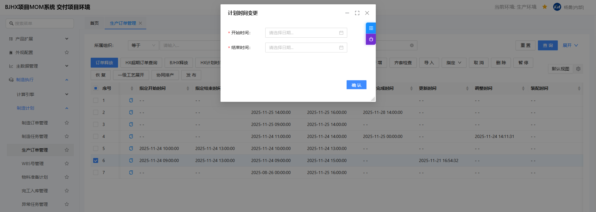

- 功能验收标准

计划员能够对变更生产订单的计划开始时间和计划结束计划；计划排程后，MOM系统可同步调整生产订单关联的生产准备计划时间，工序任务开始与结束时间，外委计划开始与结束时间。

##### 集成设计

###### 接收计划时间变更通知

MOM系统与ERP系统集成接收发动机生产订单与部件生产订单的订单时间通知。

生产订单关闭接口字段表

| 序号 | 字段名称 | 字段说明 |
| --- | --- | --- |
| 1 | 生产订单号 |  |
| 2 | 开工日期 |  |
| 3 | 完工日期 |  |
| 4 | 变更原因 |  |
| 5 | 变更人 |  |

#### 计划状态变更

##### 目标业务流程

- 流程范围

| 流程起点 | 计划状态变更已接收 |
| --- | --- |
| 流程终点 | 计划状态变更已完成 |
| 输入 | 变更通知单 |
| 输出 | 发动机已分解、临时分解计划完成、分解零部件入库申请 加工计划完成、发起入库申请 |

- 流程设计

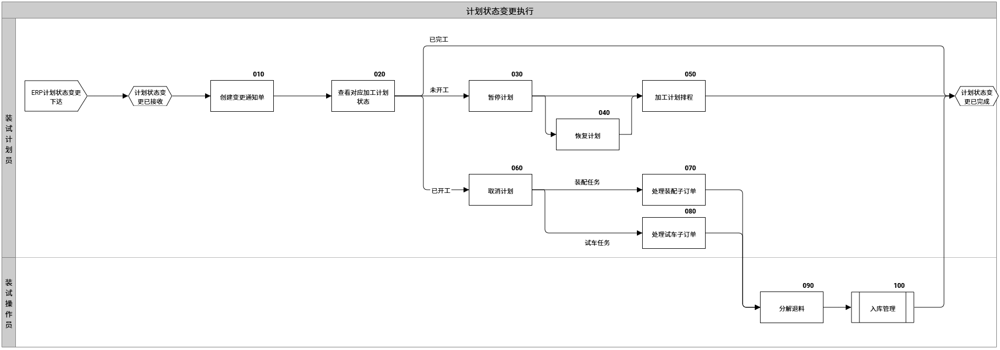

- 流程说明

| 活动编码 | 活动名称 | 活动内容 | 角色 | 输入 | 输出 | 模板/表单 |
| --- | --- | --- | --- | --- | --- | --- |
| 010 | 接收变更通知 | 供应链中心在ERP系统中发起计划状态变更，通过系统集成将变更信息通知到装试中心。 装试中心计划员接收到供应链中心下达的计划状态变更通知。根据计划实际情况进行业务调整。 | 计划员 | 变更通知 | 变更通知 | 变更通知 |
| 020 | 查看对应计划状态 | 计划员根据变更通知信息，查看对应生产订单状态。 | 计划员 | 变更通知 | 生产订单 |  |
| 030 | 暂停 | 计划员对变更通知中的生产订单进行暂停。 | 计划员 | 变更通知 | 生产订单 |  |
| 040 | 恢复 | 计划员恢复已暂停的生产订单。 | 计划员 | 变更通知 | 生产订单 |  |
| 050 | 加工计划排程 | 计划员对生产订单或制造订单暂停/取消后，需在其他生产订单重新排程。 | 计划员 | 变更通知 |  |  |
| 060 | 取消 | 计划员对变更通知中的生产订单或制造订单进行取消。 | 计划员 | 变更通知 | 生产订单 |  |
| 070 | 处理装配子订单 | 计划员针对已取消的装配订单，根据其他计划的优先级来判定，是否继续完成当前已取消的计划。若继续装配，完成后将产品入库，作为库存产品留存；若不再继续装配，计划员下达临时分解计划，将半成品进行分解。 | 计划员 | 变更通知 | 生产订单 |  |
| 080 | 处理试车子订单 | 若在试车过程中，装试中心收到计划取消通知。计划员将试车子订单进行取消，根据实际情况决定是否下达临时分解计划。 | 计划员 | 变更通知 | 生产订单 |  |
| 090 | 分解退料 | 若计划员下达分解计划，操作员将发动机从试车台中卸下并进行分解。分解后的零部件或大组件回库，且无需进行入库检验。 | 操作员 | 生产订单 | 入库单 |  |
| 100 | 入库管理 | 库管员将继续装配完成的的部件或发动机、分解的零部件、组件入库。 | 库管员 | 生产订单 | 入库单 |  |

##### 系统应用流程

- 流程操作步骤说明：

| NO. | 角色 | 业务活动 | IT活动 | 功能编号 |
| --- | --- | --- | --- | --- |
| 1 | 装试中心计划员 | 010接收变更通知 | 接收计划变更通知 | MOM--ERP-07 |
| 2 | 装试中心计划员 | 020查看对应计划状态 | 计划进度监控 | MOM-JH-07 |
| 3 | 装试中心计划员 | 030暂停 | 计划调整 | MOM-JH-04 |
| 4 | 装试中心计划员 | 040恢复 | 计划调整 | MOM-JH-04 |
| 5 | 装试中心计划员 | 050计划排程 | 计划排程 | MOM-JH-06 |
| 6 | 装试中心计划员 | 060取消 | 计划调整 | MOM-JH-04 |
| 7 | 装试中心计划员 | 070处理装配子订单 | 导入分解生产订单 | MOM-JH-01 |
| 8 | 装试中心计划员 | 080处理试车子订单 | 导入分解生产订单 | MOM-JH-01 |

##### 功能设计

###### 变更单管理

- 见计划时间变更-功能设计“MOM--ERP-06 接收计划变更通知”。

###### 计划状态变更

- 见生产制造计划-功能设计“MOM-JH-04 计划调整”。

##### 集成设计

###### 接收计划状态变更通知

MOM系统与ERP系统集成接收发动机生产订单与部件生产订单的订单关闭通知。

生产订单关闭接口字段表

| 序号 | 字段名称 | 字段说明 |
| --- | --- | --- |
| 1 | 生产订单号 |  |
| 2 | 关闭时间 |  |
| 3 | 关闭人 |  |
| 4 | 关闭说明 |  |

#### 工艺变更

##### 目标业务流程

- 流程范围

| 流程起点 | 工艺变更通知已接收 |
| --- | --- |
| 流程终点 | 工艺变更已执行 |
| 输入 | 工艺变更通知 |
| 输出 | 生产订单、工序任务 |

- 流程设计

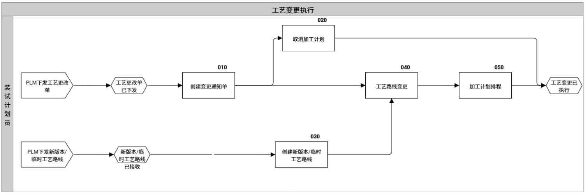

- 流程说明

| 活动编码 | 活动名称 | 活动内容 | 角色 | 输入 | 输出 | 模板/表单 |
| --- | --- | --- | --- | --- | --- | --- |
| 010 | 接收变更通知 | 工程技术中心工艺员下发工艺更改单到装试中心。装试中心计划员收到工艺更改通知，根据实际情况进行业务调整。 | 工艺员、计划员 | 工艺更改单 | 工艺变更通知单 | 工艺变更通知单 |
| 020 | 取消加工计划 | 装试中心计划员按变更通知单要求，取消对应加工计划，同步重新下达新计划。 | 计划员 | 变更通知单 | 生产订单 |  |
| 030 | 接收新版本/临时工艺路线 | 工艺员在PLM系统中将变更完成后的工艺路线数据发送至MOM系统。装试中心接收到变更后的工艺路线数据。 | 计划员 | 工艺更改单 | 工艺路线 |  |
| 040 | 工艺路线变更 | 计划员将暂停的生产订单进行工艺路线变更，将工艺路线替换为新版本工艺路线。操作员以新的工艺路线执行工序任务并报工。 | 计划员 | 工艺路线 | 工序任务 |  |
| 050 | 计划排程 | 装试中心的计划员需根据实际情况，判断是否需要对已变更的工艺路线和未变更的制造订单重新进行排程。 | 计划员 | 生产订单 | 生产订单 |  |

##### 系统应用流程

- 流程操作步骤说明：

| NO. | 角色 | 业务活动 | IT活动 | 功能编号 |
| --- | --- | --- | --- | --- |
| 1 | 装试中心计划员 | 010接收变更通知 | 接收工艺变更通知单 | MOM-GYBG-01 |
| 2 | 装试中心计划员 |  | 影响范围分析 | MOM-GYBG-02 |
| 3 | 装试中心计划员 | 020取消加工计划 | 计划取消 | MOM-JH-04 |
| 4 | 装试中心计划员 | 030接收新版本/临时工艺路线 | 接收工艺路线 | MOM-JCSJ-03 |
| 5 | 装试中心计划员 | 040工艺路线变更 | 工艺变更 | MOM-GYBG-03 |
| 6 | 装试中心计划员 | 050计划排程 | 计划排程 | MOM-JH-06 |

##### 功能设计

###### 工艺变更单[批注-5]管理

| 功能编号 | MOM-GYBG-01 |
| --- | --- |
| 功能名称 | 工艺变更单管理 |
| 操作角色 | 装试中心计划员 |
| 功能说明 | 接收PLM系统发送的工艺变更通知，形成MOM系统中的工艺变更单； 查看工艺变更通知中的详细信息。 |
| 业务规则 | 流程通知：接收PLM系统发送的工艺变更通知，形成MOM系统中的工艺变更单后，并将该变更单加入到工艺变更通知流程中，通知到对应的角色或负责人。 |

- 表单设计

- 变更单表：

| 序号 | 字段中文名 | 字段说明 | 字段类型 | 字段值域 | 值域标准 | 是否主键 | 是否必填 |
| --- | --- | --- | --- | --- | --- | --- | --- |
| 1 | 工艺变更单编号 | 工艺变更单编号 | 字符型（50） | 引入PLM值域 | - | 是 | 是 |
| 2 | 物料编码 | 物料编码 | 字符型（50） | 引入PLM值域 | - | - | 是 |
| 3 | 变更内容 | 变更内容 | 字符型（256） | 引入PLM值域 | - | - | 是 |
| 4 | 工艺规程编号 | 工艺规程编号 | 字符型（50） | 引入PLM值域 | - | - | 是 |

- 功能验收标准

计划员可在MOM系统待办任务中收到工艺变更通知并查看到变更详细信息。

###### 影响范围分析

| 功能编号 | MOM-GYBG-02 |
| --- | --- |
| 功能名称 | 影响范围分析 |
| 操作角色 | 装试中心计划员 |
| 功能说明 | 分析该变更单对使用该工艺路线的所有生产订单的影响范围。系统根据工艺路线编号查询受影响的生产订单，并评估每个订单的变更可行性。 |
| 业务规则 | 根据变更单中的工艺规程编号查询所有使用该工艺路线的生产订单。 |

- 影响范围分析

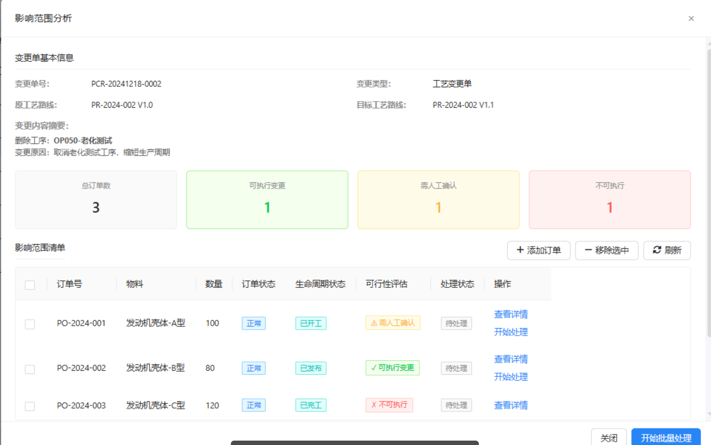

- 功能验收标准

MOM系统根据工艺变更单中的物料与工艺路线信息，能准确查询出所有使用该工艺路线的生产订单列表，并对生产订单的变更可行性进行合理评估。

###### 工艺变更

| 功能编号 | MOM-GYBG-03 |
| --- | --- |
| 功能名称 | 工艺变更 |
| 操作角色 | 装试中心计划员 |
| 功能说明 | 变更生产订单的工艺路线，以变更后的工艺路线输出工序任务。 |
| 业务规则 | 已完工和已取消的生产订单不可执行工艺变更。 |

- 工艺变更

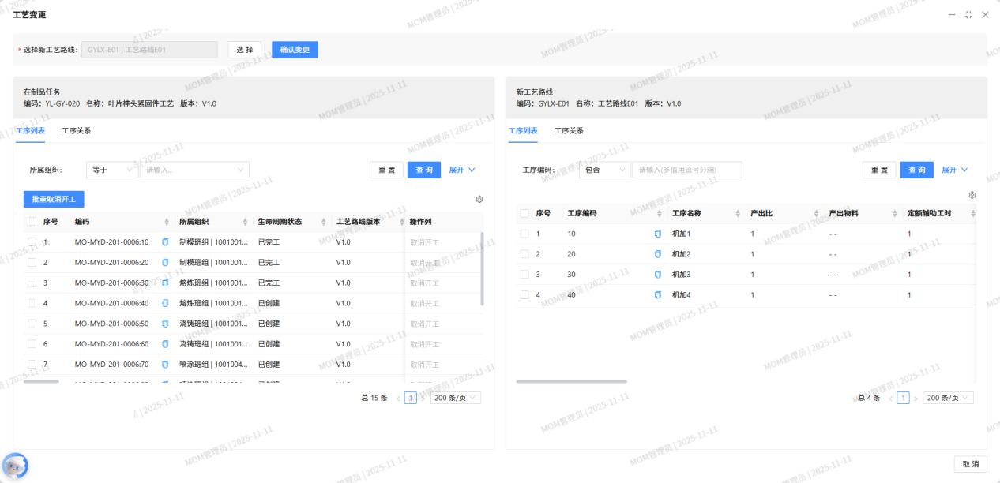

- 功能验收标准

计划员能够成功将单个或多个生产订单中的工艺路线进行变更，并输出准确的工序任务。若变更失败，系统将提示明确的失败原因。

##### 集成设计

###### 接收工艺变更单

MOM系统与PLM系统集成接收工艺变更单

工艺变更单接口字段表

| 序号 | 字段名称 | 字段说明 |
| --- | --- | --- |
| 1 | 工艺变更单号 |  |
| 2 | 工艺规程编号 |  |
| 3 | 变更时间 |  |
| 4 | 变更原因 |  |
| 5 | 物料编码 |  |

### 装配试车管理

#### 装配任务管理

##### 目标业务流程

- 流程范围

| 流程起点 | 工序任务已接收 |
| --- | --- |
| 流程终点 | 工序任务已完成 |
| 输入 | 工序任务 |
| 输出 | 工序任务、报工记录、装配过程记录 |

- 流程设计

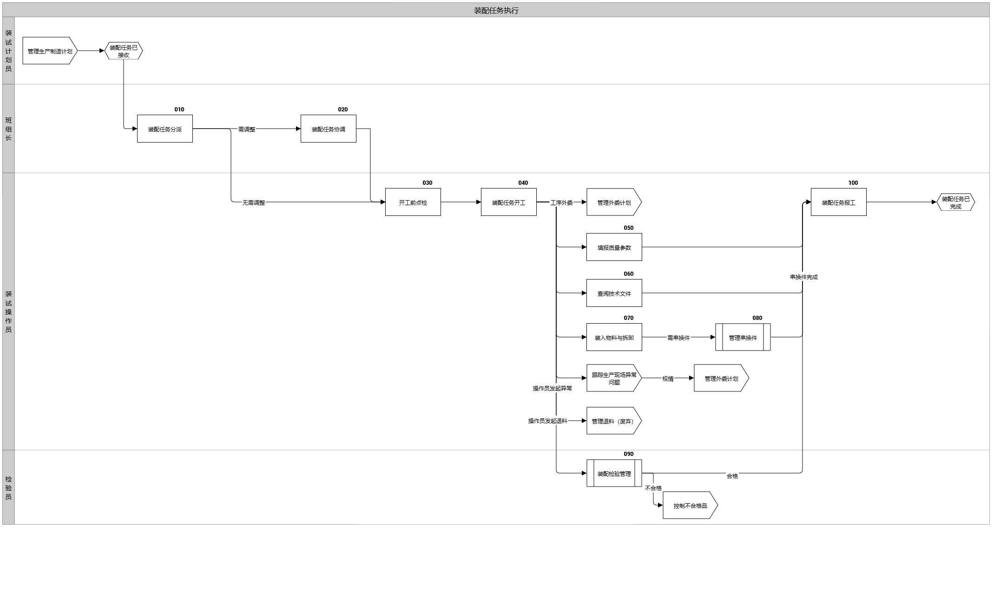

- 流程说明

| 活动编码 | 活动名称 | 活动内容 | 角色 | 输入 | 输出 | 模板/表单 |
| --- | --- | --- | --- | --- | --- | --- |
| 010 | 工序任务分派 | 班组长将装配工序任务分派至工作中心以及具体的设备和人员。 | 班组长 | 工序任务 | 工序任务 | 工序任务 |
| 020 | 任务协调 | 因临时出现的设备或人员等异常状况，班组长需对工序任务进行工作中心、设备及人员的协调与调整。 | 班组长 | 工序任务 | 工序任务 | 工序任务 |
| 030 | 开工前点检 | 操作员对设备、工装工具进行点检，对物料进行收料确认，确保任务开工前资源已全部就位。 | 操作员 | 工序任务、备料清单 | 工序任务、备料清单 | 备料清单 |
| 040 | 任务开工 | 操作员在工作台开始装配作业。 | 操作员 | 工序任务 | 工序任务 | 工序任务 |
| 050 | 填报质量参数 | 操作员根据工艺文件中的质量检查与检测要求，填报对应的装配质量参数记录。 | 操作员 | 工艺路线 | 装配过程记录 | 装配过程记录 |
| 060 | 查阅工艺文件 | 装配过程中，查阅当前装配任务关联的技术文档、图纸等。 | 操作员 |  |  |  |
| 070 | 装入物料与拆卸 | 操作员按工艺要求对发动机或部件进行装配、拆卸等工作。 | 操作员 | 备料清单 | 装入记录、拆卸记录 | 装配过程记录 |
| 080 | 管理串换件 | 在装配过程中，如需进行串换件，触发串换件管理流程。 | 操作员 |  |  |  |
| 090 | 装配任务报工 | 操作员报工记录装入物料批次编号信息与合格数量或不合格数量信息；若产生不合格情况，触发质量部不合格品审理流程。 | 操作员 | 工序任务 | 工序任务、报工记录 | 工序任务, 报工记录 |
| 100 | 装配检验管理 | 操作员依据工艺文件的要求，通知检验员到现场开展工序检验工作，并检查操作员填写的质量参数记录。 | 检验员 | 检验任务 | 检验任务、报工记录 | 检验任务, 报工记录 |

##### 系统应用流程

- 流程操作步骤说明：

| NO. | 角色 | 业务活动 | IT活动 | 功能编号 |
| --- | --- | --- | --- | --- |
| 1 | 装试中心计划员 | 010工序任务分派 | 任务分派 | MOM-RW-01 |
| 2 | 装试中心计划员 | 020任务协调 | 任务协调 | MOM-RW-02 |
| 3 | 操作员 | 030开工前点检 | 收料确认 | MOM-RW-03 |
| 4 | 操作员 | 040任务开工 | 开工 | MOM-RW-04 |
| 5 | 操作员 | 050填报质量参数 | 检查项填报 | MOM-RW-05 |
| 6 | 操作员 | 060查阅工艺文件 | 浏览工艺文件 | MOM-RW-06 |
| 8 | 操作员 | 090装配任务报工 | 报工 | MOM-RW-07 |

##### 功能设计

###### 任务分派

| 功能编号 | MOM-RW-01 |
| --- | --- |
| 功能名称 | 任务分派 |
| 操作角色 | 装试中心计划员、班组长 |
| 功能说明 | 将工序任务分派至工作中心，设备与人员 |
| 业务规则 | 计划排程后自动分派至工作中心及对应设备与人员 |

- 任务分派

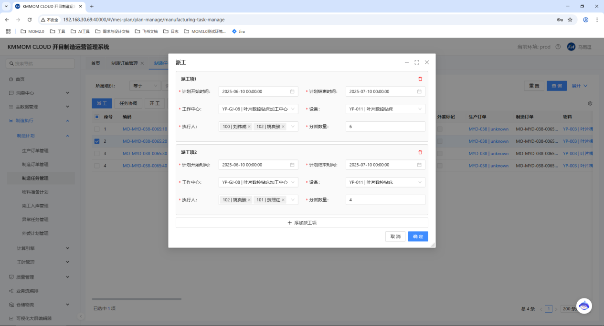

- 功能验收标准

计划员在计划排程后，MOM系统可自动将工序任务分派到正确至工作中心，设备与人员；计划员和班组长也可手动分派工序任务。

###### 任务协调

| 功能编号 | MOM-RW-02 |
| --- | --- |
| 功能名称 | 任务协调 |
| 操作角色 | 装试中心计划员、班组长 |
| 功能说明 | 将已分派的工序任务调整到其他工作中心，设备与人员 |
| 业务规则 | 无 |

- 任务分派

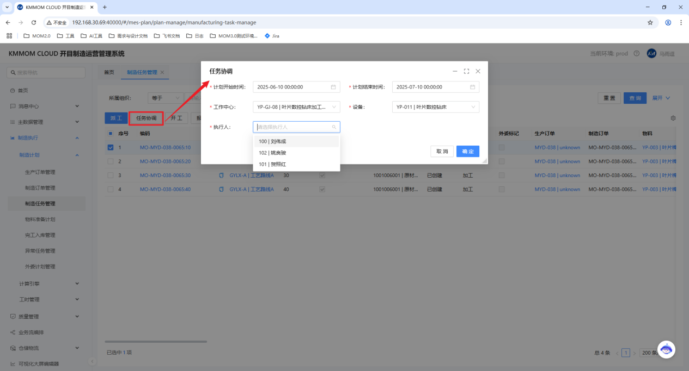

- 功能验收标准

计划员和班组长也可调整工序任务的工作中心，设备与人员。

###### 收料确认

| 功能编号 | MOM-RW-03 |
| --- | --- |
| 功能名称 | 收料确认 |
| 操作角色 | 操作员 |
| 功能说明 | 对物料、工装工具、辅料进行收料点检确认 |
| 业务规则 | 收料清单的数据源自生产订单的备料清单及工艺路线中的各工序物料。 |

- 收料确认

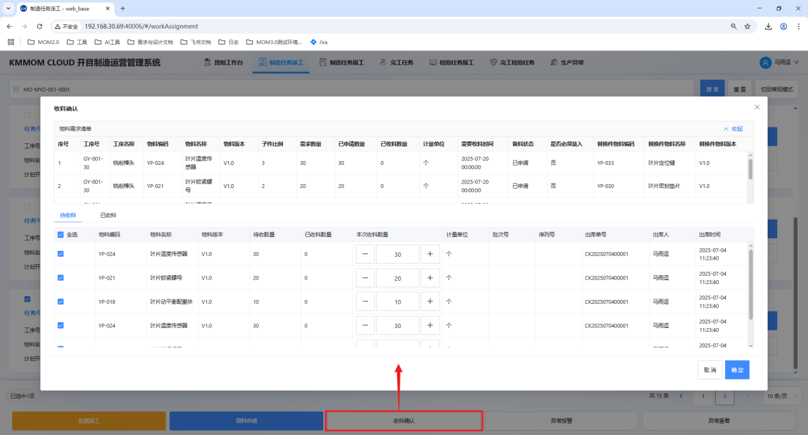

- 功能验收标准

收料确认列表中展示的物料数据与该生产订单的备料清单及工艺路线数据相同，以及与实物保持一致。

###### 开工

| 功能编号 | MOM-RW-04 |
| --- | --- |
| 功能名称 | 开工 |
| 操作角色 | 操作员 |
| 功能说明 | 对工序任务进行开工操作 |
| 业务规则 | 有关键工序资质的人员才允许对关键工序进行开工。 工序流转过程中，需设定工序交接记录。上道序完工后，下道序执行人必须先进行收料确认，才允许开工。 |

- 开工

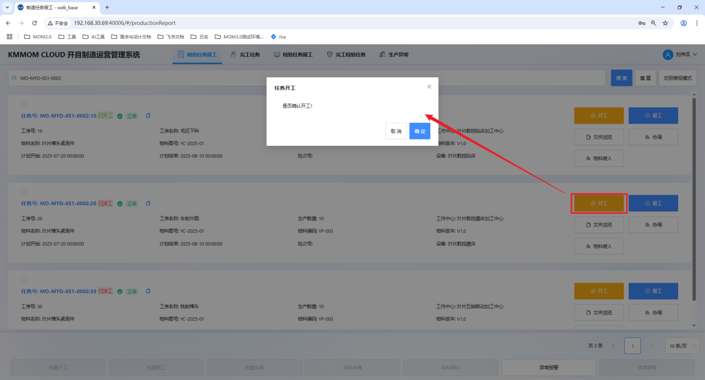

- 功能验收标准

操作员可对工序任务进行开工操作，MOM系统记录工序任务实际开工时间。

###### 检查项填报

| 功能编号 | MOM-RW-05 |
| --- | --- |
| 功能名称 | 检查项填报 |
| 操作角色 | 操作员 |
| 功能说明 | 根据工序和工步检验项要求填写装配质量记录 |
| 业务规则 | 工步汇报：根据接收的工艺路线中的工步内容及检查项，按工步顺序填报工步质量记录。 要求工艺员在编制工艺过程中，将油封要求编制在特定的工序或工步中，并形成检查要求，操作者根据检查要求，填写油封过程记录。 试车过程中需填写油料消耗情况，油料消耗要求需在试车工艺规程中体现。 |

- 检查项填报

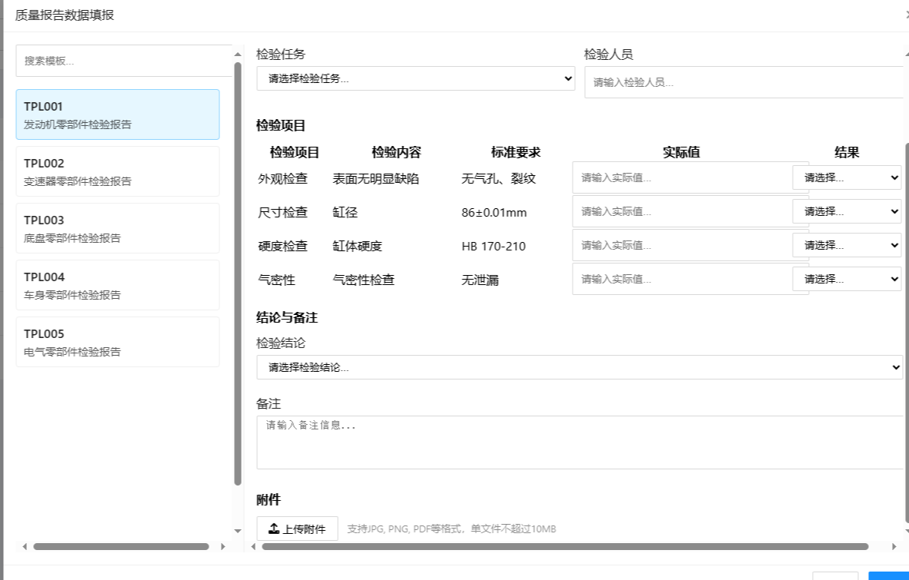

- 功能验收标准

操作员可对该工序任务下的工步内容填写装配质量记录，并正常保存。

###### 浏览工艺文件

| 功能编号 | MOM-RW-06 |
| --- | --- |
| 功能名称 | 浏览工艺文件 |
| 操作角色 | 操作员 |
| 功能说明 | 工序任务执行过程中查阅工艺文件 |
| 业务规则 | 与PLM集成调用该生产订单物料的工艺文件地址进行浏览； |

- 浏览工艺文件

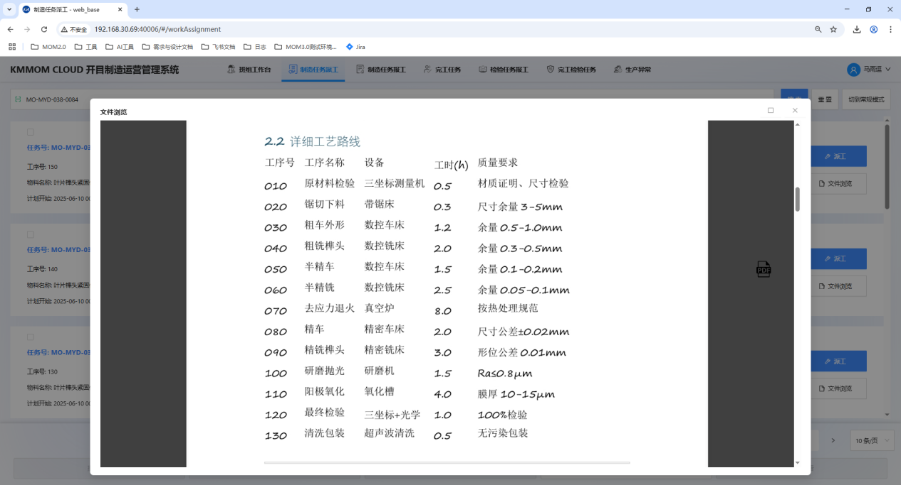

- 功能验收标准

操作员可查看到该生产订单物料对应的正确版本的工艺文件。

###### 报工

| 功能编号 | MOM-RW-07 |
| --- | --- |
| 功能名称 | 报工 |
| 操作角色 | 操作员 |
| 功能说明 | 对工序任务进行报工操作；汇报检验结果（合格与不合格）。 |
| 业务规则 | 检验结果为不合格的触发不合格品审批流程。 可上传附件补充相关质量文件。 |

- 报工

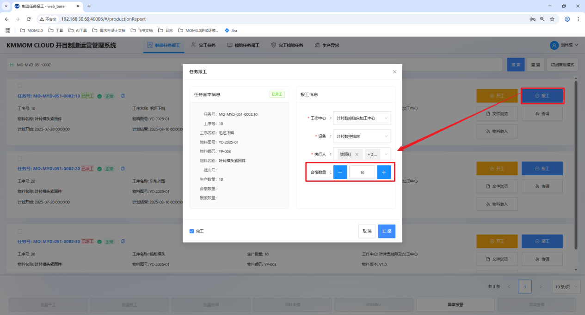

- 功能验收标准

操作员可对工序任务进行报工，根据检验要求提交至检验汇报。MOM系统记录操作员报工时间。

汇报不合格数量后可正常触发不合格品审批流程。

操作员可正常上传装配过程中的照片，视频与扫描文件。

#### 试车任务管理[批注-6]

##### 目标业务流程

- 流程范围

| 流程起点 | 安装检查单已下达 试验检查汇总单已下达 试验工艺规程/试车记录单已下达 拆卸检查项单已下达 台架恢复单已下达 试车任务已接收 |
| --- | --- |
| 流程终点 | 试车任务已完成 |
| 输入 | 试车任务 |
| 输出 | 安装检查单、试验检查汇总单、试车记录单、拆卸检查项单、台架恢复单、收车任务完工 |

- 流程设计

- 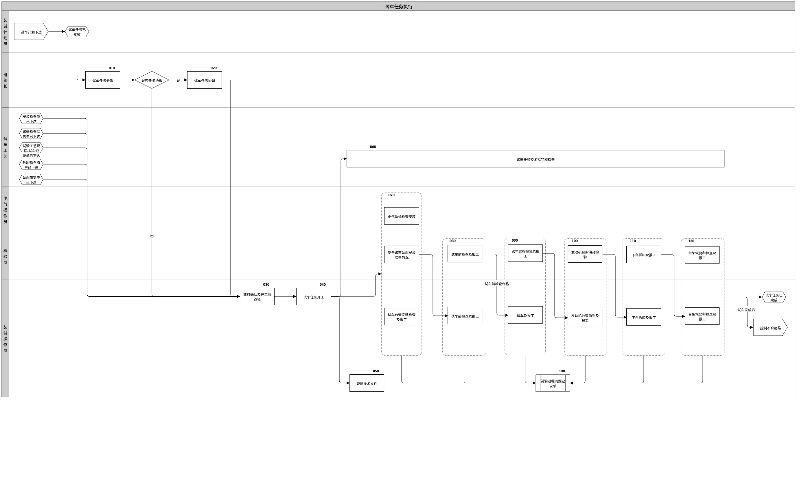

- 流程说明

| 活动编码 | 活动名称 | 活动内容 | 角色 | 输入 | 输出 | 模板/表单 |
| --- | --- | --- | --- | --- | --- | --- |
| 010 | 试车任务分派 | 班组长将试车任务分派至班组下的具体操作员。 | 班组长 | 试车任务 | 试车任务 | 试车工序任务 |
| 020 | 试车任务协调 | 因实际情况，班组长对工序任务进行共工作中心、设备、人员的协调变更。 | 班组长 | 试车工序任务 | 试车工序任务 | 试车工序任务 |
| 030 | 收料确认及开工前点检 | 现场操作员对物料/设备/工装工具的点检及收料确认，确保试车开工前资源已全部就位。 | 操作员 | 试车工序任务、点检表单 | 试车工序任务、点检结果 | 点检表单, 试车工序任务 |
| 040 | 试车任务开工 | 操作员对台架点检、收料完成后，开始试车任务； | 操作员 | 试车任务 | 试车任务开始 | 试车工序任务 |
| 050 | 查阅技术文件 | 操作员试车过程中，查阅当前试车任务关联的技术文档、图纸等 | 操作员 | 技术文件 | 技术文件 |  |
| 060 | 试车任务技术指导和检查 | 试车工艺员参与试车“台架安装检查-试验前检查-试车-油封-下台-台架恢复”全工序任务，负责编制每个环节的试验卡片和检查记录单（安装检查单、试验检查汇总单、试车记录单、拆卸检查项单、台架恢复单等），并对现场操作和检验人员做技术指导和检查工作。 | 试车工艺员 | 台架安装检查/试验前检查/试车/油封/下台/台架恢复工序任务、 | 安装检查单、试验检查汇总单、试车记录单、拆卸检查项单、台架恢复单 |  |
| 070 | 试车台架安装检查及报工 | 电气操作员按照《安装检查单》进行电气系统安装检查并记录。 主操作员按照《安装检查单》进行安装前检查（检查发动机接收、主体，起重机，吊具、转运装置、台架软件、工装工具、油料）并记录。 试车检验员按照《安装检查单》进行复查。 | 检验员, 装试操作员, 电气操作员 | 试车台架安装检查任务、安装检查单 | 安装检查单、试车台架安装检查任务完工 | 安装检查单 |
| 080 | 试车前检查及报工 | 主操作员按照《试验检查汇总单》试车前检查（发动机实验前检查、燃油/推力测量/常规灭火软件系统、流量管、电气系统、外观、试车间、试车测试系统、性能软件、台架工艺控制/控制系统、工装工具检查）并记录。 试车检验员按照《试验检查汇总单》进行复查，合格后下发“试车通知单”。 若当日试验未能完成或需暂停，需在当日下班前依据《试验后恢复自查汇总单》完成状态复位（发动机保持在台架上不拆卸）；次日重启试验前，须重新执行 《试验后恢复自查汇总单》流程，确保试验条件满足规范。 | 检验员, 操作员 | 试车前检查任务、试验检查汇总单 | 试验检查汇总单、试车前检查任务完工 | 试验检查汇总单 |
| 090 | 试车及报工 | 主操作员按照《试验卡片》进行试车并填写《试车记录单》。 试车检验员按照《试验卡片》复查并检查《试车记录单》是否符合标准。 | 检验员, 操作员 | 试车任务、试验卡片、试车记录单 | 试车记录单、试车任务完工 | 试车记录单 |
| 100 | 发动机台架油封及报工 | 主操作员按照《试车卡片》进行油封，并填写油封记录。 试车检验员按照《试车卡片》复查油封是否完成，并检查油封记录。 油封特殊情况： （1）需执行油封的情况 因其他发动机紧急插单，当前发动机需提前下台并完成油封；经试车工艺员判定，发动机存在需下台排故的故障，但故障不影响正常运转，下台排故后需重新油封。 （2）无需执行油封的情况 经试车工艺员判定，发动机已无法正常运转，无需进行油封操作，下台后直接开展分解检查及故障排查工作。 | 检验员, 操作员 | 油封任务 | 油封完成、油封记录 |  |
| 110 | 下台拆卸及报工 | 主操作员依照《拆卸检查项单》的规定，执行发动机下台拆卸及检验工作，并详细填写《拆卸检查项单》。。 试车检验员按照《拆卸检查项单》复查。 | 检验员, 操作员 | 下台拆卸任务、拆卸检查项单 | 拆卸检查项单、下台拆卸任务完成 | 拆卸检查项单 |
| 120 | 台架恢复和检查及报工 | 主操作员按照《台架恢复单》进行台架恢复和检查，并填写《台架恢复单》。 试车检验员按照《台架恢复单》复查； | 检验员, 操作员 | 台架恢复任务、台架恢复单 | 台架恢复单、台架恢复任务完成 | 台架恢复单 |
| 130 | 试验过程问题记录单 | 试车过程中发现问题，试验人员需填写《试验过程问题记录单》 | 操作员 | 试验任务 | 试验过程问题 | 试验过程问题记录单 |

##### 系统应用流程

- 流程操作步骤说明：

| NO. | 角色 | 业务活动 | IT活动 | 功能编号 |
| --- | --- | --- | --- | --- |
| 1 | 装试中心计划员 | 010试车任务分派 | 任务分派 | MOM-RW-01 |
| 2 | 装试中心计划员 | 020试车任务协调 | 任务协调 | MOM-RW-02 |
| 3 | 操作员 | 030收料确认及开工前点检 | 收料确认 | MOM-RW-03 |
| 4 | 操作员 | 040试车任务开工 | 开工 | MOM-RW-04 |
| 5 | 操作员 | 050查阅技术文件 | 浏览工艺文件 | MOM-RW-06 |
| 6 | 操作员 | 060试车任务技术指导和检查 | 检查项填报 | MOM-RW-05 |
| 7 | 操作员 | 070试车台架安装检查及报工 |  |  |
| 8 | 操作员 | 080试车前检查及报工 |  |  |
| 9 | 操作员 | 090试车及报工 |  |  |
| 10 | 操作员 | 100发动机台架油封及报工 |  |  |
| 11 | 操作员 | 110下台拆卸及报工 |  |  |
| 12 | 操作员 | 120台架恢复和检查及报工 |  |  |
| 13 | 操作员 | 130试验过程问题记录单 | 试验问题记录单填报 | MOM-RW-09 |
| 14 | 操作员 |  | 试验后恢复自查填报 | MOM-RW-10 |

##### 功能设计

###### 试验问题记录单填报

| 功能编号 | MOM-RW-09 |
| --- | --- |
| 功能名称 | 试验问题记录单填报 |
| 操作角色 | 操作员 |
| 功能说明 | 试车工序任务开工后，记录试验过程中的问题。 |
| 业务规则 | 固化试验问题记录单质量模板，试车工序任务执行过程中均可调用模板多次填报试验问题记录单，并展示上次填报记录。 试车完成后需操作者办理油料领用单，填写实际消耗情况，油料消耗需在工艺路线检查项中体现。库管员根据领用单办理油料出库单。 试验问题记录单加原因分析与措施字段。 |

- 功能验收标准

操作员在试车工序任务执行过程中，可随时调用试验问题记录单质量模板进行填报，并能正常保存。

###### 试验后恢复自查填报

| 功能编号 | MOM-RW-10 |
| --- | --- |
| 功能名称 | 试验后恢复自查填报 |
| 操作角色 | 操作员 |
| 功能说明 | 试车任务暂停后恢复，填写试验后恢复自查单。 |
| 业务规则 | 试验后恢复自查单检查项数据源自PLM系统中的试车工艺路线中试验前检查工序的检查项。 当前任务未完工前，用户可查阅多次暂停后填写的试验后恢复自查单历史记录。 |

- 功能验收标准

操作员在试车工序任务执行过程中可暂停试车任务。恢复试车任务后，可填写试验后恢复自查单并正常保存。

#### [批注-7]串换件管理

##### 目标业务流程

- 流程范围

| 流程起点 | 发起串（换）件 |
| --- | --- |
| 流程终点 | 串换件完成 |
| 输入 | 异常信息 |
| 输出 | 装入物料清单、拆卸记录 |

- 流程设计

- 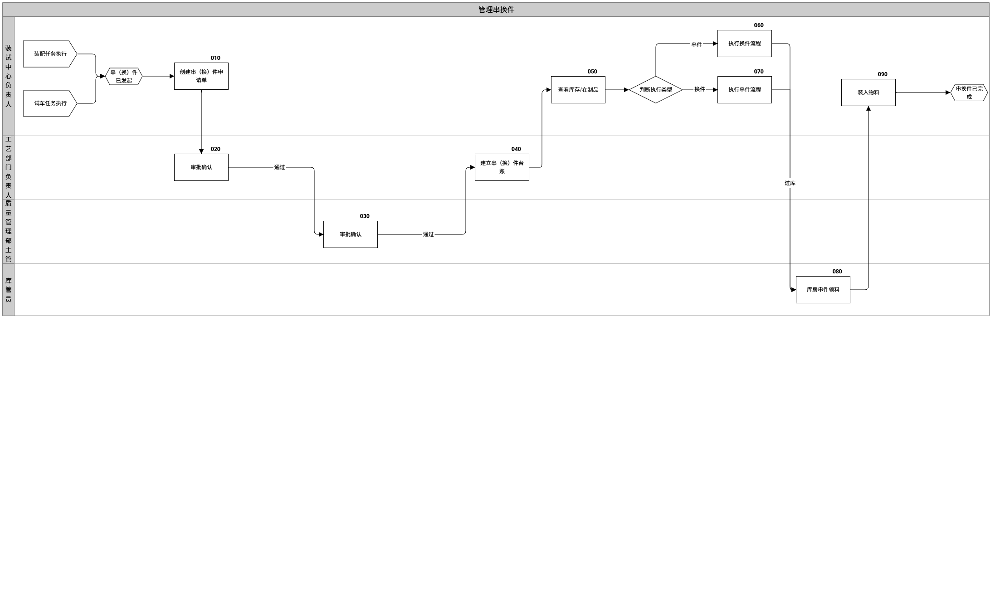

- 流程说明

| 活动编码 | 活动名称 | 活动内容 | 角色 | 输入 | 输出 | 模板/表单 |
| --- | --- | --- | --- | --- | --- | --- |
| 010 | 创建串（换）件申请单 | 装试中心操作员在装配执行过程中发现异常，经过判断后需要发起串换件申请。 | 装试中心 | 异常信息 | 串换件申请单 | 串换件申请单 |
| 020 | 审批确认 | 工程技术中心审批串换件申请 | 工程技术中心 | 串换件申请单 | 串换件申请单 | 串换件申请单 |
| 030 | 审批确认 | 质量管理部审批串换件申请 | 质量管理部 | 串换件台账 | 串换件台账 | 串换件台账 |
| 040 | 建立串（换）件台账 | 装试中心根据申请单及现场实际情况，创建串（换）件台账 | 装试中心计划员 | 串换件台账 | 串换件台账 | 串换件台账 |
| 050 | 下发施工单 | 工程技术中心下发施工单给到装试中心。 | 工艺员 | 施工单 |  |  |
| 060 | 执行换件流程 | 根据串换件申请单，对换上件与换下件进行换件装配与拆卸操作。 | 装试中心 |  |  |  |
| 070 | 执行串件流程 | 根据串换件申请单，对换上件与换下件进行串件装配与拆卸操作。 | 装试中心 |  |  |  |
| 080 | 库房串件领料 | 操作员到库房领料，库房人员根据串换件计划清单及领料出库申请单，领料出库。 | 库管员 | 串换件台账、出库申请单 | 出库申请单 | 出库申请单 |
| 090 | 装入物料 | 对被串换件发动机的装配工序任务报工及记录装入物料信息。 | 装试中心 | 串换件台账 | 装入记录、拆卸记录 | 装配过程记录 |

##### 系统应用流程

- 流程操作步骤说明：

| NO. | 角色 | 业务活动 | IT活动 | 功能编号 |
| --- | --- | --- | --- | --- |
| 1 | 操作员 | 010创建串换件申请单 | 创建串换件申请单 | MOM-CHJ-01 |
| 2 | 工艺员 | 020审批确认 | 串换件申请审批流 | MOM-GZL-05 |
| 3 | 检验员 | 030审批确认 | 串换件申请审批流 | MOM-GZL-05 |
| 4 | 计划员 | 040建立串换件台账 | 建立串换件申请台账 | MOM-CHJ-02 |
| 5 | 工艺员 | 050下发施工单 | 接收施工单 | MOM-JCSJ-10 |

##### 功能设计

###### 创建串换件申请单

| 功能编号 | MOM-CHJ-01 |
| --- | --- |
| 功能名称 | 创建串换件申请单 |
| 操作角色 | 工艺员、操作员 |
| 功能说明 | 可在工作台发起串换件申请，填写串换件申请单。 |
| 业务规则 | 在工作台-工序任务报工发起串换件申请； 串换件申请单创建成功后自动加入到串换件申请审批流。 科研计划由工艺员发起串换件。 |

- 串换件申请样例界面

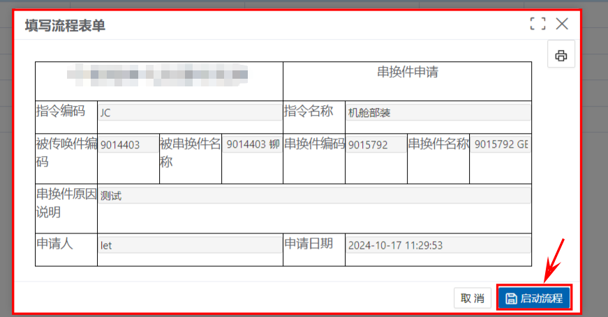

- 表单设计

- 串换件申请单表：

- 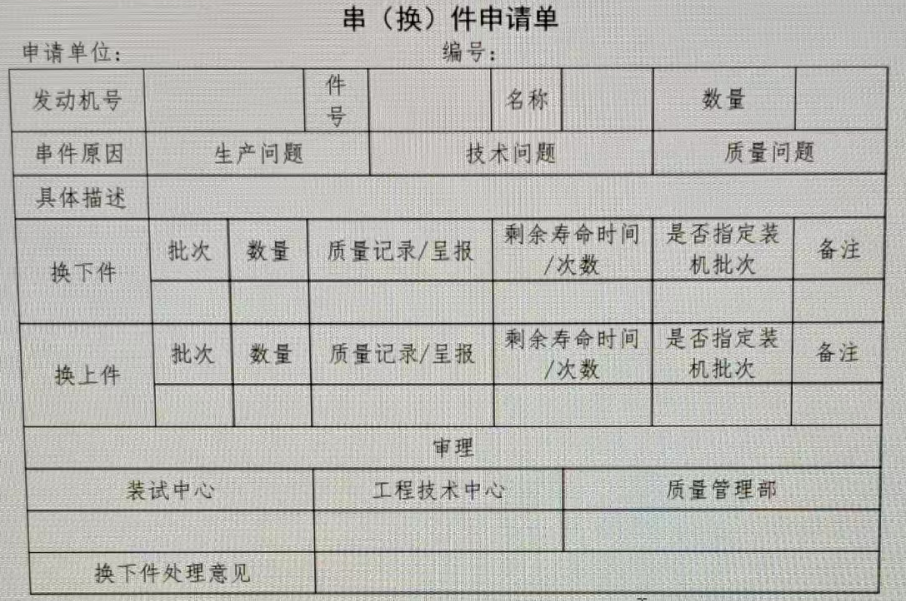

| 序号 | 字段中文名 | 字段说明 | 字段类型 | 字段值域 | 值域标准 | 是否主键 | 是否必填 |
| --- | --- | --- | --- | --- | --- | --- | --- |
| 1 | 串换件申请单编号 | 串换件申请单编号 | 字符型（50） |  |  | 是 | 是 |
| 2 | 生产订单号 | 生产订单号 | 字符型（50） | 引入ERP值域 |  | - | 是 |
| 3 | 工序任务号 | 工序任务编码 | 字符型（50） |  |  | - | 是 |
| 4 | 物料编码 | 物料编码 | 字符型（50） |  |  | - | 是 |
| 5 | 申请单位 | 申请单位 | 字符型（50） |  |  | - | 是 |
| 6 | 发动机号 | 发动机号 | 字符型（50） |  |  | - | 是 |
| 7 | 数量 | 数量 | 数值（2） |  |  | - | 是 |
| 8 | 串件原因 | 串件原因 | 字符型（50） |  |  | - | 是 |
| 9 | 具体描述 | 具体描述 | 字符型（50） |  |  | - |  |
| 10 | 换下件批次 | 换下件批次 | 字符型（50） |  |  | - | 是 |
| 11 | 换下件数量 | 换下件数量 | 数值（2） |  |  | - | 是 |
| 12 | 换下件质量记录/呈报 | 换下件质量记录/呈报 | 字符型（50） |  |  | - | - |
| 13 | 换下件剩余寿命时间/次数 | 换下件剩余寿命时间/次数 | 字符型（50） |  |  | - | 是 |
| 14 | 换下件是否指定装机批次 | 换下件是否指定装机批次 | 字符型（50） |  |  | - | - |
| 15 | 换下件备注 | 换下件备注 | 字符型（50） |  |  | - | - |
| 16 | 换上件批次 | 换上件批次 | 字符型（50） |  |  | - | 是 |
| 17 | 换上件数量 | 换上件数量 | 数值（2） |  |  | - | 是 |
| 18 | 换上件质量记录/呈报 | 换上件质量记录/呈报 | 字符型（50） |  |  | - | - |
| 19 | 换上件剩余寿命时间/次数 | 换上件剩余寿命时间/次数 | 字符型（50） |  |  | - | 是 |
| 20 | 换上件是否指定装机批次 | 换上件是否指定装机批次 | 字符型（50） |  |  | - | - |
| 21 | 换上件备注 | 换上件备注 | 字符型（50） |  |  | - | - |
| 22 | 换下件处理意见 | 换下件处理意见 | 字符型（50） |  |  | - | - |

- 功能验收标准

- 操作员可在工作台发起串换件申请并填报串换件申请单详细内容。

###### 串换件申请审批流

- 见工作流管理-业务审批流程场景-串换件申请审批流。

###### 串换件申请单台账

| 功能编号 | MOM-CHJ-02 |
| --- | --- |
| 功能名称 | 串换件申请单台账 |
| 操作角色 | 工艺员、装试中心计划员 |
| 功能说明 | 汇总显示串换件申请单台账清单。 |
| 业务规则 | 查询规则：按串换件申请单编号、发动机号、生产订单号、零组件号可查询对应生产订单的串换件详细信息。 |

- 串换件申请单台账样例界面

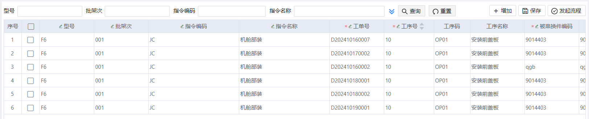

- 功能验收标准

- 计划员与工艺员可在MOM系统中按串换件申请单编号、发动机号、生产订单号、零组件号可查询对应生产订单的串换件详细信息。

#### 异常管理

##### 目标业务流程

- 流程范围

| 流程起点 | 异常发起与提报 |
| --- | --- |
| 流程终点 | 异常关闭 |
| 输入 | 实物、异常描述 |
| 输出 | 异常问题统计表 |

- 流程设计

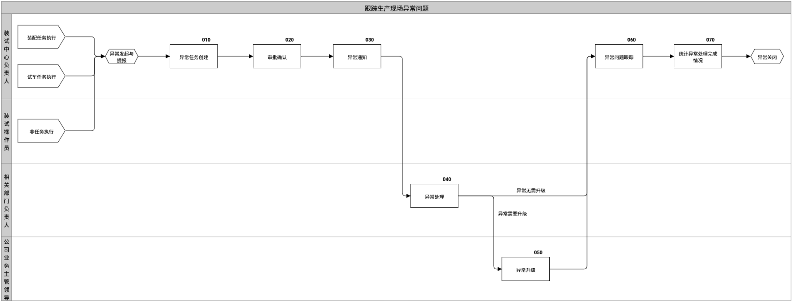

- 流程说明

| 活动编码 | 活动名称 | 活动内容 | 角色 | 输入 | 输出 | 模板/表单 |
| --- | --- | --- | --- | --- | --- | --- |
| 010 | 异常任务创建 | 各业务人员根据实际情况创建异常任务，填写详细的异常信息、指定处理人员、设置解决时间，根据异常任务类别，开展对应的异常审批通知流程。 | 操作员 | 实物、异常描述 | 异常任务 | 异常任务 |
| 020 | 审批确认 | 对异常任务中的异常描述信息进行审批确认 | 计划员、班组长 | 异常任务 | 异常任务 | 异常任务 |
| 030 | 异常通知 | 各业务部门接收到异常任务通知，了解异常情况。 | 异常处理员 | 异常任务 | 异常任务 | 异常问题统计表 |
| 040 | 异常处理 | 根据异常任务详细信息，各负责业务部门根据实际情况处理异常问题。 | 异常处理员 | 异常任务 | 异常任务 | 异常任务 |
| 050 | 异常升级 | 异常处理人员处置后未解决，或超出当前层级处置权限/响应能力时，按预设分级标准向上级部门/责任人逐级上报。 | 异常处理员 | 异常任务 | 异常任务 | 异常任务 |
| 060 | 异常问题跟踪与关闭 | 对异常任务的发起，审批，通知及处理关闭进行全过程的跟进。 | 班组长 | 异常任务 | 异常任务 | 异常任务 |
| 070 | 异常统计与监控 | 对各类（设备、工艺、质量、材料等）异常进行统计，按周期汇总统计展示每台发动机异常问题。 | 计划员 | 异常任务 | 异常任务统计表 | 异常任务统计表 |

##### 系统应用流程

- 流程操作步骤说明：

| NO. | 角色 | 业务活动 | IT活动 | 功能编号 |
| --- | --- | --- | --- | --- |
| 1 | 系统管理员 |  | 异常事件分类 | MOM-YC-01 |
| 2 | 系统管理员 |  | 异常事件流程设计 | MOM-YC-02 |
| 3 | 计划员/操作员/检验员 | 010异常任务创建 | 异常发起 | MOM-YC-03 |
| 4 | 计划员 | 020审批确认 | 异常事件处理工作流 |  |
| 5 |  | 030异常通知 | OA集成通知 | MOM--OA-01 |
| 6 | 计划员 | 050异常问题跟踪与关闭 | 异常关闭 | MOM-YC-04 |

##### 功能设计

###### 异常事件分类

| 功能编号 | MOM-YC-01 |
| --- | --- |
| 功能名称 | 异常事件分类 |
| 操作角色 | 系统管理员 |
| 功能说明 | 将异常事件问题进行分类管理，以便在异常报警发起时选择相应的类别。 |
| 业务规则 | 无 |

- 异常类别样例界面

- 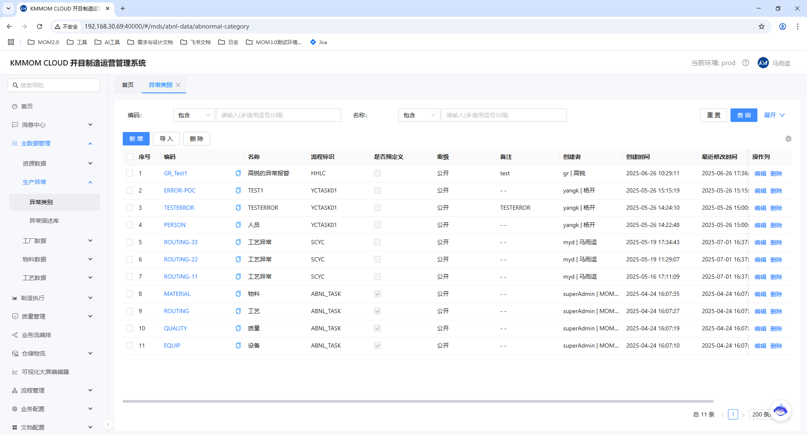

- 功能验收标准

- 可自定义添加异常分类，在发起异常报警时，能够选择新增的异常类别。

###### 异常事件流程设计

- 见工作流管理-业务审批流程场景-异常事件审批流。

###### 异常发起

| 功能编号 | MOM-YC-03 |
| --- | --- |
| 功能名称 | 异常发起 |
| 操作角色 | 计划员、操作员、检验员 |
| 功能说明 | 发起异常报警时选择异常事件类别，输入异常原因，进行异常报警。 |
| 业务规则 | 根据异常事件类别自动将异常任务加入到对应的异常事件审批流。 支持上传附件。 |

- 异常报警

- 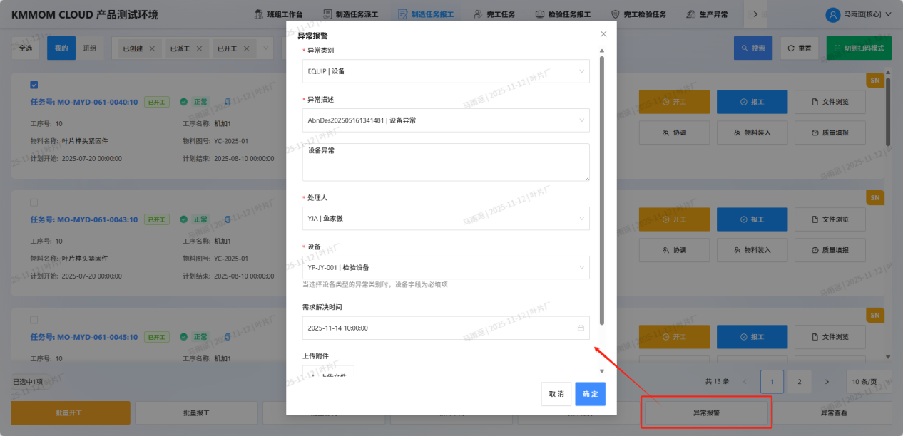

- 表单设计

| 序号 | 字段中文名 | 字段说明 | 字段类型 | 字段值域 | 值域标准 | 是否主键 | 是否必填 |
| --- | --- | --- | --- | --- | --- | --- | --- |
| 1 | 异常编码 | 异常编码 | 字符型（50） |  |  | 是 | 是 |
| 2 | 异常名称 | 异常名称 | 字符型（50） |  |  | - | 是 |
| 3 | 异常状态 | 异常状态 | 字符型（50） |  |  | - | 是 |
| 4 | 异常类别 | 异常类别 | 字符型（50） |  |  | - | 是 |
| 5 | 发起人 | 发起人 | 字符型（50） |  |  | - | 是 |
| 6 | 异常原因 | 异常原因 | 字符型（50） |  |  |  | 是 |
| 7 | 异常描述 | 异常描述 | 字符型（50） |  |  |  | 是 |
| 8 | 处理措施 | 处理措施 | 字符型（50） |  |  |  |  |
| 9 | 处理人 | 处理人 | 字符型（50） |  |  |  |  |
| 10 | 需求解决时间 | 需求解决时间 | 日期型 |  |  |  |  |
| 11 | 承诺解决时间 | 承诺解决时间 | 日期型 |  |  |  |  |
| 12 | 关闭人 | 关闭人 | 字符型（50） |  |  |  |  |
| 13 | 关闭时间 | 关闭时间 | 日期型 |  |  |  |  |
| 14 | 关闭说明 | 关闭说明 | 字符型（50） |  |  |  |  |
| 15 | 设备 | 设备 | 字符型（50） |  |  |  |  |
| 16 | 是否加入审批流 | 是否加入审批流 | 字符型（50） |  |  |  |  |

- 功能验收标准

异常发起后，可自动加入到对应的异常事件审批流，并通知到对应的责任人。可在异常发起时正常上传附件，且正常浏览附件信息。

###### 异常关闭

| 功能编号 | MOM-YC-04 |
| --- | --- |
| 功能名称 | 异常关闭 |
| 操作角色 | 计划员、操作员、检验员 |
| 功能说明 | 将已处理完成的异常任务进行关闭，MOM系统记录异常关闭时间。 |
| 业务规则 | 无 |

- 异常关闭

- 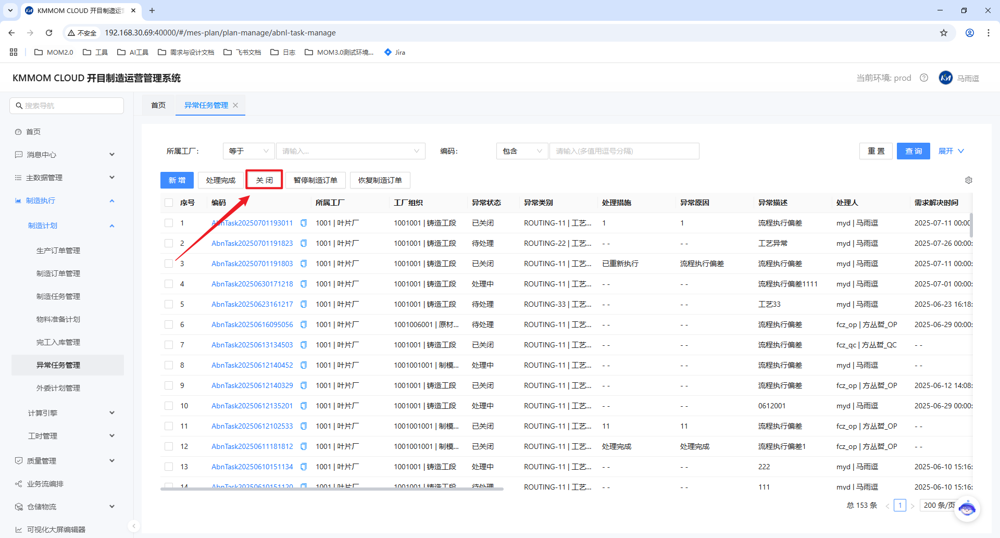

- 功能验收标准

- 用户可正常关闭异常任务，MOM系统记录关闭时间，关闭人员。

#### 工时管理

##### 目标业务流程

- 流程范围

| 流程起点 | 完成定额工时接收 工序任务完工 |
| --- | --- |
| 流程终点 | 完成定额工时分配 |
| 输入 | 工序任务、定额工时 |
| 输出 | 定额工时统计汇总 |

- 流程设计

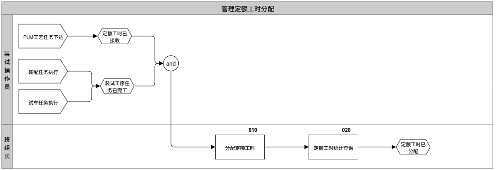[批注-8]

- 流程说明

| 活动编码 | 活动名称 | 活动内容 | 角色 | 输入 | 输出 | 模板/表单 |
| --- | --- | --- | --- | --- | --- | --- |
| 010 | 计算实作工时 | 操作者对执行工序任务时对开工时间和完工时间进行采集。计划员和班组长根据操作员在执行工序任务时产生的实际开工时间，实际完工时间，异常暂停时间以及出勤时间计算出人员的实作工时。 | 操作员、班组长 | 工序任务 | 实作工时 |  |
| 020 | 分配定额工时 | 班组长根据定额工时，按比例分配给具体的执行人。 分配完成后，形成定额工时分配结果。 | 班组长 | 工序任务、定额工时 | 定额工时分配结果 |  |
| 030 | 工时统计查询 | 班组长可按时间（年、月、日）、发动机、班组、人多种维度汇总查询。 | 班组长 | 工序任务、定额工时分配结果 | 定额工时统计汇总 | 工时统计汇总 |

##### 系统应用流程

- 流程操作步骤说明：

| NO. | 角色 | 业务活动 | IT活动 | 功能编号 |
| --- | --- | --- | --- | --- |
| 1 | 操作员 | 010计算实作工时 | 工时计算 | MOM-GS-01 |
| 2 | 班组长 | 020分配定额工时 | 工时分配 | MOM-GS-02 |
| 3 | 班组长 |  | 工时调整 | MOM-GS-03 |
| 4 | 计划员/班组长 | 030工时统计查询 | 工时查询 | MOM-GS-04 |

##### 功能设计

###### 工时计算

| 功能编号 | MOM-GS-01 |
| --- | --- |
| 功能名称 | 工时计算 |
| 操作角色 | 操作员 |
| 功能说明 | 根据定额加工工时与定额辅助工时计算定额总工时； 工序任务完工后，根据操作员对工序任务的开工与报工时间计算实作工时。 |
| 业务规则 | 接收PLM系统下发的定额工时数据，计划排程后将定额工时更新至工序任务，并计算定额总工时。 实作工时计算规则：实际完成时间-实际开工时间-出勤时间-暂停时间。 |

- 功能验收标准

- 可按工时计算规则准确核算出操作员的实作工时与定额总工时。

###### 工时分配

| 功能编号 | MOM-GS-02 |
| --- | --- |
| 功能名称 | 工时分配 |
| 操作角色 | 计划员、班组长 |
| 功能说明 | 将工时按一定比例分配至操作员 |
| 业务规则 | 默认平均分配工时，支持按手动调整比例分配。 |

- 工时分配

- 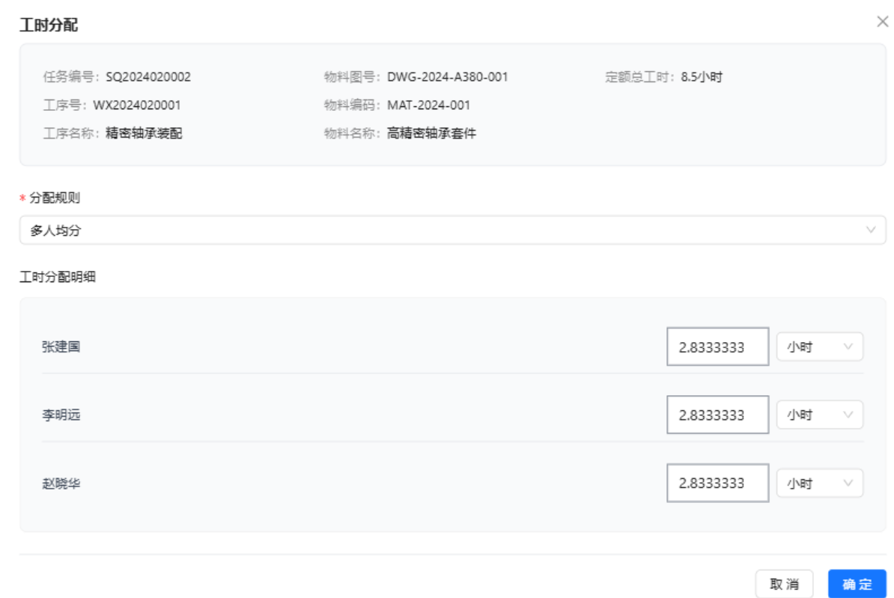

- 功能验收标准

- 计划员与班组长可分配正确的工时数据至操作员；可查看到工序任务的定额工时与实作工时。

###### 工时调整

| 功能编号 | MOM-GS-03 |
| --- | --- |
| 功能名称 | 工时调整 |
| 操作角色 | 计划员、班组长 |
| 功能说明 | 对已完成分配的工时数据进行调整，重新分配。 |
| 业务规则 | 具备工时调整权限的用户才能调整工时。 |

- 工时维护样例界面

- 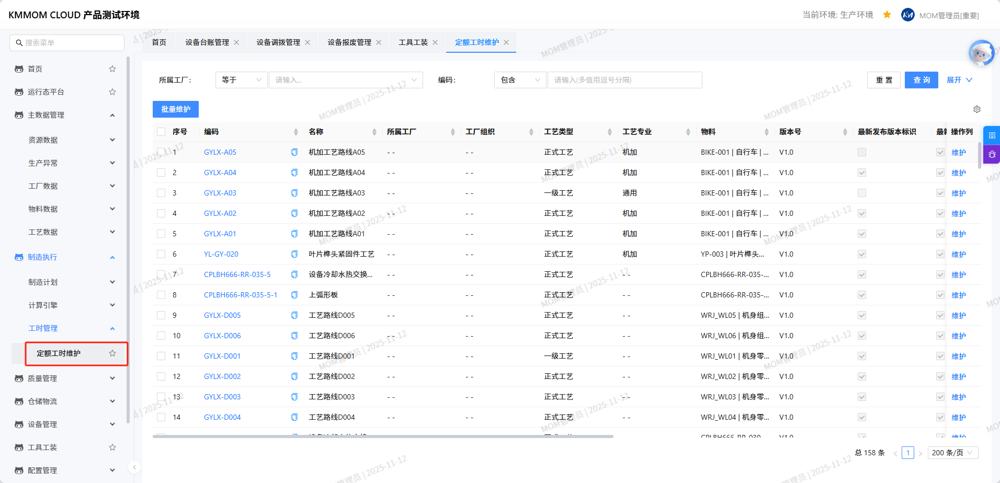

- 功能验收标准

- 计划员与班组长能够对已分配的工时数据进行调整，并重新分配工时。

###### 工时查询

| 功能编号 | MOM-GS-04 |
| --- | --- |
| 功能名称 | 工时查询 |
| 操作角色 | 计划员、班组长 |
| 功能说明 | 可查询操作员个人工时信息 |
| 业务规则 | 以个人工时统计报表展示 |

- 个人工时统计报表样例

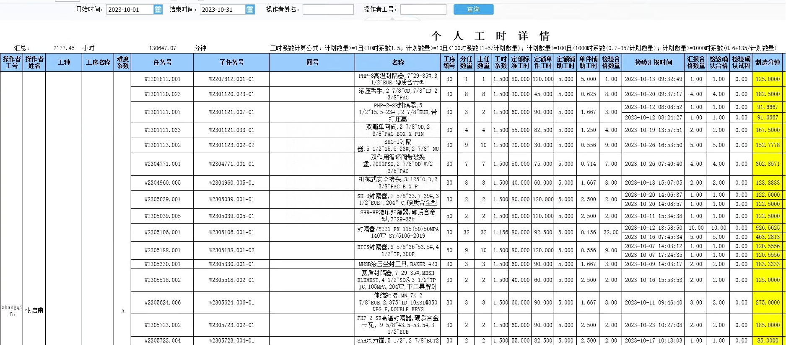

- 功能验收标准

- 计划员与班组长能够通过员工账号查询该员工所有加工的工序任务的工时信息，并可以时间范围进行筛选查询。

### 车间仓储与配送管理

#### 入库管理

##### 目标业务流程

- 流程范围

| 流程起点 | 装配/试车合格 外购件/外委件已到货 |
| --- | --- |
| 流程终点 | 物料已上架 |
| 输入 | 装配、试车任务完成 外购件、外委件到货 |
| 输出 | 入库申请单、库存信息 |

- 流程设计

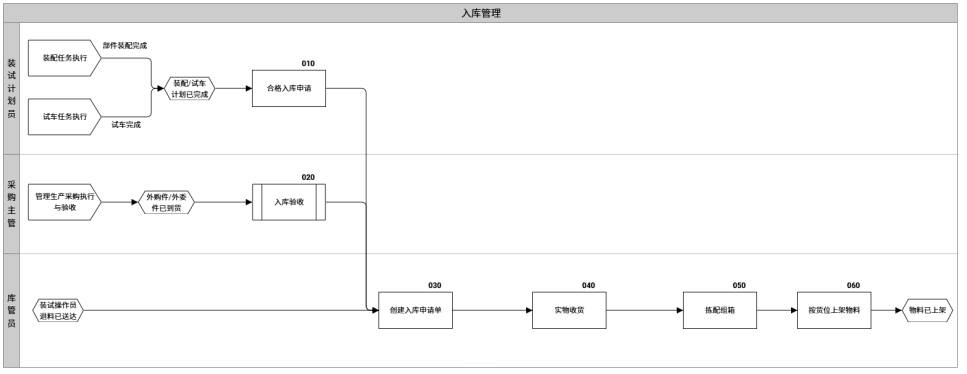[批注-9]

- 流程说明

| 活动编码 | 活动名称 | 活动内容 | 角色 | 输入 | 输出 | 模板/表单 |
| --- | --- | --- | --- | --- | --- | --- |
| 010 | 合格入库申请 | 半成品或成品完工后，计划员创建完工入库单，发起合格入库申请。 | 计划员 | 合格成品 | 入库申请单 |  |
| 020 | 创建入库申请单 | 半成品、成品完工后，计划员发起合格入库申请，库管员创建入库申请单及填写入库明细； 外购件、外委件到货后，库管员创建入库申请单及填写入库明细； 库管员针对退料、串换件等特殊场景入库时，创建入库申请单及填写入库明细。 | 库管员 | 入库申请单 | 入库申请单 | 入库申请单 |
| 030 | 入库检验 | 外购件、外委件到货后，检验员进行入库检验。 | 检验员 | 入库申请单 | 入库检验记录 | 入库检验任务 |
| 040 | 实物收货 | 库管员接收已完成检验且合格的实物物料。 | 库管员 |  |  |  |
| 050 | 拣配组箱 | 库管员选择合适的料箱，将物料与料箱进行组箱，并对物料与料箱进行记录。 | 库管员 | 入库申请单、物料实物、料箱 | 组箱记录 | 组箱记录 |
| 060 | 按货位上架物料 | 库管员通过WCS系统将已组箱完成的料箱输送回立体库的空库位中。 | 库管员 | 入库申请单 | 库存信息 | 库存信息 |

##### 系统应用流程

- 流程操作步骤说明：

| NO. | 角色 | 业务活动 | IT活动 | 功能编号 |
| --- | --- | --- | --- | --- |
| 1 | 库管员 | 010创建入库申请单 | 创建入库申请单 | MOM-RK-01 |
| 2 | 库管员 | 050分拣组箱 | 组箱 | MOM--WCS-01 |
| 3 | 库管员 |  | 物料入库 | MOM-RK-02 |

##### 功能设计

###### 创建入库申请单

| 功能编号 | MOM-RK-01 |
| --- | --- |
| 功能名称 | 入库申请单 |
| 操作角色 | 库管员、市场部业务人员 |
| 功能说明 | 新增物料入库记录，填写入库明细。 |
| 业务规则 | 入库方式：采购入库，成品入库，半成品入库，外委入库，退料入库，盘盈入库，报废入库，退货入库。 采购入库：ERP系统下发采购到货单[批注-10]形成MOM系统中的入库申请单，库房默认为中央库。通过序列号管控的采购物料需根据数量形成多条明细下发至MOM系统。 成品入库：发动机生产订单完工后，自动形成入库申请单。 退货入库：由天府轻动客户将发动机产品退回，MOM系统接收ERP下发的退货单，库管员根据退货单形成退货入库的入库申请单。 入库明细新增流水号：物料编码+日期+流水号。用于轻动内部流转，系统按规则在入库申请单创建成功后自动生成。 入库明细增加检验结果字段，入库检验任务的检验结果回传到对应的入库申请单，检验结果为待处理时，库房自动选择为限制库。 |

- 表单设计

| 序号 | 字段中文名 | 字段说明 | 字段类型 | 字段值域 | 值域标准 | 是否主键 | 是否必填 |
| --- | --- | --- | --- | --- | --- | --- | --- |
| 1 | 入库申请单编号 | 入库申请单编号 | 字符型（50） |  |  | 是 | 是 |
| 2 | 入库方式 | 入库方式 | 字符型（50） |  |  | - | 是 |
| 3 | 库房 | 库房 | 字符型（50） |  |  | - | 是 |
| 4 | 库位 | 库位 | 字符型（50） |  |  | - | 是 |
| 5 | 计量单位 | 计量单位 | 字符型（50） |  |  | - | 是 |
| 6 | 批次号 | 批次号 | 字符型（50） |  |  | - | - |
| 7 | 流水号 | 物料编码+流水号（轻动内部流转，系统自动生成） | 字符型（50） |  |  | - | 是 |
| 8 | 序列号 | 外部供应商提供的序列号 | 字符型（50） |  |  | - | - |
| 9 | 入库数量 | 入库数量 | 数值（4） |  |  | - | 是 |
| 10 | 物料编码 | 物料编码 | 字符型（50） |  |  | - | 是 |
| 11 | 零件号 | 零件号 | 字符型（50） |  |  | - | 是 |
| 12 | 零件名称 | 零件名称 | 字符型（50） |  |  | - | 是 |
| 13 | 物资类别 | 物资类别 | 字符型（50） |  |  | - | - |
| 14 | 版次 | 版次 | 字符型（50） |  |  | - | - |
| 15 | 供货单位 | 供货单位 | 字符型（50） |  |  | - | - |
| 16 | 项目 | 项目 | 字符型（50） |  |  | - | - |
| 17 | 不合格品申请单编号 | 不合格品申请单编号 | 字符型（50） |  |  | - | - |
| 18 | 质量证明单 | 质量证明单 | 字符型（50） |  |  | - | - |
| 19 | 油封日期 | 油封日期 | 日期型 |  |  | - | - |
| 20 | 油封期限 | 油封期限 | 字符型（50） |  |  | - | - |
| 21 | 到期时间 | 到期时间 | 日期型 |  |  | - | - |
| 22 | 入库时间 | 入库时间 | 日期型 |  |  | - | 是 |
| 23 | 库存地点(原层位) | 库存地点(原层位) | 字符型（50） |  |  | - | - |
| 24 | 单价(含税元) | 物料单价 | 数值（5） |  |  | - | 是 |
| 25 | 金额(含税元) | 单价*数量=汇总 | 数值（5） |  |  | - | 是 |

- 创建入库申请单样例界面

- 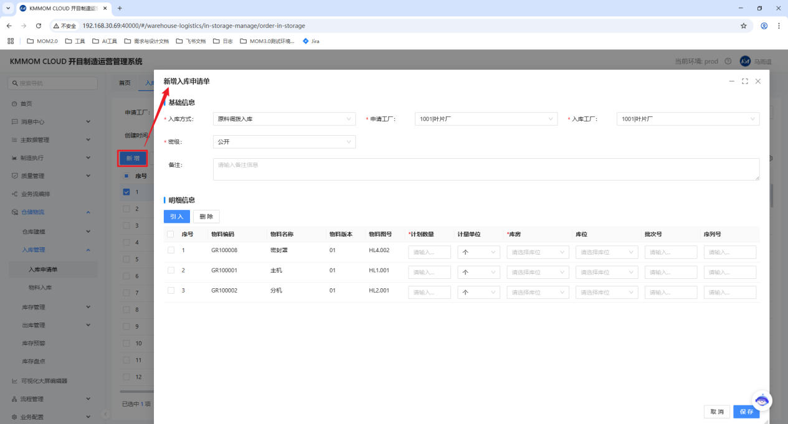

- 功能验收标准

- 库管员可成功创建入库申请单，且录入的入库数据及明细信息准确。

###### 组箱

| 功能编号 | MOM--WCS-01 |
| --- | --- |
| 功能名称 | 组箱 |
| 操作角色 | 库管员 |
| 功能说明 | 将需要入立体库的入库物料与料箱或托盘进行关联记录。 |
| 业务规则 | 组箱确认后将组箱信息发送至WCS系统。 WCS系统将料箱分配库位后发送物料入库库位信息至MOM系统。 报废入库无需组箱，入废品库。 |

- 表单设计

| 序号 | 字段中文名 | 字段说明 | 字段类型 | 字段值域 | 值域标准 | 是否主键 | 是否必填 |
| --- | --- | --- | --- | --- | --- | --- | --- |
| 1 | 组箱记录编号 | 组箱记录编号 | 字符型（50） |  |  | 是 | 是 |
| 2 | 物料编码 | 物料编码 | 字符型（50） |  |  | - | 是 |
| 3 | 批次号 | 批次号 | 字符型（50） |  |  | - | 是 |
| 4 | 序列号 | 序列号 | 字符型（50） |  |  | - | 是 |
| 5 | 流水号 | 流水号 | 字符型（50） |  |  | - | 是 |
| 6 | 料箱（托盘）号 | 料箱号与托盘号 | 字符型（50） |  |  | - | 是 |
| 7 | 数量 | 数量 | 数值（4） |  |  | - | 是 |
| 8 | 组箱时间 | 组箱时间 | 日期型 |  |  | - | 是 |

- 组箱样例界面

在入库申请单界面中增加【组箱】按钮，选择入库申请单，点击按钮展示组箱界面，可扫码或手动输入物料编码，批次号，流水号以及箱号，并输入数量。组箱信息存储在选择的入库申请单下的组箱记录中。

- 功能验收标准

库管员可扫码或手动输入物料编码，批次号以及箱号，确认组箱信息。

MOM系统可将组箱信息正常发送至WCS系统，且数据准确。

###### 物料入库

| 功能编号 | MOM-RK-02 |
| --- | --- |
| 功能名称 | 物料入库 |
| 操作角色 | 库管员，市场部业务人员（针对顾客资产库中的物料） |
| 功能说明 | 确认物料入库，更新物料库存信息。 |
| 业务规则 | 确认入库后，根据入库方式的不同，调用ERP系统对应的入库接口发送入库单数据。 在物料入库界面新增【退货】按钮，选择对应的入库明细信息，点击【退货】后显示退货物料与数量，由库管员输入需退货的数量，MOM系统同步创建出库方式为退货出库的出库申请单，并记录选中的物料入库明细的入库申请单号，待出库单审核后发送至ERP系统。 |

- 物料确认入库样例界面

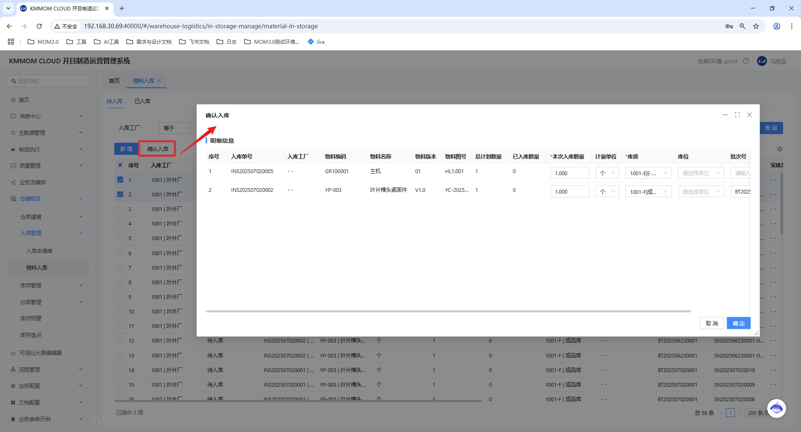

- 功能验收标准

MOM系统正确执行入库操作，生成入库单记录，更新物料库存信息和入库申请单状态。

##### 集成设计

###### 接收ERP到货单

ERP系统下发采购到货单形成MOM系统中入库方式为采购入库的入库申请单。

到货单接口字段表

| 序号 | 字段名称 | 字段说明 |
| --- | --- | --- |
| 1 | 到货单号 | 形成MOM入库申请单单号 |
| 2 | 到货单行号 |  |
| 3 | 物料编码 |  |
| 4 | 数量 |  |
| 5 | 批次号 |  |
| 6 | 序列号 |  |
| 7 | 流水号 |  |
| 8 | 供应商 |  |
| 9 | 单位 |  |
| 10 | 版次 |  |
| 11 | 项目号 |  |

###### 发送入库单审核信息至ERP

MOM系统将入库单信息发送至ERP系统。

入库单审核接口字段表

| 序号 | 字段名称 | 字段说明 |
| --- | --- | --- |
| 1 | 入库单号 | 采购入库引用ERP下发的到货单号 其他方式入库引用MOM自带入库单号 |
| 2 | 到货单行号 |  |
| 3 | 仓库名称 |  |
| 4 | 入库方式 | 采购入库、半成品入库、成品入库、外委入库、退料入库、报废入库、盘盈入库 |
| 5 | 物料编码 |  |
| 6 | 数量 |  |
| 7 | 批次号 |  |
| 8 | 序列号 |  |
| 9 | 流水号 |  |
| 10 | 有效期 |  |
| 11 | 入库人 |  |
| 12 | 库位信息 |  |
| 13 | 入库时间 |  |

###### 发送组箱信息至WCS

MOM系统将组箱信息发送至WCS系统，WCS系统返回执行结果。

组箱信息接口字段表

| 序号 | 字段名称 | 字段说明 |
| --- | --- | --- |
| 1 | 组箱任务号 | 唯一ID |
| 2 | 物料编码 |  |
| 3 | 物料名称 |  |
| 4 | 箱号（托盘号） |  |
| 5 | 数量 |  |
| 6 | 批次号 |  |
| 7 | 流水号 |  |
| 8 | 序列号 |  |
| 9 | 组箱时间 |  |

###### 接收WCS物料入库库位信息

WCS系统接收到组箱信息后，人工将料箱放置输送线，待料箱进入立体库后，WCS系统将入库的库位信息发送至MOM系统。

组箱信息接口字段表

| 序号 | 字段名称 | 字段说明 |
| --- | --- | --- |
| 1 | 组箱任务号 | 唯一ID，与发送组箱信息的ID对应 |
| 2 | 箱号（托盘号） |  |
| 3 | 货位编号 |  |
| 4 | 库区编号 |  |

#### 出库与配送管理

##### 目标业务流程

- 流程范围

| 流程起点 | 物料已齐套 计划外领料需求已产生 临时领料需求已产生 |
| --- | --- |
| 流程终点 | 确认出库已完成 |
| 输入 | 物料准备计划 计划外领料需求、临时领料需求 |
| 输出 | 出库申请单 |

- 流程设计

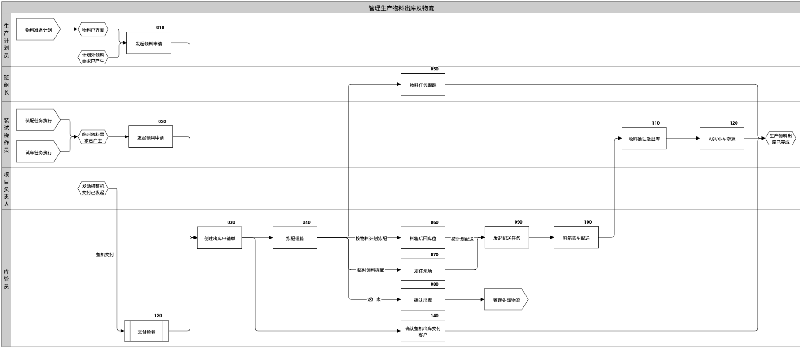

- 流程说明

| 活动编码 | 活动名称 | 活动内容 | 角色 | 输入 | 输出 | 模板/表单 | 功能名称 |
| --- | --- | --- | --- | --- | --- | --- | --- |
| 010 | 发起领料申请 | 计划员进行领料申请 | 计划员 | 物料准备计划、计划外领料需求 | 领料申请 | 出库申请单 | 领料申请 |
| 020 | 发起领料申请 | 操作员进行领料申请 | 操作员 | 装试任务领料需求 | 领料申请 | 出库申请单 | 领料申请 |
| 030 | 创建出库申请单[批注-11] | 业务人员发起领料申请后，库管员办理出库申请单。 出库场景： ①物料准备计划，提前一天出库拣配； ②装配/试车过程临时领料； ③装试中心计划外领料； ④项目负责人发起整机交付 | 库管员 | 领料申请 | 出库申请单 | 出库申请单 | 出库申请单 |
| 040 | 下发分拣任务 | 库管员根据物料申请单中的物料明细，下发分拣任务至WCS系统，WCS系统将物料从立体库取出放置分拣台。 | 库管员 | 出库申请单 | 分拣任务 |  |  |
| 050 | 拣配组箱 | 库管员根据出库单实物，选择合适的料箱，进行组箱，记录物料对应装入的料箱。 | 库管员 | 出库申请单、物料实物、料箱 | 出库单、组箱记录 | 出库单, 组箱记录 | 组箱管理 |
| 060 | 物料任务跟踪 | 查看物料、料箱、料箱内物料、配送任务实时状态。 | 班组长 | 物料、料箱库存信息 | 物料、料箱库存信息 |  | 库存管理 |
| 070 | 组箱后回库 | 库管员基于物料准备计划开展的组箱工作，完成后需通过WCS系统将组箱完成后的料箱调拨回立体库。后续通过定时工具触发物流配送任务，将物料配送至工位。 | 库管员 | 组箱信息、物料准备计划 | 料箱回库位 |  | 组箱管理 |
| 080 | 发往现场 | 若发送临时领料需求，库管员办理出库申请单，核实组箱信息与物料实物，确认无误后通过AGV小车发往现场工位。 | 库管员 | 组箱信息、物料实物、入库申请单 | 配送任务、实物 | 出库申请单 | 出库管理 |
| 090 | 确认出库 | 若采购件需出库发往生产厂家，库管员办理出库申请单，核实组箱信息与物料实物，确认无误后直接出库，库管员通过外部物流发往供应商。 | 库管员 | 组箱信息、物料实物、入库申请单 | 出库单 | 出库单 | 出库管理 |
| 100 | 发起配送任务 | 库管员或操作员呼叫AGV小车，选择配送起点与配送终点。AGV小车达到起点后，开始料箱装车操作。 | 库管员 | 配送任务 | 配送任务 |  |  |
| 110 | 料箱装车配送 | AGV小车到接波站领料，装车完成后，配送至指定库位。 | 库管员 | 出库申请单 | 出库申请单 | 出库申请单 |  |
| 120 | 收料确认及出库 | 装试中心操作员根据备料清单进行收料确认。 | 操作员 | 出库申请单 | 出库申请单 |  | 收料确认 |
| 130 | AGV小车空返 | 收料完毕后，如果料箱已空，操作员通过WCS系统的空箱返回程序呼叫AGV小车将空箱返回至库位。 | 操作员 | 料箱、操作空返 | 配送任务 |  |  |
| 140 | 交付检验 | 库管员通知检验员进行交付检验工作，对发动机外观及配套资料进行检查。 | 库管员 |  |  |  | 交付检验 |
| 150 | 确认整机出库交付客户 | 交付检验完成后，库管员办理出库申请单进行整机出库，交付给客户。 | 库管员 | 出库申请单 | 整机实物交付 | 出库单 | 出库管理 |

##### 系统应用流程

- 流程操作步骤说明：

| NO. | 角色 | 业务活动 | IT活动 | 功能编号 |
| --- | --- | --- | --- | --- |
| 1 | 库管员 |  | 接收发货通知单 | MOM--ERP-08 |
| 2 | 计划员/操作员 | 010领料申请 | 领料申请 | MOM-CK-01 |
| 3 | 库管员 | 030创建出库申请单 | 创建出库申请单 | MOM-CK-02 |
| 4 | 库管员 | 040下发分拣任务 | 下发分拣任务 | MOM--WCS-02 |
| 5 | 库管员 | 050拣配组箱 | 组箱 | MOM--WCS-01 |
| 6 |  |  | 组箱后回库 |  |
| 7 | 库管员 | 090确认出库 | 物料出库 | MOM-CK-03 |
| 8 | 库管员 | 100发起配送任务 | 下发搬运任务 | MOM--WCS-03 |

##### 功能设计

###### 接收发货通知单

| 功能编号 | MOM--ERP-08 |
| --- | --- |
| 功能名称 | 发货通知单 |
| 操作角色 | 库管员 |
| 功能说明 | 接收ERP系统下发的发货通知单。 查看发货通知单详情信息。 |
| 业务规则 | ERP系统下发发货通知单至MOM系统，MOM系统接收后将发货通知单加入到流程发货通知流程，通知到库管员。 |

- 表单设计

| 序号 | 字段中文名 | 字段说明 | 字段类型 | 字段值域 | 值域标准 | 是否主键 | 是否必填 |
| --- | --- | --- | --- | --- | --- | --- | --- |
| 1 | 发货通知单编号 | 发货通知单编号 | 字符型（50） | 引入ERP值域 |  | 是 | 是 |
| 2 | 物料编码 | 物料编码 | 字符型（50） | 引入ERP值域 |  | - | 是 |
| 3 | 批次号 | 批次号 | 字符型（50） | 引入ERP值域 |  | - | 是 |
| 5 | 序列号 | 序列号 | 字符型（50） | 引入ERP值域 |  | - | 是 |
| 4 | 发动机型号 | 发动机型号 | 字符型（50） | 引入ERP值域 |  | - | 是 |
| 5 | 数量 | 数量 | 数值（4） | 引入ERP值域 |  | - | 是 |
| 6 | 预计发货时间 | 预计发货时间 | 日期型 | 引入ERP值域 |  | - | 是 |

- 功能验收标准

MOM系统接收到ERP系统下发的发货通知单数据准确，且库管员可在待办任务中查看到发货通知单详细信息。

###### 领料申请

| 功能编号 | MOM-CK-01 |
| --- | --- |
| 功能名称 | 领料申请 |
| 操作角色 | 计划员、操作员 |
| 功能说明 | 基于生产准备计划中的物料明细发起领料申请。 |
| 业务规则 | 无 |

- 领料申请样例界面

- 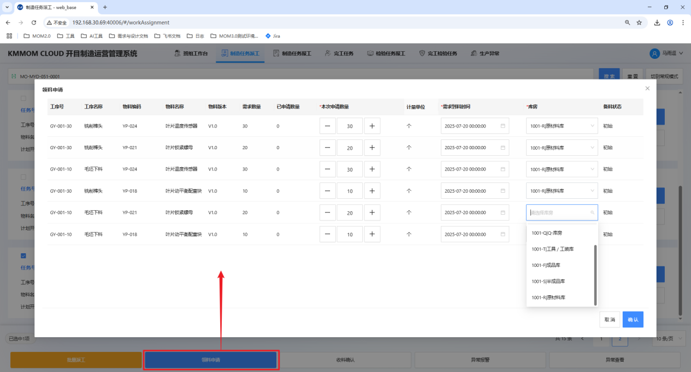

- 功能验收标准

计划员可在生产准备计划模块发起领料申请；操作员可在终端工作台发起领料申请。

###### 创建出库申请单

| 功能编号 | MOM-CK-02 |
| --- | --- |
| 功能名称 | 出库申请单 |
| 操作角色 | 库管员、市场部业务人员 |
| 功能说明 | 新增物料出库申请记录，填写出库明细。 |
| 业务规则 | 出库方式：退货出库，成品出库，半成品出库，盘亏出库，报废出库，领料出库，外委出库 |

- 表单设计

| 序号 | 字段中文名 | 字段说明 | 字段类型 | 字段值域 | 值域标准 | 是否主键 | 是否必填 |
| --- | --- | --- | --- | --- | --- | --- | --- |
| 1 | 出库申请单编号 | 出库申请单编号 | 字符型（50） |  |  | 是 | 是 |
| 2 | 出库方式 | 出库方式 | 字符型（50） |  |  | - | 是 |
| 3 | 计量单位 | 计量单位 | 字符型（50） |  |  | - | 是 |
| 4 | 批次号 | 批次号 | 字符型（50） |  |  | - | 是 |
| 5 | 序列号 | 序列号 | 字符型（50） |  |  | - | - |
| 6 | 流水号 | 流水号 | 字符型（50） |  |  | - | 是 |
| 7 | 数量 | 数量 | 数值（4） |  |  | - | 是 |
| 8 | 零件号 | 零件号 | 字符型（50） |  |  | - | 是 |
| 9 | 零件名称 | 零件名称 | 数值（4） |  |  | - | 是 |
| 10 | 项目 | 项目 | 字符型（50） |  |  | - | 是 |
| 11 | 版次 | 版次 | 字符型（50） |  |  | - | 是 |
| 12 | 生产单位 | 生产单位 | 字符型（50） |  |  | - | - |
| 13 | 领用部门 | 领用部门 | 字符型（50） |  |  | - | 是 |
| 14 | 领用人 | 领用人 | 字符型（50） |  |  | - | 是 |
| 15 | 收货单位 | 收货单位 | 字符型（50） |  |  | - | - |
| 16 | 台份 | 台份 | 字符型（50） |  |  | - | 是 |
| 17 | 出库时间 | 出库时间 | 字符型（50） |  |  | - | 是 |
| 18 | 出库库位号 | 出库库位号 | 字符型（50） |  |  | - | - |
| 19 | 备注 | 备注 | 字符型（50） |  |  | - | - |

- 出库申请单样例界面

- 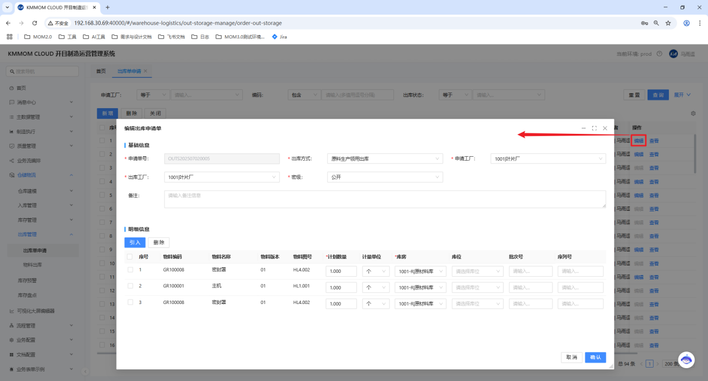

- 功能验收标准

- 库管员可成功创建出库申请单，且录入的出库数据及明细信息准确。

###### 下发分拣任务

| 功能编号 | MOM--WCS-02 |
| --- | --- |
| 功能名称 | 下发分拣任务 |
| 操作角色 | 库管员 |
| 功能说明 | 选择对应的出库申请单，发送物料明细信息至WCS系统，WCS系统下发物料出库任务。 |
| 业务规则 | 需支持批量选择出库申请单下发分拣任务至WCS系统。 |

- 表单设计

| 序号 | 字段中文名 | 字段说明 | 字段类型 | 字段值域 | 值域标准 | 是否主键 | 是否必填 |
| --- | --- | --- | --- | --- | --- | --- | --- |
| 1 | 分拣任务号 | 分拣任务号 | 字符型（50） |  |  | 是 | 是 |
| 2 | 物料编码 | 物料编码 | 字符型（50） |  |  | - | 是 |
| 3 | 数量 | 数量 | 数值（4） |  |  | - | 是 |
| 4 | 批次号 | 批次号 | 字符型（50） |  |  | - | 是 |
| 5 | 序列号 | 序列号 | 字符型（50） |  |  | - | - |
| 6 | 流水号 | 流水号 | 字符型（50） |  |  | - | 是 |
| 7 | 数量 | 数量 | 数值（4） |  |  | - | 是 |
| 8 | 任务创建时间 | 任务创建时间 | 日期型 |  |  | - | 是 |
| 9 | 出库目的地 | 出库目的地 | 字符型（50） |  |  | - | 是 |
| 10 | 货位编号 | 货位编号 | 字符型（50） |  |  | - | 是 |

- 功能验收标准

- 库管员可成功将分拣任务下发至WCS系统并取出正确的物料。

###### 物料出库

| 功能编号 | MOM-CK-03 |
| --- | --- |
| 功能名称 | 物料出库 |
| 操作角色 | 库管员、市场部业务人员 |
| 功能说明 | 确认物料入库，更新物料库存信息。 |
| 业务规则 | 出库方式：退货出库，成品出库，半成品出库，外委出库，盘亏出库，报废出库，领料出库 确认出库后，根据出库方式的不同，调用ERP系统对应的出库接口发送出库单数据。 领料出库时，若选择的物料其版次不在发动机MBOM下物料的【许用版次】范围内，则不允许出库；若该物料存在设计更改单，且该物料的版次不在设计更改单规定的【许用版次】范围内，则不允许出库。 需设定例外放行使用流程，由装试中心发起流程，经工程技术中心审核后，MOM系统进行标记，允许不在【许用版次】内的物料进行出库。 成品出库时，库管员需引用发货通知单，MOM系统将发货通知单信息发送至ERP系统。 顾客资产出库时无需与ERP系统进行同步。 |

- 物料确认出库样例界面

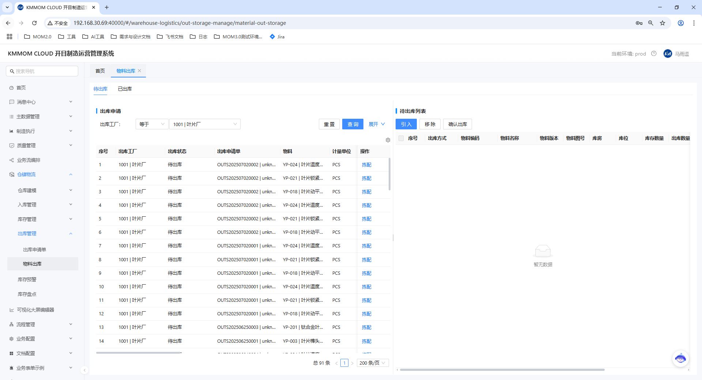

- 功能验收标准

MOM系统正确执行出库操作，生成出库单记录，更新物料库存信息和出库申请单状态。

领料出库时，MOM系统能够管控不在许用版次范围内的物料出库。

###### 下发搬运任务

| 功能编号 | MOM--WCS-04 |
| --- | --- |
| 功能名称 | 下发搬运任务 |
| 操作角色 | 库管员 |
| 功能说明 | 库管员输入起点位置与终点位置，扫码或选择需搬运的物料形成搬运任务，确认发送至WCS系统驱动AGV小车进行配送。 |
| 业务规则 | 基于生产准备计划出库配送：设定定时任务，通过定时任务驱动，触发MOM与WCS集成将已组箱完成的料箱出库，并呼叫AGV小车按工艺路线中规定的工作中心所设置的起点与终点将物料配送至现场工位。 临时出库领料配送：库管员基于临时领料申请拣配组箱并办理出库单后，呼叫AGV小车开展配送任务。 其他配送：可随时发起配送任务，搬运车间其他物资。需权限控制其他配送功能 建立配送任务记录对象，记录配送任务详情信息。 |

- 搬运任务原型界面描述

- 在MOM系统仓储管理模块与工作台各提供一个页面，选择或输入起点，终点以及物料信息，确认后触发AGV小车转运。

- 表单设计

| 序号 | 字段中文名 | 字段说明 | 字段类型 | 字段值域 | 值域标准 | 是否主键 | 是否必填 |
| --- | --- | --- | --- | --- | --- | --- | --- |
| 1 | 配送任务号 | 配送任务号 | 字符型（50） |  |  | 是 | 是 |
| 2 | 配送任务名称 | 配送任务名称 | 字符型（50） |  |  | - | 是 |
| 3 | 配送起点 | 配送起点 | 字符型（50） |  |  | - | 是 |
| 4 | 配送终点 | 配送终点 | 字符型（50） |  |  |  | 是 |
| 5 | 配送时间 | 配送时间 | 时间型 |  |  |  | 是 |
| 6 | 配送状态 | 配送状态 | 字符型（50） | 引入WCS值域 |  |  | 是 |
| 7 | 配送物料编码 | 配送物料编码 | 字符型（50） |  |  | - | - |
| 8 | 料箱编号 | 料箱编号 | 字符型（50） |  |  | - | - |

- 功能验收标准

MOM系统基于生产准备计划设定的定时配送任务可按时间点正常触发AGV小车将物料配送至正确的位置；

用户可在任务时间在MOM系统下发配送任务搬运物资，并将物资配送至正确位置。

##### 集成设计

###### 接收ERP发货通知单

ERP系统下发发货通知单至MOM系统

发货通知单接口字段表

| 序号 | 字段名称 | 字段说明 |
| --- | --- | --- |
| 1 | 发货单号 |  |
| 2 | 发货单行号 |  |
| 3 | 物料编码 |  |
| 4 | 数量 |  |
| 5 | 批次号 |  |
| 6 | 序列号 |  |
| 7 | 供应商 |  |
| 8 | 单位 |  |
| 9 | 版次 |  |

###### 下发分拣任务至WCS

MOM系统下发分拣任务至WCS系统，WCS系统触发出库任务。

分拣任务接口字段表

| 序号 | 字段名称 | 字段说明 |
| --- | --- | --- |
| 1 | 任务号 | 唯一ID |
| 2 | 箱号（托盘号） |  |
| 3 | 物料编码 |  |
| 4 | 需出库的数量 |  |
| 5 | 任务创建时间 |  |
| 6 | 出库目的地 | 分拣口或工位 |

###### 发送出库单信息至ERP

MOM系统将出库单信息发送至ERP系统。

出库单审核接口字段表

| 序号 | 字段名称 | 字段说明 |
| --- | --- | --- |
| 1 | 出库单号 | 成品出库时引用ERP下发的发货单号； 其他出库方式采用MOM自带出库单号； |
| 2 | 发货单行号 |  |
| 3 | 仓库名称 |  |
| 4 | 出库方式 | 退货出库、半成品出库、成品出库、外委出库、领料出库、报废出库、盘亏出库 |
| 5 | 物料编码 |  |
| 6 | 数量 |  |
| 7 | 批次号 |  |
| 8 | 序列号 |  |
| 9 | 流水号 |  |
| 10 | 出库人 |  |
| 11 | 库位信息 |  |
| 12 | 出库时间 |  |

###### 下发AGV搬运任务

MOM系统下发分拣任务至WCS系统，WCS系统触发出库任务。

分拣任务接口字段表

| 序号 | 字段名称 | 字段说明 |
| --- | --- | --- |
| 1 | 任务号 | 唯一ID |
| 2 | 箱号（托盘号） |  |
| 3 | 物料编码 |  |
| 4 | 需出库的数量 |  |
| 5 | 任务创建时间 |  |
| 6 | 出库目的地 | 分拣口或工位 |

#### 盘点管理

##### 目标业务流程

- 流程范围

| 流程起点 | 盘点任务已下达 |
| --- | --- |
| 流程终点 | 盘点任务已完成 |
| 输入 | 盘点任务 |
| 输出 | 库存数据 |

- 流程设计

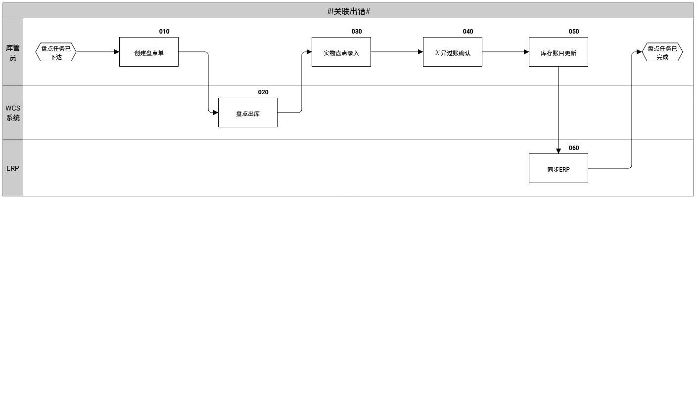

- 流程说明

| 活动编码 | 活动名称 | 活动内容 | 角色 | 输入 | 输出 | 模板/表单 |
| --- | --- | --- | --- | --- | --- | --- |
| 010 | 创建盘点单 | 库管员在创建盘点单计划，确定需要盘点的库房和库位。 | 库管员 | 盘点任务 | 盘点单 | 盘点单 |
| 020 | 盘点出库 | 库管员将需盘点的物料出库进行盘点。若物料在立体库中，则通过WCS系统将物料从立体库中取出，库管员对料箱中的物料进行盘点。 | 库管员 |  |  |  |
| 030 | 实物盘点录入 | 库管员对实物进行盘点，并记录盘点物料与数量。 | 库管员 | 盘点单、物料实物 | 盘点记录 | 盘点单 |
| 040 | 差异过账确认 | 库管员完成实盘录入后，与库房台账进行差异确认。 | 库管员 | 盘点记录 | 盘点差异确认 | 盘点单 |
| 050 | 库存账目更新 | 库管员确认盘点差异无误后，对库存账目进行更新。 | 库管员 | 盘点差异 | 库存账目更新 | 盘点单 |

##### 系统应用流程

- 流程操作步骤说明：

| NO. | 角色 | 业务活动 | IT活动 | 功能编号 |
| --- | --- | --- | --- | --- |
| 1 | 库管员 | 010创建盘点单 | 创建盘点单 | MOM-PD-01 |
| 2 | 计划员/操作员 | 020盘点出库 | 下发分拣任务 | MOM--WCS-02 |
| 3 | 库管员 | 030实物盘点录入 | 实盘录入 | MOM-PD-02 |
| 4 | 库管员 | 040差异过账确认 | 差异过账 | MOM-PD-03 |

##### 功能设计

###### 创建盘点单

| 功能编号 | MOM-PD-01 |
| --- | --- |
| 功能名称 | 盘点单 |
| 操作角色 | 库管员 |
| 功能说明 | 新增盘点记录，对库房实物进行盘点。 |
| 业务规则 | 盘点前MOM系统可在盘点单界面下发分拣任务至WCS系统，将需盘点的物料从立体库中取出； 盘点完成后，将库存数据更新并同步至ERP系统。 盘点单未过账之前，被盘点的物料不允许出入库。 |

- 盘点单

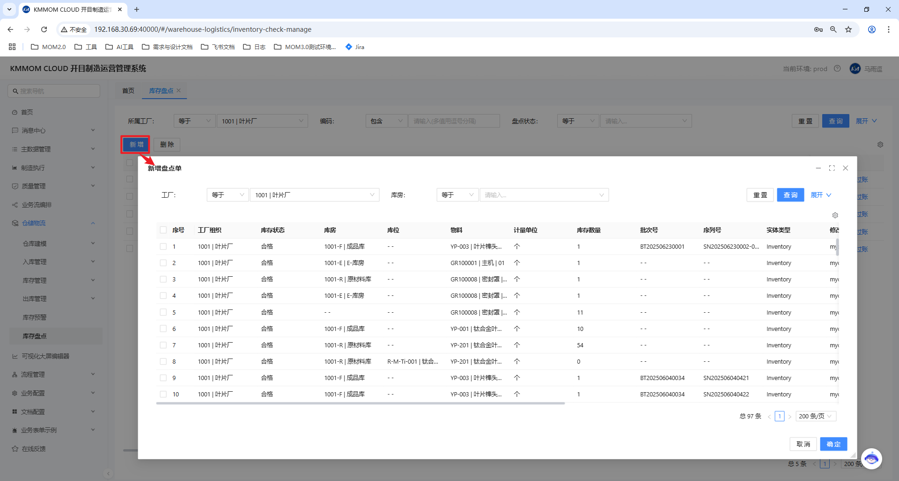

- 表单设计

| 序号 | 字段中文名 | 字段说明 | 字段类型 | 字段值域 | 值域标准 | 是否主键 | 是否必填 |
| --- | --- | --- | --- | --- | --- | --- | --- |
| 1 | 盘点单号 | 盘点单号 | 字符型（50） |  |  | 是 | 是 |
| 2 | 盘点状态 | 盘点状态 | 字符型（50） |  |  | - | 是 |
| 3 | 物料 | 物料 | 字符型（50） |  |  | - | 是 |
| 4 | 计量单位 | 计量单位 | 字符型（50） |  |  | - | 是 |
| 5 | 库房 | 库房 | 字符型（50） |  |  | - | 是 |
| 6 | 库位 | 库位 | 字符型（50） |  |  | - | 是 |
| 7 | 批次号 | 批次号 | 字符型（50） |  |  | - | 是 |
| 8 | 序列号 | 序列号 | 字符型（50） |  |  | - | - |
| 9 | 流水号 | 流水号 | 字符型（50） |  |  | - | 是 |
| 10 | 库存数量 | 库存数量 | 数值（4） |  |  | - | 是 |
| 11 | 实盘数量 | 实盘数量 | 数值（4） |  |  | - | 是 |
| 12 | 差异数量 | 差异数量 | 数值（4） |  |  | - | 是 |
| 13 | 备注 | 备注 |  |  |  | - | - |

- 功能验收标准

库管员可选择需盘点的库房与库位创建盘点单；MOM系统可驱动WCS系统将需盘点的物料从立体库取出。

###### 实盘录入

| 功能编号 | MOM-PD-02 |
| --- | --- |
| 功能名称 | 实盘录入 |
| 操作角色 | 库管员 |
| 功能说明 | 将实际盘点出的物料数量输入到盘点单对应的物料批次中。 |
| 业务规则 | 实盘数量默认与库存数量相同 |

- 实盘录入样例界面

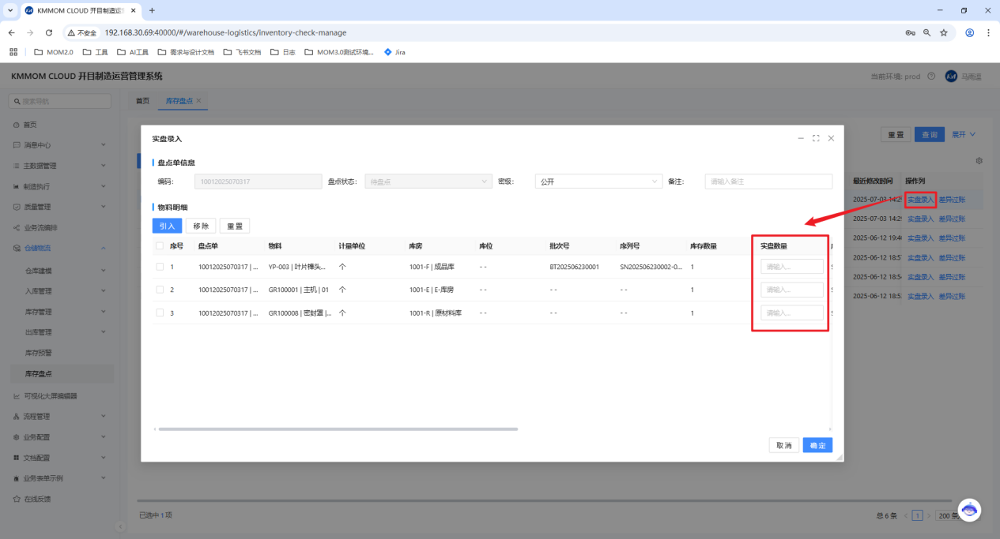

- 功能验收标准

库管员可盘点单在物料明细中录入实盘数量，可以引入或删除物料。系统保存实盘数据，并更新实盘数量。

###### 差异过账

| 功能编号 | MOM-PD-03 |
| --- | --- |
| 功能名称 | 差异过账 |
| 操作角色 | 库管员 |
| 功能说明 | 计算实盘数量与库存账面数量进行差异计算并过账，更新库存数据。 |
| 业务规则 | 库存增加：实盘数量 > 账面数量，增加库存 库存减少：实盘数量 < 账面数量，减少库存 库存不变：实盘数量 = 账面数量，无需调整 |

- 差异过账样例界面

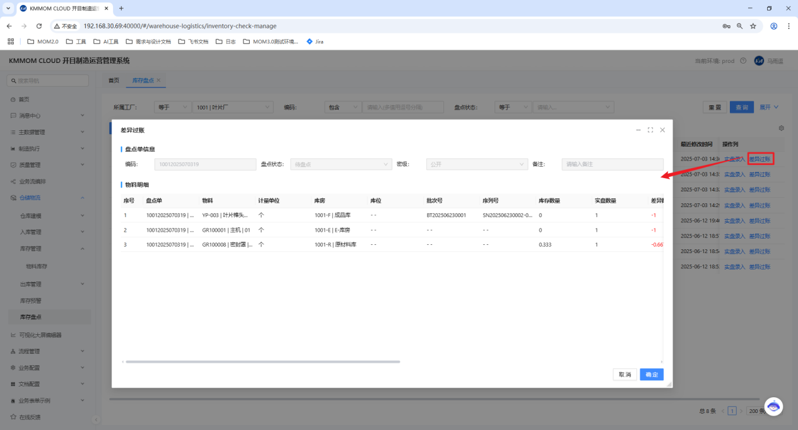

- 功能验收标准

MOM系统根据盘点差异，库存数据可准确更新无误。

##### 集成设计

###### 库存盘点数据同步ERP

库管员对库房盘点后，MOM系统将盘点信息发送至ERP系统。

库存盘点数据同步接口字段表

| 序号 | 字段名称 | 字段说明 |
| --- | --- | --- |
| 1 | 盘点单号 |  |
| 2 | 实盘数量 |  |
| 3 | 库存数量 |  |
| 4 | 仓库名称 |  |
| 5 | 库位信息 |  |
| 6 | 物料编码 |  |
| 7 | 批次号 |  |
| 8 | 序列号 |  |
| 9 | 盘点时间 |  |

#### 库房基础管理

##### 系统应用流程

##### 功能设计

###### 库房建模

| 功能编号 | MOM-KF-01 |
| --- | --- |
| 功能名称 | 库房建模 |
| 操作角色 | 库管员，系统管理员 |
| 功能说明 | 创建库房与库位信息。 查询库房，库位与物料库存信息 |
| 业务规则 | 库房分类：供应商库，生产准备库，中央库，设备备件库，油库，废品库，成品库，限制库，待处理库，顾客资产库 |

- 库房样例界面

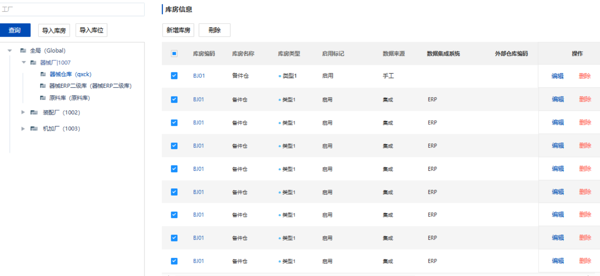

- 功能验收标准

库房库位信息可成功新增，更新和删除；库房与库位查询结果正确展示。

###### 物料库存管理

| 功能编号 | MOM-KF-02 |
| --- | --- |
| 功能名称 | 物料库存管理 |
| 操作角色 | 库管员 |
| 功能说明 | 查询库房内物料实时库存信息。 |
| 业务规则 | PLM系统下发设计更改单至MOM系统时，MOM系统需根据设计更改单中的物料与版次信息，将该设计更改单与该版次物料的物料库存进行关联，且不允许该版次的物料进行出库。 |

- 物料库存样例界面

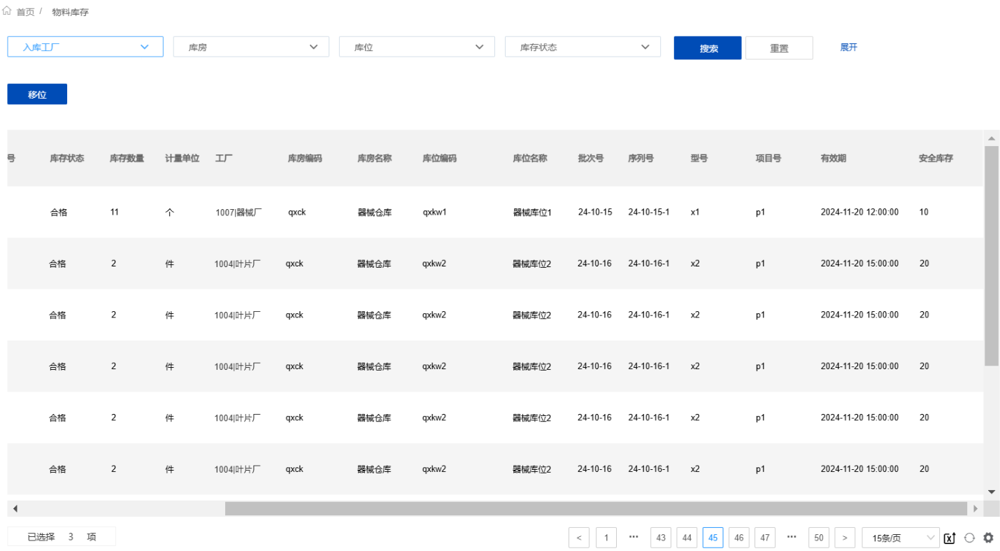

- 功能验收标准

用户通过物料信息输入查询时，MOM系统能够正确显示查询结果。

###### 物料预警管理

| 功能编号 | MOM-KF-03 |
| --- | --- |
| 功能名称 | 物料预警管理 |
| 操作角色 | 库管员 |
| 功能说明 | 维护物料库存的安全库存。 维护物料库存的有效期，油封期，贮存期。 根据安全库存，生成对应的安全库存预警任务信息。提醒库管员进行补货或调整库存。 根据三期信息，生成对应的预警任务信息，提醒仓库管理员处理即将过期的物料。 |
| 业务规则 | 库管员在办理入库单时，录入物料三期信息。入库单审核后，三期信息赋值在物料库存属性中。 计算当前日期距离油封期，贮存期的天数，乘所配置的系数形成提前预警期。 到达提前预警后，形成提前预警任务，并加入物料三期预警通知流程中，以待办任务形式通知的对应的责任人。 预警通知任务提交后，自动更新对应物料的物料库存的油封期与贮存期。 |

- 库存预警样例界面

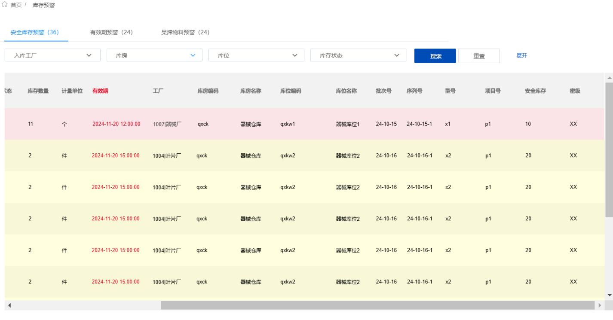

- 功能验收标准

MOM系统能够根据配置的安全库存与三期，进行预警显示以及形成预警任务。并成功地将预警任务信息以待办任务形式通知到对应的责任人。

### 质量管理

#### 入库检验

##### 目标业务流程

- 流程范围

| 流程起点 | 到货单已接收 |
| --- | --- |
| 流程终点 | 入库检验已完成 |
| 输入 | ERP到货单 |
| 输出 | 入库检验任务检查项 |

- 流程设计

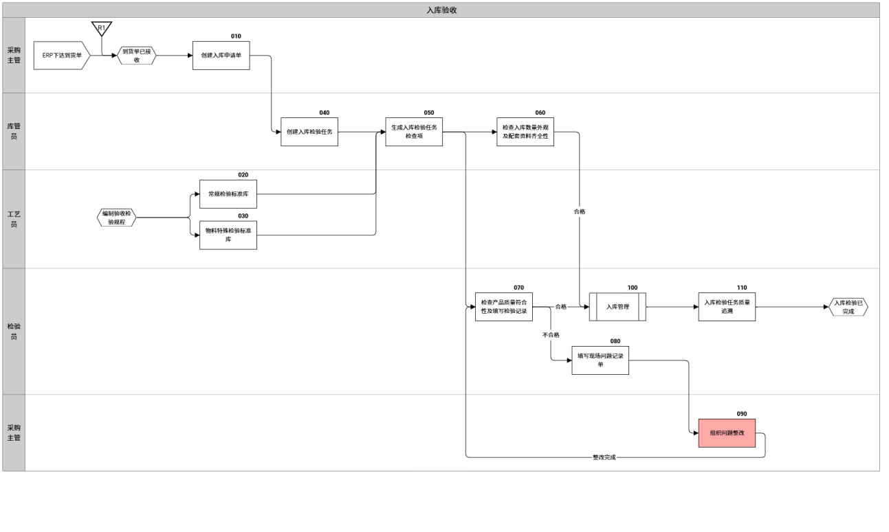

- 流程说明

| 活动编码 | 活动名称 | 活动内容 | 角色 | 输入 | 输出 | 模板/表单 |
| --- | --- | --- | --- | --- | --- | --- |
| 010 | 创建入库申请单 | 采购主管在ERP系统中根据采购订单办理到货单并通过系统集成形成MOM系统的入库申请单。库管员对入库申请单审核并通知检验员开展入库检验工作。 | 库管员 | ERP到货单 | 入库申请单 | 入库申请单 |
| 020 | 常规检验标准库 | 工艺员编制常规检查标准（验收检验规程）与入厂复验标准文件。 | 工艺员 | 入库检验任务 | 常规入库检验标准 |  |
| 030 | 物料特殊检验标准库 | 若项目合同中有特殊检验要求，工艺员编制物料特殊性检验规程。 | 工艺员 | 入库检验任务 | 物料特殊检验标准 |  |
| 040 | 创建入库检验任务 | 库管员通知检验员对已到货的物料开展入库检验工作。 | 库管员 | 入库申请单 | 入库检验任务 | 入库检验任务 |
| 050 | 执行入库检验任务 | 检验员根据验收检验规程对物料进行检验以及尺寸记录。对于数量较多的零件采取抽检方式。 | 检验员 | 入库检验任务、验收检验规程 | 入库检验任务结果 |  |
| 080 | 入库检验任务质量追溯 | 通过零组件号、检验单号、检验日期、检验人员、批次等维度，查询历史检验记录。 | 检验员 | 入库检验任务 | 入库检验任务 |  |
| 090 | 入库管理 | 入库检验合格后，库管员管理入库申请单并进行入库操作。 | 检验员 |  |  |  |
| 100 | 填写现场问题记录单 | 检验员在执行入库检验过程中发现异常或不合格物料，填写《现场问题记录单》。反馈采购主管联系供应商处理。 | 检验员 | 入库检验不合格 | 现场问题记录单 |  |
| 110 | 组织问题整改 | 检验员填写完毕《现场问题记录单》后，通知采购主管，告知不合格详细信息；采购主管联系外部供应商进行问题处理。 | 采购主管 | 现场问题记录单 | 采购主管收到不合格信息 |  |

##### 系统应用流程

- 流程操作步骤说明：

| NO. | 角色 | 业务活动 | IT活动 | 功能编号 |
| --- | --- | --- | --- | --- |
| 1 | 工艺员 | 020常规检验标准库 | 维护检查项 | MOM-RKJY-01 |
| 2 | 工艺员 | 030物料特殊检验标准库 | 维护检查项 | MOM-RKJY-01 |
| 3 | 库管员 | 040创建入库检验任务 | 创建入库检验任务 | MOM-RKJY-02 |
| 4 | 检验员 | 050执行入库检验任务 | 入库检验检查项填报 | MOM-RKJY-03 |

##### 功能设计

###### 维护检查项

| 功能编号 | MOM-RKJY-01 |
| --- | --- |
| 功能名称 | 维护检查项 |
| 操作角色 | 工艺员 |
| 功能说明 | 维护采购件物料检验要求与检查项 |
| 业务规则 | 常规复验项由MOM系统固化创建。 物料特殊性验收要求由工艺员在PLM系统将检验依据与检查内容结构化编制并下发至MOM系统。 |

- 维护检查项样例界面

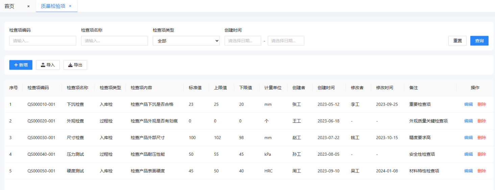

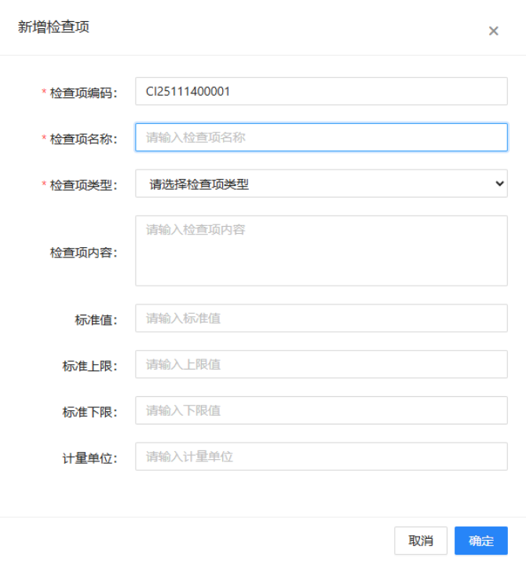

- 表单设计

- 检查项表：

| 序号 | 字段中文名 | 字段说明 | 字段类型 | 字段值域 | 值域标准 | 是否主键 | 是否必填 |
| --- | --- | --- | --- | --- | --- | --- | --- |
| 1 | 检查项编号 | 检查项编号 | 字符型（50） |  | - | 是 | 是 |
| 2 | 检查项名称 | 检查项名称 | 字符型（50） |  | - | - | 是 |
| 3 | 检查项类型 | 检查项类型 | 字符型（50） | 入库检、过程检 |  | - | 是 |
| 4 | 检验依据 | 检验依据 | 字符型（50） |  |  | - | 是 |
| 5 | 检查内容 | 检查内容 | 字符型（256） |  |  | - | 是 |
| 6 | 标准值 | 标准值 | 字符型（50） |  |  | - | - |
| 7 | 上限值 | 上限值 | 字符型（50） |  |  | - | - |
| 8 | 下限值 | 下限值 | 字符型（50） |  |  | - | - |
| 9 | 单位 | 单位 | 字符型（50） |  |  | - | - |

- 功能验收标准

用户可正常创建检查项，检查项信息无误，能正确保存与查询。物料特殊检查项可与物料关联。

###### 创建入库检验任务

| 功能编号 | MOM-RKJY-02 |
| --- | --- |
| 功能名称 | 创建入库检验任务 |
| 操作角色 | 库管员、检验员 |
| 功能说明 | 根据入库申请单中的物料入库明细，创建物料入库检验任务； 在检验任务中手动创建入库检验任务。 |
| 业务规则 | 选择入库申请单，点击创建入库检验任务按钮，MOM系统根据物料明细创建各物料对应的入库检验任务。（一个入库申请单下有多个物料批次明细，则创建多个入库检验任务） 入库检验任务创建成功后，MOM系统检索检查项资源库，将常规检查项与物料特殊检查项引入到入库检验任务中。 小零件数量较多，按10%的比例进行抽检。后续可按标准自定义 |

- 检验任务样例界面

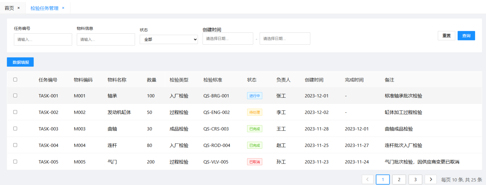

- 表单设计

- 入库检验任务表：

| 序号 | 字段中文名 | 字段说明 | 字段类型 | 字段值域 | 值域标准 | 是否主键 | 是否必填 |
| --- | --- | --- | --- | --- | --- | --- | --- |
| 1 | 入库检验任务编码 | 入库检验任务编码 | 字符型（50） |  | - | 是 | 是 |
| 2 | 物料编码 | 物料编码 | 字符型（50） |  | - | - | 是 |
| 3 | 物料名称 | 零组件号 | 字符型（50） |  | - | - | 是 |
| 4 | 图代号 | 零组件名称 | 字符型（50） |  |  | - | 是 |
| 5 | 检验数 | 零组件规格型号 | 字符型（256） |  |  | - | 是 |
| 6 | 不合格数 | 检查项类型 | 字符型（50） |  |  | - | 是 |
| 7 | 批次序号 | 检查项内容 | 字符型（50） |  |  | - | 是 |
| 8 | 承制方 | 标准值 | 字符型（50） |  |  | - | 是 |
| 9 | 抽检数 | 上限值 | 字符型（50） | “抽样数”或“全检” |  | - | 是 |
| 10 | 内外包装是否完好 | 下限值 | 字符型（50） | “是”或“否” |  | - | 是 |

- 检查项表：

| 序号 | 字段中文名 | 字段说明 | 字段类型 | 字段值域 | 值域标准 | 是否主键 | 是否必填 |
| --- | --- | --- | --- | --- | --- | --- | --- |
| 1 | 入库检验任务编码 | 入库检验任务编码 | 字符型（50） |  | - | 是 | 是 |
| 2 | 物料编码 | 物料编码 | 字符型（50） |  | - | - | 是 |
| 3 | 零组件号 | 零组件号 | 字符型（50） |  | - | - | 是 |
| 4 | 零组件名称 | 零组件名称 | 字符型（50） |  |  | - | 是 |
| 5 | 零组件规格型号 | 零组件规格型号 | 字符型（256） |  |  | - | - |
| 6 | 检查项类型 | 检查项类型 | 字符型（50） |  |  | - | 是 |
| 7 | 检查项内容 | 检查项内容 | 字符型（50） |  |  | - | - |
| 8 | 标准值 | 标准值 | 字符型（50） |  |  | - | - |
| 9 | 上限值 | 上限值 | 字符型（50） |  |  | - | - |
| 10 | 下限值 | 下限值 | 字符型（50） |  |  |  | - |
| 11 | 计量单位 | 计量单位 | 字符型（50） |  |  |  | - |
| 12 | 实测值 | 实测值 | 字符型（50） |  |  |  | 是 |
| 13 | 结果 | 结果 | 字符型（50） |  |  |  | 是 |

- 功能验收标准

用户可正常创建入库检验任务，且引入的入库检验任务中的检查项正确。

###### 执行入库检验任务

| 功能编号 | MOM-RKJY-03 |
| --- | --- |
| 功能名称 | 执行入库检验任务 |
| 操作角色 | 检验员 |
| 功能说明 | 根据入库检验任务中的检查项和检查内容，填报实测值与检验记录。 |
| 业务规则 | 数量较多的零件，需进行抽检，执行入库检验任务时，填报抽检零件的检验记录和检验结果。 支持检验人员通过发起异常问题，填写不合格原因与问题记录。 支持上传检验过程附件，附件与检验任务关联。 |

- 执行入库检验任务样例界面

- 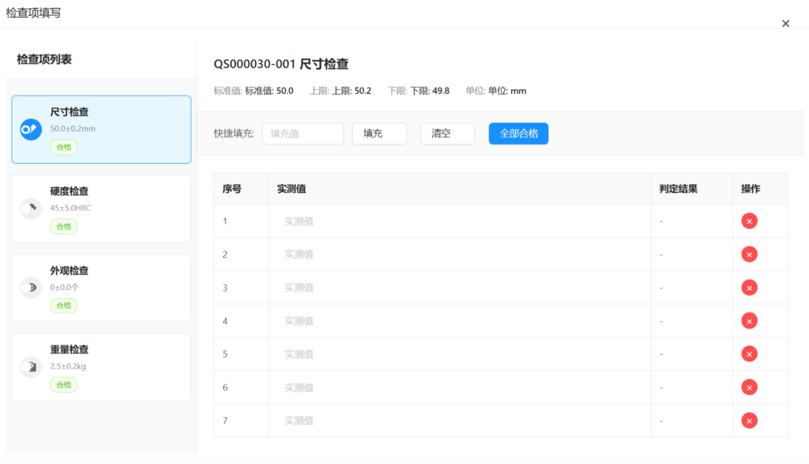

- 功能验收标准

入库检验任务中引入的检查项正确；检验员填报的质量数据准确，能够正常保存和查询；可正常上传附件并查阅。

#### 过程检验

试车过程检验与试车任务协同完成，目标业务流程同试车任务管理，系统应用流程按本章节描述内容执行。

##### 目标业务流程

- 流程范围

| 流程起点 | 检验任务已下达 首件鉴定、检验过程文件及检查项已接收 |
| --- | --- |
| 流程终点 | 装配检验已完成 |
| 输入 | 装配任务、工艺文件、检查项 工艺文件、检查项、互检任务 |
| 输出 | 检查项记录、互检任务报工 检查项记录、专检任务报工 检查项记录、装配任务完工 |

- 流程设计

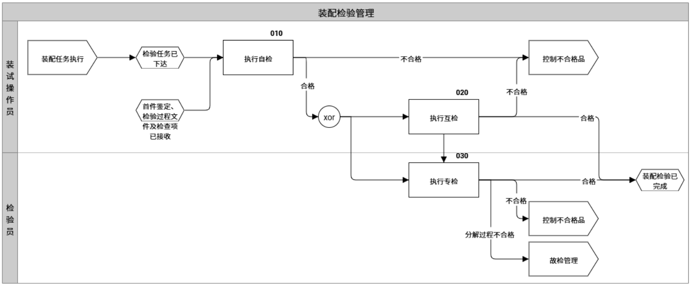

- 流程说明

| 活动编码 | 活动名称 | 活动内容 | 角色 | 输入 | 输出 | 模板/表单 |
| --- | --- | --- | --- | --- | --- | --- |
| 010 | 执行自检 | 操作员根据工艺文件要求进行自检，并填写质量记录，装配后对工序任务进行报工。 | 操作员 | 装配任务、工艺文件、检查项 | 检查项记录、装配任务完工 | 检查项记录 |
| 020 | 执行专检 | 检验员根据工艺文件要求对操作员填写的质量记录进行确认，并按照检查项进行复验同时填写检查项记录，合格后检验员在系统进行报检。 | 检验员 | 工艺文件、检查项、专检任务 | 检查项记录、专检任务报工 | 检查项记录 |
| 030 | 执行互检 | 操作员在系统完成自检和填报检查项后，互检人员对自检人员填报的检查项进行检验，并按照技术要求填报检查项，合格后在系统进行报检。 | 操作员 | 工艺文件、检查项、互检任务 | 检查项记录、互检任务报工 | 检查项记录 |

##### 系统应用流程

- 流程操作步骤说明：

| NO. | 角色 | 业务活动 | IT活动 | 功能编号 |
| --- | --- | --- | --- | --- |
| 1 | 操作员 | 020执行互检 | 检验任务管理（接收互检任务） | MOM-GCJY-01 |
| 2 | 检验员 | 030执行专检 | 检验任务管理（接收专检任务） | MOM-GCJY-01 |
| 3 | 检验员 | 030执行专检 | 检查项填报 | MOM-RW-05 |
| 4 | 检验员 | 030执行专检 | 报工 | MOM-RW-07 |

##### 功能设计

###### 检验任务管理

| 功能编号 | MOM-GCJY-01 |
| --- | --- |
| 功能名称 | 检验任务管理 |
| 操作角色 | 检验员、操作员 |
| 功能说明 | 管理入库检验任务，互检任务，专检任务的执行与报工； 查询检验任务的执行记录； |
| 业务规则 | 根据PLM系统的工艺路线中工序的检验控制定义，在计划排程时形成互检任务，专检任务。 特种检测任务：针对过程检验中的特种检测，如X光、磁粉、孔探、无损检测，要求工艺员在PLM系统系统中编制工艺规程时，将此类检测设定为检测工序。MOM系统接收工艺路线后，将特种检测以工序任务的形式分派到相关检测人员，检测人员经过检测设备进行检测后，对检测工序任务进行报工操作，并将检测报告扫描上传。 |

- 检验任务管理

- 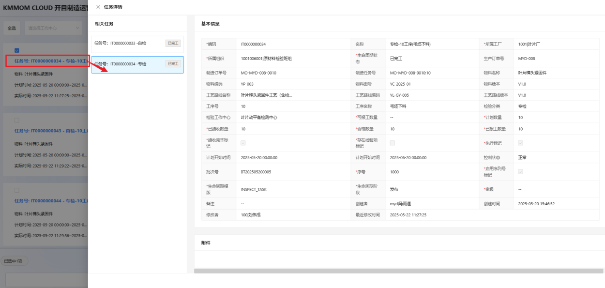

- 功能验收标准

- MOM系统能够根据工艺路线中的工序检验控制要求形成正确的互检任务，专检任务。

#### 故检管理

##### 目标业务流程

- 流程范围

| 流程起点 | 分解过程异常发现异常 |
| --- | --- |
| 流程终点 | 分解过程异常已处理 |
| 输入 | 分解任务 |
| 输出 | 故检单、处理结果 |

- 流程设计

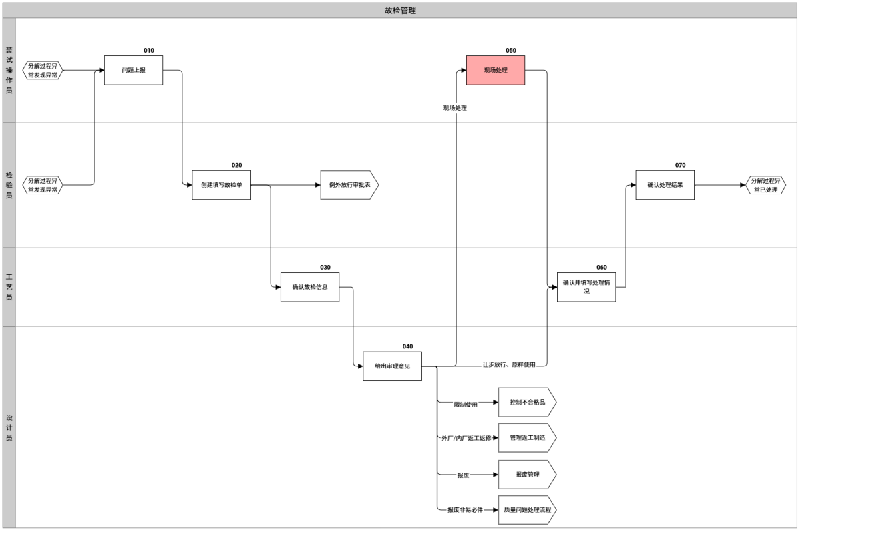

- 流程说明

| 活动编码 | 活动名称 | 活动内容 | 角色 | 输入 | 输出 | 模板/表单 |
| --- | --- | --- | --- | --- | --- | --- |
| 010 | 问题上报 | 在发动机分解任务执行过程中，操作员发现问题，需上报检验. | 操作员 | 分解任务 | 异常问题 |  |
| 020 | 创建填写故检单 | 在发动机分解任务执行过程中，检验员复检发现问题及操作者反馈问题，均需填写故检单，描述清楚问题现状、发生时间等信息。 | 检验员 | 复检发现问题、操作者反馈问题 | 故检单 | 故检单 |
| 030 | 确认故检信息 | 工艺员对故检信息做正确性和完整性确认，确认后提交设计员。 | 工艺员 | 故检单 | 故检单 |  |
| 040 | 给出审理意见 | 设计员（具有相应不合格品审理资格级别）给出审理意见。 | 设计员 | 故检单 | 故检单 |  |
| 050 | 现场处理 | 审理意见为“现场处理”，操作员根据设计提供的处理措施，现场进行问题处理。 | 装试操作员 | 故检单、问题实物 | 故检单 |  |
| 060 | 开具限制使用技术单 | 审理意见为“限制使用”，设计员根据实际开具“限制使用技术单”，并提交工艺员确认。 | 设计员 | 故检单、问题实物 | 故检单、限制使用技术单 |  |
| 070 | 确认并填写处理情况 | 工艺员确认并填写处理情况后，提交检验员确认。 | 工艺员 | 故检单、限制使用技术单、问题处理结果 | 故检单、处理情况 |  |
| 080 | 确认处理结果 | 检验员对实物进行检验，确认处理结果。 处理意见为“限制使用”，检验员需根据“限制使用技术单”处理并贴标识。 | 检验员 | 故检单、处理情况、问题实物、限制使用技术单 | 故检单、处理结果 |  |

##### 系统应用流程

- 流程操作步骤说明：

| NO. | 角色 | 业务活动 | IT活动 | 功能编号 |
| --- | --- | --- | --- | --- |
| 1 | 操作员 | 010问题上报 | 创建故检单 | MOM-GJ-01 |
| 2 | 检验员 | 020创建填写故检单 |  |  |
| 3 | 检验员 | 030确认故检信息 | 故检单审批 | MOM-GZL-09 |
| 4 | 检验员 | 040给出审理意见 |  |  |
| 5 | 检验员 | 070确认并填写处理情况 |  |  |
| 6 | 检验员 | 080确认处理结果 |  |  |

##### 功能设计

###### 故检单管理

| 功能编号 | MOM-GJ-01 |
| --- | --- |
| 功能名称 | 故检单管理 |
| 操作角色 | 检验员 |
| 功能说明 | 创建并填写故检单信息。 将故检单加入到故检单审批流程。 查询故检单详情信息。 上传故检相关的质量文件。 |
| 业务规则 | 故检单审批流程中： 处理结果为让步和原样使用，则工序继续流转。 处理结果为返工返修，则开展返工返修流程或联系供应商返厂修理。 处理结果为报废，则开展废品处置流程。 处理结果为报废非易必件，则开展质量问题处理流程。 |

- 故检单原型界面描述

- 在MOM系统检验任务模块或工作台各提供一个按钮，可创建故检单。提供故检单页面，可展示故检单列表及查询故检单详情信息。

- 表单设计

- 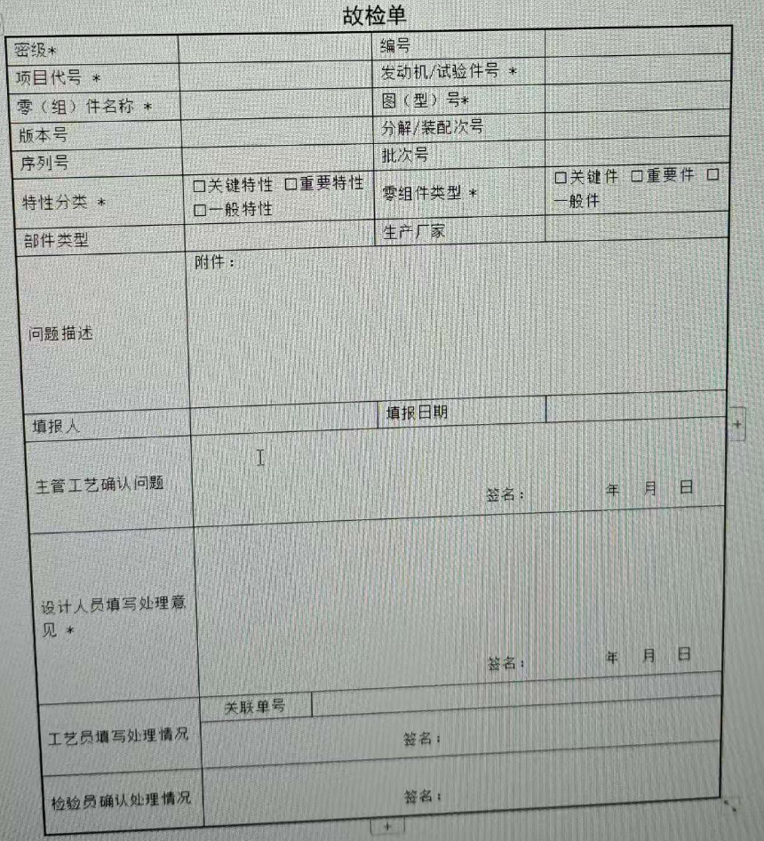

- 故检单表：

| 序号 | 字段中文名 | 字段说明 | 字段类型 | 字段值域 | 值域标准 | 是否主键 | 是否必填 |
| --- | --- | --- | --- | --- | --- | --- | --- |
| 1 | 故检单编号 | 故检单编号 | 字符型（50） |  | - | 是 | 是 |
| 2 | 物料编码 | 物料编码 | 字符型（50） |  | - | - | 是 |
| 3 | 项目代号 | 项目代号 | 字符型（50） |  |  | - | 是 |
| 4 | 发动机/试验件号 | 发动机/试验件号 | 字符型（256） |  |  | - | 是 |
| 5 | 零（组）件名称 | 零（组）件名称 | 字符型（50） |  |  | - | 是 |
| 6 | 图（型）号 | 图（型）号 | 字符型（50） |  |  | - | 是 |
| 7 | 版本号 | 版本号 | 字符型（50） |  |  | - | 是 |
| 8 | 分解/装配次号 | 分解/装配次号 | 字符型（50） |  |  | - | 是 |
| 9 | 序列号 | 序列号 | 字符型（50） |  |  | - | - |
| 10 | 批次号 | 批次号 | 字符型（50） |  |  | - | - |
| 11 | 特性分类 | 特性分类 | 字符型（50） |  |  | - | 是 |
| 12 | 零组件类型 | 零组件类型 | 字符型（50） |  |  | - | 是 |
| 13 | 部件类型 | 部件类型 | 字符型（50） |  |  | - | - |
| 14 | 生产厂家 | 生产厂家 | 字符型（50） |  |  | - | - |
| 15 | 问题描述 | 问题描述 | 字符型（256） |  |  | - | - |
| 16 | 填报人 | 填报人 | 字符型（50） |  |  | - | 是 |
| 17 | 填报日期 | 填报日期 | 日期型 |  |  | - | 是 |
| 18 | 主管工艺确认问题 | 主管工艺确认问题 | 字符型（256） |  |  | - | 是 |
| 19 | 设计人员处理意见 | 设计人员处理意见 | 字符型（256） |  |  | - | 是 |
| 20 | 工艺员处理情况 | 工艺员处理情况 | 字符型（256） |  |  | - | 是 |
| 21 | 检验员确认处理情况 | 检验员确认处理情况 | 字符型（256） |  |  | - | 是 |
| 22 | 原因分析与措施 | 设计人员与工艺人员填写原因分析与措施 | 字符型（256） |  |  | - | 是 |

- 功能验收标准

- 创建故检单数据准确无误，可通过装配或分解订单查询到关联的故检单信息。

###### 故检单审批流程

- 见工作流管理-业务审批流程场景-故检单审批流程。

#### 不合格品控制

##### 目标业务流程

- 流程范围

| 流程起点 | 发现不合格品 |
| --- | --- |
| 流程终点 | 确认执行结果 |
| 输入 | 不合格品实物、参数 |
| 输出 | 不合格品审理单各结论后续处理流程 |

- 流程设计

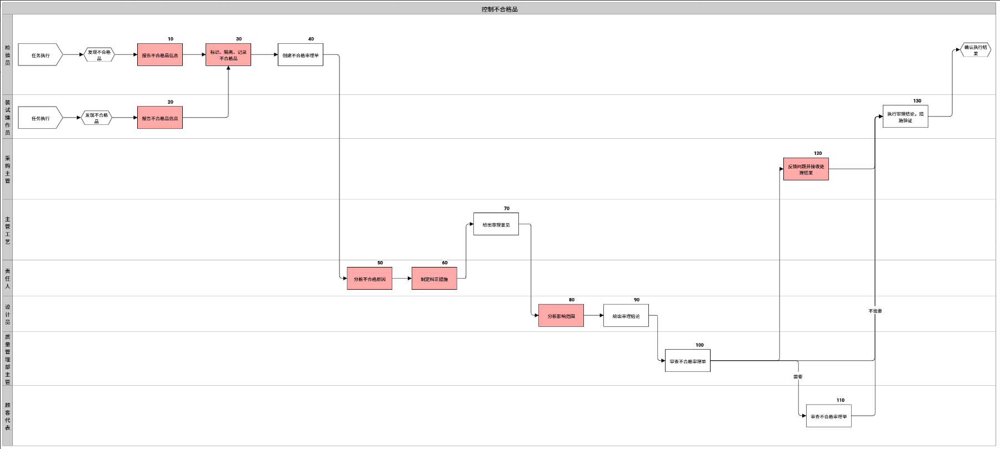

- 流程说明

| 活动编码 | 活动名称 | 活动内容 | 角色 | 输入 | 输出 | 模板/表单 |
| --- | --- | --- | --- | --- | --- | --- |
| 010 | 报告不合格品信息 | 对加工、装配等产品进行检验，检验人员发现不合格品。 | 检验员 | 加工、装配等不合格品 | 不合格品信息 |  |
| 020 | 报告不合格品信息 | 对加工、装配等产品进行检验，操作者发现不合格品。 | 装试操作员 | 加工、装配等不合格品 | 不合格品信息 |  |
| 030 | 标识、隔离、记录不合格品 | 检验人员对发现的不合格品进行标识、隔离、记录。 | 检验员 | 不合格品 | 不合格品的标识、隔离 |  |
| 040 | 创建不合格审理单 | 检验员基于当前任务在发起不合格品审理，填写《不合格品审理单》，发起不合格品审理流程。 | 检验员 | 不合格信息 | 不合格品审理单 | 不合格品审理单 |
| 050 | 分析不合格原因 | 由责任人(工程中心、装试中心、供应商)主导，按人机料法环测逐一分析不合格原因；必要时组织工艺、质检、生产现场人员参与，找出根本原因并形成分析报告；分析过程需明确原因分类与责任归属，避免类似问题再次发生。 责任人填写《不合格分析报告》完成后，扫描报告文件，以附件形式上传MOM系统中，供后续审批人员查阅审核。 | 责任人 | 不合格品审理单 | 不合格分析报告 | 不合格品审理单, 不合格分析报告 |
| 060 | 制定纠正措施 | 责任人（工程中心、装试中心、供应商）基于《不合格分析报告》的根本原因，制定《纠正措施计划》，明确措施内容、责任人、完成时间、资源与预期效果，确保根因消除并防止复发。 责任人填写《纠正措施计划》完成后，扫描文件，以附件形式上传MOM系统中，供后续审批人员查阅审核。 | 责任人 | 不合格品审理单、不合格分析报告 | 纠正措施计划 | 纠正措施计划 |
| 070 | 制定处理意见 | 工艺人员基于《不合格审理单》内《不合格分析报告》《纠正措施计划》，制定处理方案（返工、返修、报废、让步接收等），明确技术依据、可行性与影响，提出对不合格品的处理意见，并判断是否需要设计主管的意见。 | 主管工艺 | 不合格审理单 | 工艺处理意见 |  |
| 080 | 分析影响范围 | 设计审理员接收工艺反馈的不合格品信息后，识别，分析不合格品对零件、部件和组件的影响程度，在《不合格品审理单》中给出影响分析结论。 | 设计审理人员 | 不合格品审理单 | 不合格品审理单影响分析结论 |  |
| 090 | 给出审理结论 | 设计人员根据影响分析给出《不合格品审理单》审理结论并提交质量管理部主管审批。审理结论包含让步、返工返修、原样使用、限制使用、废品、返厂退换货。 | 设计审理人员 | 不合格品审理单影响分析 | 不合格品审理单结论 |  |
| 100 | 审查不合格审理单 | 质量管理部主管针对《不合格审理单》内容、分析报告、纠正措施及结论，按照审查管理流程符合性和内容正确性，在系统进行审批并填写说明；且需识别是否提交顾客代表； | 质量管理部主管 | 不合格审理单及结论 | 不合格审理单质量部结论 |  |
| 110 | 审查不合格审理单 | 顾客代表审查《不合格品审理》单正确性，对审理结论进行确认。 顾客代表确认完毕后，质量部负责人同步《不合格审理单》顾客代表结论。 | 顾客代表 | 不合格品审理单 | 不合格品审理单顾客结论 |  |
| 120 | 反馈问题并接收处理结果 | 采购主管接收《不合格品审理单》处理结果后，根据结果联系供应商进行退换货处理。 供应商回复原因和措施，措施落实情况。 | 采购主管 | 不合格品审理单 | 退换货处理 |  |
| 130 | 执行审理结论 | 不合格品审理流程结束后，主管工艺需按审理结论执行及验证，办理返工返修、报废、顾客代表线下签署文件等，并填写纠正和纠正措施落实情况。 不同结论处理流程如下： (1)结论为返工返修，后续业务操作见“返工返修产品处置流程”； (2)结论为报废，后续业务操作见“废品处置流程”； (3)结论为让步（针对入库检验任务），经检验员确认后开展后续操作; (4)结论为退回供方（针对入库检验任务），检验员通知采购主管，由采购主管与供应商沟通，并反馈处理意见。 (5)结论为原样使用，经检验员确认后开展后续操作。 (6)结论为限制使用，主管工艺需在该物料属性上进行标识。 | 主管工艺 | 不合格品审理单 | 不合格品审理单各结论后续处理流程 |  |

##### 系统应用流程

- 流程操作步骤说明：

| NO. | 角色 | 业务活动 | IT活动 | 功能编号 |
| --- | --- | --- | --- | --- |
| 1 | 操作员 | 010报告不合格品信息 | 报工 | MOM-RW-07 |
| 2 | 检验员 | 020报告不合格品信息 | 报工 | MOM-RW-07 |
| 3 | 检验员 | 040创建不合格品审理单 | 创建不合格品审理单 | MOM-BHG-01 |
| 4 | 责任人/检验员/主管工艺/设计员 |  | 不合格品审批 | MOM-GZL-10 |

##### 功能设计

###### 不合格品处理管理

| 功能编号 | MOM-BHG-01 |
| --- | --- |
| 功能名称 | 不合格品处理管理 |
| 操作角色 | 检验员、工艺员、设计员 |
| 功能说明 | 创建并填写不合格品审理单信息。 将不合格品审理单加入到不合格品审批流程。 查询不合格品审理单详情信息，形成不合格品台账。 上传不合格品审理过程中的相关质量文件。 |
| 业务规则 | 不合格品审批流程中： 审理结论为让步和原样使用，则工序继续流转。 审理结论为限制使用，则工序继续流转，并在其物料属性上标记。 审理结论为返工返修，则引导创建返工返修订单或创建外委返修台账。 审理结论为退回供方，则联系供应商返厂修理。 审理结论为报废，则引导创建废品通知单并开展废品处置流程。 填写不合格品原因与类别时，弹出原因与类别资源库供操作者选择填写。 |

- 不合格品处理管理样例界面

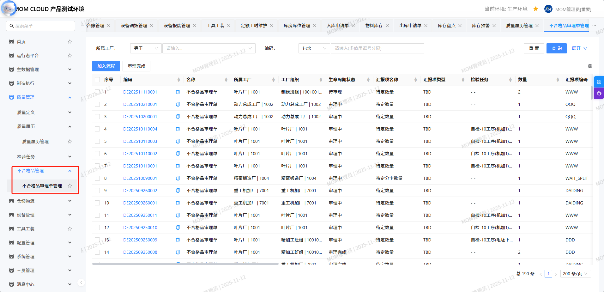

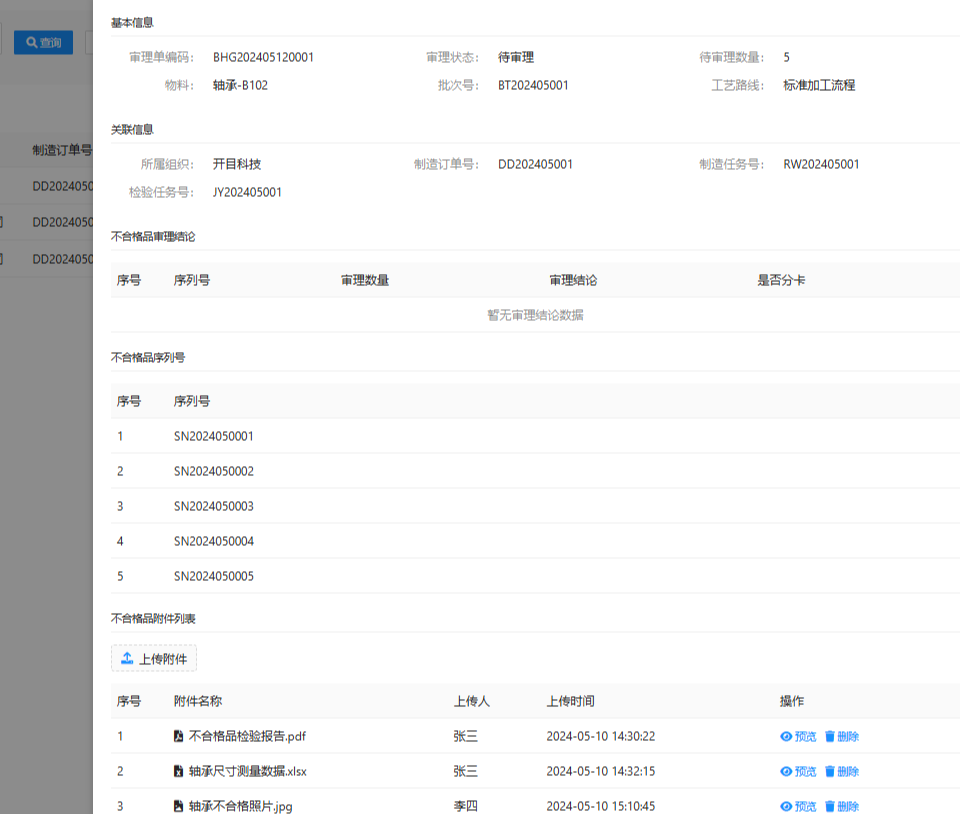

- 表单设计

不合格品审理单表：

| 序号 | 字段中文名 | 字段说明 | 字段类型 | 字段值域 | 值域标准 | 是否主键 | 是否必填 |
| --- | --- | --- | --- | --- | --- | --- | --- |
| 1 | 审理单号 | 不合格品审理单编号 | 字符型（50） |  | - | 是 | 是 |
| 2 | 物料编码 | 物料编码 | 字符型（50） |  | - | - | 是 |
| 3 | 项目代号 | 项目代号 | 字符型（50） |  |  | - | 是 |
| 4 | 发动机/实验件/设备代号 | 发动机/实验件/设备代号 | 字符型（50） |  |  | - | 是 |
| 5 | 责任单位 | 责任单位 | 字符型（50） |  |  | - | 是 |
| 6 | 超差零组件名称 | 超差零组件名称 | 字符型（50） |  |  | - | 是 |
| 7 | 图（型）号（版次） | 图（型）号（版次） | 字符型（50） |  |  | - | 是 |
| 8 | 加工单位 | 加工单位 | 字符型（50） |  |  | - | - |
| 9 | 零组件类型 | 零组件类型 | 字符型（50） | 关键件 重要件 一般件 |  | - | 是 |
| 10 | 特性分类 | 特性分类 | 字符型（50） | 关键特性 重要特性 一般特性 |  | - | - |
| 11 | 不合格类别 | 不合格类别 | 字符型（50） |  |  | - | - |
| 12 | 生产总数 | 生产总数 | 数值（3） |  |  | - | 是 |
| 13 | 不合格数量 | 不合格数量 | 数值（3） |  |  | - | 是 |
| 14 | 批次号 | 批次号 | 字符型（256） |  |  | - | 是 |
| 15 | 材料牌号 | 材料牌号 | 字符型（50） |  |  | - | 是 |
| 16 | 工艺文件编号 | 工艺文件编号 | 字符型（50） |  |  | - | 是 |
| 17 | 工序号 | 工序号 | 字符型（50） |  |  | - | 是 |
| 18 | 批次性问题 | 批次性问题 | 字符型（256） |  |  | - | 是 |
| 19 | 检验编号 | 检验编号 | 字符型（50） |  |  | - | 是 |
| 20 | 不合格品情况描述 | 不合格品情况描述 | 字符型（256） |  |  | - | 是 |
| 21 | 检验 | 检验 | 字符型（50） |  |  | - | - |
| 22 | 不合格品原因分析及纠正措施 | 不合格品原因分析及纠正措施 | 字符型（50） |  |  | - | - |
| 23 | 责任人 | 责任人 | 字符型（50） |  |  | - | - |
| 24 | 任务承担单位负责人确认 | 任务承担单位负责人确认 | 字符型（50） |  |  | - | - |
| 25 | 单位负责人 | 单位负责人 | 字符型（50） |  |  | - | - |
| 26 | 主管工艺处理意见 | 主管工艺处理意见 | 字符型（50） |  |  | - | - |
| 27 | 主管工艺人员 | 主管工艺人员 | 字符型（50） |  |  | - | - |
| 28 | 不合格影响分析 | 不合格影响分析 | 字符型（50） |  |  | - | - |
| 29 | 审理结论 | 审理结论 | 字符型（50） |  |  | - | 是 |
| 30 | 设计审理人员 | 设计审理人员 | 字符型（50） |  |  | - | - |
| 31 | 质量部门意见 | 质量部门意见 | 字符型（50） |  |  | - | - |
| 32 | 质量 | 质量 | 字符型（50） |  |  | - | - |
| 33 | 主管顾客代表意见 | 主管顾客代表意见 | 字符型（50） |  |  | - | - |
| 34 | 主任（副主任）顾客代表意见 | 主任（副主任）顾客代表意见 | 字符型（50） |  |  | - | - |
| 35 | 任务承担单位填写处理结果 | 任务承担单位填写处理结果 | 字符型（50） |  |  | - | 是 |
| 36 | 责任人 | 责任人 | 字符型（50） |  |  | - | 是 |
| 37 | 检验部门结果确认 | 检验部门结果确认 | 字符型（50） |  |  | - | 是 |
| 38 | 检验员 | 检验员 | 字符型（50） |  |  | - | 是 |
| 39 | 生产订单号 | 生产订单号 | 字符型（50） |  |  | - | 是 |

- 功能验收标准

创建不合格品审理单数据准确无误，能正确启动审批流程，并将审理单加入审批流程。

可通过生产订单查询到关联的不合格品审理单信息。

MOM系统能够根据审理结论正确执行相应的处理操作。

###### 不合格品审批流程

- 见工作流管理-业务审批流程场景-不合格品审批流程。

#### 返工返修

##### 目标业务流程

- 流程范围

| 流程起点 | 不合格品审理单结论为返工返修 现场问题记录单结论为返工返修 分解故检单结论为返工返修 |
| --- | --- |
| 流程终点 | 返工返修计划已完成 |
| 输入 | 返工返修结论 入库检、装试执行产生的返工返修 |
| 输出 | 外部返工返修件、内部返工返修件检验结论、检验记录 |

- 流程设计

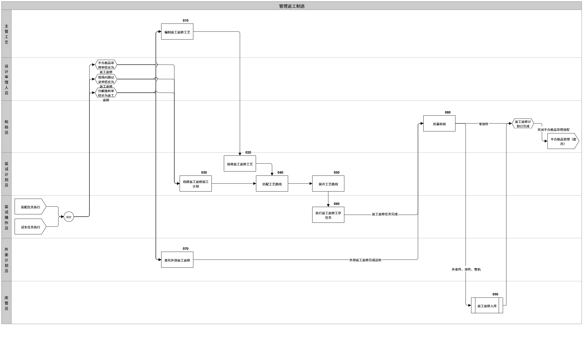

- 流程说明

| 活动编码 | 活动名称 | 活动内容 | 角色 | 输入 | 输出 | 模板/表单 |
| --- | --- | --- | --- | --- | --- | --- |
| 010 | 编制返工返修工艺 | 根据设计人员给出的返工返修结论编制返工返修工艺，完成后下发至装试中心； | 主管工艺 | 返工返修结论 | 返工返修工艺 |  |
| 020 | 接收返工返修工艺 | MOM接收PLM下发的返工返修工艺路线 | 装试计划员 | 返工返修工艺路线 | 返工返修工艺路线 |  |
| 030 | 创建返工返修加工计划 | 装饰中心计划员需要明确返工返修计划时间开始、结束时间； | 装试计划员 | 不合格品审理结论 | 生产订单 |  |
| 040 | 匹配工艺路线 | 装试计划员在MOM系统，给返工返修加工计划指定返工返修工艺路线； | 装试计划员 | 生产订单 | 生产订单 |  |
| 050 | 计划排程 | 装试计划员对返工返修加工计划进行计划排程。 | 装试计划员 | 返工返修生产订单、工艺路线 | 返修工序任务 | 工序任务 |
| 060 | 执行返工返修工序任务 | 装试操作员执行返工返修工序任务，并按技术要求填报质量记录，最近进行任务报工； | 装试操作员 | 工序任务 | 工序任务 |  |
| 070 | 委托外部返工返修 | 入库检、装试执行过程产生的返工返修，委托外部供应商处理 | 计划员 | 检验任务 | 返修台账 |  |
| 080 | 质量检验 | 检验员按照工艺文件要求对外委件、零件、大部件、整机进行质量检验，并在系统填写检验记录； | 检验员 | 检验任务 | 检验记录 |  |
| 090 | 返工返修入库 | 外部返工返修件、零件、大部件、整机检验合格后是否需要入库 | 库管员 | 生产订单 | 入库单 |  |

##### 系统应用流程[批注-12]

- 流程操作步骤说明：

| NO. | 角色 | 业务活动 | IT活动 | 功能编号 |
| --- | --- | --- | --- | --- |
| 1 | 工艺员 | 010编制返工返修工艺 | 编制返工返修工艺 | PLM系统功能 |
| 2 | 计划员 | 030创建返工返修计划 | 创建返工返修订单 | MOM-FGFX-01 |
| 3 | 计划员 | 040匹配工艺路线 | 指定工艺 | MOM-JH-03 |
| 4 | 计划员 | 050计划排程 | 计划排程 | MOM-JH-06 |
| 5 | 计划员 | 070委托外部返工返修 | 创建外委返修台账 | MOM-WBFX-01 |

##### 功能设计

###### 返工返修订单管理

| 功能编号 | MOM-FGFX-01 |
| --- | --- |
| 功能名称 | 返工返修订单管理 |
| 操作角色 | 计划员 |
| 功能说明 | 功能同“生产制造计划”模块 |
| 业务规则 | 当处置对象为自制件物料时，MOM系统引导用户为该物料创建返工返修订单。返工返修订单计划数量为原生产订单所报工的不合格数量，计划开工时间与完工时间由计划员填写确认。 返工返修订单关联原生产订单。 返工返修订单完工并检验合格后，原生产订单允许报工。 |

- 返工返修原型界面描述

- 在不合格品处理管理界面中，处置结论为返工返修时，MOM系统提供创建返工返修订单按钮，可快速创建返工返订单，其订单在生产制造计划模块中可查询到。

- 表单设计

返工返修订单表：

| 序号 | 字段中文名 | 字段说明 | 字段类型 | 字段值域 | 值域标准 | 是否主键 | 是否必填 |
| --- | --- | --- | --- | --- | --- | --- | --- |
| 1 | 生产订单号 | 返工返修订单号 | 字符型（50） |  |  | 是 | 是 |
| 2 | 物料编码 | 物料编码 | 字符型（50） |  |  | - | 是 |
| 3 | 物料名称 | 物料名称 | 字符型（50） |  |  | - | 是 |
| 4 | 原生产订单号 | 原生产订单号 | 字符型（50） |  |  | - | 是 |
| 5 | 不合格品审理单 | 不合格品审理单 | 字符型（50） |  |  | - | 是 |
| 6 | 返工返修原因 | 返工返修原因 | 字符型（50） |  |  | - | 是 |
| 7 | 返工返修消息来源 | 返工返修消息来源 | 字符型（50） |  |  | - | 是 |
| 8 | 返工返修时间 | 返工返修时间 | 日期型 |  |  | - | 是 |
| 9 | 返工返修地址 | 返工返修地址 | 字符型（50） |  |  | - | - |
| 10 | 返回时间 | 返回时间 | 日期型 |  |  | - | 是 |
| 11 | 返回消息来源 | 返回消息来源 | 字符型（50） |  |  | - | - |

- 功能验收标准

- MOM系统可根据处置结论创建返工返修订单，且返工返修订单数据准确无误并正常关联不合格品审理单或故检单，以及原生产订单。

###### 外委返修台账管理

| 功能编号 | MOM-WBFX-01 |
| --- | --- |
| 功能名称 | 外委返修台账管理 |
| 操作角色 | 计划员 |
| 功能说明 | 对需返外部供应商返工返修的物料进行统一管理。 创建与查询外部返修物料台账详情信息。 |
| 业务规则 | 当处置对象为采购件物料时，MOM系统引导用户为该物料外委返修台账。填写相关信息，并对其台账数据进行审批。 |

- 故检单原型界面描述

- MOM系统提供一个外委返修台账页面，可展示外委返修台账列表及查询详情信息。

- 表单设计

外委返修台账表：

| 序号 | 字段中文名 | 字段说明 | 字段类型 | 字段值域 | 值域标准 | 是否主键 | 是否必填 |
| --- | --- | --- | --- | --- | --- | --- | --- |
| 1 | 外委返修单编号 | 外委返修单编号 | 字符型（50） |  |  | 是 | 是 |
| 2 | 物料编码 | 物料编码 | 字符型（50） |  |  | - | 是 |
| 3 | 物料名称 | 物料名称 | 字符型（50） |  |  | - | 是 |
| 4 | 原生产订单号 | 原生产订单号 | 字符型（50） |  |  | - | 是 |
| 5 | 不合格品审理单 | 不合格品审理单 | 字符型（50） |  |  | - | 是 |
| 6 | 返工返修原因 | 返工返修原因 | 字符型（50） |  |  | - | 是 |
| 7 | 返工返修消息来源 | 返工返修消息来源 | 字符型（50） |  |  | - | 是 |
| 8 | 返工返修时间 | 返工返修时间 | 日期型 |  |  | - | 是 |
| 9 | 返工返修地址 | 返工返修地址 | 字符型（50） |  |  | - | - |
| 10 | 返回时间 | 返回时间 | 日期型 |  |  | - | 是 |
| 11 | 返回消息来源 | 返回消息来源 | 字符型（50） |  |  | - | - |
| 12 | 要求到货时间 | 要求到货时间 | 日期型 |  |  | - | 是 |

- 功能验收标准

- 用户可正常创建外委返修台账，且数据准确无误，正常关联不合格品审理单或故检单，以及原生产订单。

- 外委返修数据对象可正常加入到外委返修审批流程。

###### 外委返修审批流程

- 见工作流管理-业务审批流程场景-外委返修审批流程。

#### 废品处置

##### 目标业务流程

- 流程范围

| 流程起点 | 故检单已判定报废 技术通知单已判定报废 技术决定单已判定报废 |
| --- | --- |
| 流程终点 | 报废已完成 |
| 输入 | 报废已产生、废品基本信息 |
| 输出 | 废品通知单审批结束 |

- 流程设计

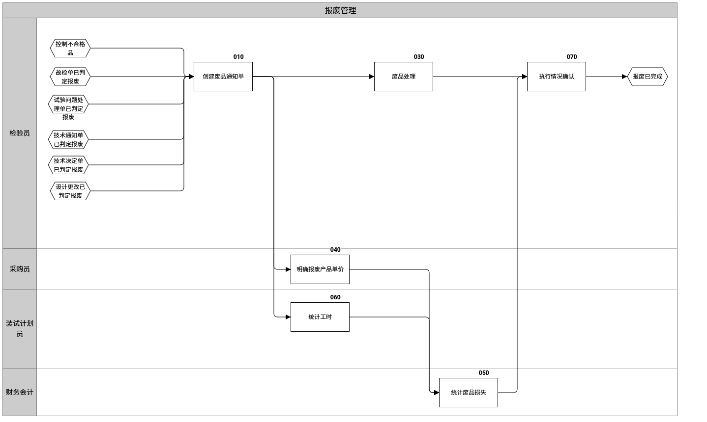

- 流程说明

| 活动编码 | 活动名称 | 活动内容 | 角色 | 输入 | 输出 | 模板/表单 |
| --- | --- | --- | --- | --- | --- | --- |
| 010 | 创建废品通知单 | 情况一：当设计审理人员在“不合格品审理流程”中给出的审理结论为“报废”时，检验员办理《废品通知单》； 情况二：检验员在装试执行过程中直接判定的报废件，检验员办理《废品通知单》，填写废品基础信息。 | 检验员 | 报废已产生、废品基本信息 | 废品通知单 | 废品通知单 |
| 020 | 废品处理 | 检验员将废品物料移库至废品库，并进行标识，隔离存放。 | 检验员 | 废品实物、废品清单 | 废品移至废品库、标识、隔离 |  |
| 030 | 明确报废产品单价 | 采购员根据《废品通知单》中的信息，填写报废产品单价、税价、数量，完成后提交财务人员。 | 采购员 | 废品通知单 | 报废产品单价 |  |
| 040 | 统计工时 | 装试中心负责人根据《废品通知单》明细内容，填写报废“实作工时”，完成后提交检验人员。 | 装试计划员 | 废品通知单 | 废品实做工时 |  |
| 050 | 统计废品损失 | 财务人员根据《废品通知单》明细及产品单价，统计废品损失，完成后提交装试中心负责人。 | 财务会计 | 废品通知单 | 废品损失 |  |
| 060 | 执行情况确认 | 检验员对废品处理情况、是否隔离、是否标识、存放地点进行确认，对废品处理流程做最终审批确认。 | 检验员 | 废品处理情况、相关人员统计记录 | 废品通知单审批结束 | 废品通知单 |

##### 系统应用流程

- 流程操作步骤说明：

| NO. | 角色 | 业务活动 | IT活动 | 功能编号 |
| --- | --- | --- | --- | --- |
| 1 | 检验员 |  | 接收技术通知单/技术决定单/设计更改单 | MOM-JCSJ-10 |
| 2 | 检验员 | 010创建废品通知单 | 创建废品通知单 | MOM-BF-01 |
| 3 | 计划员 | 030明确报废产品单价 | 废品通知单审批 | MOM-GZL-11 |
| 4 | 计划员 | 040统计工时 |  |  |
| 5 | 计划员 | 050统计废品损失 |  |  |
| 6 | 计划员 | 060执行情况确认 | 废品入库 | MOM-RK-01 |

##### 功能设计

###### 废品通知单管理

| 功能编号 | MOM-BF-01 |
| --- | --- |
| 功能名称 | 废品通知单管理 |
| 操作角色 | 检验员 |
| 功能说明 | 创建并填写废品通知单信息。 将废品通知单加入到废品通知单审批流程。 查询废品通知单详情信息。 上传废品相关的质量文件。 |
| 业务规则 | 无 |

- 废品通知单原型界面描述

- MOM系统提供废品通知单页面，可创建废品通知单，展示废品通知单列表及查询详情信息。

- 表单设计

| 序号 | 字段中文名 | 字段说明 | 字段类型 | 字段值域 | 值域标准 | 是否主键 | 是否必填 |
| --- | --- | --- | --- | --- | --- | --- | --- |
| 1 | 废品通知单编号 | 废品通知单编号 | 字符型（50） |  | - | 是 | 是 |
| 2 | 物料编码 | 物料编码 | 字符型（50） |  | - | - | 是 |
| 3 | 项目代号 | 项目代号 | 字符型（50） |  |  | - | 是 |
| 4 | 原审理单编号 | 原审理单编号 | 字符型（50） |  |  | - | 是 |
| 5 | 报废零组件名称 | 报废零组件名称 | 字符型（50） |  |  | - | 是 |
| 6 | 图（型）号（版次） | 图（型）号（版次） | 字符型（50） |  |  | - | 是 |
| 7 | 批次号（顺序号） | 批次号（顺序号） | 字符型（50） |  |  | - | 是 |
| 8 | 材料牌号 | 材料牌号 | 字符型（50） |  |  | - | - |
| 9 | 数量 | 数量 | 数值（3） |  |  | - | 是 |
| 10 | 报废类别 | 报废类别 | 字符型（50） | 成品报废半成品报废 毛坯报废 故障件报废 |  | - | - |
| 11 | 报废情况说明 | 报废情况说明 | 字符型（50） |  |  | - | - |
| 12 | 申请人 | 申请人 | 字符型（50） |  |  | - | 是 |
| 13 | 日期 | 日期 | 日期型 |  |  | - | 是 |
| 14 | 明确报废产品单价 | 明确报废产品单价 | 字符型（256） |  |  | - | 是 |
| 15 | 采购人员 | 采购人员 | 字符型（50） |  |  | - | 是 |
| 16 | 采购人员审批日期 | 采购人员审批日期 | 日期型 |  |  | - | 是 |
| 17 | 统计废品损失 | 统计废品损失 | 字符型（50） |  |  | - | 是 |
| 18 | 财务人员 | 财务人员 | 字符型（256） |  |  | - | 是 |
| 19 | 财务人员审批日期 | 财务人员审批日期 | 日期型 |  |  | - | 是 |
| 20 | 统计工时 | 统计工时 | 字符型（256） |  |  | - | 是 |
| 21 | 装试中心负责人 | 装试中心负责人 | 字符型（50） |  |  | - | - |
| 22 | 装试中心负责人审批日期 | 装试中心负责人审批日期 | 日期型 |  |  | - | - |
| 23 | 是否隔离 | 是否隔离 | 字符型（50） |  |  | - | - |
| 24 | 是否标识 | 是否标识 | 字符型（50） |  |  | - | - |
| 25 | 存放地点 | 存放地点 | 字符型（50） |  |  | - | - |
| 26 | 生产订单号 | 生产订单号 | 字符型（50） |  |  | - | 是 |

- 功能验收标准

- 用户可正常创建废品通知单，且数据准确无误，正常关联不合格品审理单或故检单，以及原生产订单。

- 废品通知单数据对象可正常加入到废品通知单审批流程。

###### 废品通知单审批流程

- 见工作流管理-业务审批流程场景-废品通知单审批流程。

#### 计量器具管理

计量器具根据技术协议本期实现计量器具的台账管理，计量器具临检提醒，检定状态更新，下次检定期计算、维护。

##### 目标业务流程

- 流程范围

| 流程起点 | 新购计量设备送检合格 |
| --- | --- |
| 流程终点 | 合格入库 |
| 输入 | 新购的计量器具设备 |
| 输出 | 计量器具贴标识、入库 |

- 流程设计

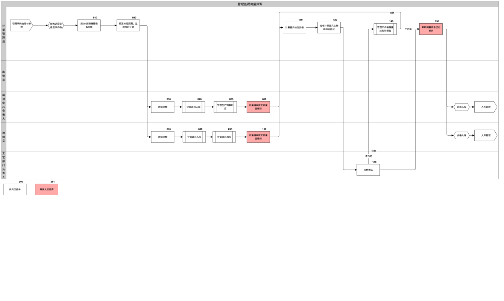

- 流程说明

| 活动编码 | 活动名称 | 活动内容 | 角色 | 输入 | 输出 | 模板/表单 |
| --- | --- | --- | --- | --- | --- | --- |
| 010 | 建立/更新测量设备台账 | 测量设备采购验收按照TDCX07003《设备管理程序》执行。验收合格后，计量管理员建立新购计量器具台账，分为测量设备台账与专用测量具台账。 | 计量管理员 | 新购的计量器具设备 | 计量器具台账 | 计量器具台账 |
| 020 | 设置检定周期，生成检定计划 | 计量器具管理员依据计量器具台账，设置检定周期。形成周期性检定计划，定期更新检定日期与有效日期。 | 计量管理员 | 计量器具台账 | 计量器具设置周期检定 |  |
| 030 | 通知提醒 | 计量器具的周期检定计划，提前通知到装试中心负责人和减员。 | 装试中心负责人 | 检定计划下达 | 检定计划接收 | 检定计划 |
| 040 | 计量器具提交计量管理员 | 装试中心将放置于现场的待检定计量器具以及检验员从库房领出待检定的计量器具，提交给计量管理员。计量管理员执行定检计划。 | 检验员 | 检定的计量器具 | 检定的计量器具提交给计量管理员 |  |
| 050 | 计量器具检定外委 | 计量管理员在计量器具收发室对待检定的计量器具进行外委送检，送往计量服务机构。 | 计量管理员 | 检定的计量器 | 检定的计量器外委 |  |
| 060 | 接收计量器具实物和检定结论 | 计量管理员在计量器具收发室对已检定完成的计量器具进行实物验收和检定结论接收。 | 计量管理员 | 检定的计量器具外委收货 | 接收计量器具实物和检定结论 |  |
| 070 | 合格确认 | 计量服务机构检定/校准/测试后，判定结论： ——经判定满足使用要求，给出了符合性声明，代替计量确认，即为“合格”； ——经判定不满足使用要求，取回后按照《计量器具不合格管理》开展不合格测量设备评价、追溯相关工作。 计量服务机构检定/校准/测试后，无判定结论的，取回后填写测量设备计量确认表 ——经判定满足使用要求，给出了符合性声明，即为“合格”； ——经判定不满足使用要求，取回后按照《计量器具不合格管理》开展不合格测量设备评价、追溯相关工作。 工艺人员根据以上处理结论，同步在MOM系统对检定计划填写判定结论； （1）合格，提交给计量器具管理员贴合格标识； （2）不合格，走《计量器具不合格管理》流程，详情见“计量器具不合格管理”；； （3）《测量设备计量确认表》填写完毕后，已附件形式上传； | 工艺部门负责人 | 计量器具实物和计量服务机构检定结论 | 计量器具结论 | 测量设备计量确认表 |
| 080 | 管理不合格测量过程和设备 | 见计量器具不合格管理 | 计量管理员 |  |  |  |
| 090 | 粘贴测量设备状态标识 | 根据符合性判定结果粘贴合格、准用、 限用、 封存、禁用、报废等计量标识。标识填写应字体工整、字迹清楚，不允许有涂改和划改，并在不影响测量设备使用的醒目位置上粘贴。 ——试车台内部测量设备的标识粘贴不应影响试车的过程，可集中粘贴在醒目的位置上。 ——游标卡尺、千分尺、百分表等不便粘贴计量标识的测量设备，计量标识可粘贴在外包装上。 | 计量管理员 | 检定/校准报告-测量设备计量确认表 | 实物标识 |  |

##### 系统应用流程

- 流程操作步骤说明：

| NO. | 角色 | 业务活动 | IT活动 | 功能编号 |
| --- | --- | --- | --- | --- |
| 1 | 计量器具管理员 | 010建立/更新测量设备台账 | 创建计量器具台账 | MOM-JLQJ-01 |
| 2 | 计量器具管理员 | 020设置检定周期，生成检定计划 | 维护计量器具检定周期 | MOM-JLQJ-01 |
| 3 | 操作员/检验员 | 030通知提醒 | 接收检定任务 | MOM-JLQJ-02 |
| 4 | 操作员/检验员 | 040计量器具提交计量管理员 | 归还计量器具 | MOM-JLQJ-03 |
| 5 | 计量器具管理员 | 050计量器具检定外委 | 计量器具检定外委 | MOM-JLQJ-03 |
| 6 | 计量器具管理员 | 060接收计量器具实物和检定结论 | 关闭检定任务 | MOM-JLQJ-02 |
| 7 | 工艺员 | 070合格确认 | 更新计量器具台账 | MOM-JLQJ-01 |
| 8 | 计量器具管理员 | 090粘贴测量设备状态标识 |  |  |

##### 功能设计

###### 计量器具台账管理

| 功能编号 | MOM-JLQJ-01 |
| --- | --- |
| 功能名称 | 计量器具台账管理 |
| 操作角色 | 计量管理员 |
| 功能说明 | 创建并维护计量器具台账基础信息。 查询计量器具详情信息。 更新计量器具详情信息。 |
| 业务规则 | 计量器具设备类型分为通用测量设备与专用测量设备； 检定任务关闭后自动更新检定日期（最新的检定日期）与有效日期（下次检定日期：检定日期+检定周期）； 计量器具借用时，状态自动更新为“已借用”； 计量器具归还时，状态自动更新为“在库”； 计量器具已生成检定任务时，状态自动更新为“送检”； 计量器具维修，报废由计量管理员手动更新状态； |

- 计量器具原型界面描述

- MOM系统提供计量器具台账页面，可创建计量器具对象数据，展示计量器具列表及查询详情信息。

- 表单设计

计量器具台账表：

| 序号 | 字段中文名 | 字段说明 | 字段类型 | 字段值域 | 值域标准 | 是否主键 | 是否必填 |
| --- | --- | --- | --- | --- | --- | --- | --- |
| 1 | 名称 | 名称 | 字符型（50） |  |  | 是 | 是 |
| 2 | 计量器具编码 | 计量器具编码 | 字符型（50） |  |  | - | 是 |
| 3 | 规格型号 | 物料名称 | 字符型（50） |  |  | - | 是 |
| 4 | 出厂编号 | 出厂编号 | 字符型（50） |  |  | - | 是 |
| 5 | 自编号 | 自编号 | 字符型（50） |  |  | - | 是 |
| 6 | 使用地点 | 使用地点 | 字符型（50） |  |  | - | 是 |
| 7 | 检定周期 | 检定周期 | 字符型（50） | 月 |  | - | 是 |
| 8 | 检定日期 | 检定日期 | 日期型 |  |  | - | 是 |
| 9 | 有效日期 | 有效日期 | 日期型 |  |  | - | 是 |
| 10 | 检定结果 | 检定结果 | 日期型 | “合格”或“不合格” |  | - | 是 |
| 11 | 证书编号 | 证书编号 | 字符型（50） |  |  | - | - |
| 12 | 状态 | 状态 | 字符型（50） | “在用” “封存” “准用” “禁用” “报废” |  | - | 是 |
| 13 | 检定单位 | 检定单位 | 字符型（50） |  |  | - | 是 |
| 14 | 生产厂家 | 生产厂家 | 字符型（50） |  |  | - | - |
| 15 | 测量范围 | 测量范围 | 字符型（50） |  |  | - | - |
| 16 | 最大允许误差 | 最大允许误差 | 字符型（50） |  |  | - | - |
| 17 | 测量不确定度或准确度等级 | 测量不确定度或准确度等级 | 字符型（50） |  |  | - | - |
| 18 | 计量方法 | 计量方法 | 字符型（50） |  |  | - | - |
| 19 | 技术要求 | 技术要求 | 字符型（50） |  |  | - | - |
| 20 | 是否专用测试设备 | 是否专用测试设备 | 字符型（50） | “是”或“否” |  | - | 是 |
| 21 | 工检共用 | 工检共用 | 字符型（50） | 工、检、共 |  | - | 是 |
| 22 | 使用单位 | 使用单位 | 字符型（50） |  |  | - | - |
| 23 | 备注 | 备注 | 字符型（50） |  |  | - | - |
| 24 | 版次 | 专用量测具设计图版次号 | 字符型（50） |  |  | - | - |
| 25 | 型号/项目 | 专用量测具用于科研生产项目/型号类别编号 | 字符型（50） |  |  | - | - |
| 26 | 零件号 | 专用量测具用于加工制造的零件编号 | 字符型（50） |  |  | - | - |

- 功能验收标准

- 用户能够顺利创建计量器具设备台账，相关数据可保存且保持准确性。

###### 检定任务管理

| 功能编号 | MOM-JLQJ-02 |
| --- | --- |
| 功能名称 | 检定任务管理 |
| 操作角色 | 计量管理员 |
| 功能说明 | 系统根据检定周期与检定日期以及检定预警时间定时生成检定任务，通过检定任务通知流程通知到对应责任人。 |
| 业务规则 | 到达有效日期前2个月生成检定任务。 关闭检定任务需输入合格与不合格情况，确认后自动更新检定结果 |

- 计量器具检定任务原型界面描述

- MOM系统提供计量器具检定任务页面，展示计量器具检定任务列表及查询详情信息。

- 检定任务样例界面

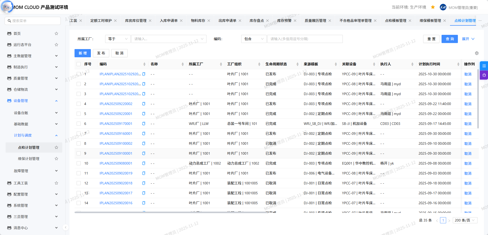

- 功能验收标准

- MOM系统可根据维护的有效日期与检定预警时间生成检定任务；计量管理员可在计量器具临检前2个月查看到检定任务。

###### 计量器具借用与归还

| 功能编号 | MOM-JLQJ-03 |
| --- | --- |
| 功能名称 | 计量器具借用与归还 |
| 操作角色 | 计量管理员 |
| 功能说明 | 建立计量器具的借用与归还记录 建立计量器具的共用记录 发起借用与归还操作。 |
| 业务规则 | 当工检共用为“共”的计量器具被借用时，该借用记录需标识为共用，以报表形式形成计量器具共用记录。 |

- 表单设计

计量器具借用表：

| 序号 | 字段中文名 | 字段说明 | 字段类型 | 字段值域 | 值域标准 | 是否主键 | 是否必填 |
| --- | --- | --- | --- | --- | --- | --- | --- |
| 1 | 借用单号 | 借用单号 | 字符型（50） |  |  | 是 | 是 |
| 2 | 计量器具名称 | 计量器具名称 | 字符型（50） |  |  | - | 是 |
| 3 | 计量器具编号 | 计量器具编号 | 字符型（50） |  |  | - | 是 |
| 4 | 借用人 | 借用人 | 字符型（50） |  |  | - | 是 |
| 5 | 借用时间 | 借用时间 | 字符型（50） |  |  | - | 是 |
| 6 | 是否工检共用 | 是否工检共用 | 字符型（50） |  |  | - | - |

计量器具归还表：

| 序号 | 字段中文名 | 字段说明 | 字段类型 | 字段值域 | 值域标准 | 是否主键 | 是否必填 |
| --- | --- | --- | --- | --- | --- | --- | --- |
| 1 | 归还单号 | 归还单号 | 字符型（50） |  |  | 是 | 是 |
| 2 | 计量器具名称 | 计量器具名称 | 字符型（50） |  |  | - | 是 |
| 3 | 计量器具编号 | 计量器具编号 | 字符型（50） |  |  | - | 是 |
| 4 | 归还人 | 归还人 | 字符型（50） |  |  | - | 是 |
| 5 | 归还时间 | 归还时间 | 字符型（50） |  |  | - | 是 |

- 功能验收标准

- 用户对计量器具进行借用与归还，MOM系统形成准确的借用与归还记录。

### 工作流管理

#### 业务审批流程场景

| 流程编号 | 流程名称 | 流程审批步骤 | 业务规则 |
| --- | --- | --- | --- |
| MOM-GZL-01 | 计划变更通知流程 | 变更单接收-变更执行 |  |
| MOM-GZL-02 | 施工单通知流程 | 施工单接收-执行 |  |
| MOM-GZL-03 | 工艺变更通知流程 | 工艺变更单接收-变更执行 |  |
| MOM-GZL-04 | 设计更改贯彻流程 | 设计更改单接收-贯彻执行 |  |
| MOM-GZL-05 | 串换件申请流程 | 串换件申请-计划审核-工艺审核-质量审核 | 审批过程中用户对串换件申请单进行填报。 |
| MOM-GZL-06 | 物料三期预警通知流程 | 预警通知接收-三期复验执行 |  |
| MOM-GZL-07 | 异常事件处理流程 | 异常通知-异常处理-异常关闭 | 可根据异常分类不同，设定不同的审批流程 |
| MOM-GZL-08 | 外部返修流程 | 返修申请-外委发货-入场接收 |  |
| MOM-GZL-09 | 故检单审批流程 | 问题发起-工艺审核-设计审核-反馈处理情况-检验确认 | 审批过程中用户对故检单单进行填报。 故检流程走到624设计人员，生成故检单，打印出来给到624设计人员填写审核意见，再由TFQD工艺人员录入审核意见并扫描上传附件。 |
| MOM-GZL-10 | 不合格品审批流程 | 报告不合格品信息-分析不合格品原因-制定纠正措施-制定处理意见-分析影响范围-给出审理结论-质量审核-顾客代表审核-执行审理结论 | 审批过程中用户对不合格品审理单进行填报。 质量审核步骤后，检验任务可正常流转。 |
| MOM-GZL-11 | 废品通知审批流程 | 废品通知-废品处理-单价确认-工时统计-废品损失统计-执行情况确认 | 审批过程中用户对废品通知单进行填报。 质量审核步骤后，检验任务可正常流转。填写不合格品原因与类别时，弹出原因与类别资源库供操作者选择填写。 |
| MOM-GZL-12 | 质量问题通知审批流程 | 质量问题提报（制定应急措施，落实应急措施）——质量问题确认——编制质量问题归零计划——问题进展跟踪--完成问题闭环 | 当异常类别选择“质量”时，生成质量异常任务，将质量异常任务加入至该流程。 填写质量问题类别时，弹出问题类别资源库供操作者选择填写。 质量问题表单均以附件形式上传存档。 问题进展跟踪步骤需多人会签，多人提交后才允许提交至下一步骤。 问题进展跟踪步骤增加分支步骤【调整归零计划】，责任人【质量主管】。 根据质量问题的报送时限规则，若超过报送时长，将该质量异常任务标红显示。 |
| MOM-GZL-13 | 检定任务通知流程 | 临期提醒-计量器具归还-送检-合格确认 | 检定任务生成后自动加入到该流程。 |
| MOM-GZL-14 | 成品发货通知流程 | 发货单接收-发货确认 | 将接收的成品发货单加入到该流程 |
| MOM-GZL-15 | 临时外委申请审批 | 临时外委申请-供应链审核确认 | 将创建的临时外委计划加入到该流程 |
| MOM-GZL-16 | 外委发货通知流程 | 发货通知-发货确认 | 将接收的外委订单加入到该流程 |
|  |  |  |  |

#### 工作流设计

##### 流程管理

| 功能点 | 功能点描述 |
| --- | --- |
| 查询 | 按流程类别、编码、名称、状态提供查询入口 |
| 新增/编辑 | 创建新流程、调整现有流程配置、基于现有流程快速复制 |
| 删除 | 删除未发布或停用、且无运行实例的流程 |
| 发布/停用/启用 | 控制流程模型的生命周期状态，发布后供业务使用 |

- 流程管理样例界面

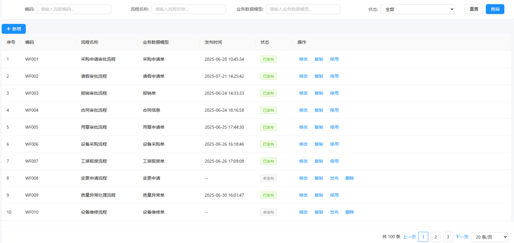

##### 审批

| 页面 | 功能点 | 功能点描述 |
| --- | --- | --- |
| 待办任务 | 查询 | 按流程类型、编码、名称提供查询入口，支持模糊搜索和精确筛选 |
|  | 查看详情/编辑 | 查看完整业务数据信息及审批信息 |
|  | 审批 | 同意、驳回（选择回退节点）、加签（前/后加签）等审批操作 各审批步骤可配置默认执行角色或人员 |
|  | 批量审批 | 批量执行同意或驳回。限制：需同一流程模型 + 同一业务模型 |
| 已办任务 | 查询 | 按流程类型、编码、名称提供查询入口，支持历史记录检索 |
|  | 查看详情/编辑 | 查看已处理的任务详情，包括当时的业务数据和审批记录 |
|  | 撤回 | 在下一节点未审批时可撤回 |

- 待办任务样例界面

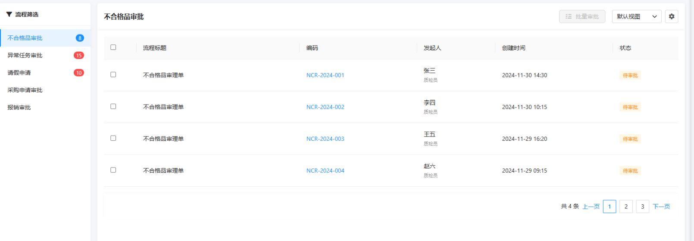

##### 我的流程

| 页面 | 功能点 | 功能点描述 |
| --- | --- | --- |
| 我的流程 | 查询 | 按流程类型、编码、名称提供查询入口，支持全流程状态筛选 |
|  | 查看详情 | 查看完整业务数据信息及审批信息 |
|  | 终止 | 终止流程（强制结束），需填写终止原因。 |
|  | 转办 | 转办流程（变更当前处理人），支持选择新的处理人员并填写转办原因。 |

#### 集成设计

##### 审批流程通知

MOM系统依据各审批流程中的审批通知信息，通过集成方式将任务发送至各审批人的OA系统待办事项中。

MOM系统将流程审批过程中的转办信息发送至OA系统，OA系统将审批流程从当前处理人待办任务转移至为新的处理人员的待办任务中。

MOM系统将流程审批终止信息发送至OA系统，OA系统同步取消审批流程通知信息。

##### 单点登录

用户通过OA系统选取待办任务中的流程审批信息，并实现单点登录至MOM系统完成相关待办任务的审批及表单填写操作。

### 基础数据管理

#### 物料信息管理

| 功能编号 | MOM-JCSJ-01 |
| --- | --- |
| 功能名称 | 物料信息管理 |
| 操作角色 | 系统管理员 |
| 功能说明 | 根据物料的分类，展示物料信息 |
| 业务规则 | MOM与主数据系统集成获取物料基础信息 |

- 物料主数据

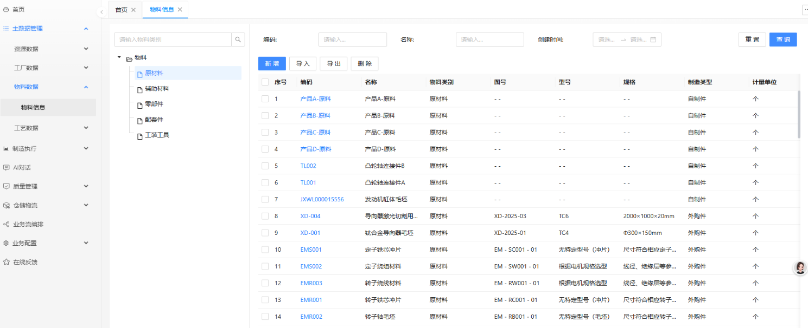

- 物料详情

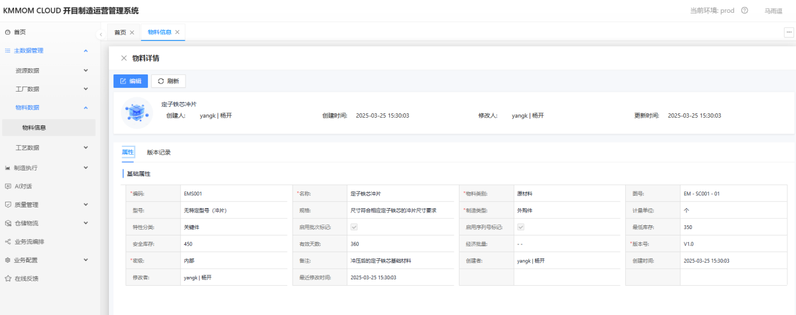

- 物料主数据

| 字段名称 | 说明 |
| --- | --- |
| 物料编码 |  |
| 物料长描述 |  |
| 工厂代码 | 2000航发科技工厂、1000成发公司工厂、1099公司无价值工厂、2099科技无价值工厂 |
| 物料组 |  |
| 装配部位 |  |
| 制造商零件编号 |  |
| 组别原件号 | 组别件对应的原零件号 |
| 设计版次 |  |
| 产品组 | 必填：10军品、20外贸、30民用 |
| MRP控制者（主制厂） | 系统中控制物料的人员或者编号。对于自制件，填写主制分厂半成品或成品。 |
| 批量 | 固定：EX 直接按批订货量 |
| 采购类型 | 必填：物料来源是E:自制生产 F:采购 X:自制和外购。 |
| 零件号 | 零件号或零组件图号 |
| 物料名称 |  |
| 规格 |  |
| 型号 |  |
| 物料简称 |  |
| 物料分类编码 |  |
| 物料类型 |  |
| 物料分类名称 |  |
| 物料状态 |  |
| 生产厂商 |  |
| 主计量单位 |  |

#### MBOM管理

| 功能编号 | MOM-JCSJ-02 |
| --- | --- |
| 功能名称 | MBOM管理 |
| 操作角色 | 系统管理员 |
| 功能说明 | 查看MBOM详细信息，包括结构树展示、节点属性、物料技术文件等。禁止在MOM系统中修改、删除物料及BOM数据。 |
| 业务规则 | 接收PLM系统中发动机MBOM，部件MBOM |

- MBOM管理

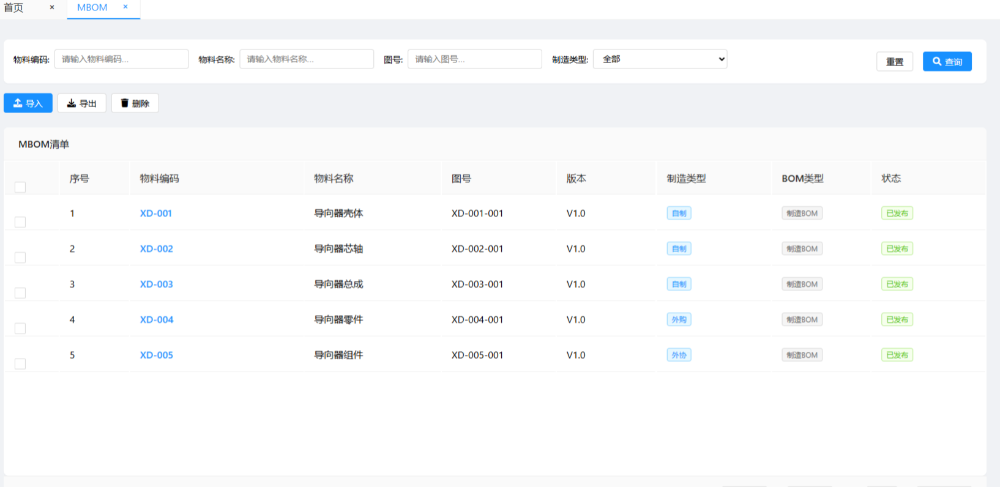

- MBOM详情

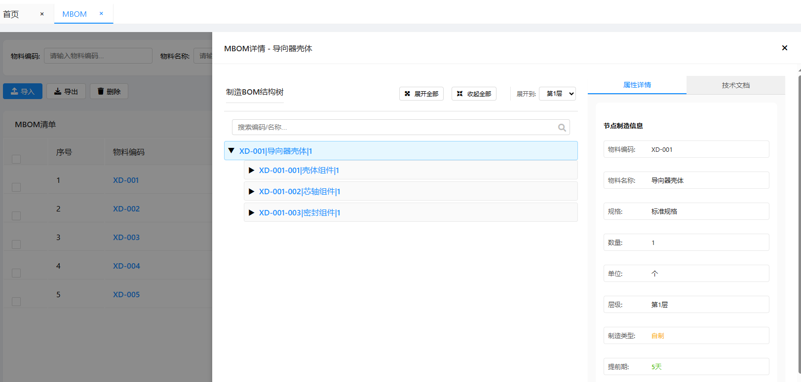

- MBOM

| 字段名称 | 说明 |
| --- | --- |
| 编码 | MBOM编码 |
| 名称 | MBOM名称 |
| 零组件号 | 发动机和大部件零组件号 |
| 版本号 | MBOM版本号 |

- MBOM节点

| 字段名称 | 说明 |
| --- | --- |
| 编码 | MBOM编码 |
| 名称 | MBOM名称 |
| 父节点 |  |
| 发动机号 | 发动机号 |
| 批次号 | 批次号 |
| 物料编码 |  |
| 零组件号 | 发动机、大部件、零组件号 |
| 零组件名称 | 发动机、大部件、零组件名称 |
| 零组件图号 |  |
| 零组件版本 |  |
| 物料阶段 | C、S、D、G、P |
| 物料类别 | 原材料、辅料、零部件、半成品、成品、设备、工装工具 |
| 制造类型 | 自制件、外购件、自制+外购 |
| 数量 |  |
| 单台组件数量 |  |
| 计量单位 |  |
| 层级 |  |

- 工序物料

| 字段名称 | 说明 |
| --- | --- |
| 工艺路线编码 |  |
| 工序号 |  |
| 工序名称 |  |
| 物料编码 |  |
| 零组件号 | 发动机和大部件零组件号 |
| 零组件名称 | 发动机和大部件零组件名称 |
| 数量 |  |

#### 工艺路线管理

| 功能编号 | MOM-JCSJ-03 |
| --- | --- |
| 功能名称 | 工艺路线管理 |
| 操作角色 | 系统管理员 |
| 功能说明 | MOM系统接收PLM系统审批发布的发动机和大部件工艺路线。 工艺路线阶段分为：装配，试车，分解，油封。 工艺路线类型分为：正式工艺，临时工艺。 可通过工艺路线查阅到对应的工艺文件。 支持设定并行工序，串行工序，关键工序。 对工艺路线进行版次管理，与PLM系统工艺规程版次保持一致。 新增工艺路线冻结库，存储历史版次的工艺路线。 |
| 业务规则 | MOM系统与PLM系统集成获取工艺路线数据 |

- 工艺路线

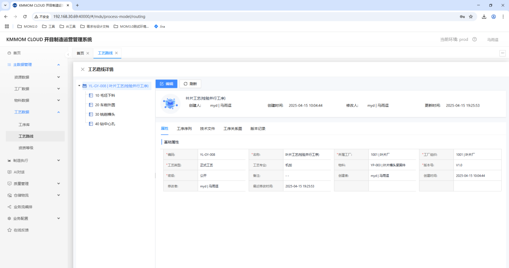

- 工艺路线详情

| 字段名称 | 说明 |
| --- | --- |
| 工艺路线编码 |  |
| 工序号 |  |
| 工序名称 |  |
| 工序简码 |  |
| 工序类型 | 加工、装配、检验、外委 |
| 工序内容 |  |
| 工作中心 |  |
| 主制单位 |  |
| 产出物料 |  |
| 定额辅助工时 |  |
| 定额加工时间 |  |
| 时间单位 |  |

#### 组织人员管理

| 功能编号 | MOM-JCSJ-04 |
| --- | --- |
| 功能名称 | 组织人员管理 |
| 操作角色 | 系统管理员 |
| 功能说明 | 新增和查询天府轻动人员基础信息 |
| 业务规则 | 天府轻动各部门及人员信息由主数据系统下发至MOM系统。 MOM系统承接部门信息数据录入至【行政组织】与【工厂组织】中。 MOM系统承接人员信息数据录入至【人员管理】与【用户管理】中。 【行政组织】录入天府轻动市场开发部，发展计划部，财务部，综合管理部。 【工厂组织】录入天府轻动装试中心，质量部，工程技术中心，供应链中心。 【人员管理】录入天府轻动所有员工信息。 【用户管理】录入装试中心，质量部，工程技术中心，供应链中心人员信息。 |

- 组织管理

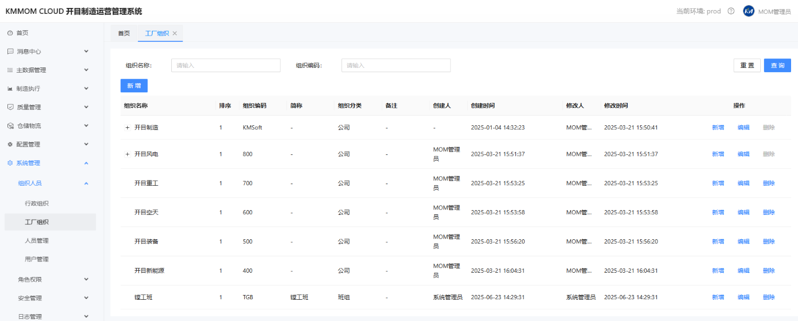

- 用户管理

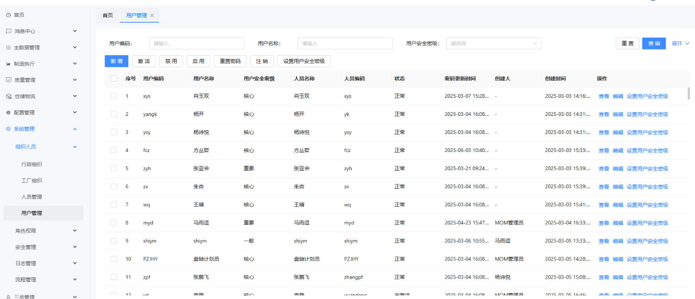

- 部门主数据

| 字段名称 | 说明 |
| --- | --- |
| 部门编码 | 由“TFQD+部门编号”混合编码，中间以“-”连接。 |
| 部门名称 |  |
| 上级部门名称 |  |
| 上级部门编码 |  |
| 描述（中文） |  |
| 部门负责人 |  |
| 部门审批人 |  |

- 人员主数据

| 字段名称 | 说明 |
| --- | --- |
| 员工编码 | （1）若是正式员工，由HR系统生成，遵循中国航发系统规则，可导入到数据管理模块，编码如：59902798。 （2）若是员工类型为劳务派遣/劳务返聘/借调/实习等，员工编码由数据管理模块系统生成，编码规则为TFQD+年份+4位流水码，共12位，编码如：TFQD20250021。 |
| 员工序列号 |  |
| 员工类型 | 正式员工/劳务派遣/劳务返聘/借调/实习 |
| 在职状态 |  |
| 中文姓名 |  |
| 性别 |  |
| 岗位类别 | 在岗/离职 |
| 岗位级别 |  |
| 专业技术职务 |  |
| 员工所属单位 |  |
| 员工所属部门 |  |

#### 工作中心管理

| 功能编号 | MOM-JCSJ-05 |
| --- | --- |
| 功能名称 | 工作中心管理 |
| 操作角色 | 系统管理员 |
| 功能说明 | 新增和查询天府轻动工作中心信息 配置工作中心下的设备，人员信息 |
| 业务规则 | MOM系统与PLM系统获取工作中心数据 |

- 工作中心详情

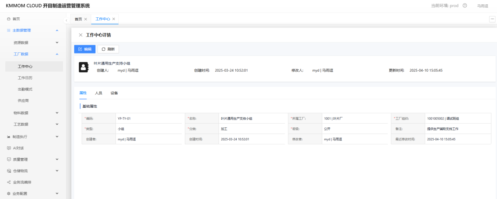

- 工作中心数据

| 字段名称 | 说明 |
| --- | --- |
| 工作中心编码 |  |
| 工作中心名称 |  |
| 所属工厂 | 装试中心 |
| 工厂组织 | 装试中心下的装配班组、试车班组 |
| 类型 |  |
| 分类 | 加工、检验 |

#### 供应商管理

| 功能编号 | MOM-JCSJ-06 |
| --- | --- |
| 功能名称 | 供应商管理 |
| 操作角色 | 系统管理员 |
| 功能说明 | 新增和查询天府轻动供应商信息 |
| 业务规则 | MOM系统与主数据系统获取供应商数据 |

- 供应商详情

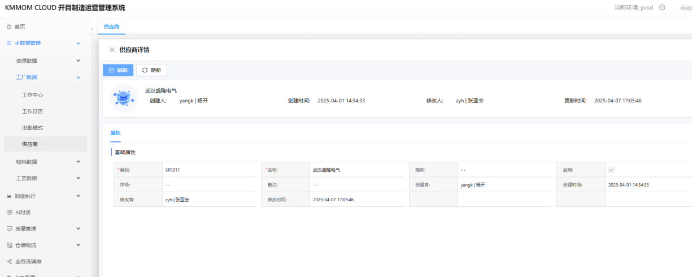

- 供应商数据

| 字段名称 | 说明 |
| --- | --- |
| 供应商编码 |  |
| 供应商名称 |  |
| 供应商类型 |  |

#### 生产设备台账管理

| 功能编号 | MOM-JCSJ-07 |
| --- | --- |
| 功能名称 | 设备管理 |
| 操作角色 | 系统管理员 |
| 功能说明 | 新增和查询天府轻动生产设备信息 |
| 业务规则 | MOM系统与主数据系统获取设备数据 |

- 设备信息详情

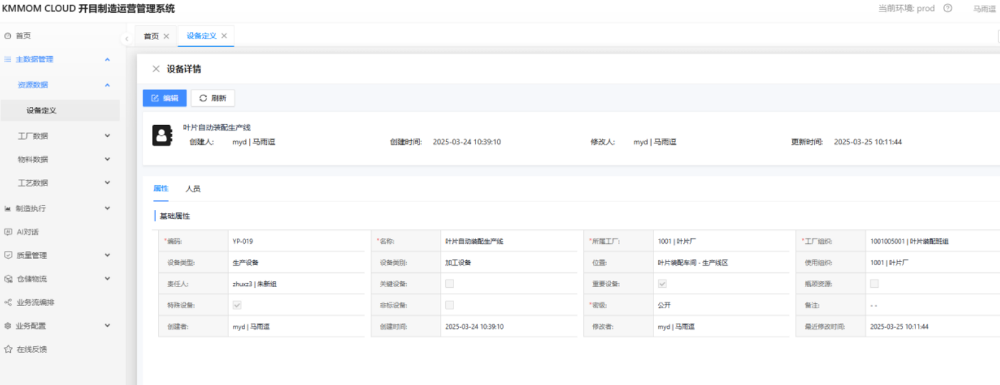

- 设备台账信息

| 字段名称 | 说明 |
| --- | --- |
| 设备编码 |  |
| 设备名称 |  |
| 设备类型 |  |
| 设备类别 |  |
| 设备型号 |  |
| 设备规格 |  |
| 购置日期 |  |
| 供应商 |  |

#### 电子卷宗[批注-13]

| 功能编号 | MOM-JCSJ-08 |
| --- | --- |
| 功能名称 | 电子卷宗 |
| 操作角色 | 检验员、系统管理员 |
| 功能说明 | 建立完整的产品质量电子卷宗，内容包括发动机完整的装配、分解与试车结果记录数据，包括装配记录、上下台记录、试验过程记录、试验结果表、发动机下每个外购件的外场资料与入库检验记录以及过程中的不合格品相关记录。 |
| 业务规则 | 无 |

- 电子卷宗样例界面

- 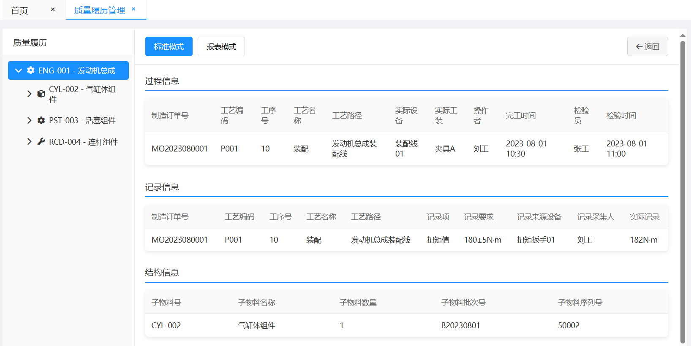

#### 条码管理

| 功能编号 | MOM-JCSJ-09 |
| --- | --- |
| 功能名称 | 条码管理 |
| 操作角色 | 库管员、系统管理员 |
| 功能说明 | 对物料按规则生成条码或二维码标签供物料出入库与组箱时通过扫码枪识别。 |
| 业务规则 | 无 |

- 二维码与条码样例

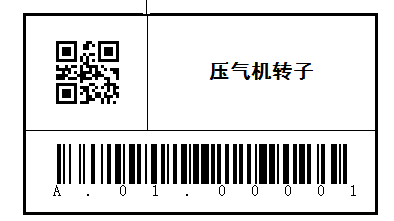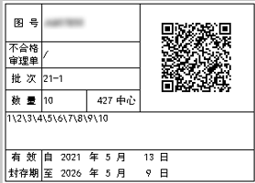

#### 工艺单据管理[批注-14]

| 功能编号 | MOM-JCSJ-10 |
| --- | --- |
| 功能名称 | 工艺单据管理 |
| 操作角色 | 计划员、检验员、工艺员 |
| 功能说明 | 查看施工单，超越单，设计更改单，技术通知单，技术决定单，产品验收要求，特殊过程要求，首件鉴定要求等单据信息。 |
| 业务规则 | MOM系统接收工艺员在PLM系统编制的单据信息，单据类型包括施工单，超越单，技术通知单，技术决定单，产品验收要求，特殊过程要求，首件鉴定要求。 MOM系统接收到单据信息后，自动加入到工程技术中心通知单流程中，并以待办任务的形式通知到装试中心的责任人。 施工单（能关联工单）：建立施工单台账，能够与工序关联的，PLM系统将其结构化，施工单上填写发动机号、工艺规程号、工序号下发指MOM系统,MOM系统关联至生产订单中。 施工单（无法关联工单）：建立施工单台账，仅通过施工单通知流程通知到对应责任人。 |

### 生产决策

#### 看板中心

MOM系统提供可自定义扩展的看板工具，便于将各模块的操作内容以丰富的看板种类和格式进行呈现。

以大屏看板的方式展示装试中心计划进度，工序任务进度，异常问题，库房实时库存，安全库存与三期预警提醒，质量问题，便于管理人员对相关过程进行跟踪和管控。看板样例如下：

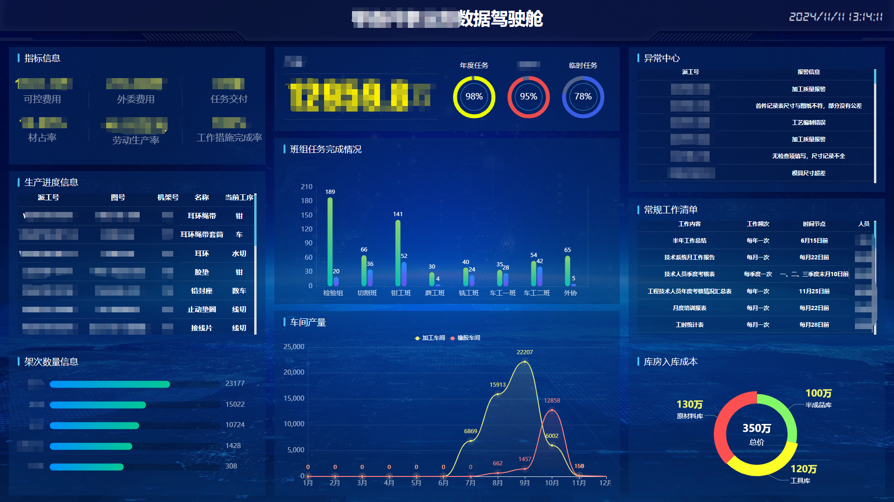

#### 报表中心

MOM系统提供可自定义扩展的报表工具，便于将各模块的操作内容以丰富的报表种类和格式进行呈现。

MOM系统提供可供参考的报表样例，包含生产订单进度报表、装配任务进度报表、试车任务进度报表、质量合格率报表、异常问题分析报表、工时统计报表、在制品及库存报表、外委计划报表、发动机配套表[批注-15]。报表样例如下：

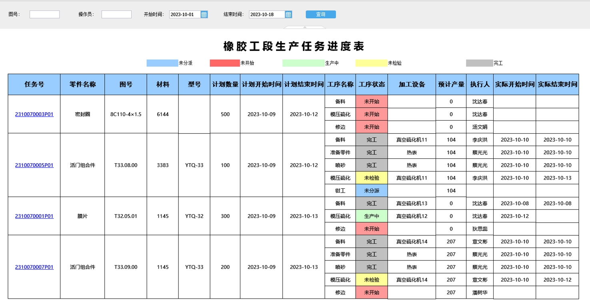

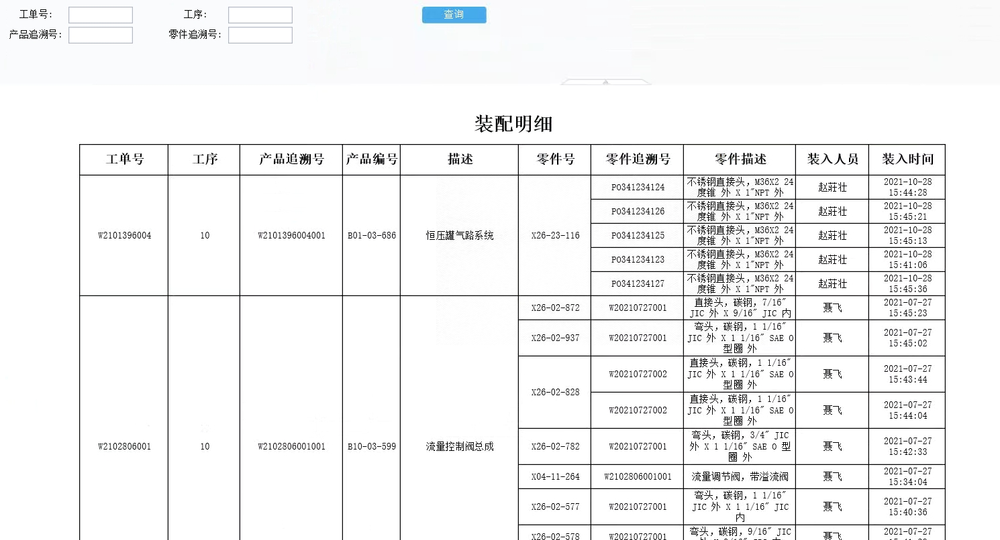

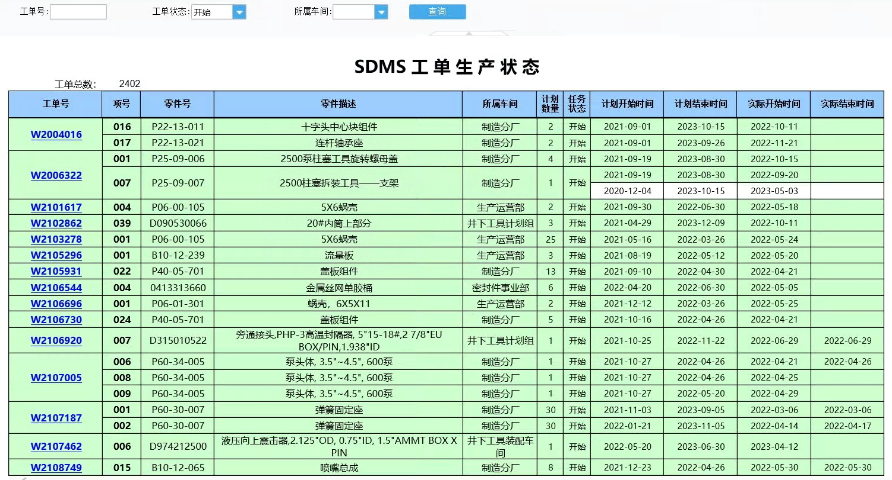

### 系统集成

#### MOM与PLM集成

##### 业务需求

- MOM系统接收PLM系统下发的MBOM数据与工艺数据，变更通知信息。

##### 集成范围

- MOM系统接收PLM系统下发的发动机MBOM，大部件MBOM。

- MOM系统接收PLM系统下发的工艺路线，工艺路线内容包含工序号、工序名称、工步号、工步名称、工作中心、定额工时、工序物料、检查项。

- MOM系统接收PLM系统下发的工艺文件。

- MOM系统接收PLM系统下发的设计变更通知单。

- MOM系统接收PLM系统下发的工艺变更通知单。

- MOM系统接收PLM系统编制的其他单据信息，单据类型包括施工单，超越单，技术通知单，技术决定单，产品验收要求，特殊过程要求，首件鉴定要求。

##### 数据交互方式

- 采用WebAPI接口方式

##### 解决方案

- 解决方案详见《TFQD项目PLM系统与MOM系统集成方案.docx》。

#### MOM与ERP集成

##### 业务需求

实现生产订单的传递与完工信息同步；

实现物料实时库存，出入库记录的信息同步；

实现MOM系统发起工序外委申请，ERP系统基于外委申请发起外委订单合同业务。

##### 集成范围

- MOM系统接收ERP系统下达的发动机多装多试生产订单与大部件订单。

- MOM系统将生产订单完工信息发送至ERP系统。

- MOM系统接收ERP系统下达的计划变更通知单。

- MOM系统将工序外委信息发送至ERP系统。

- MOM系统接收EPR系统的物料采购到货单形成MOM系统的入库申请单。

- MOM系统接收EPR系统的成品发货通知单。

- MOM系统将物料入库信息发送至ERP系统。

- MOM系统将物料出库信息发送至ERP系统。

- MOM系统将库房盘点结果发送至ERP系统。

##### 数据交互方式

- 采用WebAPI接口方式

##### 解决方案

- 解决方案详见《TFQD项目ERP系统与MOM系统集成方案.docx》，集成解决方案需单独评审。

#### MOM与WCS集成

##### 业务需求

实现MOM系统与WCS系统物料组箱信息同步，库位与库存信息同步。MOM系统通过下发指令驱动WCS系统进行出入库操作与配送任务。

##### 集成范围

- MOM系统将物料组箱信息发送至WCS系统。

- WCS系统将物料入库后的库位信息发送至MOM系统。

- MOM系统下发出库任务指令至WCS系统。

- WCS系统将出库任务完成信息发送至MOM系统。

- MOM系统下发AGV搬运任务至WCS系统。

- WCS系统反馈AGV搬运任务成功情况至MOM系统。

##### 数据交互方式

- 采用WebAPI接口方式

##### 解决方案

- 解决方案详见《TFQD项目WCS系统与MOM系统集成方案.docx》，集成解决方案需单独评审。

#### MOM与主数据集成

##### 业务需求

实现各系统之间基础数据的同步。

##### 集成范围

- MOM系统接收主数据下发的组织人员信息。

- MOM系统接收主数据下发的设备台账信息。

- MOM系统接收主数据下发的供应商台账信息。

- MOM系统接收主数据下发的物料主数据信息

##### 数据交互方式

- 采用WebAPI接口方式

##### 解决方案

- 解决方案详见《TFQD项目主数据系统与MOM系统集成方案.docx》，集成解决方案需单独评审。

#### MOM与OA集成

##### 业务需求

- MOM系统向OA系统推送审批流程及流程办理信息。业务人员可通过OA系统跳转到MOM系统进行流程审批。

##### 集成范围

- OA系统单点登陆进入MOM系统

- MOM审批流程通知

##### 数据交互方式

- 采用WebAPI接口方式

##### 解决方案

- 解决方案详见《TFQD项目OA系统与MOM系统集成方案.docx》，集成解决方案需单独评审。

#### MOM与应用集成平台集成

##### 业务需求

- MOM系统与其他业务系统集成通过应用集成平台统一发送与接收。

##### 集成范围

- 详见《TFQD项目应用集成平台与MOM系统集成方案.docx》

##### 数据交互方式

- 采用WebAPI接口方式

##### 解决方案

- 解决方案详见《TFQD项目应用集成平台与MOM系统集成方案.docx》，集成解决方案需单独评审。

## 运维计划

### 本地化运维服务

最及时的服务中最优先的是本地化服务，开目公司承诺在天府轻动成立实施及运维项目小组并配备专业技术团队，为天府轻动提供驻场的本地化运维服务及技术支持。

| 服务机构 | 联系电话 | 负责人 |
| --- | --- | --- |
| 武汉总部 | 400-866-0255 | 客服中心 |
| 客户经理 | 18583995616 | 蒋威（客户经理） |
| 其它方式 | 邮箱：sale@kmsoft.com.cn网站：www.kmsoft.com.cn |  |

### 运维服务内容

| 序号 | 内容 | 描述 |
| --- | --- | --- |
| 1 | 免费服务 | 验收之日起36个月内 |
| 2 | 升级 | 软件部分开目公司会不定期发布新版本，双方商议决定是否升级。开目公司承诺，以优惠价格提供升级服务。 |
| 3 | 老用户研讨班 | 每年组织老用户免费参加一次老用户研讨班，给使用相近的用户提供交流平台，共享管理使用经验。 |
| 4 | 热线技术服务 | 每月客户服务部主动给用户打电话咨询使用情况，主动解决用户使用中遇到的问题，无偿提供各种热线技术指导（Email、传真、电话、视频） |
| 5 | 技术咨询服务 | 为用户提供系统技术咨询服务，主要包括网络流量控制、系统扩容设计、系统最佳操作系统建议、系统故障分析等服务。 |
| 6 | 系统冲突解决 | 系统上线运行后，由于信息系统升级或购置安装新的软件产生冲突时，卖方有义务配合解决。 |

项目验收后正式进入售后服务阶段，售后服务分质保期内的售后服务和质保期外的售后服务。

质保期内开目公司免费提供售后服务；

质保期外开目公司承诺继续为客户提供免费的电话或远程服务，如电话或远程服务无法解决，需要现场解决技术问题所收取费用由双方协商而定。

开目公司技术支持的方式包括：Email、传真、电话、视频等形式技术服务、现场技术服务、定期巡查服务、技术升级服务等。

- 技术咨询服务：供方开目公司承诺在系统建设完成后为需方提供7*24*365小时服务；

- 故障处理响应服务：系统质保期内提供服务，包括现场服务支持（8小时内到达现场）、热线电话支持、电子邮件支持。

- 软件安全性：开目公司承诺软件若有安全隐患（如性能、漏洞或访问控制等），将按照有关要求免费进行安全升级改造，直至消除安全隐患。

### 运维技术支持

在系统运行过程中，开目公司将在规定的时间内指派项目经理或实施顾问到达用户现场进行现场的故障排查和指导工作。并根据现场情况填写运维记录单

### 电话技术支持

对于系统运行中出现的技术问题，以及硬件设备更新升级后系统的安装调试、数据移植，开目公司将为用户提供电话热线技术服务。所有电话交流中所涉及的技术性问题均会被记录入开目公司的信息平台系统中，并在一定周期之后成为客户档案的一部分，便于日后长期的售后服务工作。

## 变更管理

### 变更约定

当《基于航空发动机研制全业务流程的数智系统（二期）制造运营管理模块详细设计解决方案》签定后，若任何一方提出局部变更，需要遵循本变更流程，承担变更对项目进度延误造成的影响。

如果变更内容存在重大开发量还需要双方友好协商后支付相应的开发费用。

### 变更流程

1. 由甲方项目经理或乙方项目经理提出变更申请。

1. 由双方项目经理和乙方相关人员对所变更的事项进行影响分析；

1. 在完成影响分析后，提交分析结果给甲方乙方项目组进行决策。

1. 在决策完毕后，如果需要支付商务费用则根据决策结果进行商务洽谈；

1. 商务洽谈完毕后进入具体执行阶段。

## 交付物

本项目验收交付文档按天府轻动要求执行。交付文档同时满足本项目工作相关要求，具体文档交付物见下：

1. 基于航空发动机研制全业务流程的数智系统（二期）制造运营管理模块详细设计解决方案；

1. 系统详细设计文档；

1. 系统测试大纲与环境；

1. 用户使用手册；

1. 系统运行维护手册；

1. 系统上线运行计划；

1. 系统部署计划；

1. 系统问题反馈表；

1. 关键用户培训记录；

1. 本项目相关的数据结构、数据接口以及相关说明。

## 验收标准

1. 《基于航空发动机研制全业务流程的数智系统（二期）制造运营管理模块详细设计解决方案》中各模块功能在实施过程中进行逐步细化和完善，确保提供的标准功能存在，并满足正常使用，各模块通过用户功能验证并确认签字；

1. 所有交付物文档资料移交给用户方；

1. 完成对用户方系统维护人员及最终用户的系统维护和操作培训，并保证培训效果，达到用户认可的要求；

## 文档确认与执行

1. 本项目解决方案需由双方项目代表签字确认后执行；

1. 在本项目实施过程中，如需对本解决方案内容进行变更，须按照本项目变更管理约定，由双方友好协商进行。

## 解决方案评审结论

| 评审结论： 同意解决方案评审通过。 |  |
| --- | --- |
| 四川天府轻型动力科技有限公司 代表签字： | 武汉开目信息技术股份有限公司 代表签字： |

## 附录：DOCX 附加内容

### 批注：comments.xml

#### comment 0

将发动机B已配套的零部件释放，库管员办理发动机A的零部件出库单

#### comment 1

工时看板改为SQCDPM绩效看板

#### comment 2

需ERP确定

#### comment 3

程序文件中的编号规则

#### comment 4

流程图角色不对，MOM系统改为库管员，接收生产准备计划

#### comment 5

变更内容中包含：更改贯彻（设计发生的更改）的4种情况①供应商在制品处理决定②在库的处理决定③已装机产品的处理决定④已交付顾客的处理决定。（工程技术中心夏鸥有现成模板与表单）

#### comment 6

试车试验

寿命期管理，存在寿命期的成附件需要在试车过程中做寿命记录。

由检验员做寿命记录与管控。

成附件采购回来后需有寿命期属性

#### comment 7

最后需输出配套表以及对应的串换信息。

检验员在发动机试车完成后必须及时填写寿命消耗情况，系统提供寿命消耗字段供填写。

#### comment 8

改图，添加实作工时采集

#### comment 9

取消合格入库申请

#### comment 10

采购订单为2个，供应商发送了20，送了18个，需记录赠送的不计价。

#### comment 11

增加：下发分拣任务

#### comment 12

技术更改单，通知单，决定单均可触发

#### comment 13

以一台发动机为例：

采购零件的外厂全部资料（合格证，质量证明单，代料信息等等）。

装配过程记录资料，装配与分解形成一套卷

试验过程记录资料，一次试验一套卷宗

以报表形式，展示某个零件的使用历程。

#### comment 14

质量相关单据：

试验问题记录表

成附件寿命管理

#### comment 15

发动机MBOM与串换件申请单中的换上件汇总
