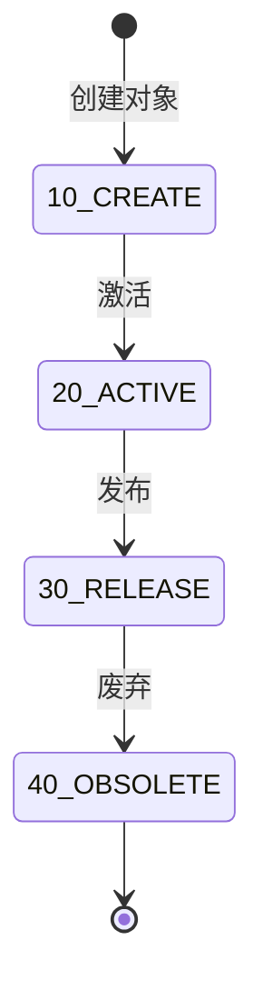

# 生命周期状态模板定义文档

## 文档说明

**基本信息**
- 文档版本:v1.1 | 更新日期:2026-01-08 | 维护团队:产品研发团队
- 目标受众:产品研发团队

**文档定位**

本文档定义KMMOM3.x系统中通用生命周期状态模板,作为实现`LifecycleManaged`接口的数据模型的状态定义标准。数据模型定义时,在生命周期模板说明中引用模板编码即可(格式:`生命周期模板:COMMON_LIFECYCLE`),无需重复定义状态列表。

---

## 通用生命周期模板(COMMON_LIFECYCLE)

**模板编码:** `COMMON_LIFECYCLE` | **模板说明:** 通用生命周期状态模板,适用于大部分业务对象

| 状态编码 | 状态名称 | 周期阶段 | 说明 |
|---------|---------|---------|------|
| 10_CREATE | 已创建 | CREATE | 对象已创建 |
| 20_ACTIVE | 活动中 | ACTIVE | 对象处于活动状态 |
| 30_RELEASE | 已发布 | RELEASE | 对象已发布 |
| 40_OBSOLETE | 已废弃 | OBSOLETE | 对象已废弃 |

**状态流转图:**

**状态流转规则:**

| 起始状态 | 目标状态 | 触发条件 | 说明 |
|---------|---------|---------|------|
| 10_CREATE | 20_ACTIVE | 激活操作 | 对象从创建状态变为活动状态 |
| 20_ACTIVE | 30_RELEASE | 发布操作 | 对象从活动状态发布 |
| 30_RELEASE | 40_OBSOLETE | 废弃操作 | 对象被废弃 |

---

## 变更记录

| 日期 | 版本 | 变更内容 | 变更人 |
|-----|------|---------|--------|
| 2026-01-08 | v1.1 | 简化为通用生命周期模板COMMON_LIFECYCLE,删除各模块的专用生命周期定义 | 危放 |
| 2025-12-29 | v1.0 | 创建文档,定义主要模块生命周期状态模板 | 王晴 |

