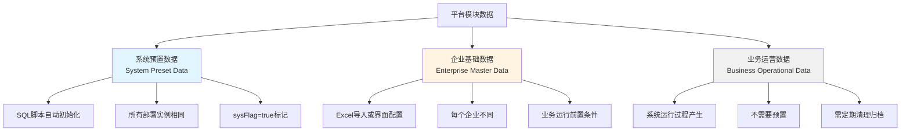
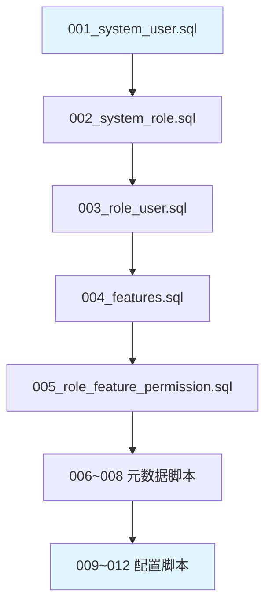
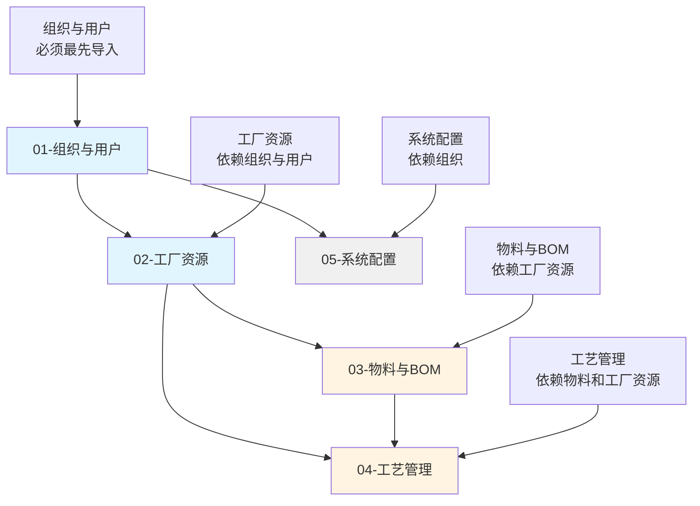

# 平台模块数据初始化策略

## 文档说明

**基本信息**
- 文档版本：v1.0 | 更新日期：2026-01-03 | 维护团队：产品研发团队
- 目标受众：后端开发团队、实施团队、运维团队

**文档定位**

本文档定义 KMMOM3.x 平台模块的数据初始化策略，将数据分为系统预置数据、企业基础数据、业务运营数据三层，明确各层数据的特征、初始化方式、组织规范，为系统部署和企业上线提供标准化指导。

**内容结构**

| 章节 | 核心问题 | 内容说明 |
|------|---------|----------|
| 一、数据分层策略 | 如何对数据进行分层管理？ | 三层分层定义、特征对比、适用场景 |
| 二、系统预置数据 | 哪些数据需要系统自动初始化？ | 预置数据清单、初始化规范、脚本组织方式 |
| 三、企业基础数据 | 企业上线前需要准备哪些数据？ | 基础数据清单、Excel导入模板组织、依赖关系 |
| 四、业务运营数据 | 运行过程中产生哪些数据？ | 业务数据分类、数据清理策略 |
| 五、实施规范建议 | 如何保障数据初始化质量？ | 脚本规范、模板规范、校验机制 |

---

## 一、数据分层策略

### 1.1 三层分层定义

KMMOM3.x 平台模块数据按初始化时机和管理方式分为三层：



### 1.2 三层特征对比

| 对比维度 | 系统预置数据 | 企业基础数据 | 业务运营数据 |
|---------|-------------|-------------|-------------|
| **定义** | 系统安装后自动创建的数据，所有部署实例都相同，是系统运行的最小必要集 | 企业在系统上线前必须配置的数据，是业务流程执行的前置条件，每个企业不同 | 系统运行过程中产生的业务数据，不需要预置 |
| **初始化时机** | 系统安装时 | 企业上线前 | 业务运行中 |
| **初始化方式** | SQL脚本或数据迁移工具 | Excel导入或界面配置 | 业务操作自动产生 |
| **数据范围** | 系统级别 | 企业级别 | 业务级别 |
| **是否通用** | 所有部署实例相同 | 每个企业不同 | 每个业务场景不同 |
| **用户可修改性** | 不可删除（sysFlag=true） | 可修改和扩展 | 可修改和删除 |
| **典型示例** | 超级管理员账号、系统功能菜单、枚举值 | 企业组织架构、物料清单、工艺路线 | 业务日志、审计日志、执行记录 |
| **维护责任** | 产品研发团队 | 实施团队/企业用户 | 企业用户 |

### 1.3 数据层级与业务流程对应关系


---

## 二、系统预置数据

### 2.1 系统预置数据清单

以下数据必须在系统安装后通过SQL脚本自动初始化：

#### 2.1.1 认证授权模块

| 数据模型 | 预置内容 | 业务说明 | sysFlag标记 |
|---------|---------|---------|------------|
| User（用户） | 超级管理员账号 | 默认账号：admin<br>默认密码：加密存储<br>userType=系统用户 | true |
| Role（角色） | 系统预定义角色 | 系统管理员、审计员、只读用户等 | true |
| RoleUser（角色与用户关系） | 管理员与角色关系 | admin绑定系统管理员角色 | true |
| Feature（功能） | 默认功能菜单树 | 完整的系统功能导航结构<br>包括平台管理、生产管理等所有一级/二级菜单 | true |
| RoleFeaturePermission（角色与功能权限关系） | 预定义角色的功能权限 | 系统管理员拥有所有功能权限 | true |

#### 2.1.2 系统配置模块

| 数据模型 | 预置内容 | 业务说明 | sysFlag标记 |
|---------|---------|---------|------------|
| ConfigDefinition（业务配置定义） | 系统配置项定义 | 所有可配置项的定义（如工时精度、批次规则等）<br>包括配置项的组件类型、默认值等 | true |
| EventDefinition（事件定义） | 系统事件定义 | WebHook可订阅的所有事件类型<br>包括物料创建、工单下达等业务事件 | true |
| DocTool（文档工具） | 文档工具定义 | 内置的文档浏览工具（如PDF查看器、图片查看器） | true |
| DocModelToolRelation（文档模型与工具关系） | 文档模型与工具映射 | 内置的模型与工具关系（如MaterialFile使用PDF查看器） | true |

#### 2.1.3 基础元数据

| 数据类型 | 预置内容 | 业务说明 | 存储方式 |
|---------|---------|---------|---------|
| **枚举值** | 所有枚举类型的可选值 | UserType、RoleType、WorkCenterType、MaterialCategory等所有枚举的值 | 需确认：专门的枚举表或硬编码 |
| **单位定义** | 标准计量单位 | 个(PCS)、千克(KG)、米(M)、小时(H)、分钟(MIN)等 | 需确认：是否有MeasureUnit表 |
| **分类定义** | 系统预定义分类 | MaterialType（物料类别）、EquipCategory（设备类别）、ToolingType（工装类别）等分类树 | 需确认：是否有Category表 |

### 2.2 系统预置数据规范要求

#### 2.2.1 数据标记规范

- 所有系统预置数据**必须**将 `sysFlag` 字段设置为 `true`
- 系统预置数据**不允许**通过界面删除（需前端和后端双重校验）
- 系统预置数据的 `code` 字段**必须**使用统一前缀（如 `SYS_`）

#### 2.2.2 SQL脚本组织规范

建议在代码仓库中按以下结构组织初始化脚本：

```
代码仓库/
└── database/
    ├── initialization/                    # 系统初始化脚本
    │   ├── 001_system_user.sql           # 超级管理员
    │   ├── 002_system_role.sql           # 系统角色
    │   ├── 003_role_user.sql             # 角色用户关系
    │   ├── 004_features.sql              # 功能菜单
    │   ├── 005_role_feature_permission.sql # 角色功能权限
    │   ├── 006_enums.sql                 # 枚举值（如需要）
    │   ├── 007_units.sql                 # 单位定义（如需要）
    │   ├── 008_categories.sql            # 分类定义（如需要）
    │   ├── 009_config_definition.sql     # 配置项定义
    │   ├── 010_event_definition.sql      # 事件定义
    │   ├── 011_doc_tool.sql              # 文档工具
    │   └── 012_doc_model_tool_relation.sql # 文档模型工具关系
    │
    ├── migration/                         # 版本升级脚本
    │   ├── v3.0_to_v3.1/
    │   │   ├── 001_add_new_features.sql
    │   │   └── 002_update_config_definition.sql
    │   └── v3.1_to_v3.2/
    │
    └── README.md                          # 脚本使用说明
```

**脚本命名规则**：
- 使用三位数字前缀标识执行顺序（如 `001_`、`002_`）
- 脚本名称使用下划线分隔，小写英文（如 `system_user.sql`）
- 脚本必须**幂等**（可重复执行不报错）

#### 2.2.3 脚本执行顺序



**关键依赖说明**：
1. User 必须先于 RoleUser
2. Role 必须先于 RoleUser 和 RoleFeaturePermission
3. Feature 必须先于 RoleFeaturePermission
4. 元数据（枚举、单位、分类）必须先于业务配置

### 2.3 版本升级数据迁移策略

当系统版本升级时，需要考虑：

| 场景 | 处理策略 | 示例 |
|------|---------|------|
| **新增功能菜单** | 追加INSERT，检查是否存在 | v3.1新增"智能排程"功能 |
| **修改枚举值** | 谨慎处理，考虑向后兼容 | MaterialCategory新增"辅料"分类 |
| **新增配置项** | 追加ConfigDefinition记录 | 新增"是否启用自动报工"配置 |
| **删除功能菜单** | 软删除（标记为不可见），不物理删除 | 废弃的功能菜单 |

---

## 三、企业基础数据

### 3.1 企业基础数据清单

企业在系统上线前必须准备以下基础数据，按业务领域分为五大类：

#### 3.1.1 组织与用户

| 数据模型 | 业务说明 | 必填 | 依赖关系 |
|---------|---------|------|---------|
| Org（行政组织） | 企业行政组织架构（公司、部门、科室等） | 是 | 无 |
| OrgUser（行政组织与用户关系） | 用户归属的行政组织 | 是 | 依赖 Org、User |
| BizOrg（业务组织） | 业务组织架构（工厂、车间、产线等） | 是 | 可依赖 Org |
| BizOrgUser（业务组织与用户关系） | 用户归属的业务组织 | 是 | 依赖 BizOrg、User |
| User（用户） | 企业用户账号 | 是 | 无 |
| Role（角色） | 企业自定义角色 | 否 | 无 |
| RoleUser（角色与用户关系） | 用户的角色分配 | 否 | 依赖 Role、User |

**业务场景**：
- 行政组织：人力资源管理视角（如研发部、生产部）
- 业务组织：生产制造视角（如一车间、二车间、总装线）
- 一个用户可同时归属多个行政组织和业务组织

#### 3.1.2 工厂资源

| 数据模型 | 业务说明 | 必填 | 依赖关系 |
|---------|---------|------|---------|
| WorkCenter（工作中心） | 生产执行单元（产线、设备、班组、外协） | 是 | 依赖 BizOrg |
| Equip（设备） | 生产设备台账 | 否 | 依赖 BizOrg |
| WorkCenterEquipLink（工作中心设备关系） | 工作中心包含的设备 | 否 | 依赖 WorkCenter、Equip |
| WorkCenterPersonLink（工作中心人员关系） | 工作中心的操作人员 | 否 | 依赖 WorkCenter、User |
| QualificationLevel（资质等级） | 技能等级定义（如钳工、车工） | 否 | 无 |
| QualificationLevelPersonLink（资质人员关系） | 人员的技能等级认证 | 否 | 依赖 QualificationLevel、User |
| Warehouse（库房） | 仓库定义 | 是 | 依赖 BizOrg |
| WarehouseLocation（库位） | 库房的库位 | 否 | 依赖 Warehouse |

**业务场景**：
- WorkCenter 是报工、排产的基本单元
- 设备、人员、资质是高级排产的资源约束条件
- 库房是物料收发的必要前提

#### 3.1.3 物料与BOM

| 数据模型 | 业务说明 | 必填 | 依赖关系 |
|---------|---------|------|---------|
| Material（物料） | 物料主数据（原材料、半成品、产成品） | 是 | 无 |
| MaterialFile（物料文件） | 物料相关的技术文档（图纸、说明书） | 否 | 无 |
| MaterialFileLink（物料文件关系） | 物料与文件的关联关系 | 否 | 依赖 Material、MaterialFile |
| MBom（MBOM） | 制造BOM头表 | 否 | 依赖 Material |
| MBomNode（MBOM节点） | 制造BOM的物料树结构 | 否 | 依赖 MBom、Material |

**业务场景**：
- Material 是计划、库存、报工的核心对象
- MBOM 是计划物料需求的基础
- 对于离散制造企业，MBOM是必填数据

#### 3.1.4 工艺管理

| 数据模型 | 业务说明 | 必填 | 依赖关系 |
|---------|---------|------|---------|
| Process（工序库） | 标准工序定义（公共工序池） | 否 | 依赖 WorkCenter |
| Routing（工艺路线） | 物料的制造工艺 | 是 | 依赖 Material、BizOrg |
| RoutingProcessLink（工艺工序） | 工艺路线的工序明细 | 是 | 依赖 Routing |
| RoutingMaterialLink（工艺物料） | 工序消耗的物料（投料清单） | 否 | 依赖 Routing、Material |
| RoutingSequenceLink（工序序列） | 工序之间的先后顺序 | 是 | 依赖 Routing |
| RoutingQualificationLevelLink（工艺资质关系） | 工序要求的技能等级 | 否 | 依赖 Routing、QualificationLevel |
| RoutingFile（工艺文件） | 工艺文档（工艺卡、作业指导书） | 否 | 无 |
| RoutingFileLink（工艺文件关系） | 工序与工艺文件的关联 | 否 | 依赖 Routing、RoutingFile |
| PrimaryAuxiliaryRoutingLink（主辅制工艺关系） | 主制工序与辅制工艺的关系 | 否 | 依赖 Routing |

**业务场景**：
- Routing 是生产工单、报工、排产的核心依据
- Process 工序库可提高工艺编制效率（可选）
- RoutingSequenceLink 定义工序顺序，是排产的前置约束

#### 3.1.5 系统配置值

| 数据模型 | 业务说明 | 必填 | 依赖关系 |
|---------|---------|------|---------|
| ConfigValue（业务配置值） | 企业个性化配置的值（基于ConfigDefinition） | 否 | 依赖 BizOrg、ConfigDefinition |
| CodeRule（编码规则） | 业务单据编号规则（如工单号、物料号） | 否 | 无 |
| CodeRuleSegment（编码规则码段） | 编号规则的组成段 | 否 | 依赖 CodeRule |
| BarCodeRule（条码规则） | 条码解析规则 | 否 | 无 |

**业务场景**：
- ConfigValue 存储企业级别的业务配置（如是否启用批次管理）
- CodeRule 定义单据编号生成规则（如 WO20250103001）

### 3.2 Excel导入模板组织方案

建议按业务领域分为5个Excel文件，每个文件包含多个Sheet（对应数据模型）：

```
基础数据导入模板/
├── 01-组织与用户.xlsx
│   ├── Sheet1: 行政组织（Org）
│   ├── Sheet2: 业务组织（BizOrg）
│   ├── Sheet3: 用户（User）
│   ├── Sheet4: 行政组织与用户关系（OrgUser）
│   ├── Sheet5: 业务组织与用户关系（BizOrgUser）
│   ├── Sheet6: 角色（Role，可选）
│   └── Sheet7: 角色与用户关系（RoleUser，可选）
│
├── 02-工厂资源.xlsx
│   ├── Sheet1: 工作中心（WorkCenter）
│   ├── Sheet2: 设备（Equip）
│   ├── Sheet3: 工作中心设备关系（WorkCenterEquipLink）
│   ├── Sheet4: 工作中心人员关系（WorkCenterPersonLink）
│   ├── Sheet5: 资质等级（QualificationLevel）
│   ├── Sheet6: 人员资质关系（QualificationLevelPersonLink）
│   ├── Sheet7: 库房（Warehouse）
│   └── Sheet8: 库位（WarehouseLocation）
│
├── 03-物料与BOM.xlsx
│   ├── Sheet1: 物料（Material）
│   ├── Sheet2: 物料文件（MaterialFile，可选）
│   ├── Sheet3: 物料文件关系（MaterialFileLink，可选）
│   ├── Sheet4: MBOM（MBom）
│   └── Sheet5: MBOM节点（MBomNode）
│
├── 04-工艺管理.xlsx
│   ├── Sheet1: 工序库（Process，可选）
│   ├── Sheet2: 工艺路线（Routing）
│   ├── Sheet3: 工艺工序（RoutingProcessLink）
│   ├── Sheet4: 工艺物料（RoutingMaterialLink，可选）
│   ├── Sheet5: 工序序列（RoutingSequenceLink）
│   ├── Sheet6: 工艺资质关系（RoutingQualificationLevelLink，可选）
│   ├── Sheet7: 工艺文件（RoutingFile，可选）
│   ├── Sheet8: 工艺文件关系（RoutingFileLink，可选）
│   └── Sheet9: 主辅制工艺关系（PrimaryAuxiliaryRoutingLink，可选）
│
└── 05-系统配置.xlsx
    ├── Sheet1: 业务配置值（ConfigValue）
    ├── Sheet2: 编码规则（CodeRule）
    ├── Sheet3: 编码规则码段（CodeRuleSegment）
    └── Sheet4: 条码规则（BarCodeRule）
```

### 3.3 Excel导入顺序（依赖关系）



**导入顺序及依赖说明**：

| 导入顺序 | 文件名 | 关键依赖 | 说明 |
|---------|-------|---------|------|
| 1 | 01-组织与用户.xlsx | 无 | User、Org、BizOrg是其他模块的基础 |
| 2 | 02-工厂资源.xlsx | 依赖 User、BizOrg | WorkCenterPersonLink需要User<br>WorkCenter需要BizOrg |
| 3 | 03-物料与BOM.xlsx | 依赖 BizOrg（如果Material有工厂属性） | Material是工艺管理的前提 |
| 4 | 04-工艺管理.xlsx | 依赖 Material、WorkCenter | Routing引用Material和WorkCenter |
| 5 | 05-系统配置.xlsx | 依赖 BizOrg | ConfigValue可能绑定BizOrg |

**注意事项**：
- 每个Excel文件内部的Sheet也有导入顺序要求（如Org必须先于OrgUser）
- 建议在导入工具中实现依赖校验（如导入OrgUser时检查Org是否存在）

### 3.4 Excel模板列定义规范

每个Sheet的列定义应遵循以下规范：

| 列属性 | 规范要求 | 示例 |
|-------|---------|------|
| **列名** | 使用中文属性名称（与数据模型文档一致） | "编码""名称""备注" |
| **必填标识** | 列名后加 `*` 标识必填字段 | "编码*""名称*" |
| **枚举值说明** | 注释中列出可选值 | "用户类型*（系统用户/业务用户）" |
| **引用对象** | 使用被引用对象的 `code` | "工作中心"列填写WorkCenter的code |
| **日期格式** | 统一使用 `YYYY-MM-DD` | "2025-12-31" |
| **布尔值** | 统一使用 `是/否` | "启用标记"列填"是"或"否" |
| **示例数据** | 第2行提供示例数据（导入时跳过） | ORG001、研发部、研发中心 |

---

## 四、业务运营数据

### 4.1 业务运营数据分类

业务运营数据是系统运行过程中自动产生的数据，**不需要预置**，但需要考虑数据清理和归档策略。

| 数据类型 | 数据模型 | 业务说明 | 数据增长速度 |
|---------|---------|---------|-------------|
| **日志类** | SysLog（业务日志）<br>AuditLog（审计日志） | 记录系统操作和审计事件 | 高（每日数万条） |
| **执行日志类** | WebHookExecutionLog<br>ScriptExecutionLog | 记录WebHook和脚本执行情况 | 中（取决于配置数量） |
| **附件类** | Attachment（附件）<br>ObjectAttachmentRel<br>ImageFile（图像文件） | 业务过程中上传的文档和图片 | 中（取决于业务量） |

### 4.2 数据清理策略建议

| 数据类型 | 保留期限建议 | 清理策略 | 归档策略 |
|---------|-------------|---------|---------|
| SysLog | 在线保留90天 | 90天后转归档库 | 归档库保留2年 |
| AuditLog | 在线保留180天 | 180天后转归档库 | 归档库保留5年（合规要求） |
| WebHookExecutionLog | 在线保留30天 | 30天后物理删除 | 不归档 |
| ScriptExecutionLog | 在线保留30天 | 30天后物理删除 | 不归档 |
| Attachment | 跟随业务对象 | 业务对象删除时级联删除 | 不归档 |
| ImageFile | 在线保留180天 | 180天后转对象存储 | 对象存储保留2年 |

**注意事项**：
- 审计日志的保留期限需符合行业合规要求（如军工、金融）
- 归档数据应迁移到独立的归档库，避免影响在线业务性能
- 图像文件建议使用对象存储（如MinIO、OSS）降低数据库压力

---

## 五、实施规范建议

### 5.1 系统预置数据脚本规范

建议制定独立的规范文档：`05-lifecycle/operations/system-preset-data-standards.md`

**规范内容应包括**：
1. SQL脚本命名规范（如三位数字前缀 + 下划线分隔）
2. 脚本幂等性要求（可重复执行）
3. 脚本执行顺序及依赖关系
4. sysFlag标记规则
5. 版本升级数据迁移策略
6. 脚本测试和验证方法

### 5.2 企业基础数据导入规范

建议制定独立的规范文档：`05-lifecycle/operations/master-data-import-standards.md`

**规范内容应包括**：
1. Excel模板定义规范（列名、必填标识、枚举值说明）
2. 导入顺序及依赖关系
3. 数据校验规则（如编码唯一性、引用完整性）
4. 错误处理机制（如导入失败时的回滚策略）
5. 导入工具使用说明
6. 导入测试和验证方法

### 5.3 数据校验机制

#### 5.3.1 系统预置数据校验

| 校验项 | 校验规则 | 错误处理 |
|-------|---------|---------|
| sysFlag标记 | 所有预置数据必须设置sysFlag=true | 脚本执行前检查 |
| 编码唯一性 | code字段全局唯一 | 脚本执行前检查 |
| 引用完整性 | 外键引用必须存在 | 按依赖顺序执行 |
| 必填字段 | 必填字段不能为空 | 脚本执行前检查 |

#### 5.3.2 企业基础数据校验

| 校验项 | 校验规则 | 错误处理 |
|-------|---------|---------|
| 必填字段 | Excel中标记为 `*` 的列不能为空 | 导入前校验，提示错误行号 |
| 编码唯一性 | code字段在同一实体类型中唯一 | 导入前校验，提示重复编码 |
| 引用完整性 | 引用对象必须存在（如WorkCenter引用的BizOrg） | 导入前校验，提示缺失引用 |
| 枚举值有效性 | 枚举字段的值必须在可选范围内 | 导入前校验，提示无效值 |
| 数据类型 | 数值字段必须是数字、日期字段必须符合格式 | 导入前校验，提示类型错误 |
| 业务逻辑 | 如MBOM节点的层级必须合法 | 导入后校验，提示业务错误 |

### 5.4 导入工具功能要求

建议开发的基础数据导入工具应具备以下功能：

| 功能 | 说明 | 优先级 |
|------|------|--------|
| **Excel模板下载** | 提供标准模板下载（含示例数据） | 高 |
| **数据校验** | 导入前进行完整性和合法性校验 | 高 |
| **错误提示** | 校验失败时明确提示错误位置（文件、Sheet、行号、列名） | 高 |
| **批量导入** | 支持按顺序批量导入多个Excel文件 | 高 |
| **导入预览** | 导入前预览将要导入的数据 | 中 |
| **导入回滚** | 导入失败时自动回滚（事务性） | 高 |
| **导入日志** | 记录导入操作的详细日志 | 中 |
| **增量导入** | 支持仅导入新增和修改的数据 | 低 |

---

## 变更记录

| 日期 | 版本 | 变更内容 | 变更人 |
|-----|------|---------|--------|
| 2026-01-03 | v1.0 | 创建文档，定义数据三层分层策略、系统预置数据清单、企业基础数据清单、Excel导入模板组织方案、实施规范建议 | 王晴 |
