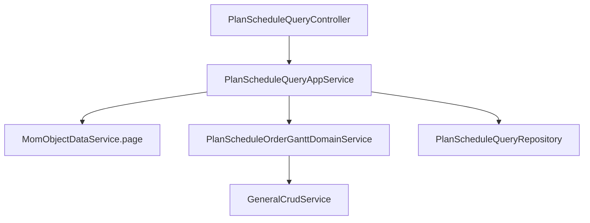
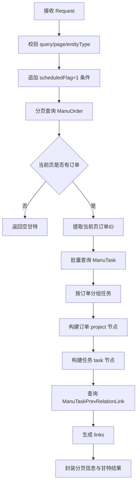

# DNW30301-计划调度查询能力设计文档

## 0. 文档信息

| 项目 | 内容 |
| --- | --- |
| 需求编号 | DNW30301 |
| 需求名称 | 计划调度 |
| 文档版本 | V1.1 |
| 编写日期 | 2026-04-09 |
| 关联需求 | `tasks/DNW30301-计划调度/DNW30301-计划调度.md` |
| 关联模块 | `km-mom-mes/km-mom-mes-biz/km-mom-mes-biz-planning` |

---

## 1. 概述

### 1.1 背景

`DNW30301-计划调度` 原始需求面向生产计划员，目标是提供以订单和工序任务为核心的计划调度工作台，在同一页面联动展示订单池、工序排程、甘特关系、风险提示和后续调整能力。

考虑到实施节奏与交付边界，本次设计先聚焦计划调度页面最基础的查询能力，优先解决以下问题：

1. 如何按订单分页结果构造计划调度订单甘特数据。
2. 如何在甘特上展示订单下的工序任务节点与前后置关系。
3. 如何在点击任务时返回该任务及所属订单的排程详情。

本设计文档按“功能实施前”的视角编写，描述本次计划实现的查询方案，不将拖拽调整、发布版本、风险联动等后续能力纳入本次范围。

### 1.2 设计目标

1. 提供计划调度订单甘特查询接口，支撑页面展示订单节点、任务节点和任务前后置连线。
2. 提供调度任务详情查询接口，支撑页面查看单任务的计划与实际排程信息。
3. 复用现有制造订单、制造任务和任务关系模型，避免为本次查询能力额外引入新实体。
4. 保持查询口径与计划调度页面的订单视角一致，以当前页订单作为甘特数据的构建范围。

### 1.3 本次范围

本次方案范围包括：

- 新增计划调度订单甘特查询接口
- 新增调度任务详情查询接口
- 基于订单分页结果构造甘特 `project` 节点
- 基于制造任务构造甘特 `task` 节点
- 基于任务前后置关系构造甘特连线
- 返回任务详情展示所需的订单与任务排程字段

### 1.4 非范围

本次方案不包括：

- 甘特拖拽调整
- 工作中心切换与重排保存
- 风险灯、负荷分析、异常联动
- 草稿保存、发布、版本对比、回滚
- 批量操作（排产、分卡、终止、暂停、恢复）
- 页面完整交互与视觉设计落地

### 1.5 核心设计决策

| 决策项 | 选择 | 原因 |
| --- | --- | --- |
| 查询主对象 | 制造订单分页 + 当前页订单甘特 | 计划调度页左侧核心是订单列表，本次先沿用订单分页作为主入口 |
| 甘特节点结构 | 订单为 `project`，任务为 `task` | 贴合前端甘特组件的层级结构 |
| 任务时间口径 | 实际优先，计划兜底 | 满足“已发生优先显示实际，未发生显示计划”的展示需求 |
| 连线来源 | `ManuTaskPrevRelationLink` | 复用现有任务前后置关系，不重复推导 |
| 详情查询方式 | 自定义 SQL 单任务查询 | 返回字段集中、稳定，减少前端二次拼装成本 |

---

## 2. 需求拆解

### 2.1 用户角色

本次查询能力主要服务于以下角色：

- 生产计划员
- 调度员
- 计划调度前端页面

### 2.2 目标业务场景

| 场景 | 触发条件 | 用户动作 | 系统结果 |
| --- | --- | --- | --- |
| 场景1：加载计划调度页面 | 进入计划调度页或切换筛选条件 | 查询订单分页 | 返回当前页订单甘特数据 |
| 场景2：查看订单下工序排程 | 当前页存在已排程订单 | 展示订单甘特 | 返回订单节点、任务节点、前后置连线 |
| 场景3：查看任务详情 | 点击某个工序任务 | 传入任务 ID 查询 | 返回该任务及所属订单的排程明细 |

### 2.3 功能清单

| 功能项 | 描述 | 优先级 | 是否本次实现 |
| --- | --- | --- | --- |
| 订单甘特查询 | 按订单分页结果返回当前页甘特数据 | P0 | 是 |
| 调度任务详情查询 | 返回任务与订单排程明细 | P0 | 是 |
| 任务前后置连线查询 | 仅针对当前页实际返回任务生成连线 | P0 | 是 |
| 风险提示与负荷分析 | 交期风险、负荷风险、异常提示 | P1 | 否 |
| 排程调整与发布 | 拖拽、保存、发布、版本化 | P1 | 否 |

### 2.4 验收标准

1. 传入合法的 `ManuOrder` 分页查询参数时，接口能够返回当前页订单甘特数据。
2. 返回结果中订单节点和任务节点具有父子层级关系，且任务节点排序稳定。
3. 当前页存在前后置任务关系时，接口能够返回对应连线。
4. 传入合法任务 ID 时，接口能够返回任务详情及所属订单排程信息。
5. 非法查询条件或缺少关键参数时，接口返回明确异常信息。

---

## 3. 总体方案设计

### 3.1 方案总览

本方案采用“控制层 + 应用层 + 领域层 + 仓储层”的分层结构：

1. 控制层负责暴露计划调度查询接口。
2. 应用层负责参数校验、订单分页编排、结果封装。
3. 领域层负责将订单与工序任务组装成甘特结构，并构造任务前后置连线。
4. 仓储层负责单任务详情的 SQL 查询。

本次方案只覆盖计划调度页面的数据读取链路，不引入保存、发布、重排等写操作逻辑。

### 3.2 模块关系图



### 3.3 分层职责

| 层级 | 类/模块 | 职责 |
| --- | --- | --- |
| 控制层 | `PlanScheduleQueryController` | 提供计划调度查询接口入口 |
| 应用层 | `PlanScheduleQueryAppService` | 校验查询参数、追加过滤条件、组织订单分页与甘特结果 |
| 领域层 | `PlanScheduleOrderGanttDomainService` | 构建订单甘特节点、任务节点与前后置连线 |
| 仓储层 | `PlanScheduleQueryRepository` | 查询单任务详情 |
| 基础服务 | `MomObjectDataService` | 分页查询制造订单 |
| 基础服务 | `GeneralCrudService` | 查询制造任务与前后置关系 |

---

## 4. 数据设计

### 4.1 核心对象

| 对象 | 类型 | 说明 |
| --- | --- | --- |
| `Query` | 查询对象 | 订单甘特查询入参 |
| `ScheduleTaskDetailQueryDTO` | DTO | 调度任务详情查询入参 |
| `PlanScheduleOrderGanttQueryVO` | VO | 订单甘特分页查询返回 |
| `PlanScheduleOrderGanttVO` | VO | 甘特容器 |
| `PlanScheduleOrderGanttItemVO` | VO | 甘特节点，兼容订单与任务 |
| `PlanScheduleOrderGanttLinkVO` | VO | 甘特连线 |
| `ScheduleTaskDetailVO` | VO | 调度任务详情返回 |
| `ManuOrder` | 实体 | 制造订单 |
| `ManuTask` | 实体 | 制造任务/工序任务 |
| `ManuTaskPrevRelationLink` | 实体 | 任务前后置关系 |

### 4.2 数据结构定义

#### 4.2.1 调度任务详情查询入参

`ScheduleTaskDetailQueryDTO`

| 字段 | 类型 | 必填 | 说明 |
| --- | --- | --- | --- |
| taskId | Long | 是 | 制造任务 ID |

#### 4.2.2 订单甘特查询返回

`PlanScheduleOrderGanttQueryVO`

| 字段 | 类型 | 说明 |
| --- | --- | --- |
| orderGantt | `PlanScheduleOrderGanttVO` | 当前页甘特数据 |
| pageIndex | Integer | 当前页码 |
| pageSize | Integer | 每页条数 |
| totalRows | Integer | 总记录数 |
| totalPages | Integer | 总页数 |

#### 4.2.3 甘特容器

`PlanScheduleOrderGanttVO`

| 字段 | 类型 | 说明 |
| --- | --- | --- |
| data | `List<PlanScheduleOrderGanttItemVO>` | 甘特节点集合 |
| links | `List<PlanScheduleOrderGanttLinkVO>` | 甘特连线集合 |

#### 4.2.4 甘特节点

`PlanScheduleOrderGanttItemVO` 继承 `HashMap<String, Object>`，同时承载订单节点与任务节点。

核心字段包括：

| 字段 | 说明 |
| --- | --- |
| id | 节点 ID |
| text | 节点显示文本 |
| type | 节点类型，订单为 `project`，任务为 `task` |
| render | 订单节点固定为 `split` |
| parent | 父节点 ID，任务节点使用 |
| start_date | 展示开始时间 |
| end_date | 展示结束时间 |
| actualStart_date | 实际开始时间 |
| actualEnd_date | 实际结束时间 |
| qty | 数量 |
| index | 工序顺序 |
| materialCode | 物料编码 |
| materialName | 物料名称 |
| bizStatus | 业务状态 |

#### 4.2.5 调度任务详情返回

`ScheduleTaskDetailVO`

| 字段 | 类型 | 说明 |
| --- | --- | --- |
| orderId | Long | 订单 ID |
| orderCode | String | 订单号 |
| actualScheduledFlag | Integer | 原始已排程标记 |
| scheduledFlag | String | 展示用“是/否” |
| orderReqStartTime | LocalDateTime | 订单指定开始时间 |
| orderReqEndTime | LocalDateTime | 订单指定结束时间 |
| scheduleStartTime | LocalDateTime | 订单计划开始时间 |
| scheduleEndTime | LocalDateTime | 订单计划结束时间 |
| planQty | BigDecimal | 计划数量 |
| taskId | Long | 任务 ID |
| processNum | String | 工序号 |
| processName | String | 工序名称 |
| taskPlanStartTime | LocalDateTime | 任务计划开始时间 |
| taskPlanEndTime | LocalDateTime | 任务计划结束时间 |
| taskActualStartTime | LocalDateTime | 任务实际开始时间 |
| taskActualEndTime | LocalDateTime | 任务实际结束时间 |
| bizStatus | String | 业务状态值 |
| bizStatusName | String | 业务状态显示值 |

---

## 5. 接口设计

### 5.1 接口清单

| 接口 | 方法 | 用途 | 调用方 |
| --- | --- | --- | --- |
| `planSchedule/queryPlanScheduleOrderGantt` | POST | 查询计划调度订单甘特数据 | 计划调度页面 |
| `planSchedule/fetchScheduleTaskDetail` | POST | 查询单个调度任务详情 | 计划调度页面 |

### 5.2 订单甘特查询设计

#### 5.2.1 入参

接口接收 `Request<Query>`，约束如下：

1. `query` 不能为空。
2. `query.page` 不能为空。
3. `query.entityType` 必须为 `ManuOrder`。
4. 应用层统一追加 `scheduledFlag = 1` 过滤条件。

说明：

- 本接口不是通用任务甘特查询，而是“已排程制造订单分页查询 + 当前页甘特组装”。
- 调用方不需要自行补充 `scheduledFlag = 1`。

#### 5.2.2 出参

```json
{
  "data": {
    "orderGantt": {
      "data": [],
      "links": []
    },
    "pageIndex": 1,
    "pageSize": 20,
    "totalRows": 100,
    "totalPages": 5
  }
}
```

出参特点：

1. `orderGantt.data` 同时包含订单节点与任务节点。
2. 订单节点保留分页查询返回的原始订单字段，并补充甘特核心字段。
3. `links` 只针对当前返回的任务节点生成。

### 5.3 调度任务详情查询设计

#### 5.3.1 入参

```json
{
  "object": {
    "taskId": 1001
  }
}
```

| 字段 | 类型 | 必填 | 校验规则 | 说明 |
| --- | --- | --- | --- | --- |
| taskId | Long | 是 | 非空 | 制造任务 ID |

#### 5.3.2 出参

返回单个 `ScheduleTaskDetailVO`，用于任务点击后的详情展示。

### 5.4 错误处理

| 场景 | 处理方式 |
| --- | --- |
| `query` 为空 | 抛出 `IllegalArgumentException("计划调度查询参数不能为空")` |
| `page` 为空 | 抛出 `IllegalArgumentException("计划调度分页参数不能为空")` |
| `entityType` 非 `ManuOrder` | 抛出 `IllegalArgumentException("计划调度查询实体类型必须为ManuOrder")` |
| `dto` 为空 | 抛出 `IllegalArgumentException("调度任务详情查询参数不能为空")` |
| `taskId` 为空 | 抛出 `IllegalArgumentException("制造任务ID不能为空")` |
| 查询结果不存在 | 返回空结果，由调用方统一处理 |

---

## 6. 核心业务逻辑

### 6.1 订单甘特主流程



### 6.2 订单甘特构建规则

#### 6.2.1 订单节点规则

1. 每条当前页订单数据都构造一个 `project` 节点。
2. 节点文本优先级：
   - `code`
   - `name`
   - `id`
3. 订单节点保留分页查询的原始字段。
4. 若订单缺少 `id`，则跳过该节点并记录日志。

#### 6.2.2 任务节点规则

任务查询条件：

1. `manuOrder IN 当前页订单ID`
2. `executionFlag = true`
3. `parentFlag = false`
4. `controlStatus != CANCEL`

任务节点构建规则：

1. 展示开始时间：
   - 有 `actualStartTime` 时取实际开始
   - 否则取 `plannedStartTime`
2. 展示结束时间：
   - 有 `actualEndTime` 时取实际结束
   - 否则取 `plannedEndTime`
3. 若开始/结束为空，跳过该任务并记录日志。
4. 若开始时间不早于结束时间，跳过该任务并记录日志。
5. 节点文本优先级：
   - `processNum-processName`
   - `processNum`
   - `processName`
   - `taskId`

#### 6.2.3 排序规则

1. 订单节点按分页结果顺序返回。
2. 每个订单下任务节点按以下规则排序：
   - `index`
   - `id`

### 6.3 连线生成规则

1. 连线数据来源为 `ManuTaskPrevRelationLink`。
2. 当前任务取 `source.id`。
3. 前置任务优先取 `executionPrevTask.id`，若为空则取 `prevTask.id`。
4. 只有当前页中已返回的任务节点才生成连线。
5. 连线按 `prevTaskId-currentTaskId` 去重。
6. 连线类型固定为尾到首，`type = "0"`。

### 6.4 调度任务详情查询规则

1. 使用自定义 SQL 关联 `MOM_MANU_TASK` 与 `MOM_MANU_ORDER`。
2. 过滤条件：
   - `T1.CSOFT_DELETE_FLAG = 0`
   - `T2.CSOFT_DELETE_FLAG = 0`
   - `T1.CID = :taskId`
3. 应用层补充两个展示字段：
   - `scheduledFlag`：“是/否”
   - `bizStatusName`：状态显示值

### 6.5 边界场景

| 场景 | 风险 | 处理方式 |
| --- | --- | --- |
| 当前页无订单 | 前端空白或异常 | 返回分页信息 + 空甘特 |
| 当前页订单无任务 | 连线构建异常 | 返回订单节点，`links=[]` |
| 任务时间缺失 | 甘特节点无法展示 | 跳过该任务并记录日志 |
| 当前页任务关系不完整 | 连线指向不存在节点 | 只对当前已返回任务生成连线 |
| 查询详情时任务不存在 | 前端空指针风险 | 返回空结果，由调用方兜底 |

---

## 7. 与现有系统的关系

### 7.1 依赖现状

本方案依赖以下已有能力：

1. `MomObjectDataService.page(query)`：制造订单分页查询
2. `GeneralCrudService.list(query, clazz)`：制造任务与关系查询
3. `ManuOrder`、`ManuTask`、`ManuTaskPrevRelationLink`：现有业务模型
4. `ManuTaskLifeCycleStatusEnum`：任务状态显示值转换

### 7.2 与原始需求的关系

| 原始需求能力 | 本次方案覆盖情况 | 说明 |
| --- | --- | --- |
| 订单池展示 | 本次范围 | 通过订单分页结果提供数据基础 |
| 订单甘特展示 | 本次范围 | 返回订单节点、任务节点、连线 |
| 任务详情查看 | 本次范围 | 提供单任务详情查询 |
| 风险联动 | 后续规划 | 不在本次方案范围内 |
| 排程调整 | 后续规划 | 不在本次方案范围内 |
| 版本发布 | 后续规划 | 不在本次方案范围内 |

### 7.3 兼容策略

1. 不改造制造订单、制造任务基础模型。
2. 不调整原始订单分页查询能力，只在应用层追加 `scheduledFlag = 1` 条件。
3. 甘特节点结构尽量复用前端通用字段命名，如 `project`、`task`、`start_date`、`end_date`。

### 7.4 受影响文档与文件清单

| 类别 | 对象类型 | 文件/目录 | 说明 |
| --- | --- | --- | --- |
| 新增 | 文档 | `tasks/DNW30301-计划调度/DNW30301-计划调度查询能力设计文档.md` | 计划调度查询能力设计文档 |
| 新增 | 代码 | `km-mom-mes/.../remote/PlanScheduleQueryController.java` | 计划调度查询接口入口 |
| 新增 | 代码 | `km-mom-mes/.../application/PlanScheduleQueryAppService.java` | 查询编排与参数校验 |
| 新增 | 代码 | `km-mom-mes/.../domain/schedule/PlanScheduleOrderGanttDomainService.java` | 订单甘特组装逻辑 |
| 新增 | 代码 | `km-mom-mes/.../infra/PlanScheduleQueryRepository.java` | 任务详情 SQL 查询 |
| 新增 | 代码 | `km-mom-mes/.../model/dto/schedule/ScheduleTaskDetailQueryDTO.java` | 任务详情查询入参 |
| 新增 | 代码 | `km-mom-mes/.../model/vo/schedule/*.java` | 甘特与详情返回结构 |

---

## 8. 风险与待确认项

### 8.1 风险项

| 风险 | 影响 | 应对策略 |
| --- | --- | --- |
| 本次只覆盖查询能力 | 容易被误解为整页已完成 | 在文档中明确范围边界 |
| 任务时间脏数据 | 甘特节点缺失 | 过滤非法任务并记录日志 |
| 订单分页与甘特组装耦合 | 查询语义偏页面化 | 后续如开放独立任务查询，再拆专用接口 |
| 详情接口返回空结果 | 前端需要额外兜底 | 联调时统一约定空结果展示方式 |

### 8.2 待确认项

| 问题 | 当前结论 |
| --- | --- |
| 是否需要补充风险灯、负荷小时等衍生字段 | 不纳入本次范围 |
| 是否需要支持任务级分页或工作中心维度查询 | 不纳入本次范围 |
| 是否需要将订单与任务查询口径拆成独立接口 | 本次先采用订单分页驱动方案 |

---

## 9. 实施计划

### 9.1 开发拆分

| 阶段 | 目标 | 输出 |
| --- | --- | --- |
| 阶段1 | 完成接口与返回结构定义 | Controller、DTO、VO |
| 阶段2 | 完成订单甘特组装逻辑 | AppService、DomainService |
| 阶段3 | 完成任务详情查询 | Repository、VO 映射 |
| 阶段4 | 完成联调与校验 | 查询验证、边界验证 |

### 9.2 开发顺序

1. 定义控制器、DTO、VO。
2. 实现订单分页查询编排。
3. 实现订单甘特节点与连线组装。
4. 实现单任务详情查询。
5. 完成联调与边界校验。

### 9.3 验证方案

| 验证项 | 验证方式 | 预期结果 |
| --- | --- | --- |
| 订单甘特查询 | 传入 `ManuOrder` 分页查询参数 | 返回分页信息和甘特数据 |
| 空页查询 | 查询无数据页 | 返回空甘特 |
| 详情查询 | 传入有效 `taskId` | 返回任务与订单排程明细 |
| 状态展示 | 校验 `scheduledFlag`、`bizStatusName` | 返回展示值而非纯编码 |
| 连线生成 | 当前页存在前后置任务 | 返回对应 `links` |

---

## 附录

### A. 参考文档

- `tasks/DNW30301-计划调度/DNW30301-计划调度.md`
- `tasks/需求功能设计方案模板.md`

### B. 术语说明

| 术语 | 说明 |
| --- | --- |
| 计划调度订单甘特 | 以订单为主节点、任务为子节点的甘特查询结果 |
| 当前页订单 | 当前分页结果中的制造订单集合 |
| 调度任务详情 | 单个制造任务及其所属订单的排程明细 |
