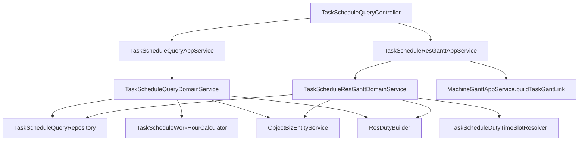
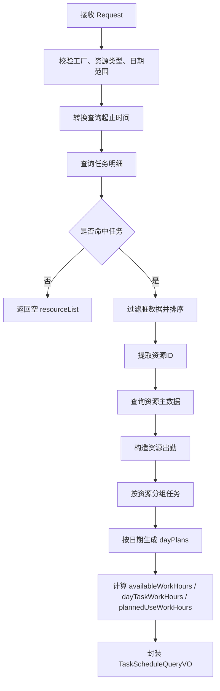

# DNW30302-任务调度设计文档

## 0. 文档信息

| 项目 | 内容 |
| --- | --- |
| 需求编号 | DNW30302 |
| 需求名称 | 任务调度 |
| 文档版本 | V1.1 |
| 编写日期 | 2026-04-09 |
| 关联需求 | `tasks/DNW30302-任务调度/DNW30302-任务调度.md` |
| 关联模块 | `km-mom-aps/km-mom-aps-biz` |

---

## 1. 概述

### 1.1 背景

`DNW30302-任务调度` 原始需求面向车间调度员/班组长，目标是提供以资源为核心的任务调度工作台，在周计划表和资源甘特两种视图下展示任务占用、资源负荷和后续协调能力。

为控制一期范围并支撑页面首先“看得见、查得到”，本次设计先聚焦查询能力，优先解决以下问题：

1. 如何按资源和日期返回周计划表所需的 `资源 -> 日期 -> 任务列表` 数据。
2. 如何按同一查询条件返回资源甘特所需的资源节点、任务节点和连线数据。
3. 如何以统一的计划时间口径支撑周计划表与资源甘特展示。

本设计文档按“功能实施前”的视角编写，描述本次计划实现的查询方案，不将拖拽、保存回写、二次派工落库、休息日协调规则等后续能力纳入本次范围。

### 1.2 设计目标

1. 提供任务调度周计划查询接口，返回 `资源 -> 日期 -> 任务列表` 的树形数据，支撑周计划表展示。
2. 提供资源甘特查询接口，返回资源节点、任务节点及前后置连线，支撑资源甘特展示。
3. 查询过程统一以 `ManuTask` 的计划开始时间、计划结束时间为准，不混入实际开始、实际结束时间口径。
4. 采用独立查询链路实现任务调度能力，不混入现有排产控制或综合调度查询链路。

### 1.3 本次范围

本次方案范围包括：

- 新增任务调度周计划查询接口
- 新增资源甘特查询接口
- 统一定义查询入参 DTO 和周计划返回 VO
- 计算资源日可用工时与任务日占用工时
- 处理任务跨天拆分与按日聚合
- 复用订单维度前后置关系生成资源甘特连线

### 1.4 非范围

本次方案不包括：

- 拖拽协调后的保存回写
- 手动协调、自动顺延和加班规则落库
- 二次派工落库与执行闭环
- 新增数据库实体、数据库表或数据迁移脚本
- 对现有 `MachineSchedule*`、`MachineGantt*` 的整体重构

### 1.5 核心设计决策

| 决策项 | 选择 | 原因 |
| --- | --- | --- |
| 实现方式 | 独立查询链路 | 避免与现有排产控制、综合调度查询职责混杂 |
| 接口组织 | 同一控制器暴露两个查询接口 | 便于页面在统一入参下切换周计划和资源甘特视图 |
| 查询时间口径 | 只使用计划时间 | 保证口径统一且便于跨天拆分 |
| 资源类型口径 | 显式校验实际值 | 防止 `ResCategoryEnum` 默认回退导致查询结果错误 |
| 任务数据来源 | 单一仓储复用 | 周计划查询与资源甘特共用任务明细查询逻辑 |
| 周计划工时口径 | 出勤优先，自然日兜底 | 在无出勤配置时仍能展示任务占用 |
| 甘特展示口径 | 出勤裁剪，原计划兜底 | 避免任务条因无出勤配置而完全消失 |

---

## 2. 需求拆解

### 2.1 用户角色

本次查询能力主要服务于以下角色：

- 车间调度员
- 班组长
- 任务调度前端页面

### 2.2 目标业务场景

| 场景 | 触发条件 | 用户动作 | 系统结果 |
| --- | --- | --- | --- |
| 场景1：加载周计划表 | 进入任务调度页 | 查询任务调度计划 | 返回按资源、按日期聚合的任务数据 |
| 场景2：切换资源甘特视图 | 使用同一筛选条件切换视图 | 查询资源甘特 | 返回资源节点、任务节点、连线 |
| 场景3：查看跨天任务 | 查询周期内存在跨天任务 | 前端展示周计划或甘特 | 返回跨天拆分后的日工时与甘特时间槽 |

### 2.3 功能清单

| 功能项 | 描述 | 优先级 | 是否本次实现 |
| --- | --- | --- | --- |
| 周计划查询 | 返回资源、日期、任务三级结构 | P0 | 是 |
| 资源甘特查询 | 返回资源节点、任务节点、前后置连线 | P0 | 是 |
| 工时计算 | 计算资源可用工时和任务日占用工时 | P0 | 是 |
| 拖拽协调保存 | 调整任务并回写排程结果 | P1 | 否 |
| 二次派工 | 派工落库与执行闭环 | P1 | 否 |
| 休息日/加班协调规则 | 统一界面与工时口径 | P1 | 否 |

### 2.4 验收标准

1. 传入合法查询参数时，周计划查询接口能够返回 `resource -> dayPlans -> taskList` 结构数据。
2. 传入合法查询参数时，资源甘特查询接口能够返回资源节点、任务节点与连线数据。
3. 跨天任务能够正确拆分到对应日期，并生成正确的日工时。
4. 无任务命中时，接口能够返回空集合而非 `null`。
5. 非法资源类型或非法日期范围时，接口能够返回明确异常信息。

---

## 3. 总体方案设计

### 3.1 方案总览

本方案采用独立的任务调度查询分层结构：

1. 控制层负责暴露周计划查询和资源甘特查询两个接口。
2. 应用层负责统一入参校验与调用编排。
3. 周计划领域服务负责资源、日期、任务三级数据聚合。
4. 资源甘特领域服务负责节点组装与时间槽裁剪。
5. 仓储层统一查询任务明细，为两个视图提供基础数据。

本次方案只覆盖读取链路，不涉及排程保存、派工执行或模型结构变更。

### 3.2 模块关系图

### 3.3 分层职责

| 层级 | 类/模块 | 职责 |
| --- | --- | --- |
| 控制层 | `TaskScheduleQueryController` | 对外暴露周计划查询与资源甘特查询接口 |
| 应用层 | `TaskScheduleQueryAppService` | 周计划查询参数校验与调用编排 |
| 应用层 | `TaskScheduleResGanttAppService` | 资源甘特参数校验与连线补充 |
| 领域层 | `TaskScheduleQueryDomainService` | 资源-日期-任务数据聚合 |
| 领域层 | `TaskScheduleResGanttDomainService` | 资源节点、任务节点与时间槽组装 |
| 领域层 | `TaskScheduleWorkHourCalculator` | 工时计算 |
| 领域层 | `TaskScheduleDutyTimeSlotResolver` | 甘特时间槽裁剪 |
| 仓储层 | `TaskScheduleQueryRepository` | 任务明细 SQL 查询 |
| 基础服务 | `ObjectBizEntityService` | 查询资源主数据 |
| 基础服务 | `ResDutyBuilder` | 构造资源出勤 |

---

## 4. 数据设计

### 4.1 核心对象

| 对象 | 类型 | 说明 |
| --- | --- | --- |
| `TaskScheduleQueryDTO` | DTO | 统一查询入参 |
| `TaskScheduleQueryVO` | VO | 周计划查询返回 |
| `TaskScheduleResourceVO` | VO | 资源维度数据 |
| `TaskScheduleDayVO` | VO | 日期维度数据 |
| `TaskScheduleItemVO` | VO | 任务维度数据 |
| `TaskScheduleTaskRow` | 查询模型 | 仓储层任务明细映射 |
| `ApsResGanttVO` | VO | 资源甘特返回 |
| `ResGanttDataVO` | VO | 资源甘特节点 |
| `ManuTask` | 实体 | 制造任务 |
| `Resource` | 实体 | 资源主数据 |

### 4.2 数据结构定义

#### 4.2.1 统一查询入参

`TaskScheduleQueryDTO`

| 字段 | 类型 | 必填 | 说明 |
| --- | --- | --- | --- |
| factoryId | Long | 是 | 工厂 ID |
| resCategory | String | 是 | 资源类型，必须使用 `ResCategoryEnum` 实际值 |
| startDate | LocalDate | 是 | 开始日期 |
| endDate | LocalDate | 是 | 结束日期 |

#### 4.2.2 周计划查询返回

`TaskScheduleQueryVO`

| 字段 | 类型 | 说明 |
| --- | --- | --- |
| resourceList | `List<TaskScheduleResourceVO>` | 资源列表，默认空集合 |

#### 4.2.3 资源维度数据

`TaskScheduleResourceVO`

| 字段 | 类型 | 说明 |
| --- | --- | --- |
| resourceId | Long | 资源 ID |
| resourceCode | String | 资源编码 |
| resourceName | String | 资源名称 |
| resQty | Integer | 资源数量 |
| resCategory | String | 资源类型 |
| dayPlans | `List<TaskScheduleDayVO>` | 日期计划列表 |

#### 4.2.4 日期维度数据

`TaskScheduleDayVO`

| 字段 | 类型 | 说明 |
| --- | --- | --- |
| date | LocalDate | 日期 |
| availableWorkHours | BigDecimal | 当日可用工时 |
| plannedUseWorkHours | BigDecimal | 当日计划占用工时 |
| taskList | `List<TaskScheduleItemVO>` | 当日任务列表 |

#### 4.2.5 任务维度数据

`TaskScheduleItemVO`

| 字段 | 类型 | 说明 |
| --- | --- | --- |
| taskId | Long | 任务 ID |
| taskCode | String | 任务号 |
| orderCode | String | 订单号 |
| processNum | String | 工序号 |
| processName | String | 工序名称 |
| resourceId | Long | 资源 ID |
| dayTaskWorkHours | BigDecimal | 任务在当日的工时 |
| plannedStartTime | LocalDateTime | 计划开始时间 |
| plannedEndTime | LocalDateTime | 计划结束时间 |
| plannedQty | BigDecimal | 计划数量 |
| bizStatus | String | 业务状态 |

---

## 5. 接口设计

### 5.1 接口清单

| 接口 | 方法 | 用途 | 调用方 |
| --- | --- | --- | --- |
| `/taskSchedule/queryTaskSchedule` | POST | 查询任务调度周计划数据 | 任务调度页面 |
| `/taskSchedule/queryResGanttPlan` | POST | 查询资源甘特数据 | 任务调度页面 |

### 5.2 周计划查询接口

#### 5.2.1 入参

接口接收 `Request<TaskScheduleQueryDTO>`，约束如下：

1. `factoryId` 不能为空。
2. `startDate` 和 `endDate` 不能为空。
3. `startDate` 不能晚于 `endDate`。
4. `resCategory` 只能是 `C010` 或 `C020`。

#### 5.2.2 出参

返回 `Response<TaskScheduleQueryVO>`，其中 `resourceList` 为资源列表，按资源展开日期计划，再展开任务列表。

### 5.3 资源甘特查询接口

#### 5.3.1 入参

与周计划查询接口共用 `TaskScheduleQueryDTO`。

#### 5.3.2 出参

返回 `Response<ApsResGanttVO>`，包含：

1. `data`：资源节点与任务节点集合
2. `links`：订单维度前后置连线集合

### 5.4 错误处理

| 场景 | 处理方式 |
| --- | --- |
| `dto` 为空 | 抛出参数不能为空异常 |
| `factoryId` 为空 | 抛出工厂 ID 不能为空异常 |
| 日期为空 | 抛出开始日期和结束日期不能为空异常 |
| 日期范围非法 | 抛出开始日期不能晚于结束日期异常 |
| 资源类型非法 | 抛出资源类型不合法异常 |
| 无任务命中 | 返回空集合，不返回 `null` |

---

## 6. 核心业务逻辑

### 6.1 周计划查询主流程

### 6.2 任务明细查询规则

任务明细统一由 `TaskScheduleQueryRepository` 查询，查询规则如下：

1. 主表：`MOM_MANU_TASK`
2. 关联表：`MOM_MANU_ORDER`
3. 资源字段按资源类型动态切换：
   - 工作中心：`CWORK_CENTER_ID`
   - 设备：`CEQUIPMENT_ID`
4. 时间过滤：
   - `T1.CPLANNED_START_TIME <= :endDateTime`
   - `T1.CPLANNED_END_TIME >= :beginDateTime`
5. 业务过滤：
   - `T2.CFACTORY_ID = :factoryId`
   - `T2.CSCHEDULED_FLAG = 1`
   - `T2.CSOFT_DELETE_FLAG = 0`
   - `T2.CCONTROL_STATUS <= PAUSED`
   - `T1.CDISPATCH_MODE != 'DM_10_NONE'`
   - `T1.CCONTROL_STATUS != CANCEL`
   - `T1.CEXECUTION_FLAG = 1`
   - `T1.CPARENT_FLAG = 0`
   - 对应资源列 `IS NOT NULL`

### 6.3 周计划聚合规则

#### 6.3.1 脏数据过滤

以下任务不进入后续聚合：

- `resId` 为空
- `plannedStartTime` 为空
- `plannedEndTime` 为空
- `plannedStartTime >= plannedEndTime`

若任务引用的资源主数据不存在，则该资源及其任务跳过，并记录告警日志。

#### 6.3.2 资源与日期组装

1. 仅对“命中任务且存在资源主数据”的资源生成结果。
2. 资源排序规则：
   - `resourceCode`
   - `resourceId`
3. 日期范围按 `startDate ~ endDate` 自然日闭区间逐天展开。
4. 每个资源每一天都生成一个 `TaskScheduleDayVO`。

#### 6.3.3 工时计算规则

`TaskScheduleWorkHourCalculator` 负责周计划工时计算，规则如下：

1. 可用工时：
   - 读取 `ResDutyDay` 总秒数
   - 计算公式：`availableWorkHours = totalSeconds * resQty / 3600`
   - 无出勤配置时返回 `0`
2. 日任务工时：
   - 若当日存在有效出勤时间槽，则按任务计划区间与 duty slot 交集累加工时
   - 若当日无出勤配置，但任务跨过该自然日，则按“任务计划区间与自然日”的交集时长兜底计算
3. 日计划使用工时：
   - `plannedUseWorkHours = 当天 taskList 中所有 dayTaskWorkHours 之和`

#### 6.3.4 任务排序规则

当天任务排序规则如下：

1. `bizStatus` 对应生命周期状态顺序
2. `plannedStartTime`
3. `processNum`
4. `taskId`

### 6.4 资源甘特查询规则

1. 与周计划查询共用同一任务明细仓储。
2. 查询资源主数据与资源出勤后，先构造资源节点，再构造任务节点。
3. 资源节点使用 `ResGanttDataVO`，挂载资源出勤时间槽。
4. 任务节点使用 `ResGanttDataVO`，挂载任务有效展示时间槽。
5. 订单维度前后置连线由 `MachineGanttAppService.buildTaskGantLink(...)` 复用生成。

### 6.5 甘特时间槽展示规则

`TaskScheduleDutyTimeSlotResolver` 的口径如下：

1. 优先用任务计划区间与资源出勤时间槽求交。
2. 若资源无出勤配置，则退回原计划区间。
3. 若有出勤配置但求交后无结果，也退回原计划区间。

该规则的目标是保证任务条在甘特图上可见，同时尽量反映资源出勤约束。

### 6.6 边界场景

| 场景 | 风险 | 处理方式 |
| --- | --- | --- |
| 无任务命中 | 页面空白或空指针 | 返回空集合 |
| 资源主数据缺失 | 周计划与甘特结果不完整 | 跳过缺失资源并记录日志 |
| 任务时间非法 | 数据构建失败 | 过滤非法任务 |
| 无出勤配置 | 工时与展示口径不一致 | 周计划按自然日兜底，甘特按原计划兜底 |

---

## 7. 与现有系统的关系

### 7.1 与现有功能的边界

本方案不混入以下现有类：

- `MachineScheduleController`
- `MachineScheduleAppService`
- `MachineGanttController`

即任务调度查询链路在包结构、接口路径、应用服务和领域服务上均保持独立。

### 7.2 复用能力

本方案复用以下底层能力：

1. `ObjectBizEntityService`：按资源 ID 查询资源主数据
2. `ResDutyBuilder`：构造资源出勤日历与时间槽
3. `MachineGanttAppService.buildTaskGantLink(...)`：生成资源甘特前后置连线

### 7.3 兼容策略

1. 不修改任务调度相关数据库模型。
2. 不调整现有排产控制与综合调度查询能力。
3. 以新增独立接口的方式向前端提供任务调度查询能力。

### 7.4 受影响文档与文件清单

| 类别 | 对象类型 | 文件/目录 | 说明 |
| --- | --- | --- | --- |
| 新增 | 文档 | `tasks/DNW30302-任务调度/DNW30302-任务调度设计文档.md` | 任务调度查询能力设计文档 |
| 新增 | 代码 | `km-mom-aps/.../remote/TaskScheduleQueryController.java` | 任务调度查询接口入口 |
| 新增 | 代码 | `km-mom-aps/.../application/TaskScheduleQueryAppService.java` | 周计划查询应用服务 |
| 新增 | 代码 | `km-mom-aps/.../application/TaskScheduleResGanttAppService.java` | 资源甘特查询应用服务 |
| 新增 | 代码 | `km-mom-aps/.../domain/TaskScheduleQueryDomainService.java` | 周计划聚合逻辑 |
| 新增 | 代码 | `km-mom-aps/.../domain/TaskScheduleResGanttDomainService.java` | 资源甘特组装逻辑 |
| 新增 | 代码 | `km-mom-aps/.../domain/TaskScheduleWorkHourCalculator.java` | 工时计算组件 |
| 新增 | 代码 | `km-mom-aps/.../domain/TaskScheduleDutyTimeSlotResolver.java` | 甘特时间槽裁剪组件 |
| 新增 | 代码 | `km-mom-aps/.../infra/TaskScheduleQueryRepository.java` | 任务明细查询仓储 |
| 新增 | 代码 | `km-mom-aps/.../model/TaskScheduleTaskRow.java` | 查询结果映射对象 |
| 新增 | 代码 | `km-mom-aps/.../spi/taskschedule/model/**/*.java` | 任务调度查询 DTO/VO |

---

## 8. 风险与待确认项

### 8.1 风险项

| 风险 | 影响 | 应对策略 |
| --- | --- | --- |
| 周计划与甘特存在不同兜底口径 | 可能导致展示理解差异 | 在文档中明确两类口径，并保留后续统一优化空间 |
| 查询周期较长时聚合成本上升 | 页面响应性能下降 | 一期优先按周视图设计，后续再评估扩展范围 |
| 资源出勤配置不完整 | 可用工时或甘特时间槽异常 | 通过告警日志暴露数据问题 |

### 8.2 待确认项

以下问题属于后续优化议题，本次方案先不纳入实现范围：

1. 排产后任务的开始时间、结束时间跨过休息日时，界面应如何展示。
2. 通过拖拽和手动协调时间时，如何区分“加班”与“默认跳过休息日”。
3. 当天加班指定结束时间（18 点）超过出勤时间（17 点）时，界面是否需要显示“负荷小时 +1”。

---

## 9. 实施计划

### 9.1 开发拆分

| 阶段 | 目标 | 输出 |
| --- | --- | --- |
| 阶段1 | 完成查询契约定义 | DTO、VO、Controller |
| 阶段2 | 完成任务明细查询能力 | Repository、Query Model |
| 阶段3 | 完成周计划聚合能力 | DomainService、工时计算 |
| 阶段4 | 完成资源甘特能力 | Gantt Domain、连线复用 |
| 阶段5 | 完成联调与边界校验 | 查询验证、跨天验证、空结果验证 |

### 9.2 开发顺序

1. 定义统一查询入参和周计划返回结构。
2. 实现任务明细仓储查询。
3. 实现周计划聚合与工时计算。
4. 实现资源甘特节点组装与时间槽裁剪。
5. 接入控制层并完成联调验证。

### 9.3 验证方案

| 验证项 | 验证方式 | 预期结果 |
| --- | --- | --- |
| 周计划查询 | 传入合法工厂、资源类型、日期范围 | 返回资源、日期、任务三级结构 |
| 资源甘特查询 | 使用同一入参查询甘特 | 返回资源节点、任务节点、连线 |
| 跨天任务 | 构造跨天任务数据验证 | 正确拆分到对应日期，并生成正确工时 |
| 无任务场景 | 查询无命中数据 | 返回空集合 |
| 非法资源类型 | 传入非法 `resCategory` | 返回明确异常 |

---

## 附录

### A. 参考文档

- `tasks/DNW30302-任务调度/DNW30302-任务调度.md`
- `tasks/需求功能设计方案模板.md`

### B. 术语说明

| 术语 | 说明 |
| --- | --- |
| 周计划查询 | 按资源、日期、任务三级结构返回的任务调度数据 |
| 资源甘特查询 | 用于甘特组件展示的资源节点、任务节点和连线数据 |
| 日任务工时 | 单个任务在某一自然日内的有效工时 |
