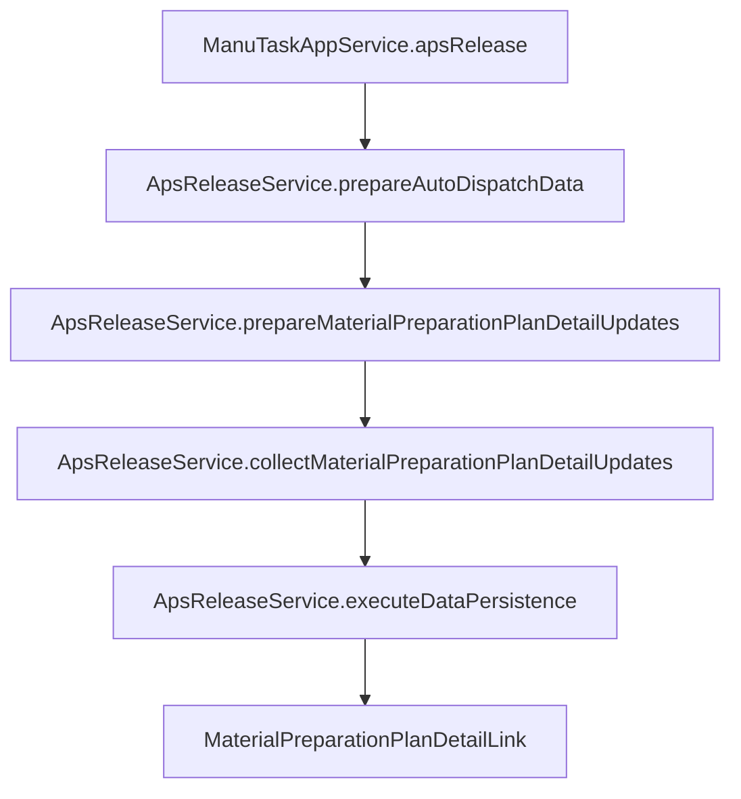
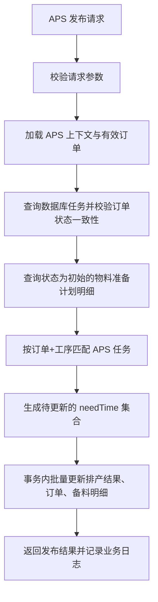

# DNW30330-排产和物料准备计划联通设计文档

## 0. 文档信息

| 项目 | 内容 |
| --- | --- |
| 需求编号 | DNW30330 |
| 需求名称 | 备料管理 |
| 文档版本 | V1.0 |
| 编写日期 | 2026-04-10 |
| 关联需求 | `tasks/DNW30330-备料管理/DNW30330-备料管理.md` |
| 关联模板 | `tasks/需求功能设计方案模板.md` |
| 关联代码 | `km-mom-mes/km-mom-mes-biz/km-mom-mes-biz-execution/src/main/java/com/kmsoft/mom/mes/biz/execution/application/ManuTaskAppService.java` |

---

## 1. 概述

### 1.1 背景

`DNW30330-备料管理` 在 `3.5 计算引擎-计划排程` 中提出了“排程发布后联动物料准备计划”的要求，目标是在 APS 排产结果确定并发布后，自动把制造任务的排程开始时间同步到对应的物料准备计划明细，确保库房侧看到的需求到料时间与最新排程保持一致。

当前系统已经具备以下基础能力：

1. 生产订单释放后，可基于备料清单生成物料准备计划及明细，初始 `needTime` 默认取制造订单计划开始时间。
2. `ManuTaskAppService#apsRelease` 已作为 APS 发布统一入口，内部通过 `ApsReleaseService` 完成排产结果持久化、制造订单回写和自动派工处理。
3. 现有 `ApsReleaseService` 已具备“按制造订单 + 工序匹配物料准备计划明细，并批量更新 `needTime`”的基础实现。

本次设计的重点不是新增一条独立链路，而是在现有 APS 发布链路上固化“排产和物料准备计划联通”的业务规则、边界和改造范围，并明确本次暂不落地配送点属性同步。

### 1.2 设计目标

1. 梳理 `3.5 计算引擎` 对排产联动物料准备计划的业务口径，形成可执行设计。
2. 复用 `apsRelease` 现有发布链路，在排产结果发布时统一处理物料准备计划明细同步。
3. 明确只允许更新“初始”状态的物料准备计划明细，避免覆盖已申请、已收料后的人工业务结果。
4. 保持物料准备计划已有查询、领料申请、收料确认链路不变，仅让这些功能消费排产后更新过的 `needTime`。
5. 显式限定本次不更新配送点属性，避免需求范围扩散到主数据、页面、DDL 和工作中心扩展改造。

### 1.3 本次范围

本次方案范围包括：

- 梳理 `3.5.1 计算引擎-计划排程` 中与排产联动物料准备计划直接相关的需求
- 基于 `ManuTaskAppService#apsRelease` 现有实现，设计排产发布后同步物料准备计划明细的处理链路
- 明确物料准备计划明细 `needTime` 的更新时机、匹配规则、状态约束、日志口径和异常处理
- 明确后续代码改造主要落点为执行域 APS 发布链路

### 1.4 非范围

本次方案不包括：

- 不更新物料准备计划明细的配送点属性
- 不新增配送点字段、工作中心配送点主数据、配送点下拉配置或 DDL
- 不改造任务派工、任务协调、任务开工等非 APS 发布场景下的备料时间同步
- 不新增独立的“排产同步物料准备计划”手工按钮或接口
- 不改造物料准备计划推送、领料申请、收料确认、齐套分析的页面交互
- 不处理已申请、已收料明细的回退重算

### 1.5 核心设计决策

| 决策项 | 选择 | 原因 |
| --- | --- | --- |
| 联通触发点 | 复用 `apsRelease` | APS 发布是排产结果最终落库时点，最符合需求“结果确定发布后更新” |
| 同步对象 | `MaterialPreparationPlanDetailLink.needTime` | 当前实体已具备 `needTime` 字段，且现有领料申请直接消费该字段 |
| 匹配维度 | 制造订单 + 工序号 + 工序名称 | 与现有 `ApsReleaseService` 的分组与匹配逻辑一致，改造成本最低 |
| 可更新状态 | 仅 `初始` | 满足“已申请/已收料不允许更新”的业务约束 |
| 配送点处理 | 本次不做 | 当前实体无字段、工作中心模型未体现配送点，扩展范围过大 |
| 兜底时间 | 未匹配到任务时回退制造订单计划开始时间 | 保持 `needTime` 非空，兼容异常或不完整工序匹配数据 |

---

## 2. 需求拆解

### 2.1 用户角色

本次功能直接或间接服务以下角色：

- 生产计划员
- APS 排产发布操作人
- 库房备料人员
- 物料准备计划管理页面

### 2.2 3.5 计算引擎需求梳理

结合 `tasks/DNW30330-备料管理/DNW30330-备料管理.md` 的 `2.1.2.3`、`2.1.2.4` 与 `3.5.1`，本次需要落地的口径如下：

1. 触发时机：
   APS 排程结束后，无论首次排程还是重复排程，只要结果确定并发布，就需要检查制造订单是否关联物料准备计划。
2. 更新对象：
   若制造订单存在物料准备计划，则更新其物料准备计划明细。
3. 更新时间口径：
   工序物料的需求到料时间等于对应制造任务的计划开始时间。
4. 状态约束：
   仅当物料准备计划明细状态为“初始”时允许更新。
   当明细状态为“已申请”或“已收料”时，不允许再更新需求到料时间。
5. 业务边界：
   任务派工或协调后不更新物料明细需求到料时间，本次仅在 APS 发布链路处理。
6. 日志要求：
   需记录业务日志，至少能体现本次排程发布联动更新了多少条物料准备计划明细。
7. 范围裁剪：
   原始需求写有“配送点=制造任务关联工作中心上的配送点”，但本次明确不更新配送点属性，只落地需求到料时间联通。

### 2.3 业务场景

| 场景 | 触发条件 | 用户动作 | 系统结果 |
| --- | --- | --- | --- |
| 场景1：首次排程发布 | 制造订单首次完成 APS 排产并发布 | 发布排产结果 | 同步初始状态备料明细的 `needTime` |
| 场景2：重复排程发布 | 制造订单已排程，再次重排并发布 | 重新发布排产结果 | 重新同步仍为初始状态的备料明细 `needTime` |
| 场景3：明细已申请 | 备料明细已发起领料申请 | 发布排产结果 | 跳过该明细，不更新 `needTime` |
| 场景4：明细已收料 | 备料明细已完成收料 | 发布排产结果 | 跳过该明细，不更新 `needTime` |
| 场景5：订单无备料计划 | 制造订单未生成物料准备计划 | 发布排产结果 | 不做备料明细更新，不影响 APS 发布成功 |

### 2.4 功能清单

| 功能项 | 描述 | 优先级 | 是否本次实现 |
| --- | --- | --- | --- |
| APS 发布联动备料时间更新 | 在 APS 发布时回写物料准备计划明细 `needTime` | P0 | 是 |
| 初始状态限制 | 仅更新“初始”状态明细 | P0 | 是 |
| 发布日志统计 | 输出同步更新明细数量 | P0 | 是 |
| 配送点同步 | 同步工作中心配送点到备料明细 | P1 | 否 |
| 派工/协调联动更新时间 | 在班组级调度后调整备料时间 | P1 | 否 |

### 2.5 验收标准

1. APS 发布成功后，存在物料准备计划的制造订单，其“初始”状态明细 `needTime` 会按对应工序任务计划开始时间更新。
2. APS 重复发布时，仍为“初始”状态的明细可继续被刷新为最新排产时间。
3. 处于“已申请”或“已收料”状态的明细不会被本次排程发布覆盖。
4. 制造订单不存在物料准备计划时，APS 发布流程不报错，不影响排程发布结果。
5. 发布结果日志中能体现本次同步更新的物料准备计划明细数量。
6. 本次设计和实现不包含配送点字段更新，也不引入相关页面和数据结构改造。

---

## 3. 总体方案设计

### 3.1 方案总览

本方案采用“执行域 APS 发布链路内联同步”的方式，不新增独立接口、不新增调度任务。整体流程如下：

1. `ManuTaskAppService#apsRelease` 作为 APS 发布入口，负责调用领域服务完成排产发布。
2. `ApsReleaseService#prepareAutoDispatchData` 在准备自动派工数据时，无论是否开启自动派工，都先准备物料准备计划明细待更新集合。
3. `ApsReleaseService#prepareMaterialPreparationPlanDetailUpdates` 按发布订单筛选可同步订单，并查询状态为“初始”的物料准备计划明细。
4. `ApsReleaseService#collectMaterialPreparationPlanDetailUpdates` 按“制造订单 + 工序号 + 工序名称”匹配 APS 任务，生成仅包含 `id`、`entityType`、`needTime` 的更新对象。
5. `ApsReleaseService#executeDataPersistence` 在同一事务内批量更新物料准备计划明细。
6. APS 发布返回消息与系统日志输出同步更新数量，作为业务留痕。

该方案的关键点是：排产结果与备料计划的联通只发生在 APS 发布确认之后，且仅更新允许被重算的明细，保证排程与备料的一致性，同时不破坏已经进入领料/收料阶段的业务数据。

### 3.2 模块关系图



### 3.3 分层职责

| 层级 | 类/模块 | 职责 |
| --- | --- | --- |
| 应用层 | `ManuTaskAppService` | 作为 APS 发布统一入口，承接请求并返回发布结果 |
| 领域层 | `ApsReleaseService` | 组织排产发布、收集待更新明细、执行事务内批量持久化 |
| 计划域 | `MaterialPreparationPlanCreateService` | 创建物料准备计划时初始化默认 `needTime` |
| 数据模型 | `MaterialPreparationPlanDetailLink` | 承载 `needTime`、工序信息、状态等备料明细属性 |
| 枚举模型 | `MaterialPreparePlanDetailBizStatusEnum` | 定义“初始/已申请/已收料”状态口径 |

---

## 4. 数据设计

### 4.1 核心对象

| 对象 | 类型 | 说明 |
| --- | --- | --- |
| `ManuTaskApsDTO` | DTO | APS 返回的制造任务排程结果，提供任务计划开始时间 |
| `ManuOrderApsDTO` | DTO | APS 返回的制造订单结果，提供订单维度计划时间和任务集合 |
| `MaterialPreparationPlanDetailLink` | 实体 | 物料准备计划明细，存放工序、状态、需求到料时间 |
| `AutoDispatchContext` | DTO | APS 发布过程上下文，承载待更新备料明细集合 |
| `MaterialPreparePlanDetailBizStatusEnum` | 枚举 | 备料明细状态：初始、已申请、已收料 |

### 4.2 关键字段设计

#### 4.2.1 `MaterialPreparationPlanDetailLink`

| 字段 | 类型 | 必填 | 说明 |
| --- | --- | --- | --- |
| `id` | Long | 是 | 物料准备计划明细主键 |
| `manuOrder` | ObjectReference | 是 | 所属制造订单 |
| `processCode` | String | 否 | 工序号，作为匹配 APS 任务的主键之一 |
| `processName` | String | 否 | 工序名称，作为匹配 APS 任务的主键之一 |
| `needTime` | LocalDateTime | 否 | 需求到料时间，本次联通唯一更新字段 |
| `bizStatus` | String | 是 | 明细状态，仅 `CREATED` 可更新 |

### 4.3 数据关系

1. 一个制造订单对应一个物料准备计划主表。
2. 一个制造订单可对应多条物料准备计划明细。
3. 一条物料准备计划明细通过 `manuOrder + processCode + processName` 与排产任务建立业务匹配关系。
4. 同一制造订单下，相同工序可能对应多条物料准备计划明细，本次按工序整组同步为同一个 `needTime`。

### 4.4 存储设计

本次不新增表、不新增字段、不调整索引。

数据层仅更新现有 `MaterialPreparationPlanDetailLink.needTime` 字段，且只对状态为 `MaterialPreparePlanDetailBizStatusEnum.CREATED` 的记录执行更新。

---

## 5. 接口设计

### 5.1 输入输出设计

本需求不新增外部接口，沿用现有 APS 发布接口。

| 入口 | 方法 | 用途 | 调用方 |
| --- | --- | --- | --- |
| `ManuTaskAppService#apsRelease` | 应用服务方法 | 发布 APS 排产结果，并联动物料准备计划明细 | APS 发布前端/排程调用链 |

### 5.2 入参设计

#### 5.2.1 APS 发布入参

`ScheduleReleaseRequestDTO`

本次设计不新增入参字段，继续沿用现有 APS 发布入参。与备料联通相关的关键入参语义如下：

| 字段 | 类型 | 必填 | 说明 |
| --- | --- | --- | --- |
| `sessionKey` | String | 是 | APS 会话标识，用于获取本次排产结果 |
| `factoryId` | Long | 否 | 当前发布工厂，用于日志和上下文识别 |
| `autoDispatchConfig` | Boolean | 否 | 是否自动派工，不影响本次备料联通是否执行 |

### 5.3 出参设计

#### 5.3.1 APS 发布结果

`ManuTaskApsResult`

本次不新增结构字段，但需在 `msg` 中体现“同步更新物料准备计划明细数量”。

现有返回消息口径保持如下：

1. 排程发布成功类型（自动派工/非自动派工）
2. 排产资源类型
3. 同步更新物料准备计划明细数量
4. 自动派工场景下的成功/失败任务统计

### 5.4 错误处理

| 场景 | 处理方式 |
| --- | --- |
| APS 发布参数非法 | 沿用现有 `apsReleaseValidate` 校验并阻断 |
| APS 上下文获取失败 | 沿用现有 `apsReleaseService.getAndValidateContext` 异常口径 |
| 制造订单无物料准备计划 | 跳过备料明细更新，不报错 |
| 制造订单状态不一致 | 跳过该订单的任务与备料明细更新 |
| 明细未匹配到排产任务 | 回退制造订单计划开始时间，避免 `needTime` 为空 |

---

## 6. 核心业务逻辑

### 6.1 主流程



### 6.2 关键规则

1. 当 APS 发布开始处理有效制造订单时，系统无论是否开启自动派工，都必须准备物料准备计划明细更新数据，保证“排产联通备料计划”与自动派工解耦。
2. 当制造订单处于状态不一致名单中时，系统跳过该订单对应的备料明细更新，结果与任务更新保持一致，避免基于过期任务状态同步错误时间。
3. 当查询物料准备计划明细时，系统只查询 `bizStatus = CREATED` 的明细，最终结果是仅“初始”状态明细允许被 APS 发布重算。
4. 当同一制造订单下相同工序存在多条物料准备计划明细时，系统按工序整组同步同一个 `needTime`，保持同工序物料的到料时间口径一致。
5. 当物料准备计划明细成功匹配到 APS 任务时，系统取该任务 `planBeginTime` 作为最新 `needTime`。
6. 当物料准备计划明细未匹配到 APS 任务时，系统回退取制造订单 `planBeginTime` 作为 `needTime` 兜底值。
7. 当 APS 发布事务提交时，系统将排产结果落库、制造订单更新、物料准备计划明细更新放在同一事务中执行，保证发布结果和备料时间的一致性。
8. 当 APS 发布完成时，系统需在返回消息和系统日志中记录“同步更新物料准备计划明细数量”。
9. 当需求中涉及配送点时，本次系统不更新该属性，不在本流程做工作中心查询和字段回写。

### 6.3 边界场景

| 场景 | 风险 | 当前处理 |
| --- | --- | --- |
| 制造订单没有物料准备计划 | 发布误报失败 | 跳过，不影响 APS 发布 |
| 明细状态已申请/已收料 | 覆盖人工业务结果 | 通过只查询 `CREATED` 明细规避 |
| 排产结果中工序名称或工序号与明细不一致 | 明细匹配不到任务 | 回退制造订单计划开始时间，并保留后续数据治理空间 |
| 同工序多条物料明细 | 时间口径不一致 | 按同工序整组更新同一 `needTime` |
| 重新排产后只有部分明细仍是初始 | 局部刷新不一致 | 仅刷新初始明细，已申请/已收料保持原值 |

### 6.4 伪代码

```java
1. 校验 APS 发布参数
2. 获取 APS 有效订单和数据库任务
3. 识别状态不一致订单并剔除
4. 查询这些订单下 bizStatus = CREATED 的物料准备计划明细
5. 按 制造订单 + 工序号 + 工序名称 对明细分组
6. 按 制造订单 + 工序号 + 工序名称 建立数据库任务与 APS 任务映射
7. 对每组明细：
8.     若匹配到 APS 任务，则 needTime = task.planBeginTime
9.     否则 needTime = order.planBeginTime
10.    组装仅包含 id/entityType/needTime 的更新对象
11. 事务内批量更新物料准备计划明细
12. 返回“同步更新物料准备计划明细数量”日志与消息
```

---

## 7. 与现有系统的关系

### 7.1 依赖现状

本方案依赖以下现有能力：

1. `MaterialPreparationPlanCreateService` 在订单释放生成物料准备计划时初始化明细 `needTime`。
2. `ManuTaskAppService#apsRelease` 提供 APS 发布统一入口。
3. `ApsReleaseService#prepareAutoDispatchData` 已经负责准备 APS 发布过程中的扩展上下文。
4. `ApsReleaseService#collectMaterialPreparationPlanDetailUpdates` 已存在按订单和工序同步 `needTime` 的基础实现。
5. `ApsReleaseService#executeDataPersistence` 已支持事务内批量更新物料准备计划明细。
6. `MaterialPreparationPlanAppService` 的领料申请等业务直接消费物料准备计划明细上的 `needTime`，无需新增联动代码。

### 7.2 影响分析

| 影响对象 | 影响类型 | 说明 |
| --- | --- | --- |
| APS 发布链路 | 复用/局部改造 | 继续作为唯一触发点处理备料明细同步 |
| 物料准备计划生成链路 | 兼容 | 初始 `needTime` 仍取订单计划开始时间，APS 发布后再覆盖 |
| 物料准备计划领料申请 | 兼容 | 页面与申请逻辑直接读取更新后的 `needTime` |
| 自动派工逻辑 | 兼容 | 是否自动派工不影响备料时间同步 |
| 配送点相关主数据 | 不涉及 | 本次明确不进入改造范围 |

### 7.3 兼容策略

1. 保留物料准备计划创建时“默认 `needTime = 制造订单计划开始时间`”的现有逻辑，作为 APS 发布前的初始值。
2. 保留 APS 发布现有入口和返回结构，不新增新的对外接口。
3. 保持“仅 `CREATED` 明细可更新”的策略，与现有领料申请将明细状态置为 `STARTED` 的行为天然兼容。
4. 对未匹配到任务的工序采用订单级计划开始时间兜底，减少因历史数据质量问题导致的空值。
5. 本次不引入配送点字段，避免与现有物料准备计划实体、工作中心实体和页面结构产生不兼容变更。

### 7.4 受影响文档与文件清单

| 类别 | 对象类型 | 文件/目录 | 说明 |
| --- | --- | --- | --- |
| 新增 | 文档 | `tasks/DNW30330-备料管理/DNW30330-排产和物料准备计划联通设计文档.md` | 本设计文档 |
| 更新 | 代码 | `km-mom-mes/km-mom-mes-biz/km-mom-mes-biz-execution/src/main/java/com/kmsoft/mom/mes/biz/execution/application/ManuTaskAppService.java` | APS 发布入口，保留编排与返回消息口径 |
| 更新 | 代码 | `km-mom-mes/km-mom-mes-biz/km-mom-mes-biz-execution/src/main/java/com/kmsoft/mom/mes/biz/execution/domain/ApsReleaseService.java` | 物料准备计划明细同步核心逻辑 |
| 兼容 | 代码 | `km-mom-mes/km-mom-mes-biz/km-mom-mes-biz-planning/src/main/java/com/kmsoft/mom/mes/biz/planning/domain/materialinventory/MaterialPreparationPlanCreateService.java` | 物料准备计划创建时的默认 `needTime` 初始化逻辑 |
| 兼容 | 代码 | `km-mom-mes/km-mom-mes-biz/km-mom-mes-biz-planning/src/main/java/com/kmsoft/mom/mes/biz/planning/application/MaterialPreparationPlanAppService.java` | 继续消费更新后的 `needTime` |
| 兼容 | 代码 | `km-mom-platform/km-mom-platform-dm/src/main/java/com/kmsoft/mom/platform/dm/model/entity/mes/materialprepareplan/MaterialPreparationPlanDetailLink.java` | 当前实体只包含 `needTime`，本次不扩展配送点 |
| 兼容 | 代码 | `km-mom-platform/km-mom-platform-dm/src/main/java/com/kmsoft/mom/platform/dm/model/enums/mes/MaterialPreparePlanDetailBizStatusEnum.java` | 明细状态口径定义 |

工程目录结构视图：

```text
km-mom-next/
├── km-mom-mes/
│   └── km-mom-mes-biz/
│       ├── km-mom-mes-biz-execution/
│       │   └── src/main/java/com/kmsoft/mom/mes/biz/execution/
│       │       ├── application/
│       │       │   └── ManuTaskAppService.java                    # 更新：APS 发布入口编排与返回消息
│       │       └── domain/
│       │           └── ApsReleaseService.java                     # 更新：排产联动物料准备计划明细核心逻辑
│       └── km-mom-mes-biz-planning/
│           └── src/main/java/com/kmsoft/mom/mes/biz/planning/
│               ├── application/
│               │   └── MaterialPreparationPlanAppService.java     # 兼容：继续消费 needTime
│               └── domain/materialinventory/
│                   └── MaterialPreparationPlanCreateService.java  # 兼容：初始化默认 needTime
├── km-mom-platform/
│   └── km-mom-platform-dm/
│       └── src/main/java/com/kmsoft/mom/platform/dm/model/
│           ├── entity/mes/materialprepareplan/
│           │   └── MaterialPreparationPlanDetailLink.java         # 兼容：当前无配送点字段
│           └── enums/mes/
│               └── MaterialPreparePlanDetailBizStatusEnum.java    # 兼容：定义初始/已申请/已收料
└── tasks/
    └── DNW30330-备料管理/
        └── DNW30330-排产和物料准备计划联通设计文档.md            # 新增：设计方案
```

---

## 8. 非功能设计

### 8.1 性能要求

1. 禁止在 APS 发布时按明细逐条查任务或逐条更新备料明细。
2. 继续采用“批量查任务 + 批量查明细 + 内存分组匹配 + 批量更新”的方式，符合仓库性能红线要求。
3. 物料准备计划明细查询需先按订单集合和状态过滤，避免先全量查询后内存筛选。

### 8.2 审计与日志

1. 复用 APS 发布现有系统日志能力，日志动作名保持“排程结果发布”。
2. 日志内容至少包含工厂、排程发布类型、排产资源类型、同步更新物料准备计划明细数量。
3. 如后续需要增强，可再补充“跳过订单数、跳过明细状态数”等诊断指标，但本次不作为必做项。

### 8.3 幂等与一致性

1. 同一批 APS 结果重复发布时，只要明细仍处于“初始”状态，即可按最新 `planBeginTime` 重复覆盖，行为符合业务预期。
2. 物料准备计划明细更新与 APS 发布其他落库动作在同一事务中提交，避免出现“排产已发布但备料时间未更新”或反向不一致。

---

## 9. 实施计划

### 9.1 开发拆分

| 阶段 | 目标 | 输出 |
| --- | --- | --- |
| 阶段1 | 固化设计与范围边界 | 设计文档、需求口径确认 |
| 阶段2 | 调整 APS 发布同步逻辑 | `ApsReleaseService` 改造 |
| 阶段3 | 校验返回消息与日志 | `ManuTaskAppService` / `ApsReleaseService` 联调 |
| 阶段4 | 完成单测和编译验证 | 测试类、编译结果、验证记录 |

### 9.2 开发顺序

1. 先确认 `3.5` 需求口径，明确“本次不更新配送点”。
2. 再核对 `ApsReleaseService` 当前实现与需求差异，补齐缺失规则。
3. 补充单元测试，覆盖首次排程、重复排程、已申请/已收料跳过、未匹配任务兜底等场景。
4. 最后执行受影响模块编译与测试验证。

### 9.3 验证方案

| 验证项 | 验证方式 | 预期结果 |
| --- | --- | --- |
| 初始明细更新时间 | 单元测试/调试 `collectMaterialPreparationPlanDetailUpdates` | `needTime` 更新为任务计划开始时间 |
| 已申请明细保护 | 构造 `STARTED` 状态明细 | 不出现在待更新集合中 |
| 已收料明细保护 | 构造 `COMPLETED` 状态明细 | 不出现在待更新集合中 |
| 未匹配工序兜底 | 构造找不到任务的明细 | `needTime` 回退订单计划开始时间 |
| 发布日志统计 | 校验 APS 返回消息 | 包含同步更新明细数量 |

---

## 10. 风险与待确认项

### 10.1 风险项

| 风险 | 影响 | 应对策略 |
| --- | --- | --- |
| 工序匹配依赖工序号和工序名称 | 上游数据不规范可能导致匹配失败 | 保留订单计划开始时间兜底，并推动后续数据治理 |
| 原始需求包含配送点 | 若未明确裁剪，容易被误认为遗漏 | 在设计文档和实施边界中显式声明本次不做 |
| APS 发布与备料计划耦合增强 | 后续维护需理解联动关系 | 把同步逻辑集中在 `ApsReleaseService` 内，避免分散到多处 |
| 已申请后重排时间不更新 | 用户可能认为时间未刷新是缺陷 | 在需求和培训口径中说明这是保护已进入执行阶段数据的业务约束 |

### 10.2 待确认项

| 问题 | 当前结论 | 后续处理人 |
| --- | --- | --- |
| 配送点是否后续补做 | 本次不做，后续单独立项 | 产品/架构 |
| 工序匹配是否只依赖工序号即可 | 当前沿用“工序号 + 工序名称” | 开发/产品 |
| 已申请明细未来是否允许人工确认后强制刷新 | 本次不支持 | 产品 |
| 业务日志是否需要记录明细级变更内容 | 本次只要求记录汇总数量 | 开发/产品 |

---

## 11. AI执行说明

### 11.1 本需求的实现边界

1. 本次只处理 APS 发布后对物料准备计划明细 `needTime` 的同步。
2. 本次不允许扩展到配送点字段、配送点页面、配送点主数据或工作中心模型改造。
3. 本次不允许把同步时机扩展到派工、协调、开工、报工等其他操作。
4. 本次不允许修改无关模块或引入独立的手工同步入口。

### 11.2 AI任务拆解建议

1. 核对 `ApsReleaseService` 现有逻辑与本设计的差异。
2. 只在执行域 APS 发布链路内补齐或收敛规则。
3. 为 `collectMaterialPreparationPlanDetailUpdates` 增补单元测试。
4. 验证 APS 返回消息和系统日志统计。
5. 执行受影响模块编译与测试。

### 11.3 AI执行约束

1. 必须优先复用现有 `apsRelease` 和 `ApsReleaseService` 链路。
2. 必须遵守“只更新初始状态明细”的规则，不得误更新已申请、已收料数据。
3. 必须保持批量查询、批量更新，不得引入循环查库或逐条更新。
4. 不得在本次实现中新增配送点字段或相关配置。
5. 如代码与需求冲突，以本设计文档中明确的本次范围为准，并保留待确认项。

### 11.4 完成标准

1. APS 发布后，初始状态物料准备计划明细的 `needTime` 能按排程结果正确更新。
2. 已申请、已收料状态明细不会被覆盖。
3. 返回消息或日志中能看到同步更新的明细数量。
4. 本次实现未引入配送点相关改造。
5. 受影响模块编译通过，新增或受影响单元测试通过。

---

## 附录

### A. 参考文档

- `tasks/DNW30330-备料管理/DNW30330-备料管理.md`
- `tasks/需求功能设计方案模板.md`
- `docs/standards/ai-development-collaboration-standard.md`

### B. 术语说明

| 术语 | 说明 |
| --- | --- |
| APS 发布 | 将 APS 排产结果正式落库并生效的动作 |
| 物料准备计划明细 | 制造订单备料需求的工序级物料明细 |
| `needTime` | 物料准备计划明细的需求到料时间 |
| 初始状态 | `MaterialPreparePlanDetailBizStatusEnum.CREATED` |
| 已申请状态 | `MaterialPreparePlanDetailBizStatusEnum.STARTED` |
| 已收料状态 | `MaterialPreparePlanDetailBizStatusEnum.COMPLETED` |
