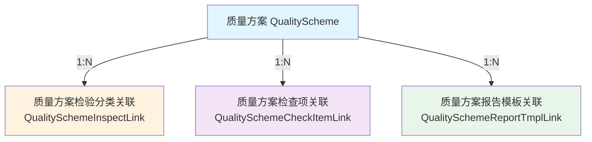
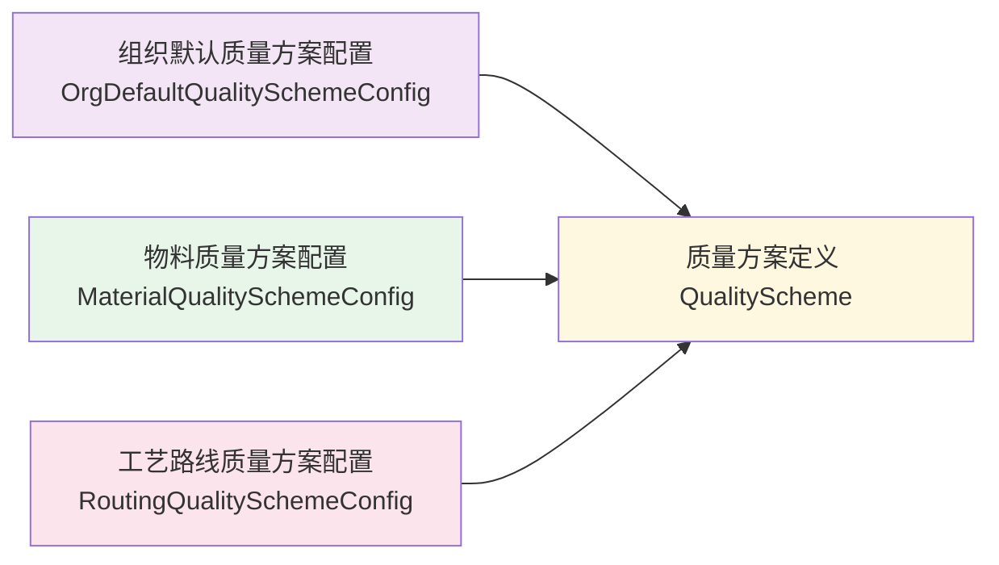
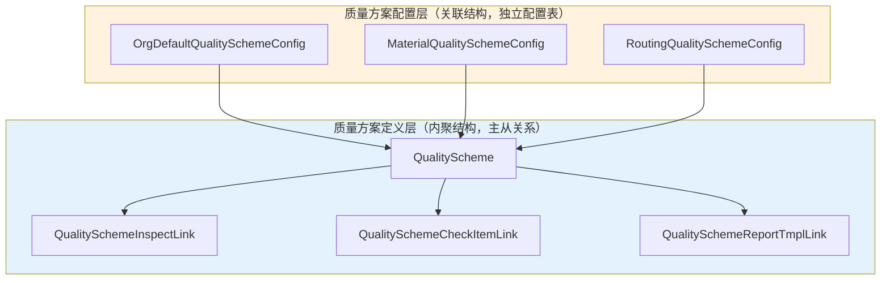
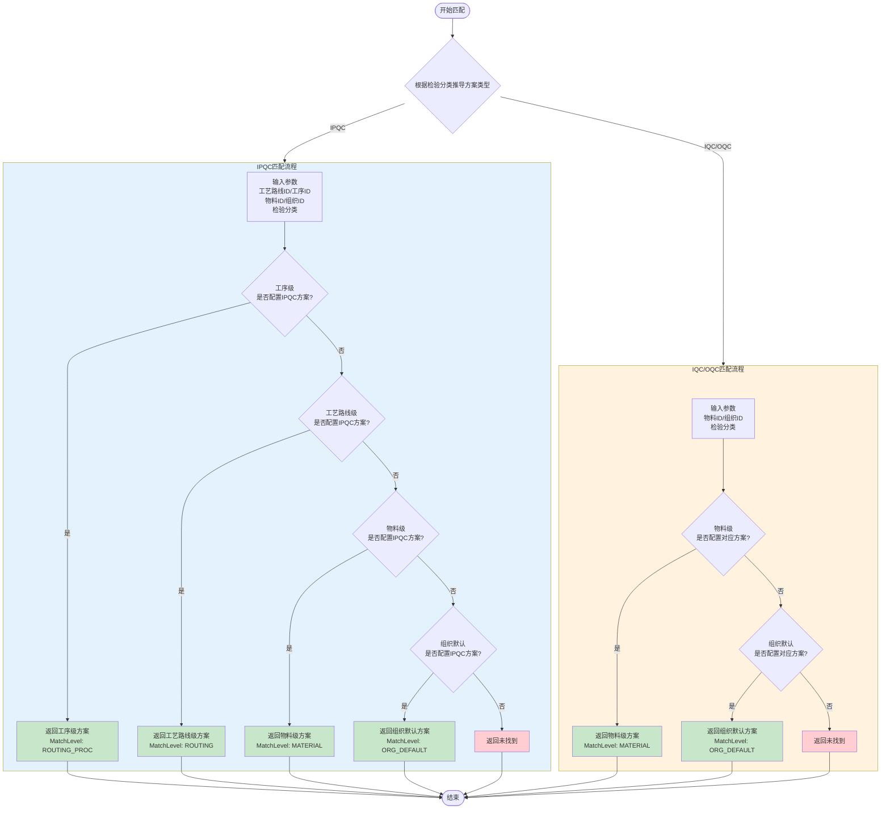
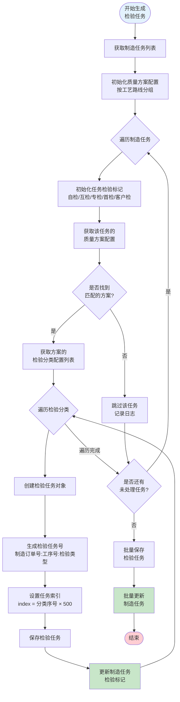
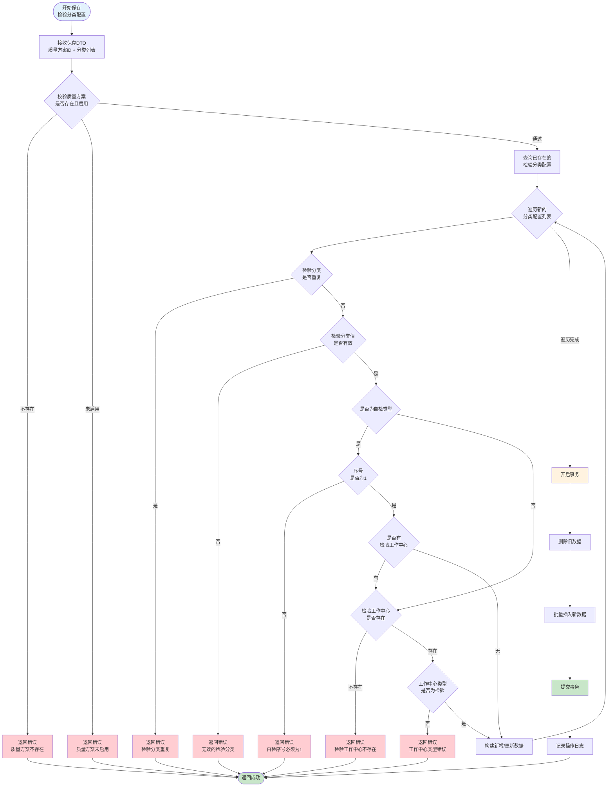
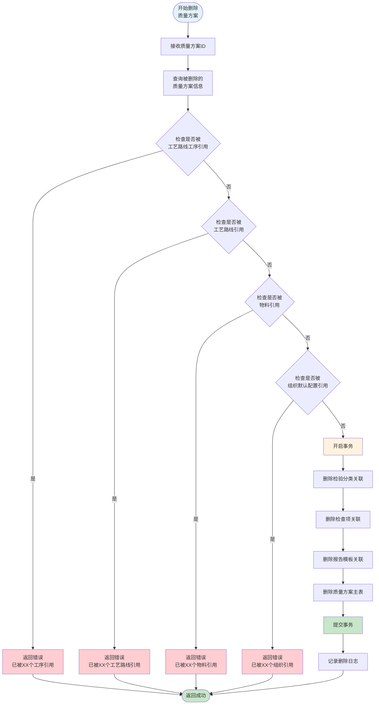
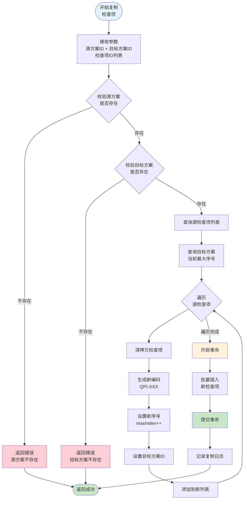

# DNW30500-质量方案设计文档

## 1. 概述

### 1.1 设计目标
实现统一的质量方案管理功能，覆盖IQC/IPQC/OQC全场景，支持多维度配置和优先级匹配策略。

### 1.2 核心设计决策

| 决策项 | 选择 | 说明 |
|--------|------|------|
| 检查项管理 | 内嵌定义+方案间复制 | 不独立建库，降低管理开销 |
| 报告模板 | 引用现有质量报告模板 | 复用系统中已存在的模板 |
| 匹配时机 | 实时计算 | 业务触发时按优先级逐级查找 |
| 与现有功能关系 | 完全替换 | 替换现有的工艺检验分类配置功能 |
| 方案唯一性约束 | 方案编码唯一 | 系统生成唯一编码 QP-XXX |
| 配置维度 | 配置表按固定方案类型列存储 | 组织默认配置IQC/IPQC/OQC，物料配置IQC/IPQC/OQC，工艺路线/工序配置IPQC |

## 2. 数据模型设计

### 2.1 实体关系图

#### 2.1.1 质量方案定义（主从结构）



#### 2.1.2 质量方案配置（业务对象关联）



#### 2.1.3 完整关系说明



### 2.2 实体定义

#### 2.2.1 质量方案 (QualityScheme)

**继承**: `BusinessObject`（需要编码字段）
**实现接口**: `FactoryManaged`

| 字段名 | 类型 | 必填 | 说明 |
|--------|------|------|------|
| id | Long | Y | 主键 |
| code | String | Y | 方案编码，系统生成 QP-XXX |
| name | String | Y | 方案名称 |
| schemeType | String | Y | 方案类型：IPQC/IQC/OQC |
| enabled | Boolean | Y | 启用状态 |
| bizOrg | BizOrg | Y | 业务组织 |
| factory | BizOrg | Y | 所属工厂 |

**唯一约束**: `UNIQUE KEY UK_SCHEME_CODE (CCODE)`
> 方案编码唯一

#### 2.2.2 质量方案检验分类关联 (QualitySchemeInspectLink)

**继承**: `BaseObject`
**实现接口**: 无（子表，不独立管理）

| 字段名 | 类型 | 必填 | 说明 |
|--------|------|------|------|
| id | Long | Y | 主键 |
| qualityScheme | ObjectReference | Y | 质量方案 |
| inspectCategory | String | Y | 检验分类枚举值（首检/互检/专检等） |
| inspectWorkCenter | ObjectReference | N | 检验工作中心，自检可为空 |
| index | Integer | Y | 序号 |

**唯一约束**: `UNIQUE KEY UK_SCHEME_CATEGORY (CQUALITY_SCHEME, CINSPECT_CATEGORY)`
> 一个质量方案内检验分类不能重复

#### 2.2.3 质量方案检查项关联 (QualitySchemeCheckItemLink)

**继承**: `BaseObject`
**实现接口**: 无（子表，不独立管理）

| 字段名 | 类型 | 必填 | 说明 |
|--------|------|------|------|
| id | Long | Y | 主键 |
| qualityScheme | ObjectReference | Y | 质量方案 |
| code | String | Y | 检查项编码，系统生成 QPI-XXX |
| name | String | Y | 检查项名称 |
| tooling | ObjectReference | N | 工装工具引用，为空表示该检查项不限制工装 |
| characteristicType | String | Y | 检验特性类型：QUANTITY-定量/PROPERTY-定性 |
| standardValue | String | N | 标准值 |
| upperLimit | String | N | 上限值（定量时必填） |
| lowerLimit | String | N | 下限值（定量时必填） |
| index | Integer | Y | 序号 |

#### 2.2.4 质量方案报告模板关联 (QualitySchemeReportTmplLink)

**继承**: `BaseObject`
**实现接口**: 无（关联表）

| 字段名 | 类型 | 必填 | 说明 |
|--------|------|------|------|
| id | Long | Y | 主键 |
| qualityScheme | ObjectReference | Y | 质量方案 |
| reportTmpl | ObjectReference | Y | 质量报告模板 |
| index | Integer | Y | 序号，用于报告模板展示顺序 |

#### 2.2.5 物料质量方案配置 (MaterialQualitySchemeConfig)

**继承**: `BaseObject`
**实现接口**: 无（关联配置表）

| 字段名 | 类型 | 必填 | 说明 |
|--------|------|------|------|
| id | Long | Y | 主键 |
| material | ObjectReference | Y | 物料 |
| iqcQualityScheme | ObjectReference | N | 入库检质量方案 |
| ipqcQualityScheme | ObjectReference | N | 过程检质量方案 |
| oqcQualityScheme | ObjectReference | N | 出库检质量方案 |

**唯一约束**: `UNIQUE KEY UK_MATERIAL (CMATERIAL)`
> 一个物料保留一条质量方案配置记录，分别维护IQC/IPQC/OQC三个方案引用

#### 2.2.6 组织默认质量方案配置 (OrgDefaultQualitySchemeConfig)

**继承**: `BaseObject`
**实现接口**: 无（关联配置表）

| 字段名 | 类型 | 必填 | 说明 |
|--------|------|------|------|
| id | Long | Y | 主键 |
| bizOrg | ObjectReference | Y | 组织 |
| iqcQualityScheme | ObjectReference | N | 入库检默认质量方案 |
| ipqcQualityScheme | ObjectReference | N | 过程检默认质量方案 |
| oqcQualityScheme | ObjectReference | N | 出库检默认质量方案 |

**唯一约束**: `UNIQUE KEY UK_ORG (CBIZ_ORG)`
> 一个组织保留一条默认质量方案配置记录，分别维护IQC/IPQC/OQC三个方案引用

#### 2.2.7 工艺路线质量方案配置 (RoutingQualitySchemeConfig)

**继承**: `BaseObject`
**实现接口**: `FactoryManaged`（含工厂字段）

| 字段名 | 类型 | 必填 | 说明 |
|--------|------|------|------|
| id | Long | Y | 主键 |
| routing | ObjectReference | Y | 工艺路线 |
| routingProc | ObjectReference | N | 工序（为空表示工艺路线级） |
| ipqcQualityScheme | ObjectReference | N | 过程检质量方案 |
| bizOrg | BizOrg | Y | 业务组织 |
| factory | BizOrg | Y | 所属工厂 |

**唯一约束**:
- 工序级：`routingProc` 唯一
- 工艺路线级：同一路线仅允许一条 `routingProc = null` 的配置（由数据库唯一索引或服务层双重保证）

**说明**: 工艺路线/工序只配置一个IPQC方案，首检/互检/专检等检验分类定义在质量方案内部

### 2.3 数据表设计

```sql
-- 质量方案主表
CREATE TABLE MOM_QUALITY_SCHEME (
    CID BIGINT PRIMARY KEY,
    CCODE VARCHAR(50) NOT NULL,
    CNAME VARCHAR(100) NOT NULL,
    CSCHEME_TYPE VARCHAR(20) NOT NULL COMMENT '方案类型：IPQC/IQC/OQC',
    CENABLED TINYINT(1) DEFAULT 1,
    CBIZ_ORG VARCHAR(500),
    CFACTORY VARCHAR(500),
    CCOMPANY VARCHAR(500),
    CCREATE_TIME DATETIME,
    CCREATE_USER VARCHAR(100),
    CUPDATE_TIME DATETIME,
    CUPDATE_USER VARCHAR(100),
    UNIQUE KEY UK_SCHEME_CODE (CCODE)
);

-- 质量方案检验分类关联（1:N关系）
CREATE TABLE MOM_QUALITY_SCHEME_INSPECT_LINK (
    CID BIGINT PRIMARY KEY,
    CQUALITY_SCHEME BIGINT NOT NULL COMMENT '质量方案ID',
    CINSPECT_CATEGORY VARCHAR(50) NOT NULL COMMENT '检验分类：首检/互检/专检等',
    CINSPECT_WORK_CENTER BIGINT COMMENT '检验工作中心ID（自检可为空）',
    CINDEX INT DEFAULT 0,
    UNIQUE KEY UK_SCHEME_CATEGORY (CQUALITY_SCHEME, CINSPECT_CATEGORY),
    FOREIGN KEY (CQUALITY_SCHEME) REFERENCES MOM_QUALITY_SCHEME(CID)
);

-- 质量方案检查项关联
CREATE TABLE MOM_QUALITY_SCHEME_CHECK_ITEM_LINK (
    CID BIGINT PRIMARY KEY,
    CQUALITY_SCHEME BIGINT NOT NULL COMMENT '质量方案ID',
    CCODE VARCHAR(50) NOT NULL COMMENT '检查项编码',
    CNAME VARCHAR(100) NOT NULL COMMENT '检查项名称',
    CTOOLING BIGINT COMMENT '工装工具ID，为空表示不限制工装',
    CCHARACTERISTIC_TYPE VARCHAR(20) NOT NULL COMMENT '检验特性类型：QUANTITY/PROPERTY',
    CSTANDARD_VALUE VARCHAR(100) COMMENT '标准值',
    CUPPER_LIMIT VARCHAR(100) COMMENT '上限值（定量时必填）',
    CLOWER_LIMIT VARCHAR(100) COMMENT '下限值（定量时必填）',
    CINDEX INT DEFAULT 0,
    FOREIGN KEY (CQUALITY_SCHEME) REFERENCES MOM_QUALITY_SCHEME(CID)
);

-- 质量方案报告模板关联
CREATE TABLE MOM_QUALITY_SCHEME_REPORT_TMPL_LINK (
    CID BIGINT PRIMARY KEY,
    CQUALITY_SCHEME BIGINT NOT NULL COMMENT '质量方案ID',
    CREPORT_TMPL BIGINT NOT NULL COMMENT '报告模板ID',
    CINDEX INT DEFAULT 0 COMMENT '序号，用于展示顺序',
    FOREIGN KEY (CQUALITY_SCHEME) REFERENCES MOM_QUALITY_SCHEME(CID)
);

-- 物料质量方案配置
CREATE TABLE MOM_MATERIAL_QUALITY_SCHEME_CONFIG (
    CID BIGINT PRIMARY KEY,
    CMATERIAL BIGINT NOT NULL COMMENT '物料ID',
    CIQC_QUALITY_SCHEME BIGINT COMMENT '入库检质量方案ID',
    CIPQC_QUALITY_SCHEME BIGINT COMMENT '过程检质量方案ID',
    COQC_QUALITY_SCHEME BIGINT COMMENT '出库检质量方案ID',
    UNIQUE KEY UK_MATERIAL (CMATERIAL)
);

-- 组织默认质量方案配置
CREATE TABLE MOM_ORG_DEFAULT_QUALITY_SCHEME_CONFIG (
    CID BIGINT PRIMARY KEY,
    CBIZ_ORG BIGINT NOT NULL COMMENT '组织ID',
    CIQC_QUALITY_SCHEME BIGINT COMMENT '入库检默认质量方案ID',
    CIPQC_QUALITY_SCHEME BIGINT COMMENT '过程检默认质量方案ID',
    COQC_QUALITY_SCHEME BIGINT COMMENT '出库检默认质量方案ID',
    UNIQUE KEY UK_ORG (CBIZ_ORG)
);

-- 工艺路线质量方案配置（替换原MOM_ROUTING_PROC_INSPECT_CATEGORY）
CREATE TABLE MOM_ROUTING_QUALITY_SCHEME_CONFIG (
    CID BIGINT PRIMARY KEY,
    CROUTING BIGINT NOT NULL COMMENT '工艺路线ID',
    CROUTING_PROC BIGINT COMMENT '工序ID（为空表示工艺路线级）',
    CIPQC_QUALITY_SCHEME BIGINT COMMENT '过程检质量方案ID',
    CBIZ_ORG VARCHAR(500),
    CFACTORY VARCHAR(500),
    UNIQUE KEY UK_ROUTING_PROC (CROUTING, CROUTING_PROC)
);
```

> 说明：若数据库对 `NULL` 的唯一性处理无法满足“同一路线仅允许一条路线级配置”的要求，则需在服务层增加对应校验。

## 3. 接口设计

### 3.1 质量方案管理接口

#### 质量方案CRUD

```java
// 查询质量方案列表
@PostMapping("/qualityScheme/list")
Response<List<QualitySchemeVO>> listQualitySchemes(@RequestBody Request<QualitySchemeQueryDTO> request);

// 获取质量方案详情
@GetMapping("/qualityScheme/detail/{id}")
Response<QualitySchemeDetailVO> getQualitySchemeDetail(@PathVariable("id") Long id);

// 新增质量方案
@PostMapping("/qualityScheme/create")
Response<Long> createQualityScheme(@RequestBody @Valid Request<QualitySchemeCreateDTO> request);

// 更新质量方案
@PostMapping("/qualityScheme/update")
Response<Void> updateQualityScheme(@RequestBody @Valid Request<QualitySchemeUpdateDTO> request);

// 删除质量方案（检查是否被引用）
@PostMapping("/qualityScheme/delete")
Response<Void> deleteQualityScheme(@RequestBody Request<IdDTO> request);

// 启用/禁用质量方案
@PostMapping("/qualityScheme/enable")
Response<Void> enableQualityScheme(@RequestBody Request<QualitySchemeEnableDTO> request);
```

#### 检验分类配置

```java
// 保存检验分类配置（批量，支持增删改）
@PostMapping("/qualityScheme/saveInspectConfigs")
Response<Void> saveInspectConfigs(@RequestBody @Valid Request<SaveInspectConfigsDTO> request);

// 获取检验分类配置列表
@GetMapping("/qualityScheme/listInspectConfigs/{qualitySchemeId}")
Response<List<QualitySchemeInspectLinkVO>> listInspectConfigs(@PathVariable("qualitySchemeId") Long qualitySchemeId);
```

#### 检查项配置

```java
// 保存检查项（单条）
@PostMapping("/qualityScheme/saveCheckItem")
Response<Long> saveCheckItem(@RequestBody @Valid Request<QualitySchemeCheckItemLinkDTO> request);

// 批量保存检查项
@PostMapping("/qualityScheme/batchSaveCheckItems")
Response<Void> batchSaveCheckItems(@RequestBody @Valid Request<BatchSaveCheckItemsDTO> request);

// 获取检查项列表
@GetMapping("/qualityScheme/listCheckItems/{qualitySchemeId}")
Response<List<QualitySchemeCheckItemLinkVO>> listCheckItems(@PathVariable("qualitySchemeId") Long qualitySchemeId);

// 删除检查项
@PostMapping("/qualityScheme/deleteCheckItem")
Response<Void> deleteCheckItem(@RequestBody Request<IdDTO> request);

// 从其他方案复制检查项
@PostMapping("/qualityScheme/copyCheckItems")
Response<Void> copyCheckItems(@RequestBody @Valid Request<CopyCheckItemsDTO> request);
```

#### 报告模板配置

```java
// 引入报告模板（支持维护模板顺序）
@PostMapping("/qualityScheme/bindReportTmpl")
Response<Void> bindReportTmpl(@RequestBody @Valid Request<BindReportTmplDTO> request);

// 移除报告模板
@PostMapping("/qualityScheme/unbindReportTmpl")
Response<Void> unbindReportTmpl(@RequestBody Request<UnbindReportTmplDTO> request);

// 获取已绑定报告模板列表（按index排序）
@GetMapping("/qualityScheme/listReportTmpls/{qualitySchemeId}")
Response<List<QualitySchemeReportTmplLinkVO>> listReportTmpls(@PathVariable("qualitySchemeId") Long qualitySchemeId);
```

### 3.2 质量方案配置接口

#### 组织默认方案配置

```java
// 查询组织默认方案树（返回IQC/IPQC/OQC三列方案）
@GetMapping("/qualitySchemeConfig/orgTree")
Response<List<OrgQualitySchemeTreeVO>> getOrgQualitySchemeTree(@RequestParam("orgId") Long orgId);

// 保存组织默认方案（单组织，支持IQC/IPQC/OQC）
@PostMapping("/qualitySchemeConfig/saveOrgDefault")
Response<Void> saveOrgDefaultScheme(@RequestBody @Valid Request<SaveOrgDefaultSchemeDTO> request);

// 批量保存组织默认方案（按固定列覆盖IQC/IPQC/OQC）
@PostMapping("/qualitySchemeConfig/batchSaveOrgDefault")
Response<Void> batchSaveOrgDefaultScheme(@RequestBody @Valid Request<BatchSaveOrgDefaultSchemeDTO> request);
```

#### 物料方案配置

```java
// 查询物料方案列表（返回IQC/IPQC/OQC三列方案）
@PostMapping("/qualitySchemeConfig/listMaterialScheme")
Response<PageResult<MaterialQualitySchemeConfigVO>> listMaterialScheme(@RequestBody Request<MaterialSchemeQueryDTO> request);

// 保存物料方案（单物料，支持IQC/IPQC/OQC）
@PostMapping("/qualitySchemeConfig/saveMaterialScheme")
Response<Void> saveMaterialScheme(@RequestBody @Valid Request<SaveMaterialSchemeDTO> request);

// 批量保存物料方案（按固定列覆盖IQC/IPQC/OQC）
@PostMapping("/qualitySchemeConfig/batchSaveMaterialScheme")
Response<Void> batchSaveMaterialScheme(@RequestBody @Valid Request<BatchSaveMaterialSchemeDTO> request);
```

#### 工艺路线方案配置

```java
// 查询工艺路线方案树（路线/工序仅维护IPQC方案）
@GetMapping("/qualitySchemeConfig/routingTree")
Response<InspectRoutingTreeVO> getRoutingQualitySchemeTree(@RequestParam("routingId") Long routingId);

// 保存工艺路线方案（单路线/工序，设置IPQC方案）
@PostMapping("/qualitySchemeConfig/saveRoutingScheme")
Response<Void> saveRoutingScheme(@RequestBody @Valid Request<SaveRoutingSchemeDTO> request);

// 批量保存工艺路线方案（批量覆盖IPQC方案）
@PostMapping("/qualitySchemeConfig/batchSaveRoutingScheme")
Response<Void> batchSaveRoutingScheme(@RequestBody @Valid Request<BatchSaveRoutingSchemeDTO> request);

// 清除工序级覆盖（清空工序级IPQC方案，恢复继承）
@PostMapping("/qualitySchemeConfig/clearProcOverride")
Response<Void> clearProcOverride(@RequestBody Request<ClearProcOverrideDTO> request);
```

### 3.3 质量方案匹配接口

```java
// 匹配质量方案（供其他模块调用）
@PostMapping("/qualityScheme/match")
Response<QualitySchemeMatchResultVO> matchQualityScheme(@RequestBody @Valid Request<QualitySchemeMatchDTO> request);

// 根据业务对象获取质量方案详情
@GetMapping("/qualityScheme/getByBizObject")
Response<QualitySchemeDetailVO> getQualitySchemeByBizObject(
    @RequestParam("bizObjectType") String bizObjectType,
    @RequestParam("bizObjectId") Long bizObjectId,
    @RequestParam("schemeType") String schemeType
);
```

## 4. 核心业务逻辑

### 4.1 质量方案匹配流程

#### 4.1.1 IPQC场景匹配流程图



#### 4.1.2 检验任务生成流程图



### 4.2 质量方案匹配算法

```java
/**
 * 质量方案匹配服务
 *
 * 匹配优先级：
 * IPQC场景：工艺路线工序 > 工艺路线 > 物料 > 组织默认
 * IQC/OQC场景：物料 > 组织默认
 */
public class QualitySchemeMatchService {

    public QualitySchemeMatchResult match(QualitySchemeMatchParam param) {
        String schemeType = determineSchemeType(param.getInspectCategory());

        if ("IPQC".equals(schemeType)) {
            // IPQC匹配流程
            return matchForIPQC(param);
        }

        // IQC/OQC匹配流程
        return matchForIQCOQC(param, schemeType);
    }

    private QualitySchemeMatchResult matchForIPQC(QualitySchemeMatchParam param) {
        // 1. 尝试匹配工艺路线工序级
        if (param.getRoutingProcId() != null) {
            RoutingQualitySchemeConfig config = routingQualitySchemeConfigRepository
                .findByRoutingProc(param.getRoutingProcId());
            if (config != null && config.getIpqcQualityScheme() != null) {
                return buildResult(config.getIpqcQualityScheme(), MatchLevel.ROUTING_PROC);
            }
        }

        // 2. 尝试匹配工艺路线级
        if (param.getRoutingId() != null) {
            RoutingQualitySchemeConfig config = routingQualitySchemeConfigRepository
                .findRoutingLevelConfig(param.getRoutingId());
            if (config != null && config.getIpqcQualityScheme() != null) {
                return buildResult(config.getIpqcQualityScheme(), MatchLevel.ROUTING);
            }
        }

        // 3. 尝试匹配物料级
        if (param.getMaterialId() != null) {
            MaterialQualitySchemeConfig config = materialQualitySchemeConfigRepository
                .findByMaterial(param.getMaterialId());
            if (config != null && config.getIpqcQualityScheme() != null) {
                return buildResult(config.getIpqcQualityScheme(), MatchLevel.MATERIAL);
            }
        }

        // 4. 回退到组织默认
        OrgDefaultQualitySchemeConfig config = orgDefaultQualitySchemeConfigRepository
            .findByOrg(param.getOrgId());
        if (config != null && config.getIpqcQualityScheme() != null) {
            return buildResult(config.getIpqcQualityScheme(), MatchLevel.ORG_DEFAULT);
        }

        return QualitySchemeMatchResult.notFound();
    }

    private QualitySchemeMatchResult matchForIQCOQC(QualitySchemeMatchParam param, String schemeType) {
        // 1. 尝试匹配物料级
        if (param.getMaterialId() != null) {
            MaterialQualitySchemeConfig config = materialQualitySchemeConfigRepository
                .findByMaterial(param.getMaterialId());
            QualityScheme scheme = "IQC".equals(schemeType)
                ? config.getIqcQualityScheme()
                : config.getOqcQualityScheme();
            if (scheme != null) {
                return buildResult(scheme, MatchLevel.MATERIAL);
            }
        }

        // 2. 回退到组织默认
        OrgDefaultQualitySchemeConfig config = orgDefaultQualitySchemeConfigRepository
            .findByOrg(param.getOrgId());
        if (config != null) {
            QualityScheme scheme = "IQC".equals(schemeType)
                ? config.getIqcQualityScheme()
                : config.getOqcQualityScheme();
            if (scheme != null) {
                return buildResult(scheme, MatchLevel.ORG_DEFAULT);
            }
        }

        return QualitySchemeMatchResult.notFound();
    }
}
```

### 4.2 质量方案配置业务流程

#### 4.2.1 保存检验分类配置流程图



#### 4.2.2 质量方案删除流程图



### 4.3 删除校验逻辑

```java
/**
 * 质量方案删除前校验
 */
public Result<Void> validateBeforeDelete(Long qualitySchemeId) {
    // 1. 检查是否被工艺路线工序引用
    int routingProcRefCount = routingQualitySchemeConfigRepository.countByQualitySchemeId(qualitySchemeId);
    if (routingProcRefCount > 0) {
        return Result.fail(QualitySchemeMsgCodes.Error.QUALITY_SCHEME_REFERENCED_BY_ROUTING_PROC, routingProcRefCount);
    }

    // 2. 检查是否被工艺路线引用
    int routingRefCount = routingQualitySchemeConfigRepository.countByQualitySchemeIdAndProcIsNull(qualitySchemeId);
    if (routingRefCount > 0) {
        return Result.fail(QualitySchemeMsgCodes.Error.QUALITY_SCHEME_REFERENCED_BY_ROUTING, routingRefCount);
    }

    // 3. 检查是否被物料引用
    int materialRefCount = materialQualitySchemeConfigRepository.countByQualitySchemeId(qualitySchemeId);
    if (materialRefCount > 0) {
        return Result.fail(QualitySchemeMsgCodes.Error.QUALITY_SCHEME_REFERENCED_BY_MATERIAL, materialRefCount);
    }

    // 4. 检查是否被组织默认配置引用
    int orgRefCount = orgDefaultQualitySchemeConfigRepository.countByQualitySchemeId(qualitySchemeId);
    if (orgRefCount > 0) {
        return Result.fail(QualitySchemeMsgCodes.Error.QUALITY_SCHEME_REFERENCED_BY_ORG, orgRefCount);
    }

    return Result.success(null);
}
```

#### 4.2.3 检查项复制流程图



### 4.4 检查项复制逻辑

```java
/**
 * 从源方案复制检查项到目标方案
 */
@Transactional
public void copyCheckItems(Long sourceSchemeId, Long targetSchemeId, List<Long> checkItemIds) {
    // 1. 获取源检查项
    List<QualitySchemeCheckItemLink> sourceItems = qualitySchemeCheckItemLinkRepository
        .findBySchemeIdAndIds(sourceSchemeId, checkItemIds);

    // 2. 获取目标方案当前最大序号
    int maxIndex = qualitySchemeCheckItemLinkRepository.getMaxIndex(targetSchemeId);

    // 3. 复制检查项（深拷贝，生成新编码）
    List<QualitySchemeCheckItemLink> newItems = sourceItems.stream().map(source -> {
        QualitySchemeCheckItemLink target = new QualitySchemeCheckItemLink();
        BeanUtils.copyProperties(source, target);
        target.setId(null);
        target.setQualitySchemeId(targetSchemeId);
        target.setCode(generateCheckItemCode());
        target.setIndex(++maxIndex);
        return target;
    }).collect(Collectors.toList());

    // 4. 批量插入
    qualitySchemeCheckItemLinkRepository.batchInsert(newItems);
}
```

## 5. 前端页面结构

### 5.1 质量方案管理页面

```
QualitySchemeManage (质量方案管理)
├── LeftPanel (左侧方案列表)
│   ├── SearchBar (搜索栏)
│   ├── SchemeList (方案卡片列表)
│   └── SchemeCard (方案卡片组件)
├── RightPanel (右侧详情面板)
│   ├── BasicInfo (基本信息区)
│   ├── TabPanel (标签页)
│   │   ├── InspectConfigTab (检验分类配置)
│   │   │   ├── InspectConfigTable (分类配置表格)
│   │   │   └── AddInspectConfigModal (新增弹窗)
│   │   ├── CheckItemTab (检查项配置)
│   │   │   ├── CheckItemTable (检查项表格)
│   │   │   ├── AddCheckItemModal (新增弹窗)
│   │   │   └── CopyCheckItemModal (复制引入弹窗)
│   │   └── ReportTmplTab (报告模板)
│   │       ├── ReportTmplTable (模板表格)
│   │       └── BindReportTmplModal (引入弹窗)
└── CreateSchemeModal (新增方案弹窗)
```

### 5.2 质量方案配置页面

```
QualitySchemeConfig (质量方案配置)
├── TabPanel (维度标签页)
│   ├── OrgDefaultTab (组织默认方案)
│   │   ├── OrgTreeTable (组织树表格)
│   │   └── BatchEditModal (批量编辑弹窗)
│   ├── MaterialTab (物料方案)
│   │   ├── MaterialTable (物料列表)
│   │   └── BatchEditModal (批量编辑弹窗)
│   └── RoutingTab (工艺路线方案)
│       ├── RoutingTreeTable (工艺路线树表格)
│       └── BatchEditModal (批量编辑弹窗)
```

## 6. 与现有功能的关系

### 6.1 功能替换对照表

| 现有功能 | 新功能 | 处理方式 |
|----------|--------|----------|
| RoutingProcInspectCategory (工艺检验分类配置) | QualityScheme + RoutingQualitySchemeConfig | 完全替换，数据迁移 |
| QMRecordTmpl (质量报告模板) | 复用现有实体 | 引用关联，不替换 |

### 6.2 数据迁移方案

```sql
-- 将现有工艺检验分类配置数据迁移到新的质量方案配置表
-- 步骤1：按“工艺路线 + 工序”聚合旧配置，为每个配置对象生成一个IPQC质量方案
INSERT INTO MOM_QUALITY_SCHEME (CID, CCODE, CNAME, CSCHEME_TYPE, CENABLED, CBIZ_ORG, CFACTORY)
SELECT DISTINCT
    SYS_GUID(),
    CONCAT('QP-', LPAD(ROW_NUMBER() OVER (), 3, '0')),
    CONCAT('自动迁移IPQC方案-', ROW_NUMBER() OVER ()),
    'IPQC',
    1,
    CBIZ_ORG,
    CFACTORY
FROM MOM_ROUTING_PROC_INSPECT_CATEGORY;

-- 步骤2：将旧表中的检验分类/检验工作中心迁移到新方案子表
INSERT INTO MOM_QUALITY_SCHEME_INSPECT_LINK (CID, CQUALITY_SCHEME, CINSPECT_CATEGORY, CINSPECT_WORK_CENTER, CINDEX)
SELECT
    SYS_GUID(),
    mapping.CQUALITY_SCHEME,
    old.CINSPECT_CATEGORY,
    old.CINSPECT_WORK_CENTER,
    old.CINDEX
FROM MOM_ROUTING_PROC_INSPECT_CATEGORY old
JOIN TMP_ROUTING_SCHEME_MAPPING mapping
  ON old.CROUTING = mapping.CROUTING
 AND old.CROUTING_PROC <=> mapping.CROUTING_PROC;

-- 步骤3：迁移到新的工艺路线质量方案配置表（仅保留IPQC方案引用）
INSERT INTO MOM_ROUTING_QUALITY_SCHEME_CONFIG (CID, CROUTING, CROUTING_PROC, CIPQC_QUALITY_SCHEME, CBIZ_ORG, CFACTORY)
SELECT
    SYS_GUID(),
    mapping.CROUTING,
    mapping.CROUTING_PROC,
    mapping.CQUALITY_SCHEME,
    mapping.CBIZ_ORG,
    mapping.CFACTORY
FROM TMP_ROUTING_SCHEME_MAPPING mapping;
```

### 6.3 现有系统分析

#### 6.3.1 现有实体分析

**RoutingProcInspectCategory** (将被替换)

| 字段 | 类型 | 说明 | 新系统对应 |
|------|------|------|-----------|
| id | Long | 主键 | RoutingQualitySchemeConfig.id |
| index | Integer | 序号 | 废弃（转移到QualitySchemeInspectLink.index） |
| routing | ObjectReference | 工艺路线 | RoutingQualitySchemeConfig.routing |
| routingProc | ObjectReference | 工序 | RoutingQualitySchemeConfig.routingProc |
| inspectCategory | String | 检验分类 | QualitySchemeInspectLink.inspectCategory |
| inspectWorkCenter | ObjectReference | 检验工作中心 | QualitySchemeInspectLink.inspectWorkCenter |
| bizOrg | BizOrg | 业务组织 | RoutingQualitySchemeConfig.bizOrg |
| factory | BizOrg | 所属工厂 | RoutingQualitySchemeConfig.factory |

**关键差异**：
1. 现有系统直接在RoutingProcInspectCategory中存储检验工作中心
2. 新系统将检验分类、检验工作中心统一转移到质量方案定义层的QualitySchemeInspectLink
3. 新系统的RoutingQualitySchemeConfig仅保存IPQC方案引用，不再逐条存储检验分类
4. 新系统增加了检查项、报告模板等扩展能力

#### 6.3.2 现有服务分析

**RoutingInspectCategoryDomainService** (需要重构)

- 位置：`km-mom-mes-biz-inspection/domain/RoutingInspectCategoryDomainService.java`
- 功能：工艺检验分类配置的保存、校验、查询
- 处理方式：完全替换为QualitySchemeConfigDomainService

**InspectTaskBuildService** (需要修改)

- 位置：`km-mom-mes-biz-inspection/domain/InspectTaskBuildService.java`
- 功能：根据工艺配置生成检验任务
- 需要修改点：
  1. `initByCategory()`方法：从查询RoutingProcInspectCategory改为查询QualityScheme相关表
  2. `mergeCategories()`方法：适配新的质量方案匹配逻辑
  3. 检验任务号生成逻辑：保持现有格式

**RoutingInspectCategoryRepository** (需要删除)

- 位置：`km-mom-mes-biz-inspection/repository/RoutingInspectCategoryRepository.java`
- 处理方式：删除，功能合并到QualitySchemeConfigRepository

#### 6.3.3 需要修改的文件清单

**删除文件**：
```
km-mom-mes/km-mom-mes-biz/km-mom-mes-biz-inspection/
├── repository/RoutingInspectCategoryRepository.java
└── domain/RoutingInspectCategoryDomainService.java
```

**修改文件**：
```
km-mom-mes/km-mom-mes-biz/km-mom-mes-biz-inspection/
└── domain/InspectTaskBuildService.java
    - 修改initByCategory()方法
    - 修改mergeCategories()方法
    - 修改handle()方法中的质量方案匹配逻辑

km-mom-platform/km-mom-platform-dm/
└── src/main/java/com/kmsoft/mom/platform/dm/model/entity/mes/pic/
    └── RoutingProcInspectCategory.java (标记为废弃，保留用于数据迁移)
```

**新增文件**：详见第9.2节文件清单

#### 6.3.4 兼容性处理

1. **API兼容**：保留原有工艺检验分类配置接口，内部转发到新接口（可选）
2. **数据兼容**：通过6.2节的数据迁移脚本完成历史数据迁移
3. **功能兼容**：检验任务生成逻辑保持向后兼容

## 7. 接口权限配置

| 接口路径 | 权限编码 | 说明 |
|----------|----------|------|
| /qualityScheme/* | quality:scheme:manage | 质量方案管理权限 |
| /qualitySchemeConfig/* | quality:scheme:config | 质量方案配置权限 |

## 8. 消息编码

```properties
# 质量方案模块消息编码
quality.scheme.not.found=质量方案不存在，ID:{0}
quality.scheme.code.duplicate=质量方案编码已存在，编码:{0}
quality.scheme.name.duplicate=质量方案名称已存在，名称:{0}
quality.scheme.referenced.by.routing.proc=该方案已被{0}个工艺路线工序引用，无法删除
quality.scheme.referenced.by.routing=该方案已被{0}个工艺路线引用，无法删除
quality.scheme.referenced.by.material=该方案已被{0}个物料引用，无法删除
quality.scheme.referenced.by.org=该方案已被{0}个组织默认配置引用，无法删除
quality.scheme.inspect.category.duplicate=检验分类重复，分类:{0}
quality.scheme.inspect.category.invalid=无效的检验分类，值:{0}
quality.scheme.check.item.code.duplicate=检查项编码已存在，编码:{0}
quality.scheme.report.tmpl.not.found=报告模板不存在，ID:{0}
quality.scheme.match.not.found=未找到匹配的质量方案，业务对象类型:{0}，ID:{1}
quality.scheme.type.mismatch=方案类型不匹配，期望:{0}，实际:{1}
```

## 9. 实施计划

### 9.1 开发阶段

1. **第一阶段：数据模型开发**
   - 创建实体类
   - 创建数据库表
   - 创建Repository层

2. **第二阶段：质量方案管理功能**
   - 质量方案CRUD
   - 检验分类配置（子表管理）
   - 检查项配置
   - 报告模板配置

3. **第三阶段：质量方案配置功能**
   - 组织默认方案配置
   - 物料方案配置
   - 工艺路线方案配置

4. **第四阶段：匹配逻辑与集成**
   - 质量方案匹配服务
   - 与检验任务生成集成
   - 数据迁移

5. **第五阶段：测试与优化**
   - 单元测试
   - 集成测试
   - 性能优化

### 9.2 文件清单

```
km-mom-mes/km-mom-mes-biz/km-mom-mes-biz-inspection/
├── model/
│   ├── dto/qualityScheme/
│   │   ├── QualitySchemeCreateDTO.java
│   │   ├── QualitySchemeUpdateDTO.java
│   │   ├── QualitySchemeQueryDTO.java
│   │   ├── SaveInspectConfigsDTO.java
│   │   ├── QualitySchemeCheckItemLinkDTO.java
│   │   ├── CopyCheckItemsDTO.java
│   │   ├── BindReportTmplDTO.java
│   │   ├── SaveOrgDefaultSchemeDTO.java
│   │   ├── SaveMaterialSchemeDTO.java
│   │   ├── SaveRoutingSchemeDTO.java
│   │   └── QualitySchemeMatchDTO.java
│   ├── vo/
│   │   ├── QualitySchemeVO.java
│   │   ├── QualitySchemeDetailVO.java
│   │   ├── QualitySchemeInspectLinkVO.java
│   │   ├── QualitySchemeCheckItemLinkVO.java
│   │   ├── QualitySchemeReportTmplLinkVO.java
│   │   ├── OrgQualitySchemeTreeVO.java
│   │   ├── MaterialQualitySchemeConfigVO.java
│   │   └── QualitySchemeMatchResultVO.java
│   └── constant/
│       └── QualitySchemeMsgCodes.java
├── domain/
│   ├── QualitySchemeDomainService.java
│   ├── QualitySchemeConfigDomainService.java
│   └── QualitySchemeMatchDomainService.java
├── application/
│   ├── QualitySchemeAppService.java
│   └── QualitySchemeConfigAppService.java
├── repository/
│   ├── QualitySchemeRepository.java
│   ├── QualitySchemeCheckItemLinkRepository.java
│   └── QualitySchemeConfigRepository.java
└── remote/
    ├── QualitySchemeController.java
    └── QualitySchemeConfigController.java

km-mom-platform/km-mom-platform-dm/
└── src/main/java/com/kmsoft/mom/platform/dm/model/entity/mes/pic/
    ├── QualityScheme.java
    ├── QualitySchemeInspectLink.java
    ├── QualitySchemeCheckItemLink.java
    ├── QualitySchemeReportTmplLink.java
    ├── MaterialQualitySchemeConfig.java
    ├── OrgDefaultQualitySchemeConfig.java
    └── RoutingQualitySchemeConfig.java
```

---

## 附录：原型界面索引

| 原型图 | 对应功能模块 | 文档章节 |
|--------|-------------|----------|
| 原型1-质量方案主界面 | 质量方案管理-主从布局 | 3.1, 5.1 |
| 原型2-新增质量方案 | 新增方案弹窗 | 3.1 |
| 原型3-新增检验分类 | 检验分类配置-新增 | 3.1 |
| 原型4-新增检查项 | 检查项配置-新增 | 3.1 |
| 原型5-引入模板 | 报告模板配置-引入 | 3.1 |
| 原型6-引入检查项配置 | 检查项配置-复制引入 | 3.1 |
| 原型7-组织默认方案 | 质量方案配置-组织维度 | 3.2 |
| 原型8-物料方案 | 质量方案配置-物料维度 | 3.2 |
| 原型9-工艺路线方案 | 质量方案配置-工艺路线维度 | 3.2 |
| 原型10-质量方案明细 | 质量方案管理-检验分类配置标签 | 3.1 |
| 原型11-检查项配置 | 质量方案管理-检查项配置标签 | 3.1 |
