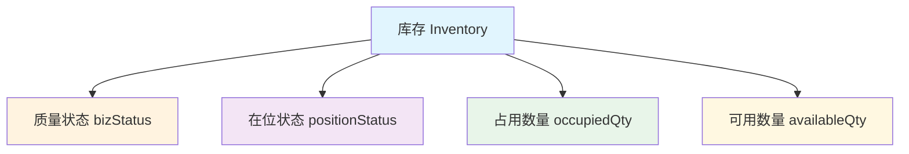
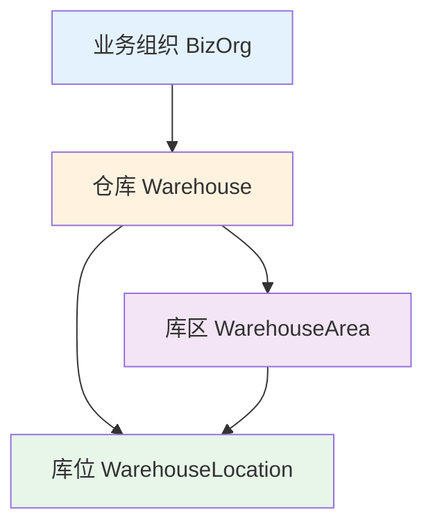
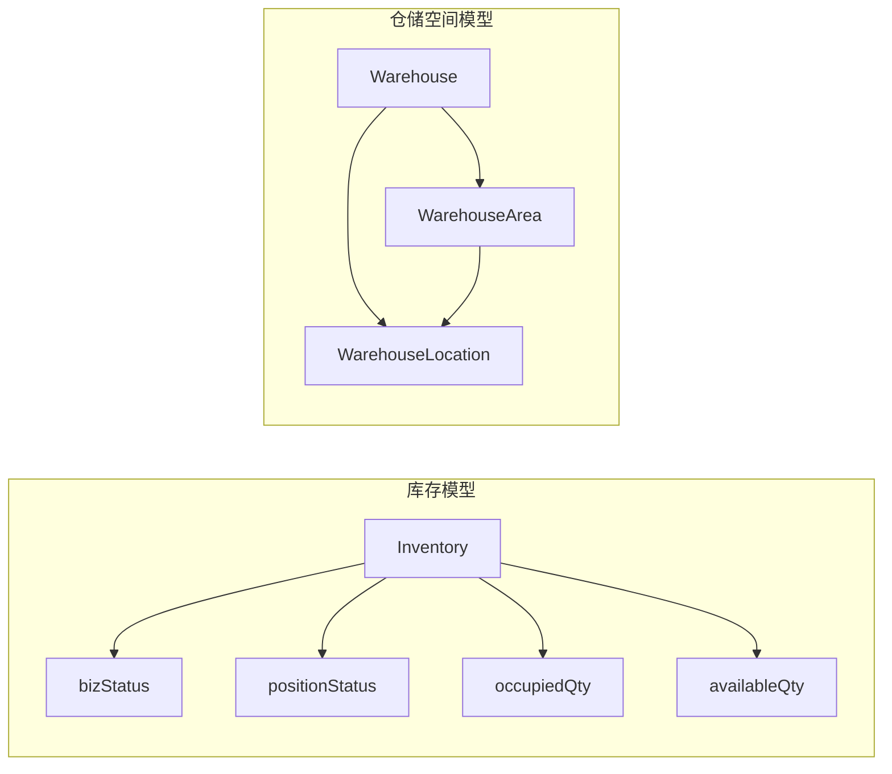
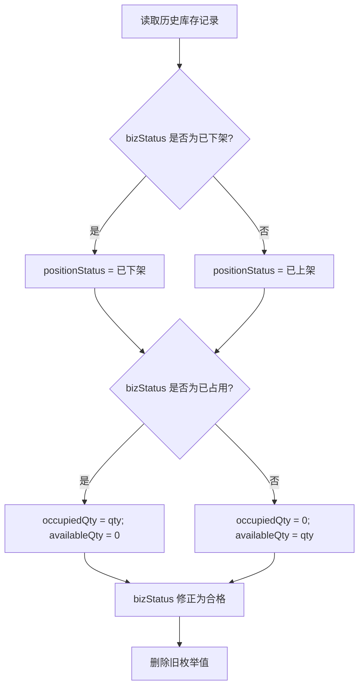
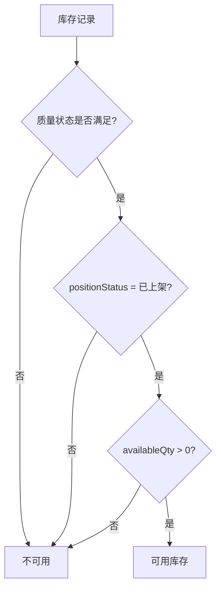
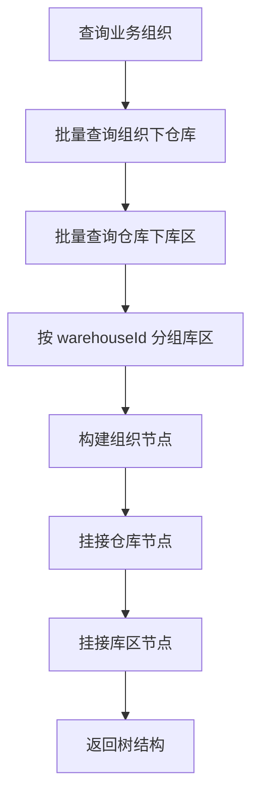
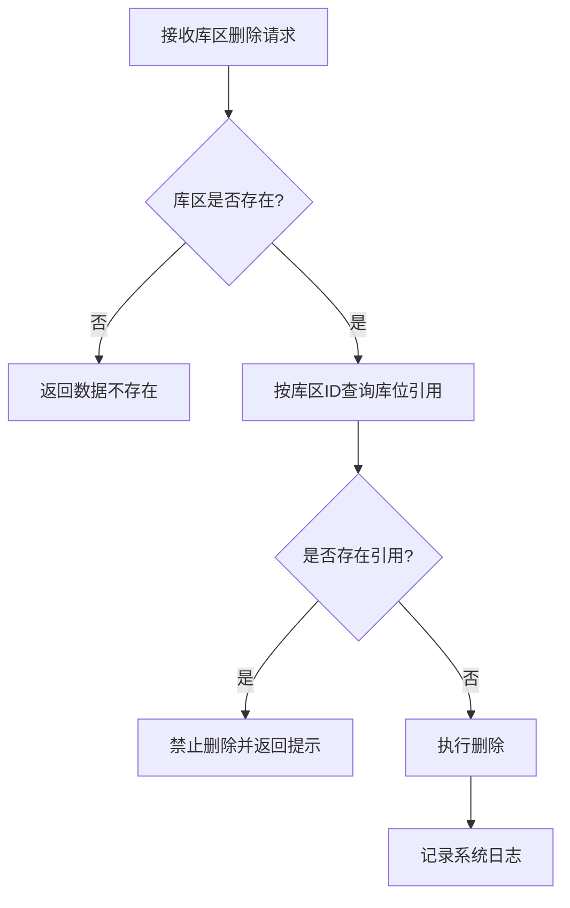

# DNW-WMS-库存与仓储空间优化补录设计文档

## 1. 概述

### 1.1 设计目标
本文档为补录设计文档，对应代码已经开发完成，主要用于：

1. 作为公司设计文档归档，沉淀本次 WMS 库存模型优化和仓储空间模型优化的设计结论；
2. 作为后续开发指导文档，统一库存、仓库、库区、库位相关功能的模型口径、接口口径和约束规则；
3. 为后续缺陷修复、功能扩展、数据修复、接口联调提供设计依据。

本次设计覆盖两类优化内容：

- **库存模型优化**：将原先混用在库存状态中的“已占用”“已下架”语义拆解为质量状态、在位状态、占用数量、可用数量四个维度；
- **仓储空间模型优化**：将仓储主数据结构从“仓库 + 库位”升级为“仓库 -> 库区 -> 库位”，并补齐库区删除校验与树结构展示能力。

### 1.2 核心设计决策

| 决策项 | 选择 | 说明 |
|--------|------|------|
| 库存状态建模 | 拆分为质量状态 + 在位状态 + 数量 | 解决原 `bizStatus` 语义混用问题 |
| 库存占用表达 | 使用 `occupiedQty`、`availableQty` | 支持部分占用，不再仅靠状态表达 |
| 可用库存口径 | 合格 + 已上架 + 可用数量 > 0 | 统一查询和业务校验规则 |
| 下架处理方式 | 仅修改 `positionStatus` | 不再覆盖原有质量状态 |
| 库存分桶策略 | `inventoryMark + bizStatus + positionStatus` | 避免不同在位状态库存错误合并 |
| 仓储空间结构 | 仓库 -> 库区 -> 库位 | 补齐仓库内部区域层级 |
| 库区删除策略 | 删除前校验库位引用 | 避免出现悬空引用 |
| 树结构展示 | 组织 -> 仓库 -> 库区 | 保持前端层级展示与主数据一致 |
| 改造方式 | 兼容升级 | 代码已完成，设计文档补录沉淀 |

## 2. 数据模型设计

### 2.1 实体关系图

#### 2.1.1 库存模型关系



#### 2.1.2 仓储空间模型关系



#### 2.1.3 完整关系说明



### 2.2 实体定义

#### 2.2.1 库存 (Inventory)

**继承**：`BaseObject`  
**实现接口**：`SecurityManaged`, `FactoryManaged`

| 字段名 | 类型 | 必填 | 说明 |
|--------|------|------|------|
| qty | BigDecimal | Y | 库存总数量 |
| bizStatus | String | Y | 质量状态 |
| positionStatus | String | Y | 在位/作业状态 |
| occupiedQty | BigDecimal | Y | 已占用数量 |
| availableQty | BigDecimal | Y | 可用数量 |
| warehouse | ObjectReference | N | 仓库 |
| warehouseLocation | ObjectReference | N | 库位 |
| material | ObjectReference | N | 物料 |
| batchNo | String | N | 批次号 |
| sn | String | N | 序列号 |
| inventoryMark | String | N | 库存分桶标识 |

**核心约束**：
- `bizStatus` 仅表达质量状态；
- `positionStatus` 仅表达在位/作业状态；
- `availableQty = qty - occupiedQty`；
- `occupiedQty >= 0`。

对应实现见：
- `km-mom-platform/km-mom-platform-dm/src/main/java/com/kmsoft/mom/platform/dm/model/entity/wms/Inventory.java`

#### 2.2.2 库存在位状态枚举 (InventoryPositionStatusEnum)

| 枚举值 | 展示值 | 说明 |
|--------|--------|------|
| `POS_10_ON_SHELF` | 已上架 | 可参与正常可用库存判断 |
| `POS_20_OFF_SHELF` | 已下架 | 表示作业/在位状态，不表示质量状态 |

对应实现见：
- `km-mom-wms/km-mom-wms-biz/src/main/java/com/kmsoft/mom/wms/biz/model/enums/InventoryPositionStatusEnum.java`

#### 2.2.3 仓库 (Warehouse)

**说明**：仓储空间顶层实体，原能力保留，作为库区和库位的上级容器。

对应实现见：
- `km-mom-platform/km-mom-platform-dm/src/main/java/com/kmsoft/mom/platform/dm/model/entity/mds/warehouse/Warehouse.java`

#### 2.2.4 库区 (WarehouseArea)

**继承**：`BusinessObject`  
**实现接口**：`FactoryManaged`

| 字段名 | 类型 | 必填 | 说明 |
|--------|------|------|------|
| warehouse | ObjectReference | Y | 所属仓库 |
| bizOrg | BizOrg | Y | 业务组织 |
| factory | BizOrg | Y | 所属工厂 |

**说明**：用于表达仓库内部业务区域，是仓库下的中间层级实体。

对应实现见：
- `km-mom-platform/km-mom-platform-dm/src/main/java/com/kmsoft/mom/platform/dm/model/entity/mds/warehouse/WarehouseArea.java`

#### 2.2.5 库位 (WarehouseLocation)

**继承**：`BusinessObject`  
**实现接口**：`FactoryManaged`

| 字段名 | 类型 | 必填 | 说明 |
|--------|------|------|------|
| warehouse | ObjectReference | Y | 所属仓库 |
| warehouseArea | ObjectReference | N | 所属库区 |
| bizOrg | BizOrg | Y | 业务组织 |
| factory | BizOrg | Y | 所属工厂 |

**说明**：库位继续作为业务单据可直接引用的最小存储位置，同时支持挂接到库区。

对应实现见：
- `km-mom-platform/km-mom-platform-dm/src/main/java/com/kmsoft/mom/platform/dm/model/entity/mds/warehouse/WarehouseLocation.java`

### 2.3 数据表设计

本次设计涉及的核心表如下：

| 表名 | 说明 | 关键变化 |
|------|------|----------|
| `MOM_INVENTORY` | 库存表 | 增加/启用 `CPOSITION_STATUS`、`COCCUPIED_QTY`、`CAVAILABLE_QTY` |
| `MOM_WAREHOUSE` | 仓库表 | 原有能力保留 |
| `MOM_WAREHOUSE_AREA` | 库区表 | 新增库区实体承载仓库内部区域 |
| `MOM_WAREHOUSE_LOCATION` | 库位表 | 增加 `CWAREHOUSE_AREA` 引用库区 |
| `DM_ENUM_VALUE` | 枚举值表 | 收敛库存旧状态枚举，移除旧质量状态中“已下架/已占用” |

历史数据修复脚本见：
- `1_script/数据库初始化脚本/v34-a6(260404)/仓储库存新增属性默认值处理.sql`

## 3. 接口设计

### 3.1 库存相关接口

#### 库存查询与统计

1. `inventoryApi/batchQueryInventory`
   - 作用：批量查询物料可分配库存；
   - 核心口径：仅统计质量状态为合格、在位状态为已上架且 `availableQty > 0` 的库存。

2. `inventory/pageForSafetyStock`
   - 作用：分页查询安全库存；
   - 返回增强：补充质量状态、在位状态、占用数量、可用数量。

3. `inventory/pageForDeadStock`
   - 作用：分页查询呆滞库存；
   - 返回增强：补充质量状态、在位状态、占用数量、可用数量。

4. `inventory/transfer`
   - 作用：库存移位；
   - 约束：仅允许处理符合业务规则的库存，已下架库存不允许执行普通移位操作。

对应实现见：
- `km-mom-wms/km-mom-wms-biz/src/main/java/com/kmsoft/mom/wms/biz/remote/api/InventoryApi.java`
- `km-mom-wms/km-mom-wms-biz/src/main/java/com/kmsoft/mom/wms/biz/remote/InventoryController.java`

### 3.2 仓库、库区、库位接口

#### 仓库接口

1. `warehouse/insert`
2. `warehouse/delete`
3. `warehouse/listWarehouseByFactory`
4. `warehouse/tree`

其中 `warehouse/tree` 返回“组织 -> 仓库 -> 库区”的树结构。

#### 库区接口

1. `warehouseArea/delete`
   - 入参：`ObjectReference`
   - 约束：删除前校验是否被库位引用。

#### 库位接口

1. `warehouseLocation/insert`
2. `warehouseLocation/delete`
3. `warehouseLocation/update`
4. `warehouseLocation/getById`
5. `warehouseLocation/listByWarehouseId`

对应实现见：
- `km-mom-platform/km-mom-platform-biz/km-mom-platform-biz-mds/src/main/java/com/kmsoft/mom/platform/biz/mds/remote/WarehouseController.java`
- `km-mom-platform/km-mom-platform-biz/km-mom-platform-biz-mds/src/main/java/com/kmsoft/mom/platform/biz/mds/remote/WarehouseAreaController.java`
- `km-mom-platform/km-mom-platform-biz/km-mom-platform-biz-mds/src/main/java/com/kmsoft/mom/platform/biz/mds/remote/WarehouseLocationController.java`

### 3.3 业务联动接口

#### 默认库房库位推荐

WMS 入库申请单领域服务提供“获取默认库房库位”能力：

- 如果业务明细已存在库位，则直接沿用；
- 否则根据配置规则与历史入库记录推荐库位；
- 当前仍以仓库、物料、历史记录为主，但已经具备衔接库区模型的基础。

对应实现见：
- `km-mom-wms/km-mom-wms-biz/src/main/java/com/kmsoft/mom/wms/biz/domain/InStoreApplyBillDomainService.java`

## 4. 核心业务逻辑

### 4.1 库存模型核心流程

#### 4.1.1 历史库存状态迁移流程图



#### 4.1.2 库存可用性判断流程图



### 4.2 仓储空间模型核心流程

#### 4.2.1 组织仓库树构建流程图



#### 4.2.2 库区删除校验流程图



### 4.3 核心算法与规则

#### 4.3.1 库存数量同步规则

统一规则：

- `availableQty = qty - occupiedQty`

对应公共处理类：
- `InventoryStateHandle`

职责包括：
- 空值归零；
- 默认在位状态归一化；
- 新建库存初始化；
- 标记下架；
- 标记上架；
- 同步可用数量。

对应实现见：
- `km-mom-wms/km-mom-wms-biz/src/main/java/com/kmsoft/mom/wms/biz/domain/handle/InventoryStateHandle.java`

#### 4.3.2 库存分桶规则

统一分桶键：

- `inventoryMark + bizStatus + positionStatus`

设计原因：
- 同标识库存可能因在位状态不同而不能合并；
- 如果忽略 `positionStatus`，会把已上架、已下架库存错误聚合。

对应实现见：
- `km-mom-wms/km-mom-wms-biz/src/main/java/com/kmsoft/mom/wms/biz/domain/handle/InventoryKeyHandle.java`

### 4.4 删除校验逻辑

#### 4.4.1 库区删除校验

删除库区前必须检查是否存在库位引用：

- 存在引用：直接拦截；
- 不存在引用：允许删除。

#### 4.4.2 仓库删除校验

仓库删除仍需结合现有库位存在性等约束进行拦截，保证仓储空间主数据完整性。

### 4.5 下架与回上架逻辑

#### 4.5.1 下架逻辑

- 不再把质量状态改为“已下架”；
- 仅修改 `positionStatus = 已下架`；
- 保持原 `bizStatus` 不变。

对应实现见：
- `km-mom-wms/km-mom-wms-biz/src/main/java/com/kmsoft/mom/wms/biz/domain/PickingTaskDomainService.java`

#### 4.5.2 回上架逻辑

- 仅恢复 `positionStatus = 已上架`；
- 不覆盖原有质量状态。

对应实现见：
- `km-mom-wms/km-mom-wms-biz/src/main/java/com/kmsoft/mom/wms/biz/domain/PutawayTaskDomainService.java`

## 5. 前端页面结构

### 5.1 库存相关页面

涉及以下页面和功能展示调整：

1. 库存查询页
   - 原先以单一库存状态展示；
   - 现需拆分展示质量状态、在位状态、占用数量、可用数量。

2. 安全库存页面
   - 查询结果增加在位状态、占用数量、可用数量字段。

3. 呆滞库存页面
   - 查询结果增加在位状态、占用数量、可用数量字段。

4. 库存移位页面
   - 需识别已下架库存不可执行普通移位。

### 5.2 仓储主数据页面

1. 组织仓库树页面
   - 从“组织 -> 仓库”升级为“组织 -> 仓库 -> 库区”；
   - 前端需兼容新节点类型 `warehouseArea`。

2. 仓库库位管理页面
   - 后续可演进为按仓库筛选库区、按库区管理库位；
   - 当前至少需在数据理解上支持库区中间层存在。

3. 库区维护页面
   - 删除库区时需接收并展示“已被库位引用，禁止删除”的提示。

## 6. 与现有功能的关系

### 6.1 功能替换对照表

| 现有功能/旧口径 | 新口径 | 说明 |
|-----------------|--------|------|
| `bizStatus = 已下架` | `positionStatus = 已下架` | 已下架不再作为质量状态 |
| `bizStatus = 已占用` | `occupiedQty > 0` | 占用改为数量表达 |
| 单状态判断库存可用 | 质量状态 + 在位状态 + 可用数量 | 统一可用库存口径 |
| 组织 -> 仓库树 | 组织 -> 仓库 -> 库区树 | 补齐仓库内部层级 |
| 库位仅挂仓库 | 库位挂仓库，可挂库区 | 增加区域归属 |
| 库区可直接删除 | 库区删除前校验库位引用 | 增强数据完整性 |

### 6.2 数据迁移方案

#### 6.2.1 库存数据迁移

迁移策略：

1. 回填 `positionStatus`；
2. 回填 `occupiedQty` 与 `availableQty`；
3. 修正历史 `bizStatus` 中混用的“已下架/已占用”；
4. 删除旧枚举值。

执行脚本见：
- `1_script/数据库初始化脚本/v34-a6(260404)/仓储库存新增属性默认值处理.sql`

#### 6.2.2 仓储主数据兼容

仓储空间模型以兼容升级为主：

- 仓库能力保留；
- 原库位对仓库的引用保留；
- 新增库区层和库位挂库区能力；
- 旧业务仍可按仓库 + 库位使用，新业务可逐步引入库区维度。

### 6.3 现有系统分析

#### 6.3.1 现有实体分析

受影响核心实体：

- `Inventory`
- `Warehouse`
- `WarehouseArea`
- `WarehouseLocation`

#### 6.3.2 现有服务分析

受影响核心服务：

- `InventoryRepository`
- `PickingTaskDomainService`
- `PutawayTaskDomainService`
- `InStoreApplyBillDomainService`
- `WarehouseAppService`
- `WarehouseAreaAppService`
- `WarehouseLocationAppService`

#### 6.3.3 需要修改的文件清单

本次补录依据的主要文件如下：

- `km-mom-platform/km-mom-platform-dm/src/main/java/com/kmsoft/mom/platform/dm/model/entity/wms/Inventory.java`
- `km-mom-wms/km-mom-wms-biz/src/main/java/com/kmsoft/mom/wms/biz/domain/handle/InventoryStateHandle.java`
- `km-mom-wms/km-mom-wms-biz/src/main/java/com/kmsoft/mom/wms/biz/domain/handle/InventoryKeyHandle.java`
- `km-mom-wms/km-mom-wms-biz/src/main/java/com/kmsoft/mom/wms/biz/infra/InventoryRepository.java`
- `km-mom-wms/km-mom-wms-biz/src/main/java/com/kmsoft/mom/wms/biz/remote/api/InventoryApi.java`
- `km-mom-wms/km-mom-wms-biz/src/main/java/com/kmsoft/mom/wms/biz/remote/InventoryController.java`
- `km-mom-wms/km-mom-wms-biz/src/main/java/com/kmsoft/mom/wms/biz/domain/PickingTaskDomainService.java`
- `km-mom-wms/km-mom-wms-biz/src/main/java/com/kmsoft/mom/wms/biz/domain/PutawayTaskDomainService.java`
- `km-mom-platform/km-mom-platform-dm/src/main/java/com/kmsoft/mom/platform/dm/model/entity/mds/warehouse/WarehouseArea.java`
- `km-mom-platform/km-mom-platform-dm/src/main/java/com/kmsoft/mom/platform/dm/model/entity/mds/warehouse/WarehouseLocation.java`
- `km-mom-platform/km-mom-platform-biz/km-mom-platform-biz-mds/src/main/java/com/kmsoft/mom/platform/biz/mds/application/WarehouseAppService.java`
- `km-mom-platform/km-mom-platform-biz/km-mom-platform-biz-mds/src/main/java/com/kmsoft/mom/platform/biz/mds/application/WarehouseAreaAppService.java`
- `km-mom-platform/km-mom-platform-biz/km-mom-platform-biz-mds/src/main/java/com/kmsoft/mom/platform/biz/mds/application/WarehouseLocationAppService.java`
- `km-mom-platform/km-mom-platform-biz/km-mom-platform-biz-mds/src/main/resources/i18n/messages_zh_CN.properties`
- `1_script/数据库初始化脚本/v34-a6(260404)/仓储库存新增属性默认值处理.sql`

#### 6.3.4 兼容性处理

1. 旧代码如仍把“已下架”“已占用”写入 `bizStatus`，属于错误用法，后续必须清退；
2. 前端如仅按旧树结构解析，需要兼容 `warehouseArea` 节点；
3. 老业务仍可按仓库 + 库位使用，但新开发默认应按仓库 -> 库区 -> 库位模型理解；
4. 库存相关新开发默认应按“状态 + 数量”的组合规则处理。

## 7. 接口权限配置

本次补录文档未新增独立权限模型设计，但从现有功能视角可归纳如下：

1. 库存相关接口仍归属 WMS 库存管理能力；
2. 仓库、库区、库位接口归属仓储主数据维护能力；
3. 新增 `warehouseArea/delete` 后，前端与菜单权限应归入仓储主数据维护域；
4. 若后续增加库区新增、更新、分页查询等接口，应同步补充权限点。

## 8. 消息编码

# 库存与仓储空间优化相关消息编码

| 消息编码 | 说明 |
|----------|------|
| `wms.error.inventory.positionStatusInvalid` | 已下架库存不允许执行当前操作 |
| `wms.error.inventory.occupiedQtyExceed` | 盘点后库存数量不能小于占用数量 |
| `error.mds.warehouse.has.location.cannot.delete` | 仓库下存在库位，不允许删除 |
| `error.mds.warehouse.area.referenced.by.location.cannot.delete` | 库区已被库位引用，禁止删除 |

对应文件见：
- `km-mom-wms/km-mom-wms-biz/src/main/resources/i18n/messages_zh_CN.properties`
- `km-mom-platform/km-mom-platform-biz/km-mom-platform-biz-mds/src/main/resources/i18n/messages_zh_CN.properties`
- `km-mom-wms/km-mom-wms-biz/src/main/java/com/kmsoft/mom/wms/biz/model/constant/WmsMsgCodes.java`
- `km-mom-platform/km-mom-platform-biz/km-mom-platform-biz-mds/src/main/java/com/kmsoft/mom/platform/biz/mds/constant/MdsMsgCodes.java`

## 9. 实施计划

### 9.1 实施状态说明

本次为补录设计文档，代码已完成开发实现，因此这里记录的不是待实施计划，而是实际实施结果归纳：

1. 完成库存模型字段与语义调整；
2. 完成库存查询口径改造；
3. 完成下架/回上架逻辑调整；
4. 完成库存历史数据迁移脚本；
5. 完成仓库 -> 库区 -> 库位空间模型补齐；
6. 完成组织仓库树增加库区节点；
7. 完成库区删除校验；
8. 完成相关接口、消息码和文案适配。

### 9.2 文件清单

```
km-mom-platform/km-mom-platform-dm/
└── src/main/java/com/kmsoft/mom/platform/dm/model/entity/
    ├── wms/Inventory.java
    └── mds/warehouse/
        ├── Warehouse.java
        ├── WarehouseArea.java
        └── WarehouseLocation.java

km-mom-wms/km-mom-wms-biz/
├── src/main/java/com/kmsoft/mom/wms/biz/domain/
│   ├── PickingTaskDomainService.java
│   ├── PutawayTaskDomainService.java
│   ├── InStoreApplyBillDomainService.java
│   └── handle/
│       ├── InventoryKeyHandle.java
│       └── InventoryStateHandle.java
├── src/main/java/com/kmsoft/mom/wms/biz/infra/
│   └── InventoryRepository.java
├── src/main/java/com/kmsoft/mom/wms/biz/remote/
│   ├── InventoryController.java
│   └── api/InventoryApi.java
└── src/main/resources/i18n/
    └── messages_zh_CN.properties

km-mom-platform/km-mom-platform-biz/km-mom-platform-biz-mds/
├── src/main/java/com/kmsoft/mom/platform/biz/mds/application/
│   ├── WarehouseAppService.java
│   ├── WarehouseAreaAppService.java
│   ├── WarehouseLocationAppService.java
│   └── validator/WarehouseLocationValidator.java
├── src/main/java/com/kmsoft/mom/platform/biz/mds/remote/
│   ├── WarehouseController.java
│   ├── WarehouseAreaController.java
│   └── WarehouseLocationController.java
├── src/main/java/com/kmsoft/mom/platform/biz/mds/model/vo/warehouse/
│   └── BizOrgWarehouseTreeVO.java
└── src/main/resources/i18n/
    └── messages_zh_CN.properties

1_script/数据库初始化脚本/v34-a6(260404)/
└── 仓储库存新增属性默认值处理.sql
```

## 附录：补录说明

1. 本文档为事后补录，不代表代码尚未开发；
2. 后续凡涉及库存、仓库、库区、库位相关开发，应优先遵循本文档定义的模型与规则；
3. 若后续继续演进库存作业状态、库区规则、默认库位策略或树结构层级，应在本文档基础上持续增补版本演进记录。