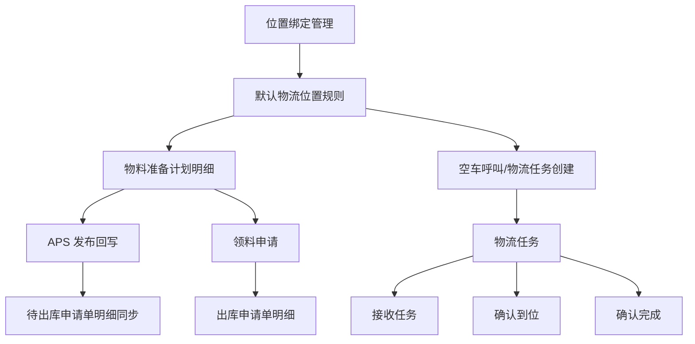
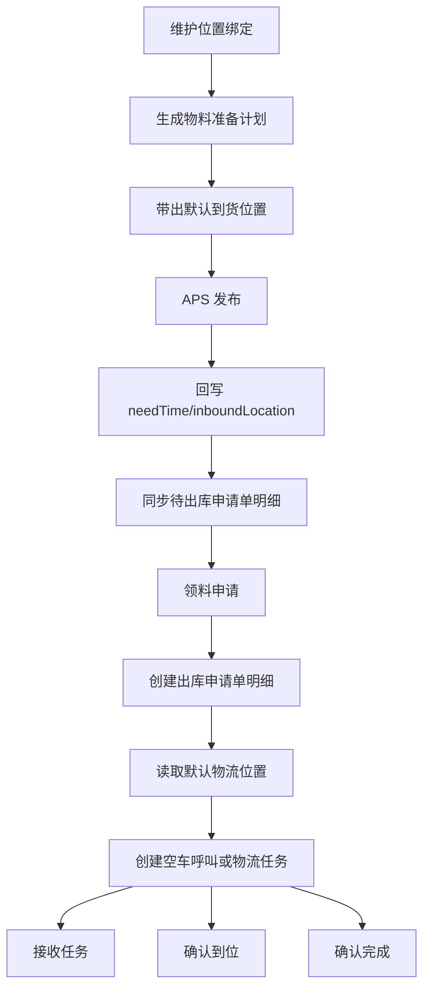

# DNW30710 物流管理设计文档

## 0. 文档信息

| 项目 | 内容 |
| --- | --- |
| 需求编号 | DNW30710 |
| 需求名称 | 物流管理 |
| 文档版本 | V1.0 |
| 编写日期 | 2026-04-21 |
| 关联需求/原型/方案 | `tasks/物流任务/DNW30710 物流管理/DNW30710 物流管理.md` |
| 关联分析说明 | `tasks/物流任务/物流详设说明.md` |
| 关联模型说明 | `tasks/物流任务/物流模型属性.md` |
| 参考模板 | `tasks/需求功能设计方案模板.md` |
| 关联代码范围 | `km-mom-platform`、`km-mom-mes`、`km-mom-wms` |

---

## 1. 概述

### 1.1 背景

现有系统在制造执行、物料准备、领料申请、仓储出库、收料确认等环节已经具备基础业务能力，但缺少“物流位置默认值 + 物流任务对象 + 执行状态闭环”的统一设计，导致以下问题：

1. 物料准备计划明细、领料出库申请单明细之间缺少统一的到货位置承接字段。
2. 排产发布后，需求到料时间与到货位置无法持续回写并同步到未出库申请单明细。
3. 工作中心、设备与默认物流位置之间缺少受控绑定关系，默认位置无法稳定带出。
4. 出库后、工序间、完工入库等搬运动作缺少统一的物流任务对象和处理状态。
5. 制造执行页面、出库页面虽然已有业务入口，但缺少“空车呼叫”“创建物流任务”的统一后端支撑。

本次设计站在基线代码尚未改造之前，明确本次需求相对现有系统需要新增和改造哪些能力，使后续即使回退本次改动，也能依据本设计文档重新实现。

### 1.2 设计目标

1. 新增工作中心位置绑定、设备位置绑定能力，形成默认到货位置、出货位置的维护入口。
2. 在物料准备计划明细、领料申请、出库申请单明细之间贯通 `needTime` 和 `inboundLocation` 字段链路。
3. 提供默认物流位置读取能力，支持制造执行和出库场景带出默认发出/到达位置。
4. 新增物流任务模型与执行接口，覆盖空车呼叫、发料周转、退料周转、工序间周转、入库周转、临时周转。
5. 保持与现有物料准备、领料、出库、收料流程兼容，不重建已有流程模块。

### 1.3 本次范围

- 新增工作中心位置绑定、设备位置绑定模型及管理接口。
- 扩展物料准备计划明细、出库申请单明细模型字段。
- 改造 APS 发布回写逻辑，新增到货位置回写。
- 改造领料申请字段下传逻辑，写入 WMS 出库申请单明细。
- 新增默认物流位置查询接口。
- 新增物流任务主单/明细模型、创建接口、接收与完成接口。
- 新增 APS -> WMS 未出库明细同步更新方案。
- 补充相关错误码、国际化、按钮配置和测试入口。

### 1.4 非范围

- 不新增“位置管理”主数据本身的基础 CRUD 设计。
- 不改造现有下架拣配、确认出库、收料确认的主流程定义。
- 不实现自动创单、自动派工、AGV、地图导航、扫码校验。
- 不在本次设计中展开前端页面视觉设计，只说明页面需要新增的入口与交互规则。
- 不将物流任务变成业务流程的强制前置条件。

### 1.5 核心设计决策

| 决策项 | 选择 | 原因 |
| --- | --- | --- |
| 是否新增模型 | 是 | 需要显式承载位置绑定与物流任务 |
| 是否新增接口 | 是 | 绑定管理、默认位置读取、物流任务处理都需要独立接口 |
| 是否改造旧逻辑 | 是 | APS 回写、领料申请、WMS 明细转换需要扩展 |
| 是否兼容旧数据 | 是 | 新增字段允许为空，历史数据不强制回填 |
| 是否复用现有模块 | 是 | 复用 `objectManageService`、现有领料申请、现有出库申请单链路 |
| APS -> WMS 联动方式 | 异步消息优先 | 降低跨服务耦合，符合系统集成原则 |

---

## 2. 需求拆解

### 2.1 用户角色

- 系统管理员
- 工厂数据维护人员
- 计划员
- 库房管理员
- 车间操作工
- 物流执行人
- 车间主管/库房主管

### 2.2 业务场景

| 场景 | 触发条件 | 用户动作 | 系统结果 |
| --- | --- | --- | --- |
| 工作中心位置绑定 | 需要维护工作中心默认物流位置 | 新增、编辑、导入、批量编辑、批量引入 | 建立工作中心到到货/出货位置的唯一绑定 |
| 设备位置绑定 | 需要维护设备默认物流位置 | 新增、编辑、导入、批量编辑、批量引入 | 建立设备到到货/出货位置的唯一绑定 |
| 计划明细带值 | 制造订单生成物料准备计划 | 系统自动带值 | 生成带 `needTime`、`inboundLocation` 的计划明细 |
| APS 发布回写 | 排产结果发布 | 系统自动回写 | 更新计划明细并同步待出库申请单明细 |
| 领料申请 | 齐套分析或制造任务发起领料申请 | 用户确认或修改到货位置后提交 | 出库申请单明细写入 `needTime`、`inboundLocation` |
| 默认位置读取 | 页面打开创建物流任务或空车呼叫弹窗 | 前端按设备/工作中心读取默认位置 | 返回默认发出/到达位置 |
| 空车呼叫 | 需要先呼叫物流资源到位 | 用户提交空车呼叫 | 创建空车呼叫物流任务 |
| 周转类任务创建 | 需要跟踪物料搬运动作 | 用户提交物流任务 | 创建物流任务主单与明细 |
| 物流任务处理 | 执行人接收或完成任务 | 接收、确认到位、确认完成 | 更新物流任务状态与执行留痕 |

### 2.3 功能清单

| 功能项 | 描述 | 优先级 | 是否本次实现 |
| --- | --- | --- | --- |
| 工作中心位置绑定管理 | 新增、编辑、批量保存、导入、模板导出、批量引入 | P0 | 是 |
| 设备位置绑定管理 | 新增、编辑、批量保存、导入、模板导出、批量引入 | P0 | 是 |
| 物料准备计划到货位置带值 | 计划明细支持到货位置字段 | P0 | 是 |
| APS 回写 | 回写 `needTime` 和 `inboundLocation` | P0 | 是 |
| 领料申请字段贯通 | 计划侧字段写入 WMS 明细 | P0 | 是 |
| 默认物流位置查询 | 读取默认发出/到达位置 | P0 | 是 |
| 空车呼叫 | 独立接口创建 | P0 | 是 |
| 统一物流任务创建 | 周转类任务统一入口 | P0 | 是 |
| 物流任务状态处理 | 接收、确认到位、确认完成 | P0 | 是 |
| 页面入口接入 | 出库、制造执行页面挂接按钮 | P1 | 是 |
| 自动调度/自动创单 | 智能化扩展 | P2 | 否 |

### 2.4 验收标准

1. 同一工作中心或设备只能维护一条有效位置绑定。
2. 计划明细可保存到货位置，APS 发布后能按规则回写。
3. 待出库的申请单明细与计划明细保持 `needTime`、`inboundLocation` 一致；非待出库状态不再同步。
4. 领料申请提交后，WMS 出库申请单明细能收到 `needTime`、`inboundLocation`。
5. 默认物流位置读取接口能按设备优先、工作中心兜底返回结果。
6. 空车呼叫与周转类任务创建规则分离，错误时返回明确信息。
7. 物流任务支持接收、确认到位、确认完成三类动作，状态流转符合设计。
8. 不影响现有领料申请、出库、收料确认主流程。

---

## 3. 总体方案设计

### 3.1 方案总览

本次需求采用“平台建模 + MES 计划侧字段贯通 + WMS 物流任务执行”的三层方案：

1. 在 `km-mom-platform` 新增位置绑定与物流任务相关模型，并提供主数据管理入口。
2. 在 `km-mom-mes` 改造 APS 发布、领料申请链路，把计划侧的 `needTime` 和 `inboundLocation` 传递到 WMS。
3. 在 `km-mom-wms` 承载物流任务创建、状态流转，以及待出库明细同步更新。

旧逻辑不推翻重写：

- 位置主数据继续复用既有 `LogisticsLocation`。
- 领料申请继续复用现有计划侧入口。
- 出库申请单继续复用现有 WMS 模型和动态 DTO 转换能力。
- 收料确认继续走原有业务逻辑，不与物流任务强耦合。

### 3.2 模块关系图



### 3.3 分层职责

| 层级 | 类/模块 | 职责 |
| --- | --- | --- |
| 控制层 | 位置绑定 Controller、默认物流位置 Controller、物流任务 Controller | 接收请求、参数校验、返回统一结果 |
| 应用层 | 位置绑定 AppService、LogisticsLocationAppService、LogisticsTaskAppService | 流程编排、调用领域校验与持久化 |
| 领域层 | `LogisticsTaskDomainService`、APS 回写服务 | 核心业务规则、状态流转、默认值解析 |
| 仓储层 | `GeneralCrudService`、同步查询 Repository | 数据查询、批量持久化、跨对象关联取数 |
| 基础组件 | Excel 导入器、消息事件、DTO/VO、错误码、枚举 | 通用转换、导入校验、异步同步承载 |

---

## 4. 数据设计

### 4.1 核心对象

| 对象 | 类型 | 说明 |
| --- | --- | --- |
| `WorkCenterLocationBinding` | 实体 | 工作中心默认到货/出货位置绑定 |
| `EquipLocationBinding` | 实体 | 设备默认到货/出货位置绑定 |
| `MaterialPreparationPlanDetailLink` | 实体扩展 | 新增 `inboundLocation` |
| `OutStoreApplyBillMaterialLink` | 实体扩展 | 新增 `needTime`、`inboundLocation` |
| `LogisticsTask` | 实体 | 物流任务主单 |
| `LogisticsTaskLink` | 实体 | 物流任务明细 |
| `DefaultLogisticsLocationQueryDTO` | DTO | 默认物流位置读取入参 |
| `DefaultLogisticsLocationVO` | VO | 默认物流位置返回对象 |
| `MaterialRequestDetailDTO` | DTO 扩展 | 新增 `inboundLocationId` |
| `OutStoreApplyBillMaterialSyncEvent` | 消息事件 | APS -> WMS 待出库明细同步事件 |

### 4.2 数据结构定义

#### 4.2.1 WorkCenterLocationBinding

| 字段 | 类型 | 必填 | 说明 |
| --- | --- | --- | --- |
| `workCenter` | ObjectReference | 是 | 工作中心，同一工作中心仅允许一条绑定 |
| `inboundLocation` | ObjectReference | 否 | 默认到货位置，引用 `LogisticsLocation` |
| `outboundLocation` | ObjectReference | 否 | 默认出货位置，引用 `LogisticsLocation` |
| `remark` | String | 否 | 备注 |

#### 4.2.2 EquipLocationBinding

| 字段 | 类型 | 必填 | 说明 |
| --- | --- | --- | --- |
| `equip` | ObjectReference | 是 | 设备，同一设备仅允许一条绑定 |
| `inboundLocation` | ObjectReference | 否 | 默认到货位置 |
| `outboundLocation` | ObjectReference | 否 | 默认出货位置 |
| `remark` | String | 否 | 备注 |

#### 4.2.3 MaterialPreparationPlanDetailLink

| 字段 | 类型 | 必填 | 说明 |
| --- | --- | --- | --- |
| `needTime` | LocalDateTime | 否 | 保留原字段名，表示需求到料时间 |
| `inboundLocation` | ObjectReference | 否 | 到货位置，引用 `LogisticsLocation` |

#### 4.2.4 OutStoreApplyBillMaterialLink

| 字段 | 类型 | 必填 | 说明 |
| --- | --- | --- | --- |
| `needTime` | LocalDateTime | 否 | 来源于计划明细 |
| `inboundLocation` | ObjectReference | 否 | 来源于计划明细或领料申请提交值 |

#### 4.2.5 LogisticsTask

| 字段 | 类型 | 必填 | 说明 |
| --- | --- | --- | --- |
| `taskType` | String | 是 | 引用 `LogisticsTaskTypeEnum` |
| `bizStatus` | String | 是 | 引用 `LogisticsTaskStatusEnum` |
| `sourceBizOrg` | ObjectReference | 否 | 发出组织，周转类自动带出 |
| `targetBizOrg` | ObjectReference | 否 | 到达组织，自动带出 |
| `sourceLocation` | ObjectReference | 周转类是 | 发出位置 |
| `targetLocation` | ObjectReference | 是 | 到达位置 |
| `workCenter` | ObjectReference | 否 | 工作中心 |
| `equip` | ObjectReference | 否 | 设备 |
| `receiveUser` | User | 否 | 接收人 |
| `receiveTime` | LocalDateTime | 否 | 接收时间 |
| `completeTime` | LocalDateTime | 否 | 完成时间 |

#### 4.2.6 LogisticsTaskLink

| 字段 | 类型 | 必填 | 说明 |
| --- | --- | --- | --- |
| `materialPreparePlanDetail` | ObjectReference | 否 | 来源计划明细 |
| `manuTask` | ObjectReference | 否 | 来源制造任务 |
| `material` | ObjectReference | 是 | 物料 |
| `qty` | BigDecimal | 是 | 数量，必须大于 0 |
| `batchNumber` | String | 否 | 来源追溯信息 |
| `serialNumber` | String | 否 | 来源追溯信息 |

### 4.3 数据关系

1. 一个工作中心最多一条工作中心位置绑定。
2. 一台设备最多一条设备位置绑定。
3. 一个物流任务对应多条物流任务明细。
4. 物料准备计划明细的 `inboundLocation` 向下传递到出库申请单明细。
5. APS 回写先更新计划明细，再同步更新仍为待出库状态的申请单明细。

### 4.4 存储设计

#### 4.4.1 新增表

- `MOM_WORK_CENTER_LOCATION_BINDING`
- `MOM_EQUIP_LOCATION_BINDING`
- `MOM_LOGISTICS_TASK`
- `MOM_LOGISTICS_TASK_LINK`

#### 4.4.2 扩展字段

- `MOM_MATERIAL_PREPARE_PLAN_DETAIL_LINK.CINBOUND_LOCATION`
- `MOM_OUT_STORE_APPLY_BILL_MATERIAL_LINK.CNEED_TIME`
- `MOM_OUT_STORE_APPLY_BILL_MATERIAL_LINK.CINBOUND_LOCATION`

#### 4.4.3 兼容策略

1. 新增字段允许为空。
2. 历史数据不强制回填。
3. 新逻辑只对本次改造后的新增/更新数据生效。

---

## 5. 接口设计

### 5.1 接口清单

| 接口 | 方法 | 用途 | 调用方 |
| --- | --- | --- | --- |
| `/workCenterLocationBinding/insert` | POST | 新增工作中心位置绑定 | 前端 |
| `/workCenterLocationBinding/update` | POST | 编辑工作中心位置绑定 | 前端 |
| `/workCenterLocationBinding/batchSave` | POST | 批量保存工作中心位置绑定 | 前端 |
| `/workCenterLocationBinding/batchIntroduce` | POST | 批量引入工作中心绑定 | 前端 |
| `/workCenterLocationBinding/importExcel` | POST | 导入工作中心位置绑定 | 前端 |
| `/workCenterLocationBinding/exportTemplate` | POST | 导出模板 | 前端 |
| `/equipLocationBinding/insert` | POST | 新增设备位置绑定 | 前端 |
| `/equipLocationBinding/update` | POST | 编辑设备位置绑定 | 前端 |
| `/equipLocationBinding/batchSave` | POST | 批量保存设备位置绑定 | 前端 |
| `/equipLocationBinding/batchIntroduce` | POST | 批量引入设备绑定 | 前端 |
| `/equipLocationBinding/importExcel` | POST | 导入设备位置绑定 | 前端 |
| `/equipLocationBinding/exportTemplate` | POST | 导出模板 | 前端 |
| `/logisticsLocation/getDefaultLocation` | POST | 读取默认物流位置 | 前端 |
| `/logisticsTask/createEmptyCartCall` | POST | 创建空车呼叫 | 前端 |
| `/logisticsTask/create` | POST | 创建周转类物流任务 | 前端 |
| `/logisticsTask/receiveTask` | POST | 接收物流任务 | 前端 |
| `/logisticsTask/confirmArrive` | POST | 确认空车呼叫到位 | 前端 |
| `/logisticsTask/confirmComplete` | POST | 确认周转类任务完成 | 前端 |

### 5.2 入参设计

#### 5.2.1 `/logisticsLocation/getDefaultLocation` 入参

```json
{
  "object": {
    "taskType": "030_PROCESS_TRANSFER",
    "equipId": 1001,
    "workCenterId": 2001
  }
}
```

| 字段 | 类型 | 必填 | 校验规则 | 说明 |
| --- | --- | --- | --- | --- |
| `taskType` | String | 否 | 合法枚举值 | 物流任务类型 |
| `equipId` | Long | 否 | 与 `workCenterId` 至少一个有值 | 设备 ID |
| `workCenterId` | Long | 否 | 与 `equipId` 至少一个有值 | 工作中心 ID |

#### 5.2.2 `/logisticsTask/createEmptyCartCall` 入参

```json
{
  "object": {
    "targetLocationId": 3001,
    "workCenterId": 2001,
    "equipId": 1001,
    "remark": "空车到位"
  }
}
```

| 字段 | 类型 | 必填 | 校验规则 | 说明 |
| --- | --- | --- | --- | --- |
| `targetLocationId` | Long | 是 | 位置必须存在 | 到达位置 |
| `workCenterId` | Long | 否 | 引用存在 | 工作中心 |
| `equipId` | Long | 否 | 引用存在 | 设备 |
| `remark` | String | 否 | 长度限制 | 备注 |

### 5.3 出参设计

#### 5.3.1 `/logisticsLocation/getDefaultLocation` 出参

```json
{
  "data": {
    "sourceLocation": {
      "id": 3002,
      "entityType": "LogisticsLocation"
    },
    "targetLocation": {
      "id": 3001,
      "entityType": "LogisticsLocation"
    }
  }
}
```

#### 5.3.2 物流任务创建出参

```json
{
  "data": {
    "taskId": 10001,
    "taskCode": "LG202604210001"
  }
}
```

### 5.4 错误处理

| 场景 | 错误信息/编码 | 处理方式 |
| --- | --- | --- |
| 绑定对象为空 | 平台通用缺参错误 | 直接拦截 |
| 工作中心/设备/位置不存在 | 平台通用数据不存在错误 | 阻断保存 |
| 同一工作中心/设备重复绑定 | 已存在错误 | 阻断保存或导入 |
| 物流任务类型不支持 | `LOGISTICS_TASK_TYPE_NOT_SUPPORTED` | 阻断创建 |
| 发出位置/到达位置为空 | 物流任务校验错误码 | 阻断创建 |
| 发出位置与到达位置相同 | `LOGISTICS_TASK_SAME_LOCATION` | 阻断创建 |
| 明细为空或数量非法 | 物流任务校验错误码 | 阻断创建 |
| 状态不允许接收/完成 | `LOGISTICS_TASK_STATUS_INVALID` | 阻断处理 |

---

## 6. 核心业务逻辑

### 6.1 主流程



### 6.2 关键规则

1. 当维护工作中心位置绑定或设备位置绑定时，系统先校验绑定对象存在，再校验位置引用有效，最后校验唯一性冲突。
2. 当 APS 发布时，系统按设备绑定优先、工作中心绑定兜底的规则回写计划明细的到货位置。
3. 当计划明细关联的出库申请单明细仍为待出库状态时，系统同步更新其 `needTime` 和 `inboundLocation`；否则不更新。
4. 当用户提交领料申请时，系统把 `needTime` 与用户指定或默认带出的 `inboundLocation` 一并写入 WMS 明细。
5. 当用户读取默认物流位置时，系统按“设备优先，工作中心兜底”查绑定，再按任务类型映射发出/到达位置。
6. 当创建空车呼叫时，系统只要求到达位置，不生成明细，并自动识别到达组织。
7. 当创建周转类物流任务时，系统要求发出位置、到达位置、物料明细齐全，并自动识别发出组织、到达组织。
8. 当任务处于待接收状态时，允许接收；待接收或已接收状态允许确认到位/确认完成；不符合状态则阻断。

### 6.3 边界场景

| 场景 | 风险 | 当前处理 |
| --- | --- | --- |
| 工作中心或设备未维护绑定 | 默认位置无法带出 | 返回空默认值，允许人工补录 |
| 位置绑定导入中任一行冲突 | 数据部分导入导致口径不一致 | 整批失败 |
| 批量保存中存在重复绑定 | 后台重复落库 | 统一做批量查重 |
| APS 回写时设备和工作中心都无绑定 | 误写空引用 | 只回写 `needTime`，不写 `inboundLocation` |
| 申请单明细已部分出库 | 覆盖已执行数据 | 不再同步 |
| 空车呼叫被当作周转任务处理 | 状态动作错误 | 独立接口，独立校验 |

### 6.4 伪代码

```java
1. 维护位置绑定时，校验绑定对象、位置对象、唯一性
2. APS 发布时，批量加载设备/工作中心绑定
3. 生成计划明细更新对象，写入 needTime 和 inboundLocation
4. 找出仍为待出库状态的申请单明细
5. 通过消息事件把同步项发给 WMS
6. 领料申请提交时，把计划侧字段写入 WMS DTO
7. 创建物流任务时，校验类型、位置、明细、组织信息
8. 执行接收/确认动作时，按状态机更新任务
```

---

## 7. 页面与交互设计

### 7.1 页面结构

| 页面/区域 | 功能 | 说明 |
| --- | --- | --- |
| 工作中心位置绑定页面 | 绑定维护 | 新增、编辑、批量引入、批量编辑、导入 |
| 设备位置绑定页面 | 绑定维护 | 新增、编辑、批量引入、批量编辑、导入 |
| 物料准备计划明细页面 | 展示到货位置 | 显示并承接 APS 回写结果 |
| 领料申请页面 | 到货位置确认 | 默认带出并允许修改 |
| 物料出库页面 | 物流任务入口 | 增加空车呼叫、创建物流任务 |
| 制造执行页面 | 物流任务入口 | 增加空车呼叫、创建物流任务 |
| 物流任务页面 | 任务处理 | 接收、确认到位、确认完成 |

### 7.2 关键交互

1. 创建物流任务前，前端先调用默认物流位置读取接口，再允许用户修改后提交。
2. 制造执行场景只支持单选制造任务创建物流任务。
3. 空车呼叫弹窗只暴露到达位置，不展示物料明细。
4. 周转类任务弹窗必须展示发出位置、到达位置、物料明细。

### 7.3 展示口径

1. 物流任务列表至少展示任务编码、任务类型、状态、发出位置、到达位置、发出组织、到达组织。
2. 任务详情展示明细物料、数量、批次号、序列号。
3. 待接收状态可显示“接收任务”；空车呼叫显示“确认到位”；周转类任务显示“确认完成”。

---

## 8. 与现有系统的关系

### 8.1 依赖现状

本需求依赖以下现有能力：

1. 平台层已有 `LogisticsLocation` 主数据。
2. MES 已有物料准备计划、领料申请、APS 发布链路。
3. WMS 已有出库申请单明细、动态 DTO 转换、出库状态管理。
4. 平台层已有 `objectManageService`、`GeneralCrudService`、Excel 导入框架、日志能力。

### 8.2 影响分析

| 影响对象 | 影响类型 | 说明 |
| --- | --- | --- |
| 计划明细模型 | 扩展 | 新增 `inboundLocation` |
| 出库申请单明细模型 | 扩展 | 新增 `needTime`、`inboundLocation` |
| APS 发布逻辑 | 改造 | 新增到货位置回写与待出库明细同步 |
| 领料申请逻辑 | 改造 | 新增字段下传 |
| WMS 明细转换 | 改造 | 写入新增字段 |
| WMS 物流域 | 新增 | 新增物流任务模型、接口、状态流转 |
| 平台主数据 | 新增 | 新增位置绑定与默认位置读取能力 |

### 8.3 兼容策略

1. 不删除现有字段和现有业务入口。
2. 新增字段允许为空，旧数据可继续运行。
3. 默认物流位置读取失败时，页面可人工填写。
4. 收料确认与物流任务保持松耦合，不互相阻断。

### 8.4 受影响文档与文件清单

#### 8.4.1 清单表

| 类别 | 对象类型 | 文件/目录 | 说明 |
| --- | --- | --- | --- |
| 更新 | 代码 | `km-mom-platform/km-mom-platform-dm/src/main/java/com/kmsoft/mom/platform/dm/model/entity/mes/materialprepareplan/MaterialPreparationPlanDetailLink.java` | 增加到货位置 |
| 更新 | 代码 | `km-mom-platform/km-mom-platform-dm/src/main/java/com/kmsoft/mom/platform/dm/model/entity/wms/OutStoreApplyBillMaterialLink.java` | 增加需求到料时间、到货位置 |
| 更新 | 代码 | `km-mom-platform/km-mom-platform-dm/src/main/java/com/kmsoft/mom/platform/dm/model/enums/wms/LogisticsTaskTypeEnum.java` | 调整任务类型口径 |
| 更新 | 代码 | `km-mom-platform/km-mom-platform-dm/src/main/java/com/kmsoft/mom/platform/dm/model/enums/wms/LogisticsTaskStatusEnum.java` | 调整任务状态口径 |
| 新增 | 代码 | `km-mom-platform/km-mom-platform-dm/src/main/java/com/kmsoft/mom/platform/dm/model/entity/wms/WorkCenterLocationBinding.java` | 新增工作中心位置绑定模型 |
| 新增 | 代码 | `km-mom-platform/km-mom-platform-dm/src/main/java/com/kmsoft/mom/platform/dm/model/entity/wms/EquipLocationBinding.java` | 新增设备位置绑定模型 |
| 新增 | 代码 | `km-mom-platform/km-mom-platform-dm/src/main/java/com/kmsoft/mom/platform/dm/model/entity/wms/LogisticsTask.java` | 新增物流任务主单 |
| 新增 | 代码 | `km-mom-platform/km-mom-platform-dm/src/main/java/com/kmsoft/mom/platform/dm/model/entity/wms/LogisticsTaskLink.java` | 新增物流任务明细 |
| 新增 | 代码 | `km-mom-platform/km-mom-platform-biz/km-mom-platform-biz-mds/src/main/java/.../WorkCenterLocationBindingController.java` | 新增工作中心位置绑定接口 |
| 新增 | 代码 | `km-mom-platform/km-mom-platform-biz/km-mom-platform-biz-mds/src/main/java/.../EquipLocationBindingController.java` | 新增设备位置绑定接口 |
| 新增 | 代码 | `km-mom-platform/km-mom-platform-biz/km-mom-platform-biz-mds/src/main/java/.../LogisticsLocationController.java` | 新增默认物流位置接口 |
| 新增 | 代码 | `km-mom-platform/km-mom-platform-biz/km-mom-platform-biz-excel-import/src/main/java/.../logisticsbinding/*` | 新增位置绑定导入校验与导入器 |
| 更新 | 代码 | `km-mom-mes/km-mom-mes-biz/km-mom-mes-spi/src/main/java/com/kmsoft/mom/mes/spi/planning/dto/MaterialRequestDetailDTO.java` | 新增到货位置入参 |
| 更新 | 代码 | `km-mom-mes/km-mom-mes-biz/km-mom-mes-biz-planning/src/main/java/.../MaterialPreparationPlanAppService.java` | 领料申请字段贯通 |
| 更新 | 代码 | `km-mom-mes/km-mom-mes-biz/km-mom-mes-biz-execution/src/main/java/.../ApsReleaseService.java` | APS 回写逻辑扩展 |
| 新增 | 代码 | `km-mom-platform/km-mom-platform-dm/src/main/java/com/kmsoft/mom/platform/dm/model/mqevent/*` | 新增同步事件定义 |
| 新增 | 代码 | `km-mom-mes/km-mom-mes-biz/km-mom-mes-biz-execution/src/main/java/.../sync/*` | 新增消息发布 |
| 新增 | 代码 | `km-mom-wms/km-mom-wms-biz/src/main/java/.../remote/consumer/*` | 新增消息消费 |
| 更新 | 代码 | `km-mom-wms/km-mom-wms-biz/src/main/java/.../OutStoreApplyBillAppService.java` | 新增待出库明细同步更新 |
| 新增 | 代码 | `km-mom-wms/km-mom-wms-biz/src/main/java/.../LogisticsTaskController.java` | 新增物流任务接口 |
| 新增 | 代码 | `km-mom-wms/km-mom-wms-biz/src/main/java/.../LogisticsTaskAppService.java` | 新增物流任务应用服务 |
| 新增 | 代码 | `km-mom-wms/km-mom-wms-biz/src/main/java/.../LogisticsTaskDomainService.java` | 新增物流任务领域服务 |
| 更新 | 配置 | `km-mom-platform/km-mom-platform-biz/km-mom-platform-biz-config/src/main/resources/default-buttons-config.json` | 新增位置绑定默认按钮 |
| 更新 | 文档 | `docs/plans/2026-04-09-dnw30710-logistics-management-design.md` | 本设计文档 |

#### 8.4.2 工程目录结构视图

```text
km-mom-next/
├── km-mom-platform/
│   ├── km-mom-platform-dm/
│   │   └── src/main/java/com/kmsoft/mom/platform/dm/model/
│   │       ├── entity/
│   │       │   ├── mes/materialprepareplan/
│   │       │   │   └── MaterialPreparationPlanDetailLink.java      # 更新：增加到货位置
│   │       │   └── wms/
│   │       │       ├── OutStoreApplyBillMaterialLink.java          # 更新：增加需求到料时间、到货位置
│   │       │       ├── WorkCenterLocationBinding.java              # 新增：工作中心位置绑定
│   │       │       ├── EquipLocationBinding.java                   # 新增：设备位置绑定
│   │       │       ├── LogisticsTask.java                          # 新增：物流任务主单
│   │       │       └── LogisticsTaskLink.java                      # 新增：物流任务明细
│   │       ├── enums/wms/
│   │       │   ├── LogisticsTaskTypeEnum.java                      # 更新：任务类型口径
│   │       │   └── LogisticsTaskStatusEnum.java                    # 更新：任务状态口径
│   │       └── mqevent/
│   │           └── OutStoreApplyBillMaterialSync*.java             # 新增：同步事件
│   └── km-mom-platform-biz/
│       ├── km-mom-platform-biz-mds/
│       │   └── src/main/java/.../
│       │       ├── remote/                                         # 新增：位置绑定、默认物流位置接口
│       │       └── application/                                    # 新增：位置绑定、默认物流位置应用服务
│       └── km-mom-platform-biz-excel-import/
│           └── src/main/java/.../logisticsbinding/                 # 新增：位置绑定导入校验与导入器
├── km-mom-mes/
│   └── km-mom-mes-biz/
│       ├── km-mom-mes-biz-planning/
│       │   └── src/main/java/.../
│       │       ├── application/MaterialPreparationPlanAppService.java  # 更新：领料申请字段贯通
│       │       └── infra/feign/wms/dto/                                # 更新：WMS 明细 DTO
│       ├── km-mom-mes-biz-execution/
│       │   └── src/main/java/.../
│       │       ├── domain/ApsReleaseService.java                   # 更新：APS 回写
│       │       ├── application/ManuTaskAppService.java             # 更新：发布同步消息
│       │       ├── application/sync/                               # 新增：消息发布
│       │       └── infra/                                           # 新增：待出库明细同步查询
│       └── km-mom-mes-spi/
│           └── src/main/java/.../MaterialRequestDetailDTO.java     # 更新：新增到货位置入参
├── km-mom-wms/
│   └── km-mom-wms-biz/
│       └── src/main/java/.../
│           ├── application/OutStoreApplyBillAppService.java        # 更新：同步回写待出库明细
│           ├── application/converter/OutStoreApplyBillDynamicDtoConverter.java
│           │                                                      # 更新：写入 needTime/inboundLocation
│           ├── remote/LogisticsTaskController.java                 # 新增：物流任务接口
│           ├── remote/consumer/                                   # 新增：同步消息消费
│           ├── application/LogisticsTaskAppService.java            # 新增：物流任务应用服务
│           ├── domain/LogisticsTaskDomainService.java              # 新增：物流任务领域逻辑
│           └── model/dto/logistics/                               # 新增：空车呼叫等 DTO
└── docs/plans/
    └── 2026-04-09-dnw30710-logistics-management-design.md          # 更新：本设计文档
```

---

## 9. 非功能设计

### 9.1 性能要求

1. APS 回写前必须批量加载设备绑定、工作中心绑定，禁止循环查库。
2. 待出库明细同步更新必须批量查询、批量更新。
3. 位置绑定批量保存必须先做内存去重和批量查重。

### 9.2 安全与权限

1. 位置绑定管理沿用现有主数据维护权限。
2. 物流任务创建与处理沿用相应页面权限。
3. 默认位置查询不额外引入复杂权限判定，只做基础有效性校验。

### 9.3 审计与日志

以下动作需要记录日志：

- 位置绑定新增、编辑、批量保存、导入
- 物流任务创建
- 物流任务接收
- 物流任务确认到位
- 物流任务确认完成

### 9.4 幂等与一致性

1. 物流任务主单和明细必须在同一事务内保存。
2. APS -> WMS 待出库明细同步采用异步消息，保证最终一致性。
3. WMS 消费侧需按状态校验，避免覆盖非待出库数据。

---

## 10. 实施计划

### 10.1 开发拆分

| 阶段 | 目标 | 输出 |
| --- | --- | --- |
| 阶段1 | 完成模型与枚举定义 | 实体、枚举、扩展字段 |
| 阶段2 | 完成位置绑定与默认位置查询 | Controller、AppService、导入校验 |
| 阶段3 | 完成 MES 字段贯通与 APS 回写 | 计划明细、领料申请、同步消息 |
| 阶段4 | 完成 WMS 物流任务域 | 物流任务接口、状态流转、消息消费 |
| 阶段5 | 完成验证与联调 | 编译、单测、接口联调 |

### 10.2 开发顺序

1. 先定义和调整实体、字段、枚举、错误码。
2. 再实现位置绑定管理和默认物流位置查询。
3. 再改 MES 的 APS 回写和领料申请链路。
4. 再改 WMS 的待出库明细同步与物流任务域。
5. 最后补充测试、联调和文档同步。

### 10.3 验证方案

| 验证项 | 验证方式 | 预期结果 |
| --- | --- | --- |
| 模型编译 | `mvn -pl ... -am -DskipTests compile` | 受影响模块编译通过 |
| 位置绑定保存 | 接口联调 | 唯一冲突和无效位置可拦截 |
| APS 回写 | 模拟发布 | 正确回写 `needTime` 和 `inboundLocation` |
| WMS 同步 | 消息联调 | 仅同步待出库明细 |
| 物流任务创建 | 接口联调 | 按任务类型正确创建 |
| 状态流转 | 接口联调 | 接收、确认到位、确认完成符合规则 |

---

## 11. 风险与待确认项

### 11.1 风险项

| 风险 | 影响 | 应对策略 |
| --- | --- | --- |
| 任务类型默认位置映射规则理解偏差 | 前端默认值不符合业务预期 | 在联调前明确每类任务的 source/target 带值规则 |
| 领料申请与计划明细字段优先级不清晰 | 字段覆盖错误 | 先明确“用户提交值优先”还是“计划默认值优先” |
| 待出库状态口径不一致 | 同步更新覆盖错误数据 | 统一以 WMS 出库状态枚举为准 |
| 旧页面入口较多 | 联动范围扩大 | 先统一后端接口，再逐页挂接 |

### 11.2 待确认项

| 问题 | 当前结论 | 后续处理人 |
| --- | --- | --- |
| 制造执行页面是否全部只支持单选创建物流任务 | 设计上按单选处理 | 产品/业务 |
| 临时周转是否需要默认带值 | 默认不自动带值 | 产品/业务 |
| 入库周转的目标位置是否全部来自默认绑定 | 允许前端人工指定 | 产品/业务 |

---

## 12. AI执行说明

### 12.1 本需求的实现边界

1. 本次只实现位置绑定、默认物流位置、MES 字段贯通、物流任务创建与状态处理。
2. 本次不实现自动调度、自动创单、AGV、扫码、地图。
3. 不允许把现有领料申请、出库、收料流程整体推翻重写。

### 12.2 AI任务拆解建议

1. 定义实体、枚举、错误码、消息事件。
2. 实现位置绑定与默认位置查询。
3. 实现 APS 回写与待出库明细同步。
4. 实现领料申请字段贯通。
5. 实现物流任务创建与状态流转。
6. 完成编译、测试、联调验证。

### 12.3 AI执行约束

1. 必须优先复用现有 `objectManageService`、`GeneralCrudService`、Excel 导入框架。
2. 必须遵守批量查询、批量更新原则，避免 `N+1`。
3. 不允许修改与本需求无关模块。
4. 设计文档列出的非范围内容不得被擅自扩展实现。

### 12.4 完成标准

1. 文档中列出的模型、接口、流程、规则均已落地。
2. 受影响模块编译通过。
3. 主流程可联调验证。
4. 待确认项未被误实现为固定逻辑。

---

## 附录

### A. 参考文档

- `tasks/物流任务/DNW30710 物流管理/DNW30710 物流管理.md`
- `tasks/物流任务/物流详设说明.md`
- `tasks/物流任务/物流模型属性.md`
- `tasks/需求功能设计方案模板.md`

### B. 术语说明

| 术语 | 说明 |
| --- | --- |
| 到货位置 | 物料最终需要送达的目标位置 |
| 出货位置 | 物料从当前业务场景发出的默认位置 |
| 空车呼叫 | 请求物流资源先到位的任务 |
| 周转类物流任务 | 发料、退料、工序间、入库、临时周转任务 |
