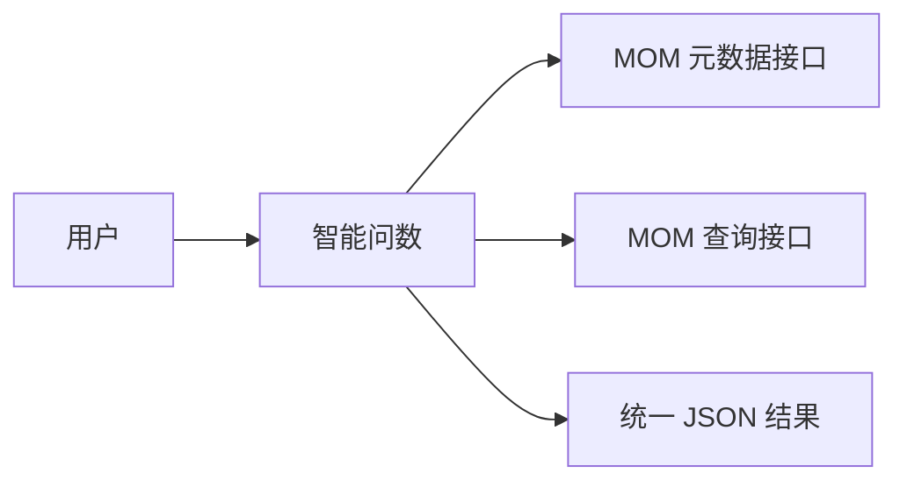
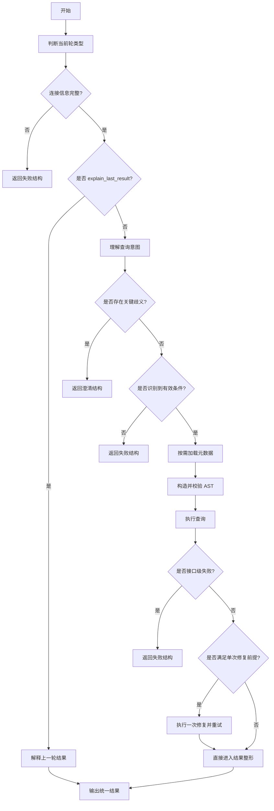
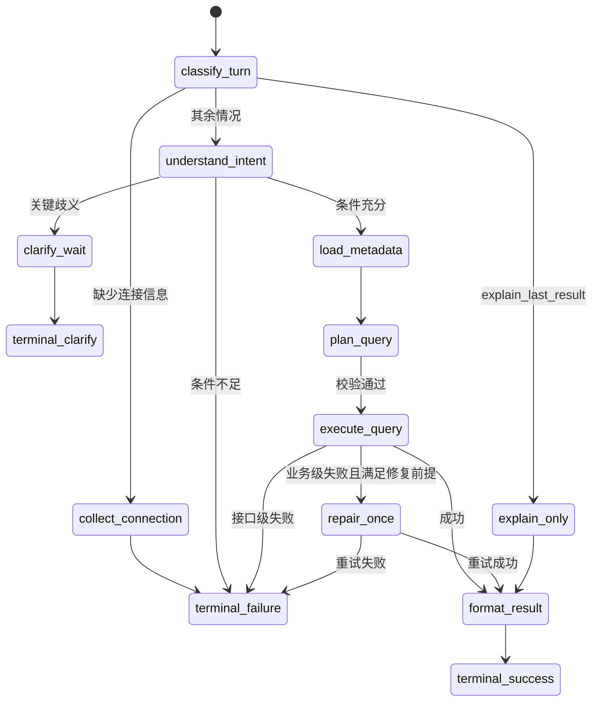

# 智能问数设计

## 1. 文档定位

本文档适用于 MOM 场景下的自然语言条件问数、多轮追问改条件、结果口径说明与上一轮结果解释。

本文档是直接支撑开发落地的正式设计，不包含未决问题、候选方案或评审性建议。文中出现的规则、状态、结构和阈值均视为实现基线。

## 2. 背景与目标

智能问数需要把用户在 MOM 场景中的业务表达转成可执行查询，并在多轮对话中稳定处理以下问题：

- 用户输入是业务语言，不是结构化查询
- 实体、属性、关系路径都依赖实时元数据
- 同一会话中既可能是新查询，也可能是追问、改条件或解释上一轮结果
- 查询成功、失败、澄清、解释都必须返回统一结构，便于上层直接渲染
- 接口失败、协议失败、语义歧义和条件不足必须严格分治

本技能的目标如下：

- 将自然语言转换为可执行且安全的 MOM 查询
- 支持 `cold_start`、`follow_up`、`new_query`、`explain_last_result` 四类当前轮处理
- 仅基于元数据确认实体、属性、关系路径和特殊类型映射
- 严格遵循统一 AST 协议和统一输出协议
- 接口级失败直接止损，业务级失败最多修复一次
- 成功结果只保留一个主数据源，不补查等价数据

## 3. 范围与非目标

本技能支持以下场景：

- 条件化明细查询
- 分组统计
- 趋势、排行、占比类查询
- 关联对象字段查询
- 同会话改条件与重查
- 结果口径说明与数量原因解释

本技能不处理以下内容：

- 根因分析
- 异常归因
- 方案建议
- 指标公式推导
- 一般闲聊
- 通过试探 endpoint、网关或服务前缀排查连接问题

## 4. 典型场景

- 查询本周已完成的制造订单明细
- 统计今天各工作中心的制造任务数量
- 看最近 7 天设备故障数量趋势
- 查询本月设备故障单对应设备编码和名称
- 在上一轮基础上把“已完成”改成“未完成”
- 解释上一轮为什么只有这些记录

## 5. 设计原则

- 元数据优先：只使用元数据已确认的模型、字段、关系和类型定义
- 安全优先：无法稳定确认语义时，澄清或失败，不盲猜
- 承接显式：只有当前轮存在明确承接关系时，才继承上一轮语义
- 单一主数据源：成功结果只使用一次查询返回的数据对象
- 最小访问：文档、元数据、脚本和接口都按当前阶段最小访问
- 输出确定性：同类输入产出同类结构，不依赖临时话术
- 单次修复：自动修复最多一次，重试最多一次

## 6. 输入、输出与前置条件

### 6.1 必需输入

首次真正执行查询时，必须提供以下输入：

- `base_url`
- `token`
- 查询问题

缺少 `base_url` 或 `token` 时，直接返回统一失败结构，不进入后续流程。

### 6.2 连接参数使用规则

- `base_url` 仅作为固定接口前缀使用
- `token` 仅用于当前查询会话鉴权
- 不因 `404`、`401`、`403`、`5xx`、超时或网络错误推测 `base_url` 是否错误
- 不主动搜索或尝试替代 endpoint

### 6.3 敏感信息处理

- `token` 只保存在当前会话内存态上下文，不写入长期缓存
- 日志、错误信息、调试输出和审计记录中不得出现完整 `Authorization` 值
- 查询问题、查询 AST 和结果摘要按业务敏感信息处理
- 会话结束、连接参数被替换或会话超时后，立即清理连接上下文与关联缓存

### 6.4 统一输出要求

无论成功、失败、澄清还是解释，都返回单个 JSON 对象，顶层固定包含以下字段：

- `api_response`
- `query_time`
- `timestamp`
- `summary`
- `presentation`

其中：

- `api_response.data` 是成功结果的单一主数据源
- `presentation` 只承载渲染信息，不重复复制整批结果

## 7. 当前轮分类

当前轮只允许归入以下四类之一：

- `cold_start`
- `follow_up`
- `new_query`
- `explain_last_result`

分类规则固定如下：

- 当前没有可复用上下文，或首次需要收集连接信息时，归类为 `cold_start`
- 当前轮明显沿用上一轮主实体和主要语义，只修改条件、分组、排序或展示意图时，归类为 `follow_up`
- 当前轮明确在解释上一轮结果、口径、分页或数量原因，且默认不要求重新查数时，归类为 `explain_last_result`
- 主实体变化、业务目标变化，或当前问题不应继承上一轮语义时，归类为 `new_query`

当 `follow_up` 与 `new_query` 无法稳定区分时，直接返回澄清结构，不默认继承上一轮语义。

## 8. 会话状态设计

技能维护以下会话状态：

- `connection_context`
- `metadata_cache`
- `active_query_context`

`connection_context` 固定包含：

- `base_url`
- `token`

`metadata_cache` 固定包含：

- `type_list`
- `properties_by_model_code`
- `loaded_at`

`active_query_context` 固定包含：

- `last_turn_type`
- `confirmed_entity`
- `confirmed_fields`
- `confirmed_relation_paths`
- `normalized_filters`
- `normalized_groupings`
- `normalized_orderings`
- `chart_intent`
- `last_query_request`
- `last_result_summary`
- `last_presentation_type`

状态规则固定如下：

- 用户显式修改 `base_url` 或 `token` 时，清空 `metadata_cache` 和 `active_query_context`
- 判定为 `new_query` 时，保留连接信息，清空上一轮业务语义
- 会话无活动超过 30 分钟时，清空 `active_query_context`

## 9. 状态机设计

技能执行状态固定如下：

- `collect_connection`
- `classify_turn`
- `understand_intent`
- `clarify_wait`
- `load_metadata`
- `plan_query`
- `execute_query`
- `repair_once`
- `explain_only`
- `format_result`
- `terminal_success`
- `terminal_failure`
- `terminal_clarify`

状态转移规则固定如下：

- 缺少连接信息时，从 `classify_turn` 转入 `collect_connection`，并直接输出 `terminal_failure`
- 条件不足时，从 `understand_intent` 直接输出 `terminal_failure`
- 关键歧义时，从 `understand_intent` 转入 `clarify_wait`，并输出 `terminal_clarify`
- 命中 `explain_last_result` 时，从 `classify_turn` 直接进入 `explain_only`
- 只有 `plan_query` 完成结构校验后，才允许进入 `execute_query`
- `repair_once` 最多进入一次，之后不得再次修复

## 10. 中间意图模型

自然语言理解层与 AST 规划层之间固定使用 `normalized_intent` 作为内部契约。所有执行、澄清、解释和失败决策都以该对象为基础，不允许绕过该对象直接构造查询。

`normalized_intent` 固定包含以下字段：

- `turn_type`
- `inheritance_mode`
- `entity_candidates`
- `confirmed_entity`
- `requested_fields`
- `filters`
- `aggregations`
- `groupings`
- `orderings`
- `pagination`
- `chart_intent`
- `relation_paths`
- `explanation_focus`
- `stop_reason`

规则固定如下：

- 进入 AST 构造前，必须完成 `normalized_intent` 完整性校验
- `confirmed_entity` 未确认时，不得进入查询规划
- `filters` 为空时，不得进入查询执行
- `relation_paths` 不唯一时，不得进入查询执行
- `stop_reason` 一旦被设置为澄清或失败原因，后续流程立即终止

## 11. 查询理解规则

查询理解按以下规则实现：

- 实体识别优先使用元数据中的 `name`、`displayName`、`code` 唯一精确匹配
- 仅在实体无法唯一精确匹配时，才允许使用业务别名归一化
- 属性识别优先使用元数据中的 `name`、`displayName`、`code`
- 仅在属性表达明显口语化时，才允许使用属性别名归一化
- 高端装备制造业务短语只用于归一化提示，不得绕过元数据确认
- 若表达中同时存在多个合理实体、属性、关系路径或统计口径候选，直接澄清
- 若表达缺少有效条件，直接失败，不进入元数据和数据查询

有效条件固定为以下任意一种或其组合：

- 明确时间范围
- 明确状态
- 明确编码或名称
- 明确组织、车间、产线、工序、物料、设备等范围
- 明确数量区间或阈值
- 明确业务对象集合

以下表达固定视为条件不足：

- 最近
- 异常
- 高
- 低
- 有问题的
- 看一下情况
- 查一下数据

## 12. 元数据与缓存设计

### 12.1 外部元数据接口

元数据固定通过以下接口获取：

- `POST /sys/v1/ai/meta/listTypeDefinition`
- `POST /sys/v1/ai/meta/getTypeDefinitionsWithProperties`

### 12.2 元数据加载规则

- 先加载实体清单，再确认实体候选
- 只有实体候选基本收敛后，才按需加载属性定义
- 只为当前轮真正需要的模型加载属性
- 已命中的有效缓存必须复用
- 同一轮中，同一模型属性定义不得重复加载

### 12.3 缓存策略

缓存规则固定如下：

- `type_list` 缓存 TTL 为 30 分钟
- `properties_by_model_code` 缓存 TTL 为 30 分钟
- 缓存键至少包含 `base_url` 和 `modelCode`
- 连接信息变化时立即清空缓存
- 元数据响应结构不兼容时立即清空缓存并返回失败

## 13. 查询规划与 AST 设计

查询请求必须符合统一 AST 协议，顶层结构固定为：

```json
{
  "object": {
    "table": {},
    "config": {}
  }
}
```

固定规则如下：

- 主表别名固定使用 `m`
- join 别名按出现顺序固定使用 `j1`、`j2`、`j3`
- 所有字段引用只允许使用属性编码
- 不得使用真实表名和真实列名
- 所有 `sourceAlias` 必须引用已声明别名
- 所有 `property` 必须能在当前元数据中找到
- 执行查询时始终显式传入分页对象
- 默认分页固定为 `page = 1`、`vol = 10`

时间值固定按以下格式写入：

- `DATE` 使用 `yyyy-MM-dd`
- `DATETIME` 使用 `yyyy-MM-dd HH:mm:ss`

聚合与分组规则固定如下：

- 查询列中同时出现聚合列和普通字段时，普通字段必须进入 `groups`
- `COUNT(*)` 使用 `star: true`
- 排序方向只允许 `ASC` 或 `DESC`

执行前最小校验固定如下：

- 顶层结构完整
- 主模型存在
- 别名唯一
- 查询列非空
- 条件树非空
- 聚合查询分组完整
- 排序方向合法
- 未出现协议外字段

## 14. 查询执行与自动修复

### 14.1 执行入口

数据查询固定通过以下接口执行：

- `POST /sys/v1/ai/data/query_dsl`

固定脚本入口如下：

- `shared/scripts/fetch_type_list.py`
- `shared/scripts/fetch_type_properties.py`
- `shared/scripts/execute_query.py`
- `shared/scripts/map_special_values.py`

超时固定如下：

- 元数据接口超时 30 秒
- 数据查询接口超时 120 秒

### 14.2 接口级失败

以下情况固定视为接口级失败：

- `HTTP 404`
- `HTTP 401`
- `HTTP 403`
- `HTTP 5xx`
- 超时
- 网络错误
- 网关错误
- 服务不可用

接口级失败处理固定如下：

- 直接返回失败结构
- 不进入自动修复
- 不推测连接参数或 endpoint 是否错误

### 14.3 业务级失败与单次修复

只有满足以下全部条件时，才允许进入自动修复：

- 查询接口已到达业务处理层
- 返回明确且非空的 `errCode`
- 返回非空 `suggestions`
- `suggestions` 足以支持唯一修复动作

允许修复的错误码固定如下：

- `UNKNOWN_MODEL_CODE`
- `UNKNOWN_PROPERTY`
- `DUPLICATE_ALIAS`
- `DUPLICATE_COLUMN_ALIAS`
- `INVALID_OPERATOR`
- `INVALID_JOIN_TYPE`
- `INVALID_ORDER_DIRECTION`
- `GROUP_REQUIRED_FOR_FIELD`
- `RIGHT_VALUE_REQUIRED`
- `RIGHT_VALUE_NOT_ALLOWED`
- `EMPTY_CONDITION_TREE`
- `UNKNOWN_JSON_FIELD`

修复规则固定如下：

- 自动修复最多一次
- 修复后只允许重试一次
- 修复动作不得改变用户原始业务语义
- 无法形成唯一动作时直接失败

## 15. 结果整形与展示设计

### 15.1 特殊类型展示值

以下类型必须补齐展示值：

- `ENUM`
- `UNIT`
- `CLASSIFICATION`

展示值规则固定如下：

- 原始字段保留
- 展示字段命名固定为 `原字段名 + Name`
- 映射失败时保留原始值，不编造名称
- 展示值补齐只作用于当前轮已拿到的结果集

### 15.2 展示类型

`presentation.type` 只允许以下三种取值：

- `text`
- `table`
- `chart`

选择规则固定如下：

- 失败、澄清、解释默认使用 `text`
- 明细列表默认使用 `table`
- 趋势默认使用 `line`
- 占比、构成、分布默认使用 `pie`
- 排行、TOP、对比默认使用 `bar`
- 图表没有明显优势时返回 `table`

### 15.3 摘要规则

`summary` 固定使用中文，长度控制在一到两句话，并遵循以下规则：

- 成功时说明数据规模和展示方式
- 明细查询说明当前页返回条数、总行数和分页限制
- 未执行查询时直接说明原因
- 接口级失败只陈述已发生的事实，不附带排查建议

## 16. 错误处理与停止条件

以下场景固定返回失败结构：

- 缺少必需连接参数
- 未识别到有效条件
- 查询请求无法安全构造
- 查询失败且错误不在可修复范围内
- 已执行一次修复但仍失败

以下场景固定返回澄清结构：

- `follow_up` 与 `new_query` 无法稳定区分
- 用户表达同时指向多个合理实体
- 用户表达同时指向多个合理属性
- 关系路径不唯一
- 统计口径不明确
- 派生指标没有显式字段或统一口径

对于 `explain_last_result`，固定规则如下：

- 默认不重新查询
- 优先基于上一轮条件、分页和结果摘要解释
- 只有在不补查无法解释时，才允许重新执行查询

## 17. 可观测性与审计

每一轮执行必须生成唯一 `trace_id`，并贯穿以下阶段：

- 当前轮分类
- 意图理解
- 元数据加载
- AST 构造
- 查询执行
- 单次修复
- 结果整形

每一轮必须记录以下审计字段：

- `trace_id`
- `turn_type`
- `confirmed_entity`
- `stop_reason`
- `cache_hit`
- `repair_applied`
- `http_status`
- `duration_ms`
- `presentation_type`

日志规则固定如下：

- 不记录完整 token
- 不记录完整原始结果集
- 可记录字段级摘要、数量级摘要和错误分类

## 18. 性能与验收标准

首版验收阈值固定如下：

- 条件充分且无关键歧义的标准用例集上，语义正确率不低于 90%
- 条件不足、术语歧义、路径不唯一、统计口径不明的负向用例集上，正确进入澄清或安全失败的比例不低于 95%
- `follow_up`、`new_query`、`explain_last_result` 的误继承率不高于 2%
- 查询 AST 结构校验通过率为 100%
- 统一输出结构校验通过率为 100%
- 命中元数据缓存的常规查询端到端 `P95` 不高于 5 秒
- 冷路径查询端到端 `P95` 不高于 12 秒
- 自动修复在黄金用例集和反例用例集上的误触发率为 0

## 19. 测试与回归要求

测试固定分为以下四层：

- 脚本级测试
- 协议级测试
- 规则级测试
- 端到端回归测试

脚本级测试固定覆盖：

- 元数据接口 URL 拼接
- 查询请求透传
- 超时与错误分类
- 特殊值映射

规则级测试固定覆盖：

- 条件充分时进入执行
- 条件不足时返回失败
- 歧义场景返回澄清
- `follow_up`、`new_query`、`explain_last_result` 分类正确
- explain 场景默认不重查

端到端回归固定维护三类用例：

- 黄金用例集
- 反例用例集
- 边界用例集

回归矩阵固定覆盖以下维度：

- 当前轮类型
- 查询形态
- 语义风险
- 执行结果
- 展示结果

## 20. 已知风险与控制措施

风险 1：元数据质量不足导致无法唯一确认实体、属性或关系路径。

控制措施：

- 仅以元数据为准
- 无法唯一确认时直接澄清或失败

风险 2：业务术语同时映射对象、字段和统计口径。

控制措施：

- 业务短语只用于归一化提示
- 关键口径不明确时直接澄清

风险 3：多轮会话继承过强导致语义污染。

控制措施：

- 承接关系必须显式判断
- `follow_up` 与 `new_query` 无法稳定区分时直接澄清
- 会话空闲 30 分钟后清空业务上下文

风险 4：元数据缓存过旧导致查询规划错误。

控制措施：

- 固定 TTL
- 连接变化立即清空缓存
- 元数据响应不兼容时立即失效

风险 5：接口不稳定导致无意义重试或错误修复。

控制措施：

- 接口级失败直接终止
- 自动修复只允许在业务级失败且满足唯一修复前提时执行

## 21. 附录

### 21.1 系统上下文图



### 21.2 主流程图



### 21.3 状态图



### 21.4 `normalized_intent` 示例

```json
{
  "turn_type": "follow_up",
  "inheritance_mode": "reuse_entity_and_time_range",
  "entity_candidates": ["WorkOrder"],
  "confirmed_entity": "WorkOrder",
  "requested_fields": ["code", "name", "statusCode"],
  "filters": [
    {"property": "statusCode", "op": "EQ", "value": "RUNNING"}
  ],
  "aggregations": [],
  "groupings": [],
  "orderings": [],
  "pagination": {"page": 1, "vol": 10},
  "chart_intent": null,
  "relation_paths": [],
  "explanation_focus": null,
  "stop_reason": null
}
```

### 21.5 统一输出示例

```json
{
  "api_response": {
    "code": 0,
    "ok": true,
    "data": {
      "rows": [],
      "pageIndex": 1,
      "pageSize": 10,
      "totalRows": 0,
      "totalPages": 0
    },
    "message": "query success"
  },
  "query_time": "0.18s",
  "timestamp": "2026-04-11 09:30:00",
  "summary": "当前第 1 页返回 0 条记录，共 0 条，已按分页展示。",
  "presentation": {
    "type": "table",
    "title": "制造订单明细",
    "data": {
      "columns": [
        {"key": "code", "title": "编码"},
        {"key": "name", "title": "名称"}
      ],
      "rows_path": "api_response.data.rows",
      "pagination_path": "api_response.data"
    }
  }
}
```
