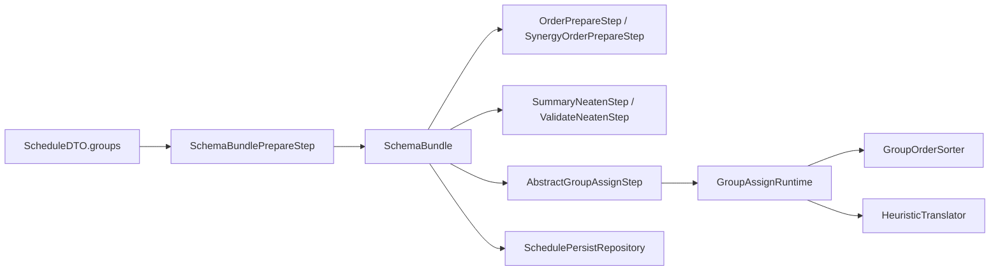
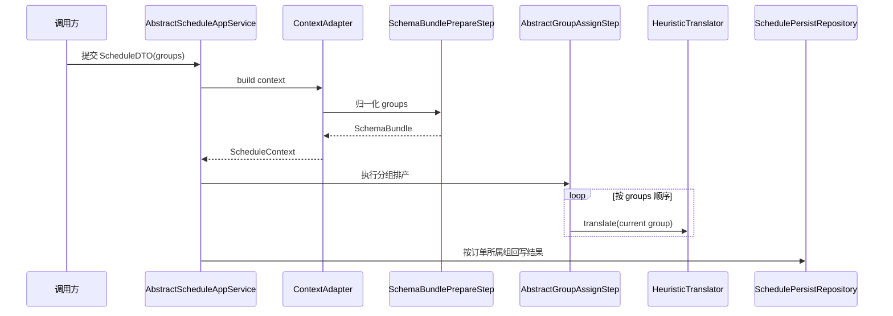

# APS 支持多分组设计文档

- 文档日期：2026-04-09
- 适用范围：`km-mom-aps` 当前机加、协同排产主链路
- 依据来源：`km-mom-aps-scheduler`、`km-mom-aps-biz-machine`、`km-mom-aps-biz-synergy` 现有实现

## 1. 背景与结论

当前 APS 代码已经具备“多分组排产”的运行时能力，但这套能力并不是通过改造主数据 `ScheduleSchema` 为多组模板实现的，而是通过排产命令中的 `groups` 输入，在运行时构建 `SchemaBundle` 后逐组执行排产完成的。

从现有代码可以得到两个核心结论：

1. 多分组已经是当前调度入口的默认输入模型，而不是临时兼容能力。
2. 多分组目前属于“运行时编排能力”，不是“主数据层面的多组方案实体能力”。

也就是说，当前设计的目标不是让一条 `ScheduleSchema` 主数据记录直接存储多个分组，而是允许一次排产请求携带多个分组，每个分组绑定自己的订单集合和方案定义，再按分组顺序逐组执行。

## 2. 设计目标

结合现有代码，APS 多分组设计的目标可以归纳为：

1. 支持一次排产请求携带多个分组，每个分组拥有独立订单范围和方案定义。
2. 保证订单在分组间唯一归属，避免同一订单被多个分组重复排产。
3. 保持输入分组顺序即运行时执行顺序，避免出现隐式重排。
4. 在分组执行过程中，让排序规则、排产方向、分派方法、资源策略严格绑定到当前分组。
5. 在结果回写和评估阶段，能够按订单反查实际生效分组，避免把多分组结果错误收敛为单一方案。
6. 在机加和协同等不同业务场景中复用同一套多分组骨架。

## 3. 总体设计

### 3.1 设计思路

当前实现采用“命令输入分组化、运行时上下文化、算法执行按组化、持久化按组回溯”的总体方案：

1. 前端或调用方通过 `ScheduleDTO.groups` 传入多分组请求。
2. `SchemaBundlePrepareStep` 将输入归一化为 `SchemaBundle`。
3. `OrderPrepareStep` / `SynergyOrderPrepareStep` 基于全部分组订单范围统一装载订单。
4. `AbstractGroupAssignStep` 维护当前分组游标，按组构造运行时载荷。
5. `HeuristicTranslator` 在当前组作用域内完成订单和任务分派。
6. 后置阶段按订单所属组反查生效方案，并决定如何持久化。

### 3.2 架构关系

### 3.3 核心特征

- 分组是运行时对象，不直接落在 `ScheduleSchema` 主数据结构中。
- `groups` 的输入顺序就是实际执行顺序。
- 一个订单只能属于一个分组。
- 分组之间共享同一个 `ScheduleContext`、同一批已加载订单和资源总线，但排产规则读取当前分组作用域。
- 多场景共用调度器公共层，业务场景只负责上下文装配和结果持久化。

## 4. 核心数据模型

### 4.1 输入模型

#### 4.1.1 `ScheduleDTO`

排产入口 DTO 已把 `groups` 设为必填字段，说明多分组已经成为标准输入协议。

关键字段：

| 字段 | 含义 |
| --- | --- |
| `sessionKey` | 排产会话标识 |
| `factoryId` | 工厂 ID |
| `groups` | 分组排产输入，必填 |
| `urgentOrderIds` | 紧急插单订单 |
| `lockTasks` | 运行时锁定任务 |

#### 4.1.2 `ScheduleGroupDTO`

每个分组输入包含：

| 字段 | 含义 |
| --- | --- |
| `groupName` | 分组名称，可空 |
| `orderIds` | 分组订单集合，必需唯一且非空 |
| `schemaCode` | 引用型方案编码 |
| `transientSchema` | 直传型临时方案 |

其中 `schemaCode` 与 `transientSchema` 二选一；若两者同时传入，则当前实现优先使用 `transientSchema`。

#### 4.1.3 `TransientSchemaDTO`

直传型临时方案承载以下运行时参数：

| 字段 | 含义 |
| --- | --- |
| `code` | 临时方案编码 |
| `name` | 临时方案名称 |
| `sortRules` | 排序规则表达式 |
| `assignMethod` | 排产方法 |
| `assignDirection` | 排产方向 |
| `assignStrategy` | 资源分派策略 |

### 4.2 运行时方案模型

当前代码中有两类运行时方案：

| 类型 | 类 | 说明 |
| --- | --- | --- |
| 引用型方案 | `ReferencedSchema` | 由主数据 `ScheduleSchema` 转换得到 |
| 临时方案 | `TransientSchema` | 由请求中的 `transientSchema` 直接归一化得到 |

这两类对象都实现 `SchemaDefine`，因此算法层不关心方案来自主数据还是直传输入。

### 4.3 分组运行时模型

#### 4.3.1 `ScheduleGroup`

`ScheduleGroup` 是单个分组的运行时载体，包含：

| 字段 | 含义 |
| --- | --- |
| `groupName` | 分组名称 |
| `orderIds` | 归一化后的订单集合 |
| `schema` | 当前组绑定的运行时方案 |
| `sortRuleDefines` | 当前组排序规则解析结果 |

设计要点：

- `gainOrderIds()` 对空集合做兜底，避免下游散落空判。
- `containsOrderId()` 支撑后续“按订单反查所属组”。

#### 4.3.2 `SchemaBundle`

`SchemaBundle` 是一次排产的分组总容器，也是多分组的核心运行时对象。

职责包括：

1. 保存已归一化分组集合。
2. 维护当前执行分组游标。
3. 汇总所有分组订单 ID。
4. 按订单 ID 反查所属分组。
5. 提供分组数量、有限产能分组判断等辅助能力。

特别约束：

- `setGroups()` 禁止写入 `null` 分组。
- `resetCurrentGroup()` / `switchToNextGroup()` / `gainCurrentGroup()` / `clearCurrentGroup()` 共同维护“当前分组游标”。
- `gainAllOrderIds()` 保留订单首次出现顺序，用于统一加载订单。

### 4.4 分组作用域上下文

多分组设计没有复制整份 `ScheduleContext`，而是在全局上下文上增加分组作用域：

| 对象 | 作用 |
| --- | --- |
| `ScheduleContext` | 保存全局工厂、配置、订单、资源、`schemaBundle` |
| `GroupAssignRuntime` | 保存当前分组所需的轻量依赖 |
| `GroupAssignPack` | 保存当前分组实际进入算法层的载荷 |
| `OrderContext` | 当前订单在当前分组下的分派缓存 |
| `TaskContext` | 当前任务在当前分组下的分派上下文 |

这种设计避免了多分组重复加载订单、资源和能力数据，把“全局共享数据”和“当前组规则作用域”拆开处理。

## 5. 多分组处理流程

### 5.1 总体时序

### 5.2 上下文准备阶段

在机加场景中，`MachineContextAdapter` 的准备顺序为：

1. `ConfigPrepareStep`
2. `SchemaBundlePrepareStep`
3. `OrderPrepareStep`
4. `TaskRelationPrepareStep`
5. `ResDataPrepareStep`
6. `ResCapacityPrepareStep`
7. `ResDutyPrepareStep`
8. `ResHoldPrepareStep`

在协同场景中，`SynergyOrderPrepareStep` 也遵循相同原则：先准备 `schemaBundle`，再按全部分组订单范围装载订单。

这说明多分组是“上下文准备的前置条件”，后续订单、任务关系、资源能力和出勤准备都依赖分组汇总结果。

### 5.3 分组归一化阶段

`SchemaBundlePrepareStep` 负责把请求 DTO 转换为运行时 `SchemaBundle`。

处理步骤如下：

1. 读取 `ScheduleDTO.groups`，为空则直接终止。
2. 逐组按输入顺序处理，顺序即后续执行顺序。
3. 对每个分组校验 `orderIds`：
   - 不允许为空
   - 不允许存在空订单 ID
   - 不允许组内重复
   - 不允许跨组重复
4. 解析方案来源：
   - 若存在 `transientSchema`，优先走直传型方案
   - 否则使用 `schemaCode` 查询引用型方案
5. 校验方案核心字段：
   - `assignMethod`
   - `assignDirection`
   - `assignStrategy`
6. 解析 `sortRules` 为 `SortRuleDefine` 列表。
7. 组装 `ScheduleGroup` 并写入 `SchemaBundle`。

### 5.4 订单准备阶段

订单准备阶段不再关注“当前只排哪个方案”，而是统一从 `SchemaBundle.gainAllOrderIds()` 汇总全部分组覆盖的订单。

该设计有两个好处：

1. 数据查询只做一次，避免按分组重复查单。
2. 分组只决定后续规则作用域，不改变订单装载和任务关系建模方式。

机加与协同场景都采用该模式。

### 5.5 预处理阶段

预处理阶段中的多分组适配点主要有三类：

#### 5.5.1 摘要展示

`SummaryNeatenStep` 会输出：

- 分组数量
- 每个分组的名称
- 每个分组的订单数
- 每个分组的排产方向、方法
- 每个分组的排序规则

这使得调用侧在排产前即可确认输入是否符合预期。

#### 5.5.2 排产校验

`ValidateNeatenStep` 在校验时间锁定时，会按订单 ID 反查其所属分组，再读取该组 `schema.assignDirection` 判断：

- 正排要求锁定开始时间
- 倒排或逆向转正向要求锁定结束时间

因此时间锁定规则不再是全局单方案语义，而是组内语义。

#### 5.5.3 公共资源与出勤准备

`FitOccupyNeatenStep`、`UsableDutyNeatenStep`、`RuleLockNeatenStep` 仍然运行在全局上下文上，不按组重复准备；多分组只影响后续调度时如何消费这些公共数据。

### 5.6 分派执行阶段

`AbstractGroupAssignStep` 是多分组执行骨架，关键流程如下：

1. 从 `ScheduleContext` 读取 `SchemaBundle`。
2. 重置当前分组游标。
3. 循环调用 `switchToNextGroup()`。
4. 对当前组执行：
   - 按当前组订单范围获取有效订单
   - 构造 `GroupAssignRuntime`
   - 使用 `GroupOrderSorter.forRuntime(runtime)` 排序组内订单
   - 封装为 `GroupAssignPack`
   - 调用 `HeuristicTranslator.translate(context, pack)` 真正排产
5. 全部组执行完成后清理游标。

如果某个分组没有可排产订单，则仅跳过该组，不中断整个流程。

### 5.7 组内排序与算法执行

#### 5.7.1 `GroupOrderSorter`

`GroupOrderSorter` 的排序逻辑是：

1. 先按内置权重排序：
   - 开工 + 时间锁
   - 开工 + 资源锁
   - 紧急插单
   - 开工状态
   - 未开工时间锁
   - 未开工资源锁
2. 再按当前分组的 `sortRuleDefines` 执行表达式排序。
3. 最后按订单 ID 兜底。

因此排序规则并非全局共享，而是明确绑定到当前组。

#### 5.7.2 `HeuristicTranslator`

`HeuristicTranslator` 在处理 `GroupAssignPack` 时，会从 `pack.gainSchemaDefine()` 获取当前组方案，并基于该方案决定：

- 正排还是倒排
- 有限产能还是无限产能
- 当前组资源分派策略

无论是已开工任务还是未开工任务，最终都在当前组运行时作用域内执行。

## 6. 结果持久化与评估设计

### 6.1 任务结果回写

`SchedulePersistRepository` 在回写 `AssignedTask` 时，不再假设上下文只对应单一方案，而是通过订单 ID 反查所属分组，再取该分组的 `schema` 写入任务相关字段。

关键点：

1. `fillDataToAssignedTask()` 通过 `gainSchemaByOrderId(context, task.getOrderId())` 获取实际生效方案。
2. `curAssignedDirection` 等字段取订单所属组，而不是全局默认方案。
3. 这保证了多分组场景下不同订单能够保留各自组内方案差异。

### 6.2 计划评估回写

`PlanAssess` 的 `scheduleSchema` 回写采取保守策略：

- 只有 `schemaBundle.groupSize() == 1` 时，才尝试映射单一 `schemaId`
- 且该方案必须是 `ReferencedSchema`
- 对于多分组场景，不强行映射单一方案实体

这表明当前数据模型已经明确承认“多分组结果无法等价收敛为单一 schema 主数据引用”。

### 6.3 评估摘要输出

`AssessSppStep` 在评估摘要中会输出：

- 排产模式：单组兼容模式 / 分组排产
- 分组数量
- 每个分组的方案名、规则、方向、方法、资源策略
- 总订单数、有效订单数、逾期率、约束突破数、失败数

这说明后处理阶段已经把多分组视为一等公民能力，而不是附加信息。

## 7. 场景接入设计

### 7.1 机加场景

机加场景通过以下链路接入多分组：

1. `MachineContextAdapter` 负责构建上下文。
2. `MachineScheduleService` 复用 scheduler 公共预处理和后处理阶段。
3. `MachineAssignStep` 继承 `AbstractGroupAssignStep`，不再直接执行“全量单方案翻译”。
4. `SchedulePersistRepository` 在结果回写时保留组内方案差异。

### 7.2 协同场景

协同场景采用同样的接入方式：

1. `SynergyOrderPrepareStep` 按全部分组订单范围装载父子订单链路。
2. 锁定任务和紧急插单在统一订单装载后叠加到运行时对象。
3. `SynergyAssignStep` 复用分组分派骨架。
4. `SynergyScheduleService` 复用与机加一致的阶段编排方式。

### 7.3 复用边界

当前设计把“多分组骨架”沉淀在 scheduler 公共层，把“订单装载和结果落库差异”保留在场景层，因此具备以下扩展性：

- 新场景只要复用 `ScheduleDTO.groups` 和 `SchemaBundlePrepareStep`，就能接入多分组。
- 各场景只需要实现本场景的订单准备、资源准备和持久化适配。

## 8. 当前设计边界与限制

基于现有代码，当前多分组设计存在以下边界：

### 8.1 主数据仍是单方案模型

`ScheduleSchema` 只描述一套：

- `sortRules`
- `assignMethod`
- `assignDirection`
- `assignStrategy`

因此当前系统并不支持“在主数据层维护一个多分组模板方案实体”。多分组必须在排产请求时显式给出。

### 8.2 分组只支持顺序执行，不支持并行

`SchemaBundle` 通过单一游标顺序推进分组，`AbstractGroupAssignStep` 也是逐组串行执行。当前没有组间并行排产机制。

### 8.3 订单必须唯一归属

同一订单一旦出现在多个分组中，`SchemaBundlePrepareStep` 会直接报错并中止构建。这意味着当前不支持：

- 一个订单跨多个分组分阶段排产
- 一个订单在多个方案下做对比排产

### 8.4 分组维度输入较轻

当前分组只承载：

- 分组名称
- 订单范围
- 方案定义

并没有单独的组级资源范围、组级锁定策略、组级排产窗口、组级优先级等扩展字段。

### 8.5 持久化仍基于覆盖式结果表

`SchedulePersistRepository` 仍采用“先清后写”的结果持久化策略，因此虽然任务级结果可以保留组内方案差异，但历史排产快照与组间对比信息并未沉淀。

## 9. 后续演进建议

以下建议基于现有设计自然延伸，不改变当前主链路基本结构：

### 9.1 若需要“多分组模板管理”

建议新增独立的“分组方案模板”模型，而不是直接把 `ScheduleSchema` 改造成嵌套结构。原因是：

1. 当前运行时多分组已经稳定。
2. `ScheduleSchema` 已被大量现有代码当作单方案实体使用。
3. 直接改造主数据会带来主数据管理、查询、展示和兼容层面的连锁影响。

### 9.2 若需要更强组级治理能力

可以考虑为 `ScheduleGroupDTO` 增加扩展字段，例如：

- `priority`
- `resScope`
- `lockRuleOverride`
- `scheduleStartOverride`
- `remark`

但这些扩展应优先维持“组级编排属性”的定位，不应与 `SchemaDefine` 中已有字段职责重叠。

### 9.3 若需要审计与解释能力

建议结合现有 `SummaryNeatenStep`、`AssessSppStep` 和可观测性设计文档，增加：

- 分组执行快照
- 组内订单排序结果
- 订单所属组和生效方案的任务级解释

这样可以进一步增强多分组排产的业务可解释性。

## 10. 结论

当前 APS 的多分组能力已经形成完整闭环，其设计要点不是“把一套方案拆成多组存储”，而是：

1. 以 `ScheduleDTO.groups` 作为标准输入协议。
2. 以 `SchemaBundle` 作为多分组运行时核心容器。
3. 以 `AbstractGroupAssignStep` + `GroupAssignRuntime` 作为按组执行骨架。
4. 以订单归组反查机制保障校验、分派和持久化的组内规则一致性。
5. 以场景层适配器复用同一套多分组公共能力。

因此，当前代码已经支持“多分组排产”，但该能力的定位应被准确描述为：

> APS 已支持基于运行时分组输入的多分组排产；当前多分组能力落在调度运行时与场景适配层，而非排产方案主数据实体层。
