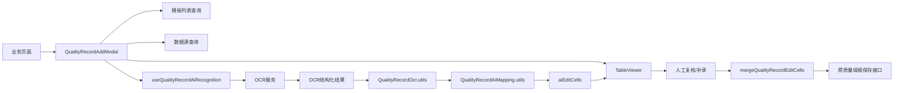
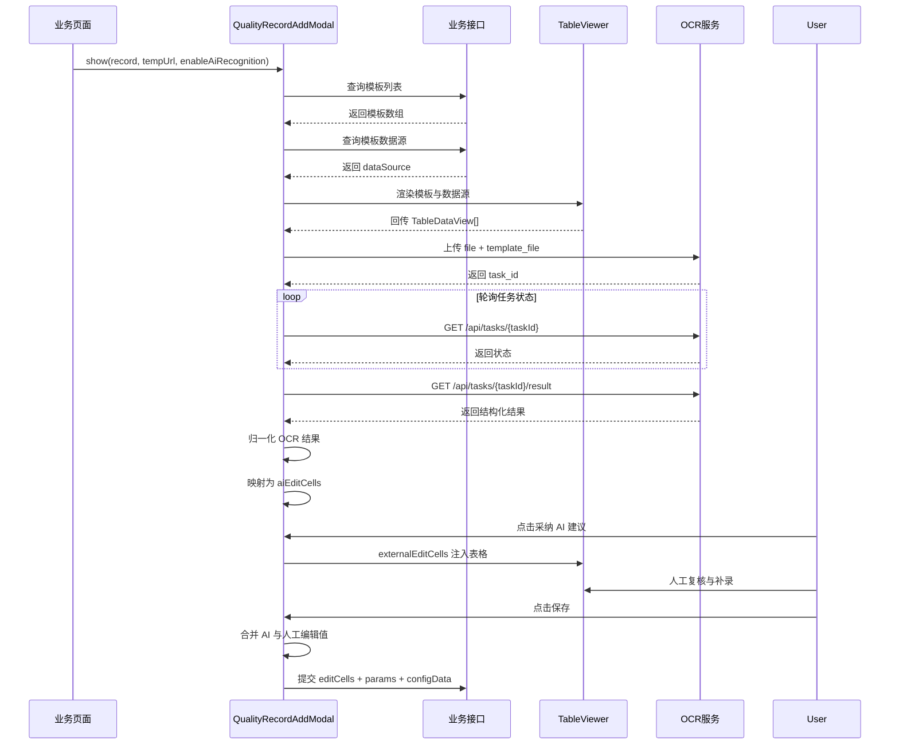

# 质量填报文档识别设计文档

## 1. 文档目标

本文档用于收敛当前仓库内“质量填报文档识别并一键填报”能力的最终设计结论。

当前代码已经完成了从图片上传、OCR 识别、模板映射，到 AI 建议注入表格、人工复核后保存的完整链路，但实现分散在业务弹窗、AI Hook、OCR 工具和表格引擎之间，缺少一份统一设计文档来回答以下问题：

- 当前能力到底实现到了哪一步，边界在哪里
- OCR 结果为什么能稳定落到质量填报模板里
- 动态表、多块模板、低置信度、人工编辑优先等规则分别在哪里处理
- 后续如果继续扩展 PDF、多页、多图、复用到其他页面，应从哪里演进

本文重点回答四个问题：

- 当前实现的真实业务语义是什么
- 文档识别能力是如何接入质量填报主流程的
- OCR 结果如何转换为表格可保存的标准编辑协议
- 现有方案的稳定点、约束和后续优化方向分别是什么

## 2. 业务背景与当前问题

### 2.1 当前业务场景

质量填报场景中，用户通常需要根据纸质或图片化的质量记录，将表格内容重新录入到系统模板中。传统方式主要依赖人工逐项填写，存在以下典型问题：

- 填报工作重复，效率低
- 表格字段较多时容易漏填、错填
- 动态表格场景下，人工逐行录入成本高
- 已有模板设计能力和表格引擎能力没有充分复用到识别场景中

因此当前实现引入了“文档识别 + AI 建议填报”能力，目标不是替代人工确认，而是减少用户重复录入工作量。

### 2.2 当前实现的真实语义

当前所谓“质量填报文档识别并一键填报”，真实语义不是“上传后自动落库”，而是：

1. 用户打开质量填报弹窗
2. 用户上传质量记录图片
3. 前端调用 OCR 服务获取结构化表格结果
4. 前端把识别结果映射为 `CellEditValue[]`
5. 用户点击“采纳 AI 建议”，将结果注入表格编辑态
6. 用户人工复核后，再通过原质量填报保存接口提交

也就是说，当前实现本质上是：

- OCR 识别
- 模板映射
- 编辑态注入
- 人工优先保存

而不是：

- OCR 直接落库
- OCR 自动替换已有值
- OCR 识别完成后自动保存

### 2.3 当前方案要解决的核心矛盾

质量填报文档识别场景里，真正的难点不是“调用 OCR”，而是“识别结果如何稳定落到运行时模板单元格上”。

当前方案重点解决了三个矛盾：

- OCR 的表格结构不一定和模板静态设计完全一致，尤其是合并单元格、标签列、表单布局会出现拆格差异
- 动态表格的运行时行数可能少于 OCR 实际识别出的行数，如果不先扩容，识别出的第 2、3 行没有落点
- AI 结果必须和人工编辑共存，且人工编辑优先，不能因为引入 AI 破坏原有保存协议

## 3. 最终设计结论

### 3.1 AI 识别是质量填报弹窗的可选增强能力

当前方案没有把 AI 识别写死在某个页面里，而是通过 `enableAiRecognition` 显式控制是否开启。

结论如下：

- 质量填报弹窗是主流程载体
- AI 识别能力是弹窗的可选增强能力
- 哪些业务页面开启 AI，由入口页面决定，不由弹窗内部隐式判断

### 3.2 OCR 服务与业务接口链路解耦

当前 OCR 请求链路不走 `sourceApi`，而是浏览器通过 `fetch` 直接访问 OCR 服务。

结论如下：

- 模板查询、数据源查询、保存提交仍走现有业务接口体系
- OCR 识别链路独立，便于后续单独替换 OCR 服务
- OCR 的轮询、超时、异常提示由前端 AI Hook 自己管理

### 3.3 识别结果只能通过表格标准编辑协议进入系统

当前方案没有发明新的“AI 填报数据结构”，而是统一将 OCR 结果映射为 `CellEditValue[]`，再通过 `TableViewer.externalEditCells` 注入表格。

结论如下：

- AI 识别结果必须收敛到表格引擎既有编辑协议
- 表格展示、必填校验、保存提交都基于同一套协议工作
- 后端无需为 AI 场景额外新增保存协议

### 3.4 人工编辑优先于 AI 识别结果

当前方案在展示和保存两个层面都落实了“人工优先”原则：

- 展示层：手动编辑值优先于 AI 注入值
- 保存层：同一单元格如果用户手动改过，以用户最终值为准

这意味着当前方案始终把 AI 定位为“建议值生成器”，而不是“最终值裁决者”。

### 3.5 主命中策略依赖 `table_id -> design.id`

当前最稳定的命中链路，是 OCR 返回的 `table_id` 与模板运行时 `design.id` 一一对应。

这条前提一旦成立，多块模板识别就可以采用精确映射，而无需靠模糊猜测。

结论如下：

- `multi_block` 是主策略
- `single_table_fallback` 只是兜底策略
- 后续如果 OCR 服务改变 `table_id` 契约，识别准确率会显著受影响

## 4. 代码落点

### 4.1 业务入口与主流程编排

| 模块 | 文件 | 职责 |
| --- | --- | --- |
| 检验任务页入口 | `D:/km-mom-next-web/apps/km-mom-web/src/pages/mes-inspection/quality/inspection-task/inspection-task-manage/index.tsx` | 打开质量填报弹窗，并显式开启 AI |
| 制造任务页入口 | `D:/km-mom-next-web/apps/km-mom-web/src/pages/mes-execution/manufacturing-task-manage/index.tsx` | 复用质量填报弹窗，但默认不开启 AI |
| 质量填报弹窗 | `D:/km-mom-next-web/apps/km-mom-web/src/pages/mes-execution/abnl-task-manage/modal/QualityRecordAddModal.tsx` | 模板、数据源、表格、AI 状态和保存的总编排 |

### 4.2 AI 识别核心能力

| 模块 | 文件 | 职责 |
| --- | --- | --- |
| AI 识别 Hook | `D:/km-mom-next-web/apps/km-mom-web/src/pages/mes-execution/abnl-task-manage/modal/hooks/useQualityRecordAiRecognition.ts` | 上传、预览、创建 OCR 任务、轮询、拉取结果、采纳 AI 建议 |
| OCR 归一化 | `D:/km-mom-next-web/apps/km-mom-web/src/pages/mes-execution/abnl-task-manage/modal/QualityRecordOcr.utils.ts` | 统一 OCR 返回结构，处理多表、多页、合并单元格 |
| 模板映射 | `D:/km-mom-next-web/apps/km-mom-web/src/pages/mes-execution/abnl-task-manage/modal/QualityRecordAiMapping.utils.ts` | 将 OCR 结果映射为 `CellEditValue[]` |
| AI 与人工合并 | `D:/km-mom-next-web/apps/km-mom-web/src/pages/mes-execution/abnl-task-manage/modal/QualityRecordAddModal.utils.ts` | 保存前合并 AI 编辑值和人工编辑值 |

### 4.3 表格引擎支撑能力

| 模块 | 文件 | 职责 |
| --- | --- | --- |
| 表格查看器 | `D:/km-mom-next-web/packages/table-engine/src/components/TableViewer/index.tsx` | 统一渲染运行时表格，接收外部注入编辑值 |
| Viewer 类型定义 | `D:/km-mom-next-web/packages/table-engine/src/components/TableViewer/interface.ts` | 定义 `CellEditValue`、`TableDataView` 等核心协议 |
| Viewer Props | `D:/km-mom-next-web/packages/table-engine/src/components/TableViewer/types/index.ts` | 定义 `externalEditCells`、`headerExtra`、`onTableDataViewsChange` |
| 运行时视图生成 | `D:/km-mom-next-web/packages/table-engine/src/components/TableViewer/hooks/useTableDataViewGenerator.ts` | 根据模板和数据源生成运行时表格视图 |
| 单元格渲染 | `D:/km-mom-next-web/packages/table-engine/src/components/TableViewer/hooks/useTableCellRenderer.tsx` | 负责 AI 低置信度提示与内容渲染 |
| 必填校验 | `D:/km-mom-next-web/packages/table-engine/src/components/TableViewer/utils/validateCells.ts` | 保存前把 AI 注入值也纳入必填校验 |

## 5. 整体架构设计

### 5.1 架构分层

当前方案可以抽象为六层：

- 页面入口层：决定是否开启 AI
- 弹窗编排层：负责模板、数据、表格、AI 面板和保存流程
- OCR 交互层：负责上传、任务创建、轮询和结果拉取
- OCR 归一化层：把 OCR 原始结构转为前端统一结构
- 映射算法层：把 OCR 内容转换为 `CellEditValue[]`
- 表格引擎层：负责展示、编辑、校验和保存前收敛

### 5.2 总体流程图

### 5.3 端到端时序

## 6. 详细设计

### 6.1 页面入口设计

当前入口层有一个非常明确的设计选择：**AI 是否开启由业务页面显式决定。**

当前已确认行为如下：

- 检验任务页打开弹窗时传入 `enableAiRecognition: true`
- 制造任务页打开弹窗时未传入该参数，因此 AI 识别默认关闭

这样做的好处是：

- AI 识别能力不会污染所有质量填报场景
- 页面是否支持 AI，一眼可以从入口代码看清
- 后续扩展到新页面时，只需要控制入口开关，不必复制一套弹窗逻辑

### 6.2 质量填报弹窗设计

`QualityRecordAddModal` 当前不是纯粹的“上传识别弹窗”，而是“质量填报主弹窗 + AI 增强能力”的组合体。

它负责以下事情：

- 查询模板列表
- 默认选择模板
- 查询模板对应的数据源
- 渲染 `TableViewer`
- 捕获当前 `TableDataView[]`
- 接入 AI Hook
- 展示 AI 上传弹窗、识别中面板、识别结果面板
- 保存时合并 AI 编辑值和人工编辑值

因此它的定位应该是：**质量填报主流程编排层**。

### 6.3 OCR 交互状态机设计

`useQualityRecordAiRecognition` 负责完整的 OCR 交互状态机，核心状态包括：

- `aiUploadDialogVisible`
- `aiProcessStage`
- `aiUploadFileList`
- `previewImageUrl`
- `pendingRecognitionResult`
- `recognitionApplied`
- `aiEditCells`
- `recognizingHint`

当前状态机分为三个阶段：

- `idle`：未识别
- `recognizing`：识别中
- `result`：已拿到识别结果，等待用户采纳

同时通过 `recognitionRequestIdRef` 做请求版本控制：

- 每次开始识别都会生成新的 requestId
- 旧请求返回后如果不是当前 requestId，将被直接丢弃
- 关闭弹窗、切换模板、重新识别时会主动失效旧请求

这个设计能保证前端状态不会因为异步返回顺序错乱而被污染。

### 6.4 上传文件约束

当前上传策略非常克制，只支持图片：

- `png`
- `jpg`
- `jpeg`

校验同时使用：

- 扩展名校验
- MIME 类型校验

由此可见，当前“文档识别”的真实范围更准确地说是：**质量记录图片识别**，而不是完整的文档中心式识别。

### 6.5 OCR 服务调用设计

#### 6.5.1 服务地址解析

OCR 服务地址优先从运行时配置读取：

1. `window.__KM_WEB_BASE_RUNTIME_CONFIG__.OCR_API_URL`
2. `window.__KM_WEB_BASE_RUNTIME_CONFIG__.OCR_BASE_URL`
3. 兜底地址 `http://192.168.80.25:8001`

#### 6.5.2 调用路径

| 接口 | 方法 | 说明 |
| --- | --- | --- |
| `/api/tasks/table` | `POST` | 创建 OCR 表格识别任务 |
| `/api/tasks/{taskId}` | `GET` | 查询任务状态 |
| `/api/tasks/{taskId}/result` | `GET` | 查询任务结果 |

#### 6.5.3 请求载荷

创建任务时使用 `FormData`，包含两个核心字段：

- `file`：用户上传图片
- `template_file`：由当前模板 `designContent` 组装得到的模板文件

这一点非常关键，说明当前 OCR 服务不是单纯“看图说话”，而是“拿着当前模板一起识别”，即：

**OCR 识别与模板上下文是绑定的。**

#### 6.5.4 轮询策略

| 配置项 | 值 |
| --- | --- |
| 轮询间隔 | `2000ms` |
| 最大等待时长 | `120000ms` |
| 单次请求超时 | `30000ms` |

状态提示文案与 OCR 状态一一对应：

- `PENDING`：任务排队中
- `STARTED / RUNNING`：识别中
- `SUCCESS`：结果整理中
- `FAILURE / FAILED`：识别失败

### 6.6 OCR 结果归一化设计

`QualityRecordOcr.utils.ts` 的职责不是简单做类型声明，而是把 OCR 各种可能返回结构统一成前端稳定可消费的形式。

主要处理内容包括：

- 从 `rawResult`、`rawResult.data`、`rawResult.result`、`rawResult.data.result` 中抽取真实结果
- 兼容 `tables[]` 和 `cells[]` 两类返回形态
- 多表块结果折叠成统一 `cells[]`
- 根据 `row_span / col_span` 计算 `visualRow / visualCol`
- 生成按页组织的 `QualityRecordNormalizedOcrPage[]`

当前归一化层解决的核心问题是：

- OCR 原始坐标不能直接拿来映射模板
- 合并单元格会导致“逻辑行列”和“视觉行列”不一致
- 只有先完成视觉坐标归一化，后续模板映射才能稳定运行

### 6.7 映射算法设计

`QualityRecordAiMapping.utils.ts` 是当前方案的核心算法层。

其输入为：

- OCR 结果
- 运行时 `TableDataView[]`

其输出为：

- `aiEditCells`
- `debugInfo`
- 匹配统计信息

#### 6.7.1 统一业务规则

当前映射算法遵循以下统一规则：

- AI 只回填真正为空的单元格
- `0`、`false` 这类值也算“已有值”，不能覆盖
- 低置信度结果允许注入，但必须标记人工复核
- 最终仍然要交给用户决定是否采纳

#### 6.7.2 动态表扩容

动态表格的运行时表体行数可能少于 OCR 识别出的真实行数，因此映射前会调用 `expandRuntimeTableViewForBodyRows` 先按 OCR 行数补齐运行时表格。

这一层是当前方案能正确支持动态表识别的关键。

如果没有这一步，OCR 第 2、3 行识别结果即使正确，也没有运行时单元格可以落值。

#### 6.7.3 主策略：`multi_block`

当 OCR 返回 `tables[]` 且每个表块都有稳定 `table_id` 时，采用多块精确匹配策略。

核心过程如下：

1. 把运行时表格构造成 `RuntimeBlockContext[]`
2. 通过 `normalizeText(ocrTable.table_id)` 匹配 `view.design.id`
3. 命中后逐块调用 `mapOcrTableToRuntimeBlock`
4. 输出对应块的 `CellEditValue[]`

当前实现已经明确把这条路径作为主策略，因为它最稳定、最可解释，也最适合多块模板场景。

#### 6.7.4 表单模式映射

表单模式下，当前方案没有直接按 OCR 格子硬映射，而是采用“以模板边界为准”的方式：

1. 先根据模板构建 `templateRowSegments`
2. 再根据 OCR 结果构建 `OcrRowSegment`
3. 按列区间重叠关系，把 OCR 片段归并到模板单元格边界中

这样做可以避免 OCR 拆格方式和模板拆格方式不一致时出现错位。

#### 6.7.5 表格模式映射

表格模式下，相对更直接：

- 先归一化 OCR 坐标
- 再按 `visualRow / visualCol` 定位到运行时 `grid-body`
- 如果目标单元格当前为空，则生成对应的 `CellEditValue`

#### 6.7.6 兜底策略：`single_table_fallback`

当 `multi_block` 没有命中任何结果时，进入单表兜底策略。

兜底策略核心逻辑如下：

1. OCR 结果按页归一化
2. 每个运行时表格构造 `RuntimeTableContext`
3. 基于表头文本相似度给每页选一个最佳匹配表格
4. 自动推断表头行数，最多尝试 3 行
5. 先按表头做精确列映射，再按剩余列顺序补齐
6. 逐页消费表体数据并落值

这条链路的定位非常明确：

- 用于兜底
- 不替代主策略
- 在 `table_id` 不稳定或单表结构场景下提供最低可用能力

#### 6.7.7 低置信度规则

当前低置信度阈值为 `0.85`。

当 `confidence < 0.85` 时，生成的 `CellEditValue` 会带上：

- `confidence`
- `reviewRequired: true`
- `reviewReason`
- `source: 'ai-recognition'`

这样表格渲染层就可以明确提示用户“该值需要人工复核”，而不是直接把低质量结果静默写入。

### 6.8 表格引擎接入设计

当前 AI 能力并没有侵入式修改表格引擎，而是通过既有扩展点接入：

- `externalEditCells`
- `onTableDataViewsChange`
- `headerExtra`

这三个能力分别对应：

- AI 建议值注入
- 获取运行时表格快照
- 在表头插入“AI智能填报”按钮

因此现有方案的一个重要设计结论是：

**AI 不是独立表格实现，而是表格引擎能力上的增强层。**

### 6.9 显示与校验规则

#### 6.9.1 显示优先级

当前显示层的值优先级如下：

1. 人工编辑值
2. AI 外部注入值
3. 数据源值
4. 模板原始内容

这保证了用户一旦修改，AI 就退居次位。

#### 6.9.2 必填校验

保存前 `validateRequired` 会把 `externalEditCells` 一并纳入当前值解析，因此：

- 已采纳的 AI 结果可参与必填校验
- 尚未采纳的识别结果不会参与校验

这和当前交互语义完全一致。

#### 6.9.3 低置信度提示

`useTableCellRenderer` 会在 tooltip 中显示 AI 低置信度提示；但如果该单元格已被人工编辑，则不再显示 AI 复核标记。

这意味着人工编辑本身就被视为对 AI 结果的一次确认或修正。

### 6.10 保存设计

保存仍然沿用模板定义的原始 `inputDataApiUrl`，不引入新的 AI 保存接口。

提交时请求体仍然保持原质量填报协议：

- `params`
- `editCells`
- `configData`

其中 `editCells` 的生成方式是：

1. 收集 `updatedTableDataViews` 中的人工编辑值
2. 从 `aiEditCells` 中剔除那些已经被人工编辑覆盖的单元格
3. 按既有协议字段整理后合并提交

这套设计的最大好处是：

- 后端不用识别“哪些值来自 AI”才能完成保存
- AI 能力不会破坏现有质量填报接口契约
- 保存逻辑依然清晰可追踪

## 7. 关键数据契约

### 7.1 OCR 结果契约

当前前端实际依赖的 OCR 字段如下：

| 字段 | 说明 |
| --- | --- |
| `task_id` | OCR 任务 ID |
| `status` | OCR 任务状态 |
| `tables[]` | 多表块结果 |
| `tables[].table_id` | 表块唯一标识，主策略关键字段 |
| `tables[].cells[]` | 表块内单元格 |
| `cells[].row / col` | OCR 原始坐标 |
| `cells[].content` | OCR 识别内容 |
| `cells[].confidence` | 置信度 |
| `cells[].row_span / col_span` | 合并单元格信息 |
| `cells[].page` | 页码 |

其中最关键的三个字段是：

- `table_id`
- `row_span / col_span`
- `confidence`

### 7.2 表格编辑协议

当前 AI 回填遵循 `CellEditValue` 协议，关键字段如下：

| 字段 | 说明 |
| --- | --- |
| `cellId` | 单元格唯一标识 |
| `pos` | 单元格位置编码 |
| `dataSourceId` | 关联数据源主键 |
| `value` | 编辑值 |
| `dataIndex` | 动态表行索引 |
| `confidence` | OCR 置信度 |
| `reviewRequired` | 是否需要人工复核 |
| `reviewReason` | 复核提示文案 |
| `source` | 来源标记，当前为 `ai-recognition` |

这说明 AI 能力完全复用了表格引擎既有协议，而不是额外定义一套 AI 特殊数据结构。

## 8. 当前方案的优点

- 复用现有质量填报主链路，改造面集中
- OCR 链路与业务接口解耦，便于独立演进
- 通过 `externalEditCells` 注入，接入方式清晰
- 支持动态表扩容，能处理多行表体识别
- 同时具备 `multi_block` 主策略和 `single_table_fallback` 兜底策略
- 人工优先规则清晰，不破坏既有业务语义
- 低置信度结果可标记、可提示、可复核

## 9. 当前方案的约束与风险

### 9.1 上传类型受限

当前只支持图片，不支持 PDF、多图、多页扫描件批量上传，因此“文档识别”能力还不算完整文档处理能力。

### 9.2 主策略强依赖 `table_id`

如果 OCR 服务后续返回的 `table_id` 不再与模板 `design.id` 稳定对应，主策略准确率会明显下降。

### 9.3 OCR 地址存在固定兜底值

虽然当前支持运行时配置覆盖，但仍保留固定内网地址 `http://192.168.80.25:8001` 作为默认值，这更适合联调环境，不适合长期方案。

### 9.4 只有前端请求失效，没有服务端取消

当前方案通过 requestId 避免脏状态，但不会真正取消已经创建的 OCR 任务。如果后续 OCR 服务成本较高，可以考虑增加任务取消接口。

### 9.5 `debugInfo` 已生成但未可视化

映射层已经输出了块命中数、单元格命中数、匹配策略等调试信息，但当前界面未展示这部分能力，导致定位异常时仍要靠代码排查。

## 10. 后续优化建议

### 10.1 短期优化

建议优先补齐以下内容：

- OCR 地址改为强制走运行时配置
- 在 AI 结果面板中增加命中统计、低置信度数量和无命中提示
- 对“识别失败”“识别为空”“有结果但未匹配”做更细粒度提示
- 把“文档识别”文案收敛为“质量记录图片识别”，避免业务误解

### 10.2 中期沉淀

建议把以下能力从页面目录逐步沉淀为可复用模块：

- `useQualityRecordAiRecognition`
- `QualityRecordOcr.utils.ts`
- `QualityRecordAiMapping.utils.ts`
- `mergeQualityRecordEditCells`

较合理的承接位置是 `packages/quality-mass`，这样后续在其他前端应用中复用时改造成本更低。

### 10.3 能力扩展方向

如果后续要把该能力扩展为更完整的文档识别方案，建议按以下顺序推进：

1. 支持 PDF 上传
2. 支持多页文档预览
3. 支持多图片批量识别
4. 增加 AI 命中调试面板
5. 增加 OCR 任务取消与结果缓存
6. 增加识别日志与命中率统计

## 11. 结论

基于当前仓库实现，质量填报文档识别能力已经形成一套边界清晰、职责分层明确、与现有质量填报协议兼容的落地方案。

一句话总结当前设计就是：

**质量填报主流程不变，OCR 负责识别，映射层负责把结果转换成标准编辑值，表格引擎负责承接 AI 建议，最终仍由用户人工确认后按原接口保存。**

这套设计最大的价值不在于“自动保存”，而在于它把 AI 识别严格约束在现有质量填报协议之内，在不打破现有业务链路的前提下，把用户最耗时的手工录入工作前移为“AI 建议 + 人工复核”。
