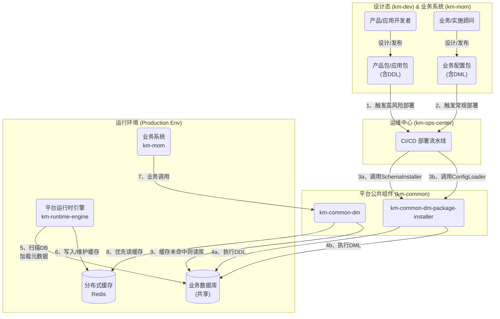
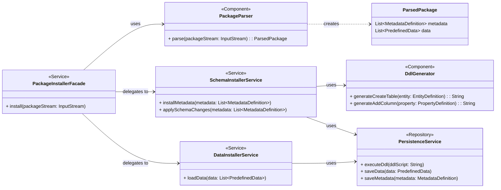
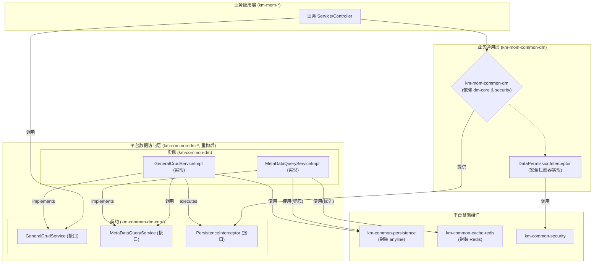
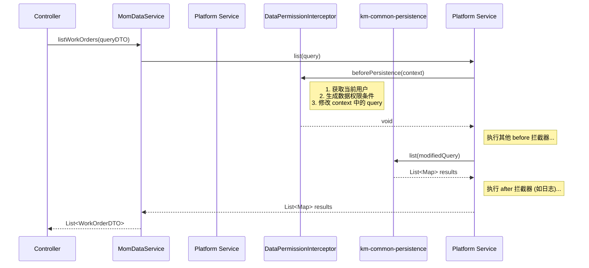

# 《如何正确使用数据模型元数据》设计文档

## 1. 概述 

### 1.1. 文档目的

本文档是 `km-dev` 平台、`km-ops` 运维平台与 `km-mom` 等核心业务系统之间，关于数据模型元数据全生命周期管理的**核心技术契约**。

其核心目标是：
- **规范流程**: 旨在标准化平台中数据模型元数据的**发布、安装、管理和消费**的完整流程，确保各环节高效、可靠地协同工作。
- **指导开发**: 作为平台核心公共组件（`km-common-dm-package-installer`、`km-common-dm`）的详细设计依据，并为业务系统开发者（通过 `km-mom-common-dm` 等模块的实现）提供权威的**使用指南**与最佳实践。

### 1.2. 核心定位

本文档是一份高阶设计文档（High-Level Design, HLD），在平台技术体系中扮演着承上启下的关键角色：
- **承上启下**: 向上承接平台总体架构思想，向下指导具体组件的详细设计（Low-Level Design, LLD）与编码实现。
- **聚焦“如何使用”**: 强调本文档的重点是“**如何正确地使用**”模型元数据及其配套的 `km-common-dm` 等核心组件，而非元数据模型本身的定义（后者由`km-dev`平台的数据建模功能负责）。

### 1.3. 目标读者

本文档主要面向以下三类技术人员：
- **平台架构师与开发者**: 负责 `km-dev`、`km-ops` 平台及 `km-common-*` 核心公共组件的架构师与开发人员。
- **业务系统架构师与开发者**: 负责 `km-mom` 及未来其他业务系统的架构师与核心开发人员。
- **二次开发与实施顾问**: 基于本平台为客户进行定制化开发、实施交付的生态伙伴和技术顾问。

## 2. 核心概念与协作流程 

### 2.1. 核心概念定义 

#### 2.1.1. 数据模型元数据
数据模型元数据是平台中所有业务数据的结构化描述，是实现模型驱动架构的基石。它定义了“数据应该是什么样子”，包含了构成业务领域的所有核心要素，主要包括：
- **实体 (Entity)**: 对业务对象的抽象，如“工单”、“物料”。
- **属性 (Attribute)**: 实体的具体特征，如“工单”的“编码”、“状态”。
- **关系 (Relation)**: 实体之间的关联，如“工单”与“物料”的“一对多”关系。
- **枚举 (Enumeration)**: 限定属性取值范围的集合，如“工单状态”的“草稿、已下发、已完工”。

#### 2.1.2. 制品包 (Packages) - 标准化的交付物
为了实现设计与运行的分离，平台定义了三种标准化的交付物（制品包）。它们是连接 `km-dev`、`km-ops` 和 `km-mom` 的唯一桥梁。

- **产品包 (Product Package)**
  - **发布者**: 产品研发团队。
  - **发布平台**: `km-dev`。
  - **核心内容**: 定义了一套**可复用的、行业标准的业务模型**。其内容主要是对数据库结构进行定义的DDL（Data Definition Language）脚本。
  - **用途**: 作为所有二次开发的基础和标准。

- **应用包 (Application Package)**
  - **发布者**: 二次开发人员、实施顾问。
  - **发布平台**: `km-dev`。
  - **核心内容**: 定义了基于某个“产品包”的**定制化扩展**。它可能包含扩展的DDL脚本（如为标准表增加自定义字段），以及页面、流程、API等运行时资源。
  - **用途**: 实现客户的个性化需求。

- **业务配置包 (Business Configuration Package)**
  - **发布者**: 实施顾问、业务分析师或最终用户。
  - **发布平台**: `km-mom` 等业务系统。
  - **核心内容**: 定义了在现有数据结构之上的**业务数据和配置**。其内容是纯粹的DML（Data Manipulation Language）脚本，用于增删改查具体业务数据。
  - **用途**: 填充业务规则、初始化业务数据。

#### 2.1.3. 关注点分离原则
平台架构严格要求将上述三类“包”进行分离管理，绝不能混淆。这背后的核心原因是“关注点分离”原则，它带来了三大优势：
- **职责分离**: “产品/应用包”由技术人员负责，关注系统结构；“业务配置包”由业务人员负责，关注业务逻辑。
- **生命周期分离**: 系统结构的变更是低频、重大的；业务配置的变更是高频、日常的。分离管理使得两者可以独立迭代，互不阻塞。
- **技术风险分离**: DDL操作是高风险的，需要严格的审批和测试流程；DML操作风险相对较低，可以采用更敏捷的发布策略。

### 2.2. 总体协作流程
以下流程图清晰地展示了数据模型元数据从设计、发布、部署到最终消费的完整生命周期。



#### 2.2.1. 设计与发布
- **`km-dev`**: 作为平台的技术底座，是**产品包**和**应用包**的唯一设计与发布平台。它服务于产品研发和二次开发人员，专注于系统结构和功能的定义。
- **`km-mom`**: 作为上层的业务应用，是**业务配置包**的设计与发布平台。它服务于业务人员和实施顾问，专注于业务规则和数据的配置。

#### 2.2.2. 部署与安装
- **`km-ops-center`**: 作为所有类型“包”的统一**部署流程编排者**。它通过CI/CD流水线接收来自不同源的发布请求。
- **职责**: 流水线根据接收到的“包”的类型，智能地调用 `km-common-dm-package-installer` 组件中不同的服务接口 (`SchemaInstallerService` 或 `ConfigLoaderService`)，以实现对数据库DDL和DML操作的风险隔离。

#### 2.2.3. 缓存与消费
- **`km-runtime-engine`**: （通常部署为 `km-dev` 的运行态服务）是**模型元数据缓存的唯一生产者**。它启动时会主动扫描数据库中的元数据表，将其加载、转换并存入Redis缓存中，同时负责后续的一致性维护。
- **`km-mom`**: 作为**元数据和业务数据的最终消费者**，它不直接与数据库或缓存交互。而是通过调用平台提供的 `km-common-dm` 组件来获取数据。该组件内部封装了“缓存优先、数据库兜底”的复杂逻辑，为业务开发者提供了极其简便和高可用的数据访问体验。

## 3. 平台组件设计：`km-common-dm-package-installer`

### 3.1. 核心职责与定位 

`km-common-dm-package-installer` 是一个**通用、原子化**的基础设施组件。它的定位是**制品包内容解析与持久化执行器**，但其职责范围被严格限定，以确保其通用性和安全性。

#### 3.1.1. “做什么” 

该组件的核心职责仅包含两部分：

1.  **数据模型 Schema 持久化 (DDL)**:
    *   解析**产品包**或**应用包**中包含的数据模型元数据 JSON 文件（`DM`, `ENUM`, `LIFECYCLE` 等）。
    *   将元数据本身写入指定的业务库表中进行管理。
    *   基于元数据定义，智能生成并执行 DDL（Data Definition Language）脚本，完成**创建表（CREATE TABLE）**、**添加字段（ADD COLUMN）**等数据库 Schema 变更操作。

2.  **预定义数据持久化 (DML)**:
    *   解析制品包（包括**应用包**和**业务配置包**）中包含的预定义数据 JSON 文件。
    *   基于文件内容，向已存在的业务表中加载或更新指定的业务数据，例如：系统初始化所需的角色、权限、菜单、配置项等。

#### 3.1.2. “不做什么” 

为了确保组件职责单一和操作安全，`km-common-dm-package-installer` **绝不**负责以下工作：

*   **非结构化文件处理**: 它不处理制品包中任何与数据模型、预定义数据无关的文件，如前端页面（`.js`, `.css`）、流程定义文件（`.bpmn`）等。这些文件的部署由 `km-ops` 中的其他工具链负责。
*   **高风险 DDL 操作**: 它**不会**执行 `DROP TABLE/COLUMN`、`ALTER COLUMN`（修改字段类型/长度）等高风险、破坏性的 DDL 操作。
*   **复杂的业务逻辑**: 它是一个纯粹的技术组件，不包含任何特定业务领域的校验逻辑（如权限校验）。

#### 3.1.3. 调用关系

作为一个通用的 `km-common-*` 组件，它可以被任何需要解析和安装数据模型包的上层系统调用，典型场景包括：
- **`km-ops-center`**: 在 CI/CD 部署流水线中被调用，实现自动化部署。
- **`km-mom`**: 在需要动态安装特定业务配置包时被调用。

### 3.2. 内部组件架构 (Internal Component Architecture)

`km-common-dm-package-installer` 内部的核心设计遵循“分层”与“单一职责”原则，主要由以下几个协作组件构成：



*   **`PackageInstallerFacade` (安装器主入口)**:
    *   组件对外的唯一入口（Facade 模式），封装了内部复杂的调用流程。
    *   它接收一个制品包（如 `.zip` 文件的输入流），协调 `PackageParser`、`SchemaInstallerService` 和 `DataInstallerService` 完成整个安装过程。

*   **`PackageParser` (包解析器)**:
    *   负责解压并解析制品包流。
    *   根据预定义的命名或元信息（如 `manifest.json`），识别出哪些是数据模型元数据 JSON，哪些是预定义数据 JSON，并将它们解析成内部的领域对象 `ParsedPackage`。

*   **`SchemaInstallerService` (Schema 安装服务)**:
    *   **职责**: 专用于处理数据模型元数据和 DDL 操作。
    *   **内部流程**:
        1.  调用 `PersistenceService` 将解析出的元数据全量写入元数据管理表，并处理版本标记。
        2.  调用 `DdlGenerator` 生成 DDL 脚本。
        3.  调用 `PersistenceService` 执行生成的 DDL 脚本。

*   **`DataInstallerService` (数据安装服务)**:
    *   **职责**: 专用于处理预定义数据的持久化。
    *   根据数据项中定义的策略（覆盖/跳过），调用 `PersistenceService` 执行相应的数据库操作。

*   **`DdlGenerator` (DDL 生成器)**:
    *   一个无状态的工具类，根据传入的实体、属性定义，生成目标数据库方言的 DDL 脚本。
    *   它会查询数据库 `metadata`，检查表或字段是否已存在，从而决定是否需要生成 `CREATE TABLE` 或 `ADD COLUMN` 脚本。

*   **`PersistenceService` (持久化服务)**:
    *   封装了所有与数据库交互的操作（CRUD、DDL 执行），通常使用 JDBC 或 `km-common-dm-core` 提供的底层能力实现。

### 3.3. 核心处理逻辑

#### 3.3.1. 数据模型元数据持久化逻辑

该过程兼顾了元数据自身的可追溯性和对业务数据表的安全性。

1.  **元数据自身管理 (全量写入、版本标记)**:
    *   **目标**: 确保任何时刻都能追溯到某个业务表结构对应的元数据版本。
    *   **策略**:
        *   当 `SchemaInstallerService` 接收到新的元数据 JSON（如 `KMMOM2_DM_*.json`）时，它会将其中的所有元数据项（分类、实体、属性、枚举等）**全量写入**到业务库的元数据管理表中（如 `META_ENTITY`, `META_PROPERTY` 等）。
        *   每个元数据项在入库时都会被标记为**“最新版本”** (`is_latest = true`)。
        *   同时，该实体/应用历史版本的元数据会被自动标记为**“非最新版本”** (`is_latest = false`)。
    *   **优势**: 这种设计实现了元数据的完整归档，为未来的数据迁移、版本回溯和问题排查提供了坚实基础。

2.  **DDL 操作 (安全优先原则)**:
    *   **目标**: 在不引入高风险操作的前提下，最大限度地自动化表结构变更。
    *   **策略**: `DdlGenerator` 在生成脚本前，会先**查询数据库的 `information_schema` 或 `metadata`**。
        *   **表 (Table)**: 如果目标表（如 `SYS_USER`）**不存在**，则生成 `CREATE TABLE` 脚本。如果已存在，则**跳过**。
        *   **字段 (Column)**: 如果目标字段（如 `SYS_USER.NAME`）**不存在**，则生成 `ADD COLUMN` 脚本。如果已存在，则**跳过**。
    *   **风险与权衡**:
        *   **优点**: **极高的安全性**。此策略从根本上杜绝了因自动化工具误操作而导致的数据丢失风险（如误删字段、修改字段类型导致数据截断）。
        *   **弊端与应对**: 该策略**无法自动处理对已有表/字段的修改和删除操作**。这是一个**有意为之的“弊端”**，它强制将这类高风险变更操作移出自动化流程，要求其必须由数据库管理员（DBA）或开发人员进行**手动评估和执行**。这在企业级应用实践中是确保数据安全和系统稳定性的**最佳实践**。

#### 3.3.2. 预定义数据持久化逻辑

该过程的核心是提供灵活的数据加载策略，以适应不同部署环境的需求。

*   **目标**: 允许制品包定义的数据能被安全、可控地加载到目标数据库中。
*   **策略**:
    1.  **文件级策略定义**: 预定义数据 JSON 文件的**头部信息**中必须包含一个 `syncStrategy` 字段，用于声明针对该文件内**所有数据项**的统一同步策略。这确保了整个数据集处理方式的一致性，并简化了数据导出过程。
    2.  **策略解析**: `DataInstallerService` 在处理每个数据文件前，首先解析头部的 `syncStrategy` 字段，其可选值为：
        *   `SKIP_ON_EXIST` (存在则跳过)：默认策略。
        *   `OVERWRITE_ON_EXIST` (存在则覆盖)。
    3.  **持久化执行**: `DataInstallerService` 遍历文件中的每条数据（`ITEM`），并根据文件头定义的策略执行操作：
        *   **ID 存在性判断**: 使用数据项的主键或唯一业务标识（如 `CID` 或 `CCODE`）去数据库中查询记录是否存在。
        *   **记录不存在**: 无论何种策略，只要记录不存在，就直接执行**插入（INSERT）**操作。
        *   **记录已存在**:
            *   若文件策略为 `OVERWRITE_ON_EXIST`，则执行**更新（UPDATE）**操作。
            *   若文件策略为 `SKIP_ON_EXIST` 或未指定，则**不执行任何操作**。

*   **JSON 示例**:
    ```json
    {
        "NAME": "系统功能数据",
        "APP": "KMMOM",
        "TYPE": "DATA",
        "VERSION": "202505230001",
        "syncStrategy": "SKIP_ON_EXIST", // 文件级同步策略
        "DATA": [
            {
                "MODULE": "system",
                "ENTITY_TYPE": "User",
                "TABLE_NAME": "SYS_USER",
                "ITEMS": [
                    { "CID": 100, "CCODE": "superAdmin", "CNAME": "MOM管理员", ... },
                    { "CID": 101, "CCODE": "testUser", "CNAME": "测试用户", ... }
                ]
            }
        ]
    }
    ```

*   **灵活性与应用场景**:
    *   `SKIP_ON_EXIST`: 是默认的、更安全的策略。适用于系统初始化数据的加载，同时保护那些可能在生产环境中被手动修改过的、符合特定业务场景的配置数据不被覆盖。
    *   `OVERWRITE_ON_EXIST`: 适用于需要强制同步、重置配置或修复错误数据的场景。使用此策略需要制品包发布者明确其意图，并知晓其会覆盖目标环境中的所有同名数据。

这个设计在自动化和安全性之间取得了很好的平衡。它确保了自动化流程的高效和可预测性，同时将高风险的操作和决策权交还给专业人员，以保障生产系统的稳定和数据安全。

## 4. 平台组件设计：`km-common-dm` 的架构重构

### 4.1 重构目标与设计原则

`km-common-dm` 作为平台数据访问的核心枢纽，其设计的优劣直接影响上层所有业务系统的开发效率、性能和可扩展性。本次重构旨在解决现有设计中存在的职责不清、耦合过紧等问题，确立其清晰的架构边界和设计原则。

*   **核心定位**: 将 `km-common-dm` 及其关联组件打造成一个**业务无关、高性能、高可扩展**的通用数据访问平台组件。
*   **设计原则**:
    *   **接口驱动**: 上层业务必须依赖于稳定的 `km-common-dm-core` 契约，而非其实现细节。
    *   **关注点分离 (SoC)**: 严格划分数据访问、持久化、缓存、元数据查询、业务逻辑（如安全）的职责边界。
    *   **开闭原则 (OCP)**: 平台核心组件对修改关闭，对扩展开放。业务逻辑的注入应通过扩展点实现，而非修改组件源码。

### 4.2 架构分层与职责

重构后的数据管理体系将由三个职责清晰的模块组成：

#### 4.2.1 `km-common-dm-core`: 系统的稳定契约

*   **职责**:
    *   定义核心的数据模型实体 (`BaseObject`, `BusinessObject`)。
    *   定义通用的数据操作服务接口 (`GeneralCrudService`)。
    *   定义元数据查询服务接口 (`MetaDataQueryService`)。
    *   定义用于业务逻辑扩展的拦截器接口 (`PersistenceInterceptor`)。
*   **架构决策**: **坚决维持 `core` 模块的独立性**。它是整个数据访问体系的基石和API契约。将其与实现合并将导致灾难性的耦合，破坏整个系统的分层架构和可维护性。

#### 4.2.2 `km-common-dm`: 通用能力的实现

*   **职责**:
    *   提供 `GeneralCrudService` 的核心实现 `GeneralCrudServiceImpl`。
    *   实现“缓存优先、数据库兜底”的核心数据访问逻辑。
    *   提供 `MetaDataQueryService` 的实现 `MetaDataQueryServiceImpl`，负责从 Redis 查询元数据。
    *   管理并执行 `PersistenceInterceptor` 拦截器链。
    *   **它作为协调者，整合下层的 `km-common-persistence` 和 `km-common-cache-redis` 等基础组件，为上层提供统一服务**。

#### 4.2.3 `km-common-persistence`: 可插拔的持久化层

*   **职责**:
    *   **将原 `km-common-data` 重构并更名为 `km-common-persistence`**。
    *   **定位**: 作为对底层持久化框架（当前为 `anyline`）的**“薄封装”增强层**。
    *   **命名考量**: 采用 `persistence` 而非 `anyline`，是为了避免与具体技术实现绑定，保留未来替换或兼容其他ORM框架（如JPA）的架构可能性。
*   **“薄封装”策略**:
    *   **鼓励**: 直接使用 `anyline` 提供的强大原生API进行复杂操作。
    *   **增强**: 仅提供 `anyline` 未覆盖且项目通用的能力，例如：
        *   集成项目统一的分页对象和异常体系。
        *   提供基于元数据的动态查询条件构造辅助工具。
    *   **禁止**: 对 `anyline` 已有的原生CRUD接口进行不必要的重复封装。

### 4.3 针对元数据查询的高性能与高可用设计

在模型驱动的架构中，`GeneralCrudServiceImpl` 在执行任何数据库操作前，都必须先获取相应的**数据模型元数据**，用以动态构建 SQL、校验数据等。因此，元数据查询的性能和可用性，是整个数据访问层性能的基石。

我们的核心策略是**缓存优先、数据库兜底**，但这**仅针对元数据**，而非业务数据。

#### 4.3.1 元数据访问流程

1.  上层调用 `GeneralCrudServiceImpl` 执行业务数据操作（如 `save`）。
2.  `GeneralCrudServiceImpl` 内部调用 `MetaDataQueryService` 获取所需元数据（如 `getEntityDefinition("WorkOrder")`）。
3.  `MetaDataQueryServiceImpl` 作为元数据访问的统一入口，其内部实现了高可用降级策略：
    a. **优先从 Redis 缓存获取**元数据。
    b. **缓存命中**: 快速返回元数据。
    c. **缓存未命中/Redis故障**:
        i.  **透明地降级**，转而查询业务数据库中的元数据表（如 `META_ENTITY`）。
        ii. **数据库查询成功**:
            - 将查询到的元数据返回给调用方。
            - **异步尝试回写 Redis 缓存**，以便后续请求能重新命中缓存（如果 Redis 服务已恢复）。
        iii. **数据库查询也失败**: 抛出严重异常，因为这意味着系统的核心元数据不可用。
4.  `GeneralCrudServiceImpl` 拿到元数据后，继续完成后续的业务数据持久化操作。

#### 4.3.2 并发防护

在 Redis 缓存大面积失效的极端情况下，大量请求会同时穿透到数据库查询元数据。为了保护数据库，我们同样可以引入**分布式锁**机制。

*   **策略**: 当 `MetaDataQueryServiceImpl` 发现缓存未命中，准备查询数据库前，会尝试获取一个针对该元数据（如 `lock:meta:WorkOrder`）的分布式锁。
*   **效果**: 确保在同一时刻，只有一个线程去数据库加载同一份元数据并回写缓存，其他线程则等待锁释放后直接从缓存获取，有效避免了对数据库的重复冲击。

### 4.4 元数据查询服务

基于上述高可用设计，我们正式定义 `MetaDataQueryService`，并弱化之前不完全适用的 CQRS 概念。

#### 4.4.1 设计上下文与定位

*   **数据流回顾**: 元数据在 `km-dev` 设计 -> `km-ops` 安装 -> 业务库持久化 -> `runtime-engine` 加载至 Redis。
*   **本组件定位**: `km-common-dm` 是这条链路的**最终消费者**。它不生产、不修改元数据，其唯一职责就是**高效、可靠地查询元数据**。
*   因此，我们设计的核心是 `MetaDataQueryService` 的查询能力。

#### 4.4.2 `MetaDataQueryService` 的设计与契约

*   **接口定义 (`km-common-dm-core`)**: 保持不变，定义清晰的查询契约。
    ```java
    public interface MetaDataQueryService {
        Optional<EntityDefinition> getEntityDefinition(String entityCode);
        List<PropertyDefinition> getPropertyDefinitions(String entityCode);
        // ... 其他元数据查询方法
    }
    ```
*   **实现 (`km-common-dm`)**: `MetaDataQueryServiceImpl` 内部将同时注入 `RedisTemplate` 和一个直接访问数据库元数据表的 `repository`。
    *   **核心契约**:
        1.  **高可用性**: 服务实现必须包含**缓存优先、数据库兜底**的降级逻辑。
        2.  **性能**: 在缓存正常的情况下，服务响应应为毫秒级。
        3.  **数据一致性**: 服务提供的是最终一致性的元数据，其数据新鲜度依赖于 `runtime-engine` 的加载机制。

### 4.5 开放扩展: 通过拦截器模式解耦业务逻辑

`km-common-dm` 作为平台组件，其核心原则是**业务无关性**。当前设计中存在的对 `km-common-security` 的直接依赖，是必须被移除的架构坏味道。我们采用**拦截器 (Interceptor)** 模式进行彻底解耦。

#### 4.5.1 设计 `PersistenceInterceptor` 扩展点

我们在 `km-common-dm-core` (契约层) 定义拦截器接口，使得任何上层模块都可以实现它来“挂载”自己的业务逻辑。

*   **接口定义**:
    ```java
    public interface PersistenceInterceptor extends Ordered { // 实现 Ordered 接口以支持排序
        // 在执行持久化操作前调用
        void beforePersistence(PersistenceContext context);
        // 在执行持久化操作后调用
        void afterPersistence(PersistenceContext context);
    
        // 判断当前拦截器是否支持给定的操作类型
        boolean supports(OperationType type);
    }
    
    // 上下文对象，携带操作信息
    public class PersistenceContext {
        private final Object entity;
        private final OperationType operationType;
        // ... getters and other info
    }
    
    public enum OperationType { CREATE, UPDATE, DELETE, QUERY }
    ```

#### 4.5.2 在 `GeneralCrudServiceImpl` 中织入拦截器

`GeneralCrudServiceImpl` 将通过依赖注入（`@Autowired`）获取所有 `PersistenceInterceptor` 的 Spring Bean 实例，并在核心方法中按顺序执行它们。

*   **实现伪代码**:
    ```java
    @Service
    public class GeneralCrudServiceImpl implements GeneralCrudService {
        
        @Autowired
        private List<PersistenceInterceptor> interceptors; // 注入所有拦截器
    
        @Override
        public <T> T save(T entity) {
            // ...
            OperationType opType = isNew(entity) ? OperationType.CREATE : OperationType.UPDATE;
            
            // 1. 执行前置拦截器
            PersistenceContext context = new PersistenceContext(entity, opType);
            executeInterceptors(context, "before");
    
            // 2. 执行核心持久化操作
            T savedEntity = persistence.save(entity);
    
            // 3. 执行后置拦截器
            context.setEntity(savedEntity); // 更新上下文
            executeInterceptors(context, "after");
    
            return savedEntity;
        }
    
        private void executeInterceptors(PersistenceContext context, String phase) {
            interceptors.stream()
                .filter(interceptor -> interceptor.supports(context.getOperationType()))
                .sorted(Comparator.comparingInt(Ordered::getOrder)) // 按顺序执行
                .forEach(interceptor -> {
                    if ("before".equals(phase)) {
                        interceptor.beforePersistence(context);
                    } else {
                        interceptor.afterPersistence(context);
                    }
                });
        }
    }
    ```

#### 4.5.3 架构演进：从硬编码到插件化

通过这种模式，`km-common-dm` 成功地将自己从具体的业务逻辑（如安全、日志、多租户数据隔离）中解放出来。这些业务横切关注点现在可以作为独立的“插件”（即 `PersistenceInterceptor` 的实现类）存在于各自的业务模块中（如 `km-mom-common-dm`），在运行时被动态地织入到数据访问流程中。这极大地提升了系统的模块化程度和可扩展性。

### 4.6 重构后的架构蓝图

以下是重构后数据访问相关模块的架构关系图：



**总结**: 本次重构通过清晰的职责划分、为元数据查询建立专属的高可用策略、并引入拦截器设计模式，将 `km-common-dm` 从一个耦合的、职责模糊的模块，演进为一个层次分明、高性能、高内聚、低耦合、易于扩展的现代化数据访问平台组件，为上层业务的快速、稳定发展奠定了坚实的基础。

## 5. 业务层组件设计：`km-mom-common-dm`

### 5.1 核心职责与定位

如果说 `km-common-dm` 是提供数据操作能力的“引擎”，那么 `km-mom-common-dm` 就是为这个引擎装上 `km-mom` 业务系统特有“涡轮增压”和“导航系统”的**适配增强层**。它上承具体的业务场景，下接通用的平台能力，扮演着至关重要的桥梁角色。

*   **定位**:
    *   **业务规则的实现者**: 它不直接执行数据库操作，而是通过实现第四章定义的 `PersistenceInterceptor` 扩展点，将 `km-mom` 的业务规则（如数据权限、工厂隔离）以非侵入的方式“织入”到通用的持久化流程中。
    *   **业务服务的门面 (Facade)**: 它将封装对平台 `GeneralCrudService` 的调用，并向上层提供更贴近业务、更易于使用的服务接口，屏蔽底层实现的复杂性。
*   **目标**: 将原 `ObjectDataService` 中复杂的业务逻辑，重构为一系列职责单一、可独立测试、可插拔的拦截器，并提供一个清晰的服务门面，从而提升 `km-mom` 业务代码的可维护性和开发效率。

### 5.2 核心业务逻辑的拦截器实现

`km-mom-common-dm` 模块的核心产出，就是以下一系列 `PersistenceInterceptor` 接口的实现类。它们将作为 Spring Bean 被自动发现并注入到 `GeneralCrudServiceImpl` 的拦截器链中。

#### 5.2.1 `DataPermissionInterceptor`: 数据权限与密级控制

*   **职责**: 统一负责**数据权限**和**数据密级**的过滤。它将完全替代原 `ObjectDataService` 中对 `DataPermissionUtil` 的硬编码调用。
*   **实现细节**:
    *   `supports(OperationType type)`: 返回 `true` 当 `type` 为 `QUERY` 时。
    *   `beforePersistence(PersistenceContext context)`:
        1.  从 `context` 中获取 `Query` 对象。
        2.  通过 `SecurityUtils` (来自 `km-common-security`) 获取当前登录用户的上下文信息（用户ID、角色、所属组织等）。
        3.  调用内部的权限服务，根据用户信息和查询的实体类型 (`query.getEntityType()`)，生成数据权限过滤条件（`List<QueryCondition>`）。例如：“`create_by` = 当前用户ID” 或 “`biz_org_id` IN (用户所属组织列表)”。
        4.  生成数据密级过滤条件。
        5.  将这些过滤条件 `AND` 到 `Query` 对象现有的 `conditions` 中。
*   **排序**: 该拦截器应具有较高的优先级（`@Order(10)`），确保在其他查询拦截器之前执行。

#### 5.2.2 `FactoryManagementInterceptor`: 工厂数据隔离

*   **职责**: 自动处理实现了 `FactoryManaged` 接口的实体，为其填充 `bizOrg` 和 `factory` 字段。
*   **实现细节**:
    *   `supports(OperationType type)`: 返回 `true` 当 `type` 为 `CREATE` 或 `UPDATE` 时。
    *   `beforePersistence(PersistenceContext context)`:
        1.  从 `context` 中获取正在被操作的 `entity` 对象。
        2.  判断 `entity instanceof FactoryManaged`。
        3.  如果是，则强转为 `FactoryManaged` 类型。
        4.  从 `context` 或当前线程上下文中获取 DTO 传入的 `bizOrg` 信息（如果适用）。
        5.  调用 `FactoryService`（可从原 `ObjectDataService` 逻辑中提取），根据 `bizOrg` 查找对应的 `factory`，并更新到 `entity` 对象中。
*   **排序**: 优先级适中 (`@Order(50)`), 在核心校验之前，在数据准备阶段执行。

#### 5.2.3 `BusinessLoggingInterceptor`: 业务审计日志

*   **职责**: 在数据持久化操作**成功后**，记录详细的业务审计日志。
*   **实现细节**:
    *   `supports(OperationType type)`: 返回 `true` 当 `type` 为 `CREATE`, `UPDATE`, `DELETE` 时。
    *   `afterPersistence(PersistenceContext context)`:
        1.  该方法在数据库事务提交**之前**执行，但可以确保操作已成功。
        2.  根据 `context.getOperationType()` 判断操作类型。
        3.  对于 `UPDATE`，可以从 `context` 中获取操作前后的数据快照（`PersistenceContext` 需要扩展以支持）。
        4.  调用 `ObjectManageSysLogService`，将操作的实体、类型、变更内容等信息传递过去，完成日志记录。
*   **排序**: 优先级较低 (`@Order(100)`), 在所有核心业务逻辑完成后执行。

### 5.3 业务服务门面：`MomDataService`

为了给上层业务（Controller、其他Service）提供一个稳定、简洁的入口，我们建议在 `km-mom-common-dm` 中创建一个新的服务门面 `MomDataService`，逐步替代原有的 `ObjectDataService`。

*   **职责**:
    *   **封装调用**: 内部封装对平台 `GeneralCrudService` 和 `MetaDataQueryService` 的调用。
    *   **DTO 转换**: 负责 `km-mom` 特有的 DTO（如 `DataObjectInsertDTO`）与平台通用实体 (`BaseObject`) 之间的转换。这一层是隔离业务视图与平台模型的关键。
    *   **提供业务语义接口**: 暴露更具业务含义的方法。例如，可以提供 `saveWorkOrder(WorkOrderDTO dto)` 而非泛泛的 `save(BaseObject entity)`。

*   **示例代码**:
    ```java
    @Service
    public class MomDataService {
    
        @Autowired
        private GeneralCrudService generalCrudService;
    
        public Result<ObjectReference> insertDataObject(DataObjectInsertDTO dto) {
            // 1. DTO to Entity转换
            EntityDefinition entityDef = metaDataQueryService.getEntityDefinition(dto.getEntityType()).orElseThrow(...);
            BaseObject entity = dto.convert(entityDef);
    
            // 2. 调用通用的平台服务
            // 注意：此处不再需要手动处理工厂字段，拦截器会自动处理
            generalCrudService.insert(entity);
    
            // 3. 处理关联对象等 insertDTO 特有的逻辑
            // ...
    
            // 4. 返回结果
            return Result.success(new ObjectReference(entity.getId(), entity.getEntityType()));
        }
    }
    ```

### 5.4 重构后的调用流程
通过引入拦截器和门面，一个典型的业务查询请求的调用链将变得极为清晰和自动化：


这个架构将复杂的、易变的业务规则与稳定的、通用的数据操作流程彻底分离，极大地提高了系统的健壮性、可维护性和可扩展性，是现代化企业级应用架构的最佳实践。
