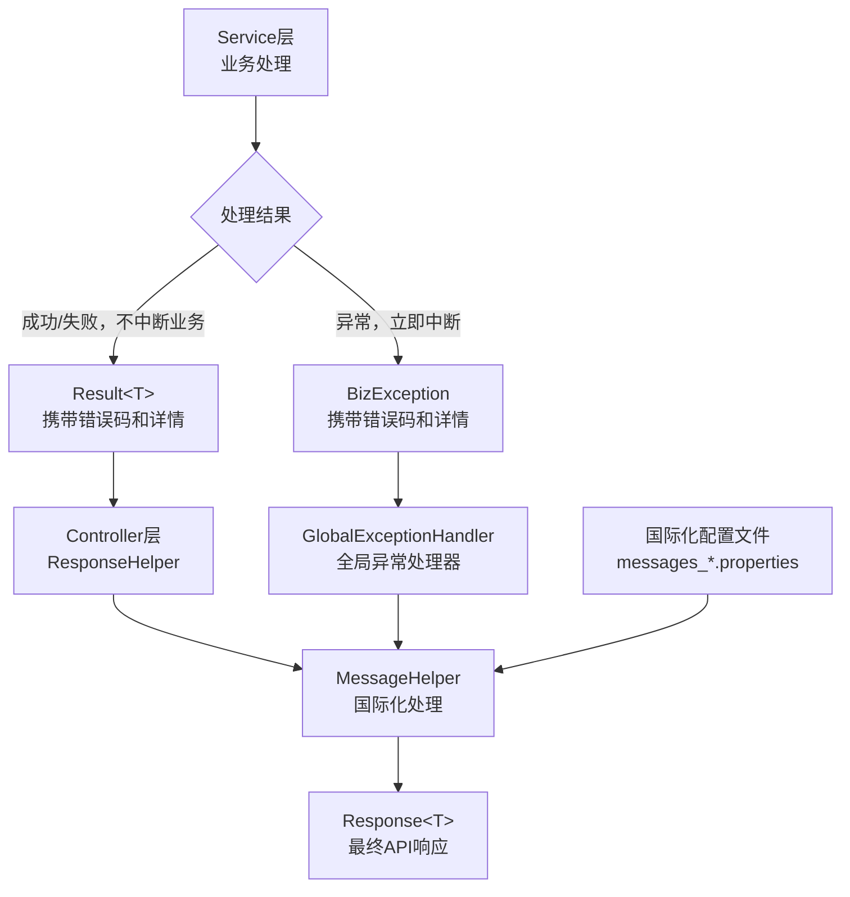

# KMMOM 消息反馈及国际化设计方案

## 1. 目标与原则

### 业务场景与价值

KMMOM产品中，消息体系承担着**业务状态反馈**和**用户交互引导**的核心职责，其业务价值体现如下：
- **生产执行反馈**：工单状态变更、质量检验结果、设备异常告警
- **数据操作反馈**：主数据增删改操作结果、批量导入处理状态
- **权限控制反馈**：访问权限不足、操作权限校验失败
- **系统状态通知**：登录状态、会话过期、系统维护通知

### 设计目标
本设计方案旨在为KMMOM产品构建统一、标准化的消息反馈体系：

1. **统一消息反馈机制**：建立从后端到前端的一致化消息传递标准
2. **错误码标准化管理**：提供可预测业务问题的标识和处理机制  
3. **多语言国际化支持**：支持中文、英文等多语言环境下的消息展示
4. **简化开发复杂度**：为开发团队提供易用、一致的编程接口
   
### 设计原则

1. **错误与异常分离**
    - **错误(Error)**：可预测的业务问题，基于业务规则产生，用户可通过修改行为解决
    - **异常(Exception)**：不可预测的技术问题，系统运行时故障，需要系统管理员介入

2. **分层处理策略**
   - **技术基础层**：专注异常捕获转换，依赖标准Java异常体系
   - **平台能力层**：定义通用错误码，提供标准化业务能力的错误处理  
   - **应用层**：只为影响业务流程决策的关键错误定义专门错误码，避免过度细分

3. **语义化优先**
   - 使用直观的语义化字符串标识错误，如`user.not.found`而非`E0001`
   - 遵循`{module}.{feature}.{error_type}`命名规范
   - 错误码与国际化消息key保持对应关系

4. **简化统一**
   - **通用优先**：基础CRUD操作使用平台通用错误码（如 `CommonMsgCodes.Error.DATA_NOT_FOUND`）
   - **统一格式**：所有API响应采用一致的Response<T>结构
   - **业务聚焦**：仅为影响业务流程决策的关键错误定义专门错误码，如角色状态验证、工单流程控制等

## 2. 整体设计策略

### 分层消息传递机制
系统信息（包括成功、失败、警告等所有类型）在各层之间的传递机制：

```
用户界面
↑ 国际化消息
Controller层 (Response<T>)
↑ 结果转换
Service层 (Result<T>)
↑ 业务处理
Domain层 (Result<T>/异常/返回值)
↑ 领域逻辑
Repository层 (Optional/异常)
```

**各层职责**：
- **Repository层**：返回Optional表示查询结果，直接抛出数据访问异常
- **Domain层**：通过返回值或抛出BizException表达业务结果
- **Service层**：使用Result<T>承载完整的业务处理结果
- **Controller层**：统一返回Response<T>，转换为标准API响应
- **用户界面**：接收国际化后的消息，引导用户操作

### 消息分类与国际化策略

#### 消息分类标准
系统消息按照业务返回类型分为三类：

**Error - 错误信息**
- 操作无法完成，必须用户处理
- 业务规则违反，阻止继续执行  
- 数据不存在或状态不符合要求
- 示例：`error.sys.user.not.found=用户不存在`

**Warning - 警告信息**
- 操作可以完成，但存在风险或需要关注
- 示例：`warning.password.expire.soon=密码将于{0}天后过期`

**Info - 信息反馈** 
- 操作成功完成的确认信息
- 系统状态变更通知
- 示例：`info.operation.success=操作成功`

#### 配置文件组织策略
按消息类型分区域组织，额外设置validation区域存放通用验证消息：

```properties
# ERROR - 错误信息区域
error.sys.user.not.found=用户不存在
error.common.access.denied=访问被拒绝

# WARNING - 警告信息区域  
warning.password.expire.soon=密码将于{0}天后过期

# INFO - 信息反馈区域
info.operation.success=操作成功

# VALIDATION - 通用验证消息区域（跨模块复用）
validation.field.required={0} 不能为空
```

### 核心技术原理

1. **载体设计**
- **Response<T>**：Controller层统一API响应格式
- **Result<T>**：Service层业务处理结果载体
- **BizException**：业务异常载体

2. **国际化实现**
- 基于Spring MessageSource机制
- properties文件按工程模块分布
- 消息文本在JVM进程启动时加载到内存，无需额外缓存

3. **语义化错误码**
- 采用`{module}.{feature}.{error_type}`格式
- 错误码直接作为国际化消息的key使用

## 3. 核心组件设计

### 组件职责划分

**消息处理职责分层**：
- **Service层**：专注业务逻辑，返回错误码和结构化详情，不处理国际化文本
- **Controller层**：负责Result<T>到Response<T>的转换和国际化处理  
- **全局异常处理器**：捕获BizException，统一转换为Response<T>并处理国际化

**组件分布策略**：
- **技术基础层(km-common-core)**：MessageHelper、MessageInfo、Result<T>、ResultHelper、BizException、ResponseHelper、BatchSummary等基础类型
- **平台能力层(km-mom-platform-*)**：通用消息常量、GlobalExceptionHandler
- **应用层**：业务特定消息码常量

### 消息码定义规范

**嵌套接口统一管理**：

采用嵌套接口设计，将同一模块的消息码统一管理，提供更好的开发体验：

```java
// ========== 平台能力层(km-mom-platform-*) ==========

/**
 * 通用消息码 - 平台级通用功能
 * 包含CRUD、参数校验、安全、批量操作等所有通用场景
 */
public interface CommonMsgCodes {
    
    /**
     * 通用错误码 - 常量值包含完整前缀，直接对应国际化文件key
     */
    interface Error {
        // 基础CRUD操作
        String DATA_NOT_FOUND = "error.data.not.found";
        String DATA_ALREADY_EXISTS = "error.data.already.exists";
        String DATA_VALIDATION_FAILED = "error.data.validation.failed";
        String DATA_SAVE_FAILED = "error.data.save.failed";
        String DATA_UPDATE_FAILED = "error.data.update.failed";
        String DATA_DELETE_FAILED = "error.data.delete.failed";
        
        // 权限安全类
        String ACCESS_DENIED = "error.access.denied";
        String PERMISSION_DENIED = "error.permission.denied";
        String UNAUTHORIZED = "error.unauthorized";
        String TOKEN_EXPIRED = "error.token.expired";
        String TOKEN_INVALID = "error.token.invalid";
        
        // 系统技术类
        String SYSTEM_ERROR = "error.system.error";
        String NETWORK_ERROR = "error.network.error";
        String DATABASE_ERROR = "error.database.error";
        String SERVICE_UNAVAILABLE = "error.service.unavailable";
        String TIMEOUT_ERROR = "error.timeout.error";
        
        // 操作类
        String OPERATION_FAILED = "error.operation.failed";
        String OPERATION_NOT_ALLOWED = "error.operation.not.allowed";
        String OPERATION_CONFLICT = "error.operation.conflict";
        
        // 批量操作专用
        String BATCH_OPERATION_ALL_FAILED = "error.batch.operation.all.failed";
        String BATCH_ITEM_NOT_FOUND = "error.batch.item.not.found";
        String BATCH_ITEM_ACCESS_DENIED = "error.batch.item.access.denied";
        String BATCH_ITEM_VALIDATION_FAILED = "error.batch.item.validation.failed";
    }
    
    /**
     * 通用信息码 - 常量值包含完整前缀，直接对应国际化文件key
     */
    interface Info {
        // 基础操作成功
        String OPERATION_SUCCESS = "info.operation.success";
        String DATA_SAVED = "info.data.saved";
        String DATA_UPDATED = "info.data.updated";
        String DATA_DELETED = "info.data.deleted";
        String DATA_IMPORTED = "info.data.imported";
        String DATA_EXPORTED = "info.data.exported";
        
        // 批量操作成功
        String BATCH_OPERATION_ALL_SUCCESS = "info.batch.operation.all.success";
        String BATCH_OPERATION_PARTIAL_SUCCESS = "info.batch.operation.partial.success";
    }
    
    /**
     * 通用验证错误码 - 常量值包含完整前缀，直接对应国际化文件key
     */
    interface Validation {
        // 必填验证
        String FIELD_REQUIRED = "validation.field.required";
        
        // 格式验证（常见通用格式）
        String FIELD_FORMAT_INVALID = "validation.field.format.invalid";
        
        // 长度验证
        String FIELD_TOO_SHORT = "validation.field.too.short";
        String FIELD_TOO_LONG = "validation.field.too.long";
        String FIELD_LENGTH_INVALID = "validation.field.length.invalid";
        
        // 值验证
        String FIELD_VALUE_INVALID = "validation.field.value.invalid";
        String FIELD_VALUE_DUPLICATE = "validation.field.value.duplicate";
        String FIELD_VALUE_OUT_OF_RANGE = "validation.field.value.out.of.range";
        
        // 数值验证
        String NUMBER_TOO_SMALL = "validation.number.too.small";
        String NUMBER_TOO_LARGE = "validation.number.too.large";
        String NUMBER_FORMAT_INVALID = "validation.number.format.invalid";
        
        // 日期验证
        String DATE_FORMAT_INVALID = "validation.date.format.invalid";
        String DATE_OUT_OF_RANGE = "validation.date.out.of.range";
    }
    
    /**
     * 通用警告信息 - 常量值包含完整前缀，直接对应国际化文件key
     */
    interface Warning {
        String DATA_WILL_BE_OVERWRITTEN = "warning.data.will.be.overwritten";
        String OPERATION_IRREVERSIBLE = "warning.operation.irreversible";
        String RESOURCE_LIMIT_APPROACHING = "warning.resource.limit.approaching";
    }
}

// ========== 应用层示例 ==========

/**
 * 系统管理模块消息码示例 - 常量值包含完整前缀
 */
public interface SysMsgCodes {
    interface Error {
        String USER_NOT_FOUND = "error.sys.user.not.found";
        String ROLE_STATE_INVALID = "error.sys.role.state.invalid";
        String BATCH_ROLE_DISABLE_FAILED = "error.sys.batch.role.disable.failed";
    }
    
    interface Info {
        String USER_CREATED = "info.sys.user.created";
        String LOGIN_SUCCESS = "info.sys.login.success";
    }
}

/**
 * 制造管理模块消息码示例 - 常量值包含完整前缀
 */
public interface MfgMsgCodes {
    interface Error {
        String WORKORDER_NOT_FOUND = "error.mfg.workorder.not.found";
        String WORKORDER_STATUS_INVALID = "error.mfg.workorder.status.invalid";
    }
    
    interface Info {
        String WORKORDER_CREATED = "info.mfg.workorder.created";
        String PRODUCTION_STARTED = "info.mfg.production.started";
    }
}
```

**命名规范与使用约定**：

**1. 组件分布策略**：
- **技术基础层(km-common-core)**：只包含基础类型，不包含消息常量
- **平台能力层(km-mom-platform-*)**：包含通用消息常量，覆盖所有平台级通用功能
- **应用层**：包含业务特定消息码常量

**2. 接口命名规范**：
- **平台通用**：`CommonMsgCodes` - 包含CRUD、安全、验证等所有平台通用功能
- **业务模块**：`{ModuleName}MsgCodes` - 如`SysMsgCodes`、`MfgMsgCodes`

**3. 子接口固定命名**：
```java
public interface {Module}MsgCodes {
    interface Error { }      // 错误信息 - 阻止操作继续
    interface Info { }       // 信息反馈 - 操作成功确认  
    interface Validation { } // 验证消息 - 参数校验失败（只有通用的才定义）
    interface Warning { }    // 警告信息 - 操作可继续但需关注
}
```

**4. 使用方式示例**：
```java
// ✅ 平台通用功能 - 使用CommonMsgCodes
resultHelper.fail(CommonMsgCodes.Error.DATA_NOT_FOUND, id);
resultHelper.fail(CommonMsgCodes.Error.ACCESS_DENIED);
resultHelper.success(data, CommonMsgCodes.Info.OPERATION_SUCCESS);

// ✅ 通用验证错误 - 直接创建MessageInfo用于details  
MessageInfo.of(CommonMsgCodes.Validation.FIELD_REQUIRED, "用户名");
MessageInfo.of(CommonMsgCodes.Validation.FIELD_VALUE_DUPLICATE, "角色编码");

// ✅ 业务特定场景 - 使用业务模块MsgCodes
resultHelper.fail(SysMsgCodes.Error.USER_NOT_FOUND, userId);
resultHelper.success(user, SysMsgCodes.Info.LOGIN_SUCCESS);

// 🔍 注意：常量值现在包含完整前缀，直接对应国际化文件key
// error.data.not.found → CommonMsgCodes.Error.DATA_NOT_FOUND = "error.data.not.found"
// info.operation.success → CommonMsgCodes.Info.OPERATION_SUCCESS = "info.operation.success"
// validation.field.required → CommonMsgCodes.Validation.FIELD_REQUIRED = "validation.field.required"
```

**5. IDE智能提示优势**：
- 输入 `CommonMsgCodes.` 后，IDE提示四个分类：Error、Info、Validation、Warning
- 输入 `CommonMsgCodes.Error.` 后，IDE列出所有通用错误码常量
- 平台通用功能优先使用CommonMsgCodes，业务特定功能使用模块MsgCodes

### 消息处理组件


**MessageInfo  - 消息载体**：

```java
/**
 * 消息信息载体 - 增强容错设计
 */
@Getter
@Setter
public class MessageInfo {
    private String code;
    private Object[] args;
    
    public MessageInfo() {}
    
    public MessageInfo(String code) {
        this.code = code;
        this.args = null; // 支持无参数
    }
    
    public MessageInfo(String code, Object... args) {
        this.code = code;
        this.args = (args == null || args.length == 0) ? null : args;
    }
    
    // ========== 静态工厂方法（容错设计） ==========
    
    public static MessageInfo of(String code) {
        return new MessageInfo(code);
    }
    
    public static MessageInfo of(String code, Object... args) {
        return new MessageInfo(code, args);
    }
    
    // ========== 便捷判断方法 ==========
    
    public boolean hasArgs() {
        return args != null && args.length > 0;
    }
    
    public Object[] safeArgs() {
        return args == null ? new Object[0] : args;
    }
} 
```


**MessageHelper - 消息工具组件**：
```java
/**
 * 消息处理Helper - 延迟国际化的关键组件
 * 核心职责：提供统一的国际化消息获取接口
 */
@Component
@Slf4j
public class MessageHelper {
    
    private final MessageSource messageSource;
    
    public MessageHelper(MessageSource messageSource) {
        this.messageSource = messageSource;
    }
    
    // ========== 国际化消息获取方法 ==========
    
    /**
     * 根据消息key获取国际化消息文本
     * @param key 完整的消息key，如"error.data.not.found"
     * @param args 消息参数
     * @return 国际化后的消息文本
     */
    public String getMessage(String key, Object... args) {
        try {
            Object[] safeArgs = (args == null || args.length == 0) ? null : args;
            return messageSource.getMessage(key, safeArgs, LocaleContextHolder.getLocale());
        } catch (NoSuchMessageException e) {
            log.warn("Message key not found: {}", key);
            return key;
        }
    }
    
    /**
     * 根据MessageInfo获取国际化消息文本
     * 延迟国际化的关键转换点
     */
    public String getMessage(MessageInfo messageInfo) {
        if (messageInfo == null || messageInfo.getCode() == null) {
            return "";
        }
        return getMessage(messageInfo.getCode(), messageInfo.safeArgs());
    }
    
    /**
     * 批量获取MessageInfo列表的国际化消息文本
     * 性能优化：一次性获取locale，避免重复ThreadLocal访问
     */
    public List<String> getMessages(List<MessageInfo> messageInfos) {
        if (messageInfos == null || messageInfos.isEmpty()) {
            return Collections.emptyList();
        }
        
        // 性能优化：一次性获取locale，避免在循环中重复访问ThreadLocal
        Locale locale = LocaleContextHolder.getLocale();
        
        return messageInfos.stream()
            .map(messageInfo -> {
                if (messageInfo == null || messageInfo.getCode() == null) {
                    return "";
                }
                try {
                    Object[] safeArgs = messageInfo.safeArgs();
                    return messageSource.getMessage(messageInfo.getCode(), safeArgs, locale);
                } catch (NoSuchMessageException e) {
                    log.warn("Message key not found: {}", messageInfo.getCode());
                    return messageInfo.getCode();
                }
            })
            .collect(Collectors.toList());
    }
}
```

### 载体设计


**Result<T> - 业务层载体**：
```java
/**
 * 业务处理结果载体 - 纯数据结构
 */
@Getter
@Setter
public class Result<T> {
    private boolean success;
    private MessageInfo message;
    private T data;
    private List<MessageInfo> details;
    
    public Result() {}
    
    public Result(boolean success, MessageInfo message, T data, List<MessageInfo> details) {
        this.success = success;
        this.message = message;
        this.data = data;
        this.details = details;
    }
    
    // ========== 便捷判断方法 ==========
    
    public boolean hasMessage() {
        return message != null;
    }
    
    public boolean hasDetails() {
        return details != null && !details.isEmpty();
    }
    
    // ========== 链式操作方法 ==========
    
    public Result<T> addDetail(MessageInfo detail) {
        if (details == null) details = new ArrayList<>();
        details.add(detail);
        return this;
    }
    
    public Result<T> addDetails(List<MessageInfo> detailList) {
        if (details == null) details = new ArrayList<>();
        details.addAll(detailList);
        return this;
    }
}
```

**ResultHelper - 统一Result构建器**：
```java
/**
 * Result构建Helper - Spring Bean实例方法
 */
@Component
public class ResultHelper {
    
    private final MessageHelper messageHelper;
    
    public ResultHelper(MessageHelper messageHelper) {
        this.messageHelper = messageHelper;
    }
    
    // ========== 成功结果构建 ==========
    
    public <T> Result<T> success(T data) {
        return new Result<>(true, null, data, null);
    }
    
    public <T> Result<T> success(T data, String infoCode, Object... args) {
        MessageInfo message = MessageInfo.of(infoCode, args);
        return new Result<>(true, message, data, null);
    }
    
    public <T> Result<T> success(T data, MessageInfo message) {
        return new Result<>(true, message, data, null);
    }
    
    public <T> Result<T> successWithDetails(T data, String infoCode, List<MessageInfo> details, Object... args) {
        MessageInfo message = MessageInfo.of(infoCode, args);
        return new Result<>(true, message, data, details);
    }
    
    // ========== 失败结果构建 ==========
    
    public <T> Result<T> fail(String errorCode, Object... args) {
        MessageInfo message = MessageInfo.of(errorCode, args);
        return new Result<>(false, message, null, null);
    }
    
    public <T> Result<T> fail(MessageInfo message) {
        return new Result<>(false, message, null, null);
    }
    
    public <T> Result<T> failWithDetails(String errorCode, List<MessageInfo> details, Object... args) {
        MessageInfo message = MessageInfo.of(errorCode, args);
        return new Result<>(false, message, null, details);
    }
    
    // ========== 批量操作结果构建方法 ==========
    
    /**
     * 通用批量操作结果构建方法
     * @param summary 批量操作摘要  
     * @param errorDetails 错误详情列表（只包含失败项的详情）
     * @param businessErrorCode 业务特定错误码，用于全失败场景
     * @return 构建好的批量操作结果
     */
    public Result<BatchSummary> buildBatchResult(
            BatchSummary summary, 
            List<MessageInfo> errorDetails,
            String businessErrorCode) {
        
        if (summary.isAllSuccess()) {
            // 全部成功：使用通用成功消息码
            MessageInfo message = MessageInfo.of(
                CommonMsgCodes.Info.BATCH_OPERATION_ALL_SUCCESS, 
                summary.getSuccess()
            );
            return new Result<>(true, message, summary, null);
        }
        
        if (summary.isAllFailure()) {
            // 全部失败：使用业务特定错误码
            MessageInfo message = MessageInfo.of(businessErrorCode, summary.getFailure());
            return new Result<>(false, message, summary, errorDetails);
        }
        
        // 部分成功：使用通用部分成功消息码
        MessageInfo message = MessageInfo.of(
            CommonMsgCodes.Info.BATCH_OPERATION_PARTIAL_SUCCESS, 
            summary.getSuccess(), 
            summary.getFailure()
        );
        return new Result<>(true, message, summary, errorDetails);
    }

    /**
     * 默认方法：使用通用错误码
     */
    public Result<BatchSummary> buildBatchResult(BatchSummary summary, List<MessageInfo> errorDetails) {
        return buildBatchResult(summary, errorDetails, CommonMsgCodes.Error.BATCH_OPERATION_ALL_FAILED);
    }
}
```


**BatchSummary - 批量操作摘要**：
```java
/**
 * 批量操作摘要
 * 纯粹的业务数据，不包含错误信息
 */
@Getter
@Setter
public class BatchSummary {
    private int total;              // 总数
    private int success;            // 成功数
    private int failure;            // 失败数
    private List<Long> successIds;  // 成功ID列表
    private List<Long> failureIds;  // 失败ID列表
    
    public BatchSummary() {
        this.successIds = new ArrayList<>();
        this.failureIds = new ArrayList<>();
    }
    
    public BatchSummary(int total) {
        this();
        this.total = total;
    }
    
    // ========== 便捷操作方法 ==========
    
    public void addSuccess(Long id) {
        successIds.add(id);
        success = successIds.size();
        updateTotal();
    }
    
    public void addFailure(Long id) {
        failureIds.add(id);
        failure = failureIds.size();
        updateTotal();
    }
    
    private void updateTotal() {
        this.total = success + failure;
    }
    
    // ========== 状态判断方法 ==========
    
    public boolean isAllSuccess() {
        return failure == 0 && success > 0;
    }
    
    public boolean isAllFailure() {
        return success == 0 && failure > 0;
    }
    
    public boolean isPartialSuccess() {
        return success > 0 && failure > 0;
    }
    
    public boolean isEmpty() {
        return total == 0;
    }
}
```


**Response<T> - API层载体**：
```java
/**
 * API统一响应载体
 * 包含完全国际化后的消息文本，前端可直接使用
 */
@Getter
@Setter
public class Response<T> {
    private boolean success;            // 操作是否成功
    private String errCode;             // 错误码（仅错误时提供，便于前端判断错误类型）
    private String message;             // 国际化后的主消息文本
    private T data;                     // 业务数据
    private List<String> details;       // 详细消息列表（已国际化）
    
    public Response() {}
    
    public Response(boolean success, String errCode, String message, T data) {
        this.success = success;
        this.errCode = errCode;
        this.message = message;
        this.data = data;
    }
    
    // ========== 便捷判断方法 ==========
    
    public boolean hasMessage() {
        return message != null && !message.isEmpty();
    }
    
    public boolean hasDetails() {
        return details != null && !details.isEmpty();
    }
    
    public Response<T> addDetail(String detail) {
        if (details == null) details = new ArrayList<>();
        details.add(detail);
        return this;
    }
    
    public Response<T> addDetails(List<String> detailList) {
        if (details == null) details = new ArrayList<>();
        details.addAll(detailList);
        return this;
    }
}
```


**ResponseHelper - 统一转换器**：
```java
/**
 * Response转换Helper - Spring Bean实例方法
 * 负责将Result<T>转换为完全国际化的Response<T>
 */
@Component
public class ResponseHelper {
    
    private final MessageHelper messageHelper;
    
    public ResponseHelper(MessageHelper messageHelper) {
        this.messageHelper = messageHelper;
    }
    
    // ========== Result<T>转换方法 ==========
    
    public <T> Response<T> convert(Result<T> result) {
        Response<T> response = new Response<>();
        response.setSuccess(result.isSuccess());
        response.setData(result.getData());
        
        // 处理主消息
        if (result.hasMessage()) {
            MessageInfo messageInfo = result.getMessage();
            // 只有失败时才设置errCode
            if (!result.isSuccess()) {
                response.setErrCode(messageInfo.getCode());
            }
            response.setMessage(messageHelper.getMessage(messageInfo));
        }
        
        // 处理详细消息
        if (result.hasDetails()) {
            List<String> details = messageHelper.getMessages(result.getDetails());
            response.setDetails(details);
        }
        
        return response;
    }
    
    // ========== BizException转换方法 ==========
    
    public Response<Object> convert(BizException ex) {
        Response<Object> response = new Response<>();
        response.setSuccess(false);
        
        // 处理主消息
        MessageInfo messageInfo = ex.getMessageInfo();
        response.setErrCode(messageInfo.getCode());
        response.setMessage(messageHelper.getMessage(messageInfo));
        
        // 处理详细消息
        if (ex.hasDetails()) {
            List<String> details = messageHelper.getMessages(ex.getDetails());
            response.setDetails(details);
        }
        
        return response;
    }
    
    // ========== 便捷方法 ==========
    
    public <T> Response<T> success(T data) {
        return new Response<>(true, null, 
            messageHelper.getMessage(CommonMsgCodes.Info.OPERATION_SUCCESS), data);
    }
    
    public <T> Response<T> success(T data, String infoCode, Object... args) {
        return new Response<>(true, null, messageHelper.getMessage(infoCode, args), data);
    }
    
    public <T> Response<T> fail(String errorCode, Object... args) {
        return new Response<>(false, errorCode, messageHelper.getMessage(errorCode, args), null);
    }
}
```

**BizException - 业务异常载体**：
```java
/**
 * 业务异常 - 延迟国际化设计
 * 不包含国际化消息，由全局异常处理器统一处理
 */
@Getter
public class BizException extends RuntimeException {
    private final MessageInfo messageInfo;         // 主消息信息
    private final List<MessageInfo> details;       // 详细消息列表
    
    // ========== 构造方法 ==========
    
    public BizException(String errorCode) {
        super(errorCode);
        this.messageInfo = MessageInfo.of(errorCode);
        this.details = null;
    }
    
    public BizException(String errorCode, Object... args) {
        super(errorCode);
        this.messageInfo = MessageInfo.of(errorCode, args);
        this.details = null;
    }
    
    public BizException(MessageInfo messageInfo) {
        super(messageInfo.getCode());
        this.messageInfo = messageInfo;
        this.details = null;
    }
    
    public BizException(MessageInfo messageInfo, List<MessageInfo> details) {
        super(messageInfo.getCode());
        this.messageInfo = messageInfo;
        this.details = details;
    }
    
    // ========== 静态工厂方法 ==========
    
    public static BizException of(String errorCode) {
        return new BizException(errorCode);
    }
    
    public static BizException of(String errorCode, Object... args) {
        return new BizException(errorCode, args);
    }
    
    public static BizException of(MessageInfo messageInfo) {
        return new BizException(messageInfo);
    }
    
    public static BizException ofDetails(String errorCode, List<MessageInfo> details, Object... args) {
        return new BizException(MessageInfo.of(errorCode, args), details);
    }
    
    public static BizException ofDetails(MessageInfo messageInfo, List<MessageInfo> details) {
        return new BizException(messageInfo, details);
    }
    
    // ========== 便捷判断方法 ==========
    
    public boolean hasDetails() {
        return details != null && !details.isEmpty();
    }
    
    public String getErrorCode() {
        return messageInfo.getCode();
    }
    
    public Object[] getArgs() {
        return messageInfo.getArgs();
    }
}
```

### 全局处理机制

**GlobalExceptionHandler - 全局异常处理器**：
```java
/**
 * 全局异常处理器 - 兜底处理所有异常
 * 统一转换为Response<T>格式
 */
@Slf4j
@RestControllerAdvice
public class GlobalExceptionHandler {
    
    private final ResponseHelper responseHelper;
    private final MessageHelper messageHelper;
    
    public GlobalExceptionHandler(ResponseHelper responseHelper, MessageHelper messageHelper) {
        this.responseHelper = responseHelper;
        this.messageHelper = messageHelper;
    }
    
    // ========== 业务异常处理 ==========
    
    /**
     * 处理业务异常 - 主要处理路径
     */
    @ExceptionHandler(BizException.class)
    public Response<Object> handleBizException(BizException ex) {
        log.warn("Business exception: {}", ex.getErrorCode(), ex);
        return responseHelper.convert(ex);
    }
    
    // ========== 参数校验异常处理 ==========
    
    /**
     * 处理方法参数校验异常
     */
    @ExceptionHandler(MethodArgumentNotValidException.class)
    public Response<Object> handleValidationException(MethodArgumentNotValidException ex) {
        log.warn("Validation exception: {}", ex.getMessage());
        
        Response<Object> response = new Response<>();
        response.setSuccess(false);
        response.setErrCode(CommonMsgCodes.Error.DATA_VALIDATION_FAILED);
        response.setMessage(messageHelper.getMessage(CommonMsgCodes.Error.DATA_VALIDATION_FAILED));
        
        // 提取字段校验错误详情
        List<String> details = new ArrayList<>();
        ex.getBindingResult().getFieldErrors().forEach(error -> {
            // 将JSR303校验注解映射到通用验证消息码
            String validationCode = mapJsr303ToValidationCode(error.getCode());
            String message = messageHelper.getMessage(validationCode, error.getField());
            details.add(message);
        });
        
        response.setDetails(details);
        return response;
    }
    
    /**
     * 处理请求参数绑定异常
     */
    @ExceptionHandler(BindException.class)
    public Response<Object> handleBindException(BindException ex) {
        return handleValidationException(new MethodArgumentNotValidException(null, ex.getBindingResult()));
    }
    
    // ========== 系统异常处理 ==========
    
    /**
     * 处理数据库异常
     */
    @ExceptionHandler({DataAccessException.class, SQLException.class})
    public Response<Object> handleDatabaseException(Exception ex) {
        log.error("Database exception", ex);
        return responseHelper.fail(CommonMsgCodes.Error.DATABASE_ERROR);
    }
    
    /**
     * 处理网络异常
     */
    @ExceptionHandler({ConnectException.class, SocketTimeoutException.class})
    public Response<Object> handleNetworkException(Exception ex) {
        log.error("Network exception", ex);
        return responseHelper.fail(CommonMsgCodes.Error.NETWORK_ERROR);
    }
    
    /**
     * 处理访问拒绝异常
     */
    @ExceptionHandler(AccessDeniedException.class)
    public Response<Object> handleAccessDeniedException(AccessDeniedException ex) {
        log.warn("Access denied: {}", ex.getMessage());
        return responseHelper.fail(CommonMsgCodes.Error.ACCESS_DENIED);
    }
    
    // ========== 兜底异常处理 ==========
    
    /**
     * 处理所有未捕获的异常 - 最终兜底
     */
    @ExceptionHandler(Exception.class)
    public Response<Object> handleException(Exception ex) {
        log.error("Unhandled system exception", ex);
        
        Response<Object> response = responseHelper.fail(CommonMsgCodes.Error.SYSTEM_ERROR);
        
        // 开发环境可以返回详细错误信息
        if (isDevelopmentMode()) {
            response.addDetail("System Error: " + ex.getMessage());
        }
        
        return response;
    }
    
    // ========== 私有方法 ==========
    
    /**
     * 将JSR303校验注解映射到通用验证消息码
     */
    private String mapJsr303ToValidationCode(String jsr303Code) {
        switch (jsr303Code.toLowerCase()) {
            case "notnull":
            case "notblank":
            case "notempty":
                return CommonMsgCodes.Validation.FIELD_REQUIRED;
            case "size":
                return CommonMsgCodes.Validation.FIELD_LENGTH_INVALID;
            case "pattern":
                return CommonMsgCodes.Validation.FIELD_FORMAT_INVALID;
            case "min":
                return CommonMsgCodes.Validation.NUMBER_TOO_SMALL;
            case "max":
                return CommonMsgCodes.Validation.NUMBER_TOO_LARGE;
            default:
                return CommonMsgCodes.Validation.FIELD_VALUE_INVALID;
        }
    }
    
    private boolean isDevelopmentMode() {
        // 可以通过配置文件或环境变量判断
        return "dev".equals(System.getProperty("spring.profiles.active"));
    }
}
```


### 组件协作关系

消息处理组件间的协作关系如下：



**协作流程**：

1. Service层执行业务逻辑，返回Result<T>或抛出BizException
   - 不需要中断的错误，返回Result<T>
   - 需要立即中断的错误，BizException
2. Controller层通过ResponseHelper转换Result<T>
3. GlobalExceptionHandler捕获并转换BizException  
4. MessageHelper负责所有的国际化消息文本获取
5. 最终生成统一的Response<T>格式返回给前端

## 4. 统一API响应格式

**标准结构**：`success + errCode + message + data + details`

**字段说明**：
- `success`：操作结果标识，true/false
- `errCode`：错误码，仅错误时提供，便于前端判断错误类型
- `message`：国际化后的消息文本，可直接展示给用户
- `data`：业务数据，类型根据具体接口而定
- `details`：详细消息列表，用于批量操作等复杂场景

**典型响应示例**：

```json
// 成功-单个资源
{
  "success": true,
  "message": "操作成功",
  "data": {"id": 1, "code": "ADMIN", "name": "管理员"}
}

// 成功-列表查询（message可选）
{
  "success": true,
  "data": [{"id": 1, "name": "角色1"}, {"id": 2, "name": "角色2"}]
}

// 失败-单个错误
{
  "success": false,
  "errCode": "error.role.not.found",
  "message": "角色不存在，ID：123"
}

// 失败-参数校验
{
  "success": false,
  "errCode": "error.data.validation.failed",
  "message": "数据验证失败",
  "details": ["角色编码不能为空", "角色名称长度不能超过50个字符"]
}

// 失败-参数校验
{
  "success": false,
  "errCode": "error.data.validation.failed",
  "msg": "数据验证失败",
  "data":"{}",
  "details": ["角色编码不能为空", "角色名称长度不能超过50个字符"]
}

// 批量操作-部分成功
{
  "success": true,
  "message": "批量禁用完成，成功2个，失败1个",
  "data": {
    "total": 3, "success": 2, "failure": 1,
    "successIds": [1, 2], "failureIds": [3]
  },
  "details": ["角色不存在，ID：3"]
}
```

## 5. 开发实施指南

本实施指南基于第一章核心目标和设计原则，为开发团队提供具体的编码规范和最佳实践。

### 核心原则在开发中的具体体现

#### 1. 错误与异常分离原则
**应用实践**：
- **可预测的业务问题** → 使用 `Result<T>` 或抛出 `BizException`
- **不可预测的技术问题** → 让系统抛出原生异常，由 `GlobalExceptionHandler` 统一处理

```java
// ✅ 正确：业务问题用Result表达
public Result<User> login(String username, String password) {
    if (!userExists(username)) {
        return resultHelper.fail(SysMsgCodes.Error.USER_NOT_FOUND, username);
    }
    // ...
}

// ❌ 错误：技术问题不要用Result包装
public Result<User> getUser(Long id) {
    try {
        // 数据库连接异常应该直接抛出，不要包装
        return resultHelper.success(userRepository.findById(id));
    } catch (DataAccessException e) {
        return resultHelper.fail("database.error"); // 这样做是错误的
    }
}
```

#### 2. 分层处理策略体现
**消息码使用规范**：
```java
// ✅ 基础CRUD使用通用错误码
resultHelper.fail(CommonMsgCodes.Error.DATA_NOT_FOUND, id);          // 数据不存在
resultHelper.fail(CommonMsgCodes.Error.ACCESS_DENIED);               // 访问被拒绝
resultHelper.success(data, CommonMsgCodes.Info.OPERATION_SUCCESS);   // 操作成功

// ✅ 通用验证使用通用验证码
MessageInfo.of(CommonMsgCodes.Validation.FIELD_REQUIRED, "用户名");
MessageInfo.of(CommonMsgCodes.Validation.FIELD_FORMAT_INVALID, "字段名称");

// ✅ 业务特定场景使用模块特定消息码
resultHelper.fail(SysMsgCodes.Error.USER_NOT_FOUND, username);        // 用户不存在
resultHelper.fail(MfgMsgCodes.Error.WORKORDER_STATUS_INVALID);       // 工单状态无效
resultHelper.success(user, SysMsgCodes.Info.LOGIN_SUCCESS);  // 登录成功
```

#### 3. 语义化优先实践
**错误码常量定义规范**：
```java
// ✅ 正确的嵌套接口定义
public interface SysMsgCodes {
    interface Error {
        String USER_NOT_FOUND = "user.not.found";           // 语义化命名
        String USER_ALREADY_EXISTS = "user.already.exists";
        String PASSWORD_INCORRECT = "password.incorrect";
    }
}

// ✅ 在业务代码中使用常量
resultHelper.fail(SysMsgCodes.Error.USER_NOT_FOUND, userId);

// ❌ 错误：直接使用字符串
resultHelper.fail("user.not.found", userId);
```

**国际化消息分类组织**：
```properties
# ERROR - 错误信息（阻止操作继续）
error.data.not.found=数据不存在，ID：{0}
error.data.validation.failed=数据验证失败
error.access.denied=访问被拒绝

# WARNING - 警告信息（操作可继续但需关注）  
warning.data.will.be.overwritten=数据将被覆盖

# INFO - 信息反馈（操作成功确认）
info.operation.success=操作成功
info.data.saved=数据保存成功

# VALIDATION - 通用验证（跨模块复用）
validation.field.required={0}不能为空
validation.field.format.invalid={0}格式不正确
validation.field.value.duplicate={0}已存在
```

#### 4. 简化统一原则体现
**通用优先策略**：
```java
// ✅ 优先使用通用错误码
if (entity == null) {
    return resultHelper.fail(CommonMsgCodes.Error.DATA_NOT_FOUND, id);
}

// ✅ 只在业务决策需要时才定义专门错误码
if (order.getStatus() != OrderStatus.DRAFT) {
    return resultHelper.fail(OrderMsgCodes.Error.ORDER_STATUS_NOT_EDITABLE);
}

// ✅ 批量操作使用封装方法
return resultHelper.buildBatchResult(summary, errorDetails, OrderMsgCodes.Error.BATCH_ORDER_DISABLE_FAILED);
```

### 分层开发规范

#### Service层开发规范

**职责定位**：专注业务逻辑，使用Result<T>承载处理结果，不处理国际化

```java
@Service
public class RoleAppService {
    
    private final ResultHelper resultHelper;
    private final MessageHelper messageHelper;
    
    public RoleAppService(ResultHelper resultHelper, MessageHelper messageHelper) {
        this.resultHelper = resultHelper;
        this.messageHelper = messageHelper;
    }
    
    // 基础CRUD操作示例 - 详细实现见"常见场景模板"章节
    public Result<Role> getById(Long id) {
        Role role = anyLineCrudService.get(id, Role.class);
        return role != null ? 
            resultHelper.success(role) : 
            resultHelper.fail(CommonMsgCodes.Error.DATA_NOT_FOUND, id);
    }
    
    // 批量操作示例 - 详细实现见"多错误收集场景"章节
    public Result<BatchSummary> batchDisable(List<Long> ids) {
        // 完整实现请参考复杂场景处理章节
        return resultHelper.buildBatchResult(summary, errorDetails, SysMsgCodes.Error.BATCH_ROLE_DISABLE_FAILED);
    }
}
```

**规范要点**：
- 使用ResultHelper构建Result<T>，避免直接new
- **基础CRUD使用通用错误码**：`CommonMsgCodes.Error.DATA_NOT_FOUND`、`CommonMsgCodes.Info.DATA_SAVED`等
- **业务特定场景使用模块错误码**：`SysMsgCodes.Error.ROLE_STATE_INVALID`、`MfgMsgCodes.Error.WORKORDER_STATUS_INVALID`等
- **通用验证使用通用验证码**：`CommonMsgCodes.Validation.FIELD_VALUE_DUPLICATE`、`CommonMsgCodes.Validation.FIELD_REQUIRED`等
- **批量操作专用码**：`CommonMsgCodes.Error.BATCH_ITEM_NOT_FOUND`等批量详情码
- 参数传递使用动态参数，支持国际化占位符，保持延迟国际化原则

#### Controller层开发规范

**职责定位**：接收请求，调用Service，使用ResponseHelper转换响应

```java
@RestController
@RequestMapping("/api/roles")
public class RoleController {
    
    private final RoleAppService roleAppService;
    private final ResponseHelper responseHelper;
    
    public RoleController(RoleAppService roleAppService, ResponseHelper responseHelper) {
        this.roleAppService = roleAppService;
        this.responseHelper = responseHelper;
    }
    
    @GetMapping("/{id}")
    public Response<Role> getRole(@PathVariable Long id) {
        Result<Role> result = roleAppService.getById(id);
        return responseHelper.convert(result);
    }
    
    @DeleteMapping("/{id}")
    public Response<Void> deleteRole(@PathVariable Long id) {
        Result<Void> result = roleAppService.deleteById(id);
        return responseHelper.convert(result);
    }
    
    @PostMapping("/batch-disable")
    public Response<BatchSummary> batchDisable(@RequestBody List<Long> ids) {
        Result<BatchSummary> result = roleAppService.batchDisable(ids);
        return responseHelper.convert(result);
    }
}
```

**规范要点**：
- 统一使用ResponseHelper.convert()转换Result到Response
- 不在Controller层处理业务逻辑
- 保持方法简洁，专注请求响应转换

#### 异常处理规范

**异常抛出场景选择**：
- **返回Result**：正常业务流程中的可预期错误
- **抛出BizException**：必须立即中断执行的严重业务错误

```java
// 示例：数据不存在的两种处理方式
if (role == null) {
    // 方式1：返回失败Result - 用于正常业务流程
    return resultHelper.fail(CommonMsgCodes.Error.DATA_NOT_FOUND, id);
    
    // 方式2：抛出异常 - 用于必须中断的场景  
    throw BizException.of(CommonMsgCodes.Error.DATA_NOT_FOUND, id);
}
```

详细的复杂验证示例请参考"多错误收集场景"章节。

### 复杂场景处理

#### 多错误收集场景

包含**批量操作**和**复杂验证**两类场景，它们的共同特点是需要收集多个错误详情并一次性返回。

**1. 批量操作示例 - 基于RoleAppService.batchDisable()重构**：

```java
// 原有代码问题：使用BulkResult + MsgUtils
public BulkResult disable(List<Long> ids) {
    BulkResult result = new BulkResult();
    // ... 处理逻辑
    result.addFailId(id, MsgUtils.getMessage(RoleMsgConstant.VERIFY_ROLE_NOT_EXIST));
}

// 重构后的最佳实践
public Result<BatchSummary> batchDisable(List<Long> ids) {
    if (CollUtil.isEmpty(ids)) {
        return resultHelper.fail(CommonMsgCodes.Error.DATA_VALIDATION_FAILED);
    }
    
    BatchSummary summary = new BatchSummary();
    List<MessageInfo> errorDetails = new ArrayList<>();
    
    // 批量获取角色
    List<Role> roles = anyLineCrudService.batchGet(ids, Role.class);
    Map<Long, Role> roleMap = roles.stream()
        .collect(Collectors.toMap(Role::getId, Function.identity()));
    
    // 逐一处理
    for (Long id : ids) {
        Role role = roleMap.get(id);
        
        // 校验角色是否存在 - 使用批量专用详情码
        if (role == null) {
            summary.addFailure(id);
            errorDetails.add(MessageInfo.of(CommonMsgCodes.Error.BATCH_ITEM_NOT_FOUND, id));
            continue;
        }
        
        // 校验角色状态 - 复用现有错误码
        if (!RoleStateEnum.ACTIVE.getActualValue().equals(role.getState())) {
            summary.addFailure(id);
            errorDetails.add(MessageInfo.of(SysMsgCodes.Error.ROLE_STATE_INVALID, role.getCode()));
            continue;
        }
        
        // 执行禁用
        role.setState(RoleStateEnum.DISABLED.getActualValue());
        summary.addSuccess(id);
    }
    
    // 批量更新成功的角色
    if (!summary.getSuccessIds().isEmpty()) {
        List<Role> updateRoles = summary.getSuccessIds().stream()
            .map(roleMap::get)
            .collect(Collectors.toList());
        anyLineCrudService.batchUpdate(updateRoles, Role.class);
    }
    
    // 使用简化的批量结果构建方法
    return resultHelper.buildBatchResult(summary, errorDetails, SysMsgCodes.Error.BATCH_ROLE_DISABLE_FAILED);
}
```

**2. 复杂验证示例**：

```java
public Result<Void> updateRole(Long id, UpdateRoleDTO dto) {
    Role role = anyLineCrudService.get(id, Role.class);
    if (role == null) {
        return resultHelper.fail(CommonMsgCodes.Error.DATA_NOT_FOUND, id);
    }
    
    List<MessageInfo> validationErrors = new ArrayList<>();
    
    // 复杂业务验证 - 优先使用通用validation错误码
    if (!role.getCode().equals(dto.getCode())) {
        // 检查新编码是否重复
        Role existingRole = roleRepository.findByCode(dto.getCode());
        if (existingRole != null) {
            validationErrors.add(MessageInfo.of(CommonMsgCodes.Validation.FIELD_VALUE_DUPLICATE, "角色编码"));
        }
    }
    
    // 业务特定验证
    if (userRoleRepository.countByRoleId(id) > 0 && dto.isDisabled()) {
        validationErrors.add(MessageInfo.of(SysMsgCodes.Error.ROLE_CANNOT_DELETE, role.getCode()));
    }
    
    // 如果有验证错误，返回详细信息
    if (!validationErrors.isEmpty()) {
        MessageInfo mainMessage = MessageInfo.of(CommonMsgCodes.Error.DATA_VALIDATION_FAILED);
        return new Result<>(false, mainMessage, null, validationErrors);
    }
    
    // 执行更新
    role.setCode(dto.getCode());
    role.setName(dto.getName());
    anyLineCrudService.update(role, Role.class);
    
    return resultHelper.success(null, CommonMsgCodes.Info.DATA_UPDATED);
}
```

**多错误收集场景最佳实践**：
1. **使用MessageInfo收集**：统一使用`List<MessageInfo>`收集错误详情，保持延迟国际化
2. **批量操作专用码**：使用`CommonMsgCodes.Error.BATCH_ITEM_NOT_FOUND`等批量专用详情码
3. **复用现有错误码**：优先复用现有错误码，如`ROLE_STATE_INVALID`、`FIELD_VALUE_DUPLICATE`
4. **批量查询优化**：避免N+1查询问题，使用Map提高查找效率
5. **简化结果构建**：使用`buildBatchResult(summary, errorDetails, businessErrorCode)`统一构建
6. **分离主错误和详情**：主错误码表示业务含义，详情列表提供具体失败项信息

#### 事务处理场景

事务处理场景关注Result vs Exception在事务控制中的正确选择：

**核心决策逻辑**：
- **Result**：可接受的业务失败，让调用方控制事务
- **BizException**：必须立即回滚的业务中断
- **技术异常**：直接抛出，由GlobalExceptionHandler处理回滚

**场景1: 业务中断 → BizException触发回滚**

```java
@Transactional
public Result<Void> createRoleWithPermissions(CreateRoleDTO dto) {
    // 发现业务规则违反，立即抛异常回滚
    if (roleRepository.existsByCode(dto.getCode())) {
        throw BizException.of(SysMsgCodes.Error.ROLE_ALREADY_EXISTS, dto.getCode());
    }
    
    // 正常执行
    Role role = new Role();
    role.setCode(dto.getCode());
    role.setName(dto.getName());
    anyLineCrudService.save(role, Role.class);
    batchCreatePermissions(role.getId(), dto.getPermissionIds());
    
    return resultHelper.success(null, SysMsgCodes.Info.ROLE_CREATED);
}
```

**场景2: 嵌套事务控制 → Result让调用方决策**
```java
// 内层：执行部分操作，返回Result（不控制事务）
public Result<Role> createRoleOnly(CreateRoleDTO dto) {
    if (roleRepository.existsByCode(dto.getCode())) {
        return resultHelper.fail(SysMsgCodes.Error.ROLE_ALREADY_EXISTS, dto.getCode());
    }
    
    Role role = new Role();
    role.setCode(dto.getCode());
    role.setName(dto.getName());
    anyLineCrudService.save(role, Role.class);  // 已保存到数据库
    
    return resultHelper.success(role);
}

// 外层：根据内层Result控制整体事务
@Transactional
public Result<Void> createRoleWithPermissions(CreateRoleDTO dto) {
    // 步骤1：创建角色
    Result<Role> roleResult = createRoleOnly(dto);
    if (!roleResult.isSuccess()) {
        // 角色创建失败，直接返回（无需回滚，因为没有数据变更）
        return resultHelper.fail(roleResult.getMessage().getCode());
    }
    
    Role role = roleResult.getData();
    // 此时角色已保存到数据库
    
    // 步骤2：分配权限
    Result<Void> permissionResult = assignPermissions(role.getId(), dto.getPermissionIds());
    if (!permissionResult.isSuccess()) {
        // 权限分配失败，但角色已创建 → 抛异常回滚整个事务
        throw BizException.of(SysMsgCodes.Error.PERMISSION_ASSIGN_FAILED);
    }
    
    return resultHelper.success(null, SysMsgCodes.Info.ROLE_WITH_PERMISSIONS_CREATED);
}
```

**场景3: 技术异常 → 直接抛出**
```java
@Transactional
public Result<Void> createRole(CreateRoleDTO dto) {
    // 不要catch技术异常，让其抛出触发回滚
    anyLineCrudService.save(role, Role.class);  // DataAccessException会自动回滚
    return resultHelper.success(null);
}
```

**事务处理场景最佳实践**：
1. **⚠️ 关键警告**：在@Transactional方法中catch异常返回Result会阻止回滚
2. **业务中断场景**：抛出BizException触发回滚
3. **嵌套事务控制**：通过Result让外部调用方控制事务
4. **技术异常场景**：直接抛出，由GlobalExceptionHandler处理回滚

### 最佳实践与示例

#### 从现有代码迁移

**迁移步骤示例 - 基于RoleAppService**：

**Step 1: 引入新组件**
```java
@Service
public class RoleAppService {
    
    // 新增依赖
    private final ResultHelper resultHelper;
    private final MessageHelper messageHelper;
    
    // 保留原有依赖
    private final AnyLineCrudService anyLineCrudService;
    
    public RoleAppService(ResultHelper resultHelper, MessageHelper messageHelper, 
                         AnyLineCrudService anyLineCrudService) {
        this.resultHelper = resultHelper;
        this.messageHelper = messageHelper;
        this.anyLineCrudService = anyLineCrudService;
    }
}
```

**Step 2: 方法签名迁移**
```java
// 原有方法
public BulkResult disable(List<Long> ids) {
    BulkResult result = new BulkResult();
    // ...
}

// 迁移后
public Result<BatchSummary> batchDisable(List<Long> ids) {
    BatchSummary summary = new BatchSummary();
    // ...
}
```

**Step 3: 消息处理迁移**
```java
// 原有方式
result.addFailId(id, MsgUtils.getMessage(RoleMsgConstant.VERIFY_ROLE_NOT_EXIST));

// 迁移后
summary.addFailure(id);
errorDetails.add(MessageInfo.of(CommonMsgCodes.Error.BATCH_ITEM_NOT_FOUND, id));
```

#### 常见场景模板

**模板1: 单个资源CRUD**
```java
// 查询 - 使用通用错误码
public Result<Role> getById(Long id) {
    Role role = anyLineCrudService.get(id, Role.class);
    return role != null ? 
        resultHelper.success(role) : 
        resultHelper.fail(CommonMsgCodes.Error.DATA_NOT_FOUND, id);
}

// 创建 - 使用通用验证错误码
public Result<Role> create(CreateRoleDTO dto) {
    // 验证重复 - 使用通用字段重复验证错误码
    if (roleRepository.existsByCode(dto.getCode())) {
        return resultHelper.fail(CommonMsgCodes.Validation.FIELD_VALUE_DUPLICATE, "角色编码");
    }
    
    Role role = new Role();
    role.setCode(dto.getCode());
    role.setName(dto.getName());
    anyLineCrudService.save(role, Role.class);
    
    // 使用通用成功信息码
    return resultHelper.success(role, CommonMsgCodes.Info.DATA_SAVED);
}

// 更新 - 使用通用错误码
public Result<Role> update(Long id, UpdateRoleDTO dto) {
    Role role = anyLineCrudService.get(id, Role.class);
    if (role == null) {
        return resultHelper.fail(CommonMsgCodes.Error.DATA_NOT_FOUND, id);
    }
    
    role.setName(dto.getName());
    anyLineCrudService.update(role, Role.class);
    
    // 使用通用成功信息码
    return resultHelper.success(role, CommonMsgCodes.Info.DATA_UPDATED);
}

// 删除 - 使用通用错误码
public Result<Void> deleteById(Long id) {
    Role role = anyLineCrudService.get(id, Role.class);
    if (role == null) {
        return resultHelper.fail(CommonMsgCodes.Error.DATA_NOT_FOUND, id);
    }
    
    anyLineCrudService.delete(id, Role.class);
    // 使用通用成功信息码
    return resultHelper.success(null, CommonMsgCodes.Info.DATA_DELETED);
}
```

**模板2: 分页查询**
```java
public Result<PageData<Role>> pageQuery(RoleQueryDTO query) {
    Query<Role> queryBuilder = Query.of(Role.class);
    
    // 构建查询条件
    if (StrUtil.isNotBlank(query.getCode())) {
        queryBuilder.like("code", query.getCode());
    }
    if (StrUtil.isNotBlank(query.getName())) {
        queryBuilder.like("name", query.getName());
    }
    
    // 执行查询
    PageData<Role> pageData = anyLineCrudService.page(queryBuilder);
    return resultHelper.success(pageData);
}
```

**模板3: 状态变更**
```java
public Result<Void> changeStatus(Long id, String status) {
    Role role = anyLineCrudService.get(id, Role.class);
    if (role == null) {
        return resultHelper.fail(CommonMsgCodes.Error.DATA_NOT_FOUND, id);
    }
    
    // 状态校验 - 使用通用验证错误码
    if (role.getState().equals(status)) {
        return resultHelper.fail(CommonMsgCodes.Error.DATA_VALIDATION_FAILED, "状态未改变");
    }
    
    role.setState(status);
    anyLineCrudService.update(role, Role.class);
    
    // 使用通用成功信息码
    return resultHelper.success(null, CommonMsgCodes.Info.DATA_UPDATED);
}
```

#### 性能优化实践

**批量操作性能优化要点**：
1. **批量查询**：避免N+1查询问题，使用batchGet一次性获取所有数据
2. **Map缓存**：使用Map提高数据查找效率，避免重复遍历
3. **内存处理**：先在内存中完成业务逻辑处理，最后批量更新数据库
4. **分离关注**：将查询、验证、更新分离，提高代码可读性

详细的批量操作实现请参考"多错误收集场景"章节的完整示例。

#### 错误处理最佳实践

**分级错误处理**：
```java
public Result<Void> complexOperation(ComplexDTO dto) {
    try {
        // 参数验证错误 - 返回Result，使用通用验证错误码
        if (dto == null) {
            return resultHelper.fail(CommonMsgCodes.Validation.FIELD_REQUIRED, "请求参数");
        }
        
        // 业务规则验证 - 返回Result，使用通用验证错误码
        if (!isValidBusinessRule(dto)) {
            return resultHelper.fail(CommonMsgCodes.Error.DATA_VALIDATION_FAILED);
        }
        
        // 执行核心业务逻辑
        performBusinessLogic(dto);
        
        return resultHelper.success(null, CommonMsgCodes.Info.OPERATION_SUCCESS);
        
    } catch (BusinessException e) {
        // 可恢复的业务异常 - 转换为Result
        return resultHelper.fail(e.getErrorCode(), e.getArgs());
        
    } catch (SystemException e) {
        // 系统异常 - 抛出让GlobalExceptionHandler处理
        throw BizException.of(CommonMsgCodes.Error.SYSTEM_ERROR, e.getMessage());
    }
}
```

**国际化消息配置示例**：
```properties
# 通用错误码 - 与CommonMsgCodes.Error常量完全对应
error.data.not.found=数据不存在，ID：{0}
error.data.validation.failed=数据验证失败
error.access.denied=访问被拒绝
error.system.error=系统错误，请联系管理员

# 通用信息码 - 与CommonMsgCodes.Info常量完全对应
info.operation.success=操作成功
info.data.saved=数据保存成功
info.batch.operation.all.success=批量操作成功，处理{0}项
info.batch.operation.partial.success=批量操作完成，成功{0}项，失败{1}项

# 通用验证码 - 与CommonMsgCodes.Validation常量完全对应
validation.field.required={0}不能为空
validation.field.value.duplicate={0}已存在

# 业务模块示例 - 与SysMsgCodes.Error常量完全对应
error.user.not.found=用户不存在，ID：{0}
error.role.state.invalid=角色状态无效，角色：{0}
```

通过以上实施指南，开发团队可以：
1. **统一开发规范**：明确各层职责和编码标准
2. **处理复杂场景**：应对批量操作、事务、验证等复杂业务
3. **遵循最佳实践**：基于真实业务代码的经验总结
4. **平滑迁移**：从现有代码逐步迁移到新设计
5. **保证质量**：通过规范化开发确保代码质量

## 6. 设计决策

### MessageHelper

- **采用MessageHelper替换MsgUtils**：解决硬编码`Locale.SIMPLIFIED_CHINESE`问题，支持真正国际化
- **架构优化**：从静态工具类改为Spring Bean依赖注入，符合DDD最佳实践
- **动态语言切换**：使用`LocaleContextHolder.getLocale()`支持zh-CN、en-US等多语言
- **异常安全增强**：消息key缺失时返回key本身，避免系统崩溃
- **统一API设计**：只保留`getMessage()`方法，支持String和MessageInfo两种重载，语义完全统一
- **性能提升**：避免每次通过ApplicationContext查找Bean，直接使用注入引用

### MessageInfo与Result<T>设计

- **MessageInfo统一消息载体**：去掉context字段，保持`code + args`简单结构，支持无参数容错机制
- **废弃BizError**：功能与MessageInfo重复，违反延迟国际化原则
- **Result<T>统一业务载体**：采用`success + message + details`结构，支持复杂批量场景
- **T类型意义统一**：T是纯粹业务数据，成功/失败/错误信息属于Result层面
- **废弃BulkResult**：通过Result<BatchSummary>统一表达，避免学习成本增加

### Response<T>简化设计

- **前端友好设计**：包含完全国际化后的消息文本，前端可直接使用
- **简化details结构**：使用`List<String>`替代复杂的ResponseDetail，减少认知负担
- **统一响应格式**：`success + errCode + message + data + details`五要素结构
- **errCode概念明确**：仅在错误时提供，用于前端判断错误类型，与Result层MessageInfo.code概念分离
- **概念区别**：Response.errCode专门处理错误标识，MessageInfo.code是国际化消息key，两者职责不同
- **链式操作支持**：提供addDetail、addDetails方法，便于构建复杂响应

### BizException重新设计

- **延迟国际化原则**：基于MessageInfo设计，不包含国际化消息文本
- **去掉历史兼容**：完全重新设计，无兼容代码包袱，追求最优结构
- **支持复杂场景**：通过MessageInfo主消息 + List<MessageInfo> details支持批量错误详情
- **统一异常处理**：由GlobalExceptionHandler统一转换为Response<T>

### Helper模式统一

- **命名约定统一**：Utils = 静态方法，Helper = Spring Bean实例方法
- **依赖注入一致**：MessageHelper、ResultHelper、ResponseHelper都采用构造器注入
- **职责分离清晰**：每个Helper专注自己领域，协作关系明确
- **测试友好设计**：支持Mock注入，便于单元测试覆盖

### 消息码定义规范

- **嵌套接口统一设计**：摒弃分散的ValidationCodes、CommonErrorCodes、CommonInfoCodes接口，采用嵌套接口`{Module}MsgCodes`统一管理
- **固定子接口分类**：每个模块消息码都包含Error、Info、Validation、Warning四个固定子接口，分类明确
- **常量值包含完整前缀**：如`DATA_NOT_FOUND = "error.data.not.found"`，直接对应国际化文件key，消除歧义
- **废弃MessageHelper的create*方法**：统一使用`MessageInfo.of(CommonMsgCodes.Error.XXX, args)`，简化API设计
- **国际化文件key一致性**：常量值与properties文件中的key完全一致，避免前缀拼接逻辑
- **IDE友好体验**：`CommonMsgCodes.Error.DATA_NOT_FOUND`提供完美的智能提示支持，减少记忆负担和拼写错误
- **统一命名约定**：平台通用使用`CommonMsgCodes`，业务模块使用`{ModuleName}MsgCodes`格式
- **分层定义策略**：技术基础层只含类型，平台层含通用常量，应用层含业务特定常量
- **查找维护便利**：同模块所有消息码集中在一个接口中，便于查找和维护管理
- **开发效率提升**：统一的接口结构降低学习成本，提高代码编写和维护效率

### GlobalExceptionHandler兜底处理

- **全面异常覆盖**：处理BizException、参数校验异常、系统异常等各类场景
- **统一响应格式**：所有异常最终转换为Response<T>格式返回
- **分类处理策略**：业务异常、校验异常、系统异常采用不同处理逻辑
- **开发环境支持**：开发模式下返回详细错误信息，便于调试