<!-- raw-to-wiki-ingest:auto -->

# 原始资料-项目文档-REQ-00010_火鸡品管理

## 来源说明

- 原始路径：`wiki/02_HX项目资料/99_原始资料/bjhx_process/02_需求与方案/requirements/REQ-00010_火鸡品管理/finalized/REQ-00010_火鸡品管理.md`
- 目标路径：`wiki/02_HX项目资料/99_原始资料镜像/bjhx_process/02_需求与方案/requirements/REQ-00010_火鸡品管理/finalized/REQ-00010_火鸡品管理.md`
- 提取方式：`markdown`
- 说明：本页由统一入库脚本自动生成，不覆盖人工整理页。

## 原始内容镜像

## 1. 概述

> **注意**：出入库经办人默认是当前登录人，无需手动选择。

### 1.1 业务背景与挑战

火鸡品是HX项目特有的一类具有当量管控要求的特殊物料产品，其存储安全受库房最大当量约束，需要通过二级库进行专门的入库、出库和库存管理。当前火鸡品的出入库操作缺乏系统化管控，当量计算依赖人工，库房存储风险难以实时感知和预警。

| 根本问题         | 问题描述                                                                                                   |
| ---------------- | ---------------------------------------------------------------------------------------------------------- |
| 当量管控缺失     | 操作员在火鸡品入库时，无法实时获知库房结余当量，可能超出库房最大安全存储容量，导致存储风险失控。           |
| 出入库流程无追溯 | 火鸡品的入库、出库操作缺乏系统化单据记录，令号、产品编号、当量等关键信息无法完整追溯，影响审计与安全管理。 |
| 基础数据维护分散 | 火鸡品的标准药量、令号等基础参数缺乏统一维护入口，操作员无法快速获取准确的计算基准，导致当量计算不一致。   |

### 1.2 价值主张

本方案通过建立火鸡品二级库管理体系，实现火鸡品从基础数据维护到入库、出库、库存查询的全流程系统化管控：

- **当量安全管控**：入库时自动校验当量是否超出库房结余当量，超量禁止提交，确保库房存储始终在安全容量范围内
- **全流程单据追溯**：入库申请单、入库单、出库申请单、出库单形成完整单据链，令号、产品编号、标准药量、当量等信息全程记录可追溯
- **基础数据统一维护**：火鸡品物料标识、标准药量、库房当量参数统一维护，操作员自动带出计算基准，消除人工计算误差
- **操作一步到位**：入库/出库申请单校验通过后自动生成单据并完成库存变动，无需用户二次确认，兼顾流程完整性与操作便捷性

### 1.3 用户画像

| 分类       | 角色名称 | 核心职责                                             | 核心诉求与痛点                                                   |
| ---------- | -------- | ---------------------------------------------------- | ---------------------------------------------------------------- |
| **执行层** | 操作员   | 执行火鸡品入库、出库操作                             | 入库时无法判断是否超量，出库时无法快速定位库存记录，操作步骤繁琐 |
| **管理层** | 管理员   | 维护火鸡品基础数据（物料标识、标准药量、库房参数等） | 基础参数分散维护，令号与火鸡品的关联关系难以统一管理             |
| **查询层** | 查询员   | 查询火鸡品库存、出入库记录                           | 无法实时了解库房当量占用情况，缺乏预警手段                       |

### 1.4 术语

| 术语     | 解释说明                                                                                                             |
| -------- | -------------------------------------------------------------------------------------------------------------------- |
| 火鸡品   | 一类特殊的物料产品，具有当量管控要求，需要通过二级库进行专门的入库、出库和库存管理                                   |
| 标准药量 | 火鸡品在特定令号下的标准用药量数值，是计算当量的基准。令号唯一确定一条标准药量记录，一个令号只对应一个火鸡品物料     |
| 当量     | 标准药量与数量的乘积，计算公式：当量 = 标准药量 × 数量。用于衡量库房存储风险，入库时计算写入，出库时扣减             |
| 最大当量 | 库房允许存储火鸡品的当量上限，手动设定，表示该库房的最大安全存储容量                                                 |
| 结余当量 | 库房当前还可存储的当量值，自动计算。计算公式：结余当量 = 最大当量 − 库存当量之和。入库时需校验入库当量不超过结余当量 |
| 令号     | 火鸡品入库时的批次标识，由管理员在标准药量表中维护，操作员从标准药量表下拉选择                                       |
| 产品编号 | 火鸡品入库时的产品序列号，由操作员手动输入                                                                           |
| REQ      | 需求编号前缀，用于唯一标识需求项，如 REQ-00010-01                                                                    |

## 2. 需求描述

### 2.1 业务流程

#### 2.1.1 业务流程图

> **重点**：虽然标准流程是"申请→单据→确认"三步，但火鸡品无库位管理（入库时自动归入默认库位），因此申请单校验通过后即可自动完成入库/出库，无需用户二次操作。

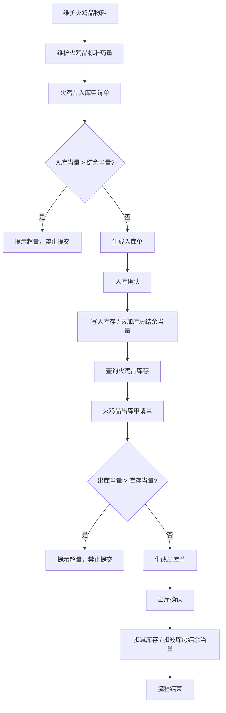

#### 2.1.2 核心场景清单

| 序号 | 场景名称           | 场景描述                                                                                                                                                           |
| ---- | ------------------ | ------------------------------------------------------------------------------------------------------------------------------------------------------------------ |
| 1    | 火鸡品基础数据维护 | 管理员在系统初始化或参数变更时，维护火鸡品物料标识、标准药量（令号+火鸡品）和库房当量参数，为后续出入库操作提供计算基准和校验依据。                                |
| 2    | 火鸡品入库         | 操作员在火鸡品到货需入库时，选择火鸡品库房，录入令号、产品编号等信息，系统自动计算当量并校验是否超出库房结余当量，校验通过后自动完成入库并更新库存和库房结余当量。 |
| 3    | 火鸡品库存查询     | 操作员或查询员在需要了解火鸡品存储状况时，按库房、令号、产品编号等条件查询库存记录，查看当量占用和结余情况。                                                       |
| 4    | 火鸡品出库         | 操作员在需要领用火鸡品时，先查询库存记录，选择出库条目并录入出库数量，系统自动计算出库当量并校验是否超出库存当量，校验通过后自动完成出库并扣减库存和库房结余当量。 |

#### 2.1.3 入库活动序列

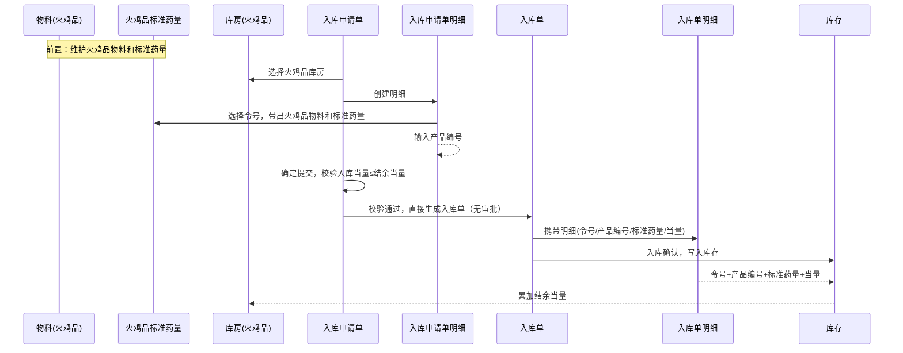

#### 2.1.4 出库活动序列

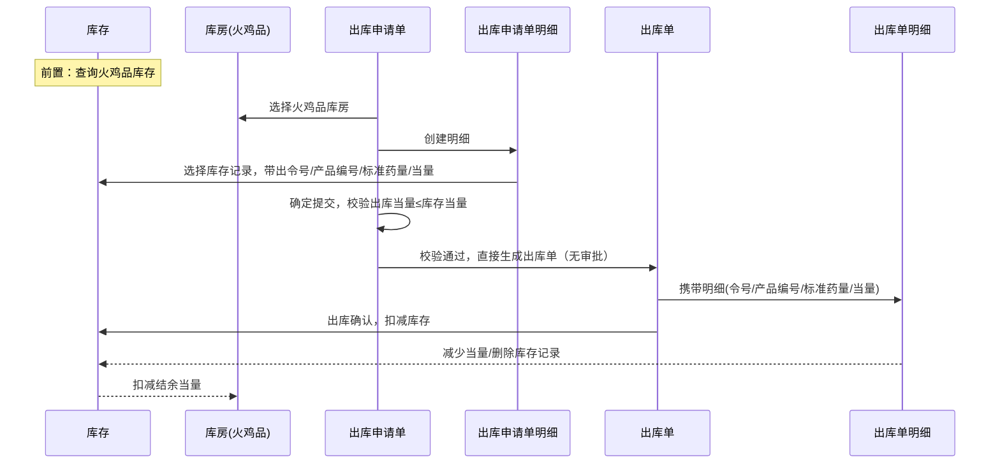

### 2.2 业务数据模型

#### 2.2.1 业务对象关系图

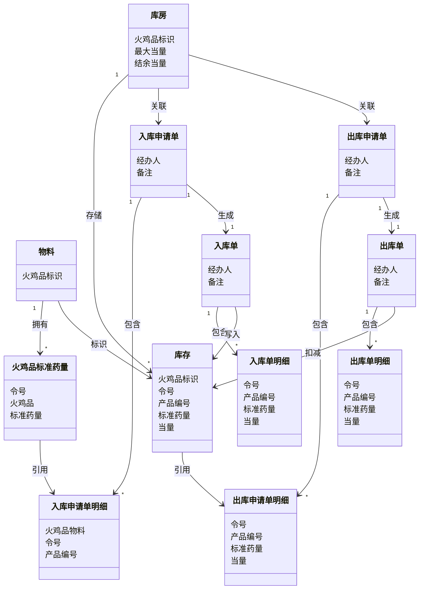

#### 2.2.2 业务属性

##### 物料

| 扩展属性   | 类型 | 输入方式 | 说明               |
| ---------- | ---- | -------- | ------------------ |
| 火鸡品标识 | 布尔 | 手动     | 标识此物料是火鸡品 |

##### 火鸡品标准药量（新增模型）

| 属性     | 类型     | 输入方式       | 说明                               |
| -------- | -------- | -------------- | ---------------------------------- |
| 令号     | 文本     | 手动输入       | 唯一，一个令号只对应一个火鸡品物料 |
| 火鸡品   | 物料引用 | 选择火鸡品物料 |                               |
| 标准药量 | 数值     | 手动输入       |                               |

##### 库房

| 扩展属性   | 类型 | 输入方式 | 说明                                        |
| ---------- | ---- | -------- | ------------------------------------------- |
| 火鸡品标识 | 布尔 | 手动     | 标识此库房存储火鸡品                        |
| 最大当量   | 数值 | 手动输入 |                                        |
| 结余当量   | 数值 | 自动计算 | 最大当量 − 库存当量之和，表示还可存储的当量 |

##### 库存

| 扩展属性   | 类型 | 输入方式   | 说明                   |
| ---------- | ---- | ---------- | ---------------------- |
| 火鸡品标识 | 布尔 | 入库时写入 | 标识此库存记录是火鸡品 |
| 令号       | 文本 | 入库时写入 |                   |
| 产品编号   | 文本 | 入库时写入 |                   |
| 标准药量   | 数值 | 入库时写入 |                   |
| 当量       | 数值 | 入库时写入 |                   |

##### 入库申请单

无火鸡品标识冗余，通过库房推导。

| 扩展属性 | 类型 | 输入方式 | 说明                         |
| -------- | ---- | -------- | ---------------------------- |
| 经办人   | 文本 | 自动带出 | 默认当前登录人，无需手动选择 |
| 备注     | 文本 | 手动输入 |                         |

##### 入库申请单明细

| 扩展属性   | 类型     | 输入方式                                             | 说明                                     |
| ---------- | -------- | ---------------------------------------------------- | ---------------------------------------- |
| 令号       | 文本     | 从标准药量表选择，数据源为火鸡品标准药量表中所有令号 | 先选令号，选中后带出火鸡品物料和标准药量 |
| 火鸡品物料 | 物料引用 | 选择令号后自动带出                                   | 根据令号自动带出对应的火鸡品物料         |
| 产品编号   | 文本     | 手动输入                                             |                                     |

##### 入库单

无火鸡品标识冗余，通过库房推导。

| 扩展属性 | 类型 | 输入方式     | 说明   |
| -------- | ---- | ------------ | ------ |
| 经办人   | 文本 | 从申请单携带 |   |
| 备注     | 文本 | 从申请单携带 |   |

##### 入库单明细

| 扩展属性 | 类型 | 输入方式     | 说明   |
| -------- | ---- | ------------ | ------ |
| 令号     | 文本 | 从申请单携带 |   |
| 产品编号 | 文本 | 从申请单携带 |   |
| 标准药量 | 数值 | 从申请单携带 |   |
| 当量     | 数值 | 从申请单携带 |   |

##### 出库申请单

无火鸡品标识冗余，通过库房推导。

| 扩展属性 | 类型 | 输入方式 | 说明                         |
| -------- | ---- | -------- | ---------------------------- |
| 经办人   | 文本 | 自动带出 | 默认当前登录人，无需手动选择 |
| 备注     | 文本 | 手动输入 |                         |

##### 出库申请单明细

| 扩展属性 | 类型 | 输入方式       | 说明   |
| -------- | ---- | -------------- | ------ |
| 令号     | 文本 | 从库存记录带出 |   |
| 产品编号 | 文本 | 从库存记录带出 |   |
| 标准药量 | 数值 | 从库存记录带出 |   |
| 当量     | 数值 | 从库存记录带出 |   |

##### 出库单

无火鸡品标识冗余，通过库房推导。

| 扩展属性 | 类型 | 输入方式     | 说明   |
| -------- | ---- | ------------ | ------ |
| 经办人   | 文本 | 从申请单携带 |   |
| 备注     | 文本 | 从申请单携带 |   |

##### 出库单明细

| 扩展属性 | 类型 | 输入方式     | 说明   |
| -------- | ---- | ------------ | ------ |
| 令号     | 文本 | 从申请单携带 |   |
| 产品编号 | 文本 | 从申请单携带 |   |
| 标准药量 | 数值 | 从申请单携带 |   |
| 当量     | 数值 | 从申请单携带 |   |

##### 火鸡品标识冗余结论（建议方案，实现时可考虑代码便利性）

| 业务模型       | 是否冗余火鸡品标识 | 结论依据                                               |
| -------------- | :----------------: | ------------------------------------------------------ |
| 物料           |       ✅ 保留       | 基础定义，标识物料本身是否为火鸡品，是推导源头         |
| 库房           |       ✅ 保留       | 基础定义，标识库房是否存储火鸡品，是单据推导的权威来源 |
| 库存           |       ✅ 保留       | 状态数据，入库时固化；高频查询需要，避免关联库房表     |
| 入库申请单     |      ❌ 不冗余      | 通过库房推导，流程性单据                               |
| 入库申请单明细 |      ❌ 不冗余      | 通过单据→库房推导                                      |
| 入库单         |      ❌ 不冗余      | 通过库房推导，流程性单据                               |
| 入库单明细     |      ❌ 不冗余      | 通过单据→库房推导                                      |
| 出库申请单     |      ❌ 不冗余      | 通过库房推导，流程性单据                               |
| 出库申请单明细 |      ❌ 不冗余      | 通过单据→库房推导                                      |
| 出库单         |      ❌ 不冗余      | 通过库房推导，流程性单据                               |
| 出库单明细     |      ❌ 不冗余      | 通过单据→库房推导                                      |

核心原则：**物料和库房是火鸡品标识的基础定义（源头），库存是状态固化（查询优化），单据类实体通过库房关系推导即可，不冗余存储。**

### 2.3 应用架构

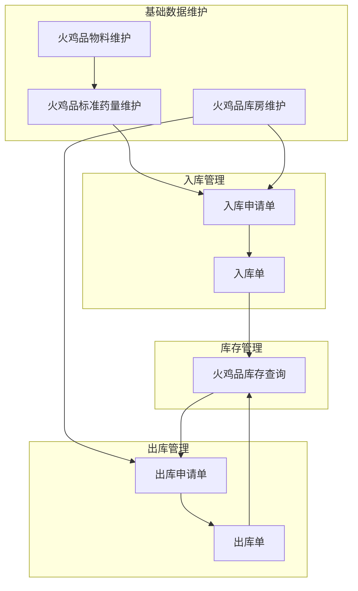

### 2.4 功能清单

#### 模块：基础数据维护

| 需求编号     | 需求名称           | 用户故事                                                                             | 验收标准                                                                                                                                                                                                   |
| ------------ | ------------------ | ------------------------------------------------------------------------------------ | ---------------------------------------------------------------------------------------------------------------------------------------------------------------------------------------------------------- |
| REQ-00010-01 | 维护火鸡品物料     | 作为管理员，我希望为物料设置火鸡品标识，以便系统识别哪些物料属于火鸡品并纳入当量管控 | 1. 物料列表可设置火鸡品标识为"是"2. 已标识为火鸡品的物料可被标准药量和出入库单引用3. 火鸡品标识可修改为"否"（需校验无关联标准药量和库存）                                                                  |
| REQ-00010-02 | 维护火鸡品标准药量 | 作为管理员，我希望维护火鸡品在不同令号下的标准药量，以便入库时自动带出计算基准       | 1. 可新增标准药量记录，输入令号、选择火鸡品物料、输入标准药量数值2. 令号唯一，不允许重复；一个令号只对应一个火鸡品物料3. 可删除标准药量记录（需校验无关联库存）4. 入库申请单选择令号后自动带出对应标准药量 |
| REQ-00010-03 | 维护火鸡品库房     | 作为管理员，我希望为库房设置火鸡品标识和最大当量，以便系统自动计算结余当量并管控入库 | 1. 库房可设置火鸡品标识为"是"2. 火鸡品库房可设定最大当量数值3. 结余当量由系统自动计算（最大当量 − 库存当量之和）4. 火鸡品库房的结余当量实时更新                                                            |

#### 模块：入库管理

| 需求编号     | 需求名称         | 用户故事                                                                                                   | 验收标准                                                                                                                                                                                                                                                                                                                                                                                                             |
| ------------ | ---------------- | ---------------------------------------------------------------------------------------------------------- | -------------------------------------------------------------------------------------------------------------------------------------------------------------------------------------------------------------------------------------------------------------------------------------------------------------------------------------------------------------------------------------------------------------------- |
| REQ-00010-04 | 火鸡品入库申请   | 作为操作员，我希望通过入库申请单录入火鸡品入库信息，系统自动计算当量并校验库房容量，以便安全高效地完成入库 | 1. 新增入库申请单时选择火鸡品库房2. 明细中先选择令号（数据源为火鸡品标准药量表中所有令号），自动带出火鸡品物料和标准药量3. 明细中手动输入产品编号和数量4. 经办人默认当前登录人，可填写备注5. 系统自动计算当量（标准药量 × 数量）6. 提交时校验入库当量 ≤ 库房结余当量，超量则提示并禁止提交7. 校验通过后自动生成入库单并完成入库（火鸡品无库位，自动归入默认库位，无需二次操作）8. 入库时间由系统自动生成，精确到分钟 |
| REQ-00010-05 | 火鸡品入库单查询 | 作为操作员，我希望查询火鸡品入库单记录，以便追溯入库历史                                                   | 1. 可按库房、入库时间段、令号等条件查询入库单2. 入库单展示明细信息（令号、产品编号、标准药量、当量、经办人、备注）3. 已归档入库单仅可查看，不可修改                                                                                                                                                                                                                                                                  |

#### 模块：出库管理

| 需求编号     | 需求名称         | 用户故事                                                                                                   | 验收标准                                                                                                                                                                                                                                                                                                                                                             |
| ------------ | ---------------- | ---------------------------------------------------------------------------------------------------------- | -------------------------------------------------------------------------------------------------------------------------------------------------------------------------------------------------------------------------------------------------------------------------------------------------------------------------------------------------------------------- |
| REQ-00010-06 | 火鸡品出库申请   | 作为操作员，我希望通过出库申请单从库存中选择火鸡品出库，系统自动计算当量并校验库存，以便安全高效地完成出库 | 1. 新增出库申请单时选择火鸡品库房2. 明细从库存记录中选择，自动带出令号、产品编号、标准药量、当量3. 录入出库数量，系统自动计算出库当量（标准药量 × 出库数量）4. 经办人默认当前登录人，可填写备注5. 提交时校验出库当量 ≤ 库存当量，超量则提示并禁止提交6. 校验通过后自动生成出库单并完成出库（火鸡品无库位，无需二次操作）7. 出库后扣减库存当量，当量为0时删除库存记录 |
| REQ-00010-07 | 火鸡品出库单查询 | 作为操作员，我希望查询火鸡品出库单记录，以便追溯出库历史                                                   | 1. 可按库房、出库时间段、令号等条件查询出库单2. 出库单展示明细信息（令号、产品编号、标准药量、当量、经办人、备注）3. 已归档出库单仅可查看，不可修改                                                                                                                                                                                                                  |

#### 模块：库存管理

| 需求编号     | 需求名称       | 用户故事                                                                       | 验收标准                                                                                                                                 |
| ------------ | -------------- | ------------------------------------------------------------------------------ | ---------------------------------------------------------------------------------------------------------------------------------------- |
| REQ-00010-08 | 火鸡品库存查询 | 作为操作员或查询员，我希望按条件查询火鸡品库存，以便了解当前存储状况和当量占用 | 1. 可按库房、令号、产品编号等条件查询库存2. 库存列表展示令号、产品编号、标准药量、当量3. 库房维度展示最大当量、结余当量4. 查询结果可导出 |

## 3. 界面方案设计

### 3.1 基础数据维护

#### 3.1.1 火鸡品物料维护

**（1）页面线框简图**

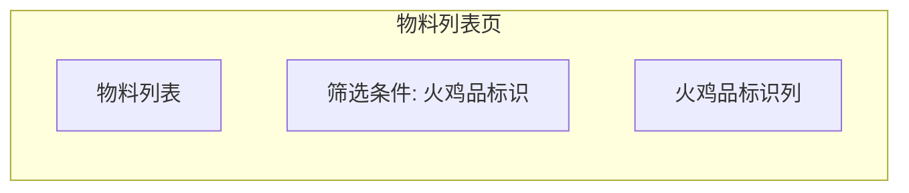

**（2）功能点描述**

| 功能点         | 用户操作说明                                 | 系统处理逻辑                                                  | 关键业务规则                                               |
| -------------- | -------------------------------------------- | ------------------------------------------------------------- | ---------------------------------------------------------- |
| 维护火鸡品物料 | 管理员在物料列表中设置火鸡品标识为"是"或"否" | **进入方式：**物料管理列表 **处理结果：**更新物料的火鸡品标识 | 火鸡品标识改为"否"时，需校验该物料无关联标准药量和库存记录 |

#### 3.1.2 火鸡品标准药量维护

**（1）页面线框简图**

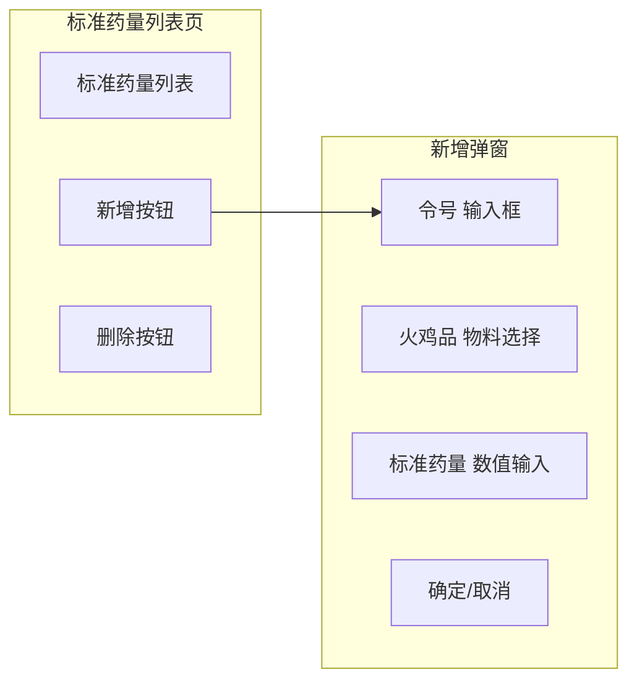

**（2）功能点描述**

| 功能点             | 用户操作说明                 | 系统处理逻辑                                                                                            | 关键业务规则                                                                 |
| ------------------ | ---------------------------- | ------------------------------------------------------------------------------------------------------- | ---------------------------------------------------------------------------- |
| 维护火鸡品标准药量 | 管理员新增或删除标准药量记录 | **新增：**输入令号、选择火鸡品物料、输入标准药量数值，保存后写入标准药量表 **删除：**选中记录后点击删除 | 令号唯一，不允许重复；一个令号只对应一个火鸡品物料删除时需校验无关联库存记录 |

#### 3.1.3 火鸡品库房维护

**（1）页面线框简图**

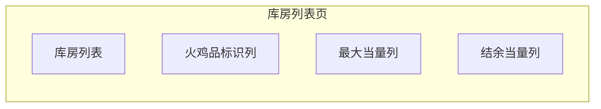

**（2）功能点描述**

| 功能点         | 用户操作说明                         | 系统处理逻辑                                                         | 关键业务规则                                 |
| -------------- | ------------------------------------ | -------------------------------------------------------------------- | -------------------------------------------- |
| 维护火鸡品库房 | 管理员为库房设置火鸡品标识和最大当量 | **处理结果：**更新库房的火鸡品标识和最大当量；结余当量由系统自动计算 | 结余当量 = 最大当量 − 库存当量之和，实时更新 |

### 3.2 入库管理

#### 3.2.1 火鸡品入库申请

**（1）页面线框简图**

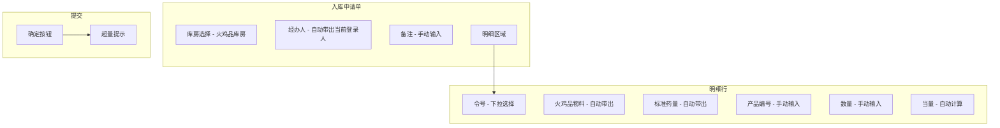

**（2）功能点描述**

| 功能点         | 用户操作说明                                 | 系统处理逻辑                                                                                                                                                                                                                                                                                | 关键业务规则                                                                                                                            |
| -------------- | -------------------------------------------- | ------------------------------------------------------------------------------------------------------------------------------------------------------------------------------------------------------------------------------------------------------------------------------------------- | --------------------------------------------------------------------------------------------------------------------------------------- |
| 火鸡品入库申请 | 操作员选择火鸡品库房，录入明细信息后点击确定 | **默认带出：**选择库房后仅展示火鸡品库房 **自动带出：**明细中先选择令号（数据源为火鸡品标准药量表中所有令号），自动带出火鸡品物料和标准药量 **自动计算：**当量 = 标准药量 × 数量 **校验：**入库当量 ≤ 结余当量 **处理结果：**校验通过后自动生成入库单并完成入库，写入库存、累加库房结余当量 | 入库当量 > 结余当量时提示超量并禁止提交入库时间系统自动生成，精确到分钟无审批流程，校验通过即完成入库经办人默认当前登录人，备注手动输入 |

### 3.3 出库管理

#### 3.3.1 火鸡品出库申请

**（1）页面线框简图**

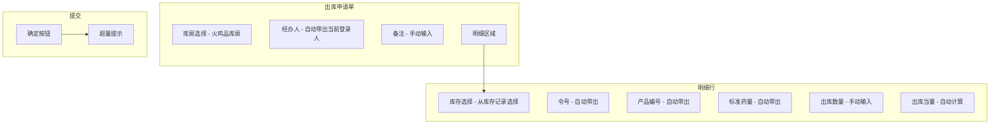

**（2）功能点描述**

| 功能点         | 用户操作说明                                                   | 系统处理逻辑                                                                                                                                                                                                                                                      | 关键业务规则                                                                                                                           |
| -------------- | -------------------------------------------------------------- | ----------------------------------------------------------------------------------------------------------------------------------------------------------------------------------------------------------------------------------------------------------------- | -------------------------------------------------------------------------------------------------------------------------------------- |
| 火鸡品出库申请 | 操作员选择火鸡品库房，从库存中选择记录，录入出库数量后点击确定 | **默认带出：**选择库房后仅展示火鸡品库房 **自动带出：**选择库存记录后自动带出令号、产品编号、标准药量 **自动计算：**出库当量 = 标准药量 × 出库数量 **校验：**出库当量 ≤ 库存当量 **处理结果：**校验通过后自动生成出库单并完成出库，扣减库存当量、扣减库房结余当量 | 出库当量 > 库存当量时提示超量并禁止提交出库后库存当量为0时删除库存记录无审批流程，校验通过即完成出库经办人默认当前登录人，备注手动输入 |

### 3.4 库存管理

#### 3.4.1 火鸡品库存查询

**（1）页面线框简图**

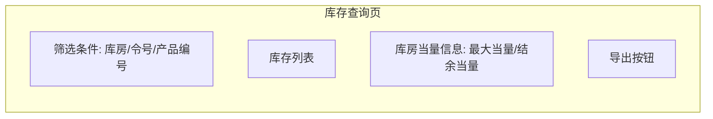

**（2）功能点描述**

| 功能点         | 用户操作说明                       | 系统处理逻辑                                                                                                                            | 关键业务规则                           |
| -------------- | ---------------------------------- | --------------------------------------------------------------------------------------------------------------------------------------- | -------------------------------------- |
| 火鸡品库存查询 | 操作员或查询员按条件查询火鸡品库存 | **筛选条件：**库房、令号、产品编号，均为非必填 **展示内容：**库存列表展示令号、产品编号、标准药量、当量；库房维度展示最大当量、结余当量 | 所有筛选条件为非必填，未填写则不做过滤 |

## 4. 附录

### 4.1 核心设计决策

| 决策项                   | 决策结论                               | 决策依据                                                                                                                               |
| ------------------------ | -------------------------------------- | -------------------------------------------------------------------------------------------------------------------------------------- |
| 实现方式                 | 基于产品标准+扩展实现                  | HX项目特有需求，在产品标准模型基础上通过扩展属性和新增模型（火鸡品标准药量）实现，不修改产品标准核心模型                               |
| 令号唯一性约束           | 令号唯一，一个令号只对应一个火鸡品物料 | 确保入库时令号能唯一确定火鸡品物料和标准药量，操作员选择令号后即可自动带出关联信息                                                     |
| 火鸡品是否有库位         | 无库位管理，入库自动归入默认库位       | 火鸡品按当量管控存储安全，不按库位区分存放位置；若库房下存在库位，则取第一个库位作为默认库位，无需用户选择                             |
| 火鸡品标识是否冗余至单据 | 单据类实体不冗余火鸡品标识             | 物料和库房是火鸡品标识的基础定义（源头），库存是状态固化（查询优化），单据类实体通过库房关系推导即可，冗余存储增加一致性风险和维护成本 |
| 入库/出库是否需要审批    | 无审批流程，校验通过即完成             | 火鸡品无库位管理，入库自动归入默认库位，因此申请单校验通过后即可自动完成入库/出库，无需二次操作                                        |
| 超量后是否允许提交       | 不允许提交，阻断保存                   | 超量意味着超出库房安全存储容量，必须阻断                                                                                               |
| 是否允许负库存           | 不允许                                 | 出库时校验出库当量 ≤ 库存当量，确保库存不为负                                                                                          |
| 库房/厂房关系            | 同级，统一使用"库房"概念               | 原始需求中库房/厂房并列使用，经确认二者同级                                                                                            |

### 4.2 关键公式与预警规则

| 项目     | 公式/规则                                | 说明                                     |
| -------- | ---------------------------------------- | ---------------------------------------- |
| 当量计算 | 当量 = 标准药量 × 数量                   | 入库、出库统一适用                       |
| 结余当量 | 结余当量 = 最大当量 − 库存当量之和       | 反映库房还可存储的当量                   |
| 入库校验 | 入库当量 ≤ 结余当量                      | 超量则禁止提交                           |
| 出库校验 | 出库当量 ≤ 库存当量                      | 防止负库存                               |
| 饱和预警 | 库存当量之和 / 最大当量 ≥ 95% 时触发预警 | 用于看板提醒（查询统计模块，本期不实现） |

### 4.3 需求溯源

| 原始文件                                        | 内容摘要                                                                                      | 收集日期   |
| ----------------------------------------------- | --------------------------------------------------------------------------------------------- | ---------- |
| original/20260424\_火鸡品管理功能-原始需求.docx | 客户/交付提供的火鸡品管理完整需求文档，包含出入库模块、管理员模块、查询统计模块、日志追溯模块 | 2026-04-24 |
| original/火鸡品需求-简洁版.md                   | 需求骨架权威声明，包含术语定义、业务流程、业务模型、扩展属性汇总、火鸡品标识冗余结论          | 2026-04-24 |

### 4.4 变更记录

| 版本 | 日期       | 变更内容                                                     | 变更人 |
| ---- | ---------- | ------------------------------------------------------------ | ------ |
| v1.0 | 2026-04-24 | 初稿编制                                                     | 刘连冬 |
| v1.1 | 2026-04-26 | 令号唯一性约束调整、入库操作顺序改为先选令号、令号数据源明确 | 刘连冬 |
