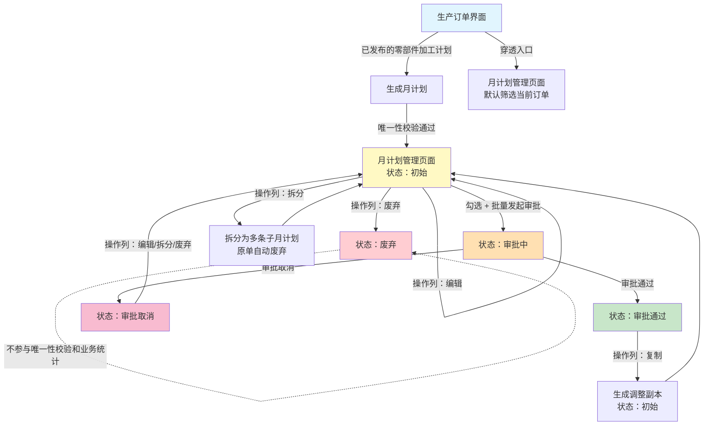
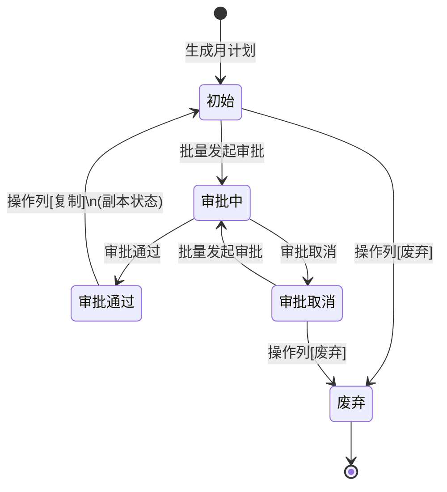

<!-- raw-to-wiki-ingest:auto -->

# 原始资料-项目文档-KFRW-00099-月计划管理-需求规格说明书

## 来源说明

- 原始路径：`wiki/02_HX项目资料/99_原始资料/bjhx_process/02_需求与方案/requirements/REQ-00040_月计划管理/finalized/KFRW-00099-月计划管理-需求规格说明书.md`
- 目标路径：`wiki/02_HX项目资料/99_原始资料镜像/bjhx_process/02_需求与方案/requirements/REQ-00040_月计划管理/finalized/KFRW-00099-月计划管理-需求规格说明书.md`
- 提取方式：`markdown`
- 说明：本页由统一入库脚本自动生成，不覆盖人工整理页。

## 原始内容镜像

## KFRW-00099 月计划管理 需求规格说明书

### 文档信息

| 项目     | 内容       |
| -------- | ---------- |
| 任务单号 | KFRW-00099 |
| 需求名称 | 月计划管理 |
| 项目名称 | BJHX       |
| 项目经理 | 付昌伟     |
| 项目交付 | 张顺心     |
| 编制人   | 刘连冬     |
| 编制日期 | 2026-05-19 |
| 版本号   | V1.0       |

### 历史修改记录

| 版本 | 日期       | 作者   | 修改说明                                        |
| ---- | ---------- | ------ | ----------------------------------------------- |
| V1.0 | 2026-05-19 | 刘连冬 | 基于 REQ-00040 旧版需求规格说明书按项目模板重构 |

### 1. 概述

#### 1.1 原始需求

生产处需要对已发布的零部件加工计划生产订单进行月度维度的计划管理。当前系统缺少月计划管理功能，无法支持从生产订单生成月计划、审批确认、拆分细化、复制调整、废弃处理、进度跟踪以及向 SAP 系统同步数据等业务场景。本任务单要求建立完整的月计划生命周期管理能力，实现从生产订单到月计划的全流程闭环。

#### 1.2 需求来源

| 来源类型 | 关联编号   | 来源说明                             |
| -------- | ---------- | ------------------------------------ |
| 任务单   | KFRW-00099 | 月计划管理功能需求                   |
| 原始需求 | REQ-00040  | 月计划管理功能原始需求说明           |
| 会议纪要 | —          | 生产处月计划需求讨论会议录音及文字版 |
| 流程梳理 | —          | 月计划梳理图及会议讨论整理           |

#### 1.3 涉及的软件版本

| 版本类型     | 版本号             | 说明               |
| ------------ | ------------------ | ------------------ |
| MOM 产品版本 | —                  | 以项目部署版本为准 |
| 产品包版本   | —                  | 以项目部署版本为准 |
| 项目包版本   | KMMOM-BJHX v1.1.67 | BJHX 项目包        |

#### 1.4 术语与缩写解释

| 术语/缩写    | 说明                                                         |
| ------------ | ------------------------------------------------------------ |
| 生产订单     | 计划类型为**零部件加工计划**的生产订单                       |
| 月计划       | 从生产订单生成的月度执行计划                                 |
| 月份         | 月计划指定结束日期所属月份，例如指定结束日期在 4月26日 \~ 5月25日 → **属于5月份计划**， |
| 指定完成时间 | 月计划的指定计划完成日期（颗粒度：天）                       |
| 审批取消     | 统一术语，审批流程以取消方式终止（涵盖撤回、驳回等场景）     |
| 初始界面     | 月计划管理页面中，状态筛选为"未确认"时的视图（初始/审批取消/审批中） |
| 调整界面     | 月计划管理页面中，状态筛选为"审批通过"时的视图，支持复制生成调整计划 |
| 穿透查询     | 从生产订单进入月计划管理页面，默认筛选当前订单的所有状态月计划（含废弃） |

> **全文约定**：本文档中凡提及"生产订单"，如无特殊说明，均指计划类型为"零部件加工计划"的生产订单。

**注**：零部件加工计划生产订单由 ERP 传入的零部件交付计划经 MOM 一级工艺展开生成，发布后方可用于月计划管理。

#### 1.5 参考文献

| 文档名称                       | 编号/版本          | 说明                             |
| ------------------------------ | ------------------ | -------------------------------- |
| 月计划管理功能需求             | REQ-00040          | 原始需求来源（任务单）           |
| 月计划梳理图及会议讨论整理     | —                  | **权威来源**：流程整理与会议结论 |
| 月计划管理业务流程文档         | —                  | 详细业务流程                     |
| BJHX 项目数据模型              | KMMOM-BJHX v1.1.67 | 项目级数据模型                   |
| 产品标准数据模型（km-mom-mes） | —                  | 生产订单等标准模型定义           |

### 2. 需求描述

#### 2.1 业务描述

生产处在日常管理过程中，需要基于已发布的零部件加工计划生产订单生成月计划，对生产订单进行月度维度的计划管理。核心业务场景如下：

**核心角色**：

| 角色         | 职责                                                       |
| ------------ | ---------------------------------------------------------- |
| 生产处计划员 | 负责月计划的生成、编辑、废弃、拆分、复制调整操作，提交审批 |
| 审批人员     | 负责月计划的审批通过或审批取消                             |

**核心场景**：

1. 计划员查看已发布的零部件加工计划生产订单，生成对应的月计划，进入月计划管理页面
2. 在月计划管理页面对月计划进行编辑确认后，提交审批
3. 审批通过后月计划状态变为审批通过，可通过状态筛选查看已确认计划；审批取消后状态变为审批取消，可再次编辑提交
4. 已确认计划可通过复制方式生成调整计划（修改完成日期和数量），副本状态为初始，需重新审批
5. 需要细化管理时，可将一条月计划拆分为多条子月计划
6. 废弃的月计划不再参与业务统计和唯一性校验
7. 从生产订单可穿透进入月计划管理页面，查看该订单关联的所有状态月计划

**业务流程图**：



**项目特有约束**：

- 月计划仅来源已发布的零部件加工计划生产订单，其他类型生产订单不纳入
- 生产订单变更（阶段新增/修改/删除）对月计划的影响暂不考虑
- 月份归属采用企业自定义月度周期（取结束日期所属月份），非自然月

#### 2.2 需求边界及验收条件

##### 2.2.1 需求边界

| 类别         | 内容                                                                                                                                                                              |
| ------------ | --------------------------------------------------------------------------------------------------------------------------------------------------------------------------------- |
| 包含范围     | 月计划生成与唯一性校验；月计划废弃；月计划拆分；月计划复制/调整；月份归属规则；月计划管理页面（统一管理界面）；穿透查询；外部累计完成数量回写生产订单；审批流程集成；SAP 接口预留 |
| 不包含范围   | 生产订单变更对月计划的影响处理；SAP 接口具体协议和数据格式设计；帆软报表统计分析的具体口径和展示维度；审批流程节点和审批人规则的具体定义                                          |
| 关联需求边界 | 与生产订单管理模块为读取+回写关系，不修改生产订单核心逻辑；与产品工作流为集成关系，审批节点和审批人由工作流配置决定；SAP 接口仅预留扩展点                                         |
| 独立测试说明 | 可独立测试，前置条件为系统中存在已发布的零部件加工计划生产订单数据；审批流程需提前配置产品工作流                                                                                  |

##### 2.2.2 验收条件

| 验收项   | 验收条件                                                                                                              | 备注                       |
| -------- | --------------------------------------------------------------------------------------------------------------------- | -------------------------- |
| 功能验收 | 月计划生成、废弃、拆分、复制调整、审批提交、穿透查询等核心操作均可正常执行，状态流转正确                              |                            |
| 数据验收 | 唯一性校验按规则生效；废弃数据不参与校验和统计；外部累计完成数量回写正确且不重复叠加                                  |                            |
| 配置验收 | 产品工作流审批配置可正常使用；月计划相关页面和菜单已配置                                                              |                            |
| 接口验收 | 外部累计完成数量入库接口可正常接收数据并回写；SAP 接口扩展点已预留                                                    | SAP 接口具体协议不在本范围 |
| 交付验收 | 新增 `HxMonthlyPlan` 模型已部署；`ProdOrder` 扩展属性 `cumulativeCompletedQty` 已生效；月计划管理页面可正常访问和操作 |                            |

#### 2.3 功能描述

##### 2.3.0 界面UI示意

**月计划管理页面（统一管理界面）**

月计划管理采用统一页面，通过状态筛选器查看不同状态的月计划，操作列根据行状态动态显示可用操作。

两种进入路径：
- **从菜单进入**：默认筛选状态为"未确认"（初始/审批取消/审批中），为计划员日常管理入口
- **从生产订单穿透进入**：默认筛选生产订单号为当前订单、状态为全部，为反向追溯入口

```text
┌──────────────────────────────────────────────────────────────────────────────┐
│ 月计划管理                                                                    │
├──────────────────────────────────────────────────────────────────────────────┤
│ 筛选条件：                                                                   │
│ 生产订单号[________] 工艺阶段[▼____] 指定完成时间[____~____]                 │
│ 计划月份[▼____] 状态[☑初始 ☑审批取消 ☑审批中 ☑审批通过 ☐废弃]               │
│ [查询] [重置]                                                                │
├──────────────────────────────────────────────────────────────────────────────┤
│ [批量发起审批]                                                                │
├──────────────────────────────────────────────────────────────────────────────┤
│ ☑ │ 生产订单号 │ 工艺阶段 │ 指定完成时间 │ 计划数量 │ 计划月份 │ 状态   │ 操作                     │
│ ── ─────────── ────────── ────────────── ────────── ────────── ──────── ────────────────────── │
│ □ │ SAP-001    │ 机加     │ 2026-06-15   │ 100      │ 6月      │ 初始   │ [编辑][废弃][拆分]       │
│ □ │ SAP-002    │ 热处理   │ 2026-06-20   │ 50       │ 6月      │ 审批取消│ [编辑][废弃][拆分]       │
│ □ │ SAP-003    │ 装配     │ 2026-05-20   │ 80       │ 5月      │ 审批通过│ [复制]                   │
│ □ │ SAP-004    │ 机加     │ 2026-06-10   │ 30       │ 6月      │ 审批中 │ —                        │
│ □ │ SAP-005    │ 热处理   │ 2026-07-15   │ 20       │ 7月      │ 废弃   │ —                        │
└──────────────────────────────────────────────────────────────────────────────┘
```

**操作列规则**：

| 状态     | 操作列显示           | 说明                                   |
| -------- | -------------------- | -------------------------------------- |
| 初始     | [编辑] [废弃] [拆分] | 全部操作可用，审批通过顶部批量按钮发起 |
| 审批取消 | [编辑] [废弃] [拆分] | 同初始，可重新发起审批                 |
| 审批中   | —                    | 只读，无操作                           |
| 审批通过 | [复制]               | 仅复制调整                             |
| 废弃     | —                    | 不可恢复，无操作                       |

**批量发起审批**：顶部 [批量发起审批] 按钮，勾选多条初始/审批取消状态的月计划后可用，审批中/审批通过/废弃的行自动跳过并提示。

##### 2.3.0b 月计划生命周期状态定义

**生命周期阶段与状态对照**：

| 生命周期阶段 | 状态     | 说明                                                   |
| ------------ | -------- | ------------------------------------------------------ |
| 创建         | 初始     | 生成后默认状态，待处理                                 |
| 创建         | 审批取消 | 审批流程以取消方式终止（涵盖撤回、驳回等），可再次操作 |
| 活动中       | 审批中   | 已提交审批流程，数据只读锁定                           |
| 已发布       | 审批通过 | 审批通过，作为已确认计划                               |
| 已废弃       | 废弃     | 已废弃，不可恢复，不参与唯一性校验和业务统计           |

**状态流转路径**：



**各状态可用操作汇总**：

| 状态     | 操作列             | 批量发起审批 | 编辑 | 废弃 | 拆分 | 复制 |
| -------- | ------------------ | ------------ | ---- | ---- | ---- | ---- |
| 初始     | [编辑][废弃][拆分] | ✅            | ✅    | ✅    | ✅    | —    |
| 审批取消 | [编辑][废弃][拆分] | ✅            | ✅    | ✅    | ✅    | —    |
| 审批中   | —                  | —            | —    | —    | —    | —    |
| 审批通过 | [复制]             | —            | —    | —    | —    | ✅    |
| 废弃     | —                  | —            | —    | —    | —    | —    |

##### 2.3.1 月计划生成与唯一性校验

- 功能目标：从已发布的零部件加工计划生产订单生成月计划记录，并执行唯一性校验防止重复生成
- 适用角色：生产处计划员
- 前置条件：系统中存在已发布状态的零部件加工计划生产订单
- 触发方式/操作步骤：计划员选择已发布的生产订单，点击生成月计划
- 系统处理逻辑：
  1. 读取生产订单数据（生产订单 ID、SAP 订单号、工艺阶段、指定完成时间、计划数量、计划开始时间、计划结束时间）
  2. 校验生产订单是否为已发布状态，未发布则阻止生成
  3. 校验生产订单是否为零部件加工计划类型，非此类型则阻止生成
  4. 按生产订单 ID 在未废弃的月计划记录中执行唯一性校验，若已存在则阻止生成
  5. 校验通过后创建月计划记录，状态为初始
  6. 月计划进入月计划管理页面（状态为初始）
- 输出结果：生成一条初始状态的月计划记录，展示在月计划管理页面
- 异常处理/边界处理：
  - 生产订单未发布 → 提示"该生产订单未发布，不可生成月计划"
  - 生产订单非零部件加工计划 → 提示"仅零部件加工计划类型的生产订单可生成月计划"
  - 唯一性校验未通过 → 提示"该生产订单已存在未废弃的月计划，不可重复生成"
- 涉及页面/入口：月计划管理页面（从菜单进入）
- 原型链接/原型说明：见 2.3.0
- 补充说明：生产订单下的交付分解子表格在月计划界面中屏蔽，不直接展示

##### 2.3.2 月计划编辑

- 功能目标：计划员在月计划管理页面修改初始或审批取消状态的月计划可编辑字段
- 适用角色：生产处计划员
- 前置条件：月计划处于初始或审批取消状态
- 触发方式/操作步骤：计划员在月计划管理页面选择一条初始或审批取消状态的月计划，点击操作列的[编辑]，修改可编辑字段后保存
- 系统处理逻辑：
  1. 校验月计划状态是否为初始或审批取消，其他状态不允许编辑
  2. 允许编辑的字段：指定完成时间、计划数量、计划开始时间、计划结束时间
  3. 保存时重新计算计划月份（取结束日期所属月份）
  4. 保存后状态不变
- 输出结果：月计划字段更新，计划月份重新计算
- 异常处理/边界处理：审批中或审批通过状态的月计划点击[编辑] → 提示"当前状态不允许编辑"
- 涉及页面/入口：月计划管理页面 → 编辑弹窗
- 原型链接/原型说明：见 2.3.0
- 补充说明：生产订单号、工艺阶段、计划月份为只读字段，不可编辑

##### 2.3.3 月计划废弃

- 功能目标：通过废弃机制实现月计划的逻辑删除，废弃后不可恢复
- 适用角色：生产处计划员
- 前置条件：月计划处于初始或审批取消状态
- 触发方式/操作步骤：计划员在月计划管理页面选择一条初始或审批取消状态的月计划，点击操作列的[废弃]，确认后执行
- 系统处理逻辑：
  1. 校验月计划状态是否为初始或审批取消
  2. 审批中或审批通过状态不允许废弃
  3. 将月计划标记为废弃状态
  4. 废弃后的月计划不参与唯一性校验和业务统计
  5. 废弃操作不需要审批，直接执行
- 输出结果：月计划状态变为废弃，从当前筛选视图中移除（如筛选条件包含废弃则仍可见但无操作）
- 异常处理/边界处理：
  - 审批中/审批通过状态点击[废弃] → 提示"当前状态不允许废弃"
  - 废弃后尝试恢复 → 提示"废弃不可恢复，如需使用请重新生成月计划"
- 涉及页面/入口：月计划管理页面
- 原型链接/原型说明：见 2.3.0
- 补充说明：废弃不做物理删除，记录保留在数据库中用于追溯

##### 2.3.4 月计划拆分

**拆分弹窗示意**：

```text
┌─────────────────────────────────────────────────────┐
│ 月计划拆分                                          │
├─────────────────────────────────────────────────────┤
│ 原计划信息（只读）：                                   │
│ 生产订单号：SAP-001   工艺阶段：机加                 │
│ 指定完成时间：2026-06-15  计划数量：100              │
├─────────────────────────────────────────────────────┤
│ 拆分明细：                                           │
│ 子计划1  指定完成时间[________] 计划数量[____]       │
│ 子计划2  指定完成时间[________] 计划数量[____]       │
│                              [+添加子计划]           │
├─────────────────────────────────────────────────────┤
│                          [取消]  [确认拆分]          │
└─────────────────────────────────────────────────────┘
```

- 功能目标：将一条月计划拆分为多条子月计划，细化管理粒度
- 适用角色：生产处计划员
- 前置条件：月计划处于初始或审批取消状态
- 触发方式/操作步骤：点击操作列 [拆分] → 弹窗中填写子计划完成时间和数量 → 确认
- 系统处理逻辑：
  1. 校验状态为初始或审批取消
  2. 校验仅允许一级拆分（子计划不可再拆）
  3. 校验子计划数量之和 = 原单数量
  4. 对每条子计划执行唯一性校验（SAP订单号 + 工艺阶段 + 指定完成日期）
  5. 校验通过：原单自动废弃，子计划创建（状态：初始）
- 输出结果：原单废弃，子计划进入月计划管理页面
- 异常处理/边界处理：
  - 状态不符 → "当前状态不允许拆分，审批通过的计划请使用复制调整"
  - 唯一性冲突 → "子计划与已有未废弃月计划维度重复，请调整指定完成时间"
  - 数量之和不等于原单 → "子计划数量之和必须等于原单计划数量"
  - 子计划再拆分 → "只允许拆一级，不允许嵌套拆分"
- 涉及页面/入口：月计划管理页面 → 拆分弹窗
- 原型链接/原型说明：见上方弹窗示意

##### 2.3.5 月计划复制/调整

**复制弹窗示意**：

```text
┌─────────────────────────────────────────────────────┐
│ 月计划复制调整                                       │
├─────────────────────────────────────────────────────┤
│ 原单信息（只读）：                                   │
│ 生产订单号：SAP-001   工艺阶段：机加                 │
│ 指定完成时间：2026-05-20  计划数量：80               │
│ 计划月份：5月                                        │
├─────────────────────────────────────────────────────┤
│ 调整信息：                                           │
│ 新指定完成时间[________]  新计划数量[____]           │
│ ⚠ 新完成日期所属月份不能与原计划相同                  │
├─────────────────────────────────────────────────────┤
│                          [取消]  [确认复制]          │
└─────────────────────────────────────────────────────┘
```

- 功能目标：对审批通过的月计划复制生成调整计划，原计划不变
- 适用角色：生产处计划员
- 前置条件：月计划处于审批通过状态
- 触发方式/操作步骤：点击操作列 [复制] → 弹窗中填写新完成日期和数量 → 确认
- 与拆分的差异：**复制需额外校验新完成日期所属月份 ≠ 原计划月份**，其余逻辑（唯一性校验、副本创建）相同
- 系统处理逻辑：
  1. 校验状态为审批通过
  2. **校验新完成日期所属月份 ≠ 原计划月份**（月份限制，拆分无此校验）
  3. 执行唯一性校验（SAP订单号 + 工艺阶段 + 指定完成日期 + 计划月份）
  4. 校验通过：创建副本（状态：初始），原计划不变
- 输出结果：副本进入月计划管理页面，原计划不变
- 异常处理/边界处理：
  - 非审批通过状态 → "仅审批通过的月计划允许复制"
  - 新完成日期同月份 → "不能在同一月份计划内复制"
  - 唯一性冲突 → "已存在相同维度的未废弃月计划，请调整指定完成时间"
- 涉及页面/入口：月计划管理页面 → 复制弹窗
- 原型链接/原型说明：见上方弹窗示意
- 补充说明：只能复制一份；复制时必须指定新的完成日期和数量

##### 2.3.6 月计划审批提交

- 功能目标：将初始或审批取消状态的月计划提交产品工作流审批
- 适用角色：生产处计划员
- 前置条件：月计划处于初始或审批取消状态
- 触发方式/操作步骤：计划员在月计划管理页面勾选一条或多条初始/审批取消状态的月计划，点击顶部 [批量发起审批] 按钮
- 系统处理逻辑：
  1. 校验勾选的月计划状态是否为初始或审批取消
  2. 支持批量勾选提交，审批中/审批通过/废弃状态的月计划自动跳过并提示
  3. 提交后月计划状态变为审批中
  4. 审批通过后月计划状态变为审批通过
  5. 审批取消后月计划状态变为审批取消，可再次编辑提交
  6. 支持批量审批通过
- 输出结果：月计划进入审批流程，状态变为审批中
- 异常处理/边界处理：
  - 审批中的月计划被勾选提交 → 系统跳过并提示"该月计划已在审批流程中"
  - 审批通过/废弃的月计划被勾选提交 → 系统跳过并提示"当前状态不允许发起审批"
  - 审批期间数据被修改 → 审批中状态锁定为只读
- 涉及页面/入口：月计划管理页面
- 原型链接/原型说明：见 2.3.0
- 补充说明：审批节点和审批人由产品工作流配置决定，不在本需求中定义

##### 2.3.7 穿透查询

- 功能目标：从生产订单穿透查看该订单关联的所有月计划数据，并可按状态执行相应操作
- 适用角色：生产处计划员、审批人员
- 前置条件：生产订单存在关联的月计划记录
- 触发方式/操作步骤：用户在生产订单界面点击月计划穿透入口，进入月计划管理页面（默认筛选当前生产订单号、状态为全部）
- 系统处理逻辑：
  1. 根据生产订单 ID 自动填充筛选条件，查询关联的所有月计划记录
  2. 展示所有状态的月计划（含废弃）
  3. 操作列根据行状态动态显示可用操作，与月计划管理页面一致
  4. 支持调整筛选条件查看其他月计划
- 输出结果：展示该生产订单关联的月计划列表，可按状态执行操作
- 异常处理/边界处理：无关联月计划 → 显示空列表
- 涉及页面/入口：生产订单界面 → 月计划管理页面（穿透进入）
- 原型链接/原型说明：见 2.3.0
- 补充说明：穿透进入的月计划管理页面与菜单进入的页面为同一页面，仅默认筛选条件不同

##### 2.3.8 外部累计完成数量回写生产订单

- 功能目标：当外部系统（SAP）的累计完成数量入库后，系统自动将累计完成数量回写到对应的生产订单
- 适用角色：系统自动处理
- 前置条件：`HxSapOrderCompletion` 中有新的累计完成数量入库
- 触发方式/操作步骤：外部累计完成数量入库时自动触发
- 系统处理逻辑：
  1. 读取 `HxSapOrderCompletion` 中的 `totalCompletedQty`（累计完成数量）
  2. 按生产订单相关字段匹配对应的生产订单
  3. 将累计完成数量覆盖回写到生产订单的 `cumulativeCompletedQty` 属性
  4. 采用覆盖方式而非累加，避免数据重复叠加
- 输出结果：生产订单的累计完成数量更新为最新值
- 异常处理/边界处理：
  - 匹配不到生产订单 → 记录异常原因，不影响其他可匹配数据的回写
  - 数据一致性保证 → 覆盖式回写，不做增量累加
- 涉及页面/入口：无界面，后台自动处理
- 原型链接/原型说明：无
- 补充说明：回写时机为外部数据入库时同步处理，不在帆软报表查询时触发

#### 2.4 数据描述

##### 2.4.1 数据模型引用

| 数据模型文档            | 章节/模型                                                                                | 与本需求关系                   |
| ----------------------- | ---------------------------------------------------------------------------------------- | ------------------------------ |
| km-mom-mes-datamodel.md | `ProdOrder`                                                                              | 读取生产订单数据、回写扩展属性 |
| KMMOM-BJHX 项目数据模型 | §2.3 `ProdOrder` 扩展属性、§3.2.3 `HxSapOrderCompletion`、§3.2.1 `HxProdOrderAdjustLink` | 读取项目扩展属性和项目新增模型 |

##### 2.4.2 本需求涉及的数据模型

**本需求引用的模型与关系**：

| 模型                    | 属性                    | 属性名称              | 与本需求关系                                          | 说明         |
| ----------------------- | ----------------------- | --------------------- | ----------------------------------------------------- | ------------ |
| `ProdOrder`             | `id`                    | 生产订单 ID           | 读取，月计划记录的唯一来源标识                        | 标准属性     |
| `ProdOrder`             | `intergrationId`        | 集成 ID（SAP 订单号） | 读取，唯一性校验维度                                  | 标准属性     |
| `ProdOrder`             | `stage`                 | 工艺阶段              | 读取，唯一性校验维度                                  | 项目扩展属性 |
| `ProdOrder`             | `specifiedEndTime`      | 指定结束时间          | 读取，唯一性校验维度                                  | 项目扩展属性 |
| `ProdOrder`             | `specifiedStartTime`    | 指定开始时间          | 读取                                                  | 项目扩展属性 |
| `ProdOrder`             | `plannedQty`            | 计划数量              | 读取                                                  | 标准属性     |
| `ProdOrder`             | `plannedStartTime`      | 计划开始时间          | 读取                                                  | 标准属性     |
| `ProdOrder`             | `plannedEndTime`        | 计划结束时间          | 读取                                                  | 标准属性     |
| `ProdOrder`             | `changedCompletionTime` | 变更后完成时间        | 回写，月计划调整后回写                                | 项目扩展属性 |
| `ProdOrder`             | `updatTime`             | 更新时间              | 读取                                                  | 项目扩展属性 |
| `ProdOrder`             | `adjustTime`            | 调整时间              | 读取                                                  | 项目扩展属性 |
| `ProdOrder`             | `updater`               | 更新人                | 读取                                                  | 项目扩展属性 |
| `ProdOrder`             | `adjuster`              | 调整人员              | 读取                                                  | 项目扩展属性 |
| `HxSapOrderCompletion`  | `totalCompletedQty`     | 累计完成数量          | **仅读取**，回写到 `ProdOrder.cumulativeCompletedQty` | 项目新增模型 |
| `HxProdOrderAdjustLink` | `adjustBeforeTime`      | 变更前计划结束时间    | 写入，记录调整前的时间                                | 项目新增模型 |
| `HxProdOrderAdjustLink` | `adjustAfterTime`       | 变更后计划结束时间    | 写入，记录调整后的时间                                | 项目新增模型 |
| `HxProdOrderAdjustLink` | `adjustReason`          | 变更原因              | 写入，记录调整原因                                    | 项目新增模型 |

##### 2.4.3 项目扩展属性

| 模型        | 属性                     | 属性名称     | 业务含义                       | 使用场景                                         | 说明             |
| ----------- | ------------------------ | ------------ | ------------------------------ | ------------------------------------------------ | ---------------- |
| `ProdOrder` | `cumulativeCompletedQty` | 累计完成数量 | 记录外部系统回写的累计完成数量 | 外部累计完成数量入库后，系统自动覆盖回写到此属性 | 本次新增扩展属性 |

##### 2.4.4 项目新增模型

**模型说明**

- 模型名称：月计划
- 模型编码：`HxMonthlyPlan`
- 模型类型：`ENTITY`
- 根模型：`BaseObject`
- 所属模块：项目扩展（km-mom-mes）
- 业务含义：管理月计划全生命周期，属性来源于 ProdOrder 标准属性和项目扩展属性的业务字段复制，加上月计划自身状态与月份归属属性

**属性定义**

| 属性编码                     | 属性名称       | 属性类型           | 是否必填 | 默认值  | 业务含义                   | 来源                                   | 说明                                                             |
| ---------------------------- | -------------- | ------------------ | -------- | ------- | -------------------------- | -------------------------------------- | ---------------------------------------------------------------- |
| `prodOrder`                  | 生产订单       | `REFERENCE_OBJECT` | 是       | 空      | 关联来源生产订单           | 月计划自身                             | 引用 `ProdOrder`                                                 |
| `sapOrderNumber`             | SAP订单号      | `STRING`           | 否       | 空      | 记录 SAP 订单号            | `ProdOrder.intergrationId`             | 唯一性校验维度                                                   |
| `stage`                      | 工艺阶段       | `STRING`           | 否       | 空      | 记录工艺阶段               | `ProdOrder.stage`                      | 项目扩展属性；唯一性校验维度                                     |
| `specifiedStartTime`         | 指定开始时间   | `DATETIME`         | 否       | 空      | 记录指定开始时间           | `ProdOrder.specifiedStartTime`         | 项目扩展属性                                                     |
| `specifiedEndTime`           | 指定完成时间   | `DATETIME`         | 否       | 空      | 记录指定完成时间           | `ProdOrder.specifiedEndTime`           | 项目扩展属性；唯一性校验维度                                     |
| `plannedQty`                 | 计划数量       | `FLOAT`            | 是       | 空      | 记录月计划数量             | `ProdOrder.plannedQty`                 | 标准属性；拆分时子计划之和 = 原单                                |
| `plannedStartTime`           | 计划开始时间   | `DATETIME`         | 否       | 空      | 记录计划开始日期           | `ProdOrder.plannedStartTime`           | 标准属性；编辑时可修改                                           |
| `plannedEndTime`             | 计划结束时间   | `DATETIME`         | 是       | 空      | 记录计划结束日期           | `ProdOrder.plannedEndTime`             | 标准属性；编辑时可修改；月份归属取此日期所属月份                 |
| `material`                   | 物料           | `REFERENCE_OBJECT` | 否       | 空      | 关联物料                   | `ProdOrder.material`                   | 标准属性；引用 `Material`                                        |
| `materialCode`               | 物料名称       | `STRING`           | 否       | 空      | 记录物料名称               | `ProdOrder.materialCode`               | 项目扩展属性                                                     |
| `unit`                       | 计量单位       | `UNIT`             | 否       | 空      | 计量单位                   | `ProdOrder.unit`                       | 标准属性                                                         |
| `model`                      | 型号           | `STRING`           | 否       | 空      | 记录型号                   | `ProdOrder.model`                      | 项目扩展属性                                                     |
| `sapPlanCategory`            | SAP计划类别    | `STRING`           | 否       | 空      | 记录 SAP 计划类别          | `ProdOrder.sapPlanCategory`            | 项目扩展属性                                                     |
| `wbsNumber`                  | WBS号          | `STRING`           | 否       | 空      | 记录 WBS 号                | `ProdOrder.wbsNumber`                  | 项目扩展属性                                                     |
| `orderNumber`                | 令号           | `STRING`           | 否       | 空      | 记录令号                   | `ProdOrder.orderNumber`                | 项目扩展属性                                                     |
| `routingNumber`              | 表五路线       | `STRING`           | 否       | 空      | 记录路线信息               | `ProdOrder.routingNumber`              | 项目扩展属性                                                     |
| `mainWorkshop`               | 主制车间       | `STRING`           | 否       | 空      | 记录主制车间               | `ProdOrder.mainWorkshop`               | 项目扩展属性                                                     |
| `assemblyTime`               | 装配时间       | `DATETIME`         | 否       | 空      | 记录装配时间               | `ProdOrder.assemblyTime`               | 项目扩展属性                                                     |
| `completeSetTime`            | 齐套时间       | `DATETIME`         | 否       | 空      | 记录齐套时间               | `ProdOrder.completeSetTime`            | 项目扩展属性                                                     |
| `jhlx`                       | 重点计划类型   | `ENUM`             | 否       | `无`    | 记录重点计划类型           | `ProdOrder.jhlx`                       | 项目扩展属性                                                     |
| `dlsl`                       | 到料数量       | `DECIMAL`          | 否       | `0`     | 记录到料数量               | `ProdOrder.dlsl`                       | 项目扩展属性；精度 `9,2`                                         |
| `dlsj`                       | 到料时间       | `DATETIME`         | 否       | 空      | 记录到料时间               | `ProdOrder.dlsj`                       | 项目扩展属性                                                     |
| `yjdltime`                   | 预计到料时间   | `DATETIME`         | 否       | 空      | 记录预计到料时间           | `ProdOrder.yjdltime`                   | 项目扩展属性                                                     |
| `technicalNotice`            | 技术通知书     | `STRING`           | 否       | 空      | 记录技术通知书             | `ProdOrder.technicalNotice`            | 项目扩展属性                                                     |
| `technicalNoticeDescription` | 技术通知书描述 | `STRING`           | 否       | 空      | 记录技术通知书描述         | `ProdOrder.technicalNoticeDescription` | 项目扩展属性                                                     |
| `planMonth`                  | 计划月份       | `STRING`           | 是       | 空      | 月份归属                   | 月计划自身                             | 系统自动计算（取 `plannedEndTime` 所属月份）；复制时月份限制校验 |
| `status`                     | 状态           | `ENUM`             | 是       | `初始`  | 月计划生命周期状态         | 月计划自身                             | 枚举：初始/审批中/审批通过/审批取消/废弃                         |
| `splitFlag`                  | 是否拆分子计划 | `BOOLEAN`          | 否       | `false` | 标识是否为拆分产生的子计划 | 月计划自身                             | 拆分产生的子计划标记为 true，用于一级拆分校验                    |

**属性来源汇总**：

| 来源分类               | 属性数量 | 说明                                                                                                                                                                                                                                                                               |
| ---------------------- | -------- | ---------------------------------------------------------------------------------------------------------------------------------------------------------------------------------------------------------------------------------------------------------------------------------- |
| ProdOrder 标准属性     | 5        | `plannedQty`、`plannedStartTime`、`plannedEndTime`、`material`、`unit`                                                                                                                                                                                                             |
| ProdOrder 项目扩展属性 | 18       | `stage`、`specifiedStartTime`、`specifiedEndTime`、`materialCode`、`model`、`sapPlanCategory`、`wbsNumber`、`orderNumber`、`routingNumber`、`mainWorkshop`、`assemblyTime`、`completeSetTime`、`jhlx`、`dlsl`、`dlsj`、`yjdltime`、`technicalNotice`、`technicalNoticeDescription` |
| 月计划自身属性         | 5        | `prodOrder`、`sapOrderNumber`、`planMonth`、`status`、`splitFlag`                                                                                                                                                                                                                  |

**模型关系**

| 关系名称    | 起始模型        | 目标模型    | 关系类型 | 业务含义         | 说明               |
| ----------- | --------------- | ----------- | -------- | ---------------- | ------------------ |
| `prodOrder` | `HxMonthlyPlan` | `ProdOrder` | 引用关系 | 关联来源生产订单 | 穿透查询时反向追溯 |

**月计划数据存储说明**：

月计划数据使用新增的 `HxMonthlyPlan` 模型独立存储，不与 `HxSapOrderCompletion` 混用。

- `HxMonthlyPlan`：月计划主数据，管理月计划全生命周期（本次新增）。
- `HxSapOrderCompletion`：专门维护 SAP 订单完成情况，本需求**仅读取**其中的 `totalCompletedQty` 等字段（已有项目模型，不写入）。

##### 2.4.5 配置及预定义数据

| 类别     | 名称               | 载体           | 用途               | 是否必需 | 说明                       |
| -------- | ------------------ | -------------- | ------------------ | -------- | -------------------------- |
| 业务配置 | 产品工作流审批配置 | 工作流配置模块 | 月计划审批流程定义 | 是       | 需提前配置审批节点和审批人 |

#### 2.5 性能要求

| 要求项               | 指标                                           |
| -------------------- | ---------------------------------------------- |
| 月计划废弃           | 响应及时                                       |
| 唯一性校验           | 响应及时，保证数据一致性                       |
| 月计划拆分           | 响应及时                                       |
| 月计划复制调整       | 响应及时                                       |
| 穿透查询             | 响应及时                                       |
| 产品工作流提交       | 响应及时，避免重复流程实例                     |
| 外部累计完成数量回写 | 响应及时，保证数据一致性，避免累计数量重复叠加 |

#### 2.6 约束

| 约束项       | 说明                                         |
| ------------ | -------------------------------------------- |
| 数据库兼容   | 支持 Oracle、达梦等主流数据库                |
| 部署方式     | 支持私有化部署                               |
| 安全要求     | 接口需要身份认证                             |
| 月计划删除   | 不做物理删除，仅支持废弃                     |
| 数据来源     | 月计划仅从已发布的零部件加工计划生产订单生成 |
| 交付分解子表 | 在月计划界面屏蔽，不直接展示                 |
| 废弃恢复     | 废弃不可恢复，需重新生成                     |
| 拆分层级     | 只允许拆一级，不允许嵌套拆分                 |
| 复制份数     | 审批通过的月计划只能复制一份                 |
| 复制月份     | 不能在同一月份计划内复制                     |

#### 2.7 接口需求

| 接口名称                 | 调用关系   | 用途                            | 输入/输出要求                            | 版本/兼容要求  | 备注                                     |
| ------------------------ | ---------- | ------------------------------- | ---------------------------------------- | -------------- | ---------------------------------------- |
| SAP 数据同步接口（待办） | MOM → SAP  | 月计划审批通过后向 SAP 同步数据 | 输入：月计划审批通过数据；输出：待定义   | 待定义         | 预留扩展点，具体协议后续纳入接口专项设计 |
| 外部累计完成数量入库接口 | 外部 → MOM | 接收累计完成数量，回写生产订单  | 输入：累计完成数量等字段；输出：回写结果 | 按现有接口兼容 | 数据来源为 `HxSapOrderCompletion`        |

#### 2.8 实现方案

> 本章节待设计阶段补充，当前暂不编写。

### 3. 影响范围分析

| 影响对象           | 影响内容                                                        | 是否兼容 | 处理说明                           |
| ------------------ | --------------------------------------------------------------- | -------- | ---------------------------------- |
| 页面/菜单          | 新增月计划管理页面（统一管理界面）；生产订单界面新增穿透入口    | 是       | 新增页面和菜单项，不影响现有页面   |
| 服务/模块          | km-mom-mes 为主要承载模块；km-mom-platform 可能需新增审批流配置 | 是       | 新增功能模块，不影响现有服务       |
| 接口               | 预留 SAP 数据同步接口扩展点；外部累计完成数量入库接口           | 是       | 新增接口，不影响现有接口           |
| 产品标准模型       | `ProdOrder` 读取标准属性                                        | 是       | 仅读取，不修改标准属性             |
| 项目扩展属性       | `ProdOrder` 新增 `cumulativeCompletedQty`                       | 是       | 新增扩展属性，不影响现有属性       |
| 项目新增模型       | `HxMonthlyPlan` 为本次新增                                      | 是       | 独立新增模型，不影响现有模型       |
| 配置项             | 产品工作流审批配置                                              | 是       | 需提前配置，不影响现有配置         |
| 初始化数据/脚本    | 无                                                              | 是       | 不需要初始化脚本                   |
| 历史项目功能兼容性 | 现有生产订单管理功能不受影响                                    | 是       | 月计划为独立模块，与现有功能无冲突 |

### 4. 测试要点及典型样例

#### 4.1 测试要点

| 类别     | 测试要点                                                              | 说明                               |
| -------- | --------------------------------------------------------------------- | ---------------------------------- |
| 正常场景 | 从已发布生产订单正确生成月计划，进入月计划管理页面                    | 验证数据字段正确映射               |
| 正常场景 | 初始/审批取消状态可废弃，废弃后不参与唯一性校验和业务统计             | 验证废弃数据从校验范围排除         |
| 正常场景 | 初始/审批取消状态可拆分，拆分后原单自动废弃，子计划进入月计划管理页面 | 验证拆分层级限制和数量之和         |
| 正常场景 | 审批通过的月计划可复制，必须修改完成日期，不能同月份复制              | 验证月份限制和唯一性校验           |
| 正常场景 | 审批流程正确流转：初始 → 审批中 → 审批通过/审批取消                   | 验证状态流转和操作列变化           |
| 正常场景 | 外部累计完成数量入库后正确回写生产订单，不重复叠加                    | 验证覆盖式回写逻辑                 |
| 正常场景 | 从生产订单穿透进入月计划管理页面，查看所有状态月计划（含废弃）        | 验证穿透查询数据范围和操作列可用性 |
| 异常场景 | 未发布生产订单不可生成月计划                                          | 验证前置条件校验                   |
| 异常场景 | 非零部件加工计划类型生产订单不可生成月计划                            | 验证类型限制                       |
| 异常场景 | 相同生产订单 ID 不可重复生成月计划                                    | 验证生成场景唯一性校验             |
| 异常场景 | 审批中/审批通过状态不可废弃                                           | 验证状态控制                       |
| 异常场景 | 对子计划再次拆分被阻止                                                | 验证拆分层级限制                   |
| 异常场景 | 同月份内复制被阻止                                                    | 验证月份限制                       |
| 异常场景 | 审批中的月计划再次提交被跳过                                          | 验证重复提交处理                   |
| 异常场景 | 外部数据匹配不到生产订单时记录异常原因                                | 验证异常处理不影响其他数据         |

#### 4.2 典型样例

| 样例编号 | 场景描述                     | 前置条件                                                                                             | 输入/操作                                                                        | 预期结果                                                                                                 |
| -------- | ---------------------------- | ---------------------------------------------------------------------------------------------------- | -------------------------------------------------------------------------------- | -------------------------------------------------------------------------------------------------------- |
| TC-001   | 月计划生成与唯一性校验       | 存在已发布的零部件加工计划生产订单，SAP 订单号 `SAP-001`，工艺阶段 `机加`，指定完成时间 `2026-06-15` | 1. 生成月计划；2. 再次尝试生成相同维度的月计划                                   | 第一次生成成功；第二次被唯一性校验阻止，提示"已存在相同维度的月计划"                                     |
| TC-002   | 废弃后重新生成               | 同 TC-001，已存在一条初始状态月计划                                                                  | 1. 废弃该月计划；2. 重新生成相同维度的月计划                                     | 废弃后唯一性校验不再拦截，可成功生成新的月计划                                                           |
| TC-003   | 月计划拆分                   | 存在一条初始状态的月计划，计划数量 = 100                                                             | 1. 拆分为两条子月计划，数量分别为 60 和 40，指定不同的完成时间                   | 原始计划自动废弃；两条子月计划生成成功，进入月计划管理页面；子月计划通过唯一性校验；子月计划不可再次拆分 |
| TC-004   | 月计划复制调整（正常）       | 存在一条审批通过的月计划，计划数量 = 10，完成时间 = 2026-04-26（属于5月份计划）                      | 1. 在月计划管理页面点击操作列[复制]；2. 输入新的完成日期 = 2026-06-15，数量 = 5  | 原计划保持不变；生成副本进入月计划管理页面，需重新审批                                                   |
| TC-005   | 月计划复制调整（同月份限制） | 同 TC-004                                                                                            | 1. 在月计划管理页面点击操作列[复制]；2. 输入完成日期仍属于5月份（如 2026-05-20） | 提示"不能在同一月份计划内复制"，副本不生成                                                               |
| TC-006   | 外部累计完成数量回写         | 生产订单 `PO-001` 当前累计完成数量 = 0                                                               | 1. 外部系统入库，累计完成数量 = 50；2. 系统接收并回写                            | 生产订单累计完成数量更新为 50，不重复叠加                                                                |
| TC-007   | 月份归属规则                 | 月计划日期范围为 4月26日 ~ 5月25日                                                                   | 系统自动计算计划月份                                                             | 计划月份为5月（取结束日期所属月份）                                                                      |
| TC-008   | 穿透查询                     | 生产订单 `PO-001` 关联多条不同状态的月计划                                                           | 从生产订单界面点击穿透查询                                                       | 展示该订单关联的所有状态月计划（含废弃），支持按状态筛选                                                 |

### 5. 评审注意事项

1. **项目扩展属性完整性**：`ProdOrder.cumulativeCompletedQty` 为本次新增扩展属性，需确认与项目数据模型文档一致，部署时需同步更新模型定义
2. **项目新增模型完整性**：`HxMonthlyPlan` 为本次新增项目模型，需确认属性定义与项目数据模型文档对齐，特别是唯一性校验维度字段（`sapOrderNumber`、`stage`、`specifiedEndTime`）
3. **审批流程配置依赖**：月计划审批依赖产品工作流配置，需确认审批流程在功能上线前已完成配置
4. **唯一性校验维度**：生成场景按生产订单 ID 校验，拆分/复制场景按 SAP 订单号 + 工艺阶段 + 指定完成日期（+ 计划月份）校验，需评审校验维度是否满足业务需求
5. **废弃不可恢复**：废弃操作不可逆，需确认业务方已知晓此规则
6. **月份归属规则**：采用企业自定义月度周期（取结束日期所属月份），非自然月，需确认此规则与实际业务一致
7. **SAP 接口预留**：当前仅预留扩展点，具体协议和数据格式不在本需求范围，后续需纳入接口专项设计

### 6. 其它

- 本需求规格说明书基于 REQ-00040 旧版需求规格说明书（v1.2）按项目模板重构，旧版文档保留在 `finalized/REQ-00040_月计划管理_需求规格说明书_v1.2_旧版.md` 作为参考
- 所有待澄清问题已确认完毕，详见 `REQ-00040_月计划管理_待澄清问题清单.md`
