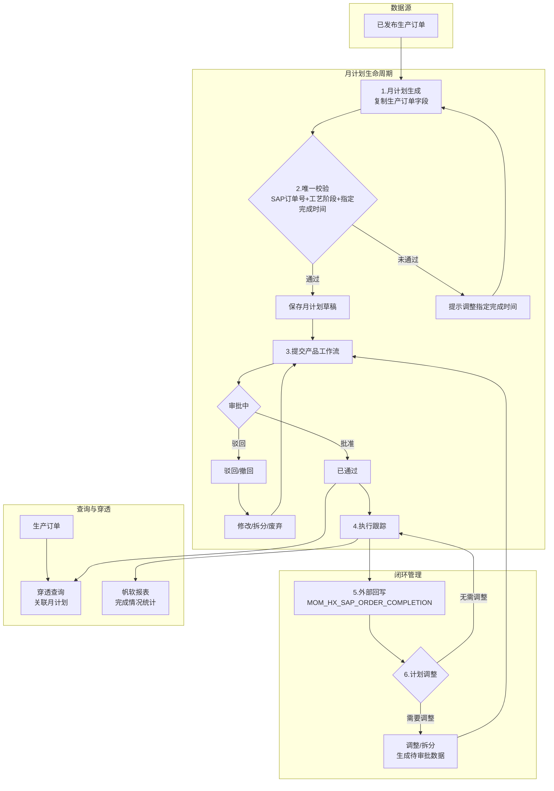
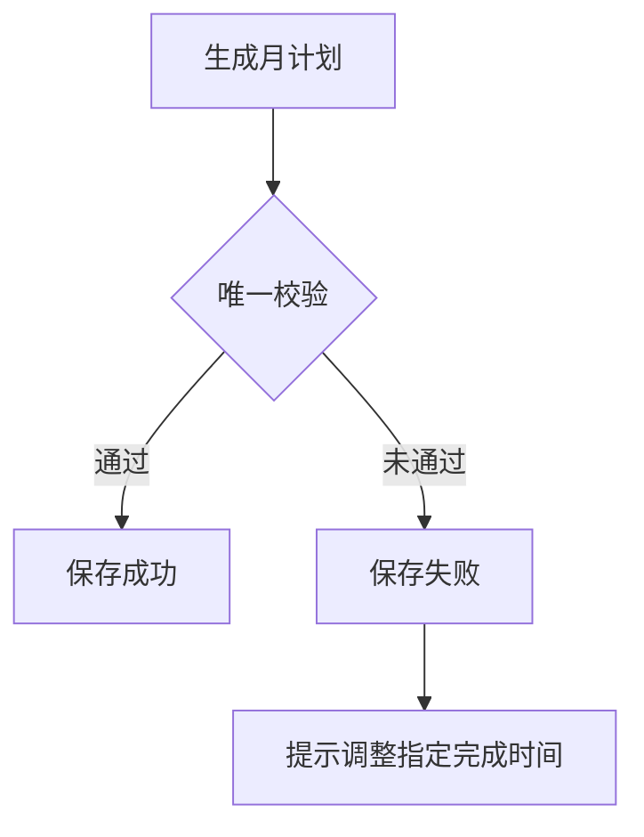
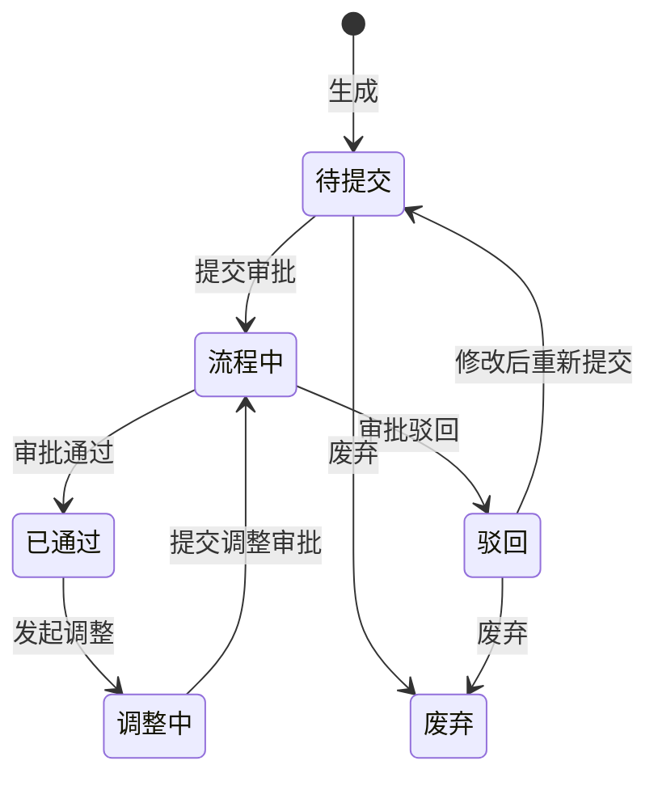
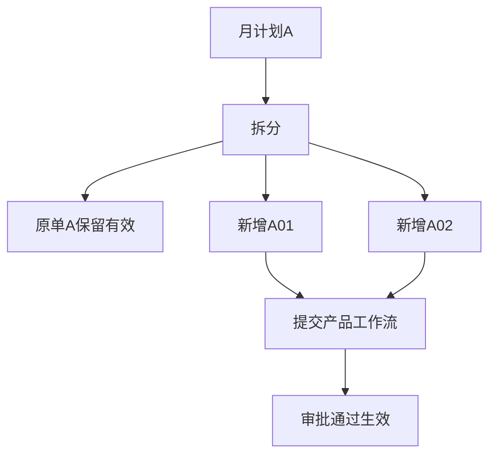
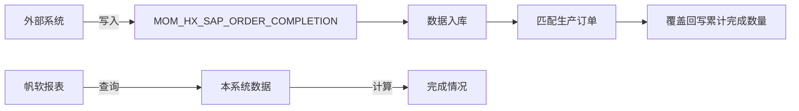

<!-- raw-to-wiki-ingest:auto -->

# 原始资料-项目文档-REQ-00040_月计划管理_业务流程文档

## 来源说明

- 原始路径：`wiki/02_HX项目资料/99_原始资料/bjhx_process/02_需求与方案/requirements/REQ-00040_月计划管理/process/REQ-00040_月计划管理_业务流程文档.md`
- 目标路径：`wiki/02_HX项目资料/99_原始资料镜像/bjhx_process/02_需求与方案/requirements/REQ-00040_月计划管理/process/REQ-00040_月计划管理_业务流程文档.md`
- 提取方式：`markdown`
- 说明：本页由统一入库脚本自动生成，不覆盖人工整理页。

## 原始内容镜像

## REQ-00040 月计划管理业务流程文档

> 北京航星eCOL-MES及cloudMOM项目

---

### 一、业务概述

#### 1.1 业务背景

月计划管理是北京航星eCOL-MES及cloudMOM项目中的核心生产计划模块，旨在实现从已发布生产订单到月度执行计划的自动生成、审批、跟踪与调整。该模块通过对接SAP生产订单数据，结合企业内部的产品工作流审批机制，形成完整的月计划生命周期管理体系。

#### 1.2 核心目标

1. 实现月计划的自动化生成与唯一性校验，避免重复计划
2. 建立完整的月计划状态管理机制（待提交/流程中/已通过/驳回/撤回/废弃）
3. 支持月计划的拆分与调整，满足生产任务的灵活分解需求
4. 实现外部累计完成数量向生产订单的自动回写
5. 支持生产订单穿透查询关联月计划，提升数据可追溯性
6. 预留SAP数据发送接口扩展点，支撑未来系统集成

#### 1.3 参与角色

| 角色 | 职责 | 操作范围 |
|------|------|---------|
| 计划员 | 负责月计划的生成、调整、拆分与提交 | 初始界面、调整界面 |
| 审批人员 | 通过产品工作流审核、批准或驳回月计划 | 产品工作流审批界面 |
| 系统 | 自动校验、状态流转、外部数据回写 | 后台自动处理 |
| 外部系统 | 通过MOM_HX_SAP_ORDER_COMPLETION表提供累计完成数量 | 外部数据接口 |

#### 1.4 主要业务流程阶段

月计划管理业务整体分为以下六个阶段：

1. **计划生成阶段**：从已发布生产订单提取数据，生成月计划草稿
2. **唯一校验阶段**：按SAP订单号+工艺阶段+指定完成时间进行唯一性校验
3. **审批流转阶段**：通过产品工作流提交审批，经历待提交/流程中/已通过等状态
4. **执行跟踪阶段**：通过帆软报表查询本系统数据并计算完成情况
5. **外部回写阶段**：外部表入库后同步回写生产订单累计完成数量
6. **计划调整阶段**：对已通过月计划进行调整或拆分，重新提交审批

##### 整体业务流程图

##### 关键业务节点说明

| 节点 | 业务动作 | 参与角色 | 关键规则与风险点 |
|------|---------|---------|----------------|
| **计划生成** | 从已发布生产订单复制字段生成月计划 | 系统/计划员 | **风险**：生产订单变更后可能重复生成；需明确是否允许同一订单多个月计划 |
| **唯一校验** | 按SAP订单号+工艺阶段+指定完成时间校验 | 系统 | **风险**：校验粒度未明确（到天/到月/到秒）；拆分后时间冲突 |
| **提交审批** | 勾选月计划提交产品工作流 | 计划员 | **风险**：流程中记录再次被提交会产生重复流程实例；需系统跳过并提示 |
| **审批流转** | 审批人员审核、批准或驳回 | 审批人员 | **风险**：审批期间数据被修改导致不一致；流程中状态需锁定为只读 |
| **外部回写** | 外部表数据覆盖回写生产订单 | 系统 | **风险**：匹配失败导致数据丢失；需记录异常原因不影响其他数据 |
| **计划调整** | 对已通过月计划调整或拆分 | 计划员 | **风险**：调整拆分后数据回流初始界面的状态标记规则未明确 |
| **生产订单穿透** | 从生产订单查看关联月计划 | 计划员/审批人员 | **风险**：已废弃数据是否显示未明确；需确认穿透查询的数据范围 |

---

### 二、功能模块详细拆解

#### 2.1 月计划生成与唯一校验

##### 2.1.1 功能说明

月计划的数据来源为已发布的生产订单，不再从交付分解表取数。系统通过复制生产订单的业务字段到月计划表，形成月计划快照。月计划表作为独立快照存在，普通计划修改不回写生产订单。

##### 2.1.2 生成规则

| 规则 | 处理方式 | 说明 |
|------|---------|------|
| 数据来源 | 只取已发布生产订单 | 不再从交付分解表取数 |
| 字段复制 | 复制生产订单业务字段到月计划表 | 月计划表作为快照，普通计划修改不回写生产订单 |
| 交付分解 | 月计划表保留交付分解相关字段 | 用于后续跟踪与统计 |

##### 2.1.3 唯一校验规则

未废弃的月计划按SAP订单号+工艺阶段+指定完成时间做唯一校验。校验逻辑如下：

| 校验项 | 规则 | 说明 |
|--------|------|------|
| 校验范围 | 仅针对未废弃的月计划记录 | 已废弃记录不参与唯一校验 |
| 校验维度 | SAP订单号 + 工艺阶段 + 指定完成时间 | 三个字段联合唯一 |
| 拆分校验 | 拆分新增记录必须填写不重复的指定完成时间 | 因未废弃数据按三字段联合唯一 |
| 重复处理 | 如果三字段与原单或其他未废弃记录重复，保存失败并提示用户调整指定完成时间 | 系统拒绝保存并给出明确提示 |

---

#### 2.2 月计划状态管理

##### 2.2.1 状态定义

月计划在整个生命周期中经历以下状态：

| 状态 | 初始界面处理 | 调整界面处理 |
|------|-------------|-------------|
| 待提交 | 允许废弃、修改、拆分、提交产品工作流 | 不在调整界面处理 |
| 驳回/撤回 | 允许废弃、修改、拆分、重新提交产品工作流 | 不在调整界面处理 |
| 流程中 | 只读显示，不允许废弃、修改、拆分 | 不在调整界面处理 |
| 已通过 | 只读显示，允许穿透查看 | 允许调整（生成待审批调整数据） |

##### 2.2.2 状态流转规则

- 待提交/驳回/撤回状态：计划员可执行修改、拆分、废弃、提交操作
- 流程中状态：锁定为只读，防止数据变更导致审批不一致
- 已通过状态：在初始界面只读，在调整界面可发起调整流程
- 废弃状态：不做物理删除，保留数据用于追溯，不参与唯一校验

---

#### 2.3 月计划拆分

##### 2.3.1 功能说明

月计划拆分功能允许将一条月计划按数量或时间维度拆分为多条子计划。拆分后原单保留有效，不提示是否删除原单。拆分新增记录需按正常月计划提交产品工作流，流程通过后正式生效。

##### 2.3.2 拆分规则

| 规则 | 处理方式 | 说明 |
|------|---------|------|
| 原单处理 | 拆分后原单保留有效 | 不提示是否删除原单 |
| 新增记录 | 按正常月计划提交产品工作流 | 流程通过后正式生效 |
| 时间校验 | 拆分新增记录必须填写不重复的指定完成时间 | 需通过唯一校验 |
| 重复处理 | 如果三字段与原单或其他未废弃记录重复，保存失败并提示调整指定完成时间 | 确保未废弃记录的唯一性 |

---

#### 2.4 月计划调整

##### 2.4.1 功能说明

月计划调整功能仅针对已通过产品工作流的月计划。调整界面不允许删除月计划（如需停用按后续业务规则处理，不做物理删除）。调整后生成待审批的调整数据，需重新提交产品工作流。

##### 2.4.2 调整规则

| 规则 | 处理方式 | 说明 |
|------|---------|------|
| 调整对象 | 只允许调整已通过产品工作流的月计划 | 未通过流程的数据在初始界面处理 |
| 删除限制 | 调整界面不允许删除月计划 | 如需停用按后续业务规则处理，不做物理删除 |
| 调整方式 | 调整后生成待审批调整数据 | 需重新提交产品工作流审批 |
| 数据回显 | 调整拆分后的记录会在初始界面显示 | 初始界面可查看所有状态月计划 |

---

#### 2.5 外部累计完成数量回写

##### 2.5.1 功能说明

外部系统通过MOM_HX_SAP_ORDER_COMPLETION表向本系统写入累计完成数量。数据入库后，系统按生产订单相关字段匹配月计划，并将最新累计完成数量覆盖回写至生产订单的累计完成数量字段。

##### 2.5.2 回写规则

| 规则 | 处理方式 | 说明 |
|------|---------|------|
| 回写时机 | 外部表入库后同步处理 | 不在帆软报表查询时回写 |
| 回写方式 | 按最新累计完成数量覆盖生产订单累计完成数量字段 | 不做增量累加，避免重复叠加 |
| 匹配口径 | 按生产订单相关字段匹配 | 具体字段按现有生产订单与完成情况表字段确定 |
| 异常处理 | 匹配不到生产订单时记录原因 | 不影响其他可匹配数据回写 |

##### 2.5.3 完成判定规则

| 判定项 | 规则 | 说明 |
|--------|------|------|
| 完成标准 | 累计完成数量 >= 月计划数量 | 满足即视为该条月计划任务完成 |
| 数据来源-外部 | MOM_HX_SAP_ORDER_COMPLETION表 | 按SAP订单号、工艺阶段、指定完成时间等维度匹配月计划 |
| 数据来源-内部 | 本系统生产订单、报工、完工等数据 | 由帆软报表查询本系统数据并计算完成情况，适用于总装、电装等系统内流转车间 |
| 报表边界 | 帆软报表查询本系统数据 | 不触发回写操作 |

---

#### 2.6 生产订单穿透月计划数据

##### 2.6.1 功能说明

在生产订单界面提供穿透查询功能，可查看与该生产订单关联的所有状态月计划数据，提升数据可追溯性。

##### 2.6.2 穿透规则

| 场景 | 处理方式 | 说明 |
|------|---------|------|
| 生产订单穿透 | 在生产订单点击月计划穿透，显示关联的所有状态月计划数据 | 包含待提交、流程中、已通过、驳回、撤回、废弃等全部状态 |

---

#### 2.7 产品工作流与SAP接口预留

##### 2.7.1 产品工作流规则

| 事项 | 处理方式 | 说明 |
|------|---------|------|
| 审批批准 | 仍走产品工作流 | 审核、批准、驳回、撤回、意见、时间以产品工作流记录为准 |
| 流程中提交 | 流程中月计划再次被勾选提交时，系统跳过并提示，不生成新流程实例 | 避免重复流程实例 |
| 批量提交 | 支持勾选、多选、反选、全选后提交产品工作流 | 流程中记录自动跳过 |

##### 2.7.2 SAP接口预留

月计划审批通过后，预留向SAP发送数据的接口扩展点。本次需求仅说明未来可能发送SAP，不定义具体接口字段和传输协议。

---

### 三、业务总结

#### 3.1 关键业务逻辑提炼

1. **唯一性控制**：通过SAP订单号+工艺阶段+指定完成时间的三字段联合唯一校验，确保未废弃月计划不重复
2. **状态机驱动**：月计划生命周期由状态机严格控制，不同状态对应不同的操作权限和界面入口
3. **快照隔离**：月计划表作为生产订单的快照，普通修改不回写源数据，保证计划执行的独立性
4. **覆盖式回写**：外部累计完成数量采用覆盖而非累加方式回写，避免数据重复叠加
5. **双轨查询**：外部导入数据与本系统流转数据分别通过不同渠道查询，适应不同车间的业务场景
6. **废弃而非删除**：月计划不做物理删除，通过废弃状态实现软删除，保留完整的数据追溯链

#### 3.2 整体实现目标

月计划管理模块的整体实现目标可概括为：建立一个以生产订单为源头、以月计划为核心、以产品工作流为审批驱动、以帆软报表为跟踪手段的闭环生产计划管理体系。该体系需满足以下要求：

- **数据一致性**：唯一校验和回写需保证数据一致性，避免重复流程实例和累计数量重复叠加
- **响应及时性**：废弃、唯一校验、拆分、调整、穿透查询、工作流提交和外部回写应响应及时
- **操作可追溯**：所有状态变更、调整记录、审批意见均需留痕，支持穿透查询
- **扩展兼容性**：预留SAP接口扩展点，支撑未来与SAP系统的深度集成

#### 3.3 待澄清事项汇总

在需求梳理过程中，识别出以下需在后续阶段澄清的关键问题（详见《REQ-00040_月计划管理_待澄清清单.md》）：

1. 指定完成时间的校验粒度（到天/到月/精确到时分秒）
2. 生产订单调整指定完成时间后是否允许重复生成月计划
3. 初始界面与调整界面的具体定义、数据范围与导航关系
4. 已废弃数据在两个界面的显示规则
5. 月计划拆分是否支持嵌套拆分
6. 已通过状态的月计划是否允许拆分
7. 月度计划的日期边界定义（如04-26到05-25归属哪个月份）
8. 调整界面生成的拆分记录是否回流到初始界面及其状态标记规则
